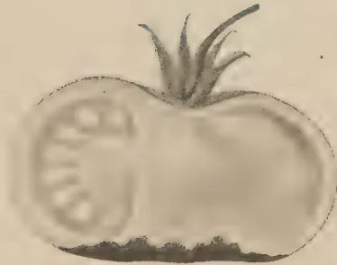
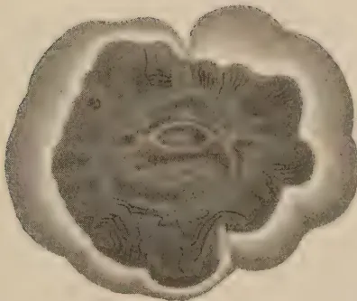
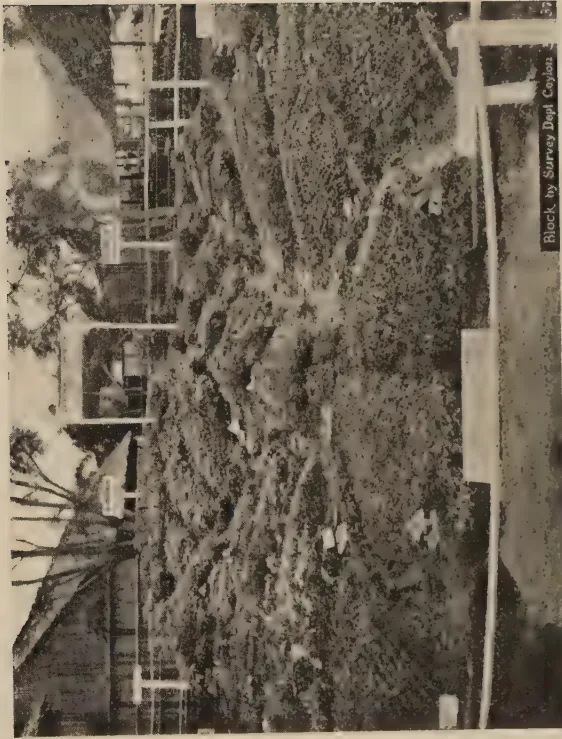

The  
Tropical Agriculturist  
October, 1937

---

EDITORIAL

---

OURSELVES

---

THE occasion for this editorial self-revelation is the contribution of the major portion of the original material published in this number by our readers outside the Department of Agriculture. While *The Tropical Agriculturist* has maintained a distinctive individuality of its own during the 56 years of its existence, the class of contributors it had from time to time has not remained the same.

In the old days of the Ceylon Agricultural Society this journal was the medium through which working planters and other agriculturists published the results of their experiments with the crops in which they were interested, while the research officers attached to the Royal Botanic Gardens at Peradeniya usually took their erudition to the editors of *The Annals of the Royal Botanic Gardens, Peradeniya*, or *Spolia Zeylanica*, both of which publications have now been merged into the *Ceylon Journal of Science*. With the formation of the Agricultural Department a gradual change took place. The officers of the Department became practical agriculturists themselves, or, at any rate, experimentation in the scientific aspects of practical agriculture, and not the pursuit of more or less pure science, became their principal concern. The pages of *The Tropical Agriculturist* began to be more and more monopolized by them. The creation of separate research institutes for the three major agricultural industries, two of

1------------------------------------------------

192

them with journals of their own, and the consequent pre-occupation of the Departmental officers with propaganda in connexion with the development of village agriculture set a limit to the subjects of general interest on which they could make useful contributions. Finally, the appointment of a non-technical administrative officer as the head of the Department not only deprived *The Tropical Agriculturist* of that source of original articles but also reduced the time available to the staff to produce scientific literature by the emphasis that he naturally laid on the economic as opposed to the scientific aspect of the Department's activities.

In these circumstances the editor sought to start the journal on a new period of useful life by re-establishing its old status as the agriculturists' own journal, in which he could play the part of author as well as reader. An attempt was made to enlist his co-operation in this endeavour, and while it cannot be said that the results have come up to the editor's sanguine expectations, it is with no little gratification that he publishes in this number articles by a planter and by the assistant Government Meteorologist respectively.

He is grateful to them and to the planters and other members of the public such as Messrs W. W. A. Phillips, H. W. R. Bertrand, E. C. K. Minor and P. A. Keiller, who responded to his call and hopes that their example will be followed by others.

2------------------------------------------------

193

## CEYLON'S LIVESTOCK INDUSTRY

---

R. H. SPENCER-SCHRADER

---

### PRESENT CONDITIONS

IT is, unfortunately, a fact that cannot be disputed that the livestock industry in Ceylon is in a very unsatisfactory condition today. I shall try to describe the present state of affairs, and then make some attempt to show how things may be improved.

Cattle are kept in Ceylon, as a general rule, for one of three purposes, dairy, draught and manure. In a few instances there is a fourth purpose, as a reserve of capital or a mark of wealth in the village. For the present I do not propose to touch on the dairy industry. I hope to deal with that subject later. Nowadays, when the motor lorry has, to a very great extent taken the place of the draught bull, the breeding of cattle for draught is not a paying proposition, and I do not propose to deal with this branch of the industry at all. Keeping cattle on estates for manure is a common practice, and is intimately connected with the native stock. It is this stock that needs most attention, and improvement is required here to a much greater extent than in either of the other two branches. I shall, for the present, therefore, confine myself to cattle kept for manure, especially on coconut estates.

The present system of grazing cattle on land for the purpose of manuring that land is a tragic farce. The chief offenders, I am afraid, are those owners of coconut estates who have never taken the trouble to consider that manure varies in value in direct proportion to the value of the ration fed. No greater mistake can be made than to imagine that the manure of cattle fed on grass only has the same value as that of cattle fed on concentrates, or that the manure of cattle fed on unmanured grass has the same value as that of cattle fed on highly cultivated fodders. Cattle have not got the faculty of creating anything

3------------------------------------------------

194

out of nothing ; all they can do is to transform the food they eat into manure. When it is considered that in the process of transformation those elements that are required for their own vital needs are retained in their bodies, it will be realized that as a plant food, the manure they produce is a little less valuable than the food they eat. Some of the nitrogen and other elements that the plants use as food are retained for the protoplasm of the cells in their bodies ; some of the calcium and phosphorus is retained for their bones. The manure, therefore, will contain a little less of these substances than were contained in the food eaten. To utilize cattle for manuring land by grazing them on that land, rather than increasing the fertility of the soil, is slowly and steadily depleting that soil of necessary plant food. The process is similar to putting back four cents into a till every time five cents is taken out. The ultimate results will be similar. Both would be empty—the till of money and the soil of fertility. The system cannot be too strongly condemned as being utterly uneconomical. It is, however, very common in Ceylon.

Several of the grasses usually found on coconut estates, such as Carpet grass and Doob, are good pasture grasses, but the yield is very small. To put the carrying capacity of land under these grasses at one head per fifteen acres, if the cattle are to be adequately fed, would not be far out. An estate of 150 acres should therefore not carry more than ten head. The usual practice of manuring is to tether two head to each palm for a week, so that each animal manures 26 palms per annum. On this basis, ten head grazed on 150 acres will manure  $4\frac{1}{2}$  acres per annum, so that to manure the whole estate would take a matter of 33 years ! Since this is much too slow the usual practice is to keep a very much larger herd on the land than it is capable of carrying. No consideration is paid to the fact that if fifty head are carried on land whose capacity is only ten, each animal will get only one-fifth of the food it should have.

Then, to economise in labour and to enable one man to tend a herd that really requires two men, it is the practice to yoke two head together. No consideration is paid to the fact that if two animals are grazed on ground that should really be covered by one, either each will get only half the quantity of

4------------------------------------------------

195

food available, or both will have to walk double the distance to get the full quantity necessary. Not only, then, is there starvation due to overstocking, but there is starvation due to this pernicious system of yoking cattle together. Deterioration is the inevitable result of starvation. Starved and debilitated cows cannot bear healthy calves, and starved and debilitated calves cannot develop into anything but scrub cattle.

If no thought is given to adequate feeding, a good deal less is given to the question of breeding. If, by chance, a likely bull calf is born in the herd, he is carefully looked after and either trained to the cart or sold. The only bulls left to run with the herd are the discarded scrubs. The result is that the sires of the next generation are the under-developed, starved, debilitated discards. Then, in course of time, the individuals in the herd become very closely related to each other, and close in-breeding, uncontrolled, is added to the other evils. And so deterioration goes on.

Ticks are looked on as the necessary adjunct of cattle. Their presence may be noted, but nothing is ever done to eradicate them. Let us give this question of ticks a few moments consideration. On land only moderately infested, to place the average number found on a cow at 500 would not be an exaggerated estimate. Allowing a tick two drops of blood a day for its sustenance, each member of the herd has to supply for the feeding of ticks, a wine glass full of blood daily. We thus have deterioration due to starvation, deterioration due to promiscuous in-breeding, and deterioration due to anaemia caused by ticks. The poor starved, under-developed, anaemic caricatures of cattle one sees on coconut estates today are the inevitable consequence. The worst feature is that these appalling conditions are not confined to coconut lands owned by ignorant villagers. There would be some excuse for them if they were. They obtain generally all over the country, whatever the race, colour or creed of the proprietor, and one will see them shamelessly exhibited on large estates owned by companies as well as on small plots owned by villagers.

Periodically one hears a good deal of talk about "Improving the Breed of Cattle," and the Government is blamed for not supplying stud bulls. The sole idea appears to be to introduce

5------------------------------------------------

196

a bull of some other breed into the herd. There never is any idea of changing existing conditions. Where a good bull is introduced into the herd, he loses condition quickly, and becomes useless. The attempt to "Improve the Breed" is then solemnly pronounced a failure. Now, it is an indisputable fact that cross-breeding, unless it is done with some definite object such as the evolution of a new breed, is likely to cause deterioration rather than improvement after the first cross. In the first generation the offspring may be an improvement on the inferior parent; they will not be so good as the superior. If these offspring are mated to an individual of the same breed as the inferior parent, then there is, at once, deterioration. If they are mated to an individual of the same breed as the superior parent, then there is, definitely, grading up. If the grading up is carried on systematically generation after generation, the eventual result will be the production of individuals which are equal to, but not an improvement on, the superior breed. The same result could have been achieved, in the first instance by scrapping entirely the inferior herd and investing in a herd of the superior breed. It stands to reason that there can be no improvement resulting from cross-breeding. A very common practice is to introduce a third breed into the scheme of "Improving the Breed," or to use cross-breds for mating. The resulting offspring of such a mating are mongrels, and it is impossible to agree with the proposition that the production of mongrels is "Improving the Breed." I believe the idea underlying these efforts of "Improvement" is really the introduction of new blood. In existing circumstances, the introduction of new blood as a result of good feeding is far more important than the introduction of new blood by bringing in a new bull into the herd. When one comes to think of it, to attempt improvement by breeding when the cattle are starved is farcical.

Let us turn for a while to conditions as they exist in the villages in the dry zone. While it is true that the cattle are only grazed, they are left, more or less, to fend for themselves. As a result of living in a state of nature only the fittest survive. The strongest and best developed bull leads the herd, and all the calves have him for sire. When he gets too old and weak to lead, his place is taken by the strongest of the young bulls. There is

6------------------------------------------------

197

in-breeding, it is true, but it is the sort of in-breeding which, owing to the fact that there is natural selection, makes for strength and not for weakness or deterioration. The herd ranges over a wide area for their grazing, and there is seldom yoking together, which is practically confined to coconut estates, to make herding easier. In the competition of the members of the herd for food, the weakest die out, and the land carries only as large a herd as there is food for. It is, really, only during periods of abnormal drought, that condition is lost to any great extent. In a normal dry season, loss of condition is barely perceptible. The good condition of village cattle in the dry zone is in marked contrast to the wretched condition of village cattle in the wet zone, where one would imagine that existence was a good deal easier. The reasons, I think, are obvious. In the first place, in the wet zone the area for grazing is comparatively small, since most of the land is either under cultivation or fenced in. In the second place, in a state of nature, there can be no deterioration, for, if there was, the race would die out. Where man, not having sufficient knowledge, not exercising sufficient care, and not having sufficient enterprise, interferes with nature, deterioration follows.

I do not think I have been guilty of exaggeration in the description I have given above of conditions as they exist today. There can be no question about the fact that they are very nearly as bad as they could possibly be. If the livestock industry is to be put on a sound basis, there must be a radical change in the system at present obtaining in the country. It is possible that a realization of the facts that fertility of the soil and the well-being of stock are intimately connected and interdependent on each other, and that starved stock means starved land, just as starved land means starved stock, will necessarily result in improvement. A proper perspective of the whole question of maintaining the fertility of the soil may help considerably. Above all, there must be more kindness and humanity towards the poor dumb beasts. People who would shrink at treading on a worm will look on, unmoved, at the refined cruelty of starving a herd of cattle, and, what is very much worse, allow such starvation on their own land.

7------------------------------------------------

198CATTLE AND SOIL FERTILITY

The maintenance of soil fertility is the most important question affecting agriculturists. There are two parts to the problem, the provision of plant food and the provision of humus. The practice usually obtaining in Ceylon is to provide plant food by the application of artificial fertilizers, and to supply humus by the cultivation of green manures. For some reason the application of farmyard manure, which supplies both plant food and humus, has never been popular. The former process is much easier and requires much less enterprise than the latter, and this, probably, is the reason for its finding greater favour with land-owners. I believe I am right in stating that, in many countries, farmyard manure is looked on as the best it is possible to apply to the land, and that artificials, eked out by green manures, are looked on merely as a substitute that is used in the absence of farmyard manure, or something that should be used for particular purposes. I also believe that the chief aim of agriculturists, when artificials are used in conjunction with green manures (or composts), is to create conditions in the soil which closely resemble those obtained by applying farmyard manure.

Anstead, retired Director of Agriculture, Madras Presidency, in "Agricultural Wealth from Waste," which appeared in Vol. XI, No. 3 of *Tropical Agriculture*, 1934, states: "There is an increasing mass of evidence to show that even crop yields cannot be maintained indefinitely by the use of artificial and mineral fertilizers alone, and that it is essential to maintain the humus content of the soil. This does not mean that the use of mineral fertilizers should be abandoned or their use neglected. There can be no doubt but that their cheapness and the facility with which they can be obtained has been of incalculable value to agriculture. It is of the utmost importance that such fertilizers should continue to be produced and methods devised to make them still cheaper and more readily obtainable. At the same time it is becoming more and more apparent that *their correct use is as a supplement to organic manures, and that the supply of the latter must also be increased.*" (The italics are mine).

I have already pointed out that it is a mistake to imagine that all farmyard manure, whether it is produced from pasture

8------------------------------------------------

199

grass or from concentrates, has the same value. The value of the manure varies in proportion to the food value of the ration fed. This means that a ration which has high protein and high mineral contents will produce a manure richer in nitrogen, phosphoric acid and potash than a ration in which the protein and mineral contents are low. The residual values have been worked out for Great Britain and published in Bulletin No. 48 issued by the Ministry of Agriculture and Fisheries of Great Britain. In the following table the protein, ash, calcium (as an oxide), and phosphoric acid contents of the feeding stuffs, and the residual values of the resulting manure are shown :

<table border="1">
<thead>
<tr>
<th rowspan="2"><i>Feeding Stuff</i></th>
<th rowspan="2"><i>Protein</i> %</th>
<th rowspan="2"><i>Ash</i> %</th>
<th rowspan="2"><i>CaO</i> %</th>
<th rowspan="2"><i>P2O5</i> %</th>
<th colspan="2"><i>Residual Value</i></th>
</tr>
<tr>
<th>s.</th>
<th>d.</th>
</tr>
</thead>
<tbody>
<tr>
<td>Cotton seed ..</td>
<td>42.1</td>
<td>6.0</td>
<td>0.34</td>
<td>2.78</td>
<td>20</td>
<td>2</td>
</tr>
<tr>
<td>Linseed ..</td>
<td>24.2</td>
<td>3.8</td>
<td>0.30</td>
<td>1.40</td>
<td>19</td>
<td>10</td>
</tr>
<tr>
<td>Coconut cake ..</td>
<td>19.5</td>
<td>6.4</td>
<td>0.50</td>
<td>1.50</td>
<td>18</td>
<td>0</td>
</tr>
<tr>
<td>Pollard ..</td>
<td>16.4</td>
<td>3.7</td>
<td>0.10</td>
<td>2.60</td>
<td>17</td>
<td>5</td>
</tr>
<tr>
<td>Maize ..</td>
<td>9.9</td>
<td>1.3</td>
<td>0.01</td>
<td>0.63</td>
<td>6</td>
<td>8</td>
</tr>
<tr>
<td>Pasture grass ..</td>
<td>5.3</td>
<td>2.1</td>
<td>0.25</td>
<td>0.16</td>
<td>3</td>
<td>11</td>
</tr>
</tbody>
</table>

From the above it will be seen that the feeding stuff containing the least value is pasture grass. The high value of coconut cake, which is a local product, is worthy of note. Gingelly cake, which is used to a great extent locally, has, I believe, very nearly the same value as linseed, the lime content being higher.

To place the same value on cattle fed only on pasture grass as one would place on the manure of cattle fed on concentrates containing a very much higher food value, purely because concentrates and pasture grass are both feeding stuffs would be just as absurd as to place equal values on iron and radium, purely because both are metals.

I have shown previously that it would be impossible to manure an estate with farmyard manure if cattle are to be fed on pasture grass grown on that estate only, and that, if the cattle are to be fed adequately it would take 33 years to go round. If the land is to be manured every year a large herd

9------------------------------------------------

200

will be required, and it will become necessary to feed them well on both concentrates and fodders, which it will be most economical to cultivate intensively. In the cultivation of fodders the first thing to bear in mind is that what is required is cattle food per acre, and not crop of grass per acre. It may be possible by treating the grass in a particular way to produce an enormous crop per acre, but it may be that grass so grown will be coarse and fibrous, and that 50 per cent. will be rejected by the cattle. On the other hand, treating the grass in a different way may result in smaller crop being produced. If, however, the whole of the smaller crop is eaten by the cattle, then the production of the latter is very much more economical than the production of the larger crop. Grass which is allowed to mature will be found to contain less protein and more fibre than the same grass if cut tender. The mature grass will give a bigger crop than the tender, but the latter, since protein is valuable while fibre is not, is to be preferred. Bulky organic manures tend to produce a coarse fodder that is much less palatable than the finer quality grass produced by using mineral fertilizers, so that the latter is to be preferred to the former as a manure. These are facts to which consideration must be given in the cultivation of fodders.

In following the system evolved by Mr. P. A. Norman of Outerwyke, Felpham, Bognor, which I have adapted to suit local conditions, I have had in view the fact that the fodders take up a good deal of the minerals, and that these are returned to the soil, *via* the cow, in the form of dung. There is, therefore, good reason for assuming that the intensive cultivation of fodders on a portion of the land will benefit the whole land.

Phosphoric acid and potash are not leached out of the soil to any great extent, although it is likely that the monsoon rains do cause some loss. The year's supply may, therefore, be put in in one application. Nitrates will, certainly, be lost, so it is most economical to apply the nitrogenous minerals in four three-monthly instalments. Both calcium and phosphorus are essential for the well-being of cattle, so basic slag is the best phosphatic

10------------------------------------------------

201

mineral to use. The programme of manuring is as follows :

*First Application.*—8 cwt. per acre of a mixture of :

<table>
<tr>
<td>Basic slag</td>
<td>..</td>
<td>..</td>
<td>..</td>
<td>75%</td>
</tr>
<tr>
<td>Muriate of potash</td>
<td>..</td>
<td>..</td>
<td>..</td>
<td>15%</td>
</tr>
<tr>
<td>Nitrate of soda</td>
<td>..</td>
<td>..</td>
<td>..</td>
<td>10%</td>
</tr>
</table>

*Second Application.*—1 cwt. Sulphate of ammonia, three months later.

*Third Application.*—2 cwt. Calcium Cyanamide, three months later.

*Fourth Application.*—1 cwt. Sulphate of ammonia, three months later.

In the third application the cyanamide may be replaced by compost, if it is considered desirable. Personally, I do not use cyanamide.

The cost of cultivation, if the above system is adopted, works out at Rs. 85.00 per acre per annum, and 80 tons of fodder is a reasonable crop to expect. There are, however, a few remarks I should like to make with regard to this system of cultivation :

1. 1. I have adopted a system used in a temperate climate, and it may be that, while it is giving me good results, a far better system, which will cost a good deal less is possible. In the absence of any data for Ceylon and its varying soils, especially with regard to using mineral fertilizers for grass, I cannot state definitely that the system is the best possible.
2. 2. Dr. A. W. R. Joachim has very kindly analysed some hay, made from Guinea grass cultivated here, on this system. The following table shows the calcium and phosphoric acid contents of this hay, Guinea grass grown in Jaffna (where the soil is derived from coral, which is an organic form of calcium and is, therefore, rich in phosphoric acid), and English pasture grass :

<table>
<thead>
<tr>
<th></th>
<th></th>
<th><math>CaO</math></th>
<th><math>P_2O_5</math></th>
</tr>
<tr>
<th></th>
<th></th>
<th>%</th>
<th>%</th>
</tr>
</thead>
<tbody>
<tr>
<td>Guinea grass hay</td>
<td>..</td>
<td>0.993</td>
<td>0.685</td>
</tr>
<tr>
<td>Guinea grass (Jaffna)</td>
<td>..</td>
<td>1.84</td>
<td>0.94</td>
</tr>
<tr>
<td>English pasture grass</td>
<td>..</td>
<td>0.25</td>
<td>0.16</td>
</tr>
</tbody>
</table>

11------------------------------------------------

202

While it is obvious that both these minerals are taken up by the grass, and that, where there is a deficiency, that deficiency may be made good by the application of the necessary minerals to the soil, it must be remembered that the most economical quantity to use would be that which the grass will assimilate. To apply more than the maximum quantity assimilated is not economical. Further, if the maximum quantity of phosphoric acid assimilated must be the deciding factor in the application of basic slag. Any extra calcium that the grass requires may be given by the application of lime in a cheaper form.

In calculating the quantity of food which a cow requires, the weight of the cow must be taken into consideration. As a general rule a cow requires one-fourth of her own weight in grass or other roughage per day. If there is a shortage of bulky feeding stuff, then concentrates must be given in addition, the quantity of the latter being calculated on its food value, *e.g.*, coconut cake is nearly four times as valuable as pasture grass, on its protein content, which is the chief consideration, and 7 lb. of coconut cake would be equivalent to 28 lb. of pasture grass. The protein content of well-cultivated fodder is higher than that of pasture grass, so that, if we assume that the type of cow usually used for manuring land weighs about 5 cwt. I do not think a ration of 2 lb. of concentrates and 1 cwt. of fodder per day would err very much on the side of underfeeding. When it is remembered that the quantity of manure dropped by a cow depends on the quantity of food she eats, then it will be seen that it would be possible to get the same quantity of manure from one acre of fodder and 25 cwt. of concentrates, whether these quantities are passed through one cow or through four. For the purpose of making a possible estimate, therefore, we shall assume that we are dealing with a herd of cows whose average weight is 5 cwt.

Allowing a cow 1 cwt. of fodder per day, the quantity required per annum will be 365 cwt. An acre of fodder yielding an annual crop of 80 tons will, therefore, feed 4 head. Then allowing a ration of concentrates of 2 lb. per day, the total quantity per annum will be  $6\frac{1}{2}$  cwt. The total quantity eaten

12------------------------------------------------

203

will be  $371\frac{1}{2}$  cwt. Assuming that, in the course of transforming this food into manure,  $11\frac{1}{2}$  cwt. is either retained by the cow or lost, we shall have 360 cwt. of manure, about 240 of which will be liquid, and cannot be taken into an estimate of the number of cattle required for manuring land. The liquid must not, of course, be considered lost, nor should it be allowed to go to waste. As a medium for activating compost it is second to none, and it should be used for this purpose.

Let us now consider the production of farmyard manure of good quality for the purpose of manuring, say, a hundred-acre coconut estate. The quantity of manure used is usually taken at  $1\frac{1}{2}$  cwt. per palm, so that a cow giving 120 cwt. of dung per annum will manure 80 palms. If 20 acres of the estate were planted up in fodder, 80 head could be fed. The balance 80 acres will be under the type of pasture usually found on coconut land, and allowing 16 acres per head, the total carrying capacity of the estate would be 85 head. The 20 acres under fodder will receive a heavy application of artificials, so that the coconut palms in this area will not require any farmyard manure. The fodder will need replanting periodically, and if the area is shifted annually, the whole estate will be under fodder once in five years, so that the manuring of the whole will be evenly distributed, and only 80 acres will be manured with farmyard manure each year. Taking the stand of palms at 60 per acre, then 4,800 palms will be the number to be manured, and this will require a herd of 60 head, 2 stud bulls and 58 cows. There will be an annual crop of calves which will require feeding, and the fodder and grazing in excess of the requirements for 60 head will be necessary for these.

As a general rule a cow bears a calf a year, and there should be 58 calves per annum. Making allowances, however, for accidents and irregular calvings, I think 50 calves would be a reasonable number to count on each year. Unless there is shocking bad management the mortality rate should not exceed 1 per cent. We shall, however, make an allowance of 10 per cent. The annual surplus stock for disposal will then be 45 head. The selling price varies in different parts of the country and is difficult to assess accurately. Some of the young stock will be retained, and some of the older stock will be sold

13------------------------------------------------

204

off every year, so I should think an average of Rs. 25.00 per head would not be an unduly optimistic value to place on the saleable surplus. This annual income of Rs. 1,125.00 must be set off against the cost of production of the manure.

The mixture of concentrates may be as follows :

<table>
<tr>
<td>Coconut cake</td>
<td>..</td>
<td>..</td>
<td>50%</td>
</tr>
<tr>
<td>Gingelly or linseed</td>
<td>..</td>
<td>..</td>
<td>10%</td>
</tr>
<tr>
<td>Pollard</td>
<td>..</td>
<td>..</td>
<td>40%</td>
</tr>
</table>

A ration of 2 lb. per day will do quite well, and will produce a good quality manure. At present prices the cost works out at 4½ cents per pound. To allow for variations, however, we shall take the cost at 5 cents per pound. The total cost of feeding concentrates will, therefore, work out at Rs. 36.50 per head per annum.

Since the cost of cultivation of the 20 acres under fodder will be debited to the cost of farmyard manure, the palms in this area must be accounted for as having been manured by the herd. The estimated cost of production for 100 acres of coconuts will be as follows :

<table>
<thead>
<tr>
<th></th>
<th>Rs.</th>
<th>Cts.</th>
</tr>
</thead>
<tbody>
<tr>
<td>Planting 20 acres in fodder grass @ Rs. 15.00 ..</td>
<td>300</td>
<td>00</td>
</tr>
<tr>
<td>Cultivation (including mineral fertilizers) @ Rs. 85.00 per acre .. .. .</td>
<td>1,700</td>
<td>00</td>
</tr>
<tr>
<td>Concentrates : 60 head @ Rs. 36.50 .. ..</td>
<td>2,190</td>
<td>00</td>
</tr>
<tr>
<td>Cattle-keepers and Sundries @ Rs. 50.00 per mensem</td>
<td>600</td>
<td>00</td>
</tr>
<tr>
<td style="text-align: right;">Total</td>
<td>4,790</td>
<td>00</td>
</tr>
<tr>
<td>Less income by sale of 45 head @ Rs. 25.00</td>
<td>1,125</td>
<td>00</td>
</tr>
<tr>
<td style="text-align: right;">Nett cost of Manure</td>
<td>3,665</td>
<td>00</td>
</tr>
</tbody>
</table>

I have not taken into account the manure of the calves, nor the value of the compost which is made from the liquid part of the droppings, and which would add a considerable quantity of humus to the soil. I have also omitted any income from sale of milk. Assuming that the average yield is only half a bottle per head per day, and that the value is only 10 cents per bottle, this will reduce the cost by nearly a third !

14------------------------------------------------

205

In arriving at the cost of artificial fertilizers and green manures for a hundred acres of coconuts I have taken the actual figures for the former from a small estate in my neighbourhood, where, perhaps, an expensive mixture is used. The cost is, actually, 50 cents per palm. The cost of green manures was given me by a well-known Visiting Agent at 15 cents per palm. The total on this basis would be 65 cents per palm, or Rs. 3,900.00 for the hundred acres. If, as is generally believed, farmyard manure is better than artificials, it will be seen that the inferior manure is actually more expensive than the superior. And yet one finds that, in Ceylon, artificials are more popular than farmyard. The reason for this state of affairs is difficult to understand, unless it be that people are too lazy and too lacking in enterprise to devote any care and attention to the production of farmyard manure. Buying artificials is so much easier than the production of the other! And it is curious that, while money is paid out readily for artificials to be applied direct to the soil, considerable hesitation is shown over any expenditure on feeding cattle that neither yield milk nor work in a cart. Conceivably this is due to the fact that, while artificials are looked on as something that will feed the plant, feeding stuffs are looked on as something that will only feed cattle, and that cattle that do no work should not be fed. It is high time, I think, that ideas on this point were changed radically, and that it be realised that feeding stuffs bought for cattle are, in reality, the raw material from which the best manure it is possible to get, is manufactured for the benefit of the soil.

It stands to reason that, if cattle are fed for manure, it is not only the soil that will benefit. Healthy cattle, well fed, will bear healthy calves; healthy calves, well fed, will develop into healthy cattle. And so the cycle is complete—improved soil due to improved stock, and improved stock due to improved soil. Look at the whole question how one will, one cannot get away from the fact that soil and stock are very closely connected and entirely interdependent, the one on the other.

15------------------------------------------------

206

## UNDERGROUND TEMPERATURES AT COLOMBO OBSERVATORY

A. P. KANDASAMY, B.Sc., F.R.Met.S., F.R.A.S.

*Assistant Superintendent, Colombo Observatory.*

KNOWLEDGE of the temperatures of the various layers of the soil is probably of some use to experimental agriculturists. In this note a brief account of the results obtained from an examination of the temperatures recorded at various depths at Colombo Observatory is given. The soil itself is sandy and of a type in which cinnamon used to thrive in the neighbourhood. It is well covered with grass, which during dry weather gets somewhat dried up, and the soil becomes soft and loose, not however to the extent of raising dust. But in rainy weather, the soil tends to get sodden, the rain water not draining away very quickly. Observations are taken at depths of 1', 2', 3', 4', 5' and 10'. Most of the results obtained are based on 15 years readings, from 1918-1933.

A few observations, in October, 1935, specially taken to study diurnal variations at the different depths, indicate that time of day has very little effect on temperatures at 2 ft. or below. It is likely that the daily fluctuations die out even before 2 ft. is reached. It was found that the maximum of the day at 1 ft. is reached between 8 and 9 p.m., while the minimum is recorded between 10 and 11 a.m. It was also shown that monthly means of the 9.30 a.m. and 3.30 p.m. readings could with sufficient accuracy be adopted as the monthly mean over 24 hours.

Monthly average temperatures are tabulated overleaf:

These averages are about as high as the monthly average maximum air temperatures in shade, and are 5 to  $5\frac{1}{2}^{\circ}$  F. higher than the monthly average air temperatures. The curves of monthly averages at the different depths are very similar in shape. The values at each depth pass through two maxima and two minima, the maxima occurring about April and

16------------------------------------------------

207

TABLE I  
UNDERGROUND TEMPERATURES AT COLOMBO OBSERVATORY—MONTHLY AVERAGES

<table border="1">
<thead>
<tr>
<th rowspan="2">Depth in feet</th>
<th rowspan="2">January</th>
<th rowspan="2">February</th>
<th rowspan="2">March</th>
<th rowspan="2">April</th>
<th rowspan="2">May</th>
<th rowspan="2">June</th>
<th rowspan="2">July</th>
<th rowspan="2">August</th>
<th rowspan="2">Sept.</th>
<th rowspan="2">October</th>
<th rowspan="2">Nov.</th>
<th rowspan="2">Dec.</th>
<th rowspan="2">Year</th>
<th>Annual</th>
</tr>
<tr>
<th>Range</th>
</tr>
</thead>
<tbody>
<tr>
<td>1</td>
<td>83.4</td>
<td>85.6</td>
<td>88.0</td>
<td>87.6</td>
<td>86.0</td>
<td>85.0</td>
<td>85.4</td>
<td>86.2</td>
<td>86.4</td>
<td>85.2</td>
<td>83.8</td>
<td>83.1</td>
<td>85.5</td>
<td>4.9</td>
</tr>
<tr>
<td>2</td>
<td>84.0</td>
<td>85.8</td>
<td>87.6</td>
<td>87.8</td>
<td>86.2</td>
<td>85.4</td>
<td>85.4</td>
<td>86.0</td>
<td>86.4</td>
<td>85.6</td>
<td>84.4</td>
<td>83.8</td>
<td>85.7</td>
<td>4.0</td>
</tr>
<tr>
<td>3</td>
<td>84.0</td>
<td>85.4</td>
<td>87.0</td>
<td>87.4</td>
<td>86.2</td>
<td>85.4</td>
<td>85.3</td>
<td>85.8</td>
<td>86.3</td>
<td>85.6</td>
<td>84.4</td>
<td>83.8</td>
<td>85.6</td>
<td>3.6</td>
</tr>
<tr>
<td>4</td>
<td>84.0</td>
<td>85.2</td>
<td>86.7</td>
<td>87.3</td>
<td>86.4</td>
<td>85.6</td>
<td>85.4</td>
<td>85.8</td>
<td>86.2</td>
<td>85.6</td>
<td>84.6</td>
<td>84.1</td>
<td>85.6</td>
<td>3.3</td>
</tr>
<tr>
<td>5</td>
<td>84.4</td>
<td>85.2</td>
<td>86.6</td>
<td>87.2</td>
<td>86.6</td>
<td>85.8</td>
<td>85.6</td>
<td>85.9</td>
<td>86.4</td>
<td>85.8</td>
<td>85.0</td>
<td>84.4</td>
<td>85.7</td>
<td>2.8</td>
</tr>
<tr>
<td>10</td>
<td>84.4</td>
<td>84.5</td>
<td>85.2</td>
<td>85.8</td>
<td>85.9</td>
<td>85.6</td>
<td>85.3</td>
<td>85.2</td>
<td>85.5</td>
<td>85.5</td>
<td>85.1</td>
<td>84.7</td>
<td>85.2</td>
<td>1.5</td>
</tr>
</tbody>
</table>

17------------------------------------------------

208

September and the minima about July and December. In each case, the April maximum is the higher of the two maxima, while the December minimum is the lower of the two minima. The time of occurrence of either maximum or minimum is retarded with increasing depth, the maximum or minimum at 10 ft. being reached nearly one and a half months later than at 1 ft., giving a lag of 4 to 5 days per foot. The annual range of the monthly values decreases in geometric progression as the depth increases in arithmetic progression. From the rate of decrease of the annual variation it was computed that in the soil at Colombo Observatory the annual variation would be less than  $\frac{1}{2}^{\circ}$  F. below a depth of 19 ft., and that it would not be perceptible below 30 ft.

The extreme temperatures ever recorded at 9.30 a.m. or 3.30 p.m. during the 15 years 1918-1933 are given in the table below :

TABLE II  
EXTREME TEMPERATURES EVER RECORDED

<table border="1">
<thead>
<tr>
<th><i>Depth in feet</i></th>
<th><i>Highest</i></th>
<th><i>Lowest</i></th>
</tr>
</thead>
<tbody>
<tr>
<td>1</td>
<td>94.5</td>
<td>76.8c</td>
</tr>
<tr>
<td>2</td>
<td>94.0</td>
<td>78.0</td>
</tr>
<tr>
<td>3</td>
<td>92.0</td>
<td>80.9</td>
</tr>
<tr>
<td>4</td>
<td>90.6</td>
<td>81.9</td>
</tr>
<tr>
<td>5</td>
<td>90.3</td>
<td>82.6</td>
</tr>
<tr>
<td>10</td>
<td>88.3</td>
<td>83.0</td>
</tr>
</tbody>
</table>

\*The actual lowest was 76.3 but this observation seems suspicious

Rainfall seems to have an important effect on underground temperatures, as these temperatures commence to fall with the onset of the rainy season both in April and September, while the steepest rise is noticed in February, which at Colombo is the driest month, generally with very clear skies.

Those interested are referred to my paper on the same subject in the *Ceylon Journal of Science*, Section E., Vol. II, Part 2.

18------------------------------------------------

209

## DEPARTMENTAL NOTES

### CEYLON GRASSLANDS\*

J. E. SENARATNA, B.Sc. (Lond.), F.L.S.,  
*DEPARTMENT OF AGRICULTURE, CEYLON*

OVER 70 per cent. of the 25,332 square miles constituting Ceylon are undeveloped. There are no cultivated pastures as generally understood, pasturage being provided by naturally existing grazing grounds. To a small extent introduced grasses are cultivated for green fodder.

I shall consider these grazing grounds, for convenience, under three headings :

1. 1. Patana grazing grounds
2. 2. Semi-wild grazing grounds
3. 3. Coconut grazing grounds

#### PATANA GRAZING GROUNDS

Patanas form a distinct and homogeneous type of natural grassland with well-defined characters. Their total area is not known. Quoting Pearson (1899 and 1903) "Tennent almost certainly exaggerates when he says 'the extent of this patana-land is enormous in Ceylon, amounting to millions of acres.' The area of the district under consideration may be taken roughly as 200,000 acres (73,000 hectares). The flora of the patanas as a whole is composed of plants which, generally speaking, present characters which tend to reduce transpiration and to protect delicate parts from the injurious effects of intense illumination : broadly speaking it may thus be regarded as a 'Xerophyte-Association' in Warming's sense." Patanas are large savannah-like regions, mostly composed of coarse tussocky grasses, only the tender shoots of some of which are palatable.

\*A paper read before the Fourth International Grassland Congress at Aberystwyth, Wales, on 16th July, 1937

19------------------------------------------------

210

Patanas appear to be a climax type, to account for which several theories have been advanced. Characteristic patana country is found in Uva at altitudes from 2,000 to 4,500 feet. From the Uva patanas of these lower altitudes "wide and extensive tongues of patana-vegetation protrude into the forest on the eastern slopes of the central ridge, and even in places cross the summit of the ridge: thus, extensive patanas are found on Horton Plains (7,000 ft.), on the eastern slopes of Totapolla, up the Hakgala valley, and cross the ridge as far as Nuwara Eliya." Pearson's work should be consulted for a full account of the patana vegetation.

### SEMI-WILD GRAZING GROUNDS

Under this heading are considered abandoned cultivations reverting to scrub and jungle; lands cleared of forests but uncultivated, as borders of roads and fields; clearings in the forests; parklands, and similar vegetation. They constitute a heterogeneous assemblage with widely differing floras in various stages of succession. Perhaps the most important and useful for pasture purposes are the more or less homogeneous parklands, found in the eastern and east-central parts of the Island. They form an open forest with low xerophytic trees and an undergrowth of grass (*Savannenwald* of Schimper).

Parklands contain many palatable herbage species; trees and shrubs occur on them but are somewhat scattered. Thus, in their natural state they provide good grazing and they are easily convertible into good pastures. Tamankaduwa district about Polonnaruwa is described as a type of parkland. This region is one of the best natural grazing grounds in Ceylon at present, and for many years past cattle from the Eastern Province have been led here for fattening prior to marketing for beef.

Polonnaruwa is 200 feet above sea-level and has an average annual rainfall of 65 inches distributed as follows:

<table>
<tbody>
<tr>
<td>January ..</td>
<td>10.4 inches</td>
<td>July ..</td>
<td>1.3 inches</td>
</tr>
<tr>
<td>February ..</td>
<td>2.9 ,,</td>
<td>August ..</td>
<td>2.1 ,,</td>
</tr>
<tr>
<td>March ..</td>
<td>3.0 ,,</td>
<td>September ..</td>
<td>2.4 ,,</td>
</tr>
<tr>
<td>April ..</td>
<td>4.7 ,,</td>
<td>October ..</td>
<td>8.7 ,,</td>
</tr>
<tr>
<td>May ..</td>
<td>2.8 ,,</td>
<td>November ..</td>
<td>11.8 ,,</td>
</tr>
<tr>
<td>June ..</td>
<td>0.6 ,,</td>
<td>December ..</td>
<td>14.2 ,,</td>
</tr>
</tbody>
</table>

Although a limestone outcrop occurs in this region, the soil is slightly acid. The river Mahaweliganga flows through the

20------------------------------------------------

211

district and an ancient system of irrigation works including the tank Topawewa (tanks are ancient artificial lakes constructed for irrigation purposes, and may be several miles across), and channels (ten to twenty feet wide) of the Yoda-ela, keep the water table high.

An analysis of the sward of this region is particularly helpful in giving an idea of what exists to-day in spite of continuous open overgrazing for well over a hundred and perhaps several hundred years.

In the open spaces a mixture of grasses and leguminous plants occurs. In the light shade of trees and shrubs, generally pure strands of *Stenotaphrum dimidiatum* Brongn., or, on wetter soil, of *Paspalidium flavidum* A. Camus are found. In denser shade and in jungle and forest are large areas of *Cyrtococcum trigonum* A. Camus practically pure. By footpaths, animal tracks and oft-trampled areas generally, *Cynodon dactylon* Pers. forms a belt of varying width. This perennial grass appears to be a first coloniser. Fairly large areas, particularly on open spaces with hard poor soils, are covered by the tussocky *Aristida setacea* Retz., a large, coarse, unpalatable grass. *Iseilema laxum* Hack. is a locally abundant palatable grass limited to wet situations. At the water's edge and often floating are *Paspalidium geminatum* Stapf. and *Oryza fatua* Koenig. Another locally abundant grass is *Eragrostis coromandeliana* Trin., limited to rocky areas with shallow soil. Other common grasses generally distributed are *Chrysopogon montanus* Trin., *Amphilophis pertusa* Stapf., *Apocopis Wightii* Nees., *Chloris barbata* Sw. and *Digitaria marginata* Link.

Several leguminous plants occur in abundance. *Desmodium triflorum* DC. is found in most areas mixed with the grasses, particularly abundant where the herbage is often eaten down. On dry, sandy soils, it occurs pure, and in areas with thick luxuriant grass it is absent. *Alysicarpus vaginalis* DC. is a common plant throughout, abundant particularly near tanks, and on other wet situations. *Indigofera enneaphylla* Linn. occurs on the shallow soil overlying rocks; *I. nummularifolia* Livera in moist situations; the creeping *Atylosia scarabaeoides* Benth. has a scattered distribution; *Indigofera glabra* Linn., *I. hirsuta* Linn., *Tephrosia purpurea* Pers., *T. villosa* Pers.,

21------------------------------------------------

212

and *Crotalaria verrucosa* Linn. are all erect semi-woody plants one to three feet high, scattered over the region.

Analyses are given below of some typical areas in this region :

1. Open space with no trees near.

1 yard square :

<table border="1">
<thead>
<tr>
<th></th>
<th></th>
<th>Number of tiller-clumps or plants</th>
<th>Apparent space per cent. required</th>
</tr>
</thead>
<tbody>
<tr>
<td><i>Chrysopogon montanus</i> Trin.</td>
<td>..</td>
<td>230</td>
<td>75</td>
</tr>
<tr>
<td><i>Alysicarpus vaginalis</i> DC.</td>
<td>..</td>
<td>40</td>
<td>15</td>
</tr>
<tr>
<td><i>Desmodium triflorum</i> DC.</td>
<td>..</td>
<td>70</td>
<td>10</td>
</tr>
</tbody>
</table>

25 yards square, including above area, for other plants :

<table border="1">
<thead>
<tr>
<th></th>
<th></th>
<th></th>
<th>Number of plants</th>
</tr>
</thead>
<tbody>
<tr>
<td><i>Tephrosia purpurea</i> Pers.</td>
<td>..</td>
<td>..</td>
<td>20</td>
</tr>
<tr>
<td><i>Atylosia scarabaeoides</i> Benth.</td>
<td>..</td>
<td>..</td>
<td>20</td>
</tr>
<tr>
<td><i>Heylandia latebrosa</i> DC.</td>
<td>..</td>
<td>..</td>
<td>130</td>
</tr>
<tr>
<td><i>Curculigo orchoides</i> Gaertn.</td>
<td>..</td>
<td>..</td>
<td>220</td>
</tr>
</tbody>
</table>

2. Open space in the midst of large trees.

1 yard square :

<table border="1">
<thead>
<tr>
<th></th>
<th></th>
<th>Number of tiller-clumps or plants</th>
<th>Apparent space per cent. required</th>
</tr>
</thead>
<tbody>
<tr>
<td><i>Chrysopogon montanus</i> Trin.</td>
<td>..</td>
<td>120</td>
<td>80</td>
</tr>
<tr>
<td><i>Desmodium triflorum</i> DC.</td>
<td>..</td>
<td>40</td>
<td>20</td>
</tr>
</tbody>
</table>

25 yards square, including above area, for other plants :

<table border="1">
<thead>
<tr>
<th></th>
<th></th>
<th></th>
<th>Number of Plants</th>
</tr>
</thead>
<tbody>
<tr>
<td><i>Eragrostis coromandeliana</i> Trin.</td>
<td>..</td>
<td>..</td>
<td>80</td>
</tr>
<tr>
<td><i>Alloteropsis cimicina</i> Stapf.</td>
<td>..</td>
<td>..</td>
<td>10</td>
</tr>
<tr>
<td><i>Heimigymnia javanica</i> Alst.</td>
<td>..</td>
<td>..</td>
<td>10</td>
</tr>
<tr>
<td><i>Aristida setacea</i> Retz.</td>
<td>..</td>
<td>..</td>
<td>5</td>
</tr>
<tr>
<td><i>Alysicarpus vaginalis</i> DC.</td>
<td>..</td>
<td>..</td>
<td>40</td>
</tr>
<tr>
<td><i>Atylosia scarabaeoides</i> Benth.</td>
<td>..</td>
<td>..</td>
<td>20</td>
</tr>
<tr>
<td><i>Tephrosia purpurea</i> Pers.</td>
<td>..</td>
<td>..</td>
<td>25</td>
</tr>
<tr>
<td><i>T. villosa</i> Pers.</td>
<td>..</td>
<td>..</td>
<td>20</td>
</tr>
<tr>
<td><i>Phaseolus trilobus</i> Ait.</td>
<td>..</td>
<td>..</td>
<td>20</td>
</tr>
<tr>
<td><i>Indigofera hirsuta</i> Linn.</td>
<td>..</td>
<td>..</td>
<td>10</td>
</tr>
<tr>
<td><i>Heylandia latebrosa</i> DC.</td>
<td>..</td>
<td>..</td>
<td>80</td>
</tr>
<tr>
<td><i>Leucas zeylanica</i> Br.</td>
<td>..</td>
<td>..</td>
<td>30</td>
</tr>
<tr>
<td><i>Curculigo orchoides</i> Gaertn.</td>
<td>..</td>
<td>..</td>
<td>70</td>
</tr>
</tbody>
</table>

22------------------------------------------------

2133. Jungle.

1 yard square : *Cyrtococcum trigonum* A. Camus, pure.

25 yards square, including above area, for other plants :

<table style="width: 100%; border-collapse: collapse;">
<thead>
<tr>
<th style="text-align: left;"></th>
<th style="text-align: right; vertical-align: bottom;">Number of Plants</th>
</tr>
</thead>
<tbody>
<tr>
<td><i>Randia dumetorum</i> Lam.      ..      ..</td>
<td style="text-align: right;">..      9</td>
</tr>
<tr>
<td><i>Elephantopus scaber</i> Linn.      ..      ..</td>
<td style="text-align: right;">..      15</td>
</tr>
</tbody>
</table>

It should be noted that during the dry season, June to September, herbage in the open spaces dries up, and cattle graze round tanks, water courses and similar situations still carrying a green sward. On the river banks a dense growth of palatable grasses occurs. For tank-border vegetation, Giritale tank is considered. During low water, from the water margin extending even up to 135 feet, is a zone consisting mostly of *Cynodon dactylon* Pers., *Digitaria longiflora* Pers., and *Desmodium triflorum* DC. Beyond this zone is a belt, sometimes up to 65 feet wide, of *Vetiveria zizanioides* Nash (marking the high-water level of the tank) which is not eaten by stock. Beyond that a mixture of grasses and leguminous plants occurs. In light shade *Stenotaphrum dimidiatum* Brongn., and in denser shade *Cyrtococcum trigonum* A. Camus dominate over large tracts. Sometimes, as in the Minneriya tank, a few feet wide belt of *Panicum repens* Linn. borders the water.

COCONUT GRAZING GROUNDS

About 1,100,000 acres are under coconut cultivation and this area provides by far the most important pasturage for livestock. The herbage on practically the whole of this area maintains animals kept on these lands for manurial, draught and other purposes. Coconut lands constitute mainly a coastal belt of varying width, generally about 20 miles, along the south and west (where it widens to over 40 miles about Kurunegala). Most of this area is under 500 feet above sea level, with a rainfall of 50 to over 100 inches. The whole region generally, and it applies equally to the rest of Ceylon, has acid soils with a pH varying from 5.5 to 7.0.

The grazing provided is more or less uniform and consists of a mixture of grasses and leguminous plants. The mat-forming *Axonopus compressus* Beauv. is dominant over large areas of the

23------------------------------------------------

214

water region, with the leguminous *Desmodium triflorum* DC., but is sometimes pure. *Brachiaria distachya* Stapf. and *Paspalum conjugatum* Berg. occur in similar habitats. *Chrysopogon aciculatus* Trin. often dominates on neglected lands throughout the whole region. It is a very drought-resistant grass but it becomes unpalatable after flowering, owing to the awns. *Stenotaphrum dimidiatum* Brongn. is not common but may be found along hedges. In fairly heavy shade and round the boles of coconut palms *Cyrtococcum trigonum* A. Camus occurs. On wet clayey soils *Paspalum Metzii* Steud. and *Ischaemum muticum* Linn. abound; on similar habitats, particularly near water, as well as on hard dry soils and roadsides. *Panicum repens* Linn. is often found. *Ischaemum ciliare* Retz. and *I. timoreense* Kunth. are generally distributed. The creeping *Digitaria longiflora* Pers. is characteristic of poor sandy soils. By footpaths and similar areas are *Cynodon dactylon* Pers., *Eleusine indica* Gaertn. and *Chrysopogon aciculatus* Trin., in the drier parts *Chloris barbata* Sw. occurs on roadsides. On badly neglected lands of the wetter region *Imperata cylindrica* Beauv., and in the drier parts *Aristida setacea* Retz. are not uncommon. Many species are occasionals in this region; *Digitaria marginata* Link, *Echinochloa colona* Link, *Dactyloctenium aegyptium* Richt., *Alloteropsis cimicina* Stapf., *Hemigymnia javanica* Alst., *Sporobolus diander* Beauv., *Eragrostis tenella* R. and S., *E. viscosa* Trin. and *Amphilophis pertusa* Stapf. Of leguminous plants occurring mixed with the grasses, *Desmodium triflorum* DC., *D. heterophyllum* DC. and *Alysicarpus vaginalis* DC. are present almost everywhere, the first being abundant, the other two frequent or even occasional. Of species other than grasses and leguminous plants, particularly in the wetter region are *Ipomaea cymosa* R. and S. and *Asystasia gangetica* T. Anders., both fairly common palatable species; *Amarantus viridis* Linn., *Hedyotis auricularia* Linn., *Vernonia cinerea* Less., and *Mitracarpum villosum* Ch. and Schl. are unpalatable casuals; *Elephantopus scaber* Linn., *Tridax procumbens* Linn. and *Mimosa pudica* Linn. are common troublesome weeds.

In my paper (1936) on the relative palatability of some pasture species it was shown that the three common perennial

24------------------------------------------------

215

leguminous constituents of grasslands have a relatively high palatability. *Alysicarpus vaginalis* spreads all round from the base to a foot or more, and makes a sturdy growth mixed with grasses. *Desmodium triflorum* has long, creeping, slender stems rooting at nodes, and is choked out by densely growing grasses unless frequently grazed down. *D. heterophyllum* resembles the *Alysicarpus* in habit.

In the search for leguminous plants to combine with grasses in pasture, the *Alysicarpus* holds out most promise at present. The more palatable grasses are *Brachiaria distachya* Stapf., *Axonopus compressus* Beauv., *Stenotaphrum dimidiatum* Brong., *Digitaria marginata* Link, *Amphilophis pertusa* Stapf. and *Apluda mutica* Linn.

Throughout Ceylon, grasses for green fodder are cultivated to a small extent in plots of about one-tenth acre or less. The most successful at present are *Pennisetum purpureum* Schum. (Napier grass), *Panicum maximum* Jacq. (Guinea grass), *Tripsacum luxum* Nash (Guatemala grass) and *Saccharum officinarum* Linn. var. *uba* (Uba cane) generally. On swamps at low elevations *Brachiaria mutica* Stapf. (water grass) thrives luxuriantly. Above 1,500 feet *Paspalum dilatatum* Poir. is cultivated, but more especially for prevention of soil erosion. Trials carried out with these tall-growing, high-yielding grasses for grazing indicate great possibilities in this direction.

Some clovers occur naturalised in the hill country, as at Hakgala (5,500 feet), and attempts to find suitable strains for other areas should prove successful.

Ceylon is bountifully supplied with environmental conditions which indicate immense possibilities as a pastoral country. I express the hope that the potentiality develop into fact in a short time, perhaps in a few years.

#### LITERATURE

Pearson, H. H. W. (1899).—The Botany of the Ceylon Patanas. *The Journal of the Linnean Society, Botany*, Vol. XXXIV. pp. 300-365.

Pearson, H. H. W. and Parkin, J. (1903).—The Botany of the Ceylon Patanas—II. *The Journal of the Linnean Society, Botany*, Vol. XXXV. pp. 430-463.

Senaratna, J. E. (1933).—Grazing grounds and their Improvement in Ceylon. A Preliminary Note. *The Tropical Agriculturist*, Vol. LXXXI. pp. 273-282.

Senaratna, J. E. (1934).—Pasture Trials at Peradeniya. Some Notes on the Grasses under Trial. *The Tropical Agriculturist*, Vol. LXXXII. pp. 204-211 and 268-277.

Senaratna, J. E. (1936).—Pasture Trials at Peradeniya—II. Relative Palatability of some Pasture Species. *The Tropical Agriculturist*, Vol. LXXXVI. pp. 335-341.

25------------------------------------------------

216

## THE REARING OF CALVES

---

GEO. ERNST,

*MANAGER, FARM SCHOOL DAIRY, PERADENIYA*

---

**T**HE failure of adult cattle to reach the standard expected of them, no matter how well they are fed and looked after, may in most cases be traced to the lack of sufficient care and good management during the earlier stages of life. The chief factors which influence the successful rearing of calves are proper housing, precautions to be taken at birth and correct feeding.

### THE CALF PEN

No special type of building is required for housing calves, but it should provide for plenty of sunlight and fresh air. The ventilation should be such that cross-draughts are avoided.

A cement or cement-concrete floor is most suitable from a sanitary point of view, but the floor may also be constructed with paved bricks or rock stones set in cement. In cold climates the floor should be covered with straw or litter as a protection against chills.

When a number of calves are housed and fed in the same pen, care should be taken to see that the animals are of uniform size, as there is otherwise the likelihood of the weaker ones not getting the requisite quantity of food. An improved type of calf house with individual pens does away with this difficulty, and is particularly advantageous if a contagious disease has to be dealt with. In this type of building the pens, each 5 ft. square, are arranged on two sides of a central walk, and are partitioned with wooden planks which are fixed to iron posts. The partitions should be about 10 inches above the floor level to facilitate the cleaning of the pens. The front of the pen is provided with palings and each pen is fitted with a hay rack and trough for food and water. The floor slopes towards the

26------------------------------------------------

217

centre of the building and is drained by two gullies on either side of the central walk.

A paddock for exercising the calves should be provided in close proximity to the calf pen.

### THE NEW-BORN CALF

At the time of calving a bedding of clean straw should be provided for the reception of the calf. As soon as the calf is dropped it should be removed to its pen and the navel cord ligatured. The ligature may be of soft twine, which has been saturated in tincture of iodine or a solution of corrosive sublimate (strength 1 in 500) and should be tied about an inch below the navel ring. The cord should then be cut off about half an inch below the ligature, and the stump painted with iodine or touched with copper sulphate.

The calf should then be rubbed down with wisps of straw until it is quite dry. It is essential that the ligature to the cord be applied immediately after the calf is born, before the cord can be contaminated with disease germs. If it happens that the calf has been born some time before it is noticed, the best procedure to adopt is not to ligature, but only to immerse the cord in a solution of iodine. Until it shrivels and dries up the cord should be dressed twice daily with tincture of iodine. A little margosa oil is applied at frequent intervals to keep away the flies and thus prevent the navel from being infected with maggots. Neglect in taking these precautions may result in "white scour" and pneumonia amongst calves.

### FEEDING THE CALF

Calves may either be suckled, or weaned at birth and hand-fed.

The practice of allowing the calves to suckle has the advantage of requiring less labour and, being the more natural method, is usually adopted. The drawbacks to this method are, first, that it does not permit of the thorough milking of the cow and invariably brings about udder troubles and, secondly, that the quantity of milk left for the calf has to be estimated by the milker, and as a result the calf is either underfed or overfed.

27------------------------------------------------

218

Hand-feeding does away with these difficulties and is recommended where labour is available, as it permits the systematic and restricted feeding of the calf.

It is essential that the calf should receive the Colostrum or first milk of the cow. The Colostrum contains a high percentage of albumin and its nutritive and laxative properties aid in starting off the digestive system correctly. In case the cow dies at calving, an useful substitute for Colostrum may be made by beating up an egg with half a pint of water, adding half a teaspoonful of castor oil and stirring in one pint of milk for each meal.

The welfare of the calf during the first month of its life is most important, and its progress is considerably retarded if it is not well looked after during this period. When calves are weaned at birth, the first feed should consist of two pints of Colostrum which should be given an hour or two after birth, when the calf is well on its feet. To induce the calf to drink, two fingers are dipped into a bowl of Colostrum, and inserted into the calf's mouth; the hand is then lowered into the bowl and the calf soon learns to drink by itself. A certain amount of patience however is required in some cases.

During the first two weeks the calf should be fed three times a day on six to eight pints of milk daily. Particular care should be taken to see that the milk is given fresh and at a temperature at which the calf would ordinarily get it from the cow. The milk pails and feeding utensils should be scalded with boiling water and kept scrupulously clean.

From the third week the daily allowance of milk may be given in two feeds, morning and evening.

When the calves are about a month old they usually commence to chew the cud and may be given a little straw or grass to nibble. At this stage the feeding of concentrates may be started. These are best given in the form of a dry food mixture and may consist of the following:—

<table>
<tbody>
<tr>
<td>Gingelly poonac</td>
<td>..</td>
<td>..</td>
<td>2 parts by weight</td>
</tr>
<tr>
<td>Pollard</td>
<td>..</td>
<td>..</td>
<td>3 do do</td>
</tr>
<tr>
<td>Coconut poonac</td>
<td>..</td>
<td>..</td>
<td>3 do do</td>
</tr>
<tr>
<td>Gram</td>
<td>..</td>
<td>..</td>
<td>1 part do</td>
</tr>
<tr>
<td>Fish meal</td>
<td>..</td>
<td>..</td>
<td>1 do do</td>
</tr>
</tbody>
</table>

28------------------------------------------------

219

About quarter of a pound of the mixture may first be placed at the bottom of the pail when the milk is being given, and the calf is gradually accustomed to the new diet by leaving a box containing some of the mixture in the calf pen.

The concentrate ration should then be increased by quarter of a pound once a fortnight, and this should be accompanied by the gradual decrease in the milk allowance.

At the sixth month the milk may be stopped entirely and the calf should get a concentrate ration of two and a half pounds daily. In the "dry feed" method of feeding, calves should always have access to water and given as much grass and straw as they can conveniently consume.

A suitable programme for feeding, which in some cases may have to be altered to suit the individual, is given below :

<table border="1">
<thead>
<tr>
<th><i>Month</i></th>
<th><i>Concentrates</i></th>
<th><i>Milk</i></th>
</tr>
</thead>
<tbody>
<tr>
<td>1</td>
<td>—</td>
<td>6 pints</td>
</tr>
<tr>
<td>2</td>
<td><math>\frac{1}{4}</math> lb.</td>
<td>4 do</td>
</tr>
<tr>
<td>3</td>
<td><math>\frac{3}{4}</math> lb.</td>
<td>4 do</td>
</tr>
<tr>
<td>4</td>
<td><math>1\frac{1}{4}</math> lb.</td>
<td>2 do</td>
</tr>
<tr>
<td>5</td>
<td><math>1\frac{3}{4}</math> lb.</td>
<td>2 do</td>
</tr>
<tr>
<td>6</td>
<td><math>2\frac{1}{2}</math> lb.</td>
<td>—</td>
</tr>
</tbody>
</table>

The maximum ration of two and a half pounds of mixture together with increasing quantities of straw and grass should be sufficient for the average calf until it is about a year old, but the concentrate allowance may be increased to about three and a half pounds if more rapid development is desired.

29------------------------------------------------

220

## BLOSSOM-END ROT OF TOMATO FRUITS\*

L. S. BERTUS,  
*ASSISTANT IN PLANT PATHOLOGY*

**B**LOSSOM-END rot is a peculiar disease of tomatoes and is a good example of a non-parasitic fruit rot. The disease is known to occur in most countries in which the fruit is grown and on all types of soil.

### SYMPTOMS

The disease first appears as a small, dark green, water-soaked patch at or near the blossom-end of the fruit and usually when the fruit is one-half or two-thirds grown. The trouble may appear on very young fruits although it frequently passes unnoticed. The patch darkens, becomes more distinct in appearance and definite in outline; it may remain small or may expand but the expansion usually ceases when the fruit begins to ripen unless a secondary rot takes place. As the affected area increases in size the flesh shrinks, so that the affected stigma or blossom-end is flattened. The skin over the affected portion becomes blackish-brown and leathery. Up to half the fruit may be discoloured and collapsed, but the rest remains sound unless invaded by secondary micro-organisms which may enter by way of the original injury and cause a soft rot. The illustration shows the type of damage caused by the disease.

### CAUSE

The disease is not caused by a parasitic organism. The decomposition of the tissue is brought about as the result of a deranged nutrition. The disease appears to be connected with soil conditions, especially with variation in the water supply; it is most severe on well-grown healthy plants where a sudden check to the water supply induces the disease. Insufficient water at the critical time in the development of the fruit is one

---

\*Also published as *Department of Agriculture, Ceylon, Leaflet No. 119*

30------------------------------------------------

A black and white illustration of a tomato with a stem. The tomato is shown in a cross-section, revealing internal damage. The left side of the tomato is cut away, showing a large, irregular, dark area of rot that extends from the stem towards the bottom. The right side of the tomato is intact, showing the normal internal structure.A black and white illustration of a tomato cross-section. The tomato is shown in a cross-section, revealing a large, dark, irregular area of rot that occupies most of the internal space. The rot is concentrated in the center and extends towards the edges, leaving a thin, lighter-colored ring around the perimeter. The stem is visible at the top.

Blocks by Survey Dept., Ceylon—4-11-37

**Blossom-end Rot of Tomato.**  
Surface view and section of diseased fruit.

31------------------------------------------------

This image is a scan of a blank page. The paper has a light beige or cream-colored tint. There are a few very small, dark specks scattered across the surface, which appear to be scanning artifacts or dust particles. No text, lines, or other markings are present on the page.

32------------------------------------------------

221

of the most important causal factors. Continued excessive watering produces the same effect if later the amount of water is reduced suddenly. If the water is reduced gradually, the disease may not appear at all. Most nitrogenous manures and especially fresh cattle manure increase the trouble. Over-manuring with large amounts of fertilizers is undesirable and has the effect of increasing the amount of blossom-end rot. Aeration of the soil decreases the tendency to the disease and also the application of lime which has some effect in modifying the influence of heavy watering.

#### CONTROL

Tomato plants should receive a regular supply of water, but not to excess. Watering the plants during very dry weather has been found helpful in controlling the disease. The drainage and aeration of the soil should be as good as it can be made. Excessive transpiration should be prevented by light shade and by shelter, the effect of which may to some extent be obtained by close planting. The soil may also be protected by trash of some description. Fresh cattle manure and large quantities of fertilizers should be avoided. On the other hand humus, such as green cover-crops or straw ploughed under, will give greater aeration, increase the water holding capacity of the soil, keep the temperature more uniform and prevent the damage considerably.

33------------------------------------------------

222

## SELECTED ARTICLES

---

### SOME ECONOMIC ASPECTS OF THE COCONUT INDUSTRY\*

---

Dr. REGINALD CHILD,

*DIRECTOR OF RESEARCH, COCONUT RESEARCH SCHEME (CEYLON)*

---

**T**HIS address I am dividing into two main sections. In the first I propose to consider the Coconut Industry in its general aspects, that is, its position in the World Markets, without special reference to its importance to our Island. In the second part, I will consider the industry in its local aspects. The two sections will not of course be sharply divided, since they are naturally not independent.

#### THE WORLD OIL AND FAT MARKETS

The Coconut Industry really means the Coconut Oil Industry in the sense that coconut cultivation as an industry depends primarily upon the demand in consuming countries for the oil.

Coconut oil is only one, albeit an important one, of many oils and fats which are in competition in the World's Markets.

So that the background against which we have to make our survey is the broad one of the World's Oil and Fat Markets. For the next few minutes, then, I will try to give you an idea of these markets, and particularly of what other products are in direct competition with coconut oil. Some references to the technical side of the industry must be made, but I will confine these as much as I can to what is essential to our purpose.

*Oils and Fats.*—The term *fat* is used for an oil which is solid at ordinary temperatures. Thus in Ceylon we refer to butter *fat* and coconut *oil*. In temperate climates coconut oil is a *fat*. It is accordingly better to lump them all together as "fatty oils," and I will do this in what follows.

Fatty oils are derived from animal sources, *e.g.*, butter fat, whale oil, tallow, lard; or from vegetable sources, *e.g.*, coconut oil, gingelly oil, margosa oil. They are sometimes referred to as "fixed oils" to distinguish them from "volatile oils" or "essential oils," such as citronella oil and other perfume

---

\* An address to the Ceylon Economic Society delivered on Monday, August 23rd, 1937

34------------------------------------------------

223

oils which are also derived from plant sources. They must also not be confused with "mineral oils," which come originally from the earth, such as "kerosene oil."

Fatty oils are distinguished from the other two classes of substances described as oils, *i.e.*—essential and mineral oils—by having certain chemical characteristics in common. I can best give you an idea of these characteristics by saying that all fatty oils can be converted into soap of a kind by boiling with caustic soda, and if suitably refined, they are all, with few exceptions, edible. The other two classes (to which I shall not refer again) cannot be converted into soap and are not edible.

Vegetable oils (I can drop the prefix "fatty" now, and in what follows "oils" will always refer to "fatty oils") come usually from the seeds and fruits of plants. Practically any plant seed gives a certain amount of oil—some, like the coconut, a large amount, some, like tea-seeds, a small amount. Chemists have actually studied and analysed the oils from nearly 2,000 different plants. Only about twenty of these are of economic importance. Similarly all animals have a certain amount of fat about them, but only whale oil, tallow and lard are of economic importance, with butter in a class by itself.

Of the twenty or so oils of economic importance enormous quantities are produced annually. Table I gives an approximate idea of their relative importance :

#### VEGETABLE OILS

<table>
<thead>
<tr>
<th></th>
<th></th>
<th></th>
<th></th>
<th><i>Tons</i></th>
<th></th>
</tr>
</thead>
<tbody>
<tr>
<td>Cotton Seed Oil</td>
<td>..</td>
<td>..</td>
<td>..</td>
<td>1,044,000</td>
<td></td>
</tr>
<tr>
<td>Groundnut Oil</td>
<td>..</td>
<td>..</td>
<td>..</td>
<td>1,010,000</td>
<td></td>
</tr>
<tr>
<td>Coconut Oil</td>
<td>..</td>
<td>..</td>
<td>..</td>
<td>940,450</td>
<td></td>
</tr>
<tr>
<td>Olive Oil</td>
<td>..</td>
<td>..</td>
<td>..</td>
<td>800,000</td>
<td></td>
</tr>
<tr>
<td>Linseed Oil</td>
<td>..</td>
<td>..</td>
<td>..</td>
<td>750,000</td>
<td></td>
</tr>
<tr>
<td>Soya Oil</td>
<td>..</td>
<td>..</td>
<td>..</td>
<td>618,000</td>
<td></td>
</tr>
<tr>
<td>Sunflower Oil</td>
<td>..</td>
<td>..</td>
<td>..</td>
<td>375,000</td>
<td></td>
</tr>
<tr>
<td>Palm Oil</td>
<td>..</td>
<td>..</td>
<td>..</td>
<td>330,000</td>
<td></td>
</tr>
<tr>
<td>Palm Kernel Oil</td>
<td>..</td>
<td>..</td>
<td>..</td>
<td>231,750</td>
<td></td>
</tr>
<tr>
<td>Rape Seed Oil</td>
<td>..</td>
<td>..</td>
<td>..</td>
<td>280,000</td>
<td></td>
</tr>
<tr>
<td>Gingelly Oil</td>
<td>..</td>
<td>..</td>
<td>..</td>
<td>180,000</td>
<td></td>
</tr>
<tr>
<td>Hemp Seed Oil</td>
<td>..</td>
<td>..</td>
<td>..</td>
<td>10,500</td>
<td></td>
</tr>
<tr>
<td>Castor Oil</td>
<td>..</td>
<td>..</td>
<td>..</td>
<td>58,800</td>
<td></td>
</tr>
<tr>
<td>Tung Oil</td>
<td>..</td>
<td>..</td>
<td>..</td>
<td>65,000</td>
<td></td>
</tr>
<tr>
<td>Maize Oil</td>
<td>..</td>
<td>..</td>
<td>..</td>
<td>35,000</td>
<td></td>
</tr>
<tr>
<td>Others (unclassified)</td>
<td>..</td>
<td>..</td>
<td>..</td>
<td>60,000</td>
<td>6,788,500</td>
</tr>
</tbody>
</table>

#### ANIMAL OILS

<table>
<tbody>
<tr>
<td>Lard</td>
<td>..</td>
<td>..</td>
<td>..</td>
<td>..</td>
<td>400,000</td>
<td></td>
</tr>
<tr>
<td>Tallow</td>
<td>..</td>
<td>..</td>
<td>..</td>
<td>..</td>
<td>320,000</td>
<td></td>
</tr>
<tr>
<td>Whale Oil</td>
<td>..</td>
<td>..</td>
<td>..</td>
<td>..</td>
<td>400,000</td>
<td>1,120,000</td>
</tr>
<tr>
<td></td>
<td></td>
<td></td>
<td></td>
<td></td>
<td></td>
<td>
7,908,500
</td>
</tr>
</tbody>
</table>

35------------------------------------------------

224

The total world exportable surplus of oils and fats is thus some eight million tons annually ; coconut oil accounts for some 12 per cent. of the total. I will anticipate the last section of this address by mentioning that Ceylon exports annually about 12 per cent. of the world's total exports of coconut oil, *i.e.*, about 1.44 per cent. of the world's total exportable surplus of oils and fats.

I have mentioned two chemical criteria of fatty oils—that they are edible and that they can be converted into soap. These, of course, correspond to the two main purposes for which the oils are used in industry—for margarine and other edible fats and for soap. It will be apparent that if all oils gave the same sort of soap or edible product, that is any oil could be substituted for any other in the manufacture of a soap or a margarine without altering the nature of the finished product, the economics of the oil industry would be simply the question of which oil can be produced most cheaply ; and of course, the cost of production is a factor in determining the amount of any particular oil entering world trade.

In practice, of course, the various oils, whilst having as mentioned, certain characteristics in common, at the same time have individual properties of their own. One oil of very characteristic properties will no doubt occur to you, *viz.*, castor oil. Then there is the class of oils known as "drying oil" because of their property of hardening in the air to waterproof films, which is the basis of their special use in paints and varnishes. Linseed oil is the best known of these ; tung oil is another member of the class.

### COCONUT OIL IN MARGARINE

Coconut oil and palm kernel oil have special characteristics of their own. In the first place, they are almost the only vegetable oils in large scale production which are in their natural state solid in temperate climates. Thus they were the first vegetable fats to be used in the manufacture of margarine. As you probably know margarine was first made in 1870 in France at the time of the Franco-Prussian War, the earliest margarine being almost entirely made from animal fat. Soon after this the use of vegetable fats in margarine was suggested, but the practical application of this had to await the improvement of refining methods. The earliest patent claiming the use of coconut oil in margarine seems to be that of Ruffin (E.P. 1827/1896). The first purely vegetable margarines came into the market about 1906.

### HARDENING OF FATS

With scientific developments in the chemistry of fats this advantage has largely disappeared. The development of the technique of hydrogenation or hardening, whereby liquid oils can be converted into solid fats of any required

36------------------------------------------------

225

consistency, dates from the purely academic researches of Sabatier and Sendrens in 1900/1902. By this technique large quantities of vegetable oils, as well as liquid marine animal oils, notably whale oil, are converted into solid fats and particularly since the war there was a notable increase in the use of whale oil in margarine manufacture. Some figures collected recently for the United Kingdom by the Imperial Economic Committee are of interest in this connection :

TABLE II

OILS AND FATS USED IN THE MANUFACTURE OF MARGARINE IN THE UNITED KINGDOM BY REPORTING FIRMS RESPONSIBLE FOR ABOUT 90 PER CENT. OF THE TOTAL PRODUCTION

<table border="1">
<thead>
<tr>
<th></th>
<th colspan="2"><i>Coconut Oil</i> (1,000 tons)</th>
<th colspan="2"><i>Per Cent.</i></th>
<th colspan="2"><i>Whale Oil</i> (1,000 tons)</th>
<th colspan="2"><i>Per Cent.</i></th>
<th colspan="2"><i>Total Oils</i> (1,000 tons)</th>
</tr>
</thead>
<tbody>
<tr>
<td>1927</td>
<td>..</td>
<td>44</td>
<td>..</td>
<td>27.7</td>
<td>..</td>
<td>25</td>
<td>..</td>
<td>15.7</td>
<td>..</td>
<td>159</td>
</tr>
<tr>
<td>1928</td>
<td>..</td>
<td>56</td>
<td>..</td>
<td>33.5</td>
<td>..</td>
<td>29</td>
<td>..</td>
<td>17.4</td>
<td>..</td>
<td>167</td>
</tr>
<tr>
<td>1929</td>
<td>..</td>
<td>57</td>
<td>..</td>
<td>32.4</td>
<td>..</td>
<td>29</td>
<td>..</td>
<td>16.5</td>
<td>..</td>
<td>176</td>
</tr>
<tr>
<td>1930</td>
<td>..</td>
<td>45</td>
<td>..</td>
<td>26.2</td>
<td>..</td>
<td>32</td>
<td>..</td>
<td>18.6</td>
<td>..</td>
<td>172</td>
</tr>
<tr>
<td>1931</td>
<td>..</td>
<td>45</td>
<td>..</td>
<td>28.8</td>
<td>..</td>
<td>34</td>
<td>..</td>
<td>21.8</td>
<td>..</td>
<td>156</td>
</tr>
<tr>
<td>1932</td>
<td>..</td>
<td>37</td>
<td>..</td>
<td>22.6</td>
<td>..</td>
<td>46</td>
<td>..</td>
<td>28.0</td>
<td>..</td>
<td>164</td>
</tr>
<tr>
<td>1933</td>
<td>..</td>
<td>28</td>
<td>..</td>
<td>19.0</td>
<td>..</td>
<td>56</td>
<td>..</td>
<td>37.8</td>
<td>..</td>
<td>148</td>
</tr>
<tr>
<td>1934</td>
<td>..</td>
<td>24</td>
<td>..</td>
<td>17.8</td>
<td>..</td>
<td>51</td>
<td>..</td>
<td>37.8</td>
<td>..</td>
<td>135</td>
</tr>
<tr>
<td>1935</td>
<td>..</td>
<td>31</td>
<td>..</td>
<td>20.8</td>
<td>..</td>
<td>55</td>
<td>..</td>
<td>36.9</td>
<td>..</td>
<td>149</td>
</tr>
</tbody>
</table>

### COCONUT OIL IN SOAP

Coconut oil and palm kernel oil possess certain characteristics which make them of special value in soap making, due to their high content of lauric acid. They yield hard free-lathering soaps and their use in some forms of soap is indispensable—for example, they alone yield soaps which will lather in sea-water. Coconut oil soaps are thus preferred in districts having hard water. Toilet and shaving soaps, and soap chips, which must have a hard soap base, prefer coconut oil.

This advantage is not likely to disappear yet.

The use of coconut oil in soap ante-dates its application in margarine by many decades. R. L. Sturtevant's patent (E.P. 8870/1841) is apparently the earliest claiming the use of coconut oil in soap and this can be regarded as approximately the starting date of the rise of the coconut oil industry. In fact we might almost prepare to celebrate in 1941 the centenary of the start of the coconut oil industry.

37------------------------------------------------

226

The first estate plantations in Ceylon were started in the Northern and Eastern Provinces about that date also. Earlier than that the western and southern coasts, as Ferguson records, were mostly lined with coconuts. In the first quarter of the nineteenth century, however, exports to Europe had hardly commenced, though it seems that there was even then a regular annual export to India of about 28,000 measures of oil and 3,500 cwt. of copra. It is interesting, as we shall see later, that we have got back to Indian trade to a large extent.

But to get back to our world survey, a little more must be said about coconut oil and its rivals.

We have seen that prior to 1870—in temperate climates animal fats were almost the only ones used for food, whereas now animal and vegetable fats are in competition. Butter is, of course, in a class by itself, but clearly any marked increase in butter production will reduce the demand for the better grades of margarine, and thus for coconut and other oils. This actually, happened about 1929 and was one of the factors contributing to the decline in prices we experienced from 1929-1934.

Similarly the production of lard in the United States of America influences the consumption of cotton seed oil in the manufacture of artificial cooking fats. Now in the animal the source of the fat, if we go back to the animal's diet, is the carbohydrate portion of the latter, for example, maize feed, and it will be seen in a broad way how the U.S.A. maize production will react on the hog-production, thus on lard production, and so finally affect the world's vegetable oil markets. Annual reports on the world's oil and fat markets nearly always commence with reports on maize crops and hog-killing in the U.S.A. It would be very interesting for you to follow up these passing remarks of mine by looking into the connection—a close one—between the world's grain markets and the world's oil and fat markets. I can hardly go further into it now.

We have by now acquired a rough idea of the sort of economic factor which may affect the price of our coconut oil. A failure of the maize crop in the U.S.A., an increase in dairying and butter production in Europe, or increased catching of whales in the Antarctic—all of these seem far enough away, but all have a definite influence on the price of copra in Colombo.

Before I pass on, I might just refer to whale oil once more. Not the least of the causes of the slump which is recent in our memory, was the enormous production of whale oil in the 1930-1931 season, amounting to 614,000 tons. The unsold surplus of this production, to quote a well-known review "weighed heavily on the market and continued to do so until the autumn of 1932." It "very largely contributed to the slump in oils and fats which has taken

38------------------------------------------------

227

place ever since then." The 1931-1932 season was severely limited to 153,000 tons and since then, still limited by agreement, has been steady at about 440,000 tons.

We have already glanced at some figures on the substitution of whale oil for others in margarine in the United Kingdom. Germany has been a big importer, but France and the U.S.A. have never taken large quantities. It can be taken that the substitution of whale oil for other oils has reached a steady state—that is for the most part, where it can be used, it is used. Any violent fluctuation of the market such as occurred after 1931 is not to be anticipated from whale oil.

### WORLD PRODUCTION OF COCONUT OIL

We must not lose sight of the fact that world production of coconut oil has shown on the whole a steady increase.

Nett exports of copra and coconut oil entering international trade. (All as copra).

TABLE III

<table>
<tbody>
<tr>
<td>1909-1913 (average)</td>
<td>..</td>
<td>..</td>
<td>..</td>
<td>607.6</td>
</tr>
<tr>
<td>1924</td>
<td>..</td>
<td>..</td>
<td>..</td>
<td>1122.4</td>
</tr>
<tr>
<td>1925</td>
<td>..</td>
<td>..</td>
<td>..</td>
<td>1155.0</td>
</tr>
<tr>
<td>1926</td>
<td>..</td>
<td>..</td>
<td>..</td>
<td>1273.7</td>
</tr>
<tr>
<td>1927</td>
<td>..</td>
<td>..</td>
<td>..</td>
<td>1237.5</td>
</tr>
<tr>
<td>1928</td>
<td>..</td>
<td>..</td>
<td>..</td>
<td>1506.5</td>
</tr>
<tr>
<td>1929</td>
<td>..</td>
<td>..</td>
<td>..</td>
<td>1560.1</td>
</tr>
<tr>
<td>1930</td>
<td>..</td>
<td>..</td>
<td>..</td>
<td>1345.1</td>
</tr>
<tr>
<td>1931</td>
<td>..</td>
<td>..</td>
<td>..</td>
<td>1066.2</td>
</tr>
<tr>
<td>1932</td>
<td>..</td>
<td>..</td>
<td>..</td>
<td>1040.2</td>
</tr>
<tr>
<td>1933</td>
<td>..</td>
<td>..</td>
<td>..</td>
<td>1305.8</td>
</tr>
<tr>
<td>1934</td>
<td>..</td>
<td>..</td>
<td>..</td>
<td>1354.3</td>
</tr>
<tr>
<td>1935</td>
<td>..</td>
<td>..</td>
<td>..</td>
<td>1295.4</td>
</tr>
<tr>
<td>1936</td>
<td>..</td>
<td>..</td>
<td>..</td>
<td>1254.1</td>
</tr>
</tbody>
</table>

From what information we have of planted acreages in the world, it seems likely that copra and oil production should continue to show a slight general increase for some years to come. Ceylon maintained its share of this world trade up to 1934, which was Ceylon's best year ever for exports. In fact, just as world production, annual average for 1924-1934, was almost double the annual average 1909-1913, so Ceylon's exports for the years 1924-1934 averaged

39------------------------------------------------

228

annually nearly double the annual exports for 1909-1913. I shall refer to these figures again in the second part of my lecture.

We must now almost conclude our world survey. But before passing on to our local industry, I must refer to another set of factors influencing international trade in oils and fats. So far we have been considering purely economic factors of the competition of one oil with another. The factors we are concerned with now can hardly be described as purely economic though as economists we have to take them into serious account. I mean, of course, fiscal questions, such as restrictive tariffs, quota systems, and the like, questions more often of politics than economics. One writer, whose views are entitled to respect, described recent restrictive legislation as "the artificial restrictions whereby all Governments fettered the free movement of commodities in the mania of ultra-nationalism which spread as a disease throughout the world since the Great War.

Protective legislation is of various kinds. A recent example is the 3-cent processing tax in the U.S.A., agitation for which came largely from the farmers of the Middle-West, and was vehemently opposed by the United States soap manufacturers. The object here and in similar cases is to encourage national agriculture, especially dairying. In other cases we find a desire to protect national oil-crushing interests—we have, for example, cases where copra is admitted duty-free, but not coconut oil. In India, as I shall mention later, copra is for this reason admitted at a lower rate than oil. Again in some cases refining interests are protected by imposing a high duty on refined edible oil, but none or a less duty on oil of non-edible grade. It is quite impossible for me to go into details in a short lecture. But I hope I have said enough to enable you to appreciate the multifarious and complicated tangle of factors which determine the price of a commodity like coconut oil. You will also, I hope, be able to study the raw material of statistics in the press and in the "Ceylon Trade Journal" with more understanding.

Now we are almost ready to pass on to the second part. To lead into that, I should like to recall what I said at the beginning—that of all these various factors, cost of production still remains a primary one. It is difficult to collect comparative data. For one thing animal fats are produced side by side with meat. Cotton seed oil, again, is not the main product of the plant, but a by-product. Groundnuts have to be planted every year. Coconut palms and oil palms are perennials. But it may be said in general that tropical oil seeds are, for various reasons, cheaper to produce than those grown in temperate climates, unless these are by-products like cotton seed oil.

Coconut oil being the product of a perennial and the supply thus being inelastic has been subject to greater fluctuations in price than other oils. The supply of oil from annual crops soon shortens in response to decreased demand. To put it simply, coconuts go on coming and you have to sell the

40------------------------------------------------

229

produce for what you can get. If groundnut oil is selling for less than cost of production, you don't plant any or you plant fewer groundnuts next season.

That must conclude our very brief survey of the World Markets in Oils and Fats, with special reference to coconut oil, and also end the first main section of my address. We will for the rest of the time devote our attention to our own local coconut industry.

### THE CEYLON COCONUT INDUSTRY

It will be apparent that Ceylon, as producing the small percentage we have noted of the world's oils and fats, has a negligible influence on the markets. The prices at which Ceylon copra and coconut oil are sold at any given time depend upon world movements over which we have little or no control.

We have compared the position of the main products of a perennial like the coconut, with that from an annual crop like the soybean, and also with a by-product oil like that from cotton seed. We have seen that coconut oil has lost some of its special position in the edible fat industries as a result of scientific developments increasing the degree to which one oil can be substituted for another; though scientific discoveries seem to indicate the possibility of increased use of coconut oil in another direction. And we have reached the conclusion, which was foreshadowed right at the beginning, that cost of production is a major factor in determining the demand for a particular oil.

I may enter upon my discussion of our local industry with a few words about the cost of production of coconuts and copra in Ceylon. An article on this subject I wrote for the "Ceylon Trade Journal" in April. I have made copies of this available to you this evening, so that I might be brief in this address. The conclusions I reached in that article were that coconuts can be produced in Ceylon at Rs. 15 per 1,000 and even less, without neglecting the agricultural condition of estates. I also recorded that cases of production costs as low as Rs. 7 and as high as Rs. 30 had been encountered.

It is very difficult, as I said just now, to institute a direct comparison with the cost of production of other oil seeds. But it seems to me likely that few products can compare with coconut oil for cheapness of production. In any case it appeared from the cost of production figures that I collected that even in 1934 estates on the western side of the Island could show a margin of profit. Prices in 1935, 1936 and 1937 to date, I think, can be said to show a margin over production cost that would be the envy of most products, agricultural or otherwise.

Now I must refer to some figures. In table IV(a) I have given the exports from Ceylon of the three major products exported—Copra, Oil and Desiccated—for the years 1910 to date. In table IV(b) I have converted these arbitrarily into nut equivalent, taking 320 nuts to a cwt. of desiccated, 240 to a cwt. of copra and 381 to a cwt. of oil.

41------------------------------------------------

230

These figures I shall have to go back to several times in what follows.

TABLE IV(a)  
EXPORTS FROM CEYLON OF COPRA, COCONUT OIL AND DESICCATED  
COCONUT IN CWT.  
1908-1936

<table border="1">
<thead>
<tr>
<th></th>
<th></th>
<th><i>Copra</i></th>
<th></th>
<th><i>Oil</i></th>
<th></th>
<th><i>Desiccated</i></th>
</tr>
</thead>
<tbody>
<tr>
<td>1908</td>
<td>..</td>
<td>748,739</td>
<td>..</td>
<td>644,348</td>
<td>..</td>
<td>246,452</td>
</tr>
<tr>
<td>1909</td>
<td>..</td>
<td>784,522</td>
<td>..</td>
<td>590,795</td>
<td>..</td>
<td>230,791</td>
</tr>
<tr>
<td>1910</td>
<td>..</td>
<td>758,711</td>
<td>..</td>
<td>619,680</td>
<td>..</td>
<td>242,286</td>
</tr>
<tr>
<td>1911</td>
<td>..</td>
<td>821,814</td>
<td>..</td>
<td>505,016</td>
<td>..</td>
<td>292,210</td>
</tr>
<tr>
<td>1912</td>
<td>..</td>
<td>614,089</td>
<td>..</td>
<td>401,779</td>
<td>..</td>
<td>278,806</td>
</tr>
<tr>
<td>1913</td>
<td>..</td>
<td>1,117,292</td>
<td>..</td>
<td>546,984</td>
<td>..</td>
<td>303,808</td>
</tr>
<tr>
<td>1914</td>
<td>..</td>
<td>1,411,947</td>
<td>..</td>
<td>486,286</td>
<td>..</td>
<td>311,864</td>
</tr>
<tr>
<td>1915</td>
<td>..</td>
<td>1,208,529</td>
<td>..</td>
<td>501,510</td>
<td>..</td>
<td>349,009</td>
</tr>
<tr>
<td>1916</td>
<td>..</td>
<td>1,309,939</td>
<td>..</td>
<td>323,017</td>
<td>..</td>
<td>306,149</td>
</tr>
<tr>
<td>1917</td>
<td>..</td>
<td>1,078,704</td>
<td>..</td>
<td>434,699</td>
<td>..</td>
<td>272,059</td>
</tr>
<tr>
<td>1918</td>
<td>..</td>
<td>1,272,321</td>
<td>..</td>
<td>527,481</td>
<td>..</td>
<td>203,366</td>
</tr>
<tr>
<td>1919</td>
<td>..</td>
<td>1,759,525</td>
<td>..</td>
<td>675,999</td>
<td>..</td>
<td>675,060</td>
</tr>
<tr>
<td>1920</td>
<td>..</td>
<td>1,357,870</td>
<td>..</td>
<td>507,527</td>
<td>..</td>
<td>518,735</td>
</tr>
<tr>
<td>1921</td>
<td>..</td>
<td>1,367,431</td>
<td>..</td>
<td>484,724</td>
<td>..</td>
<td>870,515</td>
</tr>
<tr>
<td>1922</td>
<td>..</td>
<td>1,686,589</td>
<td>..</td>
<td>554,626</td>
<td>..</td>
<td>768,215</td>
</tr>
<tr>
<td>1923</td>
<td>..</td>
<td>1,015,465</td>
<td>..</td>
<td>480,543</td>
<td>..</td>
<td>818,793</td>
</tr>
<tr>
<td>1924</td>
<td>..</td>
<td>1,769,189</td>
<td>..</td>
<td>552,633</td>
<td>..</td>
<td>871,341</td>
</tr>
<tr>
<td>1925</td>
<td>..</td>
<td>2,274,453</td>
<td>..</td>
<td>616,917</td>
<td>..</td>
<td>794,161</td>
</tr>
<tr>
<td>1926</td>
<td>..</td>
<td>2,419,398</td>
<td>..</td>
<td>570,463</td>
<td>..</td>
<td>754,367</td>
</tr>
<tr>
<td>1927</td>
<td>..</td>
<td>1,982,154</td>
<td>..</td>
<td>673,162</td>
<td>..</td>
<td>872,833</td>
</tr>
<tr>
<td>1928</td>
<td>..</td>
<td>1,976,656</td>
<td>..</td>
<td>779,113</td>
<td>..</td>
<td>786,703</td>
</tr>
<tr>
<td>1929</td>
<td>..</td>
<td>2,042,488</td>
<td>..</td>
<td>878,523</td>
<td>..</td>
<td>690,469</td>
</tr>
<tr>
<td>1930</td>
<td>..</td>
<td>1,816,481</td>
<td>..</td>
<td>761,729</td>
<td>..</td>
<td>702,300</td>
</tr>
<tr>
<td>1931</td>
<td>..</td>
<td>1,888,338</td>
<td>..</td>
<td>959,507</td>
<td>..</td>
<td>661,721</td>
</tr>
<tr>
<td>1932</td>
<td>..</td>
<td>912,522</td>
<td>..</td>
<td>1,012,307</td>
<td>..</td>
<td>599,033</td>
</tr>
<tr>
<td>1933</td>
<td>..</td>
<td>1,290,906</td>
<td>..</td>
<td>1,051,358</td>
<td>..</td>
<td>785,869</td>
</tr>
<tr>
<td>1934</td>
<td>..</td>
<td>2,113,620</td>
<td>..</td>
<td>1,396,766</td>
<td>..</td>
<td>649,182</td>
</tr>
<tr>
<td>1935</td>
<td>..</td>
<td>975,213</td>
<td>..</td>
<td>1,109,353</td>
<td>..</td>
<td>664,354</td>
</tr>
<tr>
<td>1936</td>
<td>..</td>
<td>1,035,476</td>
<td>..</td>
<td>689,229</td>
<td>..</td>
<td>601,774</td>
</tr>
</tbody>
</table>

42------------------------------------------------

231TABLE IV(b)

EXPORTS OF COPRA, COCONUT OIL AND DESICCATED COCONUT IN  
EQUIVALENT OF NUTS (1,000's)

| cwt. Copra = 240 nuts

| cwt. Oil = 381 ,,

| cwt. D. C. N. = 320 ,,

<table border="1">
<thead>
<tr>
<th></th>
<th><i>Copra</i> <i>cwt. × 240</i></th>
<th><i>Oil</i> <i>cwt. × 380.95</i></th>
<th><i>D.C.N.</i> <i>cwt. × 320</i></th>
<th><i>Total (nut equivalent)</i></th>
</tr>
</thead>
<tbody>
<tr><td>1908</td><td>179,697</td><td>245,464</td><td>78,864</td><td>504,025,000</td></tr>
<tr><td>1909</td><td>188,285</td><td>225,063</td><td>73,853</td><td>487,201,000</td></tr>
<tr><td>1910</td><td>182,090</td><td>236,067</td><td>77,531</td><td>495,688,000</td></tr>
<tr><td>1911</td><td>197,235</td><td>192,386</td><td>93,507</td><td>483,128,000</td></tr>
<tr><td>1912</td><td>147,381</td><td>153,058</td><td>89,218</td><td>389,657,000</td></tr>
<tr><td>1913</td><td>268,150</td><td>208,374</td><td>97,219</td><td>573,743,000</td></tr>
<tr><td>1914</td><td>338,867</td><td>185,249</td><td>99,796</td><td>623,912,000</td></tr>
<tr><td>1915</td><td>290,047</td><td>191,050</td><td>111,683</td><td>592,780,000</td></tr>
<tr><td>1916</td><td>314,385</td><td>123,053</td><td>97,968</td><td>535,406,000</td></tr>
<tr><td>1917</td><td>258,889</td><td>165,599</td><td>87,059</td><td>511,547,000</td></tr>
<tr><td>1918</td><td>305,357</td><td>200,944</td><td>68,077</td><td>571,378,000</td></tr>
<tr><td>1919</td><td>422,286</td><td>257,522</td><td>216,019</td><td>895,827,000</td></tr>
<tr><td>1920</td><td>325,889</td><td>193,342</td><td>165,995</td><td>685,226,000</td></tr>
<tr><td>1921</td><td>328,183</td><td>184,656</td><td>278,565</td><td>791,404,000</td></tr>
<tr><td>1922</td><td>404,781</td><td>211,285</td><td>245,829</td><td>861,895,000</td></tr>
<tr><td>1923</td><td>243,712</td><td>183,087</td><td>262,014</td><td>688,813,000</td></tr>
<tr><td>1924</td><td>424,605</td><td>210,553</td><td>278,829</td><td>913,987,000</td></tr>
<tr><td>1925</td><td>545,869</td><td>235,045</td><td>254,132</td><td>1,035,046,000</td></tr>
<tr><td>1926</td><td>580,655</td><td>217,318</td><td>241,397</td><td>1,039,370,000</td></tr>
<tr><td>1927</td><td>475,717</td><td>256,441</td><td>279,307</td><td>1,011,465,000</td></tr>
<tr><td>1928</td><td>474,397</td><td>296,803</td><td>251,745</td><td>1,022,945,000</td></tr>
<tr><td>1929</td><td>490,197</td><td>334,673</td><td>220,950</td><td>1,045,820,000</td></tr>
<tr><td>1930</td><td>435,955</td><td>290,219</td><td>224,736</td><td>950,910,000</td></tr>
<tr><td>1931</td><td>453,201</td><td>365,572</td><td>211,751</td><td>1,030,514,000</td></tr>
<tr><td>1932</td><td>219,005</td><td>385,689</td><td>191,691</td><td>796,385,000</td></tr>
<tr><td>1933</td><td>309,817</td><td>400,567</td><td>251,479</td><td>961,863,000</td></tr>
<tr><td>1934</td><td>507,269</td><td>532,098</td><td>207,738</td><td>1,247,105,000</td></tr>
<tr><td>1935</td><td>234,051</td><td>422,608</td><td>212,593</td><td>869,252,000</td></tr>
<tr><td>1936</td><td>248,514</td><td>262,562</td><td>192,568</td><td>703,644,000</td></tr>
</tbody>
</table>

Let us for the present consider some factors modifying the position of the local industry. We reached the point in our earlier consideration that Ceylon was such a comparatively small producer of oil that our position in the world's markets was uninfluential and rigid. The rigidity of course would be complete if coconut oil was the sole product of the coconut palm,

43------------------------------------------------

232

and if the world markets were conducted—as some think they should be—free from the restrictions imposed by that economic nationalism so common today.

*Local Consumption.*—Local consumption of coconuts in one form or another is important in most of the tropical producing countries, particular in Ceylon. It is estimated that local consumption accounts for something between 30 and 40 per cent. of total local production.

We may arrive at some sort of estimate of local consumption in the following way. There are reckoned to be about a million acres of bearing coconuts in the Island. If we assume an average yield of 1,500 nuts to the acre, the total annual production will be around 1,500 million nuts. Now as you will see from table IV, the average annual exports in recent years, account for about a thousand million nuts, leaving 500 millions as representing local consumption. This estimate is perhaps a little on the low side, but I should say that 800 million is the highest figure likely to be reasonable.

Now let us compare estimates for 1918, and for 1881, which were made I think by Mr. H. K. Rutherford. In 1918 he estimated the acreage at 800,000 with an average yield of 1,500 nuts per acre. Exports accounted for about 560 millions leaving 640 millions consumed locally. These and the 1881 figures are all collected below.

TABLE V

<table border="1">
<thead>
<tr>
<th><i>Year</i></th>
<th><i>Total estimated production of nuts (millions)</i></th>
<th><i>Nuts exported as copra, oil, etc. (millions)</i></th>
<th><i>Nuts consumed locally (millions)</i></th>
<th><i>Population of Ceylon approx.</i></th>
<th><i>Consumption per head</i></th>
</tr>
</thead>
<tbody>
<tr>
<td>1881</td>
<td>474</td>
<td>105</td>
<td>369</td>
<td>2,764,000</td>
<td>130</td>
</tr>
<tr>
<td>1918</td>
<td>1,200</td>
<td>560</td>
<td>640</td>
<td>4½ millions</td>
<td>142</td>
</tr>
<tr>
<td>1927</td>
<td>between</td>
<td>1,000</td>
<td>between</td>
<td>5 millions</td>
<td>between</td>
</tr>
<tr>
<td>to</td>
<td>1,500</td>
<td></td>
<td>500</td>
<td></td>
<td>100</td>
</tr>
<tr>
<td>1937</td>
<td>and</td>
<td></td>
<td>and</td>
<td></td>
<td>and</td>
</tr>
<tr>
<td></td>
<td>1,800</td>
<td></td>
<td>800</td>
<td></td>
<td>160</td>
</tr>
</tbody>
</table>

There surely must be something in the point of view that if 500 to 800 million nuts are consumed locally every year, price is an important factor to the home consumer? That is, a time of low prices like 1934, whilst disastrous to the producer, is at least of benefit to the local consumer. So, I think, we can regard local consumption as a factor distinctly modifying the position of coconuts as an industry in Ceylon; and distinctly to be taken into account side by side with the world factors we have previously considered.

We might go further and say that any increase in local consumption would be an advantage. It does not seem from the above figures that any appreciable increase in consumption has occurred *per capita*, but only in proportion to the increase in population. All of the estimates, 1881, 1918 and 1937 work

44------------------------------------------------

233

out at about 3 coconuts per head of the population per week. Local consumption occurs also in such forms as soap and toddy products. However, these can only be regarded as having a very remote influence on the industry. The total number of coconut trees licensed in 1933 for tapping were :

(a) for toddy 166,659

(b) for sweet toddy 69,311

and the total consumption of oil for local soap-making does not exceed 2,000 tons. These can only be regarded as minor portions of our protection against economic storms, though, of course, one which may have increasing value in slump time, when every little helps.

We have so far, you will have noticed, thought of the industry entirely in terms of coconut oil. As far as Ceylon is concerned we have another product of importance.

*Desiccated Coconut.*—Exports of desiccated coconut commenced from Ceylon in the late 1880's. Exports, about 12,000 cwt., in 1891 increased steadily. In 1901 they stood at about 145,000 cwt. and in 1911 had reached 292,000 cwt. After the war exports showed a sharp rise to 675,000 cwt. 1927 was the best year with 872,833 cwt. and since then exports average fairly steadily between 600,000 and 700,000 cwt., though there are unfortunately signs of a slight decrease in demand.

Desiccated thus accounts for some 20 per cent. of Ceylon's exports of coconut products. Since Ceylon and the Philippine Islands have hitherto enjoyed almost a monopoly of production, with the Philippines supplying almost exclusively the United States market. Desiccated coconut is a factor of no little importance to the industry in Ceylon.

Not that the market is independent of the World's Oil and Fat markets. Demand for Desiccated is a fairly steady one—indeed it is a product easily susceptible of over-production, and prices of Desiccated coconut follow the prices of coconut oil to a large extent, and only have a limited independent movement. That there is a slight independent movement is, however, apparent from our local experience. On estates in the Negombo-Chilaw districts it sometimes is more profitable to sell nuts to Desiccated millers than to cure them and sell copra. Sometimes the reverse is true, as has been the case for most of this year. Still, the Desiccated miller in the long run has to buy nuts at their copra value, which depends on the Oil markets. If he refrains presumably shortage of stocks will push up the Desiccated coconut price to a point at which the millers can again buy nuts. Similarly if nuts are obtainable cheaply owing to a slump in the copra market, an increase in Desiccated production may result and again bring the price to copra parity.

So that Desiccated is really quite closely tied to the Oil and Fat markets.

*Other Exported Products.*—Coir products account for about 10 per cent. of the coconut products exported from Ceylon. These are independent of

45------------------------------------------------

234

the Oil market and represent an additional source of income outside of the products of the kernel of the nut.

Charcoal is a minor product of some increasing importance, like coir independent of the Oil markets and giving an income additional to and not competing with other products.

Poonae, some million rupees worth of which are exported annually, should be mentioned, as it will serve to introduce our next topic.

*The Local Oil-Crushing Industry.*—Oil has been crushed in Ceylon for export for the best part of a century, and the existence of a stable oil-crushing industry in Ceylon has been not least of the factors which have given the Ceylon coconut industry its position.

A graph showing annual exports of Coconut Oil would show an almost unbroken rise from 1841 to 1934, the peak year when nearly 70,000 tons were exported.

Now the advantages of a local oil-crushing industry are fairly plain. There is the avoidance of shipping a product like copra which may suffer considerable deterioration on long sea voyages.

I might, whilst on the subject of freight, suggest that advantage would accrue from shipping oil in tankers, as is done from Manila, rather than in heavy steel drums. This would involve storage facilities in the harbour, but is probably well worth consideration.

Deterioration in transit is, of course, greater with lower quality copra, particularly with badly dried copra. A local oil-crushing industry tends to absorb locally the poorer grades of copra, or rather, shall I say, poorly dried copra, which, whilst not initially unsound, would deteriorate badly in transit. The quality of copra actually exported as such thus tends to be maintained at a high level.

Local oil crushing is usually cheaper, particularly as regards labour costs, than in Europe and America. The fact that crushing industries exist in Ceylon, the Philippines and increasingly in Malaya bear this out. Further as the copra is processed at an earlier stage, the oil produced contains less free fatty acid and requires less refining.

*Quality of Ceylon Copra.*—I have referred briefly above to the quality of Ceylon copra exported. As we all know, Ceylon F.M.S. has long been regarded as a superior grade. From over 100 analyses carried out in the past two years, and from what I have seen of samples at the Sales Room, I consider that this is being well maintained.

Ceylon copra, for reasons which are not very clear, contains a definitely higher oil percentage than, for example, Straits and Dutch East Indies copra, the difference amounting to between 2 and 3 per cent. This alone would justify a premium of 4 per cent. over the other grades.

46------------------------------------------------

235

With the European markets, copra in 1936 was little concerned. This year Germany, Holland and the Scandinavian countries have taken notable quantities, but the bulk of Ceylon copra (as apart from oil) continues to go to India. And this brings us to the last favourable factor affecting the Ceylon industry that I shall consider.

### THE INDIAN MARKET

<table border="1">
<thead>
<tr>
<th><i>Copra exports</i></th>
<th><i>Total (tons)</i></th>
<th><i>India</i></th>
<th><i>Europe</i></th>
</tr>
</thead>
<tbody>
<tr>
<td>1934 ..</td>
<td>105,681 ..</td>
<td>32,159 (30.4%) ..</td>
<td>34,662</td>
</tr>
<tr>
<td>1935 ..</td>
<td>48,616 ..</td>
<td>36,647 (75.4%) ..</td>
<td>10,619</td>
</tr>
<tr>
<td>1936 ..</td>
<td>51,813 ..</td>
<td>49,421 (95.4%) ..</td>
<td>2,368</td>
</tr>
<tr>
<td>1937 ..</td>
<td>26,130 ..</td>
<td>17,934 (68.6%) ..</td>
<td>7,634</td>
</tr>
</tbody>
</table>

(Seven months)

We have seen in the last few years a notable increase in the shipments of copra to India, to the extent that no less than 95 per cent. of the copra exported last year went to that destination. This year, as the figures show, the percentage going to India is still high, but more copra has been available for the local oil-crushing industry.

To comment adequately on the economic implications of this increased Indian trade would require a whole series of lectures, and indeed plenty of verbiage, both written and spoken, has been let loose on the subject on both sides of Adam's Bridge. Most of this, I am afraid, has generated more heat than light.

I would like to suggest to you, however, that when you consider the copra trade with India, you should remember that this trade has grown up from more or less natural economic causes. It has not been fostered by any particular effect or propaganda on the part of Ceylon, though, of course, we are now making an effort to stabilize and improve our position by the appointment of a Trade Commissioner in India. Ceylon copra is going to India because the Bombay and other millers want it and come here to buy it, in other words because there is a demand in excess of the local Indian supply. The accusation of "dumping" on the part of Ceylon, so often heard in Travancore, is merely absurd.

The existence of this large actual and potential market close at hand is of the greatest importance. It is to be hoped that this market will continue to contribute to the mutual advantage of Ceylon and her great neighbour. We have considered Ceylon's position in the world markets, and have paid particular attention to some factors which are on the whole favourable to us. At least we have not found reason to be unduly pessimistic. It does not seem to me that we must look outside for threats to the prosperity of the

47------------------------------------------------

236

industry. The dangers threatening us are mostly internal, and are our own look-out. So I feel that I must conclude with a few words of warning.

*Decline of Ceylon's Coconut Production.*—I have written and spoken these words of warning in several different places; but they are worth repeating again and again.

Ceylon's exports in 1936 of coconut products (Copra D.C.N., oil and fresh coconuts), represented only 73 per cent. of the average exports for 1927 to 1936. 1937 tends to be rather better as a result of more favourable weather conditions last year. But in general it cannot be doubted that production is showing a definite decline. I have summarised elsewhere what I consider the reasons for this. Briefly, my opinion is that they are as follows:

1. *Neglect of cultivation and manuring* particularly from 1931 onwards. During the period of the slump, large acreages were perforce neglected. Manuring, which is definitely not a paying proposition with prices below Rs. 20 per 1,000 nuts, was abandoned, and cultivation programmes curtailed.

Prices however, during 1935, 1936 and 1937 have shown, as I have suggested, a sufficient margin to justify, and even demand, that some return be made to the soil.

Apart from the important question of improving small-holdings, there are far too many larger properties run on the principle of taking whatever nuts may come and doing nothing else whatever.

2. *The increasing number of old areas.*—It is obvious that, since coconut cultivation as a plantation industry commenced in 1841, and the period of greatest expansion of planting from 1860 to 1880, there are large number of areas past their prime. Much more attention must be paid to replanting. Not a great deal of new land is likely to be planted up in coconuts in Ceylon, but there are plenty of areas which need replanting. In doing so the best selected material should be used. The Coconut Research Scheme has issued leaflets on the selection of seed nuts and seedlings. There is no doubt that if all old areas were being regularly replanted with material selected according to the directions given in these leaflets, Ceylon coconut production would in a few years time show a definite upward tendency once more. If replanting is neglected the present decline will go from bad to worse.

The technical advice of the Coconut Research Scheme is always available on these questions of cultivation and replanting. You will not, I am sure, disagree with me if I suggest that the existence of a body like the Coconut Research Scheme which can give much technical advice is another factor of value to the local Coconut Industry.

*The Financial Difficulties of the Industry* are rather outside my scope—I refer to the problems which arise from the joint ownership of land and the mortgaged state of many properties. Heavy profits have been made out of

48------------------------------------------------

237

coconuts, for example, in the boom period after the war. Too little of these profits were put back into the land, and what was put back was not always utilized in the most economical manner. It is probably true that some of our problems arise from the fact that "the fathers have eaten sour grapes and the children's teeth are put on edge." Don't let us make the same mistakes twice. With reasonable attention coconut properties still give a moderately good return. Our survey of the industry gives reason for moderate optimism provided that we tackle firmly our own local problems.

### CONCLUSION

We have started from a broad survey of World Trade in oils and fats and have gradually narrowed our focus until we have arrived at the consideration of the individual coconut property in Ceylon. I am aware that there are many economic aspects of the coconut industry upon which I have not touched ; but I will say in my own defence, that I chose the modest title for my lecture of "Some Aspects."

I trust that my selection of topics for discussion has been such as to enable you to have a clearer picture of the Coconut Industry of Ceylon and also of the setting in which the picture must be viewed.

49------------------------------------------------

238

## LAND EVERLASTING\*

### THE CONSERVATION OF THE COLONY'S SOIL AND WATER

---

ONE of the exhibits of the Coffee Team at the June Agricultural Show is portrayed in the accompanying photograph and was one of the outstanding displays in the show-ground. This model purports to depict in miniature a section of the country stretching from the Kinangop Forest Reserves to the Kiambu-Ruiru-Thika coffee areas. In the background is the forest area, in the middle distance is the native reserve, and in the foreground the coffee area. This model is divided into two halves : good and bad, as will be seen from Plate I.

On the left the trees of the virgin forest remain inviolate, clothing with their canopy and strengthening with their roots the water-sheds of the headwaters of the streams which later coalesce into the rivers which serve the African and European populations below ; down these rivers come the waters for domestic use, for stock, and for pulping and washing coffee. It is these forests indeed which are responsible for the springs that provide a steady, constant and adequate flow of water for the Ruaraka, the China, and all their many tributaries.

On the left again, in the native reserve, the crops are planted across the slopes and as far as possible on the flat tops of ridges, where are also the main pasture lands. The steep slopes and the banks of streams are left with their natural vegetation on them. These are just some of the measures which keep the rich surface soil from being deposited by rain into the rivers below, thus preserving the land fertile and the rivers clean.

Turning to the illustration once more, on the left, in the foreground, are the coffee plantations, contour or box-ridged wherever the slopes require such action. Napier grass is grown in plenty to provide mulch or compost which, together with manure from the cattle kept by the planter on the upper ridge, tends to enrich the soil and hold it in place instead of allowing it to be washed off into the river below.

Two coffee factories are shown ; owing to the measures taken above them for water conservation and cleanliness, these factories have ample clean water throughout the year for the preparation of their coffee, and seepage pits have been provided to which is conveyed the water used for the first washing, so that it does not pollute the water used in the factories further downstream.

---

\*By G. J. L. Burton in the *Monthly Bulletin of the Coffee Board of Kenya*, June, 1937. Only one photograph from the original Journal has been reproduced

50------------------------------------------------

A black and white photograph capturing a severe case of soil erosion on a hillside. The foreground and middle ground are dominated by a steep, eroded slope where the topsoil has been washed away, exposing a dense network of tree roots and tangled debris. The texture of the exposed earth and roots is highly detailed. In the background, a portion of a building with a tiled roof and a window is visible on the left. To the right, a simple wooden post-and-rail fence runs along the edge of the eroded area. The overall scene illustrates the destructive power of erosion on agricultural or developed land.

Block by Survey Dept. Ceylon

Plate I. Soil Erosion—A Warning

51------------------------------------------------

This image is a scan of a blank page. The paper has a light beige or cream-colored tint. There are a few very small, dark specks scattered across the surface, which appear to be scanning artifacts or dust particles. No text, lines, or other markings are present on the page.

52------------------------------------------------

239

The keynote of the left half of the picture is prosperity.

On the right the story is very different. Misuse of the land in the native reserve has so impoverished it that the inhabitants have been forced to migrate into the forest which has been partly cut out by man and further destroyed by goats. A few clumps of indigenous forest are left, reinforced by wattle plantations. Many springs have dried up and the streams are only semi-permanent, flooding during the rains and then going dry. Every rainstorm beats on to an unprotected soil or on to a soil exposed to the erosion of a crop planted downhill. Cattle tracks abound and the goat is as ubiquitous and destructive as the African can make him.

The coffee plantations below are in no better case, anti-erosion measures have been omitted and an impoverished soil is failing to support the planter. The two coffee factories have suffered badly and the water only reaches them during the rains and for the rest of the year lies in stagnant pools further up. The water that does come down is a dirty brown colour, contaminated with silt and further polluted by the failure of the coffee factories above to get rid of the water used for first washings through seepage pits; this water thus comes down polluted and ruins the quality of the coffee prepared in the factories below.

The keynote of the right half of the picture is poverty for both African and European. Not only is the land required to support the native population twice as great as that shown in the conditions on the left of the picture, but the life-blood of the whole community—the rivers and streams—has become a dirty and insufficient trickle.

The Forest Officers, the Agricultural Officers, the Administrative Officers, the Coffee Officers, and above all the community at large, both individually and through the offices of the Agricultural Society, the Arbor Society, the Coffee Board, and other such bodies, must band together and see to it that this section of Kenya here depicted never comes to the pass shown on the right of the picture.

That this warning is needed and that the present efforts to preserve the land must not be relaxed and should indeed be intensified, is amply illustrated by the present appalling condition of the Machakos and other Reserves. It can safely be said that the warning conveyed by this exhibit is not exaggerated and it is hoped that visitors to the Show took due note of it.

At the beginning of this article it was stated that this model was the work of the Coffee Team. It does indeed represent team work. It is one thing to conceive the idea and design it, quite another to execute it and fill in the details. This has largely fallen on the (as everyone will agree) capable shoulders of Mr. Pratt, the latest recruit to the team. To Messrs Wimbush and Gault, of the Forest Department, is due the planting up of the forest and to the latter we owe endless help with trees and hedges in other parts of the miniature. As this exhibit took shape, many serious difficulties cropped up, of which the incessant rain was not the least. That these obstacles have been surmounted has been due to the way in which the Coffee Team as a whole has rallied round the exhibit and both by advice and by manual labour has licked it into shape.

53------------------------------------------------

240

## QUALITY IN FOOD FROM THE AGRICULTURAL POINT OF VIEW\*

### INTRODUCTION

**A**GRICULTURAL opinion about quality in food amounts to little more than a mixture of complaints and questions. It is the object of this paper to explain current views on quality, to put forward problems needing solution, and to show in what ways the producer of food can control its quality.

Current views on quality are easy to grasp, being simple to the point of naivety. The producer is interested in quality only in so far as it pays. There was once pride in a really fat bullock or other forms of excellence of production for its own sake, but modern business methods have knocked most of the sentiment out of the farmer and now he will strive for high quality only for what it is worth.

Between farmer and consumer come a variety of dealers, wholesale and retail, and in some cases processors also, who may be bracketed together as the intermediary. In the agricultural view the intermediary gets it both ways over the matter of quality which serves him as a stick to beat the producer and as a bait to catch the consumer. He is very given to saying this or that is what the public wants: what he really means is this or that is what he himself finds it most profitable to handle.

The consumer's position is exceedingly strong in that he can buy or not buy as he pleases. But it is rendered weak by his credulity. The quality of the advertisement or the packet is, often enough, to him, the quality of the product. He has other guides but just as bad. Anything alleged to affect his health will impress him and he has been taught to know the importance of vitamins and that one of them can be got into him by irradiating his food. Cheapness is another guide to the consumer, being even more important than an attractive packet. Whether 10 per cent. of purchasers of lettuce, early potatoes, apples, beef or butter would pay 10 per cent. more for better flavour may be doubted. Consumers want many things beside food and it may be that the limitation to production of high quality grades will be the consumer's tendency, while buying himself a sufficient amount of food, to economize on quality.

There are, of course, certain conventional so-called standards of quality for various agricultural products, and two examples will show their nature.

---

\*By Prof. F. L. Ingledow, C.M.G., M.A. Drapers' Professor of Agriculture, Cambridge, in *Chemistry and Industry*, May 15, 1937

54------------------------------------------------

241

Take beef first. Families want small joints nowadays, so butchers want only medium-big bullocks. They want them well finished but not "Smithfield-show fat." That is the essence of the specification, which probably involves good eating quality by insistence on "finish" and would be all right if genuinely employed. After market day the official prices report reads "Beef 1st quality 42s. (per live cwt.) 2nd's 40s." No doubt a few beasts did sell at 42s., but the generality probably went at 39s. and whether they really were first quality or not was never settled. The farmer had to take what he was offered or take his beasts back home, and if the buyer saw plenty of good beasts on the market he knew many of them would have to sell cheaply because of the plenty. On the same market many fat cows would be sold—the fattened discards from dairy herds. They make inferior beef and sell cheaply, but cow-beef is not labelled as such in butcher shops and the consumer may well wonder why beef quality varies so much from time to time.

Spring cabbage will serve as the second example. According to their variety and method of growing they show a great range in quality. In a year like 1936, when all green vegetables were badly cut by winter, the only thing that mattered for several weeks in marketing spring cabbages has been earliness. Later, as supplies become more abundant, quality will tell. But on glut days a lot of cabbage will be left over when most of the buyers have bought all they want and gone away. What remains will be largely lower quality stuff. But it will not all go begging. Right at the end of selling time there will appear the artful buyer who has waited for the critical moment at which the salesman has begun to conclude that what remains is unsaleable. The artful buyer is not the owner of a back-street shop, but a big man, and offering to take the lot, he gets it very cheaply. That is one attitude towards quality and not an uncommon one. The man who thus buys cheaply is not known to sell correspondingly cheaply.

Some of the bigger buyers of potatoes invariably demand a sample and make a boiling test before purchasing a big bulk. This procedure is not, however, adopted in smaller trading circles and in any case it does nothing to define quality or to help the producer to ensure it.

Certain official efforts have been made to specify quality and relate it to price. The formidable regulations for milk aim at hygiene but do not secure payment on a fat-content basis. Under the wheat deficiency payment scheme wheat has to be certified as of millable quality in order to earn the payment, and similarly the bonus on beef is only paid on animals approved by an appointed authority. There is, further, the specification of quality or grade for pigs delivered to bacon factories, but this is arbitrary and has no proper basis. All provisions of this kind are incidental to subsidy payments rather than primarily in the interests of quality of produce. The National Mark Scheme aimed at securing grading, good quality and good packing in a considerable variety of products, but less is heard of it now than formerly. In

55------------------------------------------------

242

an effort to remove some of the chaos of meat marketing in this country—a chaos in which quality becomes completely submerged—the Ministry of Agriculture and Fisheries has opened a number of grading centres. Beasts sent to these are graded after slaughter by official graders and the hope is that in time graders will come to know and approve the grades employed, to rely on the grading, and consequently to pay a premium to be sure of securing what they want.

The general unsatisfactoriness of the good quality situation is traceable partly to the opposition of the intermediary to any investigation of his procedure and partly to confusion as to the meaning of quality.

In regretting this confusion one must realise the great difficulty immanent in the conception and definition of quality. This is partly true of meat, for beasts are bought alive. Thus the producer, if he sells at the ordinary market, has to judge whether the live animal is fit for the particular trade for which it is destined and the butcher to make up his mind what quality of carcase it will kill to. There is the further consideration that the most perfect specification or scientific test of quality would be useless in commerce, especially with perishable materials, unless it could be applied with great rapidity.

### THE MEANING OF QUALITY

In commerce, quality is broadly used to embrace all the attributes of crop or animal products which affect selling price. The first step towards defining quality must therefore be to separate the ancillary attributes from the essential.

The ancillary attributes of quality, or let us say, marketability, include :

(a) Preparation, *e.g.*, the washing of eggs ; dressing of table fowls ; removal of outside leaves and washing of lettuce. The modern housewife considers this important for in the diminutive kitchenette of a London flat the sink is little bigger than a vegetable dish and dirt or surplus foliage from vegetables cannot easily be disposed of in such circumstances.

(b) Grading, *e.g.*, egg or apple size ; the old trick of putting all the big ones on the top of the basket bred suspicion which grading dispels.

(c) Packing, *e.g.*, cauliflowers in crates instead of bags or nets ; celery in transparent bags can be put straight into the window of the greengrocer's shop. The modern town shop has no facilities for handing refuse.

(d) Disease, *e.g.*, blight or other disease on potato tubers ; scab on apples ; milk.

(e) Damage, *e.g.*, broccoli discoloured by frost or heat ; bruising of fruit.

(f) Size, *e.g.*, small carcasses of beef for the small joints now in demand ; small turkeys ; large potatoes for baking.

(g) Freshness, *e.g.*, salad vegetables ; eggs.

56------------------------------------------------

243

(h) Time of marketing, *e.g.*, very early strawberries, foreign early potatoes, broccoli in March, imported asparagus in winter, etc., make high prices even despite most indifferent flavour.

(j) Correct processing, *e.g.*, over-salt bacon, bad canning or sausage making.

In the past ten years a great deal has been said about the so-called "quality" of British farm products. Almost invariably it has had reference to these ancillary attributes only. The loudest voices have been those of the wholesaler and retailer who, in condemning the farmer for low quality are merely seeking to force him to supply produce in a better condition for sale but at no better price. It is true that many foreign producers send their wares to us splendidly got up, and good preparation at the point of production is a sound principle. But the intermediary should pay for it since it means that he is getting his work done for him by the producer.

The essential attributes of quality may now be considered. Among them are :

(k) Texture, *e.g.*, in meat tenderness and proportion of fat to lean ; floury and waxy potatoes ; tender or stringy condition of carrots or beetroot or runner beans ; firmness in Brussels sprouts. Texture is important in the public estimation.

(l) Flavour, *e.g.*, in dessert apples ; delicate vegetables like asparagus or marrow fat peas or certain potatoes ; or lamb or perfectly finished (not over-fat) beef.

On the whole, consumers know little of flavour and few will pay for it. A rosy apple, if juicy, is appreciated as much as a Cox's Orange Pippin by many people and it is to be remembered that children, the great consumers of fruit, have uneducated palates.

(m) Absence of taints, *e.g.*, garlic in milk ; fishy taste in bacon from feeding herring meal.

(n) Aroma, *e.g.*, tea. This attribute is refined and difficult to deal with. It is not easy to exemplify from home products.

(o) Age, *e.g.*, old and new potatoes ; the tenderness but absence of flavour of baby beef ; old boiling fowls ; the harsh flavour and toughness of old runner beans or of cabbage ; the mealiness of peas if left too long. Age is for many products an excellent index to tenderness or flavour.

(p) Colour, *e.g.*, brown versus white shelled eggs ; colour of apples ; egg yolk colour ; milk.

Having now roughly separated the ancillary from the essential attributes of quality in food products generally, the next step is to see how they could be specified and estimated in commerce ; although each has certain peculiar features, the chief products may be grouped into a comparatively small number of classes, *e.g.*,

(i) Non-perishable and handled in bulk such as wheat and barley. Rate of transfer from agent to agent is slow so that, apart from financial and

57------------------------------------------------

244

speculative considerations, time is available for comparatively lengthy chemical and other tests of quality which would be impossible with, say, fresh vegetables.

- (ii) Green vegetables to eat fresh.
- (iii) Green vegetables to can.
- (iv) and (v) for fruit corresponding to (ii) and (iii).
- (vi) Staples vegetable, *e.g.*, potatoes, carrots.
- (vii) Eggs.
- (viii) Meat, and so on.

It would be possible in all these classes to make broad rules or standards for the ancillary attributes of quality and for certain of the essential ones. Specification would have to be completed by additional notes on individual products. It would be in trying to draw up such notes on essential attributes that any attempt at quality standards would at present come to an end for want of knowledge. Potatoes illustrate this well. Among their many commercial characteristics is flouriness (of old potatoes of the boiling type). It is partly a question of botanical variety, but it is also affected by soil and—or so we believe—by manuring and time of lifting. No one can inspect a sample or bulk of potatoes and say with certainty, except in extreme cases, that they will or will not be satisfactory when boiled. Nor is there any commonly available, satisfactory, scientific test of this property. The only way is to boil them and observe the result. With all other food products the situation is much the same, as may be seen with wheat. Its value for bread making, despite many years of painstaking chemical research, can only be finally decided by grinding it into flour and making this into bread—a cumbersome and costly form of testing (preliminary, small scale tests of quality of wheat have, of course, been developed by plant breeders).

### BUILDING UP STANDARDS OF QUALITY

What then can be done to specify quality in food? This question is too wide and elaborate for full discussion here, but the following principles are suggested for crop products, analogous ones being derivable for animal products:

(1) No real progress is possible, indeed no start can be made, unless quality is treated analytically. That is, we must cease to talk and think of quality at large and must deal with the individual attributes by which it is constituted for each product.

(2) Only major differences are worth considering for with most products the consumer's discrimination is feeble. Man has always delighted in biasing the taste of his common food by powerful flavoured extraneous substances. An unknown but not negligible part of the nation's expenditure on food goes to condiments, salad dressings, relishes, nutritionally unnecessary sugar, spices and proprietary sauces.

58------------------------------------------------

245

(3) The scientific deal of specifying essential attributes of quality in physical and chemical terms cannot at present be a practical objective. Experience with tea, wheat, and other things show this. Moreover, human perception cannot be scientifically specified and, in any case, public taste does in fact change.

(4) At present then, the attack must be empirical. Its objective must be the correlation of factors influencing production with the external form of the marketed product and of both of these with the individual essential attributes of quality.

(5) The production factors to be studied should include soil type manuring, rate of growth, stage of growth at marketing, and botanical variety.

(6) Quality attributes must be judged by trained observers having special aptitude and training, as in the case of tea tasters. The various sections of the British tea industry are now making elaborate plans to ensure the effective co-operation of tea tasters in the researches of their scientific departments on quality in tea.

(7) Investigations in conformity with these principles would in time teach producers how to raise, and intermediaries how to discern, products having the quality attributes acceptable to public taste. One of the most important results would be to establish the reputation for quality of certain botanical varieties of each kind of crop.

By this growth of knowledge the quality level of our food products would gradually be raised, provided intermediaries played their part in encouraging quality by price.

(8) It is the duty of the intermediary to pay a large part of the cost of quality investigations. In cotton it is the consuming industry, for Empire cotton, which pays for both yield and quality studies. Our food industries stand, on the whole, in unfavourable contrast. Thus the butchers, who to judge by the apparently great increase in the number of their shops must be prosperous are not known to have spent a penny on research and yet half the meat Britain eats is home grown.

### THE PRODUCERS' CONTROL OVER QUALITY

There is such a dearth of reliable experimental evidence on the extent to which the producer can control quality that this important question must be very briefly handled. The processor is master of his own affairs and his policy is in some cases to train the public to consume what he finds it most profitable to prepare for it. We see this in the commercially convenient dodge of canning dried peas instead of fresh ones. Whether this will disgust the consumer with canned peas altogether, time will show.

Control over packing, grading, disease and the rest of what have been called the ancillary attributes of quality is comparatively easy. Leading British apple-growers spend from £6 to £10 per acre in spraying against insects and fungi, and in raising high grade vegetables immense care is now taken.

59------------------------------------------------

246

Over the essential attributes of quality like tenderness and flavour, control is much more difficult and it is guided for the most part by general experience and belief. It is not possible to do more than illustrate the interplay of controllable production factors on essential attributes of quality. Thus :

(1) Soils which through their texture or chemical composition promote steady, unchecked but not unduly vigorous growth, give high quality in potatoes, broccoli, Brussels sprouts and certain other vegetables. Very dry soils make turnips stringy and pungent and spoil both colour and flavour of broccoli. Exceptionally fertile soils give high yields of potatoes, but a thick skin and an absence of the delicate flavour obtainable elsewhere.

(2) Manuring helps to correct the deficiencies of poor soils but exercises certain curious specific effects. Potash appears to promote quality in dessert apples. For potatoes it improves growth but when given in the commercial form of muriate of potash (mainly  $KCl$ ) has been found in some but not all cases to lower cooking quality.

(3) Water supply is of great importance, being a prime factor in relation to the avoidance of checks in plant growth by which the quality of all vegetables is seriously affected. The practice of overhead watering by fine sprays is now being adopted with outstanding success by some of the leading British vegetable growers. It not only supplies water to the roots but affects local atmospheric humidity.

(4) Time of marketing needs close attention and a fine discrimination. It is not so much a matter of chronology as of stage of growth, *i.e.*, physiological age rather than time age : green peas are an excellent case in point. The craze for out-of-season vegetables is leading growers to market Brussels sprouts in September with flavourless results and to lift main crop potatoes in the same month or earlier so that the consumer may be pampered with "new" potatoes. The indifferent potatoes imported in April and May and bought at high prices by consumers, even by those at low income levels, so warp public criteria of quality in new potatoes that when British carlies come on to the market they are now properly appreciated only by connoisseurs. Desire for change in food seems now to outweigh appreciation of high quality. This fact explains the public demand for "out-of-season" foods.

(5) One of the secrets of securing desirable quality is to grow the right varieties. Unfortunately an evil system of constantly renaming varieties for propaganda purposes has been developed by the British seed trade whereby varietal merits have become obscured. The intermediary could help himself and the producer as well by discountenancing this practice.

(6) Breeding new varieties for high quality has been prosecuted with brilliant success in wheat, barley and some other crops, and could be extended to many more if quality standards were evolved. The work would necessitate semi-scientific tests for quality applicable to the small amount of material available in the early stages of breeding, but such tests have been furnished for wheat and barley breeding.

60------------------------------------------------

247

(7) With animals breed is also important, but cannot yet be fully exploited for want of precise knowledge of the attributes consumers desire.

(8) The feeding of animals influences quality, but knowledge of the relationship is slight. Taints in milk, eggs and pig meat have already been referred to. The inference, natural to non-physiological minds, that a high protein diet makes a high proportion of lean to fat in the carcass, is without experimental foundation.

### QUALITY AND NUTRITIVE VALUE

It may occasion surprise that nothing has yet been said about quality in the sense of nutritional value. The reason is lack of dependable information. The fact is that knowledge about human nutrition is exceedingly limited. It would not be relevant to attempt to go far in this matter now, but the present situation may be illustrated quite simply by means of a report on "The Physiological Bases of Nutrition" by the Technical Commission appointed by the Health Committee of the League of Nations (meeting held in London, November 25-29, 1935). In speaking of protein requirements it is stated that in "practice the protein intake for all adults should not fall below 1 gramme of protein per kilogram of body weight. The protein should be derived from a variety of sources and it is desirable that part of the protein should be of animal origin." This from the scientific point of view is exceedingly general. But under the heading of "Fat requirements" the prescription is far more vague; it reads, "Fat must be a constituent of the normal diet, but the data at present available do not suffice to permit a precise statement of the quantity required."

Quality in the sense of nutritional value must therefore be left alone until nutritional experts have greatly advanced their knowledge. If we cannot compare the value of one kind of protein with another, or speak with any precision at all about fat requirements, we certainly cannot begin to compare different varieties of the same crop or different conditions of flesh from the same kind of animal from the nutritive point of view, nutritive being used here to exclude the special consideration of vitamin and mineral content.

### CONCLUSION

What most impresses anyone who thinks about quality in food is the dearth of knowledge. Responsibility for gaining knowledge rests jointly on producer and intermediary. The latter, as agriculturists see him, has been content to sit amidst a world glut of food production and take his pick. While always ready to blame the home producer, he has in general made no effort to specify the food attributes demanded by the consumer and which, as he is fond of saying, it is his duty to provide. An element of protest and provocation in this treatment of food quality will, it is hoped, be extenuated by the fact that the agriculturist has to face unaided both kinds of food production problem, the quantitative as well as the qualitative.

61------------------------------------------------

248

## COCONUT RESEARCH SCHEME

### BOARD OF MANAGEMENT

Minutes of the thirty-eighth meeting of the Board of Management held at Bandirippuwa Estate, on Friday, September 3, 1937, at 2.45 p.m.

*Present.*—Mr. E. Rodrigo, C.C.S., Acting Director of Agriculture (in the Chair), Messrs S. O. Canagaretnam, M.S.C., O. B. M. Cheyne, A. Ekanayake, D. D. Karunaratne, J.P., Gate Mudaliyar A. E. Rajapakse, O.B.E., M.S.C.

Dr. R. Child, Director of Research, acted as Secretary.

Apologies for absence were received from Mr. C. H. Collins, C.C.S., Acting Financial Secretary, and Mr. Tyagaraja.

### MINUTES

The minutes of the previous meeting held on May 28, 1937, which had been circulated to members, were confirmed.

### STAFF

*New Appointments.*—The Board confirmed the following new appointments, which had been reported by the Director of Research :—

*Technical Assistant to the Technological Chemist.*—Mr. W. R. N. Nathanael, B.Sc., from July 19, 1937.

*New Junior Clerk.*—Mr. E. H. K. de Silva, from September 1, 1937.

### EXPERIMENTS

At the thirty-sixth meeting of the Board of Management held on Friday, February 26, 1937, it had been decided to circulate at intervals interim reports on long-term experiments, papers of each experiment to be collected in a single file.

A start had been made by circulating two reports on the Scheme's N.P.K. Manurial Experiment.

With reference to the covering letter sent with these papers by the Director of Research, the Chairman remarked that it was desirable to keep one file for each experiment; short-term experiments, which would in the usual course be reported on early, hardly came within the scope of the present scheme, which was designed to keep the members of the Board in touch with the progress of investigations which had to be continued over a number of years. The Board agreed.

62------------------------------------------------

249FINANCE

*The Statement of Receipts and Payments* for the quarter ended June 30, 1937, was approved.

*Loan from Government of Rs. 50,000.*—Copies of correspondence between the Treasury, the Chairman and the Director of Research had been circulated to all members of the Board. The Board had agreed by correspondence to the Chairman's proposal to approach the Hon'ble the Minister of Agriculture and Lands to have the Coconut Research Ordinance No. 29 of 1928 amended.

The proposed amendment gives power to the Financial Secretary :

- (a) to fix the rate of interest at the time when an instalment of the loan is issued;
- (b) to change the rate of interest so fixed in respect of any outstanding portions of an instalment of the loan.

The Chairman referred to correspondence subsequent to that circulated ; he had written to the Hon'ble Minister asking that the necessary steps might be taken.

BUILDING SUB-COMMITTEE

The minutes of the seventh, eighth and ninth meetings of the Buildings Sub-Committee held on June 14, July 5 and August 8, 1937 respectively had been circulated to all members of the Board.

EXTENSION TO BUNGALOWS

The Board approved of action taken in this connection by the Buildings Sub-Committee. It was decided to publish early the advertisement calling for tenders as drafted by the Architect.

*New Building for Battery Room, Stores, &c.*—The Board approved of the extras on the contract sum incurred on this Building by the Building Sub-Committee amounting to Rs. 214.00. The Chairman reported that the Building had been completed in the scheduled time and passed by the Buildings Sub-Committee on August 8, 1937.

The Board concurred in the action of the Building Sub-Committee. Several members of the Board inspected the new buildings after the close of the meeting.

*Superintendent's bungalow.*—In view of the possibility of the Superintendent being transferred to Ratmalagara Estate, on its acquisition by the Scheme, it was decided not to confirm for the present the supplementary provision made for renovations to this bungalow.

It was decided, however, to proceed with the Sub-Committee's proposal for an inspection of the building by a Medical Officer.

RATMALAGARA ESTATE

The Chairman reported action taken on this matter since the previous meeting. A price had been agreed upon with Messrs Duncum, Watkins,

63------------------------------------------------

250

and Ford, who were acting for the mortgagees. The scheme's lawyers, Messrs F. J. & G. de Saram, had been instructed to act for the Scheme. The Board concurred in the action taken.

### BANDIRIPPUWA ESTATE

The Estate *Progress Reports* for May, June and July, 1937, were approved by the Board.

### CORRESPONDENCE

*Inspection of Buildings at Bandirippuwa.*—A letter from the Hon'ble Minister for Communications and Works was read stating that his Executive Committee had authorized the periodical inspection of the laboratory and other buildings at Bandirippuwa Estate and that the papers had now been referred back to the Director of Public Works for necessary action.

*Publication of the Director of Research's lecture to the Ceylon Economic Society.*—A letter was read from the Editor "Young Ceylon" asking for permission to publish the lecture given by Dr. Child on "Some Economic Aspects of the Coconut Industry" given to the Ceylon Economic Society on Monday, 23rd August, 1937.

The Board stated that provided the Economic Society had no objection, they would not object to the publication of the lecture in "Young Ceylon."

*Visitors' Day.*—A letter was read from the Honorary Secretary, Low-Country Products Association of Ceylon, asking that "certain days in every week be set apart on which visitors will be shown round the Institute and given all the information required of them by the Technical Officers." The Director of Research had replied that whilst visitors were always welcome on working days in normal working hours, preferably if notice were given of visits, it was not in his opinion desirable to set aside special visitors' days in every week. The Scheme's technical staff was small and the interruption so caused to work in progress might be serious.

The Board of Management decided that the present arrangement should remain in force, *i.e.*, the third Wednesday in every month is set aside as an open day for visitors. Visitors are welcome at other times on official working days, but notice of intending visits should preferably be given to the Director of Research.

*Coconut Planters' Joint Committee.*—The Board had previously given permission to the Coconut Planters' Joint Committee to hold their meetings in the Library at Bandirippuwa Estate, on the third Saturdays of January and July respectively. A letter was read from this body asking for permission to alter these dates to the second Saturdays of March and September respectively. The Board agreed to this alteration.

64------------------------------------------------

251OTHER BUSINESS

*Circulation of Information to Estate Companies.*—Mr. Cheyne enquired whether any papers were sent to Estate companies interested in coconuts other than the Scheme's publications such as reprints of articles from *The Tropical Agriculturist* and from other journals and from the press; leaflets, bulletins and annual reports. The Circulation Papers sent round to members of the Board contained much information of wider interest and he thought that certain of them might be sent to the Colombo companies interested.

The Chairman thought that members might suggest at meetings what Circulation Papers they considered could with advantage be given wider publicity. The Board agreed to this procedure.

The meeting terminated at 3.50 p.m.

65------------------------------------------------

252

ANIMAL DISEASE RETURN FOR THE MONTH  
ENDED SEPTEMBER, 1937

<table border="1">
<thead>
<tr>
<th>Province, &amp;c.</th>
<th>Disease</th>
<th>No. of Cases up to date since Jan. 1st, 1937</th>
<th>Fresh Cases</th>
<th>Recoveries</th>
<th>Deaths</th>
<th>Balance ill</th>
<th>No. Shot</th>
</tr>
</thead>
<tbody>
<tr>
<td rowspan="4">Western</td>
<td>Rinderpest</td>
<td>..</td>
<td>..</td>
<td>..</td>
<td>..</td>
<td>..</td>
<td>..</td>
</tr>
<tr>
<td>Foot-and-mouth disease</td>
<td>846</td>
<td>393</td>
<td>789</td>
<td>6</td>
<td>51</td>
<td>..</td>
</tr>
<tr>
<td>Anthrax</td>
<td>..</td>
<td>..</td>
<td>..</td>
<td>..</td>
<td>..</td>
<td>..</td>
</tr>
<tr>
<td>Rabies</td>
<td>14</td>
<td>4</td>
<td>..</td>
<td>..</td>
<td>..</td>
<td>14</td>
</tr>
<tr>
<td rowspan="6">Colombo Municipality</td>
<td>Rinderpest</td>
<td>..</td>
<td>..</td>
<td>..</td>
<td>..</td>
<td>..</td>
<td>..</td>
</tr>
<tr>
<td>Foot-and-mouth disease</td>
<td>622</td>
<td>18</td>
<td>605</td>
<td>16</td>
<td>1</td>
<td>..</td>
</tr>
<tr>
<td>Anthrax</td>
<td>12</td>
<td>..</td>
<td>..</td>
<td>12</td>
<td>..</td>
<td>..</td>
</tr>
<tr>
<td>Rabies</td>
<td>24</td>
<td>7</td>
<td>..</td>
<td>24</td>
<td>..</td>
<td>..</td>
</tr>
<tr>
<td>Blackquarter</td>
<td>1</td>
<td>..</td>
<td>..</td>
<td>1</td>
<td>..</td>
<td>..</td>
</tr>
<tr>
<td>Trypanosomiasis</td>
<td>1</td>
<td>..</td>
<td>..</td>
<td>1</td>
<td>..</td>
<td>..</td>
</tr>
<tr>
<td rowspan="3">Cattle Quarantine Station</td>
<td>Rinderpest</td>
<td>..</td>
<td>..</td>
<td>..</td>
<td>..</td>
<td>..</td>
<td>..</td>
</tr>
<tr>
<td>Foot-and-mouth disease</td>
<td>2</td>
<td>..</td>
<td>2</td>
<td>..</td>
<td>..</td>
<td>..</td>
</tr>
<tr>
<td>Anthrax</td>
<td>79</td>
<td>16</td>
<td>..</td>
<td>79</td>
<td>..</td>
<td>..</td>
</tr>
<tr>
<td rowspan="6">Central</td>
<td>Rinderpest</td>
<td>..</td>
<td>..</td>
<td>..</td>
<td>..</td>
<td>..</td>
<td>..</td>
</tr>
<tr>
<td>Foot-and-mouth disease</td>
<td>87</td>
<td>..</td>
<td>85</td>
<td>2</td>
<td>..</td>
<td>..</td>
</tr>
<tr>
<td>Anthrax</td>
<td>..</td>
<td>..</td>
<td>..</td>
<td>..</td>
<td>..</td>
<td>..</td>
</tr>
<tr>
<td>Piroplasmosis</td>
<td>5</td>
<td>..</td>
<td>4</td>
<td>1</td>
<td>..</td>
<td>..</td>
</tr>
<tr>
<td>Blackquarter</td>
<td>2</td>
<td>..</td>
<td>..</td>
<td>2</td>
<td>..</td>
<td>..</td>
</tr>
<tr>
<td>Anaplasmosis</td>
<td>1</td>
<td>1</td>
<td>..</td>
<td>..</td>
<td>1</td>
<td>..</td>
</tr>
<tr>
<td rowspan="3">Southern</td>
<td>Rinderpest</td>
<td>..</td>
<td>..</td>
<td>..</td>
<td>..</td>
<td>..</td>
<td>..</td>
</tr>
<tr>
<td>Foot-and-mouth disease</td>
<td>523</td>
<td>100</td>
<td>410</td>
<td>..</td>
<td>113</td>
<td>..</td>
</tr>
<tr>
<td>Anthrax</td>
<td>..</td>
<td>..</td>
<td>..</td>
<td>..</td>
<td>..</td>
<td>..</td>
</tr>
<tr>
<td rowspan="3">Northern</td>
<td>Rinderpest</td>
<td>..</td>
<td>..</td>
<td>..</td>
<td>..</td>
<td>..</td>
<td>..</td>
</tr>
<tr>
<td>Foot-and-mouth disease</td>
<td>1,474</td>
<td>..</td>
<td>1,437</td>
<td>37</td>
<td>..</td>
<td>..</td>
</tr>
<tr>
<td>Anthrax</td>
<td>..</td>
<td>..</td>
<td>..</td>
<td>..</td>
<td>..</td>
<td>..</td>
</tr>
<tr>
<td rowspan="4">Eastern</td>
<td>Rinderpest</td>
<td>..</td>
<td>..</td>
<td>..</td>
<td>..</td>
<td>..</td>
<td>..</td>
</tr>
<tr>
<td>Foot-and-mouth disease</td>
<td>61</td>
<td>..</td>
<td>61</td>
<td>..</td>
<td>..</td>
<td>..</td>
</tr>
<tr>
<td>Anthrax</td>
<td>..</td>
<td>..</td>
<td>..</td>
<td>..</td>
<td>..</td>
<td>..</td>
</tr>
<tr>
<td>Haemorrhagic Septicaemia</td>
<td>84</td>
<td>84</td>
<td>19</td>
<td>65</td>
<td>..</td>
<td>..</td>
</tr>
<tr>
<td rowspan="6">North-Western</td>
<td>Rinderpest</td>
<td>..</td>
<td>..</td>
<td>..</td>
<td>..</td>
<td>..</td>
<td>..</td>
</tr>
<tr>
<td>Foot-and-mouth disease</td>
<td>34</td>
<td>..</td>
<td>34</td>
<td>..</td>
<td>..</td>
<td>..</td>
</tr>
<tr>
<td>Rabies</td>
<td>3</td>
<td>..</td>
<td>..</td>
<td>1</td>
<td>..</td>
<td>2</td>
</tr>
<tr>
<td>Piroplasmosis</td>
<td>1</td>
<td>..</td>
<td>1</td>
<td>..</td>
<td>..</td>
<td>..</td>
</tr>
<tr>
<td>Haemorrhagic Septicaemia</td>
<td>25</td>
<td>17</td>
<td>..</td>
<td>23</td>
<td>..</td>
<td>..</td>
</tr>
<tr>
<td>North-Central</td>
<td>Rinderpest</td>
<td>..</td>
<td>..</td>
<td>..</td>
<td>..</td>
<td>..</td>
<td>..</td>
</tr>
<tr>
<td rowspan="5">Uva</td>
<td>Foot-and-mouth disease</td>
<td>60</td>
<td>..</td>
<td>60</td>
<td>..</td>
<td>..</td>
<td>..</td>
</tr>
<tr>
<td>Anthrax</td>
<td>..</td>
<td>..</td>
<td>..</td>
<td>..</td>
<td>..</td>
<td>..</td>
</tr>
<tr>
<td>Rinderpest</td>
<td>..</td>
<td>..</td>
<td>..</td>
<td>..</td>
<td>..</td>
<td>..</td>
</tr>
<tr>
<td>Foot-and-mouth disease</td>
<td>132</td>
<td>..</td>
<td>126</td>
<td>6</td>
<td>..</td>
<td>..</td>
</tr>
<tr>
<td>Anthrax</td>
<td>2</td>
<td>..</td>
<td>..</td>
<td>2</td>
<td>..</td>
<td>..</td>
</tr>
<tr>
<td rowspan="4">Sabaragamuwa</td>
<td>Pleuro-pneumonia</td>
<td>15</td>
<td>..</td>
<td>7</td>
<td>8</td>
<td>..</td>
<td>..</td>
</tr>
<tr>
<td>Rabies</td>
<td>3</td>
<td>..</td>
<td>..</td>
<td>..</td>
<td>..</td>
<td>3</td>
</tr>
<tr>
<td>Rinderpest</td>
<td>..</td>
<td>..</td>
<td>..</td>
<td>..</td>
<td>..</td>
<td>..</td>
</tr>
<tr>
<td>Foot-and-mouth disease</td>
<td>476</td>
<td>13</td>
<td>399</td>
<td>64</td>
<td>13</td>
<td>..</td>
</tr>
<tr>
<td rowspan="3"></td>
<td>Anthrax</td>
<td>..</td>
<td>..</td>
<td>..</td>
<td>..</td>
<td>..</td>
<td>..</td>
</tr>
<tr>
<td>Rabies</td>
<td>2</td>
<td>..</td>
<td>..</td>
<td>..</td>
<td>..</td>
<td>2</td>
</tr>
<tr>
<td>Piroplasmosis</td>
<td>4</td>
<td>..</td>
<td>3</td>
<td>1</td>
<td>..</td>
<td>..</td>
</tr>
</tbody>
</table>

Department of Agriculture,  
Peradeniya, 18th October, 1937

G. B. DE SILVA,  
Acting Government Veterinary Surgeon

66------------------------------------------------

253METEOROLOGICAL REPORT—SEPTEMBER, 1937

<table border="1">
<thead>
<tr>
<th rowspan="3">STATION</th>
<th colspan="4">TEMPERATURE</th>
<th colspan="2">HUMIDITY</th>
<th rowspan="3">Amount of Cloud</th>
<th colspan="4">RAINFALL</th>
</tr>
<tr>
<th>Mean Maximum</th>
<th>Difference from Average</th>
<th>Mean Minimum</th>
<th>Difference from Average</th>
<th>Day</th>
<th>Night (from Minimum)</th>
<th>Amount</th>
<th>No. of Rainy Days</th>
<th colspan="2">Difference from Average</th>
</tr>
<tr>
<th>°</th>
<th>°</th>
<th>°</th>
<th>°</th>
<th>%</th>
<th>%</th>
<th>Ins.</th>
<th></th>
<th colspan="2">Ins.</th>
</tr>
</thead>
<tbody>
<tr>
<td>Colombo</td>
<td>85.9</td>
<td>+0.8</td>
<td>76.3</td>
<td>-0.2</td>
<td>74</td>
<td>86</td>
<td>7.2</td>
<td>14.97</td>
<td>14</td>
<td>+ 7.96</td>
</tr>
<tr>
<td>Puttalam</td>
<td>87.3</td>
<td>+1.2</td>
<td>78.3</td>
<td>+0.9</td>
<td>72</td>
<td>84</td>
<td>6.1</td>
<td>3.24</td>
<td>3</td>
<td>+ 1.45</td>
</tr>
<tr>
<td>Mannar</td>
<td>87.9</td>
<td>-0.1</td>
<td>79.0</td>
<td>+0.4</td>
<td>76</td>
<td>84</td>
<td>5.3</td>
<td>5.71</td>
<td>2</td>
<td>+ 4.38</td>
</tr>
<tr>
<td>Jaffna</td>
<td>86.1</td>
<td>+0.5</td>
<td>79.9</td>
<td>+1.1</td>
<td>78</td>
<td>82</td>
<td>6.3</td>
<td>7.34</td>
<td>5</td>
<td>+ 4.25</td>
</tr>
<tr>
<td>Trincomalee</td>
<td>92.1</td>
<td>+0.8</td>
<td>77.0</td>
<td>+0.3</td>
<td>60</td>
<td>80</td>
<td>6.0</td>
<td>1.48</td>
<td>6</td>
<td>- 2.34</td>
</tr>
<tr>
<td>Batticaloa</td>
<td>89.5</td>
<td>-0.1</td>
<td>76.2</td>
<td>+0.4</td>
<td>68</td>
<td>84</td>
<td>5.2</td>
<td>4.80</td>
<td>7</td>
<td>+ 2.25</td>
</tr>
<tr>
<td>Hambantota</td>
<td>87.3</td>
<td>+1.4</td>
<td>76.7</td>
<td>+1.1</td>
<td>74</td>
<td>86</td>
<td>4.2</td>
<td>0.38</td>
<td>5</td>
<td>- 2.68</td>
</tr>
<tr>
<td>Galle</td>
<td>83.4</td>
<td>+0.7</td>
<td>77.9</td>
<td>+1.4</td>
<td>77</td>
<td>82</td>
<td>5.8</td>
<td>9.66</td>
<td>14</td>
<td>- 0.74</td>
</tr>
<tr>
<td>Ratnapura</td>
<td>88.3</td>
<td>+1.2</td>
<td>72.3</td>
<td>-1.1</td>
<td>71</td>
<td>93</td>
<td>6.6</td>
<td>12.51</td>
<td>19</td>
<td>- 3.77</td>
</tr>
<tr>
<td>Anuradhapura</td>
<td>91.6</td>
<td>+0.9</td>
<td>74.9</td>
<td>+0.1</td>
<td>66</td>
<td>93</td>
<td>7.0</td>
<td>2.19</td>
<td>7</td>
<td>- 1.72</td>
</tr>
<tr>
<td>Kurunegala</td>
<td>88.4</td>
<td>+1.0</td>
<td>73.9</td>
<td>-0.1</td>
<td>69</td>
<td>88</td>
<td>5.9</td>
<td>7.32</td>
<td>8</td>
<td>+ 1.15</td>
</tr>
<tr>
<td>Kandy</td>
<td>84.3</td>
<td>+0.5</td>
<td>68.1</td>
<td>-1.2</td>
<td>66</td>
<td>90</td>
<td>5.8</td>
<td>5.83</td>
<td>8</td>
<td>- 0.76</td>
</tr>
<tr>
<td>Badulla</td>
<td>85.7</td>
<td>-0.1</td>
<td>62.6</td>
<td>-0.4</td>
<td>64</td>
<td>97</td>
<td>5.4</td>
<td>7.50</td>
<td>9</td>
<td>+ 3.02</td>
</tr>
<tr>
<td>Diyatalawa</td>
<td>78.5</td>
<td>+0.6</td>
<td>60.6</td>
<td>-0.2</td>
<td>60</td>
<td>78</td>
<td>6.4</td>
<td>10.30</td>
<td>13</td>
<td>+ 5.90</td>
</tr>
<tr>
<td>Hakgala</td>
<td>71.7</td>
<td>+1.7</td>
<td>56.7</td>
<td>+0.1</td>
<td>59</td>
<td>55</td>
<td>3.0</td>
<td>8.33</td>
<td>11</td>
<td>+ 1.76</td>
</tr>
<tr>
<td>Nuwara Eliya</td>
<td>68.7</td>
<td>+1.8</td>
<td>50.9</td>
<td>-2.3</td>
<td>78</td>
<td>90</td>
<td>7.7</td>
<td>6.18</td>
<td>13</td>
<td>- 2.75</td>
</tr>
</tbody>
</table>

The rainfall for September was generally below normal in the Southern, Central, and North-Central Provinces. It was in deficit too in parts of Sabaragamuwa, Uva and North-Western Provinces. The largest excesses were recorded in the West and North-West, in the Badulla and Batticaloa districts, in the North of the Island and in a region immediately to the north-west of Kandy. The only excesses over 10 inches were 11.36 inches at Chilaw and 11.23 inches at Horakele, while deficits of over 10 inches were recorded at Watawala and Oonoogaloya, *viz.*, 11.44 inches, and 10.19 inches respectively. Ten stations recorded monthly totals of over 20 inches, the highest being 23.58 inches at Kitulgala. Wellawa was the only station to record no rain at all for the month.

There were in all 85 daily falls of as much as 5 inches reported during the month, nearly all these occurring on the 28th and 29th. 14 stations reported two such falls each. The largest daily fall was 11.83 inches on the 28th at Hanwella Estate.

After the first few days of the month, dry conditions set in about the 5th, and these more or less persisted till the 16th. Thunderstorm activity gave a slight increase of rain during the next three days, after which the rainfall again decreased. Under the influence of a depression that formed in the Bay of Bengal to the north-east of the island, the last few days of the month were distinctly wet, fairly heavy rain occurring particularly in the south-west.

Temperatures were, on the whole, slightly above normal, while humidity and cloud amount were generally below normal. Pressures were consistently above average, and the general wind direction for the month south-westerly.

D. T. E. DASSANAYAKE,

Acting Supdt., Observatory.

67------------------------------------------------

<!-- stage4: FAINT old-images-only -->

[Faint page: no legible print of its own could be verified; text withheld (stage 4 review list)]
