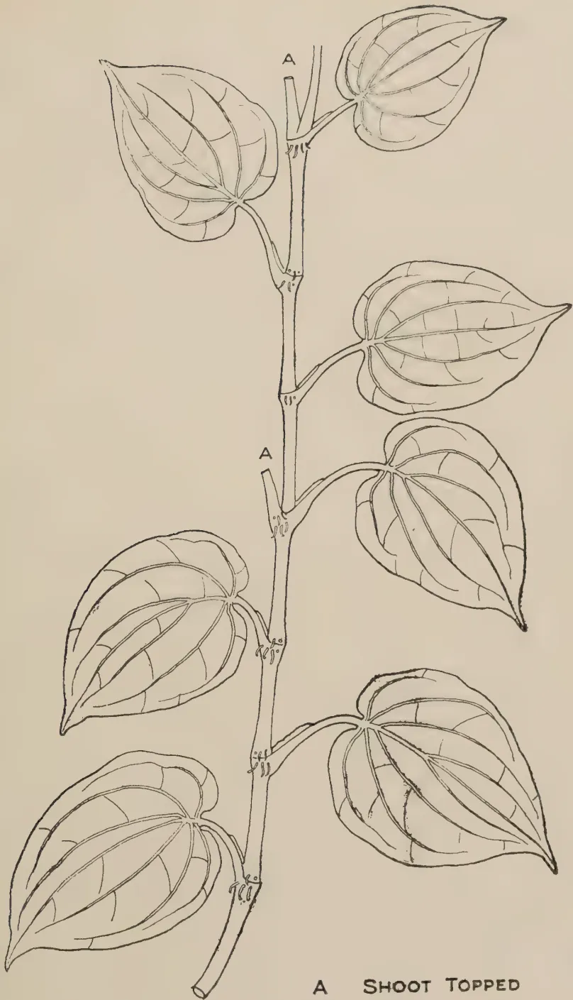
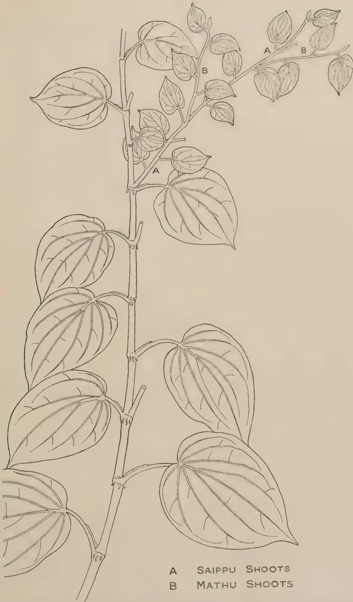

The  
**Tropical Agriculturist**  
November, 1937

---

EDITORIAL

---

**CENTRAL BOARD OF AGRICULTURE**

---

**T**HE Central Board of Agriculture was re-constituted in 1934 and the first Board appointed under the new rules terminated its tenure of office in May this year. A short review of its work will probably be of interest to our readers.

The Board has no executive functions. It acts in a purely advisory capacity and it can therefore only influence policy. Its success has to be measured by the extent to which its deliberations influenced public opinion on agricultural practice or induced special action by the executive.

The following were some of the more important subjects which engaged the attention of the Board :—

- Soil erosion,
- Cattle branding and the restriction of trade in cattle,
- The development of animal husbandry,
- Measures for the stabilization of the price of paddy,
- Black Beetle and Red Weevil pests of coconuts,
- Establishment of Government paddy seed stations,
- The establishment of a bureau of agricultural statistics,
- Composting,
- Citronella research.

The subject of soil erosion in one form or another was brought up practically at every meeting of the Board till at last the Minister seconded an officer for special investigational work connected with it and legislation was prepared for dealing with that part of it which relates to the damage caused to irrigation works and paddy fields by soil erosion. Government accepted the recommendation that the compulsory branding and registration of cattle as well as the cattle voucher system should be abolished. Definite proposals were formulated by the Department of Agriculture for a vigorous forward policy

1------------------------------------------------

256

in the development of animal husbandry and these proposals revised by a special committee of the Board will come up for consideration at the first meeting of the new Board. The Minister has informed the Chairman of the Board that the policy of adopting restrictive measures for the purpose of controlling paddy prices was accepted by his Executive Committee and that instructions have been given for the preparation of the necessary legislation. The Department of Agriculture undertook to attempt the enforcement of the regulations regarding coconut beetle pests by persuasion before the penal provisions were invoked and the efforts of the Department in two provinces seconded by the co-operation of the Government Agents has met with considerable success. The Ministry has accepted the policy of establishing a chain of paddy seed stations throughout the country and these will be established as the recently appointed Paddy Officer selects suitable purelines of seed for the several climatic and soil zones and the necessary funds are voted by the legislature. The Minister has expressed his concurrence in the recommendation for the creation of a Bureau of Agricultural Statistics and the Director of Agriculture is in communication with the Director of Commercial Intelligence regarding the steps that should be taken to give effect to this recommendation. No definite action by the executive was possible regarding composting but its importance has been recognized by both the planting community and by the officers of the Agricultural Department who are engaged in propaganda in the villages. The Ministry gave careful consideration to the subject of citronella research and came to the conclusion that neither the volume of trade in this commodity nor the benefits which a research scheme was likely to secure for the industry justified the heavy expenditure involved in such a project.

This is a record of achievement in which the outgoing Board may take a legitimate pride, and it effectively meets the criticism of those persons who think that a purely advisory body with no executive functions must necessarily involve itself in futile discussions. Another very encouraging feature of the proceedings of the Board was the absence of any emphasis on sectional interest. The members drawn from the planting industries showed no indifference to subjects relating to village agriculture while the representatives of district committees manifested a like catholicity of interest. In short, the performance of the first Board encourages us in the hope that the second Board which holds its inaugural meeting under the presidency of His Excellency the Governor on the 18th November will make a substantial contribution to the pursuit of a vigorous agricultural policy during the next three years.

2------------------------------------------------

257

## TRIALS WITH NAPIER GRASS (*PENNISETUM PURPUREUM*)

AN EXPERIMENT TO DETERMINE THE OPTIMUM FREQUENCY OF CUTTING NAPIER GRASS AND THE EFFECT OF ONE, TWO AND THREE APPLICATIONS OF SULPHATE OF AMMONIA

C. N. E. J. de MEL, B.Sc. (Hons.), B.Sc. Agric. (Lond.),  
Dip. Agric. (Wye),

PRINCIPAL, FARM SCHOOL, PERADENIYA

AND

A. W. R. JOACHIM, Ph.D. (Lond.), Dip. Agric. (Cantab.), F.I.C.,  
CHEMIST

THE experiment was originally designed by Mr. L. Lord, former Officer-in-charge, Experiment Station, to determine (1) the optimum frequency for cutting Napier grass under Peradeniya conditions and (2) the effect of one, two and three doses of nitrogen applied as ammonium sulphate. The lay out of the experiment was a latin square in plots 22' × 24' the inner harvested area after leaving out a border row of one foot in each plot being 1/100th acre.

There were five treatments as follows:

<table border="0">
<tbody>
<tr>
<td>Plot A.</td>
<td>Cut monthly</td>
<td rowspan="3">} 1 cwt. of sulphate of ammonia applied in October each year.</td>
</tr>
<tr>
<td>„ B.</td>
<td>Cut once in six weeks</td>
</tr>
<tr>
<td>„ C.</td>
<td>Cut once in two months</td>
</tr>
<tr>
<td>„ D.</td>
<td>Cut once in six weeks</td>
<td>1 cwt. of sulphate of ammonia applied in October, and a similar application in February each year.</td>
</tr>
<tr>
<td>„ E.</td>
<td>Cut once in six weeks</td>
<td>1 cwt. of sulphate of ammonia in October, and a similar application in February and June, each year.</td>
</tr>
</tbody>
</table>

3------------------------------------------------

258TABLE IMONTHLY CUTTINGS—Treatment A.

<table>
<tbody>
<tr>
<td>Date of cutting</td>
<td>..</td>
<td>..</td>
<td>29-2-36</td>
<td>30-3-36</td>
<td>30-4-36</td>
<td>30-5-36</td>
<td>30-6-36</td>
<td>30-7-36</td>
<td>31-8-36</td>
<td>1-10-36</td>
<td>30-10-36</td>
<td>31-11-36</td>
<td>30-12-36</td>
<td>30-1-37</td>
</tr>
<tr>
<td>Rainfall during the preceding 30 days</td>
<td>..</td>
<td>..</td>
<td>4.57</td>
<td>12.15</td>
<td>2.62</td>
<td>15.61</td>
<td>6.49</td>
<td>10.81</td>
<td>3.23</td>
<td>13.14</td>
<td>6.72</td>
<td>6.97</td>
<td>10.29</td>
<td>7.73</td>
</tr>
<tr>
<td>Yield in lb.</td>
<td>..</td>
<td>..</td>
<td>500</td>
<td>857</td>
<td>612</td>
<td>655</td>
<td>419</td>
<td>352</td>
<td>322</td>
<td>446</td>
<td>216</td>
<td>308</td>
<td>248</td>
<td>186</td>
</tr>
</tbody>
</table>

SIX-WEEKLY CUTTINGS—Treatments B, D, E.

<table>
<tbody>
<tr>
<td>Date of cutting</td>
<td>..</td>
<td>..</td>
<td>14-3-36</td>
<td>29-4-36</td>
<td>15-6-36</td>
<td>30-7-36</td>
<td>15-9-36</td>
<td>30-10-36</td>
<td>17-12-36</td>
<td>30-1-37</td>
</tr>
<tr>
<td>Rainfall during the preceding six weeks</td>
<td>..</td>
<td>..</td>
<td>8.13</td>
<td>11.9</td>
<td>19.86</td>
<td>13.08</td>
<td>5.08</td>
<td>18.01</td>
<td>14.48</td>
<td>10.52</td>
</tr>
<tr>
<td>Yield in lb. (Mean of three treatments)</td>
<td>..</td>
<td>..</td>
<td>727</td>
<td>1436</td>
<td>1322</td>
<td>871</td>
<td>648</td>
<td>632</td>
<td>655</td>
<td>298</td>
</tr>
</tbody>
</table>

TWO-MONTHLY CUTTINGS—Treatment C.

<table>
<tbody>
<tr>
<td>Date of cutting</td>
<td>..</td>
<td>..</td>
<td>30-3-36</td>
<td>30-5-36</td>
<td>30-7-36</td>
<td>30-9-36</td>
<td>30-11-36</td>
<td>30-1-37</td>
</tr>
<tr>
<td>Rainfall during the preceding two months</td>
<td>..</td>
<td>..</td>
<td>16.72</td>
<td>18.23</td>
<td>17.33</td>
<td>16.37</td>
<td>13.70</td>
<td>12.71</td>
</tr>
<tr>
<td>Yield in lb.</td>
<td>..</td>
<td>..</td>
<td>1690</td>
<td>1833</td>
<td>1283</td>
<td>1051</td>
<td>930</td>
<td>513</td>
</tr>
</tbody>
</table>

4------------------------------------------------

259

The plots D and E therefore received one dose and two doses of nitrogen respectively in addition to the basal dressing of nitrogen given to all the plots.

Napier grass was planted out on the 16th October, 1935, and the first cutting was taken on the 30th January, 1936. The data for calculation begin with the second cutting of the A plots on the 29th February, 1936. Subsequent cuttings were made on the due dates.

The soil was a sandy loam of low fertility, and 300 lb. of compost were applied to each of the plots in December, 1935. The average yield of these plots 57.5 tons per acre per annum proved to be much below the average yields obtained on this station. This, however, does not affect the results of this experiment.

The total rainfall on the station during the period covered by this experiment was 95.06 inches. Table I shows the distribution of the rainfall in relation to the intervals of cutting the grass.

Under the conditions of the experiment there seems to be no clear connection between the rainfall and the yields except in the earlier months. After June, 1936, the yields decline steadily. There is also no effect noticeable on the yield as a result of the extra applications of fertiliser on the D and E plots in February, 1936.

## RESULTS

The diagram given over shows the total weights of grass obtained from each plot during a complete year of cuttings from 29th February, 1936 to 30th January, 1937.

5------------------------------------------------

260

YIELD IN LB. PER PLOT

Rows ———→

Totals

Columns  
↓

<table border="1">
<tr>
<td>A 1150</td>
<td>E 1345</td>
<td>C 1585</td>
<td>B 1454</td>
<td>D 1534</td>
<td>7068</td>
</tr>
<tr>
<td>C 1441</td>
<td>A 989</td>
<td>D 1158</td>
<td>E 1190</td>
<td>B 1556</td>
<td>6334</td>
</tr>
<tr>
<td>E 1304</td>
<td>D 1085</td>
<td>B 946</td>
<td>A 946</td>
<td>C 1551</td>
<td>5832</td>
</tr>
<tr>
<td>D 1468</td>
<td>B 1313</td>
<td>A 942</td>
<td>C 1421</td>
<td>E 1596</td>
<td>6740</td>
</tr>
<tr>
<td>B 1330</td>
<td>C 1302</td>
<td>E 1208</td>
<td>D 1281</td>
<td>A 1094</td>
<td>6215</td>
</tr>
</table>

<table>
<tr>
<td>Totals</td>
<td>6693</td>
<td>6034</td>
<td>5839</td>
<td>6292</td>
<td>7331</td>
<td>32189</td>
</tr>
<tr>
<td>Treatment</td>
<td>A</td>
<td>B</td>
<td>C</td>
<td>D</td>
<td>E</td>
<td>General mean</td>
</tr>
<tr>
<td>Totals</td>
<td>5121</td>
<td>6599</td>
<td>7300</td>
<td>6526</td>
<td>6643</td>
<td></td>
</tr>
<tr>
<td>Treatment mean per plot</td>
<td>1024.2</td>
<td>1319.8</td>
<td>1460.0</td>
<td>1305.2</td>
<td>1328.6</td>
<td>1287.56</td>
</tr>
</table>

Analysis of results by the methods of variance is shown in table II.

TABLE II  
ANALYSIS OF VARIANCE

<table border="1">
<thead>
<tr>
<th></th>
<th></th>
<th>Degrees of freedom</th>
<th>Sum of squares</th>
<th>Mean square</th>
<th><math>\frac{1}{2} \log_e</math> mean square</th>
</tr>
</thead>
<tbody>
<tr>
<td>Rows</td>
<td>..</td>
<td>4</td>
<td>183176.96</td>
<td>—</td>
<td>—</td>
</tr>
<tr>
<td>Columns</td>
<td>..</td>
<td>4</td>
<td>281161.36</td>
<td>—</td>
<td>—</td>
</tr>
<tr>
<td>Treatments</td>
<td>..</td>
<td>4</td>
<td>510644.56</td>
<td>127661.14</td>
<td>2.425</td>
</tr>
<tr>
<td>Error</td>
<td>..</td>
<td>12</td>
<td>90625.28</td>
<td>7552.11</td>
<td>1.011</td>
</tr>
<tr>
<td>Total</td>
<td>..</td>
<td>24</td>
<td>1065608.16</td>
<td></td>
<td></td>
</tr>
</tbody>
</table>

6------------------------------------------------

261

*Z test*

$$\text{For } n_1=4, n_2=12 \quad \begin{cases} P=.05, Z=.5907 \\ P=.01, Z=.8443 \end{cases}$$

$$Z \text{ (calc)} = 1.414.$$

The *z* test shows that the results are very definitely significant with a probability of 100 to 1.

In tables III and IV the results are generally summarised.

TABLE III

<table border="1">
<thead>
<tr>
<th><i>Treatments</i></th>
<th><i>Mean per plot (lb.)</i></th>
<th><i>% of mean</i></th>
<th><i>Tons/ acre</i></th>
</tr>
</thead>
<tbody>
<tr>
<td>A. Cut every month .. ..</td>
<td>1024.2</td>
<td>79.53</td>
<td>45.73</td>
</tr>
<tr>
<td>B. Cut every six weeks .. ..</td>
<td>1319.8</td>
<td>102.43</td>
<td>58.88</td>
</tr>
<tr>
<td>C. Cut every two months .. ..</td>
<td>1460.0</td>
<td>113.40</td>
<td>65.20</td>
</tr>
<tr>
<td>D. Cut every six weeks sulphate of ammonia in February .. ..</td>
<td>1305.2</td>
<td>101.31</td>
<td>58.27</td>
</tr>
<tr>
<td>E. Cut every six weeks sulphate of ammonia in February and June</td>
<td>1328.6</td>
<td>103.20</td>
<td>59.31</td>
</tr>
<tr>
<td>General Mean .. ..</td>
<td>1287.6</td>
<td>100.00</td>
<td>57.49</td>
</tr>
<tr>
<td>Standard error .. ..</td>
<td>38.9</td>
<td>3.02</td>
<td>1.74</td>
</tr>
<tr>
<td>Significant Difference <math>P=.05</math> .. ..</td>
<td>119.8</td>
<td>9.31</td>
<td>5.35</td>
</tr>
<tr>
<td><math>P=.01</math> .. ..</td>
<td>167.9</td>
<td>13.04</td>
<td>7.50</td>
</tr>
</tbody>
</table>

TABLE IV

SIX WEEKS VS. 2-MONTHLY CUTTING

<table border="1">
<thead>
<tr>
<th></th>
<th>lb.</th>
</tr>
</thead>
<tbody>
<tr>
<td>(1) Six weeks (average of 3 treatments) ..</td>
<td>1317.9</td>
</tr>
<tr>
<td>(2) 2 months (one treatment) ..</td>
<td>1460.0</td>
</tr>
<tr>
<td>Difference = .. ..</td>
<td>142.1</td>
</tr>
<tr>
<td>Significant Difference <math>P=.05</math> ..</td>
<td>97.4</td>
</tr>
<tr>
<td><math>P=.01</math> ..</td>
<td>136.6</td>
</tr>
</tbody>
</table>

#### DISCUSSION OF RESULTS

It will be seen from table III that the yields of the plots cut monthly (45.73 tons) are very significantly lower, with a probability of 100 to 1, than the yields of the plots cut either

7------------------------------------------------

262

once in six weeks (58.8 tons) or once in two months (65.20 tons). Similarly table IV indicates that the difference between the yields of the bi-monthly cuttings and of the six-weekly cuttings is definitely significant.

The results of the manurial treatments are seen in table III. There is no difference in the yields of the plots receiving two applications and one application, in addition to the basal dressing of 1 cwt. of the fertilizer. It is, however, unfortunate that particularly heavy showers immediately followed the application of fertilizers to all the plots in October, 1935, and to the D and E plots in February, 1936. The results cannot, therefore, be considered satisfactory, and a more elaborate manurial trial has been planned in which the effect of applying fertilizers at intervals will be tested.

#### RELATION BETWEEN AGE AND ANALYTICAL COMPOSITION

In August, 1936, it was decided to analyse the grass from the different treatments in order to determine the relationship between the period of growth and the analytical composition of the grass. A full analysis of these results appears elsewhere in this journal. Briefly, it was found that the monthly cut samples of grass have, on the average, higher fat, protein and ash, and lower fibre contents than samples cut six-weekly or bi-monthly. There is some difference in analytical composition between samples from the six-weekly treatment B which received one dressing of sulphate of ammonia and samples from the treatment E which received three dressings of the same fertilizer. The latter tend to be slightly richer in fat and protein and to have a lower percentage of fibre.

The total amounts of food constituents available from equal areas of the grass cut at different intervals, as calculated from the analytical composition and the yields, are found to be highest for the bi-monthly period of cutting and lowest for the monthly cutting. The protein and fat contents do not vary very appreciably, but the carbohydrate contents are definitely higher in the longer age samples. Treatment E shows its superiority over the other two six-weekly treatments.

8------------------------------------------------

263CONCLUSIONS

From considerations of the yield alone, the two months interval of cutting would appear to be the most advantageous under the climatic conditions of Peradeniya. It was, however, observed that a certain proportion of the grass was rejected by the cattle when cut at this stage of maturity due its being too fibrous. The one month interval of cutting has the advantages that no part of the grass is rejected by the cattle while the quality of the grass is definitely superior. In the former respect the grass cut at six-weekly intervals is no different and while its quality is somewhat inferior, the analytical data indicate that the total amounts of food constituents available from equal areas of grass of this age are generally not less than in the monthly cuttings. Further, as some improvement in quality is effected by the application of a fertilizer under favourable conditions, it would appear reasonable to conclude that a suitable period for cutting Napier grass under Peradeniya conditions is six weeks, provided periodical dressings of a nitrogenous fertilizer are applied.

9------------------------------------------------

264

## THE EFFECT OF STAGE OF MATURITY AND MANURING ON THE COMPOSITION OF NAPIER GRASS

A. W. R. JOACHIM, Ph.D., Dip. Agric. (Cantab),

CHEMIST

AND

D. G. PANDITTESEKERE, Dip. Agric. (Poona),

ASSISTANT IN AGRICULTURAL CHEMISTRY

IN this paper the analytical data obtained over a period of six months, from August, 1936 to January, 1937, in connection with a frequency of cutting and manurial experiment on Napier grass (*Pennisetum purpureum*) at the Experiment Station, Peradeniya are presented and discussed. The details of the trials have already been described in the previous article in this issue (1). It would suffice to state that the treatments were as follows :

- A. Monthly cut : Single dressing of 1 cwt. sulphate of ammonia.
- B. Six-weekly cut : Single dressing of 1 cwt. sulphate of ammonia.
- D. Six-weekly cut : Two dressings of 1 cwt. sulphate of ammonia.
- E. Six-weekly cut : Three dressings of 1 cwt. sulphate of ammonia.
- C. Bi-monthly cut : Single dressing of 1 cwt. sulphate of ammonia.

At the respective times of cutting, representative samples of the grass were obtained for analysis as follows :

From each of the similarly treated plots three clumps of grass were cut diagonal-wise. A handful of grass from each clump

10------------------------------------------------

265

was then taken and the material so obtained bulked together. Further sub-division of the samples was made in the laboratory where determinations of moisture on the fresh material were made with as little delay as possible. Ash, protein, ether extract (fat), and fibre determinations were made on the air-dry material. Carbohydrates (non-nitrogenous extractives) and dry matter were obtained by difference.

The results of the analyses, expressed as percentages on fresh material, are shown in table I. Figures in heavy type represent percentages on dry matter at 100°C. The analysis of the monthly cut sample of 30.9.36 was unfortunately omitted through an error. An examination of the table would indicate that :

(1) The moisture and dry matter contents of the fresh grass are fairly constant, being respectively about 84 and 16 per cent. of the material.

(2) The fat, protein and ash percentages diminish with increasing maturity of grass. The fall is most marked with fat (from 2.7 to 1.4 per cent.) but is also appreciable with protein (from 11.8 to 8.1 per cent.). On the other hand, the fibre contents appreciably increase with advancing age (from 23.7 to 33.0 per cent.).

(3) Carbohydrates show but comparatively little change.

(4) There is no difference in analytical composition between samples from the six-weekly cut plots receiving one and two dressings of sulphate of ammonia respectively. This is only to be expected as the second application of fertilizer was given after the last sampling cut of this series was made.

(5) The grass receiving three dressings of sulphate of ammonia has, however, on the average, slightly higher protein, ash and fat, and lower fibre contents than the grass receiving only single and double dressings of the fertilizer. The effect of the latter is apparent in the first cutting or two subsequent to its application. The advantage of frequent applications of soluble nitrogenous fertilizers to fodder grass appears thus to be indicated. These results generally confirm those obtained in other tropical countries (2).

11------------------------------------------------

266

TABLE I  
PERCENTAGE COMPOSITION

<table border="1">
<thead>
<tr>
<th rowspan="2">Frequency of cutting</th>
<th rowspan="2">Treatment</th>
<th colspan="10">One Month</th>
<th colspan="6">Six Weeks</th>
</tr>
<tr>
<th colspan="10">A</th>
<th colspan="6">B</th>
</tr>
<tr>
<th></th>
<th></th>
<th>31.8.36</th>
<th>30.9.36</th>
<th>30.10.36</th>
<th>30.11.36</th>
<th>30.12.36</th>
<th>30.1.37</th>
<th>Average</th>
<th>15.9.36</th>
<th>30.10.36</th>
<th>17.12.36</th>
<th>30.1.37</th>
<th>Average</th>
</tr>
</thead>
<tbody>
<tr>
<td>Date of cutting</td>
<td>..</td>
<td>..</td>
<td>..</td>
<td>..</td>
<td>..</td>
<td>..</td>
<td>..</td>
<td>..</td>
<td>..</td>
<td>..</td>
<td>..</td>
<td>..</td>
<td>..</td>
</tr>
<tr>
<td>Moisture</td>
<td>..</td>
<td>..</td>
<td>..</td>
<td>..</td>
<td>..</td>
<td>..</td>
<td>..</td>
<td>..</td>
<td>..</td>
<td>..</td>
<td>..</td>
<td>..</td>
<td>..</td>
</tr>
<tr>
<td>Dry matter</td>
<td>..</td>
<td>..</td>
<td>..</td>
<td>..</td>
<td>..</td>
<td>..</td>
<td>..</td>
<td>..</td>
<td>..</td>
<td>..</td>
<td>..</td>
<td>..</td>
<td>..</td>
</tr>
<tr>
<td>Ash</td>
<td>..</td>
<td>..</td>
<td>..</td>
<td>..</td>
<td>..</td>
<td>..</td>
<td>..</td>
<td>..</td>
<td>..</td>
<td>..</td>
<td>..</td>
<td>..</td>
<td>..</td>
</tr>
<tr>
<td></td>
<td></td>
<td>31.8.36</td>
<td>30.9.36</td>
<td>30.10.36</td>
<td>30.11.36</td>
<td>30.12.36</td>
<td>30.1.37</td>
<td>Average</td>
<td>15.9.36</td>
<td>30.10.36</td>
<td>17.12.36</td>
<td>30.1.37</td>
<td>Average</td>
</tr>
<tr>
<td></td>
<td></td>
<td>84.3</td>
<td>—</td>
<td>86.1</td>
<td>83.5</td>
<td>85.5</td>
<td>82.5</td>
<td>84.4</td>
<td>83.3</td>
<td>84.4</td>
<td>84.8</td>
<td>82.8</td>
<td>83.8</td>
</tr>
<tr>
<td></td>
<td></td>
<td>15.7</td>
<td>—</td>
<td>13.9</td>
<td>16.5</td>
<td>14.5</td>
<td>17.5</td>
<td>15.6</td>
<td>16.7</td>
<td>15.6</td>
<td>15.2</td>
<td>17.2</td>
<td>16.2</td>
</tr>
<tr>
<td></td>
<td></td>
<td>2.21</td>
<td>—</td>
<td>2.03</td>
<td>2.40</td>
<td>2.08</td>
<td>2.45</td>
<td>2.23</td>
<td>1.84</td>
<td>1.96</td>
<td>2.20</td>
<td>2.11</td>
<td>2.02</td>
</tr>
<tr>
<td></td>
<td></td>
<td>14.01</td>
<td>—</td>
<td>14.61</td>
<td>14.55</td>
<td>14.27</td>
<td>13.98</td>
<td>14.28</td>
<td>11.04</td>
<td>12.54</td>
<td>14.45</td>
<td>12.28</td>
<td>12.58</td>
</tr>
<tr>
<td></td>
<td></td>
<td>.42</td>
<td>—</td>
<td>.39</td>
<td>.43</td>
<td>.37</td>
<td>.40</td>
<td>.41</td>
<td>.23</td>
<td>.27</td>
<td>.27</td>
<td>.32</td>
<td>.28</td>
</tr>
<tr>
<td></td>
<td></td>
<td>2.67</td>
<td>—</td>
<td>2.82</td>
<td>2.60</td>
<td>2.53</td>
<td>2.29</td>
<td>2.68</td>
<td>1.48</td>
<td>1.75</td>
<td>1.77</td>
<td>1.88</td>
<td>1.72</td>
</tr>
<tr>
<td></td>
<td></td>
<td>3.37</td>
<td>—</td>
<td>3.36</td>
<td>4.03</td>
<td>3.74</td>
<td>3.73</td>
<td>3.72</td>
<td>5.15</td>
<td>5.33</td>
<td>4.47</td>
<td>5.07</td>
<td>5.00</td>
</tr>
<tr>
<td></td>
<td></td>
<td>23.70</td>
<td>—</td>
<td>24.17</td>
<td>24.44</td>
<td>25.17</td>
<td>21.28</td>
<td>23.75</td>
<td>30.86</td>
<td>34.10</td>
<td>29.42</td>
<td>29.50</td>
<td>30.97</td>
</tr>
<tr>
<td></td>
<td></td>
<td>1.73</td>
<td>—</td>
<td>1.81</td>
<td>1.98</td>
<td>1.71</td>
<td>1.90</td>
<td>1.84</td>
<td>1.39</td>
<td>1.39</td>
<td>1.48</td>
<td>1.43</td>
<td>1.42</td>
</tr>
<tr>
<td></td>
<td></td>
<td>11.00</td>
<td>—</td>
<td>13.02</td>
<td>12.02</td>
<td>11.74</td>
<td>11.36</td>
<td>11.83</td>
<td>8.31</td>
<td>8.90</td>
<td>9.77</td>
<td>8.32</td>
<td>8.82</td>
</tr>
<tr>
<td></td>
<td></td>
<td>7.65</td>
<td>—</td>
<td>6.31</td>
<td>7.68</td>
<td>6.63</td>
<td>8.96</td>
<td>7.44</td>
<td>8.07</td>
<td>6.69</td>
<td>6.78</td>
<td>8.25</td>
<td>7.45</td>
</tr>
<tr>
<td></td>
<td></td>
<td>48.62</td>
<td>—</td>
<td>45.38</td>
<td>46.39</td>
<td>46.29</td>
<td>51.09</td>
<td>47.46</td>
<td>48.31</td>
<td>42.71</td>
<td>44.59</td>
<td>48.02</td>
<td>45.91</td>
</tr>
<tr>
<td>Carbohydrate</td>
<td>..</td>
<td>..</td>
<td>..</td>
<td>..</td>
<td>..</td>
<td>..</td>
<td>..</td>
<td>..</td>
<td>..</td>
<td>..</td>
<td>..</td>
<td>..</td>
<td>..</td>
</tr>
</tbody>
</table>

Figures in dark type are percentages on dry matter at 100°C

12------------------------------------------------

267

TABLE I—*Contd.*  
PERCENTAGE COMPOSITION

<table border="1">
<thead>
<tr>
<th rowspan="2">Frequency of cutting</th>
<th rowspan="2">Treatment</th>
<th colspan="10">Six Weeks</th>
<th rowspan="2">Average</th>
<th rowspan="2">Two Months</th>
</tr>
<tr>
<th colspan="5">D</th>
<th colspan="5">E</th>
</tr>
<tr>
<th></th>
<th></th>
<th>15.9.36</th>
<th>30.10.36</th>
<th>17.12.36</th>
<th>30.1.37</th>
<th>Average</th>
<th>15.9.36</th>
<th>30.10.36</th>
<th>17.12.36</th>
<th>30.1.37</th>
<th>Average</th>
<th>30.9.36</th>
<th>30.11.36</th>
<th>30.1.37</th>
<th>Average</th>
</tr>
</thead>
<tbody>
<tr>
<td>Date of cutting</td>
<td></td>
<td></td>
<td></td>
<td></td>
<td></td>
<td></td>
<td></td>
<td></td>
<td></td>
<td></td>
<td></td>
<td></td>
<td></td>
<td></td>
<td></td>
</tr>
<tr>
<td>Moisture</td>
<td></td>
<td>83.4</td>
<td>83.8</td>
<td>85.4</td>
<td>83.2</td>
<td>84.0</td>
<td>83.6</td>
<td>84.4</td>
<td>85.4</td>
<td>83.0</td>
<td>84.1</td>
<td>84.3</td>
<td>83.5</td>
<td>82.6</td>
<td>83.5</td>
</tr>
<tr>
<td>Dry matter</td>
<td></td>
<td>16.6</td>
<td>16.2</td>
<td>14.6</td>
<td>16.8</td>
<td>16.0</td>
<td>16.4</td>
<td>15.6</td>
<td>14.6</td>
<td>17.0</td>
<td>15.9</td>
<td>15.7</td>
<td>16.5</td>
<td>17.4</td>
<td>16.5</td>
</tr>
<tr>
<td>Ash</td>
<td></td>
<td>2.00</td>
<td>1.99</td>
<td>2.02</td>
<td>2.04</td>
<td>2.01</td>
<td>2.01</td>
<td>2.07</td>
<td>2.06</td>
<td>2.16</td>
<td>2.08</td>
<td>1.57</td>
<td>1.73</td>
<td>1.74</td>
<td>1.68</td>
</tr>
<tr>
<td>Fat</td>
<td></td>
<td>12.02</td>
<td>12.24</td>
<td>13.84</td>
<td>12.11</td>
<td>12.55</td>
<td>12.55</td>
<td>12.76</td>
<td>14.14</td>
<td>12.75</td>
<td>13.05</td>
<td>9.98</td>
<td>10.45</td>
<td>10.04</td>
<td>10.16</td>
</tr>
<tr>
<td></td>
<td></td>
<td>.27</td>
<td>.24</td>
<td>.24</td>
<td>.32</td>
<td>.27</td>
<td>.34</td>
<td>.24</td>
<td>.27</td>
<td>.33</td>
<td>.29</td>
<td>.24</td>
<td>.21</td>
<td>.25</td>
<td>.23</td>
</tr>
<tr>
<td>Fibre</td>
<td></td>
<td>1.64</td>
<td>1.46</td>
<td>1.64</td>
<td>1.93</td>
<td>1.67</td>
<td>2.06</td>
<td>1.54</td>
<td>1.85</td>
<td>1.95</td>
<td>1.85</td>
<td>1.52</td>
<td>1.28</td>
<td>1.41</td>
<td>1.40</td>
</tr>
<tr>
<td></td>
<td></td>
<td>5.22</td>
<td>5.41</td>
<td>4.62</td>
<td>4.80</td>
<td>5.01</td>
<td>4.67</td>
<td>5.00</td>
<td>4.38</td>
<td>5.05</td>
<td>4.78</td>
<td>5.45</td>
<td>5.53</td>
<td>5.38</td>
<td>5.45</td>
</tr>
<tr>
<td>Protein</td>
<td></td>
<td>31.42</td>
<td>33.32</td>
<td>32.48</td>
<td>28.57</td>
<td>31.45</td>
<td>28.47</td>
<td>32.04</td>
<td>30.07</td>
<td>29.81</td>
<td>30.10</td>
<td>34.63</td>
<td>33.48</td>
<td>30.92</td>
<td>33.01</td>
</tr>
<tr>
<td></td>
<td></td>
<td>1.43</td>
<td>1.39</td>
<td>1.43</td>
<td>1.45</td>
<td>1.42</td>
<td>1.61</td>
<td>1.43</td>
<td>1.55</td>
<td>1.50</td>
<td>1.52</td>
<td>1.31</td>
<td>1.36</td>
<td>1.36</td>
<td>1.34</td>
</tr>
<tr>
<td>Carbohydrate</td>
<td></td>
<td>8.63</td>
<td>8.52</td>
<td>9.81</td>
<td>8.65</td>
<td>8.90</td>
<td>9.81</td>
<td>9.18</td>
<td>10.63</td>
<td>8.88</td>
<td>9.62</td>
<td>8.31</td>
<td>8.25</td>
<td>7.81</td>
<td>8.12</td>
</tr>
<tr>
<td></td>
<td></td>
<td>7.70</td>
<td>7.22</td>
<td>6.29</td>
<td>8.79</td>
<td>7.44</td>
<td>7.78</td>
<td>6.87</td>
<td>6.31</td>
<td>7.75</td>
<td>7.18</td>
<td>7.17</td>
<td>7.69</td>
<td>8.22</td>
<td>7.69</td>
</tr>
<tr>
<td></td>
<td></td>
<td>46.29</td>
<td>44.46</td>
<td>42.23</td>
<td>48.74</td>
<td>45.43</td>
<td>47.11</td>
<td>44.48</td>
<td>43.31</td>
<td>46.61</td>
<td>45.38</td>
<td>45.56</td>
<td>46.54</td>
<td>49.82</td>
<td>47.37</td>
</tr>
</tbody>
</table>

Figures in dark type are percentages on dry matter at 100°C

13------------------------------------------------

268

TABLE II  
TOTAL CONSTITUENTS

<table border="1">
<thead>
<tr>
<th rowspan="2">Frequency of cutting Treatment .. ..</th>
<th rowspan="2">One month A</th>
<th colspan="3">Six weeks</th>
<th>Two months C</th>
</tr>
<tr>
<th>B</th>
<th>D</th>
<th>E</th>
<th></th>
</tr>
</thead>
<tbody>
<tr>
<td>Total weight of grass from five plots (1/20 acre) during 6 months .. .. lb.</td>
<td>1726</td>
<td>2206</td>
<td>2239</td>
<td>2255</td>
<td>2494</td>
</tr>
<tr>
<td>Dry matter .. .. lb.</td>
<td>270.0</td>
<td>353.3</td>
<td>359.4</td>
<td>354.0</td>
<td>405.6</td>
</tr>
<tr>
<td>Ash .. .. lb.</td>
<td>38.6</td>
<td>44.5</td>
<td>45.0</td>
<td>46.5</td>
<td>41.5</td>
</tr>
<tr>
<td>Fat .. .. lb.</td>
<td>7.0</td>
<td>5.9</td>
<td>5.8</td>
<td>6.5</td>
<td>5.7</td>
</tr>
<tr>
<td>Fibre .. .. lb.</td>
<td>64.5</td>
<td>110.1</td>
<td>113.7</td>
<td>106.7</td>
<td>135.9</td>
</tr>
<tr>
<td>Protein .. .. lb.</td>
<td>31.7</td>
<td>31.4</td>
<td>31.8</td>
<td>34.4</td>
<td>33.4</td>
</tr>
<tr>
<td>Carbohydrate .. .. lb.</td>
<td>128.2</td>
<td>161.5</td>
<td>163.1</td>
<td>159.8</td>
<td>189.0</td>
</tr>
<tr>
<td>Fibre-free material .. .. lb.</td>
<td>205.5</td>
<td>243.2</td>
<td>245.7</td>
<td>247.3</td>
<td>269.7</td>
</tr>
</tbody>
</table>

In table II above the total amounts of food constituents in the grass from the five plots of each treatment (.05 acres in all) during the six-month period are shown. These figures have been calculated from the weights of grass and the percentage analytical composition of the grass at each cutting. In the case of the monthly cut sample of 30.9.36, which was not analysed, the analytical composition was reckoned as the average of the remaining five samples of identical age.

The data thus obtained show that :

(1) The dry matter contents increase with increasing maturity of grass. The two-month old grass produces, per unit area, about one and half times the dry matter content of the month old grass. The fibre content of the former is however over twice that of the latter. The two-month old samples have therefore only about 30 and 10 per cent. more fibre-free material than the month and six-week old samples respectively.

(2) The six-week old grass contains highest amounts of ash and mineral constituents, but the differences from the corresponding amounts in the month and two-month old grasses are small.

(3) The amounts of ether extract (fat) in the grasses do not vary to any extent, but the youngest grass is superior in

14------------------------------------------------

269

this respect to the others. The effect of manuring in increasing the fat content to some degree appears to be indicated.

(4) The total protein figures indicate that there is no difference between the month and six-week old samples receiving the same manurial treatment. With additional nitrogenous fertilization, however, the total protein content of the latter is appreciably increased.

(5) Carbohydrate material is highest in the two-month old grass, but the six-week old samples are not appreciably inferior in this respect.

(6) The beneficial effect of nitrogenous manuring on quality is generally apparent.

From considerations of the analytical and total constituent data, it would appear that with Napier grass a six-weekly cutting interval is advantageous, more so if nitrogenous fertilization is adopted.

#### REFERENCES

1. 1. De Mel, C. N. E. J. and Joachim, A. W. R.—Trials with Napier Grass (*Pennisetum purpureum*). An experiment to determine the optimum frequency of cutting Napier Grass and the effect of one, two and three applications of sulphate of ammonia. *The Tropical Agriculturist*, Vol. LXXXIX, No. 5, p. 257.
2. 2. Patterson, D. D.—The cropping qualities of certain tropical grasses. *Emp. Jour. Exptl. Agr.*, Vol. IV, No. 13.

15------------------------------------------------

270*Contribution from the Coconut Research Scheme (Ceylon)*

## EDIBLE COCONUT OIL

REGINALD CHILD, F.I.C., B.Sc., Ph.D. (Lond.),

*DIRECTOR OF RESEARCH & TECHNOLOGICAL CHEMIST, COCONUT  
RESEARCH SCHEME*

**R**EFINED coconut oil, either alone or in admixture with similar fats such as Palm Kernel and Babassu fats, has been sold for edible purposes in Europe and elsewhere under a wide variety of trade or proprietary names. Among the best known of these (some of which are still protected by registration) are Cocolardo, Cocoline, Lactine, Laureol, Nucline, Nutrex, Nutto, Palmine, Vegetaline and, in India, Messrs Tata's well-known Cocogem. As generic names for this type of edible fat have been used, Nut Lard, Vegetable Lard and Vegetable Butter.

It has been pointed out (1) that reference to these preparations as "Vegetable Butters" (and similarly in German "Pflanzenbutter," and in French "Beurre de coco") is unfortunate, since in temperate climates they are pure white, odourless and tasteless edible fats, which are not plastic and contain no milk constituents as do butter and margarine. In Ceylon and the tropics generally coconut and similar oils are liquid and this point does not arise, since the word "butter" will not in any case be applicable.

The present article has been written since many inquiries have been received by the writer on the possibility of the local preparation and marketing of an edible grade of coconut oil. Some analytical figures obtained in connection with such inquiries are included.

### STANDARDS OF EDIBLE COCONUT OIL

Up to any point short of severe rancidity any coconut oil could be in a sense described as edible. *Chekku* oil, which

16------------------------------------------------

271

may contain up to 2 per cent. of free fatty acid and may be of dark colour and strong odour, is consumed locally, but would by no means be reported by an analyst as of "edible grade." Indeed for edible coconut oil used as such and in the manufacture of margarine stringent standards have been laid down. For example a Committee of Analysts to the Ministry of Food in Great Britain in 1919 required "fine edible coconut oil" to contain less than 0.1 per cent. of free fatty acid (as lauric), not more than 0.5 per cent. of moisture or 1 per cent. of unsaponifiable matter. The oil has also to be free from suspended impurities, and sweet and neutral in taste and odour. American authorities also lay down limits of colour, *viz.*, not more than 12 yellow and 2 red units on Lovibond's Equivalent colour scale.\*

The oil further has, of course, to comply with standards laid down for coconut oil of any grade, *e.g.*, in the case of the British Standard Specification (2), the refractive index at 40°C. must be between 1.4485 and 1.4492, and the iodine value between 7.0 and 9.5, whilst the saponification value should not be lower than 255.

Commercially oils of such high grade have almost always been subjected to processes of refining.

### REFINING PROCESSES

For the purposes of the present article it is unnecessary to give details of commercial refining processes, but it will be as well to mention the principles involved. It will be clear that to convert, say, a copra oil of ordinary mill grade to a refined oil meeting the specifications outlined above four main stages of purification are necessary :

1. (a) Filtration or sedimentation to remove suspended impurities. Under this also may be included treatment to remove mucilaginous impurities which may escape removal by filtration.
2. (b) Removal of free fatty acid by means of alkali treatment.
3. (c) Decolorization.
4. (d) Deodorization.

---

\*This is not the same scale as referred to by the British Standard Specification

17------------------------------------------------

272

Industrially, free fatty acid is almost always removed by means of caustic soda in slight excess (about 0·2 per cent.) of the theoretical amount. After the soap so formed has been removed the oil is washed and dried, and the decolorization or bleaching treatment follows. This is effected by treatment with activated charcoal and/or fuller's earth, followed by filtration. In the last stage the oil is treated in a vacuum apparatus with superheated steam which causes the odoriferous constituents to be distilled off. Technical details of this last operation are often strictly guarded as trade secrets.

On an industrial scale these operations require complicated plant and technical control at all stages. Such plants do not, of course, exist in Ceylon and it is extremely doubtful whether any potential demand exists sufficient to encourage anyone to invest capital in refining plants.

#### SMALL SCALE REFINING

It is possible to refine a crude oil to a large extent by small scale methods. For example, the Department of Industries, Madras, has published a bulletin (3) describing simple methods of refining oils, mostly devoted to describing the removal of free fatty acid by means of such alkaline reagents as lime, soda and silicate of soda. Bleaching with charcoal and/or bleaching earths can be adapted to a small scale and improvement of odour achieved, as is indeed done with *chekku* oil, by simple boiling with water.

#### REFINING LOSSES

On such a small scale, however, refining losses are considerable. A. P. Lee of the India Refining Co., Philadelphia (4) published in 1924 an interesting account of coconut oil refining. The losses in refining an oil of f.f.a. (lauric) 2·58 per cent., colour (Lovibond scale) 35·1 yellow, 5·85 red, to an oil of f.f.a. 0·08 per cent., colour 4·01 yellow, 0·51 red, amounted to 6·1 per cent. of which 5·5 per cent. was removed as acid oil for soap stock.

On a small scale the losses are vastly in excess of this.

#### DOMESTIC PREPARATION OF OIL IN CEYLON

It is doubtful whether there is any necessity to attempt to give instruction in refining coconut oil to the local villager.

18------------------------------------------------

273

When small quantities of a good oil are required they are prepared locally by the domestic method which will be familiar to local readers.

The usual well-known procedure is to grate the fresh kernels using the ordinary domestic scraper or *hiramanai* found in every Ceylon household. The grated meat with added water (about a pint to a nut) is hand squeezed and the resulting emulsion strained. A second squeezing after adding more water is usually given, and even a third treatment by boiling with water and again squeezing. The emulsion of oil and water is boiled down until all the water is removed and clear oil is finally poured off from the caramelized residue.

The oil yield is naturally low in comparison with that of commercial expression of oil from copra, and attempts to produce oil on a large scale by a modification of this process both in Ceylon and elsewhere have met with little success. An English Patent (No. 10,601/1914) claimed "a process for the extraction of oil from the coconut and other nuts, consisting of reducing the kernel or flesh of the nuts to small pieces, adding water to about the bulk of the flesh and well mixing, subjecting the mixture to a process of grating, collecting the essential cream of the flesh produced thereby and laying the same on sieves and subjecting it to pressure to precipitate the essential cream of the flesh and water, &c., &c." Plant is described for carrying out these and subsequent operations, which are seen to resemble closely the hand methods described above. This process does not appear to have been worked successfully.

Parker and Brill in the Philippines in 1917 (5) found that when freshly grated coconut meat was pressed at 1,000 lb. per square inch, over 60 per cent. of oil remained in the cake. By treating the material with water and steam 80 per cent. of the oil could be obtained by pressing, it being found best to separate the oil by chilling the emulsion to 60°F.

80 per cent. of the oil present seems to be about the best yield obtainable by hand pressing and it will be noticed that the domestic use of water and boiling to get further oil from second and third squeezings agrees with the results of Parker and Brill's scientific investigations. Six nuts are reckoned

19------------------------------------------------

274

locally to give a bottle of oil (about 670 gms.) and a trial under the writer's supervision gave from six nuts 760 gms., the nuts being of a size which would have given about 900 gms. of oil if converted into copra and hydraulically pressed.

The oil obtained in this trial was yellow in colour, with a strong but sweet odour of the nut, and f.f.a. (lauric) 0.12 per cent. It is referred to as No. 4 in the table on page 275 and the oil from a similar trial as No. 3. Such oil is fairly satisfactory in keeping properties; indeed the scientific literature contains some reference to it from this point of view. Lewkowitsch, for example, in his standard work (6) states that "if the oil is prepared from fresh kernels by boiling (as is done on the Malabar coast and to some extent in Ceylon) . . . . . it undergoes little change."

#### MANUFACTURE OF OIL FROM FRESH KERNELS RAPIDLY DRIED

Since it is very unlikely to be economic to erect refineries in Ceylon, and since the domestic method of making an edible oil does not seem likely to be successfully adapted to a larger scale, the question arises whether any other method suggests itself for preparing coconut oil of edible grade without the necessity of refining.

The only likely method, which has been tried twice on a fairly large scale, is to disintegrate fresh kernels in the same way as is done in the preparation of desiccated coconut, but without removing the brown skin; to dry the disintegrated kernels in desiccators to the usual D.C. standard and at once to express the oil from the product. The oils so obtained had the analytical characteristics given as Nos. 5 and 6 in the table. They were not completely odourless, though nearly so, and had a bland taste, but otherwise would be regarded as up to edible grade. For local sale it is possible that less stringent standards would be necessary as regards odour—a slight sweet odour and taste of coconut might not be objected to.

This oil was sold at the ordinary price of White Oil as there was no special demand for oil of a special grade in small parcels. Retail sale was not, however, attempted.

#### ANALYTICAL FIGURES, ABNORMAL AND OTHERWISE

The table of analyses summarises results obtained on various samples submitted by enquirers, some of whom have

20------------------------------------------------

275TABLE

<table border="1">
<thead>
<tr>
<th></th>
<th>Usual standards for edible coconut oil</th>
<th>1 Proprietary brand examined in writer's laboratory</th>
<th>2 Sample of deodorized oil examined by writer</th>
<th>3 "Domes-tic" Ceylon Oil (a)</th>
<th>4 "Domes-tic" Ceylon Oil (b)</th>
<th>5 Oil from fresh dried disintegrated whole kernels</th>
<th>6 Oil from fresh dried disintegrated whole kernels</th>
<th>7 Locally prepared samples of various origin received in the course of advisory work</th>
<th>8 Locally prepared samples of various origin received in the course of advisory work</th>
<th>9 Solvent extracted oil from Ceylon Desiccated Coconut</th>
<th>10 Philippine sample from white meat. Ref. Cruz and West (7)</th>
</tr>
</thead>
<tbody>
<tr>
<td>Density <math>d_{30}^4</math></td>
<td>—</td>
<td>0.9154</td>
<td>—</td>
<td>—</td>
<td>—</td>
<td>0.9150</td>
<td>0.920</td>
<td>0.9150</td>
<td>—</td>
<td>—</td>
<td>0.9150</td>
</tr>
<tr>
<td>Refractive Index</td>
<td>1.4485-1.4492</td>
<td>1.4492</td>
<td>1.4488</td>
<td>1.4487</td>
<td>—</td>
<td>1.4491</td>
<td>1.4488</td>
<td>1.4483</td>
<td>1.4481</td>
<td>1.4482</td>
<td>1.4484</td>
</tr>
<tr>
<td>Iodine value</td>
<td>7.9-5</td>
<td>8.6</td>
<td>8.2</td>
<td>7.7</td>
<td>—</td>
<td>8.2</td>
<td>8.1</td>
<td>5.9</td>
<td>6.0</td>
<td>5.5</td>
<td>5.4</td>
</tr>
<tr>
<td>Free fatty acid (lauric) %</td>
<td>not above 0.10</td>
<td>0.10</td>
<td>0.10</td>
<td>0.21</td>
<td>0.12</td>
<td>0.10</td>
<td>0.07</td>
<td>0.15</td>
<td>0.05</td>
<td>0.10</td>
<td>0.05</td>
</tr>
<tr>
<td>Saponification value</td>
<td>not below 255</td>
<td>258</td>
<td>259</td>
<td>263.8</td>
<td>—</td>
<td>257</td>
<td>260</td>
<td>263</td>
<td>262.4</td>
<td>261</td>
<td>261.4</td>
</tr>
<tr>
<td>Reichert-Meissl value</td>
<td>7-8</td>
<td>7.7</td>
<td>—</td>
<td>—</td>
<td>—</td>
<td>—</td>
<td>—</td>
<td>—</td>
<td>—</td>
<td>—</td>
<td>—</td>
</tr>
<tr>
<td>Polenske value</td>
<td>15-20</td>
<td>18.0</td>
<td>—</td>
<td>—</td>
<td>—</td>
<td>—</td>
<td>—</td>
<td>—</td>
<td>—</td>
<td>—</td>
<td>—</td>
</tr>
<tr>
<td>Colour</td>
<td>Lovibond Equiv. scale 12Y. 2R.</td>
<td>Almost colourless</td>
<td>Colourless</td>
<td>Pale yellow</td>
<td>Pale yellow</td>
<td>Almost colourless</td>
<td>Slightly cloudy, but almost colourless</td>
<td>Water white</td>
<td>Almost colourless</td>
<td>Colourless</td>
<td>Water white</td>
</tr>
<tr>
<td>Odour</td>
<td>Sweet and neutral</td>
<td>Odourless</td>
<td>Neutral</td>
<td>Slight odour of the nut</td>
<td>Strong but sweet odour of the nut</td>
<td>Slight of the nut</td>
<td>Odour very faint. Sweet</td>
<td>Strong odour. Rancid</td>
<td>Odour strong but sweet of oil</td>
<td>Slight of solvent</td>
<td>Almost odourless</td>
</tr>
<tr>
<td>Taste</td>
<td>Sweet and neutral</td>
<td>Neutral bland</td>
<td>Neutral</td>
<td>Nutty bland</td>
<td>Taste similar</td>
<td>Sweet; bland</td>
<td>Taste bland</td>
<td>—</td>
<td>Nutty bland</td>
<td>—</td>
<td>—</td>
</tr>
<tr>
<td>General Remarks</td>
<td>Unsaponifiable not over 1.0%</td>
<td>A good refined oil</td>
<td>—</td>
<td>—</td>
<td>—</td>
<td>Of edible grade except slight odour</td>
<td>As 5 (a) but better</td>
<td>Not up to edible grade particularly on account of odour</td>
<td>Moisture 0.17%. A fairly good oil</td>
<td>—</td>
<td>—</td>
</tr>
</tbody>
</table>

21------------------------------------------------

276

attempted small scale refining methods, and special methods of preparation (of which the writer has not always been informed). Other figures from the literature are given for comparison. It will be noticed that some samples give abnormal figures for iodine and saponification values and for refractive index. In these cases it is not suspected that the samples have been adulterated; to obtain a water-white oil, the samples have in many of these instances been prepared from the white meat only. It is well known that "parings" oil obtained as a by-product in desiccated coconut manufacture has an average iodine value much higher than that of ordinary oil, a lower saponification value, and density, and a higher refractive index. Correspondingly, oil from the white meat, or pressed from desiccated coconut, has a lower iodine value and refractive index, and a higher saponification value.

Cruz and West in the Philippines (1930. 7), reported an analysis on white oil from desiccated coconut, with the results shown as No. 10 in the table.

In the case of domestic oil the scraping stops somewhat short of including all the brown parings, so that these oils show iodine values slightly less than ordinary oil, but not so low as those from white meat only.

The percentage of unsaponifiable matter has not been determined on the samples reported here. At one time it appears that paraffin wax or heavy paraffin oil has been added to coconut fat (in temperate climates) to give it a consistency more resembling butter (*cf.* Lewkowitsch 8. Arnold 9). The latter found in a sample of "vegetable butter," 3.9 per cent. of unsaponifiable matter of iodine value 2.65, saponification value 0, refractive index 1.475 at 40°C. The writer has examined a similar paraffin oil, which, it was stated, was used as an addition to edible oils. This had iodine value 2.3, saponification value 0.2, refractive index 1.465 at 40°C. Such additions are unlikely in Ceylon; to liquid oils there would be little point in them, and as mentioned above, they have not been looked for in local samples.

#### COCONUT "STEARIN" AND "OLEIN"

Edible coconut oils of various melting points are obtained by the process known as "winterising." By pressing the

22------------------------------------------------

274

partly solidified oil at various temperatures it is separated into higher and lower melting portions, the proportions depending on the temperature and pressure. The higher melting portions are referred to as "coconut stearin" and the lower as "coconut olein." The analytical constants of these will lie respectively on each side of the average values for ordinary oil. Bolton (10) gives the following usual limits, but mentions that "there are manufactured products made in a great variety of melting points, according to the extent of pressure, and only the very extreme figures are given, and practically all commercial samples yield figures well between these limits."

<table border="1">
<thead>
<tr>
<th rowspan="2"></th>
<th colspan="2">Coconut Stearin</th>
<th colspan="2">Coconut Olein</th>
</tr>
<tr>
<th>Usual limits</th>
<th>Typical specimen (refined)</th>
<th>Usual limits</th>
<th>Typical specimen (refined)</th>
</tr>
</thead>
<tbody>
<tr>
<td>Melting point °C. :</td>
<td></td>
<td></td>
<td></td>
<td></td>
</tr>
<tr>
<td>Incipient fusion ..</td>
<td>—</td>
<td>29</td>
<td>—</td>
<td>21</td>
</tr>
<tr>
<td>Complete fusion ..</td>
<td>26-31</td>
<td>30</td>
<td>16-22</td>
<td>23.5</td>
</tr>
<tr>
<td>Solidifying point °C. ..</td>
<td>24-29</td>
<td>27.4</td>
<td>14-22</td>
<td>19.1</td>
</tr>
<tr>
<td>Saponification value ..</td>
<td>252-255</td>
<td>252.1</td>
<td>257-262</td>
<td>258.3</td>
</tr>
<tr>
<td>*Refractive Index 40 C..</td>
<td>1.4485-1.4487</td>
<td>1.4486</td>
<td>1.4492-1.4494</td>
<td>1.4493</td>
</tr>
<tr>
<td>Iodine value (Wijs) ..</td>
<td>2-7.9</td>
<td>4.1</td>
<td>11-15</td>
<td>14.2</td>
</tr>
<tr>
<td>Sp. gravity 99°/15° C. ..</td>
<td>0.860-0.869</td>
<td>0.866</td>
<td>—</td>
<td>0.870</td>
</tr>
<tr>
<td>F.f.a. (lauric) ..</td>
<td>0.2-5.0</td>
<td>0.1</td>
<td>3-13</td>
<td>0.2</td>
</tr>
<tr>
<td>Reichert Meissl value ..</td>
<td>4.5-6.0</td>
<td>5.6</td>
<td>8-10</td>
<td>9.2</td>
</tr>
<tr>
<td>Polenske value ..</td>
<td>8.0-15.0</td>
<td>10.7</td>
<td>17-20</td>
<td>19</td>
</tr>
</tbody>
</table>

\*Approx. from Zeiss butyro-refractometer readings

A. P. Lee (4) gives interesting particulars of the working of this process and describes a large scale trial in which the oil as described above was kept between 12.5-15.5°C. for 40 to 60 hours and then pressed, there being obtained 38.2 per cent. of hard butter or stearin of solidifying point 26.68°C. and 60.95 per cent. of olein of S.P. 20.3°C.

It will be apparent that some care has to be exercised in interpreting the analysis of edible coconut oils. Oils from the white meat only have low iodine values like "stearin," but whereas the former tend to have saponification values above the average, the reverse is true of the latter. Similarly the iodine values of "olein" (above the average for ordinary oil)

23------------------------------------------------

278

may approach those of commercial parings oil, but the latter have saponification values well below the average for ordinary oil, whilst "oleins" are about the average or a little above. Coconut "stearin" is more used indirectly for edible purposes than directly, *e.g.*, as a substitute for cacao butter in chocolate and confectionery.

#### HYDROGENATION

Coconut oil can be hardened by the process of hydrogenation. The melting point can be raised to about 44.5°C. when the iodine value is reduced to 1.0. The saponification value is not greatly altered.

#### ECONOMIC CONSIDERATIONS

Whilst coconut oil hardened by hydrogenation and high melting coconut stearin might be useful in the tropics as edible fats for cooking, &c., it is very unlikely that the processes for their manufacture could be economically worked in Ceylon. Enquiries are occasionally received by the writer asking for details of such processes—particularly hydrogenation—to which the reply is generally made that the processes require extensive plant and expert technical management, and that there is little likelihood of their inception locally.

It is said that whilst it is true that local demand would not justify an edible oil industry, there is a possibility of an export business. This is, in the writer's opinion, also unlikely. Neighbouring countries are all themselves oil (and particularly coconut oil) producing countries. India in particular already protects her oil crushing industry by a heavier duty on oil than on copra. Many European and other countries where refining interests exist put a heavy tariff on edible grades of oil, whilst admitting unrefined oil at lesser rates.

Any attempt at retailing edible oil in Ceylon is likely to remain a small scale business, and the oil either prepared by the simpler method outlined, or refined by methods applicable on a small scale.

#### VITAMINS IN COCONUT OIL

Whilst there is some evidence that coconut oil in its fresh state contains some vitamin A (*cf.* Ghose 1922. 10) and Vitamin E (*cf.* Evans and Burn 1927. 11), it is not a good

24------------------------------------------------

279

source of any vitamin, and vitamins are unlikely to be present at all in the refined oil. Some manufacturers therefore add vitamin preparations and a well-known proprietary brand in India is stated to contain added vitamin D. Vitamin preparations can be purchased from pharmaceutical houses, but their local preparation or use is not likely to become a possibility of interest, the object of health authorities being more to ensure that the local diets contain sufficient vitamins in other natural foodstuffs used.

#### ADDITION OF FLAVOURING MATTERS

Flavouring matters have been added to refined coconut and other oils.

As recently as 1929 (13) it was shown that the substance responsible for the aroma of butter is diacetyl. This has been added to margarine in small traces to imitate the odour of butter and its use in edible coconut and other fats has been tried.

#### OTHER MODIFICATIONS

Processes have been devised to render coconut fat plastic so as more to resemble lard or butter in texture. The fat is submitted to processes of foaming with air or carbon dioxide, and of kneading to the required consistency. These do not in the ordinary way apply to the tropics where the fats are liquid oils.

#### KEEPING QUALITIES

The older text-books on oils and fats used to mention coconut oil as one of the most susceptible to rancidity. This was true of the inferior copra oils formerly shipped, but as mentioned above oil prepared from fresh kernels or any oil initially sound keeps well, as do well refined oils, particularly in air-tight containers protecting the oil from light and air.

The stringent standards laid down have the keeping quality of the oil in view as well as its initial soundness.

The use of preservatives such as benzoic or chlorobenzoic acids or of anti-oxidants should not be necessary, particularly in an oil intended for quick local consumption.

#### SUMMARY

The present article reviews the processes used commercially in the preparation of coconut oil of edible grade, and mentions

25------------------------------------------------

280

the modified forms under which such oil is marketed. From the local point of view the opinion is expressed that large scale refining and other processes are unlikely to be worked in Ceylon, as there is unlikely to be an extensive local demand and the possibilities of export are doubtful for tariff and other reasons.

The preparation of coconut oil suitable for edible purposes locally on a smaller scale for retail marketing may be possible; processes are suggested for producing an initially sound oil needing no refining, and mention made of the possibility of small scale refining.

Analytical reports on samples of various kinds examined in the writer's laboratory are tabulated, and some figures from the literature given for comparison.

#### REFERENCES

1. 1. H. Schoenfeld.—"Chemie und Technologie der Fette und Fettprodukte," 1937, II, 830.
2. 2. British Standards Institution.—British Standard Specification for Coconut Oil. No. 628, 1935.
3. 3. Department of Industries, Madras.—"Simple Methods of Refining Oil." Bull. No. 36, 1934, p. 14.
4. 4. A. P. Lee.—"Coconut Oil Refining." *Industrial and Engineering Chemistry*, 1924, **16**, 341-346.
5. 5. H. O. Parker and H. C. Brill.—"Methods for the Production of Coconut Oil." *Philippine Journal of Science*, 1917, A **12**, 87-94.
6. 6. J. Lewkowitsch.—"Chemical Technology and Analysis of Oils, Fats and Waxes," 6th edition, 1923, II, 651.
7. 7. A. O. Cruz and A. P. West.—"Water-white Coconut Oil and Coconut Flour." *Philippine Journal of Science*, 1930, **41**, 51.
8. 8. J. Lewkowitsch, *loc. cit.*, III, 58.
9. 9. Arnold, 1908, quoted in previous reference.
10. 10. E. R. Bolton.—"Oils, Fats and Fatty Foods," 1928, 167.
11. 11. S. N. Ghose.—"Vitamin Content of Some Indian Foodstuffs." *Biochemical Journal*, 1922, **16**, 35-41.
12. 12. H. M. Evans and G. O. Burr.—Memoirs, University of California, No. 8, 1929.
13. 13. C. B. van Niel, A. J. Kluyver and H. G. Derx.—"The Aroma of Butter." *Biochemische Zeitschrift*, 1929, **210**, 234.

26------------------------------------------------

281

## THE BETEL VINE IN THE NORTHERN PROVINCE

---

W. R. C. PAUL, M.A., M.Sc., D.I.C., F.L.S.,  
*DIVISIONAL AGRICULTURAL OFFICER, NORTHERN DIVISION,*

S. C. GUNERATNAM, B.A.,  
*HEAD MASTER, FARM SCHOOL, JAFFNA*

AND

A. V. CHELVANAYAGAM,  
*AGRICULTURAL INSTRUCTOR, JAFFNA WEST*

---

THE betel vine is indigenous to Ceylon and has for centuries been under cultivation in certain parts of the Northern Province. It is a perennial plant which is subject to constant pruning for the development of a particular system of branching and is also trained to grow along a live support or standard for a period from about 6 to 15 years, though there are some vines which live for as many as 20 to 30 years.

The crop is confined to the garden lands of certain villages situated in the Valikamam North and West Divisions of the Jaffna district and in the Nanaddan and Mantai areas of the Mannar district. It is only in these localities that the soil and well-water available for irrigation are suitable for the cultivation of the vine which requires a fairly uniform degree of moisture in the soil, ample protection from winds which are severe in the dry season and a certain amount of shade for the admission of diffused light. Each betel grove consists of a large number of small beds in which the vines are planted and is regularly irrigated from a well in the garden through an elaborate system of channels. In the Jaffna Peninsula, *Erythrina indica* Lam. (*T. mullumurukku*) is used as the standard while in the Mannar district the common standard is the *murunga* (*Moringa oleifera* Lam.). These standards provide shade and serve as a wind-break but, in addition, there is a small belt of plantains surrounding the betel grove and further, in the Jaffna district, a

27------------------------------------------------

282

live fence of *Erythrina indica* and, in the Mannar district, a high fence of palmyrah leaves are established along the boundary of the garden.

In former years, betel leaves were exported from Jaffna to the neighbouring districts but most of what is now grown is consumed locally. Some of the Colombo betel from the Western Province now finds its way into the Jaffna market on account of its lower price. The betel produced in the Mannar district is usually sufficient to meet the local demand but occasionally Maho betel is imported from the North-Western Province during periods of scarcity.

The total area under cultivation at present is estimated at about 70 acres in the Jaffna Peninsula and about 25 acres in the Mannar district, a considerable decrease having taken place within recent years in the former area on account of the serious damage caused by bacterial leaf spot and collar rot diseases. In many cases whole groves have been completely destroyed. The first indication of an attack in the case of bacterial leaf spot disease caused by *Bacterium betle* Rag. is the presence of small, water-soaked spots on the under side of the leaves between the veins. The spot increases in size, becomes angular in shape, turning brown and finally black with a yellow halo around. The stem is later attacked and the whole vine then withers and dies. In collar rot disease, due to *Rhizoctonia solani* Kühn, the attack first takes place at the collar of the vine. The roots are next killed and finally the stem wilts and dies. In the Mannar district these two diseases are more or less absent. This may be due to the fact that the greater shade given by the *Erythrina* standards and the excessive irrigation practised in Jaffna are more conducive to infection by these diseases while in Mannar the light shade provided by the *murunga*, which is kept low, and the method of cultivation which does not result in so much moisture in the soil and humidity in the atmosphere being maintained within the betel grove, lead to greater freedom from attack by these diseases. In spite of the intensive manner in which the crop is cultivated and the care and attention given it in Jaffna, the losses due to these two diseases are very heavy and betel growers now view with alarm the state into which this small, but important industry has fallen. In this article, an account is given of the general methods

28------------------------------------------------

The diagram illustrates the Maviddupuram System, a grid of irrigation channels. The grid is divided into three horizontal sections. The top section is labeled 'A' (Main Irrigation Channel) and the bottom two sections are labeled 'B' (Side Irrigation Channel). Each section contains two columns of rectangular plots. Each plot is divided into two halves. The left half of each plot contains a vertical column of four rows of symbols, and the right half contains a vertical column of four rows of symbols. The symbols are: a large open circle (○) representing *Erythrina indica* supports and a solid black dot (●) representing Betel Vine. In the left half of each plot, the symbols are arranged as follows: Row 1: ● ○ ●; Row 2: ● ○ ● ● ○ ●; Row 3: ● ○ ● ● ○ ●; Row 4: ● ○ ●. In the right half of each plot, the symbols are arranged as follows: Row 1: ● ○ ●; Row 2: ● ○ ● ● ○ ●; Row 3: ● ○ ● ● ○ ●; Row 4: ● ○ ●.

- A MAIN IRRIGATION CHANNEL
- B SIDE IRRIGATION CHANNEL
- ○ ERYTHRINA INDICA SUPPORTS
- ● BETEL VINE

FIG. 1 THE MAVIDDUPURAM SYSTEM  
Block by Survey Dept. Ceylon 288

29------------------------------------------------

The diagram illustrates the Sillalai System irrigation layout. It features a grid of irrigation channels. The top row is labeled 'A' (Main Irrigation Channel) and the side columns are labeled 'B' (Side Irrigation Channel). Each channel contains vertical columns of circles representing *Erythrina indica* supports and dots representing Betel vine. The diagram is divided into three horizontal sections by lines.

- A MAIN IRRIGATION CHANNEL
- B SIDE IRRIGATION CHANNEL
- ○ *ERYTHRINA INDICA* SUPPORTS
- ● BETEL VINE

FIG. II THE SILLALAI SYSTEM

Block by Survey Dept. Ceylon. 2.10.32

30------------------------------------------------

285

of cultivation of the betel vine as adopted by the growers in the Northern Province while indicating some of the improvements possible for the production of a better crop.

### SOILS

The betel vine is only cultivated on the red and brown limestone clay soils in the Jaffna Peninsula while in the Mannar district it is grown on a grey loam. The presence of lime as well as a certain degree of brackishness in the water used for the irrigation of the vines is held to be essential in Jaffna for good quality. In the Valikamam North division of the Jaffna district some of the rocky lands are brought under cultivation each year by the removal of the surface limestone rock.

### SYSTEMS OF CULTIVATION

In the Jaffna Peninsula, there are two methods of cultivation, each confined to a group of villages. In the first group, referred to as Maviddupuram, consisting of the villages of Maviddupuram, Kankesanturai, Kolankalatty, Karukampani, Pannalai and Tellipallai in the Valikamam North division, the vines are trained to grow on single standards of *Erythrina* while in the second group known as Sillalai comprising the villages of Sillalai, Matakai, Pandaterippu, Ilavalai, Chankanai and Vaddukoddai the vines are trained on trellises in which *Erythrina* form the standards. In the Mannar district, the cultivation is confined chiefly to the Nanaddan but also the Mantai areas and single standards of *murunga* are used, but in each row there are a few jungle stumps about 4 to 5 feet high.

Under the Maviddupuram system, the vines only remain for about 5 to 6 years while under the Sillalai system they continue for about 10 to 15 years and even more but the quality of the crop is inferior to that under the former system largely on account of the differences in soil and water. Under the Mannar system the vines last for about 6 to 10 years.

The vines are planted in depressed beds which are subject to basin irrigation. In the Maviddupuram system the beds measure about 5 by 3 feet and the arrangements of standards and vines is shown in fig. I. Under the Sillalai system the beds are about 6 by  $4\frac{1}{2}$  feet and are laid out as shown in fig II, while

31------------------------------------------------

○ MURUNGA STANDARDS  
● BETEL VINE

FIG. III THE MANNAR SYSTEM.

Block by Survey Dept. Ceylon. 2837

32------------------------------------------------

287

the Mannar system has beds about 2 feet wide but of any convenient length, with an interspace of 3 feet between alternate beds as seen in fig. III. In the last-named system the standards are planted along the two longer sides of each bed at about 2 feet apart. Many betel growers, however, in the Maviddupuram area are now adopting the Sillalai method of laying out beds on account of the fact that both irrigation and picking operations are less difficult.

In India, the common standard used for the betel vine is *Sesbania grandiflora* Pers. (*T. agati*). It can be periodically topped like *Erythrina indica* and it is also a good windbreak. In view of the fact that this plant does not cast such heavy shade as *Erythrina* it should prove more useful as a standard in Ceylon against the incidence of bacterial leaf spot and collar rot diseases. Another standard used in India is the arecanut palm which could be profitably employed in certain areas owing to the value of the nuts from the palm.

In the preparation of the beds, it would be preferable if these could be made flat or very slightly raised with channels running between them and along the two longer sides. Each bed should not be more than about 2 feet wide, the standards being planted about 1 ft. apart along the two longer sides. In this way excessive moisture in the soil around each vine through flooding of the whole bed when it is irrigated is avoided because water only passes through the channel. This will tend to reduce the incidence of the two diseases.

### CROP ROTATION

Garden lands which have previously been under betel in the Maviddupuram centre are not again planted with the same crop for about 1 to 3 years. They may remain fallow for about a year during which time cattle are penned. After this they are planted with some of the following crops: --- Tobacco, chillies, brinjals, *kurakkan* and the small millets, e.g., *Panicum miliaceum* Linn. (*T. pani samai*) and *Setaria italica* Beauv. (*T. tenai samai*). In place of tobacco or *kurakkan*, chillies and brinjals are sometimes grown from about February or March to about August. Tobacco, which is usually planted in January, may be followed by *kurakkan* from about July to October. *Dioscorea*

33------------------------------------------------

THE LOWEST LEAF IS REMOVED AT A

A THE LOWEST LEAF REMOVED AT A

B PETIOLAR WING

C ADVENTITIOUS ROOTS

FIG. IV SHOWING A CUTTING OF THE BETEL VINE FOR PLANTING.

Block by Survey Dept. Ceylon. 282

34------------------------------------------------

289

yams (*T. sirukilangu*) are planted in August or September to provide shade if the betel is to be planted during the following November to January.

In the Sillalai area *kurakkan* is grown from about June to September. The land is then kept fallow and, in January, manioc is interplanted with *Amarantus* (*T. kirai*), the seed of which is sown just before the manioc cuttings are put in. The manioc is harvested during October and the land remains fallow until the vines are planted between November and January. The penning of cattle and goats is not usually done in this centre but well-rotted cattle manure is applied before the beds are made. In the Mannar system the land is kept fallow for two years before replanting.

#### PLANTING

The betel vine is, generally, planted in the two Jaffna centres between November and January but also—more often in the Sillalai area—during April and May. Planting in the latter period is now being preferred by some cultivators because bacterial leaf spot disease is not as severe in the dry season, especially during the periods following pruning, as it is in the wet season. In the Mannar area, planting is done during February, April or July as it is during these months that cultivators are free from their paddy field work.

It is advisable to sterilize the soils of the beds to prevent bacterial leaf spot and collar rot diseases. This can easily be done by placing a layer of brushwood about 6 in. to 1 foot thick over the beds and burning it so that the surface soil becomes heated and thus sterilized against the organisms responsible for these diseases.

The cuttings to be planted are, generally, selected from vines which are not less than 1 to 2 years old and are taken from the main shoots when these are topped or from the side shoots of the first order. A bundle of about 100 cuttings is sold for about Rs. 3.00.

In the Maviddupuram and Sillalai centres a cutting consists of three nodes and three leaves (fig. IV). Just before planting the lowest leaf is removed, leaving about  $\frac{1}{2}$  inch of the leaf stalk. The second leaf is raised vertically and rolled round the stem

35------------------------------------------------

<!-- stage4: ACCEPT r2J/J_012:61 -->

A ADVENTITIOUS ROOTS

B PETIOLAR WING

FIG. V SHOWING THE BETEL VINE CUTTING WITH THE LEAVES  
FOLDED OVER BEFORE PLANTING.

Block by Survey Dept. Ceylon. 2.10.37.

36------------------------------------------------

291

while the top leaf is wrapped round the second as in fig V. This is done to protect the cutting from drying. It is then planted by burying the lowest node with the middle node kept at soil level. After about three weeks, the leaves are opened in the evening, but are tied up again in the same way 3 or 4 days later. Cuttings may be kept for 4 or 5 days before being planted either in a nursery or in the open by keeping them under shade and giving them a daily watering. A small quantity of *kurakkan* (*Eleusine Coracana* Gaertn.) seed is sometimes placed amongst the bundles and, after germination, the sprouted seed has the effect of keeping the cuttings cool and moist.

In the north-east monsoon, the cuttings are planted directly in the beds, but during April and May they are first propagated in a nursery, in which they are placed slantwise about 4 inches apart. After about 15 to 20 days, when they have commenced growing, they are carefully removed each with a ball of earth and transplanted in their permanent sites, the soil around being firmed down. Care should be taken to prevent the use of cuttings raised in nurseries affected with bacterial leaf spot and collar rot diseases. Planting is always done in the evenings and soon afterwards the beds are irrigated. *Dioscorea* yams are planted about three months earlier to provide shade for young vines. They are also covered with dried plantain leaves or cadjans which are removed after about a month.

In order to enable the vines to climb up the *Erythrina* standards which are planted about 1½ months later, sticks of the local guava (*Psidium guajava* Linn.) or *nochchie* (*Vitex Negundo* Linn.) are placed a month after the vines are planted one alongside each. When the vines have reached a height of about 2 feet they are tied to the *Erythrina* standards with *adavian* (strips adjoining the mid ribs of the palmyrah leaf) which are not wetted easily and therefore do not encourage the growth of fungi on them. From a cutting two shoots may be developed, one from the axil of the topmost leaf and the other from the middle leaf but only the more vigorous shoot is allowed to develop.

In the Mannar system the cuttings are brought down, coiled and buried in the soil two or three times at intervals of

37------------------------------------------------

292

about three months. After about a year they are put on the *murunga* and the shallow pits are joined together in a row and made into one long depressed bed about 2 feet wide.

When the vines have reached a height of about 3 to 5 feet, split arecanut or palmyrah stems, about  $1\frac{1}{2}$  inches wide, are tied in tiers, in the Sillalai system, to the *Erythrina* standards. There are about eight of these tiers, at about 2 feet apart lower down and about 1 foot apart higher up.

### IRRIGATION

The cuttings are daily irrigated in the two Jaffna systems for about 12 days after planting and thereafter every alternate day. If they are both planted during April or May, irrigation is done both morning and evening for about three weeks and after that on alternate days, usually in the evenings. Basin irrigation is practised, the water being led into each bed from the channel adjoining it, the soil being always maintained in a moist condition.

Under the Mannar system the vines are irrigated every alternate day, the water being issued down the long row of beds while the interspaces between the rows of beds are kept dry. It is considered that the Mannar system of irrigation is more satisfactory than the other two in that the soil around each vine itself is not kept as moist as in the other systems. It would, however, be even better if the beds themselves were not flooded, but if the water were allowed to flow in channels on the sides adjoining the row of standards in each bed. In this way sufficient moisture in the soil would be provided for the vines to grow but such excessive moisture which predisposes the vines to the two diseases mentioned before is avoided.

### MANURING

Well-decayed and powdered cattle manure is applied under the two Jaffna systems over the beds about three times a year, the first application after planting being made in June, the next in October and then again in February the following year, the application being renewed annually thereafter during these months. After each manuring the plots are irrigated for three consecutive days. Well-made compost is preferable to cattle manure but fresh cattle manure should never be used though

38------------------------------------------------

A detailed botanical line drawing of a plant branch. The branch is vertical and has several large, ovate leaves with prominent veins. The leaves are arranged alternately along the stem. Two points on the stem are labeled with the letter 'A', indicating shoot tips. The drawing illustrates a pruning system for the plant.

A SHOOT TOPPED

FIG. VI SHOWING THE SYSTEM OF PRUNING.

Block by Survey Dept. Ceylon.

39------------------------------------------------

294

liquid manure is sometimes added to bring out a dark colour which it is reported also results from the use of dry leaves of the Tulip tree, *Thespesia populnea* Linn. (*T. puvarasu*), and the arecanut. When any green leaves are available they are suitable but they should only be taken from areas where collar rot disease of betel or other plants has not occurred.

In the Mannar system, two baskets full of well-rotted cattle manure which have been left for about a year are added to each pit. Goat manure and green leaves are not used. This application is repeated each time the vine cuttings are buried. After the vines have been trained to their permanent standards they are manured once a year with well-rotted cattle manure.

### PRUNING

About two months after planting in the case of the two Jaffna systems, when about five leaves are produced on the young vine, the shoot is topped to three leaves. Growth is then continued from the bud in the axil of the topmost leaf and again, two months later, the next topping is done leaving 2 to 3 leaves on the new axis (fig. VI). This process of topping or pruning is continued every two months or so, confining the growth of each new axis to about two to three leaves. After each pruning the shoot is tied at the top to its support with *adavian* strips.

In the Mannar system the cuttings as already stated, are brought down coiled and buried in the soil 2 or 3 times every three months. It is only after about 9 to 10 months that pruning commences.

After pruning, the buds in the axils of the leaves belonging to the axis which has been topped begin to develop but any shoots except one springing from the topmost axillary bud are nipped off. About six months from the time of planting side shoots are allowed to develop from the axillary buds in some of the leaves from about the fifth axis upwards. On these shoots which form the second order of branching the pruning is carried out as before. The same process of branching is allowed to continue and shoots from the axillary buds in the leaves from the second axis upwards are also allowed to develop. The leaves which are produced on the main axis and the second order of branches are known as *saiippu*, while those formed on the

40------------------------------------------------

A detailed botanical line drawing of a plant branch. The main stem is vertical, with several large, heart-shaped leaves with prominent veins. Two smaller branches, labeled 'A' and 'B', are shown at the top. Branch 'A' has several smaller, more rounded leaves. Branch 'B' has even smaller, more pointed leaves. The drawing is a black and white line art style.

A SAIPPU SHOOTS  
B MATHU SHOOTS

FIG. VII SHOWING THE SAIPPU AND MATHU SHOOTS.

Book by Survey Dept. of Forests.

41------------------------------------------------

296

third order of branches which develop in the axils of the leaves of the second order of branches are known as *mathu* (fig. VII). The latter are held to be the best grade of betel. About six toppings on the main axes are necessary before *mathu* shoots or the third order of branches are allowed to develop. They commence to form on each vine about one year after planting.

The *saippu* leaves are large and leathery and dark green in colour. They are not as flaccid but are more pungent and have longer petioles than the *mathu* leaves. There is a prominent petiolar wing which encloses the petiole at its base and protects the tender bud in axil of the leaf. This dries up later leaving a scar on the petiole. Adventitious roots are also prominently developed at the nodes of the main axes.

The *mathu* leaves on the other hand are smaller, thinner and lighter in colour. Their petiolar wings and adventitious roots are barely visible.

The vines are allowed to grow to a height of 6 to 8 feet in Jaffna but in the Mannar system only to a height of about 4 to 5 feet—as far as the top of the standards—in order to facilitate picking. In the Sillalai system, the various branches are allowed to spread freely but upwards. Each shoot is straightened out as much as possible before it is tied. This work is done by trained and experienced labourers who are paid Rs. 1.25 to Rs. 1.50 a day. If the work is not correctly done few new shoots will form and the yield will be poor.

The *Erythrina* standards which are kept to a height of 6 to 8 feet in the Maviddupuram system and 8 to 10 feet in the Sillalai system are topped once in April and again in December to admit light and air to the betel vines.

### PICKING

When the vines are about one year old picking commences and, generally, two pickings a month under the Maviddupuram and Mannar systems are done throughout the year while in the Sillalai system the leaves are picked about once a month and when the vines are older about once in 40 days. In the case of *mathu* leaves, the third leaf from the top is picked but if the bud in the axil of the topmost leaf has not emerged the two lower leaves are retained and only the fourth picked. It is reported

42------------------------------------------------

297

that about 300 leaves can be picked each time from a vine, but from the Mannar area only about 20 to 25 leaves are picked because no *saippu* leaves are removed.

### GRADING

After picking, the leaves are graded and bundled. In the Maviddupuram centre there are four grades, viz., *mathu*, *aduval*, *saippu* and *kalippu* while in the Sillalai centre there are only two grades, viz., *mathu* and *saippu* and in the Mannar area only one grade, viz., *mathu*. The number of leaves per bundle varies with the grade in the case of the first named centre, while in the second centre a bundle contains about 100 leaves and in the third centre about 1,000 leaves. The prices which obtain are as follows :

*No. 1 quality—Mathu.*—These are the leaves picked from the *mathu* shoots and sold at the Maviddupuram centre by the growers at Rs. 2.00 to Rs. 4.00 per bundle of about 500 to 600 leaves. From the Sillalai centre a bundle of about 100 leaves sells at 30 to 40 cents while the Mannar betel fetches 75 cents to Re. 1.00 per bundle of 1,000 leaves.

*No. 2 quality—Aduval.*—This grade contains a mixture of *mathu* and *saippu* leaves and is sold only from the Maviddupuram centre at Re. 1.00 to Rs. 1.50 per bundle of 1,000 leaves.

*No. 3 quality—Saippu.*—These leaves obtained from the main axes and those from the second order of branches command a price of 75 cents to Re. 1.00 per bundle of 500 to 600 leaves from Maviddupuram while the Sillalai leaves fetch 15 to 20 cents per bundle of 100 leaves.

*No. 4 quality—Kalippu.*—These are small crumbled *saippu* leaves which sell at 5 to 10 cents per bundle of 100 leaves both from Maviddupuram and Sillalai.

The best quality betel is reported to be produced around Maviddupuram, where the soil and water are most suitable for this crop. But Jaffna betel from any area is considered locally to be superior to that produced from any other part of the Island or India. The Jaffna betel leaves are more pungent and of a better flavour ; they are also broader and of a darker green

43------------------------------------------------

298

colour. The Indian betel imported into Ceylon is even less pungent, smaller and of a lighter green colour than the Colombo betel. It is reported that for a 'chew' of betel, half a leaf of the Jaffna variety suffices and is equivalent to a full leaf of the Mannar and the Colombo betel and to two to three leaves or more of the Indian betel.

While the best *malhu* leaves in Jaffna fetch a price of 30 to 40 cents per 100, the Colombo betel is only sold at 15 to 20 cents per 100, the Mannar betel at 8 to 12 cents and the Indian betel at about 3 to 5 cents per 100. The local leaves are about 100 to a pound, while the Colombo leaves are about 150 and the Indian about 250.

44------------------------------------------------

299

## SELECTED ARTICLES

### GRAPEFRUIT\*

**G**RAPEFRUIT, the commercial or trade name given to the pomelo—*Citrus paradisi*—is credited with having arisen from the tendency of the tree to bear its fruit in clusters, and it is unlikely that it will ever be superseded by the correct horticultural term pomelo.

The tree is a vigorous grower, handsome and symmetrical, with a rounded or conical head. The bark is of a smooth greyish-brown colour. The foliage, when mature, is a dark glossy green; whilst the young shoots and leaves are smooth and light green in colour. The leaves are ovate, blunt, pointed or rounded, smooth and leathery, and the margin crenate, the petioles being broadly winged. The flowers are produced singly or in cymose clusters, and are sweet scented, the calyx being large and sepals four or five in number and pointed. The corolla is white, and the petals, four or five, slightly reflexed and fleshy. There are from twenty to twenty-five stamens, the anthers being large and the pistil stout. The stigma is covered with a sticky milky fluid when ripe, and the ovaries number eleven to fourteen.

The fruit is large, oblate, globose, and may be pyriform when from out of season blossom; colour light lemon to pale orange; flesh greyish or pink; juice sacs large; spindle shaped and closely packed together. The flavour is a blending of bitter, sweet and acid, the seeds being large, light coloured, wedge shaped or irregular; and the cotyledons white.

As a breakfast fruit the pomelo, or grapefruit, is without equal, and in America it is common and much-sought-after breakfast dish. In Australia, it is not quite so well known, though in the Southern States, and latterly in Queensland, the demand for it is steadily increasing. On the Brisbane market the popularity of this desirable breakfast fruit has been somewhat retarded by the sales of bitter-sweet, and sour oranges under the name of grapefruit. This practice is being discouraged, and purchasers are advised to look for the pale-lemon colour in the fruits offered for sale as grapefruit.

Besides being an excellent appetiser, the grapefruit is credited with having tonic properties. The flavour of the ideal fruit is pleasant yet indescribable; and, as previously stated, a blend of bitter, sweet and acid. Lacking this, it falls short of its high standard and can only be classed as inferior.

---

\*By R. L. Prest, Instructor in Fruit Culture in *Queensland Agricultural Journal*, 1 August, 1937

45------------------------------------------------

300

The bitter principle is contained in the partitions of the fruit. Some connoisseurs contend that it would be better if this were eliminated, and consider that those varieties in which the bitterness is nearly absent are preferable. It should, however, be realised that without the bitter principle the fruit would not be a pomelo. In quality fruits the bitterness should be rather prominent.

Varieties that have done well in Queensland are :—

*Marsh Seedless.*—Form oblate ; roundish ; colour pale lemon-yellow ; medium thick rind ; smooth ; sections thirteen ; regular ; juice sacs small ; flesh greyish green ; flavour good. bitter principle not very pronounced ; acidity and sweetness good ; seeds none to six, large, plump ; mid-season.

*Duncan.*—Form oblate ; colour pale lemon-yellow ; rind smooth ; sections fourteen ; large ; bitter principle well marked ; acidity and sweetness good ; quality very good ; seeds about 50, large, plump, blunt ; mid-season.

*Fosters.*—Form oblate ; colour pale yellow ; rind smooth ; sections thirteen ; large ; bitter principle strongly marked ; acidity and sweetness good ; quality very good ; flesh pinkish ; seeds about 60, large, plump, wedge shaped or irregular ; season early.

*Triumph.*—Form oblate or oblate oblong : somewhat flattened at base ; colour light yellow ; rind very smooth ; sections eleven ; bitter principle not strongly marked ; acidity and sweetness good ; seeds 37, medium, plump, roundish ; season medium early.

Though Marsh Seedless at present holds pride of place, chiefly on account of its having only a few seeds, the high quality of such varieties as Duncan, Foster and Myrther, in spite of their seediness cannot be denied, and they require little, or no greater, trouble to prepare for the table.

In preparing for the table, bisect the fruit transversely, using a sharp thin-bladed, slightly pointed knife. Secondly, cut round and remove the core, which operation at the same time removes practically all the seeds. Thirdly, from the centre cut outwards down through the partitions which divide the sections. Finally, cut round the partition enclosing the sections and separating the pulp from the rind. Each half of the fruit may then be lightly sprinkled with sugar to taste and placed in the ice chest overnight. Prepared in this manner, the pulp may be readily scooped out and eaten with a spoon.

46------------------------------------------------

301

## TROPICAL FRUITS AND VEGETABLES. AN ACCOUNT OF THEIR STORAGE AND TRANSPORT\*

### NUTS

**N**UTS are often stored from one production season to the next. To prevent the development of rancidity and decay, and to control insect infestation, they are usually held at a low temperature; for the control of pests, a temperature of 50°F. is usually sufficiently low.

Pecan and Brazil nuts are more subject to deterioration than walnuts, almonds or filberts. Various reports indicate that walnuts, almonds and pecans can be held at 28°-30°F., 32°F. and 26°-38°F. for upwards of a year without deterioration. In storage trials with pecans, Medlock showed that a temperature of 40°F. was not low enough to maintain this commodity in sound condition for one year. According to Taylor, walnuts, almonds and pecans have been held, both shelled and unshelled, for periods of 4 years at 32°F. with only slight deterioration in flavour. At higher temperatures, moisture losses may become important. A temperature of 45°-50°F. is also considered satisfactory for walnuts, almonds and filberts. Shelled nuts, unless sealed in a vacuum, will not keep as long as unshelled ones. The most desirable moisture content results from storage at a humidity of approximately 65 to 70 per cent. As nuts readily take up undesirable flavours and odours, they should be kept away from apples, potatoes, &c.

### OCHRO

Ochro, or okra (*Hibiscus esculentus*) pods should be harvested when they are four or five days old, *i.e.*, when they are young, tender and crisp. Woodroof recommends that harvested pods should be placed under shade immediately and quickly handled to prevent shrivelling and toughening.

Half-bushel baskets are suitable as containers during harvesting, and four-peck hampers for transportation and marketing. Rough treatment is to be avoided. Gloves should be worn by workers to avoid the irritation setup by continuous contact with the stinging hairs.

Shill states that ochroes can be shipped successfully from West Indian Islands to the Canadian market, the storage conditions are not specified.

---

\*By C. W. Wardlaw in *Tropical Agriculture*, Vol. XIV. No. 9, September, 1937

47------------------------------------------------

302

## ONIONS AND RELATED VEGETABLES

In this important group are included onions, leeks, chives, garlic and shallots or scallions, most of which can be grown successfully in tropical and sub-tropical regions.

### ONIONS

Although some varieties of onion (*Allium cepa*) can be kept for long periods in common storage, the use of refrigeration is essential for the satisfactory preservation of others; the modern view is that cold storage offers practical advantages in the handling of all varieties. Losses in onion storage are due to sprouting, root growth, fungal rotting, shrinkage and freezing.

### DRYING AND CURING

Onions should be well matured and thoroughly cured in the field, in drying sheds or on trays before being placed in storage. Experimental records show that the possibility of successful storage depends on the initial quality of the product; decay and deterioration tend to occur during the storage of immature, soft, 'thick-necked,' or imperfectly cured onions. Slatted crates or shallow bins are the most suitable storage receptacles. When cured in the field, bulbs are usually placed in slatted crates, stacked four or five tiers high. According to Wright, onions, after being pulled, are first of all dried in the windrows for 3 or 4 days; curing, *i.e.*, final drying out of the superficial scales, is then effected in slatted crates, stowed in open sheds or under tarpaulins; this operation may continue over several weeks.

The care with which handling, cleaning and drying operations are carried out has important effects on the subsequent storage life. Onions damaged during harvesting, packing or handling, if not thoroughly dried, soon begin to decay in storage.

### FACTORS GOVERNING KEEPING QUALITY

Jones and Bisson have observed that different varieties of onion show very considerable differences in respect of their moisture content. Thus dry weight determinations ranged from about 5 per cent. (of the fresh weight) in the Sweet Spanish variety, to about 16 per cent. in the Red and White Creole varieties. "Evidently those varieties which are considered mild and of rather poor storage quality have the highest moisture content, whereas those that are the most pungent and keep best in storage have the lowest moisture content." The moisture content in individual varieties is also subject to variation according to the growth conditions provided: onions grown on a peat soil were found to have a higher moisture content than those grown on a mineral soil. Similar observations on the relation between keeping quality and dry matter content have been made by Woodman and Barnell.

In a detailed study of the relation between keeping quality and rates of water loss during storage, Woodman and Barnell have shown that high relative rates of water loss, and high total water losses, are characteristic of non-keeping

48------------------------------------------------

303

varieties of onion. As differences in rates of water loss are particularly apparent during the period immediately after harvesting, they consider that actual storage trials may not be necessary in classifying new lines as keeping or non-keeping types.

### STOWAGE

Onions for storage should be packed in bags or crates and stacked so as to permit of good air circulation. When stowed in sacks, shelves or racks should be provided to avoid the bruising injury which might result from the weight of super-imposed sacks. Onion rooms should also be completely separated off from other storage rooms to avoid contamination of tainting.

When large quantities have to be stored, the bags are piled in pairs laid crosswise in stacks about six bags high. The bottom pair of sacks should be laid on 2×4 inch dunnage strips to permit of air circulation; the stacks should also be separated by 2 inch air spaces. According to Williams, storage in trays or in well ventilated boxes is better than storage in bags, wastage being consistently less.

### STORAGE TEMPERATURE AND HUMIDITY

There is a general consensus of opinion, that for successful storage, onions require good ventilation, low temperature and low relative humidity, low temperature being considered more important than low humidity. Not only is it necessary to control the growth of moulds, but sprouting and root development must also be prevented.

In storage trials at 32°, 40° and 50°F., with controlled R. H. varying from 65 to 90 per cent., Wright, Lauritzen and Whiteman have shown that the amount of sprouting—an important cause of loss—which occurs during storage is only slightly influenced by humidity but rather definitely by temperature: on the other hand, root formation is only slightly influenced by temperature, but is increased by increasing the humidity. In their experiments the amount of decay did not increase greatly with increased temperature and relative humidity. Onions sets showed an increase in sprouting, rooting and decay as the storage temperature was raised and as the relative humidity was increased at each storage temperature. The best storage environment for both onions and sets was found to be 32°F. with a relative humidity of about 65 per cent.

For onions grown in the United States the following general recommendations, ensuring successful storage up to 6 months with suitable varieties, have been given. At a temperature of 31°-32°F. there is the minimum of decay and no sprouting will occur; low humidity is not essential but is desirable; at higher temperatures onions should be kept as dry as possible. Onions have been kept in good condition at as high a temperature as 40°-45°F. for several weeks when the humidity was kept low. Onions in storage should be kept dry enough to "rustle" like dry leaves when handled. In

49------------------------------------------------

304

cold storage at the higher range of temperatures it is usually impractical to keep the humidity sufficiently low, so it is the usual practice to store at 31° to 32°F." According to Platenius *et al* experimental lots of onions have remained in perfect condition at 30°-32°F., even when the R.H. was as high as 95 per cent.

A temperature of 32°-36°F. in well-ventilated chambers or cellars is advised by Corbett, Stewart and Thompson. Friche-Scupin records successful storage of onions at—3°C. (26.6°F.) and R.H. of 85-90 per cent. for 5-6 months. Rose, Wright and Whiteman recommend a temperature of 32°F. and R.H. of 70-75 per cent. for onions and onion sets, 5-6 months storage being assured. For onions grown in New Zealand, Sutherland cites 31°F. and R.H. of 78-81 per cent. as having given excellent results over a period of six to seven months, and considers that, by concentrating on the production of the more hardy varieties, it should be possible, with the help of refrigeration, to supply local markets throughout the greater part of the year.

Experimental work in Sweden has shown that at a temperature of 30.5°F., onion tissue may be altered by putrefaction, mould and germination. On the other hand, a very low temperature, *e.g.*, 19.5° to 23°F., kills the tissue and coagulates the albumen, which, after thawing, remains denatured. At 27°F., the tissue remains unaltered, and, on removal to higher temperatures, is similar to that of fresh onions, a view supported by chemical analyses. (See Undercooling).

Boswell studied the behaviour of onions during, and subsequent to, storage at 32°, 40° and 50°F., and found the lowest temperature most suitable. Onion plants from the lots stored for eight months at 32°F. showed extraordinarily vigorous leaf growth and a scarcity of flower stalk; storage for 6 months at 32°F., followed by 6 weeks at 50°F., resulted in a much more rapid growth than was obtained in bulbs held at 50°F. throughout. Other records also cite 32°F. as being best suited to the storage of onions.

Williams has reported satisfactory storage of Australian onions, held at temperatures ranging from 38°F., to below freezing point; bulbs held below the freezing point for onions (29°F.) had a particularly good appearance at the end of 3 months' storage. Some varieties, on being thawed out and held at ordinary temperatures gave a better storage life than others. Gradual thawing out (over a period of 2-3 days) was shown to be advantageous, as the onion tissues are very susceptible to rapid changes in temperature. Where this procedure was adopted, the full quality of the onion was retained, so much so that it compared favourably with that of fresh onions. Bulbs stored above freezing point also yielded good results, except that some sprouting took place. As a rule this commodity stored satisfactorily for a period of 6 months.

50------------------------------------------------

305

## HANDLING AFTER COLD STORAGE

When onions are removed from cold storage during warm or damp weather, the temperature should be allowed to rise gradually; this will prevent the condensation of moisture; otherwise the bulbs may be liable to severe rotting, particularly if they are loaded tightly into a car or other limited space where drying out is precluded. This danger can be avoided by moving them through a succession of intermediate temperatures till the outside temperature is reached.

### LOSS IN WEIGHT

Losses in weight in stored onions, due to rotting, evaporation, and metabolic processes, may in some instances assume considerable importance. In lots held in ordinary storage for 6 months at Pusa, Walton records losses of 58 per cent. by weight in bulbs stored on racks, and 46 per cent. in bulbs stored in baskets; rotting accounted for 5.5 and 13.1 per cent. respectively of the initial weight.

In onions stored at 29°F., Williams observed a loss in weight of only 4 per cent. in the course of six months, as compared with the 12 per cent. which is customary in common storage. Consignments of Sweet Spanish onions are reported as being subject to severe shrinkage through decay and rooting in storage.

In an earlier section attention was drawn to the important relation that exists between keeping quality and rates of moisture loss in different varieties. Woodman and Barnell have demonstrated that water losses take place mainly from the inner and not the outer surface of the scales, and therefore occur mainly through the neck of the bulb. Such losses are greatest immediately after harvesting; later, water loss proceeds at an approximately steady rate. Total losses, under comparable storage conditions, are always greater in non-keeping than in keeping varieties. Thus after 100 days whereas Unwin's Reliance, a keeping variety, had lost only 5.6 per cent. of its initial fresh weight, White Lisbon, a non-keeping variety, had lost approximately 30 per cent.

### UNDERCOOLING, FREEZING AND LOW TEMPERATURE INJURY

From storage data cited above it will be noted that onions may be held below their freezing point without sustaining injury, provided certain conditions are observed. Thus both Williams and Rasmusson indicate successful storage at temperatures below 29°-30°F., the freezing point for onions. The effect of freezing on onions has been the subject of some critical studies by Rasmusson and Wright. (A type of physiological breakdown comparable in symptoms to freezing injury has been described by Wright, Lauritzen and Whiteman. It was observed both in storage and under field conditions before any actual freezing had occurred; in yellow Globe onions stored at 32°F. a somewhat higher percentage of affected bulbs occurred in lots held

51------------------------------------------------

306

in the higher humidity chambers ; this type of breakdown is characterised by a very limited amount of watery discoloration in the outer scales only).

In experiments with onions of the Globe type, Wright ascertained that while the average freezing point was in the neighbourhood of 30°F., it varied to some extent according to the temperature at which the onions had previously been stored : for example, bulbs which had been held at 32°F. had a consistently lower freezing point than those stored at 40° or 50°F.

*Undercooling.*—Although a temperature of 30°F. should be regarded as the minimum storage temperature, it has been observed that onions may be undercooled (*i.e.*, cooled below the freezing point without actual freezing of the sap taking place) without sustaining injury.

Undercooling in an onion may be terminated at any time and freezing (*i.e.*, crystallisation of the sap) begun by a sudden jarring or other disturbance.

“Therefore when onions are known to be cooled below their freezing point they should be handled with care, since a sudden jar, as when crates are roughly handled or onions are poured from crates or bags to be graded, is likely to start freezing in onions which otherwise would warm up without injury. Numerous tests conducted with undercooled onions have never shown injury caused by cooling below the freezing point, provided they were not permitted to freeze.”

The period during which onions may remain undercooled (and uninjured) varies according to internal and other factors. Wright has described experiments in which bulbs held at 22°F. for 2, 4 and 6 days showed 0, 15, and 25 per cent. freezing injury respectively. When onions have been allowed to freeze, the extent of freezing injury is greater if they are transferred to storage at a low temperature, *e.g.*, 32°F., than if they are removed to a higher temperature, say 40°F.; in such an experiment the 40°F. lot only showed 25 per cent. mild freezing injury as against 75 per cent. severely injured in the 32°F. lot; the more severe wastage at 32°F. was presumably in relation to the fact that ice still remained in the tissue, and that the bulbs remained below their freezing point for a considerable time before their temperature rose sufficiently to prevent freezing action.

*Freezing Injury.*—Freezing injury can readily be diagnosed by cutting open bulbs, when the affected tissues are seen to have a water-soaked, discoloured, transparent appearance, with indefinite scattered opaque areas. Wright states that “Symptoms of freezing injury are frequently and easily confused with those of physiological breakdown caused by excessive heat and other undetermined factors. When cut, such affected specimens show certain transparent, discoloured scales similar to those caused by freezing injury, but usually without the scattered opaque areas. Freezing usually includes an entire scale all or nearly all the way round the onion. Often one scale is found injured while the adjoining ones may be normal. Following light

52------------------------------------------------

307

freezing, usually the outer scale only is affected ; with more severe freezing the injury is found in the more inner scales, often skipping one or two scales as it penetrates toward the centre. The last portion to succumb is the heart or growing point, at the centre of the base of receptacle."

In onions which have been lightly frozen, *i.e.*, where only the outer scales have been affected, serious losses can be avoided if care is taken to dry out the bulbs ; the water-soaked scales become dehydrated and the onions, though somewhat softer than before, remain in good condition : in damp storage on the other hand, decay soon becomes evident.

### BLEMISHING AND DISCOLORATION

Blemishing and discoloration, due to chemical injury, exposure to sunlight, and to fungal organisms have been considered in some detail by Ramsey and Butler and Ramsey. Freezing injury has been treated in detail above.

*Chemical Injury.*—Dark brown or black discolorations of onions, described as "scorched spot" and "bag print," are the result of chemical action by substances in the sack fabric, operating under conditions of damp storage ; as a rule the underlying fleshy scales are not injured in any way and eating quality remains unimpaired.

*Ammonia Injury.*—A uniform and severe type of discoloration caused by the accidental exposure of bulbs to ammonia fumes from the storage plant is occasionally found in onions that have come out of cold storage.

"The fumes cause an alkaline reaction with the colour pigments in the outer scales of the onions and often produce pronounced discoloration so that the marketability of the stock is greatly reduced. As a result of exposure to ammonia fumes yellow onions show brown blotches or a uniform brown colour over all the exposed surfaces ; red onions change to a deep greenish-black or metallic-black colour ; and white onions are discoloured greenish-yellow. If onions are exposed to strong fumes for several hours the fleshy, edible portion of the bulbs becomes watery, yellowish-green and worthless.

"Experiments have shown that ammonia injury will take place at a temperature as low as 31.5°F. and that the rate and severity of discoloration are approximately the same as at higher temperatures. The colour changes have been found to take place more rapidly in a humid atmosphere or when the onions are slightly moist. Less than 1 per cent. of ammonia in the air will cause marked discoloration if the onions are exposed for 24 hours or longer. With stronger concentrations the colour changes are noticeable almost immediately and large brownish-black blotches are produced within a few minutes.

"A similar type of discoloration in coloured onions has been observed in stock that had been covered with manure for protection against freezing. The ammonia fumes from the manure cause almost a complete blackening of the outer dry coloured scales, but generally do not discolour the fleshy scales."

53------------------------------------------------

308

*Sun Scald.*—Onions grown in regions of high temperature and bright sunlight frequently suffer from sun-scald during harvesting, immature and moist bulbs being most severely affected. The tissues of scalded areas are killed and become soft and slippery, but soon dry out, leaving bleached, white, sunken and leathery areas,  $\frac{1}{2}$ - $1\frac{1}{2}$  inch in diameter. The blemished areas are also important as a means of ingress for fungi and bacteria. Another type of sun injury, described as sunburn or greening, is the result of exposure of bulbs during the growing period or after harvesting; green colouring matter develops in the exposed tissue but does not cause death or softening of the affected region. The tissues, however, tend to be bitter and unpalatable.

*Fungal Blemishing.*—Various fungal pathogens cause more or less severe blemishing, staining or wastage; typical infections have been described as Smudge, Black Mould, Purple Blotch and Soil Stain.

### ONION SETS

In general, onion sets require much the same storage conditions as do the mature bulbs. The sets are usually stored in shallow slat-bottom or wire-bottom trays, 4-6 inch deep, 2 by 3, 4 by 5, or 5 by 5 ft. in size, the trays being stacked so as to leave a space of one inch between the tiers. According to Platenius *et al* sets of more than one-half of an inch in diameter frequently develop seed stalks before time for bulbing. It has been shown that the temperature at which sets are held during the winter and spring affects the subsequent seed-stalk development, the percentage of seed stalks increasing as the temperature of storage is raised above 30°F.; at temperatures much higher than 32°F., the sets sprout before the time for planting and some decay may result. At 30° and at 32°F. sets keep well and remain dormant until planted; these temperatures are recommended when cold storage is employed.

### LEEKS, GARLIC, SHALLOTS

Green leeks are best stored at 32°F. with a R.H. of 85-90 per cent.; if properly handled they should keep satisfactorily for 1 to 3 months in storage.

Cultivated garlic may be kept at 21°F. without danger; 27°F. also gives satisfactory preservation. For dry garlic, Rose *et al* cite a temperature of 32°F. and a R.H. of 70-75 per cent., giving a storage life of 6-8 months.

For shallots, a temperature of 32°F. is considered suitable.

### PAPAW

The papaw or papaya (*Carica papaya*) indigenous to tropical America, has become a food of some importance for local consumption in various parts of the tropics and sub-tropics. It is well known as the source of the digestive substance papain, obtained by coagulating the latex exuded from green fruits on wounding. During recent years some attention has been paid to the papaw as a possible export crop notably in South Africa and the West Indies,

54------------------------------------------------

309

while as early as 1907 Higgins was considering the possibility of exporting the fruit from Hawaii. An attempt has also been made to extend papaw cultivation in California and to breed varieties adapted to prolonged storage or transport. From the information available on the production and cold storage behaviour of papaws, it may be predicted that the organisation and standardisation of an export industry will be attended with serious difficulties.

### SELECTION OF DESIRABLE TYPES

The papaw shows great variety in its fruiting characters, some types producing small fruits, spherical and no longer than an orange, and others elongated fruits as large as water-melon and weighing up to 25 lb. The immature fruit is firm and green with a thin waxy cuticle, the flesh being of a whitish or greenish-white colour. On ripening, the flesh becomes soft, and of a pale-yellowish to dark reddish-orange colour according to the variety; externally the fruit has a yellowish or orange colour. Flavour varies from varieties which are insipid and tasteless to those which are sweet and spicy. According to Barrett the fruit, even when immature, contains no starch.

Fruits for export should be of smallish or intermediate size and of a shape suitable for packing side by side in a standard crate. They should possess a reasonably tough skin to minimise the effect of bruising and should show some degree of resistance to the normal storage pathogens. Lastly, in addition to obvious, essential requirements in the matter of attractive appearance and colour, flavour and thickness of flesh, the constitution of varieties selected should be such as to make for good keeping quality in storage. In all of these respects great variability is the rule.

In working towards an export trade, standardised production under plantation or orchard conditions is a first essential. The difficulties attendant on the field aspect cannot be over-emphasised. The outstanding problem is to select and perpetuate good types from material which is notoriously variable. Again, most varieties are dioecious so that, in establishing an orchard the liability to a low standard of production is accentuated by the number of male plants present in a sowing. Hoffmeyr has indicated the possibility of improving stocks by selection, the main points in a selection programme being (a) keeping and shipping quality, (b) suitable shape and size for packing, (c) colour when ripe, (d) eating quality, (e) thickness of flesh, (f) length of fruit stalk, (g) disease resistance, (h) yield and vigour. Some hermaphrodite varieties are known and it has also been shown that cutting back male plants frequently, though not invariably, causes a change of sex. According to Hoffmeyr, there are no true-breeding papaw varieties, and observations in any grove will reveal great variability in shape, size and quality of fruit and vigour of plants.

Attempts have been made in Hawaii to breed a hermaphrodite strain and it has been demonstrated that it is possible to increase the percentage of

55------------------------------------------------

310

fruit-bearing plants. Unfortunately no means of early sex-diagnosis has yet been discovered. As a rule no difficulty has been experienced in crossing the various types : the trouble lies in the fact that it has not yet been possible to fix the desirable types obtained by crossing. Some papaw varieties are seedless. According to Cheema and Dani this is due entirely to the absence of pollination, the size and weight of a fruit being related to the number of seeds it contains.

Up-to-date accounts of general cultivation and marketing requirements are given by Pope, Nyenhuis, Hoffmeyr, Cheema and Dani. In the West Indies, orchard difficulties are accentuated by the presence of a widespread virus disease which completely destroys the crown of foliage with concomitant loss of crop.

### MATURITY, STORAGE TEMPERATURE AND CHILLING

One of the earliest accounts of papaw storage is that given by Higgins, working in Hawaii. Fruits for local consumption, according to Higgins, should be picked when they show the first trace of colour. When fruits of this maturity were wrapped in paper surrounded by a sleeve or cylinder of crimped strawboard, placed side by side in a single layer in a flat crate, and shipped to San Francisco—a voyage of 7 days in cold storage (temperature not specified)—fairly satisfactory results are said to have been obtained. The wastage recorded ranged from 7 to 44 per cent. It is stated that the fruit did not deteriorate in flavour. Wilcox and Hunn have also given some account of six Hawaiian varieties stored in cold chambers maintained at 32° and 36°F. The results were generally successful : these temperatures are now known to induce chilling, with concomitant excessive wastage later. Nearly ripe fruits, *i.e.*, yellow coloured but firm, washed with 3 per cent. formalin to prevent or curtail the growth of moulds, are stated to have kept in good condition at either temperature for one month to six weeks.

McGuire records that an experimental shipment of a few cases of papaws was made from South Africa to London—a transit period of approximately 24 days at 38°-40°F.—but no marketing data are available.

Nyenhuis, referring to papaws grown in Northern Transvaal, stated that fruits, after careful washing, were wrapped in tissue paper and placed in cases, 4 fruits to the case, with a plentiful packing of woodwool. The cases were sent in refrigerated trucks to the Capetown Low Temperature Research Station for further observation, where they were stored for 3 weeks at 36°, 40° and 45°F. and a R.H. of approximately 90 per cent. Two stages of maturity were selected for investigation : (a) fruits full-grown, dark green but showing the first trace of yellow ; such fruits were considered sufficiently mature to ripen after long storage ; and (b) riper fruits of pale green colour, the yellow colour being distributed fairly evenly over the surface.

56------------------------------------------------

311

On removing fruits from cold-storage after 3 weeks very little advance in ripening could be detected; those at 40° and 45°F. were becoming mouldy, particularly on the lower side. After 5 days' exposure at room temperature no appreciable ripening had taken place but wastage due to fungal activity was conspicuous. Further exposure at the higher temperature failed to induce normal ripening. After 14 days, the greener fruit grade (*a*) had failed to ripen and the more mature grade (*b*), though ripe, was wasty and of poor flavour.

Storage trials carried out in Trinidad in 1933 and subsequently have shown that relatively immature papaws will not ripen after cold storage, and further, that most of the varieties tested show evidence of chilling if held at temperatures lower than 55°-60°F. Fruits at three stages of maturity (*a*) full-grown green, (*b*) with first traces of yellowing and (*c*) more or less completely yellow but still firm, were held for periods of 15 and 20 days at 45° and 50°F. approximately, for comparison. The following observations were made. Wastage was serious at both cold storage temperatures, but was noticeably worse in fruit held at 50°F. It was evident that some types of papaw possess greater resistance to pathogenic fungi than others. In the course of 20 days at 45°F. and 50°F. respectively, apart from the onset of wastage, there was no evidence, as judged by external criteria, that maturation had advanced significantly in any of the three classes of fruit. Even the yellow fruits were still quite firm, and apparently unaltered from the time of reaping. Green fruits, on transference to the ripening room at 70°F., failed to ripen and were soon overrun by various fungi or partly shrivelled before any trace of colour appeared. It is evident that fruit reaped at this stage of maturity is quite unsuitable for export. Slightly coloured fruits were little better as regards external appearance, but became soft and were quite palatable. The almost fully coloured fruits, on the other hand, were normal in behaviour. In some types, in which storage pathogens had become established, degeneration at the higher temperature was rapid and within two days the fruits were unsightly and unfit for use. A few of the yellow fruits, however, undoubtedly possessed a better keeping quality and were still in good condition after three to four or five days at 70°F. The inference is that fruit for export should be reaped when yellow but quite firm, and held at 45°F. There was also definite evidence that some varieties on transference to the ripening room or if held at tropical temperatures ripen more rapidly than others. In attempts to secure a partial ripening of green or slightly yellow fruits by holding them for a few days at tropical temperatures prior to cold storage, the subsequent wastage was excessive.

The results indicate that the overseas transport and distribution of papaws is by no means impossible provided suitable types can be selected. It is also evident that fruits should be well coloured but still firm at the time of reaping. As these remain practically unchanged during 20 days

57------------------------------------------------

312

storage at 45°F., they should, if carefully packed, be available for retailing on distant markets. In handling a delicate fruit like the papaw, it would be an advantage if some refrigeration could be given during the distribution period. The handling of green or slightly coloured fruits at a higher storage temperature, say 55°F. to 60°F., to permit of partial ripening during the voyage period, is precluded by the onset of fungal wastage at temperatures above 50°F.

### ETHYLENE RIPENING

According to Harvey papaws picked sufficiently green to withstand shipment can be ripened to a product of agreeable flavour, comparable to that of fruits ripened in the tropics, by the use of ethylene gas.

It has been found that papaws are very susceptible to low temperature injury: chilled fruits fail to ripen and acquire a smoky or sooty greenish-yellow colour and are particularly subject to fungal attack.

### FUNGI CAUSING WASTAGE

The wastage which develops when papaws are held in storage is principally due to *Colletotrichum gloeosporioides* (anthracnose spots), established as latent infections during the development of the fruit in the field. Normally these only become apparent when the fruit is approaching final maturity in storage but they may also occur in less mature fruits which have been held at chilling temperatures. So far, spraying with fungicides in the field and steeping fruits in disinfectant solutions have not yielded the desired reduction in rotting.

### PARSNIPS

Boswell studying the parsnip from the point of view of changes in quality and chemical composition during storage, found that roots may be rapidly brought to a state of high table quality by storage at 32° to 34°F.: the hydrolysis of starch and other polysaccharides proceeds much more rapidly than at ordinary temperatures, with concomitant accumulation of sucrose. The commercial value of this vegetable is enhanced by holding it at a temperature of 32° to 34°F. for three weeks. A temperature of 32°F., and R.H. of 90-95 per cent. should ensure a storage life of 2-4 months. Platenius *et al* state that when stored at 45°F., parsnips lose moisture and deteriorate rapidly.

### PASSION FRUITS

The Passifloras to which attention has been directed in storage literature include the purple granadilla or passion fruit (*Passiflora edulis*), the sweet granadilla or water-lemon (*P. ligularis*) and the giant granadilla (*P. macrocarpa*).

58------------------------------------------------

313

## PASSION FRUIT

The purple granadilla or passion fruit, native to Brazil, is now grown throughout the tropical and sub-tropical belt, reaching its greatest economic importance in Australia. The commonly grown species, *P. edulis*, is very prolific and when fully matured has a dark purple skin, sub-acid flavour and a distinct agreeable odour.

## HARVESTING, GRADING AND PACKING

Pope states that gathering and handling should be done while the fruit is cool, and that Hawaiian fruit intended for shipment should be cut from the plants when it is just approaching the full colour of ripeness. The best flavour is obtained in fruit fully ripened on the vines. According to Krone, Australian fruit should not be harvested at the beginning of the season until it has completely changed to its darker colour but before any sign of shrivelling has appeared. As the season advances picking at a less mature stage is desirable; the correct picking maturity is indicated when fruits have become more than three parts coloured; this allows for the completion of ripening during transport, storage and marketing. In hot weather fruits should be harvested just colouring. Fruits harvested immature fail to ripen properly; instead of the normal dark purple colour developing, such fruits assume a reddish colour and may shrivel before becoming fully coloured.

Fruits should be collected daily, windfalls being picked up first as they are quickly ruined by exposure to hot sunlight.

The view has been expressed that fruit from correctly pruned vines is superior in quality to that from badly pruned or unpruned vines; the pulp is more luscious and of finer quality and the skin of harder texture. The fruit should be collected in padded field boxes. Careful handling is particularly important in consignments intended for export.

Krone and Gregory direct attention to the importance of careful grading and packing. "Dummy," *i.e.*, light weight fruits, should never be packed along with fresh fruits. Three grades, "special," "standard" and "plain" have been suggested for Australian produce, according to size, succulence, woodiness and shrivelling exhibited by fruits. Desirable types of cases and systems of packing have been described in detail by Krone and others.

## STORAGE TEMPERATURE

The passion fruit has long been considered unsuitable for prolonged storage; fermentation of the pulp, shrivelling and fungal decay all militate against the preservation of this delicate fruit. In an early reference, Benson, 1893, states that passion fruit cannot be held in cold storage in good condition for more than 2 weeks.

In storage trials at 36°F. with Australian passion fruit, commenced in 1929, Savage and Ramsay record only moderately good results. By the end of the second week in storage, the fruits, whether packed with or without

59------------------------------------------------

314

peat moss, had acquired "papery" skins. By the end of 6 weeks, apart from the development of moulds, the skins had become very thin and there was a general depreciation in flavour. At this stage, moss-packed fruits had a slightly better appearance than the others.

It is considered that harvesting at the correct stage of maturity, trimming the stem-ends close to the fruit, and quick cooling will contribute materially to the successful transport of this commodity.

Recent investigations, conducted under the auspices of the Australian Council for Scientific and Industrial Research indicate that passion fruit will not stand low temperatures. In storage experiments at 36°, 43° and 50°F., it was found that a storage life of only 4-5 weeks could be anticipated and that low temperature breakdown, in the form of a blood-red discoloration of the skin quickly followed by mould attack, occurred at temperatures below 50°F. Some gas-storage experiments, using 5 to 15 per cent. carbon dioxide at a storage temperature of 45°F. have been carried out, but further investigations are required.

#### WATER-LEMON OR SWEET GRANADILLA

According to Wilcox and Hunn consignments of this fruit, grown in Hawaii, kept in good condition for periods of 2-3 months at storage temperatures of 32° and 36°F. "At the end of the time, the appearance of the rind, the fibrous bag inside the rind, and the pulp of the fruit were the same in all respects as when the fruit was put in cold storage." Wilcox and Hunn comment on the difference between results with Hawaiian fruit and those obtained with passion fruits by Benson in Australia.

#### THE GIANT GRANADILLA

This species has the largest fruit among the Passifloras; its quality, however, is inferior to that of other edible species. While it is widely distributed in the tropics, it is nowhere cultivated on a commercial scale.

Some experiments on the storage behaviour of granadillas have been carried out in Trinidad. Fruits picked green, turning, and yellow were stored in small quantities at 50°F. for 17 days, then transferred to the ripening room at 70°F. After 7 days at 50°F. the yellow fruits, which were already almost ripe on reaping, had become over-ripe, soft and leaky. Green fruits showed little change during the entire period in cold storage, but turning fruits showed a slight increase in colour. In the course of 7 days at 70°F., turning fruits became quite ripe and soft and green fruits became slightly coloured, soft and ready for use. In a second experiment, green and turning fruits were held at 45°F. for 15 days and subsequently ripened at 70°F. in the course of 7 to 10 days.

If required for export, this fruit should not prove difficult to handle. Although prized locally for the preparation of ices and drinks—the pulp has a pleasant sub-acid flavour—the cost of crating and freight for such large fruits

60------------------------------------------------

315

(some are nine inches long) would seriously militate against its economic disposal on distant markets.

Smith has recorded that very large granadillas, when reaped mature, can be stored at 47°F. for a considerable time without deterioration; fruit reaped less mature was unpalatable after cold storage.

### PEPPERS

Peppers and chillies (*Capsicum* spp.) are represented by many varieties in the tropics. Sweet peppers for export are usually reaped when full grown but green; Smith records that mixed lots of red and green fruit make an attractive pack and have been favourably received by the trade.

### PACKING

Peppers, from which over-ripe and sun-scalded fruits have been eliminated, are graded for size, packed in what is known as the American pepper crate, or in smaller slatted cases lined with glazed tissue paper. Jamaica exporters have found a hinged crate measuring 16 × 11½ × 9 inch to be satisfactory and acceptable. Wrapping of fruits has not been found necessary.

### STORAGE TEMPERATURE

The most comprehensive consideration of the effect of storage temperature and humidity on the keeping quality of peppers is that of Lauritzen and Wright. Fruits were held at four temperatures, 0°C. (32°F.), 4.5°C. (40.1°F.), 10°C. (50°F.) and 13°C. (55.4°F.) several different humidities being provided at each temperature. The chief causes of wastage were infection and rotting by *Botrytis cinerea* and anthracnose.

Ripening continued at all four temperatures, but was very slow at 32°F. In green fruits ripening was sufficiently slow at both 32° and 40°F. to permit of storage for upwards of three or four weeks. Indeed little advance in maturation took place at 32 and 40°F. in the course of 39 days. The higher the temperature and the lower the relative humidity the greater was the extent of shrivelling: a temperature of 40°F. and R.H. of 95 per cent., or a temperature of 32°F. and R.H. of 90 per cent. provided conditions favourable to the storage of peppers. Of the two storage conditions the latter was to be preferred: the limiting factor at the high relative humidity employed was infection and rotting by *Botrytis cinerea*, but as the earliest infections were only observed after 32 days, and the amount of wastage remained small until after 46 days, a reasonable storage life is assured. The time required for the initial growth of *Botrytis* at 40°F. and 50°F. was about 18 days. From data submitted by investigators it is evident that the anthracnose fungus is already present in fruits prior to storage in the form of latent infections: hence, although their development is influenced by the temperature factor, it is little affected by humidity.

61------------------------------------------------

316

For American produce it has been stated that green peppers can be kept from one to three weeks at 32°F. with a humidity of 90 to 95 per cent.; at this temperature will be found the minimum of decay, shrivelling and ripening. A more prolonged storage life has been cited by other workers. Thus from experimental trials, Platenius *et al* states that peppers remained in good conditions for 10 days at 70°F. (breakdown being caused by softening, wilting and shrivelling), 16 days at 50°F., 28 days at 40°F., and 40 days at 32°F. At the lower temperatures the peppers remained firm and smooth until they became spoilt by the inroads of fungi. Platenius *et al* consider that if mould growth could be curtailed, a storage life of two months should be possible.

Peppers held at 30°F. did not show signs of freezing injury, and kept as well as those at 32°F. As compared with other vegetables, the rate of water loss is low, only 4 per cent. being recorded in 40 days.

Smith states that small quantities of sweet peppers have been successfully shipped from Jamaica to Canada, and that trial shipments are now being made to England. For dry Chile peppers Rose *et al* cite a storage temperature of 50°-80°F.

### FREEZING INJURY

Freezing injury is characterised by the development of a soft, watery, flabby texture in affected tissues, accompanied by the production of a deadened darker colour; small areas only, or the entire fruit, may be involved according to the severity of the exposure. These changes are in marked contrast to the normal firm, brittle tissues of uninjured fruits.

When a frozen fruit is cut open the soft tissues ooze water freely. The seeds, normally white, also acquire a darker colour. Such freezing injury was induced experimentally by exposing fruits to an average temperature of -1.06°C. (approximately 30°F.). Chilling injury, produced at higher temperatures than those required to freeze tissues, may be expected to be considerably less serious.

### CARBON DIOXIDE TREATMENT

Brooks *et al* have observed that peppers are injured by medium and high concentrations of carbon dioxide, the superficial tissues of the fruits becoming pitted, scalded and discoloured.

62------------------------------------------------

317

## CORRESPONDENCE

---

### REPLANTING OF THE ARCHAEOLOGICAL RESERVE AT POLONNARUVA

---

The Editor,

*The Tropical Agriculturist*,  
Peradeniya.

Colombo,  
14th October, 1937.

Sir,

It is of interest to note that the Agricultural Department and the Archaeological Department are co-operating in replanting at Polonnaruva along the restored roads and in the former parks. The beauty and interest of the Archaeological area will be very much enhanced by the addition of flowering trees, and, fortunately, these will be in bloom at the time of the greater Buddhist festivals, when thousands of pious pilgrims flock to Polonnaruva. Residents and tourists, who visit Polonnaruva, will appreciate the increase in the many attractions. The list I sent some time ago comprised the twenty plants named in the Mahavansa as planted in the park named Nandana, "a private garden laid down in a region close to the King's house." The chronicler describes it with enthusiasm in his enumeration of the aesthetic activities of Parakrama-Bahu (A.D. 1153-1186)—"As one felt that it showed by its beauty a likeness to the (heavenly) pleasure garden Nandana, and by lavishing charm charmed the eyes of men, it received the name of Nandana. Its trees were twined about with jasmin creepers and it was filled with the murmur of the bees drunk with the enjoyment of the juice of the manifold blossoms. There campaka, asoka and tilaka trees, nāgas, punnāgas and ketakas, sal trees, pāṭalī and nīpa trees, mangoes, jambū and kadamba trees, vakulas, coco-palms, kuṭajas and bimbijālakas, mālatī, mallikā, tamāla and navamālīka shrubs, and yet other trees bearing manifold fruit and blossoms rejoiced the heart of the people who went thither. Pleasant it was, and with the cry of the peacocks and the gentle twitter (of the birds) it always delighted the people."

Since the Polonnaruva area is to be a "Sanctuary" where all shooting will be strictly prohibited, it should be possible to restore the peacocks, even the gentle harmless deer which once graced the open spaces with their elegant forms; the birds will increase as at Anuradhapura, and their chorus will be once more heard in the early mornings, also as at Anuradhapura where all shooting is prohibited. The charm of the beautiful trees and shrubs is to be

63------------------------------------------------

318

obtained by planting ; the deer can be obtained by bringing in a few, young deer do not leave the place where they were born ; the herds at Fort Frederick (Trincomalee) are from a pair introduced by the late Col. Fawcett, once in garrison at the place ; this is an encouraging example.

It is very desirable to provide Polonnaruva with a park in which Parakrama-Bahu's trees and shrubs will be an attraction, and the best location is the projecting promontory of land west of the road, on which are situated the Resthouse and the Archaeological bungalow. Here was the ancient " People's Park " provided by Parakrama-Bahu with a swing-pavilion, games-pavilion (which the king himself often visited), carpet-pavilion, peacock-pavilion, mirror-pavilion, and picture-decorated bathing-pond. This garden " was adorned with tāla and hintala palms, was resplendent with nāga and punnāga trees and was rich in banana, kaṇṇikāra and kanikāra trees." It is a splendid undertaking by the Agricultural Department and the Archaeological Department to replant some of the trees and shrubs mentioned in history ; the addition of other Ceylon indigenous plants, and even of some later introductions, cannot be reasonably discouraged, I am sure Parakrama-Bahu would have done likewise.

I venture to give the botanical identifications of the trees and shrubs, bearing in mind that the species grown by Parakrama-Bahu were such as would thrive in an area in the Dry Zone of Ceylon. This list is subject to corrections.

Yours faithfully,

ANDREAS NELL.

#### BOTANICAL AND SINHALESE NAMES OF THE TREES AND SHRUBS IN THE ROYAL PARK AND THE PEOPLE'S PARK AT POLONNARUVA

1. 1. "Campaka," *Michelia champaka*, Sin : Sapu.
2. 2. "Asoka," *Saraca indica*, Sin : Diya-ratmal or Diya-ratambala.
3. 3. "Tilaka," probably *Adenanthera Pavonina*, Sin : Madatiya.
4. 4. "Nagas," *Mesua ferrea*, Sin : Na-gaha.
5. 5. "Punnagas," *Mallotus philippinensis*, Sin : Hamparila.
6. 6. "Ketakas," *Pandanus odoratissimus*, Sin : Mudu-keyiya.
7. 7. "Sal," *Shorea robusta*, Sin : Sal.
8. 8. "Patali," *Bignonia suaveolens*, Sin : Palol or Ela-palol.
9. 9. "Nipa," *Anthocephalus Cadamba*, Sin : Embul-Bakmi or Helamba.
10. 10. "Mangoes," *Mangifera indica*, Sin : Amba.
11. 11. "Jambu," *Eugenia jambolana*, Sin : Mahadan.
12. 12. "Kadamba," *Adina cordifolia*, Sin : Kolon.
13. 13. "Vakulas," *Mimusops hexandra*, Sin : Palu.
14. 14. "Coco-palms," *Cocos nucifera*, Sin : Pol.
15. 15. "Kutajas," *Wrightia zeylanica*, Sin : Sudu-idda or Wal-idda.

64------------------------------------------------

319

1. 16. "Bimbijalakas," *Momordica dioica*, Sin : Tumba-karawila.
2. 17. "Malati," *Nyctanthes Arbor-tristis*, Sin : Sepala or Sepalika.
3. 18. "Mallika," *Jasimnum sambac* (*Nyctanthes sambac*), Sin : Pichcha or Geta-Pichcha.
4. 19. "Tamala," *Jasminum revolutum*, Sin : Saban-pichcha.
5. 20. "Navamalika," *Jaminum Augustifolium*, Sin : Wal-pichcha.
6. 21. "Tala palm," *Borassus flabellifer*, Sin : Tala-gas.
7. 22. "Hintala palm," *Caryota urens*, Sin : Kitul.
8. 23. "Banana," *Musa sapientum*, Sin : Kehel.
9. 24. "Kannikara," *Pterospermum suberifolium*, Sin : Welanga.
10. 25. "Kanikara," *Premna serratifolia*, Sin : Midi.

*Note.*—The slight deviations from Prof. Geiger's identifications are based upon more extended search than was available to that distinguished translator of the Mahavansa. A few instances may be given; I have preferred the Palu, the *Mimusops hexandra*, for "valukas," because it flourishes in the dry zone, and the Pink Palu, *M. elengi* (munamal) chosen for Prof. Geiger, does less well; I chose the Welanga with its very sweet-smelling flowers because it is indigenous and flourishes in the dry-zone, whereas the *Pterospermum acerifolium*, chosen for Prof. Geiger, was introduced from Burma only in 1852. My other selections are made for similar reasons; but the replanting at the Polonnaruva Park need not be confined to the species in my list; many Ceylon plants such as the Ehela, Ceylon Laburnum, *Cassia fistula*, flourish in the district and could be easily grown in abundance for avenues. The main need is to plant at Polonnaruva *all* the plants in the above list, adding whatever pleases the planter and the people.

65------------------------------------------------

320

## REVIEW

---

**A Note Book of Tropical Agriculture. Compiled by R. Cecil Wood, M.A., Dip. Agric. (Cantab).**

Published by the Imperial College of Tropical Agriculture, Trinidad, B.W. 1. 1937. 5s. Post free within the British Empire.

---

**A** SECOND edition of this useful pocket compendium on Tropical Agriculture has been made necessary by the demand which resulted in the copies of the first edition, published in 1933, being exhausted last year.

The new edition shows no increase in size but a few additions and amendments have been made while omitting the last section in the first edition in which were given particulars of the area, population, chief exports and a list of the staff of the Department of Agriculture in each of the Colonies, Protectorates and Mandated Territories of the British Empire. This edition is, again, interleaved with blank pages for recording notes, an arrangement much welcomed in a reference work of this kind.

The first section deals with weights and measures, the particular units used in different countries in connection with agricultural produce being given. Then follow sections in mensuration and surveying, buildings and roads, and machinery and labour in relation to agriculture in the tropics. A valuable section on soils is next contributed by F. Hardy, Professor of Chemistry at the Imperial College of Tropical Agriculture, Trinidad. This is followed by a section on manures in which the composition of various manures (including composts) and fertilisers is included. While containing much information, concisely arranged, it would have been useful had a few notes been added on methods of preparing compost, especially as the author himself has taken a considerable interest in the subject.

The next section is devoted to crops and particulars are given of the seed rate, bushel weight, number of seeds in a pound and yield of each crop along with a few other details in the case of certain of the more important crops. The value of this section would be greatly enhanced if notes on the method of planting, spacing, cultural operations, etc., were provided for every crop as in the information given on the coconut and oil palm. A few errors exist and will no doubt be corrected in the next edition. *Vigna sinensis*, for instance, should be *Vigna unguiculata* (Linn.) Walp., which includes the three types—the cowpea, the catiang and the asparagus or yard long bean. The

66------------------------------------------------

321

chillies or red peppers belong to two species—*Capsicum annuum* Linn. comprising the ordinary goat, spur or dry chilli, the large bullnose and other globular and elongated forms and *Capsicum frutescens* Linn. the bird chilli.

After crops, come sections on foods and feeding, livestock, dairying, recipes, statistics and finally a list of institutions of service to agriculturists in the tropics. Under foods and feeding, interesting analyses of various oil cakes, seeds, green fodders, straws, etc., are given with particulars on the composition of rations for cattle. Rations for poultry have been included in the new edition.

Much valuable information will be found under livestock and dairying but notes on suitable fodders and pasture grasses would make this section complete. Under recipes will be seen particulars of various insecticides and fungicides, weed killers, cattle dips, grafting wax, etc.

In the section on statistics, Fisher's tables of  $t$  and  $z$  for the interpretation of experimental data are included but in view of the increasing importance which modern statistical methods play in agricultural experimentation, the inclusion of more notes on the technique involved in the statistical analysis of experiments would be of great help to students.

The book, which is moderately priced, should be in the hands of all students and workers of tropical agriculture. Its small size, the concise way in which the salient information is recorded and the wealth of material contained in it all go to make the book a boon to tropical agriculturists.—  
W. R. C. P.

67------------------------------------------------

322

ANIMAL DISEASE RETURN FOR THE MONTH  
ENDED OCTOBER, 1937

<table border="1">
<thead>
<tr>
<th>Province, &amp;c.</th>
<th>Disease</th>
<th>No. of Cases up to date since Jan. 1st, 1937</th>
<th>Fresh Cases</th>
<th>Recoveries</th>
<th>Deaths</th>
<th>Balance Ill</th>
<th>No. Shot</th>
</tr>
</thead>
<tbody>
<tr>
<td rowspan="2">Western</td>
<td>Foot-and-mouth disease</td>
<td>1,060</td>
<td>214</td>
<td>1,009</td>
<td>6</td>
<td>45</td>
<td>..</td>
</tr>
<tr>
<td>Rabies</td>
<td>15</td>
<td>1</td>
<td>..</td>
<td>..</td>
<td>..</td>
<td>15</td>
</tr>
<tr>
<td rowspan="5">Colombo Municipality</td>
<td>Foot-and-mouth disease</td>
<td>623</td>
<td>1</td>
<td>607</td>
<td>16</td>
<td>..</td>
<td>..</td>
</tr>
<tr>
<td>Anthrax</td>
<td>12</td>
<td>..</td>
<td>..</td>
<td>12</td>
<td>..</td>
<td>..</td>
</tr>
<tr>
<td>Rabies</td>
<td>25</td>
<td>1</td>
<td>..</td>
<td>25*</td>
<td>..</td>
<td>..</td>
</tr>
<tr>
<td>Blackquarter</td>
<td>1</td>
<td>..</td>
<td>..</td>
<td>1</td>
<td>..</td>
<td>..</td>
</tr>
<tr>
<td>Trypanosomiasis</td>
<td>1</td>
<td>..</td>
<td>..</td>
<td>1</td>
<td>..</td>
<td>..</td>
</tr>
<tr>
<td rowspan="2">Cattle Quarantine Station</td>
<td>Foot-and-mouth disease</td>
<td>2</td>
<td>..</td>
<td>2</td>
<td>..</td>
<td>..</td>
<td>..</td>
</tr>
<tr>
<td>Anthrax</td>
<td>97</td>
<td>18†</td>
<td>..</td>
<td>97</td>
<td>..</td>
<td>..</td>
</tr>
<tr>
<td rowspan="4">Central</td>
<td>Foot-and-mouth disease</td>
<td>87</td>
<td>..</td>
<td>85</td>
<td>2</td>
<td>..</td>
<td>..</td>
</tr>
<tr>
<td>Piroplasmosis</td>
<td>10</td>
<td>5</td>
<td>7</td>
<td>1</td>
<td>2</td>
<td>..</td>
</tr>
<tr>
<td>Blackquarter</td>
<td>2</td>
<td>..</td>
<td>..</td>
<td>2</td>
<td>..</td>
<td>..</td>
</tr>
<tr>
<td>Anaplasmosis</td>
<td>1</td>
<td>..</td>
<td>1</td>
<td>..</td>
<td>..</td>
<td>..</td>
</tr>
<tr>
<td>Southern</td>
<td>Foot-and-mouth disease</td>
<td>581</td>
<td>58</td>
<td>523</td>
<td>..</td>
<td>58</td>
<td>..</td>
</tr>
<tr>
<td>Northern</td>
<td>Foot-and-mouth disease</td>
<td>1,474</td>
<td>..</td>
<td>1,437</td>
<td>37</td>
<td>..</td>
<td>..</td>
</tr>
<tr>
<td rowspan="2">Eastern</td>
<td>Foot-and-mouth disease</td>
<td>61</td>
<td>..</td>
<td>61</td>
<td>..</td>
<td>..</td>
<td>..</td>
</tr>
<tr>
<td>Haemorrhagic Septicaemia</td>
<td>91</td>
<td>7</td>
<td>19</td>
<td>72</td>
<td>..</td>
<td>..</td>
</tr>
<tr>
<td rowspan="5">North-Western</td>
<td>Foot-and-mouth disease</td>
<td>34</td>
<td>..</td>
<td>34</td>
<td>..</td>
<td>..</td>
<td>..</td>
</tr>
<tr>
<td>Rabies</td>
<td>4</td>
<td>1</td>
<td>..</td>
<td>2</td>
<td>..</td>
<td>2</td>
</tr>
<tr>
<td>Piroplasmosis</td>
<td>1</td>
<td>..</td>
<td>1</td>
<td>..</td>
<td>..</td>
<td>..</td>
</tr>
<tr>
<td>Haemorrhagic Septicaemia</td>
<td>23</td>
<td>..</td>
<td>..</td>
<td>23</td>
<td>..</td>
<td>..</td>
</tr>
<tr>
<td>North-Central</td>
<td>Foot-and-mouth disease</td>
<td>61</td>
<td>1</td>
<td>61</td>
<td>..</td>
<td>..</td>
<td>..</td>
</tr>
<tr>
<td rowspan="4">Uva</td>
<td>Foot-and-mouth disease</td>
<td>132</td>
<td>..</td>
<td>126</td>
<td>6</td>
<td>..</td>
<td>..</td>
</tr>
<tr>
<td>Anthrax</td>
<td>2</td>
<td>..</td>
<td>..</td>
<td>2</td>
<td>..</td>
<td>..</td>
</tr>
<tr>
<td>Pleuro-pneumonia</td>
<td>15</td>
<td>..</td>
<td>7</td>
<td>8</td>
<td>..</td>
<td>..</td>
</tr>
<tr>
<td>Rabies</td>
<td>6</td>
<td>3</td>
<td>..</td>
<td>..</td>
<td>..</td>
<td>6</td>
</tr>
<tr>
<td rowspan="3">Sabaragamuwa</td>
<td>Foot-and-mouth disease</td>
<td>515</td>
<td>39</td>
<td>412</td>
<td>65</td>
<td>38</td>
<td>..</td>
</tr>
<tr>
<td>Rabies</td>
<td>2</td>
<td>..</td>
<td>..</td>
<td>..</td>
<td>..</td>
<td>2</td>
</tr>
<tr>
<td>Piroplasmosis</td>
<td>4</td>
<td>..</td>
<td>3</td>
<td>1</td>
<td>..</td>
<td>..</td>
</tr>
</tbody>
</table>

\*All destroyed.

†Among Sheep and Goats.

Department of Agriculture,  
Peradeniya, November 12th, 1937

G. B. DE SILVA,  
Acting Government Veterinary Surgeon

68------------------------------------------------

323METEOROLOGICAL REPORT—OCTOBER, 1937

<table border="1">
<thead>
<tr>
<th rowspan="3">STATION</th>
<th colspan="4">TEMPERATURE</th>
<th colspan="2">HUMIDITY</th>
<th rowspan="3">Amount of Cloud</th>
<th colspan="3">RAINFALL</th>
</tr>
<tr>
<th>Mean Maximum</th>
<th>Difference from Average</th>
<th>Mean Minimum</th>
<th>Difference from Average</th>
<th>Day</th>
<th>Night (from Minimum)</th>
<th>Amount</th>
<th>No. of Rainy Days</th>
<th>Difference from Average</th>
</tr>
<tr>
<th>°</th>
<th>°</th>
<th>°</th>
<th>°</th>
<th>%</th>
<th>%</th>
<th>Ins.</th>
<th></th>
<th>Ins.</th>
</tr>
</thead>
<tbody>
<tr>
<td>Colombo ..</td>
<td>85.0</td>
<td>+0.4</td>
<td>75.2</td>
<td>+0.3</td>
<td>76</td>
<td>91</td>
<td>6.0</td>
<td>9.67</td>
<td>19</td>
<td>3.58</td>
</tr>
<tr>
<td>Puttalam ..</td>
<td>86.4</td>
<td>+0.6</td>
<td>75.2</td>
<td>-0.1</td>
<td>76</td>
<td>93</td>
<td>6.0</td>
<td>4.72</td>
<td>9</td>
<td>3.36</td>
</tr>
<tr>
<td>Mannar ..</td>
<td>87.2</td>
<td>-0.1</td>
<td>77.7</td>
<td>+0.5</td>
<td>75</td>
<td>86</td>
<td>5.2</td>
<td>2.11</td>
<td>8</td>
<td>4.88</td>
</tr>
<tr>
<td>Jaffna ..</td>
<td>85.5</td>
<td>+0.1</td>
<td>78.1</td>
<td>+0.8</td>
<td>77</td>
<td>86</td>
<td>6.8</td>
<td>2.22</td>
<td>13</td>
<td>7.36</td>
</tr>
<tr>
<td>Trincomalee ..</td>
<td>88.2</td>
<td>+0.8</td>
<td>76.7</td>
<td>+1.3</td>
<td>66</td>
<td>82</td>
<td>5.2</td>
<td>6.01</td>
<td>13</td>
<td>3.13</td>
</tr>
<tr>
<td>Batticaloa ..</td>
<td>87.4</td>
<td>+0.6</td>
<td>75.7</td>
<td>+0.6</td>
<td>72</td>
<td>91</td>
<td>4.4</td>
<td>2.65</td>
<td>10</td>
<td>4.42</td>
</tr>
<tr>
<td>Hambantota ..</td>
<td>86.8</td>
<td>+1.1</td>
<td>75.7</td>
<td>+0.8</td>
<td>75</td>
<td>88</td>
<td>3.8</td>
<td>2.83</td>
<td>13</td>
<td>1.99</td>
</tr>
<tr>
<td>Galle ..</td>
<td>83.3</td>
<td>+0.4</td>
<td>76.0</td>
<td>+0.7</td>
<td>79</td>
<td>86</td>
<td>5.2</td>
<td>10.05</td>
<td>17</td>
<td>1.58</td>
</tr>
<tr>
<td>Ratnapura ..</td>
<td>88.6</td>
<td>+1.6</td>
<td>72.9</td>
<td>+0.3</td>
<td>74</td>
<td>95</td>
<td>6.0</td>
<td>16.32</td>
<td>20</td>
<td>1.52</td>
</tr>
<tr>
<td>Anuradhapura ..</td>
<td>89.2</td>
<td>+0.8</td>
<td>73.2</td>
<td>-0.2</td>
<td>73</td>
<td>93</td>
<td>6.9</td>
<td>7.62</td>
<td>12</td>
<td>2.15</td>
</tr>
<tr>
<td>Kurunegala ..</td>
<td>88.1</td>
<td>+0.9</td>
<td>73.1</td>
<td>0</td>
<td>72</td>
<td>93</td>
<td>4.8</td>
<td>10.05</td>
<td>20</td>
<td>5.79</td>
</tr>
<tr>
<td>Kandy ..</td>
<td>85.2</td>
<td>+1.5</td>
<td>68.9</td>
<td>+0.3</td>
<td>70</td>
<td>90</td>
<td>5.1</td>
<td>6.98</td>
<td>17</td>
<td>3.89</td>
</tr>
<tr>
<td>Badulla ..</td>
<td>84.1</td>
<td>+1.3</td>
<td>65.0</td>
<td>-0.5</td>
<td>68</td>
<td>94</td>
<td>4.9</td>
<td>6.18</td>
<td>13</td>
<td>3.54</td>
</tr>
<tr>
<td>Diyatalawa ..</td>
<td>76.7</td>
<td>+0.4</td>
<td>61.1</td>
<td>+0.6</td>
<td>65</td>
<td>84</td>
<td>6.0</td>
<td>9.04</td>
<td>17</td>
<td>0.47</td>
</tr>
<tr>
<td>Hakgala ..</td>
<td>70.8</td>
<td>+1.0</td>
<td>56.0</td>
<td>+0.2</td>
<td>76</td>
<td>83</td>
<td>5.4</td>
<td>7.16</td>
<td>13</td>
<td>5.64</td>
</tr>
<tr>
<td>Nuwara Eliya ..</td>
<td>68.4</td>
<td>+0.7</td>
<td>50.5</td>
<td>-1.4</td>
<td>80</td>
<td>90</td>
<td>8.0</td>
<td>6.42</td>
<td>16</td>
<td>4.22</td>
</tr>
</tbody>
</table>

The rainfall for October was generally in deficit over a considerable portion of the island, the only area where appreciable excesses were recorded being the south-east. Quite a number of stations, fairly well distributed over the island, reported deficits of 5-10 inches. The only deficits over 10 inches was 10.26 at Oonanagalla. Excesses over 5 inches were recorded at Koslanda 7.26, Godakawela 6.30 and Blackwood 5.22. Altogether 21 stations nearly all in the south-west had totals over 20 inches for the month, of which only two, Kenilworth 26.30 and Carney 26.05, recording over 25 inches.

There were 9 daily falls of 5 inches and over reported during the month, the majority of these cases occurring during the last few days, when thunderstorms were prevalent. The largest fall was 6.65 inches at Ingoya on the 21st.

The south-westerly gradient persisted well into the month. The first couple of days was generally wet, largely as a result of a mild depression in the Bay of Bengal to which reference was made in the preceding report, but the weather cleared during the next three days. Moderately heavy rain was experienced on the 6th in the south-west quarter. The rainfall then gradually decreased, and the weather remained comparatively dry till the 21st. Thunderstorm activity was well in evidence and accounted for a fair amount of irregularly distributed rain during the last third of the month.

Temperatures were, on the whole, slightly above normal, while humidity and cloud amount were generally below normal. Pressures were consistently above average, and wind strength mostly above normal, the prevailing wind direction for the month being south-westerly.

D. T. E. DASSANAYAKE,  
Actg. Supdt., Observatory.

69------------------------------------------------

<!-- stage4: FAINT old-images-only -->

[Faint page: no legible print of its own could be verified; text withheld (stage 4 review list)]
