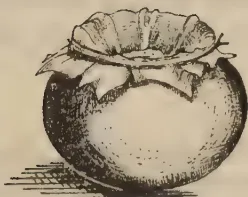
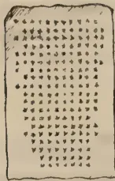
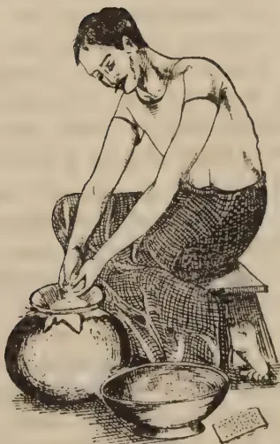

The  
**Tropical Agriculturist**

VOL. XC

PERADENIYA, JANUARY, 1938

No. 1

---

<table style="width: 100%;"><thead><tr><th></th><th style="text-align: right;">Page</th></tr></thead><tbody><tr><td>Editorial .. .. .</td><td style="text-align: right;">1</td></tr></tbody></table>

**ORIGINAL ARTICLES**

<table style="width: 100%;"><tbody><tr><td>The Analysis of Ceylon Foodstuffs—I. By A. W. R. Joachim, Ph.D., Dip. Agric. (Cantab.) .. .. .</td><td style="text-align: right;">3</td></tr><tr><td>The Analysis of Ceylon Foodstuffs—II. By A. W. R. Joachim, Ph.D., Dip. Agric. (Cantab.), and D. G. Pandittesekere, Dip. Agric. (Poona) ..</td><td style="text-align: right;">7</td></tr><tr><td>The Analysis of Ceylon Foodstuffs—III. By S. Kandiah, Dip. Agric. (Poona), and D. E. V. Koch, B.Sc. (Hons.) .. .. .</td><td style="text-align: right;">11</td></tr><tr><td>The Analysis of Ceylon Foodstuffs—IV. By A. W. R. Joachim, Ph.D., Dip. Agric. (Cantab.), and C. Charavanapavan, B.Sc. ..</td><td style="text-align: right;">17</td></tr><tr><td>The Analysis of Ceylon Foodstuffs—V. By A. W. R. Joachim, Ph.D., Dip. Agric. (Cantab.), and S. Kandiah, Dip. Agric. (Poona) ..</td><td style="text-align: right;">22</td></tr><tr><td>Goat Manure. By M. L. M. Salgado, Ph.D., Dip. Agric. (Cantab.), B.Sc. (London) .. .. .</td><td style="text-align: right;">30</td></tr></tbody></table>

**DEPARTMENTAL NOTES**

<table style="width: 100%;"><tbody><tr><td>Mango Stocks .. .. .</td><td style="text-align: right;">34</td></tr><tr><td>Arrowroot .. .. .</td><td style="text-align: right;">36</td></tr></tbody></table>

**SELECTED ARTICLES**

<table style="width: 100%;"><tbody><tr><td>Lalang Grass .. .. .</td><td style="text-align: right;">38</td></tr><tr><td>Tropical Fruits and Vegetables .. .. .</td><td style="text-align: right;">42</td></tr></tbody></table>

**CORRESPONDENCE**

<table style="width: 100%;"><tbody><tr><td>Cattle Improvement in Ceylon .. .. .</td><td style="text-align: right;">56</td></tr></tbody></table>

**MEETINGS, CONFERENCES, &c.**

<table style="width: 100%;"><tbody><tr><td>Minutes of the Fortieth Meeting of the Rubber Research Board (Ceylon) ..</td><td style="text-align: right;">57</td></tr><tr><td>Minutes of a Meeting of the Board of the Tea Research Institute of Ceylon .. .. .</td><td style="text-align: right;">60</td></tr></tbody></table>

**RETURNS**

<table style="width: 100%;"><tbody><tr><td>Animal Disease Return for the Month ended December, 1937 ..</td><td style="text-align: right;">66</td></tr><tr><td>Meteorological Report for the Month ended December, 1937 ..</td><td style="text-align: right;">67</td></tr></tbody></table>

**ERRATUM**

Vol. LXXXIX, No. 6, December, 1937—

Page 354. Item 7. For Rs. 15.00 read Rs. 5.00  
Pages 362-365 should appear immediately after page 368

1------------------------------------------------

xii

# WALKERS

## WASHING, CREPING AND SHEETING

# RUBBER MILL

Suitable for the Manufacture of Sole Crepe.

MACHINE CUT GEARS—SILENT RUNNING  
FITTED WITH SPECIAL SAFETY BUSHES AND GEAR GUARDS  
AND IMPORTED ROLLS.

Machines available with Smooth or Fluted Rolls.

*Full Particulars and Prices will be sent on request*

## WALKERS, COLOMBO

2------------------------------------------------

The  
**Tropical Agriculturist**

January, 1938

---

**EDITORIAL**

---

**THE FOOD OF THE POOR**

---

**T**HE discovery of a balanced diet which will ensure that the consumer will take an adequate quantity of tissue building foods can hardly be said to be the main problem of nutrition in this country. So far as one may have an opinion on general impressions rather than on a scientific and statistical analysis the common mistake which the more prosperous classes make is not the absorption of an insufficient supply of such foods, but the addition to them of a harmfully large volume of merely energy producing bulk : or, in other words, over-eating. The wage earner, on the other hand, is not interested in the superior articles of diet. Such articles as eggs, milk, or even the more expensive grains cannot enter into a family budget based on forty cents a day. They must always remain unattainable luxuries to the earner of such wages. The peasant whose life is not governed by a money economy and who eats what he grows, and grows what his father grew before him, finds that the economic slough in which he is permanently submerged does not allow him to embark on schemes for the production of new foods for himself. Those who advise the peasant to improve his cattle so that they may yield more milk which may be consumed by his family have no appreciation of the factors that govern the situation. The cow will not yield more milk than is sufficient to rear its own young in the conditions in which it lives unless it is given special food which the peasant must buy or raise himself with effort by the expenditure of money in the purchase of fertilizers ; and he does not have the money to do either of these things. It must be remembered that even in the agriculturally more advanced countries the milk yield of a cow was determined strictly by the requirements of its own young until industrialization produced the money-spending population which would buy the milk produced by intensive and expensive

1—J. N. 826 (12/37)

3------------------------------------------------

2

methods of farming. It follows that in the present stage of the country's development the proper approach to the problem of the better nutrition of the people does not lie in scientific doctrines regarding "the balanced diet" or "the ideal diet", but in the increase of the purchasing power of the people. With a financial system in which the amount of money released by the exchange banks for circulation in the country is determined by what the producer of export goods is prepared to spend on the purchase of locally made commodities, this increase in the purchasing power of the poorer classes can be brought about only by the partial industrialization of the country and by such fiscal manipulation as would induce the producer of export goods to buy commodities of local manufacture. Until these developments take place all our "national fitness" campaigns and "better nutrition" campaigns must remain largely talk.

Nevertheless the results of the analysis of some of the common foodstuffs by the chemical branch of this department published in this number show that within very narrow limits discriminatory dieting with common village produce can have beneficial results. These figures are very interesting in another respect. They confirm the wisdom of certain preferences prescribed by custom and the advice of the Ayurvedic Physician. According to this advice unpolished rice, pulses, and gingelly are good foods, while amongst vegetables, Murunga (both leaf and pod), *Agathi*, and *Mukunuvenna* are the best. Of the gourds, the bitter gourd is recommended above all others. The analysis leaves no doubt that the preference for these articles is determined by a desire to supplement a diet of more or less pure carbohydrates with as much minerals and proteins as can be secured. The most striking facts disclosed by these figures are the very high protein and fat value of the Soybean, the acclimatization of which to the conditions of this country the Department of Agriculture has now in hand, and the poor percentage of minerals in Spinach which is contrary to common belief. The superiority of unpolished rice over the machine polished rice is no less striking but the analysis only confirms what is already known.

Now it remains for the health authorities to make use of this valuable material, which will be supplemented from time to time by the analysis of other articles, to decide which kinds of available vegetable foods deserve to be popularized by propaganda in the villages and prepare simple leaflets extolling their virtues. Armed with supplies of these leaflets carrying the authority of the profession with them Agricultural Officers will be in a strong position to inaugurate a campaign for their cultivation in preference to those that are of smaller food value.

4------------------------------------------------

3

# THE ANALYSIS OF CEYLON FOODSTUFFS

## I.—GENERAL

A. W. R. JOACHIM, Ph.D., Dip. Agric. (Cantab.),  
CHEMIST

THE question of the food of the people of Ceylon has been engaging the serious attention of Government during recent years, more so as the malaria epidemic brought forcibly home the poor stamina and lack of resistance to disease of a large section of the rural population due to ill-nourishment or faulty nutrition. Very useful work on the medical aspect of the question has been conducted under the direction of Dr. L. Nicholls of the Department of Medical and Sanitary Services. As, however, the necessary data on certain aspects of the nutritive values of local foodstuffs, *e.g.*, their vitamin A and B contents, so essential for the framing of satisfactory diets, were not available till recently and, as there were no facilities locally for carrying out the requisite biological assays, a vote was granted by Government for the work to be done in Great Britain.\* The nutritive values of many local foods in respect to their calorific or energy-producing power and their protein and total mineral contents have, however, been known for many years. The work of Cochran (1) Bamber (2) and Bruce (3) bears ample evidence of this. In 1921 during the last rice crisis, Bamber published in *The Tropical Agriculturist* (2) the analyses of a number of foodstuffs, many of which were carried out in his laboratory. Since the establishment of the Chemical Division of the Department of Agriculture in 1925, numerous analyses of local vegetable foods have been made periodically, but only a few of the results have been published, among them being the analyses of paddies, rices, and by-products (4). In view of the importance of such data for the working out of suitable diets, it has been considered that their publication would be of value, even though all the analyses may not be as complete as would be desired. Recently the systematic analysis of local vegetable foods has been taken in hand. The results of these and of the earlier analyses are now submitted in a series of five papers each dealing with different classes of foods. For the sake of completeness the analyses of certain foodstuffs

\* The results of these analyses have recently appeared in Sessional Paper XXIX. of 1937, "Further Report on Nutrition in Ceylon" by Dr. L. Nicholls.

5------------------------------------------------

4

made in this laboratory, but which have already been published, are included. Altogether the analytical examination, in whole or part, of over 120 different samples of foodstuffs has been made.

In this article, which is the first of the series, the nature and scope of the work are described and the results obtained briefly summarized. In the second, the analyses of the more important local grains, pulses, oilseeds, seeds and roots are discussed. The third article deals with the commonly-used local vegetables, of both leafy and non-leafy types. In the fourth, the vitamin C values of some local fruits and vegetables, as determined by a chemical method, are presented. The last article relates to the analyses of samples of toddy (palm sap), particularly of the palmyra and kitul palms and of the crude sugar (*jaggery*) made from it. The work on this subject was almost entirely carried out a few years ago, but the results were not published at the time. Although not strictly a foodstuff, in so far as fresh or sweet toddy has a definite food value, the results of analyses of this drink are included in this series of articles.

Care was taken in selecting samples for analysis that they were as fresh and as representative as possible. All the foodstuffs concerned, with the exception of the palm saps, were examined for moisture, protein, fat, fibre, total mineral matter and carbohydrates. The leafy vegetables and a few of the more important grains were, in addition, examined for some or all of the mineral constituents, calcium, phosphorus, and iron. These determinations were limited to particular groups of foodstuffs only, as, unlike the organic constituents which generally do not show a great range of variation in different samples of the same foodstuff, the mineral constituents may vary appreciably with the type of soil on which the particular sample is grown. Foodstuffs grown on calcareous soils, as for example, those of the Jaffna Peninsula, would be richer in calcium and phosphoric acid than those grown on lime-deficient soils, *e.g.*, those of the wet low-country. This fact is clearly brought out in the study of the mineral composition of local pasture grasses (5, 6). Grasses from Jaffna and Hambantota, where limestone is abundant, were definitely richer in both lime and phosphoric acid than those from other parts of the country. The calorific value was calculated from the analytical data by adding to the sum of the carbohydrate and protein percentages multiplied by 4, the fat percentage multiplied by 9. In the samples of toddy, total and reducing sugars, alcohol and acetic acid contents were determined.

It is not the purpose of this article to discuss the importance and functions of the various chemical constituents of foods, nor the question of suitably balanced diets. This must be left

6------------------------------------------------

5

to the medical authorities, to whom, however, the data now furnished will be of value. Those who are interested in these questions would do well to read the Cantor lectures by Sir Robert McCarrison on "Nutrition and National Health" published in *The Journal of the Society of Arts* (7). The lectures make special reference to the nutrition problems of India and have therefore an important bearing on local dietary questions. A more recent publication (8) entitled "The Nutritive Value of Indian Foods and the Planning of Satisfactory Diets" which has been issued by the Nutrition Research Laboratories, Coonoor, under the editorship of Dr. W. R. Aykroyd, gives most useful information on the subject, and should prove of great utility to all those concerned with the problems of nutrition in Ceylon. Not only are complete organic and mineral analyses of Indian foodstuffs, both vegetable and animal, furnished, but many of the vitamin values as well. Practically every Ceylon food material is included in the list of analyses. Though it is only to be expected that there would be some variation between these analyses and those of corresponding locally-produced foodstuffs, particularly in regard to mineral composition, the variations would be such as would permit of the use of the data not available locally for the planning of local diets without any serious likelihood of error. The Indian analytical figures are very similar to those now published for most foodstuffs. It is suggested, however, that whenever required, the local data be used in preference. Reference to Dr. Nicholls' papers on Nutrition in Ceylon will be very helpful (9).

The general results of these studies will now be briefly indicated. Of the cereals, which are in general rich in carbohydrates and poor in proteins, millets and adlay are of highest nutritive value. Country rice is superior to polished rice not only in regard to organic and mineral nutrients, but also in vitamin B 1. It may be of interest to state here that a preparation of vitamin B 1 extract by the method worked out in the Philippine Islands, where it is known as "tiki-tiki", has been made from rice polishings supplied by the Marketing Commissioner. This product is to be tested out by the Medical Department in due course. Maize and kurakkan are superior to rice, but inferior to the millets as foods. The pulses like green gram and dhal are rich in proteins. Of the local oil seeds coconut is rich in oil or fat but poor in protein. Cashew nut is rich in both. Soybean, the cultivation of which is being encouraged locally, is very rich in fat and protein. Roots like manioc and sweet potatoes are essentially carbohydrate foods.

The leafy vegetables like those of *tampala* (S) (*Amarantus spp.*), *agathi*, *kankun* (S) and spinach are richer in both organic and mineral nutrients than the non-leafy types. Drumstick,

7------------------------------------------------

6

beans, cowpeas, and bitter gourd are useful balanced vegetables. Breadfruit, jak, and ash plantain are mainly energy-giving foods.

The vitamin C determinations have indicated that among the fruits guavas, papaws, citrus spp., certain varieties of mangoes, tomatoes, and the hog plum are rich sources of this vitamin. Plantains are of poor value in this respect. Of vegetables, *agathi*, chillies, spinach, and drumstick are of high vitamin C content.

The analyses of samples of toddy (palm sap) from the palmyra and kitul palms indicate that fresh or sweet toddy from the former has a lower sugar content than that from the latter. The composition varies with the method of treatment of the pots in which the toddy is collected. Liming the pots prevents fermentation, but smoking only delays it. Apart from the easily digestible sugar present in toddy, its value as a food is mainly due to its high yeast content which is the source of vitamin B. Jaggery contains over 80 per cent. sugar.

In conclusion it may be stated that work on the composition and nutritive values of local foodstuffs is to be continued on the lines started, till such time as a special organization for this purpose is created.

#### REFERENCES

1. 1. Cochran, M.—Ceylon Manual of Chemical Analyses.
2. 2. Bamber, M. K.—Some Ceylon Foodstuffs and their Food Values. *The Tropical Agriculturist*, Vol. LVI., No. 4, 1921.
3. 3. Bruce, A.—Kurakkan Analyses. *The Tropical Agriculturist*, Vol. LX., No. 6, 1923.
4. 4. Joachim, A. W. R., and Kandiah, S.—The Chemical Composition of Some Ceylon Paddies, Rices and Milling Products. *The Tropical Agriculturist*, Vol. LXX., No. 4, 1928.
5. 5. Joachim, A. W. R.—The Mineral Constituents of Ceylon's Fodder Grasses. *The Tropical Agriculturist*, Vol. LXVIII., No. 5, 1927.
6. 6. Joachim, A. W. R., and Kandiah, S.—The Mineral Contents of Some Cultivated Fodder Grasses in Ceylon. *Year Book, Department of Agriculture, Ceylon*, 1927.
7. 7. McCarrison, R.—Nutrition and National Health. *Jour. Soc. Arts.*, LXXXIV., Nos. 4371–3, 1936.
8. 8. The Nutritive Value of Indian Foods and the Planning of Satisfactory Diets. *Govt. of India Health Bulletin*, No. 23.
9. 9. Nicholls, L. Report on Nutrition in Ceylon, 1937. Sessional Paper II.

8------------------------------------------------

7

# THE ANALYSIS OF CEYLON FOODSTUFFS

## II.—SOME IMPORTANT CEREALS, PULSES, OILSEEDS, AND ROOTS

A. W. R. JOACHIM, Ph.D., Dip. Agric. (Cantab.),  
CHEMIST

AND

D. G. PANDITTESEKERE, Dip. Agric. (Poona),  
ASSISTANT IN AGRICULTURAL CHEMISTRY

THE analytical data presented in this article relate to the more commonly-grown grains, pulses, oilseeds and roots, and some of their products. The grains include rice, polished and partly polished (country rice), kurakkan, maize, Guinea corn (sorghum), Italian, kodo, bulrush and little millets, and adlay. The analysis of rice polishings is included as this material is of high food value. The pulses examined were green, black, and red gram (dhal), cowpeas, soybean, and horse gram. Of these, soybean is at present not cultivated in Ceylon on any scale, but as experiments are in progress to enable this useful crop to be more generally cultivated, a sample grown at Peradeniya was analysed. Of the oil seeds, only coconut, gingelly and cashew nut have been examined. Coconut milk, obtained from the scrapings of the kernel by expression with water, the form in which coconut is most widely used in Ceylon cookery, has been included for comparison. The roots analysed include manioc (cassava), its flour and starch, king yam so popular in the Northern Province, sweet potato, and arrowroot flour and starch. Seeds of the water lily (*olu*), used in the remoter parts of the North-Central Province where rice is scarce, and of jak, largely used for food where this crop grows successfully, have also been examined.

In all samples of over thirty different food products have been studied analytically. The constituents determined were moisture, protein, ether extract (fat), fibre and mineral matter, and carbohydrate, by difference. The calorific or heat value was calculated in the usual way. The results of analysis are shown in table I. In table II the calcium and phosphorus contents of the three most commonly consumed foodstuffs, rice, kurakkan, and green gram, are shown. The analyses were made by the standard methods.

9------------------------------------------------

8

TABLE I  
Analyses of Locally-grown Foodstuffs

<table border="1">
<thead>
<tr>
<th>Name</th>
<th>Botanical Name</th>
<th>Sinhalese Name</th>
<th>Tamil Name</th>
<th>Moisture.</th>
<th>Protein</th>
<th>Carbo- hydrate</th>
<th>Ether Extract (fat)</th>
<th>Fibre</th>
<th>Mineral Matter</th>
<th>Caloric Value per 100 Grms</th>
</tr>
</thead>
<tbody>
<tr>
<td colspan="11"><i>Cereals</i></td>
</tr>
<tr>
<td>Rice (polished)</td>
<td>.. Oryza sativa</td>
<td>.. Haal</td>
<td>.. Arisi</td>
<td>Per cent. 13.24</td>
<td>Per cent. 6.31</td>
<td>Per cent. 78.14</td>
<td>Per cent. 0.38</td>
<td>Per cent. 0.33</td>
<td>Per cent. 1.60</td>
<td>Per cent. 341.2</td>
</tr>
<tr>
<td>Rice (country)</td>
<td>.. —</td>
<td>.. Meratahaal</td>
<td>.. Naddarisi</td>
<td>.. 13.24</td>
<td>.. 7.44</td>
<td>.. 77.28</td>
<td>.. 0.73</td>
<td>.. 0.33</td>
<td>.. 0.98</td>
<td>.. 345.5</td>
</tr>
<tr>
<td>Rice (polishings)</td>
<td>.. —</td>
<td>.. Kuddu</td>
<td>.. Thavidu</td>
<td>.. 9.03</td>
<td>.. 11.91</td>
<td>.. 36.22</td>
<td>.. 23.51</td>
<td>.. 9.21</td>
<td>.. 10.12</td>
<td>.. 404.1</td>
</tr>
<tr>
<td>Kurakkan</td>
<td>.. Eleusine coracana</td>
<td>.. Kurakkan</td>
<td>.. Kurakkan</td>
<td>.. 12.36</td>
<td>.. 7.61</td>
<td>.. 74.76</td>
<td>.. 1.35</td>
<td>.. 1.57</td>
<td>.. 2.35</td>
<td>.. 341.6</td>
</tr>
<tr>
<td>Maize</td>
<td>.. Zea mays</td>
<td>.. Bada iringu</td>
<td>.. Cholam</td>
<td>.. 12.81</td>
<td>.. 7.20</td>
<td>.. 73.76</td>
<td>.. 3.99</td>
<td>.. 1.20</td>
<td>.. 1.04</td>
<td>.. 359.8</td>
</tr>
<tr>
<td>Guinea corn (millet)</td>
<td>.. Sorghum vulgare</td>
<td>.. Karal iringu</td>
<td>.. Irringu</td>
<td>.. 9.38</td>
<td>.. 7.57</td>
<td>.. 74.93</td>
<td>.. 3.92</td>
<td>.. 1.31</td>
<td>.. 2.89</td>
<td>.. 365.3</td>
</tr>
<tr>
<td>Italian millet</td>
<td>.. Setaria italica</td>
<td>.. Tanahal</td>
<td>.. Sami</td>
<td>.. 11.09</td>
<td>.. 11.31</td>
<td>.. 60.81</td>
<td>.. 4.83</td>
<td>.. 8.50</td>
<td>.. 3.46</td>
<td>.. 332.0</td>
</tr>
<tr>
<td>Kodo millet</td>
<td>.. Pennisetum scrobiculatum</td>
<td>.. Amu</td>
<td>.. Varagu</td>
<td>.. 12.29</td>
<td>.. 7.54</td>
<td>.. 68.60</td>
<td>.. 3.37</td>
<td>.. 5.31</td>
<td>.. 2.89</td>
<td>.. 335.0</td>
</tr>
<tr>
<td>Bulrush millet</td>
<td>.. Pennisetum typhoideum</td>
<td>.. Kambu</td>
<td>.. Kambu</td>
<td>.. 11.37</td>
<td>.. 12.07</td>
<td>.. 65.39</td>
<td>.. 5.77</td>
<td>.. 3.38</td>
<td>.. 2.02</td>
<td>.. 361.8</td>
</tr>
<tr>
<td>Little millet</td>
<td>.. Panicum miliare</td>
<td>.. Meneri</td>
<td>.. Pannichami</td>
<td>.. 11.81</td>
<td>.. 11.43</td>
<td>.. 59.75</td>
<td>.. 5.07</td>
<td>.. 8.95</td>
<td>.. 4.98</td>
<td>.. 312.4</td>
</tr>
<tr>
<td>Adlay (husked)</td>
<td>.. Coix lachryma-jobi</td>
<td>.. Kirindi</td>
<td>.. —</td>
<td>.. 10.77</td>
<td>.. 8.87</td>
<td>.. 70.34</td>
<td>.. 5.56</td>
<td>.. 0.83</td>
<td>.. 3.63</td>
<td>.. 366.9</td>
</tr>
<tr>
<td>Sanwa millet (husked)</td>
<td>.. Echinochloa colona</td>
<td>.. fru-</td>
<td>.. —</td>
<td>.. —</td>
<td>.. —</td>
<td>.. —</td>
<td>.. —</td>
<td>.. —</td>
<td>.. —</td>
<td>.. —</td>
</tr>
<tr>
<td></td>
<td>.. nemataea</td>
<td>.. Gojerawala</td>
<td>.. Pulsami</td>
<td>.. 8.78</td>
<td>.. 9.52</td>
<td>.. 77.64</td>
<td>.. 2.66</td>
<td>.. 0.16</td>
<td>.. 1.24</td>
<td>.. 332.6</td>
</tr>
<tr>
<td colspan="11"><i>Pulses</i></td>
</tr>
<tr>
<td>Green gram</td>
<td>.. Phaseolus aureus</td>
<td>.. Muneta</td>
<td>.. Payaru</td>
<td>.. 12.08</td>
<td>.. 21.70</td>
<td>.. 57.70</td>
<td>.. 0.96</td>
<td>.. 3.33</td>
<td>.. 4.23</td>
<td>.. 326.2</td>
</tr>
<tr>
<td>Black gram (husked)</td>
<td>.. Phaseolus mungo</td>
<td>.. Undu</td>
<td>.. Ulundu</td>
<td>.. 13.41</td>
<td>.. 22.99</td>
<td>.. 59.42</td>
<td>.. 1.12</td>
<td>.. 0.01</td>
<td>.. 3.05</td>
<td>.. 339.7</td>
</tr>
<tr>
<td>Red gram (dhal)</td>
<td>.. Cajanus cajan</td>
<td>.. Parippu</td>
<td>.. Parippu</td>
<td>.. 11.11</td>
<td>.. 21.29</td>
<td>.. 63.01</td>
<td>.. 1.00</td>
<td>.. 1.08</td>
<td>.. 2.51</td>
<td>.. 346.2</td>
</tr>
<tr>
<td>Corpeas</td>
<td>.. Vigna unguiculata</td>
<td>.. Me</td>
<td>.. Payittangkoddai</td>
<td>.. 10.88</td>
<td>.. 26.82</td>
<td>.. 52.35</td>
<td>.. 1.10</td>
<td>.. 4.94</td>
<td>.. 3.91</td>
<td>.. 326.6</td>
</tr>
<tr>
<td>Horse gram</td>
<td>.. Dolichos biflorus</td>
<td>.. Kollu</td>
<td>.. Kollu</td>
<td>.. 9.23</td>
<td>.. 21.13</td>
<td>.. 59.79</td>
<td>.. 0.79</td>
<td>.. 5.62</td>
<td>.. 3.44</td>
<td>.. 330.8</td>
</tr>
<tr>
<td>Soybean</td>
<td>.. Glycine hispida</td>
<td>.. —</td>
<td>.. —</td>
<td>.. 13.02</td>
<td>.. 37.01</td>
<td>.. 27.89</td>
<td>.. 14.23</td>
<td>.. 2.90</td>
<td>.. 4.95</td>
<td>.. 387.7</td>
</tr>
<tr>
<td colspan="11"><i>Oil seeds and products</i></td>
</tr>
<tr>
<td>Coconut (fresh)</td>
<td>.. Cocos nucifera</td>
<td>.. Pol</td>
<td>.. Thengai</td>
<td>.. 41.32</td>
<td>.. 3.10</td>
<td>.. 20.20</td>
<td>.. 34.02</td>
<td>.. 0.50</td>
<td>.. 0.86</td>
<td>.. 399.4</td>
</tr>
<tr>
<td>Coconut milk</td>
<td>.. —</td>
<td>.. —</td>
<td>.. —</td>
<td>.. 52.01</td>
<td>.. 4.01</td>
<td>.. 15.90</td>
<td>.. 27.00</td>
<td>.. —</td>
<td>.. 1.08</td>
<td>.. 322.6</td>
</tr>
<tr>
<td>Gingelly</td>
<td>.. Sesamum indicum</td>
<td>.. Tala</td>
<td>.. Ellu</td>
<td>.. 5.54</td>
<td>.. 20.14</td>
<td>.. 16.59</td>
<td>.. 50.76</td>
<td>.. 2.44</td>
<td>.. 4.53</td>
<td>.. 603.8</td>
</tr>
<tr>
<td>Cashew nut</td>
<td>.. Anacardium occidentale</td>
<td>.. Kaju</td>
<td>.. Kasukkoddai</td>
<td>.. 5.43</td>
<td>.. 18.60</td>
<td>.. 38.10</td>
<td>.. 35.15</td>
<td>.. 0.31</td>
<td>.. 2.41</td>
<td>.. 543.2</td>
</tr>
<tr>
<td colspan="11"><i>Seeds</i></td>
</tr>
<tr>
<td>Water lily</td>
<td>.. Nymphaea nouchali</td>
<td>.. Olu</td>
<td>.. Thamurai</td>
<td>.. 12.05</td>
<td>.. 7.95</td>
<td>.. 77.86</td>
<td>.. 0.94</td>
<td>.. 0.68</td>
<td>.. 0.52</td>
<td>.. 351.7</td>
</tr>
<tr>
<td>Jak</td>
<td>.. Artocarpus integra</td>
<td>.. Kosetta</td>
<td>.. Pilakkodai</td>
<td>.. 52.10</td>
<td>.. 4.62</td>
<td>.. 41.20</td>
<td>.. 0.66</td>
<td>.. 0.16</td>
<td>.. 1.26</td>
<td>.. 189.2</td>
</tr>
<tr>
<td colspan="11"><i>Roots and root products</i></td>
</tr>
<tr>
<td>Manioc (Cassava)</td>
<td>.. Manihot utilisima</td>
<td>.. Manyokka</td>
<td>.. Maravalli</td>
<td>.. 67.83</td>
<td>.. 0.81</td>
<td>.. 29.63</td>
<td>.. 0.58</td>
<td>.. 0.71</td>
<td>.. 0.44</td>
<td>.. 127.0</td>
</tr>
<tr>
<td>Manioc flour</td>
<td>.. —</td>
<td>.. —</td>
<td>.. —</td>
<td>.. 12.90</td>
<td>.. 2.18</td>
<td>.. 80.24</td>
<td>.. 1.58</td>
<td>.. 1.91</td>
<td>.. 1.19</td>
<td>.. 343.9</td>
</tr>
<tr>
<td>Manioc starch</td>
<td>.. —</td>
<td>.. —</td>
<td>.. —</td>
<td>.. 11.56</td>
<td>.. 0.20</td>
<td>.. 88.15</td>
<td>.. —</td>
<td>.. —</td>
<td>.. 0.09</td>
<td>.. 353.4</td>
</tr>
<tr>
<td>King yam</td>
<td>.. Dioscorea alata</td>
<td>.. Raja valliya</td>
<td>.. Raja valli</td>
<td>.. 71.23</td>
<td>.. 1.73</td>
<td>.. 25.43</td>
<td>.. 0.03</td>
<td>.. 0.62</td>
<td>.. 0.96</td>
<td>.. 108.9</td>
</tr>
<tr>
<td>Sweet potato</td>
<td>.. Ipomoea batatas</td>
<td>.. Batala</td>
<td>.. Vatthalai</td>
<td>.. 81.01</td>
<td>.. 1.40</td>
<td>.. 15.99</td>
<td>.. 0.22</td>
<td>.. 0.17</td>
<td>.. 1.21</td>
<td>.. 71.5</td>
</tr>
<tr>
<td>Arrowroot flour</td>
<td>.. Maranta arundinacea</td>
<td>.. Areluk</td>
<td>.. Arrodduma</td>
<td>.. 15.27</td>
<td>.. 0.40</td>
<td>.. 83.77</td>
<td>.. 0.15</td>
<td>.. —</td>
<td>.. 0.41</td>
<td>.. 338.0</td>
</tr>
<tr>
<td>Arrowroot starch</td>
<td>.. —</td>
<td>.. —</td>
<td>.. —</td>
<td>.. 14.13</td>
<td>.. 0.46</td>
<td>.. 85.20</td>
<td>.. —</td>
<td>.. —</td>
<td>.. 0.21</td>
<td>.. 342.6</td>
</tr>
</tbody>
</table>

10------------------------------------------------

9

Before discussing the results, it should be emphasized that the analytical figures shown are those obtained for the particular sample of foodstuff analysed. Other samples would show variations in composition within limits. This would be clearly seen from a reference to Sen's Paper on Indian Feeding Stuffs (1). As the samples selected for analysis were fairly representative, the figures furnished may be considered to be typical of the different food materials. The data obtained are considered below.

*Cereals.*—Of the cereals examined, rice and particularly polished rice has the highest starch and lowest protein and fat contents. Country rice is superior in these respects to polished rice. The millets are comparatively richer in proteins and fat, but they have also fairly high fibre contents when unhusked. Their carbohydrate percentages generally are comparatively lower and they are therefore somewhat better balanced foods than rice. Adlay is rich in proteins and fat, some samples being particularly so. One such examined in this laboratory gave a protein content of 17.5 per cent. Burkill (2) states that the protein content of adlay varies from 9.5 to 23.0 per cent. From its analytical composition, it would be inferred that adlay is a nutritious grain, well worth cultivating. Its use is being popularized in the Philippine Islands (3). Kurakkan and maize are not very dissimilar in composition, but the latter has an appreciably higher fat content. Rice polishings are rich in proteins and very rich in fat and can be usefully incorporated with rice flour in proportions of one to four or five of flour, in the preparation of local foods. Whole grains are superior to highly-milled grains, not only in food value but also in vitamin B 1. The calorific values of the cereals examined are very much the same, except for *meneri* which is appreciably lower.

*Pulses.*—The pulses are characterized by being rich in protein, and one of them, soybean, in fat as well. This pulse is a very nutritious food, having the highest protein content of all vegetable foodstuffs. The protein contents of all the other pulses average 23 per cent., while that of soybean is 37 per cent. Their calorific values are similar to those of the cereals.

*Oilseeds and Products.*—Gingelly is the most nutritious of the oilseeds examined, being richest in oil and protein. It has the highest calorific value of all the foods examined. Coconut is rich in oil, but poor in protein. Coconut milk of good quality contains about 27 per cent. oil and 4 per cent. protein. Cashew nut is a nutritious nut second only to gingelly in protein and oil contents and calorific value.

*Seeds.*—The seeds of the water lily (*olu* S.) are similar in composition to village rice, being high in carbohydrates and having a fair content of protein. Hence its use instead of rice

11------------------------------------------------

10

in the remoter dry zones. Jak seed is mainly a carbohydrate food, being rich in this constituent. The dried seed has a composition similar to that of rice.

*Roots and Root Products.*—Manioc, sweet potato, arrowroot, and king yam are rich in carbohydrate and have low protein contents. They are essentially starchy foods and ill-balanced. When used in the diet they should be supplemented with protein foods. The dried flours are of high calorific value.

TABLE II

<table border="1">
<thead>
<tr>
<th></th>
<th></th>
<th></th>
<th>Calcium (Ca) Per cent.</th>
<th>Phosphorus (P) Per cent.</th>
</tr>
</thead>
<tbody>
<tr>
<td>Rice (country)</td>
<td>(2) ..</td>
<td>..</td>
<td>0.018</td>
<td>0.39</td>
</tr>
<tr>
<td>„ (polished)</td>
<td>(2) ..</td>
<td>..</td>
<td>0.012</td>
<td>0.32</td>
</tr>
<tr>
<td>„ (hill)</td>
<td>(2) ..</td>
<td>..</td>
<td>0.015</td>
<td>0.32</td>
</tr>
<tr>
<td>Green gram</td>
<td>(3) ..</td>
<td>..</td>
<td>0.165</td>
<td>0.38</td>
</tr>
<tr>
<td>Kurakkan</td>
<td>(3) ..</td>
<td>..</td>
<td>0.371</td>
<td>0.26</td>
</tr>
</tbody>
</table>

In table II above are shown the mineral analyses of samples of rice, green gram, and kurakkan. The figures in brackets indicate the number of samples examined. The values quoted are the means of those obtained. The analyses indicate that local rices are poor in calcium but rich in phosphoric acid. Country rice is superior to polished rice in both constituents. Kurakkan is rich in lime, but comparatively poor in phosphoric acid. Green gram is rich in phosphoric acid, but has not such a high calcium content as kurakkan.

SUMMARY

The analytical data of 30 locally cultivated cereals, pulses, oilseeds, and roots indicate that cereals are richer in carbohydrates but poorer in protein than pulses. Of the former, the millets generally and adlay are better balanced foods than rice or maize. The local roots are mainly carbohydrate foods. Oilseeds are rich in oil or fat and some like soybean and cashew nut in protein as well. The former is the most nutritious of all the vegetable foods. The two other seeds examined are similar in composition to rice being particularly rich in carbohydrate.

REFERENCES

1. 1. Sen, J. N.—Composition of Some Indian Feeding Stuffs. *Agric. Res. Inst. Pusa, Bull.* 70, 1917.
2. 2. Burkill, I. H.—*A Dictionary of the Economic Products of the Malay Peninsula*, Vol. I. (A.H.).
3. 3. Wester, P. J.—Adlay: Its Culture and Uses. *Philippine Bureau of Agriculture, Circular* 128.

12------------------------------------------------

11

# THE ANALYSIS OF CEYLON FOODSTUFFS

## III.—SOME LEAFY AND NON-LEAFY VEGETABLES

---

S. KANDIAH, Dip. Agric. (Poona),  
*ASSISTANT IN AGRICULTURAL CHEMISTRY*

AND

D. E. V. KOCH, B.Sc. (Hons.),  
*RESEARCH PROBATIONER IN AGRICULTURAL CHEMISTRY*

---

**I**N this paper the results of analysis of the most commonly used vegetables in Ceylon are presented and discussed. The vegetables, 28 in number, were purchased from the local market, as fresh material as possible being obtained. Moisture, protein, fat, carbohydrates, fibre and ash were determined by the standard methods. Of the mineral constituents only those considered most essential in nutrition—calcium, phosphorus, and iron—were estimated. With a view to having comparable results, exactly similar methods of analysis as those adopted in India (1) were employed, excepting in the case of fat, when petroleum ether was used in place of ordinary ether. The results of analyses are given in two tables, one containing those of the leafy vegetables and the other of the non-leafy types. The vegetables on the whole are of low calorific value, the average being only 36 calories per 100 grams of fresh material. Many of them are a fairly good source of minerals, the leafy ones being particularly rich in these. They contain a fairly high percentage of fibre, thus supplying the necessary roughage.

13------------------------------------------------

12

TABLE I  
Leafy Vegetables

<table border="1">
<thead>
<tr>
<th rowspan="2">Name</th>
<th rowspan="2">Botanical Name</th>
<th rowspan="2">Sinhalese Name</th>
<th rowspan="2">Tamil Name</th>
<th colspan="2">Moisture</th>
<th colspan="2">Proteins</th>
<th colspan="2">Ether Extract</th>
<th colspan="2">Carbohydrates</th>
<th colspan="2">Fibre</th>
<th colspan="2">Mineral Matt</th>
<th colspan="2">Calcium</th>
<th colspan="2">Phosphorus</th>
<th colspan="2">Iron mgm per 100 gms</th>
<th colspan="2">Caloric Value per 100 gms</th>
</tr>
<tr>
<th>Per cent.</th>
<th>Per cent.</th>
<th>Per cent.</th>
<th>Per cent.</th>
<th>Per cent.</th>
<th>Per cent.</th>
<th>Per cent.</th>
<th>Per cent.</th>
<th>Per cent.</th>
<th>Per cent.</th>
<th>Per cent.</th>
<th>Per cent.</th>
<th>Per cent.</th>
<th>Per cent.</th>
<th>Per cent.</th>
<th>Per cent.</th>
<th>Per cent.</th>
<th>Per cent.</th>
<th>Per cent.</th>
<th>Per cent.</th>
</tr>
</thead>
<tbody>
<tr>
<td>Amaranth (red)</td>
<td><i>Amarantus paniculatus</i></td>
<td>Tampala</td>
<td>Keerai</td>
<td>87.14</td>
<td>4.53</td>
<td>0.19</td>
<td>3.28</td>
<td>2.08</td>
<td>2.80</td>
<td>0.248</td>
<td>0.076</td>
<td>9.23</td>
<td>33.0</td>
</tr>
<tr>
<td>Amaranth spp.</td>
<td>" viridis</td>
<td>Kura-kola</td>
<td>Kuppai keerai</td>
<td>87.45</td>
<td>3.46</td>
<td>0.18</td>
<td>4.97</td>
<td>1.31</td>
<td>2.63</td>
<td>0.295</td>
<td>0.070</td>
<td>6.30</td>
<td>35.3</td>
</tr>
<tr>
<td>Spinach</td>
<td><i>Talinum</i> sp.</td>
<td>Gas-niviti</td>
<td>Pasali</td>
<td>94.53</td>
<td>1.70</td>
<td>0.19</td>
<td>1.59</td>
<td>0.66</td>
<td>1.33</td>
<td>0.152</td>
<td>0.041</td>
<td>2.97</td>
<td>14.9</td>
</tr>
<tr>
<td>Agathi</td>
<td><i>Sesbania grandiflora</i></td>
<td>Kathurumurunga</td>
<td>Agathithi</td>
<td>78.97</td>
<td>7.03</td>
<td>0.54</td>
<td>9.83</td>
<td>1.19</td>
<td>2.44</td>
<td>0.490</td>
<td>0.072</td>
<td>7.71</td>
<td>72.3</td>
</tr>
<tr>
<td>Kohila</td>
<td><i>Lasia spinosa</i></td>
<td>Kohila</td>
<td>Kohila</td>
<td>91.34</td>
<td>2.17</td>
<td>0.20</td>
<td>3.52</td>
<td>1.34</td>
<td>1.44</td>
<td>0.100</td>
<td>0.042</td>
<td>2.08</td>
<td>24.6</td>
</tr>
<tr>
<td>Kankun</td>
<td><i>Ipomea aquatica</i></td>
<td>Kan-kun</td>
<td>Kangkun</td>
<td>86.51</td>
<td>4.41</td>
<td>0.45</td>
<td>5.70</td>
<td>1.57</td>
<td>1.36</td>
<td>0.064</td>
<td>0.023</td>
<td>2.95</td>
<td>44.5</td>
</tr>
<tr>
<td>Radish</td>
<td><i>Raphanus sativus</i></td>
<td>Rabu-kola</td>
<td>Mullankiyilai</td>
<td>90.72</td>
<td>1.88</td>
<td>0.21</td>
<td>5.04</td>
<td>0.89</td>
<td>1.26</td>
<td>0.112</td>
<td>0.011</td>
<td>5.74</td>
<td>29.6</td>
</tr>
<tr>
<td>Gotukola</td>
<td><i>Centella asiatica</i></td>
<td>Gotu-kola</td>
<td>Vallarai</td>
<td>84.26</td>
<td>2.89</td>
<td>0.34</td>
<td>8.63</td>
<td>1.79</td>
<td>2.09</td>
<td>0.206</td>
<td>0.041</td>
<td>9.59</td>
<td>49.1</td>
</tr>
<tr>
<td>Amaranth (green)</td>
<td><i>Alternanthera sessilis</i></td>
<td>Mukunuvenna</td>
<td>Ponnankani</td>
<td>86.45</td>
<td>4.05</td>
<td>0.31</td>
<td>4.89</td>
<td>1.93</td>
<td>2.38</td>
<td>0.179</td>
<td>0.048</td>
<td>17.46</td>
<td>38.6</td>
</tr>
<tr>
<td>Drumstick</td>
<td><i>Moringa oleifera</i></td>
<td>Murunga</td>
<td>Murungakai</td>
<td>77.12</td>
<td>8.05</td>
<td>0.92</td>
<td>10.66</td>
<td>1.01</td>
<td>2.24</td>
<td>0.387</td>
<td>0.075</td>
<td>5.20</td>
<td>82.9</td>
</tr>
</tbody>
</table>

14------------------------------------------------

13

*Murunga leaf*.—This is the richest of all leafy vegetables analysed in the organic constituents and is a good source of minerals, particularly calcium and phosphorus. The tree is propagated easily by cuttings and needs very little attention. Soils, unsuitable for the cultivation of most other crops, can be utilized for growing this. It is known to stand drought conditions well.

*Agathi*.—In food value this is second only to *murunga*, but is the richest in minerals, chiefly calcium. The flower is not as nutritious as the leaf, the calorific value of the former being 36.5 as against 72.3 for the latter. The leaf as well as the flower is easily obtained at small cost. The tree itself can be grown on a wide range of soils and probably with success in almost all parts of the Island. Like all legumes it may be grown with other crops without serious competition for nitrogen in the soil.

*Amarantus spp.*—Two species of *Amarantus* are common and used for vegetable locally, but their nutritive value is not as high as that of *kathurumurunga*. They are however rich in iron and phosphorus, not quite so rich in calcium. Of the two species, the larger variety, *tampala* is slightly richer in proteins and iron than the smaller. Both are poor in fat.

*Tampala* can be easily cultivated on all types of soil under wide climatic conditions and needs but little attention. The smaller variety, *kurakola*, grows wild and can be collected with little trouble.

*Kankun*.—This is fairly rich in organic constituents, but is very poor in minerals chiefly calcium.

*Gas-niviti*—*Spinach*.—Contains a high percentage of water and is consequently of low calorific value, being the lowest of those analysed. Though reputed to be rich in iron the results obtained locally and in India indicate that it is poor in this constituent as well as in calcium and phosphorus.

*Gotukola*, *Mukunuvenna*, and *Kohila*.—These are as high as most of the other leafy vegetables in food value, but in addition they are supposed to have special medicinal properties.

*Mukunuvenna* however is remarkably rich in iron. *Kohila* is poor in minerals, particularly iron.

*Radish leaf* (*rabu-kola*) is of comparatively low food value. Its phosphorus content is the lowest of the leafy vegetables analysed but it contains fair amounts of calcium and iron.

15------------------------------------------------

14

TABLE II  
Other Vegetables

<table border="1">
<thead>
<tr>
<th rowspan="2">Name</th>
<th rowspan="2">Botanical Name</th>
<th rowspan="2">Sinhalese Name</th>
<th rowspan="2">Tamil Name</th>
<th>Moisture</th>
<th>Proteins</th>
<th>Ether Extract</th>
<th>Carbohydrates</th>
<th>Fibre</th>
<th>Mineral Matter</th>
<th rowspan="2">Caloric Value per 100 gms</th>
</tr>
<tr>
<th>Per cent.</th>
<th>Per cent.</th>
<th>Per cent.</th>
<th>Per cent.</th>
<th>Per cent.</th>
<th>Per cent.</th>
<th>Per cent.</th>
</tr>
</thead>
<tbody>
<tr>
<td>Brinjal</td>
<td><i>Solanum melongena</i></td>
<td>Battu</td>
<td>Kaththarikkai</td>
<td>90.51..</td>
<td>1.03 ..</td>
<td>0.15 ..</td>
<td>6.09 ..</td>
<td>1.63 ..</td>
<td>0.59 ..</td>
<td>29.8</td>
</tr>
<tr>
<td>Ash plantain</td>
<td><i>Musa paradisaca</i></td>
<td>Alu keselgedi</td>
<td>Valerikkai</td>
<td>73.40..</td>
<td>0.69 ..</td>
<td>0.29 ..</td>
<td>24.18 ..</td>
<td>0.47 ..</td>
<td>0.97 ..</td>
<td>102.1</td>
</tr>
<tr>
<td>Snake gourd</td>
<td><i>Trichosanthes anguina</i></td>
<td>Pathola</td>
<td>Pudalankkai</td>
<td>94.79..</td>
<td>0.67 ..</td>
<td>0.09 ..</td>
<td>3.27 ..</td>
<td>0.87 ..</td>
<td>0.32 ..</td>
<td>16.6</td>
</tr>
<tr>
<td>Bitter gourd</td>
<td><i>Momordica charantia</i></td>
<td>Karavila</td>
<td>Pavackai</td>
<td>90.58..</td>
<td>1.40 ..</td>
<td>0.09 ..</td>
<td>5.31 ..</td>
<td>1.01 ..</td>
<td>0.91 ..</td>
<td>27.7</td>
</tr>
<tr>
<td>Red pumpkin</td>
<td><i>Cucurbita maxima</i></td>
<td>Wattakka</td>
<td>Poosanikkai</td>
<td>92.76..</td>
<td>1.00 ..</td>
<td>0.14 ..</td>
<td>4.64 ..</td>
<td>0.83 ..</td>
<td>0.63 ..</td>
<td>23.8</td>
</tr>
<tr>
<td>Ash pumpkin</td>
<td><i>Benincasa hispida</i></td>
<td>Puhul</td>
<td>Sambal poosanikkai</td>
<td>96.74..</td>
<td>0.25 ..</td>
<td>0.07 ..</td>
<td>1.87 ..</td>
<td>0.73 ..</td>
<td>0.34 ..</td>
<td>9.1</td>
</tr>
<tr>
<td>Luffa</td>
<td><i>Luffa acutangula</i></td>
<td>Vetakulu</td>
<td>Peerkanghai</td>
<td>95.63..</td>
<td>0.96 ..</td>
<td>0.09 ..</td>
<td>2.57 ..</td>
<td>0.38 ..</td>
<td>0.37 ..</td>
<td>14.9</td>
</tr>
<tr>
<td>Cucumber</td>
<td><i>Cucumis sativus</i></td>
<td>Pipinja</td>
<td>Kekkarikkai</td>
<td>96.92..</td>
<td>0.42 ..</td>
<td>0.02 ..</td>
<td>1.98 ..</td>
<td>0.40 ..</td>
<td>0.26 ..</td>
<td>9.8</td>
</tr>
<tr>
<td>Radish</td>
<td><i>Raphanus sativus</i></td>
<td>Rabu</td>
<td>Mullanki</td>
<td>92.19..</td>
<td>0.80 ..</td>
<td>0.06 ..</td>
<td>4.77 ..</td>
<td>1.16 ..</td>
<td>1.02 ..</td>
<td>22.8</td>
</tr>
<tr>
<td>Cowpea</td>
<td><i>Vigna unguiculata</i></td>
<td>Me-karal</td>
<td>Paiyittankkai</td>
<td>88.34..</td>
<td>2.86 ..</td>
<td>0.04 ..</td>
<td>6.89 ..</td>
<td>1.26 ..</td>
<td>0.61 ..</td>
<td>39.4</td>
</tr>
<tr>
<td>Beans</td>
<td><i>Phaseolus vulgaris</i></td>
<td>Bonchi</td>
<td>Ponchikkai</td>
<td>88.82..</td>
<td>1.40 ..</td>
<td>0.10 ..</td>
<td>7.28 ..</td>
<td>1.46 ..</td>
<td>0.94 ..</td>
<td>35.6</td>
</tr>
<tr>
<td>Agathi flower</td>
<td><i>Sesbania grandiflora</i></td>
<td>Kathurumurunga mull</td>
<td>Agathithippoo</td>
<td>88.94..</td>
<td>1.67 ..</td>
<td>0.20 ..</td>
<td>7.01 ..</td>
<td>1.46 ..</td>
<td>0.72 ..</td>
<td>36.5</td>
</tr>
<tr>
<td>Kohila rhizome</td>
<td><i>Lasia spinosa</i></td>
<td>Kohila ala</td>
<td>Kohilakkilangnu</td>
<td>91.29..</td>
<td>0.58 ..</td>
<td>0.11 ..</td>
<td>5.35 ..</td>
<td>1.41 ..</td>
<td>1.26 ..</td>
<td>24.7</td>
</tr>
<tr>
<td>Young jak</td>
<td><i>Artocarpus integra</i></td>
<td>Polos</td>
<td>Pillappinachu</td>
<td>86.45..</td>
<td>1.78 ..</td>
<td>0.47 ..</td>
<td>8.89 ..</td>
<td>1.65 ..</td>
<td>0.76 ..</td>
<td>46.9</td>
</tr>
<tr>
<td>Matured jak</td>
<td>do.</td>
<td>Kos</td>
<td>Pillakkai</td>
<td>67.83..</td>
<td>2.33 ..</td>
<td>0.12 ..</td>
<td>27.76 ..</td>
<td>0.90 ..</td>
<td>1.06 ..</td>
<td>121.4</td>
</tr>
<tr>
<td>Drumstick</td>
<td><i>Moringa oleifera</i></td>
<td>Murunga</td>
<td>Murungakai</td>
<td>89.30..</td>
<td>2.21 ..</td>
<td>0.11 ..</td>
<td>4.54 ..</td>
<td>2.89 ..</td>
<td>0.95 ..</td>
<td>34.7</td>
</tr>
<tr>
<td>Ladies finger</td>
<td><i>Hibiscus esculentus</i></td>
<td>Bandakka</td>
<td>Vendikkai</td>
<td>91.82..</td>
<td>0.94 ..</td>
<td>0.07 ..</td>
<td>5.42 ..</td>
<td>0.99 ..</td>
<td>0.76 ..</td>
<td>26.1</td>
</tr>
<tr>
<td>Breadfruit</td>
<td><i>Artocarpus communis</i></td>
<td>Del</td>
<td>Perapilakkai</td>
<td>73.70..</td>
<td>1.94 ..</td>
<td>0.51 ..</td>
<td>21.95 ..</td>
<td>1.11 ..</td>
<td>0.79 ..</td>
<td>100.0</td>
</tr>
</tbody>
</table>

16------------------------------------------------

15

Of the common non-leafy vegetables, jak, ash plantain, and breadfruit show highest caloric values, viz., 121, 102, and 100 respectively, due chiefly to their high carbohydrate contents. With the exception of cowpea which is a legume, jak shows the highest amount of protein. Jak and ash plantain are also comparatively rich in minerals, while breadfruit shows a high fat content. Young jak, *polos*, compares favourably with most other vegetables analysed but is of lower food value than mature jak. It is fairly rich in fat.

*Drumstick*.—The protein content of this fruit is fairly high and the food value itself will be relatively more if an analysis of the fleshy portion alone is carried out.

*Ladies Fingers*.—The moisture content of this vegetable is high, consequently the food value is low.

*Gourds*.—On account of the very high percentage of water in vegetables of this family, their food value is low and this is especially the case with cucumber which contains only three per cent. dry matter. Of these, bitter gourd shows the highest percentage of both protein and mineral matter.

*Pumpkin*.—Two varieties were analysed. The ash pumpkin has a moisture content almost that of cucumber and is equally low in nutritive value and minerals. The red variety is slightly richer, but the calorific value is still low. It is not such a rich source of carbohydrates as it is generally believed to be.

*Legumes*—*Cowpea* and *Green Beans*.—The former is twice as rich in protein as the latter, but has a low percentage of fat. The mineral content of green beans is higher than that of cowpea.

A glance at the tables would indicate that jak and ash plantain and breadfruit contain low percentages of moisture and are rich in carbohydrates, while *murunga* and *agathi* leaves, *kankun*, *tampala*, and *mukunuvenna* are relatively high in protein. None of the vegetables analysed show a high fat content, the highest value for ether extract being 0·92 per cent. in *murunga* and the lowest 0·02 per cent. in cucumber.

The results of mineral analyses of the leafy vegetables show that *mukunuvenna*, *gotukola*, and *tampala* are comparatively high in iron, whilst *kathurumurunga*, *murunga*, and the two species of *Amarantus* have high calcium and phosphorus contents. On

17------------------------------------------------

<!-- stage4: ACCEPT r2J/J_012:81 -->

16

the whole the mineral and organic nutrient contents of local vegetables are lower than those of corresponding samples analysed in India. This is probably due to soil and climatic conditions. Analyses of vegetables from areas in Ceylon where limestone is prevalent would perhaps compare more favourably with the Indian data.

#### REFERENCE

Ranganathan, S., Sundararajan, A. R., and Swaminathan, M.—Study of the Nutritive Value of Indian Foodstuffs, &c. *I. Ind. Jour. Med. Res.* XXIV., 3, 1937.

18------------------------------------------------

17

# THE ANALYSIS OF CEYLON FOODSTUFFS

## IV.—THE VITAMIN C CONTENTS OF SOME CEYLON FRUITS AND VEGETABLES

---

A. W. R. JOACHIM, Ph.D., Dip. Agric. (Cantab.),

*CHEMIST*

AND

C. CHARAVANAPAVAN, B.Sc. (Hons.)

---

THE isolation of vitamin C by Waugh and King (1) following on the work of Szent-Gyorgyi (2), who identified the vitamin with a reducing substance named subsequently hexuronic or ascorbic acid has rendered possible its estimation in natural sources by a purely chemical method. Tillmans and associates (3) used the oxidation-reduction indicator 2: 6 dichlorophenol indophenol for the direct estimation of the vitamin, and his method, modified by others, is now widely adopted. The method has been responsible for much subsequent work on the subject, as a result of which our knowledge of the nature and distribution of vitamin C in plant and animal substances has been considerably enhanced. It would suffice here to state that Tillmans' method as modified by Birch (4) and Bessey and King (5) may underestimate the vitamin C content of the material examined. It is now known that vitamin C may exist in an "active" as well as a "reversibly oxidised form", both of which function biologically. It is the former only which may be estimated by the titration method.

Within recent years the vitamin C contents of Indian foods has been determined by Ahmad (6), Ranganathan (7), Chakraborty (8), Guha and Ghosh (9), and others. Their data are of interest, as many of the fruits and vegetables studied by them are found locally. The investigation, the results of which are now presented, covers a wide range of local fruits and a few

2—J. N. 826 (12/37)

19------------------------------------------------

18

of the local leafy vegetables, the total number of materials examined being over 50. As fresh material as possible was used in view of the observation that the vitamin C contents of fruits and vegetables decrease on keeping.

#### EXPERIMENTAL

The method of estimation used was as follows: from 10 to 25 grms of the fresh material were ground up with fine, clean sand and 10–15 cc of trichloracetic acid. With certain fruits acetic acid was used as the extractive agent, and with other fruits again, *e.g.*, citrus fruits, the fresh juice alone was used for the determination. The extract was strained through muslin, and if coloured, cleared with lead acetate followed by the removal of lead with sodium sulphate. The final extract was made up to 40 cc–60 cc with the acid. Following on the work of Guha and Ghosh (9), 1 cc of glacial acetic acid was finally added to the extract when trichloracetic acid was used, in order to prevent the rapid fading of the colour during titration. The extract was then titrated against a known volume of the indicator, 2:6 dichlorophenol indophenol. The indicator solution was prepared by dissolving .02 gm. of the dye in 100 cc of warm water. This was standardized against a freshly-prepared solution of ascorbic acid in glass-distilled water. The ascorbic acid was standardized against a .01 N iodine solution, prepared by dissolving the required quantity of iodine in a litre of water containing 15 gm. of potassium iodide. The dye titration itself was quite simple, the extract being added from the burette to a measured volume of the dye solution (1 to 5 cc) till the colour of the latter was destroyed. With fairly coloured extracts, the titration was carried out to the point when rapid fading of the pink colour ceased. Fruits which gave very highly-coloured extracts, *e.g.*, the tree tomato, could not be examined for vitamin C content by this method. The extract was then titrated against a .01 N solution of iodine with starch as the indicator. 1 cc of .01 N iodine is equivalent to .88 mgm of ascorbic acid. This method is not accurate for fruit juices containing substances like sugars which react with iodine.

The results of the determinations are set out in tables I and II, the former showing the vitamin C contents of fruits and the latter of the vegetables. Sugarcane is included in the first and betel leaf, tamarind, chillies, and onions in the second table. For purposes of comparison Ahmad's results where available are indicated, as these are similar to those obtained locally. In a few cases the figures of Chakraborty (8) or Ghosh and Guha (9) are quoted. Ranganathan's (7) figures are appreciably higher than those of other Indian workers.

20------------------------------------------------

19TABLE IFruits

<table border="1">
<thead>
<tr>
<th rowspan="2">Name</th>
<th>Vitamin C (Ascorbic Acid)</th>
<th rowspan="2">Indian Figures</th>
<th rowspan="2">Remarks</th>
</tr>
<tr>
<th>Mgs per 100 gms or 100 cc.</th>
</tr>
</thead>
<tbody>
<tr>
<td>Guava</td>
<td>.. 127 ..</td>
<td>90-104</td>
<td>.. Large country variety ; numerous seeds</td>
</tr>
<tr>
<td>Papaw</td>
<td>.. 61 ..</td>
<td>48</td>
<td>.. —</td>
</tr>
<tr>
<td>Orange</td>
<td>.. 57 ..</td>
<td>31.2</td>
<td>.. Very sweet Vavuniya fruit</td>
</tr>
<tr>
<td>"</td>
<td>.. 49.3 ..</td>
<td>—</td>
<td>.. Navel orange from Peradeniya</td>
</tr>
<tr>
<td>Grapefruit</td>
<td>.. 48 ..</td>
<td>38.5</td>
<td>.. Marsh's seedless variety from Peradeniya</td>
</tr>
<tr>
<td>Mandarin</td>
<td>.. 45 ..</td>
<td>—</td>
<td>.. Well matured, sweet, Peradeniya</td>
</tr>
<tr>
<td>Pummelo</td>
<td>.. 41 ..</td>
<td>—</td>
<td>.. Well matured from Colombo</td>
</tr>
<tr>
<td>Lemon</td>
<td>.. 37 ..</td>
<td>38.5</td>
<td>.. From Peradeniya</td>
</tr>
<tr>
<td>Lime</td>
<td>.. 31 ..</td>
<td>16.8</td>
<td>.. British Guiana variety from Peradeniya</td>
</tr>
<tr>
<td>Seedless lime</td>
<td>.. 28 ..</td>
<td>—</td>
<td>.. —</td>
</tr>
<tr>
<td>Mango</td>
<td>.. 80 ..</td>
<td>—</td>
<td>.. <i>Ambalavi</i> from Jaffna</td>
</tr>
<tr>
<td>"</td>
<td>.. 58 ..</td>
<td>—</td>
<td>.. Parrot (<i>Gira</i>) variety from Kandy</td>
</tr>
<tr>
<td>"</td>
<td>.. 55 ..</td>
<td>—</td>
<td>.. From Jaffna</td>
</tr>
<tr>
<td>"</td>
<td>.. 35 ..</td>
<td>—</td>
<td>.. Peradeniya <i>Beti</i> variety</td>
</tr>
<tr>
<td>"</td>
<td>.. 15 ..</td>
<td>13-15</td>
<td>.. <i>Chembatan</i> from Jaffna</td>
</tr>
<tr>
<td>"</td>
<td>.. 15 ..</td>
<td>—</td>
<td>.. —</td>
</tr>
<tr>
<td>Hog plum</td>
<td>.. 42 ..</td>
<td>—</td>
<td>.. <i>Spondias mangifera</i></td>
</tr>
<tr>
<td>Rambutan</td>
<td>.. 35 ..</td>
<td>—</td>
<td>.. <i>Nephelium lappaceum</i></td>
</tr>
<tr>
<td>Tomato</td>
<td>.. 27 ..</td>
<td>26</td>
<td>.. Large variety</td>
</tr>
<tr>
<td>"</td>
<td>.. 15 ..</td>
<td>—</td>
<td>.. Local small variety</td>
</tr>
<tr>
<td>Tree tomato</td>
<td>.. 11 ..</td>
<td>—</td>
<td>.. <i>Cyphomandra betacea</i></td>
</tr>
<tr>
<td>Peach (local)</td>
<td>.. 26 ..</td>
<td>—</td>
<td>.. <i>Prunus persica</i></td>
</tr>
<tr>
<td>Soursop</td>
<td>.. 15 ..</td>
<td>—</td>
<td>.. <i>Annona muricata</i></td>
</tr>
<tr>
<td>Custard apple</td>
<td>.. 16 ..</td>
<td>15</td>
<td>.. <i>Annona squamosa</i></td>
</tr>
<tr>
<td>Jambu</td>
<td>.. 11 ..</td>
<td>—</td>
<td>.. Pink variety, <i>Eugenia</i> spp.; by iodine method</td>
</tr>
<tr>
<td>Pineapple</td>
<td>.. 14.5 ..</td>
<td>—</td>
<td>.. Local Mauritius variety</td>
</tr>
<tr>
<td>"</td>
<td>.. 14 ..</td>
<td>7-28.5</td>
<td>.. Local Kew variety</td>
</tr>
<tr>
<td>Bilin</td>
<td>.. 10 ..</td>
<td>—</td>
<td>.. <i>Averrhoa bilimbi</i></td>
</tr>
<tr>
<td>Jak</td>
<td>.. 7 ..</td>
<td>—</td>
<td>.. <i>Artocarpus integra</i>, ripe</td>
</tr>
<tr>
<td>Young coconut</td>
<td>.. 3.1 ..</td>
<td rowspan="2">} 1.8</td>
<td>.. Pulp</td>
</tr>
<tr>
<td>"</td>
<td>.. 1.5 ..</td>
<td>.. Water</td>
</tr>
<tr>
<td>King coconut</td>
<td>.. 4.3 ..</td>
<td>—</td>
<td>.. Pulp</td>
</tr>
<tr>
<td>" coconut</td>
<td>.. 1.3 ..</td>
<td>—</td>
<td>.. Water</td>
</tr>
<tr>
<td>Palmyra</td>
<td>.. 1.0 ..</td>
<td>—</td>
<td>.. Young fruit ; <i>Borassus flabellifer</i></td>
</tr>
<tr>
<td>Toddy, fresh</td>
<td>.. 7.2 ..</td>
<td>—</td>
<td>.. <i>Caryota urens</i>, kitul</td>
</tr>
<tr>
<td>Toddy, fermented</td>
<td>.. 1.3 ..</td>
<td>—</td>
<td>.. —</td>
</tr>
<tr>
<td>Bael</td>
<td>.. 3.0 ..</td>
<td>7.6</td>
<td>.. <i>Aegle marmelos</i></td>
</tr>
<tr>
<td>Woodapple</td>
<td>.. 2.0 ..</td>
<td>—</td>
<td>.. <i>Feronia elephantum</i></td>
</tr>
<tr>
<td>Plantain</td>
<td>.. 1.3-2.2 ..</td>
<td>0.1-3.2</td>
<td>.. Ripe ; <i>embul hondarawela</i>, <i>puvalu</i> and <i>koli-kuttu</i> varieties</td>
</tr>
<tr>
<td>Mangosteen</td>
<td>.. 1.0 ..</td>
<td>—</td>
<td>.. <i>Garcinia mangostana</i></td>
</tr>
<tr>
<td>Sugarcane</td>
<td>.. 0.36 ..</td>
<td>.2</td>
<td>.. —</td>
</tr>
<tr>
<td>Pomegranate</td>
<td>.. 0.20 ..</td>
<td>1.56</td>
<td>.. Fruit not fresh</td>
</tr>
<tr>
<td>Avocado pear</td>
<td>.. Trace ..</td>
<td>—</td>
<td>.. —</td>
</tr>
</tbody>
</table>

DISCUSSION

An examination of table I will indicate that of local fruits the guava, papaw, citrus spp., and certain varieties of mangoes are rich in vitamin C. Of the citrus species local oranges, grapefruit, mandarins, and pomelos are of about equal antiscorbutic value. Limes, though of fair vitamin C content, have lowest values. Locally-grown lemons apparently have lower vitamin C values than imported fruit. Mangoes vary largely in their vitamin content with variety and place of growth. This is the experience of the Indian workers as well. The condition of the fruit is also an important factor. Overripe fruit are poor in

21------------------------------------------------

20

vitamin C. It was observed in the course of this work, that mature fruits rapidly lose vitamin C on keeping. This is in conformity with what has been found by other workers with fruit as well as vegetables (6, 9). Acidity and absence of air favour the retention of vitamin C, while high temperatures, oxidation and alkalinity favour the destruction of the vitamin. This is one reason why the addition of bicarbonate of soda in cooking fruit or vegetables is disadvantageous. Prolonged cooking would also result in a loss of the vitamin. Fruits like the tomato, hog plum (*Spondias mangifera*), rambutan (*Nephelium lappaceum*), custard apple, and soursop (*Annona muricata*) have fair vitamin C contents. Pineapples grown locally for some reason or other give lower values than might be expected. This is probably because the fruit though not over-ripe, were not as fresh as was desirable. The figures correspond closely with those of Ghosh and Guha (9). Plantains, mangosteens, woodapple (*Feronia elephantum*), bael fruit (*Aegle marmelos*) and sugar cane juice are poor sources of the vitamin. Local avocado pears (*Persea gratissima*) have only a trace of vitamin C. Young coconut kernel and coconut water are poor sources of vitamin C, the water however having from two to three times the vitamin value of the pulp. Fresh toddy has more vitamin C than fermented toddy, but the values are not high.

That wide variations can exist in the vitamin C contents of individual samples of fruits and vegetables will be apparent from one of the latest bulletins of the United States Department of Agriculture, entitled "Vitamin Contents of Foods" (10). The knowledge that certain varieties of fruits or vegetables can be rich sources of vitamin C will certainly be helpful in framing diets, but it must be emphasized that the actual nutritive benefit derived from the fruit or vegetable will depend largely on the variety and condition of the particular sample.

TABLE IIVegetables

<table border="1">
<thead>
<tr>
<th rowspan="2">Name</th>
<th colspan="2">Vitamin C (Ascorbic Acid)</th>
<th rowspan="2">Indian Figures</th>
<th rowspan="2">Remarks</th>
</tr>
<tr>
<th>Mgs per 100 gms. or 100 cc.</th>
<th></th>
</tr>
</thead>
<tbody>
<tr>
<td>Agathi</td>
<td>.. 181 ..</td>
<td>—</td>
<td>..</td>
<td><i>Sesbania grandiflora</i> leaves</td>
</tr>
<tr>
<td>Drumstick</td>
<td>.. 80 ..</td>
<td>—</td>
<td>..</td>
<td><i>Moringa oleifera</i> pods</td>
</tr>
<tr>
<td>Spinach</td>
<td>.. 3 ..</td>
<td>—</td>
<td>..</td>
<td>Leaves</td>
</tr>
<tr>
<td>Chillies</td>
<td>.. 66 ..</td>
<td>31</td>
<td>..</td>
<td>—</td>
</tr>
<tr>
<td>"</td>
<td>.. 50.5 ..</td>
<td>—</td>
<td>..</td>
<td><i>Capsicum annuum</i>, large</td>
</tr>
<tr>
<td>"</td>
<td>.. 13 ..</td>
<td>—</td>
<td>..</td>
<td>" " small</td>
</tr>
<tr>
<td>Mukunuvenna</td>
<td>.. 33.0 ..</td>
<td>—</td>
<td>..</td>
<td><i>Alternanthera triandra</i></td>
</tr>
<tr>
<td>Onions</td>
<td>.. 11.0 ..</td>
<td>10.5</td>
<td>..</td>
<td><i>Allium cepa</i> small, by iodine method</td>
</tr>
<tr>
<td>Tamarind</td>
<td>.. 1.4 ..</td>
<td>1.4</td>
<td>..</td>
<td><i>Tamarindus indica</i> (dried)</td>
</tr>
<tr>
<td>Gotu-kola</td>
<td>.. 1.2 ..</td>
<td>—</td>
<td>..</td>
<td><i>Centella asiatica</i></td>
</tr>
<tr>
<td>Ash plantain</td>
<td>.. 0.5 ..</td>
<td>—</td>
<td>..</td>
<td><i>Musa paradisiaca</i></td>
</tr>
<tr>
<td>Betel leaf</td>
<td>.. 3.4 ..</td>
<td>6.1</td>
<td>..</td>
<td><i>Piper betle</i></td>
</tr>
</tbody>
</table>

22------------------------------------------------

21

From table II above it will be seen that *agathi* (*Sesbania grandiflora*) leaves, drumstick (*Moringa oleifera*), spinach, chillies and *muknuvenna* (*Alternanthera triandra*) are good sources of vitamin C. Ranganathan (7) reports that vegetables like *kankun* (*Ipomoea aquatica*) and bitter gourd (*Momordica charantia*) are also rich in the vitamin, but until a new stock of dye is available their investigation locally has to be deferred.

#### SUMMARY

The determination of vitamin C values by the dichlorophenol indophenol method have indicated that guavas, citrus spp., papaws, certain varieties of mangoes, rambutans, hog plums, and tomatoes are fruits of good vitamin C content, while avocado pears, plantains, coconut, jak, bael, mangosteens, woodapples, and sugar cane are poor sources of the vitamin. Soursop, custard apple, pineapples, tree tomatoes and bilimbi are of intermediate value. Of the vegetables examined, *agathi*, drumstick, spinach, chillies, and *muknuvenna* are rich sources of the vitamin, while ash plantain and *gotukola* are very poor in it.

#### REFERENCES

1. 1. Waugh, W. A., and King, C. G.—*Jour. Biol. Chem.*, 97, 1932.
2. 2. Szent-Gyorgyi, A.—*Biochem. Jour.*, 22, 1928.
3. 3. Tillmans, J., Hirsch, P., and Hirsch, W. Z.—*Untersuch. Lebensmittel*, 63, 1932.
4. 4. Birch, T. W., and Dann, W. J.—*Nature*, 131, 1933.
5. 5. Bessey and King.—*Jour. Biol. Chem.*, 103, 1933.
6. 6. Ahmad, B.—*Ind. Jour. Med. Res.*, 22, 1935.
7. 7. Ranganathan, S.—*Ind. Jour. Med. Res.*, 23, 1935.
8. 8. Chakraborty, R. K.—*Ind. Jour. Med. Res.*, 23, 1935.
9. 9. Ghosh, A. R., and Guha, B. C.—*Jour. Ind. Chem. Soc.* 12, 1935, and *Nature*, 1935.
10. 10. Daniel, E. P., and Munsell, H. E.—*U. S. Dept. Agr. Mis. Publ.* 275.

23------------------------------------------------

22

# THE ANALYSIS OF CEYLON FOODSTUFFS

## V.—PALM SAPS (TODDY) AND JAGGERY

---

A. W. R. JOACHIM, Ph.D., Dip. Agric. (Cantab.),  
CHEMIST

AND

S. KANDIAH, Dip. Agric. (Poona),  
ASSISTANT IN AGRICULTURAL CHEMISTRY

---

THE analytical work with which this paper deals was mainly carried out in 1931 when the studies on palmyra (*Borassus flabellifer*) and kitul (*Caryota urens*) palm juices (toddies) were made. During the past few weeks the work was extended to include preserved coconut toddy and the crude sugar (*jaggery*) made from the sweet toddy of the kitul, palmyra and coconut palms. The study of Ceylon coconut toddy was not undertaken, as it had already been the subject of exhaustive investigation by Browning and Symons (1) in Ceylon. Samples of preserved coconut toddy were kindly supplied by Rev. Fr. T. Paris. The work on palmyra toddy was initiated at the express desire of the then Governor of Ceylon, Sir Herbert Stanley, to whom representations on the utility of an investigation on the dietetic value of palmyra toddy were made by the Maniagars of the Jaffna Peninsula. The samples were obtained through the courtesy of the Excise Department from a tope at Mirusivil, 18 miles from the Tinnevelly Farm School where the analyses

24------------------------------------------------

23

were done. Kitul toddy, obtainable in the wet mid-country, was investigated about the same period.

Various species of palms are grown in different parts of the world for the production of sap from which beverages, known locally and in India as toddy, are prepared. The non-fermented toddy is utilized for the manufacture of either refined or unrefined sugar. The latter is popularly known as *jaggery* or *gur*. The palms comprise among others, coconut, palmyra, kitul, the wild date palm (*Phoenix sylvestris*) and the nipa palm (*Nipa fruticans*). The main constituent of palm sap is cane sugar, which occurs in varying proportions depending on the species, the nature of the individual tree, degree of fermentation, &c. In table I below is given the comparative analytical composition of various species of unfermented palm saps as determined by previous workers.

TABLE I

<table border="1">
<thead>
<tr>
<th>Palm.</th>
<th>Sucrose. Per Cent.</th>
<th>Reducing Sugar. Per Cent.</th>
<th>Authority.</th>
</tr>
</thead>
<tbody>
<tr>
<td>Coconut</td>
<td>.. 12·3-17·4</td>
<td>.. —</td>
<td>.. Browning and Symons (1)</td>
</tr>
<tr>
<td></td>
<td>12·9-16·3</td>
<td>.. 0·7-1·8</td>
<td>.. Gibbs (2)</td>
</tr>
<tr>
<td></td>
<td>14·6-16·0</td>
<td>, 0·04-0·12</td>
<td>.. Norris and Visvanath (3)</td>
</tr>
<tr>
<td>Palmyra</td>
<td>.. 12·0-15·7</td>
<td>.. —</td>
<td>.. Ghose (4)</td>
</tr>
<tr>
<td>Date</td>
<td>.. 7·1-12·2</td>
<td>.. 0·4-3·2</td>
<td>.. Annett (5)</td>
</tr>
<tr>
<td>Nipa</td>
<td>.. 12·6-17·2</td>
<td>.. 0·7-0·9</td>
<td>.. Gibbs (2)</td>
</tr>
</tbody>
</table>

It will be noted that of these palm juices coconut and nipa have highest cane sugar contents. The figures obtained by Cowap and Geake (6) for original total solids of coconut toddy confirm those of other workers. The sucrose percentages for palmyra toddy obtained by Ghose (4) are higher than those of local samples. This is probably due to climatic and other factors. No comparative figures for kitul toddy could be obtained though a search of the available literature was made. Judging from the present results, it might be inferred that kitul toddy has a lower sucrose content than coconut toddy. This assumption is not, however, entirely warranted, as trees in other localities may show higher figures. The samples were obtained from round about Peradeniya.

25------------------------------------------------

24

Samples of sap obtained directly from the spathes were examined qualitatively for the nature of the sugars present. All the tests made indicate that the sap as exuding from the flower, whether of kitul or of palmyra, consists almost entirely of sucrose or cane sugar, and that the slight traces of reducing sugar found even in the freshest samples of toddy is due to the inversion of the sucrose. This conclusion in regard to the nature of the sugars of palm sap has also been arrived at in the Philippines by Gibbs (2) who investigated the composition of the sap of the nipa, coconut, sugar, and buri palms in India, by Annett (5) who investigated the sap of the wild date palm, and in Ceylon by Browning and Symons (1) who carried out the analyses of local coconut toddy. The last-mentioned suggest the possibility of coconut toddy containing raffinose. The sugars present in toddy samples are therefore sucrose or cane sugar and the reducing sugars, dextrose or glucose and lævulose or fructose.

#### EXPERIMENTAL

The samples of palmyra toddy analysed numbered 16. They consisted of 4 samples of sweet toddy obtained in limed pots in accordance with the usual Jaffna practice, 3 being from female trees and 1 from a male tree; 4 samples of fresh toddy collected in new pots, 2 from male and 2 from female trees; 4 samples of fresh toddy collected in smoked pots from 2 male and 2 female trees respectively. The latter samples correspond to what is called in Jaffna *ara*; 2 samples of fermented toddy collected from 1 male and 1 female tree; 2 samples of the sap as it exuded from the spathe, collected in sterile glass vessels, 1 from a male and 1 from a female tree.

Eleven samples of kitul toddy, non-fermented as well as fermented, and two samples of preserved coconut toddy were also examined. In addition analysis of four samples of palm *jaggery* were made. The toddy samples were examined for total solids, cane and reducing sugars, acidity as acetic acid and, when necessary, alcohol. Lane and Eynon's method of sugar analysis, using methylene blue as the indicator, was adopted. The toddies were clarified by basic lead acetate and the excess of lead removed with potassium oxalate.

The results are shown in tables II and III. The former gives the analyses of palmyra toddy and the latter of kitul toddy. The preserved coconut toddy analyses are given in table IV and those of the jaggery samples in table V.

26------------------------------------------------

23

**TABLE II**  
**Palmyra Toddy Analyses**

<table border="1">
<thead>
<tr>
<th rowspan="2">No.</th>
<th rowspan="2">Description of Samples</th>
<th rowspan="2">Sex of Tree</th>
<th rowspan="2">Period between placing the Pot on Trees and Analysis in Hours</th>
<th rowspan="2">Nature of Sample</th>
<th rowspan="2">Total Solids Per Cent.</th>
<th colspan="4">Gms. in 100 cc Sap.</th>
</tr>
<tr>
<th>Cane Sugar</th>
<th>Reducing Sugars</th>
<th>Acetic Acid</th>
<th>Alcohol</th>
</tr>
</thead>
<tbody>
<tr>
<td>1</td>
<td>Sap direct from spathe</td>
<td>Male</td>
<td>2</td>
<td>Unfermented</td>
<td>..</td>
<td>7.32</td>
<td>.. Trace</td>
<td>..</td>
<td>..</td>
</tr>
<tr>
<td>2</td>
<td>"</td>
<td>Female</td>
<td>2</td>
<td>"</td>
<td>..</td>
<td>8.10</td>
<td>.. "</td>
<td>..</td>
<td>..</td>
</tr>
<tr>
<td>3</td>
<td>Toddy collected in limed pot</td>
<td>"</td>
<td>about 30</td>
<td>"</td>
<td>..</td>
<td>8.88</td>
<td>0.10</td>
<td>..</td>
<td>..</td>
</tr>
<tr>
<td>4</td>
<td>"</td>
<td>"</td>
<td>"</td>
<td>"</td>
<td>..</td>
<td>9.41</td>
<td>0.10</td>
<td>..</td>
<td>..</td>
</tr>
<tr>
<td>5</td>
<td>Toddy collected in new pot</td>
<td>Male</td>
<td>"</td>
<td>Slightly fermented</td>
<td>10.8</td>
<td>5.45</td>
<td>4.30</td>
<td>..</td>
<td>..</td>
</tr>
<tr>
<td>6</td>
<td>"</td>
<td>"</td>
<td>"</td>
<td>Very slightly fermented.</td>
<td>10.4</td>
<td>8.76</td>
<td>0.54</td>
<td>..</td>
<td>..</td>
</tr>
<tr>
<td>7</td>
<td>"</td>
<td>Female</td>
<td>"</td>
<td>Slightly fermented</td>
<td>10.8</td>
<td>6.74</td>
<td>3.0</td>
<td>..</td>
<td>..</td>
</tr>
<tr>
<td>8</td>
<td>"</td>
<td>"</td>
<td>"</td>
<td>"</td>
<td>10.8</td>
<td>9.07</td>
<td>0.98</td>
<td>..</td>
<td>..</td>
</tr>
<tr>
<td>9</td>
<td>smoked pot (ara)</td>
<td>"</td>
<td>15</td>
<td>"</td>
<td>..</td>
<td>8.62</td>
<td>1.10</td>
<td>0.17</td>
<td>..</td>
</tr>
<tr>
<td>10</td>
<td>"</td>
<td>"</td>
<td>"</td>
<td>Very slightly fermented.</td>
<td>10.8</td>
<td>8.89</td>
<td>0.46</td>
<td>0.13</td>
<td>..</td>
</tr>
<tr>
<td>11</td>
<td>"</td>
<td>"</td>
<td>"</td>
<td>Unfermented</td>
<td>..</td>
<td>9.24</td>
<td>..</td>
<td>..</td>
<td>..</td>
</tr>
<tr>
<td>12</td>
<td>limed pot</td>
<td>Male</td>
<td>"</td>
<td>Slightly fermented</td>
<td>9.8</td>
<td>6.71</td>
<td>1.20</td>
<td>0.14</td>
<td>..</td>
</tr>
<tr>
<td>13</td>
<td>"</td>
<td>"</td>
<td>"</td>
<td>Very slightly fermented.</td>
<td>10.2</td>
<td>9.58</td>
<td>0.27</td>
<td>0.06</td>
<td>..</td>
</tr>
<tr>
<td>14</td>
<td>smoked pot (ara)</td>
<td>"</td>
<td>"</td>
<td>Unfermented</td>
<td>..</td>
<td>9.10</td>
<td>..</td>
<td>..</td>
<td>..</td>
</tr>
<tr>
<td>15</td>
<td>limed pot</td>
<td>"</td>
<td>"</td>
<td>Fermented</td>
<td>6.2</td>
<td>1.90</td>
<td>0.51</td>
<td>..</td>
<td>2.01</td>
</tr>
<tr>
<td>16</td>
<td>daily used pots</td>
<td>Female</td>
<td>"</td>
<td>"</td>
<td>5.8</td>
<td>1.87</td>
<td>0.46</td>
<td>0.40</td>
<td>3.14</td>
</tr>
</tbody>
</table>

**TABLE III**  
**Kitul Toddy Analyses**

<table border="1">
<thead>
<tr>
<th rowspan="2">No.</th>
<th rowspan="2">Description of Samples</th>
<th rowspan="2">Period between placing the Pot on Trees and Analysis in Hours</th>
<th rowspan="2">Nature of Sample</th>
<th rowspan="2">Total Solids Per Cent.</th>
<th colspan="4">Gms. in 100 cc Sap.</th>
</tr>
<tr>
<th>Cane Sugar</th>
<th>Reducing Sugars</th>
<th>Acetic Acid</th>
<th>Alcohol</th>
</tr>
</thead>
<tbody>
<tr>
<td>1</td>
<td>Sap direct from spathe</td>
<td>1</td>
<td>Unfermented</td>
<td>..</td>
<td>13.6</td>
<td>.. Trace</td>
<td>..</td>
<td>..</td>
</tr>
<tr>
<td>2</td>
<td>Toddy collected in limed pot</td>
<td>about</td>
<td>"</td>
<td>13.2</td>
<td>12.65</td>
<td>..</td>
<td>..</td>
<td>..</td>
</tr>
<tr>
<td>3</td>
<td>"</td>
<td>"</td>
<td>Slightly fermented</td>
<td>12.8</td>
<td>12.2</td>
<td>0.44</td>
<td>..</td>
<td>..</td>
</tr>
<tr>
<td>4</td>
<td>"</td>
<td>39</td>
<td>Fermented</td>
<td>11.0</td>
<td>4.5</td>
<td>5.6</td>
<td>0.28</td>
<td>..</td>
</tr>
<tr>
<td>5</td>
<td>"</td>
<td>63</td>
<td>Slightly fermented</td>
<td>12.4</td>
<td>9.85</td>
<td>.60</td>
<td>0.16</td>
<td>..</td>
</tr>
<tr>
<td>6</td>
<td>smoked pot (ara)</td>
<td>15</td>
<td>"</td>
<td>11.6</td>
<td>8.85</td>
<td>1.76</td>
<td>0.19</td>
<td>..</td>
</tr>
<tr>
<td>7</td>
<td>"</td>
<td>39</td>
<td>Very slightly fermented.</td>
<td>12.8</td>
<td>12.0</td>
<td>.22</td>
<td>0.06</td>
<td>..</td>
</tr>
<tr>
<td>8</td>
<td>"</td>
<td>15</td>
<td>Slightly fermented</td>
<td>11.6</td>
<td>8.9</td>
<td>1.65</td>
<td>0.20</td>
<td>..</td>
</tr>
<tr>
<td>9</td>
<td>"</td>
<td>39</td>
<td>Very slightly fermented.</td>
<td>12.2</td>
<td>11.2</td>
<td>.22</td>
<td>0.07</td>
<td>..</td>
</tr>
<tr>
<td>10</td>
<td>daily used pot</td>
<td>15</td>
<td>Highly fermented</td>
<td>1.2</td>
<td>Nil</td>
<td>.98</td>
<td>..</td>
<td>3.32</td>
</tr>
<tr>
<td>11</td>
<td>"</td>
<td>39</td>
<td>"</td>
<td>..</td>
<td>..</td>
<td>..</td>
<td>0.30</td>
<td>4.46</td>
</tr>
</tbody>
</table>

27------------------------------------------------

26

An examination of these tables will show that—

(1) The percentage of cane sugar in the fresh sap of the palmyra palm collected in either limed, new, or smoked pots, varies from about 6.7 to 9.5 per cent., and from 9.8 to 13.6 per cent. in the case of the kitul toddy. In general, the limed pots show highest sucrose contents owing to the inhibition of inversion and fermentation by lime, and the smoked pots next highest amounts. This would appear to indicate that by thoroughly smoking the pots toddy can be effectively kept "sweet" for a period of three to four hours after collection from the tree. The degree of inversion is comparatively slight. The new pots do not appear to be quite as effective in preventing inversion and fermentation of the palmyra toddy samples, but in the case of kitul toddy, the new pots appeared to be even better than the smoked pot in this respect. This apparent inconsistency in the results is connected with (a) the method and degree of smoking, (b) the amounts of soluble alkaline salts in the material of the new pots. The results however indicate that toddy obtained in such pots can nearly approximate in composition that obtained in limed pots. Toddy samples obtained in regularly-used, untreated pots on the other hand are well-fermented as will be seen from the results of samples 15 and 16 in Table II. The cane sugar contents of these samples are only about 1.9 per cent. In the case of the sample of fermented kitul toddy the cane sugar content is nil. The amount of cane sugar present in a sample will obviously depend on its degree of fermentation. It is not possible to say from the few analyses carried out whether the composition of the saps from male palmyra trees in general is any way different from those from female trees.

(2) The reducing sugar contents are generally the greater, the smaller the cane sugar contents. This is seen from samples, 5, 7, 9, and 12 in table II and from table III. A high reducing sugar content indicates a high degree of inversion.

(3) Samples of toddy, as is to be expected, change in composition on keeping. This is clear from tables II and III. Toddies collected in smoked and new pots contain high sucrose percentages even after 24 hours, but the reducing sugar and acidity contents also show increases. Fermentation is therefore proceeding, though comparatively slowly. The alcohol contents of fermented toddies increase with keeping up to a maximum which is governed by the original sucrose content.

28------------------------------------------------

27TABLE IVAnalyses of Preserved Coconut Toddy

<table border="1">
<thead>
<tr>
<th rowspan="2"></th>
<th rowspan="2">Total Solids (Brix) Per Cent.</th>
<th colspan="4">Gms in 100 cc Sap.</th>
</tr>
<tr>
<th>Cane Sugar</th>
<th>Reducing Sugars</th>
<th>Acetic Acid</th>
<th>Alcohol</th>
</tr>
</thead>
<tbody>
<tr>
<td>Sample I. ..</td>
<td>3.8 ..</td>
<td>0.32 ..</td>
<td>3.38 ..</td>
<td>1.05 ..</td>
<td>4.4</td>
</tr>
<tr>
<td>Sample II. ..</td>
<td>3.8 ..</td>
<td>— ..</td>
<td>3.68 ..</td>
<td>0.61 ..</td>
<td>4.4</td>
</tr>
</tbody>
</table>

It will be noted that preserved coconut toddy has a low total solid content which consists almost entirely of reducing sugars, a high acetic acid content and an alcohol content of about 4 per cent. by weight. Browning and Symons (1) state that alcohol in coconut toddy averages 4.2 per cent., varying from 2.7 to 5.8 per cent.

THE DIETETIC VALUE OF TODDY

It will thus be seen that sweet toddy obtained from limed pots contains, of food constituents, chiefly cane sugar and small amounts of reducing sugar. The sap collected directly from the tree contains only cane sugar. Fresh toddy collected either in well-smoked or new pots consists chiefly of cane sugar, but small quantities of reducing sugars, glucose and lævulose, are also present. The proportions of these sugars vary with individual samples, depending on the degree of inversion which in its turn depends on the time of keeping. The amount of acid present in toddy is an indication of the degree of acetic fermentation of the sample. Fermented toddy contains alcohol and small amounts of acids, reducing and cane sugars, the more fermented samples containing lesser amounts of the sugars and more of the alcohol and acids.

All toddy samples, except perhaps those of sweet toddy collected in limed pots, contain yeast in varying amounts depending on the degree of fermentation. Yeast is a good source of the vitamin B complex, more particularly vitamin B 2. A deficiency of this complex leads to loss of appetite and gastro-intestinal disturbances and produces other nervous disorders. The reported beneficial effects of toddy observed in chronic cases of abdominal and other complaints can therefore be traced to this constituent of the yeast, as well as to the numerous enzymes of an oxidizing and reducing nature and other important constituents such as nuclein which it contains. "It has been shown that yeast exerts an inhibiting influence or neutralizing effect upon the toxins produced by various pathogenic organisms, such as cholera, typhus, and diptheria bacilli, as well as streptococci and staphylococci. Hawk and others

29------------------------------------------------

28

have found that yeast exerts a decided curative effect in the treatment of skin diseases. It was also shown by these investigators that yeast can be used with beneficial effects in diseases of the gastro-intestinal tract. Schweizer states that yeast forms a valuable remedy against beri-beri and kindred diseases" (7). The value of the yeast in toddy will thus be understood. The sugars present in toddy are such as are found in fruits and other plant products, and it is not to be expected therefore that they can be of greater value as food than the sugars present in the latter.

TABLE V  
Analyses of Jaggery

<table border="1">
<thead>
<tr>
<th rowspan="2"></th>
<th rowspan="2"></th>
<th colspan="2">Coconut</th>
<th colspan="2">Palmyra</th>
<th colspan="2">Kitul Per Cent.</th>
</tr>
<tr>
<th>Per Cent.</th>
<th></th>
<th>Per Cent.</th>
<th></th>
<th>(1)</th>
<th>(2)</th>
</tr>
</thead>
<tbody>
<tr>
<td>Moisture ..</td>
<td>..</td>
<td>11.40</td>
<td>..</td>
<td>7.36</td>
<td>..</td>
<td>8.38</td>
<td>9.61</td>
</tr>
<tr>
<td>Sucrose ..</td>
<td>..</td>
<td>72.04</td>
<td>..</td>
<td>77.39</td>
<td>..</td>
<td>78.45</td>
<td>80.15</td>
</tr>
<tr>
<td>Reducing sugar</td>
<td>..</td>
<td>7.79</td>
<td>..</td>
<td>1.54</td>
<td>..</td>
<td>0.96</td>
<td>0.76</td>
</tr>
<tr>
<td>Ash ..</td>
<td>..</td>
<td>1.13</td>
<td>..</td>
<td>3.99</td>
<td>..</td>
<td>1.98</td>
<td>1.65</td>
</tr>
<tr>
<td>Protein ..</td>
<td>..</td>
<td>0.55</td>
<td>..</td>
<td>1.16</td>
<td>..</td>
<td>1.79</td>
<td>1.27</td>
</tr>
<tr>
<td>Pectins, gums, &amp;c.</td>
<td>..</td>
<td>7.09</td>
<td>..</td>
<td>8.56</td>
<td>..</td>
<td>8.34</td>
<td>6.56</td>
</tr>
<tr>
<td>Calorific value per 100 gms.</td>
<td></td>
<td>321.6</td>
<td>..</td>
<td>320.3</td>
<td>..</td>
<td>324.8</td>
<td>328.7</td>
</tr>
</tbody>
</table>

The above results will indicate that the different varieties of jaggery have about 80 per cent. of total sugar. The sample of pure kitul jaggery from Kotmale showed highest sugar content. Except in the case of coconut jaggery, the reducing sugar content is low. The sample of palmyra jaggery has the highest ash content. This is due to the fact that the toddy from which it was prepared was collected in limed pots, while those of coconut and kitul jaggery have probably been collected in unlimed pots. The protein contents of kitul and palmyra jaggery are somewhat higher than that of coconut jaggery. All the samples have high calorific values, which are approximately the same for the different varieties.

#### SUMMARY

The analyses of samples of kitul and palmyra toddies have indicated that the sap as exuding from the tree is almost entirely cane sugar (sucrose) which undergoes inversion and fermentation on keeping. Liming the collecting pots is an efficient method of preserving toddy sweet, as lime inhibits the action of the enzyme invertase and destroys organisms like yeast responsible for fermentation. Smoking is not so efficacious, but it appreciably delays fermentation. The nutritive value of toddy, apart from its sugar content, lies in the yeast it contains, which is a good source of the vitamin B complex. Jaggery is essentially a sugar food, containing about 80 per cent. sugar.

30------------------------------------------------

<!-- stage4: ACCEPT r2J/J_012:82 -->

29REFERENCES.

1. 1. Browning, K. C., and Symons, C. T.—Coconut Toddy in Ceylon. *Jour. Soc. Chem. Ind.* XXXV., 22, 1916.
2. 2. Gibbs, H. D.—The Alcohol Industry of the Philippine Islands. *Phil. Jour. Sc.* VI., 3, 1911.
3. 3. Norris, R. V., Visvanath, B., and Nair, K. G.—The Improvement of the Coconut *Jaggery* Industry on the West Coast. *Agr. Jour. India*, XVII., 4, 1922.
4. 4. Ghose, M.—A Neglected Source of Sugar in Bihar. *Agr. Jour. India*, XV., 1, 1920.
5. 5. Annett, H. E. *et al.*—The Date Sugar Industry in Bengal. *Mem. Dep. Agr. India Chem. Ser.*, II. & V.
6. 6. Cowap, J. C., and Geake, F. H.—The Analytical Characteristics of Coconut Toddy. *Analyst*, LVII., 10, 1932.
7. 7. Schlichting, E.—Yeast. Com. Org. Analysis I.

31------------------------------------------------

30*Contribution from the Coconut Research Scheme (Ceylon)*

## GOAT MANURE

---

M. L. M. SALGADO, Ph.D., Dip. Agric. (Cantab.), B.Sc. (Lond.)  
SOIL CHEMIST, COCONUT RESEARCH SCHEME (CEYLON)

---

THERE is a definite belief among planters that goat manure produces excellent results on coconuts, especially on gravelly and sandy soils. Even with other crops, tobacco in particular, it is well known to produce similar results. It is however surprising that there are no recorded analyses of the manurial value of this important local manure as produced under Ceylon conditions.

Two types of goat manure are available in Ceylon and are produced under entirely different conditions: (a) Manure from goats kept on coconut estates: "Estate Goat Manure"; (b) Manure collected from the droppings of large herds kept in the *Wanni* districts round Maho, Galgamuwa, Madawachchi, and Murungan, and supplied by local contractors. This grade had been designated "Contractor's Goat Manure".

### ESTATE GOAT MANURE

Goats are very thrifty feeders and their maintenance and upkeep, for meat, milk, or manure on coconut estates are very economical. This is particularly true where estates possess areas of scrub-jungle in their neighbourhood. The Ceylon breed of goat is very hardy and feeds on a mixed diet of jungle leaves and weeds, which cattle would not relish. A large herd of goats can be looked after by a small boy and so long as there are no young palms which are never safe from their attentions, any possible damage that goats may do on coconut estates can be easily and economically controlled. Under estate conditions, the goats, however hardy they may otherwise be, have to be kept in sheds at night, to protect the animals from a variety of diseases to which they seem to be susceptible. The floor of the shed consists of a platform made of sticks, and raised about a foot above the ground level. The droppings collect partly on this platform and partly on the ground below,

32------------------------------------------------

31

and could be conveniently collected and stored without any serious contamination with sand. As the analyses obtained show, a high-grade manure is thus obtained.

The manure is usually stored in heaps or in pits, in which fermentation occurs with considerable development of heat. On some estates it is the practice to compost the goat manure by mixing it with green manure, in which process the hard pellets crumble down to a dry granular mass.

### “CONTRACTOR’S GOAT MANURE”

It has been observed from the increase in inquiries on the subject received by the Coconut Research Scheme, that the supply of “Contractor’s goat manure” is extending and the coconut planters are anxious to be advised about the manurial value and the possibilities of adulteration of goat manure thus supplied. Large herds each of several hundreds are reported to be kept by goatherds, mostly Indians, in the scrub-jungles of the dry zone of the *Wanni* where extensive tracts of suitable land are available. The animals have free and uncontrolled grazing and in the very dry districts of the *Wanni*, it is neither necessary nor practicable to house such large herds in covered sheds except during the rainy season. The animals are however penned at night in open enclosures, which are shifted periodically. The droppings are collected, inevitably mixed with sand and left in heaps unprotected from the weather, and are stored by dealers. Often the contractors, who as a rule are resident in the coconut districts where they canvass for supplying to estates, have their own collecting agents. As a rule the manure is supplied in truck loads delivered to estates. It has been reported that for large consignments the Railway grants concession rates, as otherwise freight charges would certainly be prohibitive. The usual cost is about Rs. 20 a ton, in the Chilaw District, freight being paid by the contractor up to the Railway Station closest to the estate.

### COMPOSITION AND MANURIAL VALUE

The results of the analysis of (a) two genuine samples of “Estate goat manure” collected from an estate in Mirigama and (b) of “Contractor’s goat manure” supplied to the Coconut Research Scheme are recorded below.

The samples were thoroughly mixed, air-dried, and then powdered fine in a grinding mill before analysis. Analytical determinations were made by the usual standard methods. The humified organic matter was determined by treatment with hydrogen peroxide.

33------------------------------------------------

32COMPOSITION OF GOAT MANURE

<table border="1">
<thead>
<tr>
<th rowspan="3"></th>
<th colspan="3">Estate Goat Manure</th>
<th>Contractor's Goat Manure</th>
</tr>
<tr>
<th colspan="2">No. 1.</th>
<th>No. 2.</th>
<th>No. 3.</th>
</tr>
<tr>
<th>Per Cent.</th>
<th>Per Cent.</th>
<th>Per Cent.</th>
<th>Per Cent.</th>
</tr>
</thead>
<tbody>
<tr>
<td>Moisture .. ..</td>
<td>14.49</td>
<td>.. 13.13</td>
<td>..</td>
<td>17.58</td>
</tr>
<tr>
<td>Ash .. ..</td>
<td>15.54</td>
<td>.. 13.13</td>
<td>..</td>
<td>45.68</td>
</tr>
<tr>
<td>Total organic matter ..</td>
<td>69.97</td>
<td>.. 73.74</td>
<td>..</td>
<td>36.74</td>
</tr>
<tr>
<td>Humified organic matter ..</td>
<td>—</td>
<td>.. —</td>
<td>..</td>
<td>25.53</td>
</tr>
<tr>
<td>Humified organic matter as a per cent. of the total ..</td>
<td>—</td>
<td>.. —</td>
<td>..</td>
<td>69.62</td>
</tr>
<tr>
<td>Nitrogen .. ..</td>
<td>3.20</td>
<td>.. 2.72</td>
<td>..</td>
<td>1.96</td>
</tr>
<tr>
<td>Potash .. ..</td>
<td>1.56</td>
<td>.. 0.77</td>
<td>..</td>
<td>1.16</td>
</tr>
<tr>
<td>Phosphoric acid ..</td>
<td>1.54</td>
<td>.. 1.57</td>
<td>..</td>
<td>0.71</td>
</tr>
</tbody>
</table>

DISCUSSION

It will be observed that "Estate goat manure" is a high grade product, rich in nitrogen, averaging 3 per cent., and containing also a fair amount of phosphoric acid and potash. On the other hand, "Contractor's manure" is definitely poorer, particularly in nitrogen. The organic matter is nearly half that of "Estate goat manure". The high content of ash is due to the inevitable contamination with sand. At present prices of artificial manures, this manure would be worth Rs. 17 per ton compared to Rs. 25 per ton of "Estate goat manure" \*.

PRACTICAL CONSIDERATIONSAdulteration

Several complaints regarding the suspicion of adulteration of "Contractor's goat manure" have been referred to the writer by purchasers. Such manures not having a standard composition, but depending on the conditions and care with which the manure is collected, stored, and transported, variations in different lots supplied have to be expected. But there have been cases of deliberate watering before supplies are delivered to the Railway Station. The dry pellets can be moistened up to a degree without this being obvious and if delivery is quickly made at the other end little dryage occurs in transit, and the bulk supplied would not differ from the specified tonnage. If delivery is delayed, fermentation of the moist manures in the trucks takes place, the mass reaching a high temperature, with consequent loss of the added water. In such cases quantities supplied and delivered will not agree. It may be mentioned that "Contractor's goat manure" analysed by us shows a higher moisture content than the "estate samples"

\* Calculated at the unit values of Nitrogen Rs. 6, Phosphoric acid Rs. 2.50, and Potash Rs. 2.60 a unit

34------------------------------------------------

33

though the latter were collected from an estate in Mirigama with a moist climate and the former from the drier districts of the *Wanni*.

#### APPLICATION

For annual crops such as tobacco it is usual to grind the hard pellets before application. It is not considered necessary to do this in the case of a perennial such as coconuts where grinding for quicker results gives no advantage. The pellets would gradually break down in the manure trench, particularly when mixed with other constituents that should be applied to balance the excess of nitrogen. Further, a slow decay of goat manure in the form of pellets would be an advantage for a perennial such as coconuts.

The pellets often crumble to a granular mass when allowed to ferment in the heap for months. On some estates goat manure collected is composted with green manures and ash, and applied after the mixed mass is broken down. This could be done in the manure trench itself, the goat manure and ash being added to the green manures spread on the manure, subsequently forked in and covered with soil.

#### RATES

The application of 28 pounds goat manure per palm supplemented with 3 pounds bone-meal (or  $2\frac{1}{2}$  lb. Saphos phosphate) and one to one and half pounds of muriate of potash is recommended. If ash is added the muriate of potash may be replaced by a kerosene-tin full of ash. If green manure is also applied the quantity of goat manure may be reduced at the rate of 10 pounds goat manure for 100 pounds of green manure.

#### ACKNOWLEDGMENT

Thanks are due to Mr. E. Chinnarasa, Technical Assistant, for carrying out the analyses of the samples of goat manure recorded in this paper, and Mr. M. G. Fonseca, Field Assistant, for information regarding the goat farming industry of the *Wanni*.

3—J. N. 826 (12/37)

35------------------------------------------------

34

## MANGO STOCKS

W. R. C. PAUL, M.A., M.Sc., D.I.C., F.L.S.,  
 AGRICULTURAL OFFICER, NORTHERN DIVISION

AND

S. C. GUNERATNAM, B.A.,  
 HEAD MASTER, FARM SCHOOL, JAFFNA

IN raising stock plants of the mango for budding purposes, it is very desirable that the seeds should be planted in a manner which will ensure the highest and the quickest germination in the nursery. For this purpose, the writers have previously advocated the removal of the endocarp or hard seed coat before planting the seed.\* This enables the detection of weevil infested seeds which, when planted, fail to germinate while it also facilitates the emergence of the radicle and plumule. The opening of the seed coat and the extraction of the kernel inside may at first prove difficult but with trained labour this can be adopted as a routine measure without being regarded as inconvenient. At the Farm School, Jaffna, a labourer can extract for a day 400 to 500 kernels of the sour mango (*S. walamba*, *T. pullima*) and the method employed there is described below.

The seed is first washed in water and then rubbed with sand so that it may be firmly grasped when cut open for the extraction of the kernel. Holding it edgewise and using a sharp knife, the seed coat is cut on either side of that edge which becomes ruptured when germination takes place, taking care not to go too deep as to injure the kernel within (Figs. 1 and 2). The cut edges are then prised up and pulled away. Exerting a little pressure with the fingers on the two flat sides of the seed coat the kernel can be gently squeezed out.

The position of planting the seed also appears from certain preliminary experiments to influence the time taken for germination and there are indications that the quickest germination can be obtained by placing the seed erect in the soil at a depth of about 1 in.

---

\* The Propagation of the Mango in Jaffna—I. *The Tropical Agriculturist*, Vol. LXXXVIII., No. 2, pp. 86-91, 1937

36------------------------------------------------

FIG. 1

FIG. 2

S 6.0 7

37------------------------------------------------

<!-- stage4: FAINT old-images-only -->

[Faint page: no legible print of its own could be verified; text withheld (stage 4 review list)]

38------------------------------------------------

35

In regard to the suitability of different mango stocks for budding, there are two types which have given promise because of their large and vigorous appearance and the heavy production of fruits. These are (1) the sour mango (*S. walamba*, *T. pullima*) comprising the semi-wild varieties of *Mangifera indica* and (2) the Ceylon wild mango (*S. etamba*, *T. kartuma*) comprising varieties of *Mangifera zeylanica*. The fruits of the sour mango have a limited demand amongst the poorer classes in the Jaffna Peninsula, while those of the wild mango which are very small in size have no market at all. As such, these fruits which are available in abundance from each tree are best used for stock purposes, if they prove suitable in other respects.

Sixteen varieties of the sour mango showing differences in the shape of the fruit have been tested but they do not differ appreciably in growth. These varieties are found in the villages of the Tenmaradchi and Pachchilaippali divisions of the Jaffna district. They possess numerous well developed laterals on their tap roots and after transplanting the seedlings grow well. The sour mango shows a much more rapid growth than that of the wild mango and it is ready for budding in 9 to 12 months, while the wild mango takes 12 to 18 months. Where the tap root has been pruned prior to potting numerous secondary roots develop thus enabling the sour mango plant to establish itself easily.

The wild mango seedlings on the other hand though they have longer tap roots possess fewer laterals. The presence of a deep tap root, probably, enables the tree to be more drought-resistant, although it has been found growing only in the mainland of the Jaffna district—as far as that district is concerned—along the banks of the Kanagarayan-aru which, however, is dry for most part of the year. The variety growing there produces small elongated fruits each about 3.8 cm. long and about 2 cm. wide. Similar fruits were also obtained from the coastal area of the Eastern Province between Kalkudah and Kalmunai. The seedlings do not stand transplanting well, possibly, on account of the paucity of their laterals. When the tap root is pruned prior to transplanting the percentage success is so low as to make this variety of little value as a stock plant. From present experience, therefore, it may be said that while the sour mango varieties of *Mangifera indica* are suitable stocks for budding purposes it is not advisable to use the variety of the wild mango (*Mangifera zeylanica*) found in the Jaffna and Batticaloa districts.

39------------------------------------------------

36

## ARROWROOT

---

W. MOLEGODE,  
AGRICULTURAL OFFICER (PROPAGANDA),  
PERADENIYA

---

A CONSIDERABLE quantity of arrowroot flour or starch is imported annually into Ceylon when it is possible to produce all our requirements in the Island. Arrowroot flour is obtained from the rhizomes of two plants—*Maranta arundinacea* (Sin. *hulankeeriya*) and *Canna edulis* (Sin. *butsarana*). The former is known commercially as West Indian or Bermuda arrowroot and the latter as Queensland or Australian arrowroot.

*Maranta* is a herbaceous plant with leaves somewhat like those of turmeric and is a native of Tropical America. The plant grows to a height of about three feet : the flowers are white. The rhizomes are white, with a shining skin, and are produced in clusters adhering to the roots.

*Canna edulis* is a species allied to the ornamental garden canna and is a native of the West Indies. Plants may grow to a height of six or seven feet and may form clumps of 15 to 20 suckers. The flowers are red and the leaves are similar to those of the garden canna but usually have a bronze margin. The rhizomes are formed in a compact mass.

Both of these can be successfully grown in the wet zone of Ceylon from sea level up to about 3,000 feet on most types of soils except gravelly and very heavy wet clay soils. The most suitable is a deep, light loamy soil.

*Maranta* and *Canna* are propagated by rhizomes or by the young plants that shoot from them. Crops can be harvested in 9 to 10 months and both are heavy yielders. Under favourable conditions *Maranta* has yielded 5 tons of tubers per acre and *Canna* double this quantity.

### CULTIVATION

The soil should be worked to a depth of about 12 inches, the deeper the better. The rhizomes or young plants should be planted about 6 inches deep, never shallower, and in rows 2 feet apart and 10 to 12 inches in the row for *Maranta* and in rows  $4\frac{1}{2}$  apart and 3 feet in the row for *Canna*. When the plants show above ground one or two weedings will be necessary.

40------------------------------------------------

# PREPARATION OF ARROW-ROOT FLOUR

Fig. 1

Fig. 2

Fig. 3

SURVEY DEPT. CEYLON  
H. 1. 38

41------------------------------------------------

<!-- stage4: FAINT old-images-only -->

[Faint page: no legible print of its own could be verified; text withheld (stage 4 review list)]

A diagram showing a grid of points, possibly representing a network or a matrix structure. It consists of a square frame with a grid of smaller squares inside.

A diagram of a circular or spherical object, possibly representing a node or a component of a system. It has a central circle with some internal lines or shading.

A diagram of a person sitting on a chair, possibly working or reading. The person is shown in profile, facing right, with their hands near their lap or a desk.

42------------------------------------------------

37

Loosening the soil between plants and throwing up a furrow against roots ("hilling") are very beneficial. When the *canna* plants are about 3 feet high the leaves will cover the soil sufficiently to smother weeds but with *Maranta* further weeding may be necessary. Some advocate the removal of flowers as they appear.

#### HARVESTING

With *Maranta* the crop is ready to be lifted when the leaves begin to fall and with *Canna* the plants will begin to die back. Harvesting is best done by lifting the whole plant with a fork. Rhizomes of *Maranta* can be easily removed from the plants but *Canna* rhizomes adhere firmly and are bound by the masses of rootlets from the rhizomes and therefore have to be cut off.

#### USES

The principal use of both *Maranta* and *Canna* is for extracting the starch, which is the arrowroot of commerce, but the rhizomes can be boiled and eaten. *Maranta* can be cooked as a vegetable and the young rhizomes make a fine curry.

#### A SIMPLE METHOD OF EXTRACTING ARROWROOT

The rhizomes should be well washed and all the rootlets removed. They should then be skinned or peeled and again well washed. They are then reduced to a pulp in a wooden mortar (*wangediya*) or may be grated on a rough surface. A simple, but efficient, grater is easily made by punching a number of holes close to one another in a tin sheet. The holes as they are made have ragged edges on the reverse side of the tin and these form a rough, sharp, cutting grater (Fig. 2).

A vessel, of which the top is loosely covered with a piece of cheese-cloth or muslin to form a sieve (Fig. 1), and a good supply of water are necessary. The vessel is filled with water till some of it is above the cloth sieve. The grated rhizome is then put on the cloth and is worked—squeezed—by hand (Fig. 3) till the starch is separated and washed down. In a short time the starch settles in the vessel. The water is drained off, fresh water is added and the starch is stirred and thoroughly mixed in the water and is allowed again to settle down. If the starch is not absolutely white and clean, the process is repeated and thereafter the starch is dried in the sun.

The above is a simple cottage method of extracting arrowroot starch. This method is popular and is practised in our homes. The time will come, if arrowroot cultivation is extended, when it will be necessary to consider the use of machinery for the extraction of the arrowroot starch.

43------------------------------------------------

38

## SELECTED ARTICLES

---

### LALANG GRASS (IMPERATA ARUNDINACEA) AS A PAPER-MAKING MATERIAL\*

---

**L**ALANG grass (*Imperata arundinacea* Cyr.) is a very troublesome weed in many parts of the Eastern Tropics, especially in Malaya and Ceylon, and occurs abundantly also in the Island of New Guinea, in South Queensland, parts of India, Indo-China, &c. In view of its great abundance in many places, often to the exclusion of other plants, the grass has frequently been suggested as a source of pulp for paper-making, and the tests that have been carried out have indicated that it is a very promising material for this purpose, comparable with Algerian esparto. The long distances over which the grass would have to be brought would preclude its use as a substitute for esparto in English mills, and it would be necessary to convert it into pulp close to its source.

One of the earliest attempts to utilise *Imperata arundinacea* was in 1891, when a concession for working the grass in Johore was granted by the Sultan. Analyses of the material were made in London by Cross and Bevan, who reported that the value of the material was "equal to the highest qualities of the esparto grass" (*Agric. Bull., S.S. and F. M. S.*, 1907, **6**, 379-380). The Aynsme Technical Laboratories examined a sample from Singapore and stated that paper suitable for printing could be made from it (*ibid.*, 1908, **7**, 585-587), whilst Messrs. John Dickinson & Co., Ltd., reporting on a sample of half-stuff prepared from the grass in Singapore, said that "as a paper-making material it seems to occupy an intermediate position between Spanish esparto and good straw fibre" (*Kew Bull.*, 1909, 55-59). A sample of the grass from the Federated Malay States was examined at the Imperial Institute in 1917 (this Bulletin, 1918, **16**, 271-273). The results showed that lalang grass gives a good yield of pulp which has excellent felting qualities and produces a strong opaque paper which does not shrink on drying. In yield of pulp and character of the fibres the Malayan lalang compared favourably with Algerian esparto, but it required slightly more drastic treatment than the latter if the pulp is to be bleached and used for the manufacture of white paper. In spite of all these favourable reports no commercial developments appear to have taken place in Malaya.

---

\* Reports of recent investigations at the Imperial Institute. *Bulletin of the Imperial Institute*, Vol. XXXV., No. 3, July-September, 1937

44------------------------------------------------

39

*Imperata arundinacea* was examined by Raitt in the course of his researches on the Savannah Grasses of Northern and Central India (*Ind. For., Rec.*, 1913, 5, 93). In this case, however, he found that although the Indian grass gave a good yield of pulp, the latter proved weak and difficult to bleach.

An Italian worker, Ferdinando Vignolo-Lutati (*Ann. Acad. Agric. Torino*, 1915, 58, 68-76), has reported that the cellulose of *Imperata cylindrica* (= *I. arundinacea*) grown in Italy is very similar to that of esparto, and that no greater consumption of chemicals is required to produce paper-pulp from it than from esparto.

In Queensland *I. arundinacea* has been used commercially for the production of paper pulp, and in 1919 the Queensland Pine Co. were stated to be producing 10 tons of pulp weekly (*Can. Weekly Bull. Tr. Comm.*, 1919, 21, 975). The grass has also been stated to be employed for the manufacture of paper in Indo-China (*Bull. Agric. Inst. Sci. Saigon*, 1919, 1, 188).

The most recent development in the commercial utilization of the grass was the formation in 1936 of an Australian Company with a nominal capital of £3,000,000 to erect pulp mills and manufacture paper pulp from *I. arundinacea* in Papua and New Guinea and to manufacture fine writing and printing papers in Australia. The grass is known in Papua as "kurukuru" and New Guinea as "kunai". According to a report in the local press the Company have secured the lands required from the Administration of Papua, including 45,000 acres at Collingwood Bay, in the north-eastern division, where the first unit of plant with an output of 20,000 tons of bleached pulp per annum is to be erected. The lands secured are sufficient, it is claimed, for the establishment of three such units. It is stated that extensive areas in the Mandated Territory of New Guinea have also been surveyed.

A sample of the grass from Papua was examined at the Imperial Institute in 1918 (this Bulletin, 1919, 17, 155-157). The results, both in respect of yield and quality of the pulp, were not quite as good as those which were obtained with the Malayan grass referred to previously, but this is possibly to be attributed to the sample being in rather poor condition when received.

As already mentioned, *Imperata arundinacea* is common in Ceylon, and with a view to ascertaining the suitability of the grass occurring there as a source of paper pulp, a sample under the name of "Illuk" grass, was forwarded to the Imperial Institute by the Registrar-General and Director of Commercial Intelligence in September, 1936. The report on the material is given below.

#### ILLUK GRASS FROM CEYLON

The sample received consisted of bundles of dried grass about 4 ft. long, varying in colour from cream to pale brown. In nearly all cases the bundles consisted of the leaves of the plant cut above the level of the junction with the leaf-sheaths, but occasionally the leaf-sheaths were present. The lamina of the leaf, about  $\frac{1}{2}$  in. across at its broadest point, commonly extended for about half the length of the leaf (in its upper part) as cut, and gradually tapered to the stout, stiff midrib which had the appearance of a leaf-stalk. The stalk-like midribs were more or less cylindrical and about  $1/32$  in. in diameter.

45------------------------------------------------

40

A representative portion of the sample was chemically examined with the following results:—

<table>
<thead>
<tr>
<th></th>
<th></th>
<th></th>
<th>Per Cent.</th>
</tr>
</thead>
<tbody>
<tr>
<td>Moisture</td>
<td>..</td>
<td>..</td>
<td>8·8</td>
</tr>
<tr>
<td>Ash</td>
<td>..</td>
<td>..</td>
<td>6·1</td>
</tr>
<tr>
<td>Cellulose, in material as received</td>
<td>..</td>
<td>..</td>
<td>42·1</td>
</tr>
<tr>
<td>Cellulose, expressed on the moisture-free material</td>
<td>..</td>
<td>..</td>
<td>46·2</td>
</tr>
</tbody>
</table>

The dimensions of the ultimate fibres were found to be as follows:—

<table>
<thead>
<tr>
<th></th>
<th></th>
<th></th>
<th>Length mms.</th>
<th>Breadth mms.</th>
</tr>
</thead>
<tbody>
<tr>
<td>Maximum</td>
<td>..</td>
<td>..</td>
<td>3·0</td>
<td>.. 0·0155</td>
</tr>
<tr>
<td>Minimum</td>
<td>..</td>
<td>..</td>
<td>0·2</td>
<td>.. 0·0047</td>
</tr>
<tr>
<td>Average</td>
<td>..</td>
<td>..</td>
<td>0·9</td>
<td>.. 0·0074</td>
</tr>
<tr>
<td>Mostly</td>
<td>..</td>
<td>..</td>
<td>.. 0·5 to 1·5</td>
<td>.. 0·006 to 0·009</td>
</tr>
</tbody>
</table>

The ratio, average length/average breadth was 122 : 1.

The ultimate fibres resembled those of esparto in being fine fibres with tapering ends; the lumens were exceedingly fine, and often indistinguishable. A few broader more ribbon like fibres were present.

*Pulping Trials.*—The grass after cutting in a chaff-cutter was digested with caustic soda under conditions approximating to those employed commercially for the production of pulp by the soda process. The conditions employed and the yields obtained are given in the following table:—

<table>
<thead>
<tr>
<th></th>
<th></th>
<th></th>
<th>Trial A</th>
<th>Trial B</th>
</tr>
</thead>
<tbody>
<tr>
<td colspan="5">Parts of caustic soda used per 100 parts of—</td>
</tr>
<tr>
<td>Grass</td>
<td>..</td>
<td>..</td>
<td>16</td>
<td>.. 16</td>
</tr>
<tr>
<td>Solution</td>
<td>..</td>
<td>..</td>
<td>3</td>
<td>.. 3</td>
</tr>
<tr>
<td colspan="5">Conditions of digestion—</td>
</tr>
<tr>
<td>Time</td>
<td>..</td>
<td>.. hours</td>
<td>4</td>
<td>.. 3</td>
</tr>
<tr>
<td>Temperature</td>
<td>..</td>
<td>.. °C</td>
<td>140</td>
<td>.. 140</td>
</tr>
<tr>
<td colspan="3">Parts of caustic soda consumed per 100 parts of grass</td>
<td>9·5</td>
<td>.. 9·4</td>
</tr>
<tr>
<td colspan="5">Yield of moisture-free pulp—</td>
</tr>
<tr>
<td colspan="5">Calculated on grass as received—</td>
</tr>
<tr>
<td>Unbleached</td>
<td>..</td>
<td>.. per cent.</td>
<td>39·8</td>
<td>.. 42·0</td>
</tr>
<tr>
<td>Bleached</td>
<td>..</td>
<td>.. per cent.</td>
<td>32·9</td>
<td>.. 38·4</td>
</tr>
<tr>
<td colspan="5">Calculated on moisture-free grass—</td>
</tr>
<tr>
<td>Unbleached</td>
<td>..</td>
<td>.. per cent.</td>
<td>43·6</td>
<td>.. 46·1</td>
</tr>
<tr>
<td>Bleached</td>
<td>..</td>
<td>.. per cent.</td>
<td>36·1</td>
<td>.. 42·1</td>
</tr>
</tbody>
</table>

*Trial A.*—Under these comparatively mild conditions a well-boiled pulp was obtained which furnished an opaque, well-closed sheet, of greyish-cream colour and possessing satisfactory strength. No shrinkage of the sheets occurred on air-drying. The pulp bleached very easily to a good white colour and furnished paper similar in other respects to the unbleached paper.

*Trial B.*—Since trial A had resulted in a well-boiled pulp, a second digestion was carried out to ascertain whether satisfactory results could be obtained under even milder conditions of treatment. The time of digestion was accordingly reduced to 3 hours whilst other conditions remained unaltered. These conditions of digestion proved just sufficient to produce a well-boiled

46------------------------------------------------

41

pulp, and an increased yield of about 2 per cent. of unbleached pulp was obtained. The pulp, moreover, bleached readily and gave bleached and unbleached papers similar in character to those obtained in trial A.

The results of this investigation of Illuk grass show that it furnishes a fairly good yield of pulp by the caustic soda process from which paper of satisfactory quality can be made. It requires only a mild treatment of normal character.

In the form of the present sample the grass has the advantage of being free from roots and adherent impurities, such as are normally liable to contaminate commercial esparto and straw respectively.

The yield of bleached pulp from the sample was somewhat lower than that obtained under comparable conditions at the Imperial Institute from Algerian esparto (42.1 per cent. as compared with 46.6). In character the ultimate fibres somewhat resemble those of esparto, but the paper produced from the pulp in this experiment differed from esparto paper in being harder and less bulky. The bleached pulp, either alone or in admixture with other materials would be suitable for the manufacture of writing, book and printing papers.

47------------------------------------------------

42

## TROPICAL FRUITS AND VEGETABLES. AN ACCOUNT OF THEIR STORAGE AND TRANSPORT\*

### SAPODILLA

**T**HE Sapodilla, dilly, sapota, naseberry or chico (*Acras sapota*), a tropical American indigene, yields a white latex from which chicle, used in the manufacture of chewing gum, is obtained, and also fruits two to four inches in diameter, with a russetted scurfy skin and very sweet, spicy, yellowish, granular pulp.

Popenoe states that the sapodilla can be shipped successfully with little care in packing. Fruits picked full-grown but hard do not begin to ripen for several days, permitting of transport over short distances without the use of refrigeration. He further states that sapodillas have been shipped from the Florida Keys to New York in tomato crates, each crate containing 6 small baskets of fruit.

According to Cheema and Ghandi, the sapodilla as grown in India is tolerant of temperatures below 40°F. At temperatures between 40° and 50°F. green fruits may be kept for one month, after which they will ripen normally on removal from cold storage.

Sapodilla, exported from Java to Holland in a cold chamber maintained at approximately 3°C. (37.4°F) are stated to have arrived in fairly good condition. On being removed from cold storage, however, the consignments did not respond well to ripening treatment, uneven ripening, hardness and shrivelling being objectionable features. Fruits brought to a uniform maturity by a smoking treatment prior to shipment are said to have given more satisfactory results. Latex coating was unsuccessful as a means of preservation.

In cold storage experiments with small quantities of fully grown but unripe Jamaica fruit, stored for sixteen days at 45°F., Smith has reported favourable results. On removal to higher temperatures (80° to 93°F.) the fruit ripened in the course of two or three days to a product of good flavour. Comparable experiments carried out in Trinidad at temperatures of 45° and 50°F. were attended with less favourable results; the fruits suffered from desiccation and failed to ripen normally.

In experiments with sapodillas grown in the Philippine Islands, Gonzalez observed that full-grown green fruits, held at 32°F. and then removed to room temperature (approx. 85°F.), ripened normally provided they were not kept at the lower temperature for more than five days. Eating-ripe fruit, which would normally keep at room temperature for three to four days only, may be held at 32°F. for two weeks in excellent condition.

---

\* By C. W. Wardlaw in *Tropical Agriculture*, Vol. XIV., No. 11, November, 1937

48------------------------------------------------

43

Full-grown but unripe fruits may be treated with CO2 gas for approximately 40 hours as a means of removing the astringency, the fruits becoming palatable 48 hours after the treatment. More prolonged CO2 treatments exercised an inhibiting effect on ripening processes.

Campo has recently described in some detail further storage trials with sapodillas grown in the Philippine Islands. The following table indicates the average storage life of fruits of different maturities, green, turning and ripe, at different temperatures :—

#### INFLUENCE OF TEMPERATURE ON KEEPING QUALITY OF SAPODILLAS (AFTER CAMPO)

##### Average Storage Life

<table border="1">
<thead>
<tr>
<th>Temperature</th>
<th>Green Fruit</th>
<th>Turning Fruit</th>
<th>Ripe Fruit</th>
</tr>
<tr>
<td></td>
<td>days</td>
<td>days</td>
<td>days</td>
</tr>
</thead>
<tbody>
<tr>
<td>32°F</td>
<td>5.6</td>
<td>6.4</td>
<td>12.6</td>
</tr>
<tr>
<td>50°F</td>
<td>8.4</td>
<td>11.0</td>
<td>8.4</td>
</tr>
<tr>
<td>59°F</td>
<td>18.0</td>
<td>16.4</td>
<td>5.8</td>
</tr>
<tr>
<td>68°F</td>
<td>12.0</td>
<td>10.4</td>
<td>4.2</td>
</tr>
<tr>
<td>81.5°F</td>
<td>6.6</td>
<td>5.4</td>
<td>2.0</td>
</tr>
</tbody>
</table>

For both green and turning fruit the best results were obtained at 59°F. a storage life of eighteen and sixteen days respectively being recorded ; ripe fruits could be held in good condition at 32°F. for twelve days. Green and turning fruits, stored at 32°F. for not more than five and six days respectively, ripened normally when moved to room temperature (80° to 86°F.). At 50°F. green and turning fruits had to be transferred to room temperature within eight and ten days respectively in order to permit of normal ripening ; eating quality was spoilt by more prolonged exposures.

#### SOURSOP, SWEETSOP, AND CUSTARD APPLE

The soursop or guanabana (*Annona muricata*) and the sweetsop or sugar apple (*A. squamosa*) are of tropical American origin, the fruits being esteemed for the agreeable flavour of the juicy pulp. In cold storage experiments in Jamaica and trial shipments to Covent Garden, Smith found that the fruits of this genus cannot withstand low temperatures at any stage of maturity.

The very soft texture of the ripe fruit of the custard apple or bullock's heart (*Annona reticulata*) has precluded its shipment from the tropics. When green the fruit is firm and possesses a turpentine flavour. If harvested at this stage, shipment overseas should not be impossible. Harvey has indicated that green fruit, if treated with ethylene for two or three days, develops the full aromatic flavour characteristic of normal ripening in the tropics.

#### SPINACH

For marketing in the fresh condition plants of the common spinach (*Spinacia oleracea*) are cut at the tap-root or pulled from the soil and trimmed, bunched, washed thoroughly in cool fresh water and crated. All dead and yellow leaves,

49------------------------------------------------

44

and leaves injured by insects or disease, should be removed. Harvesting should be accomplished before the appearance of the seedstalks. The market preference is for small, young, tender plants with small stems and roots.

When intended for distant markets, United States produce is placed in paper-lined lettuce crates, packed with crushed ice, and transported in refrigerator cars. Ridley states that care should be taken to secure adequate ventilation within the cars. If soft rots are allowed to develop during transport, the consignment may be ruined in the course of two to three days. Bunching (with its attendant bruising), and washing, tend to increase the amount of wastage; on the other hand, unwashed spinach is considerably more susceptible to yellowing and wilting than washed spinach. It is here that the advantage of icing crates uniformly is most apparent.

Optimal storage conditions for spinach for a period of seven to ten days are afforded by rapid cooling, and by maintaining consignments at a temperature of 32°F. and R.H. of 90 to 95 per cent. Rasmusson records satisfactory storage of spinach for upwards of two months at 32° to 33.5°F. and a R.H. of 70 to 80 per cent. In experiments in which spinach was subjected to different concentrations of CO2 during the initial cooling period, Brooks *et al.* record that common spinach was not injured in any way; New Zealand spinach, on the other hand, showed damage to the tips of the leaves at high CO2 concentrations.

#### STAR APPLE

Wilcox and Hunn have reported on the storage of large purple, small purple and green varieties of star apple (*Chrysophyllum cainito*) at 32°F. and 45°F. for periods of 30 to 50 days. In the course of storage, various types of shrivelling developed. Maturation changes were more marked in fruits stored at 45°F. The conclusion was drawn that star apples intended for cold storage should be picked in a half-ripe condition, cured in a well-ventilated room for two days and held at 32°F. for not longer than three weeks. From the data submitted by these authors the comment may be offered that fruits held at the lower temperature were subject to superficial chill effects; the flavour, however, was apparently not noticeably impaired.

#### SUGAR-CANE

The cold storage of sugar-cane (*Saccharum officinarum*) planting material or "seed", as a regular plantation procedure is not practicable. Occasionally, however, it may be desirable to hold or transport this commodity in cold storage. According to Sartoris the best storage temperature is 8° to 10°C. (46.4° to 50°F.) the cane being packed in some material which will preserve its moisture content. After storage at 6°C. (42.8°F.) bud and root development will still take place; storage at lower temperatures is inadvisable. During storage at 3°C. (37.4°F.) although the appearance of the cane remains unaltered, the physiological injury sustained is such that subsequent growth is precluded. Brief exposures at low temperatures, *e.g.*, 80 minutes at -2°C., also inhibit subsequent germination.

50------------------------------------------------

45

## SWEET POTATOES

The sweet potato (*Ipomoea batatas*), one of the most valuable food crops in tropical and sub-tropical regions, is regarded in the United States as second only in importance to the Irish potato. As sweet potato roots are very sensitive to frosts, their storage assumes a special importance in those countries where the plant—normally a perennial under tropical conditions—must be cultivated as an annual. The storage of this crop is considered to be a sound economic practice in that it stabilizes the industry and makes an important foodstuff available over the greater part of the year.

During storage, various types of rotting, originating as wound-infections, may assume serious proportions: special care must therefore be exercised in handling this commodity; a comprehensive account of field and storage diseases has been given by Harter and Weimer. In spite of improvements in storage-house construction and operation, annual losses in the United States may vary from 5 to 40 per cent. of the crop stored. In so far as several important field diseases may be carried over into storage and cause further damage, careful seed selection and disinfection, the maintenance of clean seed beds, and crop rotation, should be given due consideration. Most of the commercial crop is derived from a comparatively small number of varieties (Big-Stem Jersey, Yellow Jersey, Porto Rico, Nancy Hall, Southern Queen, &c.), dry and moist-flesh types being chosen according to local preferences; as grown under Mississippi conditions, Price considers that Triumph and Porto Rico, judged by yield and keeping quality, are the two best varieties.

An extensive literature is now available on the storage of sweet potatoes. Major requirements for successful storage include sanitary storage houses, avoidance of low temperature injury prior to harvesting and during storage, careful handling, exclusion of diseased roots, thorough curing after harvesting, and observation of correct conditions of temperature and humidity.

## CHANGES DURING GROWTH, CURING AND STORAGE

During growth the sugar content is low; there is a gradual decrease in the percentage of moisture, a gradual increase in the percentage of starch and sucrose, but no increase in the percentage of reducing sugars. The removal of the tops or vines about six weeks before harvesting induces an increase in the percentage of moisture and a corresponding decrease in the percentage of carbohydrates in the tuberous roots. Uncured sweet potatoes contain a higher percentage of moisture and a lower percentage of starch and sucrose than do corresponding samples which have been cured. Frosting of tops causes an increase in the percentage of moisture and sucrose and a decrease in the percentage of total starch and total carbohydrates.

Immediately after harvesting there is a rapid transformation of starch into sucrose and reducing sugars; according to Hasselbring and Hawkins the initial transformation is mainly due to internal causes and is only slightly affected by external conditions. These initial changes appear to be associated with the cessation of the flow of materials from the vines. In sweet potatoes stored at 53°F. to 62°F. the moisture content remains fairly constant.

51------------------------------------------------

46

Variation in temperature during storage is reflected in the relative proportions of starch and sucrose present in the roots. At a storage temperature of 39°F. there is a rapid disappearance of starch and proportionate increase in sucrose.

Johnstone has shown that considerable differences exist between different varieties. Thus in a comparison of the Porto Rico and Triumph varieties, the former was found to have a higher respiration rate, greater enzymatic activity and a higher moisture content.

### PRE-STORAGE FACTORS

Schuster and Phillips have described experiments in which sweet potatoes, grown under different fertiliser treatments, were held in cold storage at 55° to 65°F., after curing at 80° to 85°F. Some evidence was obtained that plots treated with potassium sulphate yielded the most marketable potatoes.

As the sweet potato is very sensitive to low temperatures, avoidance of cold injury before harvesting is important. In countries where earth temperatures may fall to the chilling temperature for sweet potatoes, late harvesting should be avoided. As soon as the growth of the vines is arrested by the onset of autumnal conditions, a marked increase in the water-content of the roots takes place; in conjunction with low soil temperature this physiological condition is inimical to good storage later. An indication of the adverse effects of delayed digging is afforded by the following illustrations: Triumph sweet potatoes dug before frost and five days after frost showed losses of 0.4 and 75 per cent. respectively after four to five months in storage; the Porto Rico variety, in a parallel experiment, showed 0.8 and 71 per cent. wastage respectively. While losses resulting from delayed harvesting are not always so striking, these data indicate the risk that may be involved.

As far as is practically possible, all diseased or injured roots should be culled out from sound ones prior to storage.

### HARVESTING OPERATIONS

Every sweet potato root is wounded on being detached from the parent plant. It is through these and other wounds that pathogenic micro-organisms gain entrance to the tissues. Moreover, the skin which covers the roots is delicate and easily broken. During all digging and handling operations, therefore, great care should be exercised to keep wounding and bruising at a minimum. Before being taken to the storage house, potatoes may be allowed to remain for an hour or two in the sun; this allows the dirt to dry and the skin to harden; where possible, bright windy days should be chosen for digging operations; Beattie recommends that padded baskets and spring waggons should be used for handling this commodity from field to storage.

### METHODS OF STORAGE

Although most of the important varieties of sweet potato can be stored successfully, some are consistently less subject to shrinkage and decay than others. Several methods are employed, including storage in (i) earth banks,

52------------------------------------------------

47

clamps or pits, (ii) cellars, and (iii) specially constructed houses. In colder regions pits must be specially protected against freezing and cellars against inadequate ventilation, which is known to be conducive to rotting. The modern storage house, with controlled temperature and humidity, has proved the most uniformly successful.

Brash has described some non-refrigerated storage trials, using Trinidad-grown sweet potatoes, in which the roots were held in pits or clamps, ventilated pits, sand pits, bag and heap storage in store rooms, and shelf storage in an open, wire-net corn-crib. These tests showed that storage for two months was possible and that a total loss in weight of about 15 per cent. might be expected; pit storage gave the best results.

Directions for the construction of suitable houses have been given by Thompson *et al.*, Crider and Albert and Dawson.

### STORAGE HOUSE MANAGEMENT

Preparations for handling the crop are carried out along the following lines. Before the roots are brought in, the storage house should be thoroughly cleaned and disinfected or white-washed. Disinfection may be done by spraying once or twice with a solution of copper sulphate to which a little lime has been added or lime sulphur or Bordeaux mixture may be used. Still better results may be obtained by fumigating with formaldehyde gas liberated by the addition of potassium permanganate to formaline. (The proportion should consist of three pints of commercial formaline and 23 ounces of potassium permanganate for each 1,000 cubic feet of space. The permanganate should be placed in deep receptacles, the formaldehyde poured on it, and the house closed tightly for 24 hours. The irritant effects of formaldehyde gas on eyes and lungs should be borne in mind in conducting this operation. If the house is large, several receptacles, suitably distributed, should be employed.) The house should be thoroughly dried, by a slow fire if necessary, before the potatoes are taken into storage; while the potatoes are being stowed, it is also desirable to drive off all excess moisture.

### STOWAGE

For the actual disposal or stowage of roots in the storage house, crates or bins may be used. When crates are used, slatted floor-boards should be installed to allow of air circulation under the crates. The latter may be stacked in rows to a height of 8 feet. In bin stowage, the bins should be filled layer by layer throughout the storage house; for various reasons this is preferable to a system in which each bin is completely filled at a time. Some sub-division of large bins is also desirable.

### CURING

Before entering on a prolonged period in cold storage, it is important that all superficial wounds should be adequately protected from fungal infection by the development of wound cork. A preliminary curing period, to provide the optimum conditions for cork formation, is therefore essential to successful storage. It has been ascertained that cork formation proceeds most rapidly

53------------------------------------------------

48

at a temperature of 89°F. and R.H. of 92 per cent.; under these conditions, cork begins to form in two days; this is well advanced by the fifth or sixth day. The storage technique now widely adopted, conforms to this knowledge. At lower and higher temperatures, and at a lower humidity, cork formation takes place less rapidly. Some investigators consider that a curing temperature of 85°F. is too high, as it causes excessive shrinkage, and advocate a temperature of 75°F. It has been seen, however, that healing is slightly slower at 75°F. Although shrinkage during curing at 75°F. is slightly less than at 85°F., it has been found that the subsequent shrinkage during prolonged storage, at 55°F., is greater in roots cured at the lower temperature.

When the potatoes have been placed in the storage house a temperature of 80° to 85°F. should be maintained for ten to fourteen days; thereafter it should be gradually lowered to 55°F.—the optimum storage temperature for this commodity. The high temperature maintained during the curing period helps to drive off surface moisture. Thereafter temperature and humidity should be carefully watched. If moisture tends to accumulate, ventilators should be opened to effect the necessary discharge; alternatively, the temperature may be raised for a day or two.

#### MOISTURE LOSSES DURING CURING

According to Kelley and others the moisture loss from sweet potatoes cured on a commercial scale at 80°F. to 85°F. is less than from potatoes cured at a lower temperature. Although roots may lose from eight to ten per cent. of their fresh weight during the curing period at 85°F., they do not appear shrunken or shrivelled. The rate of water loss is rapid at first, but after two weeks, when cork formation had been completed, transpiration proceeds, under constant conditions, at a slow steady rate.

The flesh of properly cured sweet potatoes when cooked is apparently no less moist than that of uncured ones; because of various metabolic changes the flesh may even appear more juicy. According to Thompson *et al.* curing effects a marked improvement in the sweetness and general culinary quality of sweet potatoes; this is accounted for by the rapid changes of much of the starch to dextrin and sugars.

#### CARE IN STORAGE

Sweet potatoes in storage should not be handled, unless for immediate marketing. It is considered unsafe to pick them over to remove decayed roots, as sound ones may be wounded and infected in the process. Wounding caused by handling and by mice and rats, with subsequent infection by such organisms as *Rhizopus nigricans*, is responsible for most of the decay in storage.

#### STORAGE TEMPERATURE AND HUMIDITY

The conditions generally accepted as providing optimal storage for sweet potatoes are a temperature of 50° to 55°F. and a relative humidity of 80 to 85 to 90 per cent. This ensures sound storage for four to six months.

54------------------------------------------------

49

Lauritzen claims that black-rot disease of potatoes in storage, caused by *Ceratostomella fimbriatum*, can be almost completely controlled by maintaining a temperature of 43° to 50°F. and R.H. of 90 per cent.; to avoid chilling the higher temperature would be preferable. The same author has also published comprehensive observations on the temperature factor as it affects the activities of various rot-producing fungi during sweet potato storage: by proper curing (ten days at 72° to 90°F. with a R.H. of 90 per cent.) followed by storage at 50° to 59°F., with a R.H. above 80 per cent., the protective mechanism operative against the inroads of pathogens is most effectively developed and maintained. The data submitted indicate the importance of providing conditions favourable to rapid wound healing.

Harter and Weimer recommend that during transportation and even on the market, sweet potatoes should also be held at 50° to 55°F. and kept as dry as possible. For sweet potatoes of the white variety grown in Virginia, Kelley recommends a temperature of 38° to 40°F.

In an early record, 1902, Taylor indicated that sweet potatoes could be safely shipped over long distances; freshly dug potatoes, wrapped and unwrapped, were successfully transported from Virginia and New Jersey to London; the unwrapped tubers carried better than the wrapped.

In shipments of sweet potatoes grown in Montserrat, B.W.I., it has been found that a temperature of 45° to 50°F. is unsuitable. The evidence available suggests that storage temperatures lower than 60°F. are harmful to this crop.

### PHYSIOLOGICAL DISEASES IN STORAGE

*Internal Breakdown.*—A type of internal breakdown of sweet potatoes, believed to be associated with high storage temperature and low relative humidity, is characterised by the absence of external symptoms and by the formation of cavities in the potato tissue, the first cavity being at the centre; the affected tissue has a cottony appearance. In extreme cases, internal breakdown can be detected by the sponginess of the potato when squeezed. In the United States, this physiological disease is quite prevalent. The extent of breakdown increases with the time in storage.

*Chilling Injury.*—Lauritzen has established the fact that sweet potatoes are subject to chilling when exposed to temperatures below 48°F., an important effect of such physiological injury being to increase the susceptibility of the roots to various rotting organisms. Chilling injury was not observed in potatoes stored at 49°F. or 50°F. Slight injury, indicated by the appearance of internal discolouration, was observed after an exposure of 10 days at 32.2°F. and after 29 days at 40°F. The extent of chilling increases with the duration of exposure to the low temperature. In roots chilled at 32.2°F. for 29 days the injury sustained was such as to preclude germination.

According to Thompson *et al.* when sweet potatoes were subjected to 40°F. for three weeks or more, 40 to 90 per cent. of the roots rotted; some rotting also resulted from exposure for only two weeks at 40°F.; roots chilled for two to five weeks at 40°F. and then stored at 55°F. failed to produce sprouts when bedded.

4—J. N. 826 (12/37)

55------------------------------------------------

50

## STORAGE DISEASES

Several micro-organisms are responsible for the production of diseases both in the field and during subsequent storage; others are only actively pathogenic in storage. In attempting to control wastage in storage attention must be given to: (i) the possibility of eliminating infectious micro-organisms or infected material; (ii) avoidance of injury during digging and handling operations; (iii) providing suitable storage conditions; (iv) the use of fumigation or other disinfectant treatments. Although recommended by certain investigators, the practice of fumigating sweet potatoes in storage by burning sulphur, or releasing formaldehyde vapour from formaline, as a means of killing fungal pathogens, is inadvisable. The experiments of Harter and Weimer showed conclusively that the fungi were not killed but that the potatoes were severely injured and decayed more rapidly than comparable untreated lots.

## TOMATO

The tomato (*Lycopersicum esculentum*), a plant native to tropical America, is now commonly grown in all warm countries and in temperate regions under glass. Commercial fruit can be grown with considerable success in the tropics, particularly in dry districts or during the dry season. Imported seeds of good varieties should be used wherever possible; seeds from selected fruits grown locally may also yield satisfactory crops.

## GENERAL CONSIDERATIONS

For marketing as a salad fruit, tomatoes should possess good shape, colour, and flavour and should be free from mechanical injuries, blemishes and decay; they must also be quite ripe but not soft or flabby.

The commercial tomato is represented by a large number of varieties which have been produced by hybridisation. In size, shape, colour and constitution of fruits, a wide range in variation is to be encountered among named types. In respect of the several characters enumerated, marked preferences are to be found in the markets of different countries. No considerable difference in response to storage temperature in different varieties grown in the same area is clearly evident in the literature examined.

As the demand for tomatoes is continuous throughout the year, the long distance transport of what is admittedly one of the more delicate vegetable commodities is a common practice. Accordingly the crop is usually reaped somewhat immature to allow for transport and marketing as required in particular circumstances; these differ greatly in different parts of the world. The conditions under which the crop is grown and harvested are also many and varied. As a rule allowance is made for some ripening during transport; this is completed during the marketing period.

In all considerations of tomato storage the disease aspect requires careful attention, the number of general and specific pathogens to which fruits are susceptible during development and ripening being very considerable. On this subject an extensive literature is now available. In addition, various

56------------------------------------------------

51

physiological maladies, originating either in the field or during storage, may sometimes assume serious proportions. Field diseases of the growing plant are also numerous; vines which have been attacked not only yield less fruit but indirectly the quantity of the fruit may also be affected.

A feature of tomato growing in some regions is that the entire production must be harvested and sold within a few weeks; in these circumstances the market price tends to suffer from glut conditions. Refrigerated storage may accordingly be used to advantage in regularizing sales and in prolonging the marketing period.

### CHEMICAL CHANGES DURING DEVELOPMENT AND RIPENING

A comprehensive review of the numerous chemical investigations published prior to 1920 on tomato composition has been given by Sando.

During development there is a gradual increase in acidity, followed by a decrease as ripening takes place.

During the ripening of tomatoes on the plant from the full-grown green stage onwards, there is, according to Rosa, a decrease in total solids, starch, acidity and acid-hydrolysable carbohydrates, and an increase in soluble solids and sugars. "The increase of soluble solids is partly absolute, partly relative, in vine-ripened fruit; in artificially ripened fruit the increase is mostly relative, due to loss of insoluble solids (starch) and a slight increase of sugars". Sando and Bigelow indicate that the acidity continues to increase during vine-ripening. Final maturation is, however, accompanied by a definite decrease in acidity.

Various opinions have been offered as to the identity of the acid or acids present in the tomato; the preponderance of opinion now favours the view that citric is the principal acid present. Little or no cane sugar is present in the tomato, invert sugar being responsible for the sweetness of the ripe fruit.

A correlation is believed by some workers to exist between rainfall conditions and the degree of acidity observed in fruits, high rainfall favouring the production of acid. Sando states, "In this connection it may be worth while to suggest that a tomato with excessive water content may have the intercellular spaces sufficiently diminished so that gas exchange is impeded. Under such conditions a deficiency of oxygen might result in an accumulation of acid, due to incomplete oxidation of carbohydrates to carbon dioxide".

Analyses show that in respect of those substances on which flavour and palatability depend, fruit picked green and allowed to ripen is definitely inferior to vine-ripened fruit. "When green fruit is commercially ripened, however, changes take place, which, although corresponding in general trend to those of normal vine-ripening, nevertheless fail to bring the fruit to the same degree of ripeness attained normally. The artificially ripened tomato is lower in total sugar than vine-ripened and higher in acid. The ratio of sugar to acid in the former is 5.54, while in the latter it is 6.34. In other words, the artificially ripened fruit is different in taste, due to the lack of one

57------------------------------------------------

52

constituent and an excess of the other". Fruits picked turning, *i.e.*, showing evidence of ripening colour, compare more favourably with vine-ripened mature fruit than fruit picked full-grown green, *i.e.*, the turning period is critical in the production of sugar and decrease of acids.

During the ripening of full-grown green tomatoes in storage, the starch content diminishes rapidly; the increase in sugar content, however, is small when considered as a percentage of the fresh weight. Pigment changes giving ripening colour take place much more slowly than the starch hydrolysis. The maximum sugar content is reached about four days after picking when fruits harvested full-grown green are held at a temperature of 25°C (77°F.); at this stage fruits have become partly coloured. Thereafter the sugar content decreases so that in fully coloured fruits the sugar content may be even less than it was in the green fruit at harvesting. At 19°C (66°F.) and lower temperatures, the sugar content continues on the up-grade for a longer time.

At low temperatures acids are lost more rapidly than sugars, flavour and quality being affected if storage is prolonged.

According to Sando, analysis of tomatoes, commercially picked and ripened with and without ventilation, show striking differences. In the absence of ventilation, the acid content is high and the sugar content low, indicating incomplete oxidation of the carbohydrates to carbon dioxide, with consequent accumulation of acid. Non-ventilated fruit accordingly suffers in respect of flavour, which tends to be insipid. To a lesser extent Sando considers that wrapping fruits may produce similar undesirable effects. Lack of ventilation also retards ripening and delays the appearance of ripening colour and the development of softness. Sando concludes that lack of ventilation is probably the main cause of inferiority in taste and keeping quality in tomatoes.

House *et al.* have ascertained that ripe tomatoes are richer in vitamins A and C than are green fruits. The commercial method of ripening tomatoes by the use of ethylene gas produces fruit which is as rich in vitamins A, B and C, as fruit which has been picked green and ripened in air. Vine-ripened fruits are superior in vitamin C content to either green or artificially ripened fruits (See Ethylene Ripening).

### PRE-STORAGE FACTORS AND QUALITY

Various pre-storage factors may play a part in determining the subsequent eating and keeping quality of fruit taken into storage.

*Colour Development.*—On the question of colour development, MacGillivray and others have called attention to the effect of high constant temperatures on the production of yellow pigment (carotin) and the suppression of the red pigment (lycopin) in tomatoes. High temperatures during part of the day do not entirely suppress the formation of the red pigment; temperatures of above 30°C. (86°F.), operating on the full grown, whitish-green fruits of normal red varieties, give rise to the predominant yellow colour of carotin. A temperature of 73° to 77°F., on the other hand, favours the development of lycopin. The importance of the temperature factor as affecting developing and ripening fruit is modified by the amount of foliage present and the shade

58------------------------------------------------

53

which it affords the fruits ; foliage development, in turn, is determined by the growth conditions provided, disease incidence and other factors. It has been ascertained that the flesh of fruits well protected by leaves may be anywhere from  $13^{\circ}$  to  $25^{\circ}\text{F}$ . lower than fruits fully exposed to the sun. In general, fruits on plants of poor foliage will undergo development at a higher average temperature than fruits on plants of good foliage. Rosa has pointed out that temperatures in the field not only affect the final colour but also the rate of ripening : by inference fruits taken from plants of poor foliage may be expected to ripen more rapidly than fruits from plants of good foliage.

*Effect of Fertilisers.*—In a study of the effect of fertilisers on handling quality and chemical composition, Cochran and Webster found that any precise correlation between field treatment and subsequent storage quality was difficult to obtain ; this has also been the experience of other workers. Some evidence has been obtained that fruits with a low content of pectic materials store best.

*The Effect of Soil Moisture.*—Brooks and MacGillivray have shown that the percentage dry matter in tomatoes varies inversely with the percentage of soil moisture : the largest quantity, the largest number, and largest sized fruits were produced in a soil whose moisture content was estimated at 70 per cent.

*Temperature of Growth.*—Rosa has observed that full-grown green fruits, which have come to maturity in the course of several weeks of cool weather, but without frost, ripen more slowly at  $77^{\circ}\text{F}$ . than do fruits grown under warmer weather conditions.

*Late Harvesting.*—According to Wright *et al.* tomatoes left on the plants at the end of the growing season are inclined to be watery and of poor quality.

*Disease Incidence.*—Since a not inconsiderable number of field diseases or latent infections may be carried over into storage and develop with destructive effects during transport and ripening, a knowledge of field diseases is of great importance.

Physiological maladies (during growth) may on occasion also be destructive ; the following may be briefly mentioned : puffiness is believed to be due to abnormal conditions of nutrition (excess of nitrogen, deficiency of phosphorus, &c.) ; blossom-end rot is ascribed to environmental conditions, including irregularities in water supply, drought, &c. ; mis-shapen fruits are due to irregularities in growth, this being chiefly varietal ; cracks are due to irregular conditions of growth and water supply ; various other blemishes also occur whose precise cause has not been diagnosed. Any of these maladies may cause depreciation in the value of consignments intended for export ; as far as possible affected fruits should be set aside during grading operations.

Sun-scald, due to excessive exposure to bright sunlight, affects immature green fruits to a much more marked extent than full-grown and colouring fruits. It is chiefly found in the exposed fruits of plants whose foliage has been quickly destroyed by pathogenic agencies. Sun-scald is indicated by the presence of necrosis, and discoloration to a bleached appearance, of tissues on the exposed side of the fruit. Lesions caused by sun-scald are not always

59------------------------------------------------

54

noticeable at the time of harvesting; they develop during transport and marketing and are important as a means of ingress of pathogenic fungi and bacteria.

A disorder of greenhouse tomatoes, known as blotchy ripening, is considered by Seaton, and Seaton and Gray, to be "due to conditions which result from the withdrawal of water from the fruits during periods of excessive transpiration, occurring two to five days before the fruit ripens." This physiological disease is of importance during the early cropping period but is usually absent in late season fruit; it rarely occurs under field conditions. The disease is characterised by the failure of the outer wall of the fruit to develop and colour normally. The individual blotch may be relatively large, involving 25 to 50 per cent. of the fruit surface, or it may be small and inconspicuous. As the fruit approaches maturity the blotched areas remain hard and green and later assume a waxy or glassy appearance. The vascular strands lying below the blotches invariably have a brown necrotic appearance. In severe cases cavities may develop in proximity. Histological studies indicate that it is the breaking down of the large parenchymatous cells—with concomitant hindrance of translocation to the outer tissues—that is largely responsible for the development of the blotched appearance. The disorder is almost entirely restricted to mature fruits.

All fruit suspected of being abnormal in any respect should not be packed for overseas transport.

#### HARVESTING MATURITY

According to market requirements and the duration of the transport period, tomatoes may be harvested over a wide range of maturity, from full-grown green, to completely coloured fruit. According to Krone, tomatoes should always show some colouring at harvesting, *i.e.*, a definite tinge of pink at the distal or stylar end. His view that they should never be picked when totally green cannot be accepted in its entirety: consignments to be transported overland in the United States, and shipments of West Indian fruit to the Canadian market, for example, are largely based on fruit harvested full-grown but still green.

The criteria for deciding when the "full-grown green" or "mature green" stage has been reached are largely a matter of experience, but small differences in colour and general appearance enable the observant picker to make a very well standardized selection of fruit of the desired maturity. The harvesting of immature green fruit should be avoided. Where partly coloured fruit is being harvested the quantity of over-ripe fruit may be kept at a minimum by harvesting at frequent intervals. The following maturities are recognized: full-grown green just colouring, *i.e.*, with first trace of ripening colour only; medium ripe, *i.e.*, one-third coloured; ripe, *i.e.*, two-thirds or more coloured.

Various investigators are agreed that tomatoes ripened on the vine are superior in flavour to those picked green and ripened in storage; hence the superiority of locally grown hot-house fruit, which is usually picked when almost fully coloured, to that picked green and transported long distances.

60------------------------------------------------

55

Sando reporting on conditions in 1920 has stated that Florida fruit intended for shipment throughout the United States was picked when grass-green, and that complaints were sometimes received because of the immaturity of consignments. Immature fruit ripens very slowly and abnormally and tends to shrivel quickly; the flavour is also poor. A further disadvantage of the arrival of green fruit at the terminal point is that it may promote glut conditions while awaiting ripening; coloured fruit, on the other hand, can be disposed of immediately. At the other extreme of picking maturity, Rosenbaum has shown that the development of tomato diseases during transport is favoured by packing over-ripe fruit, a statement amply confirmed by subsequent investigators.

For tomatoes grown in the West Indies and intended for export, Wardlaw and McGuire have recommended that fruits should be harvested full-grown green, *i.e.*, the last stage of greenness prior to the development of orange or pink ripening colour; this allows of moderately prolonged storage. Under circumstances of rapid delivery and distribution, on the other hand, fruit showing colour may also be picked for export; it has been seen that from the point of view of quality, colouring fruit is to be preferred.

61------------------------------------------------

56

## CORRESPONDENCE

---

### CATTLE IMPROVEMENT IN CEYLON

---

The Editor,

*The Tropical Agriculturist,*

Peradeniya.

SIR,

Now that the Central Board of Agriculture has adopted the Report of the Committee appointed by the Director of Agriculture and Chairman of the Board to report on the Livestock Industry, on the subject of which a comprehensive memorandum was submitted by the Director of Agriculture, early steps have to be taken to implement the recommendations of the Committee.

Re Cattle Improvement, the Committee has been quoting with approval the opinion of the Government Veterinary Surgeon that "the most permanent result would be from selective breeding from among the local breed, a slow process requiring considerable patience but which is probably the only method likely to produce a cow suitable for the conditions as found in the average Ceylon village".

There is much in common between India and Ceylon as regards cattle improvement and its conditions. Drs. Wright and Russell, who recently reported on the subject of Cattle Improvement in India, recommend pure Indian breeds for stud purposes for the reason that "local types will be better acclimatized, more disease-resisting under local conditions and generally easier and cheaper to maintain for the small scale farmer".

In their report Drs. Wright and Russell recommend the appointment of Dairy Development Officers in every Province in India and the formation of a Central Dairy Institute for the country with different sections to deal with such matters as Dairy Bacteriology, Dairy Chemistry and Dairy Technology and Husbandry.

It will be advisable to carry out a similar scheme in this Island.

In other countries where the subject of Animal Husbandry is given much attention cattle insurance schemes are in existence. Their working helps to minimize the losses of farmers. Why not adopt such a scheme also in this Island?

Yours in service,

C. ARULAMBALAM

Jaffna, 12th December, 1937

62------------------------------------------------

57

## MEETINGS, CONFERENCES, &c.

### MINUTES OF THE FORTIETH MEETING OF THE RUBBER RESEARCH BOARD HELD IN THE COMMITTEE ROOM OF THE CEYLON CHAMBER OF COMMERCE, COLOMBO, AT 10 A.M., ON TUESDAY, 26TH OCTOBER, 1937

#### PRESENT :

Mr. E. Rodrigo, C.C.S. (in the chair).

<table>
<tr>
<td>Mr. C. H. Collins, C.C.S. (Deputy Financial Secretary).</td>
<td>Mr. R. C. Kannangara, M.S.C.</td>
</tr>
<tr>
<td>Mr. L. B. de Mel, J.P., U.P.M.</td>
<td>Mr. F. A. Obeyesekere.</td>
</tr>
<tr>
<td>Mr. G. E. de Silva, M.S.C.</td>
<td>Mr. S. F. H. Perera.</td>
</tr>
<tr>
<td>Mr. R. J. Hartley.</td>
<td>Mr. C. A. Pereira.</td>
</tr>
<tr>
<td>Mr. A. H. Healey.</td>
<td>Mr. J. L. D. Pieris.</td>
</tr>
<tr>
<td>Col. T. G. Jayewardene, V.D.</td>
<td>Mr. B. M. Selwyn.</td>
</tr>
<tr>
<td>Mr. J. C. Kelly.</td>
<td>Col. T. Y. Wright.</td>
</tr>
</table>

Mr. T. E. H. O'Brien, Director, was also present by invitation.

Apologies for absence were received from Mr. E. C. Villiers, M.S.C., and Mr. F. H. Griffith, M.S.C.

#### MINUTES.

Minutes of the thirty-ninth meeting which had been circulated to members were confirmed and signed by the Chairman.

#### BOARD.

(a) *Nomination of Mr. R. J. Hartley to act for Mr. I. L. Cameron.*—The Chairman reported that the Rubber Growers' Association had nominated Mr. R. J. Hartley to act for Mr. I. L. Cameron from 15th September in place of Mr. F. H. Layard who was leaving the Island.

(b) *Resumption of Office by Mr. C. H. Collins, C.C.S.*—The Chairman reported that Mr. C. H. Collins, Deputy Financial Secretary, had resumed his seat on the Board on 13th October, relieving Mr. S. Phillipson.

Mr. Hartley was welcomed to the Board by the Chairman.

63------------------------------------------------

58

### SMALL-HOLDINGS COMMITTEE.

Minutes of a meeting held on 21st August were considered. It was decided to accept the Committee's recommendation to extend the work of the Small-holdings department by the appointment of 4 additional Rubber Instructors who will be stationed at or near the following centres :—Matale, Avissawella, Ratnapura, Galle. A proposal to appoint 6 additional Instructors was not supported.

The following salary scale was approved :—

Probationary period of 1 year—Rs. 60 per month. Subsequent scale :  
Rs. 70 per month rising by annual increments of Rs. 5 to Rs. 115 per month with an efficiency bar at Rs. 100.

### EXPERIMENTAL COMMITTEE.

Minutes of a meeting held on 28th September, 1937, were considered.

(1) *Tennis Court*.—A supplementary vote of Rs. 277 for completion of the tennis court, was approved.

(2) *Growth and Yield at Nivitigalakele*.—A memorandum by the Director giving details of the growth and yield of budded trees at Nivitigalakele was adopted. It was noted that the rate of growth is approximately similar to that of other budded areas in Ceylon, planted during the same period.

(3) *Protection of Electrical Equipment from Lightning Damage*.—A vote of Rs. 200 was approved for the installation of lightning arrestors of the surge absorber type on the main transmission line at Dartonfield.

### ACCOUNTS.

(1) *Estimates of Income and Expenditure for 1938*.—Draft estimates which had been circulated to members were considered in detail. After discussion the following estimates were adopted :—

<table>
<thead>
<tr>
<th></th>
<th style="text-align: right;">Rs.</th>
</tr>
</thead>
<tbody>
<tr>
<td>Revenue .. .. .</td>
<td style="text-align: right;">228,000</td>
</tr>
<tr>
<td></td>
<td style="text-align: right;">Rs.</td>
</tr>
<tr>
<td>Expenditure on revenue account ..</td>
<td style="text-align: right;">183,031</td>
</tr>
<tr>
<td></td>
<td style="text-align: right;">Rs.</td>
</tr>
<tr>
<td>Expenditure on capital account :</td>
<td></td>
</tr>
<tr>
<td>  Buildings .. ..</td>
<td style="text-align: right;">47,800</td>
</tr>
<tr>
<td>  Equipment .. ..</td>
<td style="text-align: right;">3,990</td>
</tr>
<tr>
<td>  Agricultural development ..</td>
<td style="text-align: right;">2,281</td>
</tr>
<tr>
<td></td>
<td style="text-align: right;">
</td>
</tr>
<tr>
<td></td>
<td style="text-align: right;">54,071</td>
</tr>
<tr>
<td></td>
<td style="text-align: right;">
</td>
</tr>
<tr>
<td></td>
<td style="text-align: right;">237,102</td>
</tr>
<tr>
<td>Estimated available cash balance at 31st December, 1938 ..</td>
<td style="text-align: right;">
</td>
</tr>
<tr>
<td></td>
<td style="text-align: right;">97,862</td>
</tr>
</tbody>
</table>

(2) *Statements of Receipts and Payments of the Board and the London Advisory Committee for the quarter ended 30th June, 1937*, were approved.

(3) *Dartonfield and Nivitigalakele Accounts for May, June, and July, 1937*, were tabled.

(4) *Investment of Funds*.—A memorandum prepared by the Director was considered. Approval was given to the proposal that a sum approximating to the balance of the Depreciation and Provident Fund reserves should be invested in long term securities, provided that the sum so invested does not

64------------------------------------------------

59

at any time exceed 50 per cent. of the Board's total funds. It was left to the Chairman to make suitable investments in consultation with the Treasury representative on the Board.

#### STAFF.

(1) *Mr. R. K. S. Murray.*—Reported that the Chairman had allowed an application for one month's extension of leave on medical grounds. This action was confirmed.

(2) *Mr. M. W. Philpott.*—Reported that Mr. M. W. Philpott had accepted re-engagement as Chemist for a further period of service from 13th April, 1937, when his present agreement terminates. Approval was given for Mr. Philpott to proceed on leave in April next and to receive proportionate additional leave for the period of service from October, 1937, to April, 1938.

(3) *Appointment of Geneticist.*—Reported that the two candidates selected for interview at the last meeting had accepted other appointments in the meantime. A third candidate had since been selected by the Committee but it was found that his services, al-o, were not available. It was decided to ask the London Advisory Committee for Rubber Research (Ceylon and Malaya) to re-advertise the vacancy and select a candidate for appointment.

#### TRAINING IN RUBBER TECHNOLOGY.

The Chairman reported that, as decided at the last meeting, an advertisement had been issued in the local papers for a man to be trained in the technology of rubber manufacture. Four applications had been received but the candidates were not of the type required. It was decided that the position should be reported to the Executive Committee for Labour, Industry and Commerce and that the Committee be invited to nominate a candidate for training.

#### TECHNICAL OFFICERS' PROGRESS REPORTS FOR THE QUARTER ENDED 30TH JUNE, 1937.

The reports were adopted.

#### LONDON ADVISORY COMMITTEE.

(1) The Chairman reported that Mr. Eric Macfadyen and Mr. J. L. Milne had been nominated as representatives for Malaya on the Committee in the place of Mr. H. Eric Miller and Mr. W. J. Gallagher who had resigned.

(2) Minutes of meetings of the Committee and the Technical Sub-Committee held on 30th April, 1937, were adopted.

#### INSTITUTION OF THE RUBBER INDUSTRY.

A letter was read inviting the Scheme to participate in a Rubber Technology Conference to be held in London from 23rd to 25th May, 1938. It was decided to ask Mr. M. W. Philpott to attend the conference.

The meeting terminated with a vote of thanks to the Chair and to the Chamber of Commerce for the use of the Committee room.

65------------------------------------------------

60

**MINUTES OF A MEETING OF THE BOARD  
OF THE TEA RESEARCH INSTITUTE OF  
CEYLON HELD IN THE COMMITTEE  
ROOM OF THE CEYLON CHAMBER  
OF COMMERCE, COLOMBO, ON  
MONDAY, 25TH OCTOBER,  
1937, AT 2.30 P.M.**

---

**PRESENT :**

Mr. James Forbes, Jnr., Chairman ; the Hon. the Financial Secretary ; the Chairman, Ceylon Estates Proprietary Association (Mr. C. E. Hawes) ; the Chairman, Planters' Association of Ceylon (Mr. R. P. Gaddum) ; the Director of Agriculture (Mr. E. Rodrigo) ; Messrs. R. G. Coombe, J. D. Hoare, W. H. Attfield, T. B. Panabokke, F. A. Bond, R. A. Sharrocks, and Dr. R. V. Norris (Director and Secretary), and by invitation Mr. H. Tonks (Visiting Agent), and Dr. T. Eden (Agricultural Chemist).

**ABSENT :**

Col. T. G. Jayewardene, V.D.

The notice calling the meeting was read.

Minutes of the Board and the Finance Sub-Committee Meetings held on 25th June, 1937, were confirmed.

**MEMBERSHIP OF THE BOARD AND SUB-COMMITTEES.**

The Chairman welcomed the Hon. Mr. H. J. Huxham on his return from leave and Mr. H. Tonks, the Visiting Agent.

Reported that the Chairman had resumed his position as a Trustee of the Junior Staff Provident Fund, relieving Mr. J. D. Hoare who had acted for him.

**FINANCE.**

(a) *Accounts*.—The statement of accounts as at 31st August, 1937, was approved. Reported that since that date a further sum of Rs. 39,250 had been placed on Fixed Deposit.

66------------------------------------------------

61

The following additional votes on estate account were approved after the Director explained the circumstances :—

- Vote 17. Insurance.—Rs. 260 to cover additional insurance against new machinery and equipment.
- Vote 37. Root suckering.—Rs. 72 required for work on Nos. 7 and 8 fields.
- Vote 39. Mossing and Ferning.—Rs. 100 required for work on Nos. 7 and 8 fields.
- Vote 62. Factory Upkeep.—Rs. 158 to cover repairs to electric wiring and motors as required by the Insurance Inspector.
- Vote 63. Machinery Upkeep.—Rs. 600 estimated cost of repairs to the two factory pumps.
- Vote 65. Engine running Costs.—Rs. 600 extra cost of repairs.

It was noted that Vote 20, Acreage fees, would be overspent owing to an increase in assessment for the third quarter.

(b) *Tea Research Institute Cess.*—The Chairman called the attention of the Board to the fact that an application would have to be made early in 1938 for the renewal of the cess. It was desirable that they should now come to a decision in regard to the basis on which the renewal should be made in order that the Director might prepare the Institute's case.

*Period of New Cess.*—The Chairman suggested that the new cess should be fixed for a period of five years and, in reply to Mr. Huxham as to whether this was a safe policy, pointed out that research programmes could not be mapped out if there was to be continued uncertainty about the funds likely to be available.

It was unanimously decided to apply for the renewal of the cess for a further period of five years.

The Director was instructed to prepare figures based on the present form of accounts for the consideration of the Finance Sub-Committee.

### **EXPERIMENTAL AND ESTATE SUB-COMMITTEE.**

Minutes of Meetings held on 24th July, 1937, and 9th October, 1937, were considered.

(a) *Regulations regarding Tests of Plant in St. Coombs Factory.*—The Director suggested two additional rules be added, viz. :—

- (6) “ Where tests with machines still in the experimental stage involve depreciation in value of teas used for experiment, the cost of such tea spoiled shall, at the discretion of the Director, be a legitimate charge against the owner of the machine ”.
- (7) “ During the progress of tests reports and comments on the results obtained shall not be published in any form without the prior consent of the Director ”.

67------------------------------------------------

62

In regard to the second rule, Dr. Norris said a letter to the press over the St. Coombs address had been written by one person concerned while tests on his machine were in progress. Misunderstanding might arise in such cases since outsiders might be under the impression the views expressed were those of the Institute.

The Board approved of the additional rules.

(b) *Compost Experiments*.—The Director summarized the present position.

The Experimental and Estate Sub-Committee had considered the question of compost experiments very fully and recommended that

- (i.) The Wikiliya experiment be continued at any rate for another year.
- (ii.) An experiment to investigate the effect of compost on yield and quality be started at St. Coombs.
- (iii.) That compost manufacture on St. Coombs should continue as a routine measure, being confined however to such *waste* material as may be available.
- (iv.) A bulletin be issued descriptive of the practical aspects of compost making.

In regard to the proposed experiment at St. Coombs, the Director said the Wikiliya experiment could only answer the question of yield response and the view of the Experimental and Estate Sub-Committee, with which he agreed, was that an experiment in relation to quality was required. The experiment contemplated at St. Coombs would deal with both yield and quality. It would involve expenditure of some Rs. 2,000 in the first year.

It was necessary, however, that the Board should appreciate that the amount of work involved would cause some interference with the contemplated programme of research in the Agricultural Section.

The Board unanimously approved the recommendations of the Experimental and Estate Sub-Committee.

(c) *Manurial Policy on St. Coombs*.—The Board confirmed the recommendations of the Experimental and Estate Sub-Committee.

(d) *St. Coombs Nurseries*.—Reported that the Visiting Agent, the Superintendent, and Dr. Eden had been asked to take the necessary steps in regard to the rejuvenation of the nursery area.

(e) *Seed-bearers on St. Coombs*.—The Director invited attention to the Memorandum on the subject by Dr. Tubbs which had been approved by the Experimental and Estate Sub-Committee.

The Board confirmed this decision.

(f) *Tea Selection*.—The Director said the general outlines of future work on this subject were given in Dr. Tubb's memorandum. More detailed proposals would be submitted after Dr. Tubb's return from Tocklai where he would be discussing the question with the officers concerned.

(g) *Machinery*.—The Board approved of expenditure of Rs. 116 for the purchase of spare bearings for the green leaf sifter.

68------------------------------------------------

63

(h) *Packing of Tea.*—The Director said satisfactory tests had been carried out with alternative packing materials. It appeared, however, there might be considerable opposition in London to their adoption owing to the value to blending houses of the scrap metal derived from the present metallic packing materials.

(i) *Electrical Work, St. Coombs Factory.*—Reported that satisfactory arrangements had been made with the Insurance Company in regard to minor electrical repairs being carried out by the Institute's own staff.

(j) *Fuel Shed.*—The Board considered estimates prepared by the Superintendent for the construction of a Fuel Shed for St. Coombs factory. The Director said it was desirable the work should be put in hand as soon as possible.

Expenditure of Rs. 1,676 for this purpose was approved.

(k) *Future Openings, St. Coombs Estate.*—The Chairman called attention to the urgent need for future experimental areas which had led the Experimental and Estate Sub-Committee to recommend a further opening of 20 acres. Subsequently it had been found that the block adjacent to the present clearings was of  $16\frac{1}{2}$  acres and it was suggested that this area should be utilized. As the Superintendent would probably be on leave in 1939 it would be necessary, if further openings were approved, to carry out the work in 1938. An early decision was necessary so that suitable planting material could be obtained.

Mr. Hoare asked if it would not be feasible to replant old areas for the purpose but was informed by the Chairman this would not be practicable. In reply to Mr. Huxham the Chairman said there were at present 43 acres available for planting. Sanction had already been given for opening a further 10 acres, so that the effect of the present proposal would be to increase this by  $6\frac{1}{2}$  acres.

Dr. Eden said that on the old tea the land suitable for experiments was already occupied. Owing to the lengthy term required for some experiments to mature and give full information it sometimes meant that land was locked up for twenty years. Every new experiment at present therefore needed new land. On the present 1937 clearing a hope for 5 acres had been whittled down by necessity to no more than 2.7 acres of suitable land.

Mr. Hawes asked if the reserve now contemplated would be maintained or whether further requests for openings would be made.

The Chairman said this was entirely a matter for the Board. It was obviously undesirable that experimental work should be held up and it seemed as though ultimately purchase or renting of additional land might be necessary.

The Board, with one dissentient, approved of opening an area of  $16\frac{1}{2}$  acres in 1938 if suitable planting material could be obtained.

The Chairman asked Mr. Tonks if he had any views regarding the manner of opening. Mr. Tonks said he thought this should be on some modern system designed to minimize soil erosion. He suggested the question should be referred to the Experimental and Estate Sub-Committee for examination.

This was approved.

69------------------------------------------------

64

### SENIOR SCIENTIFIC STAFF.

(a) *Director*.—Reported that the Director returned from leave on the 11th September, relieving Dr. Gadd.

A vote of thanks for Dr. Gadd for his services while acting as Director was recorded.

Reported that the Director during his leave had addressed the Ceylon Association in London and visited various London firms and the Sirocco Engineering Works in Belfast.

(b) *Mycologist*.—Dr. Gadd's application for eight months home leave as from 16th February, 1938, was granted.

It was decided that Dr. Tubbs should act for Dr. Gadd.

(c) *Agricultural Chemist*.—Reported that Dr. Eden had returned from leave on the 7th August.

(d) *Plant Physiologist*.—Reported that Dr. Tubbs had returned from special leave on the 10th July.

Reported that arrangements had been made for Dr. Tubbs to visit the Tocklai and U. P. A. S. I. Experimental Stations in November.

(e) *Agreements*.—The Board gave authority for the signing and affixing of the seal to the new agreements prepared for the Director, Mycologist, Agricultural Chemist, Entomologist, and Superintendent.

### JUNIOR SCIENTIFIC STAFF.

*Assistant Entomologist, Mr. G. D. Austin*.—Reported that by circulation of papers, Circular B 4/37, the Board unanimously sanctioned three months' leave out of Ceylon on medical certificate to Mr. Austin.

*General Leave Conditions, Junior and Sub-Staff*.—The Chairman said the Director was working out a scheme which would be put before the Board at the next meeting so that the new regulations could become operative as from 1st January next.

The Director was instructed to circulate his proposals before the meeting.

### ROADS.

The Chairman said permission had been granted to Kowlahena and Waltrim Estates to use the road through St. Coombs in return for an annual contribution.

The outlet to Waltrim had never been properly made up and he thought this should be put in hand.

After discussion the Board approved in principle of improvements to the road and asked for alternative estimates to be prepared.

### ANY OTHER BUSINESS.

Reported that Dr. Vollema, Senior Agricultural Officer of the Proefstation West Java, would be visiting the Institute in November.

70------------------------------------------------

<!-- stage4: ACCEPT r2J/J_012:85 -->

65

Recorded that the half-yearly reports of the small holdings officers had been circulated to the Board under Circular No. 31/37 of the 20th August, 1937.

*Test of Spark Arrestors.*—The Director said an application had been received from the Fire Assurance Association asking for facilities to be granted for the test of a spark arrestor device for drier chimneys to be carried out at St. Coombs Factory.

The whole of the expense involved would be met by the firm concerned, Messrs. Walker & Greig, and the experiment would in no way invalidate the Institute's own insurances.

The Board approved of the test being carried out.

ROLAND V. NORRIS,  
Secretary.

5—J. N. 826 (12/37)

71------------------------------------------------

66

## ANIMAL DISEASE RETURN FOR THE MONTH ENDED DECEMBER, 1937

<table border="1">
<thead>
<tr>
<th>Province, &amp;c.</th>
<th>Disease</th>
<th>No. of Cases up to date since Jan. 1, 1937.</th>
<th>Fresh Cases.</th>
<th>Re- coveries.</th>
<th>Deaths.</th>
<th>Bal- ance ill.</th>
<th>No. shot.</th>
</tr>
</thead>
<tbody>
<tr>
<td rowspan="4">Western</td>
<td>Foot-and-mouth disease</td>
<td>1,658</td>
<td>323</td>
<td>1,642</td>
<td>7</td>
<td>9</td>
<td>..</td>
</tr>
<tr>
<td>Rabies</td>
<td>16</td>
<td>..</td>
<td>..</td>
<td>..</td>
<td>..</td>
<td>16</td>
</tr>
<tr>
<td>Haemorrhagic Septi- caemia</td>
<td>13</td>
<td>11</td>
<td>2</td>
<td>10</td>
<td>1</td>
<td>..</td>
</tr>
<tr>
<td></td>
<td></td>
<td></td>
<td></td>
<td></td>
<td></td>
<td></td>
</tr>
<tr>
<td rowspan="5">Colombo Municipality</td>
<td>Foot-and-mouth disease</td>
<td>660</td>
<td>19</td>
<td>636</td>
<td>17</td>
<td>7</td>
<td>..</td>
</tr>
<tr>
<td>Anthrax</td>
<td>12</td>
<td>..</td>
<td>..</td>
<td>12</td>
<td>..</td>
<td>..</td>
</tr>
<tr>
<td>Rabies</td>
<td>28</td>
<td>2</td>
<td>..</td>
<td>28*</td>
<td>..</td>
<td>..</td>
</tr>
<tr>
<td>Blackquarter</td>
<td>1</td>
<td>..</td>
<td>..</td>
<td>1</td>
<td>..</td>
<td>..</td>
</tr>
<tr>
<td>Trypanosomiasis</td>
<td>1</td>
<td>..</td>
<td>..</td>
<td>1</td>
<td>..</td>
<td>..</td>
</tr>
<tr>
<td rowspan="2">Cattle Quarantine Station</td>
<td>Foot-and-mouth disease</td>
<td>2</td>
<td>..</td>
<td>2</td>
<td>..</td>
<td>..</td>
<td>..</td>
</tr>
<tr>
<td>Anthrax</td>
<td>104</td>
<td>..</td>
<td>..</td>
<td>104</td>
<td>..</td>
<td>..</td>
</tr>
<tr>
<td rowspan="5">Central</td>
<td>Foot-and-mouth disease</td>
<td>134</td>
<td>36</td>
<td>98</td>
<td>2</td>
<td>34</td>
<td>..</td>
</tr>
<tr>
<td>Anthrax</td>
<td>11</td>
<td>11</td>
<td>..</td>
<td>11</td>
<td>..</td>
<td>..</td>
</tr>
<tr>
<td>Piroplasmosis</td>
<td>16</td>
<td>3</td>
<td>10</td>
<td>1</td>
<td>5</td>
<td>..</td>
</tr>
<tr>
<td>Blackquarter</td>
<td>2</td>
<td>..</td>
<td>..</td>
<td>2</td>
<td>..</td>
<td>..</td>
</tr>
<tr>
<td>Anaplasmosis</td>
<td>1</td>
<td>..</td>
<td>1</td>
<td>..</td>
<td>..</td>
<td>..</td>
</tr>
<tr>
<td>Southern</td>
<td>Foot-and-mouth disease</td>
<td>660</td>
<td>78</td>
<td>582</td>
<td>..</td>
<td>78</td>
<td>..</td>
</tr>
<tr>
<td>Northern</td>
<td>Foot-and-mouth disease</td>
<td>1,474</td>
<td>..</td>
<td>1,437</td>
<td>37</td>
<td>..</td>
<td>..</td>
</tr>
<tr>
<td rowspan="2">Eastern</td>
<td>Foot-and-mouth disease</td>
<td>61</td>
<td>..</td>
<td>61</td>
<td>..</td>
<td>..</td>
<td>..</td>
</tr>
<tr>
<td>Haemorrhagic Septi- caemia</td>
<td>236</td>
<td>115</td>
<td>19</td>
<td>217</td>
<td>..</td>
<td>..</td>
</tr>
<tr>
<td rowspan="5">North-Western</td>
<td>Foot-and-mouth disease</td>
<td>34</td>
<td>..</td>
<td>34</td>
<td>..</td>
<td>..</td>
<td>..</td>
</tr>
<tr>
<td>Rabies</td>
<td>7</td>
<td>2</td>
<td>..</td>
<td>2</td>
<td>..</td>
<td>5</td>
</tr>
<tr>
<td>Piroplasmosis</td>
<td>1</td>
<td>..</td>
<td>1</td>
<td>..</td>
<td>..</td>
<td>..</td>
</tr>
<tr>
<td>Haemorrhagic Septi- caemia</td>
<td>25</td>
<td>2</td>
<td>..</td>
<td>25</td>
<td>..</td>
<td>..</td>
</tr>
<tr>
<td>Goat-pox</td>
<td>26</td>
<td>..</td>
<td>23</td>
<td>3</td>
<td>..</td>
<td>..</td>
</tr>
<tr>
<td>North-Central</td>
<td>Foot-and-mouth disease</td>
<td>61</td>
<td>..</td>
<td>61</td>
<td>..</td>
<td>..</td>
<td>..</td>
</tr>
<tr>
<td rowspan="4">Uva</td>
<td>Foot-and-mouth disease</td>
<td>132</td>
<td>..</td>
<td>126</td>
<td>6</td>
<td>..</td>
<td>..</td>
</tr>
<tr>
<td>Anthrax</td>
<td>3</td>
<td>..</td>
<td>..</td>
<td>3</td>
<td>..</td>
<td>..</td>
</tr>
<tr>
<td>Rabies</td>
<td>7</td>
<td>1</td>
<td>..</td>
<td>..</td>
<td>..</td>
<td>7</td>
</tr>
<tr>
<td>Pleuropneumonia</td>
<td>15</td>
<td>..</td>
<td>7</td>
<td>8</td>
<td>..</td>
<td>..</td>
</tr>
<tr>
<td rowspan="3">Sabara-gamuwa</td>
<td>Foot-and-mouth disease</td>
<td>530</td>
<td>5</td>
<td>462</td>
<td>65</td>
<td>3</td>
<td>..</td>
</tr>
<tr>
<td>Rabies</td>
<td>2</td>
<td>..</td>
<td>..</td>
<td>..</td>
<td>..</td>
<td>2</td>
</tr>
<tr>
<td>Piroplasmosis</td>
<td>4</td>
<td>..</td>
<td>3</td>
<td>1</td>
<td>..</td>
<td>..</td>
</tr>
</tbody>
</table>

\* All destroyed

Department of Agriculture,  
Peradeniya, January 13, 1938

G. B. DE SILVA,  
Acting Government Veterinary Surgeon

72------------------------------------------------

67

# METEOROLOGICAL REPORT— DECEMBER, 1937

<table border="1">
<thead>
<tr>
<th rowspan="3">STATION</th>
<th colspan="4">TEMPERATURE</th>
<th colspan="2">HUMIDITY</th>
<th rowspan="3">Amount of Cloud</th>
<th colspan="3">RAINFALL</th>
</tr>
<tr>
<th rowspan="2">Mean Maximum</th>
<th rowspan="2">Difference from Average</th>
<th rowspan="2">Mean Minimum</th>
<th rowspan="2">Difference from Average</th>
<th rowspan="2">Day</th>
<th rowspan="2">Night (from Minimum)</th>
<th rowspan="2">Amount</th>
<th rowspan="2">No. of Rainy Days</th>
<th rowspan="2">Difference from Average</th>
</tr>
<tr>
<th>Ins.</th>
<th>Ins.</th>
</tr>
<tr>
<th></th>
<th>°C</th>
<th>°C</th>
<th>°C</th>
<th>°C</th>
<th>%</th>
<th>%</th>
<th></th>
<th></th>
<th></th>
</tr>
</thead>
<tbody>
<tr>
<td>Colombo</td>
<td>85.0</td>
<td>-0.4</td>
<td>70.6</td>
<td>-1.8</td>
<td>67</td>
<td>90</td>
<td>4.0</td>
<td>2.63</td>
<td>5 — 3.01</td>
</tr>
<tr>
<td>Puttalam</td>
<td>85.1</td>
<td>+0.5</td>
<td>69.1</td>
<td>-2.0</td>
<td>72</td>
<td>95</td>
<td>4.0</td>
<td>2.06</td>
<td>9 — 4.14</td>
</tr>
<tr>
<td>Mannar</td>
<td>82.8</td>
<td>-0.4</td>
<td>73.4</td>
<td>-1.3</td>
<td>74</td>
<td>88</td>
<td>4.1</td>
<td>2.46</td>
<td>8 — 5.35</td>
</tr>
<tr>
<td>Jaffna</td>
<td>82.7</td>
<td>+0.3</td>
<td>71.6</td>
<td>-1.0</td>
<td>70</td>
<td>88</td>
<td>4.5</td>
<td>5.19</td>
<td>6 — 4.26</td>
</tr>
<tr>
<td>Trincomalee</td>
<td>80.9</td>
<td>0</td>
<td>74.2</td>
<td>-0.4</td>
<td>73</td>
<td>78</td>
<td>5.0</td>
<td>2.93</td>
<td>11 — 9.68</td>
</tr>
<tr>
<td>Batticaloa</td>
<td>81.9</td>
<td>0</td>
<td>72.4</td>
<td>-1.0</td>
<td>76</td>
<td>93</td>
<td>5.1</td>
<td>4.34</td>
<td>16 — 12.81</td>
</tr>
<tr>
<td>Hambantota</td>
<td>85.4</td>
<td>+1.2</td>
<td>71.4</td>
<td>-1.3</td>
<td>72</td>
<td>90</td>
<td>3.9</td>
<td>1.33</td>
<td>13 — 4.26</td>
</tr>
<tr>
<td>Galle</td>
<td>83.3</td>
<td>-0.4</td>
<td>72.0</td>
<td>-1.2</td>
<td>74</td>
<td>88</td>
<td>4.4</td>
<td>5.29</td>
<td>10 — 2.88</td>
</tr>
<tr>
<td>Ratnapura</td>
<td>87.9</td>
<td>0</td>
<td>69.5</td>
<td>-2.2</td>
<td>70</td>
<td>93</td>
<td>5.2</td>
<td>5.47</td>
<td>10 — 3.73</td>
</tr>
<tr>
<td>Anuradhapura</td>
<td>84.1</td>
<td>+1.3</td>
<td>66.7</td>
<td>-3.0</td>
<td>72</td>
<td>97</td>
<td>4.9</td>
<td>3.45</td>
<td>8 — 4.16</td>
</tr>
<tr>
<td>Kurunegala</td>
<td>87.0</td>
<td>+1.1</td>
<td>67.9</td>
<td>-2.5</td>
<td>68</td>
<td>97</td>
<td>3.4</td>
<td>2.43</td>
<td>9 — 4.70</td>
</tr>
<tr>
<td>Kandy</td>
<td>84.5</td>
<td>+1.8</td>
<td>64.7</td>
<td>-2.8</td>
<td>75</td>
<td>89</td>
<td>4.0</td>
<td>2.27</td>
<td>12 — 6.99</td>
</tr>
<tr>
<td>Badulla</td>
<td>77.3</td>
<td>+0.7</td>
<td>62.0</td>
<td>-2.4</td>
<td>74</td>
<td>97</td>
<td>5.2</td>
<td>3.21</td>
<td>10 — 8.19</td>
</tr>
<tr>
<td>Diyatalawa</td>
<td>72.8</td>
<td>+0.8</td>
<td>55.9</td>
<td>-2.5</td>
<td>71</td>
<td>91</td>
<td>6.5</td>
<td>3.04</td>
<td>14 — 5.07</td>
</tr>
<tr>
<td>Hakgala</td>
<td>67.8</td>
<td>+1.5</td>
<td>50.4</td>
<td>-2.1</td>
<td>82</td>
<td>81</td>
<td>5.5</td>
<td>5.44</td>
<td>13 — 7.92</td>
</tr>
<tr>
<td>Nuwara Eliya</td>
<td>68.1</td>
<td>+0.2</td>
<td>44.3</td>
<td>-4.1</td>
<td>70</td>
<td>93</td>
<td>6.6</td>
<td>2.13</td>
<td>12 — 5.89</td>
</tr>
</tbody>
</table>

The rainfall for December was in deficit nearly everywhere. Slight excesses were recorded, however, between the central hills and the west coast a trifle north of Colombo, and from a small area to the west of Hambantota. The only excess over 5 inches was 6.42 inches at Marambekande. The largest deficits were experienced on the eastern and north-eastern flanks of the central hills. St. Martin's was as much as 31.13 inches in deficit. Its total of 7.19 inches for the month was the smallest on record for December during the 50 years for which observations are available there. The other stations, Hendon estate and Deanstone estate, both in the same neighbourhood reported deficits of 28.10 and 22.17 inches respectively. Only 3 stations, Marambekande, Millawa, and Panilkande reported totals of over 15 inches for the month, the highest being 17.50 inches at Marambekande. In spite of the general dryness of the month, there were no stations that did not report some rain.

There were 5 daily falls of over 5 inches during the month, all these occurring between the 17th and 20th. The largest was 7.00 inches at Kanukkeni.

December proved to be a dry month. During the first twelve days there was scarcely any rain. From then up to the 25th there was an appreciable amount of rain. The last few days were again dry.

There were two well marked cold spells during the month, of which the first lasted from the 5th to the 11th and produced temperatures below freezing-point at Nuwara Eliya on the nights of the 7th and 8th. The second spell of about 4 days coming at the very end of the month was as intense and resulted in temperatures below freezing-point at Nuwara Eliya on the nights of the 28th, 29th, and 30th. The low temperatures recorded during the month, however, did not constitute any records. Heavy frost was occasionally reported from Nuwara Eliya during both periods. Humidity and cloud amount were generally below normal. Barometric pressures were slightly above average, and the prevailing wind direction for the month north-easterly.

D. T. E. DASSANAYAKE,  
*Acting Superintendent, Observatory*

73------------------------------------------------

<!-- stage4: FAINT old-images-only -->

[Faint page: no legible print of its own could be verified; text withheld (stage 4 review list)]
