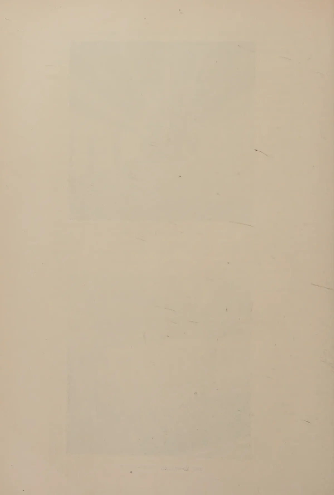

# The Tropical Agriculturist

VOL. XC

PERADENIYA, APRIL, 1938

No. 4

<table><thead><tr><th></th><th style="text-align: right;">Page</th></tr></thead><tbody><tr><td>Editorial .. .. .</td><td style="text-align: right;">189</td></tr></tbody></table>

## ORIGINAL ARTICLES

<table><tbody><tr><td>The Fermentation and Curing of Cacao in Ceylon. By M. Fernando, Ph.D., B.Sc., D.I.C. .. .. .</td><td style="text-align: right;">191</td></tr><tr><td>Studies on Ceylon Soils—XI. By A. W. R. Joachim, Ph.D., and S. Kandiah, Dip. Agric. (Poona) .. .. .</td><td style="text-align: right;">200</td></tr><tr><td>The Cultivation of <i>Cajanus cajan</i> and the Methods of Preparing Marketable Dhal. By P. M. Gaywala, M.Ag. .. .. .</td><td style="text-align: right;">212</td></tr></tbody></table>

## DEPARTMENTAL NOTES

<table><tbody><tr><td>The Romance of Quinine .. .. .</td><td style="text-align: right;">222</td></tr><tr><td>The Use of Beneficial Insects to Control Crop Pests .. .. .</td><td style="text-align: right;">226</td></tr><tr><td>Beekeeping .. .. .</td><td style="text-align: right;">230</td></tr><tr><td>Beekeeping. Extracting and Ripening Honey .. .. .</td><td style="text-align: right;">235</td></tr><tr><td>Beekeeping. The Modern Hive .. .. .</td><td style="text-align: right;">238</td></tr></tbody></table>

## SELECTED ARTICLES

<table><tbody><tr><td>Soil Organic Matter and Tropical Agriculture .. .. .</td><td style="text-align: right;">240</td></tr><tr><td>The Giant Snail, <i>Achatina fulica</i> (Fer) .. .. .</td><td style="text-align: right;">247</td></tr></tbody></table>

## REVIEWS

<table><tbody><tr><td>The Fruit Annual and Directory, 1937-38 .. .. .</td><td style="text-align: right;">255</td></tr></tbody></table>

## RETURNS

<table><tbody><tr><td>Animal Disease Return for the Month ended March, 1938 .. .. .</td><td style="text-align: right;">257</td></tr><tr><td>Meteorological Report for the Month ended March, 1938 .. .. .</td><td style="text-align: right;">258</td></tr></tbody></table>

1—J. N. 1164 (3/38)

1------------------------------------------------

## IMPORTATION OF CATTLE FROM ASIA OR AFRICA

---

Any person desiring to import cattle from Asia or Africa *viâ* Colombo or Kayts is informed that it is necessary to obtain a permit before importation.

2. Permits are issued by the Government Veterinary Surgeon. Applications for such permits must be made on the prescribed forms, supplies of which can be obtained from the Government Veterinary Surgeon, Peradeniya.

Peradeniya,  
March 31, 1938

E. RODRIGO,  
*Acting Director of Agriculture*

2------------------------------------------------

The  
Tropical Agriculturist

April, 1938

---

EDITORIAL

---

RUBBER

---

**E**VEN if there is a general wish—it can scarcely be called a hope—among rubber growers that the plantation industry be permanently sustained on its present basis of artificial respiration, hardly any one believes that it will be practicable to sterilize by restriction large areas of the most favourably situated land in an agricultural country with a rapidly increasing population or to perpetuate the monopoly enjoyed by the present owners. Restriction can become a lasting feature only if the state becomes the sole owner and releases for other forms of exploitation all the land that is not required for raising its allotted quota, and the rubber owner will hardly contemplate such a development with satisfaction. Restriction can be nothing but an expedient to tide over a purely temporary excess of supply over demand, or to afford the planter a short respite during which he will learn to introduce those economies of production which will enable him to place his produce on the market at a reduced price. The belief is entertained in some quarters that the excess of supply is temporary, that in a few years there will be a world shortage of rubber, and that the industry will experience a new phase of prosperity and expansion. But in the case of an article like rubber which responds so readily and easily to high prices, market buoyancy cannot be long-lived because production will soon outpace consumption, and competition will bring prices down to something very near the cost of collecting the latex from the uncultivated tree, which, translated into London quotations, may be regarded as three pence a pound. Therefore, unless the future rubber grower is able to produce three penny rubber and make a profit from it, the *Hevea brasiliensis* will go the same way as the *Cinnamomum zeylanicum*. Rubber growing will cease to exist as an organized capitalistic enterprise.

3------------------------------------------------

190

The Dutch are said to be ready to meet this situation. By the selection and the isolation of good trees, they have established clones which produce such phenomenal yields that when large areas are replanted with them the cost of production is expected to be less than three pence. Perhaps selection has proceeded to the limit of its possibilities and the next advance is in the direction of hybridization, and there is no doubt that they will tackle this second stage as efficiently and effectively as they did the first, and that in a few years they will produce results which will completely overshadow their own achievements which are now the envy of the rubber world.

Ceylon cannot hope to compete with the Netherlands Indies either in the cheapness of its labour or in the fertility of its soil. She will be able to find a place in the competitive market only if she follows the Dutch example and follows it successfully. Unfortunately we came late into the field of selective breeding and we have no associated group of large estates which can employ its own staff of botanists. The Rubber Research Scheme has made a beginning and there is no doubt that, with the recent appointment of a geneticist, this branch of work will receive the attention which its importance to the industry merits. But in genetical work results emerge slowly. In the meantime, with the substantial concessions with regard to both new planting and replanting granted by the current international agreement the rubber grower is faced with a perplexing problem. Should he wait till the Rubber Research Scheme is ready to put its confident imprimatur on clones which it has selected, tested, and proved or should he replace his old seedling trees at once with the best available clonal material? Without hesitation we assume the responsibility of recommending the second alternative. If, at the expiration of the present term of restriction, world production is still ahead of world consumption Ceylon will be elbowed out of her place amongst producing countries unless she has a substantial acreage under at least moderately high yielding rubber; while if the faith of those who foresee a period of returning prosperity based on a shortage of supply is justified, all rejuvenation will be suspended and she will find herself unprepared for the succeeding slump. Therefore our advice is "Replant all you can, and replant with the best you can get".

4------------------------------------------------

191

## THE FERMENTATION AND CURING OF CACAO IN CEYLON

M. FERNANDO, Ph.D., B.Sc., D.I.C.

RESEARCH PROBATIONER IN PLANT PATHOLOGY

**A**LTHOUGH the practice of preparing cacao beans for the market by fermenting them is extremely old, the theoretical basis of the process is not yet completely understood. As would be expected from what is largely an empirical practice, the technique of cacao fermentation varies widely in different countries. Ceylon methods of fermentation have always been characterized by the relatively short duration of the sweating process and workers, both in this country and elsewhere, have suggested that a longer period in the sweat box should lead to an improvement in the quality of the finished product. Knapp (1935 a) for example, complains that the quality of Ceylon estate cacao has fallen off considerably in recent years, and attributes this decline in quality to the application to Forastero cacao of a fermentation technique appropriate only to cacao of the Criollo type. As will be explained later, the European owned estates produce by the use of the methods which Knapp deplores, a cacao of excellent fracture and aroma. That most of the cacao placed on the market by small-holders in this country is practically unfermented is undoubtedly true, but the poor quality of small-holders' cacao is not completely due, as is often supposed, to the unsatisfactory nature of the sweating technique which they adopt. In the present paper the writer will describe in some detail the methods of cacao fermentation employed by the estates and by the small-holders, and will suggest modifications in the small-holders' technique which should bring the latters' finished product nearer the manufacturer's ideal.

### VARIETIES OF CACAO

The present day classification of the species *Theobroma cacao* Linn. is extremely complex and unsatisfactory. This is largely due to the fact that the so-called varieties are unstable hybrids. For all practical purposes it is only necessary to recognize the existence of beans of two kinds, *viz.*, Criollo beans, which are white in cross section, and Forastero beans which have a purple

5------------------------------------------------

192

section. In hybrids both types of beans may be found in the same pod. The Forastero character is dominant, and a tree grown from a purple bean may produce pods containing a mixture of purple beans and white beans. The pure white Criollo character is recessive and breeds true to type.

Ceylon cacao had, at one time, a considerable amount of Criollo in its composition, but recent years have seen a gradual disappearance of the Criollo types, partly as a result of the greater susceptibility of these to disease, and partly due to deliberate substitution of predominantly Forastero types by the planters. Forastero types are preferred because they yield more, are more robust and produce a more desirable type of branching.

The area under cacao at the Experiment Station, Peradeniya, includes a collection of Nicaraguan Criollos and Old Ceylon Reds—varieties reputed to contain a high percentage of Criollo beans. The proportion of Criollo beans in pods of the Old Ceylon Reds was found on examination to range from complete absence in some pods to 68 per cent. in others. The record in table I. of the analysis of the contents of a random sample of ten Nicaraguan Criollo pods, illustrates the composition of this variety.

TABLE I.—NUMBER OF BEANS

<table>
<thead>
<tr>
<th>Pod</th>
<th></th>
<th>Criollo</th>
<th></th>
<th>Intermediate</th>
<th></th>
<th>Forastero</th>
<th></th>
<th>Total</th>
</tr>
</thead>
<tbody>
<tr>
<td>1</td>
<td>..</td>
<td>0</td>
<td>..</td>
<td>25</td>
<td>..</td>
<td>0</td>
<td>..</td>
<td>25</td>
</tr>
<tr>
<td>2</td>
<td>..</td>
<td>10</td>
<td>..</td>
<td>20</td>
<td>..</td>
<td>0</td>
<td>..</td>
<td>30</td>
</tr>
<tr>
<td>3</td>
<td>..</td>
<td>9</td>
<td>..</td>
<td>19</td>
<td>..</td>
<td>0</td>
<td>..</td>
<td>28</td>
</tr>
<tr>
<td>4</td>
<td>..</td>
<td>10</td>
<td>..</td>
<td>18</td>
<td>..</td>
<td>1</td>
<td>..</td>
<td>29</td>
</tr>
<tr>
<td>5</td>
<td>..</td>
<td>1</td>
<td>..</td>
<td>5</td>
<td>..</td>
<td>20</td>
<td>..</td>
<td>26</td>
</tr>
<tr>
<td>6</td>
<td>..</td>
<td>4</td>
<td>..</td>
<td>23</td>
<td>..</td>
<td>0</td>
<td>..</td>
<td>27</td>
</tr>
<tr>
<td>7</td>
<td>..</td>
<td>1</td>
<td>..</td>
<td>21</td>
<td>..</td>
<td>0</td>
<td>..</td>
<td>22</td>
</tr>
<tr>
<td>8</td>
<td>..</td>
<td>0</td>
<td>..</td>
<td>24</td>
<td>..</td>
<td>0</td>
<td>..</td>
<td>24</td>
</tr>
<tr>
<td>9</td>
<td>..</td>
<td>5</td>
<td>..</td>
<td>25</td>
<td>..</td>
<td>0</td>
<td>..</td>
<td>30</td>
</tr>
<tr>
<td>10</td>
<td>..</td>
<td>13</td>
<td>..</td>
<td>12</td>
<td>..</td>
<td>0</td>
<td>..</td>
<td>25</td>
</tr>
</tbody>
</table>

#### THE ESTATE TECHNIQUE

*The process of sweating.*—The pods are opened in the field by means of a transverse cut with a knife or preferably by a blow with a wooden mallet. Incidentally, it may be mentioned here that husks should not be left piled up under the cacao trees for any considerable length of time as this may cause a partial chlorosis of the leaves. The practice of burying husks in pits in the cacao plantation should be discouraged as it promotes root diseases (Briton-Jones, 1934). Cacao husks provide excellent manure for fodder grass areas, and several Ceylon estates get rid of their husks in this way.

6------------------------------------------------

193

The wet beans are transported in baskets to the fermenting shed or "pulping house"—the latter term is a survival of the old coffee days—which accommodates the sweat boxes. The sweat boxes are usually of timber. Wood of the *lumu-midella* tree (*Melia composita* Willd.) is often employed. The writer has occasionally seen cement sweat boxes on some of the smaller estates. The boxes are rectangular, and on the bigger estates they are about 8 feet long, 4.5 feet broad and 4 feet deep. Each box is large enough to hold one day's picking. The boxes have slatted bottoms which allow the draining off of the sweatings (Fig. 2). The sides consist of planks running in vertical grooves and can be removed to permit easy filling and unloading of the boxes. No iron nails are used in the construction of sweat boxes on account of the possibility of corrosion by the acetic acid produced in fermentation and of the danger of staining the beans. A fermenting shed usually houses a set of about four sweat boxes. The site of the fermenting shed is determined by the nearness of a suitable water supply. In order to eliminate the need for pumping up water, the fermenting shed is often located below ground level. The fermenting shed should be well ventilated, but should at the same time provide adequate protection against rain and cold winds.

The wet beans are stacked in sweat boxes and covered with coir matting. The wet beans usually arrive at the fermenting shed between 4 P.M. and 7 P.M. On the following morning (6 A.M. to 9 A.M.) the beans are wetted and turned over into fresh sweat boxes, where they are allowed to remain for a further 24 hours. Wooden shovels are used for turning the beans over. This practice of turning the beans over promotes aeration of the mass of sweating beans, ensures even distribution of the yeast inoculum and results in a more homogeneous final product.

The pulp of the cacao bean contains about 10 per cent. reducing sugars, probably in the form of glucose and fructose (Knapp, 1937), and provides an ideal substratum for the growth of micro-organisms. After the beans have been in the sweat box for some time, the pulp is seen to be covered with yeast cells (*Saccharomyces* spp.). These yeasts are evidently the result of infections which had occurred after the pods had been opened. The glucose in the pulp is fermented by these yeasts into carbon dioxide and alcohol. The alcohol is subsequently oxidized by acetic acid bacteria into acetic acid.

As a result of the subjection of the wet beans to a 36- to 40-hour period in the sweat box, most of the pulp disintegrates and drains off in the form of sweatings, which contain, among other things, a mixture of the products of alcoholic and acetic

7------------------------------------------------

194

acid fermentation mentioned above. At the end of the 36- to 40-hour period, the beans are transferred to wicker-work baskets, and are washed and well shaken with a view to removing as much of the remaining pulp as possible.

In Ceylon, planters regard the sweating process merely as a convenient means of ridding the bean of its pulp, and the process of drying is considered the only part of the technique that is of any consequence. In most other cacao producing countries, on the other hand, emphasis is placed on the sweating process, which in the case of purely Forastero cacao, may last as long as six days. One of the functions of the sweating process is said to be the removal of the astringency and bitterness of the bean. As Criollo beans contain less of the astringent and bitter principles than Forastero, a shorter period of sweating suffices for the Criollo type. In Ceylon, however, a short period of sweating is employed for a type of cacao, which despite its Criollo admixture, is predominantly Forastero. One result of the longer sweating in other countries is the great rise in temperature of the mass of fermenting beans. The temperature may be as high as 50° C. on about the fifth day. Much importance is attached by most authorities to this rise in temperature, as this is held to be the factor responsible for the killing of the bean. The death of the bean allows the free diffusion of intracellular enzymes and promotes desirable internal changes in the bean. Under estate conditions in Ceylon, the temperature maxima in sweat boxes are not sufficiently high to be lethal to the beans, but, as will be explained later, the development of lethal temperatures in the sweat box does not appear to be necessary for the production of good quality cacao.

*The process of drying.*—The beans after being washed free of pulp, are spread on coir matting on the sun-drying floor or barbecue. The barbecue is either cemented or of brick covered with a tar wash. The attractive reddish colour of the shell in the cured bean can be secured only by sun-drying and is determined by the first two to three days of drying. The red colour is apparently produced by the action of sunlight on catechin or some other compound in the shell (Knapp, 1937). Whenever possible the whole process of drying is completed in the sun. This is often prevented by wet weather or by lack of accommodation on the barbecue when pickings are heavy. Accordingly, after the preliminary 2 to 3 days drying in the sun, the rest of the curing process is usually carried out by means of hot air in drying lofts. The drying lofts consist of a set of two or three slatted floors covered with coir matting. Flue pipes conducting hot air from a furnace run horizontally below the slatted floors (Fig. 1). The rate of drying of the beans

8------------------------------------------------

![A black and white photograph of a cacao drying loft. The room is long and narrow, with a high ceiling supported by wooden beams. Large, thick pipes run along the ceiling, likely for ventilation or heating. A person in a white uniform is standing in the middle of the room, near a large pile of cacao beans. The walls are white with several arched doorways and windows. The floor is made of concrete or a similar material. In the bottom right corner, there is a small text: 'BLOCK BY SURVEY DEPT CEYLON G. 4.38'.](a2a949f7306d95139bec2191604dd2eb_1_img.webp)

BLOCK BY SURVEY DEPT CEYLON G. 4.38

FIG. 1.—CACAO DRYING-LOFT.

BLOCK BY SURVEY DEPT CEYLON G. 4.38

FIG. 2.—CACAO SWEAT-BOXES.

9------------------------------------------------

<!-- stage4: FAINT old-images-only -->

[Faint page: no legible print of its own could be verified; text withheld (stage 4 review list)]

This image shows a blank, aged, cream-colored page. The paper has a slightly textured appearance with some minor blemishes and faint, rectangular impressions that suggest it might have been part of a bound volume or had a label. There is no text or other content on the page.

10------------------------------------------------

195

spread out on the coir matting is controlled by regulating the volume of hot air proceeding from the flue pipes. The beans both on the barbecue and on the drying lofts are periodically turned over with wooden rakes to ensure uniform drying.

Drying programmes representing the routine practice on two big estates in Ceylon are given below :—

1. *On estate A—*

<table>
<tr>
<td>1st day—8</td>
<td>to 10</td>
<td>hours</td>
<td>in the</td>
<td>sun</td>
</tr>
<tr>
<td>2nd day—3</td>
<td>to 4</td>
<td>”</td>
<td>”</td>
<td></td>
</tr>
<tr>
<td>3rd day—3</td>
<td>to 4</td>
<td>”</td>
<td>”</td>
<td>or in the drying lofts</td>
</tr>
<tr>
<td>4th day—3</td>
<td>to 4</td>
<td>”</td>
<td>”</td>
<td>”</td>
</tr>
<tr>
<td>5th day—3</td>
<td>to 4</td>
<td>”</td>
<td>”</td>
<td>”</td>
</tr>
<tr>
<td>6th day—</td>
<td>(no drying)</td>
<td></td>
<td></td>
<td></td>
</tr>
<tr>
<td>7th day—8</td>
<td>to 10</td>
<td>”</td>
<td>”</td>
<td>”</td>
</tr>
</table>

2. *On estate B—*

<table>
<tr>
<td>1st day—6</td>
<td>to 7</td>
<td>hours</td>
<td>in the</td>
<td>sun</td>
</tr>
<tr>
<td>2nd day—4½</td>
<td></td>
<td>”</td>
<td>”</td>
<td></td>
</tr>
<tr>
<td>3rd day—5</td>
<td></td>
<td>”</td>
<td>”</td>
<td></td>
</tr>
<tr>
<td>4th day—5½</td>
<td></td>
<td>”</td>
<td>”</td>
<td></td>
</tr>
<tr>
<td>5th day—6</td>
<td></td>
<td>”</td>
<td>”</td>
<td></td>
</tr>
<tr>
<td>6th day—6</td>
<td></td>
<td>”</td>
<td>”</td>
<td></td>
</tr>
<tr>
<td>7th day—6</td>
<td></td>
<td>”</td>
<td>”</td>
<td></td>
</tr>
</table>

At night the beans are heaped up or bagged in sacks. The mass of bagged beans often exhibits a considerable rise in temperature. Briton-Jones (1934) attributes this rise in temperature to the continued activity of yeast cells on the residual pulp on the shell. Knapp (1937) suggests that the oxidation of tannins inside the bean may contribute to this temperature rise.

In sunny weather drying can be completed in seven to ten days. During rains as long a period as 15 days may be needed. When curing is complete the cacao is graded by hand on the basis of bean size before despatch to the estate agents in Colombo.

*Black cacao.*—The fungus *Phytophthora palmivora* Butl. causes considerable damage to the cacao crop, especially during wet weather. In certain areas 15 to 20 per cent. of the pods annually harvested are affected by *Phytophthora* pod-rot. If infection occurs when the pod is comparatively mature, the beans though damaged are not rendered completely valueless. Beans of this type are dried without sweating and placed on the market under the name “black cacao”.

11------------------------------------------------

196

### THE SMALL-HOLDERS' TECHNIQUE

The contents of the villager's sweat box include a considerable proportion of beans from immature pods and from pods attacked by *Phytophthora*. The villager piles the wet beans in a shallow wicker-work basket or in a wooden packing case with a perforated bottom, and covers them with plantain leaves. The period of fermentation in the sweat box is about the same as in the case of estate cacao, *viz.*, 36 to 40 hours. The average villager does not turn his beans over after 12 hours. On account of the small quantity of cacao handled at each sweating—sometimes as small as 5 to 6 lb. and rarely more than 50 lb.—the ratio of exposed surface to volume is large, and the temperature maxima in the sweat box are accordingly very much lower than in the case of estate cacao.

After sweating, the beans are washed free of pulp and spread out to dry on jute hessian. The duration of the drying process varies from 6 to 12 days, according to the weather. The rate of drying is usually very much faster than under estate conditions on account of the relatively smaller bulk of beans dried at each operation; and the resulting cacao is often slaty. The villager performs the whole of the drying operation in the sun. Well dehydrated village cacao has accordingly a more marked rose colour than estate cacao. Lack of facilities for drying in wet weather often results in severe moulding of the beans.

Many villagers however sell their beans to a petty dealer after partially drying them for two to three days. The drying is carried to completion by the petty dealer. This deplorable trade in partially dried beans is responsible to a considerable extent for the inferior break or fracture of the small-holder's finished product.

If as a result of moulding, the small-holder fails to secure an attractive appearance on the shell, attempts are made, either by himself or by the petty dealer who handles his cacao, to colour the beans with anatto or brick dust.

### QUALITY IN CACAO

The small-holder judges the quality of his cured cacao purely on the appearance of the shell. The shell, apart from its incidental use as cattle food, is commercially valueless. What the manufacturer demands is a well-fermented bean of good fracture. The disappearance of the pigment, cacao purple, from the cotyledons is a fairly reliable criterion of efficient fermentation of Forastero cacao. There is no marked difference in colour between the kernel of a well-fermented Criollo bean and a badly fermented one. But the deep chocolate brown of a well-fermented Forastero kernel presents a striking contrast

12------------------------------------------------

197

to the purplish slaty section of a poorly fermented bean. The persistence of the purple pigment in unfermented and poorly fermented Forastero beans provides the manufacturer with a valuable index to accompanying differences in flavour and aroma of the final product. The poorly fermented Forastero kernel is bitter and astringent, and when roasted fails to develop the chocolate aroma characteristic of well fermented cacao. Other features of well fermented beans are the crispness and open-grained texture of the cotyledons, and the separation of the shell from the cotyledons (Knapp, 1935 b).

#### SWEAT BOX TEMPERATURES

The sequence of desirable internal changes mentioned above is in part at least initiated in the sweat box and is probably associated with the death of the bean. Emphasis has usually been placed on the importance of high sweat box temperatures as the agency responsible for the death of the bean. Under Ceylon conditions the killing of the bean appears to be effected by factors other than high sweat box temperatures, *e.g.*, by the alcohol and acetic acid developed as by-products in the sweating process. The results of an experiment on the temperature changes occurring in sweat boxes under Ceylon conditions, are recorded in table II.

TABLE II

<table border="1">
<thead>
<tr>
<th colspan="2">Temperature</th>
<th colspan="2">Air Temperature</th>
<th colspan="2">Time</th>
</tr>
<tr>
<th>Estate Technique (618 lb.)</th>
<th>Small-holders' Technique (54 lb.)</th>
<th></th>
<th></th>
<th>hrs.</th>
<th>mins.</th>
</tr>
</thead>
<tbody>
<tr>
<td>25°C. ..</td>
<td>23.5°C. ..</td>
<td>27°C. ..</td>
<td></td>
<td>0</td>
<td>0</td>
</tr>
<tr>
<td>25° ..</td>
<td>23° ..</td>
<td>17° ..</td>
<td></td>
<td>14</td>
<td>30</td>
</tr>
<tr>
<td>26° ..</td>
<td>23° ..</td>
<td>29° ..</td>
<td></td>
<td>20</td>
<td>30</td>
</tr>
<tr>
<td>27.2° ..</td>
<td>24° ..</td>
<td>25° ..</td>
<td></td>
<td>23</td>
<td>45</td>
</tr>
<tr>
<td>32.8° ..</td>
<td>24° ..</td>
<td>26° ..</td>
<td></td>
<td>41</td>
<td>0</td>
</tr>
</tbody>
</table>

The estate technique of sweating was compared with that of the small-holder. In the case of the latter, 54 lb. of wet beans were sweated in a wicker-work basket. In the former, 618 lb. of wet beans were placed in a wooden sweat box of the type normally employed on estates. The mass of cacao fermented in a single sweat box on a big estate is usually rather larger. In the case of the estate technique, the temperature during sweating did not exceed 33°C. and was unlikely to have been lethal to the beans. The temperatures recorded are fairly typical of temperatures attained under estate conditions

13------------------------------------------------

198

in Ceylon and, as the bigger estates, despite the comparatively low temperature maxima reached in their sweat boxes, turn out a finished product of very high quality, it appears that the development in the sweat box of temperatures lethal to the beans is not essential for the production of high grade cacao.

#### WASHING

In Ceylon, both estate and small-holders' cacao is subjected to vigorous washing before transference to the drying platform. The desirability of this procedure has been questioned by (Knapp, 1937). This thorough washing contributes to the attractive appearance of the finished product, but tends to make the shell brittle and consequently predisposes the bean to insect attack. The possibility of prejudicing buyers abroad would, however, prevent Ceylon estates from abandoning the practice. Besides, washing reduces the danger of mould formation.

#### DISCUSSION

In most attempts made in other countries at improving the small-holder's technique interest has centred round the sweating process. It has been argued above that even in the case of predominantly Forastero cacao, a long period in the sweat box and the consequent development of high temperatures are unnecessary for the production of good quality cacao. If the period in the sweat box is short as is the case in Ceylon, the importance of slow and careful drying can hardly be over-estimated. Sweating becomes little more than a convenient device for dissolving the pulp off the bean and the drying operation becomes the fermentation process *par excellence*. Internal enzyme reactions initiated in the sweat box can proceed and conclude satisfactorily only under conditions of protracted and well regulated drying.

Generally speaking, slow drying produces a good quality bean. The slowness of the drying process is limited by the risk of moulding. The danger of rapid drying is always a problem in small scale fermentation, and attempts at improving the small-holder's technique should include devices for retarding the rate of dehydration.

The final moisture content of the cured cacao should not exceed 8 per cent. (Scott, 1928) if the risk of subsequent mould formation is to be eliminated. Excessive drying makes the beans brittle and hence more liable to insect invasion.

The villager's sweating and drying problems are partly due to deficient technical knowledge and partly the result of difficulties inherent in small scale fermentation, and can be

14------------------------------------------------

199

solved by the adoption of co-operative fermentaries under expert supervision. Co-operative fermentation of peasants' cacao has been successfully accomplished in Trinidad and Tobago, and may meet with success in this country. The question of adapting the superior estate technique to small scale sweating and drying will not arise then.

#### ACKNOWLEDGMENTS

The writer's thanks are due to Col. G. A. S. Collin, Superintendent, Kondesale estate, Kandy, for his co-operation and for the photographs, to Mr. F. Francis, Kondesale, for helpful information, and to Mr. D. J. Jayasekera, Experiment Station, Peradeniya, for maintaining records of sweat-box temperatures. To Mr. M. Park, Plant Pathologist, the writer is indebted for valuable criticism of the manuscript.

#### REFERENCES

Briton-Jones, H. R. 1934 —The Diseases and Curing of Cacao—*London; MacMillan & Co.*

Knapp, A. W. 1934 —Cacao Fermentation in West Africa. *J. Soc. Chem. Ind.* LIII., pp. 151T-158T.

1935a—Scientific Aspects of Cacao Fermentation—III. *Bull. Imp. Inst.*, XXXIII., pp. 306-319.

1935b—Scientific Aspects of Cacao Fermentation—IV. *ibid*, XXXIII., pp. 453-466.

1937 —Cacao Fermentation—*London; John Bale, Sons & Curnow.*

McDonald, J. A. 1936 —A New Method of Curing Small Quantities of Cacao. *Trop. Agriculture*, XIII., pp. 171-174.

Scott, J. L. 1928 —Preliminary Observations on the Moisture Content and Hygroscopicity of Cacao Beans. *Dept. Agric., Gold Coast, Year Book*, 1928, Bull. 16, Paper IX., pp. 58-73 (not seen).

Van Hall, C. J. J. 1932 —Cacao—2nd Edition. *London, MacMillan & Co.*

15------------------------------------------------

200

## STUDIES ON CEYLON SOILS

### XI.—SOME PADDY SOILS OF THE ISLAND

---

A. W. R. JOACHIM, Ph.D., Dip. Agric. (Cantab.),  
CHEMIST

AND

S. KANDIAH, Dip. Agric. (Poona),  
ASSISTANT IN AGRICULTURAL CHEMISTRY

---

**P**ADDY is cultivated in all parts of the Island where rainfall conditions are satisfactory or irrigation facilities are available. By far the greater extent of paddy land occurs in the low-country, both dry and wet, or in the depressions and valleys of the hill country, but cultivation is not restricted to these areas. Even the slopes of hillsides are terraced for paddy, but the area so cultivated is proportionately small. As may be inferred, paddy soils are mainly alluvial deposits, but residual soils, where other factors permit, are utilized for the cultivation of the crop with equal success. Only small extents of paddy land are permanently water-logged, and such areas are confined to isolated tracts which are so affected owing to their location. By far the greater majority of paddy lands are only seasonally under water and are dry for the remainder of the year. The alternation of wet and dry conditions to which these soils, particularly the heavier soils, are subject, is favourable to the development of the typical *gley* sub-soil, characterized by rust-brown mottlings and streaks of hydrated ferric oxides in a matrix varying from bluish grey to brownish yellow in colour. Soil drainage is impeded in wet paddy lands but not altogether prevented. Experience and experiment have indicated that some drainage is beneficial from the standpoint of oxygen supply and root development. On the heavy and clay loams of the dry zones, drainage is essential if alkali formation is to be avoided. Normally the paddy crop is aerated through the agencies of the dissolved oxygen of the irrigation water and the activities of the micro-organic population and algae of the soil (1). On very heavy soils where drainage is non-existent, as in the case of a soil

16------------------------------------------------

201

from Kalmunai with 76.0 per cent. clay, paddy fails or is extremely poor. Heavy applications of lime and bulky organic matter with thorough cultivation are imperative for the successful growth of paddy on these soils.

In texture, Ceylon paddy soils vary from sands or sandy loams to clay loams, clays and even heavy clays. The extreme textural types are generally unsuited to the crop, except when, as in the case of the light soils at Unnichchai in the Eastern Province of Ceylon, an impermeable rock or clay layer underlies the sandy top soil and irrigation water is plentiful, or, as in heavy soils, the measures already referred to are adopted. It would be useful to note here that any normally arable soil can be asweddumized or brought under paddy, provided it has a sufficiency of clay, and that water is available or the rainfall adequate for cultivation.

The paddy soils of the Island were previously studied by Bruce (2) who also furnished valuable analytical data for typical rice soils of Burma, South India, Siam, and other Eastern countries. This study by Bruce was published in 1922, and as the analytical methods then in vogue have been appreciably modified, particularly in regard to the method of mechanical analysis of soils, the data now published will vary appreciably from his in certain respects. Instances in point are the average clay and silt contents of paddy top soils which Bruce found to be 7 and 24 per cent. respectively. The corresponding averages for 34 soils examined in this laboratory by the new method of analysis are 22.9 and 7.4 per cent. respectively, almost exactly the reverse of the previous analysis. This is entirely due to a fundamental modification in the analytical method. It will thus be noted that local paddy soils are really not so low in clay content as they were considered to be. The present studies differ from those of Bruce's in a number of other respects. First, stress is laid on the characteristics of the soil profile and of the natural features governing its character and development. Secondly, determinations of the exchangeable base contents of the soils have been made while those of total potash and phosphoric acid have been omitted, as little relationship has been found to hold between these latter soil constituents and crop yields, while the former is a good criterion of the base status of the soil. Further, the methods of the determination of total and citric soluble phosphoric acid and potash have undergone no change and Bruce's data, therefore, still hold good. Thirdly, the present studies have included an analysis of the clay complex of the soils studied. Finally, data are furnished of the soluble salt content of certain paddy soils which have been subjected to flooding with salt water, or where, through an excessive salt content, paddy failed to

17------------------------------------------------

202

grow successfully. In other respects Bruce's figures are of great utility and value. Further references to local paddy soils have been made in previous communications (3, 4).

The present studies on Ceylon paddy soils are an extension of those referred to, in previous articles of this series (5, 6) in which profiles of paddy soils at Peradeniya in the Central Province and Sengapadi in the Eastern Province are described. Nine profiles typical of various additional types of paddy soils from Tampalakamam and the Minneriya, Paranthan, Murasumoddai, Ridibendi-ela, Bodii-ela, and Nuwera-wewa schemes have been studied on the lines specified, and the description of these will comprise the major portion of the paper. All but the Bodii-ela soils are from the dry zone low-land areas. The analytical data are indicated in table I. In addition, the clay and coarse fraction percentages, texture index number and pH values of twenty-seven other paddy soil types have been determined and the results shown in table II. In table III, the pH values and salt contents of certain soils are tabulated.

#### Murasumoddai Loams

<table>
<tr>
<td>Location ..</td>
<td>.. Murasumoddai scheme, near Killinochi</td>
</tr>
<tr>
<td>Elevation ..</td>
<td>.. About sea level</td>
</tr>
<tr>
<td>Climate ..</td>
<td>.. Rainfall 51 in. ; temperature 82°F.</td>
</tr>
<tr>
<td>Geological position</td>
<td>.. Recent</td>
</tr>
<tr>
<td>Mode of formation</td>
<td>.. Transported ; alluvial</td>
</tr>
<tr>
<td>Drainage ..</td>
<td>.. Good to impeded depending on texture</td>
</tr>
<tr>
<td>Topographic position</td>
<td>.. Level</td>
</tr>
<tr>
<td>Vegetation</td>
<td>.. Mostly xerophytic scrub jungle in parts ; paddy— 20-40 bushels per acre depending on texture</td>
</tr>
</table>

#### Profiles

##### I.

<table>
<tr>
<td>A. 0-5 in.</td>
<td>.. Light brown sandy loam ; loose and friable ; root growth good</td>
</tr>
<tr>
<td>C. 5-15 in.</td>
<td>.. Light brown loam with mottlings of rust red due to decomposing nodules of iron oxides ; fairly compact but friable ; root growth good</td>
</tr>
</table>

##### II.

<table>
<tr>
<td>A. 0-4 in.</td>
<td>.. Dark brown light sandy loam ; loose and friable ; root growth good</td>
</tr>
<tr>
<td>C. 4-14 in.</td>
<td>.. Pale brown light sandy loam ; otherwise same as C. above</td>
</tr>
</table>

##### III.

<table>
<tr>
<td>A. 0-5 in.</td>
<td>.. Grey brown loam ; compact ; hard but fairly friable ; roots good</td>
</tr>
<tr>
<td>C. 5-18 in.</td>
<td>.. Bluish grey loam with mottlings of rust brown ; very compact and sticky ; hard ; roots poor</td>
</tr>
</table>

18------------------------------------------------

203

The Murasumoddai soils vary in texture from a light sandy loam with a clay percentage of 12.3 per cent. to a medium loam with a clay content of 27.5 per cent. The C horizons or sub-soils are of heavier texture in the sandy loams. The water absorption percentages vary with the texture but are not high. The organic matter and nitrogen contents are very poor in all three types of soils. The A horizons of the lighter loams are acidic in reaction, but the C horizons are almost neutral. The heavier loam is alkaline in reaction, due to the presence of soluble salts. The exchangeable base contents of this soil are high, but the proportions of calcium are low being only about 50 per cent. Careful irrigation, drainage and other ameliorative measures are essential if the soil is to be rendered suitable for continuous paddy cultivation. The base contents of the lighter loams are lower, but the proportions of calcium are higher than in the heavier loam. The latter is non-lateritic in nature. All these soils will require heavy applications of bulky organic manures like farmyard manure, compost and green manure.

#### Paranthan Light Sandy Loam

<table>
<tr>
<td>Location ..</td>
<td>..</td>
<td>Paranthan</td>
</tr>
<tr>
<td>Elevation ..</td>
<td>..</td>
<td>25 ft.</td>
</tr>
<tr>
<td>Climate ..</td>
<td>..</td>
<td>Rainfall 51 in. ; temperature 81°F.</td>
</tr>
<tr>
<td>Geological origin</td>
<td>..</td>
<td>Recent</td>
</tr>
<tr>
<td>Mode of formation</td>
<td>..</td>
<td>Transported ; alluvial on acid granulite</td>
</tr>
<tr>
<td>Drainage ..</td>
<td>..</td>
<td>Impeded</td>
</tr>
<tr>
<td>Topographic position</td>
<td>..</td>
<td>Flat</td>
</tr>
<tr>
<td>Vegetation</td>
<td>..</td>
<td>Low jungle and scrub ; paddy—15–25 bushels per acre.</td>
</tr>
</table>

#### Profile

<table>
<tr>
<td>A1. 0–3 in.</td>
<td>..</td>
<td>Greyish sandy soil with undecomposed leaf residues ; loose and friable</td>
</tr>
<tr>
<td>A2. 3–15 in.</td>
<td>..</td>
<td>Yellowish sand ; loose and friable ; single grain ; root growth good</td>
</tr>
<tr>
<td>C1. 15–42 in.</td>
<td>..</td>
<td>Yellowish sandy loam with mottlings of rust brown due to decomposing ironstone nodules ; root growth fair</td>
</tr>
<tr>
<td>C2. &gt; 42 in.</td>
<td>..</td>
<td>White sandy loam cemented with hydrated oxides of iron ; rust brown nodules of ironstone in varying stages of decomposition ; impermeable or slowly permeable to water</td>
</tr>
</table>

The Paranthan soil is a light sandy loam, the texture becoming heavier with increasing depth. The water absorption percentages are low for all horizons. The organic matter and nitrogen contents of the A1 horizon are fair. The lower horizons are poor in these constituents, there being a steady decrease with depth. The soils are acidic in reaction and have very low

19------------------------------------------------

204

exchangeable base contents. Calcium constitutes only a low proportion of these bases. The soils are of the non-lateritic type. There are other soils in the Paranthan scheme of heavier texture and superior fertility. All these soils, however, show the need for heavy manuring with bulky organics.

#### Minneriya Loam

<table>
<tr>
<td>Location ..</td>
<td>..</td>
<td>Minneriya scheme</td>
</tr>
<tr>
<td>Elevation ..</td>
<td>..</td>
<td>300 ft.</td>
</tr>
<tr>
<td>Climate ..</td>
<td>..</td>
<td>Rainfall 79 in. ; temperature 81°F.</td>
</tr>
<tr>
<td>Geological origin</td>
<td>..</td>
<td>Recent over metamorphic rock</td>
</tr>
<tr>
<td>Mode of formation</td>
<td>..</td>
<td>Transported, alluvial</td>
</tr>
<tr>
<td>Drainage ..</td>
<td>..</td>
<td>Imperfect</td>
</tr>
<tr>
<td>Topographic position</td>
<td>..</td>
<td>Flat</td>
</tr>
<tr>
<td>Vegetation</td>
<td>..</td>
<td>Medium jungle ; paddy—30–40 bushels per acre</td>
</tr>
</table>

#### Profile

<table>
<tr>
<td>A. 0–6 ft.</td>
<td>..</td>
<td>Uniform black grey loam interspersed with small pieces of broken pottery ; large clod to granular ; compact ; hard but fairly friable ; root growth good</td>
</tr>
</table>

The Minneriya soil is a deep loam with 20.7 per cent. clay. Its organic matter and nitrogen contents are fair, and its exchangeable base content high. Calcium constitutes nearly 80 per cent. of the bases. In reaction the soil is neutral. It is definitely of the non-lateritic type.

#### Ridibendi Ela Loam

<table>
<tr>
<td>Location ..</td>
<td>..</td>
<td>Ridibendi Ela scheme <i>via</i> Maho</td>
</tr>
<tr>
<td>Elevation ..</td>
<td>..</td>
<td>Slightly above sea level</td>
</tr>
<tr>
<td>Climate ..</td>
<td>..</td>
<td>Rainfall 58 in. (approx.) ; temperature 81°F.</td>
</tr>
<tr>
<td>Geological origin</td>
<td>..</td>
<td>Recent over acid granulite.</td>
</tr>
<tr>
<td>Mode of formation</td>
<td>..</td>
<td>Transported ; alluvial</td>
</tr>
<tr>
<td>Drainage ..</td>
<td>..</td>
<td>Slightly impeded</td>
</tr>
<tr>
<td>Topographic position</td>
<td>..</td>
<td>Generally flat</td>
</tr>
<tr>
<td>Vegetation</td>
<td>..</td>
<td>Low to high jungle ; paddy—20–25 bushels per acre</td>
</tr>
</table>

#### Profile

<table>
<tr>
<td>A. 0–6 in.</td>
<td>..</td>
<td>Dark brown sandy loam ; granular ; loose and friable ; hard when dry ; roots good</td>
</tr>
<tr>
<td>C. 6–15 in.</td>
<td>..</td>
<td>Yellowish loam with reddish brown ferruginous nodules in varying stages of decomposition ; compact</td>
</tr>
</table>

Both surface soil and sub-soil are medium loams, but the latter is of slightly heavier texture. The water absorption percentages vary accordingly. The surface soil has fairly high organic matter and nitrogen contents, but the sub-soil is poor in both constituents. The soils are well supplied with bases,

20------------------------------------------------

205

the surface soil being again superior to the sub-soil. Calcium forms about 75 per cent. of the bases. The soil is non-lateritic in type.

#### Tampalakamam Heavy Loams

<table>
<tr>
<td>Location ..</td>
<td>..</td>
<td>Tampalakamam</td>
</tr>
<tr>
<td>Elevation ..</td>
<td>..</td>
<td>Just over sea level</td>
</tr>
<tr>
<td>Climate ..</td>
<td>..</td>
<td>Rainfall 75 in. ; temperature 81°F.</td>
</tr>
<tr>
<td>Geological origin</td>
<td>..</td>
<td>Recent over biotite gneiss</td>
</tr>
<tr>
<td>Mode of formation</td>
<td>..</td>
<td>Transported alluvial</td>
</tr>
<tr>
<td>Drainage ..</td>
<td>..</td>
<td>Impeded to poor</td>
</tr>
<tr>
<td>Topographic position</td>
<td>..</td>
<td>Flat</td>
</tr>
<tr>
<td>Vegetation</td>
<td>..</td>
<td>Scrub jungle ; paddy—40-45 bushels per acre</td>
</tr>
</table>

#### Profile

<table>
<tr>
<td>A. 0-6 in.</td>
<td>..</td>
<td>Blackish brown heavy loam with few streaks of rust brown ; clod ; compact ; very hard when dry ; root development good</td>
</tr>
<tr>
<td>C. 6-12 in.</td>
<td>..</td>
<td>Bluish grey heavy loam with streaks and mottlings of rust brown ; clod ; compact ; very hard when dry ; roots in fair quantity (typical <i>gley</i> horizon)</td>
</tr>
</table>

The A and C horizons are both heavy loams with high water absorption percentages. The soils have good reserves of carbon and are particularly rich in nitrogen. The surface soil is faintly acidic in reaction and the sub-soil neutral. Their exchangeable base contents are very high, calcium constituting nearly 80 per cent. of the total. The soils are definitely of the non-lateritic type.

#### Nuwera Wewa Gravelly Loam

<table>
<tr>
<td>Location</td>
<td>..</td>
<td>Near Anuradhapura</td>
</tr>
<tr>
<td>Elevation</td>
<td>..</td>
<td>About 100 ft.</td>
</tr>
<tr>
<td>Climate ..</td>
<td>..</td>
<td>Rainfall 55 in. ; temperature 81°F.</td>
</tr>
<tr>
<td>Geological origin</td>
<td>..</td>
<td>Recent over gneiss</td>
</tr>
<tr>
<td>Mode of formation</td>
<td>..</td>
<td>Alluvial and possibly residual</td>
</tr>
<tr>
<td>Drainage ..</td>
<td>..</td>
<td>Impeded</td>
</tr>
<tr>
<td>Topographic position</td>
<td>..</td>
<td>Flat</td>
</tr>
<tr>
<td>Vegetation</td>
<td>..</td>
<td>Low jungle ; paddy—25-30 bushels per acre</td>
</tr>
</table>

#### Profile

<table>
<tr>
<td>A. 0-9 in.</td>
<td>..</td>
<td>Reddish brown loam with fairly high proportion of gravel ; small clod ; compact ; hard but fairly friable ; root growth good</td>
</tr>
<tr>
<td>C. &gt; 9 in.</td>
<td>..</td>
<td>Greyish brown loam with higher proportion of gravel ; more compact than A.</td>
</tr>
</table>

This soil is typical of the reddish brown and chocolate red soils occurring fairly extensively in the area. The soils have clay contents of under 20 per cent. and variable proportions of gravel. This soil is poor in both organic matter and nitrogen and slightly acidic in reaction. It has a fairly high base exchange

21------------------------------------------------

206

content. The percentage of exchangeable calcium is, however, only about 50 per cent. Magnesium is apparently the main constituent of the remainder as the exchangeable sodium content is very low. In this and other respects the soil is similar to the chocolate brown loams of the Anuradhapura District (4) and shows the influence of magnesium limestone on its constitution.

#### Bodi Ela Light Loam

<table>
<tr>
<td>Location ..</td>
<td>..</td>
<td>In Bodi Ela scheme <i>viá</i> Padiyapelella</td>
</tr>
<tr>
<td>Elevation ..</td>
<td>..</td>
<td>Roughly 1,200 ft.</td>
</tr>
<tr>
<td>Climate ..</td>
<td>..</td>
<td>Rainfall 85 in. (approx.); temperature 78°F.</td>
</tr>
<tr>
<td>Geological origin</td>
<td>..</td>
<td>Acid gneisses and quartzite</td>
</tr>
<tr>
<td>Mode of formation</td>
<td>..</td>
<td>Residual</td>
</tr>
<tr>
<td>Drainage ..</td>
<td>..</td>
<td>Good</td>
</tr>
<tr>
<td>Topographic position</td>
<td>..</td>
<td>Hilly to steep</td>
</tr>
<tr>
<td>Vegetation</td>
<td>..</td>
<td>Low forest and scrub; paddy—20–25 bushels per acre</td>
</tr>
</table>

#### Profile

<table>
<tr>
<td>A. 0–6 in.</td>
<td>..</td>
<td>Reddish brown loam with fair quantities of gravel and sand; small clod to irregular; compact; hard but fairly friable; root growth good</td>
</tr>
<tr>
<td>C. 6–18 in.</td>
<td>..</td>
<td>Greyish brown loam with streaks and mottlings of rust red; more gravel and ironstone nodules</td>
</tr>
</table>

This hill-land paddy soil is a sandy loam with clay percentages of 18.8 and 16.4 per cent. in soil and sub-soil respectively. The water absorption percentages are, however, fairly high. The organic matter and nitrogen contents of both soil and sub-soil are low. The exchangeable base contents, considering their nature, are fairly high. Replaceable calcium amounts to less than 70 per cent. of the total bases. The soil and sub-soil are very faintly acidic in reaction. The soil, as is to be expected, is of the lateritic type.

TABLE II

<table>
<thead>
<tr>
<th rowspan="2">Location</th>
<th rowspan="2">pH</th>
<th rowspan="2">Clay</th>
<th rowspan="2">Sand</th>
<th>Texture</th>
<th rowspan="2">Soil type</th>
</tr>
<tr>
<th>Index Number</th>
</tr>
</thead>
<tbody>
<tr>
<td colspan="6" style="text-align: center;">Per Cent. Per Cent.</td>
</tr>
<tr>
<td>1. Tissamaharama ..</td>
<td>7.6 ..</td>
<td>23.4 ..</td>
<td>64.2 ..</td>
<td>22.4 ..</td>
<td>Loam</td>
</tr>
<tr>
<td rowspan="3">2. Walawe scheme ..</td>
<td>8.1 ..</td>
<td>63.8 ..</td>
<td>12.6 ..</td>
<td>58.4 ..</td>
<td>Clay</td>
</tr>
<tr>
<td>8.0 ..</td>
<td>31.4 ..</td>
<td>59.5 ..</td>
<td>29.1 ..</td>
<td>Heavy loam</td>
</tr>
<tr>
<td>7.8 ..</td>
<td>26.6 ..</td>
<td>62.3 ..</td>
<td>24.6 ..</td>
<td>Loam</td>
</tr>
<tr>
<td rowspan="2">3. Unnichchai ..</td>
<td>7.1 ..</td>
<td>13.8 ..</td>
<td>77.5 ..</td>
<td>13.2 ..</td>
<td>Sandy loam</td>
</tr>
<tr>
<td>4.8 ..</td>
<td>6.8 ..</td>
<td>89.9 ..</td>
<td>6.7 ..</td>
<td>Sand</td>
</tr>
</tbody>
</table>

22------------------------------------------------

207

<table border="1">
<thead>
<tr>
<th rowspan="2">Location</th>
<th rowspan="2">pH</th>
<th rowspan="2">Clay</th>
<th rowspan="2">Sand</th>
<th>Texture</th>
<th rowspan="2">Soil type</th>
</tr>
<tr>
<th>Index Number</th>
</tr>
<tr>
<th colspan="6">Per Cent. Per Cent.</th>
</tr>
</thead>
<tbody>
<tr>
<td rowspan="2">4. Sengapadi ..</td>
<td>6.2 ..</td>
<td>15.2 ..</td>
<td>64.4 ..</td>
<td>15.3 ..</td>
<td>Sandy loam</td>
</tr>
<tr>
<td>6.4 ..</td>
<td>10.0 ..</td>
<td>76.4 ..</td>
<td>10.0 ..</td>
<td>Light sandy loam</td>
</tr>
<tr>
<td>5. Illupadichenai ..</td>
<td>8.6 ..</td>
<td>7.1 ..</td>
<td>80.9 ..</td>
<td>7.2 ..</td>
<td>Sand</td>
</tr>
<tr>
<td rowspan="2">6. Minipe Yoda Ela scheme ..</td>
<td>6.7 ..</td>
<td>21.9 ..</td>
<td>59.6 ..</td>
<td>20.6 ..</td>
<td>Loam</td>
</tr>
<tr>
<td>6.1 ..</td>
<td>14.5 ..</td>
<td>77.9 ..</td>
<td>13.3 ..</td>
<td>Sandy loam</td>
</tr>
<tr>
<td>7. Peradeniya ..</td>
<td>5.1 ..</td>
<td>39.6 ..</td>
<td>28.3 ..</td>
<td>38.0 ..</td>
<td>Clay loam</td>
</tr>
<tr>
<td rowspan="3">8. Tabbowa scheme ..</td>
<td>7.2 ..</td>
<td>30.2 ..</td>
<td>38.7 ..</td>
<td>29.8 ..</td>
<td>Heavy loam</td>
</tr>
<tr>
<td>8.6 ..</td>
<td>23.1 ..</td>
<td>59.2 ..</td>
<td>21.2 ..</td>
<td>Loam</td>
</tr>
<tr>
<td>7.1 ..</td>
<td>12.4 ..</td>
<td>81.3 ..</td>
<td>11.9 ..</td>
<td>Light sandy loam</td>
</tr>
<tr>
<td rowspan="2">9. Vavuniya ..</td>
<td>7.0 ..</td>
<td>7.4 ..</td>
<td>87.3 ..</td>
<td>7.3 ..</td>
<td>Sand</td>
</tr>
<tr>
<td>7.8 ..</td>
<td>18.9 ..</td>
<td>72.4 ..</td>
<td>17.7 ..</td>
<td>Sandy loam</td>
</tr>
<tr>
<td>10. Pandatarippu ..</td>
<td>7.8 ..</td>
<td>43.8 ..</td>
<td>39.3 ..</td>
<td>40.2 ..</td>
<td>Clay loam</td>
</tr>
<tr>
<td>11. Kayts ..</td>
<td>8.3 ..</td>
<td>26.5 ..</td>
<td>63.6 ..</td>
<td>24.7 ..</td>
<td>Loam</td>
</tr>
<tr>
<td rowspan="2">12. Topawewa-Ambanganga scheme ..</td>
<td>7.2 ..</td>
<td>33.9 ..</td>
<td>55.9 ..</td>
<td>31.6 ..</td>
<td>Heavy loam</td>
</tr>
<tr>
<td>6.4 ..</td>
<td>18.1 ..</td>
<td>76.0 ..</td>
<td>17.1 ..</td>
<td>Sandy loam</td>
</tr>
<tr>
<td>13. Nalanda ..</td>
<td>7.0 ..</td>
<td>25.0 ..</td>
<td>66.5 ..</td>
<td>23.3 ..</td>
<td>Loam</td>
</tr>
<tr>
<td>14. Mullaittivu ..</td>
<td>6.7 ..</td>
<td>25.0 ..</td>
<td>70.1 ..</td>
<td>23.0 ..</td>
<td>Loam</td>
</tr>
<tr>
<td>15. Kalmunai ..</td>
<td>7.0 ..</td>
<td>76.0 ..</td>
<td>16.5 ..</td>
<td>68.7 ..</td>
<td>Heavy clay</td>
</tr>
<tr>
<td>16. Matara ..</td>
<td>6.3 ..</td>
<td>29.4 ..</td>
<td>46.7 ..</td>
<td>27.2 ..</td>
<td>Humic loam</td>
</tr>
<tr>
<td>17. Wellaway ..</td>
<td>6.5 ..</td>
<td>30.1 ..</td>
<td>55.2 ..</td>
<td>31.0 ..</td>
<td>Heavy loam</td>
</tr>
<tr>
<td>18. Hingura Ara Wewa scheme ..</td>
<td>7.0 ..</td>
<td>27.7 ..</td>
<td>60.4 ..</td>
<td>25.8 ..</td>
<td>Loam</td>
</tr>
</tbody>
</table>

### General Discussion

The paddy soils described above vary from light sandy loams to heavy loams with a clay content range of 11.2 to 38.6 per cent. From table II above it will be noted that the textural range is even wider, the soils varying from sands to heavy clays with clay contents ranging from 6.8 to 76.0 per cent. Most of the soils are however sandy loams and loams, the average clay content (excluding that of the heavy clay soil) being as stated earlier, 22.9 per cent. Humic or peaty loams similar to the one from Matara, occur fairly extensively in low-lying, ill-drained areas in the Southern, Western, and Sabaragamuwa Provinces. Where the depth of peaty material is great the growth of paddy is poor. But where this depth is not too extensive and where the clay contents are high, these soils, with good cultivation and liming, are productive of high crop yields (2). In reaction the soils show an equally wide range, the pH varying from 4.6 to 8.6. This indicates that paddy can tolerate a wide range of acid or alkali conditions, but soils with pH values of over 7.5 may prove to be unsuited to the crop owing to too high a percentage of saline and alkaline salts.

23------------------------------------------------

208TABLE III

<table border="1">
<thead>
<tr>
<th rowspan="2">Location</th>
<th rowspan="2">Soil type</th>
<th>Total Soluble Salts</th>
<th rowspan="2">pH</th>
<th rowspan="2">Observations</th>
</tr>
<tr>
<th>Per Cent.</th>
</tr>
</thead>
<tbody>
<tr>
<td>1. Peradeniya ..</td>
<td>Clay loam</td>
<td>0.088 ..</td>
<td>6.0 ..</td>
<td>Paddy grew well</td>
</tr>
<tr>
<td>2. Pandirippu Kandam</td>
<td>Light loam</td>
<td>0.167 ..</td>
<td>5.4 ..</td>
<td>Flooded with lagoon water ; paddy unaffected</td>
</tr>
<tr>
<td>3. Tissamaharama ..</td>
<td>Heavy loam</td>
<td>0.080 ..</td>
<td>7.2 ..</td>
<td>Paddy grew well</td>
</tr>
<tr>
<td>Do. ..</td>
<td>do.</td>
<td>0.378 ..</td>
<td>7.4 ..</td>
<td>Paddy poor</td>
</tr>
<tr>
<td>Do. ..</td>
<td>do.</td>
<td>1.480 ..</td>
<td>8.2 ..</td>
<td>Paddy failed ; irrigation unsatisfactory</td>
</tr>
<tr>
<td>4. Ulyankulam ..</td>
<td>do.</td>
<td>0.255 ..</td>
<td>7.0 ..</td>
<td>Growth poor</td>
</tr>
<tr>
<td>Do. ..</td>
<td>do.</td>
<td>0.351 ..</td>
<td>7.2 ..</td>
<td>Paddy seedlings failed</td>
</tr>
<tr>
<td>5. Murasumoddai ..</td>
<td>Loam</td>
<td>0.566 ..</td>
<td>8.0</td>
<td rowspan="2">Paddy yields fair if water available</td>
</tr>
<tr>
<td>..</td>
<td>do.</td>
<td>0.758 ..</td>
<td>8.3</td>
</tr>
<tr>
<td>6. Akkaraipattu ..</td>
<td>Light loam</td>
<td>0.158 ..</td>
<td>7.5 ..</td>
<td>Highland ; yields poor ; land occasionally flooded with sea water</td>
</tr>
<tr>
<td>..</td>
<td>do.</td>
<td>0.230 ..</td>
<td>8.0 ..</td>
<td>Lowland ; yields poor ; land occasionally flooded with sea water</td>
</tr>
<tr>
<td>7. Bolgoda ..</td>
<td>Humic loam</td>
<td>1.170 ..</td>
<td>8.0</td>
<td rowspan="2">Paddy poor if rainfall low and failed if drought followed</td>
</tr>
<tr>
<td>8. Sooriyawila ..</td>
<td>do.</td>
<td>0.637 ..</td>
<td>8.0</td>
</tr>
<tr>
<td>9. Ambalantota ..</td>
<td>Heavy loam</td>
<td>1.014 ..</td>
<td>7.8 ..</td>
<td>Paddy seedlings died</td>
</tr>
<tr>
<td>10. Mutturajawela ..</td>
<td>Light loam</td>
<td>0.12 ..</td>
<td>4.8 ..</td>
<td>Paddy growth good</td>
</tr>
<tr>
<td>Do. ..</td>
<td>Peaty loam</td>
<td>1.106 ..</td>
<td>4.6 ..</td>
<td>Subject to flooding with salt water ; paddy not grown</td>
</tr>
</tbody>
</table>

From table III it would be observed that the salinity or alkalinity is in some instances occasioned by flooding with salt water as in the Mutturajawela and Bolgoda areas ; in others it is due to low rainfall, high temperature, and inadequate irrigation and drainage conditions. The latter obtains particularly on the heavier type of soils as at Tissamaharama, Ulyankulam, and Ambalantota. Only rarely is sodium carbonate found in Ceylon paddy soils, the alkali soils commonly met with being of the "white alkali" type. In some cases paddy failed owing to too high a salt content. This was noted at Ambalantota and Tissamaharama where salt contents of over 1 per cent. were found. A comparatively low salt content of 0.35 per cent. was however sufficient to cause the failure of paddy seedlings at Ulyankulam. In other cases, despite high soluble salt contents, as at Bolgoda and Sooriyawila, paddy

24------------------------------------------------

209

grew well if the rainfall conditions were satisfactory. When the rainfall was low the crop was poor, and the crop failed if the rainfall failed. In yet other instances, as at Pandirippu Kandam the crop was unaffected though subject to flooding with lagoon water. At Akaraipattu yields were poor, but the crop did not fail. In both instances, however, the soils were light loams. Adequate rainfall and irrigation subsequent to the flooding with salt or brackish water would eliminate any ill effects of the latter on light soils. On heavy soils adequate but careful irrigation must be accompanied by measures to improve the soil texture, *e.g.*, the frequent application of bulky organic manures like cattle manure, compost, or green manure and the periodical application of heavy dressings of lime, if the soil is to be rendered fit for paddy cultivation.

The chemical constitution of local paddy soils, also show wide variation. Organic matter contents in the surface soils range from 50.6 per cent. in the peaty loam to 0.52 per cent. in some of the dry zone areas, while nitrogen percentages vary from 0.044 per cent. in the latter to 0.33 per cent. in the former. Exchangeable base contents likewise showed wide variation ranging from 2.11 mgm. equiv. in the Paranthan soil to 21.42 mgm. equiv. in the Tampalakamam soil. Most of the soils examined are non-lateritic in nature, the exceptions being the Peradeniya (3) and the Bodu Ela soils. Paddy soils of up-country areas are generally lateritic. Bruce (2) shows that a similar range of variability exists with regard to total and citric soluble potash and phosphoric acid and total lime in Ceylon paddy soils.

On the average, Ceylon paddy soils have generally fair nitrogen and phosphoric acid contents (Bruce quotes 0.122 and 0.101 respectively for these constituents), and good supplies of potash and lime. Compared with the soils of Burma, South India, the Philippine Islands, and Japan our soils are, however, appreciably lower in lime and potash, and poorer in phosphoric acid. The average nitrogen content is generally higher. Organic matter is generally deficient in local paddy soils, except in the humic soils.

The subject of paddy manuring has been discussed in a previous article (7) and needs but little comment here. Many of our paddy soils, except the humic loams, need applications of bulky organic manures which should be supplemented with phosphatic fertilizers. In many instances an application of nitrogen and phosphoric acid will be beneficial, and this is advantageously given as ammonium phosphate. Potash appears to be unnecessary except on the lighter soil types. Liming will be advantageous on the heavier loams, as it improves soil tilth, facilitates drainage and prevents the accumulation of alkali salts.

25------------------------------------------------

210

An interesting point revealed from Bruce's paper is that in all Eastern countries where high yields of paddy are obtained, the crop is transplanted. It has been shown conclusively at Peradeniya by Haigh and Joachim (8) that transplanting alone gives higher yields than the artificial fertilizing of a broadcast crop. It follows, therefore, that whatever the soil conditions be, provided other circumstances are favourable, transplanting should be adopted for securing high yields. Careful preparation of the land and the incorporation of bulky organic manures are advocated in all instances, and particularly so on the heavy and light types of paddy soils.

### SUMMARY

The analysis of the soils of nine paddy profiles and the partial examination of twenty-seven other paddy soils have indicated that local paddy soils vary appreciably in texture, reaction, organic matter, and replaceable base content. The paddy soils of the dry zone low-country are generally non-lateritic in nature, while those of the highlands are of the lateritic type. The soluble salt contents of soils on which paddy showed varying degrees of failure, revealed that the heavier loams in areas of low rainfall were more susceptible to alkali salt formation, with consequent adverse effects on the crop, than the lighter loams. Careful irrigation and the incorporation of bulky organic manures and periodical liming are suggested as measures for the amelioration of these alkali soils. Arising from the analytical data suitable manurial and cultural practices have been briefly discussed.

### REFERENCES

1. 1. Harrison, W. H. and Subramania Aiyer, P. A.—The Gases of Swamp Rice Soils. *Mem. Dept. Agr. India, Chem. Series*, III. & V.
2. 2. Bruce, A.—A Contribution to the Study of the Paddy Soils of Ceylon and Eastern Countries. *Dept. Agr. Bull.* No. 57, 1922.
3. 3. Joachim, A. W. R.—Studies on Ceylon Soils II. *The Tropical Agriculturist*, LXXXVIII., No. 3, 1937.
4. 4. Joachim, A. W. R.—Soils of Ceylon. *The Tropical Agriculturist*, LXXXIX., No. 2, 1937.
5. 5. Joachim, A. W. R. and Kandiah, S.—Studies on Ceylon Soils, VII. *The Tropical Agriculturist*, LXXXVIII., No. 1, 1937.
6. 6. Joachim, A. W. R. and Pandittesekere, D. G.—Studies on Ceylon Soils. *The Tropical Agriculturist*, LXXXVIII., No. 2, 1937.
7. 7. Joachim, A. W. R.—The Manuring of Paddy in Ceylon. *The Tropical Agriculturist*, LXXXVIII., No. 3, 1937.
8. 8. Haigh, J. C. and Joachim, A. W. R.—Studies on Paddy Cultivation, III. *The Tropical Agriculturist*, LXXXIII., No. 3, 1934.

26------------------------------------------------

211

TABLE I

<table border="1">
<thead>
<tr>
<th rowspan="2">Location Horizon</th>
<th colspan="4">Murasumodai</th>
<th colspan="4">Paranthan</th>
<th colspan="4">Minneriya Ridibendi Ela</th>
<th colspan="4">Tampakakanam</th>
<th colspan="4">Nuwera Wewa</th>
<th colspan="4">Bodi Ela</th>
</tr>
<tr>
<th>1A Per Cent.</th>
<th>1C Per Cent.</th>
<th>2A Per Cent.</th>
<th>2C Per Cent.</th>
<th>3A Per Cent.</th>
<th>3C Per Cent.</th>
<th>A1 Per Cent.</th>
<th>A2 Per Cent.</th>
<th>C1 Per Cent.</th>
<th>C2 Per Cent.</th>
<th>A Per Cent.</th>
<th>A Per Cent.</th>
<th>C Per Cent.</th>
<th>A Per Cent.</th>
<th>C Per Cent.</th>
<th>A Per Cent.</th>
<th>A Per Cent.</th>
<th>C Per Cent.</th>
<th>A Per Cent.</th>
<th>C Per Cent.</th>
<th>A Per Cent.</th>
<th>C Per Cent.</th>
</tr>
</thead>
</table>

Mechanical Analysis

<table border="1">
<tbody>
<tr>
<td>Gravel ..</td>
<td>.. 2.5 ..</td>
<td>..</td>
<td>.. 3.1 ..</td>
<td>.. 1.8 ..</td>
<td>..</td>
<td>..</td>
<td>..</td>
<td>..</td>
<td>..</td>
<td>.. 1.2 ..</td>
<td>.. 6.8 ..</td>
<td>.. 1.5 ..</td>
<td>.. 5.8 ..</td>
<td>.. 2.9 ..</td>
<td>.. 3.0 ..</td>
<td>.. 19.8 ..</td>
<td>.. 4.6 ..</td>
<td>.. 15.4 ..</td>
</tr>
<tr>
<td>Coarse sand</td>
<td>..50.6</td>
<td>..30.9</td>
<td>..60.2</td>
<td>..61.2</td>
<td>..28.9</td>
<td>..32.9</td>
<td>..46.4</td>
<td>..39.4</td>
<td>..38.4</td>
<td>..43.3</td>
<td>..31.6</td>
<td>..45.1</td>
<td>..39.6</td>
<td>..18.4</td>
<td>..21.0</td>
<td>..40.4</td>
<td>..37.4</td>
<td>..46.6</td>
</tr>
<tr>
<td>Fine sand</td>
<td>..19.4</td>
<td>..22.5</td>
<td>..22.2</td>
<td>..18.6</td>
<td>..28.5</td>
<td>..26.5</td>
<td>..38.2</td>
<td>..41.8</td>
<td>..41.2</td>
<td>..31.2</td>
<td>..34.3</td>
<td>..22.3</td>
<td>..26.3</td>
<td>..18.3</td>
<td>..19.1</td>
<td>..34.9</td>
<td>..32.6</td>
<td>..26.1</td>
</tr>
<tr>
<td>Silt ..</td>
<td>.. 6.3 ..</td>
<td>.. 7.7 ..</td>
<td>.. 3.5 ..</td>
<td>.. 2.8 ..</td>
<td>.. 9.9 ..</td>
<td>.. 8.7 ..</td>
<td>.. 1.4 ..</td>
<td>.. 2.6 ..</td>
<td>.. 3.0 ..</td>
<td>.. 3.1 ..</td>
<td>.. 7.0 ..</td>
<td>.. 4.6 ..</td>
<td>.. 3.4 ..</td>
<td>.. 13.4</td>
<td>..13.7</td>
<td>.. 3.4 ..</td>
<td>.. 8.0 ..</td>
<td>.. 7.9 ..</td>
</tr>
<tr>
<td>Clay ..</td>
<td>..19.9</td>
<td>..25.4</td>
<td>..12.3</td>
<td>..13.2</td>
<td>..27.5</td>
<td>..27.4</td>
<td>..11.2</td>
<td>..14.3</td>
<td>..15.8</td>
<td>..20.3</td>
<td>..20.7</td>
<td>..22.6</td>
<td>..27.4</td>
<td>..38.6</td>
<td>..35.0</td>
<td>..16.9</td>
<td>..18.8</td>
<td>..16.4</td>
</tr>
<tr>
<td>Loss by solution</td>
<td>.. 0.8 ..</td>
<td>.. 0.9 ..</td>
<td>.. 0.3 ..</td>
<td>.. 0.1 ..</td>
<td>.. 1.1 ..</td>
<td>.. 0.2 ..</td>
<td>.. 1.6 ..</td>
<td>.. 0.9 ..</td>
<td>.. 0.5 ..</td>
<td>.. 0.3 ..</td>
<td>.. 1.6 ..</td>
<td>.. 2.8 ..</td>
<td>.. 0.8 ..</td>
<td>.. 4.7 ..</td>
<td>.. 4.9 ..</td>
<td>.. 1.6 ..</td>
<td>.. 0.9 ..</td>
<td>.. 0.9 ..</td>
</tr>
<tr>
<td>Moisture</td>
<td>.. 3.0 ..</td>
<td>.. 3.8 ..</td>
<td>.. 1.5 ..</td>
<td>.. 4.1 ..</td>
<td>.. 4.1 ..</td>
<td>.. 4.3 ..</td>
<td>.. 1.2 ..</td>
<td>.. 1.0 ..</td>
<td>.. 1.1 ..</td>
<td>.. 1.8 ..</td>
<td>.. 4.8 ..</td>
<td>.. 2.6 ..</td>
<td>.. 2.5 ..</td>
<td>.. 6.6 ..</td>
<td>.. 6.3 ..</td>
<td>.. 2.8 ..</td>
<td>.. 2.3 ..</td>
<td>.. 2.1 ..</td>
</tr>
<tr>
<td>Maximum water absorption</td>
<td>37.2</td>
<td>..36.9</td>
<td>..28.4</td>
<td>..30.2</td>
<td>..38.8</td>
<td>..38.2</td>
<td>..33.0</td>
<td>..29.1</td>
<td>..27.5</td>
<td>..28.7</td>
<td>..37.9</td>
<td>..31.8</td>
<td>..36.6</td>
<td>..59.3</td>
<td>..59.2</td>
<td>..36.0</td>
<td>..37.1</td>
<td>..37.7</td>
</tr>
<tr>
<td>Texture index number</td>
<td>..18.8</td>
<td>..23.7</td>
<td>..11.5</td>
<td>..12.4</td>
<td>..25.9</td>
<td>..25.8</td>
<td>..10.4</td>
<td>..13.4</td>
<td>..14.9</td>
<td>..18.7</td>
<td>..19.5</td>
<td>..20.9</td>
<td>..25.2</td>
<td>..36.1</td>
<td>..32.9</td>
<td>..15.8</td>
<td>..17.9</td>
<td>..15.6</td>
</tr>
<tr>
<td>Soil type</td>
<td>..Sandy loam</td>
<td>..Loam</td>
<td>..Light sandy loam</td>
<td>..Light sandy loam</td>
<td>..Loam</td>
<td>..Loam</td>
<td>..Light sandy loam</td>
<td>..Light sandy loam</td>
<td>..Sandy loam</td>
<td>..Sandy loam</td>
<td>..Loam</td>
<td>..Loam</td>
<td>..Loam</td>
<td>..Heavy loam</td>
<td>..Heavy loam</td>
<td>..Gravelly loam</td>
<td>..Sandy loam</td>
<td>..Sandy loam</td>
</tr>
</tbody>
</table>

Chemical Analysis

<table border="1">
<tbody>
<tr>
<td>Loss on ignition</td>
<td>.. 2.95 ..</td>
<td>.. 2.99 ..</td>
<td>.. 2.68 ..</td>
<td>.. 2.48 ..</td>
<td>.. 3.49 ..</td>
<td>.. 3.44 ..</td>
<td>.. 3.69 ..</td>
<td>.. 1.95 ..</td>
<td>.. 1.75 ..</td>
<td>.. 2.37 ..</td>
<td>.. 4.84 ..</td>
<td>.. 5.93 ..</td>
<td>.. 4.71 ..</td>
<td>.. 9.53 ..</td>
<td>.. 9.99 ..</td>
<td>.. 3.39 ..</td>
<td>.. 6.55 ..</td>
<td>.. 5.01 ..</td>
</tr>
<tr>
<td>Organic matter</td>
<td>.. 0.52 ..</td>
<td>.. 0.45 ..</td>
<td>.. 0.49 ..</td>
<td>.. 0.36 ..</td>
<td>.. 0.73 ..</td>
<td>.. 0.48 ..</td>
<td>.. 2.28 ..</td>
<td>.. 0.68 ..</td>
<td>.. 0.22 ..</td>
<td>.. 0.21 ..</td>
<td>.. 2.39 ..</td>
<td>.. 2.85 ..</td>
<td>.. 1.05 ..</td>
<td>.. 4.19 ..</td>
<td>.. 3.81 ..</td>
<td>.. 1.70 ..</td>
<td>.. 1.65 ..</td>
<td>.. 1.16 ..</td>
</tr>
<tr>
<td>Combined water</td>
<td>.. 2.43 ..</td>
<td>.. 2.54 ..</td>
<td>.. 2.19 ..</td>
<td>.. 2.08 ..</td>
<td>.. 2.76 ..</td>
<td>.. 2.96 ..</td>
<td>.. 1.41 ..</td>
<td>.. 1.27 ..</td>
<td>.. 1.43 ..</td>
<td>.. 2.16 ..</td>
<td>.. 2.45 ..</td>
<td>.. 3.08 ..</td>
<td>.. 3.66 ..</td>
<td>.. 5.34 ..</td>
<td>.. 6.18 ..</td>
<td>.. 1.69 ..</td>
<td>.. 4.90 ..</td>
<td>.. 3.55 ..</td>
</tr>
<tr>
<td>Carbon ..</td>
<td>.. 0.300 ..</td>
<td>.. 0.262 ..</td>
<td>.. 0.283 ..</td>
<td>.. 0.267 ..</td>
<td>.. 0.424 ..</td>
<td>.. 0.279 ..</td>
<td>.. 1.34 ..</td>
<td>.. 0.397 ..</td>
<td>.. 0.130 ..</td>
<td>.. 0.121 ..</td>
<td>.. 1.39 ..</td>
<td>.. 1.65 ..</td>
<td>.. 0.64 ..</td>
<td>.. 2.43 ..</td>
<td>.. 2.21 ..</td>
<td>.. 1.08 ..</td>
<td>.. 0.957 ..</td>
<td>.. 0.813 ..</td>
</tr>
<tr>
<td>Nitrogen</td>
<td>.. 0.044 ..</td>
<td>.. 0.022 ..</td>
<td>.. 0.035 ..</td>
<td>.. 0.025 ..</td>
<td>.. 0.056 ..</td>
<td>.. 0.048 ..</td>
<td>.. 0.101 ..</td>
<td>.. 0.043 ..</td>
<td>.. 0.024 ..</td>
<td>.. 0.024 ..</td>
<td>.. 0.103 ..</td>
<td>.. 0.125 ..</td>
<td>.. 0.077 ..</td>
<td>.. 0.274 ..</td>
<td>.. 0.268 ..</td>
<td>.. 0.096 ..</td>
<td>.. 0.086 ..</td>
<td>.. 0.077 ..</td>
</tr>
<tr>
<td>Carbon:nitrogen ratio</td>
<td>.. 6.83 ..</td>
<td>..11.90 ..</td>
<td>.. 8.09 ..</td>
<td>.. 8.36 ..</td>
<td>.. 7.57 ..</td>
<td>.. 5.83 ..</td>
<td>..13.30 ..</td>
<td>.. 9.29 ..</td>
<td>.. 5.38 ..</td>
<td>.. 5.04 ..</td>
<td>..13.49 ..</td>
<td>..13.2 ..</td>
<td>.. 8.3 ..</td>
<td>.. 8.8 ..</td>
<td>.. 8.2 ..</td>
<td>..11.23 ..</td>
<td>..11.13 ..</td>
<td>..10.94 ..</td>
</tr>
<tr>
<td>Reaction (pH)</td>
<td>.. 6.2 ..</td>
<td>.. 6.9 ..</td>
<td>.. 6.3 ..</td>
<td>.. 6.8 ..</td>
<td>.. 8.2 ..</td>
<td>.. 8.1 ..</td>
<td>.. 6.3 ..</td>
<td>.. 6.0 ..</td>
<td>.. 6.1 ..</td>
<td>.. 6.5 ..</td>
<td>.. 7.0 ..</td>
<td>.. 6.6 ..</td>
<td>.. 6.4 ..</td>
<td>.. 6.8 ..</td>
<td>.. 7.1 ..</td>
<td>.. 6.9 ..</td>
<td>.. 6.9 ..</td>
<td>.. 6.9 ..</td>
</tr>
<tr>
<td>Total exchangeable bases (m. c. per 100 gm. soil)</td>
<td>..</td>
<td>..</td>
<td>..</td>
<td>..</td>
<td>..15.44 ..</td>
<td>..18.71 ..</td>
<td>.. 3.08 ..</td>
<td>.. 2.11 ..</td>
<td>.. 0.68 ..</td>
<td>.. 0.61 ..</td>
<td>..12.26 ..</td>
<td>..10.37 ..</td>
<td>.. 7.40 ..</td>
<td>..21.42 ..</td>
<td>..23.69 ..</td>
<td>..11.45 ..</td>
<td>.. 7.53 ..</td>
<td>.. 7.28 ..</td>
</tr>
<tr>
<td>Exchangeable calcium</td>
<td>..</td>
<td>..</td>
<td>..</td>
<td>..</td>
<td>.. 7.89 ..</td>
<td>.. 9.94 ..</td>
<td>.. 1.42 ..</td>
<td>.. 0.68 ..</td>
<td>.. 0.42 ..</td>
<td>.. 0.39 ..</td>
<td>.. 9.99 ..</td>
<td>.. 7.96 ..</td>
<td>.. 4.85 ..</td>
<td>..16.91 ..</td>
<td>..19.08 ..</td>
<td>.. 5.93 ..</td>
<td>.. 5.16 ..</td>
<td>.. 5.09 ..</td>
</tr>
</tbody>
</table>

Clay Analysis

<table border="1">
<tbody>
<tr>
<td>Loss of ignition</td>
<td>..</td>
<td>..</td>
<td>..</td>
<td>..</td>
<td>..13.42 ..</td>
<td>..</td>
<td>..</td>
<td>..</td>
<td>..</td>
<td>..</td>
<td>..25.77 ..</td>
<td>..27.09 ..</td>
<td>..</td>
<td>..28.00 ..</td>
<td>..</td>
<td>..19.68 ..</td>
<td>..</td>
<td>..</td>
</tr>
<tr>
<td>SiO2 (SiO2)</td>
<td>..</td>
<td>..</td>
<td>..</td>
<td>..</td>
<td>..48.84 ..</td>
<td>..</td>
<td>..</td>
<td>..</td>
<td>..</td>
<td>..</td>
<td>..56.60 ..</td>
<td>..51.14 ..</td>
<td>..</td>
<td>..56.18 ..</td>
<td>..</td>
<td>..41.90 ..</td>
<td>..</td>
<td>..</td>
</tr>
<tr>
<td>Lesquioxides (R2O3)</td>
<td>..</td>
<td>..</td>
<td>..</td>
<td>..</td>
<td>..43.95 ..</td>
<td>..</td>
<td>..</td>
<td>..</td>
<td>..</td>
<td>..</td>
<td>..31.85 ..</td>
<td>..42.53 ..</td>
<td>..</td>
<td>..31.41 ..</td>
<td>..</td>
<td>..54.75 ..</td>
<td>..</td>
<td>..</td>
</tr>
<tr>
<td>Alumina (Al2O3)</td>
<td>..</td>
<td>..</td>
<td>..</td>
<td>..</td>
<td>..30.68 ..</td>
<td>..</td>
<td>..</td>
<td>..</td>
<td>..</td>
<td>..</td>
<td>..20.47 ..</td>
<td>..39.87 ..</td>
<td>..</td>
<td>..21.70 ..</td>
<td>..</td>
<td>..37.61 ..</td>
<td>..</td>
<td>..</td>
</tr>
<tr>
<td>Iron oxides (Fe2O3)</td>
<td>..</td>
<td>..</td>
<td>..</td>
<td>..</td>
<td>..18.27 ..</td>
<td>..</td>
<td>..</td>
<td>..</td>
<td>..</td>
<td>..</td>
<td>..11.38 ..</td>
<td>..11.66 ..</td>
<td>..</td>
<td>.. 9.71 ..</td>
<td>..</td>
<td>..17.14 ..</td>
<td>..</td>
<td>..</td>
</tr>
<tr>
<td>SiO2/Al2O3 (molecular)</td>
<td>..</td>
<td>..</td>
<td>..</td>
<td>..</td>
<td>.. 2.69 ..</td>
<td>..</td>
<td>..</td>
<td>..</td>
<td>..</td>
<td>..</td>
<td>.. 4.68 ..</td>
<td>.. 2.81 ..</td>
<td>..</td>
<td>.. 4.38 ..</td>
<td>..</td>
<td>.. 2.23 ..</td>
<td>.. 1.83 ..</td>
<td>..</td>
</tr>
<tr>
<td>SiO2/R2O3 (molecular)</td>
<td>..</td>
<td>..</td>
<td>..</td>
<td>..</td>
<td>.. 2.12 ..</td>
<td>..</td>
<td>..</td>
<td>..</td>
<td>..</td>
<td>..</td>
<td>.. 3.45 ..</td>
<td>.. 2.26 ..</td>
<td>..</td>
<td>.. 3.41 ..</td>
<td>..</td>
<td>.. 1.16 ..</td>
<td>..</td>
<td>..</td>
</tr>
<tr>
<td>Soil nature</td>
<td>..</td>
<td>..</td>
<td>..</td>
<td>..</td>
<td>.. Non-lateritic ..</td>
<td>..</td>
<td>..</td>
<td>..</td>
<td>..</td>
<td>..</td>
<td>.. Non-lateritic ..</td>
<td>.. Non-lateritic ..</td>
<td>..</td>
<td>.. Non-lateritic ..</td>
<td>..</td>
<td>.. Non-lateritic ..</td>
<td>..</td>
<td>..</td>
</tr>
</tbody>
</table>

27------------------------------------------------

212

## THE CULTIVATION OF CAJANUS CAJAN AND THE METHODS OF PREPARING MARKETABLE DHAL

P. M. GAYWALA, M.Ag. (Bombay),  
DEMONSTRATOR IN CULTIVATION, FARM SCHOOL, PERADENIYA

**C**AJANUS *cajan* (= *C. indicus*) is considered to be one of the most promising legumes at the present time. It is one of the favourite crops of the average village cultivator for a variety of reasons. The Indian farmer has recognized its value in the light of his accumulated experience extending over several centuries. The scientific study of agricultural problems during recent years has confirmed its recognition by the cultivator. It occupies a predominating position among the pulse crops of India and is used as a restorative, rotational or mixed crop.

From the point of view of keeping the soil in fertile condition in dry and arid tracts, there is hardly a leguminous crop that can stand comparison with it. Being a drought resistant crop, it grows successfully in tracts receiving annual rainfall of 25 to 30 inches or even less. It has been known to have grown successfully in some dry seasons when other crops have failed. It has a deeply penetrating root system which enables it to open up any hard set soil to a great depth thus aerating the soil and bringing it to a much finer state of physical condition for the subsequent crops. Throughout its growing period and particularly during the later stage it sheds a large amount of leafy material which definitely enriches the soil in valuable organic matter. Like other leguminous crops, it also fixes atmospheric nitrogen in the soil. From the economic point of view, the crop possesses some commendable features. The plant yields seed which affords a nutritious article of food. The leaves, the husk of pods and the seed coats, which are all by-products of the crop, are utilized as excellent feeding stuffs for the milch and draft cattle of the farmer. The stalks supply him his domestic requirements of fuel. The cultivator usually sells the surplus grain for which he finds a ready market. The crop has therefore many desirable features in its favour, *viz.*, it furnishes food for the farmer's family and cattle, provides fuel, and helps to maintain the fertility of the soil while it is also a money crop.

28------------------------------------------------

213

The pulse is used in a variety of ways but its chief use is in its split form as *dhal*. Dhal contains as high as 18 to 20 per cent. proteids and is therefore of definite value to a vegetarian population. The tender pods of this crop are extensively used as a vegetable in the same manner as garden peas. An Indian cultivator living near a market sells the first part of his crop in the form of green vegetable pods and allows the pods which form later to mature for the production of seed.

The plant has further uses. During recent years it is being developed, particularly in the United States of America, as a leguminous fodder crop and in this respect is likely to rival lucerne in importance. It does not require such careful management as lucerne. Being a drought resistant and hardy crop it grows well in any soil under adverse conditions with little attention. It matures for fodder comparatively rapidly and is capable of being utilized as a perennial fodder crop. Live stock and poultry relish the crop. It has also been recommended as a green manure crop. According to leaflet No. 14 of the Ceylon Department of Agriculture it may be grown as a green manure crop interplanted with young rubber and coconuts in tracts receiving less than 100 inches rainfall. However, as a green manure crop for annual crops it does not compare favourably with other well known green manure crops on account of the comparatively slow habit of growth and the large proportion of woody material in the plant. It is also grown as a shade crop, cover crop, and occasionally a wind-break hedge plant. In Assam, for example, it is grown as a border crop round sugar cane fields more for the protection of the cane crop than for the yield of its seeds. In such cases the dry stalks serve the purpose of a much needed fuel in boiling the cane juice.

#### VARIETIES

The plant is known to have a large number of varieties with slightly different characters, growing under varying conditions in many parts of India. The recent survey of the varieties of this plant by the Imperial Economic Botanist at Pusa (Scientific Reports of the Agricultural Research Institute, Pusa, 1928-29, page 21) shows the number of distinct types obtained was 107 indicating great variations in height, habit of growth, the time of maturity, colour of flower, colour and shape of pods, and the size, colour and shape of seeds. The varieties, however, can be subdivided into main groups. The first comprises the perennial type which assumes a tree-like appearance and is allowed to grow for more than a year. From the point of view of yield of seed, this variety yields a fairly good first crop but the yield in subsequent years falls considerably. This type is used more as a shade, fodder, cover, or hedge plant than for

29------------------------------------------------

214

seed. The small or annual type is mostly grown as a field crop for its seed. The size, shape and colour of seed vary in different varieties. The white seeded variety which is grown in Gujarat, Western India, yields a very fine quality of dhal fetching the best market price. The red or the brown seeded variety does not grow well in the heavy black cotton soils of Gujarat and is mostly confined to the lighter type of soils south of Bombay.

#### SOIL AND CLIMATIC REQUIREMENTS

*Cajanus cajan* is grown mostly in mixture with a large variety of crops under a wide range of soil and climatic conditions. This fact indicates that the plant is quite capable of adapting itself to widely variable conditions. Under dry conditions it comes to maturity fairly quickly. Under humid conditions as would be expected the crop tends to produce luxuriant vegetative growth. Cloudy weather and rain at the flowering time causes defective fertilization and the pod-caterpillar appears on the crop damaging the growing pods. Stagnant water in fields is definitely harmful to the crop.

The wet zone of Ceylon is rather unsuited to the successful cultivation of this crop for seed production. The climate is likely to prove too humid and the flowering is liable to be affected. In the dry zones subject to one monsoon only and where the rain has almost ceased by the time the plants come into flower, the crop would naturally grow well. Moreover there is every possibility of finding a strain suitable for any given local conditions from among the large number of varieties growing under a wide range of climatic conditions in India. If the aim is not the production of seed, the plant may be grown in the wet zone and will produce luxuriant vegetative growth for purposes of fodder, shade, cover, hedges or wind-breaks.

#### METHODS OF CULTIVATION

In India the *Cajanus cajan* crop is usually grown as a mixed crop. It is sown in widely spaced lines as a subordinate mixture with other crop or crops of a shorter growing period, such as sorghum, maize, bulrush millet, other millets, gingelly, groundnuts, &c. These intervening crops, being of a shorter duration than *Cajanus cajan*, are ready for harvesting first. The *Cajanus cajan* achieves its full growth after the maturity or removal of this intervening crop and is then able to utilize all the additional space made available between the rows.

Because of the fact that it is raised as a mixed crop, the soils available for this crop naturally vary with the requirements of its accompanying main crop. For example, with

30------------------------------------------------

215

sorghum it will occupy a heavier clay loam type of soil ; with millets, groundnut and gingelly it will occupy a lighter type of loam to sandy loam soils. Usually it does not require manures but if grown on a newly opened or well manured land, growth is luxuriant. As with any other leguminous crop, the soil for this crop should not be deficient in lime. The character of preparatory tillage will be determined by the requirements of its associated crop. In India it is usually sown at the commencement of the south-west monsoon in June or early in July and is ready for harvesting by February or March. The other crops grown in association are usually harvested by the first week of October. The period from October to March is more or less dry and rainless. The crop does not require any irrigation during this long dry period because it is able to draw its own moisture requirements from lower depths with the help of its deeply penetrating root system.

In a common and typical form of mixture *Cajanus cajan* occupies every fourth row of the mixed crop which is either drilled by a special attachment to the country plough called *Mogan* or is dibbled behind the country plough in a line just opened by it. The *Cajanus cajan* will thus be in rows 4 to 6 feet apart depending upon the type of its associated crop and the spacing given to it. The seed rate with this type of mixture varies from  $1\frac{1}{2}$  to 3 lb. per acre. In the case of an unmixed *Cajanus* crop, the seed rate would amount to about 8 lb. per acre. In South India where it is sometimes grown mixed with groundnuts, the distance allowed between the two rows of *Cajanus cajan* is 10 to 25 feet. The object of keeping it so wide apart is to keep the groundnuts as far as possible free from shade. The seed rate in this case is naturally very low and depends upon the actual spacing.

After germination is completed the plants have to be thinned in the rows to a space of about a foot apart in light soils. In good and deep soils spacing may be done at two feet apart.

During the first 4 to 6 weeks, the crop shares the useful intercultivation given to the main crop. The crop is then usually allowed to take its own course. There is a belief in India that the more this crop is trampled when the main crop is harvested, the greater will be the subsequent development of branches, flowers and pods. When grown with groundnut in South India, the soil has to be dug over for removing the groundnut and this serves the purpose of a final cultivation without extra cost. If seed production is the object, the crop is allowed to remain standing in the field till the pods dry on the plants.

When it is used as a perennial crop, the branches are cut off for feeding cattle whenever required or at regular intervals. At the close of the season, the plants are pruned to about

31------------------------------------------------

216

2 feet above the ground. With the advent of the new season's rain, the pruned plants will start growing again. Thus the crop can be made to yield a large amount of leafy material in humid tracts for 3 to 5 years. It is, however, equally easy to renew the sowings every year.

### HARVESTING AND THRESHING

The crop is harvested by cutting the whole plant close to the ground by means of a sharp sickle. The actual treatment of the plants after they are cut depends upon the prevailing local conditions. Where there is risk of damage by rains or by thieves, the plants are tied into small bundles soon after they are cut and carted to the threshing floor. Bundles are then allowed to remain there for a few days till the green leaves left on the plants completely dry off and the ripe pods open slightly. If the possibility of damage by rain or by thieves does not arise, the harvested plants are collected and left in the field for a day or two till they are fairly dry and then carted to the threshing floor early in the morning to avoid shedding of seeds from the dry pods.

The threshing is usually done by vigorously shaking the dry plants. A good many pods and seeds with leaves are thrown out. Those that do not drop by shaking are finally beaten with strong bamboos or wooden flails. When everything has dropped from stalks the material is further beaten by sticks or trampled under the feet of bullocks which completely separates the grain. The grains are further cleaned from the chaff by subsequent winnowing. The chaff so separated is a good feeding stuff for draft cattle. The stocks are mostly used as a fuel. Thin and straight stalks or branches are used for roofing or for making the sides of the bullock carts.

### YIELDS

As a fourth row mixture, the yield of seed ranges from 300 to 600 lb. per acre depending on the type of mixture adopted and the soil and climatic conditions under which it is grown. A bushel of seed usually weighs 56 lb.

### METHOD OF MARKETING IN INDIA

The seed produced by village cultivators is usually brought by them in cart loads to primary markets located in small towns near by. Here the professional dhal-makers locally known as *golas* buy the produce with a view to making dhal out of it. This professional class of *golas* is found in most of the small towns all over India. To them dhal-making is a

32------------------------------------------------

217

fairly profitable small scale industry extending over the greater part of the year. They are a class of people with limited means and work with the small hand-operated splitting mills run by hired labour. The methods of milling slightly vary in different districts. A few enterprising *golas* keep several such mills and work with a larger labour force during periods of demand. Large scale modern mills operated by mechanical power have not been erected to any appreciable extent chiefly because the people engaged in this industry are of limited means and also because most of the villagers are producers as well as consumers of dhal. A few power mills are to be seen in some large towns. Some of the cultivators who appreciate the value of home-made products make their dhal from their own farm produce. To them the necessity for selling the grain to *golas* and later buying the dhal from them does not exist. The dhal produced by the cultivators themselves is of good quality because of the great care exercised by them. Most of the dhal produced by the cultivator is for the use of his own family and only the small surplus is disposed of. As will be seen later, the process of dhal making is quite simple, and every cultivator can prepare his requirement with little effort unless he has a more important call upon his time.

#### PREPARATION OF DHAL

The particular method of preparing dhal adopted has an important bearing upon the final quality of the commercial product. It may therefore be useful to discuss first the points which decide the quality of dhal. Dhal is chiefly used as a food in boiled form. A good quality of dhal should be easily and quickly reduced by boiling to a homogenous semi-liquid mass. After boiling it should not continue to retain its original form or shape and should not show any unbroken hard pieces. If the dhal becomes soft in a reasonably short period of boiling, the flavour and taste of the cooked product is better than if boiled for a long time. This quality of softening after brief cooking should be retained during the storage period. This is the second important consideration of quality. Any sample of dhal, therefore, which cooks soft quickly and retains this quality during a fairly long period of storage is regarded as of good quality.

There are two well defined methods of preparing dhal in India. Each is practised under certain local conditions and has its own advantages and disadvantages.

The first is the *dry method* which is chiefly used in Gujarat and parts of Northern India. The dhal obtained by this method softens rapidly on cooking and the resulting flavour is very good. This method of preparation is costly and the

33------------------------------------------------

218

proportion of broken dhal is comparatively more. The dhal obtained by this process is of the perfect shape of a half moon. It realizes a very good price in the market.

The second is the *wet method* in which water is freely made use of. Something like controlled malting takes place. The resulting dhal is hard to cook after a short period of storage and is not then fully reduced to a homogenous semi-liquid mass even after prolonged boiling. The flavour is not so good as in the dry method. The method has the advantage of cheapness. Another advantage in its favour is that the proportion of broken dhal is very small and therefore the percentage of dhal recovered by this process is much greater. The dhal obtained has a semi-round shape depressed in the centre. This process is extensively used in South India extending up to Bombay Deccan with slight local modifications.

Both processes require ample sunshine for thorough drying of the seed preparatory to dhal making. Therefore the availability of bright sunny days is the first important essential for successful dhal making. Such conditions obtain in the dry zones of Ceylon and thus make possible the creation of a small village industry providing occupation throughout most of the year.

The splitting mill used in both of the above methods is a mill with two circular stones one of which rotates round an axle fixed perpendicularly at the centre of the lower or bottom stone. The axle passes through the upper stone which is provided with a centre hole through which the grains are fed into the mill. There is another small hole near the circumference of this upper stone where a strong peg is fixed. By means of this peg the upper stone is made to rotate round the axle. The pulse seed is thereby split up into two halves or cotyledons and the seed coat is separated. The pulse seeds are fed through the hole in the centre and the split dhal is collected below round the stone. The stone mill used in Gujarat generally weighs about 120 to 150 lb. and costs about Rs. 15 to 25 depending on the quality of stone used.

In some places a mill of larger size is used but has to be rotated by two persons working simultaneously. It is provided with two strong pegs fitted in two holes at opposite points on the upper stone near the circumference.

#### DRY METHOD OF MAKING DHAL

This process can be conveniently divided into the following seven stages :—

(1) *Preliminary sun-drying*.—The seeds are exposed to hot sunshine for three to four days. If the temperature is below 90° F., drying may have to be prolonged for a longer period.

34------------------------------------------------

219

(2) *Preliminary and partial splitting of grains.*—This is usually done at noon. The grains are taken from the drying place and they are fed to the splitting stone mill in a hot condition. The grains are fed rapidly in large quantities at a time. The object is to get the seed coat pressed and effect some cracking of the seed coat while the seeds are moving in a hot condition between the stones. Along with cracking of the seed coat, about half the seeds split into cotyledons but their coats are not removed. The partially split seeds with cracked seed coats at this stage of the process are known as *dol*. The above two stages of the process can be carried out soon after bringing the produce from the fields if desired, or at any other suitable time.

(3) *Treating the dol with vegetable oil and storing it.*—The *dol* so obtained is not usually made into the final dhal immediately. It is treated with a small quantity of vegetable oil at the rate of about 2 lb. per 100 pounds of *dol*, and stored for varying periods. If the storage period is to extend for more than a month castor oil is used; gingelly oil being used if the storage period is less than a month. Storing of *dol* treated with oil for at least a fortnight is considered necessary. The chief object of treating *dol* with oil and storing it for some time is to allow the slightly cracked seed coat of the pulse to absorb the oil making the seed coat soft and thus assisting considerably in the final splitting of the pulse into dhal and the removal of the seed coat from the split dhal. The treated material should remain oily during the entire period of storage. The variation in the storage period offers an opportunity to distribute the dhal making business over a longer period of the year so that it can be done at convenient times.

(4) *Second sun-drying.*—After the storage period is over, the oil treated and stored *dol* is again exposed to sunshine for two to five days depending upon the prevailing temperature.

(5) *Final splitting.*—This is also done at noon. The material is fed to the same stone mill, preferably in a warm condition at slower rate and in smaller quantities than during the preliminary splitting. During the course of this operation the seed coats will separate, and a large portion of the unsplit material will also be split up. During splitting the mill must move comparatively slowly as otherwise a great proportion of the dhal is likely to be broken up.

(6) *Sieving and winnowing.*—The split dhal is then separated and cleaned from the seed coat by sieving and winnowing. The small broken pieces are also separated as far as possible.

(7) *Treating finally with vegetable oil.*—The dhal is then finally treated with castor or gingelly oil at the rate of about

2—J. N. 1164 (3/38)

35------------------------------------------------

220

$2\frac{1}{2}$  lb. per 100 lb. of dhal and is ready for sale. The final oil treatment is intended to preserve the quality of dhal, prevent insect attack and make it of attractive appearance.

This method of dhal making is rather expensive because of the use of vegetable oil at two stages and the extra labour required in double splitting. Moreover, the proportion of broken dhal is much higher. From 100 lb. of seed about 66 lb. of clean good quality dhal is obtainable. The rest is broken material and the seed coats.

The outer covers of the seed in admixture with the small broken pieces of dhal obtained as a by-product in dhal making is known under the name of *chuni* throughout India. It is a favourite concentrated foodstuff for dairy cows.

#### WET METHOD OF MAKING DHAL

The seed collected by professional dhal makers is allowed to soak in water for about six hours either in tubs or in well constructed vats. The free water is then removed or drained away. At this stage, fine, well sieved earth preferably of the red laterite type, is added at the rate of about 5 lb. per 100 lb. grain and well mixed. The mixture of soaked grain and moist earth is heaped up and kept in that condition for the night. Next morning, the heap is broken up and the material exposed to the sun for drying. The drying continues for a day or two according to the temperature. After thorough drying the seeds are again mixed up with a thin turbid mixture of red soil and water and heaped up for the night. Next morning they are removed and thoroughly dried. They are then sieved and winnowed to remove the earth and other impurities. The seeds are finally split into their halves in the stone mill.

Cultivators who prepare their own dhal adopt a slightly modified method which is more laborious and takes more time, but the dhal obtained is of somewhat superior quality. Instead of soaking his seed in water the cultivator prepares a thin mixture of red laterite soil and water and applies this earth solution to his seed at repeated intervals of about an hour throughout the day. Each time the earth solution is well mixed up with the seed by repeatedly turning over the heap. By this method the seeds do not absorb moisture in free water but the absorption of moisture is being effected gradually in several stages. The heap remains undisturbed throughout the night. In the morning the seed is exposed to the sun for drying and then finally split up into dhal.

The professional dhal makers allow the seeds to absorb a larger quantity of moisture and the seeds swell considerably. On drying such seed the shrinkage is great and therefore the

36------------------------------------------------

221

resulting dhal assumes a marked depression in the centre. In the cultivator's method, as the soaking is gradual and according to requirements, the resulting dhal does not have so prominent a depression in the centre.

By the wet method, 100 lb. of seed yield about 80 lb. of marketable dhal. The breakage of dhal is low. The object of wetting and drying is, of course, to produce a contracting and expanding action on the seed coat which, as a result, offers much less resistance when the seeds are being split in the mill.

#### CONCLUDING REMARKS

A close observation and study of the conditions under which *Cajanus cajan* is cultivated in India indicates that some of the varieties of this plant are capable of successful cultivation for seed production in the dry parts of Ceylon. The small scale processes of dhal making described above are fairly simple and do not require expensive outfits. The requisite number of dry sunny days are available in the dry zones for the preparation of dhal. The local consumption of dhal in Ceylon is considerable. Under the circumstances, it is quite possible with some effort and attention to produce good quality dhal for local consumption. The crop itself is likely to prove an important rotational crop or an appropriate mixed crop in the village agriculture of this country, while the preparation of dhal offers an opportunity of being taken up as a new and profitable cottage industry in the dry zone.

37------------------------------------------------

222

## THE ROMANCE OF QUININE\*

J. C. HAIGH, Ph.D., B.Sc., A.R.C.S., A.I.C.T.A.,  
BOTANIST

I EXPECT that most of you know that quinine is extracted from the bark of a tree, and that it is extensively produced in India and Java. There is nothing very romantic about that. But perhaps you do not know how it came to the East, for its home is in the mountainous regions of South America, where our romance begins.

In 1638, the Countess of Chinchon, wife of the Viceroy of Peru, lay sick of an intermittent fever in the palace of Lima, which was the capital of His Spanish Majesty's possessions in South America. The news of her illness reached the ears of the local Governor at Loxa, some 600 miles away to the south; some years previously, he had been cured of a similar fever by the use of the bark of a tree, called quina-quina by the Indians. He sent a parcel of the powdered bark to the Countess' physician, who, having first tried its effect on a number of presumably less-valuable patients, administered it to her ladyship, who was soon completely cured.

No one knows how the properties of the bark as a febrifuge were discovered. It is certain that the Indians knew of its medicinal value, but it is almost equally certain that they did use it in the treatment of fever, and it seems likely that its properties were discovered by the Jesuit Fathers who invariably accompanied the Spanish armies of conquest. Be that as it may, it soon received wide publicity, for the Countess returned to Spain in 1640, and took with her a quantity of the bark, with which to treat the sick on her husband's estates. The news of its wonderful properties soon spread, and further supplies were brought by Jesuit Fathers to Rome, whence it was distributed to members of the fraternity throughout Europe. It was known as Countess' powder, and later as Jesuits' powder, and when the tree was eventually described, Linnaeus called it Cinchona, after the lady who had made it so widely known. It is probably the only plant in the British Pharmacopoeia named after a patient that it has cured.

---

\* The text of a broadcast talk given from the Colombo Broadcasting Studio on February 9, 1938

38------------------------------------------------

223

It was not until a hundred years later that the plant was described, although the bark was being regularly collected from forest trees and shipped to Europe. In 1735, an astronomical expedition went from France to South America, and among its members was La Condamine, who travelled in the neighbourhood of Loxa after the expedition had done its work, and sent a descriptive memoir to France, describing three different kinds of bark—white, red, and yellow—from otherwise similar trees. In 1742, Linnaeus established the genus *Cinchona*, largely from La Condamine's drawings.

The need for supplies of bark, and the destruction of trees in the neighbourhood of Loxa, led to explorations which extended the area in which *Cinchona* was found as far north as Columbia and south into Chile. Many species were discovered and were described either on the spot or from dried specimens sent to Europe, and it was not until another hundred years had elapsed that the living plant was seen outside South America. In 1840, seeds were brought to France from Bolivia; seedlings were raised in the Jardin des Plantes in Paris, and some were sent to the garden of the Horticultural Society in London.

During the two hundred years since the discovery of the properties of *Cinchona* bark, large supplies were being sent annually to Europe, which had been obtained by searching out and stripping forest trees, and good bark was becoming more and more difficult to get. The South American authorities made feeble efforts to control the export trade; ostensibly to allow the forest trees to recover, but actually to keep up prices. They made no attempt however, either to prevent the wholesale destruction of trees (which often died as the result of careless stripping) or to plant nurseries to replace them. The impetus to grow *Cinchona*, instead of being content to exploit it, came from Europe, and the Dutch were the first to take active steps. In 1852, Justus Charles Hasskarl was appointed to visit South America and collect seeds and plants. He found it necessary to work under an assumed name, in order to allay the mistrust of the inhabitants, but he succeeded in his quest, and returned to Java in 1854 with 20 Wardian cases of plants. They were planted, but under unfavourable condition, and all but two of them died. Hasskarl was relieved of his post and was replaced by Dr. Junghuhn, who brought out with him seedlings that had been raised in Holland, established a new plantation under more suitable conditions, and soon had a flourishing collection of trees of various species.

About the same time, the British Government was being urged to introduce *Cinchona* into India. Efforts were made to obtain plants through the agency of British Consuls in

39------------------------------------------------

224

South America, but without success; either they did not succeed in getting planting material, or if they did, it failed to grow. Finally, in 1860, an expedition was sent, under the control of Clements Markham, who knew South America well through having made extensive archaeological explorations. He arranged for three expeditions to search for different species; he himself went to Peru and Bolivia; Spruce, a botanist and explorer, collected in Ecuador, and Pritchett searched the forest on the borders of Ecuador and Peru. They experienced great difficulties, and the story of their adventures, published by Markham under the title "Peruvian Bark" makes as exciting reading as a novel. The plants that they collected, together with some that had been obtained from the Dutch plantations in Java, were established in the Nilghiri Hills in South India, on a site that had been very carefully prepared—the British authorities were determined that the unfortunate experience of the Dutch should not be repeated. The plantations were a success, and in the following year, Cinchona was introduced into Ceylon; what is now the Botanic Gardens at Hakgala was opened as a Cinchona plantation with plants and seed brought from India.

The history of Cinchona in Ceylon was brief, if exciting. The first plantations were a success, the price of bark was high, and a new "get-rich-quick" method appeared to have been found. You have probably read in the newspapers of the rapid spread of Cinchona cultivation, accelerated as it was by the coffee crash; in 1872 there were only 500 acres of Cinchona, in 1883 there were 65,000; in 1876 Ceylon exported £1,300 worth of bark; in 1883 it had risen to £365,000 worth; in 1878 the price of quinine was 12 shillings an ounce; four years later it was down to one shilling. This tremendous drop in price was a boon to the sufferer from malaria, but it was ruinous to planters, and it killed the Cinchona industry in Ceylon and paved the way for the introduction of tea.

The Dutch were more circumspect. It had been determined in 1820, that quinine was perhaps the most valuable constituent of Cinchona bark, and coincident with the establishment of their plantations in Java, a chemist was appointed to analyse the barks of the many varieties being grown. The results were disappointing; none of them had more than one per cent. of quinine. Then in 1865, seed of a new variety was received. It had been given to Charles Ledger, a traveller, by an Indian servant in South America, and was sent to Ledger's brother in London, with instructions to offer it for sale to the British Government. The negotiations failed, the seed was offered to the Dutch Government, who bought a pound of it, and sent it immediately to Java. It was planted there in 1865, and

40------------------------------------------------

225

in 1872 when the first analyses were made, it was obvious that the new material was of the greatest value—it contained as much as 8 per cent. of quinine. Further examination discovered even better trees, and regulations were at once made, prohibiting the collection of seeds or cuttings from any but the best plants. In 1873 the minimum standard was 5 per cent. quinine; in 1879 it had risen to  $13\frac{1}{2}$  per cent. The reward of twenty years of experimentation was now reaped; the criticism of the planters, who had complained frequently of the amount of money wasted on useless experiments, was replaced by a desire to share in the profits of the new enterprise, and many plantations were established, all with the new material. The same care is still shown in the selection of planting material, and the Dutch industry is firmly established as the most important source of quinine in the world's markets.

The outlook of the Indian authorities was some what different; the object of the introduction of Cinchona cultivation into India was not to produce the best barks for the European markets, nor to ensure commercial profit, nor to increase the revenue, nor to benefit the planting interests; but to provide an abundant and cheap supply of the febrifuge, so as to bring the remedy within the reach of all classes of the people. To that end, undue importance was not paid to the yield of quinine, for Cinchona bark contains three other alkaloids, all of which have febrifugal properties; instead, those species were sought which had the greatest quantity of total alkaloids. Thus the Indian work has been concentrated on the development of other species, like *officinalis* and *Calisaya* and *succirubra* and their hybrids, which have the advantage of being more hardy and more easily propagated than the Ledger bark grown in Java. Cinchona is still cultivated in the Nilghiris, but the chief centre of the Indian industry is in Bengal. The plantations there were established shortly after those in Southern India and are worked by the Bengal Government. The same care is shown in the analysis of bark and the selection of seed as in Java, and the plants are being constantly improved. The febrifuge is manufactured on the spot, and can be bought in any Post Office in India for a few cents.

The Ministry of Agriculture is now investigating the possibility of re-establishing a Cinchona industry in Ceylon. It is proposed to open trial areas in all the likely districts and to try out all the available varieties. We may find that here, as in India, it will be easier to grow the more hardy species, but we are hoping to be able to produce quinine for local consumption, and to make it as easily available to the villager as it is in India.

41------------------------------------------------

226

## THE USE OF BENEFICIAL INSECTS TO CONTROL CROP PESTS\*

J. C. HUTSON, B.A., Ph.D.,  
ENTOMOLOGIST

*Excl.*

I HAVE chosen this subject for my talk to-night, as I should like to give you an idea of some of the ways in which man is making use of some of his insect friends, the "good poochies", to control some of his worst insect enemies, from the agriculturist's point of view. It is an aspect of crop pest control which has developed amazingly within recent years and is in many ways a most complicated and at the same time a most fascinating subject. It will only be possible for me to indicate very briefly the main lines along which this problem is developing to-day; brief reference will also be made to some aspects of this work in Ceylon.

So much is heard in these times about the destructiveness of many kinds of crop pests in various countries that the immense value to agriculturists of the comparatively few beneficial kinds of insects commonly known as parasites and predators is liable to be overlooked by them. As I shall indicate later, these insect friends are invaluable in Ceylon. The realization by man of the vital importance of insects in his scheme of life has compelled him to make an intense study of their habits and of their interrelations with himself and with each other, and the knowledge thus gained during the last few centuries, and mainly during the last half century, has enabled him to take sides in the continuous warfare that insects are waging among themselves and to enlist some of the beneficial species to help him in his fight against their destructive relatives which so often happen to want the same crops that he does. He is now employing these parasites and predators in many countries to supplement the mechanical, cultural, and chemical control measures already in general use against crop pests. The term "biological control" is used here to mean the deliberate employment and encouragement by man of beneficial insects as natural agents in the control of injurious members of the same class.

\* The text of a broadcast talk given from the Colombo Broadcasting Studio on March 4, 1938

42------------------------------------------------

227

This method of control has proved of special value in certain cases where plant-feeding insects have gained entry into countries where they did not previously exist and have developed into persistent and serious pests. Those countries which have suffered mainly in this respect are those which have been colonized and agriculturally developed within comparatively modern times and which lie within the tropical and sub-tropical climatic zones. With the increasing modern facilities for transport between various countries many new and improved varieties of plants and plant products were introduced in the past with little or no thought of the foreign insect pests that might be transported along with them. It is these introduced plant-feeders which have sometimes become notorious crop pests, since they have usually left their enemies behind and have gone ahead rapidly in their new surroundings unchecked by the indigenous parasites which do not normally attack introduced pests, or at any rate soon enough to be of any value. Within more recent times the enforcement, in most countries, of strict regulations governing the inspection and quarantine of imported plant material has done much to check the accidental introduction of living injurious insects, but it is doubtful whether these can ever be excluded entirely.

An introduced crop pest usually remains undetected until it has become too well established for any practical eradication to be possible. It frequently becomes necessary to find and introduce one or more species of foreign parasites to cope with any introduced insect crop pest which has become established beyond control by the ordinary measures. It may be emphasized here that this type of insect control offers no hope of exterminating crop pests and it is seldom possible to reduce them to such a condition that no other control measures are necessary. A parasite, by controlling a crop pest, so reduces its own food supply that it naturally declines in numbers. A scarcity of the parasite allows the pest to increase again until the parasite again overtakes it and resumes control. These periods of control may be regarded as a normal condition indicating that a state of equilibrium or natural balance has been established between the pest and its parasites; outbreaks of the pest, indicating that this natural balance has been temporarily upset, may be regarded as abnormal.

The biological control of crop pests has been developed along two main lines. *First*, the introduction of beneficial insects into a country where they have not previously existed, and *secondly*, the use of the indigenous parasites of a country. The introduction of foreign parasites has achieved some of its most notable successes when used to control introduced crop pests. The historic example of this method was the importation

43------------------------------------------------

228

of the *Vedalia* lady bird beetle into California to control the cottony cushion scale, known in Ceylon as the fluted scale. This pest was accidentally introduced into California from Australia some 70 years ago, and, in the absence of modern control methods, very soon became a menace to the citrus industry. After a search in various countries the beetle was eventually found in Australia and was established in the California citrus orchards where it successfully controlled the fluted scale within five years. The subsequent entry of the fluted scale into other countries was followed by the introduction of this same predaceous beetle with equally good results. It may be mentioned that this *Vedalia* beetle was also introduced into Ceylon in 1920 for the control of the fluted scale which had gained entry a few years previously and had established itself thoroughly on some up-country *Acacia* plantations. The introduced beetle again proved its value in controlling the scale, with the assistance of a local lady bird beetle and a parasitic fungus.

And now while we are on the subject of the biological control of introduced crop pests in Ceylon, a brief note on what the Department proposes to do for the control of the coffee berry-borer may be of interest. This is the second of our introduced pests and its original home is East Africa. How or when it got into Ceylon is not known, but it has probably been here for several years. This pest is a small shot-hole borer which riddles the coffee berries in the beetle and grub stages and sometimes destroys most of the crop in village gardens in the south-central and south-western districts of the Island up to an elevation of about 2,000 ft. Since there seems to be no practical method of artificial control for this pest under village conditions, we shall try introducing some of its parasites, which are indigenous in East Africa. Arrangements have been made to import parasites from Uganda and it remains to be seen whether these parasites will be able to establish themselves satisfactorily under Ceylon conditions and check the ravages of the coffee berry-borer.

An extension of this method of biological control has been employed in some countries by importing beneficial insects to control indigenous crop pests in cases where these imported parasites are known to attack relatives of the particular pest on the same species of plant in the country of origin, but are not known to occur in the importing country. For instance, a parasitic fly attacking one species of coconut caterpillar in Malaya was transferred to Fiji a few years ago for the control of a related coconut caterpillar in those Islands and has given remarkably successful results. More recently the Ceylon Tea Research Institute has imported a wasp parasite of a tea

44------------------------------------------------

229

tortrix caterpillar from Java to control our local related tea tortrix, and the latest number of the *Tea Quarterly* indicates that this long-tailed parasite has made a promising start.

I must now pass on to a brief mention of the second line along which biological control has been developed, namely the use of the indigenous parasites of a country. This method consists mainly in transferring parasites from an area where they are known to be prevalent and attempting to colonize them in another district of the same country where they apparently do not exist. This line of biological control has not given the spectacular results which have sometimes been obtained by the introduction of foreign parasites, but has apparently proved of value in some cases and is being tried in Ceylon in connection with the coconut caterpillar in the Batticaloa district, as was recently indicated in the local press. A species of pupal parasite, in conjunction with humid climatic conditions, seems to be the main controlling agent of the coconut caterpillar on the western side of the Island, but it has never established itself naturally on the eastern coastal areas of the Batticaloa district, possibly because of the long dry season prevailing there during the middle portion of almost every year. The local parasites have in the past maintained only a moderate control of the pest except in limited areas and we are attempting to reinforce their efforts by the addition of another indigenous parasite from outside the district. Its successful colonization in the Batticaloa district will be a matter of some uncertainty and all I can say at present is that this most fascinating experiment is giving promising results, after the liberation of about one million of the parasites during the last two years, since it has succeeded in establishing itself in pest areas during the dry weather and in spite of competition from the local parasites and it seems to be playing its part in keeping the Batticaloa district more free from the pest than it has been for many years.

In conclusion I would emphasize that Ceylon is remarkably well supplied with indigenous beneficial insects which, within limited areas and at different times are of immense value to local agriculturists by controlling periodically a number of their crop pests which might otherwise be far more injurious than they usually are. The introduction of foreign parasites is likely to be of value mainly for the control of any unwelcome foreign insects which may be found in our midst at any future date.

45------------------------------------------------

230

## BEE-KEEPING\*

St. L. H. de ZYLVA,  
HEADMASTER, FARM SCHOOL, PERADENIYA

**B**EE-KEEPING is not a new fad. It is an ancient and (even to-day) a widespread craft; and where it has been well-established, has proved a profitable industry, both on the commercial scale and for the cottager. For instance, the bee was the symbol of kingship in ancient Egypt; and even the story of Samson in the Bible has reference to the bee in his famous riddle when he went a-wooing the faithless Delilah—"Out of the eater came forth meat, out of the strong came forth sweetness." St. Paul found a cult of bee-worship at Ephesus where there was a temple to the Bee-goddess, whose ritual strangely foreshadowed the revelations of modern research in the craft. Vergil was an enthusiastic bee-master (like Maeterlinck to-day), and has left us in the fourth book of the "Georgics" an invaluable summary of all that was known of the craft from early classical times to his own day.

In Ceylon, bee-keeping harks back to that ancient man, the veddah, and truth to tell, Ceylon honey is still largely "jungle honey", collected veddah-wise even to-day, by raiding the hives of wild bees, and extracting the honey by primitive methods, with great loss of bee life.

My own mind goes back to a glass case in the Colombo Museum, where even as a child I gazed with awe on the lifelike effigies of a veddah and his wife, fresh from the chase, the man carrying his bow and axe-head, the woman a hare in one hand, and in the other a newly-broken and still-dripping honey-comb.

No dog comes into the picture—and this is significant. Man and dog are very old friends, but anthropologists believe that man's oldest animal "friend" is the bee.

Nor is the craft neglected outside Ceylon. Modern bee-keeping is already widespread, from Australia and New Zealand and Japan in the Far East, to Egypt and Cyprus, and thence through Italy and France and Germany and Great Britain and Ireland, right across America from Canada to the south. For example, Canada produces and consumes the highest average of honey per head of population in the world; the large import firms in Ceylon receive regular supplies of Californian, New Zealand, Australian, English, and French Honey. Italian

\* The text of a broadcast talk given from the Colombo Broadcasting Studio on March 18, 1938

46------------------------------------------------

231

bees have as great a reputation for honey-gathering as White Leghorn hens for egg-laying. One commercial apiary in Western Australia produced 56,000 lb. of honey last year; and the Travancore Government sent an expert there to study methods and bring with him colonies for South India.

So much by way of introduction. I propose to divide what I have yet to say under three heads :

The Bee,  
Modern Bee-keeping,  
How to start.

The honey-bee is a social insect and lives in colonies of from 30,000 to 50,000 and more—the population of a fair-sized town like Kandy. In each colony there is but one queen, or more properly, mother bee, whose sole business is egg-laying; and an amazing performance is hers. At the height of the honey-flow, she will lay as many as 3,000 eggs in 24 hours, an average of two each minute. More wonderful still, she will lay at will eggs that will hatch out queens or workers or drones. She leaves the hive but once normally, to meet the drone in her nuptial flight, when she is bride and widow in one moment; thereafter for four or five years she is as much the servant of the hive as any worker, as she is also the longest-lived member of the colony—the others surviving for one season only.

Next, there are a few hundred drones, produced normally just before swarming time once a year—and a useful index therefore of a coming swarm, which the bee-master may prevent or use as he desires. These drones are the male bees; they gather no stores and fight no battles for the hive merely because nature has not fitted them with pollen baskets or stings. Their idleness is not self-chosen: theirs also is the sacrifice of life to duty.

The remaining thousands are the worker-bees, the great majority in the hive, whose devotion to duty, unselfishness, fearlessness, industry, and self-sacrifice have rightly become proverbial. As soon as they emerge from the pupal case, a life of unremitting toil begins: they feed the queen and young, secrete the wax and build new comb, tend the stores of honey and pollen as they arrive, keep the hive sweet and clean and well-ventilated, maintain its even temperature, and lastly go foraging, as “field bees”, till they drop with the last load, exhausted.

The activities of the hive vary from month to month closely following the changing seasons. In temperate regions, breeding begins in spring, honey is gathered in the summer, and

47------------------------------------------------

232

autumn is a preparation for the winter when colonies dwindle to a cluster which only preserves the queen. In the Tropics, especially so in Ceylon, there are two seasons when honey is gathered, between February and September, when, after each monsoon, bright weather and plentiful flowers occur. The late Mr. A. P. Goonetilleke worked out a bee calendar for the low-country districts after twenty years of observation, which may be summarized as follows:—

January, breeding begins, February, first honey flow begins, March, ripe honey available, April remove supers, May, colonies dwindle, June, breeding begins as rains decrease, July, second honey-flow, August, ripe honey available, September, colonies dwindle, October, look out for bee-moth, November, contract hive, December, feed bees if famine occurs, to secure a good start in January.

The chief product of the hive is honey, and the worker-bee produces this from the nectar of flowers by a chemical process initiated in its first stomach while flying back from flower to hive. Thereafter the honey ripens in the comb, being sealed over cell by cell when ripe, so that sealing is the sign of ripeness.

When the worker-bees have stored round the brood-comb as much honey and pollen as is needed for raising the next generation, they will store surplus honey above the brood comb. This honey alone may be taken without harm to the colony, and the modern bee-keeper induces the bee to store this honey, free from brood, in a separate box placed on top and called the super for this reason. So that the honey marked by the modern bee-man may shortly be described as sealed super honey.

It is the sting of the worker-bee that frightens the beginner, but actually the average bee-keeper pays no more attention to occasional stings than the mechanic who bruises his knuckles when a wrench slips. When it is remembered further that the effect of the sting is local and trifling, that practice gives confidence, that one gradullay acquires the art of handling bees deftly, that this reduces the liability of being stung, and that one soon acquires an immunity to stings, this unreasonable fear disappears.

Under natural conditions, the honey-bee is found to build small parallel combs, and ten small frames will allow all the space needed for a full colony with reserve food stores. The bee-keeper gives his bees a lower or brood box containing ten such frames, and a box on top, the super, with shallower frames for honey alone.

48------------------------------------------------

233

This is the modern hive and can be made by the bee-keeper out of an old packing case, and this hive will hold a colony of bees indefinitely, in full strength, and yield under favourable conditions, a harvest of 5 or 6 pounds of honey twice a year.

For bees, we must in Ceylon still capture a wild swarm. This is in practice a fairly simple matter and is not fraught with any serious risk. In Europe and elsewhere, however, one goes to a recognized bee-man for the initial stock and queen.

The milestones in the progress from primitive to modern bee-keeping are briefly,—

First, Huber's leaf hive (1789), in which frames were first used, hinged together at one end, so as to open like the leaves of a book. Before then, the inner life of the hive was a sealed mystery, and gave rise to the fantastic theories and legends that constitute ancient and mediaeval bee lore. The amazing fact is that Huber was blind, and did his extraordinary work by using the eyes of a trained servant. This hive was perfected by Langstroth, the American divine, in 1852; and all hives since his day are based on his principle of the movable frame, with one or more supers for pure honey. A more recent development is the placing of white-wood frames about 4 inches square in the supers. These sections as they are called, when filled with honey-comb and sealed by the bees, are marketed with comb intact; and this *section honey* is the purest form of honey on the market, literally coming straight from the bee to the consumer untouched.

The second milestone was the use of comb foundation devised by Mehring in 1857. This consists of thin sheets of wax, milled with the impression of the cell-bases, and fixed in the centre of frames. The use of foundation ensures even combs and saves the bees both time and labour.

In 1865, Major Hruschka devised the centrifugal extractor, which resembles the ordinary ice-cream freezer in construction. By its use, the honey is extracted quickly and cleanly, and the undamaged comb returned immediately to the hive to be refilled by the bees. For made comb is the most expensive product of the hive; bees consume 15 to 20 lb. of honey in order to secrete one pound of wax, and then build it cell by cell into comb; and it does not pay the bee-keeper to damage comb or remove wax.

The fourth milestone was passed when swarming, the periodical loss of part of the colony at the critical honey-gathering season, was brought under control.

49------------------------------------------------

234

From the dates I have cited, it will appear that modern bee-keeping is a quite recent development, barely a hundred years old ; but the progress in the last fifty years has been phenomenal.

And how shall you start keeping bees ?

First, read up the subject. The bee has, devoted to itself, a larger library of fascinating books than any other single creature.

Then, buy or build a hive ; and gain some practical experience by helping another bee-keeper.

If you still lack confidence in capturing a swarm, you will soon find someone who will do this for you for a small consideration. That and a few simple and inexpensive appliances constitute your whole outlay.

All you need more is a few minutes each day in the early mornings and late afternoons, for routine attention ; and as each day succeeds the next, your delight in your new hobby will deepen. As in everything else, it is the failures that will teach you most : let them not dishearten you.

Start in a small way ; you will learn soon how to increase the one stock to two, and so on till you find you can run twenty hives as easily as one.

Honey is valuable food ; unlike sugar and other syrups, it is already in the form that the body assimilates right away without change. It is flavoured with the essences of flowers, and is daintier and more delicious than the jams which have so largely replaced it on our tables, to our loss.

Bees incidentally pollinate flowers, and thus help trees to produce more fruit. Indeed fruits and bees go naturally together ; and the fruit grower can considerably increase his income with little cost by installing hives under his trees. To-day the value of the bee in agriculture is generally recognized.

Lastly, the study of bees is a never-failing source of interest. It is not by chance that poets and divines, as well as scientific men and farmers and humble cottagers, have found bee-keeping a fascinating hobby. It is an intellectual pursuit in itself ; and an aid to health, providing as it does, a moderate amount of exercise, manual skill, and recuperative occupation of mind, with sunshine and fresh air.

May I, in conclusion, suggest that those who are interested, and would like to start bee-keeping, will find all the information they require in Bulletin No. 92, published by the Department of Agriculture, Peradeniya, at 25 cents a copy.

50------------------------------------------------

This image is a scan of a blank page. The background is a uniform light beige or off-white color. There are several small, dark specks scattered across the page, which appear to be scanning artifacts or dust particles. No text, lines, or other graphical elements are present.

51------------------------------------------------

Block by Survey Dept Ceylon 28-3-35

THE HONEY-EXTRACTOR,

52------------------------------------------------

235

## BEE-KEEPING

### EXTRACTING AND RIPENING HONEY

---

A. W. KANNANGARA,  
ASSISTANT TO THE AGRICULTURAL OFFICER, PROPAGANDA

---

*SIC VOS NON VOBIS MELLIFICATIS, APES !—Vergil.*

“THUS YE MAKE HONEY NOT FOR YOURSELVES, O BEES !”

**D**URING the short period in which the Propaganda Division has interested itself in bee-keeping, such rapid progress has been made in all parts of the Island that it is extremely difficult to meet the demand for up-to-date bee appliances. Over two hundred hives of the Newton type have been distributed in the Island since July, 1937, and now the question of introducing the honey extractor recently imported from India is engaging the attention of the Division. Together with extracting, the bee-keeper has to be taught the correct method of curing honey, for in them lies the possibility of running an apiary with profit.

It is always wasteful to extract honey by squeezing the comb. It is wasteful because bees consume 10 to 15 lb. of honey in the making of one pound of wax and they take from three to six months to construct the comb; to cap the cells they require a further period of 15 to 30 days. Honey should, therefore, always be extracted by means of an extractor, and the empty combs put back into the hive.

When all the cells are capped the honey is considered ripe, that is, there is no excess moisture in it. To remove the moisture bees take about 15 days. The apiarist, however, can do this in an hour's time. If the combs are supplied uninjured and the honey is ripened artificially, so much time will be saved for the bees to make honey.

#### EXTRACTING HONEY

The frames containing the combs should be taken out of the hive when the sun is not too hot, or in the shade. The bees can be shaken off, or a soft brush used to remove them.

53------------------------------------------------

236

The honey must be extracted at some distance from the hives. If there is honey near the apiary, the bees of two colonies may collect together and fight. In order to minimize the disturbance of the bees, all the frames should be taken to the place of extracting together and not one after the other. The cappings can be easily removed by the use of a knife dipped in hot water.

It is a bad practice to drop pieces of the comb near the hive because they attract wax moths.

The honey extractor consists of a drum made of galvanized zinc. Its height is 14 in. and diameter 11 in. Its bottom is conical in shape. There is an outlet at its bottom, one inch from the floor level. Inside is a revolving rectangular box—like a cage—measuring  $10\frac{1}{2}$  in. by 6 in. by 6 in., which rotates round a central rod. The handle is fitted on to two cog wheels to turn the box. Two frames are placed in the slot provided in this box. A brisk turn of the handle revolves the box and the honey is thrown out by centrifugal force.

#### RIPENING

Honey is very hygroscopic and at  $20^{\circ}\text{C}$ . it can absorb more than 25 per cent. of its weight of water. When honey is extracted one gets both ripe and unripe honey, containing a considerable amount of moisture. It is on account of this that honey is often seen in a state of fermentation, the fermentation being caused by the yeast *Zygosaccharomyces* in the presence of moisture.

In quality, fermented honey is markedly inferior to unfermented honey. To prevent fermentation moisture can be removed by one of the following methods :—

- (a) Solar method,
- (b) Hot water method, or
- (c) Direct method.

(a) *Solar Method*.—Take filtered honey in a wide-mouthed vessel. Cover it with a coarse but clean duster. Expose it to the heat of the sun between 10 A.M. and 2 P.M. for about 3 days. There will then form a thick scum which should be removed with a dry spoon. The drying is completed when no more scum is formed. Bottle the honey and seal the mouth with a well fitting cork.

(b) *Hot Water Method*.—In a wide mouthed vessel, heat water to a temperature of  $150^{\circ}\text{F}$ . to  $160^{\circ}\text{F}$ ., *i.e.* below the boiling point of honey, which is  $164^{\circ}\text{F}$ . The honey is placed in a tin or earthenware vessel and this is floated in another vessel containing the hot water. Care should be taken to see

54------------------------------------------------

<!-- stage4: FAINT old-images-only -->

[Faint page: no legible print of its own could be verified; text withheld (stage 4 review list)]

This image is a scan of a blank page. The paper has a light beige or cream-colored tint. There are a few very small, faint dark spots scattered across the surface, which appear to be scanning artifacts or minor imperfections in the paper. No text, lines, or other markings are present.

55------------------------------------------------

## HOT WATER METHOD OF RIPENING HONEY.

- A. VESSEL CONTAINING HONEY.
- B. VESSEL CONTAINING WATER.

*Block by Survey Dept., Ceylon, 21. 3. 38.*

56------------------------------------------------

237

that the honey receptacle, which must not be made of aluminium or iron, does not touch the bottom of the vessel containing water. Heat for 30 to 40 minutes. Remove the honey and cool in the natural way and not in cold water. Scrape off the scum. Bottle and cork.

(c) *Direct Method*.—Pour filtered honey into bottles leaving a space of about an inch from the cork. Keep them in a sterilizer for 30 to 40 minutes. Remove the scum and cork.

The art of sampling honey is very important. Flavour and colour are important factors in deciding the market price. Good honey is transparent. A popular method of testing honey among the Indian villagers is to pour pure water into the honey, drop by drop. If the honey is good, the globules of water will sink down to the bottom of the vessel and will dissolve in the honey in about a minute. Otherwise, the water and honey will mix at the surface.

In order to obtain thick honey it has to be ripened for two to three hours at  $150^{\circ}$ – $160^{\circ}$ F. The temperature is an important factor, and in no circumstances should it exceed the boiling point of honey.

57------------------------------------------------

238

## BEE-KEEPING

### THE MODERN HIVE

---

A. W. KANNANGARA,  
ASSISTANT TO THE AGRICULTURAL OFFICER, PROPAGANDA

---

**T**HE modern hive is an artificial structure so made as to give the bees all their requirements and something more than they find under natural conditions. The additional comfort man gives them in these hives is a sort of a bribe to induce the bees to live under changed conditions. In return for the attention paid to them, they supply man with honey and wax.

In nature, bees store their honey in the upper parts of their combs. Modern artificial hives are, therefore, made of two sections, one for the brood and the other for the honey, the honey chamber being on top of the brood chamber. Both chambers are fitted with parallel frames and the width of the frames and the spaces between them are the same as under natural conditions.

When the frames are fitted bees have no alternative but to build their combs in them. The combs are moreover protected from inclement weather and from the natural enemies of bees.

#### CONSTRUCTION AND DIMENSIONS OF A NEWTON MODEL HIVE

The Newton model hive consists of five different sections namely, the bottom board, the brood chamber, the two supers and the gable roof.

*The Bottom Board* measures 12.8 in. by 10.4 in. It projects 2 to 3 in. from the entrance to the hive: this projection serves as an alighting board. It is made with a slight slope to prevent the pollen brought by bees from hitting against its edge.

*The Brood Chamber* has internal measurements of 9.4 in. by 8.1 in. by 6.6 in. The entrance to the brood box is .25 inch high and 3 in. long. There are seven well fitting frames in the brood chamber. The space between the frames is .25 in., or the height of two bees. If there is too much space, a dummy

58------------------------------------------------

A black and white photograph of a Newton model hive, a series of wooden boxes stacked on a base. The boxes are numbered 1 through 5. Box 1 is the base. Boxes 2, 3, and 4 are stacked on top. Box 5 is a large box on the left side. The boxes have small openings and some have horizontal stripes.

BLOCK BY SURVEY DEPT. CEYLON. 38 3 38

THE NEWTON MODEL HIVE.

59------------------------------------------------

This image is a scan of a blank page. The paper has a light beige or cream-colored tint. There are a few very small, dark specks scattered across the surface, which appear to be scanning artifacts or dust particles. No text, lines, or other markings are present on the page.

60------------------------------------------------

239

board should be inserted in order to prevent the formation of burr or irregular combs between frames. The internal measurements of the frames are 7.65 in. by 6.0 in. The breadth of the top of the frame is .75 in. and that of the bottom .7 in.

If very strong colonies can be expected, more frames can be added and the breadth of the hive increased.

*The Supers* : The measurements of the length and breadth of each of the supers are same as those of the brood box, but the height is half that of the brood box. In each of the supers too, there are seven frames. The space between the top of the frames of the brood box and the bottom of the super is .25 in.

*The Roof* : A roof which slopes on either side from the middle is preferable to a flat one. The angle between the two halves of the roof should be about 120°. A ceiling is always fitted to the roof to prevent the bees from extending their combs up to the roof. The space between the ceiling and the top of the super is also .25 in. There are two ventilators each measuring 2.5 in. by .55 in. on the two sides of the roof, and one 3 in. square in the ceiling. Thin wire gauze should be used to cover the ventilators. The roof is made to fit the super closely.

Trials with this hive have given very satisfactory results. Since its introduction into Ceylon in July, 1937, the Agricultural Officer, Propaganda, has distributed over 200 in various parts of the Island. Many encouraging reports have been received.

61------------------------------------------------

240

## SOIL ORGANIC MATTER AND TROPICAL AGRICULTURE\*

### I.—THE NATURE OF SOIL ORGANIC MATTER

**W**HEN plant residues, such as leaves, twigs, cane trash, or straw, are added to the soil, either by natural or by artificial means, decomposition takes place with the formation of dark, colloidal "humic" substances. The nature of this change has been a controversial subject for many years, and the chemical transformations have not yet been satisfactorily explained. It is agreed, however, that the essential feature of the decomposition process is the action of micro-organisms, which attack the carbohydrates and nitrogen compounds in order to build up their cells. Micro-organic protoplasm consists mainly of nitrogen compounds, and the carbon : nitrogen ratio varies from about five for fungal mycelium to about three for bacterial protoplasm. Carbohydrates are broken down by micro-organic activity, and function as a source of energy, and carbon dioxide, which is liberated as a result of this, unites with soil water to form carbonic acid, and assists materially in the weathering of mineral particles to form plant food. The nitrogen compounds of the plant residues ultimately become "microbial protein", and it has been suggested that this type of protein is resistant to decomposition and therefore persists in the soil. When all the carbohydrates and nitrogen compounds have been used up by micro-organisms, the lignin complex of the plants is left. It is known that certain organisms can attack lignin, and accumulations of residual lignin do not occur in soils, and thus it is probable that these lignin-splitting organisms are always at work, but they work more slowly than the others (or else they attack the softer materials in preference) and the lignin is left as a residue which is slowly decomposing.

By the time the decomposition processes have reached an advanced stage, a large part of the organic matter has disappeared as carbon dioxide. Thus a heavy dressing of organic manure adds only a small amount of colloidal "humic" material to the soil, and the ideal state of affairs is to have a continuous supply of plant residues in order to maintain the organic status of the soil.

These "humic" substances penetrate the soil complex and play an important part in plant nutrition. They have a high base exchange capacity and thus can hold the inorganic plant nutrients such as lime, ammonia and potash, and prevent them being leached out by heavy rains and carried away in the drainage water. They also affect the texture of the soil, since they bind the loose grains of a sandy soil and separate the fine particles of a clay. A highly humic sandy soil does not dry out readily, since the organic colloids

---

\* A discussion by D. W. Duthie, M.A., B.Sc., Ph.D., F.I.C., Chemist in *The Agricultural Journal of British Guiana*, Vol. VIII., No. 4, December, 1937

62------------------------------------------------

241

retain the moisture by reason of their gelatinous "spongy" structure. On the other hand, a heavy clay will not "puddle" or become water-logged so readily if it has sufficient organic matter to render it porous, but at the same time the high water-retaining capacity of these humic colloids will do much to prevent rapid drying and cracking of the clay during a period of drought.

There is a fundamental difference between the organic matter in clays and in sands. Leaf litter, or other plant residues, lying on a sandy soil, will be washed down to the sub-surface layers when the material has been broken up into particles small enough to pass between the sand grains. Thus *mechanical* incorporation can take place, and a large part of the chemical changes may occur *after* the organic matter is intimately mixed with the soil. On the other hand, the close packing of the particles of a heavy clay render it necessary that the organic matter should be in solution before it can penetrate to the sub-surface soil, unless the soil already contains sufficient humic colloids to make it porous. It follows, therefore, that in this case most of the *chemical* transformations must take place *on the surface*, and that the organic matter must be in colloidal solution—and therefore in an advanced stage of decomposition—before it can become part of the soil complex. This accounts for the difficulty in raising the organic content of a deteriorated clay soil, since only a small part of the added plant material becomes intimately associated with the soil complex.

To summarize, the organic matter in soil may be regarded as being a mixture of plant residues in various stages of decomposition. The undecomposed material consists of carbohydrates, nitrogen compounds, lignin, and some fats and waxes; the "humic" substances are highly nitrogenous, consisting mainly of dark colloidal substances derived from bacterial or fungal protoplasm. Fungal activity is generally regarded as being predominant, which means that the ultimate carbon : nitrogen ratio of a soil should be about five, when complete decomposition has taken place. On the other hand, tropical soil profiles have shown carbon : nitrogen ratios of less than five, and therefore bacterial residues with carbon : nitrogen of about three, may be more important in tropical soils than is generally recognized. Varying proportions of undecomposed plant material to "humic" substances would give the wide range of carbon : nitrogen ratios normally found in soil studies.

## II.—MAINTAINING THE ORGANIC CONTENT OF THE SOIL

While the chemical nature of soil organic matter has puzzled chemists for many years, practical agriculturists have been faced with many problems in regard to maintaining the organic status of their soils. Much has been written on green manuring, and many leguminous plants have been tested and tried. In England, rotation of crops has done much to ease the strain on the mineral components of the soil, and it is probable that rotation affects the organic fraction as well. In many English farms the lease includes a stipulation that stable manure must not be removed from the farm, and thus all the waste organic matter is returned to the soil. Recently the Indore process for composting village waste has received great prominence, and by means of it a constant supply of organic manure is assured.

63------------------------------------------------

242

When annual crops are planted on the same land year after year, it is usually profitable to apply organic manures, either as green manures or cover crops, or as farmyard manure or compost. It is not always realized, however, that the application of a small quantity of organic matter every few years may not be sufficient to maintain fertility. Vageler has estimated that the yearly production of fresh organic matter in the virgin tropical rain forest approaches one hundred tons per acre, and yet the decomposition processes are so rapid that no great accumulation of organic matter takes place, and it is only in water-logged areas, where decomposition is greatly retarded, that thick tropical peats are laid down. The so-called "heavy" applications of farmyard manure—ten to twenty tons per acre—pale into insignificance when compared with this.

With perennial crops such as cacao, coconuts and rubber, the crop itself should be able to supply sufficient organic matter by means of its leaf-fall, and the planting scheme should be planned with this in view. Close planting, interplanting with shade trees, and the establishment of suitable ground cover, have all proved successful methods, but the important point is often ignored that immediate replacement of fallen or unhealthy trees is essential if the leaf-fall is to be maintained at the optimum level. It is thus the *regular* addition of plant residues which maintains organic fertility and any agricultural process which exposes the soil to the leaching effects of heavy rainfall necessitates the application of larger amounts of organic manure.

No one method of applying organic matter to the soil can safely be considered the best, and economic considerations will always be of primary importance. In areas where stall-feeding of cattle is practised, pen manure will probably be most convenient; in other areas, green manuring will give the best return; but if both methods are impracticable the composting of waste organic matter will solve the problem. There is usually some material available for composting, such as grass or straw, and under tropical conditions this can produce a suitable manure in two or three months.

One further point is worthy of note here. In forests and in close-planted orchard crops such as cacao, the shade is sufficient to keep the soil surface moist and cool. Fallen leaves and twigs will be broken down rapidly by the decomposing organisms, since conditions are favourable to their growth. With the more "open" crops such as maize, where a large proportion of the soil surface is exposed to the sterilizing effects of the sun's rays, particularly during germination and early growth, it is advisable to fork the manure into the top six inches of soil in order to favour the decomposition processes. It is probably *during* its decomposition that the organic matter has a direct beneficial effect on the plant, and the small quantity of residual "humic" substances will help to improve the soil structure.

### III.—SOIL ORGANIC MATTER AND SOME TROPICAL CROPS

Every crop, if grown under ideal conditions, will strike a balance with the organic matter of the soil. Cacao, with its interlocking branches and heavy leaf fall, will maintain a comparatively high organic content in the soil—a

64------------------------------------------------

243

tendency which can be traced back to the original habitat of cacao in the tropical rain forests. Sugar cane, on the other hand, had its original home in open grassy country, and thus it will grow well on soils which have a lower organic status than cacao soils. Between these two extremes are many intermediate examples where the soil is exposed to a greater or less extent, and the organic relationships of each crop must be judged separately.

(a) *Sugar cane*.—In several countries the application of pen manure at planting has been a regular practice, while in other countries the cost of organic matter is prohibitive. In a series of experiments which he laid down in Trinidad to test the comparative values of pen manure and artificials, Turner found that the economically optimum dressing of 15 tons pen manure per acre at planting gives a residual effect over four crops. He also found that inorganic fertilizers have a residual effect on yield, this effect being greater than that of pen manure. From general experimental experience, he suggested that in (Trinidad) the response to dressings of pen manure tends to be greatest on soils that are lacking in potash. This brings out an important point which has often been missed in considering organic manures—under certain conditions the beneficial effect of organic manure may be due to its content of a particular element in which the soil is deficient. This has recently been demonstrated by Hartley who investigated the spectacular increases in the yields of cereals which had been obtained in Nigeria by applying small quantities (one to two tons per acre) of farmyard manure. This he explained by the fact that the soil was very deficient in phosphate, and the phosphate supplied by the organic manure was largely responsible for the increase in yield. A dressing, as superphosphate, equivalent in phosphate to that contained in two tons farmyard manure, gave a slightly higher yield than the two tons farmyard manure alone. Thus the residual effect of an organic manure may be due to its content of inorganic material, and it does not necessarily mean that its organic matter had persisted in the soil.

Organic manures must, therefore, be considered from two angles—their effect on the structure of the soil, and their contents of inorganic plant food. In the organized cultivation of a sugar estate the application of inorganic fertilizers is usually profitable, and thus soil deficiencies, as indicated by soil analysis and manurial experiments, can be remedied. Where continuous cultivation of a soil has resulted in extensive leaching of nutrients, or in rapid drying out during drought, it may be profitable to apply pen manure as well as artificials, in order to conserve water and plant food. The improved soil conditions due to organic manuring would have their maximum effect at planting, by favouring germination and developing a strong healthy plant. It must be remembered, however, that the production of a heavy growth of cane, whether by pen manure or by artificials, will enrich the organic content of the soil when the roots are ploughed in before the next planting.

(b) *Cacao*.—Cacao should not require the addition of organic manures, because a vigorous tree produces a large quantity of organic matter by means of its leaf-fall. Suitable spacing of healthy trees should form a continuous leafy canopy which protects the soil from the leaching effects of heavy rain, keeps its surface cool and moist, and prevents the growth of weeds.

65------------------------------------------------

244

In his studies on West Indian soils Hardy emphasized the importance of organic matter in cacao soils, and suggested that the chief nutritive function of the organic matter component lies in its content of mineral nutrients. Further evidence on this point has been supplied by Pyke who found in roots from cacao trees an infection having definite symptoms of an endotrophic mycorrhiza. The presence of this symbiotic organism means that the cacao roots can tap the inorganic reserves of the organic matter without waiting for decomposition to take place. Pyke refers to it as a process of short-circuiting the natural sequence. This does not mean that soil organic matter is unimportant in cacao soils if its supply of inorganic nutrients is assured. It must be remembered that the fine surface feeding roots of the cacao tree are extremely delicate, and require the soft spongy medium of highly humic soil. The fact that cacao grows best in regions of high rainfall means that leaching of an unprotected soil surface would be rapid, and thus the organic content of the soil is important on physical as well as physiological grounds. Hardy has correlated low carbon : nitrogen ratio of cacao soils with poor yields, and this may be an indication that the trees are not vigorous enough to provide the continuous supply of plant residue which is essential for the maintenance of an organic topsoil.

(c) *Grapefruit*.—Clark Powell has stated that, for satisfactory growth, the grapefruit tree requires the equivalent of 75 inches of rain, or more, per year. It also requires much more sunlight than does a forest tree such as cacao, and therefore wide spacing up to 30 feet is necessary. A fairly deep loam appears to be the most suitable soil, a light sand being preferable to a heavy clay.

From these generalizations much may be learned about the organic relationships of grapefruit soils. In the first place, grapefruit trees require much light, and must be widely spaced. This means that the soil is exposed to the leaching effects of an annual rainfall of over 75 inches. In Florida and California, where much of the "rainfall" is supplied as irrigation water, leaching does not take place to the same extent, but it is a major factor in the humid tropics, and it is intensified by the fact that grapefruit prefers a light, well-drained soil. This means that the tree must be "fed by hand", so to speak, because the soil cannot retain for long its store of inorganic plant food. In a comparatively short time after the trees are planted the humic reserves of the soil will have disappeared, and grass will be the natural soil cover. Artificial fertilizers must be applied at frequent intervals, with small chance of a residual effect from a single application, since leaching will quickly remove any surplus. One result of this is that the planter has good control over the quality of fruit. With too much nitrogen the fruit is large, coarse in texture, with a thick rind. Phosphate and potash must be applied in preference to nitrogen when the tree is fully developed, and thus a soil high in nitrogen is not the most favourable. Hardy made extensive investigations into Trinidad grapefruit soils and fruit and advised that acid soils should be limed, since calcium appears to be a specially important element for grapefruit and citrus generally. He recommends that the lime should be applied in a ring bounded by one circle  $2\frac{1}{2}$  feet from the tree trunk, and another 10 feet from the trunk. Other manures would be applied in the same way, since it would be wasteful to manure *between* trees.

66------------------------------------------------

245

Organic matter can perform an important function even with a crop whose mineral requirements are of primary importance. The grass growing on a grapefruit field is usually cutlassed twice a year, and some Trinidad planters have developed the practice of raking the cut grass into a ring around the trees. The manures are applied to the decomposing grass, and are retained by the colloidal organic substances. There is thus a gradual percolation of plant nutrients from the decomposing grass into the soil, and the leaching by heavy rain is reduced. This probably means the saving of a large proportion of the fertilizers, for a heavy shower shortly after manuring would wash away much of the soluble inorganic material from an exposed soil.

(d) *Ground Provisions.*—Few tropical soils can withstand continued cropping by food crops such as maize, cassava, sweet potatoes and peas. Comparatively young soils of igneous origin, and rich alluvial soils, give good yields for many years, but these occupy a relatively small area in the British tropics. The old residual and heavily leached transported soils, which occupy vast areas, give good returns when newly broken in from forest or bush, and then rapidly deteriorate. Superficial fertility, built up by many years of tree growth, has given rise to misleading references to the “inexhaustible fertility of tropical soils” and to phrases such as “a land laughing with potential fertility” or “exuberant with agricultural possibilities”. Through generations of acute observation and bitter experience the natives of most tropical countries have realized the transitory nature of such fertility, and their methods of “shifting cultivation”, though detrimental to the timber resources, have saved large areas from becoming barren savannahs. Shifting cultivation has rightly been condemned in countries where hillsides and watersheds have been denuded, but in such cases necessity has forced the peasant farmer to occupy whatever land is available, and it is the abuse of the method, and not the method itself, that is responsible.

The secret of the success of shifting cultivation is that time is allowed for natural growth to replenish the organic content of the soil, and soil deterioration results when sufficient time for recovery is not allowed, or when hillsides are exposed to erosion. Thus organic matter is essential for the success of any scheme of land settlement, and the Indore process of preparing manure from village waste now provides a method whereby all the waste organic matter of a community is returned to the soil in the form of well-rotted manure. It is necessary to dig this manure into the soil, since the application of such valuable material as a mulch would be wasteful. Mulching with grass or straw at the outset of dry weather is useful as a “blanket” to prevent excessive drying out of the soil, and would be part of a scheme whereby all available organic material is supplied to the soil either as mulch or as compost.

#### IV.—GENERAL

It must be emphasized that the effect of a crop in removing nutrients from the soil is not nearly so great as that of heavy rain. F. H. King in “Soil Management” estimated the amounts of the chief nutrients removed by pure water from the surface foot of two soils. Table I. gives an abstract of his results, which are expressed in lb. per acre.

67------------------------------------------------

246TABLE I

Nutrients removed from surface foot of soil by Pure Water (lb. per acre)

<table>
<thead>
<tr>
<th></th>
<th colspan="2">Nitrogen</th>
<th colspan="2">Phosphate</th>
<th colspan="2">Potash</th>
<th colspan="2">Lime</th>
<th colspan="2">Magnesia</th>
</tr>
</thead>
<tbody>
<tr>
<td>Good soil</td>
<td>..</td>
<td>72</td>
<td>..</td>
<td>203</td>
<td>..</td>
<td>663..</td>
<td>2,292</td>
<td>..</td>
<td>..</td>
<td>767</td>
</tr>
<tr>
<td>Poor soil</td>
<td>..</td>
<td>36</td>
<td>..</td>
<td>85</td>
<td>..</td>
<td>589..</td>
<td>626</td>
<td>..</td>
<td>..</td>
<td>293</td>
</tr>
</tbody>
</table>

It is striking that a good soil exposed to heavy rain can lose over a ton of lime, 6 cwt. of potash and nearly 2 cwt. of phosphate. When the effect of cropping these soils is considered, King's figure for the nutrients removed in plant sap, given in Table II., afford an interesting comparison.

TABLE II

Nutrients removed in Plant Sap (lb. per acre)

<table>
<thead>
<tr>
<th></th>
<th colspan="2">Nitrogen</th>
<th colspan="2">Phosphate</th>
<th colspan="2">Potash</th>
<th colspan="2">Lime</th>
<th colspan="2">Magnesia</th>
</tr>
</thead>
<tbody>
<tr>
<td>Good soil</td>
<td>..</td>
<td>21</td>
<td>..</td>
<td>12</td>
<td>..</td>
<td>126</td>
<td>..</td>
<td>19</td>
<td>..</td>
<td>21</td>
</tr>
<tr>
<td>Poor soil</td>
<td>..</td>
<td>3</td>
<td>..</td>
<td>5</td>
<td>..</td>
<td>48</td>
<td>..</td>
<td>4</td>
<td>..</td>
<td>3</td>
</tr>
</tbody>
</table>

These figures would vary according to the type of soil and the nature of the crop, but they serve to show that the failure of tropical soils to support continuous "open" cultivation is due mainly to the exposure of the soil, the disappearance of the organic matter, and the consequent removal of the stores of plant food. Nitrogen can be replenished by leguminous crops, but the inorganic nutrients can be saved only by maintaining the organic status of the topsoil. Cover crops or heavy mulching is necessary if there is an interval between the main crops in order to ensure that the soil is never exposed to leaching.

68------------------------------------------------

247

## THE GIANT SNAIL ACHATINA FULICA (FER)\*

THE recent discovery that a certain simple chemical substance when mixed with bran possesses properties both attractant and poisonous to snails has awakened considerable new interest in the subject of control of the local snail pest known as the Giant Snail, *Achatina fulica* Fer.

The Giant Snail, originally a native of Africa, entered Malaya *via* India, Ceylon and Burma about the year 1922. Commencing near the main ports it has spread practically throughout the Peninsula. It feeds gluttonously on many types of vegetable, herbaceous and shrub crops and plants, though fortunately grain crops are left unharmed by this animal. The introduction of natural forest growths in rubber estates has in some districts favoured the epidemic spread of the pest until it has assumed considerable economic importance. This and other snail and slug pests have frequently been known to cause considerable damage to young rubber and leguminous cover plants, while in mature rubber they have been found drinking the latex, and eating the sweet cambium layers of bark exposed by tapping, thus causing wounds. When it is realized that the snail population of a field of young rubber with a good ground-cover may be between 10,000 and 50,000 snails per acre, that the female snail lays upwards of 300 eggs per season and that these eggs may develop into full-sized adults 10 cm. long within a year, one can imagine the great potential danger which threatens local agriculture.

In the course of the past decade several excellent articles describing the giant snail pest have appeared in the local press and in Malayan and Netherlands East Indies scientific journals, the more important of which are listed at the end of the present paper to enable the reader to investigate the matter more deeply if he so desires, as in this paper it is intended mainly to discuss possible methods of control of the pest in the light of the recent discovery.

### THE NEW "META" BAIT

The exact origin of the discovery that "Meta" is attractive and poisonous to slugs appears to be wrapt in mystery, but that it came from South Africa seems certain, which affords some atonement for the fact that Africa seems to have supplied the eastern tropics with Giant Snails in the first place. However, in 1936, according to Gimingham and Newton, several letters appeared in British gardening periodicals stating that good results had been obtained by the use of 'Meta'-bran baits for destruction of slugs and snails.

---

\* Suggestions for Control by F. Beeley in *Journal of the Rubber Research Institute of Malaya*, Vol. 8, No. 2, January, 1938

69------------------------------------------------

248

These workers therefore carried out experiments with the bait, using Paris green and pure metaldehyde for comparison. They found that the best results were obtained by the use of the 'Meta'-bran baits. This has led to great interest being taken in Malaya regarding the economic possibility of using this chemical for the control of the Giant Snail and slug pests on rubber estates and in agriculture generally. 'Meta' dry fuel is usually sold in packets of 50 or 100 briquettes each about 2 in. by  $\frac{1}{2}$  in. by  $\frac{1}{4}$  in., the packets weighing  $7\frac{1}{2}$  and 15 oz. respectively. (Chemically it consists of commercial metaldehyde which is a polymerised (solid) form of acetaldehyde. It is used essentially for heating small domestic appliances such as kettles, smoothing irons, percolators, curlers, small grills, &c. It is manufactured chiefly in Switzerland and its manufacture and use is covered by patent in U. S. A., Great Britain, Canada, India, Japan, China and Australia. It is marketed by local chemists and dispensaries, while the local importing agents are Messrs. Diethelm and Co., Singapore.

Commercial supplies have now run out; one firm even stated recently that their London buyers were unable to obtain supplies owing to the sudden great popularity the preparation had obtained for use in control of slugs and snails in gardens, lawns, playing fields and golf links in Europe.

There is little doubt that in the course of the next few months the manufacture of supplies will be increased sufficiently to meet the demand. Present prices range from \$1.30 per packet of 15 oz. at the Federal Dispensary, Kuala Lumpur to \$1.71 per lb. in 10 lb. lots from London including freight. It is not a virulent poison to man, beast or bird, but it should not be placed wantonly in the reach of children or young animals. Dogs, cats and poultry will approach the bait, taste it and then go away. It is unlikely that they would eat sufficient to cause internal poisoning. In comparison with the copper and arsenical baits it may be considered as relatively harmless to man, beast and bird; in fact it is our experience that only slugs and snails seems to be affected; only occasionally has the author found a millipede or a beetle among the catch, and it is suspected that being attracted by the smell of the bran they succumbed to the caustic effects of the heavy slimy exudate of the dying snails.

#### PREPARATION OF THE META-BRAN BAIT

The apparatus required is very simple and consists of a bucket or glazed earthen-ware container for mixing the materials, large wood or metal spoon for stirring the mix and a pestle and mortar for breaking down the Meta briquettes to powder form pressing between folders of strong paper will often suffice.

Supplies of Meta and rice-bran having been obtained the powdered Meta is first mixed with a proportionate amount of rice-bran and the mixture wetted with water to a consistency of a solid mash easily handled or moulded into balls.

Experiment has shown that useful concentrations of meta are of the order of  $\frac{1}{4}$  oz. or  $\frac{1}{2}$  oz. of Meta per one pound of dry rice-bran. There seems little

70------------------------------------------------

249

object in increasing the concentration of Meta, and in fact it may be better to put down twice the amount of low-concentration bait than to use the stronger bait containing 1 oz. Meta per lb. of bran.

The bait may be distributed broadcast or may be placed in small heaps of one dessert-spoonful at intervals of 10 yards throughout the infested area. The bait is easily washed away by rain and it is recommended that a bamboo shield be placed over the lumps of bait if applied during the wet seasons.

In very heavily infested areas, especially over low-lying or swampy land, bait should be placed at more frequent points, say at 5 yards, and the dead snails collected and buried each morning, leaving the bait exposed for a further catch.

#### COSTS OF META BAIT

<table>
<tbody>
<tr>
<td>1. Meta</td>
<td>..</td>
<td>$1.30 per packet (15 oz.)</td>
</tr>
<tr>
<td>2. Rice-bran</td>
<td>..</td>
<td>$0.02 per lb.</td>
</tr>
</tbody>
</table>

Using the concentration of  $\frac{1}{2}$  oz. of Meta for 1 lb. of bran, one packet of Meta requires 30 lb. of bran.

Total cost of dry materials for 31 lb. of dry bait =  $1.30 + 0.60 = \$1.90$ . It is estimated that one labourer should be able to mix 12 lb. of bait and place it out at approximately 10-yd. points—or better in alternate intervals between trees in alternate rows. This 12-lb bait should be sufficient for an area of about four acres. Labour costs therefore will amount to about 20 cents per acre. Total costs per acre will be as follows:—

<table>
<tbody>
<tr>
<td>3 lb. of mixed bait</td>
<td>..</td>
<td>..</td>
<td>19 cents</td>
</tr>
<tr>
<td>Labour</td>
<td>..</td>
<td>..</td>
<td>20 ,,</td>
</tr>
<tr>
<td colspan="3" style="text-align: right;">Total</td>
<td>39 ,,</td>
</tr>
</tbody>
</table>

At 5-yd. points the cost will be:—

<table>
<tbody>
<tr>
<td>10 lb. mixed bait</td>
<td>..</td>
<td>..</td>
<td>63 cents</td>
</tr>
<tr>
<td>Labour</td>
<td>..</td>
<td>..</td>
<td>30 ,,</td>
</tr>
<tr>
<td colspan="3" style="text-align: right;">Total</td>
<td>93 ,,</td>
</tr>
</tbody>
</table>

#### CALCIUM ARSENATE-BRAN BAIT

This bait is prepared in a similar way to the Mate-Bran bait except that calcium arsenate is substituted for the Meta powder. This bait is cheaper than Meta but is dangerous to handle in that it is poisonous to other animals, poultry, dogs, &c., which may be tempted to eat it. Though not nearly so spectacular in action as the Meta-bait it has been shown to give fair results and, being more permanent in action, may be relied upon to keep an area free for a considerable period of time. It serves as a useful bait for comparison of snails with the Meta-fuel-bait.

#### COSTS OF CALCIUM ARSENATE-BRAN BAIT

Calcium arsenate is \$6.00 for 28 lb. (I. C. I.).

Using 1 oz. per lb. of bran, 2 lb. of Calcium arsenate require 32 lb. of bran.

71------------------------------------------------

250

34 lb. of bait cost  $43 + 54$  cents = \$ 1.07 for dry materials.

At 10-yd. points total costs per acre will be :—

<table>
<tr>
<td>3 lb. of mixed bait</td>
<td>..</td>
<td>..</td>
<td>9 cents</td>
</tr>
<tr>
<td>Labour</td>
<td>..</td>
<td>..</td>
<td>20 „</td>
</tr>
<tr>
<td></td>
<td></td>
<td></td>
<td>
</td>
</tr>
<tr>
<td>Total</td>
<td>..</td>
<td>..</td>
<td>29 „</td>
</tr>
</table>

At 5-yd. points the cost will be :—

<table>
<tr>
<td>10 lb. mixed bait</td>
<td>..</td>
<td>..</td>
<td>30 cents</td>
</tr>
<tr>
<td>Labour</td>
<td>..</td>
<td>..</td>
<td>30 „</td>
</tr>
<tr>
<td></td>
<td></td>
<td></td>
<td>
</td>
</tr>
<tr>
<td>Total</td>
<td>..</td>
<td>..</td>
<td>60 „ per acre</td>
</tr>
</table>

### CALCIUM ARSENATE-LIME-CEMENT BAIT.

This, even more permanent bait depends for its action upon the fact that snails need an abundant supply of lime for the purpose of making the shell. Limewashed posts and walls, old mortar and similar lime-containing materials are sought after by the snails and may therefore be used as a trap.

Suitable poison-lime bricks are made by mixing 1 part calcium arsenate, 6 parts slaked lime and 2 parts cement, by volume (or 1 : 4 : 2 by weight) with sufficient water to form the consistency of an ordinary concrete mix, then allowing to solidify in slab form on a piece of paper. In a few hours the slabs will be hard enough to handle and are ready to be taken out to the field. The poison bricks will remain effective over a period of many months or even two or three years if placed in a reasonably dry situation.

### COST OF CALCIUM ARSENATE-LIME-CEMENT BRICKS

Prices—Local.

<table>
<tr>
<td>Calcium arsenate</td>
<td>..</td>
<td>..</td>
<td>$6.00 per 28 lb.</td>
</tr>
<tr>
<td>Lime</td>
<td>..</td>
<td>..</td>
<td>$0.75 per 133 lb.</td>
</tr>
<tr>
<td>Cement (e.g. Foot Brand)</td>
<td>..</td>
<td>..</td>
<td>$1.30 per 94 lb. bag</td>
</tr>
</table>

Suitable proportions to give a medium hard brick are :—

1 part calcium arsenate, 6 parts lime, 2 parts cement, by volume  
or 1 lb. calcium arsenate, 4 lb. lime, 2 lb. cement.

A 7 or 8 oz. briquette is sufficient for one bait.

In bulk

<table>
<tr>
<td>28 lb. calcium arsenate</td>
<td>..</td>
<td>..</td>
<td>$6.00</td>
</tr>
<tr>
<td>112 lb. lime (slaked)</td>
<td>..</td>
<td>..</td>
<td>$0.70</td>
</tr>
<tr>
<td>56 lb. cement</td>
<td>..</td>
<td>..</td>
<td>$0.85</td>
</tr>
<tr>
<td></td>
<td></td>
<td></td>
<td>
</td>
</tr>
<tr>
<td>196 lb. material</td>
<td>..</td>
<td>..</td>
<td>$7.55</td>
</tr>
</table>

This is sufficient for 400–450 briquettes or roughly 2 cents per briquette including labour.

### EXPERIMENTAL

A preliminary rough test of the various concentrations of Meta in the bran-bait and with bait at various distances apart was carried out on the lawns bordering the long grass of the swamp behind the laboratories at the Institute.

72------------------------------------------------

251

Concentrations used were of the order  $\frac{1}{4}$ ,  $\frac{1}{2}$  and 1 oz. of Meta per 1 lb. rice-bran. Bait was laid at distances up to 10 yards from the border of long grass and it was shown that they were attractive up to that distance but less so than at the 1, 3 and 5 yds. distances. The experiment was spoiled, but with a total catch of 176 giant snails and 49 small spiral snails with  $1\frac{3}{4}$  oz. of Meta and 3 lb. of bran in two days, excluding the number of dead snails carried away by the garden coolies, a sufficient indication was given that five yards distance could safely be allowed between lumps of bait without the risk of snails passing unaffected between them. The bait containing  $\frac{1}{4}$  oz. Meta per 1 lb. of bran seemed to be rather weak, as the few snails attracted were still living on the third day, after which other insects, ants particularly, were carrying the bait away.

Further experiments were then laid down at the Institute's Experiment Station, using various concentrations of Meta in bran and with a calcium arsenate-bran bait for comparison.

Concentrations of the order  $\frac{1}{2}$  oz. to 2 oz. of Meta per pound of bran were used, each batch of bait being placed in a row at intervals of five paces through the area of well-grown leguminous bush-covers in an old cover-crop nursery known to be heavily infested with snails and bordering on the manager's garden. A distance of over 30 yards between rows of different baits was allowed to avoid possible interference between baits of different strengths. A bait of 2 oz. calcium arsenate per pound of bran was laid down in the same area for comparison. The dead or dying snails were counted and collected each morning over a period of 12 days, after which the snails collected were so few as not to justify further record. After the lapse of just over 2 weeks, while the calcium arsenate baits were firm and in good condition the Meta baits were being disintegrated and carried off by other insects. The resulting catch is given in the table headed Experiment I.

### EXPERIMENT I

#### Site : Cover-Crop Nursery and Garden

Date : 24.11.37. No. of Dead Snails collected

<table border="1">
<thead>
<tr>
<th>Bait : 1 lb. Bran.</th>
<th><math>\frac{1}{2}</math> oz. Meta.</th>
<th>1 oz. Meta.</th>
<th>2 oz. Meta.</th>
<th>2 oz. Calcium Arsenate.</th>
</tr>
<tr>
<th>No. of Baits</th>
<th>21 (=1 lb. Mixture).</th>
<th>19 (=1 lb. Mixture).</th>
<th>56 (=3 lb. Mixture).</th>
<th>18 (=1 lb. Mixture).</th>
</tr>
</thead>
<tbody>
<tr>
<td>25/11/37 ..</td>
<td>534</td>
<td>540</td>
<td>767</td>
<td>210</td>
</tr>
<tr>
<td>26/11/37 ..</td>
<td>280</td>
<td>366</td>
<td>420</td>
<td>56</td>
</tr>
<tr>
<td>27/11/37 ..</td>
<td>196</td>
<td>210</td>
<td>180</td>
<td>14</td>
</tr>
<tr>
<td>28/11/37 ..</td>
<td>144</td>
<td>115</td>
<td>110</td>
<td>8</td>
</tr>
<tr>
<td>29/11/37 ..</td>
<td>86</td>
<td>86</td>
<td>64</td>
<td>6</td>
</tr>
<tr>
<td>30/11/37 ..</td>
<td>31</td>
<td>71</td>
<td>41</td>
<td>0</td>
</tr>
<tr>
<td>1/12/37 ..</td>
<td>23</td>
<td>41</td>
<td>28</td>
<td>2</td>
</tr>
<tr>
<td>2/12/37 ..</td>
<td>19</td>
<td>22</td>
<td>16</td>
<td>0</td>
</tr>
<tr>
<td>3/12/37 ..</td>
<td>14</td>
<td>14</td>
<td>13</td>
<td>0</td>
</tr>
<tr>
<td>5/12/37 ..</td>
<td>12</td>
<td>16</td>
<td>12</td>
<td>0</td>
</tr>
<tr>
<td>7/12/37 ..</td>
<td>11</td>
<td>14</td>
<td>8</td>
<td>0</td>
</tr>
<tr>
<td>Total ..</td>
<td>1,320</td>
<td>1,495</td>
<td>1,559</td>
<td>296</td>
</tr>
<tr>
<td>Catch/1 lb. bait</td>
<td>1,320</td>
<td>1,495</td>
<td>520</td>
<td>296</td>
</tr>
</tbody>
</table>

3—J. N. 1164 (3/38)

73------------------------------------------------

252

This experiment demonstrated clearly that there was little if any advantage in increasing the concentration of Meta over the  $\frac{1}{2}$  oz. per pound rate. In the 2 oz. Meta column, although 56 baits were laid, the area covered would be little greater than that covered by the single row of baits in the other columns. Thus little advantage is obtained by increasing the strength or density of baits above the 15-ft. point limit except that the kill is greater in the first day or two.

The Meta-bait is easily the more efficacious when compared with calcium arsenate bait.

A similar experiment was laid down the same day with concentrations of  $\frac{1}{4}$ ,  $\frac{1}{2}$ , 1 oz. Meta for 1 lb. of bran in another part of the same field.

The daily catch is shown in the table headed Experiment II.

## EXPERIMENT II

Site : Cover-Crop Nursery

Date : 24.11.37. No. of Dead Snails collected

<table border="1">
<thead>
<tr>
<th>Bait : 1 lb. Bran</th>
<th><math>\frac{1}{4}</math> oz. Meta</th>
<th><math>\frac{1}{2}</math> oz. Meta</th>
<th>1 oz. Meta</th>
</tr>
<tr>
<th>No. of Baits.</th>
<th>21 (= 1 lb. Mixture).</th>
<th>19 (= 1 lb. Mixture).</th>
<th>18 (= 1 lb. Mixture).</th>
</tr>
</thead>
<tbody>
<tr>
<td>25/11/37 ..</td>
<td>212</td>
<td>187</td>
<td>261</td>
</tr>
<tr>
<td>26/11/37 ..</td>
<td>86</td>
<td>98</td>
<td>96</td>
</tr>
<tr>
<td>27/11/37 ..</td>
<td>26</td>
<td>31</td>
<td>39</td>
</tr>
<tr>
<td>28/11/37 ..</td>
<td>11</td>
<td>16</td>
<td>23</td>
</tr>
<tr>
<td>29/11/37 ..</td>
<td>12</td>
<td>11</td>
<td>14</td>
</tr>
<tr>
<td>30/11/37 ..</td>
<td>14</td>
<td>10</td>
<td>13</td>
</tr>
<tr>
<td>1/12/37 ..</td>
<td>7</td>
<td>11</td>
<td>10</td>
</tr>
<tr>
<td>2/12/37 ..</td>
<td>9</td>
<td>5</td>
<td>6</td>
</tr>
<tr>
<td>3/12/37 ..</td>
<td>4</td>
<td>6</td>
<td>3</td>
</tr>
<tr>
<td>4/12/37 ..</td>
<td>0</td>
<td>0</td>
<td>0</td>
</tr>
<tr>
<td>Total ..</td>
<td>381</td>
<td>375</td>
<td>465</td>
</tr>
</tbody>
</table>

This clearly indicates that little advantage was obtained by increasing the concentration above that of  $\frac{1}{4}$  or  $\frac{1}{2}$  oz. Meta per lb. of bran.

A third experiment was carried out to test the effect of calcium arsenate-bran-bait against that of Meta-bran-bait. The first part of this experiment commenced on November 25, 1937, and consisted of a direct comparison of groups of 20 baits totalling about 17 oz. of the bran mixture, laid down in the clean-weeded paths along the lines of rubber trees in the swamp area of Block 17 at the Institute's Experiment Station. An unbaited row of trees separated the baited rows. A concentration of 1 oz. Meta to 1 lb. bran was compared with 1 oz. of calcium arsenate in 1 lb. bran. The second part of the experiment laid down in nearby rows of trees in the same area compared  $\frac{1}{2}$  oz. Meta per 1 lb. bran with 1 oz. of calcium arsenate per 1 lb. bran.

74------------------------------------------------

253

The results are tabulated below as Experiment III.

### EXPERIMENT III

Site : Block 17. Swamp Area.

1 oz. of each Bait divided into 20 portions

No. of Dead Snails collected

<table border="1">
<thead>
<tr>
<th rowspan="2">Date.</th>
<th colspan="4">25.11.37</th>
<th colspan="2">13.12.37</th>
</tr>
<tr>
<th>1 oz. Meta/1 lb. Bran.</th>
<th>1 oz. Ca. Arsenate/1 lb. Bran.</th>
<th></th>
<th>1 oz. Ca. Arsenate per 1 lb. Bran.</th>
<th>½ oz. Meta/1 lb. Bran.</th>
<th></th>
</tr>
</thead>
<tbody>
<tr>
<td>1</td>
<td>.. 635</td>
<td>.. 285</td>
<td>..</td>
<td>786</td>
<td>.. 396</td>
<td></td>
</tr>
<tr>
<td>2</td>
<td>.. 576</td>
<td>.. 54</td>
<td>..</td>
<td>480</td>
<td>.. 98</td>
<td></td>
</tr>
<tr>
<td>3</td>
<td>.. 140</td>
<td>.. 20</td>
<td>..</td>
<td>367</td>
<td>.. 36</td>
<td></td>
</tr>
<tr>
<td>4</td>
<td>.. 54</td>
<td>.. 6</td>
<td>..</td>
<td>140</td>
<td>.. 17</td>
<td></td>
</tr>
<tr>
<td>5</td>
<td>.. 51</td>
<td>.. 2</td>
<td>..</td>
<td>98</td>
<td>.. 5</td>
<td></td>
</tr>
<tr>
<td>6</td>
<td>.. 46</td>
<td>.. 0</td>
<td>..</td>
<td>61</td>
<td>.. 0</td>
<td></td>
</tr>
<tr>
<td>7</td>
<td>.. 50</td>
<td>.. 0</td>
<td>..</td>
<td>37</td>
<td>.. 0</td>
<td></td>
</tr>
<tr>
<td>8</td>
<td>.. 36</td>
<td>.. 0</td>
<td>..</td>
<td>—</td>
<td>.. —</td>
<td></td>
</tr>
<tr>
<td>9</td>
<td>.. 11</td>
<td>.. 0</td>
<td>..</td>
<td>—</td>
<td>.. —</td>
<td></td>
</tr>
<tr>
<td>10</td>
<td>.. 0</td>
<td>.. 0</td>
<td>..</td>
<td>—</td>
<td>.. —</td>
<td></td>
</tr>
</tbody>
</table>

This experiment demonstrates the very small difference in efficacy between the ½ oz. and the 1 oz. Meta concentrations and shows the apparent superiority of the Meta baits over the calcium arsenate baits. It was again noted that after a period of about 10 days the Meta-bran-baits were being disintegrated and removed by insects while the calcium arsenate-baits were still intact. A search of the cover-plants between the rows of trees indicated that the calcium arsenate-bait had caused many more deaths than was indicated by the number collected in the actual vicinity of the bait.

Some interesting minor experiments have also been carried out in an attempt to determine the cause of the tremendous attractive power of the Meta-bran bait.

Three blocks of Meta were wrapped separately in thin tissue paper and placed in a conspicuous position near a known infested grassy swamp. After three days not a single snail appeared to have been attracted by the Meta, though living snails were observed in the neighbouring grass. On the fourth day one piece of the Meta was taken up, powdered, and while some was made into a rough bran-bait a little of the powder was sprinkled on tissue papers about 6 inches square and placed powder upwards near the original position of the bait. The bran-bait was also placed some 10 yards away along the same grass swamp border. After three more days, whereas the bran-bait had caught many snails, the two original blocks in paper had still no catch and only one of the tissue squares had caught one snail, which had probably wandered blindly on to the paper rather than been attracted.

Bran-mash without the poison is in itself fairly attractive to snails, but apparently not nearly so strongly as the Meta-bran mixture, but the fact is difficult to prove, as snails may eat the unpoisoned bran and wander back to their usual day-time shelter, while in the case of the Meta-bran the snails appear to be rendered incapable of leaving the vicinity of the bait. Thus

75------------------------------------------------

254

Meta in its pure state has no attractant power for snails, yet possesses the property of increasing the attractant power of moist bran, and also that of being a violent poison to members of the Mollusca family.

Another interesting observation which has a bearing on the suggestions for field control of this pest was recorded from the writer's garden. This garden had been protected from snails  $2\frac{1}{2}$  years ago by placing calcium arsenate-lime-cement bricks at strategic points on the boundaries and at the bases of the larger shrubs within the compound. Though very few of these poison bricks are now recognizable they appear to have been effective, for when recently 2 lb. of Meta-bran-bait was laid down only the bait on the boundaries near a rubber field and near the road drain succeeded in killing about 40 snails, while the bait on the other boundaries and within the garden failed to make a catch, yet  $2\frac{1}{2}$  years ago this garden was considered very heavily infested.

Thus, while the above experiments demonstrate the phenomenal success in the use of the Meta-bran-bait for snail control they show that it is somewhat fugitive in effect, and for perennial crops such as rubber one should not lose sight of the advantages of the more lasting baits which would be more likely to keep an area permanently free of snails.

Hence, in conclusion it is suggested that for general estate purposes an area should be cleared of snails by the use of the bait of  $\frac{1}{2}$  oz. Meta per pound of bran, placed at 15 feet points; then protect the area from further invasion by use of the more permanent and reasonably safe calcium arsenate-lime-cement bricks placed at 15 feet points on the boundaries only.

#### SUMMARY

A description is given of various experiments with concentrations of  $\frac{1}{4}$  oz. to 2 oz. of Meta-fuel in one pound of bran as bait for snail-control. It is shown that  $\frac{1}{2}$  oz. Meta per lb. is the most suitable concentration for normal field use. It is superior in effect to calcium arsenate-bran-bait and calcium arsenate-lime-cement bricks but not so permanent as the latter. It is suggested that a combination of the Meta-bait and poisoned bricks would constitute a satisfactory method of control of the snail pest on rubber estates.

#### REFERENCES

1. 1. F. W. South, "Pests and Diseases of Other Crops". *Malayan Agricultural Journal*, X., (1922) 267
2. 2. F. W. South, "The Giant Snail (*Achatina Fulica*, Fer.) in Malaya". *Malayan Agricultural Journal*, XIV., (1926) 231.
3. 3. G. H. Corbett, "The Giant Snail (*Achatina Fulica* Fer.) in Malaya". *Malayan Agricultural Journal* XXI. (1933) 77-79.
4. 4. S. Leefmans, "Voorloopige Mededeeling Inzake De Bestrijding Van *Achatina Fulica* Fer. in Batavia". *Landbouw*, IX. (1933) 289.
5. 5. C. T. Gimingham, and H. C. F. Newton, "A Poison Bait for Slugs". *Journal of the Ministry of Agriculture*, XLIV. (1937) 242.

76------------------------------------------------

255

## REVIEW

---

**The Fruit Annual and Directory, 1937-38.**—Compiled and edited by H. F. Tysser. Published by the British-Continental Press Ltd., London. Price 10s. post free

---

**T**HIS first Year Book and Directory, we are informed in the preface, has been compiled with a view to meeting the demand for information on all aspects of the world's fruit trade which, in recent years, has undergone considerable development.

The present volume, however, is not considered by the publishers to be complete, and in the next annual they propose to include chapters on selling and display; modern retailing; what a fruit merchant should know of fruit diseases; and the preparation and serving of fruit. Nevertheless, this fruit edition is fairly comprehensive and presents useful and up-to-date information on production, preservation and marketing of fruit in almost all the important fruit growing countries in the world.

There is a questionnaire on page 10 to which replies are invited from firms interested in the fruit trade. This is followed by a section on the survey of the fruit industry throughout the world. Although thirty-five countries are included in the survey, there is in it no reference to Spain and Malaya, although the former has exported fresh oranges for many years and the latter has during recent years developed an export trade in canned pineapple. Mention is made of Netherlands East Indies but not of India and Burma which produce fairly large quantities of fruit for home consumption. The South African Fruit Industry is discussed in a separate article by F. J. du Toit, Trade Commissioner of the Union of South Africa in London. Other articles of direct interest to fruit growers in the tropics are Oranges and Grapefruit Production in Palestine, by S. Tolkowsky, M.B.E., General Manager of the Jaffa Citrus Exchange; Progress of Argentina's Fruit Production, by Adrian V. Ollivier; Fruit Growing and Marketing in the United States, by C. C. Taylor, U.S.A., Agricultural Attaché in London; and the Australian Fruit Industry.

The section on market fruits and their varieties deals with almost all the more important fruits of the world which are likely to interest those engaged in the fruit trade. Under each fruit is given its botanical name, its country of origin and the countries of production and a brief description of the commercial varieties. Over sixty-seven different fruits are dealt with in this way but there is no mention of persimmon, *Diospyrus kaki*, which is grown on a fairly large scale in China, Japan and Southern Europe.

A calendar of fruit supplies is included which indicates the time of the year when fruit produced in different countries become available in England, and it

77------------------------------------------------

256

is followed by interesting accounts of the development of the London Fruit Exchange, Covent Garden Market and Spitalfields Market. The merits of the National Mark Scheme which is entirely voluntary and aims at standardization of produce are discussed in an article by J. Stoddart, Senior Marketing Officer of the Ministry of Agriculture. It is noteworthy that in ten years' working not a single case of mis-use of the mark was discovered.

The account of a grapefruit sales campaign is interesting and gives a good idea of the methods adopted to popularize grapefruit. It is followed by an article on the packing of fruit which is somewhat too brief and contains little information of value to citrus growers. The next article on problems of storage and transport deals mainly with gas storage of temperate zone fruits and is well illustrated. Then comes an article on the dried fruit trade, followed by three sections on fruit trade organizations, journals of interest to the fruit trade and import duties in principal countries, all of which might have found a place in the directory proper.

The directory itself runs to 86 pages, and contains a list of exporters and producers and other information which one would ordinarily expect to find in a publication of this nature. An index to advertisers whose advertisements appear in the body of the book is given at the end and is preceded by a dictionary of fruit terms.

The book will, no doubt, be welcomed by those engaged in the fruit trade as it contains, in a compact form and at a reasonable price, much information of value which hitherto has not been available.—A.V.R.

78------------------------------------------------

257

## ANIMAL DISEASE RETURN FOR THE MONTH ENDED MARCH, 1938

<table border="1">
<thead>
<tr>
<th>Province, &amp;c.</th>
<th>Disease</th>
<th>No. of Cases up to date since Jan. 1, 1938</th>
<th>Fresh Cases</th>
<th>Deaths</th>
<th>Recoveries</th>
<th>Balance ill</th>
<th>No. shot</th>
</tr>
</thead>
<tbody>
<tr>
<td rowspan="2">Western</td>
<td>Foot-and-mouth disease</td>
<td>138</td>
<td>18</td>
<td>..</td>
<td>129</td>
<td>9</td>
<td>..</td>
</tr>
<tr>
<td>Rabies</td>
<td>5</td>
<td>1</td>
<td>1</td>
<td>..</td>
<td>..</td>
<td>4</td>
</tr>
<tr>
<td rowspan="3">Colombo Municipality</td>
<td>Foot-and-mouth disease</td>
<td>21</td>
<td>..</td>
<td>..</td>
<td>21</td>
<td>..</td>
<td>..</td>
</tr>
<tr>
<td>Anthrax</td>
<td>4</td>
<td>..</td>
<td>4</td>
<td>..</td>
<td>..</td>
<td>..</td>
</tr>
<tr>
<td>Rabies</td>
<td>10</td>
<td>5</td>
<td>10</td>
<td>..</td>
<td>..</td>
<td>..</td>
</tr>
<tr>
<td>Cattle Quarantine Station</td>
<td>Anthrax</td>
<td>16</td>
<td>3</td>
<td>16</td>
<td>..</td>
<td>..</td>
<td>..</td>
</tr>
<tr>
<td rowspan="5">Central</td>
<td>Foot-and-mouth disease</td>
<td>34</td>
<td>..</td>
<td>1</td>
<td>33</td>
<td>..</td>
<td>..</td>
</tr>
<tr>
<td>Anthrax</td>
<td>9</td>
<td>3</td>
<td>9</td>
<td>..</td>
<td>..</td>
<td>..</td>
</tr>
<tr>
<td>Rabies</td>
<td>1</td>
<td>1</td>
<td>..</td>
<td>..</td>
<td>..</td>
<td>1</td>
</tr>
<tr>
<td>Piroplasmosis</td>
<td>7</td>
<td>3</td>
<td>..</td>
<td>4</td>
<td>3</td>
<td>..</td>
</tr>
<tr>
<td>Blackquarter</td>
<td>3</td>
<td>3</td>
<td>3</td>
<td>..</td>
<td>..</td>
<td>..</td>
</tr>
<tr>
<td>Southern</td>
<td>Foot-and-mouth disease</td>
<td>88</td>
<td>..</td>
<td>..</td>
<td>88</td>
<td>..</td>
<td>..</td>
</tr>
<tr>
<td>Northern</td>
<td>Rabies</td>
<td>6*</td>
<td>1</td>
<td>..</td>
<td>..</td>
<td>..</td>
<td>6</td>
</tr>
<tr>
<td>Eastern</td>
<td>Foot-and-mouth disease</td>
<td>79</td>
<td>..</td>
<td>..</td>
<td>79</td>
<td>..</td>
<td>..</td>
</tr>
<tr>
<td rowspan="4">North-Western</td>
<td>Contagious Mange</td>
<td>15</td>
<td>15</td>
<td>3</td>
<td>..</td>
<td>12</td>
<td>..</td>
</tr>
<tr>
<td>Rabies</td>
<td>1</td>
<td>..</td>
<td>..</td>
<td>..</td>
<td>..</td>
<td>1</td>
</tr>
<tr>
<td>Haemorrhagic Septicaemia</td>
<td>18</td>
<td>..</td>
<td>18</td>
<td>..</td>
<td>..</td>
<td>..</td>
</tr>
<tr>
<td>Piroplasmosis</td>
<td>3</td>
<td>3</td>
<td>..</td>
<td>..</td>
<td>3</td>
<td>..</td>
</tr>
<tr>
<td>North-Central</td>
<td></td>
<td></td>
<td></td>
<td>NIL</td>
<td></td>
<td></td>
<td></td>
</tr>
<tr>
<td rowspan="2">Uva</td>
<td>Foot-and-mouth disease</td>
<td>289</td>
<td>247</td>
<td>..</td>
<td>150</td>
<td>139</td>
<td>..</td>
</tr>
<tr>
<td>Blackquarter</td>
<td>10</td>
<td>..</td>
<td>10</td>
<td>..</td>
<td>..</td>
<td>..</td>
</tr>
<tr>
<td>Sabara-gamuwa</td>
<td>Foot-and-mouth disease</td>
<td>78</td>
<td>..</td>
<td>..</td>
<td>78</td>
<td>..</td>
<td>..</td>
</tr>
</tbody>
</table>

\* This includes for January and February, 1938

Department of Agriculture,  
Peradeniya, April 21 1938

M. CRAWFORD,  
Deputy Director (Animal Husbandry) and  
Government Veterinary Surgeon

79------------------------------------------------

258

# METEOROLOGICAL REPORT

## MARCH, 1938

<table border="1">
<thead>
<tr>
<th rowspan="3">STATION</th>
<th colspan="4">TEMPERATURE</th>
<th colspan="2">HUMIDITY</th>
<th rowspan="3">Amount of Cloud</th>
<th colspan="3">RAINFALL</th>
</tr>
<tr>
<th>Mean Maximum</th>
<th>Difference from Average</th>
<th>Mean Minimum</th>
<th>Difference from Average</th>
<th>Day</th>
<th>Night (from Minimum)</th>
<th>Amount</th>
<th>No. of Rainy Days</th>
<th>Difference from Average</th>
</tr>
<tr>
<th>°</th>
<th>°</th>
<th>°</th>
<th>°</th>
<th>%</th>
<th>%</th>
<th>Ins.</th>
<th></th>
<th>Ins.</th>
</tr>
</thead>
<tbody>
<tr>
<td>Colombo</td>
<td>86.6</td>
<td>-1.1</td>
<td>74.8</td>
<td>+1.0</td>
<td>74</td>
<td>90</td>
<td>5.2</td>
<td>8.14</td>
<td>16</td>
<td>+ 3.27</td>
</tr>
<tr>
<td>Puttalam</td>
<td>87.4</td>
<td>-2.2</td>
<td>74.2</td>
<td>+1.9</td>
<td>76</td>
<td>95</td>
<td>5.5</td>
<td>7.30</td>
<td>14</td>
<td>+ 3.97</td>
</tr>
<tr>
<td>Mannar</td>
<td>87.5</td>
<td>-2.3</td>
<td>76.4</td>
<td>+1.4</td>
<td>78</td>
<td>91</td>
<td>5.1</td>
<td>6.94</td>
<td>10</td>
<td>+ 5.22</td>
</tr>
<tr>
<td>Jaffna</td>
<td>87.8</td>
<td>-0.6</td>
<td>77.8</td>
<td>+2.5</td>
<td>74</td>
<td>86</td>
<td>5.6</td>
<td>3.66</td>
<td>7</td>
<td>+ 1.83</td>
</tr>
<tr>
<td>Trincomalee</td>
<td>85.3</td>
<td>+0.2</td>
<td>76.1</td>
<td>-0.4</td>
<td>78</td>
<td>91</td>
<td>4.8</td>
<td>5.78</td>
<td>13</td>
<td>+ 3.42</td>
</tr>
<tr>
<td>Batticaloa</td>
<td>85.5</td>
<td>+0.3</td>
<td>75.6</td>
<td>+0.7</td>
<td>80</td>
<td>93</td>
<td>5.6</td>
<td>11.25</td>
<td>15</td>
<td>+ 7.90</td>
</tr>
<tr>
<td>Hambantota</td>
<td>86.4</td>
<td>-0.2</td>
<td>75.0</td>
<td>+1.1</td>
<td>77</td>
<td>90</td>
<td>5.2</td>
<td>3.01</td>
<td>16</td>
<td>- 0.82</td>
</tr>
<tr>
<td>Galle</td>
<td>85.9</td>
<td>-0.6</td>
<td>75.7</td>
<td>+0.7</td>
<td>76</td>
<td>88</td>
<td>6.4</td>
<td>4.02</td>
<td>19</td>
<td>+ 2.19</td>
</tr>
<tr>
<td>Ratnapura</td>
<td>90.0</td>
<td>-1.9</td>
<td>73.1</td>
<td>+0.7</td>
<td>78</td>
<td>93</td>
<td>6.6</td>
<td>15.71</td>
<td>24</td>
<td>+ 4.76</td>
</tr>
<tr>
<td>Anuradhapura</td>
<td>88.7</td>
<td>-1.9</td>
<td>73.4</td>
<td>+1.9</td>
<td>74</td>
<td>98</td>
<td>5.6</td>
<td>10.33</td>
<td>12</td>
<td>+ 6.69</td>
</tr>
<tr>
<td>Kurunegala</td>
<td>89.8</td>
<td>-2.2</td>
<td>72.8</td>
<td>+1.1</td>
<td>72</td>
<td>95</td>
<td>6.1</td>
<td>8.82</td>
<td>19</td>
<td>+ 2.94</td>
</tr>
<tr>
<td>Kandy</td>
<td>86.4</td>
<td>-1.0</td>
<td>70.0</td>
<td>+1.5</td>
<td>72</td>
<td>90</td>
<td>5.4</td>
<td>9.76</td>
<td>18</td>
<td>+ 3.93</td>
</tr>
<tr>
<td>Badulla</td>
<td>82.0</td>
<td>+0.1</td>
<td>66.4</td>
<td>+2.2</td>
<td>77</td>
<td>95</td>
<td>6.0</td>
<td>5.91</td>
<td>19</td>
<td>+ 0.34</td>
</tr>
<tr>
<td>Diyatalawa</td>
<td>76.2</td>
<td>-0.6</td>
<td>60.7</td>
<td>+2.9</td>
<td>75</td>
<td>91</td>
<td>7.1</td>
<td>8.51</td>
<td>24</td>
<td>+ 3.56</td>
</tr>
<tr>
<td>Hakgala</td>
<td>71.5</td>
<td>-0.7</td>
<td>54.6</td>
<td>+2.9</td>
<td>82</td>
<td>88</td>
<td>6.4</td>
<td>9.06</td>
<td>21</td>
<td>+ 2.36</td>
</tr>
<tr>
<td>Nuwara Eliya</td>
<td>69.5</td>
<td>-1.1</td>
<td>50.8</td>
<td>+4.6</td>
<td>80</td>
<td>93</td>
<td>8.2</td>
<td>6.32</td>
<td>24</td>
<td>+ 2.00</td>
</tr>
</tbody>
</table>

The rainfall for March was in excess nearly everywhere. Deficits of less than 2 inches were recorded at a few scattered stations, the largest negative offset being 2.19 inches at Galle. The highest excess was 13.40 inches at Marambekande, while 6 other stations, Moorootie, Kellie, Franklands, Meeriabedde, Medagama, and Kirama, all in the southern half of the Island recorded excesses between 10 and 15 inches for the month. The largest monthly total was 22.97 inches at Marambekande, and the smallest 2.10 inches at Kankesanturai.

There were 12 daily falls of 5 inches during the month, the largest being 6.90 inches at Medagama on the 15th.

Rain persisted throughout the month. During the first 11 days there was moderate widespread rain. On the 12th the rainfall decreased. From the 14th there was widespread rain again, quite a number of moderately heavy falls being recorded in the south-west of the Island from the 14th to the 16th. On the 20th a depression was identified to the east of the Island. This moved up along the eastern coast and was located on the morning of the 22nd off the South Indian Coromandel coast, where it slowly filled up. Although the depression did not show signs of intensification during any stage of its career and no violent winds were experienced at the coastal stations of Ceylon during its progress, it is interesting to note that Hapugastenne estate near Ratnapura at an elevation of from 150 to 3,000 feet on the southern slopes of the Maskeliya range of hills has reported the experience there of a steady northerly wind of gale force during the period from 10 A.M. on the 19th to the late afternoon on the 20th. As a result of this depression widespread heavy rain occurred on the 21st. The only comparatively dry day during the month was the 29th. Thunderstorm activity was well in evidence throughout and accounted for the greater part of the rain.

Temperatures were below normal by day and above normal by night. Humidity and cloud amount were above normal. Barometric pressures were consistently below normal. Winds were variable during the month.

A fall of small hail during a thunderstorm was reported from near Negombo on the afternoon of the 30th.

D. T. E. DASSANAYAKE,  
*Acting Superintendent, Observatory*