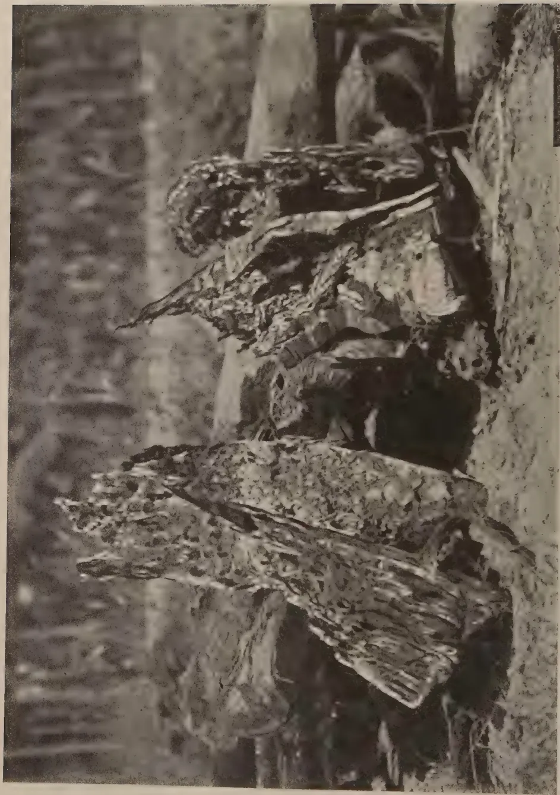

# The Tropical Agriculturist

VOL. XC

PERADENIYA, MAY, 1938

No. 5

<table><thead><tr><th></th><th style="text-align: right;">Page</th></tr></thead><tbody><tr><td>Editorial .. .. .</td><td style="text-align: right;">259</td></tr></tbody></table>

## ORIGINAL ARTICLES

<table><tbody><tr><td>The Canning and Bottling of Local Fruit and the Preservation of Fruit Juices and Cordials. By A. W. R. Joachim, Ph.D. ..</td><td style="text-align: right;">261</td></tr><tr><td>A Simple Method of Sulphur Dusting. By Rolf Smerdon ..</td><td style="text-align: right;">274</td></tr><tr><td>Notes on Orchids Cultivated in Ceylon. <i>Dendrobium Farmeri</i> var. <i>albiflorum</i>. By K. J. Sylva, F.R.H.S. ..</td><td style="text-align: right;">276</td></tr></tbody></table>

## SELECTED ARTICLES

<table><tbody><tr><td>Organic Composts .. .. .</td><td style="text-align: right;">278</td></tr><tr><td>An Indigenous System of Soil Protection ..</td><td style="text-align: right;">286</td></tr><tr><td>Physiological Aspects of Animal Nutrition, Locomotion, and Body Heat ..</td><td style="text-align: right;">288</td></tr></tbody></table>

## CORRESPONDENCE

<table><tbody><tr><td>Rhinoceros Beetle Breeding in split Coconut Logs ..</td><td style="text-align: right;">297</td></tr><tr><td>Agricultural Statistics .. .. .</td><td style="text-align: right;">298</td></tr></tbody></table>

## MEETINGS, CONFERENCES, &c.

<table><tbody><tr><td>Report of the Proceedings of the Second Meeting of the Central Board of Agriculture .. .. .</td><td style="text-align: right;">299</td></tr><tr><td>Minutes of the Forty-first Meeting of the Board of Management, Coconut Research Scheme (Ceylon) .. .. .</td><td style="text-align: right;">310</td></tr><tr><td>Minutes of the Forty-second Meeting of the Rubber Research Board (Ceylon) .. .. .</td><td style="text-align: right;">314</td></tr></tbody></table>

## REVIEWS

<table><tbody><tr><td>Report of the Fourth International Grassland Congress, Great Britain, 1937 .. .. .</td><td style="text-align: right;">317</td></tr><tr><td>Tropical Fruits and Vegetables. An Account of Their Storage and Transport .. .. .</td><td style="text-align: right;">318</td></tr></tbody></table>

## RETURNS

<table><tbody><tr><td>Animal Disease Return for the month ended April, 1938 ..</td><td style="text-align: right;">319</td></tr><tr><td>Meteorological Report for the month ended April, 1938 ..</td><td style="text-align: right;">320</td></tr></tbody></table>

1—J N, 1172 (4/38)

1------------------------------------------------

xiv

**BUY AND RELY ON I.C.I.**

---

**MAKE  
SULPHATE OF AMMONIA**

**AND**

**NICIFOS**

*(AMMONIUM PHOSPHATE)*

**THE BASIS OF YOUR  
FERTILIZER MIXTURES**

**FOR**

**ALL CROPS**

---

**IMPERIAL CHEMICAL INDUSTRIES (INDIA) LTD.,  
COLOMBO.**

2------------------------------------------------

The  
**Tropical Agriculturist**

May, 1938

---

**EDITORIAL**

---

**SOIL CONSERVATION**

---

**T**ECHNICAL Communication No. 36 of the Imperial Bureau of Soil Science issued last month deals with the subjects of soil erosion and soil conservation. This bulletin aims at "describing the present position with regard to erosion in the most seriously affected countries, the causes that have brought erosion into being, and the measures that are being taken or are contemplated to eliminate the causes and mitigate their effects" but does not "set out to give general technical information on appropriate measures of soil conservation, flood and erosion control."

It is interesting to read that "Ceylon was a pioneer country in recognizing the significance and consequences of contemporary erosion." It was unfortunate that this recognition was not general amongst those who were responsible for bringing new lands under cultivation, specially in the highland watersheds, and we are left to undo the effects of the improvident use of land during the last 50 years. But the more progressive section of the agricultural community of the Island has now definitely become erosion conscious, and there are signs that this consciousness is gradually percolating down to the peasant. Both peasant and planter appreciate that Ceylon's essential problem is the economic use of the available rainfall by the encouragement of absorption and retention and the control of the run-off. Its solution lies in the co-ordinated application of engineering and agronomic sciences. But planters and peasants are not scientists. Many of them have applied common sense and practical wisdom to the problem of saving their own lands and have acquired a considerable amount of empirical knowledge. It is necessary to collect this knowledge in one central exchange, to examine it scientifically, and to classify it and to formulate a standardized technique based on it. The recently appointed Soil Conservation Officer has taken this work in hand.

3------------------------------------------------

260

The bulletin of the Bureau of Soil Science comes to us as a timely reminder that a very large number of countries throughout the world are engaged in the same work, and that the experience on which we base our proposals for soil conservation may be world experience. The exact nature of these proposals must necessarily be determined by purely local conditions. But they must be based on principles which are applicable everywhere.

Two aspects of the problem emerge from the material collected in this bulletin as requiring special attention—the scientific and administrative. The scientific aspect, the study of the dynamics of soil erosion, has made the greatest headway in America, while in the integral land reclamation schemes the Italians under fascism have evolved the most practical organization for applying these rules of dynamics to a great sociological problem.

4------------------------------------------------

261

## THE CANNING AND BOTTLING OF LOCAL FRUIT AND THE PRESER- VATION OF FRUIT JUICES AND CORDIALS

A. W. R. JOACHIM, Ph.D., Dip. Agric. (Cantab.),  
CHEMIST, DEPARTMENT OF AGRICULTURE

FOR the past five years the Chemical Division of the Department of Agriculture has conducted an extensive series of trials with the canning and bottling of local fruit and the preparation and preservation of fruit juices, squashes and cordials. The results with the former have been generally satisfactory and most successful with the latter. Practically all the more popular types of local fruits have been canned or bottled with varying degrees of success, and the conditions required for the preparation of a satisfactory product, *viz.*, suitable varieties, degree of fruit maturity, syrup concentrations, exhaustion and sterilizing temperatures and times, have been systematically investigated. The fruits so experimented with include the pineapple, mango, guava, tree tomato, jak, local pear and peach, rambutan, papaw, pummelo, grapefruit, soursop and avocado pear. The mangosteen is one fruit which does not lend itself to successful canning owing to its delicate flavour, the small proportion of fruit pulp to seed, and the tendency to the liberation of the tannin from the latter during the sterilization processes. The work was extended to the bottling of coconut water and pulp but much further investigation is necessary on this subject. The canning of sweet corn as "cream style" has been successful, while as "corn in the cob" the results have been less so.

Early in the course of this work the question of a market for locally canned products was considered and it was decided to send consignments of canned fruit to England for report as to their quality and sale possibilities abroad. The first of these consignments, consisting of a dozen tins of canned pineapples, mangoes and papaws was sent to the Fruit and Vegetable Preservation Research Station at Campden, Gloucestershire, in 1934 with the kind co-operation of Mr. W. B. Benison of Gangewatte, Maskeliya. The report on this consignment was generally encouraging. Extracts from the reports are furnished in Appendix I.

2—J. N. 1172 (4/38)

5------------------------------------------------

262

The second consignment consisting of 12 dozen tins of canned mangoes (Jaffna, betti and parrot varieties), mango pulp, pineapples (Mauritius and Kew varieties), papaw, tree tomato (*Cyphomandra betacea*), guava, rambutan (*Nephelium lappaceum*) and jak was forwarded in November 1934, to the Imperial Institute, London. The tins were distributed among the following institutions and commercial firms for report :—

(i.) The Campden Fruit and Vegetable Preservation Research Station.

(ii.) The University of Cambridge, Low Temperature Research Station.

(iii.) Firm A : (Large wholesale grocers).

(iv.) Firm B : (Manufacturers, importers and exporters of food products).

(v.) Firm C : (Agent representing Indian firms).

Extracts from the reports of these parties are contained in Appendix II.

The Director, Imperial Institute, writes as follows in regard to this consignment of canned fruit :—

*"The accompanying reports indicate that whilst in many cases a high standard of success has been reached as regards the process of canning, the likelihood of being able to put any considerable quantity of Ceylon canned fruits on the United Kingdom market is rather remote. The trade in the fruits already well known, e.g. pineapples, is highly competitive and prices are very low. Those fruits which are known to some extent, e.g. the mango and guava, have made very slight headway during a considerable number of years. Others as yet entirely or almost unknown, e.g. the rambutan, tree tomato, have still less chance of success.*

*I would suggest that while the prospects of entering this market are not encouraging there remains the possibility of your being able to prepare products which would find a sale either in Ceylon or in adjacent countries during periods when the fresh fruits themselves are not in season."*

These experimental shipments have thus indicated that of our local fruits, only mangoes and pineapples offer any commercial possibilities outside Ceylon. The trade in canned pineapples is highly competitive, the average price of a dozen tins of Singapore pineapples being only about 2s. 7d. c.i.f., London ; it is extremely doubtful that we could compete with Malaya in this product on the foreign market. Moreover, our pineapples have been reported on as of unsatisfactory quality for canning, being fibrous and of uneven colour and maturity. Special canning varieties have therefore to be cultivated and this work is presently engaging the attention of the Botanist and Horticultural Officer of the Department. The local varieties of mangoes which are popular in the wet low-country of Ceylon are also not well suited for canning,

6------------------------------------------------

263

being rather too soft-fleshed and of uneven colour on maturity. Varieties grown in Jaffna are much more suitable for the purpose. With the development of systematic mango cultivation, there should be an outlet for the excess fruit in canning. Even with canned mangoes the margin of profit cannot be expected to be large, as the price would have to be competitive with that of peaches which are approximately about 6s. 7d. c.i.f., London, per dozen large-sized cans. The market is also limited, and unless an intensive propaganda campaign in favour of the product is organized, there is little hope of expansion.

There are, however, some possibilities in the canning and bottling of Ceylon fruit for the local market. Recently, in co-operation with an officer of the Marketing Department who was trained in canning at Peradeniya, over 100 tins each of canned pineapples and mangoes were prepared for sale by the Marketing Department, and the response from the public has been encouraging. The great obstacle at the present time with regard to economic canning in Ceylon, is the high cost of the can. Whole cans, obtained from England, cost from 20 to 22 cents delivered at Colombo. This is a heavy item of expenditure, if the final product is to be retailed at 40 to 65 cents per can. Fortunately, with the introduction of the flattened can, it would be possible to reduce the cost per can to about 10 cents or less. The necessary re-forming and flanging plant would, however, entail a capital expenditure of about £50 and this would militate against canning being adopted as a cottage industry, as it well might be, unless some organization, Government or private, would undertake the can re-assembling processes and the supply of whole cans to intending small-scale canners at a reasonable price. Whatever prospects the future may hold in respect to the development of canning in Ceylon, it would be essential from the very outset to ensure that the products placed on the market for sale should be of fair standard quality. This would entail the systematic laboratory examination of representative samples of canned products from every consignment of fruit intended for sale, by a competent officer or officers, as is now done at the Campden Fruit and Vegetable Preservation Research Station, England, for the purpose of the award of the National Mark. Canning for home purposes or on a cottage industry scale has been made possible of adoption by any intelligent housewife, through the invention of the hand can-sealing machine. The cost of the latter is well within the means of many a housewife in Ceylon and its manipulation is quite simple. Demonstrations on home canning and bottling have, during the past few years, been given by the staff of this Division on numerous occasions in various parts of Ceylon, at schools,

7------------------------------------------------

264

agricultural and other shows, to women's associations, &c. It cannot be said, however, that the practice has taken on, due perhaps to the high cost of cans and the lack of enterprise.

Fruit bottling is, on the other hand, an enterprise well-adapted for use in the home or on a cottage industry scale. The cost of equipment is small and the process itself extremely simple. The only appreciable item of recurrent expenditure is the cost of the bottles. The latter can, however, be used repeatedly, the only additional requirement being a new rubber ring and occasionally, a new lid. Almost all local fruits have been successfully bottled and the products have kept well for two or three years. One advantage of bottled fruit is that an idea of the quality of the product at the time of purchase can be gauged from its appearance.

Since 1935, the question of the preparation and preservation of fruit juices, squashes and cordials has been studied in this laboratory, and the results have been extremely satisfactory. Lime, grapefruit and orange juice have been successfully preserved by the use of the preservatives, sodium and potassium metabisulphite in amounts giving less than 350 parts per million of sulphur dioxide in the preserved juice. Over 300 bottles of pure sedimented lime juice were so prepared last year and found a ready sale. An equal number is being prepared this season. As preserved lime juice can be used either for squashes or for cooking purposes when limes are scarce, there is a ready market locally for fairly appreciable quantities of the product. Now that the process has proved to be sound and satisfactory and adapted for commercial utilization, it is hoped that some interested party will be induced to take up the manufacture of this product and of other fruit juices and squashes commercially. Of fruit squashes and cordials, passion fruit, lime, grapefruit and pineapple cordials offer distinct possibilities locally and to some extent abroad. Over 150 bottles of these cordials were prepared during the last two years and were very readily sold on the market. In addition, a method for the manufacture of cordials from tamarind and soursop have been successfully worked out. These cordials should be even more popular than the more commonly known products, because of their distinctive flavour and palatability.

Small consignments of canned and bottled fruit and of fruit juices and squashes were sent to Ceylon House, London, in 1935, and to Ceylon House, Bombay, in 1937 for purposes of exhibit. The commercial possibilities of the products in these countries were not intensively pursued as a consignment of canned fruit sent to the United Kingdom on the previous occasion already referred to had indicated the very limited scope of a trade in the product in that country, and as the whole question of the fruit

8------------------------------------------------

265

industry in Ceylon in all its aspects was being considered by a Fruit Development Committee appointed by Government. Any future developments in fruit products manufacture will be dependent on the policy which Government will adopt on the recommendations of this Committee. In the meantime, the examination, utilization and preservation of foods in general and of fruits in particular are being made the subject of special study by a Government Scholar at various institutions in the United Kingdom. On his return, this officer will be qualified to undertake not only investigational but also fairly large scale development work on fruit preservation generally.

### PRESERVATION METHODS

The object of this article is not to explain the principles or methods of canning and bottling or of fruit juice preservation. For a simple exposition of these the reader is referred to the following publications :—Ministry of Agriculture and Fisheries, United Kingdom, Bulletin 21 on “The Domestic Preservation of Fruit and Vegetables”; “The Home Preservation of Fruit and Vegetables” by M. J. Watson; “The Preservation of Foods” by L. Brewer, Cornell Extension Bulletin 159; “Home Canning of Fruits”, Department of Agriculture, Bombay, Leaflet 4 of 1928; and “Canning and Preserving” by S. K. Mitra. For a more comprehensive study of the subject the “Principles of Fruit Preservation” by Morris, and “Canning Practice and Control” by O. Jones & T. W. Jones are recommended. As several applications have been received by this Division for information on methods of canning fruit, preservation of fruit juices and preparation of squashes and cordials, leaflets have been issued describing in non-technical terms some of the methods adopted in this laboratory. These leaflets, modified where necessary, are issued as appendices to this paper. In Appendix III. the methods of canning and bottling fruit on a home scale are outlined. Particulars are furnished of the necessary equipment, their cost and manufacturers’ names and addresses. In Appendix IV. the method for the chemical preservation of lime juice is described. Appendices V. and VI. give details of the preparation of fruit squashes generally, and of grapefruit squash in particular. The methods are such as could be adopted in the home or on a cottage industry scale by any intelligent person with but little knowledge of the principles of the subject. It is hoped that their publication will stimulate some interest on the part of the leisured classes of Ceylon, in this useful, interesting and lucrative occupation.

As some data on syrup concentrations, exhausting and sterilizing temperatures and times suitable for the canning of

9------------------------------------------------

266

the more important species of Ceylon fruit would be helpful to those intending to undertake this work, the information is furnished in table I. The figures have been obtained as a result of a number of trials, but would have to be varied to some degree for fruits of different varieties and maturity conditions.

TABLE I

<table border="1">
<thead>
<tr>
<th rowspan="4">Fruit</th>
<th rowspan="4">Syrup Concentration Per cent.</th>
<th colspan="4">Exhaustion</th>
<th colspan="4">Sterilization</th>
</tr>
<tr>
<th rowspan="3">Temperature (F°)</th>
<th colspan="2">Period (minutes)</th>
<th rowspan="3">Temperature (F°)</th>
<th colspan="2">Period (minutes)</th>
<th rowspan="3"></th>
</tr>
<tr>
<th>Large Cans</th>
<th>Small Cans</th>
<th>Large Cans</th>
<th>Small Cans</th>
</tr>
<tr>
<th>A 2½</th>
<th>A 1½ (flat)</th>
<th>A 2½</th>
<th>A 1½ (flat)</th>
</tr>
</thead>
<tbody>
<tr>
<td>Mango</td>
<td>.. 25—40 ..</td>
<td>185—190..</td>
<td>5—6 ..</td>
<td>4—5 ..</td>
<td>Boiling water</td>
<td>18—20..</td>
<td>12—15</td>
<td></td>
</tr>
<tr>
<td>Pineapple</td>
<td>.. 15—35 ..</td>
<td>185—190..</td>
<td>5—6 ..</td>
<td>4—5 ..</td>
<td>do.</td>
<td>20 ..</td>
<td>15</td>
<td></td>
</tr>
<tr>
<td>Tree tomato</td>
<td>.. 20—30 ..</td>
<td>185—190..</td>
<td>5—6 ..</td>
<td>4—5 ..</td>
<td>do.</td>
<td>20 ..</td>
<td>15</td>
<td></td>
</tr>
<tr>
<td>Guava</td>
<td>.. 20—35 ..</td>
<td>185—190..</td>
<td>5—6 ..</td>
<td>4—5 ..</td>
<td>do.</td>
<td>20 ..</td>
<td>15</td>
<td></td>
</tr>
<tr>
<td>Papaw</td>
<td>.. 25—40 ..</td>
<td>190 ..</td>
<td>6—8 ..</td>
<td>4—5 ..</td>
<td>do.</td>
<td>20—25..</td>
<td>15—20</td>
<td></td>
</tr>
<tr>
<td>Jak</td>
<td>.. 20—25 ..</td>
<td>185—190..</td>
<td>6—8 ..</td>
<td>4—5 ..</td>
<td>do.</td>
<td>25 ..</td>
<td>20</td>
<td></td>
</tr>
</tbody>
</table>

For certain fruits lacking in acidity, like the papaw, jak and avocado pear, the addition of citric, tartaric or other weak organic acid is advised as it improves the flavour, facilitates sterilization and prevents "hydrogen swells". In the tropics great care has to be taken to prevent the development of defective or blown cans due to the formation of hydrogen by the action of the fruit acids on the tin and iron of which the can is made. These cans are known as "hydrogen swells". The perforation of the cans follow. To prevent hydrogen swells it is important to (1) cool the cans quickly and efficiently and to store them under cool conditions; (2) give a good exhaust and sufficient can headspace ( $\frac{1}{4}$  inch); (3) ensure the acidity of the fruit by the addition of citric acid if necessary; (4) close cans at as high a temperature as possible, thus ensuring a good vacuum in the can; (5) use lacquered cans entirely free from scratches. Lacquered cans, if scratched, perforate more rapidly than unlacquered cans; (6) handle cans carefully before and during processing.

Fruits like tomatoes and tree tomatoes have to be peeled by blanching for a few minutes in boiling water followed by dipping in cold water. The peel can then be easily removed. Some latitude is permissible in regard to syrup concentrations, mode of preparation of the fruit and the use of flavouring or colouring agents, but where canned products are prepared for sale, such conditions as definite weight of fruit for one can size, uniformity of colour and size of fruit or pieces of fruit, clarity and minimum concentration of syrup, and a satisfactory vacuum must be fulfilled. Fruits canned in syrups of high

10------------------------------------------------

This image is a scan of a blank page. The paper has a light beige or cream-colored tint. There are a few very small, dark specks scattered across the surface, which appear to be scanning artifacts or dust particles. No text, lines, or other markings are present on the page.

11------------------------------------------------

![A black and white photograph of a domestic canning and fruit juice extraction apparatus. The apparatus is composed of several numbered components: 1. A hand corkscrew with a handle; 2. A large, cylindrical metal can; 3. A metal funnel or strainer on top of the can; 4. A small cylindrical container or jar; 5. A hand press mechanism with a lever; 6. A large, dark rectangular base or table; 7. A juicer or can opener with a handle; 8. A small metal container or funnel on the right side of the base. The entire setup is arranged on a wooden table.](dd132a42034cab89a5431b7ee868ca06_1_img.webp)

BLOCK BY SURVEY DEPT. CEYLON, 18.5.38.

PLATE II.—DOMESTIC CANNING, BOTTLING AND FRUIT JUICE APPARATUS : 1. HAND CORKER 2. STERILIZING TANK,  
 3. ELECTRIC FRUIT JUICE EXTRACTOR 4. HAND SEALER 5. CROWN CORKING MACHINE  
 6. FORMA CAN OPENER 7. FRUIT PRESS 8. JUICE AND PULP EXTRACTOR

(Photo by L. S. Berlus)

12------------------------------------------------

This image is a scan of a blank page. The paper has a light beige or cream-colored tint. There are a few very small, dark specks scattered across the surface, which appear to be scanning artifacts or dust particles. No text, lines, or other markings are present on the page.

13------------------------------------------------

A black and white photograph showing a vast collection of canned and bottled products, likely from a survey. The products are meticulously arranged on a dark wooden table in a tiered, pyramid-like formation. The base of the pyramid is composed of numerous glass bottles, while the upper tiers consist of various jars and tins. In the foreground, two pineapples are prominently displayed on the table. To the right of the pineapples, a white rectangular label or card is placed. The background features a window that looks out onto a landscape with trees and a body of water. At the bottom right corner of the image, there is a small inscription: 'CLOCK BY SURVEY DEPT. REVISION 18.5.39.'

PLATE I.—A COLLECTION OF CANNED AND BOTTLED PRODUCTS PREPARED IN THE CHEMICAL LABORATORY  
(Photo by L. S. Bertus)

14------------------------------------------------

267

concentration retain their flavour and colour better than when light syrups are used. In the case of fruits coloured red or blue, and these are rare among tropical fruits, lacquered cans must be used if the colour is to be retained. In other cases non-lacquered cans are suitable. Not all varieties of a fruit are suitable for canning. Experience indicates that, with mangoes, for example, the firmer-fleshed varieties are preferable to the soft-fleshed types, while varieties with a definite turpentine or other unpalatable flavour are quite unsuitable for canning. Again, the local pear is unsuitable for this purpose without preliminary stewing and, even thus treated, does not give a really satisfactory canned product. Certain fruits such as the guava discolour rapidly on exposure to air due to oxidizing enzymes. These should be placed in a very dilute solution of salt water (one per cent. concentration) immediately on cutting and washed with fresh water after filling into the tins. Other fruits such as grapefruit require a specialized canning technique which is not normally feasible under home conditions.

Plates I., II., and III. accompanying this paper show respectively (1) a collection of canned and bottled products prepared in this laboratory; (2) the apparatus required for domestic or small scale canning, bottling and juice preservation; and (3) a section of the fruit products room in this laboratory for semi-commercial work.

Information is available in regard to the cost of essential equipment for the establishment of a canning and fruit products factory of a very modest type, *e.g.*, flattened can equipment—flanger, reformer, and rectifier—double seamers, canning units, and other items, and will be furnished to any prospective canner who desires to embark on the project. This, however, cannot be advised at present. As canning on a large commercial scale has not been attempted by this Division, the relevant information of manufacturing costs is not available. Approximate estimates could, however, be gauged from figures of costs of production obtained on a semi-commercial experimental basis.

#### ACKNOWLEDGMENTS

It is with the greatest pleasure that I acknowledge the assistance rendered to me from the very inception of this work by my assistant, Mr. D. G. Panditsekere. He has been largely responsible for the supervision of the manufacture for sale of canned fruit and bottled juices, and for the conduct of the numerous demonstrations given on the processes throughout the Island. I am also indebted to Mr. L. S. Bertus of the Pathological Division for having taken the photographs illustrating this paper.

15------------------------------------------------

268APPENDIX I

UNIVERSITY OF BRISTOL RESEARCH STATION, CAMPDEN, GLOS.

CANNED FRUITS PACKED BY THE GOVERNMENT CHEMIST, CEYLONPineapples

Three cans were quite good. The slices had been cut in eighths, and the weight of fruit filled was satisfactory. The pines themselves did not appear to be of quite first class quality, the texture being rather fibrous. The flavour was quite good, however.

The vacua were satisfactory, and the final densities suggested that a syrup of about 25 per cent. strength had been used.

Mangoes

One can out of three was excellent in colour and clarity of syrup. In the other two the sections had softened and disintegrated slightly, but the products were otherwise satisfactory. The vacua were low. The flavour was good in all cans.

This pack might command a market in England.

Papaw

The sample labelled "Fruit just ripe but hard" was poor, the canned product being very tough and tasteless. The riper sample was quite good as far as texture and flavour were concerned, but the syrup was rather cloudy. The vacua were satisfactory. The flavour was not very distinctive, and would probably not appeal to the English public.

Tree Tomato

Dull greyish brown in colour, and about the shape and size of Victoria plums. A distinct "spicy" flavour, and containing many small seeds. The texture was otherwise good. Its poor appearance and peculiar flavour would probably prevent it being sold in this country.

August 21, 1934

F. HIRST,  
Director

APPENDIX IIREPORTS ON CANNED FRUITS FROM CEYLON

*Cambridge* : "The Jaffna mango appears to have been very satisfactory on the whole, but I do not think the other fruits would find any sale in this country. The samples of pineapple were a little disappointing but could probably be improved by a better selection of fruit. Guava : flavour pleasant, but hard seeds would render it unsaleable if for canning whole."

*Campden* : (1) *Mango*.— (i.) The Jaffna variety generally good.  
(ii.) Betti variety very unsatisfactory.  
(iii.) Parrot variety appeared to be most promising.  
(2) *Guava*.—Appearance and flavour quite good apart from uneven ripeness.

(3) *Pineapple*.—Quality poor. Fault appears to lie in fruit itself, for apart from variation in ripeness, even the best sections were of rather coarse texture, patchy colour and relatively poor flavour. White areas occurred on many sections. Fruit compared in quality with cheap Singapore packs. Below standard of better Malayan and Australian packs.

16------------------------------------------------

A black and white photograph showing a section of the Fruit Products Room at Peradeniya. The image depicts industrial machinery, including a large horizontal cylinder with various pipes and valves, and a large circular wheel or pulley system mounted on a stand. The room has high ceilings and structural beams.

BLOCK W/STUVER D&R. CAPTION NO. 5.3.1.

(Photo by J. S. Bertus)

PLATE III.—A SECTION OF THE FRUIT PRODUCTS ROOM AT PERADENIYA

17------------------------------------------------

This image is a scan of a blank page. The paper has a light beige or cream-colored tint. There are a few very small, dark specks scattered across the surface, which appear to be scanning artifacts or dust particles. No text, lines, or other markings are present on the page.

18------------------------------------------------

269

(4) *Rambutan*.—Flavour very insipid, flesh tough and of "rubbery" texture but appearance attractive.

(5) *Jak*.—Quite good flavour; texture "stringy".

(6) *Papaw*.—Samples inclined to be soft and probably a shade too ripe for canning.

(7) *Tree Tomatoes*.—Colour very unattractive, but this is apparently normal.

*Firm B*.—"There might be a sale for the pineapple if packed to compete with this fruit from Singapore and Hawaii but the product would have to be very greatly improved, and even then it is doubtful whether it would be a paying composition to compete with existing packs from other countries.

The rambutan, tree tomato, guava and papaw are quite unsuitable for this market. There might be a small sale for the mangoes in syrup and mango pulp. We have sold mangoes in syrup for the last 25 years with an efficient sales organization, but we have made no headway with this fruit.

If this is a Government proposal, it might be possible to popularise the mangoes by a National Advertising Campaign, but even then unless the price was below Australian, Californian and English canned fruits, we are afraid that there would be little chance of success."

*Firm C*.—*Jaffna Mango*.—"The quality of this variety is poor in flavour, and is indifferent to create a taste for the immediate public. Therefore I think it will not be readily marketable immediately. It must be admitted that the slicing and the canning, also the syrup, are satisfactory. The syrup should be as thin as possible.

*Betti Mango*.—Quite good flavour; the slices are also good.

*Parrot Mango*.—This is also good; the slices are also good.

*Pineapple*.—The cubes are all right although this kind is not known in the market and the public are not used to it. It cannot compete with the Singapore or Hawaii manufactures.

*Guava*.—Very nice, but the pips should be taken out.

*Jak*.—It has its natural flavour but owing to its messy and slimy consistency it will not prove successful.

*Mango Pulp*.—In our opinion this will not be successful.

*Rambutan*.—The first appearance is attractive and like that of lichis, an article with which some of the public are acquainted. This would lead one to expect a similar flavour, but would prove disappointing. Directions should be given whether the fruit should be eaten with the stone in it.

*Papaw*.—This has an attractive flavour and it is also somewhat known. Very ripe fruit should not be used because it becomes "mushy" in the syrup.

*Tree Tomato*.—In my opinion this will not prove successful. I should suggest that, as the fruits are new to the public, some sort of directions for eating should accompany the tins. It should be pointed out that they are wholesome fruits and are in no way injurious. If the botanical names can be given it would add value to the descriptive statements."

*Firm A*.—*Mangoes*.—"Condition generally good, although some of the samples rather soft. Canned mangoes were on the market, but the demand was very small. It was a new fruit, unknown to most people and so would need popularising. In any case to secure any considerable sale canned mangoes must compete in price with such well established fruits as peaches. The firm deals in peaches at 6s. 7½d., c.i.f. per dozen 2½ cans."

3—J. N. 1172 (4/38)

19------------------------------------------------

270

*Mango Pulp.*—This was regarded as quite useless, being very watery and unattractive in appearance.

*Pineapple.*—The packs were considered poor in comparison with ordinary commercial kinds. As with mangoes the question of price is all important. The price at which the firm deals in Singapore pineapples at present is 2s. 7½ d., c.i.f. per dozen 1½ cans.

*Rambutan, Papaw, Tree Tomato and Guava.*—It was considered that there was no likelihood of any of these being marketed in the United Kingdom.

## APPENDIX III

### THE DOMESTIC CANNING OF FRUIT

#### Selection and Treatment of Fruit

To obtain good results in canning, special care should be taken in the selection of the fruit. It is essential that the fruit be sound and ripe but firm. Fruit should be graded according to variety, degree of ripeness and colour.

The fruit is well washed and the skin or peel removed. The flesh is then cut into uniform pieces and packed in clean cans. Immersing the latter in boiling water before use is recommended. The cans are filled to within half an inch from the top.

#### Syruping

Sugar syrup is poured on the fruit in the cans up to a quarter of an inch from the top. For most Ceylon fruits a sugar syrup of 25 to 30 per cent. strength is sufficient. This is made by dissolving 3 to 4 lb. of sugar in 1 gallon of water, using gentle heat if necessary. The syrup is strained through muslin and stored. Before filling into the cans, the syrup is heated to about 180 F. or where exhausting is not done to boiling point.

#### Exhausting

The filled cans are then placed with the lids in an exhausting bath containing water at boiling or other temperature, up to three-fourths the height of the cans. The cans are kept in the exhausting bath for 4—8 minutes.

#### Sealing

The cans are taken out of the exhausting bath one at a time and sealed immediately. The hand sealer used for this purpose shown in Plate II. is of simple design and does not need skilled labour. The sealing is effected by means of two rollers. The first roller operation curls the edges of the can and lid inwards and forms the seam and the second flattens and compresses it.

#### Sterilizing

The cans are then placed on the false bottom of a sterilizer (see Plate II.) which contains boiling water sufficient to cover the cans entirely. They are left in the sterilizer from 15—30 minutes according to the kind of fruit and size of can. The sterilized cans are then cooled at once by immersing them in a vessel of cold water. When cool the cans are taken out of the water, dried, labelled and stored.

20------------------------------------------------

271

### Outfit

For home canning the sealer suitable for the purpose can be purchased from Messrs. Williamson & Sons, Ltd., London, W. C. 2, for a sum of £5. In addition the following will be required :—

<table>
<thead>
<tr>
<th></th>
<th>s.</th>
<th></th>
</tr>
</thead>
<tbody>
<tr>
<td>Tins, large A2½</td>
<td>.. 35/-</td>
<td>per gross</td>
</tr>
<tr>
<td>Tins, small A1½</td>
<td>.. 32 -</td>
<td>.. ..</td>
</tr>
<tr>
<td>Labels</td>
<td>.. 2/6</td>
<td>.. ..</td>
</tr>
<tr>
<td>1 Sterilizer</td>
<td>.. 17/6</td>
<td></td>
</tr>
</tbody>
</table>

### Bottling of Fruit

The selection and treatment of the fruit and the strength of syrup are the same as for canning.

Cold sugar syrup is poured on to the fruit packed in the specified bottles, to overflow. It is poured slowly with occasional tapping of the bottle to remove air bubbles.

The covers and clips are fixed on to the bottles which are then placed in a sterilizer containing cold water sufficient to immerse the bottles entirely. The water in the sterilizer is then heated up to a temperature of 185°F. depending on the fruit and maintained at this temperature for half an hour. At the end of this period the bottles are removed from the sterilizer and kept in a place free from draught. After 24 hours the clips are removed. To test whether the process has been successful, the bottles are lifted by the lid. If the latter remains firm, the vacuum is good and the fruit will keep.

An outfit for home bottling can be purchased from Messrs. Geo. Fowler, Lee & Co., Ltd., 70/74, Queens Road, Reading, England. The cost of a small size outfit consisting of a sterilizer, thermometer, 24 bottles and book of instructions is 35s.

## APPENDIX IV

### CHEMICAL PRESERVATION OF LIME JUICE

1. Choose limes which are sound and well matured. Only these give a clear juice.

2. The limes are cut in halves and the juice is expressed by hand or by means of a fruit juice extractor.

3. The extracted juice is strained through coarse muslin. To every gallon of the strained juice up to one-tenth of an ounce (avoirdupois) of the chemical preservative sodium metabisulphite, dissolved in the smallest quantity of cold water, is added. The chemical potassium metabisulphite may also be used in the same way at the maximum rate of one-eighth of an ounce (avoirdupois) to a gallon of juice, but the former chemical is to be preferred. In either case pure chemicals must be used and the quantities stated should not be exceeded. For smaller amounts of juice proportionately smaller weights of chemical preservative should be added. As different samples of lime juice appear to require different quantities of chemicals for preservation, it is suggested that half or two thirds of the maximum quantities specified above be tried in the first instance.

4. The juice is then poured into large clean bottles which should be well filled and stoppered. It is then allowed to sediment for a period of three or more weeks.

21------------------------------------------------

272

5. The clear juice is from time to time decanted and strained through clean, fine linen into well washed bottles which are filled up to the neck and corked with bark corks. The latter are immersed in boiling water for a period of five or ten minutes before use.

6. To obtain a sparkling product intensive filtration is necessary.

7. About 50 limes are required to produce a bottle of juice. A teaspoonful of the bottled juice is equivalent to the juice of half a lime.

8. The efficacy of the chemical preservative being impaired by heat, it is advisable that bottled lime juice be kept in a cool place.

9. The addition of more than the stated quantity of chemical would render the juice not only unpalatable but also injurious to health.

10. The bottled juice is best used after about a week.

---

## APPENDIX V

### FRUIT JUICE SQUASHES

1. Choose fruits which are fully ripe but sound.

2. Express the juice by hand or by means of a fruit juice extractor as shown in plate III.

3. Strain the extracted juice through a piece of coarse muslin. With certain fruits like grapefruit, oranges, &c., some of the pulp after washing may be added to the strained juice if desired.

4. Add sugar to the strained juice in amounts depending on the nature of the fruit and individual taste, to make a thick syrup. Warm if necessary.

5. A small quantity of citric or tartaric acid dissolved in water is added in the case of certain fruits lacking in acidity. The quantity required would vary with different fruits. Taste is the best guide.

6. Add up to a maximum of one-eighth to an ounce (avoirdupois) of potassium metabisulphite or one-tenth of an ounce (avoirdupois) of sodium metabisulphite dissolved in the smallest quantity of water to a gallon of the cordial. These chemical preservatives are used instead of heat pasteurisation.

7. Pure chemicals must be used. More than the stated quantities of preservatives would render the cordials injurious to health and unpalatable.

8. Fill the syrup into clean bottles and close the latter with sterilized corks. The corks are sterilized by boiling in water.

9. The cordial should be used after about a week.

---

## APPENDIX VI

### PREPARATION OF GRAPEFRUIT SQUASH

1. Choose sound, fully ripe fruit.

2. Wash the fruit well and cut them in halves.

3. Extract the juice by means of an extractor shown in Plate III. or by hand.

4. Strain the juice through a coarse cloth or a piece of muslin. The pulp of the fruit is separated from the residue by the addition of water to the latter. It may, if desired, be added to the strained juice.

22------------------------------------------------

273

5. Add to every gallon of this juice one-eighth of an ounce (avoirdupois) of pure potassium metabisulphite or one-tenth of an ounce of pure sodium metabisulphite dissolved in the smallest quantity of cold water and stir well.

6. Put into clean bottles and allow to stand.

7. When the sediment has settled sufficiently, decant the clear juice.

8. To every gallon of this juice add 7 lb. of sugar and stir thoroughly till the sugar is dissolved. About one and a half gallons of squash will finally be obtained.

9. Then add to each gallon of squash from a quarter to half an ounce of citric acid dissolved in the smallest quantity of water, according to taste. This improves its flavour and keeping quality. Half a dram of the preservative potassium metabisulphite or one-third of a dram of sodium metabisulphite dissolved as previously in water may be added to each gallon of the squash before bottling.

10. Fill the squash into clean bottles. Close the bottles with new corks boiled in water for about five minutes.

11. Seal with candle wax and fit capsules to the bottles.

12. Only pure chemical preservatives should be used and in amounts not exceeding the quantities specified.

4—J. N. 1172 (4/33)

23------------------------------------------------

274

## A SIMPLE METHOD OF SULPHUR DUSTING

ROLF SMERDON

THE following suggestion is made in the hope that it will be of assistance to my fellow planters, who find it difficult to transport a heavy machine into out-of-the-way corners of the estate and to those who have to deal with erratically wintering trees. It also seems to me to solve the problem of dusting small-holdings, whose proprietors cannot be expected to face the capital cost of a dusting machine, or the outside labour required to carry and operate it.

The method is an elaboration of the gardening practice of filling a piece of muslin with the dusting powder and diffusing this over the plants or bushes by gently tapping it.

Small bags large enough to contain two or three pounds of sulphur loosely are made of old sacking. One of these, after having been filled with sulphur, is tied, top and bottom, to the end of a pole, the length of which will depend to a very great extent on the height of trees to be treated; but I do not think anything much more than 25 feet will be found convenient. This is also about the height of the effective vertical throw of a fairly powerful machine.

If the bag be now agitated by shaking the pole, a cloud of sulphur is liberated and the effect is the same as if it were ejected by a machine or exploded by a bomb at that height.

Labourers, especially Sinhalese, become very expert at liberating the required amount and can scramble with their poles into every corner.

An intelligent supervisor, working a gang, can concentrate his men in a gully with a favourable wind-drift; spread them across a hillside, or restrict the dusting to individual, isolated trees or patches. Given suitable weather conditions, four men can quite easily treat 100 acres in one day, with extra labourers for transport.

One advantage of this method is that, if the bags be filled uniformly with a previously weighed quantity of sulphur, the amount distributed over any area can be very readily checked at any time and adjusted as may be found necessary.

24------------------------------------------------

<!-- stage4: ACCEPT r2J/J_012:101 -->

275

The small-holder can have no excuse, as the only appliance he requires is a pole cut from his own land and an old piece of sacking. He can then treat the whole of his ten acres at his own convenience, without any outside assistance, in an hour or so.

This simple method was devised for treating small areas, but, no doubt, could be elaborated to deal with quite large areas if necessary and I trust will assist materially in enabling the Department to implement Mr. R. G. Coombe's resolution, passed at the meeting of the Central Board of Agriculture on November 18, 1937.

25------------------------------------------------

276

## NOTES ON ORCHIDS CULTIVATED IN CEYLON

*Dendrobium Farmeri* var. *albiflorum* Hort.

K. J. ALEX. SYLVA, F.R.H.S.

SUPERINTENDENT OF MUNICIPAL PARKS, COLOMBO

THE plant belongs to the well known group of *Dendrobiums*—*Calostachyae*, which signifies “beautiful spikes”. These include *D. densiflorum*, *D. thyrsiflorum*, *D. Suavissimum*, *D. chrysotoryum*, &c. All of these are alike in their habit of growth and the production of blooms. *Dendrobium Farmeri* var. *albiflorum* has pseudobulbs of a peculiar form, clubshaped (clavate), four angled and attenuated near the base into thin foot-stalks. They are fleshy and vary from six to twelve inches in length and usually bear two to four ovate, dark green, and rather leathery leaves about six inches long. As a rule the leaves appear only at the two uppermost nodes.

Though this orchid is an evergreen in temperate zones and in its native haunts in Upper Burma, it is semi-deciduous in the warmer latitudes of Ceylon.

The flowers are borne on a graceful arching raceme, ten inches or more in length, which may develop from either of the two joints at the extremity of the mature pseudobulbs. The production of blooms at these points greatly aids the fine display of the spike.

The flower is about two inches across with delicate white sepals and petals and an expanded disc of the lip, which is orange-yellow with a white margin.

Well established specimens are capable of producing as many as twelve or more flower spikes at a time but these last only for about ten days under favourable conditions.

*Culture*.—*Dendrobiums* of this group will take kindly to any of the methods of culture practised in Ceylon. If grown in baskets or pots, these should just fit the clump. A small receptacle is preferable so that when the clump is placed in it there should not be a marginal space of more than two inches around.

26------------------------------------------------

A black and white photograph of a flowering orchid plant, identified as Dendrobium Farmeri var. Albiflorum Hort. The plant is shown in a dark, possibly wooden, container. The flowers are light-colored and hang in clusters from the stems. The background is dark, making the plant stand out. The image is framed by a dark border.

BLACK & WHITE PHOTO CRYSTAL 2 & 4 36

*Dendrobium Farmeri var. Albiflorum Hort.*

27------------------------------------------------

This image is a scan of a blank page. The paper has a light beige or cream-colored tint. There are a few very small, dark specks scattered across the surface, which appear to be scanning artifacts or dust particles. No text, lines, or other markings are present on the page.

28------------------------------------------------

277

Logs, either of wood or of basal sections of the tree fern, provide the best method of culture. Plants in pots need careful watering ; even a well-grown plant in a pot should be given dry conditions after the flowers are over. During this period the plant should be watered only when signs of dryness appear on the surface and then only a little. The fleshy pseudobulbs are very liable to perish when there is too much moisture at the roots or exposure to continuous rain.

For pot culture the usual crocky compost is all that is necessary but the clump must be made to "sit" on the compost with the help of two stakes driven in.

The plant thrives best in the mid-country up to about 3,000 ft. In the low-country, though it can be successfully grown, it flowers less freely. A well grown plant should not be disturbed unless it has overgrown its receptacle or shows symptoms of decay of the pseudobulbs.

29------------------------------------------------

278

## ORGANIC COMPOSTS\*

UNTIL recent years Malaya has been regarded as a land of great fertility where manures were never required save to produce flowers in the garden. Permanent crop agriculture being almost universal on inland soils, this belief and general attitude is not altogether surprising when it is remembered that land was for the most part opened up from jungle, where conditions of shade and moisture had allowed an accumulation of plant nutrients.

Nowadays, it is the practice rather than the exception to apply fertilizers, in such specific form as may suit, to permanent, as well as to annual crops. The vast majority of fertilizers so applied are in the form of naturally-occurring or artificially prepared mineral material.

Although these artificial fertilizers may have a considerable stimulatory effect on growth or production, there frequently comes a point where such increase cannot be maintained by further applications. As a sequence, consideration has been given to the use of cattle manure, the perennial effect of which, as a fertilizer, has been known since man began to till the soil.

The beneficial effect of cattle manure is due both to its mineral nutrient content directly comparable to artificial fertilizers and to its organic content, the function of which is to stimulate soil bacteria. The obstacle to its use in Malaya is one of supply, owing to the negligible amount of dairy farming or cattle keeping.

In an attempt to find substitutes for cattle manure, inquiries are received from time to time as to the methods of preparation of organic compost. These inquiries are usually concerned with the production of composts for horticultural purposes.

The preparation of composts has been carried out on a large scale for some years at the Institute of Plant Industry, Indore, India, and is now well known as the Indore Process. Details of the methods and the results obtained were published in 1931 by Howard & Wad under the title of "The Waste Products of Agriculture."

A number of minor experiments on these lines were carried out locally by Greenstreet and Wilshaw and subsequently published.

A fresh series of experiments was carried out in the laboratory, in which the compost materials, consisting of plant residues readily obtainable locally, were contained in boxes with sloping sides 24 in. by 30 in. at the top, by 20 in. deep. In subsequent experiments the scale was increased by utilizing covered concrete tanks. It was found, however, that these tanks were too shallow and had too great a cooling area.

---

\* By J. H. Dennett, Senior Chemist (Soils) in *The Malayan Agricultural Journal*, Vol. XXVI., No. 3, March, 1938

30------------------------------------------------

279

In view of the frequent and heavy rainfall experienced in Malaya it was considered that to follow the Indore method of open pits would be unsatisfactory and would lead to mosquito breeding, anaerobic conditions and possibly to pest of flies. All work on a large scale, therefore, was conducted with heaps in the open. These heaps were situated within a hundred yards of houses and no complaints were received in regard to flies nor were any flies observed round the heaps throughout the period of preparation.

### RAW MATERIALS

In a country growing chiefly annual crops there is always a large amount of waste material at hand, but in Malaya where the main dry land crops are rubber, coconuts and oil palm, waste is a somewhat difficult matter to obtain in quantity. On oil palm estates there are bunch residues, but, in general, where permanent crops are grown it is necessary to collect the raw material such as green covers, secondary jungle growth or grass.

On or near small holdings, or in market gardens, an adequate supply of green material may be available, while in gardens surrounding houses or schools there is always sufficient grass to form the basis of a good compost heap with the addition of leaves and general plant remains.

There is, however, one industry of some importance to this country where the disposal of waste is a major problem. In the pineapple factories waste was at one time piled in heaps in the hope of its rotting down, and Greenstreet carried out experiments in this connexion with the object of turning these heaps into a compost. He came to the conclusion that owing to the heaps containing 95 per cent. of moisture, a satisfactory product could not be obtained without a preliminary pressing. Latterly, it has been the practice to dump the refuse into the nearest river, but even this is becoming a nuisance and the question of its proper disposal is not completely solved. Further experiments were therefore carried out on the lines of the Indore Process and, as will be shown, it was found that a satisfactory compost could be obtained in good weather by dealing with the wet waste. Unpressed waste will break down to a satisfactory compost and the advantage of pressing is to reduce the bulk of material to be handled.

### THE PROCESS

The first outdoor experiments were carried out with mixed grass and leaves in heaps about 8 ft. by 6 ft. by 3 or  $3\frac{1}{2}$  ft. deep. The raw materials were thoroughly withered in the sun to remove practically all internal moisture, as otherwise the material tends to ferment internally (within the cells) rather than break down externally (in the epidermis). About 500 lb. of dried material were used per heap.

Following the Indore Process the leaves and grass were wetted with water and thoroughly mixed. The bottom layer was made by spreading this wetted material to a depth of about  $4\frac{1}{2}$  inches over an area of 48 square feet. A slurry was then made up of about 5 lb. fresh cowdung,  $\frac{1}{2}$  lb. wood ash and 3 gallons of water. This was thinly sprinkled over the layer. Small pieces of dung of about  $\frac{1}{2}$  a cubic inch were then scattered over the layer, followed

31------------------------------------------------

280

by a sprinkling of cattle urine and a dusting with wood ash. Being unavailable urinated earth, as recommended by Howard, was not added, neither was any additional earth used, as local soil has an acid pH value between 4.0 and 5.5 and could only react unfavourably on a process which must be kept rather on the alkaline side. Further series of layers were built in a similar manner until the heap was about 3 feet deep when it was covered with a layer of dried grass to protect it from rain.

A second heap was made in a similar manner but with the addition of 3 lb. calcium cyanamide to see whether an improved product was obtained and whether there was a more rapid decomposition. Similarly 3 lb. of sulphate of ammonia were added to a third heap, and 6 lb. of lime to a fourth heap. A fifth heap was built in a somewhat different manner: all the ingredients, leaves, grass, dung, urine, wood ash, and water were thoroughly mixed and then made into the heap.

All the heaps were turned on the fifteenth day and a further batch of similar heaps made in the same manner as the first except that they received an inoculation from the original heaps by the incorporation of 5 lb. of material taken from the centre of the latter and mixed with the slurry.

At the next turn, fifteen days later, the second batch was again inoculated from the first batch, and a third batch was prepared and inoculated from the second batch.

At the end of forty-five days the heaps were again turned, a portion of the first batch being again used to inoculate the second, which was now at the thirty-day stage.

The last turn was made at the end of sixty days, *i.e.*, four turns in all, after which the heaps were allowed to mature for another month, when they were considered to be ready for use.

A second series was started in which the 3 lb. of nitrogenous fertilizers were replaced by phosphates either 6 lb. of superphosphate, 6 lb. of rock phosphate or 6 lb. of basic slag.

A third series was started in which the basic material consisted of  $\frac{1}{3}$  green manure and  $\frac{2}{3}$  dried grass. The heaps were treated with phosphates or lime in a similar manner to the second series.

It is to be noted that, with the exception of the first batch of the first series, every heap was inoculated at each turn from a heap a fortnight older.

A fourth series was prepared on a somewhat larger scale in which it was attempted to break down oil palm fronds and petioles. These heaps were made 12 ft by 9 ft. by 3 ft. and consisted of grass and leaves as in the earlier series to which were added approximately 50 per cent. of their weight of petioles and about 20 per cent. of fronds.

The final series consisted of fresh pineapple waste with and without admixture of grass.

32------------------------------------------------

281COMPOSITION OF HEAPS

The series is tabulated below :—

<table border="1">
<thead>
<tr>
<th colspan="2">Series I (three batches at 14 days intervals)</th>
<th colspan="2">Series II (three batches at 14 days intervals)</th>
</tr>
</thead>
<tbody>
<tr>
<td>Heap</td>
<td></td>
<td></td>
<td></td>
</tr>
<tr>
<td>1.</td>
<td>Control .. ..</td>
<td>Control</td>
<td></td>
</tr>
<tr>
<td>2.</td>
<td>3 lb. calcium cyanamide .. ..</td>
<td>6 lb. superphosphate</td>
<td></td>
</tr>
<tr>
<td>3.</td>
<td>3 lb. ammonium sulphate .. ..</td>
<td>6 lb. rock phosphate</td>
<td></td>
</tr>
<tr>
<td>4.</td>
<td>6 lb. lime .. ..</td>
<td>6 lb. basic slag</td>
<td></td>
</tr>
<tr>
<td>5.</td>
<td>Materials previously mixed with slurry before making into layers</td>
<td>6 lb. lime</td>
<td></td>
</tr>
<tr>
<td></td>
<td>Series III</td>
<td>Series IV</td>
<td></td>
</tr>
<tr>
<td></td>
<td>As Series II, but <i>Crotalaria</i> and <i>Tephrosia candida</i> substituted for leaves (One batch only) .. ..</td>
<td>As Series I control, but old oil palm fronds and petioles incorporated 3,000 lb. grass and leaves 1,800 lb. oil palm petioles 600 lb. oil palm fronds Dung and ash in proportion</td>
<td></td>
</tr>
<tr>
<td>Heap</td>
<td>Series V—Fresh Pineapple Waste</td>
<td></td>
<td></td>
</tr>
<tr>
<td>1.</td>
<td>1,300 lb. waste, 3,000 lb. dried grass</td>
<td></td>
<td></td>
</tr>
<tr>
<td>2.</td>
<td>4,100 lb. waste, 1,200 lb. dried grass</td>
<td></td>
<td></td>
</tr>
<tr>
<td>3.</td>
<td>500 lb. waste 100 lb. dried grass</td>
<td></td>
<td></td>
</tr>
<tr>
<td>4.</td>
<td>4,700 lb. waste only</td>
<td></td>
<td></td>
</tr>
</tbody>
</table>

TEMPERATURES

Some eight hours after the heaps are first made the temperature begins to rise and, by the end of two days the centre of a well-made heap should be about 125°F., rising by the following day to about 135°F. if the batch has not been inoculated from a previous heap, while if such inoculation has taken place the temperature should be about 10°F. higher. From the fourth day the temperature begins to fall, and by the time of the first turn the centre of the mass should have a temperature of about 100° to 105°F.

Provided there is no rain during the first fifteen days up to the first turn, a considerable amount of evaporation takes place and it is necessary to add water when turning the heap and inoculating from a thirty-day heap. After this first remaking the temperature rises again during the next three days to about 130°F., gradually falling to between 100° and 105°F. by the end of thirty days. When the heap is again remade and inoculated from a forty-five-day old heap the temperature again rises, but only to about 115°F., and by the end of forty-five days has generally dropped to only a few degrees above atmospheric temperature. After the final turn and inoculation from a sixty-day old heap, there is practically no change in temperature. Although it has not completely lost its original form, the compost may be used at this stage, but the normal procedure, as stated previously, is to keep it for a further month until the material is in the form of a completely disintegrated mould.

WET WEATHER

Although Howard found in India that heaps made in monsoon weather did not differ fundamentally from heaps made in the dry season, locally it was found that heaps of the size described were considerably affected by rain,

33------------------------------------------------

282

both as to the rate of decomposition and disintegration and as to the condition of the final product. Continuous rain lowers the temperature of the heaps considerably with a consequent slowing down of the initial stages of decomposition; in addition there is a tendency for the lower layer to become semi-anaerobic with an almost complete fall in temperature to normal. Analysis has shown that the potash and phosphate contents, and, to a slight degree, the nitrogen content, were reduced by wet weather.

If the compost is to be used for horticultural purposes, the heaps made during the months October-November and March-April, might with advantage be protected by a leaf shelter.

### NITROGEN AND PHOSPHATES

The addition of nitrogen or phosphates appears to have little bearing on the rate of decomposition and no great effect on the mineral content of the final product. Lime, however, does appear to hasten the breaking down of the raw material, blackening taking place more rapidly and in addition, the heap, even at the first turn, appears to break up more readily. On the other hand, as is to be expected by the addition of lime, there is a reduction in the nitrogen content. The same effect of more rapid decomposition could probably be obtained by the use of larger quantity of wood ash and, although the nitrogen content would probably be lowered, the product would show an enrichment in phosphate and potash. Unfortunately, ash is not always available in sufficient amounts to enable a larger quantity than that indicated to be used. It is suggested that wood ash should be used as a standard; when unavailable it may be replaced by lime.

In the heaps made with chopped oil palm fronds and petioles it was found that while the fronds broke down fairly easily, even at the end of three months the petioles as a whole were undecomposed. The addition of green manure appeared to have very little effect on the nitrogen content of the final product.

The actual amounts of phosphates and potash present appear to vary according to the rainfall. The 1.2 per cent. of phosphate fertilizer added (varying from 0.2 to 0.4 per cent. of P. O5 according to type of fertilizer) does not appear to be reflected in the results.

It would appear better, if it is required to enrich the compost with any mineral fertilizer, to do so immediately before use rather than at the time of composting.

### DUNG AND URINE

While it is usually possible to obtain a certain quantity of fresh cattle dung for starting the heaps, cattle or horse urine is less easy to obtain.

The great advantage of the addition of urine is that a higher initial temperature is obtained with a consequent hastening of the early stages, but owing to the general difficulty of obtaining it in sufficient amounts for treating every fresh heap it is considered best to disregard it as a usual constituent of the compost heap in Malaya. It is, however, worth adding (when the price is reasonable) to an occasional fresh heap which is to be subsequently used to

34------------------------------------------------

283

inoculate other heaps. Fresh dung must be regarded as essential as a rapid "starter" but the quantities used are so small as to have little effect on the final composition.

#### LABORATORY BOX EXPERIMENT

In the first laboratory box experiments mentioned above, the layers were made in the box in the same way as in the field but it was found that while the temperature at the centre rose in a normal manner, the small cubic capacity of the boxes entailed a large cooling area, so that only a comparatively small amount of the materials reached the high temperature requisite for decomposition in the early stages. To obviate the difficulty each box was placed in a larger box (28 in. by 34 in. at the top, by 20 in. deep) and the space between the two was tightly packed with hay. This was found to give excellent insulation, and the temperature at the centre at the end of two days reached 160°F.

Although it cannot be recommended for any large-scale work the box method has certain advantages for the small garden, where there are no very large quantities or organic rubbish. It can be readily carried and can be put in a garage or outhouse in wet weather, while turning is easier as the contents of the box can be easily tipped and replaced.

#### PINEAPPLE WASTE

The pineapple waste series followed much the same course as the others. Dried grass was added in the first heap as a means of absorbing part of the 95 per cent. moisture. Lime was added to neutralize the acidity of the juice rather than as a direct means of hastening decomposition, but in a process which needs a neutral or alkaline medium the neutralization of acid accelerates the rate of decomposition.

The pineapple waste alone, with added lime and slurry, at the end of two months appeared to be in a more advanced state of decomposition and disintegration than composts made of grass and leaves, so that it was considered that the experiment might be tried on a large scale in the field.

By the courtesy of the Malayan Pineapple Company, experiments were laid down at Batu Ampat estate, Klang, using the pineapple waste from the Klang factory.

The heaps were made 18 ft. by 12 ft. by 4 ft. high and dried pineapple leaves were mixed with the fruit partially to absorb moisture.

About 20 tons of fruit waste were used daily for 23 days, using about 10 tons per heap until an area of approximately an acre was occupied by the heaps. In each heap about 24 lb. of lime, 12 lb. of ash, and 150 lb. of dung were used. The heaps were covered with dried pineapple leaves partially to protect them from rain.

The site was not ideal as the land consisted of shallow consolidated peat overlying a heavy clay. Consequently the soil was of little use as an absorbent and there was a considerable tendency for the water which drained from the heap to lie on the ground, so that the lower portion of each heap was under

35------------------------------------------------

284

anaerobic conditions. In addition, from the time the heaps were made to the end of the three months' period there were heavy rainstorms, which tended to prevent the temperature of the heaps from rising to an optimum. Further, the pineapple leaves added as absorbents showed little tendency to break down under these weather conditions.

A trial heap made at Klang about a fortnight before the advent of the wet weather showed normal decomposition in the initial stages, and although decomposition was retarded later it remained considerably more than a fortnight in advance of the heaps made at a later date.

On a large scale such as this, very little can be done to counteract the effect of wet weather. There is no doubt that owing to its original high moisture content normal decomposition of pineapple will be checked by wet weather much more than will a compost made of dried grass and leaves. The only course is to await the advent of drier weather and then open the heaps and expose them to the sun until the moisture is normal for compost work.

In consequence of the wet weather the heaps were not really ready for use until more than four months had elapsed from the time they were first made and even after this period, the dried leaves, originally added as an absorbent were not completely decomposed.

It would appear, therefore, that for dealing successfully with pineapple waste, adequate arrangements must be made for draining the land, and any material which distintegrates only with difficulty should be avoided as an absorbent. It is probable that distintegration of pineapple waste would be more rapid if the heap could be made on a platform raised about an inch or two off the ground or if a channel were dug round the heap.

### THE VALUE OF COMPOSTS

The actual value of the pineapple compost in terms of mineral fertilizer varies to some extent with the weather, but an average figure is given in the table below. This table indicates that 5 tons of finished compost, assuming all nutrients are readily available, is equivalent in manurial value to approximately 1 cwt. rock phosphate, 4 cwt. sulphate of ammonia, and  $\frac{1}{2}$  cwt. sulphate of potassium.

It is maintained by Howard and Jones, amongst others, that the main object of composting is to alter the carbon/nitrogen ratio from 40/1 or 50/1 down to 10/1, a ratio which they consider in general fairly constantly retained on inland soils. The view is held that if the carbon/nitrogen ratio is not reduced to this amount, the stimulus of soil bacteria due to the excess of carbon tends to the temporary locking up of nitrogen. While this may be true for tropical climates with well defined wet and dry seasons, it is doubtful whether it applies equally to lands of the equatorial rain belt, where there are no sharply defined seasons. In Malaya, the disappearance from the soil of added organic matter takes place with almost incredible rapidity.

Composting certainly makes for a lowering of the carbon/nitrogen ratio. Local preparations of compost have never resulted in the carbon/nitrogen

36------------------------------------------------

285

ratio falling below 20/1. Examination of the composts from Cameron Highlands, Perak, and Kaula Lumpur shows that the ratio in general of the finished product varies between 20/1 and 25/1 as against 15.5/1 obtained in monsoon weather at Indore.

It is not improbable that local climatic conditions have some bearing on this result. In spite of this high ratio the finished product is actually considerably richer in nitrogen than that obtained in India. This carbon/nitrogen ratio can be adjusted readily immediately before use by the addition of about  $1\frac{1}{2}$  lb. of sulphate of ammonia per 100 lb. of compost.

It should be noted that the mineral content of locally prepared compost is very much lower than that of locally prepared cattle manure, especially in regard to the phosphate content.

A further and most important point in composting is the breaking down of the pentosans, which may be regarded as organic matter not readily attackable by soil bacteria. If the composting process has followed a normal course the pentosan content should be reduced to about 5 per cent. of the dry weight. In the writer's opinion, this breaking down of pentosans is more important than the question of the final carbon/nitrogen ratio.

The table below shows the analysis of typical finished composts :—

*Percentage Composition of Compost made from Leaves and Grass and Pineapple Waste (on dry basis).*

<table border="1">
<thead>
<tr>
<th colspan="10">Leaves and Grass Compost</th>
</tr>
<tr>
<th>Carbon</th>
<th>Nitrogen</th>
<th>C/N Ratio</th>
<th>Pentosans</th>
<th>Lime Ca O</th>
<th>Phosphates <math>P_2O_5</math></th>
<th>Potash <math>K_2O</math></th>
<th>Magnesia MgO</th>
<th>Loss on ignition</th>
<th>Moisture</th>
</tr>
</thead>
<tbody>
<tr>
<td>35 ..</td>
<td>1.75..</td>
<td>21.6..</td>
<td>5.1..</td>
<td>0.60..</td>
<td>0.60..</td>
<td>0.55 ..</td>
<td>0.20 ..</td>
<td>51 ..</td>
<td>57</td>
</tr>
</tbody>
</table>

<table border="1">
<thead>
<tr>
<th colspan="10">Ordinary Cattle Manure made in open at Serdang</th>
</tr>
</thead>
<tbody>
<tr>
<td>— ..</td>
<td>— ..</td>
<td>— ..</td>
<td>5.8 ..</td>
<td>— ..</td>
<td>1.27 ..</td>
<td>1.18 ..</td>
<td>— ..</td>
<td>43 ..</td>
<td>50</td>
</tr>
</tbody>
</table>

<table border="1">
<thead>
<tr>
<th colspan="10">Bengali Cattle Manure</th>
</tr>
</thead>
<tbody>
<tr>
<td>— ..</td>
<td>— ..</td>
<td>— ..</td>
<td>11.24</td>
<td>— ..</td>
<td>1.0 ..</td>
<td>1.09 ..</td>
<td>— ..</td>
<td>57 ..</td>
<td>66</td>
</tr>
</tbody>
</table>

<table border="1">
<thead>
<tr>
<th colspan="10">Pineapple Waste Compost</th>
</tr>
</thead>
<tbody>
<tr>
<td>35 ..</td>
<td>1.6..</td>
<td>22 ..</td>
<td>5.0 ..</td>
<td>1.4 ..</td>
<td>0.43 ..</td>
<td>0.41..</td>
<td>0.04 ..</td>
<td>80 ..</td>
<td>67</td>
</tr>
</tbody>
</table>

37------------------------------------------------

286

## AN INDIGENOUS SYSTEM OF SOIL PROTECTION\*

THE Erok people of Mbulu District inhabit the mountainous country which rises between the Great Rift Valley and the Yaida and Eyassi depressions. The origin of the tribe is obscure, but Leakey has suggested that they may be the descendants of neolithic people of the type inhabiting the City of Engaruka, whence Masai history records the Mbulu District tribes fled. Whatever their origin, these people have an intelligence which appears to be above the type shown by the ordinary Bantu peoples.

Under pressure from the Masai on their northern flank and with treacherous neighbours in the Tatoga peoples, the timid Erok were, for some time before the advent of the European, confined to a limited area which they had carved out of the forest clad mountains. Like other tribes in similar circumstances, such as the Wamatengo and Wakara, they evolved a system of soil conservation.

The slopes under cultivation would deter any but those who find it necessary to eke out a living there, but a favourable rainfall and a not infertile soil compensate for the considerable labour required to a farm on the Erok system.

Land for cultivation is whenever possible selected in the steep and narrow valleys. The fields are of small size, generally about one quarter of an acre and are made to occupy a single "terrace". These terraces are in the early stages protected by a storm drain above the field and cultivation is designed to work the soil away from the slope until it is level. Owing to the steepness of the slopes and the adjustment of a field to each terrace, the vertical interval between the terrace edges is considerable; for this reason a perfectly level terrace is only seen in favourable situations. The climate provides an all-the-year-round growing season and enables the cultivator to protect his terrace edges with grass and crops; as a result the usual deterioration of the terrace edge so commonly seen in drier situations does not occur.

The formation of a terrace is a gradual process. After the construction of a storm drain, followed by the pulling down of soil from a face, say, three feet deep, and the provision of a Kikuyu grass verge on the edge of the terrace, cultivation will proceed.

Old fallow land or new land is deeply cultivated with a long digging pole which turns over the sod, leaving a very deep broken surface to weather in the cold season. With the advent of the true short rains season and higher

---

\* By B. J. Hartley, M.B.E., N.D.A., A.I.C.T.A., Agricultural Officer, Department of Agriculture, Tanganyika Territory in *The East African Journal*, Vol. III.—No. 5, March, 1938

38------------------------------------------------

287

temperatures this land will be contour planted between small ridges with (say) maize, while a strip of pumpkins is established on the lower side of the "terrace" to afford additional protection. At hoeing time the ridges are commonly reinforced according to the season and the amount of rubbish which may have been buried. In some cases the ridges may be split back to earth-up crops, but still naturally retain their soil and water conserving principle.

Important practices affecting the terraces occur when the next planting takes place. Assuming that a short rains crop has been removed in May, the cultivator's next work is to chop out the stover and lay it evenly over the field. The value of this thatch in conserving moisture is understood by the Erok cultivator, who could well do with such stover as forage for cattle from his overstocked grazing. When cultivation takes place this stover is drawn into lines starting at the lower side of the terrace, then ridged over and the seed planted at once between the ridges; in the process of ridging the soil is pulled downhill and gradually season by season the terrace is formed.

To those experienced in the dangers of even green manuring under dry conditions it seems remarkable that a heavy stand of dry stover can be so disposed of after the heavy rains without any noticeable effect on the following crop. Too often trash and weed growth is burned or eaten off in the field owing to difficulties of disposal in the soil; this Erok method of sowing a listed crop between the ridges carrying rotting crop residues is a development which would well repay investigation elsewhere under varying conditions of rainfall.

Soil movement within the plot under this system is reduced to a minimum while at the same time loss from the terrace is adequately controlled. Wash from land surrounding the cultivated terrace is, in the old Erok country, of little danger on account of the presence of a fair grass cover, while depth of soil assists in the formation of the terraces, many of which have faces twelve feet deep.

The problem which now confronts Government is the introduction of anti-soil erosion measures to the members of the tribe who have moved from their ancestral fields to the drier, less mountainous areas. Here, over-stocking, flat cultivation and rainfall more of the unstable type found in semi-arid areas, provide ideal conditions for wide scale soil damage. The Erok, no longer afraid, is content to cultivate and move on; he has become a miner instead of a farmer.

39------------------------------------------------

288

## PHYSIOLOGICAL ASPECTS OF ANIMAL NUTRITION, LOCOMO- TION AND BODY HEAT\*

**A**LTHOUGH in various ways much attention has been devoted to this matter in the past, one is forced to admit that to-day the problem of animal nutrition is as real and as acute in South Africa as ever before. It is small wonder therefore that it is eliciting wide and wider interest, since it is being realized that no other single factor constitutes a greater menace to the animal industry of this country than this vexed question of food supply. That this is no exaggeration of the truth, is evidenced by the low general productively of our animals, punctuated periodically by the colossal wastage and loss of animal life following periods of drought, crop failures, locust invasions, &c.

The consensus of opinion remains that apart from gold mining, stock raising is still the principal industry, and that, if anything, South Africa is essentially a pastoral country. That being the case, it is indeed a tragedy that in spite of all efforts made so far stock-farming has achieved only such slender stability. To a newcomer it must seem strange indeed to be informed that South Africa is confronted with nutrition problems, when he reflects on the hundreds of square miles of virgin land which are by no means overpopulated by either man or his animals, as compared with most other countries. Yet anyone interested in South African farming very soon awakens to the true state of affairs.

### IMPLICATIONS OF THE PROBLEM

Let us briefly examine the implications of the problem, and also what reaction it elicits from such interested bodies as the stock-farmers themselves, the Government, its Department of Agriculture and Forestry, and lastly the consuming public.

For the purpose of this discussion one may conveniently classify the stock-farmers of the Union into (a) the hundred per cent. stock-farmers whose sole livelihood is derived from their animals. These include the dairy farmers, stud breeders, and ranchers (sheep and cattle); (b) mixed farmers who combine stock-farming with the production of field crops, the most important of which is maize; and (c) native stock owners frequently running large herds on restricted areas, *e.g.*, in native reserves.

An analysis of the feeding practices as applied to the various animal groups enumerated above, shows that, taken on the whole, stud and dairy stock and a smaller number of specially prepared fat stock, are comparatively well fed, their owners being forced to do so in order to obtain a profitable return from their valuable high-producing animals. However, if we consider the remaining millions of animals constituting the vast majority of livestock in

---

\* By Dr. J. I. Quin, Veterinary Research Officer, Onderstepoort, in *Farming in South Africa*, Vol. XIII.—No. 144, March, 1938

40------------------------------------------------

289

South Africa, we discover that their owners in the majority of cases have no set schemes of providing food for their stock apart from what they are able to obtain through grazing on the natural vegetation of the open veld. The result of this practice is that, as the veld changes with climatic conditions, and the normal summer and winter seasons alternate, so does the general condition and production of all these animals wax and wane. Thus, during a good summer, they may be sleek and fat, showing a good return, while after a bad winter or a period of drought, these same animals frequently present a veritable picture of misery. Apart from severe losses through death, normal production may dwindle down to practically nothing. Moreover, following in the train of this body wastage through malnutrition, a whole crop of secondary complicating problems made their appearance, a brief account of which will be given at a later stage. Through lack of food for their animals, owners can do little more but to look on and see their means of livelihood taken away from them. It is at this stage that an urgent appeal is lodged with the Government, who frequently has to step in to save the owner from ruination which may involve the loss of his land.

### CAUSES OF INSTABILITY

Before discussing Government assistance in this matter, it may serve a useful purpose, however, to examine some of the causes of these wide fluctuations in stock farming, in which there is invariably an alteration between high peaks and severe depressions.

Starting off with an examination of the grazing during the first half of a normal summer with rain falling at correct intervals for continued growth of vegetation, one finds that most animals fairly soon start showing signs of being able to obtain fairly adequate supplies of the essential food elements, even in areas where the grazing is usually regarded as poor. Thus, the animals show signs of growth, and an increase in body weight, milk and wool production, &c. Let us therefore assume that the young succulent vegetation is sufficient in quality and quantity to satisfy the body requirements, at least fairly well, during early summer, because they are easily digested and the nutrients are well absorbed.

Under a forcing climate with plenty of sunshine and heat, vigorous plant growth continues and early maturity is reached if the rainfall is adequate, otherwise there may be frequent set-backs accompanied by stunting, wilting, and even complete desiccation. As the stage of maturity is reached, the proteins, carbohydrates, and fats are largely utilized for seed formation in seed-forming plants, while, at the same time, the plant changes from succulence to tough, fibrous woodiness, *i.e.*, there is an increased formation of cellulose and true lignin, which effectually envelops whatever little protein, soluble carbohydrate, fats, minerals, &c., may have been left behind in the plant tissues after seeding. At the same time, there is a progressive bleaching or browning of the vegetation, a sure indication that chlorophyll and with it carotene, the precursor of the valuable vitamin A, is being effectively destroyed. If a little hay is made, this is the stage at which the grass is generally cut in South Africa. More often, however, the large majority of animals are obliged

41------------------------------------------------

290

to face the winter months with no better provision than the excessively lignified and bleached fibrous plant material, remaining on the open veld. Yet what is even more serious is the fact that at this stage the palatability, digestibility, and nutritive qualities of even the more valuable plant species are only little better than those of species known to be of inferior feeding value.

Research work in various parts of the world has clearly shown that, whereas the herbivorous animal is capable of digesting a certain proportion of cellulose, it is completely incapable of digesting and thus utilizing any lignin or wood, which further more, through its presence in plant tissues seriously depresses the palatability and digestibility of the remaining more valuable food constituents which consequently also tend to escape from the body unabsorbed. One is therefore faced with the alarming fact that many millions of our animals are forced to digest and to exist on what really should have been their bedding through the cold winter months, when plant growth is at a complete standstill. What is even more tragic, is the knowledge that had all this " bedding " been cut and conserved while young and succulent, practically its full feeding value could have been successfully retained, and its digestion made a far less arduous task.

Investigations at Onderstepoort have shown that the best stage at which grass should be cut for haymaking is at about two months' growth. Grass cut at this stage contains nearly three times as much protein and phosphorus as mature grass at 8 months' growth. That the farmer himself does not place much faith in the feeding value of old grass is shown by his eagerness in sending it up into smoke at the first opportunity. Good food is not so readily sacrificed to the flames. Still, after that there is fresh hope that with good rains, Nature will again provide food of a more satisfying quality.

Apart from winter grazing on the veld, as described above, it may be instructive to consider the state of affairs on the so-called old lands (" ou lande ") which during the early part of winter, are frequently offered as an alternative to veld grazing. Every winter, enormous numbers of animals are let loose in these old maize lands after the grain, containing the more valuable food constituents, has been carefully removed by the owner. Here the animals are allowed to enjoy the stubble and to eke out what miserable existence they can, for this frosted down lignified, hard maize stubble, is no more digestible than the " bedding " on the open veld. Is it a wonder, therefore, that such animals, should they live to see the next summer, emerge as mere shadows of their former selves? Under these circumstances, stock-farming cannot and never will pay, because, as frequently as not, it becomes a bugbear to the owners and to the Government alike.

### GOVERNMENT ASSISTANCE

Large sums of Government money are continually being spent out only in helping and encouraging farmers to adopt better farming practices, but actually in rehabilitating those who have lost their animals, crops, &c., through the numerous misfortunes which may overtake them. Thus, money is advanced on the easiest of terms for the re-stocking of farms.

42------------------------------------------------

291

Frequently, however, there is only very slender assurance that the owner has provided at least some food for the newly purchased animals, or that there is any hope of a potential food supply being provided in the future, or that the owner has shown himself willing to feed and capable of looking after the animal. It may seem harsh to make these remarks, but it is obviously the only possible conditions under which either the Government or the owner himself can undertake to make even the semblance of a sound investment of money. Unless these assurances can be obtained, and it is seen to that they are faithfully carried out, one may easily conceive of the regular practice of the Government having to re-stock many farms after every winter—a system which obviously could never work.

Through its various divisions, the Union Department of Agriculture and Forestry undertakes to promote the general welfare of farmers and farming in South Africa. This is done in a variety of ways, all of which need not be considered here.

However, a brief consideration of some of the services rendered to the animal industry, in addition to the assistance mentioned above, may perhaps serve to illuminate the points under discussion.

#### IMPROVEMENT IN BREEDING

The improvement of animals through breeding has received considerable attention. Thus, various parts of the country have been proclaimed cattle-improvement areas in which bulls have to be registered, and attempts are thereby made to raise the general standard of our herds. Although this undertaking obviously commends itself, its success is vitally dependent upon a correct environment in which an adequate food supply, combined with a sound and intelligent feeding practice, forms the most essential requirement. A poor environment then, especially as far as the food supply is concerned, is bound to frustrate all endeavours to breed a superior class of animal, since poor-quality food materials can never be transformed into high quality animal bodies or products. Wherever this has been attempted, the result at best has been a "well bred scrub" and a complete misfit, which is bound to ruin the owner in the end. In the interests of the stock industry, it is a matter of great urgency that every South African stock owner should accept in his daily practice, the age-old truth that *breeding and feeding really form one inseparable whole*. Until this is realized, one cannot predict anything but an uncertain future for this important national industry.

#### THE VETERINARY ASPECT

Another important state service rendered to animal breeders in South Africa is that concerned with animal health and the fighting of innumerable stock diseases found in that country. An analysis of the results achieved along these lines, reveals the fact that a fair number of specific diseases which, in former years, had repeatedly menaced stock-farming in large areas of the country, have either been successfully eradicated or at least brought under effective control. On the other hand, various other problems have sprung into prominence which, as the writer proposes to show, are really secondary problems though they have assumed primary significance.

43------------------------------------------------

292

*Mineral Deficiencies.*—As stated earlier, faulty nutrition, which is to be regarded as the primary problem, is frequently followed, by various complicating conditions which therefore become secondary to it. Of these, the so-called mineral deficiency diseases have been given very wide attention in South Africa, after the discovery that lamsiekte was ultimately due to phosphorus deficiency in the pasture. Moreover, it was subsequently revealed that this aphosphorosis was wide-spread in many parts of the country, particularly during the winter months. After an extensive study of the problem and its relation to other minerals, such as calcium, various measures were advocated for counteracting this condition. Thus the administration of various mineral compounds, either as licks or by routine dosing, was actually recommended to stockowners, and there can be little doubt that this discovery has been of great benefit to the country.

Many stockowners to-day realize that they have to feed minerals to their stock, and when they do this conscientiously, they reap considerable benefit in the form of better condition in their animals, more milk, better breeding results, &c. But few farmers as yet realize that feeding minerals alone is not sufficient, and that the protein deficiency of our pastures is another very serious factor to be considered. The importance of this deficiency has been stressed in all the recent publications of the Department, but so far there has been little response in the direction of supplementing this deficiency.

*Internal Parasites.*—The problem of internal worms, especially of small stock in South Africa, is of very great importance. Not only is it the cause of many deaths, but through the presence of this pest, normal growth and body condition are seriously disturbed.

In order to combat this menace, various measures have been advocated, *e.g.*, lambing at certain specified periods, veld rotation, and the administration of various anthelmintics. Some of the preparations recently placed on the market are certainly very efficacious in ridding animals of certain worm species. One hopes, therefore, that from these measures much good will result. Can one, however, reasonably accept anything resembling complete control over this scourge? One may be pardoned for adopting a genuinely sceptic outlook in this respect, for the simple reason that here again we are dealing with an extremely important, though nevertheless secondary problem based on the primary one of nutrition. It is a common experience throughout the country that wherever animals are well cared for and food conditions are satisfactory, the worm pest is not nearly as acute as in the ill-nourished and habitually neglected flocks, where the effects of parasitism are felt to an extreme degree.

Had the nutritional state of our small stock industry been kept at a better and more even level in the past, the worm pest would certainly not have gained the same stranglehold on so many of our flocks. To-day the pastures are so badly infested that we are obliged to adopt a policy of continually poisoning the worms as they are being collected from the pasture by the animals. Although these measures are bound to ease the position, permanent improvement can be hoped only after the recurring nutritional difficulties have been solved.

44------------------------------------------------

293

*Plant Poisoning.*—Within recent years, the question of plant poisoning has assumed very great significance in the Union, though, as will be pointed out, it should also be regarded as purely secondary to the problem of nutrition. At the moment, there is certainly a much wider variety of plant species causing stock poisoning in this country than in most other parts of the world, the result being that heavy losses are sustained annually. One may legitimately ask whether this is due to a superabundance of poisonous plants in the country, or whether animals show a special predilection for them, or, again, whether it is a matter of chance that so many animals become poisoned.

In reply to this question, one admits the long list of poisonous plants in our country, but many European and other countries also abound with a poisonous flora, though perhaps not divided into so many species, and yet stock poisoning from them by no means constitutes a problem.

In the second place, there is no proof, except with rare exceptions, that our domestic animals are specially attracted to poisonous plants when their daily food supply is adequate to satisfy their appetites and the requirements of their bodies. If the animal's requirements are not satisfied, however, a craving develops in consequence of which many things apart from poisonous plants may be devoured. To quote just a few examples, the juicy poisonous *Cucumis* fruits (bitter apple) are frequently eaten by stock grazing on old lands in winter, at a time when other succulent vegetation is unobtainable. Similarly, poisonous "tulp" and "slangkop", some of the first green shoots to appear after a dry winter, will naturally attract animals, who, for months, have not tasted a green blade. Lastly the question of "vermeersiekte" may be mentioned, where the poisonous *Geigeria* is extensively grazed only when the veld has little else to offer.

In the third place, the possibility of accidental poisoning must be mentioned. There is little doubt that some animals actually do die through accidentally ingesting poisonous plants, usually present in hay, &c., but on the open veld, such cases are rare in comparison with those already described.

There is no doubt therefore, that plant poisoning in South Africa has been unduly accentuated by poor nutrition. What makes the position more serious, is the fact that, on the whole, medical treatment is of little avail, since most animals die before any assistance can be rendered. Besides, successful treatment does not prevent the recovered animals from immediately afterwards consuming more of the same plant. Better food is the only means whereby the animal's attention will be diverted from such poisons.

Plant poisoning just as worm parasites, should never have been allowed to assume such widespread significance, because the underlying cause is obvious and, moreover, can be rectified.

*Other Animal Diseases.*—To what extent the various bacterial diseases, as well as those protozoal and virus diseases transmitted by insects, are influenced by the problem of nutrition, no one can say. It is only through carefully conducted long-term investigations that a satisfactory answer to this question can be hoped for. We do know, however, that these diseases cause less havoc

45------------------------------------------------

294

amongst well cared for animals than amongst neglected herds. Similarly, the relationship between such conditions as "donsiekte" and nutrition, requires investigation.

### THE CONSUMING PUBLIC

Although we cannot here enter into the equally important and complicated question of human nutrition in South Africa, it may be instructive briefly to follow the effects of faulty animal nutrition on the consuming European public, *i.e.*, excluding for the moment the whole native population.

The important role that animal products play in the diet of civilized man, need not be stressed here. Meat and milk are prominent amongst the most valued of human foods, being also the chief sources of protein supply to the body. It is obvious therefore, that anything which tends to upset an adequate and regular supply of these products, immediately also affects the nutrition of man himself. In South Africa where animal nutrition is also faulty, one cannot be surprised at the wide fluctuations in the supply, quality and cost of these human foods, which, even under favourable conditions, form most expensive items in the diet. This effectually precludes their regular consumption by thousands with less than average means. The milk supply of the country, recognized as absolutely essential to the proper nutrition and good health of the population, is highly erratic throughout, except in the larger cities which are provided with well-run dairies. The popular "drink more milk" campaign usually falls flat in the many rural homes, when, during the winter months, there is hardly sufficient to colour the morning coffee. The cause of this, of course, is not difficult to find. The net effect of the situation is that a very large percentage of the population finds itself driven to a cheaper and more exclusively one-sided carbohydrate diet of maize, wheat, and sweet potatoes. The effect of this chronic protein shortage, combined with various other hardships, on the growth and development of a large section of the population require no further emphasis here.

With regard to the large, native population, the nutritional state is even much worse, for the valuable animal products form only a very minor part of their daily diet. The native child with essential identical nutritional requirements as those of the European, finds himself obliged to grow upon a diet, which according to accepted standards, is both one-sided and deficient. His achievement in life, apart from racial differences, must of necessity therefore differ greatly from those of the better fed European.

All too often, therefore, the nutrition problem is as unsettling and distressing to man himself as it is to his domestic animals.

### CONCLUSION

Of all the factors influencing life, food supply is admittedly the most important, so much so, that to have food, is virtually to have life. Equally true, therefore, would be the statement that the disturbing of the food supply means the threatening of life. The problems of animal nutrition in South Africa with which we are more particularly concerned here, are as important as they are complicated. It is imperative, therefore, that the various issues

46------------------------------------------------

295

involved in this problem should be before us in very clear perspective, if we seriously wish to serve the best interests of the stock industry, which is an undertaking of major importance in our country.

The rapid expansion of this industry has resulted in a progressive restriction of available grazing over large areas of the country. Added to this, an erratic rainfall and frequent droughts and deficient soil conditions have led to gross overstocking, which, in turn, has caused further deterioration of the veld, as far as both quality and quantity of pasture concerned. The effect of this is that, although our cattle and sheep are endowed with remarkable powers of digesting and utilizing coarse poor quality foodstuffs, they are finding it increasingly difficult to maintain themselves in this unfavourable environment and consequently have no choice but to deteriorate with the veld.

Already, the effect of this is reflected in the latest available census figures which show that both the cattle and small-stock populations of the Union are on the decline. Particularly susceptible to these conditions are the introduced European breeds, adapted and accustomed as they are to a better and more even level of nutrition.

It is clear therefore, that South Africa can never hope to breed before she has learnt to feed. The most successful communities are those who have discovered the secrets of feeding themselves and their animals successfully. What can we in South Africa do to meet this very real problem of nutrition and to place it on a sound, economic basis? In its natural vegetation, South Africa annually produces many thousands of tons of animal food, less than half of which is consumed in the young succulent, nutritious stage, and this over a few months of the year only, all the rest rapidly maturing, becoming coarse and lignified. This forms the staple diet for the remaining months of the year. Obviously then, the first measure to be adopted is to conserve as much as possible of that plant material in that stage in which it is most palatable, digestible, and nutritious.

It is poor consolation indeed, to conserve a little only and that in the "bedding stage" as is the common practice here. Recent investigations carried out in Britain have definitely shown that young pasture grass repeatedly cut and conserved by rapid artificial drying, has all the qualities and digestibility of a protein concentrate. Furthermore, the stage of cutting was shown to be more important in this respect than differences in the species of grass. By rapid drying, also, most of the carotene, the precursor of vitamin A, was prevented from undergoing the destructive oxidation which would have taken place under the continued influence of sunlight. This work has resulted in several types of artificial-drying machines appearing on the market within the past few years. These finding should be of special interest to us, more so because with our dry sunny climate, rapid desiccation of the plant material should be possible without the use of drying machinery and without much loss of valuable constituents.

As an alternative to the above, methods might also be devised for ensiling on a large scale some of this young pasture grass. Whatever methods are adopted, it is obvious that the South African stock-owner will have to practise

47------------------------------------------------

296

more and more winter feeding of all his animals from the hay rack or the manger seeing that Nature refuses to conserve food material on the open veld for any length of time. The argument that this would be unpractical and at any rate far too expensive, may at once be met by the reply that whatever the price paid, bad food is at least ten times more expensive than good food, the former costing South Africa a fortune annually as a result of the tremendous wastage in animal life and animal production. Moreover, one is reminded that, as an important source of food supply, this loss in turn profoundly influences the problem of human nutrition.

As an alternative to the various methods discussed above, one must consider the possibility of re-converting our coarse winter feed into more digestible, nutritious form. This has already been done, mainly through the efforts of research workers in Europe who have shown that wood pulp, grass, oat, straw, &c., can all be converted into easily digestible sugars. Although these are important discoveries, let us hope they will not be necessary in South Africa, since they are more in the nature of emergency measures.

Apart from conserved pasture grass, a certain quantity of specially cultivated crop food, *e.g.*, maize, various types of fodder, &c. will always be necessary, at least in some parts of the country. In this respect, South Africa is badly in need of an inexpensive, widely distributed protein food of plant origin, *e.g.* one or more species of legume. Such food is required by both man and beast in South Africa with its chronic protein shortage. In comparison with the large scale production of carbohydrate-rich cereals, very little beans and peas are grown and fed in South Africa. What is required, is the national protein food comparable to the soybean of the Far East which could be placed on the pedestal side by side with maize. This would be of tremendous value not only in animal nutrition, but also to all those human beings who cannot afford the price of a regular supply of animal protein in their diet. In this respect, one is again reminded of the fact that, while the other food constituents are interconvertible, body protein is formed exclusively from the food proteins consumed, hence its role as *the* most vital constituent in any diet.

In order to change the stock industry of our country into a stable, progressive and profitable undertaking, much work of fundamental nature remains to be done. In this respect research work intelligently planned, carefully conducted and fully co-ordinated is absolutely essential to this vital problem constantly facing us.

48------------------------------------------------

<!-- stage4: FAINT old-images-only -->

[Faint page: no legible print of its own could be verified; text withheld (stage 4 review list)]

This image is a scan of a blank page. The paper has a light beige or cream-colored tint. There are a few very small, dark specks scattered across the surface, which appear to be scanning artifacts or dust particles. No text, lines, or other markings are present on the page.

49------------------------------------------------

A black and white photograph showing a close-up view of split coconut stems. The stems are heavily textured with rough, fibrous material and are positioned on a dark, uneven surface. The image is oriented horizontally on the page.

PLATE II.—CLOSE UP OF SPLIT COCONUT STEMS SHOWN IN PLATE I

50------------------------------------------------

This image is a scan of a blank page. The background is a uniform light beige or off-white color. There are several small, dark, irregular smudges or artifacts scattered across the surface, most notably a cluster on the right side and a few isolated spots elsewhere. These appear to be dust or imperfections from the scanning process or the original paper.

51------------------------------------------------

A black and white photograph showing a long, low wall constructed from split coconut stems, used as a revetment for the side of a drain. The wall runs horizontally across the middle of the image, separating a dense grove of palm trees on the left from a sandy or dirt area on the right. The palm trees are tall and have large, feathery fronds. The ground on the right appears to be a sandy or dirt embankment. The overall scene suggests a coastal or tropical environment.

Block by Survey Dept. Caylon 114-38

PLATE L.—SPLIT COCONUT STEMS USED FOR REVETMENT OF THE SIDE OF A DRAIN

52------------------------------------------------

297

## CORRESPONDENCE

---

The Editor,

*The Tropical Agriculturist*,

Department of Agriculture,

Peradeniya

### RHINOCEROS BEETLE BREEDING IN SPLIT COCONUT LOGS

DEAR SIR,

In view of the present campaign of the Department of Agriculture to reduce the incidence of the Rhinoceros beetle in coconut growing areas by emphasis on regular and efficient measures of estate and garden sanitation, the following observations may be of interest, since they show that even split and tarred coconut stems are not free from the danger of encouraging the breeding of the Rhinoceros beetle.

In the early part of 1936 I had to revet the sides of a drain in the nursery at Bandirippuwa estate, and, as a temporary measure, split coconut logs were used for the purpose. The logs were tapered at one end and well charred; and coal tar was applied liberally over the split surfaces before the logs were put into the ground.

The work was kept under observation with due regard for any possibility of breeding of the black beetle. For eighteen months or so nothing was noticed, but after that period the logs were found to be decaying and on taking them up it was found that the interior of almost every log, underneath the tarred surface, was rotten and infested with Rhinoceros beetle larvae. It was also noticed that decay had begun and was greatest in those portions of the logs that were in contact with the moist soil, and the number of grubs was naturally greatest where there was most decay.

The two plates sent herewith illustrate what has been stated above. The first shows the manner in which the split coconut logs were used for revetment and the second is a close-up of some decayed logs showing the burrows and galleries made by the beetle larvae.

I thought I would bring this matter to your notice as readers of *The Tropical Agriculturist*, who are cultivating light or moist low-lying land, might be particularly interested in it. The danger of using whole logs for fencing or such purposes is well-known; that split and tarred stems are not free from danger has perhaps not been appreciated.

Yours faithfully,

W. V. D. PIERIS,  
Geneticist, Coconut Research Scheme

6th April, 1938

53------------------------------------------------

298

The Editor,

*The Tropical Agriculturist,*

Peradeniya

#### AGRICULTURAL STATISTICS

SIR,

It is the aim of the Agricultural Department to make this Island self-sufficient as regards all agricultural products and live-stock which can be grown here.

In speaking on the motion which I brought forward before the Central Board of Agriculture on March 17, 1938, *re* the application of the quota system for the promotion of the cultivation of curry-stuffs in this Island, and which was accepted by the Board, I suggested the establishment of an Agricultural Branch of the Statistical Department.

Such a branch is absolutely necessary if the promotion of the agricultural development of the Island is to be effected on right lines.

The object of the proposed Agricultural Statistical Branch should be to take a full census of (a) the areas under the cultivation of paddy (the staple food crop), cereals other than paddy, economic products (such as rubber, tea, cocoa, coconuts, tobacco, &c.), pulse crops, curry-stuffs, &c., (b) the areas at present under fruit cultivation and suitable for it, (c) the areas under cattle pasture and fodder, (d) the areas suitable for sheep grazing and goat feeding, and (e) live-stock such as cattle, sheep, buffaloes, goats, fowls, &c.

Much organizing work will be necessary to set up the proposed Agriculture Branch of the Statistical Department but once it is set up and statistics taken classified, and tabulated, it will not be difficult to keep them up-to-date.

Unless the proposed Agricultural Branch of the Statistical Department is established it will not be possible to carry out the agricultural development of the Island in a planned manner.

If the suggestion made above is to materialize, those charged with organizing the proposed Agricultural Statistics Branch of the general Statistical Department should be specially trained for the task.

It is hoped that the State Council will work out the suggestion.

I am, Sir,  
Yours in service,

Jaffna, April 2, 1938

C. ARULAMBALAM

54------------------------------------------------

299

## REPORT OF THE PROCEEDINGS OF THE SECOND MEETING OF THE CENTRAL BOARD OF AGRICULTURE

---

THE second meeting of the Central Board of Agriculture was held at Peradeniya in the Board Room of the Department of Agriculture at 2.30 P.M. on Thursday, March 17, 1938.

Mr. E. Rodrigo, Chairman of the Board, presided and the following members were present :—Messrs. H. W. Amarasuriya, M.S.C., S. F. Amerasinghe (Sr.), S. Armstrong, C. Arulambalam, A. C. Attygalle, N. J. Bannerman, R. H. Bassett (Commissioner for the Development of Agricultural Marketing), J. P. Blackmore, P. B. Bulankulama, Dissawa, S. O. Canagaretnam, M.S.C., A. Canagasingham, R. G. Coombe, Dr. Reginald Child (Director, Coconut Research Scheme of Ceylon), Messrs. E. C. de Fonseca (Jr.), C. N. E. J. de Mel (Principal, Farm School), Sir Wilfred de Soysa, Messrs. S. L. Bandara-Dharmakirti, M. M. Ebrahim, R. P. Gaddum (Chairman, Planters' Association of Ceylon), Bruce S. Gibbon, Dr. J. C. Hutson (Entomologist), Dr. A. W. R. Joachim (Chemist), Messrs. J. S. Kennedy (Director of Irrigation), W. C. Lester-Smith (Agricultural Officer, Plant Pests and Soil Conservation), S. M. K. B. Madukande, Dissawa, Mudaliyar S. Muttutamby, Dr. R. V. Norris (Director, Tea Research Institute of Ceylon), Messrs. T. E. H. O'Brien (Director, Rubber Research Scheme of Ceylon), M. Park (Plant Pathologist), Dr. S. C. Paul, Messrs. Wilmot A. Perera, F. A. E. Price, G. C. Rambukpota, M.S.C., R. C. Scott, Rolf Smerdon, G. de Soysa (Acting Registrar of Co-operative Societies), R. H. Spencer Schrader, A. T. Sydney Smith, J. Tyagaraja (Chairman, Low-Country Products Association), U. B. Unamboowe, Mudaliyar N. Wickremaratne, Mr. A. A. Wickremasinghe, Rev. Father L. W. Wickremasinghe, Mr. C. Huntley Wilkinson, Col. T. Y. Wright, and Mr. R. H. Wickramasinghe, Secretary.

The following visitors were also present :—Messrs. George Brown, W. P. A. Cooke, S. J. F. Dias, P. M. Gaywala, R. S. Hall, F. P. Jepson, E. J. Livera, Kenneth Morford, W. R. C. Paul, S. F. H. Perera, H. A. Pieris, Geo. Roberts, W. L. Ross, B. C. V. Weeks, and G. V. Wickramasekera.

The following members intimated their inability to attend the meeting :—Messrs. V. Coomaraswamy (Conservator of Forests), Bertram de Zylva, James Forbes (Jr.), Montague Jayawickreme, R. C. Kannangara, M.S.C., T. H. E. Moonemalle, Marcus S. Rockwood, B. M. Selwyn, and C. L. Wickremasinghe (Land Commissioner).

Before proceeding to the business of the day the Chairman made reference on behalf of the Board to the honour of Knighthood conferred recently on Sir Wilfred de Soysa, a member of the Board. He said that the Board rejoiced

55------------------------------------------------

300

that one of its members had been so honoured and considered that in view of his services to agriculture it was very appropriate that Sir Wilfred from among their number should receive that honour.

Sir Wilfred thanked the Chairman and the Board for the kind reference made to him.

#### CONFIRMATION OF MINUTES

The draft minutes of the previous meeting of the Board, held on November 18, 1937, which had been circulated among the members of the Board, were approved.

#### ACTION TAKEN ON THE DECISIONS OF THE FIRST MEETING OF THE BOARD

The Chairman then made a statement regarding the action taken on the decisions of the previous meeting of the Board.

On the suggestion of Mr. R. G. Coombe, it was agreed that the figures collected by the Department of Agriculture in order to estimate the average cost per acre of sulphur-dusting small-holdings should be referred to the Planters' Association for an expression of opinion as to whether they might be taken as substantially correct. Mr. Coombe considered the estimate of expenditure prepared by the Department of Agriculture to be far too high.

#### TRANSFER OF AGRICULTURAL ROADS NOW IN CHARGE OF THE IRRIGATION DEPARTMENT TO THE PUBLIC WORKS DEPARTMENT

Mr. S. Armstrong stated that the Irrigation Department was often unable to attend to the investigation and construction works suggested by the Divisional Agricultural Associations and the District Agricultural Committees, owing to inadequacy of staff. If the Irrigation Department were relieved of road work its officers would have more time to attend to irrigation work proper. He quoted figures to show that if the construction and maintenance of agricultural roads were handed over to the Public Works Department a volume of work now taking up a fair portion of the time of the Divisional Irrigation Engineers, Subdivisional Officers and their Field Assistants would be taken off their hands. This work could be attended to by the Public Works Department without increase in staff or increase in expenditure. With regard to service roads he had no objection to their continuing to remain in charge of the Irrigation Department. He therefore proposed the following resolution :—

“This Board is of opinion that in view of the numerous irrigation works now being held up owing to the inadequacy of the technical staff in the Irrigation Department the Honourable the Minister for Agriculture and Lands may consider the advisability of transferring all the agricultural roads now in charge of the Irrigation Department to the Public Works Department (the central road authority) so as to enable the present technical staff of the Irrigation Department to devote the whole of their time to their legitimate work.”

56------------------------------------------------

301

Mr. A. Canagasingham, in seconding the resolution, said that the traffic on agricultural roads was heavy and that the Public Works Department could maintain them best. With regard to the construction of agricultural roads, the Irrigation Department was very slow ; thus in his district the construction of a road had been started in 1926 but so far only 5 miles of road had been made.

Mr. H. W. Amarasuriya pointed out that Irrigation Officers were generally attached to definite territorial divisions and that it was doubtful whether by handing over the road work within a division to the Public Works Department any appreciable reduction in the work of the individual Irrigation Officers within that division could be effected. On the other hand the Public Works Department would require much more money to construct and maintain these roads than the Irrigation Department did. The financial implications of the proposal had therefore to be considered. It would hardly be fair by the tax-payer in general if increased expenditure were to be incurred unnecessarily on roads chiefly used by the Irrigation Department itself and the paddy growers.

Mr. J. S. Kennedy, Director of Irrigation, said that agricultural roads were generally useful at first chiefly to the Irrigation Department itself and to the paddy growers. When however any particular agricultural road was put to greater use by the general public the policy of the Irrigation Department was to hand it over to the Public Works Department for maintenance. It would not be practicable to hand over the construction of agricultural roads to the Public Works Department because the construction of such roads and the construction of irrigation channels were more or less inter-related—in fact such roads were often constructed along the irrigation channels. There would therefore be unnecessary complications if the Public Works Department were to construct the roads and the Irrigation Department the channels. He did not think that Irrigation Officers would be given much relief by road work being taken off their hands. He therefore suggested that Mr. Armstrong might amend his motion to the effect that agricultural and service roads should continue to be constructed by the Irrigation Department but should be handed over to the Public Works Department when they reached a stage of general public usefulness.

The Chairman of the Board pointed out however that the suggestion made by the Director of Irrigation was merely to continue the existing practice in regard to these roads.

In view of the assurance given by the Director of Irrigation regarding the handing over of agricultural roads to the Public Works Department on their reaching a certain stage of general public usefulness, Mr. Armstrong then withdrew his motion.

#### **INTRODUCTION OF A SYSTEM OF QUOTAS IN RESPECT OF IMPORTED CURRY-STUFFS**

In introducing the motion standing in his name Mr. C. Arulambalam gave statistics regarding the large quantities of curry-stuffs imported annually into the Island and pointed out that all these commodities could be produced locally. The object of the quota system he recommended was to replace the imported

57------------------------------------------------

302

article gradually by the locally-produced article. It was advisable to have the quota for the imported article fixed at a slightly lower figure than consumption required but not so low as to cause hardship to the consumer by unduly enhancing the price of the commodity and increasing his cost of living through too inadequate a supply.

For the satisfactory working of the quota system the Agricultural Department, the Irrigation Department, the Statistical Department, the Marketing Department and the Railway Department should all collaborate. The Agricultural Department should, in particular, map out the areas in the Island suitable for the cultivation of different products. An agricultural branch of the Statistical Department should also be formed to collect statistics of the supply and demand in regard to agricultural commodities produced locally.

The benefit of a steady increase in local production would be two-fold. In the first place the opening up of more land would give increased employment to the people of the country. Secondly, the wealth now drained out of the country in payment for imported commodities would remain here and conduce to the material welfare of the people.

He proposed that the following resolution be adopted by the Board :—

“With a view to encouraging the cultivation in this Island on a large scale of chillies, onions, and similar products used as curry-stuffs, and with a view to gradually making the Island self-sufficient as regards these commodities, the Central Board of Agriculture recommends that the Executive Committee of Agriculture and Lands consider the advisability of introducing a system of quotas in respect of such of these commodities as are now imported from India and other countries.”

Mr. U. B. Unamboowe seconded the motion.

The Chairman informed the Board that the Executive Committee of Agriculture and Lands had apparently accepted already the policy recommended by Mr. Arulambalam as the Honourable the Minister for Agriculture and Lands had informed him that instructions had been given to the Legal Draftsman to frame an ordinance to enable the imposition of quotas in respect of agricultural commodities. He thought therefore that the Board might accept the motion without discussion as Government had apparently already accepted the idea.

The resolution was then put to the house and passed, only two members voting against it.

#### PROHIBITION OF THE SHOOTING OF STRAY BUFFALoes

Mr. S. L. Bandara-Dharmakirti moved the following resolution at the instance of the Matale District Agricultural Committee :—

“This Board is of the opinion that licences for shooting stray buffaloes should not be issued in view of the shortage of buffaloes for agricultural purposes.”

58------------------------------------------------

303

In moving his resolution Mr. Dharmakirti said that licences to shoot stray cattle (including buffaloes) were issued under section 14 of Ordinance No. 9 of 1876. Buffaloes were the animals which were most useful to paddy growers in Ceylon and measures other than shooting should be adopted in case of buffalo trespass. Land owners should fence their lands or keep watchers to drive away trespassing cattle. Government should also provide pasture lands for cattle. If in spite of these measures buffaloes still trespassed they should be seized or identified and damages recovered from their owners, as provided in Ordinance No. 9 of 1876, but they should not be shot.

Mudaliyar Wickramaratne seconded the motion.

Mr. F. A. E. Price thought that in the absence of figures regarding the actual number of stray buffaloes shot on licences the motion might be postponed for a later occasion. The villagers, who needed their buffaloes so much for agricultural purposes, should not allow them to stray.

Mr. Rolf Smerdon drew attention to the fact that licences to shoot stray cattle were issued only when all other methods of controlling them, as prescribed in the Ordinance, failed. Licences to shoot were therefore not issued indiscriminately but only in rare cases. Though he himself had been several years in Ceylon he had been unable to induce any Government Agent to issue a licence to him.

Mr. S. Armstrong said that in Batticaloa District most of the damage to paddy fields was caused by buffaloes. It was very difficult to identify them, especially at night, and watchers risked their lives in attempting to do so, as many buffaloes were semi-wild. Licences to shoot stray cattle were issued sparingly by the Government Agent and notice of the issue of a licence was always given to the area concerned by beat of tom-tom so that cattle owners might not allow their cattle to stray.

Mr. S. M. K. B. Madukande, Dissawa, said that in the dry zone, owing to insufficiency of pasture grounds, cattle roamed from village to village, grazing where they could. Land owners should fence and protect their lands as far as possible and cattle owners should take what care they could of their animals. That was the solution and not the issue of a large number of licences to shoot stray cattle.

Mudaliyar Wickramaratne said that the Cattle Trespass Ordinance was over half a century old and should be revised. He thought that the land owner should take measures to protect his land.

Mr. R. P. Gaddum said that in less than half an hour a buffalo could cause immense damage to an area of recently budded rubber and undo thereby several months' hard work; but the cost of the damage in such a case could not often be recovered from the cattle owner because it was beyond his capacity to pay. He also pointed out that it was not easy to seize a trespassing buffalo. He then drew attention to the opinions expressed in paragraph 37 at page 16 of the memorandum of the Director of Agriculture on the Livestock Industry "that no man had the right to keep cattle in excess of the number which he could keep in his land and with the food which grew in it or which he could buy; that each cattle owner should keep his cattle secure within his own land or

59------------------------------------------------

304

allow them to graze under restraint . . . ; that laws should be passed enforcing the strictest prohibition of stray cattle". The Committee which considered this memorandum by the Director of Agriculture had strongly endorsed the views expressed in paragraph 37 of the memorandum. The report of that Committee had been unanimously accepted by the Board at its last meeting.

Mr. H. W. Amarasuriya suggested that Mr. Dharmakirti should withdraw his motion because it was so worded that if it were put to the house and lost a wrong impression as to the actual intention of the Board might be created.

After some further discussion Mr. Dharmakirti withdrew his motion on the understanding that he could bring it up at a later meeting if requested to do so by the Matale District Agricultural Committee.

**UTILIZATION OF THE ADVICE OF THE IRRIGATION DEPARTMENT  
ON PROBLEMS AFFECTING THE WATER SUPPLY, &c.,  
OF PADDY LAND IN RELATION TO THE  
CONSTRUCTION OF ROADS IN  
RURAL AREAS**

Mr. Wilmot A. Perera moved the following resolution :—

“ In the interests of paddy cultivation the Central Board of Agriculture considers it necessary to stress the importance of Village Committees being made to utilize in a greater degree the advice of the Officers of the Irrigation Department on problems affecting the water supply, &c., of paddy land in relation to the construction of roads in rural areas.”

Mr. Perera said that in village areas roads leading to houses, &c., were often constructed across paddy fields without any consideration of the possible effect on the water supply to the paddy fields or of other irrigation problems connected with such construction. As a result floods often occurred and the Irrigation Department had then to come in to prevent their recurrence. He suggested that provision be made for roads to be constructed in rural areas only on permit. The applications for permits could be referred to the Divisional Irrigation Officers concerned for advice before permission was granted.

Mr. J. S. Kennedy, Director of Irrigation, in seconding the motion said that the practice mentioned by Mr. Perera should be checked and that the Irrigation Department was quite ready to act in an advisory capacity in cases where the construction of such roads was contemplated.

The resolution was passed unanimously without further discussion.

**SUPERVISION OF PADDY CULTIVATION BY THE DIVISIONAL  
AGRICULTURAL OFFICERS AND THEIR STAFF**

Mudaliyar N. Wickramaratne moved the following resolutions :—

“(a) The Central Board of Agriculture considers that regular and systematic supervision of paddy cultivation by the Divisional Agricultural Officers and their field staff is of the utmost importance and the only practical method to improve paddy cultivation and thus increase food production in the Island.

60------------------------------------------------

305

(b) The Board commends the above resolution to the favourable consideration of the Director of Agriculture and requests that a start be made in this direction at an early date, beginning with the North-Central Province."

Mudaliyar Wickramaratne said that the Vel-Vidane was now the only official in direct touch with paddy cultivation but that he was not competent to give necessary assistance to the cultivator. The Divisional Agricultural Officers and their assistants should therefore help them to perform their functions. The officers of the Agricultural Department should consider the supervision of paddy cultivation as of primary importance. He did not think that a much larger staff would be required if his proposals were accepted. He stressed the importance of improving paddy cultivation in Ceylon and thus increasing the local food supply ; to do this it was very necessary that the cultivators should have the expert advice and supervision of the Agricultural Department.

Mr. J. Tyagaraja in seconding the motion stated that he agreed with all the arguments that Mudaliyar Wickramaratne had urged. In view of possible food crises in the future Government should pay greater attention to paddy cultivation.

Mr. S. M. K. B. Madukande, Dissawa, in supporting the motion said that the Agricultural Instructors did not take any interest in paddy cultivation. It was very important that they should do so, particularly if the headman system were to be abolished.

Mr. J. P. Blackmore said that Agricultural Instructors should visit the villages more frequently and give the villagers advice regarding cultivation.

Mr. Wilmot A. Perera was of opinion that an Agricultural Instructor's range was at present too large to admit of effective supervision of cultivation by him. Since systematic supervision was very desirable the only way in which the Agricultural Department could provide it would have to be by increasing the staff of the Department.

Col. T. Y. Wright thought that it would not be possible to induce cultivators to produce more paddy unless they could get a remunerative price for it. He advocated the provision by Government of mills and stores to which the cultivators could take their paddy and sell it at a reasonable price.

Mr. Rolf Smerdon said that the villager generally produced just enough paddy for his own needs because any excess could be sold only at very low prices. If he could be sure of getting a remunerative price he could and would produce much more paddy, without any supervision or instruction being necessary. There was no need to teach the villager anything about paddy cultivation ; he knew enough to enable him to produce much more paddy but he would do so only if he could get a remunerative price for it.

Mr. S. F. Amerasinghe (Sr.) was also of opinion that 'unless a minimum price was fixed for paddy there would not be appreciable progress in paddy cultivation. He suggested as a trial that Government should in the first instance inform the paddy growers in a selected area that they should not sell their paddy to middlemen at a low figure as Government would buy up all their paddy at a fixed remunerative price. It would be found that paddy cultivation in the area would expand beyond imagination.

5—J N. 1172 (4/38)

61------------------------------------------------

306

Mr. H. W. Amarasuriya considered that the Agricultural Department was not disseminating enough scientific information about paddy cultivation among the villagers. He therefore considered that there was much to be said in favour of Mudaliyar Wickramaratne's suggestions. Their acceptance would however probably involve a large increase of staff. If the Director of Agriculture would formulate a satisfactory scheme to ensure that the Department would exercise more supervision over paddy cultivation it would be a distinct service to paddy cultivation in the Island. As for paddy mills he believed that the State Council was prepared to establish more of them.

Mudaliyar Muttutamby said that there was little use in improving paddy cultivation when the price received for paddy was so unremunerative.

Mr. R. H. Bassett, Commissioner for the Development of Agricultural Marketing, said that he thought that sufficient paddy was produced in the Island to run several mills. He was hoping to have mills erected shortly at Batticaloa and Ambalantota and to continue to pay a minimum price of Rs. 1.25 per bushel of paddy purchased for the mills. His department would then be able to take in seven times the amount of paddy taken in by the mill at Anuradhapura. He mentioned that there was a good demand for Anuradhapura mill rice. With the erection of more mills and bigger mills paddy growers would find an assured market and thus receive encouragement to improve and extend paddy cultivation.

The Chairman of the Board said that there had been much discussion outside the motion but that he felt that it had been very useful discussion because the Board had received much valuable information on the subject, particularly from Mr. Bassett and Mr. Amarasuriya. He explained that there were only 53 Agricultural Instructors actually in the field and not 106 as thought by the mover. With regard to the increase in staff suggested by some members he mentioned that he had that day received a letter from the Treasury pointing out that current expenditure was not being met from current revenue and that schemes of expansion should be postponed for better times.

Mudaliyar Wickramaratne's motions were then put to the house and carried unanimously.

#### **CONTROL OF THE VEL-VIDANES BY THE DIVISIONAL AGRICULTURAL OFFICERS**

Mudaliyar N. Wickramaratne moved the following resolution :—

“The Department of Agriculture should take early steps to have the Vel-Vidanes placed under the Divisional Agricultural Officers to provide for the satisfactory supervision of paddy cultivation.”

Mudaliyar Wickramaratne said that the headmen now exercised very little supervision over the Vel-Vidanes. If the Vel-Vidanes were placed under the Agricultural Department, which could best give advice on paddy cultivation, they would be better supervised and would be able to discharge their duties more efficiently and usefully.

62------------------------------------------------

307

At the request of Mr. Rolf Smerdon, Mudaliyar Wickramaratne explained who a Vel-Vidane was, what his functions were, and how he was remunerated. It was time some sort of training was given to the Vel-Vidanes and the Agricultural Department through the medium of its officers could do that besides helping them in other ways to perform their functions satisfactorily.

Mr. S. M. K. B. Madukande, Dissawa, seconded the motion.

Mr. S. L. B. Dharmakirti said that the Vel-Vidanes, who were now under the Revenue Officers, performed their duties without pay in the hope of receiving promotion in due course as village headmen. If Vel-Vidanes were placed under the Agricultural Department there would be no inducement for good men to offer themselves for election to these posts.

The Chairman of the Board agreed with what Mr. Dharmakirti had said and considered that the Vel-Vidanes were best left as they were. If they were raised to the status of Government servants it would not be easy to get rid of them in case their work was unsatisfactory. The proposal made by the mover was not a practicable one and was not acceptable to the Agricultural Department.

The motion was put to the house and lost, 5 members voting in its favour and 14 against.

#### **ESTABLISHMENT OF A CATTLE-BREEDING STATION AT PARANTHAN**

Mr. C. Arulambalam moved the following resolution at the instance of the Jaffna District Agricultural Committee :—

“The Central Board of Agriculture is of opinion that, with a view to making a supply of improved types of milk and draught cattle easily available to the people of the Northern Province, a cattle-breeding station should be established at Paranthan, in the Northern Province, at an early date and recommends to the Executive Committee of Agriculture and Lands the favourable consideration of this resolution.”

Mr. Arulambalam said that in the report of the Live Stock Industry Committee, which had been accepted by the Board at its last meeting, it had been recommended that a main animal-breeding centre be established at Polonnaruwa or an alternative site and that subsidiary breeding centres be established at other selected places. In selecting the sites for the subsidiary centres the claims of the Northern Province should, he suggested, be considered and a cattle-breeding station established at Paranthan.

The Director of Agriculture said that he accepted Mr. Arulambalam's suggestion. When a nucleus of cattle fit for breeding had been formed and sites for subsidiary cattle-breeding stations were being selected, Paranthan would be given a place among them.

In view of the assurance given by the Director of Agriculture, Mr. Arulambalam withdrew his motion.

63------------------------------------------------

308

**PURCHASE OF CATTLE FROM BREEDING CENTRES ON AN  
INSTALMENT SYSTEM**

Mr. U. B. Unamboowe moved the following resolution at the instance of the Kotmale Divisional Agricultural Association and the Nuwara Eliya District Agricultural Committee :—

“This Board considers it desirable that if and when cattle-breeding centres are established in the Island as recommended by the Board at its last meeting facilities be provided for the purchase of cattle from such centres on an instalment system.”

Mr. Unamboowe said that there were many persons who wished to buy good cattle but were without the means to do so. The use of sewing machines had become widespread in the country as a result of the facilities provided by the sewing machine companies to make payment in instalments. He thought that similar facilities should be provided in respect of the purchase of cattle from Government farms. A large number of people would then take to cattle breeding and make a useful livelihood out of it.

Mr. R. H. Spencer Schrader seconded the motion.

Mr. Rolf Smerdon said that he would like to support the resolution but inquired what the position would be if an animal sold on the instalment system died after a few of the instalments only had been paid.

The Chairman of the Board said that the point raised by Mr. Rolf Smerdon was an important one. Difficulties would arise if an animal not fully paid for were to die. Again, if some of the instalments due on an animal were not paid, it would be morally impossible for Government to take over the animal. A similar difficulty occurred every year in the case of peasants who were allotted Crown land and were not able to pay their rent. In such cases the Government Agent had to keep on finding excuses to avoid dispossessing the defaulters of the lands allotted to them.

Another point was that breeding places were to be established at various centres in the country not so much for the purpose of providing the poor man with pure-bred animals as for the purpose of affording stud services in order that he may raise a good breed of cross-bred animals. It would be a long time before the villager would be in a position to maintain a pure-bred animal in the way it should be maintained. He should therefore improve the stock he already possessed by utilizing the stud services which would be offered at the breeding centres. The question of his buying pure-bred animals on an instalment system should therefore not arise for a long time.

He suggested that as in any case cattle would not be available for sale for a number of years, Mr. Unamboowe should bring his motion up for consideration at a later date.

Mr. Unamboowe accepted the Chairman's suggestion and withdrew his motion for the time being.

64------------------------------------------------

309

### PROPOSAL TO MAKE A CENSUS OF PLOUGH CATTLE

Mudaliyar N. Wickramaratne moved the following resolution :—

“The Department of Agriculture should take steps to make a census of the plough cattle in the Island with a view to determining the requirements of paddy cultivation in each area in this respect and initiating a scheme for ensuring a sufficient supply of plough cattle for each area.”

Mudaliyar Wickramaratne said that it was desirable to have sufficient plough cattle for use in paddy cultivation. In some parts of the country there was a dearth of such cattle and in others an excess, which was usually sold to the butchers. Better distribution was therefore necessary and for this purpose it would be necessary to make a census of plough cattle in each area. Co-operative Cattle Societies or Societies of Cultivators could deal with the question. In particular they should see to the insurance of plough cattle to ensure greater care being devoted to them. He suggested that his motion be referred in the first instance to the Advisory Committee on Animal Husbandry for consideration and report to the Board.

Mr. S. M. K. B. Madukande, Dissawa, seconded the motion.

The Board unanimously decided that the motion should be referred to the Advisory Committee on Animal Husbandry for consideration and report to the Board.

The meeting terminated at 5. 23 P.M.

R. H. WICKRAMASINGHE,  
Secretary, Central Board of Agriculture

Peradeniya, March 31, 1938

65------------------------------------------------

310

## COCONUT RESEARCH SCHEME

### BOARD OF MANAGEMENT

MINUTES OF THE FORTY-FIRST MEETING OF THE BOARD  
OF MANAGEMENT, COCONUT RESEARCH SCHEME,  
HELD IN ROOM NO. 202, NEW SECRETARIAT,  
COLOMBO, ON FRIDAY, MARCH 25,  
1938, AT 10.30 A.M.

*Present.*—Mr. E. Rodrigo, C.C.S., Acting Director of Agriculture (in the chair); Mr. C. E. Jones, C.C.S. (Treasury Representative); Mr. J. Tyagaraja, M.A., LL.B.; Mr. S. O. Canagaretnam, M.S.C.; Mr. O. B. M. Cheyne; Mr. A. Ekanayake; Mr. D. D. Karunaratne, J.P.; Mr. G. Pandittesekere, J.P., U.P.M.; Mr. L. J. M. Peiris; Mr. S. Samarakkody, M.S.C.

Dr. R. Child, Director of Research, acted as Secretary.

### MINUTES

The minutes of the previous meeting held on December 10, 1937, which had been circulated to members were confirmed.

### BOARD OF MANAGEMENT

(a) The Chairman reported that Mr. G. Pandittesekere, J.P., U.P.M., had been re-nominated by His Excellency the Governor to serve on the Board of Management as Small-holders' representative for a further period of three years from January 1, 1938.

(b) The Chairman also reported that Mr. J. Tyagaraja, M.A., LL.B., had been re-elected Chairman of the Low-Country Products Association for the coming year from March 14, 1938, and thus continued to be an *ex officio* member of the Board of Management.

(c) The Chairman made reference to Mr. Cheyne's departure on leave to England on April 13, 1938, and the Board expressed the hope that Mr. Cheyne would have a pleasant holiday.

### ANNUAL REPORTS

(a) *The Annual Report of the Board of Management.*—This is the annual report on the working of the Scheme which has to be tabled in the State Council in terms of section 8 (2) of Ordinance No. 29 of 1928. Copies had been circulated to all members. The Board's approval of the report was confirmed for record in the minutes.

66------------------------------------------------

311

The Director of Research said that he expected shortly to receive the proofs of the report, which was being printed as a Sessional Paper.

(b) *Report of the Auditor-General on the Accounts of the Scheme for 1937.*—This report had been circulated to members. The accounts had been presented in the new form approved by the Board last year.

### FINANCE

The statement of receipts and payments for the quarter ended December 31, 1937, was tabled and approved.

### BANDIRIPPUWA ESTATE

The estate progress reports for December, 1937, January and February 1938, were approved.

### BUILDING SUB-COMMITTEE

The minutes of the twelfth meeting of the Building Sub-Committee held at Bandirippuwa on January 17, 1938, and of the thirteenth meeting held at Ratmalagara on March 21, 1938, had been circulated to all members of the Board of Management.

(a) *Buildings.*—The Board accepted the Buildings Sub-Committee's recommendations that a store building should be built first on Ratmalagara Estate.

The Board also approved the Sub-Committee's recommendation that the Superintendent's bungalow should be commenced at once after erection of the store building.

It was further decided that the Sub-Committee's proposals regarding the Field Assistant's bungalow and a Circuit Bungalow should be elaborated and brought up at a later meeting.

(b) *Staff Arrangements.*—The Board accepted the Sub-Committee's recommendation that Mr. P. J. Nonis be transferred to Ratmalagara from June 1, 1938. The appointment of a Conductor on Bandirippuwa Estate from May 1, 1938, was also approved.

### RATMALAGARA

The Chairman reported that since the last meeting the purchase of Ratmalagara Estate had been completed. The Director of Research, at the invitation of the Chairman, gave a brief account of the taking over.

### MISCELLANEOUS

(a) *Telephone Connection.*—The Board approved the proposal of the Director of Research to transfer the Scheme's telephone connection from Wennappuwa to the automatic exchange at Dankotuwa, and agreed to enter into a new five-year agreement with the Postmaster-General in respect of the Dankotuwa service.

67------------------------------------------------

312

(b) *Resolution of the Coconut Planters' Joint Committee regarding Conference.*—The following resolution, adopted at a meeting of the Coconut Planters' Joint Committee held on November 13, 1937, had been forwarded to the Director of Research :—

**“All-Ceylon Coconut Conference**

Resolved to ask the Director of the Coconut Research Scheme to make arrangements to hold an All-Ceylon Coconut Conference representative of all aspects of the coconut industry in 1938, or as early as convenient.”

The Chairman said that he had originally felt that the subject of the resolution seemed hardly a question for the Research Scheme, and when the resolution had been circulated to members of the Board of Management a majority had expressed the same view. He now understood that what the Joint Committee had in mind was a conference on the lines of those held every two years by the Tea Research Institute, at which papers of scientific and general interest were read by members of the staff and others, with ensuing discussions, and at which visitors could go round the laboratories and field to see work in progress. The Director of Research, although he felt that such a conference would entail heavy extra work for the Scheme's small technical staff, had no objection to the proposal, which he thought might bring the Scheme's work to the notice of a wider public. Many who had not made use of the general invitation by the Scheme to the public in setting aside a special visitors' day every month might be attracted by a more formal occasion.

Mr. Tyagaraja inquired whether it was proposed that such a conference should be held at Bandirippuwa under the Scheme's auspices. The feeling of the Board was that it would be so held, and should not be called, as the resolution put it, “An All-Ceylon Conference”, but a “Coconut Research Scheme Conference”.

The Director of Research was instructed to formulate proposals for holding a conference on the foregoing lines and to put them up to the Board.

**VISIT OF SIR FRANK STOCKDALE**

The Chairman said that, as members had been informed, Sir Frank Stockdale's visit to Bandirippuwa, unavoidably postponed from January, was now arranged for the morning of April 12, 1938.

It was decided that members of the Board who wished to meet Sir Frank should be present on the morning of the 12th at 9.30 A.M. No formal proceedings were decided upon.

**HALDANDUWANA-DUMMALADENIYA MAIN ROAD**

The Director of Research reported that the Assistant Government Agent, Puttalam, had inquired whether estates bordering this road would contribute proportionately to their acreage towards the cost of re-building the culvert No. 1/4 on this road.

68------------------------------------------------

<!-- stage4: ACCEPT r2J/J_012:105 -->

313

The Board decided that since the Scheme in 1933, incurred an expenditure of Rs. 5,061·52 on metalling and surfacing a section of this road in 1933, it was not prepared to make a further contribution.

#### EXPERIMENTS ON HUSKS

The Board decided to give laboratory facilities to Mr. S. R. K. Menon, M.A., at the Research Station at Bandirippuwa Estate, to carry out further experiments on processes he claims to have worked out for the production of paper pulp from coconut husks.

69------------------------------------------------

314

## RUBBER RESEARCH SCHEME (CEYLON)

### MINUTES OF THE FORTY-SECOND MEETING OF THE RUBBER RESEARCH BOARD HELD AT COLOMBO AT 10 A.M. ON THURSDAY, MARCH 24, 1938

*Present*.—Mr. E. Rodrigo, C.C.S. (in the chair); Mr. G. E. de Silva, M.S.C.; Mr. L. M. M. Dias; Mr. F. H. Griffith, M.S.C.; Mr. R. J. Hartley; Col. T. G. Jayewardene, V.D.; Mr. C. E. Jones, C.C.S. (Deputy Financial Secretary); Mr. R. C. Kannangara, M.S.C.; Mr. J. C. Kelly; Mr. F. A. Obeyesekere; Col. T. Y. Wright.

Mr. T. E. H. O'Brien, Director, was also present by invitation.

Apologies for absence were received from Mr. J. L. D. Peiris, Mr. C. A. Pereira, and Mr. B. M. Selwyn.

### MINUTES

Minutes of the forty-first meeting which had been circulated to members were confirmed and signed by the Chairman.

### BOARD

The Chairman reported that :—

1. (1) Mr. E. C. Villiers had been renominated as a representative of the State Council for a further period of three years from February 16, 1938.
2. (2) Mr. C. E. Jones, Deputy Financial Secretary, had been nominated to represent the Financial Secretary from November 2, 1937.
3. (3) Mr. I. L. Cameron had left the Island on leave, Mr. R. J. Hartley would continue to act for him, as reported at the last meeting.
4. (4) Referring to the impending retirement of Col. T. Y. Wright, the Chairman expressed the Board's gratitude for the valuable services rendered by Col. Wright who had been a member of the Board since its inception and also of the Executive Committee of the old Rubber Research Scheme since December 1920. He wished Col. Wright a long and happy life in retirement. A vote of thanks to Col. Wright was adopted with applause.

### ACCOUNTS

1. 1. *Statement of Receipts and Payments of the Board for the quarter ended December 31, 1937*, was adopted.
2. 2. *Statement of Receipts and Payments of the London Advisory Committee for the year ended December 31, 1937*, was adopted.

70------------------------------------------------

315

3. *Balance Sheet and Auditor-General's report for the year ending December 31, 1937.*—Supplementary estimates totalling Rs. 9,378 were approved to meet expenditure not previously provided for. It was noted that Rs. 4,000 of the amount represented a book entry to cover the loss on the sale of buildings at Culloden and that there was a saving of Rs. 4,339 on revenue expenditure.

The Chairman pointed out that the Auditor-General had included the unappropriated surplus in the capital account. This might give the impression that the Board had decided to reserve the amount to meet capital expenditure, which was not the case. It was decided to record that the surplus funds should be available for any form of expenditure. Subject to this resolution, the accounts and auditor's report were adopted.

The following is a summary of the accounts :—

<table>
<thead>
<tr>
<th></th>
<th></th>
<th>Rs.</th>
<th>Rs.</th>
</tr>
</thead>
<tbody>
<tr>
<td>Income for 1937</td>
<td>..</td>
<td>..</td>
<td>230,490</td>
</tr>
<tr>
<td>Expenditure for 1937—</td>
<td></td>
<td></td>
<td></td>
</tr>
<tr>
<td>    Revenue</td>
<td>..</td>
<td>140,925</td>
<td></td>
</tr>
<tr>
<td>    Capital</td>
<td>..</td>
<td>79,571</td>
<td></td>
</tr>
<tr>
<td></td>
<td></td>
<td><u>220,496</u></td>
<td></td>
</tr>
</tbody>
</table>

4. *Dartonfield and Nivitigalakele Accounts* for December, 1937, were tabled.

5. *Fixed Deposits.*—The Chairman reported renewal of the following fixed deposits :—

1. (1) Rs. 30,000 at the Chartered Bank of India, Australia and China, at  $1\frac{3}{4}$  per cent. for one year from February 5, 1938.
2. (2) Rs. 50,000 at the Chartered Bank of India, Australia and China, at  $1\frac{3}{4}$  per cent. for one year from March 20, 1938.

6. *Revised Estimates for 1938.*—Revised estimates of revenue and expenditure, prepared as requested at the last meeting, were considered and adopted, in accordance with the following summary :—

<table>
<thead>
<tr>
<th></th>
<th></th>
<th>Revised Estimate Rs.</th>
<th>Original Estimate Rs.</th>
</tr>
</thead>
<tbody>
<tr>
<td>Income for 1938 ..</td>
<td>..</td>
<td>162,978</td>
<td>228,000</td>
</tr>
<tr>
<td>Expenditure for 1938—</td>
<td></td>
<td></td>
<td></td>
</tr>
<tr>
<td></td>
<td>Rs.</td>
<td></td>
<td>Rs.</td>
</tr>
<tr>
<td>    Revenue</td>
<td>..</td>
<td>171,933</td>
<td>183,031</td>
</tr>
<tr>
<td>    Capital</td>
<td>..</td>
<td>33,273</td>
<td>54,071</td>
</tr>
<tr>
<td>    Revotes</td>
<td>..</td>
<td>27,733</td>
<td>27,733</td>
</tr>
<tr>
<td></td>
<td></td>
<td><u>232,939</u></td>
<td><u>264,835</u></td>
</tr>
</tbody>
</table>

7. *Investment of Funds.*—Decided that funds available for investment should be placed on fixed deposit for a period of 12 months, after which the question of investment in long term securities should be reconsidered.

## EXPERIMENTAL COMMITTEE

Minutes of meetings held on February 24 and March 14 were considered.

(a) *Visiting Agent's Report.*—Recommendations arising from the Visiting Agent's inspection of Dartonfield and Nivitigalakele on December 10, 1937, were adopted.

71------------------------------------------------

316

(b) *Sale of Planting Material.*—Decided that, with effect from 1939, sales of budwood and budded stumps should be restricted to estates which come within the purview of the Small-holdings Department, subject to special arrangements being made for the distribution of material of new clones.

#### STAFF

(a) Reported that Dr. C. E. Ford had accepted appointment as Geneticist and was expected to sail for Ceylon on May 6.

(b) Agreed that Mr. M. W. Philpott, while on leave in England, should visit certain laboratories and works and that travelling allowances should be paid at the usual rates.

(c) Reported that one probationary rubber instructor had resigned and that his place had been filled.

#### REPORTS

(a) Technical Officers' Progress Reports for the quarter ended December 31, 1937, were adopted.

(b) Annual report for 1937 was considered and adopted, subject to minor amendments in the financial statement.

#### LONDON ADVISORY COMMITTEE FOR RUBBER RESEARCH (CEYLON AND MALAYA)

(a) Minutes of meetings of the Committee and Technical Sub-Committee held on January 28, 1938, were tabled.

(b) A proposal that a member of the Committee's technical staff should visit the East, was considered and it was decided to offer a contribution of Rs. 500 towards the expenses of the visit.

#### VISIT OF SIR FRANK STOCKDALE

Reported that Sir Frank Stockdale would be visiting the Research Scheme headquarters on April 6. Agreed that Board members should be notified of the date and time of the visit.

72------------------------------------------------

317

## REVIEW

---

**Report of the Fourth International Grassland Congress, Great Britain, 1937.—**  
 Aberystwyth, Great Britain, £2, post free

---

THE proceedings of the Fourth International Grassland Congress form a volume of 486 pages of achievement in the field of pasture research and management, for they contain the full texts of all papers delivered to the Congress at Aberystwyth on July 15 to 17, 1937. There are many lessons for us in these pages, but they are lessons that we must modify before putting into practice, for they were learnt under temperate conditions and the only contribution from a tropical country is that of our own representative. Apart from the very obvious lesson—that we are doing so little in comparison with temperate countries—there are fundamental principles that we would do well to learn before we start any large scale pasture investigations. It is obvious that only a few can be quoted here, and they are all taken from the presidential address of Professor Stapledon.

“ Management is the key to the solution of the whole grassland problem. Manure right, sow right and manage the grazing animal wrong and you are nowhere.

No grassland is worthy of the name, and indeed is hardly worth bothering with, unless a legume is at work. Make the conditions suitable for the legume and manage the sward to favour the legume as well as to feed the animal, and everything else will be easy.

First and foremost—rotational treatment. *Rotation in time and rotation in space.* Always the need of the sward must rank as of an importance at least equal to the day-by-day needs of the animal. By adopting a system of rotational grazing, the animal can be given somewhere every day what it requires, and the swards need never suffer. Swards will recover from the most villainous of malpractices if such malpractices are not too long continued, and if they are not put into operation at precisely the same time of the year, year after year”.

Professor Stapledon admits to making generalizations, but we at least are not in a position to prove him wrong. It is debatable whether the needs of our stock are better supplied by grazing or by stall feeding; should our decision be in favour of the grazing ground, we have ample data in this volume to guide our investigations—J. C. Haigh.

73------------------------------------------------

318

**Tropical Fruits and Vegetables.**—An Account of their Storage and Transport, by C. W. Wardlaw. Imperial College of Tropical Agriculture, Trinidad, B.W.I. 4/—.

---

**T**HIS memoir is a reprint of a series of ten articles contributed to *Tropical Agriculture* in 1937 by Dr. C. W. Wardlaw of the Low Temperature Research Station, Trinidad. The first of its kind on the storage and transport of tropical fruit, the book should be of considerable interest and value to those dealing with tropical fruits and vegetables or to those interested in their physiology. With the increasing interest evinced in tropical fruit and vegetables and their products in Europe, America and other temperate regions of the world, and the realization in tropical countries themselves of the importance of the fruit industry in national economy and health, horticulturists, botanists and biochemists in the tropics and elsewhere, whose work in any way comes within its scope, should find in this publication many a solution to their difficulties. In Ceylon where systematic fruit cultivation though, still in its infancy, bids fair to grow to sturdy manhood, the book should be particularly welcome, for, with the additional knowledge it furnishes, the problems of the storage of surplus fruit can now be tackled with greater confidence and chances of success. The preliminary trials with the cold storage of certain varieties of local fruit which have recently been conducted by the Ceylon Department of Agriculture in co-operation with a well known cold storage firm in Colombo, have generally confirmed the findings of workers in other tropical countries reported in the book.

In the memoir an account is given of the storage and transport of practically every important fruit or vegetable "indigenous to, or capable of being grown in, the tropics". Information, where available, is furnished on a number of factors, *e.g.* variety, maturity at harvesting, storage temperatures, humidity, duration of storage, packing, behaviour on removal from storage, &c., which all contribute towards successful storage. Special attention is directed to the results from gas storage, where such has been attempted.

The arrangement of the publication is all that can be desired. The fruits or vegetables are dealt with in alphabetical order—thus artichoke, asparagus, avocados follow one another—and this makes for easy and quick reference. At the end of the account relating to each fruit or vegetable, detailed references to the literature are given. In a brief, but useful, introduction to the problems confronting, and principles and methods adopted in, the successful storage and transport of these tropical commodities are summarized.

The author has rendered a distinct service to all those connected with the development of the fruit and vegetable industry in the tropics, by furnishing within the 224 pages of his memoir a fund of valuable and up-to-date information at an extremely low price.—A. W. R. J.

74------------------------------------------------

319

## ANIMAL DISEASE RETURN FOR THE MONTH ENDED APRIL, 1938

<table border="1">
<thead>
<tr>
<th>Province, &amp;c.</th>
<th>Disease</th>
<th>No. of Cases up to date since Jan. 1, 1938</th>
<th>Fresh Cases</th>
<th>Deaths</th>
<th>Re- coveries</th>
<th>Bal- ance ill</th>
<th>No. shot</th>
</tr>
</thead>
<tbody>
<tr>
<td rowspan="2">Western</td>
<td>Foot-and-mouth disease</td>
<td>138</td>
<td>..</td>
<td>..</td>
<td>138</td>
<td>..</td>
<td>..</td>
</tr>
<tr>
<td>Rabies</td>
<td>5</td>
<td>..</td>
<td>1</td>
<td>..</td>
<td>..</td>
<td>4</td>
</tr>
<tr>
<td rowspan="3">Colombo Municipality</td>
<td>Foot-and-mouth disease</td>
<td>21</td>
<td>..</td>
<td>..</td>
<td>21</td>
<td>..</td>
<td>..</td>
</tr>
<tr>
<td>Anthrax</td>
<td>4</td>
<td>..</td>
<td>4</td>
<td>..</td>
<td>..</td>
<td>..</td>
</tr>
<tr>
<td>Rabies</td>
<td>13</td>
<td>3</td>
<td>13*</td>
<td>..</td>
<td>..</td>
<td>..</td>
</tr>
<tr>
<td>Cattle Quarantine Station</td>
<td>Anthrax</td>
<td>16</td>
<td>..</td>
<td>16</td>
<td>..</td>
<td>..</td>
<td>..</td>
</tr>
<tr>
<td rowspan="5">Central</td>
<td>Foot-and-mouth disease</td>
<td>34</td>
<td>..</td>
<td>1</td>
<td>33</td>
<td>..</td>
<td>..</td>
</tr>
<tr>
<td>Anthrax</td>
<td>10</td>
<td>1</td>
<td>10</td>
<td>..</td>
<td>..</td>
<td>..</td>
</tr>
<tr>
<td>Rabies</td>
<td>1</td>
<td>..</td>
<td>..</td>
<td>..</td>
<td>..</td>
<td>1</td>
</tr>
<tr>
<td>Piroplasmosis</td>
<td>20</td>
<td>13</td>
<td>..</td>
<td>15</td>
<td>5</td>
<td>..</td>
</tr>
<tr>
<td>Blackquarter</td>
<td>3</td>
<td>..</td>
<td>3</td>
<td>..</td>
<td>..</td>
<td>..</td>
</tr>
<tr>
<td>Southern</td>
<td>Foot-and-mouth disease</td>
<td>88</td>
<td>..</td>
<td>..</td>
<td>88</td>
<td>..</td>
<td>..</td>
</tr>
<tr>
<td rowspan="2">Northern</td>
<td>Foot-and-mouth-Disease</td>
<td>39</td>
<td>39</td>
<td>12</td>
<td>27</td>
<td>..</td>
<td>..</td>
</tr>
<tr>
<td>Rabies</td>
<td>7</td>
<td>1</td>
<td>..</td>
<td>..</td>
<td>..</td>
<td>7</td>
</tr>
<tr>
<td>Eastern</td>
<td>Foot-and-mouth disease</td>
<td>160</td>
<td>81</td>
<td>3</td>
<td>94</td>
<td>63</td>
<td>..</td>
</tr>
<tr>
<td rowspan="6">North-Western</td>
<td>Foot-and-mouth disease</td>
<td>3</td>
<td>3</td>
<td>..</td>
<td>..</td>
<td>3</td>
<td>..</td>
</tr>
<tr>
<td>Contagious Mange</td>
<td>76</td>
<td>61</td>
<td>36</td>
<td>..</td>
<td>40</td>
<td>..</td>
</tr>
<tr>
<td>Rabies</td>
<td>1</td>
<td>..</td>
<td>..</td>
<td>..</td>
<td>..</td>
<td>1</td>
</tr>
<tr>
<td>Haemorrhagic Septi- caemia</td>
<td>29</td>
<td>11</td>
<td>29</td>
<td>..</td>
<td>..</td>
<td>..</td>
</tr>
<tr>
<td>Goat pox</td>
<td>29</td>
<td>29</td>
<td>..</td>
<td>21</td>
<td>8</td>
<td>..</td>
</tr>
<tr>
<td>Piroplasmosis</td>
<td>3</td>
<td>..</td>
<td>..</td>
<td>..</td>
<td>3</td>
<td>..</td>
</tr>
<tr>
<td>North-Central</td>
<td></td>
<td></td>
<td></td>
<td>NIL</td>
<td></td>
<td></td>
<td></td>
</tr>
<tr>
<td rowspan="2">Uva</td>
<td>Foot-and-mouth disease</td>
<td>289</td>
<td>..</td>
<td>11</td>
<td>278</td>
<td>..</td>
<td>..</td>
</tr>
<tr>
<td>Blackquarter</td>
<td>10</td>
<td>..</td>
<td>10</td>
<td>..</td>
<td>..</td>
<td>..</td>
</tr>
<tr>
<td rowspan="2">Sabara-gamuwa</td>
<td>Foot-and-mouth disease</td>
<td>78</td>
<td>..</td>
<td>..</td>
<td>78</td>
<td>..</td>
<td>..</td>
</tr>
<tr>
<td>Haemorrhagic Septi- caemia</td>
<td>1</td>
<td>1</td>
<td>1</td>
<td>..</td>
<td>..</td>
<td>..</td>
</tr>
</tbody>
</table>

\* Destroyed

Department of Agriculture,  
Peradeniya, May 17, 1938

M. CRAWFORD,  
Deputy Director (Animal Husbandry) and  
Government Veterinary Surgeon

75------------------------------------------------

320METEOROLOGICAL REPORT APRIL, 1938

<table border="1">
<thead>
<tr>
<th rowspan="3">STATION</th>
<th colspan="4">TEMPERATURE</th>
<th colspan="2">HUMIDITY</th>
<th rowspan="3">Amount of Cloud</th>
<th colspan="3">RAINFALL</th>
</tr>
<tr>
<th>Mean Maximum</th>
<th>Difference from Average</th>
<th>Mean Minimum</th>
<th>Difference from Average</th>
<th>Day</th>
<th>Night (from Minimum)</th>
<th>Amount</th>
<th>No. of Rainy Days</th>
<th>Difference from Average</th>
</tr>
<tr>
<th>°</th>
<th>°</th>
<th>°</th>
<th>°</th>
<th>%</th>
<th>%</th>
<th>Ins.</th>
<th></th>
<th>Ins.</th>
</tr>
</thead>
<tbody>
<tr>
<td>Colombo</td>
<td>86.8</td>
<td>-0.9</td>
<td>75.3</td>
<td>-0.6</td>
<td>76</td>
<td>91</td>
<td>7.0</td>
<td>15.57</td>
<td>27</td>
<td>+ 6.69</td>
</tr>
<tr>
<td>Puttalam</td>
<td>88.2</td>
<td>-1.0</td>
<td>75.5</td>
<td>-0.5</td>
<td>78</td>
<td>93</td>
<td>6.7</td>
<td>3.94</td>
<td>13</td>
<td>- 0.95</td>
</tr>
<tr>
<td>Mannar</td>
<td>88.6</td>
<td>-2.4</td>
<td>77.9</td>
<td>-0.1</td>
<td>78</td>
<td>89</td>
<td>6.6</td>
<td>2.50</td>
<td>12</td>
<td>- 0.63</td>
</tr>
<tr>
<td>Jaffna</td>
<td>89.3</td>
<td>-0.1</td>
<td>80.8</td>
<td>+0.9</td>
<td>67</td>
<td>70</td>
<td>5.5</td>
<td>2.99</td>
<td>6</td>
<td>+ 1.50</td>
</tr>
<tr>
<td>Trincomalee</td>
<td>88.1</td>
<td>-1.0</td>
<td>77.3</td>
<td>-0.3</td>
<td>74</td>
<td>86</td>
<td>5.5</td>
<td>5.30</td>
<td>12</td>
<td>+ 3.31</td>
</tr>
<tr>
<td>Batticaloa</td>
<td>87.0</td>
<td>-0.8</td>
<td>76.5</td>
<td>-0.1</td>
<td>77</td>
<td>91</td>
<td>5.2</td>
<td>6.20</td>
<td>11</td>
<td>+ 4.45</td>
</tr>
<tr>
<td>Hambantota</td>
<td>86.9</td>
<td>-0.7</td>
<td>75.9</td>
<td>-0.2</td>
<td>79</td>
<td>93</td>
<td>5.3</td>
<td>5.08</td>
<td>11</td>
<td>+ 1.77</td>
</tr>
<tr>
<td>Galle</td>
<td>85.8</td>
<td>-0.5</td>
<td>76.2</td>
<td>-0.4</td>
<td>79</td>
<td>91</td>
<td>6.2</td>
<td>11.62</td>
<td>24</td>
<td>+ 2.84</td>
</tr>
<tr>
<td>Ratnapura</td>
<td>90.0</td>
<td>-1.2</td>
<td>74.0</td>
<td>+0.3</td>
<td>78</td>
<td>95</td>
<td>6.8</td>
<td>11.80</td>
<td>21</td>
<td>+ 0.56</td>
</tr>
<tr>
<td>Anuradhapura</td>
<td>89.8</td>
<td>-1.5</td>
<td>74.2</td>
<td>-0.6</td>
<td>80</td>
<td>95</td>
<td>7.0</td>
<td>4.53</td>
<td>14</td>
<td>- 1.33</td>
</tr>
<tr>
<td>Kurunegala</td>
<td>89.7</td>
<td>-1.4</td>
<td>74.2</td>
<td>-0.4</td>
<td>76</td>
<td>95</td>
<td>6.5</td>
<td>13.63</td>
<td>21</td>
<td>+ 4.18</td>
</tr>
<tr>
<td>Kandy</td>
<td>86.9</td>
<td>-1.0</td>
<td>69.9</td>
<td>0</td>
<td>74</td>
<td>92</td>
<td>5.6</td>
<td>10.15</td>
<td>20</td>
<td>+ 3.92</td>
</tr>
<tr>
<td>Badulla</td>
<td>83.1</td>
<td>-1.1</td>
<td>66.8</td>
<td>+0.7</td>
<td>78</td>
<td>97</td>
<td>5.6</td>
<td>12.10</td>
<td>24</td>
<td>+ 5.68</td>
</tr>
<tr>
<td>Diyatalawa</td>
<td>77.1</td>
<td>-0.9</td>
<td>61.7</td>
<td>+1.8</td>
<td>76</td>
<td>92</td>
<td>7.3</td>
<td>16.02</td>
<td>22</td>
<td>+10.78</td>
</tr>
<tr>
<td>Hakgala</td>
<td>72.3</td>
<td>-2.2</td>
<td>58.2</td>
<td>+3.8</td>
<td>83</td>
<td>86</td>
<td>7.5</td>
<td>13.34</td>
<td>23</td>
<td>+ 6.20</td>
</tr>
<tr>
<td>Nuwara Eliya</td>
<td>71.1</td>
<td>-0.3</td>
<td>52.6</td>
<td>+3.7</td>
<td>78</td>
<td>97</td>
<td>8.4</td>
<td>7.78</td>
<td>23</td>
<td>+ 3.12</td>
</tr>
</tbody>
</table>

The rainfall for April was above normal over the greater part of the Island. What deficits there were did not amount to as much as 4 inches for the month, the largest deficit being 3.80 inches at Hatton. The highest excess reported was 17.95 inches at Nilloomally, while other excesses of over 15 inches were recorded at Madugoda, Avissawella, Kobonella, and Marambekande. The largest monthly total was 31.10 inches at Avissawella, while other totals of over 25 inches for the month were reported from Marambekande, Indikade, Sunderland, Udahena, Dartonfield, Nilloomally, and Labugama. The only station to send a nil return for April was Point Pedro.

Roughly speaking the largest positive offsets occurred to the north-east of the hill country and in the Avissawella district.

There were 11 daily falls of over 5 inches during the month, the majority of which occurred on the 26th. The largest fall was 7.31 inches at Pannala on the 17th.

April proved to be a wet month, the rain persisting throughout the period. An interesting feature was the unusually pronounced nature of thunderstorm activity, which accounted for nearly the whole of the rain. The weather was distinctly of the intermonsoon type with weak barometric gradients. No depressional activity was in evidence.

Temperatures were on the whole below normal by day and about normal by night, except upcountry where night temperatures were appreciably above normal. Humidity and cloud amount were both in excess. Wind was generally above normal strength, and the direction variable.

D. T. E. DASSANAYAKE,  
Acting Superintendent, Observatory