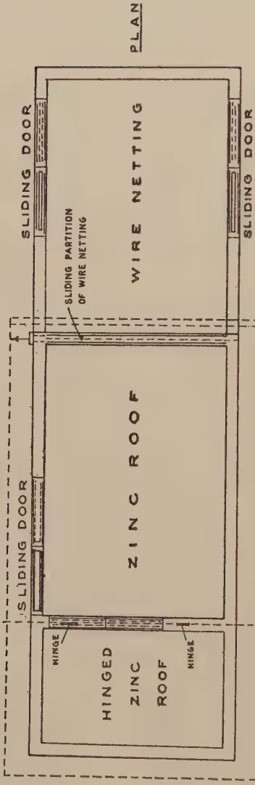
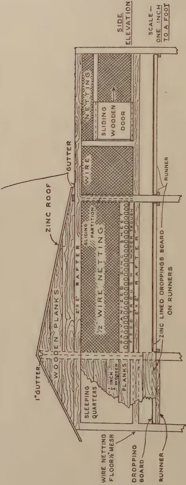
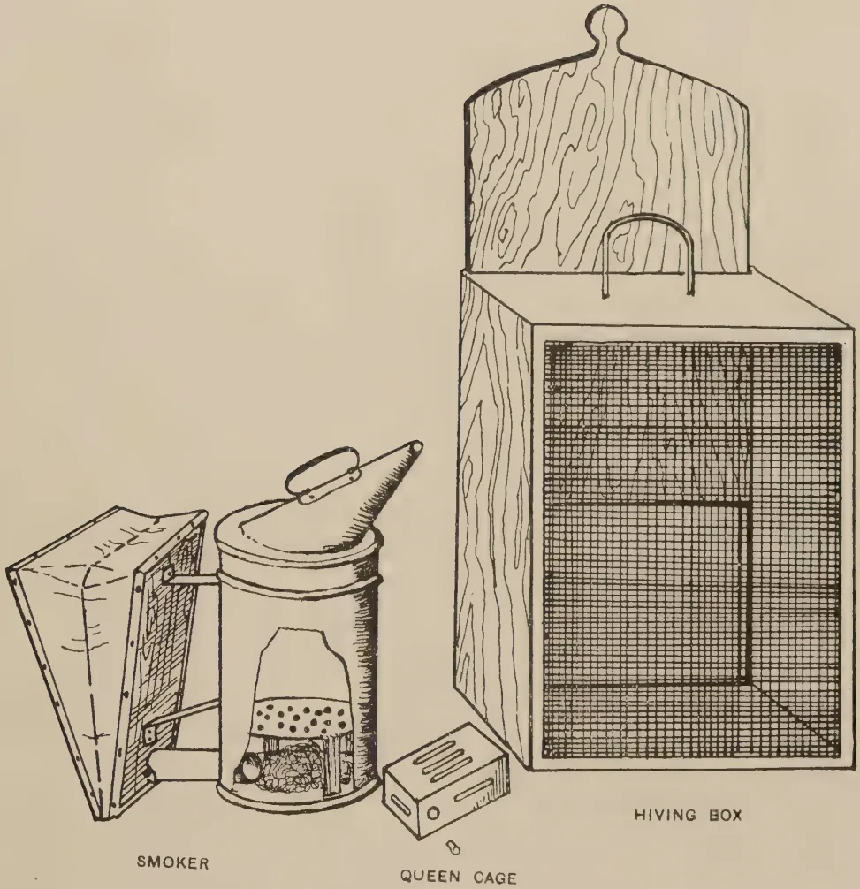
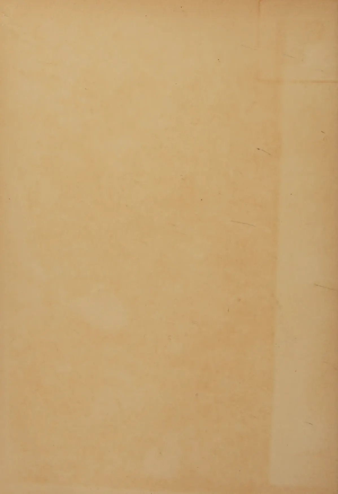

# The Tropical Agriculturist

VOL. XC

PERADENIYA, JUNE, 1938

No. 6

<table><thead><tr><th></th><th style="text-align: right;">Page</th></tr></thead><tbody><tr><td>Editorial .. .. .</td><td style="text-align: right;">321</td></tr></tbody></table>

## ORIGINAL ARTICLES

<table><tbody><tr><td>Some Studies on Tobacco Diseases in Ceylon—III. by Malcolm Park, A.R.C.S., and M. Fernando, Ph.D., B.Sc., D.I.C. ..</td><td style="text-align: right;">323</td></tr><tr><td>Some Studies on Tobacco Diseases in Ceylon—IV. by Malcolm Park, A.R.C.S., and M. Fernando, Ph.D., B.Sc., D.I.C. ..</td><td style="text-align: right;">341</td></tr></tbody></table>

## DEPARTMENTAL NOTES

<table><tbody><tr><td>Some Notes on a Herd of Cattle of the Ceylon Breed ..</td><td style="text-align: right;">348</td></tr><tr><td>Tobacco Seed Selection ..</td><td style="text-align: right;">352</td></tr><tr><td>The Rearing of Chickens on a Wire-netting Floor ..</td><td style="text-align: right;">354</td></tr><tr><td>The Transfer of Colonies of Wild Bees into Modern Hives ..</td><td style="text-align: right;">358</td></tr><tr><td>Soil Conserving Contour Works ..</td><td style="text-align: right;">361</td></tr></tbody></table>

## SELECTED ARTICLES

<table><tbody><tr><td>Soil Erosion ..</td><td style="text-align: right;">368</td></tr><tr><td>Pasture and Fodder Crop Research in the Tropics ..</td><td style="text-align: right;">370</td></tr><tr><td>A Note on the Technique of Cotton Breeding ..</td><td style="text-align: right;">375</td></tr><tr><td>Note on Dr. Mason's Article on the Technique of Cotton Breeding ..</td><td style="text-align: right;">379</td></tr></tbody></table>

## MEETINGS, CONFERENCES, &c.

<table><tbody><tr><td>Minutes of a Meeting of the Board of the Tea Research Institute of Ceylon ..</td><td style="text-align: right;">382</td></tr></tbody></table>

## REVIEWS

<table><tbody><tr><td>Potash Deficiency Symptoms ..</td><td style="text-align: right;">387</td></tr></tbody></table>

## RETURNS

<table><tbody><tr><td>Animal Disease Return for the Month ended May, 1938 ..</td><td style="text-align: right;">388</td></tr><tr><td>Meteorological Report for the Month ended May, 1938 ..</td><td style="text-align: right;">389</td></tr></tbody></table>

1—J. N. 1352 (5/38)

1------------------------------------------------

<!-- stage4: FAINT old-images-only -->

[Faint page: no legible print of its own could be verified; text withheld (stage 4 review list)]

2------------------------------------------------

The  
Tropical Agriculturist

June, 1938

---

EDITORIAL

---

THE VILLAGE COW

---

**T**HE note on the herd of local black cattle at Peradeniya published in this number would be of special interest to those land-owners who are willing to respond to the appeal made to them by the Cattle Breeders' Association of Ceylon to undertake the improvement of the indigenous cow by the formation of selected herds. This small herd established by Dr. Youngman is the first attempt made in Ceylon to grade up cattle by selection and care. It has had only four years of life : there has been no time for a second generation to show its response to adequate feeding and housing. In fact the note does not profess to be a record of achievement, but only illustrates the nature of the available material with which the would-be-breeder can begin his experiments.

It must be borne in mind that the 12 cows which make up the herd were not selected in milk ; nor had they received any special care when they were young : they were selected only because they looked healthy, and appeared to be typical of the breed. Therefore their milk yield may be regarded as the normal for the good village cow. The record shows that two cows produced over 1,000 pints of milk each in one lactation period, with a daily average of over half a gallon. If the first twelve cows selected without any reference to their milk yielding capacity included these two animals, it is a reasonable assumption that there must be amongst the country's cattle population of  $1\frac{1}{2}$  millions a fair number of exceptional cows that would give six or even eight pints a day. It is the duty of those who wish to establish promising herds to comb the countryside for these exceptional animals : they will then begin with foundation stock whose merits are not far below those of the ancestors of the commercial dairy herds of Europe.

Attention is drawn in the note to such incidental features as the instability of colour and the improvement in size produced by two generations of good feeding. These will eventually become matters of great interest to the cattle-breeders. But

3------------------------------------------------

322

perhaps it would be advisable in the first instance to concentrate attention on milk production and to try to fix the characteristics of colour and size by selection within a herd of proved and established high milk yield at a later stage.

We are convinced that the solution of the problem of the milk supply of Ceylon lies in the improvement of the local breed of cattle in this manner, and not in the importation and acclimatization of the imported dairy cow. The imported cow soon degenerates in quality in our unaccustomed environment, if disease does not actually kill her off: and a dairy industry producing an adequate supply of cheap milk cannot be sustained by a continuous stream of imports of cattle. Therefore we hope that the response to the appeal of the Cattle Breeders' Association will be substantial, especially amongst the younger generation of land-owners who have enough years before them to enable them to see the first fruits of their labours before they hand the work over to a still younger generation.

4------------------------------------------------

323

## SOME STUDIES ON TOBACCO DISEASES IN GEYLON—III

### THE EFFECT OF THE TIME OF SPRAYING AND OF THE NATURE OF THE FUNGICIDE ON THE CONTROL OF FROG-EYE (*CERCOSPORA NICOTIANAE* E. & E.)

MALCOLM PARK, A.R.C.S.,  
ACTING DEPUTY DIRECTOR OF AGRICULTURE

AND

M. FERNANDO, Ph.D., B.Sc., D.I.C.,  
RESEARCH PROBATIONER IN PLANT PATHOLOGY

IN a previous number of this series (Park & Fernando, 1937 b) the writers described an experiment of a preliminary and exploratory nature, in which successful control of frog-eye (*Cercospora nicotianae* E. & E.) of cigarette tobacco was achieved by a single spraying in the field with a colloidal copper fungicide at about the time of topping. The single spray application resulted in a considerable reduction in the amount of frog-eye present on the leaves of the sprayed plants at the time of harvest and, in consequence, in an increased crop of leaf suitable for flue-curing. There was also a lower density of barn-spot on the cured leaf from the sprayed tobacco. In that experiment it was also shown that single spray applications made respectively three weeks earlier and three weeks later than the one described above produced no significant effect. From these results it was clear that, for successful frog-eye control by a single field spraying, the time of that spraying is a factor of major importance. The experiment described in this paper was therefore designed with a view to determine, *inter alia*, more accurately the optimum time of spraying.

In the previous experiment the only spray used was a proprietary colloidal copper fungicide at a concentration of 1 oz. per gallon. In the present experiment, the behaviour of lower concentrations of this fungicide and of cheap home-made substitutes was also investigated to determine if the cost of spraying could be reduced without sacrificing efficiency.

2—J. N. 1352 (5/38)

5------------------------------------------------

324DESIGN OF THE EXPERIMENT

The following are the formulae of the fungicides used :—

<table>
<tbody>
<tr>
<td>(1) Proprietary colloidal copper</td>
<td>..</td>
<td>..</td>
<td>4 oz.</td>
</tr>
<tr>
<td>Proprietary spreader</td>
<td>..</td>
<td>..</td>
<td><math>\frac{1}{4}</math> oz.</td>
</tr>
<tr>
<td>Water</td>
<td>..</td>
<td>..</td>
<td>4 gal.</td>
</tr>
<tr>
<td>(2) Proprietary colloidal copper</td>
<td>..</td>
<td>..</td>
<td>2 oz.</td>
</tr>
<tr>
<td>Proprietary spreader</td>
<td>..</td>
<td>..</td>
<td><math>\frac{1}{4}</math> oz.</td>
</tr>
<tr>
<td>Water</td>
<td>..</td>
<td>..</td>
<td>4 gal.</td>
</tr>
<tr>
<td>(3) Proprietary colloidal copper</td>
<td>..</td>
<td>..</td>
<td>1 oz.</td>
</tr>
<tr>
<td>Proprietary spreader</td>
<td>..</td>
<td>..</td>
<td><math>\frac{1}{4}</math> oz.</td>
</tr>
<tr>
<td>Water</td>
<td>..</td>
<td>..</td>
<td>4 gal.</td>
</tr>
<tr>
<td>(4) Copper emulsion :—</td>
<td></td>
<td></td>
<td></td>
</tr>
<tr>
<td>Copper sulphate</td>
<td>..</td>
<td>..</td>
<td><math>2\frac{1}{2}</math> oz.</td>
</tr>
<tr>
<td>Soft soap</td>
<td>..</td>
<td>..</td>
<td>16 oz.</td>
</tr>
<tr>
<td>Water</td>
<td>..</td>
<td>..</td>
<td>4 gal.</td>
</tr>
<tr>
<td>(5) Ammoniacal copper emulsion :—</td>
<td></td>
<td></td>
<td></td>
</tr>
<tr>
<td>Copper sulphate</td>
<td>..</td>
<td>..</td>
<td><math>2\frac{1}{2}</math> oz.</td>
</tr>
<tr>
<td>Soft soap</td>
<td>..</td>
<td>..</td>
<td>13 oz.</td>
</tr>
<tr>
<td>Ammonia (66%)</td>
<td>..</td>
<td>..</td>
<td>1 oz.</td>
</tr>
<tr>
<td>Water</td>
<td>..</td>
<td>..</td>
<td>4 gal.</td>
</tr>
<tr>
<td>(6) Unsprayed control.</td>
<td></td>
<td></td>
<td></td>
</tr>
</tbody>
</table>

The above fungicidal treatments were combined with 4 times of spray application. The spray applications were made at weekly intervals after some, at least, of the plants had reached the stage of topping. The following were the dates of spray application :—

A — January 13, 1938.

B — January 20.

C — January 27.

D — February 3.

The previous year's experience of marked contrasts between the effects of spraying at different times suggested that even with a finer subdivision of the interval between the first and the final spray applications, the differences would be sufficiently striking to become evident in the face of a relatively large experimental error. No information was, however, available regarding the fungicidal differences, and a closer comparison by the apportioning of a greater number of degrees of freedom for the estimate of experimental error for fungicidal effects was considered desirable. These considerations determined the selection of the complex latin square design illustrated in Fig. 1. The 4 times of spraying (A, B, C, and D) were distributed over the main plots of the  $4 \times 4$  latin square, and the 6 fungicidal treatments were randomized within each main plot. The statistical advantages apart, the complex latin square lay-out was conducive to convenient handling of the experimental

6------------------------------------------------

<table border="1">
<tbody>
<tr>
<td>2</td><td>1</td><td>4</td><td>6</td><td>1</td><td>5</td><td>2</td><td>3</td>
</tr>
<tr>
<td>6</td><td>A</td><td>4</td><td>2</td><td>B</td><td>5</td><td>2</td><td>D</td><td>3</td><td>6</td><td>C</td><td>5</td>
</tr>
<tr>
<td>3</td><td>5</td><td>3</td><td>1</td><td>6</td><td>4</td><td>1</td><td>4</td>
</tr>
<tr>
<td>6</td><td>5</td><td>3</td><td>5</td><td>1</td><td>2</td><td>3</td><td>1</td>
</tr>
<tr>
<td>3</td><td>B</td><td>4</td><td>6</td><td>C</td><td>2</td><td>4</td><td>A</td><td>5</td><td>6</td><td>D</td><td>5</td>
</tr>
<tr>
<td>1</td><td>2</td><td>1</td><td>4</td><td>6</td><td>3</td><td>4</td><td>2</td>
</tr>
<tr>
<td>4</td><td>5</td><td>3</td><td>1</td><td>4</td><td>2</td><td>5</td><td>3</td>
</tr>
<tr>
<td>1</td><td>C</td><td>6</td><td>5</td><td>D</td><td>2</td><td>6</td><td>B</td><td>3</td><td>2</td><td>A</td><td>6</td>
</tr>
<tr>
<td>2</td><td>3</td><td>4</td><td>6</td><td>5</td><td>1</td><td>4</td><td>1</td>
</tr>
<tr>
<td>1</td><td>6</td><td>5</td><td>6</td><td>4</td><td>5</td><td>1</td><td>6</td>
</tr>
<tr>
<td>2</td><td>D</td><td>5</td><td>4</td><td>A</td><td>2</td><td>6</td><td>C</td><td>3</td><td>5</td><td>B</td><td>3</td>
</tr>
<tr>
<td>3</td><td>4</td><td>3</td><td>1</td><td>2</td><td>1</td><td>2</td><td>4</td>
</tr>
</tbody>
</table>

Block by Survey Dept. Ceylon. 7.6.38.

FIG. 1.—DESIGN OF EXPERIMENT.

7------------------------------------------------

<!-- stage4: FAINT old-images-only -->

[Faint page: no legible print of its own could be verified; text withheld (stage 4 review list)]

8------------------------------------------------

325

material and rendered the experiment relatively fool-proof—factors of some importance when much of the experimentation has to be done with unskilled labour.

### EXPERIMENTAL METHODS

*Experimental Material.*—The sub-plots were square and consisted of 36 plants spaced 3 feet  $\times$  3 feet, *i.e.*, the size of each sub-plot was about 1/135 of an acre. Adjacent sub-plots within main plots were separated by 2 guard rows. Adjacent main plots were separated in the direction of their long axes (see Fig. 1.) by 8 border rows, and in the direction of their shorter axes by wide, shallow drains.

The experimental material consisted of a comparatively uniform area of Harrison's Special tobacco grown at the Experiment Station, Ganewatta, on a light, sandy, non-lateritic soil. Tobacco is one of the routine rotation crops at this station and the present experiment was carried out in the usual rotation area. The rotation consists of tobacco or a cereal crop, such as maize, during the *maha* season (September-October to March) and a green manure crop like sunn hemp, grown and ploughed in during *yala* (March-April to June-July). Tobacco is therefore grown on the same area during the *maha* season of alternate years.

The nursery from which the plants were obtained was prepared with the aseptic and antiseptic precautions described previously (Park & Fernando, 1937 a), except that the seed was not disinfected with silver nitrate.

The nursery consisted of 12 beds, 8 of which were sown during the period September 11–19, 1937, and the rest during the period October 1–7, 1937. Most of the experimental plants were contributed by the beds which had been sown early. Accidental damage to the spraying machine disorganized the routine spray programme, and a certain amount of frog-eye appeared in the nursery before transplanting. The amount of infection was not great and it was possible to use apparently healthy seedlings only for transplanting.

Seedlings were transplanted from the nursery on October 31, 1937, and during the period November 2–4, 1937. The supplying of vacancies was begun on November 11. The total quantity of manure applied per acre was as follows:—

<table>
<thead>
<tr>
<th></th>
<th></th>
<th>lb.</th>
</tr>
</thead>
<tbody>
<tr>
<td>Superphosphate</td>
<td>..</td>
<td>224</td>
</tr>
<tr>
<td>Sulphate of potash</td>
<td>..</td>
<td>140</td>
</tr>
<tr>
<td>Nitrate of soda</td>
<td>..</td>
<td>84</td>
</tr>
<tr>
<td></td>
<td></td>
<td>
448
</td>
</tr>
</tbody>
</table>

9------------------------------------------------

326

This quantity was divided into 3 dressings, the first of which was applied before transplanting. The manure was applied in spoonfuls to the planting holes and forked in. The second and third applications were made 3 weeks and 6 weeks after transplanting, respectively.

The supplying of vacancies, which was made necessary by the damage caused by heavy rains shortly after transplanting, and the replacement of young plants badly attacked by stem-borer (*Phthorimaea heliopa*) introduced some degree of heterogeneity in the experimental material. In addition, the presence of termite nests in the experimental area was a disturbing factor. Plants growing on the sites of existing and old nests grew much more vigorously than the remainder. To avoid undue coarseness in the leaves, they were left untopped but, in spite of this, many leaves from these plants were too coarse at the time of harvesting for flue-curing. The number of plants so affected was not great but proved to be a factor increasing the heterogeneity of the experimental material and, in consequence, raising the experimental error obtained.

The plants were primed two weeks before the first spraying. Subsequently, no priming was done in the experimental area. Some plants were ready for topping by January 10, but the first topping was not done until January 20, the day on which the second spray application was made. Subsequently, rounds of topping were done at intervals of about one week.

*Preparation of Fungicidal Mixtures.*—The formulae of the fungicides used in this experiment are given above. For brevity, the numbering employed there will be used throughout the paper.

Formulae (1), (2), and (3): The colloidal copper and the spreader used in these formulae are identical with those used in the 1937 experiments (Park & Fernando, 1937 b). The colloidal copper is a proprietary fungicide containing 22 per cent. copper oxychloride, 50 per cent. water and 28 per cent. of an organic complex (Jacquemain & Gravier, 1932). The spreader is a proprietary product having a composition allied to a sulphonate of an alkylated hydrocarbon.

Formulae (4) and (5): The addition of copper sulphate solution to an excess of soap results in the formation of a finely divided precipitate of "copper stearate" in a condition well suited for spraying. If the soap is not in excess, an unpleasant sticky putty is formed which tends to block the nozzle of the sprayer. Formula (4) is based on a recipe by Wormald and Wormald (1919). The concentration of soap in formula (4) is higher than in the original formula. This increase in concentration was adopted because the amount of soap recommended

10------------------------------------------------

327

in the latter formula was found to give unsatisfactory results with hard water. In preparing this fungicide, the copper sulphate and the soft soap were dissolved separately each in two gallons of water. The copper sulphate solution was then poured into the soap solution with continuous stirring.

The soap in this formula can be replaced to some extent by ammonium hydroxide. The partial replacement of soap by ammonia is desirable as it reduces costs appreciably. In formula (5), 1 oz. ammonia (66 per cent.) is substituted for 3 oz. of the soap. The substitution of part of the soap by ammonia affects the texture of the spray mixture, the precipitate becoming coarser as the proportion of ammonia is increased. In the preparation of fungicidal mixture (5), the copper sulphate and the soap were dissolved separately in 2 gallon quantities of water as in formula (4). The ammonia was added to the soap solution and the copper sulphate was then poured in with continuous stirring.

*Spray Application.*—Field notes on the times of spraying and the weather conditions at the times of spraying are given below :—

January 13, 1938 .. Spraying A. Treatments (1), (2), and (3) done between 11 A.M. and 4.30 P.M. Nearly  $2\frac{1}{2}$  gallons of spray per sub-plot of 36 plants. Strong N. E. wind during spraying : jute hessian screen, 5 feet long by 45 inches high used to check drifting of spray. Hot and sunny.

January 14, 1938 .. Spraying A concluded. Mixtures (5) and (4) applied. Weather conditions and amount of spray used as above.

January 20, 1938 .. Spraying B. 7.30 A.M. to 5 P.M. Spraying done in the order (1), (2), (3), (4), (5).  $2\frac{1}{2}$  gallons of spray used per sub-plot. Weather hot and sunny with a strong N.E. wind. Screen used.  
Topping in progress during spray application.

January 27, 1938 .. Spraying C. 9.15 A.M. to 1.40 P.M. treatments (1), (2), (3), and (4). 3 P.M. to 4.15 P.M. treatment (5). Fairly heavy showers 7.30 to 8.30 A.M. Leaves not completely dry when treatment (1) was commenced ; plants oversprayed in this treatment to compensate for dilution ( $3\frac{1}{4}$  gallons per sub-plot). Leaves dry when treatment (2) was begun. Weather cloudy during the whole day. No wind. Spraying conditions ideal.  $2\frac{1}{2}$  to  $2\frac{3}{4}$  gallons of spray per sub-plot used in treatments (2), (3), (4), and 5. Screen used.

February 3, 1938 .. Spraying D. 8 A.M. to 2 P.M. Dew not completely dried when spraying was begun. Leaves dried quickly. Spraying done in the order (1), (2), (3), (4), (5).  $3\frac{1}{4}$  gallons spray per sub-plot for treatment (1),  $2\frac{3}{4}$  gallons per sub-plot for treatment (2), (3), (4), and (5). Weather bright with some cloud, wind moderate. Screen used.

11------------------------------------------------

328

It will be seen from the above that, in at least one spraying, each of the treatments was applied during the hottest part of the day, so that it is possible to ascertain the relative importance of time of spraying in the occurrence of spray injury as observed in the field and on the cured leaves from the different treatments. The amount of spray used in the experiment, varying from  $2\frac{1}{4}$  to  $3\frac{1}{4}$  gallons per sub-plot of 36 plants, was considerably more than would be used in large-scale field spraying, but it was essential that both sides of every leaf should be sprayed thoroughly and over-spraying could not be avoided. No attempt was made to study the economic aspect of the problem in this experiment.

*Developmental Records.*—At the time of spraying, a plan was made of each sub-plot, a cypher being allotted to indicate the stage of maturity of each plant. As is explained below, at the time of harvest, it was found necessary to reduce the number of plants harvested in each sub-plot to 30. In table I are given

TABLE I

Record of Stages of Development of Plants at Different Times of Spraying

<table border="1">
<thead>
<tr>
<th rowspan="2">Time of Spraying</th>
<th rowspan="2">Fungicidal Treatment</th>
<th colspan="5">No. of plants</th>
</tr>
<tr>
<th>No appreciable stem Development</th>
<th>Stem present but not fully elongated</th>
<th>Stem fully elongated or nearly so</th>
<th>Flower buds visible</th>
<th>Topped or at topping stage</th>
</tr>
</thead>
<tbody>
<tr>
<td rowspan="6">A (13.1.38)</td>
<td>(1)</td>
<td>18</td>
<td>40</td>
<td>44</td>
<td>14</td>
<td>4</td>
</tr>
<tr>
<td>(2)</td>
<td>18</td>
<td>41</td>
<td>41</td>
<td>18</td>
<td>2</td>
</tr>
<tr>
<td>(3)</td>
<td>15</td>
<td>25</td>
<td>68</td>
<td>12</td>
<td>0</td>
</tr>
<tr>
<td>(4)</td>
<td>15</td>
<td>39</td>
<td>45</td>
<td>11</td>
<td>10</td>
</tr>
<tr>
<td>(5)</td>
<td>21</td>
<td>65</td>
<td>21</td>
<td>9</td>
<td>4</td>
</tr>
<tr>
<td>Total</td>
<td>87</td>
<td>210</td>
<td>219</td>
<td>64</td>
<td>20</td>
</tr>
<tr>
<td rowspan="6">B (20.1.38)</td>
<td>(1)</td>
<td>4</td>
<td>16</td>
<td>43</td>
<td>36</td>
<td>21</td>
</tr>
<tr>
<td>(2)</td>
<td>6</td>
<td>17</td>
<td>31</td>
<td>20</td>
<td>46</td>
</tr>
<tr>
<td>(3)</td>
<td>6</td>
<td>26</td>
<td>30</td>
<td>10</td>
<td>48</td>
</tr>
<tr>
<td>(4)</td>
<td>0</td>
<td>7</td>
<td>36</td>
<td>4</td>
<td>73</td>
</tr>
<tr>
<td>(5)</td>
<td>6</td>
<td>56</td>
<td>33</td>
<td>3</td>
<td>22</td>
</tr>
<tr>
<td>Total</td>
<td>22</td>
<td>122</td>
<td>173</td>
<td>73</td>
<td>210</td>
</tr>
<tr>
<td rowspan="6">C (27.1.38)</td>
<td>(1)</td>
<td>3</td>
<td>18</td>
<td>13</td>
<td>11</td>
<td>75</td>
</tr>
<tr>
<td>(2)</td>
<td>0</td>
<td>11</td>
<td>28</td>
<td>22</td>
<td>59</td>
</tr>
<tr>
<td>(3)</td>
<td>0</td>
<td>8</td>
<td>10</td>
<td>29</td>
<td>73</td>
</tr>
<tr>
<td>(4)</td>
<td>0</td>
<td>13</td>
<td>25</td>
<td>15</td>
<td>67</td>
</tr>
<tr>
<td>(5)</td>
<td>0</td>
<td>12</td>
<td>16</td>
<td>2</td>
<td>90</td>
</tr>
<tr>
<td>Total</td>
<td>3</td>
<td>62</td>
<td>92</td>
<td>79</td>
<td>364</td>
</tr>
<tr>
<td rowspan="6">D (3.2.38)</td>
<td>(1)</td>
<td>1</td>
<td>5</td>
<td>5</td>
<td>1</td>
<td>108</td>
</tr>
<tr>
<td>(2)</td>
<td>0</td>
<td>6</td>
<td>5</td>
<td>0</td>
<td>109</td>
</tr>
<tr>
<td>(3)</td>
<td>1</td>
<td>1</td>
<td>11</td>
<td>5</td>
<td>102</td>
</tr>
<tr>
<td>(4)</td>
<td>0</td>
<td>1</td>
<td>4</td>
<td>0</td>
<td>115</td>
</tr>
<tr>
<td>(5)</td>
<td>1</td>
<td>3</td>
<td>3</td>
<td>0</td>
<td>113</td>
</tr>
<tr>
<td>Total</td>
<td>3</td>
<td>16</td>
<td>28</td>
<td>6</td>
<td>547</td>
</tr>
</tbody>
</table>

12------------------------------------------------

329

the records showing the stage of maturity of the 120 plants, subsequently harvested, in the four replications of each treatment, at the time of spraying. In the last column of the table are included the number both of plants actually topped and of those which had reached the stage of topping, but which had not been topped. The figures for the unsprayed control sub-plots are not included as they are irrelevant; the plants were, however, at the same stage of development as those in the neighbouring sub-plots at the time of each record. The figures given permit of the ready assessment of the size of the plants at the times of spraying. At the time of the first spraying (A) the majority of the plants were at the stage when the stem was elongating and only 20 plants out of the 600 had reached the topping stage. At the time of the second spraying (B), about one-third of the plants (210 out of 600) had reached the topping stage. At the time of the third spraying (C), over one-half of the plants (364 out of 600) had reached the stage of topping and a further 181 were nearly full grown. At the time of the last spraying (D), almost all the plants (547 out of 600) had reached the stage of topping.

*Harvesting.*—The time of the harvesting of cigarette tobacco is determined to a large extent by weather conditions. During the present experiment, dry weather which set in about a month after transplanting hastened the development of the plants so that harvesting would have been unusually early had it not been for the rains which fell shortly after the last spraying and delayed the maturing of the leaves. The first harvest of leaves for flue-curing was gathered on February 15 and the second and final harvest on February 22, fourteen and fifteen weeks after transplanting respectively. Following the usual practice, leaves badly blemished by frog-eye were not harvested for flue-curing so that the weights of total cured leaf from plots subjected to the various treatments provide a measure of the efficiency of these treatments in frog-eye control.

### PHYTOCIDAL EFFECTS

In the field the sprayed leaf was periodically examined for phytocidal damage. A mild scorch was observed on a few of the leaves; but as the same type of scorch occurred to some extent on the control plants, it was argued that the injury was not caused by the fungicidal chemicals; accumulations of water on the leaf surface appeared to be responsible for the injury. The damage was negligible.

A rather more serious type of spray injury however occurred on some of the cured leaf which had been sprayed with the copper emulsions; the injury was more severe with the ammoniacal copper emulsion. The damage took the form of minute,

13------------------------------------------------

330

suberized, warty eruptions on the lower surface of the leaf. The eruptions often coalesced into irregular masses. The percentage of leaves affected was however comparatively low, and the damage did not appear to affect markedly the appearance of the cured leaf. The cured leaf which had been sprayed with various concentrations of colloidal copper was free of this blemish.

### METEOROLOGICAL DATA

In an equable tropical climate of the type prevailing in Ceylon, seasonal fluctuations in temperature and sunshine are not sufficiently marked to be of much consequence. In Ceylon, the volume and distribution of rainfall are the major factors conditioning plant growth. In the present paper certain conclusions have been drawn concerning the relation between the stage of maturity of the tobacco crop and the optimum time for spraying. The maturing of the crop is determined largely by the prevailing rainfall. A protracted drought would result in rapid ripening of the leaf and would necessitate early spraying. Heavy and continued precipitation would delay the maturing process. Generalizations regarding the optimum spraying time would be possible only if the same type of rainfall curve recurs regularly in successive tobacco seasons. Fig. 2 illustrates the distribution of the daily precipitation at Ganewatta during the present season and the four preceding seasons. The periods of transplanting and of harvesting have also been recorded. The total precipitation for the 5 month period, November 1937–March, 1938, which was roughly the duration of the experimental season, was 36.24 inches. This did not differ appreciably from the normal rainfall for the corresponding period in previous years; the average calculated from the preceding four years' records was 33.5 inches. There were however certain peculiar features in the rainfall distribution during the 1937–38 season. December is normally a wet month. In 1937, the precipitation for this month was 1.17 inches, *i.e.*, only 16.6 per cent. of the average for the 4-year period. Again, February, the month during which the leaf usually undergoes rapid maturing, is as a rule comparatively dry. During the experimental season, the precipitation for this month was 7.70 inches, as against an average of 2.67 inches for the preceding four years. The maturing of the tobacco crop was hastened by the dry spell in December, but was subsequently delayed by the February rains; this delay resulted in a severe epiphytotic of frog-eye and in a consequent reduction in the yield of cured leaf; the unsprayed area yielded as little as 22 lb. per acre.

Despite the occurrence of abnormal weather conditions during December and February, the growing period in the field of the experimental crop—as estimated by the interval between the

14------------------------------------------------

The figure consists of five vertically stacked bar charts, each representing a different year's rainfall record. The vertical axis for all charts is labeled 'INCHES' and ranges from 0 to 4. The horizontal axis shows dates from October to May, with specific dates marked below each month: OCT. (15, 20, 25, 30), NOV. (5, 10, 15, 20, 25, 30), DEC. (10, 15, 20, 25, 30), JAN. (15, 20, 25, 30), FEB. (5, 10, 15, 20, 25), MAR. (5, 10, 15, 20, 25, 30), APR. (5, 10, 15, 20, 25, 30), and MAY. (5). Each chart has two horizontal lines: 'TRANSPLANTING' and 'HARVESTING'. The rainfall data is represented by black vertical bars of varying heights.

- **1933-34:** Shows a peak of approximately 3.5 inches in late October, followed by several smaller peaks in November and December. The 'TRANSPLANTING' period is marked in late October, and 'HARVESTING' is marked in late March.
- **1934-35:** Features a major peak of about 2.8 inches in late October. The 'TRANSPLANTING' period is in late October, and 'HARVESTING' is in late March. A significant peak of about 2.8 inches also occurs in late March.
- **1935-36:** Shows a peak of about 1.5 inches in late October. The 'TRANSPLANTING' period is in late October, and 'HARVESTING' is in late March. A peak of about 3.5 inches occurs in late March.
- **1936-37:** Features a peak of about 2.8 inches in late October. The 'TRANSPLANTING' period is in late October, and 'HARVESTING' is in late March. A peak of about 3.5 inches occurs in late December.
- **1937-38:** Shows a peak of about 1.5 inches in late October. The 'TRANSPLANTING' period is in late October, and 'HARVESTING' is in late March. A major peak of about 4.5 inches occurs in late February.

FIG. 2.—RAINFALL RECORDS.

15------------------------------------------------

This image is a scan of a blank page. The paper has a light beige or cream-colored tint. There are a few very small, faint dark spots scattered across the surface, which appear to be scanning artifacts or dust particles. No text, lines, or other markings are present.

16------------------------------------------------

331

commencement of transplanting and the commencement of harvesting—did not differ considerably from that of previous years; the growing period for the experimental season was 107 days and the four-year average was 125 days.

Although topping was not begun till January 20, some plants were ready for topping by January 10, *viz.*, 10 weeks after the commencement of transplanting. In a normal year with a wet December, the interval between topping time and the commencement of transplanting would probably have been rather longer. The most efficient spraying was done on January 27, *viz.*, 12 to 13 weeks after the commencement of transplanting; at this time 60 per cent. of the plants had been topped. It is not possible at this stage, to generalize on the applicability of these results to years of normal precipitation.

It is generally accepted that frog-eye damage is most severe in wet weather. This is at least in part due to the fact that the crop stays longer in field under wet weather conditions. The direct effect of rainfall on the intensity and spread of the disease is however rather obscure. The present experiment provides little relevant information in this connection.

#### COURSE OF INFECTION

The times chosen for spraying the plants in this experiment were based on the results of the experiment carried out by the writers in the corresponding season in 1936-37 (Park and Fernando, 1937 b), but they were nevertheless empirical and not based on records of the progress of the disease on plants in the field. It was therefore felt that the experiment would not be complete unless it was accompanied by records which would indicate why spraying at any one time should be more effective than at other times.

During the course of this experiment, observations were made on plants throughout the season, from the time they were transplanted until they were harvested. The first series of observations was made on plants immediately after transplanting. It is stated above that, owing to an accident, the nursery beds from which the plants used in this experiment were obtained were not subjected to the proper spraying programme and that, in consequence, some frog-eye appeared in the nursery. As far as could be ascertained by visual observation, no plants were used in the experimental area which had been attacked by frog-eye, but it is possible that some incipient infections did exist. The early records of the course of infection by frog-eye were therefore carried out at Wariyapola Experiment Station, which is less than ten miles from Ganewatta. At Wariyapola, the nurseries were planted with the same seed as

17------------------------------------------------

332

at Ganewatta, regular spraying was done and no frog-eye infection occurred in the nurseries up to the time of transplanting. It is not proposed here to discuss in full the results of those observations, which will be the subject of another paper, but it may be stated that, although the plants were free from frog-eye at the time of transplanting, within six to eight weeks of that time infection was present on practically every plant, frog-eye infection in this case being judged by the presence of one or more frog-eye lesions on the plants. Similarly, casual observations of the experimental area at Ganewatta indicated that all plants were infected by the end of December, 1937, and it may be assumed that this state of affairs is normal for tobacco grown in that area.

While the plants are young and still in the rosette stage, it is not uncommon to find frog-eye lesions on all leaves. The situation, however, changes once the stem begins to develop; upper leaves of plants with definite stem development do not commonly become infected by frog-eye. At this stage of the development of the plants infection is confined to the lower leaves.

It was not practicable to keep detailed records of the number of frog-eye lesions present on each leaf of a large number of plants and detailed records were therefore made of sixteen plants only. Plants were selected which were of the same growth-type, with approximately the same number of leaves and in the same stage of development. One plant was selected from each of two of the sub-plots of the treatments A (1), B (1), C (1), D (1), *i.e.*, plants sprayed with spray (1)—the proprietary colloidal copper spray at 1 oz. in 1 gallon—at the four different times of spraying. At the same time, single plants were selected from each of the corresponding unsprayed control plants, giving eight unsprayed plants. Records were made of the number of frog-eye lesions on each leaf, starting from the top of the plants and working downwards. The results are best seen in graph form. Fig. 3 shows the progress of the disease on each leaf of the plants in the different treatments. Each little curve represents the number of lesions present on a leaf on three occasions—February 4, 10, and 14 respectively—and each is the average, with the sprayed plants, of the corresponding leaves on two plants and, with the unsprayed plants, of the corresponding leaves on eight plants. The number of leaves on most plants examined was 15 or 16, but one plant had only 12 and another 18. The lowest leaves were all severely spotted throughout the record period and the averages are therefore confined to those of the top 12 leaves. The parts of the curves which are dotted indicate that the curves should have been continued until they met the time ordinate: the

18------------------------------------------------

![A multi-panel line graph showing the course of frog-eye infection across 12 leaves over time. The graph is divided into five horizontal sections, each with its own y-axis and x-axis. The y-axes are labeled with letters and numbers: (S) 150, Z 100, O 50, (S) 100, W 50, J, 100, 6, 100, O 200, 150, (S) 100, R 50, E, (S) 200, M 150, D 100, N 50. The x-axis represents time, with labels for each leaf from 'FIRST LEAF (YOUNGEST)' to 'TWELFTH LEAF (OLDEST)'. Each leaf has multiple data points labeled with dates like 'FEB 4', 'FEB 10', and 'FEB 14'. The data points are connected by lines, showing the progression of infection. Some lines are labeled with letters: 'D (1)', 'C (1)', 'B (1)', 'A (1)', 'UNSPRAYED', and 'CONTROL'. The lines generally show an upward trend, indicating increasing infection levels over time.](345d28eba8269331ad5b04761db6438f_1_img.webp)

The figure consists of five horizontal panels, each representing a different stage or measurement of frog-eye infection. The y-axes are labeled with letters and numbers, and the x-axis represents time across 12 leaves. The leaves are labeled from 'FIRST LEAF (YOUNGEST)' to 'TWELFTH LEAF (OLDEST)'. The data points are connected by lines, showing the progression of infection. Some lines are labeled with letters: 'D (1)', 'C (1)', 'B (1)', 'A (1)', 'UNSPRAYED', and 'CONTROL'.

<table border="1">
<thead>
<tr>
<th>Leaf</th>
<th>Date</th>
<th>Panel D (1)</th>
<th>Panel C (1)</th>
<th>Panel B (1)</th>
<th>Panel A (1)</th>
<th>Panel UNSPRAYED</th>
<th>Panel CONTROL</th>
</tr>
</thead>
<tbody>
<tr>
<td rowspan="3">FIRST LEAF (YOUNGEST)</td>
<td>FEB 4</td>
<td>~10</td>
<td>~10</td>
<td>~10</td>
<td>~10</td>
<td>~10</td>
<td>~10</td>
</tr>
<tr>
<td>FEB 10</td>
<td>~15</td>
<td>~15</td>
<td>~15</td>
<td>~15</td>
<td>~15</td>
<td>~15</td>
</tr>
<tr>
<td>FEB 14</td>
<td>~20</td>
<td>~20</td>
<td>~20</td>
<td>~20</td>
<td>~20</td>
<td>~20</td>
</tr>
<tr>
<td rowspan="3">SECOND LEAF</td>
<td>FEB 4</td>
<td>~10</td>
<td>~10</td>
<td>~10</td>
<td>~10</td>
<td>~10</td>
<td>~10</td>
</tr>
<tr>
<td>FEB 10</td>
<td>~15</td>
<td>~15</td>
<td>~15</td>
<td>~15</td>
<td>~15</td>
<td>~15</td>
</tr>
<tr>
<td>FEB 14</td>
<td>~20</td>
<td>~20</td>
<td>~20</td>
<td>~20</td>
<td>~20</td>
<td>~20</td>
</tr>
<tr>
<td rowspan="3">THIRD LEAF</td>
<td>FEB 4</td>
<td>~10</td>
<td>~10</td>
<td>~10</td>
<td>~10</td>
<td>~10</td>
<td>~10</td>
</tr>
<tr>
<td>FEB 10</td>
<td>~15</td>
<td>~15</td>
<td>~15</td>
<td>~15</td>
<td>~15</td>
<td>~15</td>
</tr>
<tr>
<td>FEB 14</td>
<td>~20</td>
<td>~20</td>
<td>~20</td>
<td>~20</td>
<td>~20</td>
<td>~20</td>
</tr>
<tr>
<td rowspan="3">FOURTH LEAF</td>
<td>FEB 4</td>
<td>~10</td>
<td>~10</td>
<td>~10</td>
<td>~10</td>
<td>~10</td>
<td>~10</td>
</tr>
<tr>
<td>FEB 10</td>
<td>~15</td>
<td>~15</td>
<td>~15</td>
<td>~15</td>
<td>~15</td>
<td>~15</td>
</tr>
<tr>
<td>FEB 14</td>
<td>~20</td>
<td>~20</td>
<td>~20</td>
<td>~20</td>
<td>~20</td>
<td>~20</td>
</tr>
<tr>
<td rowspan="3">FIFTH LEAF</td>
<td>FEB 4</td>
<td>~10</td>
<td>~10</td>
<td>~10</td>
<td>~10</td>
<td>~10</td>
<td>~10</td>
</tr>
<tr>
<td>FEB 10</td>
<td>~15</td>
<td>~15</td>
<td>~15</td>
<td>~15</td>
<td>~15</td>
<td>~15</td>
</tr>
<tr>
<td>FEB 14</td>
<td>~20</td>
<td>~20</td>
<td>~20</td>
<td>~20</td>
<td>~20</td>
<td>~20</td>
</tr>
<tr>
<td rowspan="3">SIXTH LEAF</td>
<td>FEB 4</td>
<td>~10</td>
<td>~10</td>
<td>~10</td>
<td>~10</td>
<td>~10</td>
<td>~10</td>
</tr>
<tr>
<td>FEB 10</td>
<td>~15</td>
<td>~15</td>
<td>~15</td>
<td>~15</td>
<td>~15</td>
<td>~15</td>
</tr>
<tr>
<td>FEB 14</td>
<td>~20</td>
<td>~20</td>
<td>~20</td>
<td>~20</td>
<td>~20</td>
<td>~20</td>
</tr>
<tr>
<td rowspan="3">SEVENTH LEAF</td>
<td>FEB 4</td>
<td>~10</td>
<td>~10</td>
<td>~10</td>
<td>~10</td>
<td>~10</td>
<td>~10</td>
</tr>
<tr>
<td>FEB 10</td>
<td>~15</td>
<td>~15</td>
<td>~15</td>
<td>~15</td>
<td>~15</td>
<td>~15</td>
</tr>
<tr>
<td>FEB 14</td>
<td>~20</td>
<td>~20</td>
<td>~20</td>
<td>~20</td>
<td>~20</td>
<td>~20</td>
</tr>
<tr>
<td rowspan="3">EIGHTH LEAF</td>
<td>FEB 4</td>
<td>~10</td>
<td>~10</td>
<td>~10</td>
<td>~10</td>
<td>~10</td>
<td>~10</td>
</tr>
<tr>
<td>FEB 10</td>
<td>~15</td>
<td>~15</td>
<td>~15</td>
<td>~15</td>
<td>~15</td>
<td>~15</td>
</tr>
<tr>
<td>FEB 14</td>
<td>~20</td>
<td>~20</td>
<td>~20</td>
<td>~20</td>
<td>~20</td>
<td>~20</td>
</tr>
<tr>
<td rowspan="3">NINTH LEAF</td>
<td>FEB 4</td>
<td>~10</td>
<td>~10</td>
<td>~10</td>
<td>~10</td>
<td>~10</td>
<td>~10</td>
</tr>
<tr>
<td>FEB 10</td>
<td>~15</td>
<td>~15</td>
<td>~15</td>
<td>~15</td>
<td>~15</td>
<td>~15</td>
</tr>
<tr>
<td>FEB 14</td>
<td>~20</td>
<td>~20</td>
<td>~20</td>
<td>~20</td>
<td>~20</td>
<td>~20</td>
</tr>
<tr>
<td rowspan="3">TENTH LEAF</td>
<td>FEB 4</td>
<td>~10</td>
<td>~10</td>
<td>~10</td>
<td>~10</td>
<td>~10</td>
<td>~10</td>
</tr>
<tr>
<td>FEB 10</td>
<td>~15</td>
<td>~15</td>
<td>~15</td>
<td>~15</td>
<td>~15</td>
<td>~15</td>
</tr>
<tr>
<td>FEB 14</td>
<td>~20</td>
<td>~20</td>
<td>~20</td>
<td>~20</td>
<td>~20</td>
<td>~20</td>
</tr>
<tr>
<td rowspan="3">ELEVENTH LEAF</td>
<td>FEB 4</td>
<td>~10</td>
<td>~10</td>
<td>~10</td>
<td>~10</td>
<td>~10</td>
<td>~10</td>
</tr>
<tr>
<td>FEB 10</td>
<td>~15</td>
<td>~15</td>
<td>~15</td>
<td>~15</td>
<td>~15</td>
<td>~15</td>
</tr>
<tr>
<td>FEB 14</td>
<td>~20</td>
<td>~20</td>
<td>~20</td>
<td>~20</td>
<td>~20</td>
<td>~20</td>
</tr>
<tr>
<td rowspan="3">TWELFTH LEAF (OLDEST)</td>
<td>FEB 4</td>
<td>~10</td>
<td>~10</td>
<td>~10</td>
<td>~10</td>
<td>~10</td>
<td>~10</td>
</tr>
<tr>
<td>FEB 10</td>
<td>~15</td>
<td>~15</td>
<td>~15</td>
<td>~15</td>
<td>~15</td>
<td>~15</td>
</tr>
<tr>
<td>FEB 14</td>
<td>~20</td>
<td>~20</td>
<td>~20</td>
<td>~20</td>
<td>~20</td>
<td>~20</td>
</tr>
</tbody>
</table>

FIG. 3.—COURSE OF FROG-EYE INFECTION.

Reals by Barnes and Co., London

19------------------------------------------------

This image is a scan of a blank page. The paper has a light beige or cream-colored tint. There are a few very small, dark specks scattered across the surface, which appear to be scanning artifacts or dust particles. No text, lines, or other markings are present on the page.

20------------------------------------------------

333

completion of these curves would have necessitated the use of an inconvenient scale and it was felt that their slope would convey all the information required.

It will be seen that, even with the unsprayed plants, infection, as judged by frog-eye spotting, did not occur to any great extent on most of the leaves of the plants until after February 10. The last spraying was done on February 3. Later records were not possible as the plants were harvested, in part at least, on February 15, and earlier records would not have given much information.

The suddenness of the appearance of large numbers of frog-eye lesions on the leaves of unsprayed plants is remarkable and is possibly connected with changes which take place in the leaves when they mature. On February 10, the numbers of frog-eye spots on most of the leaves were insignificant whereas on February 14—only four days later—the minimum number of spots on a leaf was over 100.

Inferences can be drawn from these curves, which are worthy of note. It will be seen by comparison with the control curves that some of the D (1) leaves, *i.e.*, leaves sprayed on February 3 were markedly protected by the spray. On February 14, the numbers of frog-eye lesions on these leaves were considerably lower than on the corresponding leaves on unsprayed plants. It may therefore be assumed that most of the infections of the unsprayed leaves which had developed as frog-eye lesions on February 14 took place *after* the time of spraying. That gives an upper limit of 11 days to the incubation period of frog-eye. It may also be argued that, as there was no marked difference in the number of lesions on the corresponding leaves on February 10, the lower limit of this incubation period is 7 days, but here the total number of new lesions occurring on February 10 was not sufficiently great to warrant so definite a conclusion on this point.

The curves or symptom-pictures also show clearly the relative position on the plants of the leaves protected by the sprays. In the spraying at time A, the first seven leaves developed the same number of lesions as those of the control plants. The obvious explanation is that, at the time of spraying, these leaves were insufficiently expanded to receive adequate protection. In the spraying at time B, the protection range has moved, and the first two leaves were partially protected, the third to the ninth leaves were completely protected and the tenth and eleventh were again partially protected. In the spraying at time C, the first nine leaves were completely protected and the remainder only slightly protected. In the spray at time D, there is evidence of protection up to the tenth leaf but there is

21------------------------------------------------

334

also an indication that some infection had taken place at the time of spraying. The last two leaves were obviously already infected heavily at the time of spraying.

It will be seen that a combination of the protection provided by sprayings at the times A and C would have given complete protection.

## RESULTS

Although in the original design the sub-plots consisted of 36 plants, the occurrence of vacancies—in some cases as many as six—necessitated the restriction of the data to the produce of 30 plants from each sub-plot, the excess in each instance being eliminated at random.

Table II records the weights of total cured leaves in the various treatments; the figures are the sums of the yields from the four replications of each treatment. These data have been subjected to an analysis of variance in table III. In tests of significance, Snedecor's  $F$  is used in preference to Fisher's  $Z$ ; the use of  $F$  eliminates the need for calculating natural logarithms of the variances and simplifies the arithmetic considerably. It may be mentioned in this connection, that  $X$  of Mahalanobis (1932) is synonymous with Snedecor's  $F$ . The analysis of variance of weights of total cured leaf indicates that the effects of times of spraying and of fungicides and the time-fungicide interaction are all highly significant,  $F$  in all cases being well above the one per cent. point. It is probable that the inclusion of the figures for the untreated control plots in the data from which the calculations were made, was responsible for the significance of the time-fungicide interaction: this is therefore of little interest in the present connection. The ratio of the two error variances provides a measure of the relative accuracy of the main-plot and sub-plot comparisons.

The significant difference between two values is the product of the standard error of the difference between the two values and the appropriate value  $t$ . A 5 per cent. level of significance is usually assumed. Hoblyn (1931) states that the number of degrees of freedom for  $t$  is the sum of the numbers of degrees of freedom contributed by the two values. Most statistical authorities however use the error number of degrees of freedom in estimating  $t$ . In the previous papers in this series (Park & Fernando, 1937 a & b), Hoblyn's method was employed. It was recently pointed out to the writers by Dr. T. Eden\* that the second method provided a more valid estimate of  $t$ ; this method has accordingly been adopted in the present paper. It may be mentioned, in this connection, that the adoption of Hoblyn's

---

\* Personal communication to the writers

22------------------------------------------------

335

method did not vitiate the conclusions made in the previous papers. The significant differences were merely slightly inflated and the tests of significance were consequently made unnecessarily severe.

**TABLE II**  
**Weights of Total Cured Leaves in Grammes**

<table border="1">
<thead>
<tr>
<th rowspan="2">Treatment</th>
<th colspan="4">Time of spraying</th>
<th rowspan="2">Total</th>
</tr>
<tr>
<th>A</th>
<th>B</th>
<th>C</th>
<th>D</th>
</tr>
</thead>
<tbody>
<tr>
<td>(1)</td>
<td>2,061</td>
<td>3,635</td>
<td>4,430</td>
<td>3,476</td>
<td>13,602</td>
</tr>
<tr>
<td>(2)</td>
<td>1,385</td>
<td>2,717</td>
<td>3,358</td>
<td>2,398</td>
<td>9,858</td>
</tr>
<tr>
<td>(3)</td>
<td>1,062</td>
<td>2,016</td>
<td>2,906</td>
<td>2,519</td>
<td>8,503</td>
</tr>
<tr>
<td>(4)</td>
<td>2,203</td>
<td>3,158</td>
<td>3,380</td>
<td>2,712</td>
<td>11,453</td>
</tr>
<tr>
<td>(5)</td>
<td>2,030</td>
<td>3,093</td>
<td>4,312</td>
<td>2,950</td>
<td>12,385</td>
</tr>
<tr>
<td>(6)</td>
<td>381</td>
<td>314</td>
<td>251</td>
<td>238</td>
<td>1,184</td>
</tr>
<tr>
<td>Total</td>
<td>9,122</td>
<td>14,933</td>
<td>18,637</td>
<td>14,293</td>
<td>56,985</td>
</tr>
</tbody>
</table>

**TABLE III**  
**Weights of Total Cured Leaf**

<table border="1">
<thead>
<tr>
<th colspan="7">ANALYSIS OF VARIANCE</th>
</tr>
<tr>
<th></th>
<th>D.F.</th>
<th>Sum of Squares</th>
<th>Variance</th>
<th>F</th>
<th>1 per cent. point</th>
<th>5 per cent. point</th>
</tr>
</thead>
<tbody>
<tr>
<td>Rows</td>
<td>3</td>
<td>686,654.11</td>
<td>228,884.70</td>
<td>17.21</td>
<td rowspan="3">9.78</td>
<td rowspan="3">4.76</td>
</tr>
<tr>
<td>Columns</td>
<td>3</td>
<td>51,869.11</td>
<td>17,289.70</td>
<td>1.30</td>
</tr>
<tr>
<td>Times</td>
<td>3</td>
<td>1,917,101.45</td>
<td>639,033.82</td>
<td>48.04</td>
</tr>
<tr>
<td>Error (a)</td>
<td>6</td>
<td>79,799.31</td>
<td>13,299.89</td>
<td></td>
<td></td>
<td></td>
</tr>
<tr>
<td>Fungicides</td>
<td>5</td>
<td>6,202,614.35</td>
<td>1,240,522.87</td>
<td>105.6</td>
<td>3.34</td>
<td>—</td>
</tr>
<tr>
<td>Interaction : Times</td>
<td>×</td>
<td></td>
<td></td>
<td></td>
<td></td>
<td></td>
</tr>
<tr>
<td>Fungicides</td>
<td>15</td>
<td>661,822.61</td>
<td>44,121.51</td>
<td>3.755</td>
<td>2.40</td>
<td>—</td>
</tr>
<tr>
<td>Error (b)</td>
<td>60</td>
<td>705,202.22</td>
<td>11,753.37</td>
<td></td>
<td></td>
<td></td>
</tr>
</tbody>
</table>

Standard error of the 24 sub-plot totals for times A, B, C, and D: 565.0 or 3.97 per cent.

Standard error of the 16 sub-plot totals for fungicides (1), (2), (3), (4), (5), and (6): 433.7 or 4.57 per cent.

**Effect of Time of Spraying on Yield of Total Cured Leaf**

<table border="1">
<thead>
<tr>
<th></th>
<th>A</th>
<th>B</th>
<th>C</th>
<th>D</th>
<th>Mean</th>
<th>Significant Difference</th>
</tr>
</thead>
<tbody>
<tr>
<td>Yield per 24 sub-plots in gm.</td>
<td>9,122</td>
<td>14,933</td>
<td>18,637</td>
<td>14,293</td>
<td>14,246</td>
<td>1,955</td>
</tr>
<tr>
<td>Yield in lb. per acre:</td>
<td>113.2</td>
<td>185.2</td>
<td>231.2</td>
<td>177.2</td>
<td>176.8</td>
<td>24.25</td>
</tr>
<tr>
<td colspan="7">(4,840 plants.)</td>
</tr>
</tbody>
</table>

**Effect of Quality and Quantity of Fungicide on Yield of Total Cured Leaf**

<table border="1">
<thead>
<tr>
<th></th>
<th>(1)</th>
<th>(2)</th>
<th>(3)</th>
<th>(4)</th>
<th>(5)</th>
<th>(6)</th>
<th>Mean</th>
<th>Significant Difference</th>
</tr>
</thead>
<tbody>
<tr>
<td>Yield per 16 sub-plots in gm.</td>
<td>13,602</td>
<td>9,858</td>
<td>8,503</td>
<td>11,453</td>
<td>12,385</td>
<td>1,184</td>
<td>9,497.5</td>
<td>1,226.54</td>
</tr>
<tr>
<td>Yield in lb. per acre</td>
<td>252.9</td>
<td>183.3</td>
<td>158.1</td>
<td>212.9</td>
<td>230.3</td>
<td>22.0</td>
<td>176.6</td>
<td>22.8</td>
</tr>
</tbody>
</table>

The following conclusions may be drawn from the statistical analysis:—

*Time of Spraying.*—The yield from the plants sprayed at the time C is significantly greater than the yields from the plants sprayed at times B, D, and A; the yields from the plants sprayed at times B and D are both significantly greater than the yield from the plants sprayed at time A; the difference between the yields from plants sprayed at time B and D is not significant. In brief, spraying at time C gave the best results, with B and D, bracketed second and A the least effective.

23------------------------------------------------

336

*Fungicides.*—The results obtained with the fungicidal treatments are singularly happy. The difference between the weights of cured leaves obtained from any two treatments exceeds the significant difference so that it is possible to place them in a definite order of efficiency: the order is as follows:—(1) > (5) > (4) > (2) > (3) and all are better than the unsprayed control.

In examining the cured leaf from the experimental plots, it was seen that there was a marked variation in the amount of spotting, due to frog-eye and barn-spot, on the cured leaves. It was therefore decided to grade the cured leaves from the sub-plots according to the degree of spotting. For this, the adoption of an arbitrary standard was necessary. It was found that leaves with up to 200 lesions (frog-eye and barn-spot) were sufficiently clean for the spotting not to affect their market value. The leaves were therefore graded into two classes, *viz.*, those with 0–200 lesions and those with more than 200 lesions. To assist in grading, leaves which just came on the border-line between the two classes were kept as standards. By reference to these, it was found possible to sort with ease the majority of the leaves: doubtful cases were verified by an actual count of the lesions. In table IV. are given the weight of the “clean” leaves, *i.e.*, those with 0–200 lesions, so obtained. The figures were subjected to an analysis of variance, the results of which are given in table V. In this analysis, the figures from the unsprayed control sub-plots were omitted, since it is obvious that all the fungicidal sprays had a mathematically significant effect and since, by omitting these figures, it was possible to determine whether there was a significant time-fungicide interaction. It was found that the effect of time of spray application, the effect of fungicides and the time-fungicide interaction were all significant, *F* exceeding the one per cent. point in every instance.

TABLE IV  
Weights of Clean Cured Leaves in Grammes

<table border="1">
<thead>
<tr>
<th rowspan="2">Treatment</th>
<th colspan="4">Time of Spraying</th>
<th rowspan="2">Total</th>
</tr>
<tr>
<th>A</th>
<th>B</th>
<th>C</th>
<th>D</th>
</tr>
</thead>
<tbody>
<tr>
<td>(1) ..</td>
<td>1,023 ..</td>
<td>2,408 ..</td>
<td>3,242 ..</td>
<td>2,417 ..</td>
<td>9,090</td>
</tr>
<tr>
<td>(2) ..</td>
<td>279 ..</td>
<td>1,252 ..</td>
<td>1,843 ..</td>
<td>1,336 ..</td>
<td>4,710</td>
</tr>
<tr>
<td>(3) ..</td>
<td>121 ..</td>
<td>353 ..</td>
<td>631 ..</td>
<td>1,017 ..</td>
<td>2,122</td>
</tr>
<tr>
<td>(4) ..</td>
<td>1,225 ..</td>
<td>2,281 ..</td>
<td>2,431 ..</td>
<td>1,737 ..</td>
<td>7,674</td>
</tr>
<tr>
<td>(5) ..</td>
<td>1,182 ..</td>
<td>1,873 ..</td>
<td>3,736 ..</td>
<td>2,018 ..</td>
<td>8,809</td>
</tr>
<tr>
<td>(6) ..</td>
<td>2* ..</td>
<td>27* ..</td>
<td>23* ..</td>
<td>45* ..</td>
<td></td>
</tr>
<tr>
<td>Total</td>
<td></td>
<td></td>
<td></td>
<td></td>
<td></td>
</tr>
<tr>
<td>(5 treatments)</td>
<td>3,830</td>
<td>8,167</td>
<td>11,883</td>
<td>8,525</td>
<td>32,405</td>
</tr>
</tbody>
</table>

\* Weights of clean cured leaves from unsprayed controls were not used in the analysis of variance

24------------------------------------------------

337TABLE VWeights of Clean Cured LeafANALYSIS OF VARIANCE

<table border="1">
<thead>
<tr>
<th></th>
<th></th>
<th></th>
<th>D.F.</th>
<th>Sum of Squares</th>
<th>Variance</th>
<th>F</th>
<th>1 per cent. point</th>
</tr>
</thead>
<tbody>
<tr>
<td>Rows</td>
<td>..</td>
<td>..</td>
<td>3</td>
<td>340,179.8</td>
<td>113,393.3</td>
<td></td>
<td></td>
</tr>
<tr>
<td>Columns</td>
<td>..</td>
<td>..</td>
<td>3</td>
<td>109,882.7</td>
<td>36,627.6</td>
<td></td>
<td></td>
</tr>
<tr>
<td>Times</td>
<td>..</td>
<td>..</td>
<td>3</td>
<td>1,636,454.9</td>
<td>545,485.0</td>
<td>18.89</td>
<td>9.78</td>
</tr>
<tr>
<td>Error (a)</td>
<td>..</td>
<td>..</td>
<td>6</td>
<td>173,248.1</td>
<td>28,874.7</td>
<td></td>
<td></td>
</tr>
<tr>
<td>Fungicides</td>
<td>..</td>
<td>..</td>
<td>4</td>
<td>2,236,689.8</td>
<td>559,172.5</td>
<td>49.93</td>
<td>13.93</td>
</tr>
<tr>
<td>Interaction: Times <math>\times</math> Fungicides</td>
<td>..</td>
<td>..</td>
<td>12</td>
<td>541,261.3</td>
<td>45,105.1</td>
<td>4.03</td>
<td>3.75</td>
</tr>
<tr>
<td>Error (b)</td>
<td>..</td>
<td>..</td>
<td>48</td>
<td>537,754.1</td>
<td>11,203.2</td>
<td></td>
<td></td>
</tr>
</tbody>
</table>

Standard error of 20 sub-plot totals for times A, B, C, and D: 759.9 or 9.38 per cent.

Standard error of 16 sub-plot totals for fungicides (1), (2), (3), (4), and (5): 423.3 or 6.53 per cent.

Effect of Time of Spraying on Yield of Clean Cured Leaf

<table border="1">
<thead>
<tr>
<th></th>
<th>A</th>
<th>B</th>
<th>C</th>
<th>D</th>
<th>Mean</th>
<th>Significant Difference</th>
</tr>
</thead>
<tbody>
<tr>
<td>Yield per 20 sub-plots in gm.</td>
<td>3,830</td>
<td>8,167</td>
<td>11,883</td>
<td>8,525</td>
<td>8,101.25</td>
<td>2,630</td>
</tr>
<tr>
<td>Yield in lb. per acre</td>
<td>57.0</td>
<td>121.6</td>
<td>176.8</td>
<td>126.8</td>
<td>120.6</td>
<td>39.1</td>
</tr>
</tbody>
</table>

Effect of Quality and Quantity of Fungicide on Yield of Clean Cured Leaf

<table border="1">
<thead>
<tr>
<th></th>
<th>(1)</th>
<th>(2)</th>
<th>(3)</th>
<th>(4)</th>
<th>(5)</th>
<th>Mean</th>
<th>Significant Difference</th>
</tr>
</thead>
<tbody>
<tr>
<td>Yield per 16 sub-plots in gm.</td>
<td>9,090</td>
<td>4,710</td>
<td>2,122</td>
<td>7,674</td>
<td>8,809</td>
<td>6,481</td>
<td>1,197</td>
</tr>
<tr>
<td>Yield in lb. per acre</td>
<td>169.1</td>
<td>87.6</td>
<td>39.5</td>
<td>142.7</td>
<td>163.8</td>
<td>120.6</td>
<td>22.26</td>
</tr>
</tbody>
</table>

The conclusions to be drawn from the statistical analysis are only slightly different from those obtained with the weights of total cured leaf. The order of efficiency in the times of spraying is exactly the same as before. Here again, the spraying at time C gave the best results, with B and D bracketed second, and A the least effective.

The order of efficiency of the fungicides is the same as with the weights of total cured leaves. The only difference is that, with the weights of clean cured leaves, fungicide (1) is not significantly superior to fungicide (5) nor is fungicide (5) significantly superior to fungicide (4), although the difference between (5) and (4) approaches significance. Fungicide (1) is, however, significantly superior to fungicide (4) and fungicides (1), (4), and (5) are all significantly better than fungicides (2) and (3); fungicide (2) is better than fungicide (3). The order of efficiency is tabulated below:—

$$\left. \begin{array}{l} (1) \not> (5) \not> (4) \\ (1) > (4) \end{array} \right\} > (2) > (3)$$

where  $>$  represents a difference mathematically significant, and  $\not>$  a difference not mathematically significant.

25------------------------------------------------

338

Finally, the significance of the time-fungicide interaction indicates that there were some differences between the relative efficiencies of fungicides at the different times at which they were applied. It is proposed to discuss the point more fully below.

The relation between the weights of clean cured leaves and the weights of total cured leaves is clearly shown in Fig. 3 in which the solid columns represent the weights of clean cured leaf and the whole columns the weights of total cured leaf.

#### DISCUSSION.

*Fungicides.*—The fungicides (1), (2), (3), (4), and (5) produced increases in yield of 230, 161, 136, 190, and 208 lb. cured leaf per acre respectively over the control. In addition, the average quality of the cured tobacco was higher with the sprayed leaf. The economics of spraying will not be discussed in the present connection. The results of a subsidiary spraying trial in which spraying costs were worked out in detail and of which an account is published in this journal (Park and Fernando, 1938), demonstrate that spraying is economic and profitable under Ceylon conditions.

The two copper emulsions contain 0·10 per cent. copper and the fungicide (1) contains 0·09 per cent. copper. The latter, however, provides a significantly greater measure of control. There is a significant difference in efficacy between the two copper emulsions, although their copper content is the same. The explanation of the differences in behaviour between these three fungicides must therefore lie in some property other than their copper content, *e. g.*, their wetting and adhesive powers or the degree of subdivision of the fungicidal particles. With the proprietary fungicide, dilution leads to a significant reduction in efficiency at each level.

*Interactions.*—The significance of the time-fungicide interaction in the analysis of variance of total cured leaf is of little interest as the presence of the control evidently contributed largely to this significance. In the analysis of variance of the clean leaf, a significant time-fungicide interaction exists, despite the exclusion of the control figures. The explanation of this significant interaction lies in the aberrant behaviour of the fungicidal mixture (3) which is considerably more effective at the time D than at C. This difference is shown clearly in Fig. 4. This fungicidal mixture, on account of its higher dilution and its consequent low copper content, is probably affected by expansion of leaf surface and by leaching due to rains, more severely than the more concentrated fungicides.

26------------------------------------------------

![A horizontal stacked bar chart showing yields of total and clean leaf from various treatments (Spray 1 to Spray 5) across four blocks (A, B, C, D). The y-axis represents yield in grams per treatment, ranging from 0 to 4000. The legend indicates that white bars represent 'UNSPRAYED' and black bars represent 'CONTROL'. The chart shows that for each spray treatment, the 'A' block consistently has the highest yield, while 'D' has the lowest. The 'CONTROL' (black) consistently yields more than the 'UNSPRAYED' (white) for all treatments.](10cd1b4d097d9556ee7dec781c1e5d7c_1_img.webp)

<table border="1">
<thead>
<tr>
<th rowspan="2">Treatment</th>
<th rowspan="2">Block</th>
<th colspan="2">Yield (grams)</th>
<th rowspan="2">Total Yield (grams)</th>
</tr>
<tr>
<th>Unsprayed</th>
<th>Control</th>
</tr>
</thead>
<tbody>
<tr>
<td rowspan="4">SPRAY 1</td>
<td>A</td>
<td>3500</td>
<td>2500</td>
<td>6000</td>
</tr>
<tr>
<td>B</td>
<td>3000</td>
<td>2500</td>
<td>5500</td>
</tr>
<tr>
<td>C</td>
<td>2000</td>
<td>3000</td>
<td>5000</td>
</tr>
<tr>
<td>D</td>
<td>1000</td>
<td>3000</td>
<td>4000</td>
</tr>
<tr>
<td rowspan="4">SPRAY 2</td>
<td>A</td>
<td>2500</td>
<td>2500</td>
<td>5000</td>
</tr>
<tr>
<td>B</td>
<td>2000</td>
<td>2500</td>
<td>4500</td>
</tr>
<tr>
<td>C</td>
<td>1500</td>
<td>2500</td>
<td>4000</td>
</tr>
<tr>
<td>D</td>
<td>500</td>
<td>2500</td>
<td>3000</td>
</tr>
<tr>
<td rowspan="4">SPRAY 3</td>
<td>A</td>
<td>2000</td>
<td>2500</td>
<td>4500</td>
</tr>
<tr>
<td>B</td>
<td>1500</td>
<td>2500</td>
<td>4000</td>
</tr>
<tr>
<td>C</td>
<td>1000</td>
<td>2500</td>
<td>3500</td>
</tr>
<tr>
<td>D</td>
<td>500</td>
<td>2500</td>
<td>3000</td>
</tr>
<tr>
<td rowspan="4">SPRAY 4</td>
<td>A</td>
<td>1500</td>
<td>2500</td>
<td>4000</td>
</tr>
<tr>
<td>B</td>
<td>1000</td>
<td>2500</td>
<td>3500</td>
</tr>
<tr>
<td>C</td>
<td>500</td>
<td>2500</td>
<td>3000</td>
</tr>
<tr>
<td>D</td>
<td>0</td>
<td>2500</td>
<td>2500</td>
</tr>
<tr>
<td rowspan="4">SPRAY 5</td>
<td>A</td>
<td>1000</td>
<td>2500</td>
<td>3500</td>
</tr>
<tr>
<td>B</td>
<td>500</td>
<td>2500</td>
<td>3000</td>
</tr>
<tr>
<td>C</td>
<td>0</td>
<td>2500</td>
<td>2500</td>
</tr>
<tr>
<td>D</td>
<td>0</td>
<td>2500</td>
<td>2500</td>
</tr>
</tbody>
</table>

FIG. 4.—YIELDS OF TOTAL AND CLEAN LEAF FROM VARIOUS TREATMENTS.

Block by Survey Dept: Ceylon 7-6-30.

27------------------------------------------------

This image is a scan of a blank page. The paper has a light beige or cream-colored tint. There are a few very small, dark specks scattered across the surface, which appear to be scanning artifacts or dust particles. No text, lines, or other markings are present on the page.

28------------------------------------------------

339

*Time of Spraying.*—Two factors are of obvious importance in determining the suitability of any particular time for spraying, *viz.*, the rate of expansion of leaf surface and the drift of frog-eye infection. Spraying during a period of rapid extension of leaf surface is of little value, as new unprotected tissue is being continually exposed to infection. The curve representing the increase in surface area of the leaves of a tobacco plant with time would be sigmoid, and spraying should, on theoretical grounds, be delayed till the curve begins to flatten out. The limiting factor to this delay would be the increase in the volume of infection. Protective spraying would of course, be comparatively valueless if considerable penetration by the pathogen has already occurred. The infection curve would also be sigmoid if the leaves were left unharvested on the plant. In actual practice, the leaves are harvested before the flattening out of the curve becomes evident.

In the field, the appearance of flower buds provides an index of the stage at which the rate of leaf expansion begins to decline rapidly. The plants are topped soon after they flower. Subsequently, there is no increase in leaf number, while the extension of surface area of existing leaves ceases soon after topping. The percentage of topped plants in the field is accordingly an estimate of the proportion of plants at the stage of maximum extension of leaf surface. The percentages of topped plants and of plants which had reached the topping stage in the experimental plots at the time of spraying were 3.3, 35.0, 60.7 and 91.2 for the dates A, B, C and D, respectively. Date C was found to be the optimum time of spraying although the percentage of topped plants was only 60.7 as against 91.2 for D. Fig. 3, which illustrates the appearance of the symptom picture in the experimental plots, provides an explanation of this result. It has been shown above that, under Ganewatta conditions, the incubation period of a frog-eye lesion appears to be under eleven days. The curves in Fig. 3 imply the existence of parallel infection curves, the symptom picture curves having a lag of not more than eleven days behind the infection curves. The lesion numbers were still very low in the control plots on February 10. The spraying date C, *viz.*, January 27, is at least three days ahead of the infection date corresponding to the symptom picture of February 10; the infection level on spraying date C must therefore have been very low. The curve of infection at this stage appears to have been logarithmic, and the volume of infection one week later, *viz.*, on spraying date D, had consequently increased considerably. It is suggested that this rise in infection level or volume of infection was the cause of the reduced efficacy of the spraying at time D in spite of the fact that the leaves of the plants at this stage had expanded more nearly to their maximum. On dates A and B the leaves

3—J. N. 1352 (5/38)

29------------------------------------------------

340

were evidently still undergoing rapid expansion, the percentage of topped plants being 3.3 and 35.0 respectively, and this explains the imperfect protection afforded by the sprays at these times.

Spraying date C appears to have been the optimum because it included the maximum proportion of topped plants, *i.e.*, the maximum leaf area, compatible with a minimum infection level.

A consideration of the symptom picture curves indicates that two sprayings, at intervals of about a fortnight, would give better control of frog-eye than any one single spraying. More than two sprayings would be unlikely to give significant additional control.

#### ACKNOWLEDGMENTS

The thanks of the authors are due to Mr. S. J. F. Dias, Acting Agricultural Officer, North-Western Division, to Mr. V. G. Dharmadasa, Manager, Experiment Station, Ganewatta, and to Mr. A. B. Attygalle, Manager, Central Agricultural Station, Wariyapola, for their co-operation and willing assistance.

#### REFERENCES TO LITERATURE

Fisher, R. A. 1932 .. Statistical methods for research workers. 4th edition, *London, Oliver and Boyd*.

Hoblyn, T. N. 1931 .. Field experiments in horticulture. *Imperial Bureau of Fruit Production, Technical Communication No. 2*

Jacquemain, R., and Gravier, 1932 .. Note sur deux spécialités anticryptogamiques. *Comptes rendus Congrès Soc. Savantes Paris et Départements 1932, Section des Sciences*, pp. 239-294. (*R. A. M.* 1934, XII, p. 745).

Mahalanobis, P. C. 1932 .. Statistical notes for agricultural workers, No. 3; auxiliary tables for Fisher's *Z* test in the analysis of variance. *Indian J. Agric. Sci.* II., pp. 679-693.

Park, M., and Fernando, M. 1937 a .. Some studies on tobacco diseases in Ceylon—I. *The Tropical Agriculturist* LXXXVIII., 3, pp. 153-168.

1937 b .. Some studies on tobacco diseases in Ceylon—II. Field spraying against frog-eye (*Cercospora nicotianae* E. & E.) *ibid.* LXXXVII., 5, pp. 266-282.

1938 .. Some studies on tobacco diseases in Ceylon—IV. The economics of field spraying for the control of frog-eye (*Cercospora nicotianae* E. & E.). *Ibid.* XC, 6, pp. 341-347.

Snedecor, G. W. 1934 .. Calculation and interpretation of analysis of variance and co-variance. *Collegiate Press, Inc. Ames, Iowa*.

Wormald, H. and Wormald, L. K. 1919 .. A copper emulsion as a fungicide. *Ann. Appl. Biol.* V., pp. 200-205.

30------------------------------------------------

341

## SOME STUDIES ON TOBACCO DISEASES IN CEYLON—IV

### THE ECONOMICS OF FIELD-SPRAYING FOR THE CONTROL OF FROG-EYE (*CERCOSPORA NICOTIANAE* E. & E.)

MALCOLM PARK, A.R.C.S.,

ACTING DEPUTY DIRECTOR OF AGRICULTURE,

AND

M. FERNANDO, Ph.D., B.Sc., D.I.C.,

RESEARCH PROBATIONER IN PLANT PATHOLOGY

THE results obtained in a preliminary experiment on the control of frog-eye (*Cercospora nicotianae* E. & E.), published in a previous article of this series (Park and Fernando, 1937 b), were so promising that it was decided to carry out a further and more detailed experiment during the *maha* season (October-November to March-April) of 1937-38 : the results of this experiment are published in another part of this journal (Park and Fernando, 1938). At the same time, it was felt that spraying should be tried on a relatively large scale to estimate the approximate costs of the operation and the technical difficulties involved. It was hoped that it would be possible by this means to ascertain therefrom if spraying would be a practical and economic proposition. An account is given in this note of this field trial and of the results obtained.

The trial was carried out at the Wariyapola Experiment Station. At this station, about 14 acres of cigarette tobacco of the Harrison's Special variety were grown during the season as part of the regular rotation. The nursery practice and the methods of cultivation were normal and were as described in previous articles (Park and Fernando, 1937 a and b). The nursery plants were sprayed regularly and, at the time of transplanting, were free from frog-eye. Frog-eye subsequently developed in the field and, at about two months after transplanting, every plant was infected to a greater or lesser extent. By the time the plants had grown to the topping stage it was seen that, as a general rule, frog-eye infection was confined to the lowest leaves of the plants, the uppermost leaves (usually 10 to 12 in number) being free from spotting.

4—J. N. 1352 (5/38)

31------------------------------------------------

342

The tobacco used for the trial was transplanted about October 20, 1937. The field spraying was done on January 19, 1938—about three months after transplanting. It was estimated that two-thirds of the plants had been topped at the time of spraying. The tobacco was well-grown and was a fairly representative sample of the whole area, being neither the best nor the worst. The tobacco was planted in rows, 3 feet by 3 feet. The area was divided into half-acre strips, about 18 yards wide and about 150 yards long, each strip being separated by a drain. Between every other strip, *i.e.*, separating each acre, there was, in addition a path 3 feet wide. This division of the area was well suited for the spraying machine used since the two hoses, each 60 feet long, were just long enough to allow of the complete sprayings of the rows, laterally.

The sprayer used was a "Four Oaks" "Vesey" pattern spraying outfit, consisting of a double barrel pump mounted on a simple trolley with the spray delivered through two hoses, each 60 feet long, which terminated in short lances. Single nozzles of the "Marvellous" pattern, mounted on angle-bends, delivered the spray in the form of a fine mist. The illustration accompanying this note shows the sprayer in action.

The fungicide used was the same as that which proved satisfactory in the preliminary experiment referred to above and was, by good chance, the one which proved to be the most successful of the fungicides used in the experiment described elsewhere in this journal. The spray was made up in the following proportions :—

<table>
<tr>
<td>Proprietary "colloidal copper" compound</td>
<td>..</td>
<td>4 oz.</td>
</tr>
<tr>
<td>Proprietary neutral spreader</td>
<td>..</td>
<td><math>\frac{1}{4}</math> oz.</td>
</tr>
<tr>
<td>Water</td>
<td>..</td>
<td>4 gall.</td>
</tr>
</table>

#### TECHNIQUE

Water was available at distance of about 100 yards from the point at which the spraying was started. It was carried in buckets to the sprayer where it was poured into galvanized iron bins with a capacity of 16 gallons each. Two of these bins were used. The spray was mixed in the first and the second was carried to a point where it would be required when the first bin was emptied. It was found that, with little supervision, ordinary labourers were able to measure and mix the required quantities of the concentrated fungicide and of the spreader. The actual spraying in this trial was done by the writers as it was necessary to see that the personal factor should be as constant as possible, but there is no doubt that, with suitable tuition, it could be done equally well by ordinary agricultural labourers. Spraying from the two hoses was started between rows four rows apart, *i.e.*, the first man started between rows 1 and 2 and the

32------------------------------------------------

BLOCK 40, SPRAYING DEER CREEK 2638

Block 40, Spraying Deer Creek 2639

FIELD SPRAYING OF TOBACCO.

33------------------------------------------------

This image is a scan of a blank page. The paper has a light beige or cream-colored tint. There are a few very small, dark specks scattered across the surface, which appear to be scanning artifacts or dust particles. No text, lines, or other markings are present on the page.

34------------------------------------------------

343

second between rows 5 and 6. The spraying of two rows was done at one time and proceeded to the far end of the rows, which was also the limit of the hose. The hoses were then lifted over two rows, *i.e.*, to between rows 3 and 4 and 7 and 8 respectively, and these rows were sprayed backwards to the beginning. The sprayer was then moved up eight rows and the process repeated, so that with each move of the sprayer, eight rows of 18 or 19 plants each were sprayed. One man easily kept up the pressure required (150 lb. per sq. in.).

While spraying was in progress it was found necessary for two men to be stationed on each hose, in addition to the person spraying, to ease the hose along and to prevent any damage being done to the plants. The four men so employed fetched water during the time when each fresh lot of fungicide was being mixed.

It was found that 16 gallons of spray were used for 16 rows of plants in most of the area and, at one end where growth was not so good, for 24 rows. Each row consists of 18 or 19 plants so that the amount of spray used per plant was just less than half a pint.

The time-table given below shows the progress of the spraying:—

TABLE I

<table>
<thead>
<tr>
<th>Time</th>
<th>No. of rows sprayed</th>
<th>Quantity of spray used gall.</th>
</tr>
</thead>
<tbody>
<tr>
<td>10.20 A.M. — 11.30 A.M.</td>
<td>.. 16 ..</td>
<td>16</td>
</tr>
<tr>
<td>11.30 A.M. — 12. 5 P.M.</td>
<td>.. 16 ..</td>
<td>16</td>
</tr>
<tr>
<td>12. 5 P.M. — 1.10 P.M.</td>
<td>.. 16 ..</td>
<td>16</td>
</tr>
<tr>
<td colspan="3" style="text-align:center">(Lunch)</td>
</tr>
<tr>
<td>2.40 P.M. — 3.15 P.M.</td>
<td>.. 16 ..</td>
<td>16</td>
</tr>
<tr>
<td>3.15 P.M. — 3.45 P.M.</td>
<td>.. 16 ..</td>
<td>16</td>
</tr>
<tr>
<td>3.45 P.M. — 4.25 P.M.</td>
<td>.. 24* ..</td>
<td>16</td>
</tr>
<tr>
<td>4.25 P.M. — 4.55 P.M.</td>
<td>.. — ..</td>
<td>16</td>
</tr>
<tr>
<td colspan="3" style="text-align:center">(Spraying of half-acre completed at 4.55 P.M.).</td>
</tr>
<tr>
<td>4.55 P.M. — 6.00 P.M.</td>
<td>.. 28 ..</td>
<td>32</td>
</tr>
<tr>
<td></td>
<td></td>
<td style="border-top: 1px solid black;">144</td>
</tr>
</tbody>
</table>

\* Plants smaller; vacancies numerous.

At first some difficulty was experienced with nozzles. The trouble was found to be due to washer defects and after these were replaced no further hitch occurred.

It will be seen from the above that it generally took about 35 minutes to mix and apply 16 gallons of spray, and that about 300 plants were sprayed in this time.

35------------------------------------------------

344

The total area sprayed during the day was 0.672 acre—a little over two-thirds of an acre. The late start was unavoidable and it is probable that, with practice, it should be possible to spray at least one and probably one and a half acres in one day.

The organization for fetching water, mixing the spray and applying it offered no difficulty and the whole operation went very smoothly, so smoothly that there seems to be no objection to its adoption as a routine measure. The systematic spraying of two rows at a time is simple : it is necessary to be systematic or plants are apt to be overlooked or sprayed twice. Practically no trouble was experienced with choked nozzles. Very little damage was done to the plants by the breaking of leaves but this has to be watched carefully.

#### COSTS

*Cost of Spray.*—The amount of spray used was 144 gallons and the cost of this was Rs. 11.59. The cost of spray for one acre would therefore be Rs. 17.26.

*Cost of Labour.*—As is stated above, the spraying was actually done by the writers but, for the purpose of costing, it is assumed that it would be done by two ordinary labourers. In addition there were two labourers on each hose and one pumping, making a total altogether of 7 labourers. A full day was not worked at the time of the trial and it can be assumed that these seven labourers would be able to spray one acre in one day. At 45 cents a day for each, the cost for labour would be Rs. 3.15 per acre.

The cost of spray materials and labour therefore amounted to Rs. 20.41 per acre, without taking into account depreciation charges for the machine and cost of supervision. The cost of the sprayer is about Rs. 600, landed in Ceylon, but without practical experience, it is impossible to estimate the amount that could be fairly charged to depreciation. The cost of upkeep is low and the sprayer used has been in regular use for about two years without requiring much attention. With this type of sprayer, however, it would not appear to be possible to spray more than 15 to 20 acres of tobacco in one year, since it has been shown elsewhere that the optimum time for spraying is limited. Depreciation costs would therefore be high. Assuming that the life of the sprayer would be as little as three to four years, depreciation might be assessed at about Rs. 10 per acre. Including charges for supervision and minor repairs to sprayer, the cost of spraying might therefore be estimated not to exceed Rs. 35 per acre.

36------------------------------------------------

345FIELD OBSERVATIONS

The sprayed area was kept under observation. Particular attention was given to the occurrence of spray scorch. The spraying was done in bright, hot, sunny weather with a strong wind blowing—conditions conducive to spray scorch. On the plants sprayed in the heat of the day there was some scorch of the type that would have occurred if water had been used instead of a fungicide, a scorching due entirely to the lens action of the drops and accumulations of liquid in bright sunshine. Of purely phytocidal injury, *i.e.*, scorching due to the chemical action of the spray on the leaves, there was none. The scorching that did occur was present only on plants sprayed at midday and in the early afternoon and did not occur on the greater part of the area. Even in the affected area the scorching occurred on a few plants only and was negligible in effect.

No difference in the relative severity of spotting on sprayed and unsprayed plants was observed until about ten days after spraying and thereafter the difference between sprayed and unsprayed plants was most noticeable. In harvesting, leaves which were badly spotted were not suitable for flue-curing and were therefore harvested separately and air-cured.

HARVESTING

Harvesting started at the beginning of February and the leaves were harvested at intervals of one week thereafter. Barnloads of leaf were collected in the usual manner from the whole area under tobacco but the sticks bearing the leaves from the sprayed area were labelled and were placed together in the barn in each barnload. Otherwise, they were treated in exactly the same way as the others. When curing was completed, all the tobacco was bulked together and the tobacco from the sprayed area was marked off from the remainder merely by placing pieces of string over the heap, below and above the sprayed leaf.

When curing was completed, the flue-cured tobacco was graded and in table II are given the yields in the different grades from the sprayed and unsprayed tobacco.

TABLE II

<table border="1">
<thead>
<tr>
<th rowspan="2">Grade of cured leaf</th>
<th colspan="2">Actual yields (lb.)</th>
<th colspan="2">Yields per acre (lb.)</th>
</tr>
<tr>
<th>Sprayed (0.6715 acre)</th>
<th>Unsprayed (13.3 acres)</th>
<th>Sprayed</th>
<th>Unsprayed</th>
</tr>
</thead>
<tbody>
<tr>
<td>1</td>
<td>130</td>
<td>725</td>
<td>193.6</td>
<td>54.4</td>
</tr>
<tr>
<td>2</td>
<td>25</td>
<td>279</td>
<td>37.2</td>
<td>20.9</td>
</tr>
<tr>
<td>3</td>
<td>03</td>
<td>355</td>
<td>4.5</td>
<td>26.6</td>
</tr>
<tr>
<td>4</td>
<td>22</td>
<td>165</td>
<td>32.8</td>
<td>12.4</td>
</tr>
<tr>
<td>5</td>
<td>22</td>
<td>236</td>
<td>32.8</td>
<td>17.7</td>
</tr>
<tr>
<td>Total</td>
<td>202</td>
<td>1,760</td>
<td>300.9</td>
<td>132.0</td>
</tr>
</tbody>
</table>

37------------------------------------------------

346

The low general yield of flue-cured tobacco is attributed to rain which fell just as the leaves were about to mature. This rain delayed the harvesting of the tobacco and, in consequence, a larger proportion of the crop than usual was unfit for flue-curing.

The figures given above cannot of course be taken as a reliable guide to the yields which normally can be expected from sprayed and unsprayed tobacco. The more precise figures obtained in the detailed experiment recorded elsewhere do, however, confirm that the differences obtained are not likely to be unusual. When it is considered that grade 1 flue-cured tobacco fetches at least Re. 1 per lb. it will be realized that the spraying was extremely profitable, the difference in value in the grade 1 tobacco from the sprayed and unsprayed tobacco alone being about Rs. 140 per acre.

#### DISCUSSION

In most tobacco-growing countries frog-eye, though present, is not sufficiently damaging to warrant the adoption of elaborate control measures in the field. In Ceylon, however, the disease occurs with epidemic severity every tobacco season, and promises to be, unless effectively checked, the limiting factor to profitable cigarette tobacco growing. The trial described in this paper demonstrates the practicability of economic control of the disease. With a single sprayer of the type used, it should be possible to spray, at the optimum time of spraying, fifteen to twenty acres of tobacco. The extra profit per acre is likely to be greatly in excess of the cost of the spraying which, including all charges, is estimated not to exceed Rs. 35 per acre. The local representative of a large cigarette manufacturing company, to whom the final product was submitted for report, expressed the opinion that the spraying had in no way affected the leaf adversely.

It is anticipated that field spraying against frog-eye will be adopted as a routine measure at the Government tobacco stations at Wariyapola and Ganewatta during the next tobacco season. It is unlikely that at either station, in any season, an area of more than fifteen to twenty acres will be laid under tobacco; a single spraying machine can accordingly cope with the work at each station. With improved organization, the area sprayed per unit time can, however, be considerably extended. For example, in this trial, the fungicidal mixture was made up by the nozzle men, and the men who carried the hose were responsible for the haulage of water; there was accordingly a periodic interruption of the spraying operation. The inclusion in the spraying team of separate labourers for mixing up the fungicide and for hauling water would allow uninterrupted and consequently speedier spraying without an increase in labour costs.

38------------------------------------------------

347

In a previous article in this series (Park and Fernando, 1938), the possibility of substituting home-made copper sprays for the proprietary colloidal copper was explored. Two formulae were tested out, *viz.*, copper emulsion and ammoniacal copper emulsion. The substitution of the copper emulsion would result in a reduction in the cost of spray materials from Rs. 17.26 per acre to Rs. 8.71 per acre. With the ammoniacal copper emulsion the cost of spray materials would be only Rs. 7.44 per acre. The performance of both these home-made sprays is, however, rather inferior to that of the proprietary article. Besides, both of them cause a certain amount of spray injury which, though small and probably preventable, may prejudice tobacco growers against spraying.

An item that has not received consideration in the estimate of profits from spraying, is the residual value of spraying. It has been suggested in a previous article in this series (Park and Fernando, 1937 a), that the main source of initial infection of frog-eye in the field is the conidial inoculum left behind in the soil by the preceding tobacco crop. It is not unreasonable to expect that as a result of the cumulative effect of spraying in successive seasons, the survival level of the fungus would be lowered eventually to a point approaching complete eradication.

#### ACKNOWLEDGMENTS

The writers are greatly indebted to Mr. S. J. F. Dias, Agricultural Officer, North-Western Division, and to Mr. A. B. Attygalle, Manager, Central Agricultural Station, Wariyapola, for their cordial co-operation and for supervising all the cultural, harvesting, curing and grading operations connected with the trial.

#### REFERENCES TO LITERATURE

Park, M., and 1937a—Some studies on tobacco diseases in Ceylon—I. *The Tropical Agriculturist*, LXXXVIII., 3, pp. 153–168.

1937b—Some studies on tobacco diseases in Ceylon—II. Field spraying against frog-eye (*Cercospora nicotianae* E. & E.), *Ibid* LXXXVIII., 5, pp. 266–282.

1938—Some studies on tobacco diseases in Ceylon—III. The effect of the time of spraying and of the nature of the fungicide on the control of frog-eye (*Cercospora nicotianae* E. & E.) *Ibid.*, XC., 6, pp. 323–340.

39------------------------------------------------

348

## DEPARTMENTAL NOTES

### SOME NOTES ON A HERD OF GATTLE OF THE CEYLON BREED

M. CRAWFORD, M.R.C.V.S.,

DEPUTY DIRECTOR (ANIMAL HUSBANDRY) AND  
GOVERNMENT VETERINARY SURGEON

IN view of the interest which has recently been shown in the possibilities of developing improved strains from the indigenous cattle it is considered useful to publish the following records collected at the Experiment Station, Peradeniya, during the past seven years.

A short account of the cattle from which these records were obtained is necessary.

In 1930 the then Director of Agriculture, Dr. W. Youngman, decided to start a small herd of cattle of the local breed. The Divisional Agricultural Officers were instructed to purchase cows typical of the local breed and black in colour.

As a result seven cows and one bull were purchased in 1931, the cows from the Batticaloa and Hambantota Districts and the bull from Gampaha.

They were maintained on the Experiment Station, Peradeniya. All seven cattle were typical examples of the small local breed and none of them showed any evidence of admixture of blood of any imported breed. The bull was run with the cows. They were housed at night and were out grazing all day. The grazing available was on rather poor land and the grasses were the local species as found generally in the Peradeniya area. Cut grass was fed in the evening, chiefly Guinea and Napier.

Ample supplies of these grasses were available and the usual ration was 55 lb. per head per day.

In addition the cows when actually milking received from  $\frac{1}{2}$  lb. to 1 lb. of coconut poonac per day.

The feeding was, therefore, simple and inexpensive and such as would be within the reach of many villagers.

Unfortunately, of the seven original cows, six died in 1933 from accidental poisoning with arsenic contained in *Atlas* Preservative. The bull purchased in 1931, continued in use until 1935, when he was replaced by a bull from Kurunegala.

40------------------------------------------------

349

To replace the cows which died in 1933 a second batch of 12 cows, again typical specimens of the local breed and black in colour, was purchased. These came from Batticaloa, Polonnaruwa, Matara, Kurunegala, Gampaha, and Nalanda.

Records of each cow have been kept since 1931. The records here examined cover the period from 1931 up to August, 1937, when the whole herd was transferred to Karagoda-Uyangoda where it is proposed to carry the herd on or similar lines and extend it by additional purchases. With a larger herd more vigorous selection will be possible and it is hoped to develop a herd of small cows typical of the local breed, well adapted to the climatic conditions of Ceylon, resistant to the local cattle diseases, able to subsist largely on the local grazing supplemented by cut fodder grasses and a minimum amount of purchased concentrates such as coconut poonac and cotton seed : and eventually with the ability to produce from 6 to 8 bottles of milk per day.

It is considered that such a type of cow while not suitable for the commercial dairyman would be admirably suited to the needs of the villager.

The results so far attained give reason to hope that the ideal aimed at is not too ambitious. It will naturally take time but it is believed to be possible. The records now to be examined concern 16 cows and cover periods ranging from 7 years to 2 years for any particular cow. In all a total of 48 cow-years are available.

In these 48 cow-years a total of 50 calves have been born which is an extraordinarily high level of fertility—a level which one has no hesitation in saying could not be approached by any of the modern highly developed dairy breeds of cattle in any part of the world.

Sterility and difficulty in getting cows in calf is one of the commonest complaints heard from dairymen. It has become one of the most urgent problems in all countries where dairying has been developed on intensive lines. It is doubtless connected with the more or less artificial methods of feeding and management which are necessary to attain the very high milk yields demanded nowadays by commercial dairy farmers.

In the case of the Peradeniya herd of local cattle, therefore, we start with one very valuable asset. The cows under the methods of feeding and management used at Peradeniya have shown 100 per cent. fertility, a statement which the average dairy-farmer in Great Britain would probably find it difficult to believe.

5—J. N. 1352 (5/38)

41------------------------------------------------

350

The fact that the records show that each cow has produced rather more than one calf a year is accounted for by the fact that on three occasions cows have given birth to two calves within one calendar year. Examples of this are—

(a) *Cow B-5*

- 1933 Calved a heifer-calf in February.
- 1934 Calved a bull-calf in January.
- 1934 Calved a heifer-calf on December 20.
- 1935 Calved a bull-calf in November.
- 1936 Calved a bull-calf in September.

That is she had two calves in the year 1934, making a total of five calves in four years.

(b) *Cow B-26*

- 1935 Calved a bull-calf in January.
- 1935 Calved a heifer-calf on December 26.
- 1936 Calved a heifer-calf in November.

That is two calves in the year 1935 and a total of three calves in two years.

In all the records there is only one case where a cow did not give birth to a calf in any particular year.

This is *Cow B-25* whose record is as follows :—

- 1934 Calved a bull-calf, September 11, 1934.
- 1935 No calf.
- 1936 Calved a bull-calf, January 24, 1936.
- 1937 Calved a heifer-calf, January 10, 1937.

That is an interval of 15 months between her calf in 1934 and her next one in 1935. This is the longest interval between calvings in the records.

An important factor responsible for this high fertility was the fact that the bull was allowed to run with the cows at all times when they were grazing. In addition to this the cows received ample supplies of cut green grass and were not heavily fed with concentrate foods.

The milk yields recorded are, as one would expect, very variable. No attempt was made to get the highest possible yields but in many cases they are higher than one would have thought possible from local cows.

The best yield was from *Cow B-5*. She gave 1,029 pints in 240 days in 1935. That is an average of 4.28 pints or just over  $\frac{1}{2}$  a gallon a day.

42------------------------------------------------

351

The following examples may be given :—

<table border="1">
<thead>
<tr>
<th></th>
<th></th>
<th>Year</th>
<th></th>
<th>Yield in Pints</th>
<th></th>
<th>Length of Lactation Days.</th>
<th></th>
<th>Daily Average</th>
</tr>
</thead>
<tbody>
<tr>
<td rowspan="3"><i>Cow B-22</i></td>
<td rowspan="3">..</td>
<td>1934</td>
<td>..</td>
<td>431</td>
<td>..</td>
<td>163</td>
<td>..</td>
<td>2.6 pints</td>
</tr>
<tr>
<td>1935</td>
<td>..</td>
<td>994</td>
<td>..</td>
<td>234</td>
<td>..</td>
<td>4.2 "</td>
</tr>
<tr>
<td>1936</td>
<td>..</td>
<td>789</td>
<td>..</td>
<td>173</td>
<td>..</td>
<td>4.5 "</td>
</tr>
<tr>
<td rowspan="2"><i>Cow B-17</i></td>
<td rowspan="2">..</td>
<td>1935</td>
<td>..</td>
<td>890</td>
<td>..</td>
<td>264</td>
<td>..</td>
<td>3.37 "</td>
</tr>
<tr>
<td>1936</td>
<td>..</td>
<td>1,099</td>
<td>..</td>
<td>281</td>
<td>..</td>
<td>3.8 "</td>
</tr>
<tr>
<td rowspan="3"><i>Cow B-26</i></td>
<td rowspan="3">..</td>
<td>1935</td>
<td>..</td>
<td>670</td>
<td>..</td>
<td>272</td>
<td>..</td>
<td>2.5 "</td>
</tr>
<tr>
<td>1936</td>
<td>..</td>
<td>672</td>
<td>..</td>
<td>218</td>
<td>..</td>
<td>3 "</td>
</tr>
<tr>
<td>1937</td>
<td>..</td>
<td>585</td>
<td>..</td>
<td>187</td>
<td>..</td>
<td>3 "</td>
</tr>
<tr>
<td rowspan="3"><i>Cow B-39</i></td>
<td rowspan="3">..</td>
<td>1934</td>
<td>..</td>
<td>664</td>
<td>..</td>
<td>224</td>
<td>..</td>
<td>3 "</td>
</tr>
<tr>
<td>1935</td>
<td>..</td>
<td>547</td>
<td>..</td>
<td>168</td>
<td>..</td>
<td>3.2 "</td>
</tr>
<tr>
<td>1937</td>
<td>..</td>
<td>551</td>
<td>..</td>
<td>191</td>
<td>..</td>
<td>3 "</td>
</tr>
</tbody>
</table>

The length of the lactation period of all cows is short. This is partly due to the short interval between calvings but is also to some extent a characteristic of the breed. It could be extended by lengthening the interval between calvings by controlling stud service and also by selecting for breeding the cows with the longer lactation periods.

The average length of all the lactations covered by the records is 207 days and varies from as little as 55 days in one case up to 290.

Other features of interest in the records are that although all the original cows and the stud-bulls were black in colour a number of red calves and a few black calves with white patches were born. In all, out of fifty calves born, eleven were red in colour. This was to be expected as red colour in cattle is known to be recessive to the dominant black. Red is a common colour among cattle of the local breed and in purchasing the foundation cows and bulls in the villages it was not possible to obtain any reliable history of their ancestry.

The problem of red calves is always a difficulty when attempting to develop a breed of cattle all of which shall be black in colour.

It is noticeable already that the cows which have been born and grown up at Peradeniya have longer horns than their mothers. This is probably due to the better feeding they have received. An increase in size is also noticeable. Whether any marked increase in size is altogether desirable or not is a debatable point. With increased size will go an increased consumption of food.

The records on which this short account has been based were maintained by the Managers of the Experiment Station, Peradeniya, during the past seven years, namely, Messrs. Lester-Smith, Lord, and de Mel.

43------------------------------------------------

352

## TOBACCO SEED SELECTION

---

A. B. ATTYGALLE,  
 MANAGER, EXPERIMENT STATION, WARIYAPOLA

---

**T**OBACCO plants have a natural tendency to variation and are very susceptible to changes of environment and climate. Unless rigid selection is practised, tobacco produced from locally-grown seed will deteriorate.

Variation is due chiefly to changes in environment and to cross-fertilization between plants of different varieties and also between dissimilar plants of the same variety. By rigid selection and proper handling, seed can be obtained from plants of superior merit which will produce uniform tobacco of good quality.

The grower should select plants showing trueness to varietal type, which respond best to the peculiar soil and climatic conditions of the locality. For bright tobacco suitable for cigarette purposes, select plants with leaves fine in texture, thin, with fine venation and small mid-rib, and light in body. The best plants are those with a large number of medium sized leaves, while the leaves themselves should have an erect habit of growth and little or no tendency to droop. Early maturing plants with leaves which assume a greenish yellow colour should be selected.

Having selected the parent plant, remove all the top leaves and sucker-branches leaving only three terminal flower branches for maturing seeds. The number of leaves left on the seed plant should correspond with the number left when topping the main crop. The flower head when ready for bagging resembles more or less a crow's foot. As uniformity is a very essential characteristic in flue-curing it is best to bag the flower even if only one variety of tobacco is grown, because selected tobacco plants when self-fertilized have a prepotency in producing plants of similar habits. A cheap white crepe cloth bag should be placed over the flower head and tied loosely round the stem with a piece of twine (as shown in Fig. 1). It is preferable to support the bag by means of two sticks driven into the ground. Should any flowers open before the bag is put on, they should be removed. The bag should be raised periodically as the flowers develop. When the bag is removed any suckers

44------------------------------------------------

BLOCK BY SHIRLEY DEPT. CIVILIAN 26-5-30.

FIG. I.—BAGGING OF FLOWERS.

BLOCK BY SHIRLEY DEPT. CIVILIAN 26-5-30.

FIG. II.—RIPE CAPSULES ON A SELECTED PLANT.

TOBACCO SEED SELECTION.

45------------------------------------------------

This image is a scan of a blank page. The paper has a light beige or cream-colored tint. There are a few very small, dark specks scattered across the surface, which appear to be scanning artifacts or dust particles. No text, lines, or other markings are present on the page.

46------------------------------------------------

353

and superfluous flower branches are nipped off and petals removed. When about 60 to 70 capsules have formed the remainder of the flowers are cut and the bag removed (as shown in Fig. 2). After removing the bag, the plant should be examined periodically and any suckers, buds or flowers which may develop later removed. Double the number of plants required should be selected because some of the selected plants may develop undesirable characteristics as they approach maturity. The seed head should not be severed from the plant until the seed pods have turned brown, indicating that the seeds are matured. The seed head should then be severed from the plant and stored with the pods pointing upwards in a cool store, in a place safe from birds and mice. When thoroughly dry, the seed should be shelled and winnowed and stored in a glass jar covered with fine muslin. Only heavy, well-developed seeds should be used for sowing. Light seeds should be removed by passing the seed through a tobacco seed grader.

47------------------------------------------------

354

## THE REARING OF CHICKENS ON A WIRE-NETTING FLOOR

GEO. ERNST,

*MANAGER, SCHOOL FARM DAIRY, PERADENIYA*

TOWARDS the end of the year 1936, there was a high mortality among chickens at the School Farm, Peradeniya. Losses from coccidiosis, round-worm infestation, and gapes were mainly responsible for the high death rate, which in some cases reached as much as 50 per cent. of the hatch.

Suitable fresh ground, the most essential requirement in chicken rearing, was not available on the Farm, where poultry had been kept under semi-intensive conditions for seven or eight years. Periodical turning up of the soil, liberal applications of lime, and resting of runs had been carried out, but these efforts were attended with little success. It was therefore decided to try rearing the chickens off the contaminated ground—on wire-netting—as this system had been well reported on from other parts of the world and was in use in Ceylon at Wester Seaton, Negombo.

A make-shift pen was constructed by fitting legs to an ordinary rectangular chicken coop and replacing the wooden floor by one inch wire-netting. A small coop (to which an additional framework of wire-netting was fitted about three inches above the floor level) was placed against the entrance to the coop, and served as a shelter for the chickens at night.

A batch of 43 chickens was reared in this manner until they were two months old, when it was necessary to remove them from the brooder as they had acquired the vice of feather eating, which in two cases resulted in cannibalism. This appears to be the only drawback in this system of rearing chickens, but it has been remedied to an appreciable extent by hanging up small bundles of grass or bones with shreds of meat on them, so that the chickens are kept busy pecking at them most of the time. That close confinement was solely responsible for this vice was clearly shown by the fact that the chickens ceased all such activities once they were given more scope on the ground. At this stage the chickens were found to have made splendid

48------------------------------------------------

<!-- stage4: FAINT old-images-only -->

[Faint page: no legible print of its own could be verified; text withheld (stage 4 review list)]

This image is a scan of a blank page. The paper has a light beige or cream-colored tint. There are a few very small, dark specks scattered across the surface, which appear to be scanning artifacts or dust particles. No text, lines, or other markings are present on the page.

49------------------------------------------------

The plan view shows a rectangular structure with a hinged zinc roof. The roof is divided into two sections: a smaller section on the left labeled "HINGED ZINC ROOF" and a larger section on the right labeled "ZINC ROOF". The smaller section has "HINGE" labels at its top corners. The larger section contains the text "WIRE NETTING". On the left side of the structure, there is a "SLIDING DOOR" with a "SLIDING PARTITION OF WIRE NETTING" inside. On the right side, there is another "SLIDING DOOR".

The side elevation shows the cross-section of the structure. From left to right, the components are: a "1" GUTTER" along the roofline; "WOODEN PLANKS" forming the roof structure; a "2" X 2" RAFTER" supporting the roof; "SLEEPING QUARTERS" lined with "1/2" WIRE NETTING"; a "SLIDING PARTITION" of wire netting; a "2" X 2" RAFTER" supporting the floor; "1" INCH WOODEN PLANKS" for the floor; a "DROPPING BOARD" at the entrance; and a "RUNNER" at the bottom. The interior is divided into sections: "SLEEPING QUARTERS", "1/2" WIRE NETTING", "GALVANIZED ZINC SHEET FOOD TROUGH WATER TROUGH", and "SLIDING WOODEN DOOR" with "WIRE NETTING". A "GUTTER" is also indicated at the top right. A scale is provided: "SCALE -- ONE INCH TO A FOOT".

PLAN & SIDE ELEVATION OF CHICKEN BROODER

Block by Survey Dept. Cayton, ID 5.38

50------------------------------------------------

355

growth, and being about two months old were able to withstand parasitic infection to a greater degree than they would have done had they been exposed to similar conditions as baby chicks.

The success which attended the rearing of the first batch of chickens prompted the writer to design and have constructed a more elaborate type of brooder as shown in the illustration

This brooder consists of three compartments, one closed in with  $\frac{1}{2}$  inch planks on the outer sides for housing the chickens at night, ventilation being provided for through the partitions between this and the next compartment, which is wire-netted on all sides and roofed to provide shelter from the rain and excessive heat of the sun. The third is an open air compartment intended for use during favourable weather.

In order to prevent contamination of food and water the troughs are placed on the outside of the brooder, the chickens having access to them through openings in a galvanized zinc sheet, which is fitted with a sliding shutter and enables adjustment of the openings to suit the size of the chickens. Zinc-lined dropping boards are provided to facilitate cleaning and to obviate the necessity for shifting the brooder from place to place.

The cost of constructing a brooder of the dimensions shown in the plan, using *sapu* timber and 24-gauge zinc sheets, is approximately Rs. 45.

Too much emphasis cannot be laid on the necessity for providing the chickens with all their requirements. The provision of some form of grit, vegetables and meat scraps should not be overlooked as the chickens are entirely dependent on the rearer for these necessities.

The method of rearing chickens in these brooders which has proved a success at the Farm at Peradeniya is detailed below :—

The newly hatched chickens after drying are transferred from the incubator to the hover, which consists of an ordinary wooden box with a wire-netting framework on top. Heat is supplied by a hurricane lantern round which is placed a circle of wire mesh to prevent the chickens from coming in contact with the heated lantern.

No food is given to the chickens until about thirty-six hours after the time of hatching. Any weak or crippled chickens are then picked out and destroyed. A mixture of broken rice and *kurakkan* (*Eleusine corocana*) in equal parts is given to the chickens in a shallow trough ; they soon begin to peck at and eat the grain which should be given them at intervals of three hours.

51------------------------------------------------

356

Care should be taken to provide sufficient warmth to the chickens. Any undue chirping should be looked into and the cause remedied. A supply of clean fresh water should always be available for drinking and this is best provided in the form of a shallow drinking fountain, which prevents the water being soiled and the chickens from getting themselves wet in attempting to drink. When the chickens are about five or six days old a little dry bran is added to the *kurakkan* and broken rice. Skim milk or diluted whole milk is substituted for water and care should be taken to see that the troughs are well scalded with boiling water every day.

When the chickens are about a week old they are transferred to the chicken brooder with wire-netting floor. In cold weather a lantern will be necessary both day and night until the chickens are about a fortnight old, but when warm weather prevails the lantern will be required only at night. The chickens are then given alternate mash and grain feeds every three hours. The mash mixture consists of the following :—

<table>
<thead>
<tr>
<th></th>
<th>lb.</th>
</tr>
</thead>
<tbody>
<tr>
<td>Maize (finely ground) .. .. .</td>
<td>10</td>
</tr>
<tr>
<td>Pollard .. .. .</td>
<td>25</td>
</tr>
<tr>
<td>Wheat bran .. .. .</td>
<td>15</td>
</tr>
<tr>
<td>Sussex ground oats .. .. .</td>
<td>10</td>
</tr>
<tr>
<td>Rice bran .. .. .</td>
<td>12</td>
</tr>
<tr>
<td>Linseed poonac .. .. .</td>
<td>3</td>
</tr>
<tr>
<td>Fish meal .. .. .</td>
<td>6</td>
</tr>
<tr>
<td>Bone flour .. .. .</td>
<td>2</td>
</tr>
<tr>
<td></td>
<td>—</td>
</tr>
<tr>
<td></td>
<td>83</td>
</tr>
<tr>
<td></td>
<td>—</td>
</tr>
</tbody>
</table>

Two per cent. cod liver oil is added to the mash just before it is required for feeding. Sufficient water or skim milk is added to the mash mixture to make it friable. The grain mixture is made up of the following :—

<table>
<tbody>
<tr>
<td>Kurakkan .. .. .</td>
<td>2 parts</td>
</tr>
<tr>
<td>Broken rice .. .. .</td>
<td>1 part</td>
</tr>
<tr>
<td>Crushed wheat .. .. .</td>
<td>1 ,,</td>
</tr>
</tbody>
</table>

The frequency of feeding may be reduced to four times a day and may be given as follows :—

<table>
<tbody>
<tr>
<td>7. 0 A.M. .. .. .</td>
<td>grain feed</td>
</tr>
<tr>
<td>10.30 A.M. .. .. .</td>
<td>mash feed</td>
</tr>
<tr>
<td>2. 0 P.M. .. .. .</td>
<td>grain feed</td>
</tr>
<tr>
<td>5. 0 P.M. .. .. .</td>
<td>mash feed</td>
</tr>
</tbody>
</table>

The quantity of food to be given at each meal would depend entirely on the appetite of the chickens, and will be approximately that which they would consume in about half an hour. A tray containing clean sand or fine gravel, and fragments of charcoal should be made available to the chickens. Small bundles of grass, spring onions, cabbage leaves, &c., should be

52------------------------------------------------

357

hung up here and there inside the brooder, so that the chickens get sufficient exercise in jumping for them. Meat scraps should be given twice a week.

The chickens are reared in the brooder until they are two months old, but in case they develop the vice of feather eating and cannibalism it may be necessary to have them shifted on to the ground earlier. This should only be resorted to when other methods fail to prevent the chickens pecking at each other. When isolated cases occur it would be best to segregate the injured chickens and paint their wounds with tincture of iodine. Cutting off the end of the upper mandible has been advocated but this has not been attended with much success. The chief thing to aim at is to keep the chickens busy all the time, and the suspending of vegetables, grass, meat scraps, &c., helps to a great extent.

53------------------------------------------------

358

## BEE-KEEPING

---

### THE TRANSFER OF COLONIES OF WILD BEES INTO MODERN HIVES

---

A. W. KANNANGARA,

*ASSISTANT TO THE AGRICULTURAL OFFICER, PROPAGANDA*

---

**U**NDER natural conditions bees are generally found in roofs of houses, in hollows of trees, in white ant nests, and in other dark and secluded places. They are readily attracted to pots smeared with bees-wax and placed in the forks of trees during the honey-flow season.

In South India, the pot method of transferring bees is the most popular. It has given very encouraging results. When bees settle in pots, they should be left undisturbed until they establish themselves into strong colonies. They can then be transferred into modern hives.

If the pots are kept some distance away from the apiary they should be brought to it only after 7 P.M. and before 4 A.M. the following morning during which time all the bees are inside. Care should be taken not to disturb the bees while a pot is being moved; the pot should be carried in the same position as it was in the tree so that the bees may not fall from the parallel combs.

The bees will not permit intruders to disturb them with impunity; in self defence they will sting most viciously. This, however, can be prevented by puffing a little smoke from a smoker into the hive.

A smoker consists of a cylinder and bellows and one type is shown in the illustration. A fire-place is made at the bottom of the cylinder which is about 3 inches in diameter and a perforated cover is fixed above the fire-place to prevent sparks getting into the combs. The fuel for burning, which is coconut fibre, is heaped under this cover and a live coal is inserted, after which the bellows are worked gently.

The method usually adopted by the writer in transferring bees from pots is outlined below.

54------------------------------------------------

A detailed line drawing of three beekeeping appliances. On the left is a 'SMOKER', consisting of a cylindrical metal body with a perforated lower section and a conical top with a handle. To its left is a small, hinged metal frame. In the center is a 'QUEEN CAGE', a small rectangular box with ventilation slits on top. On the right is a 'HIVING BOX', a large wooden structure with a wire mesh front and a wooden lid with a handle. The labels 'SMOKER', 'QUEEN CAGE', and 'HIVING BOX' are positioned below their respective items.

SOME APPLIANCES USED IN TRANSFERRING BEES  
INTO MODERN HIVES

BLOCK BY SURVEY DEPT. CEYLON. 18.5.38.

55------------------------------------------------

<!-- stage4: FAINT old-images-only -->

[Faint page: no legible print of its own could be verified; text withheld (stage 4 review list)]

This image is a scan of a blank page. The background is a uniform light beige or tan color. There are a few very small, dark specks scattered across the surface, which appear to be scanning artifacts or dust particles. No text, lines, or other graphical elements are present.

56------------------------------------------------

359

In the pot there is generally some empty space where combs have not been made. The pot is smartly tapped on the opposite side. The bees gradually move to this empty space and most of the combs will then be free from them. The pot is then split open without causing undue disturbance to the bees. The combs are cut with a sharp table-knife and carefully tied with plantain fibre to the frames of the modern hive; those containing brood are tied to the brood frames; and the honey combs, if any, to the super frames.

When all the combs have been attached, the frames are removed from the first super and the pot gently knocked against its sides. The bees, including the queen, will then fall on top of the brood frames and will enter the brood box as, by instinct; the Indian bee prefers dark places. The combs of the super are then replaced and the roof put in position.

If, for any reason, the queen bee escapes, she will settle on a tree nearby with the rest. In this case the whole swarm can be trapped into a hiving box and later transferred to a hive.

A hiving box is a rectangular box made of cheap light wood, usually *Sapu* (*Michelia champaca*). It measures 11 inches by 8 inches by 6 inches. Of the two faces measuring 11 inches by 8 inches, one is fitted with wire gauze with 12 meshes to the linear inch; to the other side is fitted a sliding door as illustrated in the diagram.

If the bees settle on an inaccessible branch of a tree, a long bamboo is taken and to it is tied a cloth bag, the mouth of which is so made that it can be closed and opened with the pull of a string. This bag is so placed as to enclose the swarm. The string is then pulled and the bees trapped.

When the bees are in white-ant nests, the ant-hill has to be opened and the bees driven to a corner by means of smoke. The combs are then removed and tied on to the frames. Thereafter the queen is captured and placed in a queen cage. This should now be placed inside a hiving box and, in time, all the workers will follow. If, for some reason, this is not possible, the bees should be driven to some aerial support and trapped.

A queen cage is a small rectangular aluminium box of the same dimensions as an average match-box. It contains openings on all sides, each measuring 1 inch in length and  $\frac{1}{8}$  inch in breadth. These are so large as to permit the workers but not the queen, to go in and out. In order to admit the queen, there is a circular entrance about  $\frac{1}{4}$  inch in diameter. This is stoppered after the queen has entered.

57------------------------------------------------

360

Bees may be found in crevices in buildings which cannot be broken into. In such cases, a bee escape can be used to trap them. The bee escape is a device from which the workers, and not the queen, can escape. But they cannot go back through it to the hive. The queen soon notices that the workers are not functioning in the usual manner and she herself comes out and settles on the other side of the escape. The whole colony can then be removed and put into a modern hive.

The best period at which to transfer bees is during the honey-flow season. As bees are liable to sting during the hottest time of the day, transferences should be done between 8 and 10 in the morning or between 4 and 6 in the evening. They should not be transferred after dark.

58------------------------------------------------

361

## SOIL CONSERVING CONTOUR WORKS\*

W. C. LESTER-SMITH,

*AGRICULTURAL OFFICER, SOIL CONSERVATION*

**T**HE chief cause of soil erosion in the Ratnapura District is surface run-off water. This water is derived from rain which has fallen, either continuously and gently for a long period, or intensively for a short time, so that it has not been possible for it all to be held up by the soil and the vegetative cover on it. As a result, there is a surplus quantity of water which remains on the land surface, over and above the amount the soil absorbs and the vegetation retains. This water will not remain motionless unless it is supported below and on all sides. Thus, on land with the slightest degree of slope this water joins up with any other water which it can, and then moves down the slope along the easiest possible route until it can go no further.

It is the actual movement of this water over the soil surface which causes soil erosion, and the amount of erosion which takes place is intensified by any increase in the degree of slope, the quantity of water, and the rate at which this water moves. Irrespective of the distance it moves and the degree of slope, in order to reduce the erosive power of this water to a minimum, it is necessary to prevent it combining with too much other water and also to check its rate of flow.

The quantity of surface run-off in any area depends primarily upon the rainfall, so that within certain limits, it is a quantity which is variable and cannot be regulated. This run-off has to be dealt with as it comes, and there is no time to make provision for it once it has arrived. The only safe way of controlling it and preventing erosion is to make provision for the maximum which can normally be expected.

The various parts of the Ratnapura District receive an average of between 100 and 200 inches of rain per year, 5 to 8 inches of which may fall in a period of twenty-four hours or less. It is these by no means infrequent intensive falls of rain which cause the greatest amount of erosion, and they must be provided for if serious loss of soil is to be prevented.

---

\* The text of a lecture delivered before the Ratnapura District Agricultural Committee on May 5, 1938

59------------------------------------------------

362

Fortunately, it is only on areas of rock or hard ground which have almost no vegetative cover that nearly the whole of such falls of rain becomes surface run-off water. On a well-cultivated soil with a sufficient density of vegetative cover, only about half of the rain which actually falls becomes surface run-off. The remainder is accounted for by evaporation, soil absorption, and a certain amount which the vegetation retains. We may assume, therefore, when the soil is maintained in a high state of fertility and has the protection of a well-grown crop and other necessary vegetative cover, that a surface run-off equivalent to about four inches of rain has to be dealt with in order to prevent damage by erosion and permanent soil loss.

Even this quantity is a considerable amount since it requires a storage space of 14,520 cubic feet per acre if it has all to be held up. To make these figures simpler, it would require level trenches, 2 feet wide, 2 feet deep and only 6 feet apart, to hold this quantity of water on any area of land: obviously neither an economic nor a practical proposition, since about a quarter of the total area could not be cultivated and water-logged conditions would probably prevail. The only solution, therefore, for dealing with such a quantity of run-off water is to hold up on the land as much as is desirable and to provide for the removal of the surplus under proper control.

To do this and prevent erosion, it is necessary to make provision for collecting this surplus water as it moves over the surface of land, at distances which will enable its volume to be conveniently handled and controlled, and before its rate of flow has become excessive. In addition, since any water, however slowly it is moving over the soil surface, will inevitably carry with it some soil particles, it is also necessary to rid the run-off of most of the soil it carries before the water is collected and removed. The rate of flow of surface run-off water is governed largely by the slope of the land down which it moves, being more rapid as the gradient increases. It is therefore necessary to arrest its downward movement and to collect and remove it at much shorter distances on a steep slope than on a gentle one.

The most effective lines on which to site soil conserving and run-off collecting works are along contour lines, since the steeper the slope the more closely contour lines of the same vertical interval approach each other, and the flatter the land the farther apart they move. As the exact distance on the ground surface between two contour works with a defined interval varies according to the slope of the land, it is of little value to state the spacing which should be adopted for soil conservation works unless the exact degree of slope for which these are recommended is also given. It is necessary, therefore,

60------------------------------------------------

363

for this purpose, to take some more constant basis from which the required ground surface distance can be calculated once the actual slope is known. The general method adopted in mapping and surveying is to select a vertical contour interval which is suited to the work in hand and to adhere to this throughout. For areas having a more or less uniform type of soil, it is suggested a somewhat similar practice might be adopted, and for such contour works, a vertical interval selected which is considered suitable or has already been found suited to the degree of erodibility of the soil concerned. It is suggested, purely tentatively, for those parts of the Ratnapura District which do not experience a long dry season, that on the less friable and more compact soils, a vertical interval of about 15 feet may prove suitable, while on the more friable and looser types of soil, a vertical interval of 10 feet may be necessary. The exact interval to be adopted may be influenced to some extent by other factors, such as the type of soil conserving contour work decided on, the crops concerned, &c.

Soil conserving and run-off collecting contour works do not necessarily imply that contour planting of the crop has been or should be done. All that they mean is that each such work should follow a definite contour line, *the position of which is the uppermost junction of the particular work and the ground surface level.* The more exactly on the contour this work can be constructed, the greater will be its stability and efficacy, and the less likelihood will there be of the work breaking down. It is, therefore, worth going to a considerable amount of trouble to ensure, not only that each contour line is accurately pegged out, but also that it is in the most suitable position nearest this contour line for the work concerned. Sometimes serious difficulties arise along a certain contour line, such as the impossibility of excavating a drain along a certain section of the contour which is rocky. It is always advisable, therefore, to peg out and study the whole contour strip along which each line of work runs before commencing any work on that line, since such difficulties may often be overcome by moving the whole of the pegged out contour line (on which the work will be based) a short distance up or down the slope. There is very little objection to the adoption of a slightly different vertical interval for an occasional case of this type when it will obviate such difficulties.

Contour planting is extremely desirable in the case of certain wide-spaced crops such as rubber, coconuts, arecanuts, citrus and even coffee, since it facilitates other work being done in contour strips. It does not, however, appear to be suited to close-spaced row crops such as tea, cotton, chillies, &c., as it tends to complicate the cultivation, harvesting and manuring of the crops. In the case of crops already planted, especially

61------------------------------------------------

364

permanent crops such as tea, the slight temporary loss of crop that is occasioned by the adoption of proper contour works, should not prejudice either owners or cultivators of land against initiating such measures. These, in a few years, will more than pay for the loss and expenditure they involve.

The most effective type of soil conserving and run-off collecting contour work is considered to be the contour lock-and-spill (or as it is sometimes termed, lock-and-block) drain with a low bund, planted with some permanent cover crop, *on the upper side of the drain*. The reason for constructing the bund on the upper side of the drain is because it leads to terrace formation, through the gradual movement of soil down the slope across each contour strip towards the bund which forms its lower edge. In this way the unavoidable sheet erosion, which any form of cultivation necessarily engenders, is made use of to reduce erosion by reducing the slope of the land on each contour strip. Thus, in the course of time, provided the bunds are properly maintained and the causes of any breaks in them are traced and remedied, the contour strips can be converted into almost level cultivated terraces from which practically no soil loss takes place.

The primary object of these contour bunds is to prevent and limit the movement of soil down the slope by checking the velocity of the surface run-off water which carries or moves this soil with it. The check to the movement of this run-off causes the larger soil particles, carried in suspension by the water, to be deposited on the upper side of the bund, since the transporting power of water decreases with the reduction in its velocity. The run-off water, when small in quantity, will percolate through the bund into the drain on its lower side. If this water is excessive in quantity it will spill slowly and evenly over the top of the bund into the drain, the greater part of the soil it carries being filtered out by the vegetation established on the bund. To permit this it is essential that these bunds should be low, not more than 18 inches high; that they should always be properly maintained at an even height; and that they should be covered by some type of permanent and close growing vegetation, the base and roots of which are never disturbed. These bunds should always have a wide base to make them stable, at least 3 to  $3\frac{1}{2}$  feet wide, and their sides should have a gentle slope and not be steep. Whenever possible, and specially when the land is steep, a space or berm, 1 to  $1\frac{1}{2}$  feet wide should be left between the lower base of the bund and the upper edge of the drain and planted with some perennial plant, primarily to strengthen and hold up the bund, but also to shade the drain. On a tea estate there seems no reason why a closely planted hedge of tea could not be used for this purpose.

62------------------------------------------------

365

The contour drains themselves should be wide and shallow with sloping sides; a suitable size being  $3\frac{1}{2}$  feet wide at the top,  $1\frac{1}{2}$  feet wide at the bottom and  $1\frac{1}{2}$  feet deep. As these drains should be of the lock and spill type, blocks about 15 inches high, to provide a 3-inch spill from one lock to the next, should be left uncut in the drain every 20 or 25 feet.

The reason for giving the drains this more or less half hexagon shape is because it makes the best provision for the controlled disposal of the greatest quantity of water per foot of depth. The wide surface and sloping sides reduce both the cost of excavation and the depth of the contained water, while it also provides a larger surface for evaporation. It increases capacity, facilitates the escape of air displaced by moisture absorbed, reduces the erosion of the sides of the drains to a minimum and encourages the growth of protective vegetation on them. Some of the excavated soil may be utilized, if desired, for the construction of low bunds, about 6 to 9 inches high on the lower edge of the drains. If these consolidate and bind well they will increase the capacity of the drains and tend to prevent water spilling out of them when their capacity is taxed by periods of abnormal run-off.

On land where a sufficient amount of stone is available, the lower sides of the bunds may be built up or revetted with stone to form a low retaining wall the same height as the bund, which latter they will then strengthen and support. Such walls should never be built up straight but always inclined in the same direction as the slope of the land.

On areas where there is an exceptional amount of rock and stone, the excavation of contour drains may not be possible. In such cases, contour stone embankments about 18 inches high must be constructed. According to the slope of the land, these should be erected somewhat closer together than would ordinarily be the case with contour drains having bunds on their upper sides. Contour stone embankments of this type are liable to be of more danger than utility as regards soil conservation unless they are built with a wide base and narrower top. Their lower faces should be built with a good slope towards the hillside, and the steeper the land the greater should be this slope.

Perhaps the most important point to be attended to in the construction of such stone embankments, apart from ensuring that their upper sides are on a perfect contour line, is the correct laying of the stones which form the base of the embankment. These require to be laid, evenly and close together, not level but with a reverse slope to the slope of the land. The stones that form the edge of the base which is lowest down the slope must not be laid on the surface of the land, but must have

63------------------------------------------------

366

beds cut out for them on a slope into the hillside. All the stones which form the middle and upper side of the base must have deeper beds excavated for them in a similar way, so that the reverse slope of the base is maintained throughout, as it is only in this way that the stability of the structure can be ensured and the correct slope maintained.

When their erection is completed, the upper sides should be protected from the direct impact of run-off water by a thick, closely planted belt of Napier grass (*Pennisetum purpureum*) or some similar type of vegetation. This will collect and hold up the soil brought down in the run-off and assist in consolidating the embankment. Provision must be made for the collection and lateral removal of the accumulated run-off water, along a wide and shallow contour drain above the line of vegetation which protects the upper side of the embankment.

On very steep slopes across which bunds have to be constructed, difficulty is often experienced in getting the soil or stones to remain stable at the required height, because the slope of the lower side of the bund is greater than the natural angle of repose of the soil, &c., concerned. In such cases, the first thing to be done is to establish thick and closely planted contour hedges of some strong growing plant suitable to the area concerned. When these are properly established and have grown sufficiently, the bunds are constructed on the upper side of these contour hedges, which then serve to retain and support them till they have been consolidated and established in a permanent vegetative cover.

When such bunds are being made of earth obtained by cutting contour drains, drains with sloping sides should be cut on the lower side of the contour hedges, the upper edges of the drains not being nearer the hedge than one foot.

This is the only effective method of constructing drains with bunds on their upper sides on certain friable types of soil on steep slopes.

The simplest type of soil conserving contour work of a permanent nature consists in the establishment of thick closely planted, contour hedges of some perennial plant, such as Napier grass, *Leucaena glauca*, or the Sword plant (*Sansevieria guineensis*). The last of these appears to be particularly suitable for establishment in areas under tea, and has distinct possibilities for use in areas of old rubber where root exposure has taken place or where difficulties are experienced in establishing ground covers.

Such contour hedges, however, make no provision for either the collection or the removal of run-off water. They therefore

64------------------------------------------------

367

require to be established at a considerably shorter vertical interval than more elaborate works; probably a vertical interval of about 8 feet might prove suitable.

There are other simple contour works which should be widely adopted. They offer considerable scope for introduction into existing estate routine, and they have a definite, though more ephemeral soil conserving value than those previously mentioned. These include the growing and utilization of green manures in rotational contour lines, and rotational strip cover cropping. Of still greater value would be the weeding, cultivation and manuring of all crops, even on land with the slightest gradient, in alternate contour strips across the slope rather than adopting the usual and easier practice of performing these operations straight up and down the entire slope to the accompaniment of much soil loss.

Sheet erosion is an insidious and almost unperceivable form of erosion, and the only certain method of preventing it lies in the adoption of soil conserving contour works. When sloping land is cultivated under the climatic and soil conditions which occur in Ceylon, soil erosion is inevitable. The fact that this loss of soil is not always seen or appreciated is no proof that it does not take place. It is taking place steadily, and unless measures to prevent it are adopted it will continue until all the soil is gone. Then, as Chamberlin (1) stated some years ago, "When our soil is gone, we too must go, unless we find some means of feeding on bare rock or its equivalent".

#### REFERENCE

(1) Chamberlin, T. C., Soil Wastage, White House Conference of Governors, Proc., Washington, D. C., U. S. Congress 60th, 2nd Sess., House Doc. 1425, pp. 75-83, 1908.

65------------------------------------------------

368

## SELECTED ARTICLES

---

### SOIL EROSION\*

---

**S**OIL erosion, simply expressed, means the loss of good top soil by flood-water, or, in cases of light sandy soil, by high winds. Generally speaking, the result of erosion is that in a short time land becomes less and less able to produce a crop profitably, and sooner or later, unable to produce a crop at all.

It has been estimated that in the United States of America; during the past fifty years, eleven million acres of what was first class agricultural farm lands have had to be abandoned on account of loss of fertility due to erosion.

It has been established beyond doubt that one of the greatest menaces to keeping up fertility of the soil is erosion. Once it starts, the downward passage of water is steadily reduced to blocking of the pores of the soil. This blocking encourages the surface run-off of water, and when complete, leads to flooding even in times of very slight rainfall. An early result of this condition is the lowering of soil water-table, which in turn affects crops in the first instance, and later, lowers considerably springs and shallow wells which will readily dry up during periods of even short drought.

Erosion by water may be slow and even, affecting large areas of land, or sudden and localized, resulting in gullies and ravines. This latter example of erosion is apparent to the eye all over Jamaica and is well known to be a serious problem. Every year tons of fertile soil are washed from sloping lands down into gully courses and rivers and are at last lost in the sea. Apart altogether from the loss of soil, the surface of large areas is silted up due to blocking of the pores, thus the surface run-off is steadily increased and flooding becomes easier and easier. Soon trenches and drains are blocked, irrigation arrangements upset, and streams and rivers affected.

The rate of erosion has little reference to the total rainfall, but rather to the frequency of fall and its degree. Where rainfall is high, the surface run-off depends more than anything else on the amount of "cover" which is on the soil. Thus on wooded lands there is appreciably less erosion than on clean cultivated lands.

Lands under cultivation in catch crops and vegetables for instance are especially subjected to erosion. During a large part of the year this land is bare, and on light soils particularly, even a medium shower will set up erosion resulting in the first instance in "gall" patches and "hard pans", and eventually in the final breakdown of the structure of the soil; it thus becomes more and more difficult to keep up good tilth, and finally the soil loses its fertility.

---

\* From *The Journal of the Jamaica Agricultural Society*, Vol. XLI Nos. 10 and 11, October and November, 1937

66------------------------------------------------

369

The main cause of impoverishment in eroded areas is the removal of plant nutrients—the biggest loss being the washing away of humus cover and other nutritious and mineral substances.

It is well known that forest and well-wooded lands under heavy vegetation suffer less from erosion, and this was at one time believed to be due chiefly to the action of the “cover” in breaking the force of beating rain. Experiments have now established that the main protection is due to the fact that “cover” of undecomposed litter possesses water holding properties which is estimated to be some eight times greater than that of soil, so that thick layers of forest debris absorb a considerable portion of rainfall which it subsequently exudes slowly, and so not only prevents washing, but makes silting up of the soil pores impossible, encourages the downward percolation of water and so helps to preserve the natural structure of the soil.

Many effective methods of safeguarding soils are well known to practice and those may be considered under three heads :

The construction of barriers or devices to reduce the velocity of water run-off is the first. The simplest form of this practice is known locally as blind trenching, and this practice may effectively be widened to include simple terracing, levelling, and banking with stones without high expense or very much more labour.

The provision of adequate and complete “cover” by litter and mulch, or the growing of a cover crop is another most effective measure, which compares favourably with leaving a heavy growth of vegetation on unused land. Though untidy in appearance this leaving of wild vegetation is second only to complete afforestation. Thus any form of entirely clean cultivation, especially on sloping land stands condemned.

The third simple device is that of planting main and other crops along the contour of hillsides—that is, instead of following straight lines, cultivations are laid out along the bulge of the sides of hills in semi-circles. The interspaces are then banked plant to plant and thus a continuous series of barriers is soon constructed. These form an effective barrier against washing.

More and more lands are being steadily opened up for cultivation. The major portion of these lands lie along hillsides with sharp incline and unless steps be taken to control erosion these lands will, in a few years be unable to produce crops profitably. Already the rapid deterioration of numerous holdings is causing serious alarm among small farmers.

67------------------------------------------------

370

## PASTURE AND FODDER CROP RESEARCH IN THE TROPICS\*

### ITS AGRICULTURAL SIGNIFICANCE AND IMPORTANCE IN LAND UTILIZATION AND IMPROVEMENT

THE Fourth International Grassland Congress, held at Aberystwyth last year, has stimulated the interest of the agricultural world in problems of pasture and fodder crop management. It is only within the last few decades that scientific research in this branch of crop husbandry has been started on any serious scale. The explanation of this hiatus in the agricultural research programme would appear to lie in the exceptional efficiency of artificial or natural pastures which, alone of all farm crops, are capable of yielding a rich harvest prolonged periods without cultural care or proper management. This fact has been responsible for the tendency in the past to regard grass as a natural product, suitable as a ground cover for waste or infertile lands generally, but only of minor importance as a cultivated crop. This tendency has not been limited to laymen, but has also been shared in extensively by the farming community. Actually, the total area under grass is far in excess of that occupied by all the other agricultural crops together, and trade statistics show that, from the monetary viewpoint, grass is the world's most valuable single crop. For example, in Australia, 60 per cent. of the total annual exports is said to be derived from her grasslands, and in Brazil, the value of the animal products exceeds the total of all the principal crops. Research workers at Aberystwyth and elsewhere have effectively, demonstrated that pasture investigations must not only embrace forage production but should also cover the wider field of farm management in general, and soil conservation and land utilization in particular. The work is therefore in the nature of long range research, but already satisfactory progress has been achieved. The results to date indicate that there is considerable room for improvement in the existing systems of management applied to grasslands, improvement which would lead to a bigger yield of better quality herbage and a greatly increased stock-carrying capacity. Among the more revolutionary ideas is the project to reclaim large tracts of waste land or deteriorated hill pastures, which in the past have been regarded as national liabilities rather than assets. Apparently, this reclamation is not only technically possible, but can even be achieved in a comparatively short space of time. Control of the biotic factor, *i.e.*, the influence of the grazing animal on the sward, is now considered to be one of the key methods whereby pasture improvement schemes can most easily and cheaply be put into practice. The high nutritive quality of young grass is an established fact, and the manufacture of dried-grass concentrate meal has become a commercial proposition.

\* From *Tropical Agriculture*, Vol. XV., No. 3, March, 1938

68------------------------------------------------

371

The use of grass-drying machinery, along with a modified harvesting technique, is gradually gaining in popularity at the expense of the older process of hay-making by natural means. The new method provides an effective insurance against inclement weather and should lead to an improvement both in the quantity and the quality of the final roughage. These are merely a few examples of the progress being achieved in the temperate zone as a direct result of an intensive grassland research programme. Admittedly, this line of research is still at a very early stage of development, and the new ideas have yet to undergo the acid test of their practical efficacy on a commercial scale. There is no doubt, however, that a more accurate idea of the true position of herbage plants in the economy of the farm is surely being evolved, and is already producing considerable modification of existing farm practice.

While there is undoubtedly a gradual infiltration of these theories into tropical and subtropical regions, the present position there, particularly in the tropics proper, is very much more backward and less satisfactory. Among the native farmers—and they are responsible for the tillage of the bulk of the cultivated terrain—the general state of agriculture is still relatively primitive and backward. Everything appears to militate against rapid progress as measured by European standards. For example, the land tenure system, the illiteracy and indebtedness of the people, the religious and tribal customs, the shifting system of agriculture frequently practised, all represent serious obstacles to rapid agricultural evolution. With the exception of certain tsetse fly or otherwise unsuitable localities, livestock, mainly cattle, is plentiful. The stock is used indiscriminately for work, meat, or milk. The rations are of the poorest, consisting of crop residues, the ground herbage in forests, plantations, and waste land, and the meagre yield of overstocked communal grazings. The growing of fodder crops as such, and the proper cultivation of pasture land are considered unnecessary refinements. As soon as the population or the head of stock increases beyond the number that the land can comfortably carry and recuperate from during the intermittent rest periods of the agricultural cycle, soil exhaustion and erosion make their appearance and ultimately, large tracts of originally fertile land may have to be abandoned. In fairness to the native cultivator, it must be admitted that, in the past, the process has probably been accelerated through indiscriminate cultural exploitation by commercial enterprise. Whatever the cause, one of the major problems, that many tropical administrations have to contend with, is the conservation of soil resources and the prevention of erosion in the widest meaning of the term.

This brief explanation of certain aspects of tropical agriculture is really necessary to a reasonable understanding of the significance of grassland research. In the equatorial zone, the erosion menace is generally admitted to be more serious than in cooler climates, and in justice to posterity, the problem will have to be tackled in a comprehensive manner. Before any effective anti-erosion measures can be enforced, the causative agencies have to be tabulated, appropriate measures of prevention and cure evolved, and the best means of putting them into general practice determined. The erosion problem is intimately associated with the utilization of soil resources by man,

69------------------------------------------------

372

the clearing of virgin forest for cultivation, the systems of agriculture practised thereafter, overstocking and overcropping of the land, and the gradual and wasteful elimination of the natural agencies which in the past have not only prevented erosion but may also have produced a definite rise in the fertility status. The solution comes from the re-establishment—with particular reference to key localities such as water sheds—of a type of vegetative cover that will be an effective preventative. Research has shown that for this purpose, with the exception of virgin tropical forest, a thick permanent grass sward is *facile princeps*. To establish and maintain such a cover postulates a balanced system of agriculture in which the cropping and stocking is controlled so that the land suffers neither from any form of erosion, nor from excessive reduction in fertility through the realization of its grazing value.

The opinion has been expressed by certain competent authorities that, in many parts of the tropics, this can best be achieved by the establishment of a system of mixed farming, including a thriving livestock industry organized on sound scientific principles. This would entail considerable modification of current ideas held by the indigenous population regarding the part played by livestock in the farming system. It would also necessitate a sound knowledge of pastures and pasture management, of the available fodder crops and grasses, and of their nutritive quality, stock carrying capacity, and cultural requirements. In the tropics, the available information in these directions is hopelessly inadequate, and although a certain amount of investigation is being undertaken at present, it only touches the fringe of the problem, and is often subordinated to other lines of research. The improvement of tropical stock has long been recognized as an important phase of agricultural progress. The full value of selection and breeding work with this end in view will only be achieved provided the stock rations are raised to a reasonable maintenance level. Improvement in the rations is dependent on better forage, and unless the latter can be arranged, the work of the livestock breeder will be largely nullified.

Enough has been said to show that herbage plant research in the tropics is bound to have a considerable influence on general agricultural progress. The large number of interacting factors requiring investigation, render this branch of research particularly intricate. Furthermore, the geographical region termed the tropics includes such a divergence of climates and soils, customs and peoples, that a separate experimental programme would almost certainly be required for each colony, and even for each large ecological zone within these colonies. Close co-ordination between the work undertaken at these various centres could be ensured by taking full advantage of the facilities offered by the Central Bureau for Herbage Plants, Aberystwyth. A free transfer both of new ideas and also of improved species of herbage plant as they become available is essential to rapid progress.

The more primitive state of tropical life in general, and agriculture in particular, would necessitate the adoption of a rather different *modus operandi* in herbage research from that used in Europe. The biggest obstacle to progress is almost certain to be the essential inertia and conservation of the agricultural community which forms the medium through which new ideas

70------------------------------------------------

373

have to be put to practical advantage. Revolutionary changes in an agricultural system which represents the ingrained conviction of generations of farmers will have to be effected by making haste slowly. New ideas, however sound scientifically, will have to be presented in a form that can be gradually grafted on to the existing practice.

The obvious preliminary to any herbage research is an ecological survey of the area which it is desired to serve. Such a survey should attempt to include all the different soil and vegetal zones represented forest, arable, plantation, waste, &c.—and particular account should be taken of areas devoted under the existing regime, to grazing or fodder production. From this survey, it should be possible to obtain some idea of the effect of the different methods of land utilization on the soil fertility and on the ground cover. In localities where deterioration and erosion are occurring, some explanation of the reason should be formulated and suggestions for prevention promulgated. At the same time, a botanical classification of the local herbage plants should be made, and from observation, chemical analyses, and reference to the empirical knowledge of the local herdsmen, an estimate of their agricultural utility formed. A natural sequel to such a survey would be the taking over by Government of certain key localities for erosion control and the establishment of forest reserves or permanent pasturage let out for grazing on a controlled basis.

The next step would be the improvement of existing grazing areas, by the introduction and gradual establishment of better species of herbage plant and the eradication of poor types. This would entail a good deal of experimental work to determine the reactions of the vegetation in each area to different systems of management, and to ascertain the simplest method of altering the existing state of affairs for the better. The establishment of extensive artificial pasture is, as yet, out of the question, and in most cases, cultivation, even of the type that is being attempted in the improvement of hill pastures in the United Kingdom, would be impracticable. Results would have to be effected by inexpensive and simple measures that lie within the scope of the ordinary small-holder or can be superimposed on existing tribal practice. Such measures might include the limitation of stock to the carrying capacity of the land, simple systems of rotational grazing, the broadcasting of seed or other planting material of good species, the eradication of poisonous or otherwise undesirable herbs and shrubs, draining, and, possibly with Government assistance, manuring with suitable artificials. Recommendations would have to be supported by practical demonstrations to show the effects of the suggested technique in operation.

Concurrently, with this foundation work on a field scale, selection and breeding among indigenous herbage species should be undertaken by the plant breeder, and also the testing, in quarantine, of likely exotic varieties. Particular attention should be paid to the possibility of obtaining and introducing to the grazing areas a good perennial legume. Part of the proven inferiority of tropical pastures when compared with those in temperate climates can be attributed to the absence of a leguminous species in the sward. It has been

71------------------------------------------------

374

said that "the most important agrostological problem in Australia consists in the search for some pasture legume", and the same might be stated with equal truth of almost any tropical colony.

In the insular tropics, and particularly where a dairying industry has become established, the soilage system of feeding tends to take the place of grazing the animals. On the soilage system, green herbage, cultivated or natural, is cut daily and fed in the fresh condition to the stock at the steading. This technique is particularly adapted to regions in which the even distribution of rainfall and temperature ensures a regular supply of fresh herbage throughout the year. In certain localities it may be advisable, in the more prolific months, to store the surplus roughage in one form or another against the drier seasons of the year. Using a cultivated perennial grass, yields of green herbage up to 100 tons per acre per annum are possible. Where the soilage system predominates, the type of agriculture borders on the intensive rather than the extensive, and the research would have to be organized on somewhat different lines to try and ascertain the fodder grass which, under cultivated or semi-cultivated conditions, yields the greatest nutritive value per acre. At the same time it would be necessary to work out the most suitable cutting rotation, the manures, if any, required to keep yields at a high level over long periods and any other relevant details. The possibilities of dried grass production or other forms of preservation in the tropics would subsequently have to be expected. In fact, the high yields and low labour rates of the tropics may bring the manufacture of dried grass for export within the bounds of possibility. At present, the low nutritive quality of the raw material, as compared with young pasture grass in England, is rather against this, but future research may discover a method of using tropical crops to make a dried grass concentrate of equivalent value to the British product.

In pasture and fodder crop research in the tropics, there is a rich and interesting field for the scientific investigator to explore, beginning with the search for new and better herbage crops and proceeding to the evolution of the best methods of utilizing these in each ecological zone. As the ultimate objective, one might visualize the establishment in the tropics of the ideal perennial pasture which would more than hold its own with the best that the temperate world can produce. The present lack of accurate scientific information regarding pasture and herbage crop problems would guarantee results of almost immediate practical significance. These would surely help to develop a sane and balanced agricultural policy, in which all the different methods of land utilization would be correctly dove-tailed so as to ensure an appreciable rise in the fertility of cultivated land as a whole, and thereafter in rural prosperity.

72------------------------------------------------

375

## A NOTE ON THE TECHNIQUE OF COTTON BREEDING\*

SOME twelve to seventeen years ago the writer was working on cotton breeding in the West Indies and later in West Africa. On a recent visit to India he had occasion to visit a number of places where cotton breeding was in progress, and he was forcibly struck by the fact that the methods at present in use are essentially similar to those used more than a decade ago. In spite of the enormous progress made by the science of genetics the practice of cotton breeding remains an art. As Dunn remarks in his book "Heredity and Variation", "The discovery of Mendel's laws and of the mechanism of heredity was widely heralded as presaging a millennium in agriculture by revolutionizing the breeding of animals and plants. It is plain that this has not yet occurred and the application of the new methods will require a long time".

When one recollects the enormous complexity of the factors that make for yield and the inability of the physiologist as yet to characterize even the more obvious of these factors, it is not surprising that the plant breeder still adheres to empirical methods in his attempts to improve the yield of cotton. The position with regard to the commercial lint characters is not a great deal clearer, for the spinner is still unable to specify exactly what he wants. Even the genetics of such a relatively easily measurable character as lint length has not yet been fully elucidated.

Though it may not be surprising that the impact of the science of genetics on the practice of cotton breeding has been so small, it is surely remarkable that the age-long art of hybridization as a means of synthesizing commercially satisfactory strains has been so ineffective. Other crops have benefited considerably by this method, though it is perhaps true that the more conspicuous successes have been with vegetatively propagated plants like sugar-cane. The technique of back-crossing, which Harland has developed as a means of retaining desirable characters after hybridization, is, however, full of promise. Already a great deal of progress in the development of superior strains of cotton has been accomplished by this means, but so far as the writer knows none of these strains has yet passed the acid test and entered into commercial production.

It will probably be admitted that the bed-rock of cotton improvement is still the time-honoured practice of selection. Plants that are judged to be of outstanding merit are selected in the field. The progeny of each of these *primary* selections are grown in one or more progeny rows, where they are selfed. *Secondary* selection of plants within the progeny rows may continue

---

\* By T. G. Mason, Sc.D., F.R.S., Cotton Research Station, Trinidad in *The Empire Cotton Growing Review*, Vol. XV., No. 2, April, 1938

73------------------------------------------------

376

for several generations until a strain is evolved which is considered to warrant testing out in a variety trial. The value of a selection is judged in terms of its progeny. The greater part of the time is spent in secondary or re-selection. The danger in re-selection lies in the fact that while certain desirable characters are being improved others equally important are liable to be lost. Hutchinson and Kubersingh have published a valuable analysis of the efficiency of the selection methods used in the improvement of Malvi cotton, and have concluded that "the changes ascribable to selection have been disappointingly small", and that whatever success has been achieved "is ascribable primarily to the breeder's judgment and not to the selection methods".

The great difficulty experienced is usually in judging the yielding capacity of a strain from a small number of plants. The yield of an individual plant is so greatly influenced by environmental heterogeneity that considerable weight is given to such characters as seed-weight, lint-index, weight of lint per boll, &c., which are usually correlated with yield, but which are less affected by the environment. A great deal of time is necessarily spent in making these measurements and also, of course, in the examination of the lint characters. The number of primary selections made is usually small and the time spent in making these selections occupies but a small fraction of the total time of the cotton breeder and his staff. It is possibly true that much of the time at present spent on re-selection is due to the erroneous belief that homozygosity is always essential before a strain is recommended for commercial production.

When one comes to examine the history of the commercially successful strains of cotton, one usually finds that about 80 per cent. of their success depends on the initial or primary selection. Little improvement in yield is usually accomplished by continued secondary selection, though the lint characters and ginning percentage are often appreciably advanced in this way. The genesis of a great commercial cotton has so often been due to a lucky find, very often by someone not primarily concerned with cotton breeding, that one wonders whether a greater amount of time and attention should not be devoted to primary selection and less to secondary selection.

If the breeder decides greatly to increase the number of primary selections, he is confronted by a number of difficulties. In the first place, unless his staff is augmented, he will have to reduce the time spent on secondary selection. It might even be advantageous to eliminate secondary selection completely and to plant the progenies of the primary selections in the form of Harland's Dotted Yield test or Hutchinson and Panse's Replicated Progeny Row method. By one of these means a much better estimate of the yielding capacity of his selections might be obtained by the breeder than is possible in the usual progeny row method. The strains that graduate could either be multiplied with a view to a full variety test or in special cases might undergo a period of re-selection. The acreage at his disposal will also have to be greatly increased.

The full advantage of an increase in the number of primary selections will not be obtained unless it is possible to increase the genetic variability of the material. The most obvious way of doing this is to introduce varieties from other countries. Very often (*e.g.*, in Northern Nigeria and the Punjab) such

74------------------------------------------------

377

introductions compare poorly with the local varieties and commonly they are scrapped after a few generations. The writer believes that the full importance of acclimatization is not always appreciated. Acclimatization appears to be of great importance in cotton and might be accepted as a fact even though the mechanism involved is not at present known. In passing it may be remarked that the evidence available does not appear to warrant the dismissal of functional heredity as a factor in this process. The value of an imported strain may not be apparent until it has been acclimatized, and this may take a number of years. It is becoming more and more realized that each locality must breed its own cotton. It is a remarkable fact that new introductions sometimes show great fluctuations in yield from year to year until they become acclimatized. Thus in the Punjab the fluctuations in yield are now growing less and the same seems to be true of the Sudan. In Sind, where Egyptian cotton has recently been introduced, the inter-year fluctuations are enormous. With patience and the selection of suitable sites the prospects of establishing an Egyptian cotton industry in Sind are, the writer believes, good. It is remarkable how a cotton that is highly resistant to some pest in one country may be quite useless when it is grown elsewhere. Thus the highly resistant U. 4 of South Africa is rather susceptible to jassids in the Punjab.

Other means of increasing the genetic variability of his material will readily occur to the breeder. For instance, it would be possible, for any particular type of cotton, to build up a complex hybrid which would serve as an omnibus for the genes of the more important varieties of all the countries growing this type of cotton. This complex hybrid could be planted out for ten or a dozen years or until such time as its progeny had become acclimatized. The importance of such a welter of types from which primary selections could be made has often been stressed, but seemingly it is seldom utilized. It might even be worth while to send seed of the local type of cotton to a number of other cotton-growing countries where it could be grown for one or two generations and, of course, would be selfed. On its return it is possible that it would exhibit greater genetic variability and would provide new opportunities for selection.

If a large number of primary selections are to be made each year, it will be necessary to organize some sort of staff. The difficulty will lie in training them. People are born with this type of aptitude and not made. In countries where cultivation is primitive and conditions exacting, it would be an error to make selections and to test their yielding capacity under conditions of good cultivation and high fertility. It may be a useful concept to select for resistance to low-yielding capacity in the same way that selection for resistance against disease is made. In selecting for instance, a plant resistant to leaf-curl, selection would only be made in areas where the disease is prevalent, similarly in selecting against low-yielding capacity, selection should only be made in places where the majority of plants are yielding poorly. The analogy is admittedly far from perfect, for the conditions that make for environmental heterogeneity in the two cases are not quite parallel. It will probably be better to make more selections in bad crop years than in good crop years.

75------------------------------------------------

378

In some places the commercial crop consists of a great variety of types. Where soil heterogeneity is considerable and where the weather conditions fluctuate from year to year, this affords some measure of insurance against crop failure. Anything approaching a pure line is here obviously at a disadvantage. In other places the same object is achieved by growing cotton in mixed cultivation. In this case the selector would not make his selections from pure stands of cotton, for such cotton might be unable to compete with other crops. In Southern Nigeria long-continued attempts were made to introduce American cotton. The failure of these attempts was conditioned partly by the inability of this type of cotton to compete successfully with other crops and partly by its susceptibility to stainer and boll-worms. One of the most interesting mixtures of cotton that the writer has come across is that found in Central India where American and Indian cottons are grown side by side. There is probably something beyond the insurance factor in this case, for the American is said to be benefited in some way by the Indian cotton: alone it does not seem to do as well. Whether the hybrid-vigour factor (whatever it may be!) militates against the pure line has also to be taken into consideration. The breeder will have to find out for each locality whether or no a pure line is desirable or whether he would do better with a mixture of types. Before coming to a decision he will, of course, have to consider both the yield and the commercial lint characters.

One factor in acclimatization may well be an increase in genetic variability, another, of course, may be an increase in genic plasticity: both factors may lead to a reduction in the fluctuations in yield that occur from one year to another. In places where the climatic and soil heterogeneity tend to be damped by cultivation, manuring and irrigation, it will probably be found that the advantage of mixed types is diminished. In general, it might be expected that a mixture of strains would be suitable for a wider area than a pure strain. The writer closes this note with a quotation from a paper by Hutchinson, Panse, Apté and Pugh: "The crop analysis data on both jowar and cotton, and general observations in other crops, show that the equilibrium condition between crop variability and combined human and natural selective forces is a balanced mixture, and not a pure type. In other words, the survival of the fittest is of the fittest population and not the fittest type, and the fittest population is a mixture of types".

In conclusion, the writer has pleasure in acknowledging his indebtedness to Professor F. L. Engledow, C.M.G., and to Mr. J. B. Hutchinson for their valuable criticisms and suggestions.

76------------------------------------------------

379

## NOTE ON DR. MASON'S ARTICLE ON THE TECHNIQUE OF COTTON BREEDING\*

I SUSPECT that this article was written partly with the object of inviting discussion on certain statements that have been made which would appear at first sight to be of a controversial nature. If this is the case, it may serve a useful purpose because I believe that the time has arrived when careful analysis of the results obtained by cotton breeders in the British Empire within the last fifteen or twenty years cannot but do good. Dr. Mason draws attention to the practice of secondary selection within progeny rows, and points out that the results are often disappointingly small, and that during the process, although some valuable character may be improved, others may be lost. While it is true that the primary selection is all important, it is doubtful whether the necessity for secondary selection can be so lightly dismissed in the case of long-staple cottons such as Sea Island and Egyptians. The need may not be so obvious in the case of ordinary "bread and butter" cottons, where a high degree of homozygosity may not be so essential. To my mind the capability of making the preliminary selection in the field is the all-important one. This faculty is, I believe, partly instinctive. It is necessary that the breeder should be thoroughly acquainted with the crop, growing in bulk, as only then can thorough familiarity with the various factors that go towards the "make up" of a desirable cotton plant be obtained and the necessary correlation made. It is for this reason therefore that a budding cotton breeder should be made to serve in a real cotton-growing country for his apprenticeship and that a cotton breeding station should be located in an area in which cotton is being produced as a commercial crop on a large scale.

The possibility of increasing the genetic variability of the material for selection is referred to, and the introduction of varieties from other countries suggested. This, of course, is the system that has been adopted by Agricultural Departments for years past. In the case of certain types of American Uplands the "shake up" resulting from such a transfer from one country to another is often amazing. In Queensland, for example, seed from a pure line of the well-known variety Webber 49 received direct from a research station in the States came true to type in the first generation but showed an immense variation in the second generation. The same thing happened with the variety known as Durango, and it is safe to say that the type now grown as Durango in Queensland, which was the result of a selection made subsequent to this "shake up", bears very distinct differences from the Durango as originally grown in the Southern States. This phenomenon is sometimes known in the States as "new place effect", and another instance that one

---

\* By Sir Geoffrey Evans, C.I.E. Controller, Cotton Research Station, Trinidad in *The Empire Cotton Growing Review*, Vol. XV., No. 2, April, 1938

77------------------------------------------------

380

recalls to mind is the so-called Mesowhite in Mesopotamia which was developed again from Webber 49, and which was first planted in Iraq about 1918. Similarly, Cambodia cotton showed "new place effect" very markedly in Queensland, and also in Bengal. Some cottons, such as Allen's Long Staple it is said, do not show it, and would appear to be much more stable. If this is a fact, then it provides a reason why comparatively little progress has so far been made in developing types of Upland cotton that are really suited to the climatic conditions of Nigeria.

Dr. Mason's remarks about the necessity for acclimatization are not quite so easy to follow. So far as the Punjab is concerned, the American Upland type cotton 4r was selected at least twenty-five years ago in the Punjab. I am not clear whether it was selected from one of the Dharwar (Bombay) Uplands or from one of the Punjab Uplands. If the latter, the cotton must have been growing in the Punjab for well over 100 years, as these Upland cottons were introduced by the old John Company. If the selection was made from the Dharwar cottons, while admitting the great difference in climate and environment between Bombay and the Punjab, it has nevertheless had at least twenty-five years in which to acclimatize itself in the latter province.

The question of mixing crops as an insurance against total yield failure is a common practice in regions which have to depend on an unreliable rainfall. An extreme case, of course, is in the Chittagong Hill Tracts of Eastern India where the Comilla cotton is grown as a mixture with hill rice. If the monsoon is light, the cotton does well; if heavy, the rice scores. Applying this practice to cotton, Dr. Mason quotes the interesting case of a mixture of Upland and Indian cottons growing in Central India. This practice also occurred in parts of the Central Provinces before the War and now appears to be on the increase. If the monsoon were light and terminated early the Indian cotton yielded well, but the Uplands, which were later in fruiting, suffered from "red leaf" and other troubles which may have been partly caused by thrips, but were probably also due to drought, since these black cotton soils crack badly as soon as the monsoon is over.

This variability in the monsoon is a factor that has to be contended with, and the idea that a crop may be ensured by the growing of a mixture of types is interesting. In certain districts of the Central Provinces and Berar, such as Nimar, which grow cottons of the *neglectum* type, years of light but well distributed rainfall often give the best yields. One of the best crops seen was with a total monsoon rainfall of only nineteen inches. The possibility of breeding types with slightly different ripening periods and of sowing this mixture as an assurance against the vagaries of the monsoons is an interesting one.

The suggestion is also made that in the mixture of American and Indian cotton, the American is benefited in some way by the Indian, but the result of definite experimental evidence on this point will be awaited. The fact that a mixture of such diverse types as American Upland and Indian cotton can be grown and ginned together and purchased and accepted as a regular commercial cotton must come as rather a shock to the plant breeder in other countries, who has been led to assume that the variety should be as uniform

78------------------------------------------------

381

as possible in regard to staple and lint character. So far as short-staple cottons of one inch or less are concerned this would appear to be the case, but it is presumed it will not apply to long-staple cottons. The point will no doubt also prove of interest to the technologist.

It is possible that cotton-growing interests in Great Britain have in the past been too wedded to the introduction into the colonies of cottons of the American Upland type. For thirty years or more attempts have been made to establish cotton of this type into areas which are probably not really suited to it; the outstanding success is Uganda, but the failures have been numerous in other parts of the Empire. A vast amount of time and attention has been devoted to these Upland types, and one wonders what would have happened if a little of this time and money had been spent on exploring the possibilities of other types such as the Asiatics or the perennials. It is possible that more progress might have been made towards establishing permanent cotton-growing industries, particularly in those countries possessing an unreliable rainfall.

6—J. N. 1352 (5/38)

79------------------------------------------------

382

## MEETINGS, CONFERENCES, &C.

### MINUTES OF A MEETING OF THE BOARD OF THE TEA RESEARCH INSTITUTE OF CEYLON HELD AT THE GRAND ORIENTAL HOTEL, COLOMBO, ON THURSDAY, APRIL 21, 1938, AT 2.30 P.M.

*Present.*—Mr. James Forbes (Jnr.) (Chairman); the Hon. The Financial Secretary (Mr. H. J. Huxham); the Acting Director of Agriculture (Mr. E. Rodrigo); the Chairman, Planters' Association of Ceylon (Mr. R. C. Scott); the Chairman, Ceylon Estates Proprietary Association (Mr. D. T. Richards); Major J. W. Oldfield, C.M.G., O.B.E., M. C.; Messrs. C. E. Hawes, R. G. Coombe, J. D. Hoare, T. B. Panabokke, Col. T. G. W. Jayawardene, V.D., and Dr. R. V. Norris (Director T. R. I., and Secretary).

Mr. J. C. Kelly had intimated his inability to be present.

The Notice calling the meeting was read.

The Minutes of the Meeting of the Board held on December 23, 1938, were confirmed.

#### MEMBERSHIP OF THE BOARD AND COMMITTEES

(a) Reported that Mr. C. E. Hawes had been nominated by the C. E. P. A. to act, with effect from March 16, 1938, for Mr. I. L. Cameron who had proceeded on sick leave, *vide* letter dated March 18, 1938, from the Secretary, C. E. P. A.

(b) Reported that Mr. R. P. Gaddum vacated his membership of the Board and of the Finance Sub-Committee on March 18, 1938, on relinquishing the Chairmanship of the Planters' Association of Ceylon, and was succeeded by Mr. R. C. Scott.

(c) Reported that Mr. R. G. Coombe had been renominated as a member of the Board by the P. A. of Ceylon for a further period of three years dating from January 1, 1938, *vide* letter dated February 3, 1938, from the Secretary, P. A. of Ceylon.

The Chairman welcomed Mr. Hawes and Mr. Scott, and referred to the excellent work Mr. Gaddum had carried out for the Institute while serving on the Board.

#### FINANCE

(a) *Auditors Report on the Institute and Estate Accounts for 1937.*—The Chairman reported that the Auditors Reports on the Accounts for 1937 had been circulated to the Finance Committee and had been considered by that Committee that morning. The reports on both the Institute's general accounts and the Estate accounts were very satisfactory indeed.

80------------------------------------------------

383

(b) *Institute's Accounts to February 28, 1938.*—On the proposal of Mr. R. G. Coombe seconded by Mr. J. D. Hoare, the Institute's accounts to February 28, 1938, were approved without comment.

(c) *Tea Research Institute Cess.*—Reported that the Ceylon Estates Proprietary Association and the Planters' Association of Ceylon had both unanimously supported the Institute's proposal that the Cess should be maintained at 14 cents per 100 lb. until December 31, 1943.

The Chairman said that the proposal would now be forwarded to the Ceylon Association in London and the L. C. P. A. and he hoped the matter would come before the State Council about July.

(d) *Resthouse.*—The plans and estimates of the proposed Resthouse were tabled, and with certain minor modifications were approved.

It was also agreed that the Finance Committee should draw up rules and scales of charges for the use of the Resthouse.

#### SENIOR SCIENTIFIC STAFF

*Entomologist.*—(i.) Reported that by circulation of papers (Circular No. B. 1/38 dated March 4, 1938), Mr. King had been granted 8 months' leave as from April 13, 1938, and that Mr. G. D. Austin had been appointed to act as Entomologist.

(ii.) The Board approved of a grant to Mr. King towards expenses to be incurred in attending an International Entomological Conference in Berlin in August, 1938.

#### JUNIOR SCIENTIFIC STAFF

Reported that Mr. G. D. Austin returned from sick leave on February 19, 1938, and that he had visited various Entomological Laboratories in England and abroad while on leave.

#### ST. COOMBS ESTATE

(a) *Visiting Agent's Report dated December 20, 1937* :—

Reported (i.) The labour position is now satisfactory.

(ii.) *Tephrosia vogelii* is to be replaced by *Crotalaria* as a temporary measure in view of the spread of eel worm.

(iii.) The estate block in the weeding trial has been cleared leaving three or four species of cover only. The experimental weeding plots are being continued.

(b) *Estate Furniture.*—The Board sanctioned expenditure of Rs. 70 for replacement of articles written-off in the Teamaker's and Estate Clerk's quarters.

(c) *Factory Chimney.*—The Board sanctioned expenditure of Rs. 400 for replacement of the chimney to the E. C. P. Drier.

7—J. N. 1352 (5/38)

81------------------------------------------------

384

(d) *New Clearings*.—Reported that the Experimental and Estate Committee had decided to open the commercial area of the 1938 clearing on a modified contour system, planting being 4 ft. by 2 ft. Selected Norwood jat plants were to be used.

(e) *Midwife*.—Reported it had been found impracticable to share a midwife with Kowlahena and that inquiries were now to be made regarding a joint scheme with Mattakelle.

(f) *Water Service*.—Reported that the pump and motor of the main water service would require replacement at an early date. Detailed estimates had not yet been received, but approximate figures would be Rs. 600 for the pump and Rs. 350 for the motor. The Director was authorized to proceed with the work.

#### MINUTES OF THE 36TH MEETING OF THE EXPERIMENTAL AND ESTATE SUB-COMMITTEE HELD ON JANUARY 22, 1938

*Packing Materials*.—The Director reported that the Tea Technologist had for a considerable period been experimenting on various types of packing materials as an alternative to metal foil. A material known as Kraft Paper had proved highly satisfactory. Unfortunately as this material had no second hand value, buyers both in Colombo and London were unwilling to support the use of this lining.

Mr. Richards said in regard to packing materials the position was no doubt disappointing to the Institute. He did not think the Associations concerned could do more in the matter, and it was really for the firms interested in such packing materials to take steps to convince buyers of the advantages to be gained by their use.

#### EXPERIMENTAL WORK AND STAFF AT SUB-STATIONS

The Director said that, as indicated at the last meeting, the field experiments which had been in progress at Galatura Estate would terminate early in May. The Compost experiment at Wikiliya would, however, be continued. Up to the present time this experiment had been supervised by the Plant Physiologist's Field Assistant at Galatura. The time of this assistant would, however, now be required for work on tea selection and propagation. In these circumstances other arrangements would have to be made.

Allowance had been made in the draft estimates for the engagement of an additional Field Assistant in 1939, and he asked that this appointment might instead be made now. The Assistant would work under Dr. Eden and be stationed at Passara where accommodation could be rented. He would visit Wikiliya as required.

*Mr. R. G. Coombe* asked how often the assistant would visit Wikiliya and how his travelling expenses would be met.

82------------------------------------------------

385

In reply the Director said weekly visits would probably be required to Wikiliya, the expenses being met from the Field Experiment Vote. The time of the Assistant would, therefore, be divided between the Wikiliya experiments and Dr. Eden's field experiments at Passara.

The Board approved the Director's proposals and sanctioned the appointment.

### COMBINED WORK ON THE CHEMISTRY OF TEA

The Director reported that Dr. Lampitt had agreed to act as advisor to the Board on this question. Details of the work required had recently been discussed with Mr. Carpenter, the Chief Scientific Officer at Tocklai, who was now on his way home, and Mr. Carpenter would take up the matter with the Indian Tea Association as soon as he reached London.

### DISEASES AND PESTS

(a) *Eelworm*.—The Director reported that a case of eelworm attack in *mature* tea had recently been noticed. In reply to Mr. Hoare he said the estate in question was at a very high elevation.

(b) *Shothole Borer*.—The Chairman said the possibility of obtaining certain predators and parasites against Shothole Borer had recently been discussed with the Farnham Royal Laboratory and certain species had been suggested for trial. He felt the Board would willingly sanction the expenditure involved in collecting these which might be some £25.

The Director said it was more than problematical whether any success would be achieved. The question was so important, however, that he had already asked the Farnham Royal Laboratory to collect the species in question and send them out for trial. He thought the cost could be met from the existing vote for Miscellaneous Field Experiments.

(c) *Tortrix*.—The Director said considerable success was being obtained with the parasite (*Macrocentrus* sp.) obtained from Java. This appeared to be establishing itself where liberations had been made. Distribution for technical reasons would be rather slow but further liberations would be made in the autumn.

The Chairman said this parasite had been obtained as a result of the personal contacts established during the visit he and the Director had paid to Java.

### ANY OTHER BUSINESS

(a) *Small-holdings*.—Reported that a very successful competition had recently been completed in the Yatinuwara area. Dr. Eden who had carried out the final judging was very favourably impressed with the work carried out.

On behalf of the Board the Chairman proposed a hearty vote of thanks to all those who had co-operated in the competition.

83------------------------------------------------

<!-- stage4: ACCEPT r2J/J_012:116 -->

386

The Director mentioned that all the prize money required for the competition (Rs. 150) had been contributed by the Village Committees in the area.

(b) Reported that Mr. P. H. Carpenter, Chief Scientific Officer, Tocklai, had spent three days at St. Coombs in March when the research programmes at St. Coombs and Tocklai were discussed.

Sir Frank Stockdale had also visited the Institute on April 7.

(c) *Annual Report*.—Reported that the draft Annual Report of the Board for 1937 had been approved by the Board. (Circular No. A. 7/38).

The meeting then concluded with a vote of thanks to the Chair.

ROLAND V. NORRIS,  
Secretary

84------------------------------------------------

387

## REVIEW

---

**Potash Deficiency Symptoms**—2nd Edition. By O. Eekstein, A. Bruno and J. W. Turrentine with the collaboration of G. A. Cowie and G. N. Hoffer. Verlagsgesellschaft Für Ackerbau M. B. H. Berlin S. W. 11, Nov., 1937.

---

**I**N this book the authors, who have had considerable experience in dealing with fertilizer problems in general and those relating to potash in particular, present the results of investigations and research carried out in different parts of the world on the effects of potash on crops.

The book is divided into two parts. The first deals with the general symptoms of potash deficiency as influencing the leaf, root, blossom and fruit, appearance and inner structure of the plant; the secondary effects of this deficiency in relation to plant diseases, pests and adverse climatic conditions; and the effect of potash deficiency on the market value of crops. In the second part, the symptoms of potash deficiency on various cultivated crops and fruit trees are indicated.

The 54 coloured illustrations and 41 photographs are beautifully reproduced, and should prove of very great value to both farmer and scientific agriculturist in identifying the characteristic symptoms of potash deficiency on crops.

The book is published in three languages—German, French and English and should therefore be accessible to a large reading public. It contains a comprehensive bibliography on the subject and a good index. Altogether an excellent publication, it furnishes a fine example of what can be achieved through international co-operation in the field of agricultural science—A. W. R. J.

85------------------------------------------------

388

## ANIMAL DISEASE RETURN FOR THE MONTH ENDED MAY, 1938

<table border="1">
<thead>
<tr>
<th>Province, &amp;c.</th>
<th>Disease.</th>
<th>No. of Cases up to date since Jan. 1, 1938.</th>
<th>Fresh Cases.</th>
<th>Deaths.</th>
<th>Recoveries.</th>
<th>Balance ill.</th>
<th>No. shot.</th>
</tr>
</thead>
<tbody>
<tr>
<td rowspan="2">Western</td>
<td>Foot-and-mouth disease</td>
<td>139</td>
<td>1</td>
<td>..</td>
<td>139</td>
<td>..</td>
<td>..</td>
</tr>
<tr>
<td>Rabies</td>
<td>5</td>
<td>..</td>
<td>1</td>
<td>..</td>
<td>..</td>
<td>4</td>
</tr>
<tr>
<td rowspan="4">Colombo Municipality</td>
<td>Foot-and-mouth disease</td>
<td>21</td>
<td>..</td>
<td>..</td>
<td>21</td>
<td>..</td>
<td>..</td>
</tr>
<tr>
<td>Anthrax</td>
<td>4</td>
<td>..</td>
<td>4</td>
<td>..</td>
<td>..</td>
<td>..</td>
</tr>
<tr>
<td>Rabies</td>
<td>14</td>
<td>1</td>
<td>14</td>
<td>..</td>
<td>..</td>
<td>..</td>
</tr>
<tr>
<td>Piroplasmosis</td>
<td>1</td>
<td>1</td>
<td>..</td>
<td>..</td>
<td>1</td>
<td>..</td>
</tr>
<tr>
<td>Cattle Quarantine Station</td>
<td>Anthrax</td>
<td>17</td>
<td>1</td>
<td>17</td>
<td>..</td>
<td>..</td>
<td>..</td>
</tr>
<tr>
<td rowspan="5">Central</td>
<td>Foot-and-mouth disease</td>
<td>34</td>
<td>..</td>
<td>1</td>
<td>33</td>
<td>..</td>
<td>..</td>
</tr>
<tr>
<td>Anthrax</td>
<td>10</td>
<td>..</td>
<td>10</td>
<td>..</td>
<td>..</td>
<td>..</td>
</tr>
<tr>
<td>Rabies</td>
<td>1</td>
<td>..</td>
<td>..</td>
<td>..</td>
<td>..</td>
<td>1</td>
</tr>
<tr>
<td>Piroplasmosis</td>
<td>25</td>
<td>5</td>
<td>..</td>
<td>20</td>
<td>5</td>
<td>..</td>
</tr>
<tr>
<td>Blackquarter</td>
<td>3</td>
<td>..</td>
<td>3</td>
<td>..</td>
<td>..</td>
<td>..</td>
</tr>
<tr>
<td>Southern</td>
<td>Foot-and-mouth disease</td>
<td>88</td>
<td>..</td>
<td>..</td>
<td>88</td>
<td>..</td>
<td>..</td>
</tr>
<tr>
<td rowspan="2">Northern</td>
<td>Foot-and-mouth disease</td>
<td>47</td>
<td>8</td>
<td>14</td>
<td>33</td>
<td>..</td>
<td>..</td>
</tr>
<tr>
<td>Rabies</td>
<td>7</td>
<td>..</td>
<td>..</td>
<td>..</td>
<td>..</td>
<td>7</td>
</tr>
<tr>
<td>Eastern</td>
<td>Foot-and-mouth disease</td>
<td>160</td>
<td>..</td>
<td>3</td>
<td>157</td>
<td>..</td>
<td>..</td>
</tr>
<tr>
<td rowspan="5">North-Western</td>
<td>Foot-and-mouth disease</td>
<td>3</td>
<td>..</td>
<td>..</td>
<td>3</td>
<td>..</td>
<td>..</td>
</tr>
<tr>
<td>Contagious mange</td>
<td>76</td>
<td>..</td>
<td>42</td>
<td>..</td>
<td>34</td>
<td>..</td>
</tr>
<tr>
<td>Rabies</td>
<td>1</td>
<td>..</td>
<td>..</td>
<td>..</td>
<td>..</td>
<td>1</td>
</tr>
<tr>
<td>Hæmorrhagic Septicaemia</td>
<td>30</td>
<td>1</td>
<td>30</td>
<td>..</td>
<td>..</td>
<td>..</td>
</tr>
<tr>
<td>Piroplasmosis</td>
<td>4</td>
<td>1</td>
<td>..</td>
<td>..</td>
<td>4</td>
<td>..</td>
</tr>
<tr>
<td>North-Central</td>
<td></td>
<td></td>
<td></td>
<td>NIL</td>
<td></td>
<td></td>
<td></td>
</tr>
<tr>
<td rowspan="3">Uva</td>
<td>Foot-and-mouth disease</td>
<td>476</td>
<td>187</td>
<td>15</td>
<td>363</td>
<td>98</td>
<td>..</td>
</tr>
<tr>
<td>Blackquarter</td>
<td>10</td>
<td>..</td>
<td>10</td>
<td>..</td>
<td>..</td>
<td>..</td>
</tr>
<tr>
<td>Rabies</td>
<td>2</td>
<td>2</td>
<td>..</td>
<td>..</td>
<td>..</td>
<td>2</td>
</tr>
<tr>
<td rowspan="2">Sabaragamuwa</td>
<td>Foot-and-mouth disease</td>
<td>78</td>
<td>..</td>
<td>..</td>
<td>78</td>
<td>..</td>
<td>..</td>
</tr>
<tr>
<td>Hæmorrhagic Septicaemia</td>
<td>1</td>
<td>..</td>
<td>1</td>
<td>..</td>
<td>..</td>
<td>..</td>
</tr>
</tbody>
</table>

Department of Agriculture,  
Peradeniya, June 16, 1938

T. M. Z. MAHAMOOTH,  
for Deputy Director (Animal Husbandry)  
and Government Veterinary Surgeon

86------------------------------------------------

389METEOROLOGICAL REPORT MAY, 1938

<table border="1">
<thead>
<tr>
<th rowspan="3">STATION</th>
<th colspan="4">TEMPERATURE</th>
<th colspan="2">HUMIDITY</th>
<th rowspan="3">Amount of Cloud</th>
<th colspan="3">RAINFALL</th>
</tr>
<tr>
<th>Mean Maximum</th>
<th>Difference from Average</th>
<th>Mean Minimum</th>
<th>Difference from Average</th>
<th>Day</th>
<th>Night (from Minimum)</th>
<th>Amount</th>
<th>No. of Rainy Days</th>
<th>Difference from Average</th>
</tr>
<tr>
<th>°</th>
<th>°</th>
<th>°</th>
<th>°</th>
<th>%</th>
<th>%</th>
<th>Ins.</th>
<th></th>
<th>Ins.</th>
</tr>
</thead>
<tbody>
<tr>
<td>Colombo</td>
<td>87.1</td>
<td>+0.6</td>
<td>79.5</td>
<td>+2.4</td>
<td>76</td>
<td>82</td>
<td>7.4</td>
<td>3.48</td>
<td>18</td>
<td>-11.50</td>
</tr>
<tr>
<td>Puttalam</td>
<td>88.0</td>
<td>+0.2</td>
<td>80.3</td>
<td>+2.0</td>
<td>74</td>
<td>85</td>
<td>5.7</td>
<td>0.42</td>
<td>4</td>
<td>-3.32</td>
</tr>
<tr>
<td>Mannar</td>
<td>88.7</td>
<td>-1.1</td>
<td>81.6</td>
<td>+1.2</td>
<td>77</td>
<td>83</td>
<td>7.0</td>
<td>0.68</td>
<td>1</td>
<td>-1.22</td>
</tr>
<tr>
<td>Jaffna</td>
<td>87.7</td>
<td>-0.1</td>
<td>82.4</td>
<td>+1.0</td>
<td>80</td>
<td>83</td>
<td>3.9</td>
<td>3.46</td>
<td>1</td>
<td>+1.81</td>
</tr>
<tr>
<td>Trincomalee</td>
<td>93.2</td>
<td>+1.8</td>
<td>79.1</td>
<td>+0.7</td>
<td>61</td>
<td>80</td>
<td>5.4</td>
<td>0.98</td>
<td>2</td>
<td>-2.47</td>
</tr>
<tr>
<td>Batticaloa</td>
<td>91.1</td>
<td>+1.1</td>
<td>78.7</td>
<td>+1.2</td>
<td>70</td>
<td>86</td>
<td>3.9</td>
<td>0.75</td>
<td>2</td>
<td>-1.14</td>
</tr>
<tr>
<td>Hambantota</td>
<td>87.6</td>
<td>+1.3</td>
<td>78.8</td>
<td>+1.9</td>
<td>76</td>
<td>89</td>
<td>4.4</td>
<td>0.05</td>
<td>1</td>
<td>-3.38</td>
</tr>
<tr>
<td>Galle</td>
<td>85.1</td>
<td>+0.5</td>
<td>79.6</td>
<td>+2.2</td>
<td>81</td>
<td>85</td>
<td>4.9</td>
<td>2.02</td>
<td>14</td>
<td>-10.45</td>
</tr>
<tr>
<td>Ratnapura</td>
<td>89.6</td>
<td>+1.4</td>
<td>75.8</td>
<td>+1.2</td>
<td>74</td>
<td>93</td>
<td>6.9</td>
<td>9.19</td>
<td>24</td>
<td>-10.88</td>
</tr>
<tr>
<td>Anuradhapura</td>
<td>90.6</td>
<td>+0.6</td>
<td>74.3</td>
<td>-1.7</td>
<td>68</td>
<td>95</td>
<td>4.2</td>
<td>0.36</td>
<td>2</td>
<td>-2.77</td>
</tr>
<tr>
<td>Kurunegala</td>
<td>88.9</td>
<td>+0.2</td>
<td>76.3</td>
<td>+0.8</td>
<td>74</td>
<td>91</td>
<td>5.5</td>
<td>1.22</td>
<td>14</td>
<td>-5.46</td>
</tr>
<tr>
<td>Kandy</td>
<td>87.0</td>
<td>+0.8</td>
<td>72.6</td>
<td>+1.8</td>
<td>70</td>
<td>83</td>
<td>4.3</td>
<td>1.88</td>
<td>11</td>
<td>-4.11</td>
</tr>
<tr>
<td>Badulla</td>
<td>86.5</td>
<td>+1.5</td>
<td>65.7</td>
<td>-0.8</td>
<td>65</td>
<td>97</td>
<td>3.9</td>
<td>0.15</td>
<td>2</td>
<td>-4.53</td>
</tr>
<tr>
<td>Diyatalawa</td>
<td>81.1</td>
<td>+2.8</td>
<td>61.3</td>
<td>-0.6</td>
<td>64</td>
<td>84</td>
<td>5.1</td>
<td>7.22</td>
<td>9</td>
<td>+1.36</td>
</tr>
<tr>
<td>Hakgala</td>
<td>74.3</td>
<td>+1.6</td>
<td>58.6</td>
<td>+1.1</td>
<td>72</td>
<td>83</td>
<td>5.0</td>
<td>2.81</td>
<td>7</td>
<td>-5.15</td>
</tr>
<tr>
<td>Nuwara Eliya</td>
<td>71.2</td>
<td>+1.0</td>
<td>53.9</td>
<td>+0.9</td>
<td>76</td>
<td>91</td>
<td>7.7</td>
<td>2.60</td>
<td>10</td>
<td>-4.28</td>
</tr>
</tbody>
</table>

The rainfall for May was below normal, except in the Jaffna Peninsula, where slight excesses were recorded, and at a few scattered stations. The largest negative offsets occurred in the south-west of the Island, where May averages are high. Hiniduma with a total of 8.13 inches for the month, had the distinction of recording the largest deficit, viz., 14.53 inches. Altogether 26 stations, all in the south-west, experienced deficits of over 10 inches. Colombo Observatory with 3.48 inches for the month recorded the smallest May total since observations were commenced there in 1907. Several stations chiefly in the south-west recorded their lowest May rainfall for over 40 years. Horrekelly Estate in the Chilaw District with only 0.71 inches for the month had the smallest May rainfall for 70 years during which observations are available there.

Kenilworth alone enjoyed an appreciable excess rainfall. Its total of 34.26 inches, the largest for the month, was as much as 10.93 inches in excess. This station was fairly well supported by three neighbouring stations, Ingoya, Padupola, and Blackwater, all of which had totals of over 20 inches. The only other station with over 20 inches for the month was Geekiyanakanda.

As many as 43 stations sent in nil returns.

There were only 3 daily falls of over 5 inches during the month, the largest being 5.85 inches at Kenilworth on the 13th.

It is usual during the early stages of the south-west monsoon for fairly heavy rains to occur in the western and south-western low-country. This year, however, these rains were not particularly in evidence, and it is possible that part of the explanation lies in the fact that south-westerly pressure gradients and winds developed more rapidly this year than is usually the case and what rains there were occurred further inland. Kenilworth's rainfall supports this view.

Temperatures during May were generally above average, while humidity and cloud amount were both in deficit. Barometric pressures were well below average. Winds were generally south-westerly and above normal strength.

A hail-storm was reported from Diyatalawa on the afternoon of the 16th.

T. E. DASSANAYAKE,  
Acting Superintendent, Observatory.

87------------------------------------------------

<!-- stage4: FAINT old-images-only -->

[Faint page: no legible print of its own could be verified; text withheld (stage 4 review list)]

This image is a scan of a blank page. The paper has a light beige or cream-colored tint. There are a few very small, dark specks scattered across the surface, which appear to be scanning artifacts or dust particles. No text, lines, or other markings are present on the page.

88------------------------------------------------

This image shows a blank, aged, light brown page, likely an endpaper or flyleaf from an old book. The paper has a slightly textured appearance with some minor discoloration and faint smudges, characteristic of old paper. There is no text or other markings on the page.

89------------------------------------------------

This image shows a blank, aged, light brown page, likely an endpaper or flyleaf from an old book. The paper has a textured, slightly mottled appearance with subtle variations in color, ranging from a light tan to a slightly darker brown in some areas. There are a few small, faint smudges or spots scattered across the surface, particularly towards the right side. The overall texture appears slightly grainy, characteristic of old paper stock.

90------------------------------------------------

91------------------------------------------------

