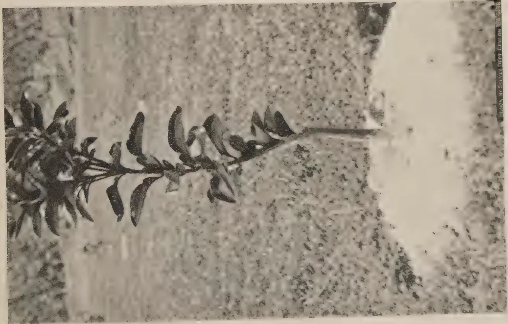
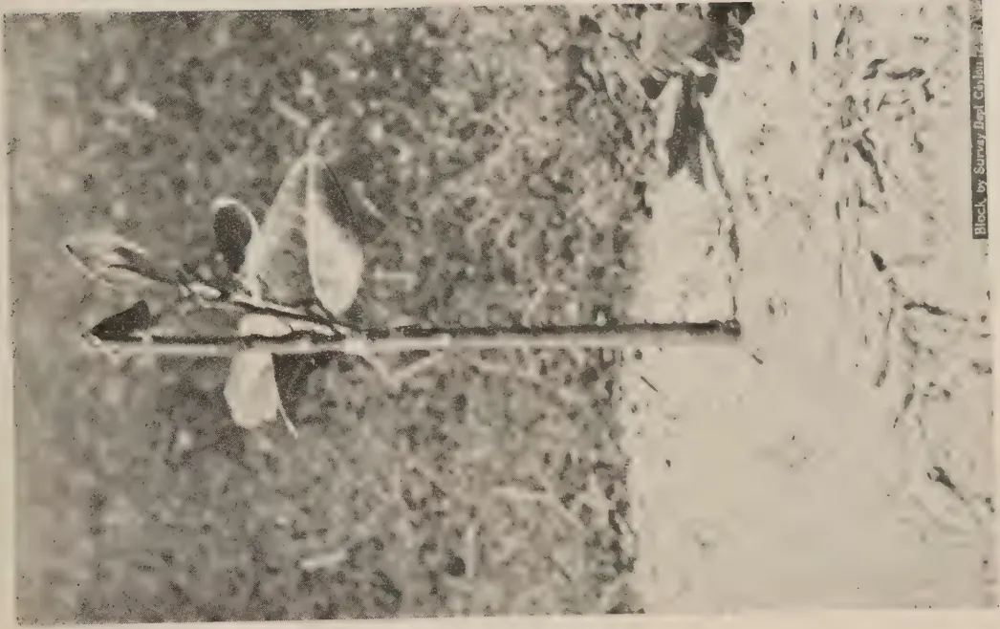
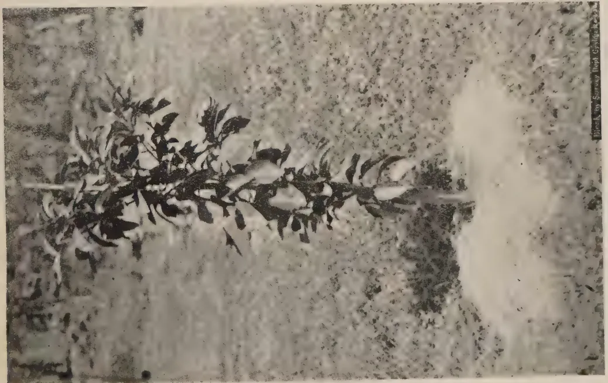
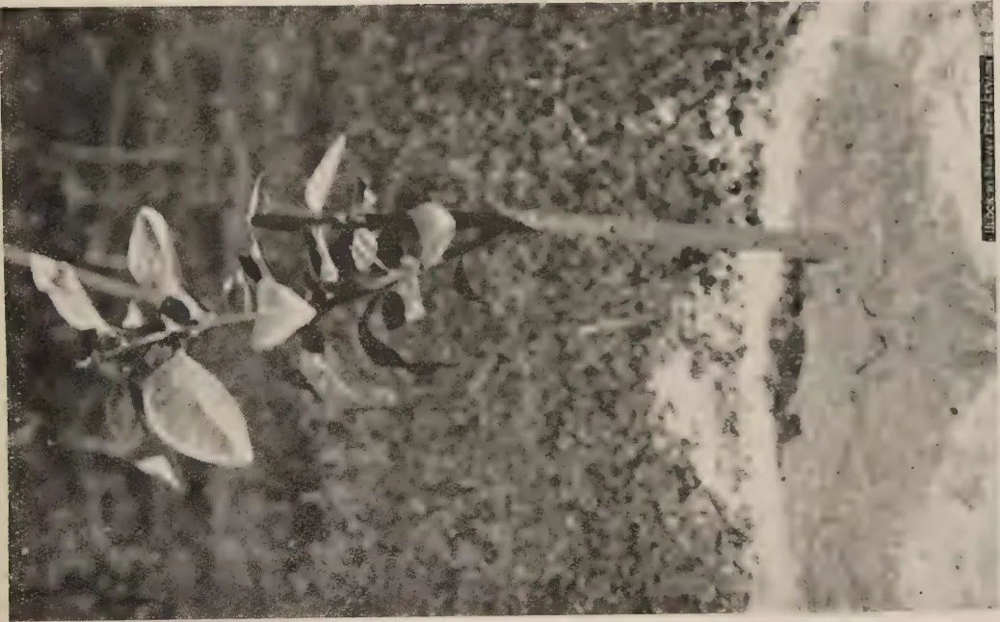
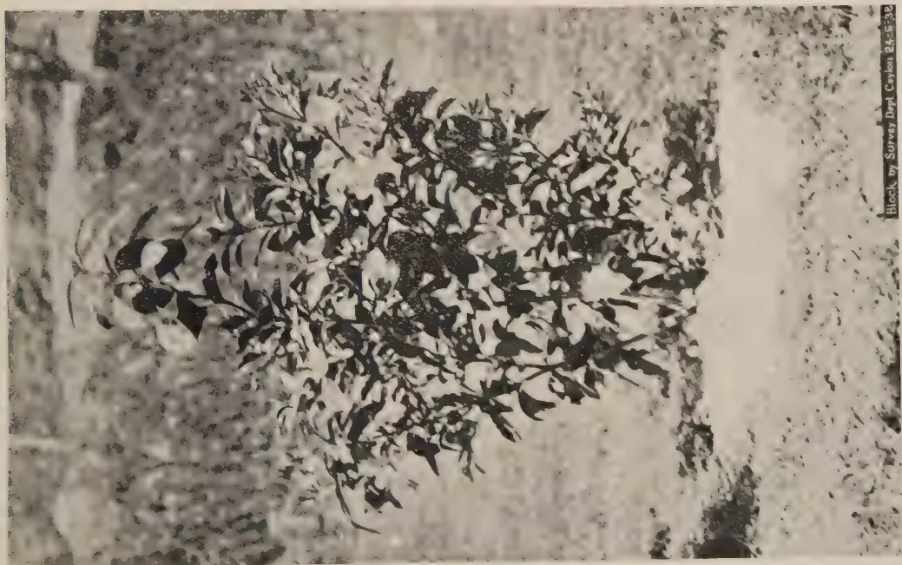
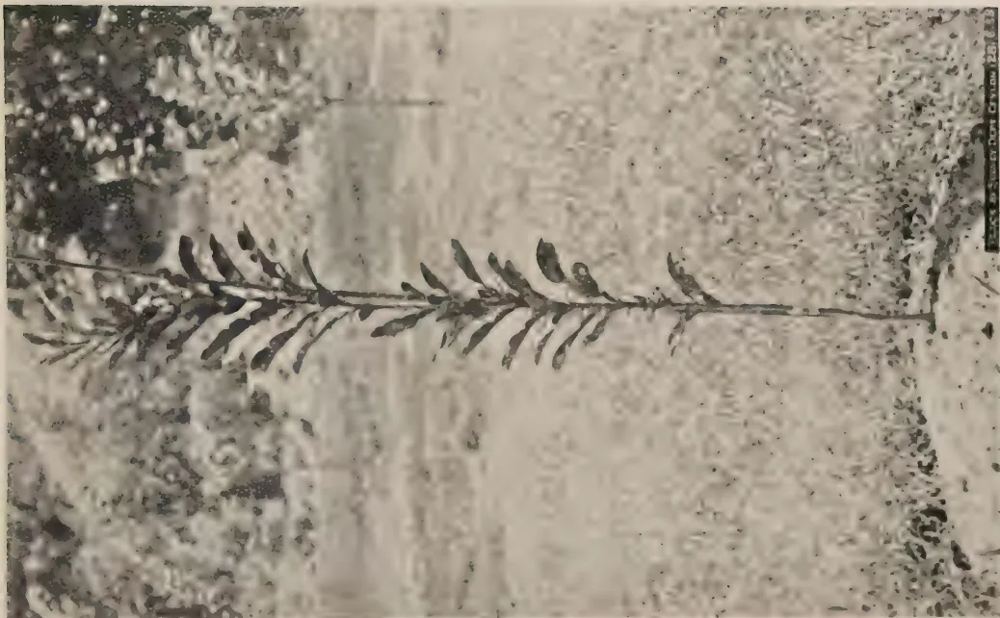

The

# Tropical Agriculturist

July, 1938

---

## EDITORIAL

---

### A DEMOCRATIC EXPERIMENT IN LAND USE

---

A SENSE of unlimited resources in land in relation to the requirements of the farming population during the early period of expansion prevented the United States of America from realizing the danger of soil erosion. But the progressively diminishing returns from the farms, the sand storms of unprecedented intensity which began to sweep over the land, the inability of the silt-obstructed streams to carry off storm water before it had devastated large agricultural areas by flood, and the spectacular gullying of the bare slopes of undulating land at last awakened the Americans to the magnitude and importance of the problem. Propaganda, demonstrations, and subsidies were tried on a scale which could not be emulated by smaller and poorer countries, but the results achieved were singularly disappointing. This was in the nature of the case. Soil erodibility has no relation to the limits of individual holdings. The cyclones that raise the fine particles of surface soil do not begin and subside within one farm. No farmer on the lower slopes of a hillside, however enterprising he may be, can control the flow down of a rain storm all the way from the ridge of the hill, half a mile higher up. Only one form of effort can hold any promise of success: that is co-operative effort. All the land owners in a dust storm area must continue to create wind-breaks of vegetation right across the wind belt. These belts must bear such relation to each other as would ensure the progressive neutralization of the force of the wind. Similarly the water that falls on the hill must be trained all the way down from the ridge, holding up such quantities of it as may be usefully held up at different points and securing the regulated run off of the surplus from contour to contour. Even the valley below and the river bed itself may require treatment so as to accelerate or retard, as the case may be, the eventual discharge into the sea.

1------------------------------------------------

2

The necessary co-operation can be secured only by the action of the State, whether this action takes the form of the conscription and regimentation of the whole of the farming population for the purpose, or the introduction of a system of voluntary co-operation of men within easily defined drainage or dust storm units. Many of the States have adopted the second method which contains an element of what has been termed "democracy in land use". The following are its essential features :—

The State passes legislation setting up a Soil Conservation Committee generally composed of the heads of the Departments of State that are concerned in soil conservation. The function of this Committee is to encourage the formation of District Committees for soil conservation areas determined by it, and to foster the active growth of these Committees when formed.

"Any 25 land occupiers of a given area may petition the State Committee to establish a 'district'. The Committee is then required to hold public hearings, to determine the boundaries of the district, and to make arrangements for a referendum on the question of creation. In this referendum all qualified occupiers of land within the proposed area are eligible to vote. If the majority of *those voting* express themselves in favour of creation, the State Committee appoints two supervisors who request the Secretary of State to issue a certificate of organization. Upon issuance of this certificate, the District becomes a governmental subdivision and is ready to carry out a programme of soil conservation "\*.

The two supervisors appointed in the manner mentioned above with three others elected by local ballot form the governing board of the district. After the District Committee is organized the only function of the State Committee is to maintain the necessary liaison between the District Committee on the one side and the State and Federal Agencies on the other.

The Committee may plan and carry out a programme of soil conservation within its district and, for the purpose, the supervisors may enter into agreements with the farmers, and help them with advice, technical assistance, loans and grants of money, seed, implements, and other necessary supplies. Subject to a right of appeal to a specially created Board of Adjustment, and finally to the courts of the State provision is made

---

\* *Herbage Reviews* I-A-B, Vol. 6, No. 2, p. 74, June, 1938

2------------------------------------------------

3

to overcome the recalcitrancy of obstinate farmers. The supervisors are empowered to frame regulations to meet such cases, and these regulations, if approved by a majority vote at a referendum, have the force of law.

It is understood that the Secretary of State has instructed the Colonial Dependencies to reorganize the machinery of Government so as to transfer responsibility for soil conservation from individual departments to Government as a whole, and that the method of giving effect to these instructions is under consideration. Given a sense of enterprise and a spirit of co-operation amongst the people, the American model forms a very good working basis. It is certainly worth a trial in selected areas, and we commend to those who are responsible for the formulation of policy the view that a selected planting area, controlled by the most progressive agricultural element in the country, would afford the best field for the democratic experiment in Ceylon.

3------------------------------------------------

4

## AGRICULTURE AND IRRIGATION

R. I. BATALIN, A.M.I.C.E.

CONSTRUCTION ENGINEER, ELEHERA SCHEME, IRRIGATION  
DEPARTMENT

C EYLON is faced with an agricultural problem which has two aspects. On the one hand there are the Central, Southern, and Western Provinces apparently richly endowed by nature and densely populated, and on the other hand are the Northern and Eastern Provinces mostly covered with jungle. The net result is that the rich provinces are not able to support their population and Ceylon as a whole is dependent on imported rice. This insufficient production of cereals is not compensated by other crops. The limit of productive capacity of the former provinces is reached sooner than expected. The situation is complex for many reasons. Two of these are the unequal distribution of rains from year to year and the topographical features of the country, namely, its furrowed character. From the meteorological point of view average years are comparatively rare, and are followed by a sequence of dry and wet years. Failures of crop in dry years are a common complaint. The wet years are accompanied by floods which damage fields and water-log the ground. Outbreaks of malaria often follow. Efforts of the cultivator are thus frequently frustrated. His morale is lowered and his energy is gradually reduced with the result that he is not prepared to apply the effort which would raise him from a life of scarcity to more prosperous conditions.

The Island is covered with numerous irrigation schemes small in area and limited in scope. In many schemes an anicut built across a river diverts a part of the flow to lands immediately adjoining the river. These schemes do not provide reservoirs with sufficient water storage capacity which could assure a continuous supply of water to the fields. The districts where the cultivation is at present carried out, being subdivided into numerous narrow valleys, do not offer suitable sites for large reservoirs. Existing tanks are too small for the areas they serve and their storage capacity is just sufficient to equalize distribution of rain water through the cultivation season. In dry years they run short of water and the irrigation works are powerless to save the crop. Every one of the numerous valleys

4------------------------------------------------

5

is a separate problem from an engineering point of view, and a continuous and painstaking display of energy and ingenuity is required in order to construct and maintain these schemes. Some of them are costly in relation to benefits brought to the communities concerned. With few exceptions the productivity of the land is limited to only one crop a year.

And yet the moderately hot climate of Ceylon with an abundant rainfall suggests the possibility of cultivation all the year round. Therefore it is natural that the potentialities of the waste lands of the Northern and Eastern Provinces should attract attention. Mr. J. S. Kennedy in his presidential address to the Conference of the Engineering Association of Ceylon in August, 1937, mentioned the possibilities which these districts offer for large canalization schemes. Several conditions are essential for economical and social success of any such scheme. The basic requirement should be a reservoir of sufficient storage capacity to assure the necessary continuous supply of water to fields independent of the vagaries of rain. Moreover the capacity must be large enough to permit cultivation during dry months, thus increasing the productivity of the land. The attraction of such a scheme for a cultivator will be obvious. His labour will be better rewarded and what is more important for him it will be rewarded regularly.

The scheme should embrace a sufficiently large tract of land to warrant the construction of the reservoir. The topography of the district should be such as to allow a more or less regular lay-out of canals with a minimum number of structures thereon.

A selection of crops should be guided not only by the properties of soil but also by suitable weather conditions. To ensure the economical success of a large irrigation scheme the possibility of cultivation of industrial crops such as cotton, hemp or others of high market value should be considered. The production of rice and other cereals will play a necessary part in the scheme but may be of secondary consideration from an economical point of view.

Several large schemes are possible in the eastern part of the Island. As an example, one of them, which is not necessarily the best, is the Amban-ganga Scheme. The Amban-ganga south of Minneriya Tank flows through a large valley and leaves it through a narrow gorge in a chain of hills. This gorge offers an admirable site for a dam of short length behind which could be formed a reservoir approximately 15 miles long with an average width of 3 miles. The reservoir would command a territory of about 600,000 acres north of Minneriya Tank. Out of this area 75 per cent. or 450,000 acres could probably be canalized. But the extent to be brought under active cultivation could be decided upon only after due consideration has been

5------------------------------------------------

6

given to the water duty of selected crops, the storage capacity of the reservoir and run off data of the catchment area of the Amban-ganga. Conservative estimates of a preliminary nature indicate that at least 200,000 acres could be irrigated perennially. This area is one of the flattest districts in the Island and therefore essentially suitable for a planned canal system.

Although study of the requisites for a successful irrigation scheme may by itself indicate that such schemes will be more profitable than those in existence, it will be of practical interest to know how similar schemes work in other countries.

In one of recent issues of "The Engineer" was published a review of numerous large irrigation schemes carried out in India. All the schemes except those which are not yet fully developed bring  $3\frac{1}{2}$  per cent. interest on the capital spent. Indirect benefits of these schemes are beyond dispute and may be fully appreciated only on consideration of the part they play in the economical and social structure of the country. In addition it is gratifying to know that such schemes "pay" directly.

The transformation of the basin system of Egypt into the perennial brought prosperity to that country. The basin system of irrigation depends exclusively on floods of the river Nile caused by tropical rains in upper reaches of the Blue and White Nile in Central Africa. The canals which took off the river could only divert the flow at high levels, *i.e.*, during the flood season of 3 to 5 months' duration. The water was thus brought to the fields, subdivided into basins by means of earth banks. Barrages, the first of which was constructed in the middle of the 19th century, built across the Nile raised water levels in the river and extended the irrigation period. These barrages (an Egyptian barrage is a structure similar in conception to the Ceylon anicut but of much larger size) also enabled some areas to be brought under continuous (perennial) irrigation, but the extent of these areas was limited by the minimum discharge of the Nile. Under the basin system, the principal crops of the country were rice and wheat and Egypt was famous as one of the granaries of the world. The construction of the Assuan Dam in 1902 across the Nile gave a great impetus to the development of the perennial system of irrigation. Since then the Assuan Dam has been heightened twice, thus increasing the storage capacity of the reservoir formed by the dam. Development is not yet completed and Egypt, as need arises, is building new barrages and new reservoirs, the former bringing new districts under the system, the latter assuring its regular functioning beyond the flood season.

Under the perennial system of irrigation, cotton with its 6 month season has become the principal crop and Egypt now

6------------------------------------------------

7

imports rice and wheat, but the cotton with its high market value amply compensates for the reduced production of cereals and thereby has added to the general prosperity of the country.

A good example of the development of agriculture under the perennial system of irrigation is shown by the Gezira Canalization Scheme of the Sudan. This scheme brought under cotton a part of the plain called Gezira, situated in the triangle formed by the White and Blue Nile rivers. The area suitable for irrigation lies north of latitude  $14^{\circ}\text{N}$  and comprises 3,000,000 acres but it is probable that only 2,000,000 acres can be profitably brought under cultivation. The climate of the plain is hot and dry. The rainy season is confined to the period from July to September, and the country is practically rainless from October to June. The average rainfall is about 15 inches in the south and 6 inches in the north of the area. The average maximum temperature is  $100^{\circ}\text{F}$ , but during the hottest months shade temperatures may reach  $119^{\circ}\text{F}$ . The indigenous population lived a precarious life subsisting on a rain crop of millet which was very uncertain owing to the extremely variable rainfalls. The general aspect of the district was dry and desolate.

Experiments initiated in the second decade of this century proved that the black cotton soil (loess clay) is suitable for cotton cultivation. A concession of 1,000,000 acres for a limited period was granted by the Sudan Government to the Sudan Plantations Syndicate. The Government undertook to construct the dam across the Blue Nile, the reservoir, and the canalization scheme, and the company to dig and maintain field channels and make arrangements for mechanical ploughing, supervision, ginning, and marketing of cotton. The company also supplies seeds and advances money to the tenants. The tenants receive 40 per cent., the company 25 per cent. and the Government 35 per cent. of the proceeds after the cost of ginning and marketing of the cotton have been deducted.

Before the Great War two experimental farms of 5,500 and 7,600 acres were established. In 1921 and 1923, two more farms were added with an aggregate cotton area of 17,000 acres. The farms were run by the company. Agricultural data collected and a method of cultivation worked out on these farms established principles on which the whole scheme was based. Their example inspired confidence in the people regarding the advantages of cotton cultivation and greatly contributed to the success of the first cultivation season of the whole scheme in 1925.

The works of the initial scheme comprising the construction of the dam and development of 300,000 acres were begun in 1920, and in certain respects were of a pioneer character. The district was 700 miles from Port Sudan by rail, communications

7------------------------------------------------

8

with Egypt were unsuitable for heavy goods traffic, world prices for plant and materials were high and increasing, and all skilled labour had to be imported from Egypt or Europe. The contract was originally assigned on a percentage basis, but for various reasons was determined in 1922. A new contract was let to the lowest tenderer on a fixed rate basis in the same year. The works were completed within scheduled time and the first cultivation season opened in July 1925.

In 1927-32 works on further developments were carried out. These brought the cultivated area to about 750,000 acres.

The cost of works was :—

<table>
<tbody>
<tr>
<td>The Dam .. ..</td>
<td>£5,700,000</td>
</tr>
<tr>
<td>Canalization of 300,000 acres .. ..</td>
<td>£3,000,000</td>
</tr>
<tr>
<td>Extensions of 450,000 acres (the author estimates at £4 per acre) .. ..</td>
<td>£1,800,000</td>
</tr>
<tr>
<td></td>
<td>
</td>
</tr>
<tr>
<td></td>
<td>£10,500,000 (Rs. 140,000,000)</td>
</tr>
</tbody>
</table>

which works out at £14 (Rs. 190) per acre. It must be mentioned that the resources of the reservoir have not been used to the limit as it is capable of supplying with water 1,000,000 to 1,250,000 acres.

The essential part of the scheme was the construction of the Blue Nile Dam and Reservoir. The Dam is about 10,000 feet long and 130 feet high above the lowest point of the foundations, and contains 553,000 cubic yards of masonry. The main part of the Dam is provided with 192 openings of various sizes which are designed to pass a discharge of 530,000 cubic feet per second or 25 per cent. more than the highest known flood flow.

The reservoir formed by the Dam has a storage capacity of 485 million cubic metres (392,000 acre-feet) of water net, *i.e.*, after an allowance for evaporation has been made. From July 20th to December, flood water is used for irrigation and the stored water only is used during the period from January to April 10th.

A regulator with 14 tunnels each 10 feet wide and 16½ feet high incorporated in the dam feeds the main channel of the scheme. Seven sluices are in use at present, the remaining tunnels having been blocked up with reinforced concrete. The main canal runs for about 35.5 miles before it reaches the point where it can command the land by gravity. In this reach the main canal has a bed width of 132 feet and 12 feet water depth.

The present scheme of 750,000 acres comprises 162 miles of main and branch canals, about 1,850 miles of distributory canals and about 7,250 miles of field channels, the latter having been constructed by the concessionaires.

8------------------------------------------------

9

Numerous regulators of various types, bridges for roads, light and Government railway lines, buildings and other structures common to a large irrigation scheme were constructed. The aggregate masonry work in these structures amounted to about 135,000 cubic yards.

The main, branch and major distributary canals were set out along natural ridges. To facilitate watering and general agricultural supervision minor distributaries were usually set out in parallel alignment 4,650 feet apart with field outlets on one side only. Practical considerations of various kinds prevented adoption of night watering of fields. Therefore the minor distributaries were designed large enough to store all the water delivered by the major system of canals in the night time. These unusual requirements increased the initial cost of the minor system. Also the minor canals silted heavily and required frequent clearing and although the trapped silt was used for maintenance of banks and the construction of elevated roads experiments in night watering were initiated in order to reduce this heavy item of maintenance expenditure.

Field channels were dug by the company off the minor distributaries at 940 feet intervals and finally tenants' channels subdivided the whole area in 10-acre plots. Every tenant was allotted 3 plots of 10 acres situated on different field channels. The administrative unit of the company is a block of 15,000 to 20,000 acres under the supervision of an inspector and two or three assistants.

The principal crop is long-staple cotton. During the first years of the scheme the cultivation was on a 3 to 1 annual rotation. One-third of the area was under cotton, one-third under other crops, and one-third remained fallow. The other crops are 50 per cent. maize, a staple food of the cultivator, and 50 per cent. "lubia" (*Dolichos lab-lab*), a leguminous bean suitable for cattle fodder. The order of rotation was cotton the first year, fallow the second, and maize and lubia the third.

The cotton season lasts from August to April 10th. It includes the winter months and is consequently longer than that in Egypt which begins in March. In terms of the agreement with Egypt the Gezira Scheme could abstract from the Nile only the flood water. The flood usually begins in July and lasts till the end of October. From January to the end of season the stored water only is used for irrigation. By the middle of April the reservoir is empty. Cotton requires 14-15 waterings of 450 cubic metres each or about 5-acre feet per acre in all. Later it was found possible to give the fields an extra watering and to have one more picking of cotton.

9------------------------------------------------

10

The maize and lubia require  $2\frac{1}{2}$  to 3 months for growth. These crops depend principally on the rains, but waterings from the canals are given to compensate for deficiencies and irregularities in rainfall.

During the first years of the cultivation, the cotton crops gave good results and the yield was 350 to 400 pounds per acre of ginned cotton. These results were not maintained and things went wrong in 1929 or 1930. One year the yield dropped to 180 pounds per acre. Several factors contributed to this failure. The cotton fields are given the first heavy watering before sowing in July-August and immediately thereafter should not be inundated. But natural inundation frequently occurs during the heavy rains in August and the natural drains were not capable of dealing with the situation. The cool weather in December, when the night temperature sometimes falls to between  $56^{\circ}$  and  $50^{\circ}$ F, is detrimental to the young cotton plants. As a result pests of black arm and leaf curl used to attack the crop. Finally the soil was gradually getting water-logged. The two years of rest after one cotton cultivation were not sufficient for the process of drying and aeration to go deep enough in the compact loess soil.

The measures carried out to combat these influences were as follows. Artificial drainage systems were constructed and efficiently removed the surplus water from the fields besides abating their water-logged conditions. A special variety of cotton was evolved by the company better able to resist the cool weather and attacks by pest. The 3 to 1 rotation was replaced by one of 4 to 1, under which the fields remain fallow for two consecutive years thus improving the soil aeration. The measures were effective and the yield of cotton again rose to the average figure of 400 pounds per acre. As the change in rotation entailed a reduction of the effective area under cotton, the minor canal system was extended thus partially compensating for the loss.

The whole scheme was arranged and carried out satisfactorily and proved to be an economical success. The three parties to the agreement displayed a goodwill which contributed to the success of the enterprise and helped to successfully pass over the difficult years of the depression when the low yield coincided with the lowest market prices.

The Gezira Canalization Scheme is working under adverse conditions which diminish its economical success. These conditions are as follows :—

1. 1. High cost of the dam and initial canal system.
2. 2. Adverse climatic conditions.
3. 3. Difficult soil.
4. 4. Low percentage of land under crop each cultivation season.

10------------------------------------------------

2.

A black and white photograph showing a large, multi-tiered concrete structure, likely a head regulator, with several rectangular openings. A long, straight canal (C) leads from the structure. To the left of the canal is a field (D). The structure itself is labeled A. The image is a black and white photograph with a vertical credit line on the right: 'BLOCK BY SURVEY DEPT. OTTAWA 1907-1908'.

GEZIRA CANALIZATION SCHEME.

PLATE II.—HEAD REGULATOR FOR THE BRANCH CANAL UNDER CONSTRUCTION.  
A—MAIN CANAL, B—MAJOR CANAL, C—MINOR CANAL, D—FIELDS.

A black and white photograph showing a long, high dam wall with multiple spillways. The water level is visible behind the dam. The image is a black and white photograph with a vertical credit line on the right: 'BLOCK BY SURVEY DEPT. OTTAWA 1907-1908'.

PLATE I.—GENERAL VIEW OF THE DAM ON THE BLUE NILE.

11------------------------------------------------

This image is a scan of a blank page. The paper has a light beige or cream-colored tint. There are some very faint, blurry marks scattered across the surface, which appear to be scanning artifacts or dust particles. No text, lines, or other graphical elements are present.

12------------------------------------------------

11

The causes which contributed to the higher cost of the Gezira Canalization Scheme are of local character and either do not exist or are avoidable in Ceylon. It may be expected that the cost of large scheme in Ceylon will compare favourably with that of the Sudan even though jungle clearing will be an extra item in the former. Also advantages derived of such scheme will be greater in Ceylon where more favourable agricultural and climatic conditions permit a more intensive cultivation of land.

Therefore it may be assumed that schemes similar to that of the Amban-ganga under which local water resources will be efficiently used will prove profitable and bring great benefit to the Island as a whole.

*N.B.*—The author was connected with the Sudan Irrigation Department during the years 1921–25 and 1927–34, and his description of the Gezira Canalization Schemes relates to those years only.

13------------------------------------------------

12

## STUDIES ON STOCK-SCION INTERACTION IN CITRUS—I.

### GROWTH AND DEVELOPMENT OF SEEDLING STOCKS AND YOUNG GRAFTS

A. V. RICHARDS, B.Sc. (Lond.), Dip. Agric. (Cantab.), A.I.C.T.A.  
(Trinidad)

ACTING HORTICULTURAL OFFICER

IN the selection of rootstocks for citrus the chief factor which has to be taken into consideration is the degree of compatibility between the stock and scion. With most deciduous fruit trees, combinations of stock and scion reported as failures in one place generally prove to be so in other places, indicating thereby that the failures are due to physiological and structural differences between the stock and scion rather than to environment. With citrus, however, the problem is more complicated and a graft combination which does well in one set of conditions may not necessarily do so in another.

Webber (1926) in his survey of the citrus industry in South Africa in 1925, found that, for some unknown reason, the sour orange used successfully as a rootstock for oranges in California and elsewhere proved unsatisfactory as a rootstock for citrus in South Africa, although when left unbudded the seedlings grew normally and cropped well. More recently Toxopeus (1936) has also shown that the sour orange is unsatisfactory as a stock for sweet orange in Java.

In recent years with the interest taken in citrus cultivation in Ceylon, citrus grafts have been imported in large numbers, mostly from sub-tropical countries, and planted in different localities under varying conditions of soil and climate. There is reason to believe from the performance of these grafts that the stocks on which they are worked are not all suited to local conditions. Moreover, with some of the scion varieties, especially the oranges, the quality of the fruit produced has not come up to expectations, being very often far below the standard of the local fruit.

There are several more or less hardy varieties of citrus found growing almost wild in Ceylon, but very little is known about their suitability as rootstocks for the superior varieties of

14------------------------------------------------

A black and white photograph of a young Triumph Grapefruit plant on a Rough Lemon stock. The plant has several large, dark, oval-shaped leaves and a few small, developing fruits. It is planted in a field with a light-colored, sandy or loamy soil. In the background, there is a low, dark wall or fence. The image is oriented horizontally on the page.

FIG. I.—TRIUMPH GRAPEFRUIT ON ROUGH LEMON STOCK  
9 MONTHS AFTER BUDDING.

A black and white photograph of a young Triumph Grapefruit plant on a Pummei stock. The plant is smaller than in Figure I, with fewer and smaller leaves. It is planted in a field with a light-colored, sandy or loamy soil. In the background, there is a low, dark wall or fence. The image is oriented horizontally on the page.

FIG. II.—TRIUMPH GRAPEFRUIT ON PUMMEI STOCK  
9 MONTHS AFTER BUDDING.

Block by Survey Dept. Columbia, S.C.

15------------------------------------------------

This image is a scan of a blank page. The paper has a light beige or cream-colored tint. There are a few very small, faint dark spots scattered across the surface, which appear to be scanning artifacts or minor imperfections in the paper. No text, lines, or other markings are present.

16------------------------------------------------

FIG. III.—WALTERS GRAPEFRUIT ON PUMMELO STOCK  
9 MONTHS AFTER BUDDING.

FIG. IV.—MARSH'S SEEDLESS GRAPEFRUIT ON PUMMELO STOCK  
9 MONTHS AFTER BUDDING.

17------------------------------------------------

This image is a scan of a blank page. The paper has a light beige or cream-colored tint. There are some very faint, blurry marks scattered across the surface, which appear to be scanning artifacts or dust particles. No text, lines, or other graphical elements are present.

18------------------------------------------------

PHOTO BY ROBERT D. GRIFFIN

FIG. VI.—BUDDED ROUGH LEMON STOCK.

Block by Survey Dept. Carbon 24-5-32

FIG. V.—MARSH'S SEEDLESS CUTTING ON OWN ROOTS 1 YEAR OLD.

19------------------------------------------------

This image is a scan of a blank page. The paper has a light beige or cream-colored tint. There are some very faint, blurry marks scattered across the surface, which appear to be scanning artifacts or minor imperfections in the paper itself. No text, lines, or other graphical elements are present.

20------------------------------------------------

Stock in Santa Rosa Citrus 28-639

FIG. VIII.—BUDDED PUMMELLO STOCK.

Stock in Santa Rosa Citrus 28-639

FIG. VII.—BUDDED SOUR ORANGE STOCK.

21------------------------------------------------

This image is a scan of a blank page. The paper has a light beige or cream-colored tint. There are some very faint, blurry marks scattered across the surface, which appear to be scanning artifacts or dust particles. No text, lines, or other graphical elements are present.

22------------------------------------------------

BLOCK BY SURVEY DEPT. GRAVION 22-6-38

FIG. IX.—BUDDED SWEET ORANGE HYBRID STOCK.

BLOCK BY SURVEY DEPT. GRAVION 22-6-38

FIG. X.—GENERAL VIEW OF STOCK AND SCION. EXPERIMENTAL AREA.

23------------------------------------------------

This image is a scan of a blank page. The paper has a light beige or cream-colored tint. There are some very faint, blurry marks scattered across the surface, which appear to be scanning artifacts or dust particles. No text, lines, or other graphical elements are present.

24------------------------------------------------

13

imported and local fruit. It was felt that these varieties, provided they proved to be compatible with the scion varieties worked on them, would make good rootstocks as they are already acclimatized to local environmental conditions. Being themselves vigorous and resistant to drought and disease, their influence, if any, on the scion would result in improved vigour, greater tolerance to unfavourable soil and climatic conditions and, possibly, better fruiting and fruit quality among the grafts.

The experiment which forms the subject of these articles was laid down at the Experiment Station, Peradeniya, in November, 1936, with a view to testing the relative merits of (a) Sour Orange—*C. Aurantium* L., (b) Rough lemon—*C. limonia* Osbeck, (c) Pummelo—*C. maxima* Merr : and (d) Sweet orange hybrid—*C. sinensis* hybr : as stocks for grapefruit, and to compare the performance of Marsh's seedless, Walters, Foster, and Triumph grapefruit worked on the above mentioned stocks on the basis of :—

1. 1. General growth and habit ;
2. 2. Yield and quality of fruit ;
3. 3. Resistance to pests and disease.

### THE ROOTSTOCKS.

*Rough Lemon*—*C. limonia* Osbeck.—Rough lemon is considered to be a horticultural variety of the ordinary lemon (*C. limonia* Osbeck), but nothing definite is known about its origin. It is a rootstock which does well in light sandy loams under conditions of low rainfall, and for that purpose is used exclusively on a commercial scale in Florida, Australia, South Africa, and India. It goes by the name of *Jamburi* in South India and as *Khatti* further north. In Ceylon, the rough lemon is common in the Jaffna Peninsula where it is known as *Narathai*, but elsewhere it is rare and is confined to a few private gardens and estates where its origin has been traced to imported grafts in which the scion had died. In Jaffna, the fruits are boiled and used as a shampoo for the hair. The ordinary tubercled lime or *Kudalu dehi* (*C. hystrix*) which is also used for the same purpose elsewhere, is often mistaken for rough lemon because of the warty appearance of the fruit.

The seeds of this variety germinate readily provided they are sown fresh and, being highly polyembryonic, they give rise to several apogamic seedlings, all remarkably uniform in appearance as they have the same genetic make-up as the maternal parent tree.

In the seedling stage rough lemon can be distinguished from other varieties of citrus by the absence of a prominently winged

25------------------------------------------------

14

leaf petiole and by the appearance of the young shoots, which are light green with no trace of purple pigment in them (Fig. VI.). The seedlings themselves are vigorous and have clean straight stems which can be easily budded. Most varieties of citrus take readily when budded on them. The stock is said to impart its vigour to the scion.

The seedlings have deep penetrating tap roots and strong fibrous laterals which are well adapted for foraging in the more fertile top soil. They can tolerate drought conditions better than any other stocks.

The variety is considered to be more resistant to collar rot or gummosis than most other stocks, yielding only to sour orange in that respect. The seedlings are, however, very susceptible to citrus scab and, to a lesser extent, to citrus canker.

*The Sour Orange—C. Aurantium Linn.*—It was estimated by Hume (1930) that 75 per cent. of the world's commercial output of citrus fruit is grown on sour orange stocks. There are several strains of this variety, the best known being Bitter Seville which is used extensively as a rootstock in California. The Ceylon sour orange (Fig. VII.) is similar to it in many respects. The leaves have prominently winged petioles and their aroma when crushed is characteristically pungent and quite unlike that of the sweet orange leaf. The fruits of the local variety, however, do not develop the typical beautiful orange colour, presumably because of the climate. The colour of the pulp is also light, and marmalade made from it lacks the characteristic marmalade flavour associated with true Seville or Marmalade orange.

As a rootstock the sour orange is pre-eminently suited for the wet or heavy soils because of its resistance to foot rot, but Baker (1938) has reported recently from Trinidad that certain poor strains may become susceptible to other forms of root disease.

The seedlings are reported to be very susceptible to citrus scab in the West Indies, but the disease has not been recorded on the local variety which appears to be resistant to it. They are attacked to some extent by citrus canker.

The stocks are not so vigorous and quick growing as rough lemon stocks but they are said to be more hardy and long-lived. They require wide spacing, abundant irrigation under dry conditions, intensive manuring and careful protection against winds for successful growth.

The sour orange stock has a deep rooting habit, and when its tap root is cut in the process of transplanting several deeply penetrating roots are produced from near the cut end which function as tap roots and provide firm anchorage.

26------------------------------------------------

15

*Sweet Orange Hybrid*—*C. sinensis* hybr.—It is believed that sweet orange would be used extensively as a rootstock for citrus in preference to sour orange were it not for its extreme susceptibility to “foot rot” and other forms of gummosis.

Trees worked on it are said to grow more rapidly than those on sour orange stock and to give better yield of fruit of really good quality from the start. For that reason alone, according to Schneider (1931), there is a marked tendency among growers in California to revert to the sweet orange stock in preference to the present sour orange stock.

The Ceylon variety of sweet orange does not appear to be so vigorous and long lived as the sour orange. Moreover, in the wet districts it has a tendency to decline in vigour and to develop symptoms of chlorosis or yellowing of leaves followed by die-back. There are, however, several hybrid types produced as a result of cross pollination with other citrus varieties, particularly pummelo and sour orange, which appear to be not only vigorous but highly prolific. They go under different local names as *Haldodan*, *Sideran*, &c., and are valued for their medicinal properties, though not to the same extent as the typical sour orange or *Embul dodan*. In nearly all of them the fruits have sub-acid flavour and are fairly coarse and large compared to the average sweet orange. The seeds are plump, and in shape not so elongated as the typical sour orange seed. The pulp vesicles are also large and in some types coloured pale pink.

The seedlings in the early stages have numerous strong thorns and look more like seedlings of sweet orange (Fig. IX.). Their leaves do not have the prominently winged petioles which are characteristic of the sour orange leaves, neither is their aroma when crushed so pungent, but they are more susceptible to citrus canker than sour orange.

*Pummelo*—*C. maxima* Merr.—Pummelo, known locally in Sinhalese as *Jambola*, is a large tree which thrives in the wet zone. There are several types in which the size, shape and colour of the flesh of the fruit vary. Some are round, others are pear shaped. In some the flesh is of ordinary lemon colour, while in others it is of a pink shade.

The pummelo is the only species of the four under comparison which is known generally to produce seeds with only one embryo in each seed and, considering the fact that cross pollination is common among citrus, it is not surprising that the seedlings which germinate from those embryos show considerable variability.

27------------------------------------------------

16

According to Brown (1924) pummelo varieties have been found to be of value as stocks in dry land in Egypt but, being of hybrid origin, they vary greatly and there is difficulty in securing uniform stocks.

The pummelo has also been tried on an experimental scale as a stock in the Philippines (Lee 1921) and Palestine (Yedidyah 1934), but in both places it proved a failure as all the commercial varieties of citrus worked on it developed mottle leaf disease very badly.

The variety is highly susceptible to citrus canker and is also badly attacked by scale insects. There is no record of its being used extensively as a rootstock on a commercial scale in any part of the world.

#### DESIGN OF THE EXPERIMENT

The experiment is designed on the randomized block principle and consists of five blocks with four plots in each block to which are allotted at random the four rootstock treatments, and four sub-plots within each plot over which are randomized separately the four scion variety treatments (Plate I).

Wishart and Sanders (1936) have shown that, with the split plot lay-out, all comparisons cannot be made with the same degree of precision. In this experiment, a greater degree of precision was required for the stock-scion combinations, whose effects might be small, than for the general comparison of the stocks in which greater differences were anticipated, and for that purpose the split plot lay-out proved to be the most convenient.

The number of plants in each plot is twelve and the number in each sub-plot is three. All the plants in each plot are on one rootstock variety although they belong to four different scion varieties, but the plants in each sub-plot have all the same stock-scion make-up.

The total number of plants in the experiment proper is 240, but there is a border row of 80 plants all round the experimental area. Most of the plants in the border row have the same stock-scion combination as those next to them in the adjoining sub-plot, but few in the border row on the east and west sides are on their own roots, being rooted cuttings of the four grapefruit varieties under trial. The cuttings were taken from the same parent trees as those from which budwood was obtained for the experiment, and were first made to strike root in a solar propagator before they were established on the field.

The area available for the experiment was just over two acres and accordingly the spacing had to be reduced to 18 ft.  $\times$  18 ft. on the rectangular system. The plots are also long and narrow, each measuring 108 ft.  $\times$  36 ft.

28------------------------------------------------

# GRAPEFRUIT STOCK AND SCION EXPERIMENT

N ————— S

The diagram illustrates a 4x4 grid of experimental blocks. Each block contains a 4x4 matrix of symbols representing the presence of specific grapefruit varieties. The symbols are: X (Sweet Orange Hybrid), O (Sour Orange), A (Pumelo), and ■ (Rough Lemon). The rows are labeled M, W, F, and T, and the columns are labeled 1, 2, 3, and 4. The orientation is North (N) to the left and South (S) to the right.

### ROOTSTOCK VARIETIES

- X: SWEET ORANGE HYBRID
- O: SOUR ORANGE
- A: PUMPELO
- ■: ROUGH LEMON

### SCION VARIETIES

- M: MARSH'S SEEDLESS
- W: WALTERS
- T: TRIUMPH
- F: FOSTER

### ROOTED GRAPEFRUIT CUTTINGS

PLATE 1.—DESIGN OF THE EXPERIMENT

29------------------------------------------------

This image is a scan of a blank page. The paper has a light beige or cream-colored tint. There are a few very small, dark specks scattered across the surface, which appear to be scanning artifacts or dust particles. No text, lines, or other markings are present on the page.

30------------------------------------------------

17

The land itself is almost flat, with a gentle slope towards the north and the soil is a light loam of low fertility. There appears to be a definite fertility gradient running across from the gravelly area on the west to the more fertile loam on the extreme east of the experimental area.

The whole area was under rubber from 1908 to 1932, and after the trees were cut down, yams and green manure crops were planted, followed by *Crotalaria anagyroides* which was allowed to remain for two seasons. The *Crotalaria* was lopped and ploughed in before the citrus plants were planted.

*Seed.*—The seed for the experiment was collected from known parent trees. All the rough lemon seed came from a tree at Jaffna; sour orange seeds from the tree at Hakgala Botanic Gardens which is considered to be the true Seville variety; pummelo seed from a very old but vigorous tree of about sixty years at the Experiment Station, Peradeniya; and the sweet orange hybrid seed from a strong and healthy tree at the Economic Nursery, Royal Botanic Gardens, Peradeniya, which still continues to be a prolific bearer.

The seedlings were raised in nursery beds in the open and were transplanted into the experimental area when four to five months old.

Holes for the seedlings were prepared well in advance to allow for settling. They were made specially large 3 ft.  $\times$  3 ft. and were filled first with the rich top soil and then with the sub-soil mixed with well rotted cattle manure at the rate of about sixty pounds per hole.

The seedlings were transplanted into the experimental area on November 18, 1936.

A cover crop of *Indigofera endecaphylla* was established but round each seedling stock a circle of about 3 ft. radius was kept free of vegetation and forked up periodically.

*Gliricidia sepium* was planted for shade between the rows of citrus stocks, but the trees were removed after the stocks were budded as it was felt that their presence would only increase the atmospheric humidity and favour the incidence of citrus canker. Moreover, there is no necessity to provide shade for citrus in the wet zone.

#### RECORD OF HEIGHT MEASUREMENTS

Measurements of height were taken in May, 1937, six months after transplanting and they were as follows :—

<table>
<thead>
<tr>
<th colspan="3"></th>
<th colspan="2">Mean height in ft. and in.</th>
</tr>
</thead>
<tbody>
<tr>
<td>Rough lemon</td>
<td>..</td>
<td>..</td>
<td>3</td>
<td>3</td>
</tr>
<tr>
<td>Pummelo</td>
<td>..</td>
<td>..</td>
<td>1</td>
<td>7</td>
</tr>
<tr>
<td>Sour orange</td>
<td>..</td>
<td>..</td>
<td>1</td>
<td>7</td>
</tr>
<tr>
<td>Sweet orange hybrid</td>
<td>..</td>
<td>..</td>
<td>1</td>
<td>6</td>
</tr>
</tbody>
</table>

31------------------------------------------------

18

As indicated in the analysis of variance in Table I., rough lemon was significantly taller than each of the other varieties. The differences in height between the other varieties were not significant.

The hypothetical scion treatments and the interaction were not significant, indicating thereby that there was no bias to start with in favour of any particular scion variety on the basis of stock growth.

TABLE I

Analysis of Variance of Record of Height Measurements taken on  
May 13, 1937

<table border="1">
<thead>
<tr>
<th>Due to</th>
<th>D. F.</th>
<th>Sum of Squares</th>
<th>Variance</th>
<th>F</th>
<th>One per cent. point</th>
</tr>
</thead>
<tbody>
<tr>
<td>Blocks ..</td>
<td>4</td>
<td>2,630.51..</td>
<td>657.63..</td>
<td>—</td>
<td>—</td>
</tr>
<tr>
<td>Stock treatments</td>
<td>3</td>
<td>52,809.89..</td>
<td>17,603.30..</td>
<td>25.27..</td>
<td>5.95</td>
</tr>
<tr>
<td>Error (a)</td>
<td>12</td>
<td>8,357.73..</td>
<td>696.48..</td>
<td>—</td>
<td>—</td>
</tr>
<tr>
<td>Scion treatments</td>
<td>3</td>
<td>562.39..</td>
<td>187.46..</td>
<td>1.47..</td>
<td>4.25</td>
</tr>
<tr>
<td>Interaction</td>
<td>9</td>
<td>2,144.77..</td>
<td>238.31..</td>
<td>1.87..</td>
<td>2.15</td>
</tr>
<tr>
<td>Error (b)</td>
<td>48</td>
<td>6,099.81..</td>
<td>127.08..</td>
<td>—</td>
<td>—</td>
</tr>
<tr>
<td>Total</td>
<td>79</td>
<td>72,605.10</td>
<td>—</td>
<td>—</td>
<td>—</td>
</tr>
</tbody>
</table>

Standard Deviation of 1 sub-plot (error a) = 26.38 = 35.33 per cent. of the General mean.

Standard Deviation of 1 sub-plot (error b) = 11.27 = 15.09 per cent. of the General mean.

Mean height of plants per sub-plot :

<table border="1">
<thead>
<tr>
<th>Rough Lemon</th>
<th>Sour Orange</th>
<th>Pummelo</th>
<th>Sweet Orange Hybrid</th>
<th>General Mean</th>
<th>S. E. of mean of 20 sub-plots</th>
<th>Significant Difference</th>
</tr>
<tr>
<th>In.</th>
<th>In.</th>
<th>In.</th>
<th>In.</th>
<th></th>
<th></th>
<th></th>
</tr>
</thead>
<tbody>
<tr>
<td>118.93 ..</td>
<td>61.33..</td>
<td>62.05..</td>
<td>56.35..</td>
<td>74.67..</td>
<td>5.91..</td>
<td>25.85</td>
</tr>
</tbody>
</table>

### RECORD OF GIRTH MEASUREMENTS

Girth measurements were taken a month later with a pair of vernier calipers at the point of budding, 8 inches from the ground, and they were as follows :—

<table border="1">
<thead>
<tr>
<th></th>
<th>Mean Girth in mm.</th>
</tr>
</thead>
<tbody>
<tr>
<td>Rough lemon ..</td>
<td>26.22</td>
</tr>
<tr>
<td>Pummelo ..</td>
<td>18.37</td>
</tr>
<tr>
<td>Sour orange ..</td>
<td>15.07</td>
</tr>
<tr>
<td>Sweet orange hybrid ..</td>
<td>12.25</td>
</tr>
</tbody>
</table>

As is shown by the analysis of variance in Table II., rough lemon was significantly bigger in girth than each of the other varieties.

32------------------------------------------------

19

Pummelo was significantly bigger than sweet orange hybrid, but the differences in mean girth between pummelo and sour orange, and sour orange and sweet orange hybrid were not significant.

Here again, neither the interaction nor the hypothetical scion treatments were significant.

TABLE II

Analysis of Variance of Record of Girth Measurements taken on  
June 14, 1937

<table border="1">
<thead>
<tr>
<th>Due to</th>
<th>D. F.</th>
<th>Sum of Squares</th>
<th>Variance</th>
<th>F</th>
<th>One per cent. point</th>
</tr>
</thead>
<tbody>
<tr>
<td>Blocks ..</td>
<td>4</td>
<td>798.03..</td>
<td>199.51..</td>
<td>—</td>
<td>—</td>
</tr>
<tr>
<td>Rootstock treatments ..</td>
<td>3</td>
<td>19,649.85..</td>
<td>6,549.95..</td>
<td>23.13..</td>
<td>5.95</td>
</tr>
<tr>
<td>Error (a) ..</td>
<td>12</td>
<td>3,398.77..</td>
<td>283.23..</td>
<td>—</td>
<td>—</td>
</tr>
<tr>
<td>Scion treatments ..</td>
<td>3</td>
<td>347.27..</td>
<td>115.76..</td>
<td>2.22..</td>
<td>4.25</td>
</tr>
<tr>
<td>Interaction ..</td>
<td>9</td>
<td>372.09..</td>
<td>41.34..</td>
<td>0.79..</td>
<td>2.15</td>
</tr>
<tr>
<td>Error (b) ..</td>
<td>48</td>
<td>2,506.64..</td>
<td>52.22..</td>
<td>—</td>
<td>—</td>
</tr>
<tr>
<td>Total ..</td>
<td>79</td>
<td>27,072.65</td>
<td>—</td>
<td>—</td>
<td>—</td>
</tr>
</tbody>
</table>

Standard Deviation of 1 sub-plot (error a) =  $16.82 = 31.19$  per cent. of the General mean.

Standard Deviation of 1 sub-plot (error b) =  $7.23 = 13.41$  per cent. of the General mean.

Mean girth of plants per sub-plot :

<table border="1">
<thead>
<tr>
<th>Rough Lemon</th>
<th>Sour Orange</th>
<th>Pummelo</th>
<th>Sweet Orange Hybrid</th>
<th>General Mean</th>
<th>S. E. of mean of 20 sub-plots</th>
<th>Significant Difference</th>
</tr>
</thead>
<tbody>
<tr>
<td>78.66..</td>
<td>45.22..</td>
<td>55.11..</td>
<td>36.74..</td>
<td>53.93..</td>
<td>3.76..</td>
<td>16.23</td>
</tr>
</tbody>
</table>

RECORD OF WEIGHT OF TOPS

All the rough lemon stocks were budded on June 21, 1937, and the others on July 8, 1937.

The budwood was taken from the following four selected parent trees of the scion varieties under trial :—

1. Marsh's seedless .. From Australia. Tree near the Curator's bungalow, Royal Botanic Gardens, Peradeniya.
2. Walters .. From Florida. Tree No. F $\frac{3}{4}$  at the Experiment Station, Peradeniya.
3. Foster .. A pink fleshed variety from South Africa. Tree No. F3/14 at the Experiment Station, Peradeniya.
4. Triumph .. From South Africa. Tree No. F8/14 at the Experiment Station, Peradeniya.

As suggested by Webber (1932) the weights of the tops of the rootstocks were recorded after they were pruned 6 inches above the bud-union to force the buds. They are indicative of the growth vigour of the different stocks.

33------------------------------------------------

20

The weight measurements were as follows :—

<table>
<thead>
<tr>
<th></th>
<th></th>
<th></th>
<th>Mean Weight in Ounces</th>
</tr>
</thead>
<tbody>
<tr>
<td>Rough lemon</td>
<td>..</td>
<td>..</td>
<td>4.31</td>
</tr>
<tr>
<td>Pummelo</td>
<td>..</td>
<td>..</td>
<td>2.45</td>
</tr>
<tr>
<td>Sour orange</td>
<td>..</td>
<td>..</td>
<td>1.73</td>
</tr>
<tr>
<td>Sweet orange hybrid</td>
<td>..</td>
<td>..</td>
<td>1.20</td>
</tr>
</tbody>
</table>

As shown in Table III., the four rootstocks varieties maintained the same relative position as they did in the case of girth measurements. Rough lemon was significantly heavier than every one of the other varieties, pummelo was significantly heavier than sweet orange hybrid, but the other differences were not significant.

Once again the hypothetical scion treatments and interaction were not significant.

TABLE III  
Analysis of Variance of Record of Weights Measurements taken on August 2, 1937

<table>
<thead>
<tr>
<th>Due to</th>
<th>D. F.</th>
<th>Sum of Squares</th>
<th>Variance</th>
<th>F</th>
<th>One per cent. point</th>
</tr>
</thead>
<tbody>
<tr>
<td>Blocks ..</td>
<td>4</td>
<td>26.95..</td>
<td>6.74..</td>
<td>—</td>
<td>—</td>
</tr>
<tr>
<td>Stock treatments</td>
<td>3</td>
<td>1,000.45..</td>
<td>333.48..</td>
<td>27.49..</td>
<td>5.95</td>
</tr>
<tr>
<td>Error (a)</td>
<td>12</td>
<td>145.55..</td>
<td>12.13..</td>
<td>—</td>
<td>—</td>
</tr>
<tr>
<td>Scion treatments</td>
<td>3</td>
<td>27.18..</td>
<td>9.06..</td>
<td>2.31..</td>
<td>4.25</td>
</tr>
<tr>
<td>Interaction</td>
<td>9</td>
<td>18.43..</td>
<td>2.05..</td>
<td>0.52..</td>
<td>2.15</td>
</tr>
<tr>
<td>Error (b)</td>
<td>48</td>
<td>187.90..</td>
<td>3.91..</td>
<td>—</td>
<td>—</td>
</tr>
<tr>
<td>Total</td>
<td>79</td>
<td>1,406.46</td>
<td>—</td>
<td>—</td>
<td>—</td>
</tr>
</tbody>
</table>

Standard Deviation of 1 sub-plot (error a) = 3.48 = 47.80 per cent. of the General mean.

Standard Deviation of 1 sub-plot (error b) = 1.98 = 27.20 per cent. of the General mean.

Mean weight of tops per sub-plot :

<table>
<thead>
<tr>
<th>Rough Lemon</th>
<th>Sour Orange</th>
<th>Pummelo</th>
<th>Sweet Orange Hybrid</th>
<th>General Mean</th>
<th>S. E. of mean of 20 sub-plots</th>
<th>Significant Difference</th>
</tr>
</thead>
<tbody>
<tr>
<td>12.95..</td>
<td>7.35..</td>
<td>5.20..</td>
<td>3.60..</td>
<td>7.28..</td>
<td>0.78..</td>
<td>3.36</td>
</tr>
</tbody>
</table>

#### GROWTH AND DEVELOPMENT OF YOUNG GRAFTS

Budding was generally successful. The failures were few and were due more to faulty manipulation in budding and unsuitable budwood than to any incompatibility between stock and scion. They were all rebudded without undue delay.

The buds on some of the stocks, especially pummelo, remained dormant for a considerable time and a top dressing of sulphate of ammonia was given to force the buds. The treatment was effective except in the case of some of the older pummelo stocks in which the bark had grown over the scion bud, and more or less smothered it.

34------------------------------------------------

21

Except for two stocks, one a rough lemon and the other a pummelo which were promptly removed, all the others were apparently free from citrus canker when budded, but later the disease made its appearance on the new bursts of scion foliage on about 25 per cent. of the grafts. The incidence of the disease appeared to be correlated with the degree of infection on the budwood which had to be taken from trees at Peradeniya which were already infected, rather than on the inherent degree of susceptibility of the different stocks.

*The Young Grafts.*—All the grapefruit varieties on rough lemon stock have grown vigorously and the plants are at the time of writing very uniform in appearance with no trace either of mottle leaf or of other forms of chlorosis. A typical Triumph grapefruit graft on rough lemon stock is shown in Fig. I.

Almost all the grafts on sour orange stock have grown normally and are in good condition, although they are not so large as those on rough lemon stock.

On pummelo stock, and to a limited extent on the sweet orange hybrid stock, which probably is a hybrid of sweet orange with pummelo, the growth of every Foster, Triumph and Marsh's seedless grapefruit scion has been extremely poor, the leafy shoots being stunted and chlorotic in appearance. Figs. II. and IV. show the typical growth of Foster and Marsh's seedless grafts on pummelo nine months after budding. In most of the older leaves the midrib and the larger veins appear thickened and are prominently yellow, while the rest of the leaf blade has a greenish to a bronzed yellow colour. A few of the younger leaves, on the other hand, present a mottled appearance with small yellow patches scattered in between the veins which themselves appear to retain their green colour along with the tissues immediately next to them.

Foster appears to be the variety most badly affected by chlorosis and it showed the symptoms throughout; Triumph comes next and is followed by Marsh's seedless which seems to develop the symptoms only at a later stage.

All the Walters grafts on pummelo stock have, however, made normal growth with healthy green leaves and some of them compare favourably with the best plants on the other stocks. A typical Walters graft on pummelo stock is shown in Fig. III. Curiously enough, Walters is closely allied to the highly susceptible Foster, the latter having originated as a pink fleshed bud sport from a Walters tree.

As shown in Fig. VIII., the pummelo stock itself, when left unbudded, develops normally into a strong healthy tree with no trace of yellowing of foliage. The cuttings of the susceptible

35------------------------------------------------

22

scion varieties on their own roots appear to be unaffected and have so far not shown any symptoms of chlorosis. One such cutting is shown in Fig. V.

The yellowing of the foliage has also been observed with other citrus varieties, particularly Mediterranean Sweet and Valencia Late orange worked on pummelo stock.

It was observed by Lee (1921) in the Philippines that most of the commercial varieties of citrus budded on pummelo were badly affected with mottle leaf but trees upon mandarin orange and Calamondin stocks grown under the same environmental conditions did not develop mottle leaf disease. At first incompatibility between the stock and scion was suspected, but later that theory was abandoned as it was found that the reciprocal combination of pummelo on mandarin orange in nearby nursery rows did not develop mottle leaf disease but made normal growth.

Chlorosis and other symptoms of ill-health may be associated either with stock-scion incompatibility or with unfavourable environmental conditions such as water-logging, nitrogen deficiency and the deficiency or excess of certain other elements such as iron, manganese, calcium, &c.

The point at issue now is whether the appearance of chlorosis and subsequent failure of some of the grafts on pummelo stocks in the experiment is primarily due to the peculiar environmental conditions and treatment, or due to inherent structural and physiological differences between the stock and scion.

In Ceylon, chlorosis and other symptoms of ill-health accompanied by die-back are common on citrus trees in the low-country and mid-country wet zone where, presumably, the comparatively moist conditions favour their incidence. Trees in the dry zone are not so badly affected except when they are over-irrigated.

Pummelo has recently been tried as a stock for Walters and Marsh's seedless grapefruit in the dry zone at Pelwehera Experiment Station and the indications are that, although the trees appear somewhat dwarfed with slight union overgrowth below the bud-union, there is no chlorosis. The failure of the particular grapefruit graft combinations on pummelo stocks in the wet zone would therefore appear to be primarily due to peculiar environmental conditions rather than stock-scion incompatibility.

It is possible that both the pummelo seedlings and the scion varieties on their own roots are able to secure from the soil the nutrients which are necessary for normal healthy growth but, when worked together as a graft combination on pummelo stock, their ability to secure the necessary requirements through the pummelo stock might depend on their inherent varietal

36------------------------------------------------

23

characteristics—the Walters variety being more capable of securing its supply than the others. This difficulty, however, does not arise in the case of the scion varieties worked on either the rough lemon or sour orange stocks.

Lee (1921) has stated that “a plausible assumption for the different reactions of the different species on various stocks would seem to be the comparative resistance and susceptibility of such stocks”. The mandarin orange and Calamondin as stocks are resistant to the peculiar environmental conditions which are conducive to incidence of mottle leaf in the Philippines whereas pummelo as a stock is highly susceptible. In Ceylon the mandarin appear to be the variety most badly affected by chlorosis, but its performance as a stock has not been tested.

Recent work of Toxopeus (1936) in Java indicates that the cause of failure may not lie in the stock itself but in some toxic reaction of the scion upon the stock. He found that sweet orange varieties budded on sour orange grew normally for 2 to 3 months but eventually declined and withered within 8 to 12 months. The sweet orange used as scion is believed to produce some substance toxic to the sour orange stock.

Argles (1937) has shown that some authorities, while conceding that incompatibility may sometimes be due solely to inherent differences between the stock and scion, consider that adverse environmental conditions and treatment may induce incompatibility in certain graft combinations which under other conditions will be compatible, a notable example being the failure of sour orange as a stock in South Africa and Java, and its success on a large scale elsewhere.

There are others who maintain that environment and treatment alone cannot induce incompatibility between the stock and scion, but may accentuate or mitigate, hasten or retard, the appearance of symptoms of incompatibility caused by inherent differences between the stock and scion but that these symptoms would any way appear eventually.

On that theory a graft combination which fails in one place owing to incompatibility between the stock and scion should prove a failure everywhere in course of time no matter what the environmental conditions are like. Whereas if a variety fails on a stock in a particular locality and succeeds elsewhere, the failure would be primarily due to environment and treatment rather than to incompatibility between the stock and scion.

Whatever the reason may be for the failure of certain graft combinations, the fact remains that pummelo is unsuitable as a stock for most varieties of citrus in localities where conditions are favourable for the incidence of various forms of chlorosis.

37------------------------------------------------

24

It is possible that the appearance of chlorosis may be appreciably delayed in the dry zone and the graft combinations may prove satisfactory, but there are other considerations such as the possible inability of the stocks to resist drought and to stand transplanting, which may preclude the use of pummelo as a stock on a commercial scale in the dry zone.

For the present, therefore, it is suggested that only rough lemon and sour orange should be used as stocks for commercial production of budded grapefruit, the former for the light sandy loam in both the dry zone and the wet zone, and the latter for the more heavy and wet soils in the wet zone.

With regard to the grapefruit varieties, if Triumph and Foster are to make vigorous growth they should be budded on rough lemon, but the other varieties Walters and Marsh's seedless would do just as well on sour orange as on rough lemon.

#### ACKNOWLEDGMENTS

Grateful acknowledgment is made to Mr. T. H. Parsons, Horticultural Officer, for all the encouragement and practical advice given in laying down the experiment, and to Mr. M. B. Kulasekera, Upper Gardener, Royal Botanic Gardens, Peradeniya, for assistance in taking records.

#### REFERENCES

Webber, H. J., 1926 .. A Comparative Study of the Citrus Industry of South Africa. *Union S. Africa Dept. Agr., Bull. 6*.

1932 .. Variation in Citrus seedling and the Relation to Rootstock Selection, *Hilgardia*, Vol. 7, pp. 1-79

Toxopeus, H. J., 1936 .. Stock-Scion Incompatibility in Citrus and its Cause. *J. Pomol*, Vol. 14, pp. 360-364.

Hume, H. H., 1930 .. *The Cultivation of Citrus Fruits*. Macmillan, New York.

Baker, R. E. D., 1938 .. Red Root Disease of Limes in the British West Indies. *Trop. Agriculture*, Vol. XV., pp. 105-108.

Schneider, S., 1931 .. Orchard Management, Problems and Practices in Californian Citrus Industry, *Hadar*, Vol. 4, pp. 41-42.

Brown, T. W., 1924 .. The Propagation and Cultivation of Citrus Trees in Egypt. *Min. Agr. Egypt. Bull. 44*.

Lee, H. A., 1921 .. The Relation of Stocks to Mottle Leaf of Citrus. *Philippine Journal of Science*, Vol. 18, pp. 85-93.

Yedidyah, S., 1934 .. The Citrus Root-Stock Problem in Palestine, *Hadar*, Vol. 6, pp. 233-237.

Argles, G. K., 1937 .. A Review of the Literature on Stock-Scion Incompatibility on Fruit Trees with Particular Reference to Pome and Stone Fruits. *Imperial Bureau of Fruit Production. Tech. Comm. No. 9*.

Wishart, J., and Sanders, H. G., 1936 .. *Principles and Practice of Field Experimentation*. The Empire Cotton Growing Corporation, London.

38------------------------------------------------

25

## NOTES ON ORCHIDS CULTIVATED IN CEYLON

RENANTHERA STORIEI RCHB. F.

K. J. ALEX. SILVA, F.R.H.S.  
SUPERINTENDENT OF PARKS, COLOMBO

**T**HIS orchid belongs to the *Renanthera* family, of which the "Scorpion" or "Spider" are familiar to most of us. It is one of the rarer species, and has only quite recently been introduced into Ceylon. It thrives both in the low and mid-country districts where it appears to have become acclimatized. Unlike the other members of the *Renanthera* family its growth is rather slow.

It is a hardy climber but local specimens have rarely reached more than five feet in height, although in its native haunts, in the Philippines, under a more suitable environment there are records of its having attained a height of twenty-five feet.

The plant is conspicuous, in comparison with allied species, by its thick, woody, slightly flattened stems which have prominent node rings. It also has an erect habit of growth. The leaves are dark-coloured, oblong, thick and fleshy, distichously arranged. The flowers are borne on a spreading scape, each peduncle carrying as many as twelve well-set crimson, velvety flowers lightly mottled with vermillion, rather similar to *Renanthera coccinea* but surpassing it in beauty.

*Culture.*—The plant is quite hardy and has thick, fleshy roots with a deep penetrating habit. It needs fairly large receptacles containing absorbent materials with good drainage for successful cultivation. As the plant very rarely throws out suckers its propagation can be effected by removing cuttings from long-stemmed plants which have lost their basal leaves. Removing cuttings from such specimens will encourage the leafless stems to put out shoots from the nodes.

In its early stages of growth the plant requires a certain amount of care and attention for its successful cultivation. Cuttings with a couple of roots to each may be potted in a compost of crocks, charcoal and wood to start with. As time goes on and the plant shows signs of vigorous growth small

39------------------------------------------------

<!-- stage4: ACCEPT r2J/J_013:2 -->

26

quantities of leafy soil and dried bits of cow manure should be shaken into the compost periodically to assist in the conservation of moisture which the plant needs to mature properly.

A rooted and a healthy plant will revel in the full sunlight and in such a position the production of blooms will be regular and well developed.

---

40------------------------------------------------

![A black and white photograph of a plant, identified as Renanthera storiæ. The plant features a dense cluster of small, tubular flowers at the top of a stem. Several long, narrow, lanceolate leaves are visible, some pointing upwards and others downwards. The base of the plant shows a few roots. The background is dark and textured, possibly representing soil or a natural habitat. In the bottom right corner of the image, there is a small, faint text: 'H. LOCH, at St. James's Dean, London. 1878-1879.'](930bbda9ce34dc5e8b79b592669ad38a_1_img.webp)

*Renanthera storiæ* Rchb. f.

41------------------------------------------------

This image is a scan of a blank page. The paper has a light beige or cream-colored tint. There are a few very small, dark specks scattered across the surface, which appear to be scanning artifacts or dust particles. No text, lines, or other markings are present on the page.

42------------------------------------------------

27

## DEPARTMENTAL NOTES

---

### MANIOC STARCH AND ITS POSSIBILITIES

---

EDWIN A. PEIRIS,

MANAGER, CENTRAL AGRICULTURAL STATION, LABUDUWA,  
GALLE

---

THE cultivation of manioc (*Manihot utilisima*) in our colonization schemes, both Peasant Settlements and Middle-Class Land Development schemes, is principally as a catch crop. Nevertheless, its cultivation is increasing to such an extent as to flood the market. This is so because the manioc yam is solely utilized for direct human consumption in this country, very few attempts being made to convert the excess into commercial commodities. In view of the steady increase in its cultivation, the price of the yam is gradually declining and to-day is as low as sixty cents a hundred-weight in its chief cultivation centres. The time has now come when we should follow in the footsteps of, and take lessons from, countries like Java and Malaya where the manioc not used for direct consumption is put to economic use, particularly in the form of starch. A ready market for the manioc starch is found in the United States of America, Norway, Japan, Belgium, the Netherlands, United Kingdom, Germany, France, Spain, Sweden, Australia, and Italy. The first mentioned country consumes 18,000 tons of this starch annually for the wood veneer industry and 15,000 tons for the manufacture of adhesives, gums, dextrin, &c.

#### MANUFACTURE OF STARCH

The most important use of manioc, other than its direct use as a food, is as a source of starch. The manufacture of starch is an important industry in the Straits Settlements and the Philippine Islands where manioc is extensively cultivated. Starch may be extracted on a small scale in the method described below, but, if the manufacture of starch becomes a commercial proposition, up-to-date machinery could replace the indigenous process. To obtain a good finished product it is essential that well-matured yams be selected and an abundant supply of fresh water be available.

43------------------------------------------------

28

Selected yams are thoroughly washed free from all rootlets and soil adhering to them, as even a little dirt will affect the purity of the starch. The yam is then skinned and washed again and cut into pieces four to five inches in length. These are washed and pounded into a pulp. A wide-mouthed vessel is filled with water to about three-fourths of its depth. A kitchen towel and a fold of muslin are tied to the wide mouth so that the folds descend into the water. The muslin serves the purpose of a fine sieve and the kitchen towel a tray for receiving the pulp and as such it should be above the fold of the muslin. Squeeze the pounded meal in convenient quantities in the towel allowing the flour to drain off into the pot. The pulp after sufficient squeezing is pounded again and the same process repeated. This should be done three times. The towel is then removed and the pot left for about two hours to allow the flour to settle down. The supernatant water is then drained out, fresh water added, mixed up well with the starch already settled and the mixture left to settle again. The purpose of this sedimentation is to free the starch of proteids and soluble impurities and the process should be repeated three times. After the water has been drained off for the last time one may find a thin brown incrustation on the top of the starch. This should be scraped off with a spoon.

The starch is next dried in the sun on a clean paper or cloth. While drying, the lumps should be crushed with the convex side of a spoon. This quickens the process and makes the drying more even. In good sunlight, drying for three days is sufficient.

Rolling the dried product with a round bottle gives a fine grain. Efficient drying enhances the keeping quality.

The above is one of the simplest process for the preparation of starch from the yam and may be modified at convenience; for instance, the uncut yam may be scraped with a grater improvised for the purpose and the chips pounded.

Reports have been received from large commercial firms in Ceylon indicating that locally prepared manioc starch adhesive is excellent for use as a photographic mountant and in book-binding. The potentialities of manioc starch are, however, made obvious by a consideration of the amounts and value of sago and arrowroot imported into Ceylon.

Sago is imported in large quantities from Java and from the Straits Settlements and it would appear from available statistics that, in 1935, Ceylon imported sago to the value of more than Rs. 120,000. It is estimated that much of the so-called sago available in the market in Ceylon and consumed locally is not the produce of the sago palm *Metrozyon sagu*, but that it is granulated manioc starch.

44------------------------------------------------

29

Arrowroot, to the value of more than Rs. 35,000, was imported from the United Kingdom and from the British West Indies in 1935. In the following table are given the comparative analyses of imported arrowroot and local manioc starch : the analyses were made by the Chemist, Department of Agriculture :—

<table>
<thead>
<tr>
<th></th>
<th>Imported Arrowroot.</th>
<th>Local Manioc Starch.</th>
</tr>
</thead>
<tbody>
<tr>
<td>Moisture per cent.</td>
<td>.. 14.97</td>
<td>.. 11.56</td>
</tr>
<tr>
<td>Ash per cent. ..</td>
<td>.. .08</td>
<td>.. .09</td>
</tr>
<tr>
<td>Fibre per cent. ..</td>
<td>.. —</td>
<td>.. trace</td>
</tr>
<tr>
<td>Fat per cent. ..</td>
<td>.. —</td>
<td>.. trace</td>
</tr>
<tr>
<td>Protein per cent.</td>
<td>.. .20</td>
<td>.. .20</td>
</tr>
<tr>
<td>Carbohydrates per cent.</td>
<td>.. 84.75</td>
<td>.. 88.15</td>
</tr>
<tr>
<td>Calorific value per 100 grammes..</td>
<td>342.6</td>
<td>.. 353.4</td>
</tr>
</tbody>
</table>

It is evident that the chemical composition of local manioc starch differs very slightly from that of the imported arrowroot and it should be noted that the local manioc starch is superior to imported arrowroot in calorific value and therefore as a food. Manioc starch is sold in the European market as Brazilian arrowroot\* and, when cooked, manioc starch has all the physical properties of genuine arrowroot. It would appear therefore that there is no reason why Ceylon manioc starch should not replace arrowroot in the local market.

From these observations, it is suggested that Ceylon agriculturists should consider the possibilities of cultivating manioc on a large scale and of the systematic extraction therefrom of manioc starch in marketable quantities.

---

\*Mukerjee—*Hand Book of Indian Agriculture*. Thacker, Spink & Co., Calcutta, 1923

45------------------------------------------------

30

## SELECTED ARTICLES

---

### COFFEE SELECTION IN THE NETHERLANDS INDIES\*

---

IN the matter of selection of perennial crops, such as coffee, rubber, cacao, cinchona, kapok, tea, the initiative was taken and most of the pioneer work has been done in the Netherlands Indies.

Selection of coffee was started some twenty-five years ago. Planters had indeed made a few feeble efforts before that time to improve their crops by selecting what they considered to be the best planting material, but their methods were inefficient and it was only after the Department of Agriculture and the Experimental Stations had taken the matter in hand and based selection on scientific principles that the work was carried on in a manner which promised satisfactory results.

The species mainly used in these selection experiments was *Coffea robusta*, which is the species most widely cultivated in the Indies at the present time. The once famous Arabian coffee (*Coffea arabica*) from Java, generally known to the trade as "Java coffee", has lost its commercial significance. During the 19th century it held first place as a product for export. About the middle of that century more than a million piculs (roughly 60,000 tons) was exported yearly. Then it fell a victim of coffee leaf disease. This pest spread from East Africa all over Asia, devastating coffee plantations in Ceylon, where it appeared in 1867, and in Sumatra and Java, where it was first noted in 1876. No really practical means of controlling this disease has as yet been discovered. Planters simply had to abandon the cultivation of *arabica* and replant their fields with other crops. At present not more than some 7,000 tons of "Java coffee" are exported yearly and the greater part of this comes from native plantations.

Between 1880 and 1900 much was expected from Liberian coffee, which had been imported by the Government in 1876. But this species, though at first it seemed immune against leaf disease, also fell prey to this plague after a while, and gradually the fields became bare once more.

In 1900 another species, new to the Indies and so far unknown, was imported from West Africa and named *Coffea robusta*. It appeared to be much more resistant to leaf disease than the Arabian and the Liberian coffee and it soon became popular on the estates as well as among native farmers. Larger and larger crops of it were cultivated year by year, until at present it constitutes a most important product, the estates, especially in Java, producing more than

---

\* By Dr. C. J. J. Van Hall in *Bulletin of the Colonial Institute of Amsterdam*, Vol. I. No. 2, February, 1938

46------------------------------------------------

31

55,000 tons yearly and the native farmers, particularly in Sumatra, about the same quantity. About one third of this quantity is consumed locally and roughly 80,000 tons are exported.

Like so many of our tropical crops this *C. robusta* is a heterogeneous mixture of a number of strains and any given plot will contain trees presenting widely divergent characteristics. For this very reason it may be regarded as an excellent object for experiments in selection.

This work has been taken up by the Bangelan Government Coffee Estates, the Central Java Experimental Station in collaboration with the Banaran Coffee Estate, the Malang Experimental Station, and finally the Besuki Experimental Station at Djember.

The method first pursued on the Bangelan and Banaran Estates is generally called "mother tree selection". It may be briefly described as follows: 1. Selection of mother trees showing superior qualities. 2. Propagation of these trees by vegetative reproduction (grafting) or by seed. 3. Testing of the offspring, both grafts and seedlings.

The first mother trees were selected at Bangelan by Dr. P. J. S. Cramer in 1907, and at Banaran by Caesar Voute in 1911. This work is less simple in the case of coffee than in that of other crops. The productivity of the mother tree is the first thing to be studied, but other qualities have to be considered as well, especially that of resistance to diseases and the size of the bean. Much painstaking and carefully supervised work has to be done before reliable information can be obtained regarding the productivity of the mother trees and the whole process has to be repeated, and the same difficulties faced, when the offspring of these mother trees have to be tested in their turn. The laboriousness of the work involved accounts for the fact that coffee selection has not become as popular with the planters as has, for instance, the selection of rubber. In the case of rubber the procedure can be combined with the ordinary work on the plantation without causing very much extra trouble, but this is not the case with coffee.

Seedlings as well as grafts were used in studying the progeny of these mother trees. Grafts present obvious advantages: In their case there is only a mother tree involved and no father tree. Hence the progeny are uniform, being absolutely identical with the mother plant, at least in their hereditary characteristics. It is this fact which has led to propagation by grafts or cuttings or buds—vegetative propagation, as it is called—being the method generally adopted in the cultivation of most of our fruit trees and many of our ornamental plants. To have the plants uniform is a great advantage on a coffee estate when it comes to picking; for this means that the difficulty of having early bearing trees interspersed with late-bearing ones is avoided. Uniformity of the beans also makes preparation of the product for the market simpler. A further advantage of grafts is that, when we are obliged to deal with soils infected with eelworms (*nematodes*), they can be successfully grown on resistant seedlings as stock.

But grafts have also drawbacks. A coffee tree can produce only a very limited number of grafts per year and therefore propagation proceeds slowly.

2—J. N. 1450 (6/38)

47------------------------------------------------

32

Then, the grafting technique complicates plantation work materially. Again the stock may influence the qualities, and especially the yield of the graft, which makes the selection of the right stock a problem itself.

The above considerations led experimentors to conclude that for testing the progeny of selected mother trees it was advisable to make use of both the vegetative and the generative methods of propagation.

The first experimental plots of grafted trees—each plot containing only the grafts of a single mother tree and thus representing a single clone\*—were planted on the Banaran Estate in 1915, and at Bangelan in 1916. At Banaran there were thirty-two plots each carrying twenty-five trees. At Bangelan each plot had sixteen trees. In the course of time the number of selected mother trees at Bangelan has much increased and now there are more than 500 experimental plots of 16 trees each under observation there.

As in the case of rubber, these experiments showed that only a few of the many trees selected for their high productivity produced offspring with a high yielding capacity. Many clones had to be discarded as not up to standard, or entirely worthless, and only a very small percentage was kept as being really superior.

When for the purpose of further study, larger plots of these high yielding clones were planted, a remarkable and at first disappointing fact was observed: the yield per tree proved to be considerably less than that obtained from the smaller plots. The clue to the situation was found when the biology of the flower was studied and the fact emerged that the most clones are better adapted to cross-pollination than to self-pollination, in other words, trees of one clone are, generally speaking, most productive when fertilized with pollen from trees belonging to another clone. Not all clones behave alike, however, in respect to this matter of pollination. Some produce practically no seeds at all when self-pollinated, others—the majority—produce a small or mediocre yield when self-pollinated, but show a much higher degree of productivity when cross-pollinated. A very few yield satisfactorily whether cross-fertilized or self-fertilized.

The fact that almost all clones give a somewhat higher, or even a much higher yield when cross-pollinated has led planters to avoid planting large plots with a single clone. The general practice is to combine two or more clones, which have yielded satisfactorily when inter-crossed. A great deal of laborious experimentation was required to find these combinations. But the work has now progressed to the point where we may say that the really fruitful combinations of our best clones have been determined.

After the combinations had been determined another problem arose, namely, what is the best method of inter-planting? It was impossible to answer this question without first inquiring how pollen is carried from tree to tree under natural conditions. Until recently no one knew what role insects and the wind played in the fertilization of these plants. But investigations made of late years have shown that in a coffee plantation the number of insects that could possibly play a part in the fertilization is so inconsiderable that it is safe to say

---

\* "Clone" stands for all the graft-descendants of one tree collectively

48------------------------------------------------

33

without further investigation that pollination of our *robusta* does not take place through their agency. Remains, then, the wind and it was J. P. Ferwerd's interesting experiments that taught us many facts regarding the details of the process. Glass plates were set up at different distances from coffee trees in bloom and covered with some sticky substance. It was then discovered by the deposits on the glass that a moderate wind will carry the pollen as far as one hundred metres and raise it to a height of at least eight metres. The results thus obtained put the question of interplanting on a stable basis.

As already mentioned, it is by no means a matter of indifference in the case of *C. robusta* what stock is used for grafting. Some twenty years ago, when selection work was still in its infancy, it was thought that *C. excelsa* was the ideal stock for *robusta* grafts. Later, preference was given to *robusta* itself as a stock. But it has now been proved that both species contain strains which make them suitable for use as stock for *robusta* clones. It has also become apparent that seedlings belonging to the same species as the scion do not by any means always produce the best results as stock.

These results, obtained by much painstaking and difficult work in experimental gardens, are very encouraging, but we may not base direct conclusions on them as to the value of any given clone when planted on other estates. For experiment has shown that the behaviour of each clone varies with soil, climate and cultivation. For this reason the Experimental Stations always advise planters to make trial plots of more than one selected clone, for each planter has to find out for himself, which clones produce the best results on his particular estate.

On the Banaran Estate selection work was carried on by Caesar Voute, the manager of this estate, along the same lines as those pursued at Bangelan. But here there was no opportunity for research work and the selection had to be done in accordance with the kind of routine which could be followed on other estates as well. Some promising clones were obtained, as for instance Banaran Nos. 4 and 7.

At Sumber Assin, the coffee garden of the Experimental Station at Malang, the selection was done by Dr. Hille Ris Lambers of the Central and East Java Experimental Station. Results obtained there corroborated the view obtained at Bangelan that most of the *C. robusta* trees or clones are "self-incompatible", i.e., give very little fruit when self-pollinated, and at this station as at Bangelan data were collected bearing on the problem of how to combine father and mother trees so as to obtain the most fruitful pollination.

Very satisfactory results have also been obtained at the fourth institute which has taken up the selection work, namely, Besuki station at Djember in the most easterly part of Java.

Some private estates have begun to follow the example of the experimental stations, selecting a number of mother trees and planting plots of grafts from these for experiment and study. Mention should be made in this connection of the Kalisänen estate and the clones there grown, one of which seems particularly resistant to drought.

49------------------------------------------------

34

In the foregoing we have considered only the grafted offspring of mother trees, the clones. But it has been doubtful from the first whether "vegetative" propagation (by grafts in the case of coffee) or "generative" propagation (by seeds) would prove the more successful, and as both Bangelan and Banaran the two methods were tried. This "generative" selection has proved to be another very large field calling for laborious investigation.

During the first few years of selection work at Bangelan seeds were gathered from the mother trees without pollination having been controlled in any way. The offspring thus obtained was by an unknown father. At Banaran another method was followed. Here an effort was made to produce seeds by self-fertilization of the mother trees. The advantages of self-fertilization are obvious namely, that in the case of seeds produced by this method the superior mother tree becomes also the superior father tree and the trouble involved in artificial crossing is avoided. In order to achieve this self-pollination mother trees or branches thereof were put into cages made of mosquito-netting. The number of seeds obtained in this way was, generally speaking, small—very small indeed, in some cases. Since we have learned that many *robusta* trees yield only a small quantity of seed when self-pollinated, this result no longer surprises us.

It must not be supposed, however, that the quantitatively disappointing yield produced by self-fertilization necessarily involves seeds that will bring forth weakly or low-yielding trees. In a number of different cases "seedling families"\* have, some them, won excellent reputations among the planters. At Bangelan a number of such families were produced. These are not, like corresponding ones at Banaran, the descendants of single trees but of monoclonal fields. Most of these fields are about two and a half acres in size, and hence the berries from trees in the middle of the plot are practically all the product of self-pollination.

Artificial crossing has also been used to produce a large number of "families". These have been kept under observation, each on its own plot, exactly like the clones or grafted offspring. Of these also the majority had to be rejected, but a minority produced seedling families that excelled in yielding capacity or in some other respect, or occasionally in all respects. Some families were quite uniform, others very heterogeneous.

It is hardly necessary to say that the testing of the seedling families requires the same laborious care as the testing of the clones. Many different plots have to be kept under observation for a number of years before a reliable impression can be obtained about their productivity and other characteristics.

In the foregoing only *C. robusta* has been dealt with and this species is indeed the one which has been mainly studied. But it is not the only one to which scientists have devoted attention. The institute at Bangelan has always regarded it as one of its most significant tasks to import new species and varieties from other countries. This work was started as early as 1905 by Dr. P. J. S. Cramer, and it has been done so successfully that at present this station possesses a collection of different species of coffee which is quite unique.

---

\* The word "family" has been adopted to designate the whole of the offspring of a given father and mother tree

50------------------------------------------------

35

Some of the most promising of these imported species have been used for inter-crossing and selection. A few of them may be mentioned here.

*Coffea congestis* is the small-leaved species which possesses the great virtue of being practically immune to the coffee-leaf disease but yields very poorly. It has produced hybrids by pollination by Uganda coffee, a variety of *robusta*. These hybrids have been given the name of *conuga*. Different *conuga* strains, descendants of selected mother trees, are at present under observation and several of the clones and seedling families seem quite promising. The *quillou* variety of *robusta* is very productive on some soils. Quillou Bgn. 121 may be mentioned as one of the superior strains. At Sumber Assin some good strains of *C. canephora* have been obtained. This species is closely allied to *robusta*. The newly imported and little known *kapakata* coffee has also been used for inter-crossing.

In 1920 the Besuki Experimental Station took up the selection of Arabian coffee. What the scientists hope to achieve is the development of a pure arabica strain, more or less resistant to leaf disease and suitable for cultivation in regions where at present this is impossible, but the ideal they are striving for is still far from being realized. For, as a matter of fact, no tree with notably less than average liability to leaf disease has yet been found. Another subject scientists have in view is to obtain a hybrid between Arabian coffee and some resistant species which shall combine some of the fine qualities of the Arabian with a certain resistance against leaf disease. At Sumber Assin hybrids were obtained by pollination of *arabica* coffee with *C. laurentii* and one of these, Arla 1, seems promising. Hybrids have also been produced by crossing *C. arabica* and *C. congestis*.

Twenty years is a short time for selection work, especially when we are dealing with a perennial crop, and we have not yet come to the point where we can claim that the Experimental Stations have ready to hand clones and seedling families to suit the exact needs of any and every estate that may apply for advice and assistance. But for all that there is reason to look with satisfaction on the work so far accomplished. For thanks to the arduous and expert labours of different scientists there are a number of excellent clones and seedling families available for the planters to use as a basis for the individual experiments which each must inevitably make for himself on his own particular estate in order to discover which of various promising strains is best suited to the special conditions he has to offer. Planters have come to realize this and one may say that it is now the general custom with them to avail themselves of the selected material offered by the various institutions mentioned in the course of this article.

51------------------------------------------------

36

## SOIL EROSION IN THE COLONIAL EMPIRE\*

THE Colonial Empire is far flung and its several dependencies present a great variety of conditions of soil and climate. In certain colonies the land is comparatively flat, and in others it is mountainous or considerably broken with hill ranges. The greater part of the Colonial Empire is within the tropics, but some dependencies are in the tropical rain-belt with its high forests and heavy rainfall, whilst others are in areas of low rainfall with lengthy periods of extreme drought. In all tropical countries, even when the total rainfall is low, torrential rain-storms occur from time to time, and on such occasions soil erosion is bound to occur if the natural vegetation has been interfered with.

The last fifty years has seen a marked development in tropical agriculture. Extensive estate industries, such as tea, rubber, coffee, and cacao, have been created, and the production of cacao, cotton, &c., has much expanded as the result of the efforts of the increasing indigenous populations. Considerable areas of forest have been destroyed and replaced by cultivations covering millions of acres, and large sections of grass lands have been brought into cultivation under economic crops. The increasing populations have also cleared large areas of forest-clad lands for the production of additional food requirements, and have exploited lands with grass-cover for a similar purpose.

In the tropical rain-belt, with its luxuriant forest-cover, there is normally very little erosion, despite the high rainfall. The forest vegetation breaks the violence of the rainfall and assists the absorptive capacity of the soil by means of the fissures caused by root-penetration and the highly absorptive layer of leaves and debris deposited on the soil surface. Remove the forest-growth and the soil is exposed to the beating effect of rain and to the effects of the sun. The surface-layer of forest litter soon decomposes or disappears, the pore-spaces in the soil are soon silted up by the washing into them of the finer soil particles, and the land is compacted by the force of the rainfall. In consequence, the high absorptive capacity of forest-clad soil is quickly lost. It is quite common to see excellent forest soils lose their layer of organic matter and their tilth within 12 to 24 months from the clearing of the forest, and in certain localities erosion may begin within a few months from the time the forest is felled.

Grass covered lands absorb quite large quantities of water if the cover is a good one and the herbage is not too short. In low-rainfall areas, a grass-cover

---

\* By Sir Frank Stockdale, Agricultural Adviser to the Secretary of State for the Colonies in *The Empire Journal of Experimental Agriculture*, Vol. V, No. 20, 1937.

The above article is reproduced, by special permission, from *The Empire Journal of Experimental Agriculture*. This journal, which is published quarterly by the Clarendon Press, Oxford, contains many valuable and instructive contributions relating to agricultural problems in the British Empire. It is recommended to progressive agriculturists in Ceylon to whom many of the articles are of direct interest. The annual subscription is only £1, post free.—Ed. T. A.

52------------------------------------------------

37

may be as effective a cover as forest because of the lower evaporation, but opinions are still divided on this issue. Some interesting data have been secured in the Union of South Africa, and a certain measure of confirmation of the South African conclusions is forthcoming from Tanganyika. Under grass there is less drying out of a soil—particularly in its deeper layers—than under forest, but when land is forest covered it has a higher absorptive capacity as the result of deeper root-penetration and the channels which follow root-decay. The actual distribution of the rainfall is, therefore, of importance when considering the relative value of forest and grass-cover, but generally it may be accepted that the order of protective value of vegetation is (1) forest, (2) bush or scrub, (3) grass.

The problem of soil erosion in the Colonial Empire is not a new one but it must be recognized that the rate of erosion has been greatly accelerated by the increased development in recent years, and is assuming serious proportions in certain parts of the East African dependencies. Here it is found that erosion is worst when the rainfall is relatively low and the rainy season is heralded by numbers of heavy rain-storms. When they occur the land is as dry as dust with a poor cover of vegetation. The absorptive capacity of such soils is low and considerable quantities of top soil are washed away before it becomes thoroughly wetted. When the rainfall is more evenly distributed, even though it may be more heavy, erosion is not so bad as in areas where lengthy dry periods occur. Lands under conditions of an evenly distributed rainfall also retain a vegetative cover better than do lands which are liable to periods of drought.

Some soils erode more severely than others. The calcareous soils of Jamaica, for example, do not erode at all seriously while those derived from schists in the Blue Mountain Range readily are washed away with a fall of rain. Soils in the drier areas of Kenya with a high silica ratio erode more rapidly than the loams to be found in the wetter areas. The lighter sandy lands of St. Vincent also erode more easily than do the heavier lands of its neighbouring island, Grenada.

Certain loams have, in fact, a higher absorptive capacity than sands, and it is known that soils which are inclined to swell and become sticky, when they are wetted erode more rapidly than soils which "walk clean" after rains. Friable soils with a low silica ratio are not usually subject to a high degree of erosion, whilst some soils, such as those of Nyasaland, are liable to compact and form sub-soil pans and crusts from which the top soils are readily washed away.

In pastoral areas overtrampling by stock is often as responsible for erosion as overgrazing, especially during the dry season and in the neighbourhood of watering places. This trampling of dry soil, especially when sheep and goats are numerous, reduces it to powder, which is either blown away by the wind or washed away by the first rains from the layers of consolidated soil below it. The availability of water-supplies is of importance in pastoral areas as the movement of stock to and from water is often a prominent causal factor in erosion. Where water-supplies are poor, concentrations of stock occur around them, and when the grasses "spring" after the first rains they are ravenously devoured.

53------------------------------------------------

38

No satisfactory growth of grass is permitted to take place, and there is in consequence nothing to bind together the loose powdery soil and to prevent it from being eroded by either wind or water. In certain areas there is definite over-stocking. This occurs in some of the East African territories in certain areas, but it is possible that the damage may often be mitigated by an increase of water-supplies and by the adoption of controlled grazing.

Basutoland offers an outstanding example of unchecked soil erosion. The position is clearly set out in Sir Alan Pim's report, where it is recorded that the primary cause was overgrazing leading to the destruction of the vegetation which holds the very friable soil together. Steps have been taken to adopt control measures and the position is being improved. The experience gained in Basutoland should be of value to those who are faced with problems of a similar character in East Africa.

In Ceylon, the alienation of Crown Lands above the 5,000 ft. contour has been prohibited for over thirty years, and in some of the West Indies similar legislation is in force. In St. Vincent, for example, all Crown Lands of 1,000 ft. or over have been protected since 1912 from any act which would be prejudicial to the conservation of the forests growing on them, whilst in St. Lucia lands of 1,500 ft. and over, and in Montserrat at heights ranging from 700 to 1,000 ft., have been similarly protected since 1916 and 1932 respectively.

This system of protecting the forest-cover at the higher altitudes has much to commend it in the hilly wet tropics, but it is not really effective unless it is strengthened by measures designed to protect the catchments and springs of the principal streams, and to compel, as has been accepted in Java, that where sloping forest lands are cleared for agricultural purposes there should be established adequate anti-erosion measures before planting begins.

Such measures must be framed with due regard to the soil type, the rainfall and its distribution, the slope of the land and the aspect of the slope. They should aim at checking the velocity of the "run-off" and, if possible, at increasing the absorptive capacity of the soil. In the state of nature an equilibrium becomes established so far as run-off is concerned, but with the arrival of man and his domestic animals this balance is upset, gradually at first, but ultimately at an ever-increasing rate as the population and numbers of stock increase and developmental activities expand.

During the past few years there has been an awakening throughout the Colonial Empire to the losses which are being occasioned by soil erosion and to the threat of danger for the future. The position at the present time is briefly reviewed below.

#### WEST AFRICAN DEPENDENCIES

Little or no special attention has been given to soil erosion in West Africa. Over vast stretches the land is gently undulating and the individual farming operations are on a small scale. Many of the methods of cultivation are based upon custom and are designed to check erosion. This applies particularly to the Southern Provinces of Nigeria. The land is often thrown up into mounds, frequently with the inversion of the top layer of soil, so that the weed-or grass-vegetation which it carries is buried. This helps to hold the mound together

54------------------------------------------------

39

and the presence of these mounds checks the flow of rain-water and allows it to soak in. Throughout West Africa in the yam-growing areas the system is much the same, but in some places ridges and furrows are made and these are so broken that run-off is checked. The local hoes are specially adapted for making mounds or ridges and for inverting the top soil. Where the rainfall is heavy the mounds or ridges are quite large and their preparation involves much labour.

Mixed cultivation is also the rule, and where it is practised there is rarely any lengthy period when the land is devoid of any form of vegetation. In the drier areas towards the north, however, the ridges are smaller, and during the dry season there is little vegetation on the land.

The Department of Agriculture in Nigeria has found, as the result of experimental tests, that the system of mound- or ridge-cultivation is sound and that in the Southern Provinces there is little erosion provided that the vegetation is continuously kept on the land by systems of mixed cultivation or rotations. In the Northern Provinces, the position is not so satisfactory, but generally speaking there is little erosion resulting from agricultural operations except where populations are concentrated and stock numbers are high. Where ploughing has been introduced care has been taken to introduce only the double mould-board pattern so that ridge-and-furrow cultivation is continued. Ploughing also is only used where mixed farming is practised and farmyard manure is prepared for use on the land.

In the extreme north, increases in the population and their stock are resulting in encroachments on the scanty forest-cover and Prof. R. Stebbing has drawn attention to what has frequently been referred to as the advance of the Sahara into Nigeria. On examination it has been found that it is not a case of encroachment by drifting sand from the Sahara, as had so often been mistakenly supposed but one of soil degradation, which has led to the establishment of desert conditions in areas previously protected by vegetation. Repeated use of the land for agricultural purposes has reduced the density of the vegetation, and grazing of large numbers of stock has helped in the destruction. Prof. R. Stebbing, referring to the increase of population in a recent paper, states: "Some change in the methods of agriculture would appear imperative if a further migration to the south is not imposed upon it. Here the agricultural use of the forest is accompanied by the browsing and grazing of large herds of cattle and flocks of sheep and goats. Here again the numbers of animals are said to have greatly increased during the last two decades". The desert conditions are being developed *in situ*, and a special officer has been entrusted with the task of co-ordinating the measures needed to prevent a spread of the damage. A certain amount of erosion both by water and wind occurs in the area, but this is not as responsible for the damage as the general soil degradation which is taking place.

The general position in the Gold Coast is not as satisfactory as that in Nigeria. Vast areas of high rain-forest have been cleared for food farms and for cacao cultivation. It is estimated that there are over a million acres under cacao, and although no special measures have been taken to prevent erosion, the losses have not been so great as might have been expected, owing to the stumps of forest trees having been left in the clearings, and to the establishment of the

55------------------------------------------------

40

cacao a mixed plant-cover of food crops. Many of these crops are grown in mounds, and where this system of cultivation is practised the soil losses from erosion are not excessive. There have been, however, considerable areas of forest cleared for cultivating maize, which is the staple food crop in the Gold Coast. In many of these areas erosion has developed and it is now common to see large areas of land devoid of its surface-layer. This is particularly noticeable in the coastal areas where the population is dense and a fair amount of erosion is also noticeable in areas where the population has increased considerably during the past twenty years.

In the Northern Territories of the Gold Coast stock numbers have been increasing since rinderpest has been controlled. The Department of Animal Health is endeavouring to demonstrate the value of cassava roots and hay as food of cattle during the dry season, whilst the Department of Agriculture is testing the practicability of introducing a system of mixed farming in those areas where the population is fairly dense. Under the existing system much of the land is being degraded and a certain measure of erosion is to be noticed.

In *Sierra Leone*, soil erosion has been responsible for serious loss of fertile top soils from the hills of the Colony behind Freetown. Many coffee and other cultivations have seriously deteriorated because no attempts have been made to terrace the land with a view to preventing soil wash under the heavy rainfall of the area. Attempts are shortly to be made to resuscitate some of these cultivations and to encourage the establishment of terraces and other measures designed to check erosion.

In the Protectorate the position is not so serious, for here the chief agricultural problem on the high lands is the maintenance of soil fertility. Shifting cultivation is generally practised for the production of hill rice, millets, and other food crops, and land which was formerly under good forest is now covered only with bush-growth and in many areas with a poor cover of grass. There is naturally a certain measure of soil washed into the swampy valleys which interest the undulating hills, but increasing attention is now being given to the cultivation of rice in these swamps and it is expected that the pressure on the high lands will thereby be reduced.

In the *Gambia*, the agricultural methods are based on the ridge-and-furrow system, and a special hand-implement has been devised for working the light sandy soils and for inverting the top soil layer when the ridges are being made. In consequence soil erosion is not serious except occasionally on the edges of the creeks.

#### EAST AFRICAN DEPENDENCIES

In the East African Dependencies the picture is very different. Uncontrolled erosion is visible in many places and gully-erosion at its worst can frequently be seen. Hill slopes formerly fertile are becoming barren wastes, and plains, which were formerly grass-covered, are now being ruined.

In *Northern Rhodesia*, the earlier European pioneers paid little or no attention to soil erosion on the lands which they brought into maize or tobacco cultivations. In recent years, however, a certain amount of ridge-terracing has been introduced. The Ecological Survey has recently shown that there have been

56------------------------------------------------

41

marked changes in the agricultural systems used in the Reserves, especially in those nearest to the European areas. The older and traditional native systems of agriculture consisted of small farms of 2-3 acres in extent. These were cut out of the bush, with tree stumps left here and there, and the formation of mounds for certain of the crops grown was the common practice. Within the past twenty years ploughs have been introduced, and during this period there has been a piecemeal departure from the traditional systems of agriculture towards an imitation of the methods of European farmers. Areas of 10-20 acres have been cleared and stumps removed so that the land may be ploughed. Often the ploughing has been done up and down the slope, whilst maize and the larger millets have taken the place of finger millet, and sweet potatoes, instead of being planted on mounds, have been grown on the flat. Ploughing has tended to increase the run-off and there have been no tree stumps or mounds to check the flow of water. Soil erosion is, in consequence, becoming more and more serious and unless a change can be effected serious damage must result. It is not to be expected that a reversion to the traditional methods of the past will be either possible or practicable, and the efforts of the Department of Agriculture are directed towards demonstrating the importance of anti-erosion measures, ridge-and-furrow cultivation along the contours, and mixed farming.

In certain of the pastoral areas of the territory, increasing numbers of stock are giving rise to a greater destruction of forest-growth than is desirable, and some over-grazing and overtrampling of pasturage is noticeable. With an increase of the water-supplies in the native stock areas and a better organization of stock marketing a considerable improvement could be effected.

In *Nyasaland* increased attention has been given of late to the problem of soil erosion. The earlier records show that the inhabitants of the country lived almost entirely in the alluvial valleys and plains bordering on the rivers and lakes. At that time the plains were reputed to be extraordinarily fertile. The hills and mountain ranges were forest-covered and many of the streams from the hills ran throughout the year. Areas at present sparsely populated, with little or no water in the streams, are reported to have been well wooded fifty years ago, with streams flowing for practically the whole year round. Large forests have given way to open woodland or orchard country consisting of tall grass with scattered small trees, and this orchard country, in its turn, is giving place in certain areas to pure grassland. In fact, treeless plains now extend over considerable areas of the country and mountains and hills stand up as large masses of bare rock. Important waterways, such as the Shire, have silted up and much of the earlier rich alluvium has been lost. It has been computed that many of the highland areas are losing soil at the rate of a quarter-inch layer per annum, whilst bush fires, which rages at the end of the dry season, are contributory to the destruction.

Such is the picture of the changes which have taken place in *Nyasaland*, and that grave concern is felt is not surprising. The soils of *Nyasaland* are very friable and, in consequence, erode easily. Sub-soil pans and crusts are common, and these in their turn encourage erosion as the absorption capacity of the soil is reduced.

57------------------------------------------------

42

In the tea cultivations greater attention is being given to the growth of cover crops, and the adoption of anti-erosion measures is becoming general. On tobacco and cotton lands a system of broad-based contour-ridges, graded according to the slope of the land, has become common. The Government has also adopted special legislation (Ord. No. 15 of 1932) to control bush fires, and has seconded a Forest Officer for special soil erosion duties. His chief work will be in connexion with the development programmes for the Central and Northern Provinces, where it is hoped to introduce rational systems of land-usage with clearly defined agricultural and forest policies. The recent agricultural survey has emphasized the necessity for care in the development of these areas, so that future generations in Nyasaland will not be faced with large losses of valuable land and an inevitable costly expenditure on anti-erosion works.

Passing from Nyasaland into *Tanganyika*, the damage which can be caused by soil erosion can clearly be seen. Over considerable areas of the Lake Province, wind-erosion has caused much damage for a number of years, whilst in parts of Central *Tanganyika* gully-erosion at its worst is frequent. In yet other areas, concentrations of stock have been responsible for overgrazing and for excessive trampling.

Much attention has been given to the problem in recent years. A standing committee, on which the Agricultural, Veterinary, Geological, Forestry, Public Works, and Railway Departments were represented, was set up under the chairmanship of the Director of the East African Agricultural Research Station at Amani to study the problem and to make recommendations for work to be undertaken. The problem is being approached in each area according to the form in which erosion is attacking the country-side, and the work has been entrusted to the Heads of Agricultural, Veterinary, and Forest Departments acting in co-operation with the Administration. Active steps are being taken to deal with the problem by means of a multitude of minor operations, including the planting of trees to check wind-erosion, contour-ridging and terracing, contour hedge-planting, the damming of gullies, &c. These works are being carried out by local endeavour under local stimulus and supervision.

In the south, around Iringa, efforts are being made to control the annual burning of pastures, schemes of reafforestation and of planting wind-breaks have been undertaken by the Native Authorities, control of wood-cutting has been imposed and steps taken to check the frequency of forest fires. Contour-ridging and the planting of contour-hedges on cultivated lands are being encouraged.

In the Lake Province, hundreds of miles of wind-breaks have already been established, and the Department of Agriculture has greatly assisted the development of contour-ridging and terracing. Mixed farming is being encouraged, and the planting of rows of sisal around the boundaries of farms is becoming general. Grazing reserves have been set aside for stock, increased water-supplies for stock are being developed, and the low-lying valley lands are being developed for grazing during the dry season. Settlements in new lands reclaimed from tsetse are also being established to relieve the badly congested areas.

58------------------------------------------------

43

Around Dodoma, the principal cause of erosion is the trampling of the pasture by stock moving to and from the scanty water-supplies. Watering places for stock are therefore being increased and improved in this area. It has also been demonstrated at Dodoma and elsewhere that, if overgrazed or over-trampled grazings are rested for a year or two, the vegetation quickly recovers and sheet and gully erosion are checked.

Efforts are being made to establish settlements in the plains so as to allow the upland pastures a chance to recover. In both the Central and Northern Provinces of Tanganyika, concentrations of population are to be found on the hills. In the times of raids there were definite migrations to the hills for safety, and permanent settlements were established thereon. In recent years, the Department of Agriculture has carried out valuable demonstrations of anti-erosion measures in the hill districts, and the majority of the Native Authorities have passed rules making anti-erosion measures compulsory. Clearing or cultivation on steep slopes is prohibited, contour ridges or hedges have to be provided, and the cutting of wood and grazing of livestock in controlled riverside areas have been prohibited. The anti-erosion legislation by the Chiefs is an important step forward; it has the full support of the Chiefs, the elders, and the people themselves. It is a tribute to the work of the officers and instructors of the Department of Agriculture in their efforts to educate public opinion and to interest the native authorities in the preservation of their lands from ruin. The movement of hill tribes to the plains is also being encouraged, but this movement can only be gradual, because when the hill people take up habitation on the plains they often suffer severely from malaria, and they have a fear of the damage to crops on the plains by game.

The Department of Agriculture has, however, recently undertaken the organization of a number of settlement schemes, each based upon an experimental station and an instructional centre. Careful attention is being given in all these settlements to the adoption of anti-erosion measures and to the encouragement of mixed farming.

Anti-erosion propaganda is also being carried on through the schools.

Much useful work is being done in Tanganyika, and if the present measures are prosecuted with energy a great improvement in the position will be effected within the next ten years. There is ample land available, as four-fifths of the territory is still infested with tsetse, and it has been demonstrated during the past few years that land can be won from tsetse either for organized settlement or for the extension of grazing for stock.

An investigation of water-supplies has also been undertaken, and the possibility of extending irrigation has been studied. On the slopes of Kilimanjaro much erosion is still caused by inefficient irrigation, and if an improvement equivalent to that which has taken place during the past five years in the coffee-growing areas of the mountain can be effected, the position will be greatly improved.

In *Uganda* the soil-erosion problem has not been given such widespread attention as it has been in Tanganyika. The damage which might be caused

59------------------------------------------------

44

by erosion became evident when a certain area of the Serere Experiment Station in the Eastern Province was found to have suffered so severely from sheet-erosion that after twenty years little surface-soil was left. The area had been eroded to the sub-soil, which was practically unproductive despite the efforts made to maintain fertility by the use of green manures. This example forcibly directed the attention of the Department of Agriculture to the need of encouraging agricultural methods designed to ensure the maintenance of soil fertility. Experimental tests have demonstrated that soil fertility can be maintained in the elephant-grass country by the rotation of cultivations with resting periods of two to three years under elephant-grass. It has also been found that coffee cultivations can be saved from soil erosion if mulches of elephant-grass or banana trash are used on the contours. An extension of this practice is gradually taking place, but there are still many coffee cultivations on the hill slopes in which anti-erosion measures have not yet been taken. There are also in the Buganda Province areas of hill lands which have been put into cotton with the resultant loss of fertile top soil.

In the Eastern Province, where the dry season is often very severe, rotations of cultivation with resting periods under grass are being tried, but it is probable that a system of mixed farming and broad-base contour-ridges will have to be introduced if the sheet-erosion from which considerable areas of the Province suffer is to be checked.

An Agricultural Survey Committee was established in 1935 to deal with soil-deterioration problems, and to analyse the *mutala* surveys which were being undertaken. These surveys were designed to secure data about the social life of the people, their dietary, and the acreage under crop during the long short rains. Data concerning the average size of the holdings, the rotation practised, and the areas available for arable cultivation and for pasturage, have been secured. Much information of value has been accumulated, and in certain densely populated areas in the Eastern Province sheet-erosion has been found to be serious. Its development has been encouraged by the use of ploughs, without the adoption of mixed farming, and by a reduction of the resting-period when the land is under grass. Erosion often begins from the rocky outcrops, which occur frequently in the Province, as it is from these that water-flow starts during the tempestuous storms that commonly occur with the break of the rains. Definite anti-erosion measures will have to be adopted if the sheet-erosion which is taking place is to be checked, and mixed farming will have to be introduced in those areas where there is an insufficient amount of land available for the necessary resting-periods between cultivations.

A soil-erosion inquiry has been made by the heads of the Geological and Forest Departments, and their report has recently been issued. Attention is drawn to the serious erosion which is taking place in the north of Uganda, and it is clear that large areas will have to be retired into reserved forest if the grazing and agricultural lands are to be saved from ruin. Attention is drawn to the extent of the sheet-erosion in the Eastern Province. Losses are also occurring in the Buganda Province and elsewhere where cotton and coffee cultivations are being carried out on hill slopes without the adoption of anti-erosion measures, such as contour-ridges, strip-cropping, contour-mulchings, &c.

60------------------------------------------------

45

In certain areas, overgrazing is causing some trouble, and greater attention will have to be given to the spread of the stock population by an increase of water-supplies and to the introduction of rotational grazing.

Except in the north of Uganda little gully-erosion is to be seen, but danger from the insidious sheet-erosion exists. Its widespread effects are only now being realized, and unless definite action is taken soil deterioration will progress and lower crop-yields result. Cotton yields are already falling in certain areas of the Buganda Province, and there has recently been some loss of quality. These effects are probably the result of soil deterioration and much of this, especially in the hilly areas, is due to sheet-erosion.

In *Kenya* the position is much more serious. It is the most important land problem with which the country is faced at the present time. It is impossible to exaggerate the gravity of the problem. There is little doubt that soil erosion has been extending in recent years in some of the Reserves, and whilst reconditioning has been started in certain areas and the results which have been obtained show that erosion can be checked, measures of wider application will have to be undertaken without delay. It is possible to save the greater part of the areas affected if prompt action is taken.

In the European areas in the highlands, much has been done in the past few years. Broad-base contour-ridges have been made over extensive areas and strips of grass or other close-growing vegetation have been established. In coffee cultivation, greater attention has been given to the use of cover crops, shade, and box-terraces. The Agricultural and Land Bank is playing an important part in the development of anti-erosion measures on European holdings, as general advances are not issued to proprietors who do not adopt adequate measures to conserve the top soil. Provision has also recently been made for special advances for soil-erosion work to be made on the security of crops. In several areas the position is reported to be satisfactory but in others there is still much to be done. On the Plateau greater attention to soil erosion is necessary. The problem is largely one of finance in the European areas, as the settlers are now fully alive to the dangers to their lands from erosion. Special power plant for the construction of broad-base contour-ridges will be required if the work is to be hastened, and in some areas a greater measure of afforestation may have to be undertaken.

Bad erosion may be seen in parts of the North, Central, and South Kavirondos, the West Suk, Elgazo, Kamasia, Samburu, and Kaniba Reserves. In the lower areas of Fort Hall and Embu, and in Kitui, there are some bad patches, whilst a certain degree of erosion is also to be seen in other areas, such as parts of Central Kavirondo and Kajiado. The Kamba and Kamasia Reserves probably present the most depressing pictures, and it is estimated that in the former over one-third of the total area (1,000,000 acres) of the Reserve is showing signs of erosion. Some very bad gully-erosion is to be seen in both Reserves.

The causes of the erosion in the Reserves are many and varied. Basically, they are due to the removal of the vegetation-cover and the exposure of the soil to the effects of the rain and the wind. This may have been brought about by the denudation of steep hill-sides of their forest-cover, by the practice of

61------------------------------------------------

46

shifting cultivation on hill-sides without the use of anti-erosion measures, such as strip-cropping and contour-ridges. Grass fires, overgrazing, and the creation of cattle tracks by stock travelling to water and excessive stock populations especially of goats, all play their part. Taking the Reserves in Kenya as a whole, cultivators are as responsible for erosion as is overstocking or overgrazing. In Masailand, which is purely pastoral, there is little serious erosion, but in the hilly reserves cultivations have given rise to much erosion directly, and also indirectly, through the reduction in the area and quality of the grazing. In these circumstances, overstocking has resulted and overgrazing has become serious. If the cultivations were reduced and rotational grazing practised the damage from overstocking would be lessened. The whole problem in these areas is to secure a satisfactory balance between agricultural and pastoral activities, and this is not likely to be achieved except through an intensification of agricultural methods or a reduction in stock numbers, or a combination of both.

In the Kamasia Reserve the damage is largely the result of the lack of adequate water-supplies for stock. This leads to the concentration of stock on the limited water-supplies, with soil damage caused by over-trampling and overgrazing. Stock tracks between the water-courses also frequently develop into gullies. If the water-supplies could be augmented and the stock population spread throughout the whole Reserve with provision for rotational grazing, there would be less damage. There are areas, however, where the stock population is in excess of the grazing available, even if the water-supplies were augmented, and in these areas the reduction of stock numbers, and especially of the numbers of goats, will have to be contemplated if the country-side is to be saved. In the Kavirondos, the greater part of the erosion is caused by agricultural activities unaccompanied by the adoption of anti-erosion measures, and if soil deterioration is to be checked the introduction of animal husbandry into a system of mixed farming is desirable.

Reconditioning has been started in the Kamasia and Kamba Reserves. In the former 20,000 acres have already been dealt with, and it has been demonstrated that land retired from grazing can be covered in two or three years with a good cover of permanent grass capable of carrying limited numbers of stock. No goats have been permitted in the reconditioned areas and proposals for limiting the grazing of goats to defined areas in the Reserve are now under consideration. The construction of dams for the provision of additional water-supplies has already begun. In the Kavirondos, the Central Province, and the Kamba Reserve, the Department of Agriculture has laid down a number of demonstrations in the agricultural areas to illustrate the value of contour-planting of elephant grass, contour-ridging, stagger-trenching, &c. Reafforestation has also received attention but more work in this direction is necessary if steep lands and natural drainage channels are retired, as they should be from agriculture or pasturage.

Sufficient has been indicated above to show that, whilst the problem is a serious one, it is dangerous to generalize as to the steps which should be taken to effect a cure. The basic cause or causes of the trouble must be determined

62------------------------------------------------

47

in each area before remedies are decided upon. Anti-erosion works and reconditioning on a large scale will be needed, but these are unlikely to be of lasting effect unless efforts are made at the same time to improve the methods of agriculture and animal husbandry. The efforts made will require the co-operation of all branches of the Government service and the problem will have to be tackled on a wide front. Social and economic factors will have to be considered, as well as the technical issues which concern the Agricultural, Veterinary, and Forest Departments. The Standing Board of Economic Development has recently undertaken to survey the position and has secured the services of an Agricultural Officer for this purpose. The Native Authority Ordinance has also recently been amended to provide that measures can be taken for dealing with soil erosion when necessary, and for the prevention of fires in the forest areas in Native Reserves. An attempt is also being made, through propaganda, to educate the people to the losses they may suffer if their lands are not conserved. Soil conservation has been, in fact, placed first on the list of the extension work of the Department of Agriculture in the Native Reserves, and useful assistance in propaganda work is being received from the Kenya Arbor Society.

Soil erosion in the Reserves has been gaining ground in recent years, but the position is one which can still be met if it is tackled on a wide front, and if the necessary measures are supported by determined efforts to improve the methods of agriculture and animal husbandry used by the people concerned. To provide for the one without the other would be futile, for within but a few years the position would become serious again, if the people were not to be condemned to economic and social stagnation.

*Somaliland.*—It has been evident of late that the pasturage for stock has been seriously deteriorating, and this has been confirmed by a series of aerial photographs. Uncontrolled grazing is leading steadily to destruction of vegetation and to increase of erosion. It has been demonstrated that a system of deferred grazing will enable the pasturage rapidly to recover, and the Government has enacted legislation which enables district officers to control grazing and to prohibit it in certain circumstances until after the grasses have flowered and seeded. This system, provided it is applied over wide areas, is likely to be effective, but the closure of areas to all grazing may have to be introduced in certain cases. The position in Somaliland is not at present as serious as in some other parts of Eastern Africa, and it is expected that the legislative measures now available will produce a great improvement within a few years.

#### EASTERN DEPENDENCIES

*Ceylon.*—To any visitor to Ceylon during the monsoon rains, the waters in the rivers present ample evidence of the amount of soil that is being lost. From 1873 onwards attention has been constantly drawn to the losses which were taking place. Little real interest was, however, taken in the question until about 1923, when a determined effort was made by the Department of Agriculture to arouse public and "planting" interest. Clean weeding had been until then the accepted agricultural practice on both tea and rubber estates, but visitors to Java had been impressed by the steps which were being

63------------------------------------------------

48

taken in that country to preserve its soils from erosion. The propaganda campaign met with a ready response from all classes of agriculturists. Contour-drains, silt-pits, contour-ridges, terracing and cover crops were all used with good effect. A Committee on Soil Erosion, whose report was issued early in 1931, reviewed the position fully, and stated that the successful propaganda work which had been done by the Department of Agriculture had been fruitful in stimulating agricultural interest in soil erosion, and in leading tea and rubber plantations to experiment in the use of cover crops, in new methods of opening land, and in modifying drainage systems. This Committee visited all parts of Ceylon and reported that a marked change in agricultural methods and outlook had taken place. It felt that the agriculturists of Ceylon were to be congratulated on the useful work of soil conservation which had been effected during the previous five years. It also recommended the Department of Agriculture for the investigational and research work which it had undertaken, and suggested that the newly formed research organizations for the tea, rubber, and coconut industries should be asked to regard the problem of soil erosion as of the greatest importance, and to organize systematic investigational work in collaboration with the Department of Agriculture.

Crown lands with a slope of 45 degrees or over can now be alienated only if the land is retained in forest and not opened for cultivation, or, if it is grass land, it is used solely for afforestation purposes. The Land Development Ordinance of 1935, further, makes it now possible for the Government to make regulations to provide for anti-soil erosion measures to be taken on any alienated Crown Lands.

During the years following 1931 the depression in the tea and rubber industries was responsible for a reduction of effort to cope with the soil-erosion problem, and propaganda on the part of the Government ceased. It is, however, pleasing to note that within the past year the interest of the Department of Agriculture has been revived, and it is gratifying to know that the Board of Agriculture recently passed unanimously a resolution asking the appointment of a whole-time officer to carry out soil-erosion investigations and to organize propaganda. Propaganda designed to educate public opinion to a persistent demand for the control of soil erosion must be sustained to be effective, and if public opinion cannot be aroused to the seriousness of the situation the only course open to the Government is to consider legislative measures.

Malaya, like Ceylon, is a country with a high rainfall ranging between 75 and 150 in. per annum and in certain places even higher. A high mountain-ridge runs longitudinally down the country for two-thirds of its length from which a considerable number of rivers arise. The natural condition of the country is that it is clothed with high tropical rain-forest practically down to the sea coast; the removal of the forest-clothing under these circumstances opens the way for erosion on a considerable scale unless steps are taken to prevent it.

The agricultural development of the country has been phenomenally rapid and is mainly due to the rise of the rubber industry, which now occupies over 3 million acres.

The position is further complicated by the occurrence of mining on a very large scale. The country possesses extensive tin deposits, for the most part

64------------------------------------------------

49

in the form of alluvial deposits extending over large areas. These have been and are extensively worked, and this factor has contributed to erosion losses in an appreciable degree. In the early days of the development of European plantation industries agricultural methods favoured clean weeding, and in consequence very extensive soil losses occurred. In recent years, however, the dangers of the position have become increasingly realized and material improvement has resulted.

The first step consisted in the introduction on estates of silt-pitting, bunding, terracing and contour-draining. This was subsequently followed by the introduction of the planting of cover crops, and later by the development of the system of natural covers, locally known under the name of "rubber forestry".

On Asiatic-owned estates and on small holdings, the position was never so bad; clean weeding was never favoured to the same extent as on European properties.

The position in regard to shifting cultivation is more favourable, owing partly to the fact that the majority of the crops grown are permanent, whilst the system of land registration which is everywhere enforced in the Malay States enables the Governments to control the position to a considerable extent. The result is that shifting cultivation is mainly confined to small areas in mountainous regions which are worked by the primitive Sakei tribes, who are numerically small.

Some anxiety is at present felt, particularly in the State of Johore, about the rapid development of the cultivation of pineapples as a main crop on a large scale. In consequence, in all recent alienations of land for pineapple cultivation, considerable powers have been given to the Department of Agriculture to prescribe and enforce anti-erosion cultivation conditions. Similar apprehensions exist regarding the extension of tea and coffee cultivation in the Highland regions, and in this respect similar powers have been provided.

In 1933 the Federated Malay States Government adopted a revised form of the Silt Enactment of 1922, which affords wide powers to the Governments of the Federation to enforce anti-erosion measures. This, combined with the system of land tenure, under which all land in the Malay States vests in the Government and is alienated for cultivation subject to the strict provisos regarding the crops to be cultivated, and the policy of forest reserves, which enables forest areas essential to protection to be retained, provides adequate machinery for the control of soil erosion due to agricultural occupation.

The mining policy is directed towards reducing soil losses. Working in closed mining circuits is now insisted on, the old fashioned form of mining hill-sides termed "lampanning", which led to extensive losses of soil and sub-soil, has been stopped, whilst the re-sliming of mined areas is being encouraged.

On the whole, it may be said that although the position is not free from anxiety, the Governments and the population are alive to the dangers, and adequate measures are being taken in most parts of the peninsula to deal with the question. An exception, however, exists in the Island of Penang, where, owing to differences in the system of land-tenure, control over alienated lands is much less effective, and erosion is assuming considerable proportions in some localities.

65------------------------------------------------

50

*Seychelles*.—Erosion on the granitic islands, with high rainfall, is considerable; a scheme of reafforestation of the hill-tops of the Island of Mahé has been sanctioned, and the necessary finance secured from the Colonial Development Fund.

### WEST INDIAN DEPENDENCIES

Very little attention has been given to soil erosion in these dependencies and generally speaking the loss of soil from this cause has not been as excessive as it has been elsewhere, mainly because clean weeding has never been adopted as an agricultural practice, and planting in holes has been general. Sugarcane is planted in holes or furrows, and in the cultivation of many food crops the system of preparing holes and mounds is fairly common. In some of the mountainous islands with heavy rainfall, erosion has, however, been serious, and it has recently been recognized, in St. Vincent for example, that considerable erosion is taking place. In Jamaica, moreover, the position is serious in the Blue Mountain range, and has not received the attention it deserves. It is, indeed, fortunate that the calcareous soils of Jamaica do not erode readily as little or no attempt is made to check erosion, but the soils in the Blue Mountain range area derived from schists are easily erodible, whilst uncontrolled deforestation has been permitted to proceed too far in the island.

In St. Vincent, soil erosion can be really serious, and one or two small-holding settlement schemes have, in the Cumberland Valley of that Island, been established on lands situate on hill slopes which should have been kept in permanent forest-cover. The condition of these small-holders, after some years on land of inferior quality subject to continued erosion, can well be imagined, and it is to be hoped that in all future settlement-schemes attention will be given to the selection of land of good average quality, and that no scheme be started until a satisfactory report on the land has been obtained from the Department of Agriculture. In St. Lucia, attention has recently been called by Mr Wimbush, in his report on the forestry position in the Windward and Leeward Islands, to the unsuitability from the standpoint of erodibility of certain lands recently selected for development, and a reconsideration of the project has resulted in a revision of the proposals.

In Trinidad, the Imperial College of Tropical Agriculture is studying the amount of erosion on certain soil types in connexion with investigations relating to shifting cultivation.

More attention should, however, be directed to the question of soil erosion in all the wetter and more mountainous islands in the West Indies, and all Colonial Agricultural Scholars should, whilst at the Imperial College of Tropical Agriculture, have their attention specially directed to the question.

### MEDITERRANEAN COLONIES

It is unnecessary to say much about the conditions in these colonies. In *Malta*, terracing is general and soil erosion is not in excess of that which is normally experienced in the Mediterranean region. In *Cyprus*, serious erosion

66------------------------------------------------

51

occurs after the heavy rain-storms which are experienced in the Island. Invariably, the bunds of irrigation works are breached during these storms, and it is clear that when funds permit a wide system of loose-stone terracing should be undertaken to check the sweep of storm-waters towards the sea. The work is too large for individual effort and could only be undertaken satisfactorily on an island-wide basis. It has been recognized, however, that the maintenance of a good forest-cover on the hill ranges of the island is essential, and if this policy is adopted not only should the underground water-supplies be assured, but some of the 'run-off' from the hill slopes be prevented.

In *Palestine* many areas have been eroded down to the bone. The central hill range has been reduced through the process of time to bare rocky slopes. From this range most of the soil has been washed away, and the lands of the plains are to no small degree derived from these washings from the hills. It is probable that the actual loss of soil has not been so great as it has been in many parts of the world, but during the rainy season the sea along the coast is often discoloured for lengthy periods by soil from the hills and plains of *Palestine*.

In the hills there are many examples of good terraces. Some of these date from the earliest times, whilst a few are of recent construction. When vineyards and fruits gardens are established, attempts are invariably made to form stone walls or terraces. Improvements could, however, be effected, and instances are frequently to be seen where stones have been carried quite considerable distances to form walled enclosures to the cultivations, instead of being utilized for the construction of rough stone ridge along the contours of the slope.

The loss that can be occasioned by soil erosion on the gentle slopes in the plains has also not been sufficiently realized, and the need for the establishment of ridge-terraces in certain of the Government experiment stations has become apparent.

### CONCLUSION

An attempt has been made to survey the present position in regard to soil erosion in the Colonial Empire, to describe the measures which are being taken to check and control its effects, and to indicate where further efforts are required.

The most serious losses are taking place in East Africa, particularly in Kenya. Here the condition of some of the Native Reserves is becoming serious and deterioration is proceeding apace. It is the most important land problem which the country has to face, but if active steps are taken without delay the position can be greatly improved within a decade. The actual causes of erosion are numerous and varied, and each drainage area of any country requires close examination before plans of reconditioning or control are decided upon. Untutored agricultural operations are responsible for erosion in many parts, whilst in others concentrations of stock numbers due to a shortage of grazing or inadequate water-supplies are the chief contributory causes. In yet others, stock numbers are in excess of the carrying capacity of the land and over-grazing takes place. Rotational or deferred grazing has been demonstrated to be effective as a cure in certain circumstances, and strip-cropping, contour-riding, and mulching have proved their value in agricultural lands. There

67------------------------------------------------

52

are many instances where deforestation has been excessive, and considerable areas of land may have to be retired from cultivation or grazing if the position is to be improved.

The problem is one which must be approached from various angles. Physical, biological, and social factors have to be considered, and there is no doubt that the fullest co-operation between the administrative and technical departments is essential if advances are to be made. Generalizations as to control measures must be avoided. Each area should be examined in detail and working plans evolved before any decision is taken as to how the problem should be tackled.

Vegetation-control is the most important method of controlling soil erosion, since it produces a cure by natural methods and is much less expensive than treatment by mechanical means. In cultivated lands on hilly slopes, however, the use of contour-ridges, terraces, hedges and drains is necessary when strip-cropping cannot be adopted, if the fertile top soil is to be saved.

The use of control measures, without an improvement in the systems of agriculture and animal husbandry, is likely to be unsatisfactory. Such a policy meets only the circumstance of the present and does not provide for the future. Expenditure on anti-erosion measures should at least be matched with expenditure of a similar magnitude for agricultural education, demonstration and propaganda, if the future is to be secured.

#### SELECTED BIBLIOGRAPHY

In addition to references found in the annual reports of administrative officers and of Agricultural, Veterinary, and Forestry Departments, and in various Colonial agricultural journals, the following recent publications are worthy of examination :—

- 1931. Report of the Committee on Soil Erosion, Ceylon.
- 1932. Land Commission of Kenya.
- 1934. A. J. W. Hornby, Denudation and Soil Erosion in Nyasaland, Dept. Agric., Nyasaland, Bull. No. 11 (New Series).
- 1935. F. A. Stockdale, Soil Erosion. Empire Cotton Growing Rev., 12, No. I.
- 1935. V. A. Beckley, Soil Erosion. Kenya Dept. Agric., Bull. No. I.
- 1935. A. D. Hall, Overstocking and Soil Erosion, Chap. V. in The Improvement of Native Agriculture in relation to Population and Public Health, O.U.P.
- 1936. H. C. Sampson, Soil Erosion in Tropical Africa and Problems connected with it. Empire Cotton Grow. Rev., 13, No. I.
- 1936. A. Wimbush, The Forestry Problems of the Windward and Leeward lands.
- 1936. A. Wimbush, Report on the Forestry Problems of Jamaica.
- 1937. Sir F. Stockdale, Report on a Tour to East Africa.
- 1937. Report on the Soil Erosion Committee in Uganda (not yet printed).

68------------------------------------------------

53

## CONSERVATION OF SOIL FERTILITY IN THE MAIZE BELT\*

**A**GRICULTURE is a permanent industry which must necessarily exist as long as human society, and it is indeed the most important foundation stone on which other industries rest. Since the fertility of the soil is the greatest of the natural resources and the most important factor in agriculture, it follows that it is desirable that every farmer and landowner should not only appreciate the importance but also do everything possible to maintain or increase the fertility of the soil. For this reason, it is worth while to consider the change which has taken place in our maize area, that is, from its original grass covering to its present cultivated condition.

### FACTORS RESPONSIBLE FOR CHANGE IN SOIL FERTILITY

The natural vegetation, mainly grass, and a dense layer of litter, formed a carpet which protected the soil against the extreme heat of the sun, the beating of rain and hail, and against erosion. This carpet of plant material retarded evaporation, which made conditions favourable for microscopic life, insects, worms, &c. Subsequent decay of the plant again left a residue, known as humus, which still further improved the physical conditions of the soil, while, by the decomposition of the organic matter and more favourable weathering conditions, elements essential for further plant growth were made available to the soil. The result was a dark-coloured topsoil, with a layer of undecomposed organic matter still on the surface and a lighter coloured subsoil. In this condition of potential high productivity, the soil was at first grazed and cultivated by the pioneers.

Over-stocking, systematic veld burning, and sheet erosion, were unknown, but to satisfy his needs, man created conditions which brought about a complete change. Lands were ploughed annually and planted to maize, and as the productivity decreased, new lands were started on virgin soil. The time, however, arrived when this practice could not be continued, and farmers were compelled to make use of artificial fertilizers. The mineral plantfood was to some extent restored by the artificial fertilizers, but the organic-matter content which is of the greatest importance in soil fertility did not receive attention.

Although it is admitted that our modern requirements have necessitated the substitution of cultivated crops for this natural cover, yet, with the removal of the cover, a change has taken place in the natural development of the granular

---

\* By L. L. Eksteen, Lecturer in Chemistry, School of Agriculture, Glen, O.F.S., in *Farming in South Africa*, Vol. XIII., No. 144, March, 1938

69------------------------------------------------

54

soil structure, and there is no reason to doubt that the major factor responsible for the change in physical condition and for the reduced fertility, is the unwitting removal of the natural protection of the soil afforded by the perennial cover of grass.

During tillage operations for these crops, the soil is temporarily loosened and the destruction of the soil structure which takes place very slowly under natural conditions is accelerated. The smaller particles of the crushed granules must take in a new position, which may lead to clogging of the pores between the remaining granules, and in this way an impervious layer or plough sole is formed. When cultivation is carried out under unfavourable soil-moisture conditions, this destruction of granules is intensified.

Cultivation always brings fresh soil to the surface where it is exposed to the direct rays of the sun, the whole of the top soil is aerated, and all these changes are conducive to the burning-out of humus in the soil. The result is that, to-day, we have a soil which is more compact owing to reduced porosity, in consequence of which root development is hampered, water-storage capacity reduced, run-off water increased and greater damage is caused by frequent droughts.

Much has already been written on the value of organic matter in cultivated soils, and it has been proved again and again by experiments, that organic matter is one of the most important factors in the formation of a granular structure of soils. A brief discussion is advisable in order to indicate its indispensability in crop farming. The improvement of the structure induced by organic matter also results in the improvement of moisture conditions. In a very loose sandy soil drainage is rapid and plants are badly injured during short periods of drought. This means that the water-holding capacity of a sandy soil is very low. Ploughing under plant residues will improve the water relationship in the soil, owing to the favourable physical effect on the factors influencing water-holding capacity. Humus, which is partially decomposed organic matter, serves as the binding material of the coarse sand particles.

In clayey soil, where cultivation is difficult, drainage and aeration are unsatisfactory, the action of humus is reversed to some extent. Granular structure is promoted and the soil is brought into a friable state which facilitates better drainage, aeration, cultivation and favourable conditions for micro-organisms. In acid soils of a clayey nature, the application of agricultural lime assists the organic matter in bringing about these ideal physical conditions.

For the process of changing fresh organic matter into humus, moisture is indispensable. Manuring with undecomposed or resistant materials must therefore be executed while the soil still contains a fair amount of moisture during the rainy season.

#### EFFECT OF CHANGE ON EROSION

The substitution of annual crops for the perennial covering also caused great trouble in the form of erosion. Natural agencies only very rarely produce abnormal erosion, but the activity of man, by reducing vegetative cover or altering soil conditions, upsets the balance of nature, so that, in districts with

70------------------------------------------------

55

a high rainfall, the surface begins to wash away, and in those with a low rainfall, to blow away. A bare land surface and the depletion of humus content are the chief causes of erosion.

The results of a 14-year experiment in America, published in 1932, are very interesting in this connexion. It was found that the surface run-off was 12 per cent. of the total rainfall where the soil was subjected to a grass sod, 29 per cent. where continuously planted to maize, and 13.8 per cent. where a rotation of maize, wheat and clover was carried out, and the average annual erosion was found to be 0.34 tons, 19.74 tons, and 2.78 tons of soil per acre, respectively. A somewhat similar experiment was conducted at the University of Pretoria and at the Glen and Grootfontein Schools of Agriculture, the experiment is being repeated. The facts stated above should prompt the farmers concerned seriously to consider changing over from the single-crop system of rotational cropping.

#### EFFECT OF CHANGING SOIL CONDITIONS ON MICRO-ORGANISMS

Decrease in soil organic matter as a result of cultivation and erosion, may be considered as one of the most important factors causing a reduction of micro-organisms. If it were possible for us to sterilize the soil and to keep it free from micro-organisms under arable conditions, the productivity would immediately fall to a very low standard. These soil organisms have an important effect on fertility, since they are responsible for the decomposition of organic matter, assist in rendering insoluble plant mineral nutrients available, and create new plant-nutritional compounds, *e.g.*, nitrates.

Among the specific micro-organisms commonly present in soil, the nitrifying bacteria (*B. nitrosomnas* and *B. nitrosococcus*) are responsible for the formation of nitrates. The azotobacter bacteria which bind free atmospheric nitrogen, fixing it in an available form for the plant, are very important. Some investigators even judge soil fertility by the abundance of this latter characteristic organism. Soil is usually acid and infertile when this organism is absent. Where the soil is fairly rich in phosphates and organic matter, and the reaction is neutral or sweet, these organisms occur abundantly; this means that a larger amount of available nitrogen compounds are produced, which will ensure a larger crop for the farmer.

It is often noticed that, when phosphate is applied to the soil, the plants grow better and a larger crop is produced. Some farmers express the idea that the phosphate has a favourable effect on the germination of the seed only, but it is not the case. The increase in production must also be ascribed to the fact that the added phosphate replenishes the sources of available phosphate for the plants and at the same time serves as a nutrient for the micro-organisms responsible for nitrate formation. Not only the available nitrogen is increased, as a result of enhanced micro-organic activity, but also the soluble phosphates. As a result of the carbonic acid produced by the organisms, the insoluble phosphatic compounds are slowly rendered available to plants, a fact which has been confirmed by many investigations.

In contrast to the organisms mentioned above, there are also organisms which, under certain soil conditions, have a destructive effect on the nitrates already

71------------------------------------------------

56

formed. This becomes significant where aeration and structure are poor, or in cases of water logging. These conditions usually cause crops to assume a light green or yellowish colour during wet seasons, indicating lack of oxygen and unsatisfactory conditions for the formation of nitrates.

It is therefore quite clear that in the cultivation of soil, organic matter must receive primary attention. A soil well supplied with organic matter, and if not acid or too alkaline, must necessarily also have a good structure. Such conditions will not only facilitate plant growth, but will also make it possible for the useful bacteria to multiply rapidly and thus help to maintain the fertility of the soil.

### MAINTAINING AND IMPROVING SOIL FERTILITY

The mineral plant nutrients removed from the soil by the crops can be replaced by the application of artificial fertilizers. In most South African soils, phosphate is the limiting nutritional factor; this can be remedied at a low cost by the application of suitable phosphatic fertilizers, but it is in the case of organic matter that sound farm management plays an important rôle.

It is the necessity for conserving organic matter that has claimed the attention of investigators from practically all countries. The form of organic matter which has probably received most attention is farm manure, and, consequently we have a fairly extensive knowledge of its application and action on the soil. Unfortunately, the landowner cannot produce sufficient annually to cover the loss of humus on his cultivated lands. However, the small quantities which are collected should be properly preserved and can in many cases be increased by using more grass for bedding or by making "compost".

There is little evidence, however, to indicate that a good physical condition of the soil can be maintained when planted continuously to intertilled crops, even though generously manured. At the Rothamsted Experiment Station, England, it was found that yields declined and physical structure apparently deteriorated even when 25 tons of manure per acre were applied annually, and we are therefore compelled to study nature's methods of developing and maintaining physical conditions favourable for plant growth. It was found that after a grass crop or preferably a grass legume mixture was ploughed under on an exhausted land, the physical conditions were much improved. It was shown that the improvement was particularly great in the second year under grass, and that there was comparatively little destruction of aggregates in the first year after cultivation. Results of recent foreign investigations also show that some grasses possess a greater ability than other plants to utilize fairly insoluble phosphates. If such a grass crop is ploughed under, the organic matter also constitutes a good reserve of minerals essential to plant growth. Under favourable conditions, the mineral reserve in the soil is therefore gradually converted into simpler or available forms, and the grass organic matter is changed into humus, which, again, has its favourable physicochemical effects on the soil. These facts teach us how essential it is to compromise with nature and the best way of maintaining soil structure and fertility would be by means of a combination of crop and grassland farming. This practice is possible in our wheat-growing districts of the summer rainfall areas. In most cases a

72------------------------------------------------

57

luxuriant sweetgrass crop is obtained on wheat lands during autumn. If this crop is turned under before winter, it will serve as an excellent green-manuring crop.

Grass green-manuring, however, is not always feasible in areas with a slightly lower rainfall, and we are forced to adopt other methods of crop rotation. It is nevertheless advisable to provide for a hay crop, and where a second cutting is obtained, as in the case of teff or sudan grass, it should rather be ploughed in to augment the organic-matter content of the soil, as this partially decomposed plant material is the most valuable single constituent of soil.

The object of every grain farmer should therefore be to introduce on the already depleted soils as much organic matter as possible, and to practice a method of crop rotation at least to retain the level of the humus where it is still fairly high.

By the addition of sufficient mineral plantfoods in the form of organic matter, the fertility of the soil is not only maintained, but greatly increased, and every farmer and landowner should recognize the importance of this basic factor in crop production.

73------------------------------------------------

58

## THE MUSOMA GHEE INDUSTRY\*

IN the hot and semi-arid regions of the world not only does the yield of milk vary with the seasons but also it is impossible for primitive people to store milk or butter for use during the dry periods of the year. The inhabitants of hot countries were forced to evolve a method of storing butter fat, and the process developed in India has since spread to other tropical areas. The original Hindustani word for the butter fat so prepared was *ghi* and this term, written as "ghee", has been retained by most workers on this subject.

The principle underlying the production of ghee is the preparation, in the solid form, of milk fat free from water, proteins and salts. Variations in the details of preparation and particularly in cleanliness cause ghee to vary enormously from a dirty oily fat, possessing an offensive smell, to an attractive yellow solid. The former quality is typical of the article produced by natives of this Territory for their own use, whilst the good quality article is representative of the product of the Government supervised factories. In Tanganyika the term "Clarified Butter" has been given to the Government supervised article, whilst all native-made butter fat is called "ghee", whether it is made by improved methods or under the old insanitary conditions.

The Musoma ghee industry as outlined below illustrates the steps taken by the Veterinary Department to effect a larger production of a better quality article. It indicates the policy of the department towards the large stock-owners, namely that (i) the production of ghee can afford a means of obtaining cash in areas devoted to livestock and unsuited to crops, and (ii) these cattle owners may be educated gradually to realize the economic advantage of possessing a few good milking cows instead of a larger number of half-starved poor-yielding animals. The Musoma conditions are well suited to the production of ghee and as a result production there much exceeds that from any other district. Musoma ghee is now well-known commercially, finds a ready market and commands a good price. Nevertheless, it will be seen that there is further room for improvement, even though figures for the sales of ghee show that an improvement in quality has recently taken place. This has been particularly apparent since the introduction of the direct cream-to-ghee method of production.

### MUSOMA CONDITIONS

The Musoma district is situated on the east side of Lake Victoria and comprises an area of some 6,200 square miles stretching up to the Kenya border. Five main rivers drain the country from the east into Lake Victoria, but only

---

\* By M. H. French, M.A. Ph.D., Biochemist, Veterinary Department, Tanganyika Territory, in *The East African Agricultural Journal*, Vol. III., No. 4, January, 1938

74------------------------------------------------

59

the largest, the Mara, flows continuously throughout the year. All the other water-courses dry up for varying periods. The altitude of the different parts of the district varies from about 3,700 feet at the Lake shore to 6,000 feet at Tagari, the highest point. As a result it is not possible to indicate any average climatic conditions. The rainfall on the Lake shore averages 30 inches yearly, but varies over the district according to altitude. Most of the rain falls between February and the end of May, but it is doubtful if any part of the district is completely without rain during any month of the year.

The Musoma district is subdivided into two administrative divisions by the Mara river, which forms a suitable boundary for topographic, climatic, and geological as well as political reasons. The North Mara district generally lies at a higher altitude than South Mara, and as a result the North Mara mountain grassland areas receive a better distributed and probably greater rainfall than the grazing areas of South Mara. The rainfall and its distribution govern the grazing conditions, so that North Mara has an advantage over South Mara for raising cattle and producing milk.

The Musoma district is also divided into cattle and non-cattle areas by the presence of tsetse flies. The greatest concentrations of these flies are in the north, west, and south-east portions of the district. The total cattle population of the district is approximately 350,000 but its density varies very considerably, the chief factors being the presence of tsetse flies, the incidence of East Coast Fever, and the vicinity of adequate water supplies and grazing land.

As rainfall is the main factor governing the grazing conditions of the district, it also determines the output of milk and therefore the yield of ghee. Ghee is made in both North and South Mara, but by far the greater proportion of the total output comes from North Mara. There the abundance of grazing all the year round results in an almost steady output of ghee, whereas a seasonal variation is to be observed in the output from South Mara. The Musoma district is thus well suited to the development of a large and prosperous ghee industry.

The natives of the Musoma district were well known in the past for their fierce and warlike tendencies, and their inability to resist the temptations of stock-thieving. The civilizing influence of administration and education has checked stock-thieving and consequently has toned down the belligerent natures of the natives. Through contact with civilization, aided by the recent economic depression and the development of the Musoma gold-mining activities, the Musoma native is fast realizing the economic significance of wealth in the form of money instead of in possessions.

The production of ghee is essentially a cash producing enterprise. When and where agricultural rather than pastoral habits are followed, cash crops such as cotton, ground nuts and sesame are grown and ghee production becomes of little or no importance. When considering the future of the ghee industry it is necessary to bear in mind the fact that it is the need for cash and not the wish to market a surplus commodity (milk and butter fat) that will determine the output of ghee. The pastoralists who require cash have four alternative methods of obtaining it. They sell some of their cattle, or make ghee, or else

75------------------------------------------------

60

they are forced to turn agriculturists or to seek employment. The true pastoral natives hesitate to adopt the last two alternatives, and much prefer to obtain the necessary cash by the sale of an animal or its products. Therefore the lower the price of stock the greater the tendency for pastoral natives to sell milk or cream for ghee production.

### REVIEW OF THE DEVELOPMENT OF THE MUSOMA GHEE INDUSTRY

Ghee has been made in small quantities by individual families to meet their own domestic requirements for an indefinitely long period. It is still made by many of the less sophisticated natives, and particularly by the nomadic pastoralists of the east and south-eastern parts of the Musoma district, solely for their own consumption. The method used is a simple one and the quality of the resulting ghee is poor. Briefly, the method consists of allowing the milk to sour in a large gourd. The gourd is then suspended from the roof of the hut and shaken by the lady of the house until the butter separates. This is scooped out and collected in an earthen pot until sufficient is available to make it worth while boiling into ghee. During the period that the milk stands to sour, and also during the storage of the butter, much dirt and many insects collect on the surface, and a high degree of rancidity develops. Very little of either of these undesirable adjuncts is removed during or after boiling, so that the quality of the ghee cannot be high.

This poor quality ghee was the only type prepared up to 1930, but the quantity produced for sale had gradually increased. In 1930-31 Purvis introduced two separators into the North Mara area and "butter-ghee" was first made. This term has been used for ghee made by first separating cream from milk, allowing the cream to ripen, and then converting the cream into butter, prior to clarification.

The fall in the price of cattle and the economic need for cash led to the rapid development of this "butter-ghee" industry. Many separators were purchased by natives, chiefly Jaluo from South Kavirondo, who had learnt the process of ghee production in Kenya mission stations. This development was encouraged by Emson, who reported at the end of 1932 that sixty-six separators were in operation and that 50 per cent. of the exported product was of the improved "butter-ghee" quality. During 1932 the total export of ghee was but slightly increased but the improved quality of the article led to a big increase in the revenue from this product.

During 1932 a scheme was sanctioned to allow some of the Native Authority funds to be used to establish local natives in the "butter-ghee" industry. Under this scheme a native, who could produce evidence of a sufficient stock wealth as a security, could obtain a separator and churn on loan from the Native Authority. This loan was paid back at the rate of a *debi* (four gallons) of ghee a month. Under this scheme forty-two separator and churn units were issued. At the same time the local Indian traders instituted a similar scheme of issuing separators, but often the Indian retained the ownership of the separator and the native operator received a wage from the Indian.

76------------------------------------------------

61

The number of ghee-producing units rapidly increased so that the competition became "cut-throat", and many natives who had obtained a separator and churn under the Native Authority loan, were being crowded out of their "pitch" by natives setting up the separator units financed by Indians. Eventually the Native Authority scheme was abandoned, and the Indian system is the one now in vogue.

The rapid rise in the industry may be judged from the following export figures, which represent only the ghee being exported through Musoma, and do not include the internal Musoma trade, nor the ghee carried over the border into Kenya by individual natives :—

<table>
<thead>
<tr>
<th colspan="3"></th>
<th>Exported at a value of</th>
</tr>
</thead>
<tbody>
<tr>
<td>1931</td>
<td>..</td>
<td>2,748.42 Cwt.</td>
<td>.. Sh. 113,216/36</td>
</tr>
<tr>
<td>1932</td>
<td>..</td>
<td>2,950.16 Cwt.</td>
<td>.. Sh. 157,294/40</td>
</tr>
<tr>
<td>1933</td>
<td>..</td>
<td>5,442.57 Cwt.</td>
<td>.. Sh. 221,975/70</td>
</tr>
<tr>
<td>1934</td>
<td>..</td>
<td>7,383.35 Cwt.</td>
<td>.. Sh. 329,886/94</td>
</tr>
<tr>
<td>1935</td>
<td>..</td>
<td>10,457.00 Cwt.</td>
<td>.. Sh. 475,260/00</td>
</tr>
<tr>
<td>1936</td>
<td>..</td>
<td>11,823.99 Cwt.</td>
<td>.. Sh. 632,506/82</td>
</tr>
</tbody>
</table>

This year there are over five hundred ghee-producing units scattered through the Musoma district, chiefly in North Mara. This probably represents the useful working limit and any further increase in the number of separators will not necessarily be followed by a permanent increase in the output of ghee. Even with the present number of separators, overcrowding is obvious in certain areas and the owners are working in opposition, to their mutual disadvantage. Much could be done to effect a better distribution of ghee units, with consequent increase in the total output. Although about 70 per cent. of the present population are pastoralists, there will almost certainly be an increase in the number of natives engaged in the mining industry, and probably also an increase in the agriculturists in South Mara. Both these increases will tend to reduce the ghee output of the district. This decrease could be counterbalanced by a better distribution of the existing units, but it is doubtful if an increase in the total number will be advisable.

### THE METHODS OF GHEE PRODUCTION

As already stated, ghee is still being prepared by the old primitive method (shaking soured milk into butter and then boiling the butter) by the nomadic pastoralists of the eastern area, and also by numerous small cattle owners all over the district. This type of ghee compares with the poor grade native made ghee from the Central Province, and does not enter into the export market. It is produced solely for the domestic requirements of the household.

The "butter-ghee" produced for export comes from three types of producing units, which may be classified into :—

1. I. The native-owned "Separator" unit.
2. II. The native-owned "Separator and churn" unit.
3. III. The "Indian *duka*" unit.

77------------------------------------------------

62

The quality of the ghee from these different types of unit does not vary greatly, and fairly good ghee can be produced by any of them. The following note indicates what can and does take place, but it should be pointed out that the more progressive natives take more trouble and work under cleaner conditions.

### THE NATIVE-OWNED "SEPARATOR" UNIT

This type is by far the most common unit in operation. In the majority of cases the native owner has acquired a separator on the hire purchase system (usually from an Indian) and has arranged to buy cream from his neighbours. The separator is normally erected on the box in which it was delivered, and a number of stones are placed inside the box to keep it firm. The separator may be housed under a small thatched structure or a tree, but is often left completely in the open.

Milk is brought from the surrounding kraals in gourds or earthen pots, and it has been the custom to pour it directly into the separator. As a result of recent efforts by the Veterinary Department the natives are now beginning to use straining cloths to remove some of the dirt and insects prior to separation. The cream from the milk is measured in a small enamel cup ( $\frac{1}{3}$  to  $\frac{1}{2}$  pint capacity) and is paid for on delivery at the rate of 10 cents a cup. This is a very low price but the natives appear satisfied.

The cream is emptied into a collecting *debi*. Often the amount received daily is very small and it may take three or more days to fill a *debi*. The cream is stored in the *debi* for a few days to ripen and is then stirred with a stick until the butter separates. This is a tedious job, and there is a tendency to leave the cream to become very sour before it is stirred into butter. When this separates, as much butter milk as possible is poured off and the butter set aside to accumulate. The butter is not washed with water to remove all the butter milk and consequently it is very rancid by the time it is boiled into ghee.

When larger amounts of cream are purchased, the cream is stored until six *debis* have collected and then the whole lot is stirred into butter which is boiled the following day.

For the boiling either an earthen pot, an aluminium saucepan or a large iron pan is used. It is set on three large stones over a small fire burning in a shallow depression in the ground. Stirring is performed intermittently with a stick or wooden ladle.

When boiling has finished the ghee is removed in a bowl or kettle for filling into *debis*. The usual procedure is to spread a small (4 inches square) piece of cloth over a small hole in the *debis*, and then to pour the hot ghee through this cloth. This is a long job and, as the piece of cloth is usually very old, the straining process is not very efficient. Much of the protein curd passes into the *debi* of ghee and reduces considerably the keeping quality. Since the protein has already begun to hydrolyse the ghee possesses a pungent cheesy smell from the time it is made.

Usually the ghee made in this way is overboiled and boiled too slowly, so that it fails to solidify on cooling to ordinary temperatures.

78------------------------------------------------

63

### THE NATIVE OWNED "SEPARATOR AND CHURN" UNIT

Compared with the previous type a very much smaller number of this kind of unit is in operation. The natives owning both a separator and churn were largely established under the Native Authority Scheme, the use of a churn being advised to improve the quality of the butter and hence the nature of the ghee.

Usually this kind of outfit is set up in a good cattle area, and a larger quantity of cream is purchased than with the "separator" unit. The method of purchase, separating and boiling is exactly as described for the separate unit. The difference in procedure is that with this type the cream is stored until six or so *debis* have collected and soured. The cream is then churned into butter in a rotary metal churn. Again the butter is not washed, although by doing so a very much better quality butter could be produced with this unit than when the butter is made by stirring the cream in a *debi*. In practice there is very little difference to be observed in the quality of the ghee resulting from the two types. There is perhaps slightly less rancidity in the ghee prepared by this type of operator, but I think this is due to the shorter interval between separating and boiling rather than to the outfit.

### THE "INDIAN DUKA" UNIT

This type of ghee producing plant is owned entirely by local Indian traders. The separator is set up outside their shops and milk is purchased in the usual manner. A native is employed by the Indians to do the work, and this type of unit is essentially the same as that in which the separator is owned by a native. The only difference is that the Indian has more capital, and so can buy on a larger scale than the native. Also the native likes this type of unit because he can spend his cream money straight away in the shops.

As a modification of this system, one finds that Indians own several separators which are set up in the nearby village. A native is employed to work and look after the separator and then the cream is brought in to the duka where it is mixed with cream from the duka separator.

The cream is allowed to stand until about six *debis* have been collected and then it is stirred into butter with a stick. No churn is used in this type of unit. Boiling is usually done in a large iron pan and the process is the same as for the previous two types.

Ghee of the same standard as the previous types is produced.

### IMPROVEMENTS BEING ENCOURAGED BY THE VETERINARY DEPARTMENT

An Assistant Livestock Officer tours the Musoma district whenever opportunity arises, and gives instruction in methods of making ghee. Great stress is being paid to the question of improved cleanliness of utensils and operators. The use of straining cloths is being urged both for straining the milk and for removing the protein curd from the ghee. Efforts are being made to encourage the use of better fireplaces and the quicker boiling of the butter into ghee.

3—J. N. 1450 (6/38)

79------------------------------------------------

64

Demonstrations are being held in each sub-district to teach the operators the correct point at which to stop the boiling process, and the correct way to filter off the curd and collect the ghee in containers for export.

Amongst those natives who wish to continue making "butter-ghee" the Veterinary Department is doing its utmost to reduce the time of storage of the cream and butter. Where there is little probability of frequent churnings and boilings the natives are being taught to make their ghee by the direct boiling of cream each day.

### THE DIRECT CREAM TO GHEE METHOD

Under the existing conditions the cream is allowed to ripen for several days before being churned into butter. The longer the cream is allowed to stand the higher the rancidity and acidity that develops. Further, as the normal butter-making process does not include washing, much of this acidity and rancidity is left in the butter. During the storage of the butter further rancidity and acid-producing changes take place, so that by the time the butter is boiled its quality is often very poor. The boiling process removes much of the rancidity and acidity, but naturally the greater the initial values the greater the amount that will remain in the final ghee.

Therefore, for the production of the best quality ghee the cream and butter should not be allowed to stand longer than is absolutely necessary. Under the present conditions, the daily cream purchase is, with but few exceptions, too small to make it worth a native's while to go through the laborious and slow business of stirring the cream into butter.

With the existing conditions of a small daily supply of cream, there is no alternative but to abandon the present system completely. In its place each day's supply of cream should be boiled directly into ghee on the day of separation and without the intermediate step of making butter.

Tests in the laboratory and at the Clarified Butter Factories have shown that ghee made by the direct boiling of cream does not develop rancidity or high acidity. Also once butter-fat has been freed of moisture and proteins it can be stored almost indefinitely without fear of deterioration. It seems, therefore, that the logical procedure in Musoma, where only small quantities of cream are available daily, is to convert the cream into ghee directly, eliminate the laborious butter-making process and thereby obtain a better quality article.

In the Government supervised Clarified Butter centres of the Western Province, it has been the practice to mix the cream with water and re-separate to reduce the protein content of the cream. Under the Musoma conditions where very much smaller quantities of cream have to be dealt with, this re-washing of the cream is unnecessary.

Demonstrations of the method have been given in 1936, and many natives are taking up this simplified process and thereby obtaining a better quality ghee for which the Indian dealers are paying a higher price.

Briefly, the cream is boiled as soon as possible after being separated from the milk. Quick boiling is advised and when the protein curd has sedimented the

80------------------------------------------------

65

boiling pan is taken off the fire and allowed to cool. The contents are then strained through four layers of cloth into an open vessel. The last dregs of fat are squeezed out of the curd by twisting the ends of the cloth, and it is recommended that these last portions be collected separately and reboiled with the next day's cream. This prevents any curd being poured into the exporting container and the quality of the ghee is considerably enhanced thereby.

The extra price being paid for this better quality product, which does not involve extra labour in preparation, is proving a sufficient incentive for the wider use of this direct method.

### QUALITY OF MUSOMA GHEE

Average Musoma "butter-ghee" is a semi-solid article, the amount of solid varying considerably. The ghee is not free completely from protein material and possesses a pungent cheesy smell. Its rancidity varies greatly between individual samples, as does also the solidity and the extent of protein and dirt contamination. The variation in quality is a result of the long intervals of storage of the cream and butter, and of differences in the efficiency of the clarifying technique. Nevertheless, on the whole the quality of this "butter-ghee" during the last few years has been definitely superior to that of the ordinary native made product from other parts of the Territory. Similarly the ghee made by the direct boiling of cream without any interval of storage and ripening is very much superior to the "butter-ghee". It is highly probable that if this direct cream method increases in popularity a product will be marketed from Musoma which may challenge the supreme position of the Government Certified Clarified Butter.

It is seen, therefore, that Musoma ghee varies considerably in quality. The best article is comparable with the Clarified Butter sold for European consumption; it is free from rancidity and proteins, and is solid, but the good name which might be enjoyed by these best samples is kept tarnished by the presence in the same consignment of ghee of poorer quality.

### MARKETING OF MUSOMA GHEE

This branch of the industry is at present almost entirely in the hands of Indians. These traders generally buy the ghee from the native producers, grade it, and then export it to various places according to the quality of the product that is required. Musoma ghee has become well known, and Indian traders have built up connexions which appear to be capable of absorbing more than the present production. It is transported long distances, as far, it is said, as the Persian Gulf.

The present marketing system appears to be working satisfactorily for all parties concerned, and no interference is contemplated. It is considered that the best way of furthering the industry is to improve the quality without making drastic alterations in existing methods of production, and to rely on the better quality ghee commanding a better price.

4—J N. 1450 (6/88)

81------------------------------------------------

66

ANIMAL DISEASE RETURN FOR THE MONTH  
ENDED JUNE, 1938

<table border="1">
<thead>
<tr>
<th>Province, &amp;c.</th>
<th>Disease</th>
<th>No. of Cases up to date since Jan. 1, 1938</th>
<th>Fresh Cases</th>
<th>Deaths</th>
<th>Recoveries</th>
<th>Balance ill</th>
<th>No. shot</th>
</tr>
</thead>
<tbody>
<tr>
<td rowspan="2">Western</td>
<td>Foot-and-mouth disease</td>
<td>139</td>
<td>..</td>
<td>..</td>
<td>139</td>
<td>..</td>
<td>..</td>
</tr>
<tr>
<td>Rabies</td>
<td>5</td>
<td>..</td>
<td>1</td>
<td>..</td>
<td>..</td>
<td>4</td>
</tr>
<tr>
<td rowspan="4">Colombo Municipality</td>
<td>Foot-and-mouth disease</td>
<td>21</td>
<td>..</td>
<td>..</td>
<td>21</td>
<td>..</td>
<td>..</td>
</tr>
<tr>
<td>Anthrax</td>
<td>4</td>
<td>..</td>
<td>4</td>
<td>..</td>
<td>..</td>
<td>..</td>
</tr>
<tr>
<td>Rabies</td>
<td>15</td>
<td>1</td>
<td>15</td>
<td>..</td>
<td>..</td>
<td>..</td>
</tr>
<tr>
<td>Piroplasmosis</td>
<td>1</td>
<td>..</td>
<td>..</td>
<td>1</td>
<td>..</td>
<td>..</td>
</tr>
<tr>
<td>Cattle Quarantine Station</td>
<td>Anthrax</td>
<td>17</td>
<td>..</td>
<td>17</td>
<td>..</td>
<td>..</td>
<td>..</td>
</tr>
<tr>
<td rowspan="5">Central</td>
<td>Foot-and-mouth disease</td>
<td>43</td>
<td>..</td>
<td>2</td>
<td>33</td>
<td>8</td>
<td>..</td>
</tr>
<tr>
<td>Anthrax</td>
<td>10</td>
<td>..</td>
<td>10</td>
<td>..</td>
<td>..</td>
<td>..</td>
</tr>
<tr>
<td>Rabies</td>
<td>1</td>
<td>..</td>
<td>..</td>
<td>..</td>
<td>..</td>
<td>1</td>
</tr>
<tr>
<td>Piroplasmosis</td>
<td>35</td>
<td>10</td>
<td>..</td>
<td>32</td>
<td>3</td>
<td>..</td>
</tr>
<tr>
<td>Blackquarter</td>
<td>3</td>
<td>..</td>
<td>3</td>
<td>..</td>
<td>..</td>
<td>..</td>
</tr>
<tr>
<td>Southern</td>
<td>Foot-and-mouth disease</td>
<td>88</td>
<td>..</td>
<td>..</td>
<td>88</td>
<td>..</td>
<td>..</td>
</tr>
<tr>
<td rowspan="2">Northern</td>
<td>Foot-and-mouth disease</td>
<td>47</td>
<td>..</td>
<td>14</td>
<td>33</td>
<td>..</td>
<td>..</td>
</tr>
<tr>
<td>Rabies</td>
<td>7</td>
<td>..</td>
<td>..</td>
<td>..</td>
<td>..</td>
<td>7</td>
</tr>
<tr>
<td>Eastern</td>
<td>Foot-and-mouth disease</td>
<td>188</td>
<td>28</td>
<td>5</td>
<td>183</td>
<td>..</td>
<td>..</td>
</tr>
<tr>
<td rowspan="6">North-Western</td>
<td>Foot-and-mouth disease</td>
<td>3</td>
<td>..</td>
<td>..</td>
<td>3</td>
<td>..</td>
<td>..</td>
</tr>
<tr>
<td>Piroplasmosis</td>
<td>4</td>
<td>..</td>
<td>..</td>
<td>4</td>
<td>..</td>
<td>..</td>
</tr>
<tr>
<td>Rabies</td>
<td>1</td>
<td>..</td>
<td>..</td>
<td>..</td>
<td>..</td>
<td>1</td>
</tr>
<tr>
<td>Haemorrhagic Septicaemia</td>
<td>36</td>
<td>6</td>
<td>36</td>
<td>..</td>
<td>..</td>
<td>..</td>
</tr>
<tr>
<td>Goat mange</td>
<td>76</td>
<td>..</td>
<td>42</td>
<td>34</td>
<td>..</td>
<td>..</td>
</tr>
<tr>
<td>Goat Pox</td>
<td>29</td>
<td>..</td>
<td>..</td>
<td>29</td>
<td>..</td>
<td>..</td>
</tr>
<tr>
<td>North-Central</td>
<td>Foot-and-mouth disease</td>
<td>19</td>
<td>19</td>
<td>1</td>
<td>8</td>
<td>10</td>
<td>..</td>
</tr>
<tr>
<td rowspan="3">Uva</td>
<td>Foot-and-mouth disease</td>
<td>508</td>
<td>32</td>
<td>15</td>
<td>483</td>
<td>10</td>
<td>..</td>
</tr>
<tr>
<td>Blackquarter</td>
<td>10</td>
<td>..</td>
<td>10</td>
<td>..</td>
<td>..</td>
<td>..</td>
</tr>
<tr>
<td>Rabies</td>
<td>3</td>
<td>1</td>
<td>..</td>
<td>..</td>
<td>..</td>
<td>3</td>
</tr>
<tr>
<td rowspan="2">Sabara-gamuwa</td>
<td>Foot-and-mouth disease</td>
<td>78</td>
<td>..</td>
<td>..</td>
<td>78</td>
<td>..</td>
<td>..</td>
</tr>
<tr>
<td>Haemorrhagic Septicaemia</td>
<td>1</td>
<td>..</td>
<td>1</td>
<td>..</td>
<td>..</td>
<td>..</td>
</tr>
</tbody>
</table>

Department of Agriculture,  
Peradeniya, July 19, 1938

MALCOLM PARK  
for Deputy Director  
(Animal Husbandry) and  
Government Veterinary Surgeon

82------------------------------------------------

67METEOROLOGICAL REPORT, JUNE, 1938

<table border="1">
<thead>
<tr>
<th rowspan="3">STATION</th>
<th colspan="4">TEMPERATURE</th>
<th colspan="2">HUMIDITY</th>
<th rowspan="3">Amount of Cloud</th>
<th colspan="3">RAINFALL</th>
</tr>
<tr>
<th>Mean Maximum</th>
<th>Difference from Average</th>
<th>Mean Minimum</th>
<th>Difference from Average</th>
<th>Day</th>
<th>Night (from Minimum)</th>
<th>Amount</th>
<th>No. of Rainy Days</th>
<th>Difference from Average</th>
</tr>
<tr>
<th>°</th>
<th>°</th>
<th>°</th>
<th>°</th>
<th>%</th>
<th>%</th>
<th>Ins.</th>
<th></th>
<th>Ins.</th>
</tr>
</thead>
<tbody>
<tr>
<td>Colombo ..</td>
<td>86.1</td>
<td>+1.0</td>
<td>78.7</td>
<td>+1.6</td>
<td>74</td>
<td>82</td>
<td>8.2</td>
<td>1.94</td>
<td>17</td>
<td>— 7.04</td>
</tr>
<tr>
<td>Puttalam ..</td>
<td>86.7</td>
<td>+0.6</td>
<td>79.4</td>
<td>+0.4</td>
<td>74</td>
<td>82</td>
<td>7.2</td>
<td>0</td>
<td>0</td>
<td>— 1.67</td>
</tr>
<tr>
<td>Mannar ..</td>
<td>87.3</td>
<td>+0.8</td>
<td>79.8</td>
<td>+0.7</td>
<td>76</td>
<td>85</td>
<td>8.1</td>
<td>0</td>
<td>0</td>
<td>— 0.50</td>
</tr>
<tr>
<td>Jaffna ..</td>
<td>86.6</td>
<td>+0.4</td>
<td>80.6</td>
<td>0</td>
<td>78</td>
<td>80</td>
<td>5.8</td>
<td>0.36</td>
<td>1</td>
<td>— 0.04</td>
</tr>
<tr>
<td>Trincomalee ..</td>
<td>91.9</td>
<td>+0.1</td>
<td>78.8</td>
<td>+0.1</td>
<td>58</td>
<td>76</td>
<td>7.8</td>
<td>1.70</td>
<td>2</td>
<td>+ 0.62</td>
</tr>
<tr>
<td>Batticaloa ..</td>
<td>92.4</td>
<td>+0.3</td>
<td>77.2</td>
<td>+0.1</td>
<td>60</td>
<td>80</td>
<td>6.6</td>
<td>0.75</td>
<td>3</td>
<td>— 0.26</td>
</tr>
<tr>
<td>Hambantota ..</td>
<td>89.6</td>
<td>+3.4</td>
<td>77.8</td>
<td>+1.2</td>
<td>68</td>
<td>84</td>
<td>6.2</td>
<td>0.69</td>
<td>4</td>
<td>— 1.54</td>
</tr>
<tr>
<td>Galle ..</td>
<td>84.0</td>
<td>+0.4</td>
<td>78.5</td>
<td>+1.5</td>
<td>80</td>
<td>82</td>
<td>7.2</td>
<td>3.45</td>
<td>19</td>
<td>— 5.23</td>
</tr>
<tr>
<td>Ratnapura ..</td>
<td>86.9</td>
<td>+0.5</td>
<td>75.3</td>
<td>+0.9</td>
<td>76</td>
<td>91</td>
<td>7.6</td>
<td>8.38</td>
<td>25</td>
<td>— 10.66</td>
</tr>
<tr>
<td>Anuradhapura ..</td>
<td>90.2</td>
<td>+0.8</td>
<td>76.2</td>
<td>0</td>
<td>66</td>
<td>91</td>
<td>7.8</td>
<td>0</td>
<td>0</td>
<td>— 0.94</td>
</tr>
<tr>
<td>Kurunegala ..</td>
<td>87.4</td>
<td>+0.9</td>
<td>75.9</td>
<td>+0.6</td>
<td>72</td>
<td>88</td>
<td>6.4</td>
<td>1.04</td>
<td>15</td>
<td>— 6.35</td>
</tr>
<tr>
<td>Kandy ..</td>
<td>82.1</td>
<td>— 1.2</td>
<td>71.6</td>
<td>+0.5</td>
<td>77</td>
<td>85</td>
<td>7.9</td>
<td>6.85</td>
<td>22</td>
<td>— 2.73</td>
</tr>
<tr>
<td>Badulla ..</td>
<td>85.8</td>
<td>+0.4</td>
<td>64.3</td>
<td>— 1.0</td>
<td>62</td>
<td>94</td>
<td>5.6</td>
<td>0.20</td>
<td>4</td>
<td>— 1.59</td>
</tr>
<tr>
<td>Diyatalawa ..</td>
<td>76.7</td>
<td>— 1.2</td>
<td>62.5</td>
<td>— 0.3</td>
<td>61</td>
<td>76</td>
<td>6.8</td>
<td>1.28</td>
<td>9</td>
<td>— 0.49</td>
</tr>
<tr>
<td>Hakgala ..</td>
<td>67.2</td>
<td>— 2.4</td>
<td>58.0</td>
<td>— 0.3</td>
<td>83</td>
<td>89</td>
<td>6.8</td>
<td>7.69</td>
<td>19</td>
<td>+ 0.71</td>
</tr>
<tr>
<td>Nuwara Eliya ..</td>
<td>64.1</td>
<td>— 2.3</td>
<td>55.5</td>
<td>+0.1</td>
<td>84</td>
<td>88</td>
<td>9.2</td>
<td>15.41</td>
<td>23</td>
<td>+ 4.47</td>
</tr>
</tbody>
</table>

The rainfall for June was below normal over the greater part of the Island. Altogether 22 stations, nearly all of them in the Province of Sabaragamuwa, recorded deficits of over 10 inches. Two of these stations, Maliboda and Carney, recorded deficits of over 15 inches, the largest being 16.99 inches at Maliboda. The largest excesses were more or less confined to the southern portion of the Central Province, where Hatton with 32.00 inches for the month was as much as 10.07 inches in excess.

The largest monthly total was 43.62 inches at Kenilworth. It is interesting to note that this same station recorded the largest total for May. Other stations with over 30 inches for the month were Kitulgala, Coldstream, Hatton, Luccombe, Norton Bridge, and Watawala.

As many as 76 stations, mostly in the North-Western and North-Central Provinces, recorded no rain at all during the month. Among these were 3 of the principal climatological stations, Mannar, Puttalam, and Anuradhapura. Kurunegala with 1.04 inches recorded the lowest June total since observations were started there in 1885—over 50 years ago—while Horrekelly estate in the Chilaw District with only 0.16 inches for the month had the lowest June rainfall for 70 years during which observations are available there. It should be pointed out that this 70-year record low June rainfall at Horrekelly had followed a 70-year record low May rainfall, indicative of the abnormal weather conditions now prevailing.

There were only 3 daily falls of 5 inches and over during the month, the largest being 5.40 inches at Watagoda on the 30th.

Mention was made in the weather summary for May that the low country in the south-west of the Island missed the heavy rains that are usual during the initial stages of the south-west monsoon; and an explanation was offered that the unusually rapid development of pressure gradients and winds this year helped to carry the rains further inland. A continuation of that process was at work during June, and the mid-country in the south-west failed to receive the rains that are usual there during the middle stages of the development of the south-west monsoon. The rains in June were more or less concentrated on the south-west face of the central hills.

Temperatures in general showed no marked deviation from normal. Humidity was on the whole below normal and cloud amount in excess. Barometric pressures were slightly above normal. Winds were generally south-westerly and above normal strength.

D. T. E. DASSANAYAKE,  
Acting Superintendent, Observatory

83------------------------------------------------

<!-- stage4: FAINT old-images-only -->

[Faint page: no legible print of its own could be verified; text withheld (stage 4 review list)]
