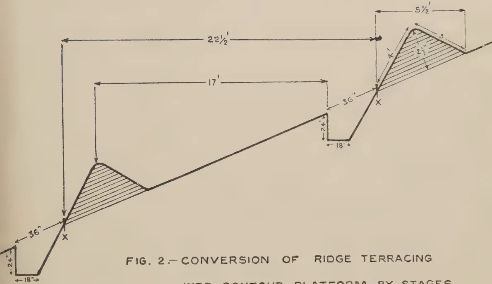
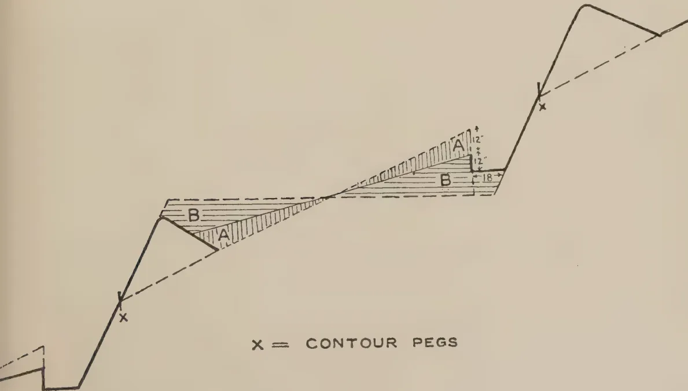

The  
Tropical Agriculturist

September, 1938

---

EDITORIAL

---

THE PRODUCTIVITY OF CEYLON PADDY SOILS

---

**I**N the absence of reliable statistics of production the average yield of paddy per acre in this country has become a controversial question. The most authoritative figures are found in the report of the Director of Statistics on the agricultural census of 1929 undertaken in pursuance of the proposals of the International Institute of Agriculture at Rome for a world agricultural census. The report gives the total area under paddy in each revenue district in the north-east monsoon season, south-west monsoon season, and the intermediate season respectively in 1929, as well as the average yield of paddy per acre in each district and season. A simple sum in arithmetic based on this data gives the average yield of paddy per acre in the Island in 1929 as :

<table><tr><td>South-west monsoon</td><td>..</td><td>..</td><td>16.47 bushels</td></tr><tr><td>North-east monsoon</td><td>..</td><td>..</td><td>17.65 ,,</td></tr><tr><td>The intermediate season</td><td>..</td><td>..</td><td>16.92 ,,</td></tr></table>

It must be noted that these are seasonal and not annual yields. When these figures are compared with those of other countries, the fact that a substantial part of the cultivated area carries two crops a year must not be overlooked. The Director of Statistics describes the method he adopted in carrying out the census : " The forms were issued to the revenue officers to be filled up by the village headmen and checked by their superior officers. One form was used for each village ", and proceeds to explain why the accuracy of the figures is doubtful : " The difficulties of measurement make it impossible to obtain exact figures, and methods of sampling require a considerable number of trained observers who are not available. In many cases the yields were only roughly estimated, as is evident from the fact that the detailed returns for different villages in certain tracts show the same average yield per acre, usually in round numbers. It is thought that the error is usually one of understatement ".

1------------------------------------------------

134

In a note on this subject published in this issue of *The Tropical Agriculturist*, Mr. M. Park, Acting Deputy Director (Agriculture), gives reasons for this assumption that there is an understatement. The most important of these reasons is the general prevalence amongst the peasants of a superstition that a true statement regarding a good harvest is the surest way of getting a succession of bad harvests thereafter. If he talks about his good fortune he courts the disfavour of unseen powers that control not only his eventual destiny but also the minor affairs of his life from day to day. Another reason only a little less important than the last is the absence of any standardized measure either of capacity or of area in common use amongst the peasantry. The area of a field is given in terms of the seed rate. The field will be two *pelas*, or two *kurunis*, or two *beras*, or two *amunams*, or two *marekkals* of paddy sowing extent : and its yield is always expressed as a multiple of the seed rate—so many times the seed sown. This peasant language is translated into the more universally understood bushels and acres according to a prescribed formula, and the seed rate is assumed to be two bushels to the acre. But there are two elements of error inherent in this method of conversion. The words *kuruni*, *pela*, &c. do not have the same meaning in all districts, and the seed rate varies considerably, being in some cases as much as five or six bushels to the acre.

Mr. Park works out the average yield on the paddy stations maintained by the Department of Agriculture. The area involved is over 200 acres and is therefore large enough to form the basis of the calculation. The area is representative of all districts and, above all, the figures of both acreage and yield are exact. The quality of the soils is often below the average for the district. For instance under the Iranamadu tank the paddy station is not located in the more fertile Kilinochchi area, but in sandy Paranthan. At Ambalantota the fields are in the lower somewhat water-logged saline area and the asweddumization of the fields has not been completed. At Doratiyawa it is a tank bed with very poor drainage that is cultivated, and at Nalanda an old plantain garden was recently converted into a paddy land. The standard of cultivation practised was only slightly above that of the peasant cultivator.

The average annual yield in these stations is found to be 44.9 bushels per acre. Even if an allowance of 50 per cent. is made for the slightly higher standard of cultivation adopted in the stations, the average is 30 bushels, which is not a figure with which the country should be satisfied, but which is not, in Mr. Park's words, so low as to make the standard of paddy cultivation in Ceylon an object of ridicule.

2------------------------------------------------

135

## PADDY MANURIAL AND CULTURAL EXPERIMENTS AT PARANTHAN PADDY STATION

W. R. C. PAUL, M.A., M.Sc., D.I.C., F.L.S., Dip. Agric. (Cantab.),

*ACTING PLANT PATHOLOGIST*

AND

A. W. R. JOACHIM, Ph.D., Dip. Agric. (Cantab),

*CHEMIST*

IN this paper are reported the results of three experiments which were laid down at the Paranthan Paddy Seed Station for the 1937-38 north-east monsoon (*Kalapokam*) season. The first was a solely manurial experiment while the other two were combined manurial and cultural experiments. They were all laid out on the randomized block design, the treatments being replicated in five blocks. Pure line *Vellai illankalayan* paddy was used, the seed being sown broadcast at the rate of 2 bushels per acre, except in the case of the transplanted plots of one of the experiments.

The soil was somewhat variable but was, generally, a greyish black sandy loam. The average annual rainfall at Paranthan is about 52 inches, most of which falls from October to December in the north-east monsoon. The crop was, however, irrigated at intervals varying from about 5 to 22 days depending on the rainfall and consequently on the amount of water retained in the plots.

The plot size was 1/80 acre, but omitting a border row of one foot all round, the yield records were based on an inner area of 1/100 acre. Each plot was provided with independent irrigation and drainage.

The preparatory tillage was as follows:—The soil was first ploughed with the Ceres plough and the plots were then constructed. Water was next admitted to cause flooding and decay of any weed growth. Three weeks later the plots were hoed with the mammoty, levelled with the hand levelling board and sown the same day. On account of the small size of the plots, the Burmese harrow could not be used.

The fertilizers were applied broadcast, earlier in the day on which sowing was done. The germination was good and the crop came up uniformly on all the plots. Three weeks prior to harvesting, the irrigation supply was cut off and a week later the plots were drained.

3—J. N. 1569 (7/38)

3------------------------------------------------

136

The experiments are considered separately.

### A. MANURIAL EXPERIMENT

The treatments adopted were as follows:—

1. 1. Nicifos 17/41 at 1 cwt. per acre.
2. 2. Cattle manure at 15 tons per acre.
3. 3. Cattle manure at 20 tons per acre.
4. 4. Green manure (*Calotropis gigantea* R. Br. T. erukkalai) at 5 cartloads (3½ tons) per acre.
5. 5. Control.

The land was ploughed on October 25, 1937, and the plots, with the necessary drainage and irrigation channels, constructed on October 29. The cattle and green manures were applied to the respective plots receiving these treatments the next day. On November 16, plots were hoed with the mammoty, levelled and sown after the application of the fertilizers. Harvesting was done on March 18, 1938, and threshing on March 29.

### RESULTS

In Table IA the yields of paddy per plot are indicated. Table IIA shows the analysis of variance, while in Table IIIA the mean yields in pounds per plot and bushels per acre are given.

TABLE IA

<table border="1">
<thead>
<tr>
<th colspan="2"></th>
<th colspan="5">Yields in quarter pounds per plot</th>
</tr>
<tr>
<th colspan="2"></th>
<th colspan="5">Treatments</th>
</tr>
<tr>
<th colspan="2"></th>
<th>1</th>
<th>2</th>
<th>3</th>
<th>4</th>
<th>5</th>
</tr>
</thead>
<tbody>
<tr>
<td>Block A</td>
<td>..</td>
<td>71</td>
<td>93</td>
<td>89</td>
<td>99</td>
<td>65</td>
</tr>
<tr>
<td>B</td>
<td>..</td>
<td>85</td>
<td>91</td>
<td>100</td>
<td>85</td>
<td>70</td>
</tr>
<tr>
<td>C</td>
<td>..</td>
<td>82</td>
<td>97</td>
<td>98</td>
<td>87</td>
<td>51</td>
</tr>
<tr>
<td>D</td>
<td>..</td>
<td>66</td>
<td>97</td>
<td>96</td>
<td>85</td>
<td>59</td>
</tr>
<tr>
<td>E</td>
<td>..</td>
<td>73</td>
<td>97</td>
<td>102</td>
<td>83</td>
<td>65</td>
</tr>
<tr>
<td>Total (¼ lb.)</td>
<td>..</td>
<td>377</td>
<td>475</td>
<td>485</td>
<td>439</td>
<td>310</td>
</tr>
<tr>
<td>lb. per plot</td>
<td>..</td>
<td>18.85</td>
<td>23.75</td>
<td>24.25</td>
<td>21.95</td>
<td>15.5</td>
</tr>
<tr>
<td colspan="7" style="text-align: right;">General mean = 20.86 lb.</td>
</tr>
</tbody>
</table>

TABLE IIA

<table border="1">
<thead>
<tr>
<th colspan="6">Analysis of variance</th>
</tr>
<tr>
<th></th>
<th>Degrees of freedom</th>
<th>Sum of Squares</th>
<th>Mean Square</th>
<th>Standard error</th>
<th></th>
</tr>
</thead>
<tbody>
<tr>
<td>Blocks</td>
<td>.. 4 ..</td>
<td>81.0</td>
<td></td>
<td></td>
<td></td>
</tr>
<tr>
<td>Treatments</td>
<td>.. 4 ..</td>
<td>4304.2</td>
<td>1076.05</td>
<td></td>
<td></td>
</tr>
<tr>
<td>Error</td>
<td>.. 16 ..</td>
<td>677.0</td>
<td>42.3</td>
<td>.. 6.50</td>
<td></td>
</tr>
<tr>
<td>Total</td>
<td>.. 24 ..</td>
<td>5062.2</td>
<td></td>
<td></td>
<td></td>
</tr>
<tr>
<td colspan="6">F (calc.) = 6.36</td>
</tr>
<tr>
<td colspan="6">F (sig.) = 4.77 for P = .01</td>
</tr>
</tbody>
</table>

∴ treatments are definitely significant.

4------------------------------------------------

137TABLE IIIA

<table border="1">
<thead>
<tr>
<th rowspan="2">Treatment</th>
<th colspan="2">Mean</th>
</tr>
<tr>
<th>lb. per plot</th>
<th>Bushels per acre</th>
</tr>
</thead>
<tbody>
<tr>
<td>1. Nicifos 17/41 1 cwt./acre</td>
<td>.. 18.85 ..</td>
<td>41.9</td>
</tr>
<tr>
<td>2. Cattle manure 15 tons/acre</td>
<td>.. 23.75 ..</td>
<td>52.8</td>
</tr>
<tr>
<td>3. Cattle manure 20 tons/acre</td>
<td>.. 24.25 ..</td>
<td>53.9</td>
</tr>
<tr>
<td>4. Green manure <math>3\frac{1}{2}</math> tons/acre</td>
<td>.. 21.95 ..</td>
<td>48.8</td>
</tr>
<tr>
<td>5. Control ..</td>
<td>.. 15.50 ..</td>
<td>34.4</td>
</tr>
<tr>
<td>Mean ..</td>
<td>.. 20.86 ..</td>
<td>46.4</td>
</tr>
<tr>
<td>Standard error ..</td>
<td>.. .73 ..</td>
<td>1.62</td>
</tr>
<tr>
<td>Significant difference—</td>
<td></td>
<td></td>
</tr>
<tr>
<td>P = .05 ..</td>
<td>.. 2.19 ..</td>
<td>4.86</td>
</tr>
<tr>
<td>P = .01 ..</td>
<td>.. 3.02 ..</td>
<td>6.70</td>
</tr>
</tbody>
</table>

DISCUSSION

An examination of the tables indicate that :—

(1) All the manurial treatments give significantly higher yields than the control. The lowest increased yield is 7.5 bushels per acre from Nicifos 17/41 and the highest 9.5 bushels from cattle manure at 20 tons per acre.

(2) Cattle manure at 15 and 20 tons per acre respectively and green manure at  $3\frac{1}{2}$  tons per acre are definitely superior to Nicifos 17/41 at 1 cwt. per acre, the yield differences varying from nearly 7 bushels in the case of green manure to 12 bushels with cattle manure at 20 tons per acre. There is, however, no significant difference in yields between plots receiving cattle manure at 20 tons and 15 tons per acre respectively. Cattle manure at 20 tons per acre is slightly superior to green manure at  $3\frac{1}{2}$  tons per acre.

(3) If cattle manure is valued at Rs. 2 a ton or Re. 1 a cartload and the cost of collecting  $3\frac{1}{2}$  tons or 5 cartloads of green leaves from outside and transporting it to the field is less than the cost of purchasing and transporting cattle manure from outside, then it would be more profitable to adopt green manuring under the conditions of this experiment. If, however, penning of cattle is practised with sufficient numbers to give, over a certain period, an equivalent amount of manure as used in this experiment, then it might be more advantageous to adopt this system. Further trials might be carried out to compare the effects of ploughing in certain green manures *in situ* as against an application of cattle manure at 10 or 15 tons per acre.

5------------------------------------------------

138

### B. MANURIAL AND CULTURAL EXPERIMENT

The object of this experiment was to compare the effects of certain fertilizer treatments on paddy with and without weeding. The following were the treatments:—

#### Manurial—

1. 1. Nicifos 17/41 at 1 cwt. per acre.
2. 2. Nicifos 22/18 at 1 cwt. per acre.
3. 3. Steamed bone meal at 2 cwt. per acre.
4. 4. Control.

#### Cultural—

A. Weeding with the hand levelling board when the seedlings were about one month old.

B. No weeding.

Each fertilizer treatment was combined with each of the two cultural treatments. Sunn hemp was previously sown at the rate of 80 lb. per acre on August 7, 1937, over the whole area and the crop ploughed under the Ceres plough on October 21. The field was then flooded to allow the sunn hemp to decay. On November 6, the plots were demarcated with the necessary drainage and irrigation channels. Mammotying, levelling and sowing after the application of the fertilizers were done on November 17. The hand levelling board for the control of weeds was used as follows:—The plots were flooded when the paddy was about a month old, and the board pushed over the paddy and weeds pressing them down firmly over the surface of the soil. On the next day the paddy stems rose above the level of the water while the weeds remained below. By keeping the plots flooded for about a week, the weeds rot away.

### RESULTS

The results of this experiment are presented in Tables IB to IVB, Table IB showing the yields per plot, Table IIB the analysis of variance, Table IIIB the mean yields in lb. per plot and bushels per acre, and Table IVB the mean yields from the cultural treatments.

TABLE IB

Yields in lb. per plot  
Treatments

<table border="1">
<thead>
<tr>
<th rowspan="2"></th>
<th colspan="4">Weeding</th>
<th colspan="4">No Weeding</th>
</tr>
<tr>
<th>1</th>
<th>2</th>
<th>3</th>
<th>4</th>
<th>1</th>
<th>2</th>
<th>3</th>
<th>4</th>
</tr>
</thead>
<tbody>
<tr>
<td>Block A ..</td>
<td>20.5..</td>
<td>25.5..</td>
<td>23.9..</td>
<td>20.9</td>
<td>21.9..</td>
<td>26.9..</td>
<td>23.4..</td>
<td>19.5</td>
</tr>
<tr>
<td>  " B ..</td>
<td>25.6..</td>
<td>22.0..</td>
<td>19.1..</td>
<td>18.8..</td>
<td>27.1..</td>
<td>20.0..</td>
<td>20.0..</td>
<td>16.4</td>
</tr>
<tr>
<td>  " C ..</td>
<td>23.1..</td>
<td>23.1..</td>
<td>20.2..</td>
<td>15.3..</td>
<td>20.2..</td>
<td>14.9..</td>
<td>14.9..</td>
<td>15.8</td>
</tr>
<tr>
<td>  " D ..</td>
<td>21.1..</td>
<td>17.9..</td>
<td>18.5..</td>
<td>18.6..</td>
<td>17.8..</td>
<td>20.5..</td>
<td>15.5..</td>
<td>12.8</td>
</tr>
<tr>
<td>  " E ..</td>
<td>16.4..</td>
<td>15.5..</td>
<td>16.4..</td>
<td>14.6..</td>
<td>18.6..</td>
<td>17.0..</td>
<td>17.0..</td>
<td>16.4</td>
</tr>
<tr>
<td>Total ..</td>
<td>106.7</td>
<td>104.0</td>
<td>98.1</td>
<td>88.2</td>
<td>105.6</td>
<td>99.3</td>
<td>90.8</td>
<td>80.9</td>
</tr>
<tr>
<td colspan="9" style="text-align: right;">General mean = 19.34</td>
</tr>
</tbody>
</table>

6------------------------------------------------

139TABLE IIBAnalysis of variance

<table border="1">
<thead>
<tr>
<th></th>
<th>Degrees of freedom</th>
<th>Sum of squares</th>
<th>Mean square</th>
</tr>
</thead>
<tbody>
<tr>
<td>Blocks ..</td>
<td>4</td>
<td>211.7</td>
<td></td>
</tr>
<tr>
<td>Manurial treatments ..</td>
<td>3</td>
<td>85.4</td>
<td>28.5</td>
</tr>
<tr>
<td>Cultural ..</td>
<td>1</td>
<td>10.4</td>
<td>10.4</td>
</tr>
<tr>
<td>Interaction ..</td>
<td>3</td>
<td>23.8</td>
<td>7.9</td>
</tr>
<tr>
<td>Error ..</td>
<td>28</td>
<td>154.1</td>
<td>5.5</td>
</tr>
<tr>
<td></td>
<td>39</td>
<td>485.4</td>
<td></td>
</tr>
</tbody>
</table>

Manurial Treatments  $F(\text{calc.}) = 5.2$

$F(\text{sig.})$  for  $P = .01$  is 4.57

∴ manurial differences are significant.

Cultural Treatments  $F(\text{calc.}) = 1.9$

$F(\text{sig.})$  for  $P = .05$  is 4.2

∴ cultural treatments are not significant.

TABLE IIIB

<table border="1">
<thead>
<tr>
<th rowspan="2">Treatment</th>
<th rowspan="2">Weeding lb. per plot</th>
<th rowspan="2">No weeding</th>
<th colspan="2">Mean</th>
</tr>
<tr>
<th>lb. per plot</th>
<th>Bushels per acre</th>
</tr>
</thead>
<tbody>
<tr>
<td>Nicifos 17/41 ..</td>
<td>21.34</td>
<td>21.12</td>
<td>21.23</td>
<td>47.2</td>
</tr>
<tr>
<td>Nicifos 22/18 ..</td>
<td>20.80</td>
<td>19.86</td>
<td>20.33</td>
<td>45.2</td>
</tr>
<tr>
<td>Bone meal ..</td>
<td>19.62</td>
<td>18.16</td>
<td>18.89</td>
<td>42.0</td>
</tr>
<tr>
<td>Control ..</td>
<td>17.64</td>
<td>16.18</td>
<td>16.91</td>
<td>37.6</td>
</tr>
<tr>
<td>Mean ..</td>
<td>19.85</td>
<td>18.83</td>
<td>19.34</td>
<td>43.0</td>
</tr>
<tr>
<td>Standard error ..</td>
<td>1.05</td>
<td></td>
<td>0.74</td>
<td></td>
</tr>
<tr>
<td>Significant difference</td>
<td></td>
<td></td>
<td></td>
<td></td>
</tr>
<tr>
<td><math>P = .05</math></td>
<td></td>
<td>3.04</td>
<td>2.15</td>
<td>4.78</td>
</tr>
<tr>
<td><math>P = .01</math></td>
<td></td>
<td>4.10</td>
<td>2.90</td>
<td>6.44</td>
</tr>
</tbody>
</table>

TABLE IVB

<table border="1">
<thead>
<tr>
<th>Treatment</th>
<th>lb. per plot</th>
<th>Bushels per acre</th>
</tr>
</thead>
<tbody>
<tr>
<td>Weeding ..</td>
<td>19.85</td>
<td>44.1</td>
</tr>
<tr>
<td>No weeding ..</td>
<td>18.83</td>
<td>41.9</td>
</tr>
<tr>
<td>Mean ..</td>
<td>19.34</td>
<td>43.0</td>
</tr>
<tr>
<td>Standard error ..</td>
<td>0.52</td>
<td>1.16</td>
</tr>
<tr>
<td>Significant difference—</td>
<td></td>
<td></td>
</tr>
<tr>
<td><math>P = .05</math></td>
<td>1.52</td>
<td>3.38</td>
</tr>
<tr>
<td><math>P = .01</math></td>
<td>2.05</td>
<td>4.50</td>
</tr>
</tbody>
</table>

DISCUSSION

From the above tables, it will be noted that:—

(1) Among the manurial treatments, very significant yield increases are given by both grades of Nicifos. The increases vary from 7.6 bushels per acre in the case of Nicifos 22/18 to 9.6 bushels with Nicifos 17/41.

(2) The differences in average yield between plots treated with the two grades of Nicifos is not, however, significant and for these soils the cheaper form of Nicifos 22/18 is recommended.

7------------------------------------------------

140

(3) Bone meal gives an average increase in yield of 4.4 bushels which is very nearly but not quite statistically significant. It appears evident that bone meal alone is not a satisfactory fertilizer for paddy on these soils.

(4) Weeding with the hand levelling board produces no significant increase in yield, under the conditions of this experiment. It is, however, possible that as the plots were small in size, better control of water was obtained than in the case of large plots and weed growth was negligible. The effect of weeding on small plots would, therefore, not be as apparent as in the case of large plots where the soil would not be as level and water control would be more difficult.

### C. MANURIAL AND CULTURAL EXPERIMENT

This experiment was designed to determine the differential response of manures on transplanted and broadcast paddy respectively. The treatments were as follows :—

#### *Manurial*—

1. 1. Nicifos 17/41 at 1 cwt. per acre.
2. 2. Nicifos 22/18 at 1 cwt per acre.
3. 3. Steamed bone meal at 2 cwt. per acre and green manure (*Thespesia populnea* Soland. T. *puararasu*) at 2 tons per acre.
4. 4. Control.

#### *Cultural*—

1. A. Broadcasting.
2. B. Transplanting.

Each fertilizer treatment was combined with each of the two cultural treatments. All plots were hoed with the mammoty on October 24, 1937, and flooded soon afterwards.

The nursery for raising seedlings for the transplanted plots was sown on October 27, at the rate of 3 bushels per acre. The green manure was applied the same day on those plots in which steamed bone meal and green manure were to be used. Water was let in soon afterwards to allow the green manure to decay. The broadcasted plots were hoed again, levelled and sown, after application of the fertilizers, on November 11. The transplanted plots were prepared in the same way and seedlings planted from the nursery on November 28 and 29. In general, the transplanted seedlings appeared more vigorous than those which were broadcast but unfortunately an attack of stem borer (*Schoenobius bipunctifer* Wlk.) on the transplanted plots caused considerable loss of plants from about the end of January, 1938.

8------------------------------------------------

141

The number of plants affected by stem borer in the plots which were transplanted and broadcasted on the dates on which flowering took place in each case is given below :—

<table border="1">
<thead>
<tr>
<th></th>
<th></th>
<th>Transplanted observed on 29.1.38</th>
<th>Broadcasted observed on 4.2.38</th>
</tr>
</thead>
<tbody>
<tr>
<td>Nicifos 17/41</td>
<td>..</td>
<td>177</td>
<td>37</td>
</tr>
<tr>
<td>Nicifos 22/18</td>
<td>..</td>
<td>187</td>
<td>36</td>
</tr>
<tr>
<td>Steamed bone meal and green manure</td>
<td>..</td>
<td>159</td>
<td>41</td>
</tr>
<tr>
<td>Control</td>
<td>..</td>
<td>174</td>
<td>38</td>
</tr>
<tr>
<td></td>
<td></td>
<td>697</td>
<td>152</td>
</tr>
</tbody>
</table>

The transplanted plots were harvested on March 7, 1938, and the broadcasted on March 11, threshing being done on March 15 and 16 for the transplanted and broadcasted plots respectively.

### RESULTS

The results are furnished in Tables I. to IVc. In Table Ic are shown the yields per plot, in Table IIc, the analysis of variance, in Table IIIc the mean yield in lb. per plot and bushels per acre and in Table IVc the yields of the cultural treatments.

TABLE Ic

#### Yields in quarter pounds per plot Treatments

<table border="1">
<thead>
<tr>
<th rowspan="2"></th>
<th colspan="2">1</th>
<th colspan="2">2</th>
<th colspan="2">3</th>
<th colspan="2">4</th>
</tr>
<tr>
<th>T</th>
<th>B</th>
<th>T</th>
<th>B</th>
<th>T</th>
<th>B</th>
<th>T</th>
<th>B</th>
</tr>
</thead>
<tbody>
<tr>
<td>Block A</td>
<td>.. 64 ..</td>
<td>58 ..</td>
<td>82 ..</td>
<td>66 ..</td>
<td>69 ..</td>
<td>76 ..</td>
<td>49 ..</td>
<td>55</td>
</tr>
<tr>
<td>B</td>
<td>.. 61 ..</td>
<td>58 ..</td>
<td>68 ..</td>
<td>60 ..</td>
<td>69 ..</td>
<td>80 ..</td>
<td>46 ..</td>
<td>46</td>
</tr>
<tr>
<td>C</td>
<td>.. 85 ..</td>
<td>56 ..</td>
<td>48 ..</td>
<td>48 ..</td>
<td>90 ..</td>
<td>72 ..</td>
<td>43 ..</td>
<td>64</td>
</tr>
<tr>
<td>D</td>
<td>.. 58 ..</td>
<td>65 ..</td>
<td>60 ..</td>
<td>68 ..</td>
<td>72 ..</td>
<td>65 ..</td>
<td>38 ..</td>
<td>41</td>
</tr>
<tr>
<td>E</td>
<td>.. 65 ..</td>
<td>53 ..</td>
<td>35 ..</td>
<td>48 ..</td>
<td>69 ..</td>
<td>76 ..</td>
<td>44 ..</td>
<td>45</td>
</tr>
<tr>
<td>Total (<math>\frac{1}{4}</math> lb.)</td>
<td>333</td>
<td>290</td>
<td>293</td>
<td>290</td>
<td>369</td>
<td>369</td>
<td>220</td>
<td>251</td>
</tr>
<tr>
<td>Mean (lb. per plot)</td>
<td>..16.65..</td>
<td>14.5</td>
<td>..14.65..</td>
<td>14.5</td>
<td>..18.45..</td>
<td>18.45</td>
<td>..11.0</td>
<td>..12.55</td>
</tr>
</tbody>
</table>

General mean = 15.09 lb.

T=transplanted ; B=Broadcasted.

TABLE IIc

#### Analysis of Variance

<table border="1">
<thead>
<tr>
<th></th>
<th>Degrees of freedom</th>
<th>Sum of squares</th>
<th>Mean square</th>
</tr>
</thead>
<tbody>
<tr>
<td>Blocks</td>
<td>.. 4 ..</td>
<td>551.25</td>
<td>.. 137.81</td>
</tr>
<tr>
<td>Cultural treatments</td>
<td>.. 1 ..</td>
<td>5.625</td>
<td>.. 5.625</td>
</tr>
<tr>
<td>Manurial treatments</td>
<td>.. 3 ..</td>
<td>3644.675</td>
<td>.. 1214.89</td>
</tr>
<tr>
<td>Interaction :</td>
<td></td>
<td></td>
<td></td>
</tr>
<tr>
<td>    Cultural treatments and manurial     treatments</td>
<td>.. 3 ..</td>
<td>287.525</td>
<td>.. 95.84</td>
</tr>
<tr>
<td>Error</td>
<td>.. 28 ..</td>
<td>2521.92</td>
<td>.. 90.07</td>
</tr>
<tr>
<td></td>
<td>39</td>
<td>7010.995</td>
<td></td>
</tr>
</tbody>
</table>

9------------------------------------------------

142*Manurial Treatments—*

F (calc.) = 13.5

F (sig.) = 4.57 for P = .01

∴ manurial treatments are definitely significant.

Cultural treatments and interaction are not significant.

TABLE IIIc

<table border="1">
<thead>
<tr>
<th rowspan="2">Treatment</th>
<th rowspan="2">Transplanted lb. per plot</th>
<th rowspan="2">Broadcast</th>
<th colspan="2">Mean</th>
</tr>
<tr>
<th>lb. per plot</th>
<th>Bushels per acre</th>
</tr>
</thead>
<tbody>
<tr>
<td>1. Nicifos 17/41 ..</td>
<td>16.65 ..</td>
<td>14.5 ..</td>
<td>15.58 ..</td>
<td>34.6</td>
</tr>
<tr>
<td>2. Nicifos 22/18 ..</td>
<td>14.65 ..</td>
<td>14.5 ..</td>
<td>14.58 ..</td>
<td>32.4</td>
</tr>
<tr>
<td>3. Steamed bone meal + green manure ..</td>
<td>18.45 ..</td>
<td>18.45 ..</td>
<td>18.45 ..</td>
<td>41.0</td>
</tr>
<tr>
<td>4. Control ..</td>
<td>11.0 ..</td>
<td>12.55 ..</td>
<td>11.76 ..</td>
<td>26.2</td>
</tr>
<tr>
<td>Mean ..</td>
<td>15.19 ..</td>
<td>15.60 ..</td>
<td>15.09 ..</td>
<td>33.5</td>
</tr>
<tr>
<td>Standard error ..</td>
<td></td>
<td>1.06 ..</td>
<td>0.75 ..</td>
<td>1.56</td>
</tr>
<tr>
<td>Significant P = .05 ..</td>
<td></td>
<td>3.07 ..</td>
<td>2.17 ..</td>
<td>4.82</td>
</tr>
<tr>
<td>difference P = .01 ..</td>
<td></td>
<td>4.15 ..</td>
<td>2.93 ..</td>
<td>6.50</td>
</tr>
</tbody>
</table>

TABLE IVc

<table border="1">
<thead>
<tr>
<th rowspan="2"></th>
<th colspan="2">Mean</th>
</tr>
<tr>
<th>lb. per plot</th>
<th>Bushels per acre</th>
</tr>
</thead>
<tbody>
<tr>
<td>Broadcasting ..</td>
<td>15.19 ..</td>
<td>33.8</td>
</tr>
<tr>
<td>Transplanting ..</td>
<td>15.00 ..</td>
<td>33.3</td>
</tr>
<tr>
<td>Mean ..</td>
<td>15.09 ..</td>
<td>33.5</td>
</tr>
<tr>
<td>Standard error ..</td>
<td>.53 ..</td>
<td>1.18</td>
</tr>
<tr>
<td>Significant difference— P = .05 ..</td>
<td>1.53 ..</td>
<td>2.41</td>
</tr>
</tbody>
</table>

DISCUSSION

The data indicate that :—

(1) All the manurial treatments give significantly higher yields than the control. The highest increase yield (14.8 bushels) is obtained with steamed bone meal and green manure at 2 tons per acre. Nicifos 17/41 and Nicifos 22/18 give respectively 8.4 and 6.2 bushels more than the control.

(2) Narrow and wide ratio Nicifos are equally effective in increasing yields, the average yield difference between the plots treated with the two fertilizers not being significant.

(3) There are no yield differences between the transplanted and broadcasted plots, but it is possible that the incidence of stem borer has had a considerable effect in reducing the yield of the transplanted plots.

GENERAL DISCUSSION AND SUMMARY

The results of these three experiments at Paranthan during the 1937-38 north-east monsoon indicate that paddy yields could be significantly increased by manuring. Of artificial fertilizers, both forms of Nicifos appear equally effective in

10------------------------------------------------

143

increasing yields, the increase being on the average between 7 and 8 bushels per acre. In view of the higher cost of the wide ratio Nicifos, it would appear more profitable to use the narrow ratio (22/18) grade of this fertilizer for paddy on these soils. Bone meal applied alone is of little immediate advantage in increasing yields on these light loams. The trials do, however, point to the need for organic manures on the Paranthan soils. In every instance where green manure or cattle manure was used significant increases in yield were obtained. Green manuring appears, however, to be a cheaper and relatively more efficient means of increasing yields than cattle manuring, when both manures are procured from outside and applied on the land. Applications of cattle manure higher than 10 tons per acre appear uneconomic. There is, however, every likelihood that if the practice of penning cattle in sufficient numbers to give equivalent quantities of cattle manure as used in this experiment is adopted, profitable increases can be expected.

There appears to be no advantage in transplanting a four months paddy at Paranthan, nor does weeding with the hand levelling board effect any significant increase in crop yield under the conditions of this experiment. On large areas, however, the results may possibly be different as the conditions for the test of cultural treatments would appear to be more favourable when the areas under trial are extensive.

#### ACKNOWLEDGMENT

Thanks are due to Mr. S. K. Thuraisingham, Agricultural Officer, Grade II, Jaffna, and the Farm Manager, Paranthan Paddy Seed Station, for their assistance in carrying out these trials.

11------------------------------------------------

144

## THE EFFECTS OF INCREASING QUANTITIES OF CATTLE MANURE ON PADDY

---

A. W. R. JOACHIM, Ph.D., Dip. Agric. (Cantab.),  
CHEMIST,

W. R. C. Paul, M.A., M.Sc., D.I.C., Dip. Agric. (Cantab.),  
ACTING PLANT PATHOLOGIST

AND

G. V. WICKREMASEKERA, Dip. Agric. (Poona),  
A.I.C.T.A. (Trinidad),  
ACTING PADDY OFFICER

---

THERE is a general belief among paddy cultivators in certain parts of the dry zone that the use of cattle manure on their paddy fields results in excessive vegetative growth with lodging and consequently in a poor yield of grain. In order to test this contention and to determine the optimum quantity of cattle manure for paddy a series of trials was laid down at certain experiment stations with the collaboration of the respective Divisional Officers during the 1936-37 north-east monsoon (*maha* or *kalapokam*). The centres chosen were Paranthan, Peradeniya, Ambalantota, Vavuniya, Minneriya, and Nalanda stations. The same experimental design was adopted at all but the last centre where, owing to the particular topography of the area, a modified plan had to be followed. It was intended to continue the trials during the subsequent south-west monsoon season (*yala* or *siropokam*) to ascertain the residual effects of the manure, but, for various reasons, principally the lack of irrigation facilities, this was possible only at Paranthan, Peradeniya, and Minneriya. Owing to unfortunate circumstances such as unseasonable rains, flooding, and uneven irrigation, &c., statistically significant results were only obtained at the first two centres. It was therefore decided to limit the scope of this article to the presentation and discussion of the data from these two stations.

12------------------------------------------------

<!-- stage4: FAINT old-images-only -->

[Faint page: no legible print of its own could be verified; text withheld (stage 4 review list)]

This image is a scan of a blank page. The paper has a light beige or cream-colored tint. There are a few very small, dark specks scattered across the surface, which appear to be scanning artifacts or dust particles. No text, lines, or other markings are present on the page.

13------------------------------------------------

PADDY CATTLE MANURE TRIALS  
MAHA 1936 — YALA 1937

<table border="1">
<thead>
<tr>
<th>Tons Cattle Manure per Acre</th>
<th>Peradeniya (Maha 1936)</th>
<th>Paranthan (Maha 1936)</th>
<th>Paranthan (Yala 1936)</th>
<th>Peradeniya (Yala 1937)</th>
</tr>
</thead>
<tbody>
<tr>
<td>0</td>
<td>40</td>
<td>40</td>
<td>40</td>
<td>20</td>
</tr>
<tr>
<td>5</td>
<td>50</td>
<td>38</td>
<td>38</td>
<td>20</td>
</tr>
<tr>
<td>10</td>
<td>55</td>
<td>35</td>
<td>35</td>
<td>20</td>
</tr>
<tr>
<td>15</td>
<td>60</td>
<td>32</td>
<td>32</td>
<td>20</td>
</tr>
</tbody>
</table>

Block by Survey Dept. Ceylon. 14.9.38.

FIG. 1.

14------------------------------------------------

145SCHEME OF TRIALS

Manurial Treatments : Control, 5 tons, 10 tons, and 15 tons of cattle manure per acre.

Experimental Design : 6 randomized blocks each containing 4 plots of 1.80th acre extent. A border of 1 ft. was retained for allowing a nett harvesting area of 1/100 acre. Internal dimensions of plots 24'  $\times$  22'. Area harvested 22'  $\times$  20'. Each plot was separately irrigated.

Planting Details : (1) Transplanting or broadcasting according to the local practice. Except at Peradeniya, however, seed was sown broadcast.

(2) Pure line seed was used in every case. At Paranthan, *Vellai illankalayan* for *kalapokam* and *pachchaiperumal* for *siropokam* were sown, while at Peradeniya, B—11 was grown for *maha* and *vellai illankalayan* for *yala*.

(3) The cattle manure was applied at the first ploughing or cultivation.

Records, &c. : (1) Observations were made on approximate rates of growth of crop in the plots, tillering, disease and pests, lodging, &c.

(2) The crop from each plot was harvested, threshed and weighed separately.

(3) A sample of the cattle manure used at each station was analysed.

RESULTS

The results of the trials at Paranthan and Peradeniya stations will be considered separately and then discussed in general.

PARANTHAN

The soil at Paranthan is a gray brown light sandy loam poor in organic matter, nitrogen and replaceable bases and acidic in reaction. The cattle manure used in the trial showed the following analysis :—

<table>
<thead>
<tr>
<th></th>
<th>Per Cent.</th>
<th></th>
<th>Per Cent.</th>
</tr>
</thead>
<tbody>
<tr>
<td>Moisture</td>
<td>.. 56.64</td>
<td>Ash and sand</td>
<td>.. 25.61</td>
</tr>
<tr>
<td>Organic matter</td>
<td>.. 17.75</td>
<td>Nitrogen</td>
<td>.. 0.575</td>
</tr>
</tbody>
</table>

The quantities of nitrogen supplied by 5, 10, and 15 tons of the manure per acre worked out, therefore, at 64.4, 128.8, and 193.2 per acre respectively.

The results are presented in Tables I-IVA and shown graphically in Figure I. Tables IA and IIIA show the yields per plot obtained from the 1936-37 *kalapokam* and the 1937 *siropokam* crops respectively. In Tables IIA and IVA the analyses of variance are given.

15------------------------------------------------

146

**TABLE I A**  
**Paranthan Cattle Manurial Trials**  
**Kalapokam 1936**  
**Yields in lb. per plot**

<table border="1">
<thead>
<tr>
<th rowspan="2"></th>
<th rowspan="2"></th>
<th colspan="4">Treatments</th>
<th rowspan="2">Total</th>
</tr>
<tr>
<th>Control</th>
<th>C.M. 5 tons/acre</th>
<th>C.M. 10 tons/acre</th>
<th>C.M. 15 tons/acre</th>
</tr>
</thead>
<tbody>
<tr>
<td rowspan="6">Blocks</td>
<td>A</td>
<td>13.5</td>
<td>15.0</td>
<td>20</td>
<td>22.5</td>
<td>71.0</td>
</tr>
<tr>
<td>B</td>
<td>12.0</td>
<td>16.5</td>
<td>18</td>
<td>18.5</td>
<td>65.0</td>
</tr>
<tr>
<td>C</td>
<td>18.0</td>
<td>19.0</td>
<td>17</td>
<td>19.0</td>
<td>73.0</td>
</tr>
<tr>
<td>D</td>
<td>15.25</td>
<td>18.75</td>
<td>18.75</td>
<td>19.75</td>
<td>72.5</td>
</tr>
<tr>
<td>E</td>
<td>17.0</td>
<td>14.0</td>
<td>21.0</td>
<td>26.0</td>
<td>78.0</td>
</tr>
<tr>
<td>F</td>
<td>15.0</td>
<td>17.5</td>
<td>16.0</td>
<td>18.0</td>
<td>66.5</td>
</tr>
<tr>
<td></td>
<td></td>
<td>90.75</td>
<td>100.75</td>
<td>110.75</td>
<td>123.75</td>
<td>426.0</td>
</tr>
<tr>
<td>Mean</td>
<td></td>
<td>15.12</td>
<td>16.79</td>
<td>18.45</td>
<td>20.62</td>
<td>17.75</td>
</tr>
<tr>
<td>% of mean</td>
<td></td>
<td>85.2</td>
<td>94.6</td>
<td>104.0</td>
<td>116.2</td>
<td>100.0</td>
</tr>
<tr>
<td>Bushels per acre</td>
<td></td>
<td>31.5</td>
<td>35.0</td>
<td>38.45</td>
<td>42.95</td>
<td>36.98</td>
</tr>
</tbody>
</table>

**TABLE II A**  
**Analysis of Variance**

<table border="1">
<thead>
<tr>
<th></th>
<th>Degrees of Freedom</th>
<th>Sum of Squares</th>
<th>Variance</th>
<th><math>\frac{1}{2} \log_e</math> variance</th>
</tr>
</thead>
<tbody>
<tr>
<td>Blocks</td>
<td>5</td>
<td>446.0</td>
<td>89.2</td>
<td></td>
</tr>
<tr>
<td>Treatments</td>
<td>3</td>
<td>1,591.33</td>
<td>530.44</td>
<td>1.985</td>
</tr>
<tr>
<td>Error</td>
<td>15</td>
<td>1,298.67</td>
<td>86.58</td>
<td>1.079</td>
</tr>
<tr>
<td></td>
<td>23</td>
<td>3,336.0</td>
<td></td>
<td></td>
</tr>
</tbody>
</table>

Z (calc.) = .906

Z (sig.) P = .05 = .5950

P = .01 = .8448

Results are definitely significant.

Standard error per plot = 2.326 lb.

Significant difference for :—

P = .05 is 2.87 lb. or 16.1 % or 5.97 bushels.

P = .01 is 3.96 lb. or 22.3 % or 8.24 bushels.

**TABLE III A**  
**Paranthan Cattle Manurial Trials**  
**Sirupokam 1937**  
**Yields in lb. per plot**

<table border="1">
<thead>
<tr>
<th rowspan="2"></th>
<th rowspan="2"></th>
<th colspan="4">Treatments</th>
<th rowspan="2">Total</th>
</tr>
<tr>
<th>Control</th>
<th>C.M. 5 tons/acre</th>
<th>C.M. 10 tons/acre</th>
<th>C.M. 15 tons/acre</th>
</tr>
</thead>
<tbody>
<tr>
<td rowspan="6">Blocks</td>
<td>A</td>
<td>14.50</td>
<td>16.62</td>
<td>20.00</td>
<td>24.75</td>
<td>75.87</td>
</tr>
<tr>
<td>B</td>
<td>13.50</td>
<td>15.00</td>
<td>22.12</td>
<td>21.18</td>
<td>71.80</td>
</tr>
<tr>
<td>C</td>
<td>18.00</td>
<td>15.37</td>
<td>19.00</td>
<td>18.62</td>
<td>70.99</td>
</tr>
<tr>
<td>D</td>
<td>14.50</td>
<td>17.50</td>
<td>20.25</td>
<td>21.25</td>
<td>73.50</td>
</tr>
<tr>
<td>E</td>
<td>17.50</td>
<td>15.75</td>
<td>22.50</td>
<td>26.87</td>
<td>82.62</td>
</tr>
<tr>
<td>F</td>
<td>15.37</td>
<td>16.00</td>
<td>12.62</td>
<td>14.75</td>
<td>58.74</td>
</tr>
<tr>
<td></td>
<td></td>
<td>93.37</td>
<td>96.24</td>
<td>116.49</td>
<td>127.42</td>
<td>433.52</td>
</tr>
<tr>
<td>Mean</td>
<td></td>
<td>15.56</td>
<td>16.04</td>
<td>19.41</td>
<td>21.24</td>
<td>18.06</td>
</tr>
<tr>
<td>% of mean</td>
<td></td>
<td>86.15</td>
<td>88.82</td>
<td>107.40</td>
<td>117.60</td>
<td>100.0</td>
</tr>
<tr>
<td>Bushels per acre</td>
<td></td>
<td>32.42</td>
<td>33.42</td>
<td>40.44</td>
<td>44.25</td>
<td>37.63</td>
</tr>
</tbody>
</table>

16------------------------------------------------

147TABLE IV AAnalysis of Variance

<table border="1">
<thead>
<tr>
<th></th>
<th>Degrees of Freedom</th>
<th>Sum of squares</th>
<th>Variance</th>
<th><math>\frac{1}{2}</math> loge variance</th>
</tr>
</thead>
<tbody>
<tr>
<td>Blocks</td>
<td>.. 5</td>
<td>.. 76.628 ..</td>
<td>15.32</td>
<td></td>
</tr>
<tr>
<td>Treatments</td>
<td>.. 3</td>
<td>.. 133.495 ..</td>
<td>44.50</td>
<td>.. 1.896</td>
</tr>
<tr>
<td>Error</td>
<td>.. 15</td>
<td>.. 100.923 ..</td>
<td>6.72</td>
<td>.. 0.953</td>
</tr>
<tr>
<td></td>
<td>23</td>
<td>311.046</td>
<td></td>
<td></td>
</tr>
</tbody>
</table>

$Z$  (calc.) = .9430

$Z$  (sig.)  $P = .05 = .5950$

$P = .01 = .8448$

Results are definitely significant.

Standard error per plot = 2.593 lb.

Significant difference for :—

$P = .05$  is 3.19 lb. or 17.7 % or 6.65 bushels.

$P = .01$  is 4.41 lb. or 24.4 % or 9.25 bushels.

DISCUSSION

An examination of the data indicates that—

(i) An application of 5 tons of cattle manure produced no significant increase in yield in either season, but at 10 tons per acre significant increases in yield of 7 to 8 bushels per acre or 0.7 to 0.8 bushels per ton of cattle manure per acre each season were obtained. The residual value of the cattle manure on Paranthan soils proved to be high.

(ii) When the application was increased from 10 to 15 tons per acre there was no further significant increase though the rate of crop increase per unit increment of cattle manure was generally maintained. This is apparent from the graph shown in Figure I.

(iii) There were no ill effects on paddy, as were supposed by certain cultivators, through the use of cattle manure even at the highest rate of 15 tons per acre. An application of 10 tons of cattle manure per acre appears to be the optimum dressing at Paranthan from the standpoint of yield alone. It is however, doubtful whether the increased yields obtained would be commensurate with the cost of the manure. The total increase in yield by the use of 10 tons of cattle manure was 15 bushels of paddy per acre, and valued at Re. 1.50 per bushel, the gross

17------------------------------------------------

148

return was Rs. 22.50. The cost of cattle manure purchased from outside and its application in this experiment was slightly less than this amount.

TABLE V A  
Yields of Straw, Paranthan

<table border="1">
<thead>
<tr>
<th rowspan="3"></th>
<th rowspan="3">Control</th>
<th colspan="3">Lb. per plot Cwt per acre</th>
</tr>
<tr>
<th>5 tons</th>
<th>10 tons</th>
<th>15 tons</th>
</tr>
<tr>
<th>C. M.</th>
<th>C.M.</th>
<th>C.M.</th>
</tr>
</thead>
<tbody>
<tr>
<td rowspan="2"><i>Kalapokam</i> ..</td>
<td>18.5 ..</td>
<td>21.8 ..</td>
<td>22.6 ..</td>
<td>30.1</td>
</tr>
<tr>
<td>16.6 ..</td>
<td>19.6 ..</td>
<td>20.3 ..</td>
<td>27.0</td>
</tr>
<tr>
<td rowspan="2"><i>Siropokam</i> ..</td>
<td>13.0 ..</td>
<td>14.2 ..</td>
<td>16.4 ..</td>
<td>18.0</td>
</tr>
<tr>
<td>11.7 ..</td>
<td>12.8 ..</td>
<td>14.8 ..</td>
<td>17.1</td>
</tr>
<tr>
<td rowspan="2">Total ..</td>
<td>31.5</td>
<td>36.0</td>
<td>39.0</td>
<td>49.1</td>
</tr>
<tr>
<td>28.3</td>
<td>32.4</td>
<td>35.1</td>
<td>43.1</td>
</tr>
</tbody>
</table>

The yield data for straw furnished in Table VA above showed that as the rate of application of cattle manure was increased, the yields of straw increased in both seasons. The rate of yield increase, as would be expected, was appreciably greater during the *kalapokam* than the *siropokam*. It was significantly higher in the former season between the 10 and 15 ton level than between the 0 and 10 ton level.

#### PERADENIYA

The soil at Peradeniya is a heavy lateritic loam, fairly well supplied with nitrogen, organic matter and replaceable bases, and acid in reaction. The sample of cattle manure used in the trial had the following composition :—

<table border="1">
<thead>
<tr>
<th></th>
<th>Per Cent.</th>
<th></th>
<th>Per Cent.</th>
</tr>
</thead>
<tbody>
<tr>
<td>Moisture</td>
<td>.. 41.6</td>
<td>Ash and sand</td>
<td>.. 48.4</td>
</tr>
<tr>
<td>Organic matter</td>
<td>.. 10.0</td>
<td>Nitrogen</td>
<td>.. 0.40</td>
</tr>
</tbody>
</table>

The amounts of nitrogen supplied in 5, 10, and 15 tons of cattle manure per acre were thus: 44.8, 89.6, and 134.4 lb. respectively.

The results are furnished in Tables I-V B corresponding to those given for Paranthan. The grain yield data for the *maha* and *yala* seasons are shown in Tables I B, III B and in Figure I, the straw data in Table V B and the analyses of variance in Tables II B and IV B.

18------------------------------------------------

149

**TABLE I B**  
**Peradeniya Cattle Manure Trials**  
**Maha 1936**  
**Yields in lb. per plot**

<table border="1">
<thead>
<tr>
<th rowspan="2">Blocks</th>
<th rowspan="2">Control</th>
<th colspan="3">Treatments</th>
<th rowspan="2">Total</th>
</tr>
<tr>
<th>C.M. 5 tons per acre</th>
<th>C.M. 10 tons per acre</th>
<th>C.M. 15 tons per acre</th>
</tr>
</thead>
<tbody>
<tr>
<td>A</td>
<td>20.62</td>
<td>23.62</td>
<td>23.25</td>
<td>30.25</td>
<td>97.74</td>
</tr>
<tr>
<td>B</td>
<td>18.44</td>
<td>20.13</td>
<td>25.19</td>
<td>28.68</td>
<td>91.44</td>
</tr>
<tr>
<td>C</td>
<td>18.62</td>
<td>25.00</td>
<td>23.50</td>
<td>25.88</td>
<td>93.00</td>
</tr>
<tr>
<td>D</td>
<td>28.25</td>
<td>27.00</td>
<td>30.50</td>
<td>30.00</td>
<td>116.75</td>
</tr>
<tr>
<td>E</td>
<td>20.75</td>
<td>25.50</td>
<td>26.25</td>
<td>30.38</td>
<td>102.88</td>
</tr>
<tr>
<td>F</td>
<td>14.38</td>
<td>20.81</td>
<td>24.00</td>
<td>28.19</td>
<td>87.38</td>
</tr>
<tr>
<td>Total</td>
<td>121.06</td>
<td>142.06</td>
<td>152.69</td>
<td>173.38</td>
<td>589.19</td>
</tr>
<tr>
<td>Mean</td>
<td>20.18</td>
<td>23.68</td>
<td>25.45</td>
<td>28.89</td>
<td>24.55</td>
</tr>
<tr>
<td>% of Mean</td>
<td>82.0</td>
<td>94.45</td>
<td>103.7</td>
<td>117.7</td>
<td>100.0</td>
</tr>
<tr>
<td>Bushels per acre</td>
<td>42.04</td>
<td>49.33</td>
<td>53.03</td>
<td>60.20</td>
<td>51.15</td>
</tr>
</tbody>
</table>

**TABLE II B**  
**Analysis of Variance**

<table border="1">
<thead>
<tr>
<th></th>
<th>Degrees of Freedom</th>
<th>Sum of Squares</th>
<th>Variance</th>
<th><math>\frac{1}{2}</math> loge Variance</th>
</tr>
</thead>
<tbody>
<tr>
<td>Blocks</td>
<td>5</td>
<td>237.53</td>
<td>47.51</td>
<td></td>
</tr>
<tr>
<td>Treatments</td>
<td>3</td>
<td>139.27</td>
<td>46.42</td>
<td>1.9189</td>
</tr>
<tr>
<td>Error</td>
<td>15</td>
<td>82.92</td>
<td>5.53</td>
<td>0.8548</td>
</tr>
<tr>
<td></td>
<td style="border-top: 1px solid black;">23</td>
<td style="border-top: 1px solid black;">459.72</td>
<td></td>
<td></td>
</tr>
</tbody>
</table>

$Z$  (calc.) = 1.0641

$Z$  (sig.) = 0.8448 for  $P = .01$

Results of treatments are definitely significant.

Standard Error per plot = 2.35 lb. or 2.82 bushels.

Significant Difference :—

for  $P = .05$  is 2.89 lb. or 12.0 % or 6.03 bushels.

$P = .01$  is 4.0 lb. or 16.3 % or 8.53 bushels.

**TABLE III B**  
**Peradeniya Cattle Manure Trials**  
**Yala 1937**

Yields in lb. per acre  
Treatments

<table border="1">
<thead>
<tr>
<th>Blocks</th>
<th>Control</th>
<th>C.M. 5 tons per acre</th>
<th>C.M. 10 tons per acre</th>
<th>C.M. 15 tons per acre</th>
<th>Total</th>
</tr>
</thead>
<tbody>
<tr>
<td>A</td>
<td>9.36</td>
<td>9.12</td>
<td>9.72</td>
<td>8.90</td>
<td>37.10</td>
</tr>
<tr>
<td>B</td>
<td>9.60</td>
<td>9.84</td>
<td>10.24</td>
<td>11.48</td>
<td>41.16</td>
</tr>
<tr>
<td>C</td>
<td>8.72</td>
<td>8.12</td>
<td>8.42</td>
<td>10.48</td>
<td>35.74</td>
</tr>
<tr>
<td>D</td>
<td>11.00</td>
<td>10.36</td>
<td>12.18</td>
<td>12.00</td>
<td>45.54</td>
</tr>
<tr>
<td>E</td>
<td>6.72</td>
<td>10.00</td>
<td>9.00</td>
<td>12.60</td>
<td>38.32</td>
</tr>
<tr>
<td>F</td>
<td>6.36</td>
<td>7.60</td>
<td>7.48</td>
<td>9.42</td>
<td>30.86</td>
</tr>
<tr>
<td>Total</td>
<td>51.76</td>
<td>55.04</td>
<td>57.04</td>
<td>64.88</td>
<td>228.72</td>
</tr>
<tr>
<td>Mean</td>
<td>8.63</td>
<td>9.17</td>
<td>9.51</td>
<td>10.81</td>
<td>9.53</td>
</tr>
<tr>
<td>% of Mean</td>
<td>90.5</td>
<td>96.2</td>
<td>99.8</td>
<td>113.4</td>
<td>100.0</td>
</tr>
<tr>
<td>Bushels per acre</td>
<td>19.18</td>
<td>20.38</td>
<td>21.13</td>
<td>24.03</td>
<td>21.18</td>
</tr>
</tbody>
</table>

19------------------------------------------------

150TABLE IV BAnalysis of Variance

<table border="1">
<thead>
<tr>
<th></th>
<th>Degrees of Freedom</th>
<th>Sum of Squares</th>
<th>Variance</th>
<th><math>\frac{1}{2} \log_e</math> Variance</th>
</tr>
</thead>
<tbody>
<tr>
<td>Blocks</td>
<td>.. 5</td>
<td>.. 31.32</td>
<td></td>
<td></td>
</tr>
<tr>
<td>Treatments</td>
<td>.. 3</td>
<td>.. 15.93</td>
<td>.. 5.31</td>
<td>.. 0.830</td>
</tr>
<tr>
<td>Error</td>
<td>.. 15</td>
<td>.. 10.73</td>
<td>.. 0.71</td>
<td>.. -0.168</td>
</tr>
<tr>
<td></td>
<td style="border-top: 1px solid black;">23</td>
<td style="border-top: 1px solid black;">57.98</td>
<td></td>
<td></td>
</tr>
</tbody>
</table>

$Z(\text{calc.}) = 1.0023$

$Z(\text{sig.}) = 0.8448$  for  $P = .01$

Treatments are differently significant.

Significant difference for :—

$P = .01$  is 3.19 bushels or 15.1%.

DISCUSSION

It will be noted from the above tables that—

(i) During the *maha* season the yields of grain were increased from 42 to 60.2 bushels by applications of cattle manure. The increase in yield with 5 tons of cattle manure per acre was significant, but for some obscure reason a significant increase was not maintained when the quantity of manure was raised to 10 tons per acre. At 15 tons per acre, however, a significant yield increase over that produced by 10 tons was obtained. The rate of increase was approximately 1.2 bushels per acre per ton of cattle manure.

(ii) The yields obtained in the *yala* season were low, having been on the average only 21 bushels per acre. This was due to the fact that after the crop was in full flower, the plots were entirely submerged by flood water for a period of about 14 hours. Nevertheless, the 15 tons cattle manure per acre treatment gave, on the average, the small but significant yield increase of about 5 bushels per acre over the others. But for the unfortunate flooding, the residual effects might have been more striking.

(iii) From an economic point of view manuring with cattle manure even at the comparatively low rate of 5 tons per acre did not appear to be profitable. The cost of the manure itself, at this rate of application, was Rs. 15 at Peradeniya. Reckoning on a total increased yield of 8 bushels for both seasons the increased nett returns at Re. 1.50 a bushel were only Rs. 12. If, however, the straw had a marketable value, cattle manuring would probably have offered some hope of profit.

20------------------------------------------------

151

TABLE V B  
Yields of Straw, Peradeniya

<table border="1">
<thead>
<tr>
<th rowspan="3"></th>
<th rowspan="3"></th>
<th rowspan="3">Control</th>
<th colspan="3">Lb. per plot</th>
</tr>
<tr>
<th colspan="3">Cwt. per acre</th>
</tr>
<tr>
<th>5 tons C.M.</th>
<th>10 tons C.M.</th>
<th>15 tons C.M.</th>
</tr>
</thead>
<tbody>
<tr>
<td rowspan="2">Maha</td>
<td rowspan="2">..</td>
<td>20.1</td>
<td>27.2</td>
<td>25.7</td>
<td>29.7</td>
</tr>
<tr>
<td>18.0</td>
<td>24.4</td>
<td>23.0</td>
<td>26.7</td>
</tr>
<tr>
<td rowspan="2">Yala</td>
<td rowspan="2">..</td>
<td>18.2</td>
<td>19.3</td>
<td>17.0</td>
<td>20.7</td>
</tr>
<tr>
<td>16.3</td>
<td>17.3</td>
<td>15.2</td>
<td>18.6</td>
</tr>
<tr>
<td rowspan="2">Total</td>
<td rowspan="2">..</td>
<td>38.3</td>
<td>46.5</td>
<td>40.9</td>
<td>48.3</td>
</tr>
<tr>
<td>34.3</td>
<td>41.7</td>
<td>38.2</td>
<td>43.3</td>
</tr>
</tbody>
</table>

The yields of straw increased with the quantities of cattle manure applied both in the *maha* and *yala* seasons, except in the case of the 10 tons per acre treatment. The *yala* increases were however appreciably lower.

TABLE VI  
Grain/Straw Ratios

<table border="1">
<thead>
<tr>
<th rowspan="2"></th>
<th colspan="2">Peradeniya</th>
<th colspan="2">Paranthan</th>
</tr>
<tr>
<th>Maha</th>
<th>Yala</th>
<th>Kalapokam</th>
<th>Sirupokam</th>
</tr>
</thead>
<tbody>
<tr>
<td>No manure</td>
<td>.. 2.33</td>
<td>.. 1.18</td>
<td>.. 1.90</td>
<td>.. 2.77</td>
</tr>
<tr>
<td>5 tons C.M.</td>
<td>.. 2.02</td>
<td>.. 1.18</td>
<td>.. 1.79</td>
<td>.. 2.61</td>
</tr>
<tr>
<td>10 tons C.M.</td>
<td>.. 2.30</td>
<td>.. 1.39</td>
<td>.. 1.90</td>
<td>.. 2.74</td>
</tr>
<tr>
<td>15 tons C.M.</td>
<td>.. 2.24</td>
<td>.. 1.30</td>
<td>.. 1.59</td>
<td>.. 2.60</td>
</tr>
<tr>
<td>Average</td>
<td>.. 2.22</td>
<td>1.26</td>
<td>1.60</td>
<td>2.68</td>
</tr>
</tbody>
</table>

#### DISCUSSION

In Table VI the grain/straw ratios of the crops during both seasons at Peradeniya and Paranthan are shown.

The Peradeniya figures did not indicate any consistent tendency for the ratio to diminish with increase quantities of cattle manure during either season. Rather, in the *yala* the tendency was for the ratio to increase with the higher applications of cattle manure. The Paranthan data were very different. In the first place, unlike at Peradeniya, the ratios were higher for the *siropokam* (*yala*) than for the *kalapokam* (*maha*). Secondly, during the *kalapokam* there was an appreciable fall in the grain/straw ratio as the quantity of cattle manure was increased from 10 to 15 tons per acre. Considering the figures as a whole, it would appear that 10 tons per acre is the optimum application from the standpoint of grain/straw ratios. The data obtained from these trials did not, however, indicate any depressing effect of the 15-ton per acre cattle manure application on the yield of grain. In fact, at Peradeniya a significant increase was recorded as the quantity of cattle manure was increased from 10

21------------------------------------------------

152

to 15 tons per acre. At Paranthan, the yields of grain though higher than with the lower application were not significantly so during both seasons; but the yield of straw during the *kalapokam* season was significantly increased. It would appear, therefore, that there is a possibility that on certain soils *too* high applications of cattle manure may have the tendency of increasing yields of straw at the expense of the grain.

#### COMBINED DATA

In Tables VII and VIII below are shown the combined average yield data and statistical analysis of trials carried out at four of the centres during the *maha* 1936-37 season, as the error variances at these centres were not significantly different to each other (1).

TABLE VII

Cattle Manure Trials, Maha, 1936

#### Combined yield Data

<table border="1">
<thead>
<tr>
<th>Treatments</th>
<th>Mean per Plot</th>
<th>Bushels/acre</th>
</tr>
</thead>
<tbody>
<tr>
<td>Control .. ..</td>
<td>16.56 lb. ..</td>
<td>34.51</td>
</tr>
<tr>
<td>C.M. 5 tons/acre .. ..</td>
<td>18.26 ,, ..</td>
<td>38.04</td>
</tr>
<tr>
<td>C.M. 10 tons/acre .. ..</td>
<td>19.70 ,, ..</td>
<td>41.05</td>
</tr>
<tr>
<td>C.M. 15 tons/acre .. ..</td>
<td>20.62 ,, ..</td>
<td>42.96</td>
</tr>
<tr>
<td>Standard Error .. ..</td>
<td>0.44 ,, ..</td>
<td>0.92</td>
</tr>
<tr>
<td colspan="3">Significant Difference :—</td>
</tr>
<tr>
<td>P = .05 .. ..</td>
<td>1.27 ..</td>
<td>2.65</td>
</tr>
<tr>
<td>P = .01 .. ..</td>
<td>1.71 ..</td>
<td>3.57</td>
</tr>
</tbody>
</table>

TABLE VIII

Paddy Cattle Manurial Trials, Maha 1936

#### Analysis of Variance

<table border="1">
<thead>
<tr>
<th></th>
<th>Degrees of freedom</th>
<th>Sum of Sq.</th>
<th>Mean Sq.</th>
<th><math>\frac{1}{2}</math> loge Mean Sq.</th>
<th>Z (calc.)</th>
<th>Z (obs). Tables (P = .05) (P = .01)</th>
</tr>
</thead>
<tbody>
<tr>
<td>Blocks ..</td>
<td>20..</td>
<td>347.79..</td>
<td>17.39 ..</td>
<td>1.4270..</td>
<td>.6591..</td>
<td>.2654 .3746</td>
</tr>
<tr>
<td>Treatments ..</td>
<td>3..</td>
<td>207.46 ..</td>
<td>69.15 ..</td>
<td>2.1180..</td>
<td>1.3501..</td>
<td>.5073 .7086</td>
</tr>
<tr>
<td>Places ..</td>
<td>3..</td>
<td>4003.79..</td>
<td>1334.59 ..</td>
<td>3.5980..</td>
<td>2.8301..</td>
<td>.5073 .7086</td>
</tr>
<tr>
<td>Interaction : Treatment— Places ..</td>
<td>9..</td>
<td>194.60..</td>
<td>21.62 ..</td>
<td>1.5360..</td>
<td>.7681..</td>
<td>.3702 .5189</td>
</tr>
<tr>
<td>Error ..</td>
<td>60..</td>
<td>278.90..</td>
<td>4.648..</td>
<td>.7679</td>
<td></td>
<td></td>
</tr>
<tr>
<td>Total ..</td>
<td>95..</td>
<td>5032.54</td>
<td></td>
<td></td>
<td></td>
<td></td>
</tr>
</tbody>
</table>

22------------------------------------------------

153

It will be noted that the average yields of grain increased steadily from 34.5 to 43.0 bushels per acre as the quantities of cattle manure applied increased from 0 to 15 tons per acre. The increase was not, however, significant beyond the 10 tons per acre application. The average increase fell from 3.5 bushels for the first 5-ton application, to less than 2 bushels for the last 5-ton application, the intermediate increase having been 3 bushels per acre. The rate of increase accordingly diminished from 0.7 bushels per acre per ton of cattle manure to 0.4 bushels with increasing applications of the manure. The statistical analysis indicated that yields, as would be expected, varied significantly at the different experimental centres. This would be observed even from an examination of the yield data at Peradeniya and Paranthan. The analysis also showed that there was a significant differential response to the treatments at the different centres. In other words, while a particular application of cattle manure might give a significant yield response at one centre, it might not do so at another. This fact was also confirmed by the Peradeniya and Paranthan data.

#### GENERAL DISCUSSION AND SUMMARY

The results of trials carried out at six centres during the 1936-37 *maha* season and at three of the centres during the subsequent *yala* season to determine the effects of increasing quantities of cattle manure on paddy have shown that—

(i) At Peradeniya and Paranthan where only significant yield increases were obtained during both seasons, the highest yields were secured with the 15-ton per acre application of cattle manure. The increase was, however, statistically significant at this level only at Peradeniya, but at both centres, the 10-ton per acre application gave significantly higher yields than an application of 5-ton per acre.

(ii) At the 10-ton per acre level the actual increases varied from 7 to 11 bushels per acre during the *maha* season and from 8 to 2 bushels per acre during the *yala* season at Paranthan and Peradeniya respectively.

(iii) The total maximum increase in yields for the two seasons was about 15 bushels per acre at both centres; but while at Paranthan this increase was obtained with the 10-ton per acre application, at Peradeniya 15 tons per acre were used. The comparatively low returns from applications of cattle manure containing such large quantities of nitrogen are striking. It is probable that considerable losses of nitrogen have occurred as a result of denitrification and leaching, and/or that the availability of nitrogen in the cattle manure used is low. The methods

23------------------------------------------------

154

of conservation of cattle manure in Ceylon need considerable improvement, as large losses of available nitrogen occur under the conditions of storage.

(iv) At both centres, a small residual effect of the cattle manure was observed in the *yala* season. This would have been appreciably higher at Peradeniya but for the fact that the area was flooded for a period of over 14 hours after the crop had fully flowered.

(v) At none of the centres, even where significant results had not been obtained, was any depressing effect of cattle manure on the growth or yield of paddy observed. In a further experiment carried out by two of the authors in this paper, a still higher application of cattle manure, viz., 20 tons per acre was found to have had no retarding effect on the growth or yield of paddy.

(2) At all centres, except Peradeniya, applications of over 10 tons per acre gave no further significant yield increase. The straw and grain/straw ratio data of the two centres under examination further indicated that beyond the 10-ton per acre application, the yield of a straw tended to increase at the expense of the grain. This was particularly so at Paranthan during the *kalapokam* season.

(vi) The rate of increase of crop when the yields of both seasons are considered varied from 0.7 to 1.4 bushels per acre per ton at the 5-ton level to 0.7 to 1.1 bushels per acre at the 10-ton level at Paranthan and Peradeniya respectively. On the average it may be reckoned that the increased yield of paddy from applications of cattle manure would be about 0.8 bushels per acre per ton of the manure.

(vii) From an economic point of view the use of cattle manure, as obtained locally, is of doubtful value for paddy, if the manure is bought from outside. Reckoning on the average cost of cattle manure at Re. 1 per cartload or Rs. 2 per ton, it will be seen that the cost of the manure is Rs. 10 and Rs. 20 respectively for the 5- and 10-ton per acre applications. The nett increased returns from yield of grain will be, at Re. 1.50 per bushel, Rs. 7.50 and Rs. 15 *on the average*. At certain places higher returns will doubtless be obtained. But in any case these will not greatly exceed the cost of the manure. If the straw has a marketable value then there is some hope of a small profit from cattle manuring. It is, however, possible that manuring by penning cattle on the fields or the application of compost prepared from cattle manure, might give more economic returns. Further experiments will be carried out to ascertain these points.

(viii) The interesting fact about these trials is that increased significant yields were obtained from applications of cattle

24------------------------------------------------

155

manure at the two centres where organic matter could generally be expected to improve the physical and chemical conditions of the soil. At Peradeniya the soil is a heavy loam while at Paranthan it is a light sandy loam. At both places the supply of organic matter in the soils is apparently, if not actually insufficient, not the optimum for the needs of soil and crop. The soils at Minneriya and Tissamaharama were well supplied with organic matter. This is probably one reason for the lack of response to cattle manure applications at these centres.

#### ACKNOWLEDGMENTS

The senior author wishes to express his great appreciation of the ready co-operation extended to him in these trials by Mr. G. Harbord, who was Agricultural Officer, Southern, at the time these trials were conducted, and by Mr H. A. Pieris, Agricultural Officer, Central. Thanks are also due to the Agricultural Instructors at Peradeniya, Paranthan, Minneriya, Tissamaharama, and Nalanda for their valuable services in connection with the experiments.

#### REFERENCES

1. 1. Hutchinson, J. B. & Panse, L.V. An examination of an Analysis of a Serial Experiment. *Agr. Livestock in India*, VII, 3, May, 1937.
2. 2. Paul, W. R. C., and Joachim, A. W. R. Paddy Manurial and Cultural Experiments at Paranthan Paddy Station. *The Tropical Agriculturist*, XCI, 2, August, 1938.

25------------------------------------------------

156

## SOIL EROSION PREVENTION AT NUGAWELA SUPPLY NURSERY AND MULTIPLICATION STATION

C. R. KARUNARATNE, Dip. Agric. (Poona),  
*AGRICULTURAL OFFICER, GRADE II.*

**I**N this article the writer describes the methods adopted by him against soil erosion at the Nugawela station when he was in charge of the Katugastota Range.

In Ceylon rainwater is the greatest eroding force. As a result of soil erosion the surface soil containing most of the available nutrient material and the bulk of the organic matter is bodily removed, thus seriously reducing the fertility of the soil. The soil thus depleted of its most valuable ingredients by erosion ceases to be able to support the crops grown on it. Generally a drop in yield, actually due to soil denudation, is attributed to insufficient manuring and other causes. Improvement of soils by means of artificial fertilizers can never prove economic so long as run-off water is permitted to remove the surface soil from the cultivated land.

Sheet erosion—the gradual removal of a thin layer of surface soil from a wide area—is one of the main forms of erosion to which land cultivated in annual or seasonal crops is subject. It may be counteracted by contour works that either reduce the distance over which the run-off water flows or check the run-off sufficiently often to prevent it carrying any soil with it.

In the case of permanent crops like coconuts and rubber, ground covers play a very important part as a defence against soil erosion. Where, however, annual crops are grown and under the general conditions of the small-holder, the establishment of cover crops is obviously not practicable. Under such conditions, contour ridges, stone terraces, and platform terraces provide suitable means of defence against soil erosion.

The methods adopted at the Nugawela Station, and the nearby small-holdings consisted of drains with contour ridges, and contour platforms. The latter were found the more efficient method of preventing soil wash on cultivated land, but the initial expenditure and the labour involved prevents the small-holder from adopting this method. Contour drains with ridges are far less expensive and are fast becoming popular

26------------------------------------------------

This image is a scan of a blank page. The paper has a light beige or cream-colored tint. There are a few very small, dark specks scattered across the surface, which appear to be scanning artifacts or dust particles. No text, lines, or other markings are present on the page.

27------------------------------------------------

BLOCK BY SURVEY DEPT Ceylon 16-9-38

FIG. 3.—NUGAWELA SUPPLY NURSERY,  
PLATFORM TERRACING.

28------------------------------------------------

157

with the villagers in Harispattu. Contour ridges are long, low mounds or embankments of earth running on the contour across the slope of the land. They divide the run-off into small controllable volumes of water, collect the silt behind the ridges, and initiate the gradual formation of platform terraces. The soil to form the ridges is obtained from the cutting of the contour drains on the upper side of which the ridges are constructed.

Before attempting to peg out the contours it is necessary first to work out a definite plan from the commencement. The ideal method would be to set contour ridges at such distances apart that the toe of one ridge is at the same level as the top of the ridge next below it. This, however, is usually not possible on account of the very steep slopes met with, which would necessitate ridges being placed very close together.

The Nugawela Supply Nursery, about two and a half acres in extent, slopes fairly steeply from the West towards the East (see Fig. 3). The object was to construct broad platforms spaced as close as possible. With this idea in view a section of the land was contour-traced fifteen to twenty feet apart and the usual method of cutting back into the hill was adopted. It was soon realized that, owing to the close spacing of the terraces, an appreciable quantity of the earth excavated fell on the area where the next lower terrace was to be constructed. This difficulty was experienced throughout, but was reduced to some extent in the terracing of the second section by reducing the depth of the cutting. All the platforms were reverse-sloped, at a gradient of about one in ten, and no buttresses were left. Narrow drains, 9 in. by 9 in., were constructed at the back of every platform on the lock-and-spill system. The banks were planted with "Gotukola" (*Centella asiatica*) and "Hin-undupiyali" (*Desmodium triflorum*). These plants formed a very effective cover. Figure 3 shows the Supply Nursery platform terraced.

The Nugawela Ginger Multiplication Station is a comparatively steep hill (Fig. 4). The land was contour drained with ridges on the upper side, the contours being traced at distances varying from 25 to 40 feet apart according to the gradient. In 1936 five acres were treated in this way in preparation for the cultivation of ginger and turmeric, the contours being traced with a road tracer. It is necessary in this work to see that the foot of the staff is placed at the average ground surface level at each point. This is particularly important in pegging out contours on rough land which has been ploughed or the soil turned over by mammoth. It often happens, in spite of the fact that the tracer is set dead level, that the pegged out lines do not follow a contour. This is due to the fact that there is no

29------------------------------------------------

158

spirit level on the road tracer to ensure that it is held perfectly upright. A slight change in the position of the person taking a reading causes a corresponding alteration in the level. It is therefore necessary to take a few back readings to serve as a check. Pegs are driven into the ground along the contour line at intervals of 10 to 15 feet. After pegging out the contours, it often happens that sharp bends occur in the pegged line from which awkward curves in the ridges and drains would result. Gentle curves are an essential feature of contour works and these must be obtained by moving one or two pegs up or down the slope. It is necessary that all holes are covered and the ground cleared and roughly levelled before the earth is heaped to form the ridges.

The system adopted in 1936 was to cut drains, commencing from the top of the hill, 24 inches wide and 18 inches deep, on the reverse slope principle, each section being about 10 feet in length. The sides of the drains were cut straight and all the excavated earth banded on the upper side about a foot away from the edge of the drain. The ridges thus formed were on an average about 18 inches in height, and about three feet wide at their base. The drains in this type of terracing provide the earth for the ridges. All the surface water is held up on the upper side of the ridges, where the silt is deposited. It was, however, observed that the sides of the drains in certain places showed signs of collapsing, and the ridges, owing to their close proximity to the sides of the drains, displayed a tendency to breach. This defect would be more pronounced in lighter types of soil. These ridges were constructed by one and a half units of labour, at 50 cents per unit that is, at a cost of 75 cents per chain.

In 1937 a further area of about six acres was contour drained and ridged on a different method. The contours were spaced closer, at distances varying from 15 to 25 feet with the idea of eventually converting the ridge terraces into platform terraces. The drains were cut 2 feet deep, 3 feet wide at the top, and 18 inches at the bottom, the side of the drain towards the embankment being sloped while that of the opposite side was cut vertically, as shown in Figs. 1 and 2. All the excavated earth was banded on the upper side, well rammed and consolidated, thus forming a series of strong ridges. These ridges were much higher, and wider at the base than the 1936 series, being 2 to  $2\frac{1}{2}$  feet high,  $4\frac{1}{2}$  to 5 feet wide at the base and with sides 3 to 4 feet long.

In tracing out contours in village holdings trees of economic value to the villagers sometimes come in the way. When this happens the drain is stopped at a distance of 2 to 3 feet on either

30------------------------------------------------

FIG. 1.— RIDGE TERRACING

A technical diagram of ridge terracing on a slope. The diagram shows a series of terraces with various dimensions. A horizontal dimension of  $22\frac{1}{2}'$  is shown at the top. A vertical dimension of  $36''$  is indicated on the left slope. A horizontal dimension of  $18''$  is shown at the bottom left. A vertical dimension of  $2\frac{1}{2}''$  is shown on the right side. A horizontal dimension of  $5\frac{1}{2}'$  is shown at the top right. A vertical dimension of  $2\frac{1}{2}''$  is shown on the right side. A horizontal dimension of  $3'$  is shown on the right side. A horizontal dimension of  $17'$  is shown in the middle. A vertical dimension of  $36''$  is shown on the right side. A horizontal dimension of  $18''$  is shown at the bottom right. A vertical dimension of  $2\frac{1}{2}''$  is shown on the right side. Two points are marked with 'X' on the slope, representing contour pegs. The terraces are indicated by hatched areas.

FIG. 2.—CONVERSION OF RIDGE TERRACING  
INTO CONTOUR PLATFORM BY STAGES.

A technical diagram showing the conversion of ridge terracing into a contour platform by stages. The diagram shows a series of terraces with various dimensions. A horizontal dimension of  $18''$  is shown at the bottom right. A vertical dimension of  $12''$  is shown on the right side. A horizontal dimension of  $12''$  is shown on the right side. A vertical dimension of  $12''$  is shown on the right side. A horizontal dimension of  $18''$  is shown at the bottom right. A vertical dimension of  $12''$  is shown on the right side. A horizontal dimension of  $12''$  is shown on the right side. A vertical dimension of  $12''$  is shown on the right side. Two points are marked with 'X' on the slope, representing contour pegs. The terraces are indicated by hatched areas and labeled 'A' and 'B'. A dashed line indicates the contour platform.

X = CONTOUR PEGS

SOIL EROSION PREVENTION

31------------------------------------------------

This image is a scan of a blank page. The background is a uniform light beige or tan color. There are a few very small, dark specks scattered across the surface, which appear to be scanning artifacts or dust particles. No text, lines, or other graphical elements are present.

32------------------------------------------------

This image is a scan of a blank page. The paper has a light beige or cream-colored tint. There are some very faint, blurry marks scattered across the surface, which appear to be scanning artifacts or minor imperfections in the paper itself. No text, lines, or other graphical elements are present.

33------------------------------------------------

A black and white photograph showing a wide, flat, and textured surface, likely a ridge terrace, with a dense line of trees and shrubs along the left edge. The surface appears to be a large, open area, possibly a field or a cleared area, with some faint tracks or markings visible. The trees are tall and thin, suggesting a forest or wooded area adjacent to the terrace.

ILLUSTRATION BY SHIRLEY DEPT. OF AGRICULTURE

FIG. 5.—ILLUSTRATES A RIDGE TERRACE CONVERTED TO A PLATFORM TERRACE.

34------------------------------------------------

159

side of the tree, but the ridge is made continuous and uninterrupted above it. The drain is deepened on each side of the tree to supply the extra earth required for the ridge.

After a series of contour ridges of the type described above have been constructed, commencing always from the top of the hill, tillage operations may be carried out, and the first turning of the soil started. At the first turning the edge of the drain to a depth of about 6 to 10 inches is slashed off and the earth is thrown down the platform. The same procedure is repeated at the second operation which again reduces the depth of the drain from 2 feet to about 10 or 12 inches. In this way, within about four or five seasons of cultivation, the entire ridge terrace can be converted into a platform terrace as shown diagrammatically in Fig. 2 and photographically in Fig. 5.

The conversion of ridge terraces into platform terraces is simple and is economical for earth cutting. Natural movement of the soil assists in levelling the platforms and, moreover, where cutting is done the terraces prevent the excavated earth from slipping too far down the slope. The making of ridge terraces subsequently converting them into contour platform terraces is therefore cheaper than the direct cutting of contour platform terraces.

One chain of contour drains with ridges, of the dimensions stated above, can be constructed by two units of labour a day. At the rate of 50 cents per unit per day, one chain costs one rupee, and assuming that the contour ridges are spaced 20 feet apart, 32 chains of ridges will have to be constructed per acre. Thus, one acre could be contour ridged at a cost of about Rs. 32. In converting ridge terraces to platform terraces four units of labour can complete one chain of a 12-foot platform in one day, the cost being Rs. 64 per acre.

The following observations may be of interest. On July 24, 1937, 4.4 inches of rain fell. As a result of this downpour the drains constructed on the back of the platform terraces in the supply nursery overflowed and the water spread to a distance of about one and a half to two feet from the drains. Within about 24 hours the drains had dried. To avoid a recurrence of this, the drains were subsequently widened and deepened to 12 in. by 12 in.

On September 24, 1937, 4.8 inches of rain fell. This time the drains at the back of the platforms functioned well without overflowing. In the upper area that had been contour drained and ridged, the surface water flowing down the ridge terraces was held up on the upper side of the ridges and the silt deposited. None of the ridges breached and in no instance

35------------------------------------------------

<!-- stage4: ACCEPT r2J/J_013:23 -->

160

did the water overflow the ridges. The water thus held up was absorbed by the soil in a few hours. There were no signs of water-logging. The water which collected in the drains dried up within about 12 hours.

The writer thanks Mr. W. C. Lester-Smith, Agricultural Officer, Soil Conservation, for his valuable criticism of the manuscript.

36------------------------------------------------

161DEPARTMENTAL NOTESSOME BEE PLANTS OF CEYLON

A. W. KANNANGARA,

ASSISTANT TO THE AGRICULTURAL OFFICER, PROPAGANDA

IN this note are given lists of common plants in Ceylon which have been proved to be useful in providing bees with pollen or nectar or both. It is felt that the lists may be useful to bee-keepers who, in order to get the best out of their bees, should see that adequate bee-pasture is available in the vicinity of their hives.

A.—POLLEN PLANTS

<table border="0">
<thead>
<tr>
<th></th>
<th></th>
<th>Remarks</th>
</tr>
</thead>
<tbody>
<tr>
<td>1.</td>
<td><i>Acacia arabica</i>, Karuvel (T)</td>
<td>.. Found in Dambulla-Kekirawa area</td>
</tr>
<tr>
<td>2.</td>
<td><i>Ailanthus triphysa</i>, Wal-bilin (S)</td>
<td>Found in Seven Korales, Colombo, Hene-ratgoda. Flowers in January</td>
</tr>
<tr>
<td>3.</td>
<td><i>Allium Cepa</i> (Onion)</td>
<td>.. Common garden crop</td>
</tr>
<tr>
<td>4.</td>
<td><i>Sorghum vulgare</i>, Cholam (T) <i>Karal-irungu</i> (S)</td>
<td>.. Grown throughout the Island. Abun-dance of pollen</td>
</tr>
<tr>
<td>5.</td>
<td><i>Borassus flabellifer</i> (Palmyrah palm), Tal (S)</td>
<td>.. Northern and Eastern coasts of the Island. Flowers in March</td>
</tr>
<tr>
<td>6.</td>
<td><i>Cocos nucifera</i> (Coconut palm), <i>Pol</i> (S), <i>Tennai</i> (T)</td>
<td>.. It is an advantage to rear bees on coconut estates</td>
</tr>
<tr>
<td>7.</td>
<td><i>Cucurbitaceae</i> (Gourds)</td>
<td>.. Some species or other grows in all parts of the Island</td>
</tr>
<tr>
<td>8.</td>
<td><i>Eleusine coracana</i>, Kurakkan (S)</td>
<td>A popular chena crop</td>
</tr>
<tr>
<td>9.</td>
<td><i>Euphorbia antiquorum</i>, Daluk (S)</td>
<td></td>
</tr>
<tr>
<td>10.</td>
<td><i>Holoptelea integrifolia</i> (Indian Elm), Godakirilla (S), Kanchia (T)</td>
<td>.. Common in dry regions. Flowers in July</td>
</tr>
<tr>
<td>11.</td>
<td><i>Impatiens balsamina</i> (Balsam) <i>Kundalu-kola</i> (S)</td>
<td>.. An easily grown plant. Flowers from September to January</td>
</tr>
<tr>
<td>12.</td>
<td><i>Lagascea mollis</i></td>
<td>.. Flowers in May, August, and September</td>
</tr>
<tr>
<td>13.</td>
<td><i>Peltophorum ferrugineum</i></td>
<td>.. Beautiful flowering tree in Kandy district</td>
</tr>
</tbody>
</table>

37------------------------------------------------

162

1. 14. *Pennisetum spicatum* (*typhoidum*),  
   *Cumbu* (T) .. Profusion of pollen, as in all *Gramineae*
2. 15. *Poinciana regia* (*Flamboyante*)
3. 16. *Psidium guajava* (*Guava*) .. Found throughout the Island
4. 17. *Ricinus communis* (*Castor*),  
   *Endaru* (S), *Chittamanakku* (T) Found throughout the Island
5. 18. *Sesamum indicum* (*Gingelly*), *Tel-*  
   *tala* (S), *Ella* (T) .. A dry zone crop
6. 19. *Solanum melongena* (*Brinjal*),  
   *Wambatu* (S), *Kattari* (T) .. A popular garden crop

### B.—NECTAR PLANTS

1. 1. *Acacia leucophloea*, *Maha-andara*  
   (S), *Velvel* (T) .. Common in dry regions. Flowers in August-September
2. 2. *Albizia Lebbek* .. Found in dry regions. Flowers in April
3. 3. *Antigonon leptopus* .. A popular flowering climber
4. 4. *Azadirachta indica* (*Margosa*),  
   *Kohomba*, (S), *Vempu* (T) .. A useful medicinal plant. Common in dry country. Flowers in March, April, May
5. 5. *Citrus aurantifolia* (*Lime*), *Dehi*  
   (S), *Desi-kai* (T)
6. 6. *Cucurbitaceae* (*Gourds*)
7. 7. *Feronia elephantum* (*Wood-apple*) Very common in dry zone jungles. Flowers in February-March
8. 8. *Gossypium* spp. (*Cotton*) .. Dry zone chena crop
9. 9. *Helianthus annuus* (*Sunflower*) .. Common in flower gardens
10. 10. *Hibiscus esculentus*, *Bandakka* (S),  
    *Vandakkai* (T) .. Grown in almost every garden as a vegetable
11. 11. *Impatiens balsamina* (*Balsam*)
12. 12. *Justicia gendarussa*, *Kaluweraniya*,  
    (S), *Karunochchi* (T) .. Common in low-country. Flowers in August-September
13. 13. *Moringa oleifera* (*Drumstick*),  
    *Murunga* (S) .. Found in dry zone and low-country
14. 14. *Murraya Koenigii* (*Curry-leaf*),  
    *Karapincha* (S), *Karivempu* (T) Cultivated in most gardens. Common in dry zone forests
15. 15. *Musa* spp. (*Plantains*) .. A very popular plant
16. 16. *Pithecolobium Saman* (*Rain tree*) A common shade tree along roads
17. 17. *Pongamia pinnata*, *Magul-karanda*  
    (S), *Punku* (T) .. Common in banks of streams and rivers in low-country. Flowers in April
18. 18. *Ruellia ringens*, *Nilpuruk* (S) .. Grows in low moist places, Peradeniya, Colombo, Gampaha areas. Flowers all the year
19. 19. *Sesamum indicum* (*Gingelly*)
20. 20. *Sesbania aculeata* (*Daincha*) .. A good leguminous crop

38------------------------------------------------

163

21. *Strobilanthes* spp. (*Nelu* (S)) .. The Sinhalese term "Nelu" is applied to the whole genus *Strobilanthes* of which there are 28 species in Ceylon. Most of them have gregarious flowering habits

22. *Tamarindus indica* (Tamarind),  
*Siyambala* (S), *Puli* (T) .. Commonly planted especially in the dry districts

There are numerous other plants often visited by bees, but their value as pollen or nectar plants has not yet been proved. Among these are *Madhuca longifolia* (*mi* S.), coffee, *Cassia*, *Cajanus cajan* (*dhal*), *Calliopsis*, candytuft, *Durio zibethinus* (*durian*), *Elaeocarpus serratus* (wild olive), *Eugenia* spp. (*jambu* S), *Gliricidia*, honeysuckle, *Mangifera indica*, (mango), *Pterocarpus indicus*, *Schleichera trijuga* (*kon*), and *Terminalia belerica* (*bulu*).

The value of certain plants as bee-pasture has been the subject of detailed investigation. For example, an acre of Cambodia cotton is said to be capable of giving sufficient nectar for the production of 10 lb. of honey during one season. In addition, the yield of cotton is known to have been increased by rearing bees in the vicinity of cotton fields.

#### PLANTS UNSUITABLE AS BEE-PASTURE

The rubber tree, *Hevea brasiliensis*, and the cassava plant, *Manihot utilisima*, are commonly believed by the villagers of Ceylon to be unsuitable as bee-pasture. The writer too inclines to this view. It is well known that honey tastes bitter during the flowering season of rubber. The same effect is produced by the cassava flower. Fortunately the rubber flowering season is short and cassava fields are not extensive in Ceylon.

The writer is not aware of other plants which are harmful to bees or to their products.

Replying to an enquiry by the Secretary of the now defunct Bee-Keepers' Association in Ceylon regarding poisonous plants, and whether bees in gathering nectar eliminate the poisonous principle in certain flowers, the Editor of the Bee World stated "Where nectar is secreted for the attraction of insects—even by the flowers of poisonous plants—it cannot be expected naturally to be injurious. In fact the poisonous character of a flowering plant has nothing much to do with its nectar secretion, so far as our knowledge goes. Tobacco honey, for instance, has never been known to be poisonous, and, despite reports to the contrary, we have never seen bees in a narcotic condition on poppy flowers".

A brief survey of the honey and pollen plants makes it apparent that there is a large variety of plants which supply bees with the necessary food and that there are none in Ceylon which are

39------------------------------------------------

164

detrimental to bee life. These plants are found in all parts of the Island. They flower at different seasons of the year and thus obviate artificial feeding.

Experience, however, has shown that in the wet zone bee-pasture is scarce during most of the south-west monsoon, and that the activities of the bees are reduced to some extent during this period. During the north-east monsoon, on the other hand, there is a surfeit of pollen and honey plants. The honey-flow season in Ceylon really falls within this period and extends to about the end of June. The enforced period of quiescence is probably beneficial to the bees.

The list of bee-pasture plants is by no means complete but serves to show the wide range of plants visited by bees and to provide some sort of guide for the bee-keeper.

40------------------------------------------------

165

## THE YIELD OF PADDY IN CEYLON

MALCOLM PARK, A.R.C.S.,  
ACTING DEPUTY DIRECTOR OF AGRICULTURE

IN publications in which are discussed the yields of paddy or rice in the different countries of the world, it is seen that Ceylon is in an unenviable position in that it invariably holds the lowest place. Copeland (1924) in his standard text-book on rice has given figures for the world's production, covering the years 1920 and 1921. The average yields per acre in the various rice-producing countries, as estimated from his figures, are tabulated below :—

TABLE I

<table>
<thead>
<tr>
<th>Country</th>
<th>Paddy per acre lb.</th>
<th>Bushels per acre*</th>
</tr>
</thead>
<tbody>
<tr>
<td>Spain .. ..</td>
<td>5,085 ..</td>
<td>109.3</td>
</tr>
<tr>
<td>Japan .. ..</td>
<td>4,319 ..</td>
<td>92.9</td>
</tr>
<tr>
<td>Italy .. ..</td>
<td>3,615 ..</td>
<td>77.7</td>
</tr>
<tr>
<td>Egypt .. ..</td>
<td>2,301 ..</td>
<td>49.5</td>
</tr>
<tr>
<td>Siam .. ..</td>
<td>1,867 ..</td>
<td>40.1</td>
</tr>
<tr>
<td>India .. ..</td>
<td>1,605 ..</td>
<td>34.5</td>
</tr>
<tr>
<td>Indo-China .. ..</td>
<td>1,583 ..</td>
<td>34.0</td>
</tr>
<tr>
<td>Philippine Islands .. ..</td>
<td>1,009 ..</td>
<td>21.7</td>
</tr>
<tr>
<td>Ceylon .. ..</td>
<td>.. less than 1,000 ..</td>
<td>.. less than 21.5</td>
</tr>
</tbody>
</table>

Elliott (1919) tabulated the acreages and yields of paddy in Ceylon for the years 1862–1917. From his figures, the average yield of paddy for the year 1917 was 17.1 bushels per acre.

Fernando (1919) extracted figures from an article on the world's rice production published by the Imperial Institute (1917) which showed that the average yield of paddy for Ceylon for the year 1913 was 18.2 bushels while an incomplete estimate of the yield for 1915 was 15 bushels of paddy per acre.

In order to determine the accuracy of the yield figures given in these publications it is necessary to consider the method of their collection. The figures were all obtained from the only available sources, *viz.*, the Ceylon Blue Book and the Administration Reports of the revenue officers of the Colony. The usual method in Ceylon is for the revenue officers to receive

\* A bushel of paddy weighs from 45 to 48 lb. For this table an arbitrary figure of 46½ lb. for one bushel has been used

41------------------------------------------------

166

from the chief headmen an estimate of the acreage of paddy land under cultivation and of the yield of paddy therefrom. The chief headman in his turn gets his figures from the minor headmen, who ascertain the yields from the cultivators.

A number of factors reduce the accuracy of the figures so obtained. The cultivator rarely thinks in terms of yield per acre; his method of estimating his crop is usually in terms of the return on the amount used as seed and he uses expressions like "ten-fold" or "fifteen-fold" when talking of the yield. This is most misleading since the amount of seed-paddy used varies from place to place and sometimes from field to field. The seed-rate in Ceylon may vary from two to as many as six bushels per acre. Further, a deep-rooted superstition causes the peasant deliberately to understate his crop when supplying information of this nature. Again, he is inclined to give a figure based on the nett yield after the shares of the landowner and others have been deducted. All these tend to reduce the figures obtained by the revenue officers to a level below that of the actual production.

The acreage figures obtained by surveys of this nature are likely to be an overestimate rather than an underestimate. Many fields are not cultivated every year, owing to the shortage of water or to some other reason. The acreage figures are more likely to be those of cultivable paddy land than of land actually cultivated.

From the above, it will be seen that the estimate for yield published in administration reports or in the Ceylon Blue Books is at best only a rough estimate and that it tends to be an underestimate of the yields actually obtained.

A fact which is often overlooked but which must be considered in the comparison of the paddy-yields of Ceylon with those of other countries is that the figures given for countries like Italy, Japan, &c., are the *annual* yields whereas those given for Ceylon are the *seasonal* yields. In a tract of land in Ceylon where water is available throughout the year, it is possible to grow either one long-aged paddy crop of six to eight months' duration or two short-aged crops. The yield from the long-aged crop would be greater than the yield of either of the short-aged crops, although the total annual yield of the two crops would probably be greater. A single long-aged crop might give sixty bushels per acre, whereas the two short-aged crops might give 40 and 30 bushels per acre respectively. In the more temperate countries only one crop a year is possible but that is a long-aged crop. It is felt that the annual crop, and not the seasonal crop, is the only fair basis of comparison of the yields from different countries.

42------------------------------------------------

167

Accurate figures are recorded of the yields of paddy at the experiment stations of the Department of Agriculture. The standard of cultivation maintained at these stations is somewhat better than that of most village cultivators. It is necessary, however, to emphasize that this standard is one carefully chosen as being capable of emulation by the average villager. The implements used are those which it is hoped that the villager will adopt; manuring is done on a reasonable scale and on an economic basis. The stations are on soil typical of the districts in which they are situated and the stations have not been selected for the higher quality of their soil. It follows therefore that the yield of paddy at these stations provides a reliable index of what may reasonably be expected from ordinary paddy lands and that the average figure is only a little greater than that which is at present obtained by the cultivator.

In Table II are given the acreages and the yields per acre of paddy at the different stations for the year 1937. It will be seen that on some of the stations the fields were cultivated only for the *maha* season, on others only for the *yala* season and on others for both seasons. During the *maha* season 1936-37,  $253\frac{3}{4}$  acres were cultivated and gave an average yield of 27.7 bushels per acre. During the *yala* season 1937,  $155\frac{1}{4}$  acres were cultivated and gave an average yield of 35.1 bushels per acre. The total area of land which was cultivated during the year was not the sum of these two areas, since much of the land was cultivated during both seasons. The total acreage under paddy during the year was 278 acres and the total yield of paddy was 12,483 bushels. The average annual yield was therefore 44.9 bushels per acre.

The weight of one bushel of paddy varies from 45 to 48 lb. Taking the arbitrary weight of  $46\frac{1}{2}$  lb. for one bushel which was used in Table I, the average annual yield from departmental stations was 2,087 lb. paddy per acre.

With these figures in mind, and it must be remembered that they are the only accurate figures available, it may be concluded that the average annual yield of paddy in Ceylon is considerably higher than that which is usually accepted. It is probable that the correct figure for Ceylon is between 30 and 40 bushels per acre and there is a likelihood that it approximates to the latter figure.

An average annual yield of 40 bushels per acre still places Ceylon low in the list of the yields of rice-producing countries and gives room for considerable improvement but the figure is not so low as to make the standard of paddy cultivation in Ceylon an object of ridicule.

4—J. N. 1569 (7/38)

43------------------------------------------------

168

TABLE II  
Yields of Paddy Stations

*Maha* 1936-37

*Yala* 1937

<table border="1">
<thead>
<tr>
<th>Station</th>
<th>Area cultivated. Acres</th>
<th>Season</th>
<th>Yield. Bushels</th>
<th>Average yield per acre. Bushels</th>
<th>Remarks</th>
</tr>
</thead>
<tbody>
<tr>
<td>Nalanda</td>
<td>.. 8 ..</td>
<td><i>Maha</i> 1936-37</td>
<td>.. 179 ..</td>
<td>22.4 ..</td>
<td>No cultivation in <i>Yala</i> 1937</td>
</tr>
<tr>
<td>Doratiyawa</td>
<td>.. 15 ..</td>
<td><i>Maha</i> 1936-37</td>
<td>.. 208 ..</td>
<td>14 ..</td>
<td>—</td>
</tr>
<tr>
<td>Do.</td>
<td>.. 3 ..</td>
<td><i>Yala</i> 1937</td>
<td>.. 63 ..</td>
<td>21 ..</td>
<td>—</td>
</tr>
<tr>
<td>Illupadichchenai</td>
<td>10</td>
<td><i>Maha</i> 1936-37</td>
<td>.. 329 ..</td>
<td>33 ..</td>
<td>No cultivation in <i>Yala</i> 1937</td>
</tr>
<tr>
<td>Sengapadi</td>
<td>.. 13½ ..</td>
<td><i>Pinmari (Yala)</i> 1937</td>
<td>.. 425 ..</td>
<td>31.5 ..</td>
<td>No <i>Munmari (Maha)</i> 1936-37</td>
</tr>
<tr>
<td>Tamblegam</td>
<td>.. 8½ ..</td>
<td><i>Pinmari</i> 1937</td>
<td>.. 391 ..</td>
<td>46 ..</td>
<td>No <i>Munmari</i> 1936-37</td>
</tr>
<tr>
<td>Karadian Aru</td>
<td>.. 36¼ ..</td>
<td><i>Maha</i> 1936-37</td>
<td>.. 933 ..</td>
<td>25.4 ..</td>
<td>No cultivation in <i>Yala</i> 1937</td>
</tr>
<tr>
<td>Mirigama</td>
<td>.. 1½ ..</td>
<td><i>Maha</i> 1936-37</td>
<td>.. 41 ..</td>
<td>27.3 ..</td>
<td>No cultivation in <i>Yala</i> 1937</td>
</tr>
<tr>
<td>Raigama</td>
<td>.. 3 ..</td>
<td><i>Maha</i> 1936-37</td>
<td>.. 26 ..</td>
<td>8.6 ..</td>
<td>—</td>
</tr>
<tr>
<td>Do.</td>
<td>.. 3 ..</td>
<td><i>Yala</i> 1937</td>
<td>.. 86½ ..</td>
<td>28.8 ..</td>
<td>—</td>
</tr>
<tr>
<td>Labuduwu</td>
<td>.. 8 ..</td>
<td><i>Maha</i> 1936-37</td>
<td>.. 212 ..</td>
<td>26.5 ..</td>
<td>—</td>
</tr>
<tr>
<td>Do.</td>
<td>.. 8 ..</td>
<td><i>Yala</i> 1937</td>
<td>.. 266 ..</td>
<td>33.3 ..</td>
<td>—</td>
</tr>
<tr>
<td>Batapola</td>
<td>.. 2¼ ..</td>
<td><i>Yala</i> 1937</td>
<td>.. 66 ..</td>
<td>29.3 ..</td>
<td>No <i>Maha</i> cultivation 1936-37</td>
</tr>
<tr>
<td>Tissa</td>
<td>.. 2½ ..</td>
<td><i>Maha</i> 1936-37</td>
<td>.. 46½ ..</td>
<td>18.6 ..</td>
<td>The cultivation for <i>Yala</i> 1937 was for experiments of the Paddy Officer. No figures are available</td>
</tr>
<tr>
<td>Ambalantota</td>
<td>.. 44 ..</td>
<td><i>Maha</i> 1936-37</td>
<td>.. 1,132 ..</td>
<td>25.7 ..</td>
<td>—</td>
</tr>
<tr>
<td>Do.</td>
<td>.. 44 ..</td>
<td><i>Yala</i> 1937</td>
<td>.. 1,581 ..</td>
<td>35.9 ..</td>
<td>—</td>
</tr>
<tr>
<td>Anuradhapura</td>
<td>.. 35 ..</td>
<td><i>Maha</i> 1936-37</td>
<td>.. 1,403 ..</td>
<td>40 ..</td>
<td>—</td>
</tr>
<tr>
<td>Do.</td>
<td>.. 20 ..</td>
<td><i>Yala</i> 1937</td>
<td>.. 734 ..</td>
<td>36.7 ..</td>
<td>—</td>
</tr>
<tr>
<td>Minneriya</td>
<td>.. 18 ..</td>
<td><i>Maha</i> 1936-37</td>
<td>.. 361 ..</td>
<td>20.0 ..</td>
<td>—</td>
</tr>
<tr>
<td>Do.</td>
<td>.. 7 ..</td>
<td><i>Yala</i> 1937</td>
<td>.. 283 ..</td>
<td>40.4 ..</td>
<td>—</td>
</tr>
<tr>
<td>Paranthan</td>
<td>.. 62 ..</td>
<td><i>Maha</i> 1936-37</td>
<td>.. 1,865 ..</td>
<td>30 ..</td>
<td>—</td>
</tr>
<tr>
<td>Do.</td>
<td>.. 46 ..</td>
<td><i>Yala</i> 1937</td>
<td>.. 1,564 ..</td>
<td>34 ..</td>
<td>—</td>
</tr>
<tr>
<td>Vavuniya</td>
<td>.. 10 ..</td>
<td><i>Maha</i> 1936-37</td>
<td>.. 288 ..</td>
<td>28.8 ..</td>
<td>Crop badly attacked by paddy fly. No <i>Yala</i> 1937</td>
</tr>
</tbody>
</table>

#### REFERENCES

(Anonymous), 1917 .. Production and uses of rice. *Bull. Imp. Instit.* XV., pp. 198-267.

Copeland, E. B., 1924 *Rice*. Macmillan & Co., Ltd. London.

Elliott, E. 1919. .. Paddy cultivation in the XXth century. *The Tropical Agriculturist*, LIII., pp. 158-162.

Fernando, H. M., 1919. The cultivation of paddy under the tanks in Ceylon from an economic standpoint. *The Tropical Agriculturist*, LII., pp. 82-90

44------------------------------------------------

169

## SELECTED ARTICLES

---

### IMPORTANCE OF BEES IN CROP PRODUCTION\*

---

THE bee-keeping industry is of very much greater importance to Australia than is generally recognized, for in addition to the production of honey and beeswax must be considered the service performed by the bee as a pollinating agent, ensuring the setting of fruit and the production of crop plant seed. It is a service of increasing economic significance. The various species of native bees and other useful pollinating insects which in the past assisted in plant fertilization are dying out just as surely as our native bears, and farmers must depend more and more upon the work of the honey bee, which is domesticated and can be increased to carry on this essential work.

Some idea of the economic value of bees is afforded by the fact that during an average working season, which extends from August to April inclusively, one fairly populous hive will produce honey and beeswax to the value of approximately 30s., and in addition pollinate an acre or more of fruit trees every three weeks as each species flowers, ensuring proper development of fruit, and later on trip and fertilize several acres of lucerne blossom to produce seed. Between times this field force of the colony, probably 8,000 to 10,000 strong, will be actively engaged in some other useful service to the agriculturist or horticulturist, as the case may be. Bees work so quietly and unobtrusively that they get very little credit for the wonderful work they perform. The good crop is more or less put down to the hard work of the grower, special treatment of the soil, and type and quantity of manure and spray applied and too often the bee is forgotten. It should be kept in mind, however, that there would not in many cases be a payable crop of fruit or seed unless bees were available to do their part in pollinating the blossom.

### IMPORTANCE TO APPLE GROWERS.

The English scientist, F. R. Cheshire, states: "The apple, as its blossom indicates, is a fusion of five fruits into one—hence called the pseudo-synecarpous—and demands for its production in perfection, no less than five independent fertilizations. If none are effected, the calyx, which really forms the flesh of the fruit, instead of swelling, dries and soon drops. An apple often develops, however, though imperfectly if four only of the stigmas have been pollen dusted, but it rarely hangs long enough to ripen, the first severe storm sending it to the pigs as a windfall. I had 200 apples that had dropped during a gale, gathered promiscuously for a lecture illustration, and the cause of falling,

---

\* From *The Agricultural Gazette of New South Wales*, Vol. XLIX., Part 5, May 1, 1928

45------------------------------------------------

170

in every case but eight, was traceable to imperfect fertilization. These fruits may be generally known by a deformity ; one part has failed to grow because there has been no diversion of nutrition towards it. Cutting it across with a knife we find its hollow cheek lies opposite the unfertilized dissepiment containing only shrivelled pips. Pears are less impatient of imperfect insect action than apples, though the structure of the flower is the same ”.

The whole structure of the flowers requiring the bee's service (probably 100,000 different species) are cunningly designed for the bee's convenience in carrying out pollinating work. The attractive colours, lovely perfume, supplies of nectar and pollen, and the soft petal platform for the bee to alight upon are all part of the scheme. Many flowers which have to be tripped, such as lucerne, salvias, &c., are so constructed that when a bee enters in search of nectar to secure supplies she must apply some pressure on a certain part of the flower, which releases a hinge-like apparatus, bringing the anther down to dust with pollen the hairs on the bee's back. The bees, visiting other flowers of the same species and tripping them, effect the necessary cross pollination, and so the good work goes on.

In experiments with important pasture plants, Darwin points out that twenty heads of *Trifolium repens* (the commonly known White Dutch clover) left exposed to bees yielded 2,290 seeds, whilst twenty protected heads had only a single aborted seed.

#### DEPARTMENT'S POLLINATION INVESTIGATIONS

From experiments carried out by this Department, it is found that the following are the chief fruits requiring cross pollination :—

*Stone Fruits.*—All cherry varieties, all prunes, English plums (those varieties grown locally) and most Japanese plums, all almond varieties.

*Apple and Pears.*—The majority of varieties need cross pollination for developing best quality fruit. Some varieties are self-sterile, and require cross pollination to set fruit at all.

Many fruit growers are establishing hives of bees in their orchards, recognizing the value of the bee's services in this direction, and prominent lucerne seed growers offer encouragement to bee-keepers to establish an apiary on their farms by providing a suitable site, &c.

The Director of Plant Breeding of the Department, Mr. H. Wenholz, states that, although the lucerne blossom is tripped in many districts by environmental conditions it has been shown that bees have a beneficial influence in effecting the tripping service and consequent fertilization and seed development. In some parts climatic influences alone are not sufficient for this necessary work.

Mr. Wenholz states also that both Red and White clover have to be cross pollinated to effect seed development. In the case of Red clover it was thought that bumble-bees would be necessary, but honey-bees particularly the Italian variety, are carrying out useful work in this State.

Among vegetables, the pumpkin, squash, and most water melons require the visit of insects to transfer pollen from male to female flowers, and bees are the most active agents in this work.

46------------------------------------------------

171

### NEED FOR CO-OPERATION

There is room for further co-operation between the bee-keeper and other primary producers, and an improved knowledge among the latter of the true value of bees. It should be realized that any encouragement given to the bee-keeping industry benefits many other branches of farming.

The application of poison sprays to fruit trees at the wrong time is destroying the colonies of bees in some places and making it extremely risky for the bee-keeper to move his apiary into orchard country during the flowering period of the trees. The spraying of fruit trees is essential, of course, but the best results as proved by leading growers, are gained by applying the spray after the petals have fallen, by which time the bees have completed their work. Further co-operation in this direction would benefit both the fruit-growing and bee-farming industry.

An improved general knowledge of bees and bee-keeping would tend to a better relationship between the bee-farming and other primary industries. Bees are blamed occasionally for all sorts of trouble for which they are not responsible, such as damaging sound fruit, interfering with stock on pastures, and at watering places, &c. As a result of such misunderstanding, some land-holders are averse to allowing bees to be placed on their holdings. An apiary established in a selected quiet corner of a property should not cause inconvenience in any way. This is amply evidenced by the fact that many farmers and graziers rent sites on their holdings to bee-keepers, to the satisfaction of both parties.

The industry has no time for the bee-keeper who does not give proper care in the selection of an apiary site and management of his apiary on rented areas. It is desired that every bee-keeper will do his best to further the confidence and co-operation which is being built up.

### BEES EMPLOYED IN SPECIAL PLANT-BREEDING WORK

The complete effectiveness of the bee's work in pollinating vegetable and lucerne plants has been demonstrated at Bathurst Experiment Farm, where small colonies are employed under screened enclosures to fertilize flowering plants to produce seeds of selected varieties. An instructive article in regard to this bee technique in plant-breeding appeared in a recent issue of the *Agricultural Gazette* and created world-wide interest.

In a recent issue of the American *Bee Journal*, Mr. C. A. Browne, Bureau of Chemistry and Soils, Washington, U. S. A., states that, during a trip he made to Europe seven years ago, he was much impressed by reports obtained from various apicultural authorities in Germany. During the war, bees were greatly neglected in Germany due to the stress of war conditions. This neglect of bee-keeping at that time was reflected not only in diminished production of honey, but (of far greater importance) in the diminished yield of certain agricultural crops in that country, particularly fruits.

Mr. Browne states also that the annual value of bee-keeping for cross pollination purposes may be as high as ten times the actual cash value of the honey and beeswax produced.

47------------------------------------------------

172

## THE CASHEW NUT INDUSTRY IN WESTERN INDIA\*

**I**N Europe cashew nuts are frequently used for decorative and flavouring purposes in the baking and confectionery trades. They form a common ingredient of many varieties of cakes and sweetmeats which are popular in Western countries. As "salted nuts" they are even more familiar in the United States of America. In flavour and in nutritive value, cashew nuts compare very favourably with almonds for which they are sometimes substituted in the preparation and decoration of cheaper grades of confectionery.

The cashew nut tree (*Anacardium occidentale*) is now to be found in many parts of the world. Originally a native of South America, it was introduced into Asia and Africa by early Portuguese travellers. At the present time cashew nut trees grow extensively in tropical America, from Mexico to Brazil, and in the adjacent islands of the West Indies. They flourish in the forests of East and West Africa and in Madagascar, in Indo-China, the Malay Peninsula, and in the Philippine Islands. Along the coastal tracts of Western and Southern India the cashew nut tree, with its luxuriant dark-coloured foliage, is common in the forested hill regions where the warm and humid atmospheric conditions favour its natural development and spread. Like its near relation, the mango tree (*Mangifera indica*), it thrives well in the vicinity of the sea and is a prominent feature of the scrub jungles of the Konkan, that interesting and fertile strip of country which forms the coastal boundary of the south-western districts of the Bombay Presidency. This tract consists of an elevated plateau, intersected by numerous rivers and creeks. It is subject to heavy rainfall, varying from 90 to 150 in. annually, all of which falls during the four monsoon months of June to September. The climate is equable during the short cold weather season, but, for the greater part of the year, hot and humid conditions prevail.

As a general rule, cashew nut trees, locally called "kaju" grow wild in the Konkan forests and little or no attempts are made by the Indian cultivators to establish them in cultivated plantations. In a few places seedling trees are planted as "hedge crops" on the borders of cultivated lands, but systematic plantation is seldom practised. It is a common belief among the Konkan farmers that no crop will flourish in the neighbourhood of a cashew nut tree, which is supposed to have a peculiarly exhaustive or toxic effect on the soil. There does not appear to be any scientific basis for such an opinion. Cashew nut trees thrive best on light, sandy soils, but they grow well on the shallow, lateritic slopes which constitute the "varkas" or inferior hillside lands on the spurs of the Western Ghats. The produce of the trees is gathered by the

\* By W. J. Jenkins, M.A., B.Sc., I.A.S., Acting Director of Agriculture, Bombay Presidency, in *Bulletin of the Imperial Institute*, Vol. XXXVI., No. 1 (January-March, 1938)

48------------------------------------------------

173

poorer cultivators in these jungle tracts, to whom the fruit, timber, and oil yield a welcome addition to a scanty income derived from a primitive system of rice cultivation.

Under favourable conditions, the cashew nut tree, though somewhat ungainly in habit, grows to a height of 20 to 30 ft. and bears a thick foliage of dark coloured broad leaves. In the Konkan tract it flowers in January or February, and the peculiarly-shaped fruits ripen about two months later. Fruit-bearing commences at the end of the third year. The true fruit or cashew nut attains its full size in a very short time and can be seen hanging from the branches in dark green clusters. After the formation and ripening of the nut, a strange phenomenon takes place. The stalk or peduncle of each nut gradually swells and assumes a fleshy, turgid appearance, somewhat resembling an overripe apple. This cashew "apple" matures to a bright red or yellow colour, a striking contrast to the dark olive-green nut which projects as a kidney-shaped excrescence from the apex of the rounded and pulpy "fruit". These cashew "apples" are collected by hand in April or May and the nuts are separated from the swollen stalks in the huts of the villagers. In the Konkan a mature cashew nut tree of eight to ten years old will yield from 100 to 150 pounds of "apples" annually, from which about 20 to 25 lb. of unhusked nuts are obtained. The local value of the produce of a well-grown tree is approximately Rs. 2 to Rs. 2—4, or about 3s. 6d.

After the cashew nuts have been collected they have to undergo several processes before they are ready to be marketed as the "blanched cashew kernels" of commerce. The most important of these after-treatments is roasting, which not only facilitates the extraction of the kernel from the hard outer husk, but which also renders the kernel more palatable and fit for human consumption. In the jungle villages primitive methods of carrying out this process have been in use for many years. The entire nuts are placed in earthenware pots which are perforated on the base to permit the escape of the pungent, astringent oil released from the husks during the roasting treatment. These pots, each containing about 1½ to 2 lb. of nuts, are balanced on three stones over a slow burning fire, fed with dry cowdung fuel and dead leaves. While heating, the nuts are stirred with wooden ladles and the expelled oil, which drains through the holes in the base of the pot, is collected in an iron spoon. This work is almost invariably done by women, who, by long practice, have acquired much skill in the process. After about 10 minutes roasting the nuts are ready for separation. They are placed in a basket and sprinkled with wood ash, so that the oil with which they are covered will not adhere to the hands of the workers. This precaution is very necessary as the oil contained in the husks, and given off during the roasting, is injurious on account of its vesicant properties, due to the presence of an astringent substance known as "cardole", which has a similar action to crude carbolic acid on the human skin. The husks are then cracked between two stones and the kernels are extracted by hand. No efficient mechanical device for this separation has yet been evolved in spite of the development of the cashew nut industry on a factory basis in several centres of the district. In the adjoining regions of Kanara and Portuguese India, *i.e.*, Goa, a method has been adopted whereby the cashew

49------------------------------------------------

174

nuts are roasted in hot sand prior to the extraction of the kernels. This process results in a greater percentage of oil being left in the kernels than by the "pot" method. Consequently, kernels roasted by the sand method are never so sweet or palatable as those prepared by the original and more primitive village system.

In the Konkan districts of the Bombay Presidency, and in the adjoining Portuguese territory of Goa, several factories have now been established for the large-scale preparation of cashew nuts for export markets. These factories deal with very considerable quantities of nuts annually. As the local supplies are at present inadequate for factory requirements, large imports of raw, unhulled cashew nuts are made each year from Mozambique, Zanzibar, and the East African ports for processing in the Indian factories. The roasting and pre-treatment of the nuts before export is a highly technical business requiring considerable skill and experience on the part of the labourers employed in this work. Accordingly the districts mentioned above have acquired a virtual monopoly in the preparation of "blanched cashew kernels" from the raw material and a thriving and profitable industry has been built up at such centres as Malvan, Vengurla, and Goa, where cheap but skilled labour is readily available.

A visit to a cashew nut factory is a most interesting experience. The raw unhulled nuts are brought to the factory godowns in headloads or in bullock carts by the local jungle dwellers who have collected them in the neighbouring forest areas. Imported nuts are transported in "dhows" or country sailing craft from East African ports to the Konkan coastal towns. On arrival at the factory the nuts are roasted in large open pans or in perforated rotary drums suspended over flaming fires fed with the oily and inflammable dry husks as fuel. This roasting process lasts from one to two minutes and about 8,000 lb. of nuts are roasted in each pan daily. When the rotary drum method is used, the nuts are soaked overnight in water before being fed into the drums next day for roasting. This preliminary soaking softens the hard outer shell and enables the roasting to be done without burning the nuts, which often occurs in the "open pan" system. The drums are 12 ft. long and 3 ft. in diameter and are usually made of galvanized iron sheeting. They are geared to a turning mechanism worked by hand and are fixed in a sloping position above the furnace. During roasting the nuts are fed in continuously at the upper end of the cylinder, which is revolved rapidly or slowly according to the intensity of the fire. As the drum revolves the nuts gradually roll through the interior, getting adequately roasted on the way, and are finally discharged from the open lower end. The pungent oil which is given off by the husks during roasting drains into a separate collecting receptacle. The roasting room is full of the oily smoke and acrid smell of the burning husks which have a most unpleasant effect on the nose and eyes of the unseasoned visitor.

After roasting, the nuts are dusted with wood ash and removed in flat, shallow baskets to a large shed where the husks are broken open and the kernels extracted. This work is done entirely by women and girls, who squat on the floor and crack the roasted nuts with small wooden batons on flat stones embedded in the ground in front of them. Considerable skill is required to

50------------------------------------------------

175

carry out this operation quickly without damaging the kernels and thereby reducing to a very great extent their commercial value. Twenty-five lb. of unhusked nuts yield from 6 to 8 lb. of kernels. The kernels, when extracted, are covered with a thick yellow skin which must be removed before packing for export. To facilitate the removal of this outer integument, the kernels are subjected to baking in drying chambers at a temperature of 70° C. for four to six hours. As a result of this treatment the yellow outer skin dries up and shrivels and can be easily and completely removed by hand, leaving the ivory-white and shining surface appearance desired by the trade. During this drying process the kernels become brittle and would easily be damaged and broken in packing and transport. Accordingly they are now subjected to a "sweating" treatment which is carried out with the object of enabling the dried kernels to absorb moisture and thus prevent excessive breakage and chipping in subsequent handling. For this purpose the kernels are spread out in a single layer on long flat trays, which are placed in "sweating chambers" over small tanks of water. The necessary moisture is absorbed by the kernels after about two or three hours of this treatment, when they are removed to another part of the factory for grading and packing for export. The kernels are graded by skilled female labour, according to size, and are then packed in tins, each containing 25 lb. of kernels. The air contained in the packed tins is exhausted by means of a vacuum pump and replaced by carbon dioxide to prevent the subsequent development of moulds on the produce. The tins are then hermetically sealed, labelled, and packed in wooden crates for export.

The cashew nut factories of the Konkan work for about ten months of the year and the great bulk of the production of Indian "blanched cashew kernels" is exported to the United States of America. About 15,000 tons of raw, unhusked nuts are imported into India annually for preparation in the Indian factories and are re-exported along with the locally-grown produce. Such imports are mainly from the Portuguese East Africa, Kenya Colony, and the Union of South Africa. In 1934-35 the export of "blanched cashew kernels" from India to America was approximately 5,300 tons, which increased in 1935-36 to 7,700 tons. Exports to the United Kingdom and to the Continent in these two years did not exceed 270 and 750 tons respectively, and, accordingly it is obvious that the industry depends at present almost entirely on the demand of the American consumer. Unfortunately signs are not wanting that this demand is on the decline and is being further restricted by adverse tariffs. It is therefore essential in the interests of the Indian cashew nut industry that new markets for this nutritious and useful product should be developed in other parts of the world, especially in the British Empire. The annual export of cashew nuts from India represents a cash value of over 50 lakhs of rupees, *i.e.*, £385,000, and the industry gives employment to 10,000 to 15,000 people during the season.

The Agricultural Department of the Bombay Presidency has recently been conducting scientific research work on the possibility of establishing cashew nut tree plantations on the "varkas", or uncultivable hill slope lands of the Konkan tract. These lands are shallow and rocky, covered with a thin layer of red laterite soil which is very liable to erosion in the rainy season. In

51------------------------------------------------

176

general, they are unfit for crop cultivation except for patches of inferior millets which are grown during the monsoon in small pockets of deeper soil in gullies and ravines. An experimental plantation has been established near Ratnagiri where the technique and economics of cashew nut tree planting are being carefully worked out. The importance of such work lies in the fact that there are approximately 350,000 acres of such "varkas", lands in the south-western districts of the Presidency, which, at present, yield practically no return to their owners or to Government. When cashew nut trees are cultivated, either as hedge crops or in regular plantations, the best method has been found to be that of sowing the seed *in situ*. The more usual method, adopted with most tree plantings, of preparing seedlings in nurseries and subsequent plantation does not give good results with the cashew nut tree. This tree in its early stages develops a strong tap root, which transplanting is liable to damage. Trees grown *in situ* stand drought well and are less likely to suffer from deficiency of water or from high winds than those stunted in development and give lower outturns of fruit when mature. For the establishment of a cashew nut tree plantation *in situ* three or four seeds are planted in small pits, 20 to 30 ft. apart. These pits are usually dug by hand, but owing to the rocky nature of the soil, this is a most laborious task and the possibility of utilizing explosives for their preparation is under investigation. When the young trees are about nine months old the best plant in each pit is retained, the others being up-rooted. The plantations require to be artificially irrigated during the first two years, but thereafter cashew nut trees require no special care or attention as the leaves are not eaten by cattle and they are unaffected by any serious insect pest or disease. No subsequent manuring or pruning is necessary. The plantations will not flourish on exposed situations, but prefer low altitudes and sheltered positions, preferably on porous laterite soil.

No description of the cashew nut tree and the industry dependent upon it would be complete without some mention of the valuable by-products which the tree yields in addition to the kernel of commerce. To begin with, the cashew "apple" or the swollen peduncle upon which the true fruit is borne, has hitherto been regarded as of little economic value. Before the passing of the Indian Abkari Act it was often utilized by the jungle "boot-legger" for the preparation of an intoxicating liquor. The "apples" were crushed under foot and the extracted juice was fermented for several days and distilled in a country still or "lawni". About 8 gallons of distillate were obtained from 40 gallons of juice. More recent—and more lawful—attempts have been made to prepare vinegar from cashew "apple", but, so far, such experiments as have been conducted in British India do not give much promise of economic utilization in this direction. In the Portuguese territories of Goa the preparation of liquor from the cashew "apple" is carried on within the law and under Government control. In this connection it is interesting to note that the early chroniclers of Brazil make mention of a "fragrant and delicious wine" prepared from the cashew tree. Investigation into the profitable and economic uses of the "cashew apple" is a matter of great importance, as it is essential that the bulky and juicy peduncles of the nuts should be utilized on a commercial scale if the organized and systematic plantation of the tree is to be established and extended in India.

52------------------------------------------------

177

The cashew oil, which is extracted from the shells of the raw nuts during the process of roasting, has many valuable uses. At one time it was employed only by the natives, but much work has been done in recent years with a view to its industrial utilization. Processes have been devised for using it in the preparation of different kinds of varnishes, insulating coatings, moulding compositions, inks, &c. During 1936, large quantities of the oil were exported, principally to the United States and Germany, and one company with factories near Quilon is planning to produce 200,000 gallons of shell oil annually. In view of the growing demand for the oil new methods for its extraction are being developed so as to prevent the large wastage incurred in the ordinary treatment of the nuts.

In India, where the shell oil is sold locally at the rate of Re. 1-8-0 per maund of 28 lb., it is in demand as a lubricant for country boats and has the valuable property of preventing damage by white ants when painted on furniture, books, and similar perishable articles. The oil is also used by fishermen as a preservative for their nets. The villagers maintain that cashew shell oil is a valuable specific against leprosy, that dreaded scourge of the East, and there is evidence from medical men in the districts that the oil is efficacious in the treatment of this disease.

The resinous gum exuded from the bark of the tree has well-known insecticidal properties and is also used as a tanning agent. The sap obtained from incisions in the bark is utilized as an indelible marking ink. Finally, the wood of the tree is a common fuel in the regions where it is obtainable, and it is also utilized for the manufacture of country boats, packing cases, and in the preparation of charcoal.

53------------------------------------------------

178

## WATER HYACINTH

---

(Note.—The article reproduced below from *Agricultural Circular*, Vol. 5, No. 2, 1925, issued by the Department of Agriculture, Fiji, is an old one. It is considered, however, worthy of reproduction in order to bring to the notice of readers of *The Tropical Agriculturist* the damage this weed can do and the importance of its occurrence in countries other than Ceylon. The weed requires relentless eradication and constant vigilance if it is to be adequately controlled.—*Ed. T. A.*)

**T**HIS water weed, *Eichornia crassipes*, which is infesting the lower reaches of several of the rivers, is one more instance of thoughtless and regrettable introduction into Fijian waters of a most troublesome water weed.

In Queensland it has long been proved a serious obstruction on the water ways of sluggish rivers and a great deal of money has been spent in trying to keep it within bounds.

In East Bengal, the granary of the province, water hyacinth has spread with amazing rapidity within recent years and has invaded to a large extent paddy lands and made them unproductive.

The plant, which possesses a beautiful blue flower, propagates in the water by seeds which fall between the leaves and germinate, also by stolons or runners, and a single plant can in a few months cover a big patch of water either shallow or deep.

The trouble seems to be getting more pronounced, and unless tackled energetically will become costly to control. Where it covers the surface of the water thickly, it becomes entangled in the screw of launches and blocks traffic. Some of the blind creeks along the Rewa are already covered and it is a common sight to notice afloat bundles of Para grass and of water hyacinths drifting up and down the river according to the tide. A fruitless effort was made some years ago and resulted in the weed being spread more extensively, in the endeavour to destroy it, when it was torn from the banks of the river and towed outside and dumped outside the mouth into the sea, the rising tide taking much of it back again.

Cattle eat it readily on shore, so that wherever practicable they would dispose of it if dragged out of the water and left high and dry on the banks, where it would be eaten or perish and leave a compost rich in potash.

Various means have been tried to destroy it in the water, mainly by spraying with poisonous solutions such as sodium arsenate, copper sulphate or blue stone; these give promising indications of being efficacious at first, but often prove inadequate in killing the plant throughout. A poisonous solution moves upwards and only under special conditions downwards, so that there is at first an apparent wilting of the floating top, but the submerged roots remain active and throw new growth.

54------------------------------------------------

<!-- stage4: ACCEPT r2J/J_013:24 -->

179

Water hyacinth has been proclaimed a noxious weed by Order in Council dated January 11, 1923, and steps should therefore be taken for its eradication, at least for that part of the rivers above tidal water. Its transportation, should be forbidden and once the banks have been cleaned of the weed the responsibility should be placed on the owners or occupiers to keep their water-front free. In a country like Fiji, where rice growing is capable of vast extension, the paddy land is worthy of protection.

55------------------------------------------------

180

## ADVENTURES IN SCIENCE—DISCOVERY OF VITAMINS\*

**T**HE word "adventure" calls to mind swash-buckling privateers, storm-tossed voyagers, fever-ridden explorers in tropical forests, in hourly peril from savages or treachery. What place is there in this reckless, glorious living for the cool calculated pursuit of scientific discovery? What matter the shadowy truths of an unseen, ill-understood world when life turns on the accuracy of the native's aim, and the loyalty of hired bearers?

To the vast majority of these restless pioneers no doubt science, as such, was unknown, and yet, they depended upon the science of their time for their very lives—navigation and firearms were obvious examples if they had but thought of it. Nevertheless, true scientists were not wanting amongst these careless warriors, for science is not an exclusive possession to be purchased from special instructors, it is the product of a scientific mind, and anyone who takes the trouble to observe carefully, to consider his observations and their possible explanation, and to put his conclusions to the test of experiment has that mind, be he soldier, sailor—or thief.

### RECOGNITION OF DEFICIENCY DISEASES

In the writings of these scientist-pioneers are to be found from time to time accounts of diseases produced by lack of certain foods—deficiency diseases we call them to-day. The significance of many of these observations were not appreciated at the time, but bit by bit experience drove home the lesson and confirmed their statements.

In 1720 an Austrian physician, Kramer, wrote that 3 or 4 oz. of orange or lime juice would cure the dreadful disease of scurvy without other help. Captain Lind wrote a "Treatise on Scurvy" in 1757, giving for the first time the results of experiments conducted on sailors and proving that the disease was cured or prevented by the use of salads, summer fruits, &c., while Captain Cook was awarded the Copley Medal of the Royal Society for his dealings with scurvy in his famous voyages commencing in 1768.

Listen to these extracts from the writings of these voyagers and imagine yourself before the mast on the old wind-jammer.

Although the existence of two other diseases—beri-beri and rickets—had been known for a long time (beri-beri was described in the year 2600 B.C.), they were not recognized as deficiency diseases until much later. In 1878, 300 out of every 1,000 men in the Japanese navy were sick with beri-beri. In 1882 another sailor—Admiral Takaki—carved himself a niche in medical

\* By Douglas H. K. Lee, M.Sc., M.B., B.S., D.T.M., Professor of Physiology. University of Queensland, in *Queensland Agricultural Journal*, Vol. XLIX., Part 5, May 1, 1938

56------------------------------------------------

181

history, by abolishing beri-beri from the Japanese navy in much the same way as James Cook and his contemporary navigators had banished scurvy from the British navy. There was one important difference, however, which was to prove the forerunner of our present-day concepts. Scurvy had been prevented by the addition of one specific item to the diet—lemon juice; beri-beri was stopped by substituting a mixed diet of vegetables, meat, fish and barley in the place of one consisting largely of rice. There was one other difference. Admiral Takaki lived to enjoy the material benefits of a peerage conferred upon him by a grateful Emperor.

### EXPERIMENTAL PRODUCTION OF DEFICIENCY DISEASES

In the history of almost any medical discovery, you will find that the first stage has been careful observation of what occurs in nature. The scientist notices that if certain things are done—or, as in the case of vitamins, not done—certain disease symptoms appear. From this knowledge, some sort of prevention or cure often springs—thus, to cure or prevent scurvy, it was found necessary to have fresh fruit and vegetables.

If knowledge remained at this stage, however, medicine would stay in a very rough and ready state. The next stage in progress is usually to see if one can produce and cure the condition at will, preferably in animals, but if that is not possible, it is sometimes necessary to use human beings. There have at all times been men of sufficient faith and nobility to offer themselves for such experiment—but that is another chapter of medical adventure.

In the case of the vitamins, the next step forward was taken almost accidentally. Eijkman, a Dutch scientist in Java, noticed in 1897 that when the hens in the prison yard were fed the same diet as the prisoners—polished rice—they also developed a kind of beri-beri, but when the hens' diet was changed, they got better. Here, he said to himself, is an opportunity to find out just what it is about the rice diet which produces beri-beri. Fowls are plentiful, they eat much less food and they do not suffer from so many diseases as man; they will make my work much easier. And so he and his colleagues set to work. Even so, it was nine years before they discovered the truth that rice husks contain a substance which is essential for the heart and nervous systems, and that this substance is necessary if polished rice forms the major part of the diet.

Although the observation which started Eijkman off on his trail of discovery was an accident, the same "accident" must have happened hundreds of times before, but none had realized its meaning, and the opportunity awaited Eijkman's acumen. This happy "accident" in the case of beri-beri was followed in 1907 by an equally happy accident in respect of scurvy, this time at the hands of the Norwegian investigators, and the guinea-pig was the animal. This was a very fortunate accident, as the guinea-pig is one of the few animals which do get scurvy, and the investigators were looking for beri-beri at the time.

Of the work of these Dutch and Norwegian scientists, English and American workers were daily bringing confirmation. Hopkins' account of his milk

57------------------------------------------------

182

experiments published in 1912 have been described as ranking aesthetically beside the best short stories of H. G. Wells. He fed rats on a diet which should have been quite sufficient for them, but which consisted of highly purified foods. The rats refused to grow until a small portion of milk was added to the diet.

At this time, a Polish bio-chemist, Casimir Funk, was working in London, and showed that a substance which prevented beri-beri could be obtained in concentrated form from rice husks. He was an imaginative man and, thinking over all that had been written about beri-beri, scurvy, and the like, perceived a single principle behind them all. For the first time he put forward the idea that food, to be adequate to the body's needs must contain more than carbohydrate, fat and protein—it must contain certain other substances which are only required in minute amounts, but which are essential for health. These substances he called vitamins. Thus Funk brought together into a single class governed by a single principle of prevention, diseases which were very different in their appearance. How true was Funk's flash of inspiration we now fully realize. Funk postulated four vitamins, we now recognize at least ten, and many others will probably soon be admitted to the fold.

### THE WORLD WAR

Just when scientists of all nations had crossed the threshold of a new discovery, a discovery of the greatest importance to all mankind, there came to the world those dread dark days of 1914 and the subsequent holocaust. The shrill of the bugle, the roll of the drum, merged with the reverberation of gun-fire to drown the silvery pipings of peace-time science. This was no time for the prosecution of obscure imaginings, it was far more important to invent new ways of killing men than of saving rats. Yet how completely was this titanic struggle to vindicate the scientists' contentions. Read accounts of the sufferings of those caught in the toils of the blockade, see their emaciated frames swelling with the dropsy of beri-beri, their gums bleeding from scurvy, infection of all kinds steadily amounting as the body's resistance drops, the collapse of morale and the outbreak of red revolution as the last glimmer of hope dies.

How right were the scientists with their stress on the importance of food and of the minute necessary factors of food—but what a price to pay for proof! A proud nation brought to its knees and the health of thousands upon thousands ruined. Here indeed was adventure—but disastrous adventure of the wrong kind. Once more science had been pressed into the victor's service and her humanitarian gifts converted into a death-dealing weapon.

### THE ATONEMENT

People are fond of stressing this subjugation of Science to the art of destruction, but there is another side to the picture. It is undoubtedly true that the demands of war forced the development of very many scientific discoveries which would have lagged behind in peace. So also the catastrophe of war famine drove scientists to further efforts in their examination of foods, vitamins and other accessory factors, as they are called. But so vast is the knowledge, so delicate the technique required that the day of the brilliant individual discoverer is well-nigh over. One man, working alone, cannot examine his work from all the different angles which are necessary, and, in any case, what

58------------------------------------------------

183

he could accomplish depends upon all the other discoveries which have gone before. In the place of a few inspired enthusiasts there is hardly a place of learning which has not its group of vitamin or other nutrition investigators.

It may seem to you that with this factory-like development of science, that romance and adventure have become mere legends, that it is no longer possible to sail a valiant lone voyager on the uncharted seas of natural science. This is not necessarily true as I shall show in a minute, but first let me say a word or two as to where this team-work is taking us in the matter of vitamins.

The outstanding development is the increasing number of vitamins being accepted by even the most cautious scientists. There are a large number of others still on trial as it were. We can sympathize with the candidate who, being asked where the six B vitamins were to be found, replied, "In Professor Peter's brain, Sir!" What was formerly thought to be a single vitamin has more than once turned out to be two or more similar but distinct vitamins. Then new ones altogether have been discovered. To make matters worse, it is no longer possible to draw a sharp dividing line between vitamins and certain other food constituents.

The second outstanding point about recent developments is the stress laid upon the mixed or balanced diet. Vitamins are not things to be added to the diet out of a bottle; a well mixed diet, containing the different foods in the proper proportions or balance, will generally ensure that a sufficiency of all is obtained.

The third feature of modern work is the manufacture in the laboratory—synthesis, the chemists call it—of some of these vitamins. As much as 1 lb. of vitamin C has been manufactured at a time, but of this, the adult requires only one thousandth part of an ounce daily—1 lb. would last him forty-five years.

### MODERN ADVENTURE

As I mentioned before, you may feel that the days of adventure in Science are over. You may say that it was all very well for Captain Cook to notice that lemon juice prevented scurvy; all he had to do was to look; everything as simple as that has been found out already.

In the first place, I doubt whether everything that is observable has been observed. There is a vast difference between seeing and observing. In the second place, there is just as much adventure in complex science as in simple observation. Think of the thrill that must have come to Szent-Gyorgy when he first isolated vitamin C, or to the team of chemists who first manufactured it artificially. You can see them working away day after day, month after month, now trying this line of work only to meet with failure, now trying a different line, to fail again. Some member of the team lying awake at night turning the problem over and over, sees a suggestive link. He persuades his colleagues that it is worth following up. Is it worth while? Will it mean the dashing of yet another hope, the loss of more months of futile work? They try, they persevere. At last the final product! Will it work? Is it what they have been looking for? They give it to an animal with scurvy. Just imagine how anxiously they watch the animal, how fearfully they will go to its cage each morning. On the fourth day the animal is better, in two more it is cured—Eureka: We have found it!

59------------------------------------------------

184

## MEETINGS, CONFERENCES, &c.

---

### REPORT OF THE PROCEEDINGS OF THE THIRD MEETING OF THE CENTRAL BOARD OF AGRICULTURE

---

THE third meeting of the Central Board of Agriculture was held at Peradeniya in the Board Room of the Department of Agriculture at 2.30 p.m. on Thursday, July 14, 1938.

Mr. E. Rodrigo, Chairman of the Board, presided and the following members were present:—Messrs. S. Armstrong, C. Arulambalam, A. C. Attygalle, R. H. Bassett (Commissioner for the Development of Agricultural Marketing), J. P. Blackmore, A. Canagasingham, Dr. Reginald Child (Director, Coconut Research Scheme of Ceylon), Messrs. V. Coomarasamy (Acting Conservator of Forests), R. G. Coombe, M. Crawford (Deputy Director, Animal Husbandry, and Government Veterinary Surgeon), E. C. de Fonseca (Jr.), C. N. E. J. de Mel (Principal, Farm School), Bertram de Zylva, S. L. Bandara Dharmakirti, M. M. Ebrahim, James Forbes (Jr.), Bruce S. Gibbon, Dr. J. C. Haigh (Botanist), Dr. A. W. R. Joachim (Chemist), Messrs. A. L. Johnpulle (Acting Entomologist), W. C. Lester-Smith (Agricultural Officer, Plant Pests and Soil Conservation), S. M. K. B. Madukande, Dissawa, T. H. E. Moonemalle, Mudaliyar S. Mututamby, Mr. W. A. Muttukumaru, Dr. R. V. Norris (Director, Tea Research Institute of Ceylon), Mr. T. E. H. O'Brien (Director, Rubber Research Scheme of Ceylon), Dr. S. C. Paul, Messrs. W. R. C. Paul (Acting Plant Pathologist), F. A. E. Price, Marcus S. Rockwood, R. C. Scott (Chairman, Planters' Association of Ceylon), B. M. Selwyn, Rolf Smerdon, R. H. Spencer Schrader, A. T. Sydney Smith, U. B. Unamboowe, Mudaliyar N. Wickramaratne, Messrs. A. A. Wickremasinghe, C. L. Wickremesinghe (Commissioner of Lands), Rev. Father L. W. Wickremasinghe, Messrs. C. Huntley Wilkinson, J. H. Wilson (Acting Director of Irrigation), Col. T. Y. Wright, and Mr. R. H. Wickramasinghe, Secretary.

The following visitors were also present:—Messrs. Graham Pandittesekere, M. Park, H. A. Pieris, P. Saravannamuttu (Tea and Rubber Controller), and B. C. V. Weeks.

The following members intimated their inability to attend the meeting:—Messrs. H. W. Amarasuriya, M.S.C., P. B. Bulankulama, Dissawa, G. de Soyza (Acting Registrar of Co-operative Societies), C. H. Z. Fernando, R. P. Gaddum, M.S.C., L. L. Hunter, Montague Jayawickrama, Wilmot A. Perera, and G. C. Rambukpota, M.S.C.

60------------------------------------------------

185

Before proceeding to the business of the day the Chairman made reference to the death of Mr. S. O. Canagaretnam, M.S.C., a member of the Board. A vote of sympathy with the family of the deceased was passed, all present standing in silence.

#### **CONFIRMATION OF MINUTES, &c.**

The draft minutes of the second meeting of the Board, held on March 17, 1938, which had been circulated among the members of the Board, were approved.

The Chairman then made a statement regarding the action taken on the decisions of the Board at its second meeting.

#### **CHANGES IN THE PERSONNEL OF THE CENTRAL BOARD OF AGRICULTURE**

The Chairman reported to the Board the following changes which had taken place in the personnel of the Board since the last meeting :—

Mr. R. C. Scott had become an ex officio member of the Board on succeeding Mr. R. P. Gaddum as Chairman of the Planters' Association.

Mr. R. P. Gaddum had been nominated a member of the Board in place of Mr. R. C. Scott, on the latter becoming an ex officio member of the Board.

Mr. C. H. Z. Fernando had been nominated by the Low-country Products Association to be its representative on the Board during the absence of Sir Wilfred de Soysa from the Island.

Mr. George E. de Silva, M.S.C., had been nominated a member of the Board in place of Mr. S. O. Canagaretnam, deceased.

Mr. W. A. Muttukumaru had been nominated by the Puttalam-Chilaw District Agricultural Committee to be its representative on the Board during the absence of Mr. J. J. Heider from the Island.

#### **PROPOSAL TO MAKE A CENSUS OF PLOUGH CATTLE**

The following motion, proposed by Mudaliyar N. Wickremaratne at the second meeting of the Board and referred to the Advisory Committee on Animal Husbandry for a report to the Board, was then considered :—

“The Department of Agriculture should take steps to make a census of the plough cattle in the Island with a view to determining the requirements of paddy cultivation in each area in this respect and initiating a scheme for ensuring a sufficient supply of plough cattle for each area.”

The Chairman stated that as the Advisory Committee on Animal Husbandry had considered the motion only that morning they had been unable to submit a written report to the Board but that Mr. Crawford would, on behalf of the Committee, report to the Board verbally the result of the deliberations of the Committee.

Mr. M. Crawford, Deputy Director (Animal Husbandry) and Government Veterinary Surgeon, in reporting the recommendations of the Advisory Committee on Animal Husbandry regarding the motion said that the memorandum submitted by Mudaliyar Wickremaratne contained three main proposals, viz., that a census of plough cattle should be made, that co-operative cattle societies should be formed in the villages and that plough cattle should be insured, with the object of making their owners take better care of them.

61------------------------------------------------

186

The Advisory Committee felt that the making of a census of plough cattle would not be worth the expense and trouble involved, and that the information already available regarding the distribution of plough cattle in the Island would be sufficient for initiating action to secure the object of the mover. A scheme might be devised under which the Revenue Officers would publish information regarding those parts of the Island in which there was at any time a surplus of plough cattle. This information could be made available to the cultivators in those areas where there was a shortage of cattle. Cattle fairs could then be organized where there was a surplus of cattle, and facilities afforded to cultivators from other parts to attend these fairs.

It was unlikely that insurance companies would undertake the insurance of cattle as contemplated by the mover. The Advisory Committee was not in favour of a State Insurance Scheme as they felt that the insurance of cattle, far from making people take more care of their cattle, would have directly the opposite effect.

As Mudaliyar Wickremaratnae expressed a desire that the report of the Advisory Committee should be made in writing and circulated for consideration by the members of the Board at leisure the consideration of the motion was deferred for the next meeting of the Board.

#### **CONVERSION OF VADAMARADCHY LAGOON IN THE JAFFNA PENINSULA INTO A FRESH WATER LAKE**

Mr. C. Arulambalam moved the following resolution standing in his name :—

“The Central Board of Agriculture recommends that investigations be made by the Irrigation Department with a view to having the Vadamaradchy lagoon in the Jaffna Peninsula deepened and converted into a permanent fresh water lake, provided with bunds and spills, for supplying water throughout the year for irrigating the cultivable tracts of land adjoining the lagoon (estimated to be about 2,000 acres in extent) for the purpose of improving and extending paddy cultivation.”

In introducing his motion Mr. Arulambalam recounted the history of the Vadamaradchy Lagoon Scheme and urged that the Irrigation Department should be asked to investigate the possibilities of the scheme. In Jaffna, where the rainfall was not well distributed throughout the year, it was of the highest importance that all available rain water should be stored in suitable reservoirs for utilization for irrigation during the dry months. The area round the Vadamaradchy lagoon was very fertile and suitable for paddy cultivation. The Irrigation Department should therefore conduct investigations to find out how an unfailing supply of fresh water could be provided to promote agricultural development in the area surrounding the lagoon.

Mr. S. Armstrong seconded the motion.

Mr. J. H. Wilson, Acting Director of Irrigation, said that the scheme was quite feasible, but that he was not prepared to say whether the scheme would be economic. It would mean full time work for an engineer for an year or more to prepare a complete scheme and estimates. He saw no reason why the Board

62------------------------------------------------

187

ould not recommend that investigations be made but as to when his Department would be able to put a man on to the work he could not say. His Department was short of engineering staff at the moment and he did not know when sufficient men would become available.

The Chairman said that he himself had been interested at one time in the Vadamaradchy Lagoon Scheme. There was no doubt that the scheme would be of the greatest benefit to the people in that district. He considered therefore that investigation of the scheme would be worthwhile. If the engineering staff of the Irrigation Department was not adequate he thought it even desirable that the Honourable the Minister for Agriculture and Lands should be approached with a view to the recruitment of a special engineer for an year to investigate the scheme.

\* The motion was carried unanimously.

#### SUSPENSION OF THE COLLECTION OF WATER RATE AS AN IMMEDIATE MEASURE OF RELIEF TO THE PADDY CULTIVATOR

Mudaliyar S. Muttutamby proposed the following resolution standing in his name :—

“ As the economic condition of the paddy cultivator has reached such a low level that some form of financial relief has become indispensable, the Central Board of Agriculture recommends to Government that some relief should be granted by suspending the collection of water rate until the price of paddy realized in the local market rises to two rupees a bushel.”

Mudaliyar Muttutamby said that the economic condition of the paddy cultivator had reached such a low level that unless some sort of relief were granted paddy cultivation would gradually be abandoned in the dry zone. The price of paddy was such that the cultivator was unable to obtain an income of more than Rs. 10 a month. It was impossible for him to maintain himself and his family satisfactorily on that income. As a result there had been a progressive decline of population in a part of the dry zone. Unless relief was provided very early to the paddy cultivators they would perish and would not therefore be able to reap the benefit of the relief contemplated by the State Council for paddy cultivators. He proposed that as a measure of immediate relief the collection of water rate—which in itself involved much expense to Government—be suspended.

Mr. S. M. K. B. Madukande, Dissawa, in seconding the motion, said that paddy cultivation in the dry zone had for some time been adversely affected by drought and paddy pests. The paying of irrigation rate every year was a great burden on the cultivator and should be suspended for a time at least.

Messrs. S. Armstrong and C. Arulambalam, the Rev. Fr. L. W. Wickremasinghe and Mudaliyar Wickremaratne also spoke in support of the motion.

63------------------------------------------------

188

On the suggestion of the Chairman, Mudaliyar Muttutamby agreed to amend his motion to read as follows :—

“ As the economic condition of the paddy cultivator has reached such a low level that some form of financial relief has become indispensable, the Central Board of Agriculture recommends to Government that some relief should be granted by suspending the collection of water rate until a scheme is adopted to stabilize the price of paddy at an economic level ”.

Mr. R. H. Bassett, Commissioner for the Development of Agricultural Marketing, said that the motion appeared to be based on the assumption that the price of paddy was falling and was at the moment very low. In actual fact however the price of paddy in the last 2 years had steadily risen. About 3 months before the market price at Anuradhapura had been Re. 1.40 per bushel of paddy.

Mr. C. L. Wickremesinghe, Land Commissioner, drew the attention of the Board to the fact that in 1919 when Government waived irrigation rates it was stipulated that rates should be waived only on lands actually cultivated. In whatever form the motion was accepted no encouragement should be given to people who did not cultivate their paddy fields to continue to do so, by receiving any concession given in terms of the motion.

The motion in its amended form was unanimously accepted by the Board.

**REVISION OF AREAS DECLARED INFESTED BY THE BLACK  
BEETLE, RED WEEVIL, AND CATERPILLAR WHICH  
ARE DECLARED PESTS OF COCONUTS UNDER  
THE PLANT PROTECTION ORDINANCE  
No. 10 OF 1924**

Mr. W. C. Lester-Smith, Agricultural Officer, Plant Pests, of the Department of Agriculture stated that certain areas had already been declared infested by the black beetle and red weevil pests of coconuts. It was only within those areas that the regulations setting out the respective measures prescribed for the control of these pests applied. He recommended that the areas declared infested by these two pests be widened so as to include all coconut growing areas; the simplest way of doing this was to declare the whole Island an infested area in regard to these two pests.

In regard to the coconut caterpillar too certain areas had been declared infested. As, however, there were no special regulations now prescribing measures for the control of the coconut caterpillar the declaration of any areas as infested was no longer necessary. He therefore recommended that the notification declaring certain areas infested by the coconut caterpillar be rescinded.

Col. T. Y. Wright informed the Board that the Ceylon Estates Proprietary Association, which he represented on the Board, approved of the suggestions made by the Agricultural Officer, Plant Pests.

Mr. S. Armstrong said that the parasites provided by the Agricultural Department for controlling the coconut caterpillar pest did not seem to function at all in the Batticaloa District and hoped that the Department would do something to remedy that.

64------------------------------------------------

189

Mr. T. E. H. O'Brien, Director, Rubber Research Scheme, said that there were certain agricultural advantages in leaving rubber logs lying on the ground when replanting rubber. He considered therefore that it would not be in the best interests of the rubber industry to enforce the destruction of logs in all parts of the Island. He hoped that such destruction would not be enforced in the important rubber growing areas, such as those in Kalutara District and the Kelani Valley, where the rubber industry was more important than the cultivation of coconuts.

Dr. R. Child, Director, Coconut Research Scheme, in seconding the adoption of the proposals made by the Agricultural Officer, Plant Pests, said that the rubber industry need not worry about the indiscriminate enforcement of the regulations if the whole Island were to be declared an infested area in regard to the coconut black beetle and red weevil. The policy of the Agricultural Department had not been to enforce those regulations strictly but to operate them on the common sense methods of persuasion and propaganda. The sole object in proclaiming the whole Island was that of administrative convenience.

The Chairman gave the Board the assurance that the Department of Agriculture would not enforce the law indiscriminately. Thus planters in the Kelani Valley area would not be asked to burn every rubber stump. Any difficulty would arise only in what may be termed the "border areas", *e.g.*, in parts of the Kurunegala District. If the Board accepted the proposals made it should be with the knowledge that possibly in the "border areas"—not very numerous, incidentally—it might be necessary to sacrifice to some extent the interests of the rubber owner to those of the coconut grower and to ask him to burn all rubber logs.

In reply to an inquiry made by Mr. Rolf Smerdon, the Chairman explained that unless infested areas were proclaimed the officers of the Department of Agriculture would have no legal authority even to inspect a land for the purpose of persuading the owner to take measures to control the pests in question.

The proposals made by the Agricultural Officer, Plant Pests, were then unanimously accepted by the Board.

### GRANT OF PREMIA UNDER A PREMIUM BULL SCHEME

Mr. E. C. de Fonseca (Jr.) proposed the following motion :—

"The Central Board of Agriculture recommends the granting of premia, under a Premium Bull Scheme, to owners of bulls selected and certified by the Department of Agriculture as fit for breeding purposes."

Mr. de Fonseca said that in England and certain parts of India the Premium Bull policy was working very satisfactorily. He felt convinced that though the action of the Ceylon Government in establishing breeding centres would go a long way, the efforts made by private individuals would do even more for the improvement of cattle in this country. Thus the efforts made by planters were entirely responsible for the better type of cattle found in the up-country districts. His object in suggesting the Premium Bull Scheme was to place the services of good breeding bulls within the reach of everybody, especially

65------------------------------------------------

190

the villagers. He detailed certain conditions for the granting of premia. The Advisory Committee on Animal Husbandry had that morning considered his motion and agreed with the policy of having a Premium Bull Scheme.

Mr. R. H. Spencer Schrader seconded the motion.

Mudaliyar Wickremaratne was not in agreement with the motion. He thought the scheme would help the capitalist more than the villager. A scheme under which stud bulls would be given to Village Committees would be less expensive to Government and more useful to the villager.

Mr. M. Crawford, Deputy Director (Animal Husbandry) and Government Veterinary Surgeon said that the Advisory Committee on Animal Husbandry had been generally in favour of the motion but that the details of the scheme as suggested by Mr. de Fonseka had been somewhat severely criticized. Mr. Crawford emphasized the fact that the scheme would supplement the efforts of the Department to make stud services available throughout the country and thus considerably accelerate the naturally slow process of the improvement of stock.

The Chairman, before putting the motion to the Board, asked that they be not led away by the supposed conflict of interests between the villager and capitalist, alluded to by Mudaliyar Wickremaratne. It was well known that superior blood had, in the breeding of cattle, a tendency to percolate to the village. Thus in the up-country districts a vast improvement had been effected in the breed of local village cattle by the fact that the planter owned and bred good cattle.

The motion was then accepted by the Board, only Mudaliyar Wickremaratne voting against it.

#### **DISCONTINUANCE OF THE TABLING OF TEA TORTRIX RETURNS**

The Board approved of the discontinuance of the tabling of tea tortrix returns at the meetings of the Board.

On the suggestion of Mr. C. Huntley Wilkinson the Agricultural Officer, Plant Pests, agreed to prepare a summary of the tea tortrix returns compiled within the last 10 years, in order that the progress made might be estimated.

#### **CONTROL OF OIDIUM BY SULPHUR DUSTING**

The Chairman informed the Board that, in accordance with the decision of the Board at its last meeting, the estimates prepared by the Agricultural Department for sulphur dusting rubber holdings, in pursuance of the resolutions of the Board at its meeting held on November 18, 1937, had been referred to the Planters' Associations for comment. He desired to report to the Board the nature of the comments received.

Mr. R. G. Coombe asked that consideration of the matter be postponed for the next meeting of the Board. The Standing Committee for Agriculture of the Planters' Association had met that morning and passed a resolution to the effect that as two excellent memoranda on the subject just received by the

66------------------------------------------------

191

Committee from Mr. E. W. Whitelaw and Mr. Roy Bertrand required consideration the Central Board of Agriculture should be asked to postpone further discussion on the matter until it met in November next.

The Board agreed to defer consideration of the subject until its next meeting.

### CONSIDERATION OF A DESPATCH FROM THE SECRETARY OF STATE REGARDING SOIL CONSERVATION

The Chairman announced that the Ceylon Government had received a despatch from the Secretary of State regarding soil conservation. The Secretary of State desired that the prevention of soil erosion should not be the concern of one Government Department only but the concern of all departments in any way connected with soil conservation, a co-ordinating authority being appointed to control the work of the departments. He also wanted a report of the progress of soil conservation work to be made to him annually, the report being prepared by Government from material supplied by the different departments concerned. The Chairman had given the matter considerable thought but had found it difficult to visualize a suitable organization with executive functions, including officers of all the departments concerned. He had made tentative suggestions to the Minister for Agriculture and Lands for the formation of a Committee with the Land Commissioner as Chairman and executive officers of other departments as members, acting not in an advisory capacity only but in an executive capacity, being responsible to the Minister for all the work connected with soil conservation, and utilizing the departments as their agents in carrying out the work. The Minister had, however, not approved of his suggestion. The Chairman inquired therefore whether the Board could advise him with regard to the formation of an authority for the purpose of co-ordinating and controlling the work of the departments in regard to soil conservation.

Dr. R. V. Norris, Director of the Tea Research Institute, considered that it would be desirable to have a standing committee, representative of the different departments concerned, which would constantly review the position in regard to soil conservation and put forward suggestions for consideration either by the Board or some other authority. The Committee could also collect all the data required for the annual report to the Secretary of State.

After some discussion it was decided that a committee should be appointed to consider the suggestions made in the despatch from the Secretary of State and to report to the Board at its next meeting, particularly in regard to the manner of giving effect to the Secretary of State's suggestion for the collaboration of all authorities in Ceylon in the prevention of soil erosion.

On the suggestion of Dr. Norris the following committee was appointed for the purpose by the Board:—The Director, Tea Research Institute; the Director of Research, Coconut Research Scheme; the Director of the Rubber Research Scheme; the Director of Irrigation; the Conservator of Forests; the Director of Public Works; a nominee of the Planters' Association of Ceylon; a nominee of the Low-country Products Association; the Chemist of the Department of Agriculture; and the Agricultural Officer (Soil Conservation) (Convener) with power to co-opt additional members.

67------------------------------------------------

192

### PROHIBITION OF THE SLAUGHTER OF BUFFALoes

The Chairman made reference to the motion proposed by Madukande Dissawa nearly a year ago regarding the prohibition of the slaughter of buffaloes. That motion had been referred by the Board to the Livestock Industry Special Committee for consideration and that Committee had decided that the Divisional Agricultural Officers should be consulted. The reports of these officers indicated that in some areas there was a shortage of buffaloes suitable for plough purposes, due to the removal of animals to Colombo for slaughter. It was also found that between 1932 and 1937 the number of buffaloes slaughtered in the Island had nearly doubled itself. Suggestions were then made by the Department of Agriculture to the Colombo Municipal Council with a view to devising a method of establishing some form of equilibrium between the number of buffaloes the agriculturist could release and the number that would be slaughtered in Colombo. One suggestion was that not more than 5,000 licences for slaughtering buffaloes should be granted by the Municipality annually; this would keep the slaughter of buffaloes at the 1933 level. An alternative suggestion was that the Municipality should have special buffalo meat stalls; this would reduce the number of buffaloes slaughtered because many people would not buy buffalo meat if it were sold as such. The Municipal Council had not accepted either of these suggestions however. The question was therefore exactly in the position it had been when Madukande Dissawa introduced his motion. The Chairman therefore reported the matter to the Board in order that Madukande Dissawa or others interested might at their discretion either reintroduce the motion with a view to absolute prohibition of slaughter or move that the Minister be approached with a view to getting the Municipality to adopt one of the measures suggested by the Agricultural Department.

The meeting terminated at 4.40 P.M.

R. H. WICKRAMASINGHE,  
Secretary, Central Board of Agriculture

Peradeniya, July 27, 1938

68------------------------------------------------

193

## REVIEW

---

**The Coconut: A Monograph.**—By J. S. Patel, M.Sc. (Cornell), Ph.D. (Edin.). Pp. vii—313, Madras Government Press. Price 3 rupees 12 annas

---

**L**ITERATURE on the coconut palm is abundantly scattered about a variety of periodicals, but collected works on the subject are so few that a new monograph must be greeted with interest.

Research on the coconut palm has been pursued in most producing countries, and probably that of the Philippines is most familiar through E. B. Copeland's well-known book, which reached its third edition in 1931. The work done at the four coconut stations of the Department of Agriculture, Madras, during the last eighteen years is less familiar to the general reader since it is for the most part available only in Departmental reports and specialized journals. The author has therefore done a good service in collecting in the monograph under review the results of this work, including many hitherto unpublished observations.

The scope of the work can be indicated only briefly in a short review by reference to the fourteen chapter headings. The introductory chapter I. is a very sketchy account of the history of the coconut palm, and it is surprising that the author makes no mention of the evidence put forward by O. F. Cook (1910) in favour of the South American origin of the palm. The particulars of world acreage under the palm are quoted from a publication of the Empire Marketing Board (1932) and are generally familiar; but the figures given for India, and in particular the details given for the Madras Presidency will be of much local interest.

Chapter II. is headed "The Culture". This contains a useful account of cultivation practices in India, and the particulars given of Ceylon reflect the author's visit to this country in 1934. The account of coconut varieties is, however, very poor; and the advice given on seed selection, transplantation, holding and manuring of young palms is at times rather indefinite.

Chapters III. to VI. are mostly related to the botany and physiology of the palm under the heads "The Root", "The Stem", "The leaf", and "Floral Biology". The last is the best chapter of these and contains new first hand observations on the subject. Most readers will probably turn first to the longest Chapter VII. forty-four pages on manuring and cultivation. In the first place the local reader will look in vain for any new information concerning cover crops and green manures. There is interesting matter regarding the effects of cultivation—particularly on soil moisture and the results of two sets of manurial experiments are quoted.

69------------------------------------------------

194

These experiments are of the old type comparing single plots, which limits their value, but they have been in progress a sufficient time for regression methods to be applied. Perhaps the most interesting feature of the presentation of the results is the classification of palms under experiment into high, medium and poor yielders, when it was found that trees already giving high yields in the pre-manurial period had not improved, the medium yielders gave 26.8 per cent. more than in the pre-manurial period, and the poor trees 145 per cent. more. As far as can be judged a mixture of ammonium sulphate 3 lb. and coconut ash (from fronds, &c.) 20 lb. per palm gave the best results. Recent experiments in Ceylon are also tending to minimize the importance of phosphoric acid.

Chapter VIII. "The Yield", discusses certain factors affecting yield, notably rainfall. The section on the latter subject will be heavy going for the general reader. The seasonal variation in yield is apparently much more marked in Madras than in Ceylon, 50 to 60 per cent. of the crops maturing in the four months, March to June.

Chapter IX. on "Germination and Selection" is a fairly good account, though more might have been said of recent work in other countries.

Some criticism must be levelled at Chapter X. on "Nuts—Copra and Oil", particularly at the statement that the percentage of oil in copra from the N + P + K plots was definitely higher than in that from the control. This is not at all in accordance with findings elsewhere. The reviewer doubts very much whether much reliance can be placed even for comparative purposes upon oil extractions carried out with a country *chekku*, and in any case the differences quoted, do not seem to be statistically significant.

Chapter XI. on "Coconut Products" contains some interesting information on the marketing of produce in India, on copra grades, and on coir products particularly. No new information is given on copra drying. The possibility of composting coconut fronds is shown to be uneconomic, but reference is not made to the fact that fronds are not actually suitable compost material owing to their low pentosan/lignin ratio.

A good account of toddy tapping in India is given in Chapter XII. with particulars of average yields, effect of tapping on yields, &c., and particulars on jaggery making which will be of local interest. The chapter on "Diseases and Pests" (XIII.) is mostly a summary of the literature, except that a fruit rot and fruit fall, prevalent in Malabar, is ascribed to a *Phytophthora* sp. and a shoot rot, not apparently reported outside India, to the fungus *Glæosporium* spp.

A chapter on "Abnormalities in the Coconut" concludes the main part of the book.

The chief criticism which may be made against Dr. Patel's book is that it is by no means easy to read. The use of mathematical analysis, whilst necessary in a scientific work, is, as the author himself realizes, hard for a layman to follow, and the author has not entirely succeeded in his aim of presenting at the end of each chapter a statement of the plain results in simple language.

70------------------------------------------------

195

It would be unfair to criticize the author for devoting the bulk of the book to the results of work in Madras, and for not giving a well balanced account of other work on each subject, had an adequate bibliography been provided. Although eight and a half pages of literature references are given, they are so disfigured by misprints and errors that their utility is much reduced, and many surprising omissions have been noted. Lack of completeness and lack of care to ensure the accuracy of a bibliography are regrettably common faults in Indian scientific works, and ones to which attention is too seldom drawn. One illustration from scores must suffice. The complete title of a well-known French book on the coconut palm published in Paris in 1906 is "LE COCOTIER *Culture, Industrie et Commerce dans les Principaux Pays de Production. Coprah, Huile, Fibre de coco et derives divers*". par E. Prudhomme. This appears as "Prudhomme, E. (1906) Dans les Principaux Pays de production coprah, Huile, fibre de coco et derives divers. Par. Paris."! Further Prudhomme appears in the text on page 23 as "Prudhoum".

The greatest value of the book is likely to be in stimulating further research, and the reviewer himself would gratefully acknowledge that its perusal has been provocative of ideas. This is indeed the author's own estimate, when he expresses the hope that the work will stimulate further investigations of unsolved problems. As he says, "major problems like manuring, cultivation, &c., are not yet completely solved, and research on the coconut will have to go on so long as it forms a part in the economy of mankind".—R. C.

71------------------------------------------------

196

## ANIMAL DISEASE RETURN FOR THE MONTH OF AUGUST, 1938

<table border="1">
<thead>
<tr>
<th>Province, &amp;c.</th>
<th>Disease</th>
<th>No. of Cases up to date since Jan. 1, 1938</th>
<th>Fresh Cases</th>
<th>Deaths</th>
<th>Recov-eries</th>
<th>Bal-ance III</th>
<th>No. shot</th>
</tr>
</thead>
<tbody>
<tr>
<td rowspan="2">Western</td>
<td>Foot-and-mouth disease</td>
<td>139</td>
<td>..</td>
<td>..</td>
<td>139</td>
<td>..</td>
<td>..</td>
</tr>
<tr>
<td>Rabies</td>
<td>6</td>
<td>..</td>
<td>1</td>
<td>..</td>
<td>..</td>
<td>5</td>
</tr>
<tr>
<td rowspan="4">Colombo Municipality</td>
<td>Foot-and-mouth disease</td>
<td>21</td>
<td>..</td>
<td>..</td>
<td>21</td>
<td>..</td>
<td>..</td>
</tr>
<tr>
<td>Anthrax</td>
<td>4</td>
<td>..</td>
<td>4</td>
<td>..</td>
<td>..</td>
<td>..</td>
</tr>
<tr>
<td>Rabies</td>
<td>20</td>
<td>4</td>
<td>20</td>
<td>..</td>
<td>..</td>
<td>..</td>
</tr>
<tr>
<td>Piroplasmosis</td>
<td>1</td>
<td>..</td>
<td>..</td>
<td>1</td>
<td>..</td>
<td>..</td>
</tr>
<tr>
<td rowspan="2">Cattle Quarantine Station</td>
<td>Foot-and-mouth disease</td>
<td>1</td>
<td>..</td>
<td>..</td>
<td>1</td>
<td>..</td>
<td>..</td>
</tr>
<tr>
<td>Anthrax</td>
<td>23</td>
<td>1</td>
<td>23</td>
<td>..</td>
<td>..</td>
<td>..</td>
</tr>
<tr>
<td rowspan="5">Central</td>
<td>Foot-and-mouth disease</td>
<td>85</td>
<td>15</td>
<td>10</td>
<td>73</td>
<td>2</td>
<td>..</td>
</tr>
<tr>
<td>Anthrax</td>
<td>10</td>
<td>..</td>
<td>10</td>
<td>..</td>
<td>..</td>
<td>..</td>
</tr>
<tr>
<td>Rabies</td>
<td>2</td>
<td>1</td>
<td>..</td>
<td>..</td>
<td>..</td>
<td>2</td>
</tr>
<tr>
<td>Piroplasmosis</td>
<td>47</td>
<td>6</td>
<td>..</td>
<td>42</td>
<td>5</td>
<td>..</td>
</tr>
<tr>
<td>Blackquarter</td>
<td>3</td>
<td>..</td>
<td>3</td>
<td>..</td>
<td>..</td>
<td>..</td>
</tr>
<tr>
<td>Southern</td>
<td>Foot-and-mouth disease</td>
<td>88</td>
<td>..</td>
<td>..</td>
<td>88</td>
<td>..</td>
<td>..</td>
</tr>
<tr>
<td rowspan="2">Northern</td>
<td>Foot-and-mouth disease</td>
<td>47</td>
<td>..</td>
<td>14</td>
<td>33</td>
<td>..</td>
<td>..</td>
</tr>
<tr>
<td>Rabies</td>
<td>7</td>
<td>..</td>
<td>..</td>
<td>..</td>
<td>..</td>
<td>7</td>
</tr>
<tr>
<td>Eastern</td>
<td>Foot-and-mouth disease</td>
<td>273</td>
<td>..</td>
<td>5</td>
<td>268</td>
<td>..</td>
<td>..</td>
</tr>
<tr>
<td rowspan="6">North-Western</td>
<td>Foot-and-mouth disease</td>
<td>3</td>
<td>..</td>
<td>..</td>
<td>3</td>
<td>..</td>
<td>..</td>
</tr>
<tr>
<td>Goat Pox</td>
<td>29</td>
<td>..</td>
<td>..</td>
<td>29</td>
<td>..</td>
<td>..</td>
</tr>
<tr>
<td>Rabies</td>
<td>4</td>
<td>1</td>
<td>..</td>
<td>..</td>
<td>..</td>
<td>4</td>
</tr>
<tr>
<td>Haemorrhagic Septicaemia</td>
<td>41</td>
<td>5</td>
<td>41</td>
<td>..</td>
<td>..</td>
<td>..</td>
</tr>
<tr>
<td>Piroplasmosis</td>
<td>4</td>
<td>..</td>
<td>1</td>
<td>3</td>
<td>..</td>
<td>..</td>
</tr>
<tr>
<td>Contagious mange</td>
<td>76</td>
<td>..</td>
<td>42</td>
<td>34</td>
<td>..</td>
<td>..</td>
</tr>
<tr>
<td>North-Central</td>
<td>Foot-and-mouth disease</td>
<td>19</td>
<td>..</td>
<td>1</td>
<td>18</td>
<td>..</td>
<td>..</td>
</tr>
<tr>
<td rowspan="3">Uva</td>
<td>Foot-and-mouth disease</td>
<td>508</td>
<td>..</td>
<td>15</td>
<td>493</td>
<td>..</td>
<td>..</td>
</tr>
<tr>
<td>Blackquarter</td>
<td>10</td>
<td>..</td>
<td>10</td>
<td>..</td>
<td>..</td>
<td>..</td>
</tr>
<tr>
<td>Rabies</td>
<td>3</td>
<td>..</td>
<td>..</td>
<td>..</td>
<td>..</td>
<td>3</td>
</tr>
<tr>
<td rowspan="3">Sabara-gamuwa</td>
<td>Foot-and-mouth disease</td>
<td>78</td>
<td>..</td>
<td>..</td>
<td>78</td>
<td>..</td>
<td>..</td>
</tr>
<tr>
<td>Haemorrhagic Septicaemia</td>
<td>1</td>
<td>..</td>
<td>1</td>
<td>..</td>
<td>..</td>
<td>..</td>
</tr>
<tr>
<td>Rabies</td>
<td>..</td>
<td>..</td>
<td>..</td>
<td>..</td>
<td>..</td>
<td>..</td>
</tr>
</tbody>
</table>

Department of Agriculture,  
Peradeniya, September 20, 1938

M. CRAWFORD,  
Deputy Director (Animal Husbandry)  
and Government Veterinary Surgeon

72------------------------------------------------

197METEOROLOGICAL REPORT, AUGUST, 1938

<table border="1">
<thead>
<tr>
<th rowspan="3">STATION</th>
<th colspan="4">TEMPERATURE</th>
<th colspan="2">HUMIDITY</th>
<th rowspan="3">Amount of Cloud</th>
<th colspan="3">RAINFALL</th>
</tr>
<tr>
<th>Mean Maximum</th>
<th>Difference from Average</th>
<th>Mean Minimum</th>
<th>Difference from Average</th>
<th>Day</th>
<th>Night (from Minimum)</th>
<th>Amount</th>
<th>No. of Rainy Days</th>
<th>Difference from Average</th>
</tr>
<tr>
<th>°C</th>
<th>°</th>
<th>°</th>
<th>°</th>
<th>%</th>
<th>%</th>
<th>Ins.</th>
<th></th>
<th>Ins.</th>
</tr>
</thead>
<tbody>
<tr>
<td>Colombo</td>
<td>84.4</td>
<td>-0.4</td>
<td>76.8</td>
<td>+0.2</td>
<td>78</td>
<td>86</td>
<td>8.4</td>
<td>4.77</td>
<td>24</td>
<td>+ 2.13</td>
</tr>
<tr>
<td>Puttalam</td>
<td>86.6</td>
<td>+0.4</td>
<td>77.8</td>
<td>+0.2</td>
<td>74</td>
<td>86</td>
<td>6.8</td>
<td>1.22</td>
<td>7</td>
<td>+ 0.97</td>
</tr>
<tr>
<td>Mannar</td>
<td>87.2</td>
<td>-0.6</td>
<td>79.0</td>
<td>+0.6</td>
<td>76</td>
<td>84</td>
<td>8.1</td>
<td>0.22</td>
<td>3</td>
<td>- 0.27</td>
</tr>
<tr>
<td>Jaffna</td>
<td>85.2</td>
<td>-0.6</td>
<td>79.6</td>
<td>+0.8</td>
<td>81</td>
<td>85</td>
<td>5.6</td>
<td>0.58</td>
<td>2</td>
<td>- 0.46</td>
</tr>
<tr>
<td>Trincomalee</td>
<td>90.7</td>
<td>-0.8</td>
<td>77.3</td>
<td>+0.5</td>
<td>64</td>
<td>80</td>
<td>6.8</td>
<td>2.83</td>
<td>6</td>
<td>- 0.68</td>
</tr>
<tr>
<td>Batticaloa</td>
<td>88.1</td>
<td>-2.3</td>
<td>75.7</td>
<td>-0.6</td>
<td>72</td>
<td>88</td>
<td>6.4</td>
<td>5.15</td>
<td>9</td>
<td>+ 3.35</td>
</tr>
<tr>
<td>Hambantota</td>
<td>85.1</td>
<td>-1.5</td>
<td>76.2</td>
<td>+0.5</td>
<td>80</td>
<td>88</td>
<td>5.7</td>
<td>4.04</td>
<td>11</td>
<td>+ 3.00</td>
</tr>
<tr>
<td>Galle</td>
<td>82.5</td>
<td>0</td>
<td>77.1</td>
<td>+0.8</td>
<td>83</td>
<td>86</td>
<td>6.4</td>
<td>3.52</td>
<td>23</td>
<td>- 1.65</td>
</tr>
<tr>
<td>Ratnapura</td>
<td>86.2</td>
<td>-0.9</td>
<td>74.1</td>
<td>+0.1</td>
<td>77</td>
<td>93</td>
<td>7.6</td>
<td>9.26</td>
<td>26</td>
<td>- 1.34</td>
</tr>
<tr>
<td>Anuradhapura</td>
<td>88.8</td>
<td>-2.8</td>
<td>74.7</td>
<td>-0.7</td>
<td>70</td>
<td>93</td>
<td>8.0</td>
<td>0.44</td>
<td>7</td>
<td>- 0.80</td>
</tr>
<tr>
<td>Kurunegala</td>
<td>86.8</td>
<td>-0.7</td>
<td>74.0</td>
<td>-0.6</td>
<td>75</td>
<td>93</td>
<td>8.0</td>
<td>2.75</td>
<td>21</td>
<td>+ 0.04</td>
</tr>
<tr>
<td>Kandy</td>
<td>83.7</td>
<td>+0.7</td>
<td>69.7</td>
<td>-0.3</td>
<td>72</td>
<td>90</td>
<td>7.0</td>
<td>1.99</td>
<td>20</td>
<td>- 3.48</td>
</tr>
<tr>
<td>Badulla</td>
<td>84.0</td>
<td>-2.5</td>
<td>65.0</td>
<td>+0.7</td>
<td>70</td>
<td>94</td>
<td>5.7</td>
<td>5.79</td>
<td>13</td>
<td>+ 3.08</td>
</tr>
<tr>
<td>Diyatalawa</td>
<td>76.9</td>
<td>-1.5</td>
<td>61.0</td>
<td>-0.6</td>
<td>69</td>
<td>84</td>
<td>7.2</td>
<td>5.77</td>
<td>16</td>
<td>+ 2.73</td>
</tr>
<tr>
<td>Hakgala</td>
<td>69.4</td>
<td>-0.8</td>
<td>58.0</td>
<td>+0.8</td>
<td>79</td>
<td>86</td>
<td>7.5</td>
<td>2.97</td>
<td>14</td>
<td>- 2.06</td>
</tr>
<tr>
<td>Nuwara Eliya</td>
<td>66.7</td>
<td>-0.1</td>
<td>54.2</td>
<td>+0.3</td>
<td>83</td>
<td>91</td>
<td>9.2</td>
<td>4.28</td>
<td>25</td>
<td>- 3.38</td>
</tr>
</tbody>
</table>

The rainfall of August has generally been below normal on the southern and western slopes of the hills. It has been appreciably above normal in the south-western low country, and on the south-eastern slopes of the hills. Elsewhere, it has been, on the whole, about the average.

The greatest excess above normal was reported from Keragala, 10.34 inches, while several stations reported excess between 5 and 10 inches, both in the south-west low country and on the south-east slopes of the hills. The greatest deficit was 11.48 inches, at Coldstream, while deficits of between 5 and 10 inches were reported from several other stations in the south-west hill country. The highest monthly totals reported were 25.16 inches, at Kenilworth, 21.92 inches, at Keragala, 21.44 inches, at Carney, and 20.79 inches, at Maliboda. A large number of stations in the dry zone reported totals of less than 2 inches, but few stations reported no rain at all.

There were no daily falls of 5 inches or more during the month.

In the previous months of this monsoon, the south-western low country has generally been in deficit, while the south-western hill slopes have either been in excess, or the deficits recorded have been less than those of the adjacent low country. In August, on the contrary, it was these hill slopes that were in deficit, while the low country was in excess.

On the 1st the monsoon rains in the south-west of Ceylon were fairly heavy. The rain then decreased, and generally only light or moderate rain was reported until the 21st. Between the 21st and the 26th there was fairly heavy monsoon rain, after which the rain again decreased, and not much fell for the rest of the month. There was appreciable thunderstorm activity, mainly in the north and east of Ceylon, during the first week in August, from the 14th to the 22nd, and on the last two days of the month.

Day temperatures were generally a little below normal, and night temperatures a little above. Humidity and cloud were both generally above normal. Barometric pressure was generally below normal. Mean wind velocities at the coast were generally about the average, and wind directions were south-westerly.

There were three hailstorms reported during the month, two at Diyatalawa, on the 1st and 4th, and one at Bandarawela, on the 19th.

H. JAMESON,  
Superintendent, Observatory.

73------------------------------------------------

<!-- stage4: FAINT old-images-only -->

[Faint page: no legible print of its own could be verified; text withheld (stage 4 review list)]
