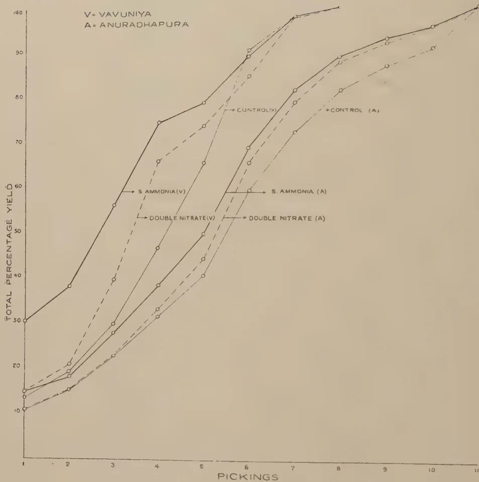

# The Tropical Agriculturist

October, 1938

---

## EDITORIAL

---

### CEYLON'S AGRICULTURAL PROBLEM

---

THE editorial in the August number of this journal dealt with one aspect of our agricultural problem—the water supply. It was stated there that future expansion must take place in the empty spaces of the dry zone, and that the Department of Agriculture proposed to send one of its officers to Australia to study the operations of the large farm on the assumption that the large farm, worked with power-driven implements, would form the unit of development when Government had completed its schemes of reservoir irrigation. This proposal has now been abandoned, and the Department must base future progress on the small peasant farm with which alone the Ceylon agriculturist and his adviser in the Department are familiar. In these circumstances the problem of man power acquires the first place in our agricultural life.

Both political and economic considerations point to food production up to a minimum level of self-sufficiency as the natural line of development in Ceylon. Naturally we turn to rice as our main crop. The annual imports of this grain measured in terms of paddy amount to thirty-seven million bushels. This means that, when the necessary reservation of seed paddy is made, with an average yield of about 40 bushels to the acre, Ceylon can produce its own food only by bringing a million acres of new land under cultivation. A comparison with Java which with its rich volcanic soil has  $8\frac{1}{4}$  million acres under paddy to support its population of  $37\frac{1}{2}$  millions with an average import of 7 kg. per capita against Ceylon's 84.1 kg. per capita shows that this figure is quite reasonable.

The average size of a holding that can be worked by a family of four persons with the implements that can operate in the small farm, and up to the level of efficiency required to produce 40 bushels per acre on Ceylon soil, is about  $2\frac{1}{2}$  acres. In other words to work the additional one million acres the population

1------------------------------------------------

200

of the dry zone must be increased by 1,600,000. This increase must be found by a redistribution of the existing population, both because an effort of the Government cannot increase the total population and because the required acreage is based on the present population. The problem of man power therefore resolves itself into a problem of the movement of 1,600,000 persons from the over-populated wet zone to the unpopulated dry zone.

The experience of the small colonization schemes hitherto launched by Government has taught the lesson that the present economic pressure—which is not inconsiderable—, combined with the offer of very attractive terms of settlement and subsidy, are inadequate to induce any substantial movement of population. In addition to the inertia of a conservative race, there are two main causes of these disappointing results—the fear of malaria and the paralyzing effects of land-ownership. Even if the complete eradication of malaria is impracticable the great effort which is now being made by the Sanitary Department must eventually succeed in achieving a measure of control of this disease which would ensure at least the same conditions of health as obtain at present in the southern section of the North-Western Province and the northern section of the Western Province.

There remain the problems associated with the ownership of land. Our laws of inheritance secure to every individual a share of his ancestral land. This share may be an undivided one-tenth of one acre of land, or even something much more infinitesimal, which falls far short of an economic unit and is only able to maintain the peasant in a state of semi-starvation. But so strong is the attachment of the Ceylonese to his ancestral land that, except in rare instances, he will not break himself away from it, and the social system based on undivided ownership of land and of equal inheritance is so ingrained in him that he will not easily accept a change of that system. Nevertheless the population that is required for the cultivation of new lands can be found only by a change of this system and by the release of the peasant of the wet zone from the strangle-hold of the uneconomic holding and of undivided ownership. If Government wants Ceylon to produce its own food, it must face this problem squarely and find a solution for it. It is common sense that, if six families fritter away their energy in cultivating and quarrelling over a holding which is insufficient to produce food for one family, Ceylon can never realize self-sufficiency. Government must solve this problem or turn its face away from the policy of a self-supporting Ceylon. Does the solution lie in a change of the law of inheritance and in a compulsory re-creation of economic holdings ?

2------------------------------------------------

201

## A FURTHER EXPERIMENT ON SOYA INOCULATION IN CEYLON

MALCOLM PARK, A.R.C.S.,  
ACTING DEPUTY DIRECTOR OF AGRICULTURE  
AND  
M. FERNANDO, Ph.D., B.Sc., D.I.C.,  
RESEARCH PROBATIONER IN PLANT PATHOLOGY

IN a previous paper, the writers (Park and Fernando, 1937) recorded the results of preliminary tests of the nitrogen-fixing efficiency of strains of *Rhizobium japonicum* Kirch. A yellow-seeded variety of soybean, *Glycine max* (Linn.) Merr., inoculated with these strains, was grown in pots in sand and watered with a culture solution containing the various essential elements other than nitrogen. The results of the experiment showed that, under these conditions, seed inoculation resulted in increase in vigour in the plants and also that the plants reacted in different degree to the strains of *Rhizobium* used. In the present communication are presented the results of a field trial of these same strains.

### DESIGN OF THE EXPERIMENT

Five inoculation treatments, *viz.*, inoculations with four strains of *R. japonicum* and an uninoculated control, were combined with two varieties of soybean. Three of the strains of *Rhizobium*, *viz.*, strains Nos. 73, 36 and 30 received through the courtesy of Dr. H. J. Toxopeus, Agricultural Experiment Station, Buitenzorg, had been isolated from plants grown in soils of different types in Middle, Eastern and Western Java, respectively. The fourth strain, which is referred to in this paper as the Rothamsted strain, was originally strain No. 9 of the Wisconsin Experiment Station, Wisconsin, U. S. A.; this strain was tested at the Rothamsted Experiment Station and proved so efficient under the conditions prevailing in England that it is to-day marketed commercially in England.

The names and the history of the two varieties of soybean have not been determined. They will be referred to here as varieties L and S. The variety S is identical with the one used in the preliminary pot experiments (Park and Fernando, 1937). It was originally imported from Poona. The variety L approximates to the well-known Mammoth Yellow variety. Summary

3------------------------------------------------

202

descriptions of the two varieties are given in Table 1. The varieties L and S appear to fall into groups 2 and 4 respectively in the classification of Kaltenbach and Legros (1936) :—

TABLE 1

<table border="1">
<thead>
<tr>
<th rowspan="2">Variety of Soybean</th>
<th rowspan="2">Colour of Flowers</th>
<th rowspan="2">Colour of Pods</th>
<th rowspan="2">Average growth Period</th>
<th rowspan="2">Colour of Seeds</th>
<th rowspan="2">Colour of Hilum</th>
<th rowspan="2">Shape of Seeds</th>
<th colspan="3">Dimensions of Seeds in Mms.</th>
</tr>
<tr>
<th>Length</th>
<th>Breadth</th>
<th>Diameter</th>
</tr>
</thead>
<tbody>
<tr>
<td>L</td>
<td>white</td>
<td>grey-brown</td>
<td>3 months</td>
<td>bright yellow</td>
<td>yellow</td>
<td>rounded</td>
<td>8.5 ± 0.29</td>
<td>7.8 ± 0.27</td>
<td>6.3 ± 0.39</td>
</tr>
<tr>
<td>S</td>
<td>purple</td>
<td>grey-brown</td>
<td>4 months</td>
<td>dull yellow</td>
<td>brown</td>
<td>flattened ovoid</td>
<td>7.2 ± 0.31</td>
<td>5.6 ± 0.27</td>
<td>4.0 ± 0.19</td>
</tr>
</tbody>
</table>

The ten treatments were replicated in four randomized blocks. The experimental area, which was adjacent to the Plant Pathological Laboratory, Peradeniya, received dressings of lime on February 19 and March 5, these dressings being at the rate of 10 cwt. per acre. The soil was a heavy loam of fair nitrogen content and slightly acid in reaction (pH value = 6.16). The detailed analysis of the soil was as follows :

<table border="1">
<thead>
<tr>
<th></th>
<th></th>
<th>Per Cent.</th>
</tr>
</thead>
<tbody>
<tr>
<td>Gravel</td>
<td>..</td>
<td>2.41</td>
</tr>
<tr>
<td>Coarse sand</td>
<td>..</td>
<td>24.42</td>
</tr>
<tr>
<td>Fine sand</td>
<td>..</td>
<td>26.93</td>
</tr>
<tr>
<td>Silt</td>
<td>..</td>
<td>4.10</td>
</tr>
<tr>
<td>Clay</td>
<td>..</td>
<td>39.65</td>
</tr>
<tr>
<td>Moisture</td>
<td>..</td>
<td>2.73</td>
</tr>
<tr>
<td>Loss by solution</td>
<td>..</td>
<td>2.17</td>
</tr>
<tr>
<td colspan="2"></td>
<td>100.00</td>
</tr>
<tr>
<td colspan="2"></td>
<td>Per Cent.</td>
</tr>
<tr>
<td>Loss on ignition</td>
<td>..</td>
<td>8.33</td>
</tr>
<tr>
<td>Nitrogen</td>
<td>..</td>
<td>0.119</td>
</tr>
</tbody>
</table>

The presence of three citrus plants in the experimental area appeared to contribute considerably to the heterogeneity in soil fertility.

The area was divided up into plots measuring 4 feet by 8 feet with paths 2 feet wide between plots. Adjacent blocks were separated by paths 4 feet wide.

### METHODS

*Seed-disinfection.*—It was considered desirable to free the seed testas of contaminating rhizobia prior to inoculation. In preliminary tests, surface-sterilization by wet heat, *viz.*, immersion in water at 65°C for 5 minutes, resulted in a 70 per cent. reduction in germination. Exposure to 0.1 per cent. mercuric chloride for 3 minutes followed by washing in several changes of tap water, had no depressant effect on germination. The experimental seed was disinfected by this method; the last traces of mercuric chloride were removed by soaking the seed in milk and subsequently washing it in tap water. The control plots were sown with some of this disinfected seed.

4------------------------------------------------

203

*Seed-inoculation.*—Fresh cultures of the strains of *R. japonicum* were prepared on Carroll's asparagus extract-mannitol agar (Carroll, 1934). The bacterial slime was rubbed off the agar slants and dispersed in a 0·1 per cent. solution of calcium diacid phosphate in skim milk. The disinfected seed was inoculated by immersion in the various bacterial suspensions, allowed to dry in the shade and sown on the same day.

*Sowing.*—The seeds were dibbled at the rate of two to three seeds per hole on May 28. Each plot had 24 holes in six rows of four; the holes were spaced one foot within and  $1\frac{1}{2}$  feet between rows. By May 31, most of the seeds had germinated and the cotyledons had developed chlorophyll. Supplying vacancies was begun on June 7; this was done by removing plants from holes containing more than one seedling. No nodules were observed on any of the plants examined on this date. The cotyledons on plants of the variety L had, by this time, yellowed and been shed. Cotyledon-fall did not occur in variety S till very much later. The plants were finally thinned down to one per hole during the period June 12–17.

#### RESULTS

Nodulation was first observed in the varieties L and S on June 12 and 16, respectively. Flowers appeared in the variety L on June 22. The variety S did not flower till July 4, and even then the flowering exhibited considerable lack of uniformity. On July 12, when all the plants of the variety L and some plants of the variety S had set pod, there were still numerous plants of the latter variety in the vegetative stage. At this time differences between inoculated and control plots in the variety S were becoming evident; there were no corresponding obvious differences in the plots containing the variety L.

On July 25, records were made of the heights of individual plants of the variety S. Flowers had set in nearly all the plants of this variety. Plants in control plots exhibited a marked chlorosis while the inoculated plants were deep green. The height data and their analysis of variance are presented in Tables 2 and 3 respectively. Detailed records of the heights of the plants of the variety L were not made as the differences were obviously not significant.

The harvesting of the varieties L and S was commenced on August 26 and September 29 respectively and was continued until it was completed. The harvesting of variety S was spread over about two weeks. Pods, especially of the variety S, exhibited a tendency to shatter. Table 4 records the average yields per plot for the various treatments.

The chemical analysis of samples of seed from plants of the variety S subjected to the various treatments is given in Table 5.

5------------------------------------------------

204TABLE 2Heights of Plants of Variety S in Cms.

<table border="1">
<thead>
<tr>
<th>Strain of Bacterium</th>
<th>73</th>
<th>36</th>
<th>30</th>
<th>R</th>
<th>Uninoculated Control</th>
<th>Total</th>
</tr>
</thead>
<tbody>
<tr>
<td>Block I</td>
<td>895</td>
<td>878</td>
<td>828</td>
<td>719</td>
<td>561</td>
<td>3,881</td>
</tr>
<tr>
<td>II</td>
<td>799</td>
<td>687</td>
<td>744</td>
<td>728</td>
<td>639</td>
<td>3,597</td>
</tr>
<tr>
<td>III</td>
<td>794</td>
<td>846</td>
<td>861</td>
<td>660</td>
<td>658</td>
<td>3,819</td>
</tr>
<tr>
<td>IV</td>
<td>877</td>
<td>527</td>
<td>704</td>
<td>646</td>
<td>538</td>
<td>3,292</td>
</tr>
<tr>
<td>Total</td>
<td>3,365</td>
<td>2,938</td>
<td>3,137</td>
<td>2,753</td>
<td>2,396</td>
<td>Grand Total: 14,589</td>
</tr>
<tr>
<td>Mean</td>
<td>841.25</td>
<td>734.5</td>
<td>784.25</td>
<td>688.25</td>
<td>599.0</td>
<td>General Mean: 729.45</td>
</tr>
</tbody>
</table>

TABLE 3Analysis of Variance of Heights of Plants in Variety S

<table border="1">
<thead>
<tr>
<th></th>
<th>D.F.</th>
<th>S.S.</th>
<th>Variance</th>
<th>F</th>
<th>One percent. point</th>
</tr>
</thead>
<tbody>
<tr>
<td>Strains</td>
<td>4</td>
<td>136,969.7</td>
<td>34,242.4</td>
<td>5.46</td>
<td>5.41</td>
</tr>
<tr>
<td>Blocks</td>
<td>3</td>
<td>42,572.95</td>
<td>14,190.98</td>
<td></td>
<td></td>
</tr>
<tr>
<td>Error</td>
<td>12</td>
<td>75,168.3</td>
<td>6,264.0</td>
<td></td>
<td></td>
</tr>
<tr>
<td>Total</td>
<td>19</td>
<td>254,710.95</td>
<td></td>
<td></td>
<td></td>
</tr>
</tbody>
</table>

Standard error .. 79.15

Coefficient of variability .. 10.8 per cent.

MEANS OF TREATMENTS IN CENTIMETRES

<table border="1">
<thead>
<tr>
<th>Strain 73</th>
<th>Strain 36</th>
<th>Strain 30</th>
<th>Rothamsted Control</th>
<th>General mean</th>
<th>Significant Difference</th>
</tr>
</thead>
<tbody>
<tr>
<td>841.25</td>
<td>734.5</td>
<td>784.25</td>
<td>688.25</td>
<td>599.0</td>
<td>729.45</td>
</tr>
<tr>
<td></td>
<td></td>
<td></td>
<td></td>
<td></td>
<td>122.0</td>
</tr>
</tbody>
</table>

TABLE 4

<table border="1">
<thead>
<tr>
<th rowspan="2">Strain of <i>R. japonicum</i></th>
<th colspan="2">Mean Yield of Seed per Plot</th>
</tr>
<tr>
<th>Variety L</th>
<th>Variety S</th>
</tr>
</thead>
<tbody>
<tr>
<td>73</td>
<td>122.6 gm.</td>
<td>358.1 gm.</td>
</tr>
<tr>
<td>36</td>
<td>90.9</td>
<td>348.6</td>
</tr>
<tr>
<td>30</td>
<td>122.8</td>
<td>344.2</td>
</tr>
<tr>
<td>Rothamsted</td>
<td>79.9</td>
<td>235.9</td>
</tr>
<tr>
<td>(Uninoculated control)</td>
<td>92.4</td>
<td>169.3</td>
</tr>
</tbody>
</table>

TABLE 5Chemical Analysis of Samples of Soybean Seed (Variety S) from Experimental Plots

<table border="1">
<thead>
<tr>
<th rowspan="2"></th>
<th colspan="4">Seed from Plants inoculated with Strains</th>
<th>Seed from Uninoculated Controls</th>
</tr>
<tr>
<th>73</th>
<th>36</th>
<th>30</th>
<th>Rothamsted</th>
<th>Controls</th>
</tr>
<tr>
<th></th>
<th>Per Cent.</th>
<th>Per Cent.</th>
<th>Per Cent.</th>
<th>Per Cent.</th>
<th>Per Cent.</th>
</tr>
</thead>
<tbody>
<tr>
<td>Moisture</td>
<td>11.38</td>
<td>11.46</td>
<td>11.76</td>
<td>12.25</td>
<td>11.73</td>
</tr>
<tr>
<td>Nitrogen</td>
<td>5.96</td>
<td>6.29</td>
<td>6.19</td>
<td>5.92</td>
<td>5.56</td>
</tr>
<tr>
<td>Nitrogen on moisture-free basis</td>
<td>6.72</td>
<td>7.10</td>
<td>7.01</td>
<td>6.75</td>
<td>6.30</td>
</tr>
</tbody>
</table>

DISEASES AND PESTS

In the early stages, damage by hares seriously menaced the successful continuation of the experiment but this was checked by enclosing the area with wire mesh. *Lamprosema indicata* F. caused considerable leaf injury and consequent reduction in the photosynthetic surface. The unthrifty appearance of certain

6------------------------------------------------

205

plants was traced to root-damage by the common bean fly *Agromyza phaseoli* Coq. No major fungus diseases occurred.

#### METEOROLOGICAL DATA

The records of daily precipitation at Peradeniya during the experimental period are given in Table 6. Days of no rain are omitted.

TABLE 6.

<table border="1">
<thead>
<tr>
<th colspan="2">Date 1937.</th>
<th>Rainfall</th>
<th colspan="2">Date 1937.</th>
<th>Rainfall</th>
</tr>
<tr>
<th colspan="2"></th>
<th>in.</th>
<th colspan="2"></th>
<th>in.</th>
</tr>
</thead>
<tbody>
<tr>
<td rowspan="12">May</td>
<td>1</td>
<td>.. 0.02</td>
<td rowspan="12">July</td>
<td>17</td>
<td>.. 0.41</td>
</tr>
<tr>
<td>4</td>
<td>.. 0.26</td>
<td>19</td>
<td>.. 2.80</td>
</tr>
<tr>
<td>5</td>
<td>.. 0.10</td>
<td>20</td>
<td>.. 0.21</td>
</tr>
<tr>
<td>6</td>
<td>.. 0.58</td>
<td>21</td>
<td>.. 0.29</td>
</tr>
<tr>
<td>12</td>
<td>.. 0.02</td>
<td>22</td>
<td>.. 0.79</td>
</tr>
<tr>
<td>17</td>
<td>.. 0.13</td>
<td>23</td>
<td>.. 0.03</td>
</tr>
<tr>
<td>18</td>
<td>.. 0.81</td>
<td>24</td>
<td>.. 0.06</td>
</tr>
<tr>
<td>19</td>
<td>.. 0.19</td>
<td>26</td>
<td>.. 0.01</td>
</tr>
<tr>
<td>20</td>
<td>.. 0.07</td>
<td>27</td>
<td>.. 0.03</td>
</tr>
<tr>
<td>23</td>
<td>.. 0.35</td>
<td>28</td>
<td>.. 0.44</td>
</tr>
<tr>
<td>27</td>
<td>.. 2.30</td>
<td rowspan="5">August</td>
<td>4</td>
<td>.. 0.60</td>
</tr>
<tr>
<td>28</td>
<td>.. 0.10</td>
<td>5</td>
<td>.. 1.63</td>
</tr>
<tr>
<td>29</td>
<td>.. 0.26</td>
<td>7</td>
<td>.. 2.77</td>
</tr>
<tr>
<td>31</td>
<td>.. 0.47</td>
<td>9</td>
<td>.. 0.02</td>
</tr>
<tr>
<td rowspan="12">June</td>
<td>3</td>
<td>.. 0.12</td>
<td>10</td>
<td>.. 0.02</td>
</tr>
<tr>
<td>4</td>
<td>.. 0.29</td>
<td>23</td>
<td>.. 0.11</td>
</tr>
<tr>
<td>5</td>
<td>.. 0.06</td>
<td>27</td>
<td>.. 0.38</td>
</tr>
<tr>
<td>7</td>
<td>.. 0.64</td>
<td>28</td>
<td>.. 0.57</td>
</tr>
<tr>
<td>8</td>
<td>.. 0.01</td>
<td>30</td>
<td>.. 1.77</td>
</tr>
<tr>
<td>10</td>
<td>.. 0.01</td>
<td rowspan="6">September</td>
<td>1</td>
<td>.. 1.18</td>
</tr>
<tr>
<td>11</td>
<td>.. 0.19</td>
<td>2</td>
<td>.. 0.09</td>
</tr>
<tr>
<td>12</td>
<td>.. 0.50</td>
<td>3</td>
<td>.. 0.05</td>
</tr>
<tr>
<td>14</td>
<td>.. 0.21</td>
<td>4</td>
<td>.. 0.14</td>
</tr>
<tr>
<td>18</td>
<td>.. 0.02</td>
<td>17</td>
<td>.. 0.06</td>
</tr>
<tr>
<td>19</td>
<td>.. 0.07</td>
<td>25</td>
<td>.. 0.09</td>
</tr>
<tr>
<td rowspan="12">July</td>
<td>21</td>
<td>.. 0.37</td>
<td>27</td>
<td>.. 0.04</td>
</tr>
<tr>
<td>26</td>
<td>.. 0.65</td>
<td>28</td>
<td>.. 0.11</td>
</tr>
<tr>
<td>28</td>
<td>.. 0.26</td>
<td>29</td>
<td>.. 0.39</td>
</tr>
<tr>
<td>30</td>
<td>.. 0.17</td>
<td rowspan="8">October</td>
<td>1</td>
<td>.. 1.82</td>
</tr>
<tr>
<td>1</td>
<td>.. 0.19</td>
<td>2</td>
<td>.. 0.98</td>
</tr>
<tr>
<td>2</td>
<td>.. 0.73</td>
<td>4</td>
<td>.. 0.90</td>
</tr>
<tr>
<td>3</td>
<td>.. 0.07</td>
<td>6</td>
<td>.. 0.61</td>
</tr>
<tr>
<td>5</td>
<td>.. 0.44</td>
<td>8</td>
<td>.. 0.8</td>
</tr>
<tr>
<td>6</td>
<td>.. 0.42</td>
<td>15</td>
<td>.. 0.42</td>
</tr>
<tr>
<td>7</td>
<td>.. 1.05</td>
<td>16</td>
<td>.. 0.06</td>
</tr>
<tr>
<td>8</td>
<td>.. 0.01</td>
<td></td>
<td></td>
<td></td>
</tr>
<tr>
<td>9</td>
<td>.. 0.15</td>
<td></td>
<td></td>
<td></td>
</tr>
<tr>
<td>10</td>
<td>.. 0.58</td>
<td></td>
<td></td>
<td></td>
</tr>
<tr>
<td>12</td>
<td>.. 0.63</td>
<td></td>
<td></td>
<td></td>
</tr>
<tr>
<td>13</td>
<td>.. 0.39</td>
<td></td>
<td></td>
<td></td>
</tr>
<tr>
<td>16</td>
<td>.. 0.16</td>
<td></td>
<td></td>
<td></td>
</tr>
</tbody>
</table>

#### DISCUSSION

In the analysis of variance of height totals in the variety S (Table 2), the value of  $F$  (Snedecor, 1934) for treatment exceeds

7------------------------------------------------

206

the 1 per cent. point and is accordingly indicative of a significant effect. The means for the various inoculations are all superior to the uninoculated control and, except in the instance of the Rothamsted strain, this superiority is significant. Strain 73 is significantly better than the Rothamsted strain. The bacterial strains have taken up the same order of efficiency as in the preliminary pot experiment (Park and Fernando, 1937), except that the relative positions of strains 30 and 36 have been reversed.

The correlation coefficient provides an estimate of the strength of the relationship between plant height and fresh weight. A value of  $r = +0.9$  was obtained; the value was highly significant ( $P < 0.01$ ). Plant height may be considered a satisfactory index of vegetative vigour.

The records of mean yields of seed per plot given in Table 3 exhibit no obvious response of the variety L to inoculation. The failure of this variety to respond to inoculation may at least, in part, be explained by the poor nodulation of these plants; the percentage of nodulated plants in this variety at harvest time was only 24.1 per cent. as against 76.5 per cent. for the variety S. It must be remembered, however, that these figures are underestimates: soon after flowering the nodules disintegrate rapidly, and nodule vestiges may not be evident on plants uprooted after harvest. The early maturing of the variety L may also have contributed to the failure to benefit by inoculation.

The yield figures for the variety S were subjected to an analysis of variance; the value of  $F$  for treatment did not reach the 5 per cent. point. The failure to demonstrate significance was apparently due to the extremely large experimental error which amounted to 52.8 per cent. of the general mean. The records in Table 4 of chemical analyses of samples of seed obtained from plants of the variety S subjected to various treatments show that inoculation has in every instance resulted in an increase in percentage nitrogen.

The dissimilarity in nodulation between the varieties L and S is not without parallel in other species of legumes. Duggar (1935) demonstrated differences in the extent of nodulation between peanut varieties; in field experiments in Alabama, the 3-year averages for Spanish and runner peanuts were found to be 11.0 and 126.7 nodules per plant respectively.

The present experiment yields no precise information regarding the effect of seed-disinfection on nodulation. It may be mentioned, however, that seeds of the variety L, on account of their tendency to sloughing off of the testas if soaked too long, did not receive as thorough a washing subsequent to immersion in mercuric chloride, as seeds of the variety S; residual mercuric

8------------------------------------------------

207

chloride may have contributed to the unsatisfactory nodulation of the former variety. Duggar (1935), working with peanuts, observed that seed-disinfection had usually a depressant effect on nodulation.

#### SUMMARY

1. The above communication contains a description of a small field experiment on the effect of seed inoculation of soya. Two varieties of soya were used : a large-seeded variety akin to the Mammoth Yellow variety and a small, yellow-seeded variety originating from Poona. These seeds were surface sterilized by immersion in 0·1 per cent. mercuric chloride solution and were subjected to four treatments, *viz.*, inoculation with four strains of *Rhizobium japonicum* Kirch., and there was a fifth uninoculated control.

2. The large-seeded variety did not respond to inoculation.

3. The small-seeded variety reacted markedly to inoculation. Mathematically significant differences were obtained in growth, as measured by plant height. The experimental error was unfortunately so high that the differences in yield were not mathematically significant.

4. Chemical analyses of the seeds of the small-seeded variety harvested from the different plots showed distinct differences in nitrogen content as a result of seed inoculation.

#### ACKNOWLEDGMENT

The writers are indebted to Dr. A. W. R. Joachim, Chemist, Department of Agriculture, for the chemical analyses recorded in this paper.

#### REFERENCES

Carroll, W. R., 1934 .. A study of *Rhizobium* species in relation to nodule formation on the roots of Florida legumes : 1. *Soil Sci.* XXXVII, pp. 117-135.

Duggar, J. F., 1935 .. Nodulation of peanut plants as affected by variety, shelling of seed and disinfection of seed. *Jour. Amer. Soc. Agron.* XXVII, pp. 286-288.

Fisher, R. A., 1932 .. Statistical methods for research workers. 4th edition, London ; Oliver and Boyd.

Kaltenbach, D. and Legros, J., 1936 .. Soya ; selection, classification of varieties cultivated in various countries. *International Review of Agriculture*, XXVII, pp. 117T-149T, 165T-189T, 216T-233T, 281T-297T.

Park, M. and Fernando, M., 1937 .. Preliminary experiments on soya inoculation in Ceylon. *The Tropical Agriculturist*, LXXXVIII, pp. 351-358.

Snedecor, G. W., 1934.. Calculation and interpretation of analysis of variance and covariance. *Collegiate Press, Inc. Ames, Iowa*.

9------------------------------------------------

208

## SPACING AND MANURIAL EXPERIMENTS WITH TOMATOES—I

---

W. R. C. PAUL, M.A., M.Sc., D.I.C., Dip. Agric. (Cantab.),  
ACTING PLANT PATHOLOGIST

AND

E. S. JAYASUNDERA, Dip. Agric. (Poona),  
MANAGER, EXPERIMENT STATION, ANURADHAPURA

---

**T**HE tomato has become one of the popular crops of the dry zone of Ceylon, largely on account of the fact that it thrives better there than in the wet zone, where bacterial wilt disease causes serious losses. It is grown as a garden as well as a field crop with and without irrigation, and has gained great favour as a cooked or fresh vegetable amongst all classes. Provided excessive or unseasonal rains do not prevail when flowering or fruiting takes place, high yields can be expected if the soil is well manured and, with a supply of good quality fruit to satisfactory markets, the returns can be very profitable.

The crop is commonly grown in *chenas* in the dry zone, the seed being sown broadcast with the early north-east monsoon rains, while in the Jaffna Peninsula where irrigation facilities are available it is planted in gardens after the heavy monsoonal rains in November are over, the seedlings being raised earlier in nurseries. Within recent years, pruning and staking are being adopted and information is desired on the most suitable spacing under these conditions.

As regards varieties, the small country tomato with oblate, furrowed fruits of markedly acid flavour is being gradually replaced by better varieties, particularly Marglobe which has a round, smooth and solid-fleshed fruit of a sweet flavour. In the Jaffna Peninsula, this variety is now almost exclusively being grown.

The subject of manuring requires considerable attention as growers have realized the importance of a well-manured soil in increasing the yields of tomatoes. In order to obtain more information on the subject of spacing and the effect of different fertilizers on tomatoes which receive a basal dressing of compost or cattle manure, experiments were started with the 1936-37 north-east monsoon, and in this paper are detailed the results of a

10------------------------------------------------

209

trial carried out at the Experiment Station, Anuradhapura, to compare two spacings and three different fertilizers with a control from the yield standpoint. The particulars of the treatments are given below:—

*Spacing*

<table>
<tr>
<td>A</td>
<td>..</td>
<td>..</td>
<td>3 by <math>1\frac{1}{2}</math> feet</td>
</tr>
<tr>
<td>B</td>
<td>..</td>
<td>..</td>
<td>3 by 1 foot</td>
</tr>
</table>

*Fertilizer treatments*

<table>
<thead>
<tr>
<th rowspan="2"></th>
<th rowspan="2">cwt.</th>
<th colspan="3">Per Acre</th>
</tr>
<tr>
<th>N lb.</th>
<th>P lb.</th>
<th>K lb.</th>
</tr>
</thead>
<tbody>
<tr>
<td>(a) Sulphate of ammonia</td>
<td>.. 1</td>
<td></td>
<td></td>
<td></td>
</tr>
<tr>
<td>Superphosphate ..</td>
<td>.. 3</td>
<td></td>
<td></td>
<td></td>
</tr>
<tr>
<td>Muriate of potash</td>
<td>.. 1</td>
<td></td>
<td></td>
<td></td>
</tr>
<tr>
<td></td>
<td>5 ..</td>
<td>23 ..</td>
<td>66 ..</td>
<td>50</td>
</tr>
<tr>
<td>(b) Sulphate of ammonia</td>
<td>.. 1</td>
<td></td>
<td></td>
<td></td>
</tr>
<tr>
<td>Superphosphate ..</td>
<td>.. 2</td>
<td></td>
<td></td>
<td></td>
</tr>
<tr>
<td>Muriate of potash</td>
<td>.. 1</td>
<td></td>
<td></td>
<td></td>
</tr>
<tr>
<td></td>
<td>4 ..</td>
<td>23 ..</td>
<td>33 ..</td>
<td>50</td>
</tr>
<tr>
<td>(c) Sulphate of ammonia</td>
<td>.. 1</td>
<td></td>
<td></td>
<td></td>
</tr>
<tr>
<td>Superphosphate ..</td>
<td>.. 3</td>
<td></td>
<td></td>
<td></td>
</tr>
<tr>
<td>Muriate of potash</td>
<td>.. <math>\frac{1}{2}</math></td>
<td></td>
<td></td>
<td></td>
</tr>
<tr>
<td></td>
<td><math>4\frac{1}{2}</math> ..</td>
<td>23 ..</td>
<td>66 ..</td>
<td>25</td>
</tr>
<tr>
<td>(d) Control.</td>
<td></td>
<td></td>
<td></td>
<td></td>
</tr>
</tbody>
</table>

Each of the two spacing treatments was combined with a fertilizer treatment on the randomized block lay out using four blocks. Each plot measured 28 by 24 feet apart, of which an inner area of 22 by 18 feet or approximately 1/110 acre was harvested for the purpose of the experiment. Omitting the border rows there were 105 and 161 plants for the wide and narrow spacings respectively. The soil at the Experiment Station, Anuradhapura, is a chocolate-brown sandy loam overlying a quartz gravel loam. It is fairly well supplied with nitrogen, phosphorous and lime.

The variety used was Marglobe, seed of which was obtained from Messrs. Pocha & Sons, Poona. The seed was sown at the rate of 3 oz. per 240 square feet in nurseries on September 28 and 29, 1936. Germination took place in 6 days, the nurseries being kept shaded until the seedlings developed about 3 leaves after which the cover was reduced and finally removed prior to pricking out. When the seedlings were about two weeks old, they were pricked out to well-prepared beds about a foot apart.

11------------------------------------------------

210

The whole area was given a basal dressing of 10 tons of compost per acre on October 15 about three weeks before planting out. It was then ploughed and disc harrowed. Planting out had to be delayed owing to the continuous heavy rains which were experienced when the seedlings were ready for planting out and it was eventually carried out on November 6 and 7. All plots were weeded with the mamotty on November 15 and four days later 102 vacancies were filled. On November 20, 30 vacancies and finally on November 27, 157 vacancies were replaced. The fertilizers were applied on November 16, when the seedlings were about  $2\frac{1}{2}$  months old or about 9 to 10 days after they were planted out. Flowering commenced in all plots on December 2. The plants were pruned to a single stem and tied to individual stakes between December 2 and 12. Picking commenced on January 2, 1937, and was continued until January 23, there being 11 pickings in all, at intervals of 2 to 3 days.

Leaf curl and wilt due to *Sclerotium rolfsii* were common from the end of December. When the fruit commenced developing, blossom-end rot and fruit cracking occurred. The incidence of blossom-end rot was studied in this experiment by Park\* but he found no correlation between the maximum incidence of the disease and any particular environmental factor. Fruit cracking was not severe, only 2.6 per cent. of the total number of fruits being affected, the majority of which were culls. On January 10, 1937, 3.15 and 3.05 inches of rain respectively were recorded. The excessive rains during the early part of January were probably responsible for prematurely bringing fruiting to a close and from about January 17 most of the plants were found dying from excessive moisture in the soil. The crop was therefore pulled up on January 23.

The grading of the fruit was carried out according to the following arbitrary classes:—

Grade I. Selects—above  $2\frac{3}{4}$  in. diameter.

Grade II. Choice—less than  $2\frac{3}{4}$  in. and above  $2\frac{1}{4}$  in. diameter.

Grade III. Gems—less than  $2\frac{1}{4}$  in. and above  $1\frac{3}{4}$  in. diameter.

Culls—below  $1\frac{3}{4}$  in. diameter.

The percentage yields of the different grades is as follows:—

<table>
<thead>
<tr>
<th>Grade I.</th>
<th>Grade II.</th>
<th>Grade III.</th>
<th>Culls</th>
</tr>
<tr>
<th>lb.</th>
<th>lb.</th>
<th>lb.</th>
<th>lb.</th>
</tr>
</thead>
<tbody>
<tr>
<td>9.37</td>
<td>.. 67.33</td>
<td>.. 21.33</td>
<td>.. 1.97</td>
</tr>
</tbody>
</table>

The yields of graded fruit for each treatment are given below:—

<table>
<thead>
<tr>
<th>Spacing</th>
<th></th>
<th>Mean Yield per Plot</th>
<th>Yield per Acre</th>
</tr>
<tr>
<th></th>
<th></th>
<th>lb.</th>
<th>lb.</th>
</tr>
</thead>
<tbody>
<tr>
<td>A wide</td>
<td>..</td>
<td>17.09</td>
<td>.. 1,880</td>
</tr>
<tr>
<td>B close</td>
<td>..</td>
<td>25.09</td>
<td>.. 2,760</td>
</tr>
</tbody>
</table>

\* Park, M. A note on the occurrence of blossom-end rot of tomatoes. *The Tropical Agriculturist*, Vol. LXXXIX, pp. 141-147, 1937.

12------------------------------------------------

211

<table border="1">
<thead>
<tr>
<th>Fertilizer treatments—</th>
<th>Mean Yield per Plot. lb.</th>
<th>Yield per Acre lb.</th>
</tr>
</thead>
<tbody>
<tr>
<td>(a) 23N 66P 50K</td>
<td>21.60</td>
<td>2,376</td>
</tr>
<tr>
<td>(b) 23N 33P 50K</td>
<td>23.22</td>
<td>2,554</td>
</tr>
<tr>
<td>(c) 23N 66P 25K</td>
<td>19.13</td>
<td>2,104</td>
</tr>
<tr>
<td>(d) Control</td>
<td>20.44</td>
<td>2,248</td>
</tr>
</tbody>
</table>

The yields per plot (1/110 acre) expressed in ¼ lb. are given below :—

<table border="1">
<thead>
<tr>
<th>Blocks Treatments</th>
<th>Aa</th>
<th>Ab</th>
<th>Ac</th>
<th>Ad</th>
<th>Ba</th>
<th>Bb</th>
<th>Be</th>
<th>Bd</th>
<th>Total</th>
</tr>
</thead>
<tbody>
<tr>
<td>1</td>
<td>85..</td>
<td>25..</td>
<td>41..</td>
<td>23..</td>
<td>72..</td>
<td>78..</td>
<td>45..</td>
<td>80..</td>
<td>449</td>
</tr>
<tr>
<td>2</td>
<td>57..</td>
<td>93..</td>
<td>98..</td>
<td>56..</td>
<td>88..</td>
<td>91..</td>
<td>97..</td>
<td>90..</td>
<td>670</td>
</tr>
<tr>
<td>3</td>
<td>81..</td>
<td>32..</td>
<td>60..</td>
<td>51..</td>
<td>73..</td>
<td>151..</td>
<td>85..</td>
<td>56..</td>
<td>589</td>
</tr>
<tr>
<td>4</td>
<td>105..</td>
<td>113..</td>
<td>68..</td>
<td>106..</td>
<td>130..</td>
<td>160..</td>
<td>118..</td>
<td>192..</td>
<td>992</td>
</tr>
<tr>
<td>Total</td>
<td>328</td>
<td>263</td>
<td>267</td>
<td>236</td>
<td>363</td>
<td>480</td>
<td>345</td>
<td>418</td>
<td>2700</td>
</tr>
<tr>
<td>Mean</td>
<td>82</td>
<td>65.75</td>
<td>66.75</td>
<td>59</td>
<td>90.75</td>
<td>120</td>
<td>86.25</td>
<td>104.5</td>
<td>675</td>
</tr>
</tbody>
</table>

#### Analysis of Variance

<table border="1">
<thead>
<tr>
<th></th>
<th>Degrees of Freedom</th>
<th>Sum of Squares</th>
<th>Variance</th>
<th><math>\frac{1}{2} \log_e</math> Variance</th>
<th>Calculated Value of Z</th>
</tr>
</thead>
<tbody>
<tr>
<td>Blocks</td>
<td>3</td>
<td>19873.75</td>
<td>6624.58</td>
<td></td>
<td></td>
</tr>
<tr>
<td>Treatments</td>
<td>7</td>
<td>12102.0</td>
<td>1728.86</td>
<td></td>
<td></td>
</tr>
<tr>
<td>Manuring</td>
<td>3</td>
<td>1161.75</td>
<td>387.25</td>
<td></td>
<td></td>
</tr>
<tr>
<td>Spacing</td>
<td>1</td>
<td>8192.5</td>
<td>8192.5</td>
<td>4.5055</td>
<td>1.2489</td>
</tr>
<tr>
<td>Interaction</td>
<td>3</td>
<td>2747.75</td>
<td>915.92</td>
<td></td>
<td></td>
</tr>
<tr>
<td>Error</td>
<td>21</td>
<td>13356.25</td>
<td>636.0</td>
<td>3.2566</td>
<td></td>
</tr>
<tr>
<td>Total</td>
<td>31</td>
<td>45332.0</td>
<td>1462.32</td>
<td></td>
<td></td>
</tr>
</tbody>
</table>

Manurial treatments not significant.

When  $P = .05$  and  $n_1 = 1$  and  $n_2 = 21$   $z = .7322$   
 $P = .01$  and  $z = 1.0408$

The spacing treatments are, therefore, definitely significant.

S.E. per plot =  $25.219$  (¼ lb.) =  $6.305$  lb.

Significant difference at  $P = .01 = 25.363$  (¼ lb.) =  $6.34$  lb. or  $698$  lb. per acre.

<table border="1">
<thead>
<tr>
<th></th>
<th>Total in ¼ lb.</th>
<th>Mean (¼ lb.)</th>
<th>Mean per Plot in lb.</th>
<th>Mean per Acre in lb.</th>
</tr>
</thead>
<tbody>
<tr>
<td>A. wide spacing</td>
<td>1,094</td>
<td>68.375</td>
<td>17.09</td>
<td>1,880</td>
</tr>
<tr>
<td>B. close spacing</td>
<td>1,606</td>
<td>100.375</td>
<td>25.09</td>
<td>2,760</td>
</tr>
</tbody>
</table>

#### DISCUSSION

The spacing results indicate that with two spacings tested in this experiment, *viz.*, 3 by  $1\frac{1}{2}$  feet and 3 by 1 foot, the closer spacing has given a significantly higher yield, the plants in each case being pruned to a single stem and individually staked. The higher yield can be interpreted as due to the greater number of plants per acre, the average yield per plant under each spacing being .163 lb. and .156 lb. for the wide and close spacings, respectively. An increase of 880 lb. per acre of marketable fruit was obtained with the closer spacing. But in order to ascertain the optimum spacing, a further trial with a still closer spacing

13------------------------------------------------

212

e.g. 3 by  $\frac{3}{4}$  foot should be compared with 3 by 1 foot which in this experiment has been found to give a better yield than 3 by  $1\frac{1}{2}$  feet.

With regard to the fertilizer treatments, the addition of any one of the three fertilizers has not resulted in a significant increase in yield over the control. It is possible that the basal dressing of compost at the rate of 10 tons per acre has so raised the fertility level of the soil that the addition of any one of the fertilizers in this experiment was not effective in increasing the yield. The unfavourable weather conditions may also have been a contributory factor as the general yield over the whole area was only about 2,320 lb. of graded fruit per acre. Although the rainfall for November, December and January was not above the average for these months, being 3.50, 13.58 and 8.24 inches respectively, it was the abnormally heavy rain which fell on certain days and caused water logging that resulted in premature dying of the plants. Heavy downpours were recorded on the following days :—

<table>
<thead>
<tr>
<th></th>
<th></th>
<th></th>
<th></th>
<th>Ins.</th>
</tr>
</thead>
<tbody>
<tr>
<td>December</td>
<td>14, 1936</td>
<td>..</td>
<td>..</td>
<td>3.32</td>
</tr>
<tr>
<td>December</td>
<td>15, 1936</td>
<td>..</td>
<td>..</td>
<td>3.75</td>
</tr>
<tr>
<td>January</td>
<td>1, 1937</td>
<td>..</td>
<td>..</td>
<td>3.15</td>
</tr>
<tr>
<td>January</td>
<td>10, 1937</td>
<td>..</td>
<td>..</td>
<td>3.05</td>
</tr>
</tbody>
</table>

It is, however, unreliable to draw conclusions from a single trial with regard to the use of fertilizers in increasing the yields of tomatoes under farming conditions in the dry zone where fields which are annually cultivated are generally given a basal dressing of compost or are penned with cattle. Trials should be conducted over a sufficient period of time—at least three seasons—to eliminate the possibility of unfavourable weather conditions in any year seriously interfering with the effect of fertilizers.

#### SUMMARY

A spacing and manurial experiment was carried out at the Experiment Station, Anuradhapura, the treatments being combined in a randomized block lay-out.

The two spacings compared were 3 by  $1\frac{1}{2}$  feet with 3 by 1 foot, the plants being pruned to a single stem and individually staked. The closer spacing gave an increased yield of 881 lb. per acre, which was significant at Fisher's 1 per cent. point.

In the case of the fertilizers there were three treatments which were compared against a control, but no significant differences were obtained. It is, however, possible that as all the plots received an initial basal dressing of 10 tons of compost per acre the fertilizers were not effective or that the abnormally heavy rains experienced on certain days, by prematurely terminating the crop, did not give the plants sufficient time to show the effects of the fertilizers.

14------------------------------------------------

213

## SPACING AND MANURIAL EXPERIMENTS WITH TOMATOES—II

W. R. C. PAUL, M.A., M.Sc., D.I.C., Dip. Agric. (Cantab.),  
*ACTING PLANT PATHOLOGIST*

AND

A. W. R. JOACHIM, Ph.D. (London), Dip. Agric. (Cantab.),  
*CHEMIST*

IN the first paper of this series it was found that tomato plants pruned to a single stem and individually staked gave a significantly higher yield at 3 by 1 foot than at 3 by  $1\frac{1}{2}$  feet, but in a comparison of three fertilizer treatments, significant increases in yield over the control were not obtained, all plots having received a basal dressing of 10 tons of compost per acre. In the present paper the results are recorded of a further experiment which was carried out to compare the effect of a still closer spacing with the one found to have given a higher yield in the previous experiment, the two spacings being combined with three fertilizer treatments containing N, NP and NPK respectively, and a control. All plots received a basal dressing of 10 tons of cattle manure per acre. The trial was laid out at the Experiment Station, Jaffna, during the 1937–38 north-east monsoon season. The treatments were as follows :—

*Spacings—*

<table style="margin-left: auto; margin-right: auto;">
<tr>
<td>A</td>
<td>..</td>
<td>..</td>
<td>3 by 1 foot</td>
</tr>
<tr>
<td>B</td>
<td>..</td>
<td>..</td>
<td>3 by <math>\frac{3}{4}</math> foot</td>
</tr>
</table>

*Fertilizers—*

- (a) N as sulphate of ammonia at 1 cwt. per acre.
- (b) NP as sulphate of ammonia at 1 cwt. per acre and superphosphate at 1 cwt. per acre.
- (c) NPK as sulphate of ammonia at 1 cwt. per acre, superphosphate at 1 cwt. per acre and muriate of potash at  $\frac{1}{2}$  cwt. per acre.
- (d) Control.

A four by four Latin square was used, each main plot being sub-divided into two for the two spacings. The main plots had a gross measurement of 54 by 30 feet each, separated from each other by a 3 feet drain. The sub-plots with the two spacings measured 30 by 27 feet each and omitting a planted border space of 3 feet the internal dimensions were 24 by 21 feet, giving approximately a size of 1/86 acre.

15------------------------------------------------

214

Each harvested sub-plot spaced 3 by 1 foot contained 192 plants and spaced 3 by  $\frac{3}{4}$  foot, 256 plants. The soil at the Experiment Station, Jaffna, is a brick-red calcareous loam, alkaline in reaction, somewhat deficient in nitrogen and organic matter, but well supplied with phosphoric acid and potash.

The previous crops were melons and pumpkins cultivated during March to July, 1937. On October 4, sunn hemp was sown as a green manure at 96 lb. per acre and turned into the soil between November 6 and 11. The whole area was then given a basal dressing of 10 tons of cattle manure per acre on November 22 and this was incorporated into the soil with the zig-zag harrow. Ridges about 9 inches high were next constructed and the plots demarcated; but owing to continuous heavy rain, the planting out of the seedlings had to be postponed until December 3, when they were about five weeks old, the planting being completed on December 6, each row in the Latin square being completed on one day. The variety used was Marglobe, seed of which was obtained from Messrs. Pocha & Sons, Poona.

Vacancies were filled on December 14 and 15. Irrigation commenced from January 3, 1938, and was continued at intervals of 4 to 10 days. Flowering took place on January 5, when the seedlings were about ten weeks old and about one month after planting cut. The fertilizers were applied between January 13 and 15.

The plants were pruned to a single stem and the upright trellis system of training was adopted, the first trellis being at one foot from the ground and the second at three feet. Picking commenced on February 9 and terminated on March 9. There were altogether fifteen pickings at intervals of 2 to 3 days.

Leaf curl was observed from about January 8 onwards and a few fruits were attacked by fruit borers (*Heliothis obsoleta* and *Prodenia litura*). A considerable number of the fruits showed cracking—both radial and concentric—in spite of the fact that the weather was not too dry. A few plants were also attacked by eelworm.

The fruit was graded in the same way as reported in Part I of this series. The yields of graded and ungraded fruit for each treatment and the significant differences are given below:—

<table border="1">
<thead>
<tr>
<th rowspan="2">Spacing</th>
<th colspan="2">Mean Yield per Sub-plot, lb.</th>
<th colspan="2">Yield per Acre, lb.</th>
</tr>
<tr>
<th>Graded.</th>
<th>Ungraded.</th>
<th>Graded.</th>
<th>Ungraded.</th>
</tr>
</thead>
<tbody>
<tr>
<td>Wide .. .. .</td>
<td>108 ..</td>
<td>125 ..</td>
<td>9,334 ..</td>
<td>10,800</td>
</tr>
<tr>
<td>Close .. .. .</td>
<td>111 ..</td>
<td>128 ..</td>
<td>9,594 ..</td>
<td>11,060</td>
</tr>
<tr>
<td>Significant difference (P=.05)</td>
<td>— ..</td>
<td>14 ..</td>
<td>— ..</td>
<td>1,210</td>
</tr>
</tbody>
</table>

16------------------------------------------------

215

<table border="1">
<thead>
<tr>
<th rowspan="2">Fertilizer Treatments</th>
<th colspan="4">Mean Yield per Sub-plot, lb.</th>
<th colspan="2">Yield per Acre, lb.</th>
</tr>
<tr>
<th colspan="2">Graded.</th>
<th colspan="2">Ungraded.</th>
<th>Graded.</th>
<th>Ungraded.</th>
</tr>
</thead>
<tbody>
<tr>
<td>N .. ..</td>
<td>120 ..</td>
<td>139 ..</td>
<td>10,370 ..</td>
<td>12,010</td>
<td></td>
<td></td>
</tr>
<tr>
<td>NP .. ..</td>
<td>119 ..</td>
<td>141 ..</td>
<td>10,285 ..</td>
<td>12,190</td>
<td></td>
<td></td>
</tr>
<tr>
<td>NPK .. ..</td>
<td>106 ..</td>
<td>121 ..</td>
<td>9,160 ..</td>
<td>10,460</td>
<td></td>
<td></td>
</tr>
<tr>
<td>Control .. ..</td>
<td>93 ..</td>
<td>107 ..</td>
<td>8,037 ..</td>
<td>9,247</td>
<td></td>
<td></td>
</tr>
<tr>
<td>Significant difference (<math>P = .05</math>) — ..</td>
<td></td>
<td>38 ..</td>
<td>— ..</td>
<td>3,284</td>
<td></td>
<td></td>
</tr>
</tbody>
</table>

*Analysis of Variance of Total Weights of Fruits.*

<table border="1">
<thead>
<tr>
<th></th>
<th>Degrees of Freedom</th>
<th>Sum of Squares</th>
<th>Variance</th>
<th><math>\frac{1}{2} \text{Log}_e</math> Variance</th>
</tr>
</thead>
<tbody>
<tr>
<td>Rows ..</td>
<td>3 ..</td>
<td>47632.85</td>
<td></td>
<td></td>
</tr>
<tr>
<td>Columns ..</td>
<td>3 ..</td>
<td>7548.15</td>
<td></td>
<td></td>
</tr>
<tr>
<td>Manurial treatments ..</td>
<td>3 ..</td>
<td>6313.07 ..</td>
<td>2104.36 ..</td>
<td>3.824</td>
</tr>
<tr>
<td>Error (a) ..</td>
<td>6 ..</td>
<td>5655.36 ..</td>
<td>942.56 ..</td>
<td>3.424</td>
</tr>
<tr>
<td>Spacing ..</td>
<td>1 ..</td>
<td>71.40 ..</td>
<td>71.40 ..</td>
<td></td>
</tr>
<tr>
<td>Interaction ..</td>
<td>3 ..</td>
<td>379.18 ..</td>
<td>126.39 ..</td>
<td></td>
</tr>
<tr>
<td>Error (b) ..</td>
<td>12 ..</td>
<td>3851.73 ..</td>
<td>320.98 ..</td>
<td></td>
</tr>
<tr>
<td></td>
<td>31</td>
<td>71451.74</td>
<td></td>
<td></td>
</tr>
</tbody>
</table>

*Manurial Treatments—*

$Z$  (Calc.) = .400

$Z$  (Sig.) for  $n_1 = 3$ , and  $n_2 = 6$ , when  $P = .05 = .7798$

Hence results are not significant.

*Spacing Treatments—*

Results not significant.

The analysis of variance of the graded fruit data is not shown as significance has again not been attained.

**DISCUSSION**

In this experiment, there are no statistically significant differences in yield between the two spacings, *viz.*, 3 by 1 foot and 3 by  $\frac{3}{4}$  foot adopted for the tomato, when the plants are pruned to a single stem and trained on upright trellises. In the previous experiment carried out at the Experiment Station, Anuradhapura and reported in Part I of this series, a spacing of 3 by 1 foot gave a significantly higher yield than 3 by 1 $\frac{1}{2}$  feet, when the plants were pruned to a single stem and tied to individual stakes. Although the crop was unirrigated in that experiment and irrigated in the present, it would be reasonable to infer that a closer spacing of 3 by 1 foot will not result in a higher yield. It is of interest to note that in a trial carried out at Trinidad\* with tomato plants which had been pruned to a single stem and individually staked, a comparison of three spacings, *viz.*, 3 by 3 feet, 3 by 2 feet and 3 by 1 foot, was made and the highest yield was obtained with the closest spacing.

\* Paul, W. R. C. A. varietal and spacing trial of tomatoes. Unpublished dissertation I. C. T. A. Trinidad.

17------------------------------------------------

216

With regard to the fertilizer treatments, the results have shown that although higher yields than the control are obtained with the various fertilizers, the differences are not statistically significant. The N and NP treatments have, however, nearly reached the level of significance. The experimental area had carried a crop of sunn hemp which was subsequently turned into the soil when it was about a month old. In addition to this, a basal dressing of cattle manure at 10 tons per acre was given about a fortnight before planting out. It is likely that this initial treatment had raised the level of fertility of the soil to such an extent that the addition of fertilizers in the quantities applied had no further effects in increasing yields. It is also possible that as the fertilizers were applied too late—about five weeks after planting out—they were not as effective as might otherwise have been the case.

#### SUMMARY

A comparison of two spacing treatments, *viz.*, 3 by 1 foot and 3 by  $\frac{3}{4}$  foot on the yields of tomato plants pruned to a single stem and trained on upright trellises was carried out at the Experiment Station, Jaffna, in combination with three fertilizer treatments and a control. The results have indicated no significant differences in yields with the two spacings or the fertilizer treatments. The high basal dressing of cattle and green manures which all plots had received might account for the poor response of the crop to the fertilizers. Viewed in the light of results of trials carried out elsewhere, this experiment would appear to indicate that a spacing of 3 by 1 foot is the optimum for the crop under the specified pruning and training practice.

#### ACKNOWLEDGMENTS

The writers desire to express their thanks to Mr. S. K. Thuraisingham, Agricultural Officer, Jaffna, for his helpful co-operation and to Mr. S. Balasingham, Manager, Experiment Station, Jaffna, for his assistance in carrying out the experiment.

18------------------------------------------------

217MANURIAL EXPERIMENTS WITH CHILLIES

A. W. R. JOACHIM, Ph.D. (Lond.), Dip. Agric. (Cantab.),

CHEMIST

AND

W. R. C. PAUL, M.A., M.Sc., D.J.C., Dip. Agric. (Cantab.),

ACTING PLANT PATHOLOGIST

**T**HOUGH conditions in the dry zone of Ceylon are favourable for the production of good quality dry chillies, a considerable proportion of the Island's requirements of this condiment is imported, chiefly from India. However, chillies form one of the important annual money crops of the dry zone and work is in progress on the improvement of this crop and efforts are being directed towards an increase in the output of dry chillies in the country. Apart from the Jaffna Peninsula where, with irrigation facilities, the crop is cultivated in rotation with tobacco and dry grains on garden lands and with paddy on low land, it is elsewhere, in the dry zone, generally grown in *chenas* with little or no attention. Considerable progress can be made if chillies can be introduced where irrigation facilities are not available as a rotation crop in a system of dry farming and attention is being paid to this problem. Much information, however, is needed on the manurial requirements of the crop under varying soil conditions and the present paper deals with experiments which were carried out during the 1937-38 north-east monsoon season at the Anuradhapura and Vavuniya Experiment Stations, for the purpose of comparing the effects of different fertilizers with and without cattle manure.

The soil at Anuradhapura is a chocolate-brown sandy loam overlying a slightly heavier loam containing quartz gravel in some quantity. The soil is fairly well supplied with nitrogen and organic matter and rich in phosphoric acid and potash. It is alkaline in reaction and of a non-lateritic nature. The Vavuniya soil is chocolate-red in colour but is slightly heavier in texture. It is somewhat poorer than the Anuradhapura soil in nitrogen, organic matter, phosphoric acid and potash, but like the latter it is alkaline in reaction and is of the non-lateritic type.

In these experiments, the Tuticorin chilli, a cultural variety of *Capsicum frutescens* L. var. *acuminatum* (= *C. annuum* L. var. *acuminatum*) was used. It is an introduction from South India and has now proved to be the best dry chilli known in

19------------------------------------------------

218

Ceylon. It possesses a pod about  $2\frac{1}{2}$  inches long and  $7/16$  inch broad, with a bright red colour, a high degree of pungency and a good flavour.

The split plot randomized block lay out was adopted in these experiments. The major treatments were (1) cattle manure at 3 tons per acre and (2) control, while in the sub-plots, the following treatments were adopted:—

1. (1) Control.
2. (2) Nitrogen as sulphate of ammonia at 100 lb. per acre ( $N = 20$  lb.) or  $2\frac{1}{2}$  lb. per plot.
3. (3) Nitrogen as nitrate of soda at 133 lb./acre ( $N = 20$  lb.) or  $3\frac{1}{3}$  lb. per plot.
4. (4) Nitrate of soda in two applications each at the rate of  $3\frac{1}{3}$  lb. per plot or altogether of 266 lb./acre ( $N = 40$  lb.).
5. (5) Nitrogen and phosphoric acid as Nicifos (narrow ratio) 160 lb./acre ( $N = 28$  lb.;  $P_2O_5 = 28$  lb.) or 4 lb. per plot.
6. (6) Complete fertilizer :  
    Nicifos (narrow ratio) 160 lb. per acre + sulphate of potash 60 lb. or  $5\frac{1}{2}$  lb. of mixture per plot.

There were four replications of the major treatments and eight of the sub-treatments. The dimensions of the major plots were 144 by 45 feet, the gross area being about 1.7 acre. The sub-plots were 45 by 24 feet or approximately 1.40 acre. Allowing for a border row, the net harvested area of a sub-plot was 36 by 15 feet or approximately 1/80 acre.

The distance of planting was 3 feet by 3 feet and each sub-plot contained 6 rows of 13 hills each. Two seedlings per hill, were planted on the flat at Anuradhapura and on ridges about nine inches high at Vavuniya. The cattle manure was applied before planting and the fertilizers about 3 weeks after. The second dose of nitrate of soda was given 23 to 26 days after the first application of this fertilizer.

The previous crop at Anuradhapura was gingelly for the *yala* season (March-July) while at Vavuniya, the gingelly crop was followed by sunn hemp which was sown in August with the few rains in that month and ploughed in as a green manure when the crop was about 35 days old.

The fields were ploughed and cross ploughed with the Ceres plough, and then disc harrowed. At Anuradhapura the cattle manure was applied before ploughing and about a month before planting to those plots which were to receive the manure, while at Vavuniya, the application was made about a week before planting which was done on October 25 to 27, 1937, at Anuradhapura, and on October 27 and 28 at Vavuniya.

20------------------------------------------------

<!-- stage4: FAINT old-images-only -->

[Faint page: no legible print of its own could be verified; text withheld (stage 4 review list)]

This image is a scan of a blank page. The paper has a light beige or cream-colored tint. There are some very faint, blurry marks that appear to be scanning artifacts or dust particles, but no legible text or distinct figures are present.

21------------------------------------------------

# CHILLI MANURIAL TRIALS

YIELDS OF FRESH CHILLIES, ANURADHAPURA

MAHA 1937

CWT. PER ACRE

![Bar chart showing yields of fresh chillies in CWT per acre for various manure treatments. The treatments include Control, Sulphate of Ammonia, Nitrate of Soda (Single), Nitrate of Soda (Double), Nicifos, Nicifos + Sulphate of Potash, General Mean, No Farmyard Manure (Average), Farmyard Manure (Average), and Significant Difference. The yields are 23.9, 31.9, 33.8, 42.1, 34.0, 33.8, 33.2, 34.7, 31.8, 7.7, and 6.4 respectively. P-values for significant differences are P=0.5 (6.4), P=0.1 (8.6), and P=0.5 (7.7).](dc6fcb458be82bbabe036357e1ba4611_2_img.webp)

<table border="1">
<thead>
<tr>
<th>Treatment</th>
<th>Yield (CWT per acre)</th>
<th>Significant Difference (P-value)</th>
</tr>
</thead>
<tbody>
<tr>
<td>CONTROL</td>
<td>23.9</td>
<td></td>
</tr>
<tr>
<td>SULPHATE OF AMMONIA</td>
<td>31.9</td>
<td></td>
</tr>
<tr>
<td>NITRATE OF SODA (SINGLE)</td>
<td>33.8</td>
<td></td>
</tr>
<tr>
<td>NITRATE OF SODA (DOUBLE)</td>
<td>42.1</td>
<td></td>
</tr>
<tr>
<td>NICIFOS</td>
<td>34.0</td>
<td></td>
</tr>
<tr>
<td>NICIFOS + SULPHATE OF POTASH</td>
<td>33.8</td>
<td></td>
</tr>
<tr>
<td>GENERAL MEAN</td>
<td>33.2</td>
<td></td>
</tr>
<tr>
<td>NO FARMYARD MANURE (AVERAGE)</td>
<td>34.7</td>
<td></td>
</tr>
<tr>
<td>FARMYARD MANURE (AVERAGE)</td>
<td>31.8</td>
<td></td>
</tr>
<tr>
<td>SIGNIFICANT DIFFERENCE</td>
<td>7.7</td>
<td>P=0.5</td>
</tr>
<tr>
<td>SIGNIFICANT DIFFERENCE</td>
<td>6.4</td>
<td>P=0.1</td>
</tr>
</tbody>
</table>

FIGURE 1.

Block by Survey Dept. Cryptograph

22------------------------------------------------

219

Vacancies were filled on three occasions at both centres. Weeding commenced about a fortnight after planting out and the fertilizers were applied between the rows on November 18 and 19 about three weeks after planting out at each centre. Flowering took place about three weeks after planting out at Anuradhapura and after about eight weeks at Vavuniya, the seedlings at Vavuniya having been younger.

In this paper, the term "green" chillies is used to denote the fully developed green fruits and "ripe" chillies for the mature fruits which have just turned red. The term "fresh" chillies is used for either of the two types in an undried condition, while "dry" chillies refer to fruits which have been cured by drying.

The first picking was done as green chillies in accordance with the general view that picking of green chillies stimulates the production of flowers and fruit. The first picking commenced on January 8, 1938, at Anuradhapura and on January 22 at Vavuniya and terminated on April 7 with 11 pickings and on May 30 with 8 pickings at Anuradhapura and Vavuniya respectively.

The rainfall during the period of cultivation at both centres is shown below:—

<table>
<thead>
<tr>
<th rowspan="2"></th>
<th colspan="2">Inches</th>
</tr>
<tr>
<th>Anuradhapura</th>
<th>Vavuniya</th>
</tr>
</thead>
<tbody>
<tr>
<td>August .. ..</td>
<td>3.84</td>
<td>4.41</td>
</tr>
<tr>
<td>September .. ..</td>
<td>2.22</td>
<td>6.05</td>
</tr>
<tr>
<td>October .. ..</td>
<td>4.40</td>
<td>3.04</td>
</tr>
<tr>
<td>November .. ..</td>
<td>13.06</td>
<td>14.35</td>
</tr>
<tr>
<td>December .. ..</td>
<td>3.11</td>
<td>9.48</td>
</tr>
<tr>
<td>January .. ..</td>
<td>7.65</td>
<td>8.65</td>
</tr>
<tr>
<td>February .. ..</td>
<td>3.57</td>
<td>10.07</td>
</tr>
<tr>
<td>March .. ..</td>
<td>9.49</td>
<td>6.98</td>
</tr>
<tr>
<td>April .. ..</td>
<td>1.46</td>
<td>14.54</td>
</tr>
<tr>
<td>May .. ..</td>
<td>—</td>
<td>2.94</td>
</tr>
</tbody>
</table>

### RESULTS

The Anuradhapura and Vavuniya results are presented in Tables I-IVA and Tables I-IVB respectively. Table VI shows the average percentage yields of crop at both places at each picking and Table VII the corresponding data for certain of the treatments only.

### ANURADHAPURA

In Table IA are shown the yields of fresh chillies per plot, in Table IIA the analysis of variance and in Tables III and IVA the average yield data in lb. per plot, cwt. per acre and percentages of the mean. The yield data are graphically presented in Figure I.

23------------------------------------------------

<!-- stage4: FAINT old-images-only -->

[Faint page: no legible print of its own could be verified; text withheld (stage 4 review list)]

24------------------------------------------------

221TABLE IIAAnalysis of Variance

<table border="1">
<thead>
<tr>
<th></th>
<th>d.f.</th>
<th>Sum of Squares</th>
<th>Mean Square</th>
</tr>
</thead>
<tbody>
<tr>
<td>Blocks ..</td>
<td>3</td>
<td>707.0</td>
<td></td>
</tr>
<tr>
<td>Main treatments ..</td>
<td>1</td>
<td>173.9</td>
<td>173.9</td>
</tr>
<tr>
<td>Error (a) ..</td>
<td>3</td>
<td>403.9</td>
<td>134.6</td>
</tr>
<tr>
<td>Fertilizer treatments ..</td>
<td>5</td>
<td>2536.4</td>
<td>507.3</td>
</tr>
<tr>
<td>Interaction—</td>
<td></td>
<td></td>
<td></td>
</tr>
<tr>
<td>    Main <math>\times</math> fertilizer treatments</td>
<td>5</td>
<td>220.7</td>
<td>44.2</td>
</tr>
<tr>
<td>    Error (b)</td>
<td>30</td>
<td>2254.2</td>
<td>75.1</td>
</tr>
<tr>
<td></td>
<td>47</td>
<td>6296.1</td>
<td></td>
</tr>
</tbody>
</table>

Main treatments :  $F(\text{calc.}) = 1.3$

$F(\text{sig.}) = 10.13$  for  $P = .05$

∴ Cattle manure gives no significant yield difference.

Fertilizer treatments :  $F(\text{calc.}) = 6.5$

$F(\text{sig.}) = 2.53$  for  $P = .05$

3.70 ,,  $P = .01$

∴ Fertilizer treatments are very definitely significant.

TABLE IIIAFarmyard Manure vs No Farmyard ManureFresh Weights of Chillies

<table border="1">
<thead>
<tr>
<th></th>
<th>Total of 24 Plots (lb.)</th>
<th>Mean per Plot (lb.)</th>
<th>Cwt./acre</th>
<th>Per Cent. of Mean</th>
</tr>
</thead>
<tbody>
<tr>
<td>With farmyard manure ..</td>
<td>1059.4</td>
<td>44.15</td>
<td>31.80</td>
<td>95.7</td>
</tr>
<tr>
<td>No farmyard manure ..</td>
<td>1155.8</td>
<td>48.15</td>
<td>34.67</td>
<td>104.3</td>
</tr>
<tr>
<td>Standard error ..</td>
<td>—</td>
<td>2.35</td>
<td>1.69</td>
<td>5.1</td>
</tr>
<tr>
<td>Significant difference— <math>P = .05</math></td>
<td>—</td>
<td>10.65</td>
<td>7.68</td>
<td>23.1</td>
</tr>
</tbody>
</table>

TABLE IVAManurial TreatmentsFresh Weights of Chillies

<table border="1">
<thead>
<tr>
<th></th>
<th>Total of 8 Plots (lb.)</th>
<th>Mean per Plot (lb.)</th>
<th>Cwt./acre</th>
<th>Per Cent. of Mean</th>
</tr>
</thead>
<tbody>
<tr>
<td>Control ..</td>
<td>265.2</td>
<td>33.1</td>
<td>23.86</td>
<td>71.81</td>
</tr>
<tr>
<td>Sulphate of ammonia ..</td>
<td>353.9</td>
<td>44.2</td>
<td>31.86</td>
<td>95.9</td>
</tr>
<tr>
<td>Nitrate of soda (single) ..</td>
<td>375.8</td>
<td>47.0</td>
<td>33.83</td>
<td>101.8</td>
</tr>
<tr>
<td>Nitrate of soda (double) ..</td>
<td>467.2</td>
<td>58.4</td>
<td>42.07</td>
<td>126.6</td>
</tr>
<tr>
<td>Nicifos ..</td>
<td>377.6</td>
<td>47.2</td>
<td>33.99</td>
<td>102.3</td>
</tr>
<tr>
<td>Complete mixture ..</td>
<td>375.5</td>
<td>46.9</td>
<td>33.81</td>
<td>101.7</td>
</tr>
<tr>
<td>Mean ..</td>
<td>369.2</td>
<td>46.1</td>
<td>33.24</td>
<td>100.0</td>
</tr>
<tr>
<td>Standard error ..</td>
<td>24.5</td>
<td>3.06</td>
<td>2.21</td>
<td>6.65</td>
</tr>
<tr>
<td>Significant difference— <math>P = .05</math></td>
<td>70.8</td>
<td>8.85</td>
<td>6.37</td>
<td>19.1</td>
</tr>
<tr>
<td><math>P = .01</math></td>
<td>95.3</td>
<td>11.91</td>
<td>8.58</td>
<td>25.8</td>
</tr>
</tbody>
</table>

25------------------------------------------------

222

It will be noted from the examination of the data that :—

(1) All the fertilizer treatments have given markedly significant increases in yield over the control. The average yield of fresh chillies from the unfertilized plots was 23.9 cwt. per acre against yields varying from 31.9 to 42.1 cwt. per acre from the fertilized plots. The average increases as percentages of the mean vary from 14 to 55 per cent.

(2) Sulphate of ammonia, nitrate of soda (single dressing) nicifos and the complete mixture of nicifos and sulphate of potash have given average yield increases of about 8 to 10 cwt. per acre, but there is no statistical significance in the differences between them.

(3) The double dressing of nitrate of soda (40 lb. nitrogen) gives a significantly higher yield than the single dressing (20 lb. nitrogen) and the other fertilizer treatments, the increase being 8.2 cwt. per acre. It is very significant that the increase with the double dressing of nitrate of soda is almost twice that with the single dressing.

(4) There is no significant difference between the average yield of plots treated with and without farmyard manure. This will be seen from Table IIIA, where the average yields with the two treatments are 31.8 and 34.7 cwt. per acre respectively, when the 5 per cent. level for significance is 7.7 cwt. This unexpected result is probably due to the fact that the experimental area had previously been penned with cattle, with the consequent raising of the organic matter status of the soil to a level which rendered the additional dressing of 3 tons of cattle manure per acre ineffective. It would not, however, in view of the previous cattle manure treatment the plots had received, be correct to infer that cattle manure had no beneficial effect on yields of chillies. The Vavuniya data, to be discussed later, affords evidence to the contrary.

From an economic point of view the application of fertilizers to chillies is undoubtedly profitable. It has been worked out from the data obtained at Anuradhapura of the relative weights of fresh and dry chillies that a pound of fresh chillies gives on the average 30 per cent. its weight of dry chillies. Assuming that the crop is sold as dry chillies, the increase in yield of fresh chillies obtained by the application of 100 lb. of sulphate of ammonia or 133 lb. of nitrate of soda (giving 20 lb. nitrogen in each case) is, on the average, 9 cwt. or as dry chillies, 2.7 cwt. per acre. At a market price of dry chillies at Rs. 15 per cwt., this would work out at an increased gross return of Rs. 40 per acre against a maximum expenditure of approximately Rs. 20 per acre on fertilizers and the extra cost of picking and curing. The nett increased profit by fertilizing chillies at Anuradhapura

26------------------------------------------------

<!-- stage4: FAINT old-images-only -->

[Faint page: no legible print of its own could be verified; text withheld (stage 4 review list)]

This image is a scan of a blank page. The paper has a light beige or cream-colored tint. There are a few very small, dark specks scattered across the surface, which appear to be scanning artifacts or dust particles. No text, lines, or other markings are present on the page.

27------------------------------------------------

CHILLI MANURIAL TRIALS  
 YIELDS OF FRESH CHILLIES, VAVUNIYA  
MAHA 1937  
 CWT. PER ACRE

<table border="1">
<thead>
<tr>
<th>Treatment</th>
<th>Yield (CWT per acre)</th>
</tr>
</thead>
<tbody>
<tr>
<td>CONTROL</td>
<td>31.6</td>
</tr>
<tr>
<td>SULPHATE OF AMMONIA</td>
<td>65.5</td>
</tr>
<tr>
<td>NITRATE OF SODA (SINGLE)</td>
<td>43.5</td>
</tr>
<tr>
<td>NITRATE OF SODA (DOUBLE)</td>
<td>60.5</td>
</tr>
<tr>
<td>NICIFOS</td>
<td>68.6</td>
</tr>
<tr>
<td>NICIFOS + SULPHATE OF POTASH</td>
<td>63.1</td>
</tr>
<tr>
<td>SIGNIFICANT DIFFERENCE</td>
<td>7.8 (P=0.5)</td>
</tr>
<tr>
<td>GENERAL MEAN</td>
<td>55.5</td>
</tr>
<tr>
<td>FARMYARD MANURE (AVERAGE)</td>
<td>59.6</td>
</tr>
<tr>
<td>NOT FARMYARD MANURE (AVERAGE)</td>
<td>51.4</td>
</tr>
<tr>
<td>SIGNIFICANT DIFFERENCE</td>
<td>8.5 (P=0.5)</td>
</tr>
</tbody>
</table>

FIGURE 11.

Block by Survey Dept Ceylon. 30.1.38.

28------------------------------------------------

223

is, therefore, Rs. 20 per acre at a minimum. Nicifos and the complete mixture, having produced no higher yield increases than the single dressing of nitrate of soda or sulphate of ammonia, will give slightly lower nett returns. From the double dressing of nitrate of soda, the nett increased return would be approximately twice that of the single dressing or Rs. 40 per acre. These figures conclusively prove the economic advantage of fertilizing chillies.

### VAVUNIYA

The data of the Vavuniya trial are shown in Tables I-IVB corresponding to those given for Anuradhapura. The yield data in cwt. per acre of fresh chillies are graphically presented in Figure II.

[For Table IB see page 224.]

TABLE IIB

#### Analysis of Variance

<table border="1">
<thead>
<tr>
<th></th>
<th>d.f.</th>
<th>Sum of Squares</th>
<th>Mean Square</th>
</tr>
</thead>
<tbody>
<tr>
<td>Blocks ..</td>
<td>3 ..</td>
<td>75,905.08 ..</td>
<td>25,301.69 ..</td>
</tr>
<tr>
<td>Main treatments ..</td>
<td>1 ..</td>
<td>25,116.75 ..</td>
<td>25,116.75 ..</td>
</tr>
<tr>
<td>Error (a) ..</td>
<td>3 ..</td>
<td>7,837.42 ..</td>
<td>2,612.47 ..</td>
</tr>
<tr>
<td>Fertilizer treatments ..</td>
<td>5 ..</td>
<td>263,500.75 ..</td>
<td>52,700.17 ..</td>
</tr>
<tr>
<td>Interaction—</td>
<td></td>
<td></td>
<td></td>
</tr>
<tr>
<td>  Main <math>\times</math> fertilizer treatments ..</td>
<td>5 ..</td>
<td>11,702.25 ..</td>
<td>2,340.45 ..</td>
</tr>
<tr>
<td>  Error (b) ..</td>
<td>30 ..</td>
<td>54,377.75 ..</td>
<td>1,812.59 ..</td>
</tr>
<tr>
<td></td>
<td>47</td>
<td>438,440.00</td>
<td></td>
</tr>
</tbody>
</table>

*Main treatments* :  $F(\text{calc.}) = 9.62$

$F(\text{sig.}) = 10.13$  for  $P = .05$

∴ Cattle manure treatment is just not significant.

*Fertilizer treatments* :  $F(\text{calc.}) = 29.0$

$F(\text{sig.}) = 2.53$  for  $P = .05$

$= 3.70$  ,  $P = .01$

∴ Fertilizer treatments are very definitely significant.

TABLE IIIB

#### Farmyard Manure vs. No Farmyard Manure

<table border="1">
<thead>
<tr>
<th rowspan="2"></th>
<th colspan="4">Fresh Weights of Chillies</th>
</tr>
<tr>
<th>Total of 24 Plots (lb.)</th>
<th>Mean per Plot (lb.)</th>
<th>Cwt./acre.</th>
<th>Per Cent. of Mean</th>
</tr>
</thead>
<tbody>
<tr>
<td>With farmyard manure ..</td>
<td>1,986 ..</td>
<td>82.75 ..</td>
<td>59.61 ..</td>
<td>107.4</td>
</tr>
<tr>
<td>No farmyard manure ..</td>
<td>1,711.5 ..</td>
<td>71.31 ..</td>
<td>51.37 ..</td>
<td>92.6</td>
</tr>
<tr>
<td>Standard error ..</td>
<td>— ..</td>
<td>2.61 ..</td>
<td>1.88 ..</td>
<td>3.4</td>
</tr>
<tr>
<td>Significant difference— <math>P = .05</math> ..</td>
<td>— ..</td>
<td>11.74 ..</td>
<td>8.46 ..</td>
<td>15.2</td>
</tr>
</tbody>
</table>

29------------------------------------------------

<!-- stage4: FAINT old-images-only -->

[Faint page: no legible print of its own could be verified; text withheld (stage 4 review list)]

30------------------------------------------------

225

**TABLE IVB**  
**Manurial Treatments**  
**Fresh Weights of Chillies**

<table border="1">
<thead>
<tr>
<th></th>
<th>Total of 8 Plots (lb.)</th>
<th>Mean per Plot (lb.)</th>
<th>Cwt./acre</th>
<th>Per Cent. of Mean</th>
</tr>
</thead>
<tbody>
<tr>
<td>Control ..</td>
<td>351.25</td>
<td>43.9</td>
<td>31.62</td>
<td>57.0</td>
</tr>
<tr>
<td>Sulphate of ammonia ..</td>
<td>727.25</td>
<td>90.9</td>
<td>65.45</td>
<td>118.0</td>
</tr>
<tr>
<td>Nitrate of soda (single) ..</td>
<td>483.25</td>
<td>60.4</td>
<td>43.50</td>
<td>78.4</td>
</tr>
<tr>
<td>Nitrate of soda (double) ..</td>
<td>673.5</td>
<td>84.2</td>
<td>60.64</td>
<td>109.3</td>
</tr>
<tr>
<td>Niciphos ..</td>
<td>761.5</td>
<td>95.2</td>
<td>68.56</td>
<td>123.6</td>
</tr>
<tr>
<td>Complete mixture ..</td>
<td>700.75</td>
<td>87.6</td>
<td>63.10</td>
<td>113.7</td>
</tr>
<tr>
<td>Mean ..</td>
<td>—</td>
<td>77.0</td>
<td>55.49</td>
<td>100.0</td>
</tr>
<tr>
<td>Standard error ..</td>
<td>—</td>
<td>3.76</td>
<td>2.72</td>
<td>4.9</td>
</tr>
<tr>
<td>Significant difference : .</td>
<td></td>
<td></td>
<td></td>
<td></td>
</tr>
<tr>
<td>    P = .05 ..</td>
<td>—</td>
<td>10.86</td>
<td>7.82</td>
<td>14.1</td>
</tr>
<tr>
<td>    P = .01 ..</td>
<td>—</td>
<td>14.62</td>
<td>10.53</td>
<td>19.0</td>
</tr>
</tbody>
</table>

The following conclusions may be drawn from the data :—

(1) The analysis of variance in Table IIB shows that the fertilizer treatments give significantly higher yields than the control. The actual yields of fresh chillies from the fertilized plots vary from 43.5 to 68.6 cwt. per acre against 31.6 cwt. per acre from the control plots. The highest increase is therefore over 110 per cent. and the lowest about 40 per cent. that of the control.

(2) Of the fertilizers tested, nicifos, sulphate of ammonia and the complete mixture of nicifos and sulphate of potash have given yields varying from 63.1 to 68.6 cwt. per acre or a 110 per cent. increase on the control. The yield differences between these treatments are not, however, significant. Nitrogen appears to be the chief fertilizer requirement of chillies. The nitrate of soda single dressing has shown an increase of 12 cwt. per acre and the double dressing of 29 cwt. an acre over the control. The relatively lower response of the crop to nitrate of soda can partly be explained by the fact that heavy rains occurred immediately after the first application, resulting in a partial leaching of some of the fertilizer. Even were allowance made for this unexpected incidence of rainfall, it would be found that nitrogen as nitrate of soda is less efficacious on this soil type than that in the form of ammonium salts, *e.g.*, ammonium sulphate and ammonium phosphate.

(3) The effect of farmyard manure on crop yield is just not statistically significant; but for practical purposes it can be considered that an application as low as 3 tons of cattle manure per acre has had a beneficial effect on yield. The average increase resulting from this treatment is 8.2 cwt. per acre of fresh chillies. Even when artificials are used for fertilizing chillies, the addition of some quantity of farmyard manure is advisable.

31------------------------------------------------

226

From the point of view of economic returns, the data amply confirm the findings at Anuradhapura that the manuring of chillies is highly profitable. At Vavuniya, the yield of dry chillies is 33 per cent. by weight of fresh chillies. On the basis that the chillies are sold as dry chillies at Rs. 15 per cwt. it will be seen from the following table that the gross increased returns from the use of fertilizers at Vavuniya vary from Rs. 38 per acre with nitrate of soda (single dressing) to Rs. 132 per acre with nicifos. The extra cost on picking and curing is reckoned at Re. 1 per cwt. of fresh chillies. Even assuming that the price of dry chillies falls to Rs. 10 per cwt., there is little doubt that a substantial profit can be expected from manuring.

TABLE V

<table border="1">
<thead>
<tr>
<th rowspan="2">Fertilizer</th>
<th>Approx. Cost of Fertilizer and Application</th>
<th>Increased Cost of Picking and Curing</th>
<th>Increased Yield of Dry Chillies</th>
<th>Increased Gross Return</th>
<th>Nett Increased Return</th>
</tr>
<tr>
<th>Rs.</th>
<th>Rs.</th>
<th>Cwt.</th>
<th>Rs.</th>
<th>Rs.</th>
</tr>
</thead>
<tbody>
<tr>
<td>Nitrate of soda (single)</td>
<td>10 ..</td>
<td>12 ..</td>
<td>4.0 ..</td>
<td>60 ..</td>
<td>38</td>
</tr>
<tr>
<td>„ (double)</td>
<td>20 ..</td>
<td>19 ..</td>
<td>9.7 ..</td>
<td>145 ..</td>
<td>106</td>
</tr>
<tr>
<td>Sulphate of ammonia ..</td>
<td>8 ..</td>
<td>34 ..</td>
<td>11.2 ..</td>
<td>168 ..</td>
<td>126</td>
</tr>
<tr>
<td>Nicifos ..</td>
<td>15 ..</td>
<td>37 ..</td>
<td>12.3 ..</td>
<td>184 ..</td>
<td>132</td>
</tr>
<tr>
<td>Complete mixture ..</td>
<td>20 ..</td>
<td>32 ..</td>
<td>10.5 ..</td>
<td>157 ..</td>
<td>105</td>
</tr>
</tbody>
</table>

Farmyard manure gives an increased gross return of Rs. 41 per acre against an expenditure of Rs. 19, of which Rs. 11 represent the cost of manure (Rs. 3 per ton) and its application. The nett increased profit of Rs. 22 is appreciable.

#### GENERAL DISCUSSION

The results of the trials at Anuradhapura and Vavuniya have indicated one feature in common, *viz.*, that yields can be appreciably increased by nitrogenous fertilizers. The response to nitrogen differs somewhat at the two centres. At Vavuniya, ammoniacal nitrogen is apparently the most efficacious form to use; at Anuradhapura either form appears to be equally suitable. As nitrate of soda tends to be leached out of the soil, if rain falls soon after its application, it would be advisable to use the ammoniacal form of nitrogen in all but highly acid soils. An application of 100 lb. of sulphate of ammonia per acre will generally suffice. Neither potash nor phosphoric acid appears to have a significant effect on yield of crop at either centre. These soils are fairly well supplied with these constituents, which apparently are available in sufficient amounts for the needs of the crop. On other soils the results may be different, and the inclusion of small quantities of these fertilizing constituents in fertilizer mixtures for chillies would be advisable. Farmyard manure is beneficial, used either alone or preferably with artificials. At Anuradhapura, however,

32------------------------------------------------

This image is a scan of a blank page. The paper has a light beige or cream-colored tint. There are a few very small, dark specks scattered across the surface, which appear to be scanning artifacts or dust particles. No text, lines, or other markings are present on the page.

33------------------------------------------------

The graph displays the relationship between the total percentage yield and the number of pickings for two locations: Vavuniya and Anuradhapura. The x-axis represents the number of pickings, ranging from 1 to 11. The left y-axis represents the total percentage yield, ranging from 20 to 100. The right y-axis represents the number of pickings, ranging from 1 to 11. The Vavuniya series is represented by a solid line with 'x' markers, and the Anuradhapura series is represented by a dashed line with 'x' markers. Arrows point from the labels 'VAVUNIYA' and 'ANURADHAPURA' to their respective lines.

<table border="1">
<thead>
<tr>
<th>Pickings</th>
<th>Vavuniya (%)</th>
<th>Anuradhapura (%)</th>
</tr>
</thead>
<tbody>
<tr>
<td>1</td>
<td>20</td>
<td>20</td>
</tr>
<tr>
<td>2</td>
<td>30</td>
<td>25</td>
</tr>
<tr>
<td>3</td>
<td>45</td>
<td>30</td>
</tr>
<tr>
<td>4</td>
<td>55</td>
<td>40</td>
</tr>
<tr>
<td>5</td>
<td>65</td>
<td>50</td>
</tr>
<tr>
<td>6</td>
<td>75</td>
<td>60</td>
</tr>
<tr>
<td>7</td>
<td>85</td>
<td>70</td>
</tr>
<tr>
<td>8</td>
<td>90</td>
<td>80</td>
</tr>
<tr>
<td>9</td>
<td>95</td>
<td>90</td>
</tr>
<tr>
<td>10</td>
<td>100</td>
<td>100</td>
</tr>
</tbody>
</table>

PICKINGS  
FIG. III.

Block by Survey Dept. Ceylon. 1.19.34

34------------------------------------------------

227

the effects of the manure were not apparent as a result of the basal treatment which all plots had received, *viz.*, cattle penning.

The yields at Vavuniya are considerably higher than those at Anuradhapura, the averages being respectively 55.5 and 33.2 cwt. per acre. The reasons for this great difference are not clear, as the soil types are not very dissimilar and, if anything, the Vavuniya soil is poorer. Possibly the fact that the seedlings at transplanting were, owing to adverse circumstances, five weeks older at Anuradhapura than at Vavuniya may have partly contributed to this result. The occurrence of a better distributed rainfall at Vavuniya may even be a more probable cause for the difference. The system of planting at Vavuniya, *viz.*, on ridges may also be a factor of importance.

TABLE VI

<table border="1">
<thead>
<tr>
<th rowspan="2">Picking</th>
<th colspan="2">Anuradhapura</th>
<th colspan="2">Vavuniya</th>
</tr>
<tr>
<th>Per cent.</th>
<th>Total Per Cent.</th>
<th>Per cent.</th>
<th>Total Per Cent.</th>
</tr>
</thead>
<tbody>
<tr>
<td>1 st</td>
<td>13.8</td>
<td>13.8</td>
<td>25.1</td>
<td>25.1</td>
</tr>
<tr>
<td>2nd</td>
<td>5.0</td>
<td>18.8</td>
<td>6.3</td>
<td>31.4</td>
</tr>
<tr>
<td>3rd</td>
<td>9.2</td>
<td>28.0</td>
<td>15.8</td>
<td>47.2</td>
</tr>
<tr>
<td>4th</td>
<td>10.3</td>
<td>38.3</td>
<td>19.4</td>
<td>66.6</td>
</tr>
<tr>
<td>5th</td>
<td>10.7</td>
<td>49.0</td>
<td>7.7</td>
<td>74.3</td>
</tr>
<tr>
<td>6th</td>
<td>19.6</td>
<td>68.6</td>
<td>15.0</td>
<td>89.3</td>
</tr>
<tr>
<td>7th</td>
<td>12.3</td>
<td>80.9</td>
<td>8.6</td>
<td>97.9</td>
</tr>
<tr>
<td>8th</td>
<td>7.4</td>
<td>88.3</td>
<td>2.1</td>
<td>100.0</td>
</tr>
<tr>
<td>9th</td>
<td>3.9</td>
<td>92.2</td>
<td>—</td>
<td>—</td>
</tr>
<tr>
<td>10th</td>
<td>2.5</td>
<td>94.7</td>
<td>—</td>
<td>—</td>
</tr>
<tr>
<td>11th</td>
<td>5.3</td>
<td>100.0</td>
<td>—</td>
<td>—</td>
</tr>
</tbody>
</table>

In Table VI above the average yield of crop, expressed as a percentage of the total, obtained at each picking and the total percentage yield secured up to each picking are indicated for the two centres. The data are graphically set out in Figure III. It will be noted that at both places the percentage yields of crop harvested at the first picking are higher than those of immediately subsequent pickings, at Vavuniya the yield at this picking being the highest of all. This is partly due to the fact that the crop is harvested "green" at the first picking while only "red" chillies are picked subsequently. Climatic considerations apparently play some part in determining the yield of crop at different pickings. Thus at Vavuniya for the fifth picking an yield of only 7.7 per cent. of the total is obtained, while the earlier and the later pickings have registered considerably higher percentage yields. At the period when the fruit for this picking set the rainfall was abnormal. This may account for the low figure. The yields at last pickings, as would be expected, fall appreciably. At Anuradhapura 88 per cent. of the total crop is obtained in eight pickings, while at Vavuniya 89 per cent. of the crop is obtained in six pickings. It is doubtful whether it would be economically profitable to take more than six or eight pickings off a crop during a season.

35------------------------------------------------

228

TABLE VII.

<table border="1">
<thead>
<tr>
<th rowspan="2">Picking</th>
<th colspan="5">Anuradhapura</th>
<th colspan="5">Vavuniya</th>
</tr>
<tr>
<th colspan="2">Control</th>
<th colspan="2">S. ammonia</th>
<th colspan="2">Double nitrate.</th>
<th colspan="2">F. Y. M.</th>
<th colspan="2">Control</th>
<th colspan="2">S. ammonia</th>
<th colspan="2">Double nitrate</th>
<th colspan="2">F. Y. M.</th>
</tr>
<tr>
<th></th>
<th>Per cent.</th>
<th>Total</th>
<th>Per cent.</th>
<th>Total</th>
<th>Per cent.</th>
<th>Total</th>
<th>Per cent.</th>
<th>Total</th>
<th>Per cent.</th>
<th>Total</th>
<th>Per cent.</th>
<th>Total</th>
<th>Per cent.</th>
<th>Total</th>
<th>Per cent.</th>
<th>Total</th>
</tr>
</thead>
<tbody>
<tr>
<td>1st</td>
<td>11.0..</td>
<td>11.0..</td>
<td>14.7..</td>
<td>14.7..</td>
<td>11.0..</td>
<td>11.0..</td>
<td>12.5..</td>
<td>12.5..</td>
<td>13.5..</td>
<td>13.5..</td>
<td>30.2..</td>
<td>30.2..</td>
<td>15.0..</td>
<td>15.0..</td>
<td>16.7..</td>
<td>16.7..</td>
</tr>
<tr>
<td>2nd</td>
<td>4.5..</td>
<td>15.5..</td>
<td>3.8..</td>
<td>18.5..</td>
<td>4.7..</td>
<td>15.7..</td>
<td>3.6..</td>
<td>16.1..</td>
<td>6.0..</td>
<td>19.5..</td>
<td>7.9..</td>
<td>38.1..</td>
<td>5.9..</td>
<td>20.9..</td>
<td>6.2..</td>
<td>22.9</td>
</tr>
<tr>
<td>3rd</td>
<td>7.5..</td>
<td>23.0..</td>
<td>9.6..</td>
<td>28.1..</td>
<td>7.6..</td>
<td>23.3..</td>
<td>7.9..</td>
<td>24.0..</td>
<td>10.3..</td>
<td>29.8..</td>
<td>18.1..</td>
<td>56.2..</td>
<td>19.0..</td>
<td>39.9..</td>
<td>11.4..</td>
<td>34.3</td>
</tr>
<tr>
<td>4th</td>
<td>8.5..</td>
<td>31.5..</td>
<td>10.5..</td>
<td>38.6..</td>
<td>9.5..</td>
<td>32.8..</td>
<td>9.8..</td>
<td>33.8..</td>
<td>16.8..</td>
<td>46.6..</td>
<td>18.1..</td>
<td>74.3..</td>
<td>26.1..</td>
<td>66.0..</td>
<td>17.0..</td>
<td>51.3</td>
</tr>
<tr>
<td>5th</td>
<td>8.9..</td>
<td>40.4..</td>
<td>11.3..</td>
<td>49.9..</td>
<td>11.6..</td>
<td>44.4..</td>
<td>10.5..</td>
<td>44.3..</td>
<td>18.6..</td>
<td>65.2..</td>
<td>3.7..</td>
<td>78.0..</td>
<td>7.8..</td>
<td>73.8..</td>
<td>10.6..</td>
<td>61.9</td>
</tr>
<tr>
<td>6th</td>
<td>18.8..</td>
<td>59.2..</td>
<td>19.2..</td>
<td>69.1..</td>
<td>21.4..</td>
<td>65.8..</td>
<td>20.6..</td>
<td>64.9..</td>
<td>25.3..</td>
<td>90.5..</td>
<td>11.2..</td>
<td>89.2..</td>
<td>10.9..</td>
<td>84.7..</td>
<td>27.9..</td>
<td>89.8</td>
</tr>
<tr>
<td>7th</td>
<td>13.2..</td>
<td>72.4..</td>
<td>12.5..</td>
<td>81.6..</td>
<td>13.0..</td>
<td>78.8..</td>
<td>12.6..</td>
<td>77.5..</td>
<td>7.4..</td>
<td>97.9..</td>
<td>8.4..</td>
<td>97.6..</td>
<td>13.0..</td>
<td>97.7..</td>
<td>8.4..</td>
<td>98.2</td>
</tr>
<tr>
<td>8th</td>
<td>9.2..</td>
<td>81.6..</td>
<td>7.4..</td>
<td>89.0..</td>
<td>8.5..</td>
<td>87.3..</td>
<td>8.4..</td>
<td>85.9..</td>
<td>2.1..</td>
<td>100.0..</td>
<td>2.4..</td>
<td>100.0..</td>
<td>2.3..</td>
<td>100.0..</td>
<td>1.8..</td>
<td>100.0</td>
</tr>
<tr>
<td>9th</td>
<td>5.5..</td>
<td>87.1..</td>
<td>3.9..</td>
<td>92.9..</td>
<td>4.5..</td>
<td>91.8..</td>
<td>4.4..</td>
<td>90.3</td>
<td></td>
<td></td>
<td></td>
<td></td>
<td></td>
<td></td>
<td></td>
<td></td>
</tr>
<tr>
<td>10th</td>
<td>3.8..</td>
<td>90.9..</td>
<td>2.4..</td>
<td>95.3..</td>
<td>3.1..</td>
<td>94.9..</td>
<td>3.0..</td>
<td>93.3</td>
<td></td>
<td></td>
<td></td>
<td></td>
<td></td>
<td></td>
<td></td>
<td></td>
</tr>
<tr>
<td>11th</td>
<td>9.1..</td>
<td>100.0..</td>
<td>4.7..</td>
<td>100.0..</td>
<td>5.1..</td>
<td>100.0..</td>
<td>6.7..</td>
<td>100.0</td>
<td></td>
<td></td>
<td></td>
<td></td>
<td></td>
<td></td>
<td></td>
<td></td>
</tr>
</tbody>
</table>

36------------------------------------------------

This image is a scan of a blank page. The paper has a light beige or cream-colored tint. There are a few very small, dark specks scattered across the surface, which appear to be scanning artifacts or dust particles. No text, lines, or other markings are present on the page.

37------------------------------------------------

V= VAVUNIYA  
A= ANURADHAPURA

The graph plots Total Percentage Yield (Y-axis, 10 to 100) against Pickings (X-axis, 1 to 11). It compares six treatments across two locations: Vavuniya (V) and Anuradhapura (A). Solid lines represent Vavuniya data, and dashed lines represent Anuradhapura data. The treatments are: S. AMMONIA, DOUBLE NITRATE, and CONTROL. In both locations, S. AMMONIA and DOUBLE NITRATE treatments show higher yields than the CONTROL treatment. Vavuniya generally shows higher yields than Anuradhapura for the same treatment and picking number.

<table border="1">
<thead>
<tr>
<th>Pickings</th>
<th>S. AMMONIA (V)</th>
<th>DOUBLE NITRATE (V)</th>
<th>CONTROL (V)</th>
<th>S. AMMONIA (A)</th>
<th>DOUBLE NITRATE (A)</th>
<th>CONTROL (A)</th>
</tr>
</thead>
<tbody>
<tr>
<td>1</td>
<td>30</td>
<td>15</td>
<td>15</td>
<td>15</td>
<td>15</td>
<td>15</td>
</tr>
<tr>
<td>2</td>
<td>38</td>
<td>18</td>
<td>20</td>
<td>18</td>
<td>18</td>
<td>18</td>
</tr>
<tr>
<td>3</td>
<td>55</td>
<td>28</td>
<td>38</td>
<td>28</td>
<td>28</td>
<td>28</td>
</tr>
<tr>
<td>4</td>
<td>75</td>
<td>38</td>
<td>65</td>
<td>38</td>
<td>38</td>
<td>38</td>
</tr>
<tr>
<td>5</td>
<td>85</td>
<td>50</td>
<td>75</td>
<td>50</td>
<td>50</td>
<td>50</td>
</tr>
<tr>
<td>6</td>
<td>95</td>
<td>68</td>
<td>85</td>
<td>68</td>
<td>68</td>
<td>68</td>
</tr>
<tr>
<td>7</td>
<td>100</td>
<td>80</td>
<td>95</td>
<td>80</td>
<td>80</td>
<td>80</td>
</tr>
<tr>
<td>8</td>
<td>100</td>
<td>88</td>
<td>98</td>
<td>88</td>
<td>88</td>
<td>88</td>
</tr>
<tr>
<td>9</td>
<td>100</td>
<td>95</td>
<td>100</td>
<td>95</td>
<td>95</td>
<td>95</td>
</tr>
<tr>
<td>10</td>
<td>100</td>
<td>100</td>
<td>100</td>
<td>100</td>
<td>100</td>
<td>100</td>
</tr>
<tr>
<td>11</td>
<td>100</td>
<td>100</td>
<td>100</td>
<td>100</td>
<td>100</td>
<td>100</td>
</tr>
</tbody>
</table>

FIG. IV.

Block by Survey Dept. Ceylon 20.9.54

38------------------------------------------------

229

In Table VII are shown the data of Table VI so far as they relate to four of the treatments—control, sulphate of ammonia, double nitrate and farmyard manure. In Fig. IV the data are graphically presented. It will be observed that the sulphate of ammonia treatment has, at Vavuniya from the very first up to the fifth picking and all along at Anuradhapura, given higher percentage yields than the control. This clearly indicates a hastening of crop production as a result of the treatment. The effect is observed, though to a lower degree, with the other treatments as well. The figures for Anuradhapura with double nitrate do not, however, show any difference for the first three or four pickings. The reason for this is not understood.

#### SUMMARY

Manurial experiments on chillies conducted at Anuradhapura and Vavuniya during *Maha* 1937 have indicated that :—

(1) Very significant increased yields are obtained by the use of nitrogenous fertilizers. Nitrogen either as nitrates or ammonium salts is efficacious, but where rainfall conditions are uncertain, the ammoniacal form is to be preferred. Yield increases obtained vary from 8 to 18 cwt. per acre of fresh chillies at Anuradhapura and from 12 to 37 cwt. per acre at Vavuniya.

(2) The inclusion of phosphorus and potash in the mixture does not appear to effect an increase in yield of crop at either centre.

(3) Farmyard manure at 3 tons per acre used alone or in combination with artificial fertilizers has had beneficial effects on the yield of chillies at Vavuniya. At Anuradhapura, probably as a result of the previous penning of the area with cattle, the additional application of cattle manure was not effective in increasing yield. It would be advisable, however, to apply some quantity of farmyard manure on areas to be cultivated with chillies, even when artificials are used.

(4) From the economic standpoint the manuring of chillies is undoubtedly profitable. At Anuradhapura the nett increased profits on the basis of dry chillies at Rs. 15 per cwt. work out at from Rs. 20 to Rs. 40 per acre. At Vavuniya the profits are considerably higher, varying from Rs. 38 to Rs. 132 per acre.

(5) The average outturn by weight of dry chillies on fresh chillies is 30 per cent. at Anuradhapura and 33 per cent. at Vavuniya.

(6) In six pickings at Vavuniya and eight pickings at Anuradhapura approximately 90 per cent. of the total crop is obtained. It would probably be uneconomical to take more than seven or eight pickings off a crop.

2—J. N. 1698 (9/38)

39------------------------------------------------

<!-- stage4: ACCEPT r2J/J_013:34 -->

230

(7) Nitrogenous fertilizers, particularly sulphate of ammonia have a tendency to hasten crop production and maturity.

#### ACKNOWLEDGMENT.

It is with pleasure that we acknowledge the valuable assistance rendered us in these trials by Mr. E. S. Jayasundere, Farm Manager, Experiment Station, Anuradhapura, and Mr. P. T. Cooke, Farm Manager, Experiment Station, Vavuniya. Thanks are also due to Mr. S. K. Thuraisingham, Sub-Agricultural Officer, Jaffna, for his helpful co-operation.

40------------------------------------------------

231

## DEPARTMENTAL NOTES

---

### FACILITIES FOR ARTIFICIAL INSEMINATION OF COWS

---

**A**RTIFICIAL insemination of cows is becoming a routine measure in many parts of the world. The advantages of this method are :

(1) The number of cows which can be got in-calf by one bull can be considerably increased.

(2) The sperm can be transferred over a distance so that it is possible for cows in isolated and distant places to be got in-calf to a selected bull without the difficulty and expense of sending the cow to the place where the selected bull is kept.

(3) It is possible to fertilize cows which are barren by reason of certain localized diseases or anatomical defects of the vagina.

(4) The risk of spread of certain diseases, such for example as Contagious Abortion, is greatly reduced. In view of these advantages it was decided to test this method in Ceylon. The necessary apparatus was obtained by the Government Veterinary Laboratory, Peradeniya.

The position has now been reached that the technique of collection of the semen from the bull, its storage in a viable condition for a number of days and its introduction into the uterus of the cow has been mastered and shown to be practicable under Ceylon conditions. A few cows have already been artificially inseminated. It is hoped that they are in-calf but sufficient time has not yet elapsed to make this certain.

The next stage in the work is to demonstrate that the semen can be transported over a distance and used successfully to inseminate cows.

The co-operation of owners of cows is required for this purpose.

To secure the co-operation it has been decided to inseminate, free of charge, the first 15 cows offered for the purpose by owners. The travelling expenses of the Veterinary Officers will be paid from Departmental votes up to a distance of 50 miles from Peradeniya.

41------------------------------------------------

232

Semen from the following bull is available at Peradeniya :—  
 A pedigree imported Ayrshire bull “ Rowallan Simon ”.

Any owner of cows who wishes to avail himself of the facilities should communicate with the Government Veterinary Surgeon, Veterinary Laboratory, Department of Agriculture, Peradeniya, who will furnish full particulars.

Briefly what will be required will be :—

- (a) The cow which is to be artificially inseminated must be “ in heat ”.
- (b) The owner will have to inform the Veterinary Laboratory either by telephone or telegram as soon as the cow is noticed to be in heat.
- (c) On receipt of this information a Veterinary Officer, trained in the method, will leave Peradeniya by car taking with him the semen and will inseminate the cow at the owner’s premises.
- (d) Heifers which have never had a calf are not as suitable for this method as cows which have had at least one calf.
- (e) The owner will be required to inform the Veterinary Laboratory of the result of the artificial insemination in due course.

42------------------------------------------------

233SELECTED ARTICLESSOIL FERTILITY, NUTRITION, AND HEALTH

**I**N order fully to apprehend our subject it is necessary to look back nearly a hundred years and pass briefly in review the great industrial era of the nineteenth century, marking the development of agricultural science and practice during that period of remarkable material prosperity and suggesting wherein it has proved inadequate to ride the storm in which those years culminated—a storm as unforeseen as it has proved disastrous to agriculture.

In the year 1840 Liebig published his celebrated essay entitled "Chemistry in its Applications to Agriculture and Physiology", embodying his well-known mineral theory based on the substances found in the ashes of crops. Up to this time the fertility of the soil had been maintained by means of some form of organic matter, such as farmyard manure, supplemented by suitable crop rotations, including fallows; the accepted view that soil required humus was unchallenged. From 1843 onwards experimental theory centred in the new thought advanced by Liebig; the idea that stimulation must of necessity mean progress gained credence in an age when progress was the watchword; soil chemistry as we know it to-day was born. With the further development of the Liebig tradition at Rothamsted and elsewhere came steady progress in the manufacture and use of artificial manures. After the Great War when the factories engaged in the fixation of atmospheric nitrogen for the manufacture of explosives had to find other markets, the use of nitrogenous fertilizers in agriculture increased, until to-day the majority of farmers and market gardeners in this country base their manurial programme wholly on the cheapest forms of nitrogen, phosphates, and potash on the market. What may be conveniently described as the NPK mentality dominates farming practice alike in the experimental station and the countryside. Vested interests entrenched in time of national emergency have gained a strangle-hold.

What has been happening to the land during these hundred years? For a time all seemed to be well and agriculture shared in the general prosperity. Just as soon, however, as the original store of humus, which is found in all fertile soils, began to diminish a number of subtle changes made their appearance. Insect and fungous diseases increased and it became necessary to combat these with poison sprays; animal diseases are now rife. Deeper and more extensive cultivation became a necessity and increase in production was the only goal. Old-time tests such as taste and quality in produce were abandoned and at a moment when, had they been applied, they would have shown clearly

\* By Sir Albert Howard, C.I.E., M.A. (formerly Director of the Institute of Plant Industry, Indore, Central India, and Agricultural Adviser to States in Central India and Rajputana) in "*Chemistry and Industry*", Vol. LVI., No. 52, pp. 1155-1158, December 25, 1937.

43------------------------------------------------

234

in what direction chemical manures were leading us. For artificial manuring leads tortuously to artificial demand and it has not been enough that we should regulate production to demand. Agricultural policy must achieve a definite goal, and that goal is neither the economic necessity of the hour nor yet the building up of emergency reserves—it is the health of the nation.

The species of account that Mother Earth is likely, sooner or later, to present to those who misuse her resources may be examined in the United States of America. There the vast heritage of reserve fertility created in the past by the forest and the prairie has been used up to produce the large and ever-increasing quantities of food and raw materials needed by the urban populations engaged in commerce. The early settlers proceeded to cash in their humus mine and had no thought but to get rich quickly. The whole subject of soil fertility remained unexplored; such questions as the correct balance between animals and crops did not arise. Large crops were obtained without manure of any kind and while the original store of organic matter lasted all appeared to go well. To-day the bill is in the hands of the American people and their Government. In 1935 an eminent American engineer uttered a solemn warning that if the soil were to be continuously squandered, as then, the country might expect "less than a hundred years of virile national existence."

Over vast areas of the country the loss of organic matter has been followed by the destruction of the crumb structure; the compound soil particle has lost an essential constituent—the cement provided by humus. In the drier wheat areas, like Dakota, farms are blowing away; the deserts are on the march. In the tract drained by the Mississippi river the destruction of the crumb structure has been followed by loss of soil permeability to such an extent that the land is unable to drink in the rainfall and extensive erosion has been the inevitable result. It has been stated that the denuded areas approach in size all cultivated Germany. Over-stocking, over-cropping, over-stimulation, the wholesale destruction of timber—these are the malpractices which destroy fertility.

The lessons taught by the Middle West and by the prairie provinces of Canada, where agriculture has collapsed with such dramatic suddenness, are being repeated in certain areas of this country which have been regularly manured with artificials only. Both the North American and the British methods of crop production have shown themselves to be lacking in the one thing that matters in agriculture—permanency.

Let us examine a system that will pass the test of permanency; let us turn to China, where the system of agriculture is at least four thousand years old and note the major respect in which it differs from our own. In China the processes of decay invariably receive as much attention as the processes of growth. Every possible kind of waste—vegetable, animal, and human—is carefully collected and put back into the soil. Animal residues, and more especially urine, are utilized to the full. This has been done for forty centuries and Chinese agriculture presents the one unanswerable argument in its favour—success. The soil has continued to maintain a dense population without the

44------------------------------------------------

235

importation of food from other countries ; the good earth is handed on as a great possession from one generation to another. We have here a remarkable example of practice anticipating theory.

The striking contrast between the failure of western science to maintain soil fertility and the success of the methods followed by the peasants of China was one of the factors which gave rise to the Indore process for the conversion of vegetable and animal wastes into humus. The immediate consideration, however, was the need for increasing the fertility of the soil of India in order that improved varieties of crops might come into their own. The introduction of improved varieties by themselves yielded only a small increment ; the combination of improved varieties plus improved soil conditions doubled the crop and left the land in good condition.

The Indore process is simple. A layer about 6 in. deep of mixed vegetable wastes is lightly covered with about 2 in. of farmyard manure followed by a good sprinkling of earth. If any wood ashes are available these are added with the soil. The proportion of mixed wastes to farmyard manure must not exceed 3 : 1 by volume. The sandwich process is repeated until the material in the heap or pit is after fermentation 3 ft. thick. The layers must be kept moist, but not wet, lest the air supply be interrupted. The moistened heap should resemble as far as possible a pressed-out sponge. The temperature rapidly rises to about 150°F. and the whole mass becomes covered with greyish-white mycelium. After two or three weeks the heaps or pits are turned and watered if necessary. A second turn and watering follows at the end of six weeks from the start, by which time the mass has crumbled and turned black. In three months from the beginning the carbon : nitrogen ratio falls from 33 : 1 in the original mixture to about 12 : 1 when the humus, which resembles old leaf mould, is ready for the land.

Over-acidity, faulty aeration, too much moisture, or an unsuitable site—any of these may present a passing problem in this country. Such problems must be tackled bearing in mind the special circumstances giving rise to them. In no case yet have they proved insoluble.

The process is a partial reversal of the work of the green leaf. In the cells of the leaf simple substances obtained from the soil and the atmosphere are synthesized by means of the energy of sunlight into carbohydrates and proteids. The fungi and bacteria in the compost heap practically undo this synthesis until a comparatively stable condition of organic matter is reached in the shape of humus. This is the real food of the soil and of the crop. The second stage in breaking down the materials made by the leaf is only reached when the soil organisms oxidize humus into simple substances once more which can be absorbed by the roots of plants. The wheel of life has then completed a single revolution.

It is not difficult to understand that the use of artificials in feeding the crop direct side-tracks a portion of Nature's essential round ; artificial stimulus applied year after year, and at the same times, must inevitably breed evils, the full extent of which are as yet but dimly seen. The relation between quality and yield, for example, does not lend itself to scientific formulae. The

45------------------------------------------------

236

time may come when yield will depend entirely upon quality, but quality can never under any circumstances depend upon yield. Factory-made manure is the weak link in the chain of agricultural economics.

In devising the Indore process the various methods of dealing with soil fertility all over the world were naturally studied, as well as the work of the experimental stations on manuring, from the time of Liebig onwards. The result was illuminating. The practice of the peasants in China—the Farmers of Forty Centuries—suggested the desirability of making the fullest use of every form of vegetable and animal waste. Most of the research work underlying the Indore process was found scattered through the literature, very much as materials lie about in a builder's yard before the building is erected. Everywhere fragments of a larger question were to be found. The nearest approach to the Indore process was made by Rothamsted, where, however, the investigators made two fatal mistakes: (1) the use of chemicals instead of urine as an activator in breaking down vegetable wastes, and (2) the patenting of the ADCO process. Urine consists of the drainage of every cell and every gland of the animal body and contains not only everything needed by the fungi and bacteria which makes humus, but all the accessory growth substances as well. ADCO merely supplies nitrogen and minerals as well as lime—a far inferior base to the wood ashes and soil used in the Indore process. It focuses attention on yield rather than on quality. Further, the patenting of a process always places the investigator in bondage: he becomes a slave to his own scheme. Progress then becomes difficult, or even impossible.

The adoption of the Indore process all over the world has been very rapid. Thanks to the help of Major Grogan, D.S.O., and Sir Milson Rees, G.C.V.O., practically every coffee estate in Kenya and Tanganyika had adopted the method by the end of 1933. Tea, sugar, sisal, cotton, coconuts, maize, and other large-scale industries soon followed. In 1935 a beginning was made in Great Britain, where now a number of estates, farms, and market gardens are busy converting all their wastes into humus. Some of the experimental stations in this country have followed the lead of the live wires in the farming community.

The Indore process has already outgrown its early beginnings. The underlying principles have enabled the problem of green-manuring to be solved; an uncertain method of enriching the soil has been converted into something which can be relied upon. This development was worked out during the last two years on the potato areas of South Lincolnshire which have begun to suffer from a shortage of humus. After the pea crop—grown for canning—has been harvested, the land is immediately drilled with beans. The sown area is then covered with a layer of crushed straw from the shelling machines followed by a thin layer of farmyard manure. The Indore process then sets in on the surface of the soil. The beans grow through the fermenting mass and at the end of September are ploughed in with the layer of finished compost. Decay is rapid and by the time the fields are planted in potatoes the following spring the resulting humus has been incorporated in the soil and is ready for nitrification. This modification is known as sheet composting—the making of humus in a

46------------------------------------------------

237

thin layer all over the surface. Catch crops of beans or mustard or a crop of weeds can also be manured with humus, or farmyard manure, before ploughing-in in the autumn, when sheet composting again takes place. The turf of old pastures or old leys can be converted into humus in a similar fashion. The Indore process has in this way been applied with success to no less than three important practical problems—green-manuring, the effective utilization of weeds and stubble, and the better utilization of the old turf of grassland.

Another important development has also taken place. In India, Ceylon, and Africa, town wastes and night soil are now being converted into humus by the Indore process. In some cases, as in Nairobi, the production of humus from town wastes is being carried out on a commercial scale and Humetco—the trade name for the compost—has been on the market for some time. In Great Britain developments are taking place in the same direction. Dustbin refuse is being used on a large scale as a constituent in the compost heaps for such crops as fruit and hops, and also in ordinary farming practice.

The adoption of the Indore process is not confined to the British Empire. Some of the papers describing the method have already been translated into German and Spanish, and I believe a Danish version is in process of preparation.

The most important development of the Indore process in Great Britain concerns the proper use of dustbin refuse, of seaweed, and of the vast stores of organic matter in the old turf of grassland. As is well known, the contents of the dustbin in this country are either buried or burned. Very little finds its way back to the land. Yet this material is exactly what is wanted in the compost heap in a country like Great Britain, where so much green waste (which is liable to pack in the heaps) is available, and where the total volume of plant residues is not so great as in the tropics. Town wastes perform two useful functions: they help to aerate the heaps and to absorb the surplus rainfall, and (2) they increase the volume of the resulting humus.

The harvest of the sea is now only imperfectly reaped in the form of fish. Much of this harvest—the seaweed thrown up on the shore—is still largely wasted, although it is perhaps the most effective constituent of a compost heap that occurs in this country. A few examples are needed in which the seaweed brought in by the tide is composted with the municipal wastes of seaside towns, the resulting humus being used for intensive vegetable growing. A suitable beginning might be made at Worthing in Sussex, where large quantities of seaweed are thrown up on the beach and where no agricultural use is made of the wastes of the town.

The proper utilization of the organic matter in the turf of pastures and leys is now one of the chief items on the programme of the Welsh Plant Breeding Station at Aberystwyth. Prof. Stapledon is constantly urging the ploughing up and re-seeding of grassland, which, of course, involves the manufacture of humus in the surface soil. Another similar application of the Indore process is the system of milking-pails devised by Mr. Hosier on the chalk downs of Wiltshire.

It is a fact that British agriculture does not supply one half the total food consumed. Common sense, therefore, dictates that those articles of diet in which supreme freshness is (or should be) the sole criterion of their true nutritive

47------------------------------------------------

238

value should be home-grown. This means intensive cultivation (and incidentally a high rate of employment); it means also improvement and indeed curtailment of those sixteen million acres of permanent pastures in England and Wales, which Prof. Stapledon once confessed in public made him "see red"; it means increasing livestock; and it means all this in the national interest. Now the conversion of agricultural and municipal wastes into humus for increasing the fertility of the soil has a direct bearing on health. It will in all probability be the means by which a new forward move in preventive medicine can be initiated. There exists to-day a considerable body of evidence which supports the view that the fertility which follows the regular application of humus is the surest foundation upon which to build the health of a nation. There is undeniably a close connexion between quality and health, but it defies analysis. The word "bloom" subtly suggests both. Quality in produce, although difficult to define, is saleable.

In the case of the wheat crop raised on Viscount Lympington's estates in Hampshire, careful records have been kept of the life of wheat straw when used for thatching. Wheat straw from fields manured with organic matter, partly of animal origin, lasts ten years as thatch; straw from similar land manured with artificials lasts five years. What the difference in quality is between the two sets of grain has not yet been determined. In Worcestershire experienced merchants are convinced that the highest quality crops are always produced with farmyard manure.

In vegetable growing the effect of organic manuring on quality can be seen on a large scale on Mr. Secrett's farm on Walton-on-Thames. Mr. Secrett uses practically no artificials and raises his produce on fermented stable manure. He stands at the head of his profession as regards quality.

At the Iceni Nurseries at Surfleet, Captain Wilson has been converting all waste products into humus by the Indore process since November, 1935. The result has been amazing as regards the improvement in quality. Further, in a memorandum to members of the British Association visiting his estate on September 4, 1937, Captain Wilson states:

"The method of humus-making which has been employed is known as 'The Indore Process' and it has proved remarkably successful. The output in 1936 amounted to approximately 700 tons and in the current year will probably be about 1,000 tons.

"As a result of this utilization of humus the land under intensive cultivation has already reached a state of independence, and for the last two years *no chemicals have been used in the gardens at all either as fertilizers or as sprays for disease and pest control.* The only wash which has been used on the fruit trees is one application each winter of lime sulphur, and it is hoped to eliminate this before long."

In Madras McCarrison found that grain produced with farmyard manure contained more vitamins than that grown with minerals. In a recent lecture

48------------------------------------------------

239

at the Royal Institution this investigator summed up his long experience on nutrition as follows :

“ What I want you to learn from this lecture is that it is the foodstuffs themselves that matter to you, rather than any chemical ingredient of them. These when properly combined in the diet, supply all the food essentials, known and unknown, discovered or undiscovered, needed for normal nutrition, provided they are produced on soils which are not impoverished. For if they be produced on impoverished soils their quality will be poor and the health of those who eat them—man and his domestic animals—will suffer accordingly. Man is literally created out of the earth, since it is the earth that supplies, through the agency of plants, materials out of which he is made. If, therefore, he is to derive all the benefits which the earth is so ready to yield to him he must employ his intelligence, his knowledge and his labour in rendering it fit to yield them to him. In this country impoverishment of the soil goes on apace because we take out of it in the form of crops more than we put into it in the form of animal and other organic manures. This impoverishment leads to infertility of the soil and this, in its turn, to a whole train of evils ; pasture of poor quality ; poor quality of the stock raised upon it ; poor quality of the foods this stock provides for man—meat, eggs, milk ; poor quality of the vegetable foods he raises for himself ; and, faulty nutrition with resultant disease in plants, beasts and man. Out of the earth are we and the plants and animals that feed us created and made, and to the earth we must return the things whereof we are made, if it is to yield again foods of a quality suited to our needs.”

The evidence in favour of the view that disease resistance in plants and animals depends on soil fertility is also considerable.

My own experience in India from 1905 to 1931 is summed up in a paper on the “ Rôle of Insects and Fungi in Agriculture ”, published in *The Empire Cotton Growing Review*, XIII, July, 1936, p. 191. I have had no reason to alter this opinion ; rather my conviction as to its truth has strengthened. I said then :

“ Insects and fungi are not the real cause of plant diseases, and only attack unsuitable varieties or crops improperly grown. Their true rôle in agriculture is that of censors for pointing out the crops which are imperfectly nourished. Disease resistance seems to be the natural reward of healthy and well-nourished protoplasm. The first step is to make the soil live by seeing that the supply of humus is maintained.”

The most striking confirmation of my views has been supplied by commercial vegetable growers all over the country who use humus only for growing their products.

In regard to animal diseases my experience in India was very similar. From 1910 onwards I was allowed to have my own oxen at Pusa, Quetta, and Indore, and I made full use of these animals for the study of disease. The greatest care was taken in the selection of the breed and of the type of animal ; the feeding, hygiene, and management were as near perfection as I could make them. For twenty-one years—1910 to 1931—I was able to study the reaction

49------------------------------------------------

240

of well-fed animals to the epidemic diseases such as rinderpest, foot-and-mouth disease, septicaemia, and so forth, which frequently devastated the countryside. None of my animals were segregated; none were inoculated; they frequently came in contact with diseased stock. No case of infectious disease occurred. The reward of well-nourished protoplasm was a very high degree of disease resistance, which might even be described as immunity.

A simple explanation of the results described in the last portion of this article is that a fertile soil enables the green leaf to carry out the synthesis of carbohydrates and proteids in an effective manner. Two important results then follow: (1) insects and fungi find such crops unpalatable, and (2) the organisms which are associated with the diseases of animals fail to flourish. The energy of sunlight through the agency of a fertile soil can therefore be effectively transmitted, first to the plant and then to the animal. It follows from these results that there must be a common baseline—soil fertility—in all future work connected with nutrition. If this is not ensured confusion and uncertainty will result. The research structure must above all things have a firm foundation; the results obtained in the various countries and at the various centres must be comparable. It will not be sufficient in the future to work on material of varying nutritive value. In the past investigators have used such produce as existed; they have rarely grown their own experimental material on really fertile soil and based their experiments on the very best produce Nature can provide; the agricultural basis of much of the research structure is therefore faulty.

Research upon the lines I suggest pre-supposes, of course, a conscious and deliberate forward policy in agriculture, based upon land in good heart and vigorously pursued in perhaps the greatest of all national interests—health.

50------------------------------------------------

241

## CROP ROTATION, WITH SPECIAL REFERENCE TO THE PRINCIPLES OF GREEN MANURING\*

**I**T is proposed in this lecture to discuss in general terms the subject of crop rotation, paying particular attention to the scientific principles involved in that form of crop rotation which is known colloquially as "green manuring".

It is an axiom of agricultural science that continuous cropping to the one crop is likely to be one of the worst possible practices of husbandry. And particularly is this to be condemned when the crop in question is one which requires constant and intensive cultivation as is the case with maize and sugar-cane. When opening the conference in Cairns last year the Minister for Agriculture drew attention to certain undesirable trends in the direction of soil erosion and impoverishment and made a plea for balanced agriculture.

At the conference held in Bundaberg in 1935 I submitted a paper entitled "Sick Soils", and at this stage we will review briefly some of the points presented in that paper :

It is a significant fact that the permanent agricultural systems of the old world, with their centuries of experience, are all built upon well-planned programmes of crop rotation. Such programmes usually involve about a five-year cycle, any particular crop appearing not more than twice in the cycle, while the succession is planned so that a particular crop plant is not followed by one of similar habit, type, diseases, and method of cultivation. Thus in a planned rotation corn would not follow sugar-cane and *vice versa*.

What then, one may now ask, are the unhappy results which may follow continuous cropping to a crop plant which requires constant and intensive cultivation. The answer is that under such conditions as prevail in these dry, unirrigated areas the soil will suffer a gradual but remorseless loss of fertility while at the same time it develops a chronic "sickness".

During the 40-year period from 1898 to 1937 the average yields of sugar-cane in tons per acre in the Bundaberg-Gin Gin district have been as follows :—

<table style="width: 100%; text-align: center;">
<tr>
<td>1898–1907</td>
<td>1908–1917</td>
<td>1918–1927</td>
<td>1928–1937</td>
</tr>
<tr>
<td>14·6 ..</td>
<td>15·3 ..</td>
<td>14·4 ..</td>
<td>15·9</td>
</tr>
</table>

During this period much new land has been brought under cultivation, the use of artificial fertilizers has developed from nothing to a highly important farm practice, while new and better varieties have been grown. Yet the yield of cane has barely held its own, and one might well ask why it has not progressed.

---

\* By A. F. Bell in the *Queensland Agricultural Journal*, Vol. L., Pt. I., July, 1938.

51------------------------------------------------

242

In an exhaustive analysis of rainfall data made by Mr. Norman King and published in the "Canegrowers' Quarterly Bulletin" for October, 1936, we find that (many opinions to the contrary) the seasons have not changed; the average annual rainfall has been maintained. Obviously, then, the explanation of this static position must lie in a gradual loss of the inherent fertility of the soil, which is balanced by improved varieties and otherwise improved farm practice.

Now it has so happened, through the fortunate foresight of one of the old pioneers of the Woongarra, that there was left standing a patch of the original virgin scrub. Some few years ago we carried out comparative tests on this virgin soil and a field immediately adjacent which had been cultivated for twenty-two years. Of course, a great deal of this land has now been cultivated for over fifty years, and a comparison with this would without doubt be even more depressing, but it is bad enough as it is. Figures observed from some of the tests were as follows:—

<table>
<thead>
<tr>
<th></th>
<th></th>
<th></th>
<th>Virgin Soil.</th>
<th>Adjacent 22 years</th>
</tr>
<tr>
<th></th>
<th></th>
<th></th>
<th>Per cent.</th>
<th>cultivated. Per cent.</th>
</tr>
</thead>
<tbody>
<tr>
<td>Moisture Equivalent*</td>
<td>..</td>
<td>..</td>
<td>38</td>
<td>.. 30</td>
</tr>
<tr>
<td>Organic Matter (or Humus)</td>
<td>..</td>
<td>..</td>
<td>7.8</td>
<td>.. 3.6</td>
</tr>
<tr>
<td>Nitrogen</td>
<td>..</td>
<td>..</td>
<td>0.48</td>
<td>.. 0.22</td>
</tr>
</tbody>
</table>

In short, the native fertility is being rapidly lost as a result of growing continuously a crop which is a gross feeder and which requires that constant cultivation which brings about fertility depletion and soil erosion; the soil is becoming "dead".

We pass now to another side of the picture—the development of a "sick" condition of soil. The normal fertile soil literally teems with countless numbers of minute, invisible plants known as bacteria and fungi; they are so small that 15,000 or 20,000 bacteria laid out end to end would only stretch about an inch. These lowly microscopic plants include both benefactors and enemies of the plants we cultivate. The great majority, fortunately, have a beneficial effect or at least do no harm; they are concerned in the decay and rotting of vegetation, making the enclosed plant-foods available to the growing crop, assisting in the weathering of the soil, converting nitrogen to forms suitable for the plant, and so on. Generally speaking, the more fertile the soil the greater will be the numbers of these beneficial and harmless little organisms.

It is possible to count these organisms with reasonable accuracy by means of a very simple process: A small amount of the particular soil under investigation is taken and gently shaken with a measured quantity of water so that the bacteria and fungi become evenly distributed through the water. A known fraction of the watery suspension is then drawn off and mixed with a substance known as nutrient agar. This agar is poured into a glass plate, where it solidifies like gelatine and, in the course of a few days, the bacteria and fungi

---

\* This soil contains a high proportion of so-called "hygroscopic" moisture which is not available to the plant; therefore about 20 per cent. should be subtracted in each case, giving *effective* moisture-holding capacities of 18 and 10 per cent.—a decline of nearly 50 per cent. Small wonder then that cane on these soils now commences to show distress a fortnight after good rain. Similarly the humus, nitrogen, and other plant foods have declined to low levels.

52------------------------------------------------

243

multiply, and each forms a colony which later becomes visible to the naked eye. We are then able to count the numbers poured into the plate, and so, by multiplication, the numbers in the amount of soil taken. Such numbers are usually given as the numbers per gram of soil—an amount equal to about a quarter of a teaspoonful of soil.

We made counts of this type on two soils which were separated by only a headland, but, while one farmer has allowed his soil to run down and become dead, the other has consistently practised trash conservation and green manuring for many years, and so has largely maintained the fertility of the soil. The counts were—

*Organisms per Gram of Soil*

<table>
<thead>
<tr>
<th></th>
<th>Bacteria</th>
<th>Fungi</th>
<th>Total</th>
</tr>
</thead>
<tbody>
<tr>
<td>Fertile soil ..</td>
<td>.. 16,800,000 ..</td>
<td>2,200,000 ..</td>
<td>19,000,000</td>
</tr>
<tr>
<td>Worn-out soil ..</td>
<td>.. 3,100,000 ..</td>
<td>50,000 ..</td>
<td>3,150,000</td>
</tr>
</tbody>
</table>

But in addition to these beneficial and harmless bacteria and fungi the soil contains parasites which attack the roots of the plant, and the less beneficial or harmless organisms there are the better chance the parasites have. Now, soil which is virgin soil in so far as a particular type of crop is concerned will contain few, if any, parasites which will attack it. However, as successive plantings of a particular crop are made, so do the parasites which will attack it increase in numbers, and ultimately are present in sufficient numbers to distress the plant and stunt its growth. Many root parasites will attack a large number of closely related plants and the planting of corn, for example, in "sick" cane land will only serve to further increase those parasites which attack members of the grass family generally. On the other hand, during the period of continuous planting to sugar-cane, the parasites which might attack, say, a legume are left without a host, and so they diminish greatly in numbers and may even become extinct.

This, then, is a basic point in the planning of rotational programmes. No one plant is left in the ground long enough for its particular parasites to build up in great numbers; it is displaced by a second crop plant, and the numbers have diminished before the first crop is returned to the soil again.

The agricultural phase of the Queensland cane-sugar industry is based upon the practice of continuous cropping to this one crop, a crop which, moreover, requires extensive cultivation and which has little protective influence on the soil. We say continuous cropping because a possible green-manure crop every four years cannot be regarded as crop rotation. The time has come when the trends resulting from this unfortunate combination of circumstances must be recognized and faced, even though farmers do not control two important factors which have largely determined the adoption of this practice. These are (a) the almost complete absence of payable alternate crops and (b) the existing system of cane land assignment, whereby a farmer must restrict cane production to a certain certified area, precludes the adoption of a rotational programme if a farmer is growing up to his full assignment.

53------------------------------------------------

244

It does not appear probable that there will be developed in the near future any extensive production of alternate crops which can be marketed as such, although there does seem to be some scope for the utilization of land for intensive grazing and fodder production. In this connection we might make passing reference to the very successful experiment in lucerne production at the Bundaberg Station and the interesting fat lamb raising experiment which is being carried out at the Mackay Station.

There is, however, another aspect of crop rotation which warrants your consideration and attention, and that is rotation to crops which may not in themselves be directly payable propositions, but which will help to restore the fertility of the land to such a level that the same amount of cane may be grown more profitably on a reduced area of land. We have in progress at the Bundaberg Station a long-range experiment which will test the economics of this proposition over a number of years within the limitations of the assignment system. In this experiment part of the field will be cropped according to usual practice, that is, we will take off a plant and two ratoons, the second ratoon crop being harvested at the end of the season, ploughed out, and prepared for planting in the following autumn. In the other portion of the field a plant and one ratoon crop only will be taken off, and the field will then be planted to a succession of leguminous crops for a period of sixteen months. We are now carrying out trials to find additional legumes which will be suitable for this type of rotation, including types which may be either ploughed in or grazed if the occasion warrants.

The reason for the advocacy of legumes as a rotational crop is twofold. Firstly, they are very widely removed from sugar-cane in so far as plant relationships are concerned, and it therefore follows that parasites of legumes are most unlikely to attack sugar-cane and *vice versa*; therefore a prolonged period of cropping to legumes will see a vast reduction in the ranks of the army of sugar-cane parasites. Secondly, a legume possesses the peculiar power of obtaining its nitrogen requirements from the nitrogen of the air instead of drawing them from the soil, as do other plants. Consequently, when a leguminous crop is ploughed into the soil, the soil may be enriched in nitrogen to an amount equivalent to a substantial dressing of sulphate of ammonia, but for which no account will be rendered at the end of the month. The explanation of the manner in which this free nitrogen supply is obtained will constitute the second part of the talk.

It has long been recognized by farmers that the growth of leguminous crops tends to enrich the soil. Later it was found that this was due to the fact that in some way or another these plants could actually add to the store of nitrogen in the soil. Consequently legumes came to be more and more used as rotational crops, particularly when soils showed a tendency to become run down, or immediately preceding the growth of a crop which needed large amounts of nitrogen for its proper growth. Trial and experience showed that it often happened that a particular legume would not grow when planted in fields which had never grown legumes or had not been planted to them for a long time. In other cases a variety which did well in one part of the world was for some

54------------------------------------------------

245

unexplainable reason practically a complete failure when taken to another country with a similar climate. Observant farmers had, however, discovered the fact that they could often improve yields in a new field by "inoculating" it with a few loads of soil taken from a field in which the particular crop grew well; doubtless many of you have seen this practised by old lucerne growers.

Investigation of these phenomena by trained agriculturists has removed the veil of mystery, and we are now able to present a pretty clear picture of why and how legumes assist in the regeneration of soil, why there are fluctuations in growth, and why there may be almost complete failures.

Leguminous crops planted in a soil rich in nitrates and other plant-foods will grow vigorously in the same way as do other crops. It so happens, however, that, unlike other crops, they would also grow vigorously, and possibly even more satisfactorily, if the same soil were very deficient in nitrates. The reason for this somewhat contradictory performance lies in the fact that leguminous plants, in association with a certain type of bacterium, can draw their supplies of nitrogen from the atmosphere instead of being forced to take it in the form of soil nitrates as is the case with other plants.

As you know, some four-fifths of the atmosphere in which we live is composed of nitrogen, and, of course, this atmosphere diffuses into the soil, so that in a well-aerated soil there is always atmospheric nitrogen in contact with plant roots. This atmospheric nitrogen, however, exists in the form of an inert gas, and in that form it cannot be absorbed and utilized by man, animals, or crop plants. It may, however, be "fixed" and converted into forms suitable for such use, and in various overseas countries there are vast works for capturing this nitrogen and converting it into the sulphate of ammonia which you apply to the soil, and which is converted into nitrates in the soil. As suggested above, it may also be captured and converted into suitable forms by legumes working in association with bacteria.

Upon digging up a legume and washing the roots free of soil, it will be noticed that in most cases there are small galls or nodules attached to the roots. These nodules represent the tiny workshops within which the fixation and conversion of the nitrogen of the air is carried out by bacteria of the genus *Rhizobium*. The relationship is a mutual benefit society, since the plant supplies the bacteria with free board and lodging, while the bacteria, on the other hand, help the plant to free supplies of nitrogen. This nitrogen is not stored in the nodules, as many people seem to think, but is immediately distributed over the rest of the plant for use in making new growth.

In the normal course of events these *Rhizobium* bacteria live in the soil, obtaining their plant-foods, including nitrogen, from the soil. When the seed of a legume germinates in their vicinity these minute bacteria attach themselves to the very fine hairs on the young rootlets and work their way into the roots. Here they commence to multiply greatly in numbers, stimulate the plant to produce the galls or nodules and the work of nitrogen fixation proceeds. After the crop has been harvested or ploughed in the nodules break up and

55------------------------------------------------

246

decay and the bacteria are distributed into the soil again, where they can continue to live for considerable periods (sometimes years) and await the growing of another suitable legume.

It will readily be seen that if the land has never grown legumes before, or over a long period, there may be none of this type of bacterium left in the soil ; in such a case, of course, there will be no nodules formed, no atmospheric nitrogen fixed, and the plant will have to depend on the nitrogen supplies of the soil. Even when the necessary bacteria are present, if there should be a high reserve of nitrates present in the soil, this will depress or prevent the activities of the bacteria, and there will be little or no gall formation and nitrogen fixation ; in such a case the ploughing in of the green manure crop would merely result in returning to the soil the nitrogen which had been taken out by the crop, and would not increase the nitrogen stocks one little bit. Obviously, then, the time for the planting of a green manure crop (as distinct from a mere cover crop) is when the nitrate stocks are low—but more of this later.

Up to the present we have spoken as though there were just a single species of this *Rhizobium* or nitrogen-fixing bacterium. Actually there are a large number of strains, which are each limited in their activities to certain plants or groups of plants. It has been found that there is a certain number of so-called "cross-inoculation" groups of plants, and any one *Rhizobium* can only work in association with plants within one particular group. For instance, the cowpea, poona pea, velvet bean, and lima bean lie within one group, while lucerne, the sweet clovers, the trefoils, and melilotus constitute another group, and so on. Now, the *Rhizobium* species which forms nodules on the roots of the members of the first group, will not form them on members of the second group, and *vice versa*. Therefore the fact that land has grown an excellent crop or poona pea does not mean that it contains the right bacteria for the growth of, say, New Zealand Blue Lupin.

But not only do we have different groups of bacteria which will not work in association with other groups of leguminous plants, but there is a great variation in the efficiency of the strains within any one group. The meaning of this statement will best be illustrated by summarizing some experiments with poona pea and soybeans, which were the right bacteria for the growth of, say, New Zealand blue lupin.

In view of what we believe to be the increasing importance of legume culture it was considered desirable to initiate some experimental work with a view to finding highly efficient strains of *Rhizobium* which could be used for the inoculation of crops at planting time. Consequently, cultures were collected from laboratories in various parts of the world, and, in addition, some cultures were isolated from the nodules of very well-grown Queensland crops.

In order to test the efficiency of the various strains the seeds are inoculated and then planted in sterilized sand which is free of plantfood. We use medium-sized earthenware pots waterproofed to prevent evaporation. The plants are grown in a glass house, and every care is taken to prevent contamination

56------------------------------------------------

247

with bacteria which might blow in with dust. The plants are watered with a sterilized solution of plantfoods from which nitrogen is missing—that is to say, they are forced to get their nitrogen from the air.

Cultures for the Poona pea group were obtained from Western Australia, South Australia, Victoria, New South Wales, and Queensland, while soybean group cultures came from England, Canada, United States, and Australia. It is of interest to note that as far as these two crops are concerned the most efficient strains were isolated in Queensland from very well-grown crops at Cairns and Lawnton respectively.

We would also direct attention to the formation and distribution of nodules in both Poona pea and soybeans. In the case of the highly efficient strains the nodules are concentrated around the crown of the plant, while with the less effective strains the nodules may be equally or more numerous, but they are scattered through the root system. The roots of the uninoculated plants bear no nodules, and neither did the roots of a Poona pea plant which was inoculated with a strain specific to the New Zealand blue lupin.

So much, then, for the theory of green manuring; we will pass now to the consideration of a few points of field practice. We have seen that while legumes will grow in soils containing adequate nitrates they will also grow vigorously in nitrogen-starved soils provided they can make contact with an efficient strain of the proper species of nitrogen-fixing bacteria. For the full development of the plant it is not only necessary that the particular strain be present but that it be present in large numbers in order to ensure early and complete nodulation. When planting any legume, therefore, the wisest course to take would be to inoculate the seed with the appropriate culture immediately before planting. This is a very simple operation, and is now widely practised in the United States, where there are several commercial organizations which culture and sell inoculum for various crops. In Australia, both the Western Australian and New South Wales Departments of Agriculture sell for a nominal price cultures for the inoculation of seeds of some eight to ten groups of leguminous plants. It is proposed to continue our search for highly productive strains, and, on completion of this work, it will be possible for us to set up a similar service for Queensland cane farmers should they so desire it. Of course, the provision of the right strain of *Rhizobium* is only part of the story, and the crop will not grow if seed bed, moisture, and general plantfood balance are not right.

These nitrogen-fixing bacteria require that soils shall not be too acid, and they also like phosphates. Thus, farmers on land which requires liming (as tested by Bureau officers) should apply lime before planting, and a dressing of phosphate should be made where this plantfood is deficient.

However, one of the most important factors in the restriction of the activities of these bacteria is the presence of considerable amounts of nitrates in the soil. When there is sufficient nitrate present for the good growth of the plant without any nitrogen fixation taking place, the bacteria slow down on the job, and may form no nodules and actually become parasites of the plant. Under

57------------------------------------------------

248

these conditions you may get an excellent crop, but it has only been a cover crop, and has not netted you the equivalent of a few hundredweight of sulphate of ammonia, which it should have done. Therefore, the right time to plant a green manure crop is when the nitrate supplies of the soil are low—that is, as soon as practicable after harvest, and while rotting of roots, trash, &c., is still going on.

Under the influence of moisture and warmth the organic matter of the soil is converted into nitrates by other forms of bacteria, and if a field is ploughed out and followed before or early in the rainy season there will usually be considerable nitrate reserves available by late autumn. If, then, a winter-growing legume is planted a good crop will result if weather conditions are favourable, but there will have been little or no nitrogen fixation. Thus the crop will have been a cover crop but not a green manure crop in the strict sense of the term. Consequently, if only a single leguminous crop is to be grown, it should be planted before the old stubble and crop debris has had a chance to rot; if a second crop is to be planted, then it should be sown while the first crop is still in a state of decomposition.

Green manuring, then, should be done with one eye on the future, but with at least half an eye on the past history of the field.

58------------------------------------------------

249

## FACTORS IN SUCCESSFUL FARMING \*

---

**W**HATEVER the walk of life, man continually aspires to bigger and better things, and farming is no exception to the rule. Thus extension and intensification figure large in the aspirations of existing or intending farmers. Extension may be attained either by acquiring an addition to the area of the farm or by breaking in an undeveloped portion. Scope for intensification lies in the direction of raising productivity by better management and efficiency and by exploitation of by-products and side lines. The bulk of these measures entail capital and labour, and hence in envisioning future expansion it is essential to have proper regard for this fact.

As pointed out in the second article of this series, an undeveloped area within a farm may prove a liability rather than an asset unless the reserve of capital and/or amount of full-time family male labour available is sufficient for the purpose of the proposition concerned. Scope in farm development and incidental costs and labour are not at all easily gauged to any close degree of accuracy. In consequence the path of development is one of many vicissitudes arising often from defective purchasing, planning, and management. Man's optimism towards husbandry possibilities is ever apparent and must surely be inherent. Place him on a plot of ground, and in a very short space of time his mind is away in a garden of dreams. No doubt it would be a sorry state of affairs if we did not respond so readily in this way to Nature. But in a practical world we need to be practical and guard against this susceptibility to optimism.

### EXTENSION

The points of importance to be considered where extension of a farming enterprise is brought about by the purchase of an additional area corresponds closely with what was dealt with in articles two and three. Therefore it remains to discuss the case where an undeveloped portion of a farm is to be broken in. This is one of the commonest forms of development and expansion in farming, especially where the shortcomings of the class of farming concerned, of the locality, and of the management ability of the farmer are such as to considerably limit intensification. Typical cases of unproductive land are timbered areas; land covered in scrub, fern, gorse, &c.; swamp; pumice land; sand waste; gum land, &c. The examples given well illustrate the range of distinctly different propositions that may be involved. Hence remarks can only be of a general nature and having a bearing on the broader aspects more or less common to each instance.

---

\* By W. H. Paton, Senior Investigational Officer, Accounts Division, in *The New Zealand Journal of Agriculture*, Vol. 56, No. 5, May, 1938.

59------------------------------------------------

250

Once satisfied that improvement of the area in question is feasible and that the work can be done in reasonable time either in stages or as a whole, it is necessary to be assured at the outset that the proposition is economically sound. One important aspect is whether or not the area, once improved, can be kept in production without unduly high maintenance cost. In this connection the case of thousands of acres in the middle districts of the North Island may be quoted where over-steep bush-land should never have been cleared at all.

#### DEVELOPMENT-COSTS

Go carefully into the development-costs, making allowance for possible contingencies, and also endeavour to assess at a reasonably conservative figure what extra production is likely to result and at what maintenance-cost. Much depends on individual circumstances. More than one course of action may be feasible, and any alternatives should be carefully gone into in order that the best development plan may be adopted. Do not overlook the possibilities of indirect products arising out of the development-work, such as posts, droppers, firewood from a timbered area. The stones removed from a stony piece of ground can often be put to profitable use as fences, in filling in culverts, in metalling yards or roads within the farm, in the laying of foundations for concrete work, or in the building of dams, &c. The spoil from cutting drains can occasionally be employed in building stop-banks, or for fillings, &c. Tea-tree scrub is useful for shelter purposes when interlaced in wire fences.

Where the amount of work to be done is appreciable, it will be found in all probability that the usual farm labour is insufficient for rapid progress. Considerable capital outlay may also be involved. It should also be borne in mind that while the unimproved portion lies idle interest on its unimproved value has to be earned by the remainder of the farm, unless the purchase price was sufficiently favourable to offset this aspect. Land lying undeveloped too long often becomes infested with noxious weeds to such extent as to menace the improved portion of the farm and render maintenance of the latter unduly high in consequence. Eradication or control of noxious weeds on unimproved land in the rough often can prove an arduous and expensive undertaking. Hence it is to the farmer's advantage to break in the areas as rapidly as possible.

#### CONTRACT SYSTEM

In these days of smaller families and movement of young people to vocations other than farming, the breaking-in of a considerable area of unproductive land may represent a difficult problem unless enough capital is available to have the work done by contract. Much of the drudgery of land-improvement can now be obviated by the use of specialized mechanical equipment which, although beyond the pocket of the average farmer, is available through contractors. The saving of time possible by the employment of modern methods is a major consideration. The first expense may appear high, but against this savings should be taken into account.

It is sound practice not to go in for a farm where heavy land-improvement work is necessary without having on hand a reserve of capital for the purpose. Those who have not made special capital provision for pressingly essential

60------------------------------------------------

251

improvement work, and whose availability of family labour is not great enough, should endeavour to raise the finance to have the work done by contract. Should this not be feasible, it may be best to dispose of the area where opportunity offers, especially where it is proving an encumbrance.

In breaking in unproductive land there are two main divisions of work to be done. The first of these is of an agricultural-engineering nature, and the second the preparation of the ground for crops or pasture. Unless the farmer has reason to be confident in his ability, knowledge, and experience, it is wise to consult the Instructor in Agriculture for the district before any plan is completed and proceeded with, particularly should the soil be of a poor type requiring considerable building up or physical improvement.

Where the bulk of the work is to be performed by regular farm labour, it is necessary to see that the amount of work and programme to be followed do not clash with the maintenance and working of the remainder of the farm. If too great a task is undertaken, in the aggregate some portion of it is likely to suffer in consequence. Often many of the consequences which mitigate progress arise from sources external or internal to the farm that can in part be anticipated beforehand, and those that cannot be reasonably anticipated can be provided for by the margins contained within the plan or through its flexibility. Therefore very careful planning is essential.

These points are of particular import to farmers financing improvement partly or wholly from farm income. This is often a hazardous procedure, although it has to be admitted that by far the larger portion of farm-development work is carried on in this way.

It is nothing short of amazing that so much good progress has been achieved purely on the basis of where there is a will there is a way, and says much for the industry and efficiency of the farming community. One man's failure and forced sale of a farm is often another's advantage, and therefore it is necessary to see that one is numbered in the right group. Regard must also be had for the repercussions of the bringing into production of a new area, such as increase then necessary in stock, chattels, and labour. This aspect is considered of such importance that the whole of the next article will be devoted to it.

### INTENSIFICATION

As mentioned in the introduction to this article, intensification covers improvement of the productive portion of the farm and exploitation of by-products and side lines. Improvement of live-stock will be dealt with in articles eight and nine of this series. Improvement of land already productive provides an alternative or supplement to extension in the general aim of farm-improvement. Even under the more unyielding of conditions or under the higher levels of intensification and productivity, scope for improvement exists for those who fit themselves for the task.

As in the case of extension, intensification involves a good deal of capital and labour in its attainment. However, there is the redeeming feature that in the earlier stages these are not usually of considerable moment, and to those farmers who follow the practice of providing reserves from farm income for the

61------------------------------------------------

252

purpose, and who draw up and carry out a carefully planned programme, the accomplishing of the later and more expensive stages of development should not prove difficult. Intensification entails such things as getting the soil into better heart and physical condition, by building it up with green manuring, the use of fertilizers, draining, fallowing, liming, cultivation, cropping, stocking treatment, &c.

In live-stock farming the aim is better pastures. Once the soil has been got into good heart and physical condition the laying-down of the best strains of grasses and clovers in providing a composition and quality of sward suited to the conditions is considerably facilitated and enhanced, and likely to provide a pasture of really permanent and satisfactory type. The preparation of the land sometimes involves a certain amount of cleaning up of underground obstructions for deeper or more thorough tillage, eradication of noxious weeds, &c. Following the establishment of better pastures, provision for the heavier stocking possible, by addition of more sub-divisional fencing, stock water-supply, shelter, buildings, plant and equipment, &c., has to be made. The practical and various scientific aspects to all this work is the concern of the Instructors in Agriculture, and where information and guidance is required the officer for the district should be consulted.

Similar remarks apply to exploitation of by-products—*e.g.*, skim-milk by pigs—and side lines where specialist and instructional officers of the various divisions of the Department may need to be consulted. The main points of importance to be borne in mind are not to attempt anything economically unsound, carefully to draw up and adhere to a progressive programme, and provide the capital essential to the success and rapidity of the improvement plan. Where available farm labour is scarce a certain amount of contract work may be necessary. The size of the stages of the improvement programme, and how these dovetail with labour utilization and other economic aspects, will be dealt with in next month's article.

### MAINTENANCE OF FERTILITY

One important aspect that should constantly be kept in mind, particularly in live-stock farming, is that production should be considered as conversion. In the exploitation chain, soil, pasture, live-stock, and live-stock products, together with the overriding factors of management and of weather and climate, &c., represent conversion from one stage to the next. As neither matter nor energy can be created or destroyed, input and output balance as between each stage. The bulk of the input originates from the soil, and some from the air, water, and energy sources such as sunlight, supplemented by man-introduced input in the form of fertilizer, lime, &c. The input supplied by man from external sources is intended to make up for original deficiency of the soil and for any losses represented in output—*i.e.*, products—carried away from the farm. This suffices in the maintenance of soil fertility and productivity at a given level, and thus, where improvement through intensification methods is involved, greater input is necessary before greater output can be obtained.

62------------------------------------------------

253

### THE FACTOR OF TIME

The position is not quite so simple as so far explained, for the reason that the factor of time has to be reckoned with. Input from the soil to the pasture or other stock-food plants is derived from the soluble portion, which in the aggregate forms but a small proportion of the surface soil from which the roots draw their supplies. Action is going on in the soil continually through the effects of soil bacteria, water, air, heat and cold, &c., assisted by supplementary influence of man in the way of cultivation, liming, &c. This chemical and bacterial action fluctuates under the varying nature of the conditions giving rise to it, and also to man's interference. It can be readily appreciated how the factor of time enters into the picture, since action cannot be dissociated from time.

Therefore input of soluble matter from the soil, and of other matter from the air and energy from sunlight, &c., is governed by time. For different soils and for different conditions the quantity of each of the elements necessary for plant-life available in utilizable form per unit of time varies. As these available supplies are drawn upon by plants, more become available with the passage of time. The plant-food available to plants is dependent upon the nature of the source of the supply. Should the soil, for instance, be low in content of a certain element, there is danger of this being exhausted in the course of time, the length of time depending upon the rate at which the exhaustion process proceeds. Although a good supply of a certain element is available in the soil it may be in a form not readily rendered soluble by the agencies at work, or the latter may be less active for a number of reasons and be responsible for a similar result. Both of these conditions may be present, in which case the position would be accentuated.

Again, the soil may be entirely deficient of some element or elements of varying importance to plant (and animal) life. The level and rate of productivity is governed by the quantity of input in unit time of the necessary plant-food, not only as regards the whole but also as regards each of its components, according to their importance in plant nutrition. The position varies somewhat in character with the kind or class of plant concerned. Hence it is not only a matter that all the necessary elements be present in an available form, but also that the quantity of each rendered available by the agencies at work keeps pace with demand, and consequently that the storage of each on hand does not become depleted through the rate of input lagging behind that of output.

Should the storage on hand become exhausted, then it is obvious that the rate of output is entirely dependent on the rate and fluctuations in the rate of input. Storage but serves as a buffer between the two in absorbing differences due to fluctuations in the rate of each. Input in terms of the action that goes on can be speeded up somewhat by man's interference and added input, but this needs to be very carefully done. With intensification methods man is but raising the performance of Nature to a higher level, which, as it is raised higher and higher, tends eventually to overreach the limiting factors that exist, and which are either not taken into account or are not practicable to offset. By

63------------------------------------------------

254

concentrating on enhancing input of a particular plant-food which beforehand was considerably in short supply its quantitative availability in unit time can be so raised that eventually those of other necessary plant-foods may need raising also. In this way continued heavy top-dressing solely with phosphate fertilizer may bring about a reversal of the original position.

Thus man can introduce unbalance and relative deficiency in input with high-level productivity methods, which did not exist at considerably lower levels. Man's knowledge and understanding of all these things is too imperfect as yet to allow of a more perfect and scientific interference. By altering the part he may unbalance the whole. Fortunately, this appears to be of no serious moment until higher levels are reached. It is therefore hoped that this rather imperfect picture of what is admittedly not a very easy matter on which to expound provides some indication of what has to be dealt with by farmers when intensification reaches high levels of productive exploitation. The problems are such as to call for intelligent understanding and handling.

### CONCLUSION

Provided good scope for intensification exists and management ability is in keeping with requirements, a deficiency of opportunities for extension is of little consequence. For those who lack possibilities in both directions there exists the consolation that it is always feasible under suitable guidance to improve management ability of livestock as well as of land and pasture, and progress in farming science and practice is continually opening up further possibilities for improvement in all three to yet higher productive levels despite the operation of limiting conditions. There exists also the possibilities of greater exploitation of by-products and side lines. So let none be despondent for lack of opportunities.

Intensification methods in farming open up a vista of realizable attainment for man's aspirations of a satisfying nature second to none of any walk of life, and once the aspirant has experienced the thrill of certain measure of success arising directly out of his own efforts he is made of very peculiar clay indeed if his enthusiasm is not fired with the desire for further efforts and success. There are those, of course, who have a preference for extension rather than intensification methods—for the staid rather than the colourful. But for those who are possessed of the zest of the explorer, the discoverer, and the scientist for that which is just beyond, there is no need to follow such paths when intensive farming is right to hand.

One needs to sound a note of warning, however, to those who may imagine that the intensive farming path is so well defined and easy to follow. It is but a mountain track winding and deviating from point to point, sometimes upwards and sometimes downwards, but leading eventually according to the climber's ability to higher and yet higher vantage points upon the slopes of an unconquerable peak towering above, towards which foothold becomes progressively more precarious, and where possible falls are fraught with graver and yet graver consequences. But what a challenge to skill and perseverance !

64------------------------------------------------

255

## MEETINGS, CONFERENCES, &c.

---

### MINUTES OF A MEETING OF THE BOARD OF THE TEA RESEARCH INSTITUTE OF CEYLON HELD IN THE COMMITTEE ROOM OF THE CEYLON CHAMBER OF COMMERCE, COLOMBO, ON THURSDAY, AUGUST 25, 1938, AT 10.45 A.M.

---

*Present.*—The Chairman, Tea Research Institute (Mr. James Forbes, Jnr.) ; The Hon. the Financial Secretary ; The Director of Agriculture (Mr. E. Rodrigo) ; The Chairman, Planters' Association of Ceylon (Mr. R. C. Scott) ; The Chairman, Ceylon Estates Proprietary Association (Mr. R. J. Hartley) ; Major J. W. Oldfield, C.M.G., O.B.E., M.C. ; Messrs. I. L. Cameron, J. D. Hoare, Col. T. G. W. Jayawardene, V.D., T. B. Panabokke, K. W. Taylor, and Dr. R. V. Norris (Director and Secretary).

1. 1. The Notice calling the Meeting was read.
2. 2. The Minutes of the Meeting of the Board held on April 21, 1938, were confirmed.

Reported that a letter had been received from Mr. R. G. Coombe expressing inability to attend.

### 3.—MEMBERSHIP OF THE BOARD AND SUB-COMMITTEES

*Board.*—Reported that—

1. (a) Mr. K. W. Taylor had been nominated by the Ceylon Estates Proprietary Association to act for Mr. J. C. Kelly on leave with effect from April 22, 1938 (letter dated April 22, 1938, from Secretary, C. E. P. A.).
2. (b) Mr. I. L. Cameron on his return from leave had resumed his place on the Board with effect from July 15, relieving Mr. C. E. Hawes. (Letter dated July 15, from Secretary, C. E. P. A.).
3. (c) Mr. D. T. Richards on vacating the Chair of the C. E. P. A. ceased to be an *ex-officio* member of the Board with effect from August 5, 1938. Mr. Richards had been succeeded by Mr. R. J. Hartley. (Letter dated August 6, 1938, from Secretary, C. E. P. A.).

The Chairman said he would like to record the thanks of the Board to Mr. Richards and Mr. Hawes for their valuable services to the Institute.

*Finance Sub-Committee.*—Mr. Forbes proposed from the Chair that Mr. K. W. Taylor be appointed to act on the Finance Sub-Committee during the absence of Mr. J. C. Kelly.

Approved.

*Experimental and Estate Sub-Committee.*—Reported that Mr. John Horsfall had resigned from this Committee on his retirement from Ceylon. Mr. Richards

65------------------------------------------------

256

had been on this Committee as a member of the Board and was willing to continue to serve. The Chairman suggested Mr. Richards be re-elected as an outside member in place of Mr. Horsfall. This was approved.

The Chairman referred to the valuable service to the Institute rendered by Mr. Horsfall who had taken a prominent part in the preliminaries leading to the formation of the Institute. He had been a member of the Experimental Committee since its inception, a member of the Board from 1926–1934, and Acting Chairman in 1926–27.

He moved that the thanks of the Board to Mr. Horsfall for his services be recorded. This was approved with applause.

#### 4.—FINANCE

*Tea Research Institute Cess.*—Reported that the Institute's proposals had been approved by the Council of the Ceylon Association in London on June 13.

The Chairman said from reports in the press it appeared the Executive Committee for Agriculture and Lands had also approved the Institute's proposals.

##### *Institute's Accounts to July 31, 1938*

(i.) Reported that of the sum now shown as on Fixed Deposit, Rs. 75,316 would mature in September and would be required for interest charges and Capital redemption on the Government Loan.

(ii.) Reported that a further sum of Rs. 25,000 representing instalments up to December 31, 1938, towards loan charges in 1939, had been placed on fixed deposit with the National Bank of India for 12 months at 1½ per cent.

The Accounts were approved on the motion of Mr. Cameron, seconded by Mr. Taylor.

*Resthouse.*—The Board confirmed the action of the Finance Sub-Committee accepting the tender of Messrs. M. Y. Hemachandra & Co. for Rs. 18,783 for the construction of the Resthouse and authorized the fixing of the Institute's Seal to the agreement with these contractors.

The Board also sanctioned a vote of Rs. 3,750 for the Resthouse equipment as recommended by the Finance Sub-Committee.

In reply to Col. Jayawardene, the Chairman said that rules for the use of the Resthouse were under consideration.

#### 5.—ST. COOMBS ESTATE

(a) *Visiting Agent's Report dated June 24.*—The Chairman said as the Visiting Agent had paid his visit just after the last meeting of the Estate and Experimental Committee, his report had not yet been before that Committee. It would come up for consideration on September 17, the date of the next meeting.

*Engine Repairs.*—The Board sanctioned an increase in the vote for a new piston and liner for No. 2 Engine from Rs. 1,050 to Rs. 1,394, the increase being due to the rise in cost of materials since the estimates were framed.

66------------------------------------------------

257

*Latrines.*—After considering a letter from the Superintendent, the Board decided that the four latrine compartments to be built under this year's estimates should be of the same type as those previously constructed and sanctioned an additional vote of Rs. 120 for this purpose.

(b) *Experimental Manufacture.*—Reported that an invoice of "Clivemeare" tea and an invoice of normal St. Coombs tea, made simultaneously, had been sent to London for report and sale. The Director said arrangements had been made for as many samples as possible of the teas to be distributed.

(c) *St. Coombs-Kowlahena road.*—The Board sanctioned the fixing of the Institute's Seal to an agreement drawn up between St. Coombs, Kowlahena and Mattakelle Estates, implementing the decision previously taken to allow the use of the St. Coombs-Mattakelle road to Kowlahena Estate on payment of an annual contribution towards maintenance costs.

(d) *Insurance* : (i.) *St. Coombs Factory and Equipment.*—Reported that in accordance with the instructions of the Board, a fresh valuation had been made of St. Coombs factory and all machinery. In consequence, the insurance on these items had been increased by Rs. 53,000 to cover present *replacement* value. An additional vote of Rs. 194 was sanctioned to meet the increase in premium.

(ii.) *Loss of Profits Insurance.*—The Chairman reported that the Committee recommended that the cover under this policy be increased.

The Board decided to increase the cover to Rs. 82,000.

(e) *Superintendent's Leave and Acting Arrangements.*—Reported that Mr. Rogers was due eight months home leave as from April 12, 1939. Agency firms have been invited to submit names for the Acting Superintendentship and twelve names had been received. It was unanimously decided to offer the acting appointment to Mr. B. N. Parker.

## 6.—MINUTES OF THE ESTATE AND EXPERIMENTAL SUB-COMMITTEE HELD ON JUNE 18, 1938

*Tea Selection and Import of Tea Seed.*—(1) Reported that a preliminary memorandum by the Plant Physiologist on the subject of Tea Selection had been issued to members for information. At a later date, after such revision as proved necessary in the light of further experience, this Memorandum would be printed in the "Tea Quarterly" for general information.

Several members referred to the interest this Memorandum had aroused.

(2) In reply to the Chairman, the Director of Agriculture stated that the amendments to the Plant Pest Ordinance, to enable the Institute to import tea seed from India for experimental purposes, had been approved and would come into force on October 1, next.

*Foreign Matter in Tea and Factory Hygiene.*—The Board sanctioned an additional vote of Rs. 500 for work on Factory Hygiene in St. Coombs factory as recommended by the Experimental and Estate Sub-Committee.

67------------------------------------------------

258

*Assessments, Tea Estates.*—The Director stated that the Resolution of the Experimental and Estate Sub-Committee in reference to the assessments of estates had been forwarded to the Tea Controller through the Ceylon Estates Proprietary Association. The Controller had replied that he was unable to make any allowance for areas being replanted in the case of estates which had applied for reassessment as the law did not permit of this. Estates which were not being reassessed would not however be penalized on account of areas cut for replanting.

*Tea Chest Industry.*—The Director reported that he was in touch with the Forest Department and the Department of Industry in regard to locally made tea chests. He had seen samples of locally made Momis and also plywood chests which both seemed promising. It was still necessary to ensure that such local chests were not liable to cause taints and he had agreed to carry out tests for this purpose.

#### 7.—SENIOR SCIENTIFIC STAFF

*Tea Technologist.*—The Board sanctioned nine months home leave to Mr. Lamb as from September 27. The following acting arrangements were also approved :—Advisory work to Estates and Factory experimentation to be carried out by the Director ; Laboratory investigations to be placed under Mr. Sreerangachar, Research Assistant in the Department of Biochemistry.

#### 8.—JUNIOR SCIENTIFIC STAFF

(a) Reported that Mr. B. T. Schuilling had been appointed as from June 1, 1938, to the post of Field Assistant to the Agricultural Chemist sanctioned by the Board at the last meeting.

(b) Small Holdings Officer, Southern Province. The Chairman said 162 applications had been received for this appointment. Nine of these candidates had been interviewed by the Selection Committee.

The Board agreed unanimously to appoint Mr. F. D. Tillekeratne.

#### 9.—WORK ON THE CHEMISTRY OF TEA

The Director said he understood that one meeting of the Committee which was considering this question in London had been held. No recommendations had yet reached him.

#### 10.—ANY OTHER BUSINESS

*Tea Research Institute Conference.*—It was decided to hold the next Conference on February 24 and 25, 1939. A sub-Committee, consisting of the Chairman, The Chairman, Planters' Association of Ceylon, and the Director, was appointed to consider the arrangements.

The Meeting then concluded with a vote of thanks to the Chair.

ROLAND V. NORRIS,  
Secretary.

68------------------------------------------------

259

## ANIMAL DISEASE RETURN FOR THE MONTH ENDED SEPTEMBER, 1938

<table border="1">
<thead>
<tr>
<th>Province, &amp;c.</th>
<th>Disease</th>
<th>No. of Cases up to date since Jan. 1, 1938</th>
<th>Fresh Cases</th>
<th>Deaths</th>
<th>Recoveries</th>
<th>Balance ill</th>
<th>No. shot</th>
</tr>
</thead>
<tbody>
<tr>
<td rowspan="2">Western</td>
<td>Foot-and-mouth disease</td>
<td>139</td>
<td>..</td>
<td>..</td>
<td>139</td>
<td>..</td>
<td>..</td>
</tr>
<tr>
<td>Rabies</td>
<td>10</td>
<td>4</td>
<td>3</td>
<td>..</td>
<td>..</td>
<td>7</td>
</tr>
<tr>
<td rowspan="4">Colombo Municipality</td>
<td>Foot-and-mouth disease</td>
<td>21</td>
<td>..</td>
<td>..</td>
<td>21</td>
<td>..</td>
<td>..</td>
</tr>
<tr>
<td>Anthrax</td>
<td>4</td>
<td>..</td>
<td>4</td>
<td>..</td>
<td>..</td>
<td>..</td>
</tr>
<tr>
<td>Rabies</td>
<td>20</td>
<td>..</td>
<td>20</td>
<td>..</td>
<td>..</td>
<td>..</td>
</tr>
<tr>
<td>Piroplasmosis</td>
<td>2</td>
<td>1</td>
<td>..</td>
<td>2</td>
<td>..</td>
<td>..</td>
</tr>
<tr>
<td rowspan="2">Cattle Quarantine Station</td>
<td>Foot-and-mouth disease</td>
<td>1</td>
<td>..</td>
<td>..</td>
<td>1</td>
<td>..</td>
<td>..</td>
</tr>
<tr>
<td>Anthrax</td>
<td>29</td>
<td>6</td>
<td>29</td>
<td>..</td>
<td>..</td>
<td>..</td>
</tr>
<tr>
<td rowspan="5">Central</td>
<td>Foot-and-mouth disease</td>
<td>85</td>
<td>..</td>
<td>10</td>
<td>75</td>
<td>..</td>
<td>..</td>
</tr>
<tr>
<td>Anthrax</td>
<td>10</td>
<td>..</td>
<td>10</td>
<td>..</td>
<td>..</td>
<td>..</td>
</tr>
<tr>
<td>Rabies</td>
<td>3</td>
<td>1</td>
<td>..</td>
<td>..</td>
<td>..</td>
<td>3</td>
</tr>
<tr>
<td>Piroplasmosis</td>
<td>47</td>
<td>..</td>
<td>..</td>
<td>47</td>
<td>..</td>
<td>..</td>
</tr>
<tr>
<td>Blackquarter</td>
<td>3</td>
<td>..</td>
<td>3</td>
<td>..</td>
<td>..</td>
<td>..</td>
</tr>
<tr>
<td>Southern</td>
<td>Foot-and-mouth disease</td>
<td>88</td>
<td>..</td>
<td>..</td>
<td>88</td>
<td>..</td>
<td>..</td>
</tr>
<tr>
<td rowspan="2">Northern</td>
<td>Foot-and-mouth disease</td>
<td>47</td>
<td>..</td>
<td>14</td>
<td>33</td>
<td>..</td>
<td>..</td>
</tr>
<tr>
<td>Rabies</td>
<td>7</td>
<td>..</td>
<td>..</td>
<td>..</td>
<td>..</td>
<td>7</td>
</tr>
<tr>
<td>Eastern</td>
<td>Foot-and-mouth disease</td>
<td>283</td>
<td>10</td>
<td>5</td>
<td>268</td>
<td>10</td>
<td>..</td>
</tr>
<tr>
<td rowspan="6">North-Western</td>
<td>Foot-and-mouth disease</td>
<td>23</td>
<td>20</td>
<td>..</td>
<td>3</td>
<td>20</td>
<td>..</td>
</tr>
<tr>
<td>Haemorrhagic Septicaemia</td>
<td>41</td>
<td>..</td>
<td>41</td>
<td>..</td>
<td>..</td>
<td>..</td>
</tr>
<tr>
<td>Rabies</td>
<td>4</td>
<td>..</td>
<td>..</td>
<td>..</td>
<td>..</td>
<td>4</td>
</tr>
<tr>
<td>Piroplasmosis</td>
<td>4</td>
<td>..</td>
<td>1</td>
<td>3</td>
<td>..</td>
<td>..</td>
</tr>
<tr>
<td>Contagious mange</td>
<td>76</td>
<td>..</td>
<td>42</td>
<td>34</td>
<td>..</td>
<td>..</td>
</tr>
<tr>
<td>Goat Pox</td>
<td>29</td>
<td>..</td>
<td>..</td>
<td>29</td>
<td>..</td>
<td>..</td>
</tr>
<tr>
<td rowspan="2">North-Central</td>
<td>Foot-and-mouth disease</td>
<td>19</td>
<td>..</td>
<td>1</td>
<td>18</td>
<td>..</td>
<td>..</td>
</tr>
<tr>
<td>Haemorrhagic Septicaemia</td>
<td>6</td>
<td>6</td>
<td>6</td>
<td>..</td>
<td>..</td>
<td>..</td>
</tr>
<tr>
<td rowspan="3">Uva</td>
<td>Foot-and-mouth disease</td>
<td>508</td>
<td>..</td>
<td>15</td>
<td>493</td>
<td>..</td>
<td>..</td>
</tr>
<tr>
<td>Rabies</td>
<td>6</td>
<td>3</td>
<td>..</td>
<td>..</td>
<td>..</td>
<td>6</td>
</tr>
<tr>
<td>Blackquarter</td>
<td>10</td>
<td>..</td>
<td>10</td>
<td>..</td>
<td>..</td>
<td>..</td>
</tr>
<tr>
<td rowspan="2">Sabara-gamuwa</td>
<td>Foot-and-mouth disease</td>
<td>78</td>
<td>..</td>
<td>..</td>
<td>78</td>
<td>..</td>
<td>..</td>
</tr>
<tr>
<td>Haemorrhagic Septicaemia</td>
<td>1</td>
<td>..</td>
<td>1</td>
<td>..</td>
<td>..</td>
<td>..</td>
</tr>
</tbody>
</table>

Department of Agriculture,  
Peradeniya, October 19, 1938.

M. CRAWFORD,  
Deputy Director (Animal Husbandry)  
and Government Veterinary Surgeon.

69------------------------------------------------

260METEOROLOGICAL REPORT, SEPTEMBER, 1938

<table border="1">
<thead>
<tr>
<th rowspan="3">STATION</th>
<th colspan="4">TEMPERATURE</th>
<th colspan="2">HUMIDITY</th>
<th rowspan="3">Amount of Cloud</th>
<th colspan="3">RAINFALL</th>
</tr>
<tr>
<th>Mean Maximum</th>
<th>Difference from Average</th>
<th>Mean Minimum</th>
<th>Difference from Average</th>
<th>Day</th>
<th>Night (from Minimum)</th>
<th>Amount</th>
<th>No. of Rainy Days</th>
<th>Difference from Average</th>
</tr>
<tr>
<th>°</th>
<th>°</th>
<th>°</th>
<th>°</th>
<th>%</th>
<th>%</th>
<th>Ins.</th>
<th></th>
<th>Ins.</th>
</tr>
</thead>
<tbody>
<tr>
<td>Colombo ..</td>
<td>84.6</td>
<td>-0.6</td>
<td>76.9</td>
<td>+0.4</td>
<td>79</td>
<td>86</td>
<td>8.3</td>
<td>5.74</td>
<td>19</td>
<td>-1.27</td>
</tr>
<tr>
<td>Puttalam ..</td>
<td>87.5</td>
<td>+1.3</td>
<td>78.3</td>
<td>+0.8</td>
<td>72</td>
<td>84</td>
<td>6.0</td>
<td>0.08</td>
<td>2</td>
<td>-1.71</td>
</tr>
<tr>
<td>Mannar ..</td>
<td>87.9</td>
<td>-0.1</td>
<td>79.1</td>
<td>+0.5</td>
<td>76</td>
<td>85</td>
<td>8.0</td>
<td>0</td>
<td>0</td>
<td>-1.33</td>
</tr>
<tr>
<td>Jaffna ..</td>
<td>87.0</td>
<td>+1.3</td>
<td>80.2</td>
<td>+1.3</td>
<td>78</td>
<td>80</td>
<td>5.5</td>
<td>0.52</td>
<td>3</td>
<td>-2.57</td>
</tr>
<tr>
<td>Trincomalee ..</td>
<td>91.6</td>
<td>+0.2</td>
<td>77.2</td>
<td>+0.5</td>
<td>63</td>
<td>82</td>
<td>6.5</td>
<td>1.77</td>
<td>10</td>
<td>-2.05</td>
</tr>
<tr>
<td>Batticaloa ..</td>
<td>89.4</td>
<td>-0.2</td>
<td>75.6</td>
<td>-0.2</td>
<td>68</td>
<td>86</td>
<td>5.2</td>
<td>2.68</td>
<td>4</td>
<td>+0.13</td>
</tr>
<tr>
<td>Hambantota ..</td>
<td>87.2</td>
<td>+1.2</td>
<td>76.8</td>
<td>+1.0</td>
<td>75</td>
<td>86</td>
<td>5.7</td>
<td>2.43</td>
<td>13</td>
<td>-0.63</td>
</tr>
<tr>
<td>Galle ..</td>
<td>82.8</td>
<td>0</td>
<td>77.1</td>
<td>+0.5</td>
<td>81</td>
<td>86</td>
<td>6.7</td>
<td>10.99</td>
<td>21</td>
<td>+0.59</td>
</tr>
<tr>
<td>Ratnapura ..</td>
<td>85.5</td>
<td>-1.8</td>
<td>74.1</td>
<td>+0.8</td>
<td>76</td>
<td>93</td>
<td>7.8</td>
<td>12.69</td>
<td>29</td>
<td>+0.41</td>
</tr>
<tr>
<td>Anuradhapura ..</td>
<td>91.3</td>
<td>+0.5</td>
<td>75.1</td>
<td>+0.3</td>
<td>64</td>
<td>93</td>
<td>7.6</td>
<td>0.78</td>
<td>6</td>
<td>-3.13</td>
</tr>
<tr>
<td>Kurunegala ..</td>
<td>87.5</td>
<td>0</td>
<td>74.4</td>
<td>+0.4</td>
<td>74</td>
<td>90</td>
<td>8.0</td>
<td>4.64</td>
<td>18</td>
<td>-1.53</td>
</tr>
<tr>
<td>Kandy ..</td>
<td>82.8</td>
<td>-1.2</td>
<td>69.8</td>
<td>+0.6</td>
<td>76</td>
<td>90</td>
<td>7.1</td>
<td>9.90</td>
<td>20</td>
<td>+3.31</td>
</tr>
<tr>
<td>Badulla ..</td>
<td>83.1</td>
<td>-2.7</td>
<td>65.6</td>
<td>+1.7</td>
<td>71</td>
<td>95</td>
<td>5.8</td>
<td>9.46</td>
<td>19</td>
<td>+4.98</td>
</tr>
<tr>
<td>Diyatalawa ..</td>
<td>76.2</td>
<td>-1.8</td>
<td>61.4</td>
<td>+0.6</td>
<td>68</td>
<td>84</td>
<td>7.4</td>
<td>7.85</td>
<td>18</td>
<td>+3.45</td>
</tr>
<tr>
<td>Hakgala ..</td>
<td>69.0</td>
<td>-1.3</td>
<td>57.1</td>
<td>+0.5</td>
<td>82</td>
<td>89</td>
<td>7.8</td>
<td>10.55</td>
<td>23</td>
<td>+3.98</td>
</tr>
<tr>
<td>Nuwara Eliva ..</td>
<td>65.2</td>
<td>-1.9</td>
<td>54.3</td>
<td>+1.4</td>
<td>85</td>
<td>91</td>
<td>9.2</td>
<td>12.28</td>
<td>27</td>
<td>+3.35</td>
</tr>
</tbody>
</table>

The rainfall of September was generally above normal in the hills, and particularly on their western slopes. The extreme south-west of the Island was also above normal. Elsewhere, except in the immediate neighbourhood of the hills, rainfall was generally below normal.

The greatest excesses above normal were 13.56 inches, at Norton Bridge, and 10.61 inches, at Kenilworth, while a large number of stations on the western hill slopes recorded excesses of between 5 and 10 inches. The highest monthly totals recorded were 37.76 inches, at Kenilworth, 37.75 inches, at Norton Bridge, and 31.75 inches, at Watawala, while several other stations in the same neighbourhood recorded totals of 25 to 30 inches. Most of the stations in the northern half of Ceylon recorded totals of less than 2 inches, but only a few, chiefly near Mannar, reported no rain at all.

Nine daily falls of 5 inches or over were reported during the month, the majority on the 18th. The highest was 6.55 inches, at Mont Eden, on the 18th.

The rain in the south-west of Ceylon was generally fairly light up to the 12th, but was appreciably heavier during the remainder of the month, particularly up-country. Thunder was frequently reported, mainly in the dry zone, from the 1st to the 9th, and again from the 17th to the 23rd.

Day temperatures in the low country, on the whole, showed no marked deviations from normal, while up-country these have been below normal. Night temperatures have been generally above normal. Humidity has been on the whole above average, while cloud has been nearly everywhere in excess. Barometric pressure has been below normal, and the gradient has been steeper than usual. Winds at the coast have been generally above normal, while wind directions were generally south-westerly.

H. JAMESON,  
Superintendent, Observatory.