The  
Tropical Agriculturist

November, 1938

---

EDITORIAL

---

CEYLON'S AGRICULTURAL PROBLEM

---

TWO aspects of this problem—the water supply and the man power—formed the subjects of editorial notes in the August and October numbers of this journal.

In both the notes the problem was discussed in relation to the dry zone because there is no scope for expansion in the wet zone though there is room for the introduction of improvements in the practices of peasant agriculture in that area. The suggestion was thrown out in the October number that, if the unit of development in the dry zone was to be the peasant farm, a considerable redistribution of Ceylon's man power was necessary, and the difficulty of effecting this redistribution was outlined. Perhaps this difficulty is insuperable, and it would be useful to examine other methods which may take the place of the peasant farm.

It is said that in other countries, notably in Australia and in the United States of America, large farms are cultivated with annual crops by the use of power-driven agricultural implements. Very little human labour is said to be employed in the large paddy fields of Australia. An initial difficulty in the consideration of the applicability of these methods to Ceylon is our poverty of experience. Without some study of the operations of the large farm on the spot the only method of approach to the problem is slow trial and experimentation. Experimentation which is not founded on practical experience has any chance of success within a measurable period of time and without much waste of money only if a substantial portion of the population is what may be termed machine-minded, so that there may be at least an even chance that a young man appointed to the Department of Agriculture by the methods that are usual in Government Service has the necessary aptitude.

1------------------------------------------------

262

This quality again we lack. In these circumstances the first step in the introduction of the capitalistic or the large scale co-operative farm is either to send a few trained agriculturists with a ready capacity for absorbing ideas to Australia and America to study this form of agriculture or to import experienced men from those countries to introduce it here and to train Ceylonese locally.

When this has been done, and when it has been demonstrated that mechanized farming in the conditions of soil, land configuration, climate and water supply of Ceylon is practicable, economic exploitation will still depend upon the availability of capital; but neither private capital nor private enterprise will turn to dry zone farming unless both these agents of production have the reasonable expectation of an average nett return in money at least equal to that which they may expect to earn by other forms of investment. In other words, when full allowance has been made for the depreciation of stock and for the hazards inseparable from agriculture, capital engaged in it must earn a return higher than the interest on gilt-edged securities, and enterprise an income equal to that of the middle sector of the salaried and professional classes. If the economies of large scale production and the artificial stabilization of prices at a point which is higher than the competition level but still not beyond the reach of the consumer fail to give the dry zone farmer the margin of profit which is necessary to attract capital, the State will have to consider whether it should not turn capitalist as an alternative to defection from the policy of self-sufficiency in food. It is not suggested that the State should establish its own farms and work them with wage-earning labour, except possibly one farm or two as a demonstration. But it is not difficult to conceive a chain of 5,000 acre units cultivated with food crops on a basis of partnership between the peasant farmer and the State. Briefly, the following will be the division of responsibility: After providing the water by means of large reservoirs, the State will import the most modern agricultural implements, clear the whole unit and bring it under the plough as one farm. It will divide the unit into small areas of about 15 acres in each of which a farming family will be settled. The State will undertake all the major operations and services on the farm such as ploughing and the supplying of manures and seed, while the farmer and his family will carry out the minor agricultural operations within his own farm. The farmer will either receive a defined share of the produce, or be required to sell all the produce on his farm to the State at a fixed price.

2------------------------------------------------

263

## THE NATURE OF CHILLI LEAF-CURL N.S.

MALCOLM PARK, A.R.C.S.,  
ACTING DEPUTY DIRECTOR OF AGRICULTURE,  
AND

M. FERNANDO, Ph.D., B.Sc., D.I.C.,  
RESEARCH PROBATIONER IN PLANT PATHOLOGY.

A VARIETY of leaf malformations of chilli (*Capsicum frutescens* L.) is included under the name 'leaf-curl'. Chillies in the Jaffna peninsula are subject to a malformation in which the leaf-blade is curled towards the adaxial side. The most characteristic symptom of the leaf-curl which occurs in Peradeniya and which forms the subject of the present communication, is the abaxial curling of the leaf-blade. The intervenous areas of the leaf may or may not be distorted. Sometimes, there is a partial suppression of the lamina, especially near the petiolar end; the formation of narrow strap-shaped leaves results. In advanced stages of the disease, the apical meristem is aborted, and consequent axillary bud development is also interfered with. The arrested axillary buds produce clusters of minute, thickened and brittle leaves. These leaves may be less than 3 mm. in length and may be 0.7-0.9 mm. thick; the thickness of a healthy leaf is about 0.2 mm. Severely affected plants usually do not flower, probably as a result of the abortion of the reproductive meristems. Fruits, if they appear, may be truncated or curled at the stylar end.

The complex of chilli leaf-curl diseases in Ceylon has hitherto been considered to be probably due to viruses. The virus nature of chilli leaf-curl came under suspicion when definite recovery of affected plants was reported; malformed leaves continued to exhibit symptoms, but the new flush in certain instances expanded into normal, healthy leaves. Authentic cases of recovery of certain species of plants from virus diseases have, however, been occasionally recorded. In *Capsicum frutescens* L., leaves of the variety Tabasco and of certain other varieties, when inoculated with the tobacco mosaic virus, exhibit localized necroses at the sites of inoculation. The lesions have an incubation period of 2-3 days. There is no systemic spread of the virus throughout the plant. A few days

CaT. M. L

3------------------------------------------------

264

after the appearance of symptoms, the plant rids itself of the virus by the abscission of affected leaves. Complete recovery ensues (Holmes, 1937).

Inoculations were made at Peradeniya with the expressed sap of plants affected with leaf-curl; the midribs of healthy leaves were punctured at several points and scratches were made on the leaf-blades with a needle dipped in the inoculum. Plants were also inoculated by the multiple puncture method of Séin (1930). These mechanical inoculations failed to transmit the disease. The possibility of the affection being the result of a nutritional deficiency was tested out by transferring affected plants to soil rich in organic matter and well supplied with nutrients; no recovery was observed. The results of experiments in which seeds from normal and diseased plants were sown side by side were inconclusive; both types of plants developed symptoms almost simultaneously. Microscopic examination of affected plants did not reveal any pathogenic fungus or bacterium. No attempts were made at isolating a pathogen. Plants affected with leaf-curl usually possess normal, healthy root-systems.

In one experiment, chilli plants of the variety Elephant's Trunk in an advanced stage of leaf-curl were obtained from the Experiment Station, Anuradhapura. The plants had been completely defoliated by the disease. The insect population on one set of plants was destroyed with a contact insecticide 'wash'; the plants were then placed under an insect-proof cage. A control set of plants was left unprotected. Both protected and exposed plants put out new flush. After some time, leaf-curl symptoms were evident on the exposed plants. The new flush on protected plants developed normally (Fig. 1). The results of this experiment demonstrated the association of insects with the disease. In another experiment, severely affected chilli plants with aborted apical meristems belonging to the variety Tuticorin were sprayed at frequent intervals with the following insecticidal mixture:—

<table>
<tr>
<td>Nicotine sulphate (Nicotine : 40 per cent.)</td>
<td>..</td>
<td><math>\frac{1}{2}</math> oz.</td>
</tr>
<tr>
<td>Soft soap</td>
<td>..</td>
<td>1 oz.</td>
</tr>
<tr>
<td>Water</td>
<td>..</td>
<td>1 gall.</td>
</tr>
</table>

The fact that nicotine, in addition to its immediate contact insecticidal powers, has residual repellent properties which may function against night-flying insects, determined its selection. A set of unsprayed control plants was maintained at some distance from the sprayed plants. The inhibition of axillary bud development in these controls resulted either in the disappearance of even rudiments of axillary shoots or in the production of axillary rosettes of small distorted leaves. In sprayed plants, axillary bud development proceeded normally;

4------------------------------------------------

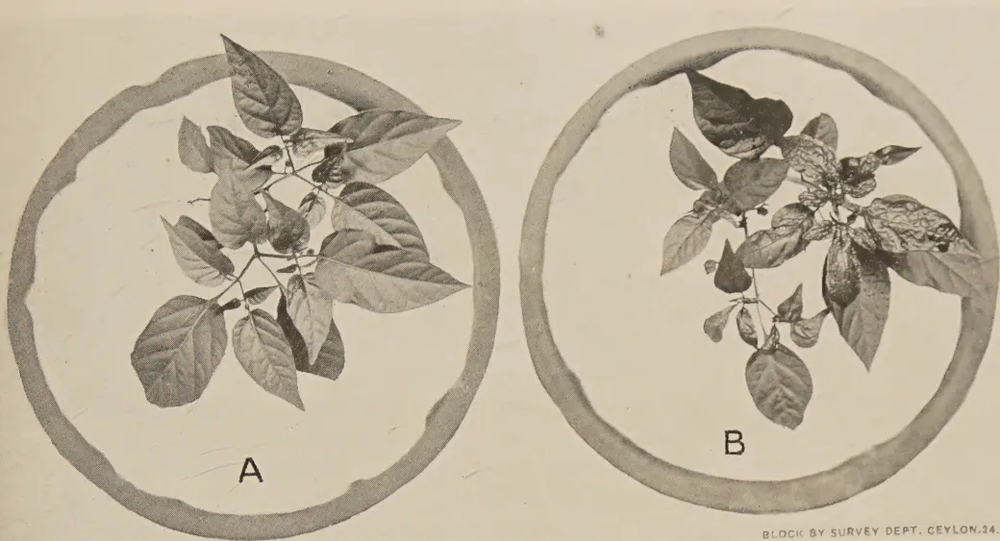

A

B

BLOCK BY SURVEY DEPT, CEYLON. 24. 10. 38

FIG. 1.—ILLUSTRATING EFFECT OF PROTECTING CHILLI PLANTS AGAINST INSECTS.

SPRAYED

UNSPRAYED

BLOCK BY SURVEY DEPT, CEYLON. 24. 10. 38

FIG. 2.—ILLUSTRATING EFFECT OF INSECTICIDAL SPRAYING OF CHILLI PLANTS AFFECTED WITH LEAF-CURL.

5------------------------------------------------

This image shows a blank page with a light beige or cream-colored background. The surface has a subtle texture and contains several small, dark specks or blemishes, likely due to the paper's age or the scanning process. There are also faint, horizontal lines or streaks visible across the page, which could be artifacts from the paper's manufacturing or the scanning equipment. The overall appearance is that of a clean but aged piece of paper, possibly a flyleaf or a separator page from an old book.

6------------------------------------------------

265

large healthy leaves free from leaf-curl symptoms, appeared on the axillary shoots. These plants flowered freely. No flowers were produced on the control plants (Fig. 2).

The results of the experiments outlined above favour the view that direct insect injury is responsible for the damage. The possibility of the disease being caused by an insect-borne virus localized in infected leaves and possessing no powers of systemic travel, though not completely ruled out, is extremely remote. Besides, apart from the likelihood of a disease of the latter type being more amenable to eradication by 'rogueing', the distinction between the two types of damage is of little more than academic interest; the same control methods would be applied in the two instances, *viz.*, methods of lowering the survival level of the causal insect. Thrips, mites and aphids have been detected on leaves affected with leaf-curl; one or more of these may have caused the damage. It may be mentioned that a leaf-curl of chilli attributed to *Scirtothrips dorsalis* Hood. has been recorded by Cherian (1936) from India. The damage caused by this insect is, however, rather different.

#### ACKNOWLEDGMENT

The writers' thanks are due to Mr. W. R. C. Paul, Acting Plant Pathologist, for valuable information.

#### REFERENCES

Cherian, M. C., 1936—The leaf-curl disease of chillies. *Dept. of Agric., Madras, Leaflet No. 73.*

Holmes, F. O., 1937—Inheritance of resistance to tobacco-mosaic disease in the pepper. *Phytopath. XXVII*, pp. 637–642.

Séin, F, 1930—A new mechanical method for artificially transmitting sugar cane mosaic. *J. Dept. Agric. P. R. XIV* pp. 49–68.

7------------------------------------------------

266

## CITRUS CULTURE IN THE DRY ZONE

### DUTY OF WATER AND IRRIGATION PRACTICE—I

---

R. KAHAWITA,  
DEPARTMENT OF IRRIGATION.

---

**F**IELD tests and observations mentioned in this article were carried out with the co-operation of Mr. V. E. P. Guneratne, Manager of Government Experimental Station at Minneriya. My grateful thanks are due to this officer who not only took a keen interest in the work but also gave valuable suggestions to get accurate and useful results.

During the time I was in charge of Minneriya Irrigation Scheme there was a proposal to start a citrus orchard by the Department of Agriculture. The Department was not satisfied with the small experimental plot (which proved beyond doubt the possibility of citrus culture in the dry zone), but it wanted to demonstrate on a large scale not only the agricultural side of the experiment but also its economic side. Correct irrigation being most important for the success of such a venture in the dry zone, its study and field observations were undertaken by me then. As this farm is going to be a *fait accompli* in the near future, I have decided to record the observations and studies in the form of an article, not for its own sake but to raise further interest in the subject.

It is unfortunate that there are not many reference books on the subject except scattered notes and articles in various agricultural and engineering journals published under the direction of different governments. In this respect American States come to the fore and recently Italy and Palestine. References were made to these when available to compare the results obtained under local conditions.

Nothing new is said when I say that Minneriya is in the heart of the dry zone. But it is strange to call a place dry with an annual rainfall of 73.53 when Colombo, Negombo, &c., also have similar average annual rainfalls but are known to be

8------------------------------------------------

267

wet. Dry! yes, because here the rains keep to a definite seasonal period. Though the average rainfall is good there is a prolonged drought distinctly separated from the wet season.

In any kind of agricultural undertaking the first problem to be studied is the soil; next the supply of water and water requirements. This second question is called irrigation and is closely related with the soil, as it must suit the soil conditions in that area. Our observations and experiments were made to study this relationship between irrigation and soil. Therefore I think it is necessary to touch upon a few physical properties of soil that interest an Irrigation Engineer before I take up the actual question of orchard irrigation and duty of water.

In irrigation engineering and its application to agriculture, soils are grouped into three general classes, *viz*: light, medium and heavy soils. I have taken the term "soil" to mean that depth of soil from which roots can assimilate moisture. Soils below this depth are called sub-soils. Light soils show a high percentage of sand, medium soils a high percentage of loam and heavy soils a high percentage of clay. In nature it is common to get several other variations which the soil chemists have a way of their own to classify. For engineering we use these three terms to express general conditions. For orchard irrigation light and medium soils with a suitable sub-soil are favourable.

Soils as they occur in nature contain a percentage of voids or empty spaces between particles. This varies according to the texture of soil. Such variation under field conditions may be anything from 20 per cent. to 50 per cent. by volume. In irrigation we depend on these voids for the storage of moisture for plant use; the amount of water retained depends on the percentage of voids in the soil. Three samples of cultivated soils from the fruit area of Minneriya Experimental Station gave an average void content of 30 per cent. by volume.

To get a correct idea of the soil texture even in one field is rather difficult as it may vary. The difficulty is all the greater as such variations may occur both horizontally and vertically as it often happens in most of the soils in the dry zone. Hence our theoretical deductions must to a certain extent be adjusted to suit actual field conditions gained by experience.

Since voids are expressed as a percentage, moisture content in soils is also expressed as a percentage on account of their relationship. But we convert it to an equivalent depth in inches per ft. depth of soil for comparing readily irrigation and rainfall.

9------------------------------------------------

268

Irrigation water moves in the soil by gravitation and capillarity. When there is an excess of water over the void content principal movement is by gravitation. As the water content decreases capillary movements and adjustments take place actuated by capillary forces.

Different degrees of moisture content in a soil are expressed by the following terms: moisture saturation: this is the amount of moisture required to fill all the voids in a known volume of soil as it occurs in nature. It is expressed as a percentage of the volume or equivalent depth. Field capacity is the percentage of moisture held in the soil against the action of gravity. In this state only a part of the voids is occupied by moisture. In light soils it varies from 10 to 20 per cent.; in medium soils it varies from 20 to 28 per cent. by volume. If there is a further depletion of moisture from the soil a state will be reached at which plant roots will find it difficult to assimilate the moisture from the soil. This is called the minimum desirable moisture content. Again the next state of interest to us is the point at which plants begin to wilt. In the dry zone a plant may droop during the hot hours of the day but will recover overnight if the moisture content has not reached the wilting point. Permanent wilting will occur if the soil cannot give the requisite amount of moisture for plant growth. This is a condition that must be avoided in an orchard if water is available as it would affect the crop of several seasons to come.

It will be explained shortly what bearing the foregoing has on duty of water in irrigation. Roots require both moisture and air for their development, hence if a soil gets saturated too often or for a long period air is expelled from the soil and this will injure the plant. This is what we mean by water-logging of soil. However, saturation of the top soil cannot be avoided immediately after an irrigation. With a good sub-soil in medium soils this will not last more than a few hours. In heavy soils or with poor sub-soil it may last a few days. With such soils it is best to under-irrigate, rather than over-irrigate, at each irrigation and to adjust the irrigation period accordingly. This difficulty will not arise in semi-aquatic crops like paddy. In orchards correct irrigation to suit the particular soil is very necessary to produce a good crop.

It has been proved beyond doubt by a large number of experimentors in America that the ideal moisture content in orchard soils is to maintain it at a stage between field capacity and the minimum desirable. When the soil has reached this second limit an irrigation must be applied to the soil to bring it to field capacity. The irrigation period is decided by these two limits which can be fixed by field tests and observations.

10------------------------------------------------

269

Moisture is lost to plants by deep percolation and evaporation. Unless the sub-soil is very gravelly, the greater loss is by evaporation. Moisture travels upwards to the dry surface soil by capillarity and then it is evaporated. Such movement was studied in the case of 3 samples of sun-dried soils of Minneriya. Observations are recorded in Fig. I. This indicates that such a movement towards dry soil can take place from a considerable depth and will bring the moisture-content in the root regions to the minimum desirable quicker than desired. This experiment was incomplete insofar as that evaporation losses could not be measured for lack of facilities but it gives useful information as to the rate of upward movement.

Though the presence of both moisture and air is essential in the soil for plant growth it is extremely difficult to find the optimum proportions in which these should be present. Purely on theoretical grounds supported by experiments and observation it is known that the soil must be maintained between field capacity and the minimum desirable to obtain good results in orchards practice. The regime of these two limits after an irrigation will vary according to the textural variations of the soil and climate. A series of tests were made to study moisture movement and duration of this regime in various places in the Experimental Station at Minneriya. Voids content of the soil averaged 30 per cent. Results are shown in Fig. II. It was observed that between 2 to  $3\frac{3}{4}$  gallons of water over one square foot of area took 20 hours to reach a depth of 5 feet with a maximum lateral moisture spread of 7.5 feet during that time. The moisture outline began to disappear from about the 14th to 16th day after the application.

Citrus is known to be shallow-rooted so that a moisture penetration below root regions is not to be aimed at by an irrigation if water is to be used economically. The maximum depth from which citrus gets its supply of moisture is between 4 to 5 feet. In practice a sufficient depth of irrigation is given to bring the soil to field capacity within a depth of 5 feet for that particular soil. Results illustrated in Fig. II give the desired data completely.

Expressing the above figures in the more familiar way to us we get 0.82 in. to 1.49 in. depth per ft. depth of soil. For a 24-hour irrigation for Minneriya medium soil this figure is reduced to between 0.75 in. and 1.25 in. depth per ft. depth of soil. In medium soils this head may be applied for the full depth and retained in it till the next irrigation. On this basis full depth of irrigation required per application is from 3.5 in. to 6 in. depth.

In Fig. III are given the average monthly rainfalls over 35 years at Minneriya. It will be seen that the rains commence

11------------------------------------------------

270

in October and end in January. February and March rains are meagre. April has a fair amount and from May onwards starts the dry period till the second week of September. During February and March irrigations are not required, for the storage during the wet season immediately preceding will supply the moisture requirements during these two months. Also it is a good practice to give the soil a rest for aeration after the heavy rains. Then irrigations will be required only from about the middle of May and thereafter till the second week of September. In Minneriya it was found that as explained earlier a fortnightly irrigation of the above amount was sufficient.

But during July and August it would be advisable to give the heavier irrigation at 10 days interval as day temperatures are high with dry winds as shown in Fig. IV. Though there is not much fluctuation in monthly temperatures July and August are bad due to the dry winds. During these months a 5-inch irrigation at 10 days interval may be tried.

Then confining the irrigation period to 4 months at intervals of two weeks between irrigations, on an average 8 irrigations will be required during the dry season. Allowing a 4-inch application per irrigation total water requirement for the season will be 32 acre inches per acre. Making an allowance of 4 inches for distribution losses and bad handling gross requirement will be 36 acre inches per acre for the whole irrigation period or converting these into approximate cusec as expressed for the design of channels we get  $\frac{24'' \times 14}{4} = 84$  acres per cusec—say 90 acres per cusec. This is the duty of water for citrus in Minneriya or in the dry zone with similar conditions as in Minneriya. On account of the method of culture in orchards an economic use of water is practicable which may increase this figure to about 110 acres per cusec.

Those who are handling the water in farm distribution must remember that citrus is shallow-rooted and that light individual irrigations with a uniform distribution of moisture in the soil are the best suited. A young orchard will require about  $\frac{2}{3}$  of the amount required for that of a mature orchard in full bearing.

*Method of field applications.*—Two methods are used in general for irrigating orchards with variations to suit the topographic conditions of the field. One is called basin irrigation and the other furrow irrigation. In the former water is ponded on an area around the tree for a period of time and in the latter water is run in furrows between trees,

12------------------------------------------------

<!-- stage4: FAINT old-images-only -->

[Faint page: no legible print of its own could be verified; text withheld (stage 4 review list)]

13------------------------------------------------

Fig. 1

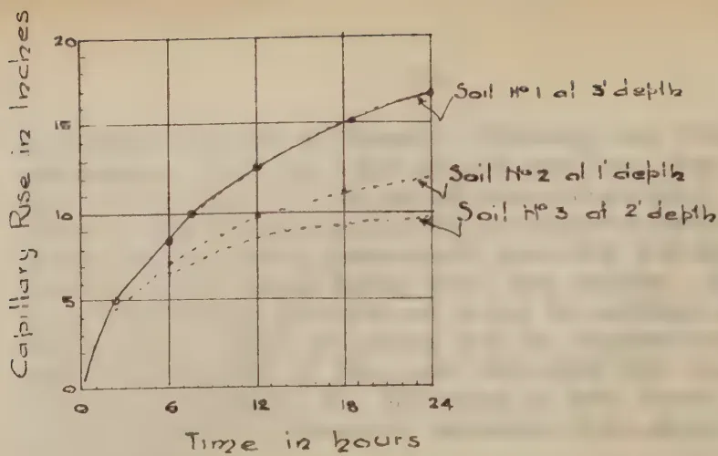

A line graph showing the capillary rise of moisture in three different soil samples over a 24-hour period. The y-axis represents 'Capillary Rise in inches' from 0 to 20, and the x-axis represents 'Time in hours' from 0 to 24. Three curves are plotted: Soil No 1 at 3' depth (solid line with dots), Soil No 2 at 1' depth (dashed line with dots), and Soil No 3 at 2' depth (dashed line with dots). Soil No 1 shows the highest rise, reaching approximately 17 inches at 24 hours. Soil No 2 reaches about 12 inches, and Soil No 3 reaches about 10 inches.

<table border="1">
<thead>
<tr>
<th>Time (hours)</th>
<th>Soil No 1 at 3' depth (inches)</th>
<th>Soil No 2 at 1' depth (inches)</th>
<th>Soil No 3 at 2' depth (inches)</th>
</tr>
</thead>
<tbody>
<tr>
<td>0</td>
<td>0</td>
<td>0</td>
<td>0</td>
</tr>
<tr>
<td>6</td>
<td>10</td>
<td>8</td>
<td>7</td>
</tr>
<tr>
<td>12</td>
<td>13</td>
<td>10</td>
<td>9</td>
</tr>
<tr>
<td>18</td>
<td>15</td>
<td>11</td>
<td>10</td>
</tr>
<tr>
<td>24</td>
<td>17</td>
<td>12</td>
<td>10</td>
</tr>
</tbody>
</table>

RATE OF CAPILLARY RISE OF MOISTURE  
IN SUN DRY SOILS OF MINNERIE

Fig. 2

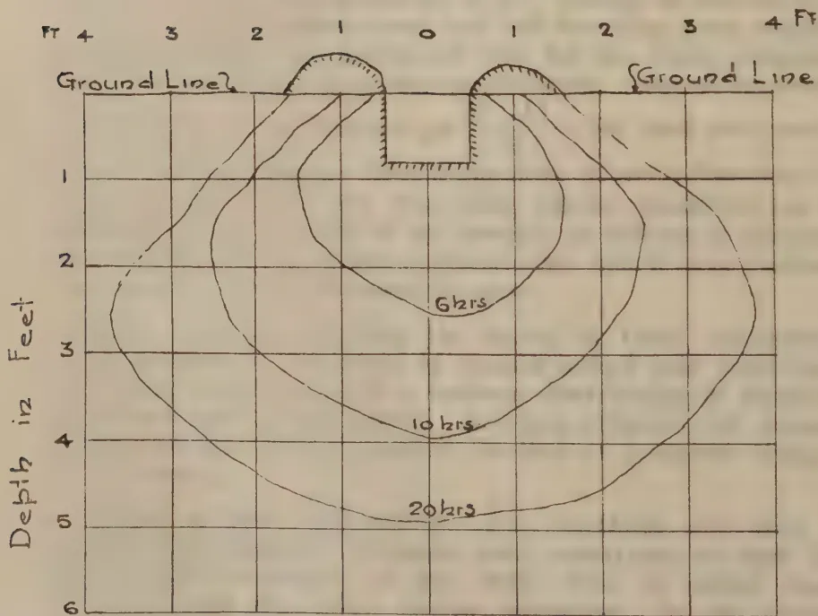

A cross-sectional diagram illustrating the movement of moisture in soil after irrigation. The vertical axis is 'Depth in Feet' from 0 to 6, and the horizontal axis is 'Distance in Feet' from -4 to 4. The ground line is at 0 feet. Three concentric, roughly elliptical shapes represent the moisture front at 6 hours, 10 hours, and 20 hours. The 6 hours front is the innermost, reaching about 1 foot in depth and 1 foot in width. The 10 hours front reaches about 2 feet in depth and 2 feet in width. The 20 hours front is the outermost, reaching about 5 feet in depth and 4 feet in width. The diagram shows the moisture spreading outwards and downwards over time.

MOISTURE MOVEMENT AFTER IRRIGATION  
IN MINNERIE CITRUS AREA SOIL

REPRODUCED & PRINTED BY SURVEY DEPT., CEYLON, 15.11.30.

14------------------------------------------------

FIG. 3

Average Monthly Rainfall at Minnerie  
3010 Above M.S.L.

<table border="1">
<thead>
<tr>
<th>Month</th>
<th>Rainfall (inches)</th>
</tr>
</thead>
<tbody>
<tr><td>O</td><td>10.5</td></tr>
<tr><td>N</td><td>13.5</td></tr>
<tr><td>D</td><td>14.5</td></tr>
<tr><td>J</td><td>11.5</td></tr>
<tr><td>F</td><td>3.0</td></tr>
<tr><td>M</td><td>3.5</td></tr>
<tr><td>A</td><td>6.0</td></tr>
<tr><td>M</td><td>3.5</td></tr>
<tr><td>J</td><td>0.5</td></tr>
<tr><td>J</td><td>0.8</td></tr>
<tr><td>A</td><td>2.2</td></tr>
<tr><td>S</td><td>3.5</td></tr>
<tr><td>O</td><td>10.5</td></tr>
</tbody>
</table>

FIG. 4

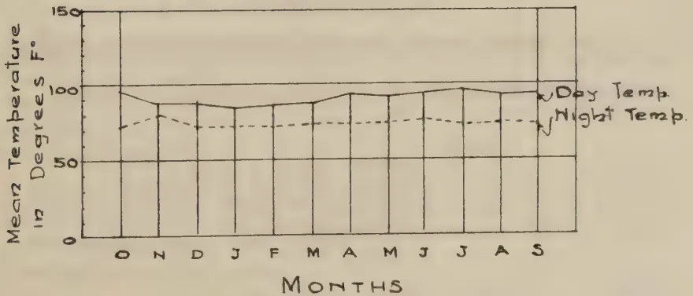

Temperature Variations at Minnerie

<table border="1">
<thead>
<tr>
<th>Month</th>
<th>Day Temp. (°F)</th>
<th>Night Temp. (°F)</th>
</tr>
</thead>
<tbody>
<tr><td>O</td><td>100</td><td>75</td></tr>
<tr><td>N</td><td>95</td><td>80</td></tr>
<tr><td>D</td><td>90</td><td>75</td></tr>
<tr><td>J</td><td>88</td><td>75</td></tr>
<tr><td>F</td><td>90</td><td>75</td></tr>
<tr><td>M</td><td>92</td><td>75</td></tr>
<tr><td>A</td><td>98</td><td>75</td></tr>
<tr><td>M</td><td>95</td><td>75</td></tr>
<tr><td>J</td><td>98</td><td>75</td></tr>
<tr><td>J</td><td>100</td><td>75</td></tr>
<tr><td>A</td><td>98</td><td>75</td></tr>
<tr><td>S</td><td>95</td><td>75</td></tr>
</tbody>
</table>

TEMPERATURE VARIATIONS AT MINNERIE

REPRODUCED & PRINTED BY SURVEY DEPT., CEYLON. 15.11.88.

15------------------------------------------------

# BASIN METHOD OF IRRIGATION FOR CITRUS FIG. 5

BASIN TO BASIN DISTRIBUTION      CENTRAL CHANNEL DISTRIBUTION

LEGEND

- SUPPLY CHANNELS
- DISTRIBUTORY CHANNELS
- RIDGES
- REGULATOR GATES

REPRODUCED & PRINTED BY SURVEY DEPT. CEYLON. 21.11.38.

16------------------------------------------------

271

also for a period of time. For both these methods extensive levelling is not required but as seasonal cultivation of the soil is necessary basins or furrows should not form a permanent feature of the lay-out of the orchard. They should be formed just before the irrigation period starts.

Basins are formed by ridges to contain one or more trees according to the head of water handled. If the area enclosed in a basin is small, levelling may not be necessary except what is required for forming ridges. While preparing ridges and basins the earth must be worked towards the stem of the tree so that it forms a raised platform of about 3 ft. radius round the tree, which should be about 3 inches above the level of water ponded. This will prevent any injury to the tree being caused by the stem coming in direct contact with water. Fig. V illustrates diagrammatically an orchard prepared for this method of irrigation.

Water can be delivered to the basins in two ways, either from basin to basin much in the same way as in paddy fields or by running the water in a distribution channel between rows of trees and delivering direct to each basin individually as shown in the right hand side of Fig. V. The former method with some variations to suit the then existing conditions of the citrus area at Minneriya was tried by Mr. Guneratne. In basin to basin distribution there will be an excess of application to trees in the basin at the head to which water is admitted. With this method uniform application will be difficult even with careful attention. On account of the larger area water has to travel over, a large head of water is required which limits the number of trees that can be handled from one basin head to about 6 trees. In the other method water is let into each basin and turned off when the required depth has been let in. This is quicker and advantageous as a uniform soakage of soil and better control of water can be secured.

Basin method is suitable to localities where individual irrigations are desired on account of the heaviness of soil or where excessive percolation occurs by other methods. It is not favoured for orchards as a large area of the surface is wetted and baked alternately.

It may be interesting to note that a type of basin irrigation is practised by the tobacco cultivators along the banks of Mahaweli-ganga in Tamankaduwa District, North-Central Province.

The lay-out of an orchard for basin irrigation is straightforward and requires no special attention. All the details are shown diagrammatically in Fig. V.

17------------------------------------------------

272

The method most commonly used in orchards is furrow irrigation. This method is adopted equally to flat as well as steep country. Furrows which are really small channels are run between rows of trees into which water is delivered from the supply channel. The number of furrows required per tree row depends on the tree spacing, age of trees and the lateral movement of moisture in the soil during the period water is run in the furrows. If a more intensive irrigation is required then cross furrows can be made, into which water is led from main furrows and held till soaked into the soil. For Minneriya soils cross furrows are not necessary. Fig. VI shows the arrangement of a block for furrow irrigation.

With the usual heads available from the supply channel and the time available to irrigate a set, the length of a furrow is limited to about 600 feet. The grade of the furrow depends on the amount of percolation losses expected at the head of furrow and the time required to get the necessary depth of water. For Minneriya soils grades varying from 0.002 to 0.004 can be used with satisfactory results.

There are distinct advantages to favour the adoption of a furrow system in an orchard; it can be used on any contouring of the land without extra cost in preparation; a uniform distribution of moisture is given to the soil; and desired depth can be obtained without wetting the entire surface and subsequent baking as happens in the basin method.

Distribution to the furrows requires a little more care and attention than in the basin method. The main channel should run at the head of the furrows so as to command all the furrows without any checking of flow.

To give complete information for the preparation of an orchard for furrow irrigation details for a 600 ft. length of furrow using the data obtained from Fig. II are worked out below.

At the rate of 80 trees per acre spacing of citrus is at about 24 ft. square. For a lateral moisture movement of  $7\frac{1}{2}$  feet, 4 furrows spaced at 3'—6'—6'—3' per tree row will be used. With a duty of 90 acres per cusec on a 14-day basis, the area irrigated per diem is 6.5 acres. Effective lateral moisture penetration of a furrow is taken as 6 feet. The area irrigated by each furrow is 600 by 6=3,600 sq. ft.=1/12th acre. One cusec for 24 hours gives approximately 24 acre inches. Hence

for a 4-inch irrigation to 1/12th acre in a day  $\frac{4}{\text{h } 24 \times 12}$

=0.015 cusecs must be discharged to each furrow from the distribution channel and run for 24 hours. This will give a

18------------------------------------------------

# FURROW IRRIGATION

## FOR CITRUS

FIG 6

Movement of Moisture

600'

6 6 6

### LEGEND

- Supply Channels
- Furrows
- Regulator Gates
- Distribution Gates

REPRODUCED & PRINTED BY SURVEY DEPT. CEYLON N. F. 38

19------------------------------------------------

<!-- stage4: ACCEPT r2J/J_013:36 -->

272  
ИОІТАЯІЯЯ. ВОЯЯЯЯ

The method most commonly used in orchards is furrow irrigation. This method is adapted equally to flat as well as steep country. Furrows which are run small channels are run between rows of trees into which water is delivered from the main channel. The number of furrows required per tree row depends on the tree spacing, age of trees and the lateral movement of water during the period water is run in the furrows. If intensive irrigation is required then cross furrows are run into the main channel. Minor irrigation cross furrows are run into the main channel.

The furrows require a little more care and attention than in the basic method. The main channel should run at the foot of the furrows so as to command the furrows without any checking of flow.

To give complete information for the preparation of an orchard for furrow irrigation details for a 600 ft. length of furrow using the data obtained from Fig. II are worked out below.

At the rate of 80 trees per acre spacing of citrus is at about 24 ft. square. For a lateral moisture movement of 7 1/2 feet, 4 furrows spaced at 3' - 6' - 6' - 3' per tree row will be used. With a duty of 1 acre per acre per 24 day hours, the area irrigated per acre is 3,600 sq. ft. The area irrigated by each furrow is taken as 6 feet. The area irrigated by each furrow is 600 by 6 = 3,600 sq. ft. 1/4 12th acre. One acre for 24 hours gives approximately 24 acre inches. Hence

LEGEND  
4  
for a 4-inch irrigation 1/12th acre in a day  
24 x 12  
to each furrow from the run for 24 hours. This will give a

Reprinted by permission of the Survey Dept. Calcutta, B. A.

20------------------------------------------------

<!-- stage4: ACCEPT r2J/J_013:37 -->

273

4-inch irrigation. One cusec will irrigate 20 tree rows 600 ft. long. Details of the lay-out of the orchard is shown in Fig. VI. This is the duty of water and method of irrigation recommended for Minneriya and similar places in the dry zone.

I expect to follow this article with a description and construction of cheap structures and implements necessary for field distribution of water and preparation of land for above method of irrigation.

21------------------------------------------------

274

## CITRUS CULTURE IN THE DRY ZONE

### DUTY OF WATER AND IRRIGATION PRACTICE—II

---

R. KAHAWITA,  
DEPARTMENT OF IRRIGATION.

---

IN the previous article I dealt with duty of water and two methods of irrigation usually adopted in orchards. Here I propose to give a few notes on land preparation and some implements required on a large orchard.

In clearing of new lands in the dry zone, the usual practice is to cut the jungle during the dry months and burn before the rains set in. This can be done very successfully on account of the dry nature of the dry zone timber. Chena cultivators in this area are adepts at this which needs no comment. During the very dry months of the season large trees like *palu* and *weera* can be burnt without felling. Burning of large trees could be improved so as to burn the roots and stumps to a depth of 3 or 4 feet in one operation. Earth is cleared round the base of the tree trunk and bark removed. Then dry firewood is stacked round it and a fire made. When the wood has caught fire it is covered with loamy earth to prevent a free draught of air thus causing the trunk to burn under a deficient draught. In this manner roots and stumps that will interfere with ploughing and land preparation can be got rid of at very little expense. Where the trees have been axed and felled leaving a stump of 2 to 3 feet above the ground, a similar method to the above could be adopted with successful results. In some 30 acres of jungle clearing for a channel and road reservation in Minneriya Scheme this method was tried with extremely satisfactory results. In the area so treated there were on an average 300 stumps above 4 feet girth per acre and the working charges came to Rs. 28 per acre. In stumps, where dry rot had set in in the core-wood, burning and charring was complete in a few hours to a depth of 4 to 5 feet. In this method heat is not allowed to radiate on account of the earth plastering so that it could be adopted, even after putting in the plants in the orchard.

22------------------------------------------------

<!-- stage4: ACCEPT r2J/J_013:38 -->

300316 WORROW

For orchard irrigation, after clearing the land, levelling is not necessary. But levelling of such local undulations is desirable to improve and facilitate ploughing and harrowing. Ploughing thoroughly to make the topsoil loose as possible, time to break up the topsoil tubes that are established in it when the uncultivated land also helps quick moisture movement in the soil.

In laying out the furrow system and the orchard plants it is very necessary to have a contour plan of the land. The general fall of the land should be first studied in the orchard and rows arranged on it before transferring it to the field. By this means it will be possible to lay down the furrows to take best advantage of the slope of the land. Neglect of such considerations will involve cutting unnecessarily deep furrows and even some levelling to fit the irrigation system.

The next step would be to construct the permanent supply system which would evolve itself from the previous work. Details are avoided here as they vary according to the extent and topography of the land. Furrows need be constructed only just before the irrigation season. In the dry zone this will be about April-May. If the land had been ploughed previously then a double throw furrow sledge or a furrow sledge shown in Fig. VII can be used. The former is heavy and needs the services

TAD NEM (AVVA)

STEL CHECK STATE

should be so inclined to make the furrow width about 6 inches. The furrow sledge, which is used in America, is light and can be worked with a pair of country hoes. Some useful details are given in the sketch for construction locally. It may be found that it does not cut the furrow deep enough in which case a load (say a sand bag or two) placed on it will improve the cut. Spacing of the two cutters can be adjusted to suit any spacing of furrows—in our case they are 6 feet apart. After making the furrows with either of the above implements a little hand spading will be required to improve the grade. Recommended grades are 0.2 ft. to 0.4 ft. in 100 ft.

In orchards over-irrigation should be avoided as it may be a season crop. Under-irrigation is not so harmful as it can be detected and remedied more easily than over-irrigation. One way to draw a correct irrigation is to draw the water to the furrows through a measuring box. If irrigation water for four furrows is issued through one box, the discharge per box should be  $0.015 \times 4 = 0.06$  cusec. A design and arrangement of a measuring

REPRODUCED & PRINTED BY SURVEY DEPT. OLYON, 12.11.85

23------------------------------------------------

# FURROW SLEDGE

A technical drawing of a Furrow Sledge. It consists of a long base timber labeled "Timber 8x8"x42". Two crossbeams, labeled "5x5", are attached to the base. A "Draft Rod 2"x3" is attached to the left crossbeam. A "Steel Shoe" is shown as a separate component. A "FURROW Shovel" is attached to the draft rod. The distance between the crossbeams is labeled "3' 6"". The height of the sledge is labeled "0' 9"". The crossbeams are labeled "2x8" and "1x8".

FIG. 7

## STEEL CHECK GATE

A technical drawing of a Steel Check Gate. It is a semi-circular structure with a "1/2 Round Iron Handle" at the top. The main body is a "3/16 Steel plate". A "Channel" is indicated by a dashed line. A note states "4" More than Top width of channel!".

## CANVAS CHECK GATE

A technical drawing of a Canvas Check Gate. It shows a "1/2 x 2" Timber" beam resting on a "Canvas" sheet. The canvas is draped over a mound of "Earth heaped on Canvas". An arrow indicates the direction of water flow. A note states "After placing it across Channel!".

FIG. 9

REPRODUCED & PRINTED BY SURVEY DEPT., CEYLON, 15. II. 30.

24------------------------------------------------

275

For orchard irrigation, after clearing the land, wholesale levelling is not necessary. But levelling of anthills and such local undulations is desirable to improve appearance and facilitate ploughing and harrowing. Ploughing should be done thoroughly to make the soil as loose as possible and at the same time to break up the capillary tubes that would have been established in it when it was uncultivated. Such a treatment also helps quick moisture movement in the soil.

In laying out the field system and the rows of plants it is very necessary to have a contour plan of the area. The general fall of the land should be first studied in a plan and rows arranged on it before transferring it to the field. By this means it will be possible to obtain a picture of the orchard as a whole and lay down the furrows to take best advantage of the slope of the land. Neglect of such considerations will involve cutting unnecessarily deep furrows and even some levelling to fit in the irrigation system.

The next step would be to construct the permanent supply system which would evolve itself from the previous work. Details are avoided here as they vary according to the extent and topography of the area. Furrows need be constructed only just before the irrigation season : in the dry zone this will be about April-May. If the land had been ploughed previously then a double throw furrow plough or a furrow sledge shown in Fig. VII can be used. The former is heavy and needs the services of a very strong pair of bullocks. In this implement shares should be so inclined to make the furrow width about 6 inches. The furrow sledge, which is used in America, is light and can be worked with a pair of country bulls. Some useful details are given in the sketch for construction locally. When the sledge is in use it may be found that it does not cut the furrow deep enough in which case a load (say a sand bag or two) placed on it will improve the cut. Spacing of the two cutters can be adjusted to suit any spacing of furrows—in our case they are 6 feet apart. After making the furrows with either of the above implements a little hand spading will be required to improve the grade. Recommended grades are 0·2 ft. to 0·4 ft. in 100 ft.

In orchards over-irrigation should be avoided as it may ruin a season's crop. Under-irrigation is not so harmful and it can be detected and remedied more easily than over-irrigation. One way to secure a correct irrigation is to draw the water to the furrows through a measuring box. If irrigation water for four furrows is issued through one box, the discharge per box should be  $0\cdot015 \times 4 = 0\cdot06$  cusec on the basis of the data in the previous article. A design and arrangement of a measuring

25------------------------------------------------

276

box to pass this with a minimum head of 3 inches is illustrated in Fig. VIII.

Once the water is drawn off from the delivery, it is necessary to help the water to flow into the furrows for which a simple check gate can be used. Two types are illustrated in Fig. IX.—first a steel plate with a handle, to be pressed into the soil across the channel and the second a canvas gate to be placed across the ditch with earth on the canvas to stabilize it. The former is more convenient to use.

In this type of irrigation it is difficult to guide an irrigator on theoretical considerations on account of soil variations that may occur in a large orchard. To overcome this difficulty a few borings should be taken in between furrows to ascertain moisture penetration. Borings should be taken up to a depth of 5 to 6 feet in mature orchards and 3 to 4 feet in young orchards.

Once the irrigator gets accustomed to the water requirements of the area the examination of soil samples may be omitted from the day's routine. For taking borings a simple soil worm auger or a tube auger as illustrated in Fig. X can be used.

The former is screwed into the soil and as it makes its way in loose earth is brought up. The latter is worked into the soil by gentle hammering and turning. In it the sample of soil is held in the tube and brought up when lifted. It will be found difficult to work with this type of auger in hard compact soil. On the other hand it is more advantageous that soil can be examined at various depths without disturbing the soil particles. In the light of these soil samples taken during an irrigation an irrigator should adjust his work to suit the soil requirements. It may even be necessary to improve and increase the number of furrows.

These soil samples can be taken a step further by actual determination of moisture content during and after an application. During the first few years such a practice would be very useful to standardize and collect data for local orchard irrigation practice. Apparatus required for this work are a simple lever type scientific balance (type used for testing moisture content in tea is suitable) copper or aluminium sample tins, a copper water jacketed drying oven, and a suitable stove. Method of finding moisture content is as follows:—A sample of soil, after weighing, is dried in the oven until after repeated drying and weighings no change in weight is registered. In transporting the sample from field to the testing room care must be taken that no moisture is lost in the soil by evaporation. Difference

26------------------------------------------------

# MEASURING BOX

FIG. 8

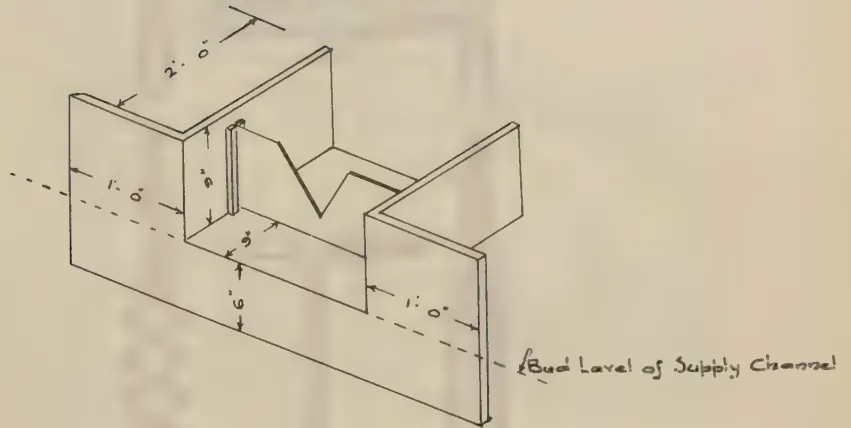

An isometric drawing of a measuring box. The box is a rectangular frame with a central V-shaped notch. Dimensions are indicated as follows: the top width is 2'-0", the side width is 1'-0", the height of the side walls is 1'-6", and the depth of the V-notch is 3". A dashed line indicates the 'Bnd Level of Supply Channel'.

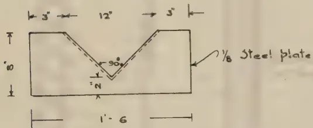

A cross-sectional view of the V-notch. The notch has a width of 1'-6" at the base and a depth of 1'-0". The sides of the notch are at a 90° angle. The material is labeled as 1/8" Steel plate. The horizontal dimensions from the center line are 3" and 12".

DETAILS OF V NOTCH

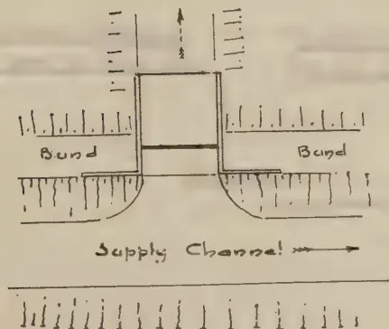

A plan view of the measuring box. It shows a central rectangular area labeled 'Supply Channel'. On either side of the channel are two rectangular areas labeled 'Bund'. The entire structure is surrounded by a series of vertical lines representing the ground or a fence.

PLAN

REPRODUCED & PRINTED BY SURVEY DEPT. CEYLON. B. H. 39.

27------------------------------------------------

<!-- stage4: ACCEPT r2J/J_013:40 -->

276

to pass this with a minimum head of 3 inches is illustrated in Fig. VIII.

For the water ΧΟΔΩΝ ΔΙΝΥΣΑΣ ΜΕΛΙΝ delivery, it is necessary to help the water to flow into the furrows for which a simple check gate can be used. Two types are illustrated in Fig. IX.—first a metal plate with a handle 8.217 pressed into the soil across the channel and the second a canvas gate to be placed across the ditch with earth on the canvas to stabilize it. The former is more convenient to use.

The former is screwed into the soil and as it makes its way in lower earth is brought up. The latter is worked into the soil by gentle hammering and turning. In it the sample of soil is held in the sample plate when lifted. It will be found difficult to work with this type of auger in hard compact soil. On the other hand it is more advantageous that soil can be examined at various depths without disturbing the soil particles. In the light of these soil samples taken during an irrigation an irrigator should adjust his work to suit the soil requirements. It may even be necessary to improve and increase the number of furrows.

These soil samples can be taken a step further by actual determinations of moisture content during and after an application. During the first few years such a practice would be very useful to standardize data for orchard irrigation practice. Apparatus required for this work are a simple lever type apparatus used for testing moisture content in tea is suitable, sample tins, a copper water packed drying oven, and a suitable stove. Method of finding moisture content is as follows:—A sample of soil, after weighing is dried in the oven until after repeated drying and weighing it is rigidified. In transporting the sample to the testing room care must be taken that no moisture is lost in the soil by evaporation. Difference

REPRODUCED BY SURVEY DEPT. LIBRARY, CALCUTTA

28------------------------------------------------

AUGER SHANK AND  
HANDLE FOR LENGTHENING

1" to 2½" Diameter

LENGTH ABOUT 15 INCHES

Diameter of Tube  
6" to 8"

Pointed Rod  
Slightly Tapering

WORM AUGER  
For use in firm soils

TUBULAR AUGER  
For use in soft soils

FIG. 10

REPRODUCED & PRINTED BY SURVEY DEPT. CEYLON, 21. II. 38.

29------------------------------------------------

<!-- stage4: FAINT old-images-only -->

[Faint page: no legible print of its own could be verified; text withheld (stage 4 review list)]

30------------------------------------------------

277

in weight in the first and the last weighings will give the moisture content by weight. For our purpose it must be expressed volumetrically and the conversion is effected thus :—

Let  $W_1$  = Wt. of soil sample before heating

$W_2$  = Wt. of soil sample after heating

Loss in weight =  $W_1 - W_2$

Then % of moisture by weight =  $\frac{W_1 - W_2}{W_2} \times 100 = W_m$

Let  $V_m$  = percentage of moisture by volume

$W$  = Wt. of a unit volume of dry soil

$P$  = Wt. of a unit volume of water.

Then  $V_m P$  = Weight of moisture per unit volume of soil

$W_m W$  = Weight of moisture per unit volume of soil

$\therefore V_m P = W_m W$

$$V_m = \frac{W_m W}{P}$$

This expressed in inches we have  $\frac{W_m W}{62 \cdot 5} \times \frac{12}{100}$  inches per ft. depth of soil—form expressed in irrigation. A series of such observations made and recorded during an irrigation season will be of immense help not only to the irrigator but also to the scientific investigator.

It is hardly necessary to stress the point that successful irrigation depends more on actual field experience than on academic theory. In these articles I have arrived at my deductions from observations made in the field which must be augmented with more observations spread over a larger area and longer period. Then it will be possible to adjust the theory to suit a particular case under consideration. Our theory is based on so many assumptions that may change several times even within a small area, hence the necessity for further observations.

It is possible to generalize the results recorded in these articles by giving them a mathematical meaning so as to hold good for any soil texture for which characteristics are known from field observations. A mathematical expression for these is purely of academical interest and it is developed below for those to whom it may be of interest.

It is assumed that a greater part of water applied to a furrow is absorbed by the soil and whatever is left unused will pass as waste. This should be a minimum under the worst working conditions. Observations show that absorption takes place at a fairly definite rate depending on soil texture and humidity of soil at the time of an application. Let the rate of absorption be expressed by  $u$ . This varies from 0.15 in. per hour to 0.75 in. per hour in loamy soils to 1.41 ins. to 4.23 ins. per

31------------------------------------------------

278

hour in sand. It can be easily ascertained in the field for any soil under investigation. Though vertical movement will be a little faster than lateral spread it is assumed to be same in all directions to simplify the procedure. No great error is introduced by this assumption. It is evident from Fig. II. Let the rate of flow into a furrow be represented by  $Q$  cusec. The manner in which this is absorbed into the soil is shown schematically in Fig. XI. A portion of  $Q$  is absorbed into the soil as it flows down the furrow and a portion actually moves down it to be utilized by the soil further down. Let  $t_1$  be the time taken for the water to reach the end of furrow and  $t_2$  the time water is run in the furrow after it had reached the end. Hence the period of irrigation  $T = t_1 + t_2$ . The total quantity of water passed into the furrow during this time is  $QT$  cu. ft. This expressed as an equivalent depth  $d$  of irrigation applied to a length  $l$  ft. and effective breadth  $b$  ft. gives the relation  $QT = dl b$ . The effective breadth  $b$  is assumed to be proportional to time. If the amount percolating into the soil during this time is  $d_1$  we have  $d_1 = UT$ . In the time  $dt$  the quantity of water passing into the furrow is  $Qdt$ . After it has reached a point at a distance  $x$  from the inlet the amount percolated into the soil in length  $x$  is  $u^2 x \cdot t \cdot dt$ . and the balance  $A v dt$  passes down the furrow, where  $A$  = area of water section of furrow and  $v$  = velocity of flow in furrow. Then we have the following volumetric relation :

$$Qdt = u^2 x dt + Av dt.$$

$$= u^2 x^2 \frac{A}{Q} \cdot dt + Adx$$

$$i.e. \quad dt \left( \frac{Q^2 - U^2 X^2 A}{Q} \right) = Adx.$$

$$dt = \frac{AQ}{Q^2 - U^2 X^2 A} \cdot dx.$$

The solution of this equation is—

$$t = \frac{\sqrt{A}}{2U} \log_e \left( \frac{1 + px}{1 - px} \right) + C, \text{ where } p^2 = \frac{U^2 A}{Q^2} \text{ and } C \text{ is a}$$

constant of integration. When  $t = 0$ ,  $X = 0$  which makes  $C = 0$ .

When  $X = l$

$$t_1 = \frac{\sqrt{A}}{2U} \log_e \frac{1 + pl}{1 - pl}$$

$$\frac{1 + pl}{1 - pl} = \frac{Q + U\sqrt{Al}}{Q - U\sqrt{Al}} = \frac{QT + UTl\sqrt{A}}{QT - UTl\sqrt{A}} = \frac{dlb + d_1 l \sqrt{A}}{dlb - d_1 l \sqrt{A}}$$

32------------------------------------------------

PERCOLATION DISTRIBUTION IN A FURROW  
DURING AN IRRIGATION  
SCHEMATICALLY.

FIG. 11

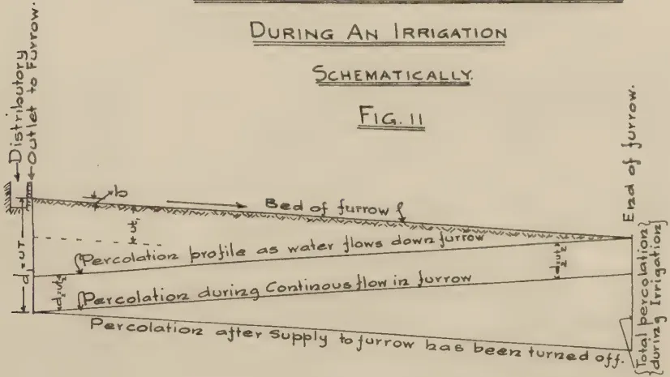

The diagram illustrates the percolation distribution in a furrow during an irrigation. It shows a cross-section of a furrow with a sloped bed. On the left, a vertical line indicates the 'Distributary Outlet to Furrow.' The furrow bed is labeled 'Bed of furrow f'. Three horizontal lines represent different percolation profiles: 
 

- The top line is labeled 'Percolation profile as water flows down furrow'.
- The middle line is labeled 'Percolation during Continuous flow in furrow'.
- The bottom line is labeled 'Percolation after supply to furrow has been turned off.'

 On the right, a vertical line marks the 'End of furrow.' A bracket on the right side indicates 'Total percolation during Irrigations'.

This diagram shows a cross-section of a furrow with a V-shaped bed. The width of the furrow is labeled 'Effective Width b'. A dashed line represents the 'Outline of Percolation', which is wider than the effective width. The diagram also shows some vegetation on the top edges of the furrow.

SECTION OF A FURROW

REPRODUCED & PRINTED BY SURVEY DEPT., CEYLON PL. N. 39

33------------------------------------------------

<!-- stage4: UNRESOLVED  -->

[Page not transcribed: OCR unreliable (stage 4 review list)]

34------------------------------------------------

<!-- stage4: ACCEPT r2J/J_013:43 -->

$$\frac{x+a}{x-a} \log \frac{x^2 A}{u^2} = t_1$$

Values of  $\frac{x+a}{x-a} \log \frac{x^2 A}{u^2}$  for constant  $x$  and  $a$  to equal  $V$

Fig 15

Hence  $t_1 = \frac{\sqrt{A}}{2U} \log \frac{B+K}{B-K}$

size and spacing of furrows chosen. For convenience values of  $\log \frac{B+K}{B-K}$  for different values of B and K are given in Fig. XII.

The graph will be of use for normal furrow irrigations.

The most efficient use of water will be when  $B = 1$ , i.e., when there is no waste at the end of the furrow. Also the value of K will be always very much less than 1. Due to the uncertainty of soil texture, hence the value of U, and the difficulty of maintaining a satisfactory grade in the furrow, the value of B will average about 1.2 to 1.3 in practice. If  $d_2$  is the amount percolating into the soil during time  $t_2$ , then  $d_2 = u t_2$ . Waste, if any, during this time will be  $(Q - U l b) t_2$ .

Total irrigating period is

$$T = t_1 + t_2 = \frac{\sqrt{A}}{2U} \log \frac{B+K}{B-K} + \frac{d_2}{u}$$

$$B = \frac{d}{d_1} = \frac{d l b}{d_1 l b}$$

$\therefore Q = B u l b$  gives the rate of flow into the furrow.

The use of the equations is very simple once a suitable value for u is fixed from field observations. It will be found that value of  $t_1$  is small compared to the total irrigating period if the depth of water in the furrow is big which means there would be considerable waste at the end of furrow. To avoid this keep the head in the furrow small. It will not affect the total irrigating period very much.

Handwritten note: *Handwritten signature and date 12/8/21*

REPRODUCED BY SURVEY DEPT. BAYLON. 51-1-25

35------------------------------------------------

$$t_1 = \frac{A^{1/2}}{2U} \log_e \frac{\beta+k}{\beta-k}$$

Values of  $\log_e \left( \frac{\beta+k}{\beta-k} \right)$  for different  
Values of  $\beta$  &  $k$

Fig 12

The graph displays five curves representing different values of  $k$ . As  $k$  decreases, the curves shift downwards. The y-axis is labeled  $\log_e \left( \frac{\beta+k}{\beta-k} \right)$  with arrows pointing up and down. The x-axis is labeled 'Values of  $\beta$ '.

<table border="1">
<caption>Approximate data points from the graph</caption>
<thead>
<tr>
<th>Value of <math>\beta</math></th>
<th><math>k=0.1</math></th>
<th><math>k=0.08</math></th>
<th><math>k=0.06</math></th>
<th><math>k=0.04</math></th>
<th><math>k=0.02</math></th>
</tr>
</thead>
<tbody>
<tr>
<td>1</td>
<td>0.20</td>
<td>0.155</td>
<td>0.115</td>
<td>0.078</td>
<td>0.038</td>
</tr>
<tr>
<td>10</td>
<td>0.145</td>
<td>0.115</td>
<td>0.085</td>
<td>0.055</td>
<td>0.025</td>
</tr>
<tr>
<td>20</td>
<td>0.105</td>
<td>0.085</td>
<td>0.065</td>
<td>0.045</td>
<td>0.015</td>
</tr>
</tbody>
</table>

R. K. Ahankar  
15/6/38

REPRODUCED & PRINTED BY SURVEY DEPT., GUYLON, 21.11.38.

36------------------------------------------------

279
$$= \frac{d + d_1 \sqrt{\frac{\bar{A}}{b}}}{d - d_1 \sqrt{\frac{\bar{A}}{b}}} \quad \text{Let } \frac{d}{d_1} = B, \text{ and } \sqrt{\frac{\bar{A}}{b}} = K$$

$$\text{then } \frac{d + d_1 \sqrt{\frac{\bar{A}}{b}}}{d - d_1 \sqrt{\frac{\bar{A}}{b}}} = \frac{B + K}{B - K}$$

Hence  $t_1 = \frac{\sqrt{\bar{A}}}{2U} \log_e \frac{B + K}{B - K}$ . Now  $K$  depends on the

size and spacing of furrows chosen. For convenience values of  $\log_e \frac{B + K}{B - K}$  for different values of  $B$  and  $K$  are given in Fig. XII.

The graph will be of use for normal furrow irrigations.

The most efficient use of water will be when  $B = 1$ , *i.e.*, when there is no wastage at the end of the furrow. Also the value of  $K$  will be always very much less than 1. Due to the uncertainty of soil texture, hence the value of  $U$ , and the difficulty of maintaining a satisfactory grade in the furrow, the value of  $B$  will average about 1.2 to 1.3 in practice. If  $d_2$  is the amount percolating into the soil during time  $t_2$ , then  $d_2 = ut_2$ . Wastage, if any, during this time will be  $(Q - U l b) t_2$

Total irrigating period is—

$$T = t_1 + t_2 = \frac{\sqrt{\bar{A}}}{2U} \log_e \frac{B + K}{B - K} + \frac{d_2}{u}$$

$$B = \frac{d}{d_1} = \frac{d l b}{d_1 l b} = \frac{QT}{UT l b}$$

$\therefore Q = B u l b$ . gives the rate of flow into the furrow.

The use of the equations is very simple once a suitable value for  $u$  is fixed from field observations. It will be found that value of  $t_1$  is small compared to the total irrigating period if the depth of water in the furrow is big which means there would be considerable waste at the end of furrow. To avoid this keep the head in the furrow small. It will not affect the total irrigating period very much.

37------------------------------------------------

280

## DEPARTMENTAL NOTES

---

### SOIL EROSION ON TEA ESTATES AND SOME SUGGESTIONS FOR ITS CONTROL\*

---

W. C. LESTER-SMITH,  
*AGRICULTURAL OFFICER, SOIL CONSERVATION.*

---

**P**LANTATION agriculture may be defined as the cultivation of one or more types of crop plant in large compact communities in order to economize in the production and harvesting of the crops concerned. This type of agriculture involves the establishment of large areas under one main crop, and the application of labour and capital to it in such a way that production is rendered most profitable over the whole economic life of the crop.

With a perennial crop like tea, in which the period of lag between the application of capital to the crop and the sale of the finished product is often considerably longer than is the case with other crops, one of the primary necessities is to prolong the life of the crop so that the capital expended on it is spread over an economic period of profitable returns. There are two basic requirements of all perennial crops without which their life cannot be economically prolonged, and tea is no exception. These requirements are the conservation of the soil in which the plant grows, and the maintenance of its fertility.

The economic cultivation of any crop plant necessarily involves, from time to time, some disturbance of the soil in which that plant is growing; and this must inevitably lead to a greater or lesser degree of soil erosion. However small may be the amount of erosion which takes place, in time it will both reduce the fertility of the soil and increase the cost of production of the crop. The greater the slope of the land, the longer the length of the slope, and the more often the surface soil is cultivated or stirred, the greater will be this loss.

Owing to the varied environments in which tea is grown there are several types of erosion to which the surface soil of

---

\* The text of an address delivered at a meeting of the Dimbula District Planters' Association on September 12, 1938. The photographs reproduced illustrate various points referred to in the text.

38------------------------------------------------

This image is a scan of a blank page. The paper has a light beige or cream-colored tint. There are a few very small, dark specks scattered across the surface, which appear to be scanning artifacts or dust particles. No text, lines, or other markings are present on the page.

39------------------------------------------------

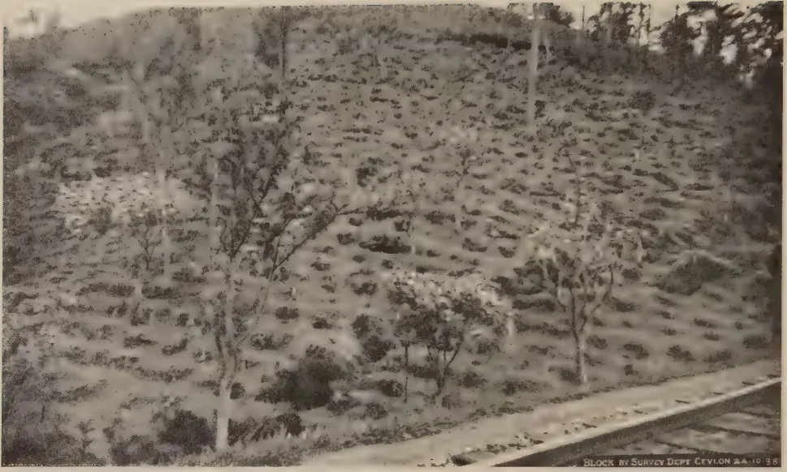A black and white photograph of a steep hillside. The slope is covered with sparse, low-lying vegetation and patches of exposed soil, indicating significant erosion. Several thin, leafless trees are scattered across the hillside. In the lower right foreground, a paved road or path runs horizontally. A small text label in the bottom right corner reads "BLOCK BY SURVEY DEPT CEYLON 24-10-38".

FIG. I.—SOIL EXPOSURE.

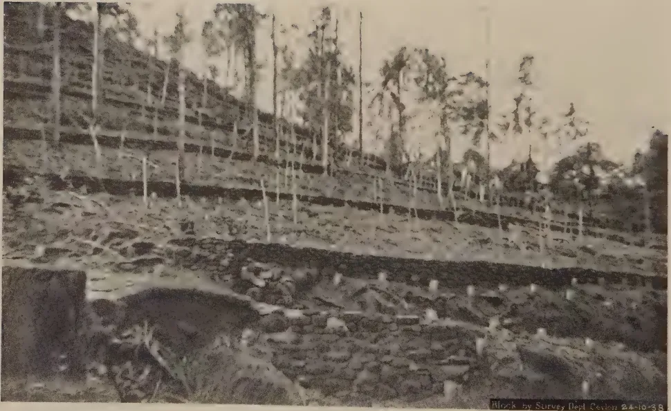A black and white photograph of a steep hillside featuring contour stone terraces. The terraces are built into the slope using stone and earth, creating a series of horizontal steps. The hillside is densely populated with tall, slender trees, likely eucalyptus. The foreground shows the rough, uneven ground of the terraces. A small text label in the bottom right corner reads "Block by Survey Dept Ceylon 24-10-38".

FIG. II.—CONTOUR STONE TERRACES.

40------------------------------------------------

281

areas under tea is subjected. I propose to describe some of these, to comment on them briefly, and to suggest various ways in which the degree of erosion can be reduced.

*Direct Rainfall Erosion.*—This is due to the direct beating action of the individual raindrops on exposed areas of the surface soil. It is a form of erosion which occurs on areas planted with tea which are devoid of any high shade or ground cover, and when the tea plants themselves and any other existing low shade plants do not entirely cover the soil and intercept the rain (Fig. I). This form of erosion is perhaps most severe on soils which are kept clean weeded, which are loose and dry, which contain insufficient clay or humus to render them cohesive, and on areas which are almost denuded of all high and medium shade at the same time as the tea is pruned. In my opinion this form of erosion can be reduced by maintaining a rain-intercepting high or medium cover over the tea when it is pruned, by laying the prunings and by carrying out any artificial or green manuring that is done at this time, in counter-slope lines. Close planting will also serve to reduce this form of erosion.

*Sheet Erosion.*—This is the widespread removal of a very thin layer of soil, mainly the loose particles, from the surface of the land. It is a form of erosion which is caused by surface run-off water. The amount of humus and soil moved is often considerable, and is increased by the steepness of the slope and by insufficient checks to the movement of this water. The greater part of the eroded soil is removed during the first hour or less of the run-off period resulting from intensive falls of rain. The most efficacious preventives of this form of erosion are an extremely absorptive surface soil, numerous sponge-pits or trenches, and a low-growing ground cover. The plant (or combination of plants) which has none of the specific characters disadvantageous in a ground cover for tea, and which is easily establishable in different areas, has yet to be found. Until this has been accomplished, and until such a plant or mixture of plants has been proved to have no detrimental effect on the crop, various makeshifts which will limit the movement of soil should be adopted. Various ground cover plants, such as *Oxalis* spp. and *Centella asiatica*, offer possibilities in this respect; but they all have one common disadvantage that they cannot be established everywhere and particularly where they are most needed. To what extent this is due to a reduction in the natural fertility of the soil resulting from past erosive action I cannot say, but I venture to think that in many cases it is primarily due to this cause. If this is so, two main ways of improving these conditions suggest themselves; firstly, by simulating at least a partial return to natural conditions by establishing an

41------------------------------------------------

282

increased density of high and medium shade plants, and secondly, by reducing soil movement to a minimum in other ways. It appears to me that one of the cheapest and most effective methods of preventing sheet erosion on sloping land is to establish permanent hedges of some close-growing perennial plant. These hedges should be planted along contour lines at such vertical intervals as would best suit the slopes and soils concerned. If these hedges are once properly established and maintained they will reduce the length of the flow-lines of surface run-off water, check its rate of flow, and effect the deposition of eroded soil along the upper sides of the contour hedges. In this way the forces of erosion will be directed along anti-erosive lines which will automatically terrace the land, reducing its slope, conserving its soil, limiting the movement of its humus surface-litter, and so raising the natural fertility of the soil.

Contour stone terracing (Fig. II) can effect this equally well, when stone is available in sufficient quantity on the spot; but stone terraces suffer from the disability of having to be periodically heightened to prevent loss of soil from steep slopes on which soil movement continues to take place. Hedges of suitable perennial plants, however, grow up with the rising bank of arrested soil, tend to consolidate it, and cause less damage when breaches occur. The plant which I consider most useful for this purpose is the Sword plant (*Sansevieria guineensis*), while its indigenous relative, the Ceylon Bowstring Hemp (*Sansevieria zeylanica*), forms a fair substitute and is available in greater quantity.

Contour works of this type require to be co-ordinated with some system of drainage which will remove surplus run-off water and thus prevent its accumulating and breaching one or more of the contour works. Under the rainfall and other conditions which commonly prevail in Ceylon it is inevitable that a certain portion of the annual total rainfall eventually becomes surface run-off water. It is this fraction, however small it may be, resulting mainly from intensive falls of rain of short duration and restricted distribution, which causes the most severe erosion. Therefore unless contour works are provided with some means of relief in the form of drains, they may be the cause of serious damage, if not on the area itself probably on that immediately below it. Contour drains naturally work best in conjunction with contour hedges and contour terraces, but existing estate drains can generally be utilized to serve a similar purpose, until such time as more up-to-date drainage systems can be constructed.

Contour hedges of the Sword plant have a particular value, I consider, for establishment in areas of tea which it is proposed

42------------------------------------------------

This image is a scan of a blank page. The paper has a light beige or cream-colored tint. There are a few very small, dark specks scattered across the surface, which appear to be scanning artifacts or dust particles. No text, lines, or other markings are present on the page.

43------------------------------------------------

FIG. III.—COUNTER-SLOPE PLANTING.

FIG. IV.—ROADSIDE BANK EROSION.

44------------------------------------------------

283

to replant. For this purpose I would suggest that the contour hedges are planted at least a year before the old tea is removed, and that, at first, only those tea bushes which interfere with the establishment of the contour hedges are removed. The soil which is subsequently displaced and loosened by the removal of the remainder of the old tea plants will then be held up and protected from loss by the contour hedges. The land will tend to terrace itself, which will facilitate replanting and the subsequent plucking and cultivation of the area, and run-off and erosion will be reduced. Once the area is cleared, except for the contour hedges, a re-orientation of the drainage system of the area is facilitated, and more or less level contour drains can be constructed without the necessity for much pegging and lining. These drains should be sited on the lower side of the contour hedges and the spoil or excavated earth may be utilized for filling in old drains and for assisting the natural terracing of the land by spreading it along the upper sides of the contour hedges.

In connection with the replanting of the contour strips, I should like to correct an erroneous impression I appear to have given in a previous lecture I gave at Ratnapura (*Tropical Agriculturist*, June, 1938, Vol. 90, No. 6, page 363, last paragraph.) I then said that contour planting did not appear to be suited to close-spaced row crops such as tea, &c., and I still hold this view. The slopes of the greater part of the undulating land of Ceylon are either so small or so uneven as to render the large-scale contour planting of close-spaced crops uneconomic, on account of the difficulties involved in their lay-out and management. To be more explicit I should say that I refer to strict contour planting, and not to those modified systems of contour planting which can be more correctly referred to as counter-slope planting (Fig. III).

*Dry Wash.*—This is a form of erosion which is mainly characteristic of steep stony slopes with a soil the particles of which, when dry, are lacking in cohesion. They are the cultivated counterpart of areas which, I believe, in mountain-ering parlance would be termed "scree". Dry wash, as its name implies, usually takes place in areas which are subject to pronounced spells of dry weather, which are deficient in shade and ground cover, and have been so eroded in the past that any surface material worthy of the name of soil is conspicuous by its absence. The physical nature of the so-called surface soil, the slope of the land, and the sparseness of vegetative cover, are such that in dry periods, a spontaneous or induced downward movement of soil, soil-aggregates and stones, takes place on the more exposed slopes. It is due to evaporation of soil moisture and a low humus content causing a

45------------------------------------------------

284

reduction in the cohesion between the particles which constitute the surface soil ; and also to variations in the amount and position of soil moisture causing changes in the centre of balance of stones and soil-aggregates.

This form of erosion can be greatly reduced by permanent contour terraces, grass bunds, and hedges of almost any woody plant if sufficiently closely planted. As a temporary measure, low, contour, wattle fences, made of *Gliricidia* branches, &c, can be used with effect across areas of this type. High shade, low shade and ground cover plants, combined with green manuring, can also be used in addition, in order to increase the moisture-retaining capacity of the soil and its cohesiveness. The prevention of this form of erosion must, in any case, be based upon the prevention of soil movement and the revegetating of the area.

*Bank Erosion.*—The banks of roadsides (Fig. IV), streams, gullies and drains (Fig. V), often suffer severely from erosion as a result of their being devegetated, cut at too steep a slope, and unprovided with an adequate check to surface run-off water before it flows over the edge of the bank. A clean cut earth bank may look neat and tidy when it is kept free of weeds and all other vegetation, but, to my mind, it cannot be considered either economic or stable unless it consists of hard rock-like material. Such banks are often cut so steep that no vegetation will grow on them, or they are periodically scraped and weeded to keep them clean. In this state they are perpetually exposed to the sun, the wind and the rain. The alternations of wet and dry conditions, cold and heat, and sometimes the percolation of sub-soil moisture, upset their stability and cause cracks and fissures to appear in them which widen and increase in size in the course of time (Fig. VI). Unchecked surface run-off water shoots over the top of the bank. If a splash-cushion or pavement is provided, the splash water wears away and undercuts the base of the bank ; if no such provision is made, waterfall erosion pits and wears away the road, pathway, drain, or soil at the foot of the bank. Where the rush of surface run-off is checked by a grass edge at the top of the bank, the water flows down the exposed face of the bank causing fall-face erosion and gradually wears back the bank. An even more pernicious form of undermining the face of devegetated banks is sometimes to be seen. This takes the form of scooping the earth or gravel out of hollows in the face of the bank, for the purpose of repairing and maintaining roads and paths.

The best method of stabilizing and preventing the erosion of the sides of banks, streams and drains is to slope them sufficiently to permit natural vegetation to grow or a desired type of vegetation to be established on them. A slope of from

46------------------------------------------------

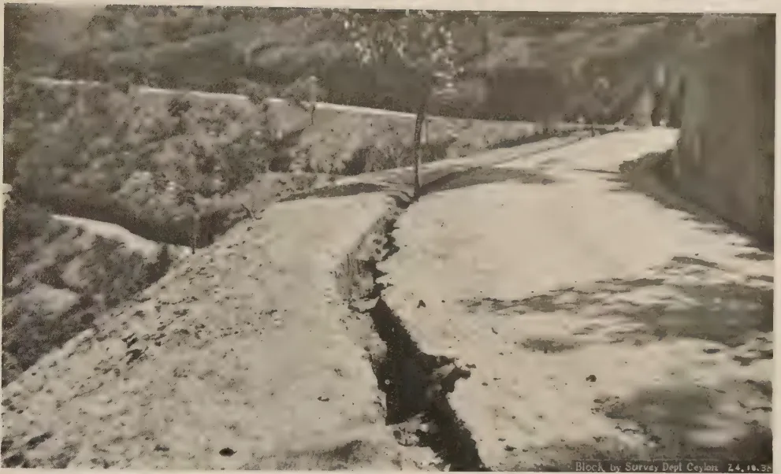A black and white photograph showing a road or path with significant erosion on the left side. The erosion is deep and follows the curve of the path, exposing the underlying soil and structure. The road surface appears to be made of a light-colored material, possibly concrete or packed earth, and is bordered by a low wall or embankment on the right. The background shows some vegetation and trees.

Block by Survey Dept Ceylon 24.10.38

FIG. V.—DRAIN-SIDE EROSION.

A black and white photograph showing a close-up view of a bank or embankment with significant erosion. The erosion is deep and follows the curve of the path, exposing the underlying soil and structure. The erosion is deep and follows the curve of the path, exposing the underlying soil and structure. The ground surface appears to be covered with small stones or pebbles, and the erosion is deep and follows the curve of the path, exposing the underlying soil and structure.

BLOCK BY SURVEY DEPT CEYLON 25.10.38

FIG. VI.—BANK EROSION.

47------------------------------------------------

This image is a scan of a blank page. The paper has a light beige or cream-colored tint. There are a few very small, dark specks scattered across the surface, which appear to be scanning artifacts or dust particles. No text, lines, or other markings are present on the page.

48------------------------------------------------

285

45° to 60° is usually sufficient for the purpose of enabling a suitable type of vegetation to become established. Where available, Carpet grass (*Axonopus compressus*) is perhaps one of the best and tidiest bank-binding plants, while the little white-flowered Australian Daisy (*Erigeron mucronatum*), often grown on banks and rockeries in gardens, provides an attractive alternative. *Indigofera endecaphylla* can also be sometimes used with advantage for this purpose.

*Drain bed-scour.*—In the case of graded main drains their beds often get badly scoured and pot-holed and their sides undercut to an extent which, on steep slopes or in readily eroded soil, rapidly converts them into ravines and gullies. Alternatively, narrow drains with straight sides, when cut in cohesive or erosion-resisting soils, wear deeper and deeper as more easily eroded sub-soil strata are reached. Both these forms of erosion are not uncommon; they may develop to such a degree that the height of the water table of the land on each side is permanently lowered, so that during short dry periods, artificial drought conditions for the crop are induced.

The remedy lies in sloping the sides of all drains, reducing their depth, and retarding the rate of flow of water by vegetating them, and constructing in them check-dams, locks and blocks, and reverse-slope steps. It has to be realized that apart from such factors as volume of water, gradient, retard effect, &c., the rate of flow of water in drains is largely governed by its depth; thus, the deeper and narrower a drain the greater the rate of flow of water in it, and so the greater its erosive power.

A word of warning is perhaps necessary here as regards the construction in drains, of locks, pits and reverse-slope steps in areas at low-elevations where malaria is endemic. Such water-retaining compartments provide suitable breeding places, particularly when insufficiently shaded, for the malaria-carrying mosquito *Anopheles culicifacies*. In malarial areas, therefore, it should be a rigid rule that all such water-holding silt-pits, locks and step-angles should be converted into, and properly maintained as, sponge-pits, sponge-trenches, and sponge-cushions, by keeping them at least half to three-quarters full of dead weeds, cut grass and other cut vegetation which is absorbent and readily decaying humus-forming material. This will reduce the length of time water stands in these places, assist its percolation into the soil and make any such water less acceptable for breeding purposes. A good growth of suitable vegetation should be permanently maintained in, and on the sides and banks of, all such drains so as to keep them effectively shaded.

49------------------------------------------------

286

## IMPORTATION OF COCKERELS FOR BREEDING

**T**WELVE cockerels were landed from Great Britain on October 10 to head the breeding pens on our larger poultry stations.

All the cockerels were bred at the Northern Ireland Pedigree Poultry Breeding Station, Hillsborough, County Down.

This station is run by the Agricultural Research Institute of Northern Ireland.

The station has two objects—

1. (1) To make it possible for the smaller poultry farmer to have his best hens mated to first class pedigree sires, which he could not afford to purchase for his own use.
2. (2) To assist specialist breeders to sell their stock at home and abroad, by providing them with birds which are officially guaranteed to come from strains with high egg records.

The station receives hens which have been entered by the owners and breeds pedigree chickens from them. It is recognized as an official Pedigree Breeding Station, and is inspected as such by the National Poultry Council (Great Britain).

The entry fee for each hen is £1. Hens entered must possess a copper ring awarded at the Stormont Laying Tests. This means in the case of a Rhode Island Red or White Leghorn that they must have laid at least 200 first grade eggs in the 48 weeks of the test. They must also be of good type for their breed and must come from premises free from infectious disease and must pass the agglutination test for Bacillary White Diarrhoea before being accepted for the Station.

The cocks which are mated to these hens are provided by the station. They are the best procurable and all have officially recognized pedigrees and must be approved as suitable by the Ministry of Agriculture as regards size and type.

The hens are at the station from October until March. They are all trap nested and a complete record is kept of the number and size of eggs laid.

All eggs laid during the breeding season which are over 2 ozs. in weight, of good shape and with good shells are incubated.

50------------------------------------------------

287

Weak and abnormal chicks are killed and all others are wingbanded and toe-punched. Complete records are kept as to numbers of infertile eggs, chicks dead in shell, chicks killed and of the wingband numbers and pedigrees of all chicks reared.

The chickens are culled during rearing ; at the age of 12 to 16 weeks they are examined for deformities and faults of type. If they are satisfactory in these respects and have made normal growth the original wingbands are removed and official wingbands, supplied by the National Poultry Council and sealed with the Council's official seals, are put in their place. Birds thus marked are returned to the owners of the hens from which they were bred, the owner paying 5 shillings for each bird returned to him.

All records are published each year in the Annual Report and Stud Book.

The chickens sent out to the breeders from the station are guaranteed by the management as to their pedigree and as to the particulars given in the Stud Book regarding their ancestors.

The cockerels which have been imported are 8 Rhode Island Reds and 4 White Leghorns.

The Rhode Island Reds go to Ambepussa and Wariyapola.

The White Leghorns are at present at Perdeniya. One will probably go to Polonnaruwa and one to Anuradhapura or Murunkan.

Their pedigrees are as follows :—

(1) Rhode Island Red cockerel No. 103.

*Dam's record :—*

Super grade 134, 1st grade 77, 2nd grade 3.

Total 214 eggs in 48 weeks.

Size of eggs 2 1/16 to 2 13/16 ozs.

*Sire's Dam's record :—*

Super grade 206, 1st grade 7, 2nd grade 1.

Total 214 eggs.

*Sire's Grand Dam's Record :—*

Super grade, 196, 1st grade 54.

Total 250 eggs.

---

The remaining 7 Rhode Island Red cockerels were all sired by Cock No. UP. 173/36

*His pedigree is as follows :—*

Dam laid 240 eggs.

Grand dam laid 275 eggs.

Great grand dam laid 222 eggs.

51------------------------------------------------

288

Three of these cockerels, namely, Nos. 37, 126 and 399 are from Copper Ring hen No. U. 93/36.

Her record was 252 eggs in 48 weeks.

She was specially commended by the judge for type.

The remaining four cockerels Nos. 82, 86, 387 and 390 are from Copper Ring hen No. U. 173/37.

Her record is 205 eggs in 48 weeks made up of 187 super grade eggs, 17 first grade and 1 second grade.

Her mother laid 228 eggs in 48 weeks of which 184 were super grade and 44 first grade.

Her grandmother laid 214 eggs of which 206 were super grade, 7 first grade and 1 second grade.

Her great grandmother laid 265 eggs of which 184 were super, 80 first and 1 second grade.

The four White Leghorn cockerels were all sired by Cock XRP 249/37.

His dam laid 236 eggs in 48 weeks.

His grand dam laid 225 eggs in 48 weeks.

His great grand dam laid 249 eggs in 48 weeks.

Two of these cockerels Nos. 118 and 289 are from Copper Ring hen No. U. 149/37.

She laid 223 eggs in 48 weeks.

Her mother laid 230 eggs in 48 weeks.

Her grandmother laid 255 eggs in 48 weeks.

Her great grandmother laid 271 eggs in 48 weeks.

The other two, namely, Nos. 23 and 417 are from Copper Ring hen No. U. 150/37.

She laid 247 eggs in 48 weeks made up of 191 super, 53 first, and 3 second grade.

52------------------------------------------------

289SELECTED ARTICLES.INSECTS AND FUNGI IN AGRICULTURE\*

TWO years ago an article appeared in this journal in which my general views on the relation between the host and the parasite were very briefly summarized in the following words :

“ 1. Insects and fungi are not the real cause of plant disease, and only attack unsuitable varieties or crops improperly grown. Their true rôle in agriculture is that of censors for pointing out the crops which are imperfectly nourished. Disease resistance seems to be the natural reward of healthy and well-nourished protoplasm. The first step is to make the soil live by seeing that the supply of humus is maintained.

“ 2. The policy of protecting crops from pests by means of sprays, powders and so forth is thoroughly unscientific and radically unsound ; even when successful, this procedure merely preserves material hardly worth saving. The annihilation or avoidance of a pest involves the destruction of the real problem ; such methods constitute no scientific solution of the trouble but are mere evasions.

“ 3. The protection of an area from imported pests is fortunately almost impossible in practice on account of the rapid improvement of communications and the increasing volume of traffic. If the present regulations were really effective, they would be harmful in that we should be deprived of a portion of the censors which Nature has provided for keeping our agriculture up to the mark.”

This paper, obviously written to provoke, has been followed by a number of contributions to this and other journals to which I should like briefly to reply. During the last two years a good deal of work on the influence of freshly prepared humus on disease resistance has also reached the stage when it is desirable to record some of the preliminary results and to suggest (1) a re-survey of the general agronomy of cotton, including the manuring of this crop, and (2) a re-examination of the active root system, including that of the crops grown for green manuring.

In an editorial published in October, 1936, Dr. Willis drew from his long experience of tropical agriculture a good deal of evidence in general support of my thesis, and also called attention to the difficulties which exist in coping with the diseases of established crops like tea, rubber and cacao, in which a large amount of capital has been sunk. In such cases it is, of course, impossible

---

\* By Sir Albert Howard, C.I.E. formerly Director of the Institute of Plant Industry, Indore, and Agricultural Adviser to States in Central India and Rajputana in *The Empire Cotton Growing Review*, Vol. XV., No. 3, July, 1938.

53------------------------------------------------

290

to scrap the crop and start again. The mycologist and entomologist must obviously do what they can to help the planter in such circumstances to keep diseases in check in the cheapest possible manner.

In the issue of this journal of January, 1937, two references occur—the first by Messrs. Bebbington and Allan, the second by Dr. Harland. In both, evidence is put forward that cases occur in cotton and other crops in which the healthier the plant, the more it is relished by the pest. The silkworm and the locust are also cited in these and other papers as answers to my general thesis.

I have often observed the great damage done by insect pests to cotton and other crops which during the grand period of growth appeared remarkably healthy and well grown. I have also had some first-hand experience of the mulberry silk industry in Kashmir and have repeatedly observed the temporary damage done by locusts in India. I have spent much time in journeys through the deserts from which these invasions start and have read a good deal of literature on this subject. All this experience was in my mind when writing the paper to which exception has been taken.

Cotton and other crops belonging to the natural order *Malvaceæ* are very prone to the attacks of insect pests during the maturation of the seed. This is well seen in the case of *Hibiscus cannabinus*, and also in cotton in the Punjab, where at first the crops grow well, but where this early promise is frequently followed by a very disappointing yield—due either to failure to set seed altogether or to the inroads of insects which attack the ripening bolls. Some of the finest-looking crops of sann hemp (*Crotalaria juncea*) I ever raised for green manuring at Pusa, when grown on for seed, produced a yield far below the amount of seeds sown. After flowering, the crops became literally smothered in fungous and insect pests of various kinds. A study of such cases, both on the alluvium and the black soils, revealed an interesting fact. The soil conditions, which were excellent at the time of sowing and during the early life of the crop, gradually changed as the rains proceeded, and a colloidal condition, which interfered with aeration and drainage, gradually established itself and always preceded the onset of the pests during the maturation phase. When steps were taken to prevent or to minimize this colloidal condition by the use of dressings of farmyard manure or compost, there was an immediate increase in disease resistance and a satisfactory yield of seed. I suggest, with all respect, that Messrs. Bebbington and Allan should repeat their experiments and pay more attention to the soil conditions during the whole time the crop is in the ground, as well as to the land for some time before the actual cotton is sown.

The invasions of locusts in Central and North-west India always start from the deserts in which the eggs are laid, and produce their maximum damage on irrigated crops during the hot weather. Everything green in the path of one of these swarms is either eaten or left on the ground. Soon after the rains begin and normally grown vegetation is available the swarms rapidly disappear. What a few weeks before was a terrifying visitation is soon reduced by Nature to its normal insignificance. The swarms peter out. I believe in no case have the locusts of the Rajputana deserts, for example, established

54------------------------------------------------

291

themselves permanently in those areas of India alongside, which are fed by the monsoon. The locust in this region is a child of the desert and has always remained so as far as Northern and Central India is concerned.

The case of the silkworm and the mulberry has no relation whatsoever to agriculture. The rearing of the worms is artificial; they do not feed on the growing leaves, but on picked foliage which is constantly changed. The developing silkworms are tended with perhaps even more solicitude than is bestowed on the majority of infants. Unless the greatest care is taken in the raising of the eggs there would soon be no silk industry at all. If a grove of well-cultivated mulberry trees were inoculated with silkworms, I am confident the amount of silk produced under natural conditions would soon bear no relation to what would be obtained when the leaves are taken to a rearing house and the insects carefully tended.

### HUMUS AND DISEASE RESISTANCE

One method of ascertaining whether any relation exists between humus and disease resistance is to take a piece of land, convert all the waste products of the crops and livestock into compost, and observe the reaction of the resulting crops to insect and fungous pests. Such an experiment was started by Captain R. G. M. Wilson at the Iceni Estate, near Surfleet in Lincolnshire, in December, 1935. The results are given below in Captain Wilson's own words in a memorandum (drawn up for the members of the British Association who visited the estate on September 4, 1937), from which the following extract is taken :—

“ The Iceni Estate consists of about 325 acres comprised as follows :—

<table>
<thead>
<tr>
<th></th>
<th></th>
<th style="text-align: right;">Acres.</th>
</tr>
</thead>
<tbody>
<tr>
<td>Arable land, etc.</td>
<td>..</td>
<td style="text-align: right;">225</td>
</tr>
<tr>
<td>Permanent grassland</td>
<td>..</td>
<td style="text-align: right;">30</td>
</tr>
<tr>
<td>Rough wash grazings</td>
<td>..</td>
<td style="text-align: right;">35</td>
</tr>
<tr>
<td>Land under intensive horticulture</td>
<td>..</td>
<td style="text-align: right;">35</td>
</tr>
<tr>
<td></td>
<td></td>
<td style="text-align: right; border-top: 1px solid black;">325</td>
</tr>
</tbody>
</table>

The main idea in the development of the Estate has been to prove that even to-day, in certain selected areas of England, it is a commercial proposition to take over land which has been badly farmed, and bring it back to a high state of fertility, employing a large number of persons per acre.

To this end the Estate has been developed as a complete agricultural unit with a proper proportion of livestock, arable land, grassland, and horticulture, with the belief that after a few years of proper management the Estate can become very nearly, if not entirely, a self-supporting unit, independent of outside supplies of chemical manures, &c., and feeding stuffs, the land being kept in a high state of fertility, which is quite unusual to-day, by :—

1. (1) A proper balance of cropping.
2. (2) The conversion of all wheat straw into manure in the crew yards and the utilization of this manure and as much as possible of the waste products of the land for making humus for the soil.

As regards (2), the method of humus making which has been employed is known as ‘The Indore Process’ and it has proved remarkably successful.

2—J. N. 1778 (10/38)

55------------------------------------------------

292

The output in 1936 amounted to approximately 700 tons, and in the current year will probably be about 1,000 tons.

As a result of this utilization of humus, the land under intensive cultivation has already reached a state of independence, and for the last two years *no chemicals have been used in the gardens at all either as fertilizers or as sprays for disease and pest control.* The only wash which has been used on the fruit trees is one application each winter of lime sulphur, and it is hoped to eliminate this before long.

The farm land is not yet independent of the purchase of fertilizers, but the amount used has been steadily reduced from 106 tons used in 1932, costing £675, to 40½ tons in the current year, costing £281. Similarly the potato crop, which formerly was sprayed four or five times, is now only sprayed once, and this, it is hoped, will also be dispensed with before many years when the land has become healthy and in a proper state of fertility.

Eventually, with a properly balanced crop rotation, there is no doubt in my mind that the same degree of independence can be reached on the farm as has already been attained on my market garden land.

The probable cropping will eventually work out as follows :—

75 acres potatoes.

75 acres wheat.

25 acres barley, oats, beans and linseed (for stock feeding.)

15 acres roots (for stock feeding.)

30 acres one year clover and ryegrass leys for feeding with pigs and poultry and cutting for hay, ploughing in the aftermath.

The livestock carried on the farm at the June returns was as follows :—

22 cattle (cows and young stock of my own breeding.)

14 horses (including foals.)

15 sows (for breeding.)

103 other pigs.

120 laying hens (of my own stock.)

And although it is rather early to say, I believe that the above figures may be about right for the size of the farm, with the addition of about twenty cattle for winter yard feeding. This latter importation will be rendered unnecessary in a few years when the number of cattle of my own breeding will have increased."

Since this memorandum was written Captain Wilson informs me that the under-drainage of his vegetable garden has resulted in even better crops than those raised last year. Here is a definite case where the establishment of Nature's equilibrium between the soil, the plant, and the animal has resulted in increased crops, in higher quality produce, and in a marked improvement in disease resistance. My experience during the last forty years suggests that the growers of cotton in the strange places of the Empire would do well to take into account the lessons which this Surfleet and similar experiments have to teach us.

56------------------------------------------------

293

## THE TRANSMISSION OF DISEASE RESISTANCE FROM A FERTILE SOIL TO THE PLANT

How does humus affect the crop generally and how does a factor like this increase resistance to disease? The large-scale trials of the Indore process now being carried out on tea, coffee, rubber, cacao and other crops in the tropics have furnished some interesting information on these questions.

In a number of cases, in tea and rubber in particular, very striking results followed closely on one dressing of compost applied at the rate of five tons to the acre. There was a marked improvement in growth and also in resistance to insect pests such as red spider, *Tortrix* and mosquito blight (*Helopeltis*.) Two applications of compost have also transformed a derelict tea garden into something above the average of the locality. In a recent tour of tea estates in India and Ceylon I have seen these results for myself, and have discussed matters on the spot with the men who have obtained them.

When these cases were first brought to my notice towards the end of 1936 and during 1937 I found considerable difficulty in understanding them. If humus acts as an indirect manure by (1) recreating the crumb structure and so improving the tilth, and (2) by furnishing the soil population with food from the use of which the soil solution eventually becomes enriched to the advantage of the crop, such factors would take time and we should expect the results, if any, to be slow. The improvement following humus was the reverse of slow—it was immediate and spectacular. Some other factor besides soil fertility appeared, therefore, to be at work.

After much thought it occurred to me that the explanation would be found in the active root system of tea and rubber, and that the remarkable results recently obtained by Dr. M. C. Rayner on mycorrhiza at Wareham in Dorset would apply to tropical crops. Accordingly, on October 7, 1937, I issued a circular letter to some of my correspondents in the tea industry in the following terms :—

“*The Role of Mycorrhiza in Tea.*—The adoption of the Indore process on a number of tea and rubber estates in the East and on coffee plantations throughout Kenya and Tanganyika has led to some interesting and suggestive results, the significance of which I shall now endeavour to explain. The effect of compost in all these cases has not been quite uniform. In some of the tea gardens in the High Range in Travancore, which for many years have been regularly manured with farmyard manure (a form of compost), the result of Indore compost has been in the nature of a regular and steady improvement such as would naturally follow from an increase in the general fertility of the soil. On some of the tea estates in Ceylon, on rubber in the F. M. S., and coffee in East Africa, where compost has been applied for the first time, much more spectacular results have been obtained. There has been a sudden and very marked improvement in growth, in general vigour and in resistance to disease.

If humus acts only by increasing the fertility of the soil it is difficult to understand these spectacular results. There must be some other factor at work which enables the compost to influence the tea bush direct.

57------------------------------------------------

294

The simplest and most obvious explanation of the sudden improvement after one application of compost is the well-known effect of humus in stimulating the mycorrhiza which are known to occur in the absorbing roots of tea, and which in all probability are to be found in rubber, coffee and other cultivated plants in the tropics. Now compost is essential for the full activity of these mycorrhiza—a fact which has been strikingly brought out by the recent work on conifers in this country. How the compost acts is a matter which is certain to engage the attention of specialists for some time to come. I have been in touch with these investigations and have confirmed their great importance by independent observations in the nurseries of the Liverpool Corporation at Lake Vyrnwy. Compost leads to the formation of numerous mycorrhiza and to exceedingly well-grown nursery plants. Where no compost is used the growth is poor and the stock is unhealthy.

I have little doubt, when the mycorrhiza in tea roots have been thoroughly studied, that these organisms will prove to be an important factor in the general nutrition and health of the tea plant. In all probability mycorrhiza will help to broaden the scientific basis of the Indore process and will assist in explaining the failure of artificials to prolong the life of the average tea garden and to keep up the quality of tea after the original store of humus left by the forest has been exhausted."

Soon after this letter was issued I was asked by a group of the tea agencies in London to visit their estates in India and Ceylon, in the course of which some time was devoted to the study of the mycorrhiza factor. In this I secured the co-operation of Dr. Rayner, a recognized authority in this branch of science, who has been kind enough to examine and report on no less than twenty-eight samples of roots of tea, rubber, cacao, coffee, coconuts, cardamoms, tung oil, betel palm, as well as the leguminous shade trees and green manure plants grown in the tea gardens. In all the specimens obtained from land manured with compost or from virgin forest soil, abundant mycorrhiza were observed in which all stages in the rapid digestion of the fungus by the host plant could be seen. On the other hand, in poor, derelict tea, and in tea nurseries where artificial manures had been employed, mycorrhiza were either absent altogether or very poorly developed. The connection between compost in the soil and abundant, vigorous root development with well-developed mycorrhiza and healthy growth was clearly marked.

The mycorrhiza association in tea and rubber, for example, would explain the direct action of humus on these crops. The mycorrhiza appears to be the machinery provided by nature for the fungi living on humus in the soil to transmit direct to the active area of the roots the contents of their own cells. Whether this is the only means by which such things as accessory growth substances can safely pass from humus to plant, or whether the fungi provide essential materials for their manufacture in the plant itself, has yet to be determined with certainty. Some such explanation of what is taking place seems exceedingly probable. If the accessory growth substances contributed by humus were to pass from the soil organic matter into the pore spaces of the soil they would have to run the gauntlet of the intense oxidation processes going on in the water films which line these pores. In this passage any substance

58------------------------------------------------

295

of organic origin would be almost certain to be seized upon by the soil population for food and oxidized to simple substances, such as the plant ordinarily takes in by the root hairs. If, as seems almost certain, freshly prepared humus (obtained from animal and vegetable wastes) does contain growth-promoting substances (roughly corresponding to the vitamins in food), it would be necessary to get these into the plant undamaged and with the least possible delay. The mycorrhiza association in the roots, by which a rapid and protected passage for such substances is provided, seems to be one of Nature's ways of helping the plant to resist disease.

### THE SEPARATION OF THE FACTORS

A long experience of the cultivation of leguminous plants in India has completely shattered my belief in the idea that these crops can be grown successfully without organic matter, and that the nitrogen fixation in the nodules is the complete story as far as the supply of combined nitrogen is concerned. Farmyard manure or compost, as already stated, is essential for keeping these crops healthy and for making them form seed in the Indian monsoon. Organic matter always stimulates both root and nodular development.

I was therefore naturally interested during my recent tour to see whether this is the whole story and whether or not another factor (mycorrhiza) is operating as well as the nodules. Specimens of the roots of a shade tree—a species of *Erythrina*—and of a green-manure plant (*Crotalaria anagyroides*), both of which had been manured with compost, were collected in Ceylon and sent to Dr. Rayner for examination. Mycorrhiza and nodules were found in the roots in both these cases, but never together in the same rootlets. These either bore nodules only or mycorrhiza only. These observations provide a simple scientific explanation of the common practice of manuring leguminous crops with humus in the East and in Great Britain. Humus, by establishing the mycorrhizal relationship, appears to be able to influence the plant direct. The nodules seem to supplement the mycorrhiza and are only one factor in the case.

There is a further point of some interest in this matter. When plants like French beans are grown on poor soil by means of the nodules only, or by means of artificial manures, the produce is tasteless and of poor quality. For real taste and quality in the produce it is necessary to use humus (made from both vegetable and animal waste) or farmyard manure. A supply of combined nitrogen appears therefore to reach the plant by way of the nodules and root hairs; the materials which are needed for quality appear to be absorbed by the mycorrhiza. The leguminous plant therefore promises to be a very valuable instrument in separating out the various factors concerned in this question. Will, as seems to be the case, quality and disease resistance only be obtained when the mycorrhiza mechanism functions? Will disease resistance and quality turn out to be the same thing—the consequence of the perfect synthesis of proteids and carbohydrates in the green leaf? Does infection by insects and fungi most readily occur in this group when the mycorrhizal condition is absent?

59------------------------------------------------

296

One large-scale experiment I hope to arrange in Ceylon concerns the probable rôle of animal waste in disease resistance. On a group of tea estates on this Island organic matter, made from green manure and tea prunings only, is giving excellent results as far as the amount of growth is concerned. The tea, however, is being attacked by an insect pest. I hope to be able to persuade the directors of the company to introduce pigs into the economy of one or more of these estates, and see whether or not the attacks of this insect disease can be prevented or reduced by the use of humus made from vegetable and animal wastes. If, as I expect, this proves to be so, additional evidence in support of the idea that livestock is essential in tropical agriculture will have been obtained.

One of the conclusions I have reached as a result of my tour in the East and of my forty year's experience of research work is that the livestock factor has been greatly neglected in the plantation industries, and that the waste products of the animal will prove to be essential in all such enterprises.

I also feel that mycorrhiza is almost certain to prove of importance to cotton, and the great differences observed in the Cambodia cotton in India, in yield as well as in the length of the fibre, when grown on (1) garden land (rich in humus) and (2) ordinary unmanured land might well be explained by this factor. At any rate, the matter should receive early attention and the results, whether positive or negative, should be duly recorded in the pages of this journal. Dr. Rayner informs me that so far mycorrhiza has not been recorded in cotton, so there is a clear field for an enterprising and well trained investigator who is not afraid to break new ground.

60------------------------------------------------

297

## CITRUS CULTIVATION IN SOUTHERN RHODESIA\*

---

**L**ESS than fifty years ago a small band of pioneers marched into Matabeleland and started to colonize the territory now known as Southern Rhodesia. In the earlier years the search for minerals came first and foremost, but, as always, in the wake of the miner came the farmer whose operations, although perhaps not quite so spectacular, are essential to any community. It was very soon discovered that the many varieties of citrus grew extremely well, but it was not until some twenty years ago that citrus cultivation on a commercial scale was begun.

The British South Africa Company was the pioneer of citrus cultivation on a commercial scale in the Colony, and it is the largest grower to-day, with some 90,000 trees on its three estates. The industry is yet in its infancy and the total number of trees in the Colony is comparatively small, but through the enterprise and foresight of the Company an experimental station with a staff of five fully qualified men was established in 1931, and since that date a considerable amount of research work has been done. Thus almost at the very outset a far-sighted policy was adopted for enabling the industry to be built up on sound foundations.

By far the largest citrus estate owned by the Company is situated in the Mazoe Valley about 30 miles from Salisbury, the capital of the Colony, and it was here that the experimental station was subsequently established. The bulk of the work has been carried out on this estate, but other estates and plantations are visited by members of the staff, and the results are made available to all growers in the Colony through the medium of the annual reports and by personal contact. The developments at Mazoe, and on the Company's estates generally, may therefore be taken to be an indication of the lines along which citrus cultivation is developing in the Colony.

It must be pointed out that the European population of Southern Rhodesia only just exceeded 55,000 at the last census, taken in 1936, so that even including the sale of citrus fruits to the mines for issue to native labour the local market is extremely limited. It is limited even further by the fact that the majority of residents have a few citrus trees in their gardens. Citrus, then, on a large scale can virtually only be grown for export; only about 6 per cent. of the total crop harvested at Mazoe is absorbed by the local market. The problems of an industry that grows citrus primarily for export to the British market are by no means the same as those in a country where the fruit is grown principally for

---

\* By W. J. Hall, Superintendent of the Mazoe Citrus Estate and Director of the Mazoe Citrus Experimental Station, in *The Empire Journal of Experimental Agriculture*, Vol. VI., No. 22, April, 1938.

61------------------------------------------------

298

the local market. Citrus grown for export has to compete in quality with fruit from other countries, and therefore it must be landed on the market not only in good condition but in an attractive manner.

Southern Rhodesia is a long way from Great Britain and the large European consuming countries, and the costs from grower to consumer are considerable. With increasing competition and falling prices every effort has to be made to improve the quality of the product and to aim at the highest possible yield per tree in order to minimize the cost of production. Research in this Colony has been directed to these ends, and it is no exaggeration to say that good progress has been made.

It is proposed in this short article to deal mainly with field practice and the changes in it necessitated by the results of research. The problems that arise from the time the fruit leaves the grower until it reaches the consumer are treated very briefly, and reference to the economics of citrus-growing in the Colony has been omitted.

*General Conditions.*—The climate of Southern Rhodesia is very favourable to the cultivation of most varieties of citrus. The commercial citrus orchards are found between the altitudes of 2,000 and 4,000 ft. above sea-level; the Mazoe Citrus Estate is at an altitude of 3,800 ft. The average annual rainfall in the citrus areas ranges from 30 to 36 in., and almost all the rain falls in the months of October and April. The annual mean of the maximum and minimum temperatures is about 65°F. and it is rare for frost to cause any damage. Hail has not been known to cause any widespread injury, but occasionally local hailstorms may affect a few groves. Wind is not an important factor in the Colony. Irrigation is essential for growing citrus on a commercial basis. The trees blossom in August, and from then until the rains break the temperature rises and the relative humidity falls. During September, October, and the early part of November, high temperatures are experienced with extremely low relative humidity, and it is during this period that irrigation is so essential. The crop is harvested from the end of April up to the end of September, according to variety. Soil types vary, of course, enormously in different areas, and even in different parts of the land under citrus in any one property, but generally speaking the soil is a medium heavy loam.

*Nursery Work.*—For commercial purposes budded trees are grown almost exclusively; there are very few seedling trees.

The Mazoe Rough Lemon is universally used as a stock. This stock has so far proved excellent for the principal varieties grown; it is vigorous, of relatively uniform growth, and gives a good union. Mazoe Rough Lemon trees are to be found along the banks of the Mazoe river, and it is believed that their history dates back to the seventeenth century when Portuguese traders penetrated inland to this point.

Seed-beds are laid down in August, and the young seedlings transplanted into nursery rows the following February. The seedlings are usually of sufficient size to bud in December—approximately 18 months after sowing the seed—and the young trees are ready to plant out in their permanent habitat a year later. Drastic culling is undertaken at every stage, firstly to ensure that the seedlings

62------------------------------------------------

299

are as uniform as possible before budding, and secondly that the young trees are uniform in growth and possess a fully satisfactory root-system before planting out.

The height of budding generally adopted is 9 in. above ground-level. In some of the earlier plantings low budding was practised, but subsequent silting up of the soil above the union has given rise to trouble.

*Cultural Conditions.*—All types of citrus grow well, but only oranges and grape-fruit are grown to any extent commercially. Lemons and limes do extremely well, but are grown only for the local market; export to Europe is not an economic proposition, as the Rhodesian product, with its high transport costs, cannot compete with similar fruit from the Mediterranean countries, unless the conditions are exceptional. The Eureka and Villa Franca are the two varieties of lemon most commonly grown. Naartjes and Seville oranges are not grown commercially for the same reasons as lemons, although both varieties bear fruit of excellent quality.

The Valencia Late is the variety of orange grown chiefly for export. It is a hardy tree which does exceptionally well in Rhodesia; and it bears heavy crops of fruit, which is not only of excellent quality but travels well. The Washington Navel variety is very popular on the local market, but grown commercially for export it has not proved satisfactory. The British South Africa Company has replaced all the trees of this variety on its estates, with the exception of a few to supply local demand. On account of the distance from the market and the low prices realized over-seas, high production per tree, and consequently low cost of production per case, are essential. The Navel tree is a shy bearer under Rhodesian conditions. Further, the overseas market demands a small or medium-sized orange, and when this variety was grown for export as much as 50 per cent. of the fruit had to be culled for oversize. The average size is largely dependent on seasonal conditions; the fruit ripens in May and early June and when the rains are prolonged and heavy rain is experienced in March and April the fruit continues to develop and to increase in size. Under such conditions the fruit is tender and liable to break-down, so that a certain amount of wastage may occur in transit.

The Mediterranean Sweet, Jaffa, and Premier are the three midseason varieties chiefly grown. The fruit ripens in May and June; the trees are medium to small in size and bear heavy crops of good quality fruit. The Premier orange, it should be stated, is a strain developed locally from a few trees with constant well-defined characteristics found in the Jaffa groves on the Company's estates.

The late varieties consist of the Valencia Late, Du Roi, and Leu Gim Gong. The Valencia Late has already been referred to. The Du Roi variety does well, but it is so similar to the Valencia Late that the two can hardly be distinguished. The Leu Gim Gong is grown only on a small scale at present, but shows decided promise.

Grape-fruit is grown only in certain areas, the variety being chiefly Marsh's Seedless. On the whole it cannot be said that the quality of the fruit is as good as that grown elsewhere, and the export is limited.

63------------------------------------------------

300

Citrus trees in Southern Rhodesia are planted 24 ft. apart. In the early plantings it was usual to plant 'on the triangle', with 19 trees to each irrigation-lead. This gave a most attractive regular appearance to the orchards but did not take into account the modifications in the slope of the land, with the result that in some cases the irrigation-fall was far too steep, and in course of time this led to erosion and difficulties in irrigation. The practice now is to plant the trees on the contour with a fall of between 1 in 150 and 1 in 200, and the number of trees to a lead has been reduced from 19 to 14 or 15. Planting 'on the square' rather than 'on the triangle' is advocated, although it means that only 76 trees instead of 86 can be planted per acre. The adoption of the square system simplifies cultural operations, fumigation, and spraying.

Wind-breaks do not appear to be so essential in this country as in some others. In some of the earlier plantations wind-breaks of eucalyptus and cypress were put in at the distance usually recommended. Unfortunately this space proved insufficient when the trees in the wind-break grew up, so that the citrus trees in the outside rows began to suffer despite the periodic trenching and severing of the roots of the trees comprising the wind-break. Finally, it became clear that either the wind-break had to be removed or the first three rows of citrus trees uprooted. In these circumstances many wind-breaks have been taken out and no ill effects have resulted. At Mazoe there are practically no wind-breaks and there appears to be little need of them.

The practice of ploughing in a green crop is well known and well established. Green-manuring fulfils many important functions, in particular it supplies organic matter; it stimulates microbial activity, fixes atmospheric nitrogen when a legume is grown, checks soil erosion, and smothers weeds during the growing-period of the crop in the rainy season. In citrus groves there is danger that the cover crop will be in active competition with the trees, because when it is growing rapidly the orange tree needs its maximum supply of water, light, air and plant-foods. The cover crops grown were principally sunn hemp, velvet beans, and sunn hemp and sunflower mixed. It was customary to plough the cover crop under, but this gave way later to disking it in. The use of the plough has been abandoned because it damages the shallow root-system of the trees. Experience has shown that the disadvantages involved in growing a cover crop between the trees during the rainy season outweigh the advantages, and the practice has been largely discontinued. The danger from soil erosion has been overcome by raising temporary bolsters in the groves for the duration of the rains, and the necessary humus is obtained by applications of kraal manure and compost. Weeds are kept down by hand-cultivation.

Recommendations for making synthetic manure were put forward in 1932, and this system has now been adopted as part of the routine practice on the Company's estates, as well as by some other growers. At Mazoe synthetic manure is made from two sources, firstly from river reeds, grass, sunn hemp, wheat-straw, &c., and secondly from the orange waste obtained after the cull fruit has been passed through the by-products factory. These sources of synthetic manure are a valuable addition to the supplies of natural manures available.

64------------------------------------------------

301

Various methods of irrigation have been tested at Mazoe, and as a result the furrow-system has been largely superseded by basin-irrigation. The latter system materially assists in checking the inevitably rapid flow of water down a long irrigation-lead and the resulting very uneven distribution of the water between the trees at the top and bottom of the lead. Further, any soil carried down by the irrigation-water is only carried from one basin to the next, a maximum distance of 24 ft. Up to the present no indications of ' collar-rot ' have shown up on account of the proximity of water to the bole of the tree, but it must be pointed out that the water does not stand in this position for any length of time.

In some of the groves at Mazoe a certain amount of erosion from irrigation and storm-water has taken place over a period of years, and trees in some of the low-lying parts of the groves have become silted up over the bud-unions. The trees in the eroded areas showed signs of distress rather suddenly some five years ago. Soil reclamation was undertaken and the results in improved vegetative and fruiting vigour were most marked. So rapid in fact was the response that it was thought that there must be some factor at work other than physical environment. About the same time the trees in certain other areas, where there was no question of soil erosion, also began to become unthrifty and lose vigour. It was established that there is a relatively sharply defined limit for the content of available nitrogen in the soil, and that if the content falls below that figure the trees begin to show distress, but pick up temporarily after the annual application of fertilizer. The age of the trees varies from fifteen to twenty-five years and the available nitrogen reserves have gradually become more and more depleted. The effect of soil reclamation not only improved the physical environment but it raised the available nitrogen reserves above the critical point. Soil reclamation, and increased nitrogen dressings where no erosion was discernible, have had the most striking results in bringing the sickly trees into a condition of vigour and thrift.

Fortunately the areas in which silting up had taken place were small and localized. The effect of silting up is that a large percentage of the shallow root-system dies off and new roots are put out at a higher level. Under local conditions, if the soil is allowed to silt up over the union and remain thus, the tree either becomes very unthrifty or dies, and even if the soil is removed it is not possible to save it. When the soil is removed from a silted-up tree a great many of the functional roots are destroyed, and the tree receives a serious set back until such time as it can renew or develop anew a root system at the correct level. Consequently it takes some time to bring back a tree that has been silted up.

#### RESEARCH AND THE INDUSTRY

In the following very brief account of the work on citrus problems that is being carried out at the Mazoe Citrus Experimental Station reference is confined to the chief investigations and to the more important results that have been obtained.

*Horticultural.*—An experimental nursery and plot were started at Mazoe towards the end of 1931. It is too early to expect results, as the first trees were not planted out in their permanent positions on the plot until February

65------------------------------------------------

302

1934, and the research work undertaken is practically all of long range. Stock and scion relationships are one of the principal lines of investigation. It has already been stated that the Mazoe Rough Lemon is the universal stock in the Colony, but there are certain varieties, such as the Jaffa and Premier, that do not give an entirely compatible union on this stock. A series of double-budding experiments with various scions on Mazoe Rough Lemon with an intersect of various types is also in progress.

The improvement by systematic bud-selection of the chief varieties grown has been started, and a complete survey of all the trees on the Company's estates was undertaken with a view to determining the best forty or fifty trees as a source of bud-wood. The resulting trees are now  $3\frac{1}{2}$  years old and show considerable promise. At the same time specially selected bud-wood of various varieties of citrus has been successfully imported from California on more than one occasion, through the kind and invaluable co-operation of Mr. A. D. Shamel, of the U. S. Bureau of Plant Industry, Riverside, California. The trees from this bud-wood are growing rapidly and should prove of great interest and value.

An "introduction garden" has been started in which an attempt is being made to collect together as many different strains and varieties as possible. Experiments are also in train on the transmission of undesirable characteristics in bud-selection with a view to determining which of these characteristics are transmissible.

*Chemical.*—A great deal of the work of the chemist has already been referred to indirectly in the section dealing with cultural methods. The soil reclamation, establishment of nitrogen deficiency at Mazoe, the preparation of pit manure and modification of the cultural and irrigation practices with their very beneficial results, are in no small measure due to his efforts and co-operation with the field staff.

In the sphere of soil problems it was considered inadvisable to put down long-range field experiments on account of the variation of soils involved, but to deal rather with the specific problems with which we were confronted on the Company's estates. Hundreds of soil samples from all parts of the citrus areas on the Mazoe and Premier Estates were analysed, and with these results as basis it has been possible to give differential fertilizer treatment to the groves or even parts of groves, according to the needs which have been revealed.

Investigations have been in progress to determine : (a) the fertilizers required by the trees ; (b) the best method of applying them ; and (c) the correct time of application. As a result, considerable modifications of previous practices have been made. With a few minor exceptions it is now the custom to make all fertilizer application in the irrigation-water, thereby giving "excellent distribution of the soluble nutrients in dilute solution to the active foraging zone of the tree roots".

The time of application of fertilizers and manure is considered to be of paramount importance, and varying amounts of soluble nitrogenous and phosphatic dressings, depending on tree and crop condition, are applied in the irrigation-water as early as July to ensure an adequate reserve of the more

66------------------------------------------------

303

essential plant-foods in the soil at the all-important blossoming period in spring. After the crop has been harvested in September the remainder of the fertilizer requirements is applied together with the standard dressing of some 200 lb. of artificial manure "well in advance of the start of the wet season (October to November). The manure is distributed entirely within the irrigation basin of each tree, where it is lightly forked in, care being taken to ensure that the bulk of the manure is distributed evenly in the area shaded by the tree".

Experiments have been carried out over a period of four years to determine the effect of differential fertilizer treatment on the crop production and fruit-quality of bearing trees of the Valencia Late variety. The results show that nitrogen plays the most important part in maintaining tree vigour, high production, and good colour in fruit. Phosphorus has been found to be instrumental in setting heavy blossom and in improving the juice-percentage and the ratio of soluble solids to acid in the mature fruit. Potash, on the other hand, does not bring about a significant increase in soluble solids, but it does give rise to a somewhat increased percentage of acid in the juice. No treatment materially affected the fruit-size of the bulk of the crop, although the percentage of smaller fruit increased under high-nitrogen conditions, and the proportion of large and therefore potentially coarse fruit is greater under low-nitrogen conditions.

An attempt has been made to determine by analysis whether differential fertilizer treatment is reflected in any marked variation in nutrient intake of fruit and leaf-material. The conclusion has been reached that the analysis of nitrogen in juice and peel might serve as a valid means of estimating nitrogen requirements of citrus trees, but the estimation of potash, phosphorus, and calcium is less satisfactory for the purpose owing to modifying intake-relationships.

The presence of unthrifty trees carrying "hard fruit" has been recognized at Mazoe for some years. In the past two or three years, however, it has gradually developed into a major problem. Trees suffering from this complaint are characterized by the development of small leaves with diminutive indentations on the ventral surface and dieback of the branches to a greater or lesser degree. In severe cases the bulk of the crop is shed in October and November and the fruits remaining suffer from arrested development, malformation, the presence of gum pockets and a diminished juice-content. Such fruits feel hard to the touch, and it is this characteristic that has given rise to the local name of "hard fruit". It has recently been established that a deficiency or unavailability of boron in our soils is the underlying cause of this problem, and soil applications of borax have proved extremely effective in controlling the malady. This discovery of the essential need of boron to the healthy development of the citrus tree is one which is likely to prove of major importance to all citrus-growers in the Colony.

*Entomological.*—Wherever citrus is grown on a commercial scale insect pests play a part of vital importance. They may so impair the vitality of the tree that it becomes unthrifty, or they may take toll of the crop on vigorous and

67------------------------------------------------

304

healthy trees, causing serious losses. It cannot be said that Southern Rhodesia has more citrus pests to contend with than other citrus-growing countries ; it is considerably better off than some.

The position at the moment is that we are able to secure reasonable control of all our major pests with one exception. This state of affairs may not last, because our major pests may not continue to be amenable to the present methods of control, and at any time one of the numerous minor pests may develop and become of major importance.

The pest which has so far baffled all attempts at satisfactory control is the Cotton Bollworm, *Heliothis armigera* Hubn., which attacks the citrus trees every year between the latter half of August and the middle of October. Fortunately the attacks vary in intensity very considerably from year to year ; sometimes the losses are negligible, but there have been occasions, such as the year 1932, when the losses were severe.

It is strange that this insect with its very wide distribution and numerous host plants should only have been recorded as a pest of citrus in southern Africa, but the reason may be that when the August generation emerges there is a dearth of other suitable host plants. It is believed that the moths are attracted by the scent of the blossom ; oviposition usually begins about the middle of August and the caterpillars feed on the blossom and newly set fruit. In the most severe cases a tree can be stripped of fruit, but at the time the attack takes place there is a very great deal more fruit on the tree than it will bring to maturity, so that much of the fruit attacked would fall in any case during October and November when the normal drop takes place.

Much time has been devoted to a study of this problem, and a detailed account of the bionomics of the species in Southern Rhodesia has been given by Parry Jones. It was hoped that this investigation would indicate how effective control could be obtained, but it did not do so. A study of the egg parasites *Trichogramma lutea* Girault and *Telenomus ullyetti* Nixon was then undertaken and, somewhat contrary to expectations, the results suggest that there may be a possibility of utilizing biological control measures as a means of preventing serious losses. Efforts are now being concentrated along these lines in an attempt to secure adequate control of this troublesome pest.

In most citrus-growing countries there is usually at least one species of scale insect that constitutes a major pest. The particular species in Southern Rhodesia is known as Red Scale—*Aonidiella aurantii* Mask. It is widely distributed throughout the Colony and control measures are essential where citrus is grown on a commercial scale.

There are several well-known and long-established methods of control of this class of insect. On the British South Africa Company's estates all the trees are fumigated once a year by the "Cyanofumer" method. "Cyanogas" was used at one time by some growers, including the Company, but this has largely given way to "Calcid." Experiments have also recently been carried out with liquefied hydrocyanic acid gas, as used in California, but whereas this method has many advantages, the material is at present too costly. Oil sprays have been tried by some but they have not been adopted on any extensive scale. Fortunately, this scale has shown no signs of developing a resistant strain as yet and it is possible to obtain satisfactory control by fumigation.

68------------------------------------------------

305

It is common knowledge that when fumigation is practised, burning of the foliage of the tree may result from a variety of causes, and that it is possible for this to occur without any injury to the fruit. During the last two years at Mazoe, with a dosage-chart that has been in use for the past eight years, the exact reverse has been noticed. Cases have occurred in which the fruit has been burnt, sometimes severely, without any sign of burning on the foliage. This problem is now under investigation.

Whilst effective control of Red Scale can be achieved on bearing trees young non-bearing trees give considerable trouble. Fumigation of such trees is not economic or efficient, and no fully satisfactory spray has yet been found. The time of year when an application of spray is most likely to be effective has been determined in the course of a complete study of the bionomics of the insect by Parry Jones. It is possible now to keep the pest in check, but it is costly because several applications are necessary, until a more satisfactory spray can be found.

Twelve years ago probably the most serious pest of citrus in the Colony was the Citrus Thrips, *Scirtothrips aurantii* Faure. A study of this insect was undertaken by Hall, and as a result certain measures were advocated which gave excellent control. These consisted in giving a double application of a lime-sulphur spray at an interval of nine days shortly after the petals had fallen. Some difficulty was found in maintaining the correct interval between the applications of spray on account of irrigation, particularly on a large estate. An attempt was therefore made to increase the duration of the toxic action of the spray in order that one application would suffice. For the past three years this has been done successfully by using colloidal sulphur in the spray.

Dusting with sulphur has been tried, but climatic conditions do not favour this method of control. It must also be pointed out that the thrips problem in this Colony is complicated by the development of a most unsightly tear stain from the original thrips scar on the fruit during the rains. A high degree of control is consequently necessary if material losses are not to be suffered from unsightly fruit, and the present method gives the degree of control needed.

Of other pests, the Citrus Aphid, *Aphis tavaresi* del. G., is controlled by the inclusion of nicotine in the lime-sulphur spray. If an attack develops before the trees are ready to be sprayed against thrips, a lime-sulphur-nicotine spray is used, but if, as often happens in an early infestation, the crop has not been harvested, lime-sulphur cannot be used, owing to the deposit which it leaves, and "Pysect Concentrate" is applied.

Soft Scale, *Lecanium hesperidum* L., may be troublesome on young non-bearing trees. None of the proprietary oil sprays that have been tried has given satisfactory control, and it has been necessary to adopt the old remedy of resin wash, which does give reasonable results. The pest is kept well in check on bearing trees where an annual fumigation of such trees is the practice.

The False Codling Moth, *Argyroplece leucotreta* Meyr., is relatively common, but so far it can only be said to be a minor pest. This insect has been studied by Ford, and it was found that proper orchard sanitation was the most effective method of keeping the infestation within reasonable limits.

69------------------------------------------------

306

The Red Locust, *Nomadacris septemfasciata* Sert., has been prevalent in the Colony for the past five years, but fortunately no very extensive damage has been reported. Growers in the nearby territory of Portuguese East Africa suffered severe losses from this pest three years ago.

There are, of course, several other minor pests, but up to the present they have been of too little importance to require intensive study. At the moment, as stated previously, the only major pest which has defied all attempts at adequate control is the Cotton Bollworm.

*Plant Pathology.*—Plant diseases are fortunately not so prevalent in this Colony as they are in many citrus-growing countries. There are nevertheless four or five of regular occurrence that are more or less troublesome. A full account of the diseases of citrus in Southern Rhodesia with detailed notes on those of greater importance is now in the press.

Tree diseases are not serious. It is only necessary to mention Psorosis, or Scaly Bark, of which a virulent strain occurs. Eradication measures are advised against this disease because the usual remedial treatments have met with little success. The manner in which infection in the field occurs is obscure, and the number of trees involved is relatively small.

Immature fruit is rarely, if ever, visibly attacked by fungi, and mature fruit is seldom infected whilst on the tree, unless it possesses some mechanical or physiological injury.

The fruit is harvested between the middle of April and the end of September, according to variety. During this period of the year the rainfall is negligible and the temperatures and relative humidity are relatively low. It seems probable that the comparative immunity to serious wastage is largely due to this favourable combination of circumstances. Occasionally heavy wastage, due chiefly to *Pencillium digitatum* Sacc, is found in the pack-houses or develops in early or mid-season fruit during transit, but this happens only after a prolonged rainy season, or when rain falls during the fortnight before picking. The principal variety grown in the Colony, the Valencia Late Orange, does not mature until the latter half of July, and the amount of wastage caused by green and blue moulds is negligible.

Citrus fruit is shipped overseas from Southern Rhodesia through two main channels. The quicker route is *via* Capetown and involves a rail journey of, usually, 6 days in ventilated fruit trucks, a short pre-cooling interval, and a voyage of between 14 and 20 days. The alternative is through Beira with a shorter rail journey of 2 days and a voyage of 30 to 33 days. At present there are no pre-cooling facilities at this port, and the fruit shipped through this channel is subject to greater extremes of temperature and more generally favourable conditions for the development of wastage than through Capetown.

In view of the length of the journey and of the time the fruit is in transit from grower to consumer, a considerable amount of work has been done on problems directly or indirectly associated with the carrying qualities of the fruit. The installation of an experimental cool-chamber at Mazoe has greatly facilitated the investigation of certain aspects of these problems.

70------------------------------------------------

307

Loss in weight of the fruit on all stages of its journey from grower to consumer has been studied, and the relation to wastage investigated. Temperature variations between Mazoe and Capetown were obtained by the use of recording thermographs in the railway trucks. The incidence and development of wastage under varying conditions of temperature, the influence of time in modifying the juice-content, and the ratio of soluble solids to acid in the fruit-juice, have been studied. Physiological injuries and break-down of the fruit have also been investigated. The results of this work to date will be found described in a series of papers by Bates, published in the reports issued annually by the Mazoe Citrus Experimental Station.

Experimental work on the so-called artificial coloration of citrus fruit, as practised in America, was initiated in 1930. A full account of this work has been published. From 1933 onwards the process has been adopted as part of the routine on the Company's estates, and most exporters have since adopted it in some form or another.

Much information concerning the maturity tests taken at various times of the year on the different varieties of citrus grown has also been amassed, and routine testing of the fruit throughout the season has been initiated in all the Company's pack-houses.

*Acknowledgments.*—This short article cannot be concluded without a tribute to the work of the members of the staff of the Mazoe Citrus Experimental Station. The individual members of the Station, each in their respective spheres, are doing excellent work on the problems with which the citrus industry in this Colony is confronted. The work of the Station has been greatly facilitated by the closest co-operation that has been maintained with the technical officials of the Rhodesian Department of Agriculture, and we are indebted to these officials for the ready assistance which they have willingly afforded us at all times.

71------------------------------------------------

308

## THE CLEANING OF FARM DAIRY APPARATUS\*

---

**T**HE method of cleaning dairy apparatus on some farms leaves much to be desired and is fatal to the production of clean milk with good keeping qualities. While a bucket or milk can may appear bright and clean to the naked eye, such a utensil may be teeming with bacteria which will badly contaminate the most carefully produced milk that may come into contact with it. Methodical methods of washing and sterilizing are essential, and take very little longer than slipshod ways of doing the work.

The following procedure should be followed :—

(1) Immediately after use and before the milk has had a chance to dry, all apparatus should be rinsed in cold or lukewarm water. If placed into hot water immediately, the milk solids will be baked on to the tinware. If milky articles are allowed to dry, they are much more difficult to clean.

(2) Scrub in water as hot as the hand can stand, using a stiff scrubbing brush and either washing soda or a dairy cleaning powder. A brush is more effective than a cloth and easier to keep clean. Soap should not be used ; it does not dissolve milk constituents, and is liable to leave a fatty film over the utensil in which harmful germs may grow.

(3) Rinse in clean hot water to remove the dirty soda water.

(4) *Sterilize.*—The word “sterile” as used in bacteriology, means the complete absence of germ life. As used in the dairy industry, it refers to the killing of the majority of organisms present. If live steam can be used and a temperature of 180 degrees Fahrenheit maintained for 45 minutes, most of the harmful organisms will be destroyed. This is easily done in a steaming cabinet constructed of wood lined with galvanized iron. Another form of cabinet is a square galvanized-iron tank with a suitable door. A more permanent cabinet can be made of concrete. A concrete cabinet, however, requires more steam to maintain the necessary temperature. In addition to the cabinet, which can be constructed by the farm handyman, a boiler is essential, and there are several on the market suitable for the purpose. Not only will the boiler give the necessary steam for the cabinet, but it will also supply plenty of hot water for cleaning operations.

Failing a steaming cabinet and boiler, the next best thing is to boil the utensils for a few minutes. The water must be boiling. It is useless to rinse the articles with hot water. To put a lot of milk cans, milk buckets, &c.,

---

\* By L. A. Moseley, Lecturer in Dairying, Grootfontein School of Agriculture in *Farming in South Africa*, Vol. XIII., No. 149, August, 1938.

72------------------------------------------------

<!-- stage4: ACCEPT r2J/J_013:49 -->

309

into boiling water, and to boil them, is not an easy matter, and in the long run the farmer will find a cabinet and boiler to be not only more effective but also more economical.

(5) After sterilizing, the articles should be either left in the cabinet until required or placed inverted on a rack in a clean atmosphere to drain and dry. On no account should they be wiped with a cloth. If they are really hot after sterilizing, they will soon dry. Wiping with a cloth only contaminates them again.

73------------------------------------------------

310

## THE FEEDING OF GREEN FEED TO POULTRY\*

---

**I**T is generally recommended that tender, succulent green feed should be fed to poultry daily. Ducks and geese especially are fond of it and will consume more than fowls.

Usually about 5 lb. of green feed is fed per 100 fowls at midday, while another feed given late in the afternoon, after the grain, is also enjoyed. The green feed may be hung up in a bunch for the birds to pick at, or it may be chaffed in lengths of  $\frac{1}{4}$  to  $\frac{3}{8}$  inch and fed in troughs.

On range no green feed need be given, unless frost or drought has killed all the green shoots. Lucerne is a valuable green feed. Grass shoots or young barley, oats, and wheat are also good, provided they are young and tender. Lettuce is very good, especially for chicks. Roots may also be used if nothing else is available, the carrot being best. Cabbage, kale, rape and chou moellier are all very good, but if fed in excess they may cause green eggs, the white of the egg being stained a greenish colour. The flavour of eggs is occasionally affected by onion tops, which can therefore be fed only in small quantities. Onion and garlic may also affect the flavour of poultry flesh.

The main rôle of green feed in a poultry ration is to supply vitamin A to the fowl, a vitamin usually lacking in other poultry feeds, and without which the fowl fails to grow, develops eye trouble and gradually ceases to produce. The food value of green feed is almost negligible and is not taken into account in making up poultry rations. The question of succulence is a debatable point. Experiments at the West Washington Experiment Station showed that the succulent quality of green feed is of no value.

Thus, when green feed is lacking, all we need to replace it is some other food which supplies vitamin A. Three common sources are available to the poultryman, *viz.*, cod-liver oil, lucerne meal and yellow maize. Cod-liver oil is a good source of vitamin A. If fed to the extent of 1 per cent. in the mash, sufficient vitamin A will be supplied to the fowls. However, cod-liver oil is not suitable in the ration of table poultry during the last eight weeks before killing, since it may affect the flavour of the meat. A second way of providing sufficient vitamin A in the ration is by feeding 10 per cent. of a good quality lucerne meal in the mash. Care should be taken to buy a rich green fresh-smelling sample with a low fibre content. It does not pay to feed more than 10 per cent. lucerne meal in the mash; lucerne meal is expensive compared with other feeds. Yellow maize and yellow maize meal are high in vitamin A,

---

\* By A. A. Reed, Lecturer in Poultry, School of Agriculture, Cedara, in *Farming in South Africa*—Vol. XIII., No. 149, August, 1938.

74------------------------------------------------

<!-- stage4: ACCEPT r2J/J_013:50 -->

311

but white maize and maizemeal are entirely lacking in it. Provided yellow maize or yellow maizemeal form 50 per cent. of the daily feed eaten by the fowl, there is no need for any other vitamin A supplement. If the grain fed is yellow maize, 50 per cent. of the ration is made up of yellow maize and a lack of green feed need cause no anxiety.

Thus, when a shortage of green feed does occur, the poultry farmer is able to prevent any serious drop in production. When yellow maize is readily available and cheap, as is the case in South Africa, it offers an easy means of supplying sufficient vitamin A in the absence of green feed. Wherever possible, however, green feed should be provided as part of the poultry ration.

75------------------------------------------------

312

## CORRESPONDENCE

---

### PRODUCTION OF FRUIT OUT OF SEASON

---

The Editor,

*The Tropical Agriculturist,*

Department of Agriculture,

Peradeniya.

DEAR SIR,

THE introduction of methods for the production of fruit out of season appears to be an urgent requirement for the development of fruit cultivation in this country. The instructions given for the scientific cultivation of fruit trees have not yet induced the villager to undertake the industry on anything like a large scale as the large majority of inhabitants are under the belief that fruit trees can only be expected to yield during certain specified seasons of the year and at no further time, and it is unremunerative to produce more fruit during this period as there is always a glut in the market when there is an abundance.

The large amount of pineapples, mangoes and oranges dumped in the Colombo market particularly during last April and May owing to the absence of buyers at the producing centres, and the fact that the producers hardly got anything more than the transport charges prove that fruit production, if confined to the regular season only, is not a profitable undertaking. It is, therefore, absolutely necessary to prove to the villagers by practical demonstration that the production out of season is practicable.

As a result of experiments carried out in this Pattu under the directions of the writer since 1930, it has been found possible to produce pineapples (Kew and Mauritius) out of season. The method adopted was to put in suckers distributed during the twelve months of the year and the result was that those planted during a particular month produced fruit during the corresponding month of the following year. Those who adopted this system of planting have got a regular (though small) monthly income and are satisfied that the proposition is a practicable one.

As far as the writer can judge, suckers from the parent bush should be transplanted again at the required time once a year regularly to prevent the bushes getting back to the old habit of producing fruit only during the season.

If the production of fruit out of season is going to be undertaken, effective measures have to be devised for their protection from squirrels, crows and bats who form the chief enemies of fruit plantation. The immature picking

76------------------------------------------------

313

of fruit in the villages is chiefly attributable to this cause. The poor villager naturally prefers to secure even the immature fruit and sell it at a reduced price of a few cents rather than to lose the whole crop by waiting for the fruits to mature. The damage caused by squirrels, &c., during the fruit season is not noticed much as there is an abundance everywhere, but the damage will be more keenly felt when the crop is successfully spread over the year. The present methods adopted to combat the nuisance are (a) killing of the crows and squirrels, &c., but very few villagers have guns of their own, and there is also the reluctance of the Buddhist public to adopt this measure for religious reasons and (b) sometimes empty tins are hung up in the midst of a plantation and rattled by communication cords to scare off the birds and the squirrels, and sometimes white pieces of cloth are also hung to scare them off. These measures are effective only for a few days until the animals grow wise to the trickery.

It seems therefore urgent that some new methods should be devised, or copied from other countries, in order to relieve the villager from this source of damage. Spraying with chemicals would be too expensive a method for the villagers to adopt.

Yours faithfully,

S. P. WIJETUNGE,

(Gate Mudaliyar), Mudaliyar of Wellabada pattu, Matara.

September 28, 1938.

77------------------------------------------------

314

## MEETINGS, CONFERENCES, &c.

### RUBBER RESEARCH SCHEME (CEYLON)

#### DRAFT MINUTES OF THE FORTY-FOURTH MEETING OF THE RUBBER RESEARCH BOARD HELD IN THE CHAMBER OF COMMERCE BUILDING, COLOMBO, AT 10 A.M. ON THURSDAY, SEPTEMBER 8, 1938.

*Present.*—Mr. E. Rodrigo, C.C.S., (in the Chair); Mr. C. H. Collins, C.C.S., (Deputy Financial Secretary); Mr. I. L. Cameron; Mr. L. M. M. Dias; Mr. L. P. Gapp; Col. T. G. Jayewardene, V.D.; Mr. R. C. Kannangara, M.S.C.; Mr. L. B. de Mel, J.P., U.P.M.; Mr. C. A. Pereira; Mr. J. L. D. Peiris; Mr. B. M. Selwyn; Mr. R. A. Sharrocks; Mr. E. W. Whitelaw.

Mr. T. E. H. O'Brien, Director, was also present by invitation.

Apologies for absence were received from Messrs. R. P. Gaddum, M.S.C., and F. A. Obeyesekera.

#### MINUTES

(a) Minutes of the forty-third meeting which had been circulated to members were confirmed and signed by the Chairman.

(b) *Matters arising from the minutes.*

1. 1. *Identification of clones* (item 6 (3))—Reported that arrangements had been made for the loan of 2 officers from the Rubber Research Institute of Malaya. The identifications would be made by a Chinese mandor who would be accompanied by a Ceylonese laboratory assistant.
2. 2. *Rubber Conference* (item 9)—Reported that the Planters' Association of Ceylon had agreed to sponsor the proposed conference and had asked the Kalutara Planters' Association to make all arrangements. The conference would be held at Tebuwana on November 25.

#### BOARD

Reported :—

1. (a) Nomination of Mr. R. P. Gaddum to represent the State Council in place of Mr. E. C. Villiers who had resigned, with effect from June 20, 1938.
2. (b) Nomination of Mr. C. H. Collins to represent the Financial Secretary in place of Mr. C. E. Jones, with effect from August 20, 1938.

78------------------------------------------------

315

- (c) Resumption of seat by Mr. I. L. Cameron in place of Mr. R. J. Hartley, with effect from July 15, 1938.
- (d) Temporary absence of Mr. G. E. de Silva from Ceylon.
- (e) Renomination of Mr. B. M. Selwyn, with effect from July 10, 1938.

#### EXPERIMENTAL COMMITTEE

Recommendations made at a meeting held on August 15, 1938, were considered :—

(a) *Building Programme for 1939*.—Recommendations of the Committee were approved as follows :—

*Senior Staff Bungalows*.—Provision for another bungalow need not be made at present.

*Junior Staff Bungalows*.—One bungalow to be constructed at Dartonfield.

*Field Laboratory for Geneticist*.—Construction to be postponed until 1939.

(b) *Visiting Agent's report*.—The report was adopted after a few minor points had been discussed.

(c) *Bridge to 7 acres field*.—An additional vote of Rs. 110·27 was approved.

(d) *Manufacture at Nivitigalakele*.—The proposal to provide for an additional smokehouse of the smallholders' type in 1939 estimates, was approved.

(e) *Experimental manufacture of vulcanized products*.—It was agreed that semi-commercial manufacture at Dartonfield should be discontinued at the end of 1938, as recommended by the Committee. Approval was given to increase the advance account from Rs. 1,500 to Rs. 2,000.

(f) *Control of oidium leaf disease*.—The Chairman stated that the Central Board of Agriculture had recently adopted a resolution in favour of the formation of Oidium Committees in severely affected districts, as recommended by the Oidium Committee in 1935. The proposal had led to considerable discussion at meetings of District Planters' Associations and was to be further considered at a conference convened by the Planters' Association of Ceylon. It was, therefore, desirable for the position to be reviewed by the Board.

After discussion the following resolution was proposed by Col. T. G. Jayewardene, seconded by Mr. J. L. D. Peiris and was unanimously adopted :—

“ In the opinion of the Rubber Research Board sulphur dusting is beneficial over a period of years despite poor results in any particular year due to unfavourable weather conditions. The imposition of compulsory control measures is neither practicable nor desirable.”

It was decided that there was no need for the formation of District Committees in view of the above resolution. This decision was due to the conclusion that oidium infection could not be eliminated even by concerted action.

79------------------------------------------------

316

(g) *Exchange of clones*.—It was agreed that material of promising local clones should be exchanged with the Rubber Research Institute of Malaya on such conditions as may be imposed by the Institute in respect of material sent to Ceylon.

#### ACCOUNTS

(a) Statement of receipts and payments of the Board for the quarter ended June 30, 1938, were adopted.

(b) *Cash balance*.—Reported that the cash balance on current account was down to Rs. 12,000 owing to the reduced income from cess collections. The Chairman was authorized to arrange for the surrender of a fixed deposit if and when necessary.

(c) Dartonfield and Nivitigalakele accounts for March, April, May and June, 1938, were tabled.

#### STAFF

(a) *Soil Chemist*.—Reported that Dr. L. A. Whelan had signed the service agreement, which would be sealed on behalf of the Board after the meeting. Dr. Whelan was due to arrive in Ceylon on or about October 16.

(b) *Rubber Instructor*.—Reported the resignation of Mr. D. P. Gunawardhana with effect from September 1. On the recommendation of the Smallholdings Committee it was agreed that the appointment be offered to Mr. H. B. Wijesundara.

#### NEW PLANTING

Arising from the questionnaire issued by the Rubber Controller on the above subject it was reported that provisional application had been made to plant 20 acres at Pinnagoda in 1940. It was now proposed to plant 10 acres in 1939; the extent of planting in 1940 would depend on the progress made by the Geneticist. Approved.

#### AGREEMENTS FOR BUDWOOD

Reported that agreements had been signed by the Chairman in respect of Pilmoor and Prang Besar clones purchased with the approval of the Board.

Particulars of the clones concerned are :—

Pilmoor Co., Ltd., Clones D/65 and B/84.

Prang Besar Co., Ltd., Clones P. B. 5/57, 5/60, 5/139, 6/9 and 6/50.

#### TRAINING IN RUBBER TECHNOLOGY

Reported that Mr. C. D. Dias had completed a period of 7 months' training. A report prepared by him at the end of the period was tabled.

#### TECHNICAL OFFICERS' PROGRESS REPORTS

For the period ended June 30, 1938, were adopted.

80------------------------------------------------

<!-- stage4: ACCEPT r2J/J_013:51 -->

317**LONDON ADVISORY COMMITTEE**

(a) Minutes of the Committee and Technical Sub-Committee meetings held on April 29, 1938, were adopted.

(b) Reported that Mr. W. S. Davey, Chemist on the Committee's Staff at the Imperial Institute, had visited Ceylon from August 31 to September 7. Physical testing methods had been discussed and compared, and Mr. Davey had given a short talk to the Kalutara Planters' Association on the work in progress in London.

**PUBLICATIONS**

Second Quarterly Circular for 1938 was tabled.

The meeting closed with a vote of thanks to the Chamber of Commerce for the use of the Committee Room.

Research Laboratories,

Dartonfield,

Agalawatta.

September 21, 1938.

81------------------------------------------------

318

## REVIEW

---

**Practical Replanting of Rubber.**—By E. W. Whitelaw. The Times of Ceylon Co., Ltd., 1938. Price Rs. 7.50.

---

THE replanting of Rubber is an agricultural practice of comparatively recent development, and it presents to the average Estate Superintendent a number of problems and difficulties to the solution of which his previous "planting" experience, often consisting only of routine operations in mature areas, affords little guidance. He has good reason, therefore, to be grateful to Mr. Whitelaw for placing on public record a comprehensive series of notes on all operations connected with this practice, these notes being the outcome of experience over a period of several years and on estates in a number of districts.

Mr. Whitelaw strikes a good note at the commencement (in the Introduction) by urging the desirability of Superintendents taking the initiative in proposing modifications of standard practices to suit local conditions. We believe that there is now a greater tendency for those responsible for estate policy to be guided by the views of "the man on the spot".

Starting with a chapter on the advantages that may be expected to accrue from the replanting of obsolescent trees with high yielding budgrafts, the author proceeds to a consideration of the preliminary arrangements for replanting. He rightly emphasizes the fact that if the work is to be carried out with the maximum efficiency and economy a programme must be formulated well in advance of the actual felling operations, and the necessary nurseries prepared. A decision that has to be made at this stage is whether the planting is to be with budded stumps or with seed for subsequent budding in the field. In expressing a preference for the latter procedure the author does not appear to give due weight to the financial gain in bringing the trees into bearing a year or even 6 months earlier on which he places great emphasis in another connection. We do not agree that 15 to 20 per cent. casualties is "certain" to occur when planting budded stumps if the planting is done correctly and carefully. The suggestion, if the choice falls on field budding, of gaining time by procuring seed from Monaragalla in January is an excellent one.

The largest chapter is devoted to a detailed description of the replanting operations, and it is on these practical matters that Mr. Whitelaw's observations are of special value. He also contributes very useful notes on manuring, characteristics of clones, pests and diseases and a number of valuable miscellaneous suggestions based on personal experience.

82------------------------------------------------

319

In a publication on this subject, so many aspects of which are controversial, it is inevitable that not all the statements of fact and opinion can be accepted without question. There are also a few minor inaccuracies.

On the subject of the removal of grass, it is not altogether correct to say that this type of cover causes actual deterioration of the soil. Although we are in agreement with the view that it should be replaced by leguminous covers as expeditiously as possible, there are circumstances in which the removal of the grass over the whole area in one operation would be inadvisable on account of subsequent soil erosion. It is usually possible to replace grass by a creeping cover in stages which do not at any time leave a large area of soil uncovered.

The author bases his arguments against the incorporation of fresh green material in the soil on the assumption that in the process of decomposition the soil will be deprived of bacteria. In actual fact the bacterial population is much increased, but unless the ratio of carbon to nitrogen in the green material is favourable the soil is temporarily deprived of nitrogen to build up the bodies of the additional bacteria. With leaves and green stems of leguminous covers the C/N ratio is such that no loss occurs, but it is nevertheless sound practice, as the author suggests, to supply a little added nitrogen in the form of Calcium Cyanamide.

In his description of the contour trench system of planting, Mr. Whitelaw states that the trenches should be completely filled at the end of the second year. Our present view is that the trenches should never be completely filled.

Mr. Whitelaw deals fully with the question of costs and the only comment to be made is that in the summary he has apparently included the cost of budding (Rs. 8.50 per acre) in both the first and second year.

In the chapter on manuring there is the obvious criticism, which the author himself anticipates, that a large proportion of the fertilizers recommended are of organic origin. The information so far available indicates that the inorganic forms of manure are more efficient on a cost basis. The reviewer is not aware that B. D. 5 shows a special clonal susceptibility to phosphate manuring though it seems that this nutrient is the main requirement of all young Hevea plants in most of our soils.

Mr. Whitelaw's recommendation that the roots of the old trees should be inspected immediately after felling for any evidence of discoloured tissue is a valuable one, though this proceeding is unlikely to disclose all the dormant infection. The removal of the old lateral roots is considered to be a more effective precautionary measure than he would lead us to suppose, but it is doubtful if the presence of timber *above* ground is a material factor. Moreover, decaying rubber logs are most unlikely to provide breeding places for the harmful cockchafer grub *Lepidiota pinguis*, though they are readily infested by the coconut beetle *Oryctes rhinoceros* which does not attack Hevea.

The term "chlorosis" denotes a blanched condition of the leaf in which the chlorophyll is not normally developed; excessive alkalinity of the soil is only one of the causes of this condition.

83------------------------------------------------

320

The author's comments on the value of the various imported clones are very sound, but it may be mentioned that some of the so-called "lesser known" clones are, in fact, amongst the oldest and most fully tested clones. Some of them have been discarded on account of undesirable features and others, although not unsatisfactory, have been superseded by higher yielding material. The idea of establishing on every estate a "museum" collection of imported and local clones of possible commercial value is excellent provided every possible precaution is taken to avoid confusion between them. Some of the Ceylon clones suggested for such a collection, however, are considered unlikely to prove of economic value.

There is a slight error in the table of yields of Clone Prang Besar 86. The original buddings of this clone are 18 months younger than those of P. B. 25 and 186, and the ages given should be altered accordingly, *i.e.*, "6 years old" should read "4½ years old" &c.

These minor criticisms do not detract from the general value of the book which is both instructive and stimulating and can be highly commended to all Estate Superintendents with replaning work in progress or under contemplation.

The text is well illustrated with 25 photographs and a good index is provided.—R.K.S.M.

84------------------------------------------------

321

ANIMAL DISEASE RETURN FOR THE MONTH  
ENDED OCTOBER, 1938

<table border="1">
<thead>
<tr>
<th>Province, &amp;c.</th>
<th>Disease</th>
<th>No. of Cases up to date since Jan. 1, 1938</th>
<th>Fresh Cases</th>
<th>Deaths</th>
<th>Recoveries</th>
<th>Balance ill</th>
<th>No. shot</th>
</tr>
</thead>
<tbody>
<tr>
<td rowspan="2">Western</td>
<td>Foot-and-mouth disease</td>
<td>139</td>
<td>..</td>
<td>..</td>
<td>139</td>
<td>..</td>
<td>..</td>
</tr>
<tr>
<td>Rabies</td>
<td>12</td>
<td>2</td>
<td>4</td>
<td>..</td>
<td>..</td>
<td>8</td>
</tr>
<tr>
<td rowspan="4">Colombo Municipality</td>
<td>Foot-and-mouth disease</td>
<td>21</td>
<td>..</td>
<td>..</td>
<td>21</td>
<td>..</td>
<td>..</td>
</tr>
<tr>
<td>Anthrax</td>
<td>4</td>
<td>..</td>
<td>4</td>
<td>..</td>
<td>..</td>
<td>..</td>
</tr>
<tr>
<td>Rabies</td>
<td>20</td>
<td>..</td>
<td>20</td>
<td>..</td>
<td>..</td>
<td>..</td>
</tr>
<tr>
<td>Piroplasmosis</td>
<td>3</td>
<td>1</td>
<td>..</td>
<td>3</td>
<td>..</td>
<td>..</td>
</tr>
<tr>
<td rowspan="2">Cattle Quarantine Station</td>
<td>Foot-and-mouth disease</td>
<td>1</td>
<td>..</td>
<td>..</td>
<td>1</td>
<td>..</td>
<td>..</td>
</tr>
<tr>
<td>Anthrax</td>
<td>33</td>
<td>4</td>
<td>33</td>
<td>..</td>
<td>..</td>
<td>..</td>
</tr>
<tr>
<td rowspan="5">Central</td>
<td>Foot-and-mouth disease</td>
<td>85</td>
<td>..</td>
<td>10</td>
<td>75</td>
<td>..</td>
<td>..</td>
</tr>
<tr>
<td>Anthrax</td>
<td>10</td>
<td>..</td>
<td>10</td>
<td>..</td>
<td>..</td>
<td>..</td>
</tr>
<tr>
<td>Rabies</td>
<td>8</td>
<td>5</td>
<td>4</td>
<td>..</td>
<td>..</td>
<td>4</td>
</tr>
<tr>
<td>Piroplasmosis</td>
<td>48</td>
<td>1</td>
<td>..</td>
<td>48</td>
<td>..</td>
<td>..</td>
</tr>
<tr>
<td>Blackquarter</td>
<td>3</td>
<td>..</td>
<td>3</td>
<td>..</td>
<td>..</td>
<td>..</td>
</tr>
<tr>
<td>Southern</td>
<td>Foot-and-mouth disease</td>
<td>88</td>
<td>..</td>
<td>..</td>
<td>88</td>
<td>..</td>
<td>..</td>
</tr>
<tr>
<td rowspan="2">Northern</td>
<td>Foot-and-mouth disease</td>
<td>47</td>
<td>..</td>
<td>14</td>
<td>33</td>
<td>..</td>
<td>..</td>
</tr>
<tr>
<td>Rabies</td>
<td>7</td>
<td>..</td>
<td>..</td>
<td>..</td>
<td>..</td>
<td>7</td>
</tr>
<tr>
<td>Eastern</td>
<td>Foot-and-mouth disease</td>
<td>283</td>
<td>..</td>
<td>5</td>
<td>278</td>
<td>..</td>
<td>..</td>
</tr>
<tr>
<td rowspan="6">North-Western</td>
<td>Foot-and-mouth disease</td>
<td>23</td>
<td>..</td>
<td>..</td>
<td>23</td>
<td>..</td>
<td>..</td>
</tr>
<tr>
<td>Haemorrhagic Septicaemia</td>
<td>50</td>
<td>9</td>
<td>50</td>
<td>..</td>
<td>..</td>
<td>..</td>
</tr>
<tr>
<td>Rabies</td>
<td>4</td>
<td>..</td>
<td>..</td>
<td>..</td>
<td>..</td>
<td>4</td>
</tr>
<tr>
<td>Piroplasmosis</td>
<td>4</td>
<td>..</td>
<td>1</td>
<td>3</td>
<td>..</td>
<td>..</td>
</tr>
<tr>
<td>Contagious mange</td>
<td>76</td>
<td>..</td>
<td>42</td>
<td>34</td>
<td>..</td>
<td>..</td>
</tr>
<tr>
<td>Goat Pox</td>
<td>29</td>
<td>..</td>
<td>..</td>
<td>29</td>
<td>..</td>
<td>..</td>
</tr>
<tr>
<td rowspan="3">North-Central</td>
<td>Foot-and-mouth disease</td>
<td>19</td>
<td>..</td>
<td>1</td>
<td>18</td>
<td>..</td>
<td>..</td>
</tr>
<tr>
<td>Haemorrhagic Septicaemia</td>
<td>6</td>
<td>..</td>
<td>6</td>
<td>..</td>
<td>..</td>
<td>..</td>
</tr>
<tr>
<td>Blackquarter</td>
<td>20</td>
<td>20</td>
<td>20</td>
<td>..</td>
<td>..</td>
<td>..</td>
</tr>
<tr>
<td rowspan="3">Uva</td>
<td>Foot-and-mouth disease</td>
<td>508</td>
<td>..</td>
<td>15</td>
<td>493</td>
<td>..</td>
<td>..</td>
</tr>
<tr>
<td>Rabies</td>
<td>6</td>
<td>..</td>
<td>..</td>
<td>..</td>
<td>..</td>
<td>6</td>
</tr>
<tr>
<td>Blackquarter</td>
<td>10</td>
<td>..</td>
<td>10</td>
<td>..</td>
<td>..</td>
<td>..</td>
</tr>
<tr>
<td rowspan="2">Sabara-gamuwa</td>
<td>Foot-and-mouth disease</td>
<td>78</td>
<td>..</td>
<td>..</td>
<td>78</td>
<td>..</td>
<td>..</td>
</tr>
<tr>
<td>Haemorrhagic Septicaemia</td>
<td>1</td>
<td>..</td>
<td>1</td>
<td>..</td>
<td>..</td>
<td>..</td>
</tr>
</tbody>
</table>

Department of Agriculture,  
Peradeniya, November 16, 1938.

M. CRAWFORD,  
Deputy Director (Animal Husbandry)  
and Government Veterinary Surgeon.

85------------------------------------------------

322METEOROLOGICAL REPORT, OCTOBER, 1938

<table border="1">
<thead>
<tr>
<th rowspan="3">STATION</th>
<th colspan="4">TEMPERATURE</th>
<th colspan="2">HUMIDITY</th>
<th rowspan="3">Amount of Cloud</th>
<th colspan="3">RAINFALL</th>
</tr>
<tr>
<th>Mean Maximum</th>
<th>Difference from Average</th>
<th>Mean Minimum</th>
<th>Difference from Average</th>
<th>Day</th>
<th>Night (from Minimum)</th>
<th>Amount</th>
<th>No. of Rainy Days</th>
<th>Difference from Average</th>
</tr>
<tr>
<th>°</th>
<th>°</th>
<th>°</th>
<th>°</th>
<th>%</th>
<th>%</th>
<th>Ins.</th>
<th></th>
<th>Ins.</th>
</tr>
</thead>
<tbody>
<tr>
<td>Colombo</td>
<td>85.3</td>
<td>+0.7</td>
<td>74.2</td>
<td>-0.7</td>
<td>74</td>
<td>90</td>
<td>6.6</td>
<td>4.86</td>
<td>16</td>
<td>-8.39</td>
</tr>
<tr>
<td>Puttalam</td>
<td>87.2</td>
<td>+1.4</td>
<td>75.2</td>
<td>-0.1</td>
<td>70</td>
<td>88</td>
<td>5.8</td>
<td>2.14</td>
<td>7</td>
<td>-5.94</td>
</tr>
<tr>
<td>Mannar</td>
<td>86.3</td>
<td>-1.0</td>
<td>77.3</td>
<td>+0.1</td>
<td>74</td>
<td>84</td>
<td>7.2</td>
<td>3.09</td>
<td>6</td>
<td>-3.90</td>
</tr>
<tr>
<td>Jaffna</td>
<td>85.5</td>
<td>+0.1</td>
<td>78.9</td>
<td>+1.5</td>
<td>77</td>
<td>82</td>
<td>5.5</td>
<td>13.63</td>
<td>7</td>
<td>+4.05</td>
</tr>
<tr>
<td>Trincomalee</td>
<td>89.8</td>
<td>+2.3</td>
<td>76.4</td>
<td>+0.8</td>
<td>64</td>
<td>82</td>
<td>6.1</td>
<td>13.80</td>
<td>12</td>
<td>+4.66</td>
</tr>
<tr>
<td>Batticaloa</td>
<td>88.5</td>
<td>-1.6</td>
<td>75.6</td>
<td>+0.4</td>
<td>68</td>
<td>86</td>
<td>5.7</td>
<td>6.02</td>
<td>8</td>
<td>-1.05</td>
</tr>
<tr>
<td>Hambantota</td>
<td>86.6</td>
<td>+0.7</td>
<td>75.3</td>
<td>+0.3</td>
<td>73</td>
<td>88</td>
<td>4.9</td>
<td>1.23</td>
<td>6</td>
<td>-3.59</td>
</tr>
<tr>
<td>Galle</td>
<td>82.7</td>
<td>-0.2</td>
<td>75.2</td>
<td>-0.2</td>
<td>78</td>
<td>88</td>
<td>5.2</td>
<td>2.03</td>
<td>8</td>
<td>-9.60</td>
</tr>
<tr>
<td>Ratnapura</td>
<td>88.2</td>
<td>+1.0</td>
<td>72.5</td>
<td>-0.2</td>
<td>70</td>
<td>93</td>
<td>6.4</td>
<td>5.39</td>
<td>16</td>
<td>-12.45</td>
</tr>
<tr>
<td>Anuradhapura</td>
<td>92.0</td>
<td>+3.5</td>
<td>73.4</td>
<td>0</td>
<td>62</td>
<td>93</td>
<td>7.2</td>
<td>6.06</td>
<td>8</td>
<td>-3.71</td>
</tr>
<tr>
<td>Kurunegala</td>
<td>88.4</td>
<td>+1.1</td>
<td>72.7</td>
<td>-0.4</td>
<td>69</td>
<td>93</td>
<td>6.8</td>
<td>4.98</td>
<td>13</td>
<td>-10.86</td>
</tr>
<tr>
<td>Kandy</td>
<td>84.3</td>
<td>+0.5</td>
<td>68.5</td>
<td>-0.1</td>
<td>70</td>
<td>90</td>
<td>5.6</td>
<td>3.94</td>
<td>14</td>
<td>-6.93</td>
</tr>
<tr>
<td>Badulla</td>
<td>83.5</td>
<td>+0.6</td>
<td>64.4</td>
<td>-1.0</td>
<td>62</td>
<td>94</td>
<td>5.0</td>
<td>3.14</td>
<td>6</td>
<td>-6.58</td>
</tr>
<tr>
<td>Diyatalawa</td>
<td>77.0</td>
<td>+0.6</td>
<td>60.2</td>
<td>-0.3</td>
<td>58</td>
<td>73</td>
<td>6.8</td>
<td>1.64</td>
<td>11</td>
<td>-7.87</td>
</tr>
<tr>
<td>Hakgala</td>
<td>69.4</td>
<td>-0.6</td>
<td>55.1</td>
<td>-0.6</td>
<td>76</td>
<td>85</td>
<td>7.0</td>
<td>4.12</td>
<td>15</td>
<td>-8.68</td>
</tr>
<tr>
<td>Nuwara Eliya</td>
<td>67.3</td>
<td>-0.5</td>
<td>49.8</td>
<td>-1.9</td>
<td>76</td>
<td>90</td>
<td>8.4</td>
<td>2.07</td>
<td>17</td>
<td>-8.57</td>
</tr>
</tbody>
</table>

The rainfall for October was nearly everywhere below normal, the only appreciable areas showing excess being the Jaffna Peninsula and a small area round Trincomalee. The greatest deficits were found in the south-west of Ceylon, and particularly in or near the Ginigathena Pass, where the rainfall at several stations was over 15 inches below normal. The greatest excess was 5.99 inches, at Mullaitivu, while several stations in the Jaffna Peninsula recorded excesses of 2 to 5 inches.

The highest monthly totals reported were between 10 and 15 inches. These were chiefly in the Jaffna Peninsula and near Trincomalee, while a few stations on the western slopes of the hills also reported falls over 10 inches. Many monthly totals of less than 2 inches were reported, chiefly in the south-east of Ceylon.

For many stations with long rainfall records this month's rainfall must be the lowest October rainfall on record.

Only three daily falls of 5 inches or more were reported, the highest being 6.16 inches, at Ponparippu, on the 31st.

During the first ten days of the month, the barometric gradient remained of the usual south-west monsoon type, and there was light to moderate rain in the south-west of Ceylon, and not much rain elsewhere. The gradient then became more irregular, and from the 13th to the 15th a few local thunderstorms were reported, in various parts of the Island. From the 16th to the 23rd very little rain was reported, except occasional local thunderstorms. About the 22nd conditions became markedly unsettled in the Bay of Bengal, and about the 24th, probably as a result of this, the rainfall over Ceylon increased, and rain and thunder became widespread over the Island, fairly heavy and widespread rain being reported between the 28th and 31st.

Day temperatures were generally above normal, while night temperatures showed no marked deviations from normal. Humidity was below average, while cloud was generally in deficit. Barometric pressure and wind were above normal, while wind directions were generally south-westerly.

H. JAMESON,  
Superintendent, Observatory.