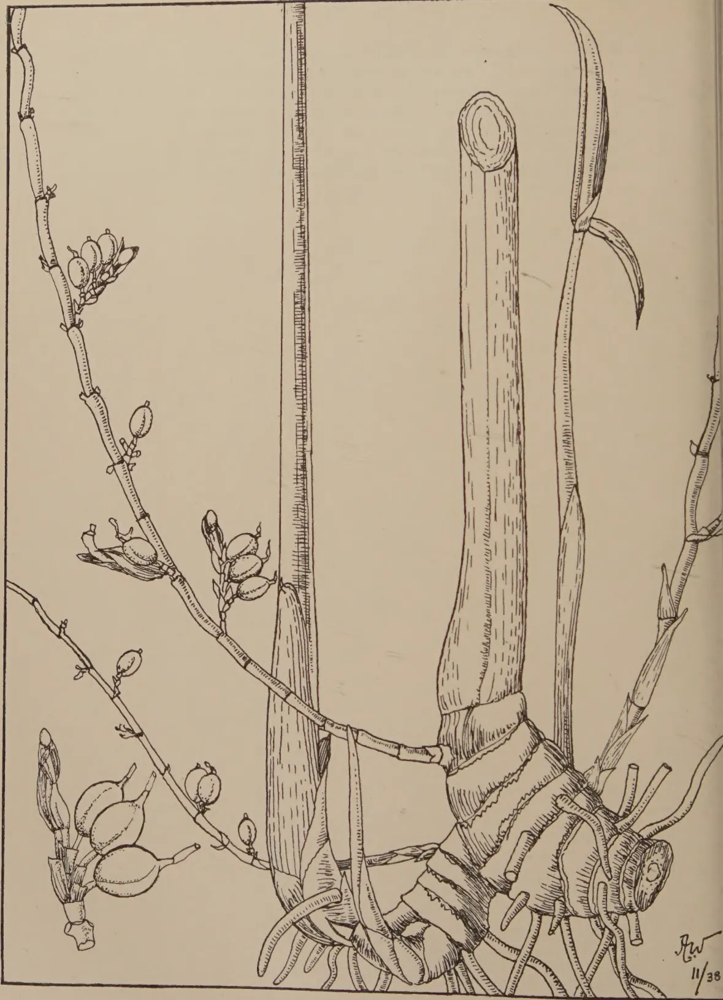
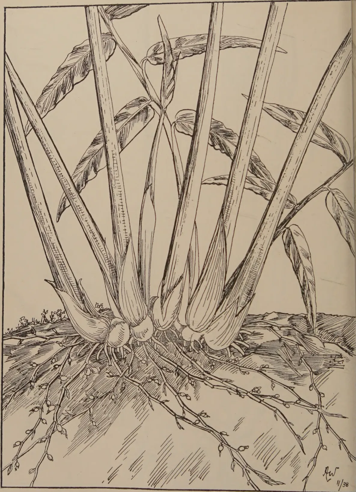
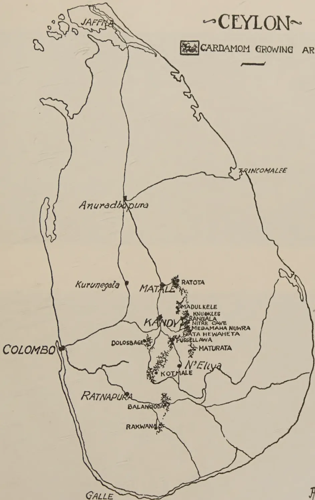
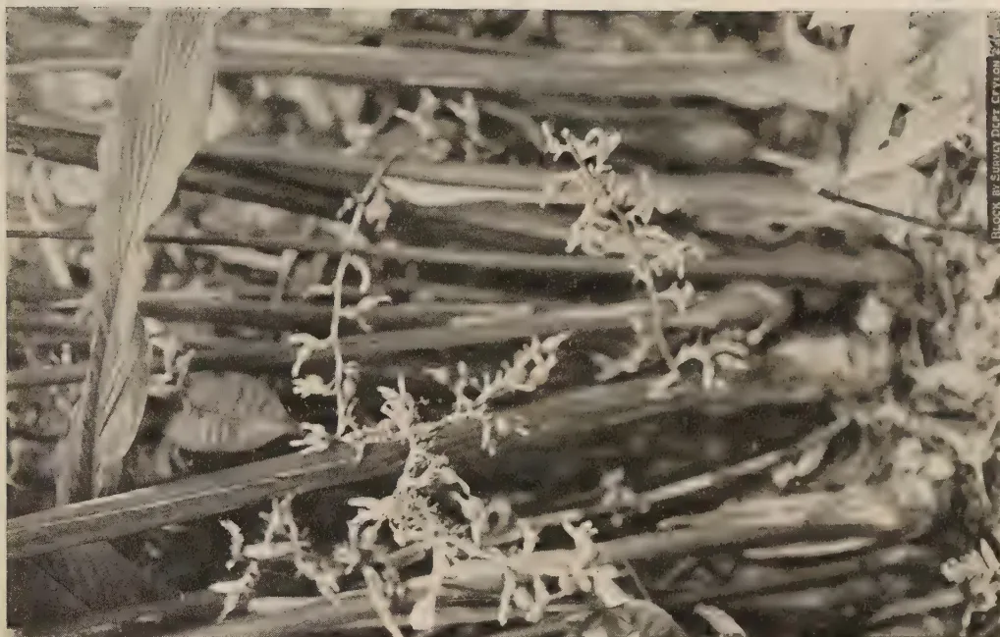
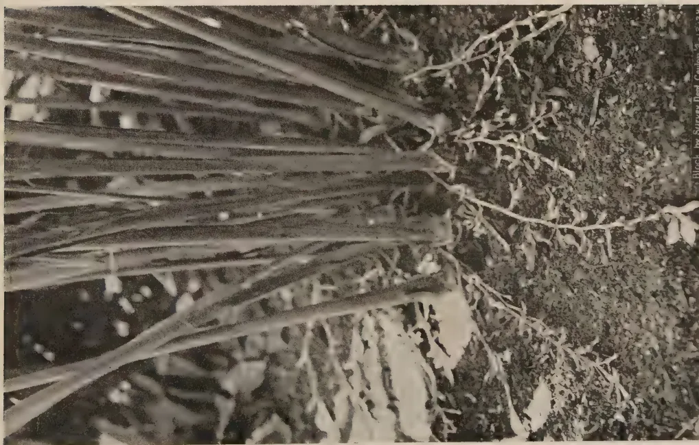
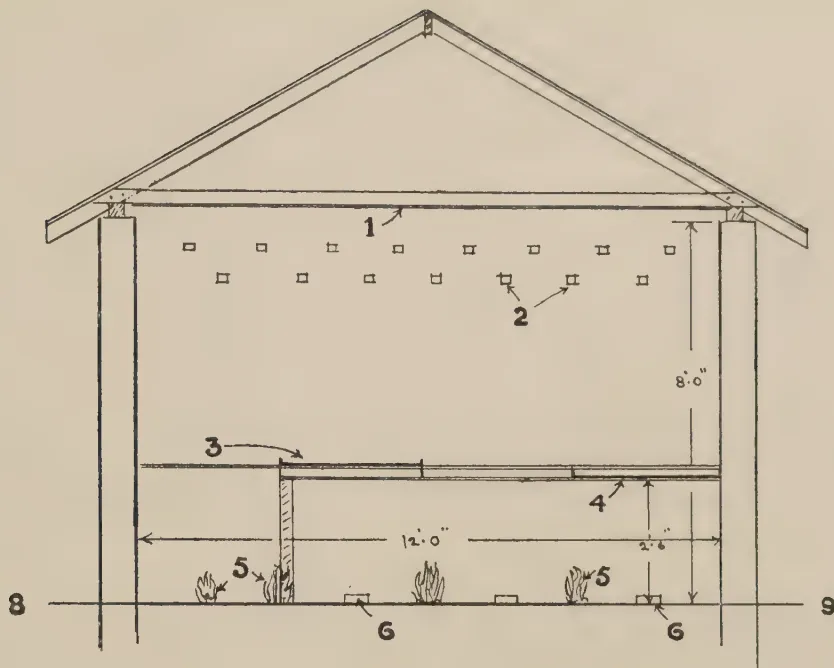
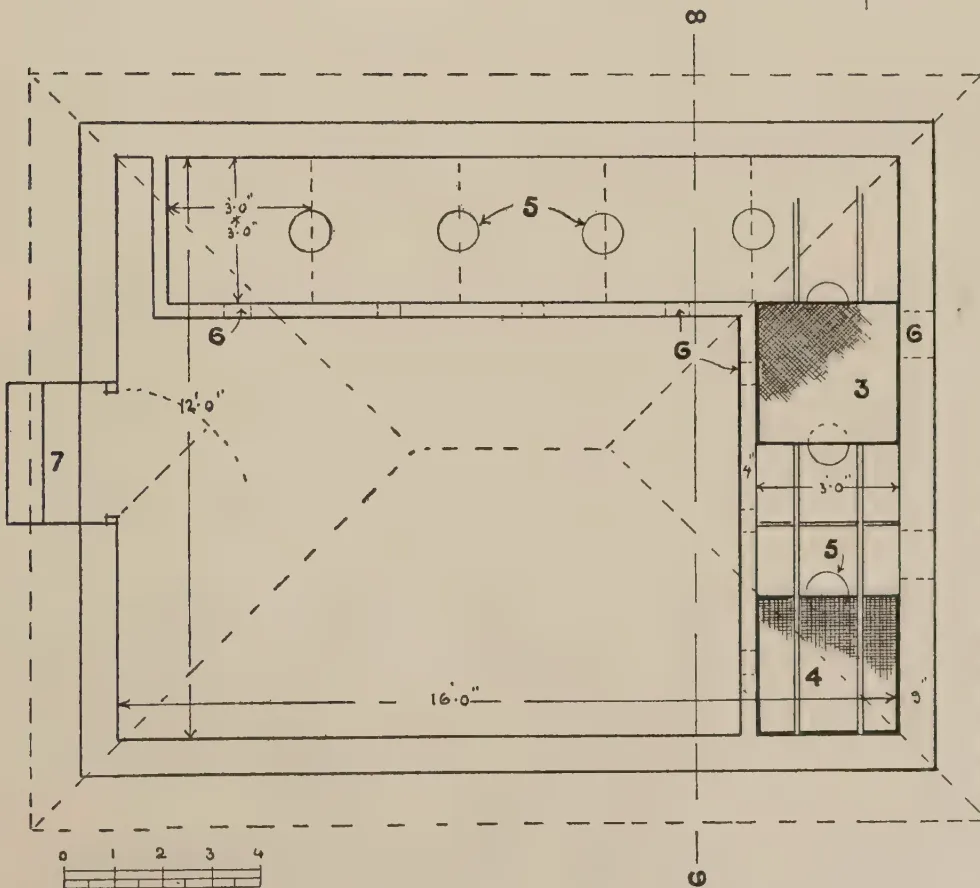
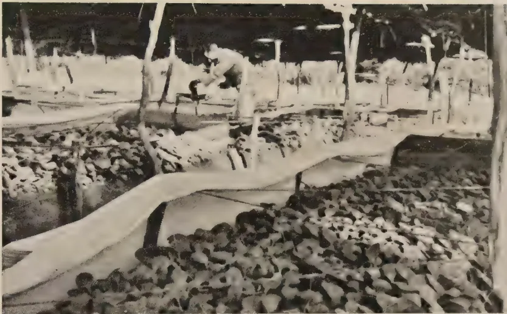
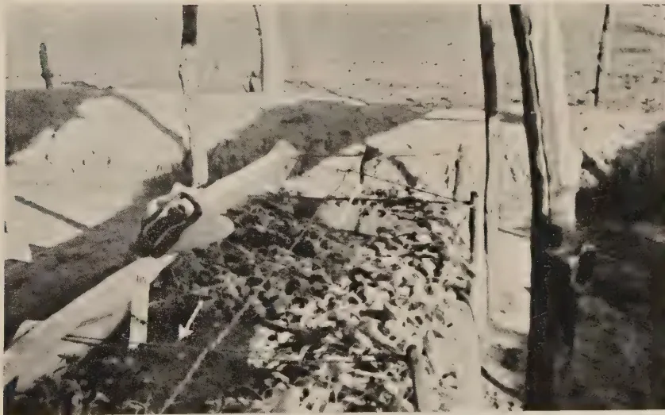
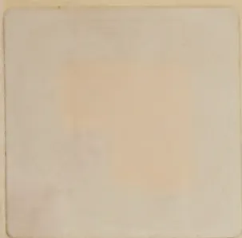

The  
**Tropical Agriculturist**

December, 1938

---

EDITORIAL

---

PLANT DISEASES AND ANNUAL CROPS

---

**I**N the issues of *The Tropical Agriculturist* for August, October and November, 1938, we referred to certain aspects of Ceylon's agricultural problem. The articles dealing with two specific diseases of annual crops appearing in this and the last number focus attention on a further factor which seriously affects this form of cultivation and sets a definite limit to the size of the average farm. The practical farmer knows how rapidly the bacterial wilt of solanaceous plants and the leaf-rot of betel or the leaf-curl of chillies spread. Their effect on the respective crops is not less devastating than that of the pseudo-plague in the poultry yard. It is quite impracticable to control these diseases by curative treatment. Our knowledge is quite inadequate to secure immunity by selection. Although the possibilities of the intensive application of the methods of plant sanitation will continue to be explored there is at present no reason to hope that they will yield very significant results. In short the farmer must regard the liability to disease as a very real and serious menace to his crops.

The peasant who cultivates a patch of kitchen garden for personal consumption or even the man who grows small quantities of several crops for the market may take the risk of the defeat of his efforts through diseases, but the capitalist will not take it. The ruin of the capitalist, growing 300 acres of chillies overtaken by disease, will be as complete as that of the coffee planter of the early nineties. Therefore it follows that even if the large farm, worked with machinery, begins to form the average agricultural unit of Ceylon, most annual crops must

1------------------------------------------------

<!-- stage4: ACCEPT r2J/J_013:52 -->

324

continue to remain the object of peasant agriculture unless someone else carries the risk for the capitalist. That someone else must be the Government for this form of insurance is hardly likely to come within the scope of the business of a private company. A scheme of state insurance against disease must grow with the growth of the large farm, and indeed it will be on the guarantee of such a scheme that the large farm will be born at all.

2------------------------------------------------

This image shows a blank page with a light beige or cream-colored background. There are faint, vertical lines running down the page, which appear to be artifacts from the paper's texture or scanning process. A few small, dark specks are scattered across the surface, likely due to dust or imperfections in the paper. The overall appearance is that of a clean but aged piece of paper.

3------------------------------------------------

A detailed botanical line drawing of the Mysore Cardamom (Elettaria cardamomum). The illustration is oriented vertically. On the right side, a thick, cylindrical rhizome is shown with its characteristic horizontal growth rings and a cross-section at the top. From the rhizome, several long, narrow, lanceolate leaves emerge, some showing prominent parallel venation. On the left side, a slender, jointed stem is depicted, bearing several clusters of small, oval-shaped fruits. The fruits are shown in various stages of development, some with long, pointed styles. The drawing is executed in a fine-lined, stippled style typical of scientific botanical illustrations. A signature 'J.W.' and the date '11/38' are visible in the bottom right corner.

BLOCK BY SURVEY DEPT. CEYLON. 7.12.38.

FIG. II.—MYSORE CARDAMOMS.

4------------------------------------------------

This image shows a blank, aged, cream-colored page, likely an endpaper or flyleaf from an old book. The paper has a slightly textured appearance with some minor discoloration and faint smudges, particularly towards the bottom. There is no text or other markings on the page.

5------------------------------------------------

A detailed black and white botanical line drawing of a Malabar Cardamom plant. The illustration shows the plant's habit, including a dense network of roots and rhizomes at the base. Several large, lanceolate leaves with prominent parallel venation emerge from the base. The drawing is signed 'J.W.' and dated '11/38' in the bottom right corner.

BLOCK BY SURVEY DEPT. CEYLON. 7.12.38.

FIG. I.—MALABAR CARDAMOMS.

6------------------------------------------------

325CARDAMOMS—I

W. MOLEGODE,  
 AGRICULTURAL OFFICER, PROPAGANDA.

THE cardamoms of commerce are the seeds of the herbaceous perennial *Elettaria cardamomum* of which three varieties are found in Ceylon. One of these is indigenous to Ceylon and grows wild in the wet forests in the higher elevations, chiefly in the Ratnapura and Lunugala districts. The cultivated varieties, Malabar and Mysore, appear to have been introduced from India. These two varieties are easily distinguishable by the characteristics noted below.

*Malabar*.—Leaves silky on the under surface; racemes arise from the base of the stem and creep on the surface of the ground around the clumps; fruits or capsules angled, shorter and more globular than the Mysore type (Figs. I and IV).

*Mysore*.—Leaves larger with a coarser under surface not silky but hard and smooth; racemes rise erect; fruits oblong and larger than those of the Malabar type (Figs. II and IV).

The two varieties differ slightly in flavour.

In Ceylon at the present time, about 7,000 acres are under cultivation. Of this area about 1,000 acres consist of small holdings up to 2 acres in extent belonging to the village population. The rest are plantations belonging to Estate companies and to individual planters, both European and Ceylonese. Estate scale plantations vary from 5 to 450 acres in extent, the latter figure representing probably the largest cardamom plantation in the Island. There are several plantations of over 100 acres each, and two or three between 200 and 300 acres. Cardamoms are cultivated in Ceylon only in the higher, moist elevations and are confined to the districts shown in the accompanying map (Fig. III).

The quantities of cardamoms exported during the last five years and their value are noted below. It will be observed that the prices have varied considerably.

<table>
<thead>
<tr>
<th></th>
<th>Quantity in Cwts.</th>
<th>Value in Rupees.</th>
</tr>
</thead>
<tbody>
<tr>
<td>1933 ..</td>
<td>3,161 ..</td>
<td>338,096</td>
</tr>
<tr>
<td>1934 ..</td>
<td>3,441 ..</td>
<td>355,960</td>
</tr>
<tr>
<td>1935 ..</td>
<td>2,362 ..</td>
<td>274,751</td>
</tr>
<tr>
<td>1936 ..</td>
<td>2,335 ..</td>
<td>425,907</td>
</tr>
<tr>
<td>1937 ..</td>
<td>2,890 ..</td>
<td>685,736</td>
</tr>
</tbody>
</table>

7------------------------------------------------

326

Cardamoms are grown very extensively in Mysore and the cultivation of the crop has been started in Sumatra.

The world's requirements of cardamoms appear to be limited, and the question naturally arises : is it advisable to extend the cultivation of cardamoms ?

The chief use of cardamoms is as a spice. In the East, cardamoms are used extensively as a masticatory and, particularly in India, as an aphrodisiac. They are also used medicinally as an aromatic, stimulant and diuretic. On the continent of Europe, the capsules are crushed and mixed with flour and baked into bread noted for its warmth-giving properties.

#### ELEVATION AND RAINFALL FOR CARDAMOMS

Elevation and rainfall are important factors for the successful cultivation of cardamoms. The elevation best suited for the Malabar variety is between 2,000 and 3,500 feet above sea level and for the Mysore variety between 3,000 and 4,500 feet, with a well distributed rainfall between 120 and 150 inches per year. It would be a venturesome proposition to grow cardamoms for commerce at lower or higher elevations than these.

#### SOIL AND SITUATION

Well-drained, fairly deep, moist, rich loamy soils such as are found under high forests on undulating situations are the most suitable. Cardamoms will thrive best on such soils under light natural shade and when protected from strong wind. The sloping high hills of Medamahanuwara, Knuckles, Rangala, Kotmale, Dolosbage and Balangoda have some of the best plantations.

A stiff clayey soil which remains excessively wet and a light or sandy, rapidly drying soil are unsuitable. The areas truly satisfactory for cardamoms are limited in Ceylon and it is probable that very little more land could be cultivated successfully with the crop.

#### PROPAGATING AND PLANTING

Though propagation can be effected by seed, it is generally done by division of the crown or rhizomes, or "bulbs" as they are called. Bulbs for planting have to be carefully selected. They should be 18 months to two years old, and should contain at least two growing stems. Any damaged bulbs should be rejected and bulbs for planting should not be kept in the open for more than a few days after lifting.

It is not uncommon to plant entire plants separated from old clumps. If this method of propagation is adopted, care is necessary to see that each plant has its proper proportion of rhizomes to put forth new stems.

8------------------------------------------------

# CEYLON

CARDAMOM GROWING AREAS.

A detailed map of the island of Ceylon (Sri Lanka) showing the distribution of cardamom growing areas. The map includes major cities and towns, with cardamom growing areas marked by clusters of small trees. The island is divided into administrative districts by thin lines. The following locations are labeled:

- JAFFNA (northern tip)
- TRINCOMALEE (northeast coast)
- Anuradhapura (north-central)
- Kurunegala (west-central)
- COLOMBO (west coast)
- MATALE (central)
- RATOTA (central-east)
- KANDY (central)
- DOLOSBAGE (west-central)
- MADULKELE (central-east)
- KNUGKLES (central-east)
- BANGALA (central-east)
- NITRE CAVE (central-east)
- MEDAMAHA NUWRA (central-east)
- BATA HEWAHETA (central-east)
- PUSSELLAWA (central-east)
- MATURATA (central-east)
- N'ELIYA (central-east)
- KOTMALE (central)
- RATNAPURA (south-west)
- BALANGODA (south-central)
- RAKWANA (south-central)
- GALLE (southern tip)

The cardamom growing areas are concentrated in the central and central-eastern regions, particularly around the Kandy and Ratnapura districts. A scale bar is located below the title.

*AW*  
11/38

BLOCK BY SURVEY DEPT. CEYLON. 7-12-38.

FIG. III.—SHOWING CARDAMOM GROWING AREAS IN CEYLON.

9------------------------------------------------

<!-- stage4: FAINT old-images-only -->

[Faint page: no legible print of its own could be verified; text withheld (stage 4 review list)]

A faint pencil sketch of a large, irregular, somewhat circular shape, possibly a map or a geographical outline. The shape is composed of several overlapping, slightly curved lines that define its boundaries. Inside the shape, there are some very faint, illegible markings that could be text or additional lines. The overall appearance is that of a preliminary drawing or a map fragment.

10------------------------------------------------

A black and white photograph showing a cluster of Mysore Cardamom plants. The plants have thin, upright stems with small, lanceolate leaves and clusters of small, light-colored flowers or fruits at the top. They are growing in a field with tall, thick grass blades in the background. The lighting is bright, creating strong shadows.

Block by Survey Dept. Crylon 2-1-38

MYSORE CARDAMOMS.

A black and white photograph showing a cluster of Malabar Cardamom plants. The plants have thin, upright stems with small, lanceolate leaves and clusters of small, light-colored flowers or fruits at the top. They are growing in a field with tall, thick grass blades in the background. The lighting is bright, creating strong shadows.

Block, by Survey Dept. Crylon 2-1-38

MALABAR CARDAMOMS.

FIG. IV.—MALABAR AND MYSORE CARDAMOMS.

11------------------------------------------------

This image is a scan of a blank page. The paper has a light beige or cream-colored tint. There are a few very small, faint dark spots scattered across the surface, which appear to be scanning artifacts or minor imperfections in the paper. No text, lines, or other markings are present.

12------------------------------------------------

327

The most suitable distance for planting is 8 feet apart. Holes or pits for each bulb or plant should be prepared well ahead of planting : they should be 2 feet wide and 1 to  $1\frac{1}{2}$  feet deep and filled up with surface soil and allowed to "weather" for 2 or 3 weeks. Too deep or shallow planting of bulbs results in casualties. The bulbs should be buried up to their collars and the soil pressed down firmly with the hands.

Where bulbs are difficult to obtain, propagation by seed is recommended. Fruits from which the seed for growing is intended, should be selected. They should have attained full maturity. Seeds which are compact and adhering in a mass should be air-dried and separated, soaked in water for two hours and sown in a well prepared nursery bed. The finer the texture of the nursery bed the better it is. A better practice is to raise seedlings in boxes containing a good mixture of fine leaf mould and sand. The soil in the nursery or seed boxes should be kept damp and protected from excessive heat of the sun and, if in the open, protected from direct rain. In about a year the seedlings will have grown about a foot in height when they may be lifted carefully and planted out.

Seeds, as stated before, may take two or three months to germinate. At lower elevations it has been found that seeds germinate in less than a month. The germination is generally poor. It is, therefore, advisable to sow about 1 lb. of dry seed to raise enough seedlings to plant up one acre, although many more plants than the 600 required may be obtained from one pound of seed.

#### AFTER-CULTIVATION

Very little after-cultivation is required. Weeding may be necessary at intervals for about two years after planting out, at lower elevations, and for about three years at higher elevations. Once the bushes are fully formed they will keep down weeds and an occasional weeding once in two months or so only is necessary. Dry leaves may be removed which should not be thrown away but put round the clumps. Decaying or any damaged leaf stalks must be carefully cut off leaving about 2 feet of stalk. Do not injure the root stock.

There is no local experience regarding manures suitable for cardamoms. Experiments have been made with artificials with no success. Experience has shown that it is best to let the leaves that fall on the clumps remain undisturbed except when rotting of the root stock is discovered.

#### CROP AND HARVEST

At lower elevations cardamoms usually come into bearing in two years and at higher elevations after the third year. The early crops are small. From about the fifth year full crops

13------------------------------------------------

328

of 1,000 to 1,500 pounds of green cardamoms may be expected per acre, for some years. Heavier yields than these have often been obtained. At lower elevations, crops will begin to decline after about six years. At higher elevations good crops may be expected for about 10 years ; the yield gradually falls off for the next ten years, after which a crop of 50 lb. per acre will be found to be the average.

Although flowering may occur all the year round, the main flowering season is from April to July and harvesting may begin in August and last up to December. The heaviest crops are gathered from October to December.

Fruits are borne in succession in the same racemes. It is therefore necessary to pick individual fruits very carefully as they mature by cutting them off with a pair of scissors without damaging the racemes bearing the blossom. From the flower to the mature fruit the period is about five months at higher elevations and about three to four months for lower elevations. Rounds of picking should be made once in three weeks to a month.

On ripening, cardamom fruits change their colour from green to a pale green. It is advisable to pick the fruits just before they fully ripen as over-ripe fruits are liable to split in curing.

The green curing of cardamoms is fully described in another article.

14------------------------------------------------

This image is a scan of a blank page. The paper has a light beige or cream-colored tint. There are a few very small, faint dark spots scattered across the surface, which appear to be scanning artifacts or dust particles. No text, lines, or other markings are present on the page.

15------------------------------------------------

The diagram illustrates the 'Green Curing of Cardamoms—Heated Chambers Method'. It consists of two parts: a plan view and a cross-section.

- **Plan View:** Shows a rectangular chamber (1) with a gabled roof (2). A door (3) is located on one side. A water tank (6) is connected to the chamber via a pipe (7). A small window (8) is also shown.
- **Cross-section:** Shows the interior of the chamber with a height of 8'0" and a width of 2'6". The chamber is supported by a base (4) and a wall (10).

BLOCK BY SURVEY DEPT. CEYLON. 7.12.38.

FIG. II.—GREEN CURING OF CARDAMOMS—HEATED CHAMBERS METHOD.

16------------------------------------------------

This image is a scan of a blank page. The paper has a light beige or cream-colored tint. There are a few very small, dark specks scattered across the surface, which appear to be scanning artifacts or dust particles. No text, lines, or other markings are present on the page.

17------------------------------------------------

![Architectural floor plan of a building with numbered rooms and dimensions. The plan shows a main rectangular structure with several rooms labeled 1 through 7. Room 1 is a large central area (15'0" x 15'0"). Rooms 2 and 3 are smaller rooms (2'6" x 2'6") located in the upper and lower sections. Room 4 is a narrow corridor (9' x 3'6") connecting the rooms. Room 5 is a small room (3'0" x 3'0") with a 2x2" opening. Room 6 is a large room (8'0" x 5'0") with a 2x3' opening. Room 7 is a small room (3'0" x 3'0") with a 2x3' opening. A scale bar at the bottom right shows increments from 0 to 4. A dashed line labeled 10-10 indicates a section line.](88ecaa2b9e9cf5b96e34d37a2a916b8b_1_img.webp)

BLOCK BY SURVEY DEPT. CEYLON. 7.12.38.

FIG. 1.—GREEN CURING OF CARDAMOMS—HEATED CHAMBERS METHOD.

18------------------------------------------------

329CARDAMOMS—II

---

W. MOLEGODE,  
*AGRICULTURAL OFFICER, PROPAGANDA.*

---

GREEN CURING OF CARDAMOMS

**T**HE old methods of curing cardamoms by bleaching are now being replaced, by progressive growers, by green curing which is superior in many ways. The old laborious procedure of sulphur smoking, sun-drying, soaking in water, sulphur smoking again and repeating these processes several times before a marketable commodity could be obtained, was not only expensive but required constant care and attention and depended largely upon weather conditions. Green curing is independent of the weather, requires less labour and results in the shedding of seeds being reduced to a minimum. A further advantage is that green cured cardamoms command a higher price.

Two methods of green curing are in use in Ceylon at the present time.

1. (1) Drying in a heated chamber, the heat being generated by an external furnace and conducted through the chamber by means of flues. (Figs. I. and II.).
2. (2) Drying over an open charcoal fire in a closed chamber (Fig. III.).

Either method gives equally satisfactory results. The open charcoal method is recommended as simpler, less expensive and therefore more capable of adoption by small holders.

In neither case is a solid chamber of brick and stone necessary. Walls of wattle and daub plastered and white-washed, or even of wooden planks are adequate. The chamber should be provided with a ceiling and the door should be close-fitting to conserve the heat. A window for the admission of light is desirable but not essential. In the case of chambers for the open charcoal firing method, ventilation is very necessary to carry off the fumes and should be provided.

19------------------------------------------------

330

A hot-air chamber may be a building with inside dimensions of 15 ft. by 15 ft. The ceiling (Fig. II. 1) is at a height of 8 feet. On two sides are racks for trays (Fig. II. 2). The trays are of simple construction consisting of ordinary reeper frames with wire mesh or hessian bottoms. A convenient size for trays is 2 ft. 6 in. by 2 ft. 6 in., the racks being built to permit of easy admission and removal of the trays.

The racks are arranged in tiers being 8-9 inches apart (Fig. II. 2).

Attached to the room is the furnace (Fig. II. 5) which is fed from outside. This may be 3 ft. by 3 ft. and 4 ft. high. From the furnace the hot air is carried along heating flues (Fig. II. 3) which lie a few inches above floor level, smoke escaping from the chimney (Fig. II. 7). The construction of a suitable chamber is shown in illustrations 1 and 2.

This constitutes a complete hot-air curing barn and the space is sufficient for a crop of 4,000 to 4,500 lb. (dry weight) per annum. Outside the room is a store (Fig. II. 6) in which the dried or cured cardamoms are stored. Rat-proof boxes or bins are essential for storing cured cardamoms until they are ready for despatch.

The open fire chamber may be made in a building of any convenient size. Along two sides are firing places (Fig. III. 5). The trays of cardamoms are placed at the top (Fig. III. 3 and 4). The charcoal fire is lit within the chamber which should allow of admission of air. The room should be closed but ventilators should be provided to allow of the escape of fumes (Fig. III. 6). A rack is provided for the reception of trays of cured cardamoms where they remain for some days to complete the curing or drying process. The construction of a suitable chamber is shown in Fig. III.

### CURING PROCESS

In curing by the hot-air process of flue-curing, care must be exercised in regulating heat. Too rapid drying is unsuitable. The process may be explained as follows :—

When the cardamoms are harvested and brought in, they are placed in trays (a tray 2 ft. 6 in. by 2 ft. will accommodate 8-12 lb. of green cardamoms) the trays being then placed in the racks. The furnace is then fired. The consumption of firewood should be about  $\frac{1}{2}$  cubic yard of good hard firewood for every 1,000 lb. of green cardamoms. The cardamoms are allowed to dry for about 30 hours at a temperature of about 180°F. Occasionally the trays are withdrawn and the cardamoms turned over. After about 12 hours of drying the bottom and the top

20------------------------------------------------

This diagram shows a cross-section of a curing structure. The structure has a gabled roof (1) supported by two vertical pillars. The interior height is marked as 8'-0". A lower platform (3) is situated within the structure, with a height of 2'-6" from the ground (9) and a width of 12'-0". On this platform, there are several small piles of cardamom plants (5) and small square markers (6). The ground level is indicated by line 8.

This diagram shows the plan view of the curing structure. The main rectangular area has a width of 16'-0" and a depth of 12'-0". A smaller rectangular section at the top left has dimensions of 3'-0" by 3'-0". The structure is divided into several compartments by dashed lines. A large compartment (4) is at the bottom right, containing a circular marker (5) and a shaded area (3). Another compartment (5) is at the top center, containing a circular marker (5). A small rectangular section (7) is attached to the left side. The entire structure is enclosed by a dashed line. A scale bar at the bottom left shows increments from 0 to 4. The diagram is labeled with numbers 3, 4, 5, 6, 7, 8, and 9, corresponding to the components in the cross-section.

6LOCK BY SURVEY DEPT. CEYLON. 7.12.38.

FIG. III.—GREEN CURING OF CARDAMOMS—OPEN CHARCOAL FIRE METHOD.

21------------------------------------------------

This image is a scan of a blank page. The background is a uniform light beige or tan color. There are a few very small, dark specks scattered across the surface, which appear to be scanning artifacts or dust particles. No text, lines, or other graphical elements are present.

22------------------------------------------------

331

trays are exchanged to enable the trays to receive the same degree of heat during the curing process. When cured, the cardamoms should be hard and greenish in colour.

In the open fire method the cardamoms are spread on trays with a wire mesh bottom, and placed over a slow burning charcoal fire for about 12 hours. They are then transferred to trays with a jute hessian bottom and placed on a higher rack for another day. By this time the cardamoms should have dried sufficiently, but to ensure complete drying, the trays are removed to stand in the same room.

The fire is lit on the floor of the chamber, charcoal being piled into heaps of about  $1\frac{1}{2}$  ft. in height. Approximately one pound of charcoal is required to dry each pound of green cardamoms.

#### CLIPPING

The dried cardamoms require clipping before they are marketed in order to remove all stalks and calyces. The common method of clipping with scissors can be replaced quite efficiently by rubbing the dried cardamoms over a coarse surface of jute hessian or wire mesh. This can be done more satisfactorily while the cardamoms are still hot. For this purpose the dried cardamoms are further fired by placing them over the charcoal fire or hot-air chamber, as the case may be, for about two hours and then rubbed on hessian or wire mesh surface.

#### SORTING

The next step is sorting. Sometimes a sieve with quarter inch mesh is employed for the purpose, but hand picking is more reliable. Damaged, shrivelled and very small capsules are removed for the extraction of seed. It might here be stated that the proper time for harvesting the crop is shortly before the capsules ripen. If allowed to ripen fully the capsules split and shed seeds in the process of drying.

#### GRADING

The sorted cardamoms should be graded according to size and colour, being known in the trade as "Longs" "Mediums" and "Shorts". Green cured cardamoms should be of an even greenish-yellow colour. At no time during the drying process should they be exposed to any strong light which tends to bleach them and spoil the uniformity of colour.

#### PACKING

For export, the cured cardamoms should be packed in aluminium and paper lined cases, taking about 112 lb. net., preferably in venesta cases.

23------------------------------------------------

<!-- stage4: ACCEPT r2J/J_013:58 -->

332

The practice of packing cardamoms in double sacks, which is common in Ceylon, is to be deprecated owing to the danger of damage by rats.

#### GENERAL

The yield of cardamoms varies considerably with the age of the plantation, the nature of the soil and weather conditions. Some plantations yield as much as 2,000 lb. of green cardamoms per acre in a good year. A yield of about 1,200 lb. is considered a good crop. The return of cured cardamoms is usually 25 to 28 per cent. of the green weight.

The prices of cured cardamoms have varied in the last three years between Rs. 1.05 and Rs. 2.10 per lb.

24------------------------------------------------

333

THE RELATIVE RESISTANCE OF SOME TOMATO  
VARIETIES TO BACTERIAL WILT  
(*Bacterium solanacearum* E. F. S.)

---

MALCOLM PARK, A.R.C.S.,  
ACTING DEPUTY DIRECTOR OF AGRICULTURE  
AND  
M. FERNANDO, Ph.D., B.Sc., D.I.C.,  
RESEARCH PROBATIONER IN PLANT PATHOLOGY

---

**B**ACTERIAL wilt (*Bacterium solanacearum* E.F.S.) is common in the tomato-growing areas of the wet zone of Ceylon. The disease is conspicuously absent in the Jaffna peninsula and in a large section of the dry zone. In the Kandy District, the disease is the major factor limiting tomato-growing and is particularly severe on alkaline soils overlying dolomitic limestone; these soils have an average pH value of 7.0—7.5 and values as high as 8.5 may sometimes be attained.

In Ceylon tomatoes are a peasants' crop, and control measures involving heavy and recurrent expenditure are not likely to find favour with cultivators of this type. With village crops, the production of disease-resistant varieties is the most desirable and, in many instances, the only feasible method of disease control. It is, however, realized that the promise of successful breeding against a pathogen so catholic in its tastes as *B. solanacearum* is less than with a specialized parasite with a limited host range.

The present communication presents the results of an exploratory experiment undertaken as part of a programme of tomato selection for resistance to bacterial wilt.

#### DESIGN OF EXPERIMENT

Eight varieties of tomato, *viz.*, Red Marhio Nos. 1 and 2, Break O' Day Nos. 1 and 2, Marvana, Pritchard, Marglobe and a strain of the local country tomato, were tested out for resistance to bacterial wilt during the *yala* season of 1938. All the varieties except the local strain were reputed to be

25------------------------------------------------

334

resistant to the wilt caused by *Fusarium lycopersici* Sacc.—a pathogen that has not hitherto been recorded in Ceylon. No varieties selected for resistance to bacterial wilt were available for trial. It was felt, however, that if the parasitic mechanism of the two pathogens were the same, a variety selected for resistance to fusarium wilt might exhibit some degree of resistance to bacterial wilt as well.

The trial was laid down in the form of an 8 by 8 Latin Square of  $1/250$  acre plots. Each plot consisted of 30 plants in 3 rows of 10, spaced  $2\frac{1}{2}$  feet between and within rows. The marginal plants of adjacent plots were separated by an interval of  $3\frac{1}{2}$  feet.

The experiment was laid down on a heavily and rather uniformly infested area at the Experiment Station, Peradeniya. A technique for producing artificial epiphytotics of bacterial wilt has not been developed, and it was necessary for the success of this and subsequent trials to secure uniformity of natural infestation. The bacterial inoculum was probably evenly distributed over the field by cultivation operations like ploughing and harrowing. The Latin Square design with very small plots and a high degree of replication, aimed at further reducing the error due to heterogeneity of soil infestation.

#### EXPERIMENTAL MATERIAL AND METHODS

*Varieties of Tomato.*—Information regarding the eight varieties included in the trial is presented in Table I (Boswell, 1937). Seed of the varieties Red Marhio 1 and 2, Break O'Day 1 and 2, Marvana and Pritchard, was kindly supplied by Mr. J. H. Simmonds, Senior Pathologist, Department of Agriculture and Stock, Queensland. Seed of the variety Marglobe was obtained from the Vegetable Seed Station, Tabbowa, and the seed of the local strain from Peradeniya.

*Experimental Area.*—The soil was a light, sandy loam with a low content of nutrient elements and of organic matter, and had a pH value of 6.5. During the *yala* season of 1937 the land had received applications of compost (five tons per acre) and of "Nicifos"\* ( $\frac{3}{4}$  cwt. per acre), and had carried crops of tomatoes and brinjals (*Solanum melongena* L.). A severe outbreak of bacterial wilt resulted in complete failure of both these crops. The land was subsequently manured with "Nicifos" (one cwt. per acre) and sulphate of potash ( $\frac{1}{2}$  cwt. per acre), and was planted with maize and garlic during *maha*, 1937, the area under maize receiving a further application of "Nicifos" ( $\frac{3}{4}$  cwt. per

\* A proprietary mixture of monammonium phospho-phate with varying amounts of ammonium sulphate.

26------------------------------------------------

<!-- stage4: ACCEPT_CAP r2H/H_001:32+33 -->

335

serum, and that under garlic further applications of " Nicifos " RECORDS OF INCIDENCE OF BACTERIAL WILT OF TOMATOES. The land was subjected to the normal cultivation treatments. It was ploughed on March 26 prior to the planting of the experimental crop in the *yala* season of 1938, and compost was broadcast over the area at the rate of ten tons per acre on

![A 5x10 grid of 50 small square plots showing the results of a field experiment. Each plot contains a black and white pattern representing the presence or absence of a disease. The plots are arranged in five rows and ten columns. The first four rows each contain eight plots, while the fifth row contains ten plots. The plots are labeled with letters A through H, which correspond to different tomato varieties. The patterns vary significantly between the rows and columns, indicating different levels of disease resistance across the varieties and experimental conditions.](f739bb35c8f24a2e2df0d0630d7f74df_1_img.webp)

Marvana, Red Marhio 2 and Marglobe are significantly more resistant than all the other varieties. The difference between the varieties Marvana, Red Marhio 2 and Marglobe are not significant. There are also no significant differences in susceptibility between the varieties Pritchard, Red Marhio 1, Break O'Day 1 and 2 and the local variety.

A: Red Marhio 1  
 B: Red Marhio 2  
 C: Break O'Day 1  
 D: Break O'Day 2  
 E: Marvana  
 F: Pritchard  
 G: Local Variety  
 H: Local Variety

101

27------------------------------------------------

# RECORDS OF INCIDENCE OF BACTERIAL WILT OF TOMATOES

21st JUNE

8th JULY

A : Red Marthio 1  
B : Red Marthio 2

C : Break O'day 1  
D : Break O'day 2

E : Marvana  
F : Pritchard

G : Marglobe  
H : Local Variety

REPRODUCED & PRINTED BY SURVEY DEPT. Ceylon. T. I. 85.

FIG. I.

28------------------------------------------------

335

acre), and that under garlic further applications of " Nicifos " (two cwt. per acre) and sulphate of potash (one and a half cwt. per acre). The land was subjected to the normal cultivation treatments. It was ploughed on March 26 prior to the planting of the experimental crop in the *yala* season of 1938, and compost was broadcast over the area at the rate of ten tons per acre on April 10. The land was subsequently harrowed and levelled during the first week of May.

*Planting.*—The nurseries were sown on April 12. Seedlings were transplanted to the experimental area, at the rate of one per hole, on May 27. Transplanting was late; the seedlings were six weeks old at the time of transplanting and had to be topped. The considerable root damage consequent on late transplanting, created conditions favourable for invasion by the wilt bacterium. Wilted plants were not removed. The land was periodically weeded. During the dry spell that occurred late in the season, the plants were watered by hand.

### RESULTS

Records of the incidence of bacterial wilt on the experimental plots were made on June 21 and on July 8. These records are presented in Fig. 1; each solid black square in the figure represents a wilted plant. A gradient of infestation is evident in the direction of the long axis of the area, infestation being severest in plots at the centre and least in the end plots. There is, however, no marked " patchiness " in infestation.

An analysis of variance of the record of wilt incidence made on July 8, is given in Table 2. The value of F for varieties exceeds the one per cent. point and is hence indicative of a significant effect. In the following list the varieties are placed in descending order of resistance to bacterial wilt :—

<table>
<tbody>
<tr>
<td>1. Marvana.</td>
<td>5. Red Marhio 1.</td>
</tr>
<tr>
<td>2. Red Marhio 2.</td>
<td>6. Break O'Day 1</td>
</tr>
<tr>
<td>3. Marglobe.</td>
<td>7. Break O'Day 2.</td>
</tr>
<tr>
<td>4. Pritchard.</td>
<td>8. Local variety.</td>
</tr>
</tbody>
</table>

Marvana, Red Marhio 2 and Marglobe are significantly more resistant than all the other varieties. The differences between the varieties Marvana, Red Marhio 2 and Marglobe are not significant. There are also no significant differences in susceptibility between the varieties Pritchard, Red Marhio 1, Break O'Day 1 and 2 and the local variety.

29------------------------------------------------

336TABLE I.

<table border="1">
<thead>
<tr>
<th>Name of Variety.</th>
<th>Parents.</th>
<th>Breeding method.</th>
<th>Characteristics.</th>
</tr>
</thead>
<tbody>
<tr>
<td>A. Red Marhio 1</td>
<td rowspan="2">—</td>
<td rowspan="2">.. — ..</td>
<td rowspan="2">Resistant to fusarium wilt</td>
</tr>
<tr>
<td>B. Red Marhio 2</td>
</tr>
<tr>
<td>C. Break O'Day 1</td>
<td rowspan="2">Marglobe x Marvana</td>
<td rowspan="2">hybridization</td>
<td rowspan="2">Resistant to fusarium wilt and nailhead rust; may be defined for most purposes as an early Marglobe</td>
</tr>
<tr>
<td>D. Break O'Day 2</td>
</tr>
<tr>
<td>E. Marvana</td>
<td>.. Marvel x Earliana</td>
<td>.. do.</td>
<td>.. Early, resistant to fusarium wilt</td>
</tr>
<tr>
<td>F. Pritchard</td>
<td>.. Cooper Special x Marglobe</td>
<td>.. do.</td>
<td>.. Resistant to fusarium wilt, nailhead rust and cracking</td>
</tr>
<tr>
<td>G. Marglobe</td>
<td>.. Globe x Marvel</td>
<td>.. do.</td>
<td>.. Resistant to fusarium wilt and nailhead rust, susceptible to cracking</td>
</tr>
<tr>
<td>H. Local country to-mato</td>
<td>—</td>
<td>.. — ..</td>
<td>—</td>
</tr>
</tbody>
</table>

TABLE 2.

Analysis of Variance of Record of Wilt Incidence made on July 8.

<table border="1">
<thead>
<tr>
<th></th>
<th>D.F.</th>
<th>Sum of squares.</th>
<th>Variance</th>
<th>F</th>
<th>1 per cent. Point.</th>
</tr>
</thead>
<tbody>
<tr>
<td>Rows</td>
<td>.. 7</td>
<td>.. 322.0</td>
<td>.. —</td>
<td>.. —</td>
<td>.. —</td>
</tr>
<tr>
<td>Columns</td>
<td>.. 7</td>
<td>.. 115.75</td>
<td>.. —</td>
<td>.. —</td>
<td>.. —</td>
</tr>
<tr>
<td>Varieties</td>
<td>.. 7</td>
<td>.. 348.75</td>
<td>.. 49.82</td>
<td>.. 4.2</td>
<td>.. &lt;3.29</td>
</tr>
<tr>
<td>Error</td>
<td>.. 42</td>
<td>.. 495.5</td>
<td>.. 11.797</td>
<td>.. —</td>
<td>.. —</td>
</tr>
<tr>
<td>Total</td>
<td>.. 63</td>
<td>1,282.0</td>
<td></td>
<td></td>
<td></td>
</tr>
</tbody>
</table>

Standard error : 3.43.

Co-efficient of variability : 18.5.

Mean Nos. of Wilted Plants per Plot.

<table border="1">
<thead>
<tr>
<th>Red Marhio</th>
<th>Red Marhio</th>
<th>Break O'Day</th>
<th>Break O'Day</th>
<th>Marvana.</th>
<th>Pritchard.</th>
<th>Mar-globe.</th>
<th>Local variety.</th>
<th>Significant difference.</th>
</tr>
<tr>
<th>1</th>
<th>2</th>
<th>1</th>
<th>2</th>
<th></th>
<th></th>
<th></th>
<th></th>
<th></th>
</tr>
</thead>
<tbody>
<tr>
<td>20 ..</td>
<td>15 ..</td>
<td>20.1 ..</td>
<td>20.3 ..</td>
<td>14.3 ..</td>
<td>19.8 ..</td>
<td>16 ..</td>
<td>20.4 ..</td>
<td>3.5</td>
</tr>
</tbody>
</table>

The mortality even in the least susceptible variety, *viz.*, Marvana, was just under 50 per cent. The percentage infection in the varieties Pritchard, Red Marhio 1, Break O'Day 1 and 2 and the local variety, was in the neighbourhood of 66 per cent.

30------------------------------------------------

337

It may be mentioned finally that the performance of these varieties must be investigated over several seasons before any generalization can be made regarding their resistance to bacterial wilt; a strain that exhibits an appreciable degree of resistance in one season may prove extremely susceptible in a later season.

#### SUMMARY

1. Eight varieties of tomato, *viz.*, Red Marhio 1 and 2, Break O'Day 1 and 2, Marvana and Pritchard from Queensland, Marglobe from Tabbowa, and a local variety from Peradeniya, were tested out for resistance to bacterial wilt on a heavily and a comparatively uniformly infested area at the Experiment Station, Peradeniya.

2. The varieties arranged themselves in the following descending order of wilt resistance; the symbol > represents a statistically significant difference and  $\nabla$  a difference not statistically significant:

Marvana  $\nabla$  Red Marhio 2  $\nabla$  Marglobe > Pritchard  $\nabla$  Red  
Marhio 1 Break O'Day 1  $\nabla$  Break O'Day 2  $\nabla$  local  
variety.

#### ACKNOWLEDGMENTS

The writers' grateful thanks are due to Mr. S. F. Ashby, Director, Imperial Mycological Institute, Kew, and Mr. J. H. Simmonds, Senior Pathologist, Department of Agriculture and Stock, Queensland, through whose courtesy the seed of most of the varieties of tomato was secured, to Mr. C. N. E. J. de Mel, Principal, Farm School, Peradeniya, for his co-operation and assistance, and to Mr. M. W. Jayasuriya, Experiment Station, Peradeniya, for his careful supervision of the field arrangements.

#### REFERENCES

Boswell, V. R., 1937—Improvement and genetics of tomatoes, peppers and eggplant. *U. S. D. A. Yearbook of Agriculture, 1937*, pp. 176-206.

Fisher, R. A., 1932—*Statistical methods for research workers*, 4th edition, London, Oliver and Boyd.

Snedecor, G. W., 1934—*Calculation and interpretation of analysis of variance and co-variance*. Collegiate Press, Inc. Ames, Iowa.

31------------------------------------------------

338

## SOME STUDIES ON TOBACCO DISEASES IN CEYLON—V

### THE USE OF FUNGICIDES IN THE CONTROL OF DAMPING-OFF OF TOBACCO SEEDLINGS

W. R. C. PAUL, M.A., M.Sc., D.I.C., Dip. Agric. (Cantab.),  
ACTING PLANT PATHOLOGIST

AND

M. FERNANDO, Ph.D., B.Sc., D.I.C.,  
RESEARCH PROBATIONER IN PLANT PATHOLOGY.

**E**LABORATE methods of pre-treatment of seed-bed soil are usually employed in the control of damping-off in tobacco seedlings. In an experiment recorded in the first number of this series (Park & Fernando, 1937), it was observed that one of the incidental effects of a nursery spray programme directed against frog-eye of tobacco seedlings, was the almost complete control that this spraying provided against damping-off (*Pythium* sp.). It was felt that a spray programme of this type which functioned against more than one major disease was of considerable value in nursery practice. The present communication presents the damping-off data in a second nursery experiment designed primarily for frog-eye control.

#### DESIGN OF EXPERIMENT

The experiment was laid out in the form of six randomized blocks of four plots each. The following four treatments were randomized within each block:—

1. 1. Weekly spraying with colloidal copper.
2. 2. Weekly spraying with salicylanilide.
3. 3. Weekly dusting with copper-lime dust.
4. 4. Untreated control.

The experiment was laid down at the Experiment Station, Ganewatta, during the 1938 *maha* season. There were six nursery beds each measuring 50 by 4 feet. Each bed functioned as a block and was partitioned crosswise into four plots measuring  $12\frac{1}{2}$  by 4 ft. In the collection of data, a six inch border was

32------------------------------------------------

339

rejected on either side of the partitions and at the two ends of the beds; the net area contributing data in each plot was hence 46 square feet. The arrangement of rectangular plots end-on in a block is admittedly not the best for experimental purposes, but this could not be avoided as wider beds would have interfered with weeding and other cultural operations.

#### EXPERIMENTAL MATERIAL AND METHODS

*Preparation of nurseries.*—A part of the rotation area of the station that had not carried nurseries in the immediate past, was selected. The soil was a light brown, sandy loam. The area was levelled and well-rotted farmyard manure was applied at the rate of seven baskets per twenty square yards on August 22, 1938. Brushwood was piled on the area which was then burnt on August 24. The area was divided up into beds measuring 50 by 4 feet with 2 feet alleys between beds which were raised about one foot above the level of the surrounding land to allow free drainage. The surface soil was again burnt with brushwood on August 28 but no tobacco trash was used in either of the burnings. Six baskets of compost were added to each bed on August 30, and to every twenty square yards of nursery bed the following fertilizer mixture was applied two days before sowing :—

<table>
<thead>
<tr>
<th></th>
<th></th>
<th>lb.</th>
</tr>
</thead>
<tbody>
<tr>
<td>Superphosphate</td>
<td>.. ..</td>
<td>1</td>
</tr>
<tr>
<td>Nitrate of soda</td>
<td>.. ..</td>
<td><math>\frac{1}{2}</math></td>
</tr>
<tr>
<td>Sulphate of potash</td>
<td>.. ..</td>
<td><math>\frac{1}{2}</math></td>
</tr>
</tbody>
</table>

The nursery technique outlined above is the routine practice in tobacco stations in Ceylon, a fuller account of which is given by Livera (1935).

*Sowing of nurseries.*—The seed was obtained from selected Harrison's Special plants from the *maha* crop, 1937–38. The capsules were derived from flowers that had been selfed under bags. Each nursery bed was sown with one tablespoonful of seed which was mixed with sand at the rate of one quart to every teaspoonful of seed for the purpose of uniform distribution. The dates of sowing of the experimental beds were as follows :—

<table>
<thead>
<tr>
<th>Beds (Blocks)</th>
<th>Sowing date</th>
</tr>
</thead>
<tbody>
<tr>
<td>1 and 2 ..</td>
<td>.. September 17, 1938</td>
</tr>
<tr>
<td>3 and 4 ..</td>
<td>.. September 24, 1938</td>
</tr>
<tr>
<td>5 and 6 ..</td>
<td>.. October 1, 1938</td>
</tr>
</tbody>
</table>

The sowing dates were separated by intervals of one week. The seedlings were protected against tobacco stem-borer (*Pthorimaea heliopa* Lower.) by a cheese-cloth cover over each bed, above which was constructed a cadjan shade. The beds

33------------------------------------------------

340

were watered twice a day, *viz.*, at 7 A.M. and at 3.30 P.M. The cheese-cloth cover was removed prior to the first watering, and was not put back till the completion of the second watering.

*Composition of the fungicides.\*—*

1. *Colloidal copper.*—The following spray formula was used:—

<table>
<tr>
<td>Proprietary colloidal copper</td>
<td>..</td>
<td>1 oz.</td>
</tr>
<tr>
<td>Proprietary spreader</td>
<td>..</td>
<td>1/16 oz.</td>
</tr>
<tr>
<td>Water</td>
<td>..</td>
<td>1 gallon</td>
</tr>
</table>

The colloidal copper and the spreader used in the above formula are identical with those adopted in the 1937 and 1938 experiments (Park and Fernando, 1937 (*a*) and (*b*) and 1938). This colloidal copper is a proprietary fungicide containing 22 per cent. copper oxychloride, 50 per cent. water and 28 per cent. of an organic complex (Jacquemain & Gravier, 1932). The spreader is a proprietary preparation having a composition allied to a sulphonate of an alkylated hydrocarbon.

2. *Salicylanilide.*—This is a proprietary product containing 25 per cent. salicylanilide, 10 per cent. of an emulsifier and wetter and 65 per cent. water (Cunningham, 1935). The product was used at a concentration of  $\frac{1}{2}$  ounce per gallon at the first spraying, and at 1 ounce per gallon for all subsequent sprayings.

3. *Copper-lime dust.*—A proprietary dust consisting of powdered copper sulphate and hydrated lime, was employed.

*Application of the fungicides.*—Spray applications were made with a two-gallon knapsack sprayer working under a pressure of 75 lb. per square inch. The spray lance carried an angle-bend fitted to a single nozzle which delivered the spray in the form of a finely-divided mist. The dust was applied with a small hand bellows. During the spraying and dusting operations the drift of spray and dust to adjacent plots was checked by the use of jute hessian screens. As stated above, the fungicides were applied at approximately weekly intervals. The applications were made in the early morning or in the late afternoon.

## RESULTS

The beds showed some degree of difference in density of stand. Conditions within beds were, however, more uniform, and it may be assumed that within any bed, the percentage emergence per unit area was approximately the same for the

\* The regulations of the Department of Agriculture, Ceylon, do not permit of the names of any proprietary fungicides being mentioned in Departmental publications, but the information will be supplied to those desiring it in private communication.

34------------------------------------------------

<!-- stage4: ACCEPT r2J/J_013:59 -->

341

The numbers of damped-off seedlings in plots subjected to the various treatments which are described in the following section of the report, are used to determine the efficacy of the treatments. The damped-off seedlings, however, tended to disintegrate into a soft mass under conditions of excessive humidity such as prevailed when watering the beds in the evening and covering the beds with cheese-cloth overnight. Only an approximate count of the seedlings is thus possible. Another disturbing factor was occasional, inadvertent removal of damped-off seedlings by labourers. As the beds were very thickly sown, it was assumed that if the assumption that within any bed the emergence per unit area was approximately the same for the various treatments, was valid, the areas of soil surface exposed by the removal of damped-off seedlings would provide a more reliable and a more easily recorded estimate of the intensity of the disease than a count of damped-off seedlings. The fact that the variate in this record of damaged areas of seed-bed is distributed normally and hence lends itself to a straightforward analysis of variance, is a further incidental consideration; the counts of diseased seedlings constitute asymmetric distributions of the binomial or the Poisson type and should undergo transformation into a square root, inverse sine or logarithmic scale before they can be profitably subjected to an analysis of variance (Cochran, 1950).

Table 2 presents records made on various dates of the total numbers of damped-off seedlings and the total areas of seed-bed damaged by the disease in the different treatments. The values for the control plots are plotted in Fig. 1. Table 3 gives the analysis of variance of the record of damaged areas made on November 10.

Relevant meteorological data are also presented in Fig. 1.

All the fungicides produced a certain amount of spray injury of the leaves. The damage caused by the colloidal copper and the copper-lime dust was inappreciable. Small heaps of the dust round the crowns of the seedlings did not appear to affect their growth markedly. Spraying with salicylanilide, on the other hand, resulted, in some instances, in severe leaf-scorch.

The incidence of damping-off in the experimental beds was abnormally high as a result of the dense seedling stand. In one instance the damaged area amounted to 20.3 per cent.

FIG. 1.—COURSE OF DAMPING-OFF INFECTION WITH RELEVANT METEOROLOGICAL DATA

35------------------------------------------------

![A multi-panel graph showing the course of damping-off infection (Area Damped-off in Sq. Decimetres) and relevant meteorological data (Relative Humidity and Rainfall in Inches) over time from October to November. The top panel shows a line graph of infection area increasing sharply after October 20th. The middle panel shows two fluctuating lines for relative humidity, labeled 'MAXIMUM' and 'MINIMUM'. The bottom panel shows a bar chart of rainfall with several significant peaks in late October and early November.](b3512fdc9a39f0a67df24db9fc27301f_1_img.webp)

The figure consists of three vertically stacked panels sharing a common x-axis representing time from October 10 to November 10.

- **Top Panel: AREA DAMPED-OFF IN CONTROL PLOTS IN SQ. DECIMETRES**
  - Y-axis scale: 0, 50, 100, 150, 200.
  - Data: A line graph with points showing a slow increase from 0 to ~15 sq. decimetres by Oct 25, followed by a sharp rise to ~40 by Nov 1, and a final spike to ~190 by Nov 10.
- **Middle Panel: RELATIVE HUMIDITY**
  - Y-axis scale: 55%, 75%, 95%.
  - Data: Two fluctuating lines. The upper line is labeled 'MAXIMUM' and stays mostly between 85% and 95%. The lower line is labeled 'MINIMUM' and stays mostly between 40% and 55%.
- **Bottom Panel: RAINFALL IN INCHES**
  - Y-axis scale: 0.25, 0.75, 1.25.
  - Data: A bar chart showing rainfall events. Significant peaks occur on Oct 24 (~1.25 inches), Oct 26 (~1.25 inches), Nov 1 (~1.25 inches), and Nov 2 (~0.75 inches).

REPRODUCED & PRINTED BY SURVEY DEPT. GAYLON 7 1. 99.

FIG. I.—COURSE OF DAMPING-OFF INFECTION WITH RELEVANT METEOROLOGICAL DATA.

36------------------------------------------------

341

various treatments. The numbers of damped-off seedlings in plots subjected to the various treatments would accordingly provide an estimate of the efficacy of the treatments. Damped-off seedlings, however, tended to disintegrate into a soft mush under conditions of excessive humidity such as prevailed after watering the beds in the evening and covering them over with cheese-cloth overnight. Only an approximate count of such seedlings is thus possible. Another disturbing factor was the occasional, inadvertent removal of damped-off seedlings by labourers. As the beds were very thickly sown, it was felt that if the assumption that within any bed the percentage emergence per unit area was approximately the same for the various treatments, was valid, the areas of soil surface exposed by the removal of damped-off seedlings would provide a more reliable and a more easily recorded estimate of the intensity of the disease than a count of damped-off seedlings. The fact that the variate in this record of damaged areas of seed-bed is distributed normally and hence lends itself to a straightforward analysis of variance, is a further incidental consideration; the counts of diseased seedlings constitute asymmetric distributions of the binomial or the Poisson type and should undergo transformation into a square root, inverse sine or logarithmic scale before they can be profitably subjected to an analysis of variance (Cochran, 1938).

Table 2 presents records made on various dates of the total numbers of damped-off seedlings and the total areas of seed-bed damaged by the disease in the different treatments. The values for the control plots are plotted in Fig. 1. Table 3 gives the analysis of variance of the record of damaged areas made on November 10.

Relevant meteorological data are also presented in Fig. 1.

#### PHYTOCIDAL EFFECTS

All the fungicides produced a certain amount of spray injury of the leaves. The damage caused by the colloidal copper and the copper-lime dust was inappreciable. Small heaps of the dust round the collars of the seedlings did not appear to affect their growth markedly. Spraying with salicylanilide, on the other hand, resulted, in some instances, in severe leaf-scorch.

#### DISCUSSION

The incidence of damping-off in the experimental beds was abnormally high consequent on the dense seedling stand. In one instance the damaged area amounted to 20.3 per cent.

37------------------------------------------------

342

of the whole extent of the plot. The number of centres of infection in a plot rarely exceeded 5. Individual centres were, however, of considerable extent.

The first appearance of damping-off in the nurseries followed closely on the beginning of the rains. The summation curve of infection in control plots is given in Fig. 1, and appears to be logarithmic. If, however, the records had been continued, the final curve might, possibly, have presented a sigmoid form.

The value of  $F$  for treatments in the analysis of variance recorded in Table 2, passes the five per cent. point and the effect of the application of fungicides may therefore be considered significant. The high degree of heterogeneity of infection resulted in an extremely large experimental error, but the performance of colloidal copper was significantly better than that of salicylanilide. Salicylanilide and the copper lime dust did not produce significant control.

As previously reported by Park and Fernando (1937) weekly spraying with colloidal copper provides almost complete control of damping-off. A separate area of the nursery consisting of three beds was subjected to a weekly spraying with the colloidal copper compound. The cost of spraying tallied with the previous estimate of Park and Fernando who obtained a figure of 15 cents for spraying an area for supplying sufficient seedlings for planting one acre. Taking the cost of labour and depreciation on spraying apparatus into account, the total amount works out at less than 20 cents.

#### SUMMARY

A nursery experiment designed primarily for frog-eye control of tobacco seedlings at the Experiment Station, Ganewatta, provided certain data which are presented in this paper, on the control of damping-off. Three proprietary fungicides applied weekly were compared with a control, the randomized block lay out being adopted.

The results showed that weekly spraying with the colloidal copper compound gave almost complete control of damping-off, while the other two fungicides produced no significant control. The total cost of spraying with the colloidal copper fungicide, including labour and depreciation, was estimated to be less than 20 cents for an area of nursery sufficient for planting one acre.

#### ACKNOWLEDGMENTS

The thanks of the authors are due to Mr. M. Park, Acting Deputy Director of Agriculture, for valuable advice, to Mr. S. J. F. Dias, Agricultural Officer, North-Western Division, and to Mr. V. G. Dharmadasa, Manager, Experiment Station, Ganewatta, for co-operation and assistance.

38------------------------------------------------

FIG. II.—DUSTING IN TOBACCO NURSERIES.

FIG. III.—SPRAYING IN TOBACCO NURSERIES.

39------------------------------------------------

This image is a scan of a blank page. The paper has a light beige or cream-colored tint. There are a few very small, faint dark spots scattered across the surface, which appear to be scanning artifacts or minor imperfections in the paper. No text, lines, or other markings are present.

40------------------------------------------------

A black and white photograph showing a wide view of a tobacco nursery. The foreground is filled with rows of small, dark, rounded objects, likely tobacco seedlings or seed pods, arranged in neat rows. A person is visible in the middle ground, working among the rows. The background shows more rows and some structural elements of the nursery, possibly a greenhouse or a covered area.

FIG. IV.—GENERAL VIEW OF TOBACCO NURSERIES.

A black and white photograph showing a close-up view of tobacco seedlings in a nursery. The seedlings are arranged in rows. Some seedlings are visible, while others are missing, leaving gaps in the rows. Two white arrows point to these gaps, indicating areas of soil surface exposed by the removal of seedlings. The background shows more rows and some structural elements of the nursery.

FIG. V.—ILLUSTRATING EXTENT OF DAMAGE BY DAMPING-OFF IN TOBACCO NURSERIES :  
ARROWS INDICATE AREAS OF SOIL SURFACE EXPOSED BY REMOVAL OF  
DAMPED-OFF SEEDLINGS.

41------------------------------------------------

This image is a scan of a blank page. The background is a uniform light beige or off-white color. There are a few very small, faint dark spots scattered across the surface, which appear to be scanning artifacts or dust particles. No text, lines, or other graphical elements are present.

42------------------------------------------------

343TABLE 1.

<table border="1">
<thead>
<tr>
<th>Dates of application of fungicides</th>
<th>Time of application</th>
<th>Average size of leaves in nurseries</th>
<th>Quantities of spray fluid used per 200 sq. feet of nursery</th>
<th>Quantities of dust used per 200 sq. feet of nursery</th>
<th>Remarks</th>
</tr>
</thead>
<tbody>
<tr>
<td>1. October 6, 1938</td>
<td>10 A.M.-10.45 A.M.</td>
<td>1 × 1 cm. (beds 1 and 2)</td>
<td>1½ gallons</td>
<td>2¾ oz.</td>
<td>Only beds 1 and 2 sprayed and dusted</td>
</tr>
<tr>
<td>2. October 11</td>
<td>3.45 A.M.-5 P.M.</td>
<td>2 × 2.5 cm. (beds 1 and 2) 0.7 × 0.7 cm. (beds 3 and 4)</td>
<td>—</td>
<td>2¾ oz. (beds 1 and 2) 1¼ oz. (beds 3 and 4)</td>
<td>Only beds 1-4 sprayed and dusted</td>
</tr>
<tr>
<td>3. October 20</td>
<td>—</td>
<td>2.6 × 3.4 cm. (beds 1 and 2) 1.1 × 1.1 cm. (beds 3 and 4) 0.6 × 0.7 cm. (beds 5 and 6)</td>
<td>2 gallons (beds 1-6)</td>
<td>2¾ oz. (beds 1 and 2) 2 oz. (beds 3 and 4) 1¼ oz. (beds 5 and 6)</td>
<td>All beds sprayed and dusted</td>
</tr>
<tr>
<td>4. October 27</td>
<td>—</td>
<td>5.2 × 8.0 cm. (beds 1 and 2) 5.2 × 5.6 cm. (beds 3 and 4) 1.5 × 1.6 cm. (beds 5 and 6)</td>
<td>2¾ gallons (beds 1-6)</td>
<td>2¾ oz. (beds 1-6)</td>
<td>All beds sprayed and dusted. Damping off first observed</td>
</tr>
<tr>
<td>5. November 2</td>
<td>9 A.M.-10 A.M.</td>
<td>—</td>
<td>2¾ gallons (beds 1-6)</td>
<td>1¾ oz. (beds 1-6)</td>
<td>All beds sprayed and dusted</td>
</tr>
</tbody>
</table>

TABLE 2.

<table border="1">
<thead>
<tr>
<th rowspan="2">Date of record</th>
<th colspan="3">October 27</th>
<th colspan="3">October 29</th>
<th colspan="3">October 31</th>
<th colspan="3">November 2</th>
<th colspan="3">November 6</th>
<th colspan="3">November 10</th>
</tr>
<tr>
<th>No. of plants damped-off</th>
<th>Area damped-off in sq. cm.</th>
<th>No. of plants damped-off</th>
<th>No. of plants damped-off</th>
<th>Area damped-off in sq. cm.</th>
<th>No. of plants damped-off</th>
<th>Area damped-off in sq. cm.</th>
<th>No. of plants damped-off</th>
<th>Area damped-off in sq. cm.</th>
<th>No. of plants damped-off</th>
<th>Area damped-off in sq. cm.</th>
<th>No. of plants damped-off</th>
<th>Area damped-off in sq. cm.</th>
<th>No. of plants damped-off</th>
<th>Area damped-off in sq. cm.</th>
<th>No. of plants damped-off</th>
<th>Area damped-off in sq. cm.</th>
</tr>
</thead>
<tbody>
<tr>
<td>1. Colloidal copper</td>
<td>0</td>
<td>0</td>
<td>0</td>
<td>0</td>
<td>0</td>
<td>4</td>
<td>3</td>
<td>11</td>
<td>23</td>
<td>11</td>
<td>23</td>
<td>11</td>
<td>23</td>
<td>11</td>
<td>23</td>
<td>121</td>
</tr>
<tr>
<td>2. Salicylanilide</td>
<td>17</td>
<td>229</td>
<td>54</td>
<td>452</td>
<td>156</td>
<td>772</td>
<td>462</td>
<td>1,837</td>
<td>1,837</td>
<td>1,517</td>
<td>9,557</td>
<td>13,316</td>
</tr>
<tr>
<td>3. Copper lime dust</td>
<td>13</td>
<td>154</td>
<td>98</td>
<td>420</td>
<td>360</td>
<td>1,908</td>
<td>655</td>
<td>3,519</td>
<td>3,519</td>
<td>1,152</td>
<td>7,108</td>
<td>8,676</td>
</tr>
<tr>
<td>4. Control</td>
<td>65</td>
<td>1,168</td>
<td>184</td>
<td>2,051</td>
<td>479</td>
<td>3,142</td>
<td>687</td>
<td>3,608</td>
<td>3,608</td>
<td>1,489</td>
<td>10,616</td>
<td>18,756</td>
</tr>
</tbody>
</table>

43------------------------------------------------

344TABLE 3.Analysis of Variance of Record of Damped-off Areas made on November 10, 1938.

<table border="1">
<thead>
<tr>
<th></th>
<th>D. F.</th>
<th>Sum of squares</th>
<th>Variance</th>
<th>F</th>
<th>5 per cent. point.</th>
<th>1 per cent. point</th>
</tr>
</thead>
<tbody>
<tr>
<td>Blocks</td>
<td>.. 5 ..</td>
<td>2741.5</td>
<td></td>
<td></td>
<td></td>
<td></td>
</tr>
<tr>
<td>Treatments</td>
<td>.. 3 ..</td>
<td>3102</td>
<td>.. 1034.0 ..</td>
<td>3.7</td>
<td>.. 3.29 ..</td>
<td>.. 5.42 ..</td>
</tr>
<tr>
<td>Error</td>
<td>.. 15 ..</td>
<td>4114.4</td>
<td>.. 274.3 ..</td>
<td></td>
<td></td>
<td></td>
</tr>
<tr>
<td>Total</td>
<td>.. 23 ..</td>
<td>9958</td>
<td></td>
<td></td>
<td></td>
<td></td>
</tr>
</tbody>
</table>

Standard error : 16.6

<table border="1">
<thead>
<tr>
<th></th>
<th>Colloidal copper</th>
<th>Copper-lime dust</th>
<th>Salicylanilide</th>
<th>Control</th>
<th>General Mean</th>
<th>Significant Difference</th>
</tr>
</thead>
<tbody>
<tr>
<td>Mean area damped-off per plot in sq. decimetres</td>
<td>..0.17</td>
<td>.. 14.5 ..</td>
<td>.. 22.17 ..</td>
<td>.. 31.17 ..</td>
<td>.. 17.0 ..</td>
<td>.. 20.38 ..</td>
</tr>
</tbody>
</table>

REFERENCES

Cochran, W. G., 1938.—Some difficulties in the statistical analysis of replicated experiments. *Empire J. Expt. Agric.* VI. pp. 157–175.

Cunningham, G. H., 1935.—*Plant protection by the aid of therapeutants*. Dunedin : John McIndoe.

Fisher, R. A., 1932.—*Statistical methods for research workers*. 4th edition, London : Oliver and Boyd.

Jacquemain, R., and Gravier, 1932.—Note sur deux spécialités anticyptogamiques. *Comptes rendus Congrès Soc. Savantes Paris et Departments 1932, Section des Sciences* pp. 239–294. (*R. A. M.* 1934, XII., p 745).

Park, M., and Fernando, M., 1937 (a)—Some studies on tobacco diseases in Ceylon—I. *The Tropical Agriculturist* LXXXVIII., 3, pp. 153–168.

Park, M., and Fernando, M., 1937 (b)—Some studies on tobacco diseases in Ceylon—II. Field spraying against frog-eye (*Cercospora nicotianae* E. & E.). *Ibid* LXXXVIII., 5, pp. 266–282.

Park, M., and Fernando, M., 1938.—Some studies on tobacco diseases in Ceylon—III. The effect of the time of spraying and of the nature of the fungicide on the control of frog-eye (*Cercospora nicotianae* E. & E.). *Ibid.*, XC., 6, pp. 323–340.

Snedecor, G. W., 1934.—*Calculation and interpretation of analysis of variance and co-variance*. Collegiate Press, Inc. Ames, Iowa.

44------------------------------------------------

345

## A COMPARISON OF DIFFERENT SEED RATES OF SUNNHEMP ON THE YIELD OF GREEN MATERIAL AND SEED

---

W. R. C. PAUL, M.A., M.Sc., D.I.C., Dip. Agric. (Cantab.),  
ACTING PLANT PATHOLOGIST.

---

**G**REEN manuring is a valuable method of maintaining fertility on paddy soils, but owing to the difficulties of obtaining adequate quantities of green material from outside for extensive application, the practice of growing leguminous plants *in situ* and of turning them into the soil during the preliminary tillage operations for the paddy crop does not permit of sufficient time for raising two paddy crops on the land during the year. It is, however, considered more advantageous both from the point of view of the maintenance of high yields over a long period as well as of the economics of production, to grow a single late maturing paddy crop followed by a leguminous green manure within the year, than to continue indefinitely the cultivation of two early maturing paddy crops a year. In most parts of the dry zone of Ceylon, two paddy crops are raised under irrigation during the year, but excepting for major irrigation schemes the water supply is generally insufficient for two crops and for one season part of the land remains under grass and weeds. If a leguminous green manure crop could be grown during the season when the water supply happens to be insufficient for a paddy crop, it would be of great benefit in increasing the yield of the subsequent paddy crop.

The outstanding leguminous plants suitable as green manures for paddy fields in the dry zone where there is a single paddy crop grown during the year are sunn hemp and two species of *Tephrosia*, viz., *T. purpurea* and *villosa* (*S. pila*, *T. kavilai*). Sunn hemp is useful when a quick growing green manure is required at short notice as in the case of paddy fields under village tanks where it cannot generally be anticipated whether there will be sufficient water for a paddy crop. Under major irrigation schemes where the water supply is more assured it is desirable either to grow a late maturing paddy crop followed by a

45------------------------------------------------

346

green manure in the next season or to divide the area into two blocks and cultivate one half with an early maturing paddy crop for the north-east monsoon and the other half with an early maturing paddy crop for the south-west monsoon. In the alternate season in each block a green manure such as *Tephrosia purpurea* or *T. villosa* may be grown. The advantages of growing these two species of *Tephrosia* is that when established, they become self-sown crops after the paddy is harvested and if paddy is cultivated only for one season in the year, *Tephrosia* will regularly make its appearance in the alternate season, shedding its seed which remains dormant until the paddy is harvested. When, however, there is uncertainty as to the cultivation of successive crops of paddy and it is desired to grow a green manure crop for a particular season owing to insufficient water for a paddy crop, sunn hemp should be sown. It is capable of producing a large quantity of green material in a comparatively short period, but unlike *Tephrosia* it requires to be sown each time it is needed. The seed rate is, generally, high ranging from 40 to 112 lb. per acre in different places and as the seed is also somewhat costly—varying from about 15 cents to 25 cents a lb.— the sowing of sunn hemp becomes an expensive item in comparison with *Tephrosia*. In order to ascertain the optimum seed rate of sunn hemp from the point of view of the output of green material as well as of seed when the crop is harvested separately for each purpose, an experiment was laid down at the Paddy Seed Station, Paranthan, for the 1937-38 north-east monsoon season using the following seed rates of sunn hemp : 40 lb., 60 lb., and 80 lb. per acre.

Each seed rate treatment was replicated four times in  $\frac{1}{4}$  acre randomized plots of paddy land and in each plot half the area was harvested for green material about two months after sowing and the other half about two months later for seed purposes. The soil was ploughed and harrowed towards the end of December, 1937, and sown, using the different seed rates, on January 5, 1938, the plots being harrowed the next day to cover the seed. In 6 days, germination was complete and in a month's time the plants had reached a height of just over five feet. On March 6, two months after sowing, the plants for green material were harvested as close as possible to the soil level and the green material from each plot was immediately weighed. In the other plots which were allowed to continue, setting of the flowers commenced from March 15, but unusually heavy rains which followed soon afterwards and continued until about the end of the month resulted in the shedding of many of the young pods. On May 8, about 4 months from sowing, the pods were harvested, threshed, and the seed weighed after drying. The

46------------------------------------------------

347

results of the green material and seed produced with the different seed rates are shown below :—

<table border="1">
<thead>
<tr>
<th rowspan="4">Blocks.</th>
<th colspan="3">Green Material.</th>
<th colspan="3">Seed.</th>
</tr>
<tr>
<th>40 lb. per Acre.</th>
<th>60 lb. per Acre.</th>
<th>80 lb. per Acre.</th>
<th>40 lb. per Acre.</th>
<th>60 lb. per Acre.</th>
<th>80 lb. per Acre.</th>
</tr>
<tr>
<th>lb.</th>
<th>lb.</th>
<th>lb.</th>
<th>lb.</th>
<th>lb.</th>
<th>lb.</th>
</tr>
<tr>
<th></th>
<th></th>
<th></th>
<th></th>
<th></th>
<th></th>
</tr>
</thead>
<tbody>
<tr>
<td>I.</td>
<td>660</td>
<td>1,463</td>
<td>1,142</td>
<td>9</td>
<td>9</td>
<td>6</td>
</tr>
<tr>
<td>II.</td>
<td>895</td>
<td>1,452</td>
<td>1,913</td>
<td>8<math>\frac{1}{4}</math></td>
<td>8</td>
<td>19</td>
</tr>
<tr>
<td>III.</td>
<td>1,170</td>
<td>1,649</td>
<td>1,576</td>
<td>31<math>\frac{1}{2}</math></td>
<td>24</td>
<td>16</td>
</tr>
<tr>
<td>IV.</td>
<td>940</td>
<td>1,164</td>
<td>1,207</td>
<td>13</td>
<td>13</td>
<td>12</td>
</tr>
<tr>
<td></td>
<td>3,665</td>
<td>5,728</td>
<td>5,838</td>
<td>61<math>\frac{3}{4}</math></td>
<td>54</td>
<td>53</td>
</tr>
</tbody>
</table>

The yield figures for the production of green material have been subjected to an analysis of variance in Table I. With regard to the production of green material, the value of F for treatment exceeded the 5 per cent. point but did not reach the 1 per cent. point indicating that the results were significant but not highly so. The means of the two seed rate treatments—60 and 80 lb. per acre—are significantly higher than the mean at 40 lb. per acre, but as no significant increase in yield was obtained when the seed rate was increased from 60 to 80 lb. per acre, the results indicate that of the three seed rates, 60 lb. per acre is the optimum for the production of green material.

As regards the yields of seed the value of F for treatment did not reach the 5 per cent. point. It is probable that the failure to demonstrate significance was due to the high experimental error, the co-efficient of variability being as much as 40.7 per cent. The unusually heavy rains at the time the flowers commenced to set and the young pods to develop, causing premature shedding, may be a contributory cause. In the light of the present results, however, it may be assumed that for seed purposes a seed rate of about 40 lb. per acre is the best although it is not possible to demonstrate the significance of the superiority of this seed rate over the two higher seed rates in this experiment.

#### SUMMARY

An experiment was carried out at the Paddy Seed Station, Paranthan, early in 1938, to compare three seed rates, *viz.*, 40, 60, and 80 lb. per acre of sunn hemp from the point of view of the maximum yield of green material and of seed. Separate plots were harvested for green material about two months from sowing and for seed about four months from sowing.

47------------------------------------------------

348

For green material, significance was obtained at the 5 per cent. level, but for seed, significant differences were not obtained owing to the high experimental error, possibly a result of the fact that during the setting of the flowers, unusual rains prevailed.

A seed rate of 60 lb. per acre for green material gave a significantly higher yield than at 40 lb. per acre, but there were no significant differences between 60 lb. and 80 lb. per acre, indicating that 60 lb. per acre is the optimum seed rate for green manuring. Although statistically significant differences were not obtained between the three seed rates for seed purposes, it may be inferred that a seed rate of 40 lb. per acre is the best when growing sunn hemp for seed purposes.

#### ACKNOWLEDGMENT

The writer is indebted to Dr. M. Fernando, Research Probationer in Plant Pathology, for his assistance in the statistical analysis of the results, and thanks are due to Mr. S. K. Thurai-singham, Agricultural Officer, Jaffna, and the Farm Manager, Paranthan Paddy Seed Station, for their co-operation.

TABLE 1.

#### Analysis of Variance of Green Material

<table border="1">
<thead>
<tr>
<th></th>
<th>D. F.</th>
<th>Sum of Squares.</th>
<th>Variance.</th>
<th>F.</th>
<th>5 per cent. Point.</th>
<th>1 per cent. Point.</th>
</tr>
</thead>
<tbody>
<tr>
<td>Treatments ..</td>
<td>2</td>
<td>749,166.5</td>
<td>374,583.25</td>
<td>8.2</td>
<td>5.14</td>
<td>10.92</td>
</tr>
<tr>
<td>Blocks ..</td>
<td>3</td>
<td>363,576.92</td>
<td>—</td>
<td>—</td>
<td>—</td>
<td>—</td>
</tr>
<tr>
<td>Error ..</td>
<td>6</td>
<td>271,562.83</td>
<td>45,260.47</td>
<td>—</td>
<td>—</td>
<td>—</td>
</tr>
<tr>
<td>Total ..</td>
<td>11</td>
<td>1,384,306.25</td>
<td></td>
<td></td>
<td></td>
<td></td>
</tr>
</tbody>
</table>

Standard error : 212.8

Co-efficient of variability : 16.76.

<table border="1">
<thead>
<tr>
<th>Seed rates in lb. per acre</th>
<th>40</th>
<th>60</th>
<th>80</th>
<th>General mean</th>
<th>Significant difference</th>
</tr>
</thead>
<tbody>
<tr>
<td>Means per plot in lb. ..</td>
<td>916.25</td>
<td>1,432</td>
<td>1,459.5</td>
<td>1,269.25</td>
<td>368</td>
</tr>
<tr>
<td>Mean yields in lb. per acre ..</td>
<td>7,330</td>
<td>11,456</td>
<td>11,676</td>
<td>10,154.0</td>
<td>2,944</td>
</tr>
</tbody>
</table>

48------------------------------------------------

349

## DEPARTMENTAL NOTES

---

### A NOTE ON THE CULTIVATION OF THE CAULIFLOWER IN THE DRY ZONE OF CEYLON

---

E. S. de S. JAYASUNDERA, Dip. Agric. (Poona),  
 MANAGER, EXPERIMENT STATION, ANURADHAPURA.

---

IN Ceylon the cultivation of cauliflowers is generally confined to the higher elevations, although the crop has been grown successfully in the low-country wet zone. Recently attempts have been made to grow cauliflowers in the dry zone and trials carried out at the Experiment Station, Anuradhapura, during the last three years, have indicated that they can be grown with some success and that they give promise of becoming a useful market garden crop in that locality.

Trials were carried out at the Experiment Station, Anuradhapura, for the first time during *maha*, 1935-36, with certain strains that were reported to be acclimatized in India. The results were encouraging and a further trial was carried out during *maha*, 1936-37, with the variety that had given best results in the previous season. Owing to the excessive rainfall that year, however, the results were poor and many plants were killed out by the disease caused by *Bacillus carotovorus* which is associated with wet weather. The trials were repeated during *maha*, 1937-38, with considerable success. The varieties tried out were :—

1. (1) Early Patna
2. (2) Main-crop Patna
3. (3) Early Market
4. (4) Late Patna

Of these varieties Early Patna has definitely proved to be superior to the other varieties under Anuradhapura conditions. Main-crop Patna never formed satisfactory heads and Early Market was a very poor variety in regard to yield. The following

49------------------------------------------------

350

table shows the varieties cultivated in the three seasons with their yields :—

<table border="1">
<thead>
<tr>
<th rowspan="2">Season.</th>
<th rowspan="2">Variety.</th>
<th rowspan="2">Area.</th>
<th colspan="2">Yield per Plot.</th>
<th colspan="2">Yield per Acre.</th>
</tr>
<tr>
<th>No. of Heads.</th>
<th>Weight. lb. oz.</th>
<th>No. of Heads.</th>
<th>lb.</th>
</tr>
</thead>
<tbody>
<tr>
<td>Maha, 1935-36</td>
<td>Early Patna</td>
<td>.. 1/25th acre ..</td>
<td>205..</td>
<td>79.06..</td>
<td>5,125..</td>
<td>1,985</td>
</tr>
<tr>
<td>Do.</td>
<td>Main-crop Patna</td>
<td>.. do. ..</td>
<td>129..</td>
<td>55.03..</td>
<td>3,225..</td>
<td>1,380</td>
</tr>
<tr>
<td>Do.</td>
<td>Early Market</td>
<td>.. do. ..</td>
<td>124..</td>
<td>53.03..</td>
<td>3,100..</td>
<td>1,330</td>
</tr>
<tr>
<td>Maha, 1936-37</td>
<td>Early Patna</td>
<td>.. 1/16th acre ..</td>
<td>160..</td>
<td>68.02..</td>
<td>2,560..</td>
<td>1,090*</td>
</tr>
<tr>
<td>Maha, 1937-38</td>
<td>Early Patna</td>
<td>.. do. ..</td>
<td>497..</td>
<td>213.08..</td>
<td>7,952..</td>
<td>3,416</td>
</tr>
<tr>
<td>Do.</td>
<td>Late Patna</td>
<td>.. do. ..</td>
<td>284..</td>
<td>102.04..</td>
<td>4,544..</td>
<td>1,636</td>
</tr>
</tbody>
</table>

#### METHOD OF CULTIVATION

The seed rate is 4 to 6 ounces of seed per acre. An ounce of seed will produce 2,000-3,000 plants.

*Source of Seed.*—In the dry zone it has been found that plants do not set seed and, until a method of inducing plants to seed is discovered, supplies of seed will have to be obtained from commercial seedsmen in India. The average price of an ounce of seed is Rs. 2, the price varying with different seedsmen.

*Seed Bed.*—The seed should be sown in a well prepared nursery bed in an open and sunny situation. Sowing the seed must be done thinly otherwise the seedlings are too close and crowded and result in weak and spindly plants. It is preferable to sow the seed thinly at first and then transplant them after about 7-10 days to another well prepared bed, although the second transplanting is not absolutely necessary. Sowing done late in the evening gives best results. The seed is mixed with ash and sown thinly in the nursery and then covered over with a thin layer of light sifted soil and gently watered and pressed down. The bed should next be covered lightly with a thin layer of straw. On the third evening after sowing the straw should be removed gently without injuring the seedlings. During the trials the effects of shading and exposing the nursery beds after the thin cover of straw was removed were tested and it was found that the seedlings that were in the exposed beds suffered no ill-effects and that these seedlings withstood transplanting better than the seedlings grown under the shade.

*Transplanting.*—When the plants have attained a height of six to eight inches and are about 4 to 4½ weeks old, they should be transplanted into well prepared and manured beds at a distance of 1½ by 1½ feet apart, taking care not to transplant the seedlings too deeply. Only strong healthy seedlings should be used in planting out. Transplanting is best done on a cloudy day. Otherwise the operation should always be done

\* Poor yield due to disease as a result of excessive rain. The cauliflowers found a ready local sale at 15 cents a lb.

50------------------------------------------------

351

somewhat late in the evening and the seedlings shaded with the branches of small leaves that do not drop too soon. Margosa leaves (*Azadirachta indica*) serve this purpose well. After transplanting, the beds should be watered in the evenings if there is no rain. The soil should be loamy and capable of easy drainage.

*Manuring.*—Manuring is essential if good results are to be obtained. A few weeks before planting out the seedlings, well rotted cattle manure at the rate of 20 cart loads per acre should be applied and the manure forked in. About a month after transplanting the following fertilizer mixture may be applied with advantage.

<table>
<thead>
<tr>
<th></th>
<th></th>
<th>Per Acre.</th>
</tr>
<tr>
<th></th>
<th></th>
<th>Cwt.</th>
</tr>
</thead>
<tbody>
<tr>
<td>Sulphate of Ammonia</td>
<td>..</td>
<td>1</td>
</tr>
<tr>
<td>Super Phosphate</td>
<td>..</td>
<td>2</td>
</tr>
<tr>
<td>Sulphate of Potash</td>
<td>..</td>
<td>1</td>
</tr>
</tbody>
</table>

*Cultivation.*—Frequent cultivation is necessary and the beds should always be kept loose and friable and quite clean to keep off insect pests. Earthing up of plants is very necessary from a week from transplanting until the heads begin to form. When the heads begin to form about three or four leaves should be gathered and tied over them so as to increase the white colour desired in them. If this is not done heads turn a sickly yellow colour and such heads do not find a ready market. The formation of the heads takes place very irregularly from about 7 to 8 weeks from sowing, but good heads will appear from about 9 to 12 weeks from sowing. Heads should be cut when ready, for, if they are out too late, the quality is affected: some heads become badly spread while others develop unsightly blemishes with dark pin points.

*Time of Planting.*—Nurseries for the north-east monsoon are best prepared in early October and transplanting carried out in late November after the heavy rains have passed.

#### PESTS AND DISEASES

Cauliflowers are very liable to attack of insect pests and unless these can be controlled, the crops may become a failure. The pests that have proved troublesome are:—

1. (1) *Prodenia litura*, a leaf eating caterpillar.
2. (2) *Bagrada picta*, the common mustard bug also known as the painted bug.
3. (3) *Crocidolomia binotalis*.
4. (4) Fly maggot (*Agromyza* sp.).

51------------------------------------------------

352

Of the above the most troublesome of all is the bug *Bagrada picta* which sucks the juice from the leaves and even attacks the heads when formed. Hand collection at the very beginning is very effective or spraying the beds with Nicotine Sulphate  $\frac{1}{2}$  oz. and soft soap  $\frac{1}{2}$  oz. in a gallon of water. The spraying should be thorough and should be done early in the morning when the bugs are most active.

The next important and troublesome pest is the Fly maggot (*Agromyza* Sp.) which tunnels a spiral gallery down the stem causing some of the leaves to wilt when the gallery cuts across the base of leaf stalk. This pest is difficult to control because its presence cannot be detected until leaves begin to wilt for no apparent reason. This pest has not been very serious. The other pests are leaf eating Caterpillars which are not troublesome and can be controlled in the early stages by spraying plants with Lead Arsenate 1 oz. in 2 gallons of water, spraying being done in the early morning.

*Diseases.*—The only disease which was troublesome was *Bacillus carotovorus*. This disease makes its appearance when very wet weather conditions prevail, otherwise the disease is not troublesome.

52------------------------------------------------

353

## SELECTED ARTICLES

---

### PRELIMINARY WORK ON THE ARTIFICIAL INSEMINATION OF LIVE STOCK IN PALESTINE\*

---

THE two main systems of agriculture in present-day Palestine are remarkable for their extreme diversity. On the one hand is the Arab peasant, whose agricultural practices have remained essentially unchanged for twelve centuries; and on the other the Jewish colonist, whose methods are the quintessence of modernism. Strange as it may seem, these two diverse cultures have something in common, for both have contributed to the development of the animal-breeding technique known as artificial insemination. In very early times the Arabs are known to have applied it in the breeding of their horses, whilst the Jewish settlers of to-day are developing the same method along modern lines with a view to organizing its application as a routine practice in the breeding of dairy cattle, and perhaps in the breeding of all classes of stock. The former instance is of historical interest only, the latter work forms the subject of this paper.

During recent years, interest in the possibilities of artificial insemination in Palestine was first aroused as the result of a trial conducted by Dr. M. Sturman, veterinary practitioner, in 1932. Three cows, which were infected with contagious abortion, were inseminated with sperm collected by the "sponge" method. Although one of the cows became pregnant, the work was discontinued at that time on account of inexperience and a lack of proper instruments. In August, 1934, a further trial was undertaken by Dr. H. Fox, veterinary practitioner, who worked with cattle, sheep, and goats at the Government Stock Farm, Acre, and in the Jewish group-settlements in the Valley of Esdraelon. Twenty-five animals were inseminated, 14 of which became pregnant, and 19 healthy young were born. The comparatively low rate of pregnancy in this case (56 per cent.) was attributed to the lack of modern equipment, in the absence of which the unsatisfactory "sponge" method of sperm collection was again used. Twelve cows which had been unsuccessfully treated for chronic sterility were inseminated in December of the same year, and 3 of these conceived and gave birth to normal calves at term. A further 6 healthy cows were inseminated in January, 1935, and 3 of these became pregnant. So far artificial insemination had been purely an experiment and

---

\* By T. Bell, Assistant Manager, Government Stock Farm, Acre, in *The Empire Journal of Experimental Agriculture*, Vol. VI., No. 22, April, 1938.

2—J. N. 1846 (11/38)

53------------------------------------------------

354

there appeared little likelihood of its being applied to practical stock-breeding in Palestine. At this point, however, a situation arose which gave advocates of the method a chance to prove its genuine value.

In the autumn of 1935 there was a serious outbreak of infectious vaginitis among the dairy cows in the Ain Harod area. The valuable stud bulls contracted balanitis and breeding had to be stopped. Moreover, it soon became apparent that treatment would take a long time, and meanwhile stock-owners were likely to suffer considerable losses from the absence of pregnancy. An examination of the infected cows revealed the fact that in most cases the internal sex organs were normal. If semination could be effected, therefore, pregnancy was likely to result, in spite of the inflamed condition of the vagina. This hypothesis was tested by introducing a healthy bull of the native breed. The bull was allowed to cover 10 of the infected cows, and 8 of these became pregnant after the first service. As was to be expected, the bull contracted balanitis and became unfit for further breeding. In any case it was realized that the progeny of local bulls were not likely to grow into dairy stock of the desirable type, and the problem was to find a method by which pure-bred bulls could be used without exposing them to infection. A solution was found in the technique of artificial insemination.

Dr. Fox started to work in December 1935, and by the following February 52 cows had been inseminated. An artificial vagina of the "Cambridge" pattern was used for sperm collection, and semen collected in this way was found to be purer and more concentrated than that obtained by the "sponge" method. Of the healthy cows inseminated, 83 per cent. became pregnant; among the infected cows the corresponding percentage was 50, whilst 7 heifers, each of which was given a single insemination, all conceived. Artificial insemination had proved to be effective in combating sterility and also in checking the spread of infectious vaginitis, for no fresh cases of the disease occurred.

By this time the settlers were beginning to interest themselves in the economic advantages of the method, for among these settlers, more strikingly, perhaps, than among the farmers of any other country, to hint at a possibility of reducing costs, and thereby of increasing profits, is all the stimulus which is necessary to launch an immediate inquiry. It was obvious that if artificial insemination were adopted as a routine breeding-method, the number of herd sires could be considerably reduced, and corresponding savings could be effected in the expenditure previously incurred on their maintenance. These savings were not, however, likely to be sufficient to warrant the employment of a full-time veterinary surgeon to conduct the insemination work, and it was therefore arranged that cows in heat should be collected in the evening from the surrounding settlements and brought for insemination to the local veterinary practitioner.

In order to test the practicability of artificial insemination on a comparatively large scale, an experiment was planned to last for one year, during which half of the cows in a given area were to be served in the usual way, and the other half were to be artificially inseminated. This work was begun in August, 1936, under the supervision of Dr. Sturman. By the end of July 1937, 226 cows had

54------------------------------------------------

355

each been given a single insemination, and 51.3 per cent. had become pregnant. During the same period 172 cows were served in the natural way, and 49.4 per cent. of these conceived. The detailed results are given in the table on the next page.

It will be observed that during the first few months of the experiment a higher percentage of settling was obtained by natural service than from artificial insemination, but as the operators improved in skill, it was found that artificial insemination gave the higher percentage of pregnancies. Even so, the results obtained by this method compare unfavourably with those realized in similar experiments in other countries. This was due, in a large measure, to the use of unreliable clinical material. Of the 111 cows which were inseminated but did not conceive, 60 were found to be suffering from diseases of the internal sexual organs, and a further 9 were completely sterile. If these 69 cows are eliminated from the calculation, the rate of pregnancy following artificial insemination rises to 68.6 per cent., a far more satisfactory figure. Furthermore, it must be remembered that the work was carried out under the most primitive conditions, by inexperienced men, and with only the bare essentials of equipment. An example will serve to illustrate the effect of external conditions upon the results obtained.

**Comparison of Percentage Fertility resulting from Natural Service and from Artificial Insemination.**

<table border="1">
<thead>
<tr>
<th rowspan="2">Month.</th>
<th colspan="3">Natural Service.</th>
<th colspan="3">Artificial Insemination.</th>
</tr>
<tr>
<th>No. of cows Served.</th>
<th>No. of resulting Pregnancies.</th>
<th>Settling Percentage.</th>
<th>No. of cows Inseminated.</th>
<th>No. of resulting Pregnancies.</th>
<th>Settling Percentage.</th>
</tr>
</thead>
<tbody>
<tr>
<td colspan="7" style="text-align: center;">1936.</td>
</tr>
<tr>
<td>August</td>
<td>.. 24 ..</td>
<td>12 ..</td>
<td>50.0 ..</td>
<td>.. 26 ..</td>
<td>8 ..</td>
<td>30.8</td>
</tr>
<tr>
<td>September</td>
<td>.. 19 ..</td>
<td>8 ..</td>
<td>42.2 ..</td>
<td>.. 18 ..</td>
<td>5 ..</td>
<td>27.7</td>
</tr>
<tr>
<td>October</td>
<td>.. 25 ..</td>
<td>11 ..</td>
<td>44.0 ..</td>
<td>.. 21 ..</td>
<td>7 ..</td>
<td>33.3</td>
</tr>
<tr>
<td>November</td>
<td>.. 26 ..</td>
<td>10 ..</td>
<td>38.5 ..</td>
<td>.. 30 ..</td>
<td>14 ..</td>
<td>46.5</td>
</tr>
<tr>
<td>December</td>
<td>.. 29 ..</td>
<td>15 ..</td>
<td>51.7 ..</td>
<td>.. 36 ..</td>
<td>20 ..</td>
<td>53.3</td>
</tr>
<tr>
<td colspan="7" style="text-align: center;">1937.</td>
</tr>
<tr>
<td>January</td>
<td>.. 23 ..</td>
<td>15 ..</td>
<td>65.2 ..</td>
<td>.. 34 ..</td>
<td>23 ..</td>
<td>67.6</td>
</tr>
<tr>
<td>February</td>
<td>.. 26 ..</td>
<td>14 ..</td>
<td>53.8 ..</td>
<td>.. 27 ..</td>
<td>15 ..</td>
<td>55.5</td>
</tr>
<tr>
<td>March</td>
<td>.. — ..</td>
<td>— ..</td>
<td>— ..</td>
<td>.. 7 ..</td>
<td>6 ..</td>
<td>85.7</td>
</tr>
<tr>
<td>April</td>
<td>.. — ..</td>
<td>— ..</td>
<td>— ..</td>
<td>.. 10 ..</td>
<td>7 ..</td>
<td>70.0</td>
</tr>
<tr>
<td>May</td>
<td>.. — ..</td>
<td>— ..</td>
<td>— ..</td>
<td>.. 2 ..</td>
<td>1 ..</td>
<td>50.0</td>
</tr>
<tr>
<td>June</td>
<td>.. — ..</td>
<td>— ..</td>
<td>— ..</td>
<td>.. 4 ..</td>
<td>3 ..</td>
<td>75.0</td>
</tr>
<tr>
<td>July</td>
<td>.. — ..</td>
<td>— ..</td>
<td>— ..</td>
<td>.. 11 ..</td>
<td>7 ..</td>
<td>63.6</td>
</tr>
<tr>
<td>Total</td>
<td>.. 172 ..</td>
<td>85 ..</td>
<td>49.4 ..</td>
<td>.. 226 ..</td>
<td>116 ..</td>
<td>51.3</td>
</tr>
</tbody>
</table>

In the 226 inseminations performed in this experiment, the operations of sperm collection and insemination were carried out in one building; and the resulting settling percentage was 51.3. The corresponding percentage for 69 cows inseminated in outlying settlements, in which the two operations could not be performed in one building, was 42.6. This difference can only be attributed to the adverse effect of momentary exposure of the semen to the sun's rays or to a sudden change of temperature. With regard to the effects of the inexperience of the operators, it will be observed that the average settling

55------------------------------------------------

356

percentage obtained was 25 per cent. higher in the second than in the first three months of the work, whereas the settling percentage for natural service remained more or less the same throughout. Similarly with regard to equipment, it was found that sperm collected in the artificial vagina gave an average increase in fertility of 20 per cent. over that collected by the antiquated "sponge" method.

In all the work performed so far, undiluted semen has been used. The normal practice has been to make a single injection of 1 c.c. of the fresh material as soon as possible after collection. The results obtained, although not entirely satisfactory, were nevertheless sufficiently encouraging to warrant a recent extension of operations to include three additional colonies. No sound experimental work on the technique of dilution, or on the possibilities of the conservation and transport of semen, have yet been undertaken in Palestine. It is clearly desirable that this experimental work should precede, and its results form the basis of, any attempt to introduce artificial insemination on a practical scale. With this end in view, the necessary equipment has been assembled, and it is expected that experimental work on the dilution, storage, and transport of sperm will soon be undertaken.

In Palestine the method of artificial insemination offers many advantages; these may be considered from a veterinary, a breeding, and most important, from an economic point of view. From the veterinary standpoint the method offers the possibility of inseminating cows suffering from diseases of the external sexual organs, such as infectious vaginitis, and from anatomical defects of these organs, such as stricture of the uterine os. In general infections, for example in contagious abortion, the losses which result from the impracticability of natural service in such circumstances may be avoided, since artificial insemination is possible without endangering the health of the sire. On account of this fact, too, the method is likely to prove of value in Palestine in controlling the spread of dourine (an equine trypanosomiasis).

The advantages to the breeder are well recognized. The likelihood of conception is increased, and a considerable economy of spermatozoa is effected, because the semen is deposited directly into the cervix of the uterus. Further, since potent sperm may be transported to a distance, the field of usefulness of a valuable sire is greatly extended, and the breeder may avail himself of a greater choice of males. The development of the technique of dilution and micro-insemination permits of an enormous increase in the number of young which may be sired in the lifetime of a single outstanding male.

As an example of a field in which these advantages are likely to find practical application, mention may be made of the development of the breeding of Karakul sheep in Palestine. The native Palestinian sheep is closely related to the Karakul, and pure-bred Karakul rams were imported from Germany and Rumania in 1934 for crossing on the local ewes with a view to the production of Karakul lamb-skins. The pelts of both first-cross and second-cross lambs have proved to be highly satisfactory and are likely to realize good prices on the London market. In Palestine, however, sheep are kept primarily for milk production, and the success or failure of the experiment depends upon the milk-yield of the crossbred ewes, a matter which is now under investigation at

56------------------------------------------------

357

the Government Stock Farm. There are indications that the milk-yield will be satisfactory, and should this prove to be the case, the only remaining difficulty is that of procuring a sufficient number of pure-bred Karakul sires for breeding. Even if a sufficient number were available, the cost of imported pure-bred rams is prohibitive, and a practical solution to this problem lies in rapidly increasing the number of pure-bred Karakul stock already in the country by the method of artificial insemination.

From the economic point of view, the main advantage of artificial insemination lies in the possibility of reducing the number of sires and of reducing thereby the cost of production of progeny. The figures given in the foregoing table will serve to illustrate this point. Three mature bulls had to be kept in order to perform 172 natural services in a period of 7 months. One hundred and ninety-two artificial inseminations required only 81 ejaculations from one bull, and even so the quantity of semen obtained was far in excess of actual requirements. It is safe to assume that with better organization at least 250 cows could be inseminated with the undiluted semen obtained from a single bull in the course of a year. Since in natural service it is necessary to keep one bull to serve every 50 cows, it will be realized that artificial insemination offers the immediate possibility of reducing the necessary number of bulls by 75 per cent. The services of the average pure-bred bull used in calf-production cost approximately £50 per annum. This sum is made up of depreciation, interest on capital outlay, cost of feeding, labour, and other charges. Each bull sires about 50 calves in the course of a year, and the cost of the breeding service is, therefore, roughly £1 per calf. When the method of artificial insemination is employed each bull becomes the potential sire of 250 calves per year, and the cost of breeding per calf is reduced to 4s. (plus a small charge for the service of a skilled operator). If sperm-dilution is practised, the number of calves sired by a single bull in the course of a year may be increased one hundred fold. Such considerations lead one to envisage a Palestine Stock-Breeding Service which would have as its basis a country-wide network of artificial insemination stations. Technical obstacles there are none; the difficulties are those of organization.

This paper is published by courtesy of the Chief Veterinary Officer, Government of Palestine, to whom my thanks are due.

57------------------------------------------------

358

## SOIL CONSERVATION\*

FOREWORD BY  
CAPT. THE HON. F. E. HARRIS,  
*Minister of Agriculture.*

I WISH to take this opportunity, on behalf of the Government of Southern Rhodesia, to thank and congratulate the Soil Conservation Councils, the Propaganda and Local Sub-Committees, and the Local Technical Assistants, on the good work they have done in connection with the Soil Conservation campaign, not only in getting the landowner and the general public to realize more fully the grave danger of soil erosion, but also—and this is very important—in making known by means of lectures and demonstrations practical and cheap methods of preventing erosion. The result of their labours is now beginning to be seen throughout the Colony, but we still have a very long way to go. I trust this Bulletin will be studied by all owners of land, and that it will be translated and explained to all natives in our Reserves.

The question of soil conservation is truly a national one, and must play a great part in the development of our Colony.

### CHAPTER I.—GENERAL.

#### *Introduction.*

It has been said that “the skin of an animal is not more necessary to its well-being than is the vegetative cover of the earth essential to the proper condition of the soil”. This statement epitomises the problem of soil erosion, and points the moral that it is the hand of man that has turned formerly fertile and populous lands into deserts of desolation by the removal of that protection.

*Historical Evidence.*—History and archaeology offer overwhelming evidence to support this view. There is ground for belief that all the great deserts and waste lands of the earth once supported enormous populations. The Sahara, the Central Asia deserts, arid parts of Palestine, Mesopotamia, the Gobi and North China deserts, all show remains of cities, temples, reservoirs, aqueducts and other evidence of vast cultures and civilizations, long since vanished and buried beneath the sands of the deserts that man's destructive handiwork had created out of the once fertile lands on which he depended for sustenance. These catastrophes have often been attributed to adverse climatic changes, but there is evidence to show that man-made erosion is sufficient to account for the wasting process without prior climatic change.

*American Experience.*—We have a modern example in North America. Three hundred years ago the colonists began the exploitation of a continent of enormous natural resources. In extending the bounds of civilization they

---

\* Extracts from The Rhodesia Agricultural Journal, Vol. XXXIV., No. 2, February, 1937.

58------------------------------------------------

359

cleared the forests and exposed the soil to cultivation, on a scale which ran eventually to millions of acres. Their pioneer work was magnificent, but the results have been disastrous, because it was not realized that pioneer methods must be drastically altered once a country has become permanently settled. America has witnessed a process of erosion and desiccation that has probably been more rapid than any hitherto known to history. In that brief period, through suicidal misuse of land, 51 million acres are estimated to have been utterly destroyed and abandoned (not including vast areas under semi-desert conditions), and 200 million more to be in the clutches of erosion. All good land in that vast continent has been taken up, and it is no longer possible to move on to new lands in the west. The time has come for the conservation of the remaining soil.

*Position in Southern Rhodesia.*—We in Rhodesia have a similar problem to face, smaller in scale and as yet not so far advanced, but equally rapid in its progress, if not checked in time. The process has begun. Parts of Matabeleland were well grassed and watered by permanent streams forty years ago. To-day those areas are denuded, and the river-beds are filled with dry sand. In Mashonaland the areas of rich virgin soil which have been opened up since the days of the early settlers have in many cases been “mined”, and the soil impoverished by continuous cropping and erosion until many of those lands have been abandoned as useless. The best land is often the worst sufferer, owing to the owner’s blind faith in its supposedly inexhaustible fertility, and conversely the best farmers are often found among those who have had to struggle with poor shallow soil and have realized its limitations and the danger of erosion. In other cases, farmers continue to flog the dead horse by trying to extract a living from an impoverished soil. Owing to the reduced yield the acreage is extended in order to obtain a larger crop, and this process continues whether prices are high or low. When prices are low every effort is made to increase the volume of production in order to meet working costs. When prices are high the farmer is anxious to take advantage of the opportunity for a bigger return.

*Conservation vs. Exploitation.*—The policy of exploitation is a short-lived one, and can only have one end—abandonment of the land. Good land is not plentiful, and every acre sacrificed to a temporary cash return means a loss of capital which the country cannot afford. Exploitation should be and is obsolete, and what is required is a new attitude of mind, an attitude which is convinced that exploitation is the more expensive process in the long run, and that it must be replaced by conservation.

*General Process of Erosion.*—Rainfall is disposed of in four ways :—

1. 1. Run-off.
2. 2. Evaporation.
3. 3. Absorption.
4. 4. Transpiration by plants.

The first two are essentially wasteful, and only the last two are beneficial.

59------------------------------------------------

360

*Upsetting the Balance of Nature.*—Under its natural covering of vegetation, the earth's surface maintains a natural balance between the processes mentioned above, the rainfall is checked when it reaches the earth, and a maximum amount is absorbed and made available for plant growth and for the replenishment of the underground reservoirs which feed the springs that maintain stream flow. When the vegetative cover is removed by any agency (such as overstocking or the cultivation of the land) the amount of rainfall lost by direct run-off and evaporation is increased at the expense of absorption. An accelerated process of erosion begins at once. The exposed surface of the earth, unable to restrain the amount and velocity of the run-off water, is torn away by the rush of water, the lightest and most fertile top-soil being the first to go, and before long the intractable and unproductive sub-soil is exposed. Floods increase in violence, and the rivers are swollen beyond their bounds and in many cases cause untold damage. The clear waters of the rivers are turned into torrents of liquid mud, and dams and weirs are silted up at a disastrous rate, reducing the useful life of the reservoirs and leading to unnecessary expenditure on replacing or enlarging water storage schemes. Grazing deteriorates, due to the lack of fertile top-soil, and the deterioration of grass cover leads to accelerated erosion, so that grazing areas become progressively less able to support animal life.

*Evaporation.*—The losses of water through run-off, particularly flood run-off, are so strikingly obvious that it comes as a surprise to most people to learn that evaporation losses are actually very much greater, although invisible and difficult to measure. The Union Drought Commission found that only  $6\frac{1}{2}$  per cent. of the total South African rainfall reached the sea, and that of the remaining  $93\frac{1}{2}$  per cent. a large proportion, possibly the majority, must be lost in evaporation.

Evaporation from an open sheet of water is sufficiently serious under arid conditions (up to 100 inches per annum), but it takes place even faster from damp soil, owing to capillary action which draws water to the surface, and within reach of the sun and wind, even after it has sunk into the soil. Evaporation is aggravated by the same process which increases run-off, namely, the destruction of the vegetal cover and the erosion of the absorptive surface soil. Evaporation depends principally on two factors: temperature and wind. When the natural protection of the earth is removed, the soil is exposed to the fierce heat of the sun and the drying action of the wind. Moreover, the destruction of grass and bushes eliminates the channels by which the water was able to penetrate the sub-soil. Furthermore, the top-soil is the more porous, owing to the humus it contains but when swept away by erosion the sub-soil, which is often relatively impervious, is exposed and the water, unable to penetrate deeply, is lost by run-off and evaporation.

This brief explanation shows why the destructive processes described under the heading "Veld Erosion" have such a disastrous effect on the water resources of the country. The same ill-effects take place on cultivated lands, if they are not properly protected.

60------------------------------------------------

361

*Effect on Cultivated Lands.*—Lands cleared for cultivation are the natural prey of erosion. The unprotected surface soil is rapidly carried away by “sheet” or gully erosion, or both. What is left is coarse material or poor sub-soil, the lighter and more productive elements, such as the humus and the soluble salts, being the first to go. Crop yields deteriorate, and crops are more liable to disease and parasites, such as witchweed, that are washed into the land from the veld. The soil’s power of absorbing water is decreased, which in itself accelerates the rate of run-off and erosion, and the crop is liable to suffer quickly from drought in dry spells of weather. Gullies grow, and cut into the land, draining away the moisture and the soil, and making it impossible to work the land as a whole. Every farmer will admit the difficulty of growing good crops, except under favourable conditions; with an unchecked process of erosion, every hand of Nature is turned against him.

*Effect on Water Supplies.*—The reduction of the amount of water absorbed into underground supplies leads to a falling-off of the flow of springs and streams and the disappearance of wet vleis, which dry up more quickly. Underground supplies to wells and boreholes are diminished, and it is found that the “water table” has fallen seriously. To this extent there is foundation for the oft-heard statement that “the country is drying up”. It is not that the climate has changed, but that the *effective* amount of rainfall tends to become less and less.

*The Drought Commission.*—In this connection it is instructive to quote the Drought Investigation Commission, appointed in the Union of South Africa in 1920. Their report states :—

“As a result of the conditions created by the white civilization in South Africa, the power of the surface of the land to hold up and absorb water has been diminished, and the canals by which the water reaches the sea have been multiplied and enlarged, with the result that the rain falling has a lower economic value. The diminished capacity of the country to hold up and utilize the rain which falls has been caused by the deterioration of its protecting vegetal cover and by soil erosion.”

*Water and Soil Conservation Related.*—A whole volume could be written on this subject alone. The preceding paragraphs must serve as an introduction and should have indicated that soil erosion and wastage of water are essentially complementary, and are both caused by the removal of the earth’s natural vegetal cover. This fact cannot be too deeply impressed.

Several lessons are to be learnt from this bald statement of fact :—

- (a) that soil conservation works and methods will have a beneficial effect on water supplies, and conversely, the building of dams and weirs, particularly small ones on the head-waters, will act as a check to soil erosion ;
- (b) that where nothing is done to prevent soil erosion, the construction of water storage schemes will be a sheer necessity, and these schemes will be expensive and short-lived owing to the violence of floods and the deposition of silt.

The two subjects are seen to march side by side, and in practice their relationship is illustrated in a great variety of ways.

61------------------------------------------------

362

*Examples.*—As an example of (a) above, a case may be quoted of a farm, originally waterless, where the “contour-ridging” of the arable land and the prevention of burning on the adjoining veld has resulted, in four years, in a permanent flow of water in the hitherto dry stream below the land. On the other side of the picture is the position which sometimes arises from the necessity of constructing a large system of storm-drains round cultivated lands in hilly country. For the sake of economy, these drains are often made of small dimensions and steep gradient, with the result that large volumes of storm-water, no longer able to soak away into the long grass which originally covered the now cultivated area, are discharged in miniature floods. It must not be forgotten that the volume of storm water has all too often been increased by burning and over-grazing the hillsides. A prevention of these evils will improve the position, but something more is required; the provision of small dams in the vleis and stream channels in order to retain the water on the farm and put it to beneficial use. This is a subject which is beginning to have greater attention paid to it, and as time goes on it will become of more and more importance.

*Small Dams.*—Passing to the second part of (a) above, it is, not yet sufficiently realized what benefits can be secured from the construction of small dams in minor valleys and vleis, or at what small cost. With a dam scraper and a few oxen at odd times when they can be spared, the actual cost is very small, and the benefits out of all proportion. Soil erosion is decreased, grazing is improved, temporary water supplies are obtained, the general water level is raised, the intensity of floods is reduced, with a corresponding check on the growth of gullies, and an otherwise inferior stretch of grazing land turned into permanent asset.

In the same way, small dams of earth or stone built across small gullies in arid areas, even though they may not hold water for more than a few days or weeks, will impound a portion of every storm and so add greatly to the underground storage in the immediate locality. A well sunk on the bank of the gully near such a dam or system of dams might otherwise be dry, but will usually be found to give a good supply, as it will have an underground reserve to draw upon.

One might multiply examples, but the moral is clear.

*Storage Schemes.*—With regard to the construction of large storage schemes, it is sufficient for the purposes of this article that their construction is essential to the development of arid or semi-arid areas, particularly when the country becomes desiccated and surface water disappears. The Union of South Africa has spent vast sums on such schemes, and this Colony is forced to follow a similar policy in the more arid areas, though on a much smaller scale. The point with which we are at present concerned is how far the construction of storage works is affected by soil conservation or the lack of it. In the first place, the actual necessity for many of these dams, particularly of that large class of dams of moderate size intended for watering stock, is caused by the very denudation of the country, such as the filling of the rivers with sand and the disappearance of surface water supplies. In this way large sums of money are forced to be spent in order to remedy the destruction of natural resources.

62------------------------------------------------

363

Secondly, there is the increased cost of these structures, due to the evils of silting and the violence of floods resulting in the necessity of building dams of excess storage capacity and greater strength, and of replacing them by further dams as they silt up. Expenditure on these lines has reached vast proportions in America.

The short cut to avoiding such unnecessary expenditure of public and private funds is to alleviate the trouble at its source and prevent and repair the ravages of erosion in its early stages.

#### CHAPTER II.—VELD AND GULLY EROSION.

*Veld Erosion.*—The general causes of veld erosion have already been indicated. The specific causes with which we are mainly concerned in this country are :—

1. 1. Over-stocking.
2. 2. Wood cutting and burning.
3. 3. Cattle tracks.
4. 4. Roads.

These factors, of course, are often inter-connected. Thus overstocking leads to formation of cattle tracks, cattle tracks often become roads, and wood cutting leads to an excessive number of tracks and roads.

*Over-stocking.*—It is necessary to realize that the “carrying capacity” of a grazing area varies enormously according to the climate, character of soil and type of grass. What is moderate in a humid well-grassed country will be excessive in an arid land. Over-stocking is therefore at its worst, from the erosion point of view, in an arid or semi-arid area. It is hardly necessary to elaborate the destructive effects of stocking at a rate of five acres to a beast on country which is barely capable of supporting a beast on 20 to 30 acres. In a few years the grass is totally trampled out, the soil is swept into the gullies and “rivers”, which are filled with sand, water supplies both surface and underground disappear, cattle deteriorate in physique until all virtue except precarious survival is gone from them, and in time of drought, which is naturally more severe and prolonged under such conditions, they die by thousands. In the 1936 drought, losses of 50 and 60 per cent. of the herds were common in parts of Matabeleland, both in native and European areas. Such a state of affairs causes terrific loss to the country, in two ways : (a) the actual loss of the stock, to say nothing of the impoverished condition of thousands of others that survive, and (b) more serious still, the eventual loss beyond recovery of vast areas of country that will infallibly revert to desert.

*Remedial Measures.*—There are only two remedial measures, and both are dependent on adequate fencing :—

1. (a) reduction or re-distribution of stock to a degree comparable with the “carrying capacity” of the land, combined with a rotation of grazing controlled by fencing into paddocks, and
2. (b) provision of a sufficient number of dip tanks and water supplies to prevent excessive trekking and concentration of stock.

63------------------------------------------------

364

The effect of giving a grazing area a rest can be little short of miraculous. An example occurred during the outbreak of foot-and-mouth disease, when a five-mile strip adjoining the Bechuanaland border was kept clear of stock for a couple of years. At the end of that time the country, which had been as bad as any, had recovered to a remarkable extent.

The value of a rotation of grazing lies in the fact that it is the *trampling* of animals in search of food and water, and not the actual grazing down, that causes erosion. In other words, the hoof is worse than the mouth.

Over-stocking is probably the largest single erosion problem that faces the country. It is a more difficult problem than that of erosion on cultivated land, for the reason that it applies to a vastly greater extent of the land surface, and is complicated by all manner of factors such as the native ownership of stock (cattle and goats, the latter being the more destructive), the adverse climatic conditions in those areas where the problem is most serious, and above all the expense of applying the remedial measures on a large scale in the present state of the cattle market.

Nevertheless, the problem must be solved, or the "cattle country" of Rhodesia can have little hope of escaping an eventual, and not distant, fate of abandonment.

Government assistance is already available in connection with fencing, dip tanks and water supplies. Special Irrigation Loans on easy terms are available for the sinking of boreholes and the construction of dams and weirs. Fencing and dip tanks are among the permanent improvements covered by the short-term loans obtainable from the Land Bank, and it is hoped that more extensive assistance in the matter of fencing may be provided.

*Paddocking.*—The ideal to be aimed at is a ranch or farm divided up into paddocks of a size suitable to the type of country, each paddock having direct access to water (such as a borehole sunk at the junction of four paddocks). It is to be noted that the provision of a few large water supplies, without paddocking, is not likely to improve the position, nor, conversely, will a system of paddocking be effective without an adequate provision of water supplies. No rule can be laid down as to the number of dip tanks, but it should be according to the distances involved and the total number of cattle. The number and size of paddocks will depend largely on topographical conditions and the possibility of providing water supplies where required, but they should be planned with a view to regular rotation of grazing, bearing in mind the diminished feeding value in the dry season. In this connection a great deal more might be done in the matter of growing summer crops to provide feed during the dry season.

The relation between water and soil conservation has been dealt with already, but it should be noted here that for *permanent* results a system of dams is better than boreholes, since without the conservation of surface water the underground supplies will be weakened.

*Wood Cutting and Veld Burning.*—Much damage has been done in the past, and is still being done, by these abuses. One has only to mention mining and

64------------------------------------------------

365

tobacco farming to call to mind the many denuded areas in this country. The evil of wood cutting lies not so much in the destruction of the actual timber, as in the countless wagon roads that are made for the transport of the wood and are, in so many cases, left to wash out and become courses for torrents of destructive storm-water. It is to be hoped that the position will be improved by the more general modern use of crude oil engines and the activities of the Electricity Supply Commission, in the case of mines, and by the adoption of the more efficient furnaces now available, by the tobacco farmers.

The work of re-afforestation deserves every encouragement, and it is to be hoped that farmers in suitable areas will push on with a regular programme of tree-planting. Judicious felling of trees on hillsides is often found to improve the grazing and provide a better cover of grass, and this is true, provided that over-grazing and burning are avoided. It should be made a rule to prevent grazing on recently felled land, until the grass has become well established.

*Veld burning* is still all too common a practice in this country. There may be some excuse and foundation for burning in very humid areas, but there is no question that under any other conditions regular burning is a powerful cause of soil erosion. The fallen vegetable matter which should be allowed to decay and replenish the humus in the soil, is destroyed, and the surface of the soil, instead of being in an absorptive condition when the rains come, is baked hard and dry.

The usual excuse for burning is that the new spring grass is made more easily available to stock, but it is not sufficiently realized that better results, from both the grazing and erosion points of view, can be obtained by properly controlled rotations of grazing and by cutting the long grass for hay. It is pleasing to note that the latter practice is becoming more and more usual with progressive farmers than it was in the past. Advocates of spring burning should realize that a diet of pure young grass, unaccompanied by coarse roughage, causes scouring in cattle and is therefore very lowering. For this reason, working oxen are often at their poorest a month after the rains begin. Another excuse often given for burning is the destruction of ticks. This is a fallacy, since ticks are dormant during the dry season, at the time that the veld is commonly burnt.

*Uncontrolled Burning.*—The most dangerous and harmful type of burning is the uncontrolled veld fire which sweeps across miles of country every dry season. In some cases they are due to lack of supervision or experience in burning grazing areas or fire-guards, but in others the origin is malicious or wilful and the culprits more difficult to trace and farmers should in their own interests make every effort to prevent uncontrolled burning, and report offenders to the police at the first opportunity. Under the new provisions of the Herbage Preservation Act, a farmer wishing to make fire-guards is entitled to call on his neighbour to do likewise, and farmers are urged to make use of this measure to prevent the spread of uncontrolled fires.

*Cattle Tracks.*—These are due to the concentration of stock, and are commonest near kraals, gates, watering places and dip tanks. Much can be done to reduce the danger of erosion if these places can be arranged to be

65------------------------------------------------

366

situated on level, and preferably stony, ground, and in the same way the routes along which cattle are driven out to graze should be as much as possible along the contour. That animals are wiser than men is shown by the fact that on steep hills sheep will invariably walk on the contour. Concentration can also be reduced by providing a larger number of water supplies and, if necessary, dip tanks. The formation of gullies can be reduced by preventing cattle being driven up the centres of hillside valleys and insisting of them being kept on higher ground.

*Roads.*—The roads, and particularly the old ones, of this country have much to answer for in the way of erosion. Chief among the offenders must be placed the wood cutting roads, which so often run up to the hills and follow the lines of natural hollows. They therefore concentrate the flow of storm-water and soon wash out into ugly dongas, which in many parts of the country are a source of great trouble and damage. Miners and farmers should co-operate to block a road at frequent intervals once it has been abandoned.

Road authorities to-day are alive to their responsibilities and dues in the matter of drainage, and the position is briefly covered by the relative provisions of the Roads and Traffic Act, from the points of view of the road authority and the landowner. The principle involved is that each party is responsible for leading his storm-water to the nearest natural channel (within the same watershed) without trespass or damage to the other party's property, and if this principle is liberally interpreted by both landowners and road authorities many potential disputes will be avoided. What is needed is a generous attitude of give-and-take on both sides.

The subject is referred to later under the heading of "Legal Considerations".

*Gully Erosion and Control.*—*Gullies are formed by the concentrated flow of water at a velocity sufficient to overcome the resistance of the vegetation and the cohesion of the soil.*

*Causes of Gullies.*—They have their root cause in the interference with Nature through the removal of the vegetal cover. In the case of veld erosion, they may be due to any or all of the agencies discussed in the preceding paragraphs. On cultivated lands they may be due to the ploughing of a natural channel, to farm roads, to ploughing down the slope, cultivating slopes that are too steep, broken contour ridges, the ubiquitous "closing furrow" down a slope, boundary drains or other artificial channels on too steep a slope, or a dozen other causes.

Whatever their origin, they constitute a rapidly-growing and extending menace, and the longer their treatment is postponed the more expensive and difficult they are to control. The problem is complicated by the fact that a gully is often the only outlet for the storm water, and must perforce be used for that purpose.

*Treatment.*—A study of the definition printed in italics above will indicate the means of control to be adopted. Gullies are formed by water moving at too high a velocity. High velocities are partly due to excessive volumes of

66------------------------------------------------

367

water, since on a given slope a large volume will travel with greater velocity than a smaller volume. Hence gully erosion may be reduced by any means tending to prevent excessive run-off from the catchment above the gully. These means include such measures as contour ridging on cultivated land, and improving the vegetal cover, *i.e.*, prevention of veld fires and over-stocking, &c. Secondly, the gully, if not too large, can be made to resist erosion if the bed and sides are covered with resistant vegetation. This can be done by sloping the banks of a gully and planting, or encouraging the growth of suitable grasses or shrubs. These will not only resist erosion, but reduce velocity.

Thirdly, and most important, the velocity of flow is caused by the steep gradient of the gully bed. This must be flattened by the construction of check dams. Of these more anon.

The treatment of any particular gully will depend on local conditions. As a general measure, the reduction of run-off water feeding a gully should be aimed at, by the construction of contour ridges or the improvement of the natural vegetation.

The worst type of gully is usually characterized by its sheer or overhanging banks, due to the cracking and breaking away of the clayey sub-soil. This type of gully grows laterally by the falling-in of the banks through undermining and the formation of tributary gullies, and it grows up the slope for the same reason by the cutting back of its head, which may be very rapid. When the gully is very big, its control is difficult and expensive, which is all the more reason for tackling gullies at the outset.

*Control by Vegetation.*—When a gully is small and the gradient not too steep, vegetative control may be sufficient, and the same treatment may be combined with other measures in bigger and steeper gullies. Two conditions are necessary for the success of this treatment: (1) suitable soil and climatic conditions, and (2) the sloping of the banks. The reason for this is that grass will not grow on sheer banks. The banks should be cut back to a slope which should not usually be steeper than 1 vertical to  $1\frac{1}{2}$  horizontal, so that for a gully 6 feet deep the horizontal distance from top to toe of the bank should be 9 feet. In some cases the natural grass will take possession of this slope, but in others it will be necessary to plant the slopes. Among resistant grasses may be mentioned the various types of couch grass, *paspalum*, Napier fodder, Kudzu vines, and in general any local type of close-growing grass that does well, and in some cases poplar or willow may be effective. In any case the gully should be regularly inspected until it is evident that permanent results have been obtained. In small shallow gullies, strips of Napier fodder, &c., may be planted in rows across the gully at intervals, and are very effective in holding up coarse silt.

*Check-dams.*—The “stepping” of the bed of a gully is carried out by means of what are known as “check dams”. These may be of all sizes and types, ranging from small temporary constructions of stakes and brushwood to large permanent earth dams and concrete weirs. In this country, owing to the ravages of white ants, wooden structures are too short-lived to make them usually worth the labour of making them, and more permanent materials are to be preferred. Checks of stakes, brushwood and grass are often effective

67------------------------------------------------

368

in the sand veld, in areas free from white ants, and are also useful as temporary measures pending the building of more permanent checks, or while vegetative control is being established.

The following points should be carefully observed in installing check dams :—

1. (1) The height should not be so great as to cause the gully to overflow and create new channels.
2. (2) The ends of the dam must be carried well into and up the gully banks, to prevent outflanking.
3. (3) The foundation of the dam must be deep enough to prevent undermining.
4. (4) The centre of the dam must be low, and the ends high so as to concentrate flow in the middle of the stream.
5. (5) In nearly all cases it is necessary to provide an “apron” to prevent the formation of a pothole below the drop caused by the dam.

In addition to these points it should be remembered that a high-check-dam is more likely to fail or cause trouble than a low one, and it will usually be better policy to build a series of low-check-dams and add to them in successive gully silts up.

68------------------------------------------------

369

## IMPROVEMENT OF POULTRY FLOCKS\*

---

The report of the Poultry Technical Committee of Great Britain, which has recently been referred to in the press here, deals comprehensively with the unsatisfactory position of the poultry industry in England, and outlines factors which have led to the high rate of mortality among flocks. The conclusions arrived at are in many respects in accord with the opinions expressed in these Notes from time to time as to the local trend of the industry, and, as the report is the result of many months of investigation into commercial poultry farming operations in Great Britain by a representative Committee, it is considered that it should be brought before those engaged in the industry here. Some space will therefore be devoted to the salient features of the report.

**T**HOSE who have a knowledge of the industry cannot fail to be impressed with the analogy between conditions obtaining in Great Britain and this country, and every effort should be made to bring about an improvement before it is too late. Although the rate of mortality in our laying competitions has not reached the proportions that it has in the English tests, there is ample evidence of an increase in the incidence of disease and constitutional troubles on commercial farms, which are undoubtedly due, indirectly, to the lack of care in the production of stock and the conditions under which birds are kept.

### RISE IN MORTALITY ON COMMERCIAL FARMS

In the first chapter of the report the position with regard to mortality is dealt with, and it is shown that in four leading egg-laying trials in Great Britain the mortality has steadily increased since 1930-1931, the figure being as high as 23 per cent. in one test, whereas from 1923 to 1929 the average was approximately 6 per cent.; while in some of the country trials there has been a similar increase, the figures quoted showing a rise from 6.8 per cent. in 1929-30 to 17.7 per cent. in 1936-37.

Surveys of a large number of commercial egg farms showed that mortality among adult stock was even greater, and the position was described as alarming.

### HEALTH THE PRIMARY NECESSITY

One passage quotes a report of the Advisory Economist at the South Eastern Agricultural College, Wye, in which he states:—

“If I were asked to say what was the most important thing to-day in successful poultry-keeping, I should answer, without any hesitation whatever, ‘To maintain a healthy stock’. I believe that if we could just stop thinking altogether for a few years about egg-yields per hen, and methods of housing, and mash compositions, and ‘sexing’ of day-olds, and concentrate our

---

\* By E. Hadlington, Poultry Expert in *The Agricultural Gazette of New South Wales* Vol. XLIX., Part 8, August 1, 1938.

69------------------------------------------------

370

whole attention upon keeping the flock free from disease, the results would be nothing less than astonishing. Poultry-keepers are ready enough to spend money in trying out new methods of housing or 'new' kinds of mashes or other feeds, but no method of housing or of feeding, however efficient, will coax eggs from a sick hen."

This summing up aptly applies to the industry here.

### CHIEF REASONS FOR INCREASED MORTALITY

A general survey of the position of the industry is given in Chapter 2, as follows :—

"To appreciate the reasons why mortality among poultry has become the serious menace to the industry indicated by the facts brought forward in the preceding chapter, it is necessary to consider the history of the industry in recent years. Briefly, the story is one of an expansion that has been too rapid : of a machine that is breaking down under the stimulus of its own momentum.

"Before the Great War, poultry-keeping was commonly spoken of as the Cinderella of agriculture. To-day it is the third most important of all agricultural branches, with an annual output amounting in value to some £30,000,000. In 1913, the total fowl population on holdings of one acre or over was about 33 million : to-day it is estimated to be nearly 60 million. The peak year was 1934, when the population numbered 69,358,900 ; *it had doubled in a decade*. In the mechanical industries, rapid and successful expansion is limited mainly by the availability of capital and the prospect of economic returns. In poultry-keeping, as in other livestock industries, the fundamental requisite is breeding stock. The rate of expansion of a healthy industry must be governed by the ability of the breeders to produce stock of sound quality. Unfortunately, in the case of the poultry industry the rate has gone far beyond this, and the position has been aggravated by other considerations to which we shall refer later.

### SPREAD OF UNSOUND BREEDING METHODS

"Before proceeding to lay blame—as we are bound to do—on the spread of unsound breeding methods, and on other factors, including the operations of some large commercial hatcheries, as being mainly responsible for the present unhappy position of the industry, we would emphasize that we are not criticizing breeders and hatcheries in general. We recognize that the honest attempts of breeders to increase the productivity of their stock by selective breeding may, in a way which could not have been anticipated, have contributed to the present conditions. But, in addition, the constant demands for more and more stock, arising from circumstances entirely outside their control, induced them to have recourse to breeding methods which they would otherwise not have adopted. As to the hatcheries, although the policy of some was governed solely by the desire to make quick profits, and had no regard to the future welfare of the industry, there were others who used their best endeavours in the industry's interest, and attempted in many

70------------------------------------------------

371

ways, and at considerable expense, to ensure the good quality of the stock they were distributing. Further, since the experience of recent years has revealed the errors of the past, determined attempts are being made, both by breeders and hatcheries, to improve the situation : attempts made more difficult by the present economic position of the industry. Unfortunately, however, the influence of low-vitality stock is widespread, and the present troubles are deep-seated. We are fully satisfied that the industry cannot, by its own efforts, bring about within any reasonable period the radical improvement which is needed.

### ILL EFFECTS OF RAPID EXPANSION

“ We revert, then, to the position of the industry in the years after the Great War. Egg prices were then at a high level, approaching twice what they are to-day. To large numbers of ex-Service men, anxious for an out-door occupation, poultry farming appeared an attractive proposition, and many with little or no previous experience set up farms. In some districts subsequent trade deterioration led to an influx of men from other industries, for only a relatively small amount of capital was required to start a poultry business. In fact, during the period in question the industry was sufficiently prosperous to attract a great body of recruits, many of whom had insufficient aptitude or experience, but who were yet able to make the business a paying proposition.

“ This influx led to a greatly increased demand for stock—hatching eggs, chicks, stock cockerels, &c.—which the comparatively few established breeders had difficulty in meeting. High prices could be commanded for breeding stock, and this had a two-fold result. On the one hand, men with little stock sense were attracted to invest in, and set up, large farms merely as a speculation, whilst on the other hand, keen but inexperienced commercial egg producers were tempted to become breeders. Subsequently the decline of prosperity in general agriculture in first one and then another of its branches led numerous general farmers to increase their poultry stock, and, in many cases, to specialize in this branch.

### MASS PRODUCTION METHODS

“ The rapid expansion and demand for stock was an inducement to employ methods suitable to the accelerated production of stock of all descriptions. The mating of large flocks of pullets and hens for the production of hatching eggs became common ; large incubators were used to produce day-old chicks, whilst firstly large intensive houses and later battery brooders were employed for rearing chicks in ever greater concentrations. Hatcheries which specialized in the supply of day-old chicks and growing stock were a natural outcome of these new methods and increased demand.

“ Breeders of little experience were able to obtain stock from those well established, demonstrate its value in laying trials, and by that means to provoke a demand for their own stock which they were both unfitted and unable to reproduce. The rapid development of hatcheries, and the fact

71------------------------------------------------

372

that this method of supply filled a great need in the growing poultry industry, led to a large sale in hatching eggs to hatcheries. Competition and commercialism led to price-cutting in hatchery chicks and a consequent reduction in the standard adopted and the class of egg bought by hatcheries. In some cases price alone has ruled the supply of eggs to hatcheries concerned only with profits, thus affecting the standards of both male and female stock used for breeding.

“ This situation has applied not only to commercial hatcheries but also to ‘ pedigree ’ breeders, whose stock has been in great demand, and many breeders of this class have mated immature pullets as a sideline for supplying commercial needs. We have also had evidence of the activities of dealers in both purchasing for resale bulk supplies of hatching eggs, the source of production of which was unknown, and in the purchase of surplus chicks from several sources or in open markets, which were subjected to adverse conditions before eventually finding a home. Such practices can clearly have only an adverse effect on the vitality of the stock so produced.

#### DANGER FROM AUCTION SALES

“ We consider, also, that auction sales have played an important part in the dissemination of inferior and diseased produce. We have received evidence that they are used as an outlet for reactors to the B. W. D. test, and for survivors of outbreaks of this and other diseases. The exposure of day-old chicks in auction markets has also been condemned. Day-old chicks may be exposed for hours before they are sold and, owing to draughts and the frequent opening of the boxes in which they are consigned, are liable to chill. Chicks are frequently offered at these marts in perfectly good faith by the auctioneer as ‘ mixed ’ or ‘ as hatched ’ when in reality they are sexed cockerels. The pens for the sale of adult or growing stock are often used as the dumping ground for the poultry farmer’s ‘ culls ’.

“ Many dealings in poultry stock, moreover, are done solely through Press advertising. The claims made in advertisements, in relation to the price asked for the stock, point clearly to the need for protection of the buying public. Cases have been brought to our notice of men advertising as breeders, but having neither farm nor poultry of their own ; this applies to hatcheries also, the advertiser sometimes having no incubators or stock. We consider that an attempt should be made to secure the elimination of unscrupulous advertisements of this character.

#### TOO MUCH RELIANCE ON EGG RECORDS

“ We must also refer to the tendency that has arisen in past years to breed from hens of high egg yield, irrespective of their merits as breeding stock. The results of egg-laying trials, which record particulars of the egg production of individual birds during a period of 48 consecutive weeks, have not infrequently been abused. In these trials, identifying rings have been awarded to birds which have reached specified standards of egg production. No reference is made in the awards of the suitability of the birds as breeding stock, but nevertheless purchasers have been accustomed to regard such

72------------------------------------------------

373

hens as qualified breeding stock with an official record. Sometimes, also, a breeder who has had conspicuous success in a trial has been so inundated with orders for stock that he has succumbed to the temptation to mate up and sell immature stock or stock of an inferior class. To sum up, the desirable objective of high egg production and large egg size has been pressed with insufficient caution. There is no evidence that a fowl producing a high yield of large egg is necessarily a bad breeder, but the two qualities cannot be assumed to go hand in hand, and too little importance has been attached to the suitability of the high egg producer for breeding and particularly to its livability and to the capacity of its progeny to live.

“Finally, it cannot be doubted that errors in management are a contributory cause of many outbreaks of disease. Over-crowding, in particular, has serious effects. The rapid expansion of the industry, to which we have already referred, undoubtedly contributed to overcrowding on many breeding farms, with unfortunate results on the quality of the stock.

“We have summarized in the above paragraph the chief causes which in our opinion have led to the grave increase in mortality in the poultry stock of the country. It is a melancholy picture but we do not consider it overdrawn. Of recent years the position has been aggravated by the declining prosperity of the industry, which has served to increase the demand for cheap stock of all descriptions. Moreover, the fact that poultry multiply so much more rapidly than the larger classes of farm livestock, and can be so easily and frequently transported from district to district, has intensified the seriousness of all factors contributing to the production of diseased and inferior stock.”

#### RECOMMENDATIONS OF THE COMMITTEE

After dealing at length with various aspects of the position the Committee goes on to recommend the appointment of a Poultry (Stock Improvement) Commission for Great Britain, “with the primary object of increasing the efficiency of the stock distributing industry,” and with statutory powers. In the event of such Commission being set up it is suggested that its operations should proceed along the following lines :—

“(a) By order to announce that on and after an appointed day, and as soon as possible after the passing of the Act, every distributor of stock, hatching eggs or day-old chicks, subject to such exemptions as the Commission might allow, and every dealer therein, must register with the Commission and, in the case of hatcheries, must conform to conditions to be laid down.

(b) Registration would involve an undertaking to submit to inspection (surprise or arranged), from either the veterinary or husbandry standpoints, or both.

(c) It would be an offence to distribute stock, hatching eggs or day-old chicks from unregistered premises after the appointed day. In view of the fairly extensive opportunities for evasion, particularly in the earlier years of the scheme, the offence should be punishable by substantial penalties.

73------------------------------------------------

374

(d) The Commission would have power to suspend or revoke the registration of any distributor either on grounds of disease, or of manifest unsuitability of the stock for breeding purposes, or of obviously unhygienic conditions. We contemplate that the distributor would have the right to appeal against a decision taken under this power on the second or third of these grounds, and that as regards the first, he would have the right to appeal to the Minister against a decision taken on report of a practising veterinarian.

(e) Although we consider that no charge should be made for the first registration, we contemplate that the registration should be renewable annually and that for this a fee would be payable.

(f) The Commission would have power to confirm registration in such manner and at such time as was deemed expedient.

(g) Superimposed on the foundation of the compulsory scheme of registration, the Commission would be charged with the duty of introducing at the earliest practicable date a voluntary grading scheme, with higher standards, primarily designed to secure the production of high-quality breeding stock.

(h) The assistance recommended in paragraph 62 above would be applied by the Commission to the encouragement of this voluntary grading scheme.

(i) The Commission would draw up a scheme for the establishment of one or more progeny-testing stations, for the production of foundation breeding stock, to be supplied—when ultimately available—to graded breeders under the voluntary scheme.

(j) The commission would be empowered, subject to the approval of the Secretary of State for Scotland and Minister for Agriculture and Fisheries, to require the compulsory application of preventive measures in respect of any specified disease, if considered desirable in the interest of disease control.

(k) We further suggest that the Commission should be entitled to make representations to the Ministers if in its view the effectiveness of its powers were being impaired by the inadequacy of the conditions for the time being governing the control of importation of live poultry or hatching eggs into the country."

The report further proceeds to deal in detail with the operations of the scheme and quotes control measures adopted in other countries, &c. The report generally gives food for thought and should be regarded seriously by all who have the interests of the industry at heart.

74------------------------------------------------

375

## THE STORAGE OF TROPICAL FRUITS\*

---

OF the large number of attractive fruits native to tropical and sub-tropical regions, only a few have yet attained to commercial importance. Relative to citrus and bananas, all other tropical fruits, though their production could be greatly extended, occupy a very minor place on temperate markets and for the most part are only retailed in small quantities and at high prices for the delectation of connoisseurs.

In addition to the tropical fruits occasionally offered on temperate markets there still remains a very considerable number of exotic fruits whose overseas transport has not yet been attempted, or been taken beyond the preliminary experimental stages. For this seeming neglect many reasons can be advanced, including demand (which must first be created by an extensive advertising campaign), competition with other fruits, chiefly temperate, difficulties of consistent production, the need for special packing, shipping and cold storage facilities, and lastly, the high degree of wastage inseparable from the handling of delicate tropical fruits. With a few notable exceptions, in fact, the transport of tropical fruits is still in its infancy. With the improvement of transport facilities it may be anticipated that this situation will to some extent be modified, and that, in time, an increased variety of properly ripened exotic fruits will regularly be offered on temperate markets. Accordingly a wide and interesting field of scientific inquiry still awaits appropriate investigation. Relevant aspects, on which a brief annotation will be attempted here, include (i.) horticultural relationships, (ii.) harvesting maturity, (iii.) pre-storage treatment, (iv.) cold storage requirements, (v.) post-storage and ripening treatments, and (vi.) wastage.

### 1.—HORTICULTURAL RELATIONSHIPS

Environmental factors, seasonal conditions, and plantation sanitation are important in determining quality, keeping quality in storage and wastage (*see below*). The selection of varieties adapted to particular environments, and acceptable on distant markets, is of first importance. Some examples, illustrating these several points may be cited; avocados, which possess a high fat content when grown under dry Californian conditions, have a considerably diminished content when grown under humid conditions in Florida or the West Indies; the Peter's mango, which grows well under Jamaica conditions, cannot be grown commercially in Trinidad because of excessive rotting during storage; the Congo variety of banana, which is cultivated in the French Antilles and can be disposed of to advantage in French markets, is unacceptable on British or American markets.

---

\* By C. W. Wardlaw, Low Temperature Station, Imperial College of Tropical Agriculture in *Tropical Agriculture*, Vol. XV., No. 8, August, 1938.

75------------------------------------------------

376

Standardization and conservation of desirable types have also important economic aspects. For example, in establishing grapefruit orchards, bud-wood should only be selected from trees, known to possess consistently the desired degree of seedlessness. In fruits such as the papaw in which seedling types show great variability and where no method of vegetative propagation is known, the resulting absence of standardization is a serious obstacle in the way of developing an export industry.

## 2.—HARVESTING MATURITY

The question of harvesting maturity is specific to each fruit, and criteria, not infrequently of an arbitrary nature, have to be employed. To allow for the progress of ripening during transport and distribution, tropical fruits, as a rule, are picked somewhat immature. Thus the banana is reaped when it is still quite immature and green, at stages described as three-quarters full, heavy three-quarters full, or full, according to the distance of the market for which it is intended. The necessity for harvesting fruits somewhat immature adds to the problems of the physiologist; for whereas in some fruits the onset of ripening is indicated by well marked colour changes, in many others no colour change is apparent, and other means have to be devised in order that fruit shall be harvested at a constant maturity. With grapefruit and oranges, biochemical tests based on the percentage of total solids, and on the ratio of sugar to acid have of necessity been adopted, particularly where early season fruit is being handled. The ratios which have been found suitable in some countries, however, have not always proved rational or acceptable in others, and additional local criteria have had to be devised. In different varieties of mango, it has been found convenient to use a morphological criterion of maturity, the relationship between the stem insertion and the degree of development of the shoulders of the fruit (where growth is localized) being used for this purpose: otherwise, in many of the best commercial varieties, colour changes associated with ripening afford very little assistance indeed. Again, in green varieties of avocado, no good criterion of commercial harvesting maturity, other than a tentative ratio of fat content to the fresh weight, has so far been ascertained. In fruits such as the papaw, to illustrate another aspect of this problem, it has been found that unless fruits show some evidence of yellow (ripening) colour on harvesting, they will not ripen properly later. In tomatoes it is known that fruits picked when they show some pink coloration ripen to a product of superior quality than do those picked full grown but green.

## 3.—PRE-STORAGE TREATMENT

As a rule, in handling tropical fruits, it is desirable that the time between reaping and placing them in cold storage should be curtailed to the minimum, as it is during the period of exposure to tropical temperatures that wound fungi make a rapid initial penetration which markedly affects the subsequent progress of rotting. Again, in fruits harvested just before the onset of ripening, undue exposure to high temperatures tends to accelerate maturation processes, thereby curtailing the anticipated storage life. While quick handling is usually desirable there are circumstances in which some delay is advisable. Thus with

76------------------------------------------------

377

citrus fruits which have been picked in a highly turgid condition, it is sometimes advisable that a quailing or curing period should be allowed to minimize the tendency to superficial bruising and the concomitant fungal wastage.

In some industries, *e.g.*, citrus, fruits may be subjected to routine washing, disinfecting, ethylene ripening and machine grading before being packed. Each process requires critical examination in respect of its physiological or pathological effect on the fruit, such problems as desiccation, bruising and wastage being relevant to the case in point. Disinfectant treatments, for example, should only be used when the precise nature of the several rot-producing organisms has been clearly ascertained, since instances are known where the most important pathogens, being already present within the tissue as latent infections, or established as wound infections, are aggravated and not arrested or eliminated by the treatments applied.

#### 4.—COLD STORAGE

Although in some instances fruits may be shipped during comparatively long voyages without refrigeration, as a rule, particularly where delicate tropical fruits are concerned, cold storage is essential. Well-equipped refrigerated shipping is in fact the fundamental factor in the overseas transport of perishable tropical produce, refrigeration by the air blast system being now considered indispensable for the proper handling of fruit. For the major export commodities, such as bananas and citrus, considerable information on the required storage temperatures is now available, but for many others only fragmentary and inconclusive data have been obtained. In selecting a temperature for the overseas transport of fruits two factors are principally involved: (i.) the temperature must be sufficiently low adequately to control or arrest ripening and the growth of pathogens, but (ii.) it must be so low as to cause physiological injury or "chilling" to the fruit. Fruits which have been chilled in transit not only fail to ripen properly, with concomitant loss of flavour, but they are also subject to increased fungal wastage. The onset of chilling, in a number of fruits, is known to coincide with the onset of ripening—a critical phase in the life of fruits. Superficial chilling injury tends to be exaggerated where fruits are also subject to desiccation, whereas at high relative humidities, such injuries may be more or less completely masked. Once the precise storage temperature, *i.e.*, just above the critical temperature for chilling, has been ascertained, fruits may be cooled as quickly as possible by delivering cold air at that temperature, without danger of chilling. Where this information is available, pre-cooling may be used to advantage.

The storage temperatures required by different tropical fruits cover a considerable range, which is, however, more in the nature of "cool" storage than "cold" storage. Thus, for fruit grown under West Indian conditions, the following temperatures have been determined: Limes, grapefruit and oranges, 45°F.; tomatoes, 45°–47°F.; avocados, 45°F.; mangoes, 47.5°F.; Lacatan Congo, Giant Governor bananas, 58°F.; papaws, 60°F. In so far as chilling injury is in part a function of the duration of storage, fruits undergoing prolonged storage may require a modification in the upward direction, of the temperatures cited. The tomato may be cited as an example where fruits grown under different conditions may require considerably different storage

77------------------------------------------------

378

temperatures. The banana illustrates the fact that different varieties may show considerable differences in their tolerance of low temperatures. The range of temperatures required by different tropical fruits introduces additional difficulties in the matter of shipping, since, as a rule, even modern refrigerated ships are not provided with a number of small compartments in which small consignments can be accommodated each at its own special temperature.

The control of humidity, chiefly the maintenance of high humidities, is also important in the proper handling of fruits grown under moist tropical conditions. Instances are known (*e.g.* limes and grapefruit) where fruit may become unsightly and unmarketable, not because of the onset of fungal wastage, but on account of excessive desiccation. This aspect of the physiology of fruit in storage has so far received insufficient attention : with the advancement of special knowledge of the water-relations of fruit in storage considerable improvement in the technique of handling fruit should become a practical possibility.

#### 5.—POST-STORAGE AND RIPENING

When tropical fruits are removed from cold storage to higher temperatures, ripening takes place rapidly, and serious wastage may soon be sustained. To a considerable extent the latter undesirable feature could be overcome by holding the fruit at a suitable temperature until required for actual consumption. In countries where refrigeration has been more or less thoroughly domesticated, such special post-transport treatment is feasible and is, in fact, a workable proposition. In many countries, however, refrigeration, whether in warehouses or small stores, is still regarded as an unwarranted and additional expense ; until some modification is made in this point of view considerable wastage must be expected during the retailing of delicate tropical fruits. In brief, the outlook for exotic fruits on distant markets will be determined, among other factors, by the extent to which the use of refrigeration becomes domesticated.

Some fruits, in particular the banana, undergo special ripening treatment, involving temperature and humidity control, on being removed from the ships' holds : the improvement of ripening technique opens up a wide and useful field for physiological work.

#### 6.—WASTAGE

If tropical fruits are allowed to remain at high temperatures for any considerable time after harvesting, the onset of wastage tends to be rapid. Hence recommendations for the improvement of shipments stress the importance of good organization to permit of expeditious handling after harvesting and rapid cooling to the approved storage temperature. Wastage in most instances may be attributed to the activities of two major types of pathogenic fungi : (i.) wound parasites which enter through the numerous wounds and abrasions sustained during handling ; and (ii.) those which are established as latent or dormant infections during the earlier stages of development of the fruit, and which do not become evident until a certain stage in senescence has been reached. Knowledge of the precise behaviour of the several organisms involved is essential in formulating rational measures of

78------------------------------------------------

<!-- stage4: ACCEPT r2J/J_013:64 -->

379

disease control. Thus where wastage is due to the development of latent infections, it is evident that control measures must be applied in the field (*i.e.* by protecting the young fruits from infection), and that questions of environment and plantation sanitation must be given careful consideration.

#### SUMMARY

With a few notable exceptions, the overseas transport of tropical fruits is still comparatively undeveloped. The many factors involved in creating an export industry based on the production and handling of delicate fruits notoriously subject to wastage are briefly discussed and illustrated by reference to bananas, citrus, avocados, mangoes and papaws.

79------------------------------------------------

380

## MEETINGS, CONFERENCES, &c.

---

### COCONUT RESEARCH SCHEME

#### BOARD OF MANAGEMENT

---

**MINUTES OF THE FORTY-FOURTH MEETING OF THE BOARD  
OF MANAGEMENT, COCONUT RESEARCH SCHEME, HELD BY  
COURTESY OF MR. C. H. COLLINS, C.C.S., IN THE OFFICE  
OF THE DEPUTY FINANCIAL SECRETARY, NEW  
SECRETARIAT, COLOMBO, ON FRIDAY, OCTOBER  
14, 1938, AT 10.30 A.M.**

*Present.*—Mr. E. Rodrigo, C.C.S., Acting Director of Agriculture (in the Chair); Mr. C. H. Collins, C.C.S. (Treasury Representative); Mr. J. Tyagaraja, M.A., LL.B.; Mr. Wace de Niese; Mr. A. Ekanayake; Mr. G. Panditesekera, J.P., U.P.M.; Mr. L. J. M. Peiris; Mr. S. Samarakkody, M.S.C.; Mr. E. R. Tambimuttu, M.S.C.

Dr. R. Child, Director of Research, acted as Secretary.

Letter of apology for absence was received from Mr. D. D. Karunaratne, J.P.

#### MINUTES

The minutes of the previous meeting held on September 9, 1938, which had been circulated to members were confirmed.

#### BOARD OF MANAGEMENT

The Chairman reported that Mr. D. D. Karunaratne, J.P., had been re-nominated by His Excellency the Officer Administering the Government to serve on the Board as Small Holder's Representative for a further term of three years with effect from September 12, 1938.

The Chairman also welcomed to the Board Mr. E. R. Tambimuttu, M.S.C., whose nomination had been reported at the previous meeting.

#### STAFF

The following new appointments made by the Director of Research were confirmed :—

Mr. C. W. S. de Silva, Field Assistant, Geneticist's Department, from July 4, 1938.

Mr. A. D. Guilbert, Field Assistant, Geneticist's Department, from August 1, 1938.

Mr. C. M. Fernando, Field Assistant, Soil Chemist's Department, from September 12, 1938.

80------------------------------------------------

381

The Chairman said that the last-mentioned appointment had been necessitated by the resignation of Mr. Nadarajah on August 5, 1938, to take up a post of Agricultural Instructor in the Department of Agriculture.

#### FINANCE

Statements of Receipts and Payments for the quarter ended September 30, 1938. This statement was tabled and was approved by the Board.

*Cost of Audit.*—Correspondence on this subject was tabled. The Auditor-General had called attention to the publication in the *Government Gazette* of nominations to the Board of Management, which involved a cost of Rs. 10 per notice. He observed that there is no legal requirement to publish the nominations made by the Planters' Association in the *Gazette*, and suggested that the practice be discontinued.

The Board took the view that coconut producers, who contribute the cess for the upkeep of the Scheme, have a right to be informed of the Board's personnel, and accordingly as a matter of policy the Board decided that the practice of publishing nominations in the *Gazette* should be continued.

#### BANDIRIPPUWA ESTATE

The Progress Reports for August and September, 1938, were approved by the Board.

#### RATMALAGARA ESTATE

The Progress Reports for August and September, 1938, were approved.

#### BUILDINGS SUB-COMMITTEE

The draft minutes of the fifteenth meeting of the Buildings Sub-Committee held on October 10, 1938, had been circulated. The Board endorsed the Sub-Committee's action in connection with Extensions to Bungalows.

#### BUILDING PROGRAMME AT RATMALAGARA

(a) *Circuit Bungalow and Field Laboratory.*—A sketch plan A and estimate for Rs. 2,450 were tabled, and also the District Engineer's plan B.

The Board agreed that this building should be in a cheap wattle and daub construction. Plan B was preferred to A, and the Director of Research was instructed to obtain estimates for the erection of a building according to this plan and to circulate to the Board.

*Superintendent's Bungalow.*—The board discussed the possibility of cheaper construction for this building and decided to defer action pending the submission of further estimates.

#### MISCELLANEOUS

*Training of Students at Research Station.*—This discussion arose out of a letter received by the Director of Research from an applicant inquiring whether there were facilities at Bandirippuwa Estate for giving students agricultural

81------------------------------------------------

382

training. The Chairman said that the Scheme's ordinance contained a clause requiring the Board to provide such facilities for training students as the Governor might direct. Mr. L. J. M. Peiris thought that there was not much in the way of training in agriculture which could be given at Bandirippuwa Estate, since work there on a mature property was mostly routine. The Director of Research agreed that Ratmalagara Estate where new clearing was being done as well as the re-generation of neglected land, offered better scope. He also remarked that the possibility of laboratory training of post-graduate students might be considered.

It was decided that the Director of Research should prepare a memorandum for the Board of Management setting out what type of training it might be possible for the Board to offer and to make suggestions. If the Board of Management after consideration of the memorandum considered that the matter could be pursued further, they could then advise the Hon. the Minister accordingly and he could advise His Excellency the Governor to act in the manner indicated in the Ordinance.

#### RESEARCH PROGRAMME FOR 1939

In accordance with the instruction of the Board of Management at the meeting held on June 10, 1938, the Director of Research had circulated the projected programme of research for 1939.

In the course of the discussion on this, Mr. Tyagaraja and other members brought up the question of "consumption research", and said that it was still felt that this side of the work should be developed. The Director of Research said that in preparing the programme, he had given careful consideration to the representations made on this subject and in particular to the replies sent by the Low-Country Products Association, the Southern Province Planters' Association and the Coconut Board to the Scheme's circular letter on the subject. It was clear from the draft Estimates that no increase in expenditure on staff and equipment could be contemplated in 1939, but he thought that the suggestions for work in co-operation with other bodies, in particular with the Department of Commerce and Industries and with the Excise Commissioner and the Government Analyst provided a partial solution of the difficulty and would enable more work to be done on the "consumption" side, without extra expense.

Mr. Collins said that he had the impression from a recent visit to the station, that there had already accumulated an enormous amount of data which would take a lot of time to collect and to reduce to a form in which it could be published. He thought it desirable not to press the staff to initiate new work in 1939 so much as to allow them time to collect together and publish as much of their already accumulated material as possible. The Director of Research agreed; on many questions, even of "consumption research", particulars were often available from so far unpublished records, of which he gave examples. He suggested that it would be useful if he were to compile a bulletin on minor products which would incorporate published work from elsewhere and the Scheme's own results. In doing so he would keep in mind all the suggestions which had come before the Scheme.

82------------------------------------------------

383

After further discussion the Board of Management accepted the programme for 1939 as indicating the general lines upon which work should proceed ; they endorse Mr. Collins' view and instructed the Director of Research to arrange as far as possible that the staff should spend adequate time during 1939 on preparing material for publication ; and agreed that the preparation by the Director of Research of a bulletin on minor products was desirable.

### ESTIMATES

The Draft Estimates for 1939 together with notes by the Director of Research were considered.

Mr. Collins called attention to the Depreciation Fund ; he said that he agreed with the Director of Research that the rates of depreciation in certain instances might be reduced, although not to the extent suggested. New rates were approved.

The Estimates were otherwise approved.

Mr. Collins observed that attention should be called to the summary of the position on page 1 of the Draft, and to the Director of Research's comments on the last page of his notes. The position was that on the basis of these Estimates the Scheme's surplus would have been reduced to the low figure of some Rs. 16,000 by the end of 1939. The working of the Scheme could proceed during 1939 on the lines approved but it was obvious that careful consideration would have to be given by the Board during 1939 to the future of the Scheme especially as the statutory provision of the Annual Government Grant lapsed in 1940.

The meeting terminated at 12.30 P.M. with a vote of thanks to Mr. Collins for the use of the room.

83------------------------------------------------

384

## REVIEW

---

**Plant Growth Substances.**—By Hugh Nicol. Leonard Hill Ltd. 3s. 6d.

---

**T**HIS little book of just over a 100 pages furnishes a mine of authentic information on the rapidly developing subject of plant growth regulating substances or more simply, plant growth substances. The book is based upon a series of articles which appeared in *The Manufacturing Chemist* of June to August, 1937, and is mainly devoted to the chemistry of these substances. There is, however, much in it of considerable interest to the botanist and plant physiologist as well as to the practical horticulturist. The enthusiastic amateur will find in chapters I. and II. "For the Layman" a brief resumé of the essential information on the subject and practical hints for conducting trials with the numerous plant growth substances now being advertised on the market.

The other chapters of the book briefly annotated are as follows :—Synthesis—essentially one for chemists ; Modes of Application—being a survey of the results of scientific work on the effects of synthetic growth substances on plants ; Growth Substances from Natural Sources—their relation to the results of agricultural research and experience ; Some Constituents of Urine—with particular reference to growth substances ; Chemistry in Relation to Growth ; Classification and Nomenclature of Plant Growth-Substances—the author considers that the use of the term "plant hormones" for these substances is misleading ; and finally Identification of Growth-Substances and Substances Related to Them. This chapter is again essentially one for the chemist, but the detailed description of Wents' Pea Test for detecting the presence of some growth substances would prove useful to other scientific workers as well.

The book is well documented and references to both books and articles on the subject are furnished in the text itself as well as at the end of each chapter.

The tabular index of the principal substances mentioned in the book and the author and plant indexes all help to enhance the usefulness of the book, while the few half-tone illustrations serve to increase its interest. The book is a bargain at its price and should be deservedly popular among a wide circle of readers—A. W. R. J.

84------------------------------------------------

385ANIMAL DISEASE RETURN FOR THE MONTH  
ENDED NOVEMBER 30, 1938

<table border="1">
<thead>
<tr>
<th>Province, &amp;c.</th>
<th>Disease</th>
<th>No of Cases up to date since Jan. 1, 1938</th>
<th>Fresh Cases</th>
<th>Deaths</th>
<th>Recoveries</th>
<th>Bal- ance ill</th>
<th>No. shot</th>
</tr>
</thead>
<tbody>
<tr>
<td rowspan="3">Western</td>
<td>Foot-and-mouth disease</td>
<td>152</td>
<td>13</td>
<td>..</td>
<td>148</td>
<td>4</td>
<td>..</td>
</tr>
<tr>
<td>Rabies</td>
<td>12</td>
<td>..</td>
<td>4</td>
<td>..</td>
<td>..</td>
<td>8</td>
</tr>
<tr>
<td>Blackquarter</td>
<td>8</td>
<td>8</td>
<td>8</td>
<td>..</td>
<td>..</td>
<td>..</td>
</tr>
<tr>
<td rowspan="4">Colombo Municipal- ity</td>
<td>Foot-and-mouth disease</td>
<td>21</td>
<td>..</td>
<td>..</td>
<td>21</td>
<td>..</td>
<td>..</td>
</tr>
<tr>
<td>Anthrax</td>
<td>4</td>
<td>..</td>
<td>4</td>
<td>..</td>
<td>..</td>
<td>..</td>
</tr>
<tr>
<td>Rabies</td>
<td>20</td>
<td>..</td>
<td>20</td>
<td>..</td>
<td>..</td>
<td>..</td>
</tr>
<tr>
<td>Piroplasmosis</td>
<td>3</td>
<td>..</td>
<td>..</td>
<td>3</td>
<td>..</td>
<td>..</td>
</tr>
<tr>
<td rowspan="2">Cattle Quaran- tine Station</td>
<td>Foot-and-mouth disease</td>
<td>1</td>
<td>..</td>
<td>..</td>
<td>1</td>
<td>..</td>
<td>..</td>
</tr>
<tr>
<td>Anthrax</td>
<td>33</td>
<td>..</td>
<td>33</td>
<td>..</td>
<td>..</td>
<td>..</td>
</tr>
<tr>
<td rowspan="5">Central</td>
<td>Foot-and-mouth disease</td>
<td>85</td>
<td>..</td>
<td>10</td>
<td>75</td>
<td>..</td>
<td>..</td>
</tr>
<tr>
<td>Anthrax</td>
<td>10</td>
<td>..</td>
<td>10</td>
<td>..</td>
<td>..</td>
<td>..</td>
</tr>
<tr>
<td>Rabies</td>
<td>10</td>
<td>2</td>
<td>4</td>
<td>..</td>
<td>..</td>
<td>6</td>
</tr>
<tr>
<td>Piroplasmosis</td>
<td>54</td>
<td>6</td>
<td>..</td>
<td>48</td>
<td>6</td>
<td>..</td>
</tr>
<tr>
<td>Blackquarter</td>
<td>3</td>
<td>..</td>
<td>3</td>
<td>..</td>
<td>..</td>
<td>..</td>
</tr>
<tr>
<td>Southern</td>
<td>Foot-and-mouth disease</td>
<td>88</td>
<td>..</td>
<td>..</td>
<td>88</td>
<td>..</td>
<td>..</td>
</tr>
<tr>
<td rowspan="2">Northern</td>
<td>Foot-and-mouth disease</td>
<td>59</td>
<td>12</td>
<td>14</td>
<td>33</td>
<td>12</td>
<td>..</td>
</tr>
<tr>
<td>Rabies</td>
<td>7</td>
<td>..</td>
<td>..</td>
<td>..</td>
<td>..</td>
<td>7</td>
</tr>
<tr>
<td>Eastern</td>
<td>Foot-and-mouth disease</td>
<td>363</td>
<td>80</td>
<td>5</td>
<td>278</td>
<td>80</td>
<td>..</td>
</tr>
<tr>
<td rowspan="6">North-West- ern</td>
<td>Foot-and-mouth disease</td>
<td>23</td>
<td>..</td>
<td>..</td>
<td>23</td>
<td>..</td>
<td>..</td>
</tr>
<tr>
<td>Haemorrhagic Septi- caemia</td>
<td>50</td>
<td>..</td>
<td>50</td>
<td>..</td>
<td>..</td>
<td>..</td>
</tr>
<tr>
<td>Rabies</td>
<td>8</td>
<td>4</td>
<td>..</td>
<td>..</td>
<td>..</td>
<td>8</td>
</tr>
<tr>
<td>Piroplasmosis</td>
<td>4</td>
<td>..</td>
<td>1</td>
<td>3</td>
<td>..</td>
<td>..</td>
</tr>
<tr>
<td>Contagious mange</td>
<td>76</td>
<td>..</td>
<td>42</td>
<td>34</td>
<td>..</td>
<td>..</td>
</tr>
<tr>
<td>Goat Pox</td>
<td>29</td>
<td>..</td>
<td>..</td>
<td>29</td>
<td>..</td>
<td>..</td>
</tr>
<tr>
<td rowspan="3">North-Central</td>
<td>Foot-and-mouth disease</td>
<td>245</td>
<td>229</td>
<td>1</td>
<td>58</td>
<td>189</td>
<td>..</td>
</tr>
<tr>
<td>Blackquarter</td>
<td>20</td>
<td>..</td>
<td>20</td>
<td>..</td>
<td>..</td>
<td>..</td>
</tr>
<tr>
<td>Haemorrhagic Septi- caemia</td>
<td>6</td>
<td>..</td>
<td>6</td>
<td>..</td>
<td>..</td>
<td>..</td>
</tr>
<tr>
<td rowspan="3">Uva</td>
<td>Foot-and-mouth disease</td>
<td>508</td>
<td>..</td>
<td>15</td>
<td>493</td>
<td>..</td>
<td>..</td>
</tr>
<tr>
<td>Rabies</td>
<td>6</td>
<td>..</td>
<td>..</td>
<td>..</td>
<td>..</td>
<td>6</td>
</tr>
<tr>
<td>Blackquarter</td>
<td>10</td>
<td>..</td>
<td>10</td>
<td>..</td>
<td>..</td>
<td>..</td>
</tr>
<tr>
<td rowspan="2">Sabara- gamuwa</td>
<td>Foot-and-mouth disease</td>
<td>78</td>
<td>..</td>
<td>..</td>
<td>78</td>
<td>..</td>
<td>..</td>
</tr>
<tr>
<td>Haemorrhagic Septi- caemia</td>
<td>1</td>
<td>..</td>
<td>1</td>
<td>..</td>
<td>..</td>
<td>..</td>
</tr>
</tbody>
</table>

A. JAYASINGHE,  
for Deputy Director (Animal Husbandry)  
and Government Veterinary Surgeon.

Department of Agriculture,  
Peradeniya, December 17, 1938.

2—J. N. 1846 (11/38)

85------------------------------------------------

386METEOROLOGICAL REPORT, NOVEMBER, 1938

<table border="1">
<thead>
<tr>
<th rowspan="3">STATION</th>
<th colspan="4">TEMPERATURE</th>
<th colspan="2">HUMIDITY</th>
<th rowspan="3">Amount of Cloud</th>
<th colspan="3">RAINFALL</th>
</tr>
<tr>
<th>Mean Maximum</th>
<th>Difference from Average</th>
<th>Mean Minimum</th>
<th>Difference from Average</th>
<th>Day</th>
<th>Night (from Minimum)</th>
<th>Amount</th>
<th>No. of Rainy Days</th>
<th>Difference from Average</th>
</tr>
<tr>
<th>°</th>
<th>°</th>
<th>°</th>
<th>°</th>
<th>%</th>
<th>%</th>
<th>Ins.</th>
<th></th>
<th>Ins.</th>
</tr>
</thead>
<tbody>
<tr>
<td>Colombo ..</td>
<td>86.3</td>
<td>+1.5</td>
<td>73.4</td>
<td>-0.2</td>
<td>68</td>
<td>88</td>
<td>5.0</td>
<td>3.82</td>
<td>7</td>
<td>-8.52</td>
</tr>
<tr>
<td>Puttalam ..</td>
<td>87.5</td>
<td>+2.5</td>
<td>72.0</td>
<td>-1.3</td>
<td>68</td>
<td>90</td>
<td>5.2</td>
<td>0.70</td>
<td>7</td>
<td>-9.26</td>
</tr>
<tr>
<td>Mannar ..</td>
<td>85.2</td>
<td>+0.6</td>
<td>75.4</td>
<td>-0.1</td>
<td>72</td>
<td>82</td>
<td>6.5</td>
<td>1.66</td>
<td>6</td>
<td>-8.19</td>
</tr>
<tr>
<td>Jaffna ..</td>
<td>84.1</td>
<td>+0.6</td>
<td>74.3</td>
<td>-0.3</td>
<td>74</td>
<td>88</td>
<td>5.7</td>
<td>5.62</td>
<td>9</td>
<td>-10.70</td>
</tr>
<tr>
<td>Trincomalee ..</td>
<td>82.9</td>
<td>-0.4</td>
<td>74.1</td>
<td>-0.8</td>
<td>76</td>
<td>86</td>
<td>6.3</td>
<td>7.94</td>
<td>10</td>
<td>-6.32</td>
</tr>
<tr>
<td>Batticaloa ..</td>
<td>84.4</td>
<td>+0.4</td>
<td>73.2</td>
<td>-1.2</td>
<td>76</td>
<td>93</td>
<td>4.9</td>
<td>4.10</td>
<td>7</td>
<td>-11.78</td>
</tr>
<tr>
<td>Hambantota ..</td>
<td>87.8</td>
<td>+2.7</td>
<td>73.5</td>
<td>-0.3</td>
<td>68</td>
<td>88</td>
<td>4.0</td>
<td>1.03</td>
<td>8</td>
<td>-6.75</td>
</tr>
<tr>
<td>Galle ..</td>
<td>83.9</td>
<td>+0.6</td>
<td>74.2</td>
<td>+0.1</td>
<td>74</td>
<td>86</td>
<td>5.8</td>
<td>4.52</td>
<td>12</td>
<td>-6.62</td>
</tr>
<tr>
<td>Ratnapura ..</td>
<td>89.1</td>
<td>+1.6</td>
<td>71.9</td>
<td>-0.4</td>
<td>67</td>
<td>93</td>
<td>5.4</td>
<td>7.06</td>
<td>11</td>
<td>-7.94</td>
</tr>
<tr>
<td>Anuradhapura ..</td>
<td>86.8</td>
<td>+1.6</td>
<td>69.5</td>
<td>-2.3</td>
<td>69</td>
<td>95</td>
<td>5.6</td>
<td>2.16</td>
<td>8</td>
<td>-9.38</td>
</tr>
<tr>
<td>Kurunegala ..</td>
<td>88.7</td>
<td>+1.9</td>
<td>70.4</td>
<td>-1.6</td>
<td>66</td>
<td>93</td>
<td>5.6</td>
<td>4.21</td>
<td>8</td>
<td>-9.31</td>
</tr>
<tr>
<td>Kandy ..</td>
<td>84.2</td>
<td>+0.7</td>
<td>66.3</td>
<td>-2.0</td>
<td>66</td>
<td>92</td>
<td>4.8</td>
<td>7.01</td>
<td>15</td>
<td>-4.20</td>
</tr>
<tr>
<td>Badulla ..</td>
<td>79.6</td>
<td>+0.5</td>
<td>63.1</td>
<td>-2.6</td>
<td>68</td>
<td>94</td>
<td>4.6</td>
<td>3.98</td>
<td>12</td>
<td>-6.04</td>
</tr>
<tr>
<td>Diyatalawa ..</td>
<td>75.3</td>
<td>+1.3</td>
<td>59.2</td>
<td>-1.0</td>
<td>64</td>
<td>80</td>
<td>6.0</td>
<td>5.94</td>
<td>12</td>
<td>-4.25</td>
</tr>
<tr>
<td>Hakgala ..</td>
<td>68.7</td>
<td>+0.2</td>
<td>54.1</td>
<td>-0.3</td>
<td>75</td>
<td>85</td>
<td>6.4</td>
<td>5.45</td>
<td>15</td>
<td>-6.60</td>
</tr>
<tr>
<td>Nuwara Eliya ..</td>
<td>67.3</td>
<td>-0.8</td>
<td>49.5</td>
<td>-1.7</td>
<td>72</td>
<td>87</td>
<td>7.4</td>
<td>5.52</td>
<td>12</td>
<td>-3.99</td>
</tr>
</tbody>
</table>

November

The rainfall for November was consistently below normal everywhere, more than 70 stations, distributed practically throughout the Island, recording deficits of more than 10 inches. The largest deficits were 14.74 inches at Ambepussa, 14.69 inches at Labugama, and 14.57 inches at Mullaitivu, while several other stations recorded deficits of over 13 inches. The smallest deficits were found in the central hill country and in the south of the Island, while the greatest deficits were generally reported from the low-country to the west and north of the hills, and in the north of Ceylon.

The highest monthly total, of 17.92 inches, was reported from Udahena, while 2 other stations near it, Meeriabedde and Köslanda, also recorded totals of over 15 inches. The only station to report no rain for November was Pottuvil, but a large number reported less than 2 inches for the month.

For many stations with long rainfall records this month's rainfall must be the lowest November rainfall on record. Labugama Reservoir, with an average for November of over 17 inches, reported a monthly total of only 2.83 inches, or 16 per cent. of average, the lowest November total on record.

In spite of the general dryness of the month, 13 daily falls of 5 inches or more were reported, the highest being 8.59 inches at Meeriabedde on the 17th; on which day the majority of these heavy falls occurred, as the result of local thunderstorms on the steep south-eastern edge of the hill-country.

Widespread rain occurred during the first three days of the month, on the 2nd of which the rain was fairly heavy. After that the rainfall decreased, and only occasional light rain was experienced until the 15th. On the 16th the rainfall increased, and moderate but widespread rain persisted up to the 19th. From the 20th to the end of the month, the weather was again generally dry, except from the 25th to the 28th, when fairly heavy falls were reported from many stations.

Thunderstorm activity was only moderately in evidence this November.

Temperatures were above normal by day and below normal by night. Humidity and cloud amount were both in deficit, the former particularly so. Barometric pressure and wind were above normal, while wind directions were mostly variable.

H. JAMESON,  
Superintendent, Observatory.

86------------------------------------------------

This image is a scan of a blank page. The paper has a light beige or cream-colored tint. There are several small, dark specks scattered across the surface, which appear to be dust or scanning artifacts. The texture of the paper is slightly visible, with some subtle variations in tone and a few faint, irregular marks.

87------------------------------------------------

This image shows a blank, aged page with a light beige or cream color. The surface has a subtle texture and contains several small, dark specks and faint smudges, characteristic of old paper. There is no text or other content on the page.

88------------------------------------------------

A small, rectangular, light-colored label or sticker is positioned in the top-left corner of the page. It has a slightly irregular, hand-cut appearance. In the center of the label, there is a faint, solid orange square. The rest of the label is a pale, off-white or light grey color with some subtle texture and minor discoloration.

89------------------------------------------------

