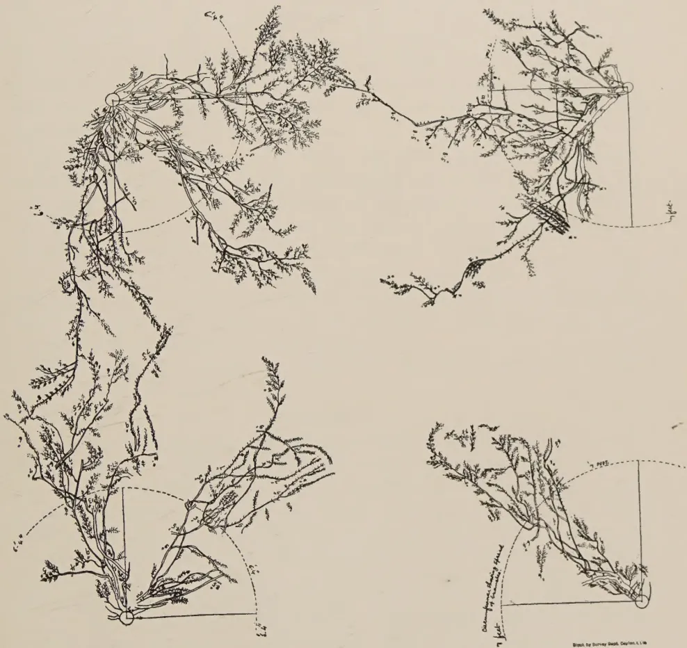
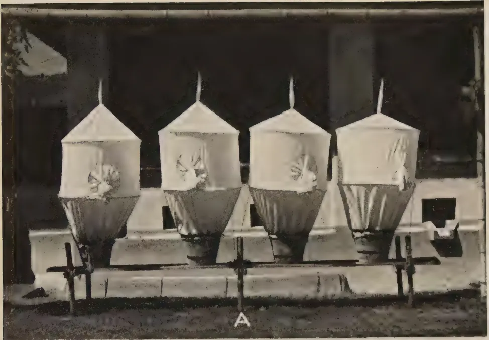
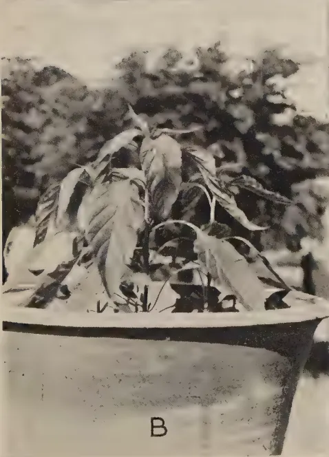
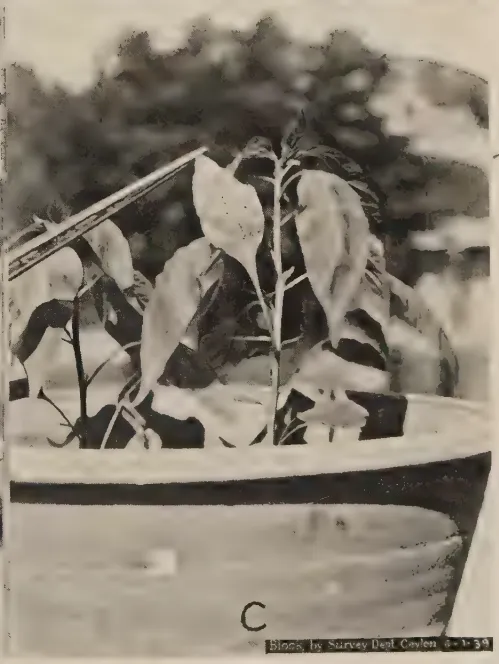

# The Tropical Agriculturist

January, 1939

---

## EDITORIAL

---

### AGRICULTURAL PROPAGANDA

---

**T**HE educated agriculturist of most countries has ample scope for keeping abreast of developments in agricultural science. The results of agricultural research are made known to him through the medium of text books, scientific journals, farming periodicals and literature issued free, or at low price, by the State. The Press, too, plays an important part in the dissemination of knowledge on agricultural topics and, in more recent times, the value of aerial broadcasts for the same purpose has become evident. The position of the agriculturist of little, or no, education is very different and the problem of agricultural publicity, in countries where those who derive their living from the land are primitive or lacking in education, is one which has, during recent years, been engaging the attention of Departments of Agriculture in the British Tropical Dependencies.

The standard of education of the majority of peasant agriculturists in the Tropical Empire is such that the important publicity medium of the printed word cannot be employed to advantage and, for the benefit of those who are unable to read, other means of making known the results of the scientific investigations of Departments of Agriculture must be found. Propaganda methods employed in different countries must vary according to the mentality and characteristics of the people to be served. Generally, it will be found that the uneducated peasant farmer is averse to any departure from the traditional and is imbued with a sense of conservatism in agricultural practices which it is not easy to influence. In attempting to persuade him to adopt an improved practice it is not sufficient that he should merely be informed that his time-honoured practice is wrong. It must be very clearly explained to him

1------------------------------------------------

2

in what respects the practice is considered to be at fault and in what manner a proposed new method is known to be an improvement upon that which it is desired to replace. The success of any scheme of agricultural publicity will depend entirely upon the agents employed. A good publicity officer must, first, be a complete master of his subjects. He must understand the mentality of the people he has to work amongst, in addition to being thoroughly conversant with their language, customs and agricultural practices. He should possess personality above the ordinary as well as considerable powers of persuasion and, above all, he should command the complete respect and esteem of his audiences. He should not be above demonstrating with his own hands the use of a new implement or the correct manner in which a certain operation should be performed. He will not lose the respect of a gathering of practical men by so doing. On the contrary, he will enhance it and incidentally add to the value of his demonstration.

Practical demonstrations are the most valuable form of propaganda and they can be supplemented by intimate talks to small gatherings rather than by prepared, set lectures to large audiences. The value of the talks and the interest of the audience can be augmented by the employment of the cinema or still lantern. Experience in many countries, where both types of projector have been employed in propaganda work, suggests that the latter is preferable to the former as more time is allowed for the demonstrator to explain the essential features of a picture and, among village audiences, it is believed that the still picture is better understood than one which is moving rapidly. Models of specific works, implements or buildings are of value provided that the features they are designed to portray are clearly exhibited by the demonstrator. Pictorial, coloured posters are a medium of publicity which can be used to advantage but they should be well prepared and self-explanatory and accompanied by as little letter press as possible. The holding of well-planned agricultural shows and field days in suitable centres is another form of activity which the propaganda officer can employ, as well as the arrangement of organized excursions by farmers to local demonstration stations.

The need for some link, in Ceylon, between the research staff of the Department of Agriculture and the cultivator was recognized several years ago and a special branch of the Department was created in 1932 to assume responsibility for this subject. The branch is equipped with cinema cameras, projectors and still lanterns, and a recent addition has been a travelling motor-van furnished with appropriate exhibits, loud speaker, gramophone and suitable records. Much useful work has been done by this branch of the Department.

2------------------------------------------------

3

## A STUDY OF THE METHODS OF CULTIVATION OF FRUIT TREES WITH SPECIAL REFERENCE TO CITRUS

---

SOHRAB R. GANDHI, M.Ag. (Bombay),  
DEMONSTRATOR IN PLANT PROPAGATION,  
FARM SCHOOL, PERADENIYA

---

**A**T a time when the development of fruit cultivation on a large scale is contemplated in the dry zones of Ceylon and important irrigation schemes are being planned, it is opportune and appropriate for the grower to try to understand certain fundamental principles of fruit cultivation.

It is now beginning to be realized that many of the local methods of cultivation, irrigation and manuring of fruit trees are not founded on sound practice and need to be modified in view of the fundamental investigations into the relation between soil moisture and plant growth recently carried out in the United States of America and other parts of the world (3).

To be an expert fruit grower it is necessary to know how water penetrates into and wets the orchard soil; by what method of application the water can best be made available to the principal root zones of the tree; and what methods of cultivation, cover cropping and manuring are best suited to the system of irrigation adopted. The practices of cultivation and irrigation are so dependent on the distribution of tree roots in the soil that it is but logical that investigations into the subject should start with the study of roots. Preliminary observations by the writer on the rooting habit of citrus trees in Ceylon and India throw interesting light on the possible use of irrigation water and manure given under certain practices of fruit culture.

The study of citrus varieties at Peradeniya (mid-country wet zone, altitude 1,575 feet), where the climate is wet throughout most of the year and the fruit trees are dependent on rain and not upon irrigation presents altogether a different aspect of orchard management to that found in the low-country dry zones of Ceylon where fruit trees are under irrigation for nearly eight months of the year.

3------------------------------------------------

4

At the Experiment Station, Peradeniya, a plot of young citrus trees had been put under a cover of *Indigofera endecaphylla*, *Calopogonium mucunoides* and other perennial, creeping legumes on the unshaded ground with a view to preventing soil erosion. From the time the young trees were planted, care was taken to keep clean the ground covered by the spread of tree branches. The uncovered soil underneath the tree crown was kept free of weeds and occasionally manured. No irrigation was given either to the trees or to the cover as the annual rainfall is sufficient and generally well distributed.

TABLE I

Statement showing the behaviour of tree roots (Marsh's grape fruit) with relation to a permanent cover crop of *Calopogonium mucunoides* at the Experiment Station, Peradeniya (Refer Plate No. I).

<table border="1">
<thead>
<tr>
<th rowspan="2">Tree No.</th>
<th rowspan="2">Sides of tree surrounded by cover.</th>
<th rowspan="2">Number of lateral roots found on the tree and examined.</th>
<th rowspan="2">Number of roots extending through the cover.</th>
<th colspan="2">Number of roots avoiding the cover.</th>
<th rowspan="2">Remarks.</th>
</tr>
<tr>
<th>Roots extending to the uncovered side beyond the spread of branches.</th>
<th>Roots remaining within the restricted area of the uncovered space beneath the crown.</th>
</tr>
</thead>
<tbody>
<tr>
<td>10 ..</td>
<td>Cover on two sides</td>
<td>4 ..</td>
<td>1 ..</td>
<td>2 ..</td>
<td>1 ..</td>
<td rowspan="4">The majority of roots have avoided the cover and grown towards the uncovered sides of the tree (in No. 7 note the number of roots turning back towards the trunk and away from the cover. In No. 5 mark free growth of roots where there is no cover.</td>
</tr>
<tr>
<td>7 ..</td>
<td>Do.</td>
<td>8 ..</td>
<td>2 ..</td>
<td>6 ..</td>
<td>0 ..</td>
</tr>
<tr>
<td>5 ..</td>
<td>Do.</td>
<td>4 ..</td>
<td>1 ..</td>
<td>3 ..</td>
<td>1 ..</td>
</tr>
<tr>
<td></td>
<td>Total</td>
<td>16</td>
<td>3</td>
<td>11</td>
<td>2</td>
</tr>
<tr>
<td>8 ..</td>
<td>Cover on three sides</td>
<td>7 ..</td>
<td>1 ..</td>
<td>1 ..</td>
<td>5 ..</td>
<td rowspan="3">More than half the number of roots examined have avoided the cover. (Note the freedom of growth where there is no cover.)</td>
</tr>
<tr>
<td>4 ..</td>
<td>Do.</td>
<td>8 ..</td>
<td>5 ..</td>
<td>3 ..</td>
<td>0 ..</td>
</tr>
<tr>
<td></td>
<td>Total</td>
<td>15</td>
<td>6</td>
<td>4</td>
<td>5</td>
</tr>
<tr>
<td>12 ..</td>
<td>Cover on four sides</td>
<td>6 ..</td>
<td>0 ..</td>
<td>0 ..</td>
<td>6 ..</td>
<td rowspan="3">The majority of roots have avoided the cover and remained restricted to the open space beneath the tree crown. (Note in No. 12 almost all roots have remained restricted within the space beneath the tree crown. In No. 11, out of five roots only two have grown freely through the cover one has just gone through it and the other two representing nearly half of the circle have stopped near the margin.)</td>
</tr>
<tr>
<td>11 ..</td>
<td>Do.</td>
<td>5 ..</td>
<td>3 ..</td>
<td>0 ..</td>
<td>2 ..</td>
</tr>
<tr>
<td></td>
<td>Total</td>
<td>11</td>
<td>3</td>
<td>0</td>
<td>8</td>
</tr>
</tbody>
</table>

4------------------------------------------------

A large, faint watermark of a classical building, likely a library or archive, is centered on the page. It features a triangular pediment supported by four vertical columns, all resting on a base. The watermark is rendered in a light gray tone that blends with the background.

Digitized by the Internet Archive  
in 2025

[https://archive.org/details/tropical-agriculturist\\_1939-01\\_92](https://archive.org/details/tropical-agriculturist_1939-01_92)

5------------------------------------------------

The figure is a scientific illustration of grapefruit root systems. It consists of five vertical columns. The first column on the left contains TREE NO. 12 (top) and TREE NO. 11 (middle), both within circular cross-hatched areas. Below them is TREE NO. 10, with a smaller rectangular cross-hatched area. The second column contains TREE NO. 7 (top) and TREE NO. 8 (middle), both within rectangular cross-hatched areas. The third column on the right contains TREE NO. 5 (top) and TREE NO. 9 (bottom), both within rectangular cross-hatched areas. Each tree is depicted with its root system extending from a central point. A vertical scale bar on the far left is labeled '60 ft.'.

PLATE I.—ROOT DEVELOPMENT OF GRAPEFRUIT, *Citrus paradisi* VAR. *Walters* ON ROUGH LEMON (CROSS-HATCHED AREA WITH THICK COVER OF *Calopogonium mucunoides*).

6------------------------------------------------

5

Lateral roots of seven grapefruit trees (*Citrus paradisi*), originally imported from Florida (root stock—Rough lemon) and partly or fully surrounded by a perennial cover of *Calopogonium mucunoides*, were exposed for study by the writer in January, 1938. The data gathered during this study are presented in Table I. and in the accompanying diagrams in Plate I.

The following inferences can be drawn from these observations :—

(1) The lateral roots remain within 3 to 6 inches of the soil surface up to the periphery of the crown, but as soon as the roots come in contact with the cover they either turn back into the open space underneath the crown or penetrate into deeper layers and only in a very few cases do they extend into the space occupied by the cover.

(2) Where the roots of citrus trees extend into the cover they generally penetrate underneath the main nodular root zone of the cover crop and not through it.

(3) The main nodular root zone of the cover occupies the superficial layer of the soil up to a depth of three inches, but occasionally a deep stout sucker root penetrates to a depth of about one foot from the surface and is found in the citrus root zone below. It is roots of this type which keep the cover green when the water supply near its surface roots is exhausted in the dry weather and which incidentally compete with the roots of the fruit tree.

(4) Young grapefruit trees, four years old, which had open spaces on two sides, extended their lateral roots on these sides far beyond the limit of the tree crown, up to 2 to 3 times the spread of branches ; while the roots on the sides under the cover crop remained more or less restricted to the uncovered space underneath the tree crown.

Full exposure of all the lateral roots of a nine year old grapefruit tree, permanently surrounded by a cover of *Indigofera endecaphylla*, showed that the lateral root growth extended only a little beyond the periphery of the crown and did not appreciably mingle with the roots of the adjoining trees situated fourteen feet away on either side.

The above observations clearly indicate that citrus roots are not able to maintain the same growth ratio in association with a permanent cover as without it and that for the free development of their roots they require the soil beyond the drip of the tree crown to be free from competition for water by other roots.

The writer's observations on the development of citrus trees in cultivated soil unassociated with a permanent cover under dry

7------------------------------------------------

6

weather conditions prevailing in Western India (Poona) are interesting in connection with the present study of tree root behaviour. These observations were made at the Ganeshkhind Fruit Experiment Station, Kirkee, near Poona. This part of Western India is subject to the south-west monsoon which commences in June and ends in September. The total annual rainfall amounts to about 25 inches. The soil is a shallow medium black loam, about 3 feet deep, overlying a disintegrating trap rock. During the rains, temporary cover crops of *Phaseolus* and *Crotolaria* spp. are grown in the open space left between the young trees. These cover crops are ploughed in as green manure at the end of the rains by means of a light iron plough drawn by a single pair of bullocks. At the commencement of the dry weather in October or November, the orchard land is harrowed and prepared for irrigation. Square basins about 6 to 8 inches deep and as wide as the spread of branches are prepared round each tree and irrigation given at short or long intervals according to weather conditions. The ground in the basin is hand cultivated at intervals to remove weeds and to incorporate manures. Ploughings, harrowings and subsequent hand cultivation help to maintain a perpetual mulch of loose earth to a depth of 6 inches above the superficial roots of the tree. The following observations were made by the writer while on the staff of the Department of Agriculture, Bombay, in the years 1935-1937 :—

(1) In a young four-year old Mosambi orange (*Citrus sinensis*) orchard spaced 18 feet by 18 feet, the spread of the crown of the tree was 12 feet leaving 6 feet space between two adjoining trees. The roots had spread uniformly all round within a radius of 9 to 16 feet from the trunk as against the crown spread which ranged within a radius of  $5\frac{1}{2}$  feet to  $6\frac{1}{2}$  feet from the trunk.

Thus at the very young age of four years the roots of each tree had penetrated to a considerable distance beyond the spread of its branches and had intermingled with the roots of neighbouring trees.

(2) Grapefruit trees *Citrus paradisi* (variety Marsh's Seedless on Rough lemon root stock) spaced 25 feet, showed that five year old trees developed a crown with a spread of 12 to 14 feet and that the roots penetrated to a distance of 12 to 16 feet round the trunk as against the radial spread of 6 to 7 feet of the crown. Plate II. illustrates the root development of these trees.

Observations on 15-year old Santara (mandarine) orange 15 feet apart indicated that the branches of adjoining trees had so intermingled that there was inadequate sunshine in the orchard

8------------------------------------------------

The image contains four detailed botanical line drawings of grapefruit root systems on rough lemon rootstock, arranged in a 2x2 grid. Each drawing shows a complex network of roots and branches. The top-left drawing shows a large, spreading root system with numerous fine roots and branches. The top-right drawing shows a more compact root system with a central point of origin. The bottom-left drawing shows a root system with a prominent vertical stem and several horizontal branches. The bottom-right drawing shows a root system with a more vertical orientation and a central point of origin. Each drawing includes various annotations, such as dashed lines, solid lines, and small circles, which likely indicate specific features or measurements. The drawings are rendered in a fine-lined, scientific style.

PLATE II.—ROOT SYSTEM OF GRAPEFRUIT (*Citrus paradisi* VAR. *Marsh's seedless* ON ROUGH LEMON) AGE : 5 YEARS.

Drawn by Survey Dept. Station 1.1.19

9------------------------------------------------

This image is a scan of a blank page. The paper has a light beige or cream-colored tint. There are several small, dark specks scattered across the surface, which appear to be dust or scanning artifacts. No text, lines, or other markings are present on the page.

10------------------------------------------------

7

and the roots of one tree had actually penetrated up to the trunk of its neighbour. These observations were made by the writer in the year 1930, on a plantation in Sind where the soil was a deep alluvium and was clean cultivated but not green manured. The annual rainfall was a little less than seven inches and the climatic conditions were extremely hot and dry. Under the circumstances the trees had to be irrigated throughout the year.

It is a very general and common experience in India that closely spaced citrus orchards continue to bear as long as there is ample sunshine in the orchard and there is an open space of four to eight feet round the trees ; but as soon as the space between the trees is covered by the spreading branches the decline of the trees sets in and, in a few years, the yield and quality of fruit deteriorate to such an extent that it is not worth while to maintain the orchard.

Burns and Kulkarni (1), while studying certain fruit trees attacked by die-back in the year 1920, recorded the following observations on the rooting habit of the Santara orange, budded on Jamburi (Rough lemon) root stock, 14 years old, and growing in deep medium black soil at Kirkee, near Poona :—

“ There are well developed lateral roots growing in all directions to an average radius of 10 feet, several roots being as far as 16 feet, the mean point of origin of these laterals being about 9 inches below the soil surface.”

Similar observations on Mosambi orange trees have been recorded by the same authors.

#### DISCUSSION

In view of the foregoing observations it is clear that the lateral roots of citrus trees in wet, as well as dry, countries are capable of extending to a distance of 2 to 3 times the spread of the branches provided there is no other perennial vegetation growing in the soil which may be occupied by the tree roots. The value of a perennial cover in preventing erosion and adding humus to soils in the wet tropical regions is unquestionable ; but the present observations clearly emphasize the desirability of a modification in the system of cover cropping so as to afford a chance for the full natural development of lateral roots and at the same time to keep the unoccupied soil protected from erosion by torrential rains. The present observations pointedly raise the question of competition for water between roots of fruit trees and cover crops.

The quick-growing roots of cover crops entirely monopolize the water content in the first three inches of the surface soil and thus effectively prevent the advance of the slow growing lateral roots of the newly planted young trees into the covered space beyond the drip of the crowns. Under the circumstances, the

11------------------------------------------------

8

lateral tree roots which are by nature surface feeding in habit have either to tap the deeper layers beneath the root zone of the cover or turn back into the open space underneath the crown in search of moisture. A few roots do extend beneath the cover. This occurs whenever there is an opportunity of finding sufficient moisture in the soil below the nodular roots of the cover. It must be realized that the tree roots that extend beneath the cover have the distinct disadvantage of suffering from lack of moisture, especially in a period of drought. When falls of rain are slight (below .75 inches) and occur at long intervals, all the rain water is likely to be utilized by the cover, and is not able to penetrate deeper to reach the tree roots beneath. The wilted condition of the citrus trees when the above observations were made during the serious drought that prevailed in January, 1938, was an indication of the adverse effect of a permanent cover growing above the roots of citrus trees. Citrus trees which are usually in fruit almost throughout the year at Peradeniya often get a very serious set-back due to the absence of sufficient moisture near their roots during such droughts. Very similar observations on effects of cover crops on citrus trees in Australia have been recorded by West and Howard (10) in a recent publication. They say "The summer-growing leguminous green manure crop (cow pea) caused a decrease in growth and yield of the trees owing to the competition of the cow peas for soil moisture while the winter-grown leguminous green manure crop (tick beans) has increased the growth and yield of trees as compared with clean cultivation. The perennial crop (lucerne) has greatly decreased the growth and yield of the trees owing to the very severe competition of this plant for soil moisture".

To avoid, therefore, the arresting influence of the cover it is suggested by the writer that from the time the young tree is planted, the cover should be continually kept a little away from the advancing lateral roots. This should be done up to twice the spread of branches (the usual length to which the citrus roots extend under favourable conditions), and the uncovered space around the tree should be kept deeply forked to keep off weeds and to absorb all the rain water that falls within that area. The cover should be clipped several times during the year and the prunings spread over the root area underneath the tree and also beyond the drip as a mulch. These prunings would rot under the influence of occasional showers and add humus to the soil. If the land is fairly level and well terraced the danger of soil erosion is reduced to a minimum by adopting the above method of soil management; however, if the land is hilly or undulating and the soil shallow, erosion of the loose soil round the young tree is bound to occur during periods of torrential rains. Under the circumstances it would be well to grow

12------------------------------------------------

9

temporary cover crops close to the tree trunk during the heavy rains, and to uproot and leave them on the ground surface to rot as green manure a little before the close of the rainy period. In the dry zones of Ceylon subject to one monsoon it would certainly be advantageous to adopt the Indian system of growing temporary cover crops in the open space between trees during the rains only and to bury them as green manure towards the close of the monsoon.

#### SPACING OF FRUIT TREES

From the observations noted above it is evident that the growth ratio between root and shoot of young citrus trees, as contrasted with those more or less equally spaced but of advanced age, emphasizes the necessity of wider spacing of trees in the orchard. The actual spacing to be given to a variety of fruit tree in an orchard will depend upon the maximum spread attained by lateral roots and branches of that variety under a particular set of soil and climatic conditions. While determining the spacing, due regard should also be given to factors such as the type of cultivation, methods of irrigation, spraying, and handling of fruits.

#### MANURING AND IRRIGATION

The present study has shown that a considerable portion of the root system of citrus trees lies far beyond the drip of the tree crown. It follows that irrigation and manure should be given on a much wider area than that covered by spread of the branches, which is the usual practice in Ceylon and India. It is well known that the actual feeding organs of the root which take up nourishment from the soil are the fine fibre-like organs, and the naked, cord like, thick roots are mere carriers of supply drawn by the feeders.

Hatton and Rogers (4), commenting upon the question of manuring apple trees at East Malling in England, say that the fibrous roots, which carry the actual feeding organs of the root, are fairly evenly distributed over the whole root area and therefore that "for efficient feeding, manure should be spread over an area even wider than that covered by the branches, and not, as is often the case, in a little ring just round the trunk". In order to ascertain the distribution of the fibrous roots Rogers and Vyvyan (7) of East Malling employed the method of removing the soil of the whole root area in definite blocks and determined the amount of the fibre in each block.

So far as the object of the present study is concerned it has not been considered necessary to adopt the expensive and very laborious method employed at East Malling. Mere top exposure of laterals which lie within the first 4 to 8 inches of the ground surface is enough to give a general idea as to the nature

13------------------------------------------------

10

of these fibrous roots and their position in the root system. In almost all cases examined by the writer at Peradeniya, the massive parts of the root system close to the trunk had the least "fibre" while the rest of the root system showed varied behaviour. In some trees the fibre was more concentrated midway between the drip and the trunk while in others it was found at about the point of drip or much further away on the extreme parts of the root system. These fibrous feeding roots in the case of fully grown trees form a solid mass and extend very close to the soil surface. These surface fibres get torn and destroyed in cultivation without apparent injury to the trees and new ones arise annually after the cultivation ceases and water is given in a systematic way. The regeneration of a seasonal crop of fibres either on the main roots or their multiple branches seems to depend largely upon the stimulus received from the manurial and cultural treatment given to the tree during the growing season. The general tendency of the fibre is to concentrate nearer the ground surface where warmth, air, moisture and fertilizers are easily accessible. In fact, the life of the fibres is transitory. Under the favourable conditions mentioned above they regenerate and multiply. In the absence of these conditions they perish.

The depth of rooting, lateral spread of main and subsidiary roots and their branching and the quantity of fibre are specific characters. These specific characters may vary with different species, but the location of fibre on the root system does not seem to be a specific character. It appears to be more a result of environment and cultural treatment. In fact, there is no natural pattern of fibres located on a particular part of the root system of a species which might serve as a guide for the application of manures. Every bit of the root system, whether a thick cord-like root or a fine branchlet, near the trunk or further away from it, is capable of producing new fibre when stimulated by air, warmth, water and soil nutrients. Manures should not be applied at specified parts of the root system on the supposition that the permanent feeding organs of a tree are located at these spots; but should be applied with the fact in view that a vastly larger feeding zone could be created by uniformly spreading manures over the entire expanse of the root system. Any manure applied on the unoccupied soil beyond the root zone remains unused till the roots grow and reach the manure. It must be remembered in this connection that manurial elements dissolved in water are carried into the soil with the movement of soil moisture. The movement of water when applied to soil is mainly gravitational and lateral movement by capillarity is limited. Any water that has penetrated down into the soil beyond the reach of roots will remain unutilized by the

14------------------------------------------------

11

tree as the upward flow from the wet soil below to the dry soil above does not take place except where there is a standing water table within 6 to 10 feet of the ground surface (9). Similarly, manures placed beyond the lateral root spread remain unutilized as there is no appreciable lateral capillary movement of moisture.

Broadcasting followed by light harrowing or hand-forking is the best way to apply farm yard manure, especially in the case of surface-feeding fruit trees like citrus, care being taken that no thick roots are damaged in cultivating the soil with implements. Before using inorganic or organic artificial manures it should be ascertained if they readily move with movement of soil moisture or are known for their tendency of slow penetration into the soil. Nitrates move into the soil readily with movement of soil moisture and are at once available to the plant. In well drained soils there is every danger of their leaching away below the main root zone by heavy irrigation. Therefore, while applying fertilizers like sodium nitrate care should be taken to apply them when the rains are light or with moderate irrigation. Nitrogen from fertilizers like sulphate of ammonia, calcium cyanamide, nicifos, oilcakes, bloodmeal, fish manures, &c. is not so easily leached. These fertilizers are held firmly by the moist soil and are slowly acted upon by soil micro-organisms and converted into nitrates within a period of 6 to 8 weeks under Ceylon conditions (6).

Phosphates and potash salts penetrate only slowly into the soil and their use by the plants is equally slow. These fertilizers have a tendency to get fixed in the top few inches of the soil though it is likely that if the application is repeated for many years, some of the phosphates and potash will be carried gradually deeper into the soil to a region where they can be absorbed by the roots of the fruit tree. In California phosphates and potash have been shown to persist in the main root zone of citrus trees, *i.e.*, in the first three feet of soil, after a repeated application of manure in moderate amounts for 22 years (2) (8).

It is always a good practice to apply water-soluble artificial fertilizers in irrigation water impounded in basins or check furrows round the tree as this method would allow excellent distribution of soluble nutrients in dilute solution precisely to the feeding root area to which water has been applied.

In the non-irrigated wet zones of Ceylon it is necessary to see that the artificials are deeply forked into the soil as mere scraping in with hand-forks would amount to leaving the manure on the loose soil surface to be easily washed away by a heavy shower.

15------------------------------------------------

12

In the case of deep-rooted trees like the mango, slow-acting phosphate fertilizers and bone manures are best placed in very close vicinity to the roots by removing the top soil down to the uppermost feeding roots. Such manures are more effectively applied in a restricted space by digging a circular shallow trench where the root system is most branched which is somewhere near the drip of the tree crown.

All organic and certain inorganic fertilizers have to be acted upon by certain soil micro-organisms before they become available to the tree. The existence and the multiplication of these organisms depend largely on the presence of humus which is formed in the soil when organic material added to the soil undergoes decomposition. The fertility of orchard soils greatly depends upon their humus content. Soils lacking in humus are invariably poor. Investigations carried out in California and England (2) have proved that there is a rapid loss of organic matter from soils due to decomposition even though relatively large applications are made annually. A liberal annual application of organic bulky manures is, therefore, necessary to maintain soil fertility.

The soil mass is temporarily improved in structure by the addition of green manures or bulky organic manures to the depth to which the soil is cultivated and manured (10). Below that depth the soil maintains its original structure. Therefore, while planting a fruit tree, especially of a deep-rooting habit, its adaptability to a particular kind of soil structure should be well considered, keeping in view the fact that its roots below the cultivated layer will have to adjust themselves to the original and uninfluenced physical condition of the soil.

Cattle dung and farm refuse are the principal sources from which composts are prepared for manuring fruit trees in India and Ceylon, but the materials are not easily available in quantities sufficient to compensate for the loss of organic matter in the soil. To meet this contingency, the practical and cheapest way to add humus is to grow leguminous cover crops and bury them as green manure when they are about to flower. Legumes such as *Crotalaria juncea* and *Phaseolus mungo* would serve as suitable temporary covers during the monsoon in the dry zones of Ceylon. Perennial covers like *Indigofera endecaphylla* should only be grown in wet zones of Ceylon where the rainfall is abundant and well distributed throughout the year.

Slow-acting bulky organic manures are best applied well in advance of the flowering season, while quickly-nitrifying fertilizers should be applied as a top dressing just when the tree is expected to put forth blossom-bearing shoots.

The amount of fertilizer needed by a tree will depend on the age of the tree and the amount of fertility of the soil. There is no

16------------------------------------------------

This image is a scan of a blank page. The paper has a light beige or cream-colored tint. There are some very faint, blurry marks scattered across the surface, which appear to be scanning artifacts or minor imperfections in the paper itself. No text, lines, or other graphical elements are present.

17------------------------------------------------

Source for Survey Data: Clayton & L. M.

PLATE III.—A VERTICAL SOIL PROFILE SHOWING DISTRIBUTION OF ROOTS OF GRAPEFRUIT  
(*Citrus paradisi* VAR. *Sicily seedless* ON ROUGH LEMON ROOTSTOCK).

18------------------------------------------------

13

practical way of ascertaining the kind of fertilizer and the quantity needed by the tree except by experimenting under different soil and climatic conditions. Most of the cultivated soils of Ceylon, either in dry or in wet zones, are reported to respond readily to organic manures and nitrogenous fertilizers, but some of them may not appreciably respond to additions of phosphatic and potash fertilizers. Some of the dry zone soils, like those of the Jaffna Peninsula, are rich in lime which is one of the most important plant foods required by fruit trees. On the other hand, the lateritic soils of wet zones are deficient in lime and would need liberal applications of this material with certain fruit crops, *e.g.*, citrus (5).

Cultivation is necessary for the removal of weeds, the proper admixture of manures and for making the soil sufficiently absorptive of water. In the dry zone of Ceylon, groves of trees having sufficient interspace may be tilled in two directions and, if possible, diagonally by means of a bullock-drawn blade harrow soon after spreading bulky manures. It is wise to give very shallow cultivation at the time when the tree is making active growth so as to do least damage to the superficial feeding roots. The damage to roots by cultivation is negligible when the tree is dormant, and therefore it is reasonable to plough or harrow an orchard of bearing trees soon after the harvest is over and when the trees are undergoing a short rest to gather energy for the next flush of growth. To achieve this object the trees should be so treated from the time they are planted in the orchard that their uppermost roots do not come within the range of cultivating implements. As a result of repeated cultivation, the surface soil gets opened out and loses moisture. The tree roots in search of firmer and moister soil, under the circumstances, will have a tendency to penetrate deeper. Trees thus treated suffer less from severe droughts and build up a stronger and healthier root system than those which are allowed to feed in the most superficial layers of the soil.

It has been shown in California by Veihmeyer (9) that the rate of loss of moisture by the various layers of soil is proportional to the distribution of roots in these layers.

From the chart (Plate III.) it is evident that, although the roots of citrus trees penetrate as deep as  $5\frac{1}{2}$  feet, the concentration is much higher in the top layers of soil. About eighty per cent. of the roots are located in the first two feet of soil. It follows therefore that the water supply in these layers will have to be replenished more frequently than in the lower depths where the roots are few and the store of water is abundant.

It has been the writer's experience that in dry soils (common orchard loams) water, when supplied in shallow basins (12 feet square and 6 inches deep) or short cross-furrows (12 feet

19------------------------------------------------

14

long, 16 inches wide from ridge to ridge and 6 inches deep), does not penetrate deeper than 6 to 10 inches even though the soil is well cultivated to a depth of 4 to 6 inches before watering. Apparently, in the case of citrus roots, the ground has to be repeatedly irrigated to moisten the principal root zone of the tree which is located between one and two feet from the ground surface. Great care has to be taken especially when the tree is in fruit not to allow the soil of the main root zone (where most roots have concentrated) to dry out to such an extent as to make the tree wilt.

To secure the best results, according to investigations done by Veihmeyer, the moisture content of the soil has to be kept widely fluctuated between the field capacity, or maximum water-holding capacity, of the soil and the danger point at which the tree begins to wilt (9).

As moisture is removed by the plant roots, air takes its place warming up the soil and making oxygen available to the roots for their rapid growth. Root growth and absorption are retarded if the soil is too wet as a result of over irrigation. Between two irrigations, therefore, wide extremes in soil moisture fluctuations are considered very desirable to allow the greatest movement of air in the soil.

The best method by which the grower can decide when to apply water is by cautiously prolonging the irrigation intervals in a small portion of his orchard and watching the condition of his trees. He should dig out the soil of the principal root zone by means of a soil auger and feel its moisture content with the hand. After a few trials of this kind he will soon become familiar with the degree of soil moisture which would be safe for his trees and the condition of soil dryness which would cause wilting.

#### ACKNOWLEDGMENTS

The writer's grateful acknowledgments are due to Mr. C. N. E. J. de Mel, Principal, Farm School, Peradeniya, and Dr. G. S. Cheema, Horticulturist to the Government of Bombay, for the encouragement and facilities offered during the course of this study at the Experiment Station, Peradeniya, and the Ganeshkhind Fruit Experiment Station, Kirkee, (Poona) respectively. Thanks are also due to Messrs. Sitaram Chaudhari and A. M. Abeyratna for their valuable assistance in making field drawings of citrus roots.

#### LITERATURE CITED

1. 1. Burns, W. and Kulkarni, L. B.—*The Agric. Journal of India*, Vol. XV., Part VI., pp. 620–626, November, 1920.
2. 2. Batchelor, L. D.—*California Citrograph*, Vol. 18, pp. 298–308, 1933.

20------------------------------------------------

15

1. 3. Gandhi, S. R.—*Current Science, Bangalore, India*, Vol. IV., No. 12, pp. 892–896, 1936.
2. 4. Hatton, R. G. and Rogers, W. S.—*The importance of the root system*, The Empire Marketing Board (Special publication), London, 1929.
3. 5. Joachim, A. W. R. and Kandiah, S.—*The Tropical Agriculturist*, Vol. LXXXVIII., pp. 338–350, 1937.
4. 6. Joachim, A. W. R.—*Year Book of the Department of Agriculture, Ceylon*, pp. 35–38, 1927.
5. 7. Rogers, W. S. and Vyvyan, M. C.—*East Malling Research Station, Annual Report*, 1926–27, Supplement II.
6. 8. Stephenson, R. E. and Chapman, H. D.—*Journal Agric. Agronomy*, Vol. XXIII., pp. 759–770, October, 1931.
7. 9. Veihmeyer, F. J.—*Hilgardia*, Vol. II., No. 6, pp. 125–291, 1927.
8. 10. West, E. S. and Howard, A.—*Commonwealth of Australia, Council for Scientific and Industrial Research, Bulletin 120*, 1938.

21------------------------------------------------

16STUDIES ON CEYLON SOILSXII. SOME CHARACTERISTIC BUT LESS EXTENSIVE SOILS OF THE DRY ZONE

A. W. R. JOACHIM, Ph.D., Dip. Agric. (Cantab.),  
CHEMIST

AND

S. KANDIAH, Dip. Agric. (Poona),  
ASSISTANT IN AGRICULTURAL CHEMISTRY

IN this paper the textural, chemical and profile data of some characteristic soil groups of the dry zone are furnished, and the rough distribution and suitability of the soils for crops indicated. The five soils studied were the black heavy loams of Tunukkai, similar to the black cotton soils of India; the white calcareous loams of Delft Island, of marked similarity to the chalk soils of England; the deep red loams of the Hambantota district and the allied reddish brown loams of the Tangalla district; and the light sandy loams of parts of the Eastern Province. The same methods of analysis as previously were adopted for these soils, with a few exceptions. Readily available Phosphoric acid was determined by the Truog (1) method in all but the calcareous soils for which this method is not applicable. Replaceable bases in the case of one of the calcareous soils were estimated by Williams' (2) method. Calcium carbonate was determined, in addition, in the calcareous soils. The analytical data are shown in table I.

Tunukkai Black Heavy Loam

<table>
<tr>
<td>Location</td>
<td>..</td>
<td>Tunukkai</td>
</tr>
<tr>
<td>Elevation ..</td>
<td>..</td>
<td>Sea level</td>
</tr>
<tr>
<td>Climate ..</td>
<td>..</td>
<td>Rainfall : 40 in. (approx.) ; temperature 82° F.</td>
</tr>
<tr>
<td>Geological origin</td>
<td>..</td>
<td>Felsphatic gneiss overlain by sedimentary limestone in places</td>
</tr>
<tr>
<td>Mode of formation</td>
<td>..</td>
<td>Residual</td>
</tr>
<tr>
<td>Topographic position</td>
<td>..</td>
<td>Flat</td>
</tr>
<tr>
<td>Drainage</td>
<td>..</td>
<td>Imperfect to poor</td>
</tr>
<tr>
<td>Vegetation ..</td>
<td>..</td>
<td>Xerophytic scrub jungle ; wood apple</td>
</tr>
</table>

22------------------------------------------------

17Profile

A. 0->3 ft. .. Black compact heavy loam with nodules of limestone interspersed in places ; reticulate to small clod ; hard and difficultly friable ; cracks abundant in dry weather ; streaks of rust brown due to decomposing roots ; root growth confined to upper soil layer.

The characteristic black soil found at Tunukkai village, about 16 miles from Mankulam in the Northern Province, covers a reported extent of about 16 square miles or approximately 10,000 acres. Reference to this soil type was first made in 1921 by Stockdale, Marshall and Bruce (3) in an article in *The Tropical Agriculturist* entitled "Cotton Soils in the Mannar District". From the description, the soils appeared to resemble closely the black cotton soils of India described by Bal (4) and others. The rainfall of the area is probably about 40 inches, practically all of which occurs during the north-east monsoon. The vegetation is typical xerophytic, low scrub jungle. Soil drainage is imperfect, the soil being reported to be somewhat water-logged in the rainy season. The soil, which shows no apparent change in colour, appearance and general characteristics with depth, is from 18 in. to 15 ft. deep. Interspersed within the soil, at varying depths but generally within the first foot, are nodules of limestone of varying sizes. In certain places underlying the soil, slabs of limestone similar to the Jaffna Miocene series occur. The limestone is, apparently, a superficial deposit overlying felsphatic gneiss. In the dry season the soil shows deep cracks of a depth, in places, of 6 feet or more.

The analysis of a typical soil sample shows that it is a heavy loam, poor in organic matter and nitrogen, rich in both available and total lime, and alkaline in reaction. Analysis for total potash and phosphoric acid showed it to contain 0.196 and 0.091 per cent. of these constituents respectively. The soil is, therefore, fairly well supplied with potash, but is somewhat deficient in phosphoric acid. The texture varies to some degree as will be apparent from Bruce's analyses (4). The soil is non-lateritic in nature. The iron content of the clay fraction is low. Bruce found a high percentage of magnesia in the soil and this may account for its stickiness, when wet, and poor drainage.

In respect of its morphological characters, chemical composition and the rainfall conditions under which it has been formed, the soil is similar to the black cotton soils of India. It makes an excellent paddy soil, yields of 60 bushels being reported, and would appear to be quite suitable for cotton, dhal and probably tobacco and chillies. Soil drainage will appear to be necessary. On the deeper soils, provided adequate drainage

23------------------------------------------------

18

is given, fruits like mangoes would probably do well. Successful citrus cultivation is problematic, but if citrus is grown, irrigation would be necessary in the dry season and good soil drainage in the wet season.

#### Delft Calcareous Loam

<table>
<tr>
<td>Location ..</td>
<td>..</td>
<td>Delft Island</td>
</tr>
<tr>
<td>Elevation ..</td>
<td>..</td>
<td>Sea level</td>
</tr>
<tr>
<td>Climate ..</td>
<td>..</td>
<td>Rainfall : 46 in. (approx.) ; temperature : 80° F.</td>
</tr>
<tr>
<td>Geological origin ..</td>
<td>..</td>
<td>Sedimentary limestone (Miocene)</td>
</tr>
<tr>
<td>Mode of formation ..</td>
<td>..</td>
<td>Residual</td>
</tr>
<tr>
<td>Topographic position ..</td>
<td>..</td>
<td>Flat</td>
</tr>
<tr>
<td>Drainage ..</td>
<td>..</td>
<td>Good</td>
</tr>
<tr>
<td>Vegetation ..</td>
<td>..</td>
<td>Pasture grass, dry grains, palmyrah palms</td>
</tr>
</table>

#### Profile

<table>
<tr>
<td>A1. 0-9 in.</td>
<td>..</td>
<td>Greyish white calcareous loam ; compact ; cubical to small columnar ; fairly hard but friable ; root growth good ; horizon boundary indistinct.</td>
</tr>
<tr>
<td>A2. 9 in - &gt; 3 ft.</td>
<td>..</td>
<td>Similar to A1 but of slightly heavier texture and more compact ; overlying limestone</td>
</tr>
</table>

The greyish-white calcareous loam of Delft Island which is entirely comprised of Miocene limestone occurs only to a limited extent on the Island. It is very closely allied to the *rendzinas* or the chalk soils of Britain. Its texture increases slightly with depth. The soil is poor in organic matter and nitrogen. Phosphoric acid is present in good supply, to judge from the analysis of a sample of pasture grass from the area which showed a phosphoric acid content of 0.83 per cent. against an average of 0.36 per cent. for Ceylon pasture grasses. The soil contains no less than 56 per cent. of calcium carbonate and is markedly alkaline in reaction. It is non-lateritic in nature with a silica/alumina ratio of 2.78. Dry grains, leguminous crops and pasture grasses are grown successfully on it. Dhal would appear to be a very suitable crop for the area, and also soybeans and cotton. The pasture, as would be expected, is very rich in lime, a sample being found to contain no less than 3.8 per cent. of this constituent.

#### Hambantota Brick Red Loam

<table>
<tr>
<td>Location ..</td>
<td>..</td>
<td>3 miles from Hambantota</td>
</tr>
<tr>
<td>Elevation ..</td>
<td>..</td>
<td>About 50 ft.</td>
</tr>
<tr>
<td>Climate ..</td>
<td>..</td>
<td>Rainfall : 42 in. (approx.) ; temperature : 81° F.</td>
</tr>
<tr>
<td>Geological origin ..</td>
<td>..</td>
<td>Pleistocene plateau deposits over felsphatic gneiss</td>
</tr>
<tr>
<td>Mode of formation ..</td>
<td>..</td>
<td>Probably transported (aeolian) deposits over residual material</td>
</tr>
<tr>
<td>Topographic position ..</td>
<td>..</td>
<td>Flat</td>
</tr>
<tr>
<td>Drainage ..</td>
<td>..</td>
<td>Very good</td>
</tr>
<tr>
<td>Vegetation ..</td>
<td>..</td>
<td>Low scrub jungle</td>
</tr>
</table>

24------------------------------------------------

19

### Profile

<table style="width: 100%; border-collapse: collapse;">
<tr>
<td style="width: 10%;">A.</td>
<td style="width: 10%;">0- &gt;10 ft.</td>
<td style="width: 5%;">..</td>
<td>Uniform brick red loam; loose and friable; columnar to irregular prismatic structure breaking down to single grain</td>
</tr>
<tr>
<td>C.</td>
<td>10-13 ft.</td>
<td>..</td>
<td>Reddish brown gravelly loam with high proportions of ironstone nodules in various stages of decomposition; pan-like layer formed from decomposing gneiss.</td>
</tr>
</table>

The Hambantota brick-red loam varies in depth from 10 to 30 ft. or more. The soil of the A horizon is uniform in colour and texture and probably derived, in part, from wind-borne deposits. It is probably also a residual product of hornblende gneiss. The soil of the B horizon is a reddish-brown heavy loam, and is obviously derived from the gneiss. It contains a high proportion of decomposing ironstone nodules and hydrated alumina. The soil is poor in organic matter and nitrogen but has a fair content of bases. The replaceable lime content is only about 50 per cent. of the total bases, suggesting that either the rock is rich in magnesian minerals or that dolomitic limestone has had some influence on the constitution of the soil. In reaction it is alkaline. It is poor in available phosphoric acid and is slightly lateritic in nature. The soil of another profile in the Hambantota district (5) was observed, however, to be of the non-lateritic type. Variations in local conditions are doubtless responsible for this observed difference.

The soil of the A horizon, though a loam, has low cohesive power. Soil erosion of the gully type is very severe at the place the profile was investigated. The extent of these soils is not great and, owing to a deficient rainfall, successful crop cultivation is difficult. They are, however, from the standpoints of texture and depth, very suitable for fruit cultivation.

### Middeniya Red-Brown Loam

<table style="width: 100%; border-collapse: collapse;">
<tr>
<td style="width: 20%;">Location</td>
<td style="width: 5%;">..</td>
<td style="width: 5%;">..</td>
<td>Middeniya</td>
</tr>
<tr>
<td>Elevation</td>
<td>..</td>
<td>..</td>
<td>About 250 ft.</td>
</tr>
<tr>
<td>Climate</td>
<td></td>
<td>..</td>
<td>Rainfall : 67 in. (approx.); temperature : 81° F.</td>
</tr>
<tr>
<td>Geological origin</td>
<td></td>
<td>..</td>
<td>Pleistocene plateau deposits overlying felspathic gneiss</td>
</tr>
<tr>
<td>Mode of formation</td>
<td></td>
<td>..</td>
<td>Transported (aeolian) overlying residual material</td>
</tr>
<tr>
<td>Topographic position</td>
<td></td>
<td>..</td>
<td>Undulating to slightly hilly; sample from bottom of gentle slope</td>
</tr>
<tr>
<td>Drainage</td>
<td></td>
<td>..</td>
<td>Very good</td>
</tr>
<tr>
<td>Vegetation</td>
<td>..</td>
<td>..</td>
<td>Citrus and other fruits, rotation crops</td>
</tr>
</table>

### Profile

<table style="width: 100%; border-collapse: collapse;">
<tr>
<td style="width: 10%;">A.</td>
<td style="width: 10%;">0 - &gt;3 ft.</td>
<td style="width: 5%;">..</td>
<td>Uniform reddish-brown loam of depth greater than 6 feet in places, overlying loam containing ironstone nodules; fairly hard and compact but friable; irregular columnar; root growth good</td>
</tr>
</table>

25------------------------------------------------

20

This soil appears to be a modification of the Hambantota type, and is similar in many respects to the red lateritic earth of Mullaitivu described in a previous paper (6). It is a deep uniform loam of poor organic matter and nitrogen content and has a carbon/nitrogen ratio of 10.8. In reaction it is alkaline. Its replaceable base content is low, calcium constituting only about 50 per cent of the total. It is also low in available phosphoric acid. The soil is somewhat lateritic in type, with a silica/alumina ratio of 1.8. In origin it is probably a wind-borne deposit overlying residual gneissic material. The soil occurs in fairly appreciable extents in the Tangalla district and vicinity. Physically, it is ideal for fruit crops, particularly citrus, but is equally suited for cotton, dry grain and other rotation crops. Manuring with bulky organics and, where citrus is grown, the periodical application of lime would be necessary.

#### Kiliveddi Sandy Loam

<table>
<tr>
<td>Location ..</td>
<td>..</td>
<td>Kiliveddi</td>
</tr>
<tr>
<td>Elevation ..</td>
<td>..</td>
<td>About sea level</td>
</tr>
<tr>
<td>Climate</td>
<td>..</td>
<td>Rainfall : 68 in. (approx.) ; temperature : 82° F.</td>
</tr>
<tr>
<td>Geological origin</td>
<td>..</td>
<td>Recent</td>
</tr>
<tr>
<td>Mode of formation</td>
<td>..</td>
<td>Transported ; alluvial</td>
</tr>
<tr>
<td>Topographic position</td>
<td>..</td>
<td>Flat to gently sloping</td>
</tr>
<tr>
<td>Drainage ..</td>
<td>..</td>
<td>Good</td>
</tr>
<tr>
<td>Vegetation ..</td>
<td>..</td>
<td>Scrub jungle</td>
</tr>
</table>

#### Profile

<table>
<tr>
<td>A. 0-14 in.</td>
<td>..</td>
<td>Dark brown sandy soil ; fairly hard when dry but very friable ; single grain ; root growth good ; horizon boundary fairly distinct</td>
</tr>
<tr>
<td>C. 14 in.-3 ft.</td>
<td>..</td>
<td>Dark grey sandy loam ; fairly loose and friable ; root growth good</td>
</tr>
</table>

This soil type is typical, in respect of texture, of the forest soils of the Eastern Province. It is a dark-brown, light, sandy loam which increases in heaviness with depth. The lower horizon of this profile contains a high proportion of gravel composed mainly of potsheds, indicating probably that it was the site of human habitation in the past. One other characteristic of this soil is its very high content of readily-available phosphoric acid. It is probable that this is purely local and due to some abnormal factor *e.g.*, the decay of animal remains. The soil is low in organic matter, but strangely enough has a higher carbon content in the lower than in the upper horizon. In reaction the upper horizon is alkaline and the lower slightly acidic. The soil is fairly well supplied with replaceable bases and is of the non-lateritic type. It is at present

26------------------------------------------------

21

being experimentally cultivated with sugar cane under irrigation, and would be very suitable for cultivation with fruits and cashew nuts.

SUMMARY

In this paper the profile and analytical data of five less extensively occurring, but characteristic soil types of the dry zone—the black heavy loams of Tunukkai, similar to the black cotton soils of India, the light grey calcareous loams of Delft Island, similar to the chalk soils of Britain, the brick-red and brown deep loams of the dry, south-eastern parts of the Island, and the light sandy soils of the Eastern Province—are furnished and the suitability of the soils for crops discussed and their rough distribution indicated.

TABLE I.

<table border="1">
<thead>
<tr>
<th></th>
<th colspan="2">Tunukkai</th>
<th colspan="2">Delft</th>
<th colspan="2">Hambantota</th>
<th colspan="2">Middeniya</th>
<th colspan="2">Kiliveddi</th>
</tr>
<tr>
<th></th>
<th>A</th>
<th>A</th>
<th>C</th>
<th>A</th>
<th>C</th>
<th>A</th>
<th>A</th>
<th>C</th>
<th>A</th>
<th>C</th>
</tr>
<tr>
<th></th>
<th>%</th>
<th>%</th>
<th>%</th>
<th>%</th>
<th>%</th>
<th>%</th>
<th>%</th>
<th>%</th>
<th>%</th>
<th>%</th>
</tr>
</thead>
<tbody>
<tr>
<td colspan="11" style="text-align: center;"><b>Mechanical Analysis</b></td>
</tr>
<tr>
<td>Stones and gravel</td>
<td>10.1</td>
<td>.. nil</td>
<td>.. nil</td>
<td>.. nil</td>
<td>.. 12.7</td>
<td>.. nil</td>
<td>.. 3.4</td>
<td>.. 23.5</td>
<td></td>
<td></td>
</tr>
<tr>
<td>Coarse sand</td>
<td>.. 24.9</td>
<td>.. —</td>
<td>.. —</td>
<td>.. 45.3</td>
<td>.. 34.1</td>
<td>.. 38.5</td>
<td>.. 44.1</td>
<td>.. 48.2</td>
<td></td>
<td></td>
</tr>
<tr>
<td>Fine sand</td>
<td>.. 22.4</td>
<td>.. 14.7</td>
<td>.. 7.3</td>
<td>.. 22.8</td>
<td>.. 19.7</td>
<td>.. 28.1</td>
<td>.. 37.5</td>
<td>.. 30.6</td>
<td></td>
<td></td>
</tr>
<tr>
<td>Silt</td>
<td>.. 8.9</td>
<td>.. 2.9</td>
<td>.. 2.8</td>
<td>.. 3.3</td>
<td>.. 5.0</td>
<td>.. 4.1</td>
<td>.. 5.4</td>
<td>.. 6.4</td>
<td></td>
<td></td>
</tr>
<tr>
<td>Clay</td>
<td>.. 31.7</td>
<td>.. 17.2</td>
<td>.. 21.9</td>
<td>.. 25.1</td>
<td>.. 34.1</td>
<td>.. 27.2</td>
<td>.. 10.3</td>
<td>.. 11.7</td>
<td></td>
<td></td>
</tr>
<tr>
<td>Loss by solution</td>
<td>.. 6.1</td>
<td>.. 61.1</td>
<td>.. 62.6</td>
<td>.. 1.1</td>
<td>.. 2.6</td>
<td>.. 0.5</td>
<td>.. 0.9</td>
<td>.. 1.0</td>
<td></td>
<td></td>
</tr>
<tr>
<td>Moisture</td>
<td>.. 6.0</td>
<td>.. 4.1</td>
<td>.. 5.4</td>
<td>.. 2.4</td>
<td>.. 4.5</td>
<td>.. 1.6</td>
<td>.. 1.8</td>
<td>.. 2.1</td>
<td></td>
<td></td>
</tr>
<tr>
<td>Texture index number</td>
<td>.. 29.5</td>
<td>.. 15.7</td>
<td>.. 20.2</td>
<td>.. 23.0</td>
<td>.. 31.3</td>
<td>.. 25.0</td>
<td>.. 9.8</td>
<td>.. 11.3</td>
<td></td>
<td></td>
</tr>
<tr>
<td>Soil type</td>
<td>Heavy loam</td>
<td>Light loam</td>
<td>Loam</td>
<td>Loam</td>
<td>Heavy loam</td>
<td>Loam</td>
<td>Sand</td>
<td>Sandy loam</td>
<td></td>
<td></td>
</tr>
<tr>
<td colspan="11" style="text-align: center;"><b>Chemical Analysis</b></td>
</tr>
<tr>
<td>Loss on ignition</td>
<td>.. 5.12</td>
<td>.. 16.90</td>
<td>.. 12.06</td>
<td>.. 3.73</td>
<td>.. 4.06</td>
<td>.. 4.02</td>
<td>.. 2.67</td>
<td>.. 3.64</td>
<td></td>
<td></td>
</tr>
<tr>
<td>Combined water</td>
<td>.. 4.24</td>
<td>.. 15.52</td>
<td>.. 11.29</td>
<td>.. 2.94</td>
<td>.. 3.48</td>
<td>.. 3.21</td>
<td>.. 1.04</td>
<td>.. 1.14</td>
<td></td>
<td></td>
</tr>
<tr>
<td>Organic matter</td>
<td>.. 0.86</td>
<td>.. 1.38</td>
<td>.. 0.77</td>
<td>.. 0.79</td>
<td>.. 0.58</td>
<td>.. 0.81</td>
<td>.. 1.63</td>
<td>.. 2.58</td>
<td></td>
<td></td>
</tr>
<tr>
<td>Carbon</td>
<td>.. 0.505</td>
<td>.. 0.803</td>
<td>.. 0.449</td>
<td>.. 0.458</td>
<td>.. 0.336</td>
<td>.. 0.469</td>
<td>.. 0.943</td>
<td>.. 1.50</td>
<td></td>
<td></td>
</tr>
<tr>
<td>Nitrogen</td>
<td>.. 0.069</td>
<td>.. 0.094</td>
<td>.. 0.050</td>
<td>.. 0.044</td>
<td>.. 0.034</td>
<td>.. 0.043</td>
<td>.. 0.069</td>
<td>.. 0.073</td>
<td></td>
<td></td>
</tr>
<tr>
<td>Carbon/nitrogen ratio</td>
<td>.. 7.40</td>
<td>.. 8.56</td>
<td>.. 9.00</td>
<td>.. 10.58</td>
<td>.. 9.88</td>
<td>.. 10.85</td>
<td>.. 13.67</td>
<td>.. 20.55</td>
<td></td>
<td></td>
</tr>
<tr>
<td>Reaction (pH)</td>
<td>.. 8.6</td>
<td>.. 8.4</td>
<td>.. 8.4</td>
<td>.. 8.1</td>
<td>.. 8.1</td>
<td>.. 7.9</td>
<td>.. 7.7</td>
<td>.. 6.4</td>
<td></td>
<td></td>
</tr>
<tr>
<td>Total exchangeable bases (m.e. per 100 gm. soil)</td>
<td>76.5</td>
<td>.. —</td>
<td>.. —</td>
<td>.. 6.01</td>
<td>6.49</td>
<td>.. 4.11</td>
<td>.. 8.89</td>
<td>.. 7.72</td>
<td></td>
<td></td>
</tr>
<tr>
<td>Exchangeable calcium</td>
<td>.. 43.3</td>
<td>.. —</td>
<td>.. —</td>
<td>.. 2.99</td>
<td>.. 3.15</td>
<td>.. 2.09</td>
<td>.. 7.49</td>
<td>.. 5.61</td>
<td></td>
<td></td>
</tr>
<tr>
<td>Readily available phosphoric acid (mgm. per 100 gm. soil)</td>
<td>.. —</td>
<td>.. —</td>
<td>.. —</td>
<td>.. 0.59</td>
<td>.. 0.46</td>
<td>.. 0.43</td>
<td>.. 35.5</td>
<td>.. 27.6</td>
<td></td>
<td></td>
</tr>
<tr>
<td>Calcium Carbonate</td>
<td>3.64</td>
<td>.. 56.73</td>
<td>.. 58.14</td>
<td>.. —</td>
<td>.. —</td>
<td>.. —</td>
<td>.. —</td>
<td>.. —</td>
<td></td>
<td></td>
</tr>
<tr>
<td colspan="11" style="text-align: center;"><b>Clay Analysis</b></td>
</tr>
<tr>
<td>Loss on ignition</td>
<td>.. 23.36</td>
<td>.. 19.79</td>
<td>.. —</td>
<td>.. 20.38</td>
<td>.. 19.54</td>
<td>.. 18.76</td>
<td>.. 18.41</td>
<td>.. —</td>
<td></td>
<td></td>
</tr>
<tr>
<td>Silica (SiO2)</td>
<td>.. 53.12</td>
<td>.. 51.02</td>
<td>.. —</td>
<td>.. 41.58</td>
<td>.. 43.04</td>
<td>.. 43.08</td>
<td>.. 52.76</td>
<td>.. —</td>
<td></td>
<td></td>
</tr>
<tr>
<td>Sesquioxides (R2O3)</td>
<td>.. 37.10</td>
<td>.. 39.35</td>
<td>.. —</td>
<td>.. 55.85</td>
<td>.. 51.60</td>
<td>.. 51.55</td>
<td>.. 34.95</td>
<td>.. —</td>
<td></td>
<td></td>
</tr>
<tr>
<td>Alumina (Al2O3)</td>
<td>31.98</td>
<td>.. 31.12</td>
<td>.. —</td>
<td>.. 40.68</td>
<td>.. 38.46</td>
<td>.. 40.26</td>
<td>.. 18.29</td>
<td>.. —</td>
<td></td>
<td></td>
</tr>
<tr>
<td>Iron oxides (Fe2O3)</td>
<td>.. 5.12</td>
<td>.. 8.23</td>
<td>.. —</td>
<td>.. 15.17</td>
<td>.. 13.14</td>
<td>.. 11.29</td>
<td>.. 16.66</td>
<td>.. —</td>
<td></td>
<td></td>
</tr>
<tr>
<td>Si O2/Al2O3 (molecular)</td>
<td>.. 2.81</td>
<td>.. 2.78</td>
<td>.. —</td>
<td>.. 1.74</td>
<td>.. 1.89</td>
<td>.. 1.81</td>
<td>.. 4.90</td>
<td>.. —</td>
<td></td>
<td></td>
</tr>
<tr>
<td>Si O2/R2O3</td>
<td>.. 2.56</td>
<td>.. 2.38</td>
<td>.. —</td>
<td>.. 1.40</td>
<td>.. 1.55</td>
<td>.. 1.54</td>
<td>.. 3.09</td>
<td>.. —</td>
<td></td>
<td></td>
</tr>
<tr>
<td>Soil type</td>
<td>Non-lateritic</td>
<td>Non-lateritic</td>
<td></td>
<td>Lateritic</td>
<td></td>
<td>Lateritic</td>
<td>Non-lateritic</td>
<td></td>
<td></td>
<td></td>
</tr>
</tbody>
</table>

27------------------------------------------------

<!-- stage4: ACCEPT r2J/J_013:71 -->

22REFERENCES

1. 1. Trough, E.—The Determination of the Readily Available Phosphorus of Soils.—*Jour. Amer. Soc. Agro.* XXII., 1930.
2. 2. Williams, R.—The Determination of Exchangeable Bases in Carbonate Soils.—*Jour. Agric. Sc.* XXII., 1932.
3. 3. Stockdale, F.A., Bruce, A., Marshall, N.—Cotton Soils in the Mannar District.—*The Tropical Agriculturist*, LVII., October, 1921.
4. 4. Bal, D. V.—Some Aspects of the Black Cotton Soils Central Provinces, India.—*The Emp. Jour. Exp. Agric.* III., No. 5, 1935.
5. 5. Joachim, A. W. R., and Kandiah, S.—Studies on Ceylon Soils IX.—*The Tropical Agriculturist*, LXXXVIII., June, 1937.
6. 6. Joachim, A. W. R., and Pandittesekere, D. G.—Studies on Ceylon Soils X.—*The Tropical Agriculturist*, XC., March, 1938.

28------------------------------------------------

23

## THE EFFECT OF MANURING ON THE INCIDENCE OF CHILLI LEAF-CURL

---

W. R. C. PAUL, M.A., M.Sc., D.I.C., Dip. Agric. (Cantab.),  
ACTING PLANT PATHOLOGIST

AND

M. FERNANDO, Ph.D., B.Sc., D.I.C.,  
RESEARCH PROBATIONER IN PLANT PATHOLOGY

---

THE information available with regard to the nature of the complex of diseases of chillies (*Capsicum frutescens* L.) commonly included in Ceylon under the name leaf-curl, is meagre. Park and Fernando (1938) investigated the etiology of a type of chilli leaf-curl characterized by the abaxial curling of leaves and the necrosis of apical meristems; the evidence advanced by these workers suggested that the particular type of leaf-curl studied by them was the result of direct insect injury, the causal insect being possibly a thrips, a mite or an aphid. The leaf-curl disease which is extensively distributed throughout the chilli-growing areas in the dry zone and which forms the subject of the present communication, exhibits somewhat different symptoms and is probably due to some cause other than that which is responsible for the previous type of leaf-curl. The margins of affected leaves in the leaf-curl disease reported in this paper curl in adaxially, and the failure of the veins to keep pace with the extension of leaf surface results in buckling of intervenous areas, which appear deeply concave on the under side of the leaf. Considerable reduction is shown in the size of affected leaves, a feature which this disease shares with the malformation described by Park and Fernando (1938). In this instance, however, there is no necrosis of apical meristems, but the internodes fail to reach their maximum length and the plants present a bushy appearance, while the fruits remain small and malformed.

The experiment described below had been designed and laid down at the Experiment Station, Jaffna, during the *yala* season of 1938, by Dr. A. W. R. Joachim, Chemist, Mr. S. K. Thuraisingham, Sub-Divisional Agricultural Officer, Jaffna, and the senior author, for the purpose of investigating the effect of different manurial and picking treatments on the yield of

29------------------------------------------------

24

chillies. In view of the appearance, in the experimental area, of a severe epiphytotic of leaf-curl, it was believed that the leaf-curl data in the experiment would prove a valuable contribution to our knowledge of this disease, the nature of which is still obscure.

#### DESIGN OF THE EXPERIMENT

*Treatments.*—Details of the three sets of factors which consisted of the application of nitrogenous and farmyard manure at three and two levels respectively, and two types of picking of pods, are given in Table I. The design was factorial, *i.e.*, it included all possible combinations of the three sets of factors. The picking treatments were unlikely to affect the occurrence of leaf-curl, but were retained in the statistical analysis as dummy treatments.

*System of Replication.*—The twelve treatments were randomized in six blocks of six plots each. Certain interactions were partially confounded with block differences.

*Size of Plot.*—Each plot was  $1/54$  acre (39 by 21 ft.) and contained seven rows of 13 hills, spaced 3 ft. between and within rows. An edge row of plants was rejected in the collection of data and a strip  $1\frac{1}{2}$  ft. wide was allowed for outside the edge row. The nett area contributing data was hence 1.121 acre (30 by 12 ft.) and consisted of five rows of eleven hills.

TABLE I.

<table border="0">
<thead>
<tr>
<th>Application of Nitrogenous Manure.</th>
<th>Application of Farmyard Manure.</th>
<th>Picking.</th>
</tr>
</thead>
<tbody>
<tr>
<td>NO : nil</td>
<td>FO : nil</td>
<td>PO : pods picked red throughout</td>
</tr>
<tr>
<td>N1 : one dressing of <math>2\frac{1}{2}</math> lb. nitrate of soda per plot (20 lb. nitrogen per acre)</td>
<td>F1 : <math>1\frac{1}{2}</math> cwt. farm-yard manure per plot. (4 tons per acre)</td>
<td>P1 : pods picked green at first picking ; all subsequent pickings red</td>
</tr>
<tr>
<td>N2 : 2 dressings, each of <math>2\frac{1}{2}</math> lb. nitrate of soda per plot (40 lb. nitrogen per acre)</td>
<td></td>
<td></td>
</tr>
</tbody>
</table>

#### EXPERIMENTAL MATERIAL AND METHODS

*Experimental Area.*—The soil was a red, calcareous loam well supplied with phosphoric acid and potash, but rather deficient in nitrogen and organic matter, and it had an alkaline reaction. The area carried the following crops in previous seasons :—

March, 1937–July, 1937 : melons and pumpkins.

October, 1937–November, 1937 : sunn hemp grown as a  
green manure and turned into the soil.

December 1937–March, 1938 : tomatoes.

30------------------------------------------------

25

At the time of transplanting, the experimental site was bounded on the northern edge by a path which separated it from an old area of chillies severely affected with leaf-curl. There was a windbreak of *gliricidia* on the northern, and small plots of brinjals, sweet potatoes, cabbages and plantains on the western border. The land on the east was also planted with chillies at about the same time as the experimental area and may, for certain purposes, be considered continuous with it.

*Cultivations, &c.*—The area received no basal manuring. It was ploughed on April 2 and 6, and May 2, and harrowed on May 3. The farmyard manure was applied to the plots receiving it on May 26. The nurseries were sown on April 4 and the seedlings planted out on May 27 and 28, two seedlings being used per hill. Irrigation was carried out on eighteen occasions during the months of May, June and July. Weeding and intercultivation operations were performed during the period June 14 to 16. Nitrate of soda was first applied (N 1 and N 2 plots) on June 16, the manure being spread around the base of the plants and forked in. The second application of nitrate of soda (N 2 plots only) was made on July 18. The area was again weeded and earthed up during the period June 28 to 30.

#### METEOROLOGICAL DATA

Relevant rainfall records are presented in Table II. The records were made at 9 a.m. each day for the previous twenty four hours. Days of no rain are omitted.

TABLE II.

Daily rainfall records for the months April-September, 1938.

<table border="1">
<thead>
<tr>
<th colspan="2">Date</th>
<th>Rainfall in.</th>
<th colspan="2">Date</th>
<th>Rainfall in.</th>
</tr>
</thead>
<tbody>
<tr>
<td>April</td>
<td>2</td>
<td>0.72</td>
<td>April</td>
<td>31</td>
<td>1.18</td>
</tr>
<tr>
<td></td>
<td>3</td>
<td>0.33</td>
<td>May</td>
<td>11</td>
<td>1.68</td>
</tr>
<tr>
<td></td>
<td>4</td>
<td>0.23</td>
<td></td>
<td>31</td>
<td>1.18</td>
</tr>
<tr>
<td></td>
<td>5</td>
<td>0.02</td>
<td>June</td>
<td>1</td>
<td>0.04</td>
</tr>
<tr>
<td></td>
<td>9</td>
<td>0.60</td>
<td>July</td>
<td>27</td>
<td>1.96</td>
</tr>
<tr>
<td></td>
<td>10</td>
<td>0.98</td>
<td></td>
<td>28</td>
<td>0.20</td>
</tr>
<tr>
<td></td>
<td>12</td>
<td>0.08</td>
<td></td>
<td>29</td>
<td>0.25</td>
</tr>
<tr>
<td></td>
<td>14</td>
<td>0.12</td>
<td></td>
<td>31</td>
<td>0.91</td>
</tr>
<tr>
<td></td>
<td>16</td>
<td>0.10</td>
<td>August</td>
<td>14</td>
<td>0.65</td>
</tr>
<tr>
<td></td>
<td>18</td>
<td>0.11</td>
<td>September</td>
<td>14</td>
<td>0.55</td>
</tr>
<tr>
<td></td>
<td>20</td>
<td>0.32</td>
<td></td>
<td>19</td>
<td>0.05</td>
</tr>
<tr>
<td></td>
<td>21</td>
<td>0.01</td>
<td></td>
<td>22</td>
<td>0.29</td>
</tr>
<tr>
<td></td>
<td>27</td>
<td>1.37</td>
<td></td>
<td>23</td>
<td>0.02</td>
</tr>
</tbody>
</table>

31------------------------------------------------

26RESULTS

Records of leaf-curl made on August 3 and September 23 are presented in Fig. 1. The crosses represent plants that were healthy at the time the second record was made, and the solid black squares the plants that had shown leaf-curl symptoms at the time of the first record. The white squares indicate plants that had been unaffected at the time of the first record, but exhibited symptoms at the time of the second record. A feature of the records was the absence of any indication of recovery of affected plants; there were no instances of plants which had been diseased at the time of the first record and were clean at the time of the second, though competent observers in Jaffna claim that affected plants often recover.

The percentage of affected plants in the experimental area, at the time the second record was made, was as high as 87 per cent. The data in the second record were, after rejection of border rows, subjected to an analysis of variance. The value of  $F$  for treatments did not reach the five per cent. point and hence was not indicative of a significant effect. The experimental error was low, *viz.*, 10.5 per cent. of the general mean. It might accordingly be argued that the applications of nitrogenous and farmyard manure had no influence on the occurrence of leaf-curl. The numbers of diseased plants in the various treatments are given in Table III. It should be noted that the area did not receive any basal manuring and that it had been initially poor in nitrogen and organic matter but rich in phosphoric acid and potash. The absence of any response to nitrogenous and farmyard manuring is hence of special interest. Deficiency in soil nitrogen can thus be eliminated from the list of possible causes of chilli leaf-curl. The improvement in soil fertility and soil texture consequent on the addition of the much needed organic matter was not accompanied by any reduction in the severity of leaf-curl. Farmyard manure is, *inter alia*, rich in phosphoric acid and potash, but the soil had been initially well supplied with these compounds and no conclusions can hence be drawn concerning them.

TABLE III.

<table border="1">
<thead>
<tr>
<th colspan="2"></th>
<th colspan="3">Number of plants affected with leaf-curl</th>
<th></th>
</tr>
<tr>
<th colspan="2"></th>
<th>N 0</th>
<th>N 1</th>
<th>N 2</th>
<th>Total</th>
</tr>
</thead>
<tbody>
<tr>
<td>F 0</td>
<td>..</td>
<td>285</td>
<td>300</td>
<td>267</td>
<td>852</td>
</tr>
<tr>
<td>F 1</td>
<td>..</td>
<td>280</td>
<td>294</td>
<td>300</td>
<td>874</td>
</tr>
<tr>
<td>Total</td>
<td>..</td>
<td>565</td>
<td>594</td>
<td>567</td>
<td>1,726</td>
</tr>
</tbody>
</table>

The distribution data in Fig. 1 are inadequate for purposes of application of the binomial and geometric series tests developed by Cochran (1937). There is, however, a suggestion of border infection in the first record, the incidence being highest

32------------------------------------------------

![A large grid of 100x100 squares representing the areal distribution of chili plants affected with leaf-curl. The grid is divided into 10 rows and 10 columns. Each square contains a symbol: a solid black square (■) for plants exhibiting symptoms on Aug. 3, 1938; an open square (□) for plants exhibiting symptoms on Sept. 23; or an 'X' for plants appearing healthy on Sept. 23. The distribution is highly clustered in the top-left corner, with a significant number of 'X' marks scattered throughout the grid, particularly in the lower-right quadrant.](e154781be8e66066488a59528073f97b_1_img.webp)

PLANTS EXHIBITING SYMPTOMS ON AUG. 3, 1938 : ■

PLANTS EXHIBITING SYMPTOMS ON SEPT. 23 : □

PLANTS APPEARING HEALTHY ON SEPT. 23 : X

BRITISH MUSEUM OF SCIENCE

FIG 1.—AREAL DISTRIBUTION OF CHILI PLANTS AFFECTED WITH LEAF-CURL.

33------------------------------------------------

This image is a scan of a blank page. The paper has a light beige or cream-colored tint. There are some very faint, blurry marks scattered across the surface, which appear to be scanning artifacts or minor imperfections in the paper itself. No text, lines, or other graphical elements are present.

34------------------------------------------------

27

on the northern border which, it will be remembered, was adjacent to an old crop of chillies severely affected with leaf-curl. At the time of the second record, *i.e.*, seven weeks after the first record, the distribution of affected plants was still not completely at random. There is no marked evidence of neighbour infection, although there are slight indications of a tendency of affected plants to cluster in groups. Analogy with the type of leaf-curl investigated by Park and Fernando (1938) suggests that this disease too may possibly be of insect origin, and the distribution data are in keeping with a theory of damage by an organism with limited powers of locomotion, entering the experimental area from outside, *e.g.*, a weak-flying insect. At this stage any speculation on whether the insect postulated produces direct injury or whether it is merely the vector of a virus disease, is of course premature. If the disease happens to be of insect origin, the fact that nitrogenous and organic manures do not affect the resistance or the susceptibility of chillies to insect attack, would be of considerable interest.

#### SUMMARY

A type of leaf-curl which is different from that previously described in Ceylon, occurs in the dry zone and is characterized by the adaxial curling of the margins of affected leaves and the buckling of intervenous areas. Affected leaves remain small and the fruits are malformed.

Records of the numbers of leaf-curl plants were made on two occasions, with an interval of about seven weeks, in the plants of a factorial experiment carried out at Jaffna, to compare the effects of nitrogenous and farmyard manures on the yield of chillies. Analysis of the data showed that deficiency of the soil in nitrogen and in organic matter could be eliminated as possible causes of leaf-curl.

Examination of the distribution of affected plants suggested the possibility that insects were responsible, either directly or as the vectors of a virus disease.

#### ACKNOWLEDGMENT

The writers express their thanks to Mr. S. K. Thuraisingham, Sub-Divisional Agricultural Officer, Jaffna, and Mr. S. Bala-singham, Manager, Experiment Station, Jaffna, for their assistance in keeping the records of leaf-curl plants.

#### REFERENCES

Cochran, W. G., 1936.—Statistical analysis of field counts of diseased plants. *Supplement to J. Roy. Stat. Soc.* Vol. III., No. 1, pp. 49-67.

Park, M and Fernando, M., 1938                      The nature of chilli leaf-curl. *The Tropical Agriculturist*, Vol. XCI., No. 5, pp. 263-265.

35------------------------------------------------

28

## CHILLI LEAF-CURL EXPERIMENTS

### I.—PRELIMINARY INFECTION TESTS

A. L. JOHNPULE, B.Sc. (Lond.), F.R.E.S.,  
ACTING ENTOMOLOGIST

**T**HILL recently, the condition known as leaf-curl in chilli plants in Ceylon was suspected to be of virus origin. Park and Fernando (1938), however, questioned the virus nature of the affected plants and suggested that thrips, mites or aphids were responsible for the damage. Accordingly a number of affected plants from both Peradeniya and Jaffna was examined. In every instance thrips, mites and aphids were found. In this paper are reported the results of an experiment carried out to determine which, if any, of these insects was responsible for the damage.

Six-weeks old chilli seedlings of the Tuticorin variety were transplanted in pots and were allowed to establish themselves for about ten days. Soil of the same composition, both chemical and physical, was used in all pots and this was obtained from a heap which was thoroughly mixed prior to filling of the pots. The plants were then sprayed, in order to free them from the insects under observation, with a nicotine sulphate mixture made up as follows :—

<table>
<tr>
<td>Nicotine sulphate (Nicotine 40%)</td>
<td>..</td>
<td>..</td>
<td><math>\frac{1}{2}</math> oz.</td>
</tr>
<tr>
<td>Soft soap</td>
<td>..</td>
<td>..</td>
<td>1 oz.</td>
</tr>
<tr>
<td>Water</td>
<td>..</td>
<td>..</td>
<td>1 gallon</td>
</tr>
</table>

The spray was applied freely on the leaves and surface soil of the pots and also on all exposed areas of the pots themselves. Immediately after spraying, the pots were enclosed in cloth cages (Plate I.) of very fine texture and were kept in the open throughout the experiment. Each pot with the cage was rendered proof against both crawling and flying insects. The plants were watered through an aperture on the cloth cage. This aperture was kept closed up, except for a minute or less, during the process of watering and every endeavour was made to do this as quickly as possible to obviate the possibility of introducing other insects.

36------------------------------------------------

A black and white photograph showing four white cloth cages, each containing a plant, arranged in a row on a wooden bench. The cages are supported by a metal frame. The letter 'A' is printed in the center below the bench.A black and white photograph of a healthy, lush plant in a pot, labeled 'B'.A black and white photograph of a plant in a pot that is infested with aphids, labeled 'C'. The plant shows signs of damage, with some leaves curled and distorted.

Blacks by Survey Dept. Costerton 6-1-39

PLATE I.—A—GENERAL VIEW OF THE POTS WITH THE CLOTH CAGES.  
B—HEALTHY CONTROL PLANT.  
C—PLANT INFESTED WITH APHIDS.

37------------------------------------------------

This image is a scan of a blank page. The paper has a light beige or cream-colored tint. There are a few very small, dark specks scattered across the surface, which appear to be scanning artifacts or dust particles. No text, lines, or other markings are present on the page.

38------------------------------------------------

29

A total of seven pots was used for this experiment and the insects and mites were introduced seventeen days after the plants were sprayed. All plants at the time of introduction were quite healthy and exhibited normal growth. Mites collected from affected plants obtained both from Jaffna and Peradeniya were transferred to the seedlings in two pots, each pot containing the introduction from one area. Aphids were introduced into two pots and thrips into one. The aphids and thrips were collected only from affected plants received from Jaffna. Two pots contained no insects whatever and these were used as controls. In the process of transferring the insects from the affected plants to the healthy seedlings in the cage every care was taken to prevent the possibility of contaminating the latter with any plant juice or plant product from the former. This was achieved by picking out the insects with a fine camel hair brush under a binocular microscope and transferring them to leaves of healthy plants which had been previously subjected to the nicotine spray mentioned above and placed in cages similar to the potted plants. These leaves with the insects were then placed on the plants in the cages.

The plants were examined daily for any malformation of the leaves and the first symptoms of curling were noticed in the pot containing thrips about a week after the introduction. The tender young leaves in this instance exhibited typical signs of crinkling. The plants in the other pots remained completely healthy. Five days later the curling had become very pronounced and involved all new leaves which had been put out since that date. Plate II. illustrates the affected portion thirteen days after introduction of the thrips. Cherian (1936) records the leaf-curl of chillies in India as being due to the attacks of *Scirtothrips dorsalis*, Hood., but whether the thrips responsible for the diseased condition in Ceylon is the same as the one in India cannot be said with certainty at present.

#### SUMMARY

1. 1. Chilli plants affected with leaf-curl were found to be infested by thrips, aphids and mites.
2. 2. An attempt has been made to incriminate the insect responsible for the damage.
3. 3. A species of thrips has been found to bring about a malformation of the leaves.

#### ACKNOWLEDGMENTS

The author's thanks are due to Mr. W. R. C. Paul, Acting Plant Pathologist and to Dr. M. Fernando, Research Probationer in Plant Pathology, for helpful suggestions and to Mr. E. de Alwis, Assistant in Entomology, for useful assistance.

39------------------------------------------------

<!-- stage4: ACCEPT r2J/J_013:74 -->

30REFERENCES

Cherian, M.C. (1936).—The leaf-curl disease of chillies. *Department of Agriculture, Madras, Leaflet No. 73.*

Park, M. and Fernando, M., (1938) The nature of chilli leaf-curl. *The Tropical Agriculturist.*, Vol. XCI., No. 5, pp. 263-265.

Ramakrishna Ayyar, T. V., Subbiah, M. S., and Krishnamurti, P. S., (1935) The leaf-curl disease of chillies caused by thrips in the Guntur and Madura tracts. *The Madras Agric. Journal*, Vol. XXIII., pp. 403-410.

40------------------------------------------------

31

## DEPARTMENTAL NOTES

---

### THE SUPPLY OF VEGETABLE SEEDS FROM DEPARTMENTAL SOURCES

---

**T**HE sales of seed at the Seed Store of the Department of Agriculture which was closed in April, 1937, were of three kinds—seeds of flowers and English vegetables, seeds of green manures and seeds of local vegetables. Seeds of flowers and English vegetables and of green manures can be bought from commercial seed merchants and from the large stores, and it was considered undesirable that the Department of Agriculture should compete with these firms. The supply of indigenous vegetables at the Seed Store was not satisfactorily organized; the system adopted was to buy vegetable seed in bulk from local growers, to clean and test it for viability, and sell it in small packets. Thus the purchaser had a guarantee of the quality of the seed itself, but no guarantee of the quality of the produce that grew from it.

Since the Seed Store was closed, three experiment Stations have been opened where local vegetables are being grown and tested. One is at Tabbowa, near Puttalam, one is near Batticaloa and the third is near Matale. It is proposed to determine which is the best locality for growing each kind of vegetable, and to select good strains for the production of seed, so that when vegetable seeds are sold, it will be possible to give some assurance of the quality of the vegetables that will grow from the seed.

The selection of high yielding varieties of superior quality vegetables is a slow process, entailing as it does the growing of crops and the selection and trial of the best plants, with a vigorous elimination of any selections that prove to have undesirable characteristics such as undue susceptibility to disease. It is not proposed to offer seed for general sale, except in a time of emergency, until the selection work has reached an advanced stage. It is hoped that supplies of such seeds will be available for issue in three years' time.

The following vegetables are under trial:—Brinjal, Snake Gourd, Bottle Gourd, Bitter Gourd, Cucumber, Luffa, Bandakka, Tomato, Cowpea, Capsicum.

2—J. N. 1944 (2/39)

41------------------------------------------------

32

## DISTRIBUTION OF POULTRY IN THE VILLAGES. AN EXPRESSION OF GRATITUDE

---

One of the features of the Work of the Department of Agriculture in villages which have been selected for special attention and which are known as "development areas" is the encouragement of an improved standard of poultry keeping. To this end, settings of eggs and purebred cockerels are issued to villagers with the object of grading up the local poultry and of increasing egg production both in quantity and quality.

In one of the development areas in the North-Western Division this work has been assisted by the action of a public-spirited gentleman residing in the locality who presented a number of pure-bred R.I.R. cockerels for distribution among the villagers in the area. It is felt that this public-spirited action should be given some publicity since it provides an example of a simple way in which members of the general public can assist Government in its attempt to improve the standard of husbandry in the Island.

---

## REGULATIONS REGARDING THE IMPORT OF FRESH FRUIT INTO CEYLON

On 30th September, 1938, new regulations under the Plant Protection Ordinance, No. 10 of 1924, were published in the *Government Gazette*. Some of these regulations are of general interest and it is felt that a short explanatory note will help members of the general public to understand why the regulations were introduced and also may help to prevent unnecessary inconvenience to those who wish to import small quantities of fresh fruit.

The regulations are, in general, those which have been in force for some years and which are imposed with a view to preventing the introduction into Ceylon of undesirable pests and diseases. There is, however, one noteworthy addition in regard to the import of fresh fruit and this regulation has as its main object the exclusion from Ceylon of the Mediterranean Fruit Fly (*Ceratitidis capitata*). The introduction of this regulation became necessary when certain consignments of oranges were examined in Colombo and were found to be heavily infested with the fly.

42------------------------------------------------

33

The Mediterranean Fruit Fly is a serious pest of fruit which has been recorded in the Mediterranean countries and in certain other parts of the world, notably South Africa, Queensland, New South Wales and Western Australia. The fly is capable of attacking a wide range of fruits and vegetables and is so destructive that it was felt that every possible step should be taken to exclude it from Ceylon. The fly pierces fruits by means of its long ovipositor and lays its eggs within them. The eggs hatch out into maggots which eventually cause a soft, stinking rot of the fruits. In the early stages it is difficult, if not impossible, to distinguish by casual examination those fruits which are infested. Moreover, as the eggs and grubs are inside infested fruits, disinfection by fumigation does not kill the pest. It follows that the usual practice of inspecting consignments of fruit and, if necessary, of fumigating them does not serve as a means of preventing the introduction of the pest in infested fruit. It has, therefore, been necessary to introduce a system of licences to import fresh fruit into Ceylon.

Licences to import fresh fruit from countries in which the Mediterranean Fruit Fly has not been recorded can be obtained free on application to the Director of Agriculture. The countries from which imports of fresh fruit into Ceylon are made and which are considered to be "free" countries include India, Burma, Malaya, United States of America, South Australia, Victoria and New Zealand. The only condition attached to the import of fruit covered by the licences is that the fruit should have been grown in the country from which it is exported and that it should be consigned direct to the licence holder. Licences can be obtained to cover the import of one consignment of fruit or, alternatively, to cover consignments of all the types of fruits specified in the licence, for a period of one year. Residents of Ceylon who wish to import fruits from India or from the "free" countries are advised to apply for licences, stating the varieties of fruit it is desired to import and the country from which it is desired to import the fruits. The licences can either be used personally when clearing the packages at the Colombo Customs or can be sent with a covering letter to the accredited agents in Colombo.

As a further means of control, the import of fresh fruit in Ceylon is prohibited except through the Port of Colombo.

43------------------------------------------------

34BEE-KEEPING NOTES

---

DUNCAN J. DE SOYZA, Dip. Agric. (Poona),  
 AGRICULTURAL INSTRUCTOR, KATUGASTOTA

---

A NEW STAND FOR BEEHIVES

SUCCESS in bee-keeping is largely dependent on the vigilance of the bee-keeper in protecting his bees from such enemies as lizards, cockroaches and ants that damage the combs, eat the honey and destroy the bees, ultimately weakening the colony considerably. In Harispattu, a formidable enemy of bees is *Cremastogaster dohrni*, (*S. Kodaya*). These tiny black ants are generally found on trees but often enter bee-hives and construct their greyish-black, pulpy nests within, with the ultimate result the colony of bees vacates the hive in favour of the intruder. Owing to these crawling enemies, it has been found that, in Ceylon, it is necessary to provide a stand for bee-hives which will prevent the entry of these creatures into the hives. The simplest method of excluding these pests is to surround the post supporting the hive with a trough containing water. This can be achieved by standing a simple wooden post in a trough of water or by constructing a stand of the type described in *The Tropical Agriculturist*, Vol. LXXXIX., page 373, December, 1937, which consists of a metal stand with a galvanized tray containing water, fixed about a foot above ground level. These stands have not been found to be entirely satisfactory. Wooden posts tend to rot in the course of time and galvanized water trays sooner or later become corroded and leak. It is, therefore, necessary to renew or renovate these stands periodically. It is suggested that a more permanent stand of the type described below, although it is a little more expensive, will prove to be more economical in the long run.

The stand is made entirely of concrete and consists of three parts:—the water trough, the central column and the head-piece or platform (see sketch). The water trough is built 13 inches square at the bottom with sides slanting upwards and outwards, with a slope of one inch in three inches. The trough is  $2\frac{1}{2}$  inches deep, and is provided with a socket in the centre. The

44------------------------------------------------

The diagram illustrates the construction of a concrete beehive stand through three cross-sectional views:

- **Top View (Head Piece):** Shows a horizontal head piece with a total width of 14". It has a thickness of 3" and a central recessed area 2" wide and 2" deep. A label "HEAD PIECE TO SUPPORT THE BEEHIVE" points to this section.
- **Middle View (Central Column):** Shows a vertical central column with a total height of 2'5". The top flange is 2" wide and 2" high. The bottom flange is 2" wide and 2" high. A label "CENTRAL COLUMN" points to this section.
- **Bottom View (Water Trough):** Shows a water trough with a total width of 14". The central recessed area is 2" wide and 2" deep. The total height of the trough is 4". A label "WATER TROUGH" points to the central recessed area, and a label "GROUND LEVEL" points to the base of the trough.

## CONSTRUCTION OF CONCRETE BEEHIVE STAND

BLOCK BY SURVEY DEPT. CEYLON. 7 1. 39

45------------------------------------------------

This image is a scan of a blank page. The paper has a light beige or cream-colored tint. There are a few very small, dark specks scattered across the surface, which appear to be scanning artifacts or dust particles. No text, lines, or other markings are present on the page.

46------------------------------------------------

35

column is built square with shoulders at each end to ensure perfect fitting of parts and is 2 inches thick and 2 ft. 6 inches long. The platform for supporting the bee-hive consists of a rectangular slab of concrete, measuring 14 inches by 9 inches and one inch in thickness, and is also provided with a socket in the centre on the under side. Each part is turned out in a wooden mould. The platform and the water trough are both reinforced with a sheet of expanded metal, while the column is reinforced with five strands of barbed wire running lengthwise. The stand, fully assembled, is 3 ft. in height, weighs about 40 pounds and can be turned out at a cost of Rs. 2. In assembling the stand, one end of the column is inserted in the socket provided in the water trough, while the socket of the head piece is slipped on to the top free end of the column. The stand is attractive in appearance and should add to the charm of any garden in which bee-hives are placed.

47------------------------------------------------

36

## SOIL CONSERVATION\*

---

### EROSION ON CULTIVATED LAND

---

*Types of Erosion.*—Erosion on cultivated land takes place in two main forms: (1) sheet erosion, and (2) gully erosion. Sheet erosion, as its name indicates, consists of a skimming off of the surface, a fraction of an inch at a time, and is therefore often invisible, a fact which deceives many farmers when they state that they “lose nothing at all by erosion”. Actually, sheet erosion occurs on practically every cultivated land, even though apparently flat, and is all the more dangerous for being invisible, so that the unhappy owner is made aware of his loss only by a gradual decline of crop yields. An inch of rain will carry off a ton or more of soil per acre, and this silt will obviously contain a larger amount of the lighter elements, such as humus and soluble plant food, than a ton of soil in its original position. For this reason the soil deteriorates in texture as well as in depth and fertility, and requires an excessive amount of green-manuring and fertilizing to make good its losses.

Gully erosion is more spectacular and causes very heavy local losses through the spread of lateral branches. The area affected widens annually in this way, and lengthens as the head cuts back to the land above, while the gully itself becomes deeper and wider until it is impossible for a plough to cross. Many broad lands have been cut up and spoilt in this way, and if neglected too long the gullies may be beyond reclamation, although they may be controlled. If taken in time, however, they may be blocked and crossed by contour ridges. The longer a badly-gullied land is neglected, the more expensive it becomes to protect. Gully erosion will frequently develop from sheet erosion, through concentrated flow in any depression or channel, natural or artificial.

*Factors which Influence Erosion.*—The rate of erosion is dependent on several factors, some of which are natural, and therefore largely uncontrollable, while others are artificial, and therefore, controllable, but there is often no hard and fast distinction, so that one farm which has natural disadvantages may be maintained in good heart by intelligent farming practice while another, which is well favoured, may be ruined by mistaken methods.

*Natural factors :—*

1. (1) Rainfall intensity.
2. (2) Slope and contour of land.
3. (3) Character of soil (chemical composition, texture, permeability, &c.).

---

\* Extracts from the Rhodesia Agricultural Journal. March, 1937, Vol. XXXIV., No. 3.

48------------------------------------------------

37*Artificial factors :—*

1. (1) Methods of working (ploughing, harrowing, planting, &c.).
2. (2) Crops and rotation.
3. (3) Humus content (green-manuring, &.).
4. (4) Selection and size of land.

*Rainfall Intensity.*—In sub-tropical countries, such as Southern Rhodesia, the rainfall tends to become erratic and violent, which explains why erosion is so serious in this country and practically unknown in temperate climates such as in England. If this is true of the country as a whole, it is even more pronounced in the case of a small area, such as a cultivated land, which is subject to purely local storms of very severe intensity. A rainfall of 3 inches in an hour must be regarded as of common, almost annual, occurrence, and storms reaching a rate of 6 to 8 inches per hour have been recorded. Every increase in the amount and intensity of rainfall causes a larger increase in the amount of run-off. An increased volume of run-off means an increased velocity. If the velocity is doubled, the capacity of the water to transport soil is multiplied 64 times.

Rainfall intensity is beyond human control, but these facts illustrate the necessity not only of protecting cultivated land but also of making the protective works amply strong to withstand our severe conditions.

*Slope and Contour of Land.*—It is a matter of observation that steep lands will erode more rapidly and severely than lands of gentle slope. The contour is also of importance, since a steep land containing depressions will erode more rapidly than one of even slope. These statements sound sufficiently obvious, but should be remembered before opening new lands on steep slopes. In general it may be said that no land steeper than 1 in 15 should be planted to field crops.

*Character of Soil.*—Soils vary greatly in their resistance to erosion. To a large degree this is due to differences in permeability, since a tight clay soil, or one with an impervious sub-soil, quickly becomes water-logged, and the subsequent rainfall, being unable to penetrate, produces a heavy run-off. This factor is therefore a direct cause of erosion. It is not confined to heavy clay soils, and it is quite common on certain types of sand veld, which appear absorptive, but are shallow and have a dense clay sub-soil. Impervious soils and sub-soils therefore produce high rates of run-off, especially if puddled through being worked when wet, and require contour ridges at closer intervals than normal.

Soils and original vegetation also differ through a natural adaptation by Nature to climate, and for this reason soils in very wet zones have more resistance to erosion, often because of a higher humus content, than those in arid territories.

The actual "erodibility" of a soil depends on hidden characteristics which can only be gauged by physico-chemical analysis, and for that reason cannot be dealt with in a general discussion.

49------------------------------------------------

38

Suffice it to say that the character of a soil will deteriorate seriously under the action of erosion and bad farming, and the loss of humus and the lighter top soil will render a land, originally friable, liable to "pack" and water-log and plough up into great clods.

*Methods of Working.*—Correct cultural methods, from the point of view of erosion control, should be aimed at keeping the soil in good condition and encouraging rainfall to penetrate *where it falls*.

An elementary example of what is to be avoided, but one that is still too commonly seen, is the practice of ploughing and planting downhill. Every furrow down the slope is a potential gully. There are lands which have a series of straight parallel gullies every 30 to 40 yards, which are due to no other cause, and are too big to be crossed by implements. When once a land has started to erode in this way the pace rapidly accelerates, and the land becomes poor and unworkable. Contour ridges on a land so cut through with gullies need to be much closer together than on uneroded lands, as the old washes silt up and cause the ridges to break, and are also more expensive owing to the amount of building up required at each crossing. By ploughing and planting on the contour every crop-line acts as a miniature contour ridge, and gives the rain a chance to soak in. Deep ploughing is also beneficial, as it provides a greater depth of loose, and therefore absorptive, soil. Every drop of water absorbed decreases the amount of erosion and stands the crop in good stead during a drought, and in a wet spell reduces the tendency to waterlog.

For the same reason every effort should be made to avoid packing and puddling the soil, especially if of a heavy type. Many farmers cease cleaning and allow weeds to grow when mealies are 3 to 4 feet high, with the idea of preventing erosion, but they forget that the greatest damage is done before the mealies or weeds are high enough to form a dense cover. Moreover for this or other reasons the land will require repeated harrowings and cultivations the following year, which pack the soil and lead to the formation of a smooth surface crust that is not absorptive and causes further erosion. The excessive harrowing rendered necessary increases erosion and run-off, reduces absorption and later makes ploughing difficult, and results in great clods which will require soaking rains and further excessive harrowings to break them later. Not only does all this add to the expense of farming, but extra hoeing is required to keep down the weeds which have seeded. Inter-planting with a close-growing cover-crop has all the benefits and none of the objections, and should be practised instead.

The soil should never be worked when wet, as this leads to puddling, and by packing the particles of soil closely together the land becomes impervious, which may take years to remedy.

*Crops and Rotation.*—Erosion is most severe with a clean-tilled crop, that is with plants widely spaced and with bare ground between, such as maize, cotton, tobacco, sun-flowers, &c. Losses of water and soil are greater with crops of this sort than with a low or close-growing cover-crop. For this reason,

50------------------------------------------------

39

continuous maize is to be deprecated, and a proper rotation preferred. A season under sunn hemp saves the soil as well as enriches it. The rotation of grasses with tobacco is dealt with later.

*Humus Control.*—One of the chief factors which reduce run-off and erosion and increase absorption is the amount of humus and fibre present in the soil. When these are completely lacking, erosion can be controlled only by very closely spaced contour ridges. A soil in good heart and containing plenty of humus is easier to work, it absorbs more water and the surface does not pack.

*Selection and Size of Land.*—There are two situations which should be avoided. One is the middle of a vlei, and the other is a steep hillside. The cultivation of vleis is a great temptation, as the land is open and requires no stumping, but the practice, which was common on many of the older farms, is a disastrous one and has led to the formation of awe-inspiring gullies. The middle of a vlei is the natural water-course, and should always be left as a strip of untouched vegetation, which should be added to by planting other grasses if necessary, and treated as a paddock if suitable, but on no account should it be ploughed. In a vlei that has already eroded, the gully should receive treatment and a strip of 10 to 20 yards on each side should be left unploughed or planted to grass.

Vleis are the natural grazing areas because they retain moisture longest, and it is better to use them for this purpose and plant grasses of good feeding value rather than to put them under cultivation and expose them to the certainty of erosion which will quickly ruin them and make them not only unsuitable for any useful purpose but will also drain moisture and soil from the rest of the farm. Most crops will be found to do better where the timber was heaviest, and although the initial expense of stumping is greater these areas are easily protected and can remain permanently under cultivation.

Ultra-steep lands should also be avoided. Erosion is so rapid on steep slopes that these lands are very quickly ruined and are expensive and difficult to protect. It is a short-sighted policy to stump a land in the hope that two or three years of cropping will pay for it, because such a land is expensive to work and the crop (and the land) may be ruined in the first year by a sharp storm. Far better to contour ridge it as soon as it is stumped, and put it down to a plantation, orchard or permanent pasture. If initial protection is neglected the paddock will be useless for mowing purposes, because of the numerous small gullies formed before the grass got a hold.

Steep hillsides and the bottoms of vleis are uneconomical for cultivation, because the cost of working and protection is far too high in proportion to the yield of crops, and before long there is nothing left but a mass of gullies or a deep donga which are eye-sores that lower the value of a farm and are sources of difficulty and loss.

A further point in connection with the size of land is that lands in very large blocks will suffer from erosion, even if almost flat, merely because of the excessive volume of water collected on them. For tobacco, particularly,

51------------------------------------------------

40

it pays to open a number of smaller blocks of land separated by natural bush or plantations. These small lands are easier to protect from erosion, better sheltered from wind, and reduce the risk of total loss from disease or hail.

*Summary.*—Much can be done to prevent erosion, in spite of unfavourable natural conditions, by recognized good farming practices, but excess water must be controlled by drains and ridges, and even when the land is completely protected these good farming practices are still most necessary. Conservation measures and good farming should go hand in hand. Much fertilizer is wasted on eroding lands. Contour ridges conserve plant food and moisture but they do not manufacture them.

### CONTOUR RIDGES

*Objects and Functions*—Contour ridges are known by many names, contour drains, contour banks, Mangum terraces (after the name of their American originator) and ridge terraces. Any reference to "drains", however, is misleading, because the correct type of construction consists primarily of a broad ridge, and a defined channel is not required. Ridges consist of long, low, broad banks of earth running almost on the level across the slope of the land.

As previously stated, the greater the volume of storm water flowing over a given land the greater the erosion. By constructing contour ridges the land is divided into long narrow strips, and the total amount of storm-water is therefore divided into small volumes which are more easily controlled. Moreover, as the water has but a short distance to run between one ridge and the next, it has more chance of soaking in and less chance of picking up soil. Such little soil as is carried by this water is mostly deposited when it is checked by the ridge, and a very small fraction is lost. Formerly it was considered that one of the most desirable objects of contour ridges was to silt up the ridges, and so actually form terraces but modern practice is tending to the view that the primary object of ridges is to prevent or greatly reduce any movement of soil down the slope, and the silting-up of ridges is a secondary consideration. Excessive silting generally shows that the ridges have been too widely spaced.

When a land has been ridged, it becomes compulsory to plough on the contour, and it is in this indirect way that the most important object of ridging is achieved. When ridges on gentle slopes are originally laid out with the intention of occasionally working over them, it is still advisable to work on the contour as much as possible. By proper cultural methods, which are described later, it is possible to induce a very large proportion of the rainfall to penetrate *where it falls*, which is the ideal to be aimed at. It is impossible, however, to absorb all the water from a severe storm, and contour ridges are designed to handle the water that reaches them, hold up and absorb as much water and silt as possible while flowing along the ridge, and finally discharge the surplus.

*Lands Requiring Ridging.*—Formerly it was considered that only lands steeper than 1 in 40 should be ridged, but experience goes to prove that in many cases lands which are considerably flatter than that (almost level, to the eye) will

52------------------------------------------------

41

require ridging, especially if they are of large extent. This is an important factor, owing to the volume of water which collects and runs off a large land. Erosion may not be visible, but sheet washing can remove valuable plant-food unseen, and it is not good economy to put money into green-cropping, manuring and fertilizing, and allow it to be stealthily removed.

*Length of Ridges.*—It has been found by experience that, generally speaking, a ridge should not exceed 500 to 600 yards in length. If it is possible to discharge at both ends, a total distance of 1,000 to 1,200 yards may be covered. Very long ridges, besides being dangerous, are less efficient, as the large volume of water moves too rapidly. With the adoption of a variable gradient, which is discussed later, it is possible to increase the length slightly, but only where unavoidable.

*Spacing of Ridges.*—Ridges are spaced by measuring the vertical "drop", or difference of level between them. The spacing may vary from a minimum of 3 or 4 feet to a maximum of about 7 feet, and in arriving at the most suitable spacing several factors must be taken into consideration.

In the early days farmers greatly objected to closely-spaced ridges, not realizing that they need not waste land nor that the difficulty of working was more than balanced by the benefits gained. The principle of maximum penetration was also neglected. In many instances farmers asked for ridges at wide intervals, and suggested that they would have intermediate ridges later, but this has usually been neglected. In all such cases farmers are advised to have the intermediate ridges put in without delay. With the ultra-wide spacing silting is apt to be excessive, maintenance is expensive, and there is a constant danger of breaching.

The spacing of ridges should be decided by a consideration of a number of factors. On "flat" lands a smaller vertical interval should be allowed, so that the maximum distance between ridges should not normally exceed 70 yards. If too large an area is left between the ridges, the volume of water collected will cause sheet or gully erosion and rapidly silt up the ridges. On steeper lands a bigger drop may be allowed between ridges. In the past a drop of 7 ft. 6 in. has been generally adopted, but it is felt advisable to reduce this to about 6 feet for average slopes and good soil conditions. With this drop, and a land slope of 1 in 25, the distance between ridges will be 50 yards. As a general rule, the area between ridges should not exceed about 7 acres.

The correct spacing will also be affected by the degree of erosion and the way in which the land has been farmed. A land badly cut by gullies and wash-outs, deficient in humus, generally in poor heart, shallow-ploughed and with a marked plough-pan will require ridges twice as close together as one that has been correctly farmed. For this reason it is wise to protect the land as early as possible.

Impervious soils, or soils which may be sandy at the surface but have an impervious sub-soil, require ridges at closer spacing than absorptive soils, for the reason that they produce a heavy run-off.

53------------------------------------------------

42

*Benefits of Contour Ridges.*—The primary object achieved by contour ridges is the control of erosion, and this is obtained *directly* by the ridges themselves, and *indirectly* by the fact that, on all but the flattest land, all farming operations must be carried out *on the contour*. This is the greatest benefit of all, as it not only prevents erosion but tends to hold the water where it falls and secures more uniform absorption.

That is the second great benefit of ridges, that they encourage water conservation, which carries the crop through a drought and makes it more resistant to disease, replenishes the deep supplies underground and so strengthens the yield of wells and boreholes and keeps the vleis and streams going months after the rains have finished.

By a paradox, contour ridges also improve wet land, which usually lies at the foot of a slope, and when the upper lands have been ridged the water is prevented from reaching and lying on the flat lands below. That is to say, the water is retained where it will do most good.

In other words, the benefits of contour ridges are even more apparent in abnormally wet or dry years than in normal seasons.

After ridging the land above a pan that was formerly water-logged, the pan can be safely drained by ridges on a slightly steeper gradient than normal.

By preventing the movement of soil, contour ridges prevent fertilizer, humus and other plant-food from being washed away. Thus, although they do not actually create an increased crop yield, they prevent wastage, and ensure that *full* value is obtained from fertilizing and green-cropping, so that a programme of good farming can be undertaken in the secure knowledge that it will not be wasted. Calculations based on the experiments at "Glenara" go to prove that to replace the plant-food removed each year by erosion on unprotected lands would cost in the region of at least £2 to £3 per acre at current market prices.

Much of the plant food is present in virgin soil. It should not be wasted merely because it is free, and farmers should realize that it costs money in fertilizer and more frequent green-cropping to replace it.

When a land has not only eroded, but has been cropped regularly for a long time without fertilizing or green-cropping it is too much to expect a jump in crop yield immediately it has been ridged. The land must be properly farmed and treated for some time, and then the real benefits of contour ridges will be felt. It pays to get a good crop as soon as possible, and if the soil is badly impoverished a green crop should be planted the very first year and fertilized to make sure that it is a good one. Special loans are available to enable farmers to fertilize green-crops planted on recently protected lands. Recommended green-crops are sunn hemp, or sunflowers and velvet beans interplanted.

It is difficult enough to grow a bumper crop even in a good season. Soil conservation, which includes both protective work and good farming, should

54------------------------------------------------

43

make a good crop certain even in unfavourable seasons, when prices are best. The few farmers who regularly produced yields which are relatively high for their districts will be found to practise soil conservation in the wider meaning of the term.

### FARMING OF CONTOUR-RIDGED LAND

*Ploughing* should always be done on the contour, except on very flat lands where it is permissible occasionally to plough across the ridges if they are made wide enough.

The extra time taken to plough a contour-ridged land is very small, except on steep slopes and acute curves, and in such cases the absence of gullies often more than compensates for the inconvenience, apart from the fact that without ridges there might be no land to plough.

On steep lands or where the ridges are narrow it is not possible to plough across the ridges, and a difficulty arises from the fact that the ridges are seldom parallel, and wedge-shaped pieces of land are left unploughed. To avoid excessive turning and trampling on the land it is best to plough these pieces separately with a single-furrow or reversible plough.

Another difficulty that arises sooner or later is that, through the ploughs always being entered in the same furrow, the finishing and opening furrows eventually become hollows and banks. When once the ridges have been sufficiently widened by ploughing against them it is advisable to change the system of striking out. Even before this time it may be as well to alter the position of the central furrow. This can be done by ploughing the land between the ridges in two strips instead of one, and altering the widths of the two strips from year to year.

If the land has been ploughed in two strips, the two finishing furrows may be closed by ploughing them at the same time, the forward trip along one and the return trip along the other, and throwing in one direction only, which almost closes them and avoids undue turning and trampling.

On shallow soil or tobacco lands it is most important to keep the depth of the soil the same throughout the strip between the ridges. The formation of a shallow patch in the centre can be overcome by variations of the methods outlined above.

A far more serious problem is the gradual conversion of ridges into level terraces by the exclusive use of reversible ploughs throwing downwards, which denude the upper part of the land and piles the soil against the ridges. It would be physically impossible to even out the soil once this had happened. An even depth of soil can be maintained by backfurrowing in alternate years with an ordinary plough, and throwing uphill as often as possible with the reversible plough. The latter has many uses in farming contour-ridged land, but should not be used exclusively throwing downhill.

Once the ridge and trough have been made adequate they should not be increased in size but only maintained by the various methods when necessary. An unduly large bank is a waste of good soil, though this is not a common fault.

55------------------------------------------------

44

No hard and fast rule can be laid down. Each farmer must use his own discretion.

*Ploughing "Headlands".*—The turning of ploughs in the land without lifting them produces a hollow just inside the land and a bank at the edge. The hollow is often a serious cause of erosion. It is good practice to plough the headland up and down the slope in such a way as to work the bank into the hollow and completely fill it. The only hollow left is the small closing furrow which is in the hard ground outside the land. The most useful ploughs for the purpose are single-furrow and reversible ploughs. If they do not completely fill the hollow a land-leveller will do so.

As far as possible the formation of a hollow at the headland should be avoided by continuing the straight furrow into the veld, and turning to enter the new furrow with the plough lifted right out. In preference to ploughing round the headlands, where there is not enough room to turn outside, they should be ploughed as a separate strip, throwing in opposite directions each year.

*Humus and Good Ploughing.*—Two of the most vital factors in erosion control are high humus content and good ploughing. Erosion proceeds far more rapidly on impoverished land which has been poorly ploughed, and such a land may require twice as many ridges as one in good heart. It also appears that land originally deep and fertile erodes very rapidly when depleted of humus, probably due to overcropping and neglect.

Conversely, however, humus and good ploughing, with careful avoidance of trampling and packing will assist rainwater to penetrate where it falls *and where it is wanted*. The function of contour ridges is to prevent surplus water causing erosion, and to give it a further chance of being absorbed. Their action in conserving water is a secondary one. Water should be conserved to the maximum extent over the *whole* of the land, and this can best be done by good farming methods, such as rotations, fertilizing, green-cropping, manuring, deep ploughing, avoidance of puddling or packing the soil, &c.

*Planting Contour-Ridged Lands.*—When done by machine, the planter should start along and just *below* a ridge, and succeeding rows should follow this one. The short rows will therefore end at the trough of the ridge below, so that proper drainage is obtained, and the oxen can turn where plants are least likely to grow. If the rows are made parallel to the *lower* ridge, the short rows will be made at the upper part of the land, and the concentration of water will break through the rows. The correct method is most important when shovel-tined cultivators are used.

*Strip-Cropping.*—Owing to the low cost of constructing permanent protection works, strip-cropping can only be recommended as an emergency measure, or in conjunction with contour ridges.

The object of strip-cropping is to check the rush of surface water, filter out the silt which it carries, and increase the absorption of water.

The run-off and erosion on a land carrying such clean cultivated crops as (a) maize, cotton, tobacco and sunflowers are much greater than for low-growing, running or dense crops such as (b) Rhodes grass, thick sown sunn hemp,

56------------------------------------------------

45

wintersome, *dolichos-bifloris*, rapoko, native beans, cereals, lucerne, &c. By alternating strips, on the contour, of (*b*) crops with (*a*) crops, serious erosion is checked.

#### VARIOUS METHODS OF STRIP-CROPPING

(1) *Strip Interplanting or "Buffer" Strips.*—After contour-ridging a badly-eroded, badly-farmed land, and to prevent excessive soil movement during the years that the land is being re-conditioned, strips of (*b*) crops can be planted at intervals of about twenty rows. At every gully a small brushwood check should be made, and semi-permanent (*b*) crops should be planted in the silt. This method will give the quickest results in smoothing a badly-gullied land.

(2) *Strip-planting the Line of a Contour-ridge* is useful when for any reason it is not possible to build the ridge at once. The strip should be 5 to 7 yards wide, and all gullies should be blocked as under (1) above.

(3) *Strip-farming* consists of wider strips of alternating (*a*) and (*b*) crops planted on the contour, roughly pegged, but is not intended for permanent protection, and should be replaced by contour-ridges as soon as possible.

(4) *Permanent system of strip-cropping* between wide-spaced contour-ridges on steep slopes can be practised by modifications of the three methods above. For instance, hay crops and tobacco could be alternated, the hay being planted on the upper half of one strip and tobacco on the lower half, and the opposite arrangement for the next strip below the contour-ridge.

(5) "*Filling*" *Strips.*—This is a useful way of evening the distance between contour-ridges. The main crop is planted just below and along a ridge, and the rows are continued half-way down the strip. A strip-crop is then planted, and if a grass, can be used as a roadway for reaping tobacco, &c. The main crop is then continued in parallel rows almost down to the next contour ridge, when the remaining area is planted to a (*b*) crop, thus avoiding short rows and holding up silt. This strip-crop can be a permanent one.

(6) *Permanent Hedges in Veld* should be planted on the contour, and may consist of good covering grasses, and rows of aloes, briar roses, Napier grass, Vi-Vi, &c. The subject is fully described in Departmental Bulletin No. 1,016, "Natural Protection from Soil Erosion".

(7) *On New Lands.*—It is often impossible to contour-ridge a land the same year that it is cleared, and there is a common idea that no damage will be done for two or three years. The best of the soil is the first to go, however, especially if the land is cross-ploughed. The finishing furrows should be approximately on the contour, and should not be completely closed. This narrow strip should be left unploughed, and not damaged by cross-ploughing.

(8) *Timber Breaks.*—It is a good practice on tobacco farms to leave contour strips of virgin timber about 10 yards wide every 50 to 100 yards. These strips act as wind-breaks, and reduce erosion and run-off, but should be supplemented by drains in the strips.

Provided the slope is not too steep, and the land is returned to new grass after two tobacco crops, the system is satisfactory.

57------------------------------------------------

46

(9) *Establishment of Pastures in Vleis.*—To prevent erosion while the grass is establishing itself the land should be protected by low contour-ridges of the type made with a disc-plough only, and the ridges first established to paspalum, &c. The strips between ridges should then be planted to grass, and on steep or badly-eroded land this planting should be alternated with belts of sunn-hemp, as explained in Bulletin No. 1,016.

*Spreading Storm-water.*—Pastures can be greatly improved if surplus storm-water, such as that discharged from contour-ridges, roads or storm-drains, or gullies, can be distributed over them by systems of contour banks which encourage the water to penetrate.

Several methods can be employed. There is the straight-forward system of contour ridges, built low and broad so that mowing-machines can work over them.

A more elaborate series of ridges is required to collect and spread the water from drains or gullies. In the latter case an earth dam, preferably with a good storage capacity, should be built with a full-sized spillway at one end, and the other end of the dam should be continued in the form of a particularly large contour ridge for some distance. The discharge at this point is spread over the pasture by a series of other ridges, short and quite level so that they discharge at both ends and pass the water on to lower ridges spilling in different directions. The water is thereby spread over a large area in small volumes, and is eventually returned to the gully or vlei, where another check-dam may be built to lead the water to a further series of ridges. All ridges should be broad and low, and planted to a good binding grass so that they can overflow occasionally without damage. Existing dams can be utilized, and the system laid out accordingly. Each scheme requires a different lay-out to take advantage of local conditions, and engineering advice should be obtained before undertaking it.

Very beneficial results can be expected from a scheme of this sort which, if properly carried out, should provide not only excellent late grazing but also an improved water supply in the paddock. Moreover, the water from storm-drains, instead of being wasted and causing damage, is put to valuable use and retained on the farm. Water from road drains, led through grass to a small dam will provide water for cattle early in the season, before general run-off has taken place.

*Grass Rotation.*—The practice of alternating crops with pasture "leys" every few years deserves to be adopted. Instead of leaving lands to fallow, they should be planted to a pasture grass, such as Rhodes grass which would give excellent grazing and hay. Many farms are short of grazing, since what is usually left for this purpose is poor, rocky, trampled and burnt.

A land planted to grass for 3 or 4 years and then returned to crop production will have given valuable grazing and received great benefits, provided that it has been fertilized, and properly grazed or mown. The fertilizer, manure, humus and fibre in the soil when it is re-ploughed are valuable plant foods, and put the land in better heart to resist erosion. In fact, there is no reason why

58------------------------------------------------

47

the land should not be even better than it was when first cleared, since the grass-roots may have loosened the plough-pan, and it will contain a higher proportion of humus and fibre after a well-grown grass crop than was present in the original veld.

In some cases the grass can be established by broadcasting the seed and light harrowing the surface. Common *Paspalum (dilatatum)* and the native *paspalum (scorbulatum)* have been established in this way, though the process is slow. Both these grasses seed freely and can choke out less desirable grasses if mowing and grazing is regulated to this end.

The land should be contour-ridged with the object of conserving as much water as possible, so that several beneficial results are obtained from the one process.

*Legal Considerations.*—There is an obligation on all persons dealing with storm-water to do so in a proper manner, without detriment to other parties. This obligation rests not only on farmers but also on such bodies as Road Councils, the Roads Department, Railways, &c. The legal position at present is not well defined, but the possibility of widening the Water Act to embrace disputes over storm-water is under consideration. The Roads and Road Traffic Act contains clauses defining the reciprocal rights and obligations of roads authorities and occupiers of land in so far as drainage on to and from roads is concerned. The principle underlying all matters of this sort is that water should be returned to its nearest natural drainage channel without harmful concentration before leaving the property concerned, and free from objectionable silt.

In practice it is impossible to lay down hard and fast rules, as each case must be treated on its merits, and for this reason it is all the more important that matters of this sort should be treated in a true spirit of co-operation. To put it no higher, A may find that though in one case he has an advantage over B, in another he may be the victim of similar action by C. An attitude of "give and take" will be to the ultimate advantage of *all* concerned, and it will nearly always enable the necessary work to be done at the least possible expense.

59------------------------------------------------

48

## THE PRESERVATION OF CITRUS FRUIT JUICES\*

THE following memorandum has been compiled on the basis of data supplied by the following sources: The Department of Science and Industrial Research, The Imperial Institute, The Research Station, Long Ashton, and Dr. L. Lampitt, Chief Chemist of Messrs. J. Lyons and Company. Grateful acknowledgment is made of the assistance afforded in this connection.

In the United Kingdom there is an appreciable trade in the so-called Citrus Squashes and Cordials, which, it may be pointed out, are not simply natural fruit juices but juices which have undergone some form of manufacturing or preservative treatment. In the United States of America, and to a lesser extent in certain European countries, there is a considerable trade in fruit juices which are preserved in such a way as to retain unaltered the characteristics of a fresh fruit juice.

In the United States a great impetus has been given to this trade by the medical profession who have advocated the consumption of fresh fruit juice as part of a campaign for health on account of the contents of vitamins. In consequence much attention has been devoted to the preservation of citrus juices by methods which will retain in unaltered form the vitamin contents.

This campaign has as yet not found its parallel in England; it is thought that if similar propaganda was undertaken by the medical profession in this country it would greatly stimulate a trade in fresh citrus fruit juice, and might be the means of extending considerably the consumption of citrus fruit or its equivalent in juice. At present the public has not learned to differentiate between the orange and lemon squashes which are currently sold and fresh fruit juice, and it is believed that the majority of people consume these beverages in the belief that they are actually consuming fresh fruit juice.

### THE EXISTING TRADE IN CITRUS SQUASHES AND CORDIALS IN GREAT BRITAIN

Orange, lemon, grapefruit and lime squashes and cordials are fairly extensively consumed in this country and are manufactured by a number of firms. The basis of these preparations is the juice of the fruit which is imported into this country from the country of origin, usually in chestnut-wood casks which are not infrequently specially lined.

Orange juices are imported from the United States, Spain, South Africa and Jamaica. Lemon juices come from Italy, Sicily and the U.S.A., and lime juices from the Gold Coast and the West Indies.

---

\*By H. A. Tempany, C.B.E., D.Sc., F.I.C., Assistant Agricultural Adviser to the Colonial Office, in *Bulletin of the Imperial Institute*, Vol. XXXVI., No 3, July-September, 1938.

60------------------------------------------------

49

Lime and Lemon juices containing relatively high percentages of citric acid are frequently imported without addition, but orange juice with a lower citric acid and higher sugar content is liable to undergo fermentation during transit and has accordingly to be treated with a preservative : sulphur dioxide is usually employed for the purpose and is added to the juice in the form of potassium metabisulphite. The amount added is in the region of 700 to 800 parts of sulphur dioxide per million. Orange juices imported in this way are usually of a pale yellow colour, thick with pectinous matter and smelling and tasting strongly of sulphur dioxide.

To bring the sulphur dioxide content of orange juices, as imported, within the limits prescribed by the Foods and Drugs Act they require to be diluted to about one-third their original concentration ; the diluent employed is usually syrup containing 45 per cent. by weight of sugar ; to increase the acidity citric acid may be added, whilst sometimes flavouring is added also. The characteristic deep orange colour of orange squashes is obtained by adding colouring matter—usually carotene is used. In the squashes the pectin remains in the juice.

In the clear cordials the pectin is allowed to settle and the clear supernatant juice is racked off, though sometimes filtration is resorted to.

#### PRESERVATION OF CITRUS JUICE IN A FRESH CONDITION WITHOUT THE ADDITION OF PRESERVATIVES

The preservation of citrus fruit juice in a natural condition is by no means a simple problem. Such juices, and particularly orange juices, are liable to undergo changes on storage which include not only ordinary fermentation, but also oxidation processes which result in loss of flavour and of colour. Moreover it is not possible to treat them by sterilization or even normal pasteurisation as this results in imparting to them a cooked flavour which is unpleasant and also destroys the vitamins. Changes are also liable to occur in the pectinous material ; on long keeping it tends to flocculate and precipitate in an undesirable manner ; while in any case it is essential that in orange juices the pectinous material should be retained as its removal also causes a certain loss of flavour.

Five methods have become evolved for the preservation of fruit juices under conditions which fulfil in a greater or less degree the above requirements. They are as follows :—

- (a) Preservation of fresh fruit juices by simple storage at low temperature.
- (b) Preservation of fruit juices by “ flash pasteurisation ” and canning of the product.
- (c) Concentration of fruit juices by film evaporation under reduced pressure.
- (d) Concentration of fruit juices by freezing.
- (e) Treatment of fruit juices by the “ Matzka ” process.

In the following pages some details are given concerning each of these.

61------------------------------------------------

50

## PRESERVATION OF ORANGE JUICE BY STORAGE AT LOW TEMPERATURES

The preservation of orange juice by freezing was first attempted on a commercial scale in Florida in 1931. Early operations were not very successful. Part of the trouble lay in the development of an "off taste" in the frozen juices. Subsequent experience has, however, made it possible to overcome these difficulties and the process is now extensively practised.

The essential features of the process are as follows:—

The juice is extracted either from the whole fruit by means of a high speed reamer or by a cup type press or a whirl type press, using peeled fruit. After extraction the juice is run through a strainer and thence to an evacuating apparatus which removes contained air. Thereafter it is transferred direct to the containers and is stored in refrigerated rooms at temperatures which range from 32° to 42°F. It has been found that flavour and appearance are considerably affected by the methods of extraction and it is necessary to avoid the inclusion of too much essential oil and also bitter principles from the skin. The de-aeration treatment is also very important as this affects the keeping qualities of the juice. If de-aeration is omitted juices are liable to darken in colour and go off in flavour as the result of oxidation.

Orange juice treated in this way can be preserved for several weeks in a fresh condition. A very large trade has sprung up in the United States of America in this type of juice during the last few years; it is largely in the hands of cold storage companies and dairies. The juice is commonly stored and delivered in cardboard containers and it is normal in American cities for a carton of orange juice to be delivered at the doors of households with the morning milk.

## PRESERVATION OF FRUIT JUICES BY FLASH PASTEURISATION AND CANNING

The flash pasteurisation method for preserving fruit juices consists essentially in raising the temperature to 185° to 190° F. and maintaining it at that for about ten seconds; treatment in this way gives results comparable to heating to 160° F. for 30 minutes. The advantage of this method as opposed to ordinary pasteurisation is that as the juice is exposed to the high temperature for a very short period the development of the cooked flavour, which is an undesirable concomitant of heat treatment, is avoided.

As in the case of the preservation of fresh juices by cold storage the pasteurisation process must also be accompanied by de-aeration if successful results are to be obtained. It is also usual to combine with them treatment of the juice with a pectin destroying enzyme which enables the opacity of the juice to be controlled without affecting the flavour to the extent that would occur if the pectinous constituents were removed by filtration. Various enzymes of this nature are now marketed by a number of firms under different names. The enzyme is added to the juice after extraction and before de-aeration and pasteurisation, which have the effect of destroying the enzyme, and sufficient interval is allowed to enable the enzyme to perform its functions before the subsequent processes are proceeded with.

62------------------------------------------------

51

In the production of pasteurised citrus juices very careful selection of the fruit is essential and all damaged and partially decayed fruit must be rigorously excluded. The methods of extraction employed are also important, for unsuitable methods of extraction are liable to affect, as with cold stored juice, the flavour unfavourably. A method extensively employed is to halve the fruit mechanically and to hand-spindle the half sections over revolving burrs. Attempts have been made to crush the whole fruit in its natural state, but this method has been discontinued on account of the strong flavour imparted to the extract by the oil contained in the skin. This flavour is regarded as objectionable.

An outline is given below of a method of preparing the juice employed at an American factory which embodies the Stero-Vac process of flash pasteurisation which is claimed to be one of the most efficient for producing this type of product.

The fruit is first grated to remove the oil and then pressed whole, the juice being strained to remove seeds and pulp. The grater consists of two horizontal revolving discs about 4 feet in diameter, covered with a stainless steel fillet, which rotate at a speed of about 100 r.p.m. and revolve in opposite directions. The fruit is thrown by centrifugal action against the fillet, which punctures the oil cells. The fruit leaves the outside of the first revolving disc and is transferred to the second disc where the grating is continued. At the centre it drops into a continuous press consisting of two discs of stainless steel about three feet in diameter, which revolve in the same direction and come together for a short distance on one side. The whole fruit rolls from the grater into one side of this, is crushed and the juice extracted. After pressing, the crushed peel is lifted off the disc and the juice flows into a stainless steel trough which surrounds the lower disc. It then flows to a finisher which is a mechanical strainer of stainless steel. From the finisher the juice flows to the de-aerating unit which consists of a steam chest with a separating chamber and a condenser, all constructed from stainless steel. Juice flows through the pipes of the steam chest—which are surrounded with hot vapour—under a high vacuum of about 28 inches. Juice flows continuously from the extractors through the finisher and the de-aerating unit and is pumped out by a stainless steel vacuum pump to the can filler, which is so constructed that the juice may be broken to atmospheric pressure in an inert gas such as nitrogen.

For packing grape fruit juice plain tin cans are used, but with orange juice lacquered cans are employed in order to avoid flavour changes. After filling the juice in the cans, it is flash pasteurised by the Stero-Vac process. This process involves heating by steam injection through a patented valve in the end of each can and is performed on a specially designed machine. As the can is removed from the machine the disc in the valve is snapped into place as the result of the change in pressure; it is subsequently sealed by clinching and the cans rapidly cooled. The essential features of the process are quick heating and quick cooling combined with the removal of dissolved air.

Another method of flash pasteurisation has been devised at Long Ashton, where a series of experiments have been carried out on apple juice. In this method flash pasteurisation is accomplished by causing juice to flow as a thin film

63------------------------------------------------

52

between two metal sides of a container, which are raised to the temperature of boiling water. The juice is de-aerated subsequently to this and then canned. The Long Ashton authorities have kindly undertaken to carry out tests with this apparatus on samples of citrus fruit juice from Palestine.

### CONCENTRATION OF FRUIT JUICES IN VACUO

There has been a not inconsiderable development of the concentration of fruit juices in vacuo in recent years. The principle employed is that of film evaporation which has been commercially developed in a variety of industries in the Kestner type of evaporators. The advantage of the process is that as evaporation takes place from the surface of a thin film it proceeds very rapidly while the high vacuum under which it is performed permits of the employment of a relatively low temperature.

In this way, as in the flash pasteurisation process, it becomes possible to avoid the occurrence in fruit juices concentrated by means of it of the cooked flavour, which is objectionable.

In the process as applied to fruit juices it has been found necessary to make special provision for retaining certain volatile substances which affect the flavour of the finished product and which are removed during the course of evaporation. This is accomplished by the incorporation in the plant of a special device whereby these substances are trapped and condensed, thus permitting of their readdition to the finished product.

A number of plants are engaged on the commercial operation of this process in the United States and a number of brands of concentrated orange juice prepared by the process are on the market. One of the best known is called "Califorange". There is already a small import of this type of product into the United Kingdom, where it is finding increasing favour with manufacturers of orange squashes and cordials.

In operation it is understood that after extraction of the juice some of the pulp may be removed by filtration or by treatment with enzyme in order to obtain a product that is not too viscous and difficult to handle. Such concentrated juices contain about 60 to 70 per cent. total solid matter and it is stated that they can be kept without change at ordinary atmospheric temperature indefinitely. It is understood that the preparation of pure concentrated orange juice by the process is sometimes difficult by reason of the low acidity which affects the keeping properties and that a trade is in consequence springing up in mixtures of concentrated orange and lemon juices, the higher acidity of the lemon juice enhancing the keeping powers of the mixture.

It is understood that one small factory in Palestine has experimented with the concentration of fruit juice in vacuo.

### THE CONCENTRATION OF FRUIT JUICES BY THE METHOD OF FREEZING

Possibly the most interesting of all the various processes for concentrating fruit juice is that of concentration by freezing. The process depends on the application of the well-known principle that when a solution is cooled below

64------------------------------------------------

53

the freezing point of water separation into two phases occurs, a solid phase consisting of pure ice crystals and a liquid phase consisting of the original solution in a more concentrated condition. Theoretically, therefore, it is possible to effect concentration to any desired degree by freezing the solution and then separating out the ice crystals. The process has seen its most important commercial development in Germany under the title of the Krause Process, from the name of its inventor, G. A. Krause, of Munich. There are six or seven examples of the plant at work in Germany and Switzerland. A freezing process has also been developed in France with special reference to the concentration of wines and grape juices. A certain amount of experimental work on the method has been performed by the Department of Scientific and Industrial Research at the Low Temperature Research Station at Cambridge and by the Daniel Sieff Research Institute in Palestine.

It is understood that the process has not so far obtained any commercial application in the United States of America, but the operations of the Krause concern are being watched very closely with a view to possible industrial development.

In its original form the Krause process consisted essentially in freezing the juice in some form of suitable vessel and then transferring the frozen mass to a centrifugal in which the concentrate was separated from the ice crystals by centrifuging. Worked in this way the process has certain obvious disadvantages; in the first place it is discontinuous; a further and more serious objection is that by freezing alone it is only possible to effect concentration up to a total solid content of 55 to 60 per cent. Concentrated to this extent fruit juices are incapable of being preserved unchanged at ordinary atmospheric temperatures and require to be stored under refrigerated conditions if they are not to develop undesirable characteristics, such as darkening in colour, change of flavour, and alterations in the pectinous constituents which cause them to flocculate and precipitate out very rapidly.

Samples of orange juice concentrated in this way and stored at  $-20^{\circ}$  C. for over a year were seen at Cambridge and were found on dilution to have preserved their flavour very well indeed and to correspond exactly with fresh orange juice. It is obvious that the necessity for storage at low temperatures is a serious drawback, and it has more recently been stated that if higher concentrations of total solids can be obtained this drawback is removed and juices will keep unchanged at air temperatures. It is considered by Krause and others that concentrations of between 60 and 65 per cent. are reasonably safe, but the susceptibility of concentrates to change is a function of the acidity and juices of low acidity require a higher degree of concentration than do juices with higher acidity if they are to maintain their condition at air temperatures.

The acidity of citrus fruit juices, is, however, in their favour in this respect.

One of the difficulties in the way of securing higher concentrations than 50 per cent. is that at greater concentrations the concentrates become viscous and do not part readily from the ice crystals. One method of getting over

65------------------------------------------------

54

this difficulty would appear to be pretreatment of the juices with enzyme to dissolve some of the suspended pectinous material, thereby lowering the viscosity of the finished product.

It is stated that Krause has now perfected a modification of his original process whereby all these difficulties have been surmounted and fruit juices concentrated up to 80 per cent. total solids content, while the process has in addition been made continuous. Through the courtesy of Dr. Lampitt of Messrs. J. Lyons and Company, samples of raspberry and apple juice concentrates stored at air temperature were seen and it was stated that they had been concentrated up to 80 per cent. total solids content. They appeared to have retained unchanged the aroma and flavour of the original juices. A factory incorporating all the latest innovations is stated to be operating in the Rhineland, but details of the modified Krause process are at present jealously guarded. For what it is worth, I may say that it is believed that the modified Krause process incorporates the principles of pretreatment with a pectin destroying enzyme, preliminary concentration by freezing, followed by final concentration by heat under reduced pressure, but no certainty can attach to this.

It is believed by a number of authorities that ultimately the freezing method or a modification thereof will supersede all other methods of concentration of fruit juices.

It is understood that representatives of the Krause concern have been appointed in the majority of countries.

#### THE MATZKA PROCESS

The Matzka process is so called after its original inventor Dr. Wincenty Matzka.

The process seems to depend upon a combination of low temperature flash pasteurisation and metallic silver sterilisation, the liquid being passed in thin layers between two heated metal surfaces. The temperatures attained by the juices are, however, lower than those usually considered necessary for pasteurisation, actually temperatures of from 130–140° F. are employed, and the sterilising action is claimed to depend on the so-called oligodynamic action of the metal with which it is in contact. Moreover, the two metal surfaces are different and electrically insulated from one another so that some electrolytic action is supposed to take place. A certain amount of the metals goes into solution, and the possible effect of this on human health has been questioned.

The process has been tested experimentally by the Ontario Research Foundation and a report on these investigations has been published under the signature of Dr. A. Douglas Barbour, Head of the Biochemistry Department.

In its simplest form the apparatus consists of two concentric tubes, the inner one being of silver and the outer of stainless steel; heat can be applied to the inner surface of the inner tube and the outer surface of the outer tube while the juice under treatment flows through the space between the two tubes. Juice intended for treatment requires to be de-aerated as in ordinary

66------------------------------------------------

55

flash pasteurisation, and may be treated with an enzyme or filtered to clarify it. After treatment, the juice is filled direct into bottles with suitable arrangements for sterilising them so as to prevent after-infection.

Various juices were treated experimentally in the Ontario trials and uniformly satisfactory results were reported. Among the juices treated were orange juice and grapefruit juice, and it is claimed that the products, as well as keeping satisfactorily, compared very favourably with commercial samples of similar juices which had been prepared by the ordinary flash pasteurisation process. Commercial plants are stated to be operating the process at Tiel in Holland, at Tremestieri in Sicily, at Carcagente near Valencia in Spain, at Cheswold, Delaware, in the U.S.A., and at Whitby, Ontario, in Canada.

It is further stated that samples of Matzka processed juice have been examined by officers of The National Research Council of Canada, who were satisfied that it had a superior and more natural flavour than any other processed fruit juice sampled. It is further stated that the concern at Whitby, Ontario, which was inaugurated in November, 1937, has had difficulty in keeping up with the demand for its products.

### CONCLUSION

To sum the matter up, the present trade in citrus juices in this country is mainly concerned with the orange, lemon, and grapefruit squashes and cordials which are extensively sold. These are, however, far removed from natural fruit juices, and it is believed that if a regular supply of fruit juices preserved by more modern methods became available they would rapidly replace the existing types.

There seems little doubt that the existing demand by the trade in this country is for raw juices rather than for concentrated juices. This is doubtless because the unconcentrated juices at present suit methods of manufacture. If, however, by freezing or other method of concentration the trade could obtain a concentrated juice offering technical or commercial advantage over the present raw juice they would doubtless resort to this material. That there is increasing interest in concentrated juices is shown by the fact that small quantities of juice concentrated by the vacuum process are already coming in.

There also seems reason to believe that interest in fruit juices is being fostered by the milk bars, which are appearing in increasing numbers, at most of which there is a growing sale for fruit juices, especially in the summer.

There also seems little doubt that consumption of citrus juices would receive a considerable impetus if it was as extensively advocated by the medical profession in the United Kingdom as it has been in the United States of America. The great extension of the consumption in the latter country is largely attributed to this factor.

It is not altogether clear which of the processes of preserving citrus juices described offers the greatest prospect of success, *i.e.*, (a) extraction of fresh fruit juice, its de-aeration and preservation by cold storage for short periods, (b) the preservation of fruit juice by flash pasteurisation and de-aeration followed

67------------------------------------------------

56

by subsequent canning, (c) concentration of juice in vacuo by a film evaporation process, (d) concentration by freezing on the lines of the Krause process, or (e) preservation by the Matzka process.

The Krause process of concentration by freezing is thought by some to offer the best prospects in the long run. On the other hand, if the Matzka process fulfils its present promise it also seems to hold out possibilities, but the objection to this process by reason of the presence in the treated juice of small quantities of silver must not be overlooked.

The Department of Scientific and Industrial Research have pointed out that there is no possibility of patenting the actual process of concentration by freezing *per se*. The only points over which patent rights can extend are the details of the apparatus employed.

In conclusion it may be pointed out that while the foregoing information applies in the first instance to the preservation of citrus fruit juices it also has a direct bearing on the preservation of juices of other kinds of fruit. In the Colonial Dependencies interest in this connection at present attaches particularly to the preservation of pineapple juice in Malaya and certain other Dependencies and to passion fruit juice in Kenya; consequently although the application of the data given lies in the first place in those Dependencies in which citrus fruit is grown, it also has an interest for a number of others.

#### ADDENDUM

##### FURTHER INFORMATION CONCERNING THE KRAUSE PROCESS

Since the foregoing was written further information concerning the Krause process has been made available in a paper by P. Bilham published in *Chemistry and Industry*, Volume 57, No. 25, pages 589-593, of June 18, 1938, and from this the following additional notes have been abstracted :—

According to Bilham the process in its present form consists in double or treble freezing in a stationary condition, transferring the ice block to a centrifugal, removing the mother liquor by whizzing, and subsequently concentrating the mother liquor by the same means.

The juice is frozen in a special vessel of such a shape and size that the moulded block of frozen material exactly fits the centrifuge employed, the general shape of the juice space is an annular ring which tapers slightly from top to bottom. The vessel is immersed in a brine tank and the brine circulates outside and inside the ring of the container thus ensuring that the temperature gradient is horizontal, which causes the ice crystals to grow along this gradient and so facilitates the separation of the concentrate.

A framework is immersed in the liquid to be concentrated, which provides a means of handling the frozen block and helps to prevent the frozen mass from disintegrating. The remainder of the plant consists of the brine tanks in which the brine is specially circulated for freezing, a second brine tank in which after a certain period of freezing the cell is allowed to "temper" (whereby

68------------------------------------------------

57

the temperature of the frozen mass becomes even throughout) and the centrifuge which is provided with a central pipe entering the bowl for the introduction of liquids to wash the ice mass. The whole plant is made of corrosion resistant alloys.

Two brine tanks are provided for freezing and one for tempering, there is one centrifuge, and auxiliary apparatus comprises refrigerating plant and thermostats with storage tanks.

In operation a cell is filled with juice and placed in the first freezing tank for an hour, it is then removed and placed in the tempering tank for an hour, which levels out the temperature throughout the mass. The cell is then plunged into warm water and immediately the content is free it is lifted on its frame, placed in the centrifuge and spun until concentrate ceases to issue from the discharge pipe. The mass is then washed with original juice and then with ice water from previously discarded ice. The washings are used again and again until the solid content has been raised nearly to the level of the first concentrate. They are then added to the bulk.

The process on the second and third concentrations is similar, save that lower temperatures are employed, while the ice from the last concentration is not washed but is added as it is to the original juice.

A cell is filled every twelve minutes and put to freeze; during the interval cells due for centrifuging have to be handled; ice removed from the bowl at the end of washing, transfers made from freezing to tempering tanks, and filling of second and third concentration cells made. The work is stated to be capable of being carried out by four men. The plant has a capacity of 1,250 litres of original juice per hour for continuous night and day work, the latter is essential for successful operation. With wages at 1s. 3d. per hour, electricity at 1d. per unit, and cooling water at 3d. per 1,000 gallons the prime cost of concentration is stated to be 1d. per gallon of finished product using three stages.

It is stated that the juices produced are excellent in flavour, but to ensure their keeping it is required that the soluble solid-contents be raised to 60 to 65 per cent. by the addition of sugar. With this they will keep well for six months at a temperature of 5° C. This is not in complete accord with earlier claims reported for juices concentrated by this process. It is also stated that the removal of pectin from concentrated juice by the use of pectin destroying enzymes has been proposed, but it is not clear whether this is as yet actually incorporated in the process.

69------------------------------------------------

58

## THE PRODUCTION OF ARTIFICIAL MANURE ON THE FARM\*

---

**F**ARM manure constitutes an important means of maintaining the organic matter of the soil. However, there are many farms upon which there is only a small amount of manure produced and on most farms the supply is inadequate for the needs of all the land. There is a real need for more farm manure. Usually on the farm there is an abundance of crop residues which might be used to better advantage if they could be converted into manure by artificial means at a cost not too great. A method of converting crop residues and agricultural waste products into farm manure by artificial means would, to a certain extent, meet this need.

A number of experiment stations have carried out experiments to determine if it is possible to convert such materials as grass, leaves, leaf mold, peat, muck, peaty muck, straw, cornstalks and other crop residues into manure. Several methods have been tried to see how practical the process might be. These experiments have shown that it is possible to convert waste materials into a good grade of manure provided proper conditions are maintained.

Micro-organisms which bring about decomposition usually are present and do not need to be supplied. However, it is necessary to add a small amount of nitrogen that the micro-organisms may work more efficiently. Certain acids are produced and the compost becomes sour or acid and the activity of the micro-organisms is greatly hindered, if not completely suspended, unless some material such as limestone is added to neutralize these acids or to sweeten the sour condition. Water is essential for many reactions brought about in the decomposition of the compost; also a great deal of heat is developed, the compost dries out and biological action is checked unless a sufficient amount of water is present. Rainfall will supply a large part of the water required but for practical purposes the rainfall needs to be supplemented by additions of water, especially during the first stages of decomposition.

A good grade of artificial manure can be made from leaf mold, grass, straw, or other plant residues, water and a reagent containing nitrogen and lime. Nitrogen may be supplied in various materials, such as cyanamid, ammonium sulfate, sodium nitrate, calcium nitrate, cotton seed meal, tankage, liquid manure, chicken manure, or even green crotalaria. A very effective and inexpensive reagent may be made from a mixture of equal parts of cyanamid and finely ground rock phosphate. If this reagent is used it will not be necessary to add lime, as the cyanamid contains enough of this constituent. If, however, ammonium sulfate is used to supply the nitrogen it will be necessary

---

\*University of Florida Press Bulletin 517, August, 1938. By F. B. Smith, Soil Microbiologist, Florida Experiment Station.

70------------------------------------------------

59

to add limestone. The mixture generally recommended consists of 45 pounds of ammonium sulfate, 15 pounds of superphosphate and 40 pounds of limestone, used at the rate of 150 pounds per ton of litter or straw. If acid peat or muck is to be composted, perhaps larger quantities of limestone should be used, depending upon the acidity and the material.

The reagent may be mixed with grass or straw by means of a hopper. This method has proved very satisfactory, saving much time and labor, and involving little expense. The hopper is a simple device for feeding the reagent into the straw conveniently. The agitator in the hopper may be driven by a power takeoff from a tractor. The straw or other material is conveniently blown in place where it is packed down and wet thoroughly. Water may be supplied from a tank, near-by well, stream or pond. When made this way, the finished compost heap should be not more than 4 or 5 feet high and constructed in such manner as to retain a maximum amount of rainfall. Composts made in late summer should be forked over and completely reworked the following spring to mix thoroughly the dry and moist portions and so hasten decomposition. Ordinarily this compost will be thoroughly decomposed by the end of summer or early fall and may be spread on the land the same as ordinary manure.

If a mechanical mixer or hopper cannot be obtained, or if materials other than straw are to be composted, the compost may be made by hand as follows:—

Select a level place, about 10 feet square for each ton of material, and make a layer about one foot thick. If dry material is used this will require about 400 pounds. Sprinkle the material with water from a garden hose until wet and pack firmly. Then spread about 20 or 30 pounds of the reagent uniformly over the surface of the wet material. Another layer is made on this one and the process is repeated until 5 layers have been made or approximately 1 ton of dry material and 100 to 150 pounds of the reagent have been used. The materials should be spread evenly and the top left flat or with a slight depression in the centre to catch and retain as much rainfall as possible. It has been found that 200 to 400 gallons of water are required for a ton of dry material. If the materials are wet or if green materials and dry materials are mixed, as is often the case, less water is required to wet the compost in the beginning. Too much water should not be used at one time as there is danger of washing out the reagent. Compost made in this way can be put up at any time but will require about four months of warm weather for thorough decomposition, unless particular care is taken to regulate the moisture content.

When manure is available, a compost may be prepared as follows:—

Put down a layer, 4 to 6 inches deep, of the material to be composted and place a layer of the manure 2 to 3 inches deep on top. Then add water to wet the compost thoroughly, but not enough to cause leaching. The process is repeated, building up the compost heap with alternate layers of litter and manure.

Experiments with manure made in this way have shown it to be comparable to ordinary farm manure, giving about the same effects in every way and having about the same value. Two tons of manure having a moisture content, of 75 to 80 per cent. can be made from 1 ton of straw or cornstalks.

71------------------------------------------------

60

The practice of making artificial farm manure cannot be recommended for general farm use, but where conditions are favorable and the facilities are available at little cost, artificial farm manure may be produced which will be equal in value to farm manure and will serve to supplement the inadequate supply of that important fertilizing material. On the other hand, an alternative practice on the general farm has been suggested. Instead of burning weeds, grass and crop residues which decompose slowly when plowed under, an application of some nitrogen carrier, such as cyanamid, permits the decomposition of such residues and may be an important means of fixing carbon in the soil.

## **XIIth WORLD'S DAIRY CONGRESS, VIENNA, 1940**

---

The XIIth World's Dairy Congress will be held in Vienna in 1940, towards the end of May and the beginning of June.

Booklets giving particulars of the arrangements are available and can be obtained on application to the Director of Agriculture, Peradeniya.

72------------------------------------------------

61

## THE SOUR CREAM METHOD OF MAKING CLARIFIED BUTTER (GHEE)\*

THE principle underlying all methods of butter clarification is the removal of moisture, protein, and other milk solids so as to facilitate the preservation of the butter-fat. In the older methods, part of the moisture and salts and a large proportion of the proteins were removed during the making of butter prior to clarification. In order to eliminate the work of making butter, a method was developed to make the clarified butter directly from cream and this was described in a previous article in this BULLETIN (1936, 34, 32). I stated there that the direct boiling of untreated fresh cream was not a success because the large amount of protein curd stuck to the pan and charred. This difficulty was overcome by mixing the fresh cream with water and reseparating to reduce the protein content, and then this washed fresh cream was boiled.

This method of boiling washed cream has been in use in the Government supervised creameries for the past 18 months and very good results have been obtained. One drawback, however, to this method is the frequent shortage of clean water at outlying creameries. It has also happened that cream from a small collecting centre has started to sour before it has reached the central creamery and difficulty has then been found in reseparating the cream and water mixture. In order to reduce the creamery working hours and to overcome these difficulties experiments have been made to bring about the protein separation without it sticking to the pan and burning.

The method now adopted is to allow the fresh cream to ripen until the next day (about 20 hours) and then to boil this sour cream directly without further treatment or washing. The boiling proceeds evenly and the last traces of water boil off smoothly without the spitting usually encountered when boiling washed fresh cream. The protein separates completely and so long as the contents of the boiling pan are stirred gently in the later stages, no charring takes place.

The keeping qualities of clarified butter made from sour cream are quite as good as those of any other type, whilst the product is quite as solid and attractive as the best made in this Territory. Clarified butter made from soured cream can be quite free from any trace of rancidity provided the boiling is done completely and not stopped before the stage described in the earlier article. The acidity compares very well with that of the best quality clarified butter. In the last 20 samples analysed the free fatty acid content of clarified butter made from sour cream ranged from 0.18 to 0.34 per cent. (as oleic acid). These very low values are extremely satisfactory.

---

\*By M. H. French, M.A., Ph.D., of the Veterinary Laboratory, Mpwapwa, Tanganyika Territory, in the *Bulletin of the Imperial Institute*, Vol. XXXVI., No. 3, July-September, 1938.

73------------------------------------------------

62

Govinna Estate,  
Govinna,  
23rd November, 1938.

The Editor,  
*The Tropical Agriculturist*,  
Peradeniya.

## BURYING OF PLANT REFUSE IN RELATION TO CONTROL OF THE RHINOCEROS BEETLE AND LEPIDIOTA

---

DEAR SIR,

A coconut planter told me that on his private coconut estate near Veyangoda he had cut many pits and filled some with husks and Calcium cyanamide only, and others with husks, cyanamide, and green stuff. Later on, his superintendent reported a severe mass outbreak of rhinoceros beetle. Examination showed that the pits had become a prolific breeding ground for *Oryctes* (Rhinoceros beetle). These, however, were found in the holes with husks only and not in those to which green stuff had been added. He suggested, as an explanation, that possibly *Oryctes* would breed only in holes filled with decayed or dead plant refuse, but not in holes to which green stuff had been added. I am not qualified to state whether this is so or not, but the allied grub, *Lepidiota*, which causes so much damage to Rubber seedlings, is well known to breed freely in holes filled with green stuff and cyanamide. The point interesting to the writer was that in the above case the holes had been filled with loppings of *Tephrosia vogelii*. This plant is now well known as a fish poison and many of our most useful insecticides have been evolved from a study of plants used for this purpose. The burying of plant residues is an agricultural practice of recognized value, but so far hampered by the encouragement it gives to such pests. It seems worth investigating whether the addition of *T. vogelii* might deter invasions of these grubs.

Yours faithfully,

(Sgd.) H. W. R. BERTRAND.

74------------------------------------------------

63

## MEETINGS, CONFERENCES, &c.

### RUBBER RESEARCH SCHEME (CEYLON)

#### DRAFT MINUTES OF THE FORTY-FIFTH MEETING OF THE RUBBER RESEARCH BOARD HELD IN THE CHAMBER OF COMMERCE BUILDING, COLOMBO, AT 10 A.M. ON THURSDAY, OCTOBER 27, 1938

*Present*.—Mr. E. Rodrigo, C.C.S., (in the Chair); Mr. C. H. Collins, C.C.S., (Deputy Financial Secretary); Mr. I. L. Cameron; Mr. L. M. M. Dias; Mr. L. B. de Mel, J.P., U.P.M.; Mr. G. E. de Silva, M.S.C.; Mr. L. P. Gapp; Mr. F. H. Griffith, M.S.C.; Col. T. G. Jayewardene, V.D.; Mr. F. A. Obeyesekera; Mr. J. L. D. Peiris; Mr. C. A. Pereira; Mr. B. M. Selwyn; Mr. R. A. Sharrocks.

Mr. T. E. H. O'Brien, Director, and Mr. R. K. S. Murray, Botanist and Mycologist, were also present by invitation.

Apologies for absence were received from Mr. R. P. Gaddum, J.P., U.P.M., Mr. R. C. Kannangara, M.S.C., and Mr. E. W. Whitelaw.

#### MINUTES

(a) Draft minutes of the forty-fourth meeting which had been circulated to members were confirmed and signed by the Chairman.

(b) *Matters arising from minutes*—

1. *Identification of Clones*.—The Chairman reported that the budding Mandor, whose services had been loaned by the Rubber Research Institute of Malaya arrived on September 11, 1938, accompanied by a Ceylonese Laboratory Assistant. He was now engaged in identifying clones on estates. In reply to a question the Director stated that he was endeavouring to arrange for the period of the officers' visit to be extended.

#### EXPERIMENTAL COMMITTEE

Recommendations made at a meeting held on October 4, 1938, were considered:—

(a) *Visiting Agent's Report*.—The report of an inspection of the estates by the acting Visiting Agent, Mr. D. T. Angus, was considered and adopted.

(b) *Oidium Leaf Disease*.—The Chairman said that the general attitude of the Board in regard to the control of oidium had been defined at the last Board meeting. Proposals for future research work had been considered by the Experimental Committee and were now before the meeting for discussion. A letter had recently been received from the Secretary of the Planters' Association of Ceylon forwarding the following resolution passed at the Matale

3—J. N. 1944 (1/39)

75------------------------------------------------

64

Planters' Association : "That the Rubber Research Scheme be asked to undertake further research on oidium and its control". The proposals should be considered in relation to that resolution.

Mr. Murray, then read a memorandum summarizing the work already carried out by the Research Scheme on the control of oidium, and replied to various questions. After general discussion it was decided to adopt the proposals for future work, subject to the necessary estate co-operation being forthcoming. The Chairman stated that a reply would be sent to the Planters' Association outlining the work to be undertaken.

(c) *Trials of planting material on estates.*—It was agreed that arrangements should be made for test plots of one acre each of promising new clones and their illegitimate seedlings to be established on estates in different districts. The following conditions were approved for the trials :—

1. (1) Planting material to be supplied free by the Research Scheme.
2. (2) Research Officers' recommendations for manuring and other cultivation measures to be accepted by the estates concerned.
3. (3) Research Officers to have facilities for making observations during the development and tapping of the trees.

(d) *Tapping trials.*—Approval was given to proposals for the comparison of various tapping systems for budded trees in co-operation with estates, with a view to ascertaining the system best suited to each particular clone.

(e) *Survey of replanted area 2A.*—A vote of Rs. 175 was passed to cover the cost of a detailed survey of this area, as recommended by the Committee.

#### SMALL-HOLDINGS COMMITTEE

Recommendations made at a meeting held on August 27, 1938, were considered :—

(a) *Conditions of service of Rubber Instructors.*—It was agreed that the conditions should be revised on lines recommended by the Committee.

(b) *Issue of Posters.*—The general principle of issue of posters depicting the work of the Small-holdings Department was approved.

A poster was submitted for inspection and it was agreed that it would be suitable for issue in a modified form. The Director was asked to obtain alternative estimates for printing the poster in colour.

(c) *Instructional Nurseries.*—The recommendation was approved that all budding should be done with material of approved clones except in the case of plants used for practising budding and that suitable budwood should be supplied from Nivitigalakele. A decision regarding the sale of the plants was postponed.

(d) *Marketing facilities for Village Rubber.*—In the course of discussion it was made clear that the Rubber Research Board is not directly concerned with marketing problems and that their action should be confined to drawing the attention of the proper authorities to the need for the provision of improved

76------------------------------------------------

65

facilities. It was agreed that the Commissioner for the Development of Agricultural Marketing should be asked to consider the appointment of "approved dealers" when market conditions are suitable.

#### ACCOUNTS

*Estimates of Income and Expenditure for 1939.*—Draft estimates which had been circulated to members were considered. In reply to a question the Director said the estimate of income from cess collections was based on a release of 50 per cent. of next year's exportable quota (106,000 tons). He estimated that world consumption of rubber during the next restriction period would be about 1,000,000 tons per year. On that basis the Scheme would be in a satisfactory financial position during the next 5 years.

After general discussion and minor alterations the estimates were approved as follows :—

<table>
<thead>
<tr>
<th></th>
<th style="text-align: right;">Rs.</th>
</tr>
</thead>
<tbody>
<tr>
<td>Income .. .. .</td>
<td style="text-align: right;">177,719</td>
</tr>
<tr>
<td>Expenditure Revenue .. .. .</td>
<td style="text-align: right;">195,382</td>
</tr>
<tr>
<td>Expenditure Capital .. .. .</td>
<td style="text-align: right;">11,742</td>
</tr>
</tbody>
</table>

#### STAFF

Reported the appointment of Mr. H. B. Wijesundara as Rubber Instructor, Ruanwella, with effect from October 1, 1938.

#### NEW PLANTING

Reported that applications had been made to the Rubber Controller for permission to plant 20 acres of land at Nivitigalakele in 1939 and 1940.

The meeting terminated with votes of thanks to the chair, and to the Chamber of Commerce for the use of the Committee Room.

Research Laboratories,  
Dartonfield,  
Agalawatta.

November 18, 1938.

77------------------------------------------------

66

## REVIEW

---

**Soils and Men : Yearbook of Agriculture, 1938.**—United States Department of Agriculture.

---

**F**EW Government publications can claim for them the extreme thoroughness, broad comprehensiveness and undoubted utility in the particular sphere of their operation than the United States Department of Agriculture Yearbook. The 1936 and 1937 Yearbooks were devoted almost solely to a national, and to some extent an international, survey of practical breeding and genetical research with plants and animals. The 1938 Yearbook deals with the subject of *Soils and Men*. This mighty tome of 1232 pages is a veritable encyclopaedia of the most recent knowledge of the soil and its utilization, and yet withal so absorbingly interesting and instructive that no person with any pretensions to an interest in, and love for, the land can turn its pages without succumbing to the temptation of reading some at least of them with profit to himself and to others. In agriculture all roads lead back to the soil. Few countries have so forcibly been led to realize the vital importance of soil in the national life as the United States of America, where as a result of decades of past neglect vast areas of good agricultural land have been laid waste by erosion through wind and water. A co-ordinated approach to better land use has been the outcome.

The object of this Yearbook is to present to the people of the United States of America "facts and interpretations on soils that will promote common understanding. It is an effort to see the subject as a whole—scientific aspects, practical aspects, social and economic aspects; the needs of individuals, groups and the nation. It is also another step toward co-operation between the natural sciences and the social sciences". In this volume the soil is treated from all angles, more than 100 authors having contributed to it.

The Yearbook is divided into five parts. In Part I., The Nation and the Soil, a series of 16 articles has been contributed by different authorities each dealing with a particular aspect of the subject. The object of this section is fourfold: (1) to describe what the public purposes in soil use are or should be; (2) to indicate the present extent and nature of soil misuse; (3) to discuss possible social and economic causes of misuse of the soil; and (4) to suggest remedial action.

Part II., the longest section, deals with the Farmer and the Soil in a series of 26 articles. These describe the most recent developments in soil management and practices and include chapters on tillage, implements, soil organic matter, nitrogen, phosphorus and potash, the rotation of crops, cover crops, manures and fertilizers, erosion control, dryland farming problems, irrigation, drainage and the management of forest soils.

78------------------------------------------------

67

The problems of Soil and Plant Relationships are discussed in five papers in Part III. The soil requirements of the more important crops, the effects of the major as well as the minor chemical elements in the soil on plant and animal nutrition, and the correlation between natural vegetation and soil type here receive attention.

In Part IV., The Fundamentals of Soil Science are described in a series of nine articles covering no fewer than 139 pages. To one desirous of being acquainted with the main outlines of soil science, as it is understood to-day, no better publication than this section can be recommended. The first article, Soil and Society, is a dissertation on the part played by soil in the affairs of mankind. Following it are articles on the physical nature, the water relations and the chemistry of the soil. The role of organic matter and the activities of living organisms in the soil are then discussed. Chapters on the formation of soil, soil classification and soil maps and their use conclude the section. If for nothing else but this section, the 1938 Yearbook would be noteworthy, and would merit the greatest publicity among, and the close study of, both scientific and practical agriculturists.

Part V. on The Soils of the United States is naturally of limited interest to practical farmers and planters outside the country, but to students of the soil this section has much to commend it.

The book contains a brief but forceful preface by Mr. Henry A. Wallace, Secretary of Agriculture, and a valuable summary of sections I. to IV. by the Editor of the Office of Information. The glossary of special terms should be of material assistance to non-technical readers and others not familiar with the terminology of soil science. As many as 476 references to literature are cited in an appendix. A complete index is also furnished. The book is excellently illustrated and admirably compiled and got up. Its only disadvantage from the point of view of the general reader is its bulk, but for a work of such magnitude and importance it could hardly be expected to be less voluminous.

As Mr. Wallace states in his foreword "In this book the effort is made to discover man's duty to the soil. The book must be reckoned with by all who would build a firm foundation for the future of the United States". The reviewer would add "and for those countries, such as Ceylon, where agriculture is the mainstay of the people".—A. W. R. J.

79------------------------------------------------

68ANIMAL DISEASE RETURN FOR THE MONTH  
ENDED DECEMBER 31, 1938

<table border="1">
<thead>
<tr>
<th>Province, &amp;c.</th>
<th>Disease</th>
<th>No. of Cases up to date since Jan. 1, 1938</th>
<th>Fresh Cases</th>
<th>Deaths</th>
<th>Recoveries</th>
<th>Bal- ance III</th>
<th>No. shot</th>
</tr>
</thead>
<tbody>
<tr>
<td rowspan="4">Western</td>
<td>Foot-and-mouth disease</td>
<td>152</td>
<td>..</td>
<td>..</td>
<td>152</td>
<td>..</td>
<td>..</td>
</tr>
<tr>
<td>Rabies</td>
<td>13</td>
<td>1</td>
<td>5</td>
<td>..</td>
<td>..</td>
<td>8</td>
</tr>
<tr>
<td>Piroplasmosis</td>
<td>7</td>
<td>7</td>
<td>2</td>
<td>5</td>
<td>..</td>
<td>..</td>
</tr>
<tr>
<td>Blackquarter</td>
<td>17</td>
<td>9</td>
<td>17</td>
<td>..</td>
<td>..</td>
<td>..</td>
</tr>
<tr>
<td rowspan="4">Colombo Municipality</td>
<td>Foot-and-mouth disease</td>
<td>21</td>
<td>..</td>
<td>..</td>
<td>21</td>
<td>..</td>
<td>..</td>
</tr>
<tr>
<td>Anthrax</td>
<td>4</td>
<td>..</td>
<td>4</td>
<td>..</td>
<td>..</td>
<td>..</td>
</tr>
<tr>
<td>Rabies</td>
<td>21</td>
<td>1</td>
<td>21</td>
<td>..</td>
<td>..</td>
<td>..</td>
</tr>
<tr>
<td>Piroplasmosis</td>
<td>3</td>
<td>..</td>
<td>..</td>
<td>3</td>
<td>..</td>
<td>..</td>
</tr>
<tr>
<td rowspan="2">Cattle Quarantine Station</td>
<td>Foot-and-mouth disease</td>
<td>1</td>
<td>..</td>
<td>..</td>
<td>1</td>
<td>..</td>
<td>..</td>
</tr>
<tr>
<td>Anthrax</td>
<td>38</td>
<td>5</td>
<td>38</td>
<td>..</td>
<td>..</td>
<td>..</td>
</tr>
<tr>
<td rowspan="5">Central</td>
<td>Foot-and-mouth disease</td>
<td>85</td>
<td>..</td>
<td>10</td>
<td>75</td>
<td>..</td>
<td>..</td>
</tr>
<tr>
<td>Anthrax</td>
<td>10</td>
<td>..</td>
<td>10</td>
<td>..</td>
<td>..</td>
<td>..</td>
</tr>
<tr>
<td>Rabies</td>
<td>11</td>
<td>1</td>
<td>4</td>
<td>..</td>
<td>..</td>
<td>7</td>
</tr>
<tr>
<td>Piroplasmosis</td>
<td>54</td>
<td>..</td>
<td>..</td>
<td>54</td>
<td>..</td>
<td>..</td>
</tr>
<tr>
<td>Blackquarter</td>
<td>3</td>
<td>..</td>
<td>3</td>
<td>..</td>
<td>..</td>
<td>..</td>
</tr>
<tr>
<td rowspan="2">Southern</td>
<td>Foot-and-mouth disease</td>
<td>88</td>
<td>..</td>
<td>..</td>
<td>88</td>
<td>..</td>
<td>..</td>
</tr>
<tr>
<td>Rabies</td>
<td>5</td>
<td>5</td>
<td>..</td>
<td>..</td>
<td>..</td>
<td>5</td>
</tr>
<tr>
<td rowspan="2">Northern</td>
<td>Foot-and-mouth disease</td>
<td>59</td>
<td>..</td>
<td>14</td>
<td>45</td>
<td>..</td>
<td>..</td>
</tr>
<tr>
<td>Rabies</td>
<td>9</td>
<td>2</td>
<td>1</td>
<td>..</td>
<td>..</td>
<td>8</td>
</tr>
<tr>
<td>Eastern</td>
<td>Foot-and-mouth disease</td>
<td>363</td>
<td>..</td>
<td>5</td>
<td>358</td>
<td>..</td>
<td>..</td>
</tr>
<tr>
<td rowspan="6">North-Western</td>
<td>Foot-and-mouth disease</td>
<td>23</td>
<td>..</td>
<td>..</td>
<td>23</td>
<td>..</td>
<td>..</td>
</tr>
<tr>
<td>Goat Pox</td>
<td>29</td>
<td>..</td>
<td>..</td>
<td>29</td>
<td>..</td>
<td>..</td>
</tr>
<tr>
<td>Rabies</td>
<td>9</td>
<td>1</td>
<td>..</td>
<td>..</td>
<td>..</td>
<td>9</td>
</tr>
<tr>
<td>Haemorrhagic Septicaemia</td>
<td>50</td>
<td>..</td>
<td>50</td>
<td>..</td>
<td>..</td>
<td>..</td>
</tr>
<tr>
<td>Piroplasmosis</td>
<td>5</td>
<td>1</td>
<td>1</td>
<td>3</td>
<td>1</td>
<td>..</td>
</tr>
<tr>
<td>Contagious mange</td>
<td>76</td>
<td>..</td>
<td>42</td>
<td>34</td>
<td>..</td>
<td>..</td>
</tr>
<tr>
<td rowspan="3">North-Central</td>
<td>Foot-and-mouth disease</td>
<td>706</td>
<td>458</td>
<td>10</td>
<td>238</td>
<td>458</td>
<td>..</td>
</tr>
<tr>
<td>Blackquarter</td>
<td>20</td>
<td>..</td>
<td>20</td>
<td>..</td>
<td>..</td>
<td>..</td>
</tr>
<tr>
<td>Haemorrhagic Septicaemia</td>
<td>6</td>
<td>..</td>
<td>6</td>
<td>..</td>
<td>..</td>
<td>..</td>
</tr>
<tr>
<td rowspan="3">Uva</td>
<td>Foot-and-mouth disease</td>
<td>508</td>
<td>..</td>
<td>15</td>
<td>493</td>
<td>..</td>
<td>..</td>
</tr>
<tr>
<td>Rabies</td>
<td>7</td>
<td>1</td>
<td>..</td>
<td>..</td>
<td>..</td>
<td>7</td>
</tr>
<tr>
<td>Blackquarter</td>
<td>10</td>
<td>..</td>
<td>10</td>
<td>..</td>
<td>..</td>
<td>..</td>
</tr>
<tr>
<td rowspan="2">Sabaragamuwa</td>
<td>Foot-and-mouth disease</td>
<td>78</td>
<td>..</td>
<td>..</td>
<td>78</td>
<td>..</td>
<td>..</td>
</tr>
<tr>
<td>Haemorrhagic Septicaemia</td>
<td>1</td>
<td>..</td>
<td>1</td>
<td>..</td>
<td>..</td>
<td>..</td>
</tr>
</tbody>
</table>

Department of Agriculture,  
Peradeniya. January 18, 1939.M. CRAWFORD,  
Deputy Director (Animal Husbandry)  
and Government Veterinary Surgeon.

80------------------------------------------------

69METEOROLOGICAL REPORT, DECEMBER, 1938

<table border="1">
<thead>
<tr>
<th rowspan="3">STATION</th>
<th colspan="4">TEMPERATURE</th>
<th colspan="2">HUMIDITY</th>
<th rowspan="3">Amount of Cloud</th>
<th colspan="3">RAINFALL</th>
</tr>
<tr>
<th>Mean Maximum</th>
<th>Difference from Average</th>
<th>Mean Minimum</th>
<th>Difference from Average</th>
<th>Day</th>
<th>Night (from Minimum)</th>
<th>Amount</th>
<th>No. of Rainy Days</th>
<th>Difference from Average</th>
</tr>
<tr>
<th>°</th>
<th>°</th>
<th>°</th>
<th>°</th>
<th>%</th>
<th>%</th>
<th>Ins.</th>
<th></th>
<th>Ins.</th>
</tr>
</thead>
<tbody>
<tr>
<td>Colombo</td>
<td>86.1</td>
<td>+0.7</td>
<td>72.7</td>
<td>+0.5</td>
<td>72</td>
<td>90</td>
<td>6.4</td>
<td>4.63</td>
<td>14</td>
<td>— 1.01</td>
</tr>
<tr>
<td>Puttalam</td>
<td>86.6</td>
<td>+1.9</td>
<td>71.0</td>
<td>+0.1</td>
<td>74</td>
<td>93</td>
<td>7.0</td>
<td>3.84</td>
<td>14</td>
<td>— 2.36</td>
</tr>
<tr>
<td>Mannar</td>
<td>83.2</td>
<td>+0.1</td>
<td>74.9</td>
<td>+0.3</td>
<td>77</td>
<td>86</td>
<td>6.8</td>
<td>5.93</td>
<td>14</td>
<td>— 1.88</td>
</tr>
<tr>
<td>Jaffna</td>
<td>82.1</td>
<td>—0.3</td>
<td>73.2</td>
<td>+0.7</td>
<td>75</td>
<td>93</td>
<td>6.7</td>
<td>13.06</td>
<td>17</td>
<td>+ 3.61</td>
</tr>
<tr>
<td>Trincomalee</td>
<td>80.3</td>
<td>—0.6</td>
<td>75.7</td>
<td>+0.2</td>
<td>81</td>
<td>82</td>
<td>6.7</td>
<td>7.40</td>
<td>20</td>
<td>— 5.21</td>
</tr>
<tr>
<td>Batticaloa</td>
<td>81.0</td>
<td>—0.9</td>
<td>74.1</td>
<td>+0.8</td>
<td>82</td>
<td>90</td>
<td>7.2</td>
<td>11.08</td>
<td>19</td>
<td>— 6.07</td>
</tr>
<tr>
<td>Hambantota</td>
<td>85.1</td>
<td>+0.7</td>
<td>73.2</td>
<td>+0.6</td>
<td>74</td>
<td>90</td>
<td>6.1</td>
<td>6.06</td>
<td>16</td>
<td>+ 0.47</td>
</tr>
<tr>
<td>Galle</td>
<td>83.1</td>
<td>—0.5</td>
<td>73.8</td>
<td>+0.7</td>
<td>79</td>
<td>90</td>
<td>6.2</td>
<td>11.23</td>
<td>18</td>
<td>+ 3.06</td>
</tr>
<tr>
<td>Ratnapura</td>
<td>86.4</td>
<td>—1.5</td>
<td>72.3</td>
<td>+0.8</td>
<td>77</td>
<td>95</td>
<td>7.3</td>
<td>5.65</td>
<td>22</td>
<td>— 3.55</td>
</tr>
<tr>
<td>Anuradhapura</td>
<td>83.1</td>
<td>+0.2</td>
<td>69.3</td>
<td>—0.2</td>
<td>79</td>
<td>95</td>
<td>6.8</td>
<td>6.90</td>
<td>17</td>
<td>— 0.71</td>
</tr>
<tr>
<td>Kurunegala</td>
<td>86.3</td>
<td>+0.3</td>
<td>71.6</td>
<td>+1.5</td>
<td>72</td>
<td>88</td>
<td>7.4</td>
<td>5.55</td>
<td>18</td>
<td>— 1.58</td>
</tr>
<tr>
<td>Kandy</td>
<td>83.6</td>
<td>+0.7</td>
<td>67.8</td>
<td>+0.6</td>
<td>72</td>
<td>95</td>
<td>5.8</td>
<td>6.60</td>
<td>16</td>
<td>— 2.46</td>
</tr>
<tr>
<td>Badulla</td>
<td>76.0</td>
<td>—0.7</td>
<td>65.2</td>
<td>+1.0</td>
<td>82</td>
<td>95</td>
<td>7.2</td>
<td>11.24</td>
<td>22</td>
<td>— 0.16</td>
</tr>
<tr>
<td>Diyatalawa</td>
<td>72.1</td>
<td>+0.1</td>
<td>59.8</td>
<td>+1.7</td>
<td>79</td>
<td>89</td>
<td>5.5</td>
<td>8.85</td>
<td>20</td>
<td>+ 0.74</td>
</tr>
<tr>
<td>Hakgala</td>
<td>66.7</td>
<td>+0.1</td>
<td>54.3</td>
<td>+2.2</td>
<td>86</td>
<td>91</td>
<td>8.4</td>
<td>13.65</td>
<td>22</td>
<td>+ 0.29</td>
</tr>
<tr>
<td>Nuwara Eliya</td>
<td>67.4</td>
<td>—0.5</td>
<td>50.8</td>
<td>+2.8</td>
<td>78</td>
<td>93</td>
<td>8.4</td>
<td>9.28</td>
<td>18</td>
<td>+ 1.26</td>
</tr>
</tbody>
</table>

The rainfall for December was below normal over the greater part of Ceylon, the principal districts showing excess being among the hills, particularly on their eastern and southern slopes, in the Jaffna Peninsula, and in the Galle district. The greatest excesses above normal were 25.81 inches at Hendon Estate, and 18.60 inches at Lower St. Martin's Estate while excesses between 10 and 15 inches were reported from Kurundu-Oya, Madugoda, Uva, and Dooroomadella, all on the eastern slopes of the hills. The greatest deficits below normal were 11.28 inches at Kirimutti, and 10.18 inches at Vakaneri, north of Batticaloa, while there were many deficits of 5 to 10 inches along the east coast, and a few in the southwest of Ceylon, including Labugama.

The highest monthly totals reported were 63.03 inches at Hendon, 52.94 at Upper St. Martin's, and 52.31 at Lower St. Martin's, all in the Nitre Cave district. A number of totals between 30 and 40 inches were reported from several other stations on the eastern slopes of the hills. A few stations reported less than 2 inches for the month, chiefly between Colombo and the neighbourhood of Negombo.

There were 30 daily falls of 5 inches or over during the month, from 21 stations, two stations, Hendon and Upper St. Martin's, each reporting four such falls, while Lower St. Martin's reported three, and Uva Estate two. The highest daily total was 9.63 inches, at Maha Uva, on the 17th. Nearly all these heavy falls were on the eastern slopes of the hills, on the 17th, or between the 21st and the 24th, while two were reported from the southern slopes of the hills, and one from Kankesanturai, on the 25th.

For the first half of the month, weather conditions continued fairly settled over Ceylon, with monsoon rain, generally light or moderate, in the north and east, and local afternoon or evening thunderstorms in the lee of the hills. About the middle of the month the tendency to rain, particularly on the windward slopes of the hills, increased. Some very heavy falls were recorded in these districts, especially on the 17th and between the 21st and 24th, between which two days winds near Ceylon were fairly strong. After the 24th, the winds fell off in strength, but rain continued widespread, and heavy in places, till the 27th. For the last few days of the month, very little rain was recorded.

Temperatures were generally above normal, particularly night temperatures. Cloud was generally above normal, but humidity, on the whole, was about the average. Barometric pressure was below normal, while the northerly gradient was steeper than usual. Wind strength was above average, and wind direction generally N.E. or N.N.E.

H. JAMESON,  
Superintendent, Observatory.

81------------------------------------------------

<!-- stage4: FAINT old-images-only -->

[Faint page: no legible print of its own could be verified; text withheld (stage 4 review list)]
