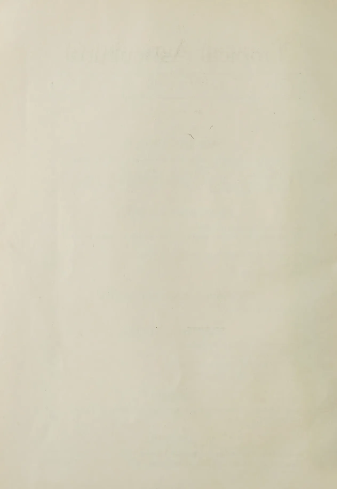
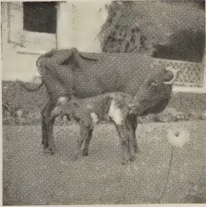
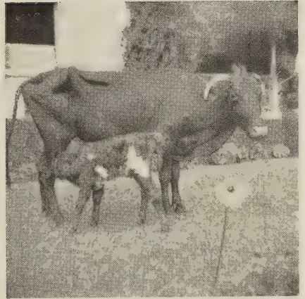
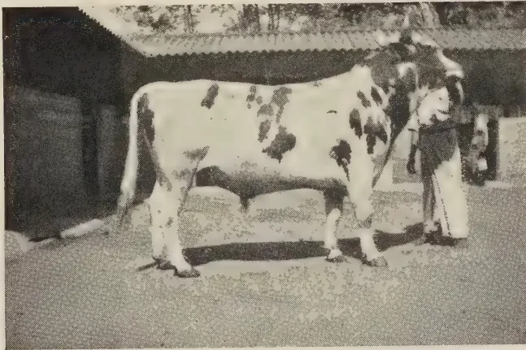
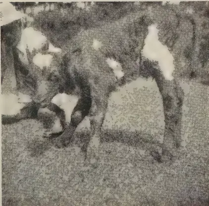
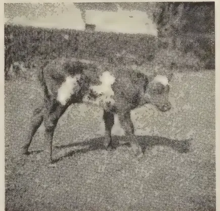

### *CORRIGENDUM*

The total annual consumption of quinine in Ceylon is approximately 29,000 lb. and not 17,000 lb. The other figures in this article derived from the statement of consumption should be similarly amended.

Editor, *The Tropical Agriculturist*.

1------------------------------------------------

<!-- stage4: FAINT old-images-only -->

[Faint page: no legible print of its own could be verified; text withheld (stage 4 review list)]

2------------------------------------------------

# The Tropical Agriculturist

VOL. XCIII

PERADENIYA, JULY, 1939

No. 1

<table><thead><tr><th></th><th style="text-align: right;">Page</th></tr></thead><tbody><tr><td>Editorial .. .. .</td><td style="text-align: right;">1</td></tr></tbody></table>

## ORIGINAL ARTICLES

<table><tbody><tr><td>The Tea Plant in Industry : Some General Principles. By W. Wight, Ph.D., B.Sc., and P. K. Barua .. .. .</td><td style="text-align: right;">4</td></tr><tr><td>The Composition of Local and Imported Citrus Fruit. By A. W. R. Joachim, Ph.D. (Lond.), Dip. Agric. (Cantab.), and D. G. Panditsekere, Dip. Agric. (Poona) .. .. .</td><td style="text-align: right;">14</td></tr></tbody></table>

## DEPARTMENTAL NOTES

<table><tbody><tr><td>Artificial Insemination of Cattle .. .. .</td><td style="text-align: right;">25</td></tr><tr><td>The Transport of Hatching Eggs from Great Britain to Ceylon by Air Mail .. .. .</td><td style="text-align: right;">27</td></tr><tr><td>Cultivation of Knol Khol in the Hanguranketa District.. .. .</td><td style="text-align: right;">30</td></tr><tr><td>Chillies .. .. .</td><td style="text-align: right;">33</td></tr><tr><td>Dairy Science Abstracts .. .. .</td><td style="text-align: right;">37</td></tr></tbody></table>

## SEASONAL PLANTING NOTES

<table><tbody><tr><td>Calendar of Work for July .. .. .</td><td style="text-align: right;">39</td></tr></tbody></table>

## SELECTED ARTICLES

<table><tbody><tr><td>A New Method in Mango Propagation . .. .</td><td style="text-align: right;">42</td></tr><tr><td>Nutrition and Reproduction .. .. .</td><td style="text-align: right;">47</td></tr><tr><td>Some Fundamental Principles of Erosion .. .. .</td><td style="text-align: right;">54</td></tr><tr><td>Root Stimulation by " Hormones " .. .. .</td><td style="text-align: right;">56</td></tr></tbody></table>

## REVIEW

<table><tbody><tr><td>Annual Review of Biochemical and Allied Research in India, Volume IX., 1938 .. .. .</td><td style="text-align: right;">60</td></tr></tbody></table>

## RETURNS

<table><tbody><tr><td>Animal Disease Return for the Month ended June, 1939 .. .. .</td><td style="text-align: right;">62</td></tr><tr><td>Meteorological Report for the Month ended June, 1939 .. .. .</td><td style="text-align: right;">63</td></tr></tbody></table>

1—J. N. 85271 (6/39)

3------------------------------------------------

<!-- stage4: FAINT old-images-only -->

[Faint page: no legible print of its own could be verified; text withheld (stage 4 review list)]

This image shows a blank, aged, cream-colored page, likely an endpaper or flyleaf from an old book. The paper has a slightly textured appearance with some minor discoloration and faint smudges, particularly towards the bottom center. There is no text or other markings on the page.

4------------------------------------------------

# The Tropical Agriculturist

July, 1939

---

## EDITORIAL

---

### THE CITRUS FRUIT

---

**T**HE area under citrus in this country has steadily increased during the last few years. Interest in the crop has grown and the Department of Agriculture has stimulated that interest and helped those who wished to plant citrus. It is probable that the recent rate of expansion will be maintained for some years. It is very important that the pioneers who have invested money in this nascent industry should not suffer disappointment through the absence of a market which will absorb their produce at a remunerative price. It is premature to look to a market abroad. Increased local consumption can only follow a general rise in the earning capacity of the urban and semi-urban population. The activities of the Department of Industries will no doubt produce this rise in course of time. In the meantime the citrus grower must look to the present demand for his market, and must capture as much of it as seasonal fluctuations of production allow him. About 9,000 cases of citrus fruit are annually imported, and it is a curious fact that even during the months when the local fruit is abundant the imported article finds purchasers at prices appreciably higher than the local grower can obtain for his oranges and his grapefruits. The consumer who considers fifteen cents too high a price for a local grapefruit will often cheerfully pay thirty cents for a Californian or South African fruit.

The reason for this phenomenon merits investigation. Some aspects of the problem were examined by Dr. Joachim, the Agricultural Department's Chemist, and the results are published in this number. He admits what, in fact, all of us know, that there are certain superficial characteristics in which the imported fruit is superior. Its colour is attractive; its coat is less tight-fitting and can be more easily removed; it has less seed; and, perhaps, the rag inside is less coarse. Our inferiority in some of these characteristics is climatic in origin;

5------------------------------------------------

2

but in the case of most of them improvement can be effected by selection and culture. Work is in progress in these directions. The essence of the comparison is in the chemical analysis. The results of the analysis are summarized in table V. of Dr. Joachim's article.

The most striking feature is the wide range of variation of all the essential factors. For example the juice content of local oranges ranges from 35.4 to 63 per cent., and that of imported oranges from 36.9 to 62.2 per cent., and their sugar-acid ratio from 5.3 to 17.3 and from 5.4 to 16.8 respectively. It will be noticed that in practically every essential characteristic the range is wider in the case of the local fruit, but only very slightly wider, so that there is nothing to choose between them with regard to uniformity of quality. Statements of averages must be read and interpreted in relation to the range of variations, and little importance can be attached to differences in the average in this analysis. But in fact the differences in the averages between the local and imported fruits are very small. Thus the average juice contents of imported oranges and local oranges are 49.9 and 45.4 per cent. respectively and the corresponding figures for grapefruit 40.1 per cent. and 43.5 per cent. It is interesting to note in parenthesis that there is no justification for the reputation which the imported grapefruit has for superior juiciness. Similarly the high vitamin contents differ only by 2.7 mgm. per 100 ml. of juice in the case of oranges and by 2.9 in terms of the same unit in grapefruit. These are only slight arithmetical differences with no scientific significance whatever, and the lay mind appreciates Dr. Joachim's argument in summary that "considered as a whole, the average composition of the local samples is not significantly different from that of the imported samples".

There remains the elusive quality of flavour. The Scientist has not so far been able to invent a formula based on chemical analysis which would provide a reliable index of flavour, but the best known guide, though an imperfect guide, to flavour "is the true sugar/acid ratio, considered in conjunction with the actual amounts of sugar or acid or both present in the juice". The averages sugar/acid ratio is higher in the case of local fruit, while the total content of both acid and sugar is slightly higher in the case of the imported fruit. These slight arithmetical differences have as little significance as those relating to juice, and the Chemist's generalization regarding the similarity of local and imported fruits in respect of chemical composition is equally applicable to flavour in so far as that quality is determinable by physical tests other than the application of the human tongue.

6------------------------------------------------

<!-- stage4: ACCEPT r2J/J_013:105 -->

3

From these considerations we draw the conclusion that this country can raise an orange and a grapefruit which is quite equal in essential food values to those of the better known fruit-growing countries of the world, while it has much ground to cover in respect of the qualities which are related to what may be called the aesthetics of food.

7------------------------------------------------

4

## THE TEA PLANT IN INDUSTRY: SOME GENERAL PRINCIPLES

---

W. WIGHT, Ph.D., B.Sc.,

BOTANIST, TOCKLAI EXPERIMENTAL STATION, CINNAMARA,  
ASSAM, INDIA,

AND

P. K. BARUA.

---

THE tea plant was originally classified as *Thea* but was later considered by some botanists not to differ sufficiently from those characters already defined as *Camellia*. At an international conference of botanists which was held in Holland in 1935, it was decided that the tea plant should in future be classified as *Camellia*. An international conference of horticulturists held at Paris in 1932 had already come to a similar decision. It is, in fact, now considered that there is no valid distinction between the characters which have been used to define a plant as a *Thea* and those used to define a plant as a *Camellia*. The tea plant may satisfactorily be called *Camellia Thea* Link. The term "Link" refers to a preserved specimen and to a description—in unmistakable scientific terminology—of the plant recognised by the German naturalist Link as *Camellia Thea*: the word "Link" is not part of the plant name but is a reference for the purpose of comparison and its employment is a precaution against confusion. Quotation of the botanist's name (usually given in an abbreviated form) is necessary for strict accuracy because, through ignorance of what botanists in other countries are doing, the fault has often been made of giving a slightly different classification (and hence coining a different name) for the same, or variable forms of the same plant. This does not matter much if all botanists have a revision of their classification from time to time, *i.e.*, if they put their files in order: anyone used to working in a large office knows that the classification of files has to be revised from time to time as more material and knowledge accumulate; also, very frequently the first classification is a temporary one and different clerks may not be unanimous about this. The fault of one plant being classified slightly differently in different places would be of importance only if the discrepancy persisted for such a length of time that two names for one plant came into general usage. Such discordance is not very likely

8------------------------------------------------

5

to occur nowadays and would not persist for long with more rapid means of communication and a more general diffusion of knowledge. The classification of plants is to-day an international affair and frequent references on doubtful points are made between different countries. It is unfortunate that several names for the tea plant have already come into use. According to Fischer, writing in the *Journal of the Bombay Natural History Society* (No. 4., 1937), "it was pointed out at the 1935 Congress at Amsterdam that botanists engaged in economic studies have neither the time nor the facilities for keeping abreast with nomenclatural research. This difficulty was admitted by the Congress. Accordingly, it was resolved to draw up a list of the important economic and horticultural plants named in accordance with the International Rules, which list shall remain in force for the usage of such applied botanists for a period of ten years. A special Committee was appointed to consider all those species for which claim for inclusion has been put forward and it is hoped that the list will be ready for publication before long." The tea industry's botanists in Java, Ceylon, and India have, with the support of their respective Directors, jointly approached the special Committee appointed by the 1935 Congress with a request that the nomenclature of the tea plant be considered by the Committee. This request was forwarded by Dr. Tubbs of Ceylon through Sir Arthur Hill, the director of Kew Gardens. It is possible that the name for the tea plant will again be revised—but this time with approved international authority; pending the report of the Committee, the tea industry botanists in N.E. India, S. India and in Ceylon have decided to use the name *Camellia Thea* Link. whilst it seems that Java prefers the term *Thea sinensis* Linn. given to the tea plant by Linnaeus in 1753. It will be seen that either term is perfectly satisfactory provided that the appropriate reference Link or Linn.—the latter short for Linnaeus—is given. Recent English usage has favoured *Camellia Thea* Link. The tea plant is sometimes referred to as *Camellia sinensis*, this term utilizing the specific name given to the plant by Linnaeus in 1753 and re-classifying the plant as a *Camellia* in accordance with current ideas. Russian botanists favour *C. sinensis* which, according to Sealy writing in the *Journal of the Royal Horticultural Society* for August, 1937, is the correct name now that the genus *Thea* is merged in *Camellia*: for technical literature this name would at times need to be written "*Camellia sinensis* (L.) O. Kuntz" thus giving reference to the authority for the union of the old name with the new genus. *C. sinensis* is sometimes written *C. chinensis*—this is a difference of spelling, the former method being more commonly used. Eleven different names are to be found in botanical literature referring to various plants all of which are now

9------------------------------------------------

6

regarded as belonging to the one species *Camellia Thea* Link : of these terms Masters' *Thea assamica* and Griffiths' *Camellia theifera* are commonly met with.

The tea plant has been cultivated in England since 1768 and the genus *Camellia* has long been known to gardeners : several species are in cultivation, *Camellia japonica* Linn. being a familiar example. Another species of wide geographical distribution, *Camellia drupifera* Lour. occurs in the Naga and the Khasi Hills and is used in one hill village for the manufacture of tea. Watt considers it probable that the Burmese at one time used *C. drupifera* for the manufacture of "letpet" tea, a kind of pickle popular with the Burmese and Shans and now made from the true tea plant : according to Watt "letpet" is the vernacular name of *C. drupifera*. The seeds of *C. drupifera* contain appreciable quantities of oil (Seeman. 1859. p. 344) as also do those of *C. oleifera* Abel : "this latter species is indigenous to China, where it is widely cultivated for the seeds from which an oil is obtained" (Sealy. 1937. p. 361)—this oil is presumably the half mythical "tea seed oil" referred to at times in literature dealing with the tea industry. An oil known to commerce as "tea tree oil" and valuable for its disinfectant properties comes from *Melaleuca alternifolia*, an Australian plant related to eucalyptus. Several genera closely related to *Camellia* occur wild in India : an example of the genus *Pyrenaria*—*Pyrenaria barringtoniaefolia* Seem.—found its way in small quantities into one Assam tea garden and, because of its superficial similarity to tea, for a long time remained undetected : the presence of this plant was found to be detrimental. *Pyrenaria* has been confounded by botanists with the tea plant : a plant considered by Prof. Choisy in 1855 to be a *Thea* allied to the wild tea of Assam is now regarded as a *Pyrenaria* (*P. attenuata* Seem.). A *Schima*—*Schima Wallichii* Chois.—is common in N.E. India and is known in the Dooars and Darjeeling as *Chilauni* (Chalouni Tea Estate in the Dooars taking its name from the previous abundance of this tree) and in Assam as *Bher Gos*. Attempts at Tocklai to cross *Schima* and *Pyrenaria* with tea have failed. Crosses of tea with other *Camellias*, as *C. drupifera*, are more likely to succeed ; some of these related species—particularly those native to Assam and Bengal—might also make suitable rootstocks on which to bud or graft selected types of tea.

The chromosome content of the tea plant has recently been established by Subba Rao of the United Planters Association of South India as 30, thus confirming the earlier work of Dutch and, more particularly, Russian and Japanese investigators. Subba Rao found that the chromosome number of 30 also applies to a China type.

10------------------------------------------------

7

The tea plant shows an appreciable degree of self-sterility and invariably sets a better crop of seed with pollen from another bush : considering any seed bearer it is always possible to find one source of pollen (*i.e.*, one other bush) which, if this alone is caused to fertilize the flowers of the seed bearer, will result in an outstandingly good crop of seed : use of the best pollinator will result, on an average, in twice as much seed as that to be set with equal supplies of pollen from every bush in the neighbourhood, and in particular cases nearly four times the crop has been obtained. The average crop of seed set by a tea bush with its own pollen alone is about one quarter of that which would be set if the flowers are able also to receive adequate supplies of pollen from numerous other bushes ; though in particular cases both greater and lesser success might be expected from self-pollination. Russian botanists found that the plants resulting from self-pollination were inferior in vigour to those resulting from cross-pollination, besides which the self-fertilized seed showed a marked reduction in germinating capacity. Insects, such as bees and wasps, will carry pollen from bush to bush, but as the tea plant in the plains of N.E. India flowers at a time of lessened insect activity and at a time when bees probably migrate to the hills, it seems likely that the cross transfer of pollen by insects is not very effective and self-fertilization may sometimes occur under these conditions. With an efficient cross transfer of pollen it is unlikely that more than 3 per cent. of the total seed formed will be the result of self-fertilization—nevertheless it has been found possible for artificial self-fertilization to give as big a crop of seed as that resulting from natural pollination under conditions where it is evident that insects do not provide an efficient cross transfer of pollen. Complete cross transfer of pollen by artificial means has been shown to result in 13 per cent. of the flowers setting seed thus giving a seed crop six times that estimated, on inadequate data, to be usual in a bari\* under Upper Assam conditions. Wellensiek, in Java, obtained germinated seed totalling 12 per cent. of the number of flowers artificially pollinated as against a similar figure of 8 per cent. for flowers pollinated naturally. Expressed on the same basis as that used by Wellensiek, the Tocklai result, quoted above, of 13 per cent. successful pollinations gives a total seed germination of 17 per cent. of the number of flowers pollinated. In Russia, Bakhtaj estimates that only 2 per cent. of the flowers normally form seed.

The conclusion that tea must, in nature, be almost entirely cross-fertilized accounts for the extreme variability of the seed

---

\*The term "bari" applies to an enclosure, *e.g.*, "seed bari" means a seed garden.

11------------------------------------------------

8

available on the market : the seed sold by any one concern is mixed so that in some cases there is little difference between populations of plants raised from two or more sources of supply : in some cases distinctive strains characterize a particular source of supply. Seed is sold on the market under various trade names as Khelmati, Kukilamukh, Sibsagar, &c., which are generally derived from place names of the locality where a particular dealer's seed-bearing trees are situated. These names are to be taken as indicating that the bulk progeny of a particular area of more or less variable seed-bearing trees inter-fertile amongst themselves. A point to note is that seed-selling concerns may extend their seed-bearing area either with progeny from the original area or from other sources, and may also thin out or replace supposedly undesirable trees in the original area ; so that an area of tea raised from, say, Khelmati seed may differ from an area of tea raised 10 years later from seed still marketed as Khelmati : this point requires consideration when one is interpreting the result of experiments dealing with *jāt* differences. All tea may be broadly classified into dark and light leaf types, and seed dealers market, as far as possible, either dark-leaf or light-leaf types under a particular trade name. These trade types, as Khelmati, Kukilamukh, Sibsagar, &c., are referred to in the tea industry as *jāts*.

All the commercial types of tea and all the wild types, as Lushai and Indo-China, belonging to the one species *Camellia Thea* Link. (= *Thea sinensis* Linn.). This is very variable and the leaves of different tea bushes make tea of decidedly different quality—in some cases poor quality. As tea is largely cross-fertilized, individual variations are continued indefinitely and the only practical method of overcoming this is by some method of vegetative propagation, as in the case of the apple. The apple, like tea, does not come true from seed and each so called "variety" of apple is but one selected tree multiplied indefinitely through the process of grafting. An individual so split up that parts of it lead an independent existence in different places and in union with different rootstocks is spoken of as a clone : a clone may also be formed by rooting many cuttings from the same plant. At the moment there seems little prospect of tea clones being used for leaf production, but bushes selected because of their particularly desirable progeny may with advantage be propagated to form a clonal seed bari : in this case due consideration would also have to be paid to the propagation of a source of pollen likely to ensure the continued production of desirable progeny—in fact, the successful application of clonal selection for seed production necessitates some knowledge of the reciprocal fertility of one bush with another and this knowledge becomes the more important the less the number of bushes propagated.

12------------------------------------------------

9

The respective merits of dark- and light-leaf types under different climatic conditions are often discussed. Russian botanists have shown that dark-leaf types are, in general, much more resistant to frost than the light-leaf types : whilst non-hardy strains of dark-leaf were found, dark-leaf jāts on the whole—particularly those with small leaves—contained more hardy types than light-leaf jāts; jāts with predominating light leaf characters did not occur amongst those jāts with the highest resistance to frost. It seems possible that scientific investigation will prove the dark-leaf types of tea to be, in general, but probably with notable exceptions, more drought-resistant than the light-leaf types—or, to be more explicit, drought-resistant strains will mostly be found amongst dark-leaved tea. Individual differences in resistance to desiccating conditions seem to be as marked as those shown by any other character and there is little doubt that strains notable for resistance to the hot, dry winds of the Terai and W. Dooars could be isolated. China types are included under dark-leaf in these remarks on frost and drought resistance. In the Russian investigations seed from a Darjeeling garden gave the maximum number of frost-resistant plants and a Cachar dark-leaf seed came high in the list. Observations at Tocklai give no indication of any invariable relation between the dark or light leaf character and die-back of the branches. It is possible to find a dark-leaf stock and a light-leaf stock of which the dark-leaf shows more die-back than the light-leaf and *vice-versa*, though the question remains open as to whether die-back is more commonly associated with the one type of leaf than the other.

It is a matter of experience that dark-leaf jāts do not give the high level of quality of a modern light-leaf : at the same time it must be remembered that some of the best modern light-leaf tea shows signs of being the result, or partly the result, of cross-fertilization between two forms not likely to have been growing together naturally : some of the earliest of the lighter leaf “indigenous” jāts, now no longer grown, were markedly deficient in quality, though general opinion indicates at least one notable exception to this statement. Dark-leaf jāts at present on the market do not give the quality of the best light-leaf but it must not be assumed that it is impossible to obtain a dark-leaf type of good quality : individual dark-leaf bushes with excellent manufacturing characteristics are to be found.

Our knowledge of quality is, unfortunately, based upon the purely subjective determinations of the tea taster : the taster’s estimation of quality for experimental work has been systematized but nevertheless remains at a level of exactitude which compares very unfavourably with the methods of measurement usually employed in scientific work. There is reason to believe

13------------------------------------------------

10

that the taster's sense of quality rests upon a material basis of substances known to the chemical and physical sciences, though precisely what these substances are and where and how they occur in the tea leaf is unknown. It has been found that there is a difference in the smell of the fresh green leaf upon different bushes and it was proved that bushes, the leaves of which possessed a noticeable aroma, were quite independently selected by one taster as high quality bushes (Wight and Gilchrist 1937). This suggests that the presence in the leaf of a substance with aromatic properties was responsible for "quality" as assessed by the taster; and it would appear that "quality" and "flavour" as assessed by some tea tasters differ only in degree.

Individual dark-leaf bushes have no lesser quality than the best light-leaf bushes, but dark-leaf stock usually contains a higher percentage of low quality bushes, and hence in bulk gives lower quality: quality for quality the dark-leaf bushes generally give thinner liquors—and this would appear to be true whether we include or exclude China types from the dark-leaf class. Dark-leaf bushes (of both the Manipuri and the China type) with thin liquors have been remarked upon by the taster (in ignorance of the origin of the leaf) as desirable types and give good valuations. This statement regarding the combination of quality and strength in dark-leaf bushes is a generalization: taking particular bushes of the highest and equal levels of quality, some dark-leaf plants can be found with strength equal to the light-leaf. Summarizing the characters of dark-leaf relative to light-leaf, it is found that a population of dark-leaf bushes usually contains fewer bushes of good quality and amongst these latter there are again fewer bushes which combine strength with quality. It is evident that the dark-leaf types offer great possibilities for the plant breeder, particularly when one considers their cultural characteristics. The difference between the best and the worst of the light-leaf stocks so far examined is of interest—the "stocks" in this case are fair samples of commercial *jāts*. The seed garden from which one of these stocks was taken was established from seed taken from "indigenous" tea found, supposedly, wild: at the time of planting this seed garden it is doubtful if any conscious selection took place, and if it did it is equally doubtful whether the selection was of any practical utility: this *jāt* is regarded as being a fair representative of the original so called "indigenous" tea of Assam. The better *jāt* is a "modern" light-leaf of later introduction and popular to-day. It is thought that a good deal of the difference between these two *jāts* has very probably been brought about by consciously directed selection on the part of the modern seed grower and our comparisons of the two *jāts* are discussed in this light: whether

14------------------------------------------------

11

this dynamic interpretation is accepted or not, the validity of the comparison remains. Both strength and quality have improved in about the same proportion and each of these has moved upwards along about 6 per cent. of their respective scales of values as recognized by the taster. Quality and strength both commenced below their half way levels and each now stands, in the better jāt, at about 50 per cent. of their possible best. This 6 per cent. move along the scale, bringing both quality and strength up to approximately the half way mark, has meant an improvement on the previous lower level of the order of 14–15 per cent. and this improvement was worth, in 1935, an extra eight pies per pound—this was under the 1935 market conditions for Tocklai manufactures when the “indigenous” light leaf was getting Ans. 9/8.56, the more modern jāt Ans. 10/4.51 and typical dark-leaf tea Ans. 10/0.52 (valuations from data supplied by Mr. Harrison of the Chemical Laboratory). It is doubtful as to how far mass selection as now practised by the seed grower can improve the better jāt.

It is considered by the botanist that dark-leaf tea will, in general, better resist vagaries of climate, particularly when the latter occur in conjunction with the kind of financial policy somewhat inadequately described as economical. On the other hand it is unlikely that any dark-leaf seed so far offered for sale will *en masse* give quality or tip equal to a good light-leaf. On the present market, increased quality (above the desirable minimum produced by good jāts of dark or light leaf) does not give very much return in the way of increased valuations; but one must also regard tea planting as a long period investment and the demands of the European market are constantly in the direction of better quality. For the Indian market, other factors such as crop and liquors being equal, increased quality is desirable. A good light-leaf jāt will give crop, quality, and appearance when properly grown and kindly treated: certain dark-leaf jāts, whilst not giving the very best quality and appearance of the light leaf, will nevertheless give good average quality and crop and can be better than an inferior light-leaf jāt; but one of the poorer light-leaf jāts will be better under conditions of plains than unselected China types. There are, however, some grounds for believing China to be desirable in the Darjeeling district where the development of flavour is seemingly associated with China dark-leaf types growing under the peculiar local conditions. In Darjeeling the continued production of flavoury teas must of necessity outweigh most other conditions owing to the inability of many gardens there to maintain competition with other districts of importance on a basis of crop alone: one must consider whether the success of a tea in another district is sufficient criterion for its introduction in Darjeeling; at present there is a tendency to introduce

15------------------------------------------------

12

outside types and justification for this practice should be sought by the local industry. In the Bengal Dooars, conditions are so varied that it is impossible to generalize : on a given garden one Manager will make a success of light-leaf type where another Manager would fail ; and the generous policy of one Company will make a financial success of light-leaf where another's more stringent methods would be useless. Quite apart from financial aspects one might draw a parallel with the way in which some gardeners can succeed with exceedingly difficult subjects ; such ability is not to be entirely dissociated from individual predilections. In a district with extreme and varied climatic conditions such as the Dooars, and presuming little or no scientific attention, light-leaf types cannot in general be said to be desirable : on favourable gardens in the same district, and giving an interested Manager a free hand with manures, the cultivation of a light-leaf type is a justifiable financial venture.

The terms dark-and light-leaf are used in the preceding pages in the very broad classificatory sense in which they are understood in the industry. The planting community separately distinguish a China plant of shrubby form with small, dark leaves and classify other tea as either "dark" or "light" leaf (China "hybrids" are intermediate between China and the larger-leaved forms and often with a noticeable number of light-leaved plants). "Dark" and "light" are terms derived from the dark green and light, sometimes chlorotic, green appearance of the leaves. The terms are relative and any block of tea can be separated into darker and lighter forms. An increasing percentage of darker forms corresponds with an increasing expression of several other attributes recognized by Russian botanists as *Northern* characteristics. The correspondence of dark leaf with northern attributes is not perfect and colour of the leaf alone enables one to recognize at the most three classes of plant—"dark," "intermediate," and "light"—which are not always completely consistent as to their other characteristics : consideration of several attributes of the plant enables more classes to be recognized. In this article "dark" and "light" refer mainly to trend of type (the common usage) and may be taken as indicating a broad correspondence with more northern and more southern forms as recognized by Russian botanists. The China types of the Indian planter are to be included in the extreme northern forms.

. . . . .

The following sources of information have been drawn upon in completing this article ; results obtained by the Botanical Laboratory staff have also been incorporated into the text previous to publication of technical data.

16------------------------------------------------

13

Thanks are due to Mr. E. T. D. Lambert, B.A., F.R.G.S., for information and assistance in investigating *Camellia drupifera*. Conclusions regarding manufacturing characteristics are the result of joint investigations with Mr. R. Gilchrist of the Jorehaut Tea Co., Ltd., : in this connection great credit is due to Sj. Tanu Ram Pujari of this Station for the completion of approximately 3,000 single bush manufactures in a period of two years.

Anon., .. Thee-boomolie. Bergcultures, 1938 (12) : 1,133  
(*Imp. Agric. Bur. Hort. Absts.* IX (1) : 255. 1939).

Bakhtaj, K. E. .. The blossoming and fructification of the tea plant under Chakva conditions. *Bull. Res. Inst. Tea Industry in U.S.S.R.* No. 2. Georgia State Press, Tiflis, 1931. (Paper in Russian.)

Bakhtaj, K. E. .. Pollination of tea—*Camellia sinensis*—in Georgia. *Subtropics* 1932 : 4th year ed. No. 2 (12) : 64–80. (Paper in Russian.)

Pokrovski, V. N. .. Notes on the characteristics of the different varieties of the tea plant which have been tested at the Chakva Experimental Station. *Bull. Res. Inst. Tea Industry in U.S.S.R.* No. 2. Georgia State Press, Tiflis, 1931. (Paper in Russian.)

Seeman, Berthold .. Synopsis of the Genera *Camellia* and *Thea*. *Trans Linn. Soc. Lond.* XXII : 337–352. 1859.

Sealy, J. R. .. Species of *Camellia* in Cultivation. *Journ. Roy. Hort. Soc.* LXII (8) : 352–369. 1937.

Subba Rao, M. K. .. Chromosomes in *Camellia Thea* (the tea plant). *Current Science* VI (9) : 457. 1938.

Watt, Sir George. .. *The Commercial Products of India*. Lond. 1908.

Wellensiek, S. J. .. Bloembiologie en Kruisingstechniek bij Thee. *Archief Theecultuur* 12 : 127–140. 1938.

17------------------------------------------------

14

## THE COMPOSITION OF LOCAL AND IMPORTED CITRUS FRUIT

---

**A. W. R. JOACHIM, Ph.D., Dip. Agric. (Cantab.),**  
*CHEMIST*

*AND*

**D. G. PANDITTESEKERE, Dip. Agric. (Poona),**  
*ASSISTANT IN AGRICULTURAL CHEMISTRY*

---

**T**HE average number of cases of citrus fruit imported annually into Ceylon between 1932 and 1938 was 9,030, the record being 13,581 in 1935 since when there has been a decline. There is likely to be a further decline in the future owing to the restriction which has been placed upon the import into Ceylon of fruit from countries affected by the Mediterranean fruit fly. On the other hand, during the period under review there has been a steady and appreciable increase in the acreage under the crop in the Island, an increase which appears to show promise of being maintained. As a result, production will, in due course, reach the point when the Island's entire requirements of citrus fruit for several months in the year can be met. The question has therefore been raised as to how the quality of locally-grown citrus compares with that of imported fruit. Quality in citrus is determined by such factors as abundance and flavour of juice, texture of pulp, thickness of rind, facility of peeling, seedlessness, amount and character of rag. Inasmuch as the flavour of the fruit is governed to a large degree by its chemical composition, it was considered that analyses of representative samples of local and imported citrus fruit would furnish useful comparative data on the point at issue. Accordingly, analyses have been made during the past twelve months of 62 samples of imported and local oranges and grapefruit, and though the samples examined were not, in the case of every sample group, as numerous as was desirable they were considered to be adequate for the purposes of this inquiry.

18------------------------------------------------

15

The samples comprised the following :—

<table>
<tr>
<td>Local oranges</td>
<td>..</td>
<td>..</td>
<td>..</td>
<td>15</td>
</tr>
<tr>
<td>Imported oranges</td>
<td>..</td>
<td>..</td>
<td>..</td>
<td>23</td>
</tr>
<tr>
<td>Local grapefruit</td>
<td>..</td>
<td>..</td>
<td>..</td>
<td>17</td>
</tr>
<tr>
<td>Imported grapefruit</td>
<td>..</td>
<td>..</td>
<td>..</td>
<td>7</td>
</tr>
</table>

The countries of origin of the imported samples were South Australia, California, South Africa, and Rhodesia. No samples of fruit were available from countries from which the importation of citrus fruit is prohibited. Samples of imported grapefruit were difficult to obtain, presumably because of the non-importation of fruit from the latter countries. The imported orange samples were of the Navel and Valencia varieties and the imported grapefruit mainly of the Marsh's Seedless variety. The local orange samples were good quality fruit of the Kotte, Valencia, Washington Navel and Indian types. Some samples were from seedling trees, others from grafts. The local grapefruit samples included the following varieties :—Marsh's Seedless, Cecily Seedless, Walters, McCarty, Triumph, Fosters and Ellen. All the local samples of oranges and grapefruit were obtained from the Government Experiment Stations or from private growers.

#### METHODS OF ANALYSIS.

On receipt, each sample, which consisted of 6 to 8 fruits in the case of oranges and 3 to 4 fruits in the case of grapefruit, was examined for the following characteristics :— Size and weight of fruit, colour and thickness of rind, degree of seediness, colour and flavour of pulp, character of rag and percentage by weight of juice in the fruit. The following analytical determinations of the strained juice, which was extracted with a Sunkist extractor, were carried out by the methods specified, except in regard to sugars which were omitted in certain samples :—

*Total solids (Brix).*—These were determined by the Brix hydrometer, corrections for temperature being made from de Villiers' table (17), and also by the Zeiss refractometer fitted with a sugar scale.

*Acidity* was calculated as citric acid with one molecule of water and in ml. of deci-normal caustic soda required to neutralize 10 ml. of juice.

*Sugars.*—Total and reducing sugars were determined by Lane and Eynon's method with methylene blue as internal indicator.

*Vitamin C.*—The recent improved iodine method of the California Fruit Growers Exchange was adopted for the estimation of vitamin C (21).

*pH.*—The quinhydrone method was used.

19------------------------------------------------

16CITRUS MATURITY STANDARDS

In most citrus-growing countries, regulations are in force to prevent the export of citrus fruit, particularly oranges, unless they attain a minimum "maturity" standard. The standard commonly in use is based on the total soluble solids/acid ratio of the juice, and is frequently, though incorrectly, designated the sugar/acid ratio, since sugars are the most important of the soluble solids. In these calculations the acidity is reckoned as citric acid. The ratio varies in the different countries with the species of fruit and occasionally with the variety or other factor. Thus in California and Florida, all oranges for export should have a minimum maturity ratio of 8 to 1 (19, 20)\*. In South Africa (18) the ratio varies according to the variety, being 5.5 for seedling oranges, 6.0 for Valencias and 6.5 for Navels. But fruit for export should, in addition, contain at least 45 per cent. juice by weight. The Palestine regulations demand a minimum sugar/acid ratio of 7 to 1 (15). In New South Wales (16), maturity is expressed in terms of titratable acidity. Navel oranges are considered "mature" when less than 23 ml. of deci-normal caustic soda are required to neutralize the acidity in 10 ml. of juice. In Jamaica (6), the corresponding maturity maximum suggested is 20 ml. The export regulations in regard to grapefruit are less explicit. Thus the Palestine regulations state that "no grapefruit shall be exported from Palestine unless the fruits have reached an adequate state of maturity". The reason why no rigid standards have been prescribed for grapefruit are: (1) the solid/acid ratios for fruit of satisfactory flavour and quality have been found to vary appreciably with the district of origin. In California and Arizona they range from 5.5 to 6.8, and in Jamaica from 7.3 to 11.3 (6); (2) the ratios are dependent on the total solid contents of the juices, being generally the lower, the higher the latter. Suitable ratios suggested for grapefruit (6) are 5.5 to 6.5.

While the total solid/acid ratios afford a fairly reliable indication of maturity in oranges, they have certain limitations as indexes of flavour. Thus two oranges may have identical maturity ratios but distinct flavours owing to the actual quantities of sugar and acid in the juices being markedly different. A juice with a low concentration of these constituents would tend to be insipid. A better guide to flavour is the true sugar/acid ratio, considered in conjunction with the actual amounts of sugar or acid or both present in the juice. Tentative formulae (6, 22) have been suggested for calculating from the chemical data indexes of flavour, but these are not generally applicable to all varieties of citrus fruit,

\* Numbers relate to references on pages 19 and 20.

20------------------------------------------------

17

nor to all countries, and soil and climatic conditions. In the analytical tables which follow, both the total solids/acid and the sugar/acid ratios for the samples examined are furnished.

#### RESULTS AND DISCUSSION OF DATA

The results of the examination and analysis of the samples are presented in four tables. I. and II. show certain characteristics of, and analytical figures for, local orange and grapefruit samples, and III. and IV. the corresponding data for the imported samples. In these tables the samples are classified, where possible, into sub-groups according to variety, country of origin and nature of parent tree, *i.e.*, whether graft or seedling. When discussing the data, comment will only be made on any sub-group comprising at least six samples. In table V. the analytical data of the samples examined are summarized, while in table VI. the corresponding data, obtained from the literature, for citrus fruit of various countries, are furnished.

(For Tables I. and II. see pages 21 and 22.)

#### ORANGES

An examination of the tables I. and II. indicates that :

(1) There are considerable variations in the analytical composition of different samples of both imported and local oranges. A wide range of variation will be apparent (*cf.* table V.) in the case of every constituent determined. To take a few examples. In regard to juice percentage, the range for local fruit is 35.4 to 63.0 and for imported fruit 36.9 to 62.2 ; for total solids the corresponding ranges are 8.2 to 12.7 and 9.2 to 11.9. The range is widest with the solids/acid and sugar/acid ratios, and narrowest in the case of the pH values. The flavour also varies from sweet to sour through mildly sweet, mildly tart and tart.

(2) Considered as a whole, the average composition of the local samples is not significantly different from that of the imported samples.

(3) The lowest solids/acid ratio in the case of the local samples is 8.3, a figure which is higher than the standard set for Californian fruit. All the local samples examined are, therefore, from the standpoint of maturity, up to export standard. Of the imported samples, only one has a ratio less than 8, but even this, from Rhodesia, would pass the standard adopted in its country of origin, *viz.*, 6.5. All the samples are well above the New South Wales standard.

(4) The average vitamin contents of both imported and local oranges are quite high, being respectively 52.3 and 49.6 mgm. per 100 ml. of juice.

21------------------------------------------------

18

(5) There is no appreciable difference in the average analytical composition of local fruit from grafted and seedling trees. Of imported fruit, Navels are significantly superior to the Valencias in vitamin C content.

(6) There is a fairly close correspondence between the total solids/acid and sugar/acid ratios and flavour; but this is more noticeable when the data for any particular sub-group are compared.

(For Tables III, and IV. see page 23.)

### GRAPEFRUIT

A study of the data of tables III. and IV. shows that :

(1) As with oranges, though to a lesser degree, there is an appreciable variation in the composition of individual samples of both local and imported grapefruit. Thus the juice percentages and total solids/acid ratios vary from 30.5 to 55.2 and 4.6 to 8.9 respectively in the case of the local fruit, and from 32.5 to 45.3 and 4.4 to 9.5 with the imported fruit.

(2) The average vitamin C values, sugar contents and maturity ratios of both the imported and local grapefruit samples are lower, and the acidities higher than the corresponding figures for the orange samples.

(3) The local samples, on the average, are not significantly different to the imported samples in analytical composition.

(4) There is no significant difference between the average analytical composition of the Marsh's Seedless samples and that of the other varieties, grouped together.

(For Tables V. and VI. see page 24.)

### GENERAL DISCUSSION

On examining the data of table VI. which shows the analyses of representative samples of oranges and grapefruit of various countries, it will be found that the local samples of oranges and grapefruit compare very favourably in analytical composition with the fruit grown elsewhere. The general conclusions arrived at from a comparison of the analyses of local and imported citrus fruit are thus confirmed. In other respects, however, there are striking differences between local and imported oranges. Many of the local orange samples are inferior to the imported fruit in such characteristics as colour and looseness of rind, facility of peeling, character of rag, seedlessness, &c. Artificial colouration by means of ethylene does not often produce the typical colour in local oranges. These defects are probably the effects of the warm, continuously-humid climate, and are less marked in local fruit grown in the

22------------------------------------------------

19

cooler dry districts, *e.g.*, Welimada. Most samples of local grapefruit, on the other hand, are in every respect of the standard of, and some even superior to, the fruit imported into the Island. When the colour is lacking, artificial colouration can easily be resorted to with excellent results.

#### SUMMARY

The analyses of 62 samples of local and imported grapefruit and oranges have indicated that locally grown oranges of good quality compare favourably with imported fruit in analytical composition. Many of the local samples are, probably because of climatic conditions, inferior to imported fruit in such characteristics as colour, thickness of rind, facility of peeling, character of rag, seedlessness, &c. Most samples of local grapefruit, on the other hand, are in every respect equal, and in some cases superior, to imported fruit. Local citrus fruits have a very similar composition to fruit grown in other countries.

#### REFERENCES

1. 1. Roberts, J. A., and Gaddum, L.W. .. Composition of Citrus Fruit Juices. *Ind. Eng. Chem.* 29, No. 5, 1937.
2. 2. Braverman, J. S. .. The Composition of Palestine Oranges. *Hadar*, 10, 1937.
3. 3. Trout, S. A., Tindale, G. B., and Huelin, F. E. Storage of Oranges with Special Reference to Locality, Maturity, Respiration and Chemical Composition. *Commonwealth of Australia, Pamph.* No. 80, 1938.
4. 4. Traub, H. P., and Friend W. H. .. Citrus Production in the Lower Rio Grande Valley of Texas. *Texas Agr. Expt. Sta. Bul.* No. 419.
5. 5. Juritz, C. F. .. Chemical Investigations in Regard to Citrus. *Union of S. Africa. Sci. Bul.* No. 40.
6. 6. Croucher, H. H. .. Maturity Tests for Citrus. *Dept. Sci. Agr. Jamaica, Bul.* No. 5.
7. 7. Thomas, E.E., Young, H. D., and Smith, C. O. .. A Study of the Effect of Freezes on Citrus in California. *Univ. Calif. Coll. Agr. Expt. Sta. Bul.* No. 304.
8. 8. Bates, G. R. .. Maturity Test Data 1932 and Artificial Colouration of Oranges. *Mazoe Citrus Expt. Sta. Pub.* 2, 1933.
9. 9. .. The Chemical Composition of the Food Grains, Vegetables and Fruits of Western India. *Bombay Dept. Agr. Bul.* No. 124.
10. 10. Hardy, F. and Rodriguez G. .. Grapefruit Investigations in Trinidad. *Trop. Agriculture*, 12, No. 8, 1935.

23------------------------------------------------

20

1. 11. Banerjee, B. N., and Ranga Rao, N. K. . . Utilization of Oranges and Limes. *Agr. Livestock India*, 6, 1936.
2. 12. Hamersma, P. J. . . The Vitamin C Content of South African Oranges. *Union S. Africa Dept. Agr. and Forestry Sci. Bul.* No. 163.
3. 13. Beacham, L. M., and Bonney, V. B. . . Ascorbic Acid Content of Florida Citrus Fruits. *Association Official Agr. Chemists*, 20, No. 3, 1937.
4. 14. . . The Nutritive Value of Indian Foodstuffs. *Health Bulletin* No. 23.
5. 15. . . Government of Palestine Fruit Export Ordinance, 1927.
6. 16. Benton, R. J., and Bowman, F. T. . . Citrus Maturity Tests. *Agr. Gaz. N. S. Wales*, 43, 1932.
7. 17. Villiers, F. J. de . . Citrus Maturity Test. *Union S. Africa, Dep. Agr. Bul.* No. 37, 1928.
8. 18. . . S. Africa Citrus Export Regulations, 1932.
9. 19. . . Citrus Fruit Law. The State of Florida, Dept. of Agr. Inspection Bureau.
10. 20. . . Method of Making the 8·1 Test for Oranges. *State of California, Dep. Agr. Circ.* 1920.
11. 21. Stevens, T. W. . . Estimation of Ascorbic Acid in Citrus Juices. *Indus. Engin. Chem. Analy. Edtn.* 10, No. 5, 1938.
12. 22. Van Wijk, D. J. R. . . Certain Aspects of the Acid to Sugar Ratio in Oranges. *Dept. Agr. S. Africa : Dvn. of Chem. Series* 112.

24------------------------------------------------

21

TABLE I.

Local Oranges

<table border="1">
<thead>
<tr>
<th rowspan="2">Locality</th>
<th rowspan="2">Variety</th>
<th rowspan="2">Flavour</th>
<th rowspan="2">Seediness</th>
<th rowspan="2">Juice per cent.</th>
<th colspan="3">Acidity</th>
<th rowspan="2">Total solids gm. per 100 ml.</th>
<th rowspan="2">Rediong sugars gm. per 100 ml.</th>
<th rowspan="2">Sucrose gm. per 100 ml.</th>
<th rowspan="2">Total sugars gm. per 100 ml.</th>
<th rowspan="2">Vitamin C per mgn. per 100 ml.</th>
<th rowspan="2">pH</th>
<th rowspan="2">Sugar/ acid ratio</th>
</tr>
<tr>
<th>Gm. citric acid per 100 ml.</th>
<th>Ml. N 10 soda per 100 ml.</th>
<th>Total solids/ acid ratio</th>
</tr>
</thead>
<tbody>
<tr>
<td colspan="15" style="text-align: center;"><i>Grafted</i></td>
</tr>
<tr>
<td>Hewaheta ..</td>
<td>.. Navel</td>
<td>.. Sweet</td>
<td>.. Seedless</td>
<td>.. 47.0</td>
<td>.. 11.8</td>
<td>.. 0.47</td>
<td>.. 6.7</td>
<td>.. 25.1</td>
<td>.. 3.76</td>
<td>.. 4.37</td>
<td>.. 8.13</td>
<td>.. 47.6</td>
<td>.. 4.3</td>
<td>.. 17.3</td>
</tr>
<tr>
<td>Welimada ..</td>
<td>.. do.</td>
<td>.. Mildy tart</td>
<td>.. Few seeds</td>
<td>.. 40.1</td>
<td>.. 9.9</td>
<td>.. 0.62</td>
<td>.. 8.9</td>
<td>.. 15.9</td>
<td>.. 2.86</td>
<td>.. 3.78</td>
<td>.. 7.67</td>
<td>.. 56.0</td>
<td>.. 4.3</td>
<td>.. 12.4</td>
</tr>
<tr>
<td>Haputale ..</td>
<td>.. do.</td>
<td>.. do.</td>
<td>.. Seedless</td>
<td>.. 40.3</td>
<td>.. 9.3</td>
<td>.. 0.67</td>
<td>.. 9.5</td>
<td>.. 13.9</td>
<td>.. 2.88</td>
<td>.. 4.04</td>
<td>.. 6.92</td>
<td>.. 54.2</td>
<td>.. 4.4</td>
<td>.. 10.3</td>
</tr>
<tr>
<td>Bible ..</td>
<td>.. do.</td>
<td>.. do.</td>
<td>.. do.</td>
<td>.. 44.2</td>
<td>.. 11.8</td>
<td>.. 0.93</td>
<td>.. 13.3</td>
<td>.. 12.6</td>
<td>.. 2.85</td>
<td>.. 4.86</td>
<td>.. 7.71</td>
<td>.. 50.8</td>
<td>.. 4.4</td>
<td>.. 8.3</td>
</tr>
<tr>
<td><i>Average</i> ..</td>
<td>..</td>
<td>..</td>
<td>..</td>
<td>.. 42.9</td>
<td>.. 10.7</td>
<td>.. 0.67</td>
<td>.. 9.6</td>
<td>.. 16.9</td>
<td>.. 3.34</td>
<td>.. 4.26</td>
<td>.. 7.61</td>
<td>.. 52.2</td>
<td>.. 4.4</td>
<td>.. 12.1</td>
</tr>
<tr>
<td>Maha Illupalama</td>
<td>.. Valencia</td>
<td>.. Mildy tart</td>
<td>.. Few seeds</td>
<td>.. 52.1</td>
<td>.. 9.6</td>
<td>.. 0.69</td>
<td>.. 9.9</td>
<td>.. 13.9</td>
<td>..</td>
<td>..</td>
<td>..</td>
<td>.. 40.4</td>
<td>.. 4.0</td>
<td>..</td>
</tr>
<tr>
<td>Mundel ..</td>
<td>.. Indian</td>
<td>.. Sweet</td>
<td>.. do.</td>
<td>.. 39.5</td>
<td>.. 13.4</td>
<td>.. 0.57</td>
<td>.. 8.1</td>
<td>.. 23.6</td>
<td>.. 2.28</td>
<td>.. 5.10</td>
<td>.. 7.35</td>
<td>.. 54.0</td>
<td>.. 4.1</td>
<td>.. 12.9</td>
</tr>
<tr>
<td><i>Average (grafted)</i></td>
<td>..</td>
<td>..</td>
<td>..</td>
<td>.. 43.9</td>
<td>.. 11.0</td>
<td>.. 0.66</td>
<td>.. 9.4</td>
<td>.. 17.5</td>
<td>.. 3.13</td>
<td>.. 4.44</td>
<td>.. 7.54</td>
<td>.. 50.5</td>
<td>.. 4.3</td>
<td>.. 12.9</td>
</tr>
<tr>
<td colspan="15" style="text-align: center;"><i>Seedling</i></td>
</tr>
<tr>
<td>S. K. East ..</td>
<td>.. Kotte type</td>
<td>.. Mildy tart</td>
<td>.. Few seeds</td>
<td>.. 54.4</td>
<td>.. 8.2</td>
<td>.. 0.90</td>
<td>.. 12.8</td>
<td>.. 9.1</td>
<td>..</td>
<td>..</td>
<td>..</td>
<td>.. 42.0</td>
<td>.. 3.8</td>
<td>..</td>
</tr>
<tr>
<td>Kotngoda ..</td>
<td>.. do.</td>
<td>.. do.</td>
<td>.. do.</td>
<td>.. 63.0</td>
<td>.. 8.9</td>
<td>.. 0.98</td>
<td>.. 14.1</td>
<td>.. 9.0</td>
<td>..</td>
<td>..</td>
<td>..</td>
<td>.. 42.2</td>
<td>..</td>
<td>..</td>
</tr>
<tr>
<td>Kotte ..</td>
<td>.. do.</td>
<td>.. Tart</td>
<td>.. Many seeds</td>
<td>.. 48.1</td>
<td>.. 12.7</td>
<td>.. 1.32</td>
<td>.. 13.9</td>
<td>.. 9.6</td>
<td>.. 4.13</td>
<td>.. 3.58</td>
<td>.. 7.71</td>
<td>.. 51.3</td>
<td>.. 3.7</td>
<td>.. 5.8</td>
</tr>
<tr>
<td>Nathandiya ..</td>
<td>.. do.</td>
<td>.. Sweet</td>
<td>.. do.</td>
<td>.. 40.0</td>
<td>.. 12.2</td>
<td>.. 0.92</td>
<td>.. 13.2</td>
<td>.. 13.3</td>
<td>.. 3.61</td>
<td>.. 5.23</td>
<td>.. 8.84</td>
<td>.. 59.6</td>
<td>.. 4.0</td>
<td>.. 9.6</td>
</tr>
<tr>
<td><i>Average</i> ..</td>
<td>..</td>
<td>..</td>
<td>..</td>
<td>.. 51.4</td>
<td>.. 10.5</td>
<td>.. 1.03</td>
<td>.. 14.3</td>
<td>.. 10.2</td>
<td>.. 3.87</td>
<td>.. 4.40</td>
<td>.. 8.28</td>
<td>.. 48.8</td>
<td>.. 3.8</td>
<td>.. 7.7</td>
</tr>
<tr>
<td>Matugama ..</td>
<td>.. Valencia type.</td>
<td>.. Tart</td>
<td>.. Few seeds</td>
<td>.. 53.2</td>
<td>.. 9.3</td>
<td>.. 1.13</td>
<td>.. 16.1</td>
<td>.. 8.3</td>
<td>.. 2.27</td>
<td>.. 3.68</td>
<td>.. 5.95</td>
<td>.. 36.6</td>
<td>.. 3.8</td>
<td>.. 5.3</td>
</tr>
<tr>
<td>Puttalam ..</td>
<td>.. do.</td>
<td>.. Mildy tart</td>
<td>.. Many seeds</td>
<td>.. 35.4</td>
<td>.. 12.8</td>
<td>.. 0.53</td>
<td>.. 7.5</td>
<td>.. 24.4</td>
<td>..</td>
<td>..</td>
<td>..</td>
<td>.. 59.7</td>
<td>..</td>
<td>..</td>
</tr>
<tr>
<td>Teldeniya ..</td>
<td>.. do.</td>
<td>.. Sweet</td>
<td>.. Few seeds</td>
<td>.. 37.5</td>
<td>.. 9.4</td>
<td>.. 0.55</td>
<td>.. 7.8</td>
<td>.. 17.2</td>
<td>.. 1.93</td>
<td>.. 3.61</td>
<td>.. 5.54</td>
<td>.. 40.8</td>
<td>.. 4.1</td>
<td>.. 10.1</td>
</tr>
<tr>
<td>Tinnevelley</td>
<td>.. do.</td>
<td>.. do.</td>
<td>.. do.</td>
<td>.. 49.7</td>
<td>.. 10.9</td>
<td>.. 0.60</td>
<td>.. 18.5</td>
<td>.. 18.1</td>
<td>.. 2.41</td>
<td>.. 4.80</td>
<td>.. 7.21</td>
<td>.. 47.0</td>
<td>.. 4.1</td>
<td>.. 12.0</td>
</tr>
<tr>
<td>Varuniya ..</td>
<td>.. do.</td>
<td>.. Mildy tart</td>
<td>.. do.</td>
<td>.. 42.5</td>
<td>.. 10.3</td>
<td>.. 0.77</td>
<td>.. 10.9</td>
<td>.. 13.5</td>
<td>.. 2.49</td>
<td>.. 4.55</td>
<td>.. 7.04</td>
<td>.. 62.2</td>
<td>.. 4.2</td>
<td>.. 9.1</td>
</tr>
<tr>
<td><i>Average</i> ..</td>
<td>..</td>
<td>..</td>
<td>..</td>
<td>.. 45.7</td>
<td>.. 10.5</td>
<td>.. 0.72</td>
<td>.. 10.2</td>
<td>.. 16.3</td>
<td>.. 2.25</td>
<td>.. 4.16</td>
<td>.. 6.44</td>
<td>.. 49.3</td>
<td>.. 4.1</td>
<td>.. 9.1</td>
</tr>
<tr>
<td><i>Average (seedling)</i></td>
<td>..</td>
<td>..</td>
<td>..</td>
<td>.. 47.1</td>
<td>.. 10.5</td>
<td>.. 0.56</td>
<td>.. 12.9</td>
<td>.. 13.6</td>
<td>.. 2.81</td>
<td>.. 4.27</td>
<td>.. 7.05</td>
<td>.. 49.0</td>
<td>.. 4.0</td>
<td>.. 8.7</td>
</tr>
<tr>
<td><b>General average</b></td>
<td>..</td>
<td>..</td>
<td>..</td>
<td><b>.. 45.4</b></td>
<td><b>.. 10.7</b></td>
<td><b>.. 0.79</b></td>
<td><b>.. 11.1</b></td>
<td><b>.. 15.1</b></td>
<td><b>.. 2.95</b></td>
<td><b>.. 4.32</b></td>
<td><b>.. 7.28</b></td>
<td><b>.. 49.6</b></td>
<td><b>.. 4.1</b></td>
<td><b>.. 10.3</b></td>
</tr>
</tbody>
</table>

25------------------------------------------------

22

TABLE II.

Imported Oranges

<table border="1">
<thead>
<tr>
<th rowspan="2">Country of Origin</th>
<th rowspan="2">Variety</th>
<th rowspan="2">Flavour</th>
<th rowspan="2">Seediness</th>
<th colspan="6">Acidity</th>
<th rowspan="2">Total solids/acid Ratio</th>
<th rowspan="2">Reducing sugars gm. per 100 ml.</th>
<th rowspan="2">Sucrose gm. per 100 ml.</th>
<th rowspan="2">Total sugars gm. per 100 ml.</th>
<th rowspan="2">Vitamin C. per mgm. per 100 ml.</th>
<th rowspan="2">pH</th>
<th rowspan="2">Sugar/acid Ratio</th>
</tr>
<tr>
<th>Juice Per cent.</th>
<th>Total solids gm. per 100 ml.</th>
<th>Gm. citric acid per 100 ml.</th>
<th>ML. N/10 soda per 10 ml.</th>
<th>Total solids/acid Ratio</th>
</tr>
</thead>
<tbody>
<tr>
<td>South Australia</td>
<td>.. Navel</td>
<td>.. Mildly tart</td>
<td>.. Seedless</td>
<td>.. 36.9</td>
<td>.. 10.9</td>
<td>.. 0.98</td>
<td>.. 11.0</td>
<td>.. 11.1</td>
<td>.. 3.61</td>
<td>.. 3.01</td>
<td>.. 6.62</td>
<td>.. 53.8</td>
<td>.. 3.9</td>
<td>.. 6.8</td>
</tr>
<tr>
<td>Do.</td>
<td>.. do.</td>
<td>.. Sweet</td>
<td>.. do.</td>
<td>.. 50.2</td>
<td>.. 10.7</td>
<td>.. 0.78</td>
<td>.. 14.1</td>
<td>.. 13.8</td>
<td>.. —</td>
<td>.. —</td>
<td>.. —</td>
<td>.. 57.0</td>
<td>.. 3.6</td>
<td>.. —</td>
</tr>
<tr>
<td>Do.</td>
<td>.. do.</td>
<td>.. Mildly sweet</td>
<td>.. do.</td>
<td>.. 43.1</td>
<td>.. 10.9</td>
<td>.. 0.61</td>
<td>.. 8.8</td>
<td>.. 17.8</td>
<td>.. 4.05</td>
<td>.. 4.26</td>
<td>.. 8.31</td>
<td>.. 52.5</td>
<td>.. 3.5</td>
<td>.. 13.6</td>
</tr>
<tr>
<td>Average</td>
<td>..</td>
<td>..</td>
<td>..</td>
<td>.. 43.4</td>
<td>.. 10.8</td>
<td>.. 0.79</td>
<td>.. 11.3</td>
<td>.. 14.2</td>
<td>.. 3.83</td>
<td>.. 3.64</td>
<td>.. 7.47</td>
<td>.. 54.4</td>
<td>.. 3.7</td>
<td>.. —</td>
</tr>
<tr>
<td>South Africa</td>
<td>.. Navel</td>
<td>.. Mildly tart</td>
<td>.. Seedless</td>
<td>.. 50.9</td>
<td>.. 11.2</td>
<td>.. 0.97</td>
<td>.. 13.9</td>
<td>.. 11.5</td>
<td>.. 4.31</td>
<td>.. 3.78</td>
<td>.. 8.09</td>
<td>.. 57.1</td>
<td>.. 4.4</td>
<td>.. 8.3</td>
</tr>
<tr>
<td>Do.</td>
<td>.. do.</td>
<td>.. Tart</td>
<td>.. do.</td>
<td>.. 49.3</td>
<td>.. 11.6</td>
<td>.. 0.88</td>
<td>.. 12.5</td>
<td>.. 13.3</td>
<td>.. —</td>
<td>.. —</td>
<td>.. —</td>
<td>.. 53.3</td>
<td>.. 3.9</td>
<td>.. —</td>
</tr>
<tr>
<td>Average</td>
<td>..</td>
<td>..</td>
<td>..</td>
<td>.. 50.1</td>
<td>.. 11.4</td>
<td>.. 0.93</td>
<td>.. 13.2</td>
<td>.. 12.4</td>
<td>.. 4.31</td>
<td>.. 3.78</td>
<td>.. 8.09</td>
<td>.. 55.2</td>
<td>.. 4.0</td>
<td>.. 9.6</td>
</tr>
<tr>
<td>California</td>
<td>.. Navel</td>
<td>.. Mildly tart</td>
<td>.. Seedless</td>
<td>.. 47.8</td>
<td>.. 11.7</td>
<td>.. 0.96</td>
<td>.. 14.1</td>
<td>.. 11.9</td>
<td>.. 4.31</td>
<td>.. 3.89</td>
<td>.. 8.20</td>
<td>.. 58.8</td>
<td>.. 4.0</td>
<td>.. 8.5</td>
</tr>
<tr>
<td>Rhodesia</td>
<td>.. do.</td>
<td>.. Sour</td>
<td>.. do.</td>
<td>.. 50.9</td>
<td>.. 9.2</td>
<td>.. 1.25</td>
<td>.. 17.8</td>
<td>.. 7.4</td>
<td>.. 4.14</td>
<td>.. 2.60</td>
<td>.. 6.78</td>
<td>.. 64.6</td>
<td>.. 3.6</td>
<td>.. 5.4</td>
</tr>
<tr>
<td>Average (Navel)</td>
<td>..</td>
<td>..</td>
<td>..</td>
<td>.. 47.0</td>
<td>.. 10.9</td>
<td>.. 0.92</td>
<td>.. 13.2</td>
<td>.. 12.4</td>
<td>.. 4.08</td>
<td>.. 3.51</td>
<td>.. 7.60</td>
<td>.. 56.7</td>
<td>.. 3.8</td>
<td>.. 8.5</td>
</tr>
<tr>
<td>South Australia</td>
<td>.. Valencia</td>
<td>.. Tart</td>
<td>.. Few seeds</td>
<td>.. 50.4</td>
<td>.. 9.8</td>
<td>.. 0.93</td>
<td>.. 13.3</td>
<td>.. 10.5</td>
<td>.. 2.65</td>
<td>.. 3.05</td>
<td>.. 5.70</td>
<td>.. 53.6</td>
<td>.. 3.7</td>
<td>.. 6.1</td>
</tr>
<tr>
<td>Do.</td>
<td>.. do.</td>
<td>.. Mildly tart</td>
<td>.. do.</td>
<td>.. 55.4</td>
<td>.. 11.7</td>
<td>.. 0.83</td>
<td>.. 11.8</td>
<td>.. 14.0</td>
<td>.. 4.07</td>
<td>.. 2.56</td>
<td>.. 6.63</td>
<td>.. 53.3</td>
<td>.. 3.9</td>
<td>.. 8.0</td>
</tr>
<tr>
<td>Do.</td>
<td>.. do.</td>
<td>.. Mildly sweet</td>
<td>.. Seedless</td>
<td>.. 59.2</td>
<td>.. 11.9</td>
<td>.. 0.71</td>
<td>.. 10.9</td>
<td>.. 16.7</td>
<td>.. 2.70</td>
<td>.. 6.71</td>
<td>.. 9.41</td>
<td>.. 42.0</td>
<td>.. 3.9</td>
<td>.. 13.3</td>
</tr>
<tr>
<td>Do.</td>
<td>.. do.</td>
<td>.. Sweet</td>
<td>.. do.</td>
<td>.. 52.6</td>
<td>.. 10.9</td>
<td>.. 0.59</td>
<td>.. 8.4</td>
<td>.. 17.5</td>
<td>.. 1.83</td>
<td>.. 3.81</td>
<td>.. 5.64</td>
<td>.. 34.8</td>
<td>.. 4.0</td>
<td>.. 9.6</td>
</tr>
<tr>
<td>Do.</td>
<td>.. do.</td>
<td>.. Mildly tart</td>
<td>.. Many seeds</td>
<td>.. 47.2</td>
<td>.. 10.7</td>
<td>.. 0.77</td>
<td>.. 10.9</td>
<td>.. 14.0</td>
<td>.. 3.68</td>
<td>.. 3.14</td>
<td>.. 6.82</td>
<td>.. 47.2</td>
<td>.. 4.0</td>
<td>.. 8.9</td>
</tr>
<tr>
<td>Average</td>
<td>..</td>
<td>..</td>
<td>..</td>
<td>.. 53.0</td>
<td>.. 11.0</td>
<td>.. 0.77</td>
<td>.. 11.1</td>
<td>.. 14.5</td>
<td>.. 2.99</td>
<td>.. 3.85</td>
<td>.. 6.84</td>
<td>.. 46.2</td>
<td>.. 3.9</td>
<td>.. 9.2</td>
</tr>
<tr>
<td>California</td>
<td>.. Valencia</td>
<td>.. Mildly tart</td>
<td>.. Seedless</td>
<td>.. 48.6</td>
<td>.. 11.0</td>
<td>.. 0.91</td>
<td>.. 13.0</td>
<td>.. 12.1</td>
<td>.. 2.68</td>
<td>.. 5.05</td>
<td>.. 7.73</td>
<td>.. 60.2</td>
<td>.. 3.9</td>
<td>.. 8.5</td>
</tr>
<tr>
<td>Do.</td>
<td>.. do.</td>
<td>.. Mildly sweet</td>
<td>.. do.</td>
<td>.. 49.5</td>
<td>.. 10.7</td>
<td>.. 0.97</td>
<td>.. 13.9</td>
<td>.. 11.0</td>
<td>.. 6.18</td>
<td>.. 6.18</td>
<td>.. 8.34</td>
<td>.. 43.6</td>
<td>.. 3.8</td>
<td>.. 8.6</td>
</tr>
<tr>
<td>Do.</td>
<td>.. do.</td>
<td>.. Mildly tart</td>
<td>.. do.</td>
<td>.. 47.1</td>
<td>.. 11.7</td>
<td>.. 1.02</td>
<td>.. 14.6</td>
<td>.. 11.5</td>
<td>.. 4.81</td>
<td>.. 3.53</td>
<td>.. 8.34</td>
<td>.. 66.2</td>
<td>.. 4.0</td>
<td>.. 8.2</td>
</tr>
<tr>
<td>Do.</td>
<td>.. do.</td>
<td>.. do.</td>
<td>.. do.</td>
<td>.. 46.9</td>
<td>.. 10.7</td>
<td>.. 0.90</td>
<td>.. 11.9</td>
<td>.. 11.9</td>
<td>.. 4.31</td>
<td>.. 3.09</td>
<td>.. 7.40</td>
<td>.. 56.1</td>
<td>.. 4.0</td>
<td>.. 8.2</td>
</tr>
<tr>
<td>Do.</td>
<td>.. do.</td>
<td>.. Mildly sweet</td>
<td>.. Few seeds</td>
<td>.. 62.2</td>
<td>.. 10.9</td>
<td>.. 0.55</td>
<td>.. 7.8</td>
<td>.. 19.9</td>
<td>.. 4.29</td>
<td>.. 4.94</td>
<td>.. 9.23</td>
<td>.. 35.0</td>
<td>.. 4.0</td>
<td>.. 16.8</td>
</tr>
<tr>
<td>Average</td>
<td>..</td>
<td>..</td>
<td>..</td>
<td>.. 50.9</td>
<td>.. 11.0</td>
<td>.. 0.87</td>
<td>.. 12.2</td>
<td>.. 13.3</td>
<td>.. 3.65</td>
<td>.. 4.56</td>
<td>.. 8.21</td>
<td>.. 52.2</td>
<td>.. 3.9</td>
<td>.. 10.1</td>
</tr>
<tr>
<td>Average (Valencia)</td>
<td>..</td>
<td>..</td>
<td>..</td>
<td>.. 51.9</td>
<td>.. 11.0</td>
<td>.. 0.82</td>
<td>.. 11.7</td>
<td>.. 13.9</td>
<td>.. 3.32</td>
<td>.. 4.21</td>
<td>.. 7.52</td>
<td>.. 49.2</td>
<td>.. 3.9</td>
<td>.. 9.6</td>
</tr>
<tr>
<td><b>General average</b></td>
<td>..</td>
<td>..</td>
<td>..</td>
<td><b>.. 49.9</b></td>
<td><b>.. 10.9</b></td>
<td><b>.. 0.86</b></td>
<td><b>.. 12.3</b></td>
<td><b>.. 13.3</b></td>
<td><b>.. 3.57</b></td>
<td><b>.. 3.97</b></td>
<td><b>.. 7.42</b></td>
<td><b>.. 52.3</b></td>
<td><b>.. 3.9</b></td>
<td><b>.. 9.3</b></td>
</tr>
</tbody>
</table>

26------------------------------------------------

23

TABLE III.  
Local Grapefruit.

Acidity

<table border="1">
<thead>
<tr>
<th rowspan="2">Locality</th>
<th rowspan="2">Variety</th>
<th rowspan="2">Juice Per cent.</th>
<th rowspan="2">Total solids gm. per 100 ml.</th>
<th rowspan="2">Gm. citric acid per 100 ml.</th>
<th rowspan="2">Ml. N/10 soda per 10 ml.</th>
<th colspan="10">Acidity</th>
</tr>
<tr>
<th>Total solids gm. per 100 ml.</th>
<th>Reducing sugars gm. per 100 ml.</th>
<th>Total solids/ acid Ratio</th>
<th>Sucrose gm. per 100 ml.</th>
<th>Total Sugars gm. per 100 ml.</th>
<th>Vitamin C gm. per 100 ml.</th>
<th>pH</th>
<th>Sugar/ acid Ratio</th>
</tr>
</thead>
<tbody>
<tr>
<td>Maha Ilutupalama</td>
<td>Marsh's Seedless</td>
<td>47.7</td>
<td>8.1</td>
<td>1.07</td>
<td>14.41</td>
<td>8.1</td>
<td>3.20</td>
<td>4.28</td>
<td>7.48</td>
<td>44.2</td>
<td>3.4</td>
<td>7.0</td>
</tr>
<tr>
<td>Mundel</td>
<td>do.</td>
<td>46.5</td>
<td>8.1</td>
<td>1.11</td>
<td>15.8</td>
<td>8.1</td>
<td>3.45</td>
<td>2.11</td>
<td>5.56</td>
<td>44.1</td>
<td>3.7</td>
<td>5.0</td>
</tr>
<tr>
<td>Talangama</td>
<td>do.</td>
<td>46.2</td>
<td>8.4</td>
<td>1.32</td>
<td>18.9</td>
<td>6.4</td>
<td>3.72</td>
<td>2.47</td>
<td>6.19</td>
<td>39.8</td>
<td>—</td>
<td>4.7</td>
</tr>
<tr>
<td>Do.</td>
<td>do.</td>
<td>51.7</td>
<td>7.0</td>
<td>1.37</td>
<td>19.5</td>
<td>5.1</td>
<td>3.36</td>
<td>1.92</td>
<td>5.28</td>
<td>34.1</td>
<td>—</td>
<td>3.9</td>
</tr>
<tr>
<td>Do.</td>
<td>do.</td>
<td>52.7</td>
<td>7.4</td>
<td>1.29</td>
<td>18.4</td>
<td>5.7</td>
<td>3.49</td>
<td>2.10</td>
<td>5.59</td>
<td>39.0</td>
<td>—</td>
<td>4.3</td>
</tr>
<tr>
<td>Bible Do.</td>
<td>do.</td>
<td>30.9</td>
<td>8.8</td>
<td>1.50</td>
<td>21.4</td>
<td>5.9</td>
<td>2.23</td>
<td>2.03</td>
<td>4.26</td>
<td>39.2</td>
<td>3.8</td>
<td>2.8</td>
</tr>
<tr>
<td>Nalanda</td>
<td>do.</td>
<td>38.1</td>
<td>8.1</td>
<td>1.77</td>
<td>25.3</td>
<td>4.6</td>
<td>2.08</td>
<td>2.11</td>
<td>4.19</td>
<td>42.0</td>
<td>3.3</td>
<td>2.4</td>
</tr>
<tr>
<td>Do.</td>
<td>do.</td>
<td>53.2</td>
<td>8.4</td>
<td>1.87</td>
<td>28.7</td>
<td>5.0</td>
<td>4.00</td>
<td>1.71</td>
<td>5.71</td>
<td>45.8</td>
<td>3.3</td>
<td>3.1</td>
</tr>
<tr>
<td>Dambulla</td>
<td>do.</td>
<td>40.9</td>
<td>8.6</td>
<td>1.83</td>
<td>28.1</td>
<td>4.6</td>
<td>3.18</td>
<td>2.19</td>
<td>5.37</td>
<td>37.2</td>
<td>3.4</td>
<td>2.9</td>
</tr>
<tr>
<td>Minneriya</td>
<td>do.</td>
<td>41.2</td>
<td>8.5</td>
<td>1.17</td>
<td>19.7</td>
<td>7.6</td>
<td>3.74</td>
<td>2.69</td>
<td>6.43</td>
<td>43.6</td>
<td>3.5</td>
<td>5.5</td>
</tr>
<tr>
<td>Haputale</td>
<td>do.</td>
<td>36.7</td>
<td>9.1</td>
<td>1.11</td>
<td>21.7</td>
<td>7.6</td>
<td>2.89</td>
<td>2.36</td>
<td>5.25</td>
<td>33.6</td>
<td>3.6</td>
<td>4.7</td>
</tr>
<tr>
<td>Wellimada</td>
<td>do.</td>
<td>35.4</td>
<td>9.6</td>
<td>1.84</td>
<td>26.7</td>
<td>5.1</td>
<td>2.92</td>
<td>1.97</td>
<td>4.89</td>
<td>42.9</td>
<td>3.5</td>
<td>2.5</td>
</tr>
<tr>
<td>Average (Marsh's Seedless)</td>
<td></td>
<td>42.3</td>
<td>8.5</td>
<td>1.48</td>
<td>21.0</td>
<td>4.7</td>
<td>3.32</td>
<td>1.70</td>
<td>5.02</td>
<td>49.0</td>
<td>3.5</td>
<td>2.7</td>
</tr>
<tr>
<td>Mundel</td>
<td>Cecily</td>
<td>45.9</td>
<td>8.4</td>
<td>1.09</td>
<td>15.2</td>
<td>7.7</td>
<td>3.20</td>
<td>2.28</td>
<td>5.48</td>
<td>41.1</td>
<td>3.5</td>
<td>4.0</td>
</tr>
<tr>
<td>Do.</td>
<td>do.</td>
<td>46.5</td>
<td>7.0</td>
<td>1.15</td>
<td>16.5</td>
<td>6.1</td>
<td>—</td>
<td>—</td>
<td>—</td>
<td>38.2</td>
<td>3.5</td>
<td>—</td>
</tr>
<tr>
<td>Do.</td>
<td>Ellen</td>
<td>41.7</td>
<td>8.2</td>
<td>0.92</td>
<td>13.1</td>
<td>8.9</td>
<td>—</td>
<td>—</td>
<td>—</td>
<td>38.5</td>
<td>3.9</td>
<td>—</td>
</tr>
<tr>
<td>Bible</td>
<td>McCarthy</td>
<td>41.6</td>
<td>8.6</td>
<td>1.40</td>
<td>20.0</td>
<td>6.1</td>
<td>2.77</td>
<td>2.24</td>
<td>5.01</td>
<td>35.7</td>
<td>3.7</td>
<td>3.6</td>
</tr>
<tr>
<td>Mundel</td>
<td>Foster's</td>
<td>45.1</td>
<td>8.4</td>
<td>1.20</td>
<td>17.1</td>
<td>7.0</td>
<td>2.29</td>
<td>2.60</td>
<td>4.89</td>
<td>36.7</td>
<td>3.6</td>
<td>4.1</td>
</tr>
<tr>
<td>Minneriya</td>
<td>Triumph</td>
<td>50.3</td>
<td>8.3</td>
<td>1.09</td>
<td>15.1</td>
<td>7.6</td>
<td>3.47</td>
<td>1.43</td>
<td>4.90</td>
<td>33.3</td>
<td>3.9</td>
<td>4.5</td>
</tr>
<tr>
<td>Matugama</td>
<td>Walters</td>
<td>43.5</td>
<td>9.4</td>
<td>1.39</td>
<td>19.9</td>
<td>6.8</td>
<td>2.50</td>
<td>2.67</td>
<td>5.17</td>
<td>38.5</td>
<td>3.8</td>
<td>3.7</td>
</tr>
<tr>
<td>Mundel</td>
<td>do.</td>
<td>51.5</td>
<td>8.8</td>
<td>1.13</td>
<td>16.0</td>
<td>7.5</td>
<td>—</td>
<td>—</td>
<td>—</td>
<td>37.0</td>
<td>3.5</td>
<td>—</td>
</tr>
<tr>
<td>Peradeniya</td>
<td>do.</td>
<td>30.5</td>
<td>10.7</td>
<td>1.94</td>
<td>27.9</td>
<td>5.5</td>
<td>—</td>
<td>—</td>
<td>—</td>
<td>38.4</td>
<td>3.3</td>
<td>—</td>
</tr>
<tr>
<td>Do.</td>
<td>do.</td>
<td>46.6</td>
<td>9.1</td>
<td>1.44</td>
<td>17.5</td>
<td>6.3</td>
<td>—</td>
<td>—</td>
<td>—</td>
<td>42.2</td>
<td>4.0</td>
<td>—</td>
</tr>
<tr>
<td>Average (other varieties)</td>
<td></td>
<td>44.3</td>
<td>8.7</td>
<td>1.28</td>
<td>17.9</td>
<td>7.0</td>
<td>2.76</td>
<td>2.24</td>
<td>4.99</td>
<td>37.9</td>
<td>3.7</td>
<td>4.0</td>
</tr>
<tr>
<td>General average</td>
<td></td>
<td>43.5</td>
<td>8.6</td>
<td>1.39</td>
<td>19.6</td>
<td>6.5</td>
<td>2.92</td>
<td>2.14</td>
<td>5.07</td>
<td>39.6</td>
<td>3.6</td>
<td>4.0</td>
</tr>
</tbody>
</table>

TABLE IV.  
Imported Grapefruit.

Acidity

<table border="1">
<thead>
<tr>
<th rowspan="2">Country of Origin</th>
<th rowspan="2">Seediness</th>
<th rowspan="2">Juice Per cent.</th>
<th rowspan="2">Total solids gm. per 100 ml.</th>
<th rowspan="2">Gm. citric acid per 100 ml.</th>
<th rowspan="2">Ml. N/10 soda per 10 ml.</th>
<th colspan="10">Acidity</th>
</tr>
<tr>
<th>Total solids gm. per 100 ml.</th>
<th>Reducing sugars gm. per 100 ml.</th>
<th>Total solids/ acid Ratio</th>
<th>Sucrose gm. per 100 ml.</th>
<th>Total Sugars gm. per 100 ml.</th>
<th>Vitamin C gm. per 100 ml.</th>
<th>pH</th>
<th>Sugar/ acid Ratio</th>
</tr>
</thead>
<tbody>
<tr>
<td>South Australia</td>
<td>Few Seeds</td>
<td>43.0</td>
<td>9.4</td>
<td>1.32</td>
<td>18.9</td>
<td>4.8</td>
<td>4.58</td>
<td>1.23</td>
<td>5.81</td>
<td>39.8</td>
<td>3.4</td>
<td>4.4</td>
</tr>
<tr>
<td>Do.</td>
<td>Seedless</td>
<td>34.2</td>
<td>8.2</td>
<td>1.74</td>
<td>24.9</td>
<td>7.1</td>
<td>2.51</td>
<td>1.37</td>
<td>3.88</td>
<td>37.1</td>
<td>3.3</td>
<td>2.2</td>
</tr>
<tr>
<td>Do.</td>
<td>do.</td>
<td>32.3</td>
<td>8.2</td>
<td>1.56</td>
<td>22.3</td>
<td>4.7</td>
<td>3.50</td>
<td>1.15</td>
<td>4.65</td>
<td>34.2</td>
<td>3.5</td>
<td>3.0</td>
</tr>
<tr>
<td>Do.</td>
<td>do.</td>
<td>32.3</td>
<td>11.3</td>
<td>2.56</td>
<td>37.4</td>
<td>4.4</td>
<td>2.73</td>
<td>3.53</td>
<td>6.26</td>
<td>42.6</td>
<td>3.5</td>
<td>2.4</td>
</tr>
<tr>
<td>Average (S. Australia)</td>
<td></td>
<td>37.4</td>
<td>9.5</td>
<td>1.79</td>
<td>26.0</td>
<td>5.2</td>
<td>3.33</td>
<td>1.82</td>
<td>5.15</td>
<td>38.4</td>
<td>3.4</td>
<td>3.0</td>
</tr>
<tr>
<td>South Africa</td>
<td>Many seeds</td>
<td>41.3</td>
<td>8.6</td>
<td>1.79</td>
<td>25.7</td>
<td>4.8</td>
<td>2.39</td>
<td>2.03</td>
<td>4.42</td>
<td>40.8</td>
<td>3.4</td>
<td>2.5</td>
</tr>
<tr>
<td>California</td>
<td>Seedless</td>
<td>45.3</td>
<td>11.2</td>
<td>1.18</td>
<td>18.9</td>
<td>9.5</td>
<td>4.11</td>
<td>3.16</td>
<td>7.27</td>
<td>31.3</td>
<td>3.4</td>
<td>6.2</td>
</tr>
<tr>
<td>Do.</td>
<td>do.</td>
<td>44.9</td>
<td>9.6</td>
<td>1.30</td>
<td>18.5</td>
<td>7.4</td>
<td>3.50</td>
<td>1.82</td>
<td>5.32</td>
<td>30.9</td>
<td>3.5</td>
<td>4.1</td>
</tr>
<tr>
<td>Average (California)</td>
<td></td>
<td>44.9</td>
<td>10.4</td>
<td>1.32</td>
<td>18.7</td>
<td>8.3</td>
<td>2.87</td>
<td>2.49</td>
<td>6.30</td>
<td>31.7</td>
<td>3.5</td>
<td>5.2</td>
</tr>
<tr>
<td>General average</td>
<td></td>
<td>40.1</td>
<td>9.6</td>
<td>1.63</td>
<td>23.5</td>
<td>8.1</td>
<td>3.33</td>
<td>2.04</td>
<td>5.37</td>
<td>36.7</td>
<td>3.4</td>
<td>3.5</td>
</tr>
</tbody>
</table>

27------------------------------------------------

24

**TABLE V.**  
**The Composition of Citrus Fruit**

<table border="1">
<thead>
<tr>
<th rowspan="2"></th>
<th colspan="2">Local (15)</th>
<th colspan="2">Imported (17)</th>
<th colspan="2">Local (23)</th>
<th colspan="2">Imported (7)</th>
</tr>
<tr>
<th>Range</th>
<th>Average</th>
<th>Range</th>
<th>Average</th>
<th>Range</th>
<th>Average</th>
<th>Range</th>
<th>Average</th>
</tr>
</thead>
<tbody>
<tr>
<td>Juice per cent.</td>
<td>35.4—63.0</td>
<td>45.4</td>
<td>36.9—62.2</td>
<td>49.9</td>
<td>30.5—55.2</td>
<td>43.5</td>
<td>32.3—45.3</td>
<td>40.1</td>
</tr>
<tr>
<td>Total solids (gm. per 100 ml.)</td>
<td>8.2—12.7</td>
<td>10.7</td>
<td>9.2—11.9</td>
<td>10.9</td>
<td>7.0—10.7</td>
<td>8.6</td>
<td>8.2—11.3</td>
<td>9.6</td>
</tr>
<tr>
<td>Citric acid (gm. per 100 ml.)</td>
<td>0.47—1.32</td>
<td>0.79</td>
<td>0.55—1.25</td>
<td>0.97</td>
<td>0.92—1.94</td>
<td>1.39</td>
<td>1.18—2.56</td>
<td>1.63</td>
</tr>
<tr>
<td>Ml. N/10 soda per 10 ml.</td>
<td>6.7—18.9</td>
<td>11.1</td>
<td>7.8—17.8</td>
<td>12.3</td>
<td>13.1—27.0</td>
<td>19.6</td>
<td>16.9—37.4</td>
<td>23.5</td>
</tr>
<tr>
<td>Total solids/acid ratio</td>
<td>8.3—25.1</td>
<td>15.1</td>
<td>5.64—19.9</td>
<td>13.3</td>
<td>4.6—8.0</td>
<td>6.5</td>
<td>4.4—9.5</td>
<td>6.1</td>
</tr>
<tr>
<td>Total sugars (gm. per 100 ml.)</td>
<td>5.53—8.84</td>
<td>7.28</td>
<td>5.64—19.9</td>
<td>7.42</td>
<td>4.26—7.48</td>
<td>5.87</td>
<td>3.88—7.27</td>
<td>5.37</td>
</tr>
<tr>
<td>Reducing sugars (gm. per 100 ml.)</td>
<td>3.58—5.23</td>
<td>4.32</td>
<td>2.60—6.71</td>
<td>3.97</td>
<td>4.43—4.28</td>
<td>2.14</td>
<td>1.23—3.53</td>
<td>2.04</td>
</tr>
<tr>
<td>pH</td>
<td>3.7—4.3</td>
<td>4.1</td>
<td>3.83—4.81</td>
<td>3.97</td>
<td>2.08—4.00</td>
<td>2.92</td>
<td>2.51—4.58</td>
<td>3.33</td>
</tr>
<tr>
<td>Vitamin C (mgm. per 100 ml.)</td>
<td>36.6—69.2</td>
<td>49.6</td>
<td>35.0—66.2</td>
<td>52.3</td>
<td>33.3—49.0</td>
<td>39.6</td>
<td>3.3—3.5</td>
<td>3.4</td>
</tr>
<tr>
<td>Sugar/acid ratio</td>
<td>5.3—17.3</td>
<td>10.3</td>
<td>5.4—16.8</td>
<td>9.3</td>
<td>2.2—7.0</td>
<td>4.0</td>
<td>2.2—6.2</td>
<td>3.5</td>
</tr>
</tbody>
</table>

Figures in brackets indicate numbers of samples examined.

**TABLE VI.**  
**The Composition of Citrus Fruit of Various Countries**

<table border="1">
<thead>
<tr>
<th rowspan="2"></th>
<th colspan="10">Orange</th>
<th colspan="2">Grapefruit</th>
</tr>
<tr>
<th>Florida (1)</th>
<th>Palestine (2)</th>
<th>Australia (3)</th>
<th>Texas (4)</th>
<th>South Africa (5)</th>
<th>Jamaica (6)</th>
<th>California (7)</th>
<th>Rhodesia (8)</th>
<th>India (9)</th>
<th>Ceylon</th>
<th></th>
<th></th>
</tr>
</thead>
<tbody>
<tr>
<td>Juice per cent.</td>
<td>—</td>
<td>37.0—47.6</td>
<td>21.3—45.9</td>
<td>35.1—78.4</td>
<td>—</td>
<td>—</td>
<td>—</td>
<td>45.5—53.9</td>
<td>—</td>
<td>—</td>
<td></td>
<td></td>
</tr>
<tr>
<td>Citric acid (gm. per 100 ml.)</td>
<td>0.7—1.1</td>
<td>1.1—2.1</td>
<td>0.8—2.0</td>
<td>0.4—1.2</td>
<td>0.4—1.8</td>
<td>0.7—1.1</td>
<td>1.1—1.7</td>
<td>0.6—1.9</td>
<td>0.8—1.2</td>
<td>0.5—1.3</td>
<td></td>
<td></td>
</tr>
<tr>
<td>Total solids (gm. per 100 ml.)</td>
<td>11.8—12.6</td>
<td>11.1—14.8</td>
<td>9.6—13.2</td>
<td>7.7—14.5</td>
<td>10.7—12.5</td>
<td>10.7—12.5</td>
<td>8.4—10.6</td>
<td>9.1—11.5</td>
<td>7.4—8.8</td>
<td>8.2—12.7</td>
<td></td>
<td></td>
</tr>
<tr>
<td>Total sugars (gm. per 100 ml.)</td>
<td>8.5—9.3</td>
<td>7.1—9.2</td>
<td>6.8—10.9</td>
<td>5.2—10.7</td>
<td>3.1—11.3</td>
<td>3.1—11.3</td>
<td>4.1—5.2</td>
<td>5.1—15.9</td>
<td>3.4—4.3</td>
<td>1.9—4.1</td>
<td></td>
<td></td>
</tr>
<tr>
<td>Reducing sugars (do.)</td>
<td>3.5—4.5</td>
<td>4.4—6.0</td>
<td>5.6—8.9</td>
<td>1.9—4.6</td>
<td>2.2—5.8</td>
<td>2.2—5.8</td>
<td>—</td>
<td>—</td>
<td>—</td>
<td>—</td>
<td></td>
<td></td>
</tr>
<tr>
<td>Total solids/acid ratio</td>
<td>11.0—17.1</td>
<td>5.9—11.1</td>
<td>5.7—16.1</td>
<td>7.0—39.3</td>
<td>4.4—73.0</td>
<td>9.6—14.2</td>
<td>—</td>
<td>—</td>
<td>—</td>
<td>—</td>
<td></td>
<td></td>
</tr>
<tr>
<td>Vitamin C (mgm. per 100 ml.)</td>
<td>36.0</td>
<td>77.0 (13)</td>
<td>—</td>
<td>—</td>
<td>—</td>
<td>—</td>
<td>—</td>
<td>—</td>
<td>32.8—67.7</td>
<td>36.6—62.2</td>
<td></td>
<td></td>
</tr>
<tr>
<td>pH</td>
<td>3.2—3.6</td>
<td>2.7—3.5</td>
<td>—</td>
<td>3.2—4.3</td>
<td>3.6—4.6</td>
<td>—</td>
<td>—</td>
<td>—</td>
<td>—</td>
<td>—</td>
<td></td>
<td></td>
</tr>
<tr>
<td></td>
<td></td>
<td></td>
<td></td>
<td></td>
<td>(12)</td>
<td></td>
<td></td>
<td></td>
<td>(11,14)</td>
<td></td>
<td></td>
<td></td>
</tr>
<tr>
<td></td>
<td></td>
<td></td>
<td></td>
<td></td>
<td></td>
<td></td>
<td></td>
<td></td>
<td></td>
<td>3.7—4.3</td>
<td></td>
<td></td>
</tr>
<tr>
<td>Juice per cent.</td>
<td>Florida (1)</td>
<td>Trinidad (10)</td>
<td>Puerto Rico (10)</td>
<td>Texas (4)</td>
<td>South Africa (5)</td>
<td>Jamaica (6)</td>
<td>Ceylon</td>
<td></td>
<td></td>
<td></td>
<td></td>
<td></td>
</tr>
<tr>
<td>Citric acid (gm. per 100 ml.)</td>
<td>0.9—1.4</td>
<td>1.0—1.1</td>
<td>1.1—1.1</td>
<td>35.9—58.9</td>
<td>1.5—1.5</td>
<td>0.8—1.5</td>
<td>30.5—55.2</td>
<td></td>
<td></td>
<td></td>
<td></td>
<td></td>
</tr>
<tr>
<td>Total solids (do.)</td>
<td>6.9—9.7</td>
<td>8.6—9.2</td>
<td>8.1—8.1</td>
<td>8.3—10.5</td>
<td>5.5—5.5</td>
<td>9.8—11.8</td>
<td>7.0—10.7</td>
<td></td>
<td></td>
<td></td>
<td></td>
<td></td>
</tr>
<tr>
<td>Total sugars (do.)</td>
<td>4.8—6.2</td>
<td>6.5—7.3</td>
<td>4.8—4.8</td>
<td>5.7—7.0</td>
<td>4.6—4.6</td>
<td>4.2—4.2</td>
<td>7.5—7.5</td>
<td></td>
<td></td>
<td></td>
<td></td>
<td></td>
</tr>
<tr>
<td>Reducing sugars (do.)</td>
<td>3.4—4.0</td>
<td>4.8—5.1</td>
<td>3.1—3.1</td>
<td>2.3—3.2</td>
<td>3.2—3.2</td>
<td>2.1—2.1</td>
<td>4.0—4.0</td>
<td></td>
<td></td>
<td></td>
<td></td>
<td></td>
</tr>
<tr>
<td>Total solids/acid ratio</td>
<td>7.2—7.8</td>
<td>8.3—9.0</td>
<td>7.1—7.1</td>
<td>7.7—9.0</td>
<td>4.6—4.6</td>
<td>7.3—13.5</td>
<td>4.6—8.9</td>
<td></td>
<td></td>
<td></td>
<td></td>
<td></td>
</tr>
<tr>
<td>Vitamin C (mgm. per 100 ml.)</td>
<td>31.0—60.0 (13)</td>
<td>—</td>
<td>—</td>
<td>—</td>
<td>—</td>
<td>—</td>
<td>33.3—49.0</td>
<td></td>
<td></td>
<td></td>
<td></td>
<td></td>
</tr>
<tr>
<td>pH</td>
<td>3.0</td>
<td>3.1—3.3</td>
<td>—</td>
<td>3.2—3.3</td>
<td>3.4—3.4</td>
<td>—</td>
<td>3.3—4.0</td>
<td></td>
<td></td>
<td></td>
<td></td>
<td></td>
</tr>
</tbody>
</table>

Figures in brackets indicate references to literature.

28------------------------------------------------

25

## DEPARTMENTAL NOTES.

### ARTIFICIAL INSEMINATION OF CATTLE

T. M. Z. MAHAMOOH, M.R.C.V.S.,  
VETERINARY RESEARCH OFFICER

**I**N *The Tropical Agriculturist*, October, 1938, page 231, it was announced that tests on artificial insemination of cows had been carried out at the Veterinary Laboratory, Peradeniya, and that facilities were available for extended trials.

This note is published to announce the birth of the first two calves to be born in Ceylon as the result of artificial insemination.

The semen used was collected by means of the Cambridge pattern artificial vagina. This consists of a cylinder into which is inserted a rubber tube (like the inner tube of a motor tyre) which is doubled over at the ends. The space between the cylinder and the rubber is then filled with water at body heat, and the inside of the tube lubricated with vaseline. A glass receptacle is fitted in the upper end to receive the sperm.

A cow in heat or a quiet cow which is not in heat is used for collecting semen. It is placed in a service trevis, preferably in a place normally used for serving cows, so that the bull when brought to the cow anticipates service.

When the apparatus is ready, the bull is led up to the cow. The collector is on the right side of the cow, holding the artificial vagina by the middle, mouth downwards. As the bull mounts, the artificial vagina is interposed against the flank of the cow with the opening directed towards the penis at an angle of  $45^\circ$ . As soon as the penis comes in contact with the warm lubricated surface of the artificial vagina, the bull ejaculates into the glass cup at the upper end of it. The cup is removed and the semen in it quickly covered with a layer of medicinal liquid paraffin. The semen thus obtained is examined macroscopically and microscopically for quantity, colour, consistency, and mobility of spermatozoa.

A bull normally gives 5-7 c.c. of semen at one ejaculation. A cow is inseminated while on heat, or a few hours (up to about eight) after the end of heat, and half to one c.c. of undiluted semen is injected into the uterus straightaway, or diluted with physiological saline if kept in the refrigerator for any length of time.

29------------------------------------------------

26

The actual operation consists of passing a speculum into the vaginal passage of the cow to expose the entrance to the uterus. When this is clearly visible, the nozzle of a syringe is introduced about  $1\frac{1}{2}$  cm. into the uterus and the plunger pressed gently and slowly. The syringe and speculum are then withdrawn.

*First Case—*

A red cross-bred cow, 11 years old with a history of having had five calves previously, belonging to a private owner living close to the Veterinary Laboratory, was inseminated on September 2, 1938. It showed signs of heat 36 hours previous to insemination. A stock of semen was available in the Laboratory collected from the imported Ayrshire bull (see photograph) on August 30, 1938. This was examined for mobility and was found quite suitable for insemination. One c.c. of diluted semen was used, the diluting fluid being physiological saline. This semen was 68 hours old when used.

A bull calf, brown with patches of white, was born on June 9, 1939. It weighed 52 lb. at birth. The length of pregnancy in the mother animal was 9 months and 7 days or 280 days (see photograph of cow and calf).

*Second Case—*

A red and white heifer, about 18 months old, belonging to a private owner in Kandy, was inseminated on September 7, 1939, with 1 c.c. of undiluted semen, a few minutes after collection from the imported Kerry bull "Carmoney Hero (11)". Being a heifer certain anatomical difficulties were encountered with regard to passing of speculum. An effort was made to inject the semen as near the cervix as possible.

A dark-brown calf weighing 56 lb. was born on June 16, 1939. The length of pregnancy of the mother animal was 9 months and 6 days, or 279 days.

30------------------------------------------------

A black and white photograph of a dark-colored cow and her calf standing in a field. A building is visible in the background.A black and white photograph of a dark-colored cow and her calf standing in a field. A building is visible in the background.A black and white photograph of a large, spotted cow standing in a field. A person is standing next to it, and a building is visible in the background.A black and white photograph of a dark-colored cow and her calf standing in a field. A person is visible in the background.A black and white photograph of a dark-colored cow and her calf standing in a field.

*Blocks by the Survey Department.*

31------------------------------------------------

This image is a scan of a blank page. The paper has a light beige or cream-colored tint. There are a few very small, dark specks scattered across the surface, which appear to be scanning artifacts or dust particles. No text, lines, or other markings are present on the page.

32------------------------------------------------

27

## THE TRANSPORT OF HATCHING EGGS FROM GREAT BRITAIN TO CEYLON BY AIR MAIL

---

M. CRAWFORD, M.R.C.V.S.,  
*DEPUTY DIRECTOR (ANIMAL HUSBANDRY) AND  
GOVERNMENT VETERINARY SURGEON*

---

THE considerable expense involved when poultry is imported from Great Britain by steamer has been a hindrance to the introduction of improved strains to Ceylon. When adult birds are imported from Great Britain difficulty is frequently experienced in getting them acclimatized to the changed conditions; this is especially so when the imported birds are taken to low-country districts.

The possibility of getting good stock at a lower cost by means of hatching eggs has been considered by many poultry farmers.

In the past a number of breeders have experimented with eggs brought from Great Britain by steamer. The results have been very variable. In some cases reasonably good hatches have been obtained but many attempts have been failures. The good results have generally been obtained when the owner was travelling by the same steamer as the eggs and was able to arrange for special attention. Transport by steamer has the great disadvantage that the eggs are generally nearly one month old by the time they arrive in Ceylon. Probably this accounts for the many poor results obtained and for the fact that transport of hatching eggs by steamer has never become very popular.

The saving in time which could be effected by using the regular air services now in operation has induced some breeders to experiment with this method. The saving in time is of course offset by the considerably higher freight charges.

With a view to testing the possibilities of air transport, a batch of 24 eggs was obtained from England by the Department of Agriculture and the results are now published for the information of any poultry breeder who may contemplate importing hatching eggs by air mail. The story of this batch of eggs is perhaps best given in diary form.

33------------------------------------------------

28

<table>
<tr>
<td>April 23</td>
<td>..</td>
<td>Eggs laid on the farm of Mr. Y. Watanabé a prominent breeder of R. I. R.s in Surrey</td>
</tr>
<tr>
<td>April 25</td>
<td>..</td>
<td>Sent to London by car</td>
</tr>
<tr>
<td>April 26</td>
<td>..</td>
<td>Put on board the K. L. M. plane</td>
</tr>
<tr>
<td>May 3</td>
<td>..</td>
<td>Arrived Colombo having been transferred from the K. L. M. plane at Karachi. On arrival they were taken over by Messrs. Thomas Cook and Son who put them on the train</td>
</tr>
<tr>
<td>May 4</td>
<td>..</td>
<td>Arrived at Peradeniya by train</td>
</tr>
<tr>
<td>May 5</td>
<td>..</td>
<td>Set under village hens after having been rested for 24 hours. The eggs were 12 days old by the time they were put under the hens</td>
</tr>
<tr>
<td>May 12</td>
<td>..</td>
<td>They were tested. At the test 7 eggs were removed, 1 being infertile, 1 having a blood spot, and 5 having broken yolks</td>
</tr>
<tr>
<td>May 19</td>
<td>..</td>
<td>Retested. Result : 16 contained well-developed embryos and 1 was doubtful</td>
</tr>
<tr>
<td>May 25</td>
<td>..</td>
<td>Eggs hatched. Result : 16 good healthy chicks and one dead in shell</td>
</tr>
</table>

That is just under 67 per cent. of the total eggs set, a result which must be considered very good in the circumstances.

#### COSTS

<table>
<thead>
<tr>
<th></th>
<th>£</th>
<th>s.</th>
<th>d.</th>
</tr>
</thead>
<tbody>
<tr>
<td>Price of 24 eggs .. ..</td>
<td>..</td>
<td>0</td>
<td>16 0</td>
</tr>
<tr>
<td>Cost of 2 egg boxes .. ..</td>
<td>..</td>
<td>0</td>
<td>3 10</td>
</tr>
<tr>
<td>Air mail charges from London to Karachi ..</td>
<td>..</td>
<td>1</td>
<td>11 1</td>
</tr>
<tr>
<td></td>
<td></td>
<td>2</td>
<td>10 11 or</td>
</tr>
</tbody>
</table>

approximately Rs. 33.

<table>
<thead>
<tr>
<th></th>
<th>Rs.</th>
<th>c.</th>
</tr>
</thead>
<tbody>
<tr>
<td>Air mail charges from Karachi to Colombo ..</td>
<td>13</td>
<td>13</td>
</tr>
<tr>
<td>Clearing charges, customs, &amp;c. ..</td>
<td>4</td>
<td>22</td>
</tr>
<tr>
<td>Rail freight Colombo to Peradeniya ..</td>
<td>0</td>
<td>20</td>
</tr>
<tr>
<td>Total ..</td>
<td>17</td>
<td>55</td>
</tr>
</tbody>
</table>

<table>
<thead>
<tr>
<th></th>
<th>Rs.</th>
<th>c.</th>
</tr>
</thead>
<tbody>
<tr>
<td>That is 16 day-old chicks cost ..</td>
<td>50</td>
<td>55</td>
</tr>
<tr>
<td>Cost of one chick ..</td>
<td>3</td>
<td>16</td>
</tr>
</tbody>
</table>

#### METHOD OF PACKING

The eggs were sent in two boxes made of plywood. Each box was divided into 12 compartments by thin wooden strips. Each compartment was lined with felt and a pad of felt about one inch thick was laid on top of the eggs under the lid. The lid of the box was *not* nailed down : it was secured by strong string. The results obtained show that this type of box is suitable for the purpose. Unnecessarily heavy boxes should be avoided as the air freight charge is according to weight.

34------------------------------------------------

<!-- stage4: ACCEPT r2J/J_013:104 -->

29**PRICE OF EGGS**

It is usual for breeders in England to charge higher prices for hatching eggs in the months of January, February, and March. A considerable reduction is made in April. This is a good month to buy if cheapness is a consideration because fertility is usually very good in April and eggs from the best pens can be obtained at much lower rates than earlier in the year.

---

The Editor would be glad to have the results obtained by any other breeder who may have had eggs sent from Great Britain or Australia by Air Mail.

35------------------------------------------------

30

## CULTIVATION OF KNOL KHOL IN THE HANGURANKETA DISTRICT.

H. A. PIERIS, B.A. (Cantab.), A.I.C.T.A. (Trinidad).

**K**NOL khol or khol-rabi, *Brassica cauloropa* (Cruciferae) is grown essentially for its tuber which develops above ground into a globular stem upon which the scars of fallen leaves are left behind.

In the Hanguranketa area of Nuwera Eliya district, it is gaining popularity as a local vegetable. It is in prime condition for the table when the stem is about the size of a small orange. If allowed to grow too large, the root becomes fibrous and unpalatable. When harvested in the semi-developed stage it makes an excellent boiled or curried vegetable.

In the Hanguranketa district, knol khol is cultivated as a pure market-garden crop by small-holders and by a few others owning boutiques, who sell the crop locally. However, the greater portion of the crop finds its way to the Kandy market where it is sold for prices ranging from 2 to 7 cents per tuber and sometimes more.

In view of its keeping qualities after harvesting, this vegetable is gaining popularity as the cultivator is not compelled to dispose of his crop to the first buyer as he is often obliged to do in the case of more perishable vegetables.

The tubers are lifted according to the demand. They can be harvested from the third to the fourth month after planting. In plots that are well maintained, the harvest should be completed by the third month as by this time the tubers are in prime condition for cooking.

Knol khol is a crop admirably suited to a dry and cold climate as is experienced in the highland areas of the Hanguranketa district. It is best suited to a heavy, loamy soil with a good supply of organic matter. It will not grow in a sandy soil deficient in humus, nor will it thrive under waterlogged conditions.

In the Hanguranketa district, the lands are undulating and well drained. The days are warm but the nights and early mornings are cold. In such conditions knol khol thrives admirably.

Sowing is done at different periods between late September and April. Early sowing is undertaken in order to catch the

36------------------------------------------------

31

market during Christmas and the New Year. As a rule, the main season begins with the April rains, so that the crop can be gathered in time for the Perahera season in Kandy and Hanguranketa. It is advisable to sow the seed in the nursery at intervals of about a fortnight to ensure a continuous supply of tubers.

Nurseries should be carefully prepared, and land on a level site selected for the purpose. The top soil should be turned over twice with mammoties and then pulverized with a digging fork to provide a fine tilth. Dry cattle manure, in powder form if possible, should then be applied. The proper preparation of the nursery is most important as a good tilth ensures the vigorous growth of seedlings. Nursery beds should not be more than two feet broad, but the length may vary according to the supply of plants required. Beds should be at least six inches above ground-level and the soil allowed to settle before the seed is sown. Seed at the rate of 8 oz. per acre is sown broadcast mixed with a small quantity of fine sand or wood-ashes to ensure an even distribution.

The soil should be well watered before and after sowing. Nurseries should be shaded from the noon-day sun until the seeds germinate and while the young plants are tender, but the shade should be gradually removed when the plants are older and stronger and are ready for transplanting. Seedlings are ready to be transplanted when 2-3 inches high about 21 days after sowing in nurseries. Care should be taken not to damage the rootlets when uprooting. This can be avoided by watering the beds thoroughly before the plants are up-rooted. Before transplanting, the land should be opened with a plough or mammoty. It should be cross-ploughed and harrowed or well pulverized with digging forks. If the soil is deficient in organic matter, an application of five to ten tons per acre of cattle manure or compost, depending on the fertility of the soil, should be given about a week or a fortnight before the beds are prepared. Beds should be opened 3 to 4 feet in width and of a convenient length according to the lie of the land. Plants should be removed from the nursery preferably on a dull and showery day. Transplanting is done in rows 15 inches apart, the plants being placed 12 inches apart in the rows. After transplanting, shade should be provided by fixing temporary trellises until the plants have established themselves in their new environment.

The first cultural operation, two weeks after transplanting, is to loosen the earth round the plants and to fork in around each plant a handful of powdered cattle manure or powdered dry-fish refuse. Watering should be done regularly depending

2—J. N. 85271 (6/39)

37------------------------------------------------

32

upon the prevailing weather conditions. As the stems begin to thicken, the soil around the plants should be loosened lightly, but the stems should on no account be damaged or earthed up.

Harvesting is done by hand, the tubers being first loosened with a digging fork.

In the Hanguranketa district two varieties of Indian knol khol, purple and green, are cultivated, the latter being the more popular of the two.

This crop should do well in most mid-country districts especially in the suburbs of the larger towns.

38------------------------------------------------

33CHILLIES.

ARTICLES describing the experiments carried out by officers of the Department of Agriculture on the cultural and manurial operations in chilli cultivation have been published in recent numbers of *The Tropical Agriculturist*. As it may be of interest to the readers of this journal to know the actual results obtained in cultivating chillies at one of the major experiment stations of the Department, we present below the Cultivation Sheet in respect of an area of three acres under this crop at the Experiment Station, Anuradhapura.

The preparation of the land, the various cultural measures adopted between the planting and harvesting of the crop, the yields obtained, and the income derived are described in the Cultivation Sheet in concise form. In addition to the artificial fertilizers mentioned in the Cultivation Sheet, some farm-waste and cattle dung collected at the Station in a pit was applied.

While an area of three acres is hardly sufficient to demonstrate the commercial possibilities of the cultivation of this crop, the figures published will, no doubt, serve to give some indication of the yields and income which might be expected.

With regard to the value of the crop shown in the Sheet, a brief explanation is necessary. The total value of the harvest is stated as Rs. 166·19 per acre or Rs. 498·59 for the whole area of three acres. Of this amount the actual sum of money realized was Rs. 188·06, being the value of 15 cwt. 78 lb. 8 oz. of green chillies which were sold as shown below :—

<table>
<thead>
<tr>
<th></th>
<th style="text-align: right;">Rs. c.</th>
</tr>
</thead>
<tbody>
<tr>
<td>9<math>\frac{3}{4}</math> cwt. at Rs. 12 a cwt. (wholesale) ·</td>
<td style="text-align: right;">.. 117 0</td>
</tr>
<tr>
<td>4 cwt. at Rs. 12·50 a cwt. (wholesale) ·</td>
<td style="text-align: right;">.. 50 0</td>
</tr>
<tr>
<td>1<math>\frac{1}{2}</math> cwt. at Rs. 10 a cwt. (wholesale) ..</td>
<td style="text-align: right;">.. 15 0</td>
</tr>
<tr>
<td>— 50<math>\frac{1}{2}</math> lb. at Re. 0·12 a lb. (retail)</td>
<td style="text-align: right;">.. 6 6</td>
</tr>
<tr>
<td colspan="2">
</td>
</tr>
<tr>
<td>15 cwt. 78 lb. 8 oz.</td>
<td style="text-align: right;">188 6</td>
</tr>
</tbody>
</table>

The greater portion of the crop was converted into dried chillies, but the Manager, Experiment Station, Anuradhapura, was unable to sell the dried produce as he required seed for distribution in the district. He had an offer of Rs. 18 a cwt. for the stock of 15 cwt. 99 lb. 4 oz. of 1st grade dried chillies from a local market keeper, but he declined the offer for the reason

39------------------------------------------------

34

mentioned above. Had he disposed of the dried chillies at this price, he would have realized Rs. 285.95.

Similarly, he had an offer of Rs. 8 a cwt. for a quantity of 3 cwt. 8 lb. 2 oz. of 2nd grade dried chillies. This offer, too, was not accepted as he had decided to retail this quantity to the labourers at the station at 10 cents a pound. The income that would have been realized had he sold the 2nd grade produce at Rs. 8 a cwt. would have been Rs. 24.58. For practical purposes, therefore, the total income derived was Rs. 498.59 for the whole plot of three acres.

The cost of cultivation was Rs. 319.85 for the total area. The profit derived from the cultivation, therefore, works out at Rs. 178.74 for the plot, or Rs. 59.58 per acre. It is believed that this profit is a substantial one for a crop of this nature.

### CULTIVATION SHEET.

Maha : 1938—1939.

ANURADHAPURA AGRICULTURAL STATION.

Crop : *Tuticorin Chilli*.

Experiments : Rotation crop unirrigated for trial as to its possibilities in the District and to obtain seed for distribution.

No. of Field or Plot : 30.

Area in Acres : 3.

<table border="1">
<thead>
<tr>
<th colspan="3">Cost of Cultivation.</th>
<th colspan="2">Per Plot.</th>
<th colspan="2">Per Acre.</th>
</tr>
<tr>
<th colspan="3"></th>
<th>Rs.</th>
<th>c.</th>
<th>Rs.</th>
<th>c.</th>
</tr>
</thead>
<tbody>
<tr>
<td>Share of Permanent Improvement</td>
<td>..</td>
<td>..</td>
<td>—</td>
<td>..</td>
<td>—</td>
<td>..</td>
</tr>
<tr>
<td>Preparatory Cultivation</td>
<td>..</td>
<td>..</td>
<td>23</td>
<td>25</td>
<td>7</td>
<td>75</td>
</tr>
<tr>
<td>Manure and Manuring (Manure used 6 cwt. nitrate of soda at Rs. 6.55 a cwt.)</td>
<td>..</td>
<td>..</td>
<td>59</td>
<td>50</td>
<td>19</td>
<td>83<math>\frac{1}{3}</math></td>
</tr>
<tr>
<td>Seeds and sowing (1<math>\frac{1}{2}</math> lb. seeds at Rs. 2 a lb.)</td>
<td>..</td>
<td>..</td>
<td>24</td>
<td>90</td>
<td>8</td>
<td>30</td>
</tr>
<tr>
<td>Transplanting</td>
<td>..</td>
<td>..</td>
<td>22</td>
<td>50</td>
<td>7</td>
<td>50</td>
</tr>
<tr>
<td>After cultivation</td>
<td>..</td>
<td>..</td>
<td>66</td>
<td>40</td>
<td>22</td>
<td>13<math>\frac{1}{3}</math></td>
</tr>
<tr>
<td>Watering</td>
<td>..</td>
<td>..</td>
<td>9</td>
<td>0</td>
<td>3</td>
<td>0</td>
</tr>
<tr>
<td>Harvesting, Threshing, Cleaning, &amp;c...</td>
<td>..</td>
<td>..</td>
<td>108</td>
<td>82<math>\frac{1}{2}</math></td>
<td>36</td>
<td>27<math>\frac{1}{2}</math></td>
</tr>
<tr>
<td>Spraying and dusting</td>
<td>..</td>
<td>..</td>
<td>5</td>
<td>47<math>\frac{1}{2}</math></td>
<td>1</td>
<td>82<math>\frac{1}{2}</math></td>
</tr>
<tr>
<td colspan="3">Total</td>
<td>..</td>
<td>319 85</td>
<td>..</td>
<td>106 61<math>\frac{2}{3}</math></td>
</tr>
</tbody>
</table>

<table border="1">
<thead>
<tr>
<th rowspan="3">Produce.</th>
<th colspan="4">Yield.</th>
<th colspan="4">Value.</th>
</tr>
<tr>
<th colspan="2">Per Plot.</th>
<th colspan="2">Per Acre.</th>
<th colspan="2">Per Plot.</th>
<th colspan="2">Per Acre.</th>
</tr>
<tr>
<th>Cwt.</th>
<th>lb. oz.</th>
<th>Cwt.</th>
<th>lb. oz.</th>
<th>Rs.</th>
<th>c.</th>
<th>Rs.</th>
<th>c.</th>
</tr>
</thead>
<tbody>
<tr>
<td>1. Green chillies</td>
<td>..</td>
<td>15 78 8</td>
<td>..</td>
<td>5 26 2<math>\frac{2}{3}</math></td>
<td>..</td>
<td>188 6</td>
<td>..</td>
<td>62 68<math>\frac{2}{3}</math></td>
</tr>
<tr>
<td>2. Dried chillies 1st grade</td>
<td>..</td>
<td>15 99 4</td>
<td>..</td>
<td>5 33 1<math>\frac{1}{3}</math></td>
<td>..</td>
<td>285 95</td>
<td>..</td>
<td>95 31<math>\frac{2}{3}</math></td>
</tr>
<tr>
<td>3. Dried chillies 2nd grade</td>
<td>..</td>
<td>3 8 2</td>
<td>..</td>
<td>1 2 11<math>\frac{1}{3}</math></td>
<td>..</td>
<td>24 58</td>
<td>..</td>
<td>8 19<math>\frac{1}{3}</math></td>
</tr>
<tr>
<td colspan="5">Total value per acre</td>
<td>..</td>
<td>166</td>
<td>19<math>\frac{2}{3}</math></td>
<td></td>
</tr>
<tr>
<td colspan="5">Less expenses per acre</td>
<td>..</td>
<td>106</td>
<td>61<math>\frac{2}{3}</math></td>
<td></td>
</tr>
<tr>
<td colspan="5">Balance, profit</td>
<td>..</td>
<td>59</td>
<td>58</td>
<td></td>
</tr>
</tbody>
</table>

40------------------------------------------------

35Rates.

1. 1.  $9\frac{3}{4}$  cwt. green chillies at Rs. 12 per cwt.
2. 2. 4 cwt. green chillies at Rs. 12.50 per cwt.
3. 3.  $1\frac{1}{2}$  cwt. green chillies at Rs. 10 per cwt.
4. 4.  $50\frac{1}{2}$  lb. at 12 cents (green chillies).
5. 5. At Rs. 18 per cwt. 1st grade
6. 6. At Rs. 8 per cwt. 2nd grade
7. 7. Seed at Rs. 2 per lb.

} Dried chillies.

<table border="1">
<thead>
<tr>
<th rowspan="2">Date.</th>
<th rowspan="2">Description of Work.</th>
<th>Bullock</th>
<th>Men</th>
<th>Women</th>
<th>Boys</th>
<th colspan="2">Cost of</th>
</tr>
<tr>
<th>pairs at Re. 1.</th>
<th>at 60c.</th>
<th>at 30c.</th>
<th>at 45c.</th>
<th>Work. Rs.</th>
<th>c.</th>
</tr>
</thead>
<tbody>
<tr>
<td>August</td>
<td>..Preparing beds for nurseries 3 × 30' 12 beds manuring, &amp;c</td>
<td>..</td>
<td>7</td>
<td>..</td>
<td>..</td>
<td>4</td>
<td>20</td>
</tr>
<tr>
<td>Do.</td>
<td>..Sowing and covering seed</td>
<td>..</td>
<td>2</td>
<td>..</td>
<td>..</td>
<td>1</td>
<td>20</td>
</tr>
<tr>
<td>Do.</td>
<td>..Upkeep of nurseries</td>
<td>..</td>
<td>7</td>
<td>..</td>
<td>4</td>
<td>6</td>
<td>0</td>
</tr>
<tr>
<td>September</td>
<td>Do. ..</td>
<td>..</td>
<td>10</td>
<td>..</td>
<td>10</td>
<td>10</td>
<td>50</td>
</tr>
<tr>
<td>Do.</td>
<td>..Ploughing main field</td>
<td>4</td>
<td>8</td>
<td>..</td>
<td>..</td>
<td>8</td>
<td>80</td>
</tr>
<tr>
<td>Do.</td>
<td>..Harrowing ..</td>
<td>2</td>
<td>4</td>
<td>..</td>
<td>..</td>
<td>4</td>
<td>40</td>
</tr>
<tr>
<td>Do.</td>
<td>..Transporting and spreading manure compost</td>
<td>4</td>
<td>4</td>
<td>12</td>
<td>..</td>
<td>10</td>
<td>0</td>
</tr>
<tr>
<td>October</td>
<td>..Lining out and blocking out Experiment areas and lines for transplanting</td>
<td>..</td>
<td>13</td>
<td>..</td>
<td>3</td>
<td>9</td>
<td>15</td>
</tr>
<tr>
<td>Do.</td>
<td>..Levelling Experiment plots..</td>
<td>..</td>
<td>5</td>
<td>13</td>
<td>7</td>
<td>10</td>
<td>5</td>
</tr>
<tr>
<td>Do.</td>
<td>..Transplanting, uprooting, and transporting seedlings</td>
<td>..</td>
<td>..</td>
<td>14</td>
<td>6</td>
<td>6</td>
<td>90</td>
</tr>
<tr>
<td>November</td>
<td>Do. ..</td>
<td>..</td>
<td>..</td>
<td>14</td>
<td>5</td>
<td>6</td>
<td>45</td>
</tr>
<tr>
<td>Do.</td>
<td>..Filling vacancies</td>
<td>..</td>
<td>..</td>
<td>5</td>
<td>2</td>
<td>2</td>
<td>40</td>
</tr>
<tr>
<td>Do.</td>
<td>..Watering ..</td>
<td>..</td>
<td>..</td>
<td>10</td>
<td>..</td>
<td>3</td>
<td>0</td>
</tr>
<tr>
<td>Do.</td>
<td>..Inter cultivating</td>
<td>3</td>
<td>6</td>
<td>..</td>
<td>..</td>
<td>6</td>
<td>60</td>
</tr>
<tr>
<td>Do.</td>
<td>..Weeding and earthing</td>
<td>..</td>
<td>..</td>
<td>58½</td>
<td>6</td>
<td>20</td>
<td>25</td>
</tr>
<tr>
<td>Do.</td>
<td>..Spraying and dusting</td>
<td>..</td>
<td>2</td>
<td>..</td>
<td>..</td>
<td>1</td>
<td>20</td>
</tr>
<tr>
<td>Do.</td>
<td>..Manuring manurial plots artificial..</td>
<td>..</td>
<td>2</td>
<td>..</td>
<td>..</td>
<td>1</td>
<td>20</td>
</tr>
<tr>
<td>December</td>
<td>..Watering ..</td>
<td>..</td>
<td>..</td>
<td>6</td>
<td>..</td>
<td>1</td>
<td>80</td>
</tr>
<tr>
<td>Do.</td>
<td>..Cultivating</td>
<td>4</td>
<td>8</td>
<td>..</td>
<td>..</td>
<td>8</td>
<td>80</td>
</tr>
<tr>
<td>Do.</td>
<td>..Weeding ..</td>
<td>..</td>
<td>..</td>
<td>29</td>
<td>2</td>
<td>9</td>
<td>60</td>
</tr>
<tr>
<td>Do.</td>
<td>..Manuring and forking man- ure artificials</td>
<td>..</td>
<td>15</td>
<td>..</td>
<td>..</td>
<td>9</td>
<td>0</td>
</tr>
<tr>
<td>January</td>
<td>..Picking ..</td>
<td>..</td>
<td>..</td>
<td>57½</td>
<td>8</td>
<td>20</td>
<td>85</td>
</tr>
<tr>
<td>Do.</td>
<td>..Weeding and earthing</td>
<td>..</td>
<td>..</td>
<td>40½</td>
<td>..</td>
<td>12</td>
<td>15</td>
</tr>
<tr>
<td>Do.</td>
<td>..Spraying and dusting</td>
<td>..</td>
<td>2</td>
<td>..</td>
<td>1½</td>
<td>1</td>
<td>87½</td>
</tr>
<tr>
<td>February</td>
<td>..Picking ..</td>
<td>..</td>
<td>..</td>
<td>63</td>
<td>15½</td>
<td>25</td>
<td>87½</td>
</tr>
<tr>
<td>Do.</td>
<td>..Weeding and earthing up</td>
<td>..</td>
<td>..</td>
<td>16</td>
<td>..</td>
<td>4</td>
<td>80</td>
</tr>
<tr>
<td>Do.</td>
<td>..Watering ..</td>
<td>..</td>
<td>..</td>
<td>11</td>
<td>2</td>
<td>4</td>
<td>20</td>
</tr>
<tr>
<td>Do.</td>
<td>..Spraying ..</td>
<td>..</td>
<td>4</td>
<td>..</td>
<td>..</td>
<td>2</td>
<td>40</td>
</tr>
<tr>
<td>March</td>
<td>..Picking ..</td>
<td>..</td>
<td>..</td>
<td>100½</td>
<td>17</td>
<td>37</td>
<td>80</td>
</tr>
<tr>
<td>Do.</td>
<td>..Weeding ..</td>
<td>..</td>
<td>..</td>
<td>6</td>
<td>..</td>
<td>1</td>
<td>80</td>
</tr>
<tr>
<td>April</td>
<td>..Picking ..</td>
<td>..</td>
<td>..</td>
<td>21</td>
<td>4</td>
<td>8</td>
<td>10</td>
</tr>
<tr>
<td>Do.</td>
<td>..Drying and sorting</td>
<td>..</td>
<td>..</td>
<td>48</td>
<td>4</td>
<td>16</td>
<td>20</td>
</tr>
<tr>
<td colspan="2" style="text-align: right;">Total</td>
<td>.. 17</td>
<td>99</td>
<td>525</td>
<td>97</td>
<td>277</td>
<td>55</td>
</tr>
</tbody>
</table>

41------------------------------------------------

36

**Progress of crop and observations of interest.**

*Date of sowing nurseries* :—19th September. Seed rate  $\frac{1}{2}$  lb. per acre.

*Date of 50 per cent. Germination* :—1st October. *Distance of Planting*  $3' \times 3'$ .

*Dates of transplanting* :—29/10/38 & 30/10/38 two seedings per hill  
3/11/38 & 4/11/38

*Dates of 50 per cent. flowering* :—10/12/38 & 15/12/38. No. of beds Reg. per acre 4 beds of  $3' \times 30'$ . 2 oz. per bed.

*Artificial manure* :—applied Nitrate of Soda at 2 cwt. per acre in two applications one 3 weeks from transplanting ; one two weeks from the 1st application ; *compost* 20 cart loads approximately 15 tons per acre.

*Diseases* (1) Chlorosis, (2) leaf curl, (3) *Sclerotium Rolfsii*.

None of the diseases were troublesome.

With the three acres three experiments were carried out.

1. (1)  $\frac{1}{2}$  acre (9 plots approximately 1/20th of an acre in extent) a comparative trial with Hyganic manure, cattle manure and nitrate of soda in two applications.
2. (2) A uniformity trial 112 plots each consisting of  $13 \times 8$  plants with a border all round.
3. (3) A spraying trial for control of chilli leaf curl 5 treatments replicated four times each plot  $24' \times 45'$ . The treatments were (a) spraying with nicotine sulphate ; Kerala soap ; Ceylon Insecticidal soap ; dusting with lime and Sulphur and a control.

Details of each experiment were recorded in log books maintained.

**Produce Harvested.**

<table border="0">
<thead>
<tr>
<th align="center">1</th>
<th align="center">2</th>
<th align="center">3</th>
<th align="center">4</th>
</tr>
<tr>
<th align="center">Date.</th>
<th align="center">Kind of Produce and quantity harvested in unprepared form. Cwt. lb. oz.</th>
<th align="center">Date.</th>
<th align="center">Quantity taken over to produce Register. Cwt. lb. oz.</th>
</tr>
</thead>
<tbody>
<tr>
<td>January ..</td>
<td>15 4 0 Green chillies</td>
<td>January ..</td>
<td>15 4 0 Green chillies</td>
</tr>
<tr>
<td>February ..</td>
<td>74 8 ,,</td>
<td>.. February ..</td>
<td>74 8 ,,</td>
</tr>
<tr>
<td>Total ..</td>
<td><u>15 78 8</u></td>
<td></td>
<td><u>15 78 8</u></td>
</tr>
<tr>
<td></td>
<td></td>
<td></td>
<td align="center">Dried chillies.</td>
</tr>
<tr>
<td></td>
<td></td>
<td></td>
<td align="center">1st. 2nd.</td>
</tr>
<tr>
<td>January ..</td>
<td>17 7½ Ripe chillies</td>
<td>February ..</td>
<td>3 14 —</td>
</tr>
<tr>
<td>February ..</td>
<td>17 16 3 ,,</td>
<td>.. February and</td>
<td>3 73 5 1 4 0</td>
</tr>
<tr>
<td>March ..</td>
<td>36 75 4 ,,</td>
<td>.. March and</td>
<td>10 100 8 1 41 12</td>
</tr>
<tr>
<td>April ..</td>
<td>3 108 12 ,,</td>
<td>.. April ..</td>
<td>1 33 9 74 6</td>
</tr>
<tr>
<td></td>
<td><u>57 105 10½</u></td>
<td></td>
<td><u>15 99 4 3 8 2</u></td>
</tr>
</tbody>
</table>

42------------------------------------------------

37

## DAIRY SCIENCE ABSTRACTS

(The following note issued by the Imperial Bureau of Dairy Science, Shinfield, near Reading, England, and received through the Agricultural Adviser to the Secretary of State for the Colonies, is published for the information of the readers of *The Tropical Agriculturist*.—Ed.)

**T**HE IMPERIAL BUREAU OF DAIRY SCIENCE will shortly publish a quarterly journal called Dairy Science Abstracts, the purpose of which will be to provide a survey in English of the current literature of dairy science from all parts of the world. The Table of Contents printed below indicates the subjects for which this journal will contain references, abstracts, and reviews of current scientific publications. At present this literature is published in a variety of languages and scattered in a large number of journals, many of which are not generally available to workers in dairy science. Particular attention, therefore, will be paid to information published in less familiar languages or in journals with a limited distribution.

The first number will appear in May, 1939, and will deal with literature received or examined by the Bureau during January, February, and March, 1939. Thereafter a number will appear every three months; four numbers will constitute a volume. To facilitate reference each number will contain an author index, and each volume, author and subject indexes.

The annual subscription will be—

<table>
<thead>
<tr>
<th></th>
<th>s.</th>
<th>d.</th>
</tr>
</thead>
<tbody>
<tr>
<td>For residents of the countries of the British Commonwealth and the Anglo-Egyptian Sudan who send their subscriptions direct to the Bureau ..</td>
<td>20</td>
<td>0</td>
</tr>
<tr>
<td>For all other subscribers ..</td>
<td>25</td>
<td>0</td>
</tr>
<tr>
<td>Single parts, each ..</td>
<td>7</td>
<td>6</td>
</tr>
</tbody>
</table>

All these prices include postage. Particulars of trade terms will be supplied on request.

### TABLE OF CONTENTS

#### Husbandry—

Breeds and breeding for milk; feeding and milk; recording; technique of milk production.

43------------------------------------------------

38**Technology—**

Milk (liquid trade) ; cream ; butter ; cheese ; dried and concentrated products ; ice cream ; other dairy products ; disposal of wastes ; dairy engineering ; buildings ; dairy equipment ; transport of milk and milk products.

**Control and Standards.****Economics—**

Dairy surveys, (a) production, (b) distribution ; processing and manufacture ; utilization of products and by-products.

**Physiology—**

Physiology of dairy animal in relation to milk secretion ; milk and milk products as food.

**Bacteriology and Mycology—**

General ; milk production ; processing, manufacture and products ; analysis ; defects ; animal diseases as affecting milk and milk products ; milk and public health.

**Chemistry and Physics—**

General ; milk and dairy products ; processing and manufacture ; analysis ; defects.

---

**GHEE DEPOT AT MANAMPITIYA.**

It is hereby notified for general information that the ghee depot at Manampitiya which was under the management of the Department of Agriculture has been sold to Mr. S. Masilamany, Police Vidane, Huruwila, Manampitiya, on June 15, 1939, and is no longer owned by Government.

Peradeniya, July 8, 1939.

E. RODRIGO,  
Acting Director of Agriculture.

44------------------------------------------------

39

## SEASONAL PLANTING NOTES

### CALENDAR OF WORK FOR JULY

T. H. PARSONS, F.R.H.S.,

CURATOR, ROYAL BOTANIC GARDENS, PERADENIYA

IN south-west monsoon areas this is a good time for planting, and any such operations remaining should be completed this month.

Propagation and re-potting of pot plants are the other main operations called for.

The handsome garden gerbera or Barberton Daisy is a subject on which much advice is sought as to when and how often these should be replanted. The original habitat of the plant was South Africa. There the plant experiences a much lighter rainfall than in most parts of Ceylon, but for all that the plant adapts itself to our varying conditions to a very extraordinary extent.

The gerbera does not like disturbance of root by re-planting too often and some of our best plants at Peradeniya have not been so treated for the past 5 years. When new plants are required these are obtained from root sections of the oldest clumps, leaving, say, half of the parent plant intact and undisturbed in the bed. These sections can be divided up into single plants and given an open position in a well-drained soil and away from the roots of trees. The young plants take a considerable time to establish themselves and spread, and often 6 months or more elapse before the flowering of the new plant. A dressing of well-decomposed manure forked around the plants every six months is very beneficial.

Many bulbs are now in flower, and a very attractive variety not sufficiently cultivated is the *Zephyranthus* or Ceylon Crocus. Planted in grass under the shade of tall trees, it gives a typical woodland effect. It should be planted in small pockets made in the grass, at a depth of about 3 inches. It is of course, best suited to areas not under the mower to any extent.

A fernery is an attraction anywhere in the tropics, the most satisfactory areas being those with up-country conditions. In low elevations, however, much can be done and now is the

45------------------------------------------------

40

time to undertake the building or renovation of these. An undulating bed or border is preferable to a flat one, and the taller types of fern should be used as a centrepiece on which to build around. The low-country tree fern (*Alsophilia glabra*) and the giant *Angiopteris* are suitable subjects for a centrepiece around which can be planted such attractive specimens as Maidenhairs (*Adiantum*), gold and silver ferns, *Nephrolepis* and others, together with the many varieties of begonia now available. Sources of supply of fern varieties must necessarily be from the local jungle and application to the Conservator of Forests for permission to remove small quantities would doubtless be readily conceded.

At this time of the year, which is the Australian winter, Colombo agencies import planting material such as fruit trees, roses and gladioli bulbs. Since all arrive in dormant condition, and the planting season still continues in the south-west portions of the Island, no time should be lost in getting these in. The fruit trees for low-country and mid-country are, in general, grapefruit, oranges, mandarin, and lemon; they should be planted in holes 3 feet deep and 3 feet wide and refilled with the addition of one fifth of a cart-load of well-rotted manure per hole.

Spacing should be 25 by 25 feet for grapefruit, 20 by 20 feet for oranges and lemons, and 18 by 18 feet for mandarins. Many casualties occur by planting too deep, and shallow planting is always preferable for citrus. The surface roots should in fact be not more than one inch from the soil surface.

Roses are best suited to up-country gardens but enthusiasts make much of them in the low-country also. Last month's notes give details of this subject, but it should here be emphasized that imports received from Australia or other countries should not lie about unplanted even if they are in a dormant state. The sooner they are planted the better, the only restriction being to avoid planting in very wet weather.

Gladioli are very attractive bulbs for up-and-mid-country and with care can be made much of in low-country also. The bulbs are best planted in clumps of half a dozen or so, the bulbs being planted one foot apart from each other. They appreciate humus, though not cattle manure particularly; leaf mould used with decomposed sweepings and grass cuttings well mixed up make a suitable form of humus for all bulbs.

Budding and grafting can best be done towards the end of this month, throughout August and the early days of September.

The mango crop is in most areas proving a heavy one though less so in the proper mango district of Jaffna. Mangosteen and

46------------------------------------------------

41

durian have set fruit in remarkable quantities, and the crop this year indicates very heavy yields though fruits may be smaller than usual in consequence.

Vegetable and flower seeds can be sown to maintain succession in crops, the more tender in boxes, and those of a hardier nature direct in beds. Up-country sowings of the more bi-ennial type of plant such as delphiniums and carnations, are best sown in boxes or under covered beds if required to flower during the normal up-country season of December-May. The majority of annuals are, however, best raised in September for this purpose, and orders for new seed stocks should be placed without delay.

Dahlia, now generally in full flower in up-country districts, should be watched and well staked against the strong wind. This month normally sees the end of the more unfavourable portion of the south-west monsoon, and activities of the month of August can now be looked forward to, and arranged for.

47------------------------------------------------

42

## SELECTED ARTICLES

---

### A NEW METHOD IN MANGO PROPAGATION\*

---

**E**VERGREEN fruit trees, like the mango, citrus, chico, and avocado, are generally propagated by inarching and marcotting in warm countries, as it is believed that both budding and veneer grafting are not successful in the tropics. The reason is mainly based upon the fact that in cold countries one can easily utilize dormant buds which can be revived by placing them upon a functioning root stock, while in warm territories it is difficult for the budwood to harden and also the scion or buds used easily dry up with excessive heat before they become firmly established in the process of union with the tissue of the root stock. Both inarching and marcotting, besides being tedious, cannot be expected to produce a large number of vigorous young plants at one time. The resulting offspring, besides being too large to be moved thus exposing them to the danger of withering, are always weak and look old. Various methods of twig grafting have been claimed to be more satisfactory. One method is to use the whip grafted scion with a free bottom end nourished by water in tube, or inserted into moist soil. This method undoubtedly keeps the bud alive during a period long enough to perfect the union, but it requires too much labor. "Etiolation layering" is sometimes recommended to secure a large number of vigorous young plants in the tropics, but it is not always successful when the soil and temperature are not ideal. Under this circumstance, a new device for side-grafting in which immature wood is used is proposed by Ichizo Nakamura of Takao, Formosa. This device works very satisfactorily under tropical conditions in multiplying mango plants in a very speedy way. This new finding is described in the following paragraphs.

#### THEORETICAL STARTING POINT

In temperate countries where both budding and grafting are practised the scion species used are mostly deciduous and the buds are dormant when cut, as those on immature wood are hard to revive. In tropical countries, in the case of the mango, the development of the bud does not require a long period of dormancy, and soft wood buds can be used for grafting purposes. Moreover, the healing of the wound is much easier when the plant is active in midsummer up to early fall when the temperature is high and the regenerative power is strong. In early spring the temperature is not high

---

\* By Tyozaburo Tanaka of Taihoku Imperial University in *The Philippine Journal of Agriculture*, Vol. 10, 1st quarter, 1939, No. 1.

48------------------------------------------------

43

and the plant is more dormant than in summer and this gives a different effect to the plant. The root stock to be worked is also larger and more vigorous with the advance of the season and it is easy to force the bud to start strong growth. This supports the theory that spring is not the proper season when to practise grafting in the tropics, since the physiological and morphological conditions of the stock plant are, in summer rather than in spring, far more conducive to make the wound heal faster, force the inserted bud to grow easier, and complete the elongation of the shoot faster. It does not require an entire season to expect a full wood growth, as the growing season is long and the temperature favors a rapid elongation. Another important difference is the evaporation power. Ordinary scions used in the temperate countries in spring are dormant and keep a considerable length of time without losing their power of regeneration as the physiological activity is slow. Scions used in the tropics, on the other hand, are always active and ready to function even during winter, and are ever subject to lose water by transpiration and respiration. Under this condition, the scion must be properly protected against loss of water, and the budwood must be waterproof as far as possible. To answer this requirement, budwoods must have neither foliage nor petiole, and the leaf scar should be water-tight with complete cork formation after the natural abscission of the petiole. This can be attained by removing the leaf blade at the middle of the petiole, before the scion is cut, and by waiting a week or so, the remaining petiole falls down with the formation of an abscission cork layer. Such wood is ready to be used as a scion. Without doing this, and if the leaves are removed at the time when the scion is cut, the cut surface of the petiole is likely to form a danger point, from which water may evaporate very quickly. Such scion will wither very rapidly and will not survive at all when used. Defoliation and healing of the leaf scar will unquestionably prevent the loss of water by the bud. Not only that. They accelerate the subsequent development of the bud into a sprout. The pre-curing of bud by defoliation renders the scion ready to start bud growth when used. This point is well explained in Mr. Nakamura's method and the factors which cause the failure of grafting in the tropics are wisely avoided and more logical processes substituted.

#### METHOD OF GRAFTING

In Mr. Nakamura's method, terminal or lateral buds, in an intermittent rest period between two cyclic growths, are to be used. If the terminal bud is wanted, several leaves from the top are removed, and the scion with two or three leaf scars is to be cut after the abscission of the petiole. The lower portion of the same stick can be used again, after two weeks or so, in the meantime waiting for the terminal cut to heal completely. After removing the leaf blade and the remaining petiole, the top part with several leaf scars, can be used as before for the scion. This time, the axillary buds in the uppermost position are to be developed. In a similar way, the still lower part of the same stick is available. It is better to remove all leaves of the entire shoot at the beginning, if several scions are to be obtained from the same shoot.

49------------------------------------------------

44

The scion is inserted into the notch made on one side of the immature but fully developed root stock, while the bark is still green. Two- or three-year-old stocks with brown barks are also available but they are not so good as the green ones. Still larger stocks over two centimeters in diameter should be cut back when worked on with young sprouts. When the stock is old and top working is desired, the entire trunk is cut down in early spring at a point 15 to 18 cm. from the ground. From several adventitious sprouts arising near the cut surface, one or two opposite strong shoots may be saved, and such vigorous shoots are used when they grow big enough to work on. It does not matter how big the stock is, but the part to work on must not be fully mature and dormant. When working on young plants, the stock is cut at a point 5 to 10 cm. from the ground, leaving two or three leaves, which are left untouched when the scion is inserted.

### THE ROOT STOCK

The most economic and speedy way is to use one-year-old root stock, and operate in mid-summer of the same year. The mango fruits chosen to supply seed for stock, must be large enough in size, if the plant is a seedling type, and it must represent a good early strain. It is not necessary to use the seeds of big varieties, like the Carabao or Golek, because all seedling types supply good stock plant for these standard mangoes. If the Carabao mango seedling is used as the root stock of the White Golek, the scion will always outgrow the stock, but the stock of the seedling type of the mango will grow just as big as the scion or will slightly outgrow it, whenever the Carabao or White Golek is worked on to it. The seeds are planted in pots or in the ground 60 cm. apart, after removing the shell. The planting soil must be well prepared and rich in organic matter. After sowing the seeds, it is desirable to have a thin sand dressing on the surface. Upon germination of the seeds, they must be tested to show only a single plant from each seed, and smaller poly-embryonic secondary sprouts must be scraped off while they are young. The seedlings should be well fertilized to allow them to attain their maximum height and girth. In starting the work, the bigger seedlings are to be worked on first, the smaller ones next. The cutting back of the top of the stock must not be carried down too far away from the parts having closer leaf stand. In top-working old seedlings, the best results may be obtained when the plant is rather large, having at least a diameter of 12 to 15 cm. That transplanting may be made easier the seed should be planted in a longitudinally halved pot.

### OPERATION AND TYING

The bottom of the scion must be cut very sharply to make an acute wedge but one side must be cut along the cambial layer as far as possible, so that both sides are not symmetrical. The cut surface must be very smooth, allowing a single draw of the knife to make an even plane. The stock is then notched by cutting it down diagonally, and the knife must be drawn straight down to make the oblique cut very sharp and even. The side to be incised must be as straight as possible. Curves should be avoided. It is preferable to work on the eastern side, as the afternoon sun may injure the graft when

50------------------------------------------------

45

it is done on the western side. The wood tissue should not be cut too deep into and the incision must not be too far away from the cambial layer. The scion wedge to be well placed must be inserted in air-tight contact with the incision surface. The tongue-like portion of the bark must not be broader than the stock notch, even if the scion is thicker than the stock. In other words, the cambial plain of the former must be completely concealed within the incision of the stock. All precaution must be taken to make the scion wound perfectly covered by the cut surface of the stock. The air-tightness of the contact surface would decide whether the union is successful or not. A long exposure of the cut surface of the scion must be strictly avoided. Therefore, the scion ready to be used must be kept, during the operation, in a tall box to prevent its cut surface drying up. The best kind of knife to use in mango grafting is one having a blade of stainless steel and sharpened on one side only. By using such a knife, oxidation of the cut surface can be prevented. The sharp edge of the knife must be straight so as not to cause any curvature on the cut surface. The best type of tying material is ordinary cotton string tape commonly used in the shop, which is composed of several thread lines pasted flat in one narrow strip. The tape must be wound close and tight so as to exclude air. Such tape will be removed one or two months after the taking of the scion when it will have increased in volume. Waxed cloth tape generally used in budding is not satisfactory, as it prevents the quick swelling of the scion in action.

#### TREATMENT AFTER THE OPERATION

No cover is necessary to protect the graft even in strong sunshine. After two weeks, the uppermost bud of the scion begins to swell. If it looks difficult to judge whether the graft was successful or not, observe at night with the use of a flashlight. The surviving scion looks lustrous and turgid. After the third week, the bud starts its initial growth. The internal activity of the living graft can be easily detected with the frequent visit of ants, seeking the sugary secretion of the new growth. At this time, the top of the root stock may also show new growth. These stock shoots must be shaved off with care as soon as they start to elongate. When the new growth of the scion develops and reaches a length of 30 cm. or so, the remaining top portion of the stock must be sawed off carefully at a point 5 to 8 mm. above the union.

If the scion did not take, the same stock can be worked again at the opposite side a little below the original incision.

Since no cover is used in the present method, precaution must be taken not to leave any wound of the scion in contact with the air. The success of the graft is therefore dependent upon the skill of the operator. Covering the grafted portion with soil helps injurious fungi or bacteria to the wound.

#### DISCUSSION

Mr. Nakamura's side working method of the mango is a good example of "soft wood grafting" which is generally believed unsuccessful in the tropics as well as in the colder countries. He found that the failure lies principally

51------------------------------------------------

46

in the adequate condition of the scion, and the lack of proper attention to safeguard its activity. The immature bud does not develop in most of the temperate species, except in a few, like the apple, plum, and the cherry. With most of the tropical species, however, it is easier to make such immature bud start growth, provided the forcing is done effectively. This can be attained by pre-curing the bud through defoliation and putting it into a vigorously growing stock during the active growing season, not in the spring-time when the bud is semi-dormant. The strong seedling cut in summer or early fall can easily stimulate the inserted bud to growth, after a certain period of curing caused by the natural drop of the petiole which, in turn, is forced by the removal of the blade. At the same time the scion is almost water-proof as the petiole scar is already well coated with cork tissue thus preventing evaporation. All these factors favor the rapid healing of the union and the easy development of the new bud. At the end of the fall, an already well developed nursery plant can be secured, and a large number of similar plants will then be available as a good supply of the budwood can be had at intervals of approximately two weeks, as stated in the preceding paragraphs. The entire grafting work is complete at the end of the year the seeding of the stock plant is started and the resulting young plants are ready to be transplanted in the next spring. In this way standard varieties, like the Carabao and the White Golek, can be obtained in a large number within a very short time. This gives an opportunity to mango planters to raise more plants of the desirable variety with less expense and labor. This fact also suggests the possibility of the mango trees being planted on a large scale as a plantation crop, since the demand for fresh fruits has increased after the invention of preparing the frozen mango meat for use in ice-cream manufacture. The canning of the mango meat is also a great possibility in tropical countries. Fruits of such varieties like the Carabao and the White Golek can be picked green before the mango fruit fly, *Chaetodacus dorsals* Hendel has a chance to attack them. They can then be satisfactorily transported and marketed before they get over-ripe. It is hoped that the present paper may be of help in the future development of the mango industry in the Far East.

52------------------------------------------------

47

## NUTRITION AND REPRODUCTION\*

---

**T**HE maintenance of regular and healthy reproduction coupled with a sound breeding policy is clearly essential to the development of successful animal husbandry. Until recent years the major causes of reproductive troubles were commonly sought in the field of disease, but conclusive evidence is now available that in very many cases the basic causative factor primarily arises from faulty nutrition. The effects of such factors, moreover, are not necessarily exercised directly upon the sex organs, but may affect their activities only indirectly through the establishment of abnormalities in other parts of the body whose healthy co-operation is essential to the optimum working of the reproductive processes.

That general bodily condition may react upon reproductive efficiency has long been known to observant breeders. Extremes of leanness and fatness must be avoided. The half-starved animal, whether male or female, is likely to be slow in arriving at puberty and of low breeding efficiency thereafter. The female in such condition may for a time produce healthy offspring, but only through incurring a strain upon her body that may soon cause the production of dead or weakly offspring and permanent damage to herself. The underfed male will show his weakness in reduced number and vigour of the sperms. At the other extreme, the detrimental effects of over-fatness are revealed in the widespread experience that in both sexes the maintenance of animals in "show" condition for more than short periods is generally accompanied by low fertility.

Under-nutrition may arise from a general deficiency of energy supply or from deficiency of one or more of the specific essential factors, such as vitamins or minerals, or from the combined effects of more than one deficiency, and the nature of the reaction upon reproductive activity will vary with the character of the nutritional defect. In the female an effect that seems to be common to all types of nutritive deficiencies is a disturbance of the œstrous cycle, leading to irregularity or in severe cases to actual cessation.

### ENERGY REQUIREMENTS

The minimum energy requirement for reproduction in the female is obviously that represented by the energy stored in the form of new tissues in the growing foetus and its membranes, in the enlargement of the uterus and the development of the mammary glands. To estimate the actual energy requirement, however, this minimum must be increased, since even under the most favourable conditions it is hardly possible for the whole of the available energy that is applied to the reproductive process to be stored up in the new tissues. In other words,

---

\* By Charles Crowther, M.A., Ph.D., of Harper Adams Agricultural College, reprinted from *The Journal of the Ministry of Agriculture*, Vol. XLV, No. 8, 1938.

53------------------------------------------------

48

we must provide not merely for the material produced but also for the work of reproduction. Each of these items, which together form the total energy requirement, will vary at different stages of the gestation period.

That the rate of storage of energy in the foetus and other uterine products rises steadily as gestation progresses has been well demonstrated in studies with young sows at the Illinois Agricultural Experiment Station. In these studies it was found that with a sow producing a litter of eight pigs the daily storage of energy rose from less than 2 Calories in the first week to 272 Calories in the sixteenth week of gestation. Similar increases were also recorded in the storage of protein and mineral elements. For the whole period the average daily storage of energy was 104 Calories, and assuming that the additional storage of energy in the growth of the mammary glands would not exceed 10 per cent. of this figure, an estimate of an average daily requirement of 115 Calories of net energy to cover the specific needs of reproduction was arrived at. When this is compared with the net-energy requirement for maintenance of gilts of the weight used in these studies (200 lb.), which was put at 2,000 Calories, it will be seen that the extra energy requirement of the in-pig gilt as compared with the "empty" gilt amounts to no more than 5 or 6 per cent., and even at its highest point in the closing week of gestation when it may have risen to 300 Calories, this represents but a 15 per cent. addition to the basic maintenance requirement. If these energy figures be converted into terms of the corresponding weights of digestible nutrients, the ratios will remain much the same and we may conclude that as far as extra energy supply is concerned the additional requirements for pregnancy of the sow are trivial in the early stages of gestation and at no stage are likely to exceed 20 per cent. of the basic maintenance requirement. With longer period of gestation of the cow, the extra energy requirement in proportion to the size of the animal is probably even smaller.

These computations leave out of account, however, the bodily condition of the mother herself, and if this is low at the onset of pregnancy it will clearly be advisable to feed on a more liberal scale until the desirable state of bodily fitness has been attained. This is all the more important since some draft upon the reserves of the body is almost certain to be made, even with abundant food supply, to sustain the milk flow subsequent to parturition, when it reaches its maximum level.

A further point to keep in mind in connexion with these estimates of food (energy) requirements is that they assume that the ration is adequate with regard to all other essential factors. Should there be a deficiency of protein or phosphorus, for example, then probably a greater amount of food will be required to secure the same level of storage of energy. The nature of the ration requires separate consideration therefore, apart from the question of energy supply.

#### PROTEIN REQUIREMENT

Bearing in mind that the dry substance of the foetus and other products of gestation is rich in protein, it follows that the trend of protein storage with advance of gestation will be similar to that of energy, small in the early stages and rising to a relatively high level at the end. Thus, in the Illinois studies

54------------------------------------------------

49

referred to above the daily rate of storage of crude protein rose from 0.5 grm. in the first week to 33 grm. in the sixteenth week. This is a far smaller relative increase than that found in respect of energy storage, which is to be expected since, as the foetus develops, an increasing proportion of the retained energy is stored in the form of fat.

Over the whole period the average rate of protein storage was 14 grm. per day,\* which may be raised to 16 grm. to allow for protein stored in the increase of mammary gland. As to how much digestible protein should be included in the food supply to provide for this storage, this will depend upon the "biological value" (or "quality") of the food protein. If this be assessed for common types of rations at 50 per cent., the average daily requirement of digestible protein in the food to secure an average storage of 16 grm. would be 32 grm. Similarly, to provide for the 35 grm. daily storage in the last week of gestation about 70 grm. of digestible food protein will be needed. According to American estimates the pig of 200 lb. live weight requires for maintenance about 100 grm. of protein per day. German estimates give the much lower figure of 60 grm. but even taking the higher figure it will be seen that the additional requirement for food protein imposed by pregnancy is no less than 32 per cent. on the average of the whole period and 70 per cent. in the closing stage of gestation. Although, therefore, the total food requirement during pregnancy as indicated above may be but little increased, the protein requirement is substantially increased and therefore the composition of the ration must be adjusted, by reducing the cereal fraction and increasing the protein-concentrate fraction, to ensure the necessary increase of protein supply. The same principles apply to other classes of livestock, but where the rate of development is slower the relative increase of protein supply required will be less. Thus, Maynard estimates that the maintenance requirement for protein for the cow may be increased during gestation by an average of 17 per cent. over the whole period, or 40 per cent. in the closing stage.

These are probably under-estimates of what is *desirable*, since here again, as also for energy storage, regard should be had to the desirability of enabling the parent to store up a reserve of protein in her body, apart from the bare needs for reproduction, in order to provide some insurance against the drain to which she may be exposed later when the heavy demands of lactation have to be met.

### VITAMIN REQUIREMENTS

Despite a considerable amount of research, the precise significance of vitamin supply for reproductive efficiency is still not clearly defined. Only for vitamins A and E does there seem to be a clear case for postulating that the maternal diet must include extra amounts to cover any specific requirement for reproduction. For the welfare of the mother herself the whole range of vitamins may be of importance, and certainly the A and D vitamins, whilst a liberal supply of these vitamins to the mother makes possible the accumulation of reserves in the foetus, which will be valuable in the early stages of

---

\* This figure agrees well with that of 12.5 grm. obtained by Evans in experiments at Cambridge.

55------------------------------------------------

50

post-natal life. That there is a specific requirement for vitamin D for reproduction would seem probable, but conclusive evidence as to this has not yet been obtained, especially as regards farm animals.

That an adequate supply of vitamin A is essential for efficient reproductive activity has been established for both sexes. In the male a deficiency of this vitamin quickly induces a marked lowering of fertility. In the female the first sign of vitamin-A deficiency is commonly the development of irregularity of œstrus, which ultimately may cease entirely if the vitamin deficiency is very severe. If fertilization takes place, the gestation may be prolonged and terminate in difficult parturition; the placenta will often be abnormal and the incidence of foetal death and resorption, or of abortion, will be increased. These effects arising primarily from placental injury are said to differentiate cases of vitamin-A deficiency from foetal death due to deficiency of vitamin E which is occasioned more directly by defects in the foetal tissue itself. The diagnosable symptoms of vitamin-A deficiency vary somewhat according to the species of animal and the severity of the deficiency.

Little is known as to the minimum requirements of vitamin A for reproduction, but there is evidence that they are at any rate greater than those for maintenance. The simplest practical safeguard against deficiency of this vitamin lies in the supply of leafy greenstuffs, either fresh or artificially dried. Where this is not available, or with animals, such as the pig, that can only digest relatively small quantities of roughage, the inclusion of yellow maize in the ration will be helpful. There is evidence, however, that pig-feeding rations, even when relatively large proportions of yellow maize are included, are often barely adequate in supply of vitamin A unless either a store of the vitamin has been built up in the animal during the pre-natal and early post-natal periods, or some additional good source of the vitamin, such as greenstuff or cod-liver oil, is added to the ration. As to the former alternative, experiments at Cambridge and elsewhere have demonstrated that only a very small fraction of the vitamin A of the maternal food-supply can be stored up in the offspring, so that with a rapidly growing animal like the pig the most liberal pre-natal supply of the vitamin to the mother will not for long safeguard the offspring against deficiency in the post-natal food supply.

The basic need for vitamin E for reproductive efficiency has been demonstrated, but there is little evidence as yet that breeding troubles due to deficiency of this factor are met with more than very rarely in farm practice. Nor, indeed, is it to be expected that this class of trouble would be often met with in view of the supply of the vitamin in greenstuffs and the germ of cereal grains. Should the exigencies of flour milling, however, lead to a greater removal of the germ from the " offals " than is as yet customary, the possibilities of Vitamin-E shortage in breeding stock kept indoors with little or no greenstuff or unmilled grain would need to be examined.

#### MINERAL REQUIREMENTS

The general importance of an adequate supply of mineral elements for the building up of the developing foetus is obvious. Calcium and phosphorus are essential for bone formation, alkalies for the proper functioning of the body

56------------------------------------------------

51

fluids, iron for the production of the necessary hæmoglobin in the blood, iodine for the efficient working of the thyroid gland, and other mineral elements for other specific purposes. There is little possibility with these mineral requirements of off-setting a deficiency of one element by a surplus of another of similar character, say of potassium by sodium.

For the purposes of energy supply, carbohydrates, fats and proteins are to a large extent mutually replaceable, but in regard to mineral supply the functions in the body of each particular element are largely specific and can therefore only be met by the supply of that element in the food.

Judged in terms of quantity, the most spectacular mineral requirement for growth, and therefore for reproduction, is that for calcium and phosphorus, since these form so large a part of the structure of the bones. The magnitude of this requirement explains also why deficiencies of calcium and phosphorus are more frequently the cause of trouble in practical animal husbandry than any other form of mineral shortage.

The direct incidence of deficiency of calcium or phosphorus on reproductive efficiency has been conclusively demonstrated by experimental work in many parts of the world. As an example, the classic work of Theiler and his associates with cows on the phosphorus-deficient grazing areas of South Africa may be quoted. When the grazing was supplemented by bone meal or other phosphorus concentrates the calf crop was about 60 per cent. greater than when no such supplement was given. Similar effects upon fertility also accompany calcium deficiency, which causes an increase in the number of progeny born dead or weakly.

Over the world in general, calcium deficiency is probably less widespread than phosphorus deficiency, but there are many areas, including a large part of Britain, in which the position is reversed. In housed animals fed mainly on grain and other concentrated foods it is also more often the supply of calcium than of phosphorus that needs special attention.

The effects of shortage of these elements on reproduction are the more insidious through the gradual character of their development, since for a time, which may be prolonged, the deficiencies of the food may be made good by depletion of the supplies of calcium and phosphorus in the maternal skeleton. Even with a continuous deficiency, therefore, little effect may be apparent at the first, or even at the second pregnancy, and when eventually it does appear the general tendency will be to look for the cause in some recent change of diet or treatment rather than in the long-continued (but unsuspected) dietary mistake. The unwisdom of allowing a drain upon the mineral reserves of the maternal body during the gestation period becomes actual folly when it is remembered that this period is followed by the period of milk production, in which for a time some further depletion of the maternal mineral stores is almost inevitable even with a liberal supply of minerals in the food.

It is difficult to arrive at reliable data for the calcium and phosphorus requirements of the pregnant animal since these must cover not only the amounts actually stored in the contents of the uterus but also the maintenance needs of the mother, who should indeed receive more than this in order to

57------------------------------------------------

52

enable her to build up reserves in her bones with which to meet the subsequent strain of lactation. As to the actual storage in the growing foetus, the data obtained in the American studies with pigs referred to above indicated that about 95 per cent. of the calcium and 90 per cent. of the phosphorus were stored up in the second half of pregnancy, and no less than 60 per cent. and 50 per cent. respectively were stored up in the last three weeks. It would seem, therefore, to be more particularly in the later weeks of pregnancy that attention should be given to the adequacy of the supply of these two mineral elements.\* The same applied to the storage of iron, except that in this case the rate of increase of storage increased more gradually from start to finish, although about 80 per cent. of the total was stored in the second half of the period and nearly 40 per cent. in the last three weeks.

In other American studies the conclusion was reached that the ration of pregnant sows should contain not less than 0.4 per cent. of calcium, or say 0.3 per cent. rising to 0.5 per cent., with rather less phosphorus. For gilts the proportion would need to be a little higher to cover the gilt's own growth requirements.

As regards ruminant animals, with their longer period of gestation, the daily requirement of minerals is less in proportion to body size. Thus, in the ewe it is estimated that 0.2 to 0.35 per cent. each of calcium and phosphorus in the daily ration will be adequate. In the cow a still lower proportion, say 0.15 to 0.25 per cent. is probably adequate for maintenance and reproduction, but here the estimation of the requirements for the needs of production is complicated in the first pregnancy by the simultaneous need for the purposes of growth of the heifer, whilst in later pregnancies a still greater complication arises if, as is usual, milk production is continued through the greater part of the new gestation period. In practice, therefore, it is hardly possible or indeed necessary to discriminate between the requirements for the various needs which together make up the total requirements. A rough standard which, judged by American data, will probably not be far wide of the mark for average conditions, can be arrived at by taking a minimum requirement of 0.10 per cent. each of calcium and phosphorus in the dry matter of the food for the "empty" dry cow, increasing this by 0.07 per cent. for the dry, in-calf cow, and by a further 0.07 per cent. for each gallon of milk. On this basis, the cow of average size, in-calf and giving 2 gallons of milk daily would need in her daily ration about 0.3 per cent. each of calcium and phosphorus.

The requirement for other mineral elements need only be dealt with briefly, since it is probably only rarely in ordinary breeding practice that actual deficiency with regard to them arises. It is true, for example, that the need of the pregnant animal for iron is probably twice or thrice as great as the maintenance requirement, but unless the animal is kept under highly artificial conditions, such as are for many reasons undesirable for breeding stock, it is

---

\* On the other hand, results obtained by Evans at Cambridge indicated that, even with a liberal supply of calcium in the food, the enhanced requirements of the foetus in the later stages of pregnancy were largely drawn from the maternal reserve, so that the wiser plan may be to give calcium liberally in the first half of the gestation period in order to ensure that this reserve is fully developed when it is needed, rather than to rely upon direct assimilation from the food at the time when the need is greatest.

58------------------------------------------------

53

unlikely that even this enhanced iron requirement will not be met by the ordinary food supply. The risk is certainly greater with a prolific quick-growing species like the pig than with slower-growing species, and for the in-pig sow, without any making any nice calculations as to iron supply, it may be worth while to enrich the dietary slightly with iron on the off-chance that some little of it may be stored in the young pigs, which thereby may be better equipped to avoid the post-natal risks of anæmia.

The only other mineral element that perhaps needs special mention is iodine, but as to whether deficiency of this element is likely to be at all common in practice it is difficult to obtain clear guidance. Since iodine is an essential factor in the activities of the thyroid gland, which include an intimate influence upon the processes of reproduction, it is obviously very important that there should be no risk of shortage of iodine in the breeding animal. The evidence from practical feeding experiment with iodine supplements to ordinary rations is very conflicting, and certainly does not as yet warrant any general recourse to iodine supplements for breeding stock. A deficiency of iodine so pronounced as to affect reproduction seriously will almost certainly establish a goitrous condition in the parent animal, and where such condition can be diagnosed an increase in iodine supply is clearly required. In the light of existing information we are inclined to agree with Maynard that "there is no conclusive evidence that the feeding of additional iodine to breeding animals is helpful except in the specific situations where goitre is occurring, or that it has any benefits other than goitre prevention.

. . . . Since the danger of over-dosage with iodine is a real one, it seems wise to restrict its use to the prevention of goitre and related troubles in areas where they otherwise occur, until positive benefits for other purposes have been clearly proved".

Finally, a word may be said as to the possible need for a supply of salt to the breeding animal. No information is available on this point, but since there is evidence that deficiencies of salt supply may arise in respect of quick-growing animals like the pig and chicken it may perhaps be as well to keep in mind a similar possibility in regard to pre-natal growth, although in this case the maternal body will probably provide an adequate regulator of supply to the uterus even on a salt-deficient diet. It is plain commonsense, however, that a deficiency which can be foreseen should be avoided.

59------------------------------------------------

54

## SOME FUNDAMENTAL PRINCIPLES OF EROSION\*

IT has so far proved impossible to express the problems of erosion in terms of known physical laws. Hydraulics engineers have evolved certain empirical rules for its prediction, but these do not appear to have universal application. According to Dr. E. G. Richardson of King's College, Newcastle, England, the chief factors deciding the amount of stream erosion are :—

- (a) the degree of turbulence of the water,
- (b) the magnitude of the "gradient of velocity" over the soil surface,
- (c) the size, shape and density of the soil particles,
- (d) the compactness of the soil.

The gradient of velocity of a stream or runnel is determined by the change in velocity at increasing distances from the bed ; it is a fundamental factor in the modern theory of stream erosion, and is a more useful conception than mere surface velocity. For a given gradient of velocity, provided a stream is sufficiently turbulent to cause adequate mixing, erosion varies inversely as the size of soil particles having the same density. At increasing distances vertically above the bed within the turbulent stream, the concentration of soil particles ("silt") diminishes exponentially with the magnitude of the height ; hence the slope of the straight-line graph obtained by plotting heights against logarithms of silt concentrations, furnishes a measure of what may be termed the "coefficient of erosion". Silt concentrations were measured by Dr. Richardson by a photo-electric method applied to graded sands moving under the action of water down glass-sided wooden channels. In this way, experimental evidence was obtained which proved the exponential or logarithmic law.

It has often been reported by hydraulic engineers that *colloidal* particles are less easily eroded than particles of larger magnitude. For soil comprising grains of heterogeneous size, a maximum rate of erosion seems to obtain for diameters around 0.1 millimetre (the "fine sand" grade in soil texture analysis). This apparent anomaly is now explained by the fact that the velocity gradient is not the same in moving water carrying colloidal material as in a homogeneous fluid, or in a stream containing sparsely-distributed particles of relatively large dimensions.

The permeability of a soil to water as determined by its natural structure is the first factor to operate erosion. A highly permeable soil allows water to penetrate easily and so to gain intimate contact with the structure units. If these are unstable or incoherent, readily disintegrating into small discrete grains, then the particles are floated apart, and those lying near the surface

---

\* By F. H. in the *Tropical Agriculture*, Volume XVI., No. 4, April, 1939.

60------------------------------------------------

55

may be lifted bodily into the stream and rapidly removed. Soils having single-grain structure are thus very prone to erosion, especially if the size of the grain is uniform and small (around 0.1 mm.). If, however, the structure is crumbly and the aggregates are large and stable in water, or if it is coarse and the particles are heavy, then a greater velocity gradient is required to disturb the grains, and the soil strongly resists erosion.

A very deep permeable soil may absorb all the rain that falls on the ground, and eroding streams may fail to develop, but a permeable *shallow* soil, underlain by an impervious bed, readily becomes waterlogged and either slowly moves bodily down hill ("hill-creep"), or rapidly fills with water so that runnels develop over its surface. On the other hand, a fine-textured soil having *low* permeability may permit only the surface layer to become saturated, and streams may develop before downward penetration has proceeded very far. Slow penetration may greatly alter the distribution of velocity near the bed through the successive floating off of soil particles, so that a quasi-solid layer is formed at the surface, and this may diminish the load that can be carried in suspension.

*Application to Customary Methods of Erosion Control.*—One of the chief methods advocated for controlling erosion is to reduce the overall slope of the land by constructing terraces, or by creating barriers of vegetation. These procedures would seem to be merely palliatives. Although a reduction in the angle of slope over the surface of a terrace may be very effective in minimizing erosion, the water-level may rise rapidly during rains, so that, unless the soil is very permeable and deep, the land may become waterlogged and de-aerated. In extreme cases, the waterlogged soil may slip and break down the terrace, spilling water onto the lower grounds. Hence, *in regions of heavy rainfall, terracing should be practised with great caution*, and in all cases provision should be made for the adequate drainage of the tiers, especially when the soil is not very absorptive. Such modification of the terracing system, namely, the provision of drainage and run-off from the backs of the terraces, greatly complicates their construction, and necessitates careful planning over large areas within which outlet channels for the terrace drains must be accommodated.

As Dr. Richardson points out, a much more satisfactory procedure would be the provision of barriers which *reduce velocity gradients while not unduly impeding the run-off*. In the case of large rivers, this object has been achieved by constructing a series of transverse check-dams or shallow weirs placed at short intervals over the bed. These reduce water-movement over the bed almost to a standstill, yet do not retard the main flow. Application of the same principle to the control of sheet erosion on agricultural lands suggests the close sowing of low-growing herbage which will impede the immediate flow of surface water within, say, an inch of the surface while not hindering the run-off of the bulk of the water. In stony land, a similar result might be attained by placing small boulders in rows at intervals across the slopes, and in land being cleared of forest for agricultural utilization, thin logs of wood or stems of bamboo might be used for providing shallow barriers, at least until the slopes have been stabilized by the establishment of some permanent system of agriculture.

61------------------------------------------------

56

## ROOT STIMULATION BY "HORMONES"\*

---

*Introduction.*—Hormones are peculiar chemical substances produced in certain specialized cells or tissues or glands of all living things, both animals and plants. Not much is known about them, but it already seems evident that they determine and regulate all physiological processes. The name "hormone" means "I arouse to activity" or "I stimulate". Hormones may thus be likened to chemical "messengers", transmitting orders to various parts of the body of the animal or plant and thus determining its progress in life. They are *not* nutritional, and must not be regarded as substitutes for food or manure. They are built up by the organism from the food it consumes. Hormones, or substances which appear to serve the same purpose, can now be made artificially in chemical laboratories. Such artificial or substitute hormones may have valuable properties when skilfully applied. They may also be dangerous, as when for example they are put into some of the quack medicines sold for "rejuvenating" or "slimming".

This does not seem to have any connection with rubber planting. Actually it has, because substances of the hormone type can now be used for treating stumps before planting in the field. This treatment greatly stimulates root formation and thus reduces the risk of stumps dying. If the treatment proves as successful as the early experiments indicate, one of the chief objections to planting budded stumps will be removed. This may be a great advantage, since if budded stumps could always be planted successfully, instead of the more usual practice of planting seeds and budding a year later in the field, valuable time would be saved in bringing an area into tapping.

Before discussing this and other possible uses of hormones in rubber planting, a brief account of the discovery and development of these substances may be of interest.

*History of Hormones.*—Growing plants bend towards the light. This has always been common knowledge, and apparently nobody tried to explain it until Darwin in 1882 suggested that the growing tip transmitted some influence along the shaded side of the plant. This was proved 40 years later when it was shown that the influence was a chemical one caused by a growth-hormone formed and secreted by the tip. Plants bend towards the light because more of the growth-hormone is sent to the shaded side than to the illuminated side, and so the shaded side grows faster.

Sachs, also in 1882, suggested that there was a special root-forming substance which plants prepared in their leaves and sent down to the roots. If the stem

---

\* Reproduced from *The R. R. I. Planters' Bulletin*, No. 4, June 1, 1939, Rubber Research Institute of Malaya, Kuala Lumpur, F. M. S.

62------------------------------------------------

57

of a plant is ring-barked under suitable conditions roots may be formed above the ring where the downward movement of the root-forming substance is interrupted. Similarly, abnormal swellings called "galls", which occur on various parts of plants and animals, were thought by Beijerinck in 1888 to be caused by stimulating substances which he named "growth enzymes" because, like chemical enzymes, very small amounts could cause great changes.

In 1916, Loeb found that shoots of certain plants would take root more easily if they were bearing leaves and active buds than they would if stripped, suggesting that root formation is caused by hormones produced in leaves and buds. This was confirmed several years later by Went at Buitenzorg, Java, who showed that cuttings from which the leaves and buds had been removed would take root if the upper ends were treated with a water extract of the leaves. Normally such cuttings would form few or no roots.

It is impossible to describe here in detail the work on hormones done during the last ten years. Knowledge is increasing rapidly, and hormones have been found in various parts of plants and animals. The term "hormone" is often used rather loosely, to include artificial as well as natural substances. Other names in common use are plant hormone, phytohormone, growth substance, growth regulator, "Wuchstoff", and auxin.

*Synthetic Auxins.*—In 1931, Kögl, Haagen Smit, and Erxleben isolated three distinct hormones or "auxins" in pure form. One of them, called "hetero-auxin", is produced by fungi and bacteria. It was analysed and found to be indole-acetic acid. This is produced by the decomposition of proteins and had been found in human urine as early as 1885. In 1925 Majima and Moshino synthesized it, and now it and similar synthetic substances are widely used in horticulture as plant stimulants. They have been tested in many places and on many types of plants, and several satisfactory proprietary solutions of these auxins, or artificial-substitute-hormones, are offered for sale under various trade names.

*Work at the R. R. I.*—Three possible ways of using these growth-substances or auxins in rubber growing have been studied at the Rubber Research Institute. They are :—

1. (1) Application to the tapping panel, to stimulate bark renewal.
2. (2) Treatment of cuttings of young rubber seedlings, in the hope that rubber cuttings can be made to take root so that valuable stocks may be multiplied quickly in this way.
3. (3) Treatment of stumps for planting, in order to hasten the formation of roots and thus reduce the risk of loss due to drought or other unfavourable conditions.

So far little information of practical importance has been obtained from the treatment of tapping panels and of rubber tree cuttings, but the treatment of stumps for planting has given very promising results. Experiments were carried out to compare treated and untreated stumps. All were planted in the

63------------------------------------------------

58

field under the same conditions, and stumps of each set were dug up after varying periods and examined. Some of the earlier results are as follows :—

(a) Stumps dug up and examined *one month* after planting—

<table>
<thead>
<tr>
<th></th>
<th></th>
<th>Total No. of Stumps.</th>
<th>No. that had taken Root.</th>
<th>Total No. of Roots.</th>
</tr>
</thead>
<tbody>
<tr>
<td>Treated</td>
<td>..</td>
<td>11</td>
<td>7</td>
<td>67</td>
</tr>
<tr>
<td>Untreated</td>
<td>..</td>
<td>11</td>
<td>3</td>
<td>4</td>
</tr>
</tbody>
</table>

(b) Stumps dug up and examined *two months* after planting—

<table>
<thead>
<tr>
<th></th>
<th></th>
<th>Total No. of Stumps.</th>
<th>No. that had taken Root.</th>
<th>Total No. of Roots.</th>
</tr>
</thead>
<tbody>
<tr>
<td>Treated</td>
<td>..</td>
<td>15</td>
<td>15</td>
<td>98</td>
</tr>
<tr>
<td>Untreated</td>
<td>..</td>
<td>15</td>
<td>10</td>
<td>36</td>
</tr>
</tbody>
</table>

These results show that stumps treated with suitable growth-substances take root much more quickly and produce many more roots than do untreated stumps. Other figures not given here suggest that the growth of the shoots may also be better on treated stumps, as one would expect, but further work is needed to make sure of this. It is not yet known whether the treated stumps will continue to grow more vigorously because of their better start in life, but there is no doubt that the treatment will reduce the risk of loss during the first few months. This is an important point, since the risk of loss in planting budded stumps on inland soils has hitherto been very high.

When the larger-scale experiments now in progress have gone far enough, a full account with detailed figures will be published in the R. R. I. Journal. Meanwhile, the following method of treating stumps before planting is recommended.

*Method of Treatment.*—The stumps are pulled up, washed free of soil, and trimmed. The tap root is pruned with a slanting cut, about 18 inches below the collar. Small lateral roots are cut off entirely, and large laterals are pruned to 3 inches. Latex from the cuts is peeled off before treatment. The stem should be trimmed at the same time as the roots. If the stumps are budded stumps which have been cut back in the nursery a few days before pulling, another  $\frac{1}{2}$  inch at least should be cut off the top of the stock. This is to give a fresh open end to the stem, otherwise the root will not readily absorb the solution.

The treatment consists of allowing the freshly-trimmed stumps to stand for 16 to 24 hours with the cut ends of their tap roots in a dilute solution of the growth substance, a synthetic auxin or hormone. The strength of the solution is as recommended by the makers. The solution should be about  $1\frac{1}{2}$  inches deep, so that it covers the cut. A suitable container is a coagulating tank, which for convenience of packing the stumps may easily be divided into compartments by its partitions.

After treatment the ends of the roots are washed in water, the cut ends of the stems dipped in just-melted budding wax, or painted with a good white paint, and the stumps planted in the usual way.

64------------------------------------------------

<!-- stage4: ACCEPT r2J/J_013:106 -->

59

Two suitable growth-substances for treating stumps are now available in Malaya. They are " Hortomone A " and " Seradix A ", both sold with full directions for use. Used as directed, the cost of treatment is less than one cent per stump for small stumps, rising to three or four cents for large stumps with their lateral roots not closely trimmed. This works out at roughly \$2 to \$8 per acre which, it is hoped, will be amply recovered by having fewer stumps die, quite apart from the possibility of permanently better growth of the treated stumps.

65------------------------------------------------

60REVIEW

---

ANNUAL REVIEW OF BIOCHEMICAL AND  
ALLIED RESEARCH IN INDIA,  
VOLUME IX, 1938

---

THE ninth volume of the "Annual Review of Biochemical and Allied Research in India" published by the Society of Biological Chemists, Bangalore, India (Price Rs. 3 or 6 sh.), maintains the high standard of its predecessors and is of undoubted value and utility to research workers in agriculture and the biological sciences. It contains reviews by various authorities on thirteen subjects among which the following may be mentioned as being of more direct interest to local agriculturists and agricultural scientists: Foods and Nutrition; Soils, Fertilizers and Manures; Chemistry of Plant Products; Animal Nutrition and Dairying; Plant Physiology; Microbiology and Fermentation; and Phytopathology—Mycology and Entomology.

Much research has been conducted in India within recent years on the subject of foods and nutrition, the results of which are of considerable interest and importance to Ceylon. The year under review has been one of marked fruitfulness in this field of work. Of interest are the following facts: Par-boiled rice is superior in many respects to raw rice, *e.g.*, with the same degree of milling, par-boiled rice is richer in nitrogen and phosphorus than raw rice; par-boiled rice, whether polished or unpolished, loses on washing less nitrogen and phosphorus than comparable samples of raw rice; coloured and coarse-grained varieties of rice are richer in proteins and minerals, particularly phosphorus, than fine-grained varieties; polishing results in the loss of about 30 per cent. of the fat, 25 per cent. of the proteins and 50 per cent. of the ash of the rice grain. (Similar results were obtained locally with Ceylon rices); the vitamin A content of ghee is dependent on its degree of acidity—the lower the acidity, the greater being the vitamin A content.

In the section on Microbiology and Fermentation, due consideration is given to the much-debated question of the effects of sunlight on nitrogen metabolism in the soil. The review of plant physiological research contains some interesting information in regard to the germination capacity of rice seed under different conditions. The following interesting facts have emerged from this investigation: (1) Seed stored in galvanized iron bins maintains its vitality better than that stored in gunny bags, (2) the highest percentage and quickest germination are obtained by soaking rice seed for 12 hours, (3) rice seeds germinate well under mud to a depth of 1-2 inches but the seedlings have difficulty in penetrating through more than two inches of mud. The main features of the section on soils, fertilizers and manures are the accounts of advances in soil physics and

66------------------------------------------------

61

chemistry, soil erosion, soil nitrogen, composts, and the manuring of rice, sugar cane and other crops. Reference is made to the work of De and Fritsch on the fixation of nitrogen by algae under water-logged rice soil conditions. The sections on phytopathology are of special interest to local agriculturists as they deal with a number of crops grown in Ceylon. The chapter on animal nutrition and dairying furnishes useful information to cattle breeders and dairy farmers in India and Ceylon.

The Editors are to be congratulated on having placed at the disposal of those interested in recent developments in agricultural and biological science in India a compendium of 150 pages, many of which contain information worth appreciably more to them than the price of the book. Author and subject Indexes are appended.

A. W. R. J.

67------------------------------------------------

62

ANIMAL DISEASE RETURN FOR THE MONTH  
ENDED JUNE 30, 1939

<table border="1">
<thead>
<tr>
<th>Province, &amp;c.</th>
<th>Disease</th>
<th>No. of Cases up to date since Jan. 1, 1939</th>
<th>Fresh Cases</th>
<th>Deaths</th>
<th>Recoveries</th>
<th>Balance ill</th>
<th>No. shot</th>
</tr>
</thead>
<tbody>
<tr>
<td rowspan="6">Western</td>
<td>Haemorrhagic Septicaemia</td>
<td>3</td>
<td>3</td>
<td>3</td>
<td>..</td>
<td>..</td>
<td>..</td>
</tr>
<tr>
<td>Piroplasmosis</td>
<td>3</td>
<td>1</td>
<td>..</td>
<td>3</td>
<td>..</td>
<td>..</td>
</tr>
<tr>
<td>Rabies</td>
<td>2</td>
<td>..</td>
<td>..</td>
<td>..</td>
<td>..</td>
<td>2</td>
</tr>
<tr>
<td>Blackquarter</td>
<td>1</td>
<td>..</td>
<td>1</td>
<td>..</td>
<td>..</td>
<td>..</td>
</tr>
<tr>
<td>Rinderpest</td>
<td>9</td>
<td>..</td>
<td>..</td>
<td>2</td>
<td>..</td>
<td>7</td>
</tr>
<tr>
<td>Foot-and-mouth disease</td>
<td>27</td>
<td>2</td>
<td>2</td>
<td>22</td>
<td>2</td>
<td>1</td>
</tr>
<tr>
<td rowspan="3">Colombo Municipality</td>
<td>Anthrax</td>
<td>1</td>
<td>..</td>
<td>1</td>
<td>..</td>
<td>..</td>
<td>..</td>
</tr>
<tr>
<td>Rabies</td>
<td>2</td>
<td>..</td>
<td>2</td>
<td>..</td>
<td>..</td>
<td>..</td>
</tr>
<tr>
<td>Piroplasmosis</td>
<td>5</td>
<td>..</td>
<td>..</td>
<td>5</td>
<td>..</td>
<td>..</td>
</tr>
<tr>
<td rowspan="2">Cattle Quarantine Station</td>
<td>Foot-and-mouth disease</td>
<td>2</td>
<td>..</td>
<td>..</td>
<td>2</td>
<td>..</td>
<td>..</td>
</tr>
<tr>
<td>Anthrax</td>
<td>29</td>
<td>..</td>
<td>29</td>
<td>..</td>
<td>..</td>
<td>..</td>
</tr>
<tr>
<td rowspan="7">Central</td>
<td>Foot-and-mouth disease</td>
<td>137</td>
<td>..</td>
<td>..</td>
<td>137</td>
<td>..</td>
<td>..</td>
</tr>
<tr>
<td>Anthrax</td>
<td>3</td>
<td>2</td>
<td>3</td>
<td>..</td>
<td>..</td>
<td>..</td>
</tr>
<tr>
<td>Rabies</td>
<td>8</td>
<td>..</td>
<td>2</td>
<td>..</td>
<td>..</td>
<td>6</td>
</tr>
<tr>
<td>Piroplasmosis</td>
<td>9</td>
<td>4</td>
<td>1</td>
<td>6</td>
<td>2</td>
<td>..</td>
</tr>
<tr>
<td>Contagious mange</td>
<td>18</td>
<td>..</td>
<td>2</td>
<td>16</td>
<td>..</td>
<td>..</td>
</tr>
<tr>
<td>Blackquarter</td>
<td>8</td>
<td>..</td>
<td>8</td>
<td>..</td>
<td>..</td>
<td>..</td>
</tr>
<tr>
<td>Foot-and-mouth disease</td>
<td>65</td>
<td>50</td>
<td>..</td>
<td>60</td>
<td>5</td>
<td>..</td>
</tr>
<tr>
<td rowspan="2">Southern</td>
<td>Haemorrhagic Septicaemia</td>
<td>4</td>
<td>..</td>
<td>4</td>
<td>..</td>
<td>..</td>
<td>..</td>
</tr>
<tr>
<td>Rabies</td>
<td>1</td>
<td>..</td>
<td>..</td>
<td>..</td>
<td>..</td>
<td>1</td>
</tr>
<tr>
<td>Northern</td>
<td>Foot-and-mouth disease</td>
<td>130</td>
<td>..</td>
<td>7</td>
<td>123</td>
<td>..</td>
<td>..</td>
</tr>
<tr>
<td>Eastern</td>
<td>Foot-and-mouth disease</td>
<td>5</td>
<td>3</td>
<td>..</td>
<td>5</td>
<td>..</td>
<td>..</td>
</tr>
<tr>
<td rowspan="2">North-Western</td>
<td>Foot-and-mouth disease</td>
<td>122</td>
<td>..</td>
<td>3</td>
<td>119</td>
<td>..</td>
<td>..</td>
</tr>
<tr>
<td>Rabies</td>
<td>3</td>
<td>1</td>
<td>..</td>
<td>..</td>
<td>..</td>
<td>3</td>
</tr>
<tr>
<td>North-Central</td>
<td>Foot-and-mouth disease</td>
<td>1,666</td>
<td>305</td>
<td>10</td>
<td>1,351</td>
<td>305</td>
<td>..</td>
</tr>
<tr>
<td>Uva</td>
<td>Foot-and-mouth disease</td>
<td>101</td>
<td>11</td>
<td>4</td>
<td>74</td>
<td>23</td>
<td>..</td>
</tr>
<tr>
<td>Sabara-gamuwa</td>
<td>Haemorrhagic Septicaemia</td>
<td>1</td>
<td>..</td>
<td>1</td>
<td>..</td>
<td>..</td>
<td>..</td>
</tr>
</tbody>
</table>

Department of Agriculture,  
Peradeniya, July 17, 1939.

M. CRAWFORD,  
Deputy Director (Animal Husbandry)  
and Government Veterinary Surgeon.

68------------------------------------------------

63METEOROLOGICAL REPORT, JUNE, 1939

<table border="1">
<thead>
<tr>
<th rowspan="3">STATION</th>
<th colspan="4">TEMPERATURE</th>
<th colspan="2">HUMIDITY</th>
<th rowspan="3">Amount of Cloud</th>
<th colspan="3">RAINFALL</th>
</tr>
<tr>
<th>Mean Maximum</th>
<th>Difference from Average</th>
<th>Mean Minimum</th>
<th>Difference from Average</th>
<th>Day</th>
<th>Night (from Minimum)</th>
<th>Amount</th>
<th>No. of Rainy Days</th>
<th>Difference from Average</th>
</tr>
<tr>
<th>°</th>
<th>°</th>
<th>°</th>
<th>°</th>
<th>%</th>
<th>%</th>
<th>Ins.</th>
<th></th>
<th>Ins.</th>
</tr>
</thead>
<tbody>
<tr>
<td>Colombo ..</td>
<td>85.2</td>
<td>0</td>
<td>77.6</td>
<td>+0.4</td>
<td>81</td>
<td>86</td>
<td>8.4</td>
<td>6.25</td>
<td>22</td>
<td>— 2.73</td>
</tr>
<tr>
<td>Puttalam ..</td>
<td>86.1</td>
<td>0</td>
<td>78.7</td>
<td>—0.3</td>
<td>79</td>
<td>86</td>
<td>7.6</td>
<td>0.63</td>
<td>6</td>
<td>— 1.04</td>
</tr>
<tr>
<td>Mannar ..</td>
<td>87.4</td>
<td>—1.0</td>
<td>80.6</td>
<td>+0.1</td>
<td>76</td>
<td>82</td>
<td>9.0</td>
<td>0</td>
<td>0</td>
<td>— 0.50</td>
</tr>
<tr>
<td>Jaffna ..</td>
<td>86.4</td>
<td>+0.1</td>
<td>81.0</td>
<td>+0.4</td>
<td>79</td>
<td>80</td>
<td>5.2</td>
<td>0.01</td>
<td>1</td>
<td>— 0.39</td>
</tr>
<tr>
<td>Trincomalee ..</td>
<td>92.2</td>
<td>+0.4</td>
<td>79.1</td>
<td>+0.4</td>
<td>60</td>
<td>78</td>
<td>6.8</td>
<td>0.34</td>
<td>3</td>
<td>— 0.74</td>
</tr>
<tr>
<td>Batticaloa ..</td>
<td>92.4</td>
<td>+0.3</td>
<td>77.8</td>
<td>+0.5</td>
<td>62</td>
<td>80</td>
<td>5.4</td>
<td>0.26</td>
<td>3</td>
<td>— 0.75</td>
</tr>
<tr>
<td>Hambantota ..</td>
<td>86.9</td>
<td>+0.4</td>
<td>77.1</td>
<td>+0.4</td>
<td>77</td>
<td>89</td>
<td>6.2</td>
<td>1.45</td>
<td>10</td>
<td>— 0.78</td>
</tr>
<tr>
<td>Galle ..</td>
<td>83.1</td>
<td>—0.5</td>
<td>77.6</td>
<td>+0.4</td>
<td>82</td>
<td>86</td>
<td>7.1</td>
<td>6.67</td>
<td>20</td>
<td>— 2.01</td>
</tr>
<tr>
<td>Ratnapura ..</td>
<td>85.9</td>
<td>—0.6</td>
<td>74.6</td>
<td>+0.1</td>
<td>81</td>
<td>93</td>
<td>7.4</td>
<td>19.31</td>
<td>26</td>
<td>+ 0.27</td>
</tr>
<tr>
<td>Anuradhapura ..</td>
<td>88.4</td>
<td>—1.0</td>
<td>75.8</td>
<td>—0.4</td>
<td>69</td>
<td>91</td>
<td>6.8</td>
<td>0.11</td>
<td>3</td>
<td>— 0.83</td>
</tr>
<tr>
<td>Kurunegala ..</td>
<td>85.9</td>
<td>—0.7</td>
<td>74.9</td>
<td>—0.4</td>
<td>78</td>
<td>90</td>
<td>7.6</td>
<td>7.45</td>
<td>23</td>
<td>+ 0.06</td>
</tr>
<tr>
<td>Kandy ..</td>
<td>82.6</td>
<td>—0.6</td>
<td>70.5</td>
<td>—0.7</td>
<td>76</td>
<td>87</td>
<td>8.7</td>
<td>8.22</td>
<td>23</td>
<td>— 1.36</td>
</tr>
<tr>
<td>Badulla ..</td>
<td>85.0</td>
<td>—0.4</td>
<td>65.9</td>
<td>+0.7</td>
<td>64</td>
<td>89</td>
<td>5.4</td>
<td>0.95</td>
<td>7</td>
<td>— 0.84</td>
</tr>
<tr>
<td>Diyatalawa ..</td>
<td>77.2</td>
<td>—0.6</td>
<td>63.2</td>
<td>+0.4</td>
<td>65</td>
<td>82</td>
<td>6.8</td>
<td>4.53</td>
<td>11</td>
<td>+ 2.76</td>
</tr>
<tr>
<td>Hakgala ..</td>
<td>68.5</td>
<td>—0.7</td>
<td>57.8</td>
<td>—0.4</td>
<td>78</td>
<td>86</td>
<td>6.6</td>
<td>6.66</td>
<td>21</td>
<td>— 0.32</td>
</tr>
<tr>
<td>Nuwara Eliya ..</td>
<td>65.4</td>
<td>—0.7</td>
<td>55.4</td>
<td>0</td>
<td>85</td>
<td>88</td>
<td>9.1</td>
<td>9.91</td>
<td>27</td>
<td>— 1.03</td>
</tr>
</tbody>
</table>

The rainfall for June was below normal over the greater part of Ceylon, the only appreciable areas showing excess being the Uva plateau and the south-eastern edge of the hill-country, and the Ginigathena Pass and neighbouring districts, while a few stations in the Southern Province, and near Trincomalee and Tirrukovil, also showed excess. The greatest excesses recorded were 6.05 inches, at Matara Hospital, 5.83 inches, at Padupola, and 5.63 inches, at Bibile, while at most of the stations reporting excess, that excess was less than 2 inches. The greatest deficit was 5.18 inches, at Yatiyantota, while a number of other stations, mainly in the hills or in the low-country to the west of them, reported deficits of 2 to 5 inches.

The highest monthly total reported was 42.48 inches, at Norton Bridge, while totals of over 30 inches were also reported from Blackwater, Kenilworth, Padupola, Theydon Bois, Watawala, Ingoya, Dabar, Carney, and Maliboda.

Most of the stations in the Northern Province reported no rain at all during the month. Other rainfall stations in the dry zone usually reported monthly totals of less than 2 inches, but very few reported no rain at all.

Only four daily falls of 5 inches or over were reported during the month, all on the 4th or 5th. The highest was 6.59 inches, at Carney, on the 4th.

The weather continued to be of the usual south-west monsoon type throughout the month, with south-westerly barometric gradients, winds generally south-westerly, and rainfall mainly confined to the south-western low-country and the hills. The rainfall generally, in these districts, was moderately heavy on the 4th, 5th, 9th–18th, 21st, 27th, 30th, and on other days only light.

Day temperatures were generally a little below normal, except along the east coast, where they were slightly above average. Night temperatures were, on the whole, above normal. Humidity was generally a little above normal by day, and about normal at night. Cloud was mainly in excess. The barometer was above normal. Winds at the coast were, on the whole, above normal, while their directions were generally south-westerly or west-south-westerly. Some high winds were reported up-country.

Hailstorms were reported from Diyatalawa and Ella on the 3rd, and from Ella on the 4th

H. JAMESON,  
Superintendent, Observatory.

3—J. N. 55271 (6/39)

69------------------------------------------------

<!-- stage4: FAINT old-images-only -->

[Faint page: no legible print of its own could be verified; text withheld (stage 4 review list)]
