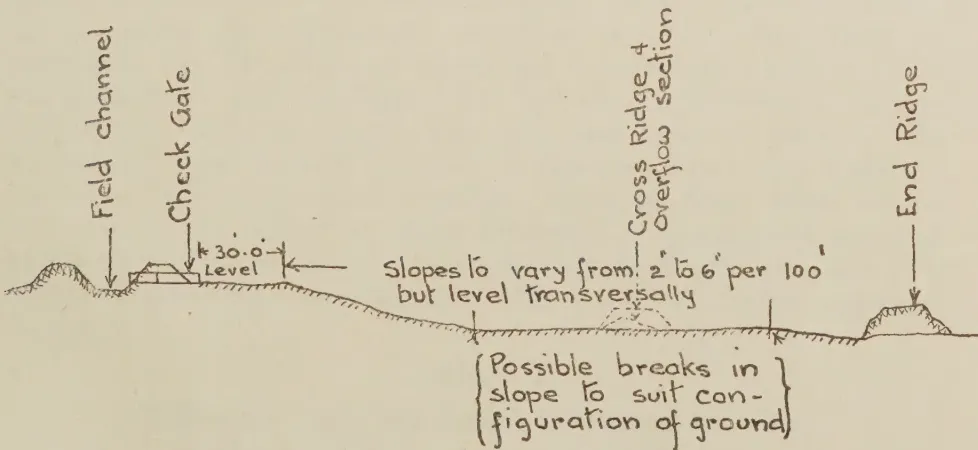
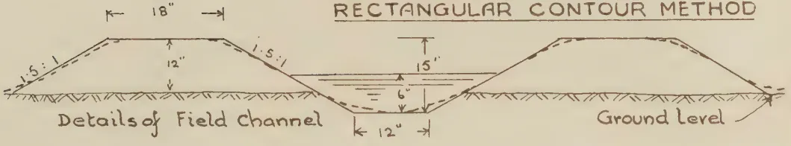
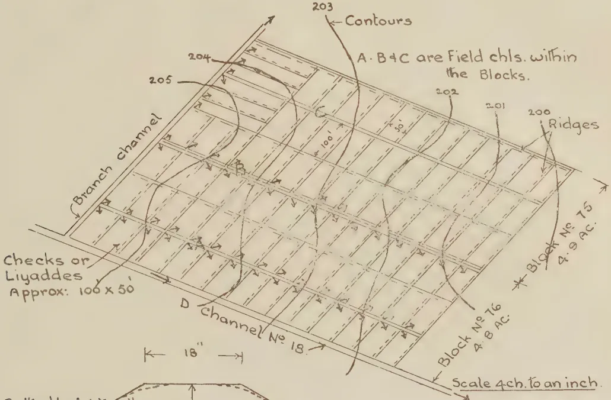
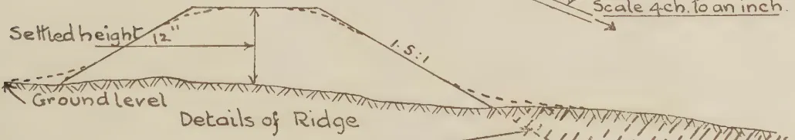
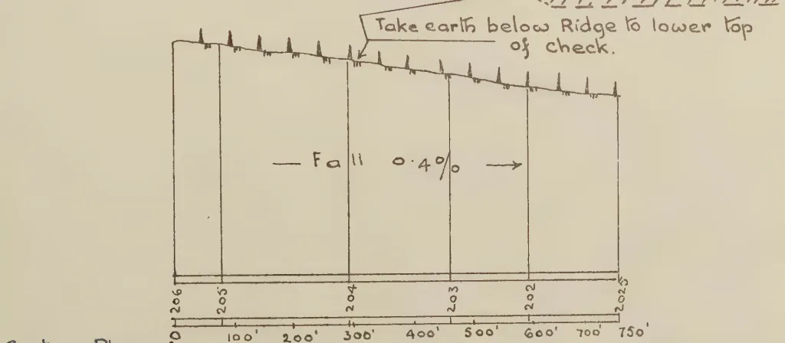
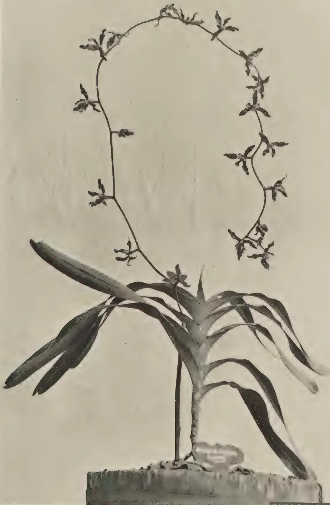

# The Tropical Agriculturist

VOL. XCIII

PERADENIYA, SEPTEMBER, 1939.

No. 3

<table><thead><tr><th></th><th style="text-align: right;">Page</th></tr></thead><tbody><tr><td>Editorial .. .. .</td><td style="text-align: right;">129</td></tr></tbody></table>

## ORIGINAL ARTICLES

<table><tbody><tr><td>Preparation of Lands under Major Irrigation Works for Paddy Cultivation. By R. Kahawita .. .. .</td><td style="text-align: right;">131</td></tr><tr><td>Trials with Soybean in Ceylon. By J. C. Haigh, Ph.D. (Lond.) .. .. .</td><td style="text-align: right;">144</td></tr><tr><td>Notes on Orchids Cultivated in Ceylon—<i>Renanthera Lowii</i>. By E. Perera .. .. .</td><td style="text-align: right;">157</td></tr></tbody></table>

## DEPARTMENTAL NOTE

<table><tbody><tr><td>Paddy Cultivation .. .. .</td><td style="text-align: right;">159</td></tr></tbody></table>

## SEASONAL PLANTING NOTES

<table><tbody><tr><td>Calendar of Work for October and November .. .. .</td><td style="text-align: right;">167</td></tr></tbody></table>

## SELECTED ARTICLES

<table><tbody><tr><td>Farm Drainageways and Outlets .. .. .</td><td style="text-align: right;">173</td></tr><tr><td>Roots .. .. .</td><td style="text-align: right;">179</td></tr></tbody></table>

## MEETINGS, CONFERENCES, &c.

<table><tbody><tr><td>Minutes of the Forty-eighth Meeting of the Rubber Research Board .. .. .</td><td style="text-align: right;">184</td></tr><tr><td>Minutes of the Adjourned Forty-eighth Meeting of the Rubber Research Board .. .. .</td><td style="text-align: right;">188</td></tr></tbody></table>

## REVIEWS

<table><tbody><tr><td>Talks, Verses, Songs, Dialogues, Plays and Recitations on Health .. .. .</td><td style="text-align: right;">189</td></tr></tbody></table>

## RETURNS

<table><tbody><tr><td>Animal Disease Return for the Month ended August, 1939 .. .. .</td><td style="text-align: right;">190</td></tr><tr><td>Meteorological Report for the Month ended August, 1939 .. .. .</td><td style="text-align: right;">191</td></tr></tbody></table>

1—J. N. 86755 (8/39)

1------------------------------------------------

<!-- stage4: FAINT old-images-only -->

[Faint page: no legible print of its own could be verified; text withheld (stage 4 review list)]

2------------------------------------------------

# The Tropical Agriculturist

September, 1939

---

## EDITORIAL

---

### PADDY FARMING AS A CAREER FOR THE SMALL CAPITALIST.

---

**T**HE last number of this journal contained a note on a year's cropping of the paddy seed station at Anuradhapura. This number has a similar note in respect of the paddy seed station at Paranthan. The information that these notes give would at any time be very valuable to agriculturists of this country. At the present moment when the importance of the increase of local food production is recognized by the people, this information has an immediate practical value. We therefore make no apology for drawing the attention of our readers to the two notes.

Full cost accounts began to be kept in departmental seed paddy stations two years ago, and agricultural officers are now in a position to supply authentic and reliable information with regard to the average yields and the cost of production of paddy in the Island—subjects on which inaccurate and unproved statements are often made by enthusiasts with an air of authority. The Anuradhapura station is irrigated from the Nuwara Wewa, is representative of the average paddy soils in the area, and is very unfavourably situated with regard to the supply of water when the level of the tank is low. The Paranthan fields are below the average with regard to soils under the Iranamadu Tank, but are favourably situated with regard to irrigation. The only agricultural practices not available to the small peasant that were adopted at the two stations were the application of fertilizers and the use of a good mould board plough : but they are not beyond the capacity of the small capitalist, and the figures may be studied in relation to the problem of finding agricultural careers for the class of youth for whom the parents can provide about Rs. 2,000 of capital and 75 acres of ready-made paddy land. It should be noted that in the accounts now presented to the public no mention is made of interest on the capital outlay which may be as much as Rs. 400 per acre.

3------------------------------------------------

130

At Anuradhapura the same fields are cultivated in both seasons of the year. The total annual yield of paddy in the station of 36 acres in extent was 2,537 bushels—which gives an average of 70 bushels per acre; cost of production was Re. 1·37 per bushel. At Paranthan a total area of 75 acres was cultivated with paddy during the year—20 acres being put under the crop in both the seasons. From the 75 acres a total yield of 3,894 bushels of paddy was obtained—an average of 52 bushels per acre. The average cost of production in this case was Re. 1·50 per bushel.

If the area of 75 acres were worked by a small capitalist farmer in the same manner as it was worked by the Department, in examining its value to him the Rs. 610 which represented the salary of the conductor may be placed on the side of his income. The sum of Rs. 1,000 obtained by the sale of straw should be left out of consideration because straw is not saleable in all parts of the country. If the capital expenditure on the field is taken to be Rs. 400 per acre and interest is secured on that capital at 5 per cent., the cost of production rises by 40 cents to Re. 1·90 per bushel. Therefore a proprietary farmer who invests Rs. 30,000 in acquiring a paddy farm of 75 acres and has working capital of two to three thousand rupees, can get 5 per cent. per annum on his capital and an income of Rs. 1,800 a year as return for his enterprise if he can sell his paddy at Rs. 2·25 a bushel ex farm. It is believed that if the price is stabilized at Rs. 2·50 a bushel, assuring an income of Rs. 3,000 a year, there will be a general desire to take up paddy cultivation. So long as the price of paddy remains below Re. 1·90 per bushel, the farmer who works with paid labour will incur an annual loss.

Perhaps paddy farming can be made to yield a reasonable income at a lower level of paddy prices for a number of years if the whole of the 75-acre farm is put under paddy in both the seasons—but the practice will lead to the rapid deterioration of the soil and it is not recommended.

4------------------------------------------------

131

## PREPARATION OF LANDS UNDER MAJOR IRRIGATION WORKS FOR PADDY CULTIVATION

R. KAHAWITA,

*IRRIGATION ENGINEER, IRRIGATION DEPARTMENT*

THERE are several Government-subsidized colonization schemes scattered in different parts of the Island wherever there are large irrigation schemes. Colonists who are settled under them are drawn from a semi-agricultural class seldom accustomed to irrigation from a system built on highly scientific lines. On account of their inexperience the advantages of such a system are lost to them and often they feel, when they encounter difficulties, that the system is defective. Also, owing to their wrong methods of irrigation there is an excessive waste of water which we can ill afford in a country where incidence of droughts seems to follow a 5-year cycle.

Before a colonist is settled on the land, it is usual for the Government to clear the jungle for him. Then the colonist is expected to asweddumize the land and start cultivation under the supervision of cultivation officers or colonization officers. We realize that very valuable help can be given to the cultivators at this stage if they are properly advised on the field itself on the best method of preparing the land to suit the configuration of land and the irrigation system already constructed. The following notes are mainly meant to guide those whose duty it is to advise and help colonists in the preparation of their lands.

To save water in the irrigation of paddy, the best soils are those which are nearly, if not entirely, impervious. An impervious top soil or a pervious top soil with an impervious sub-soil at a depth of about 2 feet can be considered to answer the requirements for economic irrigation.

Once the jungle has been cleared, lands could be prepared for cultivation. It would not be necessary to remove stumps except those that may come in the line of the ridges. In the early stages of the development it will be very uneconomic to undertake the removal of large stumps. Stumps up to 28 inches in diameter can be removed by manual labour at an economic rate

5------------------------------------------------

132

in the course of asweddumizing. The depth to which the soil should be free from stumps and roots is about 12 inches. This will allow ploughing even with a heavy, improved type of plough. It is best to leave the removal of large stumps to the second year of cultivation. By then the stumps would be sufficiently dry and decayed to burn. For burning, a method explained in a previous article published in 1938 (*The Tropical Agriculturist November, 1938*) may be employed with advantage.

The class of colonist that is available for settlement under irrigation schemes has no financial resources to develop the land. His capital is his capacity for work and even this is limited owing to his poor physical condition. His labour when capitalized under the prevailing conditions will average to about 60 cents a day of 10 working hours. His physical condition also limits the initial outlay of work in preparing the land to a minimum compatible with his primitive methods of agriculture. To get the best advantage of a modern irrigation system and to harvest a maximum crop with the minimum consumption of water, a good deal of levelling and preliminary work on the land is required. This cannot be expected of the local peasant. Nor is he, even if it be done for him, in a position to pay its cost. For instance, in America where things are done on a "grand scale"—land-levelling and other preparatory work are undertaken by contractors who maintain all the necessary machinery and implements for this type of work. A great deal of attention has been paid to land preparation in that country for two reasons: (a) economy of irrigation water as every scheme is commercialized and every cubic foot of water delivered to the land must be paid for, (b) high yield on well-prepared soils that have been lying fallow for centuries. "Bumper crops" during the first few years more than compensate for the initial outlay on proper land preparation. We may not be able to follow this great country, but if we are keen on seeing the dry zone populated with healthy and efficient peasants, the importance of the economic use of irrigation water cannot be over emphasized. Agricultural possibilities are immense in the dry zone if a regular and unfailing supply of water is available.

The object of land levelling is to grade the land to take an application of water without undue waste and at the same time to bring under cultivation as large an area as possible with the head of water supplied from the channel system. Reasons for some systematic method of preparing the fields are to secure an even distribution of water over the fields which would give a uniform growth to the crop, and to minimize the wastage of water from the fields. In poorly-prepared lands more labour and attention will be required from the cultivator to get a fair distribution of water over his land and, even with the extra

6------------------------------------------------

133

attention paid to his land, yield will be less owing to unequal growth. Labour involved in the preparation of fields can be greatly reduced by adopting the method of applying the water to suit the lay of the land.

In the dry zone, where most of the colonization schemes are situated, the ground surface is fairly flat except for isolated mounds—the work of active termites for several years—and gullies formed by erosion during heavy rains. Sometimes these anthills occur at close and regular intervals forming a miniature range of hills. Not taking into consideration such mounds and undulations, it is seldom that one gets an appreciable variation of levels in a 5-acre block—the unit of land given to each colonist. On account of the nature of the soil formations that occur in the dry zone, no levelling should be carried to a depth of more than 12". Below this, variations of soil may occur giving a spotted yield with different water requirements.

The usual practice is to lay down the main supply system based on a topographical survey of the area long before the land is opened up and, when the land is opened up, to lay down the field system to suit the individual blocks. Before this is actually planned out on the field it is necessary to get an idea of the contours from a contour plan. Such a study will help to choose the method of applying the water to the fields and at the same time to save a good deal of erratic ridging that may be done by a cultivator who fails to pay heed to the topography of his field. In all cases ridging must precede levelling. For, if this is done, water could be admitted to the fields and the extent of levelling required determined. After all, a cultivator will be required to asweddumize his field only once and the benefits of the extra labour involved in efficient asweddumization will be reaped ever after. The better the execution of this first operation, the less will be the time spent in subsequent operations. In well-prepared fields, levels in a *liyadde* or check should not vary more than one to one and a half inches above or below a planned grade. Otherwise extremely high ridges will be required to avoid spotted growth.

Once the nature of the land is known—often it becomes obvious by a tour of observation of the area—the method of applying the water to it can be decided upon. Three methods are available in the irrigation of paddy fields. The first of these is called "strip checks" or *liyaddes*. In this method a sheet of flowing water is confined between two ridges extending lengthwise down the natural slope. Water is taken from a channel at the upper end of the block. Block No. 82 in Plate I. illustrates this method applied to a 5-acre block in the Minneriya Scheme. All the necessary details are given on the plate. It is customary to run the strip checks parallel

7------------------------------------------------

134

to the sides of the block to secure uniform lengths and arrangements of checks and to avoid odd areas. In trying to adhere to this arrangement it may so happen that the ridges run at right angles to the contours so that the slope becomes too steep. In such cases the length of check may be broken up by cross ridges provided with overflow sections. Within the *liyaddes* the ground must be made level transversally so that water will flow over the whole width at an even depth. Slope in the direction of ridges may vary or be uniform. This is controlled by the cost of levelling. Of course an even grade is the ideal. The first 30 feet at the top of the check where the water is admitted must be made level so that the water spread may be distributed evenly across the entire width of the *liyadde* before flow starts down the slope. Earth obtained in levelling this section of check can be used to form the banks of the field channel. In Plate I. an exaggerated long section of a *liyadde* is shown to illustrate the adjustment of slopes without excessive levelling.

Economic slopes for strip checks vary from 2 to 6 inches per 100 feet. Slopes more flat than 2 inches reduce the length of check involving more field channels; and there is no advantage in adopting this method on slopes steeper than 6 inches. It means very high and too many cross ridges. The lighter the soil texture the steeper should the slope be. This will keep the end of the check supplied with sufficient water. There is no definite rule to control the width of a *liyadde* but it should not be narrower than 30 feet in any case and, with small irrigating heads, it should not exceed 60 feet. Length is dependent on the slope, head of water, and the texture of the soil. For the type of soils suitable for paddy cultivation length may vary from 100 feet to 500 feet. Control of water, *i.e.*, duration of an issue, will be extremely difficult in *liyaddes* longer than this. For the information of those to whom it might be of interest, this phase of the problem is treated mathematically in Appendix I. of this article. As a guide, suitable dimensions of strip *liyaddes* are given in Table I.

TABLE I.

<table border="1">
<thead>
<tr>
<th rowspan="3">Irrigating Head Cusecs</th>
<th colspan="4">Soil Types</th>
</tr>
<tr>
<th colspan="2">Heavy Medium</th>
<th colspan="2">Heavy</th>
</tr>
<tr>
<th>Width</th>
<th>Length</th>
<th>Width</th>
<th>Length</th>
</tr>
</thead>
<tbody>
<tr>
<td>1 cusec</td>
<td>.. 30</td>
<td>.. 100 to 150</td>
<td>.. 30</td>
<td>.. 150 to 200</td>
</tr>
<tr>
<td>1 to 2 cusecs</td>
<td>.. 30 to 40</td>
<td>.. 150 to 200</td>
<td>.. 30 to 40</td>
<td>.. 250 to 350</td>
</tr>
<tr>
<td>2 to 3 cusecs</td>
<td>.. 30 to 40</td>
<td>.. 200 to 300</td>
<td>.. 30 to 40</td>
<td>.. 350 to 500</td>
</tr>
</tbody>
</table>

These figures give a variation of head from 0.03 to 0.1 sec. feet per width of check and if a cultivator handles the smallest

8------------------------------------------------

PLATE I  
TWO SAC. BLOCKS  
SHOWING ADAPTATION  
OF CONTOUR AND STRIP METHODS OF  
IRRIGATION  
Scale 4ch. to an Inch.

A plan view diagram of two SAC blocks. The diagram shows a network of channels and ridges. Key features include:
 

- **Check Gates:** Located at the top and bottom left of the main channel.
- **Overflow Section:** A section where water flows over a ridge.
- **Branch channel:** A smaller channel branching off the main one.
- **Ridges:** Lines of ridges running across the fields.
- **Contours:** Lines labeled 197, 198, 199, and 200, indicating elevation.
- **Strip checks:** Two blocks labeled 'Block No 82, 5.6 AC.' and 'Block No 83, 5.6 AC.' with 'Contour checks' indicated.
- **Field channels:** A note states 'A.B.C.D+E are Field chls. within Blocks'.
- **D. channel No 18:** A main channel at the bottom left.

 Arrows indicate the direction of water flow from the main channel through the branches and ridges.

An exaggerated section view through strip Liyadda. The diagram shows a cross-section of the land profile with the following features:
 

- **Field channel:** A channel at the top left.
- **Check Gate:** A gate structure at the top left.
- **Cross Ridge & Overflow section:** A ridge and overflow area in the middle.
- **End Ridge:** A ridge at the bottom right.
- **Slopes:** A note states 'Slopes to vary from: 2' to 6' per 100' but level transversally'.
- **Level:** A horizontal line labeled 'Level' with a 30.0' dimension.
- **Ground Profile:** A wavy line representing the ground surface.
- **Annotations:** A bracketed note says 'Possible breaks in slope to suit configuration of ground'.

 The diagram illustrates the topography and the placement of irrigation infrastructure.

AN EXAGGERATED SECTION THRO. STRIP LIYADDA

Contour plans of Minnerie Scheme.

BLOCK BY SURVEY DEPT. CEYLON.

9------------------------------------------------

A large, faint watermark of a classical building, likely a library or archive, is centered on the page. It features a triangular pediment supported by four columns, with a base and a second level of columns visible.

Digitized by the Internet Archive  
in 2025

[https://archive.org/details/tropical-agriculturist\\_1939-09\\_93\\_3](https://archive.org/details/tropical-agriculturist_1939-09_93_3)

10------------------------------------------------

135

head *i.e.*, 1 cusec, he will be able to get his requirement for a 5-acre block in about 12 hours and the time spent in attending to it is about 3 hours at each watering.

In any kind of irrigation, ridges must be well and substantially made so that the water let into a check may be controlled. If the ridges are properly made at the commencement very little attention will be required during the period the crop is in the field. In well-prepared lands the settled height of a ridge should not be less than 12" with a minimum top width of 18" and side slopes 1 in 1.5—*vide* details in Plate II. Cross ridges employed for the control of flow must be provided with overflow system. A wooden overflow section is illustrated in Plate V. By the adoption of such structure repair and attention to ridges will be practically nil. The cost of making one is about Rs. 5.60. If a cultivator can afford the extra labour, it is a good practice to make fairly wide ridges, say about 3 feet top width. The area of the ridges will not be lost to crop production as vegetables could be grown on them successfully and with very little extra attention. This will be a source of income to the owner besides providing him with food during the cultivation season.

The usual practice of cutting channel bunds to take water and of cutting ridges (called *wakkades*) to pass the water from *liyadde* to *liyadde* should be discouraged as it involves extra labour in the control and distribution of water. Also it results in excessive and careless waste. Use of portable structures made of wood should be encouraged. These can be removed from the fields when the cultivation is over and re-inserted when the next cultivation season begins. Outlets from channels, check gates or regulators, overflow sections, and falls in channels, can be made of wood by a cultivator with a little experience in the handling of a few carpenter's-tools. These structures, properly cared for, will last several years. The writer has tried several of them in Nachchaduwa and Kagama Schemes with very good results. Already they have lasted over two years with very little attention. Designs for some of these structures as used by him are given in Plates III. and IV ; Table 2 gives the approximate quantities of timber required for each.

TABLE 2Approximate Timber Requirements for suggested Structures

<table>
<tr>
<td>1. Wooden drops</td>
<td>..</td>
<td>32 sq. ft.</td>
</tr>
<tr>
<td>2. Check Gates ..</td>
<td>..</td>
<td>15 sq. ft.</td>
</tr>
<tr>
<td>3. Overflow sections</td>
<td>..</td>
<td>28 sq. ft.</td>
</tr>
</table>

It is not necessary to have a continuous flow of water down a strip ; once the required depth of water is admitted into the *liyadde* the supply may be cut off. It may be done even before

11------------------------------------------------

136

the water has reached the end of the *liyadde*. Such a practice will prevent any wastage which is very important in successful irrigation.

Later when the fields are ready to take a plough, the first plough-share should be transverse to the *liyadde* and the second along the strip. This will produce checks of uniform slopes after a few seasons.

Taking the 5-acre block No. 82 illustrated as a typical field where the strip method of irrigation can be adopted, the cost of preparing one acre is Rs. 145. This rate is calculated on a contract rate basis but where a cultivator himself prepares the field with no intent of gain but to get his field asweddumized, it will, expressing the labour spent in the various operations in terms of money at 60 cents per diem, cost him from Rs. 130 to Rs. 135 per acre. Expenditure is distributed as follows :

<table>
<thead>
<tr>
<th></th>
<th style="text-align: right;">Rs. c.</th>
</tr>
</thead>
<tbody>
<tr>
<td>(1) Jungle clearing (usual rate for dry zone jungle) ..</td>
<td style="text-align: right;">35 0</td>
</tr>
<tr>
<td>(2) Stumping (can be spread over 2 years) ..</td>
<td style="text-align: right;">30 0</td>
</tr>
<tr>
<td>(3) 60 cubes of earthwork in channels and ridges at Re. 1 ..</td>
<td style="text-align: right;">60 0</td>
</tr>
<tr>
<td>(4) About 4 wooden structures at Rs. 5 ..</td>
<td style="text-align: right;">20 0</td>
</tr>
<tr>
<td></td>
<td style="text-align: right; border-top: 1px solid black;">145 0</td>
</tr>
</tbody>
</table>

Earth for the ridges should be obtained by cutting mounds and in levelling the *liyadde* in a transverse direction. In doing this the maximum carry is the width of the *liyadde*. Before taking earth, the top soil must be scraped and heaped separately to be spread over the surface after levelling as top soil is very rich in manure in newly opened up land.

Field channels within a block form an important feature in irrigation. Therefore as much care as is given to asweddumizing must be given to the construction of channels. As a guide, Table 3 gives channel data for 3 different sizes of field channels.

TABLE 3Carrying capacity of Field Channels

<table>
<thead>
<tr>
<th rowspan="3">Grade Per Cent.</th>
<th colspan="6">Capacity in cusec</th>
<th colspan="2" rowspan="2">Side slopes = 1.5 : 1.</th>
</tr>
<tr>
<th colspan="2">3"</th>
<th colspan="2">6"</th>
<th colspan="2">9"</th>
</tr>
<tr>
<th>V</th>
<th>Q</th>
<th>V</th>
<th>Q</th>
<th>V</th>
<th>Q</th>
<th></th>
<th></th>
</tr>
</thead>
<tbody>
<tr>
<td>0.1 ..</td>
<td>0.46 ..</td>
<td>0.19 ..</td>
<td>0.72 ..</td>
<td>0.72 ..</td>
<td>0.93 ..</td>
<td>1.66 ..</td>
<td></td>
<td></td>
</tr>
<tr>
<td>0.2 ..</td>
<td>0.65 ..</td>
<td>0.26 ..</td>
<td>1.02 ..</td>
<td>1.02 ..</td>
<td>1.33 ..</td>
<td>2.37 ..</td>
<td></td>
<td></td>
</tr>
<tr>
<td>0.4 ..</td>
<td>0.93 ..</td>
<td>0.38 ..</td>
<td>1.45 ..</td>
<td>1.45 ..</td>
<td>1.89 ..</td>
<td>3.36 ..</td>
<td></td>
<td></td>
</tr>
<tr>
<td>0.5 ..</td>
<td>1.04 ..</td>
<td>0.42 ..</td>
<td>1.62 ..</td>
<td>1.62 ..</td>
<td>2.10 ..</td>
<td>3.74 ..</td>
<td></td>
<td></td>
</tr>
<tr>
<td>0.6 ..</td>
<td>1.13 ..</td>
<td>0.46 ..</td>
<td>1.78 ..</td>
<td>1.78 ..</td>
<td>2.31 ..</td>
<td>4.11 ..</td>
<td></td>
<td></td>
</tr>
</tbody>
</table>

12------------------------------------------------

PLATE II  
TWO BLOCKS SHOWING ADAPTATION OF  
RECTANGULAR CONTOUR METHOD

This diagram shows a cross-section of a field channel. The top width is 18". The left side has a slope of 1.5:1, and the right side has a slope of 1.5:1. The depth of the channel is 12". The bottom width is 12". The water level is 6" above the channel bottom. The ground level is 15" above the water level. The label "Details of Field Channel" is below the left side, and "Ground Level" is on the right.

This plan view shows a rectangular field divided into a grid of blocks. Contour lines are labeled 200, 201, 202, 203, 204, and 205. A "Branch channel" runs along the top-left edge, and "D channel No 18" runs along the bottom edge. The blocks are labeled "Block No 75 4.9 AC." and "Block No 76 4.8 AC.". A note states "A.B.C are Field chls. within the Blocks." and "Checks or Liyaddes Approx: 100 x 50". The scale is given as "Scale 4ch. to an inch."

This diagram shows a cross-section of a ridge. The "Settled height" is 12". The slope is 1.5:1. The "Ground level" is indicated by a dashed line. The label "Details of Ridge" is below the diagram.

This diagram is a "LONG SECTION OF BLOCK No. 76". It shows a series of vertical lines representing contour elevations: 206, 205, 204, 203, 202, and 201. The horizontal axis is marked in feet from 0 to 750'. A note says "Take earth below Ridge to lower top of check." and "Fall 0.4%".

Contour Plans of Minnerie Scheme  
LONG SECTION OF BLOCK No. 76  
 BLOCK BY SURVEY DEPT. CEYLON.

13------------------------------------------------

<!-- stage4: FAINT old-images-only -->

[Faint page: no legible print of its own could be verified; text withheld (stage 4 review list)]

This image is a scan of a blank page. The paper has a light beige or cream-colored tint. There are a few very small, dark specks scattered across the surface, which appear to be scanning artifacts or dust particles. No text, lines, or other markings are present on the page.

14------------------------------------------------

PLATE III  
6" x 9" WOODEN CHECK GATE OR REGULATOR

Scale  
 1" = 2'0"

FIELD ARRANGEMENT OF CHECK GATE

{ 1/2" x 1/2" Battens to form grooves for planking arrangements.

Scale 1" = 1'

PLAN

SECTIONAL ELEVATION

BLOCK BY SURVEY DEPT. CEYLON.

15------------------------------------------------

This image is a scan of a blank page. The paper has a light beige or cream-colored tint. There are a few very small, dark specks scattered across the surface, which appear to be scanning artifacts or dust particles. No text, lines, or other markings are present on the page.

16------------------------------------------------

137TABLE 3—contd.

Bed width = 18".

Side slopes = 1.5 : 1.

<table border="1">
<thead>
<tr>
<th rowspan="3">Grade Per Cent.</th>
<th colspan="10">Capacity in cusec</th>
</tr>
<tr>
<th colspan="4">3"</th>
<th colspan="4">6"</th>
<th colspan="2">9"</th>
</tr>
<tr>
<th colspan="2">V</th>
<th colspan="2">Q</th>
<th colspan="2">V</th>
<th colspan="2">Q</th>
<th colspan="2">V</th>
<th colspan="2">Q</th>
</tr>
</thead>
<tbody>
<tr>
<td>0.1 ..</td>
<td>0.47</td>
<td>..</td>
<td>0.22</td>
<td>..</td>
<td>0.80</td>
<td>..</td>
<td>0.96</td>
<td>..</td>
<td>0.97</td>
<td>..</td>
<td>1.91</td>
<td>..</td>
</tr>
<tr>
<td>0.2 ..</td>
<td>0.67</td>
<td>..</td>
<td>0.32</td>
<td>..</td>
<td>1.13</td>
<td>..</td>
<td>1.36</td>
<td>..</td>
<td>1.37</td>
<td>..</td>
<td>2.72</td>
<td>..</td>
</tr>
<tr>
<td>0.4 ..</td>
<td>0.95</td>
<td>..</td>
<td>0.45</td>
<td>..</td>
<td>1.60</td>
<td>..</td>
<td>1.92</td>
<td>..</td>
<td>1.95</td>
<td>..</td>
<td>3.84</td>
<td>..</td>
</tr>
<tr>
<td>0.5 ..</td>
<td>1.06</td>
<td>..</td>
<td>0.50</td>
<td>..</td>
<td>1.79</td>
<td>..</td>
<td>2.15</td>
<td>..</td>
<td>2.18</td>
<td>..</td>
<td>4.28</td>
<td>..</td>
</tr>
<tr>
<td>0.6 ..</td>
<td>1.17</td>
<td>..</td>
<td>0.55</td>
<td>..</td>
<td>1.96</td>
<td>..</td>
<td>2.35</td>
<td>..</td>
<td>2.39</td>
<td>..</td>
<td>4.70</td>
<td>..</td>
</tr>
</tbody>
</table>

Bed width = 24".

Side slopes = 1.5 : 1.

<table border="1">
<thead>
<tr>
<th rowspan="3">Grade Per Cent.</th>
<th colspan="10">Capacity in cusec</th>
</tr>
<tr>
<th colspan="4">6"</th>
<th colspan="4">9"</th>
<th colspan="2">12"</th>
</tr>
<tr>
<th colspan="2">V</th>
<th colspan="2">Q</th>
<th colspan="2">V</th>
<th colspan="2">Q</th>
<th colspan="2">V</th>
<th colspan="2">Q</th>
</tr>
</thead>
<tbody>
<tr>
<td>0.05 ..</td>
<td>0.58</td>
<td>..</td>
<td>0.84</td>
<td>..</td>
<td>0.71</td>
<td>..</td>
<td>1.66</td>
<td>..</td>
<td>0.85</td>
<td>..</td>
<td>2.98</td>
<td>..</td>
</tr>
<tr>
<td>0.1 ..</td>
<td>0.82</td>
<td>..</td>
<td>1.19</td>
<td>..</td>
<td>1.00</td>
<td>..</td>
<td>2.35</td>
<td>..</td>
<td>1.20</td>
<td>..</td>
<td>4.20</td>
<td>..</td>
</tr>
<tr>
<td>0.2 ..</td>
<td>1.16</td>
<td>..</td>
<td>1.69</td>
<td>..</td>
<td>1.42</td>
<td>..</td>
<td>3.32</td>
<td>..</td>
<td>1.70</td>
<td>..</td>
<td>5.94</td>
<td>..</td>
</tr>
<tr>
<td>0.4 ..</td>
<td>1.65</td>
<td>..</td>
<td>2.39</td>
<td>..</td>
<td>2.01</td>
<td>..</td>
<td>4.71</td>
<td>..</td>
<td>2.41</td>
<td>..</td>
<td>8.43</td>
<td>..</td>
</tr>
<tr>
<td>0.6 ..</td>
<td>2.03</td>
<td>..</td>
<td>2.94</td>
<td>..</td>
<td>2.48</td>
<td>..</td>
<td>5.80</td>
<td>..</td>
<td>2.94</td>
<td>..</td>
<td>10.30</td>
<td>..</td>
</tr>
</tbody>
</table>

A second method of irrigation is called rectangular and contour *liyaddes*. The principle underlying the two methods are the same. The difference, as the names indicate, is in the shape of the *liyaddes*. In this method water is admitted to, and ponded in, each check surrounded by well-formed ridges. Water is not allowed to flow from *liyadde* to *liyadde*. The head in each field is more or less self-adjusting to suit the head in the field channel. In-flow from channel to check will be just sufficient to compensate for losses. This system admits of easy control and reduces waste to a negligible quantity.

Rectangular checks are prepared at right angles to the sides of the block of land where the block itself is of the same shape. The ground within a rectangular check is made level or nearly level. From the arrangement of the checks it will be obvious that this method is well adapted to fields where the contours are at right angles to the sides of the field. It is illustrated in Plate II. where all the details are shown.

The width of a rectangular check is controlled by the rate at which the land slopes. This method could be adopted with general slopes of two-thirds of an inch to 4 inches per 100 feet. Then the maximum width of a check will not exceed 66 feet as the water has to flow to the farthest end of the field unaided by the fall of levels. Lengths should not exceed 300 feet. If the lands are fairly level, square checks of a maximum size of 200 feet square can be used. The longer the checks, the less will be the spacing of field channels within the block.

17------------------------------------------------

138

If the field channels are not carefully spaced, the advantages gained by adopting this method are lost. Field channels are run down the slope and the water is admitted directly into each *liyadde*, but in irregular areas, to save too many channels water may be admitted from one *liyadde* to the next through overflow sections (Plate V.) in the ridges. This should, at any event, be limited to two or three *liyaddes*.

The size and type of ridges are shown in Plate II. Earth for these should be taken from the upper end of the lower *liyadde* and never from the lower side of the upper *liyadde* unless there is a mound. Here the carry of earth will not be more than one third of the width of the *liyadde*. Structures required to distribute water and minimize field maintenance are the same as already described.

The cost of preparing an acre of land for this type of irrigation is about Rs. 150. In this method a quantity of about 20 cubes of earth more than that required in strip method is necessary in reducing grade.

In Plate I., Block No. 83 is arranged for contour checks. This method can be used for irregularly shaped blocks and where the contours are not regular. In both these methods if the ridges are fairly high and of substantial proportions fair differences of elevation within a *liyadde* may occur. When this method is applied to very steep land it becomes a form of terracing as done in the up-country rice fields. The maximum size of a contour *liyadde* should not be more than one fifth of an acre. Sizes larger than this require large heads and result in waste. In this method also water is delivered directly into each *liyadde*. One disadvantage of this method is the irregular shape of checks and the non-uniformity of the lay-out of the field channels.

Ridges and field channels are similar to those used in the other methods except that the ridge along the contour includes the difference in elevation of the adjacent *liyadde*. Earth for the ridges is taken from the high side of the lower *liyadde*. According to the amount of levelling involved, ridges may be run at intervals of 4 inches to 6 inches difference of elevations. Here again water may be admitted from *liyadde* to *liyadde* through overflow sections in the ridges but the maximum run through the checks should not exceed 400 feet.

After the stumps have been removed and the fields are ready for ploughing, the first furrow must be with the contour and the second at right angles to it. And if mudding is done, floating after mudding should be done from the upper to the lower end. If the operations are adopted in this order fields will be rendered fairly level after about two seasons.

18------------------------------------------------

PLATE IV

WOODEN DROPS FOR FIELD CHANNELS

Scale 1" = 1'-0"

The plan view shows a rectangular structure with a width of 3'-6" and a depth of 2'-0". It is divided into two main sections, each 2'-0" high, separated by a 1'-0" wide central channel. The structure is built on a bed of channel (bed of chl.) indicated by vertical lines. The components are labeled as follows:

- **1/4" Planks:** The top horizontal planks of the structure.
- **2"x 1/2" Battens:** Vertical planks supporting the top planks.
- **2"x 1/2" Braces:** Horizontal planks supporting the battens.
- **1/2" x 1/2" struts:** Diagonal braces connecting the vertical posts.

PLAN

The long sectional elevation shows the structure's profile. It has a total length of 6" + 2'-0" + 1'-0" = 3'-6". The structure is supported by a bed of channel (bed of chl.) at both ends. The components and dimensions are labeled as follows:

- **Bed of chl.:** The base of the structure at both ends.
- **Planks:** The horizontal planks of the structure.
- **1/2" x 1/2" struts:** Diagonal braces connecting the vertical posts.
- **1 in 2:** The slope of the structure from the left end to the right end.
- **Dimensions:**
  - Left end: 6" wide, 9" high.
  - Right end: 1'-0" wide, 1'-9" high.
  - Bed of chl. at right end: 6" high.
  - Right end width: 1'-6".

LONG SECTIONAL ELEVATION

BLOCK BY SURVEY DEPT. CEYLON.

19------------------------------------------------

This image is a scan of a blank page. The paper has a light beige or cream-colored tint. There are a few very small, dark specks scattered across the surface, which appear to be scanning artifacts or dust particles. No text, lines, or other markings are present on the page.

20------------------------------------------------

PLATE Σ

OVER FLOW SECTION  
Scale 1" = 1'-0"

This diagram consists of two parts: an over flow section and a plan view. The over flow section shows a cross-section of a bridge deck with a width of 3'-0". The deck is supported by two piers, each with a width of 1'-6". The plan view shows the bridge deck as a long rectangle with a width of 3'-0". The deck is constructed with 1/4" planks. The plan view also shows the piers and the surrounding terrain.

PLAN

This diagram is a long section view of a bridge structure. It shows a cross-section of the bridge deck with a width of 6". The deck is supported by a 3x2" batten. The deck is constructed with 1/4" planks. The section view also shows the field level, the earth filling, and the 3'-0" level. The section view shows a total width of 1'-6" + 1'-6" + 1'-6" = 4'-6". The section view also shows a 3" and 9" dimension. The section view also shows a 1/4" dimension. The section view also shows a 3" and 9" dimension. The section view also shows a 3'-0" level. The section view also shows a 1/4" dimension.

LONG SECTION

BLOCK BY SURVEY DEPT. CEYLON.

21------------------------------------------------

This image is a scan of a blank page. The paper has a light beige or cream-colored tint. There are a few very small, dark specks scattered across the surface, which appear to be scanning artifacts or dust particles. No text, lines, or other markings are present on the page.

22------------------------------------------------

139

Cost of preparing lands for contour methods, including jungle clearing, stumping, &c., is about Rs. 150 per acre. Details of cost for lands in the Dry Zone are the same as for the strip method except for earth work which may be about 15 per cent. more or less according to the slope of the land.

## APPENDIX I.

### A Mathematical Analysis of Strip Irrigation

Same notations as were used in analysing flow of water in furrows discussed in an article published in *The Tropical Agriculturist* of November, 1938, are followed here. Let  $Q$  cusec be the amount of water flowing through the gate into each strip  $b$  feet wide. Then water flowing over unit width of strip will be  $\frac{Q}{b}$  cusec. Let this be equal to  $q$  cusec. Let total time water is let into the strip be  $T$  seconds. This will be equal to  $t_1$ , time taken to reach end of strip and  $t_2$ , time the water allowed to flow after it has reached the end of strip. Then  $T = t_1 + t_2$ . Then total quantity of water flowing over a unit width of strip is  $qT$  cubic feet =  $d_1 l$  where  $d_1$  is depth of water over strip and  $l$  length of strip. Total quantity of water absorbed into the soil during time  $T$  is  $d_1 = uT$ . For meaning and values of  $u$  *vide* article referred to above. In time  $dt$ ,  $q dt$  flows into the strip, when it has flooded a length  $x$  feet in time  $dt$  percolation is equal to  $u dt x$  and the amount flowing down is  $d_2 dx$  where  $d_2$  is depth of water over strip after time  $dt$ . Hence we have the volumetric relation

$$q dt = u x dt + d_2 dx$$

$$dt = \frac{d_2 dx}{q - ux}$$

$$\text{then } t_1 = \int_{x=0}^{x=1} \frac{d_2 dx}{q - ux}$$

Solution of this equation is

$$t_1 = \frac{d_2}{u} \log_e \frac{q}{q - ul}$$

From the relation  $qT = d_1 l$  we get

$$\frac{q}{q - ul} = \frac{d}{d - d_1} \quad \text{Let } \frac{d}{d_1} = B$$

$$\text{Then } \frac{q}{q - ul} = \frac{B}{B - 1}, \text{ then } t_1 = \frac{d_2}{u} \log_e \frac{B}{B - 1} \text{ in terms of } B$$

$B$  is the ratio of applied depth to depth absorbed into the soil so that minimum value of  $B$  will be unity. The following table gives the values of  $\log_e \frac{B}{B - 1}$  for values of  $B$  ranging from 1 to 5 :—

<table border="1">
<thead>
<tr>
<th><math>B</math></th>
<th>1</th>
<th>1.1</th>
<th>1.2</th>
<th>1.3</th>
<th>1.4</th>
<th>1.5</th>
<th>2</th>
<th>3</th>
<th>4</th>
<th>5</th>
</tr>
</thead>
<tbody>
<tr>
<td><math>\log_e \frac{B}{B - 1}</math></td>
<td>00</td>
<td>2.4</td>
<td>1.8</td>
<td>1.5</td>
<td>1.2</td>
<td>1.1</td>
<td>0.7</td>
<td>0.4</td>
<td>0.29</td>
<td>0.22</td>
</tr>
</tbody>
</table>

23------------------------------------------------

140

If the ground within the strip is well prepared and levelled transversely as explained earlier, applied head of water may be very small, one-third of an inch to an inch. Otherwise it may have to be as much as 3 to 4 inches. In paddy cultivation it is the practice to pond 2" to 3" between two successive irrigations and in good paddy clay permeability  $u$  is very small—about 0.1 to 0.13 inches per hour. Hence percolation will be very little so that  $B$  will have a high value generally between 3 to 5 according to the applied head.  $t_2$  is the time required to maintain flow to obtain a pondage of 2" to 3". Percolation during this time is  $ut_2 = d_3$  where  $d_3$  may include not only percolation but also evaporation and other losses.

$$\text{Then } T = t_1 + t_2 = \frac{d_2}{u} \log_e \frac{B}{B-1} + \frac{d_3}{u}$$

From this, duration of an issue to a strip can be found once the nature of the soil including subsoil and the required depth of pondage is known.

From  $B = \frac{d}{d_1}$  it can be shown that  $q = Blu$  for a unit width of strip 1 foot long per unit of time. Then if width of strip is  $b$  irrigating head  $Q = blBu$  cubic feet per second per strip. This also expresses the duty of water in terms of soil conditions, *i.e.*, if  $\Delta$  is duty of water in acres per cusec, then  $\Delta = \frac{24.P}{43560 Bu.T_1}$  acres per cusec where  $u$  expresses permeability,  $B$  a ratio of irrigating head to depth of percolation,  $T_1$  duration of irrigation in hours and  $P$  interval between two successive irrigation in days.

## APPENDIX II.

### A Note on developing a 5-acre Block in the Dry Zone for irrigated Crops

It is assumed that the jungle is cleared by Government before the peasant is introduced to the land, so that when he takes over the block he is expected to asweddumize the land by stages and complete development in three years.

Jungle must be cleared and burnt by end of July so that a peasant may take possession of a block in August. From August to October he should get the lower half of his block ( $B$  in sketch), about  $2\frac{1}{2}$  acres in extent, ready to put in a chena crop of millet, maize, varieties of pumpkins, mustard, a few varieties of vegetables, yams such as tapioca, sweet potatoes and even an acre of hill paddy.

<table border="1">
<tr>
<td rowspan="2" style="writing-mode: vertical-rl; transform: rotate(180deg); text-align: center;">Channel</td>
<td style="text-align: center;">A Upper half. <math>2\frac{1}{2}</math> acres.</td>
<td style="text-align: center;">B Lower half. <math>2\frac{1}{2}</math> acres.</td>
</tr>
</table>

In a normal year this operation will be over towards middle of October and the cultivator will await the N.-E. monsoons which generally starts early in October. When he has put in his chena crop he should commence to asweddumize the upper half of the block, *i.e.*,  $A$  in sketch, about  $2\frac{1}{2}$  acres in extent. If he does this systematically and on the principles explained in the main section

24------------------------------------------------

141

of this article he will have to do about 150 to 200 cubes of earthwork on the ridges and field channels within his block. According to the variety of paddy cultivated he will have from five to six months to get this area ready for a *yala* sowing, *i.e.*, during April-May of the following year he can put in an irrigated paddy crop. This will also allow him a month to gather his chena cultivation in about February-March and prepare the same half B to put in a gingelly crop in April if he desires so. After he has sown the upper half of his block with a three- or four-month *yala* paddy he will have about a month to wait to clear the gingelly crop, about June-July, if he has put in one. When he has cleared this he should start to asweddumize the lower half of the block. This type of work during June will not be difficult on account of the seepage, leaks, &c. from the fields above. The soil will be sufficiently damp for easy levelling and forming ridges. The amount of work involved will be the same and similar to that in the upper half. But he will not be able to get this ready for the coming *maha* sowing for he will have to harvest the *yala* crop in August-September. So, instead of starting a *maha* in the incomplete lower half, after gathering the *yala* crop he should prepare the same half A for a *maha* which should be over by the end of November for a four month paddy. Then from December to March he continues to asweddumize the lower half B. In March he will gather the *maha* crop in the upper half A and he will have the lower half B ready to put in a *yala* four month paddy in mid April. During this *yala* season he rests the upper half A but starts removing stumps. By this time the stumps would be sufficiently dry and rotted to be burnt or pulled out. Stumping of this area should be completed by the commencement of the following *maha*. After gathering in the *yala*, the whole of the block is prepared for *maha*. By this time he will have half of his block fully developed and the other half ready to be stumped. When he has gathered in a 5-acre *maha* crop in March, he prepares only the upper half A for *yala*. While the *yala* crop is ripening he should set to stump the lower half B and get it ready for cultivating during the following *maha* season. For this season he will have the full block developed and from thence onward he can follow the usual cultivation routine practised in the area.

To make it more clear a schedule of the various operations involved is given below in the sequence in which they should occur. This may be termed a colonist's programme of work in opening up his block.

*First year :—*

- August-October. Prepare lower half B and put chena crop.
- October-March. Asweddumize upper half A.
- March-April. Gingelly in B after gathering chena crop.
- April-May. Sow A for a 4-month paddy *yala*.
- June-September. Asweddumize B after gathering gingelly ; also A to be harvested August-September.

*Second year :—*

- October-November. Sow A with a 4-month paddy *maha*.
- November-March. Continue to asweddumize B and complete it for *yala*.
- March. Gather *maha* in A.
- April-May. Sow B with a 4-month paddy *yala*.
- May-September. Rest A but burn and remove stumps.

*Third year :—*

- October-November. Sow A and B with a 4-month paddy *maha*.
- November-March. No regular work in his block ; so he can attend to any non-irrigated crop if he has been given any land for this purpose. Harvesting in March.

25------------------------------------------------

142

April-May. Rest B, and sow A with 4-month paddy *yala*.

May-September. Remove and burn stumps in B.

October-November. Sow full area A and B with a *maha* paddy.

*Financial position.*—As stated earlier it is assumed that the peasant has no jungle to be cleared on his land. The items of work he will be called up to perform on coming to the land are asweddumizing, stumping and cutting field channels. Also he will have to make or get made a certain number of wooden structures. In the above programme of work no consideration has been given to the question of housing or building a house for himself. It would be taxing his labour resources too much if he is expected to build a habitable house for himself. Results would be more satisfactory if he is provided with a house when he is settled on the land. The cost of a two-roomed semi-permanent building will be about Rs. 250, so that cost per acre on a 5-acre unit will be Rs. 50. From these figures we itemize the inclusive cost of developing an acre of land as follows :—

(Inclusive cost of developing an acre of land in the dry zone for paddy : items).

<table>
<thead>
<tr>
<th></th>
<th>Rs. c.</th>
</tr>
</thead>
<tbody>
<tr>
<td>Jungle clearing per acre .. ..</td>
<td>35 0</td>
</tr>
<tr>
<td>Stumping per acre .. ..</td>
<td>30 0</td>
</tr>
<tr>
<td>Ridging and canalizing as explained in the article per acre .. ..</td>
<td>65 0</td>
</tr>
<tr>
<td>Wooden structures per acre .. ..</td>
<td>20 0</td>
</tr>
<tr>
<td></td>
<td>
</td>
</tr>
<tr>
<td></td>
<td>150 0</td>
</tr>
<tr>
<td>Housing .. ..</td>
<td>50 0</td>
</tr>
<tr>
<td></td>
<td>
</td>
</tr>
<tr>
<td>Per acre</td>
<td>200 0</td>
</tr>
</tbody>
</table>

This will form the working basis for developing an acre of land.

In the selection of colonists it is preferable to get married men between the ages of 30 and 40 years. A married colonist with a family is more stable than a bachelor who by nature has a tendency to wander about. Also the unit of land to be finally settled on the colonist should be sufficiently large to give him an income to maintain himself and family well above the border line of destitution. It should secure him a decent living and help him to become a respectable member of the community. According to the present day cost of commodities, it is estimated that such a standard for a family of four members could be purchased for Rs. 22.50 per mensem augmented by a certain amount of home produce.

In accordance with the programme of development drawn up for a colonist he will have no income whatsoever from his allotment during the first six months of occupation on the land. At the end of the first year he will have a chena crop of  $2\frac{1}{2}$  acres, a gingelly crop and  $2\frac{1}{2}$  acres of paddy crop. At the end of the first half of the second year he will harvest  $2\frac{1}{2}$  acres of *maha* paddy ; end of the second year  $2\frac{1}{2}$  acres of paddy ; end of the first half of the third year 5 acres of paddy and at the end of third year  $2\frac{1}{2}$  acres of paddy. Then if any subsidy is given by Government it must be distributed as follows :—

First six months a family of 3 or more should receive Rs. 22.50 per month.  
Income from allotment = nil.

Second six months his income from chena is Rs. 8 per mensem on the basis of Rs. 20 per acre. Government grant Rs. 15 per mensem.

26------------------------------------------------

143

First half of second year at 40 bushels to an acre in new clearings and at Re. 1.50 per bushel his income is Rs. 25 per mensem. No Government grant is necessary from the second year onwards.

Thereafter he should be able to secure an average income of Rs. 25 per mensem from his allotment of 5 acres.

On this basis total money payments to a colonist will be Rs. 135 + Rs. 90 = Rs. 225 during the first year. For this the colonist is expected to do the following works on his land :—

<table style="width: 100%; border-collapse: collapse;">
<thead>
<tr>
<th style="text-align: left;"></th>
<th style="text-align: right;">Rs. c.</th>
</tr>
</thead>
<tbody>
<tr>
<td>1st year : asweddumize according to the method explained in this article <math>2\frac{1}{2}</math> acres at Rs. 65 ..</td>
<td style="text-align: right; vertical-align: bottom;">162 50</td>
</tr>
<tr>
<td>2nd year : asweddumize <math>2\frac{1}{2}</math> acres at Rs. 65 ..</td>
<td style="text-align: right; vertical-align: bottom;">162 50</td>
</tr>
<tr>
<td>3rd year : stump 5 acres at Rs. 30 ..</td>
<td style="text-align: right; vertical-align: bottom;">150 0</td>
</tr>
<tr>
<td></td>
<td style="text-align: right; border-top: 1px solid black; border-bottom: 1px solid black;">475 0</td>
</tr>
</tbody>
</table>

The difference of Rs. 250 between the direct payments to him and the work put into the land—which must be of the specified standard—will cover the cost of jungle clearing—Rs. 175, and Rs. 75 to cover the cost of portable wooden structures if it is decided to supply them ready made to the colonist, or it may be credited to him as his contribution towards his dwelling. The actual Government grant to a colonist will be Rs. 175 in building a house for him.

27------------------------------------------------

144

## TRIALS WITH SOYBEAN IN CEYLON

J. C. HAIGH, Ph.D.,  
BOTANIST

MUCH has been written in recent years on the virtues of the soybean, and it is not the object of this article to add to the catalogue of the uses to which it may be put. An article contributed to the local press (11) gave selections from this catalogue, and it is our intention to publish details of the ways in which the soybean can be used, as a part of the departmental propaganda programme. It will suffice here to state that the seed contains the vitamins A, B and D that are present in milk, that the sprouted seedling also contains vitamin C, that the seed is rich in calcium, sodium, manganese and phosphorus, and that its reserve food is in the form of protein, of which it contains 40 per cent., and oil (17 per cent.) whereas other pulses have very little of these substances, and store most of their reserves as starch or sugar. It can therefore be used in place of meat and it is of particular value to sufferers from diabetes.

The object of this article is to describe those experiments that have been carried out in order to determine the conditions under which the soybean is best grown in Ceylon. The greater part of the voluminous literature deals with its cultivation in temperate and sub-tropical climates, and, while the technique there used is invaluable as a basis on which to work, it is inevitable that modifications should be necessary under tropical conditions. It has also been necessary to choose between the enormous number of varieties that have been used or evolved in every country in which the cultivation of soybean has become established. Our trials are still in progress, but we have collected sufficient information to be able to make general recommendations, and it is hoped to deal with matters of detail in a subsequent article.

We have tried thirty-two varieties, varying considerably in size and colour. The largest has an average weight of 30 grammes per 100 seeds (or say 1,500 seeds to the pound) and the smallest weigh only 5 grammes per 100 seeds (9,000 seeds per pound). The colours include yellow, green, brown and black, and the seeds vary in shape from flattened to almost spherical,

28------------------------------------------------

145

and in hardness, the small seeds being generally harder than the large ones. It has been found convenient to divide the varieties into two main classes according to seed size, because other characters appear to be correlated with it. Generally speaking, the large-seeded varieties mature in 3–3½ months, the vegetative growth is poor so that they must be planted close together, the yield is not good, but the seeds are comparatively soft and easily cooked ; whereas the smaller-seeded varieties require 4–5½ months to mature, they can be planted fairly widely and will give a good volume of green material and also a good crop of seed, but the seeds are hard. One or two varieties with very small seeds are climbers and have a very long vegetative period and are suitable only as green manure or fodder plants.

The first trials were made with samples of seed and were perforce carried out in very small plots, so that statistical comparison of results was not possible. The primary object of the trials was acclimatization and multiplication of seed, but opportunity was taken to make general observations on factors that were likely to be of importance, to serve as a guide for more precise trials to be carried out at a later date. For example, the effect of lime was observed by treating alternate rows of plants and measuring the effect of the treatment on their subsequent growth. The method of observation was first to measure the height of the plants and to calculate a mean for each row which would serve as an index of plant size. Then the lime was applied (at the rate of 1 ton per acre) and similar measurements were made subsequently at fortnightly intervals. These measurements were converted into percentages of the first record for each row, so that the relative rates of growth were being compared and not the actual heights of the plants. The results of the trial are found in Table I. where it is seen that, of seven varieties measured, five showed a greater rate of growth as a result of the application of lime. A sixth (Hahto) should really show the same result ; but at the beginning of the trial, one of the rows of this plot (subsequently to be limed) was badly damaged by hare, which bit off the tops of the seedlings, and this row never recovered from this check on the growth of the plants ; if its records be omitted, the rest of the plot shows an advantage in favour of the limed rows. The conditions of the experiment did not permit of comparisons being made of the yield of seed. The effect of the lime was visible, a few days after its application, by an appreciable darkening of the colour of the foliage of the treated plants. Experience is general that lime stimulates the growth of leguminous plants.

The effect of spacing was first investigated with one of the small-seeded varieties, Poona Yellow, in a randomized block experiment. Three spacings were used—2 feet by 3 inches,

29------------------------------------------------

146

2 feet by 6 inches, and 2 feet by 12 inches,—and there were twelve replications of each set of treatments. The trial area was limed at the rate of one ton per acre,  $2\frac{1}{2}$  weeks before sowing; a plot contained 3 rows each 3 feet long, and there were no gaps between plots. A month after sowing, the whole area was treated with nitrate of soda at the rate of one cwt. per acre. At harvest, a length of 2 feet was harvested from the middle row of each plot. The results are shown in Table II.; differences are significant, and the trial shows that the narrowest spacing (2 feet  $\times$  3 inches) is better than either of the others. The yield per plant is greatest at the widest spacing, but the increase is not sufficient to compensate for the smaller number of plants, and the conclusion is formed that planting in drills is to be preferred to “square” planting.

It will be noted that no mention has yet been made of inoculation of seed prior to sowing; in neither the trials carried out nor the multiplication areas planted was the seed inoculated, and yet a yield equivalent to half a ton of seed per acre had been obtained with one small-seeded variety. The pathological division of the Agricultural Department has published two articles in this journal (12, 13) which suggested that plant growth was improved as a result of inoculation of seed prior to sowing, and that the green matter of these plants may contain a greater percentage of nitrogen, but it was not able to demonstrate that seed inoculation produced any increase in yield.

The question is of considerable importance to Ceylon, apart altogether from its scientific interest. The cultivator who grows soybean as part of a permanent rotation has no cause for worry, because he has only to sow inoculated seed once and his land will become inoculated with the necessary bacteria by the decay of nodules, thus rendering further inoculation of seed unnecessary. The chena cultivator is in a very different position; he will grow soybeans on one area one year and on a different area the following year, and it becomes very important to him to know whether or not inoculation is necessary; should it be so, he must either renew his seed for sowing each year or he must carry soil from one chena to the next; failure to do one of these things would mean the failure of his crop, and of the soybean as a potential chena crop.

The trials next to be described were meant to provide more evidence on points already investigated, such as spacing and liming, and also to decide whether or not seed inoculation was necessary, or whether possibly the benefit conferred on the plant by the extra nitrogen manufactured by the bacteria could be conferred as easily by the addition of some form of combined nitrogen to the soil. There is a considerable literature on the subject of root nodules and the bacteria which produce

30------------------------------------------------

147

them, and the general opinion is that nitrifying bacteria and added nitrogen (particularly in the form of nitrates) are antagonistic in their action, because the addition of nitrate nitrogen to the soil results in a decrease of the number, size and efficiency of nodules on the roots of leguminous plants. Points of detail vary; Orcutt and Wilson (2) state that the addition of nitrate in quantities of 200 lb. per acre has a depressing effect on nodule formation, whereas quantities of 50–100 lb. per acre are associated with increased nodulation. Umbreit and Fred (5) on the other hand, state that even the latter quantities tend to prevent the formation of nodules but they suggest that the plant derives more benefit either from the nitrogen fixed by the nodules or from that added as nitrate, according to the conditions under which it is growing. Where the carbohydrate-nitrogen ratio in the plant is balanced, as it is under normal conditions, better results are obtained by inoculation; but where abnormal conditions such as drought or shortness of the growing season upset the carbohydrate-nitrogen balance, then it is preferable to add combined nitrogen to the soil.

The results of the interactions of nitrogen compounds and nodule-forming bacteria affect us only in their effect on agricultural practice in Ceylon, and since there appear to be conditions where inoculation of seed is not necessary, we are trying to determine whether those conditions exist in Ceylon, and if so, where.

Two trials of similar design were laid down at Jaffna and Anuradhapura in the *maha* 1938–39 season. They were of a somewhat complicated (factorial) design which allows the comparison of a large number of effects without excessive replication of treatments, by using combinations of treatments arranged according to a definite system. For example, the trials to be described each had only 32 plots, yet they compared the effects of five different treatments and also of any interactions between any numbers of treatments. The effects that were to be compared are tabulated below:—

<table border="0">
<thead>
<tr>
<th></th>
<th style="text-align: center;">Jaffna</th>
<th style="text-align: center;">Anuradhapura</th>
</tr>
</thead>
<tbody>
<tr>
<td>1. Variety :</td>
<td>Chame <i>vs.</i> Yellow I</td>
<td>Poona Yellow <i>vs.</i> Small seeded</td>
</tr>
<tr>
<td>2. Spacing :</td>
<td>1' × 1' <i>vs.</i> 1' × 6"</td>
<td>2' × 6" <i>vs.</i> 2' × 3".</td>
</tr>
<tr>
<td>3. Inoculation :</td>
<td colspan="2">Seeds inoculated prior to sowing <i>vs.</i> not inoculated.</td>
</tr>
<tr>
<td>4. Manuring :</td>
<td colspan="2">Plots treated with nitrate of soda at the rate of 1 cwt. per acre <i>vs.</i> not treated.</td>
</tr>
<tr>
<td>5. Liming :</td>
<td colspan="2">Plots treated with lime at the rate of 1 ton per acre <i>vs.</i> not treated.</td>
</tr>
</tbody>
</table>

The varieties used in the Jaffna trial belong to the large-seeded class and were, therefore, planted more closely than the small-seeded ones grown at Anuradhapura. The trial at Jaffna was irrigated; that at Anuradhapura was not. The nitrate of soda was added in two doses; half, two weeks after sowing,

31------------------------------------------------

148

and the remainder two weeks later. The lime was added in one dose, two weeks before sowing. Two seeds were planted per hole. Each trial was of the  $2^5$  factorial design described by Yates (10) and was made up of thirty-two plots, representing all possible combinations between the five pairs of factors. The plots were randomized in four blocks, and certain high order interactions were confounded with block differences. The arrangement of the trials and the results are shown in Tables III, IV and V. At Anuradhapura the differences between the treatments did not reach the level required by the statistician and we are unable to say with confidence that the differences are not due to chance. At Jaffna the required level of significance was reached, and seven factors produced differences sufficiently large to be relied on. These differences are indicated by asterisks in Table IV and must be examined in greater detail (see also Table VI.).

1. *Spacing.*—The narrower spacing ( $1' \times 6''$ ) gave a marked increase in yield over the wider spacing ( $1' \times 1'$ ). The magnitude of this difference cannot be accepted without confirmation because there were sufficient gaps in the rows to cast some doubt on the actual spacing in the plots; but because the percentage of survivors in the two treatments differed by only 0.05 per cent. (being 77.56 per cent. at the wider spacing and 77.61 per cent. at the narrower) and because, in spite of gaps, the narrower spacing still gave the bigger yield, it is accepted that the narrower spacing is definitely to be preferred.

2. *Inoculation.*—The advantage of inoculation is very clearly indicated in this experiment; the result is of interest for two reasons—first, because it is the only trial in Ceylon in which a significant increase in yield has been obtained as a result of the inoculation of seed, and second, because it disagrees with the suggestion made by Park and Fernando (13) that the early-maturing varieties do not respond to inoculation; nevertheless, the size of the difference obtained in this trial entitles it to some consideration.

3. *Manuring.*—The effect of manuring is markedly less than that of seed inoculation, but it is still significant. It is possible that the magnitude of the effect could be altered by varying the amount of manure applied.

4. *Interaction between variety and spacing.*—An analysis of this effect (Table VI) indicates that the performance of the variety Yellow I was better than that of Chame at the narrower spacing, but that there was no difference between them at the wider one. If the narrow spacing is to be preferred then Yellow I is the better variety to use.

5. *Interaction between spacing and inoculation (Table VI.)*—The effect of inoculation is more marked at the narrower spacing.

32------------------------------------------------

149

6. *Interaction between variety and manuring.*—The variety Yellow I has responded to manuring hardly at all, but there has been a marked response from Chame.

7. *Interaction between inoculation and manuring.*—The effect of the addition of nitrate of soda is noticeable only in the absence of inoculation; the effect of inoculation is significant whether or not the plots are manured, but it is more marked in those plots that have not been manured. It is concluded that the effects of manuring with nitrate and of inoculation of seed are antagonistic, but that the effect of inoculation is the stronger, at least with the particular dose of nitrate applied in this experiment; where inoculation is not feasible, however, nitrate of soda may be added with good effect.

The general recommendations to be drawn from this trial are that the variety Yellow I may be recommended to be inoculated prior to sowing, and should be spaced not wider than 1' × 6".

The absence of any definite effect of lime may perhaps be due to the fact that the soils of the Jaffna peninsula are, in general, calcareous and that the addition of one ton of lime per acre made no appreciable difference to the available lime content.

More trials of the kind described in the preceding paragraphs are being carried out, which it is hoped will confirm the general conclusions already formed and will also give more information on points of detail.

It has already been stated that nodule development and its reaction to treatment of different kinds, are of interest to us only in so far as they may affect agricultural practice. At the same time, we have examined samples of plants growing under the conditions of the Jaffna and Anuradhapura trials in order to observe any correlation between nodule development and yield of seed.

It is known that the nodule-forming bacteria can be divided into strains any one of which will produce effective nodulation on a limited number of host plants. Thus one strain is effective only on peas, vetches and lentils; another on *Vigna*, *Arachis*, *Lespedeza* and *Phaseolus*; while the soybean strain is said not to affect any other plant. Ruf and Sarles (9) examined soybean plants that had been inoculated with effective and ineffective strains of bacteria, and found that an effective strain produced fewer but larger nodules concentrated round the base of the tap root, whereas an ineffective strain produced more and smaller nodules scattered over the entire root system. In our experiments we used only one strain of bacterium, which had previously been determined to be effective, but we also used other treatments which we considered might be equivalent to inoculation

33------------------------------------------------

150

with an ineffective strain ; we therefore adopted Ruf and Sarles' criterion of effectiveness and classified accordingly the plants growing under our different treatments. Plate I. shows the scheme of classification devised by Ruf and Sarles ; according to them, an effective strain of bacterium (*i.e.* good inoculation) would produce few large nodules, situated mostly in area A1, with a few in B1 and A2. Our classification was perhaps more strict, because we were comparing treatments that might be expected to produce greater differences than those of Ruf and Sarles' experiments. We examined 20 plants of each treatment, counting and weighing the nodules, and classifying their distribution on the plant. The results appear in Table VII, and, since only main effects are required, have been averaged in the lower half of the table ; the averages are not only more easily interpreted, but are also of greater accuracy, because they are means of eighty readings.

The results show a general agreement with those of other workers. The inoculated plants show a better distribution of nodules according to Ruf and Sarles' classification than do the uninoculated ones ; if we take the areas  $A1 + B1 + A2$  as areas indicating efficient inoculation, we find that they represent 61.5 per cent. of the total in the inoculated series, but only 48 per cent. in the uninoculated series. The nodules are fewer in the inoculated series (agrees with Ruf and Sarles) but they are not larger. The effect of manuring agrees with the finding that the addition of combined nitrogen depresses nodulation. The unmanured series have the better nodule distribution ( $A1 + B1 + A2 = 60$  per cent. for unmanured treatments and 49.5 per cent. for manured treatments), and they have fewer and bigger nodules. The effect on nodulation of the addition of lime is much less marked. There is no difference between distribution ( $A1 + B1 + A2$  is 54.25 per cent. for the limed series and 55.25 per cent. for the unlimed series) and only a small difference in weight and number of nodules, but both differences are in favour of liming.

#### SUMMARY.

The results of preliminary investigations into the technique of soybean cultivation in Ceylon suggest—

1. (1) that the beans should be drilled at distances which will vary with the size of seed sown.
2. (2) that inoculation of seed prior to sowing is beneficial but not essential.

34------------------------------------------------

The diagram illustrates the root system of a soybean, divided into three horizontal sections labeled A, B, and C. The system is further divided into two vertical areas, labeled 1 and 2. Section A is the uppermost, Section B is the middle, and Section C is the lowermost. The root system is more extensive in Section C, with many fine roots extending downwards.

BLOCK BY SURVEY DEPT. CEYLON

PLATE I.—DIAGRAMMATIC REPRESENTATION OF THE ROOT SYSTEM OF THE SOYBEAN.  
DIVIDED INTO AREAS ACCORDING TO THE METHOD USED BY RUF AND SARLES.

35------------------------------------------------

This image is a scan of a blank page. The paper has a light beige or cream-colored tint. There are a few very small, dark specks scattered across the surface, which appear to be scanning artifacts or dust particles. No text, lines, or other markings are present on the page.

36------------------------------------------------

151

1. (3) that where inoculation is impracticable, a smaller increase in yield may be obtained by manuring with nitrate of soda.
2. (4) that lime is beneficial.

I have pleasure in recording my indebtedness to Mr. W. N. Fernando of this division for general supervision of these trials, and to the Agricultural Officer, Northern, and his Farm Managers at Anuradhapura (Mr. E. S. Jayasundera) and Jaffna (Mr. K. Balasingham) for their co-operation in the trials at those stations.

#### REFERENCES

1. 1. Fred, E. B., Baldwin, I. L. and Mc Coy, E.—The root nodule bacteria of leguminous plants—*Monograph. Univ. of Wis. Studies Sci.* 5, Madison 1932.
2. 2. Orcutt, F. S. and Wilson, P. W.—The effect of nitrate nitrogen on the carbohydrate metabolism of inoculated soybean—*Soil Science* XXXIX., 1935, p. 289.
3. 3. Hopkins, F.W.—The effect of long and short day and shading on nodule development and composition of the soybean—*Soil Science* XXXIX., 1935, p. 297.
4. 4. Orcutt, F. S. and Fred, E. B.—Light intensity as an inhibiting factor in the fixation of atmospheric nitrogen by Manchu soybeans—*J. Amer. Soc. Agron.* XXVII., 1935, p. 550.
5. 5. Umbreit, W. W. and Fred, E. B.—The comparative efficiency of free and combined nitrogen for nutrition of soybeans—*J. Amer. Soc. Agron.* 28, 1936, p. 548.
6. 6. Thornton, H. G.—Action of sodium nitrate on the infection of lucerne root hairs by nodule bacteria—*Proc. Roy. Soc. London, Series B*, No. 815, 119, 1936, p. 474.
7. 7. Thornton, H. G. and Rudoff, J. E.—Abnormal structure induced in nodules on lucerne by supply of sodium nitrate to host plant—*Proc. Roy. Soc. London, Series B*, No. 817, 120, 1936, p. 240.
8. 8. Andrews, W. B.—Effect of ammonium sulphate on the response of soybeans to lime and artificial inoculation and the energy requirement of soybean nodule bacteria—*J. Amer. Soc. Agron.*, XXIX., 1937, p. 681.
9. 9. Ruf, E. W. and Sarles, W. B.—Nodulation of soybeans in pot cultures by effective and ineffective strains of *Rhizobium japonicum*—*J. Amer. Soc. Agron.*, XXIX., 1937, p. 724.
10. 10. Yates, F.—The design and analysis of factorial experiments—*Imp. Bur. Soil Sc. Tech. Comm.*, No. 35, 1937.
11. 11. Haigh, J. C.—Soybeans—*Times of Ceylon Industrial Supplement*, January 26, 1938.
12. 12. Park, M. and Fernando, M.—Preliminary experiments on soya inoculation in Ceylon—*The Tropical Agriculturist*, LXXXVIII., 1937, p. 351.
13. 13. Ibid.—A further experiment on soya inoculation in Ceylon—*The Tropical Agriculturist*, XCI., 1938, p. 201.

37------------------------------------------------

152

TABLE I.  
Effect of lime on development of soybean plants

<table border="1">
<thead>
<tr>
<th rowspan="2">Short-aged varieties.</th>
<th colspan="3">Easycook.</th>
<th colspan="3">Rokusan.</th>
<th colspan="3">Chamo.</th>
<th colspan="3">Hahto.</th>
</tr>
<tr>
<th>1</th>
<th>2</th>
<th>3</th>
<th>1</th>
<th>2</th>
<th>3</th>
<th>1</th>
<th>2</th>
<th>3</th>
<th>1</th>
<th>2</th>
<th>3</th>
</tr>
</thead>
<tbody>
<tr>
<td>Average of limed rows ..</td>
<td>6.39.. 100..</td>
<td>9.93.. 155..</td>
<td>11.12.. 174..</td>
<td>13.15.. 100..</td>
<td>20.61.. 157..</td>
<td>21.95.. 167..</td>
<td>13.52.. 100..</td>
<td>26.00.. 192..</td>
<td>27.75.. 205..</td>
<td>12.82.. 100..</td>
<td>17.08.. 133..</td>
<td>18.42.. 144</td>
</tr>
<tr>
<td>Average of whole plot ..</td>
<td>6.64.. 100..</td>
<td>9.87.. 149..</td>
<td>11.06.. 167..</td>
<td>13.33.. 100..</td>
<td>20.05.. 150..</td>
<td>21.48.. 161..</td>
<td>13.91.. 100..</td>
<td>25.80.. 185..</td>
<td>27.57.. 198..</td>
<td>13.37.. 100..</td>
<td>18.18.. 136..</td>
<td>19.62.. 147</td>
</tr>
<tr>
<td>Average of unlimed rows ..</td>
<td>7.00.. 100..</td>
<td>9.80.. 140..</td>
<td>10.98.. 157..</td>
<td>13.50.. 100..</td>
<td>19.57.. 145..</td>
<td>21.07.. 156..</td>
<td>14.47.. 100..</td>
<td>25.46.. 176..</td>
<td>27.27.. 188..</td>
<td>14.12.. 100..</td>
<td>19.68.. 139..</td>
<td>21.25.. 150</td>
</tr>
</tbody>
</table>

  

<table border="1">
<thead>
<tr>
<th rowspan="2">Long-aged varieties.</th>
<th colspan="5">Brown.</th>
<th colspan="5">Yellow.</th>
<th colspan="5">Black.</th>
</tr>
<tr>
<th>1</th>
<th>2</th>
<th>3</th>
<th>4</th>
<th>5</th>
<th>1</th>
<th>2</th>
<th>3</th>
<th>4</th>
<th>5</th>
<th>1</th>
<th>2</th>
<th>3</th>
<th>4</th>
<th>5</th>
</tr>
</thead>
<tbody>
<tr>
<td>Average of limed rows ..</td>
<td>12.86.. 100..</td>
<td>33.86.. 263..</td>
<td>77.89.. 606..</td>
<td>86.07.. 669..</td>
<td>93.21.. 725..</td>
<td>8.41.. 100..</td>
<td>15.64.. 186..</td>
<td>24.15.. 287..</td>
<td>33.53.. 399..</td>
<td>37.07.. 441..</td>
<td>9.54.. 100..</td>
<td>26.59.. 279..</td>
<td>46.04.. 483..</td>
<td>63.50.. 666..</td>
<td>69.00.. 723</td>
</tr>
<tr>
<td>Average of whole plot ..</td>
<td>12.81.. 100..</td>
<td>31.86.. 249..</td>
<td>71.97.. 562..</td>
<td>81.95.. 640..</td>
<td>88.19.. 688..</td>
<td>8.37.. 100..</td>
<td>15.24.. 182..</td>
<td>23.17.. 276..</td>
<td>32.93.. 393..</td>
<td>37.41.. 447..</td>
<td>9.61.. 100..</td>
<td>26.62.. 277..</td>
<td>43.82.. 456..</td>
<td>60.26.. 627..</td>
<td>66.65.. 693</td>
</tr>
<tr>
<td>Average of unlimed rows ..</td>
<td>12.62.. 100..</td>
<td>27.86.. 221..</td>
<td>61.00.. 483..</td>
<td>73.71.. 584..</td>
<td>76.71.. 608..</td>
<td>8.29.. 100..</td>
<td>14.43.. 174..</td>
<td>21.19.. 256..</td>
<td>31.57.. 381..</td>
<td>38.14.. 460..</td>
<td>9.75.. 100..</td>
<td>26.71.. 274..</td>
<td>39.94.. 410..</td>
<td>54.19.. 556..</td>
<td>62.25.. 638</td>
</tr>
</tbody>
</table>

The figures in ordinary type represent the average height of the plants in these rows, in centimeters. Each figure in heavy type represents the height recorded in the line above, expressed as a percentage of the height in the first column of each table, and thus expresses the average ratio of growth. The first measurement (column 1 in each case) was made before the lime was applied; the other measurements were made at regular intervals after the application of lime.

38------------------------------------------------

153

**TABLE II.**  
Spacing trial with soybeans—Yields of seed. Season *yala* 1939

Yield in ounces.

Replications.

<table border="1">
<thead>
<tr>
<th>Spacing.</th>
<th>1</th>
<th>2</th>
<th>3</th>
<th>4</th>
<th>5</th>
<th>6</th>
<th>7</th>
<th>8</th>
<th>9</th>
<th>10</th>
<th>11</th>
<th>12</th>
<th>Total.</th>
</tr>
</thead>
<tbody>
<tr>
<td>2' × 3"</td>
<td>.. 1.25</td>
<td>.. 2.00</td>
<td>.. 1.50</td>
<td>.. 3.75</td>
<td>.. 2.25</td>
<td>.. 2.25</td>
<td>.. 2.50</td>
<td>.. 3.00</td>
<td>.. 3.00</td>
<td>.. 5.00</td>
<td>.. 2.25</td>
<td>.. 1.50</td>
<td>.. 30.25</td>
</tr>
<tr>
<td>2' × 6"</td>
<td>.. 1.00</td>
<td>.. 1.00</td>
<td>.. 1.00</td>
<td>.. 3.00</td>
<td>.. 2.75</td>
<td>.. 1.75</td>
<td>.. 2.75</td>
<td>.. 2.00</td>
<td>.. 1.75</td>
<td>.. 1.00</td>
<td>.. 2.00</td>
<td>.. 1.00</td>
<td>.. 21.00</td>
</tr>
<tr>
<td>2' × 12"</td>
<td>.. 1.25</td>
<td>.. 1.25</td>
<td>.. 1.00</td>
<td>.. 3.00</td>
<td>.. 3.00</td>
<td>.. 1.50</td>
<td>.. 0.75</td>
<td>.. 1.25</td>
<td>.. 1.25</td>
<td>.. 1.50</td>
<td>.. 0.50</td>
<td>.. 1.25</td>
<td>.. 17.50</td>
</tr>
</tbody>
</table>

The odds are 100 to 1 that the differences are significant, and that the 2' × 3" spacing has given a significantly bigger yield than that at 2' × 12". The odds are 20 to 1 that the yield at 2' × 3" is significantly better than that at 2' × 6". The difference between the yields at 2' × 6" and 2' × 12" is not significant.

**TABLE III.**  
Design of trials at Anuradhapura and Jaffna and yield of each plot in lb.

Anuradhapura.

Jaffna.

<table border="1">
<thead>
<tr>
<th></th>
<th>bylm</th>
<th>bxli</th>
<th>bx-im</th>
<th>ayl-im</th>
<th>ax-i</th>
<th>by--</th>
<th>axlm</th>
<th>Block I.</th>
<th>ayli</th>
<th>bxli</th>
<th>axlim</th>
<th>by-i</th>
<th>ax--</th>
<th>bylm</th>
<th>bx-im</th>
<th>ay--</th>
</tr>
</thead>
<tbody>
<tr>
<td>ay-im</td>
<td>4.61</td>
<td>5.58</td>
<td>4.42</td>
<td>4.27</td>
<td>5.03</td>
<td>6.20</td>
<td>5.16</td>
<td></td>
<td>2.37</td>
<td>1.12</td>
<td>1.87</td>
<td>3.06</td>
<td>0.62</td>
<td>2.06</td>
<td>1.87</td>
<td>1.81</td>
</tr>
<tr>
<td>axl-</td>
<td>4.03</td>
<td>4.09</td>
<td>3.64</td>
<td>3.86</td>
<td>5.00</td>
<td>3.98</td>
<td>4.25</td>
<td>Block II.</td>
<td>by-im</td>
<td>aylim</td>
<td>bx-i</td>
<td>bxlm</td>
<td>ax-im</td>
<td>axli</td>
<td>byl--</td>
<td>ay--</td>
</tr>
<tr>
<td>ayli</td>
<td>4.73</td>
<td>4.70</td>
<td>5.27</td>
<td>5.20</td>
<td>4.77</td>
<td>5.19</td>
<td>5.87</td>
<td>Block III.</td>
<td>by--m</td>
<td>ay-i</td>
<td>aylm</td>
<td>byli</td>
<td>bx--</td>
<td>ax-im</td>
<td>bxlim</td>
<td>axl--</td>
</tr>
<tr>
<td>axli</td>
<td>6.03</td>
<td>5.02</td>
<td>4.27</td>
<td>5.31</td>
<td>5.31</td>
<td>4.03</td>
<td>3.05</td>
<td>Block IV.</td>
<td>bxli</td>
<td>ax-i</td>
<td>by--</td>
<td>bylim</td>
<td>ay-im</td>
<td>bx-im</td>
<td>axl-m</td>
<td>ayl--</td>
</tr>
<tr>
<td></td>
<td></td>
<td></td>
<td></td>
<td></td>
<td></td>
<td></td>
<td></td>
<td></td>
<td>1.62</td>
<td>1.75</td>
<td>1.87</td>
<td>3.25</td>
<td>2.94</td>
<td>1.75</td>
<td>1.25</td>
<td>10.6</td>
</tr>
</tbody>
</table>

a: small seeded; b: Poona Yellow

x: 2' × 3"; y: 2' × 6"; l: limed

i: inoculated; m: manured.

Size of plot 20' × 16', or 10 rows per plot; harvested area 16' × 15'

or 8 rows per plot.

The mean yield is at the rate of 860 lb. per acre.

a: Chame; b: Yellow I

x: 1' × 1'; y: 1' × 6"; l: limed

i: inoculated; m: manured.

Size of plot 24' × 7', or 7 rows per plot; harvested area 22' × 5', or

5 rows per plot.

The mean yield is at the rate of 728 lb. per acre.

39------------------------------------------------

154TABLE IV.

Effects of main treatments and first-order interactions in lb. of seed

<table border="1">
<thead>
<tr>
<th rowspan="2"></th>
<th colspan="2">Difference in yield.</th>
<th rowspan="2">Jaffna.</th>
</tr>
<tr>
<th colspan="2">Anuradhapura.</th>
</tr>
</thead>
<tbody>
<tr>
<td>Yellow I—Chame</td>
<td>..</td>
<td>..</td>
<td>2.91</td>
</tr>
<tr>
<td>Poona Yellow—Small seeded</td>
<td>..</td>
<td>7.27</td>
<td>..</td>
</tr>
<tr>
<td>Narrow spacing—wide spacing</td>
<td>..</td>
<td>7.41</td>
<td>13.07 ** (= 323 lb./ac.)</td>
</tr>
<tr>
<td>No liming—liming</td>
<td>..</td>
<td>2.65</td>
<td>2.07</td>
</tr>
<tr>
<td>Inoculation—no inoculation</td>
<td>..</td>
<td>1.01</td>
<td>13.81 ** (= 342 lb./ac.)</td>
</tr>
<tr>
<td>Manuring—no manuring</td>
<td>..</td>
<td>-0.57</td>
<td>5.33 ** (= 132 lb./ac.)</td>
</tr>
<tr>
<td>Interaction between—</td>
<td></td>
<td></td>
<td></td>
</tr>
<tr>
<td>  variety and spacing</td>
<td>..</td>
<td>+5.03</td>
<td>+3.83*</td>
</tr>
<tr>
<td>  variety and liming</td>
<td>..</td>
<td>-5.73</td>
<td>-0.07</td>
</tr>
<tr>
<td>  spacing and liming</td>
<td>..</td>
<td>-0.13</td>
<td>+1.57</td>
</tr>
<tr>
<td>  variety and inoculation</td>
<td>..</td>
<td>+2.49</td>
<td>-1.19</td>
</tr>
<tr>
<td>  spacing and inoculation</td>
<td>..</td>
<td>-3.63</td>
<td>+4.69**</td>
</tr>
<tr>
<td>  liming and inoculation</td>
<td>..</td>
<td>-4.07</td>
<td>-0.69</td>
</tr>
<tr>
<td>  variety and manuring</td>
<td>..</td>
<td>-4.81</td>
<td>-3.19*</td>
</tr>
<tr>
<td>  spacing and manuring</td>
<td>..</td>
<td>+5.19</td>
<td>+0.21</td>
</tr>
<tr>
<td>  liming and manuring</td>
<td>..</td>
<td>+2.63</td>
<td>-1.45</td>
</tr>
<tr>
<td>  inoculation and manuring</td>
<td>..</td>
<td>-5.27</td>
<td>-4.09*</td>
</tr>
<tr>
<td>Level of significance 1 per cent. ..</td>
<td>..</td>
<td>10.94</td>
<td>4.30</td>
</tr>
<tr>
<td>  5 per cent. ..</td>
<td>..</td>
<td>7.85</td>
<td>3.09</td>
</tr>
</tbody>
</table>

None of the differences in the Anuradhapura trial reached the necessary level of significance, and therefore they cannot be relied on. In the Jaffna trial seven differences are greater than the significant level. The odds are 100 to 1 that those differences marked with two stars are real ones, and 20 to 1 on those marked with a single star.

TABLE V.

Analysis of variance of soybean trials

<table border="1">
<thead>
<tr>
<th rowspan="2"></th>
<th colspan="3">Jaffna.</th>
<th colspan="3">Anuradhapura.</th>
</tr>
<tr>
<th>DF.</th>
<th>Sum of Squares.</th>
<th>Mean Square.</th>
<th>DF.</th>
<th>Sum of Squares.</th>
<th>Mean Square.</th>
</tr>
</thead>
<tbody>
<tr>
<td>Blocks ..</td>
<td>3..</td>
<td>0.4668..</td>
<td>0.1556..</td>
<td>3..</td>
<td>3.1416..</td>
<td>1.0472</td>
</tr>
<tr>
<td>Main effects and first order interactions</td>
<td>15..</td>
<td>14.7744..</td>
<td>0.9849..</td>
<td>15..</td>
<td>9.2182..</td>
<td>0.6145</td>
</tr>
<tr>
<td>Remainder ..</td>
<td>13..</td>
<td>0.8291..</td>
<td>0.0628..</td>
<td>13..</td>
<td>5.3619..</td>
<td>0.4125</td>
</tr>
<tr>
<td>Total ..</td>
<td>31</td>
<td>16.0703</td>
<td></td>
<td>31</td>
<td>17.7217</td>
<td></td>
</tr>
</tbody>
</table>

40------------------------------------------------

<!-- stage4: ACCEPT r2J/J_013:121 -->

155TABLE VI.

Effect of interaction between factors

Yields are in lb.

*Variety and spacing.—*

<table>
<thead>
<tr>
<th></th>
<th></th>
<th>1' × 6"</th>
<th></th>
<th>1' × 1'</th>
<th></th>
<th></th>
</tr>
</thead>
<tbody>
<tr>
<td>Yellow I.</td>
<td>..</td>
<td>19.67</td>
<td>..</td>
<td>11.22</td>
<td>..</td>
<td>30.89</td>
</tr>
<tr>
<td>Chame</td>
<td>..</td>
<td>16.30</td>
<td>..</td>
<td>11.68</td>
<td>..</td>
<td>27.98</td>
</tr>
<tr>
<td></td>
<td></td>
<td>
35.97</td>
<td></td>
<td>
22.90</td>
<td></td>
<td>
58.87</td>
</tr>
</tbody>
</table>

*Spacing and inoculation.—*

<table>
<thead>
<tr>
<th></th>
<th></th>
<th>Inoculated.</th>
<th></th>
<th>Not inoculated.</th>
<th></th>
<th></th>
</tr>
</thead>
<tbody>
<tr>
<td>1' × 6"</td>
<td>..</td>
<td>22.61</td>
<td>..</td>
<td>13.36</td>
<td>..</td>
<td>35.97</td>
</tr>
<tr>
<td>1' × 1'</td>
<td>..</td>
<td>13.73</td>
<td>..</td>
<td>9.17</td>
<td>..</td>
<td>22.90</td>
</tr>
<tr>
<td></td>
<td></td>
<td>
36.34</td>
<td></td>
<td>
22.53</td>
<td></td>
<td>
58.87</td>
</tr>
</tbody>
</table>

*Variety and manuring.—*

<table>
<thead>
<tr>
<th></th>
<th></th>
<th>Manured.</th>
<th></th>
<th>Not manured.</th>
<th></th>
<th></th>
</tr>
</thead>
<tbody>
<tr>
<td>Yellow I.</td>
<td>..</td>
<td>15.98</td>
<td>..</td>
<td>14.91</td>
<td>..</td>
<td>30.89</td>
</tr>
<tr>
<td>Chame</td>
<td>..</td>
<td>16.12</td>
<td>..</td>
<td>11.86</td>
<td>..</td>
<td>27.98</td>
</tr>
<tr>
<td></td>
<td></td>
<td>
32.10</td>
<td></td>
<td>
26.77</td>
<td></td>
<td>
58.87</td>
</tr>
</tbody>
</table>

*Inoculation and manuring.—*

<table>
<thead>
<tr>
<th></th>
<th></th>
<th>Manured.</th>
<th></th>
<th>Not manured.</th>
<th></th>
<th></th>
</tr>
</thead>
<tbody>
<tr>
<td>Inoculated</td>
<td>..</td>
<td>18.48</td>
<td>..</td>
<td>17.86</td>
<td>..</td>
<td>36.34</td>
</tr>
<tr>
<td>Not inoculated</td>
<td>..</td>
<td>13.62</td>
<td>..</td>
<td>8.91</td>
<td>..</td>
<td>22.53</td>
</tr>
<tr>
<td></td>
<td></td>
<td>
32.10</td>
<td></td>
<td>
26.77</td>
<td></td>
<td>
58.87</td>
</tr>
</tbody>
</table>

41------------------------------------------------

156

TABLE VII.  
Effect of treatment on nodule development and distribution

<table border="1">
<thead>
<tr>
<th rowspan="2">Treatment.</th>
<th colspan="7">Percentage Distribution of nodules.</th>
<th rowspan="2">Mean Number of nodules per plant.</th>
<th rowspan="2">Mean weight of nodules per plant in gm.</th>
<th rowspan="2">Mean weight per nodule in gm.</th>
</tr>
<tr>
<th>A1</th>
<th>B1</th>
<th>C1</th>
<th>A2</th>
<th>B2</th>
<th>C2</th>
<th></th>
</tr>
</thead>
<tbody>
<tr>
<td>No treatment</td>
<td>28</td>
<td>13</td>
<td>1</td>
<td>17</td>
<td>23</td>
<td>18</td>
<td></td>
<td>27.0</td>
<td>0.092</td>
<td>0.0034</td>
</tr>
<tr>
<td>Inoculated</td>
<td>42</td>
<td>12</td>
<td>—</td>
<td>18</td>
<td>17</td>
<td>11</td>
<td></td>
<td>43.2</td>
<td>0.075</td>
<td>0.0017</td>
</tr>
<tr>
<td>Manured</td>
<td>21</td>
<td>9</td>
<td>1</td>
<td>9</td>
<td>36</td>
<td>24</td>
<td></td>
<td>45.1</td>
<td>0.120</td>
<td>0.0026</td>
</tr>
<tr>
<td>Limed</td>
<td>23</td>
<td>14</td>
<td>3</td>
<td>14</td>
<td>27</td>
<td>19</td>
<td></td>
<td>26.7</td>
<td>0.141</td>
<td>0.0053</td>
</tr>
<tr>
<td>Inoculated and manured</td>
<td>25</td>
<td>9</td>
<td>2</td>
<td>18</td>
<td>28</td>
<td>18</td>
<td></td>
<td>36.6</td>
<td>0.064</td>
<td>0.0017</td>
</tr>
<tr>
<td>Inoculated and limed</td>
<td>30</td>
<td>16</td>
<td>3</td>
<td>13</td>
<td>23</td>
<td>15</td>
<td></td>
<td>30.6</td>
<td>0.115</td>
<td>0.0032</td>
</tr>
<tr>
<td>Manured and limed</td>
<td>22</td>
<td>12</td>
<td>1</td>
<td>10</td>
<td>31</td>
<td>24</td>
<td></td>
<td>60.1</td>
<td>0.112</td>
<td>0.0019</td>
</tr>
<tr>
<td>Inoculated, manured and limed</td>
<td>39</td>
<td>12</td>
<td>1</td>
<td>12</td>
<td>22</td>
<td>14</td>
<td></td>
<td>18.6</td>
<td>0.034</td>
<td>0.0018</td>
</tr>
<tr>
<td>Averages :—</td>
<td></td>
<td></td>
<td></td>
<td></td>
<td></td>
<td></td>
<td></td>
<td></td>
<td></td>
<td></td>
</tr>
<tr>
<td>Inoculated</td>
<td>34</td>
<td>12.25</td>
<td>1.5</td>
<td>15.25</td>
<td>22.5</td>
<td>14.5</td>
<td></td>
<td>32.25</td>
<td>0.072</td>
<td>0.0021</td>
</tr>
<tr>
<td>Not inoculated</td>
<td>23.5</td>
<td>12</td>
<td>1.5</td>
<td>12.5</td>
<td>29.25</td>
<td>21.25</td>
<td></td>
<td>39.725</td>
<td>0.116</td>
<td>0.0033</td>
</tr>
<tr>
<td>Manured</td>
<td>26.75</td>
<td>10.5</td>
<td>1.25</td>
<td>12.25</td>
<td>29.25</td>
<td>20</td>
<td></td>
<td>40.1</td>
<td>0.082</td>
<td>0.0020</td>
</tr>
<tr>
<td>Not manured</td>
<td>30.75</td>
<td>13.75</td>
<td>1.75</td>
<td>15.5</td>
<td>22.5</td>
<td>15.75</td>
<td></td>
<td>31.875</td>
<td>0.106</td>
<td>0.0034</td>
</tr>
<tr>
<td>Limed</td>
<td>28.5</td>
<td>13.5</td>
<td>2.0</td>
<td>12.25</td>
<td>25.75</td>
<td>18</td>
<td></td>
<td>34.0</td>
<td>0.100</td>
<td>0.0030</td>
</tr>
<tr>
<td>Not limed</td>
<td>29</td>
<td>10.75</td>
<td>1.0</td>
<td>15.5</td>
<td>26</td>
<td>17.75</td>
<td></td>
<td>37.975</td>
<td>0.088</td>
<td>0.0023</td>
</tr>
</tbody>
</table>

42------------------------------------------------

157

NOTES ON ORCHIDS CULTIVATED IN CEYLON  
RENANTHERA LOWII

---

E. PERERA,  
CURATOR, HENARATGODA BOTANIC GARDENS

---

**R**ENANTHERA LOWII, the *Vanda Lowii* of many gardens, is placed in the genus *Arachnanthe* by Bentham. This most remarkable and rare Orchid grows on high trees in the humid forests of Borneo. It is distinct in growth from any other species, and is readily known by its climbing stem an inch in thickness, which emits stout fleshy roots from the lower part, by its numerous obliquely obtuse, strap-shaped, leathery, dark-green leaves 2 to 3 feet long, and by its remarkably long, drooping, slightly-hairy flower spikes, which attain from 6 to 12 feet in length and bear from forty to fifty flowers on each.

The most remarkable feature of the plant is the production of dimorphous flowers, that is, of two dissimilar forms of flower on the same spike. The two blossoms at the base of the spike, which are separated widely from the rest, are of a tawny-yellow, spotted with crimson, and have the sepals and petals lanceolate, recurved and bluntish. The rest of the numerous flowers, which are 3 inches across, have lanceolate, acute recurved, wavy sepals and petals of a greenish-yellow, marked throughout by large irregular blotches, mostly transverse, of a rich dark-brown. The flowers remain fresh for several weeks.

*Culture.*—These plants are of easy culture and if properly attended to seldom fail to do well. Their natural home is upon the branches of forest trees. They can be successfully grown upon blocks of wood or in shallow baskets. They are found to do well in fairly large pots or tubs. These should be three-fourths filled with clean potsherds and charcoal, and the remainder with clean fresh sphagnum.

During the growing season, abundance of moisture, both at the root and in the atmosphere, is indispensable. When at rest the plants require much less water, but it is important that they should not be allowed to get dry at any time.

43------------------------------------------------

158

They thrive best under semi-shade conditions and should not be allowed to come under the direct rays of the sun.

These plants should be kept free from insects, especially from the different kinds of scale insects. There is a small kind in particular which is apt to infest them, and which, if allowed to increase, will speedily make the plants look yellow and unhealthy. It may be controlled by washing with warm water and soft soap, applied with a sponge, and left on the leaves for some time, when all remains of the soap should be removed with clean water.

44------------------------------------------------

A detailed botanical illustration of Renanthera lowii. The plant is shown from a side-on perspective, emerging from a dark, textured base representing the soil or a piece of bark. It has several long, narrow, lanceolate leaves that are slightly curved and have a prominent midrib. A single, slender, upright stem rises from the base, bearing a terminal raceme of small, dark, tubular flowers. The flowers are arranged in a somewhat drooping, pendulous manner. The illustration is rendered in a fine-line, monochromatic style, typical of scientific botanical plates.

BLOCK BY SURVEY DEPT. CAYLON

RENANTHERA LOWII.

45------------------------------------------------

This image is a scan of a blank page. The paper has a light beige or cream-colored tint. There are a few very small, dark specks scattered across the surface, which appear to be scanning artifacts or dust particles. No text, lines, or other markings are present on the page.

46------------------------------------------------

159PADDY CULTIVATION

WE published in the last number of *The Tropical Agriculturist* the Cultivation Sheets in respect of an area cultivated in paddy at the Experiment Station, Anuradhapura. In this number we publish similar information in respect of the Paddy Seed Station, Paranthan, for the *sirupokam* season of 1938 and the *kalapokam* season of 1938-39.

It should be noted that out of the  $49\frac{1}{4}$  acres cultivated for *kalapokam* 1938-39,  $20\frac{1}{4}$  acres had been cultivated for *sirupokam* 1938.

Division : Northern.

Name of Station : Paddy Seed Station, Paranthan.

Acreage under Paddy :  $46\frac{1}{2}$  acres.

Season : *Sirupokam* 1938.

Variety of Paddy : *Pachchai Perumal* (2462/11).

I.—LABOUR.—

<table border="1">
<thead>
<tr>
<th>Operation</th>
<th>Men at 75 cts.</th>
<th>Boys at 30 cts.</th>
<th>Total. Rs. c.</th>
<th>Cost per Acre. Rs. c.</th>
</tr>
</thead>
<tbody>
<tr>
<td>1. Nurseries for transplanting</td>
<td>— ..</td>
<td>— ..</td>
<td>— ..</td>
<td>—</td>
</tr>
<tr>
<td>2. Ploughing and mudding ..</td>
<td>177 ..</td>
<td>— ..</td>
<td>132 75..</td>
<td>2 85<math>\frac{1}{2}</math></td>
</tr>
<tr>
<td>3. Work on bunds and channels ..</td>
<td>167 ..</td>
<td>— ..</td>
<td>125 25..</td>
<td>2 69</td>
</tr>
<tr>
<td>4. Mammotying of unplough- able areas ..</td>
<td>— ..</td>
<td>— ..</td>
<td>— ..</td>
<td>—</td>
</tr>
<tr>
<td>5. Harrowing ..</td>
<td>87 ..</td>
<td>— ..</td>
<td>65 25..</td>
<td>1 40</td>
</tr>
<tr>
<td>6. Levelling ..</td>
<td>176 ..</td>
<td>— ..</td>
<td>132 0..</td>
<td>2 84</td>
</tr>
<tr>
<td>7. Applying manures ..</td>
<td>80<math>\frac{1}{2}</math>..</td>
<td>— ..</td>
<td>60 37..</td>
<td>1 30</td>
</tr>
<tr>
<td>8. Cutting, transporting and applying green manures</td>
<td>— ..</td>
<td>— ..</td>
<td>— ..</td>
<td>—</td>
</tr>
<tr>
<td>9. Sowing ..</td>
<td>30 ..</td>
<td>— ..</td>
<td>22 50..</td>
<td>0 48</td>
</tr>
<tr>
<td>10. Weeding, thinning out and filling vacancies ..</td>
<td>61 ..</td>
<td>— ..</td>
<td>45 75..</td>
<td>0 98<math>\frac{1}{2}</math></td>
</tr>
<tr>
<td>11. Irrigating and watching ..</td>
<td>205 ..</td>
<td>— ..</td>
<td>153 75..</td>
<td>3 31</td>
</tr>
<tr>
<td>12. Scaring birds and monkeys</td>
<td>— ..</td>
<td>47<math>\frac{1}{2}</math>..</td>
<td>14 25..</td>
<td>0 31</td>
</tr>
<tr>
<td>13. Harvesting ..</td>
<td colspan="2" rowspan="2">{ On contract at Rs. 5.45 per acre }</td>
<td>253 42..</td>
<td>5 45</td>
</tr>
<tr>
<td>14. Transporting and stacking</td>
<td>179 62..</td>
<td>3 86</td>
</tr>
<tr>
<td>15. Threshing and winnowing</td>
<td>239<math>\frac{1}{2}</math> ..</td>
<td>— ..</td>
<td>39 75..</td>
<td>0 85<math>\frac{1}{2}</math></td>
</tr>
<tr>
<td>16. Drying, measuring and transporting to store ..</td>
<td>53 ..</td>
<td>— ..</td>
<td></td>
<td></td>
</tr>
</tbody>
</table>

2—J. N. 86755 (8/39)

47------------------------------------------------

160

<table border="1">
<thead>
<tr>
<th>Operation</th>
<th>Men at 75 cts.</th>
<th>Boys at 30 cts.</th>
<th>Total. Rs. c.</th>
<th>Cost per Acre. Rs. c.</th>
</tr>
</thead>
<tbody>
<tr>
<td>17. Pest and disease work ..</td>
<td>107½..</td>
<td>—</td>
<td>.. 80 62..</td>
<td>1 73</td>
</tr>
<tr>
<td>18. Contribution to Communal works ..</td>
<td>— ..</td>
<td>—</td>
<td>.. — ..</td>
<td>—</td>
</tr>
<tr>
<td>19. Fencing including repairs</td>
<td>23½..</td>
<td>—</td>
<td>.. 17 62..</td>
<td>0 38</td>
</tr>
<tr>
<td>II.—SEED 93 bushels at Re. 1·50 per bushel</td>
<td></td>
<td></td>
<td>..139 50..</td>
<td>3 0</td>
</tr>
<tr>
<td colspan="5">III.—MANURES.—</td>
</tr>
<tr>
<td>Artificial manure : 43½ cwt. of Nicifos 17/41 at Rs. 10·80 per cwt. ..</td>
<td>..</td>
<td>..</td>
<td>..469 80..</td>
<td>10 10½</td>
</tr>
<tr>
<td>IV.—DEPRECIATION ON IMPLEMENTS—<i>vide</i> State- ment A ..</td>
<td>..</td>
<td>..</td>
<td>.. 92 5..</td>
<td>1 98</td>
</tr>
<tr>
<td>V.—COST OF ANIMAL LABOUR—<i>vide</i> Statement B</td>
<td>..</td>
<td>..</td>
<td>..234 5..</td>
<td>5 3½</td>
</tr>
<tr>
<td colspan="5">VI.—OVERHEAD CHARGES.—</td>
</tr>
<tr>
<td>Salary of Foreman for 3 months at Rs. 840 per annum and 2 months at Rs. 600 per annum</td>
<td></td>
<td></td>
<td>..310 0..</td>
<td>6 67</td>
</tr>
<tr>
<td colspan="5">VII.—MISCELLANEOUS.—</td>
</tr>
<tr>
<td>Cost of string 30 lb. coir rope and 28 lb. coir string</td>
<td>..</td>
<td>..</td>
<td>3 67..</td>
<td>0 8</td>
</tr>
<tr>
<td>Cost of kerosene, 13 bottles</td>
<td>..</td>
<td>..</td>
<td>2 8..</td>
<td>0 4½</td>
</tr>
<tr>
<td>All other unspecified items</td>
<td>..</td>
<td>..</td>
<td>1 0..</td>
<td>0 2</td>
</tr>
<tr>
<td><b>TOTAL COST OF PRODUCTION</b></td>
<td></td>
<td></td>
<td><b>2,575 5</b></td>
<td><b>55 38</b></td>
</tr>
</tbody>
</table>

Total yield : 1,642 bushels 16 measures.

Yield per acre : 35 bushels 10½ measures.

Cost of cultivation per acre : Rs. 55·38.

Cost of production of 1 bushel of paddy : Re. 1·57.

#### Straw.

Yield of straw : 44,309 lb. or 395½ cwt.

Value of straw : Rs. 401·42.

Value realized by sale of straw : Rs. 346·24.

Value of straw used at the station : Rs. 55·18.

#### Remarks.

The yields this season have been the highest ever recorded on this station both for a *sirupokam* or a *kalapokam* crop, although the undernoted two factors were adverse towards a still better yield.

1. (1) Severe set back caused by the damage at the early stages of the crop by the paddy swarming caterpillar.
2. (2) Heavy infestation of land with *Kora* weed. Efforts are being taken to eradicate this weed by (a) hand weeding, (b) repeatedly ploughing the weed and killing it by exposure.

Yield figures of *sirupokam*, 1937.—46 acres yielded 1,564 bushels 16 measures i.e., yield of 34 bushels ½ measure per acre.

48------------------------------------------------

161STATEMENT A.Depreciation on Implements

<table border="1">
<thead>
<tr>
<th rowspan="2">Implements.</th>
<th>A</th>
<th>B</th>
<th>C</th>
<th>D</th>
<th>E</th>
<th>F</th>
<th>G</th>
<th>H</th>
<th rowspan="2">Nett Depreciation.</th>
</tr>
<tr>
<th>No. in use.</th>
<th>Cost Price each.</th>
<th>Length of working life years.</th>
<th>Total Depreciation. <math>\frac{A \times B}{C}</math></th>
<th>No. of working days per annum.</th>
<th>No. of days worked for <i>sirupokam</i> 1938 paddy season</th>
<th>Cost for season. <math>\frac{D \times F}{E}</math></th>
<th>Cost of replacement of parts and costs of repairs during season.</th>
</tr>
</thead>
<tbody>
<tr>
<td>1. Ploughs—</td>
<td></td>
<td>Rs. c.</td>
<td></td>
<td>Rs. c.</td>
<td></td>
<td></td>
<td>Rs. c.</td>
<td>Rs. c.</td>
<td>Rs. c.</td>
</tr>
<tr>
<td>    Type <i>a</i> Ceres ..</td>
<td>4</td>
<td>31 25</td>
<td>6</td>
<td>20 83<math>\frac{1}{2}</math></td>
<td>127</td>
<td>57</td>
<td>9 35</td>
<td>20 0</td>
<td>29 35</td>
</tr>
<tr>
<td>    <i>b</i> Victory ..</td>
<td>1</td>
<td>35 0</td>
<td>6</td>
<td>5 83<math>\frac{1}{2}</math></td>
<td>127</td>
<td>57</td>
<td>2 62</td>
<td>5 0</td>
<td>7 62</td>
</tr>
<tr>
<td>2. Burmese harrows</td>
<td>8</td>
<td>2 50</td>
<td>2</td>
<td>10 0</td>
<td>102</td>
<td>45</td>
<td>4 41</td>
<td>0 75</td>
<td>5 16</td>
</tr>
<tr>
<td>3. Yokes—</td>
<td></td>
<td></td>
<td></td>
<td></td>
<td></td>
<td></td>
<td></td>
<td></td>
<td></td>
</tr>
<tr>
<td>    <i>a</i> ordinary ..</td>
<td>10</td>
<td>1 0</td>
<td>2</td>
<td>5 0</td>
<td>127</td>
<td>57</td>
<td>2 24</td>
<td>—</td>
<td>2 24</td>
</tr>
<tr>
<td>    <i>b</i> improved ..</td>
<td>—</td>
<td>—</td>
<td>—</td>
<td>—</td>
<td>—</td>
<td>—</td>
<td>—</td>
<td>—</td>
<td>—</td>
</tr>
<tr>
<td>4. Levelling boards</td>
<td></td>
<td></td>
<td></td>
<td></td>
<td></td>
<td></td>
<td></td>
<td></td>
<td></td>
</tr>
<tr>
<td>    <i>a</i> large ..</td>
<td>2</td>
<td>5 0</td>
<td>2</td>
<td>5 0</td>
<td>63</td>
<td>30</td>
<td>2 38</td>
<td>0 75</td>
<td>3 13</td>
</tr>
<tr>
<td>    <i>b</i> band ..</td>
<td>6</td>
<td>1 0</td>
<td>2</td>
<td>3 0</td>
<td>79</td>
<td>46</td>
<td>1 75</td>
<td>0 75</td>
<td>2 50</td>
</tr>
<tr>
<td>5. Mammoties ..</td>
<td>66</td>
<td>1 50</td>
<td>5</td>
<td>19 80</td>
<td>—</td>
<td>182<math>\frac{1}{2}</math></td>
<td>9 90</td>
<td>0 75</td>
<td>10 65</td>
</tr>
<tr>
<td>6. Harvesting knives ..</td>
<td>11</td>
<td>1 0</td>
<td>5</td>
<td>2 20</td>
<td>—</td>
<td>—</td>
<td>—</td>
<td>—</td>
<td>—</td>
</tr>
<tr>
<td>7. Threshing mats ..</td>
<td>1</td>
<td>25 0</td>
<td>4</td>
<td>6 25</td>
<td>94</td>
<td>36</td>
<td>2 39</td>
<td>0 75</td>
<td>3 14</td>
</tr>
<tr>
<td>8. Winnowing machine ..</td>
<td>1</td>
<td>20 0</td>
<td>5</td>
<td>4 0</td>
<td>—</td>
<td>—</td>
<td>—</td>
<td>—</td>
<td>—</td>
</tr>
<tr>
<td>9. Gunny bags ..</td>
<td>1,300</td>
<td>0 12</td>
<td>3</td>
<td>52 0</td>
<td>—</td>
<td>182<math>\frac{1}{2}</math></td>
<td>26 0</td>
<td>1 50</td>
<td>27 50</td>
</tr>
<tr>
<td>10. Hurricane lamps ..</td>
<td>3</td>
<td>3 20</td>
<td>6</td>
<td>1 60</td>
<td>94</td>
<td>36</td>
<td>0 61</td>
<td>0 15</td>
<td>0 76</td>
</tr>
<tr>
<td>    Total ..</td>
<td></td>
<td></td>
<td></td>
<td></td>
<td></td>
<td></td>
<td></td>
<td></td>
<td>92 5</td>
</tr>
</tbody>
</table>

STATEMENT B.Cost of Animal Labour.1.—Bulls

<table border="1">
<thead>
<tr>
<th rowspan="2">Description.</th>
<th rowspan="2">No.</th>
<th>A</th>
<th>B</th>
<th>C</th>
<th>D</th>
<th>E</th>
<th>F</th>
<th>G</th>
<th>H</th>
<th>I</th>
<th>J</th>
</tr>
<tr>
<th></th>
<th>Cost of each.</th>
<th>Estimated length of life. Years.</th>
<th>Depreciation per annum. <math>\frac{A \times B}{C}</math></th>
<th>Food cost per annum.</th>
<th>Cost of cattle keepers per annum.</th>
<th>Total cost per annum <math>D + E + F</math></th>
<th>No. of working days per annum.</th>
<th>No. of working days for <i>sirupokam</i>, 1938 season.</th>
<th>Nett cost for season. <math>\frac{G \times I}{H}</math></th>
</tr>
<tr>
<td></td>
<td></td>
<td>Rs. c.</td>
<td></td>
<td></td>
<td>Rs. c.</td>
<td>Rs. c.</td>
<td>Rs. c.</td>
<td>Rs. c.</td>
<td></td>
<td></td>
<td>Rs. c.</td>
</tr>
</thead>
<tbody>
<tr>
<td>(a) Kangayam older pair ..</td>
<td>2</td>
<td>75 0</td>
<td>4</td>
<td>37 50</td>
<td rowspan="2">} 348 72</td>
<td rowspan="2">—</td>
<td rowspan="2">417 47</td>
<td rowspan="2">365</td>
<td rowspan="2">51</td>
<td rowspan="2">} 58 33</td>
<td rowspan="2"></td>
</tr>
<tr>
<td>(b) Ditto young pair ..</td>
<td>2</td>
<td>125 0</td>
<td>8</td>
<td>31 25</td>
</tr>
<tr>
<td>(c)</td>
<td></td>
<td></td>
<td></td>
<td></td>
<td></td>
<td></td>
<td></td>
<td></td>
<td></td>
<td></td>
<td></td>
</tr>
<tr>
<td>(d)</td>
<td></td>
<td></td>
<td></td>
<td></td>
<td></td>
<td></td>
<td></td>
<td></td>
<td></td>
<td></td>
<td></td>
</tr>
<tr>
<td>    Total ..</td>
<td></td>
<td></td>
<td></td>
<td></td>
<td></td>
<td></td>
<td></td>
<td></td>
<td></td>
<td></td>
<td>58 33</td>
</tr>
</tbody>
</table>

49------------------------------------------------

1622.—BuffaloesSTATEMENT B.—contd.Cost of Animal Labour.

<table border="1">
<thead>
<tr>
<th rowspan="2">Description.</th>
<th rowspan="2">A No.</th>
<th rowspan="2">B Cost of each.</th>
<th rowspan="2">C Estimated length of life. Years.</th>
<th rowspan="2">D Depreciation per annum <math>\frac{A \times B}{C}</math></th>
<th rowspan="2">E Food cost per annum.</th>
<th rowspan="2">F Cost of cattle keepers per annum.</th>
<th rowspan="2">G Total cost per annum <math>D+E+F</math>.</th>
<th rowspan="2">H No. of working days per annum.</th>
<th rowspan="2">I No. of working days for <i>sirupokam</i> 1938 season</th>
<th>J Nett cost for season. <math>\frac{G \times I}{H}</math></th>
</tr>
<tr>
<th>Rs. c.</th>
<th>Rs. c.</th>
<th>Rs. c.</th>
<th>Rs. c.</th>
<th>Rs. c.</th>
</tr>
</thead>
<tbody>
<tr>
<td>(1) 9 year old buffaloes</td>
<td>2</td>
<td>30 0</td>
<td>3</td>
<td>20 0</td>
<td></td>
<td></td>
<td></td>
<td></td>
<td></td>
<td></td>
</tr>
<tr>
<td>(2) 8 ,,</td>
<td>2</td>
<td>25 0</td>
<td>4</td>
<td>12 50</td>
<td></td>
<td></td>
<td></td>
<td></td>
<td></td>
<td></td>
</tr>
<tr>
<td>(3) 8 ,,</td>
<td>1</td>
<td>30 0</td>
<td>4</td>
<td>7 50</td>
<td></td>
<td></td>
<td></td>
<td></td>
<td></td>
<td></td>
</tr>
<tr>
<td>(4) 8 ,,</td>
<td>1</td>
<td>40 0</td>
<td>4</td>
<td>10 0</td>
<td>Grazed</td>
<td></td>
<td></td>
<td></td>
<td></td>
<td></td>
</tr>
<tr>
<td>(5) 7 ,,</td>
<td>1</td>
<td>30 0</td>
<td>5</td>
<td>6 0</td>
<td>by</td>
<td></td>
<td></td>
<td></td>
<td></td>
<td></td>
</tr>
<tr>
<td>(6) 7 ,,</td>
<td>1</td>
<td>35 0</td>
<td>5</td>
<td>7 0</td>
<td>cattle</td>
<td></td>
<td></td>
<td></td>
<td></td>
<td></td>
</tr>
<tr>
<td>(7) 5 ,,</td>
<td>6</td>
<td>30 0</td>
<td>7</td>
<td>25 71</td>
<td>keeper</td>
<td>270 0</td>
<td>416 0</td>
<td>232</td>
<td>98</td>
<td>175 72</td>
</tr>
<tr>
<td>(8) 5 ,,</td>
<td>1</td>
<td>45 0</td>
<td>7</td>
<td>6 43</td>
<td></td>
<td></td>
<td></td>
<td></td>
<td></td>
<td></td>
</tr>
<tr>
<td>(9) 5 ,,</td>
<td>4</td>
<td>40 0</td>
<td>7</td>
<td>22 86</td>
<td></td>
<td></td>
<td></td>
<td></td>
<td></td>
<td></td>
</tr>
<tr>
<td>(10) 4 ,,</td>
<td>2</td>
<td>40 0</td>
<td>8</td>
<td>10 0</td>
<td></td>
<td></td>
<td></td>
<td></td>
<td></td>
<td></td>
</tr>
<tr>
<td>(11) 4 ,,</td>
<td>1</td>
<td>35 0</td>
<td>8</td>
<td>4 38</td>
<td></td>
<td></td>
<td></td>
<td></td>
<td></td>
<td></td>
</tr>
<tr>
<td>(12) 4 ,,</td>
<td>2</td>
<td>30 0</td>
<td>8</td>
<td>7 50</td>
<td></td>
<td></td>
<td></td>
<td></td>
<td></td>
<td></td>
</tr>
<tr>
<td>(13) 3 ,,</td>
<td>1</td>
<td>25 0</td>
<td>9</td>
<td>2 78</td>
<td></td>
<td></td>
<td></td>
<td></td>
<td></td>
<td></td>
</tr>
<tr>
<td>(14) 3 ,,</td>
<td>1</td>
<td>30 0</td>
<td>9</td>
<td>3 34</td>
<td></td>
<td></td>
<td></td>
<td></td>
<td></td>
<td></td>
</tr>
<tr>
<td>Total ..</td>
<td></td>
<td></td>
<td></td>
<td>146 0</td>
<td></td>
<td></td>
<td></td>
<td></td>
<td></td>
<td>175 72</td>
</tr>
</tbody>
</table>

Total cost of bulls and buffaloes for *sirupokam* 1938 season, Rs. 234.05.

Division : Northern.

Name of Station : Paddy Seed Station, Paranthan.

Acreage under Paddy :  $49\frac{1}{4}$  acres.

Season : *Kalapokam* 1938-39.

Variety of Paddy : (*Vellai Illankalayan*  $47\frac{1}{4}$  acres ; *G* 18 *Molagu Samba* 2 acres.

I.—LABOUR.—

<table border="1">
<thead>
<tr>
<th rowspan="2">Operation.</th>
<th>Men at 75 cts</th>
<th>Boys at 40 cts.</th>
<th>Total. Rs. c.</th>
<th>Cost per Acre. Rs. c.</th>
</tr>
</thead>
<tbody>
<tr>
<td>1. Nurseries for transplanting</td>
<td>— ..</td>
<td>— ..</td>
<td>— ..</td>
<td>—</td>
</tr>
<tr>
<td>2. Ploughing and mudding .</td>
<td>218 ..</td>
<td>— ..</td>
<td>163 49..</td>
<td>3 32</td>
</tr>
<tr>
<td>3. Work on bunds and channels ..</td>
<td>338<math>\frac{1}{2}</math>..</td>
<td>— ..</td>
<td>253 73..</td>
<td>5 15</td>
</tr>
<tr>
<td>4. Mammotying of unplough- able areas ..</td>
<td>— ..</td>
<td>— ..</td>
<td>— ..</td>
<td>—</td>
</tr>
<tr>
<td>5. Harrowing ..</td>
<td>68 ..</td>
<td>— ..</td>
<td>51 1..</td>
<td>1 4</td>
</tr>
<tr>
<td>6. Levelling ..</td>
<td>237<math>\frac{1}{2}</math>..</td>
<td>— ..</td>
<td>178 91..</td>
<td>3 63</td>
</tr>
<tr>
<td>7. Applying manures ..</td>
<td>130 ..</td>
<td>— ..</td>
<td>97 49..</td>
<td>1 98</td>
</tr>
<tr>
<td>8. Cutting, transporting and applying green manures</td>
<td>78 ..</td>
<td>— ..</td>
<td>58 52..</td>
<td>1 19</td>
</tr>
<tr>
<td>9. Sowing or transplanting ..</td>
<td>33<math>\frac{1}{2}</math>..</td>
<td>— ..</td>
<td>25 13..</td>
<td>0 51</td>
</tr>
</tbody>
</table>

50------------------------------------------------

163

<table border="1">
<thead>
<tr>
<th>Operation</th>
<th>Men at 75 cts.</th>
<th>Boys at 40 cts.</th>
<th>Total. Rs. c.</th>
<th>Cost per Acre. Rs. c.</th>
</tr>
</thead>
<tbody>
<tr>
<td>10. Weeding, thinning out and filling vacancies ..</td>
<td>241 ..</td>
<td>— ..</td>
<td>180 12..</td>
<td>3 66</td>
</tr>
<tr>
<td>11. Irrigating and watching .</td>
<td>169½..</td>
<td>— ..</td>
<td>135 50..</td>
<td>2 75</td>
</tr>
<tr>
<td>12. Scaring birds and monkeys</td>
<td>— ..</td>
<td>11 ..</td>
<td>4 40..</td>
<td>0 9</td>
</tr>
<tr>
<td>13. Harvesting ..</td>
<td>217½..</td>
<td>— ..</td>
<td>161 0..</td>
<td>3 27</td>
</tr>
<tr>
<td>14. Transporting and stacking</td>
<td>159½..</td>
<td>— ..</td>
<td>118 10..</td>
<td>2 40</td>
</tr>
<tr>
<td>15. Threshing and winnowing</td>
<td>347½..</td>
<td>— ..</td>
<td>255 83..</td>
<td>5 19</td>
</tr>
<tr>
<td>16. Drying, measuring, and transporting to store ..</td>
<td>63½..</td>
<td>— ..</td>
<td>46 2..</td>
<td>0 93½</td>
</tr>
<tr>
<td>17. Pest and disease work ..</td>
<td>— ..</td>
<td>— ..</td>
<td>— ..</td>
<td>—</td>
</tr>
<tr>
<td>18. Contribution to Communal works ..</td>
<td>— ..</td>
<td>— ..</td>
<td>— ..</td>
<td>—</td>
</tr>
<tr>
<td>19. Fencing including repairs</td>
<td>30½..</td>
<td>— ..</td>
<td>22 86..</td>
<td>0 46½</td>
</tr>
<tr>
<td>II.—SEED 106¾ bushels at Re. 1·50 per bushel</td>
<td>— ..</td>
<td>— ..</td>
<td>160 13..</td>
<td>3 25</td>
</tr>
</tbody>
</table>

III.—MANURES.—

<table border="1">
<tbody>
<tr>
<td>Artificial manures : 32·75 cwt. of Nicifos at Rs. 10·69 per cwt. ..</td>
<td>Rs. c.</td>
<td>350·10</td>
</tr>
<tr>
<td>51·57 cwt. of steamed bone meal at Rs. 4·51 per cwt. ..</td>
<td>Rs. c.</td>
<td>232·59</td>
</tr>
<tr>
<td></td>
<td></td>
<td>582 69..11 83</td>
</tr>
<tr>
<td>Other manure : 370 lb. of Sunnhemp seed at 12 cts. ..</td>
<td>Rs. c.</td>
<td>44 40.. 0 90</td>
</tr>
</tbody>
</table>

IV.—DEPRECIATION ON IMPLEMENTS—*vide* Statement C ..

95 4.. 1 93

V.—COST OF ANIMAL LABOUR—*vide* Statement D ..

357 67.. 7 26

VI.—OVERHEAD CHARGES.—

<table border="1">
<tbody>
<tr>
<td>Salary of Foreman for 6 months at Rs. 600 per annum ..</td>
<td>Rs. c.</td>
<td>300 0.. 6 9</td>
</tr>
</tbody>
</table>

VII.—MISCELLANEOUS.—

<table border="1">
<tbody>
<tr>
<td>Cost of 37 lb. coir string and 63 lb. coir rope</td>
<td>Rs. c.</td>
<td>6 22.. 0 13</td>
</tr>
<tr>
<td>Cost of kerosene 16 bottles ..</td>
<td>Rs. c.</td>
<td>2 96.. 0 6</td>
</tr>
<tr>
<td>All other unspecified items : 150 baskets at 20 cts. ..</td>
<td>Rs. c.</td>
<td>3 0.. 0 6</td>
</tr>
</tbody>
</table>

<table border="1">
<tbody>
<tr>
<td><b>TOTAL COST OF PRODUCTION</b></td>
<td><b>Rs. c.</b></td>
<td><b>3,304 22</b></td>
<td><b>67 9</b></td>
</tr>
</tbody>
</table>

Total yield : 2,251 bushels, 16 measures.

Yield per acre : 45 bushels, 22 9/10 measures.

Cost of cultivation per acre : Rs. 67·09.

Cost of production of 1 bushel of paddy : Re. 1·47.

Straw.

Yield of straw : 83,900 lb. or 749 cwt. 12 lb.

Value of straw : Rs. 749·11.

Value realized by sale of straw : Rs. 654·35..

Value of straw used at the station : Rs. 94·76.

Remarks.

General.—The yield this season is very encouraging—the average yield per acre being 45 bushels 22 measures over an area of 49¼ acres and the average cost of production per bushel of paddy working at Re. 1·47 as against 34½ bushels over an area of 61 acres with the average cost of production per bushel working at Re. 1·74 for the *kalapokam* 1937–38.

51------------------------------------------------

164

Taking the varied disadvantages that the land is subjected to, the yield is a record one for *kalapokam* crop. If the cost of cultivation is considered high it is entirely due to the undeveloped condition of some of the areas and the treacherous growth of weeds like *Kora* and *Kudamatte* which abound in these fields. The eradication of these noxious weeds is in hand. In carrying out this season's cultivation the officer in charge carried out various trials which he thought would tend towards increased yields. The results of the trials were very encouraging.

From his studies it has been clearly observed that these soils require organic material, and above all a paddy crop requires the tender care and attention of its grower from sowing to harvest. The trials carried out are detailed below.

*Weather conditions.*—Except for the early showers of rain that fell at the beginning of the north-east monsoon, this season has been a dry period compared with the previous *kalapokam*. But this was no great disadvantage as the weather experienced between January 8th-24th, 1939, within which period there was rain almost every day spoiling fertilization of the crop to a great extent. It was during this period that nearly 27 acres of the crop were in flower. Had it not been for these unseasonal rains still greater yields may have been expected.

### Results under Different Treatments.

<table border="1">
<thead>
<tr>
<th rowspan="2">Area in acres</th>
<th rowspan="2">Variety.</th>
<th rowspan="2">Treatment given for <i>kalapokam</i>.</th>
<th colspan="2">Total yield</th>
<th colspan="2">Yield per Acre.</th>
</tr>
<tr>
<th>Bush.</th>
<th>Meas.</th>
<th>Bush.</th>
<th>Meas.</th>
</tr>
</thead>
<tbody>
<tr>
<td>7<math>\frac{1}{4}</math>..</td>
<td><i>Vellai Illankalayan</i></td>
<td>Manured with Sunnhemp material grown for seed and 1<math>\frac{1}{2}</math> cwt. steamed bone meal and <math>\frac{3}{4}</math> cwt. Nicifos ..</td>
<td>324</td>
<td>16</td>
<td>44</td>
<td>24</td>
</tr>
<tr>
<td>8<math>\frac{1}{2}</math>..</td>
<td>Do.</td>
<td>.. Manured with Nicifos at 1 cwt per acre ..</td>
<td>404</td>
<td>16</td>
<td>47</td>
<td>18<math>\frac{3}{4}</math></td>
</tr>
<tr>
<td>10<math>\frac{1}{2}</math>..</td>
<td>Do.</td>
<td>.. Manured with Nicifos at 1<math>\frac{1}{2}</math> cwt. per acre ..</td>
<td>411</td>
<td>16</td>
<td>39</td>
<td>6</td>
</tr>
<tr>
<td><math>\frac{1}{2}</math>..</td>
<td>do.</td>
<td>.. Manured with Kavilai grown <i>in situ</i> and 1<math>\frac{1}{2}</math> cwt. Nicifos ..</td>
<td>22</td>
<td>0</td>
<td>44</td>
<td>0</td>
</tr>
<tr>
<td>2 ..</td>
<td>G 18 <i>Molagu Samba</i></td>
<td>Manured with Sunnhemp material grown for seed and 1<math>\frac{1}{2}</math> cwt. steamed bone meal and <math>\frac{3}{4}</math> cwt. Nicifos per acre ..</td>
<td>97</td>
<td>0</td>
<td>48</td>
<td>16</td>
</tr>
<tr>
<td>1 ..</td>
<td><i>Vellai Illankalayan</i></td>
<td>.. Ploughed in unflowered B 11 paddy and 1<math>\frac{1}{2}</math> cwt. steamed bone meal ..</td>
<td>54</td>
<td>16</td>
<td>54</td>
<td>16</td>
</tr>
<tr>
<td>2 ..</td>
<td>Do.</td>
<td>.. Cattle penned and 15 cart-loads of Kavilai cuttings from fruit area and 1<math>\frac{1}{2}</math> cwt. steamed bone meal ..</td>
<td>101</td>
<td>0</td>
<td>50</td>
<td>16</td>
</tr>
<tr>
<td>7<math>\frac{1}{4}</math>..</td>
<td>Do.</td>
<td>.. Cattle penned and 16 cart-loads of compost and 1<math>\frac{1}{2}</math> cwt. steamed bone meal per acre ..</td>
<td>286</td>
<td>0</td>
<td>39</td>
<td>14</td>
</tr>
<tr>
<td>1 ..</td>
<td>Do.</td>
<td>.. Manured with 16 cart-loads of Dhall cuttings from fruit area and 2 cwt. steamed bone meal per acre ..</td>
<td>37</td>
<td>0</td>
<td>37</td>
<td>0</td>
</tr>
<tr>
<td>9<math>\frac{1}{4}</math>..</td>
<td>Do.</td>
<td>.. Sunnhemp grown and ploughed in and 2 cwt. of steamed bone meal per acre ..</td>
<td>473</td>
<td>16</td>
<td>51</td>
<td>6</td>
</tr>
</tbody>
</table>

52------------------------------------------------

165STATEMENT C.Depreciation on Implements.

<table border="1">
<thead>
<tr>
<th>Implements.</th>
<th>A No. in use.</th>
<th>B Cost Price each.</th>
<th>C Length of working life, years.</th>
<th>D Total Depreciation. <math>\frac{A \times B}{C}</math></th>
<th>E No. of working days per annum.</th>
<th>F No. of days worked for <i>kalapokam</i> 1938-39 paddy season.</th>
<th>G Cost of <i>kalapokam</i> 1938-39 season. <math>\frac{D \times F}{E}</math></th>
<th>H Cost of replacement of parts and costs of repairs during season.</th>
<th>Nett depreciation.</th>
</tr>
<tr>
<td></td>
<td></td>
<td>Rs. c.</td>
<td></td>
<td>Rs. c.</td>
<td></td>
<td></td>
<td>Rs. c.</td>
<td>Rs. c.</td>
<td>Rs. c.</td>
</tr>
</thead>
<tbody>
<tr>
<td>1. Ploughs—</td>
<td></td>
<td></td>
<td></td>
<td></td>
<td></td>
<td></td>
<td></td>
<td></td>
<td></td>
</tr>
<tr>
<td>    Type—Ceres ..</td>
<td>6</td>
<td>31 25</td>
<td></td>
<td>6 31 25</td>
<td>122</td>
<td>65</td>
<td>16 65</td>
<td>22 0</td>
<td>38 65</td>
</tr>
<tr>
<td>2. Byrmese harrows</td>
<td>8</td>
<td>2 50</td>
<td>2</td>
<td>2 10 0</td>
<td>82</td>
<td>37</td>
<td>4 51</td>
<td>0 75</td>
<td>5 26</td>
</tr>
<tr>
<td>3. Yokes—</td>
<td>10</td>
<td>1 0</td>
<td>2</td>
<td>5 0</td>
<td>122</td>
<td>65</td>
<td>2 66</td>
<td>—</td>
<td>2 66</td>
</tr>
<tr>
<td>4. Levelling boards—</td>
<td></td>
<td></td>
<td></td>
<td></td>
<td></td>
<td></td>
<td></td>
<td></td>
<td></td>
</tr>
<tr>
<td>    <i>a</i> large ..</td>
<td>2</td>
<td>5 0</td>
<td>2</td>
<td>5 0</td>
<td>62</td>
<td>32</td>
<td>2 58</td>
<td>0 75</td>
<td>3 33</td>
</tr>
<tr>
<td>    <i>b</i> band ..</td>
<td>6</td>
<td>1 0</td>
<td>2</td>
<td>3 0</td>
<td>100</td>
<td>54</td>
<td>1 62</td>
<td>0 75</td>
<td>2 37</td>
</tr>
<tr>
<td>5. Mammoties ..</td>
<td>36</td>
<td>1 50</td>
<td>5</td>
<td>10 80</td>
<td>—</td>
<td>182½</td>
<td>5 40</td>
<td>0 75</td>
<td>6 15</td>
</tr>
<tr>
<td>6. Harvesting knives ..</td>
<td>11</td>
<td>1 0</td>
<td>5</td>
<td>2 20</td>
<td>—</td>
<td>182½</td>
<td>1 10</td>
<td>0 55</td>
<td>1 65</td>
</tr>
<tr>
<td>7. Threshing mats ..</td>
<td>3</td>
<td>20 0</td>
<td>5</td>
<td>12 0</td>
<td>73</td>
<td>37</td>
<td>6 8</td>
<td>0 75</td>
<td>6 83</td>
</tr>
<tr>
<td>8. Winnowing machine ..</td>
<td>1</td>
<td>20 0</td>
<td>5</td>
<td>4 0</td>
<td>—</td>
<td>—</td>
<td>—</td>
<td>—</td>
<td>—</td>
</tr>
<tr>
<td>9. Gunny bags ..</td>
<td>1,300</td>
<td>0 12</td>
<td>3</td>
<td>52 0</td>
<td>—</td>
<td>182½</td>
<td>26 0</td>
<td>1 50</td>
<td>27 50</td>
</tr>
<tr>
<td>10. Hurricane lamps ..</td>
<td>2</td>
<td>3 20</td>
<td>6</td>
<td>1 7</td>
<td>73</td>
<td>37</td>
<td>0 54</td>
<td>0 10</td>
<td>0 64</td>
</tr>
<tr>
<td>Total ..</td>
<td></td>
<td></td>
<td></td>
<td></td>
<td></td>
<td></td>
<td></td>
<td></td>
<td>95 4</td>
</tr>
</tbody>
</table>

STATEMENT D.Cost of Animal Labour.1.—Bulls

<table border="1">
<thead>
<tr>
<th>Description</th>
<th>A No.</th>
<th>B Cost of each.</th>
<th>C Estimated length of life years.</th>
<th>D Depreciation per annum. <math>\frac{A \times B}{C}</math></th>
<th>E Food cost per annum.</th>
<th>F Cost of cattle keepers per annum.</th>
<th>G Total cost per annum <math>D + E + F</math>.</th>
<th>H No. of working days per annum.</th>
<th>I No. of working days for <i>kalapokam</i> 1938-39 season.</th>
<th>J Net cost for <i>kalapokam</i> 1938-39 season. <math>\frac{G \times I}{H}</math></th>
</tr>
<tr>
<td></td>
<td></td>
<td>Rs. c.</td>
<td></td>
<td>Rs. c.</td>
<td>Rs. c.</td>
<td>Rs. c.</td>
<td>Rs. c.</td>
<td></td>
<td></td>
<td>Rs. c.</td>
</tr>
</thead>
<tbody>
<tr>
<td>(a) Kangayam ..</td>
<td>2</td>
<td>125 0</td>
<td>8</td>
<td>31 25</td>
<td rowspan="3">382 50</td>
<td rowspan="3">270 0</td>
<td rowspan="3">776 87</td>
<td rowspan="3">365</td>
<td rowspan="3">65</td>
<td rowspan="3">138 35</td>
</tr>
<tr>
<td>(b) Nellore ..</td>
<td>2</td>
<td>182 50</td>
<td>8</td>
<td>45 62</td>
</tr>
<tr>
<td>(c) Nellore ..</td>
<td>2</td>
<td>190 0</td>
<td>8</td>
<td>47 50</td>
</tr>
<tr>
<td>Total ..</td>
<td>6</td>
<td></td>
<td></td>
<td>124 37</td>
<td>382 50</td>
<td>270 0</td>
<td>776 87</td>
<td></td>
<td></td>
<td>138 35</td>
</tr>
</tbody>
</table>

53------------------------------------------------

166STATEMENT D.—contd.Cost of Animal Labour.2.—Buffaloes

<table border="1">
<thead>
<tr>
<th rowspan="2">Description.</th>
<th rowspan="2">A No.</th>
<th>B</th>
<th>C</th>
<th>D</th>
<th>E</th>
<th>F</th>
<th>G</th>
<th>H</th>
<th>I</th>
<th>J</th>
</tr>
<tr>
<th>Cost of each. Rs. c.</th>
<th>Estimated length of life years.</th>
<th>Depreciation per annum. <math>\frac{A \times B}{C}</math> Rs. c.</th>
<th>Food cost per annum. Rs. c.</th>
<th>Cost of cattle keepers per annum. Rs. c.</th>
<th>Total cost per annum <math>D+E+F</math>. Rs. c.</th>
<th>No. of working days per annum.</th>
<th>No. of working days for <i>kalapokam</i> 1938- 39 season.</th>
<th>Nett cost for <i>kala-</i> <i>pokam</i> 1938-39 season. <math>\frac{G \times I}{H}</math> Rs. c.</th>
</tr>
</thead>
<tbody>
<tr>
<td>(a) 9 year old buffaloes in 1937 ..</td>
<td>2</td>
<td>30 0</td>
<td>3</td>
<td>20 0</td>
<td></td>
<td></td>
<td></td>
<td></td>
<td></td>
<td></td>
</tr>
<tr>
<td>(b) 8 ,,</td>
<td>1</td>
<td>25 0</td>
<td>4</td>
<td>6 25</td>
<td>grazed</td>
<td></td>
<td></td>
<td></td>
<td></td>
<td></td>
</tr>
<tr>
<td>(c) 8 ,,</td>
<td>2</td>
<td>30 0</td>
<td>4</td>
<td>15 0</td>
<td>by</td>
<td></td>
<td></td>
<td></td>
<td></td>
<td></td>
</tr>
<tr>
<td>(d) 8 ,,</td>
<td>1</td>
<td>40 0</td>
<td>4</td>
<td>10 0</td>
<td>cattle</td>
<td></td>
<td></td>
<td></td>
<td></td>
<td></td>
</tr>
<tr>
<td>(e) 7 ,,</td>
<td>1</td>
<td>30 0</td>
<td>5</td>
<td>6 0</td>
<td>keeper</td>
<td>270 0</td>
<td>412 96</td>
<td>209</td>
<td>111</td>
<td>219 32</td>
</tr>
<tr>
<td>(f) 7 ,,</td>
<td>1</td>
<td>35 0</td>
<td>5</td>
<td>7 0</td>
<td></td>
<td></td>
<td></td>
<td></td>
<td></td>
<td></td>
</tr>
<tr>
<td>(g) 5 ,,</td>
<td>5</td>
<td>30 0</td>
<td>7</td>
<td>21 43</td>
<td></td>
<td></td>
<td></td>
<td></td>
<td></td>
<td></td>
</tr>
<tr>
<td>(h) 5 ,,</td>
<td>4</td>
<td>40 0</td>
<td>7</td>
<td>22 86</td>
<td></td>
<td></td>
<td></td>
<td></td>
<td></td>
<td></td>
</tr>
<tr>
<td>(i) 5 ,,</td>
<td>1</td>
<td>45 0</td>
<td>7</td>
<td>6 43</td>
<td></td>
<td></td>
<td></td>
<td></td>
<td></td>
<td></td>
</tr>
<tr>
<td>(j) 4 ,,</td>
<td>2</td>
<td>30 0</td>
<td>8</td>
<td>7 50</td>
<td></td>
<td></td>
<td></td>
<td></td>
<td></td>
<td></td>
</tr>
<tr>
<td>(k) 4 ,,</td>
<td>1</td>
<td>35 0</td>
<td>8</td>
<td>4 38</td>
<td></td>
<td></td>
<td></td>
<td></td>
<td></td>
<td></td>
</tr>
<tr>
<td>(l) 4 ,,</td>
<td>2</td>
<td>40 0</td>
<td>8</td>
<td>10 0</td>
<td></td>
<td></td>
<td></td>
<td></td>
<td></td>
<td></td>
</tr>
<tr>
<td>(m) 3 ,,</td>
<td>1</td>
<td>25 0</td>
<td>9</td>
<td>2 78</td>
<td></td>
<td></td>
<td></td>
<td></td>
<td></td>
<td></td>
</tr>
<tr>
<td>(n) 3 ,,</td>
<td>1</td>
<td>30 0</td>
<td>9</td>
<td>3 33</td>
<td></td>
<td></td>
<td></td>
<td></td>
<td></td>
<td></td>
</tr>
<tr>
<td>Total ..</td>
<td>25</td>
<td></td>
<td></td>
<td>142 96</td>
<td></td>
<td>270 0</td>
<td>412 96</td>
<td>209</td>
<td>111</td>
<td>219 32</td>
</tr>
</tbody>
</table>

Total cost of bulls and buffaloes for *kalapokam* 1938-39 season Rs. 357.67.

54------------------------------------------------

167

## SEASONAL PLANTING NOTES

### CALENDAR OF WORK FOR OCTOBER AND NOVEMBER

T. H. PARSONS, F.L.S., F.R.H.S.,  
CURATOR, ROYAL BOTANIC GARDENS, PERADENIYA.

THE month of October brings us to the north-east rainy period which extends over the whole Island. During this period planting and transplanting of all varieties of material can be undertaken from the small seedling to quite fair-sized shrubs.

It is not always the actual amount of rain we get that matters so much for the transplanting as the fact that atmospheric conditions change from the pre-monsoon periods. The temperature drops considerably and conditions become moist and saturated so that the plants are liable to get a quick recovery from the jolt in shifting from pots or beds to a permanent position.

In the drier parts of the Island the October conditions begin the chief and often the only season for cultivation, and most vegetables can be given a start at this period. Tobacco seed should be sown for later planting, and cotton sowings are now done. Flower garden subjects should now be put in and hedges renewed where either seed or cuttings are necessitated for the purpose. Cannas planted now should flower at the end of November and remain so till the end of the north-east, *i.e.*, April-May next. Fruit trees too, whether imported, bought locally or raised on the spot, should go in this month to reap the full benefit of the subsequent rainy months of November and December. Too much importance cannot be given to this point, whether in wet or dry zone, as so often this planting or transplanting is delayed, often till the end of December, with the result that the newly planted subject gets insufficient time to establish itself and get its roots moving in the soil before unfavourable conditions assert themselves once again. Always be prompt in utilizing favourable weather where planting or transplanting is concerned.

Up-country, the same principle applies, but with slight modifications as the larger percentage of plantings here comprise seedlings of annuals which have been sown in beds or boxes

55------------------------------------------------

168

in September and later pricked out in beds to harden off. Those tender and of a succulent nature in the seedling should be given some overhead protection after planting to ward off any ill-effect of heavy downpours of rain, and the same applies to vegetables of a succulent nature such as lettuce and Cruciferae vegetables which will further need protection against cut-worm attacks also. Mildew or damping off is a frequent cause of loss in young seedlings of flowers and vegetables and a precautionary dusting every 3 or 4 days with flowers of sulphur saves many young seedlings. For pot work, geraniums, pelargoniums, gloxinia, and cinerarias make a good show and these should now be potted and grown on, increasing the size of the pot at each time of potting.

In low-country gardens of the wet south-west areas, operations cover a wide range. All general planting should be made and completed this month. Pruning and thinning out of shrubs and trees should now be attended to and new selections, indicated in the list last month, should be utilized. In the vegetable garden this is an excellent month for sowings or resowings of peas, beans, beet carrot, brinjal, knol-khol (or Khol-rabi) artichokes and the like. Tomatoes, which prefer drier conditions both for early growth and for fruiting can be left till next month, or even December.

A popular garden subject now grown with enthusiasm all over the Island is the "Shoeflower" (*Hibiscus rosa-sinensis*), because of the advent of new and striking varieties to Peradeniya a few years back. In Hawaii, where this plant grows to perfection, horticultural authorities have given much attention to raising new forms and these at the moment number over 500 in various colours and forms.

A couple of dozen of the best forms Hawaii has produced were obtained a few years ago and budded on to the common shoeflower hedge-plant at Peradeniya. The procedure, *i.e.*, budding, is very successful, but it takes six full months to produce a good budded plant. Now stocks of these new varieties have increased; the paucity of budwood, which was a retarding factor in getting these new varieties circulated in the Island is to some extent overcome. Anyone may now raise his own budded plants given the patience and technique, since budwood in fair quantity is available at Peradeniya should the grower not already have obtained plants earlier from here and grown his or her own requirements in this respect. The operation is not too difficult.

Normal cuttings of matured wood from the common hedge hibiscus and about the thickness of a lead pencil or a little more are used as rootstock. Sections of 9 in. to 10 in. in length are used and inserted in well-prepared beds to which a liberal

56------------------------------------------------

169

addition of sand is given. About 3 in. of the cutting goes in the soil and at an angle slightly varying from the vertical, and 6 in. to 7 in. left above surface of the bed. These cuttings form roots rapidly, make ready growth, and at 3 months from insertion are ready for budding.

The budding methods employed are the inverted tee as for citrus or the rectangular patch as for rubber, both being equally successful once the art of budding is attained. Cleft and side grafting is also very successful and a certain amount of time is gained by this mode of grafting but it is not recommended where budwood supplies are scanty. All operations of budding and grafting are explained and illustrated in leaflet No. 77 available from the Department of Agriculture, Peradeniya, at 10 cents per copy.

Growth above the union of bud to rootstock should be gradually reduced as the new bud shoots out and at the end of 6 months from insertion of cutting and 3 months from budding, the budded plant is fit for transfer to permanent quarters. At Peradeniya, to overcome transport difficulties, it is necessary to establish the plant in a bamboo pot, and this is done either by striking the cutting in the pot direct or lifting from the bed after a month to 5 weeks from insertion and one month or so before budding.

Colours range from light pink to deep carmine, and to those not acquainted with the fact reference can be made to a descriptive bulletin on those plants with coloured plates illustrating 16 of the best varieties, now available at Peradeniya. Certain crosses between these new varieties have been made and some very fine results attained and these will become available for distribution shortly.

Those anticipating opening up or extending their fruit areas should have all preparation completed and plants put in by the end of this month. The main fruits would consist of citrus, mango, jak, pineapple, papaw and plantains but useful fruit to establish in the orchard also include mangosteen, durian, rambutan, sapodilla, soursop, custard apple, avocado pear, guava, Brazil cherry, loquat and Ceylon gooseberry. Up-country a selection should include tree-tomato, cherrimoyer, China guava, persimmon, passion fruit, strawberry, Cape gooseberry, mountain papaw, peach, fig and the red-heart and golden-drop plum. Literature is available on planting distances and general care, with selection of varieties of all these fruits, if application is made to Peradeniya.

Birds, though destructive in the fruiting season of soft fruits, are on the whole of considerable benefit to the gardener. Certain species are of direct benefit in that they destroy caterpillars, grubs, borers and the like, and it is wise to cater for

57------------------------------------------------

170

bird life to some extent to reduce depredations on fruit trees proper. The planting here and there in spare spaces of such trees as the wild guava and species of *Ficus* or wild fig, assists in this respect. Of particular merit, however, is a very valuable fruit and foliage tree fairly recently introduced and now becoming common, and known as the Jam fruit tree (*Muntingea calabura*).

This tree is recommended as a boundary to any garden, orchard or small fruit plot in that its growth is remarkably rapid, it has a full umbrella habit of growth, is most ornamental and is continually in flower and fruit. It is a small to medium size tree, of shallow and small root system, will grow in wet and dry zones, and its fruit is useful to man and bird. The berries are useful for tarts and also for jams but the primary use of the trees would be, of course, for birds.

November might be considered the month for garden consolidation. Weather is usually wet and cool. If not already done, all planting operations should be completed this month. Any gaps or sick plants in last month's planting out should be replaced early, the soil kept stirred up and friable and all incentive possible to free growth given to all plants in beds and borders.

Much can be done in laying out or renewal of lawn areas along this time of the year. Numerous requests are received periodically on this subject and the methods to employ in making or maintaining a good lawn might well be dealt with now.

Dealing first with lawn making, the first essential is that the area to be treated should be properly prepared by thoroughly digging, removal of coarse stones, roots and other impedimenta and the surface uniformly levelled and rolled smooth. Drainage is very essential or sourness and tufty coarse grass is the result eventually. In very light and sandy soils the turf is liable also to become patchy, in dry weather. Where soil is heavy, therefore, a good layer of sand or sandy soil is required for incorporation in the top layer of the proposed lawn area; where soil is light some form of manures such as cattle manure leaf-mould and the like with a layer of soil of fairly heavy clayey texture forked in the surface or spread on a layer.

Lawn raising from seed is not recommended under our extreme conditions except for elevations of some height where conditions are cool and uniformly moist. In mid and low country the soil after seed planting has to be frequently watered or the delicate seed is soon burned up. The soil, being necessarily of fine texture for such work, is liable by reason of these frequent waterings to cake and a hard pan formed which

58------------------------------------------------

171

injures germination tremendously, and weed growth too is troublesome to control in such areas. Some seed will come through, of course, but a percentage only sufficient to produce a very thin and poor cover.

A common method here is to cut large sods roughly 8 in. to 10 in. in diameter with a spade or mammoty from some close-cropped pasture land or other, and plant in the new area a foot or so apart. It is not too satisfactory, however, and by far the best method is turf dibbling. Large areas can by this method be dealt with very economically, and it is easier to obtain and increase the one or two types of grass particularly desired and considered best for the locality. By this method small root sections of selected grass are dibbled in at distances of 4 in. to 6 in. apart over the prepared area. As the area is dibbled the surface soil should be levelled out to leave a smooth surface. Subsequent care involves periodical weeding and as the grass roots grow these should first be cut with a pair of garden shears and not by the mower. Light rollings now and again help matters and after 8 to 10 weeks from planting the mowing machine can be put on for the initial mow. In 3 months or a little later, according to favourable weather conditions or otherwise, a very fine sward or turf can be formed.

Good types of grass for lawns in general are the Bermuda grass (*Cynodon dactylon*) known also in India as the "Doob", the "Carpet grass" of America (*Axonopis compressus*) and our local "Blue grass" (*Panicum longiflorum*). There are others such as *Paspalum sanguinale*, the clover like perennial (*Desmodium triflorum*), and the local *Tuttiri* or "Love grass" which resists, drought well, forms excellent turfs in the moist low country and semi-dry areas in spite of the objection when allowed to seed of its sharp-hooked spines.

Existing lawns needing renovation can be improved by means of a top dressing of well-decayed cattle manure broken up small or sifted, and mixed well with earth of good humus content, some bone dust and a proportion of sand. The best way to apply is to thrust a 4-pronged garden fork vertically into the turf and work to and fro leaving holes or cavities roughly the diameter of the prongs and 3 to 4 inches deep. The holes are made at 3 to 4 inches apart over the whole surface after which the dressing is carefully spread over the surface and raked in. By watering, or in the first rains, the surface sifted soil is washed into all the crevices, the dressing thereby penetrating down to the roots of the grasses, rather than acting merely as a surface dressing. One cart load of sifted dressing should suffice for 3 squares of land, *i.e.*, 300 square feet in area. Regular mowing and rolling are essentials of a good lawn area and the amazing fine swards of turf to be seen in old-established

59------------------------------------------------

172

gardens in Europe are a source of envy to the resident in the tropics. The lawns in such gardens can well be termed the true focus of the picture.

Such are not acquired however by mere mowing and rolling. Nitrogen and phosphates are a requisite of the really good lawn and if we take away the store of nitrogen and phosphorus in the mowings and put nothing back, the soil soon becomes impoverished whereby weed growth which thrives on a lower level of subsistence will oust the lawn grasses.

Occasional dressings as mentioned above are very necessary but where organic manure is difficult to obtain inorganics in the form of superphosphates and nitrate of soda very materially help in lawn maintenance. Dressings of such a mixture should be given at roughly 4 ounces to the square yard.

Lime is very essential to most lawns though not generally recognized, and dressings should occasionally be given, preferably before the monsoon rains set in. Half a pound per square yard, which works out at roughly 2 tons per acre, is a satisfactory dressing and should be applied every 2 or 3 years.

This liming function is not given the prominence it deserves in gardening operations, especially as Ceylon soils are normally deficient in lime. Lime in some form is necessary in all garden soils and may be said to be the base of all fertility. No matter how rich a soil may be in other constituents, unless lime is also present it is impossible to grow good produce.

Many vegetable gardens Up-country are limed periodically, but this attention is seldom given to other parts of the garden or to Low-country gardens in general. Except where plants which resent lime are grown, and these are very few indeed, all gardens should be dressed with lime at least once every 4 years. For normal purposes 6 to 8 ounces per square yard is a good average quantity of lime to apply, the heavier soils requiring the heavier dressing.

On very light soils lime is best applied in the form of chalk, as ordinary lime is apt to destroy the small quantity of humus present, from 1 to 2 pounds per square yard being necessary. Lime in addition to making the soil more fertile checks the ravages of insect pests and encourages the development of the useful soil bacteria.

If not already attended to, pruning and thinning out of shrubs, trees and such like should now be completed. Dahlias Up-country should now have finished flowering and the bulbs can be lifted about two weeks after cutting down the plants, and stored in a dry shed for planting at the end of December.

60------------------------------------------------

173

## SELECTED ARTICLES

---

### FARM DRAINAGEWAYS AND OUTLETS1\*

---

PROPER disposal of surface run-off is a major problem in the development of satisfactory farm conservation plans. It is poor planning to expend funds and effort in securing proper land use with contour cultivation, conservation rotations, strip cropping or terraces to conserve the soil on sloping fields, and at the same time to neglect the drainageways which convey concentrated run-off. Ultimate gullying in neglected drainageways will eventually undermine and destroy the soil conservation measures on the adjacent slopes as well as any benefits derived from them. Supporting field examples can be pointed out everywhere. In the South, where terracing with contour tillage has been widely used for many years, inadequate outlets frequently lead to destruction of the terraces and accelerated gullying often to such extent that abandonment of entire fields became necessary. In other sections gullying branching out from unprotected drainageways has destroyed many fields where rotations, contour cultivation, and strip cropping were practised.

The location of drainageways and outlets also has a marked effect on the ultimate success of the entire farm conservation plan. Recent field observations directed attention to farms where complete soil conservation practices had been installed but the entire plan failed to secure whole-hearted support of the farmer because of improper drainageway locations. Once established, the relocation of drainageways is usually a costly and discouraging undertaking. Proper drainageway locations are largely dependent upon the natural drainage pattern of the area involved. Drainageways located according to property lines, or for the primary purpose of facilitating conservation measures previously installed, often lead to costly or inconvenient farming systems.

The necessity of establishing satisfactory run-off disposal plans at the outset was not generally recognized during the first attempts to develop complete soil conservation plans for individual farms. The earlier efforts were concentrated on problems of proper land use and determination of practical types of practices to check soil losses on individual fields. It was not until many of the resulting farm plans had been established that the

---

1 The term "drainageways" refers primarily to channels of surface drainage in the upper reaches of watersheds or in unit drainage basins. "Outlet" is a more restricted term and refers only to drainageways that are provided to receive and convey the discharge from the ends of terraces.

\* By C. L. Hamilton, Agricultural Engineer, Soil Conservation Service, Washington D.C., U. S. A., in *Soil Conservation*, Vol. IV., No. 7, January, 1939, page 156.

61------------------------------------------------

174

importance of over-all run-off disposal plans were fully realized. The installation of many of the plans proved to be uneconomical, while others required costly readjustments before satisfactory results could be obtained. The most disappointing experience resulted from improper location of many of the initial drainageways; their relocation, to facilitate the establishment of subsequent conservation measures on adjacent fields or farms, required extensive readjustments and expense. Even to-day some engineers and conservationists do not fully appreciate the necessity of developing adequate run-off disposal plans at the outset.

*Planning Run-off Disposal Systems* : There are two distinct phases in planning farm run-off disposal systems. The initial or general planning involves the selection of the number, type, and location of required drainageways, and of the installation procedure for each. The secondary or detailed planning involves the determination of capacity, design, and construction or establishment details. The former phase should be included in the development of initial farm conservation plans and the following discussion will be limited to this aspect of run-off disposal planning.

The first step in planning a farm run-off disposal system is to make a physical inspection of the farm and the adjacent areas. The main drainage features such as draws, ridges, and slopes should be noted. Their location and condition are of particular importance. Field and property lines, roads, buildings, fences, &c., while of lesser importance, should also be noted. This preliminary inspection will reveal the general drainage characteristics of the area and enable a tentative selection of at least the main depressions that should be reserved for permanent drainageways. The number of lateral drainageways required will depend not only on the topographical features but also on the soil conservation practices to be used. For example, where run-off interception is to be provided by the use of terraces or diversion ditches, the retention of some of the minor depressions as permanent drainageways can often be avoided. On areas where no run-off diversion measures are used, all lateral depressions that carry any appreciable amount of run-off must be reserved as drainageways. As land use and soil conservation plans are developed for the area, the field boundaries, fence lines, and meadow or pasture areas can often be adjusted so as to make it easier to establish and maintain the selected drainageways.

On areas to be terraced the problem of locating and establishing outlets is inseparably associated with planning the terrace system. The cost of terrace construction, and the ultimate success of the terraces, are dependent upon proper planning of outlets. Conversely, adjustments in the location and in the direction of the flow of terraces will often greatly facilitate outlet control. For example, changing the direction of the terrace grade near the centre of a terrace, or running the grade of alternate terraces in opposite directions, will diminish the concentration of run-off and often make it possible to distribute the run-off from a terraced field over native cover on adjoining areas. Where special outlet strips or channels are required, it is often more satisfactory to drain terraces toward the outlet channels from both sides so that each outlet channel will serve a larger area, thus reducing the number required.

62------------------------------------------------

175

It has been found necessary to plan surface drainage systems according to natural drainage units. A drainage unit comprises a natural depression or drainageway together with the land that drains toward it. This means that the initial surface drainage plans for all fields or farms within the drainage unit should be developed concurrently, irrespective of boundary lines. Plans should provide for continuous conveyance of the run-off and economical development of the drainageway from field to field and from farm to farm until a stabilized water-course is reached. With a properly planned procedure that is in harmony with the natural drainage pattern, drainageways can usually be systematically established, if necessary, by field or farm increments so that each part can be fitted together without difficulty or expense when the final conservation job is completed for the entire drainage unit. In some areas the most effective field application of this plan may even involve the co-operative development and maintenance of certain drainageways by two or more land owners. Recent experience has shown that co-operation between landowners and highway officials, in the subsequent development of dual-purpose drainageways that carry run-off from the highway right-of-way as well as from the adjacent farm land is often advantageous.

#### Classification of Drainageways and Outlets.

<table border="1">
<thead>
<tr>
<th rowspan="2">Drainageways</th>
<th colspan="2">Natural</th>
<th colspan="3">Constructed</th>
</tr>
<tr>
<th>Vegetated</th>
<th>Unvegetated</th>
<th>Vegetated</th>
<th>Mechanical</th>
<th>Miscellaneous</th>
</tr>
</thead>
<tbody>
<tr>
<td rowspan="2">Draws (unterraced areas)</td>
<td>Grassed 1</td>
<td rowspan="2">Rock</td>
<td>Meadow strip</td>
<td>Drop check</td>
<td>Combination</td>
</tr>
<tr>
<td>Wooded</td>
<td>Pasture strip</td>
<td>Lined 2</td>
<td>Unlined</td>
</tr>
<tr>
<td rowspan="2">Individual terrace outlet</td>
<td>Grassed slope 1</td>
<td rowspan="2">Rock slope</td>
<td>Grassed slope 1</td>
<td>Drop check</td>
<td>Absorptive</td>
</tr>
<tr>
<td>Wooded slope</td>
<td>Wooded slope</td>
<td>Lined 2</td>
<td>Accumulative</td>
</tr>
<tr>
<td rowspan="2">Collective terrace outlet</td>
<td>Grassed 1</td>
<td rowspan="2">Rock</td>
<td>Meadow or pasture strip</td>
<td>Drop check</td>
<td>Combination</td>
</tr>
<tr>
<td>Wooded</td>
<td>Field or roadside channel</td>
<td>Lined 2</td>
<td>Unlined</td>
</tr>
</tbody>
</table>

1 Often referred to as meadow or pasture depending upon how the forage is utilized.

2 Discharge velocities are usually higher in lined channels and the channels are sometimes referred to as high velocity.

*Selection of Type :* Natural drainageways that are still protected by native vegetation should always be given first consideration. They should be protected and utilized to the fullest extent possible because it is usually difficult to re-establish or duplicate these original drainageways and, at best, it is frequently a costly procedure. Natural drainageways that have been only partially damaged by overgrazing, or by the development of a few breaks in the original cover, can usually be repaired or restored. The sooner this is done the more successful it will be and the smaller will be the expenditure of labour and materials required.

63------------------------------------------------

176

Since much of the native covering has been ploughed up or destroyed and so many drainageways have been severely damaged by gullying, it is necessary to establish many new ones or rebuild old ones. In the re-establishment of these drainageways the results are usually most satisfactory where the natural features are reproduced as nearly as possible. There are some areas, however, where the soil and climatic conditions or artificial conditions introduced with agricultural practices may justify or even necessitate some modification of nature's procedure. It must be recognized that problems of drainageway development are neither equal in importance nor uniform in character in the various climatic, geographic, soil, and type-of-farming regions.

Due to the diversity of conditions encountered, it is obviously impossible to select a standard method of drainageway protection and attempt to apply it universally. The only satisfactory procedure is to determine in what order the various types of drainageways should be considered and what form of each type is best adapted locally and can be economically established and maintained. From the standpoints of economy and practicability, including ease of establishment, the various types of drainageways should be considered in the following order :

1. 1. Vegetated individual outlets (terraced areas only).
2. 2. Meadow or pasture strips.
3. 3. Vegetated channels.
4. 4. Mechanical protection.

In field practice the natural conditions encountered will often prohibit the use of certain types, but the types should usually be given consideration in the order named and no method should be discarded as impractical until thorough investigation has proved it to be so.

*Pretreatment of Drainageways and Outlets :* In most areas it has been found not only hazardous but also expensive to attempt to establish grassed drainageways or outlets at the same time that they are being used for the disposal of run-off. This is particularly true on areas where terraces concentrate additional run-off in the drainageways. Newly prepared seedbeds, seeds, fertilizers, and young plants offer little resistance to erosion and are frequently washed out unless special precautions are followed. Solid or strip sodding, when properly anchored, will sometimes carry run-off without harmful results immediately after it has been placed. This, however, is a relatively costly method of establishing vegetated drainageways, and the expense retards extensive use of vegetal protection. It is sometimes even difficult to anchor newly placed sod in certain channels in such a way that it will not be damaged by heavy run-off. Damage from run-off is more acute in the establishment of vegetation in outlet channels than in wide grassed drainageways because of the higher velocities produced in the smaller channels. There are several possible methods that can be used to save expense, eliminate the run-off hazards, and make the development of seeded drainageways more dependable and practical.

On areas to be terraced one of the most promising plans is the establishment of outlets before the terraces are constructed. A few years ago a general

64------------------------------------------------

177

feeling prevailed that the application of this practice would prove impractical under field conditions. Recent observations and field tests, however, have shown that the establishment of outlets in advance of terracing can, with proper planning, not only be practical but distinctly advantageous in many areas and that it should be given first consideration in the development of any extensive terracing program. As a result of this practice, some Soil Conservation Service project engineers report that C. C. C. camps have been able to accomplish approximately five times as much outlet work as otherwise. They have also been able to establish economical outlet protection where other methods have proved too costly, and the greater accomplishments have resulted in extending the work to many more farms.

The success of this method has been made possible by the complete farm run-off disposal plans which include the number, location, type, and order of drainageway development as a definite part of preliminary farm conservation planning. The location of all terraces to be used, and their direction of drainage, are also specified in the run-off disposal plans. Where this practice is not followed, it is difficult effectively to establish outlets in advance of terrace construction. It is important that the outlets be located and constructed so as to facilitate later terrace construction. Otherwise, they cannot be efficiently used when the final conservation measures are installed and they will represent wasted efforts and expenditures.

For the most effective use of pre-established outlets, the order of terrace construction is largely determined by the order in which established outlets can be made available. Terrace construction is arranged so that the areas for which natural outlets are available, or for which outlet channels require solid sodding or mechanical protection, can be terraced the first year while the vegetation is becoming established in other outlets. Outlets must be established as early as possible in order that the final terrace construction work will not be delayed. The change from the common practice of treating outlets following terracing to the new practice of establishing outlets in advance of terracing will involve a transition period in any terracing program. During this period it may be advisable to establish part of the outlets after terracing so that the terrace construction work may be continued without undue interruption. The length of the transition period will largely depend upon the additional effort directed to outlet construction or the rate at which outlet construction can be temporarily accelerated. The normal rate of outlet construction can be resumed once the outlets are well in advance of terrace construction. The shorter the transition period can be made, the sooner the full benefits of pre-established outlets can be achieved.

Where grassed drainageways are to be established by seeding on unterraced areas or on terraced areas where established outlets are not available, the use of some form of temporary run-off protection is often advantageous. Even with pre-establishment of outlets on areas to be terraced it is often necessary to provide some additional run-off protection during the period in which the grasses are becoming established. In the South where Bermuda grass is commonly used for drainageway protection, the problem seems to be somewhat less acute. Here the Bermuda grass is usually established from

65------------------------------------------------

178

rootstalks and stolons by spot, spring, or broadcast sodding. During the initial stages, however, even this procedure is often benefited by some form of temporary run-off protection.

The practice of diverting the run-off, by means of temporary dikes or ditches, until the vegetation becomes established in the permanent drainage-way is often used. The use of a quick-growing annual crop, to stabilize the drainageway before seeding the grasses, is sometimes advisable. Small grains or Sudan grass, domestic ryegrass and similar crops may be seeded in the spring to hold the soil effectively and produce a residue in which to seed the grasses the following fall. Nurse crops may also be seeded with the grasses to afford quick protection, but care must be exercised not to seed too lavishly. Where practical, such run-off retention measures as contour ridging, furrowing, listing, and subsoiling on the contributing watershed, may sufficiently reduce the run-off temporarily to assure satisfactory establishment of drainageway vegetation. On some areas where pre-established outlets were not available, it has been found that subsoiling only the terrace channels and outlets, to a depth of about 18 inches, reduced the run-off sufficiently during the following year to permit the establishment of satisfactory vegetal protection in the outlets.

Providing new grass seedings with some form of surface protection has also facilitated the establishment of drainageway vegetation in some sections. Surface mulching not only protects newly prepared seedbeds, seed, and small plants from run-off and hard rains, but it conserves moisture and produces a surface condition that encourages the germination and growth of small grass seeds. The mulch can be produced by properly anchoring a thin but continuous layer of straw, corn fodder, old hay, or fine brush over the entire seeded area. Loosely woven burlap tightly drawn and staked to hold it in place, provides good surface protection. While this treatment is more expensive, it may frequently be used advantageously on small areas or at vulnerable points in larger areas. Regardless of which method of run-off protection is used, it is essential that adequate seedbed tilth and fertilization be provided, and that suitable seeding rates and mixtures be used for satisfactory results. Even with run-off protection, it cannot be expected that grasses and legumes will thrive well where topsoil and necessary fertility are lacking.

66------------------------------------------------

179

## ROOTS\*

---

**T**HE study of the root systems of crops grown in the tropics and subtropics is a branch of agricultural research which has not received the attention which it deserves ; in fact, so little information has been published on the subject that one is forced to fall back on inferences rather than to depend on concrete knowledge. This study is more important in the tropics than in temperate regions, because the range of environment is so much greater, and there is no doubt that environment has a considerable influence on the root development and root system of any particular species, or of any cultivated race of a species. For example, the work which has been done at East Malling in examining the root systems of different races of fruit stocks has shown clearly that these vary both with the stock and with the type of soil on which they are grown.

A striking example of the influence of environment on the root system of a species is the case of the Neem tree (*Azadirachta indica*), which has been introduced into the Gold Coast within the last twenty years. Its native habitat is in India, where it is generally found growing in open country in the drier parts of the country. It is not exacting in the type of soil on which it grows except that it is not seen on deep black cotton soils. Under Indian conditions the tree makes a strong tap root which penetrates vertically into the ground for a considerable depth, and it shows little tendency to form strong branch roots near the surface. In the Gold Coast the tree is now a common feature in roadside, town and village planting, and it is not unusual to see trees where the root system has been exposed by erosion. The most striking feature shown is the tangled mass of thick surface branch roots extending laterally quite close to what must have at one time been the surface of the ground. In fact, one may say that all the common exotic species of trees which are grown in West Africa develop under that environment a shallow root system. This adaptation of the root system to suit a particular environment may explain why it is that trees found useful in one country as shade for a particular plantation crop may prove quite unsuitable or even harmful in another environment. In some of the West Indian Islands one cannot help admiring the magnificent specimens of raintree (*Pithecolobium Saman*) which are seen as avenue and savannah trees. In popular accounts of this tree one reads how it closes its leaves when it rains and thus allows the rain to fall on the ground beneath its shade. Certainly in this environment it does not seem to do harm to surrounding vegetation. The same species grown in the drier parts of Peninsular India is, however, a menace to arable

---

\* By H. C. Sampson, C.I.E., in *The Empire Cotton Growing Review*.—Volume XVI—No. 3, July, 1939.

67------------------------------------------------

180

agriculture, as there it develops a wide-spreading surface root system which robs the soil of moisture sometimes for a distance of sixty to seventy yards. This makes it impossible to grow rain-fed crops on the area of its root spread, and it is a common complaint of villagers that the tree when planted as a road avenue renders the adjacent land useless for agriculture.

Apparently little has been done to study the root systems of plantation crops in the tropics. If it has, very little literature is available on the subject, and such information as exists deals only with particular environments. The matter is of great importance, especially in the case of plantation crops which are interplanted with shade trees and cover crops; for it seems essential to appreciate what amount of root competition exists between the shade tree and the crop. Of course in some soils this is more important than in others. In heavy soils retentive of moisture and where the rainfall is heavy, such competition may be of actual value, because the roots of the shade tree may assist in draining the soil, thus providing a suitable environment for the roots of the crop. This may explain why it is that shade trees in cacao are advocated in Trinidad, whereas in the nearby island of Grenada it is grown without shade.

Information regarding the root systems of plantation crops is often required when laying out experimental plots. A knowledge of the root-spread of individual trees, for example, is essential when laying out manurial experiments, in order to decide how many guard rows are necessary between plots. It was a matter of surprise to be told the other day that, when the root system of a mature oil palm was exposed, several of the roots extended over 100 feet, while the longest measured 127 feet. This was in a sandy soil with a fairly high water-table, and of course may not represent the root-spread of a palm grown on a heavier, deeper and more fertile soil.

Various theories have been expressed on the action of the bush fallow, which is common throughout tropical Africa, where shifting cultivation is the rule, in restoring fertility to the land. The one which seems most important is the deeper root system of the natural tree vegetation which brings up from deeper levels to the surface soil additional amounts of plant food. A striking example of an artificial bush fallow is found in the densely populated region of the Eastern Province of Nigeria. Among the Ibo people, who inhabit the deep sandy soil country of the palm belt, each household has its compound land, but there is also an expanse of communal land. Among many of the clans, however, it is the custom that if one of its members plants up a portion of the common land with a small rosaceous tree called *Acioa Barteri*, he is allowed to crop that area for his own use. An opportunity was given to see the root system of this tree in an area where gully erosion was severe. The gully had been checked by a planted patch of this tree, and the roots of one or two were exposed at the edge of the gully. The tap root went vertically down for a great distance, and there is little doubt it is this deep root system that has established the reputation of this tree for restoring fertility to the surface soil.

68------------------------------------------------

181

In the case of arable tropical and sub-tropical crops little information is available. Weaver has described the root systems of several sub-tropical crops which are grown in the United States, but it is felt that much more local research is necessary to gain knowledge regarding particular environments and particular races of cultivated crops.

The monocotyledons include all the cereal crops as well as such crops as onions, ginger, &c. The peculiarity of all such crops is that they do not form a tap root. Their roots are more or less ephemeral and if damaged they die, but can be rapidly replaced by freshly formed roots. All cereal crops are for this reason capable of being transplanted, and in some cases this is the normal agricultural practice, the seedlings being raised in a seed-bed and subsequently pulled out and transplanted. Swamp rice is generally grown in this way, at any rate in the more developed rice-growing areas. The seedlings are pulled out when they have reached a certain age and most of the roots formed in the seed-bed are broken. They are further damaged by beating the butts of the bundles of seedlings against a stake stuck in the ground. In some places the seedlings, which are tied in bundles, are stacked in small heaps in the field with all the roots facing outwards, and they are left in this way for two or three days for the roots to wither. Thus the transplanted crop has to start and make an entirely new root system.

The sorghum crop in India is considered to be the most drought-resistant of all cereals, and one presumes therefore that it has a deeper root system than other grain crops. There is, however, a considerable difference in this respect between varieties. One variety known to the writer, it is claimed, can mature its crop provided there is sufficient moisture in the ground for the crop to germinate and form a braid. For the rest of its moisture requirements it is dependent on dew and on moisture in the deeper soil. The question of drought resistance in West Africa is not so clear, because, though there are numerous varieties, they all appear to be long-duration ones occupying the ground for six to seven months, while in India the time of maturity is considerably less than this, and there are also short-duration varieties to suit districts having a short rainy season. The root systems, however, of the Indian and the West African varieties appear to be different, though this may be due to environment, since the rains are generally heavier in West Africa and the soils as a rule have a lower pH value. Local agricultural practice in the black cotton soils of India spaces the plants about 6 inches apart in rows about 14 inches apart. In West Africa the crop is grown on ridges 3 to  $3\frac{1}{2}$  feet wide, and the plants are spaced about  $1\frac{1}{2}$  feet apart in the row. Thus in West Africa each plant has nearly ten times the surface area that the plants have in India. This certainly seems to point to a difference in the root systems of the cultivated races of sorghums in these two regions.

In the drier parts of West Africa, where the rainfall is less and the rainy season shorter, the grain Pennisetums form the most important cereal crop, whereas in India these are not considered to be as drought-resistant as sorghum. This again may point to a difference in the root system, though it must be remembered that many of the early sown West African Pennisetums are comparatively short-duration crops.

69------------------------------------------------

182

In the case of sugar-cane, both Venkataraman and the workers at the West Indian Sugar-cane Station at Barbados have shown that there exist marked differences in the root system of different seedling varieties of sugar-cane, and it is on such differences that new varieties are selected for trial in other environments. These differences in seedling cane varieties are, however, on rather a different footing from races of cereals owing to the complex hybrid origin of the present-day seedling canes.

Apart from cultivated grass crops, recent work in Uganda has shown the value of a grass fallow where elephant grass (*Pennisetum purpureum*) is deliberately planted prior to allowing the land to go out of cultivation. It is claimed that this not only restores the texture of the soil but also its fertility, and one wonders how deep the roots of this grass penetrate to bring up from below fresh supplies of plant food. In Northern Nigeria experiments of a similar nature are being made with *Andropogon gayanus*, which, judging by the way the grass can remain green in the dry season, has, one suspects, a deep root system, thus enabling it to restore fertility to the surface soil.

The principal dicotyledonous crops of the tropics belong to the family of the Leguminosæ. The value of such crops in mixed cropping and in rotations has often been stressed on account of their being able to fix atmospheric nitrogen with the aid of symbiotic bacteria living in their roots. With few exceptions tropical pulse crops are grown as mixed crops. Recent work in this country has shown, in the case of pastures, that the grasses among which legumes are grown can make use of the nitrogen from the roots of the legumes, and it is probable that tropical cereals, among which pulses are grown, can do likewise. It is not clear whether, in the tropics, the nitrogen fixed by a leguminous crop in one season will remain available in the soil for the benefit of cereal and other crops of the next season. Experiments conducted by the Nigerian Department of Agriculture where *Mucuna aterrima* has been grown as a green manure show that there is no appreciable difference in the yield of the succeeding maize crop on plots where the *Mucuna* crop has been ploughed in and on plots where this has been burnt on the ground. One imagines, therefore, that value of the green manure crop largely lies in the fact that it has brought up from below supplies of mineral plant food, which are thus available for the succeeding crop. This is partly borne out by the fact that the pH of the plots where the *Mucuna* was burnt is higher than that of the plots where it was turned in. The fact that *Mucuna* has been most successful in areas where the lateritic subsoil is fairly near the surface suggests that its root system is comparatively shallow. In Northern Nigeria experiments are being carried out in restoring fertility with pigeon pea (*Cajanus Cajan*) grown as a biennial. The fact that the plant can survive through the intensely dry season suggests that it has a deep root system. Ducker, in Nyasaland, states that the roots of the pigeon pea will penetrate a lateritic pan. In the Sudan several leguminous crops have been tried as rotation crops for cotton, and *Dolichos Lablab*, agriculturally, has been found to be most suitable, though, owing to its harbouring pests which damage cotton, its use has had to be restricted. This suggests that its roots can tolerate, even if they cannot penetrate, the alkaline sub-soil. Another leguminous plant whose roots can penetrate an alkaline pan is *Sesbania aculeata*, and possibly other species of *Sesbania* may behave in the same way.

70------------------------------------------------

183

The groundnut is a legume which is generally grown as a pure crop, though sometimes it is interplanted among cereals. It is extremely drought-resistant, remaining green and fresh till it commences to ripen its pods. It is a crop suited to lighter classes of land, and its drought-resistant qualities have made it a valuable asset to the light red soil districts of tropical India. On such soils it is generally considered an exhaustive crop, and yields decrease rapidly after three or four years' cropping unless the land is manured. In West Africa the crop has been extensively grown for many years, and recently it has been reported that the older groundnut areas are not giving the yields that they formerly did. Considering that manuring is hardly known in West Africa, it is rather surprising that the land has not shown signs of exhaustion before this, and one can only suggest that this is due to the type of subsoil commonly found and the depth to which the roots penetrate. The red soils of India generally lie directly on the parent rock and thus have no reserves on which to draw, while in West Africa a lateritic sub-soil usually occurs.

The root system of Asiatic cottons is quite different from that of the Upland cotton of the New World. The former are much more slender and penetrate much more deeply into the soil, and the tap roots of seedlings which have made only one leaf have been traced to a depth of 18 inches in black cotton soils. It is possibly because of this deeper and therefore more drought-resistant root system that in French West Africa Indian cottons have been introduced into the dry north as a rain-fed crop. The variety is known as Budi and is stated to be a cross between two Indian cottons—Karunganni of the Tinnevelly district and the Garo Hills cotton. But even the Upland cotton has a much deeper root system than some other crops, and in Nyasaland it is generally stated that tobacco always does well after a cotton crop, presumably because the latter has replenished the supplies of mineral plant food near the surface.

It is unfortunate that there has been several years of low prices for tropical primary products; for at such times agricultural departments are expected to produce quick results, and no one can say that the study of root systems is not a tedious and often an expensive business. It is hoped, therefore, that when and if the prices of primary products improve more attention may be given to the study of the root systems of crops in the colonies.

71------------------------------------------------

184

## MINUTES, CONFERENCES, &c.

### DRAFT MINUTES OF THE FORTY-EIGHTH MEETING OF THE RUBBER RESEARCH BOARD HELD AT DARTONFIELD ESTATE, AGALAWATTA, AT 10 A.M. ON WEDNESDAY, JUNE 21, 1939

*Present.*—Mr. E. Rodrigo, C.C.S. (in the Chair); Mr. T. Amarasuriya; Mr. C. H. Collins, C.C.S. (Deputy Financial Secretary); Mr. I. L. Cameron; Mr. L. B. de Mel, J.P., U.P.M.; Mr. W. P. H. Dias, J.P.; Mr. T. C. A. de Soysa; Mr. G. E. de Silva, M.S.C.; Mr. A. W. Harrison; Mr. R. C. Kannangara, M.S.C.; Mr. J. C. Kelly; Mr. L. E. Russell; Mr. B. M. Selwyn; Mr. E. W. Whitelaw.

Mr. T. E. H. O'Brien, Director, was present by invitation.

Apologies for absence were received from Col. T. G. Jayewardene, V.D.; Mr. F. A. Obeyesekere; and Mr. E. C. Villiers, M.S.C.

#### 1. MINUTES

Minutes of the meeting held on March 15, 1939, were confirmed and signed by the Chairman.

#### 2. BOARD

1. The Chairman reported the following changes in the membership of the Board since the last meeting:—

(a) Mr. C. A. Pereira had resigned with effect from April 7, 1939, and Mr. W. P. H. Dias had been nominated in his place from June 9, 1939.

(b) Messrs. T. Amarasuriya and T. C. A. de Soysa had been nominated to represent the Low-Country Products Association with effect from May 18, 1939, in place of Messrs. L. M. M. Dias and J. L. D. Peiris respectively whose periods of membership had expired.

(c) Mr. N. D. S. Silva had been nominated to represent the Low-Country Products Association with effect from June 26, 1939, in place of Col. T. G. Jayewardene whose period of membership expires on that date.

(d) Mr. L. E. Russell had been nominated to act for Mr. F. H. Griffith during the latter's absence from the Island with effect from April 1, 1939.

(e) Mr. A. W. Harrison had been nominated to act for Mr. L. P. Gapp during the latter's absence from the Island with effect from April 1, 1939.

(f) Mr. R. C. Kannangara, M.S.C., had been renominated for a further period of 3 years from June 26, 1939.

A vote of appreciation of the services of the retiring members was recorded and the new members were welcomed to the Board by the Chairman. Referring to Mr. C. A. Pereira the Chairman said that he had been a member of the Board since its inception and had now retired owing to ill-health.

2. *Visit of the Director, Rubber Research Institute of Malaya.*—Reported that Mr. H. J. Page, Director, Rubber Research Institute of Malaya would be

72------------------------------------------------

185

on a visit to the Rubber Research Scheme from July 2 to July 6, 1939. Decided to invite Mr. Page to meet the Board on July 3 at an adjourned session of the present meeting.

### 3. ACCOUNTS

(a) *Statement of Receipts and Payments of the Board for the quarter ended March 31, 1939*—was approved.

(b) *Dartonfield and Nivitigalakele accounts* for January and February, 1939, were tabled.

(c) *Identification of clones on estates*.—A statement was presented showing the receipts and payments in connection with the identification of clones on estates by the officers loaned by the Rubber Research Institute of Malaya. Decided that the credit balance of Rs. 643·69 be credited to revenue to cover the overhead charges of the work.

(d) *Supplementary votes*.—The following supplementary votes were approved :—

<table>
<thead>
<tr>
<th></th>
<th>Rs.</th>
<th>c.</th>
</tr>
</thead>
<tbody>
<tr>
<td>Salaries of junior scientific staff .. ..</td>
<td>616</td>
<td>0</td>
</tr>
<tr>
<td>Fire Insurance .. ..</td>
<td>125</td>
<td>0</td>
</tr>
</tbody>
</table>

(e) *Fixed deposits*.—Reported that :—

1. (1) A fixed deposit of Rs. 50,000 which matured on March 20, 1939, had been transferred to current account.
2. (2) A fixed deposit of Rs. 30,000 had matured on April 27, 1939. Rs. 15,000 had been re-deposited and the balance had been transferred to current account.

(f) *Insurance against liability for accidents*.—A memorandum which had previously been circulated to members was considered. Decided to insure against liability in respect of accidents to employees not already covered under the terms of the Workmen's Compensation Ordinance.

### 4. STAFF

(a) *Terms of service for locally recruited officers*.—Consideration was given to the report of a Committee appointed at the meeting held on March 15, 1939. The report was accepted subject to minor modifications.

(b) *Changes in junior staff*.—Reported :—

1. (1) Resignation of Mr. H. J. Fernando, Budding Instructor, and appointment of Mr. W. F. Fernando in his place.
2. (2) Appointment of Mr. V. K. Viswanathan as Laboratory Assistant in the Chemical Department.

(c) *Rubber Conference Committee*.—Reported the appointment of Messrs. T. E. H. O'Brien and R. K. S. Murray to serve on the Rubber Conference Committee of the Planters' Association of Ceylon.

(d) *Rubber Advisory Board*.—Reported the appointment of Mr. T. E. H. O'Brien to act on the Rubber Advisory Board during the absence of Mr. F. H. Griffith from the Island.

73------------------------------------------------

186

(e) *Mr. R. K. S. Murray*.—An application from Mr. R. K. S. Murray for 3 months' sick leave from July 6 was considered and approved. Decided that Mr. Murray should take the opportunity of attending the Imperial Mycological Conference from September 18 to 23, 1939.

##### 5. EMPLOYMENT OF DAILY-PAID NON-CEYLONESE LABOUR

Consideration was given to the question whether action should be taken on the same lines as that taken by Government in regard to the employment of Non-Ceylonese daily-paid labour. After discussion it was agreed that no steps be taken to discharge Non-Ceylonese labour but that as many Ceylonese be employed in the future as is practicable. It was noted with appreciation that 50 per cent. of the labour force and 64 per cent. of the tappers at Darton-field Estate were Ceylonese.

##### 6. LONDON ADVISORY COMMITTEE FOR RUBBER RESEARCH (CEYLON AND MALAYA)

Minutes of meetings of the London Advisory Committee for Rubber Research (Ceylon and Malaya) and the Technical Sub-Committee held on January 27, 1939, were considered and adopted.

##### 7. EXPERIMENTAL COMMITTEE

(a) *Membership*.—The following appointments were made :—

Mr. W. P. H. Dias to serve in place of Col. T. G. Jayewardene.

Mr. L. E. Russell to act for Mr. F. H. Griffith.

(b) Minutes of a meeting of the Committee held on May 6, 1939, were considered.

1. *Bungalow for Geneticist*.—A recommendation to provide a bungalow for the Geneticist was approved and the Director was authorized to make the necessary provision in the estimates for 1940.

2. *Report of Consulting Engineer*.—The report of the Consulting Engineer was adopted and it was noted that the minor defects mentioned in the report had been adjusted. Decided to purchase a megohmmeter at a cost of Rs. 325.

3. *Preparation of concentrated latex*.—Decided that the sale of concentrated latex be continued in order to acquire further experience of its preparation on a commercial scale and to foster a demand for the product from the Indian market. Agreed that a short memorandum on the preparation of concentrated latex should be published in the Quarterly Circular.

4. *Oidium leaf disease*.—The Chairman stated that recommendations in regard to further work on *Oidium* leaf disease had been made by the Technical Sub-committee of the London Advisory Committee for Rubber Research (Ceylon and Malaya) at the meeting held on January 27, 1939. The proposals had been considered by the Experimental Committee and the discussion was fully recorded in the minutes. It had been decided that the question of undertaking a systematic study of the histology of the disease should be left to the Board for consideration.

After a general discussion, in the course of which Mr. R. K. S. Murray, Botanist and Mycologist, placed his views before the meeting, a decision was reached, in principle, in favour of the appointment of a whole time research officer for

74------------------------------------------------

187

work on Oidium. It was, however, noted that recurrent expenditure could not safely be increased while income remained at its present level. It was agreed that the subject should be further discussed with Mr. Page at the adjourned meeting.

(c) *Brown Bast treatment and yield recording at Dartonfield.*—Approval was given to proposals for demonstrating methods of brown bast treatment and for recording the yields of individual trees at Dartonfield.

(d) *Clone Trials.*—1. The Director was authorized to arrange for the exchange of planting material for experimental purposes with Research Institutes in other countries, subject to any necessary restrictions in regard to redistribution of the material.

2. Agreed that budwood from high yielding local estate trees be accepted for trial at Nivitigalakele on the same conditions as those recently approved in connection with the distribution of material of promising clones already under trial.

## 8. REPORTS

(a) Technical Officers' reports for 1st quarter, 1939, were considered and adopted.

(b) Approval was given for the exchange of progress reports with the British Rubber Producers' Research Association.

## 9. SMALL-HOLDINGS DEPARTMENT POSTER

The design of a poster illustrating the work of the Small-holdings Department was approved and an estimate for printing accepted.

## 10. PUBLICATIONS

Fourth Quarterly Circular for 1938, 1st Quarterly Circular for 1939; and Leaflet No. 17 were tabled.

The meeting then adjourned until 10.30 A.M. on July 3, 1939.

Research Laboratories,

Dartonfield,

Agalawatta.

July 12, 1939.

75------------------------------------------------

188

MINUTES OF THE ADJOURNED FORTY-EIGHTH MEETING  
OF THE RUBBER RESEARCH BOARD HELD IN  
THE COMMITTEE ROOM OF THE CEYLON  
CHAMBER OF COMMERCE, COLOMBO,  
AT 10.30 A.M., ON MONDAY,  
JULY 3, 1939

---

*Present.*—Mr. E. Rodrigo, C.C.S. (in the Chair); Mr. T. Amarasuriya; Mr. I. L. Cameron; Mr. W. P. H. Dias, J.P.; Mr. L. B. de Mel, J.P., U.P.M.; Mr. T. C. A. de Soysa; Mr. A. W. Harrison; Mr. R. C. Kannangara, M.S.C.; Mr. J. C. Kelly; Mr. L. E. Russell; Mr. N. D. S. Silva; Mr. B. M. Selwyn.

Mr. T. E. H. O'Brien, Director; Mr. R. K. S. Murray, Botanist and Mycologist; and Mr. H. J. Page, Director of the Rubber Research Institute of Malaya were present by invitation.

Apology for absence was received from Mr. C. H. Collins (Deputy Financial Secretary).

### 1. DISCUSSIONS WITH MR. H. J. PAGE

Mr. H. J. Page, Director, Rubber Research Institute of Malaya, reported on the recent negotiations in London in regard to the co-ordination of the work of the British Rubber Producers' Research Association, the London Advisory Committee for Rubber Research (Ceylon and Malaya) and the Rubber Research Institute of Malaya. A short discussion followed.

The subject of future work on *Oidium* leaf disease was then discussed and Mr. Page also answered a number of questions on miscellaneous planting topics.

A vote of thanks to Mr. Page for attending the meeting was adopted with applause.

### 2. REPLACEMENT OF BOILER

Referring to the decision arrived at at the last meeting to instal a new boiler at a cost of Rs. 1,650 the Chairman reported that it had since been found that the cost would be Rs. 2,200. Agreed that the boiler be purchased and that a supplementary vote be asked for at a later meeting if required.

### 3. EXAMINATION OF DISEASE SPECIMENS DURING THE ABSENCE OF THE BOTANIST AND MYCOLOGIST

Decided that the Director of Agriculture be asked to authorize the Government Mycologist to examine disease specimens submitted to the Research Scheme for report during the absence of Mr. R. K. S. Murray, on leave.

The meeting terminated with votes of thanks to the chair and to the Chamber of Commerce for the use of the Committee Room.

Research Laboratories,  
Dartonfield,  
Agalawatta.

July 31, 1939.

76------------------------------------------------

189REVIEW

---

**Talks, Verses, Songs, Dialogues, Plays and Recitations on Health.—By  
C. W. D. Alwines.**

---

**M**R. ALWINES deserves well of the country for his useful and interesting primer on "Health Talks, &c." He has spared no pains to interest his readers in its subject matter and has resorted to novel methods of presentation of his facts. Eight of the twenty chapters of the book deal with foods, particularly local foods and these are perhaps of the greatest utility to the reader as they furnish in simple and clear language the essential facts relating to correct nutrition and balanced diets. The author has drawn freely from recent authoritative publications on the nutritive values of local and Indian foods, and has thus enhanced the value of the book appreciably. The reviewer would have been pleased to see some reference to the results of the considerable amount of analytical work on local foods done in this Department, but as part, at any rate, of the data so obtained has probably been embodied in the tables furnished by the Department of Nutrition, the omission has been of no consequence. The book should find a wider circle of readers than those for whom it was primarily intended, and should be read by every housewife on whom the responsibility for framing the domestic diet ultimately devolves. It is neatly printed and well illustrated.

A. W. R. J.

77------------------------------------------------

190

ANIMAL DISEASE RETURN FOR THE MONTH  
ENDED AUGUST 31, 1939

<table border="1">
<thead>
<tr>
<th>Province, &amp;c.</th>
<th>Disease</th>
<th>No. of Cases up to date since Jan. 1, 1939</th>
<th>Fresh Cases</th>
<th>Deaths</th>
<th>Recoveries</th>
<th>Balance ill</th>
<th>No. shot</th>
</tr>
</thead>
<tbody>
<tr>
<td rowspan="6">Western</td>
<td>Blackquarter</td>
<td>1</td>
<td>..</td>
<td>1</td>
<td>..</td>
<td>..</td>
<td>..</td>
</tr>
<tr>
<td>Anthrax</td>
<td>12</td>
<td>12</td>
<td>10</td>
<td>2</td>
<td>..</td>
<td>..</td>
</tr>
<tr>
<td>Rabies</td>
<td>2</td>
<td>..</td>
<td>..</td>
<td>..</td>
<td>..</td>
<td>2</td>
</tr>
<tr>
<td>Rinderpest</td>
<td>9</td>
<td>..</td>
<td>..</td>
<td>2</td>
<td>..</td>
<td>7</td>
</tr>
<tr>
<td>Piroplasmosis</td>
<td>4</td>
<td>..</td>
<td>..</td>
<td>4</td>
<td>..</td>
<td>..</td>
</tr>
<tr>
<td>Haemorrhagic Septicaemia</td>
<td>3</td>
<td>..</td>
<td>3</td>
<td>..</td>
<td>..</td>
<td>..</td>
</tr>
<tr>
<td rowspan="4">Colombo Municipality</td>
<td>Foot-and-mouth disease</td>
<td>33</td>
<td>1</td>
<td>3</td>
<td>29</td>
<td>..</td>
<td>1</td>
</tr>
<tr>
<td>Anthrax</td>
<td>1</td>
<td>..</td>
<td>1</td>
<td>..</td>
<td>..</td>
<td>..</td>
</tr>
<tr>
<td>Rabies</td>
<td>2</td>
<td>..</td>
<td>2</td>
<td>..</td>
<td>..</td>
<td>..</td>
</tr>
<tr>
<td>Piroplasmosis</td>
<td>6</td>
<td>1</td>
<td>1</td>
<td>5</td>
<td>..</td>
<td>..</td>
</tr>
<tr>
<td rowspan="2">Cattle Quarantine Station</td>
<td>Foot-and-mouth disease</td>
<td>2</td>
<td>..</td>
<td>..</td>
<td>2</td>
<td>..</td>
<td>..</td>
</tr>
<tr>
<td>Anthrax</td>
<td>29</td>
<td>..</td>
<td>29</td>
<td>..</td>
<td>..</td>
<td>..</td>
</tr>
<tr>
<td rowspan="6">Central</td>
<td>Foot-and-mouth disease</td>
<td>357</td>
<td>183</td>
<td>..</td>
<td>182</td>
<td>175</td>
<td>..</td>
</tr>
<tr>
<td>Anthrax</td>
<td>5</td>
<td>..</td>
<td>5</td>
<td>..</td>
<td>..</td>
<td>..</td>
</tr>
<tr>
<td>Rabies</td>
<td>8</td>
<td>..</td>
<td>2</td>
<td>..</td>
<td>..</td>
<td>6</td>
</tr>
<tr>
<td>Contagious mange</td>
<td>18</td>
<td>..</td>
<td>2</td>
<td>16</td>
<td>..</td>
<td>..</td>
</tr>
<tr>
<td>Blackquarter</td>
<td>9</td>
<td>1</td>
<td>8</td>
<td>..</td>
<td>..</td>
<td>1</td>
</tr>
<tr>
<td>Piroplasmosis</td>
<td>10</td>
<td>1</td>
<td>2</td>
<td>8</td>
<td>..</td>
<td>..</td>
</tr>
<tr>
<td rowspan="3">Southern</td>
<td>Foot-and-mouth disease</td>
<td>660</td>
<td>65</td>
<td>31</td>
<td>598</td>
<td>31</td>
<td>..</td>
</tr>
<tr>
<td>Rabies</td>
<td>2</td>
<td>1</td>
<td>..</td>
<td>..</td>
<td>..</td>
<td>2</td>
</tr>
<tr>
<td>Haemorrhagic Septicaemia</td>
<td>4</td>
<td>..</td>
<td>4</td>
<td>..</td>
<td>..</td>
<td>..</td>
</tr>
<tr>
<td>Northern</td>
<td>Foot-and-mouth disease</td>
<td>130</td>
<td>..</td>
<td>7</td>
<td>123</td>
<td>..</td>
<td>..</td>
</tr>
<tr>
<td rowspan="2">Eastern</td>
<td>Foot-and-mouth disease</td>
<td>5</td>
<td>..</td>
<td>..</td>
<td>5</td>
<td>..</td>
<td>..</td>
</tr>
<tr>
<td>Anthrax</td>
<td>42</td>
<td>42</td>
<td>42</td>
<td>..</td>
<td>..</td>
<td>..</td>
</tr>
<tr>
<td rowspan="3">North-Western</td>
<td>Foot-and-mouth disease</td>
<td>122</td>
<td>..</td>
<td>3</td>
<td>119</td>
<td>..</td>
<td>..</td>
</tr>
<tr>
<td>Contagious Mange</td>
<td>18</td>
<td>18</td>
<td>..</td>
<td>..</td>
<td>18</td>
<td>..</td>
</tr>
<tr>
<td>Rabies</td>
<td>6</td>
<td>2</td>
<td>1</td>
<td>..</td>
<td>..</td>
<td>5</td>
</tr>
<tr>
<td rowspan="2">North-Central</td>
<td>Foot-and-mouth disease</td>
<td>1,695</td>
<td>29</td>
<td>10</td>
<td>1,656</td>
<td>29</td>
<td>..</td>
</tr>
<tr>
<td>Blackquarter</td>
<td>27</td>
<td>27</td>
<td>27</td>
<td>..</td>
<td>..</td>
<td>..</td>
</tr>
<tr>
<td>Uva</td>
<td>Foot-and-mouth disease</td>
<td>101</td>
<td>..</td>
<td>4</td>
<td>97</td>
<td>..</td>
<td>..</td>
</tr>
<tr>
<td rowspan="2">Sabara-gamuwa</td>
<td>Rabies</td>
<td>2</td>
<td>2</td>
<td>..</td>
<td>..</td>
<td>..</td>
<td>2</td>
</tr>
<tr>
<td>Haemorrhagic Septicaemia</td>
<td>1</td>
<td>..</td>
<td>1</td>
<td>..</td>
<td>..</td>
<td>..</td>
</tr>
</tbody>
</table>

Department of Agriculture,  
Peradeniya, September 16, 1939.

M. CRAWFORD,  
Deputy Director (Animal Husbandry)  
and Government Veterinary Surgeon.

78------------------------------------------------

191METEOROLOGICAL REPORT, AUGUST, 1939

<table border="1">
<thead>
<tr>
<th rowspan="3">STATION</th>
<th colspan="4">TEMPERATURE</th>
<th colspan="2">HUMIDITY</th>
<th rowspan="3">Amount of Cloud</th>
<th colspan="3">RAINFALL</th>
</tr>
<tr>
<th>Mean Maximum</th>
<th>Difference from Average</th>
<th>Mean Minimum</th>
<th>Difference from Average</th>
<th>Day</th>
<th>Night (from Minimum)</th>
<th>Amount</th>
<th>No. of Rainy Days</th>
<th>Difference from Average</th>
</tr>
<tr>
<th>°</th>
<th>°</th>
<th>°</th>
<th>°</th>
<th>%</th>
<th>%</th>
<th>Ins.</th>
<th></th>
<th>Ins.</th>
</tr>
</thead>
<tbody>
<tr>
<td>Colombo</td>
<td>84.0</td>
<td>-0.7</td>
<td>77.3</td>
<td>+0.7</td>
<td>79</td>
<td>86</td>
<td>7.4</td>
<td>6.76</td>
<td>7</td>
<td>+ 4.12</td>
</tr>
<tr>
<td>Puttalam</td>
<td>85.9</td>
<td>-0.3</td>
<td>77.5</td>
<td>-0.1</td>
<td>75</td>
<td>86</td>
<td>6.2</td>
<td>0.78</td>
<td>5</td>
<td>+ 0.53</td>
</tr>
<tr>
<td>Mannar</td>
<td>86.9</td>
<td>-0.8</td>
<td>78.4</td>
<td>-0.1</td>
<td>74</td>
<td>84</td>
<td>8.6</td>
<td>0.09</td>
<td>1</td>
<td>- 0.40</td>
</tr>
<tr>
<td>Jaffna</td>
<td>86.1</td>
<td>+0.4</td>
<td>79.4</td>
<td>+0.5</td>
<td>76</td>
<td>82</td>
<td>4.4</td>
<td>0.48</td>
<td>1</td>
<td>- 0.56</td>
</tr>
<tr>
<td>Trincomalee</td>
<td>91.7</td>
<td>+0.2</td>
<td>77.4</td>
<td>+0.6</td>
<td>60</td>
<td>80</td>
<td>6.4</td>
<td>0.53</td>
<td>3</td>
<td>- 2.98</td>
</tr>
<tr>
<td>Batticaloa</td>
<td>91.9</td>
<td>+1.7</td>
<td>75.9</td>
<td>-0.4</td>
<td>61</td>
<td>75</td>
<td>5.0</td>
<td>2.17</td>
<td>3</td>
<td>+ 0.37</td>
</tr>
<tr>
<td>Hambantota</td>
<td>87.6</td>
<td>+1.1</td>
<td>75.9</td>
<td>+0.1</td>
<td>72</td>
<td>86</td>
<td>6.0</td>
<td>1.51</td>
<td>8</td>
<td>+ 0.47</td>
</tr>
<tr>
<td>Galle</td>
<td>81.5</td>
<td>-1.0</td>
<td>77.3</td>
<td>+0.9</td>
<td>81</td>
<td>84</td>
<td>7.0</td>
<td>6.40</td>
<td>11</td>
<td>+ 1.23</td>
</tr>
<tr>
<td>Ratnapura</td>
<td>88.9</td>
<td>+1.9</td>
<td>76.7</td>
<td>+2.7</td>
<td>72</td>
<td>88</td>
<td>7.2</td>
<td>9.91</td>
<td>18</td>
<td>- 0.69</td>
</tr>
<tr>
<td>Anuradhapura</td>
<td>88.6</td>
<td>-2.7</td>
<td>74.2</td>
<td>-1.1</td>
<td>68</td>
<td>90</td>
<td>7.0</td>
<td>5.62</td>
<td>5</td>
<td>+ 4.38</td>
</tr>
<tr>
<td>Kurunegala</td>
<td>85.1</td>
<td>-2.3</td>
<td>74.7</td>
<td>+0.2</td>
<td>72</td>
<td>86</td>
<td>6.8</td>
<td>9.52</td>
<td>12</td>
<td>+ 6.81</td>
</tr>
<tr>
<td>Kandy</td>
<td>81.8</td>
<td>-1.3</td>
<td>69.3</td>
<td>-0.6</td>
<td>74</td>
<td>87</td>
<td>8.2</td>
<td>9.49</td>
<td>16</td>
<td>+ 4.02</td>
</tr>
<tr>
<td>Badulla</td>
<td>85.5</td>
<td>-0.8</td>
<td>63.1</td>
<td>-1.2</td>
<td>53</td>
<td>89</td>
<td>4.8</td>
<td>1.91</td>
<td>7</td>
<td>- 0.80</td>
</tr>
<tr>
<td>Diyatalawa</td>
<td>76.8</td>
<td>-1.4</td>
<td>61.2</td>
<td>-0.4</td>
<td>58</td>
<td>78</td>
<td>5.8</td>
<td>3.58</td>
<td>9</td>
<td>+ 0.54</td>
</tr>
<tr>
<td>Hakgala</td>
<td>67.6</td>
<td>-2.5</td>
<td>55.1</td>
<td>-2.3</td>
<td>80</td>
<td>91</td>
<td>5.8</td>
<td>6.60</td>
<td>11</td>
<td>+ 1.57</td>
</tr>
<tr>
<td>Nuwara Eliya</td>
<td>65.0</td>
<td>-1.8</td>
<td>53.3</td>
<td>-0.7</td>
<td>82</td>
<td>91</td>
<td>8.4</td>
<td>7.63</td>
<td>19</td>
<td>- 0.03</td>
</tr>
</tbody>
</table>

The rainfall for August was above average over the greater part of the Island, the largest positive offsets occurring in the hill-country and in the districts between the hill-country and the west and south-west coasts. Slight deficits were reported from the north and east of the Island, where August averages are low. The greatest excesses were 19.19 inches at Geekiyanakanda, 17.24 inches at Etnawela, 16.13 inches at Nilloomally, while excesses of over 10 inches were also reported from Hiniduma, Vincit, Avissawella, Oonangalla, Pathregalla, and Ruwanwella. The largest negative offsets were 2.98 inches at Trincomalee and 2.78 inches at Kanukkeni.

The highest monthly totals reported were 28.14 inches at Kenilworth, 28.05 inches at Kokkawita, 27.89 inches at Dartonfield, 26.89 inches at Geekiyanakanda, and 26.61 inches at Theydon Bois, while totals of over 25 inches were also received from Nilloomally, Luccombe, Norton Bridge, Padupola, and Watawala.

Nearly 20 stations in the north and east reported no rain at all during the month.

There were altogether 89 daily falls of 5 inches or over, of which 52 were on the 9th and 32 on the 10th. From among the stations that send rainfall figures regularly to the Observatory, the largest daily fall reported was 21.03 inches at Dartonfield on the 9th. This was said to be an underestimate, as the gauge was found to have overflowed. According to other information available this figure of 21.03 inches had been exceeded at three estates in the neighbourhood. Mamodola Estate measured 24.08 inches, Dalkeith Group 23.65 inches, and Pimbura Estate 21.99 inches. The next highest daily fall was 20.15 inches at Geekiyanakanda. All these falls occurred on the 9th.

During the first three days of the month settled weather prevailed, with little or no rain. A distinct slackening of the south-westerly pressure gradient resulted in fairly widespread rain, generally light or moderate, from the 4th onwards. Thunderstorm activity was responsible for an appreciable amount of rain on the east side during this period. On the morning of the 9th, signs of a strengthening of the pressure gradient were evident, and the rainfall reported on the morning of the 10th was particularly heavy in the south-west of the Island, abnormally heavy falls, several of them over 20 inches, being registered in the Kalutara District. Severe squally conditions and thunder accompanied these falls, while two stations in that area, Millekande Estate and Tempo Estate, reported hail on the afternoon of the 9th. The rainfall continued to be moderately heavy in the south-west during the next two days, and although the pressure gradient remained appreciably steep till the end of the month, the rainfall steadily decreased and very little rain occurred during the last third of the month.

Temperatures were in general slightly below average. Humidity was on the whole below normal, while cloud amounts were irregularly distributed on either side of average. Winds were above normal strength, the general direction being south-westerly.

Besides those cases mentioned above, hailstorms were also reported from Diyatalawa on the 7th and from Polgahawela on the 10th.

D. T. E. DASSANAYAKE,  
Acting Superintendent, Observatory.

3—J. N. 86755 (8/39)

79------------------------------------------------

<!-- stage4: FAINT old-images-only -->

[Faint page: no legible print of its own could be verified; text withheld (stage 4 review list)]
