# The Tropical Agriculturist

VOL. XCIII

PERADENIYA, NOVEMBER, 1939

No. 5

<table><thead><tr><th></th><th style="text-align: right;">Page</th></tr></thead><tbody><tr><td>Editorial .. .. .</td><td style="text-align: right;">255</td></tr></tbody></table>

## ORIGINAL ARTICLES

<table><tbody><tr><td>Recent Progress in the Cultivation of <i>Cajanus Cajan</i> and the Methods of Preparing Marketable Dhal in Ceylon. By P. M. Gaywala, M. Ag. (Bombay) .. .. .</td><td style="text-align: right; vertical-align: bottom;">257</td></tr><tr><td>Field Plot Technique with Chillies (<i>Capsicum Annuum</i> L.). By W. R. C. Paul, Ph.D., M.Sc., D.I.C. (Lond.), M.A., Dip. Agric. (Cantab.) and M. Fernando, Ph.D., B.Sc., D.I.C. (Lond.) .. .. .</td><td style="text-align: right; vertical-align: bottom;">270</td></tr><tr><td>Erosion—A Mauritian Measure for Protecting Water-courses. By H. C. King .. .. .</td><td style="text-align: right; vertical-align: bottom;">276</td></tr></tbody></table>

## DEPARTMENTAL NOTES

<table><tbody><tr><td>Tannia or the Coco-yam .. .. .</td><td style="text-align: right;">279</td></tr><tr><td>A Note on the Cardamom Weevil (<i>Prodioctes haematicus</i> Chev. var.) ..</td><td style="text-align: right;">281</td></tr></tbody></table>

## SEASONAL PLANTING NOTES

<table><tbody><tr><td>Calendar of Work for January .. .. .</td><td style="text-align: right;">284</td></tr></tbody></table>

## SELECTED ARTICLES

<table><tbody><tr><td>The World's Cinchona Bark Industry—I. .. .. .</td><td style="text-align: right;">288</td></tr><tr><td>The World's Cinchona Bark Industry—II. .. .. .</td><td style="text-align: right;">298</td></tr><tr><td>The Rice Crop in Burma .. .. .</td><td style="text-align: right;">309</td></tr></tbody></table>

## MEETINGS, CONFERENCES, &c.

<table><tbody><tr><td>Minutes of the Forty-eighth Meeting of the Board of Management, Coconut Research Scheme .. .. .</td><td style="text-align: right;">311</td></tr></tbody></table>

## RETURNS

<table><tbody><tr><td>Animal Disease Return for the Month ended October, 1939 .. .. .</td><td style="text-align: right;">320</td></tr><tr><td>Meteorological Report for the Month ended October, 1939 .. .. .</td><td style="text-align: right;">321</td></tr></tbody></table>

1—J. N 88753 (10/39)

1------------------------------------------------

<!-- stage4: FAINT old-images-only -->

[Faint page: no legible print of its own could be verified; text withheld (stage 4 review list)]

2------------------------------------------------

# The Tropical Agriculturist

November, 1939

## EDITORIAL

### THE RICE CROPS OF BURMA AND CEYLON—A COMPARISON

**V**ERY vague ideas prevail in Ceylon regarding the methods and economics of rice growing in other countries, particularly those that find a place in the international trade in the commodity. Burma holds a predominant position in this trade, contributing about 45 per cent. of the total trade of  $7\frac{1}{2}$  million tons; Siam and Indo-China contribute about 45 per cent. while all the other rice-growing countries of the world including India share the remaining 10 per cent. between them. It is too often the fashion of the people of this country to glean a few facts about the sub-tropical or non-tropical countries that represent a part of the residuary 10 per cent. and to base on them homilies on the inefficiency of our own industry without any reference to the special conditions that govern production in those countries. The most important of these conditions is a growing and maturing season of long sunny days which ensures a heavy grain crop of superior quality. The superior quality gives this rice a virtual monopoly in what may be termed the luxury market of the western countries, at prices which the oriental worker cannot pay; and the high price reacts very favourably on production because the standard of cultivation and manuring can be pushed far beyond the margin at which the industry which produces for the cheaper market begins to become unprofitable.

The conditions of Burma are more comparable to our own, although even that country has the advantage of greater distance from the equator, and a study of Burmese rice cultivation will provide a truer basis of comparative criticism of our own. The monograph on the rice crop in Burma by Mr. J. W. Grant, M.A., B.Sc., I.A.S., Rice Expert of Burma, published as Agricultural Survey No. 17 of the Department of Agriculture of that country, supplies invaluable material for this study to a people who do not themselves cultivate the habit of travel nor encourage their Agricultural Officers to undertake general educative travel.

The outstanding feature about the Burma crop is the size of the average holding which is between 20 and 25 acres. We reproduce in page 309 of this number the paragraph which deals with costs of cultivation of this average holding, and wish

3------------------------------------------------

256

to draw special attention to the out-turn of crop, stated to be 30 baskets per acre—a basket being 46 lb.—which is the equivalent of 30 bushels of paddy. If those areas which are generally reckoned as paddy lands but should not have been brought under paddy cultivation owing to the inadequacy and uncertainty of the water supply or the unsuitability of the soil are excluded, our average annual out-turn is not less than this figure. The two agricultural practices which are common in that country but are rare in Ceylon—transplanting and the use of the wooden harrow—do not seem to give Burma an advantage over us in respect of yields. The reasons for her superior position have to be found in the longer time available for the preparatory cultivation of the soil, the efficiency of labour, and the larger size of the holding. In the absence of assured and uninterrupted artificial irrigation, the first of these factors is governed by the weather which cannot be modified by human effort. With the rains setting in in May, the rainy season is long enough to enable a paddy crop to mature when the seedlings are transplanted in the second half of August and, sometimes, even as late as the end of October. In the more important rice-growing districts of Ceylon, with rains setting in about the end of October or the first half of November, the season is too short for a crop unless the paddy is sown in the field in about the third week of November.

With regard to labour the Burmese seem to be immeasurably superior to the Ceylonese. One single process may be quoted to illustrate this difference. It is stated that in Burma 6 women will transplant one acre in a day. In those parts of the Kandy District in which the women have had training in this work, 35 women are required to transplant one acre in a day, and in those districts in which they are less skilled 40 are required. It appears to be this difference in human efficiency that enables a Burmese tenant to work a paddy farm of 25 acres, and the difference is so pronounced that its cause merits special study with a view to the improvement of our own standard.

The size of the holding constitutes the factor of predominant importance. The majority of holdings in Ceylon cannot produce the full requirements of the farmer's family between one harvest and the next, and their size cannot be enlarged so as to provide a saleable surplus unless new areas are opened up and a part of the population migrates to those areas.

From these considerations it follows that, even with prices stabilized at a reasonably high level by the operation of the Agricultural Products (Regulation) Ordinance, there are two major problems connected with the rice-growing industry which must be solved to make Ceylon even partially self-supporting—an increase in the size of the average paddy farm, and the improvement of the efficiency of labour.

4------------------------------------------------

257

## RECENT PROGRESS IN THE CULTIVATION OF CAJANUS CAJAN AND THE METHODS OF PREPARING MARKETABLE DHAL IN CEYLON

P. M. GAYWALA, M.Ag. (Bombay),  
DEMONSTRATOR IN CULTIVATION, FARM SCHOOL,  
PERADENIYA, CEYLON

IN the first article on this subject which was contributed to *The Tropical Agriculturist* April, 1938, the author described in a general manner the culture and curing of dhal chiefly based on the practices followed in different parts of India. Possibilities of the introduction of (1) this crop in the rotational scheme of village agriculture in the Dry Zone of Ceylon and (2) a new village industry of dhal-curing were also indicated. In the present paper it is proposed to deal with the progress made in the early attempts to introduce the cultivation of this crop at the Experiment Stations in the Dry Zone of Ceylon and at the same time to discuss the experience gained in the successful solution of the local problems associated with the curing of the seed so as to produce a marketable dhal of high quality.

### SUITABLE VARIETIES

Before the present experiments commenced, a crop of a small-seeded, local perennial variety of dhal was being grown at the Experiment Station, Anuradhapura, for some time chiefly with the object of improving the fertility of the soil. This perennial variety, though good enough to satisfy the primary object of improving the soil fertility, was not found to behave so satisfactorily in respect of its productivity of seed. The statement below summarizes some of the draw-backs observed in the economic cultivation of this perennial variety :—

1. (1) The figures of yield actually obtained during the course of its three years' trial clearly indicate that it is a very poor yielder. Its cultivation is not likely to prove an economic proposition from the actual yield point of view.
2. (2) Harvesting of the crop is a very costly affair. With a perennial variety, the only possible method of harvesting pods at any stage is by hand-picking. The experience gained till now indicates that hand-picking which is very costly makes the cultivation of this perennial variety an unremunerative business.

5------------------------------------------------

258

1. (3) The seed produced is of a very small size which, on curing, yields small-sized commercial dhal and as such would not realize the normal market value.
2. (4) As the perennial variety is bearing pods almost throughout the year, the quality of seed is relatively more liable to be damaged by rain.
3. (5) Being a perennial variety and thus occupying the land for quite a long time, it could not be conveniently fitted into a balanced scheme of rotational cropping.

It would, therefore, appear that, under our dry zone conditions, the most suitable varieties should necessarily be of annual type, particularly those that mature comparatively quickly and are heavy yielders of fairly large-sized seed. Gujarat, Western India, produces the finest quality of commercial dhal from an annual variety of creamy-white, medium-sized seed. The author procured from Mr. Manilal Damodardas Shah, Jambusar, Gujarat, a free sample of about three pounds of seed of this variety and it was sown at the Experiment Stations at Peradeniya and Anuradhapura in the *yala* season of 1938. The crop commenced to flower after about  $2\frac{1}{2}$  months of sowing. The yield of seed from the first flowering was distinctly better than the one obtained from the perennial variety.

This small scale trial proved quite promising and, as a result, large scale trials were planned in the next season, *i.e.*, *maha* of 1938-39. A further supply of seed of the Gujarat variety was obtained from the Gujarat Seed Stores, Nadiad, Gujarat. It was decided at this stage to have some more varieties included in the comparative varietal trial. Seeds of two varieties, *viz.*, Pusa-69 and Rahar-15 were obtained from the Botanical Sub-Station, Pusa, India, for trial along with the Gujarat variety. Anuradhapura, Kotukachchiya, Tabbowa, Murunkan, and Minneriya were the centres where the trials with these three Indian varieties were carried out in the *maha* season of 1938-39.

#### PROPER TIME OF CULTIVATION

Normally, the dhal crop in India is sown at the commencement of the south-west monsoon (which is generally the chief monsoon in India) early in July. The seed-crop from the first flowering in this case is harvested in November or December by hand-picking of mature pods. An average woman labourer in India easily picks 50 lb. of mature pods in a working day.

Incidentally it may be of interest to note some of the profitable secondary uses of this crop. Wherever market demand (particularly in the vicinity of towns) exists, a substantial portion of the first crop is sold in the form of green pods for use as a vegetable. This practice helps the village farmer in realizing

6------------------------------------------------

259

relatively more profit. The immature seed from these green pods is as good a vegetable as the green garden peas. The use of this crop as a vegetable has been appreciated in countries outside India wherever this crop has been introduced. Once introduced and its real merits realized, it is bound to be a popular vegetable in Ceylon as well.

Soon after the harvest of the first crop of pods, second flowering commences and this yields the final crop of pods in March. The plants at this time are cut close to the land, allowed to dry and threshed. There is a great saving in the cost of harvesting of the second crop by this method.

In the dry zone of Ceylon, the north-east monsoon which commences early in October is the main season. Therefore, the proper time of sowing for this crop in the dry zone areas of Ceylon would be early in October. The first crop of mature pods would be available for picking by February or March which is a comparatively dry period. Second flowering would generally commence early in June and the crop in this case may be finally harvested in August. By adopting such a course of cultivation for this crop, it is quite possible to utilize for productive purposes the *yala* season which in many parts of the dry zone remains un-cropped at present on account of scarcity of water sufficient to start a new crop.

#### REVIEW OF THE EXPERIENCE IN THE CULTIVATION OF DHAL CROP AT THE DRY ZONE STATIONS IN THE MAHA SEASON OF 1938-39.

*Anuradhapura*.—At this station each of three varieties was planted on an acre of land. The sowing was done on January 10 to 15, 1939, by dibbling with a spacing of 3' × 3'.

The Gujarat variety flowered in the last week of March, but the flowers wilted and dropped on account of prolonged drought. With the subsequent rains in April, new flowers began to appear. However, again the crop received a serious set-back during the period of severe drought in May. Again with rain, a vigorous flowering commenced in June, 1939. This flowering resulted in successful fruiting and it was possible to harvest till August 9, 1939, 582 lb. seed of good quality from an acre of land. This can be taken as a very satisfactory yield only from one flowering particularly on such a light and gravelly type of soil under abnormal climatic conditions. Compared with the other two Pusa varieties, the growth of Gujarat variety has been much more vigorous with extensive side branching.

The two Pusa varieties have been found to be very late-maturing under our conditions. They commenced to flower late in June and, by the middle of August, the flowering had not substantially progressed or resulted in pods.

7------------------------------------------------

260

The crop of all three varieties has been remarkably free from the attack of wilt. The only damaging insect-pests that were observed were (1) pod-borer which belongs to *agromyza* species and (2) blister beetles. The attack of pod-borer has not been serious on this station and its incidence throughout the growing period of the Gujarat variety was below 5 per cent. Blister beetles appear with the commencement of flowering and continue throughout the subsequent growing period. It eats flowers, tender leaves and pods. These beetles were collected by hand and destroyed. The incidence of damage by this pest ranged from 5 to 10 per cent.

Had the Gujarat variety been sown early in October, 1938, it would have been ready for the first picking of pods in March, 1939. In that case it would have been possible to harvest the first crop in the much desired dry period of March and it would not have suffered, as it did in the present case during its flowering period, on account of drought.

*Kotukachchiya*.—At this place dhal is cultivated as an intercrop in the un-occupied space between the young cashew nut trees which are planted 20 feet apart on either side. The sowing of the whole crop was done very late, *viz.*, in November and December, 1938, as more attention was devoted to cashew nut during the earlier part of the season. The spacing of the crop with all the three varieties was  $3' \times 2'$ . The land was recently cleared and has not been stumped. It is not protected by the usual soil conservation measures. The whole area of about 51 acres had to be sown by dibbling. The Gujarat variety occupied 31 acres and each of the two Pusa varieties was grown on 10 acres. In spite of poor rainfall, the crop in its early stages appeared quite satisfactory.

The Gujarat variety flowered early in February and the picking of pods commenced in the last week of March. However, unusual rain of a fairly heavy character which commenced from March 29 (when the pods were in a stage of formation and active development), and continued till May 10, brought about practically a complete failure of the crop from the first flowering. To add to the trouble, the bund of a tank close to the farm burst and about half the area under this variety was flooded. The incidence of the attack of pod-borer during the days of continuous rain was very high. Second flowering started early in June and a crop of mature pods was harvested in August. Here also the late sowing had been greatly responsible for the loss of crop from the first flowering. Had the crop been planted early in October, mature pods from the first flowering would have normally been harvested by the end of March before the continuous rain started.

8------------------------------------------------

261

The two Pusa varieties have been found to be very late-maturing here as well. They commenced to flower from the first week of August.

The experience with regard to the relative growth of the three varieties of dhal at Tabbowa, Murunkan and Minneriya is of an identical character.

The experience at all the stations clearly indicates that under our dry zone conditions, both the Pusa varieties have proved very late-maturing. They have therefore to be discontinued from the present trials with effect from the next season. However, on account of their thick vegetative growth, there is a possibility of their being suitable for fodder purposes in Jaffna District where, at present, mostly the perennial variety of dhal is grown on a small scale. The leafy fodder of this crop appears to be as good as lucerne. The Pusa varieties may therefore be tried for fodder purposes in Jaffna District.

The Gujarat variety seems to be quite promising and its continuation along with a few more new quick-maturing varieties will form the basis of trial for the next season.

The cultural trials of dhal varieties may also be introduced with advantage in other parts of the dry zone such as the neighbourhood of Hambantota, Batticaloa and Trincomalee in the next season so that we might be able to judge the extent to which these parts of the dry zone will be suitable for the extension of dhal cultivation in future.

#### **SUGGESTED CULTURAL PRACTICES FOR DRY ZONE STATIONS IN THE LIGHT OF RECENT EXPERIENCE**

Keeping in view the local experience gained in the last season, the following suggestions are made for the cultivation of dhal as an entire crop (not a mixed crop) in the dry zone stations.

##### **SOWING TIME**

The most suitable time to sow this crop in the dry zone appears to be early October, the period of commencement of the north-east monsoon.

##### **METHOD OF SOWING**

The spacing should be  $3' \times 2'$  with all the varieties. The seeds (3 to 4 per hill) will have to be dibbled to this spacing as we have not the appropriate kind of seed-drill and as sometimes the crop is to be planted on land from which stumps are not removed, *e.g.*, at Kotukachchiya.

##### **CULTURAL METHOD**

In the case of a land under regular cultivation, it is necessary that the land should be prepared for sowing in the usual manner by ploughing and harrowing. In the case of a newly-cleared

9------------------------------------------------

262

land where stumps have not been removed, the soil is expected to be in a better physical state and, therefore, preparatory cultivation may be dispensed with and only slight digging for making holes for dibbling would serve the purpose. After the germination is complete, filling of gaps and thinning wherever necessary allowing only two plants to remain in each hill, may be taken up as soon as possible. Only one weeding will normally be sufficient and the appropriate time for it will be any time after four weeks and before nine weeks of sowing. Second weeding may become necessary under certain conditions. The weeding times will have to be adjusted according to the season and the degree of weed growth under specific local conditions.

The first crop of pods is usually ready by February or March and will have to be harvested by hand-picking. The possibilities of utilization of green, tender pods as a vegetable might be explored. After the harvest of the first crop, second flowering would normally commence early in June. When most of the pods in the second flowering have reached maturity, the crop may be finally removed in August by cutting the plants close to the land.

#### TYPES OF COMMERCIAL DHAL AVAILABLE IN CEYLON MARKETS

At least five different kinds of products are available under the common name of dhal in the Colombo market. As there is a lot of misunderstanding about these different types of dhal, it would be useful, before we proceed further, to describe each of them so as to distinguish the one from the other.

The first is the oiled dhal which comes from Bombay. It is prepared entirely by the dry method (Refer pages 218 to 220 of *The Tropical Agriculturist*, April, 1938) from the seed of *Cajanus cajan* alone. A liberal amount of gingelly oil is used during the course of its curing and at the end of the curing process. It has all the desirable qualities of the best dhal, viz., attractive appearance, absence of depression in the centre, golden yellow colour, ability to be quickly cooked to a softness and the best flavour. It sells in the Colombo market at about Rs. 6.25 per bushel. Unfortunately this dhal, being very costly, has not been able to find extensive local use and its merits have remained almost unappreciated.

The second type of dhal is also made from *Cajanus cajan*. It is prepared either by the combined dry and wet method (which will be described at a later stage) or only by the dry method with very limited use of oil. It is of quite a good quality. Though not very oily in appearance, it looks attractive. It is free from depression in the centre but it takes a little more time to cook to a softness. It sells in the Colombo market at about Rs. 5.25

10------------------------------------------------

263

per bushel. This type of dhal, though not used in very large quantity, is certainly used to a much greater extent than the first one.

The third is the dhal from *Cajanus cajan* prepared by the wet method and it has its origin in South India. It is in fairly extensive use all over Ceylon. It has a well-marked depression in the centre; takes a fairly long time to cook and even then does not get reduced to a homogeneous semi-liquid mass; is not as attractive in appearance as the two varieties described in the foregoing paragraphs and, on cooking, does not have the characteristic flavour associated with those two types. It sells at about Rs. 4 to Rs. 4.25 per bushel in the Colombo market. Being cheap, it is used extensively and finds a ready sale.

The fourth type of dhal is a large-sized one without any depression in the centre, fairly attractive in appearance and is not treated with oil. This dhal cooks to a softness comparatively quickly but lacks badly in flavour. It sells in the Colombo market at about Rs. 3.50 per bushel. This dhal is not strictly prepared from the seed of *Cajanus cajan* but is a mixture of dhal from *Cajanus cajan*, field peas (*Pisum arvense*) and some other pulses. The percentage proportion of field peas is very high in this dhal. The seed of field peas realizes in the Indian market only 66 to 75 per cent. of the price realized by the seed of *Cajanus cajan*. Naturally, therefore, any commercial dhal which contains a high proportion of field peas is bound to be cheaper. This dhal is also in fairly extensive use. It is shipped to Colombo from Calcutta.

The fifth and the last type of dhal is entirely a different type and it has no relation or similarity to the dhal from *Cajanus cajan*. It is pinkish-red in colour, much smaller in size and cooks very quickly. It is wrongly known locally as *Mysore dhal*. In India it is known as *Masur dhal* and is chiefly cured from the seed of the common lentil (*Lens esculenta*) which is a small herb and is entirely different from *Cajanus cajan*. The pinkish-red colour of this dhal is its natural colour. This sells at about Rs. 4 per bushel and is extensively used all over Ceylon.

The object of the present experiments has been to produce a good type of marketable dhal from *Cajanus cajan* and our attention for the present will, therefore, be chiefly devoted to the problems of curing of dhal from *Cajanus cajan* alone.

#### SUITABLE METHODS OF CURING UNDER LOCAL CONDITIONS

There are two principal methods of curing dhal followed in different parts of India. Both of these methods have already been described in the author's first article. The advantages, disadvantages and the adaptability under local conditions of

11------------------------------------------------

264

each of these two methods were studied during the course of the preliminary curing trials. As a result of this study, it was realized that the wet method followed in South India is practically of no use under Ceylon conditions in spite of the advantage of slight cheapness in its favour.

The irregularity of weather conditions which is a common feature almost everywhere in this country, has a comparatively more deleterious effect on the wet method than on the dry method. For example, during the course of curing by the wet method, continuous rain or cloudy weather may occur for 4 or 5 days at a stage when the seed has been kept for drying after soaking it in water. The seed would not dry to the required extent under such conditions and would undergo unduly prolonged fermentation. This over-fermentation creates an undesirable odour in the final product and the quality of the whole lot is spoiled. This difficulty had actually been experienced during the course of the trial of the wet method on a former occasion at Anuradhapura. This method is, therefore, attended by the risk of damage or even absolute loss of all the seed in the event of any irregularity in the weather. The dry method, from this point of view, is quite safe. If there is rain at any stage of curing by this method, the seed can be stored indoors indefinitely without any detrimental effect. Besides this distinct advantage of safety, the dhal obtained by the dry method is quite free from the depression in the centre, has an attractive appearance, is superior in cooking quality and flavour and is capable of being stored without damage for a relatively longer period.

#### PROBLEMS ASSOCIATED WITH THE DRY METHOD OF CURING AND THE RESULTING MODIFICATIONS IN THE PROCESS TO SUIT LOCAL REQUIREMENTS

During the early trials of curing, it was realized that even the dry method of curing could not be adopted entirely in the form in which it is followed in India and that it required some important modifications to suit our local requirements.

The oil in general use in India for this purpose is gingelly oil because it appeals to the taste of the people and it is available in good quality at a reasonably low price in the Indian villages. The position in Ceylon is quite different in this respect. People in Ceylon generally like coconut oil better and it is available in the villages at a reasonably low price. Attempts were, therefore, made in the later trials to use coconut oil instead of gingelly oil. This has succeeded remarkably well with the modification in the technique of the dry method. In the modified dry method, the quantity of oil to be used during the curing process is greatly reduced and the application of oil at the end

12------------------------------------------------

265

of curing is entirely dispensed with. It is for this reason that the cured dhal does not continue to retain the characteristic flavour of coconut oil and therefore the possibility of the dhal cured with coconut oil acquiring rancidity during the storage period is entirely eliminated.

The second problem to be solved was to avoid as far as possible the oily appearance of the cured dhal as the people in Ceylon have not acquired the taste for the oily-looking dhal. With the modification in the method of dry curing, it has now been possible to reduce this oily appearance of cured dhal to a minimum, and it can be further reduced if necessary to a marked extent by the adoption of the combined dry and the wet methods of curing.

The next problem was to eliminate the minimum resting period of a fortnight which is necessary at an intermediate stage in the case of the formerly-described dry method. This step was desirable in view of the fact that the dhal-curing season available in Ceylon is of a shorter duration than in India. The observation of a fortnight's resting period would have the effect of further shortening the already short period of the curing season. This resting period is eliminated in the modified dry method of curing. The number of splittings have been increased from two to four to counteract the effect of elimination of the resting period.

This modified dry method has been found admirably to suit the local conditions and it yields a dhal of fine quality with the least possible oily appearance.

#### DESCRIPTION OF THE MODIFIED DRY METHOD OF CURING ADAPTED FOR LOCAL CONDITIONS

Before the actual curing process commences, it is desirable to grade the seed by means of appropriate sieves into three lots according to size. The three grades are : large, medium and small. This preliminary grading facilitates the splitting. If grading is not done, the splitting in the mill will not be of an even character on account of the variation in the size of seed, and there is a possibility of relatively more breakage of the dhal. From an average good crop, the percentage proportion of the three grades of seed is : first grade 80 per cent., second grade 17 per cent. and third grade 3 per cent. The curing of the first and the second grade seed is done in separate lots and the cured dhal may be marketed in separate grades or may be mixed together and marketed in the mixed form. The third grade seed which is very small-sized and imperfectly developed is not utilized for the curing as the resulting dhal is not likely to find a ready sale at a reasonable price. In India it is merely split and sold as a cattle food. In this form it realizes in the

13------------------------------------------------

266

Indian market a price of about two cents per pound. In this way the third grade seed which is otherwise useless for curing of dhal, is economically disposed of.

This process of curing can be conveniently divided into the following six stages :—

(1) *First splitting*.—Preliminary sun-drying before splitting is necessary only if the seed has not been sufficiently dried after threshing. The first splitting in the stone mill is very light and as a result only about 6 per cent. of the seed is split. The clearance between the two stones of the mill at the time of this splitting is the maximum and the seed is rapidly fed in large quantity at a time. The object of this light splitting is only to crack the seed coats. The partially-split seed with cracked seed coat is known as *dol*.

(2) *First application of oil and drying under sun*.—After the first splitting, the broken part of the dhal called *chuni* is separated with the help of a round sieve with small mesh (Fig. 1) If a fair amount of seed coats are separated they may be winnowed out, otherwise this is not necessary. The *dol* is then treated with coconut oil (Fig. 2) at the rate of one pound per 128 lb. *dol* in the morning and immediately exposed to the sun (Fig. 3) for drying. The duration of the drying period ranges from 1 to 3 days depending upon the intensity of heat of the sun and the thickness of the layer of *dol*. If the sun is mild or if the *dol* is spread in a thick layer, sun-drying for a longer period is necessary. While drying, it is essential frequently to disturb the *dol* so that the drying may be even.

(3) *Second splitting*.—After it is fully dry, the second splitting of *dol* commences. This splitting is also light and a further 13 per cent. of the seed gets split. This second splitting can be done in the evening after the *dol* has been dried during the day. The split material is then passed through a round, small-meshed sieve to separate the *chuni*. The seed coats may also be removed if necessary by winnowing.

(4) *Second application of oil and drying under sun*.—The *dol* at this stage is treated with coconut oil at the rate of one pound per 225 lb. *dol* in the morning and spread for drying under the sun for a day or two depending on the intensity of heat and the thickness of the layer of *dol*.

(5) *Third splitting*.—(The *dol* is now ready for the third splitting. This third splitting should be of a fairly heavy character. This is possible by slightly reducing the clearance between the two stones of the mill. A further 38 per cent. of the seed gets split at this time. After the splitting is over, the *chuni* and the seed coats are as usual separated from the

14------------------------------------------------

Block by Survey Dept. Ceylon.

FIG. 1.—SIEVES AT WORK DURING THE PROCESS OF DHAL-CURING.

Block by Survey Dept. Ceylon.

FIG. 2.—THE *Dol* BEING TREATED WITH COCONUT OIL.

15------------------------------------------------

This image is a scan of a blank page. The paper has a light beige or cream-colored tint. There are a few very small, dark specks scattered across the surface, which appear to be scanning artifacts or dust particles. No text, lines, or other markings are present on the page.

16------------------------------------------------

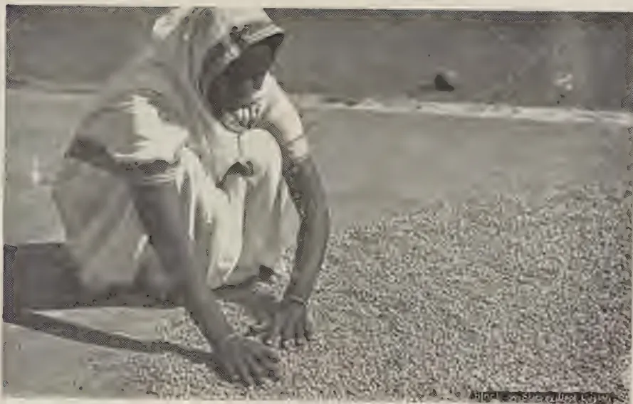A black and white photograph showing a person, likely a woman, crouching on a sandy or gravelly surface. She is wearing a light-colored, short-sleeved dress and a head covering. She is using her hands to spread a large quantity of small, light-colored, granular material (identified as oil-treated Dol) across the ground. The background is a flat, open landscape under a clear sky.

FIG. 3.—THE OIL-TREATED *Dol* BEING SPREAD FOR DRYING IN THE SUN.

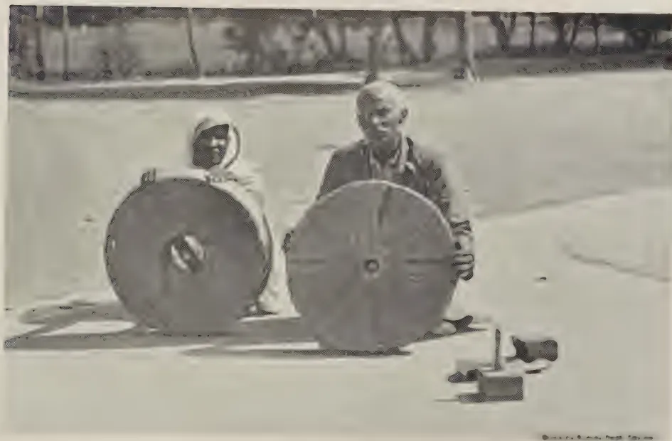A black and white photograph showing two large, circular wooden wheels or discs, which are the main components of a dhal-splitting mill. Two people are positioned behind the wheels, appearing to be working on or demonstrating the mill. The person on the left is wearing a head covering and a light-colored garment. The person on the right is wearing a dark jacket. The setting is outdoors on a flat, open area. In the background, there are some trees and a fence. A small, dark object, possibly a tool or a part of the mill, is visible on the ground in the foreground.

FIG. 4.—WOODEN PARTS AND SIDE VIEW OF THE VILLAGE MODEL OF DHAL-SPLITTING MILL.

17------------------------------------------------

This image is a scan of a blank page. The paper has a light beige or cream-colored tint. There are a few very small, faint dark spots scattered across the surface, which appear to be scanning artifacts or minor imperfections in the paper. No text, lines, or other markings are present.

18------------------------------------------------

267

*dol*. The slightly broken dhal pieces may, if necessary, be separated by the appropriately meshed round sieve. Dhal is not to be separated from *dol* even at the end of the third splitting. No oil is to be applied at the end of the third splitting.

(6) *Sun-drying and fourth splitting*.—The material is kept for drying this time only for a day. It is then finally split for the fourth time. This splitting is also fairly heavy. Most of the *dol* is split at this time. The split material is passed through the rectangular steel sieve which separates the dhal. The *chuni*, broken dhal, and seed coats are separated in the usual manner described before. If the separated dhal has some proportion of seed coats still adhering, the seed coats can be separated from the dhal by lightly pounding it with the wooden mortar and pestle. About 3 per cent. of the *dol* remains unsplit even at the end of the fourth splitting. This can be finally split by immediately feeding it again in the mill without drying under sun or application of oil.

By this process dhal can be cured within a period of 7 to 8 days. The cured dhal does not look very oily and has all the desirable characteristics of good quality dhal. From the good seed of the first and second grade, the approximate percentage proportion of different dhal products as a result of satisfactory curing should be : 66 to 70 per cent. of good dhal saleable at full market value, 5 to 9 per cent. broken dhal saleable at about half the price of good dhal, 13 per cent. *chuni* or powdered dhal saleable in the Indian market at about 2½ cents per pound, and 12 per cent. seed coats saleable in the Indian market at about 1½ cents per pound. It may be of interest to note here that the results of the local curing trials from good seed have favourably compared with these Indian averages.

#### DESCRIPTION OF THE COMBINED DRY AND WET METHOD OF CURING DHAL ADAPTED FOR LOCAL CONDITIONS

Here also the seed requires to be graded as in the case of the dry method. The principal difference in this method is the use of a mixture of oil and water instead of oil alone. This process of curing can be conveniently divided into the following five stages :—

(1) *First splitting*.—The first splitting in the stone mill is fairly light and as a result about 20 per cent. of the seed is split. The *chuni* is separated out from the *dol*.

(2) *Application of a mixture of oil and water and drying under sun*.—The *dol* is treated with a mixture of oil and water in the evening. For 128 lb. seed, one pound of oil and five pounds of water are necessary. Coconut oil has been found to serve the purpose quite satisfactorily. The oil and water are first mixed in a bucket and gradually incorporated into the *dol*. When thoroughly mixed, it is heaped up and kept in that condition

19------------------------------------------------

268

for the whole night. The heap is disturbed in the morning and the material exposed in a thin layer to dry in the sun. The *dol* is allowed to dry for 3 to 4 days according to the intensity of heat of the sun.

(3) *Second splitting*.—When thoroughly dry, it is split for the second time fairly heavily, *i.e.*, with less clearance between the two stones of the mill. At this time a further 50 to 60 per cent. of the seed gets split. The dhal, broken dhal, *chuni* and the seed coats are separated from the unsplit *dol*. The dhal is finally cleaned and kept separately.

(4) *Second application of a mixture of oil and water and drying under sun*.—The unsplit *dol* is again treated with a mixture of oil and water in the same proportion and heaped up for the night. From the next morning for 3 to 4 days it is exposed to the sun for drying.

(5) *Third splitting*.—When thoroughly dry, the *dol* is split for the third time. Dhal is separated from the other by-products in the manner already described.

If the separated dhal has some proportion of seed coats still adhering, the seed coats can be separated by lightly pounding the dhal with the help of a wooden mortar and a pestle which are commonly seen in the villages.

Curing by this method yields almost the same proportion of dhal and other by-products. The dhal cured by this method looks less oily but is slightly difficult to cook.

#### STONE MILLS USED IN SPLITTING DHAL AND OTHER EQUIPMENT NECESSARY FOR DHAL CURING

The success of dhal-curing depends to a great extent upon the use of a right kind of splitting mill. Sometimes the distinction between the splitting and the grinding mill is not properly understood. Splitting mills are provided with devices for adjusting the clearance space between the lower and the upper stones enabling the degree of splitting of seed to be regulated. This makes the mill also adaptable for splitting a wide range of pulse seeds which appreciably vary in size. In the grinding mill, such a facility does not exist and, therefore, any material fed into such a mill is reduced to powder.

In Gujarat, Western India, two models of splitting mills are in general use. Both models were brought by the author from Gujarat and used during the course of the curing trials described in this paper. The one known as the village model is a relatively small-sized, handy, flat-shaped mill with an approximate weight of 150 lb. It costs about Rs. 15. It requires to be worked by two persons and it can split about 600 to 900 lb. of seed in a working day of 8 hours depending on the skill of the workers. Figs. 4, 5 and 6 illustrate the different parts, side view,

20------------------------------------------------

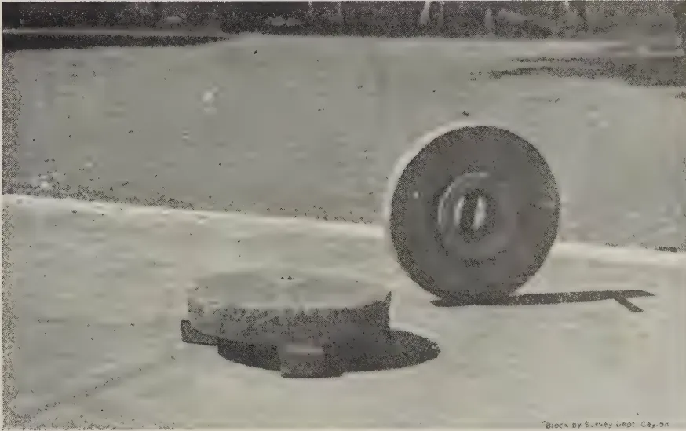A black and white photograph showing the wooden components of a dhal-splitting mill. In the foreground, there is a large, flat, circular wooden base. Behind it, a large, thick wooden wheel is mounted on a central axle. The entire assembly is set on a light-colored, flat surface. In the bottom right corner, there is a small, faint watermark that reads "Block by Survey Dept. Ceylon."

FIG. 5.—WOODEN PARTS AND SIDE VIEW OF THE VILLAGE MODEL OF DHAL-SPLITTING MILL.

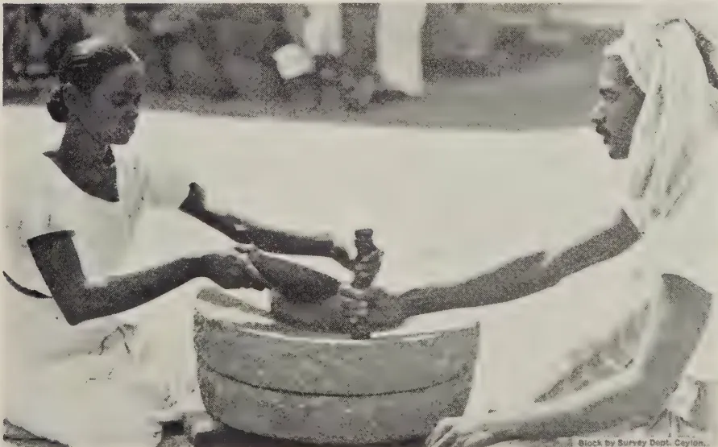A black and white photograph showing two women operating a dhal-splitting mill. They are seated on the ground, facing each other. The woman on the left is holding a wooden pestle and is using it to pound a dhal (pea) inside a large, shallow, circular wooden mortar. The woman on the right is also holding a pestle and appears to be assisting or observing the process. Both women are wearing traditional light-colored clothing. In the bottom right corner, there is a small, faint watermark that reads "Block by Survey Dept. Ceylon."

FIG. 6.—DHAL-SPLITTING MILL : VILLAGE MODEL.

21------------------------------------------------

This image is a scan of a blank page. The paper has a light beige or cream-colored tint. There are a few very small, dark specks scattered across the surface, which appear to be scanning artifacts or dust particles. No text, lines, or other markings are present on the page.

22------------------------------------------------

FIG. 7.—WOODEN PARTS AND SIDE VIEW OF THE COMMERCIAL MODEL OF DHAL-SPLITTING MILL.

FIG. 8.—WOODEN PARTS AND SIDE VIEW OF THE COMMERCIAL MODEL OF DHAL-SPLITTING MILL.

23------------------------------------------------

This image is a scan of a blank page. The paper has a light beige or cream-colored tint. There are a few very small, dark specks scattered across the surface, which appear to be scanning artifacts or dust particles. No text, lines, or other markings are present on the page.

24------------------------------------------------

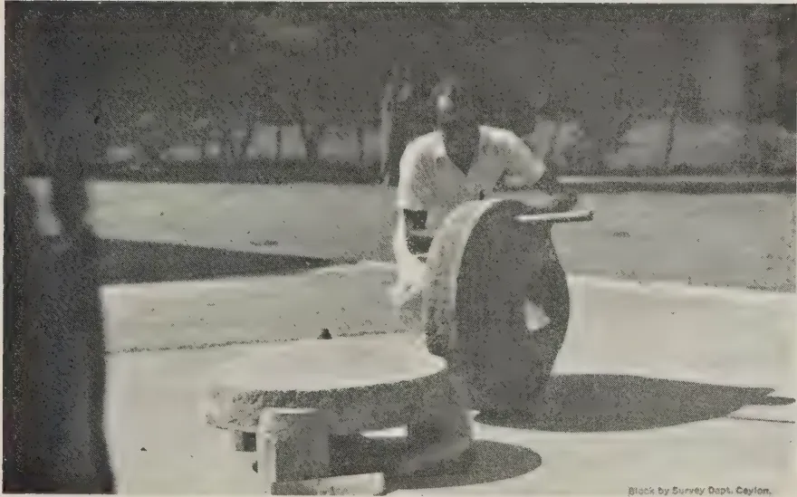A black and white photograph showing a side view of a commercial model of a dhal-splitting mill. A person is seated on a platform, operating the machine. The machine consists of a large, dark, cylindrical drum with a handle on top, mounted on a wooden base. The background is dark and indistinct. In the bottom right corner, there is a small text block that reads "Block by Survey Dept. Ceylon."

FIG. 9.—SIDE VIEW OF THE COMMERCIAL MODEL OF DHAL-SPLITTING MILL.

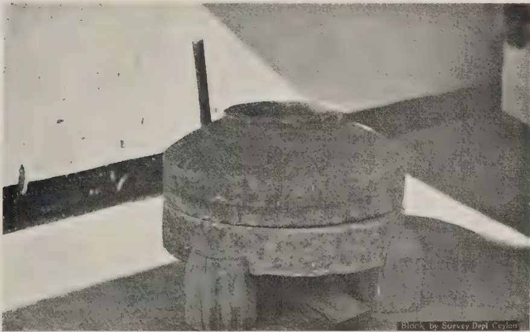A black and white photograph showing a close-up view of the dhal-splitting mill. The machine is a large, dark, cylindrical drum with a handle on top, mounted on a wooden base. The background is light-colored and indistinct. In the bottom right corner, there is a small text block that reads "Block by Survey Dept Ceylon."

FIG. 10.—DHAL-SPLITTING MILL : COMMERCIAL MODEL.

25------------------------------------------------

This image is a scan of a blank page. The paper has a light beige or cream-colored tint. There are a few very small, dark specks scattered across the surface, which appear to be scanning artifacts or dust particles. No text, lines, or other markings are present on the page.

26------------------------------------------------

![A black and white photograph showing two people operating a large, cylindrical dhal-splitting mill. One person, wearing a light-colored head covering and a long white apron, is seated on the left, leaning over the machine. The other person, wearing a dark shirt and a white apron, is seated on the right, also leaning over the machine. They appear to be working together to process the dhal. The machine is a large, heavy-duty cylinder with a central mechanism on top. The background is somewhat blurred, showing an outdoor or semi-outdoor setting.](2182bb3dad60a4c290becf9123ed6611_1_img.webp)

FIG. 11.—DHAL-SPLITTING MILL : COMMERCIAL MODEL AT WORK.

![A black and white photograph showing various sieves and winnowing fans used in dhal-curing. The image displays several circular sieves of different sizes and two rectangular winnowing fans. The sieves are arranged in a semi-circle, with the largest one on the left and the smallest on the right. The winnowing fans are positioned in the center, one slightly behind the other. The fans have a grid-like structure, likely for air circulation during the curing process. The background is plain and light-colored.](2182bb3dad60a4c290becf9123ed6611_3_img.webp)

Block by Survey Dept. Ceylon.

FIG. 12.—SIEVES AND WINNOWING FANS USED IN DHAL-CURING.

27------------------------------------------------

This image is a scan of a blank page. The paper has a light beige or cream-colored tint. There are a few very small, dark specks scattered across the surface, which appear to be scanning artifacts or dust particles. No text, lines, or other markings are present on the page.

28------------------------------------------------

269

the actual working of this model and the relative position of the workers while working. This type of mill is generally used by the villagers who have to cure dhal on a small scale to meet the requirements of the village.

The other is the commercial model which is dome-shaped and quite heavy. This mill weighs about 500 lb. and its cost is Rs. 25. This is generally used in the towns by the professional dhal-curers known as *golas* who cure fairly large quantities of dhal. This model is also worked by two persons at a time and, though apparently very heavy looking, is quite light in actual working on account of the ease with which it is possible to adjust the clearance between the lower and the upper stones. It can split about 1,200 to 1,600 lb. of seed in a working day of 8 hours, depending on the experience of the operators. Figs. 7 to 11 illustrate the different parts and side views of the mill, the mill ready for work and in actual working showing the relative position of the operators.

Besides the splitting mills, sieves of different kinds and winnowing fan are required to separate the by-products from dhal at various stages of the curing. These are illustrated in Fig. 12. The round sieves are used according to the size of the mesh for grading seed, for separating powdered dhal and broken pieces of dhal. The rectangular steel sieves separate the dhal from the unsplit *dol*. The winnowing fan is used in separating the seed coats from *dol*, dhal and dhal pieces.

#### ACKNOWLEDGEMENTS

The author desires to take this opportunity to express his grateful acknowledgments to Mr. C. N. E. J. de Mel, Principal, Farm School, Peradeniya, for all the necessary facilities offered during the progress of this work. His thanks are also due to Mr. E. S. Jayasundera, the Manager, Experiment Station, Anuradhapura, for his willing assistance, co-operation and interest in this work at Anuradhapura, to Mr. G. Harbord, the Divisional Agricultural Officer, N.D., and Mr. S. J. F. Dias, the Divisional Agricultural Officer, N.W.D. for their co-operation in the trials carried out in their respective divisions, to Mr. T. V. Thamotheram, the Agricultural Instructor, Puttalam for the trials at Kotukachchiya and to Mr. Wirasinhe of the Propaganda Division for taking photographs of the equipment of the dhal-curing industry which appear in this paper.

29------------------------------------------------

270

## FIELD-PLOT TECHNIQUE WITH CHILLIES (CAPSICUM ANNUUM L.)

W. R. C. PAUL, Ph.D., M.Sc., D.I.C. (Lond.), M.A., Dip. Agric.  
(Cantab.),

AGRICULTURAL OFFICER, CENTRAL DIVISION,

AND

M. FERNANDO, Ph.D., B.Sc., D.I.C. (Lond.),

RESEARCH PROBATIONER IN PLANT PATHOLOGY

**F**IELD trials laid down in the past in Ceylon have suffered considerably from the lack of exact information regarding optimum sizes, shapes and arrangements of plots. Uniformity trials with rice carried out by Lord (1931) represent the only attempts hitherto made in this country at securing information of this nature for annual crops. This communication presents the results of a uniformity trial set down at the Experiment Station, Anuradhapura, during the *maha* season, 1938-39, for the purpose of investigating methods of increasing the precision of field experiments with chillies (*Capsicum annuum* L.)

### MATERIAL

The field selected for the trial was just over an acre in extent, and had carried crops of cotton, kurakkan, and gingelly in previous seasons. The soil was a sandy loam overlying a heavier loam rich in quartz gravel, and was of average fertility. The land was comparatively level, and soil heterogeneity, as indicated by previous crops, was not considerable. The variety of chilli grown was Tuticorin. Nurseries were sown on September 19, 1938, and the seedlings transplanted at the rate of two per hill on November 1. The seedlings had been topped prior to transplanting, and a spacing of 3 ft.  $\times$  3 ft. was adopted. Nearly fifty per cent. of the plants had set fruit by the end of December. A few plants were attacked at the collar by *Sclerotium Rolfsii* Sacc. This damage apart, there was no interference by any major disease or pest. Some time before the harvest, the area was lined out into 96 unit plots, six plants square. A nett area of 0.71 acre was harvested after the exclusion of a 21 feet border all round. The yields of unit plots represent the aggregates of nine pickings of ripe chillies, extending from January 2 to April 1, 1939. Rainfall during the experimental season was normal.

30------------------------------------------------

271STATISTICAL ANALYSIS1. Percentage standard error---

The area harvested consisted of 96 unit plots arranged in eight rows of 12 plots running north to south. Unit plots measuring 18 ft.  $\times$  18 ft. were combined to form plots of various sizes and shapes. For the purpose of the analysis of variance (Fisher, 1930), four hypothetical treatments or varieties were assumed. The four plots within each block could be placed in a row running either north to south or east to west, or they may be disposed in a  $2 \times 2$  arrangement. A fraction of the total variability was removed in the variance between these four-plot blocks, the magnitude of the fraction being determined by the efficiency of the size, shape and arrangement of blocks. The residual variance provided an estimate of experimental error. The standard error per plot was obtained by taking the square root of the error variance, and was expressed as a percentage of the mean. Twenty-eight combinations of unit plots were analysed. The results are recorded in Table 1.

TABLE 1.

<table border="1">
<thead>
<tr>
<th></th>
<th>Plot size (acre)</th>
<th>Arrangement of units within plots</th>
<th>Arrangement of plots within blocks</th>
<th>Percentage standard error per plot</th>
<th>No. of replications needed to reduce S.E. of mean to 4 per cent.</th>
<th>Area of land needed to reduce S.E. of mean to 4 per cent. (acres).</th>
<th>Efficiency (per cent.)</th>
</tr>
</thead>
<tbody>
<tr><td>I.</td><td>1/134</td><td>1 <math>\times</math> 1</td><td>4 <math>\times</math> 1</td><td>13.9</td><td>13</td><td>0.39</td><td>100</td></tr>
<tr><td>II.</td><td>1/134</td><td>1 <math>\times</math> 1</td><td>2 <math>\times</math> 2</td><td>24.4</td><td>38</td><td>1.13</td><td>33</td></tr>
<tr><td>III.</td><td>1/134</td><td>1 <math>\times</math> 1</td><td>1 <math>\times</math> 4</td><td>24.8</td><td>39</td><td>1.16</td><td>31</td></tr>
<tr><td>IV.</td><td>1/67</td><td>1 <math>\times</math> 2</td><td>1 <math>\times</math> 4</td><td>12.6</td><td>10</td><td>0.60</td><td>61</td></tr>
<tr><td>V.</td><td>1/67</td><td>1 <math>\times</math> 2</td><td>4 <math>\times</math> 1</td><td>10.7</td><td>8</td><td>0.48</td><td>84</td></tr>
<tr><td>VI.</td><td>1/67</td><td>1 <math>\times</math> 2</td><td>2 <math>\times</math> 2</td><td>11.2</td><td>8</td><td>0.48</td><td>77</td></tr>
<tr><td>VII.</td><td>1/67</td><td>2 <math>\times</math> 1</td><td>1 <math>\times</math> 4</td><td>24.1</td><td>36</td><td>2.15</td><td>17</td></tr>
<tr><td>VIII.</td><td>1/67</td><td>2 <math>\times</math> 1</td><td>2 <math>\times</math> 2</td><td>23.8</td><td>36</td><td>2.15</td><td>17</td></tr>
<tr><td>IX.</td><td>1/45</td><td>3 <math>\times</math> 1</td><td>4 <math>\times</math> 1</td><td>17.7</td><td>20</td><td>1.78</td><td>21</td></tr>
<tr><td>X.</td><td>1/45</td><td>3 <math>\times</math> 1</td><td>2 <math>\times</math> 2</td><td>24.6</td><td>38</td><td>3.38</td><td>11</td></tr>
<tr><td>XI.*</td><td>1/45</td><td>1 <math>\times</math> 3</td><td>4 <math>\times</math> 1</td><td>9.2</td><td>6</td><td>0.53</td><td>76</td></tr>
<tr><td>XII.*</td><td>1/45</td><td>1 <math>\times</math> 3</td><td>2 <math>\times</math> 2</td><td>8.8</td><td>5</td><td>0.44</td><td>83</td></tr>
<tr><td>XIII.</td><td>1/34</td><td>4 <math>\times</math> 1</td><td>1 <math>\times</math> 4</td><td>22.4</td><td>32</td><td>3.76</td><td>10</td></tr>
<tr><td>XIV.</td><td>1/34</td><td>1 <math>\times</math> 4</td><td>4 <math>\times</math> 1</td><td>8.6</td><td>5</td><td>0.59</td><td>65</td></tr>
<tr><td>XV.</td><td>1/34</td><td>1 <math>\times</math> 4</td><td>2 <math>\times</math> 2</td><td>10.8</td><td>8</td><td>0.94</td><td>41</td></tr>
<tr><td>XVI.</td><td>1/34</td><td>2 <math>\times</math> 2</td><td>1 <math>\times</math> 4</td><td>11.7</td><td>9</td><td>1.06</td><td>35</td></tr>
<tr><td>XVII.</td><td>1/34</td><td>2 <math>\times</math> 2</td><td>2 <math>\times</math> 2</td><td>9.7</td><td>6</td><td>0.71</td><td>51</td></tr>
<tr><td>XVIII.</td><td>1/22</td><td>6 <math>\times</math> 1</td><td>2 <math>\times</math> 2</td><td>22.1</td><td>31</td><td>5.64</td><td>7</td></tr>
<tr><td>XIX.</td><td>1/22</td><td>6 <math>\times</math> 1</td><td>1 <math>\times</math> 4</td><td>21.1</td><td>28</td><td>5.09</td><td>7</td></tr>
<tr><td>XX.</td><td>1/22</td><td>3 <math>\times</math> 2</td><td>2 <math>\times</math> 2</td><td>12.5</td><td>10</td><td>1.82</td><td>21</td></tr>
<tr><td>XXI.</td><td>1/22</td><td>3 <math>\times</math> 2</td><td>4 <math>\times</math> 1</td><td>14.3</td><td>13</td><td>2.36</td><td>16</td></tr>
<tr><td>XXII.</td><td>1/22</td><td>3 <math>\times</math> 2</td><td>1 <math>\times</math> 4</td><td>10.7</td><td>8</td><td>1.45</td><td>28</td></tr>
<tr><td>XXIII.*</td><td>1/22</td><td>2 <math>\times</math> 3</td><td>2 <math>\times</math> 2</td><td>8.0</td><td>4</td><td>0.73</td><td>50</td></tr>
<tr><td>XXIV.*</td><td>1/22</td><td>1 <math>\times</math> 6</td><td>4 <math>\times</math> 1</td><td>7.2</td><td>4</td><td>0.73</td><td>62</td></tr>
<tr><td>XXV.</td><td>1/17</td><td>1 <math>\times</math> 8</td><td>4 <math>\times</math> 1</td><td>7.7</td><td>4</td><td>0.94</td><td>41</td></tr>
<tr><td>XXVI.</td><td>1/17</td><td>2 <math>\times</math> 4</td><td>2 <math>\times</math> 2</td><td>9.5</td><td>6</td><td>1.41</td><td>27</td></tr>
<tr><td>XXVII.</td><td>1/17</td><td>4 <math>\times</math> 2</td><td>1 <math>\times</math> 4</td><td>10.2</td><td>8</td><td>1.88</td><td>23</td></tr>
<tr><td>XXVIII.</td><td>1/11</td><td>12 <math>\times</math> 1</td><td>1 <math>\times</math> 4</td><td>19.1</td><td>23</td><td>8.36</td><td>4</td></tr>
</tbody>
</table>

In the instance of four combinations (marked with asterisks in this Table) it was found necessary to exclude two rows of 12 plots each. The second column in this table gives the arrangement of units within plots, the first figure in each instance indicating the dimensions in the north-south direction, and the second figure the dimensions in the east-west direction. Combination number xxii, for instance, consisted of six units and was three units long in the north-south direction, and two units broad. The disposition of plots within blocks is indicated

31------------------------------------------------

272

in a similar manner in the third column. Each block in combination number xxii consisted, for example, of a single row of four plots running east to west.

The percentage standard errors per plot for the various combinations are recorded in the fourth column of Table 1., and a fertility contour map of the experimental area is presented in Fig. 1. A feature of this field was its marked fertility gradient in the east-west direction, the soil heterogeneity being distributed in long, narrow strips extending north to south. It is evident that the between-plot variability can be reduced to a minimum by the use of long, narrow plots oriented in a direction that will permit their intersecting a maximum number of fertility contour lines. Reference to Table 1 shows that plots elongated in the east-west direction do, in fact, yield the lowest errors. Plots elongated in the north-south direction are even more unsatisfactory than square plots. A striking illustration of this fact is seen in combinations xiii and xiv; by changing the direction of plot elongation, the standard error is reduced from 22.4 per cent. to 8.6 per cent.

The standard errors of well oriented and badly oriented plots have been extracted from Table 1, averaged and tabulated in Table 2 according to plot size. Square plots constitute a class intermediate in efficiency.

TABLE 2.

<table border="1">
<thead>
<tr>
<th rowspan="2">Plot Size (Acre)</th>
<th colspan="5">Average Percentage Standard Errors per Plot.</th>
</tr>
<tr>
<th>Well Oriented Plots.</th>
<th>Square Plots.</th>
<th>Badly Oriented Plots.</th>
<th></th>
<th></th>
</tr>
</thead>
<tbody>
<tr>
<td>1</td>
<td>..</td>
<td>..</td>
<td>21.0</td>
<td>..</td>
<td>—</td>
</tr>
<tr>
<td>134</td>
<td>..</td>
<td>11.5</td>
<td>..</td>
<td>..</td>
<td>24.0</td>
</tr>
<tr>
<td>67</td>
<td>..</td>
<td>9.0</td>
<td>..</td>
<td>..</td>
<td>21.2</td>
</tr>
<tr>
<td>45</td>
<td>..</td>
<td>9.7</td>
<td>..</td>
<td>10.7</td>
<td>..</td>
</tr>
<tr>
<td>34</td>
<td>..</td>
<td>7.6</td>
<td>..</td>
<td>..</td>
<td>16.1</td>
</tr>
<tr>
<td>22</td>
<td>..</td>
<td>8.6</td>
<td>..</td>
<td>..</td>
<td>10.2</td>
</tr>
<tr>
<td>17</td>
<td>..</td>
<td>—</td>
<td>..</td>
<td>..</td>
<td>19.1</td>
</tr>
<tr>
<td>11</td>
<td>..</td>
<td>—</td>
<td>..</td>
<td>..</td>
<td>—</td>
</tr>
</tbody>
</table>

The average standard errors of well-oriented plots show a decrease with increase in plot size, the lowest error being obtained with 1/22 acre plots. There is, however, no considerable decline in standard error with increasing plot size after the 1/45 acre mark is passed. A plot size of 1/45 acre may accordingly be recommended for field experiments with chillies.

32------------------------------------------------

The figure is a fertility contour map of an experimental area for chillies. It features a series of contour lines and different hatching patterns to represent fertility levels. A north arrow is positioned in the upper right corner. A key on the right side of the map provides a legend for the fertility levels, ranging from -40 to +40. The map is oriented vertically, with the north arrow pointing upwards.

<table border="1">
<caption>KEY</caption>
<thead>
<tr>
<th>Fertility Level</th>
<th>Pattern Description</th>
</tr>
</thead>
<tbody>
<tr>
<td>-40</td>
<td>Horizontal lines</td>
</tr>
<tr>
<td>-20</td>
<td>Vertical lines</td>
</tr>
<tr>
<td>0</td>
<td>White (unfilled)</td>
</tr>
<tr>
<td>+20</td>
<td>Diagonal lines (top-left to bottom-right)</td>
</tr>
<tr>
<td>+40</td>
<td>Diagonal lines (bottom-left to top-right)</td>
</tr>
</tbody>
</table>

FIG. 1. --FERTILITY CONTOUR MAP OF THE EXPERIMENTAL AREA (CHILLIES).

33------------------------------------------------

<!-- stage4: FAINT old-images-only -->

[Faint page: no legible print of its own could be verified; text withheld (stage 4 review list)]

This image is a scan of a blank page. The paper has a light beige or cream-colored tint. There are a few very small, dark specks scattered across the surface, which appear to be scanning artifacts or dust particles. No text, lines, or other markings are present on the page.

34------------------------------------------------

273

2. *Number of replications and total area of land needed—*

Column six in Table 2 records the numbers of replications necessary to reduce the standard error of the mean to 4 per cent. The figures have been given to the nearest whole number, fractions of replicates being treated as wholes. Calculations are based on the fact that the standard error of the mean of  $N$  replicates is obtained by dividing the standard error of a single plot by the square root of  $N$ . The total areas of land required to effect this reduction to 4 per cent. are given in column seven of Table 1. If the usual convention of regarding differences greater than twice the standard error as significant, is assumed, this reduction will allow the demonstration of the significance of differences between means greater than 11 per cent. If the detection of more subtle differences, say, of the order of 5–6 per cent., is desired, the standard error of the mean should be reduced to 2 per cent. The numbers of replications and the areas of land then needed will be exactly 4 times the values in Table 2. In well-oriented plots, the diminution in standard error with increase in plot size, of course, manifests itself in a progressive reduction in the number of replications needed.

3. *Efficiency of plots in the use of land—*

The extent of land suitable for experiments is often extremely limited, and the most efficient exploitation of a particular piece of land often becomes a question of major importance. An estimate of the efficiency of a particular type of plot in the use of land is provided by the reciprocal of the product of the variance per plot and the number of units that constitutes the plot (Justesen, 1932 and Kalamkar, 1932). In the last column of Table 1, the efficiencies of various arrangements are expressed as percentages of the efficiency of the unit plot arrangement with the lowest standard error. Plot efficiencies are seen to decline with increase in plot size. When the land available is of limited extent, it is usually preferable to secure increased replication at the sacrifice of plot size.

DISCUSSION

In designing a field experiment, the agronomist aims at removing as much of the total variation as possible in the variances within plots and between blocks, the residual within-block variance which provides the estimate of error being reduced to minimum dimensions. Most investigators have found that these objects can be achieved by the use of long, narrow plots arranged side by side in compact blocks. It must be added, however, that the efficiency of the long, narrow plot may be conditioned to a considerable extent by its orientation. If, as in the present experiment, the field exhibits a pronounced fertility trend, it is important that the direction of plot elongation should be parallel to this gradient. Long, narrow plots that cut across the fertility gradient, yield larger errors than even square plots.

35------------------------------------------------

274

A detailed discussion of the relative merits of square and oblong plots is not attempted here. It may be pointed out, however, that considerations other than statistical ones may dictate the choice of plot shape. For instance, if cultivation and handling of the crop is done by hand, square plots may not be disadvantageous. If machinery is employed, long, narrow plots may be desirable. The relatively low perimeter of the square plot is a point in its favour, especially when marginal effects are considerable and guard rows have to be excluded.

The optimum direction of block elongation is perpendicular to the optimum direction of plot elongation. Although it is generally true that compact blocks, by the approximation of centres of constituent plots, reduce the within-block variance considerably, it sometimes happens, as in the present experiment, that long narrow plots placed end-on give a lower error than the more compact arrangements. In such instances, long blocks almost completely occupy strips of either high or low fertility and a large fraction of the soil heterogeneity then comes off in the between-block variance.

When suitable land is scarce, the proved efficiency of small plots may suggest the use of very small plots with a high degree of replication. Diminutive plots have, however, considerable disadvantages including the elaborateness of the lay-out and harvesting arrangements, and the loss of a relatively large proportion of the plot area in instances where guard rows are discarded. In Ceylon especially, where much of the experimentation has to be done with unskilled labour, designs should be rendered as fool-proof as possible.

#### SUMMARY

1. The results of a uniformity trial with chillies (*Capsicum annuum* L.) carried out at the Experiment Station, Anuradhapura, during the *maha* season, 1938-39, are presented.

2. The experimental field exhibited a pronounced fertility trend.

3. Long, narrow plots elongated in the direction of the fertility trend, yielded the lowest errors.

4. In well-oriented plots, the percentage standard error decreased with increase in size of plot. A plot size of 1/45 acre is recommended for field experiments with chillies.

5. Information regarding the number of replications and the area of land necessary for demonstrating differences of a certain magnitude, is provided.

6. Small plots were more efficient in the use of land than large plots.

36------------------------------------------------

275ACKNOWLEDGEMENT

The writers gratefully acknowledge their indebtedness to Mr. E. S. Jayasundera, Anuradhapura, for the careful supervision of the field arrangements and for the collection of the data. They also thank Mr. G. Harbord, Agricultural Officer, Northern, for his co-operation.

REFERENCES

Fisher, R. A., 1934.—*Statistical method for Research Workers*, 5th edition. London, Oliver and Boyd.

Hutchinson, J. B. and Panse, V. G., 1935.—Studies in the Technique of Field Experiments, 1: Size, Shape and Arrangement of Plots in Cotton Trials. *Ind. J. Agric. Sci.* V., 523–538.

Justesen, S. H., 1932.—Influence of Size and Shape of Plots on the Precision of Field Experiments with Potatoes. *J. Agric. Sci.* XXII., 366–71.

Kadam, B. S. and Patel, S. M., 1937.—Studies in Field-Plot Technique with *P. typhoideum* Rich. *Empire J. Expt. Agric.* V., 219–229.

Kalamkar, R. J., 1932.—Experimental Error and Field-Plot Technique with Potatoes. *J. Agric. Sci.* XXII., 373–85.

Lord, L., 1931.—A Uniformity Trial with Irrigated Broadcast Rice. *J. Agric. Sci.* XXI., 178–88.

MacDonald, D., Fielding, W. L. and Ruston, D. F., 1939.—Experimental Methods with Cotton, 1: The Design of Plots for Variety Trials. *J. Agric. Sci.* XXIX., 35–47.

37------------------------------------------------

276

## EROSION—A MAURITIAN MEASURE FOR PROTECTING WATER-COURSES

H. C. KING,

ACTING CONSERVATOR OF FORESTS, MAURITIUS

IN tropical agriculture, water-courses are the scene of some of the deepest erosion and the loss of the most fertile section of the soil. In the Colony of Mauritius a simple legal enactment dating from 1875 has been effective, to a large extent, in preserving a vegetative cover on the banks of rivers and streams, and a note on the present position may usefully follow the series of articles on soil erosion published in past numbers of *The Tropical Agriculturist*.

The object of forming a river reserve along the banks of water-courses in Mauritius (see classification in a subsequent paragraph) are (i) to reduce the erosion of the banks and prevent damage by floods (ii.) to discourage the breeding of *Anopheles costalis* by ensuring a complete shade of trees or shrubs over the water (iii.) to improve a defective catchment and maintain a perennial flow without marked seasonal fluctuation and (iv.) to provide a refuge for insectivorous birds.

The desired results can, theoretically, be achieved by defining the river reserves and withholding them from sale when the adjoining blocks are opened up for agriculture: under this system the reserves are much exposed to pilfering of fuel, &c. and to encroachment, and a stage is usually reached at which encroachments have to be surveyed and sold to the owner of adjoining properties. The alternative, adopted in Mauritius, was to apply legal sanction to the use by the owner of the strip of land adjoining each bank and leave these strips in private ownership.

Water-courses are classified by proclamation as "rivers", with a 50-feet reserve on either side measured from the bank, "rivulets" with a 25-feet reserve and "feeders" with a 10-feet reserve. Within these limits no one may destroy or remove a tree, loiter in the reserve with a cutting instrument, set fire to vegetation, or plant other than approved tree species. Only perennial streams can be proclaimed in this way and erosion does, of course, occur in valleys and gullies which have only an intermittent flow. Marshes can be proclaimed as part of the

38------------------------------------------------

277

water-course and owners may clear brushwood, with permission, and plant useful and ornamental trees. The penalty for destroying, cutting, sawing or removing timber is a fine not exceeding Rs. 500 (£ 38) in addition to the payment of 3 times the value of the produce, and under these rules the actual owner of the reserve is as liable to these penalties as any outsider.

The law was probably drafted with direct reference to objects i. and iii. (erosion and catchment respectively enumerated above); malarial control was a later adjunct, and the protection of birds quite a recent after-thought. It is clear that objects i. and iii. can be achieved by a belt of shrubs or low cover, and it is found that *Eugenia jambosa* and *Ligustrum Walkeri* are excellent for the purpose. Tall trees, over 30 feet in height, very often *Tecoma pallida* or *Terminalia arjuna*, are unpopular with the owners of adjoining sugarcane plantations because of the excessive shade they provide and the serious interference of their root systems with the sugarcane crop : these disadvantages are held to outweigh any benefit which may be afforded by protection from wind or by the cooler and more humid atmospheric conditions which result from belts of this kind.

Uniformity is neither possible nor necessary, and after 60 years the 312 miles of 50-feet river reserves show a great variety of vegetation. Some reserves have been frankly encroached upon, others have lost their trees ; but in very few cases and over quite short lengths have the banks been rendered liable to erosion. Many reserves for some miles on end have tall trees of *Tecoma* or *Arjuna* : in others which have *Rubus*, *Cordia interrupta*, or bamboo, erosion is as effectively checked. There can be no doubt that the measure has been strikingly successful with a low cost to the exchequer and the minimum of supervision. Control is exercised by a Board comprising the Heads of the Medical, the Police and the Forest Departments with a retired Forest Officer in executive charge while patrolling of reserves is carried out by the Police staff who are better distributed for the purpose than Forest Department staff as well as being more numerous.

A proposal has recently been revived for the re-definition and fuller utilization of some of the 50-feet reserves. Reserves in weeds or scrub of no value or those which have necessarily tall trees will, with the approval of the Board, be cleared in sections and replanted in fruit trees such as mango, litchi or citrus with such subsidiary crops as vanilla or cardamoms beneath them. Here again no uniformity is to be expected and some estate proprietors who protect their reserves at present with *Eugenia jambosa*, prefer the *status quo* to a mixed plantation of fruit which would be liable to pilfering. In the course of this reconstruction, the outer boundary of the reserves would be outlined in *Vetiveria* grass and any encroachments revealed in the

39------------------------------------------------

278

work would be included in the new plantations. Encroachments and areas degraded to a dense growth of weeds probably amount to 15 per cent. of the total and this considerable acreage can thus be reclaimed, restored to full efficiency and made to produce crops of some economic importance.

Viewed from high ground these reserves look like enormous hedges meandering through the cane fields and are a conspicuous feature of the landscape.

Mr. R. Thompson, Deputy Conservator of Forests, India, submitted a report in 1880 in which he stated "The River Reserves are one of the most important institutions in this Colony. Their existence has done much good in maintaining the water supply in the streams and rivers which they protect; and they are therefore worthy of imitation elsewhere."

At that time the reserves no doubt consisted chiefly of indigenous trees which are now less common: *Terminalia arjuna* dates from the time of Mr. Thompson's visit to Mauritius.

Similar rules apply to the protection of mountain reserves and, together, these classes cover about 9,070 acres. Crown forests (economic) and other forests including both mountain and river reserves amount to 97,225 acres or 21 per cent. of the total area of the Colony.

40------------------------------------------------

279DEPARTMENTAL NOTESTANNIA OR THE COCO-YAM

W. MOLEGODE,

AGRICULTURAL OFFICER, PROPAGANDA

MUCH has lately been spoken of the food value of the edible varieties of *Colocasias* and *Alocasias* which are known in different parts of the tropics under various names such as coco-yam, colalu, china-potato, dasheen, eddo, egypt-arum, gabi, kachchi, kachu, melanga, tannia, taro, talla, yautia and known in Ceylon as *alakola-ala*, *desai-ala*, *dehiala*, *gahala*, *habarala*, *kiri-ala*, *kandala*, *kokis-ala*, *rata-ala*, *serel-ala*, *ratu-habarala*, *tummas-ala*, and *yakkala*.

In Ceylon these food plants have long been a common food of the people. The yams and, in some varieties, the leaves and stalks are cooked in many ways. However, as a food crop these yams have not attained the popularity they deserve on account of their potential value as a very nourishing, wholesome and palatable food. Few crops, if any, can surpass them for facility of cultivation, adaptability to varying conditions and production. The writer is aware of instances, where, under good cultivation, crops of 10–12 tons of yams per acre have been lifted. The yams or tubers of different varieties can be obtained from three months onwards to nine months after planting. The *tummas-ala* can be lifted in three months, the *dehiala* or *desai-ala* from the fourth month and the *gahala*, *rata-ala* or *alakola-ala* from the sixth month onwards. The great advantage of this crop is that it can be allowed to remain in the ground without serious deterioration of the crop for a considerable period, to be lifted as required. Another advantage is that, although there is a recognized time for planting yams, Tannias or Coco-yams can be planted almost throughout the year except in the very dry months and, therefore, an all-the-year-round supply of food can be obtained.

THE PLANT

The *Colocasias* and *Alocasias* are widely distributed herbaceous perennials cultivated as annuals. The plant resembles the garden *Caladium*—see Figs. I., II. and III. Macmillan says “There are two distinct forms (or genera) one of which is characterized by peltate leaves (petiole joined at a point towards centre of leaf), the other by hastate or sagittate leaves (arrow-shaped) with the petiole joined at the

41------------------------------------------------

280

leaf base, as in ordinary leaves. The latter form is usually placed under the genus *Xanthosoma*, which include *tannia*, *tanier*, *yautia*, *habarala*, &c. The under-ground tubers vary in size from that of a small to a medium-sized potato usually with a fibrous skin. Some varieties, however, produce few tubers or none, being grown for the tender leaves and shoots only, which are cooked and used as a vegetable. In other varieties, such as *desai-ala* of Ceylon and *dasheen* of Trinidad, both tubers and tender leaves are eaten." To this may be added that there are some varieties producing tubers from 6 to 9 inches long and 5 to 6 inches in diameter.

Several forms of the cultivated and the wild varieties of these plants are found in Ceylon from sea level to 5,000 feet. Some have dark green leaves, others very light green leaves and a third group which includes *kandala* and *ratu-habarala* purplish leaves and leaf stalks.

#### CULTIVATION

The plants are propagated by means of small tubers, large ones being cut into pieces containing two or three "eyes." The best soil for this crop is a sandy loam with a good proportion of organic matter. Hard, clayey soils or pure sandy ones should be avoided. Low-lying moist situations are favoured by such varieties as *habarala*, *sevel-ala* and those grown for their leaves. The *tummas-ala*, *rata-ala*, *dehi-ala* and *kandala* types of *gahala* prefer dry land and will do well under irrigation.

The soil should be worked to a depth of at least 12 inches. Planting distances vary from 2×2 feet to 4×4 feet according to the variety and conditions. If tubers are planted, they should be placed three to four inches deep. If crowns are used, about an inch of the top of the crown should be left above ground. Weeds should be kept under control until the plants grow up. It is important if, during the growing period, there is dry weather, to keep the soil moist as the plant grows best in damp soil. Few crops respond so well to manuring as *Tannias*. A heavy application of well-rotted farmyard manure or compost incorporated in the soil at the time it is being prepared for planting will almost double the yield of the tubers.

#### HARVESTING

The tubers are lifted from the third month onward according to the variety planted. In lifting, the whole plant should be dug without injuring the tubers. All the tubers should then be removed and the leaves and stalks chopped off almost to the head of the main root. The heads or crowns should be stored in a cool place until the time of planting.

As stated before, the tubers can be allowed to remain in the soil for a considerable time and dug up as required.

42------------------------------------------------

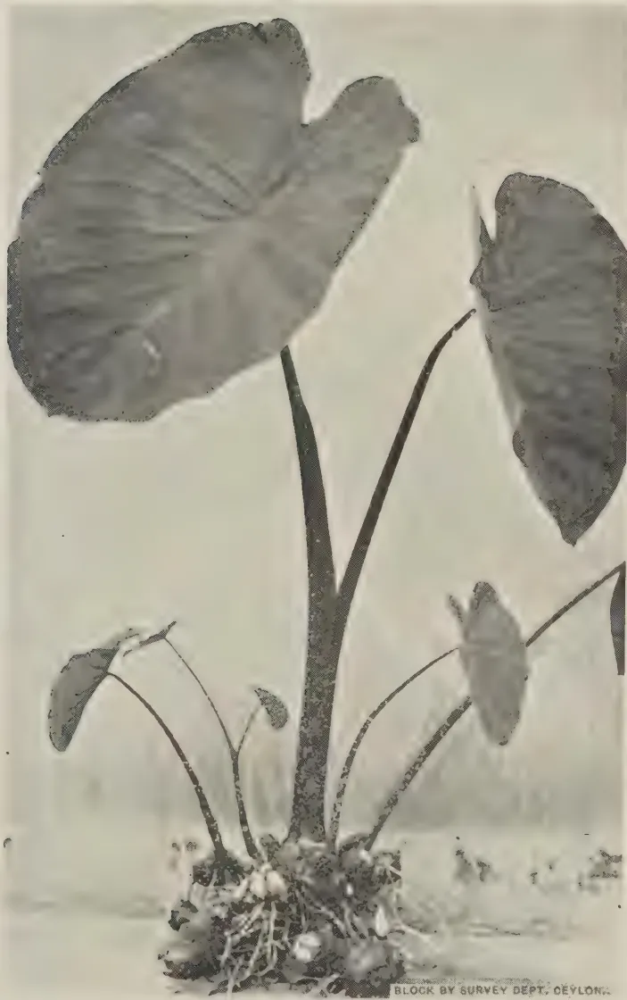A black and white photograph of a Kandala plant (purplish leaved). The plant features several large, heart-shaped leaves with prominent veins, emerging from a central, thick stem. The base of the plant shows a cluster of roots and smaller, younger leaves. The background is a plain, light color. At the bottom right of the image, there is a small text label: "BLOCK BY SURVEY DEPT. CEYLON."

FIG. I.—A *Kandala* PLANT (PURPLISH LEAVED).

43------------------------------------------------

This image is a scan of a blank page. The paper has a light beige or cream-colored tint. There are a few very small, faint dark spots scattered across the surface, which appear to be scanning artifacts or dust particles. No text, lines, or other markings are present on the page.

44------------------------------------------------

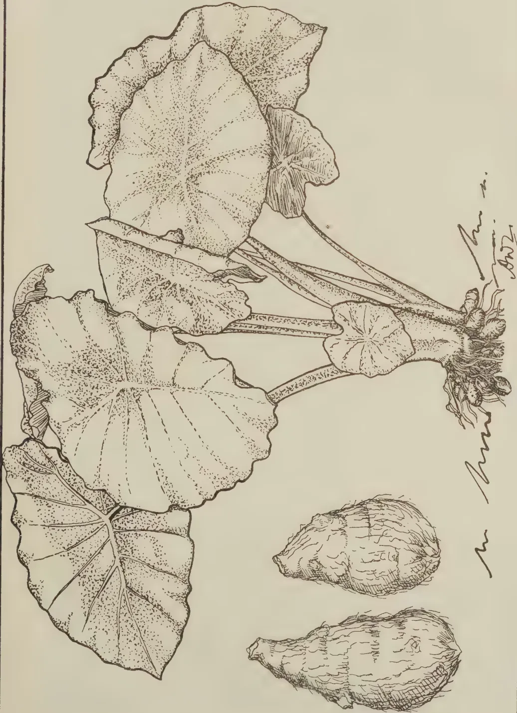A detailed botanical line drawing of the Tumnas-ala plant. The illustration shows a cluster of large, heart-shaped leaves with deeply lobed margins and prominent venation. The leaves are attached to a central point by long, slender petioles. At the base of the plant, several large, irregularly shaped tubers are shown, with a fibrous root system extending from them. The drawing is executed in a fine-lined, stippled style. To the right of the plant, there is a handwritten signature that appears to read "M. M. ... 1902".

FIG. II.—*Tumnas-ala* PLANT AND TUBERS.

BLOCK BY SURVEY DEPT. CEYLON.

45------------------------------------------------

This image is a scan of a blank page. The paper has a light beige or cream-colored tint. There are a few very small, faint dark spots scattered across the surface, which appear to be scanning artifacts or minor imperfections in the paper. No text, lines, or other markings are present.

46------------------------------------------------

A black and white photograph showing a large, mature Gahala plant with several massive, broad leaves. The plant has a thick, gnarled trunk and a complex root system visible at the base. Three men are positioned around the plant. On the left, a man in a light-colored tunic and dark trousers holds a long wooden pole. In the center, another man is partially obscured by the leaves. On the right, a man in a light-colored suit and tie holds a similar wooden pole. The background is dark and indistinct, suggesting an outdoor setting with dense vegetation. A small, dark rectangular label at the bottom right corner of the image reads "SHOCK BY IRVING DEPT Ceylon".

FIG. III.—A *Gahala* PLANT ALLOWED TO GROW FOR SEVERAL YEARS.

47------------------------------------------------

This image is a scan of a blank page. The paper has a light beige or cream-colored tint. There are a few very small, dark specks scattered across the surface, which appear to be scanning artifacts or dust particles. No text, lines, or other markings are present on the page.

48------------------------------------------------

281

ANOTE ON THE CARDAMOM WEEVIL  
(PRODIOCTES HAEMATICUS CHEV. VAR.)

---

J. C. HUTSON, B.A. (Oxon), Ph.D. (Mass.),  
ENTOMOLOGIST

---

TOWARDS the end of August, 1939, the superintendent of an estate in the Dolosbage district brought in some cardamom plants badly attacked by stem-boring insects, with the report that several acres of older cardamom plants were being seriously damaged and many plants had been killed; in the specimens submitted the stems had been riddled, thus producing dead hearts, and the rhizomes had been extensively tunnelled. This damage is similar to that caused by *Dichocrocis punctiferalis*, the common stem-boring caterpillar of cardamoms, ginger and turmeric, and, while traces of this pest were found, it soon became evident that most of the injury was being done by weevil grubs; not they are somewhat of the type of the plantain stem and root borer grubs. At that time no other stages of the pest were found, but within a few days the superintendent kindly submitted some live cardamom weevils, some of which had been found hiding in rolled leaves on the plants or on the ground at the bases of the plants, while others had been removed from tunnelled stems within which they had emerged. These weevils were found to be *Prodioctes haematicus* Chev. var., after comparison with a named specimen in the Peradeniya collection determined several years ago by the Imperial Institute (formerly the Imperial Bureau) of Entomology. Since none of the previous records of this weevil listed later have indicated that it has ever been a pest of cardamoms or of any other cultivated plant until recently, it became necessary to investigate the outbreak in Dolosbage, and the following notes are the result of this preliminary investigation.

*Prodioctes haematicus*, seen from above, is a slender brown weevil (Fig.1) about  $\frac{1}{2}$  in. long with a distinct snout or proboscis, with three black lines on the pronotum, or that part of the body just behind the snout, and with six small black spots on the elytra or wing-covers; there are also small black markings on the underside of the body. The two sexes are similar in appearance, except that the proboscis of the male is roughened on top, while that of the female is smooth and shiny.

49------------------------------------------------

282

*Habits and nature of damage.*—So far as is known at present, no appreciable damage is done to cardamom plants by the weevil stage except the making of small feeding punctures and egg-pits with the proboscis. Eggs have not been found so far under field conditions, but the presence of grubs in separate tunnels in different parts of plants from the growing shoots down to the rhizomes indicates that the eggs may be laid almost anywhere in the softer tissues of the plants. Judging by the egg-laying habits of related weevils, such as the red weevil of coconuts and the black plantain weevils, it is probable that the small, soft, whitish, elongate eggs are deposited by the female in cleverly concealed pits previously excavated with her proboscis. The weevils usually hide in sheltered places on the plants and on the ground during the day and are active at night. When disturbed on a plant they draw in their legs close to the body, drop to the ground and pretend to be dead for a short time, after which they take shelter, moving forwards with a characteristic jerky gait.

The larva or immature stage is a soft, creamy, legless grub with a brown head and powerful biting jaws and a rather stout, much wrinkled body (fig. 2). The grubs feed entirely inside the plants, which may be riddled from top to bottom, including the rhizomes (fig. 4) when some half-a-dozen grubs are found in the same plant. Individual plants in a clump may be killed, and during a heavy infestation, such as was observed recently on a Dolosbage estate, every plant in a clump may be killed gradually, so that there is a complete failure of young shoots, racemes and subsequent crop. The damage caused by these grubs is far more serious than that done by the caterpillar stem-borer, which usually confines its activities to the shoots and stems and rarely penetrates the rhizomes.

The full-grown grubs change into the pupal stage (fig. 3) inside the hollow stem or in enlarged cells in the rhizomes. Apparently no special cocoon is made by the grub, as in the case of the red weevil and the plantain stem-borer, but individual pupae may be loosely surrounded by frass and fibres. The weevils emerge later, but remain inside the cell (fig. 4b) until the body-covering has attained its final colour and hardness; then they bore their way out and begin their active life of feeding and reproduction. At present, nothing is known about the length of the life-cycle, but it probably occupies at least 4–6 weeks.

#### RECORDED CEYLON DISTRIBUTION OF WEEVIL.

*Gatagedera*, October, 1900 (cardamoms)\*; *Kandy*, August, '03, January '11\*, August and September '14, November '30, May '33; *Urugala*, September '22, April '23, April '24 (cardamoms); *Gammaduwa*, November '29, September '32,

50------------------------------------------------

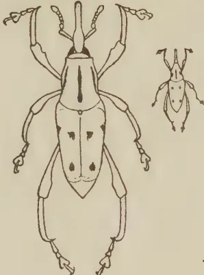

1

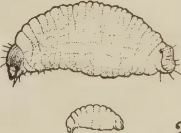

2

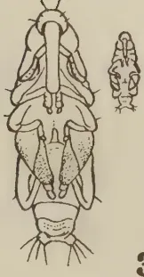

3

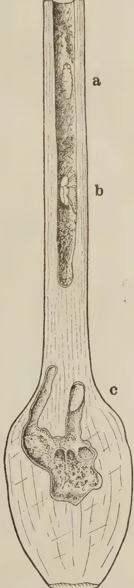

4

Q.I. de S. Sept. 1939

BLOCK BY SURVEY DEPT. CEYLON.

THE CARDAMOM WEEVIL (*Prodiotetes haematicus* Chev. var.).

Figure 1.—Weevil. Figure 2.—Full-grown grub. Figure 3.—Pupa. Figure 4.—Section of portion of cardamom stem and rhizome showing grubs at *a* and *c* and freshly emerged weevil at *b*, natural size.

Outlines at sides of Figures 1-3 show natural size.

51------------------------------------------------

<!-- stage4: FAINT old-images-only -->

[Faint page: no legible print of its own could be verified; text withheld (stage 4 review list)]

This image is a scan of a blank page. The paper has a light beige or cream-colored tint. There are a few very small, dark specks scattered across the surface, which appear to be scanning artifacts or dust particles. No text, lines, or other markings are present on the page.

52------------------------------------------------

283

May '33, November '33 ; *Nitre Cave*, April '30 ; *Kitulgala*, April '27 ; *Ratnapura*, September '12\*, *Rakwana*, May '29 ; *Dolosbage*, August '39 (cardamoms)\*.

The four records in the Peradeniya collection are marked with an asterisk (\*); for the remaining locality records we are much indebted to the Director, Colombo Museum, who has kindly supplied the information from the specimens in the Museum collection, with notes on the host plant where available. It will be seen that the insect now to be known as the cardamom weevil was recorded nearly 40 years ago from the Galagedera district where it was said to damage cardamoms, but there is no evidence that it was a pest at that time. Apart from the recent outbreak in the Dolosbage district, the only other record from cardamoms is from the Urugala district in April, 1924. Estates which are known to grow cardamoms are being circularised with a request for any available information on this weevil, and field officers of the Department are being requested to be on the look out for it in village areas of cardamoms and related crops. Inquiries are also being made in India and at the Imperial Institute of Entomology, London.

*Food plants.*—The locality records are nearly all from districts in which cardamoms are grown and it is probable that this crop is normally used by the weevil as a food and breeding plant. Further investigations may indicate that the related wild and cultivated species of ginger, turmeric, plantain, &c., are possible alternate food plants, if not actually breeding plants.

*Suggested control measures.*—The withering and death of the growing shoot is usually an indication of attack by this weevil or by the caterpillar borer. All attacked plants including the rhizomes, where necessary, should be removed and burnt or otherwise effectively destroyed, so as to prevent the further development of the immature stages of the pest and kill any weevils sheltering inside the plants prior to emergence. In badly attacked patches whole clumps may have to be treated in this way, care being taken to remove from the soil all pieces of rhizomes and roots. While clearing up any heavily infested patches, small heaps of this refuse material can be used as traps to attract the weevils which should be collected and destroyed wherever found. For replanting, only sound rhizomes from a non-infested area should be used.

53------------------------------------------------

284

## SEASONAL PLANTING NOTES

### CALENDAR OF WORK FOR JANUARY

T. H. PARSONS, F.L.S., F.R.H.S.,

CURATOR, ROYAL BOTANIC GARDENS, PERADENIYA

**T**HE opening month of the year is, from the gardening point of view, a busy and an interesting one. The rainfall generally throughout the country is diminishing and the temperature cool and refreshing.

Most planting operations in the low-country will have been finished, and vegetables planted in the early north-east season should be ready for cropping, but there is yet time for sowing and raising the quicker-growing food crop varieties. A good stock of yams should be selected and stored for March-April planting, whilst tomatoes now in full growth should be staked and side shoots thinned out. Annuals and perennials in the flower garden should now be approaching their best.

In the northern parts of the Island, similar operations can be undertaken and planting of tobacco seedlings, chillies, brinjals, plantain suckers and betel vines can be made early in the month. In mid-country districts, plantings of bed and border plants and vegetables can proceed when rain has set in. With the quick-growing varieties of vegetable and flowering annuals, it is generally quite easy to obtain the result of three successive sowings before the dry weather sets in if sowings are made in mid October, late November and early January.

Up-country conditions are yet wet and misty in the early part of the month but improve towards the end of the month. This improvement is, however, usually accompanied by light frosts which should be guarded against. Planting of flower beds should have ceased by the end of the month and all beds and borders should now be forked and weeded, a very necessary operation after heavy monsoon periods, allowing aeration of the soil. Towards the end of the month and early next month, mulching with leaf or jungle mould with a proportion of well-decayed cattle manure can be given to all plants with very beneficial results. Weather should now be excellent for regular sowings of most vegetables,

54------------------------------------------------

285

and such sowings, made in succession, can continue for several months. Excellent crops of peas, beans, broad beans and cauliflower can be raised from now onward to mid May next. Strawberries, too, are a very profitable crop for the local markets in and around Nuwara Eliya, and should be tried wherever possible. As before mentioned, this month is an interesting one to all keen gardeners and chiefly by reason of the fact that the cooler and more favourable weather conditions at this time of the year allow a fairly wide range of subjects to be exploited and tried out. The lawns, too, are generally in the best possible condition as a result of the late monsoon rains.

Bearing this in mind the sympathies of the true gardener go to all those who are compelled to live in the city or any large town where land values permit of a garden only of microscopic dimensions. The variety of colour to be obtained in bed and border assortments set in a sward of green turf is not for him or her. The bungalow outlook often comprises a nearby brick boundary wall and a few large trees planted for shade purposes and whose root system effectively prohibits any form of bed or border planting in the limited bungalow environments. It is hard to be an enthusiastic gardener under such conditions, yet there are many such, and their gardening abilities are directed, necessarily in this case, to the form of gardening known as pot and verandah gardening.

It is in fact surprising what can be done in this respect and generally by way of pot plants on the verandah, on stands outside, on pillars here and there, or clumps of pot or box plants around tree stems or arranged against a wall. All foliage plants such as palms and ferns, can be very satisfactorily used in this way, as well as many flowering annuals and a few perennials, if planted in either pots or boxes. Pots deeper than the normal should be used as this avoids too frequent repotting and allows room for strong-rooted plants to penetrate downwards. The best palms for such work are *Chrysaidocarpus* (the cane palm) *Ptychosperma*, *Archontophoenix*, *Kentia* and the small *Areca* of the feather-leaved varieties, with *Licuala* (the fan palm), *Brahia*, *Livistona*, *Pritchardia*, *Sabal*, *Thrinax* and the small South China *Rhapis* of the fan palm group. All are easily grown and of much merit for this type of gardening.

Ferns are desirable in any group of plants on account of their gracefulness of foliage. They love shade and the selection given last month for fernery purposes should do well if full use is made of the smaller varieties such as *Adiantum* (Maidenhair fern) *Pteris* and *Asplenium* varieties. The Fijian fern, *Davallia*, does especially well if suspended in a ball of its own roots from verandah frontages or from tree branches.

2—J. N. 88753 (10/39)

55------------------------------------------------

286

The skill in this type of gardening, however, is indicated in the show that can be made of the flowering annuals and perennials.

Good-sized and deep pots, 12" or so in diameter, or boxes, if larger receptacles are required, that hold some depth of soil should be used. The soil mixture for ferns would, as before indicated, comprise a good portion of leaf-mould, but with palms and flowering plants a heavier mixture is required, and equal parts of good garden soil, cattle manure and leaf-mould, with a proportion of sand equal to a quarter inch dressing of the pot or box surface should be added when mixing. With perennials, cuttings could be inserted direct, or preferably rooted plants from a nursery should be used. With annuals these would presumably have been raised in beds or boxes and should be planted out into the pots in which they are to flower at distances according to type of plant used.

With achemenes, for instance, 12 bulbs per pot would be best whilst with such as petunia or begonia 3 seedlings or cuttings should suffice. The grower must use his own discretion, of course, as to spacing according to the requirements and stature of the plant being grown. Some growers prefer to grow the plants singly in pots in which case a 4" to 6" pot is large enough for the smaller type and 8" to 10" for the larger. In any case plants grown in pots, singly or in groups, must be fed and when the pot or box has become fully pot-bound, usually at the maximum period of growth and before flowering, they should be fed with liquid manure to obtain the best results.

The following list gives roughly the varieties suited to this form of culture and the requirements as to spacing when planting :—

At 12 to the normal 12" pot, achemenes and violets ;

At 6 to the pot, aster, candytuft, dianthus, fittonia, mysotis, *Phlox Drummondii*, torenia, violet and zephyranthus (bulbs).

At 3 seedlings or cuttings to the pot the following are suited :— begonia, caladium, carnations (cuttings), coleus, coreopsis, costus, geraniums (cuttings), impatiens, isoloma, petunia (cuttings), saintpaulia and verbena (cuttings). For single pot work a good selection includes alocasia, angelonia, antirrhinum, anthurium, calathea, celosia, chrysanthemum, dahlia, gerbera, hollyhock, maranta and salvia, though there are others also.

The main points to remember in this type of gardening are that good drainage is arranged for and that the plants in the younger stages of growth should not be over-watered. Later, when the pots or boxes become potbound, copious supplies of water are required and every third watering should be with

56------------------------------------------------

287

manure water. Manure water of average good strength suitable for most strong-growing pot plants can be made by putting half a bushel of good cattle manure in a sack and allowing this, with occasional stirrings, to remain for 24 hours in a small tank or barrel holding 15 to 16 gallons of water. The mixture should be stirred again at the time of using and, if possible, fresh stocks may be made daily. For very robust plants such as chrysanthemums, the strength can be increased by a larger amount of manure in the sack, but on the other hand with the more tender or weaker-rooted plants the normal strength can be reduced by dilution with water at the time of watering.

If larger receptacles are available, such as tar, oil, or cement barrels, and these are cut in half and thoroughly cleaned, the range of varieties may be increased, for bougainvillaeas, brunnfelsias, ixoras and similar shrubs of a large type can be grown and flower very satisfactorily in this way. A good watch should be kept for insect attacks and remedies applied immediately. Generally speaking the old-fashioned kerosene emulsion is a useful spray to apply once a week, whether attack is perceptible or not. This keeps down scale and the attacks of other insects which are often not noticed in the early stages. For leaf-eating insects lead arsenate should be used, and for leaf-miner attacks nicotine sulphate is a good remedy and preventive. Where mildew appears, as it often does in the young seedling stages, the plants should occasionally be dusted with flowers of sulphur.

3—J. N. 88753 (10/39)

57------------------------------------------------

288

## SELECTED ARTICLES

---

### THE WORLD'S CINCHONA BARK INDUSTRY—I GENERAL CONSIDERATIONS\*

---

**A**T the present time by far the greater part of the world's output of cinchona bark is produced in the Netherlands East Indies. The most important, in fact about the only, producing country in the British Empire is India, but that country still has to import large quantities of quinine in order to meet the requirements of its sufferers from malaria who are estimated to amount to some 100,000,000 at any particular time. India, too, is the only Empire country, other than the United Kingdom, which possesses factories for the manufacture of quinine from the bark.

The question of making the Empire self-sufficient in the matter of cinchona and quinine, or at least of very greatly increasing production in the Empire, is therefore one of considerable importance.

The Netherlands East Indies are particularly favourably situated for the production of cinchona. The climate and soil of the Preanger Residency in Java, where most of the estates are situated, are ideal for the growth of the tree, whilst the Government and planters have behind them well over half a century of experience based on a profound scientific study of the cultivation and improvement of the tree. Any British country would therefore be at a disadvantage in competition with the Dutch producers. Against this, however, it has been urged that the question of supplies of febrifuge for the treatment of malaria is not one to be determined solely by economic considerations.

Apart from India, the most promising parts of the Empire for cinchona production appear to be Malaya, Tanganyika and the Cameroons under British Mandate. Experimental work has been carried out in these countries indicating that areas exist suitable for cultivation with cinchona and in the two last-named plantations had already been established by the Germans before the war.

The possibilities of producing cinchona in the Empire, particularly in East Africa, have for some years past been a special concern of the Colonial Advisory Council of Agriculture and Animal Health. In 1932 a Sub-Committee of the Council, after considering the relevant facts, reported against any immediate extension of cinchona production, one important reason being the fact that synthetic febrifuge drugs (plasmquine, atebrine, &c.) were being manufactured,

---

\* Extract from *Bulletin of the Imperial Institute*, Vol. XXXVII. No. 1. (January-March 1939).

58------------------------------------------------

289

and it was thought at the time that developments were likely in the near future which would result in the extensive adoption of synthetic products more efficacious than quinine, rendering increased supplies of quinine unnecessary.

However, synthetic febrifuges have not yet become generally available at prices that would compete with quinine, and, moreover, it would seem that the use of such drugs is attended with some risks, for which reason they cannot be distributed generally for use without medical supervision. Accordingly in 1935 the question was again considered by a Sub-Committee of the Colonial Advisory Council, who this time reported that despite the progress made in the production of synthetic anti-malarial compounds it was probable that for many years to come large quantities of quinine would be necessary and that in the circumstances the production of quinine in the Colonial Empire ought to be encouraged.

In investigating possibilities in different countries it is recognized that trials need not be limited to the species richest in quinine, *viz.*, *Cinchona ledgeriana*, which is particularly exacting in its requirements as to soil, temperature, moisture and altitude, but that in some districts it may be more advantageous to grow other species better suited to the locality even though their yields of quinine may be lower. In this connection the question had come to the fore of using the "mixed alkaloids" of cinchona instead of separating quinine from the other alkaloids (quinidine, cinchonine, cinchonidine, &c.) with which it is associated. This considerably reduces the cost of extraction and also involves less complicated technical processes. Such mixtures have been prepared under the name "totaquina". In view of the variation in proportions of the various alkaloids in the barks of different species it is necessary that such a product should be to some extent standardized, and, according to the specification of the Malaria Commission of the League of Nations, totaquina must contain at least 70 per cent., of crystalline alkaloids, of which not less than 15 per cent. must be quinine, amorphous alkaloids not exceeding 20 per cent. These requirements permit of the preparation of totaquina from barks of comparatively low quinine content, such as *C. succirubra*. The nature of the totaquina obtained from the bark of this species, however, differs from that which can be prepared from *C. ledgeriana* and further information as to its efficacy is required. The Cinchona Sub-Committee of the Colonial Advisory Council have expressed the view that until the results of further medical trials are forthcoming it is impossible to pronounce an opinion as to whether it would be desirable to concentrate on the cultivation of *C. succirubra* for the preparation of one kind of totaquina or of *C. ledgeriana* for the production of quinine or what has been called "totaquina type 2."

As regards the position of experimentation in the Colonial Empire, the Cinchona Sub-Committee, in a report submitted to the Colonial Advisory Council at a meeting held on October 21, 1936, indicated that, on the evidence then available, it appeared that cinchona could be grown satisfactorily in the Usambara Hills in Tanganyika. It was not, however, considered that, at the present stage, it would be desirable to embark on a large state-owned plantation enterprise. It was pointed out that provision had been made for the establishment of 100 acres of cinchona at Kwamkora adjoining Amani, and at the same

59------------------------------------------------

290

time there was evidence that provided planting material could be made available at reasonable rates coffee estates in the Usambaras might be prepared to undertake cinchona cultivation. The Committee considered that the position in the Territory should be re-examined at the end of five years, by which time further evidence should have become available.

The Committee recommended that in Kenya and the Cameroons under British Mandate experimental trials should be undertaken, possibly on the lines which have been decided in Malaya, where a number of trial plots of different types of cinchona are being established in various parts of the Cameron Highlands.

In recent years the production of cinchona bark in the Colonial Empire has been considered rather from the point of view of providing raw material for the febrifuge needed by the local inhabitants than of producing bark to compete in the world's market with the Java product. The question thus arises of the location of the factory for making quinine. Such a factory needs the constant supervision of a fully-qualified and experienced scientific and technical staff, which naturally increases the overhead charges. At the same time the essential need is for a supply of quinine cheap enough to be within reach of the poorest sufferers from malaria. The Superintendent of Cinchona Cultivation in Bengal has expressed the opinion that the smallest factory unit which could be run economically should have an output in the neighbourhood of 15,000 lb. of quinine sulphate a year and that a production of substantially less than this amount would scarcely justify the maintenance of the necessary expert staff. The bark produced on an area of about 120 acres would be required each year to meet the demands of a factory of this size, so that on a 10-year rotation plantations occupying an area of 1,200 acres would be necessary for each factory.

The Cinchona Sub-Committee consider that Malaya is the only country in which the consumption of quinine is at present sufficient to justify the erection of an economic factory unit. It has been suggested that bark produced in all the African colonies should be treated at a factory, or factories, in East Africa, but this is regarded as being impracticable. An alternative suggestion is that manufacture might be centralised in the United Kingdom and in the view of the Sub-Committee this appears to have a good deal more to commend it.

#### SPECIES OF CINCHONA : THEIR ALKALOID CONTENT AND CULTURAL REQUIREMENTS

The genus *Cinchona*, belonging to the natural order *Rubiaceae*, comprises a number of species, mostly small trees, which are native to the mountains of tropical South America between the latitudes 10° N. and 19° S. The classification of the group has presented considerable difficulty to botanists, owing to the facility with which the species hybridise with one another, giving rise to many different forms.

Four species only have been cultivated to any extent as a source of alkaloids. These are : *C. ledgeriana* Moens ex Trimen (known also as *C. calisaya* Wedd. var. *ledgeriana* Howard), from which Ledger Bark is obtained, *C. succirubra* Pavon

60------------------------------------------------

291

ex Klotzsch, the source of Red Bark, and finally *C. calisaya* Wedd. and *C. officinalis* Linn., yielding Yellow Bark and Crown Bark or Loxa respectively. Two hybrids may also be mentioned, namely, *ledgeriana*  $\times$  *succirubra*, known as Ledger Hybrid or sometimes as *C. hybrida*, and *officinalis*  $\times$  *succirubra*, which is usually called *C. robusta*. At the present time practically the entire supply of cinchona bark in commerce is obtained from *C. ledgeriana* and *C. succirubra*.

There is a wide range in the alkaloid content of the barks from different species and from different strains of the same species, while even within a single strain the percentage found is subject to considerable variation, depending upon climatic and soil conditions and also on the age and state of the tree. In the individual plants the alkaloid content increases up to the age of approximately eight or ten years, the time being partly dependent on soil and other external conditions; after this the bark tends to become poorer in alkaloids and in an old tree the decrease may be quite marked. This falling off in alkaloid content is noticeably earlier in trees which show premature flowering. Of the distribution in different parts of the tree it may be said that the rootbark is normally richest in total alkaloids, while the bark at the base of the trunk contains a slightly lower proportion, which gradually decreases upwards to the branches. This condition is not necessarily true of individual alkaloids, which sometimes show a tendency to concentration in the bark of the trunk, as is the case with quinine in *C. ledgeriana*. In a plant of this species the alkaloids of the stem-bark may consist of nearly 90 per cent. of quinine, while those of the root-bark contain about 60 per cent.

Not only does the total alkaloid content vary with the different species and strains, but also the relative proportions in which the different alkaloids are present. This proportional composition of the total alkaloid in the bark is, however, more or less characteristic for each species, although by no means constant.

The following table gives an indication of the usual range of alkaloid content in the barks of the principal species and hybrids now cultivated. The composition of bark from hybrid plants is particularly liable to variation.

**Alkaloid Content of the Barks of different Species of Cinchona.**

<table border="1">
<thead>
<tr>
<th rowspan="2">Species :</th>
<th>Total Alkaloids.</th>
<th>Quinine.</th>
<th>Cinchoni- dine.</th>
<th>Quinidine.</th>
<th>Cinchonine.</th>
<th>Amor- phous Alkaloids.</th>
</tr>
<tr>
<th>Per Cent.</th>
<th>Per Cent.</th>
<th>Per Cent.</th>
<th>Per Cent.</th>
<th>Per Cent.</th>
<th>Per Cent.</th>
</tr>
</thead>
<tbody>
<tr>
<td><i>C. ledgeriana</i></td>
<td>.. 5-14 ..</td>
<td>3-13 ..</td>
<td>0-2.5..</td>
<td>0-0.5..</td>
<td>0-1.5..</td>
<td>0-2-2</td>
</tr>
<tr>
<td><i>C. calisaya</i></td>
<td>.. 3-7 ..</td>
<td>0-4 ..</td>
<td>0-2 ..</td>
<td>0-3 ..</td>
<td>0-3-2 ..</td>
<td>0-2-2</td>
</tr>
<tr>
<td><i>C. succirubra</i></td>
<td>.. 4.5-8.5..</td>
<td>1-3 ..</td>
<td>1-5 ..</td>
<td>0-0.3..</td>
<td>1-2.5..</td>
<td>0-3-2</td>
</tr>
<tr>
<td><i>C. officinalis</i></td>
<td>.. 5-8 ..</td>
<td>2-7.5..</td>
<td>0-3 ..</td>
<td>0-0.3..</td>
<td>0-3 ..</td>
<td>0-1.5</td>
</tr>
<tr>
<td align="center" colspan="7"><b>Hybrids</b></td>
</tr>
<tr>
<td><i>C. ledgeriana</i> <math>\times</math> <i>C. succirubra</i> (" <i>C. hybrida</i> ")</td>
<td>.. 6-12 ..</td>
<td>3-9 ..</td>
<td>0-3 ..</td>
<td>0 ..</td>
<td>0.5-1.5</td>
<td>1-2.5</td>
</tr>
<tr>
<td><i>C. officinalis</i> <math>\times</math> <i>C. succirubra</i> (" <i>C. robusta</i> ")</td>
<td>.. 6-8.5..</td>
<td>1-8 ..</td>
<td>2.5-6.5..</td>
<td>0-trace</td>
<td>0-1 ..</td>
<td>1-2</td>
</tr>
</tbody>
</table>

4—J. N. 88753 (10/39)

61------------------------------------------------

292

It will be seen that, generally speaking, the bark of *C. ledgeriana* is richer in quinine than that of any other species, while *C. succirubra* may have a high content of total alkaloids and is sometimes particularly rich in cinchonidine. The Ledger hybrid, resulting from the cross of these two species, has also produced bark with a very high content of quinine.

It must be borne in mind, however, that a high alkaloid content is of little value if the yield of bark is poor and the latter factor must therefore be taken into consideration in selecting species for cultivation. In addition, cultural problems are obviously of vital importance and here it may be mentioned that *C. ledgeriana* is often extremely difficult to rear in some regions where other species will grow vigorously.

The natural distribution of the genus *Cinchona*, taken as a whole, covers a very limited geographical area, and it is found that in cultivation the different species have similar climatic requirements. Summarized briefly, the most suitable conditions are a tropical climate and an elevation of from 3,000 to 6,000 ft.; a fairly high average temperature with relatively small range of variation, high atmospheric humidity, high rainfall well distributed throughout the year, a light well-drained soil rich in organic matter, and a sloping situation but sheltered from the wind. Generally speaking, the ecological conditions favourable for the growth of cinchona are those which would support a natural vegetation of evergreen rain forest.

As a concrete example may be quoted the climate of Java, which is eminently suited to the cultivation of cinchona. The rainfall in the cinchona growing areas is between 100 and 150 in. annually, with about three months of relatively dry weather, and the average relative humidity is over 70 per cent. at mid-day and over 90 per cent. in the morning and evening, the plantations frequently being enveloped in cloud. The mean monthly temperatures at different times of the year vary only between 68° and 73°F.

The cultivation of most species of *Cinchona* is not, however, strictly limited to conditions such as these, as some have been grown successfully in a much drier climate, as that of Madras where the annual rainfall is only 45 in. and considerable periods of drought occur. Unsuitable conditions may, however, influence the content of alkaloids, even though the plants appear healthy. This is the case with low altitudes, where the trees will grow vigorously, but may have a greatly reduced yield of quinine and in addition are short-lived and more susceptible to disease. At higher altitudes again the yield is reduced, but here growth is slow and the plants are easily killed by frost. Generally speaking, *C. officinalis* succeeds better than other species at high altitudes, while *C. succirubra* is the most accommodating species.

It has already been mentioned that *C. ledgeriana* is more exacting in its requirements than any other species. The most suitable climatic conditions for satisfactory bark production of high quinine content would appear to be those obtaining in Java at elevations of 4,000 to 5,000 ft. The character of the soil is also of great importance in the case of this species; its first essentials are that it should be friable and of good depth, the best results in Java having been obtained on such soils, recently clear of forest. Other species, especially

62------------------------------------------------

293

*C. succirubra*, on the other hand, will thrive and give relatively good yields of alkaloids under conditions where *C. ledgeriana* would fail. For this reason and owing to the uncertainty of successfully re-establishing *ledgeriana* on old cinchona lands attention has been paid to the question of grafting the latter species on the more vigorous *succirubra* stock. This has proved highly successful and practically all the Ledger bark now being produced in Java is harvested from grafted trees.

Little is recorded about the requirements of the Ledger Hybrid (" *C. hybrida* ") which has given such promising bark-analyses. It has been grown in Java both on its own root and grafted on to *succirubra*, but it is now largely replaced by grafted *ledgeriana* and is no longer cultivated to any great extent.

As regards propagation, vegetative methods are preferable, as the progeny from seed is apt to be unreliable unless special precautions are taken owing to the occurrence of hybridization between different strains and species. In Java plants which are specially selected for their high yield of quinine are grown for seed in gardens isolated from the rest of the crop, where there can be no risk of contamination.

Direct shade is said to be generally harmful to the young trees, but belts of virgin forest between the plantations are helpful in maintaining the necessary humidity of the atmosphere.

#### THE PRESENT POSITION OF THE PRODUCTION OF CINCHONA BARK AND QUININE

In the following account of the state of cinchona production and experimentation in the different countries of the world, the Netherlands East Indies, from its pre-eminence in the industry, is dealt with first, followed by India, the most important Empire producer. Particulars of the work which has been done in other Empire and foreign countries will be given in the next issue of this BULLETIN.

##### NETHERLANDS EAST INDIES

The exact area under cinchona in the Netherlands East Indies cannot be given, as the official statistics relate only to such estates as send in returns. In 1937, 105 estates made returns, of which 101 were in bearing. Of these 105, 96 are situated in Java (44 in Preanger Residency and 24 in Buitenzorg); the other 9 are in Sumatra. The total area planted with cinchona on these estates was 42,489 acres (37,358 acres in bearing), and the amount of dry bark harvested was 22,975,981 lb., which probably represents about 90 per cent. of the total production of the country. It is believed that there has been more expansion in planting in the Netherlands East Indies in recent years than is indicated by the official figures and the Government has appointed a Commission to investigate the whole position of the industry.

It is estimated that the Netherlands East Indies now produce over nine-tenths of the world's supply of cinchona bark. This extraordinarily strong position has been attained not only as a result of favourable climatic conditions, but also through the systematic thoroughness with which the industry has been

63------------------------------------------------

294

carried on from the start. The earlier work was of particular importance as it laid down the lines for future development, and the rapid rise of the industry owes a special debt to the scientific insight of Moens, who played a prominent part in the direction of the Government Cinchona Plantations during this early period.

One of the first problems which engaged the attention of the Dutch growers was that of determining which of the various introduced species would give sufficiently high yields of alkaloid to repay cultivation on a large scale. The first analyses of Javan Ledger Bark in 1872 gave a solution to this problem, for the significance of its high quinine content was quickly realized and attention was thenceforth centred on the cultivation and improvement of *ledgeriana* for quinine production. It was the success of this policy which played a large part in bringing about the downfall of the cinchona industry in Ceylon, where *succirubra* was grown. The high yields of quinine obtained from *ledgeriana*, and the prominence accorded to this alkaloid, rather to the neglect of other cinchona alkaloids, made it impossible for *succirubra*, with its lower proportion of quinine, to compete under difficult market conditions.

Over a period of many years the methods of cultivation and propagation in the Netherlands East Indies have been steadily improved by the experimental work carried out on the Government Cinchona Plantations at Tjinjercœan. The original Ledger plants were of very mixed character, but scientific research and rigorous control in the selection and breeding of new high-yielding varieties have given a stock of the highest quality. It is interesting to note in this connection that as early as 1878 a quinine content in the bark of 9 to 10 per cent. or more was demanded on the Government plantations for trees from which seeds or cuttings were taken for propagation. In the earlier selection work the value of the trees was assessed principally by the percentage content of quinine found in the bark, and little or no account was taken of such factors as the thickness of the bark or its rate of growth, which greatly influence the total yield of quinine. It is only within the last 25 years that a satisfactory quantitative method of estimating the yield of alkaloids has been devised, thus putting the later selection work on a sounder basis.

Another important aspect of the Dutch work relates to the problem of continuous cultivation of cinchona on the same soil. Mention has already been made of the difficulty of growing *ledgeriana* on old soils, and of the introduction of a grafting technique whereby *ledgeriana* scions could be grown on stocks of the more robust species such as *succirubra*. This provided a means of combining the high-yielding qualities of the former species with the hardiness of the latter, but did not remove the problem of soil deterioration. Erosion losses have now been largely prevented by terracing and the provision of adequate drainage, and various manurial treatments have been applied to improve the soil. Leguminous cover-crops are being grown as green manure between the rows of cinchona plants on the young plantations, whilst for regenerating old cinchona land the growing of a green manure crop for two or three years before replanting has been suggested. Although the earlier experiments with artificial manures seem to have been inconclusive, more recent work in this direction has indicated the advantage of using fertilizers, particularly nitrogen and phosphate manures,

64------------------------------------------------

295

where the fertility of the soil has become depleted. Generally speaking, however, the soil fertility in Java is naturally high and the addition of artificial fertilizers is unnecessary.

Mention must also be made of the strong economic position of the industry in the Netherlands East Indies, which is maintained by co-operation between the growers and quinine manufacturers through the "Cinchona Agreement" of 1913. Prior to this agreement there were periods of overproduction when the price of the bark fell so low that the industry was threatened with extinction. Since 1913, however, the supply of bark has been regulated according to the demand and in this way prices have been maintained at an economic level and the position of the growers stabilized. The administration of the Cinchona Agreement lies with the Kina Bureau in Amsterdam, which is made up of representatives of the growers and the quinine manufacturers. As about 10 per cent. of the total bark production of Java is from plantations directly controlled by the Government it will be seen that the Government influence in this Agreement is of some importance.

Since early in 1934 the production of bark has been further regulated by the introduction of an export quota system. The Government decrees annually the maximum amount of cinchona, expressed as quinine sulphate, that shall be provided with export licences, but provision is made for increasing the amount should the demand for quinine warrant such action.

In 1935 the quantity of bark handled under licence was 20,273,686 lb. (equivalent to 1,408,752 lb. of quinine sulphate), of which about 82 per cent. was intended for shipment overseas and the remainder used in the quinine factory at Bandøng.

For 1936 the export quota was fixed at 1,646,851 lb. (expressed as quinine sulphate equivalent), but in order to meet the heavy demand for quinine throughout the world the quota was increased in November by 157,630 lb. The export quota for 1937 was fixed at 1,470,481 lb. (quinine sulphate equivalent), a considerably lower figure than for the previous year. The quotas for 1938 and 1939 have been progressively lower. The producers of bark have benefited greatly by this restriction scheme, and on the recommendation of a Committee appointed to investigate its working it was decided to extend the scheme for a further ten years from January 1, 1937.

In 1936 the quinine industry of the Netherlands East Indies enjoyed the greatest prosperity that it has had since 1930. The exports of bark in 1936 amounted to 19,978,463 lb. (£1,026,012) and of quinine 6,774,646 oz. (£411,584). During 1937 shipments of bark were substantially less than during 1936, but exports of quinine rose somewhat. Shipments of bark rose again in 1938, but those of quinine were smaller. The actual figures were : 1937, bark 13,961,831 lb. (£736,349), quinine 7,329,152 oz. (£409,446) ; 1938, bark 15,337,801 lb. (£919,721), quinine 6,430,407 oz. (£395,112).

#### INDIA

During the earlier period of cinchona cultivation the Indian policy aimed at building up an industry which would supply sufficient quinine to meet the country's needs. With the rise in importance of the industry in Java this ideal

65------------------------------------------------

296

was gradually abandoned, but it revived with the War conditions and by 1917-18 the possibility of making the whole Empire self-sufficient, largely through India's supplies, was under serious consideration. At this time the reserve stocks of quinine held by the Government of India had been considerably depleted, and for a number of years it was necessary to supplement the production of the bark with supplies imported from Java. It has not, however, been found practicable under existing conditions to produce quinine in India at prices which will compete with Java and the output still falls far short of the present requirements of the country. The need for increased supplies of cheap quinine and the difficulties in the way of meeting the demand are discussed by C. C. Calder, the Superintendent of Cinchona Cultivation in Bengal, in his Annual Report for the year 1935-36, from which the following extracts may be quoted :

“ The present high level of prices in cinchona products is essentially due to the difficulties of production. If the raw material were easy of production the manufacture of sufficient supplies of quinine would be easy enough, but cinchona as a plant is exacting in its demand and it is not everywhere or under any set of conditions that it can be successfully exploited. Costs of production are high, competition is restricted by reason of the climatic and soil requirements of cinchona and these combined explain high world prices.

“ It is fortunate that in India areas exist fairly suitable to the cinchona plant and experience has shown that it can be cultivated here at costs which would allow of a cheapening of quinine for the masses. When the public recognize this fact and finance is forthcoming there is no reason why a forward cinchona policy should not be adopted with every prospect of success. Experimental cultivation could be started under suitable conditions in different parts of the country, and all the accumulated experience of the existing cinchona organizations in India would be available to draw upon. But the success of such effort, if it is truly national, would seem to depend on a co-ordination of all the provincial efforts. Only certain provinces in India, however, are fortunate in having suitable areas, and with the inauguration of provincial autonomy under the new constitution it would seem that the Central Government alone could bear the responsibility of such a national policy, so that the less fortunate provinces also may benefit. For under the present economic conditions it is not likely nor is it reasonable to ask that those provinces which can produce would make revenue sacrifices in the interest of others.”

During the last few years the position of the industry has changed but little, and production of the bark is still practically confined to Bengal and Madras. It has recently been reported, however, that the Government of Assam has under consideration an experimental cinchona plantation scheme extending over an area of 15 to 25 acres. A number of trees are stated to have been planted already on a 4-acre plot near Nongphoh. The plantations in Lower Burma will be discussed separately in the subsequent part of this article.

The areas under cinchona on the Government plantations of Bengal and Madras, as given in the annual reports for the last three years available, are shown in the following table. This does not include plantations under private ownership.

66------------------------------------------------

297

**Area under Cinchona on Government Plantations**  
(Acres)

<table style="width: 100%; border-collapse: collapse;">
<thead>
<tr>
<th></th>
<th></th>
<th></th>
<th style="text-align: center;">Bengal.</th>
<th style="text-align: center;">Madras.</th>
</tr>
</thead>
<tbody>
<tr>
<td>1934-5</td>
<td>..</td>
<td>..</td>
<td style="text-align: center;">2,585</td>
<td style="text-align: center;">1,942</td>
</tr>
<tr>
<td>1935-6</td>
<td>..</td>
<td>..</td>
<td style="text-align: center;">2,664</td>
<td style="text-align: center;">1,949</td>
</tr>
<tr>
<td>1936-7</td>
<td>..</td>
<td>..</td>
<td style="text-align: center;">2,762</td>
<td style="text-align: center;">1,991</td>
</tr>
</tbody>
</table>

No statistics are available for the total production of bark in India, but the quantities collected on the Government plantations attached to the quinine factories in Bengal and Madras in the last three years for which figures are available have been as follows :—

<table style="width: 100%; border-collapse: collapse;">
<thead>
<tr>
<th></th>
<th></th>
<th></th>
<th style="text-align: center;">Bengal.</th>
<th style="text-align: center;">Madras.</th>
</tr>
<tr>
<th></th>
<th></th>
<th></th>
<th style="text-align: center;">lb.</th>
<th style="text-align: center;">lb.</th>
</tr>
</thead>
<tbody>
<tr>
<td>1934-5</td>
<td>..</td>
<td>..</td>
<td style="text-align: center;">1,095,369</td>
<td style="text-align: center;">192,271</td>
</tr>
<tr>
<td>1935-6</td>
<td>..</td>
<td>..</td>
<td style="text-align: center;">1,329,302</td>
<td style="text-align: center;">204,206</td>
</tr>
<tr>
<td>1936-7</td>
<td>..</td>
<td>..</td>
<td style="text-align: center;">1,452,311</td>
<td style="text-align: center;">307,895</td>
</tr>
</tbody>
</table>

In Madras the local supplies of good quality factory bark from private sources are stated to be practically exhausted. This means that during the next few years the output of bark from the Government plantations will have to be doubled in order to meet factory requirements, and considerable extension of the plantations will be necessary if this output is to be maintained.

The botanical source of the bark collected on the Madras plantations is not indicated in the official reports, but the bulk of the trees being raised in the nurseries consists of “*C. robusta*”. Most of the Bengal bark is obtained from *ledgeriana* with small quantities of *succirubra*, *officinalis* and hybrids.

The quantities of quinine sulphate made in the Government factories are shown below :—

<table style="width: 100%; border-collapse: collapse;">
<thead>
<tr>
<th></th>
<th></th>
<th></th>
<th style="text-align: center;">Bengal.</th>
<th style="text-align: center;">Madras.</th>
</tr>
<tr>
<th></th>
<th></th>
<th></th>
<th style="text-align: center;">lb.</th>
<th style="text-align: center;">lb.</th>
</tr>
</thead>
<tbody>
<tr>
<td>1934-5</td>
<td>..</td>
<td>..</td>
<td style="text-align: center;">56,561</td>
<td style="text-align: center;">17,414</td>
</tr>
<tr>
<td>1935-6</td>
<td>..</td>
<td>..</td>
<td style="text-align: center;">51,026</td>
<td style="text-align: center;">9,760</td>
</tr>
<tr>
<td>1936-7</td>
<td>..</td>
<td>..</td>
<td style="text-align: center;">57,313</td>
<td style="text-align: center;">17,130</td>
</tr>
</tbody>
</table>

In both factories there is also a large production of “*cinchona febrifuge*” and smaller amounts of other cinchona salts and of totaquina.

There is a small export of cinchona bark from India, but this consists mainly, if not entirely, of “*druggist's*” bark. The quantity shipped during 1937-38 is given as 28,222 lb.

67------------------------------------------------

298

## THE WORLD'S CINCHONA BARK INDUSTRY—II, THE PRESENT POSITION OF THE PRODUCTION OF CINCHONA BARK AND QUININE IN EMPIRE COUNTRIES1\*

COUNTRIES within the Empire, other than India, where the prospects of cinchona cultivation seem to be promising are Tanganyika, the Cameroons under British Mandate and Malaya. A summary of the position in these and in other Empire countries where the tree has been introduced is given in the following paragraphs. In addition it may be mentioned that at one time cinchona bark was produced in Mauritius, Fiji, and Jamaica, but the fall in price of quinine in the eighties killed the industry in these countries. The fact, however, that cinchona apparently succeeded there may be worth bearing in mind when considering possible countries for its cultivation. The climatic conditions in parts of British Guiana have also been regarded as suitable for the tree, but economic considerations would probably prevent the establishment of commercial cultivation in that region at the present time.

### TANGANYIKA

In this Territory the conditions obtaining in the Usambara district appear to be particularly suitable for cinchona. Plantations were made there by the Germans 30 to 35 years ago on Bomolo Hill at what is now the East African Agricultural Research Station. The kinds planted include *C. ledgeriana*, *C. succirubra*, *C. robusta* and a hybrid (*C. ledgeriana*  $\times$  *C. succirubra*). Small shipments of bark were sent to Germany in 1909 and 1912, and during the War the plantations were able to supply all the quinine needed by the German troops in East Africa and some was shipped also to Germany.

In 1918 samples of bark collected from the four types of tree at Amani were sent to the Imperial Institute for examination. That from the hybrid tree proved to be of specially good quality, giving a yield of 11.21 per cent. of quinine sulphate, showing it to be fully equal to the finest Ledger bark from Java.

Small consignments were subsequently sent to this country for sale and realized satisfactory prices.

In addition to these German plantations an area of  $5\frac{1}{2}$  acres was planted on the Drachenberg Plantation in the early twenties with Ledger and hybrid seedlings.

1 The position in India was dealt with in the previous part of this article.

\* Extract from Bulletin of the Imperial Institute, Vol. XXXVII., No. 2. (April-June, 1939.)

68------------------------------------------------

299

A full account of the history of cinchona at Amani, with a discussion as to the quality and yield of the bark from the different types of tree, will be found in an article by Dr. R. R. Le G. Worsley, published in this Bulletin, 1935, 33, 14-31.

Lately further development has taken place at Amani and the 38.4 acres under cinchona at Kwamkoro estate were to be increased to 100 acres during 1938. It was proposed that this land should be planted with *C. ledgeriana* as far as seed is available and the remaining area with *C. succirubra* and a hybrid (*C. ledgeriana X C. succirubra*). It is hoped by this means to obtain still further evidence as to the commercial prospects of the crop in this region.

Cinchona is also to be found on certain private estates in Usambara. At Ngamba estate, E. Usambara, there are about 75 acres, and at Balangai estate, W. Usambara, about 50 acres. Both these areas were planted by the Germans and harvesting of the bark has taken place fairly regularly. Cinchona is also grown on Mazumbi estate and at Lushote.

#### CAMEROONS UNDER BRITISH MANDATE

Cinchona plots were started by the Germans over 30 years ago on the Cameroon Mountain with seeds and seedlings from good-yielding Java trees. In 1924 the species then present, as determined by Kew, were *C. near micrantha*, *C. ledgeriana*, *C. succirubra* and *C. calisaya*. Four samples of bark collected from different plots, which were sent to the Imperial Institute for examination in 1918, proved to be of satisfactory quality for the manufacture of quinine, yielding from 6.7 to 8.2 per cent. of quinine sulphate.

Further trials have since been made by the Department of Agriculture. Seed of *C. ledgeriana* and *C. succirubra* from Java was sown by the Department of Agriculture in 1927 at the Botanic Gardens, Victoria, and the seedlings were planted out in 1929. The Ledger plants are reported not to have done so well as the *succirubra*, and it may be found necessary to graft that species on the latter under the conditions obtaining in the Cameroons. Further evidence seems desirable, however, on this point, as the original Ledger plants are now probably over-mature and those planted in 1929 were put out in an open type of country without the support of forest which is so necessary to the successful growth of cinchona.

It is considered that there are large areas on the Cameroon Mountain which should be suitable for the cultivation of cinchona for totaquina production, but in spite of earlier results it seems doubtful whether satisfactory yields of quinine can be obtained in this region. In view of this and of the unconvincing results of trials with Indian-made totaquina carried out by the medical authorities in Nigeria, it is proposed to discontinue the experimental cultivation of cinchona in the Cameroons area.

#### KENYA

There is at present no direct evidence as to the suitability of Kenya for cinchona cultivation, but there may be areas in the Highlands where the tree will succeed. The question has been taken up by the Department of Agriculture

69------------------------------------------------

300

and seedlings of *C. ledgeriana* and *C. succirubra* are being raised in Government nurseries for issue to planters in the Sotik and Kericho areas for trial and possibly also to natives elsewhere in humid areas.

New experimental plantings of Indian *ledgeriana* seed, obtained through Amani, have recently been started in the Nandi district and at Kakamega under the supervision of officers of the Agricultural Department in collaboration with the Forestry Department. The nurseries established at Sotik and Meru have proved too cold and exposed for rearing the young plants and have accordingly been given up.

#### UGANDA

Cinchona is also the subject of trial in Uganda. A small plantation of *C. ledgeriana* was started by the Forest Department at their Arboretum at Entebbe in 1921. The growth was very satisfactory and in 1926 the bark was stripped from some of the trees. A sample of this bark examined at the Imperial Institute in 1927 gave a yield of 5.05 per cent. of quinine sulphate, which is quite satisfactory for five-year-old bark. More recent analyses are understood to have given a higher quinine content.

There are also experimental plantations of *ledgeriana* hybrids at various other places in Uganda at elevations ranging from 3,800 to 5,500 ft. A sample of hybrid bark grown at Bukalasa, also examined at the Imperial Institute in 1927, furnished 3.72 per cent. of quinine sulphate.

It may be mentioned that reports on the Uganda barks were published in this BULLETIN, 1928, 26, 17, but at that time the exact botanical source of the material was not known and the Ledger bark was erroneously described as being derived from *C. succirubra* and the hybrid bark as *Crobusta* (?)

#### NYASALAND

*Cinchona officinalis* was grown at Chiringa, near Zomba, early in this century, but the area was planted up with Ceara rubber in 1907, and subsequently abandoned. In clearing the land in 1928 it was found that, in spite of neglect and over-crowding with other vegetation, some of the trees were still alive, which suggests that the conditions there are not unfavourable to cinchona. No development, however, seems to have taken place in this country.

#### NORTHERN RHODESIA

A plantation of about 1,000 trees of cinchona is stated to have been established on Hill Wood Farm, Mwinilunga, in 1929. The trees apparently grew well, as some were reported later to be seeding, but no further information as to their progress or as to the species is available.

#### BURMA

As a result of recommendations made by Colonel Gage in 1918, after his survey of the possibilities of development in India's production of quinine, plantations were started in the Tavoy District of Lower Burma, but in 1921 and 1922, these were practically destroyed by the heavy rains, and cultivation was transferred to the Mergui District. The plantations consisted mainly of *C. ledgeriana* as it was found at an early stage that *succirubra* did not thrive under Burma conditions.

70------------------------------------------------

301

For a few years the Mergui plantations made rapid progress and the outlook seemed promising, but it later became apparent that the site was by no means ideal for cinchona cultivation and that yields comparable with those obtained in Java could never be expected. The difficulty of bringing the plants through the dry season from November to February, coupled with the damage done by the heavy rains in the monsoon presented a serious problem. Experimental cultivation in Upper Burma was advocated, but this plan never materialized.

From 1931-32 onwards there was no further extension of development of these plantations, operations being restricted to maintaining the existing areas in good condition. Production of bark was to be gradually reduced in accordance with the change in the Government policy.

With the transference of the Mergui reserve to the Government of Burma in 1937, the plantations were closed down as the Burma authorities had no wish to continue operations. All mature bark was stripped off and sent to the Mungpoo factory, Bengal.

The quantity of bark handled in the years 1930-31-32 is given below in comparison with 1934-35-36 after the restriction scheme :—

<table>
<thead>
<tr>
<th></th>
<th></th>
<th></th>
<th>lb.</th>
</tr>
</thead>
<tbody>
<tr>
<td>1930-31</td>
<td>..</td>
<td>..</td>
<td>131,533</td>
</tr>
<tr>
<td>1931-32</td>
<td>..</td>
<td>..</td>
<td>177,061</td>
</tr>
<tr>
<td>1934-35</td>
<td>..</td>
<td>..</td>
<td>64,429</td>
</tr>
<tr>
<td>1935-36</td>
<td>..</td>
<td>..</td>
<td>81,772</td>
</tr>
</tbody>
</table>

#### CEYLON

Cinchona cultivation in Ceylon was started in about 1860 and by 1875 the exports of the bark, largely obtained from *C. succirubra*, already amounted to nearly 19,000 lb. annually. The ruin of the coffee industry by leaf disease in 1880, resulted in a further increase in cinchona cultivation and by 1887 Ceylon had become the most important producing country in the world, exporting in that year over 13 million lb. of bark. Over-production followed, with a consequent fall in price of the bark, and cinchona cultivation was practically abandoned in favour of tea.

During recent years, however, the industry has to some extent been revived, but the original *C. succirubra* trees, many of which remain scattered about the plantations, yield bark with a low content of quinine. In 1927 the Department of Agriculture attempted to reintroduce *C. ledgeriana* but the trial proved a failure. Experiments are now being carried on with grafting and with the selection of high-yielding strains for scions. Hybrids are also being cultivated experimentally and will be sampled when old enough. On the whole there seems little prospect of successfully developing areas of *C. ledgeriana* in Ceylon.

There is a small export of *succirubra* bark, the figures for the last three years being as follows : 1936, 140,448 lb. ; 1937, 170,128 lb. ; 1938, 155,904 lb.

#### MALAYA

The first attempt to introduce cinchona into Malaya appears to have been made in 1878, but it was not long before the great fall in the price of quinine occurred and interest in the crop in the Straits then ceased. In 1915 further introductions of *C. ledgeriana* and *C. succirubra* took place, but in most cases

71------------------------------------------------

302

the sites chosen for the plots did not meet the exacting requirements of the tree. Since then trials have been made in the Cameron Highlands with more promising results. Seed obtained from Java was sown at the end of 1926, and in the following year the first seedlings were planted out. Further sowings followed in 1927 and by the beginning of 1929, approximately  $2\frac{1}{2}$  acres each of *C. ledgeriana* and *C. succirubra* were planted out on jungle land which had been completely cleared, with an additional acre of each species in thinned out jungle still providing some shade. Three-year-old bark examined in 1930 gave the following satisfactory figures for alkaloid content, but was at the same time remarkably thin :—

<table>
<thead>
<tr>
<th></th>
<th></th>
<th><i>C. ledgeriana</i> Per cent.</th>
<th></th>
<th><i>C. succirubra</i> Per cent.</th>
</tr>
</thead>
<tbody>
<tr>
<td>Total alkaloids</td>
<td>..</td>
<td>9.40</td>
<td>..</td>
<td>7.31</td>
</tr>
<tr>
<td>Quinine sulphate</td>
<td>..</td>
<td>10.53</td>
<td>..</td>
<td>2.51</td>
</tr>
</tbody>
</table>

Subsequent analyses made in 1936, showed that although the figure for total alkaloids in the Ledger bark was practically the same, the content of quinine had fallen off. The average figure obtained, however, was still better than that for Indian bark, and in isolated trees the quinine content sometimes exceeded that normally found in Java bark.

In order to determine the most suitable site and type of plant a new series of experiments was commenced in 1936. Five plots of one acre each are being established in different parts of the Highlands and in each case *C. succirubra*, *C. ledgeriana* (both on its own roots and grafted on *C. succirubra*) and *succirubra*  $\times$  *ledgeriana* hybrid are being tried. During 1937 some thousands of plants of *C. ledgeriana* and *C. succirubra* were grown from seed for trials and transplanted to nursery beds, and in addition a number of self-sown hybrid seedlings were collected for nursery cultivation.

Although the soils in the Cameron Highlands are friable and the rainfall is adequate for cinchona and is evenly distributed, much of the land is on steep slopes and for plantations to succeed it will be necessary to select sites as free as possible from the dangers of erosion. Many of the conditions in this region are decidedly encouraging, but it is clear that much more experimental work remains to be done before the possibilities of large-scale planting can be definitely decided.

#### ST. HELENA

The introduction of cinchona to St. Helena dates from 1868. Seeds of *C. succirubra* and *C. officinalis* were sown in this year and by the end of 1869 a small plantation had been started in an area of partially cleared forest at about 2,000 ft. Although the trees made good growth the plantation was soon abandoned. It was stated in 1917 that the trees were then still in healthy condition after years of neglect and had reproduced naturally from seed. Samples of bark from both species were examined at the Imperial Institute in 1917 and gave yields of alkaloid which were higher than the average for *C. succirubra* and *C. officinalis* (see this BULLETIN, 1918, 16, 383.)

72------------------------------------------------

303NEW GUINEA

Although in Central New Guinea the soil, elevation, climate and rainfall conditions resemble very closely those of Java, the introduction of cinchona into this territory is only very recent. Seedlings have been reared successfully in the Ramu Valley and it was stated early last year that the Government Experimental Station had many hundreds of well-grown plants suitable for distribution. They are as yet too young for determinations of the quinine content.

THE POSITION IN FOREIGN COUNTRIES1

Apart from the Netherlands East Indies cinchona has been introduced into a large number of foreign countries, but in most of these cultivation is still in the experimental stage. In the French Colonies trials are being carried out in Reunion, Madagascar, the French Cameroons and Indo-China (where nearly  $1\frac{3}{4}$  tons of quinine sulphate were produced in 1938), and much work is being done in the Belgian Congo. There is a small export of bark from the Island of San Thome. In the Far East plantations have been started in Formosa, whence the Japanese in time hope to obtain all their quinine requirements, and in the Philippine Islands, where totaquina has been prepared from locally grown bark. Attempts are also being made to establish the tree on plantation lines in Central America, especially in Guatemala. Other countries where trials are being made include Eritrea, Spain and the sub-tropical parts of the U. S. S. R. An outline of the developments in these countries and of the present position with regard to cinchona production is given in the ensuing paragraphs.

BELGIAN CONGO

Although cinchona is said to have been grown in the Belgian Congo before 1890 extensive trials were not undertaken in the colony until 1901. Since that date there have been many introductions both of seeds and of young plants reared at the Jardin Colonial of Laeken in Belgium. It has been found that the plains of the Congo basin are too low-lying for satisfactory growth of cinchona, but promising results have been obtained from some of the hill stations on the eastern borders of the colony. In the Kivu district the Government experimental stations at Mulungu and Tshibinda, which are under the control of the Institut National pour l'Etude Agronomique du Congo Belge (INEAC), have considerable plantations of *ledgeriana*, *succirubra* and *robusta* at altitudes of 5,000 to 6,500 ft. These trees, which include some derived from seed of high-yielding strains obtained from Java, are giving satisfactory yields, and indeed some of the bark analyses show remarkably high contents of both quinine and other alkaloids.

In addition to the Government experiment stations, where selection work is being carried out, mention may be made of the Synkinac (Synquinak) Society's plantation at Kalonge, also in the Kivu district, which comprises about 80,000 trees, and that of the Fataki Mission in the Ituri district further north with over 50,000 plants. Further extension of the area under cinchona is proposed, but the aim of all these enterprises is to supply quinine for consumption in the Congo rather than for export.

1 The position in the Netherlands East Indies was dealt with in the previous part of this article.

73------------------------------------------------

304FRENCH INDO-CHINA

Attempts to establish cinchona in French Indo-China have constantly met with such difficulties that although the earliest introduction dates from 1869 cultivation has still hardly progressed beyond the experimental stage.

The chief problems lie in the comparative scarcity of suitable soil and the lack of available planting space at sufficiently high altitudes, for under the conditions prevailing in the colony it does not appear possible to grow cinchona below about 3,500 ft. without heavy losses from collar rot disease.

The more recent trials commenced in 1917, with the opening by the Institut Pasteur of the Hon-Ba experimental station, which is situated on the Lang-Bian plateau in southern Annam at an altitude of about 4,900 ft. The soil in this locality is of granitic origin, rather shallow and poor in humus, and the young cinchona plants, some of which were grown from seed (*ledgeriana* and *succirubra*) and some from young grafts obtained from Java, did not survive long.

Further plantings in southern Annam were made by the same Institute in 1923 and 1924 at Dran (about 4,900 ft.) and Djiring (3,200 ft.) in the Haut Donnai. These stations have a soil of basaltic origin, somewhat richer than that of Hon-Ba, but the climatic conditions are not very favourable, there being a dry season of about five months. Results were at first encouraging, but after three or four years the plants became unhealthy and weakened by disease and precocious flowering. Plants were reared from the seed of these trees, however, at Petit Langbian (5,200 ft.), where they made good growth and gave yields of from 8 to 12 per cent. of quinine sulphate at the age of seven years. Unfortunately there is no land available for extensive cultivation at this altitude and it has been necessary to concentrate attention on lower stations. The chief of these is at Diom (3,600 ft.) not far from Dran, which was planted with *ledgeriana* in 1932. Here the Institut Pasteur hope eventually to reach a maximum annual production of 3,000 kilos of quinine sulphate for a period of ten years. The actual yields from loppings and thinnings in 1937 and 1938 were as follows:—

<table>
<thead>
<tr>
<th></th>
<th></th>
<th></th>
<th>1937.</th>
<th></th>
<th>1938.</th>
</tr>
</thead>
<tbody>
<tr>
<td>Bark</td>
<td>..</td>
<td>.. kilos ..</td>
<td>20,650</td>
<td>..</td>
<td>21,100</td>
</tr>
<tr>
<td>Quinine sulphate</td>
<td>..</td>
<td>.. kilos ..</td>
<td>1,434</td>
<td>..</td>
<td>1,793</td>
</tr>
<tr>
<td>Quinine sulphate</td>
<td>..</td>
<td>.. per cent. ..</td>
<td>6.92</td>
<td>..</td>
<td>8.50</td>
</tr>
</tbody>
</table>

Cinchona has also been planted at experimental stations of the Institut des Recherchés Agronomiques de l'Indochine. These are situated at Lang-hanh (3,300 ft.) and Blao (2,800 ft.) on the Haut Donnai plateau and at Paksong (3,600 ft.) further north on the Bolovens plateau.

CAMEROONS UNDER FRENCH MANDATE

The moist climate and volcanic soils of the mountains of the Cameroons seem to present conditions admirably suited to the growth of cinchona and very promising results have been obtained from trials carried out in the territory under French mandate.

74------------------------------------------------

305

Since 1922 numerous consignments of seed have been sent to the territory for planting at the Cinchona Station at Dschang, which is situated at an altitude of about 4,900 ft. Possibly owing to the poor quality of the seed received, these efforts met with no success during the first six years and it was not until 1928 that healthy seedlings were reared. Since then progress has been more satisfactory, and by 1937, there were a few dozen plants of *ledgeriana* making slow development and about 8,000 vigorous *succirubra* plants, the older trees being already up to about 25 ft. high. Analyses of the bark show a quinine sulphate content of 5 to 9 per cent. in the *ledgeriana* but only 1 per cent. in the *succirubra*, which, however, gave satisfactory yields (up to about 8 or 9 per cent.) of total alkaloids. Grafts of *ledgeriana* on *succirubra* stocks were started in 1935 and 1936, but at the time of writing the results of these experiments were not available.

The chief aim of the work, however, seems to be directed towards the growth of *succirubra* for totaquina production. An abundant supply of seed is now available from the plants introduced in the early stages of the work and 40,000 new *succirubra* plants have been put out since 1934 at various stations, some at considerably lower altitudes than Dschang, as, for example, Yaounde (2,600 ft.), on the central plateau of the Cameroons. These new plantations are reported to be making very satisfactory progress.

#### MADAGASCAR

Early attempts to establish cinchona in Madagascar were made from about 1896 to 1902 with the introduction of seed from Reunion and a number of young *ledgeriana* plants and grafts obtained from Java. Many of the plants died prematurely, but the experiments were abandoned before any decisive conclusions were reached. In 1914 analyses were made of the bark of some of the trees which still survived, but the yield of alkaloids was very poor.

Fresh trials with seed of *ledgeriana* and *succirubra* obtained from Java were started in 1928 at a station in the Forest of Ambre situated at about 3,300 ft. Conditions appeared fairly well suited to cinchona, and the trees made healthy growth, but analyses made in 1933 showed a very poor yield of quinine. The total alkaloid content was in some cases fairly satisfactory, but it can hardly be said that Madagascar appears promising as a future source.

#### REUNION

Early cultivation trials with cinchona in Reunion were carried out on a considerable scale. The first successful introduction was in 1886, and by 1894 there were said to be as many as 80,000 cinchona plants of various species on the Island. Most of these were *succirubra*, which was found to grow well, particularly between the altitudes of about 1,600 and 3,300 ft. The yields of alkaloid obtained were unsatisfactory, however, and further trees reared from local seed, some of which was doubtless the result of free hybridisation, gave disappointing results. Interest in cinchona culture gradually waned, and many plantations were totally abandoned.

75------------------------------------------------

306

Since 1918 cultivation has been resumed and in 1935 from 1,500 to 2,000 trees were being exploited annually by the Grency Government Forestry Service. The whole of this supply of bark is being purchased by the Government Medical Service.

#### ERITREA

Cultivation of cinchona in Eritrea is still at an experimental stage. Plants of *ledgeriana* and *succirubra* have been reared from seed introduced from Java in 1926, but so far the results indicate that the local conditions are more suitable to *succirubra* than *ledgeriana*.

#### SPAIN

It was reported in 1933 that cultural experiments with cinchona were to be made in Spain and the Canary Islands under the auspices of the National Institute of Forestry Research. Seed was obtained from Java, but there appears to be no further information regarding these trials.

#### PORTUGUESE COLONIES

Cinchona was early introduced into the Portuguese colonies of San Thome Principe, the Cape Verde Islands and Madeira, but although the trees appear to have grown reasonably well in the Cape Verde Islands it is only in San Thome and Principe that cultivation was developed. The Island of Timor has also been considered as a possible producer of cinchona, but there have been no serious attempts to introduce the crop there.

The first plants in San Thome appear to have been reared from seed received in 1869, but most of the later plantations were derived from seeds and young plants sent from Lisbon from 1873 onwards. These originated from various sources, including Java and British India.

Cultivation developed steadily and by 1891 the annual production of bark in San Thome and Principe amounted to nearly 110,000 lb. These Islands have continued to produce cinchona, but the industry has suffered from the vicissitudes of the quinine market and in recent years there has been a considerable decrease in the output. Interest in cinchona is now reviving, however, owing to the unfavourable state of the market for cocoa, which is the principal export crop of the Islands.

#### U. S. S. R.

Experimental work is being carried on in Transcaucasia with the object of developing a new method of cinchona production in which the entire plants are used for alkaloid extraction at the age of only one or two years. In this way it is hoped to overcome the difficulty of the rigorous winters of this region.

From the results of trials in which young plants were reported to contain about 1.4 per cent. of total alkaloids, it has been estimated that yields of 31 lb. of alkaloids per acre may be expected. There is no evidence so far, however, that the preparation of the alkaloids from these young plants will prove economical on a commercial scale. It is reported that large experimental plantations of *succirubra* have been laid out in the warmer regions of Georgia, but the results of this work are not yet to hand.

76------------------------------------------------

307

### PHILIPPINE ISLANDS

In the Philippines cinchona has been grown by the Forestry Department since 1927 for the preparation of totaquina for domestic consumption. Prior to this date there were a number of fruitless attempts to introduce the crop, but by the beginning of 1937 plantations occupying about 34 acres had been established at Bukidnon at an average altitude of 2,500 ft., with some 39,000 trees over two years old and 110,000 seedlings. A second area at an altitude of about 3,500 to 4,500 ft. was planted more recently and further extension is now planned. The trees consist of *ledgeriana*, *succirubra* and "hybrida" originating from Java seed. The yields of alkaloid have not been very high, but up to the beginning of 1937 a total of some 10 metric tons of bark had been harvested.

Lately there has been serious trouble in the plantations occasioned by disease which is thought to be due in part to unfavourable soil conditions. Planting at higher altitudes has been suggested as the plants appear to be more vigorous under such conditions and should therefore be less susceptible.

### FORMOSA

Cinchona is grown in Formosa chiefly by commercial firms operating concessions on government lands. The plant was introduced from Java in 1919, but it is only during the last few years that the cultivation has received much attention. A greatly increased production is now planned and it is hoped that eventually Formosa will be able to supply all Japan's requirements of quinine.

The species introduced are *ledgeriana*, *succirubra* and "hybrida"; they appear to grow reasonably well under Formosan conditions at altitudes of between 2,000 and 3,000 ft., but have not so far given particularly high yields of quinine. No information is available as to the actual production in Formosa.

### SOUTH AMERICAN COUNTRIES

The eastern slopes of the Andes form the natural home of the cinchona tree, but there has been so much promiscuous destruction of the plants through wasteful methods of collecting the bark that in many regions the trees only survive in inaccessible forests. There appears to be no systematic cultivation of cinchona, and supplies of bark gathered from trees growing wild in the forests are gradually diminishing. Certain quantities are still exported from Ecuador (*succirubra*) and Peru.

Proposals to cultivate the trees have not materialized owing to lack of funds and difficulties of transport, but there has recently been established in Bolivia a government plant for the preparation of quinine from local bark. It is reported that the plant will produce considerable quantities of refined quinine for export and in order to ensure an adequate supply of raw material it is proposed to prohibit any further export of the bark.

It was reported in April 1939, that 1,000 seedling cinchona trees raised in the experimental gardens of the United States Department of Agriculture at Washington have been sent to Brazil for trial planting. The seedlings are stated to have stood the journey well and have survived transplanting. The results of this experiment will be watched with great interest.

6

77------------------------------------------------

<!-- stage4: ACCEPT r2J/J_014:17 -->

308GUATEMALA

Interest in cinchona cultivation has been revived during the last few years with a view to commercial production. Before extensive planting it is intended to make a careful choice of the localities most suitable for the growth of the crop, and to this end a number of small experimental plots are to be established under varying conditions of climate, altitude and soil. Seed is to be provided from old trees which originate from former abandoned plantations and have become naturalized in the country. A quinine content in the bark of more than 5 per cent. is looked for in trees to be used as a source of seed.

78------------------------------------------------

309

## THE RICE CROP IN BURMA

(An extract from the *Agricultural Survey* No. 17 of 1932 (Reprinted—1939) of the Department of Agriculture, Burma.)

*Costs of Cultivation.*—It is difficult to obtain accurate information about the costs of cultivation. Cultivators keep no accounts and some work their holdings themselves with their own cattle and the help of their families, while others have to engage labourers and hire cattle or buffaloes.

In the tables below the costs, as far as they can be estimated, are shown for a holding of 20–25 acres in Lower Burma, assuming that the tenant cultivator owns one pair of bullocks only and that he has a wife, son or daughter who can help him throughout the season. He will have to engage one labourer and hire one pair of bullocks, and it is assumed that the outturn is 30 baskets to the acre. The present market price of paddy is Rs. 100 per 100 baskets (4,600 lbs.) \*

### COSTS OF CULTIVATION OF 25 ACRES OF PADDY LAND ON A CULTIVATOR'S HOLDING, ASSUMING THAT HE OWNS A PAIR OF BULLOCKS, HAS A WIFE AND SON OR DAUGHTER TO HELP HIM THROUGHOUT THE SEASON.

#### (I.) *During the Transplanting and Cultivation Season—*

<table style="width: 100%; border-collapse: collapse;">
<thead>
<tr>
<th style="text-align: left;"></th>
<th style="text-align: right;">Rs.</th>
<th style="text-align: right;">A.</th>
</tr>
</thead>
<tbody>
<tr>
<td>(a) One hired labourer to cultivate, transport <i>pyos</i>, <i>kazin</i> repairs, &amp;c., 40 baskets for five months during the rains calculated at Rs. 100 per 100 baskets .. .. .</td>
<td style="text-align: right;">40</td>
<td style="text-align: right;">0</td>
</tr>
<tr>
<td>(b) Cost of feeding one labourer for five months at Rs. 6 per month</td>
<td style="text-align: right;">30</td>
<td style="text-align: right;">0</td>
</tr>
<tr>
<td>(c) Cost of seed paddy; 25 baskets at Rs. 100 per 100 baslkets ..</td>
<td style="text-align: right;">25</td>
<td style="text-align: right;">0</td>
</tr>
<tr>
<td>(d) Cost of <i>pyo</i>-plucking about Rs. 2 per acre (he or his son also helps) .. .. .</td>
<td style="text-align: right;">50</td>
<td style="text-align: right;">0</td>
</tr>
<tr>
<td>(e) Cost of transplanting at Rs. 3 per acre (his wife or daughter helps) .. .. .</td>
<td style="text-align: right;">75</td>
<td style="text-align: right;">0</td>
</tr>
<tr>
<td>(f) Cost of hiring one pair of bullocks for cultivation season; 50 baskets at Rs. 100 per 100 baskets .. .. .</td>
<td style="text-align: right;">50</td>
<td style="text-align: right;">0</td>
</tr>
<tr>
<td style="text-align: center;">.</td>
<td style="text-align: right; border-top: 1px solid black;">270</td>
<td style="text-align: right; border-top: 1px solid black;">0</td>
</tr>
</tbody>
</table>

#### (II.) *During the Reaping Season—*

<table style="width: 100%; border-collapse: collapse;">
<tbody>
<tr>
<td>(a) One hired labourer for carting, threshing, and winnowing; 20 baskets at Rs. 100 per 100 baskets .. .. .</td>
<td style="text-align: right;">20</td>
<td style="text-align: right;">0</td>
</tr>
<tr>
<td>(b) Cost of hiring one pair of bullocks for threshing only; 10 baskets at Rs. 100 per 100 baskets .. .. .</td>
<td style="text-align: right;">10</td>
<td style="text-align: right;">0</td>
</tr>
<tr>
<td>(c) Cost of feeding one labourer for one month at Rs. 6 per month</td>
<td style="text-align: right;">6</td>
<td style="text-align: right;">0</td>
</tr>
<tr>
<td>(d) Reaping 25 acres at about Rs. 3 per acre (he or his son also helps) .. .. .</td>
<td style="text-align: right;">75</td>
<td style="text-align: right;">0</td>
</tr>
<tr>
<td style="text-align: right;">Total cost of Cultivation ..</td>
<td style="text-align: right; border-top: 1px solid black;">381</td>
<td style="text-align: right; border-top: 1px solid black;">0</td>
</tr>
<tr>
<td style="text-align: right;">Total cost of cultivation per acre ..</td>
<td style="text-align: right; border-top: 1px solid black;">15</td>
<td style="text-align: right; border-top: 1px solid black;">4</td>
</tr>
</tbody>
</table>

\* Since the costs were estimated there has been a further decline in prices to about Rs. 65 in 1933, due to world wide depression, but approximate costs at any given time may be estimated by substituting current prices for those shown in the statement.

79------------------------------------------------

310

<table style="width: 100%; border-collapse: collapse;">
<thead>
<tr>
<th style="text-align: left;"></th>
<th style="text-align: right;">Rs. A.</th>
</tr>
</thead>
<tbody>
<tr>
<td>(III.) Rent on 25 acres at 10 baskets per acre ; 250 baskets at Rs. 100 per 100 baskets .. ..</td>
<td style="text-align: right; vertical-align: bottom;">250 0</td>
</tr>
<tr>
<td>(IV.) Outturn of crop 25 acres at 30 baskets per acre ; 750 baskets at Rs. 100 per 100 baskets .. ..</td>
<td style="text-align: right; vertical-align: bottom;">750 0</td>
</tr>
<tr>
<td style="text-align: right;">Surplus ..</td>
<td style="text-align: right; border-top: 1px solid black; border-bottom: 1px solid black;">119 0</td>
</tr>
</tbody>
</table>

If the tenant cultivator owns his own cattle his surplus will be Rs. 179. If he owns his land and has his own plough cattle he will have to pay land revenue at about Rs. 3 per acre instead of rent. His surplus will therefore be Rs. 179 plus (Rs. 250—Rs. 275), which is Rs. 354.

#### CULTIVATION COSTS.

*Ploughing.*—One man and one pair of bullocks will plough one-third of an acre in one morning of six hours.

*Harrowing.*—Generally given eight turns on the field to get a good tilth ; one man and one pair of bullocks will harrow half an acre in one morning, giving eight turns.

*Settun.*—Generally four turns are given on the field ; one man and one pair of bullocks will finish one acre in one morning doing four turns.

*Plucking pyos.*—One man will pluck 25–30 *lets* of *pyos* per day ; rate Rs. 4 per 100 *lets*.

*Transplanting.*—Six women will transplant an acre per day ; rate annas 10 per woman per day.

*Reaping.*—One man will reap one-fourth to one-third acre per day ; rate Rs. 3 and annas 8 per acre.

80------------------------------------------------

311

## MEETINGS, CONFERENCES, &c.

### COCONUT RESEARCH SCHEME

#### BOARD OF MANAGEMENT

MINUTES OF THE FORTY-EIGHTH MEETING OF THE BOARD  
OF MANAGEMENT, COCONUT RESEARCH SCHEME, HELD  
IN ROOM NO. 202, NEW SECRETARIAT, COLOMBO,  
ON WEDNESDAY, OCTOBER 11, 1939, AT 10 A.M.

#### PRESENT.

Mr. E. Rodrigo, C.C.S., Acting Director of Agriculture (in the Chair);  
Mr. C. H. Collins, C.C.S. (Treasury Representative); Mr. O. B. M. Cheyne;  
Mr. James P. Fernando; Mr. D. D. Karunaratne, J.P.; Mr. G. Pandittesekera,  
J.P., U.P.M.; Mr. L. J. M. Pieris, M.B.E., B.A.

Dr. R. Child, Director of Research, acted as Secretary.

Apologies for absence were received from Messrs. A. R. Ekanayake and  
E. R. Tambimuttu, M.S.C.

#### MINUTES.

The minutes of the previous meeting held on Friday, September 15, 1939,  
which had been circulated to members, were confirmed.

It is here recorded that the following members visited Bandirippuwa and  
Ratmalagara estates on Monday, October 2, 1939, to inspect work in progress :—  
Messrs. O. B. M. Cheyne, James P. Fernando, D. D. Karunaratne, G. Panditte-  
sekera and H. W. Pieris.

#### FINANCE.

*Estimates, 1940.*—The attached Estimates for 1940 were approved.

*Depreciation.*—It was decided to provide provisionally for Depreciation,  
1940, at half the usual rate, with the exception of Gas Plant and Accumulators,  
which are to remain at 10 per cent. and  $12\frac{1}{2}$  per cent. respectively. The  
position is to be reviewed in October, 1940.

*Sale of Publications.*—On the suggestion of the Deputy Financial Secretary,  
it was decided that the position regarding sale of publications should be  
reviewed, with a view to increasing revenue from this source.

*Statement of Receipts and Payments.*—The Statement of Receipts and  
Payments for the Quarter ended September 30, 1939, was tabled and approved.

#### PROGRAMME OF RESEARCH.

The Programme was discussed item by item and the attached draft finally  
approved. With reference to the question of acetic acid from coconut shells,  
the Chairman reported progress. The Board decided that the Chairman should  
continue to have authority to proceed with this matter and to incur extra  
expenditure up to Rs. 1,000 without immediate reference to the Board.

*Consumption research.*—The Chairman referred to a letter received from the  
Low-Country Products Association following the discussion of that body on  
the Draft Memoranda on the Future of the Scheme. In it they had again

81------------------------------------------------

312

asked whether more stress could be had on consumption research, and suggested certain items to be undertaken. The Chairman said that some of these had been embodied, and it was thought that, without increase of staff, it was not possible to add to the programme.

The Director of Research said that efforts were being made to reduce his routine office work. In particular he was proposing to re-organize the management of the Estates on company lines, so that the main office work would merely be that of an agent.

The Board approved and authorized the Chairman to deal with any modification of financial arrangements which such re-organization might entail.

The Director of Research was also asked to report what information was available on each of the items, suggested by the L. C. P. A.

#### **APPOINTMENT OF VISITING AGENT.**

In connection with the suggestion made by the Director of Research at the previous meeting and papers subsequently circulated, it was decided that if a Visiting Agent were appointed, he should be asked to pay two visits a year to each estate; and it should be understood that the Visiting Agent had no concern with experiments in progress but only with the general working of the estates.

#### **MISCELLANEOUS.**

*Daily Paid Non-Ceylonese Labour.*—In accordance with the Board's instructions at the previous meeting, the Chairman reported the number and the period of service of each of the non-Ceylonese labourers employed at Bandirippuwa and Ratmalagara estates.

After some discussion, it was decided that, in view of the comparatively small number of non-Ceylonese labourers, it was not necessary to discontinue their services, but that no daily-paid non-Ceylonese labourers are to be taken on in future.

*Training of Students.*—The Chairman referred to the discussion on training of students which took place at the 45th meeting held on April 19, 1939; he reported that he had communicated to the Hon. the Minister for Agriculture and Lands the Board's views as then expressed. The Minister had replied that he did not think that a satisfactory scheme to give a training on University lines could be worked out, but wished a scheme to be prepared, if possible, to give a student who wanted to do practical agriculture, an opportunity to learn the science and practice of coconut planting.

After further discussion, the Board decided that they accepted the view expressed by the Director of Research that there was little prospect of framing a scheme for such training at Bandirippuwa estate at present; but that as Ratmalagara estate was developed it might be possible to consider the question later. It was resolved that a reply should be sent to the Hon. the Minister on these lines.

#### **CORRESPONDENCE.**

*Future of the Coconut Research Scheme.*—The Chairman reported that, following the Board's decision at the previous meeting, he had addressed a

82------------------------------------------------

313

letter to the Hon. the Minister for Agriculture and Lands asking that Government be approached with a request that, as a temporary measure pending a review of the whole situation under the stable conditions of peace, the present annual grant of Rs. 30,000 be continued for one year after the termination of the present hostilities. Further progress would be reported in due course.

*Collaboration Committee, Food Control and Production.*—The Chairman said that the Director of Research had received a letter from the Assistant Government Agent, Puttalam, asking him to attend a public meeting for the purpose of considering the formation of a local committee in connection with the food products question.

The Board gave a general instruction that the Scheme could assist the local authorities whenever possible provided that the work of the Scheme was not interrupted.

*Mr. Menon's Work.*—The Chairman reported that a communication had been received from the Chairman, Ceylon Coconut Board, asking whether the Board of Management, Coconut Research Scheme, would agree to Mr. Menon carrying out work at Bandirippuwa on the manufacture of artificial leather from immature nuts.

The Board of Management, Coconut Research Scheme had previously agreed that it desired to claim no rights in this patent of Mr. Menon's.

The Board agreed that they had no objection to Mr. Menon pursuing this work at Bandirippuwa, provided that it was regarded as subsidiary to his main work on paper.

The meeting adjourned at 12.35 P.M.

*Circulation Paper No. 381.*

### COCONUT RESEARCH SCHEME.

#### Estimates of Income and Expenditure for 1940.

(Approved by the Board of Management on October 11, 1939.)

<table border="0">
<thead>
<tr>
<th colspan="4" style="text-align: center;">SUMMARY.</th>
</tr>
<tr>
<th></th>
<th></th>
<th style="text-align: right;">Rs.</th>
<th style="text-align: right;">Rs.</th>
</tr>
</thead>
<tbody>
<tr>
<td>Revised Estimate of Revenue in 1939</td>
<td>.. ..</td>
<td style="text-align: right;">89,944</td>
<td></td>
</tr>
<tr>
<td>Revised Estimate of Expenditure in 1939</td>
<td>.. ..</td>
<td style="text-align: right;">104,515</td>
<td></td>
</tr>
<tr>
<td>Deficit</td>
<td>.. ..</td>
<td style="text-align: right;">..</td>
<td style="text-align: right;">14,571</td>
</tr>
<tr>
<td>Estimated Income in 1940</td>
<td>.. ..</td>
<td style="text-align: right;">88,672</td>
<td></td>
</tr>
<tr>
<td>Estimated Expenditure in 1940</td>
<td>.. ..</td>
<td style="text-align: right;">95,228</td>
<td style="text-align: right;">6,556</td>
</tr>
<tr>
<td>Deficit (1939-1940)</td>
<td>.. ..</td>
<td style="text-align: right;">..</td>
<td style="text-align: right;">21,127</td>
</tr>
<tr>
<td>Surplus on December 31, 1938</td>
<td>.. ..</td>
<td style="text-align: right;">..</td>
<td style="text-align: right;">53,853</td>
</tr>
<tr>
<td></td>
<td></td>
<td></td>
<td style="text-align: right;">32,726</td>
</tr>
<tr>
<td>Transfer to Capital Account</td>
<td>.. ..</td>
<td style="text-align: right;">..</td>
<td style="text-align: right;">18,450</td>
</tr>
<tr>
<td>Estimated Surplus on December 31, 1940</td>
<td>.. ..</td>
<td style="text-align: right;">..</td>
<td style="text-align: right;">14,276</td>
</tr>
<tr>
<td colspan="4" style="text-align: center;"><i>Capital Account.</i></td>
</tr>
<tr>
<td>Transfer from Cash Balance</td>
<td>.. ..</td>
<td style="text-align: right;">18,450</td>
<td></td>
</tr>
<tr>
<td>Revised Estimate of Expenditure in 1939</td>
<td>.. ..</td>
<td style="text-align: right;">..</td>
<td style="text-align: right;">9,450</td>
</tr>
<tr>
<td>Estimated Expenditure in 1940</td>
<td>.. ..</td>
<td style="text-align: right;">..</td>
<td style="text-align: right;">9,000</td>
</tr>
<tr>
<td></td>
<td></td>
<td style="text-align: right;">18,450</td>
<td style="text-align: right;">18,450</td>
</tr>
</tbody>
</table>

Bandirippuwa estate,  
Lunuwila,  
October 23, 1939.

REGINALD CHILD,  
Director of Research.

83------------------------------------------------

314

**Estimate of Income for the year 1940.**

<table border="0">
<thead>
<tr>
<th></th>
<th align="center">Income in 1938. Rs.</th>
<th align="center">Estimate for 1939. Rs.</th>
<th align="center">Revised Estimate for 1939. Rs.</th>
<th align="center">Estimate for 1940. Rs.</th>
</tr>
</thead>
<tbody>
<tr>
<td>1. Grant-in-aid .. ..</td>
<td align="right">30,000</td>
<td align="right">30,000</td>
<td align="right">30,000</td>
<td align="right">30,000</td>
</tr>
<tr>
<td>2. Cess Collections .. ..</td>
<td align="right">58,690</td>
<td align="right">40,000</td>
<td align="right">40,000</td>
<td align="right">40,000</td>
</tr>
<tr>
<td>3. Interest .. ..</td>
<td align="right">2,792</td>
<td align="right">2,900</td>
<td align="right">3,548</td>
<td align="right">3,825</td>
</tr>
<tr>
<td>4. Income from Bandirippuwa estate—</td>
<td></td>
<td></td>
<td></td>
<td></td>
</tr>
<tr>
<td>    (a) Estate area .. ..</td>
<td align="right">9,923</td>
<td align="right">8,250</td>
<td align="right">8,250</td>
<td align="right">6,750</td>
</tr>
<tr>
<td>    (b) Research area .. ..</td>
<td align="right">3,990</td>
<td align="right">3,750</td>
<td align="right">3,750</td>
<td align="right">3,250</td>
</tr>
<tr>
<td>5. Sale of planting material from co- operating estates .. ..</td>
<td align="right">—</td>
<td align="right">—</td>
<td align="right">—</td>
<td align="right">1,000</td>
</tr>
<tr>
<td>6. Income from Ratmalagara estate .. ..</td>
<td align="right">3,057</td>
<td align="right">3,000</td>
<td align="right">3,300</td>
<td align="right">3,000</td>
</tr>
<tr>
<td>7. Charges to Staff for Electricity .. ..</td>
<td align="right">978</td>
<td align="right">984</td>
<td align="right">874</td>
<td align="right">834</td>
</tr>
<tr>
<td>8. Sale of Publications .. ..</td>
<td align="right">130</td>
<td align="right">—</td>
<td align="right">25</td>
<td align="right">—</td>
</tr>
<tr>
<td>9. Charges for Telephone (No. 2 Senior staff Bungalow) .. ..</td>
<td align="right">40</td>
<td align="right">40</td>
<td align="right">27</td>
<td align="right">13</td>
</tr>
<tr>
<td>10. Sundry Receipts .. ..</td>
<td align="right">264</td>
<td align="right">—</td>
<td align="right">170</td>
<td align="right">—</td>
</tr>
<tr>
<td></td>
<td align="right">
109,864</td>
<td align="right">
88,924</td>
<td align="right">
89,944</td>
<td align="right">
88,672</td>
</tr>
</tbody>
</table>

**Estimate of Expenditure for the year 1940.**

<table border="0">
<thead>
<tr>
<th></th>
<th align="center">Expenditure in 1938.</th>
<th align="center">Estimate for 1939.</th>
<th align="center">Revised Estimated Requirements for 1939.</th>
<th align="center">Estimate for 1940.</th>
</tr>
</thead>
<tbody>
<tr>
<td colspan="5"><b>A. Capital Account :</b></td>
</tr>
<tr>
<td></td>
<td align="center">Rs.</td>
<td align="center">Rs.</td>
<td align="center">Rs.</td>
<td align="center">Rs.</td>
</tr>
<tr>
<td>1 (a) Purchase of Ratmalagara estate .. ..</td>
<td align="right">73,138</td>
<td align="right">—</td>
<td align="right">—</td>
<td align="right">—</td>
</tr>
<tr>
<td>    (b) New Clearings .. ..</td>
<td align="right">497</td>
<td align="right">1,000</td>
<td align="right">1,000</td>
<td align="right">1,000</td>
</tr>
<tr>
<td>    (c) Fencing .. ..</td>
<td align="right">912</td>
<td align="right">1,000</td>
<td align="right">500</td>
<td align="right">—</td>
</tr>
<tr>
<td>2 (a) Buildings : New Battery Room, Store, &amp;c. .. ..</td>
<td align="right">810</td>
<td align="right">—</td>
<td align="right">—</td>
<td align="right">—</td>
</tr>
<tr>
<td>    (b) Extensions to Bungalows .. ..</td>
<td align="right">5,072</td>
<td align="right">—</td>
<td align="right">—</td>
<td align="right">—</td>
</tr>
<tr>
<td>    (c) Store Room at Ratmalagara estate .. ..</td>
<td align="right">1,000</td>
<td align="right">—</td>
<td align="right">—</td>
<td align="right">—</td>
</tr>
<tr>
<td>    (d) Circuit Bungalow at Ratmalagara estate .. ..</td>
<td align="right">—</td>
<td align="right">8,500*</td>
<td align="right">5,750</td>
<td align="right">—</td>
</tr>
<tr>
<td>    (e) Superintendent's Bungalow at Ratmalagara estate .. ..</td>
<td align="right">—</td>
<td align="right">—</td>
<td align="right">—</td>
<td align="right">6,000</td>
</tr>
<tr>
<td>3. Equipment of Laboratory .. ..</td>
<td align="right">1,602</td>
<td align="right">2,000</td>
<td align="right">2,000</td>
<td align="right">2,000</td>
</tr>
<tr>
<td>4. Office Furniture and Equipment .. ..</td>
<td align="right">380</td>
<td align="right">500</td>
<td align="right">200</td>
<td align="right">—</td>
</tr>
<tr>
<td>5. Museum .. ..</td>
<td align="right">2</td>
<td align="right">—</td>
<td align="right">—</td>
<td align="right">—</td>
</tr>
<tr>
<td>6. Additional Electric Installation .. ..</td>
<td align="right">1,155</td>
<td align="right">—</td>
<td align="right">—</td>
<td align="right">—</td>
</tr>
<tr>
<td></td>
<td align="right">
84,568</td>
<td align="right">
13,000</td>
<td align="right">
9,450</td>
<td align="right">
9,000</td>
</tr>
</tbody>
</table>

\* Provisional vote for 1939.

**Estimate of Expenditure for the year 1940.**

<table border="0">
<thead>
<tr>
<th></th>
<th align="center">Expenditure in 1938.</th>
<th align="center">Estimate for 1939.</th>
<th align="center">Revised Estimated Requirements for 1939.</th>
<th align="center">Estimate for 1940.</th>
</tr>
<tr>
<th></th>
<th align="center">Rs.</th>
<th align="center">Rs.</th>
<th align="center">Rs.</th>
<th align="center">Rs.</th>
</tr>
</thead>
<tbody>
<tr>
<td colspan="5"><b>B. Personal Emoluments :</b></td>
</tr>
<tr>
<td>1. Director of Research and Techno- logical Chemist .. ..</td>
<td align="right">15,137</td>
<td align="right">15,887</td>
<td align="right">15,887</td>
<td align="right">16,350</td>
</tr>
<tr>
<td>2. Geneticist .. ..</td>
<td align="right">8,930</td>
<td align="right">9,380</td>
<td align="right">9,208</td>
<td align="right">9,506</td>
</tr>
<tr>
<td>3. Soil Chemist .. ..</td>
<td align="right">8,025</td>
<td align="right">8,475</td>
<td align="right">8,475</td>
<td align="right">8,925</td>
</tr>
<tr>
<td>4. Asst. to Technological Chemist .. ..</td>
<td align="right">1,255</td>
<td align="right">1,375</td>
<td align="right">1,375</td>
<td align="right">1,495</td>
</tr>
<tr>
<td>5. Asst. to Geneticist .. ..</td>
<td align="right">1,690</td>
<td align="right">1,800</td>
<td align="right">1,800</td>
<td align="right">1,800</td>
</tr>
<tr>
<td>    Allowance .. ..</td>
<td align="right">—</td>
<td align="right">—</td>
<td align="right">200</td>
<td align="right">375</td>
</tr>
<tr>
<td>6. Asst. to Soil Chemist .. ..</td>
<td align="right">1,660</td>
<td align="right">1,780</td>
<td align="right">1,780</td>
<td align="right">1,900</td>
</tr>
<tr>
<td>7. Superintendent of estate .. ..</td>
<td align="right">2,120</td>
<td align="right">2,220</td>
<td align="right">2,220</td>
<td align="right">2,220</td>
</tr>
<tr>
<td>8. Two Field Assts. (Soil Chemist's Department) .. ..</td>
<td align="right">1,371</td>
<td align="right">1,428</td>
<td align="right">1,428</td>
<td align="right">1,548</td>
</tr>
</tbody>
</table>

84------------------------------------------------

315

<table border="1">
<thead>
<tr>
<th></th>
<th>Expenditure in 1938.</th>
<th>Estimate for 1939.</th>
<th>Revised Estimated Requirements for 1939.</th>
<th>Estimate for 1940.</th>
</tr>
</thead>
<tbody>
<tr>
<td>9. Two Field Assts. (Geneticist's Department) ..</td>
<td>Rs. 546 ..</td>
<td>Rs. 1,255 ..</td>
<td>Rs. 1,255 ..</td>
<td>Rs. 1,375 ..</td>
</tr>
<tr>
<td>10. Estate Conductor ..</td>
<td>376 ..</td>
<td>638 ..</td>
<td>600 ..</td>
<td>638 ..</td>
</tr>
<tr>
<td>11. Head Clerk ..</td>
<td>1,500 ..</td>
<td>1,500 ..</td>
<td>1,500 ..</td>
<td>1,500 ..</td>
</tr>
<tr>
<td>12. Two Junior Clerks ..</td>
<td>1,262 ..</td>
<td>1,382 ..</td>
<td>1,382 ..</td>
<td>1,502 ..</td>
</tr>
<tr>
<td>12a 1 Extra Clerk ..</td>
<td>— ..</td>
<td>— ..</td>
<td>164 ..</td>
<td>— ..</td>
</tr>
<tr>
<td>13. Mechanic ..</td>
<td>1,035 ..</td>
<td>1,080 ..</td>
<td>990 ..</td>
<td>1,080 ..</td>
</tr>
<tr>
<td>14. Two Laboratory Attendants ..</td>
<td>795 ..</td>
<td>660 ..</td>
<td>660 ..</td>
<td>660 ..</td>
</tr>
<tr>
<td>15. Office Peon ..</td>
<td>218 ..</td>
<td>224 ..</td>
<td>224 ..</td>
<td>230 ..</td>
</tr>
<tr>
<td>16. Provident Fund Contribution (including interest) ..</td>
<td>2,732 ..</td>
<td>3,200 ..</td>
<td>3,167 ..</td>
<td>3,600 ..</td>
</tr>
<tr>
<td>17. Rent allowance ..</td>
<td>316 ..</td>
<td>318 ..</td>
<td>590 ..</td>
<td>332 ..</td>
</tr>
<tr>
<td>C. <i>Other Charges :</i></td>
<td></td>
<td></td>
<td></td>
<td></td>
</tr>
<tr>
<td>1. Travelling Expenses—Staff ..</td>
<td>4,734 ..</td>
<td>3,750 ..</td>
<td>4,400 ..</td>
<td>3,000 ..</td>
</tr>
<tr>
<td>2. Do. Board Members ..</td>
<td>313 ..</td>
<td>750 ..</td>
<td>600 ..</td>
<td>700 ..</td>
</tr>
<tr>
<td>D. <i>Office :</i></td>
<td></td>
<td></td>
<td></td>
<td></td>
</tr>
<tr>
<td>1. Stationery ..</td>
<td>747 ..</td>
<td>1,000 ..</td>
<td>1,000 ..</td>
<td>600 ..</td>
</tr>
<tr>
<td>2. Postages ..</td>
<td>646 ..</td>
<td>750 ..</td>
<td>750 ..</td>
<td>750 ..</td>
</tr>
<tr>
<td>3. Printing and Advertising ..</td>
<td>1,585 ..</td>
<td>1,500 ..</td>
<td>1,500 ..</td>
<td>1,000 ..</td>
</tr>
<tr>
<td>4. Legal Expenses ..</td>
<td>250 ..</td>
<td>100 ..</td>
<td>100 ..</td>
<td>100 ..</td>
</tr>
<tr>
<td>5. Incidental Expenses ..</td>
<td>1,035 ..</td>
<td>1,000 ..</td>
<td>1,000 ..</td>
<td>1,000 ..</td>
</tr>
<tr>
<td>6. Telephone ..</td>
<td>460 ..</td>
<td>355 ..</td>
<td>373 ..</td>
<td>329 ..</td>
</tr>
<tr>
<td>7. Propaganda ..</td>
<td>523 ..</td>
<td>750 ..</td>
<td>400 ..</td>
<td>250 ..</td>
</tr>
<tr>
<td>8. Entertainment Allowance ..</td>
<td>93 ..</td>
<td>200 ..</td>
<td>150 ..</td>
<td>100 ..</td>
</tr>
<tr>
<td>9. Workmen's Compensation ..</td>
<td>— ..</td>
<td>— ..</td>
<td>78 ..</td>
<td>78 ..</td>
</tr>
<tr>
<td>E. <i>Laboratory :</i></td>
<td></td>
<td></td>
<td></td>
<td></td>
</tr>
<tr>
<td>1. Upkeep, Chemicals, Apparatus and Instruments ..</td>
<td>2,972 ..</td>
<td>2,000 ..</td>
<td>2,350 ..</td>
<td>2,000 ..</td>
</tr>
<tr>
<td>2. Scientific books and periodicals ..</td>
<td>1,855 ..</td>
<td>1,750 ..</td>
<td>2,000 ..</td>
<td>1,000 ..</td>
</tr>
<tr>
<td>F. <i>Buildings :</i></td>
<td></td>
<td></td>
<td></td>
<td></td>
</tr>
<tr>
<td>1. Upkeep of Buildings ..</td>
<td>1,611 ..</td>
<td>1,000 ..</td>
<td>1,100 ..</td>
<td>1,000 ..</td>
</tr>
<tr>
<td></td>
<td>965 ..</td>
<td></td>
<td></td>
<td></td>
</tr>
<tr>
<td>2. Insurance of Buildings ..</td>
<td>507 ..</td>
<td>510 ..</td>
<td>507 ..</td>
<td>507 ..</td>
</tr>
<tr>
<td>3. Running Expenses of Electric Plant ..</td>
<td>2,300 ..</td>
<td>2,100 ..</td>
<td>2,100 ..</td>
<td>2,000 ..</td>
</tr>
<tr>
<td>G. <i>Estate Account—Bandirippuwa :</i></td>
<td></td>
<td></td>
<td></td>
<td></td>
</tr>
<tr>
<td>1. General Charges ..</td>
<td>2,178 ..</td>
<td>2,000 ..</td>
<td>2,200 ..</td>
<td>2,000 ..</td>
</tr>
<tr>
<td>2. Upkeep ..</td>
<td>1,193 ..</td>
<td>1,200 ..</td>
<td>900 ..</td>
<td>900 ..</td>
</tr>
<tr>
<td>3. Cultivation ..</td>
<td>1,170 ..</td>
<td>2,500 ..</td>
<td>2,250 ..</td>
<td>2,000 ..</td>
</tr>
<tr>
<td>4. Collection ..</td>
<td>484 ..</td>
<td>600 ..</td>
<td>500 ..</td>
<td>500 ..</td>
</tr>
<tr>
<td>G (i). <i>Estate Account—Ratmalagara :</i></td>
<td></td>
<td></td>
<td></td>
<td></td>
</tr>
<tr>
<td>1. General Charges ..</td>
<td>2,488 ..</td>
<td>1,500 ..</td>
<td>1,650 ..</td>
<td>1,500 ..</td>
</tr>
<tr>
<td>2. Upkeep ..</td>
<td>1,244 ..</td>
<td>1,500 ..</td>
<td>900 ..</td>
<td>1,000 ..</td>
</tr>
<tr>
<td>3. Cultivation ..</td>
<td>466 ..</td>
<td>1,000 ..</td>
<td>1,000 ..</td>
<td>1,000 ..</td>
</tr>
<tr>
<td>4. Collection ..</td>
<td>180 ..</td>
<td>300 ..</td>
<td>200 ..</td>
<td>300 ..</td>
</tr>
<tr>
<td>H. <i>Research Account :</i></td>
<td></td>
<td></td>
<td></td>
<td></td>
</tr>
<tr>
<td>1. General ..</td>
<td>194 ..</td>
<td>200 ..</td>
<td>450 ..</td>
<td>200 ..</td>
</tr>
<tr>
<td>2 (a) Genetical work ..</td>
<td>1,031 ..</td>
<td>1,000 ..</td>
<td>1,000 ..</td>
<td>1,000 ..</td>
</tr>
<tr>
<td>(b) Purchase of planting material from co-operating estates ..</td>
<td>— ..</td>
<td>— ..</td>
<td>700 ..</td>
<td>1,000 ..</td>
</tr>
<tr>
<td>3. Soil Chemist's work ..</td>
<td>1,614 ..</td>
<td>3,600 ..</td>
<td>3,600 ..</td>
<td>1,750 ..</td>
</tr>
<tr>
<td>I. <i>Loan :</i></td>
<td></td>
<td></td>
<td></td>
<td></td>
</tr>
<tr>
<td>Instalment in repayment of loan of Rs. 50,000 ..</td>
<td>5,000 ..</td>
<td>5,000 ..</td>
<td>5,000 ..</td>
<td>5,000 ..</td>
</tr>
<tr>
<td>Interest at 4 per cent. ..</td>
<td>2,500 ..</td>
<td>1,800 ..</td>
<td>1,800 ..</td>
<td>1,600 ..</td>
</tr>
<tr>
<td>J. <i>Reserve for Depreciation</i> ..</td>
<td>14,017 ..</td>
<td>11,280 ..</td>
<td>11,052 ..</td>
<td>6,028 ..</td>
</tr>
<tr>
<td></td>
<td><u>43,969</u></td>
<td><u>103,597</u></td>
<td><u>104,515</u></td>
<td><u>95,228</u></td>
</tr>
</tbody>
</table>

85------------------------------------------------

316

**PROGRAMME OF EXPERIMENTS OF THE COCONUT RESEARCH  
SCHEME FOR 1940.**

**A.—Geneticist's Department.**

**I.—BANDIRIPPUWA ESTATE.**

\* (a) *Yield records.*—These will be continued on Geneticist's Blocks A and B and on the selected seed palms.

*Objects.*—(i.) To ascertain the relation between climate, particularly rainfall, and the physiological activities of palms of high, low and average yielding capacity. (ii.) To isolate high yielders for provision of planting material.

\* (b) *Dwarf palms.*—Detailed records on 12 dwarf palms will be continued.

*Object.*—To study on a small scale the development, the earliness of maturity, period of economic production and yield of the green dwarf palm.

† (c) *Nurseries.*—A uniformity trial with nursery seedlings will be laid down late in 1940 when the Geneticist has returned from study leave.

*Object.*—To obtain data on the natural variation of seedling growth, which will enable experiments—such as manurial trials—on seedlings to be planned with greater accuracy.

**II.—CO-OPERATIVE EXPERIMENTS.**

\* (a) *Yield records.*—Records on 12 estates (including 5 added in 1939)—containing 852 palms—will be continued, and six more estates (about 300 palms) added.

*Object.*—To extend the selection of high yielders on private estates for the purpose of supplying good planting material.

\* (b) *Experimental Plantations. I. Plantation I.*—Recording work on this will be continued.

II. Recording on this secondary plantation will be continued.

*Objects of I and II.*—To study the nature of segregation of characters in relation to yield, *e.g.*, of the *unselected* (in plantation I) and the *selected* (in plantation II) of proved high yielding palms.

III.—Matale plantation records will be continued.

*Object.*—To study the performance of selected seedlings planted on a fairly large scale under private management in the Matale District.

**III.—RATMALAGARA ESTATE.**

\* (a) *Field experiment 1.*—The seedlings now in the nurseries will be planted out in November, 1939, for this  $6 \times 6$  Latin square experiment. Records will continue during 1940.

---

\* Indicates work which has been in progress, or to which reference has been made in previous programmes or reports.

† Indicates new lines of work, on those which have developed from previous work in modified directions.

86------------------------------------------------

317

*Object.*—To compare the performance of selected and unselected seedlings from proved high yielders, proved low yielders, and nuts picked at random from estate heaps.

\* (b) *Field experiment 2.*—An experiment designed to test the relation between yield, planting distance, depth of planting and manurial treatment of seedlings will be laid down in collaboration with the Soil Chemist in 1940.

*Object.*—As stated.

† (c) *Dwarf palms.*—An area of from 8–10 acres will be planted with dwarf palms in 1940.

*Object.*—As in I (b) on a field scale.

## B.—Soil Chemist's Department.

### I.—FIELD EXPERIMENTS.

† (a) *Bandirippuwa Estate.* (i.) *NPK Manurial Experiment.*—Yield recording on this experiment will be continued in 1940, the sixth year of the experiment.

*Object.*—To determine the response of mature coconut palms to the three manurial constituents, Nitrogen, Phosphoric Acid and Potash, at the levels nil, single and double doses of each continued in all possible ways.

(ii.) *Cover crop experiment.*—Records to be continued during 1940.

*Object.*—To determine the effect on mature coconuts of growing a cover crop and testing it in different ways, with and without fertilizers.

\* (b) *Ratmalagara Estate.* (i.) *Combined manurial and cultivation experiment.*—Pre-manurial records on this experiment will be kept in 1940.

*Object.*—As in I (a) (i.) with simple manurial treatment, but the addition of cultivation treatments for comparison of this effect and the interaction with manurial treatments.

(ii.) *Manurial experiment on seedlings.*—In collaboration with the Geneticist—see A III (b).

† (c) (i.) *Manurial experiments on other estates.*—Yield recording on these experiments will be continued in 1940.

\* (ii.) *Fodder grass experiment.*—Records on fodder grass harvested and on the yields of the coconut will be kept in 1940.

*Object.*—The object of this new experiment is to study the effect on mature palms of growing fodder grass beneath them, and of various fertilizer treatments continued with the fodder cultivation.

---

\* Indicates new lines of work, on those which have developed from previous work in modified directions.

† Indicates work which has been in progress or to which reference has been made in previous programmes or reports.

87------------------------------------------------

318

## II.—LABORATORY INVESTIGATIONS IN CONNECTION WITH FIELD EXPERIMENTS.

Soil analyses will be done as exigencies permit on samples from the N. P. K. and cover experiments.

*Objects.*—To study the effect on soil composition and nature of fertilizer treatment and cover crop treatment.

## III.—OTHER INVESTIGATIONS.

\* (a) *Cattle manure.*—An investigation on cattle manure from the point of view of amount of manure per head from cattle grazed and stall-fed and composition of same. Later, on the basis of this, a manurial experiment comparing cattle manure and other fertilizer treatments.

*Objects.*—As stated.

\* (b) *Soil moisture.*—An experiment to compare the effect of soil moisture of covers, grass, clean weedings, husk mulching and cultivation will be commenced in 1940.

## C.—Technological Chemist's Department.

### † I.—COPRA.

(a) *Individual variation between palms.*—Routine analyses by a rapid approximate method will be continued on 100 nuts per pick during 1940.

*Object.*—To ascertain whether there is a significant difference in oil content between nuts from individual palms and thus whether there is any possibility of attempting breeding for high oil content.

† (b) *Grades of copra.*—Examination of samples of No. 2 and No. 3 copra from estates will be continued in 1940.

*Object.*—To ascertain what are the average characteristics of estates No. 2 and No. 3 copra; and to compare these with accepted buyers' standards for the grades.

## II.—LABORATORY WORK IN CONNECTION WITH OTHER DEPARTMENTS.

\* (a) *Phosphoric acid.*—Examination of samples of nut water and kernel for phosphorus compounds from nuts of various ages; at various stages of germination and from different manurial treatments.

*Object.*—Ultimately to ascertain whether phosphoric acid applications, which do not appear greatly to affect yield, have any effect on the seed nuts from the palms as regards their germination and subsequent growth.

## III.—TODDY PRODUCTS.

† (a) *Dwarf Palms.*—Tapping of dwarf palms will be continued.

---

\* Indicates new lines of work, on those which have developed from previous work in modified directions.

† Indicates work which has been in progress, or to which reference has been made in previous programmes or reports.

88------------------------------------------------

319

*Object.*—To ascertain the average toddy yield of dwarf palms, its composition and therefore whether dwarf palms are likely to be of economic interest for toddy and its products.

\* (b) *Fermentation, Preservation of Toddy.*—Continuation of these experiments with other preservatives than those already examined.

*Objects.*—(i.) To study the course of fermentation, particularly acetification.

(ii.) To determine the minimum quantities of various preservatives required to stop the fermentation of toddy.

(iii.) To investigate the possibility of bottling toddy in a wholesome way.

\* (c) *Vinegar.*—Examination of further samples of known genuineness and of trade samples will be done in 1940.

*Objects.*—(i.) To establish reasonable analytical standards to which a genuine coconut toddy vinegar may be expected to conform.

(ii.) To determine as far as possible the extent to which dilute synthetic acetic acid is sold as toddy vinegar.

#### IV.—OTHER PRODUCTS.

(a) *Coconut Shell Distillation.*—Extension of this work to the following will be undertaken in 1940 :—

† (i.) Further examination of the crude acetic acid (pyroligneous acid) from shells to see whether further purification is practicable. The Rubber Research Scheme has agreed to examine all samples produced and to report on their suitability for rubber coagulation.

† (ii.) Further examination of shell tar with a view to local production of creosote and of a disinfectant fluid using coconut oil soap.

(iii.) Translation of laboratory work to a commercial scale.

*Objects.*—As stated.

\* (b) *Canning Products.*—The technical assistant has received instruction in canning and bottling method and will continue work on canning coconut products such as kernel, coconut milk, &c.

*Objects.*—Commercialization if possible of edible coconut products.

(c) *Advisory work.*—As required.

---

\* Indicates work which has been in progress, or to which reference has been made in previous programmes or reports.

† Indicates new lines of work, on those which have developed from previous work in modified directions.

89------------------------------------------------

320

ANIMAL DISEASE RETURN FOR THE MONTH  
ENDED OCTOBER 31, 1939

<table border="1">
<thead>
<tr>
<th>Province, &amp;c.</th>
<th>Disease</th>
<th>No. of Cases up to date since Jan. 1, 1939</th>
<th>Fresh Cases</th>
<th>Deaths</th>
<th>Recov-eries</th>
<th>Bal-ance ill</th>
<th>No. shot</th>
</tr>
</thead>
<tbody>
<tr>
<td rowspan="6">Western</td>
<td>Rinderpest</td>
<td>7</td>
<td>..</td>
<td>..</td>
<td>..</td>
<td>..</td>
<td>7</td>
</tr>
<tr>
<td>Anthrax</td>
<td>12</td>
<td>..</td>
<td>10</td>
<td>2</td>
<td>..</td>
<td>..</td>
</tr>
<tr>
<td>Piroplasmosis</td>
<td>6</td>
<td>1</td>
<td>1</td>
<td>5</td>
<td>..</td>
<td>..</td>
</tr>
<tr>
<td>Rabies</td>
<td>2</td>
<td>..</td>
<td>..</td>
<td>..</td>
<td>..</td>
<td>2</td>
</tr>
<tr>
<td>Haemorrhagic Septi-caemia</td>
<td>3</td>
<td>..</td>
<td>3</td>
<td>..</td>
<td>..</td>
<td>..</td>
</tr>
<tr>
<td>Blackquarter</td>
<td>1</td>
<td>..</td>
<td>1</td>
<td>..</td>
<td>..</td>
<td>..</td>
</tr>
<tr>
<td rowspan="4">Colombo Municipality</td>
<td>Foot-and-mouth disease</td>
<td>33</td>
<td>..</td>
<td>3</td>
<td>29</td>
<td>..</td>
<td>1</td>
</tr>
<tr>
<td>Anthrax</td>
<td>1</td>
<td>..</td>
<td>1</td>
<td>..</td>
<td>..</td>
<td>..</td>
</tr>
<tr>
<td>Rabies</td>
<td>3</td>
<td>1</td>
<td>3</td>
<td>..</td>
<td>..</td>
<td>..</td>
</tr>
<tr>
<td>Piroplasmosis</td>
<td>6</td>
<td>..</td>
<td>1</td>
<td>5</td>
<td>..</td>
<td>..</td>
</tr>
<tr>
<td rowspan="2">Cattle Quarantine Station</td>
<td>Foot-and-mouth disease</td>
<td>2</td>
<td>..</td>
<td>..</td>
<td>2</td>
<td>..</td>
<td>..</td>
</tr>
<tr>
<td>Anthrax</td>
<td>29</td>
<td>..</td>
<td>29</td>
<td>..</td>
<td>..</td>
<td>..</td>
</tr>
<tr>
<td rowspan="6">Central</td>
<td>Foot-and-mouth disease</td>
<td>562</td>
<td>125</td>
<td>3</td>
<td>514</td>
<td>45</td>
<td>..</td>
</tr>
<tr>
<td>Anthrax</td>
<td>5</td>
<td>..</td>
<td>5</td>
<td>..</td>
<td>..</td>
<td>..</td>
</tr>
<tr>
<td>Rabies</td>
<td>9</td>
<td>..</td>
<td>2</td>
<td>..</td>
<td>..</td>
<td>7</td>
</tr>
<tr>
<td>Contagious mange</td>
<td>18</td>
<td>..</td>
<td>2</td>
<td>16</td>
<td>..</td>
<td>..</td>
</tr>
<tr>
<td>Blackquarter</td>
<td>9</td>
<td>..</td>
<td>8</td>
<td>..</td>
<td>..</td>
<td>1</td>
</tr>
<tr>
<td>Piroplasmosis</td>
<td>10</td>
<td>..</td>
<td>2</td>
<td>8</td>
<td>..</td>
<td>..</td>
</tr>
<tr>
<td rowspan="3">Southern</td>
<td>Foot-and-mouth disease</td>
<td>665</td>
<td>..</td>
<td>31</td>
<td>634</td>
<td>..</td>
<td>..</td>
</tr>
<tr>
<td>Haemorrhagic Septi-caemia</td>
<td>6</td>
<td>2</td>
<td>6</td>
<td>..</td>
<td>..</td>
<td>..</td>
</tr>
<tr>
<td>Rabies</td>
<td>11</td>
<td>6</td>
<td>..</td>
<td>..</td>
<td>..</td>
<td>11</td>
</tr>
<tr>
<td rowspan="3">Northern</td>
<td>Foot-and-mouth disease</td>
<td>130</td>
<td>..</td>
<td>7</td>
<td>123</td>
<td>..</td>
<td>..</td>
</tr>
<tr>
<td>Blackquarter</td>
<td>60</td>
<td>60</td>
<td>59</td>
<td>1</td>
<td>..</td>
<td>..</td>
</tr>
<tr>
<td>Rabies</td>
<td>1</td>
<td>..</td>
<td>..</td>
<td>..</td>
<td>..</td>
<td>1</td>
</tr>
<tr>
<td rowspan="2">Eastern</td>
<td>Foot-and-mouth disease</td>
<td>5</td>
<td>..</td>
<td>..</td>
<td>5</td>
<td>..</td>
<td>..</td>
</tr>
<tr>
<td>Anthrax</td>
<td>48</td>
<td>..</td>
<td>48</td>
<td>..</td>
<td>..</td>
<td>..</td>
</tr>
<tr>
<td rowspan="6">North-Western</td>
<td>Foot-and-mouth disease</td>
<td>122</td>
<td>..</td>
<td>3</td>
<td>119</td>
<td>..</td>
<td>..</td>
</tr>
<tr>
<td>Contagious Mange</td>
<td>18</td>
<td>..</td>
<td>..</td>
<td>18</td>
<td>..</td>
<td>..</td>
</tr>
<tr>
<td>Rabies</td>
<td>12</td>
<td>1</td>
<td>2</td>
<td>..</td>
<td>..</td>
<td>10</td>
</tr>
<tr>
<td>Piroplasmosis</td>
<td>1</td>
<td>..</td>
<td>..</td>
<td>1</td>
<td>..</td>
<td>..</td>
</tr>
<tr>
<td>Haemorrhagic Septi-caemia</td>
<td>23</td>
<td>..</td>
<td>23</td>
<td>..</td>
<td>..</td>
<td>..</td>
</tr>
<tr>
<td>Blackquarter</td>
<td>31</td>
<td>..</td>
<td>31</td>
<td>..</td>
<td>..</td>
<td>..</td>
</tr>
<tr>
<td>North-Central</td>
<td>Foot-and-mouth disease</td>
<td>1,695</td>
<td>..</td>
<td>10</td>
<td>1,685</td>
<td>..</td>
<td>..</td>
</tr>
<tr>
<td>Uva</td>
<td>Foot-and-mouth disease</td>
<td>223</td>
<td>109</td>
<td>20</td>
<td>110</td>
<td>93</td>
<td>..</td>
</tr>
<tr>
<td rowspan="2">Sabara-gamuwa</td>
<td>Rabies</td>
<td>5</td>
<td>..</td>
<td>..</td>
<td>..</td>
<td>..</td>
<td>5</td>
</tr>
<tr>
<td>Haemorrhagic Septi-caemia</td>
<td>1</td>
<td>..</td>
<td>1</td>
<td>..</td>
<td>..</td>
<td>..</td>
</tr>
</tbody>
</table>

Department of Agriculture,  
Peradeniya, November 18, 1939.

M. CRAWFORD,  
Deputy Director (Animal Husbandry)  
and Government Veterinary Surgeon.

90------------------------------------------------

321METEOROLOGICAL REPORT, OCTOBER, 1939

<table border="1">
<thead>
<tr>
<th rowspan="3">STATION</th>
<th colspan="4">TEMPERATURE</th>
<th colspan="2">HUMIDITY</th>
<th rowspan="3">Amount of Cloud</th>
<th colspan="3">RAINFALL</th>
</tr>
<tr>
<th>Mean Maximum</th>
<th>Difference from Average</th>
<th>Mean Minimum</th>
<th>Difference from Average</th>
<th>DAY</th>
<th>NIGHT (from Minimum)</th>
<th>Amount</th>
<th>No. of Rainy Days</th>
<th>Difference from Average</th>
</tr>
<tr>
<th>°</th>
<th>°</th>
<th>°</th>
<th>°</th>
<th>%</th>
<th>%</th>
<th>Ins.</th>
<th></th>
<th>Ins.</th>
</tr>
</thead>
<tbody>
<tr>
<td>Colombo</td>
<td>84.8</td>
<td>+0.1</td>
<td>75.1</td>
<td>+0.2</td>
<td>80</td>
<td>93</td>
<td>8.0</td>
<td>12.83</td>
<td>23</td>
<td>— 0.42</td>
</tr>
<tr>
<td>Puttalam</td>
<td>87.8</td>
<td>+1.8</td>
<td>76.8</td>
<td>+1.5</td>
<td>74</td>
<td>88</td>
<td>6.8</td>
<td>2.75</td>
<td>11</td>
<td>— 5.33</td>
</tr>
<tr>
<td>Mannar</td>
<td>87.3</td>
<td>+0.1</td>
<td>77.8</td>
<td>+0.6</td>
<td>76</td>
<td>86</td>
<td>7.8</td>
<td>3.13</td>
<td>12</td>
<td>— 3.86</td>
</tr>
<tr>
<td>Jaffna</td>
<td>86.2</td>
<td>+0.8</td>
<td>77.8</td>
<td>+0.3</td>
<td>79</td>
<td>84</td>
<td>6.4</td>
<td>7.84</td>
<td>15</td>
<td>— 1.74</td>
</tr>
<tr>
<td>Trincomalee</td>
<td>88.5</td>
<td>+0.8</td>
<td>75.0</td>
<td>—0.6</td>
<td>76</td>
<td>90</td>
<td>6.5</td>
<td>19.28</td>
<td>22</td>
<td>+10.14</td>
</tr>
<tr>
<td>Batticaloa</td>
<td>87.4</td>
<td>+0.4</td>
<td>75.2</td>
<td>0</td>
<td>74</td>
<td>88</td>
<td>5.2</td>
<td>11.86</td>
<td>18</td>
<td>+ 4.79</td>
</tr>
<tr>
<td>Hambantota</td>
<td>87.4</td>
<td>+1.5</td>
<td>76.2</td>
<td>+1.2</td>
<td>75</td>
<td>86</td>
<td>6.0</td>
<td>0.93</td>
<td>13</td>
<td>— 3.89</td>
</tr>
<tr>
<td>Galle</td>
<td>83.1</td>
<td>+0.2</td>
<td>75.9</td>
<td>+0.5</td>
<td>78</td>
<td>86</td>
<td>7.4</td>
<td>12.16</td>
<td>19</td>
<td>+ 0.53</td>
</tr>
<tr>
<td>Ratnapura</td>
<td>85.5</td>
<td>—1.8</td>
<td>73.2</td>
<td>+0.6</td>
<td>85</td>
<td>95</td>
<td>6.0</td>
<td>14.21</td>
<td>27</td>
<td>— 3.63</td>
</tr>
<tr>
<td>Anuradhapura</td>
<td>90.3</td>
<td>+1.6</td>
<td>73.2</td>
<td>—0.2</td>
<td>72</td>
<td>95</td>
<td>6.5</td>
<td>9.72</td>
<td>19</td>
<td>— 0.05</td>
</tr>
<tr>
<td>Kurunegala</td>
<td>87.5</td>
<td>+0.1</td>
<td>74.1</td>
<td>+1.0</td>
<td>74</td>
<td>90</td>
<td>6.0</td>
<td>12.15</td>
<td>21</td>
<td>— 3.69</td>
</tr>
<tr>
<td>Kandy</td>
<td>84.0</td>
<td>+0.1</td>
<td>68.9</td>
<td>+0.3</td>
<td>76</td>
<td>95</td>
<td>8.0</td>
<td>7.93</td>
<td>26</td>
<td>— 2.94</td>
</tr>
<tr>
<td>Badulla</td>
<td>83.6</td>
<td>+0.6</td>
<td>66.1</td>
<td>+0.7</td>
<td>67</td>
<td>92</td>
<td>6.4</td>
<td>9.45</td>
<td>15</td>
<td>— 0.27</td>
</tr>
<tr>
<td>Diyatalawa</td>
<td>77.0</td>
<td>+0.6</td>
<td>60.6</td>
<td>+0.1</td>
<td>68</td>
<td>91</td>
<td>6.9</td>
<td>9.84</td>
<td>19</td>
<td>+ 0.33</td>
</tr>
<tr>
<td>Hakgala</td>
<td>70.6</td>
<td>+0.7</td>
<td>55.5</td>
<td>—0.1</td>
<td>82</td>
<td>91</td>
<td>6.4</td>
<td>4.89</td>
<td>17</td>
<td>— 7.91</td>
</tr>
<tr>
<td>Nuwara Eliya</td>
<td>68.2</td>
<td>+0.4</td>
<td>53.2</td>
<td>+1.7</td>
<td>83</td>
<td>94</td>
<td>8.7</td>
<td>4.86</td>
<td>26</td>
<td>— 5.78</td>
</tr>
</tbody>
</table>

Excesses and deficits of rainfall were rather irregularly distributed during October, but on the whole, excesses predominated. Broadly speaking, excesses were most marked in the south-west and the north-east, while negative offsets were the rule in the north-west and the south-east. Upper Ohiya and West Haputale, at the south-eastern edge of the main hill masses, recorded the largest deficits of 11.38 and 11.26 inches respectively. The largest excess was 12.90 inches at Kanana in the Kalutara District, while three other stations, Andankulam, Kanukkeni and Trincomalee, all in the north-east, recorded excesses of over 10 inches.

The highest monthly total was 36.70 inches at Pimbura. Other totals of over 35 inches were 36.16 inches at Dabar and 35.73 inches at Carney, while 7 other stations, all in the south-west of the Island, recorded totals of over 30 inches for the month.

There were altogether 20 cases of daily falls of over 5 inches, the largest being 7.38 inches at Kobonella on the 27th. The majority of these falls occurred between the 27th and 31st.

During the first week of the month, there was a moderately steep south-westerly gradient, and an appreciable amount of rain of monsoonal origin was experienced in the south-west of the Island. From the 15th to the 19th, as a result of unsettled conditions, widespread rain occasionally heavy occurred in the south-west. During the rest of the month, afternoon and evening local thunderstorms accounted for a fair amount of irregularly distributed rain.

Temperatures were in general slightly above normal. Humidity was on the whole above average, and cloud amount slightly in excess. Winds were above normal strength, the general direction being south-westerly.

A hailstorm was reported from Diyatalawa on the afternoon of the 18th.

D. T. E. DASSANAYAKE,  
Acting Superintendent, Observatory.

91------------------------------------------------

<!-- stage4: FAINT old-images-only -->

[Faint page: no legible print of its own could be verified; text withheld (stage 4 review list)]
