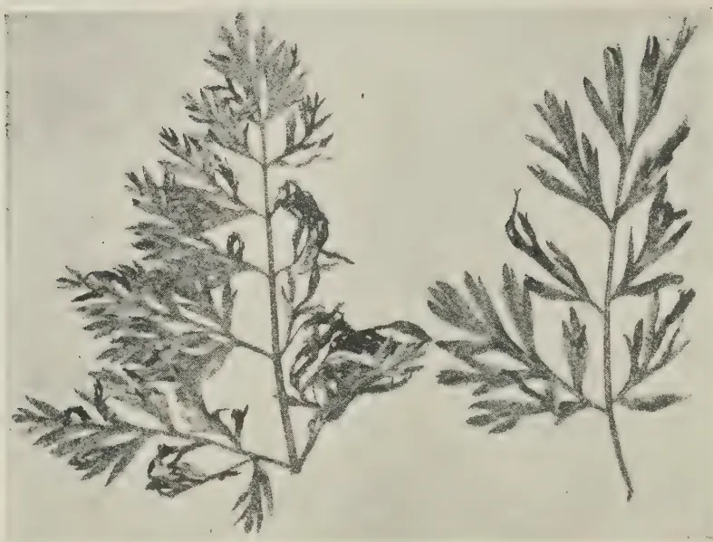
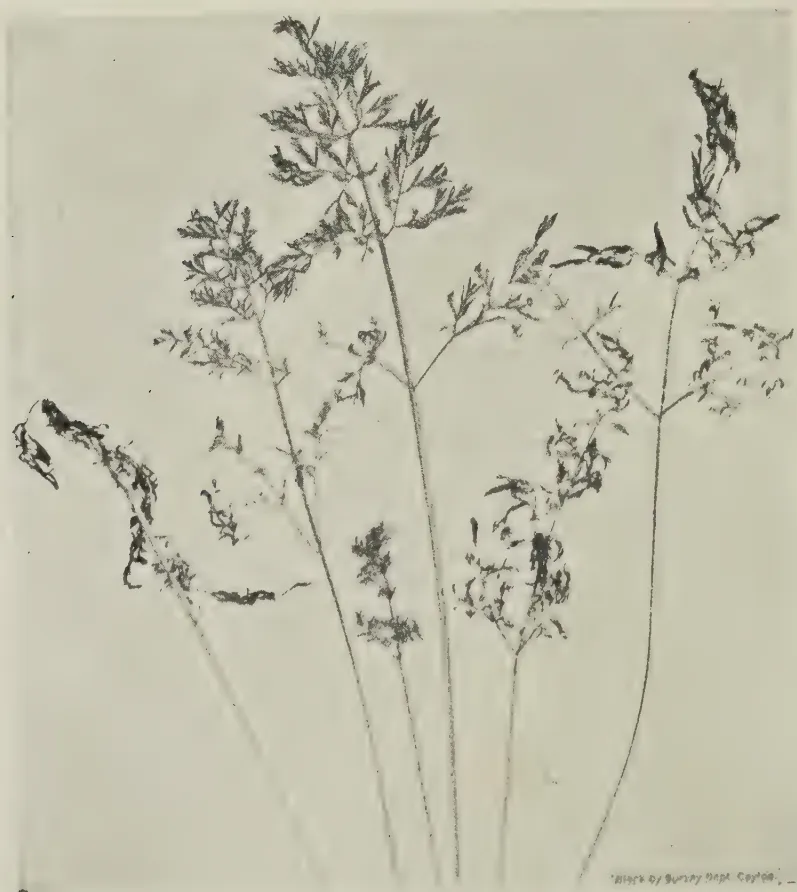

The  
**Tropical Agriculturist**

VOL. XCIII

PERADENIYA, DECEMBER, 1939.

No. 6

---

---

<table style="width: 100%;"><tr><td></td><td style="text-align: right;">Page</td></tr><tr><td>Editorial .. .. .</td><td style="text-align: right;">323</td></tr></table>

**ORIGINAL ARTICLES**

<table style="width: 100%;"><tr><td>Ceylon's Food Supply. By J. C. Drieberg, Dip. Agric. (Poona) ..</td><td style="text-align: right;">325</td></tr><tr><td>Analysis of Ceylon Foodstuffs VI.—The More Important Fruits of the Island. By A. W. R. Joachim, Ph.D. (Lond.), Dip. Agric. (Cantab.) and D. G. Pandittesekere, Dip. Agric. (Poona) .. ..</td><td style="text-align: right;">330</td></tr><tr><td>Analysis of Ceylon Foodstuffs VII.—Further Analyses of Local Foodstuffs with particular Reference to their Mineral Composition. By A. W. R. Joachim, Ph.D. (Lond.), Dip. Agric. (Cantab.), S. Kandiah, Dip. Agric. (Poona), and D. G. Pandittesekere, Dip. Agric. (Poona) ..</td><td style="text-align: right;">336</td></tr><tr><td>A Blight of Carrot Leaves. By C. A. Loos .. ..</td><td style="text-align: right;">343</td></tr><tr><td>Angraecum sesquipedale Thours. By K. J. Alex Sylva, F.R.H.S. ..</td><td style="text-align: right;">346</td></tr><tr><td>Emergency Rubber Coagulants. Communicated by the Rubber Research Scheme (Ceylon) .. .. .</td><td style="text-align: right;">348</td></tr></table>

**DEPARTMENTAL NOTES**

<table style="width: 100%;"><tr><td>Notes on the Cultivation of Food Crops .. ..</td><td style="text-align: right;">351</td></tr><tr><td>Adlay as a Weed of Paddy Fields .. ..</td><td style="text-align: right;">362</td></tr></table>

**SEASONAL PLANTING NOTES**

<table style="width: 100%;"><tr><td>Calendar of work for February .. ..</td><td style="text-align: right;">365</td></tr></table>

**SELECTED ARTICLES**

<table style="width: 100%;"><tr><td>Development of Modern Composting Methods .. ..</td><td style="text-align: right;">368</td></tr><tr><td>Animal Breeding Methods used in the Formation of Types of Cattle Suitable for raising in the Tropics .. ..</td><td style="text-align: right;">372</td></tr></table>

**MEETINGS, CONFERENCES, &c.**

<table style="width: 100%;"><tr><td>Minutes of the Forty-ninth Meeting of the Rubber Research Board ..</td><td style="text-align: right;">378</td></tr><tr><td>Minutes of a Meeting of the Board of the Tea Research Institute ..</td><td style="text-align: right;">381</td></tr></table>

**CORRESPONDENCE**

<table style="width: 100%;"><tr><td>The Transport of Hatching Eggs from England to Zanzibar ..</td><td style="text-align: right;">384</td></tr></table>

**RETURNS**

<table style="width: 100%;"><tr><td>Animal Disease Return for the month ended November, 1939 ..</td><td style="text-align: right;">385</td></tr><tr><td>Meteorological Report for the month ended November, 1939 ..</td><td style="text-align: right;">386</td></tr></table>

1—J. N. 90023 (11/39)

1------------------------------------------------

This image shows a blank page with a light beige or cream-colored background. The surface has a subtle texture and a few small, dark specks or blemishes scattered across it. Near the bottom center, there are some very faint, illegible markings that appear to be bleed-through from the reverse side of the paper. The overall appearance is that of an old, slightly worn piece of paper.

2------------------------------------------------

The  
Tropical Agriculturist

December, 1939

---

EDITORIAL

---

CAPITAL AND FARMING

---

“ IF a man has a capital of Rs. 12,000 why should he go on the land ? ” This was a question, more rhetorical than interrogatory, asked at the last meeting of the Central Board of Agriculture by a member who is a more sincere, vigorous, and uncompromising champion of the back-to-the-land-movement than any other. The tolerant, if not sympathetic, reception that the question had in this assembly of agriculturists may be regarded as evidence that the scale of social and economic values underlying it is commonly accepted in the country. Yet this scale of values is so inconsistent with the rapid development of agriculture in the country and with the consummation of the policy of self-sufficiency which the country has adopted as its fixed, if somewhat distant, aim that it merits some examination and analysis.

In a reference to the survey of the paddy growing industry in Burma in the last number of this Journal, it was pointed out that in that country the size of the average holding was about 25 acres, that it was the size of the holding which produced an exportable surplus above the requirements of the farmer for personal consumption, and that Ceylon could feed herself with her own produce of rice without engaging the whole population in paddy growing only by raising the size of the individual holding to something near the Burmese level. The Special Committee of the Planters' Association that studied the problem of paddy cultivation in 1920—not academically, but as practical business men drawing up a prospectus for a company which they were going to invite their principals to finance—estimated the minimum cost of bringing an acre of land under the plough at Rs. 200, and thought that, under the unfavourable conditions in which new land has to be opened up in paddy, it might go up to Rs. 400 ; the latter figure finds confirmation in the general experience of the Department of Agriculture. Taking the intermediate figure of Rs. 300 per acre, the cost of the clearing, levelling, and ridging of a farm of 25 acres is Rs. 7,500. Other necessary items such as fencing, houses and a bare minimum of furniture for the tenant and two labourers, a well for drinking

3------------------------------------------------

324

water and the necessary live and dead stock will absorb at least Rs. 2,500 more. Fluid working capital of Rs. 1,000 will bring the total up to Rs. 11,000. Therefore the speaker could not have intended to convey the impression that paddy farming did not require capital. He meant either that the owner of this amount of wealth need not work but could live the comfortable life of a man of leisure by the safe investment of his money or that the owner of Rs. 12,000 should embark on a more remunerative or a more noble form of occupation, leaving paddy cultivation to the destitute who will adopt it as the resort of despair. At the current rate of interest for safe investments the annual income from Rs. 12,000 would be about Rs. 425. It is suggested that neither the speaker nor the rest of the country would or should accept this figure as the measure of an adequate standard of living at which all further effort might be suspended, for then there would be no room in Ceylon for any improvement either in agriculture or in any other form of industrial activity. Therefore the true meaning of the question is the suggestion that paddy cultivation should be left to the indigent. But the indigent working with no capital, or with minor subsidies from Government, cannot produce a surplus for the market, and there will be no substantial increase in rice production unless the country sheds this sentiment the general prevalence of which is confirmed by the absence of a single recorded case of a man who advises others from the platform or the press to become paddy farmers seeking to set up his son as a paddy farmer.

Admittedly rice growing is not an adequately remunerative industry on the basis of the ruling competitive prices of commodities; but Government has sought to make the occupation reasonably remunerative by the enforcement of the Agricultural Products (Regulation) Ordinance; but that ordinance will remain ineffective so long as men of the standing of the members of the Central Board of Agriculture entertain the notion that the owner of a bare modicum of capital must shun rice farming.

4------------------------------------------------

325CEYLON'S FOOD SUPPLY

J. C. DRIEBERG, Dip. Agric. (Poona)

IN view of the intensive action that is about to be taken to increase the production of food crops in Ceylon, a consideration of the figures presented in this article in regard to supplies which are brought in from abroad may prove of interest and some value. Fortunately accurate statistics are available in the Ceylon Customs Returns from which official source the figures quoted are taken. Unfortunately, however, statistics relating to cultivated food crops in the Island are not available—even those for the paddy industry are of doubtful accuracy—so that it is not possible to compute the extent of domestic production and to arrive at a ratio of local products to imports. Whether or not it is intended to make Ceylon self-supporting in the matter of all or any of the food crops, the information herein presented should prove of value in a consideration of this question and of the country's dependence upon outside sources for her supplies. In arriving at the per capita figures, the population of the Island has been taken as six millions; and in regard to home-produced rice the yield is estimated at 30 bushels of paddy per acre per annum and the cultivated area taken as 850,000 acres.

The total value of imported foodstuffs, inclusive of fish and meat, amounted in 1938 to Rs. 98 millions or Rs. 16·30 per head of population. Omitting fish, as not being an agricultural commodity, which accounted for Rs. 14 millions or Rs. 2·30 per head, the value of vegetable and animal foodstuffs was Rs. 84 millions or Rs. 14·00 per head. Meat—beef, mutton, pig products, live animals for food, and eggs—was valued at Rs. 1 2/5 millions which works out at 23 cents per head. The value of vegetable products alone, therefore, amounted to Rs. 82·6 millions or Rs. 13·87 per head. Of this sum a little over 66 per cent. or Rs. 55 millions, working out at Rs. 9·20 per head, was the value of rice and paddy imported in 1938. Sugar accounted for Rs. 8 millions or Rs. 1·30 per head, leaving Rs. 19¾ millions, equivalent to Rs. 3·37 per head, for the rest of the vegetable foodstuffs. Table I shows the total value and the value per head of the different classes of commodities imported in 1938. From this it will be observed that over half the total food bill is set against the staple food

5------------------------------------------------

326

rice. Each head of the population paid in 1938 over Rs. 9.00 for his supply of foreign rice. Table II shows that  $18\frac{1}{2}$  million bushels of rice and paddy converted into rice (actually  $10\frac{1}{2}$  million cwt. of rice and 172,000 cwt. of paddy) were imported and that this was equivalent to 3 1/10 bushels per head. At the accepted rate of half a bushel per head per mensem this suffices for a period of 6 months. Home production is estimated at  $12\frac{1}{4}$  million bushels of rice equivalent to 2 bushels per head sufficient for 4 months. This affords a total of 5 1/10 bushels per head from both sources. The main source of our supplies is Burma to which country we remitted last year the large sum of Rs.  $33\frac{1}{3}$  millions equivalent to Rs. 5.70 per head. British India claims a sum of nearly Rs. 15 millions, and Siam Rs. 6 millions. Less quantities were also imported from Cochin China and the Straits Settlements. Further discussion will not be entered into as the problem of the rice industry is a subject which is both big and complicated and merits a separate treatise. Of Rs. 8 millions paid out on imported sugar, Rs. 7 millions went to Java alone for  $1\frac{1}{4}$  million cwt. of refined sugar, smaller quantities of which were also obtained from Portuguese East Africa and Hong Kong. Of unrefined sugar imported to the extent of 55,000 cwt. and valued at Rs. 369,000, it is significant that nearly 21,000 cwt., classified as jaggery, were imported from British India at a cost of Rs. 167,000. With the removal of the restriction on tapping for sweet toddy, it is to be hoped that the jaggery industry will come into its own again and prevent a lakh and a half of rupees going out of the country. Intensive propaganda and facilities for improved manufacture and marketing, however, are required.

Onions comprise both the Spanish type (popularly termed "Bombay" onions in Ceylon) and the small, red or curry "onion" which, properly, should be designated "shallot." If the former type cannot be grown in the Island, there certainly is no reason why the latter should not. The question of price is probably the deciding factor, and if this is so, it may be worth while considering whether a bounty should not be paid to cultivators in order to save even fifty per cent. of the Rs. 2 millions which go out of Ceylon annually for this essential commodity.

Whether anything can be done in the matter of raising potatoes which claimed Rs.  $1\frac{1}{3}$  millions last year awaits consideration.

Leguminous seeds comprising beans, gram, and pulses were imported at the rate of  $11\frac{1}{3}$  lb. per head and absorbed no less than Rs.  $3\frac{1}{2}$  millions. These were imported mainly from British India and Burma as well as China. But it surely is an anomaly that we should allow imports under this head from

6------------------------------------------------

327

Siam and Java to the value of Rs. 37,000 and Rs. 13,000 respectively, and even from the Straits Settlements to a less extent. There is a very strong case for the extensive as well as intensive cultivation of leguminous food crops in Ceylon, the "straw" and chaff of which form good material as food for stock.

The bill for currystuffs has always been a high one and amounted in 1938 to Rs. 4  $1/5$  millions; and of this sum a little over 60 per cent. or Rs. 2  $2/3$  millions went on the single commodity "dried chillies" which were imported at the rate of 3  $1/3$  lb. per head of population. It may not be possible to grow in Ceylon many of the crops which are grouped under this head, but chillies are certainly a possibility and, as in the case of curry onions, it seems necessary to offer a subsidy to growers of this crop. The bulk of the currystuffs comes from British India to which country a sum of Rs. 2,692,000 was paid in 1938. Nearly half this sum went on chillies alone. It is scarcely conceivable that we should allow dried chillies to the value of half a million rupees to be imported from the Straits Settlements.

Garlic and turmeric to the value of Rs. 234,000 and Rs. 145,000 respectively, were imported in 1938, the former from the Straits Settlements chiefly and latter from British India. It will be seen that, if both these crops are grown in Ceylon, nearly 4 lakhs of rupees may be retained in Ceylon.

The value of imported tamarind was Rs. 265,000, and in addition to British India this commodity was also obtained from Java and the Straits Settlements. Is all the available tamarind in the Island collected and marketed or does much of it go to waste? Some inquiry seems desirable as also a consideration of the question of planting it as a roadside tree as is done for miles along the highways in the Madras Presidency.

In looking through the returns of last year one is struck by the extraordinary fact that no less an article than pepper, which a few years ago was being exported from Ceylon to the value of Rs. 4 lakhs, was actually imported from the Straits Settlements and British India to the extent of 2,700 cwt. and 260 cwt. respectively. The value of these quantities was Rs. 38,000. The market for Ceylon pepper has been down during the past few years and imports dropped to nil; but what became of available stocks and how is it that this has not been marketed locally to avoid imports from abroad? Enterprise is decidedly lacking in Ceylon, as well as appreciation of home-grown produce. But, fortunately, the Government Marketing Department is slowly but surely coming to the rescue of the country. Under the heading "fruit" are included fresh and dried fruit and fruit preserved in syrup and in the

7------------------------------------------------

328

form of jams and jellies. The value of these imports in 1938 was Rs. 1 1/10 millions, of which sum a little over 50 per cent. was remitted to Australia. Fresh fruit, chiefly apples and grapes, came mainly from Australia and the United States of America. Dried dates accounted for nearly a lakh of rupees, but, unfortunately, the local boutiques are flooded with stuff of very poor quality which is retailed at 10 cents and even less a pound.

Of oils and fats for human consumption, Australia sent frozen and tinned butter to the value of Rs. 545,000, and Holland, vegetable ghee to the value of Rs. 123,000. The value paid per head of population for these commodities is 16 cents which is not high, but account must be taken of the large consumption of locally-produced coconut oil and the use of coconut milk in cooking of which no estimate is possible.

Cakes, biscuits and confectionery, the bulk of which came from the United Kingdom, accounted for nearly one million rupees.

The bill for prepared cocoa is unaccountably small and shows that the nutritive value of this important article of diet is not sufficiently appreciated in Ceylon.

Java exported to Ceylon not less than Rs. 500,000 worth of coffee beans and British India Rs. 29,000 worth of beans and roasted coffee in 1938.

The total payment and the amount paid per head of population for food to the major exporting countries in 1938 are as follows :—

<table>
<thead>
<tr>
<th>Source of supply.</th>
<th>Total<br/>Value of<br/>Imports.<br/>Rs. mill.</th>
<th>Amount<br/>per Head of<br/>Population.<br/>Rs. c.</th>
</tr>
</thead>
<tbody>
<tr>
<td>Burma .. ..</td>
<td>34.0 ..</td>
<td>5 70</td>
</tr>
<tr>
<td>British India .. ..</td>
<td>24.0 ..</td>
<td>4 2</td>
</tr>
<tr>
<td>Java .. ..</td>
<td>7.6 ..</td>
<td>1 27</td>
</tr>
<tr>
<td>Siam .. ..</td>
<td>6.0 ..</td>
<td>0 86</td>
</tr>
<tr>
<td>Australia .. ..</td>
<td>4.0 ..</td>
<td>0 67</td>
</tr>
<tr>
<td>United Kingdom .. ..</td>
<td>1.7 ..</td>
<td>0 29</td>
</tr>
<tr>
<td>Holland .. ..</td>
<td>1.3 ..</td>
<td>0 22</td>
</tr>
<tr>
<td>Straits Settlements .. ..</td>
<td>0.9 ..</td>
<td>0 15</td>
</tr>
<tr>
<td>Other countries .. ..</td>
<td>4.5 ..</td>
<td>0 82</td>
</tr>
</tbody>
</table>

This article purports no more than to furnish a preliminary statement regarding the Island's dependence upon foreign food supplies, and will be followed by a further one in which will be discussed the practical aspects of local production in order to save as large a proportion as possible of the heavy bill to which Ceylon is committed on the score of food.

8------------------------------------------------

329TABLE I.

<table border="1">
<thead>
<tr>
<th>Items.</th>
<th>Total Value.</th>
<th>Value<br/>per Head of<br/>Population.</th>
</tr>
<tr>
<th>Classes of Food Stuffs.</th>
<th>Rs. mill.</th>
<th>Rs. c.</th>
</tr>
</thead>
<tbody>
<tr>
<td>1. Rice and paddy ..</td>
<td>55.0</td>
<td>9 20</td>
</tr>
<tr>
<td>2. Sugar ..</td>
<td>8.0</td>
<td>1 30</td>
</tr>
<tr>
<td>3. Currystuffs ..</td>
<td>4.2</td>
<td>0 70 (1)</td>
</tr>
<tr>
<td>4. Legumes ..</td>
<td>3.5</td>
<td>0 58</td>
</tr>
<tr>
<td>5. Onions and potatoes ..</td>
<td>3.3</td>
<td>0 55 (2)</td>
</tr>
<tr>
<td>6. Milk and milk products excluding<br/>    butter and ghee taken under 10</td>
<td>3.3</td>
<td>0 55</td>
</tr>
<tr>
<td></td>
<td>2.6</td>
<td>0 43</td>
</tr>
<tr>
<td>7. Cereal flour and prepared foods ..</td>
<td>2.0</td>
<td>0 33</td>
</tr>
<tr>
<td>8. Meat (all kinds) ..</td>
<td>1.4</td>
<td>0 23</td>
</tr>
<tr>
<td>9. Fruit (fresh, dried, and preserved)</td>
<td>1.1</td>
<td>0 18</td>
</tr>
<tr>
<td>10. Oils and fats (animal and vegetable)</td>
<td>1.0</td>
<td>0 16</td>
</tr>
<tr>
<td>11. Cakes, biscuits, and confectionery</td>
<td>0.9</td>
<td>0 15</td>
</tr>
<tr>
<td>12. Cocoa and coffee ..</td>
<td>0.5</td>
<td>0 8</td>
</tr>
<tr>
<td>13. Oil seeds (for food) ..</td>
<td>0.3</td>
<td>0 5</td>
</tr>
<tr>
<td>14. Vegetables (fresh and preserved)</td>
<td>0.09</td>
<td>0 1½</td>
</tr>
<tr>
<td>15. Fish (all types) ..</td>
<td>14.0</td>
<td>2 30</td>
</tr>
<tr>
<td colspan="3">(1) dried chillies Rs. <math>2\frac{2}{3}</math> mill. = 0.38 cts.</td>
</tr>
<tr>
<td colspan="3">(2) onions Rs. 2 ,, = 0.33 ,,</td>
</tr>
<tr>
<td colspan="3">    potatoes Rs. <math>1\frac{1}{4}</math> ,, = 0.22 ,,</td>
</tr>
</tbody>
</table>

TABLE II.

<table border="1">
<thead>
<tr>
<th>Items.</th>
<th>Total Imports<br/>Quantity.</th>
<th>Quantity per<br/>Head of<br/>Population.</th>
</tr>
</thead>
<tbody>
<tr>
<td>Rice and paddy converted into rice ..</td>
<td>18½ mill. bushels</td>
<td>3 <math>\frac{1}{10}</math> bushels</td>
</tr>
<tr>
<td>Sugar, refined ..</td>
<td>1 <math>\frac{2}{5}</math> mill. cwt. ..</td>
<td>26¾ lb.</td>
</tr>
<tr>
<td>Onions ..</td>
<td>661,000 cwt. ..</td>
<td>12½ lb.</td>
</tr>
<tr>
<td>Beans, gram, and pulses ..</td>
<td>605,000 cwt. ..</td>
<td>11½ lb.</td>
</tr>
<tr>
<td>Potatoes ..</td>
<td>270,000 cwt. ..</td>
<td>5 lb.</td>
</tr>
<tr>
<td>Chillies ..</td>
<td>178,000 cwt. ..</td>
<td>3½ lb.</td>
</tr>
<tr>
<td>Sugar, unrefined ..</td>
<td>55,000 cwt. ..</td>
<td>1 lb.</td>
</tr>
<tr>
<td>Milk (preserved and powder) ..</td>
<td>4½ mill. lb. ..</td>
<td><math>\frac{3}{4}</math> lb.</td>
</tr>
<tr>
<td>Butter and ghee (animal and vegetable) ..</td>
<td>2½ mill. lb. ..</td>
<td><math>\frac{1}{3}</math> lb.</td>
</tr>
<tr>
<td>Beef, mutton and pig products<br/>(excluding preserved game and<br/>live animals of which quantities are<br/>stated in number)</td>
<td>13,700 cwt. ..</td>
<td><math>\frac{1}{4}</math> lb.</td>
</tr>
<tr>
<td colspan="3">Fish—</td>
</tr>
<tr>
<td>dried or salted ..</td>
<td>380,000 cwt. ..</td>
<td>7 lb.</td>
</tr>
<tr>
<td>Maldiva ..</td>
<td>87,000 cwt. ..</td>
<td>1 <math>\frac{2}{3}</math> lb.</td>
</tr>
</tbody>
</table>

9------------------------------------------------

330

THE ANALYSIS OF CEYLON FOODSTUFFS  
VI.—THE MORE IMPORTANT FRUITS  
OF THE ISLAND

A. W. R. JOACHIM, Ph.D. (Lond.), Dip. Agric. (Cantab.),  
CHEMIST

AND

D. G. PANDITTESEKERE, Dip. Agric. (Poona),  
ASSISTANT IN AGRICULTURAL CHEMISTRY

IN part IV of the series of papers in *The Tropical Agriculturist* of January, 1938, on the analysis of Ceylon foodstuffs (1), the results of the vitamin C determinations of some local fruits and vegetables were presented and discussed. In this paper the analytical data of the more important fruits of the Island are detailed and compared. The number of samples examined was twenty-two comprising twenty different species of fruits. These were plantain, mango, pineapple, papaw, mangosteen, grapefruit, orange, lime, guava, tomato, tree tomato, jak, bael, woodapple, soursop, custard apple, bullock's heart, sapodilla, avocado pear, and young coconut. Two varieties each of the plantain and the mango were studied for purposes of comparison.

SOURCE OF SUPPLY, SAMPLING AND METHODS OF ANALYSIS

Samples for analysis were obtained locally and were representative of the fruit of the district. Fully-ripe fruits were selected and only the edible portion of the fruit was analysed, the percentage of such portion on the whole fruit being determined in every instance. The figures so obtained are included in the table. The methods of analysis for the constituents determined were mainly those adopted by McCance, Widdowson, and Shackleton (2) in their work on "The Nutritive Value of Fruits, Vegetables and Nuts." The following determinations were carried out on the samples by the methods indicated in brackets:—moisture (drying at 50°C), mineral matter (incineration in a muffle furnace), protein (nitrogen by Kjeldhal method  $\times 6.25$ ), fat (extraction in a Soxhalet apparatus), total and reducing sugars (Lane and Eynon's method on alcoholic extract), fibre (digestion with acid and alkali), titratable acidity (on alcoholic extract), calcium and phosphorus (volumetric phospho-molybdate method). Total carbohydrates were obtained by difference

10------------------------------------------------

331

and the calorific value calculated by the usual method. Iron determinations were not carried out, as the amount of this element in fruits is generally very low. Further, large variations have been observed in the iron contents of different samples of the same fruit.

The results of analysis are furnished in the annexed table. They are expressed as percentages on the edible portion of the fruit. It need hardly be stressed that these figures are merely indicative of the general analytical composition of the particular variety of fruit and would vary fairly appreciably with different samples of the same fruit, particularly in respect of the mineral constituents. As a matter of interest, in addition to the English names, the botanical, Sinhalese and Tamil names of the fruits are given.

#### THE COMPOSITION OF FRUITS IN GENERAL AND CEYLON FRUITS IN PARTICULAR

Fruits contain high percentages of water, the latter varying from 65 to 90 per cent. Of the local fruits examined, bael is a striking exception, its moisture content being only 44 per cent. Other fruits with relatively low moisture contents are the *kolikuttu* plantain and bullock's heart (which contain about two-thirds their weight of water), and jak (pulp).

The edible portions of fruits constitute, in the majority of cases, from 40 to 85 per cent. of their weight, the exceptions being young coconut (kernel) with only 7 per cent. and jak (pulp) with 31 per cent. of edible flesh on the one hand, and tomato with 97 per cent. and guava with 100 per cent. edible matter on the other. Most varieties of guava have, however, a high proportion of seeds which are in reality waste material.

The other constituents of fruits are: carbohydrates comprising sugars, starches (in small amounts only), gums, pectins and fibre, organic acids which with the sugars determine fruit flavour, mineral matter, proteins, and fats in small quantities (with certain noteworthy exceptions), essential oils and esters, which give them their aroma, vitamins and colouring matter. The characteristic vitamin of fruits is vitamin C, but certain fruits, *e.g.*, mango, papaw, plantains, avocado pear, contain vitamin A or carotene in relatively fair quantities. Some local fruits such as the papaw and pineapple contain proteolytic enzymes, *papain* being obtained from the former and *bromelin* from the latter.

*Carbohydrates.*—The carbohydrate figures, which as already explained are obtained by difference, would vary to an appreciable degree with the moisture contents of the fruits. In the case of the fruit samples examined, the amount of carbohydrate

11------------------------------------------------

332

varies from 3.2 per cent. in young-coconut kernel to 52.0 per cent. in bael fruit. The plantain, jak, custard apple, sapodilla, and bullock's heart are also relatively rich in carbohydrates, while the avocado pear, young-coconut kernel, tomato, and lime are poor in these food constituents. Sugars constitute over 50 per cent. of the total carbohydrates in the mango (particularly the parrot mango which is noted for its sweetness), ripe plantain, jak, sapodilla, papaw, and mangosteen. The guava has been reported (3) by workers in Bombay to be rich in sugars, but the sample examined here, which was of the local variety, was found to be otherwise. Fruits which have only traces of sugar are the tomato, avocado pear, and lime. In the bael fruit and woodapple less than 20 per cent. of the carbohydrates consists of sugars. Starches and mucilages in the former and pectins and other such compounds in the latter probably constitute the main bulk of their carbohydrates. In most fruits the cane sugar content is higher than that of the reducing sugars. The reverse holds in the case of the plantain. The latter finding is confirmed by the work of Widdowson and McCance (4) with bananas, but not by that of Poland, &c. (5). The discrepancy in results is probably due to differences in variety of fruit and possibly methods of analysis.

*Ether Extract—Oil and Fat.*—The avocado pear and the young-coconut kernel are outstanding in respect of their fat contents. The local sample of the former contained 17.5 per cent. of oil or over 70 per cent. of the dry matter of the fruit pulp. The latter contained 10.8 per cent. of oil or over 50 per cent. of the dry matter of the kernel. Work in California (6) and India (7) has confirmed the results obtained locally with the avocado. The name "butter fruit" by which this fruit is also known is well-deserved. The other local fruits, with the exception of the sapodilla, have very low fat contents.

*Fibre.*—The fibre figures need but little comment. The woodapple and guava (the latter owing to its seed) have highest fibre contents. The young-coconut kernel has more fibre than might be expected.

*Protein.*—The protein contents of all local fruits are low. Woodapple has approximately 3 per cent. protein, while bullock's heart, custard apple, young-coconut kernel, jak, and bael have about 2 per cent. of this constituent. Mangoes, guavas, and plantains have only about one per cent. of protein.

*Caloric value.*—Bael fruit, avocado pear and *kolikuttu* plantain have highest calorific values, with bullock's heart and jak pulp closely following. These fruits have from about a third to a half of the calorific value of energy foods such as cereals.

12------------------------------------------------

333

*Titratable acidity.*—This varies from 8 c.c. of N/10 acid per 100 g. for the *kolikuttu* plantain to 954 c.c. for lime. The woodapple is strongly acid with an acidity value of 537 c.c., while other fruits with high acid contents are the tomato, tree tomato, orange, grapefruit, pineapple, and soursop. The sapodilla, papaw, and avocado pear contain but little acid. The sour plantain has an acid value similar to that of the parrot mango.

*Mineral matter.*—The percentage of mineral matter varies from 0.16 per cent. in the mangosteen to 1.72 per cent. in the bael fruit. The woodapple, bullock's heart, and avocado pear also have high ash contents. Of all the constituents of fruits, none are likely to vary so much in different samples of the same fruit as the individual mineral constituents.

*Calcium.*—The calcium contents vary from 4.3 mgm per 100 g. for sapodilla to 80.4 mgm per 100 g. for woodapple. The interesting point is that while woodapple has a high titratable acid value, it has also a high calcium content. The latter fact has been confirmed by Indian workers (7). But the calcium contents of local fruits are lower than those of corresponding samples analysed in India. Other fruits which contain relatively high amounts of calcium are bael, bullock's heart, and orange. Besides the sapodilla, fruits low in calcium are mangosteen, plantain, avocado pear, tree tomato, and pineapple. The sample of sapodilla examined was grown on a sandy soil, deficient in lime. Hence, perhaps, its low calcium content.

*Phosphorus.*—The phosphorus contents of the fruit samples examined range from 6.3 to 55.6 mgm per 100 g. The following fruits show low values: papaw, mangosteen, tomato, parrot mango, guava. Woodapple is richest in this constituent also, others showing high values being bael, young-coconut kernel and avocado. Compared with the Indian figures (7) the phosphorus contents of local fruits are invariably lower.

#### GENERAL DISCUSSION AND SUMMARY

The results of analyses of 22 samples comprising 20 species of local fruit, generally confirm the findings of workers in India (7) and the Philippine Islands (8) in regard to the composition of the fruits examined. Differences are, however, apparent particularly in regard to the mineral contents. The Indian figures for calcium and phosphorus are invariably higher than the corresponding local figures. Climatic and soil differences would account for this fact.

Local fruits, like most fruits, have (1) high moisture contents, a notable exception being the bael fruit, (2) low percentages of protein, (3) traces of fat, except in the avocado pear and young-coconut kernel, which are both rich in this constituent, (4)

13------------------------------------------------

334CHEMICAL COMPOSITION OF CEYLON FRUITS

<table border="1">
<thead>
<tr>
<th>Fruit.</th>
<th>Botanical Name.</th>
<th>Sinhalese Name.</th>
<th>Tamil Name.</th>
<th>Nature of waste.</th>
<th>Edible portion per cent.</th>
<th>Moisture per cent.</th>
<th>Protein per cent.</th>
<th>Total carbohydrates per cent.</th>
<th>Reducing sugars per cent.</th>
<th>Sucrose per cent.</th>
<th>Total sugars per cent.</th>
<th>Ether extract (fat) per cent.</th>
<th>Fibre per cent.</th>
<th>Mineral matter per cent.</th>
<th>Calcium mgm. per cent.</th>
<th>Phosphorus mgm. per cent.</th>
<th>Titratable acidity c.c. N/10 per 100 g.</th>
<th>Calorific value per 100 g.</th>
</tr>
</thead>
<tbody>
<tr>
<td>1 Sour plantain ..</td>
<td><i>Musa paradisia</i> ..</td>
<td>Ambulhondara-<br/>vala</td>
<td>Pulkathali ..</td>
<td>Skin ..</td>
<td>69</td>
<td>73.6</td>
<td>1.09</td>
<td>24.44</td>
<td>13.0</td>
<td>3.6</td>
<td>16.6</td>
<td>0.14</td>
<td>—</td>
<td>0.73</td>
<td>13.4</td>
<td>15.8</td>
<td>49</td>
<td>103.4</td>
</tr>
<tr>
<td>2 Kolkuttu plantain ..</td>
<td><i>Musa paradisia</i> ..</td>
<td>Kolkuttu ..</td>
<td>Kappal ..</td>
<td>Skin ..</td>
<td>72</td>
<td>65.9</td>
<td>1.28</td>
<td>31.71</td>
<td>14.4</td>
<td>8.2</td>
<td>22.6</td>
<td>0.21</td>
<td>—</td>
<td>0.90</td>
<td>9.9</td>
<td>19.5</td>
<td>8</td>
<td>133.9</td>
</tr>
<tr>
<td>3 Avocado pear ..</td>
<td><i>Persea drymifolia</i> ..</td>
<td>Aligata pera ..</td>
<td>Seemai Koiya ..</td>
<td>Skin and seed ..</td>
<td>28</td>
<td>75.6</td>
<td>0.85</td>
<td>4.97</td>
<td>—</td>
<td>—</td>
<td>—</td>
<td>17.55</td>
<td>—</td>
<td>1.03</td>
<td>10.9</td>
<td>35.4</td>
<td>12</td>
<td>181.2</td>
</tr>
<tr>
<td>4 Grapefruit ..</td>
<td><i>Citrus grandis</i> var. <i>maxima</i> ..</td>
<td>Seeni-jambola ..</td>
<td>Krape thodam palam ..</td>
<td>Skin, seeds, pith, and membranes do. ..</td>
<td>55</td>
<td>88.3</td>
<td>0.50</td>
<td>10.68</td>
<td>3.4</td>
<td>2.2</td>
<td>5.6</td>
<td>0.13</td>
<td>0.04</td>
<td>0.35</td>
<td>20.4</td>
<td>12.5</td>
<td>173</td>
<td>45.9</td>
</tr>
<tr>
<td>5 Orange ..</td>
<td><i>Citrus aurantium</i> ..</td>
<td>Peni-dodan ..</td>
<td>Thodam palam ..</td>
<td>do. ..</td>
<td>53</td>
<td>86.4</td>
<td>0.59</td>
<td>12.28</td>
<td>2.4</td>
<td>3.5</td>
<td>5.9</td>
<td>0.17</td>
<td>—</td>
<td>0.56</td>
<td>37.0</td>
<td>18.7</td>
<td>171</td>
<td>53.0</td>
</tr>
<tr>
<td>6 Lime ..</td>
<td><i>Citrus medica</i> var. <i>acida</i> ..</td>
<td>Dehi ..</td>
<td>Elmichalapalam ..</td>
<td>do. ..</td>
<td>55</td>
<td>90.3</td>
<td>0.51</td>
<td>8.60</td>
<td>—</td>
<td>—</td>
<td>—</td>
<td>0.16</td>
<td>—</td>
<td>0.43</td>
<td>18.8</td>
<td>16.1</td>
<td>954</td>
<td>37.9</td>
</tr>
<tr>
<td>7 Papaw ..</td>
<td><i>Carica papaya</i> ..</td>
<td>Papal (Gas-labu) ..</td>
<td>Papasi palam ..</td>
<td>Skin and seeds ..</td>
<td>67</td>
<td>85.1</td>
<td>0.39</td>
<td>14.06</td>
<td>1.0</td>
<td>6.7</td>
<td>7.7</td>
<td>0.07</td>
<td>—</td>
<td>0.38</td>
<td>18.8</td>
<td>6.3</td>
<td>12</td>
<td>58.4</td>
</tr>
<tr>
<td>8 Mango, Jaffna ..</td>
<td><i>Mangifera indica</i> ..</td>
<td>Yapane amba ..</td>
<td>Velai columnban ..</td>
<td>Skin and seed ..</td>
<td>54</td>
<td>80.0</td>
<td>1.08</td>
<td>17.09</td>
<td>4.7</td>
<td>8.4</td>
<td>13.1</td>
<td>0.20</td>
<td>0.23</td>
<td>0.40</td>
<td>24.0</td>
<td>20.9</td>
<td>69</td>
<td>74.5</td>
</tr>
<tr>
<td>9 Mango, Parrot ..</td>
<td><i>Mangifera indica</i> ..</td>
<td>Gura amba ..</td>
<td>Kilichondu man-palam ..</td>
<td>Skin and seed ..</td>
<td>56</td>
<td>85.9</td>
<td>0.62</td>
<td>12.70</td>
<td>3.5</td>
<td>7.8</td>
<td>11.4</td>
<td>0.07</td>
<td>0.27</td>
<td>0.44</td>
<td>19.3</td>
<td>7.4</td>
<td>45</td>
<td>53.9</td>
</tr>
<tr>
<td>10 Tomato ..</td>
<td><i>Lycopersicum esculentum</i> ..</td>
<td>Thakkali ..</td>
<td>Thakkalip palam ..</td>
<td>Stem ends ..</td>
<td>97</td>
<td>93.9</td>
<td>0.64</td>
<td>4.86</td>
<td>—</td>
<td>—</td>
<td>—</td>
<td>0.01</td>
<td>—</td>
<td>0.59</td>
<td>15.7</td>
<td>9.5</td>
<td>132</td>
<td>22.1</td>
</tr>
<tr>
<td>11 Tree Tomato ..</td>
<td><i>Cyphomandra betacea</i> ..</td>
<td>Gas-thakkali ..</td>
<td>Marathakkalip palam ..</td>
<td>Skin and stalks ..</td>
<td>79</td>
<td>84.6</td>
<td>1.95</td>
<td>9.88</td>
<td>1.8</td>
<td>1.6</td>
<td>3.4</td>
<td>0.53</td>
<td>2.24</td>
<td>0.80</td>
<td>13.3</td>
<td>30.5</td>
<td>263</td>
<td>52.1</td>
</tr>
<tr>
<td>12 Pineapple ..</td>
<td><i>Ananas sativus</i> ..</td>
<td>Annasi ..</td>
<td>Annasip palam ..</td>
<td>Stem, crown, skin, and core ..</td>
<td>42</td>
<td>87.8</td>
<td>0.49</td>
<td>10.91</td>
<td>3.3</td>
<td>4.9</td>
<td>8.2</td>
<td>0.07</td>
<td>0.32</td>
<td>0.41</td>
<td>13.5</td>
<td>15.0</td>
<td>158</td>
<td>46.2</td>
</tr>
<tr>
<td>13 Mangosteen ..</td>
<td><i>Garcinia mangos-tana</i> ..</td>
<td>Mangus ..</td>
<td>Mangusthan palam ..</td>
<td>Skin and seeds ..</td>
<td>70</td>
<td>82.6</td>
<td>0.60</td>
<td>16.48</td>
<td>1.9</td>
<td>6.5</td>
<td>8.4</td>
<td>0.16</td>
<td>—</td>
<td>0.16</td>
<td>5.7</td>
<td>9.4</td>
<td>81</td>
<td>69.8</td>
</tr>
<tr>
<td>14 Jak fruit ..</td>
<td><i>Artocarpus integrifolia</i> ..</td>
<td>Waraka ..</td>
<td>Pilap palam ..</td>
<td>Skin, membranes, and seeds ..</td>
<td>31</td>
<td>68.8</td>
<td>1.81</td>
<td>27.54</td>
<td>4.0</td>
<td>14.4</td>
<td>18.4</td>
<td>0.29</td>
<td>0.65</td>
<td>0.91</td>
<td>16.9</td>
<td>17.0</td>
<td>35</td>
<td>120.0</td>
</tr>
<tr>
<td>15 Bael fruit ..</td>
<td><i>Aegle marmelos</i> ..</td>
<td>Belli ..</td>
<td>Vilvam palam ..</td>
<td>Shell and seeds ..</td>
<td>48</td>
<td>44.0</td>
<td>1.77</td>
<td>52.03</td>
<td>2.6</td>
<td>7.2</td>
<td>9.8</td>
<td>0.48</td>
<td>—</td>
<td>1.72</td>
<td>46.8</td>
<td>54.1</td>
<td>82</td>
<td>219.5</td>
</tr>
<tr>
<td>16 Wood apple ..</td>
<td><i>Perona etepantum</i> ..</td>
<td>Diwul ..</td>
<td>Villam palam ..</td>
<td>Shell ..</td>
<td>58</td>
<td>74.0</td>
<td>2.91</td>
<td>17.08</td>
<td>1.3</td>
<td>0.4</td>
<td>1.7</td>
<td>0.71</td>
<td>3.90</td>
<td>1.40</td>
<td>80.4</td>
<td>55.0</td>
<td>537</td>
<td>86.4</td>
</tr>
<tr>
<td>17 Sour sop ..</td>
<td><i>Anona muricata</i> ..</td>
<td>Katu-anoda ..</td>
<td>Mulanamuna palam ..</td>
<td>Skin, seeds, and core do. ..</td>
<td>69</td>
<td>82.4</td>
<td>0.88</td>
<td>14.97</td>
<td>6.2</td>
<td>1.0</td>
<td>7.2</td>
<td>0.19</td>
<td>0.78</td>
<td>0.78</td>
<td>19.4</td>
<td>31.9</td>
<td>124</td>
<td>65.1</td>
</tr>
<tr>
<td>18 Bullock's heart ..</td>
<td><i>Anona reticulata</i> ..</td>
<td>Anoda ..</td>
<td>Parangi anna-muna palam ..</td>
<td>do. ..</td>
<td>41</td>
<td>66.4</td>
<td>2.06</td>
<td>29.41</td>
<td>6.8</td>
<td>0.5</td>
<td>7.3</td>
<td>0.54</td>
<td>—</td>
<td>1.59</td>
<td>64.1</td>
<td>19.9</td>
<td>88</td>
<td>130.7</td>
</tr>
<tr>
<td>19 Custard apple ..</td>
<td><i>Anona squamosa</i> ..</td>
<td>Seeni-anoda ..</td>
<td>Annamuna palam ..</td>
<td>do. ..</td>
<td>47</td>
<td>76.4</td>
<td>2.09</td>
<td>20.44</td>
<td>7.3</td>
<td>2.3</td>
<td>9.6</td>
<td>0.24</td>
<td>—</td>
<td>0.83</td>
<td>17.8</td>
<td>14.1</td>
<td>78</td>
<td>92.3</td>
</tr>
<tr>
<td>20 Sapodilla ..</td>
<td><i>Acris sapota</i> ..</td>
<td>Sapodilla ..</td>
<td>Seemal elupai ..</td>
<td>Skin and seeds ..</td>
<td>86</td>
<td>71.5</td>
<td>0.75</td>
<td>25.21</td>
<td>3.0</td>
<td>8.7</td>
<td>16.7</td>
<td>1.10</td>
<td>0.97</td>
<td>0.47</td>
<td>4.3</td>
<td>23.9</td>
<td>18</td>
<td>113.7</td>
</tr>
<tr>
<td>21 Guava (Hill) ..</td>
<td><i>Psidium guava</i> ..</td>
<td>Pera ..</td>
<td>Koiya palam ..</td>
<td>Nil ..</td>
<td>100</td>
<td>82.0</td>
<td>1.07</td>
<td>10.01</td>
<td>3.9</td>
<td>1.4</td>
<td>5.3</td>
<td>0.27</td>
<td>5.98</td>
<td>0.67</td>
<td>19.8</td>
<td>11.5</td>
<td>79</td>
<td>46.8</td>
</tr>
<tr>
<td>22 Young-coconut kernel ..</td>
<td><i>Cocos nucifera</i> ..</td>
<td>Kurumba ..</td>
<td>Thenkai valuval ..</td>
<td>Husk, shell, and water ..</td>
<td>7</td>
<td>81.1</td>
<td>1.97</td>
<td>3.23</td>
<td>—</td>
<td>—</td>
<td>—</td>
<td>10.84</td>
<td>1.88</td>
<td>0.98</td>
<td>15.2</td>
<td>51.1</td>
<td>—</td>
<td>118.4</td>
</tr>
</tbody>
</table>

14------------------------------------------------

335

relatively high amounts of carbohydrates, the greater proportion of which is, in many cases, cane and reducing sugar, (5) varying quantities of organic acids—lime and woodapple being the most acid of those examined, (6) mineral constituents in very variable proportions, (7) vitamins, mainly vitamin C, though a few are relatively well-supplied with vitamin A or its precursor carotene, (8) essential oils and esters which give the aroma to the fruits.

No details are given in this paper of the vitamin contents of local fruits as these have been furnished in a previous publication (1). The papaw and the pineapple are characteristic in that they contain proteolytic or protein-hydrolysing enzymes of commercial value. Thus the papaw supplies *papain* and the pineapple *bromelin*.

Of the fruits examined bael, avocado pear, plantains (the *kolikuttu* variety) and young-coconut kernel have highest calorific values, the high oil content of the avocado and young-coconut kernel contributing to this result. Plantains, jak, sapodilla, and mangoes are rich in sugars. Woodapple is richest in both calcium and phosphorus, bullock's heart and bael fruit being also good sources of these elements. The fruits containing largest amounts of fruit acids are lime, woodapple, and tree tomato.

#### REFERENCES

1. 1. Joachim, A. W. R. *et al.*—The Analysis of Ceylon Foodstuffs, I-V.—*The Tropical Agriculturist*, XC., No. 1, 1938.
2. 2. McCance, R. A., Widdowson, E. M., and Shackleton, L. R. B.—The Nutritive Value of Fruits, Vegetables and Nuts.—*Med. Res. Council, Special Report Series*, No. 213, 1936.
3. 3. Sahasrabuddhe, D. L.—The Chemical Composition of the Food Grains, Vegetables and Fruits of Western India.—*Bombay Dept. Agr. Bull.* No. 124, 1924–26.
4. 4. Widdowson, E. M., and McCance, R. A.—*Biochem. Jl.*, 29, 1935.
5. 5. Poland, G. L., Manion, J. T., Brenner, M. W., and Harris, P. L.—Sugar Changes in the Banana During Ripening.—*Ind. Eng. Chem.* Vol. 30, No. 3. 1938.
6. 6. Haas, A. R. C.—Chemical Composition of Avocado Fruits.—*Jl. Agr. Res.* Vol. 54, No. 9, 1937.
7. 7. The Nutritive Value of Indian Foods and the Planning of Satisfactory Diets. (Revised and Enlarged) 1938.—*Indian Health Bull.* No. 23.
8. 8. Adriano, F. T.—The Proximate Chemical Analysis of Philippine Foods and Feedingstuffs.—*Philippine Agr.*, Vol. XIV., 1925–26.

15------------------------------------------------

336

ANALYSIS OF CEYLON FOODSTUFFS  
 VII.—FURTHER ANALYSES OF LOCAL FOODSTUFFS  
 WITH PARTICULAR REFERENCE TO THEIR  
 MINERAL COMPOSITION

A. W. R. JOACHIM, Ph.D. (Lond.), Dip. Agric. (Cantab.),  
 CHEMIST,

S. KANDIAH, Dip. Agric. (Poona),  
 ASSISTANT IN AGRICULTURAL CHEMISTRY  
 AND

D. G. PANDITTESEKERE, Dip. Agric. (Poona),  
 ASSISTANT IN AGRICULTURAL CHEMISTRY

SINCE the publication of the articles on the analysis of Ceylon foodstuffs in *The Tropical Agriculturist* of January, 1938 (1), analyses have been made of locally-grown foods which had not been examined or had only been partially examined before. The results of these analyses are now published, as they may be of value to those who are interested in the practical aspects of nutrition in the Island. The paper has, for the sake of convenience, been divided into two sections. The first deals with the analyses of 18 varieties of grains, roots, yams, tubers, and seeds; the second with the comparative mineral composition of 23 vegetable samples obtained from three important marketing centres. The data are presented in three tables.

In all cases, only the edible portion of the foodstuff was analysed. The methods of analysis adopted were the same as in the earlier investigations, except in regard to the iron determinations for which a Lovibond tintometer was used in making the colour comparisons. Some of the iron results were checked by the thioglycollic acid method. Potassium was estimated in a few samples by the volumetric cobaltinitrite method.

#### SECTION I.

The foodstuffs examined were the yellow, purple, and white varieties of adlay, dried palmyra root (raw and parboiled), wild breadfruit and *Cycas* seeds (*madu* S.), *dioscorea*, *alocasia* and *colocasia* yams, artichoke (local), country potato (*innala* S.), and young-coconut water. The mineral constituents of gingelly, king yam, and sweet potato were also determined. Table I shows the proximate composition of the foods mentioned and Table II their mineral composition. In the latter table, the mineral analyses of local samples of rice, green gram, and kurakkan, which have already been published in part, are included for comparison. Attention may be drawn to the magnesium data which are presented for the first time. Rice is poorer in this mineral constituent than kurakkan or green gram.

16------------------------------------------------

337

**TABLE I**  
**The Composition of Local Foodstuffs.**

<table border="1">
<thead>
<tr>
<th>Name.</th>
<th>Botanical Name.</th>
<th>Sinhalese Name.</th>
<th>Tamil Name.</th>
<th>Moisture<br/>Per Cent.</th>
<th>Protein<br/>Per Cent.</th>
<th>Carbo-<br/>hydrate<br/>Per Cent.</th>
<th>Ether<br/>Extract<br/>Per Cent.</th>
<th>Fibre<br/>Per Cent.</th>
<th>Mineral<br/>Matter<br/>Per Cent.</th>
<th>Calorific<br/>Value<br/>per 100<br/>Gms.</th>
</tr>
</thead>
<tbody>
<tr>
<td colspan="11"><i>Grains, Seeds, and Roots—</i></td>
</tr>
<tr>
<td>Adlay (yellow)</td>
<td>Coix lachryma-johi</td>
<td>Kirindi</td>
<td>Netpavalam</td>
<td>11.3</td>
<td>10.3</td>
<td>74.3</td>
<td>3.1</td>
<td>0.29</td>
<td>0.70</td>
<td>366.3</td>
</tr>
<tr>
<td>" (purple)</td>
<td>do.</td>
<td>do.</td>
<td>do.</td>
<td>10.2</td>
<td>11.7</td>
<td>73.1</td>
<td>3.8</td>
<td>0.32</td>
<td>0.87</td>
<td>373.4</td>
</tr>
<tr>
<td>" (white)</td>
<td>do.</td>
<td>do.</td>
<td>do.</td>
<td>10.1</td>
<td>12.1</td>
<td>72.7</td>
<td>3.8</td>
<td>0.31</td>
<td>0.99</td>
<td>373.4</td>
</tr>
<tr>
<td>Wild breadfruit seed</td>
<td>Artocarpus nobilis</td>
<td>Wal-del, bedi-del</td>
<td>Asinippala</td>
<td>7.8</td>
<td>13.1</td>
<td>42.7</td>
<td>34.2</td>
<td>—</td>
<td>2.2</td>
<td>541.0</td>
</tr>
<tr>
<td>Cycas seed</td>
<td>Cycas circinalis</td>
<td>Madu</td>
<td>Madukoddai</td>
<td>11.0</td>
<td>12.3</td>
<td>72.9</td>
<td>1.5</td>
<td>0.43</td>
<td>1.9</td>
<td>354.3</td>
</tr>
<tr>
<td>Dried Palmyra root (raw)</td>
<td>Borassus flabellifer</td>
<td>Kottakilangu</td>
<td>Odiiyel</td>
<td>15.6</td>
<td>3.8</td>
<td>75.7</td>
<td>1.0</td>
<td>1.8</td>
<td>2.0</td>
<td>327.0</td>
</tr>
<tr>
<td>" " (parboiled)</td>
<td>do.</td>
<td>do.</td>
<td>Pukkodiyal</td>
<td>13.4</td>
<td>4.6</td>
<td>77.2</td>
<td>1.2</td>
<td>1.6</td>
<td>2.1</td>
<td>332.0</td>
</tr>
<tr>
<td colspan="11"><i>Yams, Tubers, &amp;c.—</i></td>
</tr>
<tr>
<td>Coco</td>
<td>Alocasia indica</td>
<td>Desaiala</td>
<td>Sembu</td>
<td>77.7</td>
<td>1.2</td>
<td>18.8</td>
<td>0.13</td>
<td>0.45</td>
<td>1.6</td>
<td>81.2</td>
</tr>
<tr>
<td>Taro, Tannia</td>
<td>Colocasia antiquorum</td>
<td>Gahala or Dehiala</td>
<td>do.</td>
<td>67.2</td>
<td>1.8</td>
<td>29.6</td>
<td>0.12</td>
<td>0.42</td>
<td>0.85</td>
<td>126.1</td>
</tr>
<tr>
<td>Country potato</td>
<td>Coleus parviflorus</td>
<td>Innala</td>
<td>—</td>
<td>77.6</td>
<td>1.3</td>
<td>19.7</td>
<td>0.18</td>
<td>0.35</td>
<td>0.87</td>
<td>84.7</td>
</tr>
<tr>
<td></td>
<td>Dioscorea bulbifera</td>
<td>Udala</td>
<td>Mothakavallie</td>
<td>82.5</td>
<td>0.96</td>
<td>15.3</td>
<td>0.13</td>
<td>0.42</td>
<td>0.63</td>
<td>66.4</td>
</tr>
<tr>
<td>Artichoke, Jerusalem</td>
<td>Helianthus tuberosus</td>
<td>—</td>
<td>—</td>
<td>79.7</td>
<td>1.9</td>
<td>16.7</td>
<td>0.03</td>
<td>0.59</td>
<td>1.1</td>
<td>74.7</td>
</tr>
<tr>
<td>Young-coconut water</td>
<td>Cocos nucifera</td>
<td>Kurumba</td>
<td>Ilaneer</td>
<td>94.8</td>
<td>0.08</td>
<td>4.2</td>
<td>0.10</td>
<td>—</td>
<td>0.51</td>
<td>17.3</td>
</tr>
<tr>
<td>King coconut water</td>
<td>do.</td>
<td>Tambili</td>
<td>Sevilanceer</td>
<td>94.5</td>
<td>0.07</td>
<td>4.3</td>
<td>0.11</td>
<td>—</td>
<td>0.44</td>
<td>17.3</td>
</tr>
</tbody>
</table>

17------------------------------------------------

338

**TABLE II**  
**The Mineral Composition of Local Foodstuffs.**

<table border="1">
<thead>
<tr>
<th>Name.</th>
<th>Moisture<br/>Per Cent.</th>
<th>Mineral<br/>Matter<br/>Per Cent.</th>
<th>Calcium<br/>Per Cent.</th>
<th>Phos-<br/>phorous<br/>Per Cent.</th>
<th>Iron<br/>Mgm.<br/>Per Cent.</th>
</tr>
</thead>
<tbody>
<tr>
<td colspan="6"><i>Yams, Roots, and Tubers—</i></td>
</tr>
<tr>
<td>King yam (Jaffna)</td>
<td>.. 75.3 ..</td>
<td>0.77 ..</td>
<td>0.01 ..</td>
<td>0.09 ..</td>
<td>1.1 ..</td>
</tr>
<tr>
<td>Sweet potato ..</td>
<td>.. 72.7 ..</td>
<td>0.58 ..</td>
<td>0.03 ..</td>
<td>0.02 ..</td>
<td>0.8 ..</td>
</tr>
<tr>
<td>Desaiala (1) ..</td>
<td>.. 77.8 ..</td>
<td>1.6 ..</td>
<td>0.02 ..</td>
<td>0.10 ..</td>
<td>— ..</td>
</tr>
<tr>
<td>    ” (2) ..</td>
<td>.. 75.2 ..</td>
<td>1.4 ..</td>
<td>0.02 ..</td>
<td>0.11 ..</td>
<td>— ..</td>
</tr>
<tr>
<td>Gahala or Dehiala (1)</td>
<td>.. 67.2 ..</td>
<td>0.85 ..</td>
<td>0.02 ..</td>
<td>0.12 ..</td>
<td>— ..</td>
</tr>
<tr>
<td>    ” (2)</td>
<td>.. 70.3 ..</td>
<td>0.98 ..</td>
<td>0.04 ..</td>
<td>0.14 ..</td>
<td>— ..</td>
</tr>
<tr>
<td>Innala ..</td>
<td>.. 77.6 ..</td>
<td>0.87 ..</td>
<td>0.03 ..</td>
<td>0.05 ..</td>
<td>— ..</td>
</tr>
<tr>
<td>Artichoke ..</td>
<td>.. 79.7 ..</td>
<td>1.1 ..</td>
<td>0.02 ..</td>
<td>0.08 ..</td>
<td>— ..</td>
</tr>
<tr>
<td>Palmyra root (raw)</td>
<td>.. 15.6 ..</td>
<td>2.0 ..</td>
<td>0.04 ..</td>
<td>0.17 ..</td>
<td>— ..</td>
</tr>
<tr>
<td>    ” (boiled)</td>
<td>.. 13.7 ..</td>
<td>2.1 ..</td>
<td>0.03 ..</td>
<td>0.17 ..</td>
<td>— ..</td>
</tr>
<tr>
<td>Udala (aerial tuber)</td>
<td>.. 82.5 ..</td>
<td>0.63 ..</td>
<td>0.01 ..</td>
<td>0.02 ..</td>
<td>— ..</td>
</tr>
<tr>
<td colspan="6"><i>Grains, Oil Seeds, &amp;c.—</i></td>
</tr>
<tr>
<td>Gingelly ..</td>
<td>.. 6.4 ..</td>
<td>6.5 ..</td>
<td>1.39 ..</td>
<td>0.47 ..</td>
<td>19.6 ..</td>
</tr>
<tr>
<td>    ” ..</td>
<td>.. 6.0 ..</td>
<td>6.6 ..</td>
<td>1.38 ..</td>
<td>0.50 ..</td>
<td>10.7 ..</td>
</tr>
<tr>
<td>Adlay (yellow)</td>
<td>.. 11.3 ..</td>
<td>0.70 ..</td>
<td>0.005 ..</td>
<td>0.30 ..</td>
<td>— ..</td>
</tr>
<tr>
<td>    ” (purple)</td>
<td>.. 10.2 ..</td>
<td>0.87 ..</td>
<td>0.006 ..</td>
<td>0.40 ..</td>
<td>— ..</td>
</tr>
<tr>
<td>    ” (white) ..</td>
<td>.. 10.1 ..</td>
<td>0.99 ..</td>
<td>0.006 ..</td>
<td>0.51 ..</td>
<td>— ..</td>
</tr>
<tr>
<td><i>Average</i> ..</td>
<td>.. 10.5 ..</td>
<td>0.85 ..</td>
<td>0.006 ..</td>
<td>0.40 ..</td>
<td>Magnesium<br/>Per cent.</td>
</tr>
<tr>
<td>Rice (country)</td>
<td>.. 13.2 ..</td>
<td>0.91 ..</td>
<td>0.02 ..</td>
<td>0.39 ..</td>
<td>0.06 ..</td>
</tr>
<tr>
<td>    ” (hill) ..</td>
<td>.. 15.3 ..</td>
<td>0.80 ..</td>
<td>0.02 ..</td>
<td>0.32 ..</td>
<td>0.05 ..</td>
</tr>
<tr>
<td>Green gram ..</td>
<td>.. 9.3 ..</td>
<td>3.7 ..</td>
<td>0.17 ..</td>
<td>0.38 ..</td>
<td>0.19 ..</td>
</tr>
<tr>
<td>Kurakkan ..</td>
<td>.. 12.6 ..</td>
<td>2.7 ..</td>
<td>0.37 ..</td>
<td>0.26 ..</td>
<td>0.17 ..</td>
</tr>
<tr>
<td>Wild breadfruit seed</td>
<td>.. 7.8 ..</td>
<td>2.2 ..</td>
<td>0.07 ..</td>
<td>0.29 ..</td>
<td>— ..</td>
</tr>
<tr>
<td>Madu seed ..</td>
<td>.. 11.0 ..</td>
<td>1.9 ..</td>
<td>0.07 ..</td>
<td>0.18 ..</td>
<td>Potassium<br/>Per cent.</td>
</tr>
<tr>
<td>Mature-coconut water</td>
<td>.. 94.9 ..</td>
<td>0.51 ..</td>
<td>— ..</td>
<td>0.013 ..</td>
<td>0.19 ..</td>
</tr>
<tr>
<td>Young-coconut water</td>
<td>.. 94.8 ..</td>
<td>0.51 ..</td>
<td>— ..</td>
<td>0.005 ..</td>
<td>0.24 ..</td>
</tr>
<tr>
<td>King coconut water</td>
<td>.. 94.5 ..</td>
<td>0.44 ..</td>
<td>— ..</td>
<td>0.005 ..</td>
<td>0.21 ..</td>
</tr>
</tbody>
</table>

The following points in the tables call for comment :—

(1) *Adlay* compares favourably with dry grains in protein and fat, but its total mineral content is low. It is also low in fibre and is, in this respect, very similar to rice. Its phosphorus content (0.40 per cent.) is higher than that of kurakkan (0.26 per cent.) and rice (0.35 per cent.). It is, however, extremely deficient in calcium, being even more so than rice. Adlay is thus an unbalanced food so far as the essential minerals are concerned and cannot be used like kurakkan, which is rich in calcium, to supplement the deficiency of rice in this element. The three varieties of the grain are similar in composition, but the white variety appears to be of somewhat higher nutritive value than the other two.

(2) *Palmyra Root*.—Dried palmyra root, whether raw or parboiled, is mainly a carbohydrate food. Its protein, fat and calcium contents are low, but its supply of phosphorus is fair. There is but little analytical difference between the raw and parboiled products.

18------------------------------------------------

339

(3) *Cycas seed* (*Madu* S.) flour is relatively rich in protein but is mainly a carbohydrate food. It has a fairly high phosphorus content, but its calcium content is low. The flour is reported to contain certain toxic constituents which give it narcotic properties. It should not, therefore, be consumed regularly for any length of time, and when used for making food preparations is best mixed with two to three parts by weight of rice flour (6).

(4) *Yams, Tubers, &c.* are all starchy foods. They differ but little in analytical composition, but artichoke is relatively poorer in fat than the other samples examined. Yams are generally poor in calcium; some of them, *riz.*, the colocasias and the alocasias (*desaiala* and *dehiala* S.) are rich in phosphorus. The iron contents of two samples of yams are low.

(5) *Oil Seeds, &c.*—The mineral analyses of gingelly indicate that it is a very good source of calcium, phosphorus and iron. This is a food crop the cultivation of which should be encouraged in Ceylon, for the reason that, in addition to being well supplied with the essential mineral constituents, it is rich in protein and fat (1). A minor food product of some interest, from the nutritive standpoint, is wild breadfruit (*wal del* S.) seed. Unlike jak, this seed is essentially an oilseed. It contains 34 per cent. of oil and 13 per cent. of protein and is fairly well supplied with phosphorus but is relatively poor in calcium.

*Young-Coconut Water.*—With a view to making the investigation on the nutritive values of local foods more complete, samples of king coconut (*tambili* S.) and young-coconut (*kurumba* S.) water were examined and compared with that of a mature coconut. Carbohydrates are the main constituents of the water of young coconut. Reducing sugars (3.95 and 3.46 per cent. respectively) amount, on the average, to over 85 per cent. of the total carbohydrates. Cane sugar is present only in small quantities (0.31 and 0.56 per cent.) In the water of mature coconut, the total carbohydrate content is lower (2.5 per cent. in one sample), but the sucrose content is relatively much higher (1.9 per cent.). Apparently, as the coconut matures, reducing sugars are converted into cane sugar. A similar observation has been made by Cochran (3).

19------------------------------------------------

340SECTION II

In order to determine to what extent, if any, variations in the soil and climatic conditions under which vegetables are grown affect their mineral composition, samples of three leafy vegetables and three non-leafy vegetables were obtained from Colombo, the Jaffna Peninsula, and Kandy for determination of the mineral constituents, calcium, phosphorus, and iron. The Jaffna leafy vegetable samples were obtained from Tellippalai and Chunnakam and are indicated as (I) and (II) respectively in Table III which shows the complete results.

For Table III see page 341.

It will be noted from a study of this table that :

(i) In the case of the leafy vegetables, the Chunnakam samples are appreciably richer in calcium than the rest. The comparatively low calcium content of the Tellippalai samples is difficult to explain, as the soils of Chunnakam and Tellippalai are both derived from Miocene limestone and would be expected to be rich in lime. *Agathi* leaf appears to be richer in calcium than the other leafy vegetables. This was noted in the previous analyses also (4). The percentages of phosphorus in the leafy vegetables do not differ to any appreciable extent. Local leafy vegetables are rich in iron. Variations in their content of this element do not appear to be connected with the place of origin, but the Jaffna amaranth samples (*tampala* S.) are characteristic in being abnormally rich in this constituent. Repeated analytical determinations have confirmed this result. The only explanation that can be offered is that these samples were of a more tender age than those from Colombo and Kandy.

(ii) The non-leafy vegetables from Jaffna appear to be richer than the Colombo and Kandy samples in phosphorus and iron, but not in calcium. These vegetables have, on the whole, considerably lower calcium and iron contents than the leafy vegetables. "Ladies fingers" are richest and tomatoes poorest in calcium.

A comparison of the calcium and phosphorus percentages of local vegetables with those of corresponding Indian samples confirms what has been found previously (4, 5), *viz.*, that local vegetables compare unfavourably with Indian samples in regard to calcium and, to a lesser degree, phosphorus.

SUMMARY

Further analyses of samples of local foodstuffs with particular reference to their mineral composition and the variation of the latter with place of origin of the foodstuff, have shown that (i) yams, in general, are a poor source of calcium, but that the alocasias and colocasias are relatively well supplied with phosphorus ; (ii) gingelly is second only to the leafy vegetables as a

20------------------------------------------------

341TABLE IIIThe Mineral Composition of Local Foodstuffs.

<table border="1">
<thead>
<tr>
<th>Name.</th>
<th>Botanical Name.</th>
<th>Sinhalese Name.</th>
<th>Tamil Name.</th>
<th>Place.</th>
<th>Moisture<br/>Per Cent.</th>
<th>Ash<br/>Per Cent.</th>
<th>Calcium<br/>Per Cent.</th>
<th>Phos-<br/>phorus<br/>Per Cent.</th>
<th>Iron<br/>Mgm.<br/>Per Cent.</th>
</tr>
</thead>
<tbody>
<tr>
<td colspan="10"><i>Leafy Vegetables—</i></td>
</tr>
<tr>
<td rowspan="4">Drumstick</td>
<td rowspan="4"><i>Moringa oleifera</i></td>
<td rowspan="4">Murunga</td>
<td rowspan="4">Murungai</td>
<td>Jaffna (1)</td>
<td>78.8</td>
<td>2.4</td>
<td>0.37</td>
<td>0.10</td>
<td>8.3</td>
</tr>
<tr>
<td>„ (2)</td>
<td>77.9</td>
<td>3.1</td>
<td>0.64</td>
<td>0.09</td>
<td>9.6</td>
</tr>
<tr>
<td>Average</td>
<td>78.3</td>
<td>2.7</td>
<td>0.50</td>
<td>0.09</td>
<td>8.9</td>
</tr>
<tr>
<td>Colombo</td>
<td>78.6</td>
<td>2.9</td>
<td>0.35</td>
<td>0.09</td>
<td>10.7</td>
</tr>
<tr>
<td rowspan="4">Agathi</td>
<td rowspan="4"><i>Sesbania grandiflora</i></td>
<td rowspan="4">Kathuru-<br/>murunga</td>
<td rowspan="4">Agaththi</td>
<td>Kandy</td>
<td>77.1</td>
<td>2.2</td>
<td>0.39</td>
<td>0.08</td>
<td>5.2</td>
</tr>
<tr>
<td>General average</td>
<td>78.1</td>
<td>2.6</td>
<td>0.44</td>
<td>0.09</td>
<td>8.4</td>
</tr>
<tr>
<td>Jaffna (1)</td>
<td>78.9</td>
<td>2.0</td>
<td>0.38</td>
<td>0.10</td>
<td>5.3</td>
</tr>
<tr>
<td>„ (2)</td>
<td>77.7</td>
<td>3.2</td>
<td>0.93</td>
<td>0.06</td>
<td>7.8</td>
</tr>
<tr>
<td rowspan="4">Amaranth (spp.)</td>
<td rowspan="4"><i>Amaranthus paniculatus</i></td>
<td rowspan="4">Tampala</td>
<td rowspan="4">Keerai</td>
<td>Average</td>
<td>78.3</td>
<td>2.6</td>
<td>0.66</td>
<td>0.08</td>
<td>6.5</td>
</tr>
<tr>
<td>Colombo</td>
<td>79.6</td>
<td>2.7</td>
<td>0.59</td>
<td>0.07</td>
<td>7.3</td>
</tr>
<tr>
<td>Kandy</td>
<td>79.0</td>
<td>2.4</td>
<td>0.49</td>
<td>0.07</td>
<td>7.7</td>
</tr>
<tr>
<td>General average</td>
<td>78.8</td>
<td>2.6</td>
<td>0.59</td>
<td>0.07</td>
<td>7.0</td>
</tr>
<tr>
<td rowspan="4">Other Vegetables—</td>
<td rowspan="4">Brinjal</td>
<td rowspan="4">Battu</td>
<td rowspan="4">Kaththarikkai</td>
<td>Jaffna (1)</td>
<td>89.7</td>
<td>2.9</td>
<td>0.26</td>
<td>0.10</td>
<td>32.6</td>
</tr>
<tr>
<td>„ (2)</td>
<td>88.9</td>
<td>4.2</td>
<td>0.37</td>
<td>0.09</td>
<td>32.8</td>
</tr>
<tr>
<td>Average</td>
<td>89.3</td>
<td>3.6</td>
<td>0.34</td>
<td>0.09</td>
<td>32.7</td>
</tr>
<tr>
<td>Colombo</td>
<td>85.4</td>
<td>3.3</td>
<td>0.50</td>
<td>0.07</td>
<td>9.3</td>
</tr>
<tr>
<td rowspan="4">Ladies fingers</td>
<td rowspan="4"><i>Hibiscus esculentus</i></td>
<td rowspan="4">Bandakka</td>
<td rowspan="4">Vendikkai</td>
<td>Kandy</td>
<td>87.1</td>
<td>2.8</td>
<td>0.25</td>
<td>0.08</td>
<td>9.2</td>
</tr>
<tr>
<td>General average</td>
<td>87.8</td>
<td>3.3</td>
<td>0.34</td>
<td>0.08</td>
<td>20.9</td>
</tr>
<tr>
<td>Jaffna</td>
<td>92.8</td>
<td>0.70</td>
<td>0.02</td>
<td>0.07</td>
<td>1.1</td>
</tr>
<tr>
<td>Colombo</td>
<td>91.6</td>
<td>0.71</td>
<td>0.01</td>
<td>0.03</td>
<td>0.5</td>
</tr>
<tr>
<td rowspan="4">Drumstick</td>
<td rowspan="4"><i>Moringa oleifera</i></td>
<td rowspan="4">Murunga</td>
<td rowspan="4">Murungakai</td>
<td>Kandy</td>
<td>92.3</td>
<td>0.62</td>
<td>0.01</td>
<td>0.035</td>
<td>0.6</td>
</tr>
<tr>
<td>Jaffna</td>
<td>90.8</td>
<td>0.84</td>
<td>0.07</td>
<td>0.09</td>
<td>1.8</td>
</tr>
<tr>
<td>Colombo</td>
<td>92.9</td>
<td>0.62</td>
<td>0.06</td>
<td>0.045</td>
<td>0.7</td>
</tr>
<tr>
<td>Kandy</td>
<td>89.4</td>
<td>0.86</td>
<td>0.07</td>
<td>0.05</td>
<td>1.3</td>
</tr>
<tr>
<td rowspan="4">Tomato</td>
<td rowspan="4"><i>Lycopersicum esculentum</i></td>
<td rowspan="4">Thakkali</td>
<td rowspan="4">Thakkali</td>
<td>Jaffna</td>
<td>87.1</td>
<td>0.97</td>
<td>0.02</td>
<td>0.11</td>
<td>1.5</td>
</tr>
<tr>
<td>Colombo</td>
<td>86.4</td>
<td>0.76</td>
<td>0.03</td>
<td>0.03</td>
<td>1.1</td>
</tr>
<tr>
<td>Kandy</td>
<td>88.2</td>
<td>0.94</td>
<td>0.02</td>
<td>0.05</td>
<td>0.5</td>
</tr>
<tr>
<td>Jaffna</td>
<td>93.6</td>
<td>0.78</td>
<td>0.01</td>
<td>0.06</td>
<td>1.2</td>
</tr>
<tr>
<td></td>
<td></td>
<td></td>
<td></td>
<td>Kandy</td>
<td>94.6</td>
<td>0.66</td>
<td>0.004</td>
<td>0.02</td>
<td>0.5</td>
</tr>
</tbody>
</table>

21------------------------------------------------

342

rich source of calcium and iron ; its phosphorus content is also very high. Gingelly is a crop which should be extensively cultivated owing to its high nutritive value ; (iii) of the grains, kurakkan is richest in calcium, and adlay and rice in phosphorus. Adlay is extremely deficient in calcium ; (iv) there is some variation in the calcium content of leafy vegetables with place of growth. Soil conditions are apparently the determining factor ; (v) samples of young amaranth spp. (*tampala* S.) from Jaffna are very rich in iron ; (vi) of the minor food products, wild breadfruit seed, which has a composition similar to oilseeds, is a useful supplementary food ; (vii) young coconut water consists largely of reducing sugars. Potassium is its chief mineral constituent ; (viii) compared with Indian samples, Ceylon foodstuffs are generally poorer in calcium and, to a lesser degree, in phosphorus.

#### REFERENCES

1. 1. Joachim, A. W. R. *et al.*—The Analysis of Ceylon Foodstuffs. *The Tropical Agriculturist*, Vol. XC No. 1, 1938.
2. 2. Anon.—The Nutritive Value of Indian Foods and the Planning of Satisfactory Diets. *Health Bulletin* No. 23, 1938.
3. 3. Cochran, M.—*Ceylon Manual of Chemical Analyses*.
4. 4. Kandiah, S., and Koch, D. E. V.—The Analysis of Ceylon Foodstuffs—Some Leafy and Non-leafy Vegetables. *The Tropical Agriculturist*, Vol. XC, No. 1, 1938.
5. 5. Nicholls, L.—Further Report on Nutrition in Ceylon. *Ceylon Government Sessional Paper* XXIX., 1937.
6. 6. Burkill, I. H.—*A Dictionary of the Economic Products of the Malayan Peninsula*, Vol. I.

22------------------------------------------------

This image is a scan of a blank page. The paper has a light beige or cream-colored tint. There are some very faint, blurry artifacts scattered across the surface, which appear to be dust or imperfections in the paper or the scanning process. No text, lines, or other markings are present.

23------------------------------------------------

A black and white photograph showing two carrot leaflets. The leaflet on the left is more heavily damaged, with several dark, irregular spots and areas of discoloration, particularly along the veins and at the margins. The leaflet on the right is less damaged, showing more of its normal structure but still with some minor darkening.

FIG. 1.—LEAFLETS OF CARROT ATTACKED BY *Macrosporium carotae*

A black and white photograph of a carrot plant with several leaves. The leaves show significant damage, with many dark, necrotic spots and areas of leaf drop, especially at the tips and along the veins. The plant appears to be in a field or garden setting.

Block by Survey Dept. Cayton, ...

FIG. 2.—LEAVES OF CARROT PLANT ATTACKED BY *Macrosporium Carotae*

24------------------------------------------------

343

## A BLIGHT OF CARROT LEAVES

C. A. LOOS,

ASSISTANT IN MYCOLOGY, TEA RESEARCH INSTITUTE  
OF CEYLON

EARLY in October, 1939, a disease occurred in a bed of carrots, about 2 months old, in the writer's garden. At the time, the carrots were unusually fine and gave promise of an excellent crop. The disease spread rapidly through the bed and within three weeks it was impossible to find a single leaf unattacked; the great majority were dead. The petioles were yellow and drooping, and the leaflets brown and withered. So severe was the damage that it appeared advisable to uproot the whole bed. The roots were sound and there was no indication of injury or incipient decay.

A second bed about 20 feet away and planted at the same time remained healthy at first, but by the time the first bed was uprooted the second had become infected.

The first indication of the disease was the presence of small, brown spots on the lamina and at the edges of the leaflets of the older leaves (Figure 1). Surrounding the brown area usually is a yellow margin. The diseased areas rapidly increase in size until the whole leaflet is affected and dies. All leaflets are not attacked simultaneously; some leaves bear both healthy and diseased leaflets at the same time. Nor is the disease restricted to older leaves only (Figure 2). It spreads rapidly to all leaflets and to the petioles where it forms small, brown lesions. The older leaves wither first; the petioles become yellow and droop. Ultimately all leaves are affected and destroyed.

Associated with the disease was a species of *Macrosporium* with large brown clavate spores up to 12-septate, with 2 to 4 vertical walls, measuring 55-105 by 16-23  $\mu$  and having a long, tapering, hair-like appendage 118-175 by 1-2  $\mu$ .

A leaf disease of carrots caused by *Macrosporium carotae* has long been known in several states of the United States of America and South Australia. The spore measurements of *M. carotae* given by Saccardo are smaller than those from the Ceylon specimens, viz., 55-70 by 12-14  $\mu$  with the "pedicel"

25------------------------------------------------

344

80-110 by 1.5-2  $\mu$ . Meier, Drechsler and Eddy (3), after examination of the type material as well as of fresh material collected in New Jersey and in Washington D.C., state that the spores may attain a length of 100  $\mu$  or more and a width of 30  $\mu$  and show from 9 to 11 transverse septa, with 2 or 3 longitudinal septa further dividing the transverse segments. They rightly point out that the "pedicel" of the original description is really an appendage or prolongation of the terminal cell of the spore. They state that the appendage may attain a length of 300  $\mu$ , bear 1 or 2 branches and have 1 to 10 septa although usually it is much shorter, without branches, and with but 3 or 4 septa. The amended description and figures given leave no doubt that the fungus from the Ceylon material is *Macrosporium carotae*.

In Massachusetts and Long Island (4) this disease is reported to cause severe damage and loss during exceptionally rainy summers. Doran and Guba (2) also record that abundant moisture is absolutely essential for the germination of the spores. The weather conditions during the later half of September and in October at St. Coombs\* had been unusually wet, every day from 17th to 30th September being wet, and there were 25 wet days in October. In view of American experience, it is highly probable that these conditions strongly favoured the disease.

This is the first record of this disease in Ceylon and its origin is unknown, though the possibility of seed infection must not be overlooked. Thatcher (5) states that the spores of *M. carotae* are seedborne but Dolan and Guba (2) are of the opinion that the spores overwinter in the soil but are apparently not seedborne.

No control measures were attempted other than the removal of diseased plants in this instance, but a study of the literature indicates that this fungus is highly sensitive to the action of copper and that effective control can be obtained by the use of a copper fungicide such as Bordeaux mixture. In a field trial carried out in Ohio (1), a field planted late in April was sprayed with Bordeaux mixture (4-6-50) plus calcium caseinate (1 in 50) or June 15th when the plants were about 6 in. high, further applications being made at intervals of about 10 days on dates which happened to cover the period of heaviest summer rain. The field was harvested in September when it was found that spraying had increased the yield from 544 to 907 bushels per acre. The unsprayed plants were almost defoliated whereas the sprayed ones were tall, healthy, and green.

Spraying is not considered necessary against this disease in Ceylon except during very wet weather.

---

\* Talawakelle, Ceylon: Elevation—4,200 feet above sea-level.

26------------------------------------------------

345SUMMARY

A blight of carrot leaves caused by the fungus *Macrosporium carotae* is recorded for the first time in Ceylon.

Spraying is unnecessary except in very wet weather when Bordeaux mixture (4-6-50) should give effective control.

ACKNOWLEDGEMENT

The writer thankfully acknowledges the help of Dr. C. H. Gadd, Mycologist of the Tea Research Institute, Ceylon, in compiling this article.

REFERENCES

1. 1. (1933) Fifty-first Annual Report of the Ohio Agricultural Research Station for the year ended June 30, 1932. *Ohio Agric. Expt. Sta. Bull.* 516 (*Rev. Appl. Mycol.* XII., p. 536, 1933).
2. 2. Doran W. L. & Guba, E. F. (1928). Blight and leaf spot of Carrot in Massachusetts. *Massachusetts Agric. Expt. Sta. Bull.* 245, pp. 271-278 (*Rev. Appl. Mycol.* VIII., p. 352, 1929.)
3. 3. Meier, F. C., Drechsler, C. & Eddy, E. D. (1922). Black rot of carrots caused by *Alternaria radicina* n. sp. *Phytopath.* XII., pp. 157-166.
4. 4. Russell, T. A. (1935). Report of the Plant Pathologist 1934. *Rept. Bd. Agric. Bermuda.* 1934, pp. 24-32 (*Rev. Appl. Mycol.* XIV., p. 560, 1935).
5. 5. Thatcher, R. W. (1923). Forty first Annual Report, New York Agricultural Experiment Station (Geneva) for 1922. (*Rev. Appl. Mycol.* II., p. 351, 1923).

27------------------------------------------------

346

## ANGRAECUM SESQUIPEDALE THOURS.

K. J. ALEX SYLVA, F.R.H.S.,

SUPERINTENDENT OF PARKS, COLOMBO MUNICIPAL  
COUNCIL

THE genus of Orchid *Angraecum* is confined to Tropical Africa, its neighbouring islands, and some parts of the West Indies. *Angraecum sesquipedale*, which produces the largest flowers, is the most remarkable and beautiful plant of the genus and is peculiar to Madagascar.

*Angraecum sesquipedale* is an epiphyte of the monopodial type with an upright growth. The stem has two rows of dark-green, strap-shaped leaves gracefully arranged; these are closely set, divided into two and rounded at the tip.

The thick, fleshy roots arise from the lower region of the plant and occasionally from the axils of leaves.

The young leaves are faintly dusted with a thin coat of greyish powder. The flowers are larger than those of the other members of the genus and are borne on lateral racemes arising from leaf axils. In length they often exceed six inches across and are a pure ivory-white in colour. The three sepals and three petals overlap at the base and are pointed at the apex. But the hind petal—the labellum—is heart-shaped and broader than the other two. The column is extremely short and the rostellum is bi-lobed. The tail-like spur which arises at the base of the labellum is green and continues vertically downwards often as much as twelve inches. The flowers are fragrant and last for about three or four weeks.

*Culture.* *Angraecum sesquipedale* is a strong and hardy plant often reaching two to three feet in height and should be afforded all facilities for free development; though a small plant does not need a large receptacle for the start. A plant six to eight inches high may first be started in a six-inch pot and transferred later into a bigger one. For a well-grown plant, a perforated earthen pot or wooden tub is preferable to a cement or a metal one.

At the bottom of the pot should be arranged a layer of drainage material, *i.e.*, large bits of tiles or bricks, and then filled up with knobs of charcoal, small bits of brick, chips of hard wood or bits of old coconut husk. A well-grown specimen resents disturbance and should be grown in the same receptacle

28------------------------------------------------

A black and white photograph of a potted plant, identified as Angraecum sesquipedale. The plant features long, narrow, lanceolate leaves and several large, star-shaped flowers with prominent, elongated, and slightly drooping petals. The plant is growing in a dark, shallow pot against a dark background.

ANGRAECUM SESQUIPEDALE THOUR.

29------------------------------------------------

This image is a scan of a blank page. The paper has a light beige or cream-colored tint. There are some very faint, blurry, and indistinct shapes scattered across the surface, which appear to be scanning artifacts or dust particles. No text, lines, or other graphical elements are present.

30------------------------------------------------

347

as long as the plant does not show signs of deterioration. Fresh rooting material may be given occasionally especially after flowering is over. When the plant is well established, a position exposed to plenty of light is necessary for its healthy growth. It requires warm and moist atmospheric conditions, but reacts adversely to anything approaching stuffiness. Ample light and air rendering the atmosphere sweet and agreeable to the plant is necessary; stuffiness and a stagnant atmosphere often causes spots on the foliage, especially so when the plant is given regular watering during dull or moist weather.

Unless the plant becomes "leggy", with no leaves at the base of the stem, it is not advisable or necessary to disturb the roots frequently or to transfer the plant into another pot; the only thing required is to pick out some of the old compost and work in fresh compost. Moisture should be applied freely during the dry months.

31------------------------------------------------

348

## EMERGENCY RUBBER COAGULANTS

*(Communicated by the Rubber Research Scheme (Ceylon).)*

THE following notes are issued in view of the prevailing shortage of formic and acetic acids among small users. It is recommended that proprietary coagulants of unknown composition should be avoided and that the prices at which coagulants are offered should be carefully scrutinized in relation to their coagulating power. For comparison it may be mentioned that the cost of coagulation with formic and acetic acids at the present controlled prices amounts to approximately 0.4 cents per pound of rubber.

### ECONOMICAL USE OF COAGULANTS.

Under normal conditions it is recommended that the dose of acid used for coagulation should be such that a clear or only slightly cloudy serum remains. This dosage should not be exceeded and it may be justifiable under present circumstances to eke out supplies by reducing the quantity slightly. It should, however, be noted that the presence of a milky serum indicates that rubber is being lost.

Many small producers roll their rubber within a few hours of addition of acid to the latex. The amount can be reduced by approximately  $\frac{1}{3}$  if the latex is allowed to coagulate overnight.

It has been suggested from Malaya that economy can be effected by re-using a proportion of the serum. Tests of this method are being carried out at Dartonfield but the results so far have been rather conflicting. In an initial trial moderately good coagulation was obtained when latex (previously diluted to a dry rubber content of  $2\frac{1}{4}$  pounds per gallon) was treated with half its bulk of serum from the previous day's coagulation and the dose of acid was reduced to  $\frac{2}{3}$  of the normal quantity. In a later trial under similar conditions coagulation was incomplete even when  $\frac{3}{4}$  of the normal dose of acid was used but a further trial now in progress is giving satisfactory results with  $\frac{2}{3}$  of the normal dose. It seems possible that the value of the method is affected by weather conditions. It can, however, be recommended for trial on estates.

### ALTERNATIVE COAGULANTS

#### Sulphuric Acid.

Rubber manufacturers object to the use of sulphuric acid as a coagulant because the presence of an excess of acid in the rubber, which may easily occur under estate conditions, has an adverse effect on its vulcanizing properties. Nevertheless sulphuric acid can be regarded as a reasonably satisfactory emergency

32------------------------------------------------

349

coagulant and it is, in fact, the only alternative material which is likely to be obtainable in adequate quantities for estate use at short notice.

Concentrated sulphuric acid (oil of vitriol) is extremely dangerous to handle and should be diluted to half-strength before issue to estates and retailers. The half-strength acid should be diluted before use as a coagulant in the proportion of 1 part of acid to 80 parts of water. *Dilution should be effected by adding the acid slowly to the water and not by adding water to the acid.* Approximately  $\frac{1}{2}$  pint of diluted acid is required to coagulate a rubber sheet weighing  $1\frac{1}{2}$  pounds. (8 fluid oz. of half-strength acid in 4 gallons of water per 100 pounds of dry rubber).

The following points should be carefully noted when using sulphuric acid :—

1. 1. The quantity used for coagulation should be as small as possible. A slightly cloudy serum should remain after coagulation.
2. 2. The rubber must be thoroughly washed during and after milling to remove surplus acid. The latex should be diluted to a rubber content not exceeding  $1\frac{1}{2}$  lb. per gallon.
3. 3. Machinery is liable to be damaged by the diluted acid unless thoroughly washed after use.

Half-strength sulphuric acid is at present being supplied by a leading importer at Rs. 2 per gallon (exclusive of the cost of carboys). One gallon should suffice for the coagulation of approximately 2,000 pounds of dry rubber.

#### Vinegar.

Vinegar is a useful emergency coagulant but it is not likely to be available in large quantities. Toddy vinegar contains approximately 5 per cent. of acetic acid and 1 gallon will coagulate approximately 100 lb. of dry rubber. It may be used undiluted for crepe manufacture but should be diluted with an equal quantity of water for sheet making. Approximately  $\frac{1}{4}$  pint of diluted vinegar is required to coagulate a rubber sheet weighing  $1\frac{1}{2}$  pounds. Rice vinegar containing about 8 per cent. of acid is also available.

#### Coconut Water.

The milky fluid which occurs in the coconut ferments on standing and produces an acid liquor which can be used as an emergency coagulant. The maximum acidity, corresponding to about  $\frac{1}{2}$  per cent. acetic acid, develops in 3–4 days, after which a reduction of acidity takes place. This material and other plant extracts referred to in a later paragraph should be strained through clean cloth before use to remove any solid matter. Approximately one “bottle” ( $\frac{1}{6}$  gallon) of the fluid is required to coagulate a rubber sheet weighing  $1\frac{1}{2}$  pounds.

33------------------------------------------------

350

### Pyroligneous Acid.

Pyroligneous acid containing approximately 10 per cent. of acetic acid together with other products is obtained by the distillation of wood or similar material such as coconut shells. The practicability of preparing an improved material from coconut shells at an economic price is being investigated by the Coconut Research Scheme in conjunction with the Department of Industries but commercial supplies are not available at present.

### Sugar.

When undiluted latex containing a small quantity of sugar is allowed to stand overnight the sugar ferments and moderately complete coagulation occurs. This form of coagulation does not produce first grade rubber; crepe is off-colour owing to the absence of sodium bisulphite and sheet is "bubbly". However, the method may be useful, especially to smallholders, in case of a severe shortage of coagulants.

For the preparation of a rubber sheet weighing  $1\frac{1}{2}$  pounds,  $\frac{1}{4}$  ounce of sugar (half match-box-full) dissolved in  $\frac{1}{4}$  pint of water should be added to  $\frac{1}{2}$  gallon of undiluted latex. (One pound of sugar in 2 gallons of water per 100 pounds of dry rubber.)

### Other Coagulants.

Lime juice contains 5-10 per cent. of citric acid and may prove useful as a coagulant for smallholders. The juice of 3-6 limes depending on ripeness and juciness, is required for the coagulation of a rubber sheet weighing  $1\frac{1}{2}$  pounds.

Various other plant juices and extracts are stated to be used by smallholders when normal coagulants are unobtainable or unduly expensive. *Goraka* fruits when extracted twice by boiling with water were found to have an acid content of approximately 10 per cent. The extract from 1 pound of semi-dried *goraka* fruits would thus suffice for the coagulation of 20 pounds of rubber. *Weera* and *kamaranga* fruits also yield acid extracts.

No great objection can be raised to the use of such products in an emergency but vinegar or coconut water are considered preferable.

Under the present exceptional conditions it may be necessary as a temporary measure for some producers to vary their normal methods of coagulation. *It is, however, very strongly urged that normal procedure should be resumed at the earliest possible moment with a view to maintaining the Island's reputation for producing good quality plantation rubber.*

Research Laboratories,  
Dartonfield,  
Agalawatta,  
December 7th, 1939.

34------------------------------------------------

351

## DEPARTMENTAL NOTES

---

### NOTES ON THE CULTIVATION OF FOOD CROPS

---

**T**HE campaign for increasing food production in Ceylon has led, in many areas, to the planting or the preparation of land for the planting of crops which are strange to the growers. The Department of Agriculture is publishing a series of simple leaflets giving a brief outline of the methods of cultivation of crops, the growth of which is recommended by the Director of Food Production. To give wider publicity to this information, the notes on the cultivation of eight of these crops are reproduced below.

#### KURAKKAN (*ELEUSINE CORACANA*)

Kurakkan is an important millet grown chiefly in chenas in the dry zone areas of Ceylon. It is rich in calcium, iron, and vitamin A in comparison with other cereals and could profitably replace rice in three or four meals a week.

*Climate and elevation.*—Although best grown in the dry zone areas of the Island, kurakkan does well elsewhere up to an elevation of about 4,000 feet under moderate rainfall conditions.

*Type of land.*—The crop is usually grown in chenas in the first and second years after clearing and burning the jungle. It can, however, be grown in any type of highland, including the upland hill slopes, provided the soil is a well-drained loam, fairly rich in organic matter. It will not be successful on eroded patnas, *kekilla* lands, gravelly or sandy soils, unless heavily manured with cattle manure at the rate of 15 to 20 cartloads per acre.

*Season and method of cultivation.*—The north-east monsoon is the more favourable season in all parts of the Island, except the Jaffna Peninsula, where this crop is planted at different times during the dry season from February to September, and grown under irrigation.

The seed is sown broadcast at the rate of 4 measures (8 lb.) per acre and, after sowing, it should be lightly covered over with soil by means of mammoties or the tooth harrow.

When the crop is grown under irrigation, the seed should be raised in nurseries, about 6 lb. of seed being sown on  $\frac{1}{8}$ th acre which will provide sufficient seedlings for transplanting an acre. When the seedlings are about 25 to 30 days old, they

35------------------------------------------------

352

should be transplanted at 3 in. to 4 in. apart, one seedling per hill. Irrigation should be withheld or restricted for about 10 to 14 days until the seedlings have established themselves. Thereafter, the crop should be irrigated at about four-day intervals. The crop will benefit by weeding at least twice.

*Age and yields.*—It takes about 3 to 4 months for the crop to be ready for harvesting, the broadcast seed ripening about 3 to 4 weeks earlier than the transplanted seed. Ripening is uneven and harvesting of earheads should therefore be done on two occasions, the second after an interval of about 10 days. There are several varieties, some being early maturing (3 months) and others late maturing (4 months).

The average yield is about 15 bushels per acre under chena conditions, though as much as 25 bushels per acre may be obtained under favourable conditions. Under irrigation in Jaffna the average yield is about 40 bushels per acre.

*Storage and use.*—The earheads should be dried in the sun for two or three hours each day until they are thoroughly dry. They should then be stacked in a dry shed with a free circulation of air. The storage of kurakkan does not offer much difficulty as it is not very subject to attack by insects or moulds.

The earheads should be threshed as grain is required. Threshing is easily carried out by means of the village mortar and pestle. Milling is done by means of the kurakkan hand mill, and the percentage of grain after milling is about 95.

*Seed.*—A pure-line strain of kurakkan, known as E 43, has been evolved by the Department of Agriculture. The age of this strain is  $3\frac{1}{2}$  months and its use is recommended.

*Bushel weight.*—60 lb.

#### ADLAY (COIX LACHRYMA—JOBI)

Adlay or Job's tears, sometimes erroneously referred to as barley by the villager in Ceylon, is a cereal which is a good substitute for rice in the various preparations which can be made from it and which closely resemble those made from rice.

*Climate and elevation.*—The crop can be grown in the wet zone, provided a dry period prevails when the ears set, and in certain parts of the dry zone such as North Matale. It will grow at all elevations up to about 4,000 feet.

*Type of land.*—Adlay can be cultivated in chenas, abandoned *owita* lands and all high lands. It requires a well-drained soil. It will not be successful on eroded patnas, *kekilla* lands or gravelly soils, unless these are manured with compost or organic manure at the rate of 15 cartloads per acre.

36------------------------------------------------

353

*Season and method of planting.*—Planting may be done during the north-east monsoon in the dry zone and during both monsoons in the wet zone.

The seed should be sown in rows 2 feet apart and 2 feet apart within the rows, 3 to 4 seeds being placed in each hill. The seed rate is 8 lb. per acre. When the seedlings are about 6 inches high, they are thinned out leaving two per hill. Adlay can also be transplanted in the wet zone areas and any seedlings removed during thinning out can be transplanted on new land or used for filling vacancies. The crop should be weeded on two or three occasions until tillering commences.

Adlay responds well to liberal applications of organic manure. In the dry zone areas, irrigation should result in increased yields.

*Age and yields.*—The period of ripening varies from four months in the dry zone to about five in the wet zone. A second or ratooning crop can be obtained if there is wet weather following the harvest, but this is not generally profitable unless the plants have tillered well. In harvesting, the whole plant should be cut down as low as possible but, owing to uneven ripening, the crop should be harvested on two occasions.

Threshing is done by beating the sheaves against a post or log or by trampling.

Yields vary from 40 to 50 bushels of unhusked grain, but as the milling outturn is only about 30 per cent., the outturn of edible grain will not be more than about 10 to 15 bushels. Under favourable conditions, however, yields of about 75 bushels of unhusked grain have been obtained.

*Storage and use.*—If the seed is to be kept successfully, it must be well dried. The seed should be dried in the sun for two or three hours a day, not more, until thoroughly dry. The exposure of seed to the sun for long periods at a time is not recommended.

Adlay kept for seed should not be husked and, as it is liable to be attacked by weevil, it should be kept in the roof of a house where it will be exposed to smoke from the fire. Alternatively, it should be stored in air-tight bins and should be examined periodically. If weevils are seen the seed should be dried again and, if possible, fumigated.

If it is desired to store large quantities of adlay for consumption, the seed should be husked, the grain dried in the sun and stored in air-tight bins or in large clay pots. A few dried margosa leaves and a sprinkling of ashes on the top of the grain will help to keep away insects.

The local village mortar and pestle as used for hulling paddy can be used for extracting the grain.

*Bushel weight.*—35 lb.

2—J. N. 90023 (11/39)

37------------------------------------------------

354

**MAIZE OR INDIAN CORN (ZEA MAYS); S. BADA-IRINGU.**

Although the second most important cereal crop in the world, maize is only casually grown in Ceylon, being confined chiefly to chenas as a mixed crop and to small plots in peasant holdings. To those who are accustomed to rice, maize is somewhat difficult to digest at first but, if taken in gradually increasing quantities, it will be found to be a valuable substitute for rice. From the nutritive point of view, its protein and mineral value is as high as country rice, while it has a higher fat content. Many useful preparations can be made from maize but they require twice as long to cook as rice.

*Climate and elevation.*—Maize is suited to localities where a certain amount of dry weather can be depended upon at the time of harvest, as the cobs should be thoroughly dry for storage purposes. It grows best in the cooler regions of the dry zone in Ceylon, but it can be successfully raised elsewhere up to an elevation of about 4,000 feet provided the rainfall is not too heavy during its cropping period.

*Type of land.*—Maize is, generally, grown in chenas as a mixed broadcast crop with kurakkan. It is also cultivated on any type of high land including the upland hill slopes. The best soil is a sandy loam, clay or ill-drained soils being unsuitable. Maize will grow on soils which are not rich enough in organic matter for kurakkan. Maize does not do well in the Jaffna Peninsula and Pata Hewaheta Division of the Kandy District.

*Season and method of planting.*—The crop should be grown during the north-east monsoon, so that the crops reach maturity during the dry months of January and February.

The seed should be sown, 1 to 2 inches deep in rows, 3 feet apart, and 1 foot apart within the rows. The seed rate is about 12 lb. per acre, about four seeds being placed in each hill. Cowpeas may be interplanted between the rows of maize and will prove a useful leguminous mixture. When the seedlings are about 8 inches high, they should be thinned out to two plants per hill. About two weedings should be done before the cobs begin to develop. The suckers should be nipped off.

*Age and yields.*—The crop ripens in about 100 to 120 days. In harvesting, the cobs should be snapped off the stems. Yields vary from 4,000 to 8,000 cobs per acre depending on the conditions of soil and climate, and when dried, will weigh from 1,250 to 2,500 lb. On shelling, a yield of 1,000 to 2,000 lb. of grain per acre should be obtained.

*Storage.*—Maize, when stored, is very subject to weevil attack and great care is necessary if wastage is to be avoided. After harvesting, the sheaths surrounding the cobs should all be

38------------------------------------------------

355

removed except the innermost ones. The cobs must be thoroughly dried by exposure to the sun for two or three hours a day for a number of days.

The best way to store the cobs is to tie them together in pairs and to hang them over reapers in a barn. If they can be exposed to smoke once or twice a week insect attack will be avoided. In villagers' houses the cobs reserved for seed should therefore be hung in the roof where they will receive some of the smoke from the fire.

The storage for consumption of large quantities of maize is difficult if damage is to be avoided. The grains should be removed from the cobs and dried again. The secret of successful storage is to ensure that the grains are thoroughly dry. The grains should then be stored in bins with close-fitting lids or in earthenware pots. The stock should be inspected periodically and, if weevil injury is seen, the grain should be fumigated or, if that is not practicable, spread out in the sun and picked over to remove infested grains before storing again.

*Bushel weight.*—60 lb. dry corn in the cob up to 70 lb. (30 lb. to a cubic foot).

#### CUMBU (*PENNISETUM TYPHOIDEUM*)—THE BULLRUSH OR PEARL MILLET

This cereal which is known as *bajri* in North India, and *cumbu* in South India, is one of the most important millets grown in India and Tropical Africa. There are millions of acres under this crop in India. It is of high nutritive value, being richer in protein and fats than any other tropical cereal and in mineral salts than rice and maize.

*Climate and elevation.*—*Cumbu* is essentially a dry zone crop and can be raised in areas of low rainfall where all other cereals are unlikely to succeed. Once the seed has germinated, it will grow with very little rain. It can, however, be grown successfully in the mid-country zones during the north-east monsoon. It will not do well at elevations above 3,000 feet.

*Type of land.*—The crop can be grown on chenas in the dry zone and in highland on all but the heavier types of soil. It can also be cultivated during the *yala* season on certain paddy lands under village tanks where the soil is light-textured and well-drained, when there is insufficient water for growing paddy.

*Season and method of planting.*—In the dry zone, *cumbu* is an ideal cereal for the south-west monsoon season and should be grown in rotation with other crops.

In the moderately wet mid-country zones, it may be grown during the north-east monsoon, so that the crop may ripen during the drier months of January and February.

3—J. N. 90023 (11/39)

39------------------------------------------------

356

The seed is sown about 1 inch deep in rows  $1\frac{1}{2}$  feet apart and 1 foot within the row at the rate of 6 lb. per acre, and after sowing, it should be lightly covered over with soil by means of mammoties or the spiked harrow.

The crop may be weeded once followed by an earthing up.

*Age and yields.*—The crop ripens in about  $3\frac{1}{2}$  to 4 months, but as ripening is uneven, as in the case of kurakkan, harvesting should be done on two occasions at an interval of about 10 days. There is an acclimatized variety from India called Jamnagar, which is being successfully grown at the Experiment Station, Peradeniya, and takes about 4 months to mature. The ripening seed is subject to attack by paddy birds and care should be taken to scare these away. The earheads should be cut and, after heaping indoors covered with straw for 2 to 3 days, the grain may be threshed as in the case of kurakkan.

The average yield is about 15 bushels per acre, although under good conditions about 25 bushels per acre may be obtained.

*Storage and use.*—The seed, if well dried, will keep for long periods. It can either be stacked in the ear in a dry barn or it can be threshed and stored in earthenware pots or bins. A layer of margosa leaves and a sprinkling of wood ash on top of grain stored in pots or bins will assist in keeping away insect pests.

Milling of *cumbu* can be done on the kurakkan hand-grinding stone.

*Bushel weight.*—50 lb.

#### SORGHUM (*ANDROPOGON SORGHUM*), *S. KARAL IRINGU*

This cereal is the staple food of a quarter of the world's population and, although not usually grown in Ceylon, it has considerable value as a grain crop.

*Climate and elevation.*—Sorghum is generally suitable for a dry area where maize will not grow and it is capable of standing severe droughts. At harvest time it is susceptible to damp weather.

*Type of land.*—The plant will grow and produce a crop in nearly every soil, but the one best suited to it is a rich light sandy, well-drained and not too moist soil. It may be grown up to an elevation of about 4,000 feet.

*Season and method of planting.*—The seed rate is about 10 lb. per acre. The seed should be sown about 1 inch deep in rows  $1\frac{1}{2}$  feet wide and 1 foot within the rows. When the seedlings are about 8 inches high, they should be thinned out to two plants per hill. The crop may be weeded once followed by an earthing up.

40------------------------------------------------

357

*Age and yields.*—The grain sorghums vary in age from  $3\frac{1}{2}$  to 7 months, depending on the variety. There is an acclimatized variety from India called Budhperio, which has grown successfully at the Experiment Station, Peradeniya, and takes about 4 months to mature. It is a white-seeded variety with a compact drooping head. The ripening seed is subject to bird attack and care should be taken to scare birds away.

Harvesting is done by cutting off the ears, which are kept in heaps for a few days. A ratooning crop should not be allowed as the sprouting plants after the first harvest are likely to contain prussic acid which is poisonous.

The average yield is about 20 bushels per acre (1,500 lb. per acre), though with irrigation and good manuring, about 30 to 40 bushels may be expected.

*Storage and use.*—The earheads should be threshed and the grain dried by exposing it to the sun for two or three hours a day for several days until it is perfectly dry. If the seed is not dried thoroughly it develops moulds and is very subject to insect attack.

The dry grain may be stored in earthenware pots or bins with tight-fitting lids. A layer of margosa leaves and a sprinkling of wood ashes on the top of the grain will help to keep insects away.

Sorghum can be ground and cooked to a rough meal or it can be cooked as whole grains like rice.

*Bushel weight.*—56 lb.

## THE SOYBEAN

The soybean or soya is a valuable food crop because the seed, which can be cooked in a variety of ways, contains the vitamins A, B, and D and sprouted seedlings contain vitamin C in addition. It is very rich in protein (40 per cent.) and in fat (17 per cent.) and is particularly rich in calcium.

*Climate and elevation.*—The crop will grow well in the dry zone and in moderately wet regions provided there is sufficient dry weather for the pods to mature and dry. At high elevations of about 5,000 feet and over, growth and production of seed may not be satisfactory.

*Type of land.*—A medium loam on any high land including the upland hill slopes is most suitable. It will not grow well on eroded patnas or gravelly soils, unless heavily manured.

*Season and method of planting.*—It should be grown during the north-east monsoon, although in the Jaffna Peninsula it can be successfully raised under irrigation during the dry season from March to September.

The seed should be inoculated with the nodule-forming bacteria, if it is being grown for the first time on the land, and

41------------------------------------------------

358

the soil is also not well manured with compost, cattle manure or other nitrogenous fertilizer.

The system of growing soya for two or three successive seasons on the same land will result in increasing crop yields, year by year.

As lime stimulates growth, especially if the soil is acid, an application of about 5 cwt. to 1 ton per acre of air-slaked lime, depending on the acidity, about 2 to 3 weeks before sowing will be useful. An application of basic slag at the rate of 1 cwt. per acre (in the rows) a few days before planting is also of advantage. The slag should be mixed with 2 or 3 times its weight of dry soil and then spread in the rows.

There are three types of seed—large, medium, and small—and the seed rates and spacings should be as follows, the seed being planted not more than 1 inch deep one seed per hill in drills :—

<table>
<thead>
<tr>
<th></th>
<th>Spacing.</th>
<th>Seed rate</th>
</tr>
<tr>
<th></th>
<th></th>
<th>lb.</th>
</tr>
</thead>
<tbody>
<tr>
<td>Large seed</td>
<td>.. 1 ft. by 3 in.</td>
<td>.. 90</td>
</tr>
<tr>
<td>Medium seed</td>
<td>.. 2 ft. by 3 in. (good soil)</td>
<td>.. 20</td>
</tr>
<tr>
<td></td>
<td>1½ ft. by 3 in. (poor soil)</td>
<td>.. 25</td>
</tr>
<tr>
<td>Small seed</td>
<td>.. as for medium</td>
<td>.. 20</td>
</tr>
</tbody>
</table>

In the dry zone, when the crop is grown during the months of March to September, irrigation is of great benefit.

*Age and yields.*—The age of the crop is about 3 to 5 months depending on the type. The large seed varieties generally mature in 3 to 3½ months and the smaller seed varieties in 4 to 5½ months. When the pods turn brown, they should be harvested and dried in the sun, before extracting the seed.

The large seed varieties are most palatable, though less prolific than the medium and small seed varieties. The small seed varieties are twining plants and are best grown as green manures.

*Storage.*—The seed should be well dried by exposure to the sun for two or three hours a day (not more) for several days until it is thoroughly dry.

The storing of soybeans in air-tight bins is not recommended as it is reported that, after a time, the oil in them becomes rancid and this spoils them for consumption or for seed purposes. They should therefore be *thoroughly* well dried and stored in sacks or open bins covered with sacks.

*Bushel weight.*—40 to 60 lb.

#### DHAL (CAJANUS CAJAN.)

Dhal (red gram) or *parippu* is the chief pulse crop imported into Ceylon. It contains about 22 per cent. protein and is fairly rich in vitamin A and vitamin C. One of the best varieties is that grown in Gujerat.

42------------------------------------------------

359

*Climate and elevation.*—The crop produces seed most prolifically in the dry zone. It is remarkably drought-resistant. It grows well up to an elevation of about 2,000 feet, but above this up to 3,500 feet its growth is slow and maturity delayed.

*Type of land.*—Dhal thrives in almost all types of soil varying from sand to heavy clay loams but it is best cultivated in a medium heavy loam that is well drained.

*Season and method of planting.*—It may be sown as a mixture with crops of shorter duration such as kurakkan, maize, cumbu, &c., which are harvested later. In this form of mixture, the dhal may be sown in widely spaced rows varying from 4 to 8 feet apart depending on the type of its associated crop and the spacing given to it. The seed rate with this type of mixture varies from 1½ to 3 lb. per acre.

As a pure crop, dhal should be planted in rows 3 feet apart and 2 feet apart within the row, about 3 to 4 seeds being placed in each hill. The seed rate is 8 lb. per acre. When the seedlings are about 8 inches high, they may be thinned out to 2 plants per hill.

The seed should be sown as early as possible in October, with the commencement of the north-east monsoon rains.

*Age and yields.*—If planted in October, the annual varieties such as Gujerat which is recommended for cultivation in Ceylon would flower in January and yield a first crop in March. The second flowering starts early in June and the second which is also the final crop can be removed in August or early in September.

About two weedings should suffice. As a mixture, the yields vary from about 300 to 600 lb. per acre depending on the type of mixture. As a pure crop, yields from 800 to 1,000 lb. per acre may be obtained.

*Harvesting.*—In harvesting the first crop, it is necessary to pick the beans by hand. For the second crop, the plants should be cut down to ground level and threshed at convenient centres.

*Storage and use.*—For consumption the seed coat is removed and the seed split into halves and dried. The method of manufacture to obtain the best results has been described elsewhere. Further information on this can be obtained from the local Agricultural Officer. In the manufactured form the storage of dhal offers no difficulties.

Seed which is reserved for sowing needs careful attention as it is subject to weevil injury. First, it should be thoroughly dried by exposure to the sun for two or three hours a day for several days until it is quite dry. It may then be stored in a sack which is placed in the roof of a house where it is exposed to smoke from the fire. Alternatively, the dried seed may be

43------------------------------------------------

360

stored in an earthenware pot. On top of the seed should be placed a layer of margosa leaves and a sprinkling of ashes. Another method is to cover the seed in the pot with a layer 1 to 2 inches deep of dry sand. Weevils present in the seeds will make their way to the surface through the sand and will be unable to return through the sand.

*Bushel weight (of seeds).*—56 lb.

#### DRY CHILLIES

There are about 180,000 cwt. of dry chillies, valued at about Rs. 26,000, annually imported into Ceylon. The most important commercial types are those known as Tuticorin, Calcutta and Singapore, named after the ports from which they are shipped. Of these the long Tuticorin variety, grown in the Tinnevelly district of South India, commands the highest value owing to its bright red colour, a smooth glossy skin, a firm stalk which does not easily become separated during storage, and a high degree of pungency as well as a good flavour. This is the variety which is recommended for cultivation in Ceylon.

*Climate and elevation.*—Dry chillies can be best produced in the dry zone areas, but in moderately wet regions they may be grown provided there is sufficient dry weather for the pods to ripen and be dried in the sun.

*Type of land.*—Chillies can be grown on chenas and any type of high land. A medium loam soil is best.

*Season and method of planting.*—The crop should be grown during the north-east monsoon season. In the Wiraketiya area of the Southern Province, dry chillies can also be cultivated during the south-west monsoon season.

(a) *Preparation of the nurseries.*—The seed is best sown in nurseries at the rate of  $\frac{1}{2}$  lb. per 360 sq. ft., which will provide sufficient seedlings for transplanting one acre, provided the seed is of good germination. Four beds each 30 feet by 3 feet wide should be made and a dressing of compost or finely-powdered cattle manure at the rate of 2 lb. per sq. ft., should be added. On each bed 2 oz. of seed should be sown broadcast or in rows 1 inch apart. The edges of the beds should be raised slightly to prevent soil wash. The seed should be sown about  $\frac{1}{4}$  inch deep. The beds should then be watered and covered over with straw or cadjan. After about a week, the covering should be removed.

When the seedlings are about a fortnight old, they will benefit considerably by being watered with a solution of sulphate of ammonia at the rate of 1 oz.

44------------------------------------------------

361

per gallon of water used over 50 sq. ft. of nursery. The dose should be repeated a week later. The seedlings should be transplanted when they are about 4 weeks old, the first flowers appearing at this time.

(b) *Planting out.*—This is best done in the cool of the evening. The seedlings should be topped and then planted out with a pointed stick, 2 seedlings being placed in each hill. The spacing should be 3 feet between rows and 3 feet within the rows. After planting each pair of seedlings, the soil should be pressed around but not too closely against the collars of the seedlings and over the surface a little dry soil should be sprinkled. If the season is very wet during the active growing period of the crop, planting should be done on ridges about 9 inches high.

(c) *Intercultivation.*—The first weeding should be fairly deep and should be given about 7 to 10 days after planting out. The second, about a fortnight later, at the same time that the fertilizers are applied and this should be followed by an earthing up. The third weeding should be about 3 weeks later and should be fairly shallow.

(d) *Manuring.*—The field should receive an application of compost at the rate of 3 tons per acre, and an application of sulphate of ammonia at 1 cwt. per acre, 3 weeks after planting out.

*Age and yields.*—Tuticorin chillies generally come into flower about one month after planting out and picking of green but well-developed fruits commences about  $2\frac{1}{2}$  to 3 months after planting out, and of ripe fruits about a fortnight later. The first picking, however, should be of mature green fruits and the subsequent pickings of red ripe fruits.

In drying the red ripe fruits, they should first be heaped indoors for about 2 days, so that a deep red colour may be developed. The heaps should then be sorted for discoloured or diseased fruits, and the clean fruits then be spread on a drying floor and exposed to the sun for about 4 to 6 days depending on the intensity of the sun. On the morning of the second and third days the pods should be trampled on or rolled over so that they become flattened, a desirable condition for marketing.

The average yield of dry chillies is about 800 lb. per acre although with good cultivation and manuring yields up to 2,000 lb. per acre have been obtained.

*Storage and use.*—The well-dried pods should be stored in gunny bags. Owing to the higher pungency of Tuticorin chillies a smaller quantity of pods should be used for flavouring purposes in comparison with other varieties of dry chillies, with the exception of the Bird pepper.

45------------------------------------------------

362ADLAY AS A WEED OF PADDY FIELDS

J. C. HAIGH, Ph.D.,

BOTANIST

AND

K. D. S. S. NANAYAKKARA,

ASSISTANT IN BOTANY

**A**DLAY is the common name of a grass, *Coix lachryma*—*Jobi* L., which produces edible seeds; it is also called Job's tears, presumably from the shape of the seeds. It is fairly extensively cultivated, though not intensively, except perhaps in the Philippines, where it was popularized by the Department of Agriculture; elsewhere it is grown as an auxiliary foodcrop, or it may be grown in place of rice in seasons when successful paddy cultivation is uncertain.

Adlay is a fairly recent introduction to Ceylon, but there is an indigenous species of Coix, *C. gigantea* Koen., which occurs fairly commonly in and near paddy fields in the Kurunegala, Ambepussa, and Veyangoda districts, but which shows no sign of being a pest. The cultivated species is occasionally found growing among other crops, and, when its cultivation was undertaken experimentally by the department, fears were expressed that it might be a potential danger as a weed, particularly in paddy fields. Accordingly, experiments were devised to measure the degree of possibility of its becoming a pest.

Two plots on the paddy area of the Experiment Station, Peradeniya, were sown according to the following planting programme. Both plots were sown twice a year with paddy. In one, adlay was introduced in the *maha* season, by mixing seed of adlay with the paddy seed before sowing the plot; in the other, the adlay was introduced in the *yala* season by the same method. Each plot was divided into two equal parts; in one, the adlay seed was introduced with the paddy in the first season only, and thereafter the plot was sown with pure paddy, and in the other adlay was reintroduced every *maha* or *yala* season, as the case may be. Whenever adlay was sown with the paddy, the mixture

46------------------------------------------------

363

was in the proportion of one pound adlay to 4 pounds paddy, *i.e.*, 20 per cent. adlay. This planting programme was designed to cover all possibilities ; for example, adlay may mature in the same period of time as either but not both the varieties of paddy grown during the two seasons, and it should, therefore, be introduced in either season ; it may be harvested with the paddy or it may drop its seed before the paddy is ripe—sowing it only once will tell us what happens in those fields where the cultivator is careful to winnow his seed before sowing it and where the danger comes only from seed that has been shed. Sowing it repeatedly will tell us what is the result of taking no precautions to clean the paddy used for sowing, and thereby running the risk of reintroducing weed seeds. The proportion of adlay seed is perhaps high in this last treatment, but it could be modified subsequently if necessary.

At harvest, the whole plot was harvested together, and the adlay seed was winnowed out and weighed. The results are given in tabular form in the table accompanying this note, where the figures show the percentage by weight of adlay in the paddy crop.

It is quite clear that there is no danger from adlay as a weed of paddy fields, at least under Peradeniya conditions. The *yala* figures are not satisfactory, because it so happened that the plots used for this experiment were the only ones cultivated for the *yala* season in the block of paddy fields in which they stood, and in consequence of the attack of birds, field mice, and paddy flies yields were very poor. Nevertheless, conditions were normal during the *maha* season, and the results from the two seasons are essentially similar.

In all seasons, the growth of the adlay was slower than that of the paddy ; measurements of height were made at monthly intervals, and showed that the adlay plants were always a half to two-thirds of the height of the paddy plants. They were easily distinguished from the paddy by their broader leaves and lighter colour. In the *maha* season, the adlay flowered first, taking an average of 113 days against the 135 of the paddy ; the plots were harvested when the paddy was mature, but no great amount of adlay seed appears to have been shed ; at any rate, no plants appeared in the interval between the two seasons, nor when the fields were flooded in preparation for the next season's cultivation. In the *yala* season, the adlay flowered later than the paddy, requiring 136 days against the 102 of the paddy, and when the paddy was harvested, the adlay seeds were still immature. Indeed, many of the adlay plants had not even flowered at the time of harvest.

47------------------------------------------------

364SUMMARY OF RESULTS.

<table border="1">
<thead>
<tr>
<th rowspan="3">Season</th>
<th colspan="4">Adlay sown during <i>maha</i> Season<br/>(Plot 1).</th>
<th colspan="4">Adlay sown during <i>yala</i> Season<br/>(Plot 2).</th>
</tr>
<tr>
<th colspan="2">Adlay sown once only (A)</th>
<th colspan="2">Adlay sown each year (B)</th>
<th colspan="2">Adlay sown once only (A)</th>
<th colspan="2">Adlay sown each year (B)</th>
</tr>
<tr>
<th>Treatment</th>
<th>%</th>
<th>Treatment</th>
<th>%</th>
<th>Treatment</th>
<th>%</th>
<th>Treatment</th>
<th>%</th>
</tr>
</thead>
<tbody>
<tr>
<td><i>Maha</i> 1937-38.</td>
<td>Mawi and Adlay</td>
<td>0.045</td>
<td>Mawi and Adlay</td>
<td>0.045</td>
<td>Mawi only</td>
<td>—</td>
<td>Mawi only</td>
<td>—</td>
</tr>
<tr>
<td><i>Yala</i> 1938 ..</td>
<td>Heenati only</td>
<td>0.</td>
<td>Heenati only</td>
<td>0.</td>
<td>Heenati and Adlay</td>
<td>0.585</td>
<td>Heenati and Adlay</td>
<td>0.</td>
</tr>
<tr>
<td><i>Maha</i> 1938-39.</td>
<td>Mawi only</td>
<td>0.</td>
<td>Mawi and Adlay</td>
<td>0.009</td>
<td>Mawi only</td>
<td>0.</td>
<td>Mawi only</td>
<td>0.</td>
</tr>
<tr>
<td><i>Yala</i> 1939 ..</td>
<td>Heenati only</td>
<td>0.</td>
<td>Heenati only</td>
<td>0.</td>
<td>Heenati only</td>
<td>0.</td>
<td>Heenati and Adlay</td>
<td>0.</td>
</tr>
</tbody>
</table>

48------------------------------------------------

365

## SEASONAL PLANTING NOTES

---

### CALENDAR OF WORK FOR FEBRUARY

---

T. H. PARSONS, F.L.S., F.R.H.S.

---

**T**HE month of February is usually one of dry conditions, particularly in the south-west parts of the Island, and any planting or seed-sowing should be done only if a good supply of pipe, tank or well water is available.

Where such a supply of water is available, successions of annual flower seeds can be raised as can, also, the quicker-growing vegetables, for the nights are cool and the mornings heavy with dew. It will be wise, however, when contemplating such sowings to soak the bed well overnight ready for sowing the next morning, and the use of a few cadjans or a layer of straw over the bed surface till the seedlings appear through the ground is recommended.

There is no question of the fact that a good garden soil is one that possesses good "body". On estates and on farms chemical manures are generally used in quantity, but mostly from necessity also. These chemicals, used liberally, produce and create good yields but they do not assist in increasing soil fertility. For this purpose farmyard manure and other forms of humus are required, and it is here that lawn mowings come in useful. Compost pits, where all lawn mowings, leaves, sweepings, and in fact anything in the way of garden waste (except hard wood stuff) can be stored and treated are a necessity in any garden.

There are many methods of composting and for those that have time to practise and supervise it the Indore process is probably the best, but the Adco method also gives satisfactory results.

The general and common garden method is, however, to spread out all garden refuse, which has been collected, into a layer of about a foot thick, and cover with a 2-inch layer of lawn mowings. The heap should then be dressed with a dusting of calcium cyanamide or sulphate of ammonia at half an ounce to a square yard over which should be sprinkled a thin layer of wood ash and of soil. Repeat again, making the refuse heap 2 feet high. This should then be well trodden down and

49------------------------------------------------

366

periodically watered, but those possessing a cattle shed in the vicinity can with advantage utilize the urine and floor washings instead.

The heap should be turned and re-stacked after 15 days, and again after a period of 20 days when the material should be left for another month to mature fully.

Indications are given in the previous months' calendars as to varieties of vegetables to grow and those calendars should be consulted. Most people now know that, from the point of view of nutrition, a combination of cereals and legumes is strongly to be recommended, but much advantage is gained by variety in diet. In the first report—Part I of the Committee of Nutrition in the Colonial Empire—published recently it states “where a diet is (as in this country) and may have to remain predominantly vegetarian the chief deficiency may well be in calcium, and among the plant products green leafy vegetables alone furnish a satisfactory means of repairing this deficiency”. Also “an important point in regard to the value of green leafy vegetables as a source of food is their perishable nature. Experiment has confirmed that with wilting and injury such as occur in storage and transit there is a marked and growing loss of vitamin C and the precursor of vitamin A. It is therefore desirable that this class of vegetable should be eaten wherever possible shortly after removal from the ground”.

The leafy vegetables referred to would include spinach, lettuce, cabbage, cauliflower, kales, amaranthus, and colocasias among others. Lettuce, however, takes first place as it can be eaten uncooked. The loss of vitamins that occur when vegetables wilt or have to be stored, makes it the more important that as large a proportion as possible of foodstuffs should be grown by the people who consume them.

Among seasonal operations, in the north and east the paddy crops will be ripening, and there is yet time to sow dry grain such as gingelly, kurakkan, peas, and kollu as soon as the main crops are harvested. Tobacco plantings need careful attention, and also water at this time.

In other parts of the Island, some attention should now be given to conserving moisture in the soil for if the dry spell has not already commenced, it will do so soon. Beds and borders, therefore, should be weeded, the surface stirred and some form of mulch applied, and in this respect grass mowings serve a very useful purpose. Should the drought season have arrived, systematic watering will become necessary but in watering a great point to remember is that any bed, border, or even a pot plant that is watered, should be given an ample supply. It is much better for the plant if the soil is well soaked at

50------------------------------------------------


<!-- stage4: ACCEPT r2J/J_014:22 -->

367

intervals of several days rather than if a small sprinkling of water is made daily. In the former case, the roots and rootlets get down into the soil where the moisture is, whilst in the latter, light watering only moistens the surface of the soil and the rootlets are brought to the surface with consequent damage to them as the moisture dries out rapidly during the hot hours of the day.


51------------------------------------------------

368

## SELECTED ARTICLES

### DEVELOPMENT OF MODERN COMPOSTING METHODS\*

THE deliberate use of rotted organic wastes—vegetable and animal—for the purpose of growing larger quantities of better crops seems to be as old as the art of agriculture itself. It is conceivable that primitive man may have simultaneously (1) noticed the superiority of natural vegetation growing in virgin forest land rich in organic matter, and (2) discovered the possibility of artificial cultivation of some of the plant species suitable for his food.

At any rate, the importance of farmyard manure to crop growth has been stressed in ancient Indian and European literature on agriculture (Russell and Richards, 1917). King (1926) has described in detail how the Chinese peasants of old took elaborate care to collect all available wastes and convert them systematically into well-rotted composts. It is noteworthy that in every part of the world this system of returning its own waste material to land has maintained soil fertility in spite of continuous cropping through the ages. The crowded population of China is still being maintained on the produce of its soil after its agricultural use for over forty centuries. This is perhaps the most convincing proof of the perfect balance of ancient systems of agriculture with their environment. It is very striking, indeed, that modern composting technique has very little to add to the basic principles underlying the Chinese method of making manure from agricultural wastes.

Liebig published in 1840 his essay "Chemistry in its Application to Agriculture and Physiology". This marked the beginning of a period when scientific investigations and commercial enterprise concentrated on the stimulation of crop production by means of factory-made chemical manure. Subsequent work at Rothamsted and elsewhere established the manufacture of artificial fertilizers on a sound footing. Factories engaged during the war in the fixation of atmospheric nitrogen needed new markets afterwards. This further intensified the use of chemical manures. The use of bulky farm manures fell into the background. It was even asserted that this practice was not an essential feature of agriculture. A school of scientific workers, however, soon arose who maintained that a certain proportion of humus is essential to preserve the crumb structure in soils and that such a structure in turn was essential for efficient plant growth (Russell, 1934; Symposium on Soil Organic Matter, 1927).

---

\* By Y. D. Wad of the Institute of Plant Industry, Indore, Central India, in *Agriculture and Live-stock in India*, Vol. IX., Part V., September, 1939.

52------------------------------------------------

369

Another group of scientists (Howard, 1937, 2) believed that the artificial stimulation of soil activities for commercial cropping was sure to upset the natural balance of soil factors and in the long run might lead to evils not yet fully realized. They maintain, therefore, that in any agricultural system adequate provision is absolutely necessary for returning all the waste products of agriculture back to the land. Howard (1937, 1) even maintains that in specialized systems such as the planting industries it may be necessary to make provision for the supply of humus to the soil by manufacturing it at extra cost from other sources to enable the soil to meet the abnormal strain resulting from highly intensive cultural practices.

Also, the large majority of the cultivators in the world still believe that the produce obtained by the use of chemical manures is not always equal in quality to that obtained by the use of ordinary farm manure.

Recent discoveries of workers on animal nutrition have apparently confirmed this belief by their findings (McCarrison, 1926, 1937; Viswanath and Suryanarayana, 1927; Ramiah, 1933). It has also been claimed (Howard, 1937, 1) that the use of humic manures from vegetable and animal wastes imparts disease resistance both to crops and the animals that feed on them. Recently, a fresh impetus was received by the investigations into the nature of soil humus and the decomposition of organic wastes to humus (Russell and Richards, 1917; Waksman *et al.*, 1929; Du Toit and Page, 1930, 1932; Waksman and Iyer, 1932, 1933; and others). This was accompanied by zealous attempts of other workers to discover how to make larger quantities of humic manures and how to increase the speed of the decomposition (Carbery and Finlow, 1928; Rao and Subrahmanyam, 1932, 1935; Anstead, 1932; Gadgil and Hegdekatti, 1937). These workers aimed at ensuring a copious supply of cheap and properly made humic manure.

Richards and Hutchinson (1921) artificially converted straw to humus by the help of ammonium sulphate. This led to the development of the patented "Adco" process.

Fowler (1930) and Howard concentrated their efforts on the utilization of all available organic residues for making composts of the Chinese type. Fowler stressed that it is necessary to build up an intensively active biological starter of the proper type to ensure a good start and maintain the speed thus secured throughout the course of decomposition. His system of making "activated composts" is founded on this principle and is applicable equally to both farm residues and town wastes.

Howard aimed chiefly at making all types of residues into composts and thus increasing the supply of cheap humus. He saw in this a means to compensate for the existing shortage of cattle dung for manure-making in India where cattle dung is badly needed for fuel purposes in the absence of a satisfactory substitute. His work in this direction culminated in the development of Howard and Wad's Indore Process (1931, 1935).

This process aims at utilizing the harder residues by making them less refractory to the influence of the fermenting micro-organisms by the physical cracking of tissues or by exposing them to the corrosive environment of

53------------------------------------------------

370

actively decaying material of a better composition. It lays special stress on starting the heap with a physical structure capable of maintaining adequate aeration without undue loss of moisture all through the period of decay notwithstanding its compaction due to the shrinkage of the rotting mass. It is maintained that a properly made heap will very soon develop within it all the required intensity of microbiological activity by itself. All the temperature ranges and sequences of the types of micro-organisms necessary for composting will automatically appear. The process is aerobic, clean, and sanitary as well as cheap and simple. The final product always maintains the proper standard of quality.

The process, therefore, spread rapidly all over the world and is applicable to a large variety of cultural systems and environments. It can convert all types of wastes quickly into well-rotted composts. This is typically illustrated by its application (1) to the disposal of habitation wastes (Jackson and Wad, 1934 ; Howard, 1935, 1937, 1938), (2) the composting of cane trash (Tambe and Wad, 1935 ; Dymond, 1923, 1938) and of sisal wastes, the wastes of tea, coffee, rubber and coconut and oil palms (Bagot, 1936 ; Howard, 1938) and its modifications for making composts with rain water (Timson, 1939) and by the intermittent supply of water from canals (Jackson, Wad, and Panse, 1934).

Fowler (1930) seems to have considered partially anaerobic conditions during the later stages of decomposing heaps as having some beneficial effect.

The author of this note has observed that under the hot arid climate of the Rajputana desert the compost made with three turns had an inferior chemical composition than that produced by one turn only. It appeared that due to the different degrees in the ease of fermentation of the various components of the heap the more easily decaying portions under the stimulus of local climate reached the stage of complete oxidation and consequent losses by the time the more refractory parts were sufficiently crumbled down. It is possible that losses of this nature may be kept down by lessening the number of turns or altering their intervals to regulate the ventilation to the desired degree.

While investigating the possibilities of the hot fermentation process Rajgopal *et al.* (1936) have concluded that in compost heaps a better conservation of carbon and nitrogen is possible when anaerobic conditions follow after a vigorous aerobic start with rise of temperature. The mechanism by which this is brought about is yet to be fully investigated.

Howard (1937) has recently evolved what he calls "Sheet Composting". This seems to suit wherever labour is scarce or costly. Residues of field crops are composted *in situ* in the field without collecting and removing them. The conditions in sheet composting are perhaps semi-aerobic. The following description by Howard will illustrate an application of this principle :—

This development was worked out during the last two years on the potato areas of South Lincolnshire which have been to suffer from shortage of humus. After the pea-crop grown for canning has been harvested, the land is immediately drilled with beans. The sown area is then covered

54------------------------------------------------

371

with a layer of crushed straw from the shelling machines followed by a thin layer of farmyard manure. The Indore process then sets in on the surface of the soil. The beans grow through the fermenting mass and at the end of September are ploughed in with the layer of finished compost. Decay is rapid and by the time the fields are planted in potatoes the following spring the resulting humus has been incorporated in the soil and is ready for nitrification. This modification is known as sheet composting—the making of humus in a thin layer all over the surface. Catch crops of beans or mustard or a crop of weeds can also be manured with humus or farmyard manure before ploughing-in in the autumn when sheet composting again takes place. The turf of old pastures or old leys can be converted into humus in a similar fashion. The Indore process has in this way been applied with success to no less than three important practical problems, green manuring, the effective utilization of weeds and stubble and the better utilization of the old turf of grass land.

Similar attempts at simplification are being made by applying waste organic matter direct to the soil with inorganic reinforcements (Eden, 1935, 1936). The present system of burying tea prunings and loppings of shade trees along with the chemical manures may also be considered a similar operation.

It appears to the author that perhaps the most economic and convenient method of returning waste material to land will be a preliminary aerobic decomposition to a suitable stage followed by direct application to the field, a few weeks before sowing time, before preparatory cultivation begins. There seems to be some scope for such a method as it involves the least deviation from current routine as well as the minimum of labour and care.

55------------------------------------------------

372

## ANIMAL BREEDING METHODS USED IN THE FORMATION OF TYPES OF CATTLE SUITABLE FOR RAISING IN THE TROPICS\*

---

A few years ago, the accepted method of animal production in the Philippines was to import already well established breeds from temperate countries to be acclimated here. Despite opposition, however, the work on formation of new breeds gradually gained momentum not only in the Philippines but in other parts of the tropical world. And to-day we find a number of newly-created types and breeds of cattle in different countries, notable among which are : the Santa Gertrudis in the state of Texas, U. S. A., Africander in the Union of South Africa, and Red Scindi and Sahiwal in India. A brief summary of the methods of breeding which have led to the formation of these new breeds of cattle is here reported.

### THE SANTA GERTRUDIS BREED.

This breed of cattle was evolved at the King Ranch located in Texas, where Shorthorn and Hereford breeds of cattle had been kept in a pure state for at least thirty-five years (Kelley, 1932). In spite of close attention given to the breeding of these animals, it was found impossible to retain their size. Frequent introductions of fresh bulls from the best herds in the northern part of the United States and England proved ineffective in preventing degeneration of the stock. Not only did the size and type degenerate but the percentage of calving dropped steadily, frequently getting as low as 30 per cent. This fact notwithstanding, the method of pure breeding was adhered to in the hope that among the fifty thousand pure-bred Shorthorn and Hereford cattle on the King Ranch, some might finally become acclimated, since the climate in Texas, average annual temperature 19.9°C and humidity 68 per cent., was mildly subtropical. Crossbreeding was not resorted to until a crossbred Brahman bull, with Nellore blood predominating, came to the King Ranch as a gift. This bull was turned loose in a herd of pure Shorthorn cows. It was found later that the offspring of this bull by Shorthorn cows were very attractive. Hence, it was decided to try crossing Indian cattle (Brahman) with selected Shorthorn on a larger scale. A very outstanding bull named "Monkey" was produced in this crossbreeding work. The present breed of Santa Gertrudis cattle at the King Ranch may be traced back to the bull,

---

\* By Miguel Manresa, of the Department of Animal Husbandry, of the College of Agriculture, University of the Philippines, in *The Philippine Agriculturist*, Vol. XXVIII., No. 6, November, 1939.

56------------------------------------------------

373

“ Monkey ” (Kelley, 1932 ; and Rhoad, 1938). A schematic diagram of the method used to develop the Santa Gertrudis breed is given below :

**Method of breeding used in the formation of the Santa Gertrudis breed of cattle**

<table style="margin-left: auto; margin-right: auto; border-collapse: collapse;">
<tr>
<td colspan="4" style="text-align: center;">Brahman-Durham-Shorthorn</td>
<td style="border-left: 1px solid black; padding-left: 10px; text-align: center;">×</td>
<td colspan="2" style="text-align: center;">Brahman-Shorthorn</td>
</tr>
<tr>
<td style="text-align: center;"><math>\frac{1}{2}</math></td>
<td style="text-align: center;"><math>\frac{7}{16}</math></td>
<td style="text-align: center;"><math>\frac{1}{16}</math></td>
<td style="border-left: 1px solid black; padding-left: 10px;"></td>
<td style="text-align: center;"><math>\frac{1}{2}</math></td>
<td style="text-align: center;"><math>\frac{1}{2}</math></td>
</tr>
<tr>
<td colspan="3" style="text-align: center;">(“ Monkey ”)</td>
<td style="border-left: 1px solid black; padding-left: 10px;"></td>
<td colspan="2"></td>
</tr>
<tr>
<td colspan="4" style="text-align: center;">Brahman-Shorthorn</td>
<td style="border-left: 1px solid black; padding-left: 10px; text-align: center;">×</td>
<td colspan="2" style="text-align: center;">Brahman-Durham-Shorthorn</td>
</tr>
<tr>
<td style="text-align: center;"><math>\frac{1}{2}</math></td>
<td style="text-align: center;"><math>\frac{1}{2}</math></td>
<td style="border-left: 1px solid black; padding-left: 10px;"></td>
<td style="text-align: center;"><math>\frac{1}{2}</math></td>
<td style="text-align: center;"><math>\frac{7}{32}</math></td>
<td style="text-align: center;"><math>\frac{9}{32}</math></td>
</tr>
<tr>
<td colspan="4" style="text-align: center;">Brahman-Shorthorn</td>
<td style="border-left: 1px solid black; padding-left: 10px; text-align: center;">×</td>
<td colspan="2" style="text-align: center;">Brahman-Shorthorn-Durham</td>
</tr>
<tr>
<td style="text-align: center;"><math>\frac{1}{2}</math></td>
<td style="text-align: center;"><math>\frac{1}{2}</math></td>
<td style="border-left: 1px solid black; padding-left: 10px;"></td>
<td style="text-align: center;"><math>\frac{1}{2}</math></td>
<td style="text-align: center;"><math>\frac{25}{64}</math></td>
<td style="text-align: center;"><math>\frac{7}{64}</math></td>
</tr>
<tr>
<td colspan="7" style="text-align: center;">Brahman-Shorthorn-Durham*</td>
</tr>
</table>

### THE PHILAMIN BEEF-DRAFT OX

The inability of well established breeds of cattle from temperate countries to live and reproduce normally in the Philippines led B. M. Gonzalez to devise a plan of crossbreeding with the object of determining the proportion of the different kinds of blood needed to produce an animal suitable for raising in the Philippines. The objective sought was a blend of the desirable characteristics of the western breed with cattle which can live in this country (Tuason, 1926). In Texas, the Hereford degenerated in size, but in the Philippines they generally died (Villegas, 1933). The higher annual temperature of the Philippines ( $26.9^{\circ}$  C and over) than that of Texas may account for this difference. In the native home of the Hereford the average annual mean of temperature is  $9.3^{\circ}$  C ; humidity is 84 per cent.

In the work on crossbreeding cattle in the College of Agriculture, Hereford, males originating from Texas were mated with first-generation hybrid females from crosses between Indian Nellore and Philippine native. The products from these crosses were bred with first generation hybrids from Indian Nellores  $\times$  Herefords. After a reasonable number of hybrid progenies had been produced from these and other matings, it was found that the animals possessing one-half Hereford, one-fourth Nellore, and one-fourth Native were superior to all other combinations when judged on the basis of size, reproductive capacity, and duration of productive life. Accordingly, all cows possessing this blood composition were gathered together and the best five were placed in a separate herd headed by the best bull from matings between pure Hereford males and Indian Nellore females. The bull selected to head this herd was “ Provincial Fair ”, No. 93. These six animals constituted the foundation stock for the new breed of beef-draft oxen undergoing development in the College of Agriculture. The name Philamin was coined from the words

---

\* Rigid selection was started beginning with the offspring of this generation. The work resulted in the formation of the Santa Gertrudis breed which has now been found suitable for raising not only at King Ranch, but in southern states of the United States where temperate breeds are not very profitable.

57------------------------------------------------

374

Philippines, American, and Indian (Manresa, 1934). A schematic diagram of the process involved in the formation of this breed follows :

**Method of breeding used in the formation of the Philamin breed of beef-draft oxen**

```

    Philippine Native  ×  Indian Nellore
    |
    Native-Nellore (1/2) (1/2)
    |
    Native-Nellore-Hereford (1/4) (1/4) (1/2)
    |
    Hereford-Nellore-Native* (1/2) (3/8) (1/8)
    
```

The diagram illustrates the breeding process for the Philamin breed. It starts with a cross between a Philippine Native and an Indian Nellore, resulting in a Native-Nellore (1/2). This is followed by a cross with a Pure Hereford, resulting in a Native-Nellore-Hereford (1/4). Finally, a cross with an Indian Nellore results in the Hereford-Nellore-Native\* hybrid (1/2).

**ZEBU (BRAHMAN) CROSS CATTLE IN NORTH AUSTRALIA**

The pastoral industry of the Northern Territory of Australia is said to have been initiated about fifty years ago. The nuclei herds were formed with cattle brought over from southern Australia, especially from Queensland. These and all other cattle which came into the territory later were British breeds. Slowly but steadily the cattle herds increased, and in 1932 there were about 700,000 cattle there (Kelley, 1932). If, however, the amount of labor and capital invested in the development of the cattle industry in the Territory which comprises over one-half million square miles is considered, the result can only be characterized as "woefully disappointing". In that time other portions of the continent of Australia had achieved results unparalleled in the northern portions bordering the tropics. Hence, it was concluded that natural conditions must have militated against this enterprise in the North. The climate in North Australia is tropical, the annual mean of temperature being 26.5 C; while that of the South is temperate.

As a matter of necessity the formation of breeds suitable for raising in North Australia was started. Brahman (Zebu) and Santa Gertrudis breeds were imported and crossed with British breeds. In one ranch, "Glen Prairie", the attempt has been to establish a group of hybrids having slightly less than one-half but more than one-quarter Zebu blood, since it has been found that animals of this blood composition are suitable for raising under the tropical environment prevailing in North Australia. A schematic outline of the process involved is shown below :

**Method of breeding used at "Glen Prairie" (North Australia)**

```

    Zebu-Santa Gertrudis (1/2)  ×  Santa-Gertrudis
    |
    Zebu × 1/4 Santa Gertrudis 1/4 Zebu
    |
    Zebu-Santa Gertrudis (5/8) (3/8)
    |
    Zebu-S. Gertrudis (5/8)  ×  S. Gertrudis-Zebu-Hereford (3/16) (5/16) (1/2)
    |
    Hereford 1/4
    Santa Gertrudis 9/32
    Zebu 15/32
    
```

The diagram illustrates the breeding process at Glen Prairie. It starts with a cross between Zebu-Santa Gertrudis (1/2) and Santa-Gertrudis, resulting in a Zebu-Santa Gertrudis (5/8). This is followed by a cross with a Pure Hereford, resulting in a Zebu-S. Gertrudis (5/8). Finally, a cross with a S. Gertrudis-Zebu-Hereford (3/16) results in a Zebu 5/16.

\* Beginning with this generation individuals of this blood composition were mated *inter se*, and thereafter the blood composition of the progeny resulting was disregarded. Selection and culling were practised rigidly in order to fix the type for the breed.

58------------------------------------------------

375

By continuing and extending the series of matings shown above, two groups of hybrids arise : one possessing about one-half Hereford blood, the other 15/32 Zebu blood or nearly one-half (Kelley, 1938). The essential feature of the foregoing method is that it combines the methods used in the formation of the Philamin and Santa Gertrudis breeds of cattle. The former method attempted to maintain the Hereford blood in the proportion of about 50 per cent., whereas the latter has maintained the same average proportion of blood, namely one-half, in the Zebu.

### THE RED SCINDI CATTLE

From a number of the newly created breeds of cattle intended for dairying, the best known in the Philippines at present is the Red Scindi (San Agustin, 1934 ; Villegas, 1935a). This breed was developed in the district of Karachi, province of Scindh, India, from a purely indigenous stock of cattle without the introduction of foreign blood. It is reported that the ancestors of this breed were small-sized animals (Matson, 1918). By methodically practising continual selection and culling, a fairly large animal yielding a reasonably large quantity of milk was evolved.

The average yield of three imported Red Scindi cows in the College of Agriculture from 1933 to 1938, inclusive, is well above five liters a day during a lactation period of not less than 300 days. Bulls of this breed in their original home weigh from 430 to 450 kilograms, cows from 300 to 350 kilograms. Exceptionally large bulls may weigh 660 kilograms at maturity. According to Littlewood (1936), "it is one of the purest and most distinct of the Indian breeds of cattle ; it is moreover the only breed of commercially profitable dairy cattle in this country (India) outside of the buffaloes which can be purchased in large numbers."

### THE SAHIWAL BREED

During the trip through India made by the writer in the summer of 1937, he found that the Sahiwal breed of dairy cattle, formerly known as Montgomery, came next to the Red Scindi breed in point of number but not in individual performance as a milk producer. This breed traces its origin from one of the Punjab states, and the credit for the unification of type and increased production belongs to the Imperial Agricultural Research Institute which started to function in Pusa from where it was transferred to New Delhi, India. In 1913-1914 a herd of selected Sahiwal cows consisting of 49 head gave an average of only 2.6 liters of milk daily (5.8 lb.) during a lactation period of 44 weeks or 307 days. Under proper breeding methods and management the average milk yield of the herd improved steadily from 2.6 liters per cow per day in 1914 to 3.0 liters in 1918, 4.3 liters in 1923, and 5.7 liters in 1928.\*

Special handling of the heifers and cows, beginning in 1932, accelerated the improvement of milk yield. Under such a method the average daily production per cow in the herd was raised from 6.17 liters in 1932 to 8.30 liters in 1934,

---

\* General observations on animal husbandry in India.—*The Philippine Agriculturist*, 26 : 341-376.

59------------------------------------------------

376

and from 8.30 liters in 1934 to 9.56 liters in 1936 (Manresa, 1937). This method of special handling, among others, included (1) early training, (2) milking four times a day instead of two or three times, and (3) pre-milking, *i.e.*, milking heifers and cows before they have dropped their calves (Sayer, 1937).

At the time of the writer's visit to the dairy farm of the Imperial Agricultural Research Institute located at New Delhi, India, the cow rated as lowest producer in the herd of the Sahiwal cattle yielded 2,260 liters in her previous lactation. The best cow in the herd was surpassing her previous lactation record of 4,536 liters. The average milk yield for the herd was 2,948 liters per cow lactation of 44 weeks duration, or 307 days (Manresa, 1937). One of the objects of the work of the Imperial Agricultural Research Institute in connection with this breed was to develop early maturity.

### THE BATANGAS TYPE OF PHILIPPINE NATIVE OXEN

In this College, work on the improvement of Philippine Native cattle has been going on since 1919. In this work the method of selection and culling without introduction of exogenous blood is being used. The foundation animals were largely of the Batangas type since in that province the best stock of native oxen in the Philippines are found. The progenitors of these cattle are said to be of Mexican and Chinese origin introduced into the Philippines during the early years of the Spanish regime (Villegas, 1935b). In spite of inattention to breeding, care, and management, the cattle population in the Philippines increased steadily. In 1936 the number of cattle in the Philippines was well above one and one-half millions. Natural selection rendered these animals rather small in size. Bulls averaged 350 kilograms in weight at maturity. It was not so easy, therefore, to secure the bull of suitable weight, type, and conformation to head the foundation herd of native cattle. Search for this bull covered a period of several years over wide territory in the provinces of Batangas, Laguna, Rizal, and Tayabas. The first step in this work has been to improve the size of the animals, and progress in this direction is being attained much faster than expected.

### IMPROVEMENT ON THE INDIAN NELLORE BREED

The stock of Indian Nellore breed of cattle undergoing improvement in the College of Agriculture descended from those imported in large numbers by the Philippine Government from India in 1918. This importation consisted of 546 animals of which 224 were males (Alano, 1935). Two bulls and six cows were purchased by the College but steps towards the improvement of the stock were not taken until about six years later when the animals were first used in crossbreeding experiments involving Philippine and European cattle. After the nuclei herds for various projects had been formed, all the pure-bred Nellore still remaining were put together and a definite program for purposes of improvement was followed. This work has been going on for eleven years and the results indicate the existence of great possibilities for success in every productive direction. One of the bulls produced in the herd weighed 463

60------------------------------------------------

377

kilograms at the age of three and one-half years and 644 kilograms at maturity. The cropping out of many heifers with well-developed udders is a great temptation for anyone who wishes to develop a dual-purpose breed of Nellore cattle suitable for the average Filipino farmer. In this herd of Nellores many heifers and cows owing to excess milk, have had to be milked after calving to save their udders from caking and their calves from scouring.

In India the Nellore cattle, called Ongole in that country, are not outstanding for milk production. Some fairly high yielders of milk, however, have been reported from time to time over wide territories. This justified the establishment of the Ongole Cattle Farm in 1918 in the district of Nellore, Madras Presidency (Littlewood, 1936). As a nucleus herd for the Ongole Cattle Farm forty-six selected cows and five bulls were put together and placed under close observation. After weeding out the irregular and late breeders twenty-five cows were retained. The heifers born to these cows were mated to good bulls. In 1931 the selected cows averaged 4.5 liters of milk daily during a rather short lactation period. By eliminating from the herd cows which produce milk for shorter periods, the average yield was improved, and five years later (1936) the daily production of the herd was increased by about 1.4 liters.

#### SUMMARY AND CONCLUSIONS

In the production and improvement of cattle suitable for tropical countries like the Philippines, two methods of breeding have been found to yield satisfactory results: (1) the improvement of the stocks of cattle which have become adapted to the environment prevailing in definite localities in each country, and (2) the formation or creation of new breeds by blending the desirable characteristics of the western breeds with those which can live in the tropics. The practicability of these methods has been demonstrated in all parts of the tropical world. The former method, although slower, has the advantage of availability to the greatest number of live stock raisers, as it requires but little extra capital. The latter method is ordinarily more expensive because of the necessity of keeping many herds and a large number of animals in the herds as material for selection. Hence this work has generally been left to institutions supported entirely or at least in part by governments.

In the adoption of either the first or the second method of breeding, it is important to keep in mind that little can be accomplished unless there is a well-defined policy governing the work and, above all, a permanent one. Failure in the past to achieve lasting results in animal improvement has been due to recurrent shifting of methods and objectives according to individual preferences and changing personnel. Hence, results accomplished through years of painstaking effort were quickly lost or nullified through whims or personal ambitions of new men who were not bound by well-defined goals and were always ready to launch a novel program for the sake of appearing original and efficient.

61------------------------------------------------

378

## MEETINGS, CONFERENCES, &c.

---

### RUBBER RESEARCH SCHEME (CEYLON)

---

**DRAFT MINUTES OF THE FORTY-NINTH MEETING OF THE RUBBER RESEARCH BOARD HELD IN THE CHAMBER OF COMMERCE BUILDING, COLOMBO, AT 10 a.m. ON THURSDAY, OCTOBER 12TH, 1939.**

---

*Present.*—Mr. E. Rodrigo, C.C.S. (in the Chair); Mr. T. Amarasuriya; Mr. C. H. Collins, C.C.S. (Deputy Financial Secretary); Mr. I. L. Cameron; Mr. W. P. H. Dias, J.P.; Mr. L. B. de Mel, J.P., U.P.M.; Mr. G. E. de Silva, M.S.C.; Mr. T. C. A. de Soysa; Mr. A. W. Harrison; Mr. J. C. Kelly; Mr. F. A. Obeyesekere; Mr. L. E. Russell; Mr. B. M. Selwyn; and Mr. N. D. S. Silva, O.B.E., J.P.

Mr. T. E. H. O'Brien, Director, was present by invitation.

#### 1. MINUTES.

Minutes of the meeting held on June 21, and of the adjourned meeting held on July 3, 1939, were confirmed and signed by the Chairman subject to minor corrections in the record of the statement made by Mr. H. J. Page at the adjourned meeting.

#### 2. STABILIZATION OF INCOME FROM CESS COLLECTIONS.

Reported that a memorandum embodying proposals for stabilization of the Board's income from cess collections had been forwarded to the Ceylon Estates Proprietary Association, Low-country Products Association, Planters' Association of Ceylon, and the Rubber Growers' Association for consideration, after approval by the Board by circulation of papers. So far replies had been received from two Associations and it was decided to await the other replies before considering the matter further.

#### 3. SMALLHOLDINGS COMMITTEE.

Recommendations made at a meeting held on September 23, 1939, were considered.

(a) *Demonstration Nurseries.*—Decided that budded plants from demonstration nurseries should be sold to smallholders on the same terms as plants budded in the nurseries at Nivitigalakele.

(b) *Pamphlet on dirt in Rubber.*—Decided that a pamphlet suggesting methods for preventing the contamination of rubber with foreign matter should be distributed to all smallholders and that the co-operation of the Rubber Controller should be sought in distributing the pamphlets.

62------------------------------------------------

379

#### 4. EXPERIMENTAL COMMITTEE.

Recommendations made at meetings held on July 31, and September 21, 1939, were considered.

(a) *Visiting Agent's Report*.—The Visiting Agent's report on his inspection of Dartonfield and Nivitigalakele estates on May 16, 1939, was adopted.

(b) *Planting Food Crops*.—The recommendation that an area of 3 acres at Nivitigalakele should be cleared for use as a Rubber seedling nursery and temporarily utilized for planting food crops was adopted.

(c) *Bungalow for Geneticist*.—Agreed that the construction of a bungalow for the Geneticist be postponed in view of the unsettled international situation.

(d) *Oidium Leaf Disease*.—It was noted with satisfaction that arrangements had been made for a search for *Oidium* resistant trees to be conducted on a number of estates in the Matala District during the next refoliation season.

(e) *Replanting Experiment in 1941*.—The recommendation to lay down a 5-acre replanting experiment at Dartonfield in 1941 to test certain new clones on a variety of clonal stocks, was approved and it was agreed that heavy tapping on experimental lines should be undertaken in the area in 1940.

(f) *Tapping Experiment at Mukalana Estate*.—Approval was given to proposals for a tapping experiment to be undertaken on Mukalana Estate to study the mutual influence of stock and scion, a suitable block of trees budded at a height of 3 ft. being available. The terms of a tapping lease of the area were endorsed and the action of the proprietors of the estate in providing facilities for the experiment was noted with appreciation.

#### 5. ACCOUNTS.

(a) Statement of receipts and payments of the Board for the quarter ended June 30, 1939, was adopted.

(b) *Dartonfield and Nivitigalakele accounts* for March, April, May, June, and July, 1939, were tabled.

(c) *Estimates of Income and Expenditure for 1940*.—Estimates of income and expenditure for 1940 were considered and adopted subject to minor alterations. The following is a summary of the estimates as adopted.

<table>
<thead>
<tr>
<th></th>
<th>Rs.</th>
<th>Rs.</th>
</tr>
</thead>
<tbody>
<tr>
<td>Income .. ..</td>
<td></td>
<td>212,975</td>
</tr>
<tr>
<td>Expenditure : Revenue Account .. ..</td>
<td>199,157</td>
<td></td>
</tr>
<tr>
<td>Capital Account .. ..</td>
<td>6,722</td>
<td></td>
</tr>
<tr>
<td></td>
<td><hr/></td>
<td>205,879</td>
</tr>
<tr>
<td>Surplus of income over expenditure .. ..</td>
<td>..</td>
<td>7,096</td>
</tr>
<tr>
<td></td>
<td></td>
<td><hr/></td>
</tr>
</tbody>
</table>

#### 6. STAFF.

(a) *Mr. R. K. S. Murray*.—Reported that Mr. R. K. S. Murray, Botanist and Mycologist, had returned from leave on October 9.

63------------------------------------------------

380

(b) *Mr. C. A. de Silva*.—Reported that Mr. C. A. de Silva, Assistant Botanist, had accepted re-engagement for a period of 4 years from September 9.

(c) *Officers on Military Service*.—Reported that Mr. M. W. Philpott, Chemist, and Dr. C. E. Ford, Geneticist, had been mobilized with the Ceylon Defence Force during September. It was agreed that the rules regarding the payment of salaries to Government officers serving with mobilized units of the Defence Force should also apply to Research Scheme officers.

7. *Technical Officers' Progress Reports for the Quarter ended June 30, 1939*—were adopted

8. *Co-operation with British Rubber Producers' Research Association*—A letter was read from the Director of the British Rubber Producers' Research Association offering the close co-operation of his Association. The policy of reciprocal co-operation was cordially approved.

9. *Issue of Publications to Holders of Permits for New Planting*.—Arising from the application of a holder of a permit for new planting to be registered for free issue of Research Scheme publications it was agreed that publications should be supplied without charge to applicants who were planting areas exceeding 10 acres.

The meeting terminated with a vote of thanks to the Chamber of Commerce for the use of the Committee Room.

Research Laboratories,

Dartonfield,

Agalawatta,

November 14, 1939.

64------------------------------------------------

381

MINUTES OF A MEETING OF THE BOARD OF THE TEA  
RESEARCH INSTITUTE OF CEYLON HELD IN THE ROOMS  
OF THE CEYLON CHAMBER OF COMMERCE, COLOMBO,  
ON FRIDAY, OCTOBER 13, 1939, AT 2.30 P.M.

---

*Present.*—Mr. James Forbes (Chairman); The Hon. The Financial Secretary (Mr. H. J. Huxham); The Director of Agriculture (Mr. E. Rodrigo); The Chairman, C.E.P.A. (Mr. C. H. Bois); Major J. W. Oldfield, C.M.G., O.B.E., M.C., M.S.C.; Messrs. I. L. Cameron; J. D. Hoare; J. C. Kelly; T. B. Panabokke; S. F. H. Perera; Gordon Pyper; and Dr. R. V. Norris (Director and Secretary).

A letter was received from Mr. R. C. Scott expressing inability to attend the meeting.

1. 1. The Notice calling the Meeting was read.
2. 2. The Minutes of the Meeting of the Board held on July 13, 1939, were confirmed.

**3. MEMBERSHIP OF THE BOARD AND SUB-COMMITTEES.**

*Board.*—Reported that Mr. R. C. Scott, had resumed his seat on the Board on his return from leave, *vice* Mr. C. M. W. Davies.

The Chairman thanked Mr. Davies for his services while acting.

*Estate and Experimental Sub-Committee.*—The Board nominated Mr. Gordon K. Newton as a Member of the Estate and Experimental Sub-Committee, *vice* Mr. C. Huntley Wilkinson, vacated.

**4. FINANCE.**

(a) The Institute's Accounts to August 31, 1939, were approved on the motion of Mr. J. C. Kelly, seconded by Mr. I. L. Cameron.

(b) The Chairman reported that the Interest and Capital payments due on the Government Loan were duly met on September 27.

(c) A revised Forecast of Receipts and Expenditure for 1939 was tabled. The Chairman said that reduced profits on estate account due to low crop figures would, it was expected, be balanced by savings in other directions. The final position at the end of the year would be very much the same as that given in the original forecast presented with the estimates.

The Board accepted the statement.

(d) *General Financial Policy for 1940.*—A statement prepared by the Director was tabled.

(i.) The Chairman said the matter had been considered by the Finance Committee which recommended that the rate of restriction as from April 1, 1940, should be taken as 92½ per cent. This was approved.

65------------------------------------------------

382

(ii.) The Committee had also approved the Director's proposals that, while avoiding any expenditure both under revenue and capital accounts not immediately essential, the normal programme of work should so far as possible be maintained.

The Board approved of this policy.

(iii.) The Committee had also considered the question of the appointment of an additional research officer for work on phloem necrosis. In response to the Institute's advertisement seven applications had been received in London. This was somewhat unexpected in view of the outbreak of the war. The Ceylon Association had now cabled to inquire if the Board wished to proceed with the scheme.

The view of the Finance Committee was that the technical points of the scheme remained unchanged and they had therefore considered the appointment mainly from the financial aspect, particularly in regard to the desirability or otherwise of increasing the Institute's commitments during the war.

In the opinion of the Committee, the appointment could be financed and they unanimously recommended to the Board that the appointment be made.

The Chairman reminded members that the candidates would be interviewed by a Selection Committee consisting of Sir Frank Stockdale, Sir John Russell, and Professor Engledow. They could rest assured, therefore, that no one but an entirely suitable man would be recommended.

*Mr. Cameron* strongly supported the recommendation of the Finance Committee.

After further discussion the Board unanimously decided to proceed with the appointment of a research officer for work on phloem necrosis.

(e) The Board approved an extra vote of Rs. 60 under vote 73, Research Revenue Account, being the cost of a caretaker for the Plant Physiologist's bungalow for the term October-December, 1939.

## 5. ST. COOMBS ESTATE.

(a) *Sale of St. Coombs Tea Crop.*—The Chairman reported that a tender of 30,000 lb. tea had been made to the Tea Commissioner and had been accepted by him. The balance of the crop would be sold in the usual way on the Colombo Market.

In reply to *Mr. Pyper*, the Chairman said owing to the outbreak of war, the Clivemeare experiment, so far as commercial manufacture was concerned, had been suspended. One Clivemeare invoice, No. 14, had been shipped, but no useful market information would now be obtained. A second Clivemeare invoice had been sold locally. B.O.P. had sold for Re. 1.07 and F.P. for Re. 1.15 but these prices had little significance under present market conditions.

(b) *Extra Votes.*—The Board sanctioned the following additional votes on estate account :—

(i.) Rs. 480 being cost of installing extra liquid fuel tanks.

(ii.) Rs. 587 to meet increased cost of manure required to complete the cultivation programme for 1939.

(c) *Food Production.*—The Chairman said the question of food production on St. Coombs had been under discussion between himself and the Director.

66------------------------------------------------

383

The Institute was rather different from an ordinary estate and he thought a lead should be given in the matter.

It was suggested that 1 acre should be put down under roots and nursery trials carried out with other crops to ascertain what varieties would be suitable for the conditions at St. Coombs.

If such trials were successful he suggested that an area of 10 acres might later be opened up for food production.

The Director said that in any food production scheme adequate steps should be taken to avoid soil erosion. A rotation would also be essential. It was also probable that satisfactory crops would not be obtained without manuring.

It would not be feasible to do anything on a large scale before the Spring but, in the meantime, the nursery experiments suggested should give valuable information in regard to the right type of crop to grow and the time required for different varieties to mature. In this way mistakes and waste could be avoided if a larger block were opened later. The Institute was in close touch with the Agricultural Department and had been promised every assistance in regard to seed supplies and advice.

After further discussion the Board approved the proposal to open 1 acre under roots and to conduct nursery trials with a view to larger scale work in 1940. A sum of Rs. 100 was sanctioned for this preliminary work.

#### 6. JUNIOR SCIENTIFIC STAFF.

The appointment of Mr. F. D. Tillekeratne as Smallholdings Advisory Officer, Baddegama, was confirmed as from August 31, 1939.

#### 7. RESEARCH ON THE CHEMISTRY OF TEA.

The Board confirmed the payment to the Ceylon Association in London of £187. 10s. 0d. being cost of the Joint Scheme for the first six months of 1940. This had been already approved by circulation of papers (Circular No. B1/39 dated August 3, 1939).

The Chairman said no information was yet available as to the effect the war would have on the scheme.

#### 8. ANY OTHER BUSINESS

(a) *Visit to Assam.*—Reported that the visit of the Chairman and Director to Assam had been abandoned on account of the war.

(b) *Conference Committee.*—Reported that the Planters' Association of Ceylon, and the Ceylon Estates Proprietary Association had both approved the Board's proposal, *vide* Minutes of July 13.

ROLAND V. NORRIS,  
Secretary.

Tea Research Institute of Ceylon,  
St. Coombs,  
Talawakele,

October 30, 1939.

67------------------------------------------------

384CORRESPONDENCE.THE TRANSPORT OF HATCHING EGGS FROM  
ENGLAND TO ZANZIBAR

Ref. No. D. 33/2203,

The Editor,

*The Tropical Agriculturist*,  
Department of Agriculture,  
Peradeniya,  
Ceylon.

Department of Agriculture,  
P.O. Box 159,  
Zanzibar,  
East Africa,  
October 20, 1939.

SIR,

THE following account of a trial consignment of sixty eggs sent by Imperial Airways from England to Zanzibar may be of interest to your readers :—

2. The eggs were received in Zanzibar on July 23, 1939, in five boxes divided into twelve compartments and lined with felt, the eggs being packed in these compartments with bran. The boxes were not nailed but tied with string.

When the boxes were opened, it was found that two eggs were broken, another was accidentally broken when taking them out and the remaining 57 eggs were set under 7 hens on the morning of July 23, 1939.

The hens sat very well and were let off the nests every morning for about 20 minutes. The eggs were not examined during the period of hatching. On August 2 an egg was broken by hen No. 2 and on the 11th one by hen No. 5.

On August 13 hen No. 1 hatched three chicks, they being the only eggs to hatch out of the total set. All the eggs were then examined and broken open and it was found that all of them with one exception were addled, one contained a dead chick. The addled eggs were odourless.

I have the honour to be,

Sir,

Your obedient servant,

R. W. R. MILLER,  
Director of Agriculture.

Possible causes of the poor results obtained in this case are :

- (a) the unfavourable season of the year. July in England is a month when most of the breeding pens will have been broken up to rest the birds, moulting will be starting and the vitality of the birds will be at a low ebb. Eggs from such birds will not give good hatching results.
- (b) the fact that the eggs were found broken on arrival, in spite of good packing, indicates that the boxes received rough handling on the journey. Ed. T.A.]

68------------------------------------------------

385
 ANIMAL DISEASE RETURN FOR THE MONTH  
 ENDED NOVEMBER 30, 1939

<table border="1">
<thead>
<tr>
<th>Province, &amp;c.</th>
<th>Disease</th>
<th>No. of Cases up to date since Jan. 1, 1939</th>
<th>Fresh Cases</th>
<th>Deaths</th>
<th>Recoveries</th>
<th>Balance ill</th>
<th>No. shot</th>
</tr>
</thead>
<tbody>
<tr>
<td rowspan="6">Western</td>
<td>Rinderpest</td>
<td>7</td>
<td>..</td>
<td>..</td>
<td>..</td>
<td>..</td>
<td>7</td>
</tr>
<tr>
<td>Anthrax</td>
<td>12</td>
<td>..</td>
<td>10</td>
<td>2</td>
<td>..</td>
<td>..</td>
</tr>
<tr>
<td>Rabies</td>
<td>2</td>
<td>..</td>
<td>..</td>
<td>..</td>
<td>..</td>
<td>2</td>
</tr>
<tr>
<td>Piroplasmosis</td>
<td>8</td>
<td>2</td>
<td>1</td>
<td>7</td>
<td>..</td>
<td>..</td>
</tr>
<tr>
<td>Haemorrhagic Septi-<br/>caemia</td>
<td>3</td>
<td>..</td>
<td>3</td>
<td>..</td>
<td>..</td>
<td>..</td>
</tr>
<tr>
<td>Blackquarter</td>
<td>1</td>
<td>..</td>
<td>1</td>
<td>..</td>
<td>..</td>
<td>..</td>
</tr>
<tr>
<td rowspan="4">Colombo Municipality</td>
<td>Foot-and-mouth disease</td>
<td>33</td>
<td>..</td>
<td>3</td>
<td>29</td>
<td>..</td>
<td>1</td>
</tr>
<tr>
<td>Anthrax</td>
<td>1</td>
<td>..</td>
<td>1</td>
<td>..</td>
<td>..</td>
<td>..</td>
</tr>
<tr>
<td>Rabies</td>
<td>5</td>
<td>2</td>
<td>5</td>
<td>..</td>
<td>..</td>
<td>..</td>
</tr>
<tr>
<td>Piroplasmosis</td>
<td>6</td>
<td>..</td>
<td>1</td>
<td>5</td>
<td>..</td>
<td>..</td>
</tr>
<tr>
<td rowspan="2">Cattle Quarantine Station</td>
<td>Foot-and-mouth disease</td>
<td>2</td>
<td>..</td>
<td>..</td>
<td>2</td>
<td>..</td>
<td>..</td>
</tr>
<tr>
<td>Anthrax</td>
<td>29</td>
<td>..</td>
<td>29</td>
<td>..</td>
<td>..</td>
<td>..</td>
</tr>
<tr>
<td rowspan="7">Central</td>
<td>Bovine Tuberculosis</td>
<td>1</td>
<td>1</td>
<td>..</td>
<td>..</td>
<td>..</td>
<td>1</td>
</tr>
<tr>
<td>Foot-and-mouth disease</td>
<td>562</td>
<td>..</td>
<td>3</td>
<td>559</td>
<td>..</td>
<td>..</td>
</tr>
<tr>
<td>Anthrax</td>
<td>5</td>
<td>..</td>
<td>5</td>
<td>..</td>
<td>..</td>
<td>..</td>
</tr>
<tr>
<td>Rabies</td>
<td>11</td>
<td>2</td>
<td>4</td>
<td>..</td>
<td>..</td>
<td>7</td>
</tr>
<tr>
<td>Contagious mange</td>
<td>18</td>
<td>..</td>
<td>2</td>
<td>16</td>
<td>..</td>
<td>..</td>
</tr>
<tr>
<td>Blackquarter</td>
<td>9</td>
<td>..</td>
<td>8</td>
<td>..</td>
<td>..</td>
<td>1</td>
</tr>
<tr>
<td>Piroplasmosis</td>
<td>10</td>
<td>..</td>
<td>2</td>
<td>8</td>
<td>..</td>
<td>..</td>
</tr>
<tr>
<td rowspan="3">Southern</td>
<td>Foot-and-mouth disease</td>
<td>665</td>
<td>..</td>
<td>31</td>
<td>634</td>
<td>..</td>
<td>..</td>
</tr>
<tr>
<td>Rabies</td>
<td>16</td>
<td>5</td>
<td>..</td>
<td>..</td>
<td>..</td>
<td>16</td>
</tr>
<tr>
<td>Haemorrhagic Septi-<br/>caemia</td>
<td>6</td>
<td>..</td>
<td>6</td>
<td>..</td>
<td>..</td>
<td>..</td>
</tr>
<tr>
<td rowspan="3">Northern</td>
<td>Foot-and-mouth disease</td>
<td>130</td>
<td>..</td>
<td>7</td>
<td>123</td>
<td>..</td>
<td>..</td>
</tr>
<tr>
<td>Blackquarter</td>
<td>105</td>
<td>45</td>
<td>102</td>
<td>3</td>
<td>..</td>
<td>..</td>
</tr>
<tr>
<td>Rabies</td>
<td>1</td>
<td>..</td>
<td>..</td>
<td>..</td>
<td>..</td>
<td>1</td>
</tr>
<tr>
<td rowspan="2">Eastern</td>
<td>Foot-and-mouth disease</td>
<td>5</td>
<td>..</td>
<td>..</td>
<td>5</td>
<td>..</td>
<td>..</td>
</tr>
<tr>
<td>Anthrax</td>
<td>48</td>
<td>..</td>
<td>48</td>
<td>..</td>
<td>..</td>
<td>..</td>
</tr>
<tr>
<td rowspan="5">North-Western</td>
<td>Foot-and-mouth disease</td>
<td>122</td>
<td>..</td>
<td>3</td>
<td>119</td>
<td>..</td>
<td>..</td>
</tr>
<tr>
<td>Haemorrhagic Septi-<br/>caemia</td>
<td>23</td>
<td>..</td>
<td>23</td>
<td>..</td>
<td>..</td>
<td>..</td>
</tr>
<tr>
<td>Rabies</td>
<td>14</td>
<td>2</td>
<td>2</td>
<td>..</td>
<td>..</td>
<td>12</td>
</tr>
<tr>
<td>Contagious mange</td>
<td>18</td>
<td>..</td>
<td>..</td>
<td>18</td>
<td>..</td>
<td>..</td>
</tr>
<tr>
<td>Piroplasmosis</td>
<td>1</td>
<td>..</td>
<td>..</td>
<td>1</td>
<td>..</td>
<td>..</td>
</tr>
<tr>
<td rowspan="2">North-Central</td>
<td>Foot-and-mouth disease</td>
<td>1,695</td>
<td>..</td>
<td>10</td>
<td>1,685</td>
<td>..</td>
<td>..</td>
</tr>
<tr>
<td>Blackquarter</td>
<td>31</td>
<td>..</td>
<td>31</td>
<td>..</td>
<td>..</td>
<td>..</td>
</tr>
<tr>
<td>Uva</td>
<td>Foot-and-mouth disease</td>
<td>269</td>
<td>46</td>
<td>25</td>
<td>202</td>
<td>42</td>
<td>..</td>
</tr>
<tr>
<td rowspan="2">Sabara-gamuwa</td>
<td>Haemorrhagic Septi-<br/>caemia</td>
<td>3</td>
<td>2</td>
<td>3</td>
<td>..</td>
<td>..</td>
<td>..</td>
</tr>
<tr>
<td>Rabies</td>
<td>6</td>
<td>1</td>
<td>..</td>
<td>..</td>
<td>..</td>
<td>6</td>
</tr>
</tbody>
</table>

 Department of Agriculture,  
 Peradeniya, December 16, 1939.

 A. JAYASINGHA,  
 for Deputy Director (Animal Husbandry)  
 and Government Veterinary Surgeon.

69------------------------------------------------

3  
198

386

METEOROLOGICAL REPORT, NOVEMBER, 1939

<table border="1">
<thead>
<tr>
<th rowspan="3">STATION</th>
<th colspan="4">TEMPERATURE</th>
<th colspan="2">HUMIDITY</th>
<th rowspan="3">Amount of Cloud</th>
<th colspan="3">RAINFALL</th>
</tr>
<tr>
<th>Mean Maximum</th>
<th>Difference from Average</th>
<th>Mean Minimum</th>
<th>Difference from Average</th>
<th>Day</th>
<th>Night (from Minimum)</th>
<th>Amount</th>
<th>No. of Rainy Days</th>
<th>Difference from Average</th>
</tr>
<tr>
<th>°</th>
<th>°</th>
<th>°</th>
<th>°</th>
<th>%</th>
<th>%</th>
<th>Ins.</th>
<th></th>
<th>Ins.</th>
</tr>
</thead>
<tbody>
<tr>
<td>Agalawatta</td>
<td>84.7</td>
<td>-1.9</td>
<td>71.3</td>
<td>-0.6</td>
<td>80</td>
<td>93</td>
<td>6.2</td>
<td>21.68</td>
<td>21</td>
<td>—</td>
</tr>
<tr>
<td>Anuradhapura</td>
<td>85.1</td>
<td>-0.3</td>
<td>71.9</td>
<td>+0.3</td>
<td>78</td>
<td>95</td>
<td>6.9</td>
<td>16.48</td>
<td>16</td>
<td>+ 4.94</td>
</tr>
<tr>
<td>Badulla</td>
<td>79.2</td>
<td>+0.1</td>
<td>66.1</td>
<td>+0.6</td>
<td>74</td>
<td>92</td>
<td>6.0</td>
<td>8.92</td>
<td>18</td>
<td>- 1.10</td>
</tr>
<tr>
<td>Batticaloa</td>
<td>84.3</td>
<td>+0.2</td>
<td>74.5</td>
<td>+0.2</td>
<td>78</td>
<td>90</td>
<td>5.4</td>
<td>14.22</td>
<td>14</td>
<td>- 1.66</td>
</tr>
<tr>
<td>Colombo</td>
<td>84.5</td>
<td>-0.4</td>
<td>73.9</td>
<td>+0.4</td>
<td>78</td>
<td>93</td>
<td>7.2</td>
<td>19.71</td>
<td>20</td>
<td>+ 7.37</td>
</tr>
<tr>
<td>Diyatalawa</td>
<td>73.8</td>
<td>-0.3</td>
<td>60.5</td>
<td>+0.4</td>
<td>84</td>
<td>94</td>
<td>7.4</td>
<td>11.23</td>
<td>21</td>
<td>+ 1.04</td>
</tr>
<tr>
<td>Galle</td>
<td>82.7</td>
<td>-0.7</td>
<td>74.8</td>
<td>+0.7</td>
<td>77</td>
<td>84</td>
<td>6.8</td>
<td>15.33</td>
<td>19</td>
<td>+ 4.19</td>
</tr>
<tr>
<td>Hakgala</td>
<td>67.6</td>
<td>-1.0</td>
<td>55.2</td>
<td>+0.9</td>
<td>89</td>
<td>94</td>
<td>7.8</td>
<td>15.14</td>
<td>19</td>
<td>+ 3.09</td>
</tr>
<tr>
<td>Hambantota</td>
<td>84.9</td>
<td>-0.4</td>
<td>74.6</td>
<td>+0.8</td>
<td>80</td>
<td>93</td>
<td>6.2</td>
<td>5.62</td>
<td>18</td>
<td>- 2.16</td>
</tr>
<tr>
<td>Jaffna</td>
<td>83.9</td>
<td>+0.4</td>
<td>75.0</td>
<td>+0.4</td>
<td>78</td>
<td>90</td>
<td>6.1</td>
<td>35.35</td>
<td>17</td>
<td>+19.03</td>
</tr>
<tr>
<td>Kandy</td>
<td>82.6</td>
<td>-0.9</td>
<td>68.9</td>
<td>+0.8</td>
<td>68</td>
<td>92</td>
<td>7.8</td>
<td>18.15</td>
<td>20</td>
<td>+ 6.94</td>
</tr>
<tr>
<td>Kurunegala</td>
<td>86.3</td>
<td>-0.7</td>
<td>72.7</td>
<td>+0.9</td>
<td>74</td>
<td>93</td>
<td>7.0</td>
<td>12.81</td>
<td>18</td>
<td>- 0.71</td>
</tr>
<tr>
<td>Lunuwila</td>
<td>84.8</td>
<td>-1.0</td>
<td>73.4</td>
<td>+1.1</td>
<td>82</td>
<td>95</td>
<td>6.9</td>
<td>12.03</td>
<td>21</td>
<td>—</td>
</tr>
<tr>
<td>Mannar</td>
<td>83.4</td>
<td>-1.3</td>
<td>75.8</td>
<td>+0.3</td>
<td>80</td>
<td>86</td>
<td>7.3</td>
<td>18.23</td>
<td>19</td>
<td>+ 8.38</td>
</tr>
<tr>
<td>Nuwara Eliya</td>
<td>66.3</td>
<td>-1.8</td>
<td>53.4</td>
<td>+2.4</td>
<td>85</td>
<td>94</td>
<td>8.7</td>
<td>12.38</td>
<td>20</td>
<td>+ 2.87</td>
</tr>
<tr>
<td>Puttalam</td>
<td>85.6</td>
<td>+0.4</td>
<td>73.6</td>
<td>+0.4</td>
<td>78</td>
<td>93</td>
<td>7.2</td>
<td>12.50</td>
<td>21</td>
<td>+ 2.54</td>
</tr>
<tr>
<td>Ratnapura</td>
<td>85.8</td>
<td>-1.8</td>
<td>72.7</td>
<td>+0.4</td>
<td>80</td>
<td>95</td>
<td>7.0</td>
<td>14.81</td>
<td>22</td>
<td>- 0.19</td>
</tr>
<tr>
<td>Talawakele</td>
<td>72.1</td>
<td>-1.1</td>
<td>58.7</td>
<td>+1.6</td>
<td>76</td>
<td>88</td>
<td>7.2</td>
<td>9.50</td>
<td>17</td>
<td>—</td>
</tr>
<tr>
<td>Trincomalee</td>
<td>83.8</td>
<td>+0.5</td>
<td>74.7</td>
<td>-0.1</td>
<td>76</td>
<td>88</td>
<td>6.0</td>
<td>14.59</td>
<td>17</td>
<td>+ 0.33</td>
</tr>
</tbody>
</table>

The rainfall for November was on the whole above normal, the largest excesses being found in the north of the Island and in the Hiniduma-Baddegama area in the south-west. Slight deficits, however, were recorded at an appreciable number of stations scattered throughout the Island, except in the north. The largest deficits were 6.56 inches at Keenakelle and 6.45 inches at Eheliyagoda. The largest excesses were 24.52 inches at Jaffna College, 23.38 inches at Chavakachcheri, 21.26 inches at Jaffna Farm School, while excesses of over 15 inches were also recorded at Jaffna meteorological station, Iranaimadu and Madhu Road.

The highest monthly totals were 41.69 inches at Chavakachcheri and 40.71 inches at Jaffna College, while totals of over 30 inches were also recorded at Jaffna Farm School, Ramanathan College and Jaffna meteorological station. The only station that had less than 5 inches for the month was Hambantota Saltern with 3.12 inches.

There were as many as 146 daily falls of 5 inches and over reported during the month, the majority of these occurring on the 14th or 15th. In 12 cases, falls of 10 inches or more were recorded. The outstanding amounts were 21.17 inches at Chavakachcheri, 15.00 inches at Jaffna College, 14.20 inches at Ramanathan College, and 13.63 inches at Jaffna meteorological station, all on the 15th.

About the 6th the weather conditions became somewhat unsettled and pointed to the possibility of a depression forming off the east or north-east coast. This, however, was not fulfilled, but a trough of low pressure persisted over the Island for a day or two.

The most interesting feature of the weather was the effect of a depression that formed in the Bay of Bengal later in the month. First signs were noticeable on the morning of the 14th. Conditions steadily deteriorated, and by the morning of the 15th a deep depression, possibly storm, was identified off the north-east coast of the Island. This travelled along the coast in a north-westerly direction and crossed the Indian coast near Negapatam on the morning of the 16th. Thereafter it gradually weakened. As a result of this depression, very heavy widespread rain occurred over the Island on the 14th and the 15th.

Temperatures were in general below normal by day and above normal by night. Humidity and cloud amounts were irregularly distributed on either side of average. Winds were above average strength and of variable direction.

D. T. E. DASSANAYAKE,  
Acting Superintendent, Observatory.