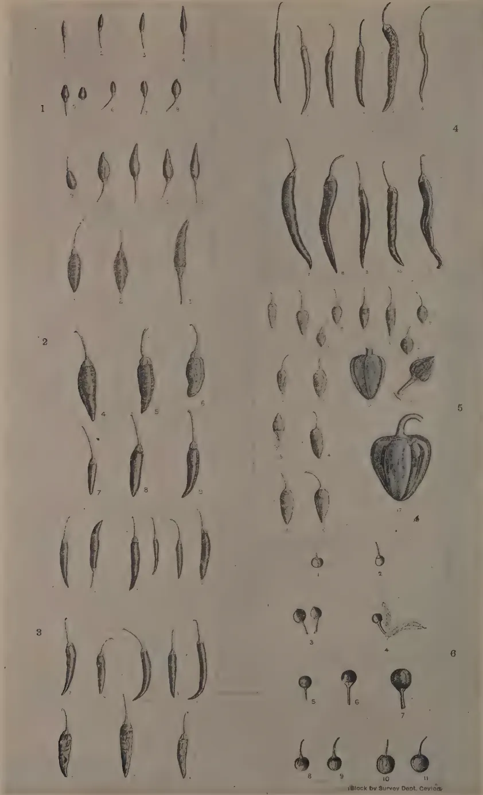
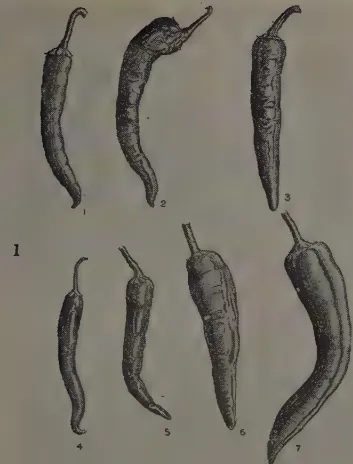
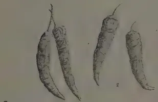
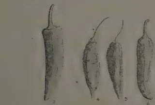
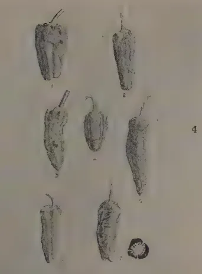
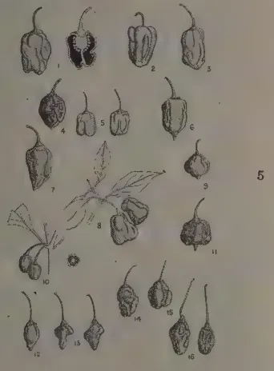
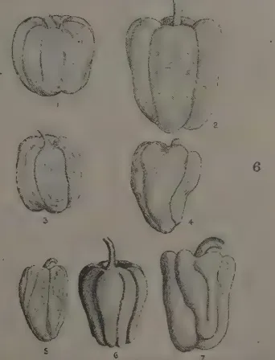
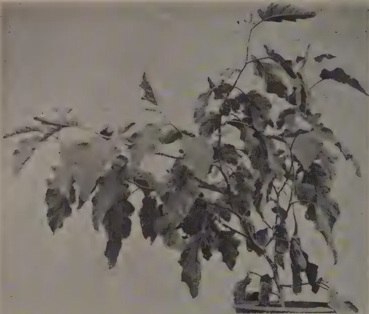
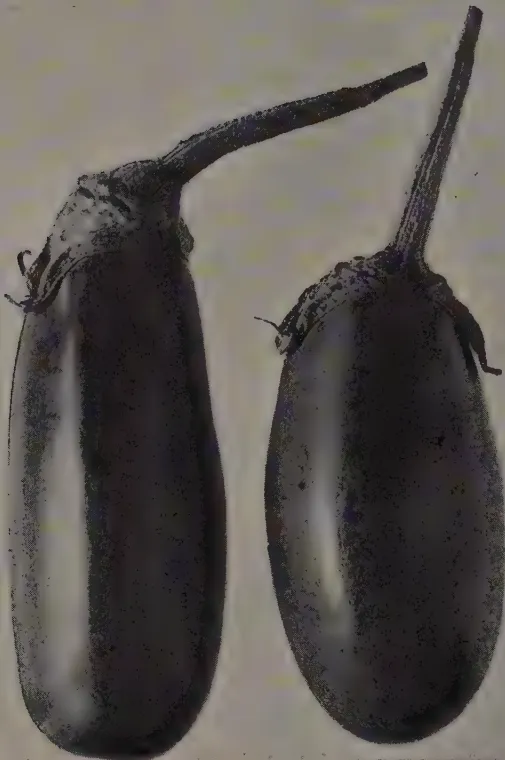
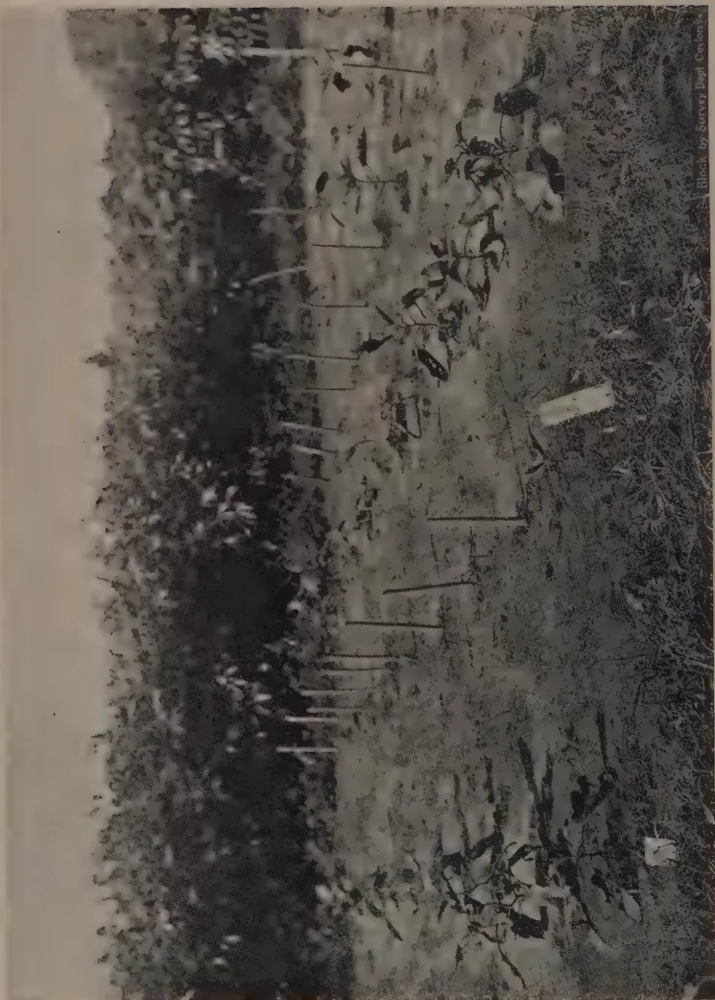

# The Tropical Agriculturist

VOL. XCIV

PERADENIYA, JANUARY, 1940

No. 1

<table><thead><tr><th></th><th style="text-align: right;">Page</th></tr></thead><tbody><tr><td>Editorial .. .. .</td><td style="text-align: right;">1</td></tr></tbody></table>

## ORIGINAL ARTICLES

<table><tbody><tr><td>Ceylon's Food Supply, II.—Rice and its Substitutes. By J. C. Driemberg, Dip. Agric. (Poona) .. .. .</td><td style="text-align: right;">3</td></tr><tr><td>A Study of the Genus <i>Capsicum</i>, with Special Reference to the Dry Chilli—I. By W. R. C. Paul, M.A. (Cantab.), M.Sc., Ph.D. (Lond.), D.I.C., F.L.S. .. .. .</td><td style="text-align: right;">10</td></tr><tr><td>A Variety of Brinjal (<i>Solanum melongena</i> Linn) Resistant to Bacterial Wilt. By Malcolm Park, A.R.C.S., and M. Fernando, Ph.D., B.Sc. (Lond.), D.I.C. .. .. .</td><td style="text-align: right;">19</td></tr><tr><td>A Note on the Use of Dynamite on Hard Ground between Coconut Palms. By O. B. M. Cheyne and Reginald Child, Ph.D. (Lond.) ..</td><td style="text-align: right;">22</td></tr><tr><td>Cassava in Ceylon. By J. A. Will Perera .. .. .</td><td style="text-align: right;">24</td></tr></tbody></table>

## DEPARTMENTAL NOTES

<table><tbody><tr><td>The Cultivation of Vegetables as a Rotational Crop in Paddy Land in the Kandy and Matale Districts .. .. .</td><td style="text-align: right;">27</td></tr><tr><td>Note on Treatment of Soybean .. .. .</td><td style="text-align: right;">32</td></tr><tr><td>Bird Sanctuaries and their Effect on Agriculture .. .. .</td><td style="text-align: right;">33</td></tr></tbody></table>

## SEASONAL PLANTING NOTES

<table><tbody><tr><td>Calendar of Work for March .. .. .</td><td style="text-align: right;">35</td></tr></tbody></table>

## SELECTED ARTICLE

<table><tbody><tr><td>The Preparation of Citrus Fruit Juices .. .. .</td><td style="text-align: right;">40</td></tr></tbody></table>

## MEETINGS, CONFERENCES, &c.

<table><tbody><tr><td>Report of the Proceedings of the Seventh Meeting of the Central Board of Agriculture .. .. .</td><td style="text-align: right;">45</td></tr><tr><td>Minutes of a Meeting of the Board of the Tea Research Institute of Ceylon .. .. .</td><td style="text-align: right;">55</td></tr></tbody></table>

## RETURNS

<table><tbody><tr><td>Animal Disease Return for the month ended December, 1939 ..</td><td style="text-align: right;">58</td></tr><tr><td>Meteorological Report for the month ended December, 1939 ..</td><td style="text-align: right;">59</td></tr></tbody></table>

1—J. N. 89995 (11/39)

1------------------------------------------------

<!-- stage4: FAINT old-images-only -->

[Faint page: no legible print of its own could be verified; text withheld (stage 4 review list)]

2------------------------------------------------

# The Tropical Agriculturist

January, 1940

---

## EDITORIAL

---

### THE QUALITY OF RUBBER

---

**T**HE scale of modern trade organization has destroyed the personal contact between the manufacturer and the consumer of goods. The former can retain the goodwill of his patron only by honouring the guarantee of the standard quality of his goods implied in his trade name. He seeks to do this by the careful standardization of his factory operations : but standardized operations cannot deal efficiently with a raw material which is either variable or impure. Plantation rubber possesses both these defects, and the manufacturer's demand for a product of uniform quality free from foreign matter tends to become more and more insistent.

Some degree of variability is inevitable in the case of a natural vegetable product like rubber because in its biological processes nature does not work to a precise chemical formula in disregard of genetical and environmental factors. The standard of uniformity is also affected by the method of treatment in the field and in the estate factory, and this source of variation is very largely, if not entirely, within the control of the rubber-grower. In all the principal rubber-growing countries, standardized methods of treatment of rubber latex calculated to promote uniformity have been under investigation for some years, and there is reason to hope that the experience of the planting community aided by the efforts of the technical experts in the several countries will, before long, succeed in turning out a commodity which is as uniform as human forethought can make it with regard to the three main qualities of rate of vulcanization, plasticity, and durability. Such advice as the officers of our own Rubber Research Scheme is able to give with their present knowledge of the subject was given in an address delivered by the Director of the Scheme at a meeting of the Sabaragamuwa Planters' Association and reproduced in the first quarterly report of 1939.

3------------------------------------------------

2

Impurities in rubber admit of a greater degree of control by the rubber-producer than variability. In fact absolute purity is not inconceivable in ideal conditions of handling. It may, however, be admitted that it is not practicable to create these ideal conditions on the estate; but there is a considerable range of efficiency in the exclusion of foreign matter, falling short of perfection, which is available to the enterprising planter and to the careful merchant. Recent complaints received from consumers abroad show that all the rubber that goes to Europe and America does not receive the careful handling which the best producers give it, and that grit, wood splinters, and other forms of dirt are not only incorporated in coagulated rubber but are also found adhering to the sheets. Planting memorandum No. 13 issued by the Rubber Research Scheme, Ceylon, deals with this subject, and contains a number of valuable suggestions which the producer should endeavour to carry out.

Attention may be drawn to two dangers that may follow from a disregard of the warning sounded by consumers. The search for synthetic substitutes for plantation rubber has hitherto been prompted very largely by political considerations. There is the possibility, though somewhat remote, that the desire for a clean and uniform article may add impetus to this search.

The second danger will not be acute so long as output is restricted by international agreement. But a competitive struggle for survival must come with the termination of the international agreement. When the vast areas which have been and are being replanted with budded rubber of very high-yielding strains begin to be tapped, production is bound to outstrip demand and consumers will be in a position to buy where they like. When that struggle comes the country that is backward in meeting the requirements of the buyer will be shouldered out of the industry. Naturally it is our hope that Ceylon will not be that country.

4------------------------------------------------

3

## CEYLON'S FOOD SUPPLY

J. C. DRIEBERG, Dip. Agric. (Poona)

### II.—RICE AND ITS SUBSTITUTES

**T**HE first crop which calls for attention is paddy, the cultivation of which not only dates from the earliest days of the Island's history, but also forms the main occupation of the rural population. It is of interest to note that the type of paddy cultivated in the first instance was dry-land (or hill) paddy, *elvi*, and that the present type of mud or wet-land paddy was grown at a later date after the construction of reservoirs, or tanks as they are termed in Ceylon, for the storage of water to permit of irrigation. The former type commanded high repute on the score of both nutritive value and palatability and the latter, in comparison, was considered an inferior product.

In the previous article which appeared in the December number of this Journal, it was stated that the area under paddy cultivation was taken as 850,000 acres and the yield per acre as 30 bushels (1,500 lb.) of paddy equivalent to 15 bushels of rice (900 lb.). The quantity of rice produced locally was estimated at  $12\frac{1}{4}$  million bushels. Since then two statements bearing on this subject were made at the last meeting of the Central Board of Agriculture when the Director of the newly-established Food Production Department said that an extent of 2 million acres would be required to produce sufficient rice to meet the Island's needs, while a member of the Board contended that a further area of only 400,000 acres would suffice. This makes it necessary to examine the position more critically especially in view of a new set of figures. During the short spell of activity of the Paddy Commission appointed in 1931, certain useful data were collected, and among these were the returns relating to paddy in each district furnished by the Revenue Officers. First as regards the figure 850,000 acres which is the official one appearing with unfailing regularity year after year in the Ceylon Blue Book, this unfortunately may give the impression that the paddy industry of Ceylon has assumed a static position despite all efforts of the Agricultural Department to cause it to expand. Now, does this figure represent the total area of fields set apart for the cultivation of paddy, or does it denote the extent of fields

5------------------------------------------------

4

actually cropped? If it is the former, then no account is taken of fields which are not cultivated in any year or season nor of the fact that some fields are cropped in both seasons of the year. If it is the latter, the estimate appears to be too low. Using this figure, whatever its value be, and the assumed yield of 30 bushels of paddy per acre, we conclude that some  $25\frac{1}{2}$  million bushels of paddy are contributed by the Island to meet its total requirements of rice. The imports in 1938 amounted to  $10\frac{1}{2}$  million cwt. of rice and 170,000 cwt. of paddy which, together with the former, amount to 18,600,000 bushels of rice. To produce the total quantity of 31,350,000 bushels of rice, representing imports plus home production, at the rate of 30 bushels of paddy per acre, the total area will have to be 2,090,000 acres. This agrees with the figure put forward by the Director of Food Production. But to produce the quantity of imported rice at the same yield rate, the area required will have to be 1,240,000 acres and not the suggested alternative figure of 400,000. If, however, this latter figure is accepted for the sake of argument, the total area under paddy in the Island will have to be 850,000 plus 400,000 making 1,250,000 acres and to produce  $31\frac{1}{2}$  million bushels of rice off this the yield must not be less than 50 bushels of paddy per acre.

According to the comprehensive returns of the Revenue Officers which showed for each district the acreages cultivated in each season and those for irrigated and non-irrigated crops, the total area cultivated was stated to be 940,000 acres. Of this extent 65 per cent. or 609,000 acres were cultivated for *maha* and 35 per cent. or 331,000 acres for *yala*. If we accept the Blue Book figure of 850,000 acres as representing the area of paddy land, the difference of 90,000 acres should indicate the extent cultivated in both seasons. On the yield basis of 40 bushels for *maha* and 20 bushels for *yala*, 609,000 acres will yield 24,360,000 bushels, and 331,000 acres will yield 6,620,000 bushels, making a total of 30,980,000 bushels of paddy equivalent to 15,490,000 bushels of rice. A very similar figure can be arrived at in the following manner. If 90,000 acres which are cultivated in both seasons are reduced from 850,000 acres and the remainder is divided in the proportion of 9 : 5 which is the ratio of *maha* to *yala* cultivation in the case of the previous calculation, the extent of cultivation in each season will be:—

<table style="width: 100%; border-collapse: collapse;">
<thead>
<tr>
<th></th>
<th style="text-align: right;">acres.</th>
</tr>
</thead>
<tbody>
<tr>
<td>for <i>maha</i> 490,000 acres plus 90,000 acres =</td>
<td style="text-align: right;">580,000</td>
</tr>
<tr>
<td>for <i>yala</i> 270,000 acres plus 90,000 acres =</td>
<td style="text-align: right;">360,000</td>
</tr>
<tr>
<td colspan="2" style="text-align: center; border-top: 1px solid black; border-bottom: 1px solid black;">
          Total .. 940,000
        </td>
</tr>
</tbody>
</table>

6------------------------------------------------

5

and production will be as follows:—

<table>
<tr>
<td>for <i>maha</i></td>
<td>580,000 acres at 40 bushels per acre</td>
<td>= 23,200,000 bushel paddy</td>
</tr>
<tr>
<td>for <i>yala</i></td>
<td>360,000 acres at 20 bushels per acre</td>
<td>= 7,200,000 ,,</td>
</tr>
</table>

<table>
<tr>
<td>Total ..</td>
<td><math>\left\{ \begin{array}{l} 30,400,000 \\ 15,200,000 \end{array} \right. \text{ ,, bushel rice}</math></td>
</tr>
</table>

Since data are assumed the difference can be neglected, and may be attributed to some degree of progress the industry has made in the past few years. Possibly this may satisfy adverse critics. Population has increased, imports have increased, obviously consumption has increased, so why not production also?

From all the discussion that has centred about this subject and the manner in which it has had to be dealt with here, one fact emerges, namely, the absurdity of our continuing to base our calculations on assumed data, not in regard to paddy only but to all crops with the possible exception of tea and rubber, and in fact to all matters relating to indigenous agriculture. No definite conclusions can be drawn under such conditions and but little guidance for the formulation of new undertakings. Is it yet not considered necessary to establish a branch of agricultural economics for the collection of material of which we are so much in need to-day? But such work must be undertaken in a systematic manner and only by a person technically qualified for it. The time is long overdue for a revision of the agricultural statistics appearing in the Blue Book, and the addition of a great deal of more useful information under this head.

The position of the rice industry in Ceylon is such that it is necessary both to raise the average yield of paddy per acre and to bring about an extension of cultivation. Both aspects of the problem are being kept in view by the authorities and endeavour made to meet them, but can it be said that the response from the cultivating classes is satisfactory? The subject is a very complicated one with us and many points have to be dealt with. But when all is said and done the one main consideration is the price factor and it is this which weighs heaviest with the producer whether in Ceylon or elsewhere; whether with paddy or any other crop. Given a fair return, the cultivator who considers that he is worthy of his hire, will not be slow to drive his plough a little harder. "The price of paddy," wrote the Director of Agriculture in 1933, "is so low that there is in many parts little or no incentive to the village cultivator to produce more than he can most easily raise from his land in bare sufficiency for his own needs". The report of the Director for the previous year bears the following

7------------------------------------------------

6

warning: "The present large population of town dwellers and estate-paid labourers live on imported rice. So long as tea and the coconut industries can supply this latter quotient of the population with the means with which to purchase foreign rice—all well and good, but the time may be when a balance will have to be struck and those in regular employment have to pay more for their rice whilst others return to their villages to aid in producing more paddy for themselves and those who can afford to pay for it at a better rate. The price at which imported rice has been sold in Ceylon during the past year prevents the possibility of any great supply being raised in the villages for the towns." I am constrained to quote again from the report of the same Director, Dr. W. Youngman, for 1931, to obtain still another aspect of the problem involving the question of price: "Paddy production in Ceylon involves hard work and the condition of living of the labourers is higher than in other surrounding countries which produce therefore comparatively at a lower cost. The present population of Ceylon however has not yet found a means of selling its labour at a rate that makes the abolition of paddy cultivation and the purchase instead of cheap foreign rice possible economic propositions." This aspect of the matter comes within the purview of fiscal policy and is a matter for the politician to solve. Whether it be necessary to restrict imports or raise the tariff or take any other steps to safeguard the home industry, the first consideration from the producer's point of view is fair remuneration, and once the price of home-grown paddy can be stabilized and the cultivator assured that he will receive this return for his labour, he will be heartened to redouble his efforts towards greater production. No discussion of this problem is necessary in view of the action now being taken to effect a compromise between the price of local paddy and imports.

There is yet another aspect of the situation which, while it does not involve the question of further production, calls for the more economical consumption of supplies which are already available. It may sound heretical to say that too much rice is eaten, but the fact should not be lost sight of that in addition to the two meals of rice which are general throughout the country, a large quantity of rice is turned into flour daily for the preparation of the early morning meal consisting of "hoppers", "string-hoppers", "pittu", &c., and numerous forms of cakes and sweetmeats. It will be objected that the people have got used to this and it will be difficult to alter their tastes now. Nevertheless it stands to reason that if a commodity is failing in quantity and a situation is created whereby there is overmuch dependence upon foreign supplies of it suitable substitutes should be called in to ease the position

8------------------------------------------------

7

and particularly so when such substitutes are already available and can be produced with far less effort than is required for the cultivation of paddy.

Of cereal crops *kurakkan* (*Eleusine corocana*), *amu* (*Paspalum scrobiculatum*), *meneri* (*Panicum miliare*), and *tanahal* (*Setaria italica*) have long been grown throughout the Island and Indian corn and *cumbu* in certain localities. These crops unfortunately are not usually grown separately and cultivated in the strict sense except to some extent in the Jaffna Peninsula. They usually form a constituent of the mixed crops sown in *hena* (*chenas*). Sorghum is little known elsewhere but in the North, and *adlay* or *kirindi* of which the wild form is only too familiar as a pernicious weed in paddy fields is now being appreciated as the result of the encouragement of its cultivation. With the exception of Indian corn, *adlay*, and sorghum, the lesser millets are short-aged crops of 3 to 4 months duration and are able to grow on comparatively poor soils and with a limited rainfall. Hence their value in the drier districts and particularly so in the event of a partial or entire failure of the staple crop paddy. Under such conditions the yields may be only about 5 to 6 bushels per acre although that of *kurakkan* should be a little higher. But under more favourable conditions and with a fair amount of cultivation, yields ought to be half as much again. To secure appreciable returns from Indian corn, sorghum and *adlay*, these crops should receive proper attention when yields of 15 or 20 bushels per acre will not be at all uncommon. Though these grains are used to a limited extent in the Island, *kurakkan* and Indian corn are of special value and constitute the main food in certain areas where rice is, or becomes, scarce at times. *Adlay*, hitherto, has been only a stand-by crop in the remoter districts. Now these conditions should be altered and far greater use made of nearly all the cereals mentioned, inasmuch as with the exception of only two, *kurakkan* and *amu*, the rest are more nutritious than polished rice and call for a smaller addition of pulse than otherwise would be the case in order to form a more balanced diet. Church in "Food Grains of India" gives the following figures which may be followed as a basis for consideration :—

<table border="1">
<thead>
<tr>
<th></th>
<th>Nutritive Ratio.</th>
<th>Albuminoids. Per cent.</th>
<th>Oil. Per cent.</th>
<th>Ash. Per cent.</th>
</tr>
</thead>
<tbody>
<tr>
<td><i>Kurakkan</i> ..</td>
<td>1:13</td>
<td>5.9</td>
<td>1.5</td>
<td>2.3</td>
</tr>
<tr>
<td><i>Amu</i> ..</td>
<td>1:11.7</td>
<td>7.0</td>
<td>1.3</td>
<td>2.1</td>
</tr>
<tr>
<td>Rice ..</td>
<td>1:10.8</td>
<td>7.3</td>
<td>0.6</td>
<td>0.6</td>
</tr>
<tr>
<td><i>Meneri</i> ..</td>
<td>1:8.4</td>
<td>9.1</td>
<td>3.6</td>
<td>3.5</td>
</tr>
<tr>
<td>Maize ..</td>
<td>1:8.3</td>
<td>9.5</td>
<td>3.6</td>
<td>1.7</td>
</tr>
<tr>
<td>Sorghum ..</td>
<td>1:8.2</td>
<td>9.3</td>
<td>2.0</td>
<td>1.7</td>
</tr>
<tr>
<td><i>Cumbu</i> ..</td>
<td>1:7.6</td>
<td>10.4</td>
<td>3.3</td>
<td>2.0</td>
</tr>
<tr>
<td><i>Tanahal</i> ..</td>
<td>1:7.4</td>
<td>10.8</td>
<td>2.9</td>
<td>1.2</td>
</tr>
<tr>
<td><i>Adlay</i> ..</td>
<td>1:3.8</td>
<td>18.7</td>
<td>5.2</td>
<td>2.1</td>
</tr>
</tbody>
</table>

9------------------------------------------------

8

Thus we see that *kurakkan*, *amu*, and polished rice are distinctly starchy foods and hence the recommendation to substitute *meneri* for polished rice in the case of those suffering from diabetes. The content of oil and particularly mineral matter in *meneri* is striking. *Tanahal* and *cumbu* are even more nutritious foods, the latter being a little better than the former. Both *meneri* and *tanahal* are quite palatable in the form of porridge. *Meneri* served as rice usually with the addition of curries is appetizing, and "string-hoppers" made of *tanahal* flour are tasty and not as heavy as those made from *kurakkan* flour. The composition of *adlay* will surprise many who are not already acquainted with this highly nutritious article of diet. But the albuminoid and the oil contents of the grain are exceptionally high for a cereal. Many familiar local preparations from *adlay* flour have been displayed to the public by the Department of Agriculture and every endeavour is being made to popularize the cultivation of this valuable food grain. The next step necessary is to impress upon the people the necessity from an economic point of view and the desirability from a nutritional point of view of lessening the consumption of rice, particularly the imported polished grain, and substituting other cereals, the cultivation of which should be encouraged as much as possible.

There are other substitutes for rice used by the population when a shortage of rice occurs, particularly in times of drought, followed by partial famine. These are manioc and cassava, yams of many sorts, sweet potatoes and stand-by products like dried jak and breadfruit to mention only a few. A supply of yams can be carried forward for a few months if stored properly under dry conditions; but it will be a wiser course to sun-dry whatever lends itself to this treatment for later use in this form or for the preparation of flour.

The term "yams" is now a more general one and includes two distinct types (a) *Colocasia* and *Xanthosoma*, the many varieties of *gahala*, and (b) true yam or *Dioscorea* to which belong many forms of *vel-ala*.

Arrowroot is grown to a small extent in certain localities in Ceylon and consumed either raw or boiled, but not usually used for the preparation of flour. A similar plant which is found here is the species of *canna* which yields "Queensland arrowroot". This too is sometimes eaten boiled. Both these should be cultivated more extensively and the crop used for preparing flour. Yams and the last-mentioned two plants yield characteristically starchy foods and if used in place of rice, require to be supplemented with a sufficient quantity of pulse to balance the diet. One advantage these crops possess

10------------------------------------------------

9

is that a large quantity of food amounting from 8,000 to 10,000 lb. may be obtained from an acre of land.

At least one other crop must be mentioned, namely, Jerusalem artichoke. It grows with ease, is particularly free from damage by any pests and diseases, and gives a high yield of 10,000 to 20,000 lb. of tubers per acre. The boiled tubers possess a somewhat smoky flavour which however is not objectionable; but if mashed well and spiced they make a palatable *puree*. In comparison, the Jerusalem artichoke is more nutritious than the potato, since it contains a higher percentage of both albuminoids and starch.

In conclusion, while every endeavour is being made at the present time to encourage the extensive cultivation of food crops and sustained effort is made to increase the area under paddy as well as the yield of this crop, the fact should not be lost sight of that there are other grains which are more nutritious than rice and can be cultivated with far less difficulty than paddy demands. Furthermore there are suitable substitutes of variety in Ceylon which can be utilized to advantage either in their original form or in the form of flour, in reducing the consumption of rice. Such action will go a long way in helping to solve the problem of the Island's rice supply. It does seem unreasonable to depend solely upon one commodity to supply the main portion of the country's diet. Surely it will prove the wiser course to develop other crops equally good, or in some cases better, so that variety will be available. Difficulty may be experienced in giving effect to this, and it is just here that special skill must be displayed to turn the minds of the people. Propaganda of the ordinary type which depends so largely on slogans such as "eat more country rice" or "cultivate more yams" is far from sufficient. What is really needed and can be expected to make a lasting impression is a very definite line of educative propaganda accompanied, as has been done in the attempt to popularize adlay, by demonstration of the use of the products recommended.

A food products exhibition seems very necessary and should do much good to the country. It is surprising to see the variety of foreign comestibles in our local restaurants or hotels as many of them are now being styled to the detriment of home produce and such establishments are a challenge to the efforts being made by the Ceylon Products Association and the Marketing Department to popularize local fare.

Attention is drawn to the series of valuable contributions bearing on this subject by Joachim and his colleagues of the Department of Agriculture which appeared in the issue of this Journal for January, 1938.

11------------------------------------------------

10

## A STUDY OF THE GENUS CAPSICUM, WITH SPECIAL REFERENCE TO THE DRY CHILLI—I.

W. R. C. PAUL, M.A., M.Sc., Ph.D., D.I.C., F.L.S.,  
AGRICULTURAL OFFICER, CENTRAL DIVISION

**I**NTRODUCTION.—Of all the condiments, chillies which belong to the genus *Capsicum* constitute the most interesting. Originating in tropical America and grown there from time immemorial, they have spread to all regions of the tropics where they have become an indispensable adjunct of the staple foods. They are one of the few edible plants which still abound in the wild state in South America, but under cultivation numerous forms have arisen. Outside their home, few really wild species exist, the Bird chilli (*C. frutescens* L.) one of the primitive members of the genus being the only wild chilli which is commonly found in most tropical countries. While being reputed for their high degree of pungency, forms with monstrous shaped fruits entirely lacking in this character have been developed as a vegetable and salad crop.

To the systematist, there is scope for further study owing to differences of opinion which exist on the taxonomy of the species and varieties of *Capsicum*, while to the geneticist a fruitful field of research is offered on account of the multiplicity of characters which can be combined to produce new forms. The agronomist will find *Capsicum* a useful field crop for cultural and manurial investigations, and there is much work that can be done in this direction.

The popular nomenclature of the different forms of *Capsicum* is in a state of confusion. Numerous names have been given to the plant, to the fruit of different varieties and to the various preparations made from them, but as pointed out by Redgrove (1938)\* most of them are ambiguous or inappropriate. In the East, chilli is generally used as the English name; but the larger forms which are mostly mild or non-pungent are referred to more specially as Capsicums, or sometimes as Sweet Peppers. Elsewhere amongst English-speaking countries Peppers have become the popular general term, but some confusion can be

\* Particulars of references will be found at the end of the complete paper.

12------------------------------------------------

This image is a scan of a blank page. The background is a uniform light beige or tan color. There are no visible markings, text, or illustrations. A few very small, faint dark specks are scattered across the surface, which appear to be scanning artifacts or dust particles.

13------------------------------------------------

The plate contains 17 numbered illustrations of chili pepper specimens. Figures 1, 2, and 3 show various varieties of *frutescens* and *annuum*. Figures 4, 5, and 6 show different varieties of *annuum*. The drawings include whole fruits, seeds, and floral structures. A small credit line at the bottom right reads 'Black by Survey Dept. Cavies'.

PLATE I.

FIG. 1.—NOS. 1-4.—*c. frutescens* L. VAR. *minimum* ( $\times \frac{1}{3}$ ).  
 NOS. 5-8.—*c. frutescens* L. VAR. *baccatum* ( $\times \frac{1}{3}$ ).  
 NOS. 9-13.—*c. annuum* L. VAR. *conoides* ( $\times \frac{1}{3}$ ).  
 FIG. 2.—*c. annuum* L. VAR. *acuminatum* ( $\times \frac{1}{3}$ ).  
 FIG. 3.—*c. annuum* L. VAR. *acuminatum* ( $\times \frac{1}{5}$ ).

FIG. 4.—*c. annuum* L. VAR. *acuminatum* ( $\times \frac{1}{3}$ ).  
 FIG. 5.—*c. annuum* L. VAR. *cuneatum* ( $\times \frac{1}{3}$ ).  
 (NO. 12 After Irish)  
 FIG. 6.—*c. annuum* L. VAR. *cerasiforme* ( $\times \frac{2}{5}$ ).

FRACTIONS IN BRACKETS INDICATE THE SIZE OF ORIGINAL FRUITS.

14------------------------------------------------

11

created with the ordinary black and white pepper derived from the vine *Piper nigrum* L. The pungent varieties are more particularly called chillies or Red Peppers while the large, non-pungent varieties are known as Bell or Sweet peppers. In the United States of America crop trade, the large green fruits are referred to as mangoes. Paprika is the Hungarian name and according to Young and True (1913) who quote Bela (1907) is of South Slavic origin. It is used both in the United States of America and in England to designate the fruits or the condiment imported from Hungary and Spain as well as the cultural varieties resembling these but grown in the States. Pimento is the anglicized form of the Spanish Pimiento (=pepper), adopted in the States for the thick-fleshed fruits of conical as well as oblate shapes used in canning, but it can be confused with Pimento (or Allspice), the dried unripe fruit of *Pimenta officinalis* Lindl.

The word chilli is of Mexican origin, and is considered by the writer to be the most appropriate general name for the *Capsicum* plant on account of the fact that it is least likely to cause confusion with other plants, and it can claim preference because of its origin over other names. Owing, however, to common usage, certain more specific popular names will be used to designate particular types such as Pimento, Paprika and Bell pepper.

Chillies are utilized in several ways, according to the pungency, flavour, size, shape and colour of the fruits. The small but extremely pungent forms (Pl. I. Fig. 1.) are used in the manufacture of Cayenne pepper, Tabasco and chilli sauce, and are regarded in pharmacy as a powerful stimulant and carminative. The pungent principle is a recognized drug in the British and the United States Pharmacopoeias. The elongate fruits, which are slightly less pungent and possess a thin, leathery pericarp or fruit wall suitable for curing, are widely grown in the drier tropical regions as Dry Chillies (Pl. I. Figs. 3 and 4). They are commercially the most important type and, when ground, form an ingredient of curry powder. The large, non-pungent Bell peppers are becoming increasingly popular as a vegetable used either green or ripe for stuffing, salads, &c., while the large, smooth fruits of conical shape called Pimento have been specially developed for canning purposes.

The object of this paper is to present a study of the general botany and agronomy of *Capsicum* as a field and garden crop, with special reference to the cultivation of the Dry Chilli in Ceylon.

#### HISTORICAL.

Although chillies are widely grown in the East, the home of the genus *Capsicum* is held to be tropical America. According to Bancroft (1882), chillies were raised by the

15------------------------------------------------

12

Olmees, an ancient tribe preceding the Toltec culture in South America. Safford (1926) reports that the dried pods of the Bird chilli (*C. frutescens* L.) were found by him in the recoveries from the burials in the prehistoric cemetery at Ancon, situated near Lima on the coast of Peru. *Capsicum* was, therefore, utilized by the pre-Inca tribes in the Central Andean regions over four thousand years ago. De Candolle (1884) pointed out that in the ancient languages of the Old World, there is no name for chillies and that this is sufficient evidence that the condiment was unknown in the Old World until modern times, while Watt (1908) added that no really wild species of *Capsicum* has ever been found in India. The names in use in India are clearly of foreign or modern origin, e.g., chillies, *lal-mirchi*, *goa-mirchi*, &c. Columbus is reported to have first brought the fruits to Europe, according to an epistle by Peter Martyr in 1493 (Sturtevant 1919). In 1494, Chanca who was physician to the fleet of Columbus on his second voyage, addressed a letter to the Chapter of Seville on the subject of *Capsicum* and referred to this plant by the Caribbean name *Axi* which has since been rendered as *Achi* or *Agi*. Even to this date, *Agi* has survived in Spanish-speaking America. Chanca stated that the people used fish, meat and yams with *Agi* and it was apparently he who first introduced the seed into the Old World. The earlier Spanish writers recorded several American-Indian names, the Mexican name Chilli being first used by Hernandez according to Sturtevant (1919).

Burkill (1935) considers that, because in its common form as a condiment chillies came to Europe with viable seeds within the fruit and being a plant of quick growth, conditions for its rapid dissemination were fulfilled. The plant soon became cultivated in Southern Europe, and particularly in Spain, Greece, and Hungary. About the middle of the 17th century, the Portuguese introduced *Capsicum* into Goa and possibly commenced to export it in competition with true pepper. It rapidly spread from there to other tropical countries. The long pungent chillies were probably introduced into England in 1548 and according to Ridley (1912) were cultivated in 1597 and sold in the shops at Billingsgate under the name of "ginie pepper".

Most of the present day forms of *Capsicum* (Plates I. and II.) known outside tropical America have been evolved under cultivation and there are few really wild forms except the perennial Bird Chilli and the Chilipiquin—two varieties of *C. frutescens* L. The Bird chilli was so commonly found growing wild in the East, that the plant was considered by some botanists as a native of India, but Rumpkins, according to Sturtevant (1919), argued its American origin from being so constantly called Chile and

16------------------------------------------------

13

De Candolle (1884) pointed out that it has often been found growing wild in the forests of South America. The most highly developed forms, however, are those which belong chiefly to the Bell pepper group and are non-pungent, but many of these do not last for more than a season, becoming attacked by obscure diseases and eventually developing diminutive leaves and malformed fruits.

#### TAXONOMY.

The genus *Capsicum* was first established by Tournefort in 1719, but the origin of the name is obscure. Fluckiger and others of his time, according to Guillard (1901) claim that it is derived from the Latin *Capsa*, because the seeds are enclosed in a sort of chest as seen in the case of the Bell peppers, while Actuarius (11th century) is reported to have named it in Greek *Capsicon* from *Kaptein* (to bite) on account of its pungent quality. The latter derivation appears more probable but it is obvious that Actuarius could not have referred to the plant known as *Capsicum*, since it was not discovered at the time. The early 16th century writers such as Fuchs confused the *Siliquastrum* and *Piperitus* of Pliny (A.D. 70) with *Capsicum* and referred to chillies (Red peppers), Black peppers, and cardamoms indiscriminately under such names as *Piper hispanum*, *Piper indicum* and *Piper calecuthianum*. According to Guillard (1901), Clusius was the first person to give a botanical description of the American peppers with illustrations.

The genus is distinguished by the following characters :—

Plants herbaceous or shrubby. Stems more or less angular when young, usually enlarged at the nodes. Leaves alternate, entire, ovate-lanceolate to ovate-cuneate and even to cordate, sub-glabrous, 3–11 mm. long and 1–7 cm. wide. Flowers pedicelled, axillary, solitary or 2–3 in a fascicle. Pedicels swollen in the upper part and longer or shorter than the fruit. Calyx cup-shaped to pateriform, sub-entire or minutely 5-toothed, persistent. Corolla deeply lobed, usually 5–6, connate, rotate to semi-campanulate, greenish-white, white or purple. Stamens as many as the corolla lobes, adnate, anthers not longer than the filaments, dehiscence longitudinal. Ovary superior, connate 2–4 celled, usually 2-celled in elongate fruits. Fruit a pod or berry, extremely variable in form and size, linear, elongate-conical, globose, obolate or sub-truncate. In cultivation, monstrous forms, 3–4 celled occur. Seeds discoid, smooth or sub-scabrous, embryo peripheral.

A wide range of cultural varieties occurs in size, shape and pungency of the fruit and there has been considerable confusion over the classification of the cultivated chillies. The work of the early writers commencing with Fuchsius who figured three forms in 1542 was reviewed by Irish (1898). When the binomial system came into use, Irish states that Miller gave in 1731 ten

17------------------------------------------------

14

specific names. Linnaeus in his *Hortus Clifforensis* (1737) and in the first edition of the *Species Plantarum* (1753) recorded two species, viz. : *Capsicum annuum* and *C. frutescens*, characterizing one as an annual and the other as a perennial with a woody habit. In the Wildenow edition of the *Species Plantarum* (1797), six species were described while Fingerhuth (1833) recognized 25 species and 28 botanical varieties. In 1852, Dunal recorded 50 species with many varieties, in addition to 14 other species which needed further investigation. Hooker (1885) reduced the number of species found in India to three, viz., *C. minimum*, *C. frutescens* and *C. grossum*, a classification which, unfortunately, exists in publications of the present day and is also adopted in the British Pharmaceutical Codex. The first-named species referred to the Bird Chilli with 2-3 pedicels and erect fruits, the second to the Dry Chillies of commerce with solitary pedicels and pendent, elongate fruits and the third to the Cherry and large Bell peppers with solitary pedicels and pendent, globose to oblong fruits.

Irish (1898) carried out a revision of the genus based on a large collection of different garden forms found in the Missouri Botanic Garden. He recognized Linnaeus' two species, viz., *C. frutescens* for the small Bird chilli (Pl. I. Fig. 1 Nos. 1-4) and the Chilipiquin var. *baccatum* (Pl. I. Fig. 1 Nos. 5-8), and *C. annuum* for all other forms. He based his classification on the fact that, in the former species, the plants are perennial and shrubby in habit, while in the latter they are annual or biennial and herbaceous or suffrutescent. He stated that most of the cultivated forms fell within the annual species while many of the South American and Mexican forms were sufficiently distinct in habit of growth and woodiness to justify their separation to a distinct species. He pointed out that in temperate climates the cultivated forms of *Capsicum* are annuals, while in tropical countries some are biennial and others perennial. Prain (1903) agreed with this number of species but considered the chief distinguishing character to be the number of pedicels—usually one, in the case of *C. annuum* and 2 or 3 in *C. frutescens*. Both Irish and Prain were of the opinion that *C. grossum* described by Hooker for the large Bell peppers should be a variety of *C. annuum*.

Bailey (1923) held the view that all the cultivated forms of *Capsicum* belonged to one species and that the herbaceous or so-called annual varieties found in U. S. A. were really races that developed in a short season, but did not become woody because they were killed out by frost at the end of the season. He added that these races when grown in the tropics developed as shrubs and, therefore, the specific name of *frutescens* should be retained even though it did not take precedence on the page

18------------------------------------------------

15

in Linnaeus' description of the two species ; the name *annuum* according to him was a misnomer, as the plant was not really an annual.

Shaw and Khan (1928), however, from a study of numerous forms in India were inclined to agree with Irish and Prain on the number and nomenclature of the species of *Capsicum*. They also supported Prain in his view that the number of pedicels should be the main distinction between *C. annum* and *C. frutescens*.

On the other hand, Erwin (1929, 1932) in agreeing with Bailey adduced evidence that the genetic relationship pointed to a single species and that there was every intergrade of leaf, flower, and fruit from one form to another. He quoted Halsted (1912) as having crossed the Bird pepper (Bird chilli) with a Squash pepper with large fruits and secured fertile seeds. A perusal of the plates in Halsted's papers (1912-16) will, however, show that he was not dealing with the true Bird chilli because in his plates the calyces of his Bird pepper fruits are pateriform and not cup-shaped as in the true Bird chilli. The writer has, so far, not been able to effect a fertile cross between the real Bird chilli and any cultivated variety of chillies. While normal fruits were developed where the Bird chilli and the cultivated variety was in each case the female parent, either no seed developed or the seed was aborted. He has also not been able to find any evidence in the village gardens of Ceylon and India seen by him of natural hybridization between the Bird chilli and any other cultivated chilli, whereas with the different cultivated varieties numerous cases of crossing occurred between these varieties when they were grown in proximity.

Many of the cultivated forms can, in fact, be made to grow as perennials and develop the woody habit in a tropical climate, but the growth and vigour of these plants after a season or two becomes so lessened owing to their susceptibility to disease that their continuance becomes uneconomic. The wild Bird chilli and the Chilipiquin, however, are more hardy and shrubby in habit and are also less subject to disease than those under cultivation. The most highly developed forms of the Bell peppers do not last more than a season or two, though there are certain small fruited pungent forms of these peppers (Pl. II. Fig. 5) which are of no commercial value but can be grown for several seasons and show a somewhat woody habit. The perennial and woody character is, therefore, not entirely a suitable criterion for separating *C. frutescens* L. from *C. annum* L., although *C. frutescens* L. is more markedly a perennial of the shrubby type than *C. annum* L.

The number of pedicels is not a reliable character for distinguishing the two species as there are several forms of Squash

19------------------------------------------------

16

and Bell peppers which show two or three pedicels (Pl. II. Fig. 5 No. 8) while other forms resembling the Bird pepper in many respects, differ from it in the fact that solitary pedicels are present.

Bailey's contention, however, that *C. frutescens* L. and *C. annuum* L. should be merged into one, viz., *C. frutescens* L. cannot be accepted until the absence of sterility can be proved between these two species. The view is held by the writer that *C. frutescens* L. is a closely related but ecologically distinct species, showing interspecific sterility with the varieties of *C. annuum* L.

With regard to the question of botanical varieties, both Sturtevant (1919) and Irish (1898) were of the opinion that the shape of the fruit and the nature of the calyx are of primary importance in varietal classification, and Irish proposed the following list of varieties :—

*Capsicum annuum* L.

1. 1. Fruit oblong linear
   1. A. Calyx usually embracing the base of the fruit.
      1. (a) Fruit usually less than 1½ in. long. Pedicels about as long or longer.....var. *conoides* (Miller).
      2. (b) Fruit usually longer than 1½ in. Pedicels shorter. Leaves and fruits fascicled..... var. *fasciculatum* (Sturt).
      3. Leaves and fruits not fascicled.....var. *acuminatum* (Fingerh).
   2. B. Calyx not usually embracing the base of the fruit. var. *longum* (Sendt).
2. 2. Fruit oblong or oblate, truncated, deeply lobed, furrowed and wrinkled..... var. *grossum* (Sendt).
3. 3. Fruit sub-conical, ovate or elliptical, slightly longer than broad. .... var. *abbreviatum* (Fingerh).
4. 4. Fruit generally smooth, oval, spherical or heart shaped.....var. *cerasiforme* (Miller).

*C. frutescens* L.

1. 1. Fruit oblong, acuminate, usually embraced by the calyx.
2. 2. Fruit ovate or sub-round, usually seated on the calyx. var. *baccatum* (L.)

Prain (1903) eliminated the varieties *conoides* and *fasciculatum* and added a new variety, viz., *nigrum* to Irish's list, while Bailey (1923) restored *conoides* and *fasciculatum* but did not recognize *nigrum*, *acuminatum* and *abbreviatum*. Shaw and Khan (1928) then put forward the following nine varieties which they further separated into 52 types or forms.

*C. annuum* L.

1. 1. Flowers purple. var. *nigra*
2. 11. Flowers white.
   1. A. Fruits globular, large, irregular and pendent.....var. *rugosa*.
   2. B. Fruits globular, small and circular in outline. ....var. *cerasiformis*.
   3. C. Fruits elongated
      1. (a) Calyx not embracing the base, fruits generally broad and circular in outline.

20------------------------------------------------

Block by Survey Dept. Caylon.

PLATE II.

FIG. 1.—*c. annuum* L. VAR. *longum* ( $\times 1/5$ ).  
 FIG. 2.—*c. annuum* L. VAR. *longum* ( $\times 1/5$ ).  
 FIG. 3.—*c. annuum* L. VAR. *oblatum* ( $\times 1/5$ ).

FIG. 4.—*c. annuum* L. VAR. *longum*  $\times$  *grossum* ( $\times 1/5$ ).  
 FIG. 5.—*c. annuum* L. VAR. *grossum* ( $\times 1/5$ ).  
 FIG. 6.—*c. annuum* L. VAR. *grossum* ( $\times 1/5$ ).

FRACTIONS IN BRACKETS INDICATE THE SIZE OF ORIGINAL FRUITS.

21------------------------------------------------

This image is a scan of a blank page. The background is a uniform light beige or tan color. There are a few very small, dark specks scattered across the surface, which appear to be scanning artifacts or dust particles. No text, lines, or other graphical elements are present.

22------------------------------------------------

171. Fruits circular in cross section

- (1) Fruits short. .... var. *abbreviata*.
- (2) Fruits medium.....var. *intermedia*.
- (3) Fruits long. .... var. *longa*.

2. Fruits not circular in cross section

- (1) Fruits angular or irregular in section. .... var. *grossa*.
- (2) Fruits quadrate in section.....var. *quadrata*.

- (b) Calyx embracing the base, circular in cross section. var. *acuminata*.

Erwin (1932) then divided the cultivated varieties of *Capsicum* into the following groups :—

1. Calyx cup-shaped

- (a) Fruits linear and erect .. .. Tabasco group
- (b) Fruits elongate, conical and pendent .. Cayenne group

2. Calyx pateriform

- (a) Fruits globose .. .. Cherry group
- (b) Fruits conical
  - (1) Fruits erect .. .. Celestial Group
  - (2) Fruits pendent .. .. Perfection Group
- (c) Fruits oblate .. .. Tomato Group
- (d) Fruits squarish, sub-truncate .. Bell Group

All the varieties of *C. annuum* L. cross readily with each other and innumerable cultural varieties exist showing every combination and gradation in the different characters of the species. As such, no useful purpose can be served by attempting to classify varieties and forms on a strict botanical basis. The shape of the calyx may be regarded as the chief character in *C. annuum* L. and two main types can be separated. For a working classification of the varieties of *Capsicum*, the shape of the fruit may be considered useful for separating varieties and the following classification is suggested as an amendment to those previously put forward :—

*C. frutescens* L. Plants growing wild, shrubby and perennial.

I. Calyx cup-shaped and embracing the base of the fruit.A. Base of fruit compressed.

- (a) Fruits elongate.....var. *minimum*—Bird chilli.
- (b) Fruits conical or ovate. .... var. *baccatum*—Chilipiquin.

*C. annuum* L. Plants under cultivation, herbaceous or suffrutescent, annual, biennial or weakly perennial.

I. Calyx cup-shaped and embracing the base of the fruit.

- A. Base of fruit compressed. Fruits elongate...var. *conoides*—Tabasco.
- B. Base of fruit not compressed. Fruits elongate... var. *acuminatum*—Dry chilli.

23------------------------------------------------

18II. Calyx pateriform and not generally embracing the base of the fruit.

- (a) Fruits globose—..... var. *cerasiforme*—Cherry pepper.
- (b) Fruits conical—..... var. *cuneatum*—Pimento.
- (c) Fruits elongate—..... var. *longum*—Green chilli.
- (d) Fruits oblate—..... var. *oblatum*—Squash pepper.
- (e) Fruits squarish or subtruncate. .... var. *grossum*—Bell pepper.

From the agronomic point of view, varieties of *Capsicum* which are grown are recognized, in the first instance, on the basis of their fruit shape and the above classification is suggested for this purpose. It should be realized, however, that with each fruit shape of *C. annuum* L. suggested above, every intergrade in size of fruit and other characters of the plant may be found, and that even in the case of the fruit shape, intergrades occur, unless crossing is prevented between varieties grown in proximity to each other. Each commercial type, however, has a definite fruit shape associated with certain characters, *e.g.*, the Dry chilli has elongate fruits associated with high pungency and a thin pericarp or fruit wall and the Bell pepper has oblong, sub-truncate fruits with non-pungency and a thick pericarp.

(To be continued.)

24------------------------------------------------

19

## A VARIETY OF BRINJAL (*SOLANUM MELONGENA* LINN) RESISTANT TO BACTERIAL WILT

MALCOLM PARK, A.R.C.S.,

PLANT PATHOLOGIST,

AND

M. FERNANDO, Ph.D., B.Sc., D.I.C.,

RESEARCH PROBATIONER IN PLANT PATHOLOGY

**B**ACTERIAL wilt disease of solanaceous crops like tomato, brinjal, chilli, and tobacco is a common and troublesome disease in the wetter parts of Ceylon especially on soils which tend to have an alkaline reaction. Most of those who cultivate vegetable gardens in the wet zone are familiar with the disappointment experienced when well-grown plants, which are about to bear fruit, suddenly wilt and die.

The disease is caused by the bacterium *Bacillus solanacearum* E.F.Sm. The parasite has a wide host range, including all species of the *Solanaceae* and numerous plants outside this family. The disease first manifests itself in the wilting of one or more branches or of the entire plant. In brinjals, this wilting is accompanied by a yellowing and then a browning of the leaves. In some plants, the bacterium may stimulate the development of adventitious roots at the collar and the epinastic curvature of leaves. If a recently-diseased stem is cut across with a sharp knife, the xylem will be found to be discoloured brown, and the discoloured tissue exudes a greyish-white or brownish slime, which consists of large numbers of bacteria. In advanced cases of the disease, the discoloration may extend to the pith and bark. A number of the roots of diseased plants is usually completely rotted. In mild cases of infection, under conditions unfavourable to the disease, the plant may recover.

The bacterium, which is a soil inhabitant, enters the roots of the host through openings produced by the extrusion of lateral roots or through wounds caused in transplanting or through insect-punctures. It then multiplies within the host and eventually induces wilting either by occluding the water-conducting vessels or by excreting a toxin into the transpiration stream.

The control of bacterial wilt disease is difficult, the only direct method being the sterilization of the soil in order to kill

25------------------------------------------------

20

all the parasitic bacteria in it. This method is uneconomic in all conditions except those of very intensive cultivation, which do not occur in Ceylon. The measures generally recommended are those of evasion of the disease by the rotation of non-susceptible crops in soils in which the organism occurs, and by the immediate destruction of all diseased plants. These measures do not appeal to the public, especially to the village cultivator, and attention has been given during the last two years to the possibility of obtaining or breeding strains or varieties of solanaceous crops which are resistant to the disease. The value of a variety or strain of plant resistant or, if possible, immune to a disease is obvious. It often happens that an immune variety, when discovered, is of little commercial value, but it may be possible to breed from that immune variety and to evolve one that is both immune to the disease and of good quality.

Work on tomatoes with the object of finding a strain resistant to bacterial wilt has been only partially successful, but it has been possible to demonstrate differences in susceptibility between the different varieties tested and this alone is an encouraging discovery. With brinjals, on the other hand, we have been very fortunate for a variety has been discovered which is almost completely immune to bacterial wilt disease, and this note has been written with the object of making this known. It is felt that the discovery of this highly resistant variety is of interest and of some importance since we have been unable to trace any record from any other part of the world of the occurrence of a variety of brinjal so resistant to bacterial wilt disease.

Seeds of the variety of brinjal or eggplant (*Solanum melongena* Linn.) under discussion were originally obtained from Raitalawela in Matale South, where it had been grown for a number of years, and had probably been naturally selected in that area for wilt resistance. In the *maha* season, 1937, this variety which was considered to be promising from the point of view of quality, was planted out by Dr. J. C. Haigh, Botanist, alongside an imported variety, at the Matale Vegetable Station. The imported variety was almost completely wiped out by bacterial wilt. In the Matale variety, on the other hand, the percentage wilt in a total of 1,450 plants, was only 1.0. In this trial, no information was available regarding the distribution of the wilt organism in the soil, and it appeared possible that the Matale variety might have been merely seated on uninfested land.

In order to test this point, seed was obtained and planted in an area where the level of infestation by bacterial wilt had been deliberately raised by growing in successive seasons solanaceous

26------------------------------------------------

This image is a scan of a blank page. The background is a uniform light beige or tan color. There are a few very small, dark specks scattered across the surface, which appear to be scanning artifacts or dust particles. No text, lines, or other graphical elements are present.

27------------------------------------------------

(1)

(2)

BUCKLEY SURVEY DEPT. Ceylon.

PLATE II.—A WILT-RESISTANT BRINJAL.

28------------------------------------------------

This image is a scan of a blank page. The background is a uniform light beige or tan color. There are no visible markings, text, or illustrations. A few very small, faint dark specks are scattered across the surface, which appear to be scanning artifacts or dust particles.

29------------------------------------------------

A black and white photograph showing a field of brinjal plants growing in a heavily infested soil. The plants are supported by wooden stakes. The background shows a dense forest or thicket of trees.

Block by Survey Dept Ceylon.

PLATE I.--A WILT-RESISTANT BRINJAL GROWING IN HEAVILY-INFESTED SOIL,

30------------------------------------------------

21

plants. The Matale variety exhibited complete immunity to bacterial wilt disease. A further trial was therefore laid down using the Long Yellow variety, which is known to be susceptible, as a control. The Matale variety showed in this trial 0·9 per cent. infection whereas the Long Yellow developed wilt to the extent of 69·1 per cent.

For demonstration purposes, a small plot was laid down in which alternate rows, 3 feet apart, were planted with the Matale variety and the Long Yellow variety. In Plate I. is reproduced a photograph of this plot. Points at which plants have died from bacterial wilt disease are indicated by pegs. It will be seen that the Long Yellow variety was almost wiped out by the disease whereas the Matale variety was not affected.

The growth-habit and the appearance of the fruit of the Matale wilt-resistant variety are illustrated in Plate II. Figs. 1 and 2. The plant is a low, erect perennial, with an average height of  $37 \pm 7$  inches, and an average spread of  $51 \pm 11$  inches. Lack of height is an undesirable feature; many of the fruits trail on the ground and are liable to invasion by soil-inhabiting parasites. The plant produces a harvest in about  $3\frac{1}{2}$  months, and is relatively prolific. The fruit is elongated, purple-skinned, white-fleshed, and of average cooking quality. It is about 6 inches long and about 2 inches in diameter. Spines occur on the persistent calyx and on the pedicel. The flowers are coloured purple, and are either solitary or borne in inflorescences of 2-5. A small fraction of plants bear short-styled flowers. No exact information is available regarding the extent of natural crossing, and it is not possible, at this stage, to make a pronouncement on the stability of the variety in the field.

Experiments on the genetics of wilt resistance and on the hybridization of this variety with other commercially valuable varieties, are in progress. These experiments should provide information regarding the nature of wilt resistance and should lead to the evolution of a strain which will both be resistant to the disease and produce prolifically fruits of superior quality.

31------------------------------------------------

22

## CHEMICAL AND AGRICULTURAL NOTES FROM THE COCONUT RESEARCH SCHEME, CEYLON

---

### IV. A NOTE ON THE USE OF DYNAMITE ON HARD GROUND BETWEEN COCONUT PALMS

---

O. B. M. CHEYNE,

SUPERINTENDENT, HORATAPOLA GROUP, NATTANDIYA, AND  
MEMBER, BOARD OF MANAGEMENT, COCONUT RESEARCH  
SCHEME,

AND

REGINALD CHILD,

DIRECTOR OF RESEARCH, COCONUT RESEARCH SCHEME

---

OF the various types of coconut land, hard gravelly cabook presents the greatest difficulty in economic and satisfactory treatment. The use of explosives on this type of soil was suggested by H. F. Macmillan in the *Department of Agriculture, Ceylon, Bulletin No. 8* (December, 1913), who described a small scale trial. The object aimed at is, in his words, "deep tillage between perennial crops as coconuts, &c., by placing charges at suitable intervals between the trees, thus improving the drainage and increasing the available plant food by aerating the subsoil".

As there seems to be on record no later observations on this subject, the results of a recent small trial may be of interest. This demonstration was carried out in No. 5 Field, Udawela Division, Horatapola Group, Nattandiya, in August, 1939, and we acknowledge the kind permission of the agents, Messrs. J. M. Robertson & Co., to report the results.

The ground upon which operations were carried out was of hard cabook with out-crops of ferruginous concretions. Charges of 1, 1½ and 2 dynamite cartridges respectively were exploded each at a depth of 3' in the centres of coconut squares. The effects of each explosion were investigated by digging a trench 3' deep from the outside of the square inwards towards the centre.

The effects naturally were more pronounced with increasing charge, but in no case were effects noticeable at a much greater radius than 2 feet from the holes, and even at this distance the soil was broken up to a limited degree. At the explosive

32------------------------------------------------

23

centre a cavity of about 8" radius was blown downwards to a depth of about a foot. Macmillan's description of the effects (*loc. cit.*) is not dissimilar; he states that a cartridge had "no disturbing effect" at 4 feet.

In view of the expense of the operations and the limited effect thereof, it seems clear that dynamiting cannot be recommended as an economical way of loosening hard cabooky soil. To treat an area of (say) sixty-five squares with one cartridge per square would cost approximately \* :—

<table>
<thead>
<tr>
<th></th>
<th>Rs.</th>
<th>c.</th>
</tr>
</thead>
<tbody>
<tr>
<td>Dynamite cartridges 65 @ 16½ cents</td>
<td>..</td>
<td>10 72</td>
</tr>
<tr>
<td>Detonators 65 @ 6 cents</td>
<td>..</td>
<td>3 90</td>
</tr>
<tr>
<td>Fuse (3½' per charge) 227½' @ 1¼ cents</td>
<td>..</td>
<td>3 41</td>
</tr>
<tr>
<td>Labour @ 10 cents a hole</td>
<td>..</td>
<td>6 50</td>
</tr>
<tr>
<td>Sharpening jumpers, &amp;c.</td>
<td>..</td>
<td>1 0</td>
</tr>
<tr>
<td></td>
<td></td>
<td>
25 53</td>
</tr>
</tbody>
</table>

It is considered that the burial of husks (with suitable fertilizers) in trenches or pits, on such lines as those recommended by Salgado in *Coconut Research Scheme, Ceylon, Leaflet No. 5* (November, 1939), is likely to be far more effective, especially if a regular and systematic programme of such operations is undertaken, besides costing considerably less per acre. Rs. 11·50 per acre is a rough estimate of the cost of burying husks on the system outlined by Salgado.

*Holing.*—Macmillan (*loc. cit.*) gives as another possible application of explosives, "efficient holing in conjunction with the use of implements", and he quotes a case at Peradeniya Gardens of the beneficial effect on plant-growth of exploding charges of blasting powder in the subsoil. The primary object of these explosions had been to remove obstructive stumps and boulders, but it was noticeable that the ornamental palms planted in the exploded ground made much better growth than those next to them in the same row.

Dynamite cartridges were not found very effective in hard cabook at Ratmalagara Estate, Madampe, for this purpose, but further observations are necessary and are projected.

---

\* These are pre-war prices ruling in August, 1939, when the tests now reported were carried out. They would be considerably higher now.

33------------------------------------------------

24

## CASSAVA IN CEYLON

---

J. A. WILL PERERA

---

**C**ASSAVA or Manioc (Sinh. *Maiokka*), *Manihot utilisima* is a native of Brazil, and was introduced to Ceylon in the year 1821 from Mauritius by a British Civil Servant. The manioc cuttings brought by him were from the garden of Madame Luzardin, widow of Dr. Luzardin, Ancien Chirurgon-Major du Regiment de Bourbon. To preserve them during the long voyage to Ceylon from the Isle of France (in a sailing ship), the ends of each cutting measuring 4 to 5 feet in length, were immersed to the depth of an inch in a solution of resin and mutton suet over a slow fire. When the coated ends were dry, the lengths were tied together and wrapped in gunny. So particular was that Civil Servant of a century ago that the exotics he brought from Teneriffe and Mauritius to Ceylon, should thrive and be beneficial to us that he actually gave up the comforts of his cabin to ensure their safety. He hoped that "the invaluable properties of the manioc would recommend it to public notice, *as one of the chief blessings next to vaccination*, that had ever been conferred upon the Colony by the hand of man". The Sinhalese labourers in Mauritius were, it seems, fond of this starchy tuber.

The cuttings brought with such forethought and care by the Briton from the Isle of France, were very widely distributed. However, this invaluable food plant was lightly valued a century ago. This indifference to its propagation was presumably due to ignorance of its inestimable qualities. At that time, Mr. Charles Edward Layard paid great attention to the cultivation of manioc, and so did the Malays of Magam Pattu in the Hambantota District.

In some countries, swine and poultry are said to be fattened on manioc. In Mauritius 100 years ago manioc roots were first peeled and then reduced to pulp by a large copper or tin grater. In the West Indies horse-hair bags and machinery were used for the same purpose. Modern machinery must now be used at either place. The pulp thus obtained was next encased in coarse cloth, and laid in oblong troughs that were perforated, and kept in receptacles of some depth to contain

34------------------------------------------------

25

the juice. A board was fitted to the inside of each trough, and this rested on the pulp. Weights placed on the board helped extract the juice. Once the juice was completely expelled, the farina was removed from the crude press and prepared for use thus :—

Over a wood fire was placed a smooth circular iron plate 18 inches in diameter by  $\frac{2}{3}$  inch thick. When the iron plate was red-hot, half a coconut shell of farina was spread on it to a thickness of  $\frac{1}{4}$  inch. A small split bamboo was used to spread the farina evenly. When the underside was baked, the “roti” (to use a familiar local word) was turned over with a flat-bladed knife or fashioned wood. This manioc “roti” was known in the West Indies as Cassava Bread and was rightly called “the Negro’s staff of life”.

A sauce called Casleep was prepared from the juice of the bitter cassava. After the juice was extracted, it was boiled over a slow fire, till it attained the consistency of treacle. This procedure resulted in the dissipation of the deleterious but extremely volatile principle. The treacle-like substance was seasoned with salt and pepper and bottled for use. This Casleep Sauce kept good for several years. It was one of the chief ingredients in the then well-known West Indian *olla* named “Pepper Pot”.

The tapioca of commerce was formed from the sediment which was, first, sun-dried on mats. The thick starch was sprinkled with cold water, and placed on a cloth, which in turn was placed over a pan of boiling water and covered up. A viscid irregular mass was secured by this process, which was also dried in the sun till absolutely hard. The last operation was to break up the mass into tiny grains for export. This reminds me of a similar process I saw in villages where local arrow-root is made from “Hulankeeriya” tubers. We may establish a cottage industry with manioc so treated, as in the West Indies long ago. In the United States of America to-day the pulp is pressed by modern machinery till the juice is entirely removed. It is then dried on hot metal plates, and the starch obtained is marketed as tapioca. It is an invaluable food for invalids with poor powers of digestion. Sweet cassava flour mixed with rice starch goes to make vermicelli.

In Mauritius the rind of manioc “in a rotten state” was used as a substitute for mushroom spawn and answered remarkably well. The juice of bitter cassava mixed with flour serves as rat poison. Arrows were sometimes poisoned with this juice by certain tribes. The sweet manioc plant can be recognized by its crimson stem, while the bitter or poisonous variety, can be made out from its ash-coloured stem.

35------------------------------------------------

26

The chief reason for the partial unpopularity of manioc in Ceylon is a prevalent notion that it is poisonous. The bitter or poisonous kind can be rendered non-poisonous by first washing the tuber and then scraping away the outer skin. In cooking or boiling it, an ample supply of water should be used. As the first supply of water boils up, it should be poured off and replaced by a similar quantity of fresh water. This frequent change of water helps to eliminate the toxic properties, and naturally results in prolonged cooking, which also helps to remove any poisonous or injurious material.

Manioc is not a food for the dyspeptic. It is a good substitute for potatoes, and goes well with meat and fish dishes. Mashed manioc is readily absorbed. Individuals subject to diabetes should have it roasted or fried to permit of slow absorption.

36------------------------------------------------

27

## DEPARTMENTAL NOTES

### THE CULTIVATION OF VEGETABLES AS A ROTATIONAL CROP IN PADDY LAND IN THE KANDY AND MATALE DISTRICTS

H. A. PIERIS, B.A. (Cantab.), A.I.C.T.A. (Trinidad),  
 AGRICULTURAL OFFICER, GRADE I, CENTRAL DIVISION

**R**OTATIONAL cultivation of crops in paddy lands is not a popular practice in Ceylon. Usually where sufficient water is available for irrigation, two paddy crops are taken during *yala* and *maha* seasons. However, when sufficient water is not available, it is usual to allow the land to fallow during *yala*, which is the season when a short-aged crop of paddy is cultivated. The difficulty in securing two paddy crops is experienced in districts where cultivation is dependent on rain. Very often the precipitation during the *yala* season is insufficient for a crop such as paddy which requires an abundant supply of water.

Rotational cropping in paddy land is in many ways a better agricultural practice than leaving the land to fallow. In addition to increasing the production of food, the cultural operations improve the soil conditions by aerating the soil and creating a better tilth for an improved paddy crop in the following season. The introduction of an intermediary crop other than paddy is also of importance from the point of view of control of pests and diseases. The manurial value of the land is often enhanced by the residual effect of organic and inorganic fertilizers used, as also by the accumulation of vegetable waste left after the harvest is gathered. All these factors go to improve the land and enhance the productivity of the paddy crop that follows.

In some districts, however, for example in Pātha Hewaheta, cultivators consider it profitable to utilize the fields for vegetable cultivation even during the *maha* season, in spite of sufficient water being available for raising a paddy crop.

The principal districts where rotational cropping of paddy lands is practised are the following :—*Kandy District*, Gunadaha North, Gunadaha South, Pallegampaha, Hewawissa, Udagampaha, Pātha Dumbara, and part of Uda Dumbara. *Matale South*, Medasiya pattu, Kohonsiya pattu, Gampahasiya pattu,

37------------------------------------------------

28

Asgiri Udasiya pattu and Asgiri Pallesiya pattu. Not all paddy soils are suitable for vegetable cultivation. Those containing a higher proportion of sand than clay give the best results, and impervious heavy clay soils should not be selected for this purpose.

The cultivation season during *yala* begins usually in April and extends to May and sometimes later depending on weather conditions. The harvest is gathered by about August and September. Where a *maha* crop of vegetables is grown, the season commences usually in November and finishes by March.

The most popular short-aged vegetables cultivated are the following:—Cucumber (*Cucumis sativus*), snake gourd (*Tricosanthes anquina*), bottle gourd (*Lagenaria vulgaris*), bitter gourd (*Momordica charantia*), luffa (*Luffa aegyptiaca*), bandakka (*Hibiscus esculentus*), tomato (*Lycopersicum esculentum*), beans (*Phaseolus lunatus*), spinach (*Spinacea oleracea*), and radish (*Raphanus sativus*). In some districts red onions (shallots) (*Allium ascalonicum*) are also grown. In the Hanguranketa district, knol kohl (*Brassica caulorapa*) is becoming a popular rotational crop in paddy lands.

Vegetables are grown in paddy land mainly as a mixed crop. Legumes are grown in association with crops such as cucumber and *bandakka*. The main object in adopting this method of associated cultivation of crops is to economise in space and manure and save material used for supports and trellises. In the Hanguranketa district, knol kohl has recently been introduced as a pure crop, whilst in Pātha Hewaheta, snake gourd and tomatoes are becoming popular as pure crops in paddy lands.

Snake gourd and luffa are usually grown together and trained to the same trellises. Bitter gourds are sometimes grown on borders of the field to form a sort of live fence with a view to concealing the snake gourds. Cucumber, *bandakka* and cowpeas (*Vigna catiang*) are sometimes planted as mixed crops. The cucumber crop is harvested within two months, after which the *bandakka* and cowpeas are earthed up after a second application of dry, farmyard manure.

Cultivation practices vary in different districts according to the unit of land worked by each cultivator, the market for crops, facilities for marketing of produce, soil conditions, availability of water, and capital available for procuring manure and engaging hired labour. When snake gourd and tomato are grown as pure crops it is often imperative to engage hired labour for providing supports, erecting trellises and watering.

Of the districts where rotational cultivation is practised, the best intensive work is done in a paddy tract in Padiwita village in Matale District. There, a tract of about 50 acres is brought under cultivation in vegetables during the *yala* season. The

38------------------------------------------------

29

cultural operations are carefully carried out, special attention being paid to manuring. Every effort is made there to obtain a maximum output of good quality produce in the minimum time.

Farmyard manure is the most popular manure used in vegetable cultivation. In the Matale District, particularly in Padiwita, Nicifos fertilizer is used in addition to farmyard manure and dry-fish refuse is also utilized in powder form.

In snake gourd cultivation in Pātha Hewaheta, Ammophos is used with farmyard manure. Wood ashes are also used when procurable in sufficient quantities. In Harispattu district, cultivators sometimes use buffalo dung for *tiyambara* (*Cucumis sativus* var.) plots but seldom for other varieties of vegetables. Elephant dung, where procurable, is also a popular manure for cucumber. Tomatoes are not given liberal doses of farmyard manure since an excessive application tends to favour the incidence of leaf-curl and wilt which are serious diseases.

Where possible irrigation is practised by directing water from a channel. Water is allowed into each terrace until the soil is well saturated after which it is directed into the next. This is a popular practice in snake gourd cultivation in Pātha Hewaheta district. Irrigation is carried out late in the evening and is conducted throughout the night. Two men are required for irrigating about half an acre. Usually two irrigations are given to each plot per mensem during the dry months. Short-aged vegetables require an ample supply of water for the early production of good quality produce.

The extent worked by each cultivator varies from half to one acre. Land is leased direct from a landlord or from a lessee. In the Pātha Hewaheta district as much as Rs. 50 per acre is paid as ground rent for the vegetable season only.

In most districts the cultural operations are systematic and thorough. A good tilth is obtained by turning over the soil in two operations at least. Clods are pulverized with marmoties and the land well levelled before holing. Planting distances vary according to whether mixed cropping or pure cropping is practised. Manures are applied both as a top dressing when plants are small, and also before earthing up of plants.

Pests and diseases, during certain periods, cause considerable loss to crops, the most serious being wilt disease (*Bacillus solanacearum*) in tomato and brinjal (*Solanum melongena*) and mosaic disease in *bandakka*. Of the pests, the *Agromyza* fly causes much damage to legumes. Considerable damage is also caused to cucurbits by fruit fly (*Dacus cucurbitae*).

There are many factors which militate against the successful production of vegetables in paddy lands. Profits are small and

39------------------------------------------------

30

the enterprise speculative. In the absence of co-operative marketing and sales organizations, the lack of facilities for credit on easy terms and of an efficient system of distribution of produce in areas where vegetables are not readily obtainable, the cultivation of vegetables, which are highly perishable, is attended by considerable risk. Other factors that often militate against successful production are the variability of weather conditions, insecurity of tenure, and incidence of pests and diseases.

**Tomato Cultivation in Pātha Hewaheta District.**

( $\frac{1}{2}$  acre sowing extent.)

<table border="0">
<thead>
<tr>
<th style="text-align: left;"><i>Expenditure :—</i></th>
<th style="text-align: right;">Rs. c.</th>
</tr>
</thead>
<tbody>
<tr>
<td>Lease of <math>\frac{1}{2}</math> acre sowing extent ..</td>
<td style="text-align: right;">25 0</td>
</tr>
<tr>
<td>Turning over soil—1st operation— 8 men at 50 cents per diem ..</td>
<td style="text-align: right;">4 0</td>
</tr>
<tr>
<td>Second operation— 6 men at 50 cents per diem ..</td>
<td style="text-align: right;">3 0</td>
</tr>
<tr>
<td><i>Holing : Approximately 2,000 holes—</i></td>
<td></td>
</tr>
<tr>
<td>4 men at 50 cents per diem ..</td>
<td style="text-align: right;">2 0</td>
</tr>
<tr>
<td>Cost of <math>\frac{1}{2}</math> measure of seed ..</td>
<td style="text-align: right;">2 0</td>
</tr>
<tr>
<td><i>Manures :—2 cart loads of farmyard manure</i> ..</td>
<td style="text-align: right;">4 50</td>
</tr>
<tr>
<td><i>Application of manure :—</i></td>
<td></td>
</tr>
<tr>
<td>2 men at 50 cents per diem ..</td>
<td style="text-align: right;">1 0</td>
</tr>
<tr>
<td><i>Planting : 6 men at 50 cents per diem</i> ..</td>
<td style="text-align: right;">3 0</td>
</tr>
<tr>
<td><i>Weeding :—1st weeding—5 men at 50 cents per diem</i> ..</td>
<td style="text-align: right;">2 50</td>
</tr>
<tr>
<td>2nd weeding and earthing up of plants— 5 men at 50 cents per diem..</td>
<td style="text-align: right;">2 50</td>
</tr>
<tr>
<td><i>Fencing :— Cost of material—cadjans, rope, &amp;c.</i> ..</td>
<td style="text-align: right;">2 0</td>
</tr>
<tr>
<td>Labour—6 men at 50 cents per diem ..</td>
<td style="text-align: right;">3 0</td>
</tr>
<tr>
<td><i>Harvesting :— Approximately 8 operations—2 men per operation—at 50 cents per diem</i> ..</td>
<td style="text-align: right;">8 0</td>
</tr>
<tr>
<td><i>Transport charges to Colombo :</i></td>
<td></td>
</tr>
<tr>
<td>75 boxes at 35 cents per box ..</td>
<td style="text-align: right;">26 25</td>
</tr>
<tr>
<td>Commission charged by Colombo stall-keepers at Rs. 8 on every Rs. 100 for Rs. 187.50 ..</td>
<td style="text-align: right;">15 0</td>
</tr>
<tr>
<td></td>
<td style="text-align: right; border-top: 1px solid black;">103 75</td>
</tr>
<tr>
<td><i>Income :</i></td>
<td style="text-align: right;">Rs. c.</td>
</tr>
<tr>
<td>75 boxes each weighing 60–70 lb. approximately at Rs. 2.50 per box ..</td>
<td style="text-align: right;">187 50</td>
</tr>
<tr>
<td>Less expenditure ..</td>
<td style="text-align: right;">103 75</td>
</tr>
<tr>
<td style="text-align: right;">Nett profit ..</td>
<td style="text-align: right; border-top: 1px solid black; border-bottom: 3px double black;">83 75</td>
</tr>
</tbody>
</table>

40------------------------------------------------

31Snake Gourd Cultivation in Patha Hewaheta.

(½ acre sowing extent)

<table border="0">
<thead>
<tr>
<th style="text-align: left;"><i>Expenditure :—</i></th>
<th style="text-align: right;">Rs. c.</th>
</tr>
</thead>
<tbody>
<tr>
<td>Lease of ½ acre of land ..</td>
<td style="text-align: right;">25 0</td>
</tr>
<tr>
<td>Turning of soil—1st operation—8 men at 50 cents per diem ..</td>
<td style="text-align: right;">4 0</td>
</tr>
<tr>
<td>2nd operation—6 men at 50 cents per diem ..</td>
<td style="text-align: right;">3 0</td>
</tr>
<tr>
<td>Holing—Opening 400 holes—2 men at 50 cents per diem ..</td>
<td style="text-align: right;">1 0</td>
</tr>
<tr>
<td>Sticks for trellises—400 at Re. 1.50 per 100 ..</td>
<td style="text-align: right;">6 0</td>
</tr>
<tr>
<td>Stakes—1,200 (3 stakes per hole) at 1/5 cents per stake approximately ..</td>
<td style="text-align: right;">2 40</td>
</tr>
<tr>
<td>Staking—5 men at 50 cents per diem ..</td>
<td style="text-align: right;">2 50</td>
</tr>
<tr>
<td>Stringing trellises—6 men at 50 cents per diem ..</td>
<td style="text-align: right;">3 0</td>
</tr>
<tr>
<td>1½ cwt. of coir string at Rs. 12 per cwt. ..</td>
<td style="text-align: right;">18 0</td>
</tr>
<tr>
<td>Training vines to stakes—4 men at 50 cents per diem ..</td>
<td style="text-align: right;">2 0</td>
</tr>
<tr>
<td>Cost of 1 measure seed ..</td>
<td style="text-align: right;">5 0</td>
</tr>
<tr>
<td>Manures—2 cart loads of cattle manure ..</td>
<td style="text-align: right;">4 50</td>
</tr>
<tr>
<td>Application of cattle manure—3 men at 50 cents per diem ..</td>
<td style="text-align: right;">1 50</td>
</tr>
<tr>
<td>Cost of ½ cwt. Ammophos ..</td>
<td style="text-align: right;">5 0</td>
</tr>
<tr>
<td>Application of Ammophos fertilizer—2 men at 50 cents per diem ..</td>
<td style="text-align: right;">1 0</td>
</tr>
<tr>
<td>Cadjans for enclosing the sides (approximate cost) ..</td>
<td style="text-align: right;">2 0</td>
</tr>
<tr>
<td>One labourer for a period of two months for miscellaneous work such as hanging weights to gourds, irrigation, weeding, watering, &amp;c., at Rs. 12 per mensem ..</td>
<td style="text-align: right;">24 0</td>
</tr>
<tr>
<td>Harvesting and packing—One man to assist the watcher-labourer—6 days at 50 cents per diem ..</td>
<td style="text-align: right;">3 0</td>
</tr>
<tr>
<td>Transport charges at 50 cents per load of 100 gourds for 4,000 gourds ..</td>
<td style="text-align: right;">20 0</td>
</tr>
<tr>
<td>Commission charges to Colombo stall-keepers at Rs. 8 per Rs. 100 sale ..</td>
<td style="text-align: right;">14 40</td>
</tr>
<tr>
<td></td>
<td style="text-align: right; border-top: 1px solid black;">147 30</td>
</tr>
<tr>
<th style="text-align: left;"><i>Income :—</i></th>
<th style="text-align: right;">Rs. c.</th>
</tr>
<tr>
<td>4,500 gourds at an average price of Rs. 4 per 100 ..</td>
<td style="text-align: right;">180 0</td>
</tr>
<tr>
<td>Depreciated value of sticks, stakes, coir ropes, less cost of material for removal from field Rs. 3 ..</td>
<td style="text-align: right;">10 25</td>
</tr>
<tr>
<td></td>
<td style="text-align: right; border-top: 1px solid black;">190 25</td>
</tr>
<tr>
<td>Less expenditure ..</td>
<td style="text-align: right;">147 30</td>
</tr>
<tr>
<td style="text-align: right;">Nett profit ..</td>
<td style="text-align: right; border-top: 1px solid black; border-bottom: 3px double black;">42 95</td>
</tr>
</tbody>
</table>

2—J. N. 89995 (11/39)

41------------------------------------------------

32

## NOTE ON TREATMENT OF SOYBEAN

---

(The following particulars are published for the guidance of all field officers who may be concerned with the cultivation of soybean—Ed., T.A.)

**A**LL varieties should be sown in rows. With large-seeded and/or short-aged varieties the rows will be one foot apart; with small-seeded and/or long-aged varieties they will be two feet apart in good soil and one and a half feet in poor or medium soil. In all cases seeds should be three inches apart in the row. Short-aged varieties require about three months from sowing to maturity; long-aged varieties four to five months.

Soybean seeds will not germinate in water-logged soil and they should therefore be sown either with the early showers before the monsoon breaks or else after the heavy part of the monsoon has gone, to be decided by the variety to be sown. The sowing date should be calculated backwards, by remembering that dry weather is necessary for ripening of good seeds. Thus for the *maha* season, harvest can be in February or March, and sowing would then be in October or November.

Soybean seed should be well dried in the pod after the harvest and the pods threshed before storage. If stored in large quantities, the bins or bags should be opened periodically and the contents stirred to admit air and prevent over-heating. Stored in this way, seed at Peradeniya has given over 80 per cent. germination after eight months.

Fumigation is desirable and is most easily carried out with carbon bisulphide at the rate of eight pounds per thousand cubic feet of storage space. The disinfectant is heavier than air and should therefore be kept on top of the seed to be treated. It should be put in shallow containers and distributed if the area is a large one; in a bin, it is merely necessary to put it in a saucer standing on top of the seed. The storage bin or chamber must be sealed for twenty-four hours (or overnight in case of emergency) and when it is opened the carbon bisulphide will have disappeared. Fumigation in no way injures the seed.

42------------------------------------------------

33

## BIRD SANCTUARIES AND THEIR EFFECT ON AGRICULTURE

W. W. A. PHILLIPS, F.Z.S., F.L.S.,

SUPERINTENDENT, GAMMADUWA GROUP, GAMMADUWA

(*Note.*—At the meeting of the Central Board of Agriculture held on November 16, 1939, a resolution was moved that Bird Sanctuaries which have been proclaimed in agricultural areas should be abolished as they breed birds which cause damage to paddy. Mr. W. W. A. Phillips, who is an authority on the subject, was present and spoke at the meeting. It is felt that his remarks are of general interest to agriculturists in Ceylon and they are therefore reproduced below.—*Editor T. A.*)

I am informed, on good authority, that the resolution that you have just heard proposed had its origin, not in the complaints of the paddy-cultivators but in the murmurings of certain so-called sportsmen who were very disgruntled when they found that they were no longer allowed to shoot in season and out of season, in certain of the areas that have now been proclaimed Sanctuaries. These gentlemen, I am given to understand, fostered for their own ends an agitation amongst the ignorant cultivators, the outcome of which is the present resolution. Certainly, I have never heard a word of complaint from anyone, against the Sanctuaries in the North-Central and Northern Provinces, although the Sanctuaries in these provinces are numerous and situated close to highly-cultivated areas.

The Sanctuaries which it is now proposed to abolish were instituted for one purpose and one purpose only—namely, to protect the breeding haunts of the birds that are so beneficial to agriculture, and in this way, to encourage the natural control of the enemies of our paddy crops.

One hears quite a lot, in these days, about the scientific control of various insect pests, by means of parasites that feed upon the said pests, their larvae or their eggs. We have heard recently of the success that has attended the efforts of the T.R.I. to control Tea Tortrix by the breeding and liberating of an insect parasite and also of the control of the coconut caterpillar in a similar manner, but how often do we hear, in this country, any mention of the control of locusts, grasshoppers and other injurious insect pests of paddy by the most beneficial bird, the Egret? In other countries, the beneficial activities of Egrets, Storks and like birds are fully recognized. In one country,

43------------------------------------------------

34

where I underwent an enforced residence for some years, it was a major offence to kill a Stork or to interfere, in any way, with the nesting of the Rose-coloured Starling, another very beneficial bird at certain seasons of year. Yet, in this country, Egrets, Storks and other beneficial species were, until recently, shot down with impunity and in many areas they are still shot and their young are ruthlessly slaughtered just before they are able to fly.

In order to give these birds a little of the protection that they so richly deserve and afford them the opportunity to breed undisturbed, the Bird Sanctuaries that it is now suggested should be abolished, were proclaimed. These Sanctuaries have already proved beneficial and, given the chance, they will, in a few more years, do a very great deal more good.

It is not suggested that our Sanctuaries do not, on occasions, harbour Teal and Blue Coot—the only two species of larger birds that do some damage to paddy cultivation. At sowing times, Whistling Teal undoubtedly may do damage to paddy — *but* the remedy is provided for in the regulations governing the Sanctuaries—for anyone may shoot Teal or any other bird, animal or reptile, in defence of himself or his property at any time. Teal or Blue Coot, invading paddy-fields, may therefore be shot when they are causing damage.

I have been at pains to try and discover whether Whistling Teal breed in any numbers in any of our Bird Sanctuaries but, as far as I have been able to ascertain, only a few pairs do so breed. The vast majority nest in some of the smaller, isolated tanks in the more northerly districts and in India and migrate southwards at certain seasons of the year. At Wirawila, I have it on the authority of the late Mr. Chas. Northway, who had a house on the shores of that Sanctuary-Tank, that a few, if any, Teal regularly nest there. On the other hand, large numbers of Egrets, of various species, certainly do breed there as I have seen their nests with my own eyes.

Even though we may admit that certain species, harmful to paddy-cultivation, do make use of the Sanctuaries, *on balance*, the good that is done by the beneficial species far outweighs any harm that may be done by the harmful species. It would, therefore, be a most foolish, not to say wanton and unscientific, act to sacrifice the beneficial species for the acts of the harmful species. While other countries are recognizing, more and more, the need for more Sanctuaries and the further encouragement of beneficial birds, it would be an extraordinary act for this Board to pass a resolution having as its object the abolition of the very Sanctuaries that are now beginning to be of so much benefit to the agriculturists of the Island.

44------------------------------------------------

35

## SEASONAL PLANTING NOTES

---

### CALENDAR OF WORK FOR MARCH

---

T. H. PARSONS, F.L.S., F.R.H.S.

---

A DEAL of time has necessarily to be spent at this time of the year in watering by hand or by hosepipe if the garden is to be well maintained. In the north-eastern districts one might soon expect the entire cessation of rain except for a small shower here and there. Rainfall in the south-west, however, while being generally low, is in excess of the preceding month, but conditions vary a great deal from year to year. March, 1939, was generally a dry one, yet Ratnapura received 14 inches, Pelmadulla over 12 inches, and even Henaratgoda received over 10 inches. The Gardens at Peradeniya received 2 inches only, whilst in the same month of 1938, a fall of 10.70 inches was received, and the average for March over more than 50 years is 4.90 inches. This indicates, therefore, the uncertainty of the weather conditions during this particular month, and for that reason it is better if general rather than particular garden operations for this month are here indicated.

The one certain thing is that water will be required, and, unless plenty of water is available, sowings of vegetable and flower seeds should be held up till the more favourable conditions of April and May arrive. Another certainty is that the month is a hot one, the general mean temperature having risen 4° to 5° above that of November-December.

Mulching and top dressing are, therefore, indicated, if not already done, on all cultivated beds and borders. Certain root crops such as yams and sweet potatoes can be planted towards the end of the month as they carry a deal of sustenance stored in the roots and little demand is made on this till growth becomes vigorous which will be a month or more hence. In the dry zone, plantings in general should cease except for nursery operations for which water would be available. Up-country the climatic conditions, though crisp and bright, begin to warm up and the planting out of annuals and the like should by now have been completed. The conditions are in fact favourable rather for the flowering of all such plants than for the planting.

45------------------------------------------------

36

Throughout these seasonal planting notes the question of manuring arises time and again. Manure is, of course, a very necessary and important ingredient in gardening if the best results in the cultivation of flowers or vegetables are to be attained, and it is surprising to learn how little this principle of manuring and the properties of manure, whether from compost pit or from the farmyard, are understood. Everyone understands, of course, that in cultivation the plants take a good deal out of the soil which, if not replenished, soon becomes exhausted of the ingredients that the plant requires. Manure, therefore, when properly applied is the means of supplying plant food to the soil, which enables the plant to make the maximum growth or produce the best crops. For gardening purposes, in general, good cattle-manure, well matured, cannot be improved upon. The fertility of an exhausted soil is restored and a naturally poor soil is enriched thereby. A good soil is one with plenty of humus which contains the bacteria necessary for soil fertility, and animal and vegetable manures supply this humus.

Cattle manure in too fresh a condition should be avoided as fermentation set up in the process of decomposition is harmful to the plant, and especially to small seedlings. Good, well-rotted manure should always be used for manuring purposes, particularly when used for pot plants.

As most gardeners have necessarily to purchase their requirements from outside sources attention should be paid to ensure (a) that well-rotted, clean manure, neither too heavy nor too light, is supplied, and (b) that full weight and bulk are given. Too often manure purchased comprise a large amount of earth, sand, sticks, and unfermented straw or grass, and such manure should be rejected. As regards weight, a normal single-bullock-cart load should be the equivalent of a quarter ton, or 560 lb. and a double-bullock-cart load half a ton. A brief calculation should enable the gardener to estimate requirements if he is advised to manure at the rate of say 15 tons per acre, which is the normal requirement for gardening purposes in the tropics. There should be 30 basketfuls of manure to the single-bullock-cart load of manure if the normal 15 in. by 6 in. basket is used and the weight per basketful should be between 18 and 19 lb. If the larger 18 in. by 6 in. manure basket is used,  $22\frac{1}{2}$  basketfuls go to the small-cart load and the weight is about 25 lb. per basket.

It is wise to put a check of this nature on purchases, as experience shows that deliveries can be as much as one third short of what a true load should be, and invariably the larger the order the smaller is the individual load. The time of manuring coincides normally with the period between removal

46------------------------------------------------

37

of the old and the establishment of the new crops. Dressings, if any, given to the plants whilst in growth are usually light and termed top dressing.

In the application of manures several points of importance stand out and might be summarized as follows:—

- (a) Do not manure newly-planted trees or shrubs too freely. It is better to add the manure later after the plants have established themselves and are in a condition to use the manure.
- (b) With older and established plants, and fruit trees in particular, do not apply manures very close to the stem of the plant. The feeding roots will be found well away from the stem of the plant varying from 3 to 6 ft. according to the size of the tree and spread of the branches. Manure, therefore, from a foot or two from stems to the outer extent of the branch spread of the tree or shrub.
- (c) Apply a suitable manure for the particular soil, *i.e.*, a heavy manure for a light soil and a lighter manure for a heavy soil and apply it at the right time, *i.e.*, avoid a period of drought or very heavy rains and utilize periods of light showers.
- (d) Unless manure is properly made and stored it loses essential properties. Exposure to sun and rain for a short period only is required, after which it should be turned and stored under some form of cover. A shed with a good roof but open sides is best.
- (e) The use of any manure not properly decomposed is harmful since in fermentation the roots are injured by burning. A layer of earth over the top surface after turning helps to prevent the escape of valuable ammonia gas. Though lime can be used with compost materials to help decomposition it should never be used with any stable manure which is normally rich in nitrogen, or much of this will be lost.
- (f) When using inorganic manures do not dispense with organic manures unless absolutely obliged to, as these inorganics are intended to supplement rather than take the place of organic cattle manures.
- (g) In applying liquid manure to plants and especially to pot plants, start with a weak mixture working up to a stronger one as the plant fills out. Normally, liquid manure is used to best advantage when applied at the bud-forming stage in flowering plants, just after fruit-setting stage in fruits, and to vegetables when these

47------------------------------------------------

38

are in free growth. With pot plants the best time is when the pot is full of roots, generally termed pot-bound.

Following, or coincident with, manuring is the preparation by digging of the bed or border. Here again all is not so simple as it sometimes seems. A short time ago advice was requested as to the reason why certain vegetables could not be grown in beds which had hitherto grown these vegetables (rootcrops) successfully. The soil looked good but on examination it was found the gardener had for seasons past been content to loosen and turn the soil surface to a normal and shallow mammoth depth of about 4 to 5 inches. This had resulted in the formation of a hard pan of subsoil and as a consequence the roots could not penetrate downwards, whilst in wet weather this 4 to 5 inch layer of tilled soil became water-logged and in dry weather the plants showed drought conditions long before they should.

The remedy applied was what is termed "double digging". This is done by excavating a trench across the bed or border 12 in. to 15 in. wide and 7 in. to 8 in. deep, the soil taken out being removed to the other end of the bed. The subsoil of the trench is then forked up to a depth of another 7 or 8 inches but left in position and any garden refuse, leaves, sweeping and the like is incorporated in this lower layer of soil. The ground is now worked in trench sections, the top soil of trench No. 2 being turned over to fill up trench No. 1. The bottom layer of the second trench is then worked in the same way as the bottom layer of the first trench and left in position, the top soil of trench No. 3 being used to fill up No. 2, and so on.

The plot of land is thus worked through, the soil from one trench being used to fill up the preceding trench. The earth removed from the first trench is used to fill the last trench made. This double digging meets all the requirements for flower gardens as well as vegetable gardens.

Another question often raised is how seeds should be sown, and how long they should take to germinate. The chief point in seed sowing is to provide a moderately-fine soil for the covering of the seed which will not only allow warmth and air to penetrate readily into it but will afford a suitable medium for the delicate roots to push into and obtain the food necessary for the nourishment of the young plants. The seeds are sown in drills or broadcast, thinly and evenly. The seed should be covered with fine soil to a depth generally equal to the maximum diameter or thickness of the seed.

Some seeds are affected in their germination by the position in which they are sown and deformity in seedlings results.

48------------------------------------------------

39

This can be eliminated in the larger seed if the hilum or point of seed attachment can be seen and the micropyle or root end of the seed is placed downward. There are departures from this rule, however; for example, rubber seed is best germinated if sown horizontally with the inner or flat surface of the seed downward, whilst coconuts are generally sown on their side with the stalk or broad end slightly raised.

Some seeds, especially of the palms, possess very hard seed-coats, and normally take a long time to germinate. Germination is assisted and a better percentage of success is obtained if the seed-covering of a hard seed is cracked, or the end filed. In mangoes, for instance, it is better if the whole seed testa or shell is removed and the kernels planted. Steeping in nearly-boiling water for a time assists germination in that the testa is softened and more quickly decomposes, thus allowing the embryo to develop more easily.

Germinating periods vary as does the period of viability of the seed. In some seeds, mostly the soft, fleshly or oily variety, such as rubber, durian, mangosteen, viability is short unless they are carefully stored, whilst others, particularly those of the gourd family and some cereals, retain their germination powers over a very long period. Generally speaking, however, it is best to obtain seed as fresh as possible if the best results in germination are to be expected.

49------------------------------------------------

40

## SELECTED ARTICLE

---

### THE PREPARATION OF CITRUS FRUIT JUICES\*

---

THE following statement has been prepared in response to specific inquiries received at the Imperial Institute and may be of interest to others in the Empire who are considering starting an industry in these products. The Institute will be pleased to furnish inquirers with further particulars regarding details of the processes and the names of firms which supply the necessary equipment.

Citrus fruit juices come on to the market in various forms, as (a) cordials, (b) squashes, (c) pure fruit juices, with or without fruit cells, (d) juices for special purposes, such as concentrates for use in the milk bar trade, &c.

Cordials are clear beverages consisting of fruit juice to which has been added syrup, usually together with small quantities of flavouring and colouring materials. Squashes differ from cordials in that they are cloudy, due to the presence of fruit cells and suspended matter in the juice used in their preparation. The proportion of fruit juice in these beverages varies somewhat according to the particular brand, but it may be regarded usually as forming from about a third to a half of the whole. Both cordials and squashes are also prepared in an aerated or carbonated form.

Early in the development of the citrus fruit juice industry all citrus juices were rendered clear, but the trend to-day, with the exception of lime juice, is towards a cloudy or pulpy juice.

During recent years a great deal of work has been done, particularly in the United States, in devising methods of preserving citrus juices in their natural state without the addition of preservatives or other materials. In America large quantities of citrus juices are consumed in this form, but so far as the United Kingdom is concerned cordials and squashes are still the popular types of beverages.

The juices of the different citrus fruits vary in keeping properties and the methods of manufacture vary somewhat accordingly.

Lime juice manufacture, for instance, presents comparatively little difficulty. The whole fruit is crushed between rollers which express the juice together with the essential oil from the peel. The oil is then separated by centrifuging. The juice is allowed to settle and the clear liquid drawn off, preservative in the form of sodium or potassium metabisulphite added and the juice packed in casks.

---

\* A statement published in the *Bulletin of the Imperial Institute*, Vol. XXXVII No. 3, July-September, 1939.

50------------------------------------------------

41

The extraction of the juice from the other important citrus fruits such as orange, lemon and grapefruit is carried out briefly in the following manner : in the most commonly used method the whole fruit after washing is cut in half at right angles to the axis of growth and the juice extracted by pressing the halved fruit against a revolving conical ribbed or grooved extractor or burrer. By adjusting the speed of the burrer, it can be so arranged that the inclusion in the juice of any considerable amount of " rag " or pith and essential oil from the peel can be avoided. The large pieces of fruit particles and seeds are then removed by screening, leaving behind only the finer fruit cells. When required for the manufacture of squash the juice is shipped in this form in casks with the addition of preservative.

According to the Food and Drugs Act sulphur dioxide and benzoic acid are the only preservatives permitted in non-alcoholic beverages sold in the United Kingdom. The product when retailed to the consumer must not contain more than 350 parts per million of sulphur dioxide or 600 parts per million of benzoic acid. The preservative is usually added in the form of solutions of sodium or potassium bisulphite and sodium benzoate respectively. The equivalent amounts of these three compounds are approximately 570 parts per million of sodium bisulphite, 650 parts per million of potassium bisulphite and 710 parts per million of sodium benzoate.

Benzoic acid often imparts an unpleasant " burning " taste to fruit juices and the use of sulphur dioxide preservatives is generally preferred. Raw fruit juices when imported into the United Kingdom normally contain approximately the following amounts of sulphur dioxide per million :

<table>
<tr>
<td>Lemon and lime juice</td>
<td>..</td>
<td>..</td>
<td>350 parts.</td>
</tr>
<tr>
<td>Grapefruit juice</td>
<td>..</td>
<td>..</td>
<td>650-750 parts</td>
</tr>
<tr>
<td>Orange juice</td>
<td>..</td>
<td>..</td>
<td>750-850 parts</td>
</tr>
</table>

As the juices are usually diluted two to three times in making up beverages, the content of sulphur dioxide in the final product is well below the permissible amount. Further preservative is then often added to bring the content up to 350 parts per million.

In the case of orange juice a certain amount is prepared in the concentrated form in order to save bulk in shipment. For this purpose the juice is roughly filtered before concentration and concentration is carried out under reduced pressure in special plant.

As already mentioned, the demand in the United Kingdom is for cloudy citrus fruit juices. The removal of suspended matter, though in some cases improving appearance often detracts considerably from the colour, flavour and nutritive value of the expressed juice. The colour and flavour of orange juice depends to a large extent on the suspended particulars which it contains and the removal of these gives a straw-yellow product lacking aroma and flavour. Orange juice is therefore now seldom prepared in the clear form.

The efforts in the United States to market citrus juices in a form closely resembling the natural juice has involved additional stages in their preparation. The modern method of manufacturing citrus juices which is carried out extensively in the United States proceeds along the following general lines. After

51------------------------------------------------

42

the screening of the juice to eliminate the seeds and coarse pulp, it is subjected to a process of de-aeration, *i.e.*, the removal of the occluded air in the juice by means of vacuum treatment. It has been found that the presence of air in the juice markedly affects the flavour after storage, particularly if the juice has to be submitted to heat treatment. De-aeration is accomplished by passing the juice in the form of a fine spray into an evacuated tank. This removes any air which has been occluded in the juice and in the fruit particles. After the tank is partly filled the juice is held under a vacuum of at least 27 in. for about 10 minutes. The vacuum may then be relieved, preferably with an inert gas such as nitrogen.

Immediately after de-aeration the juice is passed to a flash pasteuriser. Usually the de-aerating unit is connected with the pasteurising unit so that the juice does not come in contact with air until issues hot from the pasteuriser. Flash pasteurisation consists of subjecting the juice to a high temperature, in the neighbourhood of 200°F., for a very short period, sometimes only a few seconds. In ordinary pasteurisation, of course, the juice is heated at a lower temperature for some time. After flash pasteurisation the juice is packed either in cans or bottles under vacuum. Grapefruit juice has better keeping properties than either orange or lemon.

If a clear juice is required the method most generally applicable depends on the fact that by heating the juice the colloidal matter is coagulated and will then settle out readily and can be removed by filtration. The de-aerated juice is passed through a flash pasteuriser and held at about 180°F., for about a minute, cooled rapidly, a quantity of filter aid, such as kieselguhr, added, and the whole passed through a filter press. Such a process gives a fairly good product, but as already pointed out it is inferior to the juice in which the fruit cells are allowed to remain. Another method used for preparing clear juices is clarification by the gelatin-tannin process.

The following account of the gelatin-tannin process is given in *Circ. 344, Agricultural Experiment Station, California* :

“ The bulk of the suspended matter, particularly in apple juice, consists of protein and pectin-like substances. These colloidal substances carry an electrical charge, generally negative, and are precipitated when this charge is reduced to zero by the addition of a colloid bearing an electric charge opposite in sign to that of the colloid to be removed. Gelatin and casein act in part in this manner and in part by forming insoluble precipitates with the constituents of the juice (casein with acid, gelatin with tannin) which on settling carry with them other suspended particles.

“ The gelatin-tannin process is the most widely used colloid-precipitation process for clearing fruit juices, but since the chemical reaction involved must be accurately adjusted for each juice and each type of gelatin used, considerable time and experience are necessary in making the required tests. Laboratory tests are first conducted to determine the correct amount of gelatin to add for the juice to be treated. Since there is danger of clouding the juice by the use of too much gelatin, tannin is usually added so that no excess of gelatin remains. The addition of tannin to the juice also helps to minimize the bleaching of the colour that occurs during a gelatin-tannin clarification, since the

52------------------------------------------------

43

added tannin helps to replace the natural tannins of the juice removed during clarification. In commercial practice about 1.25 oz. of tannin and from 1.5 to 6.0 oz. of gelatin, according to the condition of the juice, are required per 100 galls. The tannin is added first to the juice, the juice being well stirred, next the gelatin solution, the juice being agitated during and for several minutes after the addition of the gelatin solution. After this the treated juice is allowed to stand undisturbed for 18 to 24 hours for the precipitated matter to clot together and settle out. The clarified juice is then siphoned off the sediment, care being taken not to disturb the latter."

Another widely used process of clarification, particularly for apple juice, is by the use of pectin-destroying enzymes. These transform pectin into insoluble pectic acid which on precipitation carries down other suspended matter. There are various enzyme preparations on the market, and the manufacturer's directions should be closely followed if the best results are to be obtained. The amount to be used will depend on the type and activity of the enzyme, the amount of suspended matter in the juice, the composition, particularly the acidity, of the juice and the temperature and time of storage. After clarification by enzymes the juice must be heated to 150°F. to prevent any further enzyme action.

As citrus juices contain considerably less colloidal and pectinous material than apple or grape juice for instance, methods of clarification such as those mentioned above are sometimes omitted, and the clear juice prepared simply by centrifuging to remove the bulk of solid material, and then filtered through pulp filter after the addition of a filter aid.

In the older methods the extracted juice was allowed to defecate, that is it was allowed to stand until the solid matter settled out in a layer at the bottom of the container. Preservative such as potassium metabisulphite was added to prevent fermentation during the process. After the juice had defecated a sufficient length of time it was passed through a pulp filter, filter aids being sometimes used. The clear juice was then pasteurised in bottles or casks. Although with citrus juices prepared by this method there is very little settling out on storage, the quality and appearance bears no comparison with juices prepared by up-to-date methods.

The type of juice to be manufactured will depend entirely on the market to be supplied. If a fastidious taste is to be met and one which demands a juice closely approximating to the fresh natural product then every precaution must be introduced into the method, resulting in higher costs of plant and manufacture. If, however, a fruit juice cordial making no pretence at approaching the nature of the fresh juice, is required then extraction, followed by filtering and addition of syrup, flavouring and colouring materials, and preservatives will probably suffice.

*Literature.*—Further details of the methods of fruit juice extraction, preservation and the manufacture of beverages are given in the following publications :

*Commercial Fruit and Vegetable Products.*—By W. V. Cruess. 1938. Obtainable from the McGraw-Hill Publishing Co., Ltd., Aldwych, London, W.C. 2, price 36s.

53------------------------------------------------

44

*Fruit and Vegetable Juices.*—By D. K. Tressler, M. A. Joslyn and G. L. Marsh, 1939. Obtainable from the Avi Publishing Co., Inc., 31, Union Square, New York, price \$6.15 post free.

“Utilization of Fruit in Commercial Production of Fruit Juices.” By M. A. Joslyn and G. L. Marsh. *Circular 344* (1937), *California Agricultural Experiment Station*. Obtainable from the University of California, Berkeley, California, U.S.A., price not stated. An excellent account of modern practice.

“The Preservation of Citrus Fruit Juices.” By H. A. Tempany. *Bulletin of the Imperial Institute*, 1938, 36, No. 3, 334–349.

“Retaining Flavour and Vitamin Content in Fruit juices.” By M. A. Joslyn. *Fruit Products Journal*, 1937, 16, No. 8, 234–336.

“Some Observations on the Preparation and Preservation of Citrus Fruit Squashes.” By Lal Singh and Girdhari Lal. *Indian Journal of Agricultural Science*, 1938, 8 Pt. I., 77–91. Obtained from the Manager of Publications, Delhi, price 5s. 3d.

*Beverage Manufacture (Non-Alcoholic).*—By R. H. Morgan, 1938. Obtainable from Attwood & Co., Ltd., St. Ann’s Chambers, Waithman Street, London, E.C. 4, price 30s. This book does not deal with the actual extraction of the juice, but with its use in beverage manufacture.

“Citrus Products,” Parts I and II. By J. B. McNair. Issued as *Publication No. 238* (1926) and *Publication No. 245* (1927), *Chicago Field Museum of Natural History*. Obtainable from the Museum, price not stated. Although dealing with the older methods, these volumes contain much useful general information.

54------------------------------------------------

45

## MEETINGS, CONFERENCES, &c.

---

### REPORT OF THE PROCEEDINGS OF THE SEVENTH MEETING OF THE CENTRAL BOARD OF AGRICULTURE

---

**T**HE seventh meeting of the Central Board of Agriculture was held in the Board Room of the Department of Agriculture at 2.30 p.m. on Thursday, November 16, 1939.

Mr. E. Rodrigo, C.C.S. (Acting Director of Agriculture and Chairman of the Board) presided, and the following members were present :—Sir Wilfred de Soysa, Messrs. S. F. Amerasinghe (Sr.), C. Arulambalam, W. H. Attfield, A. C. Attygalle, R. H. Bassett (Commissioner for Development of Agricultural Marketing), J. P. Blackmore, Dr. Reginald Child (Director, Coconut Research Scheme), Messrs. R. G. Coombe, M. Crawford (Deputy Director, Animal Husbandry, and Government Veterinary Surgeon), E. C. de Fonseca (Jr.), G. de Soyza (Acting Registrar of Co-operative Societies), Bertram de Zylva, D. C. Gordon-Duff, M. M. Ebrahim, Bruce Gibbon, Dr. J. C. Haigh (Botanist), Dr. J. C. Hutson (Entomologist), Mr. Montague Jayawickreme, Dr. A. W. R. Joachim (Chemist), Mr. T. H. E. Moonemalle, Mudaliyar S. Muttutamby, Dr. R. V. Norris (Director, Tea Research Institute of Ceylon), Mr. T. E. H. O'Brien (Director, Rubber Research Scheme), Dr. S. C. Paul, Messrs. Wilmot A. Perera, F. A. E. Price, Marcus S. Rockwood, B. M. Selwyn, R. H. Spencer-Schrader, A. T. Sydney Smith, S. G. Taylor (Director of Irrigation), U. B. Unamboowe, Mudaliyar N. Wickramaratne, Mr. A. A. Wickramasinghe, Rev. Father L. W. Wickramasinghe, Mr. C. L. Wickremesinghe (Commissioner of Lands), and Mr. Malcolm Park, Secretary.

The following visitors were present :—Messrs. S. F. Amerasinghe (Jr.), Noel de Silva, T. Eden, S. Marcus Fernando, E. S. Hector, W. E. Hobday, W. C. Lester-Smith, T. M. Z. Mahamooth, W. R. C. Paul, W. W. A. Phillips, and Geo. Roberts.

The following members intimated their inability to attend the meeting : Messrs. H. W. Amarasuriya, M.S.C., S. Armstrong, N. J. Bannerman, P. B. Bulankulama Dissawe, the Conservator of Forests, Messrs. James P. Fernando (Chairman, Low-Country Products Association), James Forbes (Jr.), R. P. Gaddum, S. M. K. B. Madukande Dissawe, W. A. Muttukumaru, Rolf Smerdon, and Mr. R. C. Scott (Chairman of the Planters' Association of Ceylon).

#### CONFIRMATION OF MINUTES

The minutes of the sixth meeting of the Board, held on July 20, 1939, copies of which had been sent to all members, were confirmed.

55------------------------------------------------

46

### PERSONNEL OF THE BOARD

The Chairman announced that Mr. D. C. Gordon-Duff had been nominated as a representative on the Board of the Planters' Association of Ceylon in place of Mr. C. Huntley Wilkinson resigned ; Mr. T. A. Strong, Conservator of Forests, assumed his place on the Board as an official member.

It was proposed from the Chair that Mr. R. P. Gaddum be elected to serve on the Executive Committee in place of Mr. C. Huntley Wilkinson, resigned. The proposal was carried unanimously.

### ACTION TAKEN ON THE DECISIONS OF PREVIOUS MEETINGS OF THE CENTRAL BOARD OF AGRICULTURE

At the request of the Chairman, the Secretary read a statement of action taken on motions proposed at the sixth and earlier meetings of the Board. The following is a summary of the statement :—

*Soil Erosion.*—A comprehensive soil conservation ordinance could not be framed until an officer had completed a study of the local problem and considered the adaptability to local conditions of measures adopted successfully in other countries. The officer appointed for this purpose had been seconded for service in another Department. The question as to whether the post should be filled was under consideration by the Minister. The Chairman had considered that no useful purpose would be served by addressing the Minister regarding the framing of an ordinance until the question of the appointment was settled. It was proposed later in the afternoon to submit a report of Mr. Lester-Smith on his work as Soil Conservation Officer. This would assist in the settlement of the question of the appointment of a Soil Conservation Officer. Thereafter, the framing of a comprehensive soil conservation ordinance could be considered.

*The All-Ceylon Agricultural Show.*—The standing committee appointed by the Board to inaugurate the All-Ceylon Agricultural Show had provisionally decided to hold the first show in May, 1940. The Executive Committee for Agriculture and Lands, with the concurrence of the Financial Secretary, had agreed to allow the use of the money lying to the credit of the All-Ceylon Exhibition Fund for financing the show.

On the outbreak of war, the subject was referred to the Executive Committee of the Board and it was decided to recommend to the Board that the show should be postponed for the time being.

*A Five-year Irrigation Policy.*—At the fifth meeting of the Board it was recommended that the Minister should frame a five-year programme of irrigation policy. The matter has been referred to the Minister and a reply had been received to the effect that the policy of the Ministry was to have a continuous programme of irrigation works with the object of increasing the food supply of the Island, without limiting it to a period of five years.

56------------------------------------------------

47

*Composting.*—It was reported that a propaganda handbill, in English, Sinhalese and Tamil, had been issued in which were described simply different methods of composting. Copies of the leaflet were tabled.

*Purchase of Local Paddy for Use in an Emergency.*—The resolution, passed at the sixth meeting of the Board, that Government should take steps to purchase local paddy for reserving for use as food in an emergency had been forwarded to the Minister. Unfortunately, the war had started before purchases could be made.

*Handbooks on Agricultural Crops.*—As a result of the resolution passed at the sixth meeting of the Board, consideration had been given to the question of publishing handbooks on local agricultural crops. It had been decided that, instead of handbooks, use should be made of the bulletin series of the Department of Agriculture and that, instead of devoting one bulletin to each crop, an appropriate grouping of crops should be made and a bulletin prepared for each group. Officers of the Department of Agriculture had been instructed to prepare the bulletins.

*Vine Cultivation in Jaffna and Kalpitiya.*—As a result of the resolution passed at the sixth meeting of the Board, investigations had been made of the vine-growing industries in Jaffna and Kalpitiya.

The investigations had shown that the decline of the industries was due to the importation into Ceylon at competitive prices of grapes, the quality of which was superior to those grown locally. The only hope for the resuscitation of the industry appeared to be the introduction of improved varieties. Trials were being carried out at the Experiment Station, Jaffna, with grape vines of improved varieties and should those prove to be satisfactory they would be propagated by grafting.

*Coconut Beetle Regulations.*—As a result of the resolution passed at the sixth meeting of the Board, steps had been taken by the Department of Agriculture, in co-operation with the Revenue Officers, to enforce the regulations regarding the black beetle and red weevil pests of coconuts.

The Board approved of the recommendation of the Executive Committee that the first All-Ceylon Agricultural Show should be postponed for the time being.

#### AGRICULTURAL EDUCATION

Mr. C. N. E. J. de Mel read a statement on the policy and work of the Department of Agriculture with regard to agricultural education.

(Mr. de Mel's report has been published separately in *The Tropical Agriculturist*).

In reply to a question by Mr. J. P. Blackmore, Mr. de Mel stated that the services of certain passed students from Wagolla Farm School had been used in supervising peasant settlements; in reply to Mr. Bruce Gibbon, he stated that the Peradeniya students and learners were required to pass examinations of a relatively high standard during and at the conclusion of the course.

3—J. N. 89995 (11/39)

57------------------------------------------------

48

Mudaliyar Wickremaratne inquired, first, why posts as Agricultural Instructors were restricted to Agricultural Learners and not given to paying students who had followed the same course at the Farm School, Peradeniya ; secondly, whether the Department of Agriculture rendered any assistance in the agricultural training carried out at the Kalutara Scout Colony ; and thirdly, whether the Department of Agriculture rendered any assistance to the Department of Education in agricultural training in rural schools.

The Chairman in reply stated that the policy of Government in regard to the appointment of Agricultural Instructors was that suitable men should be selected by a board appointed for that purpose, and subsequently trained. In reply to the second question, he stated that he and the Divisional Officer had visited the Scout Training Colony ; and, to the third, that the Director of Education sought the assistance of the Department of Agriculture on particular points and that assistance was always given when required.

Mr. Wilmot A. Perera asked whether it would not be a better policy if Sinhalese school teachers were to be trained at Peradeniya rather than at the centres maintained by the Education Department at Mirigama and Wiraketiya. The Chairman replied that the first consideration in training these teachers was to provide instruction in general rural reconstruction. Training in farm work was done at Peradeniya but the important training in rural reconstruction work was given by the Department of Education.

#### FOOD PRODUCTION

The Chairman stated that, if the Board approved, Mr. W. E. Hobday, Director of Food Production, would speak on the subject of food production. The Board approved.

Mr. Hobday stated that the reasons for the food production drive were threefold. First, it was obvious that Ceylon should grow as much food as possible in case difficulty arose, owing to the war, in regard to the import of foodstuffs. Secondly, it was desired to increase the production of foodstuffs on a permanent basis and so to increase the wealth of the country. Thirdly, the present time provided a favourable opportunity for introducing variety into the diet of the people of the country with the object of increasing the standard of health.

He personally was of the opinion that it would not be possible to achieve a self-sufficiency of food production in Ceylon, at least for many years. He felt that it would be sufficiently good progress if the imports of foodstuffs from abroad could be reduced by one-third within ten years. It was important that the effort should be sustained and not transitory as in the food drive of 1919-20.

Mr. Hobday reviewed briefly what had been done already. As a result of a circular addressed by the Minister for Agriculture and Lands to all Government Agents, these officers had taken steps to encourage the growth of food crops in their Provinces. As a result of this effort, extensive planting had taken place. Estates had taken up food production with enthusiasm and local associations of various types and private individuals had also been active.

58------------------------------------------------

49

It was necessary to warn growers against the over-production of vegetables. Being perishable, the marketing of vegetables offered difficulties and it was suggested that the growth of vegetables should be restricted to those that could be disposed of easily in the vicinity of the area in which they were grown. A list of approved food crops had been issued. These were divided into two categories : first, those crops which were readily marketable and, secondly, those which were valuable in themselves and which were recommended for growth for home consumption but not necessarily for sale. It was proposed to offer a guaranteed price for certain foodstuffs. This might be secured if the estates would undertake to buy a definite quantity of Ceylon-grown grain for storage and consumption or by making use of the Agricultural Products (Control) Ordinance for imposing a quota system on imported foodstuffs.

Land was being made available as rapidly as possible for peasant settlements.

Arrangements had been made for supplying seed and a seed store had been established. It had not been possible to obtain adequate supplies of seeds of all of the approved crops for this season but steps were being taken to get as much as possible and, for future seasons, there should be little difficulty. Seed would be given free to those who could not afford to buy it and at cost price to those who could.

A scheme to issue manure for paddy lands on the same basis was under consideration.

In conclusion, Mr. Hobday touched on the question of the establishment of State farms. It was hoped that these would assist in the production of foodstuffs and, at the same time, reduce unemployment.

A general discussion on the subject of food production followed.

Mudaliyar Wickremeratne pointed out that by raising the standard of cultivation of paddy lands yields would be increased and the total area required for producing the Island's requirements would not be so great as was generally presumed.

Mudaliyar S. Muttutamby pointed out that the restriction of the movement of paddy from one Province to another had the effect of reducing the area cultivated. He felt that these restrictions should be removed.

Mudaliyar Wickremeratne's remarks led to several questions regarding the average yield of paddy in Ceylon, the area of asweddumized land in Ceylon and the proportion of this land which was actually cultivated. The Chairman replied that no accurate information was available. Yield figures were available for the land cultivated by the Department of Agriculture. Information was being collected by the Director of Statistics regarding the areas of land asweddumized and cultivated.

Other members raised points regarding the question of seed supply ; the need for publication in the press of information regarding the stocks of seed available and the prices of seeds ; the possibility of increasing the production of potatoes in patna lands up-country ; the need for State farms ; the importance of increasing the use of manure ; and the importance of attempting to raise other food crops in paddy lands in the period during which paddy was not cultivated.

4—J. N. 30995 (11/39)

59------------------------------------------------

50

### FARMING AS A CAREER FOR EDUCATED YOUNG MEN

The Chairman reviewed the position regarding the following resolution, moved by Mudaliyar N. Wickremeratne at the fourth meeting of the Board, held in November, 1938 :

“ In view of the restriction now placed on the extension of tea and rubber planting industries, the absence of satisfactory prospects in the coconut planting industry and the general overcrowding of the learned professions in the Island, it is the opinion of this Board that the Department of Agriculture should formulate and publish a scheme, or schemes, of farming as a career, for the information of the many young men who pass from our schools each year. ”

He felt that the correct procedure was to consider that Mudaliyar Wickremeratne's motion was before the meeting. Members had all received copies of the memorandum considered by the Executive Committee of the Board, of the estimates prepared by the Department of Agriculture and of the report of the Executive Committee.

Speaking to his resolution, Mudaliyar Wickremeratne said that he felt that it was important that a scheme should be formulated. He criticised the estimates prepared by the Department of Agriculture on the grounds that they were unnecessarily high. He felt that the best solution to the difficulty would be for a committee to be appointed by the Board which would submit a scheme for the Board to consider at a later meeting.

After some discussion Mudaliyar Wickremeratne proposed that the resolution be referred to a sub-committee consisting of Sir Wilfred de Soysa, Mr. Marcus S. Rockwood, Fr. L. W. Wickramasinghe, Mr. C. Arulambalam and himself.

Mr. F. A. E. Price seconded the proposal which was carried unanimously.

### LEASING OF LAND BY GOVERNMENT IN THE VICINITY OF ESTATES FOR FOOD PRODUCTION

The Chairman stated that the Executive Committee of the Board had issued a revised report on the following motion, proposed by Mr. R. G. Coombe at the fourth meeting of the Board, held in November, 1938 :—

“ That with a view to supplementing the supply of food for labourers on estates in the event of food control being enforced, Government be requested to lease land—forest and stream reserves excepted—suitable for growth of all kinds of indigenous foodstuffs, including vegetables, where available in the vicinity of estates ”.

Copies of the revised report of the Executive Committee had been sent to all members of the Board. In presenting the report, the Chairman said that, unfortunately, Mr. R. G. Coombe had been absent when the resolution was considered by the Executive Committee and he was afraid that the committee had departed to a considerable extent from the spirit of the motion. He suggested that Mr. Coombe should state if he approved of the report and, if so, that he should move its adoption.

60------------------------------------------------

51

Mr. R. G. Coombe stated that he did not approve of the report of the Executive Committee and that, in consequence, he did not see that any useful purpose would be served by pursuing the matter further. He therefore wished to withdraw his resolution.

The Chairman, with the approval of the Board, declared the motion withdrawn.

#### **LARGE FOOD PRODUCING CENTRES**

Mr. W. G. M. Jayawickreme said that, in view of the proposals now before the Ministry for Agriculture and Lands for opening State farms for food production, he wished with the approval of the Board to withdraw, for the time being, the motion standing in his name.

The motion was withdrawn.

#### **THE PRESERVATION AND MANUFACTURE OF SUGAR FROM PALM TODDY**

Mr. C. Arulambalam moved :—

“That with a view to counteract the present depression in the coconut industry and further to have a good economic use made, in the interest of nutrition, of the palms—the coconut, the kitul and palmyra—which flourish in the different parts of the Island, the Central Board of Agriculture recommends to the Executive Committee of Agriculture and Lands to have a scientific investigation made in order to—

- (a) devise large scale methods for preserving and putting on the market unfermented palm juice as a nutritious health drink, and
- (b) promote the manufacture of sugar from unfermented palm juice as a cottage industry to replace imported sugar as far as possible.”

Mr. C. Arulambalam stated that he had written a memorandum on the subject of his motion, copies of which had been sent to all members of the Board. He emphasized the nutritive value of toddy from the coconut, kitul and palmyra palms and felt that more use should be made of fresh toddy than at present. He wished also to draw the attention of the Board to the importance of utilizing, to a greater extent than at present, of toddy from palms as a source of sugar and jaggery.

Mr. A. C. Attygalle seconded the motion.

Sir Wilfred de Soysa spoke of the work of the Rev. Fr. Paris on the preservation of various forms of toddy and suggested that Mr. Arulambalam should get into touch with Fr. Paris and find out how far he had succeeded in his attempts to bottle sweet toddy.

Mr. U. B. Unamboowe said that in his District attempts were being made to increase the production of kitul jaggery. He felt that before much expansion could take place it was necessary to discover better methods of manufacturing kitul jaggery with a view to improving its keeping qualities.

Dr. Child, Director of Coconut Research Scheme, stated that the subject raised by Mr. Arulambalam was an old one. Dealing with the question of sugar production, more particularly from coconut toddy, he said that attempts had been made to utilize coconut toddy as a source of sugar since 1849. The subject

61------------------------------------------------

52

had been revived from time to time but it had always been found that the cost of collection of the toddy was so great that the sugar obtained from coconut toddy was much more expensive than sugar from sugar cane. He understood that there was a proposal to erect a demonstration sugar factory at Jaffna to investigate the economics of sugar manufactured from palmyra.

He personally was of the opinion that, if it was decided to produce sugar in in Ceylon, it would be best to grow sugar cane for the purpose.

Speaking on the subject of bottling fresh toddy, Dr. Child stated that the problem of preservation had not yet been solved. To prevent fermentation it had been found necessary to incorporate with the toddy preservatives in quantities which might be harmful to the human body. Even if the bottling of sweet toddy could be carried out successfully, he doubted if there would be a satisfactory market.

All the bodies concerned were anxious that any possible use should be made of toddy.

Dr. A. W. R. Joachim, Chemist, Department of Agriculture, stated that jaggery would keep in a good condition for two to three months if it were prepared from toddy in which no fermentation had taken place. Fermentation could be prevented by the use of limed pots for collection. Dr. S. C. Paul stated that the bottling of toddy as it was practised to-day destroyed the vitamin B in the toddy. The vitamin B complex occurred in the yeast present in the toddy which was destroyed if fermentation was prevented. He felt that there was no point in bottling toddy in Ceylon but advocated the extensive use of unbottled fresh toddy as a valuable supply of the vitamin B complex for the poor man.

The motion was put to the meeting and lost.

#### THE RESERVATION OF STOCKS OF SEED PADDY

Mudaliyar N. Wickremeratne moved :

“ That the Department of Agriculture should formulate a scheme in co-operation with the Government Agents and Assistant Government Agents to reserve sufficient stocks of seed paddy for the use of the cultivators in various provinces in time of scarcity.”

Speaking to his motion, Mudaliyar Wickremeratne stated that at the present time there was a shortage of seed paddy of suitable age in many districts. He felt that the Department of Agriculture should make arrangements to collect at harvest time, in co-operation with the Revenue Officers, all the seed paddy required so that there would be no shortage at sowing time.

The Director of Agriculture said that he agreed with Mudaliyar Wickremeratne's proposal. If the public was prepared to provide funds, he felt that it was most desirable that seed should be purchased at harvest, stored at convenient centres and issued when required. He felt that the cost would not be great seeing that seed could be purchased at the time when it was cheapest and that, if not required for sowing, it could be sold at a time when the price was at its greatest.

The motion was carried.

62------------------------------------------------

53

## THE PROTECTION OF WILD BIRDS AND ANIMALS IN CULTIVATED AREAS

The Rev. Fr. L. W. Wickramasinghe moved :—

“ That this Board is of opinion that no animals or birds that do damage to cultivation be protected within five miles of any residential cultivated areas ; and that all Bird Sanctuaries that have been proclaimed within agricultural areas be abolished immediately as they are breeding a pest detrimental to paddy cultivation.”

Speaking to his motion, Fr. Wickramasinghe stated that he was in favour of the reasonable protection of wild birds and animals. Animals, however, and particularly wild elephants, were a grave nuisance to cultivators of land in or near forest areas. Cultivators were allowed to shoot animals when they had actually done damage to crops or to report the matter to the Headman for redress. He felt that Government should permit cultivators to drive away animals when they approached within five miles of their villages. This would be much preferable to the present practice of waiting until after the damage had been done before action was taken.

Speaking on the subject of bird sanctuaries, Fr. Wickramasinghe said that they encouraged the breeding of teal and blue coot, which were capable of causing grave damage in paddy fields. He described graphically instances of damage so caused. He suggested that bird sanctuaries should be moved to areas where there was no cultivation or, at least, to a distance of five miles from the nearest cultivated area.

Mudaliyar Muttutamby seconded the motion.

Mr. W. W. A. Phillips thanked the Board for allowing him to speak and said that he would consider the motion in two distinct parts. \*First, in regard to wild animals, the mover had emphasized the damage done by wild animals. He admitted that elephants did considerable damage but felt that the damage caused by other wild animals was considerably less than that done by the uncontrolled cattle and buffaloes belonging to the villagers.

The Game and Fauna Protection Society had asked Government to appoint a warden whose main duty would be the control of wild elephants. He agreed that elephants should be moved off when they approached cultivated areas and, if that were not possible, that they should be killed. The present method of allowing damage to be done and of inadequate control was wrong. Proper control required the services of a warden who would study the habits of herds of elephants and discover suitable methods for keeping them away from cultivations.

Secondly, in regard to bird sanctuaries, Mr. Phillips felt that many, if not most, of the complaints were instigated by so-called “ sportsmen ” who were no longer allowed to shoot over fields which were now part of bird sanctuaries. Taken as a whole, the beneficial effects of birds more than counteracted the damage done by certain species. Teal and blue coot were the chief offenders

---

\* The remarks of Mr. Phillips regarding bird sanctuaries have been published in full in *The Tropical Agriculturist*.

5—J. N. 89995 (11/39)

63------------------------------------------------

54

and it was permitted to shoot these in defence of property. Unfortunately teal were nocturnal feeders but he would point out that whistling teal did not generally breed in sanctuaries. Few, if any, bred at Wiravila. On balance, bird sanctuaries were beneficial to cultivators.

A general discussion followed.

Speaking in reply, Fr. Wickramasinghe said that beneficial birds were already protected so that there would appear to be no point in creating bird sanctuaries. He was not, however, asking for the abolition of all bird sanctuaries but only of those near agricultural areas.

The motion was put to the meeting and lost.

After the voting had taken place, Mr. Sydney Smith said that while he had voted against the motion in its present form his and, he was sure, many others' sympathies were with the villager over this matter. He felt that Fr. Wickramasinghe should bring up his proposal again in a modified form.

Mr. F. A. E. Price said that he felt that, if the motion had been confined to dealing with elephants, the mover could have been certain of a unanimous vote in his favour.

#### REPORT OF SOIL CONSERVATION OFFICER.

The Chairman stated that Mr. W. C. Lester-Smith, who had been Soil Conservation Officer of the Department of Agriculture up to the end of 1938 had, at his request, prepared a report on soil conservation for consideration by the Board. Copies of the report had been sent to all members.

Mr. Lester-Smith formally submitted his report.

The Chairman said that the report was comprehensive and suggested that it should be referred, in the first instance, to the Executive Committee of the Board to study and make definite proposals for submission to Government.

The Board approved of the suggestion.

The meeting terminated at 5.45 P.M.

MALCOLM PARK,

Secretary, Central Board of Agriculture.

Peradeniya, December 12, 1939.

64------------------------------------------------

55

MINUTES OF A MEETING OF THE BOARD OF THE TEA  
RESEARCH INSTITUTE OF CEYLON, HELD IN THE  
CEYLON CHAMBER OF COMMERCE ROOMS, COLOMBO,  
ON THURSDAY, DECEMBER 14, 1939, AT 2.30 P.M.

---

*Present.*—Mr. James Forbes (Chairman), the Deputy Financial Secretary, Mr. Collins, representing the Financial Secretary, the Chairman, Planters' Association of Ceylon (Mr. R. C. Scott), the Chairman, Ceylon Estates Proprietary Association (Mr. C. H. Bois), Messrs. I. L. Cameron, J. C. Kelly, T. B. Panabokke, S. F. H. Perera, R. Gregor, Dr. R. V. Norris (Director and Secretary) and, by invitation, Mr. H. Tonks, Visiting Agent.

1. 1. The notice calling the meeting was read.
2. 2. The Minutes of the Meeting of the Board held on October 13, 1939, were confirmed.

Arising from the minutes the Chairman informed members that an application for a grant from the Colonial Development Fund for Phloem necrosis had been submitted through the Director of Agriculture.

Letters of regret at inability to attend the meeting were received from the Director of Agriculture and Major Oldfield.

**MEMBERSHIP OF THE BOARD AND COMMITTEES**

1. 3. (a) *Board.*—Reported that Mr. R. G. Coombe had resumed his place on the Board on his return from leave *vice* Mr. Gordon Pyper (Acting.)

Reported that Mr. R. Gregor had been nominated by the Planters' Association of Ceylon to act on the Board *vice* Mr. J. D. Hoare granted leave.

The Chairman thanked Messrs. Pyper and Hoare for their services and welcomed Mr. Gregor. He also announced that there now seemed some doubt as to whether Mr. Hoare was going on leave; information would no doubt be received in due course from the Planters' Association.

1. (b) *Finance Committee.*—Mr. R. Gregor was appointed to act on this Committee during the absence of Mr. Hoare.

1. (c) *Estate and Experimental Sub-Committee.*—Reported that Mr. R. G. Coombe had resumed his place on this Committee relieving Mr. Hoare.

Reported that Mr. G. K. Newton had accepted the nomination of the Board to serve on this Committee.

**FINANCE**

1. 4. (a) The Institute's accounts to October 31, were tabled.

The Accounts were accepted on the motion of Mr. Bois, seconded by Mr. Scott.

1. (b) *Estimates 1940.*—The Chairman said the estimates had been scrutinised by the Finance Sub-Committee which recommended their adoption subject

65------------------------------------------------

56

to one or two minor amendments which he would detail. The Estate Estimates had previously been considered by the Estate and Experimental Sub-Committee.

#### ESTATE ESTIMATES

Mr. Cameron proposed and Mr. Panabokke seconded that the Estate Estimates as amended be approved.

The motion was passed unanimously.

#### RESEARCH ESTIMATES

The Research Estimates were approved without change on the motion of Mr. Perera, seconded by Mr. Kelly.

The Estimates of Receipts and Expenditure for the year were also approved.

### MINUTES OF THE ESTATE AND EXPERIMENTAL SUB-COMMITTEE

#### FOOD PRODUCTION

5. These two items were considered together.

The Chairman said the nursery experiments sanctioned at the last meeting of the Board were in progress and the proposals now put forward were on a smaller scale than originally contemplated.

Mr. Collins said the Financial Secretary had expressed the hope that a larger area than 5 acres might be opened under food.

The Chairman referred to the view expressed by the Experimental Committee. The success of any such scheme was somewhat problematical and difficulties were anticipated in the disposal of any crop raised. He thought the Institute's chief function should be to obtain information on different crops for the guidance of estates.

Mr. Collins suggested that the matter of opening a larger area should be reconsidered at a later date, possibly in April, when further information would be available.

The Board agreed to do this.

#### DISEASES AND PESTS

6. Recorded the decision taken by circular No. A. 28/39 dated 22nd November to offer the appointment of Phloem necrosis research officer to Dr. T. E. T. Bond. The Chairman said the voting had been 10 to 1 in favour of Dr. Bond.

No further information had been received. Dr. Bond had to give one month's notice and it was hoped he would arrive early in the new year. The Ceylon Association had been asked to assist in securing a passage.

#### RESEARCH ON THE CHEMISTRY OF TEA

7. Reported that Dr. Bradfield who took up his appointment in July had first of all been working in the office of Messrs. Lloyd, Matheson and Garret, Tea Brokers. He was now working in the laboratory of Messrs. J. Lyons & Co., under Dr. Lampitt's supervision and would continue there for the present.

66------------------------------------------------

57

The Director said he hoped to obtain further details from Mr. Harrison, the Chemist of the Tocklai Station, who was arriving at St. Coombs in a few days and had recently seen Dr. Lampitt while on leave in England.

#### SENIOR SCIENTIFIC STAFF

8. Reported that Mr. Rogers had returned from leave and resumed duties as Superintendent as from December 14, relieving Mr. Parker.

#### T. R. I. CONFERENCE COMMITTEE

9. The Chairman said there would be no full Conference in 1940, but it was suggested the newly formed Conference Committee should meet in late February or early March, the Meeting being held at St. Coombs. The Board agreed to this proposal, the final arrangements being left to the Chairman and Director.

#### ANY OTHER BUSINESS

10. (a) *Small Holdings*.—The Director reported that a very successful competition had been held in the Baddegama area, and he had recently completed the final judging. He had been highly impressed by the work carried out by Mr. Tillekeratne which was very well organised.

(b) The Board gave permission for the signing of the Agreement between St. Coombs, Mattakelle and Waltrim and Kowlahena Estates for the use of the St. Coombs road by the last named estate.

(c) Reported that the Index of Tea Research Institute publications would be ready to go to press in the coming week.

(d) The Board recorded a vote of appreciation to the Ceylon Chamber of Commerce for the use of its rooms for the meetings of the Board.

In closing the meeting the Chairman thanked members for the assistance given him and wished them the Compliments of the Season.

The Meeting then terminated with a vote of thanks to the Chair.

ROLAND V. NORRIS,  
Secretary.

67------------------------------------------------

58
 ANIMAL DISEASE RETURN FOR THE MONTH  
 ENDED DECEMBER 31, 1939

<table border="1">
<thead>
<tr>
<th>Province, &amp;c.</th>
<th>Disease</th>
<th>No. of Cases up to date since Jan. 1, 1939</th>
<th>Fresh Cases</th>
<th>Deaths</th>
<th>Recoveries</th>
<th>Balance ill</th>
<th>No. shot</th>
</tr>
</thead>
<tbody>
<tr>
<td rowspan="6">Western</td>
<td>Rinderpest</td>
<td>9</td>
<td>..</td>
<td>..</td>
<td>2</td>
<td>..</td>
<td>7</td>
</tr>
<tr>
<td>Anthrax</td>
<td>33</td>
<td>21</td>
<td>27</td>
<td>2</td>
<td>4</td>
<td>..</td>
</tr>
<tr>
<td>Rabies</td>
<td>2</td>
<td>..</td>
<td>..</td>
<td>..</td>
<td>..</td>
<td>2</td>
</tr>
<tr>
<td>Piroplasmosis</td>
<td>8</td>
<td>..</td>
<td>1</td>
<td>7</td>
<td>..</td>
<td>..</td>
</tr>
<tr>
<td>Haemorrhagic Septicaemia</td>
<td>3</td>
<td>..</td>
<td>3</td>
<td>..</td>
<td>..</td>
<td>..</td>
</tr>
<tr>
<td>Blackquarter</td>
<td>1</td>
<td>..</td>
<td>1</td>
<td>..</td>
<td>..</td>
<td>..</td>
</tr>
<tr>
<td rowspan="4">Colombo Municipality</td>
<td>Foot-and-mouth disease</td>
<td>33</td>
<td>..</td>
<td>3</td>
<td>29</td>
<td>..</td>
<td>1</td>
</tr>
<tr>
<td>Anthrax</td>
<td>1</td>
<td>..</td>
<td>1</td>
<td>..</td>
<td>..</td>
<td>..</td>
</tr>
<tr>
<td>Rabies</td>
<td>6</td>
<td>1</td>
<td>6</td>
<td>..</td>
<td>..</td>
<td>..</td>
</tr>
<tr>
<td>Piroplasmosis</td>
<td>6</td>
<td>..</td>
<td>1</td>
<td>5</td>
<td>..</td>
<td>..</td>
</tr>
<tr>
<td rowspan="2">Cattle Quarantine Station</td>
<td>Foot-and-mouth disease</td>
<td>2</td>
<td>..</td>
<td>..</td>
<td>2</td>
<td>..</td>
<td>..</td>
</tr>
<tr>
<td>Anthrax</td>
<td>29</td>
<td>..</td>
<td>29</td>
<td>..</td>
<td>..</td>
<td>..</td>
</tr>
<tr>
<td rowspan="7">Central</td>
<td>Bovine Tuberculosis</td>
<td>1</td>
<td>..</td>
<td>..</td>
<td>..</td>
<td>..</td>
<td>1</td>
</tr>
<tr>
<td>Foot-and-mouth disease</td>
<td>688</td>
<td>126</td>
<td>3</td>
<td>559</td>
<td>126</td>
<td>..</td>
</tr>
<tr>
<td>Anthrax</td>
<td>5</td>
<td>..</td>
<td>5</td>
<td>..</td>
<td>..</td>
<td>..</td>
</tr>
<tr>
<td>Rabies</td>
<td>12</td>
<td>1</td>
<td>4</td>
<td>..</td>
<td>..</td>
<td>8</td>
</tr>
<tr>
<td>Contagious mange</td>
<td>18</td>
<td>..</td>
<td>2</td>
<td>16</td>
<td>..</td>
<td>..</td>
</tr>
<tr>
<td>Blackquarter</td>
<td>9</td>
<td>..</td>
<td>8</td>
<td>..</td>
<td>..</td>
<td>1</td>
</tr>
<tr>
<td>Piroplasmosis</td>
<td>10</td>
<td>..</td>
<td>2</td>
<td>8</td>
<td>..</td>
<td>..</td>
</tr>
<tr>
<td rowspan="3">Southern</td>
<td>Foot-and-mouth disease</td>
<td>665</td>
<td>..</td>
<td>31</td>
<td>634</td>
<td>..</td>
<td>..</td>
</tr>
<tr>
<td>Rabies</td>
<td>16</td>
<td>..</td>
<td>..</td>
<td>..</td>
<td>..</td>
<td>16</td>
</tr>
<tr>
<td>Haemorrhagic Septicaemia</td>
<td>6</td>
<td>..</td>
<td>6</td>
<td>..</td>
<td>..</td>
<td>..</td>
</tr>
<tr>
<td rowspan="3">Northern</td>
<td>Foot-and-mouth disease</td>
<td>130</td>
<td>..</td>
<td>7</td>
<td>123</td>
<td>..</td>
<td>..</td>
</tr>
<tr>
<td>Blackquarter</td>
<td>105</td>
<td>..</td>
<td>102</td>
<td>3</td>
<td>..</td>
<td>..</td>
</tr>
<tr>
<td>Rabies</td>
<td>1</td>
<td>..</td>
<td>..</td>
<td>..</td>
<td>..</td>
<td>1</td>
</tr>
<tr>
<td rowspan="2">Eastern</td>
<td>Foot-and-mouth disease</td>
<td>5</td>
<td>..</td>
<td>..</td>
<td>5</td>
<td>..</td>
<td>..</td>
</tr>
<tr>
<td>Anthrax</td>
<td>48</td>
<td>..</td>
<td>48</td>
<td>..</td>
<td>..</td>
<td>..</td>
</tr>
<tr>
<td rowspan="6">North-Western</td>
<td>Foot-and-mouth disease</td>
<td>122</td>
<td>..</td>
<td>3</td>
<td>119</td>
<td>..</td>
<td>..</td>
</tr>
<tr>
<td>Haemorrhagic Septicaemia</td>
<td>23</td>
<td>..</td>
<td>23</td>
<td>..</td>
<td>..</td>
<td>..</td>
</tr>
<tr>
<td>Rabies</td>
<td>17</td>
<td>3</td>
<td>3</td>
<td>..</td>
<td>..</td>
<td>14</td>
</tr>
<tr>
<td>Contagious mange</td>
<td>18</td>
<td>..</td>
<td>..</td>
<td>18</td>
<td>..</td>
<td>..</td>
</tr>
<tr>
<td>Piroplasmosis</td>
<td>1</td>
<td>..</td>
<td>..</td>
<td>1</td>
<td>..</td>
<td>..</td>
</tr>
<tr>
<td>Goat pox</td>
<td>12</td>
<td>12</td>
<td>..</td>
<td>..</td>
<td>12</td>
<td>..</td>
</tr>
<tr>
<td rowspan="2">North-Central</td>
<td>Foot-and-mouth disease</td>
<td>1,695</td>
<td>..</td>
<td>10</td>
<td>1,685</td>
<td>..</td>
<td>..</td>
</tr>
<tr>
<td>Blackquarter</td>
<td>31</td>
<td>..</td>
<td>31</td>
<td>..</td>
<td>..</td>
<td>..</td>
</tr>
<tr>
<td>Uva</td>
<td>Foot-and-mouth disease</td>
<td>291</td>
<td>22</td>
<td>25</td>
<td>254</td>
<td>12</td>
<td>..</td>
</tr>
<tr>
<td rowspan="2">Sabara-gamuwa</td>
<td>Haemorrhagic Septicaemia</td>
<td>3</td>
<td>..</td>
<td>3</td>
<td>..</td>
<td>..</td>
<td>..</td>
</tr>
<tr>
<td>Rabies</td>
<td>6</td>
<td>..</td>
<td>..</td>
<td>..</td>
<td>..</td>
<td>6</td>
</tr>
</tbody>
</table>

 Department of Agriculture,  
 Peradeniya, January 18, 1940.

 M. CRAWFORD,  
 Deputy Director (Animal Husbandry)  
 and Government Veterinary Surgeon.

68------------------------------------------------

59METEOROLOGICAL REPORT, DECEMBER, 1939

<table border="1">
<thead>
<tr>
<th rowspan="3">STATION</th>
<th colspan="4">TEMPERATURE</th>
<th colspan="2">HUMIDITY</th>
<th rowspan="3">Amount of Cloud</th>
<th colspan="3">RAINFALL</th>
</tr>
<tr>
<th>Mean Maximum</th>
<th>Difference from Average</th>
<th>Mean Minimum</th>
<th>Difference from Average</th>
<th>DAY</th>
<th>Night (from Minimum)</th>
<th>Amount</th>
<th>No. of Rainy Days</th>
<th>Difference from Average</th>
</tr>
<tr>
<th>°</th>
<th>°</th>
<th>°</th>
<th>°</th>
<th>%</th>
<th>%</th>
<th>Ins.</th>
<th></th>
<th>Ins.</th>
</tr>
</thead>
<tbody>
<tr>
<td>Agalawatta</td>
<td>86.7</td>
<td>-0.9</td>
<td>69.6</td>
<td>-1.8</td>
<td>74</td>
<td>93</td>
<td>4.2</td>
<td>6.87</td>
<td>12</td>
<td>—</td>
</tr>
<tr>
<td>Anuradhapura</td>
<td>82.8</td>
<td>-0.1</td>
<td>70.3</td>
<td>+0.8</td>
<td>79</td>
<td>95</td>
<td>6.5</td>
<td>4.49</td>
<td>22</td>
<td>-3.12</td>
</tr>
<tr>
<td>Badulla</td>
<td>76.2</td>
<td>-0.4</td>
<td>64.8</td>
<td>+0.5</td>
<td>78</td>
<td>91</td>
<td>6.0</td>
<td>10.73</td>
<td>21</td>
<td>-0.67</td>
</tr>
<tr>
<td>Batticaloa</td>
<td>82.1</td>
<td>+0.3</td>
<td>73.9</td>
<td>+0.5</td>
<td>79</td>
<td>90</td>
<td>5.8</td>
<td>10.47</td>
<td>19</td>
<td>-6.68</td>
</tr>
<tr>
<td>Colombo</td>
<td>85.9</td>
<td>+0.5</td>
<td>72.0</td>
<td>-0.3</td>
<td>69</td>
<td>90</td>
<td>4.9</td>
<td>4.22</td>
<td>8</td>
<td>-1.42</td>
</tr>
<tr>
<td>Diyatalawa</td>
<td>71.3</td>
<td>-0.7</td>
<td>58.2</td>
<td>-0.1</td>
<td>82</td>
<td>94</td>
<td>7.1</td>
<td>6.56</td>
<td>21</td>
<td>-1.55</td>
</tr>
<tr>
<td>Galle</td>
<td>83.3</td>
<td>-0.3</td>
<td>73.2</td>
<td>0</td>
<td>72</td>
<td>86</td>
<td>4.8</td>
<td>4.57</td>
<td>9</td>
<td>-3.60</td>
</tr>
<tr>
<td>Hakgala</td>
<td>66.7</td>
<td>+0.1</td>
<td>51.1</td>
<td>-1.4</td>
<td>79</td>
<td>94</td>
<td>8.0</td>
<td>8.78</td>
<td>19</td>
<td>-4.58</td>
</tr>
<tr>
<td>Hambantota</td>
<td>85.2</td>
<td>+0.8</td>
<td>73.5</td>
<td>+0.9</td>
<td>74</td>
<td>88</td>
<td>4.8</td>
<td>4.39</td>
<td>9</td>
<td>-1.20</td>
</tr>
<tr>
<td>Jaffna</td>
<td>83.1</td>
<td>+0.7</td>
<td>74.1</td>
<td>+1.5</td>
<td>71</td>
<td>84</td>
<td>6.3</td>
<td>2.80</td>
<td>9</td>
<td>-6.65</td>
</tr>
<tr>
<td>Kandy</td>
<td>82.7</td>
<td>-0.2</td>
<td>66.7</td>
<td>-0.5</td>
<td>72</td>
<td>89</td>
<td>5.8</td>
<td>4.90</td>
<td>19</td>
<td>-4.16</td>
</tr>
<tr>
<td>Kurunegala</td>
<td>85.9</td>
<td>-0.2</td>
<td>70.7</td>
<td>+0.5</td>
<td>70</td>
<td>90</td>
<td>6.0</td>
<td>3.81</td>
<td>12</td>
<td>-3.32</td>
</tr>
<tr>
<td>Lunuwila</td>
<td>87.0</td>
<td>+0.7</td>
<td>72.0</td>
<td>+0.5</td>
<td>74</td>
<td>93</td>
<td>5.0</td>
<td>2.07</td>
<td>9</td>
<td>—</td>
</tr>
<tr>
<td>Mannar</td>
<td>82.9</td>
<td>-0.3</td>
<td>75.6</td>
<td>+0.9</td>
<td>76</td>
<td>82</td>
<td>7.3</td>
<td>2.13</td>
<td>9</td>
<td>-5.68</td>
</tr>
<tr>
<td>Nuwara Eliya</td>
<td>67.8</td>
<td>0</td>
<td>47.6</td>
<td>-0.7</td>
<td>74</td>
<td>96</td>
<td>6.4</td>
<td>4.28</td>
<td>13</td>
<td>-3.74</td>
</tr>
<tr>
<td>Puttalam</td>
<td>85.1</td>
<td>+0.3</td>
<td>70.7</td>
<td>-0.2</td>
<td>74</td>
<td>95</td>
<td>6.0</td>
<td>2.03</td>
<td>10</td>
<td>-4.17</td>
</tr>
<tr>
<td>Ratnapura</td>
<td>87.9</td>
<td>+0.1</td>
<td>71.5</td>
<td>0</td>
<td>80</td>
<td>93</td>
<td>6.0</td>
<td>10.10</td>
<td>18</td>
<td>+0.90</td>
</tr>
<tr>
<td>Talawakele</td>
<td>74.0</td>
<td>+0.6</td>
<td>55.6</td>
<td>-0.5</td>
<td>70</td>
<td>82</td>
<td>5.5</td>
<td>4.08</td>
<td>16</td>
<td>—</td>
</tr>
<tr>
<td>Trincomalee</td>
<td>80.9</td>
<td>0</td>
<td>75.1</td>
<td>+0.5</td>
<td>81</td>
<td>86</td>
<td>6.6</td>
<td>13.49</td>
<td>21</td>
<td>+0.88</td>
</tr>
</tbody>
</table>

Excesses and deficits of rainfall were rather irregularly distributed during December. Generally speaking deficits were the rule north of a line joining Puttalam and Trincomalee, in the districts between the western coast and the central hills, and in the east coastal districts south of Batticaloa. Excesses mostly occurred in the Central Province, and in the western half of the Southern Province, particularly inland. The largest deficits were 11.50 inches at Kebitigollewala and 10.98 inches at Vavuniya Experiment Station, while the largest excesses were 11.21 inches at Hendon and 11.07 inches at Idumekelle.

The highest monthly totals were 48.43 inches at Hendon, 47.73 at St. Martin's Upper, 40.01 at St. Martin's Lower, 36.12 at Idumekelle, 36.07 at Doormoaddella Bungalow, 34.52 at Doormoaddella Factory, 31.69 at Lugaloya and 30.78 at Keenakelle, while totals of between 25 to 30 inches were recorded at about a dozen stations mostly on the eastern and north-eastern slopes of the central hill ranges. Totals of under two inches were common in the western coastal strip between Kalutara and Chilaw. The only station to send in a nil return was Ja-ela.

There were 21 daily falls of 5 inches and over during the month, nearly half of which occurred on the 15th or 16th. The highest fall reported was 8.50 inches at Unichchai on the 14th.

The weather during December was generally of the north-east monsoon type, with occasional periods of thunderstorm activity in the lee of the hills. Appreciably heavy widespread rain occurred on the 3rd, 4th, 11th, 12th, 15th, and 16th, while thunderstorms were fairly extensively developed during the periods 2nd-4th and 10th-12th.

Temperature did not deviate appreciably from normal. Humidity was on the whole above normal, while cloud amount was generally in deficit. The barometric pressure was well above normal. Winds were above average strength, the predominant direction being NNE.

D. T. E. DASSANAYAKE,  
Acting Superintendent, Observatory.

69------------------------------------------------

<!-- stage4: FAINT old-images-only -->

[Faint page: no legible print of its own could be verified; text withheld (stage 4 review list)]
