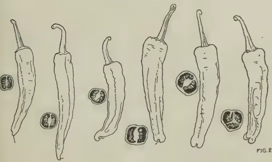
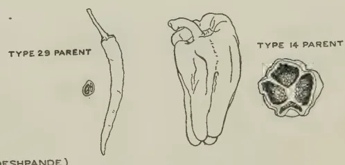
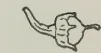
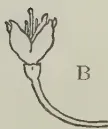

# The Tropical Agriculturist

VOL. XCIV

PERADENIYA, APRIL, 1940

No. 4

<table><thead><tr><th></th><th style="text-align: right;">Page</th></tr></thead><tbody><tr><td>Editorial .. .. .</td><td style="text-align: right;">195</td></tr></tbody></table>

## ORIGINAL ARTICLES

<table><tbody><tr><td>A Study of the Genus <i>Capsicum</i>, with Special Reference to the Dry Chilli—IV. By W. R. C. Paul, M.A. (Cantab.), Ph.D., M.Sc. (Lond.), D.I.C., A.I.C.T.A., F.L.S. .. .. .</td><td style="text-align: right;">198</td></tr><tr><td>The Absorptive Capacity of three Paddy Soils for Ammonium Fertilizers. By D. E. V. Koch, Ph.D., A.I.C., D.I.C., F.R.H.S. .. .. .</td><td style="text-align: right;">214</td></tr><tr><td><i>Calanthe Veitchii</i> Lindley. By K. J. Alex Sylva, F.R.H.S. .. .. .</td><td style="text-align: right;">226</td></tr></tbody></table>

## DEPARTMENTAL NOTES

<table><tbody><tr><td><i>Mimosa bracaatinga</i> Hoehne—a New Tree for Estates .. .. .</td><td style="text-align: right;">228</td></tr><tr><td>The Work of the Animal Husbandry Branch of the Department of Agriculture .. .. .</td><td style="text-align: right;">231</td></tr></tbody></table>

## SELECTED ARTICLES

<table><tbody><tr><td>On Animal Breeding .. .. .</td><td style="text-align: right;">242</td></tr><tr><td>The Application of Economic Botany in the Tropics .. .. .</td><td style="text-align: right;">250</td></tr><tr><td>Farmyard Manure .. .. .</td><td style="text-align: right;">257</td></tr></tbody></table>

## REVIEW

<table><tbody><tr><td>Field Trials : Their Lay-out and Statistical Analysis .. .. .</td><td style="text-align: right;">262</td></tr></tbody></table>

## RETURNS

<table><tbody><tr><td>Animal Disease Return for the month ended March, 1940 .. .. .</td><td style="text-align: right;">264</td></tr><tr><td>Meteorological Report for the month ended March, 1940 .. .. .</td><td style="text-align: right;">265</td></tr></tbody></table>

1—J. N. 93551 (4/40)

1------------------------------------------------

<!-- stage4: FAINT old-images-only -->

[Faint page: no legible print of its own could be verified; text withheld (stage 4 review list)]

2------------------------------------------------

# The Tropical Agriculturist

April, 1940

---

## EDITORIAL

---

SLOPE GRADIENT AND SOIL EROSION

### CORRIGENDUM

In the 7th line from the bottom on page 130 of *The Tropical Agriculturist*, March, 1940, for consumption read production

Editor, *The Tropical Agriculturist*.

terrace as opposed to the Nichols terrace which consists of a shallow ditch buttressed on the lower side by an embankment of earth and is thus an intercepting and drainage structure. A discussion was raised by an advocate of the Nichols principle in the course of which the Honourable the Minister for Agriculture and Lands stated that it was proposed to stop the alienation of land with a gradient which made interception and absorption impracticable. In the application of this policy it would be useful to draw on the experience of investigators in other countries. The subject has received greater attention in the United States of America than anywhere else, and the following statement appearing in an article on the "Agronomic Problems of the South" in the *Journal of the American Society of Agronomy*, February, 1940, provides a measure of the magnitude of the American effort: "Funds available for study and control of soil erosion amount to a sum greater than that available for any other subject studied by experiment stations and the Department of Agriculture". Let us examine what we can learn from the United States of America.

3------------------------------------------------

196

The Soil Conservation Service of the States recognizes four slope classes :—

Class A.—Slopes requiring no particular erosion-control measures other than proper crop management.

Class B.—May be clean-tilled, but requires effective control measures.

Class C.—Effective control of erosion is impracticable under clean-tilled crops ; recommended for pasture, hay, or other close-growing crops.

Class D.—Should not be cropped at all ; but should be put under forest or permanent pasture.

According to a bulletin of the Department of Agriculture, United States of America, in applying this classification to the Reedy Fork Demonstration area in North Carolina, the following ranges of gradient were regarded as coming under the several classes :—

Class A.—0 to 3 per cent.

Class B.—3 to 7 per cent.

Class C.—7 to 12 per cent.

Class D.—Over 12 per cent.

A 12 per cent. slope represents a gradient of  $6.9^\circ$ .

Mr. Colin Maher, author of an article on strip cropping in *The East African Agricultural Journal*, March, 1940, quotes the following classification of slopes in connexion with the recommendations for strip cropping intervals in Nebraska, Kansas, and Oklahoma :—

- (a) Slopes 0 to 2 per cent. : Minimum of 25 to 50 feet in erosion-resisting crops and 100 to 150 feet maximum in row crops.
- (b) Slopes 2 per cent. to 3 per cent. : Minimum of 40 to 50 feet in erosion-resisting crops and 75 to 125 feet maximum in row crops.
- (c) Slopes too steep for terraces : Fifty per cent. of the land area should be in a permanent or semi-permanent erosion-resistant crop.

The above recommendations may be summarized as follows :—

No land with a slope of more than 12 per cent.—or a  $6.9^\circ$  gradient—should be brought under any form of cultivation : lands with a slope of more than 3 per cent.—or a  $1.9^\circ$  gradient—are too steep for terracing.

4------------------------------------------------

197

Perhaps America has not reached the stage of land starvation which we have, and there is a sufficiency of level or nearly level lands to meet the nation's requirements. If we adopt their standard, conservation of the land will be possible only by the extinction of the human being. Mr. Maher's suggestion that perhaps broad base terraces would be practicable up to 10 per cent. or 12 per cent. slopes brings us nearer the ideal which is suitable to us; in the practical conditions of our country, with most of our so-called plains broken by undulations with greater slopes than 12 per cent., even this limit must remain an ideal. But in fixing the reserve gradient Government should not overlook the fact that other countries with greater knowledge than we have regard 7° as the highest gradient that allows land to be cultivated—and that with a less devastating volume and distribution of rainfall.

5------------------------------------------------

198

## A STUDY OF THE GENUS CAPSICUM, WITH SPECIAL REFERENCE TO THE DRY CHILLI—IV\*

W. R. C. PAUL, M.A. (Cantab.), Ph.D., M.Sc. (Lond.), D.I.C., F.L.S.  
AGRICULTURAL OFFICER, CENTRAL DIVISION

(f) *Pollination and fertilization.*—It has already been shown that dehiscence of the anthers commences after the opening of the flowers, when the weather conditions become dry, sunny and warm. The pollen, however, remains in masses and becomes dislodged only when the flowers are swayed with the wind, but it is not carried very far. Wind pollination is, nevertheless, not general in *Capsicum*, and in selfing experiments, when the plants are bagged to prevent crossing, pollination does not readily take place unless the bags are shaken a few times at mid-day.

Insects are known to be attracted to the flowers, for the sake of the nectar present. Shrivastava (1916) observed the small bee (*Apis florea* F.) visiting the flowers between 7 A.M. and 9 A.M. while Harris according to Erwin (1932) reported the following insects which he considered to play some part in pollination:—The honey bee (*Apis mellifica* L.); the digger bee (*Melissodes rustica* Say.); the solitary bee (*Agapostemon virescens* F.) and the hover fly (*Eristalis latifrons*). Gopalaratnam (1933) also recorded *Apis florea* F. in addition to thrips (*Scirtothrips dorsalis* Hood), butterflies (*Papilio demoleus* L., *P. aristolochiae* F. and *Terias hecabe* L.) and the small black ant (*Camponotus compressus* F.). In Ceylon, the writer found the Dammar bee (*Melipona iridipennis* Dall.) and more commonly the ants (*Meranoplus bicolor* Guen. and *Tapinoma melanocephalum* F.) on the flowers with pollen grains on their legs.

According to Cochran (1936) hand pollination of the flowers produced no significant increase in setting compared with open pollination and he concluded that no stimulus from pollination was necessary for fruit setting. For pollination to be successful, the stigma should be receptive which only obtains when it glistens with a mucilaginous secretion over its surface.

Gopalaratnam (1933) reported that the stigma remains receptive for about 24 hours from the time of opening of the

---

\* Continued from *The Tropical Agriculturist*, March, 1940.

6------------------------------------------------

199

flower but produced no experimental evidence in support of the same. As judged by the glistening, mucilaginous appearance on the surface of the stigma, it remains receptive throughout the second day after the opening of the flower. An experiment was carried out to determine the period of receptivity of the stigma by emasculating the flowers before dehiscence and pollinating them 24 hours later, the plants being isolated to prevent any pollen reaching them from other plants. The results from six plants are shown in Table I.

TABLE I

Showing the effect of pollinating emasculated flowers twenty-four hours after anthesis

<table border="1">
<thead>
<tr>
<th></th>
<th>Number of flowers opened</th>
<th>Number of fruits set</th>
<th>Percentage fruits set</th>
</tr>
</thead>
<tbody>
<tr>
<td>Flowers emasculated and pollinated 24 hours later ..</td>
<td>366</td>
<td>43</td>
<td>31.6</td>
</tr>
<tr>
<td>Control ..</td>
<td>325</td>
<td>78</td>
<td>24.0</td>
</tr>
</tbody>
</table>

It will be seen that the stigma has not lost its receptivity a day after anthesis.

When the pollen tubes germinate on the stigma they grow down the tissues of the style, and Cochran (1938) stated that during their course down the style the generative nucleus divides and forms two microgametes. The tube passes through the micropyle and makes its way between the two synergids, coming to rest near the egg. One nucleus fuses with the egg to form the embryo while the other unites with the two polar nuclei to form the primary endosperm nucleus. After fertilization, the styles usually dry up and drop.

The period between pollination and fertilization varies with the temperature and humidity conditions prevailing at the time. Cochran (1938) observed that "after the pollen is deposited on the stigma it remains inactive for a short time under all environmental conditions". From microscopic examination of the ovaries of pollinated flowers he found that, in the case of the World Beater variety of Bell pepper, fertilization took place about 42 hours after pollination when the plants were subject to a temperature of 70 to 80° F. and to a condition of high humidity.

The interval between pollination and fertilization in the Tuticorin chilli was examined by adopting the method of severing the styles of pollinated plants about 1 mm. above the

7------------------------------------------------

200

top of the ovary at various times after pollination; and the results obtained are shown in Table II., the control being flowers with their styles uncut.

TABLE II

Showing the percentage number of fruits set at different intervals between pollination and fertilization

<table border="1">
<thead>
<tr>
<th>Number of hours after pollination before removal of style</th>
<th>Number of flowers opened</th>
<th>Number of fruits set</th>
<th>Percentage fruits set</th>
</tr>
</thead>
<tbody>
<tr>
<td>1 hour</td>
<td>157</td>
<td>0</td>
<td>0</td>
</tr>
<tr>
<td>2 hours</td>
<td>202</td>
<td>4</td>
<td>2</td>
</tr>
<tr>
<td>3 "</td>
<td>159</td>
<td>7</td>
<td>4.4</td>
</tr>
<tr>
<td>5 "</td>
<td>144</td>
<td>20</td>
<td>13.8</td>
</tr>
<tr>
<td>Control</td>
<td>325</td>
<td>78</td>
<td>24</td>
</tr>
</tbody>
</table>

It will be seen that, only after an interval of about five hours, is there an appreciable number of fruits set.

There has been much difference of opinion as to whether *Capsicum* is normally self or cross-pollinated. Shrivastava (1916) reported that the percentage of natural crossing was only between 2 and 5, while Shaw and Khan (1928) found that, in the case of 96 plants subject to open pollination, about 78 per cent. were cross-pollinated. Erwin (1933) obtained a figure of 71 per cent. in a similar test but Gopalaratnam observed that, out of 32 cultures raised by him from single plants, only two showed the result of crossing. An experiment was carried out in the field by emasculating all the flowers in certain plants surrounded by others whose flowers were left un-emasculated. The percentage fruit set is given in Table III., together with a count taken from labelled un-emasculated flowers subject to open pollination.

TABLE III

Showing the percentage of fruit set in emasculated and un-emasculated flowers subject to open pollination

<table border="1">
<thead>
<tr>
<th></th>
<th>Number of flowers opened</th>
<th>Number of fruits set</th>
<th>Percentage fruits set</th>
</tr>
</thead>
<tbody>
<tr>
<td>Emasculated</td>
<td>1117</td>
<td>163</td>
<td>14.41</td>
</tr>
<tr>
<td>Un-emasculated</td>
<td>1195</td>
<td>410</td>
<td>34.30</td>
</tr>
</tbody>
</table>

This figure, however, does not mean that the percentage of cross-fertilization is as high as this, owing to the fact that self-pollination has been excluded. In other words, the possibility of every flower being self-pollinated instead of being cross-pollinated was not taken into account, but it indicates the extent to which cross-pollination can take place.

8------------------------------------------------

A large, faint watermark of a classical building, likely a library or archive, is centered on the page. It features a triangular pediment supported by four vertical columns, all resting on a base. The watermark is rendered in a light gray tone that blends with the background.

Digitized by the Internet Archive  
in 2025

[https://archive.org/details/tropical-agriculturist\\_1940-04\\_94\\_4](https://archive.org/details/tropical-agriculturist_1940-04_94_4)

9------------------------------------------------

CURVES OF FLOWERING & FRUITING

— FLOWERS  
 - - - FRUITS  
 — RAINFALL

<table border="1">
<thead>
<tr>
<th>Date</th>
<th>Flowers (Numbers)</th>
<th>Fruits (Numbers)</th>
<th>Rainfall (Inches)</th>
</tr>
</thead>
<tbody>
<tr><td>Nov. 15</td><td>100</td><td>100</td><td>10</td></tr>
<tr><td>Nov. 22</td><td>180</td><td>120</td><td>18</td></tr>
<tr><td>Nov. 29</td><td>180</td><td>120</td><td>18</td></tr>
<tr><td>Dec. 6</td><td>180</td><td>120</td><td>18</td></tr>
<tr><td>Dec. 13</td><td>180</td><td>120</td><td>18</td></tr>
<tr><td>Dec. 20</td><td>180</td><td>120</td><td>18</td></tr>
<tr><td>Dec. 27</td><td>180</td><td>120</td><td>18</td></tr>
<tr><td>Jan. 3</td><td>180</td><td>120</td><td>18</td></tr>
<tr><td>Jan. 10</td><td>180</td><td>120</td><td>18</td></tr>
<tr><td>Jan. 17</td><td>180</td><td>120</td><td>18</td></tr>
<tr><td>Jan. 24</td><td>180</td><td>120</td><td>18</td></tr>
<tr><td>Jan. 31</td><td>180</td><td>120</td><td>18</td></tr>
<tr><td>Feb. 6</td><td>180</td><td>120</td><td>18</td></tr>
</tbody>
</table>

PLATE I.

FIG. 1.

Stock by Survey Dept. Cajon

FIG. 2.—APPARATUS FOR TESTING THE  
 BREAKING STRENGTHS OF THE PEDICELS  
 OF DIFFERENT DRY CHILLIES.

10------------------------------------------------

201

As pointed out by Erwin (1933), in view of the fact that *Capsicum* is a nectar-bearing plant and is visited by pollen-carrying insects, cross-pollination can take place to a considerable extent. Furthermore, unless steps are taken to prevent cross-pollination, varieties exhibiting particular characters show evidence of crossing in subsequent generations when these are grown alongside other varieties, and this fact sufficiently indicates that, for practical purposes, the extent of cross-pollination can be considerable. The Bird chilli and the Chilipiquin are, however, the only peppers that do not show any evidence of natural crossing.

(g) *Flowering and setting of the fruit.*—The *Capsicum* plant undergoes considerable variation in the number of flowers which set fruit under different conditions. Gopalaratnam (1933) carried out a census of the daily production of flowers and fruits of five plants of two types in the field and he found that the percentage setting was only 5.9 and 6.9 per cent. in each case. Cochran (1932, 1936) reported the percentage fruit set to vary from 2.59 to 100 under different conditions, reference to which will be made later. The writer obtained figures which varied from 4 to 40 per cent. with different conditions and it was observed that high temperatures, low soil moisture and low atmospheric humidity were responsible for a low percentage set of fruit.

In order to ascertain whether there was any correlation between rainfall, flowering and fruiting, daily counts of the flowers and fruit produced from six Triticum chilli plants growing in pots were made over a period of two months, and the weekly totals are shown, along with the rainfall, in Plate I., Fig. 1. The total percentage set of fruit over this period was 35, but as the plants showed signs of wilting, when abnormal dry weather prevailed for some time, they were each watered with a gallon of water daily, in order to keep them alive. The co-efficient of correlation ( $r$ ) for rainfall and flowering was examined, and found to be  $+0.20$  with a S.E. for  $r = \pm 0.303$ . No direct correlation between rainfall and flowering in chillies could be shown in this experiment, but it is possible that the watering may have influenced the flowering to such an extent as to prevent any statistical demonstration of a correlation between flowering and fruiting, although the curves in Plate I., Fig. 1. give some indication of a relationship between rainfall, flowering and fruiting.

(h) *The development of the fruit and seed.*—Cochran (1938) made a detailed study of the development of the fruit and his observations are summarized here. He found that after fertilization the zygote rests for 24–36 hours before division starts. The embryo sac first enlarges especially longitudinally, and

11------------------------------------------------

202

then the zygote divides twice transversely to form a 4-celled embryo, with its cells arranged lineally, as is typical of the *Solanaceae*. From the apical cell, the cotyledons are developed and from the cell below it, the hypocotyl, the initials of the central cylinder and the cortex of the root tip. The root cap primordium and the upper portion of the suspensor develop from the next lower cell and the remaining part of the suspensor from the basal cell. The two apical cells divide longitudinally and the two lower cells transversely forming an 8-celled embryo, but of 6 cells in length. The apical cells then divide periclinally to form the dermatogen outside and after transverse division of the inner group of cells, the initials of the hypocotyl and radicle are formed. The endosperm nuclei begin division well in advance of those of the embryo and soon fill the entire embryo sac. The endosperm is gradually digested but at maturity a large portion of it still remains\*. Both the endosperm and the embryo cells are well filled with reserve food. The integument becomes differentiated soon after the archesporial cell appears, and two days after pollination, the outer epidermal cells of the integument are almost isodiametric. But as the seed matures the cells elongate radially and heavy thickenings are formed on the lateral walls, reaching their maximum size about 30 days after pollination. The thickenings extend the entire length of the wall but becomes smaller towards the outer wall\*.

The period of time taken for the ripening of the fruit varies with different forms. Shaw and Khan (1928) stated that the fruit ripened in 60 to 75 days from anthesis, but give no particulars of the varieties on which these records were based. Gopalaratnam (1933) made observations on six types of chillies and found that the maturation period varies from 47 to 77 days, with a mean which varies from 51 days in the case of the Bird chilli to 60 days in the case of a variety named Yellow by him. The Bird chilli had a minimum maturation period of 47 days and a maximum of 55 days.

The Bird chilli fruit was found to reach maturity in Ceylon between 51 and 65 days from flowering with a mean of 60 days, and the Tuticorin chilli between 51 and 55 days with a mean of 52 days.

#### 8. THE FRUIT AND DIFFERENTIATING CHARACTERS

It has already been stated that the fruit is the most important character for the classification of cultural varieties or forms of *Capsicum*. Considerable variation is shown in the size, shape and colour of the fruits. For commercial purposes, the fruits may be used when fully developed (a) in the unripe (b) fresh

---

\* Vide Fig. 4 in Part II. of this Paper in *The Tropical Agriculturist*, February, 1940.

12------------------------------------------------

203

ripe or (c) dried ripe stage. Tolman and Mitchell (1913) have determined the proportion of the different parts of the fruit—the pericarp, seeds and placentae, and stalks in the Hungarian and Spanish Paprika—and they obtained the following percentage results:—pericarp 55.8, seeds and placentae 36.0 and stalks 8.1.

According to Young and True (1913), the removable placentae form about 4 per cent. of the pods.

(a) *The size, shape and position of the fruit.*—The size and shape of the fruits are of value in distinguishing types, and almost every intergrade in these characters is shown from the small needle-like fruits of the Bird chilli to the large bell-shaped fruits of the variety *grossum*. The fruits may also be classed as long, medium or short. They may vary in length from about 0.9 cm. in the case of the Bird chilli to about 20 cm. in some forms of Dry and Green chilli varieties. In transverse section the fruits of different forms may be circular, quadrate, corrugated or irregularly angular.

Senathiraja (1924, 1926) stated that varieties with long fruits have a greater number of fruits per pound than small fruits, and that this is due to the fact that the long fruits contain fewer seeds per fruit and have a smaller cross section. But the size of the fruit bears no relation to the number of seeds per fruit nor to its cross section, so that the reasons given by Senathiraja for the increase in the number of fruits per pound with the increase in size of the fruits cannot be accepted. In fact from Table IV., it will be seen that the number of fruits per pound is greater with the smaller fruit varieties, *e.g.*, Wanni and Tuticorin, than with the larger fruit varieties and this can be explained solely because the longer fruits have a greater weight per fruit on account of their larger pericarp area and thickness than the smaller fruits, and hence the number of fruits per pound should be less.

TABLE IV

Showing the number of pods per pound in stored samples of different chillies

<table border="1">
<thead>
<tr>
<th rowspan="2">Variety</th>
<th colspan="3">Number of pods per lb.</th>
</tr>
<tr>
<th>Minimum</th>
<th>Mean</th>
<th>Maximum</th>
</tr>
</thead>
<tbody>
<tr>
<td>Wanni</td>
<td>1096</td>
<td>1152.3 <math>\pm</math> 45</td>
<td>1336</td>
</tr>
<tr>
<td>Tuticorin</td>
<td>912</td>
<td>963.5 <math>\pm</math> 58.87</td>
<td>1035</td>
</tr>
<tr>
<td>Chankanai</td>
<td>455</td>
<td>495.6 <math>\pm</math> 30.2</td>
<td>556</td>
</tr>
<tr>
<td>Point Pedro</td>
<td>350</td>
<td>405.6 <math>\pm</math> 42.01</td>
<td>435</td>
</tr>
</tbody>
</table>

Forms with a thick pericarp as in the case of those belonging to the variety *longum* have a smaller number of fruits per pound than similar-sized fruits with a thinner pericarp such as

13------------------------------------------------

204

occurs in the variety *acuminatum*, and forms which possess a large number of seeds will also have a fewer number of fruits per pound than those which contain fewer seeds but are of equal size and thickness of pericarp. There is a decrease in the average weight of the pods (dried fruits) and consequently an increase in the average number of pods per pound with each picking, after the first two pickings. Joachim, Harbord and Thuraisingham (1939) reported that the number of pods varies from 888 in the first picking to 1,844 in the 7th picking of dry *Tuticorin* chillies. This is due to the fact that there is a decrease in the size of the pods as the season advances and the plants pass their optimum growth phase.

The genetic determination of size and shape in the fruits of *Capsicum* has been studied by several workers. Webber (1912) and Ikeno (1913) found that, in the  $F_2$  generation, a continuous series of fruit sizes and shapes were obtained. Halsted (1913-16) also obtained a similar result but could not recover the parental types. Dale (1928) found that, in a cross between a short fruit variety (Coral gem) and a long fruit (Anaheim), the curves were skewed when plotted out with the class intervals of equal arithmetical magnitude, but were normal when plotted on a logarithmic basis, indicating that there are several undetermined factors for length which exert proportionate rather than additive effects and that there was no disturbing influence on dominance. Deshpande (1933), however, reports that fruit length is probably inherited on a tri-hybrid basis, with shortness as the dominant factor. He crossed a short fruit possessing a purple colour and erect position, and a long fruit with a non-purple colour and pendent position and found that these characters are linked and segregate on a 3:1 basis. Owing to the small population, the  $F_1$  individuals were intermediate, but when the  $F_2$  population was analysed segregation was found to be on a 3:1 basis. The range in variation of shapes is shown in Figs. 1 and 2 of Plate II. taken from Deshpande. Kaiser (1935b) showed that fruit size and shape are controlled by independent genetic determinations. Size is genetically determined by the interaction of a number of size genes, but is subject to considerable modification by environmental factors, the genes operating geometrically and not additively. Shape is genetically determined by the interaction between (1) factors governing relative dimensional growth rates and (2) factors governing the size of the fruit.

The apex of the fruit may be pointed, blunt or lobed with a depression. Shaw and Khan (1928) considered this to be one character for distinguishing their types, and Deshpande (1937) reported that, in a cross between pointed and blunt fruit varieties, the  $F_1$  generation was intermediate or partially pointed;

14------------------------------------------------

FIG. 2 (AFTER DESHPANDE)

Block by Survey Dept. Ceylon.

PLATE II.

Showing the range in shape and size of the fruits in the progeny of crosses between different varieties of *Capsicum* (after Deshpande).

Fig. 1.—Cross between a Cherry pepper and a Dry chilli.  
 Fig. 2.—Cross between a Dry chilli and a Bell pepper.

15------------------------------------------------

205

but owing to the difficulty of distinguishing pointed from partially pointed classes, he grouped them, in the  $F_2$  generation, into one and found segregation to be on a 3:1 basis. The  $F_3$  cultures from plants with pointed fruits proved to be heterozygous, thus indicating monohybrid segregation.

In the case of fruits with a bulged base and non-bulged base, Deshpande (1933) found  $F_1$  bulged and in the  $F_2$ , 3 bulged to 1 non-bulged. Fruits with a bulged base were observed by him to be linked with a pateriform calyx. Miller and Fineman (1938), however, did not obtain a satisfactory fit with the  $\text{Chi}^2$  test, indicating that some ratio other than 3:1 is involved in this pair of characters.

The pendent and erect position of the fruits occurs in all varieties of *Capsicum annuum* L., but in *C. frutescens* L. the erect position only prevails. The inheritance of this character has been studied by Webber (1912), Ikeno (1913) and Kaiser (1935). They found that the pendent position in *C. annuum* is dominant to the erect and segregation takes place in a monohybrid ratio. Kaiser's experiments indicate that the position of the fruit is determined by a genetical factor which operates through a specific geotropic growth response.

(b) *The pericarp*.—The pericarp or fruit wall varies in thickness with different forms. In the varieties *conoides* and *acuminatum*, it is generally thin; in *cuneatum*, there may be forms with a thin pericarp, e.g., Wanni or with a thick pericarp, e.g., Perfection, while in the varieties *longum* and *grossum* it is, generally, thick. In Table V., the thickness of the pericarp of certain forms in which the fruits are utilized after drying, is given.

TABLE V

Showing the thickness of the dried pericarp of different forms of chillies

<table border="1">
<thead>
<tr>
<th rowspan="2">Variety</th>
<th colspan="3">Thickness of Pericarp</th>
</tr>
<tr>
<th>Minimum mm.</th>
<th>Mean mm.</th>
<th>Maximum</th>
</tr>
</thead>
<tbody>
<tr>
<td>Bird</td>
<td>0.10</td>
<td><math>0.138 \pm 0.0210</math></td>
<td>0.19</td>
</tr>
<tr>
<td>Wanni</td>
<td>0.10</td>
<td><math>0.122 \pm 0.0166</math></td>
<td>0.15</td>
</tr>
<tr>
<td>Tuticorin</td>
<td>0.10</td>
<td><math>0.136 \pm 0.0216</math></td>
<td>0.18</td>
</tr>
<tr>
<td>Chankanai</td>
<td>0.14</td>
<td><math>0.188 \pm 0.0245</math></td>
<td>0.24</td>
</tr>
</tbody>
</table>

Deshpande (1935) found that thickness is inherited in a simple monohybrid ratio. Among the cultivated forms, those which are pungent generally have a thin pericarp, while those which are mild have a thick pericarp. The former are used dried and the latter fresh, as fruits with a thick pericarp, when dried, shrivel and the surface becomes wrinkled.

16------------------------------------------------

This image is a scan of a blank page. The paper has a light beige or cream-colored tint. There are a few very small, dark specks scattered across the surface, which appear to be scanning artifacts or dust particles. No text, lines, or other markings are present on the page.

17------------------------------------------------

FIG. 4

FIG. 1

FIG. 2

FIG. 3

FIG. 5

Block by Survey Dept. Ceylon.

PLATE III.

Fig. 1—Cross section of part of the fruit wall showing the epidermal cells of a glossy Tuticorin chilli pod.  
 Fig. 2—Cross section of part of the fruit wall showing the epidermal cells of a Wanni chilli pod with a dull surface.  
 Fig. 3—Cross section of part of the fruit wall showing the epidermal cells of a Tuticorin chilli pod with a dull surface.  
 C = epidermal cell  
 CC = cell contents  
 Fig. 4—Cross section of the fruit wall of the Tuticorin chilli.  
 Fig. 5—Showing stage in which flowers absciss.  
 A—World Beater  
 B—Tuticorin.

18------------------------------------------------

206

A cross section of the pericarp of a Tutarin chilli fruit is shown in Plate III., Fig. 4. The outer epidermis consists of rectangular cells with a smooth cuticle and strongly thickened walls. The hypodermis consists of a few layers of thin-walled, rectangular cells with densely-filled chloroplasts. Beneath it are about six to ten layers of thin-walled parenchyma, while adjacent to the inner epidermis occur giant cells, the contents of which are filled with air. The purpose of these is not understood but they are probably responsible for the buoyancy of the fruits. In the larger-fruited forms, such as Elephant's Trunk and Bell peppers, these giant cells are much larger than those in the small-fruited forms. The inner epidermis exhibits small thick-walled sclerenchyma abutting on the giant cells with groups of thin-walled parenchyma between the bulges of the giant cells.

(c) *The colour and lustre of the fruit.*—Most forms are green when immature, on account of the presence of chlorophyll in the outer layers of the pericarp though certain forms exist with white, greenish yellow, yellow, orange, purple or purplish-black fruits in the unripe condition. On ripening, the fruits are either red, yellow or orange, red fruit forms being the most common. The usual change of colour in ripening is from green by stages to red or orange or yellow, but there are some forms which show various gradations from the green to yellow, orange and red, all these colours being shown on different parts of the same fruit. Halsted (1918) states that this latter maturation colour display is recessive to the direct line of colour change.

The principal forms of dry chillies are red fruited, which are preferred on account of the attractive colour they impart to curries and other dishes in which chilli powder, ground from slightly roasted pods, is used. In certain parts of India, however, yellow-fruited forms are more popular because of their greater pungency (Deshpande 1933).

The Dry chilli and the forms used for canning, pickling or as paprika are, generally, of a red ripe colour, while the green chilli and the Bell peppers are consumed in the mature green stage, though Bell peppers are also sold fresh ripe along with green fruit.

Howard (1925) studied the colour pigments of *Capsicum*, and reported that in the red fruit forms the pigments are due to a mixture of carotene, xanthophyll, and carotin, while in the yellow fruits the pigment is due to carotene. The proportion of lycopersicin is much less than that of carotene in the red fruit varieties. The pigments are located in the plastids which are contained mostly in the epidermis and the first few

19------------------------------------------------

207

layers below it. This author stated that, in the process of ripening, the chromoplasts gradually elongated from an oval or subglobose shape to a much elongated spindle form in the red ripe stage. Atkins and Sherrard (1913-15) and also Halsted (1918) observed that, in the dark green fruits, the number of chloroplasts was much greater than in the light green fruits.

More recent work by Zechmeister and Von Chlonkoy cited by Thorpe and Whiteley (1935) has shown that the red colour of *Capsicum* is due to a mixture of carotene and capsanthin, a carotenoid pigment allied to carotene and present to a much greater amount than carotene. Japanese red chillies were found by these authors to contain also the alkaloid, zeanthanin. The development of the colour in the ripe fruit is, according to Thorpe and Whiteley, possibly due to gradual dehydrogenation of the parent substance during ripening.

The mode of inheritance of colour in *Capsicum* has been investigated by several workers (Webber 1912, Ikeno 1913, Atkins and Sherrard 1913-15, Halsted 1918, &c.). They are all agreed that the red colour of the ripe fruit is dominant over the yellow or orange and the green colour of the immature fruit is dominant over yellow. Dark green of the immature fruit, according to Halsted (1918), is dominant to light green, inheritance of these colours being on a monofactorial basis, but at maturity it is not possible to distinguish these two classes by their colour. Deshpande (1936) has, however, shown that the purple colour is due to two factors, one of which is a basal factor and the other an intensifying factor. The purple colour is partially dominant to its allelomorph, but in the ripe fruit, colour is determined by a single factor.

A gloss on the surface of the pericarp of cured chillies is a quality of importance in the Dry chilli, and strains which develop a glossy surface on curing command a better price in the Ceylon market as a Dry chilli than those which are dull in appearance. In order to ascertain the cause of glossiness on the surface of the pod, microtome sections of the epidermis and the first few layers of the pericarp were prepared of the following chillies:—

1. 1. Tuticorin.—strain with glossy pericarp.
2. 2. „ —strain with dull pericarp.
3. 3. Wanni —strain with dull pericarp.

The sections were cut 10  $\mu$  thick and stained in Erlich's haematoxylin and also in Gentian green. Examination of the sections showed that the difference in lustre was associated with the difference in the shape of the epidermal cell contents (Plate III., Figs. 1-3). In the glossy Tuticorin chilli, most of the cell contents are almost rectangular whereas in the dull strains of

20------------------------------------------------

208

Tuticorin, and the Wanni chillies, there is a larger number of somewhat pyramidal-shaped cell contents. In the case of the rectangular-shaped cell contents, the reflecting surface below the cuticle is a plane, whereas in the pyramidal-shaped cell contents, the surface is somewhat papillose, and, therefore, a certain amount of scattering of the light rays takes place. No differences in the cuticle could be observed, nor in the fat content of the pericarps shown by the following figures obtained from samples of 100 pods of the glossy Tuticorin and Wanni chillies.

<table>
<thead>
<tr>
<th></th>
<th>Total ether extract.</th>
</tr>
</thead>
<tbody>
<tr>
<td>Tuticorin glossy</td>
<td>5.36</td>
</tr>
<tr>
<td>Wanni dull</td>
<td>5.44</td>
</tr>
</tbody>
</table>

There are no oil glands in the pericarp which may account for differences in glossiness, and a possible explanation lies in the physical effect caused by the reflection of light as a result of the particular shape of the epidermal cell contents. Counts were made of the number of rectangular- and pyramidal-shaped cell cavities in the epidermis of the glossy Tuticorin, dull Tuticorin and dull Wanni pericarps and the results are shown in Table VI.

TABLE VI

Showing the percentage of rectangular-shaped cell contents in the epidermis of the pericarp of glossy and dull chillies

<table border="1">
<thead>
<tr>
<th>Strain</th>
<th>Pyramidal Cell Contents</th>
<th>Rectangular Cell Contents</th>
<th>Total</th>
<th>Percentage Rectangular</th>
</tr>
</thead>
<tbody>
<tr>
<td>A. Tuticorin glossy</td>
<td>79</td>
<td>240</td>
<td>319</td>
<td>75.23 <math>\pm</math> 2.4</td>
</tr>
<tr>
<td>B. Tuticorin dull</td>
<td>207</td>
<td>68</td>
<td>275</td>
<td>24.73 <math>\pm</math> 2.6</td>
</tr>
<tr>
<td>C. Wanni dull</td>
<td>254</td>
<td>70</td>
<td>324</td>
<td>21.61 <math>\pm</math> 2.3</td>
</tr>
</tbody>
</table>

For  $n = 99$  and  $P = .01$ ,  $t = 2.576$ .

S.E. of the difference between A and B (50.63 per cent.)

$$= \pm 3.55 \text{ per cent.}$$

S.E. of the difference between A and C (53.63 per cent.)

$$= \pm 3.33 \text{ per cent.}$$

S.E. of the difference between B and C (3.12 per cent.)

$$= \pm 1.1 \text{ per cent.}$$

These results show that glossy pods have a significantly higher percentage of rectangular to pyramidal cell contents in the epidermis.

(d) *The breaking strength of the pedicel.*—A persistent pedicel is a desirable feature of the Dry chilli the pods of which are sold with their pedicels attached and their seeds intact. A certain amount of breakage does, however, occur in storage, and forms differ in the percentage of stalkless pods present after a certain

21------------------------------------------------

209

period of storage. Chillies having a high percentage of pods with their pedicels intact command a better price than those which, in storage, possess a large number of stalkless pods, and it is generally recognized amongst condiment dealers in Ceylon that the Tuticorin chilli is superior to other dry chillies in this respect.

A persistent pedicel is a genetic character according to Halsted (1912), who found that, in crossing a small fruit variety with erect and easily detachable pedicels and forms with pendent, elongate fruits but more or less persistent pedicels, the former type was dominant to the latter.

In order to ascertain the breaking strengths of the pedicels in different Dry chillies, the pedicels were individually subject to a vertical force and the weight required to sever them from their pods recorded. The apparatus used is shown in Plate I., Fig. 2. A pod (A) is clamped in the inverted position about  $\frac{1}{2}$  cm. above the calyx between two cork discs (B) and the pedicel is inserted at one end of a metal socket (C) and fastened by tightening the screw ( $C_1$ ). At the other end, a wire of about  $1/10$  in. gauge attached to a pan is inserted and tightened by means of the screw ( $C_2$ ). Weights are then added to the pan until the stalk is severed from its pod. The detached stalk is then removed from the socket and another pod clamped into position and inserted into the socket. Using 100 pods for each variety, the mean breaking strength in grams for different forms is given in Table VII.

TABLE VII

Showing the mean breaking strengths of the pedicels in different chillies

<table border="1">
<thead>
<tr>
<th>Variety</th>
<th>Mean breaking strength of pedicel in grams</th>
</tr>
</thead>
<tbody>
<tr>
<td>A. Wanni</td>
<td>474 <math>\pm</math> 201</td>
</tr>
<tr>
<td>B. Atchchuvely</td>
<td>589 <math>\pm</math> 252</td>
</tr>
<tr>
<td>C. Chankanai</td>
<td>681 <math>\pm</math> 338</td>
</tr>
<tr>
<td>D. Tuticorin</td>
<td>847 <math>\pm</math> 310</td>
</tr>
<tr>
<td>Difference between D and A</td>
<td>373 <math>\pm</math> 369</td>
</tr>
</tbody>
</table>

Owing to the high standard errors obtained for the mean breaking strengths of the pedicels in each form, it is not possible to demonstrate any significant differences between them, although considerable differences in the means exist, between such forms as the Wanni and the Tuticorin.

## 9. FACTORS AFFECTING GROWTH, FRUITING AND RIPENING

Growth and yield which is a measure of the fruiting capacity of the plant are dependent on the factors of nutrition, temperature, soil as well as atmospheric moisture, and light, apart from the internal heritable factors which are responsible for yield differences

22------------------------------------------------

210

between strains produced under identical growth conditions. Both these sets of factors not only influence the production of flowers but also the setting of fruit, reference to which has already been made, and in this section attention will be directed towards the effect of the environmental factors of nutrition, temperature, moisture and light on the production of flowers and the setting of the fruit in the genus.

(a) *Nutrition*.—Several workers have indicated the importance of nitrogen in the nutrition of the chilli plant. Stuckey and McClinton (1921) found that nitrogen increased plant growth and fruit production, although there was greater susceptibility to blossom end rot. Lloyd (1926), however, found that in trials with different forms of Bell peppers carried out over a period of 5 years, nitrate of soda, applied at the rate of 1 oz. per plant in 2 applications of  $\frac{1}{2}$  oz. each—the first about a month after planting out and the second three weeks later—had no effect in increasing yield. He also reported that bonemeal at the rate of 2 oz. per plant after planting out gave no response. Lloyd's experiments were not subject to any statistical analysis and no definite conclusions can therefore be drawn from them.

Cochran (1936) working with World Beater plants in pots, found that high nitrogen significantly increased the number of blossoms formed and the number that set fruit, the increase being greater at temperatures of 70° to 80°F. than at 60° to 70°F. There was, however, little effect on earliness of bud formation or anthesis, although vegetative growth was better. Nitrogen was given at intervals of 10 days by adding 100cc. to each plant of a solution of nitrate of soda at 1 oz. per gallon of water.

Under field conditions Joachim and Paul (1938) examined the effect of fertilizers in increasing the yield of Tuticorin chillies at two centres in the dry zone of Ceylon. They found that nitrogenous fertilizers at 20 lb. and 40 lb. N per acre gave significant fresh weight increases, which varied from 8 to 18 cwt. per acre at one centre and 12 to 37 cwt. per acre at the other centre, over the unmanured plots which yielded 23.9 cwt. and 31.6 cwt. per acre respectively. These fertilizers, particularly sulphate of ammonia, showed a tendency to induce early bearing. Phosphorous and potash, however, when included in a mixture with nitrogen had no effect in increasing yield nor did farmyard manure used alone or in conjunction with the fertilizers at 3 tons per acre, possibly because this quantity was inadequate.

A further experiment was carried out by Joachim, Harbord and Thuraisingham (1939) using single and double dressings of nitrate of soda at 133 lb. per acre (=20 lb. N per acre) for the single dressing and they obtained an average fresh weight

23------------------------------------------------

211

increase of 10.2 and 18.8 cwt. per acre respectively over the unmanured plots which gave a mean of 37.8 cwt. per acre. These increases proved to be highly significant and on the basis of a dry weight outturn of 30 per cent. the increases are equivalent to 3 and 5.5 cwt. per acre respectively of dry chillies. In this experiment, however, nitrogen appeared to delay bearing.

(b) *Temperature*.—The Bird chilli does not develop freely in temperate climates, and even if grown it is reported that it does not ripen or set seed as in the case of other varieties. On the other hand, the more highly developed forms of Bell pepper fare better in temperate climates with a growing season temperature range of 60—70°F., than under tropical conditions, where the temperature range may be from 70° to 100°F. in the shade.

Cochran (1936) carried out studies with the World Beater pepper and found that, of the four ranges of temperature, *viz.*, 50–60°, 60–70°, 70–80° and 90–100°, maximum growth occurred at 70–80° temperature range. The plants were dark-green in colour, stocky and much branched. At the higher temperatures, the root system was poorer and it is possible that, with the smaller root system, water absorption is reduced while transpiration is greater. With these conditions of lower water absorption and greater transpiration and also an increased respiration, carbon assimilation and hence growth becomes reduced, as seen in the smaller fresh weights of the plants recorded by Cochran. He also found that early blossoming and maturity of fruit are favoured by high temperatures, but from the point of view of setting of fruit, with the exception of the lowest temperature range (50–60°F.), the higher the temperature, the lower the setting of the fruit. At 60–70° the percentage of blossoms that set fruit is 73.53 and at 70–80°, 44.26 and at 90–100°, 0. At the highest temperature (90–100°F.) no fruit set because the buds and flowers that formed continually abscised. At blossoming time, if the plants are shifted from 90–100° to 50–60°F. there is an increase in the percentage of fruit set from 0 to 99.3, while the shift from 70–80° to 50–60° increased the set from 43.32 to 98.7 per cent. Cochran also attributed the abnormalities in the flower and fruit of *Capsicum* to high temperatures.

(c) *Moisture*.—The moisture content of the soil has an important effect in the growth and yield of *Capsicum*. The crop does well when it receives an ample but well-distributed supply of moisture. In U.S.A. *Capsicum* is reported to be more drought resistant than either the egg plant or tomato (Beattie and Doolittle 1937), but according to Garcia (1921) it is not grown under dry farming conditions in New Mexico (the average annual rainfall varying between 8 and 20 ins.) because the rainfall there is inadequate for chillies. Lloyd (1926) reckoned that,

24------------------------------------------------

212

over a period of 5 years, the yields of pepper can be increased by about 15 per cent. by irrigation. In India and Ceylon, where chillies are grown both with and without irrigation, much higher yields are obtained under irrigated conditions. The crop is generally irrigated in Western India (Bhartarkar 1912) while in the southern part of South India it is grown under irrigation and in the northern part as a dry crop (Gopalaratnam 1933A). In Ceylon, the crop is irrigated in the north of the Island (the Jaffna Peninsula), but is grown under rain fed conditions elsewhere in the dry zone, and the yields obtained in the former area are almost double those in the latter.

Cochran (1936) found that high soil moisture hastens bud formation, anthesis and setting of fruit, while excessive transpiration increases blossom drop, though at a temperature of 90–100°F., and even high soil moisture, no blossoms set fruit.

(d) *Light*.—The effect of the length of day on growth, flowering and fruit setting in peppers has been investigated by Auchter and Harley (1924), Deats (1925) and Cochran (1938). With seven or fifteen hours of sunlight daily, there was no difference in flowering according to Auchter and Harley, but with longer illumination the plants took more time to reach the flowering stage. They also found that the intensity of illumination had no effect on the time of flowering, for plants grown in diffuse light under cheese cloth shade, blossomed at the same time as those which received full sunlight.

Deats (1925) exposed Bell peppers to three different lengths of day during the winter, the plants being grown in the green house under similar conditions of temperature, humidity, &c. In the short day 6½ hours illumination was provided, in the long day 17½ hours, while the controls were subject to the normal length of day (10 hours) from November to April. She found that the rate of growth as measured by the height and diameter of the stems and the size and thickness of the leaves was directly proportional to the length of the day. With the short day plants, which were pale in colour, no flowers were produced, but there were more flowers and fruit in the controls than in the long day plants, although there was no difference in the time of flowering between the controls and the long day plants.

Cochran (1936) subjected World Beater pepper plants to the normal length of day (10 hours) from December to April in U.S.A. and to a long day period (14 hours). He found that growth was more rapid and the time of flowering about 10 days longer than in the long day period. There was also a significant

25------------------------------------------------

213

decrease in fruiting in the long day period (14.04 per cent. at 70–80°F.) confirming the results of the previous workers that peppers require a moderately short day for fruiting.

Light apparently has little effect in inducing ripening of the fruit. An experiment was carried out using 24 fruits each of light-green and dark-green fruited strains of the Elephant's Trunk chilli, the fruits being picked when they were just beginning to turn colour. Half of each of these two varieties was placed in total darkness and the other half in diffused light on the laboratory table. The number of days taken for each fruit to turn completely red was recorded and the results are given in Table VIII.

TABLE VIII

Showing the mean number of days taken for the ripening of the fruits of the Elephant's Trunk chilli in light and darkness

<table border="1">
<thead>
<tr>
<th colspan="4">Mean Number of Days</th>
</tr>
<tr>
<th colspan="2">Strain A—Light Green</th>
<th colspan="2">Strain B—Dark Green</th>
</tr>
<tr>
<th>Light</th>
<th>Darkness</th>
<th>Light</th>
<th>Darkness</th>
</tr>
</thead>
<tbody>
<tr>
<td>6.5</td>
<td>7.83</td>
<td>5.33</td>
<td>5.92</td>
</tr>
<tr>
<td colspan="2"><math>t = 0.80</math></td>
<td colspan="2"><math>t = 0.76</math></td>
</tr>
<tr>
<td colspan="2">When <math>n = 22</math> and <math>P = .05</math></td>
<td colspan="2"><math>t = 2.07</math></td>
</tr>
</tbody>
</table>

The differences are, therefore, not significant.

(*To be continued.*)

26------------------------------------------------

214

## THE ABSORPTIVE CAPACITY OF THREE PADDY SOILS FOR AMMONIUM FERTILIZERS

D. E. V. KOCH, Ph.D., A.I.C., D.I.C., F.R.H.S.

RESEARCH PROBATIONER IN CHEMISTRY

**S**OILS suitable for paddy cultivation exist in all parts of the Island. These vary considerably in texture from light loams and even sands to heavy clays.

Any soil containing a sufficient amount of colloidal matter can be converted into paddy lands. These colloids—both mineral and organic—have the property of absorbing from certain solutions the substances dissolved in them. It is a matter of common knowledge that the addition of ammonium sulphate as a fertilizer results in this base being absorbed almost completely by soils (only small amounts of it are present in drainage waters). On the other hand, large amounts of calcium sulphate are washed out of the soil as a result of the use of this fertilizer. The ammonia fixed may be converted into nitrates which can again be leached away. The continuous application of this fertilizer always results in loss of calcium from the soil, which consequently becomes more and more acid. Other ammonium fertilizers have not been studied so fully.

No figures have been published regarding the absorptive power of Ceylon paddy soils for fertilizers. Joachim (1) working with four dry-land soils has shown that a mean absorption of 52.5 per cent.–56.9 per cent. takes place from a 0.1 per cent. solution of ammonium sulphate. The only other work of importance is that by Joachim, Kandiah, and Panditsekere (2) who have shown that the intake of nitrogen by a paddy crop from a soil at Peradeniya was greater with ammonium phosphate than with green manures. They have also indicated that the exchangeable ammonia content of the soil diminished with increasing crop growth. It has, however, been demonstrated by manurial trials that commercial forms of ammonium phosphate are superior to ammonium sulphate so far as crop yields of paddy are concerned, but the better growth has been attributed as being most likely due to the added phosphoric acid in the former fertilizer. As early as 1916, K. Miyake (3) of Japan showed that the relation between the time which a solution of ammonium chloride remained in contact with a soil and the amount of ammonia absorbed by it can be expressed by means of an equation in which the constant  $m$  decreases as the concentration of the ammonium salt increases.

27------------------------------------------------

215

Bengtsson (4) has shown that it is most difficult to extract added ammonia from heavy clay sub-soils by means of 0.5N potassium chloride.

It is not proposed to refer to all the other papers on this subject, which might have been even more fully investigated but for the fact that ammonium chloride solutions and, in more recent times, ammonium acetate solutions have been used as displacing agents in the study of other absorbable kations.

#### OBJECTS OF THE INVESTIGATIONS

The objects of the present investigations were to ascertain, first, the absorptive power of certain Ceylon paddy soils for soluble ammonium fertilizers and, secondly, the effect of the ammonium compounds on the physical and chemical properties of these soils. Experiments were carried out with dilute solutions (approximately N/20) of different ammonium salts, so as to be more in accordance with field practice.

#### SOILS

The soils selected for this preliminary work represent three different types, *viz.*, a heavy non-lateritic clay, a heavy lateritic clay and a sandy soil. By such a selection it was hoped, and those hopes have been fulfilled, to bring out the differences in absorption as affected by soil type. Light sandy loams are generally unsuited for paddy cultivation but, amongst other factors, under certain profile characteristics, such as an impermeable sub-soil or rock layer at lower depths, it is possible to obtain fair yields of 25–30 bushels per acre of paddy, *e.g.*, the paddy soils of the Unnichchai Scheme. The A horizons alone of the profiles were studied. These varied from 4 inches in the Gannoruwa soil (Peradeniya) to 6 inches in the case of the Tampalakamam heavy loam. The soils had been examined previously by Joachim and Kandiah (5) and some of their results are reproduced.

TABLE I

<table border="1">
<thead>
<tr>
<th></th>
<th colspan="2">Soil A. Tampalakamam</th>
<th colspan="2">Soil B. Gannoruwa (Peradeniya)</th>
<th colspan="2">Soil C. Unnichchai</th>
</tr>
<tr>
<th></th>
<th colspan="2">Per cent.</th>
<th colspan="2">Per cent.</th>
<th colspan="2">Per cent.</th>
</tr>
</thead>
<tbody>
<tr>
<td>Stones and gravel</td>
<td>..</td>
<td>2.9</td>
<td>..</td>
<td>.5</td>
<td>..</td>
<td>—</td>
</tr>
<tr>
<td>Coarse sand</td>
<td>..</td>
<td>18.4</td>
<td>..</td>
<td>3.7</td>
<td>..</td>
<td rowspan="2">89.9</td>
</tr>
<tr>
<td>Fine sand</td>
<td>..</td>
<td>18.3</td>
<td>..</td>
<td>24.6</td>
<td>..</td>
</tr>
<tr>
<td>Silt</td>
<td>..</td>
<td>13.4</td>
<td>..</td>
<td>23.6</td>
<td>..</td>
<td rowspan="2">6.80</td>
</tr>
<tr>
<td>Clay</td>
<td>..</td>
<td>38.6</td>
<td>..</td>
<td>39.6</td>
<td>..</td>
</tr>
<tr>
<td>Loss by solution</td>
<td>..</td>
<td>4.7</td>
<td>..</td>
<td>2.5</td>
<td>..</td>
<td>—</td>
</tr>
<tr>
<td>Moisture</td>
<td>..</td>
<td>6.6</td>
<td>..</td>
<td>6.0</td>
<td>..</td>
<td>2.1</td>
</tr>
<tr>
<td>pH</td>
<td>..</td>
<td>6.80</td>
<td>..</td>
<td>5.26</td>
<td>..</td>
<td>5.13</td>
</tr>
<tr>
<td>Texture Index No.</td>
<td>..</td>
<td>36.1</td>
<td>..</td>
<td>38.0</td>
<td>..</td>
<td>6.0</td>
</tr>
<tr>
<td>Soil Type</td>
<td>..</td>
<td>Clay loam</td>
<td>..</td>
<td>Clay loam</td>
<td>..</td>
<td>Sandy soil</td>
</tr>
</tbody>
</table>

28------------------------------------------------

216*Chemical Analysis.*

<table border="1">
<thead>
<tr>
<th></th>
<th>Soil A.</th>
<th></th>
<th>Soil B.</th>
<th></th>
<th></th>
</tr>
</thead>
<tbody>
<tr>
<td>Carbon ..</td>
<td>2.43</td>
<td>..</td>
<td>2.75</td>
<td>..</td>
<td>—</td>
</tr>
<tr>
<td>Nitrogen ..</td>
<td>.274</td>
<td>..</td>
<td>.217</td>
<td>..</td>
<td>—</td>
</tr>
<tr>
<td>C/N ratio ..</td>
<td>8.8</td>
<td>..</td>
<td>12.7</td>
<td>..</td>
<td>—</td>
</tr>
<tr>
<td>Total exchangeable base m.e. ..</td>
<td>25.9</td>
<td>..</td>
<td>6.15</td>
<td>..</td>
<td>.29</td>
</tr>
<tr>
<td>Exchangeable Ca m.e.</td>
<td>17.8</td>
<td>..</td>
<td>4.69</td>
<td>..</td>
<td>.25</td>
</tr>
<tr>
<td>Exchangeable Mg. m.e.</td>
<td>4.38</td>
<td>..</td>
<td>.64</td>
<td>..</td>
<td>—</td>
</tr>
<tr>
<td>Ultimate pH ..</td>
<td>3.20</td>
<td>..</td>
<td>4.53</td>
<td>..</td>
<td>3.33</td>
</tr>
<tr>
<td>Exchange capacity m.e.</td>
<td>27.3</td>
<td>..</td>
<td>10.4</td>
<td>..</td>
<td>.83</td>
</tr>
<tr>
<td>Per cent. saturation ..</td>
<td>95</td>
<td>..</td>
<td>59</td>
<td>..</td>
<td>35</td>
</tr>
</tbody>
</table>

*Clay Analysis.*

<table border="1">
<thead>
<tr>
<th></th>
<th>Soil A.</th>
<th></th>
<th>Soil B.</th>
</tr>
</thead>
<tbody>
<tr>
<td>Silica (SiO2) ..</td>
<td>56.18</td>
<td>..</td>
<td>36.42</td>
</tr>
<tr>
<td>Alumina (Al2O3) ..</td>
<td>21.70</td>
<td>..</td>
<td>38.07</td>
</tr>
<tr>
<td>Iron oxide (Fe2O3) ..</td>
<td>9.71</td>
<td>..</td>
<td>20.08</td>
</tr>
<tr>
<td>SiO2/Al2O3 (molecular)</td>
<td>4.38</td>
<td>..</td>
<td>1.62</td>
</tr>
<tr>
<td>SiO2/R2O3 (molecular)</td>
<td>3.41</td>
<td>..</td>
<td>1.21</td>
</tr>
<tr>
<td>Type ..</td>
<td>Non-lateritic</td>
<td>..</td>
<td>Lateritic</td>
</tr>
</tbody>
</table>

*Soil A.*—The Tampalakamam heavy loam is subjected to an annual rainfall of 75 in. and an average temperature of 81°F. The topography of the land, which is slightly above sea level, is flat and the vegetation carried by it is scrub jungle. The geological origin is recent over biotite gneiss and the mode of formation of the soil alluvial. The drainage of this paddy area is poor. The A horizon sampled (0–6 inches) is a blackish brown compacted soil which dries down very hard. It overlies a typical gley horizon C—a layer of accumulation comparable to the B horizons of certain profiles being absent. Yields of paddy as high as 80 bushels per acre have been obtained (5).

The properties of this soil are represented in table I. It will be seen that this heavy clay soil has a good reserve of carbon and is very rich in nitrogen, which includes 0.77 m.e./100 gr. of exchangeable ammonia and 1.6 m.e./100 gr. of ammonia in loose organic combination. The soil is faintly acid in reaction and has a very high content of exchangeable bases, chiefly calcium which constitutes nearly 80 per cent. of the total bases. The clay analysis reveals its non-lateritic nature and this together with the lower ultimate pH and high exchange capacity indicate the clay as probably belonging to the montmorillonite class. The soil is nearly saturated with bases and has a low  $\frac{Ca}{Mg}$  (exchangeable) ratio.

*Soil B.*—A paddy soil at an elevation of 1,760 ft. of recent geological origin and alluvial formation obtained from the Gannoruwa high-yielding area of the Experiment Station, Peradeniya, is a grey-brown, heavy loam, acidic in nature and of poor but better drainage than soil A (6).

29------------------------------------------------

217

A glance at table I shows it to be similar to the Tampalakam soil in certain characters, namely texture, carbon and nitrogen contents and the presence of exchangeable and readily-available  $\text{NH}_3$  compounds. The chief differences lie in (1) its more acidic nature, (2) lower content of total and exchangeable bases and (3) most important of all so far as this investigation is concerned, the nature of the clay, which is lateritic—the silica/alumina molecular ratio being only 1.62.

*Soil C—The Unnichchai Paddy Soil.*—The reason for the selection of this soil has already been stated. It is rather acid in reaction (pH 5.13) and is very deficient in organic matter. It has a low absorption capacity for water. As it contains a high proportion of sand, nearly 90 per cent., its high percolation rate is readily understood. The mechanical analysis shows it to contain only 6.8 per cent. of particles of diameter less than 0.02 mm. But for a small amount of nitrogenous matter the soil is deficient in other nutrients and is very unsaturated. The growth of paddy with fair success is most probably due to the irrigation waters which might be expected to contain potash, calcium, &c., sufficient for the bare needs of the crop—the underlying rock being felsphatic gneisses.

#### METHODS

The more important methods of analyses are briefly stated.

*Ammonia.*—The determination was made by the Kjeldahl method using a macro-apparatus of the Pregl type. In the case of solutions, the ammonia was expelled by means of a mixture of magnesium sulphate containing half its equivalent of sodium hydroxide. Exchangeable ammonia in the soils was ascertained by distillation for a fixed period (15 minutes) using magnesia mixture.

*Calcium.*—This was determined as oxalate—the precipitation being initiated at neutrality and completed at a pH 4.5. 10 mls. saturated ammonium oxalate were used in each case. As this reagent contains magnesium, the quantity used was fixed in order to make the necessary (blank) deduction constant for the magnesium estimations.

*Magnesium.*—The determination was carried out by precipitation as magnesium ammonium phosphate and titration of the first hydrogen ion of the phosphoric acid liberated by a known excess of acid. The technique followed by the writer was found to be very satisfactory.

*Bases.*—Exchangeable bases were determined by electrodialysis using a glass electrodialyser of the Löddesol type with certain improvements. A potential of 220–250 volts D.C. was used between electrodes 4.5 cm. apart. Cellophane membranes were used. Electrodialyses were carried out for twelve hours or

30------------------------------------------------

218

longer until the catholyte ceased to be alkaline to phenolphthalein. The temperature was kept below 40°C; the contents of the cathode alone were withdrawn from time to time; titrations were performed with N/20 solutions.

(a) *Exchangeable calcium*.—The precipitation of calcium as oxalate in the catholyte after preliminary treatment with nitric acid (it is of the utmost importance to decompose all organic matter contained in the catholyte before proceeding with the estimation of the individual bases).

(b) *Exchangeable magnesium*.—Determinations were made on the filtrates obtained after removal of calcium.

Ultimate pH is the pH of the electrodialysed soil, which was collected on No. 50 Whatman paper and washed twice with distilled water. Soil-water ratio 1/2½.

*Base exchange capacity*.—The number of m.e. of calcium hydroxide solution necessary to raise the pH of the electrodialysed soil to 7·0 after one hour's equilibrium with occasional stirring.

For all the other determinations the methods of analysis adopted in this laboratory were followed.

#### EXPERIMENTAL WORK

The research resolved itself into four series. In series 1, a quantity of soil equivalent to 50 gr. (on an over dry basis) was treated with 200 cc. of approximately N/20 solutions of ammonium salts and occasionally shaken during a period of 48 hours. At the same time controls were carried out with the same volume of water.

The solutions were prepared from pure chemicals, and in the table below the salts used, their concentrations and pH values are represented.

<table border="1">
<thead>
<tr>
<th>Name, formula and treatment number</th>
<th>Normality</th>
<th>pH</th>
</tr>
</thead>
<tbody>
<tr>
<td>Ammonium hydrogen phosphate (NH4)2HPO2 No. 1</td>
<td>.. 0·444</td>
<td>.. 7·18</td>
</tr>
<tr>
<td>Ammonium sulphate (NH4)2SO4 No. 2</td>
<td>.. 0·497</td>
<td>.. 5·10</td>
</tr>
<tr>
<td>Ammonium chloride NH4Cl No. 3</td>
<td>.. 0·502</td>
<td>.. 4·86</td>
</tr>
<tr>
<td>Ammonium carbonate (NH4)2CO3 H2O No. 4</td>
<td>.. 0·390</td>
<td>.. 8·23</td>
</tr>
</tbody>
</table>

The various mixtures were filtered after two days and aliquots of the filtrates used for the estimation of unabsorbed ammonia, which was determined in duplicate. In the case of the heavy soils A and B, the experiment was repeated and the average values of the independent determinations, which showed very close agreement, are given in table II.

31------------------------------------------------

219TABLE II

<table border="1">
<thead>
<tr>
<th rowspan="2"></th>
<th rowspan="2">Treatment</th>
<th colspan="4">Ammonia(m.e./2½ gr. oven dried soil)</th>
<th rowspan="2">Per cent. absorbed</th>
</tr>
<tr>
<th>Added</th>
<th>Unabsorbed</th>
<th>Absorbed</th>
<th></th>
</tr>
</thead>
<tbody>
<tr>
<td rowspan="5">Soil A.</td>
<td>1</td>
<td>.. 4437</td>
<td>.. 1428</td>
<td>.. 3009</td>
<td>.. 67.8</td>
</tr>
<tr>
<td>2</td>
<td>.. 4973</td>
<td>.. 2678</td>
<td>.. 2295</td>
<td>.. 46.1</td>
</tr>
<tr>
<td>3</td>
<td>.. 5024</td>
<td>.. 2882</td>
<td>.. 2142</td>
<td>.. 42.6</td>
</tr>
<tr>
<td>4</td>
<td>.. 3902</td>
<td>.. 1734</td>
<td>.. 2168</td>
<td>.. 55.6</td>
</tr>
<tr>
<td>Control</td>
<td>.. —</td>
<td>.. 0025</td>
<td>.. —</td>
<td>.. —</td>
</tr>
<tr>
<td rowspan="5">Soil B.</td>
<td>1</td>
<td>.. 4437</td>
<td>.. 1887</td>
<td>.. 2550</td>
<td>.. 57.5</td>
</tr>
<tr>
<td>2</td>
<td>.. 4973</td>
<td>.. 3698</td>
<td>.. 1275</td>
<td>.. 25.6</td>
</tr>
<tr>
<td>3</td>
<td>.. 5024</td>
<td>.. 3978</td>
<td>.. 1046</td>
<td>.. 20.8</td>
</tr>
<tr>
<td>4</td>
<td>.. 3902</td>
<td>.. 2219</td>
<td>.. 1683</td>
<td>.. 43.2</td>
</tr>
<tr>
<td>Control</td>
<td>.. —</td>
<td>.. 0025</td>
<td>.. —</td>
<td>.. —</td>
</tr>
<tr>
<td rowspan="5">Soil C.</td>
<td>1</td>
<td>.. 4437</td>
<td>.. 4259</td>
<td>.. 0178</td>
<td>.. 4.01</td>
</tr>
<tr>
<td>2</td>
<td>.. 4973</td>
<td>.. 4845</td>
<td>.. 0128</td>
<td>.. 2.57</td>
</tr>
<tr>
<td>3</td>
<td>.. 5024</td>
<td>.. 4922</td>
<td>.. 0102</td>
<td>.. 2.03</td>
</tr>
<tr>
<td>4</td>
<td>.. 3902</td>
<td>.. 3647</td>
<td>.. 0255</td>
<td>.. 6.53</td>
</tr>
<tr>
<td>Control</td>
<td>.. —</td>
<td>.. 0</td>
<td>.. —</td>
<td>.. —</td>
</tr>
</tbody>
</table>

It is to be noted that soils A and B fix ammonia to a much greater extent than soil C. Moreover, soil A is most retentive of ammonia. Further, there is every justification for concluding that (1) ammonia as phosphate is especially absorbed by our clay soils irrespective of whether the soils are acid or neutral, lateritic or non-lateritic, (2) ammonia as sulphate is retained by the soils to a slightly greater extent than as chloride is also apparent and (3) the absorption of ammonia from its carbonate is not quite as great as from phosphate. Though the last-mentioned observation is not one of direct practical importance, these results are useful in arriving at the possible mode of retention of this nitrogenous base.

In order to find out whether the percentage absorption was affected by time of interaction, a separate experiment was carried out for hour-periods with soils A and B only. The results obtained are set forth in the table III. below and for purposes of comparison the average percentages of ammonia absorbed by these two soils during 48 hours contact are included.

TABLE III

<table border="1">
<thead>
<tr>
<th></th>
<th>Treatment.</th>
<th>Per cent. absorbed in 1 hour</th>
<th>Per cent. absorbed in 48 hours.</th>
</tr>
</thead>
<tbody>
<tr>
<td rowspan="4">Soil A.</td>
<td>1 ..</td>
<td>.. 67.3</td>
<td>.. 67.8</td>
</tr>
<tr>
<td>2 ..</td>
<td>.. 44.1</td>
<td>.. 46.1</td>
</tr>
<tr>
<td>3 ..</td>
<td>.. 41.0</td>
<td>.. 42.6</td>
</tr>
<tr>
<td>4 ..</td>
<td>.. 56.1</td>
<td>.. 55.6</td>
</tr>
<tr>
<td rowspan="4">Soil B.</td>
<td>1 ..</td>
<td>.. 55.4</td>
<td>.. 57.5</td>
</tr>
<tr>
<td>2 ..</td>
<td>.. 23.6</td>
<td>.. 25.6</td>
</tr>
<tr>
<td>3 ..</td>
<td>.. 18.5</td>
<td>.. 20.8</td>
</tr>
<tr>
<td>4 ..</td>
<td>.. 42.8</td>
<td>.. 43.4</td>
</tr>
</tbody>
</table>

32------------------------------------------------

220

The above data clearly indicate that the absorption of ammonia is extremely rapid and that there are no substantial differences in the percentage absorbed with increased period of contact. Here it has to be stated that Joachim (1) who worked with much more dilute solutions has reported a definite but small increase in retention of fertilizers with the lapse of time, but recognized that over 90 per cent. was absorbed during the first two hours. His work, moreover, was confined to non-paddy soils. Miyake obtained the same result (3). Differences in technique might account for the large amount absorbed in the first hour of the writer's experiments.

### SERIES 2

It now remains to be seen whether the ammonia withdrawn from the solutions could wholly be recovered. Accordingly, determinations of the exchangeable ammonia present in the treated soils A and B, freed of soluble salts, were made and the following results, expressed in m.e./100 gr. of oven-dry soil, obtained—

TABLE IV

<table border="1">
<thead>
<tr>
<th></th>
<th>Treatment.</th>
<th>m.e. NH3 absorbed per 100 gr.</th>
<th>m.e. NH3 per 100 gr. after treatment.</th>
<th>m.e. increase in exchange- able NH3 as a result of treatment.</th>
<th>Per cent. NH3 recovered.</th>
</tr>
</thead>
<tbody>
<tr>
<td rowspan="5">Soil A.</td>
<td>1</td>
<td>.. 12.04</td>
<td>.. 12.3</td>
<td>.. 11.57</td>
<td>.. 96.1</td>
</tr>
<tr>
<td>2</td>
<td>.. 9.18</td>
<td>.. 9.27</td>
<td>.. 8.54</td>
<td>.. 93.1</td>
</tr>
<tr>
<td>3</td>
<td>.. 8.57</td>
<td>.. 8.62</td>
<td>.. 7.89</td>
<td>.. 92.1</td>
</tr>
<tr>
<td>4</td>
<td>.. 8.67</td>
<td>.. 8.82</td>
<td>.. 8.09</td>
<td>.. 93.3</td>
</tr>
<tr>
<td>Control</td>
<td>.. —</td>
<td>.. .73</td>
<td>.. —</td>
<td>.. —</td>
</tr>
<tr>
<td rowspan="5">Soil B.</td>
<td>1</td>
<td>.. 10.2</td>
<td>.. 10.70</td>
<td>.. 10.26</td>
<td>.. 100.6</td>
</tr>
<tr>
<td>2</td>
<td>.. 5.1</td>
<td>.. 5.29</td>
<td>.. 4.85</td>
<td>.. 95.1</td>
</tr>
<tr>
<td>3</td>
<td>.. 4.1</td>
<td>.. 4.45</td>
<td>.. 4.01</td>
<td>.. 98.0</td>
</tr>
<tr>
<td>4</td>
<td>.. 6.77</td>
<td>.. 7.37</td>
<td>.. 6.93</td>
<td>.. 102.4</td>
</tr>
<tr>
<td>Control</td>
<td>.. —</td>
<td>.. .44</td>
<td>.. —</td>
<td>.. —</td>
</tr>
</tbody>
</table>

It will be seen from the above that practically all the ammonia absorbed is in exchangeable form and this amounts to well over 90 per cent. In the paddy soils A and B, ammonia is held by the soil in exchangeable form and therefore in available form.

### SERIES 3

The next point of importance is to ascertain if possible the mechanism of absorption. Does ammonia only displace bases in exchangeable form or could it also replace exchangeable Hydrogen? Determinations of the concentration of the two

2—J. N. 93551 (4/40)

33------------------------------------------------

221

principal bases calcium and magnesium were, therefore, made on the filtered extracts. The results obtained are tabulated — table V.

TABLE V

m.e./100 gr.

<table border="1">
<thead>
<tr>
<th rowspan="2"></th>
<th rowspan="2"></th>
<th colspan="2">Ca</th>
<th colspan="2">Mg.</th>
<th rowspan="2">Ca &amp; Mg</th>
<th colspan="2">Ca</th>
<th rowspan="2">NH3 absorbed</th>
</tr>
<tr>
<th>Apparent</th>
<th>Actual</th>
<th>Apparent</th>
<th>Actual</th>
<th>Mg.</th>
<th>Mg.</th>
</tr>
</thead>
<tbody>
<tr>
<td rowspan="5">Soil A.</td>
<td>1 ..</td>
<td>.83</td>
<td>.38</td>
<td>.15</td>
<td>.09</td>
<td>.47</td>
<td>4.2</td>
<td>12.04</td>
</tr>
<tr>
<td>2 ..</td>
<td>5.27</td>
<td>4.82</td>
<td>3.31</td>
<td>3.25</td>
<td>8.07</td>
<td>1.5</td>
<td>9.18</td>
</tr>
<tr>
<td>3 ..</td>
<td>5.39</td>
<td>4.94</td>
<td>3.30</td>
<td>3.24</td>
<td>8.18</td>
<td>1.5</td>
<td>8.57</td>
</tr>
<tr>
<td>4 ..</td>
<td>2.52</td>
<td>2.07</td>
<td>.40</td>
<td>.34</td>
<td>2.41</td>
<td>6.1</td>
<td>8.67</td>
</tr>
<tr>
<td>Control ..</td>
<td>.45</td>
<td>—</td>
<td>.06</td>
<td>—</td>
<td>—</td>
<td>7.5</td>
<td>—</td>
</tr>
<tr>
<td rowspan="5">Soil B.</td>
<td>1 ..</td>
<td>.57</td>
<td>.47</td>
<td>.08</td>
<td>.07</td>
<td>.54</td>
<td>6.7</td>
<td>10.2</td>
</tr>
<tr>
<td>2 ..</td>
<td>1.79</td>
<td>1.69</td>
<td>.39</td>
<td>.38</td>
<td>2.07</td>
<td>4.4</td>
<td>5.1</td>
</tr>
<tr>
<td>3 ..</td>
<td>2.16</td>
<td>2.06</td>
<td>.51</td>
<td>.50</td>
<td>2.56</td>
<td>4.1</td>
<td>4.1</td>
</tr>
<tr>
<td>4 ..</td>
<td>.79</td>
<td>.69</td>
<td>.13</td>
<td>.12</td>
<td>.81</td>
<td>5.8</td>
<td>6.77</td>
</tr>
<tr>
<td>Control ..</td>
<td>.10</td>
<td>—</td>
<td>.01</td>
<td>—</td>
<td>—</td>
<td>10</td>
<td>—</td>
</tr>
<tr>
<td rowspan="5">Soil C.</td>
<td>1 ..</td>
<td>.10</td>
<td>.04</td>
<td>—</td>
<td>—</td>
<td>—</td>
<td>—</td>
<td>.72</td>
</tr>
<tr>
<td>2 ..</td>
<td>.26</td>
<td>.20</td>
<td>—</td>
<td>—</td>
<td>—</td>
<td>—</td>
<td>.51</td>
</tr>
<tr>
<td>3 ..</td>
<td>.30</td>
<td>.24</td>
<td>—</td>
<td>—</td>
<td>—</td>
<td>—</td>
<td>.41</td>
</tr>
<tr>
<td>4 ..</td>
<td>.18</td>
<td>.12</td>
<td>—</td>
<td>—</td>
<td>—</td>
<td>—</td>
<td>1.02</td>
</tr>
<tr>
<td>Control ..</td>
<td>.06</td>
<td>0</td>
<td>—</td>
<td>—</td>
<td>—</td>
<td>—</td>
<td>—</td>
</tr>
</tbody>
</table>

It is to be noted that in the nearly neutral soil A, the amounts of Ca and Mg displaced are almost wholly accounted for by the ammonia absorbed from its chloride and sulphate. In the former case 8.18 m.e. of Ca and Mg were evidently displaced by 8.57 m.e. of ammonia. On the other hand, ammonium carbonate and more especially ammonium phosphate have a far less displacing effect on these same bases. In other words, whereas ammonia as phosphate is to a very great extent retained by this soil there is no corresponding displacement of bases. It follows that the ammonium ion either displaces Ca and Mg which are precipitated, or alternatively there is exchange with H too. The precipitation of magnesium salts is not likely to take place at any rate so completely under the conditions of H-ion concentration and the alternative inference seems justifiable.

The analytical data for the Peradeniya soil (B) point to the same behaviour as in the case of soil A: namely, the treatments 2 and 3 with chloride and sulphate respectively result in displacement of calcium, while with phosphate, although the retention of ammonia is great (both as a percentage and in amount), yet the loss of calcium is low. All these effects are again shown by the sandy soil, though, as is to be expected, to a lesser extent.

#### SERIES 4

In this section of the research, a few of the changes undergone by the liquid and solid phases of the soil as a result of the treatments were studied. In table VI. the amounts of chloride and organic carbon liberated from 100 gr. are represented.

34------------------------------------------------

222TABLE VI

<table border="1">
<thead>
<tr>
<th></th>
<th>Treatment.</th>
<th colspan="3">Chlorine in milli gr. in excess of control.</th>
<th>Organic carbon milli gr.</th>
</tr>
</thead>
<tbody>
<tr>
<td rowspan="4">Soil A.</td>
<td>1 ..</td>
<td>..</td>
<td>2.4</td>
<td>..</td>
<td>13</td>
</tr>
<tr>
<td>2 ..</td>
<td>..</td>
<td>6.8</td>
<td>..</td>
<td>1</td>
</tr>
<tr>
<td>3 ..</td>
<td>..</td>
<td>6.0</td>
<td>..</td>
<td>1</td>
</tr>
<tr>
<td>4 ..</td>
<td>..</td>
<td>0</td>
<td>..</td>
<td>3</td>
</tr>
<tr>
<td rowspan="4">Soil B.</td>
<td>1 ..</td>
<td>..</td>
<td>2.4</td>
<td>..</td>
<td>59</td>
</tr>
<tr>
<td>2 ..</td>
<td>..</td>
<td>.8</td>
<td>..</td>
<td>3</td>
</tr>
<tr>
<td>3 ..</td>
<td>..</td>
<td>2.0</td>
<td>..</td>
<td>3</td>
</tr>
<tr>
<td>4 ..</td>
<td>..</td>
<td>0</td>
<td>..</td>
<td>7</td>
</tr>
<tr>
<td rowspan="4">Soil C.</td>
<td>1 ..</td>
<td>..</td>
<td>2.4</td>
<td>..</td>
<td>8</td>
</tr>
<tr>
<td>2 ..</td>
<td>..</td>
<td>.8</td>
<td>..</td>
<td>1</td>
</tr>
<tr>
<td>3 ..</td>
<td>..</td>
<td>3.2</td>
<td>..</td>
<td>1</td>
</tr>
<tr>
<td>4 ..</td>
<td>..</td>
<td>0</td>
<td>..</td>
<td>4</td>
</tr>
</tbody>
</table>

Small amounts of chloride are liberated by three treatments, but what is of far greater interest is the liberation of organic matter by treatment (1). Ammonium phosphate has brought about the dispersion or dissolution of a relatively large amount of organic matter. Its effect is most marked in the case of the Peradeniya soil (B). Here it may be stated that this same treatment had a peptising effect on all three soils and that it was even greater than the deflocculating effect of ammonium carbonate. In this respect chlorides and sulphates are inert and, moreover, cause quick setting of the soil suspensions. From the practical aspect, the application of such fertilizers as niciphos, ammophos, &c. should aid deep puddling, which condition is desirable for good yields of paddy; but should the fields be flooded, a greater loss of finer particles is bound to occur. Fortunately the cultural practice of applying ammophos and niciphos just before sowing is followed, and is well advised.

Finally, the effect of the treatments on the reaction of the liquid and solid phases of the soils was studied and these results are in table VII.

TABLE VII

<table border="1">
<thead>
<tr>
<th></th>
<th>Treatment</th>
<th>pH of liquid</th>
<th>pH of soil</th>
<th>pH of soil (washed)</th>
<th>pH mixture (soil in contact with solution)</th>
</tr>
</thead>
<tbody>
<tr>
<td rowspan="4">Soil A.</td>
<td>1 ..</td>
<td>6.73</td>
<td>7.36</td>
<td>7.43</td>
<td>6.80</td>
</tr>
<tr>
<td>2 ..</td>
<td>6.33</td>
<td>6.46</td>
<td>7.23</td>
<td>6.40</td>
</tr>
<tr>
<td>3 ..</td>
<td>6.06</td>
<td>6.33</td>
<td>7.12</td>
<td>6.16</td>
</tr>
<tr>
<td>4 ..</td>
<td>6.93</td>
<td>7.46</td>
<td>7.95</td>
<td>7.46</td>
</tr>
<tr>
<td></td>
<td>Control (water)</td>
<td>6.71</td>
<td>6.80</td>
<td>6.96</td>
<td>6.80</td>
</tr>
</tbody>
</table>

35------------------------------------------------

223TABLE VII—*contd.*

<table border="1">
<thead>
<tr>
<th></th>
<th>Treatment</th>
<th>pH of liquid</th>
<th></th>
<th>pH of soil</th>
<th></th>
<th>pH of soil (washed)</th>
<th></th>
<th>pH of mixture (soil in contact with solution)</th>
</tr>
</thead>
<tbody>
<tr>
<td rowspan="5">Soil B.</td>
<td>1</td>
<td>.. 6.61</td>
<td>..</td>
<td>6.83</td>
<td>..</td>
<td>6.96</td>
<td>..</td>
<td>6.66</td>
</tr>
<tr>
<td>2</td>
<td>.. 5.13</td>
<td>..</td>
<td>5.43</td>
<td>..</td>
<td>6.69</td>
<td>..</td>
<td>5.23</td>
</tr>
<tr>
<td>3</td>
<td>.. 4.76</td>
<td>..</td>
<td>5.03</td>
<td>..</td>
<td>6.69</td>
<td>..</td>
<td>4.96</td>
</tr>
<tr>
<td>4</td>
<td>.. 7.36</td>
<td>..</td>
<td>7.63</td>
<td>..</td>
<td>7.69</td>
<td>..</td>
<td>7.63</td>
</tr>
<tr>
<td>Control (water)</td>
<td>.. 4.96</td>
<td>..</td>
<td>5.26</td>
<td>..</td>
<td>5.30</td>
<td>..</td>
<td>5.26</td>
</tr>
<tr>
<td rowspan="5">Soil C.</td>
<td>1</td>
<td>.. 7.03</td>
<td>..</td>
<td>7.10</td>
<td>..</td>
<td>6.71</td>
<td>..</td>
<td>7.10</td>
</tr>
<tr>
<td>2</td>
<td>.. 5.03</td>
<td>..</td>
<td>5.16</td>
<td>..</td>
<td>6.13</td>
<td>..</td>
<td>5.13</td>
</tr>
<tr>
<td>3</td>
<td>.. 4.86</td>
<td>..</td>
<td>4.96</td>
<td>..</td>
<td>6.12</td>
<td>..</td>
<td>4.90</td>
</tr>
<tr>
<td>4</td>
<td>.. 8.16</td>
<td>..</td>
<td>7.73</td>
<td>..</td>
<td>7.76</td>
<td>..</td>
<td>8.10</td>
</tr>
<tr>
<td>Control (water)</td>
<td>.. 4.91</td>
<td>..</td>
<td>5.13</td>
<td>..</td>
<td>5.36</td>
<td>..</td>
<td>5.13</td>
</tr>
</tbody>
</table>

The pH of the liquid phase (filtrate) of the soil is observed to be lower than that of the solid particles—the only exception being in the case of interaction between ammonium carbonate and the sandy soil C. All the soils, before and after treatment, gain in pH on being washed. (Ammonium chloride is observed to increase the H. concentration of these soils). The effect of ammonium sulphate is also in the same direction for the Tampalakamam soil, but not for the two more acid soils. The almost instantaneous effect on the pH of the soils as a result of the treatments appears to be governed by the extents to which ammonia replaces Ca etc. and H, both of which processes could take place. The absorption of ammonia from its phosphate and carbonate could only be explained as due to partial exchange with H. Even with the other salts a certain amount of H. is evidently displaced as indicated by the lower pH of the extracts.

#### DISCUSSION AND CONCLUSIONS

The absorption of ammonia by any one soil has been shown to be dependent, amongst other factors, on the anion in association with it. Of the four anions chloride, sulphate, carbonate and phosphate studied, the results of the experimental work indicate that least ammonia is likely to be lost by leaching when it is applied in the form of phosphates—provided the soil has a sufficiency of clay and other colloids which paddy soils should certainly not lack. There is somewhat greater absorption of ammonia from sulphate than from its chloride. As phosphates are absorbed by our soils to a very great extent, and sulphates, if retained at all, are likely to be absorbed to a greater extent than chlorides it would appear that the introduction of ammonia with an absorbable anion should lead to its retention near the surface of application. It is reasonable to expect, therefore, that in field practice, at any rate with paddy soils, a higher concentration of exchangeable ammonia will exist in the surface

36------------------------------------------------

224

layers treated with ammophos, niciphos etc. than with ammonium sulphate in equivalent amounts. It is of the utmost importance that paddy plants being devoid of root hairs and of extensive root systems should be well supplied with nutrients in the neighbourhood of their roots. Ammonium phosphate fertilizers ought to bring about such a favourable condition. Indeed, Joachim, Kandiah and Panditsekera (3) have demonstrated that largest amounts of both nitrogen and phosphoric acid are found in the crop treated with ammonium phosphate. The soil used in their experiments was a medium loam and the data now obtained account for their findings.

A soil of nearly neutral reaction and of high base exchange capacity has great power for absorbing ammonia from its salts, and in such soils differences due to the type of fertilizer applied might not be very material. On the other hand, medium and light loams, asweddumized\* for cultivation of paddy, ought to give better yields with ammonium phosphate fertilizers than with other ammonium compounds.

Of all aspects of manuring, the consideration of the soil is probably the most important but least thought of. The results obtained with any fertilizer on a particular soil under a certain set of conditions will not necessarily be obtained under other conditions. This research enables very useful deductions to be made, but the finality of any conclusions arrived at must ultimately be proved by field experiments carried out preferably over a period of years. Should these results be confirmed in the field, the value of this fundamental work will then be of immeasurable assistance in indicating the method and type of manuring which is likely to be most beneficial.

#### SUMMARY

1. Paddy soils absorb ammonia from solutions of its salts extremely rapidly. The total amount absorbed does not appreciably increase with time.

2. The percentage of ammonia withdrawn from equivalent amounts of its salts is greatest in the case of ammonium phosphate. The absorption from sulphate is slightly better than from chloride.

3. The immediate effect of the application of ammonium phosphate is to raise the pH of the soil, while ammonium chloride has the opposite effect.

4. The absorption of ammonia from its phosphate takes place without a corresponding displacement of calcium, magnesium and other bases, whilst with both sulphate and chloride almost equivalent amounts of these kations are liberated into solution.

---

\* *i.e.*, puddled and surrounded by bunds.

37------------------------------------------------

<!-- stage4: ACCEPT r2J/J_014:56 -->

225REFERENCES

1. 1. Joachim, A. W. R.—A preliminary investigation on the absorption of fertilizers by Ceylon soils. *Department of Agriculture, Ceylon, Bulletin* No. 75.
2. 2. Joachim, A. W. R., Kandiah, S., and Pandittesekere, D. G. P.—Studies on Paddy Cultivation II. *The Tropical Agriculturist*, Vol. LXXXI., p. II. July, 1933.
3. 3. Miyake, K.—The influence of various cations upon the rate of absorption of ammonium ion by soil. *Soil Science* Vol. II., 1916.
4. 4. Bengtsson, N.—The determination of ammonia in soil. *Soil Science* Vol. XVIII., 1924.
5. 5. Joachim, A. W. R., and Kandiah, S.—Studies on Ceylon Soils. *The Tropical Agriculturist*, Vol. XC., No. 4, April, 1938.
6. 6. Joachim, A. W. R., and Kandiah, S.—Studies on Ceylon Soils. *The Tropical Agriculturist*, Vol. LXXXVIII., No. 1, January, 1937.

---

38------------------------------------------------

226

CALANTHE VEITCHII LINDLEY

---

K. J. ALEX SYLVA, F.R.H.S.,

SUPERINTENDENT OF PARKS, COLOMBO MUNICIPAL  
COUNCIL

---

**T**HIS species is a cross between *Calanthe vestita* and *Limatodes rosea*, both of which belong to the tribe *Epidendreae*. The hybrid has inherited some of the qualities of each parent and makes an interesting and popular addition to our collections : like its parents it has the habit of shedding its leaves and of thriving in soil.

The flowers are borne on a graceful arching spike, often extending to eighteen inches in length from the base of the mature pseudo-bulb. This pseudo-bulb is prominently grooved, fleshy and ashy-green, about six inches long and tapering to the apex.

The large green leaves are some eighteen inches long and five to six inches broad. They are produced from the apex of the pseudo-bulb and are shed when the latter attains full maturity.

The individual flower is about two inches across and of a delicate rose-pink colour. The sepals are petaloid and are distinguished from the true petals by being more pointed at the tip. The labellum is most modified : it is more prominent and is deeply coloured at the entrance to the nectary. The lip is divided into three lobes and the median lobe is again finely divided in two. From the base of the labellum a spur about an inch long projects slightly backwards. The column is very short. The entire stalk and the long ovary are covered with tiny hair-like outgrowths. The flowers last for over four weeks.

*Culture.*—The Calanthes are divided into two groups, the evergreens and the deciduous. *Calanthe Veitchii* belongs to the latter group and loses its leaves during the resting period. Species and hybrids comprising this group need a certain amount of care and attention in their cultivation. The pseudo-bulbs should be potted as soon as they begin to show fresh growth. If the clump is thick and compact with several pseudo-bulbs growing together it may be divided and each potted separately. The pots should be of a size to suit the plants. If larger clumps are desired, however, a few selected pseudo-bulbs of the same age and growth may be potted in a large pot, sufficient allowance being made for their expansion and free development.

39------------------------------------------------

227

The compost used should retain moisture and the drainage should be free. At least a quarter of the pot is filled with drainage material, over which a thin layer of turf, grassy side downwards, is placed. The rest of the pot is filled with a mixture consisting of equal parts of well-rotted cow dung, leaf mould or finely-chopped leaves and black earth or turf soil, with a small percentage of coarse sand or finely-broken charcoal, the whole being well mixed.

The pseudo-bulbs should be set firmly, otherwise the soil is liable to dry up quickly and the rooting will then be slow. It is always best to leave the top inch of the pot unfilled. When the plant starts sprouting, this space will increase with the sinking of the surface. About this time roots will appear on the surface and the plant will greatly benefit by a top-dressing with the same mixture. Careful attention should be given until the pseudo-bulbs become established. After the first watering the pot should be kept somewhat dry for at least a fortnight while the atmosphere is kept moist and humid by wetting the outsides of pots and the surroundings. When the plant shows signs of new growth, water may be gradually increased. If the soil becomes unduly wet, especially at the time of active growth, the tips of leaves are liable to dry up and turn black and the health of the plant becomes impaired. When the plant is in active growth, weak doses of liquid manure will encourage the setting of specimen blooms.

40------------------------------------------------

*Calanthe Veitchii* LINDLEY

41------------------------------------------------

This image is a scan of a blank page. The paper has a light beige or cream-colored tint. There are some very faint, blurry marks scattered across the surface, which appear to be scanning artifacts or minor imperfections in the paper itself. No text, lines, or other graphical elements are present.

42------------------------------------------------

228

## DEPARTMENTAL NOTES

### MIMOSA BRACAATINGA HOEHNE—A NEW TREE FOR ESTATES

J. C. HAIGH, Ph. D.,  
BOTANIST

A LITTLE over two years ago the Department imported from Brazil seed of a leguminous tree, *Mimosa bracaatinga* Hoehne, for trial on Ceylon estates. It was described as a quick-growing tree that would reach a height of 30 feet in 2 years even in poor soils, and that would provide good timber or serve as a wind-break or shade tree. With the assistance of the Tea Research Institute and the Rubber Research Scheme a number of estates was selected, to include varying conditions of climate and elevation; they were classified as high or low, wet or dry on an arbitrary basis, the dividing lines being chosen at 3,000 feet and 100 inches annual rainfall. A list of the trial areas, classified as above, is given in the accompanying table, and the Department wishes to express its appreciation of the co-operation extended to it by the Superintendents of the estates concerned and by the Directors and staff of the research organizations.

#### *Wet (over 100 inches)*

<table>
<thead>
<tr>
<th></th>
<th></th>
<th>Elevation</th>
<th>Rainfall</th>
</tr>
</thead>
<tbody>
<tr>
<td>Relugas estate, Madulkelle</td>
<td>..</td>
<td>3,600</td>
<td>.. 157</td>
</tr>
<tr>
<td>Mousakande estate, Gammaduwa</td>
<td>..</td>
<td>3,000</td>
<td>.. 150</td>
</tr>
</tbody>
</table>

---

<table>
<tbody>
<tr>
<td>Hapugastenne estate, Ratnapura</td>
<td>..</td>
<td>1,000</td>
<td>.. 199</td>
</tr>
<tr>
<td>Mohamedi estate, Latpandura</td>
<td>..</td>
<td>900</td>
<td>.. 196</td>
</tr>
<tr>
<td>Dalkeith estate, Latpandura</td>
<td>..</td>
<td>271</td>
<td>.. 185</td>
</tr>
<tr>
<td>Govinna estate, Govinna</td>
<td>..</td>
<td>250</td>
<td>.. 158</td>
</tr>
<tr>
<td>Millakande estate, Mahagama</td>
<td>..</td>
<td>100</td>
<td>.. 173</td>
</tr>
<tr>
<td>Nivitigalakele estate, Agalawatta</td>
<td>..</td>
<td>50</td>
<td>.. 165</td>
</tr>
<tr>
<td>Palmgarden estate, Ratnapura</td>
<td>..</td>
<td>50</td>
<td>.. 150</td>
</tr>
</tbody>
</table>

43------------------------------------------------

229*Dry (under 100 inches)*

<table>
<thead>
<tr>
<th></th>
<th></th>
<th>Elevation</th>
<th>Rainfall</th>
</tr>
</thead>
<tbody>
<tr>
<td>Concordia estate, Kandapola</td>
<td>..</td>
<td>6,000</td>
<td>.. 95</td>
</tr>
<tr>
<td>Craig estate, Bandarawela</td>
<td>..</td>
<td>5,000</td>
<td>.. 88</td>
</tr>
<tr>
<td>St. Coomb's estate, Talawakelle</td>
<td>..</td>
<td>4,600</td>
<td>.. 94</td>
</tr>
<tr>
<td>Talankande estate, Lindula</td>
<td>..</td>
<td>4,200</td>
<td>.. 95</td>
</tr>
<tr>
<td>Gonakelle estate, Passara</td>
<td>..</td>
<td>3,684</td>
<td>.. 99</td>
</tr>
<tr>
<td colspan="4">
</td>
</tr>
<tr>
<td>Experiment Station, Peradeniya</td>
<td>..</td>
<td>1,500</td>
<td>.. 85</td>
</tr>
<tr>
<td>Experiment Station, Anuradhapura</td>
<td>..</td>
<td>295</td>
<td>.. 67</td>
</tr>
</tbody>
</table>

After two years of trial it is possible to say that the tree thrives best in Ceylon under high and dry conditions. It has been a complete failure at each of the five lowest wet country areas, which are all below 900 feet, and in the other areas of the wet zone it has done best during periods of dry weather. It has been a success in the dry areas between 3,000 and 5,000 feet; above that elevation its growth has been very slow, and at low elevations it has not performed consistently.

The claim that the tree will grow to a height of 30 feet in 2 years has been substantiated, though not in the climate where the tree grows best. On Hapugastenne estate, Ratnapura, at an elevation of only 1,000 feet and with the highest average rainfall—199 inches—of all the trial areas, one tree has reached a height of 31 feet, 2 years after planting out, and 5 other trees are 25 feet or more high. Growth has been very variable at Hapugastenne; out of 1,700 plants put out, less than 400 still survive, and they range in height from 3 feet to 31 feet. Casualties are still occurring, but in decreasing amount, and the survivors are probably now well established; at any rate, the biggest tree has grown 7 feet in  $4\frac{1}{2}$  months.

At higher elevations growth has not been so rapid, but has been more regular; at the same time the species has responded markedly to differences of treatment. In Bandarawela, two plants put out in a vegetable garden have reached a height of 20 feet but have produced no side growth, whereas plants put out in the tea are only 6 feet high, but have much more foliage in the lower parts of the stem. Similar results are reported from Madulkelle, where plants in an open space protected from the wind have grown 5 feet in 5 months, whereas plants in the tea fields have grown only  $1\frac{1}{2}$  feet in the same period.

It is reported from Passara that the trees stood up well to the strong winds of June and July and that they should be of value as a wind-break.

Transplanting has failed completely under the wet conditions of Relugas and Mousakande estates but has been successful

44------------------------------------------------

230

in the drier climate of Passara. It is probable that the best method of propagation will be by basket plants.

There are two reports of attack by shot-hole borer, which may determine the form which the tree is allowed to take, particularly in windy areas. It is reported from Passara that the tree came back very well after lopping, but a general report on this treatment is not yet available.

At Peradeniya, plants were raised in bamboo pots, and were planted out after two months. Very few survived, and these gradually died, so that there are now only four plants left ; they are of an average height of 13 feet 2 inches, but are all showing signs of dieback.

At Anuradhapura growth was very slow, and dieback was common. The plants stood transplanting well, and the survivors are now growing slowly, but are obviously not in the best environment.

The tree should prove to be of value on tea estates in the Dimbula and Uva districts.

45------------------------------------------------

231

## THE WORK OF THE ANIMAL HUSBANDRY BRANCH OF THE DEPARTMENT OF AGRICULTURE\*

THERE have been considerable advances in Government activities designed to develop the breeding of livestock during the past 10 years and these advances have entailed considerable alteration in methods and organization.

It will, therefore, be profitable in order to obtain a better understanding of the present position to review quite briefly the more important changes which have taken place since 1930.

In 1930 both the Agricultural and Veterinary Departments were concerned with livestock development work to some extent. There was no clear division or allocation of work between these two Departments, and speaking generally the Agricultural Department was mainly concerned with plant crops and the Veterinary Department with disease problems.

Animal Husbandry work was done by both Departments and undoubtedly suffered from lack of co-ordination of effort. The problem of which Department should be responsible had arisen in many other countries. In some it was dealt with by putting the responsibility entirely on the Agricultural Department, in many others the Veterinary Department was made responsible, while in others the method adopted was to amalgamate the two Departments. The third method was eventually adopted in Ceylon, and that is how the matter stands to-day. In 1930 between the two Departments we found the following livestock stations :—

The old Veterinary Department had in its charge the Government Dairy at Colombo whose main function was, and is to-day, the supply of milk to Government Hospitals in Colombo, and a branch farm at Ambepussa used mainly as a feeder to the Government Dairy by rearing young heifers until they were old enough to take their place in the milking herd at Colombo. The farm had no goats and no poultry. Under the Agricultural Department there was a small dairy herd of Scindi cattle at Peradeniya, a small herd of Sahiwal cows at Labuduwa, and two small herds of Kangayam cattle, one at Wariyapola and the other at Peradeniya.

---

\* A report read at the meeting of the Central Board of Agriculture held on March 18, 1940.

46------------------------------------------------

232

The only poultry in either of the Departments were a few pens at Peradeniya.

At that time rinderpest was widespread throughout the Island. This terrible scourge of cattle had been in existence in Ceylon for as long as records exist and had been cited by various committees of enquiry as the greatest obstacle to the development of a dairy industry in Ceylon.

Imports of livestock and livestock products at that time included such items as the following :—

Live poultry to the value of over Rs. 300,000, eggs to the value of over Rs. 500,000, and sheep and goats for slaughter to the number of 90,471 valued at over Rs. 1,000,000.

To-day the Agricultural Department has livestock and poultry to the number of :—

Cattle 1,017 (exclusive of draught cattle),  
 Buffaloes 373 (exclusive of draught buffaloes),  
 Goats 630,  
 Poultry 2,840,  
 Pigs 40,

distributed over the following farms and stations :—

The Government Dairy, Colombo, Ambepussa Farm, Peradeniya Farm School Dairy, Wariyapola Experiment Station, Labuduwa Experiment Station, Kilinochchi Station, Jaffna Experiment Station, Polonnaruwa Cattle Farm, small breeding centres at Nikaweratiya, Murunkan, Pottuvil, Akkaraipattu, Veyangoda, Karagoda-Uyangoda, and Practical Farm Schools at Karadianaru, Wagolla and Horana.

Rinderpest has been completely eradicated since 1929. No live poultry are imported for food purposes to-day and imports of eggs have declined almost to vanishing point. Last year only Rs. 1,982 worth was imported and as an offset we exported eggs to the value of Rs. 47,099 as ship stores. Imports of sheep and goats have been progressively reduced. Last year instead of over 90,000 as in 1930 we imported only 21,000, or to put it another way, in 1931 local production was only able to supply some 50,000 goats to the local slaughter-houses, while last year the local supply had increased to some 80,000. Translated into cash that means that, while in 1930 we were spending over Rs. 1,800,000 for foreign fowls, eggs, and goats, last year we spent only about Rs. 300,000.

This brief comparison serves to illustrate what progress has been achieved; it will now be useful to study for a few moments the methods by which these results have been achieved, to review our present organization and to consider plans for continuing and developing this work.

47------------------------------------------------

233

We have succeeded in eradicating rinderpest, the most serious of all cattle diseases in Ceylon. The methods which achieved this end were briefly : first a complete embargo on import of cattle from Asiatic ports. This was necessary as the existing arrangements for quarantine were so faulty that they repeatedly allowed the introduction of fresh infection. The complete stoppage of importation gave us a breathing space and allowed us to concentrate on eradication without the heart-breaking experiences of having all our efforts frustrated by a fresh wave of infection starting in Colombo and spreading throughout the Island.

Once importation was stopped it was not long before Colombo and the adjoining areas were free, and the more formidable task of dealing with the disease in such difficult districts as the North-Central Province and the North-Western Province, could be taken up. Fortunately about that time a new method of vaccinating cattle against rinderpest was developed by workers in East Africa and the Philippines. It was found possible to prepare the vaccine in the field in Ceylon. A travelling laboratory was borrowed from the Medical Department and moved from place to place as required in the North-Central Province and North-Western Province preparing vaccine for use by the field officers. These efforts proved successful and by the middle of 1934 we were in a position to state that the whole Island was free from rinderpest. That freedom has been maintained until to-day.

To safeguard this freedom it was necessary to maintain the embargo against import of cattle from India *viâ* Colombo. This of course had the disadvantage that cattle breeders who wished to improve their stock by introducing good cattle from India were unable to do so. To overcome this a new quarantine station was built in Colombo, and was opened early in 1938.

The new quarantine station has the great advantage over the old one that it is situated on the edge of the lake in Colombo and cattle go straight from the ship into the Quarantine Station, without having to be walked or transported through the streets. The new station is used only for cattle imported for breeding purposes (no cattle for slaughter are imported). Since the new station came into operation at the beginning of 1938 one outbreak of rinderpest occurred in cattle which were undergoing their period of detention. It is satisfactory that the disease did not spread outside the station.

To come now to the manner in which the reduction in imports of live poultry and eggs has been brought about.

48------------------------------------------------

234

The egg problem as we saw it in 1930 was as follows :—

The price of eggs in the market was low and there was little likelihood of a rise. Indeed a rise in price was likely to result in a fall in demand. Cheap eggs were being imported in considerable quantities.

The price which the consumers were able to pay was so low as to make it unlikely that the production of eggs on large scale poultry farms would be a success. There was a limited market for special quality eggs at a higher price but it was obvious that the largest market was for a cheap egg. The egg required was a fresh egg, but large size was not so important. It was concluded that this market would have to be supplied by people who could produce eggs at low cost, in other words the villager, the small-holder and people who could give their bird free range and so cut down the cost of purchased food to a minimum. The next consideration was what type of fowl was likely to be most suitable for such conditions. The village breed of hen had the advantage that it was well adapted to village conditions and was an excellent forager capable of finding its own food to a very considerable extent, and the hens were good sitters and excellent mothers for chicks. Their disadvantages were the small size of their eggs and the low annual production. It was concluded that the village breed of fowl would make excellent foundation stock for our purpose and that their egg-laying capabilities and the size of egg could be considerably improved, without losing their valuable characteristics of hardiness, etc., by crossing with such improved breeds as the R.I.R. and White Leghorn. The following steps were taken to develop this village or small-holder's type of poultry breeding :—

Stocks of poultry of good imported utility types, mainly R.I.R. were started on Departmental farms for the production of cockerels for crossing with villagers' hens. The first farm which was started was at Ambepussa which is still the largest R.I.R. farm in the Department. In addition to flocks of birds in our large farms and stations small centres in rural areas were started. These were intended to become demonstration centres and to supply cockerels and hatching eggs to the villages in their vicinity. Typical examples of such small centres are those at Veyangoda, Murunkan, Nikaweratiya and Akkaraipattu.

A leaflet dealing with simple methods of poultry breeding was prepared and distributed through the Co-operative Department. It soon became evident that the methods outlined above would succeed in producing cheap eggs of reasonable size and quality but that existing marketing arrangements did not give sufficient encouragement to producers.

49------------------------------------------------

235

The largest market was in Colombo and dealers there could get regular bulk shipments of imported eggs at a low price. So long as these imported eggs were available on their doorstep, as it were, the dealers were not interested in developing an organization for collecting eggs from small producers in the rural areas.

Another important factor in the situation was the importation of serious poultry disease by the live poultry imported. It was proved that consignments of live poultry quite frequently arrived affected with Pseudo Fowl Plague. This was such a serious obstacle to the development of the poultry-rearing industry in Ceylon that it was necessary to prohibit importation of live poultry from Asiatic ports in 1930. That prohibition continues in force to-day. It has definitely helped to reduce the incidence of Pseudo Fowl Plague and has of course been a stimulus to the local poultry breeders.

Although progress was being made and local production was increasing, the presence of the imported eggs on the market slowed up the pace very considerably. To assist the local producer an increased import duty was placed on imported eggs in July, 1934. Following this local supplies quickly increased, and considerable assistance was given to the growing industry by the Co-operative and Marketing Departments.

The position to-day is that the market is being fully supplied by locally produced eggs and poultry and there is a small export trade in eggs as ships' supplies.

Future developments depend upon an increased utilization of eggs and poultry by the mass of the population, extension of the trade in supplying to ships at Colombo, and a possible export trade. The number of people in Ceylon able to pay a special price for large, best quality eggs and specially-prepared table birds is comparatively limited. But such a demand does exist and the needs of that market can be met by the larger scale poultry farmer. A certain number of larger poultry farms are in existence especially on coconut lands. At present, so far as one can see, the prospects of development of this large scale poultry farming are not so good as in the case of the small producer with his lower overhead charges and costs of feeding.

So far as the breeding of sheep and goats is concerned there is a much bigger demand in Ceylon for goat mutton than for sheep mutton and the climatic conditions and vegetation are in most parts better suited to goats than to sheep. For these reasons chief attention has been devoted to goats.

The biggest market is Colombo, and in 1930 the requirements of Colombo were being met almost entirely by goats imported mainly from South India but also from Africa. The number imported was over 100,000 a year in the boom years.

50------------------------------------------------

236

The imported goats were preferred by the dealers in Colombo because they were bigger than the local ones—most of the males were castrated and the dealers did not have the trouble of sending their agents out into the country to buy. These imported goats very frequently developed Anthrax during their period of quarantine and sometimes Pleuro-pneumonia. If goat-rearing was to be encouraged in Ceylon it was most undesirable that unrestricted importation should be allowed with its attendant risk of introduction of disease.

The goat population of Ceylon was not at that time adequate to supply the full requirements of the market. The situation was dealt with by imposing a quota on imported goats.

This quota could be varied as local supplies increased. The scheme was started in December 1932, with the quota fixed at 6,000 per month and since then the quota has been reduced from time to time as local supplies became available and to-day it stands at 2,000 a month. This quota scheme assured a market for increased local output and put us in a strong position in advising people to take up this branch of livestock breeding.

Special attention was devoted to those areas where the climate and soil were suitable and sufficient area of scrub jungle land was available. Here I would like to point out that heavy dense jungle is by no means ideal for goats. A leaflet in simple language was prepared which pointed out the market which existed and laid down simple instructions for breeding, management, feeding, prevention of disease, etc. The object was to stimulate the breeding of goats by villagers and small-holders in suitable areas.

To improve the size of the goats castration of surplus males at an early date has been advocated and the use of the Burdizzo instrument demonstrated. Crossing the local breed with a large type has also been experimented with. Here it was necessary to proceed with more caution because goats are very liable to be adversely affected by a change of environment. Because a certain type of goat thrives and attains a large size in its native place it by no means follows that it will do likewise in a different area.

In our search for a suitable type to cross with the local goat we have tried the Anglo-Nubian from England, the Bangalore goat, the Scindi goat, the Aden goat, and the Jamnapari. Of these the Anglo-Nubian has proved definitely unsuitable for our purpose. In Ceylon its only value is as a milk-producing goat kept under good conditions and more or less stall fed.

The Aden goat has not been a success being very susceptible to pulmonary diseases during the rainy season. The Scindi seems to feel the heat too much on account of its long heavy

51------------------------------------------------

237

coat of hair. The Bangalore and Jamnapari types seem to be the most promising. We have established a fairly large flock of Jamnaparis at Polonnaruwa. From this flock we supply breeding stock to our smaller centres and at present sell young stock to breeders. Before long the stage will be reached where sales to breeders will not be sufficient to absorb our surplus and then distribution of males on loan to smaller breeders will be started.

To come now to our work with cattle. In the nature of things results with cattle must be slow. The improvement of cattle in Ceylon is not one problem but really several separate and distinct problems needing different methods of approach. There is the purely dairy type of cattle; the type of cattle suited to the needs of the villager and the small-holder; the purely draught cattle; and buffaloes for either milk or ploughing.

It is also very necessary to have a clear idea of what benefits we expect to follow from an improvement in our cattle. As you all know cattle have played and still play a comparatively minor part in our agricultural practice in Ceylon. The points which we have got to bring home to people before they can be expected to take a greater interest in their cattle are the following :—

- (a) The great value of cattle manure and compost as a fertilizer of the soil.
- (b) The improvement in tillage which will follow the use of better ploughs and other agricultural implements and the fact that in most cases these improved implements require bigger and stronger cattle to work them.
- (c) The great value in human nutrition and prevention of disease of those foodstuffs which cattle can produce such as milk, curds, and ghee.
- (d) The possibilities of cattle as a source of additional cash income.

Propaganda on all these subjects is a necessary preliminary foundation for our work, and an increasing volume of propaganda is being disseminated. There can be no doubt that the importance of cattle is to-day much more generally realized than it has been in the past. Our propaganda or educational work has been greatly assisted by the work of the Medical Department on human nutrition, by the Marketing and Co-operative Departments, by the Cattle Breeders' Association through their Shows, and by the Education Department through their Rural Schools.

We have no one all-round remedy to offer and our work is divided into various sections.

For example we see two ways in which the cattle of the villager may be improved. As regards these cattle we have

52------------------------------------------------

238

to bear in mind that the basic causes of their small size and low milk yield are inadequate food and a very low standard of cattle management. Improvement of the food supply can hardly be looked for along the lines of greater use of concentrate foods which have to be purchased because of the low level of purchasing power of the villager, but without any great expenditure in cash, food supplies for cattle can be increased by extension of the practice of growing fodder grasses, and greater realization of the value of such crop residues as straw and the need to collect and preserve them. The level of management can be improved in such simple or elementary ways as housing and kraaling at night, handling of calves from birth onwards so that they are docile when they grow up, decrease of the practice of branding, castration of surplus bull calves, reduction of tick damage by use of cheap repellants, etc. As improvement is brought about along these lines the work of improving the type or breed of the cattle is taken up.

Improvement of type can be effected by crossing or grading up by means of bulls of better types. The selection of the type to be used for this purpose is an important matter. For village cattle improvement we consider the Scindi to be the best suited. The reasons which have influenced the choice are the fact that the Scindi is not a very big breed, it is a very useful milker, the bulls are useful draught cattle, and it is adapted to tropical conditions of climate and resistant to tropical diseases.

Our policy, therefore, is to provide a supply of stud bulls of this breed. Our main source of supply will be the Polonnaruwa Cattle Farm. Here we have already a herd of 193 head of Scindi Cattle. We have smaller herds at Peradeniya, Nikaweratiya, and Veyangoda, and stud bulls of this breed are stationed for service at our farms, dairies and smaller centres.

Along with improvement of the village type by crossing, an attempt is being made to establish a better type of the pure village breed. This is of course a very slow process. The idea behind this work is that, for the villager whose resources of land, etc. are very limited, a small cow is required which can produce up to 4 bottles of milk a day for the use of the family and breed a useful type of active draught bull and do this on such foodstuffs as are within reach of the villager. We consider that for such work an improved type of the local village breed would be ideal. This work is in its very early stages. The possibilities are considerable as our preliminary work with a small pure herd of these cattle first at Peradeniya and later at Karagoda-Uyangoda in the Matara District has shown. The Cattle Breeders' Association is giving encouragement to this work. It has drawn up a standard for the breed and offers cups and prizes at its shows.

53------------------------------------------------

239

Another breed with which we are working is the Sahiwal or Montgomery. These are considerably bigger cattle than the Scindi, they are admitted to be the best dairy breed in India. Their considerably larger size is perhaps a handicap as compared with the Scindi for the purpose of improving village cattle. To get the best out of this breed they will require feeding on a higher scale than the Scindi or the Scindi cross. They should prove a suitable breed for dairymen in the low-country.

We have a growing herd at Labuduwa near Galle which has been increased last year by purchases from India.

The Jaffna Peninsula presents us with a problem peculiar to itself. For very many years it has been the practice of the Jaffna cultivators to go each year to South India to the large annual cattle fairs. There they purchase cart and plough bulls which are imported *via* Kayts. The numbers imported each season are quite considerable varying from about 500 to as much as 1,000. The existence of this trade necessitates the maintenance of a Quarantine Station on the Island of Kayts and is of course a weak point in our defences against Rinderpest.

The cattle imported for this purpose are of the Mysore type, that is they are purely draught cattle especially selected for fast work whether in cart or plough. From all points of view it would be preferable to breed these animals at home if that can be done. To test the possibilities we have started a small herd of this type of cattle at Kilinochchi. They have been there nearly a year and so far seem to thrive. We propose to increase the herd by further importation from India this year.

The European Dairy type of cattle presents a separate problem. As you all know cows of this type have been bred up-country for many years. They are the main source from which the town dairymen draw their requirements. They are therefore a very valuable asset to the country. Unfortunately in recent years very few cattle of this type have been imported either from Europe or Australia. The reasons appear to be high freight charges, increasing use of artificial manures, and the change over from privately-owned to company-owned estates.

The lack of importations of fresh blood is bringing about a deterioration in the standard. To obviate this it is planned to start a farm up-country which will be stocked with cattle imported from Great Britain and whose function will be to provide a supply of well-bred bulls for use in the up-country areas. Work on this project has already been started at Bopatalawa. It is expected that when this farm gets under way the deterioration in the standard of these European cattle will be checked and the town dairymen will be able to get the type of cow which they require and to which they have been accustomed.

54------------------------------------------------

240

A greater use of ghee in the diet of the people is advocated by the Medical Department. Local production of ghee is small in quantity. The Indian milch buffaloe stands alone as an economical ghee producer. A very marked increase in our local production of ghee is necessary.

There are areas in the country where buffaloes are regularly milked and their milk used for preparation of curds and ghee. The possibilities of extension are considerable. To improve the milking capacity of the buffaloes in these areas we advocate crossing with Indian milch buffaloes. To furnish a supply of crossing bulls we have established, by importation from India, a herd of Murrah buffaloes. This is considered to be the best milking breed of buffaloes in India. Already our herd numbers 226 head. They are at Polonnaruwa and so far have adapted themselves very well to our conditions.

To sum up, our work with cattle consists of:—

- (a) control of infectious disease and prevention of importation of infection from outside. For this work we have our staff of Veterinary Officers, our small research laboratory and two Cattle Quarantine Stations, one at Colombo and the other at Kayts.
- (b) education of the cattle owners on better methods of feeding and management. This is done through our Propaganda branch and by our field officers, and is greatly assisted by other bodies such as the Co-operative Department, the Cattle Breeders' Association, and the Education Department with its Rural Training Schools; and
- (c) providing and supplying of improved breeds of stud bulls. For this we have breeding farms and smaller centres where the stud bulls are stationed.

There is another important branch of our work which I have not mentioned. That is the need to provide facilities for young men to learn improved methods of livestock management.

There are different types of young men with different needs. We have the young man of the land-owning class who will run his own farm or estate. It is for this type that the Peradeniya Farm School caters with a two-year course in general agriculture including dairying and poultry breeding.

Then there is the type which seeks employment as a skilled cattle man or milker in a dairy. For this type we have a practical apprenticeship course of one year's duration at the Government Dairy.

55------------------------------------------------

<!-- stage4: ACCEPT r2J/J_014:58 -->

241

Then there is the type equivalent to the conductor on a tea estate who will seek employment in charge of the cattle, poultry, or goat breeding sections of large estates. For this type we project a school at Ambepussa. The Ambepussa School will be started with a course suitable for such young men but will later be developed to provide a more advanced and complete courses of instruction.

56------------------------------------------------

242

## SELECTED ARTICLES

---

### ON ANIMAL BREEDING\*

---

**O**BJECTIVES—The purpose of animal breeding is to meet a social demand for some particular commodity or service, *e.g.*, an animal product of a certain kind and quality, an animal so constructed as to be able easily to perform a certain task, or so decorative or quaint as to please.

The objective in animal breeding is the creation and maintenance of types which, in their characterizations, are in complete harmony with their destinies—the purposes for which they are bred. But since every detail of structure and function is the end-result of the interplay, during the individual's development, of heredity and environment, it follows that the breeder is concerned not only with the type and destiny of his animals but also and at all times with their habitat, the conditions under which they live. Type, habitat, and destiny must always be harmoniously related; each reacts with and upon the others, and any considerable modification of any one of them must necessarily be followed by repercussions of equal magnitude among the rest. The purpose of breeding must be reasonable, not merely economically but also and especially biologically; the environment must be optimum, free from all agencies, living and non-living, which cause defect and derangement, and such as encourages the full expression of all advantageous inborn potentialities; the type must be the ideal, that most easily able to profit fully from the optimum environment provided and to yield the commodity or service demanded of it.

Since from time to time and from place to place social demands change and vary, the breeder is set the task of maintaining either a diversity of types, each harmonized to a particular habitat and/or destiny, or else a "flexible" type which by modifications in husbandry and/or breeding practice can quickly be remodelled.

Since also, and at the present time, animal stocks are maintained in places and under conditions which are such as to make the biologically optimum environment unattainable, the objective in animal breeding commonly comes to be the creation and maintenance of animal types that are in harmony with the best environment which, under the conditions, it is economically possible to create.

---

\* By Prof. F. A. E. Crew, M.D., D.Sc., Ph.D., of the Institute of Animal Genetics, University of Edinburgh, in *The Empire Journal of Experimental Agriculture*, Vol. VII., No. 25, January, 1939. Reproduced by kind permission of Prof. Crew and the Editor of *The Empire Journal of Experimental Agriculture*.

57------------------------------------------------

243

At the present time, for reasons which are rooted in economic necessity, animal stocks are being maintained in habitats which are in every respect incurably harsh and entirely unsuitable. In the future, when reason controls our activities, perhaps animal-breeding planning will ensure that animals are bred where they most easily breed and thrive. For the present we must content ourselves with the production of types that give the best performance under given conditions, whilst all the time we strive to improve these conditions.

If in any given region a uniform environment exists, then as this approaches the optimum there will be a reduction in the number of types that are needed, and the few that remain will show uniformity and will become relatively fixed, whereas in a region which includes a variety of environments a lower degree of uniformity and a greater degree of adaptability will be required.

At all times and in all places the breeder must maintain a high reproductive rate and a low mortality rate, for he is concerned not only with productivity of his stock but also with its reproductivity and its viability.

It is recognized that policies of live-stock improvement necessarily involve synchronized improvement in destiny (marketing), in habitat (husbandry, including nutrition and disease prevention), and in type (the genetical constitution of the stock, breeding systems, standards). Though on occasion specialists may consider these different aspects of one and the same problem separately the breeder himself in practice can never hope to disentangle them, nor should he wish to do so.

These are the views of a biologist who sees the world through the window of a laboratory. It may be that the windows distort that which is seen, or protect the onlooker from the fierce winds of financial anxiety. Be this as it may, the fact remains that the breeder is also an experimental biologist, and that his success or failure is determined less by his financial acumen than by his biological expertness. This being so, it may be mutually profitable for biologists to commune.

*The Fowl.*—To give point to these views any one of us could choose a convenient example. I propose to use the fowl, because it has been my collaborator in many an experiment; but the fowl is merely an illustration of all live stock. Society demands a 2-oz. egg (with a white shell and at a certain price). Thus the purpose of poultry-breeding for egg production is the provision of this 2-oz. egg. But in order to meet this demand, and in so doing to secure an adequate reward (according to the standards of our own society), the breeder has to create and maintain a stock of fowls which will mature in less than seven months (*i.e.* he has to be able to control growth-rate, bodily maturity, and puberty); that will convert say 95 lb. of food into 200 such eggs (he is concerned with the genetical and physiological aspects of efficiency of food-utilization and of fecundity); that will show a fertility rate of at least 85 per cent. (he must know a great deal about the genetical and physiological aspects of fertility); that will show a mortality rate of not more than 10 per cent. (disease-resistance, disease-prevention, viability); and that is of such a quality that about two-thirds of the stock can be profitably retained for a second year of production (he must

58------------------------------------------------

244

know all that is known concerning the factors affecting the duration of productive life). These are the objectives in breeding, and be it noted every one of them must be gained and held contemporaneously if the breeder is to build a type that is in harmony with its destiny.

The demand for a 2-oz. egg is reasonable, for it has been shown that the hen can produce 200 or more of these without harm to herself or to her progeny. The objectives are all concerned with biological variables, relating to which a considerable body of scientific knowledge exists. None of them refers to any particular breed trademark, for the breeder of utility poultry at least knows that there is no such thing as the best breed, though of course he will quite rightly maintain that a certain type (a certain constellation of genetic characters which may or may not include the few superficial characters of a particular breed) is best suited to a particular habitat and for a particular market. In fact "breed" no longer possesses any considerable importance to the utility breeder; good looks are less important than are the individual's own record of performance, the record of its relatives (pedigree), and the record of its offspring (progeny test). Brothers and sisters, and cousins and aunts are important people in the poultry world.

So many are the qualities that the breeder must maintain in his stocks, so varied are the mechanisms that underlie them, and so incomplete is our knowledge of them, that the general public should not be surprised to find that the breeders have not yet succeeded in doing all that they must do before the industry is placed on a satisfactory basis. It is probably correct to say that the average egg production per bird per year is around 80 eggs, and that these do not average 2 oz. in weight; that about 30 per cent. of all the eggs that are incubated fail to yield viable chicks; that the mortality among pullets is of the order of 20-80 per cent., and nearer 80 than 20; and that stocks must continuously be replaced for the reason that the duration of productive life is so brief. Productivity, reproductivity, and viability are all far removed from what they must be before poultry-breeding can be a profitable and pleasant occupation for breeders as well as for bureaucrats.

It is now recognized that, for a variety of reasons, the affairs of the poultry industry must become the concern of the State. The individual breeder and his organizations are not competent to deal with the complicated problems of disease-prevention, for example, and so these are now to be tackled and solved by a veterinary state service. The fowl is about to make its dramatic entrance into the veterinary curriculum: heretofore it has died miserably in its millions because pets have been rated higher than producers. Furthermore, professional scientists by the dozen are being employed to investigate those problems of husbandry, nutrition, and breeding which, for obvious reasons, cannot possibly be properly examined by the breeders themselves.

*Possibilities of Genetic Improvement.*—The geneticist should be well content to be provided with the opportunity for using the fowl as experimental material. It is relatively cheaply maintained, its matings can be controlled, generation succeeds generation fairly rapidly, and it has numerous offspring. Moreover, the characters, the mode of transmission of which is to be studied, are on the

59------------------------------------------------

245

whole definite and easily recognized. In live stock generally it is the very indefiniteness of the characters to be studied, and the lack of knowledge concerning the forces affecting their expression, that make genetical experimentation so hopeless. It is very doubtful indeed that serious genetical investigation of meat qualities can be profitably undertaken until the work of Hammond has been greatly advanced and extended. It is useless to attempt to make a genetical study of the price of a pound of beef. Before genetical work can proceed the characters to be studied must be accurately described. Moreover, genetical work demands large numbers of animals, and so the geneticist waits upon further developments in the techniques of artificial insemination. Walton and Hammond are, by their work, creating the possibility for useful genetical experimentation with the larger domesticated animals in the near future. When the kind of work that Hammond and his colleagues are doing has advanced we shall be in a position to know how far the animal stocks we now possess are capable of being modelled by husbandry into the desired types. If they can be so modelled, then it will be revealed that they are in this respect genetically satisfactory; if not, then by the application of genetical methods appropriate types must be created. We shall know the limits of modifiability and shall have a much clearer notion of what is genetic in these qualities of economic importance.

It will now be seen that there is an inherent difficulty in the conception of the ideal type having its being in the optimum environment. So many qualities are demanded (for example, high reproductive rate, a rapid growth-rate, tolerance to certain important deficiencies) that it seems very unlikely that one and the same environment can possibly be optimum for the full expression of all of them. Thus the optimum environment for high milk-yield might prove to be far removed from the optimum for a high degree of resistance to disease. However, on general grounds, it is reasonable to hold the view that it is possible, by appropriate methods, to bring together into one and the same hereditary constitution the genes for any combination of characters that have been shown to be genetic. But whether or not the characters corresponding to these genes can be fully expressed by any individual possessing them all, is a question that can only be decided by further experimentation. Physiological incompatibilities may prevent the creation of types exhibiting all the desired qualities expressed to the maximum degree. If this should prove to be so, then either the standard of the ideal must be modified, or other means of equipping the types with all the desired qualities must be devised.

In the meantime the geneticist has his part to play in helping the live-stock industry to concentrate on as small a number of objectives as possible, to rid itself of standards that are based on false methods of evaluating merit, and to develop better criteria for measuring and evaluating live stock and its products. He must also, and at all times, plead that comprehensive schemes of inbreeding should at once be launched for the purposes of genetical analysis and purgation of the stock, and of providing genetically satisfactory material for use in nutritional and other experimentation.

60------------------------------------------------

246

Whilst the methods and practices of the past have accomplished much, giving us the fine breeds of to-day, they seem to be reaching the limits of their usefulness. The past has been dominated by standards that seem now to be more or less unreal, sometimes even misleading, and commonly disregardful of the qualities that really matter—productivity, reproductivity, and viability. At the present time we have not disentangled the effects of the environment from those of heredity and so have no knowledge of the importance of either. Without such knowledge we cannot know whether modifications in husbandry or alterations in constitution offer the quickest and soundest means of further improvement.

We are unadventurous in breeding, breeders from necessity, for no private individual in our Society can afford to undertake experimentation that is certainly costly and probably in conflict with his own self interests; nor will the State, because those who guide our destinies are, for political reasons, more inclined to encourage projects which promise information concerning the possibilities of improving nutrition, general husbandry, and of lowering the incidence of diseases by the provision of sera and vaccines. While these are proceeding, and while the standards of the ideal are being refashioned and trustworthy yardsticks constructed, the job of the geneticist should be the creation of inbred stocks. Inbreeding to the live-stock industry is what track-racing is to the makers of motor-cars. It is the test of constitution, the revealer of hidden faults, the demonstration of ability beyond that ordinarily required. Through inbreeding, strains equipped with vigour and purged of all weakness, can be provided for breed-improvement programmes of the future. In order to know what underlies high milk-yield and high egg-yield we must have true-breeding, low-yielding strains. Further-more, it is not improbable that many of the ideal types of the future will be first crosses between two distinct inbred strains of the same breed.

Though the animal geneticist must wait upon developments in physiology, veterinary science, and husbandry before he can hopefully engage in large-scale experimentation with the bigger animals, even now, were he encouraged, he could make contributions of importance. It is established, for example, that in one and the same stock of laboratory animals families differing constantly and widely in respect of growth-rate, weight-for-age, and in efficiency of food-utilization can be developed. There is no doubt that these characteristics, so important in live-stock economy, are profoundly affected by heredity, and that they can be manipulated by the application of genetical principles. The correct breeding procedure for the production of similar strains of animals of economic importance have been elaborated and await use.

The rations now provided are so constituted that they give protection against shortage of any constituent known to be essential, no matter how extreme the variation among individuals may be with respect to their requirement of that constituent. Since some of these essentials are very expensive, such a practice as this may be a weighty burden. It might prove to be sound

61------------------------------------------------

247

policy to create by genetical methods, and this is the only way, strains in which the requirements of some of these more expensive accessory food factors and minerals are reduced to a minimum. In the fowl this objective has already been partly reached ; there are strains which are highly resistant to vitamin-B and manganese deficiencies. There is every reason to expect that strains of live stock remarkable for their tolerance of sub-optimal levels of any of these factors and minerals could easily be created.

*Veterinary Research.*—The veterinarian is primarily concerned with the eradication of the environmental causes of defect and derangement. His task is to wrench the sickle from the grisly hand of unnecessary death and place it in the fist of the butcher. But we have reason to know that the conquest of a plague may herald the coming of a pestilence. A particular disease makes its appearance, grows in importance, wanes and gives place to another, and the discovery of a cure commonly coincides with the expected disappearance of that disease as an important cause of death. We have “conquered” tuberculosis only to find that rheumatism is the real public enemy No. I. By the time we have learnt how to conquer rheumatism it, in its turn, will be giving place to something else. So it is to be expected that the veterinarian will “conquer” fowl paralysis, if sufficient time elapses before the cure is found. Having done so he will pass on, encouraged by his success and its associated rewards, to the conquest of its successor. His task is to gain the power of preventing all the serious diseases which affect the individual during the first half of its natural life span, for the diseases of senescence can be disregarded. It may be that the time has already arrived when more attention should be paid to the power of the individual to resist the attack of disease-provoking organisms. It is established, for example, that by appropriate genetical methods strains of fowls not only highly resistant to specific diseases but also markedly resistant to disease in general can be established. It is not for me to argue that it would be sound policy to attack the problem of disease in this way : I must content myself by saying that it can be done.

*Genetical Research.*—All defective derangements are, however, not caused by agencies external to the individual, many are the direct expression of constitutional peculiarities. Many lethal and semi-lethal genes are known to exist in live stock and to be directly responsible for the death or the profound debility of the individual in whose hereditary constitution they are present. In the fowl, for example, five such genes are the causes of much death during incubation, whilst two others are largely responsible for the peak of mortality which occurs within the first fortnight after hatching. Others are known to be the cause of pre- and early post-natal mortality in the pig, sheep, and cattle. It is not improbable that the elimination of these lethals might prove to be a most effective means of raising the reproductive rate and of lowering the mortality rate in many stocks. But before they can be eliminated they must be discovered, and so another reason for extensive programmes of inbreeding is provided.

If the causes of death among a poultry population are examined it is found that disorders of reproduction, *e.g.* ruptured oviduct, impacted oviduct, figure very highly. The prevalence of these conditions does not seem to be the direct

62------------------------------------------------

248

result of any increase in productivity, and it is difficult to see how they can be prevented by modifications of husbandry. It would seem that selection for egg-number and egg-size is not also selection for an oviduct that can cope with such production. The eye of the breeder has been fixed on the ovary, and the oviduct, which apparently demands special attention, is overlooked. It has been shown by Greenwood that the size and degree of development of the oviduct are dependent upon hormonal control, and until further selection has produced an oviduct that will efficiently perform the task that is demanded of it, it may be that those now in use should be conditioned by appropriate hormonal therapy. In any case it is the sex-physiologist's aid that is urgently demanded and not that of the pathologist.

The extension of the productive life of the individual is a matter of considerable importance. If, for example, it were possible to develop stocks of fowls which would maintain their first year's performance during a second and a third year, the whole structure of the industry would be altered. Greenwood's work seems to show that it is eminently possible by selection to achieve this objective, and all that is needed is a large-scale exploitation of the procedures already elaborated. In the meantime we must look to Cambridge and to Aberdeen for information concerning the possibility of extending the productive life by means of modifications in husbandry. In the rat it has been shown that the length of life can be extended by reducing the food intake, and in the fowl that neither the fastest nor the slowest growth-rates are compatible with maximum viability.

The attainment of early sexual maturity, the rhythm of the sexual cycle and through this the reproductive rate are qualities that can be manipulated genetically. But it takes time to "fix" these qualities in a stock. With recent advances in sex and reproductive physiology there has come into being the possibility of controlling them by other and simpler means. The syringe is replacing the seasons, for it is becoming possible by administering the appropriate hormones or their synthetic equivalents to exert a very complete control over the sexual and reproductive activities of our animals.

To me it seems that the time has now come when the live-stock industry must gain the power of controlling the secondary sex-ratio. It cannot much longer remain content to allow the numerical proportions of males and females among the newly-born in dairy herds of cattle and goats and in flocks of poultry to be decided by the operations of blind chance. Such power can be secured and, I think, should be secured. In the domesticated mammals this control, if Walton's work at Cambridge is adequately encouraged, will emerge from researches relating to the separations of the two kinds of spermatozoa. If I may be permitted to be prophetic, and at the same time assume that the policies and programmes of live-stock improvement in the immediate future will be born of a lively intelligence, I predict that the time will come when all the sires that will be used will be congregated in a few centres, and that the be-ribboned swaggering stallion will be seen no more upon our roads. He will give place to a small glass phial enclosed within a registered letter. Then the progeny test will claim a reliability that at present it cannot hope to possess. In the case of poultry the problem of the control of the secondary sex-ratio will

63------------------------------------------------

249

not so easily be solved, for here it is the female that elaborates the two kinds of gametes. In a poultry population, generally, it seems that there are two kinds of eggs : those, being fertilized, destined to yield males, and those which inevitably will develop into females, are elaborated in equal numbers. But careful search may be expected to disclose individuals which habitually yield a preponderance of females. In other forms "sex-ratio" genes have been identified and are known to disturb the mechanism responsible for the production of the two kinds of eggs. These genes can be incorporated into stocks by appropriate genetic procedures and by their aid a secondary sex-ratio of any desired dimension can be obtained. On the other hand, it may prove to be more desirable to transform the majority of male embryos into females during the earlier stages of incubation by means of injection of "feminizing" hormones into the egg. Undoubtedly this can be done, but it remains to be shown that such a procedure can with advantage be transferred from the laboratory to the farm.

*The Breeder.*—I will end as I began, by reminding myself and you that the geneticist knows that inborn qualities find full expression only in an optimum environment. The most important feature in the environment of our live stock is the breeder himself. The chief prerequisite in all live-stock improvement is improvement of the men in charge, the practitioners of agriculture, the veterinarians, and especially the improvement of privileged people like myself who are given such plentiful opportunities for self-expression and for public service. The need for new knowledge is urgent, but knowledge remains sterile and wasted until it can be exploited in the true service of mankind. No research is of any considerable value until its benefits can be appreciated by the actual practitioners. Science has contributions to offer, but only to the educated and intelligent. The chief obstacle to the application of genetic principles in live-stock breeding commonly seems to be the inability on the part of the breeder to understand the jargon of the geneticist. Yet the man to whom heterozygosity is a mystery and linkage a myth speaks familiarly of the most intricate details of a tractor.

64------------------------------------------------

250

## THE APPLICATION OF ECONOMIC BOTANY IN THE TROPICS\*

**M**ANY of the economic crop plants which are commonly grown at the present time throughout the tropics owe their distribution to transfers consequent upon the discoveries of new lands in the Elizabethan era. Tobacco, for example, as is well known, was obtained from tropical America, whilst the sugar-cane and the banana are of old-world origin; cacao came from Central and South America, and rubber from Brazil. The many species of coffee are indigenous to tropical Africa, and the original home of the citrus group appears to be China and Cochin China.

Distribution in the early days was hapazard, but later organized expeditions were made for the collection of specific plant material for trial in other parts of the world. The Royal Gardens at Kew played an important part in these earlier expeditions, and reference need only be made to the results which followed the work of Markham and Ledger in regard to cinchona, and of Wickham in respect of the establishment of the plantation rubber industry in the East.

Botanic Gardens established by Governments in many parts of the Indian and Colonial possessions played their role in the trial of these introductions, but in other cases important industries in the tropics have resulted from unofficial enterprise. The Arabian coffee in East Africa is mainly derived from French mission strains, whilst the establishment of cacao in West Africa, oil palms in the East, and sisal in East Africa, is the consequence largely of individual enterprise and experiment.

Vast areas of the tropics were opened up during the last century in economic crops, mainly from seed derived from the earlier introductions. The earlier work was confined largely to tests of acclimatization under varying conditions of soil and environment. The tropical crops presented a mixture of varietal types, and those types which were best adapted to the soil and climatic conditions survived. More often than not the adaptation of several types was sufficiently close, and a mixture of types formed the crop. It was only where vegetative propagation was the normal cultural practice, as in the case of the sugarcane or the banana, that selections of planting material true to type were practised by the growers.

Scientific interest in tropical crop plants was first aroused by the outbreak of coffee leaf disease in Ceylon, and the investigations of that disease by Marshall-Ward are classic of the period. All attempts, however, to save the industry

---

\* By Sir Frank Stockdale, K.C.M.G., C.B.E., F.L.S., Agricultural Adviser to the Secretary of State for the Colonies, in the *Bulletin of The Imperial Institute*, Vol. XXXVII., No. 4, October-December, 1939.

65------------------------------------------------

251

were in vain, and Ceylon was compelled to replace its coffee cultivations by those of cinchona for a period and later by tea in the hills and rubber in the low country.

Subsequently, disaster befell the West Indian sugar industry as the varieties then under cultivation succumbed to disease. New types of sugar-cane were introduced, and the breeding of a series of seedlings from different varieties of *Saccharum officinarum*—or noble canes—was begun by Harrison and Bovell. With the disease-resisting seedlings thus raised the industry was again rebuilt and, indeed, considerably improved. Barber, who had worked in the West Indies, was transferred to India, and the work for the sugar industry of that country was started by him at Coimbatore, where research work has developed from the beginnings under Venkatraman. The Dutch workers were also engaged in sugar-cane breeding work in the Netherlands Indies in order to obtain types resistant to the sereh disease, and they proceeded to develop the early technique for controlled breeding and established that different varieties possessed varying percentages of viable pollen. Kobus visited India in 1890 and took back with him certain types of thin canes which proved to be highly resistant to sereh. The results were encouraging and have led to the extended use of interspecific crossing. Barber was in fact the first to recognize the close affinity of *Saccharum spontaneum* with the canes of Northern India and to introduce that wild species into the parentage of cross-bred canes. The “ennobling” of *Saccharum spontaneum*, as the result of Jeswiet’s conclusions, based upon morphological studies regarding the origin of the Kassoer cane, was taken up seriously in Java, and many valuable forms, notably the well-known P.O.J. 2878, resulted from a third “nobilisation” of *Saccharum spontaneum*. Similar attempts have been made to utilize other wild species of *Saccharum* and it has been established that there are numerous strains of *Saccharum spontaneum*, collections of which have been recently made from various countries.

Noble canes give high tonnage when grown in soils of reasonably good fertility, and possess good milling and chemical properties. They are, however, unsuited to infertile and badly-cultivated soils and are susceptible to mosaic disease. Seedlings resulting from the nobilisation of wild species have been found to possess hybrid vigour to a high degree, and by this means also varieties suited to poorer soils and conditions less favourable to the growth of the sugar-cane have been evolved. In the British Empire, research work on improvement of the sugar-cane is now carried out at Coimbatore in India, the Central West Indian Cane Breeding Station at Barbados, and at the Research Stations in Mauritius and British Guiana.

No crop has received more scientific attention than cotton. The number of varieties is considerable, and their classification is a matter of difficulty. Wild types occur in both Asia and America and also in Australia and Polynesia, whilst the cultivated cottons fall into two definite groups—the old and the new world cottons. The numerous varieties which are now cultivated are the products of selection. Growers themselves have played an important part in this work, but during the past thirty years scientific workers in Egypt, the Sudan, India, the United States and in various parts of the Colonial Empire

66------------------------------------------------

252

have been responsible for marked advances. Reference need only be made here to the valuable work done by Balls, Bailey, Parnell, Harland and Mason.

The work in the British Empire has been greatly assisted by the scientific officers of the Empire Cotton Growing Corporation. Selections for yield, improved lint length, fineness and strength of lint, and ginning out-turn, have all received attention, whilst much research into the general physiology of the plant and into the genetic constitution of the various forms has been carried out.

Attention in recent years has been directed to the selection of types resistant to diseases and to insect pests. It is necessary here only to mention the success which has been achieved in the United States in the production of strains resistant to cotton wilt, the isolation of types by Parnell immune to Jassid attack, and the development in the Sudan of forms resistant to leaf curl. The nature of the resistance has in every case been the subject of investigation, and not infrequently it has been found that this characteristic is the result of factors which enable the plant to establish a state of equilibrium with its environment.

In permanent or orchard crops the earliest important work was carried out by Dutch workers with cinchona. The introduction of *C. ledgeriana*, with its high quinine content and its proved suitability to certain soil and climatic conditions in the Dutch East Indies led to the displacement of *C. succirubra* cultivations both in Java and other countries, whilst careful and extended selection based upon bark analyses over the past forty years has led to the establishment of greatly improved strains. This work with cinchona produced remarkable results, and led to other research workers in the Dutch East Indies making an examination of the rubber cultivations which had been established from seeds collected by Wickham in the Amazon and distributed by Kew to India, Ceylon and the Straits Settlements.

This examination of the populations in rubber cultivations in Java showed that there was great variability in yielding capacity. In certain instances it was found that 25 per cent. of the trees were producing 75 per cent. of the crop. Isolation of high-yielding mother trees followed, and similar work has started in both Malaya and Ceylon. These selected mother trees were then propagated by a system known in the East as bud-grafting, and clones thus established were submitted to thorough test. It was found that not every high-yielding mother tree produced satisfactory budded progeny. Several of the clones showed undesirable characteristics, and from a large number of selections only a comparatively small number of trees have been accepted as "proved" mother trees. From these, however, considerable areas of budded rubber have been established in the East, and poor-yielding areas of mixed populations are now being replaced. Budded areas are yielding crops greatly in excess of those formerly obtained from seedling planting material. It is, however, felt that possibilities in this particular direction of securing improved planting material have now been fully explored, and plant breeding is being called upon for the production of seedlings under a system of controlled hybridization. It has, however, been found that varieties which are not of outstanding merit when used for the production of clones of bud grafts may often be possessed of

3—J. N. 93551 (4/40)

67------------------------------------------------

253

outstanding merits for the breeding of hybrids. The work of testing families of hybrid seedlings is now proceeding, and it is yet too early to indicate the results which may be expected.

The production of strains resistant to the *Oidium* mildew is an important necessity for certain areas in the East, where this disease is now common, and a search for resistant strains is being commenced.

This work with rubber naturally turned the attention of workers in Trinidad, where the main economic crop is cacao, to the possibility of improvement in the cultivations in that Colony. Early cursory examination of estates established that the cultivations in Trinidad consisted of a mixture of different types and that some of the trees could be isolated as heavy crop producers. Selections from these were made for multiplication. Subsequent and more detailed examinations proved that the bulk of the crop was obtained from a relatively small percentage of the trees in the cultivations, and steps were taken to select from the cacao populations in Trinidad one hundred of the best as mother trees for the future.

Other scientific investigations have also established that in cacao incompatibility exists and that certain strains are sterile to their own pollen. This discovery opens up a fresh aspect which has had to be taken into account, as several of the heavy yielders originally selected have proved to be self-incompatible. If this had been ascertained before the selections had been made in Trinidad many of the earlier selected high yielders would not have been included.

The position in cacao in Trinidad, however, became further complicated by the outbreak of witch-broom disease, and it was decided that in addition to the regeneration of cacao estates and the improvement of their yielding capacity with selected Trinidad plant material, it was essential to secure the introduction of disease-resistant strains of commercial value and of wild species of *Theobroma* resistant to witch-broom disease for plant breeding work.

Expeditions to Ecuador and to the higher reaches of the Amazon were therefore organized, and Dr. Pound, as the result of these arduous missions, has obtained selected plant material of *Theobroma cacao* and several other species which should be of the utmost value to the cacao industry of Trinidad and of the Colonial Empire generally.

Work with cacao is also being proceeded with in the Gold Coast and Nigeria, and in the latter dependency Voeleker is making progress with hybridizations. Some of the Trinidad high-yielding strains are also being sent, after quarantine at the Royal Gardens, Kew, to West Africa for this breeding programme.

Diseases amongst cultivations of Gros Michel bananas in Jamaica and other areas of the West Indies have made it clear that plant breeding work in this crop is likely to play an important role. Panama disease, caused by a soil-inhabiting fungus—*Fusarium cubense*—has resulted in the loss to banana cultivation of 40,000 acres in Jamaica, and considerable damage is now being caused in the West Indies and certain parts of Central America by the leaf spot disease caused by *Cercospora musae*. The genetical study of the genus *Musa* and

68------------------------------------------------

254

breeding work have been proceeding in Trinidad by Cheesman, whilst Larter has also been engaged on a breeding programme in Jamaica. Seedlings resulting from crossings between the Gros Michel variety of edible and seedless bananas and the wild seeded *Musa acuminata* have been raised and tested.

It is unnecessary here to deal with the results obtained by Cheesman in his genetic studies, but it has become obvious that although different strains of *Musa acuminata* occur it is necessary to widen the interspecific crossings. Large numbers of new wild forms of *Musa* have recently been obtained from seed collected in Malaya, Assam and New Guinea, and a special expedition to Northern Siam and Indo-China is under contemplation.

Nor has plant improvement work been limited to the cash crops of the tropics. Some of the important food crops have received attention, particularly rice—with work being carried out in British Guiana, Ceylon, Malaya, and Sierra Leone.

Pure line selection work has been the basis of the improvements effected, and in certain instances very satisfactory results have been obtained. The exchange of rice varieties from one area to another has not been productive of any marked improvement, although it is anticipated that when selection work has produced its maximum effects in crop improvement, hybridization will have to be more extensively resorted to and exchanges made from one area to another for this work. In Java, for example, where harvesting of rice has for generations been done by the growers ear by ear, selection work has not been productive of any marked improvements. Most of the cultivations are themselves almost pure, and hybridization alone is thought to offer chances of material advance.

Other tropical food crops, such as maize, millets, cassava and groundnuts, are receiving attention, particularly in Africa, but more work with these important crops is still required. Progress has been made with maize in Kenya, and efforts are now being made both at Amani and elsewhere in East Africa, as well as in the Gold Coast, to find or evolve cassava types resistant to brown streak and mosaic diseases. It may also be recorded that all the wheat now being grown in Kenya is of varieties which have been bred by Burton in co-operation with Plant Pathologists. It has been necessary to evolve types resistant to a number of physiological forms of rusts, and this has been successfully achieved.

Other important work of crop improvement is being done at the East African Agricultural Research Station at Amani with sisal.

In regard to coffee, work is proceeding in Kenya and Tanganyika. Nutman's studies of the rooting systems and the effect of light on the stomatal mechanism in *Coffee arabica* at Amani and elsewhere in East Africa have been outstanding. They have made clear the causes of die-back consequent upon the utilization of the carbohydrate reserves by the growing crop, and made possible a better understanding of the problem of shade. If this latter knowledge relating to the use of shade in adjusting the coffee plant to its environment had been available to Marshall-Ward when he investigated the leaf disease of coffee in Ceylon,

4—J. N. 93551 (4/40)

69------------------------------------------------

255

it is permitted to us to speculate whether the coffee industry in that Colony might not have been saved. It certainly explains how it is that *Coffea arabica* still persists in patches in certain villages in that Colony under fairly heavy shade and produces reasonably good crops.

Carbohydrate exhaustion is also the cause of the die-back of coffee on the Kenya slopes of Mount Elgon, and it is now clear why coffee thrives well on the Uganda side of that mountain and has to struggle for its existence on the Kenya slopes.

Another form of die-back which has been causing some anxiety is that which is occurring in cacao in certain areas of the Gold Coast, where climatic and environmental changes have resulted from the destruction of too great a percentage of the forest belt. Cacao, unless it forms a good canopy or has some forest cover to maintain high atmospheric humidity and uniform soil moisture-content, does not thrive. In these die-back areas of the Gold Coast the reproduction of suitable environmental conditions is now to be attempted.

The ecologists are rendering service in the development of a more satisfactory system of land utilization, and the work of Trapnell and Staples is outstanding in this respect. The use of vegetation in soil conservation work—so important in many of the arid or semi-arid parts of Africa when soil erosion is seriously progressing—is also now appreciated, and in this connection grasses such as elephant grass (*Pennisetum purpureum*) for use in contour hedges or strips and many of the giant star grasses (*Cynodon spp.*) for giving a good ground cover, are playing an important part. Grazing problems have only comparatively recently been studied by Staples in Tanganyika and by Edwards in Kenya, and an extension of botanical work in connection with pasture and soil erosion problems is clearly indicated.

The above review is but a brief sketch of the very considerable amount of work which is being carried on throughout the tropical Empire in the realm of economic botany.

From the earlier work of plant introduction from one country to another through Botanic Gardens and other agencies, developments have progressively advanced in the direction of selection and breeding work to overcome the ravages of disease and to obtain improvements of crop yields. In a relatively primitive agricultural field the economic botanist has found ample scope to effect advances, but year by year the work becomes more highly specialized, and it is becoming more fully realized that plant improvement is a relative term which can be interpreted only in terms of environment. Diseases have in the past been overcome, but there are a number which are still causing serious losses. It is necessary here only to refer to the witch-broom disease of cacao in Trinidad, Panama disease of bananas, and the *Cercospora* leaf-spot disease of bananas which is now causing much concern in Jamaica and elsewhere in the West Indian area. The breeding of resistant forms is the most effective method by which to overcome the difficulties facing producers and co-operative work by plant breeders and pathologists is required if a satisfactory solution of the present-day problems is to be found.

70------------------------------------------------

256

Improved types of crop plants, however, demand higher standards of agriculture, and whilst it is to be expected that improvements may be achieved from further collections of wild forms for special breeding work and from the interchange of strains which have already been evolved, sound developments are likely only to be secured by a general advance in methods of husbandry designed to ensure soil conservation and the maintenance of its fertility, and by the adoption of those agricultural systems which are suited to the particular environment. In this field much work still remains to be done, and additional teams of research workers with specialized training are required in the approach to the problems which are presented to those responsible for the welfare of the peoples of the Colonial Empire.

71------------------------------------------------

257

## FARMYARD MANURE.\*

**M**OST farmers are well acquainted with the increased crop yield following an application of manure, but the indifferent attitude displayed by many indicates that the value of maintaining soil fertility is not well appreciated. Soil fertility may be defined as the soil's crop-producing power; this depends upon the amount of available plant food, and on other factors such as the physical and biological state of the soil, climatic and seasonal conditions, and cultural methods.

Plant food exists in the soil in two forms, though no sharp line of demarcation can be drawn between them:—

(1) The larger proportion exists in an insoluble condition and therefore cannot be taken up by crops.

(2) The smaller proportion of the total plant food is present in a soluble condition, and it is this small proportion which nourishes the crop; this is usually termed "available plant food". It is the supply of this "available plant food" which controls to a great extent the fertility of the soil. The conversion of the insoluble stores of plant food of the soil, however, into forms which can be readily taken up by the plant, proceeds very slowly.

In this article we are only concerned with the ways and means of supplying the soil with some of the necessary nutrients through the application of farmyard manure.

Plants in their normal development remove in smaller or larger quantities many elements from the soil; of these elements, however, the "available" supplies of nitrogen, phosphorus and potash tend to become deficient for crop requirements under normal conditions. These three are the essential elements of soil fertility. Their available stores are depleted by cropping or made available through soil fixation, and therefore must be returned to the soil, if its fertility is to be maintained or increased.

Each of these essential elements has a separate function to perform in plant growth, and a deficiency in any one is likely to restrict normal development. There may be, for instance, present in the soil, all the potash and phosphoric acid which the plant can use, but if there are only very small amounts of available nitrogen good yields cannot be obtained until the deficiency in nitrogen has been restored.

*Nitrogen* promotes more particularly vegetative development (stem and leaf) and is required by the plant in its earlier stages of growth. Insufficient amounts of available nitrogen in the soil result in stunted growth and yellowish foliage; an excess may induce greater vegetative growth, frustrate or delay seed formation and ripening, cause lodging, and render the plant more susceptible to disease.

---

\* Reproduced from the *Monthly Agricultural Bulletin*, Palestine, December, 1939.

72------------------------------------------------

258

*Phosphorus* stimulates root growth in the earlier stages and promotes seed or fruit formation in the later stages of growth, sometimes hastening maturity. It is, therefore, of special importance for grain production.

*Potash* is essential in the formation of starches, sugars and the fibrous parts of the plant; it also aids in the formation of proteins. An ample supply of potash in the soil tends to prevent disease and to counter-balance the effect of excessive nitrogen.

Farmyard manure is a mixture of the litter and solid and liquid excreta of farm animals which may have undergone a certain degree of fermentation, and constitutes one of the most valuable by-products of the farm. Its application would supply the soil with all the essential elements quoted above; and, in addition, activates the soil's biological and chemical processes, thus increasing the availability of other essential elements.

The agricultural value of any sample of manure depends primarily upon its composition; this composition, however, is largely determined not only by the relative proportions of solid and liquid excreta and litter, but upon such factors as the kind, age, food and functions of the animals producing it, the nature of the litter employed, and the care taken in the production and preservation of the resulting manure.

Proportionately, urine is much richer in nitrogen and potash than the solid excreta.

The nitrogen of urine (in the form of urea) is quickly converted into available plant food, whereas the nitrogen of the undigested food in the solid excrement is but slowly changed into available forms.

*Cow Manure*.—The cow produces the largest amount of manure, but while this is comparatively the lowest in its content of fertilizing elements, its abundance makes it economically the most important manure in mixed and dairy farming.

More than one half of the nitrogen and at least three-fourths of the potash excreted by the cow are to be found in the urine, while most of the phosphoric acid is excreted in the faeces.

*Horse Manure* is distinctly richer in nitrogen, phosphoric acid and potash than cow manure; but it ferments more easily, and is thus liable to lose more of its nitrogen. It would be best, therefore, to mix cow and horse manure if they are to be left for any length of time in the heap.

*Sheep Manure* is very rich in nutrient elements, and when not mixed with straw, contains approximately twice as many units of plant food as cow manure. It is concentrated, can be easily applied, and has therefore been found of special value for top dressing and for fertilizing garden soils, lawns, &c. Analyses have shown that one ton of dried sheep manure is equivalent to approximately four tons of good, fresh, mixed farmyard manure.

*Poultry Manure*.—This is the richest manure produced on the farm. It is particularly valuable for garden and leafy crops. The type of feed used has a great bearing on its content of nitrogen and phosphoric acid. It is estimated

5—J. N. 93551 (4/40)

73------------------------------------------------

259

that the excreta collected per annum beneath the roosts per adult fowl amounts to about 11 kilogrammes. It should be remembered that poultry manure ferments very rapidly, and if left exposed, loses a large proportion of its nitrogen as ammonia. This fact emphasises the desirability of cleaning the boards beneath the roosts very frequently. This manure is generally applied directly to the soil and worked in during the summer after being mixed with earth, but should it be necessary to keep it for some time, especially in winter, it should be mixed with a proportion of light soil, peat or saw-dust, if available, together with a little superphosphate or gypsum to fix the nitrogen ; this is then packed tightly in barrels or boxes and protected from rain until required in the spring. Lime and wood ashes should not be used for this purpose as they liberate ammonia from the manure.

Sheep and poultry manure are therefore much richer in plant food constituents than horse and cow manure.

Factors influencing the value of manure vary according to the type of feed, function and age of the animal, and the kind of litter used.

The richer the *feed ration* in protein or flesh-formers, the higher the nitrogen content of manure. The same holds good in respect of phosphoric acid and potash. As the quality and quantity of the solid food affect the amount and composition of the excreta, so does the amount of water consumed. The more water the animal drinks, the more diluted will be the urine ; this, however, will be compensated by the increased quantity excreted.

*Function of the Animal.*—Animals producing milk, wool, or used for draft purposes, draw more upon their food supply than fattening stock or animals which are kept at rest.

Adult animals at rest return the greatest proportion of the fertilizing constituents of their food in their excreta, whereas milking cows utilize about 25 per cent. of the plant food elements in their diet.

*Age of the Animal.*—Growing animals use a much larger percentage of the food consumed than adult animals, and consequently, their manure is not as rich. It is estimated that about 50 to 75 per cent. of the nitrogen, phosphoric acid and potash of the food consumed by young stock is found in their excreta, and from 90 to 95 per cent. in that of full-grown and fattening stock.

*Litter.*—The bedding material employed in stables and yards serves a dual purpose ; it keeps the animals dry and comfortable, and absorbs the greater portion of the urine.

The quantity and quality of the litter necessarily affects the composition of the resultant manure. Straw is almost universally used on the farm for this purpose : it absorbs from 2 to 3 times its weight of liquid. Dry saw-dust and fine shavings, when obtainable, are recommended ; their absorptive capacity depends upon their fineness and dryness. Lime and dried grasses may be conveniently used for the same purpose.

The value of farmyard manure is also affected by the wastage either in the sheds or in the heaps. The more these wastages are checked, the higher the value of the manure.

74------------------------------------------------

260

*Manure in animal sheds* does not maintain the same composition ; it undergoes certain transformations and decompositions. The mineral substances such as potash, phosphates, &c., generally escape these transformations but the nitrogenous organic matter cannot. Urine contains urea, uric acid, &c., which under bacterial influence are converted into carbonate of ammonia ; this fermentation takes place even at a low temperature and increases immensely as the temperature rises. This means a loss of nitrogen which is easily detected in animal sheds, if aeration is inadequate, by the offensive smell and some stinging in the eyes—characteristic of the production of ammonia.

To avoid these losses in nitrogen, experience has taught that the best practical way is to remove the manure frequently and to make it into heaps before fermentation sets in.

Horse manure should be removed every day or at least every other day. Cow manure should be withdrawn every day. Sheep manure may remain longer without causing any harm to flocks as the excreta becomes better mixed with the litter. Manure starting to ferment and trampled upon by animals should be covered with fresh bedding material and/or some dry earth according to the way the floor is constructed (concrete or earth).

However, too much manure in sheepfolds in summer might be noxious because of the heat generated. As soon as it becomes too hot and ammoniacal emanations are felt, it is imperative to have the manure removed.

In order to facilitate the run-off of the liquid manure, the floor of the stable should be constructed in such a way as to present a slope of 15 to 20 millimetres to the metre towards the back of the animals in order to convey the liquid excreta to an open groove of the same slope, parallel to the length of the stable and directing the liquids to an exterior pit. This groove should be swept and washed frequently to ensure cleanliness and free movement of the liquid. This is important, especially in respect of cow byres, as dirt and unpleasant smells affect the milk and may cause epizootic abortion.

*Manure in heaps.*—It should always be remembered that the only practical way to avoid the losses of nitrogen liable to occur in animal sheds is by stacking the manure in heaps as soon as possible.

A stack of manure exposed to air and rain loses, in one year, about 30 per cent. of its nitrogen ; when spread out in a thin layer the loss rises to about 64 per cent. There is one condition whereby no nitrogen is lost from stacked manure and that is that fermentation be active enough to form great quantities of carbonic acid ; and to avoid losses of nitrogen, active fermentation within the manure heap must be maintained. This is possible if the manure is well compressed and sprinkled with dung water.

The following table shows the estimated quantity of manure obtained per 450 kgs. of live weight :—

<table>
<thead>
<tr>
<th></th>
<th>Total excreta per year. Tons.</th>
<th>Manure with bedding. Tons.</th>
</tr>
</thead>
<tbody>
<tr>
<td>Horse</td>
<td>.. 8.9</td>
<td>.. 12.1</td>
</tr>
<tr>
<td>Cow</td>
<td>.. 13.5</td>
<td>.. 14.6</td>
</tr>
<tr>
<td>Sheep</td>
<td>.. 6.2</td>
<td>.. 9.6</td>
</tr>
<tr>
<td>Calf</td>
<td>.. 12.4</td>
<td>.. 14.8</td>
</tr>
<tr>
<td>Fowl</td>
<td>.. 4.3</td>
<td>.. 4.3</td>
</tr>
</tbody>
</table>

75------------------------------------------------

261

The care which should be given to manure is summarized as follows :—

1. (1) Remove frequently soiled litter to the manure shed.
2. (2) Compress the manure on a concrete platform or floor sloping towards a gutter to collect all the dung water that percolates through the heap, and to convey it towards a pit with concrete floor and walls. With the use of a pump fixed above the pit, the dung water is sprinkled over the heap to maintain the necessary moisture content.
3. (3) Spread regularly the manure in successive layers, level its surface with a pitchfork and sprinkle it frequently with dung water.
4. (4) Never let liquid excreta, unabsorbed by litter, remain in the gutters, but wash them down to the dung water pit.

Dung water, full of carbonic acid, may be poured on the manure without fear of loss. Its exposure to the air does not entail any loss of ammonia. Analyses of dung water before and after its exposure to the air have shown that the proportion of nitrogen it contains does not vary while the quantity of carbonic acid has increased. The organic matter contained therein is constantly being burnt, and the production of carbonic acid absolutely impedes the release of ammonia ; there is therefore no loss of nitrogen.

76------------------------------------------------

262

## REVIEW

---

**Field Trials : Their Lay-out and Statistical Analysis.**—By John Wishart, pp., 36, Imperial Bureau of Plant Breeding and Genetics, School of Agriculture, Cambridge, 1940. 2s. 6d.

---

PLANT breeders have been, in the past, disappointingly inappreciative of advances in the technique of field experiments, and statistical methods have hitherto found little application to the earlier stages of selection work. The appearance of Dr. Wishart's bulletin addressed primarily to plant breeders is, however, indicative of the growing interest in the subject. The author, apart from his eminence as a statistician, has had, as Reader in Statistics in the University of Cambridge, considerable experience in expounding the fundamentals of applied statistics to students and laymen. An extraordinarily wide range of topics is handled within the compass of the 36 pages that constitute this bulletin. The presentation is lucid, and the language relatively non-technical. An introductory statement of plant breeders' problems is followed by sections on the methods of randomized blocks and the Latin square, and on factorial, split-plot and confounded experiments, and the bulletin concludes with the most lucid exposition of the quasi-factorial type of experiment with large numbers of varieties that the reviewer has yet seen. The importance to the plant breeder of these quasi-factorial layouts, in which the performance of as many as 169 varieties or selections may be investigated simultaneously, can hardly be over-emphasized. The use of confounding as a device for reducing block size is briefly but lucidly explained. Confounding is defined as "a method of introducing as a unit block an area which is only a part of the area required for all treatment-combinations to be represented, and so arranging the treatments within sets of such partial blocks that on calculating the sum of squares between blocks, we remove from the total sum of squares the differences in soil fertility between these partial blocks, together with the least important part of the variation due to treatment-combinations". Methods of randomization appropriate to Latin squares are explained in elaborate detail. The author shares the general preference of the Latin square to randomized blocks, and advocates the use of the former "whenever it is possible to have as many replications of the varieties as there are varieties". In Ceylon, however, where the scarcity of extensive areas of relatively uniform land constitutes a serious difficulty, the Latin square loses much of its attractiveness. The flexibility of randomized block designs makes this type of layout extremely suitable for conditions in this country.

Discussions of tests of significance usually make difficult reading for the novice, and greater emphasis might profitably have been placed in this bulletin on the equivalence of  $t$  and  $z$  tests when  $n_1$  in Fisher's table of  $z$  is equal to one,

77------------------------------------------------

263

and on the necessity of demonstrating the significance of the general treatment effect, before separate comparisons between pairs of individual treatments by means of the appropriate standard errors can be effected. The beginner often finds it difficult to reconcile the latter idea with the validity of partitioning a non-significant total treatment variance into its components; in the latter instance all the plots in the experiment are included in each comparison. As pointed out elsewhere by Dr. Wishart himself, considerable caution should, however, be exercised in the instance of factorial experiments when the significance of numerous variances based on single degrees of freedom is being tested.

Novel features of the bulletin include the use of the 0·1 per cent. level of significance in addition to the familiar 5 per cent. and 1 per cent. levels, and the substitution of the Variance Ratio for Fisher's  $z$ . The Variance Ratio is, of course, identical with Snedecor's  $F$  and Mahalanobis'  $X$ , and has the advantage that it eliminates the necessity for using tables of natural logarithms. Helpful "notes on calculation" are interspersed throughout the book. The book closes with a list of suggestions for further reading. Topics left undiscussed include *inter alia* serial experiments, covariance analysis, the missing-plot technique and practical aspects of field-plot technique. The bulletin, however, admirably fills the gap between the elementary text-book and advanced discussions of the type of "The Design and Analysis of Factorial Experiments" by F. Yates. As a computational handbook for the beginner it is invaluable. The publishers desire that this bulletin be regarded as replacing the well-known Technical Communication No. 10, "The Arrangement of Field Experiments and the Statistical Reduction of the Results" by R. A. Fisher and J. Wishart. For a first edition, misprints and arithmetical errors are refreshingly scarce.

M. F.

78------------------------------------------------

264

ANIMAL DISEASE RETURN FOR THE MONTH  
ENDED MARCH 31, 1940

<table border="1">
<thead>
<tr>
<th>Province, &amp;c.</th>
<th>Disease</th>
<th>No. of Cases up to date since Jan. 1, 1940</th>
<th>Fresh Cases</th>
<th>Deaths</th>
<th>Recoveries</th>
<th>Balance ill</th>
<th>No. shot</th>
</tr>
</thead>
<tbody>
<tr>
<td rowspan="4">Western</td>
<td>Foot-and-mouth disease</td>
<td>59</td>
<td>1</td>
<td>6</td>
<td>53</td>
<td>..</td>
<td>..</td>
</tr>
<tr>
<td>Piroplasmosis</td>
<td>1</td>
<td>..</td>
<td>..</td>
<td>1</td>
<td>..</td>
<td>..</td>
</tr>
<tr>
<td>Rabies</td>
<td>3</td>
<td>3</td>
<td>1</td>
<td>..</td>
<td>..</td>
<td>2</td>
</tr>
<tr>
<td>Contagious Mange</td>
<td>2</td>
<td>..</td>
<td>..</td>
<td>2</td>
<td>..</td>
<td>..</td>
</tr>
<tr>
<td rowspan="2">Colombo Municipality</td>
<td>Foot-and-mouth disease</td>
<td>45</td>
<td>1</td>
<td>..</td>
<td>44</td>
<td>..</td>
<td>1</td>
</tr>
<tr>
<td>Rabies</td>
<td>16</td>
<td>7</td>
<td>16</td>
<td>..</td>
<td>..</td>
<td>..</td>
</tr>
<tr>
<td>Cattle Quarantine Station</td>
<td>Anthrax</td>
<td>4</td>
<td>3</td>
<td>4</td>
<td>..</td>
<td>..</td>
<td>..</td>
</tr>
<tr>
<td rowspan="4">Central</td>
<td>Foot-and-mouth disease</td>
<td>192</td>
<td>..</td>
<td>1</td>
<td>190</td>
<td>..</td>
<td>1</td>
</tr>
<tr>
<td>Anthrax</td>
<td>4</td>
<td>2</td>
<td>4</td>
<td>..</td>
<td>..</td>
<td>..</td>
</tr>
<tr>
<td>Rabies</td>
<td>9</td>
<td>1</td>
<td>..</td>
<td>..</td>
<td>..</td>
<td>9</td>
</tr>
<tr>
<td>Piroplasmosis</td>
<td>10</td>
<td>5</td>
<td>..</td>
<td>10</td>
<td>..</td>
<td>..</td>
</tr>
<tr>
<td rowspan="2">Southern</td>
<td>Pleuro-pneumonia</td>
<td>20</td>
<td>20</td>
<td>20</td>
<td>..</td>
<td>..</td>
<td>..</td>
</tr>
<tr>
<td>Rabies</td>
<td>7</td>
<td>3</td>
<td>1</td>
<td>..</td>
<td>..</td>
<td>6</td>
</tr>
<tr>
<td>Northern</td>
<td>Rabies</td>
<td>5</td>
<td>..</td>
<td>..</td>
<td>..</td>
<td>..</td>
<td>5</td>
</tr>
<tr>
<td>Eastern</td>
<td>Foot-and-mouth disease</td>
<td>3</td>
<td>..</td>
<td>..</td>
<td>3</td>
<td>..</td>
<td>..</td>
</tr>
<tr>
<td>North-Western</td>
<td>Goat pox</td>
<td>12</td>
<td>..</td>
<td>2</td>
<td>10</td>
<td>..</td>
<td>..</td>
</tr>
<tr>
<td rowspan="2">North-Central</td>
<td>Hæmorrhagic Septicæmia</td>
<td>35</td>
<td>15</td>
<td>35</td>
<td>..</td>
<td>..</td>
<td>..</td>
</tr>
<tr>
<td>Foot-and-mouth disease</td>
<td>101</td>
<td>15</td>
<td>13</td>
<td>88</td>
<td>..</td>
<td>..</td>
</tr>
<tr>
<td>Uva</td>
<td>Rabies</td>
<td>4</td>
<td>1</td>
<td>..</td>
<td>..</td>
<td>..</td>
<td>4</td>
</tr>
<tr>
<td>Sabaragamuwa</td>
<td>Rabies</td>
<td>2</td>
<td>..</td>
<td>..</td>
<td>..</td>
<td>..</td>
<td>2</td>
</tr>
</tbody>
</table>

Department of Agriculture,  
Peradeniya, April 18, 1940.

MALCOLM PARK,  
for Deputy Director (Animal Husbandry)  
and Government Veterinary Surgeon.

79------------------------------------------------

265METEOROLOGICAL REPORT, MARCH, 1940

<table border="1">
<thead>
<tr>
<th rowspan="3">STATION</th>
<th colspan="4">TEMPERATURE</th>
<th colspan="2">HUMIDITY</th>
<th rowspan="3">Amount of Cloud</th>
<th colspan="3">RAINFALL</th>
</tr>
<tr>
<th rowspan="2">Mean Maximum</th>
<th rowspan="2">Difference from Average</th>
<th rowspan="2">Mean Minimum</th>
<th rowspan="2">Difference from Average</th>
<th rowspan="2">Day</th>
<th rowspan="2">Night (from Minimum)</th>
<th rowspan="2">Amount</th>
<th rowspan="2">No. of Rainy Days</th>
<th rowspan="2">Difference from Average</th>
</tr>
<tr>
<th>Ins.</th>
<th>Ins.</th>
</tr>
<tr>
<th></th>
<th>°</th>
<th>°</th>
<th>°</th>
<th>°</th>
<th>%</th>
<th>%</th>
<th></th>
<th></th>
<th></th>
</tr>
</thead>
<tbody>
<tr>
<td>Agalawatta</td>
<td>89.7</td>
<td>-0.2</td>
<td>71.4</td>
<td>-0.9</td>
<td>70</td>
<td>93</td>
<td>4.3</td>
<td>3.93</td>
<td>10</td>
<td>—</td>
</tr>
<tr>
<td>Anuradhapura</td>
<td>94.0</td>
<td>+3.4</td>
<td>72.9</td>
<td>+1.5</td>
<td>58</td>
<td>93</td>
<td>4.6</td>
<td>3.75</td>
<td>8</td>
<td>+ 0.11</td>
</tr>
<tr>
<td>Badulla</td>
<td>84.5</td>
<td>+2.6</td>
<td>65.1</td>
<td>+0.8</td>
<td>60</td>
<td>92</td>
<td>3.9</td>
<td>1.48</td>
<td>7</td>
<td>- 4.09</td>
</tr>
<tr>
<td>Batticaloa</td>
<td>86.5</td>
<td>+1.3</td>
<td>75.5</td>
<td>+0.5</td>
<td>74</td>
<td>93</td>
<td>2.9</td>
<td>2.00</td>
<td>3</td>
<td>- 1.35</td>
</tr>
<tr>
<td>Colombo</td>
<td>88.4</td>
<td>+0.7</td>
<td>75.1</td>
<td>+1.2</td>
<td>68</td>
<td>91</td>
<td>5.6</td>
<td>0.95</td>
<td>6</td>
<td>- 3.92</td>
</tr>
<tr>
<td>Diyatalawa</td>
<td>79.2</td>
<td>+2.2</td>
<td>58.0</td>
<td>0</td>
<td>56</td>
<td>88</td>
<td>4.4</td>
<td>1.78</td>
<td>10</td>
<td>- 3.17</td>
</tr>
<tr>
<td>Galle</td>
<td>85.9</td>
<td>-0.5</td>
<td>76.0</td>
<td>+1.0</td>
<td>67</td>
<td>82</td>
<td>4.3</td>
<td>0.32</td>
<td>4</td>
<td>- 5.89</td>
</tr>
<tr>
<td>Hakgala</td>
<td>76.5</td>
<td>+3.9</td>
<td>49.2</td>
<td>-2.7</td>
<td>62</td>
<td>90</td>
<td>4.4</td>
<td>2.56</td>
<td>6</td>
<td>- 4.14</td>
</tr>
<tr>
<td>Hambantota</td>
<td>88.5</td>
<td>+1.9</td>
<td>75.6</td>
<td>+1.6</td>
<td>71</td>
<td>88</td>
<td>3.8</td>
<td>0.36</td>
<td>3</td>
<td>- 3.47</td>
</tr>
<tr>
<td>Jaffna</td>
<td>89.4</td>
<td>+1.0</td>
<td>79.3</td>
<td>+3.8</td>
<td>69</td>
<td>80</td>
<td>2.6</td>
<td>0</td>
<td>0</td>
<td>- 1.83</td>
</tr>
<tr>
<td>Kandy</td>
<td>92.2</td>
<td>+4.5</td>
<td>69.3</td>
<td>+0.8</td>
<td>58</td>
<td>90</td>
<td>5.2</td>
<td>1.29</td>
<td>5</td>
<td>- 4.54</td>
</tr>
<tr>
<td>Kurunegala</td>
<td>95.9</td>
<td>+3.7</td>
<td>73.0</td>
<td>+1.3</td>
<td>58</td>
<td>93</td>
<td>4.7</td>
<td>2.73</td>
<td>6</td>
<td>- 3.25</td>
</tr>
<tr>
<td>Lunuwila</td>
<td>90.6</td>
<td>+1.2</td>
<td>74.8</td>
<td>+1.8</td>
<td>66</td>
<td>93</td>
<td>4.9</td>
<td>4.13</td>
<td>2</td>
<td>—</td>
</tr>
<tr>
<td>Mannar</td>
<td>89.5</td>
<td>-0.2</td>
<td>76.4</td>
<td>+1.3</td>
<td>66</td>
<td>86</td>
<td>5.6</td>
<td>0</td>
<td>0</td>
<td>- 1.72</td>
</tr>
<tr>
<td>Nuwara Eliya</td>
<td>73.1</td>
<td>+2.5</td>
<td>44.3</td>
<td>-2.1</td>
<td>54</td>
<td>93</td>
<td>6.0</td>
<td>2.00</td>
<td>8</td>
<td>- 2.32</td>
</tr>
<tr>
<td>Puttalam</td>
<td>90.0</td>
<td>+0.5</td>
<td>74.6</td>
<td>+2.1</td>
<td>66</td>
<td>90</td>
<td>4.8</td>
<td>0.15</td>
<td>1</td>
<td>- 3.18</td>
</tr>
<tr>
<td>Ratnapura</td>
<td>93.2</td>
<td>+1.3</td>
<td>73.5</td>
<td>+1.1</td>
<td>66</td>
<td>90</td>
<td>5.8</td>
<td>5.44</td>
<td>13</td>
<td>- 5.51</td>
</tr>
<tr>
<td>Talawakele</td>
<td>80.9</td>
<td>+3.8</td>
<td>54.4</td>
<td>-0.9</td>
<td>54</td>
<td>75</td>
<td>5.0</td>
<td>1.24</td>
<td>4</td>
<td>—</td>
</tr>
<tr>
<td>Trincomalee</td>
<td>87.2</td>
<td>+2.1</td>
<td>76.8</td>
<td>+0.4</td>
<td>70</td>
<td>86</td>
<td>3.3</td>
<td>0</td>
<td>0</td>
<td>- 2.36</td>
</tr>
</tbody>
</table>

In March, the rainfall was disappointingly below average practically throughout the Island, only about half a dozen scattered stations showing generally trifling excesses, the only appreciable excess being 4.86 inches at Morawaka. No other station recorded an excess of as much as an inch. The largest deficits were 10.27 inches at Udahena, 10.23 inches at Halwatura, 10.10 inches at Eheliyagoda, and 10.01 inches at Rayigam. Over a large part of the country between the central hills and the west and south-west coasts, and in the areas immediately to the north-east and south-east of the main hill-masses, deficits of 10-15 inches were commonly reported. Most of the hill-country and the eastern coastal districts recorded deficits of 2-5 inches.

The highest totals for the month were 19.12 inches at Beralapanatara and 16.79 inches at Morawaka, while totals of over 10 inches for the month were also recorded at Millawa, Gonapenigala, Kokkawita Group, Weerapana and Kitulgala. A considerable portion of the country in the north-west, north, and east of the Island received less than 2 inches during March, while more than 30 stations, including 3 principal stations, Mannar, Jaffna, and Trincomalee, sent in nil returns. The whole of the Jaffna Peninsula received no rain at all in March, and nearly the whole of it received none in February.

There were only 2 daily falls of over 5 inches reported during the month, 5.75 inches at Kitulgala on the 16th and 5.25 inches at Kanangama on the 30th.

The weather during the month was generally governed by more or less even distribution of pressure. Resulting thunderstorm activity, however, was not productive of much rain. Scattered showers, generally only light or moderate, occurred, particularly during the periods 7th to 11th, 13th to 16th, and on the 25th, 27th, and 30th. On the last day mentioned, several fairly heavy falls had been recorded.

Temperatures were generally above average. The lowest temperature recorded during March was 38.5° at Nuwara Eliya on the morning of the 12th, while the highest shade temperature was 96.9° at Anuradhapura on the 5th. Humidity and cloud amount were generally below normal. Barometric pressure was mostly above average. Surface winds were above average strength, direction being variable.

D. T. E. DASSANAYAKE,  
Superintendent Observatory.