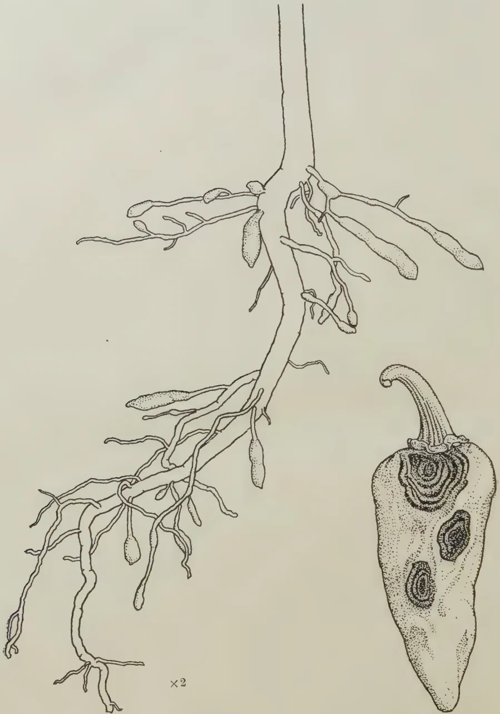
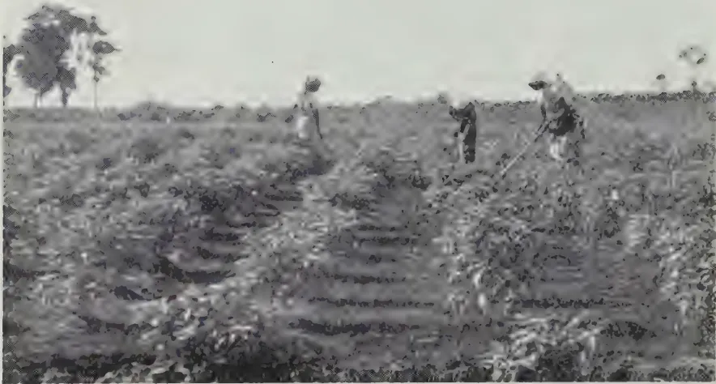
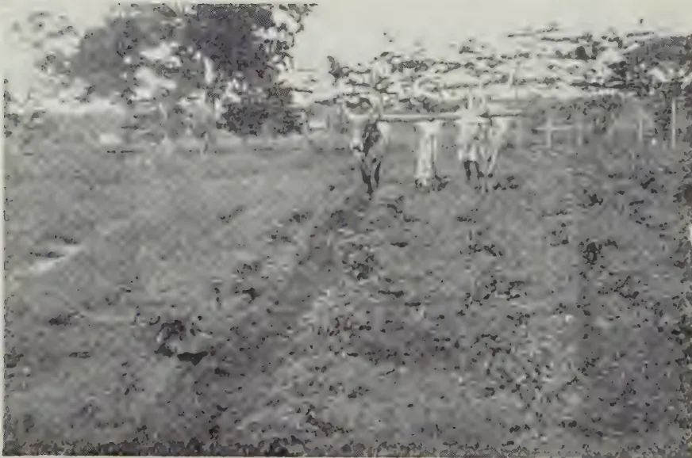
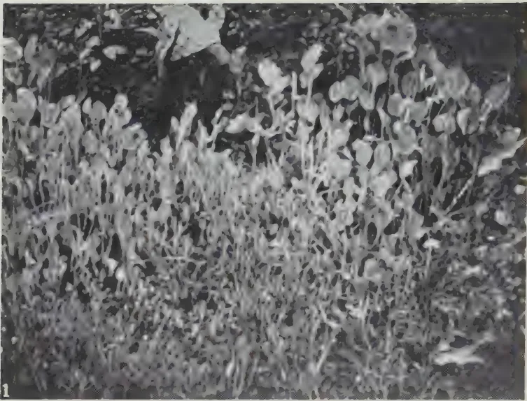
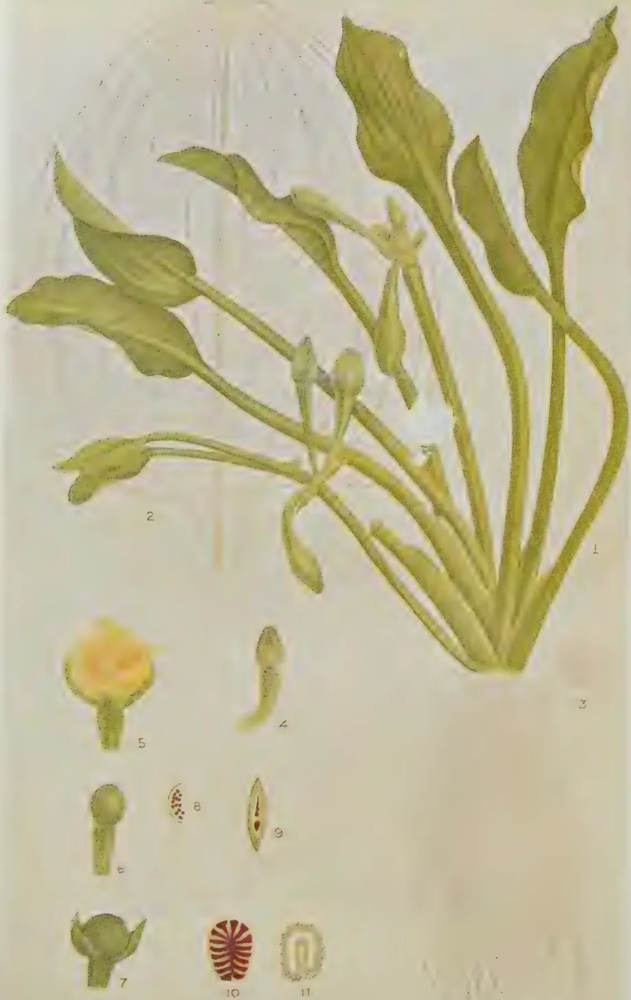
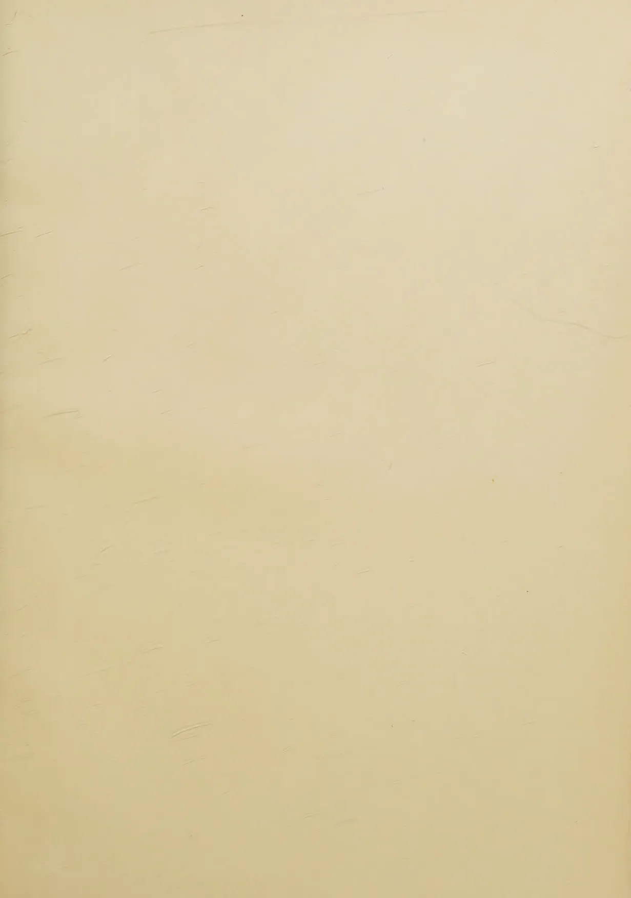

# The Tropical Agriculturist

VOL. XCIV

PERADENIYA, JUNE, 1940

No. 6

<table><thead><tr><th></th><th style="text-align: right;">Page</th></tr></thead><tbody><tr><td>Editorial .. .. .</td><td style="text-align: right;">329</td></tr></tbody></table>

## ORIGINAL ARTICLES

<table><tbody><tr><td>A Study of the Genus <i>Capsicum</i>, with Special Reference to the Dry Chilli—VI. By W. R. C. Paul, M.A. (Cantab.), Ph. D., M.Sc. (Lond.), D.I.C., F.L.S. .. .. .</td><td style="text-align: right; vertical-align: bottom;">332</td></tr><tr><td>Influence of Rootstock on Quality of Citrus Fruit. By A. V. Richards, M.Sc. (Calif.), B.Sc. (Lond.), Dip. Agric. (Cantab.), A.I.C.T.A. (Trinidad) .. .. .</td><td style="text-align: right; vertical-align: bottom;">354</td></tr><tr><td><i>Limnocharis flava</i> (L.) Buchenau, a Weed of Rice-fields, recently naturalized in Ceylon. By J. E. Senaratne, B.Sc. (Lond.), F.L.S. ..</td><td style="text-align: right; vertical-align: bottom;">362</td></tr><tr><td>The Preparation, Sowing and Care of Cigarette Tobacco Seed Beds. By W. M. Rogers .. .. .</td><td style="text-align: right; vertical-align: bottom;">365</td></tr></tbody></table>

## DEPARTMENTAL NOTES

<table><tbody><tr><td>The Senses of Bees .. .. .</td><td style="text-align: right;">369</td></tr></tbody></table>

## SELECTED ARTICLES

<table><tbody><tr><td>Contour Planting and Terracing of Orchards .. .. .</td><td style="text-align: right;">372</td></tr><tr><td>Sweet Potato .. .. .</td><td style="text-align: right;">378</td></tr></tbody></table>

## MEETINGS, CONFERENCES, &c.

<table><tbody><tr><td>Minutes of eighth Meeting of the Central Board of Agriculture ..</td><td style="text-align: right;">383</td></tr></tbody></table>

## RETURNS

<table><tbody><tr><td>Animal Disease Return for the month ended May, 1940 ..</td><td style="text-align: right;">394</td></tr><tr><td>Meteorological Report for the month ended May, 1940 ..</td><td style="text-align: right;">395</td></tr></tbody></table>

1—J. N. 94887 (5/40)

1------------------------------------------------

A large, faint watermark of a classical building, likely a library or museum, is centered on the page. It features a triangular pediment supported by four columns, with a rectangular base. The watermark is light gray and serves as a background for the text.

Digitized by the Internet Archive  
in 2025

[https://archive.org/details/tropical-agriculturist\\_1940-06\\_94\\_6](https://archive.org/details/tropical-agriculturist_1940-06_94_6)

2------------------------------------------------

The  
Tropical Agriculturist

JUNE, 1940

---

EDITORIAL

---

COCONUT POONAC

---

THE residuary cake produced by the expression of the fat from oil seeds contains certain quantities of the three important constituents of plant food, *viz.*, nitrogen, phosphoric acid, and potash. Of these, nitrogen is so much the most important that the manurial value of the cake from each variety of seed may be assessed in terms of its nitrogen content. Nitrogen derived from inorganic sources is cheaper than the nitrogen in oil cake, and farmers and planters would not use the latter on account only of its fertilizer value. But they attach such importance to the improvement of the physical condition of the soil, as distinct from its chemical composition, produced by the incorporation of bulky organic matter that they use substantial quantities of these oil cakes. In 1939 Ceylon imported Rs. 1,359,000 worth of oil seed cake for use as fertilizers.

Some oil seed cakes are largely used as animal foods and their prices are generally higher than those of pure fertilizer cakes. But a reduced demand for animal foods may lower their price levels to a point at which they begin to compete in the fertilizer market. Such a situation arose during the last war with regard to coconut poonac and, after analysis of the different kinds of seed cake in local use and comparison of their prices, the Department of Agriculture found that, with castor cake selling at Rs. 95 per ton and groundnut cake at Rs. 110 per ton, coconut poonac was worth Rs. 52.20 per ton as a source of nitrogen. These results were published in 1917 as leaflet No. 1 of the Department.

The same situation has now arisen in a more acute form with the complete exclusion of the Continental market as a result of the German occupation of the agricultural countries of Western Europe. The price quoted in the local market for coconut poonac is under Rs. 30 per ton and even at that price

3------------------------------------------------

330

the supply is in considerable excess of the demand. Alarmed by this practical collapse of the market, coconut growing and milling interests have combined to ask for a restriction of the import of gingelly poonac, regardless of the advice of technical officers that gingelly cake does not compete with, but only supplements, coconut poonac as a cattle food. At the same time the prices of castor, groundnut, and rape cakes have topped the 1917 peak, and planters and land-owners are paying for them four times their intrinsic value measured in terms of the nitrogen value of coconut poonac at the current market price. The only explanation of this paradoxical state of affairs that we have heard is that coconut poonac is unsuitable as a fertilizer because of its high oil content. While this is true of "chekku" poonac produced in the bullock-driven stone mill called the chekku, "mill" coconut poonac contains about the same percentage of oil as ground-nut cake. Nor does the presence of a small quantity of oil in the poonac reduce its value as a manure. The only action that the oil may have is to slow down the rate of assimilation; that is probably so in temperate climates. But experiments have proved that under tropical conditions the small percentage of oil in poonac has no appreciable effect on the rapidity of break-down and absorption of the poonac. Therefore the disregard of the local article in favour of the imported oil seed cakes appears to be based not on scientific reasons but on tradition and habit. At the point of price equilibrium at which coconut poonac sells at half the price of ground-nut cakes, it would be immaterial to the planter which of them he applies to his crops, while the use of coconut poonac will be cheaper when the price falls below that level.

From another set of considerations it would appear that means of self-help which he has not properly explored are open to the coconut planter. The total quantity of poonac exported in the year 1939 was 536,321 cwt. At the rate of 3 lb. per head per day this quantity was sufficient to feed 54,857 cattle for a year. The total cattle population of the country (not counting buffaloes) is 1,082,539 of which only a negligible fraction receives any food other than the poor natural pasture which dries up completely during the dry weather. The coconut planters own large numbers of cattle reared on that form of nourishment. Those who do not will find no difficulty in acquiring some cattle at a very low cost. The suggestion is that they should feed their own cattle daily with three pounds per head of coconut poonac, and apply the excreta of the cattle to the palms as a fertilizer. This method of manufacturing manure by passing large quantities of cheap food through the cow is a recognized farming practice. Not only is manure so produced in a form which is very easily absorbed by the

4------------------------------------------------

331

plant but it improves soil structure to a degree which no other material does : its usefulness can be extended by employing it for the break-down of the more intractable forms of estate waste by composting. The proceeds from the sale of two-year-old surplus stock would probably cover the cost of the poonac so that the manure itself would be in the nature of a free gift. In this way the coconut planter finds a solution to his two most pressing problems without calling upon the few cattle owners who now feed their animals with a well-balanced diet to disturb that balance : he finds a profitable use for his poonac and he maintains the fertility of his soil during this difficult period when artificial manures are not easy to obtain.

5------------------------------------------------

332

A STUDY OF THE GENUS CAPSICUM, WITH  
SPECIAL REFERENCE TO THE DRY  
CHILLI—VI\*

W. R. C. PAUL, M.A. (Cantab.), Ph.D., M.Sc. (Lond.), D.I.C., F.LS.,  
AGRICULTURAL OFFICER, CENTRAL DIVISION

(d) *Flowering and picking.*—The Tuticorin chilli crop, generally, comes into flower about 6 weeks after planting out and continues for an optimum period of about 3 months. Picking of green but well-developed fruit commences about  $2\frac{1}{2}$  months after planting out or about  $3\frac{1}{2}$  months after germination of the seed, while picking of red ripe fruit can be done about 2 to 3 weeks later. In picking, the fruit stalks are snapped off the axils in which they are developed with a sharp but downward twist given to them with the hand.

In order to ascertain whether picking of fully developed but green fruit gives a higher yield than red ripe fruit, 5-weeks-old Tuticorin chilli seedlings were planted out in 18 rows each containing 50 hills, of four plants each, at the Experiment Station, Vavuniya. In half the number of rows the fruit was picked green and the other half red ripe. Five pickings were taken in each case, the first picking of "green" chillies being done on January 25, 1938, and the first picking of fresh ripe chillies on February 15, 1938, while the last picking of "green" chillies was done on March 20, 1938, and/or of ripe chillies on March 25, 1938. The results are given in Table I.

TABLE I.

Showing the mean yield of fresh chillies in lb. between fruit picked  
green and ripe.

<table>
<thead>
<tr>
<th></th>
<th>Mean yield of fresh chillies in lb.</th>
</tr>
</thead>
<tbody>
<tr>
<td>Picking green .. ..</td>
<td>30.97 <math>\pm</math> 4.16</td>
</tr>
<tr>
<td>Picking ripe .. ..</td>
<td>12.28 <math>\pm</math> 1.45</td>
</tr>
<tr>
<td>Difference= .. ..</td>
<td>18.69 <math>\pm</math> 4.31</td>
</tr>
<tr>
<td>When n=9 and P= .01 .. ..</td>
<td>t=3.250</td>
</tr>
</tbody>
</table>

The results are significant and indicate that picking of chillies in the fully developed but green condition gives a much higher yield than picking of red ripe fruits. Apparently when the fruits are picked green, there is a stimulus created in the plant

\* Continued from *The Tropical Agriculturist*, May, 1940.

6------------------------------------------------

333

for the production of more flowers and, therefore, of fruit, but when they are allowed to ripen on the plant itself, a decline in productivity sets in. The number of pickings in each case in this experiment was the same and although the first picking of red chillies was done about three weeks later than that of the "green" chillies, the crop terminated in each case about the same time. In localities accessible to urban markets, the peasant in Ceylon prefers to pick his crop, even of the Dry chilli type, green rather than red, because of the higher yield in fresh weight of the former, but in areas where chilli growing is extensive, the green chilli market is naturally restricted and the crop is picked red and dried. There is, however, a belief that, even though the crop is to be produced as dried chillies, the first picking should be for green fruits, and the subsequent pickings for red ripe fruits, as this will avoid the initial check to production, which is caused by picking red fruits from the commencement.

In order to test this hypothesis an experiment was carried out by Joachim, Harbord and Thuraisingham (1939) who found that harvesting chillies "green" with the first picking and "red" at subsequent pickings resulted in a fresh weight increase of 7.5 cwt. per acre over picking "red" throughout. The intervals between pickings in Ceylon range between 5 and 10 days, but in Western India, Bhatarkar (1912) states that, under dry conditions, pickings of ripe chillies are carried out at intervals of 21 days. In U. S. A., paprikas presumably in the green stage are picked, according to Young and True (1913), every 7 days. The number of "green" and "red" pickings of the Dry or Green chilli varies from about five to eight, during a period of 3 to 4 months. It is generally uneconomical to take more than seven pickings per crop, as not only is the yield poor but the size of the fruits becomes so small as to be unsalable.

(e) *Curing*.—This is a process by which the fresh red ripe fruits of forms with thin pericarps and elongate fruits (var. *acuminatum*) are converted into dried pods so that they may be utilized within a period of 1½ years after they have been cured. In the East and in certain parts of U. S. A. it is a simple sun-drying process although, generally, in U. S. A. kiln curing is practised. Young and True (1913) found that artificially cured paprika pods from South Carolina showed 15 per cent. glucose and 1.2 per cent. sucrose while in sun-dried pods the glucose fell to 2.5 per cent, and the sucrose rose to 5.9 per cent. Jones and Rosa (1928) report that sun-drying gives a better colour than kiln curing. In sun-drying, bright sunshine throughout the day is essential. Fruits which are ripe or show a tinge of the ripe colour on them should be picked and then

7------------------------------------------------

334

kept heaped in the shade so that all the fruits may turn fully ripe and develop a red colour. If partially ripe fruits are placed immediately in the sun, they develop white patches. After being stored indoors for at least two full days, the fruits should be spread out on a drying floor in layers of about two to three fruits thick and exposed to the heat of the sun. In New Mexico, according to Garcia (1908), the ripe fruits after harvesting are heaped in medium-sized piles from 4 to 6 days. At the end of this period, they are spread out on the ground in a layer of about two fruits thick and left to dry in the sun. The other and less common way of sun-drying is to tie four or six fruits together and to string them in long festoons which are hung out to dry. The latter method is more often employed for large fruits of the variety *longum*.

A sandy or concrete floor is best used for drying, as it becomes rapidly heated and acts as a type of hot pan to the fruits. In Ceylon, it is usual to collect all the fruits indoors at night owing to the uncertainty of rain, but in South India, where much larger areas are brought under cultivation and the danger of untimely rain is small, the fruits are kept out all the time on the flat roofs of houses which act as drying floors.

For the first day the fruits should be kept out in the sun for about 3 hours but from the second day onwards, they should be exposed to a full day's sunshine. On the morning of the third day while the pods still retain some degree of flaccidity they should be well trampled or rolled over in order that they may become flattened, a condition in which dried chillies are marketed in gunny bags in India and Ceylon as a larger number can be packed per bag. With a strong sun in India, drying for 3 to 5 days is sufficient, but under ordinary conditions prevailing in the dry zone areas of Ceylon, about 7 to 10 days' exposure to the sun is necessary for complete drying. In New Mexico, Garcia (1908) states that the time taken for drying when the fruits are spread out on the ground in the autumn is about 6 to 8 weeks.

No difference in the number of days taken for curing nor in the colour of the pods was found between drying chillies on an earth floor and on zinc sheets. The out-turn by weight of fresh to dry chillies by sun-drying varies from 28 to 50 per cent. the average being about 33 per cent. Joachim and Paul (1938) recorded the average out-turn as 30 per cent. by weight of dry chillies on fresh chillies at Anuradhapura and 33 per cent. at Vavuniya Experiment Station, while Joachim, Harbord and Thuraisingham (1939) obtained 30 per cent. at Jaffna Experiment Station. In California and Southern Carolina, kiln drying is almost universally practised for drying chillies on a large scale. Jones and Rosa (1928) state that these houses are

8------------------------------------------------

335

heated with gas burners to a temperature of 55°C. while ventilation is provided by flues through the roof. The peppers are placed in thin layers in wire-bottomed trays stacked one above the other. They require to be frequently stirred and are given 2 to 3 days in which to dry. The whole fruit is used including the stems, seed and placenta.

(c) *Yields*.—Yields vary according to the variety and form of *Capsicum* grown in addition to the cultural methods adopted. After drying is complete, the pods should be sorted into two grades, and in the second grade, all pods which do not possess a uniform colour or are attacked by *Vermicularia*, *Gloeosporium* or *Colletotrichum* are classed. A certain quantity, however, owing to their diminutive size and colour will be unsalable.

Mann and Paranjpye (1919) report a yield of 2,480 lb. of dried chillies per acre from a crop which was given a top dressing of artificials with farmyard manure, while Jones and Rosa (1928) state that the yield of dried chillies in the United States varies from 1,250 to 3,000 lb. per acre. With paprika, an average annual yield of 1,092 lb. of dried pods per acre during the years 1905–1908 was reported by Young and True (1913).

For Bell peppers, Lloyd (1926) found that in the case of the variety Sweet mountain, an average of 3 lb. of green peppers per plant was obtained, while Erwin (1932) gives the following figures of fresh fruits per plant in ounces, based on yields from 10 plants: Anaheim (Dry chilli) 48, World Beater 45, Chinese Giant 67. Woodruff and Bailey (1929) reported the records of 21 farmers in Georgia, who grew Pimento peppers on 108 acres under contract, the average yield per acre being slightly less than 2 tons (fresh weight) but under favourable conditions even more than double this was obtained by some growers.

In Ceylon, yields of Tuticorin chillies vary from 20 to 30 cwt. of fresh chillies per acre and with irrigation up to about 40 cwt. At the Anuradhapura Experiment Station (Anon 1939), an average yield of 24 cwt. of fresh chillies per acre was obtained from a block of 3 acres during the 1938–39 north-east monsoon season. With a first picking for “green chillies”, 5 cwt. were produced, and the balance of 18 cwt. gave on drying 6 cwt. of which 5 cwt. were first grade and 1 cwt. second grade.

The first picking of green chillies under average soil and climatic conditions amounts to about 20 per cent. of the total fresh weight of the crop and with a yield of 30 cwt. of fresh chillies per acre, the first picking will realize about 6 cwt. The balance 24 cwt. of fresh red chillies on drying (33 per cent.) will give about 8 cwt. and of this the first quality will be about 6 cwt. (75 per cent.) and of the balance 2 cwt., 50 per cent. will be second grade and the rest unsalable.

9------------------------------------------------

3362. ECONOMICS OF PRODUCTION

Bhatarkar (1913) at Surat in Western India and Gopalaratnam (1933) at Guntur in Southern India, each give the cost of cultivation under local systems as being about Rs. 60 per acre. The details are given in Table II.

TABLE II.

Showing the costs of cultivating chillies from data obtained by Bhatarkar and by Gopalaratnam.

<table border="1">
<thead>
<tr>
<th rowspan="2">Operations.</th>
<th colspan="2">Bhatarkar.</th>
<th colspan="2">Gopalaratnam.</th>
</tr>
<tr>
<th>Rs.</th>
<th>a.</th>
<th>Rs.</th>
<th>a.</th>
</tr>
</thead>
<tbody>
<tr>
<td>Nursery .. ..</td>
<td>3</td>
<td>13</td>
<td>4</td>
<td>6</td>
</tr>
<tr>
<td>Preparatory cultivation .. ..</td>
<td>3</td>
<td>8</td>
<td>9</td>
<td>6</td>
</tr>
<tr>
<td>Manures and manuring .. ..</td>
<td>30</td>
<td>9</td>
<td>32</td>
<td>3</td>
</tr>
<tr>
<td>Transplanting .. ..</td>
<td>2</td>
<td>0</td>
<td>3</td>
<td>0</td>
</tr>
<tr>
<td>Intercultivation .. ..</td>
<td>4</td>
<td>8</td>
<td>1</td>
<td>4</td>
</tr>
<tr>
<td>Harvesting .. ..</td>
<td>8</td>
<td>7</td>
<td>7</td>
<td>8</td>
</tr>
<tr>
<td>Drying and marketing .. ..</td>
<td>1</td>
<td>14</td>
<td>1</td>
<td>5</td>
</tr>
<tr>
<td>Interest for 8 months on Rs. 40 .. ..</td>
<td>1</td>
<td>9</td>
<td></td>
<td></td>
</tr>
<tr>
<td>Assessment .. ..</td>
<td>7</td>
<td>0</td>
<td></td>
<td></td>
</tr>
<tr>
<td>Digging out the stems .. ..</td>
<td>0</td>
<td>7</td>
<td></td>
<td></td>
</tr>
<tr>
<td></td>
<td>
</td>
<td>
</td>
<td>
</td>
<td>
</td>
</tr>
<tr>
<td></td>
<td>63</td>
<td>11</td>
<td>60</td>
<td>0</td>
</tr>
</tbody>
</table>

At the Anuradhapura Experiment Station, the cost of production of Triticum chillies was about Rs. 106.60 per acre from a block of 3 acres (Anon 1939). Full details of the costs of each item are given. In Table III. is given an estimate, prepared by the writer, of the cost of cultivating one acre of Triticum chillies under unirrigated conditions in the dry zone.

TABLE III.

Cost of production of Triticum Dry Chillies per acre.

<table border="1">
<thead>
<tr>
<th rowspan="3"></th>
<th colspan="5">Units of Labour.</th>
<th rowspan="2">Total</th>
</tr>
<tr>
<th>Men</th>
<th>Women</th>
<th>Boys</th>
<th>Bullock</th>
<th></th>
</tr>
<tr>
<th>at 60c.</th>
<th>at 30c.</th>
<th>at 45c.</th>
<th>Pairs at Re. 1.</th>
<th>Rs. c.</th>
<th>Rs. c</th>
</tr>
</thead>
<tbody>
<tr>
<td colspan="7"><b>1. Nursery—</b></td>
</tr>
<tr>
<td>Preparation of beds</td>
<td>3 .. —</td>
<td>.. —</td>
<td>.. —</td>
<td>.. —</td>
<td>1 80</td>
<td></td>
</tr>
<tr>
<td>Sowing, covering seed and upkeep</td>
<td>— .. 4</td>
<td>.. —</td>
<td>.. —</td>
<td>.. —</td>
<td>1 20</td>
<td></td>
</tr>
<tr>
<td>Cost of manure, seed and straw..</td>
<td>— .. —</td>
<td>.. —</td>
<td>.. —</td>
<td>.. —</td>
<td>2 0</td>
<td></td>
</tr>
<tr>
<td></td>
<td></td>
<td></td>
<td></td>
<td></td>
<td>
</td>
<td>5 0</td>
</tr>
<tr>
<td colspan="7"><b>2. Preparatory tillage—</b></td>
</tr>
<tr>
<td>Ploughing ..</td>
<td>2 .. —</td>
<td>.. —</td>
<td>.. —</td>
<td>2 ..</td>
<td>3 20</td>
<td></td>
</tr>
<tr>
<td>Harrowing disc (twice) ..</td>
<td>1 .. —</td>
<td>.. —</td>
<td>.. —</td>
<td>1 ..</td>
<td>1 60</td>
<td></td>
</tr>
<tr>
<td>Harrowing tooth ..</td>
<td><math>\frac{1}{2}</math> .. —</td>
<td>.. —</td>
<td>.. —</td>
<td><math>\frac{1}{2}</math> ..</td>
<td>0 80</td>
<td></td>
</tr>
<tr>
<td></td>
<td></td>
<td></td>
<td></td>
<td></td>
<td>
</td>
<td>5 60</td>
</tr>
</tbody>
</table>

10------------------------------------------------

337

<table border="1">
<thead>
<tr>
<th></th>
<th>Men at 60c.</th>
<th>Women at 30c.</th>
<th>Boys at 45c.</th>
<th>Bullock Pairs at Re. 1.</th>
<th>Rs. c.</th>
<th>Total Rs. c.</th>
</tr>
</thead>
<tbody>
<tr>
<td>3. <i>Manuring</i>—</td>
<td></td>
<td></td>
<td></td>
<td></td>
<td></td>
<td></td>
</tr>
<tr>
<td>Value of 8 cart- loads=6 tons compost at Re. 1 per ton ..</td>
<td>—</td>
<td>..</td>
<td>—</td>
<td>..</td>
<td>6 0</td>
<td></td>
</tr>
<tr>
<td>Transporting and spreading ..</td>
<td>2</td>
<td>..</td>
<td>4</td>
<td>..</td>
<td>2 .. 4 40</td>
<td></td>
</tr>
<tr>
<td>Cost of fertilizer N. of soda 1 cwt.</td>
<td>—</td>
<td>..</td>
<td>—</td>
<td>..</td>
<td>— .. 11 0</td>
<td></td>
</tr>
<tr>
<td>Applying fertilizer</td>
<td>2</td>
<td>..</td>
<td>—</td>
<td>..</td>
<td>— .. 1 20</td>
<td></td>
</tr>
<tr>
<td></td>
<td></td>
<td></td>
<td></td>
<td></td>
<td><u>22 60</u></td>
<td>22 60</td>
</tr>
<tr>
<td>4. <i>Planting</i>—</td>
<td></td>
<td></td>
<td></td>
<td></td>
<td></td>
<td></td>
</tr>
<tr>
<td>Lining with marker</td>
<td>1</td>
<td>..</td>
<td>—</td>
<td>..</td>
<td>1 .. 1 60</td>
<td></td>
</tr>
<tr>
<td>Transplanting ..</td>
<td>—</td>
<td>..</td>
<td>10</td>
<td>..</td>
<td>2 .. 3 90</td>
<td></td>
</tr>
<tr>
<td>Filling vacancies ..</td>
<td>—</td>
<td>..</td>
<td>2</td>
<td>..</td>
<td>1 .. 0 75</td>
<td></td>
</tr>
<tr>
<td></td>
<td></td>
<td></td>
<td></td>
<td></td>
<td><u>6 25</u></td>
<td>6 25</td>
</tr>
<tr>
<td>5. <i>Intercultivation</i>—</td>
<td></td>
<td></td>
<td></td>
<td></td>
<td></td>
<td></td>
</tr>
<tr>
<td>Tooth cultivator (3 times) ..</td>
<td>3</td>
<td>..</td>
<td>—</td>
<td>..</td>
<td>3 .. 4 80</td>
<td></td>
</tr>
<tr>
<td>Mamoty weeding and earthing up</td>
<td>—</td>
<td>..</td>
<td>20</td>
<td>..</td>
<td>— .. 6 0</td>
<td></td>
</tr>
<tr>
<td></td>
<td></td>
<td></td>
<td></td>
<td></td>
<td><u>10 80</u></td>
<td>10 80</td>
</tr>
<tr>
<td>6. <i>Harvesting</i>—</td>
<td></td>
<td></td>
<td></td>
<td></td>
<td></td>
<td></td>
</tr>
<tr>
<td>30 cwt. fresh chil- lies at <math>\frac{1}{2}</math> cwt. per woman ..</td>
<td>—</td>
<td>..</td>
<td>60</td>
<td>..</td>
<td>— .. 18 0</td>
<td></td>
</tr>
<tr>
<td>Transporting to store ..</td>
<td>2</td>
<td>..</td>
<td>—</td>
<td>..</td>
<td>— .. 1 20</td>
<td></td>
</tr>
<tr>
<td></td>
<td></td>
<td></td>
<td></td>
<td></td>
<td><u>19 20</u></td>
<td>19 20</td>
</tr>
<tr>
<td>7. <i>Drying, Sorting and bagging</i> ..</td>
<td>2</td>
<td>..</td>
<td>10</td>
<td>..</td>
<td>— .. 4 20</td>
<td></td>
</tr>
<tr>
<td></td>
<td></td>
<td></td>
<td></td>
<td></td>
<td><u>4 20</u></td>
<td>4 20</td>
</tr>
<tr>
<td>8. <i>Cost of uprooting chilli stumps</i> ..</td>
<td>4</td>
<td>..</td>
<td>—</td>
<td>..</td>
<td>— .. 2 40</td>
<td></td>
</tr>
<tr>
<td></td>
<td></td>
<td></td>
<td></td>
<td></td>
<td><u>2 40</u></td>
<td>2 40</td>
</tr>
<tr>
<td>9. <i>Spraying</i> ..</td>
<td>—</td>
<td>..</td>
<td>—</td>
<td>..</td>
<td>— .. 2 50</td>
<td></td>
</tr>
<tr>
<td></td>
<td></td>
<td></td>
<td></td>
<td></td>
<td><u>2 50</u></td>
<td>2 50</td>
</tr>
<tr>
<td>10. <i>Depreciation on im- plements</i> ..</td>
<td>—</td>
<td>..</td>
<td>—</td>
<td>..</td>
<td>— .. 2 0</td>
<td></td>
</tr>
<tr>
<td></td>
<td></td>
<td></td>
<td></td>
<td></td>
<td><u>2 0</u></td>
<td>2 0</td>
</tr>
<tr>
<td>11. <i>Cost of transport</i>—</td>
<td></td>
<td></td>
<td></td>
<td></td>
<td></td>
<td></td>
</tr>
<tr>
<td>On 7 cwt. dried chillies and 6 cwt. “green” at 50c. per cwt. ..</td>
<td>—</td>
<td>..</td>
<td>—</td>
<td>..</td>
<td>— .. 6 50</td>
<td></td>
</tr>
<tr>
<td></td>
<td></td>
<td></td>
<td></td>
<td></td>
<td><u>6 50</u></td>
<td>6 50</td>
</tr>
<tr>
<td>12. <i>Incidentals</i> ..</td>
<td>—</td>
<td>..</td>
<td>—</td>
<td>..</td>
<td>— .. 2 95</td>
<td></td>
</tr>
<tr>
<td></td>
<td></td>
<td></td>
<td></td>
<td></td>
<td><u>90 0</u></td>
<td>90 0</td>
</tr>
</tbody>
</table>

This statement does not take into consideration the interest on the capital expenditure in opening the land and the rental value of the land.

11------------------------------------------------

338

Dried chillies are sold by weight, while green chillies and Bell peppers are sold by number in Ceylon. In the wholesale market for dried chillies, the unit is the candy (525 lb.) and prices vary from about Rs. 40 to Rs. 125 per candy, while in retail markets they vary from about 10 cents to about 30 cents per lb. Green chillies sell at 4 cents to about 10 cents per 100 ( $\frac{1}{2}$  lb. approximately) in the case of the forms with stout, medium-sized fruits and from 10 cents to 40 cents per 100 for the larger fruit varieties such as Elephant's Trunk. In Jaffna, green chillies are sold by the measure (2 lb. approximately) at 10 to 20 cents a measure, but during November and December when there is a scarcity of green chillies in the Jaffna market, prices rise to as much as 60 cents a measure.

It has been suggested that by a system of tariff regulation, there should be a fixed minimum price for dried chillies payable to the grower in Ceylon. By the introduction of the Agricultural Products (Regulation) Ordinance in 1940, Government has guaranteed the minimum prices at Rs. 22 per cwt. for first grade chillies and Rs. 15 for second grade chillies and imposed a restriction of imports on a sliding scale of quotas. At these prices, the net return on one acre should be Rs. 69 reckoned as follows :—

<table>
<thead>
<tr>
<th></th>
<th></th>
<th>Cwt.</th>
<th></th>
<th>Rs.</th>
<th>c.</th>
</tr>
</thead>
<tbody>
<tr>
<td>Yield per acre fresh chillies</td>
<td>..</td>
<td>30</td>
<td></td>
<td></td>
<td></td>
</tr>
<tr>
<td>First picking "green" chillies (20 per cwt. of total crop)</td>
<td>..</td>
<td>6 at Rs.</td>
<td>2</td>
<td>=</td>
<td>12 0</td>
</tr>
<tr>
<td>Balance fresh "red" chillies</td>
<td>..</td>
<td>24</td>
<td></td>
<td></td>
<td></td>
</tr>
<tr>
<td></td>
<td></td>
<td>Cwt.</td>
<td></td>
<td></td>
<td></td>
</tr>
<tr>
<td>On drying (33 per cent.)</td>
<td>..</td>
<td>= 8</td>
<td></td>
<td></td>
<td></td>
</tr>
<tr>
<td>1st grade (75 per cent.)</td>
<td>..</td>
<td>= 6 at Rs.</td>
<td>22</td>
<td>=</td>
<td>132 0</td>
</tr>
<tr>
<td>Balance dried chillies</td>
<td>..</td>
<td>2</td>
<td></td>
<td></td>
<td></td>
</tr>
<tr>
<td>2nd grade (50 per cent.)</td>
<td>..</td>
<td>= 1 at Rs.</td>
<td>15</td>
<td>=</td>
<td>15 0</td>
</tr>
<tr>
<td>Balance unsalable</td>
<td>..</td>
<td></td>
<td>Total</td>
<td>..</td>
<td>159 0</td>
</tr>
<tr>
<td></td>
<td></td>
<td></td>
<td>Cost of production</td>
<td>..</td>
<td>90 0</td>
</tr>
<tr>
<td></td>
<td></td>
<td></td>
<td>Net return</td>
<td>..</td>
<td>69 0</td>
</tr>
</tbody>
</table>

In areas where Dry chillies are grown extensively, it may not be possible to obtain a suitable market for "green" chillies, which are the green fruits of the Dry chilli type and are inferior in quality to the stout fruits of the typical Green chilli variety. Green chillies are a perishable commodity and if there is a large output in any particular area, these chillies may have to be sent to distant markets for immediate sale or sometimes may not be salable at all. As such, it is estimated that the first

12------------------------------------------------

339

picking of "green" chillies may only realize on the average about Rs. 2 per cwt. although in areas not too distant from the large towns they may realize about Rs. 6 to Rs. 8 per cwt. Even at Rs. 2 per cwt. for the first crop of "green" chillies, the profit per acre on growing chillies as a rotation crop in the dry zone areas of Ceylon is considerable and it can be regarded as one of the most remunerative crops that can be cultivated in these areas.

(f) *Storage and packing.*—Dried chillies are usually stored in gunny bags in the tropics. They lose their colour in course of time, generally after about three months, bright, deep-red pods becoming a darker maroon-red, while light-red pods turn paler, the latter changing colour more quickly in storage. Darkness has apparently no effect on the keeping colour of the pods.

An experiment was carried out on five samples of 1 lb. each of Tumeric chillies, stored in darkness and in indoor light for one year, but no differences in the samples which had all turned a maroon-red colour could be detected. In addition to the change in colour, there is a gradual increase in the number of broken pods and pods separated from their stalks.

Fresh peppers are subject to shrivelling and storage diseases. In Ceylon, *Vermicularia* and anthracnose often cause a dry decay at ordinary temperatures. Lauritzen and Wright (1920) report that in cold storage, *Botrytis cinerea* Pers. and anthracnose were the chief causes of deterioration. They found that at a temperature of 32°F and a humidity of 90 per cent. the minimum of decay, shrivelling and ripening took place up to about 3 weeks. This temperature is sufficiently above the freezing point of peppers (-/-0.06°F) to prevent injury against freezing. Platenius, Jamison and Thompson (1934) found that the limit at which peppers remained in good condition was 10 days at 70°F, 16 days at 50°, 4 weeks at 40° and 40 days at 32°F. As compared with other vegetables the rate of shrinkage is very low, less than 40 per cent. for 40 days.

Bell peppers are graded for size and packed in crates, hampers, splint baskets and ventilated barrels in U. S. A. In Jamaica, the Florida pepper crate is used, having a net weight of 40–45 lb. (Moxsy 1936). Wardlaw (1936) states that—according to Smith, wrapping of the fruits has not been found necessary, but they should not be squeezed.

### 3. ECONOMIC USES

#### (a) *As a condiment.*

1. *Curry powder.*—Reference has already been made to the importance of dried chillies as a condiment in the foods of the peoples of the East. In the usual peasant home in Ceylon,

13------------------------------------------------

340

curry is the chief form in which vegetables, and to a less extent meat, are consumed with rice, millets or yams. Curry powder is the essential ingredient of every curry, and it is prepared by grinding dried chillies to a powder, after slight roasting, and mixing with ground turmeric (*Curcuma domestica* Val.) and coriander (*Coriandrum sativum* L.). Other condiments such as cumin (*Cuminum Cyminum* L.) and fennel (*Foeniculum vulgare* Mill) after being ground may also be mixed with these in small quantities.

2. *Cayenne pepper*.—This is the term generally used for the powder prepared by finely grinding the pods of the Bird chilli and other small chillies such as Japanese. The powder is sifted and then mixed with salt in quantities up to 25 per cent. of its weight, or the pods may be subjected to a special treatment after grinding. It is sometimes made by mixing wheat flour with the powder and adding yeast to form a cake, which is then baked hard and reduced to a fine powder which is sifted. The pungency is reduced by the removal of all or part of the placenta tissue and seeds. Cayenne pepper is not utilized in the same way as curry powder, but is used for seasoning Western dishes.

3. *Nepaul pepper*.—This is a product made from the pods of the Nepaul chilli, a small-fruited form of the var. *acuminatum* grown only in Nepaul (Pl. I, Fig. 2, No. 1\*). It has a special flavour not produced elsewhere. The pepper which is held to be of exceptionally high quality has a light golden-brown colour, possessing an odour faintly resembling that of sweet violets.

4. *Paprika*.—This is a specially prepared powder of certain forms of the variety *longum* cultivated in Hungary and Spain, although it more correctly refers to the former. There are five grades of Hungarian paprika and the following description of these is taken from Redgrove (1938).

A. *Sweet*.—The two grades of Delicate Noble Sweet and Noble Sweet are prepared from selected ripe pods from which the placenta, stalks and calyces are removed. The pericarp with the stalks cut are washed several times to remove any pungent matter and after removal of the ribs (placentae) by special knives, the fruits are dried and ground. In the Delicate Noble Sweet grade, the pericarp and seeds are mixed in the proportion of 100 parts pericarp to 45 parts of seeds, and in the Noble Sweet grade 100 parts pericarp to 75 parts of seeds. The maximum ash content is fixed at  $6\frac{1}{2}$  per cent. with  $\frac{1}{2}$  per cent. for acid insoluble ash. The product is described as sweet, pleasant in taste and non-pungent.

---

\* See Part I. of this paper in *The Tropical Agriculturist*, January, 1940.

14------------------------------------------------

341

B. *Hot*.—The two grades—Near Sweet Goulash and Rose—are made from selected pods from which the placenta, calyces and stalks are removed, though small particles of these are permitted.

The last grade known as Hot is made from defective fruits ground with the stalks, seeds and calyces, to which may be added parts of the fruits remaining over from the finer grades. A maximum ash content of 10 per cent. is allowed and 1.5 per cent. for acid insoluble ash.

5. *Pepper sauce*.—There are various brands of pepper sauce, consisting chiefly of the unground fruit of the pungent varieties preserved in brine or strong vinegar. The liquid is extracted by pressure and all the flavour, colour, strength and aroma of the fruits retained. Tabasco sauce is made from Tabasco chillies grown in some of the southern United States.

6. *Mandram*.—This is a West Indian stomachic which is prepared by mashing a few pods of Bird pepper, mixing them with sliced cucumber and shallots and adding a little lime juice and Madeira wine.

7. *Chilli con carne*.—This consists of the small pungent peppers finely ground and mixed with meat. It is a popular dish in the southern United States, and Mexico.

8. *Canned pimento*.—Ripe pimentos after being carefully selected are used, the skins being removed by immersing in hot cooking oil or by exposing them to dry heat. They are then dipped quickly in cold water and the skins slipped off. The stems and cores are removed and after the addition of salt are canned.

9. *Vitapric*.—Redgrove (1938) states that this is a Hungarian conserve of a marmalade-like character made from paprika. It is preserved in benzoic acid and is marketed in small tins for culinary use. It contains .40 per cent. Vitamin C, while paprika puree contains 0.18 per cent. and lemon juice 0.02 per cent. It is bright red, somewhat pungent with a pleasant aromatic odour and flavour and is used for flavouring dishes of a savoury type.

(b) *Pharmaceutical value*.

In the B. P. the name of *Capsicum* is applied to the dried pods of *C. minimum* Roxb. which is now known as *C. frutescens* and is referred to in this paper as var. *minimum*. In the U. S. P. X., the drug is described as the "dried ripe fruit of *C. frutescens* L. grown in Africa" for it is only from that country that the pods are most pungent.

The B. P. C. (1934) contains 11 preparations of *Capsicum*.

15------------------------------------------------

342

*Capsicum* is given internally in tincture form as a powerful stimulant and carminative especially in flatulent dyspepsia. Externally, it is an irritant producing warmth, redness and vesication, and in strong tinctures, liniments and ointments, is used for rheumatism, lumbago, neuralgia and generally where counter-irritation is required. Extracts of chillies are used, according to Redgrove (1933), in the mineral water industry for addition to ginger beer and other beverages.

### PART III.

A brief account is given in this part of this paper of the diseases and pests which have been recorded in Ceylon on *Capsicum*.

#### (a) Diseases of parasitic origin.

(1) *Damping off*. (*Pythium* sp.).—Seedlings have been found attacked about a week to a fortnight after germination, when there has been excessive moisture in the soil and insufficient light for their development. The presence of shade increases the humidity in the nursery beds and the damping off organism becomes actively parasitic. Chilli seedlings require no shade at all once the cotyledons have emerged.

Spraying the seedlings with Potassium permanganate solution at the rate of 1 oz. per gallon of water (0.6 per cent. solution) for every 4 sq. feet of the nursery, or with Bouisol (a proprietary colloidal copper compound) at 1 oz. per gallon of water, proved very effective in controlling damping off.

(2) *Collar rot*. (*Sclerotium rolfsii* Sacc.).—This is one of the commonest diseases of *Capsicum* in Ceylon. The fungus attacks the plant at its collar producing a brown decay, and then a wilt, resulting in its death. Along the region of the collar, white fans of mycelium can be seen and on these white, and later brown, mustard-like sclerotia visible to the naked eye develop in abundance. The fungus can live as a saprophyte in decaying vegetable matter for several years, and when conditions—the nature of which is not understood—become favourable for its parasitic development, plants are attacked all over the field.

The disease occurs in all soil and climatic conditions in Ceylon and no resistant varieties are known.

(3) *Bacterial wilt*. (*Bacillus solanacearum* E. F. Sm.).—This disease is generally confined to the wet zone areas of the Island, especially in areas where the soil is markedly alkaline. Attacked plants wilt and die. Applications of sulphur in order to reduce the pH value of the soil did not prove successful. The only

16------------------------------------------------

This image is a scan of a blank page. The paper has a light beige or cream-colored tint. There are a few very small, dark specks scattered across the surface, which appear to be scanning artifacts or dust particles. No text, lines, or other markings are present on the page.

17------------------------------------------------

A detailed botanical line drawing of a Bird Chili plant. The main illustration on the left shows the root system with several elongated, spindle-shaped galls attached to the roots. A magnification symbol 'x2' is located near the bottom right of the root system. To the right is a separate, enlarged drawing of a single chili pepper, showing several dark, circular, concentric rot spots on its surface.

Fig. 2.  
Eelworm galls on the roots  
of the Bird Chili.

PLATE I.

Fig. 1.  
Fruit rot.

*Block by Survey Dept.*

18------------------------------------------------

343

satisfactory method of control is to breed disease-resistant varieties, but as the chilli is not an important crop in the wet zone, the problem has not been investigated.

(4) *Leaf spot*. (*Cercospora capsici* H. and W.).—Nursery seedlings can be severely attacked by this disease which causes circular, water-soaked spots, which later become grey-brown and dry, on the leaves. When serious, a partial defoliation takes place. On older plants in the field, a decay of the fruit at the calyx end occasionally occurs. Infection comes from spores which can over-winter in the soil for a number of years.

Seed sterilization is of value and in the alternative the seed should be well sifted and cleaned free of fragments of the fruit wall which can harbour the spores. Weekly spraying with Bouisol (a proprietary colloidal copper compound) at the rate of 1 oz. per gallon was found effective in controlling the disease.

(5) *Powdery mildew*. (*Oidiopsis taurica* Lev. Salon.).—This is not a common disease, but under conditions of prolonged wet weather, it appears on the leaves and stems of affected plants causing a white powdery appearance.

The disease is easily controlled by an application of Sulfinette (a proprietary sulphur fungicide) used at the rate of  $1\frac{1}{2}$  oz. per gallon of water, on two occasions at intervals of 4 to 7 days.

(6) *Fruit diseases*.—*Gloeosporium piperatum* E. and E.  
*Colletotrichum nigrum* E. and H.  
*Vermicularia capsici* Syd.

The fruit diseases, due to one or more of the above fungi, occur commonly in Ceylon, particularly in wet weather but also during periods of prolonged dry weather when dew prevails. *Gloeosporium* attacks the ripe or ripening fruits, *Colletotrichum* when the fruits are about half grown, often causing a premature reddening, while *Vermicularia* attacks, in addition to the ripe fruits, the young shoots eventually resulting in a die-back. *Vermicularia* does more damage than the others, in that the attack spreads to the branches via the pedicels.

On the fruits, a characteristic spotting is caused by these fungi. Each spot appears black, on which later concentric lines develop (Pl. I, Fig. 2). *Gloeosporium* and *Colletotrichum* form the same type of spotting, but *Colletotrichum* and *Vermicularia* can be distinguished from *Gloeosporium* by the presence of setae in the pustules. *Vermicularia* usually has more abundant and conspicuous setae than *Colletotrichum*. Bertus (1927) has shown that in Ceylon only one strain of *Colletotrichum* on *Capsicum* has given rise in culture to the perfect stage—*Glomerella piperata*; but in India and U. S. A. *Gloeosporium* has in

19------------------------------------------------

344

culture developed the perfect stage which in India has also been found on the plant itself. The fungus over-winters in the seed from infected fruits and seed disinfection is, therefore, an important preventive measure. These fruit diseases are, however, not sufficiently serious in Ceylon to undertake extensive spraying operations in the field, but in years when a high percentage of pods is attacked and a die-back of the young stems occurs, spraying with Bouisol at 1 oz. per gallon may be undertaken.

(7) *Eelworm disease.* (*Heterodera marioni* (Cornu) Goodey).—This disease is not common in Ceylon, but when chilli plants are severely affected, they become stunted, turn yellow and finally die. The galls on the roots are sometimes present on plants which show no other symptoms than a stunted growth. All varieties are susceptible, including the Bird chilli (Pl. I, Fig. 1) and plants at all stages of growth are attacked.

No satisfactory method of control is known at present.

(b) *Physiological diseases.*

(1) *Sunscorch.*—This condition is common on Bell peppers in Ceylon and results in the destruction of the cells of the fruit wall from exposure to direct sunlight. It differs from blossom-end rot in that it appears at any place on the surface of the pod. The exposed surfaces develop a light colour, which is indefinite in extent. This area soon becomes slightly sunken or wrinkled and creamy-white in colour. The tissue then dries out and during dry weather becomes thin, papery, brittle, shiny and smooth. Eventually soft rotting bacteria invade the dead cells and cause a soft decay.

No direct control measures are known, but adequate ventilation and moisture in the soil are factors which tend to reduce the incidence of this condition.

(2) *Blossom-end rot.*—The conditions of blossom-end rot in *Capsicum* are similar to those in the Tomato. As in the case of sunscald only the Bell peppers are attacked in Ceylon. The early symptoms are similar to sunscald except that they appear at the stylar end of half-grown fruits. The spots are light coloured and sunken at first, but they enlarge rapidly.

The disease is due to inadequate or varying soil moisture and serious losses occur in dry weather. No control measures are known except that irrigation during dry periods tends to reduce the trouble.

(C) *Pests.*

(1) *Crickets and cockchafer attacks.*—The young seedlings are sometimes attacked by crickets, cockchafer grubs and grasshoppers. The tops are nipped off generally about halfway along the stems.

20------------------------------------------------

345

(2) *Disphinctus humeralis*.—This is a bug allied to *Helopeltis*, the tea mosquito, and punctures the leaves causing water-soaked areas which dry up leaving brown, papery tissues. Each spot is small and irregular in outline, but several may coalesce forming larger patches. Each spot or patch is surrounded by a darker brown margin, but the tissue within may dry up and fall out leaving a hole. The attack is more common in the nursery. Spraying with a contact insecticide such as Kerala soap 1 lb. to 6 or 8 gallons of water or a tobacco wash is recommended.

(3) *Leaf curl*.—There are two chief types of leaf curl on chillies in Ceylon, and these can be regarded as the most serious of all the pathological conditions of this crop in the Island. The characteristic symptoms in the wet zone areas are the abnormal curling of the leaf blade with or without distortion of the intervenous areas, and the abortion of the apical meristems. Fruits which are attacked in the course of development become truncated or curled at the stylar end.\* Park and Fernando (1938) carried out certain experiments which indicate that the damage is due to direct insect injury, in view of the fact that infected plants which were sprayed with a contact insecticide and placed under an insect-proof cage produced a new flush free from leaf curl, while the controls remained attacked. Again, other plants showing leaf curl symptoms and subsequently subject to periodic spraying also produced a clean flush. These authors considered that the presence of thrips, mites and aphides on affected leaves indicated that one or more of these insects may be responsible for the damage. A lime sulphur spray used every three days on three successive occasions was found to be very effective in controlling this type of leaf curl, although during periods of abnormal dry weather, control is more difficult.

Another type of leaf curl is present in the dry zone areas, particularly the Jaffna Peninsula, where the margins of the lamina curl in adaxially and there is marked buckling of the intervenous areas which appear deeply concave on the under side of the leaf. Considerable reduction in the size of the leaves occurs, as in the previous type of leaf curl, but there is no necrosis of apical meristems. The internodes, however, fail to reach their maximum length and the leaves and flowers appear clustered, while the fruits, which are few, remain small and malformed. Paul and Fernando (1939) examined the possible effect of deficiency in soil nitrogen and organic matter on the incidence of leaf curl and found no evidence of a relationship. The distribution of affected plants, however, in this experiment suggested the possibility of insect damage either directly or as the vector of a virus disease.

---

\* See Fig. 5 in Part III. of this paper in *The Tropical Agriculturist*, March, 1940.

21------------------------------------------------

346

(4) *Aphides*.—Occasional large numbers of aphides may be found present on the leaves, pedicels and flowers, and the withering of certain flowers is due to aphide attack. This is readily controlled by 2 or 3 sprayings with soft soap and water at the rate of 2 oz. soap to 1 gallon of water, but often the attack is due to some unfavourable environmental condition which lowers the plant's vitality and renders it a suitable host to aphides.

#### SUMMARY

1. This paper deals with the general botany and agronomy of *Capsicum* and its cultivated forms, whose taxonomy has been studied. It is suggested that the two species maintained by Irish viz., *C. frutescens* L. for the semi-wild Bird chilli and *C. annuum* L. for the field and garden varieties are two ecologically distinct species which show interspecific sterility. As such, the view held by Bailey and other American horticulturists to-day, that these two species should be reduced to a single form, viz. *C. frutescens* L. on the ground that they are all perennial in the tropics, cannot be accepted.

2. Apart from this sterility, there is every gradation in taxonomic characters including the perennial habit from the Bird chilli to the highly-developed forms of *C. annuum* L. All the varieties of *C. annuum* L. cross freely with each other and innumerable forms have arisen. An amended classification of the cultural varieties of *Capsicum* based on the character of the calyx and the main fruit shapes has been suggested.

3. A description of the commercial types of *Capsicum*s is given and reference made to the characters on which quality in each type depends.

4. A stimulus to germination in the disinfection of the seed with copper sulphate and lime has been traced to the presence of the calcium ion. Sun-dried seed stored for 6 months has been shown to be significantly more viable than fresh dried seed, and the latter more than fresh undried seed.

5. The morphological characters of the *Capsicum* plant and its floral biology are described. No difference in the size or shape of the pollen grains between the Bird chilli, the Dry chilli, and the Bell pepper can be seen. Details of anthesis are given and anther dehiscence is shown to be dependent on light and low humidity.

6. Glossiness of the pods which is an important quality in the Dry chilli is held to be a physical character due to the shape of the epidermal cell cavities. In glossy pods, a higher percentage of rectangular-shaped cell cavities occur resulting in greater reflection of light from the outer walls than in the case of dull pods which exhibit a larger number of pyramidal-shaped cell cavities causing more scattering of the reflected rays of light.

22------------------------------------------------

This image is a scan of a blank page. The paper has a light beige or cream-colored tint. There are a few very small, dark specks scattered across the surface, which appear to be scanning artifacts or dust particles. No text, lines, or other markings are present on the page.

23------------------------------------------------

PLATE III.

*Block by Survey Dept.*  
FIG 1.—PLANT ENCLOSED IN A SELFING BAG.

*Block by Survey Dept.*  
FIG 2.—A TUTICORIN CHILLI PLANT IN FRUIT.

24------------------------------------------------

This image is a scan of a blank page. The paper has a light beige or cream-colored tint. There are a few very small, dark specks scattered across the surface, which appear to be scanning artifacts or dust particles. No text, lines, or other markings are present on the page.

25------------------------------------------------

PLATE II.

A black and white photograph of a field. In the foreground, there are rows of chili plants. In the middle ground, a person is using a long-handled tool, identified as a mammoth, to work among the plants. Another person is visible further back in the field. The background shows a line of trees under a clear sky.

*Block by Survey Dept.*

FIG 1.—INTERCULTIVATION OF CHILLIES WITH THE MAMMOTY.

A black and white photograph of a field. In the foreground, there are rows of chili plants. In the middle ground, a person is using a tooth cultivator, a specialized tool for weeding, to work among the plants. The background shows a line of trees under a clear sky.

*Block by Survey Dept.*

FIG 2.—INTERCULTIVATION OF CHILLIES WITH A TOOTH CULTIVATOR.

26------------------------------------------------

347

7. Dried chillies differ in the percentage of breakage of the pedicels from their pods in storage, but it was not possible to demonstrate significant differences in the force required to sever the pedicels from their pods owing to the high standard errors in the samples investigated.

8. Reference is made to the factors which affect flowering, setting of fruit, and ripening. The percentage of fruit set in Ceylon varies from about 4 to 40 under different conditions of soil moisture, humidity, and temperature. Low soil moisture, low humidity, and high temperature retard flowering and setting of the fruit. Nitrogenous fertilizers produce significant increases in yield and tend to hasten fruiting. Light or darkness has little effect in inducing ripening.

9. Details are furnished of the cultural methods, including curing, of dried chillies in Ceylon. The cost of production is approximately Rs. 90 per acre. Picking chillies in the green but fully developed stage gives a significantly higher yield than when they are picked red ripe. There appears to be a check to production if chillies are picked ripe from the commencement, and it is suggested that the first one or two pickings from a crop grown primarily for dried chillies should be picked and sold as "green" chillies.

10. A brief account of the diseases and pests of chillies in Ceylon is given. Reference is made to the two chief types of leaf curl which may be regarded as the most serious of all pathological conditions affecting chillies in Ceylon.

#### LITERATURE

1. 1. Ascham, L. .. Vitamin A content of Pimiento pepper. Georgia Ag. Exp. Stn. Bull. 177, 1-8, 1933
2. 2. Ascham, L. .. The utilization of the Pimiento pepper in the diet. Georgia Ag. Exp. Stn. Bull 179, 1-16, 1933
3. 3. Atkins, W. R. G. and Sherrard, G. O. .. The pigments of fruits in relation to some genetic experiments on *Capsicum annuum*. Proc. Roy. Soc. Dublin N. S. 14, 328-335, 1913-5
4. 4. Auchter, E. C. and Hartley, C. P. .. Effect of various lengths of day on development and chemical composition of some horticultural plants. Proc. Amer. Soc. Hort. Sc., 21, 199-214, 1925
5. 5. Aykroyd, W. R. .. The nutritive value of Indian foods and the planning of satisfactory diets. Health Bull. 23, Govt. India Press, 1938
6. 6. Bailey, L. H. .. Gentles Herbarum. I, 128-129, 1923
7. 7. Bailey, L. H. .. The standard Cyclopaedia of Horticulture, vol. 1, 1933, Thompson

27------------------------------------------------

348

1. 8. Ball, N. G. .. A Physiological investigation of the ephemeral flowers of *Turnera ulmifolia* L. var *elegans* Urb. New Phytologist, 32, 13-36, 1933
2. 9. Bancroft, H. H. .. Native Races, 2, 343, 1882
3. 10. Barton, L. V. .. Storage of vegetable seeds. Contributions, Boyce Thompson Institute 7, 323-332, 1935
4. 11. Barton, L. V. .. A further report on the storage of vegetable seeds. Contributions Boyce Thompson Institute 10, 205-220, 1938
5. 12. Bausor, S. C. .. A monstrous fruit of *Capsicum*. Amer. J. Bot. 22, 826-828, 1935
6. 13. Beattie, J. H. and Doolittle, S. P. .. Production of peppers U. S. Dept. Ag. leaflet 140, 1937
7. 14. Bela, A.\* .. Historisch-kritische und anatomische entwickelungs- und geschichtliche Untersuchungen an der Paprika. Nemetbogsan, 1907. (Reviewed in Just's Bot. Jahresbericht 1, 115, 1907)
8. 15. Bertus, L. S. .. Fruit diseases of chillies. Annals Roy. Bot. Gard. Peradeniya 10, 295-314, 1927
9. 16. Bhatarkar, K. K. .. Chillies as a dry crop. Agric. Coll. Mag. Poona 4, 2, 122-125, 1912
10. 17. The British Pharmaceutical Codex. London, 1934
11. 18. The British Pharmacopoeia, 1932. London, 1932
12. 19. Brown, W. L. .. Some effects of Pimiento pepper on Poultry. Georgia Ag. Exp. Stn. Bull. 160, 1-11, 1930
13. 20. Brown, W. L. .. Quantitative relation of yolk egg pigmentation to pimiento feeds. Georgia Ag. Exp. Stn. Bull. 183, 1-8, 1934
14. 21. Burkill, I. H. .. A Dictionary of Economic Products of the Malayan Peninsula, 1935
15. 22. Cochran, W. L. .. Factors affecting flowering and fruit setting in the pepper. Proc. Amer. Soc. Hort. Sc. 29. 434-437, 1933
16. 23. Cochran, W. L. .. Abnormalities in the flower and fruit of *Capsicum frutescens* L. Journ. Ag. Res. 48, 737-748, 1934
17. 24. Cochran, W. L. .. Morphology of an internal type of abnormality in the fruit pepper. Bot. Gaz. 97, 408-415, 1935
18. 25. Cochran, W. L. .. Some factors which influence the germination of pepper seeds. Proc. Amer. Soc. Hort. Sc. 1935, 477-480, 1936 (A)
19. 26. Cochran, W. L. .. Some factors influencing growth and fruit setting in the Pepper (*Capsicum frutescens* L.) Mem. 190 Cornell Ag. Exp. Stn. 1-39, 1936 (B)
20. 27. Cochran, W. L. and Cowart, E. F. .. Anatomy and histology of the transition region in *Capsicum frutescens*. J. Ag. Res. 54, 695-700, 1937
21. 28. Cochran, W. L. .. A morphological study of flower and seed development in pepper. J. Ag. Res. 56, 395-419, 1938
22. 29. Cochran, H. L. .. Chlorophyll deficient pimiento J. Heredity 30, 81-83, 1939

---

\* Cited by Cochran, 1936B. Original not seen.

28------------------------------------------------

349

1. 30. Cochran, H. L. .. Growth and distribution of roots of the Perfection Pimento in Georgia. *J. Ag. Res.* 59, 185-197, 1939
2. 31. Dale, E. E. .. Inheritance of fruit length in *Capsicum*. *Papers Mich. Acad. Sc. Arts and Letters* 9, 89-110, 1928
3. 32. Dale, E. E. .. Inheritance of dwarf in *Capsicum*. *Papers Mich. Acad. Sc. Arts and Letters* 13, 1-4, 1930
4. 33. Dale, E. E. .. Maternal inheritance in a chlorophyll variegation in *Capsicum*. *Papers Mich. Acad. Sc. Arts and Letters* 13, 5-8, 1930
5. 34. Daniel, E. P. and Munsell, H. E. .. Vitamin content of foods. *U. S. Dept. Agric. Misc. Publ.* 275, 1937
6. 35. Deats, M. E. .. The effect on plants of the increase and decrease of the period of illumination over that of the normal day period. *Amer. J. Bot.* 12, 384-391, 1925
7. 36. De Candolle .. Origin of cultivated plants. 288-290, 1832
8. 37. Deshpande, R. B. .. Studies in Indian chillies 3. The inheritance of some characters in *Capsicum annuum* L. *Indian J. Ag. Sc.* 3, 219-300, 1937
9. 38. Deshpande, R. B. .. Studies in Indian chillies 4. Inheritance of pungency in *Capsicum annuum* L. *Indian J. Ag. Sc.* 5, 513-516, 1937
10. 39. Deshpande, J. .. Studies in Indian chillies 5. Inheritance of anther colour and its relation to colour and petal and node in *Capsicum annuum* L. *Indian J. Ag. Sc.* 9, 185-92, 1939
11. 40. Dicks, S. B. .. Capsicum or pepper. *Gard. Chron.* 78, 3 series 27-28, 1925
12. 41. Dixit, P. D. .. A cytological study of *Capsicum annuum*. *Indian J. Ag. Sc.* 1, 419-433, 1931
13. 42. Erwin, A. T. .. A systematic study of the Peppers (*Capsicum frutescens* L.). *Proc. Amer. Soc. Hort. Sc.* 26 128-131, 1929
14. 43. Erwin, A. T. .. The peppers. *Iowa Ag. Exp. Stn. Bull.* 293, 120-152, 1932
15. 44. Fingerhuth, K. A. .. *Monographia Generis Capsici*. Dusseldorf, Arnz. 1832
16. 45. Garcia, F. .. Chile Culture. *New Mexico Ag. Exp. Stn. Bull.* 67, 1-32, 1908
17. 46. Garcia, F. .. Improved variety No. 9 of native Chile. *New Mexico Ag. Exp. Stn. Bull.* 124, 1-16, 1921
18. 47. Gathercoal, E. N. and Terry, R. E. .. The *Capsicum* monograph in *U. S. Px. J. Amer. Pharm. Assoc.* 10, 423-428, 1921
19. 48. Gibbs, W. M. .. Spices and how to know them. New York, 1909
20. 49. Gopalaratnam, P. .. Cultivation of chillies in Guntur district. *Madras Ag. J.* 21, 1-9, 1933 (A)
21. 50. Gopalaratnam, P. .. Studies in *Capsicum* 1. Anthesis, Pollination and Fertilization. *Madras Ag. J.* 21, 1-17, 1933 (B)
22. 51. Guillard, M. F. .. Les Piments des Solanees. Lons-le Saunier, 1901

29------------------------------------------------

350

52. Halsted, H. D. .. Colours in vegetable fruits. *J. Heredity* 9, 18-23, 1918

53. Halsted, H. D. .. Experiments with peppers. *Ann. Repts. New Jersey Ag. Exp. Stn.* 1909-1916

54. Harris, J. A. .. Prolification of the fruit in *Capsicum* and *Passiflora*. *Mo. Bot. Gard. Ann. Rept.* 17, 133-145, 1906

55. Hermano, A. J. .. The vitamin contents of Philippine Foods—I. Vitamins A and B in *Basella rubra*, *Capsicum frutescens* and *Vigna sinensis*. *Philippine J. Sc.* 41, 387-389, 1930

56. Higgins, B. B. .. The diseases of pepper. *Ga. Ag. Exp. Stn. Bull.* 141, 48-75, 1923

57. Higgins, B. B. .. Important diseases of pepper in Georgia. *Ga. Ag. Exp. Stn. Bull.* 186, 1-20, 1934

58. Hooker, J. D. .. Flora of British India 4, 238-239, 1885

59. Howard, G. E. .. Pigment studies with special reference to carotinoids in fruits. *Ann. Mo. Bot. Gard.* 12, 145-202, 1925

60. Huskins, C. L. and La Cour L. .. Chromosome numbers in *Capsicum*. *Amer. Nat.* 64, 382-384, 1930

61. Ikeno, S. .. Studies on the hybrids of *Capsicum annuum*. On some variegated races. *Journ. Genetics* 6, 201-229, 1917

62. Irish, H. C. .. A revision of the genus *Capsicum* with especial reference to garden varieties. *Mo. Bot. Gard. Rept.* 9, 53-110, 1898

63. Janks, J. M. .. Spices; their botanical origin, their chemical composition, their commercial use. 4th edn. New York, 1924

64. Joachim, A. W. R. and Charavanapavan, C. .. The Analysis of Ceylon Foodstuffs IV. The Trop. Agrict. 90, 17-21, 1938

65. Joachim, A. W. R. and Paul, W. R. C. Manurial experiments with chillies. The Trop. Agrict. 91, 217-230, 1938

66. Joachim, A. W. R. Harbord, G. and Thuraisingham, S. K. Further Manurial and Cultural Experiments on chillies. The Trop. Agrict. 92, 339-347, 1939

67. Jones, H. A. and Rosa, J. J. .. Truck crop plants. McGraw Hill, 1928

68. Jones, P. H. .. Red Pepper, *Food.* 7, 305-309, 1938

69. Kaiser, S. .. The inheritance of a geotropic response in *Capsicum* fruits, *Bull. Torrey. Bot. Club.* 62, 75-80, 1935 (A)

70. Kaiser, S. .. Factors governing shape and size in *Capsicum* fruits. *Bull. Torrey. Bot. Club.* 62, 433-451, 1935 (B)

71. Kendall, J. N. .. Abscission of flowers and fruits in the Solanaceae, with special reference to *Nicotiana*. *Univ. Calif. Bot. Publ.* 5, 348-419, 1918

30------------------------------------------------

351

72. Lloyd, J. W. .. Some tests in the culture of peppers. Univ. Illinois. Ag. Exp. Stn. Bull. 278, 1-44 1933

73. Lapworth and Royle The constitution of Capsaicin. J. Chem. Soc. Trans. 115, 1109, 1919

74. Linnaeus, C. .. Hortus Clifforensis 59, 1737

75. Linnaeus, C. .. Species Plantarum. Wildenow Ed. 1797

76. Lauritzen, J. I. .. Some conditions affecting the storage of peppers. J. Ag. Res. 41, 295-305, 1930

77. Mann, H. H. and Paranjpye, S. R. .. Artificial manures. Experiments on their value for crops in Western India. Dep. Agric., Bombay Bull. 89, 1-33, 1919

78. Martin, J. N., Erwin, A. I. and Lounsberry, C. .. Nectaries of the Capsicums. Ia. State College J. Sc. 5, 277-284, 1932

79. Miller, J. C. and Fineman, Z. M. .. Genetic study of some qualitative and quantitative characters of the genus *Capsicum*. Proc. Amer. Soc. Hort. Sc. 1937, 544-550, 1938

80. Mohammed, A. and Deshpande, R. B. Studies in Indian chillies (2). The root system. Agric. J. India 24, 251-258, 1929

81. Moxsy, A. R. .. Vegetables as an export crop. Journ. Jamaica Agric. Soc. 40, 125-128, 1936

82. Nelson, E. K. .. The constitution of Capsaicin, the pungent principle of *Capsicum*. J. Amer. Chem. Soc. 41 1115-1121, 1919  
42 597-598, 1920  
43 2179-2181, 1923

83. Noyes, H. A., Trost, J. F. and Yoder, L. Root variations induced by carbon dioxide gas additions to soil. Bot. Gaz. 66, 364-373, 1918

84. Odland, M. L. .. Observations on dormancy in vegetable seed. Proc. Amer. Soc. Hort. Sc. 1937, 562-565, 1938

85. Pal, B. P. and Ramannujam, S. .. Induction of Polyploidy in chilli (*Capsicum, annuum* L.) by Colchicine Nature 143, 245-6 1939

86. Park, M. and Fernando, M. .. The nature of chilli leaf curl. The Trop. Agrict. 91, 263-265, 1938

87. Paul, W. R. C. and Fernando, M. .. The effect of manuring on the incidence of leaf curl in chillies. The Trop. Agrict. 92, 23-27, 1939

88. Paul, W. R. C. and Fernando, M. .. The influence of spacing, ridging, and seedling number per hill on the yield of chillies. The Trop. Agrict. 92, 156-162, 1939

31------------------------------------------------

352

89. Paul, W. R. C. and Fernando, M. .. Field-plot technique with Chillies (*Capsicum annuum* L.). The Trop. Agrict. 93, 270-275, 1939

90. The Pharmacopoeia of the United States of America. 10th Decennial Revision (U. S. PX). Lippincott, 1925

91. Platenius, H., Jamison, F. S. and Thompson, H. C. Studies on cold storage of vegetables. Cornell Univ. Ag. Exp. Stn. Bull. 602, 1934

92. Prain, D. .. Bengal plants, 2, 747-749, 1903

93. Quinn, E. J., Burtis, M. P. and Miller, E. W. .. Quantitative studies of vitamins A, B, and C in green plant tissues other than leaves. J. Biol. Chem. 72, 557-563, 1927

94. Redgrove, H. S. .. Spices and condiments. Isaac Pitman, 1933

95. Redgrove, H. S. .. Paprika. Gardeners' Chronicle, 95, 3rd series, 27-28, 1934

96. Redgrove, H. S. .. Paprika. Food manufacture, 13, 199-201, 1938

97. Ridley, H. N. .. Spices. MacMillan, 1912

98. Senathiraja, N. .. Improvement of chillies by selection. Yearbook Dept. Agric. Ceylon. 63-64, 1924, and 45-50, 1926

99. Safford, W. E. .. Our heritage from the American Indians. Ann. Dept. Smithsonian Inst. 405-410, 1926

100. Shaw, F. J. F. and Khan, A. R. .. Studies in Indian chillies I. The types of *Capsicum*. Memoirs Dept. Agric. India. Bot. Ser. 16, 59-82, 1928

101. Sherman, H. C. .. Food products. MacMillan, 3rd Edn. 1933

102. Shrivastava, K. P. .. An account of the genus *Capsicum* grown in Central Provinces and Behar. Dept. Agric. Central Provinces, India, Bull. 5, 1916

103. Sievers, A. F. and McIntyre, J. D. .. Changes in the composition of Paprikas during the growing period. J. Amer. Chem. Soc. 43, 2101-2104, 1921

104. Soueges, M. R. .. Development et structure du integument seminal chez les Solanacees. Ann. d. Sc. Nat. Bot. Ser 9, 1-124, 1907

105. Stuckey, H. P. and McClinton, J. A. .. Pimento and Bell peppers. Ga. Ag. Exp. Stn. Bull. 140, 1921

106. Sturtevant, E. L. .. Sturtevant's notes on edible plants. Edited by N. P. Hedrick, Albany, U. S. A., 1919

107. Tice, L. F. .. A simplified and more efficient method for the extraction of Capsicum. Amer. J. Pharm. 105, 320-325, 1933

108. Thorpe, J. F. and Whiteley, M. A. .. Thorpe's Dictionary of applied chemistry. vol. 11, 1935

109. Tolman, L. M. and Mitchell, L. C. .. The composition of different varieties of Red Peppers. U. S. Dept. Agric. Bureau Chemistry Bull. 163, 7-32, 1913

32------------------------------------------------

353

110. Tracy, W. W. Jr. .. A list of American varieties of peppers. U. S. Dept. Ag. Bur. Pl. Ind. Bull. 6, 1-19, 1902

111. Wallis, T. E. .. The structure of *Capsicum minimum*. Pharm. Journ. 4. Ser. 13, 552-558, 1901

112. Wardlow, C. W. .. Tropical fruits and vegetables. An account of their storage and transport. The Trop. Agrict. 14, 273-274, 1937

113. Watt, G. .. The commercial products of India. John Murray. 264-269, 1908

114. Webber, G. F. .. Diseases of pepper in Florida. Bull. Univ. Florida 244, 1922

115. Webber, H. J. .. Preliminary notes on pepper hybrids. Ann. Rept. Amer. Breeders' Assoc. 8, 188-199, 1912

116. Wirth, E. H. and Gathercoal, E. N. Report of the Scoville organoleptic method for the valuation of *Capsicum*. J. Amer. Pharm. Assoc. 13, 217-219, 1924

117. Woodruff, J. C. and Bailey, J. E. .. Pimiento peppers. Ga. Ag. Exp. Stn. Bull. 150, 1-31, 1929

118. Yamamoto, J. C. and Kan-ichi Sasaki .. On the chromosome number in some Solanaceae. Japanese Journ. Genetics, 8, 27-33, 1932

119. Young, T. B. and True, R. H. .. American-grown Paprika pepper. U. S. Dept. Agric. Bull. 43, 1-24, 1913

210. Anon .. Chillies—The Trop. Agrict. 93, 33-36, 1939

33------------------------------------------------

354

## INFLUENCE OF ROOTSTOCK ON QUALITY OF CITRUS FRUIT\*

A. V. RICHARDS, M.Sc. (Calif.) B. Sc. (Lond.) Dip. agric. (Cantab.) A.I.C.T.A.  
(Trinidad),

ASSISTANT HORTICULTURAL OFFICER

IN studies on stock-scion relationship in citrus more interest appears to have been taken in the growth and vigour of the tree, size of fruit and amount of crop than on quality of juice. With the rapid progress now being made in the preservation of fruit juices by canning and freezing storage, the composition of fruit juice is likely to be an important consideration in the near future and any knowledge as to how it is affected by the rootstock will be most valuable. In California it is not an uncommon practice for growers to hold their fruit on the trees when there is a glut on the market. With the operation of a pro-rate which now regulates the volume and flow of citrus fruit shipments, this method of storage has become increasingly important and growers are interested to know how long fruit can be held on the trees without deterioration in quality and what effects different rootstocks have on the storage life of the fruit while on the tree and after it is picked. There is reason to believe that the appearance of granulation, puffiness and other symptoms of over maturity would be hastened on some rootstocks and not on others. An investigation on these lines was initiated by Hodgson and Eggers (5) at the Subtropical Horiculture Orchard on the campus of the University of California at Los Angeles, and this paper presents the results of studies made since the publication of their preliminary progress report.

### MATERIALS AND METHODS

The varieties included in the present study are Washington Navel and Valencia oranges (*C. sinensis*, Osbeck), Satsuma mandarin (*C. nobilis* var. *Unshiu*, Swingle), Dancy tangerine (*C. nobilis* var. *deliciosa*, Swingle). Marsh grapefruit (*C. paradiisi*, Macf.) and rough lemon (*C. jambhiri*, Lush.).

As previously described by Hodgson and Cameron (4), the trees of each variety in the rootstock planting are from a single clone and are planted in rows which begin, except in the case of

\* Work done in Division of Subtropical Horticulture, University of California at Los Angeles.

34------------------------------------------------

355

the Satsuma mandarin, with a tree grown from a rooted cutting followed by budded trees on trifoliolate orange (*Poncirus trifoliata*), grapefruit, rough lemon, sweet orange and sour orange (*C. Aurantium*). In order to determine the variability between trees having the same stock-scion combination, and the effect, if any, of the presence of a bud union, there are included in the study an additional rough lemon tree budded on rough lemon, a seedling rough lemon tree of nucellar origin and a row of 5 Valencia orange trees belonging to a different clone but budded on sweet orange.

The sampling technique adopted was the same as before except that the samples were taken more frequently, at intervals of 7 to 20 days throughout the season. The size of the samples was increased to 15 fruits for grapefruit, 15 to 20 for oranges, 20 for rough lemon, 25 for Satsuma mandarin, and 30 for Dancy tangerine.

There was hardly any crop on the Washington Navel tree budded on trifoliolate orange or on the Satsuma mandarin budded on the highly incompatible sour orange (8). The soluble solids were measured for comparison by means of a Brix hydrometer and an Abbe1 refractometer. The values agreed closely when the necessary corrections were made (7). The citric acid was determined by titration with one-tenth normal sodium hydroxide using phenolphthalein as indicator.

In deciding on the number of fruits to take in a sample in order to be able to detect a true difference, if any, in the soluble solids or acid content of the juice with reasonable frequency, one has to know the variability of the individual fruits in a given sample. The standard deviation is a measure of the variability and its value was found to range from 0.13 to 0.75 with an average of 0.5 for the soluble solids determinations of 250 single Washington navel oranges picked at different intervals in batches of 15 fruits from five trees. The smaller the standard deviation, the greater is the chance of detecting smaller differences when they exist. In practice, when the juice from more than one orange is used in the sample, the standard deviation is likely to be somewhat reduced. It is best lowered by improving the experimental technique, especially in respect of design and number of replications. Knowing the standard deviation, it is possible, as indicated by Neyman and Tokarska (6), to determine the size of the sample that has to be taken in order to detect with reasonable frequency a true difference in the mean acid or Brix values. Thus it will be seen from Table 1, calculated for a standard deviation of 0.3 in the Brix values of Washington navel orange, that it will be necessary to have 25 fruits in the sample in order to be able to detect a true difference  $\Delta = 0.279$  in the mean Brix values in 95 experiments out of 100 at a level

35------------------------------------------------

356

of significance  $\alpha = 0.05$ , whereas by using a 15-fruit sample the chance of detecting the same difference is slightly reduced to 0.80. With further reduction of the standard deviation it will be possible to use fewer fruits in the samples and still have a reasonable chance of detecting smaller differences.

TABLE 1.Values of  $\Delta$ Level of Significance  $\alpha = 0.05$ . Standard Deviation = 0.3

<table border="1">
<thead>
<tr>
<th>Chance of non-detection</th>
<th>.01</th>
<th>.05</th>
<th>.10</th>
<th>.20</th>
<th>.30</th>
<th>.80</th>
<th>.90</th>
</tr>
</thead>
<tbody>
<tr>
<td>N=10 fruits ..</td>
<td>.554..</td>
<td>.459..</td>
<td>.408..</td>
<td>.347..</td>
<td>.303..</td>
<td>.114..</td>
<td>.051</td>
</tr>
<tr>
<td>N=15 ,, ..</td>
<td>.446..</td>
<td>.369..</td>
<td>.329..</td>
<td>.279..</td>
<td>.243..</td>
<td>.090..</td>
<td>.041</td>
</tr>
<tr>
<td>N=20 ,, ..</td>
<td>.381..</td>
<td>.317..</td>
<td>.281..</td>
<td>.238..</td>
<td>.209..</td>
<td>.077..</td>
<td>.035</td>
</tr>
<tr>
<td>N=25 ,, ..</td>
<td>.337..</td>
<td>.279..</td>
<td>.249..</td>
<td>.211..</td>
<td>.184..</td>
<td>.068..</td>
<td>.031</td>
</tr>
<tr>
<td>N=30 ,, ..</td>
<td>.308..</td>
<td>.255..</td>
<td>.227..</td>
<td>.193..</td>
<td>.168..</td>
<td>.062..</td>
<td>.028</td>
</tr>
</tbody>
</table>

The experimental data were analysed statistically by the method developed by Fisher (3). The analysis of variance for the Brix values of Valencia orange is given in table 2. It will be seen that both the "time of picking" and "rootstock" treatments are statistically significant. The significant differences are given in table 3.

TABLE 2.

Analysis of Variance. Valencia orange Brix values.

<table border="1">
<thead>
<tr>
<th>Treatments</th>
<th>Degrees of freedom</th>
<th>Sum of Squares</th>
<th>Variance</th>
<th>F(by Calculation)</th>
<th>F(from Tables) P=01</th>
</tr>
</thead>
<tbody>
<tr>
<td>Time of Picking ..</td>
<td>10..</td>
<td>3.027..</td>
<td>0.3027..</td>
<td>43.24..</td>
<td>2.70</td>
</tr>
<tr>
<td>Rootstock ..</td>
<td>5..</td>
<td>0.402..</td>
<td>0.0804..</td>
<td>11.50..</td>
<td>3.41</td>
</tr>
<tr>
<td>Error ..</td>
<td>50..</td>
<td>0.351..</td>
<td>0.0070</td>
<td></td>
<td></td>
</tr>
<tr>
<td>Total ..</td>
<td>65</td>
<td></td>
<td></td>
<td></td>
<td></td>
</tr>
</tbody>
</table>

DISCUSSION OF RESULTS.

*Soluble Solids.*—From the data summarized in table 3 it will be observed that trifoliolate orange has excelled all the other rootstocks in producing the highest percentage of soluble solids in the fruit of every variety grown on it. The differences are all statistically significant, or nearly so. Rough lemon, on the other hand, has given the lowest values for all the varieties under study and the differences are significant. The effect of both these stocks is most pronounced on the two mandarin varieties. The other rootstocks seem to occupy an intermediate position with sweet orange showing a tendency to give a lower value and grapefruit a higher value than sour orange. The cuttings have all given high values. In the case of rough lemon the difference between the seedling and cutting is not significant, but both the trees budded on rough lemon stock have given the lowest values.

36------------------------------------------------

2—J. N. 94887 (5/40)

37------------------------------------------------

The graph displays the following data series:

- **Ratio Soluble Solid to Citric Acid:** Represented by a dashed line with open circle markers. It starts at approximately 1.40 and decreases to about 1.10 over 165 days.
- **Percent Soluble Solids:** Represented by solid lines with various markers (circles, crosses, triangles, squares). These series show an initial decrease followed by an increase, with the final values ranging from approximately 1.10 to 1.45.
- **Percent Citric Acid:** Represented by solid lines with open circle markers. These series show a steady decrease from approximately 1.40 to 0.85 over 165 days.

**Legend:**

- Valencia: Solid line with open circle markers.
- Washington: Dashed line with open circle markers.
- Navel: Solid line with open circle markers.

**Annotations:**

- Left Y-axis: Percent Soluble Solids (7 to 15).
- Right Y-axis: Percent Citric Acid (0.8 to 1.5).
- Top labels: Ratio Soluble Solid to Citric Acid, Percent Soluble Solids, Percent Citric Acid.
- Right-side labels: Ratio Soluble Solid to Acid, Percent Soluble Solids, Percent Citric Acid.

Fig. 1.—The changes in the percentage soluble solids, citric acid and the ratio of soluble solids to acid in Washington Navel and Valencia Orange.

38------------------------------------------------

357

It should be noted that the incidence of granulation was earlier and more severe in the oranges and Satsuma mandarins grown on rough lemon and sweet orange than on the other rootstocks. It seems to be associated with the lower concentration of soluble solids in the juice. Thus the five Valencia orange trees of a different clone, budded on sweet orange, gave average values of 12.34, 12.92, 12.61, 12.48 and 12.24 for 8 determinations of per cent. soluble solids during April 11–August 15, 1939, and no appreciable granulation was observed. A comparison of data also indicates that the two Valencias of different bud parentage on the same sweet orange stock have consistently given different values, a fact which may have considerable commercial significance.

*Citric acid.*—All the varieties budded on rough lemon gave the lowest values for citric acid content. This has commercial significance since acidity is largely responsible for freshness of taste in a fruit. Even the Valencia oranges grown on the rough lemon stock tasted somewhat flat compared with the others, but the Satsuma mandarins on the same rootstock were decidedly insipid and commercially worthless. Somewhat similar effects have been noted in Florida on acid citrus fruits by Traub and Robinson (9). The trifoliolate orange stock showed a tendency to be associated with high citric acid content except in the case of grapefruit which was abnormally stunted in growth and bore excessively heavy crops most of which were affected by sun scorch. All the mandarins and Valencia oranges grown on the trifoliolate orange stock were particularly rich in flavour.

*Solids-acid Ratio.*—The solids-acid ratio tends to increase in value as the relative proportion of the soluble solids is increased or the citric acid decreased, but the two rootstocks—trifoliolate orange and rough lemon—which are most effective in bringing about these changes do not seem to give consistently high values for the ratio owing to the fact that a high Brix value tends to be associated with a high acid content for trifoliolate orange stock, and a low acid content with a low Brix value for rough lemon rootstock. In general, however, as indicated by Hodgson and Eggers (5), the two rootstocks tend to give the highest values for the ratio earlier in the season and thus help to advance the maturity from the legal standpoint. In California the law requires that oranges should show a ratio of 8 to 1 in order to be considered as mature for picking, and similar statutory standards of maturity apply for the other varieties of citrus fruit. The changes in the percentage soluble solids, citric acid and the ratio of soluble solids to acid, during the season for Washington Navel and Valencia Orange are shown in fig. 1. the values being averages for all the trees under study.

It will be noticed that as the season advances the percentage soluble solids and the ratio of soluble solids to acid tend to

39------------------------------------------------

358

increase, while the percentage of citric acid tends to decrease. These values are comparable with the data obtained by Cope-man (2) in South Africa, and Church (1) in California.

*Size of fruit and amount of rag and rind.*—It will be observed from the data in table 4 that all the varieties except Washington Navel and Dancy tangerine, budded on rough lemon stock, have shown a tendency to produce fruits large in size and somewhat high in the percentage weight of rag and rind. Rough lemon, grapefruit, and Dancy tangerine were particularly small on the trifoliolate orange stock, but the Valencia orange and Satsuma-mandarin were of normal size and the trees had good crops. Most of the varieties budded on grapefruit stock showed a tendency to produce fruits of small size. It has to be remembered, however, that other factors also affect fruit size in citrus and they are :—(a) alternate bearing (b) amount of crop in relation to size and vigour of tree (c) fertility of soil and its moisture content and (d) minimum amount of heat required to develop satisfactory size, as in the case of grapefruit and mandarins, which produce large-sized fruits in warm areas.

All the above observations are of necessity limited in general application because of the small number of trees studied, but they indicate without doubt certain rootstock effects which justify large-scale investigation.

#### SUMMARY

Investigations made during an entire season indicate a definite rootstock influence on size, colour, texture, juice content, and percentage of soluble solids and citric acid in Washington Navel and Valencia Oranges, Satsuma and Dancy tangerine, Marsh grapefruit and rough lemon budded on trifoliolate orange (*Poncirus trifoliata*), grapefruit (*C. paradiisi*, Macf.), sour orange (*C. Aurantium*, L.), sweet orange, (*C. sinensis*, Osbeck) and rough lemon (*C. jambhiri*, Lush.). All the varieties budded on trifoliolate orange, the most dwarfing stock studied, gave the highest values for percentage of citric acid and with one minor exception for percentage of soluble solids; while on rough lemon, the most invigorating stock, all the varieties gave the lowest values for both citric acid and soluble solids. On both these stocks the solids-acid ratio is relatively high early in the season. The invigorating stocks appear to hasten granulation or drying out of juice vesicles. Included in the study are own-rooted trees of all the varieties except Satsuma, and a rough lemon seedling tree of nucellar origin.

#### ACKNOWLEDGEMENT

Grateful acknowledgement is made to Prof. R. W. Hodgson for helpful advice and valuable criticism of the manuscript and to Mr. E. R. Eggers for assistance in taking samples.

40------------------------------------------------

359TABLE 3

<table border="1">
<thead>
<tr>
<th rowspan="2">Rootstocks.</th>
<th colspan="3">Valencia Orange. Average of 11 determinations. March 7-August 19, 1939.</th>
<th colspan="3">Washington Navel. Average of 8 determinations December 6-April 27, 1939.</th>
<th colspan="3">Dancy Tangerine. Average of 8 determinations. February 8-March 25, 1939.</th>
</tr>
<tr>
<th>Per cent. Soluble Solids.</th>
<th>Per cent. Citric Acid.</th>
<th>Ratio Solids to Acid.</th>
<th>Per cent. Soluble Solids.</th>
<th>Per cent. Citric Acid.</th>
<th>Ratio Solids to Acid.</th>
<th>Per cent. Soluble Solids.</th>
<th>Per cent. Citric Acid.</th>
<th>Ratio. Solids to Acid.</th>
</tr>
</thead>
<tbody>
<tr>
<td>Trifoliolate orange</td>
<td>12.15</td>
<td>1.074</td>
<td>11.89</td>
<td>—</td>
<td>1.075</td>
<td>—</td>
<td>12.99</td>
<td>1.705</td>
<td>7.72</td>
</tr>
<tr>
<td>Grapefruit</td>
<td>11.72</td>
<td>1.037</td>
<td>11.55</td>
<td>12.03</td>
<td>.981</td>
<td>11.33</td>
<td>11.45</td>
<td>1.393</td>
<td>8.23</td>
</tr>
<tr>
<td>Sour orange</td>
<td>11.22</td>
<td>1.056</td>
<td>11.20</td>
<td>11.78</td>
<td>1.014</td>
<td>12.26</td>
<td>11.32</td>
<td>1.376</td>
<td>8.37</td>
</tr>
<tr>
<td>Sweet orange</td>
<td>10.85</td>
<td>1.029</td>
<td>10.91</td>
<td>11.57</td>
<td>.951</td>
<td>11.81</td>
<td>11.33</td>
<td>1.191</td>
<td>9.81</td>
</tr>
<tr>
<td>Rough Lemon</td>
<td>10.23</td>
<td>.872</td>
<td>12.61</td>
<td>11.05</td>
<td>1.014</td>
<td>11.93</td>
<td>9.37</td>
<td>1.066</td>
<td>9.44</td>
</tr>
<tr>
<td>Unbudded cutting</td>
<td>12.03</td>
<td>1.125</td>
<td>11.14</td>
<td>11.41</td>
<td>—</td>
<td>11.59</td>
<td>13.82</td>
<td>1.459</td>
<td>9.53</td>
</tr>
<tr>
<td>Unbudded seedling</td>
<td>—</td>
<td>—</td>
<td>—</td>
<td>—</td>
<td>—</td>
<td>—</td>
<td>—</td>
<td>—</td>
<td>—</td>
</tr>
<tr>
<td>Significant difference</td>
<td>0.37</td>
<td>0.098</td>
<td>—</td>
<td>0.290</td>
<td>0.072</td>
<td>—</td>
<td>0.50</td>
<td>0.169</td>
<td>—</td>
</tr>
</tbody>
</table>

  

<table border="1">
<thead>
<tr>
<th rowspan="2">Rootstock.</th>
<th colspan="3">Satsuma Mandarin. Average of 12 determinations. January 7-March 15, 1939.</th>
<th colspan="3">Marsh Grapefruit. Average of 7 determinations. May 12-August 22, 1939.</th>
<th colspan="3">Rough Lemon. Average of 11 determinations. May 4-August 22, 1939.</th>
</tr>
<tr>
<th>Per cent. Soluble Solids.</th>
<th>Per cent. Citric Acid.</th>
<th>Ratio Solids to Acid.</th>
<th>Per cent. Soluble Solids.</th>
<th>Per cent. Citric Acid.</th>
<th>Ratio Solids to Acid.</th>
<th>Per cent. Soluble Solids.</th>
<th>Per cent. Citric Acid.</th>
<th>Ratio Solids to Acid.</th>
</tr>
</thead>
<tbody>
<tr>
<td>Trifoliolate orange</td>
<td>11.40</td>
<td>1.189</td>
<td>9.60</td>
<td>10.89</td>
<td>1.888</td>
<td>5.79</td>
<td>9.34</td>
<td>4.635</td>
<td>2.02</td>
</tr>
<tr>
<td>Grapefruit</td>
<td>9.98</td>
<td>1.082</td>
<td>9.25</td>
<td>10.23</td>
<td>2.088</td>
<td>4.91</td>
<td>8.79</td>
<td>4.628</td>
<td>1.90</td>
</tr>
<tr>
<td>Sour orange</td>
<td>—</td>
<td>—</td>
<td>—</td>
<td>9.76</td>
<td>1.919</td>
<td>5.09</td>
<td>8.80</td>
<td>4.649</td>
<td>1.90</td>
</tr>
<tr>
<td>Sweet orange</td>
<td>9.05</td>
<td>1.071</td>
<td>8.48</td>
<td>9.81</td>
<td>1.947</td>
<td>5.04</td>
<td>9.05</td>
<td>4.719</td>
<td>1.92</td>
</tr>
<tr>
<td>Rough Lemon</td>
<td>8.29</td>
<td>1.055</td>
<td>7.87</td>
<td>8.96</td>
<td>1.819</td>
<td>4.94</td>
<td>7.88</td>
<td>3.963</td>
<td>1.99</td>
</tr>
<tr>
<td>Unbudded cutting</td>
<td>—</td>
<td>—</td>
<td>—</td>
<td>9.92</td>
<td>1.992</td>
<td>4.99</td>
<td>8.14*</td>
<td>4.010*</td>
<td>2.03*</td>
</tr>
<tr>
<td>Unbudded seedling</td>
<td>—</td>
<td>—</td>
<td>—</td>
<td>—</td>
<td>—</td>
<td>—</td>
<td>8.44</td>
<td>4.242</td>
<td>1.99</td>
</tr>
<tr>
<td>Significant difference</td>
<td>0.26</td>
<td>0.014</td>
<td>—</td>
<td>0.69</td>
<td>0.092</td>
<td>—</td>
<td>8.56</td>
<td>4.127</td>
<td>2.08</td>
</tr>
<tr>
<td></td>
<td></td>
<td></td>
<td></td>
<td></td>
<td></td>
<td></td>
<td>0.37</td>
<td>0.107</td>
<td>—</td>
</tr>
</tbody>
</table>

\* Duplicate Tree.

41------------------------------------------------

360.

TABLE 4

<table border="1">
<thead>
<tr>
<th rowspan="2">Rootstock.</th>
<th colspan="2">Valencia Orange.</th>
<th colspan="2">Washington Navel.</th>
<th colspan="2">Dancy Tangerine.</th>
<th colspan="2">Satsuma Mandarin.</th>
<th colspan="2">Marsh Grapefruit.</th>
<th colspan="2">Rough Lemon.</th>
</tr>
<tr>
<th>Average weight of fruit in grams.</th>
<th>Per cent. of rind and rag.</th>
<th>Average weight of fruit in grams.</th>
<th>Per cent. of rind and rag.</th>
<th>Average weight of fruit in grams.</th>
<th>Per cent. of rind and rag.</th>
<th>Average weight of fruit in grams.</th>
<th>Per cent. of rind and rag.</th>
<th>Average weight of fruit in grams.</th>
<th>Per cent. of rind and rag.</th>
<th>Average weight of fruit in grams.</th>
<th>Per cent. of rind and rag.</th>
</tr>
</thead>
<tbody>
<tr>
<td>Trifoliolate orange</td>
<td>142.3</td>
<td>40.2</td>
<td>—</td>
<td>—</td>
<td>38.7</td>
<td>58.7</td>
<td>56.11</td>
<td>62.4</td>
<td>202.4</td>
<td>64.8</td>
<td>118.8</td>
<td>77.4</td>
</tr>
<tr>
<td>Grapefruit</td>
<td>132.6</td>
<td>40.9</td>
<td>179.7</td>
<td>50.7</td>
<td>38.5</td>
<td>62.6</td>
<td>46.6</td>
<td>63.6</td>
<td>239.1</td>
<td>60.6</td>
<td>136.7</td>
<td>77.3</td>
</tr>
<tr>
<td>Sour orange</td>
<td>134.1</td>
<td>41.8</td>
<td>183.5</td>
<td>49.4</td>
<td>47.8</td>
<td>65.7</td>
<td>—</td>
<td>—</td>
<td>259.2</td>
<td>62.7</td>
<td>159.8</td>
<td>79.6</td>
</tr>
<tr>
<td>Sweet orange</td>
<td>125.6</td>
<td>41.5</td>
<td>183.3</td>
<td>50.9</td>
<td>44.9</td>
<td>65.9</td>
<td>43.3</td>
<td>66.7</td>
<td>269.3</td>
<td>61.1</td>
<td>140.9</td>
<td>78.2</td>
</tr>
<tr>
<td>Rough Lemon</td>
<td>144.6</td>
<td>43.5</td>
<td>177.1</td>
<td>51.8</td>
<td>40.0</td>
<td>65.9</td>
<td>59.5</td>
<td>65.0</td>
<td>281.6</td>
<td>62.3</td>
<td>177.8</td>
<td>80.0</td>
</tr>
<tr>
<td>Unbudded cutting</td>
<td>142.2</td>
<td>41.1</td>
<td>187.4</td>
<td>51.4</td>
<td>40.3</td>
<td>61.9</td>
<td>—</td>
<td>—</td>
<td>260.1</td>
<td>61.8</td>
<td>173.2*</td>
<td>80.5*</td>
</tr>
<tr>
<td>Unbudded seedling</td>
<td>—</td>
<td>—</td>
<td>—</td>
<td>—</td>
<td>—</td>
<td>—</td>
<td>—</td>
<td>—</td>
<td>—</td>
<td>—</td>
<td>146.5</td>
<td>79.5</td>
</tr>
<tr>
<td></td>
<td></td>
<td></td>
<td></td>
<td></td>
<td></td>
<td></td>
<td></td>
<td></td>
<td></td>
<td></td>
<td>135.1</td>
<td>80.7</td>
</tr>
</tbody>
</table>

\* Duplicate Tree.

42------------------------------------------------

361LITERATURE CITED

1. 1. Chace, E. M. and Church, C. G.—Maturity data in the California Washington Navel Orange. *Calif. Citrog.*, 15 : 534, 569, 1930.
2. 2. Copeman, P. R.—Changes in the composition of oranges during ripening. *Trans. Roy. Soc. So. Africa*, 19 : 106-167. 1931.
3. 3. Fisher, R. A.—*Statistical Methods for Research Workers*. Oliver and Boyd, Edinburgh, 7th Edition. 1938.
4. 4. Hodgson, R. W. and Cameron, S. H.—On bud union effect in citrus. *Calif. Citrog.*, 20 : 370. 1935.
5. 5. Hodgson, R. W. and Eggers, E. R.—Rootstock influence on the composition of citrus fruits. *Calif. Citrog.*, 23 : 499, 531. 1938.
6. 6. Neyman, J. and Tokarska, B.—Errors of the second kind in testing "Student's" hypothesis. *Jour. Amer. Statistical Assoc.*, 31 : 318-326. 1936.
7. 7. Stevens, J. W. and Blair, W. E.—Refractometric determination of soluble solids in citrus juices. *Jour. Industrial Eng. Chem Analytical edition*, Vol. II., No. 8, pp. 447-449. Aug. 1939.
8. 8. Swingle, W. T.—The limitation of the Satsuma orange to trifoliolate orange stock. *U.S. Dept. Agr. Circ.* 46. 1909.
9. 9. Traub, H. P. and Robinson, T. R.—Maturity and quality in acid citrus fruits. *Proc. Florida State Hort. Soc* for 1935 : 173.

43------------------------------------------------

362

LIMNOCHARIS FLAVA (L.) BUCHENAU, A WEED  
OF RICE-FIELDS, RECENTLY NATURALIZED  
IN CEYLON

J. E. SENARATNA, B.Sc. (Lond.), F.L.S.,  
ASSISTANT IN SYSTEMATIC BOTANY

IN the last number of this Journal an account was given of *Gomphrena decumbens* Jacq., a weed new to Ceylon, and there the first paragraph dealt with the importance of keeping a close watch for new alien weeds that may make their appearance in Ceylon. This is because nowhere is it more true that "prevention is better than cure".

We are now dealing with a plant whose spread in Ceylon is of grave concern to us: *Limnocharis flava* (L.) Buchenau, a swamp weed which, considering the importance of rice as the staple diet of the population, may become a serious menace to paddy cultivation in Ceylon.

In June, 1932, Mr. C. N. E. J. de Mel, then Inspector of Plant Pests at Peradeniya, brought from the paddy fields at Gurullavela near the seventh mile from Kegalla on the road to Bulatkohupitiya what appeared to be a harmful weed which was identified by the writer as *Limnocharis flava*. This was the first record of the plant in a naturalized state in Ceylon. It was first introduced to Ceylon to the Peradeniya Gardens in 1898, and apparently it has spread from there by natural or human agency. The weed is widely distributed in swampy land and rice fields in Tropical America, Brazil, Siam, and Java. In June, 1932, it was found to be a rather serious pest but was limited to a few paddy fields in the area. From time to time the plant was pulled out and destroyed, but by August, 1936, it had spread to such an extent that paddy cultivation in some of the fields had to be entirely abandoned. In spite of the continued efforts at eradication, it kept on spreading and by May, 1940, in addition to being abundant at Gurullavela, it had spread towards Kegalla to Hungampola near Morontota, a distance of about half a mile, and towards Bulatkohupitiya it was found thriving at Moradana,  $1\frac{1}{2}$  miles away, and growing luxuriantly at Undugoda in the Yatideriya paddy fields 2 miles further up where some fields had to be entirely abandoned owing to the weed; and it was appearing at Kabagamuva, 2 miles still further up. The weed spreads mainly by seed and, as plants were found in all stages from seedling to seed-bearing adult,

44------------------------------------------------

This image is a scan of a blank page. The paper has a light beige or cream-colored tint. There are a few very small, dark specks scattered across the surface, which appear to be scanning artifacts or dust particles. No text, lines, or other markings are present on the page.

45------------------------------------------------

Block by Survey Dept.

Block by Survey Dept.

PLATE II.

*Limnocharis flava* (L.) Buchenau : 1, plants growing in paddy field ; 2, in centre adult plant thriving in soft mud ; on left, adult plant growing on hard soil ; on right (from right to left), nearest metre scale advanced seedling, then very young seedling, an older seedling, and a still older one.

46------------------------------------------------

This image is a scan of a blank page. The paper has a light beige or cream-colored tint. There are some very faint, blurry marks scattered across the surface, which appear to be scanning artifacts or minor imperfections in the paper itself. No text, lines, or other graphical elements are present.

47------------------------------------------------

 This botanical plate illustrates the plant *Limnocharis flava*. The top half of the plate (labeled 1) shows the entire plant growing in a cluster, with several long, lanceolate leaves and a central stem bearing a dense, terminal inflorescence. Below this, several numbered details are provided:
 

- 2: A single leaf-blade, showing its elongated shape and slightly wavy margin.
- 3: A cross-section of the leaf-stalk, showing its internal structure and the attachment point to the stem.
- 4: A flower bud, shown in a longitudinal section to reveal the internal floral structure.
- 5: A mature flower, shown in a side view, highlighting the yellow-orange petals and the central reproductive parts.
- 6: A young fruit, shown in a side view, appearing as a small, rounded structure.
- 7: A mature fruit, shown in a side view, with the front sepal removed to reveal the internal structure.
- 8: A mature carpel in side view, showing the internal structure of the ovary.
- 9: A mature fruit with the front sepal removed, shown in a longitudinal section to reveal the internal structure.
- 10: A seed, shown in a longitudinal section, revealing the internal structure and the opening on the inner side.
- 11: A longitudinal section of a seed, showing the internal structure and the opening on the inner side.

PLATE I.

Block by Survey Dept.

*Limnocharis flava* (L.)—Buchenau: 1, entire plant in which the lower inflorescence shows the vegetative method of reproduction  $\times \frac{1}{2}$ ; 2, leaf-blade of a plant growing luxuriantly on soft mud  $\times \frac{1}{2}$ ; 3, cross section of leaf-stalk  $\times \frac{1}{2}$ ; 4, flower bud  $\times \frac{1}{2}$ ; 5, flower  $\times \frac{1}{2}$ ; 6, young fruit with sepals removed  $\times \frac{1}{2}$ ; 7, mature fruit with front sepal removed  $\times \frac{1}{2}$ ; 8, mature carpel in side view  $\times \frac{1}{2}$ ; 9, mature fruit with front sepal removed  $\times \frac{1}{2}$ ; 10, seed  $\times 10$ ; 11, longitudinal section of seed  $\times 10$ .

48------------------------------------------------

363

there is no doubt that the recent floods have widely dispersed the seeds which in a short time are likely to appear as young plants in far more distant places over a wide area. As this is a weed which impedes paddy cultivation to such an extent that fields have to be entirely abandoned where the infestation is severe, a full description of the plant, illustrated with a coloured plate and photographs is given, so that one may readily recognize it and help in its control.

In appearance it is variable and similar to that of the water hyacinth, but the aerial stems and the leaf-stalks are longer and 3-angled, and the flowers arise in a bunch and are yellow.

*Limnocharis flava* (L.) Buchenau Ind. Crit. in Abh. Nat. Ver. Bremen II., 2 (1868); in Engl. Pflanzenreich IV. xvi., 9 (1903), incl. var. *indica* Buchenau.

*Family* : Butomaceæ.

*Description.*—A perennial with a short, stout, erect rhizome and with numerous fibrous roots, the entire plant being glabrous; aerial stems erect, 3-angular, 8 to 30 inches high, bearing at the apex a cluster of flowers, or a vegetative plant, or both; leaves erect, rising above the water, almost always all basal, often exceeding the aerial stems in length; leaf sheaths gradually narrowed upwards; leaf-stalks 3-angular in section, with numerous lacunæ, 8 to 40 inches long; leaf-blades very variable, lanceolate to broadly ovate, up to 8 inches long and equally broad, generally apiculate at apex, cuneate to repand-cordate at base, margin undulate, with the veins subparallel and curved; inflorescences axillary, umbel-like, 2 to 12-flowered; flowers hermaphrodite,  $\frac{3}{4}$  to  $1\frac{1}{2}$  inches in diameter; flower-stalks 1 to 2 inches long, 3-gonous, 3-winged above, enlarging upwards and much elongated in fruit; bracts single, membranous, ovate, green; sepals 3, persistent, broadly ovate, obtuse, green, enlarging and enclosing the fruit; petals 3, caducous, broadly ovate to almost orbicular, longer than the sepals, pale yellow; stamens numerous, outer sterile, filaments about the same length, anthers basi-fixed, 2-celled, dehiscing longitudinally; carpels 15 to 20, verticillate, laterally compressed; style wanting; stigma sessile; mature carpels scarcely cohering, laterally compressed, semi-circular, membranous, dehiscing on the inner side; seeds very closely crowded together, hook-shaped, seed-coat crustaceous, transversely multicostate, brown; seedlings with pale roots and linear to oblong leaves with leaf-blades undeveloped in the first few leaves.

The plant flowers and fruits throughout the year.

I can not keep up Buchenau's var. *indica*, as this is only a more luxuriant growth of the plant. In all the localities examined, in hard soil or on dry land in the rice fields the plants were

49------------------------------------------------

364

smaller with narrower leaves, while in the more favourable soft mud the plants were stout and tall with large, broadly-ovate leaves. All intermediate states occur.

*Distribution in Ceylon.*—In paddy fields in water : Gurullavela, *N.D. Simpson* No. 8353 !, *J. E. Senaratna* No. 1904 !, 3036 !; Moradana, *J. E. Senaratna* No. 3037 ! ; Undugoda, *J. E. Senaratna* No. 3038 !.

*Economic significance.*—It is a serious pest of rice fields, in severe cases causing the complete abandonment of paddy cultivation. It has already established itself in an area of about 5-mile diameter and is likely to spread much further afield in the near future owing to the recent floods in May.

*Propagation and dispersal.*—Propagation is mainly by seed. The plant seeds throughout the year. A single fruit produces about 1,000 seeds and a single plant may produce over 1,000,000 seeds a year. The ripe carpels open on the inner side and drop off from the fruit and are carried by water, floating, to new localities, dispersing the seeds along the journey. Seeds are also carried with the mud sticking to the feet of birds frequenting the fields, or by man and his implements, or with paddy plants from an infested field transplanted in an uninfested area.

While seed-production is so prolific, the plant has also a vegetative method of multiplying. Often at the centre of the flower cluster a vegetative plant is developed and after the fruits are shed, the aerial stem bends and comes to lie in a horizontal position with the young plant in the water. The young plant sends out roots, the aerial stem rots, and the new individual starts an independent life.

*Control methods.*—Seeds being the main method of spread, seeding should be prevented. Cutting off the aerial portions of the weed will not kill it as it has a plentiful supply of food in the underground perennating rhizome. When the paddy fields dry up during drought periods, the whole of the aerial portions may die off leaving no outwardly visible trace of the underground rhizome. The only effective way of eradicating the weed is pulling out the entire plant, burning the seeds and fruits, drying the rhizomes, burning them too, if possible, and repeating the process at intervals till no more of the weeds appear. As the plant is still confined to a small area in Ceylon this method is quite satisfactory.

50------------------------------------------------

365

## THE PREPARATION, SOWING AND CARE OF CIGARETTE TOBACCO SEED BEDS

---

W. M. ROGERS,  
*TOBACCO OFFICER*

---

**I**T is of the utmost importance that proper care should be taken of seed beds, in order to produce a successful crop of tobacco. No detail should be overlooked and no operation imperfectly done in raising the young plants to the planting out stage. For the successful growing of a uniform crop of tobacco, every endeavour should be made to obtain uniformity in size and strength of the seedlings to be transplanted. The site selected should be a well-drained land, close to a permanent supply of water. The same site should be used only one year and then rested at least for two years. The site should be away from big trees which have extensive root systems and too much shade. An eastern or north-eastern exposure is best, as the early morning sunshine is very desirable for the plants.

The seed beds should have an abundance of available plant food at the time the seed germinates and a sufficient supply to maintain steady growth of the seedlings during the period they remain in the beds. First of all the site should be cleared of weeds and rubbish. The area cleared should be in excess of the actual area required for the nurseries. Then the land should be ploughed once, about a month before the actual nursery operations begin. After the first ploughing a fairly heavy dressing of well-rotted farmyard manure should be broadcasted evenly and the area ploughed again some time before the final operations commence. After this the site should be well levelled and eventually lined off into beds with broad shallow drains between the beds to serve as pathways. Fairly deep open drains should also be cut around the four sides of the site.

It has been found very convenient to carry on operations and handle plants in beds which are 5 feet wide and 50 feet long with a shallow drain 3 feet wide between the beds.

On opening the pathways between the beds the top-soil should be thrown on the beds. Each bed should then be brought into fine tilth and properly levelled prior to being sterilized. If the soil is too dry it is essential to water the beds and then work the soil into a fine tilth with weeding forks.

51------------------------------------------------

366

The beds should be well sterilized to a depth of 3 inches by the open fire method. This will destroy the seeds of weeds and also kill the destructive organisms inhabiting the soil. The burning should be done when there is no wind blowing, so that full benefit may be derived from the heat generated by the burning material. The beds are well sterilized by burning maize stumps, sunn hemp stumps or brush-wood and coconut husks placed in sufficient quantities to sterilize the soil to a depth of about 3 inches. Tobacco stalks should on no account be used for sterilizing mainly for the reason that diseased portions of leaves may be left about on the site and infection of the young plants may result. When the beds are properly sterilized the soil will be of light brick-red colour and will be very friable and easily pulverized. To clear any doubts as to the depth to which the soil has been sterilized by the fire, a very simple test can be made by burying a potato about 3 inches below the surface of the soil in the seed bed before burning and if the potato has been well cooked and the skin peels easily, then the soil has been sterilized.

After the beds have cooled, a fertilizer mixture made up of  $\frac{1}{2}$  lb. of nitrate of soda,  $\frac{1}{2}$  lb. of sulphate of potash and 1 lb. of superphosphate is spread over each ten square yards of seed bed. This should be lightly dug in, taking care not to bring to the surface any unsterilized sub-soil, the fertilizers and residual ash being thoroughly mixed with the surface soil. The seed beds are now reduced to a fine tilth and properly levelled with a hand rake. Now the beds are ready for sowing. Most growers still make the mistake of sowing their beds too thickly. Such beds produce delicate and tall plants unsuitable for transplanting. Good and healthy seedlings will be obtained when an ounce of properly cleaned seed is sown in an area of 100 square yards, which should produce enough transplants for 5 acres of field. To secure even distribution of seed it should be mixed with wood ash, a teaspoonful of seed being mixed with a quart of ash, and sown in a seed bed 50 ft. by 5 ft. This mixture should not be sown in one effort and it is very much better to go over the bed 4 or 5 times to secure an even distribution. If wood ash is not available light, white sand may be used. Sow the seed very carefully, gently press the seed into the soil with a smooth hand board 16 in. long and 8 in. wide into which a handle is fixed. Water the bed lightly with a can fitted with a fine perforated rose. The seed beds should be roofed over with movable cadjans supported on a frame of sticks driven into the ground and tied together. The roofs should be about 5 feet high to allow of watering, weeding and spraying being easily carried out.

To obtain a uniform germination of seed the beds should be watered regularly during the early mornings, late in the afternoons

52------------------------------------------------

SECTION

Fig. 1

![Fig. 2: Plan view of the bed layout. It shows three rectangular beds arranged in a row. The middle bed is 50' wide. The distance between the centers of the middle and right beds is 5'. The distance from the left edge of the left bed to the center of the middle bed is 3'. The distance from the right edge of the right bed to the right edge of the layout is 3'. The height of the beds is 8'. The word 'POSTS' is written above the middle bed, with 'a' and 'b' marking the positions of the posts. Each bed has four small circles representing pegs.](e3f0e26d6e65abfa9b6237b110b188b6_4_img.webp)

PLAN

Fig. 2

Fig. 3

BLOCK BY SURVEY DEPT. CEYLON.

PLATE I.

Fig. 1.—Movable cadjan roof supported on a framework of sticks.

Fig. 2.—General lay-out of beds.

Fig. 3.—Covering of bed with cheap muslin cloth.

53------------------------------------------------

This image is a scan of a blank page. The paper has a light beige or cream-colored tint. There are a few small, dark specks scattered across the surface, which appear to be scanning artifacts or dust particles. No text, lines, or other markings are present on the page.

54------------------------------------------------

SECTION

PLAN

Fig. 5

Fig. 6

9/2

BLOCK BY SURVEY DEPT. CEYLON.

PLATE II.

- Fig. 4.—Showing arrangement of wires fixed to posts,
- Fig. 5.—Lay-out of beds,
- Fig. 6.—Showing the cloth tent over seed beds.

55------------------------------------------------

This image is a scan of a blank page. The paper has a light beige or cream-colored tint. There are a few very small, dark specks scattered across the surface, which appear to be scanning artifacts or dust particles. No text, lines, or other markings are present on the page.

56------------------------------------------------

367

and, in very hot weather, at any time they show signs of drying off. The beds should be kept moist at all times, but not wet.

According to the area to be transplanted and the size of the flue barn and owing to the uncertainty of weather conditions it is necessary to have plenty of seedlings available for a period of at least 8 weeks. It is therefore necessary to have at least 5 or 6 sowings at intervals of 4 or 6 days and to sow at least 4 or 5 times more than required. It is probable that about 30,000 seeds (one teaspoonful) are sown in one bed 50 feet by 5 feet in area, but it is not advisable to count on being able to draw more than 7,000 plants from this area. If germination has been good and when seedlings are about 3 weeks old thinning out should be done. Overcrowding in the bed will produce weak plants. The beds should be covered during the night with cheap muslin cloth to keep off insects. The beds should also be kept free from weeds. Experiments have been carried out during the past *maha* and present *yala* of growing tobacco seed without cadjan coverings but using a cheap white calico cloth and covering the beds as illustrated. The cloth is sufficiently strong to carry off heavy rains and is stretched across the wires and pegged down at ends and sides of beds at intervals of about 4 to 5 feet. The experiment, which is being continued, so far is proving reasonably satisfactory.

In order to guard against pests and diseases the beds should be sprayed weekly when the leaves of seedlings have attained the size of one's finger-nail with the following mixtures recommended by the Mycological and the Entomological Divisions of the Department of Agriculture (Ceylon) :—

First two sprayings :—

$\frac{1}{4}$  oz. Lead Arsenate  
 1 oz. Bouisol Colloidal Copper  
 $\frac{1}{8}$  oz. Agral  
     in one gallon of water.

When the plants are fairly big the following mixture may be used :—

$\frac{1}{2}$  oz. Lead Arsenate  
 1 oz. Bouisol Colloidal Copper  
 $\frac{1}{8}$  oz. Agral  
     in one gallon of water.

The spraying should be continued up to the time of transplanting.

During the early stages of growth of the seedlings, the cadjan roof should remain over the beds all day.

57------------------------------------------------

368

The hardening of plants should commence when the plants are about half an inch in height. When the plants come to this height, remove the covers daily during the morning for a few hours, increasing the daily period of exposure until the plants have hardened sufficiently to be left open all day long with no bad effects. Care should be taken not to expose the plants to heavy rains. Plants are ready for transplanting in six to eight weeks. The best way to test if a plant is fit for transplanting is by bending it ; if it breaks with a snap then the plant was suitable for transplanting. Before pulling the plants water the beds thoroughly and pull plant by plant taking care to pull only the strongest and the healthiest ones. Pack them carefully in baskets and despatch them to the field for transplanting.

58------------------------------------------------

369DEPARTMENTAL NOTETHE SENSES OF BEES\*

**B**EEs visit flowers to obtain nectar and pollen from them and the flowers are so constructed that in the same act pollination is effected, thus benefiting both bee and plant. When it is realized that pollination is an essential precursor to the formation of fruit and seed, the importance to the agriculturist and biologist of this aspect of the bee's activities becomes evident.

Bees are social insects living in hives each containing about 70,000 individuals. In the hive is one queen, the only functional female, which lays the eggs; some males which do no work; and the vast majority are the workers, imperfectly female, which gather nectar and pollen from flowers and do all the other work of the colony. It is with the workers that we are here concerned: what they see and feel and how they communicate their impressions.

First let us see whether they have colour sense. We place some food (sugar water) on a piece of (say) blue cardboard on a table and use the scent of some honey to attract bees to the table. After some time a bee alights on the cardboard, takes some of the food and flies off. Soon after many bees come to the cardboard and do likewise. After they have gone on in this manner for some time we remove the cardboard with the food and in its place put side by side a new piece of clean blue cardboard of the same size with no food and a similar piece of red cardboard. We now find that the bees alight on the blue board only, showing that they distinguish the blue from the red and use the colour to guide them to the food.

Now it may be that here the bee distinguishes blue from red only as a colour-blind man does, or as the shades which represent the various colours in a black and white photograph, that is, as various shades of grey. To test this point we repeat the experiment, using a blue cardboard with food to attract the bees but the blue cardboard is left indiscriminately among cardboards of all shades of grey from white to black and the position of the blue one is frequently changed to avoid a training

---

\* A talk given by Mr. J. E. Senaratna, B.Sc. (Lond.), F.L.S., at the First All-Ceylon. Bee Exhibition at Peradeniya on June 1, 1940.

59------------------------------------------------

370

to place. After some days we replace the cardboards with new clean ones but with no food on the blue one. Here again we find that it is the blue card and blue card alone on which the bees alight: thus showing that bees distinguish actual colours as such, that is bees not only distinguish colours but they have colour sense.

When we train the bees to violet, indigo, green, yellow or orange, we get the same result. When trained to red, however, we find they alight not only on the red but on black and all dark shades. That is, bees are red-blind; to their eyes red and all dark shades are the same. That is why we find so few red bee-flowers. Where bees are attracted by red flowers as, for example, the scarlet poppy, it is because the flower reflects many ultra-violet rays which is a special colour for them. The colours of flowers have been evolved as an adaptation to the colour sense of their visitors.

When bees are trained to blue and we put cards of all the different colours we find that they confuse it with violet and indigo. Similarly they confuse yellow with orange and green. Bees are seen to restrict their visits to certain flowers. We know that they cannot distinguish as many shades as we can. So there must be some other way in which bees can distinguish the flowers, possibly scent.

Bees can be trained to scent in the same way as they were trained to colour. We use cardboard boxes with a hole in front and which can be opened from above. In one box we place a feeding glass and into the box we add a little essential oil (scent). We place it among other similar boxes which, however, have no food or scent. The position of the scented box is changed frequently to avoid a training to place. After some hours the boxes are replaced with new ones into one of which alone a little of the scent (and no food) is added. The bees enter only the box with the scent thus showing that the bees can smell the scent and use it as a guide to the food place. Bees trained to a scent can pick it out from 30 to 40 scents and they can sense it in dilution to the same degree as human beings can. So that scent permits definite recognition of flowers from nearby whereas colour attracts from a great distance.

It is not possible to train bees to taste. They either drink the solution or refuse it. Bees can distinguish the same qualities as we can: sweet, bitter, sour, salty. But all substances sweet to us are not sweet to bees. Thus many sugars sweet to us are tasteless to them, for example, lactose, saccharin and dulcin.

It has been thought that the function of scent in flowers is to attract bees. While this may be so for scout bees which go out to discover new pastures, and to enable collecting bees to distinguish certain flowers to which they are true, we now know

60------------------------------------------------

371

that perhaps the most important function of scent is to enable bees to communicate to other workers in what places food is plentiful and to what degree.

Step by step, by numerous experiments Prof. von Frisch has discovered that bees have a language. This is a great advance in the state of our knowledge. In his own words "To sum up : If a new kind of flower begins to bloom in a certain region, it is discovered after some time by scout bees. The first bees find the flowers full of nectar. They find plenty of food and after homing they report the discovery by dancing, and in addition indicate the species of flowers by means of the scent adhering to their bodies. The bees communicated with fly out and look for the flowers with this specific scent. Flying out in all directions, they find out in the shortest time the plant which has commenced to bloom, wherever it is in the entire flying district. Where there are already collecting bees, the scent of the scent organ makes it easier for fresh questing bees to find the good feeding-place. When the number of bees has become sufficient to collect the amount of nectar in these flowers, the flowers are no longer full of nectar, the nectar becomes scarce, there is no more dancing and the number of bees does not increase. If different plants begin to bloom at the same time, the flowers with the sweetest nectar cause the most vigorous dancing and, incited by the scent adhering to the body on the dancer bee, the largest number of bees fly to the best feeding plants".

---

Adapted from a lecture entitled "The Language of Bees" delivered by Prof. K. Von Frisch at University College, London, in March, 1937, and published in *Science Progress* Volume XXXII., 1937.

61------------------------------------------------

372SELECTED ARTICLESCONTOUR PLANTING AND TERRACING  
OF ORCHARDS\*GENERAL

**C**ONSERVATION of soil and water are two of the most important factors in the successful production of fruit, and the quality of the fruit is also dependent on the amount of humus available.

Contour planting and the terracing of new orchards can facilitate the attachment of these three desirable factors.

The planting and gradual terracing of an orchard can be effected in such a way that little extra labour is involved, and the subsequent working of the orchard is no more difficult than in a square planted one, and erosion and runoff of rain-water can be reduced to negligible proportions. On established orchards the construction of soil conservation works often involves the removal of a few trees, but it has been found that the increased yields from the remainder more than compensates for this. The limiting factor for the successful cultivation of orchards in many parts of Rhodesia is moisture, and the more rainfall that can be retained in the soil for utilization by the trees during the dry season the better.

If the orchard is contour-ridged the absorption of water by the soil can be improved by the excavation of pits at intervals behind the ridges, and filling them with weeds and trash, or alternatively by the construction of low banks at intervals at right angles to the contour ridges, but naturally the top of these banks which are level must be considerably below the top of the contour ridges themselves.

While these measures will retard the runoff of storm water, they will be of little value unless the moisture-retaining capacity of the soil itself, which is almost entirely dependent on the amount of humus present, is improved.

Repeated cultivation will damage the soil structure if the humus content is low, and scraping with hoes will have the effect of creating an impervious surface layer which not only reduces the rate of penetration of water, but also prevents the access of air to the roots of the trees, and is therefore harmful.

Instead of clean cultivation it is preferable to allow weeds to grow, and to control them by cutting and slashing. The disadvantages, however, are that

---

\* By D. Aylen and the Irrigation Department of Rhodesia in *The Rhodesia Agricultural Journal*, Vol. XXXVII., No. 4, April, 1940.

62------------------------------------------------

373

the weeds utilize much moisture and may also harbour pests. The best system of all is the spreading of mulch between the trees. The usual rate of application varies from 3 to 6 tons per acre dependent upon the size of the trees, but even heavier applications have been used with added benefits.

A suitable mulch crop can be grown on the vacant strip of land between the rows of trees. The advantages of a mulch are that it immediately increases the rate of penetration of rainwater, and also reduces evaporation.

The reduced rate of evaporation directly causes an improvement in the soil structure, later the gradual decay of the mulch forms humus which renders the soil still more friable and retentive of moisture.

Leguminous crops are to be preferred for the mulch as they supply much-needed nitrogen, and sunhemp if cut before it is high enough to choke the trees is excellent. Sunflowers, munga, Sudan grass or other heavy yielding crops are also quite suitable. Considerable damage can be done to trees, especially when young, if the intercrop is planted close to the trees or allowed to grow so high that it competes with the trees for light and air. It is for this reason that a wider spacing between the rows is recommended, and even then the intercrop, if a tall variety, should be restricted to a narrow strip midway between the trees. In order to prevent the risk of damage by fire, fireguards should be made round the orchard and breaks left in the mulch at intervals. It should be realized that orchards should be given the same consideration as regards feeding the soil as any other crop that is expected to do well.

Trees are unlikely to continue to produce good yields if the soil is not fed and is allowed to erode.

### METHODS OF SOIL CONSERVATION IN ORCHARDS

There are four different methods of effecting soil conservation in orchards, *viz.* :—

1. (1) *Bench Terraces* constructed prior to the planting of trees. As this method is relatively costly it is mainly confined to small home orchards and gardens on the slopes of kopjes. Details of construction are given later.
2. (2) *The evolution of specially designed contour ridges to form bench terraces.*—This is the most satisfactory method to adopt for the planting of orchards on any large scale, and full details of this method are given later.
3. (3) *Normal type contour ridges.*—On relatively flat slopes the ordinary type of contour ridge with normal spacing can be constructed and the trees planted in rows on the contour between the ridges either accurately on the contour or in rows parallel to one ridge, or the trees may even be square-planted if so desired. However, square-planting is only to be recommended on the gentlest of slopes.
4. (4) *Contour planting* of trees with strips of permanent cover between the rows. The most satisfactory cover for this purpose is *Paspalum dilatatum*. No detailed description of these two last methods is necessary.

63------------------------------------------------

374

### CONSTRUCTION OF BENCH TERRACES

In the case of bench terraces, the object is to set out the work so that the amount of soil excavated will be sufficient to fill the lower half of the strip and form a practically level terrace of reasonable width.

The width of the terrace will therefore be defined by the slope and the depth of soil available for excavation, and as a general rule it may be accepted that the depth of excavation should not exceed a maximum of 2 feet, and the width of terrace should not be less than about 20 feet, unless small types of trees are being grown.

This in effect means that this method of construction is not advised on slopes steeper than 1 in 5. Further, as the method is costly it is obvious that it is not economical for large areas, and is really only suitable for small orchards in cases where the slope is steep but fairly regular over the whole area.

Having cleared the area, a line is set out down the slope at right angles to the general contour of the hill and pegs put in, making the width of each strip so that the depth of excavation at the upper peg in each strip will be equal to the amount of filling required at the lower peg.

Lines are then run out along the contour, *i.e.*, approximately at right angles to the base line, from each peg and pegs placed at suitable intervals to define the extent of each strip.

If the terrace, however, is to be irrigated, these pegs will not be placed on the level contour, but will have a falling grade of 1 in 200 as a maximum. The excavation of the lowest terrace is commenced first, and if necessary the top soil is retained for spreading over the surface of the uppermost terrace (fig. 2).

If the slope is a steep one and boulders are readily available from the excavation or elsewhere, they can be utilized for protecting the face of the terrace and for holding the filled soil at a steeper slope than its normal angle of repose.

In these cases this wall is carefully built up as the filling proceeds and should be at least 9 inches in width with a foundation footing 18 inches in width, and the face sloped back at a slope not steeper than  $\frac{1}{2}$  to 1, *i.e.*, 1 foot for a 2-foot depth of filling. In some cases brick walls are constructed, but in that event weepholes must be left at intervals. If, however, boulders are not readily available and the slope is not unduly steep, the filled material may be allowed to set at its natural angle of repose, which is usually about  $1\frac{1}{2}$  to 1, *i.e.*, a slope of 18 inches for every foot of filling, and the bank is protected by being planted to grass or other permanent cover, *Paspalum dilatatum* being excellent for this purpose. *Pelargonium* ("Scented geranium") is also suitable. This plant binds the soil well, has a commercial use for essential oil and provides a heavy growth which may be used for compost or a mulch.

The excavated material should be spread in layers and well rammed, and be sloped back from the outer edge inwards to provide for future settlement of the material, which even if well rammed, will be at least one inch for each foot depth of fill. When the excavation and filling of one terrace is completed the top soil from the next terrace is excavated and evenly spread over the whole surface of the next lower terrace. When the terraces are completed the trees are planted in the centre of each.

64------------------------------------------------

CONSTRUCTION OF BENCH TERRACES

The figure consists of six sequential diagrams labeled A through F, showing the construction of bench terraces on a slope.   
Diagram A: A slope line with a vertical tick mark. A horizontal line is drawn across it, with two vertical lines labeled 'Pegs' at the ends.   
Diagram B: The slope line is shown with a dashed line indicating the original ground level. A small pile of earth is shown on the slope.   
Diagram C: A second pile of earth is added, and a dashed line shows the original ground level.   
Diagram D: A third pile of earth is added, and a dashed line shows the original ground level. A label 'slope  $\frac{1}{2}$  to 1' points to the slope.   
Diagram E: A fourth pile of earth is added, and a dashed line shows the original ground level.   
Diagram F: A fifth pile of earth is added, and a dashed line shows the original ground level. A text box with an arrow pointing to the topsoil says: 'This top-soil may be used for top terrace, or spread on a terrace below.'

Fig 2.

S.G. O. 25.6. 40

65------------------------------------------------

<!-- stage4: ACCEPT r2J/J_014:75 -->

374

CONSTRUCTION OF BENCH TERRACES

In the case of bench terraces the object is to get out the work so that the amount of soil excavated will be sufficient to fill the lower part of the strip and form a practically level terrace of reasonable width.

The width of the terrace will therefore be defined by the slope and the depth of soil available for excavation, and as a general rule it may be accepted that the depth of excavation should not exceed a maximum of 2 feet, and the width of terrace should not be less than about 20 feet, unless small types of trees are being grown.

This in effect means that this method of construction is not advised on slopes steeper than 1 in 5. Further, as the method is costly it is obvious that it is not economical for large areas, and is really only suitable for small orchards in cases where the slope is steep but fairly regular over the whole area.

Having cleared the area, a line is set out down the slope at right angles to the general contour of the hill and pegs put in, making the width of each strip so that the depth of excavation at the upper peg in each strip will be equal to the amount of filling required at the lower peg.

Lines are then run out along the contour, i.e., approximately at right angles to the base line, from each peg and pegs placed at suitable intervals to define the extent of each strip.

If the terrace is to be irrigated, these pegs will not be placed on the level contour, but will have a falling grade of 1 in 200 as a maximum. The excavation of the lowest terrace is commenced first, and if necessary the top soil is retained for spreading over the surface of the uppermost terrace (Fig. 2).

If the slope is a steep one and boulders are readily available from the excavation or elsewhere, they may be used for protecting the face of the terrace and for holding it in place. If a steeper slope than its normal angle of repose is required, the filling proceeds and should be at least 9 inches in width with a foundation footing 18 inches in width, and the face sloped back at a slope not steeper than 1 to 1, i.e., 1 foot in a 2 foot depth of filling. In some cases brick walls are constructed, but in that event weepholes must be left at intervals. If, however, boulders are not readily available and the slope is not unduly steep, the filled material may be allowed to set to its natural repose, which is usually about 1½ to 1, i.e., a slope of 18 inches in 1 foot of filling, and the bank is protected by being planted to grass or other permanent cover, *Paspalum* or *Pelargonium* ("scented geranium") is also suitable. This plant binds the soil well, has a commercial use for essential oil and provides a heavy growth which may be used for compost or a mulch.

The excavated material should be spread in layers and well rammed, and be sloped back to the outer edge inwards to provide for future settlement of the material, which even if well rammed, will be at least one inch for each foot depth of fill. When the excavation and filling of one terrace is completed the top soil from the next terrace is excavated and evenly spread over the whole surface of the next lower terrace. When the terraces are completed the trees are planted in the centre of each.

66------------------------------------------------

![A technical diagram showing the conversion of contour ridges to bench terraces for planting trees on steep slopes. The diagram is divided into two parts: 'AS PLANTED' and 'TERRACING COMPLETED'. In the 'AS PLANTED' section, a steep slope is shown with small trees at the top of the ridges. A dimension line indicates an 'Average width 30 x 20 in the rows' and a note 'Trees are planted 1 foot below centre'. In the 'TERRACING COMPLETED' section, the slope is shown with a 'Slope 1 in 2 1/2 (Mulched)' and larger trees planted on the terraces.](391615c211fb67675719edafb41a587e_1_img.webp)

The diagram illustrates the process of converting contour ridges into bench terraces for tree planting on steep slopes. It is divided into two main sections: 'AS PLANTED' and 'TERRACING COMPLETED'.

**AS PLANTED:** This section shows a steep, unterraced slope. Small trees are planted at the top of the ridges. A dimension line indicates an 'Average width 30 x 20 in the rows'. A note specifies that 'Trees are planted 1 foot below centre'.

**TERRACING COMPLETED:** This section shows the slope after terracing. The slope is now divided into horizontal benches. The slope is labeled as 'Slope 1 in 2 1/2 (Mulched)'. Larger trees are planted on the terraces.

Fig. 4 Conversion of Contour Ridges to bench Terraces. First Method- Trees on Down-slope. A suitable practice for moderate to steep slopes. S. G. O 25. 6. 40

67------------------------------------------------

<!-- stage4: FAINT old-images-only -->

[Faint page: no legible print of its own could be verified; text withheld (stage 4 review list)]

68------------------------------------------------

375

### CONVERSION OF CONTOUR RIDGES TO TERRACES

On gentle slopes normal contour ridges give adequate protection, whilst on very steep slopes true bench terraces must be constructed prior to planting. The big gap in between which comprises the more prevalent degrees of slope can be successfully and cheaply protected by the conversion of contour ridges to terraces.

### CONSTRUCTION OF BENCH TERRACES : PROCEDURE

- A. Commence the retaining wall of the lowest terrace.
- B. Remove the top-soil from the strip above.
- C. Level the subsoil and dig up the inside half of the strip to a depth of nine inches. Build up the retaining walls as required.
- D. Remove the top-soil from the strip next above and spread evenly over the levelled subsoil.

E and F. Repeat the process on the next strip.

*Note.* 1.—If there is insufficient top-soil available to level the additional terrace at the bottom levelling can be accomplished by short sections, making mounds of top-soil at intervals, levelling the subsoil, &c., and then the gaps between previously covered by the mounds.

*Note.* 2.—At intervals a terrace should be left unplanted if required for a service roadway.

If the trees are planted as described first very little additional labour after the initial construction of the ridges will be required with any degree of land slope, beyond the gradual terracing of the land by continually throwing the furrow downhill with a reversible plough, and the raising of the ridge.

The second method on slopes flatter than 1 in 20 involves no work beyond that required for the first method, but on steeper slopes considerable hand labour will be required each year.

Contour ridges on a suitable gradient are pegged out and constructed.

### FIRST METHOD OF PLANTING (fig. 4)

The trees are planted on the top of these ridges at a distance of about 1 foot from the centre towards the lower side. The usual spacing adopted is 30 feet between the rows and 20 feet between the individual trees in each row.

By the use of reversible ploughs the soil is gradually brought down so that eventually a practically level bench is formed between the ridges.

Care must be exercised that the ploughs do not cut into the downslope of the contour ridge, and therefore the ploughing should be stopped short of the previous ploughing each time.

If this is done the downslope of the ridge will eventually become a continuous and not too steep bank.

If the ridges are originally constructed to a height of 2 feet, and the slope of the land is not more than 1 in 20, there will be no fear of the ridges being overtopped in heavy storms even when all the soil has been worked down to form a level terrace. If, however, the ridges are originally constructed on a lesser

69------------------------------------------------

376

height, and in any event if the land is on a steeper slope, *e.g.*, 1 in 10 and the ridges have been constructed 30 feet apart, it will be necessary to raise the ridges gradually as the soil is worked down in order to prevent them being overtopped. Level ridges in every case must be constructed to a sufficient height to impound all rain water without overtopping; only when on a gradient is it permissible to make low ridges which will be gradually raised.

The planting of the trees on the downslope as advised will enable the ridges to be raised without the soil thus placed impinging on the stems of the trees.

The hand labour required can be reduced by judicious use of the plough, and perhaps a very light ditcher or by means of a dam scraper, but a small amount of hand work will be required close to the trees. If the soil, however, is brought close to the bank by the plough or ditcher such handwork will merely consist of raking up the soil with hoes and a daily task of several hundred yards can be easily attained.

When this method of planting was first adopted in America some doubt was felt as to the effect of piling soil over the root system on the upper side of the trees. However, no harm resulted and opinions have recently been expressed that it has even been beneficial.

#### SECOND METHOD OF PLANTING (fig. 5)

If, however, there is any doubt as to the suitability of this method an alternative plan can be adopted of planting the trees on mounds first, above the upper side of the contour ridge, the top of these mounds being at the level of the eventual crest of the ridge when finally raised to its full height after terracing has been effected. The mounds should be so placed that the row of trees planted on them will be just inside the line of the crest of the ridge when terracing has been completed.

If the mounds are to be constructed by hand the position and height of the base of the tree can be marked by hammering in a peg to the correct height and a fixed distance from the place where the tree is to be planted in each case.

The construction of the mounds may be obviated by doing more work on the ridge before planting rather than by stages afterwards. This necessitates the construction of a ridge to the full final height and with a level crest of at least four feet wide, and of course wide stable side slopes.

#### INTER-CROPPING

Whilst the trees are small a portion of the area between the rows can be utilized to grow crops, and although this may be a cash crop, it is preferable for the sake of the trees that frequent green crops should be grown and if possible they should be cut and piled under the trees.

The downslope of the ridge should, however, never be cultivated but kept under cover of either plants or a mulch.

The advantages of a mulch are many—penetration of moisture is greatly increased and evaporation reduced, and the humus formed is directly beneficial to the trees.

70------------------------------------------------

![A technical diagram showing the conversion of contour ridges to bench terraces. The diagram is divided into two parts: 'AS PLANTED' and 'TERRACING COMPLETED'. In the 'AS PLANTED' section, a slope is shown with a tree on the left and a smaller tree on the right. A contour ridge is indicated with a width of 'About 1 Foot' and a height of 'Height of contour ridge: 1/2 vertical interval + 4 ins.'. The distance between ridges is 'Average width 30 x 20 in the row'. A 'Mound for each tree' is shown. In the 'TERRACING COMPLETED' section, the slope is shown with a tree on the left and a larger tree on the right. The slope is labeled 'Slope lin 1 1/2 (planted to permanent cover)'.](009fd7ef20d0a4337e66e75c1373be87_1_img.webp)

About 1 Foot  
 Average width 30 x 20 in the row.  
 Height of contour ridge:  
 $\frac{1}{2}$  vertical interval + 4 ins.  
 Mound for each tree  
AS PLANTED  
 Slope lin  $1\frac{1}{2}$  (planted to permanent cover)  
TERRACING COMPLETED

Fig. 5. Conversion of Contour Ridges to Bench Terraces. Second Method - Trees on lip of terrace.  
 Suitable practice for ground slopes of lin 20 and less.

S. G. O. 25.6. 40

71------------------------------------------------

<!-- stage4: FAINT old-images-only -->

[Faint page: no legible print of its own could be verified; text withheld (stage 4 review list)]

72------------------------------------------------

377

### METHOD OF LAYOUT OF THE TREES

It is often desired to even out the spacing between the ridges and also to plant the trees so that they form straight rows in one direction.

In the case of a small orchard of from 1 to 2 acres on an even and gentle slope, this is not difficult, as the average of the true contours can be taken and the lines of the ridges adjusted so that they are all evenly spaced. The top of the ridge must, of course, be made up considerably at the low places, and ponding will occur until silting takes place or soil is transported there.

To carry out this method on any large area or in cases where the slope is steep and/or uneven would involve considerable labour in adjusting the height of the ridges and levelling off the strips, and in addition there is a grave risk of the ridges breaking opposite the hollows.

If the orchard is located in a small sheltered valley or hollow the contours will make acute bends. In such a case the ridges may be set out in a smooth curve and the trees spaced at an even distance apart. If utilized for a home orchard where a number of different kinds of trees are to be planted, the trees can often be "evened up" by planting large kinds where the spacing is wide and the smaller ones where it is more restricted.

In a few cases the slope of the land may vary considerably from one side of an orchard to the other, and in such cases layouts as shown in fig. 6 are recommended. An extreme case has been taken with a slope varying from 1 in 10 on the extreme left to 1 in 50 on the extreme right. The pegging of the ridges is commenced on the steepest slope and continued until the width of the strip between them has doubled. At this point intermediate ridges are set out so that the width of the strip is equal to the original width, and continues until the width of the strip has again doubled, when a fresh group of ridges is started. This layout is shown on the left half of the sketch.

Each group is pegged so that the ridges in the middle approximate to the best spacing for the rows of trees, *i.e.*, normally 30 feet apart. In that case the width of strip at the start would be 20 feet and 40 feet at the end where a new group is started.

The trees in each row are planted at varying distances apart, dependent on the width of the strip, *i.e.*, 30 feet apart at the start, 20 feet apart from the middle onwards so that each tree has ample soil to draw upon.

It must be emphasized that such an extreme case is unlikely to actually occur, but in order to overcome objections that may be raised, it is necessary to show how relatively easy it is to overcome conditions and difficulties which are more severe than are likely to be experienced in the field.

If the area of the orchard is large or if otherwise considered desirable each group of ridges may be definitely terminated at the points where intermediate ridges are required and a broad grassed strip running down the hill left between each group, and which will serve both as a drainage channel and a road of access.

In this case, however, the ridges are terminated when the width of the strip has increased by about 50 per cent. Such a procedure is illustrated on the right hand side of fig. 6.

73------------------------------------------------

378

## SWEET POTATO\*

(IPOMOEA BATATAS)

THE sweet potato (Convolvulaceae), a trailing herbaceous perennial vine with edible starchy tubers, is commonly grown as a food crop in tropical regions in both hemispheres, with a range of cultivation extending into the sub-tropics.

The Chinese cultivate the sweet potato extensively in Malaya both for home consumption and for sale in the local markets; the vegetable has, however, never become popular with Europeans who prefer the ordinary potato. The plant is also grown widely by the Chinese for its foliage as a feeding stuff for pigs.

### DESCRIPTION OF PLANT

The stems of the plant grow to a considerable length and root freely at every node that rests upon the ground.

The sweet potato in common with the majority of the older cultivated crops displays many diversities of forms manifested as regards shape of leaf, colour of stem and flower, also colour both of skin and flesh of tuber. Thus, the leaves may be ovate, angular or lobed; the flowers may be white or pale pink. Similarly the colour of the flesh of the tubers may be either white, cream or yellow to purplish yellow.

Although many varieties of sweet potato flower freely in Malaya, seed is rarely produced. This is due apparently to the flowers being to a great extent self-sterile. It is thought that in the few cases in which seed has been observed this must have been due to cross-pollination of different varieties effected through the agency of insects, possibly bees.

The tubers vary in shape, being either globular or cylindrical; the shape appears to be influenced to a certain extent by soil conditions. The weight of the individual tubers varies considerably, ranging from  $\frac{1}{2}$  to 1 lb. or more.

### VARIETIES

Broadly speaking there appear to be four distinct varieties cultivated by the Chinese in Selangor. Apart from vegetative differences, to which reference has already been made, there is the important additional difference of period of maturation. Two of the varieties mature in about 3 months, whereas the other two take about 5 months.

The local variety most favoured for human consumption is one with large tubers 6 to 7 in. long and 3 in. in diameter, somewhat cylindrical in shape. The skin of the tuber is pale pink, the flesh yellow with orange blotches in the centre. The flesh is distinctly sweet. This type takes about 110 days to mature, and is said to be productive only on newly-opened or rich land.

---

\* Reproduced from The Malayan Agricultural Journal, Vol. XXVIII., No. 5, May 1940.

74------------------------------------------------

379

Other varieties are grown on poor mining land, both for eating and for feeding to pigs. In one of these varieties the skin of the tuber is deep pink, the flesh being white. The maturation period is about 150 days. The flesh of the tuber is particularly firm, the flavour good, and it has a wider sale than any of the other varieties.

The young leaves from the vines are also eaten as "spinach"; the reddish or purple-leaved varieties are preferred for this purpose.

Some 15 years ago the Department made a number of introductions of sweet potatoes from the United States of America, West Indies, Java, and Philippine Islands, and these have been widely distributed throughout Malaya. The three introductions which merit special mention are North No. 3 (West Indies), Southern Queen (West Indies), and Samar Big Yellow (Philippine Islands). The period of maturation in each case varies from 120 to 150 days, and the tubers are all of good flavour. In the case of the first two the flesh is white, the third is yellowish-purple.

From the point of view of a foodstuff a yellow variety is more beneficial than a white one owing to the presence in the former of carotene, the precursor of Vitamin A.

### SOILS

The main requirement of the sweet potato is a friable soil that has been deeply cultivated to permit of a maximum tuber development.

The Chinese frequently grow the plant in very sandy soil, relying upon copious applications of pig manure to provide sufficient plant nutrients. Under such conditions, the crop grows well and production of tubers is not adversely affected by excessive vegetative growth. A soil rich in organic matter invariably results in heavy growth of vines and small tubers. As will be explained later, this type of soil would be most suitable if the crop is being cultivated as a feeding stuff for live-stock.

### PREPARATION OF LAND

Before planting the land should be ridged, the ridges being spaced from 2 to 3 ft. from centre to centre and raised to a height of  $1\frac{1}{2}$  to 2 ft. If the soil is particularly light in texture a dressing of well-rotted cattle manure at the rate of about 100 tons per acre should be worked into the soil shortly before planting.

### PROPAGATION

The sweet potato is propagated from cuttings of semi-mature portions of the stem. Chinese cultivators always use apical cuttings, since earlier growth and heavier yields are obtained than with middle or basal cuttings. If insufficient tips are available for planting, middle cuttings may be used; basal cuttings, however, should not be planted. Philippine Islands agricultural practice confirms the above recommendation.

The cuttings should be from 9 to 12 in. long with 6 or more nodes; the leaves and petioles are removed from the lower portion of the stem to be inserted in the soil. The cuttings are planted about 4 in. deep with an average of 2 nodes below the soil. The usual distance of planting along the ridges is 15 in.

75------------------------------------------------

380

The soil must be well pressed round the cuttings to prevent them from drying out ; planting is therefore preferably carried out during wet weather when the cuttings should root readily.

When a small supply of tubers only is required, planting is undertaken at intervals of 2 to 4 weeks, to ensure continuous cropping. If dry weather prevails at the time of planting close attention must be paid to watering the cuttings until established.

In the case of the distribution of stock the use of small tubers is the most satisfactory method of propagation owing to the tendency of the cuttings to dry out, especially when transported long distances. The small tubers may be planted in beds of sandy soil and cuttings taken as they become available.

### CULTIVATION

Weeding is necessary in the early stages of growth, but once the plants become established the thick cover formed will prevent weeds growing to any appreciable extent. The trailing stems of the vines should be turned back on to the ridges periodically to inhibit rooting at the nodes which will result in a decrease in the size of the main root tubers.

### PESTS AND DISEASES

No major pests and diseases of the plants have been observed.

There are a few caterpillars and three "tortoise" beetles which feed on the leaves, but with regular inspection and collection none should cause extensive damage.

The most important pest is the weevil tuber borer, *Cylas formicarius* F., to which further reference will be made when discussing the question of harvesting the crop. The adult weevils attack the tubers, puncturing the skin and damaging the flesh. This pest becomes prevalent when sweet potatoes are grown on the same land twice in succession. The crop should therefore always be grown in a rotation. During the period of growth the tubers should always be kept covered with earth since exposed tubers encourage the deposition of eggs by the weevils. It is partly for this reason that deep cultivation is recommended, thereby ensuring deep rooting tubers.

### MANURING

Good results with this crop have been obtained at the Central Experiment Station, Serdang, by the application of cattle manure shortly before planting at the rate of 10 tons per acre.

Since it is generally not possible to obtain manure in large quantities its use on an extensive scale must be ruled out ; further the cost of application would be prohibitive. Under ordinary circumstances the same may be said to apply to artificial fertilizers. On light soils at Serdang good results have been obtained by turning into the land a leguminous cover plant and adding 150 lb. of rock phosphate and 50 lb. of sulphate of potash per acre. The addition of potash is recommended in order to encourage the formation of carbohydrate (starch) in the tubers.

76------------------------------------------------

381

Owing to the low price of the foodstuff it would appear that the only economic method of cultivation is to grow the crop in association with animals, using the manure produced to maintain fertility of the soil.

#### HARVESTING

To ascertain whether the crop is ready for lifting a few tubers are examined. If they be cut through and the sap dries rapidly, forming a white crust, the plants are mature and the tubers may be lifted. The maturation period depends upon the variety. It is important for the crop to be lifted as soon as mature, since if the tubers are left too long in the ground they become very liable to attacks by the weevil borer to which previous reference has been made.

The most satisfactory implement for use in harvesting the crop is the Assam fork, which ensures the tubers being lifted with the minimum amount of damage. The tubers after lifting should be cleaned of all soil and stored until required in a cool dry place.

#### YIELDS

Yields of good cropping varieties in test plots at Serdang extending over a number of years have been found to average from 4 to 5 tons of tubers per acre. Under favourable conditions or on newly-opened land cultivated by Chinese smallholders yields up to 6 tons per acre have been recorded. The amount of fresh green matter available as a feeding stuff for livestock at the time of lifting is about 4 tons per acre.

#### SWEET POTATOES AND LIVESTOCK

As explained previously sweet potato foliage is used largely in pig feeding and there seems no reason for its use not being extended to cattle.

Cropping of the vines is carried out at intervals of 4 to 6 weeks, liberal applications of liquid manure being made after each cutting to induce fresh growth. No attempt is made to encourage the formation of tubers, the object being to secure the maximum amount of foliage.

Before feeding to the animals it is advisable to boil the foliage in water. Boiling destroys the enzyme or non-organized ferment which can break down any cyanogenetic glucoside present in the material and then liberate hydrocyanic (prussic) acid, which is poisonous. The water in which the material is boiled should be discarded.

Sweet potato foliage is a succulent feeding stuff, being comparatively rich in crude protein for material with such a high moisture content as the following figures show :—

<table>
<thead>
<tr>
<th></th>
<th></th>
<th></th>
<th>Per cent.</th>
</tr>
</thead>
<tbody>
<tr>
<td>Moisture</td>
<td>..</td>
<td>..</td>
<td>86.7</td>
</tr>
<tr>
<td>Crude protein</td>
<td>..</td>
<td>..</td>
<td>2.5</td>
</tr>
<tr>
<td>Crude fat</td>
<td>..</td>
<td>..</td>
<td>0.3</td>
</tr>
<tr>
<td>Nitrogen free extract* (by difference)</td>
<td>..</td>
<td>..</td>
<td>6.5</td>
</tr>
<tr>
<td>Crude fibre</td>
<td>..</td>
<td>..</td>
<td>2.5</td>
</tr>
<tr>
<td>Ash</td>
<td>..</td>
<td>..</td>
<td>1.5</td>
</tr>
<tr>
<td colspan="3" style="text-align: right;">Total</td>
<td>100.0</td>
</tr>
</tbody>
</table>

\* Also referred to as carbohydrate (starch).

77------------------------------------------------

382

The sweet potato is a most valuable food crop to the Chinese cultivator and suits admirably his system of small farming in Malaya.

For eating, the tubers are boiled shortly after harvesting. The keeping qualities of the tubers are not particularly good. Various methods have been tried in different countries, and in the West Indies storage in pits or clamps has given satisfactory results. Storage is not recommended, however, if the weevil tuber borer is prevalent.

The tubers may also be sliced and dried and then stored for subsequent use as required. On a small scale sun-drying is possible ; on a larger scale artificial drying in a kiln would be necessary.

Except for slightly lower crude protein content, the sweet potato resembles the ordinary potato in composition as the following figures, calculated on the same moisture content basis, show.

<table>
<thead>
<tr>
<th></th>
<th></th>
<th></th>
<th>Sweet Potato per cent.</th>
<th></th>
<th>Potato per cent.</th>
</tr>
</thead>
<tbody>
<tr>
<td>Moisture</td>
<td>..</td>
<td>..</td>
<td>.. 72.2 ..</td>
<td></td>
<td>72.2</td>
</tr>
<tr>
<td>Crude protein</td>
<td></td>
<td>..</td>
<td>.. 1.2 ..</td>
<td></td>
<td>2.3</td>
</tr>
<tr>
<td>Crude fat</td>
<td>..</td>
<td>..</td>
<td>.. 0.5 ..</td>
<td></td>
<td>0.3</td>
</tr>
<tr>
<td>Nitrogen free extract* (by difference)</td>
<td></td>
<td></td>
<td>.. 24.3 ..</td>
<td></td>
<td>22.9</td>
</tr>
<tr>
<td>Crude fibre</td>
<td>..</td>
<td>..</td>
<td>.. 0.8 ..</td>
<td></td>
<td>1.2</td>
</tr>
<tr>
<td>Ash</td>
<td>..</td>
<td>..</td>
<td>.. 1.0 ..</td>
<td></td>
<td>1.1</td>
</tr>
<tr>
<td colspan="3"></td>
<td style="border-top: 1px solid black;">100.0</td>
<td></td>
<td style="border-top: 1px solid black;">100.0</td>
</tr>
</tbody>
</table>

Sweet potato tubers are also suitable for inclusion in livestock rations as a source of supply of carbohydrate (starch).

---

\* Also referred to as carbohydrate (starch).

78------------------------------------------------

383

## MEETINGS, CONFERENCES, &c.

---

### REPORT OF THE PROCEEDINGS OF THE EIGHTH MEETING OF THE CENTRAL BOARD OF AGRICULTURE

---

THE eighth meeting of the Central Board of Agriculture was held in the Board Room of the Department of Agriculture at 9 A.M. on Monday, March 18, 1940.

Mr. E. Rodrigo, C.C.S. (Acting Director of Agriculture and Chairman of the Board) presided and with him on the platform was the Honourable Mr. D. S. Senanayake, Minister for Agriculture and Lands. The following members were present:—Sir Wilfred de Soysa, Messrs. S. F. Amerasinghe (Sr.), S. Armstrong, C. Arulambalam, R. H. Bassett (Commissioner for Development of Agricultural Marketing), J. B. Blackmore, Dr. Reginald Child (Director, Coconut Research Scheme), Messrs. E. J. Cooray, C.C.S. (Acting Registrar of Co-operative Societies), M. Crawford (Deputy Director, Animal Husbandry, and Government Veterinary Surgeon), E. C. de Fonseca (Jr.), Cecil N. E. J. de Mel (Principal, Farm School), Bertram de Zylva, James P. Fernando (Chairman, Low Country Products Association), R. P. Gaddum, Bruce Gibbon, Dr. J. C. Haigh (Botanist), Dr. J. C. Hutson (Entomologist), Mr. Montague Jayawickreme, Mr. S. M. K. Madukande Dissawe, Dr. A. W. R. Joachim (Chemist), Mr. T. H. E. Moonemalle, Mudaliyar S. Muttutamby, Mr. R. K. S. Murray (Acting Director, Rubber Research Scheme), Dr. S. C. Paul, Messrs. Wilmot A. Perera, F. A. E. Price, R. H. Spencer-Schrader, S. G. Taylor (Director of Irrigation), Mudaliyar N. Wickramaratne, Rev. Father L. W. Wickramasinghe, Mr. C. L. Wickremesinghe (Commissioner of Lands), and Mr. Malcolm Park (Secretary).

The following visitors were present:—Messrs. C. M. W. Davies and Wace de Niese and Dr. W. R. C. Paul.

The following members intimated their inability to attend the meeting:—Messrs. R. G. Coombe, S. L. Bandara Dharmakirti, W. A. Muttukumaru, D. C. Gordon Duff, W. H. Attfield, A. C. Attygalle, James Forbes (Jr.), A. T. Sydney Smith, M. M. Ebrahim, A. C. Wickramasinghe, B. M. Selwyn, T. B. Poholiadde, Dr. R. V. Norris (Director, Tea Research Institute of Ceylon) and Mr. R. C. Scott (Chairman, Planters' Association of Ceylon). The Chairman said that Mr. Scott had requested the permission of the Board to be represented by the Vice-Chairman of the Planters' Association of Ceylon, Mr. C. M. W. Davies. The Board approved of the suggestion.

#### CONFIRMATION OF MINUTES

The minutes of the seventh meeting of the Board, held on November 16, 1939, copies of which had been sent to all members, were confirmed.

3—J. N. 94887 (5/40)

79------------------------------------------------

384

## PERSONNEL OF THE BOARD

The Chairman announced that Mr. P. B. Bulankulama, Dissawe, had resigned and Mr. T. B. Poholiadde, R.M., had been nominated in his place by the Anuradhapura District Agricultural Committee.

## ACTION TAKEN ON THE DECISIONS OF THE PREVIOUS MEETINGS OF THE CENTRAL BOARD OF AGRICULTURE

The Chairman said that according to the usual practice of the Board he would ask the Secretary to read the statement of the action taken on resolutions passed at the last meeting and previous meetings of the Board.

The Secretary read the following statement :—

*Soil Conservation.*—The Executive Committee considered the report of the Soil Conservation Officer. The report and recommendations of the Executive Committee will be discussed later in the meeting.

*Farming as a Career for Educated Young Men.*—The Sub-Committee of the Board, appointed at the last meeting, held in November, 1939, has prepared a memorandum embodying a scheme of settlement on farms of educated young men which will be considered later in the meeting.

*The Reservation of Stocks of Seed Paddy.*—At the seventh meeting of the Board, held in November, 1939, it was decided that the Department of Agriculture should, in co-operation with the Revenue Officers, formulate a scheme for reserving sufficient stocks of paddy for the use of cultivators in times of scarcity.

The Director of Agriculture referred the proposal to the Government Agents and it was subsequently discussed at a conference presided over by the Honourable the Minister for Agriculture and Lands. The conference of the Government Agents decided that it was not practicable to adopt a scheme of this nature, and that the present practice of collecting and distributing seed paddy only in the event of a shortage should continue.

## DATE AND TIME OF MEETINGS

The Chairman stated that, before proceeding with the business of the meeting, he would be pleased if the Board would consider the most suitable dates and times for future meetings. It had been pointed out that the dates of meetings as fixed hitherto were unsuitable for members of the State Council who were also members of the Board, and it was desirable that, in future, meetings should be held on Saturdays or Mondays. Further, a member of the Board who was also a member of the General Committee of the Planters' Association had suggested that days in months in which meetings of that Committee were not held would be more convenient for meetings. He sought the opinion of the Board as to whether morning or afternoon meetings would be more convenient.

After a short discussion it was decided that, in future, meetings of the Board should be held on Monday afternoons and that the meetings should not be held in those months in which there were meetings of the General Committee of the Planters' Association.

80------------------------------------------------

385

The Chairman stated that he wished to make an exception to this rule for the next meeting. It was proposed that, on the afternoon of Saturday, July 20, there should be a ceremonial opening of the new buildings of the Farm School, Peradeniya. He sought the approval of the Board to call the meeting for the morning of that day to enable members of the Board to be present. The Board approved.

#### ANIMAL HUSBANDRY AND VETERINARY SCIENCE

Mr. M. Crawford, Deputy Director, Animal Husbandry, and Government Veterinary Surgeon, read a statement of the work of the Veterinary and Animal Husbandry branches of the Department of Agriculture.

(Mr. Crawford's report has been published separately in *The Tropical Agriculturist*.)

Mr. R. H. Spencer-Schrader suggested that indigenous diseases required further investigation and stressed the need for research work.

Mr. S. Armstrong complained of the Animal Breeding Centre at Akkarai-pattu. Although started in 1935, it contained only goats and poultry while there was a pressing need in that area for the services of stud bulls.

In reply, the Chairman stated that, when the Farm School moved into the new buildings, part of the present school buildings would be taken over as a veterinary laboratory in which research work on indigenous animal diseases would be carried out.

In regard to the Animal Breeding Centre at Akkaraipattu he stated that the designation of the station was unfortunately a misnomer as it has been started for the development of poultry and goats and not for cattle. He, however, accepted Mr. Armstrong's suggestion and said that stud bulls would be sent to Akkaraipattu as and when they became available.

The Honourable the Minister for Agriculture and Lands stated that the progress of Mr. Crawford's division of the Department of Agriculture had been slow but that it was on the right lines. In view of the difficulties encountered, especially in regard to shortage of staff and accommodation, he felt that the progress made was a matter for congratulation. He referred to the proposed establishment of a research and serum station for local diseases and expressed a hope that it would be possible to make more rapid progress in the near future.

#### SOIL CONSERVATION REPORT

The Chairman stated that the report of Mr. W. C. Lester-Smith, Soil Conservation Officer, had been submitted to the Board at the seventh meeting; it has been referred to the Executive Committee of the Board. This Committee had considered the report in detail and had made minor modifications. Copies of the report and recommendations of the Executive Committee had been sent to all members.

The adoption of the report and recommendations of the Executive Committee was formally moved and seconded. The motion was carried.

81------------------------------------------------

386IMPROVEMENT OF LOCAL CATTLE

Mr. S. M. K. B. Madukande Dissawe moved :—

“ That with a view to give effect to the proposals made in paragraph 50 of the report dated October 21, 1937, of the Livestock Industry Special Committee of the Central Board of Agriculture and to improve the local breed of neat cattle in the dry zone area this Board recommends to Government—

- (1) to introduce and enforce early legislation—
  - (a) to limit the number of neat cattle generally owned by each family of the villagers,
  - (b) to license selected bulls to be kept for breeding purposes,
  - (c) to compel castration of superfluous bulls, and
- (2) to provide facilities to villagers to dispose of their surplus neat cattle ”.

Speaking to his motion, Mr. S. M. K. B. Madukande Dissawe pointed out that villagers in the dry zone owned large numbers of cattle of inferior type and that, as they were of little value, it was uneconomic to feed or tend them carefully. There was a pressing need to reduce the number of these cattle, to improve pasture and to improve the standard of the cattle remaining by the castration of low-grade bulls. An appreciable step in the right direction could be achieved if facilities were provided which would enable villagers to dispose of their excess cattle profitably. The sale of excess cattle would give rise to an improvement in existing pasture. He suggested that his motion and the memorandum that he had submitted should be referred to the Commissioner for Development of Agricultural Marketing with the request that he should prepare a scheme for the profitable disposal of unwanted cattle.

Mr. R. H. Spencer-Schrader in seconding the motion suggested that, at the present time, it might be possible to dispose of many of the cattle by converting them into manure.

Mr. C. Arulambalam supported the motion and stated that the weeding out of undesirable and excess cattle should constitute the first stage in any attempt to improve the standard of cattle in the Island. Once this was achieved further improvement by better feeding and by selective breeding would follow in natural sequence.

Sir Wilfred de Soysa felt that the Department of Agriculture should purchase cattle not suitable for breeding and despatch them to suitable centres ; there the bulls should be castrated, and the cattle fed properly and got into good condition for sale as meat. It should be possible to do this province by province, starting with the dry zone where the excess of cattle was greatest. Hand in hand with this, co-operative societies should be formed in villages to take over all cattle ; pasture land should be released by Government ; and the standard improved by breeding up with animals supplied by the Department of Agriculture, accompanied by the castration of unsuitable bulls.

He felt that the imposition of legislation of the type envisaged by the mover of the resolution would be unpopular in the villages. Something might be

82------------------------------------------------

387

done by inaugurating auction sales of cattle at weekly markets. Here, however, progress was hampered by the low consumption of meat and by the prejudice against the eating of beef. This might be overcome by education.

Mr. S. Armstrong pointed out the difficulties of putting legislation into effect. There already existed under the Village Communities Ordinance provision for the restriction of the number of cattle owned. This however could never be put into practice because of local conditions. He supported the suggestion that central markets should be started for the disposal of cattle; it would, however, be necessary to educate the villager to overcome the much simpler existent practice of selling cattle on the spot to cattle traders although the prices given were poor.

The Commissioner for Development of Agricultural Marketing mentioned some of the difficulties with which he was faced. Prices for cattle were kept at a low level by a "ring" of butchers. The demand for meat was limited and there was no shortage of cattle to meet that demand. He said that they were faced with the alternatives of breeding fewer cattle or of finding a new outlet for the disposal of cattle. He therefore welcomed Mr. Spencer-Schrader's suggestion that unwanted cattle should be converted into manure and recommended that this suggestion should be investigated carefully.

Dr. S. C. Paul suggested that an investigation should be made into the possibility of making valuable medicinal products from unwanted cattle such as testicular extracts in castration and, in converting cattle into manure, extracts of liver, blood, &c.

Mudaliyar N. Wickramaratne stated that the villager's main need was for plough-cattle of which there was a shortage in certain parts of the country. The present policy in animal husbandry favoured the rich man and not the villager. The first requirement was an accurate census of plough-cattle. Only when this was obtained could it be possible to appreciate the situation and to take steps to rectify it. He suggested that the whole question should be referred to a sub-committee which would investigate conditions in the country and prepare a report for the Board.

The Land Commissioner said that he felt that the motion had led to a most useful discussion but that it would be necessary that the matter should be considered most carefully before a definite decision was reached. He moved that the motion be referred to a sub-committee to ascertain to what extent the proposals were practicable, in consultation with the Commissioner for Development of Agricultural Marketing and representatives of fertilizer firms. This proposal was seconded.

Mr. Wilmot Perera felt that little progress could be made until steps were taken to prevent cattle-stealing, which was so prevalent in certain parts of the country.

The Honourable the Minister for Agriculture and Lands stated that the problem was a difficult one and conclusions should not be reached hastily. The framing of legislation was easy, its enforcement difficult.

He felt that nothing could be done without the willing co-operation of the villagers. The best method of reducing the number of low-grade cattle would

83------------------------------------------------

388

be, not by legislation, but by inducing, by education or by some other way, a genuine desire on the part of the villager to improve his cattle. Should co-operative societies or other organizations ask for stud bulls and demonstrate at the same time that they would endeavour to improve the cattle by castration of unwanted bulls and in other ways, stud bulls would be provided. Help would be given as and when the desire for improvement came from the villagers themselves.

The Minister referred to the striking decrease in the slaughter of buffaloes in Colombo which had resulted from the separation of stalls for the sale of buffalo and other meat. He recommended the extension of this practice elsewhere.

There was a definite need for the discovery of new outlets for the disposal of cattle and the valuable suggestions of Mr. Spencer-Schrader and Dr. Paul should be followed up. The suggestion of Sir Wilfred de Soysa regarding the collection of excess cattle at special centres, while desirable, would be very expensive.

He felt that what was needed was a concrete scheme which would lead to the solution of the problem. Given such a scheme he undertook to make every effort to put it into execution. The Chairman inquired if the mover would be prepared to accept the suggestion of the Land Commissioner. Mr. Madukande Dissawe concurred. The motion was therefore referred to the Executive Committee of the Board for report.

#### FARMING AS A CAREER

The Chairman reviewed the position regarding the following resolution, moved by Mudaliyar N. Wickramaratne at the fourth meeting of the Board, held in November, 1938 :—

“ In view of the restriction now placed on the extension of tea and rubber planting industries, the absence of satisfactory prospects in the coconut planting industry and the general overcrowding of the learned professions in the Island, it is the opinion of this Board that the Department of Agriculture should formulate and publish a scheme, or schemes, of farming as a career, for the information of the many young men who pass from our schools each year ”.

The motion was referred to the Executive Committee of the Board for consideration. Mudaliyar Wickramaratne had prepared a memorandum outlining a scheme for the Executive Committee but that Committee, after giving the matter due consideration had reported that, on the basis of the estimates framed by the Department of Agriculture, the cost of any scheme would be so great as to render it impracticable. Certain members of the Board had felt that the matter should not rest there and a small sub-committee had been appointed at the last meeting of the Board to prepare and submit a scheme. This sub-committee had done so and the report had been circulated to all members of the Board.

Sir Wilfred de Soysa, in presenting the report of the sub-committee, stated that if the report were adopted and recommended to the Honourable the

84------------------------------------------------

389

Minister for Agriculture and Lands, it would induce a number of educated youths to take to farming and would lead to the agricultural development and economic progress of the country. He proposed the adoption of the report.

Mr. C. Arulambalam seconded the proposal. He felt that the bias towards agriculture should be created in schools and was pleased that a start in this direction had already been made. He felt that it was not necessary to restrict the scheme to young men.

The Chairman stated that he had asked Dr. W. R. C. Paul who had considerable experience in this type of work to comment on the report. He had prepared a memorandum which had been circulated at the meeting, and this memorandum might be taken as embodying the views of the Department of Agriculture on the subject.

Dr. W. R. C. Paul stated that he had little to say in addition to what was said in the memorandum. He wished, however, to stress the necessity of restricting, as far as possible, the size of the holdings in order to ensure that they would receive adequate supervision.

Several members spoke in general support of the scheme. Among other points raised by these members were the need for an unfailing water supply; the possibility of working this scheme in conjunction with the formation of State farms; the possibility of forming co-operative societies to cover the financing of the scheme and to ensure adequate marketing facilities for the produce; the possibility of utilizing relief labour for clearing the land for the scheme; the importance of controlling the price of paddy and of fixing it at such a level that the holdings would be profitable; the utilization of boys trained at Farm Schools, such as that at Karadiyanaru, as settlers; the need for a full study of the details of the scheme before its final adoption; the importance of providing proper housing facilities to keep the settlers in good health; and the possibility of housing the colonists centrally for health and social reasons.

Mr. E. J. Cooray, Acting Registrar of Co-operative Societies, stated that it was unlikely that a co-operative institution would be able to finance a concern of this sort. It would be necessary for Government to do it.

Mudaliyar Wickramaratne commented on some of the points that had been raised. He felt that the scheme should be restricted to young men in the first instance. In regard to housing, he felt that, as the houses would be temporary only, it was necessary only to provide a peasant's type of house with slight modifications to make it more comfortable; he did not agree to the suggestion of central housing but felt that the colonists should live on their holdings.

Continuing, Mudaliyar Wickramaratne said that the sub-committee's estimates had been based on his personal experience and that the estimates prepared by the Department of Agriculture were too high. In preparing the scheme, he had followed the scheme of the Land Commissioner for settlement in the Southern Province. He hoped that the Board would accept the scheme and forward it to the Ministry.

The Honourable the Minister for Agriculture and Lands stated that the scheme drawn up by the Land Commissioner had been for peasants. He felt

85------------------------------------------------

390

that it would be inequitable if educated young men were given preferential treatment by Government. It was desirable that middle-class young men should put capital into the project and use modern methods of cultivation. It was proposed to amend the Land Development Ordinance to enable Government to lend money at low rates of interest to middle-class settlers, but this money would only be given after the land had been improved, for further development.

The provision of irrigation facilities and the subsequent development of land under irrigation is a slow process. At present it was difficult to meet the demands of peasants for such land and it would therefore be difficult to find land for the scheme envisaged. If however the Board recommended the scheme he would endeavour to put it into effect.

The Chairman stated that the viewpoint of the Department of Agriculture was expressed in Dr. Paul's memorandum. He too felt that the differential treatment of educated young men and of peasants was undesirable. He felt that the scheme suggested should be regarded only as an experiment to see if it would be possible to train educated young men to go back to the land and, if successful, to use the scheme as a demonstration. With regard to the estimates, he stated that, as they were subject to restrictions not applicable to ordinary people, works undertaken by Government Departments were always expensive.

He felt that it would be preferable that the report should be accepted in principle subject to such modifications of detail as might become necessary.

Sir Wilfred de Soysa accepted this and the report was accepted in principle by the Board, subject to any modifications of detail that might become necessary.

**THE ESTABLISHMENT OF AN IMPERIAL COLLEGE OF  
TROPICAL AGRICULTURE AND CENTRAL RESEARCH  
INSTITUTE IN CEYLON**

Mr. C. Arulambalam proposed :—

“That the Central Board of Agriculture is of opinion that an Imperial College of Tropical Agriculture should be established in Ceylon, to be located at Peradeniya in connection with the forthcoming University of Ceylon, the College to be partly subsidized by the Imperial Government and partly by the Government and the public of Ceylon. Further, there should also be established in this Island, along with the College, an Agricultural Research Institute on the lines of the Agricultural Research Institute at Pusa, India. This Board recommends to the Executive Committee of Agriculture and Lands the early establishment of these two institutes.”

Speaking to his resolution, Mr. Arulambalam stated that he had written a memorandum containing his views, copies of which had been sent to all members of the Board. He felt that there was a great need for an Imperial College of Tropical Agriculture in Ceylon similar to that established in Trinidad and also for a Central Agricultural Research Institute on the lines of that at New Delhi, which was until lately at Pusa.

Sir Wilfred de Soysa seconded the motion.

86------------------------------------------------

391

Mr. M. Park, Secretary, stated that, up to 1914, there had been a movement in Ceylon and in London to establish an Imperial College of Tropical Agriculture in Ceylon. On the outbreak of the Great War in 1914 the matter had been dropped and no records were available to show that the question had been resuscitated. In 1920, the question of the location of the College had been discussed in London and it had been decided to establish the College in Trinidad. The College was opened in 1922. Mr. Park, continuing, gave a brief account of the expenditure on the College and the sources of revenue. In regard to central agricultural stations, he said that there had been a general desire to establish a chain of such stations throughout the Empire. One had been established at Amani, in British East Africa, but it had been found impossible to proceed with the establishment of others, for want of funds.

In reply to a question as to why an Imperial College was wanted, Mr. Arulambalam stated that it would also serve to provide facilities for the training of men from other parts of the Empire.

The Honourable the Minister for Agriculture and Lands stated that, in 1914, the colonial expansion policy justified asking the Imperial Government to contribute. The policy had, however, now changed and our claims on Imperial funds were now limited. He agreed that, at some time, there should be in Ceylon a good agricultural college; a lot was being done at present with the improvement of the Farm School at Peradeniya. He hoped that the Farm School would, in time, become the agricultural faculty of the University.

Mr. Arulambalam agreed to the suggestion of the Chairman that the question should be deferred until the University was established and withdrew his motion.

#### FUNCTIONS OF THE CENTRAL BOARD OF AGRICULTURE

Mudaliyar Wickramaratne requested permission to withdraw the first section of the motion standing to his name in the agenda. This was approved and the Chairman suggested that the other sections might be considered separately to simplify discussion :

Mudaliyar Wickramaratne therefore proposed :—

“That quarterly reports of proceedings of the District Agricultural Committees and Divisional Agricultural Associations should be tabled at each meeting of the Central Board of Agriculture for general information.”

Speaking in support of his motion, Mudaliyar Wickramaratne suggested that if members knew what was happening in District Agricultural Committees and Divisional Agricultural Associations it would be possible to co-ordinate work of these Committees and Associations.

Madukande Dissawe seconded the motion.

The Chairman pointed out that there were nineteen District Agricultural Committees meeting once every two months and that there were 101 Divisional Agricultural Associations which were supposed to meet at least once a month. The Secretaries of the Divisional Agricultural Associations were the 58 Agricultural Instructors of the Department of Agriculture. The proceedings were in Sinhalese or Tamil and, without clerical assistance, the making of copies of

4—J. N. 94887 (5/49)

87------------------------------------------------

392

the proceedings would take up a great deal of the time of these officers. He explained that any problem of general interest raised at a Divisional Agricultural Association could be referred to the District Agricultural Committee and from there to the Central Board of Agriculture. This procedure appeared to meet all requirements.

The resolution was put to the meeting and lost.

Mudaliyar Wickramaratne stated that, as he understood that the Department of Food Production was not likely to be a permanent one, he wished to withdraw the third section of the motion. He then proposed :—

“ That the Commissioner of Agricultural Marketing should be requested to submit his schemes and proposals from time to time to the Central Board of Agriculture for the information of its members ”.

Speaking to his resolution, Mudaliyar Wickramaratne said that he felt that the Central Board of Agriculture should be in a position to discuss all matters pertaining to agricultural marketing.

The Chairman suggested that perhaps it would be simpler if Mudaliyar Wickramaratne would agree to the consideration of the last two sections of his proposal together, seeing that they covered much the same ground. In regard to the last section, he was of the opinion that it was not necessary to amend the constitution of the Board and felt that the two sections could be amalgamated in the following amended resolution.

“ That the Honourable the Minister for Agriculture and Lands be requested to instruct the Commissioner for Development of Agricultural Marketing to consult the Central Board of Agriculture before submitting to the Executive Committee of Agriculture and Lands any proposals involving change of policy or method in regard to agricultural marketing ”.

Mudaliyar Wickramaratne accepted this amendment. Madukande Dissawe in seconding the motion said that he felt that the Marketing Department should be more useful and active in dealing with agricultural products raised by the villager.

Mr. R. H. Bassett, Commissioner for Development of Agricultural Marketing, pointed out the confused thinking that existed in the minds of the movers of the motion in regard to the marketing of vegetables. He said that a lot of his difficulties would be removed by the Agricultural Products (Regulation) Ordinance which would shortly come into force. This Ordinance would ensure adequate prices for the producer of agricultural products scheduled under the Ordinance.

He said that the acceptance of the motion under consideration would lead to delay. He said that, as the Minister was responsible for policy, the matter should be left to him.

Mr. C. L. Wickremesinghe, Land Commissioner, said that he wished to protest strongly against the principle mooted in the motion. If every Head of Department represented on the Board were to be asked to submit his proposals to the Board, the Board would be overwhelmed. He felt that it was not the function of the Board to consider matters of this sort.

88------------------------------------------------

393

The Honourable Mr. D. S. Senanayake, Minister for Agriculture and Lands, stated that before referring to the motion, he would like to correct a popular misconception. The Marketing Commissioner was neither a wholesale nor retail trader. His function was to bring the producer into contact with the dealer to their mutual advantage. With new products and when the marketing organization was inadequate he might assist temporarily by selling products himself but as soon as the market was established he should no longer intervene.

With regard to the motion, he felt that the principle was a wrong one. The Central Board of Agriculture had been appointed to advise his Ministry. It was not possible for schemes or policy to be considered by the Central Board of Agriculture before they were considered by the Ministry. Provision existed for the reference by the Ministry of agricultural problems to the Board for advice.

On receiving an assurance that marketing problems would be discussed by the Central Board of Agriculture, Mudaliyar Wickramaratne withdrew his motion.

The meeting terminated at 1.05 P.M.

Peradeniya, May 10, 1940. MALCOLM PARK,  
Secretary, Central Board of Agriculture.

---

5—J. N. 94887 (5/40)

89------------------------------------------------

394

ANIMAL DISEASE RETURN FOR THE MONTH  
ENDED MAY 31, 1940

<table border="1">
<thead>
<tr>
<th>Province, &amp;c.</th>
<th>Disease.</th>
<th>No. of Cases up to date since Jan. 1, 1940.</th>
<th>Fresh Cases</th>
<th>Deaths</th>
<th>Recoveries</th>
<th>Bal- ance ill</th>
<th>No. shot</th>
</tr>
</thead>
<tbody>
<tr>
<td rowspan="4">Western .. {</td>
<td>Foot-and-mouth disease</td>
<td>90</td>
<td>31</td>
<td>6</td>
<td>59</td>
<td>25</td>
<td>..</td>
</tr>
<tr>
<td>Piroplasmosis</td>
<td>1</td>
<td>..</td>
<td>..</td>
<td>1</td>
<td>..</td>
<td>..</td>
</tr>
<tr>
<td>Rabies</td>
<td>6</td>
<td>3</td>
<td>1</td>
<td>..</td>
<td>..</td>
<td>5</td>
</tr>
<tr>
<td>Contagious mange</td>
<td>2</td>
<td>..</td>
<td>..</td>
<td>2</td>
<td>..</td>
<td>..</td>
</tr>
<tr>
<td rowspan="2">Colombo Municipality {</td>
<td>Foot-and-mouth disease</td>
<td>345</td>
<td>281</td>
<td>1</td>
<td>213</td>
<td>130</td>
<td>1</td>
</tr>
<tr>
<td>Rabies</td>
<td>23</td>
<td>3</td>
<td>23</td>
<td>..</td>
<td>..</td>
<td>..</td>
</tr>
<tr>
<td>Cattle Quarantine Station</td>
<td>Anthrax</td>
<td>6</td>
<td>..</td>
<td>6</td>
<td>..</td>
<td>..</td>
<td>..</td>
</tr>
<tr>
<td rowspan="5">Central .. {</td>
<td>Foot-and-mouth disease</td>
<td>192</td>
<td>..</td>
<td>1</td>
<td>190</td>
<td>..</td>
<td>1</td>
</tr>
<tr>
<td>Anthrax</td>
<td>4</td>
<td>..</td>
<td>4</td>
<td>..</td>
<td>..</td>
<td>..</td>
</tr>
<tr>
<td>Rabies</td>
<td>10</td>
<td>1</td>
<td>..</td>
<td>..</td>
<td>..</td>
<td>10</td>
</tr>
<tr>
<td>Blackquarter</td>
<td>7</td>
<td>..</td>
<td>7</td>
<td>..</td>
<td>..</td>
<td>..</td>
</tr>
<tr>
<td>Piroplasmosis</td>
<td>10</td>
<td>..</td>
<td>..</td>
<td>10</td>
<td>..</td>
<td>..</td>
</tr>
<tr>
<td rowspan="2">Southern .. {</td>
<td>Pleuro-pneumonia</td>
<td>20</td>
<td>..</td>
<td>20</td>
<td>..</td>
<td>..</td>
<td>..</td>
</tr>
<tr>
<td>Rabies</td>
<td>14</td>
<td>3</td>
<td>3</td>
<td>..</td>
<td>..</td>
<td>11</td>
</tr>
<tr>
<td rowspan="2">Northern {</td>
<td>Foot-and-mouth disease</td>
<td>21</td>
<td>21</td>
<td>..</td>
<td>21</td>
<td>..</td>
<td>..</td>
</tr>
<tr>
<td>Rabies</td>
<td>5</td>
<td>..</td>
<td>..</td>
<td>..</td>
<td>..</td>
<td>5</td>
</tr>
<tr>
<td>Eastern ..</td>
<td>Foot-and-mouth disease</td>
<td>3</td>
<td>..</td>
<td>..</td>
<td>3</td>
<td>..</td>
<td>..</td>
</tr>
<tr>
<td rowspan="3">North-Western {</td>
<td>Haemorrhagic Septicaemia</td>
<td>13</td>
<td>13</td>
<td>13</td>
<td>..</td>
<td>..</td>
<td>..</td>
</tr>
<tr>
<td>Rabies</td>
<td>7</td>
<td>4</td>
<td>2</td>
<td>..</td>
<td>..</td>
<td>5</td>
</tr>
<tr>
<td>Goat Pox</td>
<td>17</td>
<td>5</td>
<td>2</td>
<td>14</td>
<td>1</td>
<td>..</td>
</tr>
<tr>
<td>North-Central..</td>
<td>Haemorrhagic Septicaemia</td>
<td>35</td>
<td>..</td>
<td>35</td>
<td>..</td>
<td>..</td>
<td>..</td>
</tr>
<tr>
<td rowspan="3">Uva .. {</td>
<td>Foot-and-mouth disease</td>
<td>101</td>
<td>..</td>
<td>13</td>
<td>88</td>
<td>..</td>
<td>..</td>
</tr>
<tr>
<td>Goat Pox</td>
<td>70</td>
<td>70</td>
<td>20</td>
<td>40</td>
<td>10</td>
<td>..</td>
</tr>
<tr>
<td>Rabies</td>
<td>6</td>
<td>2</td>
<td>1</td>
<td>..</td>
<td>..</td>
<td>5</td>
</tr>
<tr>
<td rowspan="2">Sabara-gamuwa .. {</td>
<td>Haemorrhagic Septicaemia</td>
<td>1</td>
<td>1</td>
<td>1</td>
<td>..</td>
<td>..</td>
<td>..</td>
</tr>
<tr>
<td>Rabies</td>
<td>3</td>
<td>..</td>
<td>..</td>
<td>..</td>
<td>..</td>
<td>3</td>
</tr>
</tbody>
</table>

Department of Agriculture,  
Peradeniya, June 18, 1940.

M. CRAWFORD,  
Deputy Director (Animal Husbandry)  
and Government Veterinary Surgeon.

90------------------------------------------------

395METEOROLOGICAL REPORT, MAY, 1940.

<table border="1">
<thead>
<tr>
<th rowspan="3">STATION</th>
<th colspan="4">TEMPERATURE</th>
<th colspan="2">HUMIDITY</th>
<th rowspan="3">Amount of Cloud</th>
<th colspan="3">RAINFALL</th>
</tr>
<tr>
<th>Mean Maximum</th>
<th>Difference from Average</th>
<th>Mean Minimum</th>
<th>Difference from Average</th>
<th>Day</th>
<th>Night (from Minimum)</th>
<th>Amount</th>
<th>No. of Rainy Days</th>
<th>Difference from Average</th>
</tr>
<tr>
<th>°</th>
<th>°</th>
<th>°</th>
<th>°</th>
<th>%</th>
<th>%</th>
<th>Ins.</th>
<th></th>
<th>Ins.</th>
</tr>
</thead>
<tbody>
<tr>
<td>Agalawatta</td>
<td>86.4</td>
<td>-0.3</td>
<td>74.1</td>
<td>-0.5</td>
<td>83</td>
<td>95</td>
<td>6.6</td>
<td>25.31</td>
<td>26</td>
<td>—</td>
</tr>
<tr>
<td>Anuradhapura</td>
<td>88.1</td>
<td>-1.8</td>
<td>76.0</td>
<td>+0.1</td>
<td>73</td>
<td>91</td>
<td>6.6</td>
<td>5.33</td>
<td>11</td>
<td>+ 2.20</td>
</tr>
<tr>
<td>Badulla</td>
<td>83.9</td>
<td>-1.3</td>
<td>66.3</td>
<td>0</td>
<td>70</td>
<td>92</td>
<td>5.5</td>
<td>11.65</td>
<td>14</td>
<td>+ 6.97</td>
</tr>
<tr>
<td>Batticaloa</td>
<td>89.0</td>
<td>-1.1</td>
<td>77.1</td>
<td>-0.5</td>
<td>74</td>
<td>89</td>
<td>5.0</td>
<td>3.47</td>
<td>9</td>
<td>+ 1.58</td>
</tr>
<tr>
<td>Colombo</td>
<td>87.0</td>
<td>+0.4</td>
<td>78.1</td>
<td>+0.6</td>
<td>78</td>
<td>89</td>
<td>8.4</td>
<td>11.30</td>
<td>25</td>
<td>— 3.68</td>
</tr>
<tr>
<td>Diyatalawa</td>
<td>77.6</td>
<td>-1.1</td>
<td>62.4</td>
<td>+0.6</td>
<td>70</td>
<td>86</td>
<td>6.5</td>
<td>12.83</td>
<td>14</td>
<td>+ 6.97</td>
</tr>
<tr>
<td>Galle</td>
<td>84.8</td>
<td>+0.2</td>
<td>78.6</td>
<td>+0.9</td>
<td>80</td>
<td>84</td>
<td>7.8</td>
<td>10.02</td>
<td>20</td>
<td>— 2.45</td>
</tr>
<tr>
<td>Hakgala</td>
<td>71.8</td>
<td>-1.4</td>
<td>57.8</td>
<td>-0.1</td>
<td>79</td>
<td>83</td>
<td>6.9</td>
<td>15.18</td>
<td>12</td>
<td>+ 7.22</td>
</tr>
<tr>
<td>Hambantota</td>
<td>86.3</td>
<td>-0.1</td>
<td>77.5</td>
<td>+0.3</td>
<td>83</td>
<td>91</td>
<td>6.3</td>
<td>20.17</td>
<td>14</td>
<td>+16.74</td>
</tr>
<tr>
<td>Jaffna</td>
<td>88.1</td>
<td>+0.4</td>
<td>82.1</td>
<td>+0.7</td>
<td>78</td>
<td>83</td>
<td>5.3</td>
<td>0.99</td>
<td>7</td>
<td>— 0.66</td>
</tr>
<tr>
<td>Kandy</td>
<td>85.2</td>
<td>-1.1</td>
<td>71.3</td>
<td>+0.3</td>
<td>75</td>
<td>90</td>
<td>8.0</td>
<td>27.49</td>
<td>15</td>
<td>+21.50</td>
</tr>
<tr>
<td>Kurunegala</td>
<td>87.7</td>
<td>-0.9</td>
<td>75.9</td>
<td>+0.3</td>
<td>76</td>
<td>88</td>
<td>6.8</td>
<td>15.39</td>
<td>17</td>
<td>+ 8.71</td>
</tr>
<tr>
<td>Lunuwila</td>
<td>87.4</td>
<td>+0.2</td>
<td>77.3</td>
<td>+0.3</td>
<td>80</td>
<td>93</td>
<td>7.2</td>
<td>14.51</td>
<td>23</td>
<td>—</td>
</tr>
<tr>
<td>Mannar</td>
<td>88.1</td>
<td>-1.4</td>
<td>80.9</td>
<td>+0.4</td>
<td>75</td>
<td>80</td>
<td>7.0</td>
<td>2.25</td>
<td>6</td>
<td>+ 0.35</td>
</tr>
<tr>
<td>Nuwara Eliya</td>
<td>69.5</td>
<td>-0.9</td>
<td>55.0</td>
<td>+1.8</td>
<td>81</td>
<td>91</td>
<td>8.6</td>
<td>23.76</td>
<td>20</td>
<td>+16.88</td>
</tr>
<tr>
<td>Puttalam</td>
<td>87.3</td>
<td>-0.5</td>
<td>78.1</td>
<td>-0.4</td>
<td>78</td>
<td>89</td>
<td>7.2</td>
<td>5.92</td>
<td>14</td>
<td>+ 2.18</td>
</tr>
<tr>
<td>Ratnapura</td>
<td>87.5</td>
<td>-0.8</td>
<td>74.6</td>
<td>-0.2</td>
<td>72</td>
<td>93</td>
<td>8.5</td>
<td>32.62</td>
<td>28</td>
<td>+12.55</td>
</tr>
<tr>
<td>Talawakele</td>
<td>75.0</td>
<td>+0.2</td>
<td>60.3</td>
<td>+0.4</td>
<td>77</td>
<td>89</td>
<td>7.8</td>
<td>25.04</td>
<td>23</td>
<td>—</td>
</tr>
<tr>
<td>Trincomalee</td>
<td>90.4</td>
<td>-1.2</td>
<td>78.6</td>
<td>+0.1</td>
<td>71</td>
<td>82</td>
<td>5.6</td>
<td>6.50</td>
<td>9</td>
<td>+ 3.05</td>
</tr>
</tbody>
</table>

The rainfall for May was above average practically throughout the island, excesses being particularly marked in the south-west section of the central hill-country. Slight deficits occurred however along the west and south-west coasts. Excesses of over 30 inches were commonly reported in the Hatton-Maskeliya-Watawala area and in the Balangoda District.

The largest excesses were 69.44 inches at Rasagalla estate, 47.77 inches at Balangoda, 45.42 inches at South Wanarajah, 44.82 inches at Norwood and 44.16 inches at Luccombe, while more than a dozen other stations also recorded excesses of over 30 inches. The only deficits over 5 inches were reported from Baddegama, 5.97 inches, Kalutara, 5.77 inches, and Batapola, 5.14 inches.

As many as 14 stations received rainfall totals of over 50 inches for the month, the most outstanding being 81.35 inches at Rasagalla. Other leading figures include 60.09 inches at Luccombe, 57.17 inches at Blackwater and 57.14 inches at South Wanarajah. The only station to send in a nil return was Delft.

There were no less than 377 daily falls of 5 inches and over reported during May, of which 92 falls were 10 inches and over. More than two-thirds of these occurred on the 16th and 17th. The two largest falls were reported from Rasagalla, 29.76 inches on the 16th and 24.63 inches on the 17th. 29.76 inches is the third largest fall ever recorded in Ceylon, and the biggest fall is over 28 years. The two falls taken together, *i.e.* 54.39 inches in two consecutive days had never been exceeded and even approached before. The largest daily falls on record in Ceylon are 31.72 inches at Nedunkeni in December, 1897 and 31.18 inches at Mullaitivu in December, 1911.

Intermonsoon conditions that were prevalent in April persisted during the first week, and scattered showers of local thunderstorm origin were experienced. About the 7th a moderate south-westerly gradient appeared, and in the course of the next week south-west monsoon conditions steadily developed, with a rainfall distribution characteristically monsoonal.

About the middle of the month weather conditions over the island became unsettled, and a general increase of rainfall occurred. During the next few days, rain was widespread and particularly heavy in places, and accompanied by heavy squalls, causing extensive damage. From about the 18th conditions gradually moderated, and normal monsoonal weather prevailed during the rest of the month.

Temperature departures from average were generally slight. The highest shade temperature recorded during May was 95.7° at Batticaloa on the 28th while the lowest temperature was 48.1° at Nuwara Eliya on the 30th. Humidity and cloud amount were, on the whole, in excess. Surface winds were above normal strength, the general direction being south-westerly.

D. T. E. DASSANAYAKE,  
Superintendent, Observatory.

91------------------------------------------------

1/10

1/10

92------------------------------------------------

This image is a scan of a blank page. The paper has a light beige or cream-colored tint. There are several small, dark specks scattered across the surface, which appear to be scanning artifacts or dust particles. No text, lines, or other markings are present on the page.

93------------------------------------------------

This image is a scan of a blank page. The paper has a light beige or cream-colored tint. There are several small, dark specks scattered across the surface, which appear to be scanning artifacts or dust particles. No text, lines, or other markings are present on the page.

94------------------------------------------------

This image shows a blank, aged page with a light beige or cream color. The surface has a subtle texture and contains several small, faint blemishes or spots, particularly towards the top and right edges. There is no text or other content on the page.

95------------------------------------------------

This image is a scan of a blank page. The paper has a light beige or cream-colored tint. There are several small, dark specks scattered across the surface, which appear to be scanning artifacts or dust particles. No text, lines, or other markings are present on the page.