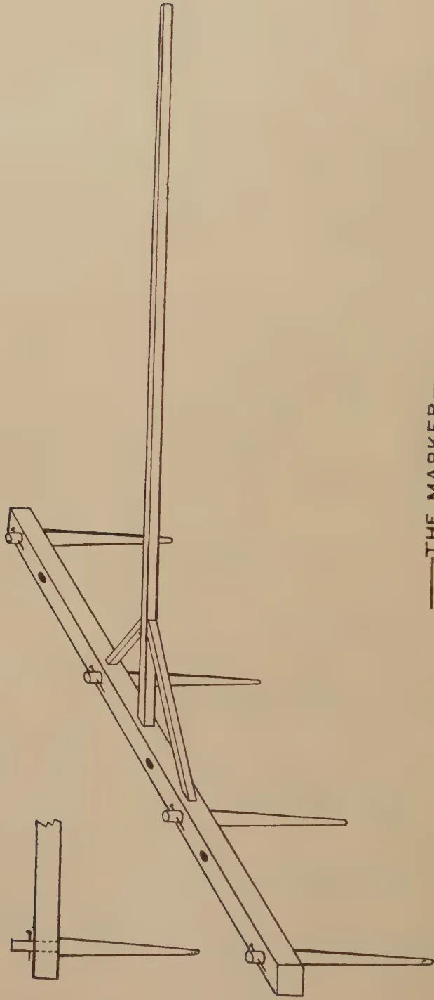

# The Tropical Agriculturist

VOL. XCV

PERADENIYA, AUGUST, 1940.

No. 2

---

---

<table><thead><tr><th></th><th style="text-align: right;">Page</th></tr></thead><tbody><tr><td>Editorial .. .. .</td><td style="text-align: right;">69</td></tr></tbody></table>

## ORIGINAL ARTICLES

<table><tbody><tr><td>The Incidence of Plant Disease in Ceylon in Relation to Environmental Factors. By M. Fernando, Ph.D. (Lond.) .. .. .</td><td style="text-align: right;">72</td></tr><tr><td>Preparation of Land, Transplanting, and After-cultivation of Cigarette Tobacco. By W. M. Rogers .. .. .</td><td style="text-align: right;">79</td></tr><tr><td>Agriculture in French North Africa. By T. W. Hockly .. .. .</td><td style="text-align: right;">84</td></tr></tbody></table>

## DEPARTMENTAL AND OTHER NOTES

<table><tbody><tr><td>The First All-Ceylon Bee Exhibition .. .. .</td><td style="text-align: right;">90</td></tr><tr><td>Paddy Cultivation—Cultivation Sheet for <i>Maha</i> 1939–40 Crop at the Experiment Station, Anuradhapura .. .. .</td><td style="text-align: right;">95</td></tr><tr><td>Coconut Shell Charcoal .. .. .</td><td style="text-align: right;">99</td></tr><tr><td>Notes on Bud-grafting Procedure .. .. .</td><td style="text-align: right;">105</td></tr></tbody></table>

## SELECTED ARTICLES

<table><tbody><tr><td>Soil Erosion and the Cultivator's Responsibility .. .. .</td><td style="text-align: right;">112</td></tr><tr><td>Food Production in the Wet Tropics.. .. .</td><td style="text-align: right;">117</td></tr></tbody></table>

## MEETINGS, CONFERENCES, &c.

<table><tbody><tr><td>Report of the Proceedings of the Ninth Meeting of the Central Board of Agriculture .. .. .</td><td style="text-align: right;">120</td></tr></tbody></table>

## RETURNS

<table><tbody><tr><td>Animal Disease Return for the Month ended July, 1940 .. .. .</td><td style="text-align: right;">127</td></tr><tr><td>Meteorological Report for the Month ended July, 1940 .. .. .</td><td style="text-align: right;">128</td></tr></tbody></table>

1—J. N. 95926 (7/40)

1------------------------------------------------

<!-- stage4: FAINT old-images-only -->

[Faint page: no legible print of its own could be verified; text withheld (stage 4 review list)]

2------------------------------------------------

The  
Tropical Agriculturist

AUGUST, 1940

---

EDITORIAL

---

FOOD PRODUCTION

---

THE article on food production in the wet tropics reproduced in this number from the official journal of the Imperial College of Tropical Agriculture, Trinidad, which is entitled to make a pronouncement on this subject with greater authority, perhaps, than any other institution in the British Empire, must have a sobering effect on the enthusiasm of those who never cease to blame our rural population for allowing themselves as well as their urban countrymen to depend largely on imported foodstuffs. The conclusion advanced in this article is that those regions of the world which come under the description of "the wet tropics" are not suitable for the production of annual arable crops. The chief reason for this unsuitability is the loss of soil fertility by leaching when the soil is subjected to frequent and intensive cultivation. In Ceylon we suffer from certain additional disadvantages of very formidable proportions. The very old lateritic soils are lacking in an initial supply of many of the essential elements of soil fertility; nor does the introduction of these elements from external sources enable a satisfactory crop to be raised. During the wet season, the physical effect of the large volume of monsoonal rains and the biological effect of heavy, cloudy skies accompanied by only very intermittent sunshine are unfavourable to growth and maturity. In the short periods of dry weather between the two monsoons the soil becomes quickly parched owing to its composition which does not favour the retention of moisture, while there are no easily accessible sources of underground water. In these circumstances both the peasant and the large landowner, who never tires of branding the peasant as a lazy lout, because he fails to raise arable food crops, turn to those staple commodities for the production of which the conditions of the wet tropics are specially favourable. In the result all lands that are capable of being satisfactorily drained are used for raising perennial crops, and the only fault we can find with the owner is that he does not pay to these crops the attention which is necessary to ensure the maximum returns.

3------------------------------------------------

70

There are, however, as the Editor of *The Tropical Agriculture* points out, certain minor forms of food production which may be carried out in the wet tropics. The production of grain on a small scale for local consumption is one of them. The rural population of Ceylon does not neglect this form of agriculture. On the contrary all those areas which cannot be drained for permanent crops and which have an adequate water supply are brought under paddy. It is true that the irregular and uncertain distribution of the heavy rainfall, the periodical floods of devastating dimensions, and the wealth of destructive insect life as well as the abundance of pathogens which thrive in the humid heat make paddy cultivation in the wet zone a precarious occupation. But this combination of unfavourable conditions does not unduly deter the peasant. Other food crops that may be grown in these regions are roots and green vegetables. But their production in excess of the requirements of personal consumption depends upon the existence of an industrialized money-earning population within easy reach of the cultivated lands. The absence of such a population in Ceylon sets a very definite limit to expansion in this direction. Finally there are the food products derived from animals. In the absence of arable cultivation, animal husbandry cannot be woven into a plan of mixed farming in which the peasant would raise livestock on subsidiary waste from his farm for the purpose of obtaining manure for his own crops and providing himself and his family with some animal food. But the low lands of the wet zone of Ceylon have one very great advantage in that coconut cultivation can be easily combined with the raising of livestock for a market. But here again we suffer from the absence of a consuming public, that is to say a comparatively large money-earning population which is willing and able to make a habit of paying a reasonable price for animal products.

It follows from these considerations that our agricultural policy in the wet zone should be the encouragement of more intensive attention to marketable perennial crops, the mitigation of those factors which make paddy cultivation a gamble, and the fostering of the production of perishable vegetables and of live-stock to meet the progressively increasing demand that will follow in the wake of the incipient industrialization of which there are growing signs. But that is not the last word on food production in Ceylon. Our semi-arid plains are more extensive than the wet zone, and they are eminently well adapted to those staple food crops which do not require a temperate climate. The main obstacles to the development of these areas are the high incidence of malaria and the inadequacy of the water supply during the greater part of the year

4------------------------------------------------

71

both for domestic purposes and for the irrigation of crops. The policy of the Government during the last ten years has been very definitely oriented towards the removal of those disabilities, and we have reason to hope that there will be no relaxation in the application of that policy. What, perhaps, remains to be revised is the policy with regard to the movement of the population from the overcrowded wet zone to these at-present-uninhabited areas when the conditions of health and water supply have been improved. The gain from the extension of the area of subsistence agriculture will be very little ; and the cultivation of small holdings according to the traditional method of the application of the hoe and the axe, assisted by the tread of buffaloes, will always remain subsistence agriculture. What the country wants is the establishment of comparatively large farms worked with implements which are drawn by mechanical or good bullock power which would yield a substantial surplus of food grains and pulses for the market. That requires capital both in the initial stage of the reclamation of the land from forest and in the later stages of routine seasonal operations. The present colonist does not possess that capital—not even the modest reserve that is necessary for the maintenance of his family until he raises his first crop. Therefore the third leg which, with water and sanitation, must support the tripod of food production by the colonization of the dry zone is the provision of the necessary capital. If the man who owns the capital cannot be attracted to be a colonist, the State must subsidize the man who does not. It is the duty of the Department of Agriculture to formulate proposals for this purpose ; and the inclusion in the next year's budget of money for the purchase of one unit of mechanical implements is the first step in the gathering of experience to enable the Department to discharge that duty.

5------------------------------------------------

72

## THE INCIDENCE OF PLANT DISEASE IN CEYLON IN RELATION TO ENVIRONMENTAL FACTORS

M. Fernando, Ph.D. (Lond.),  
ASSISTANT BOTANIST

THE conception of host-parasite relationships in terms of defending and attacking forces is particularly attractive to the lay mind, and the tendency to regard plant disease\* as the penalty for poor cultivation and low agricultural standards has always been widely prevalent. This association of disease resistance in plants with host vigour is based largely on analogy with human and animal diseases. Animals possess an elaborate mechanism of antibodies which serves the specific purpose of dealing with invading pathogens, and the efficient performance of this mechanism is in direct proportion to the vigour of the host animal. No comparable mechanism exists in plants. There are no proved instances in plants of acquired immunity to fungus and bacterial diseases. (For certain virus diseases of plants, however, pathologists have claimed effects closely resembling the animal phenomenon of induced immunity.) Besides, in the absence of a circulatory system of the type possessed by animals, any manifestation of acquired immunity in plants must needs be intensely localized. That a combination of external factors which stimulates the growth of an animal inhibits the development of its parasites is generally true. The position with regard to plants is more complex. As many instances of a negative correlation between plant vigour and disease resistance can be cited as of the reverse.

### 1.—HUMIDITY

Humidity is the most important of environmental factors conditioning plant disease in Ceylon. Fungus diseases in this country, almost without exception, are severest in the wetter areas and during wet weather. Damping-off of seedlings (*Pythium* sp. and *Rhizoctonia solani* Kuhn) is caused by the prevalence of high humidity in nurseries, and control measures, e.g., the avoidance of shade and of a thick stand of seedlings, consist merely of attempts at reducing this humidity. Diseases

\* In the following pages, the term disease is restricted to troubles induced by parasitic organisms; physiological disorders being the product of unfavourable external influences, can, of course, be remedied by correcting the plant environment.

6------------------------------------------------

73

like citrus canker (*Pseudomonas citri* Hasse) and bacterial wilt (*Bacillus solanacearum* E. F. S.) of the *Solanaceae* are major problems only in the wet zone of the Island. Moisture is, in many instances, the one factor limiting the germination of fungus spores—hence the importance of high humidity as a factor in the spread of disease. Besides, certain diseases are disseminated by motile spores which need films of water for their survival and spread, and are hence most damaging in wet weather. The fungus *Phytophthora palmivora* Butl. which causes pod-rot and canker of cacao and nut-fall of coconuts, and the causal organism of club-root of cabbage, *Plasmodiophora brassicae* Wor. possess spores of this type. Cacao canker, it may be mentioned in this connexion, provides a particularly good instance of an inverse relation between host vigour and resistance to disease. Cacao thrives in a warm, moist climate and under conditions of shade. This combination of environmental factors is also the one ideal for the development of the canker fungus. It is possible to reduce the intensity of this disease by removing the shade and lowering atmospheric humidity, but then the cacao is adversely affected and the branches die back.

The lowering of host resistance may contribute to the severity of diseases of certain crops in wet weather. Under dry conditions plants remain small and produce attenuated leaves with a thick cuticle, but may develop resistance to disease. Under humid conditions a "soft", succulent type of growth is produced which is susceptible to certain diseases. High soil moisture accentuates, for instance, the incidence of vascular wilts probably through its depressing effect on host resistance: panama disease (*Fusarium oxysporum* Schl.) of plantains is severest in damp, low-lying areas subject to frequent flooding. The sclerotial diseases of paddy caused by the fungi *Sclerotium oryzae* Catt. and *Rhizoctonia solani* Kuhn are particularly virulent on swampy land and in areas subject to excessive flooding. Conditions of water-logging in the soil, with its consequent poor soil aeration, may result in root injury and may hence favour invasion by fungi like *Sphaerostilbe repens* B. and Br. Base-rot (*Thielaviopsis paradoxa* Dade) of pine-apples breaks out in epiphytotic form whenever suckers are planted in badly drained soil.

## 2.—LIGHT

The effects of light are intimately bound up with the effects of humidity as conditions of absence of light are usually conditions of high humidity. The humid conditions that occur under shade favour the germination and subsequent growth of fungus spores. Moreover, poor light results in the production of immature tissues which are more susceptible to disease than

7------------------------------------------------

74

tissues formed under conditions of good illumination (Bewley, 1923) Mildews of cucurbits develop most rapidly in shaded situations or in dull weather, and may completely disappear when the plants are exposed to strong sunlight. Damping-off of seedlings and pod-rot of cacao are severest under shade. Two diseases, viz., red rust of tea and coffee rust, constitute important exceptions and are most damaging under conditions of exposure. Red rust of tea is unique in that it is caused by an alga (*Cephaleuros parasiticus* Karst.); algae, as is well known, thrive in exposed situations. Coffee rust (*Hemileia vastatrix* B. and Br.) is mildest under shade possibly because shade trees function as wind-breaks and prevent the blowing about of spores of the pathogen. It may be mentioned, however, that the importance of wind in the dissemination of fungus spores is usually overestimated. Park and Fernando (1937 and 1940) have shown that wind-borne infection is of little consequence in the spread of frog-eye (*Cercospora nicotianae* E. and E.) of tobacco. Wind velocities of considerable magnitude are necessary for detaching conidia from the mycelial substratum.

### 3.—TEMPERATURE

Ceylon has the warm, equable climate characteristic of equatorial islands. Temperature conditions in nearly all parts of the Island and at all times of the year are favourable for the occurrence of most fungus diseases. Temperature as a factor conditioning plant disease is hence of little interest in Ceylon.

### 4.—SOIL TEXTURE

Most soil-borne fungus diseases are particularly damaging on light soils, e.g., root rot (*Fomes lucidus* Klotzsch) of coconuts, and brown root (*Fomes noxius* Corner) of tea and rubber. Good soil aeration accompanying lightness in soil texture appears to favour fungus growth. Attack of papaw, jak, breadfruit and other trees by the fungus *Sphaerostilbe repens* B. & Br. is, however, most virulent on heavy, poorly-aerated soils.

### 5.—SOIL REACTION

The pH value of the soil often determines the severity of outbreaks of soil-borne diseases, and the possibility of depressing the virulence of a pathogen by effecting a drift in the soil reaction away from the optimum for its growth, is often exploited in disease control. Most fungi (except species of *Pythium* and *Phytophthora* which grow best in an alkaline medium) thrive under acid conditions. Most fungus diseases are hence severest on acid soils, e.g., the root diseases of tea caused by *Armillaria* spp., *Botryodiplodia theobromae* Pat. and *Ustilina zonata* Lev., and club-root of cabbage caused by *Plasmodiophora brassicae* Wor. In such instances the soil should be rendered alkaline by the addition of lime. Most

8------------------------------------------------

75

bacteria, on the other hand, prefer an alkaline reaction. With bacterial diseases, *e.g.*, wilt (*Bacillus solanacearum* E. F. S.) of solanaceous crops, the soil should be acidified; the application of sulphur will produce the desired reaction. It is essential that the sulphur should be in an extremely finely-divided form and it may desirably be inoculated with a culture of sulphur bacteria; the sulphur bacteria effect the decomposition of elementary sulphur into acids.

## 6.—FERTILIZERS

The effect of manuring on the incidence of disease is of immense economic interest as it represents one of the very few factors in a plant's environment amenable to direct and easy control. The amount of available information is, however, meagre.

Records of sore-shin (*Rhizoctonia solani* Kuhn) made in a manurial trial of cotton at Maho, provided valuable data on the effects of various fertilizers on the incidence of this disease. The following manurial treatments were investigated in this experiment.

<table border="1">
<thead>
<tr>
<th>(Symbol).</th>
<th>Treatment.</th>
<th>Per Acre.</th>
</tr>
</thead>
<tbody>
<tr>
<td>(O) ..</td>
<td>No manure ..</td>
<td>—</td>
</tr>
<tr>
<td>(N) ..</td>
<td>Sulphate of ammonia ..</td>
<td>150 lb.</td>
</tr>
<tr>
<td>(2N) ..</td>
<td>Sulphate of ammonia ..</td>
<td>300 lb.</td>
</tr>
<tr>
<td rowspan="2">(NK) ..</td>
<td>Sulphate of ammonia ..</td>
<td>150 lb.</td>
</tr>
<tr>
<td>Muriate of potash ..</td>
<td>50 lb.</td>
</tr>
<tr>
<td rowspan="3">(NPK) ..</td>
<td>Sulphate of ammonia ..</td>
<td>150 lb.</td>
</tr>
<tr>
<td>Muriate of potash ..</td>
<td>50 lb.</td>
</tr>
<tr>
<td>Superphosphate ..</td>
<td>100 lb.</td>
</tr>
<tr>
<td>(F) ..</td>
<td>Farmyard manure ..</td>
<td>6 tons</td>
</tr>
</tbody>
</table>

The farmyard manure had the following composition\* :—

<table border="1">
<thead>
<tr>
<th></th>
<th>Per cent.</th>
</tr>
</thead>
<tbody>
<tr>
<td>Moisture ..</td>
<td>15.7</td>
</tr>
<tr>
<td>Organic Matter ..</td>
<td>16</td>
</tr>
<tr>
<td>Ash and Sand ..</td>
<td>68.3</td>
</tr>
<tr>
<td>Nitrogen ..</td>
<td>0.6325</td>
</tr>
</tbody>
</table>

The six treatments were distributed over five randomised blocks of six plots each. The plots were approximately 1/25 acre in extent and consisted of 11 rows of 19 plants, spaced 4 ft. between rows and 2 ft. within rows. Seed of the variety Cambodia was dibbled at the rate of 4–5 per hill. Farmyard manure was applied the day before sowing, and the artificials five weeks after sowing.

Records of the incidence of sore-shin made four weeks after the application of artificials are presented in Table 1. For purposes of the analysis of variance, the data which follow a binomial distribution need transformation to the inverse

\* The writer is indebted to the Chemist, Department of Agriculture, for the analysis.

9------------------------------------------------

76

sine scale ( $\theta = \sin^{-1}\sqrt{p}$ ). The analysis of variance of the transformed data is presented in Table 2. The variance ratio for manurial treatments is significant at the 0.1 per cent. point. The examination of individual treatment means (Table 3) indicates the significant superiority of plots treated with farm-yard manure over all plots treated with artificials.

The applications of a double dressing of nitrogen and of a mixture of a single dressing of nitrogen with potash and superphosphate produced significant increases in the incidence of sore-shin over the unmanured control. The severity of sore-shin appeared to increase *pari passu* with the concentration of artificials applied.

The results obtained with nitrogenous fertilizers in this experiment are of general application to other parasitic diseases: nitrogenous manuring results in a "soft", sappy, thin-walled type of plant which is susceptible to disease. Another effect of nitrogenous manuring is delay in maturation and consequent increase in the chances of infection. Moreover, it has been shown by Fernando (1937) that, apart from their depressing effect on host vigour, nitrogenous substances stimulate the secretion by parasitic fungi and bacteria of the enzyme protopectinase. As has been demonstrated by Brown (1915 et seqq.) the whole mechanism of plant invasion by parasites of the facultative type can be explained in terms of the action of this enzyme.

TABLE 1.  
Percentage Infection

<table border="1">
<thead>
<tr>
<th rowspan="2">Blocks.</th>
<th colspan="6">Treatments.</th>
</tr>
<tr>
<th>O</th>
<th>N</th>
<th>2N</th>
<th>NK</th>
<th>NPK</th>
<th>F</th>
</tr>
</thead>
<tbody>
<tr>
<td>I.</td>
<td>4.3</td>
<td>6.2</td>
<td>6.2</td>
<td>4.3</td>
<td>12.0</td>
<td>1.4</td>
</tr>
<tr>
<td>II.</td>
<td>5.7</td>
<td>7.2</td>
<td>23.0</td>
<td>13.9</td>
<td>28.7</td>
<td>6.2</td>
</tr>
<tr>
<td>III.</td>
<td>11.5</td>
<td>8.1</td>
<td>8.6</td>
<td>9.6</td>
<td>11.0</td>
<td>3.8</td>
</tr>
<tr>
<td>IV.</td>
<td>8.6</td>
<td>23.9</td>
<td>34.0</td>
<td>34.0</td>
<td>28.7</td>
<td>5.7</td>
</tr>
<tr>
<td>V.</td>
<td>4.8</td>
<td>11.0</td>
<td>18.7</td>
<td>4.8</td>
<td>12.9</td>
<td>3.8</td>
</tr>
</tbody>
</table>

TABLE 2.  
Analysis of variance of Transformed Data ( $\theta = \sin^{-1}\sqrt{p}$ ).

<table border="1">
<thead>
<tr>
<th></th>
<th>DF</th>
<th>SS</th>
<th>MS</th>
<th>VR</th>
</tr>
</thead>
<tbody>
<tr>
<td>Manures</td>
<td>5</td>
<td>693.663</td>
<td>138.733</td>
<td>7.03*</td>
</tr>
<tr>
<td>Blocks</td>
<td>4</td>
<td>684.832</td>
<td>171.208</td>
<td></td>
</tr>
<tr>
<td>Error</td>
<td>20</td>
<td>394.440</td>
<td>19.722</td>
<td></td>
</tr>
<tr>
<td>Total</td>
<td>29</td>
<td>1,772.935</td>
<td></td>
<td></td>
</tr>
</tbody>
</table>

\* Significant at the 0.1 per cent. point.

10------------------------------------------------

77

TABLE 3.  
Treatment Means.

<table border="1">
<thead>
<tr>
<th></th>
<th colspan="6">Treatment</th>
<th rowspan="2">Standard Error</th>
</tr>
<tr>
<th></th>
<th>O</th>
<th>N</th>
<th>2N</th>
<th>NK</th>
<th>NPK</th>
<th>F</th>
</tr>
</thead>
<tbody>
<tr>
<td>Degrees</td>
<td>.. 15.1 ..</td>
<td>19.0 ..</td>
<td>24.3 ..</td>
<td>20.0 ..</td>
<td>25.1 ..</td>
<td>11.5 ..</td>
<td><math>\pm 2.0</math></td>
</tr>
<tr>
<td>Percentages</td>
<td>.. 6.8 ..</td>
<td>10.6 ..</td>
<td>16.9 ..</td>
<td>11.7 ..</td>
<td>18.0 ..</td>
<td>4.0 ..</td>
<td></td>
</tr>
</tbody>
</table>

### 7.—SOIL ORGANIC MATTER

The application of organic substances to the soil often reduces the intensity of many soil-borne diseases. This beneficial effect of organic manure can usually be traced to the stimulation of the saprophytic section of the soil microflora : these saprophytes multiply on the added manure and depress the activity of soil-inhabiting parasites either by the secretion of substances toxic to these parasites or by actually devouring them. The incidence of bacterial wilt (*Bacillus solanacearum* E. F. S.) can be lowered by the application of green manure to infested soil prior to planting. Green manures with a high nitrogen content, *e.g.*, groundnut meal and kapok meal, are the most effective. Results with farmyard manure have, however, been disappointing : Park and Fernando (unpublished) failed to effect a significant reduction in the severity of bacterial wilt of tomato by the incorporation in infested soil of farmyard manure at the rate of 15 tons per acre.

The root diseases of tea caused by *Rosellinia arcuata* Petch and *Rosellinia bunodes* B. & Br. provide an exception to the general rule. These diseases are aggravated by the addition of organic matter to the soil.

### DISCUSSION

For a well-reasoned exposition of the popular anthropomorphic theory of plant disease, the reader is referred to the recent writings and addresses of Sir Albert Howard. A detailed criticism of this point of view is not attempted here. Instances of parallelism between host vigour and disease resistance undoubtedly exist. In the case of internal root rot (*Botrydiploidia theobromae* Pat.) of tea, for example, Gadd (1928) has shown that the primary cause of this disease is the depletion of starch reserves in tea roots induced by too frequent plucking or by too short a pruning cycle. It is, however, an illuminating fact that the associated fungus, *B. theobromae*, is considered a saprophyte by most plant pathologists. There appears to be considerable evidence for the generalization that factors that depress host vigour stimulate the development of *parasites of the facultative type*. The so-called "wound parasites" fall into this class. Parasites of the facultative type usually invade moribund or senescent tissue, and there is often little difference

11------------------------------------------------

78

between parasitism of this type and actual saprophytism. Even in instances where fungi of this class appear to break down healthy tissue, the hyphae have a completely extracellular existence and secrete a lethal enzyme (protopectinase) which kills the host cells in advance of invasion : the fungus pullulates on these *dead* cells. It appears likely that, in many instances of facultative parasitism, the host tissue is already killed (or at least rendered moribund) by injurious external influences at the time the fungus establishes itself. In cases of stinking-root disease of jak, breadfruit, papaw and other trees, for instance, water-logging rather than the associated fungus, *Sphaerostilbe repens* B. & Br. is probably the primary cause of the death of the roots.

With parasites of the obligate type, *e.g.*, rusts and mildews, the position is very different. The obligate parasite exhibits a higher degree of specialization and less catholicity of taste. The association between the obligate parasite and its host is very intimate, and in the early stages of the disease approximates to a form of symbiosis. The parasite pushes suckers into the host cells and is, at least in part, intracellular. The survival of the obligate parasite is intimately bound up with the health of the host : if the host dies, the fungus perishes with it. With obligate parasites disease resistance often runs counter to host vigour.

#### REFERENCES

Bewley, W. F., 1923 .. *Diseases of glasshouse plants*. London : Earnest Benn.

Brown, W., 1915 .. Studies in the physiology of parasitism I. The action of *Botrytis cinerea*. *Ann. Bot.* XXIX. 313-48.

Fernando, M., 1937 .. Studies in the physiology of parasitism XV. Effect of the nutrient medium upon the secretion and properties of pectinase. *Ann. Bot.* New Ser. I. 727-46.

Gadd, C. H., 1928 .. A new view of the causation of *Diplodia* disease. *Tea Quart.* I. 89-93.

Garrett, S. D., 1939 .. Soil-borne fungi and the control of root disease. *Imp. Bur. Soil Sc. Tech. Comm.* No. 38.

Park, M. and Fernando, M., 1937 .. Some studies on tobacco diseases in Ceylon. I. *Tropical Agriculturist* LXXXVIII. 153-68.

Park, M., Paul, W. R. C., and Fernando, M., 1940 .. Some studies on tobacco diseases in Ceylon. VI. *Ibid* (XCV. 8-15).

12------------------------------------------------

This image is a scan of a blank page. The paper has a light beige or cream-colored tint. There are a few very small, faint dark spots scattered across the surface, which appear to be scanning artifacts or minor imperfections in the paper. No text, lines, or other markings are present.

13------------------------------------------------

A technical line drawing of a surveying instrument. The main body is a long, angled wooden beam with several small circular holes and four long, thin, pointed pins extending from its underside. A vertical wooden pole is mounted on the beam. A smaller, separate component is shown to the left, consisting of a vertical wooden block with a horizontal pin passing through it.

—THE MARKER—

BLOCK BY SURVEY DEPT. CEYLON

14------------------------------------------------

79

## PREPARATION OF LAND, TRANSPLANTING, AND AFTER-CULTIVATION OF CIGARETTE TOBACCO

---

W. M. ROGERS,  
TOBACCO OFFICER

---

IT is essential that the tobacco plant should grow vigorously without disturbance after it is transplanted. To achieve this object, the land which is to carry a crop of tobacco should be fertilized and well-prepared. The land should be ploughed, cross-ploughed and disc-harrowed, allowing a sufficient interval between the successive operations for the decomposition of green matter ploughed in and for the proper aeration and weathering of the soil. The first ploughing should not be done when the soil is very wet or very dry. The interval between the operations will depend on climatic conditions. The land should be kept free of weeds by occasional harrowings.

Before transplanting, the land should be well levelled, drained and soil conservation measures adopted. A suitable method of soil conservation for tobacco land should be the construction of contour bunds with lock and spill drains. The distance from one contour bund to the other will depend on the lie of the land but the extent of land available for cultivation from one bund to the other should be sufficiently big to facilitate implemental tillage by bullocks. After this the planting positions are marked out by means of a hand marker, an illustration of which is shown in Plate 1. The hand marker is a simple implement consisting of a light piece of wood forming the headpiece; a pole about  $1\frac{1}{2}$  to 2 inches in diameter and about 6 to 7 feet in length, fixed at right angles to the headpiece serves as the handle. The space between the teeth and the number of teeth vary with the planting distance. The same marker can be used for different planting distances by having a set of holes drilled in the headpiece. The teeth can be adjusted according to requirements. Further details can be had in an article written by C. R. Karunaratne which appeared in *The Tropical Agriculturist*, Vol. 88, pp. 150-152, 1937.

15------------------------------------------------

80

Experimental work is in progress to ascertain what is the best spacing between rows and between plants. In the meantime the distance suggested for lands where no cultivation is possible by animal-drawn implements is 3 ft. by 2 ft. and where such cultivation is possible 2 ft. 9 in. by 2 ft. 9 in. or 3 ft. by 3 ft.

The number of plants per acre with the different spacings are:—

<table>
<tr>
<td>3' × 2'</td>
<td>= 7260 plants.</td>
</tr>
<tr>
<td>2' 9" × 2' 9"</td>
<td>= 5760 plants.</td>
</tr>
<tr>
<td>3' × 3'</td>
<td>= 4840 plants.</td>
</tr>
</table>

Experimental work is also being carried out to ascertain what are the most advantageous mixtures of artificial manures to be used for growing cigarette tobacco in Ceylon. Until further and more definite information is obtained the following can be used where the soil is sandy such as at Wariyapola :

<table>
<tr>
<td>50 lb.</td>
<td>..</td>
<td>Blood meal (12.5 per cent.)</td>
</tr>
<tr>
<td>150 ,,</td>
<td>..</td>
<td>Nitrate of Soda (15 per cent.)</td>
</tr>
<tr>
<td>60—180 ,,</td>
<td>..</td>
<td>Superphosphates (42 per cent.)</td>
</tr>
<tr>
<td>or 140—420 ,,</td>
<td>..</td>
<td>Superphosphates (18 per cent.)</td>
</tr>
<tr>
<td>120 ,,</td>
<td>..</td>
<td>Sulphate of Potash (48 per cent.)</td>
</tr>
</table>

The fertilizers should be mixed just before application. The mixture should be applied in two doses. The first dose should be applied about two or three days before transplanting at the places where the plants are to be put in and the fertilizers well mixed with the soil. The second dose should be applied about four weeks after transplanting : the fertilizers should then be applied round the plants and forked into the soil lightly.

#### TRANSPLANTING

The seedlings are ready for planting out in the field when they are six to eight weeks old at which stage they should be 4 to 6 in. high. The seed beds should be thoroughly soaked before pulling out the plants which should be done without damaging the roots. Transplanting should be done during cloudy days as less evaporation and consequently less wilting take place under such conditions and the plants will recover more quickly. The most favourable time for transplanting has been found to be during the cool hours of the morning and evening. Select only the stout and healthy seedlings and pull up only sufficient for transplanting in one morning or evening. The seedlings should be sent to the field in baskets, care being taken not to crush or bruise the seedlings.

Make a hole with a short pointed peg or with the forefinger of the hand, put the plant in, taking care to cover all the roots, press down the soil round the plant, water liberally and shade with coconut husks. See that the plants are put in properly, and the roots are firmly packed in the soil. Tobacco plants

16------------------------------------------------

81

should be completely shaded for three days, and if there is no rain they should be watered daily, preferably in the evenings. On the fourth day the husks may be separated about 2 or 3 in. and so expose the plants to sunshine gradually. Remove the husks entirely when the plants are one week old. The vacancies should be supplied within a week in order to get the uniform stand of crop which is so desirable for flue-curing tobacco. Such work should take priority over planting out of new areas. If there is no rain, watering should be continued. When the plants have been in the field for about four weeks watering should be done once in two or three days. As the plants grow older watering may be reduced. If plants show any signs of wilting they should be liberally watered.

#### AFTER-CULTIVATION

About two weeks after transplanting, the plants become well established and cultivation should begin at this time. Tobacco requires a fine, loose, well-drained soil and, if good yields are looked for, cultivation after transplanting is essential. This operation will also destroy the annual weeds which may spring up with the rains. The first cultivation should be deep, but it should not be too close to the rows as there is a danger of disturbing the young plants. The soil close to the plant should at all times be kept in good tilth by hand cultivation. This operation will break up the superficial crust on the soil. Subsequent cultivations should be more shallow as the plants develop, because deep cultivation will cause damage by cutting off many of the small roots. The number and frequency of cultivations will depend on soil and climate. Cultivation should cease when the leaves spread sufficiently between the rows to obstruct the free passage of the cultivator or the labourer.

#### TOP DRESSING WITH NITROGENOUS FERTILIZERS

Backward and more anaemic plants may be given a dose of nitrate of soda as a top dressing at the rate of 100 lb. per acre.

#### PRIMING

When the plants are 12 in. high, all the sand leaves are removed. Sand leaves are of no value and their removal induces the more rapid growth of the plant by allowing a free circulation of air at the base of the plant. This operation also checks the spread of the frog-eye in the field. A second priming should be done just before topping. The sand leaves should be destroyed by burning.

17------------------------------------------------

82

### TOPPING

Topping is the name given to the operation by which the terminal bud is removed. The proper stage for doing this, and where to do it, are points requiring careful judgement and experience. The height at which a plant is topped has an important bearing on the quality of the leaf and it is advisable to top slightly higher for flue-curing than for air-curing. The height at which a plant should be topped naturally depends on the growth of the plant and its development of leaves. A robust plant will carry more leaves than a smaller one. A well-developed plant should carry about sixteen to eighteen leaves. If the plant grows coarse and rank, do not top at all or, if the growth is coarse but not very coarse, topping may be done, but suckering should not be carried out. Topping should be done while the stem of the plant is still soft and juicy and should never be delayed till the flower heads develop. Topping may have to be done several times on the same field as all the plants do not develop their flower heads at the same time.

### SUCKERING

Suckering is the removal of young shoots which appear in the axils of the leaves after topping. About ten days after topping suckers will appear in the axils of the leaves and it is essential that these be removed as soon as possible as they drain the food store from the older leaves, leaving them thin and papery. A tobacco crop for flue-curing has to be suckered about two to three times before harvest. If, on the other hand, a period of wet weather comes at the harvest time the suckers may be allowed to grow temporarily.

### CLIMATE

Both quality and yield of cigarette tobacco are greatly influenced by climatic conditions. For producing the best quality of cigarette tobacco rainfall should be moderate. The rain should be well distributed throughout the growing period of the crop; there should be light showers during the ripening and the harvesting period. There should also be plenty of sunshine during the growing period. Cigarette tobacco of the best quality can only be produced in seasons of normal rainfall and temperature.

### SOILS

Tobacco can be grown on any soil, provided it is well-drained and the climatic conditions are favourable, but for profitable cigarette-tobacco-growing the right type of soil must be selected. The ideal soils for growing cigarette tobacco are light, infertile sandy loams.

18------------------------------------------------

<!-- stage4: ACCEPT r2J/J_014:90 -->

83

COST OF CULTIVATION OF AN ACRE OF LAND, EXCLUDING  
SUPERVISION

<table style="width: 100%; border-collapse: collapse;">
<thead>
<tr>
<th colspan="3"></th>
<th style="text-align: right;">Rs. c.</th>
</tr>
</thead>
<tbody>
<tr>
<td>1.</td>
<td>Preparation of nurseries, &amp;c.</td>
<td>..</td>
<td style="text-align: right;">16 55</td>
</tr>
<tr>
<td>2.</td>
<td>Ploughing and harrowing</td>
<td>..</td>
<td style="text-align: right;">2 33</td>
</tr>
<tr>
<td>3.</td>
<td>Levelling and Soil conservation work</td>
<td>..</td>
<td style="text-align: right;">13 64</td>
</tr>
<tr>
<td>4.</td>
<td>Marking and pegging</td>
<td>..</td>
<td style="text-align: right;">1 0</td>
</tr>
<tr>
<td>5.</td>
<td>Transplanting and shading</td>
<td>..</td>
<td style="text-align: right;">9 16</td>
</tr>
<tr>
<td>6.</td>
<td>Manures and manuring</td>
<td>..</td>
<td style="text-align: right;">46 2</td>
</tr>
<tr>
<td>7.</td>
<td>After-cultivation</td>
<td>..</td>
<td style="text-align: right;">6 44</td>
</tr>
<tr>
<td>8.</td>
<td>Weeding</td>
<td>..</td>
<td style="text-align: right;">8 96</td>
</tr>
<tr>
<td>9.</td>
<td>Watering</td>
<td>..</td>
<td style="text-align: right;">15 85</td>
</tr>
<tr>
<td>10.</td>
<td>Pests and disease work</td>
<td>..</td>
<td style="text-align: right;">27 41</td>
</tr>
<tr>
<td>11.</td>
<td>Priming</td>
<td>..</td>
<td style="text-align: right;">2 98</td>
</tr>
<tr>
<td>12.</td>
<td>Topping</td>
<td>..</td>
<td style="text-align: right;">1 34</td>
</tr>
<tr>
<td>13.</td>
<td>Suckering</td>
<td>..</td>
<td style="text-align: right;">3 35</td>
</tr>
<tr>
<td>14.</td>
<td>Harvesting</td>
<td>..</td>
<td style="text-align: right;">5 66</td>
</tr>
<tr>
<td>15.</td>
<td>Curing</td>
<td>..</td>
<td style="text-align: right;">6 14</td>
</tr>
<tr>
<td>16.</td>
<td>Unloading tobacco from barn, bulking, &amp;c.</td>
<td>..</td>
<td style="text-align: right;">4 27</td>
</tr>
<tr>
<td>17.</td>
<td>Grading</td>
<td>..</td>
<td style="text-align: right;">5 90</td>
</tr>
<tr>
<td>18.</td>
<td>Uprooting of tobacco stumps</td>
<td>..</td>
<td style="text-align: right;">3 0</td>
</tr>
<tr>
<td colspan="3" style="text-align: right;">Total</td>
<td style="text-align: right; border-top: 1px solid black; border-bottom: 3px double black;">180 0</td>
</tr>
</tbody>
</table>

19------------------------------------------------

84

## AGRICULTURE IN FRENCH NORTH AFRICA

T. W. HOCKLY,  
HORAWALA ESTATE, NEGOMBO

THE countries comprising French North Africa are respectively Morocco, Algeria, and Tunisia. Morocco is a Protectorate of France and is governed by a Sultan. The Resident Commissioner represents the French Government. Tunisia is also a French Protectorate ruled over by the Bey of Tunis. The French act in an advisory capacity in both cases but are in reality the rulers. Algeria is, however, wholly under French administration and is incorporated, now as a French Department under the direction of a Governor-General whose headquarters are in Algiers itself. The area of Morocco is 200,000 sq. miles, that of Algeria 847,500 sq. miles, and Tunisia 480,000 sq. miles, each with a population of five millions, six and a half millions (of which about a million are Europeans) and two and a half millions, respectively. The majority of these populations are Arabs or Moors. The coast line on the extreme west of Morocco up to Tangier which faces the straits of Gibraltar is bounded by the Atlantic Ocean. Thence Morocco, Algeria, and Tunisia border the Mediterranean. Morocco is the Arabic Maghreb al Aksa—the most westerly land of the setting sun. The Atlas Mountains in Morocco run in a north-east direction and some peaks are 15,000 ft. in height and capped with snow. Behind this range and to the south of all three countries lies the great desert of the Sahara extending over 3,500,000 sq. miles—a veritable sea of sand.

The rainfall varies from about 29.30 inches to over 36 inches. The latter figure ensures good crops. Periodical rains brought by the west and south-west winds fall from October to April. Rain falls on 70 to 80 days during the year but only a small proportion of these are entirely wet days and a considerable amount of the rain falls during the night.

The mountainous massifs in Morocco gullied by their rushing waters have little or no mould, while plains and valleys are on the contrary plentifully supplied with such. Black and heavy earth extends in more or less large patches, and though in some cases these lands are not sufficiently calcareous they are excellent for growing cereals being rich in potash and yield abundantly.

In contrast with Algeria and Tunisia, Morocco is irrigated by many rivers and streams and there is not the same lack of

20------------------------------------------------

85

water as obtains in many parts of the latter. Many of the rivers are fed by the snows of the Atlas Mountains.

In Western Morocco alone there are 200,000 acres under barley, 1,500,000 acres under wheat, 500,000 acres under maize and sorghum or millet, and 6,000 acres under oats. Viniculture has an area of 1,300 acres. Potato crops and beetroot do well. In addition large areas of waste land have been sown with castor plants which are self-producing and provide both lubricants for aeroplane engines and oil cake for manure. Castor is also grown in Algeria and Tunisia. Market gardening on the outskirts of towns is carried on very satisfactorily. Flax is grown on over 10,000 acres and beans and lentils occupy 98,000 acres and 23,000 acres, respectively. In some parts of Morocco cotton has been grown successfully. Chick peas are also grown in all three countries and form part of the ingredient to make a really good "*Kous Kous*"—the national dish. Rice is not grown nor are the inhabitants of Morocco, Algeria and Tunisia rice eaters. *Kous Kous* is prepared from very fine semolina or *fulang*—the heart of the wheat—with either mutton or fowl in much the same manner as a *Pillau* or *Buriani* and when well cooked is very delicious. Fenugreek, a leguminous plant, is also grown in all three countries. This is a condiment for human use and also a fattening substance for animals.

As regards fruit growing, nearly every kind of fruit grown in Central and Southern Europe do well such as the olive tree, orange and lemon, almond, walnut, apricot, pear, apple and pomegranate. Date palms grow in the oasis of Marrakesh at the foot of the Atlas, but the dates are of rather poor quality. Esparto grass or Alfa grows on the High Plateaux of Morocco, Algeria, and Tunisia and millions of acres are covered with this fibre. It is of course chiefly used in the manufacture of paper, England alone until recently taking 60 per cent. of the total export. Since wood pulp is now being largely used for paper making the demand for Alfa has fallen off. As far as cattle breeding is concerned Morocco appears particularly suitable. The Gharh and Zaian are specially well placed as far as horned cattle are concerned. The breed is characterized by small bones, a fine head and extremities and a certain fulness of the chest. Judicious selection would seem sufficient to transform it into a thoroughly good breed as regards meat. Experiments, I believe, are being tried by cross breeding with Durhams or Limousins which it is reckoned should have the effect of greatly improving the weight of carcasses.

The pasture lands on the plateaux are well suited for cattle, sheep, goats, and camels. Horses, donkeys, and mules are to be found everywhere. There appeared to be, however, an absence of dairy farming and dairy cattle, although practically

21------------------------------------------------

86

everywhere in Morocco, Algeria, and Tunisia good milk is usually available. This may possibly be due to the universal use of olive oil for culinary purposes as is found in practically all southern countries of Europe. Pigs thrive exceedingly well in the lower lands and the export trade in this line has yielded good profits. Poultry too does very well and the trade in eggs for export to France in addition to local consumption has been organized for some time past. Indigenous apiculture is successfully carried on by the Arabs. The forests which are distant from one another are scarcely noticeable when travelling and yet form a very important feature in the economy of the country. Cork trees alone cover an area of 870,000 acres in the districts of Zemmur and Marmora. The forest of Marmora alone covers 330,000 acres and is itself equal to double the wooded areas of Tunis and to half the Algerian State forests. There are also some very fine forests of cedar in the middle Atlas, covering no less than 750,000 acres.

The export of cork from North Africa is a very important and profitable business. The cork oak when it has reached the age of fifteen years is stripped of its bark and this operation is repeated every ten years thereafter. After the age of thirty-five or forty years, it is reckoned that a single cork tree when stripped will yield several hundred pounds weight of cork.

The date tree of which there are hundreds of varieties requires great solar heat and can only be cultivated to perfection in or near the Sahara desert. There is an Arab saying that in order that a date tree should flourish it must have its head in fire and its feet in water. Biskra, a large and important oasis on the edge of the Sahara is one of the principal centres of date cultivation. The dates are large and honey-sweet like those of Egypt and great quantities are exported to many countries. Date gardens in fact bear a close resemblance to coconut estates. The larger properties are owned by wealthy Arabs and French Colonists. The trees flower in March and the fruit is ripe in October. The trees are usually between 30 ft. and 40 ft. in height and come into full bearing in twenty-seven years and flourish for about a century. It is a delightful experience to visit and wander round one of these large date gardens as I was fortunate enough to do with the owner—a rich Arab Sheikh. Cultivation is assiduously carried out and every care given to the trees. The date palm, like the coconut, provides when cut down fuel and fencing and material for building purposes. The leaves are made into cord, sacks, mats, and baskets.

To reach Biskra from Algiers it takes either a whole night or a day by train or one can motor on the magnificent roads to be found practically everywhere in North Africa constructed

22------------------------------------------------

87

by the French. After passing between high mountains on either side one reaches the gorge of El Kantara. After passing through this the desert opens out before one with vivid suddenness. At the oasis of Tolga, sixty miles distant from Biskra, one cannot help but marvel at the work done by the French who have in many places installed a system of artesian wells. Around the oasis the desert stretches before one like a veritable ocean. In the distance are the rugged and stony peaks of the Aures Mountains rose tinted. At a central point in the oasis, water gushes forth copiously and is led by a system of channels made by the inhabitants to wherever it is needed to irrigate date palms and vegetable and fruit gardens.

The people look well fed and happy. It is strange to think that this fertile soil once part of the desert should have sprung into life and fertility by the magic touch of water. Reza Shah of Iran never spoke more truly than when he said : " Life depends on water." It is interesting to note also as regards trees that the rubber tree which was imported from Ceylon in 1863 has become quite acclimatized in Algeria in those parts where a moister and more humid climate prevails.

In Algeria there are three natural divisions : The Tell, the High Plateaux, and the Sahara. The Tell is a narrow strip of cultivated land hundreds of miles in length and from 30 to 100 miles in breadth between the sea and the mountains. The Tell is well watered by rivers and is in extent about 35 million acres. Passing through this country one sees the farms and vineyards of French colonists and also of Arabs. The French employ modern methods of cultivation using steel ploughs and tractors but the Arab for the most part is content to keep to the usage of his forefathers. The plough is of much the same pattern as that in India or Ceylon and is too superficial. Oxen and sometimes camels are used and I have seen myself in the case of a small Arab holder his women folk also employed and yoked to a plough. They do not clear their land sufficiently of weeds and employ but little manure which, however, is balanced by the natural fertility of the soil.

While in England the average production of wheat is from 22 to 27 bushels per acre, in Algeria it seldom exceeds 8 bushels. Every variety of temperate zone vegetables and fruit are grown abundantly and potatoes and onions yield two crops annually.

Roses, jasmine, carnations and other flowers of a temperate climate do exceedingly well in Morocco, Algeria, and Tunisia. Roses especially which require a dry climate are very fine. The Arabs use many of these flowers for the distillation of attar and perfumes. Besides flowers many herbs, such as coriander, cummin, carroway and henna, are cultivated by the Arabs.

23------------------------------------------------

88

Experiments with sugar cane and other tropical plants which require a continuously damp climate have not been very successful.

In all three countries fruit trees flourish—plums, apricots, cherries, pears, melons, bananas and strawberries. Figs thrive everywhere and are a common article of food. The finest tangerines, oranges and lemons are as delicious as they are plentiful and cheap and are exported in large quantities to France and England. In Algeria and Tunisia more attention is given to viniculture than in Morocco. In Algeria alone over 300,000 acres are planted with vines and over 40,000 acres in Tunisia. This industry is in the hands of French Colonists who, of course, thoroughly understand it. I have tasted some very fine wine, red and white in Algeria and Tunisia, practically as good as French wines. Indeed, I was told that large quantities of wine are shipped to France and sold there as French wine. The best brand of Algerian vine is known as Kebir and in Tunis the best wine is Carthage Royal. M. Dejeron who was sent by the French Government to examine the prospects of viniculture in Algeria in his report states :—“ In my view the vine is a providential plant for Algeria ; it prospers everywhere, in the worst land, and on the most burning soil. In the three provinces I have not found a spot which is unfit for it ; everywhere, but especially on the littoral, I have tasted wine rich in alcohol. The vine will become the fortune of the country. Algeria possesses in its geological structure, in the rays of its sun, in the currents of its air those precious qualities which give to the product of the vine their tone, their colour, their delicacy and limpidity. It can produce an infinite variety of wines suited to every constitution and to every caprice of taste.”

In some of the oasis cotton of fine long staple is grown very successfully.

Cows in Algeria and Tunisia are small and give but little milk. As a result of the Arab system of feeding calves on grass a fortnight or so after birth and withdrawing milk from their food as soon as it can be done the resulting veal is tough, has no flavour and is of inferior quality. Algeria and Morocco are the original homes of the Merino sheep. The flocks of sheep bred on the High Plateaux are a great source of wealth, many thousands being sent to Paris monthly during the summer. Besides which there is a very large export of this fine and valuable wool. The Arabs, too, use it largely to hand weave their burnouses and other garments. They also employ camel's wool for this purpose, and a burnous made of pure camel's wool is impervious to rain. Goats are very numerous and supply the Arabs with milk. Horses too are bred and are excellent ; but except at the military studs it is difficult to meet with the

24------------------------------------------------

89

pure-bred original Arab steed. Practically all Arabs are magnificent natural horsemen and some splendid cavalry regiments—Spahis—have been recruited from among them. The Arab also makes a sturdy and hardy foot soldier and these comprise the infantry regiments of Tirailleurs. The majority of such units both cavalry and infantry are drawn as in India from the Arab peasantry, and are officered by the French and Arab chiefs.

To the Arab of the desert the camel is of course a most valuable animal and is considered superior to that of Asia. Quite good cheese is made from camel's milk. When the animals are old they are fattened for killing, the flesh being considered by the Arabs as very wholesome.

In both Algeria and Tunisia I noticed on many French farms and vegetable gardens the large extent to which aermotors are used in pumping water from wells for irrigation.

On the road to Korbous where there are large mineral hot springs dating from pre-Phoenician times and an important thermal establishment and hotel, I passed a huge acreage of land belonging to Messrs. Felix Potin of Paris—the French Crosse & Blackwell—where every kind of European vegetable was growing and large fruit orchards were cultivated. The land is entirely irrigated by aermotors pumping water from wells. These vegetables and fruits are exported to France in large quantities either in their natural state or canned and exported. It is in fact a huge and most profitable undertaking and says much for French initiative and enterprise.

Algeria and Tunisia are both rich in mineral springs and there are many thermal establishments for the cure of various diseases. All such places have hotels and an attendant staff of medical men. There are also in every case smaller and less luxurious places which are open to the poor and indigent. The Arabs have great faith in the efficacy of these waters.

South of Tunis are large deposits of phosphates and these are shipped from Tunis to all parts of the world.

There is no doubt that the three countries of Morocco, Algeria, and Tunisia form a very valuable possession for France, with their exports and imports. En route to Biskra it is worth while breaking journey at Batna and to motor out thence—about twenty-five miles—to Lambessa and Timgad, the remains of ancient Roman Cities. Lambessa was the military town whereas Timgad was the centre of commerce. The ruins are still in a wonderful state of preservation. The arch of Septimus Severus and that of the Emperor Trajan are alone worth seeing. In the neighbourhood of Timgad are the famous vineyards of St. Eugene. It is curious to consider that once this vast countryside formed one of the principal granaries of ancient Rome. The soil still remains fertile where the desert has not encroached.

25------------------------------------------------

90

## DEPARTMENTAL AND OTHER NOTES

### THE FIRST ALL-CEYLON BEE EXHIBITION

W. MOLEGODA,  
*AGRICULTURAL OFFICER, PROPAGANDA*

**T**HE Royal Botanic Gardens were the scene of the First All-Ceylon Exhibition of Bees, Honey, and Honey Products which lasted from 17th May until 1st June, 1940.

The exhibits were housed in temporary sheds erected on the east side of the Great Circle, on either side of the path leading to the Thwaites Memorial. There were in all four sheds for the exhibits. Of these, the two largest were utilized for exhibits from amateur bee-keepers, one for traders, and the other for departmental exhibits. All the booths were richly decorated in Kandyan style. Ornamental palm pots placed at intervals gave a pleasing finish. Hives containing bees were supported on temporary stands around the Great Circle Lawn, four acres in extent, and along the Royal Palm Avenue. There were over 200 such hives of various colours which enhanced the natural attraction of the flowering trees themselves.

An out-sized model of a double-storeyed Newton hive spanned the entrance to the show grounds and housed the departmental exhibits. The visitors passed through this giant hive. It contained a picturesque collection of bees, bee appliances, honey, and slogan posters which entertained visitors so that none were able to leave the hive without having the opportunity of being wiser in some aspect of bee-keeping. The "beard of bees" would excite the wonder of some who marvelled that such a thing was possible with "stinging" bees; some would look at a slogan like "Say it with honey" and gaze on the golden honey stored in hygienic receptacles; others would be interested in the museum specimens of bees of various sorts—queens, drones, and workers of Indian as well as European breeds. The collection of bee literature attracted some, while others examined the microscopic slides which showed the internal system of this useful insect. It was an education, an inspiration, this hive which contained all aspects of scientific apiculture in a nutshell.

The exhibition was divided into seven sections each of which was sub-divided into numerous classes. They covered all

26------------------------------------------------

![A black and white photograph of the entrance to the first All-Ceylon Bee Exhibition. The entrance is a small, light-colored building with a gabled roof, decorated with two large illustrations of bees on its front facade. A string of white triangular flags is draped across the entrance. Several people in light-colored clothing are standing near the entrance. The building is surrounded by lush tropical vegetation, including palm trees. In the background, a large, dark, open field or clearing is visible under a bright sky.](c3c289114976e3a4fa6d9a0d6f647626_1_img.webp)

THE HIVE WHICH SPANNED THE ENTRANCE TO THE FIRST ALL-CEYLON BEE EXHIBITION.

27------------------------------------------------

This image is a scan of a blank page. The paper has a light beige or cream-colored tint. There are a few very small, dark specks scattered across the surface, which appear to be scanning artifacts or dust particles. No text, lines, or other markings are present on the page.

28------------------------------------------------

91

aspects of bee-keeping. Although this was the first time that an exhibition of this nature was conceived in Ceylon, a most gratifying feature of the whole exhibition was that not one class was unrepresented. There were more exhibits than had been anticipated by the organizers. The total was 1,067 ; the number of exhibitors was over 200.

Section I consisted of bee appliances which included hives with bees. This collection included, among other articles, seven- and nine-framed hives with two supers each, and outfits suitable for beginners in bee-keeping. In the class for honey extractors there were numerous designs of which many were original. Their prices ranged from Re. 1 to Rs. 60. Many of the exhibits in the class for observation hives had been most ingeniously devised. In principle, most of them were like the double-supered Newton hives but with sides of glass. In some, in addition to the glass, a cloth curtain or teak exterior had been provided. One exhibitor presented a glass hive with one brood comb and two super combs arranged one over the other in the usual manner, thus enabling a student to observe the inside story of a hive in all its details.

In the class for "any other appliances" were a number of items which were novelties to most of the visitors, including drone-traps, bee escapes, cages for trapping after-swarms, queen-rearing apparatus, and section-frames. Among the stands for bee hives were varieties of ant-proof stands, all of a superior quality, ranging from metallic structures, and concrete three-piece portable stands to cheap wooden structures turned out by the exhibitor himself.

The next section consisted of honey, the classes being honey-combs with frames from modern hives, combs in jars, extracted garden honey, wild honey, granulated honey and section combs. This section was arranged strictly according to the requirements of the British Bee-keepers' Association. The judges had been apprised in advance of the points on which the British Bee-keepers judge at their shows. The comb-honey was sufficiently well protected to prevent intrusion on the part of the bees and other injuries ; each section comb was exhibited in a small box fitted with glass on all sides, but capable of being easily removed by the judges. All extracted garden honey was graded and presented in clear glass bottles.

In this section were various types of honey, the most representative of them being the liquid honey. This was divided into two groups, namely, garden and wild honey, the former being honey obtained by uncapping the combs and forcing the honey from the cells by centrifugal force, while the latter was hand-pressed honey, commonly known as "wild honey".

29------------------------------------------------

92

There were only eight samples of granulated honey, but they fully represented the class. They were wholly or partially solidified with a fine or coarse texture so that it was possible for visitors to observe the different types and stages of crystallization. At the demonstrations some of this honey was liquefied by placing the container in a vessel of water, and raising the temperature to 150° F at which temperature it was kept till all the honey was liquefied. A wooden board was placed at the bottom of the vessel of water, to prevent the container from coming in contact with the heating vessel.

Comb honey, *i.e.*, honey in the combs as stored by the bees, was fully represented. There were full combs with or without frames, packed into white glass jars. There were also well formed section combs in glass cases.

In the next three sections were included honey products, the difference between each section being the source from which they came. The preparations included cakes, sweets, beverages, ointments, and cosmetics. The exhibits in all these classes exceeded expectations, with the result the organizers had to provide additional accommodation. In Ceylon, honey has been in use from the earliest recorded times, but from then till now it has continued to be used only as a preserve. The main purpose of this section was, therefore, to demonstrate to the public the various other uses to which honey can be put. Different kinds of recipes with honey as an ingredient were published in the local press; the press published also the value of honey as a food. Thus the public was instructed before the show in the uses of honey as a satisfactory ingredient in most food preparations.

This, however, was the first opportunity most visitors had of seeing a variety of honey preparations. There were cakes of different sorts, caramels, biscuits, vinegar, mead, cough mixtures, ointments, tonics, fruits in honey, and others. The taste of the various foods differed considerably from one another and also from foods made with other sweetening agents. Many who tasted these foods preferred them to those made with *kitul* (*Caryota urens*) treacle or cane sugar. There were also a few who did not find the taste of honey agreeable. Having anticipated this, the organizers made an effort to give a very definite quality of honey for each recipe. Nevertheless it is only individual taste that can decide when a blend satisfies and, because taste preferences and the flavour of honey vary, one may find a lesser or greater amount required for one's individual needs.

The recipe of the prize-winning cake is given below. It was obtained from the American Honey Institute.

30------------------------------------------------

93HONEY CAKE.

<table>
<tr>
<td>1 cup butter</td>
<td><math>\frac{3}{4}</math> cup milk</td>
</tr>
<tr>
<td><math>\frac{3}{4}</math> cup honey</td>
<td><math>\frac{1}{4}</math> teaspoon salt</td>
</tr>
<tr>
<td><math>\frac{3}{4}</math> cup sugar</td>
<td>2 teaspoons baking powder</td>
</tr>
<tr>
<td>2 eggs unbeaten</td>
<td>3 cups cake flour</td>
</tr>
</table>

3 egg yolks unbeaten

Sift dry ingredients four or five times. Cream butter well. Add honey and beat until fluffy. Add sugar and beat to fluffiness. Add the eggs, one at a time, beating thoroughly after each addition. Add flour alternately with milk. Stir until batter is smooth. Pour into two well-greased loaf pans and bake for one hour and 15 minutes.

The sixth was the usual miscellaneous section containing in all seven classes : nectar and pollen flowers ; bees-wax ; posters on bee life ; bees and honey belonging to other species of honey gatherers than *Apis indica* ; and a class to show any other item of interest not mentioned elsewhere in the catalogue. This section, on the whole, was the most interesting from the point of view of variety.

In the collection of nectar and pollen flowers there were exhibits ranging from 50 to 150 in each group. They were all assigned their proper botanical names as well as those in common usage. There were many different types of bees-wax, although this is one of the most difficult products to prepare in a satisfactory manner. The prize winning sample was almost pure white while many were of a yellow hue. The wax-mould exhibited by the Kelaniya Bee-keepers' Association was specially commended. In the preparation of the best sample of wax only cappings and new combs had been used, while in others old combs as well as those of other bees had been blended. In some there were traces of sediment at the bottom surface.

The exhibits of the other species of bees in Ceylon than *Apis indica* were very commendable. In Ceylon there are still many who feel that *Apis florea* and *Iridipennis melipona* cannot be kept under captivity. Those brought to the exhibition grounds lived quite happily, although the unusual weather conditions were far from favourable. No attempt had hitherto been made to handle the *bambara* bee, *Apis dorsata*. Periodic reports from Sigiriya area have given this bee a notoriety for viciousness, but at the exhibition was shown a number of their nests with living bees. They lived in amity with their cousins and fed on the same food. No visitor was stung.

There was a wide range of posters on bee life. They added much colour to the stalls. Some were in black and white, some in pastel colours, and others were of poster design executed in water colours.

31------------------------------------------------

94

The last section consisted of competitions. The more important items were extracting honey by means of a centrifugal extractor and transferring bees from pots into modern hives. The entries were so numerous that the competitions had to be spread over the full period of the exhibition. Great skill was shown by most of the competitors in transferring bees. None used veils or gloves ; only a few used smoke. On the last day of the exhibition all competitors and others present were shown the most up-to-date methods of transferring bees and of extracting honey. They were also shown the art of wax making and of artificially ripening honey.

Among the trade stalls were sections where all types of appliances were on sale. In two other stalls carpenters and smiths demonstrated the art of making modern hives and queen excluder sheets respectively.

Nothing lacked to make the exhibition a means of education and demonstration. The technical knowledge and the experience of a number of officers of the department were requisitioned to give the whole show the finish it had. By the use of contrast and the elements of novelty an attempt was made to arrange the exhibits in as conspicuous a manner as possible. Every exhibit was easily approachable. Visitors were guided not only by the officers on duty but also by the well-arranged labels, placards, charts, diagrams, and pointers. Those who were in search of still further information were directed to those with most knowledge of the subject. To the exhibition was added a recreational programme, which, experience has taught, is a very necessary feature of a show. Throughout, there were cinema shows, Kandyans dancing and radio music.

The success of an exhibition is generally measured by the number of people who see it. According to the census taken at the garden gate the bee exhibition was visited by over 20,000 people. One particular day the number exceeded 4,000.

The concluding item of the exhibition was the prize giving. The awards consisted of bee appliances, brassware of Kandyans design, medals and cups. All the prize-winners were given a certificate which had a border design of an exquisite 18th century doorway at Malwatte monastery. It bore the crest carved on the medals.

32------------------------------------------------

95

## PADDY CULTIVATION

(The Cultivation Sheet in respect of the *maha* 1939-40 paddy crop at the Experiment Station, Anuradhapura, is reproduced below, as we believe that it will be of interest to the readers of *The Tropical Agriculturist*.)

In *maha* 1938-39, the average yield of paddy per acre was 44 bushels 1 measure and the cost of cultivation per acre was Re. 1.39 (the area cultivated was 36 acres), while in *maha* 1939-40 the average yield per acre was 53 bushels 12 measures and the cost of cultivation per acre Re. 1.05 over a total area of 41 acres under cultivation.

It will be observed that, in arriving at the cost of production, allowance has been made for overhead charges, *i.e.*, the salary of a conductor and the depreciation of implements and animal labour. It is noteworthy that the cost of manures and manuring amounted to Rs. 11.75 per acre or about one-fifth of the total cost of production. The yield obtained on the relatively poor soil at this station indicates how well worth while was this expenditure.—Ed. T. A.)

*Division* : Northern.

*Name of Station* : Experiment Station, Anuradhapura.

*Acreage under Paddy* : 41 acres.

*Season* : *Maha* 1939-40.

<table style="width: 100%; border-collapse: collapse;">
<tr>
<td style="width: 60%;"><i>Variety of Paddy</i> :</td>
<td style="width: 10%;">(a) Sudu Heenati ..</td>
<td style="width: 10%;">..</td>
<td style="width: 20%;">101<math>\frac{1}{5}</math> acres</td>
</tr>
<tr>
<td></td>
<td>(b) Pachai Perumal ..</td>
<td>..</td>
<td>3<math>\frac{2}{5}</math> "</td>
</tr>
<tr>
<td></td>
<td>(c) Vellai Illankalayan</td>
<td>..</td>
<td>27<math>\frac{2}{5}</math> "</td>
</tr>
</table>

### I.—LABOUR.—

<table border="1" style="width: 100%; border-collapse: collapse; text-align: center;">
<thead>
<tr>
<th rowspan="2">Operation</th>
<th>Men</th>
<th>Women</th>
<th>Boys</th>
<th>Total.</th>
<th colspan="2">Cost per</th>
</tr>
<tr>
<th>at 60 cts.</th>
<th>at 30 cts.</th>
<th>at 45 cts.</th>
<th>Rs. c.</th>
<th colspan="2">Acre. Rs. c.</th>
</tr>
</thead>
<tbody>
<tr>
<td>1. Nurseries for transplanting</td>
<td>9 ..</td>
<td>— ..</td>
<td>3 ..</td>
<td>6 75..</td>
<td>0</td>
<td>16</td>
</tr>
<tr>
<td>2. Ploughing and mudding ..</td>
<td>147 ..</td>
<td>— ..</td>
<td>9 ..</td>
<td>92 25..</td>
<td>2</td>
<td>25</td>
</tr>
<tr>
<td>3. Work on bunds and channels ..</td>
<td>100 ..</td>
<td>63<math>\frac{1}{2}</math>..</td>
<td>29<math>\frac{1}{2}</math>..</td>
<td>92 32..</td>
<td>2</td>
<td>25</td>
</tr>
<tr>
<td>4. Mamotying of unploughable area ..</td>
<td>11 ..</td>
<td>— ..</td>
<td>4 ..</td>
<td>8 40..</td>
<td>0</td>
<td>20</td>
</tr>
<tr>
<td>5. Harrowing ..</td>
<td>99 ..</td>
<td>— ..</td>
<td>16 ..</td>
<td>66 60..</td>
<td>1</td>
<td>62</td>
</tr>
<tr>
<td>6. Levelling ..</td>
<td>162<math>\frac{1}{2}</math>..</td>
<td>— ..</td>
<td>40 ..</td>
<td>115 50..</td>
<td>2</td>
<td>82</td>
</tr>
<tr>
<td>7. Applying manures ..</td>
<td>8<math>\frac{3}{4}</math>..</td>
<td>— ..</td>
<td>— ..</td>
<td>5 25..</td>
<td>0</td>
<td>13</td>
</tr>
<tr>
<td>8. Cutting, transporting and applying green manures ..</td>
<td>— ..</td>
<td>— ..</td>
<td>— ..</td>
<td>— ..</td>
<td>—</td>
<td>—</td>
</tr>
<tr>
<td>9. Sowing or transplanting ..</td>
<td>8<math>\frac{3}{4}</math>..</td>
<td>224 ..</td>
<td>— ..</td>
<td>72 45..</td>
<td>1</td>
<td>77</td>
</tr>
<tr>
<td>10. Weeding, thinning out and filling vacancies ..</td>
<td>— ..</td>
<td>152 ..</td>
<td>— ..</td>
<td>45 60..</td>
<td>1</td>
<td>11</td>
</tr>
<tr>
<td>11. Irrigating and watching ..</td>
<td>356<math>\frac{1}{2}</math>..</td>
<td>— ..</td>
<td>— ..</td>
<td>213 90..</td>
<td>5</td>
<td>22</td>
</tr>
<tr>
<td>12. Scaring birds and monkeys ..</td>
<td>— ..</td>
<td>117 ..</td>
<td>— ..</td>
<td>35 10..</td>
<td>0</td>
<td>86</td>
</tr>
</tbody>
</table>

33------------------------------------------------

96

<table border="1">
<thead>
<tr>
<th rowspan="2">Operation</th>
<th>Men</th>
<th>Women</th>
<th>Boys</th>
<th colspan="2">Total.</th>
<th colspan="2">Cost per</th>
</tr>
<tr>
<th>at 60 cts.</th>
<th>at 30 cts.</th>
<th>at 45 cts.</th>
<th>Rs.</th>
<th>c.</th>
<th>Acre.</th>
<th>Rs. c.</th>
</tr>
</thead>
<tbody>
<tr>
<td>13. Harvesting ..</td>
<td>112 ..</td>
<td>104 ..</td>
<td>— ..</td>
<td>98</td>
<td>40..</td>
<td>2</td>
<td>40</td>
</tr>
<tr>
<td>14. Transporting and stacking ..</td>
<td>142½ ..</td>
<td>132 ..</td>
<td>37 ..</td>
<td>141</td>
<td>75..</td>
<td>3</td>
<td>46</td>
</tr>
<tr>
<td>15. Threshing and winnowing ..</td>
<td>199½ ..</td>
<td>143 ..</td>
<td>53 ..</td>
<td>186</td>
<td>45..</td>
<td>4</td>
<td>55</td>
</tr>
<tr>
<td>16. Drying, measuring and transporting to store ..</td>
<td>102 ..</td>
<td>— ..</td>
<td>— ..</td>
<td>61</td>
<td>20..</td>
<td>1</td>
<td>49</td>
</tr>
<tr>
<td>17. Pest and Disease Work ..</td>
<td>— ..</td>
<td>— ..</td>
<td>— ..</td>
<td>— ..</td>
<td>— ..</td>
<td>—</td>
<td>—</td>
</tr>
<tr>
<td>18. Contribution to Communal works ..</td>
<td>— ..</td>
<td>— ..</td>
<td>— ..</td>
<td>— ..</td>
<td>— ..</td>
<td>—</td>
<td>—</td>
</tr>
<tr>
<td>19. Fencing including repairs ..</td>
<td>— ..</td>
<td>— ..</td>
<td>— ..</td>
<td>— ..</td>
<td>— ..</td>
<td>—</td>
<td>—</td>
</tr>
<tr>
<td>II.—SEED.—86 bushels at Re. 1·75 per bushel ..</td>
<td></td>
<td></td>
<td></td>
<td>150</td>
<td>50..</td>
<td>3</td>
<td>67</td>
</tr>
<tr>
<td>III.—MANURES.—(1) Artificial Manure : 43 cwt. of Nicifos at Rs. 11·08 per cwt. including transport ..</td>
<td></td>
<td></td>
<td></td>
<td>476</td>
<td>44..</td>
<td>11</td>
<td>62</td>
</tr>
<tr>
<td>(2) Cattle Manure ..</td>
<td></td>
<td></td>
<td></td>
<td>— ..</td>
<td>— ..</td>
<td>—</td>
<td>—</td>
</tr>
<tr>
<td>(3) Cattle Penning Charges ..</td>
<td></td>
<td></td>
<td></td>
<td>— ..</td>
<td>— ..</td>
<td>—</td>
<td>—</td>
</tr>
<tr>
<td>(4) Other Manures ..</td>
<td></td>
<td></td>
<td></td>
<td>— ..</td>
<td>— ..</td>
<td>—</td>
<td>—</td>
</tr>
<tr>
<td>IV.—DEPRECIATION ON IMPLEMENTS ..</td>
<td></td>
<td></td>
<td></td>
<td>67</td>
<td>32..</td>
<td>1</td>
<td>64</td>
</tr>
<tr>
<td>V.—COST OF ANIMAL LABOUR ..</td>
<td></td>
<td></td>
<td></td>
<td>152</td>
<td>46..</td>
<td>3</td>
<td>72</td>
</tr>
<tr>
<td>VI.—OVERHEAD CHARGES : Salary of Conductor for 5 months at Rs. 42·50 per month ..</td>
<td></td>
<td></td>
<td></td>
<td>212</td>
<td>50..</td>
<td>5</td>
<td>18</td>
</tr>
<tr>
<td>VII.—MISCELLANEOUS.—(1) Cost of String : 20¼ lb. of theda rope and 3¾ lb. coir string at 12 cts. per lb. ..</td>
<td></td>
<td></td>
<td></td>
<td>2</td>
<td>88..</td>
<td>0</td>
<td>7</td>
</tr>
<tr>
<td>(2) Cost of Kerosine Oil : 21½ bottles at 15 cts. per bottle ..</td>
<td></td>
<td></td>
<td></td>
<td>3</td>
<td>22..</td>
<td>0</td>
<td>8</td>
</tr>
<tr>
<td><b>TOTAL COST OF PRODUCTION</b></td>
<td></td>
<td></td>
<td></td>
<td>2,307</td>
<td>24</td>
<td>56</td>
<td>27</td>
</tr>
<tr>
<td><b>TOTAL YIELD.—</b></td>
<td></td>
<td></td>
<td></td>
<td colspan="2">Maha 1939-40. Bus. Meas.</td>
<td colspan="2">Maha 1938-39. Bus. Meas.</td>
</tr>
<tr>
<td>(a) Suduheenati ..</td>
<td>392</td>
<td>17</td>
<td rowspan="3">} 2,188</td>
<td>22</td>
<td rowspan="3">..</td>
<td rowspan="3">1,584</td>
<td rowspan="3">23½</td>
</tr>
<tr>
<td>(b) P. Perumal ..</td>
<td>50</td>
<td>11</td>
<td></td>
</tr>
<tr>
<td>(c) Vellai Illankalayan ..</td>
<td>1,745</td>
<td>26</td>
<td></td>
</tr>
<tr>
<td><b>YIELD PER ACRE.—</b></td>
<td></td>
<td></td>
<td></td>
<td></td>
<td></td>
<td></td>
<td></td>
</tr>
<tr>
<td>(a) S. Heenati ..</td>
<td>38</td>
<td>15</td>
<td rowspan="3">} 53</td>
<td>12</td>
<td rowspan="3">..</td>
<td rowspan="3">44</td>
<td rowspan="3">1</td>
</tr>
<tr>
<td>(b) P. Perumal ..</td>
<td>14</td>
<td>26</td>
<td></td>
</tr>
<tr>
<td>(c) Vellai Illankalayan ..</td>
<td>63</td>
<td>23</td>
<td></td>
</tr>
<tr>
<td><b>COST OF CULTIVATION PER ACRE..</b></td>
<td></td>
<td></td>
<td></td>
<td></td>
<td></td>
<td></td>
<td></td>
</tr>
<tr>
<td></td>
<td></td>
<td></td>
<td></td>
<td>Rs. c.</td>
<td></td>
<td>Rs. c.</td>
<td></td>
</tr>
<tr>
<td><b>COST OF PRODUCTION OF ONE BUSHEL</b></td>
<td></td>
<td></td>
<td></td>
<td>56</td>
<td>27 ..</td>
<td>61</td>
<td>18</td>
</tr>
<tr>
<td><b>PADDY ..</b></td>
<td></td>
<td></td>
<td></td>
<td>1</td>
<td>5 ..</td>
<td>1</td>
<td>39</td>
</tr>
</tbody>
</table>

**Straw.**

Yield of Straw : 40 tons 10 cwt. (i.e., 30,240 bundles of 3 lb. each).

Value of Straw : Rs. 453·60 (i.e., Re. 1·50 per 100 bundles—local rate).

Value realized by Sale of Straw : Nil.

Approximate value of Straw used at Station :—

<table border="1">
<thead>
<tr>
<th></th>
<th>Rs.</th>
<th>c.</th>
</tr>
</thead>
<tbody>
<tr>
<td>(1) For thatching sheds ..</td>
<td>50</td>
<td>0</td>
</tr>
<tr>
<td>(2) For feeding cattle, &amp;c. ..</td>
<td>403</td>
<td>60</td>
</tr>
<tr>
<td></td>
<td>453</td>
<td>60</td>
</tr>
</tbody>
</table>

34------------------------------------------------

97Remarks.

Cost of Production has come down from Re. 1.39 during *maha* 1938-39 to Re. 1.05 during *maha* 1939-40 due to :—

1. (1) Bigger yield obtained during *maha* 1939-40.
2. (2) No re-ploughing was possible because of delay in giving water for *maha*.
3. (3) Weeding cost was reduced as there was no trouble from irrigation water as the *maha* cultivation was done under Nuwarawewa high level sluice only by the Experiment Station.

The very poor yield obtained from Pachai Perumal was due to a bad attack of *Piricularia oryzae*.

Cattle penning was done with no costs to the station. For the privilege of grazing, owners of cattle penned the cattle in plots where they were asked to.

E. S. JAYASUNDERA,  
Manager, Experiment Station,  
Anuradhapura.

Cost of Animal Labour.I.—Bulls.

<table border="1">
<thead>
<tr>
<th rowspan="2">Description</th>
<th rowspan="2">A No.</th>
<th colspan="2">B Cost of each.</th>
<th rowspan="2">C Estimated length of life years.</th>
<th colspan="2">D Depreciation per annum <math>\frac{A \times B}{C}</math></th>
<th rowspan="2">E Food cost per annum.</th>
<th rowspan="2">F Cost of cattle- keepers per annum.</th>
<th rowspan="2">G Total cost per annum <math>D + E + F</math></th>
<th rowspan="2">H No. of working days per annum.</th>
<th rowspan="2">I No. of working days for <i>maha</i> 1939-40 Season.</th>
<th colspan="2">Nett Cost for <i>maha</i> 1939-40 Season <math>\frac{G \times I}{H}</math></th>
</tr>
<tr>
<th>Rs.</th>
<th>c.</th>
<th>Rs.</th>
<th>c.</th>
<th>Rs.</th>
<th>c.</th>
<th>Rs.</th>
<th>c.</th>
</tr>
</thead>
<tbody>
<tr>
<td>(a) Amritmahal bulls Nos. 176 and 177</td>
<td></td>
<td>2</td>
<td>150 0</td>
<td>8</td>
<td>37</td>
<td>50</td>
<td>86</td>
<td>60</td>
<td>34</td>
<td>36</td>
<td></td>
<td></td>
<td></td>
</tr>
<tr>
<td>(b) Kangayam bulls Nos. 165 and 166</td>
<td></td>
<td>2</td>
<td>80 0</td>
<td>8</td>
<td>20</td>
<td>0</td>
<td>86</td>
<td>60</td>
<td>34</td>
<td>36</td>
<td>439</td>
<td>44</td>
<td>210</td>
</tr>
<tr>
<td>(c) Ditto No. 168</td>
<td></td>
<td>1</td>
<td>90 0</td>
<td>8</td>
<td>11</td>
<td>25</td>
<td>43</td>
<td>30</td>
<td>17</td>
<td>18</td>
<td></td>
<td></td>
<td>32</td>
</tr>
<tr>
<td>(d) Ditto No. 170</td>
<td></td>
<td>1</td>
<td>62 50</td>
<td>8</td>
<td>7</td>
<td>81</td>
<td>43</td>
<td>30</td>
<td>17</td>
<td>18</td>
<td></td>
<td></td>
<td>66</td>
</tr>
<tr>
<td>Total</td>
<td></td>
<td></td>
<td></td>
<td></td>
<td></td>
<td></td>
<td></td>
<td></td>
<td></td>
<td></td>
<td></td>
<td></td>
<td>96</td>
</tr>
</tbody>
</table>

II.—Buffaloes.

<table border="1">
<tbody>
<tr>
<td>(a) Buffaloes Single</td>
<td>8</td>
<td>25</td>
<td>0</td>
<td>8</td>
<td>25</td>
<td>0</td>
<td>—</td>
<td>146</td>
<td>0</td>
<td>171</td>
<td>0</td>
<td>Per two sea- sons</td>
<td>Per one sea- son</td>
<td>85</td>
<td>50</td>
</tr>
<tr>
<td>(b)</td>
<td></td>
<td></td>
<td></td>
<td></td>
<td></td>
<td></td>
<td></td>
<td></td>
<td></td>
<td></td>
<td></td>
<td></td>
<td></td>
<td></td>
<td></td>
</tr>
<tr>
<td>(c)</td>
<td></td>
<td></td>
<td></td>
<td></td>
<td></td>
<td></td>
<td></td>
<td></td>
<td></td>
<td></td>
<td></td>
<td></td>
<td></td>
<td></td>
<td></td>
</tr>
<tr>
<td>(d)</td>
<td></td>
<td></td>
<td></td>
<td></td>
<td></td>
<td></td>
<td></td>
<td></td>
<td></td>
<td></td>
<td></td>
<td></td>
<td></td>
<td></td>
<td></td>
</tr>
<tr>
<td>Total</td>
<td></td>
<td></td>
<td></td>
<td></td>
<td></td>
<td></td>
<td></td>
<td></td>
<td></td>
<td></td>
<td></td>
<td></td>
<td></td>
<td>85</td>
<td>50</td>
</tr>
</tbody>
</table>

Total cost of bulls and buffaloes for *maha* 1939-40 season Rs. 152.46.

2—J. N. 95926 (7/40)

35------------------------------------------------

98Depreciation on Implements.

<table border="1">
<thead>
<tr>
<th rowspan="3">Implements.</th>
<th rowspan="2">A</th>
<th rowspan="2">B</th>
<th rowspan="2">C</th>
<th rowspan="2">D</th>
<th rowspan="2">E</th>
<th rowspan="2">F</th>
<th rowspan="2">G</th>
<th rowspan="2">H</th>
<th rowspan="2"></th>
</tr>
<tr>
<th></th>
</tr>
<tr>
<th>No. in use.</th>
<th>Cost Price each.</th>
<th>Length of working life years.</th>
<th>Total Depreciation. <math>\frac{A \times B}{C}</math></th>
<th>No. of working days per annum.</th>
<th>No. of days worked for <i>maha</i> 1939-40 Paddy Season.</th>
<th>Cost for <i>maha</i> 1939-40 Season <math>\frac{D \times F}{E}</math></th>
<th>Cost of replacement of parts during Season.</th>
<th>Nett Depreciation.</th>
</tr>
<tr>
<th></th>
<th>Rs.</th>
<th>c.</th>
<th>Rs.</th>
<th>c.</th>
<th></th>
<th></th>
<th>Rs.</th>
<th>c.</th>
<th>Rs.</th>
<th>c.</th>
</tr>
</thead>
<tbody>
<tr>
<td>1. Ploughs—</td>
<td></td>
<td></td>
<td></td>
<td></td>
<td></td>
<td></td>
<td></td>
<td></td>
<td></td>
<td></td>
</tr>
<tr>
<td>    (a) "Ceres" ..</td>
<td>3</td>
<td>35 0</td>
<td>10</td>
<td>10 50</td>
<td>160</td>
<td>39</td>
<td>2 56</td>
<td>7 50</td>
<td>10</td>
<td>6</td>
</tr>
<tr>
<td>    (b)</td>
<td></td>
<td></td>
<td></td>
<td></td>
<td></td>
<td></td>
<td></td>
<td></td>
<td></td>
<td></td>
</tr>
<tr>
<td>    (c)</td>
<td></td>
<td></td>
<td></td>
<td></td>
<td></td>
<td></td>
<td></td>
<td></td>
<td></td>
<td></td>
</tr>
<tr>
<td>2. Burmese harrows</td>
<td>4</td>
<td>3 50</td>
<td>3</td>
<td>4 66</td>
<td>55</td>
<td>33</td>
<td>2 80</td>
<td>0 30</td>
<td>3</td>
<td>10</td>
</tr>
<tr>
<td>3. Yokes—</td>
<td></td>
<td></td>
<td></td>
<td></td>
<td></td>
<td></td>
<td></td>
<td></td>
<td></td>
<td></td>
</tr>
<tr>
<td>    (a) Ordinary ..</td>
<td>4</td>
<td>1 50</td>
<td>3</td>
<td>2 0</td>
<td>60</td>
<td>35</td>
<td>1 17</td>
<td>—</td>
<td>1</td>
<td>17</td>
</tr>
<tr>
<td>    (b) Improved</td>
<td>3</td>
<td>3 50</td>
<td>10</td>
<td>1 5</td>
<td>140</td>
<td>39</td>
<td>0 29</td>
<td>—</td>
<td>0</td>
<td>29</td>
</tr>
<tr>
<td>4. Levelling boards—</td>
<td></td>
<td></td>
<td></td>
<td></td>
<td></td>
<td></td>
<td></td>
<td></td>
<td></td>
<td></td>
</tr>
<tr>
<td>    (a) Large ..</td>
<td>2</td>
<td>2 0</td>
<td>5</td>
<td>0 80</td>
<td>40</td>
<td>22</td>
<td>0 44</td>
<td>0 15</td>
<td>0</td>
<td>59</td>
</tr>
<tr>
<td>    (b) Hand ..</td>
<td>4</td>
<td>75</td>
<td>3</td>
<td>1 0</td>
<td>40</td>
<td>24</td>
<td>0 60</td>
<td>0 15</td>
<td>0</td>
<td>75</td>
</tr>
<tr>
<td>5. Mammoties ..</td>
<td>10</td>
<td>1 10</td>
<td>7</td>
<td>1 57</td>
<td>70</td>
<td>42</td>
<td>0 94</td>
<td>—</td>
<td>0</td>
<td>94</td>
</tr>
<tr>
<td>6. Harvesting knives</td>
<td>12</td>
<td>0 60</td>
<td>4</td>
<td>1 80</td>
<td>40</td>
<td>22</td>
<td>0 99</td>
<td>—</td>
<td>0</td>
<td>99</td>
</tr>
<tr>
<td>7. Threshing mats</td>
<td>1</td>
<td>25 0</td>
<td>3</td>
<td>8 33</td>
<td>90</td>
<td>51</td>
<td>4 72</td>
<td>6 48</td>
<td>11</td>
<td>20</td>
</tr>
<tr>
<td>8. Winnowing machine ..</td>
<td>1</td>
<td>200 0</td>
<td>15</td>
<td>13 33</td>
<td>80</td>
<td>46</td>
<td>7 66</td>
<td>—</td>
<td>7</td>
<td>66</td>
</tr>
<tr>
<td>9. Gunny bags ..</td>
<td>1,100</td>
<td>0 12½</td>
<td>3</td>
<td>45 83</td>
<td>365</td>
<td>180</td>
<td>22 60</td>
<td>7 68</td>
<td>30</td>
<td>28</td>
</tr>
<tr>
<td>10. Hurricane lamps</td>
<td>2</td>
<td>2 90</td>
<td>12</td>
<td>0 48</td>
<td>50</td>
<td>30</td>
<td>0 29</td>
<td>—</td>
<td>0</td>
<td>29</td>
</tr>
<tr>
<td>    Total ..</td>
<td></td>
<td></td>
<td></td>
<td></td>
<td></td>
<td></td>
<td></td>
<td></td>
<td>67</td>
<td>32</td>
</tr>
</tbody>
</table>

36------------------------------------------------

99

## COCONUT SHELL CHARCOAL\*

**I**NTRODUCTION.—Coconut shell charcoal is a minor product which has become increasingly more important in recent years. Since 1933, when about 2,000 tons were exported at an average price of Rs. 45, there has been a considerable rise both in volume and value of exports from Ceylon. In both 1937 and 1938 well over 10,000 tons were exported at average prices of over Rs. 70, and in 1939 some 18,000 tons worth about 13 lakhs of rupees.

Coconut shell charcoal is one of the best absorbents for gases, &c., which accounts for its well-known use in gas masks and also for certain industrial operations. Before it can be used for this purpose, however, it has to undergo a technical process known as "Activation". Coconut shell charcoal as prepared on the estate and as exported has very little absorbing power. Purchasers of such charcoal require it to reach certain standards of quality and in particular to be free from contaminants which make the activation process more difficult. The most likely common faults of locally produced charcoal are :—

- (i.) Too much moisture.
- (ii.) Not sufficiently burned, which means loss to the manufacturer of activated charcoal, as the under-burned charcoal has to be carbonized or if used causes trouble in the activating plant.
- (iii.) Too much sand or earthy matter.
- (iv.) Containing salt through using brackish water in cooling off.

Purchasers usually buy on specifications controlling these faults and typical standards are given below :—

It is the purpose of this leaflet to describe the preparation of coconut shell charcoal by the ordinary simple method and to show how to avoid the above and other faults so as to produce charcoal up to the usual specifications. The writer has examined a large number of locally made samples and finds that with ordinary care there is no difficulty in producing a satisfactory product.

---

\* Ceylon Coconut Research Scheme Leaflet No. 6.

37------------------------------------------------

100

2. *Charcoal making.*—The process of making charcoal is merely the burning of shells in a limited supply of air, so that they do not burn away to ash as in a copra fire-pit, but are carbonized. The only trick of the process is to get conditions right so that the shells are carbonized to just the right degree, *i.e.*, burned enough but not too much.

*Kiln.*—The kiln in which the shells are burned may be anything from a simple hole in the ground to expensive steel and brickwork patent kilns. Actually patent kilns are not in use in Ceylon. On non-friable soils, such as cabooky rock, a simple pit serves well enough, but it is obviously difficult in sandy soils to prevent the charcoal becoming mixed with sand unless a brick lined pit be used.

The shape and size of pit may vary. The diagram\* shows types actually in use, of various depths. Fire bricks are preferable for the lining, but ordinary local bricks stand up for a considerable time and mud mortar is said to be more satisfactory than cement. As far as shape is concerned, circular pits narrower at the top than bottom such as A, or bottle shaped such as B, are preferable, as the firing is more easily controlled.

The shells used should be dry, clean and free from adhering fibres of husk.

*Procedure.*—In the pit of type A and B in the diagram\* a fire of shells is started at the bottom of the pit; more shells are added to this until these too are well alight; then more shells and so on until the pit is completely charged, the fire being allowed to burn up before each new addition. When the full charge is well burning the fire may be damped down by sprinkling with water. The glowing mass is then covered to exclude air, but space is allowed for the large volume of smoke to escape.

For covering, green fronds, damp turf and soil may serve. If old corrugated sheets are available these are used as first covering to prevent contamination with soil, which may be placed on top.

The time taken for charging will naturally vary with the size of the pit. Some operators prefer slow charging. By this method the first fire is started and the pit covered, A with its circular steel cover of  $\frac{1}{4}$  in. mild steel fitted with handles or B with galvanized sheeting. Smothered carbonization is allowed to proceed for some time before the next addition of shells, after which carbonization is again controlled by replacing the

---

\* The diagram has been adopted from that given in F. C. Cooke's "Investigations on Coconuts and Coconut Products" (1932), with the omission of the simple un-bricked pit, and the addition of a commercial type of pit (A) used on several Ceylon estates.

38------------------------------------------------

101

cover and so on until the pit is full. This may take with a pit of the dimensions of B up to 6 or 7 days. This slow procedure, which does not require water cooling, is said to give better uniform well-burned charcoal than the more rapid procedure described above.

It is hardly possible to give precise directions for either procedure. Some practice is required to get exactly right conditions. If the combustion is too much smothered and carbonization is incomplete, a mass of woody half-burned charcoal results. If, on the other hand, the burning is not smothered enough, there is a poor yield of charcoal and it is brittle and thin.

When the pit is full the slow burning proceeds while much acid smoke is given off. During this process, the pit (as described above) is covered except for sufficient space for a smoke outlet. It is not usually possible to open the pit until the third day. When the pit is opened the mass of charcoal may catch fire and it is sometimes therefore necessary to sprinkle with water to cool off.

C is a large pit which is filled with shells which are then fired by kerosene poured down the central bamboo. The author has not seen this in operation, but does not consider that it has any particular merit.

In places with a high water table—for example, some parts of the Batticaloa district—it may be necessary to use an above-ground kiln, such as D in diagram. This kiln is charged with shells, which are fired. When the shells are burning well, the fire hole is blocked, and air regulated by air-holes at the top.

*Sorting and Bagging.*—The good pieces of charcoal are sorted out from the bulk; any unburned shells or under-burned pieces are put aside and used in starting the burning of the next charge.

Since accidents have occurred both on land and sea through stocks or cargoes of charcoal becoming ignited, it is now made a condition of shipment that charcoal shall be exposed freely to the air for at least 14 days before packing or bagging. It is packed in stout gunny bags holding a hundred-weight (twelve to the shipping ton).

The crude charcoal contains sufficient acidic products to cause deterioration of bags on prolonged storage. This indicates that bulk storage is preferable in cases where immediate shipment is not possible. Such storage would have to be in dry go-downs or warehouses. This extra handling may also cause the production of a large percentage of small pieces and dust.

39------------------------------------------------

102

3. *Yield*.—The weight of charcoal obtained should be just under 30 per cent. of the weight of the original shells. The weight of shells varies considerably, and in fact goes parallel with the out-turn of copra. The weight of a 1,000 shells may vary from as low as 280 lb. to as much as 400 lb. but is nearly always about a quarter of the weight of the husked nuts. Thus after a drought, when nuts are small and out-turns of copra are poor, shells will also be thin and light.

The following is a rough guide to what may be expected :—

<table border="1">
<thead>
<tr>
<th>Out-turn of Copra.</th>
<th>Wt. of a 1,000 Shells.</th>
<th>Number of Shells to a Ton.</th>
<th>Number of shells to make a Ton of Charcoal.</th>
</tr>
</thead>
<tbody>
<tr>
<td>1,000 ..</td>
<td>437½ lb.</td>
<td>.. 5,120 ..</td>
<td>17,650</td>
</tr>
<tr>
<td>1,100 ..</td>
<td>400 "</td>
<td>.. 5,600 ..</td>
<td>19,300</td>
</tr>
<tr>
<td>1,200 ..</td>
<td>365 "</td>
<td>.. 6,140 ..</td>
<td>21,200</td>
</tr>
<tr>
<td>1,300 ..</td>
<td>337 "</td>
<td>.. 6,650 ..</td>
<td>23,000</td>
</tr>
<tr>
<td>1,400 ..</td>
<td>312½ "</td>
<td>.. 7,170 ..</td>
<td>24,700</td>
</tr>
</tbody>
</table>

20,000 whole shells to a ton of charcoal is a usual working average. The heaviest and thickest shells give the best charcoal.

4. *Quality*.—Good charcoal should be uniformly black in colour, and free from dirt due to husk. Broken edges should show a shiny black surface, and a characteristic sharp fracture. When dropped on a stone floor good pieces give a clear ring ; badly burned pieces give a dull sound. Over-burned pieces are very thin and brittle ; they are not favoured for inclusion in samples for export, as they easily go to dust.

Other faults of bad charcoal have been enumerated above, and buyers' specifications are based on avoiding these. Individual firms have slightly different specifications, but the following are nearly always required.

(i.) *Size*.—It is usually stipulated that not more than 5 per cent. shall pass a ¼ in. mesh sieve. Some firms have more stringent specifications indicating what percentages shall pass or be retained on a series of graduated sieves.

(ii.) *Ash Content*.—A limit of 2 per cent. is usually imposed. An ash content of over 2 per cent. almost always indicates contamination with sand or soil. Clean good charcoal averages about 1·8 per cent. of ash, which is largely potash salts derived from the shells themselves. A tolerance of only 0·2 per cent. or 2 parts per thousand is thus allowed for sand, &c., from outside. The necessity for care in seeing that no sand or soil is allowed to contaminate the charcoal is thus obvious.

*Chloride Content*.—One firm imposes a limit for chloride of 1·0 mg. per gm. A figure over this indicates the presence of salt, as when salt or brackish water is used for damping the fires and in cooling off. This should never be used but only fresh water.

40------------------------------------------------

103

(iii.) *Moisture*.—Different firms have different specifications for limit allowed for moisture. 5 per cent. is usual, though some allow up to 10 per cent. It is not uncommon for unscrupulous local makers to damp the charcoal too much so as to increase its weight for sale. This is easily detected and is bad business in the long run, as a prejudice is created in the buyers' minds against the particular seller practising it.

(iv.) *Volatile Matter*.—This is an arbitrary figure, and different firms have different standards. A usual limit is 15 per cent., that is, the sample when heated under certain fixed standard conditions shall not lose more than 15 per cent. of its weight. A content of volatile matter over this limit indicates under-burning, which is a fairly common fault.

5. *Costs*.—The price of charcoal and of shells fluctuates considerably, and it would be of little value to quote prices in the present leaflet. A usual charge for burning shells to make a ton of charcoal is Rs. 4. Cost of bags for a ton about Rs. 3. Cost of transport to Colombo about 20 cts. per ton-mile. That is, the delivered cost per ton in Colombo, say from Lunuwila would be Rs. 13 plus the cost of shells.

In purchasing shells for charcoal making, care must be taken to have some idea of their out-turn or to buy on weight rather than by the number. As mentioned above it may require anything from 17 to 24,000 shells to make a ton of charcoal, according to the out-turns of the nuts. Just as much care is, in fact, necessary, as in buying nuts for copra or desiccated, as charcoal out-turns vary in the same manner as copra and DCN out-turns.

6. *By-products*.—Brief mention may be made of the nature of the products lost in the smoke—some 70 per cent. of the weight of the shells. If, instead of being burned in pits, shells are fired in ovens or retorts heated from outside, and the vapours given off condensed, there are obtained from 100 lb. shells, besides about 34 lb. charcoal left in the retort, some 40 lb. of a crude acid known as pyroligneous acid, and about 5 lb. of tar. The pyroligneous acid contains 10 to 12 per cent. of acetic acid and from the tar can be obtained carbolic acid and creosote. The working up of these products are technical operations not suitable for small-scale working. It is possible that they may be developed in Ceylon.

7. *Conclusion*.—It appears likely that the demand for charcoal will be maintained at a good level whilst war conditions continue.

Where copra is dried in ordinary Ceylon kilns, however, not more than 300 shells are left over for charcoal making from every 1,000 nuts cured. This will doubtless give an impetus

41------------------------------------------------

104

to the use of other types of kiln burning butt-ends, &c., and also, where practicable, to sun-drying. In very dry weather it is possible to effect considerable economy of shells by reducing the number of kiln firings and increasing the number of sun-dryings.

The advice of the Coconut Research Scheme is always available on these and any other points in the present leaflet which may need further explanation.

REGINALD CHILD,  
Director of Research,  
Coconut Research Scheme.

March, 1940.

The diagram illustrates four types of charcoal kilns, labeled A, B, C, and D, each shown in cross-section with its internal structure and dimensions labeled.

- **Kiln A:** A rectangular brick kiln with a steel plate roof. Dimensions: width 7', depth 10', and roof thickness 5'.
- **Kiln B:** A smaller rectangular brick kiln with a firebrick roof. Dimensions: width 6' and depth 6'.
- **Kiln C:** A rectangular brick kiln with a bamboo firehole and damp fronds. Dimensions: width 8', depth 8', and roof thickness 6'. The interior is filled with shells. Labels include 'DAMP TURF OR SACKING' and 'DAMP FRONDS'.
- **Kiln D:** A cylindrical brick kiln with an iron plate roof and smoke outlets. Dimensions: width 8' and depth 6'. The interior is filled with shells. A 'FIREHOLE' is indicated at the base.

The title 'TYPES OF CHARCOAL KILNS' is written vertically on the right side of the diagram. The word 'CENT. GRS.' is printed in the bottom right corner.

42------------------------------------------------

105

## NOTES ON BUDGRAFTING PROCEDURE\*

**T**HE operation of budgrafting Rubber consists of affixing a dormant bud from a high-yielding tree to the base of a vigorous seedling plant. The bud is removed with a piece of bark and is inserted into a slightly larger opening made in the bark of the stock. When the bud has become successfully attached the top of the stock plant is removed, thus forcing the transplanted bud to sprout and produce a shoot which becomes the stem of the composite plant.

The budding operation is usually carried out by two persons, but a skilled man can do the work without assistance.

### Season for Budding

Budding can be carried out at any time of year that the weather is not too wet or too dry. The season in the Kalutara district is approximately from April to December with July, August and September as the best months. Budding is usually stopped after seven consecutive days without rain and during periods of heavy rain.

### Time of Day for Budding

Budding should be started as soon after dawn as possible and continued until 10 A.M. unless the sun is unusually hot. In the afternoon it is continued from 3 P.M. until sunset. In well shaded nurseries it can be continued throughout the day.

### Condition of Stocks

The plants should be in a condition of vigorous growth with stems 1-2 inches in diameter at ground level, corresponding to an age of 12-24 months. If necessary they should be given a small application of a fertilizer mixture about three months prior to budding.† Older plants can be budded, but the proportion of successes is lower and callusing of the cut stem of the stock plant presents greater difficulties.

Although it is desirable that the stocks should be in a state of active vigour (otherwise the bark may not peel), it is a mistake to force the growth with heavy dressings of manure shortly before budding. Artificial fertilizers should on no account be applied within two months, and preferably not within three months, of budding.

---

\* Advisory Circular No. 1 of the Rubber Research Scheme, Ceylon.

† A suitable application for backward seedlings is 1 oz. of following mixture per plant :—

<table style="margin-left: 100px;">
<tr>
<td>Niciphos No. 2</td>
<td>..</td>
<td>..</td>
<td>..</td>
<td>4 parts</td>
</tr>
<tr>
<td>Muriate of Potash</td>
<td>..</td>
<td>..</td>
<td>..</td>
<td>1 part</td>
</tr>
</table>

43------------------------------------------------

106

### Material Required

**Budwood.**—Only budwood from proved high-yielding clones should be used. Suitable material can be purchased by small-holders from the Rubber Research Scheme and by estates from other sources. The most economical procedure is to make an initial purchase of sufficient material to establish a multiplication nursery of budded plants and to meet future budwood requirements by pruning these plants. Budwood can be multiplied approximately 20-fold each year.

Budwood is at its best after 12–18 months growth, bright brown in colour, succulent and easy peeling, and 1–2 inches in diameter. It is usually supplied in 1 yard lengths waxed at each end. If not required for immediate use the bottom end should be cut off and the sticks stood in moist sand.

### Budding Knife

The operation is carried out with a special knife with a short stiff blade and a lever or spatula at the other end of the handle. It can be purchased from local estate suppliers.

### Binding Tape

This is used to bind the budpatch in position and protect it from moisture and sun for a sufficient period to enable the cambial tissues to unite with those of the stock plant.

The usual material consists of strips of white cloth  $1\frac{1}{4}$  inches wide, soaked in grafting wax which is composed of the following mixture :—

<table>
<tr>
<td>Entwax..</td>
<td>..</td>
<td>..</td>
<td>5 parts</td>
</tr>
<tr>
<td>Resin ..</td>
<td>..</td>
<td>..</td>
<td>3 "</td>
</tr>
<tr>
<td>Tallow ..</td>
<td>..</td>
<td>..</td>
<td>2 "</td>
</tr>
</table>

The ingredients are all obtainable from estate suppliers.

Cheap white cloth is soaked in water to remove sizing and dried. It is then torn into strips, soaked in the melted wax and, after draining off the surplus wax, the strips are wrapped round sticks in suitable lengths. A 48-inch length is sufficient for two buddings of average sized seedlings. Approximately 10 lb. of grafting wax is required to soak a 40-yard roll of cloth (40 inches wide). This will provide material for approximately 1,800 buddings at a cost of approximately 1 cent per budding.

Alternatively rubberised tape may be used. This is more adhesive and completely waterproof but also more expensive. It is sold in rolls either 1 or 2 inches wide.

The procedure adopted by the Research Scheme is to apply a patch of the 2-inch tape over the panel before binding with waxed cloth. This adds slightly under 1 cent to the cost of the operation, but improves the proportion of successes if wet weather occurs while the plants are bound up.

44------------------------------------------------

107

Rubber binding strips have also given very satisfactory results. They can be cut from Japanese cycle tubes at a cost of approximately 3 cents per strip. Assuming that the strips can be used at least three times the cost does not exceed that of using waxed tape.

Coir rope is sometimes used for binding in place of tape, especially if the stock plants are large. In this case the use of a waterproof patch is essential if wet weather is expected.

It is convenient to provide the budder with a small workbox with separate compartments for knives, &c., and budding tape.

### THE OPERATION

#### Cleaning the Stock

All dirt should be carefully removed from the bottom six inches of the plant stem with a rag or cotton waste. If the bark is corky (especially in larger stocks) it should be lightly scraped.

#### Cutting the Panel

From a point about one inch above ground level two parallel cuts are made through the bark, about  $\frac{7}{8}$  inch apart, in an upward vertical direction for about  $2\frac{1}{2}$  inches and then curved inward to meet in an arch at the top. (See Diagram No. 1). This demarcates a flap of bark which can be peeled down from the top for insertion of the budpatch. A period of 10 minutes is usually allowed for the latex to dry before the flap is opened; meanwhile other stocks can be similarly cut and the buds selected. With practice, however, a skilled man can open the flap immediately and insert the patch before the latex can drip on to the cambium.

Diagram No. 1.

![Diagram No. 1: A cross-sectional diagram of a rubber tree trunk. Two vertical lines represent the bark, with small diagonal ticks indicating the surface texture. A horizontal line at the base represents the ground. Two parallel vertical lines are drawn through the bark, starting from the ground level and extending upwards. These lines curve inward at the top to form an arch. A horizontal line points from the word 'ARCH' to the top of this arch. The interior of the arch represents the space for inserting a budpatch.](d47ed5dc1c4d46a15d1c2a48f022f7d5_11_img.webp)

45------------------------------------------------

108

### Preparation of Budpatch

Buds which are above the scar of either normally developed foliage leaves or rudimentary scale leaves may be used. The latter are always easily removed whereas the former if they are seen to be prominent, may be difficult to remove in an undamaged condition.

Various methods can be adopted for removing the selected bud from the budwood. The three commonest methods are described below. They are all satisfactory and the budder should be allowed to use the one he is accustomed to or finds easiest.

*1st Method.*—The bud is removed with a surrounding area of bark and a section of the wood. This can be done with the budding knife or, better, with a heavier knife. The patch can be handled freely at this stage as the delicate cambium is covered by the protecting section of wood.

The two sides and the lower edge of the patch are trimmed off and the bark is then carefully peeled from the wood, taking care that the inner surface of the bark is only touched with the fingers at the extreme top. It is important to bend only the slip of wood and to avoid bending the bark.

Using the workbox as a support and keeping the inner side of the bark uppermost the end of the patch which has been handled is cut off, leaving a neat rectangular patch approximately  $1\frac{3}{4}$  inches long by  $\frac{5}{8}$  inch wide with the bud in the centre or towards the bottom. (The size of the budpatch and the panel will vary according to the size of the stock and budwood available.)

The core of the bud should be seen as a slight projection on the inner side of the bark. If this projection is absent it means that the core has been broken off or left behind in the wood and the bud is useless.

*2nd Method.*—A rectangular patch of bark surrounding the bud is marked out with the budding knife and cut through to the wood. The corner of the patch is prised up and the budpatch carefully peeled off.

*3rd Method.*—The method usually employed by the Research Scheme is to use a special cutting tool (obtainable from Messrs. Hunter & Co.). It consists of a rectangular frame with cutting edges, attached to a handle. The bark round the bud is cut through to the wood with the tool and the patch lifted with a gentle twisting movement.

46------------------------------------------------

109

### Insertion of Budpatch

The panel on the stock plant is prised open from the top with the spatula of the budding knife and peeled carefully downwards. The budpatch is then inserted in the panel with the bottom edge resting in the angle between the wood and the flap.

Care must be taken that the bud is the correct way up and that the panel and the inner side of the budpatch are not touched by hand. Sliding the budpatch over the panel must also be avoided as this will injure the cambial tissues.

### Binding the Budpatch

The bark flap is then replaced, the protecting strip of waterproof tape placed in position and the whole bound round with tape in the manner of a puttee, from the bottom upwards. The tape must be put on tightly, especially at the top and bottom, but the pressure should be slightly relaxed immediately over the bud. At the top of the wrapping the tape should be carefully smoothed round with the fingers or knife blade to ensure a waterproof seal.

The bandaged area is then shaded by tying three or four Rubber leaflets in position with string or a piece of old budding tape. Shade is not necessary in a nursery except for plants on the edge.

### First Examination

After three weeks the bandage is removed and the bark flap covering the budpatch cut off. The patch is scraped lightly with the point of the knife, above and below the bud. If green it indicates that the patch is still alive and it is reshaded with leaves, but the bandage is not replaced. During very dull weather the use of shade at this stage should be omitted.

If the first examination falls due during a period of heavy rain it can profitably be postponed for a period up to two weeks.

### Second Examination and Cutting of Stock

After a further ten days the budpatch is again examined and, if still green, the operation can be regarded as successful. If budding has been done in the field the stock plant is then cut off about four inches above the bud in order to force the bud to sprout. The cut is made at an angle of  $45^\circ$  sloping away from the bud and the cut surface painted with tar or Skene's pruning mixture. In the case of nursery buddings the stock is not cut down until the time of planting out in the field.

### After-care of Budded Plants

At this stage it is advisable though not essential to provide the plant with a protection basket (12 inches high by 8 inches diameter). This provides shade for the budpatch, encourages the budshoot to grow vertically, and protects the young shoot

47------------------------------------------------

110

from accidental damage and the depredations of hare and lizards. Alternatively the bud can be protected by a piece of split bamboo placed in position 3-4 inches from the plant.

The bud can be expected to sprout about three or four weeks after cutting back the stock but the period varies and sprouting may be delayed for several months. In the meantime, and later, the plants should be periodically inspected and any stock shoots removed.

The budshoot should be made to grow with a single stem to a height of at least seven feet by pruning off any side shoots which develop. Certain clones have a tendency to late branching. In such cases branching may be encouraged when the plant has reached a height of about 12 feet by cutting back to about 8 feet, taking care that the cut is made in brown wood midway between two nodes.

#### Cutting the Stock Snag

In the case of small stocks (up to  $1\frac{1}{2}$  inch diameter) the snag resulting from the first cutting back of the stock can be left to decay and fall off without further treatment.

In the case of larger stocks the snag should be cut off when the bud shoot shows a growth of about 18 inches of brown wood. The cut is made at a slope of  $45^\circ$  so that the top of the cut is about  $\frac{1}{8}$  inch below the top of the junction between the budshoot and the stock. (See Diagram No. 2).

Diagram No. 2.

The diagram illustrates the technique for cutting a stock snag. It shows a cross-section of a plant stem. A vertical line represents the 'STOCK SNAG'. A horizontal line represents the 'CUT'. A diagonal line represents the 'BUDSHOOT'. The cut is made at a 45-degree angle to the horizontal, with the top of the cut being  $\frac{1}{8}$  inch below the top of the junction between the budshoot and the stock. The ground is indicated by a wavy line at the base of the stem.

48------------------------------------------------

111

If the stock is not more than two inches in diameter the cut surface may be left untreated as callusing proceeds most satisfactorily under such conditions and the risk of infection by wood rotting fungi is not important, provided the plant is healthy.

The treatment of larger stocks which has been recommended by the Research Scheme for some time is to treat the cut surface with a 10 per cent. solution of a disinfectant fluid such as Izal or Brunolinum Plantarium and afterwards paint with Skene's pruning mixture, taking care to avoid applying it to the surrounding bark.

A treatment which has recently given very good results in Malaya is to apply a quarter inch layer of a cowdung-earth mixture (1 : 3) to the cut surface and cover with a piece of sacking tied in position. This method can be recommended for trial as an alternative to the above, but the wood surface should first be disinfected.

The main factor in ensuring rapid callusing is to shade the cut surface adequately. This is especially important when a black composition such as Skene's mixture has been applied. Shade may be provided by means of a protecting basket, bamboo shield, or by growing erect cover plants in a suitable position.

#### SPECIAL POINTS TO BE ATTENDED TO IN BUDDING

1. 1. The hands and knife or budding tool must be kept clean.
2. 2. The stock must be well cleaned with a cloth before opening the flap.
3. 3. The cambium of the stock and patch must not be touched by hand.
4. 4. It must be ascertained that the core of the bud has not been left in the wood.
5. 5. When inserting the budpatch it must not be rubbed over the cambium of the stock.
6. 6. After the stock has been cut back care must be taken that no stock shoots are allowed to grow : otherwise the transplanted bud will remain dormant.

49------------------------------------------------

112

## SELECTED ARTICLES

---

### SOIL EROSION AND THE CULTIVATOR'S RESPONSIBILITY\*

---

THERE is a tendency in Indian rivers to exaggerate both the height of floods and the smallness of drought discharges. This has been emphasized by many irrigation engineers, one of whom recently pointed out that "the highest recorded flood in the Ganges occurred in 1924, and the lowest recorded winter discharge occurred in 1929. We have records of the Ganges for over 100 years and this period is long enough to exclude all seasonal cycles". The Sutlej river has reached a lower autumn level this year (1939) than has ever before been reported. In a country such as India, dependent upon irrigation by canals and wells for much of her farming, the droughts or periods of poor supply are even more important than floods. The surplus water of floods can be allowed to pass on to the sea, but when the river or the well levels drop, irrigation is inevitably restricted.

#### Leafless deserts

Is there any logical explanation of this state of affairs? Yes, the key lies in the word *erosion*. Erosion in nature is a beneficent process by which mountains are slowly worn down to provide the raw material of the fertile plains. Erosion as a geological process goes on imperceptibly beneath the natural ground cover of plants in forest and grass land. But this same process, aggravated and accelerated by human mismanagement, has become one of the most vicious and destructive forces ever realized by man. The destruction wrought by a modern war heals over quickly compared with the disaster of erosion. Poppies bloom on the old Flanders battlefields but a leafless desert remains in the wake of our itinerant goatherds.

Soil denudation is our very worst enemy, but we can bring it to a standstill by conserving and protecting the plant cover. Plants are nature's own means of conserving the soil. They protect it with their green mantle against wind and rain, their roots bind its surface and their life processes enrich it. In nature the two opposite processes of soil formation and soil erosion remain more or less balanced and a mature soil preserves a constant depth and character. The depth may be several feet in alluvial plains but on hill slopes and sloping ground it is generally only a few inches. In this precious top layer lies the whole of the zemindar's wealth. Destroy nature's equilibrium and away goes the precious top soil down to the sea.

---

\* By R. M. Gorrie, D.Sc., F.R.S.E., I.F.S., Gun Carriage Factory, Jubbulpore, Central Provinces and Berar, in the *Indian Farming*, Vol. I., No. 5, May, 1940.

50------------------------------------------------

113

### An affront to man

As the result of human mismanagement, the soils which have borne the world's civilizations are disappearing. All over India plough-land with even a very slight slope is eroding fast and the so-called "waste land" of each village is crumbling under the feet of countless herds of hungry and useless livestock. Is it not a terrible reflection upon our methods of land management that such a horrible name as "waste land" should be given recognition and applied to thousands of square miles in India? The phrase is an affront to every man who has the welfare of India at heart. It is a crime for any village to possess land which can be classified as "waste". Every piece of land, no matter how poor it may be, can produce at least a good grass crop which can be cut and harvested.

Accelerated and man-induced soil erosion is taking place to-day in almost every part of the world except north-western Europe. "Bad lands" such as one sees near Gujrat Khan on the Lahore-Rawalpindi road, or in the Chambal ravines along the Jumna are not by any means confined to India. In South Africa, according to General Smuts, "erosion is the biggest problem confronting the country, bigger than any politics". In several other African countries and in China, erosion has already reached the magnitude of a national disaster far worse than could be caused by any war. Whatever other raw material a nation can do without, it cannot exist without a fertile soil.

### Lack of harmony

Accelerated erosion is a symptom of the apparent lack of harmony between human society and its own environment. Mankind is permitted to dominate nature on just the same condition as trees and plants maintain themselves, namely, that they improve the soil and leave it better for posterity than when they themselves inherited it. The consequences of erosion may be summed up into direct losses of soil and of soil moisture, followed indirectly but inevitably by a cumulative dislocation of the natural water regime. Bare fallow or heavily grazed land turns off the rain as from a tin roof and prevents it seeping through. Land carved by deep gullies cannot maintain its former subsoil moisture level because the moisture is all drained away from below. Well levels cannot be maintained in face of severe erosion in the catchment area which supplies the underground water table.

Practical measures of control lie mainly in the hands of the Indian cultivator. He must make each field as nearly self-contained as possible for rain catching, and he must learn that a few well-fed animals are better value than a big herd of scraggy ones. It is only through education that these facts can be put before him. Nor is it enough to persuade him once a year to turn out for a "*wattbandi* week" or attend a local cattle fair to see other people getting prizes. What is required of the zemindar is a *new habit of mind* which will keep these all-important facts well in the forefront of village politics every day in the year.

### Cultivator's main defence

One word about *wattbandi*, which must be the cultivator's main defence against soil loss. This phrase is used in the Punjab to describe the earth

51------------------------------------------------

114

ridge or *bund* which is commonly scraped up along the lower rim of each field. The effect is to make each field basin-shaped or with its whole slope reversed so that the uphill end is actually lower than the downhill end. Each district has its own problems of soil moisture and field drainage, so that the size and frequency of these *watts* must needs vary from place to place. The small mound walls in terraced rice fields are not typical *wattbandi* and should not be confused with it. They make each field too small for easy ploughing and are essentially for irrigation, not for catching rain, though of course they do delay run-off most effectively. The average *watt* on gentle slopes should be about  $1\frac{1}{2}$  feet high and  $2\frac{1}{2}$  feet broad at the base. Each *watt* should run true along the contour, following the curves of the land, and the distance between each *watt* should be decreased wherever the slope increases. Certain crops such as cotton are liable to be harmed if they stand long in stagnant water, so that big *watts* which catch a lot of water are not desirable for cotton. Instead a much closer pattern of very small contour ridges can be scraped up just before sowing.

### Erosion of forest land

Many people have got the impression that land under forest is not subject to erosion, but this is not entirely true. A good forest with a deep undisturbed layer of forest soil is a marvellous sponge, but if the place is heavily grazed and the forest floor beaten hard by the hooves of animals, then the run-off can still be very heavy. Similarly with grass-land and scrub jungle, if the natural cover of grass is maintained it will have a considerable sponge effect, but if heavily grazed it will not. Our aim must therefore be to reduce the amount of grazing, and substitute the cutting of grass and the stallfeeding of a smaller number of selected cattle. In this changeover from the old system to a new one, it is the first stages which cause most trouble, for the graziers cling to their old habits and prefer quantity to quality in their herds, even after they realize that one good stall-fed buffalo will give twenty times as much milk as a scraggy animal wandering half-starved on the village waste land.

In Hoshiarpur district in the Punjab some 80,000 acres of grassland have been closed to grazing during the last four years. This work was started by a forest officer doing propaganda from village to village, explaining the benefits of closure, and getting the people to apply voluntarily for closure. There is also a local land preservation act known as the *Chos* Act which gives the Government power to enforce closures in this badly eroded Siwalik range, but so far compulsion has been very little used. *Cho* is the local name for a sandy torrent bed which issues from the Siwalik hills. The Siwaliks are of very soft sand-rock which is peculiarly liable to gully erosion. As a practical example the people of Hoshiarpur had before them some old closures which were made compulsorily under the *Chos* Act in 1905, and these old closures now bring to the owners a very handsome income from cut grass. There is still much suspicion in the minds of the villagers, who are afraid of the Government's intentions, and even when they are persuaded that their land is not going to be seized, party faction often prevents the forest officer from getting the necessary two-thirds majority of the landlords to apply.

52------------------------------------------------

115

### Planting live hedges

During the last year the services of the Co-operative Department have been secured, and a special staff is now organizing *cho* reclamation societies. Most of these new societies are prepared to ask for Government help in making extensive closures of their waste lands, as a preliminary step towards reclaiming some of the thousands of acres which have passed out of cultivation through torrent damage. As an example one society in a small village called Bhatrana, formed only a few months ago, has already undertaken the training of its *cho* bed by means of planting live hedges of *banha* bush in the sand. They have made a splendid beginning which, if logically carried out to its conclusion, will not only secure their land against damage but will reclaim much that has already been lost. Even the most dangerous *cho* can be canalized and kept under control, by keeping its banks under a dense forest cover of all the trees and plants most useful for binding sand and resisting water action. One cannot expect the individual villager to give up a large part of his holding for this defence work, and in order to ensure the safety and permanence of these shelter belts, it would be best to have them placed as a common holding directly under the control of a trained forester or forest guard working as the servant of the co-operative society. The society not only shares out the profits from the sale of forest produce but should act as a sort of land improvement committee for the whole village.

### Punjab organization

Turning now from the village to the wider aspects of erosion control, the Punjab has already got a small but efficient organization. A new conservator's circle has been formed under the Forest Department called the Anti-Erosion Circle, and under this come several foothill charges such as the Ambala and Hoshiarpur Siwaliks, Gurdaspur, Gujrat, Jhelum Salt Range and the Kangra and Rawalpindi village forests. In each of these areas some form of active counter-erosion work is going ahead, varying according to the needs of the locality. It may be entirely a matter of controlling the grazing so that the steep, uncultivated land will have a chance of reclothing itself and producing a crop of cut grass and firewood. It may be that there are square miles of badly gullied land which is now a serious menace. But this can be rendered harmless and productive by some simple engineering work such as contour trenching or the building of small checkdams of brushwood, along the bottom of each *nala*. It may be that the cultivated land is suffering from extensive sheet erosion which can only be cured by getting every cultivator to make each field a self-contained catchment to hold all the storm water which falls upon it. It may be that the village has once had extensive forest of its own which has been destroyed through continuous misuse and over-felling, in which case reforestation has to be undertaken by closing it to grazing and then sowing or planting trees. It may be that there is a great shortage of fodder and this can be met by the planting of trees which can be lopped to produce leaf fodder. This generally entails the making of a forest nursery from which tree transplants can be supplied free to the villagers for planting.

53------------------------------------------------

116

It may be that one particular torrent is doing so much damage to the villages along its course that special reclamation work has to be undertaken in its catchment area.

#### **Villagers must help themselves**

All such work needs a good deal of technical knowledge, and yet the damage is so widespread that obviously the provincial Government cannot be expected to undertake the whole of it. All it can do is to demonstrate on a small scale what the villagers themselves can undertake, and then depend upon education and propaganda to push it forward on a much bigger scale. It is here that the work of the co-operative societies is so vital, and the most hopeful development during the last year in Hoshiarpur has undoubtedly been the live spirit of co-operation which has sprung up between the villagers and the forest and co-operative staffs working in close collaboration. Here is an experiment in really practical democratic village management which should be watched with the greatest interest by all who have the welfare of the villager at heart.

54------------------------------------------------

117

## FOOD PRODUCTION IN THE WET TROPICS\*

---

**T**HE importance of ensuring an adequate food supply whether in time of war or peace cannot be over-estimated and it should therefore be profitable to consider the fundamental factors which govern the economic production of food. In this article we shall only concern ourselves with the question as it affects the wet tropics or those tropical parts of the Colonial Empire which lie near the sea, whose climate is characterized by a high humidity and a high rainfall distributed throughout the year. Such conditions contrast sharply with other regions in the tropics and other parts of the world where a semi-arid climate with long dry seasons obtains. In several colonies the coastal areas possess the typical wet tropical climate and the hinterland the tropical semi-arid climate; there must theoretically be border areas with intermediate climate but for our purposes such areas may be disregarded as being of comparatively small extent.

A fundamental difficulty in food production in the wet tropics appears to arise from the fact that these parts of the world are not particularly suited to the production of the annual arable food crops. On the other hand they are eminently well adapted to the production of such important staple crops as cacao, rubber, oil and coconut palms, coffee, tea, sugar cane, bananas and others. In fact these crops are strictly or almost strictly peculiar to the wet tropics. They can generally not be grown at all and can never be grown economically outside these areas. Moreover, the area in which they can be produced is limited since the wet tropics in total extent are relatively small as compared with the continental plains and plateaux of the semi-arid and temperate regions.

Another distinct disadvantage of the wet tropics for the production of food is that wage rates are generally relatively high. The disparity between wages and the price of food is typical of the economics of the wet tropics. For example, there is little difference between the prices of foodstuffs in Trinidad and their prices far in the interior of Nigeria or the Gold Coast, but wages in the West Indies are several times higher. Similarly wages in the humid littoral parts of West Africa are much higher than in the dry interior. Other similar examples could be quoted.

Turning to the semi-arid tropical regions we find that these are well adapted to the production of the great staple foods such as maize, rice, sorghum and the pulses. These crops cover a much wider range of climatic conditions and they can generally be grown also in the wet tropics. They are, however, produced more cheaply in the semi-arid continental plains than in the wet tropics, primarily because in a dry climate fertility is not lost by leaching during the growing of a crop as it is by tropical rains, and is cheaply renewed by dry fallowing—a process which is worse than useless under continuous

---

\*Editorial in *Tropical Agriculture*, Vol. XVII., No. 4, April, 1940.

55------------------------------------------------

118

rainfall. Large-scale mechanical cultivation to which these continental plains are peculiarly suited is another important factor. Finally, some of the continental areas are still liquidating "virgin fertility". Since staple food crops are eminently suitable for transport and trade, the price in any particular region tends towards the world price.

Thus, apart from war and threats of war, it appears fundamentally sound that the wet tropics should concentrate their attention mainly on producing the essentially tropical products, which they alone can produce, and import much of their staple grain foods from the semi-arid or temperate regions.

In spite of these objections to the large-scale production of staple grain foods in the wet tropics there are some factors definitely favourable to the production even in peace time of food in these regions, particularly on a limited scale for local consumption. Apart from the main staples, local production of food should include the growth of root crops, green vegetables, fruits and, above all, animal products, for these cannot be shipped cheaply from overseas. Where such staple foods as maize or rice are concerned it will be obvious that the local producer is advantageously situated in his own local market, especially if he can sell directly or nearly directly to the local consumer, so as to eliminate all the middleman's costs and profits. Another factor favourable to local food production is the relative cheapness of the peasant labourer who is content with a small cash income and whose whole circumstance is well suited for mixed farming.

In view of the foregoing we may ask what is to be the proper peace time policy for a "grow more food" campaign in the wet tropics? From what has been said it is clear that the production of staple foods like maize should not be our primary object. Peasants can admittedly produce rice, but in view of the very low standard of living that is in general obtained by rice growers overseas, the home producer will only secure a moderate standard under very favourable conditions. Generally, the main object of the tropical food producer at least in peace time, must be the ancillary foodstuffs, root crops and fruits, vegetables and animal products, rather than the staple grains and pulses. This does not mean that the staple products should not be grown at all by the food producer of the wet tropical countries. On the contrary, he will need to grow them for his own use and for the sake of diversifying and rotating his crops. But it does mean that the staple grains should not be regarded as the primary object of the tropical producer, to be grown at all seasons, and in all conditions, favourable or unfavourable. The staple grain crops must be of secondary importance to the tropical farmer—crops to be grown only at the time of the year specially suited to them, to cover the gap between the other crops or to yield food or forage for his animals.

The keeping of stock and the sale of animal products must be the basis of peasant agriculture because this is a peculiarly suitable kind of occupation for the peasant. Its products are ones wherein local sale has a maximum economic advantage; and finally farmyard manure is the tropical arable farmer's weapon of defence for his soil against the tropical rains that so quickly steal its fertility.

56------------------------------------------------

119

Again, since we should take advantage of the suitability of peasant labour, the object of Government should not be to discourage the peasant from wage-earning or from growing tropical staples, but only to ensure that he devotes some reasonable proportion of his holding to food production. This will be a reasonable policy, of which the peasant will appreciate the wisdom and sense. It is a policy that may therefore be effective. The alternative "whole hog" measure of trying to prevent the peasant from growing a staple crop at all in order to force him to put all his land to food production is unwise, will be resented, and will therefore not be effective.

Finally, every means should be taken to assist the peasant to sell the food products, which he produces in little more than retail quantities. It should be appreciated in this connection that the market stall where the producer sells direct to the consumer has a great economic advantage over any elaborate system of marketing whether by middlemen or even by co-operative organizations.

In this article we have only discussed food production in peace time. In war time Colonial Governments may well have to modify their policies very greatly and disregard the fundamental factors of peace time economy by introducing such restrictive and other measures as they may think fit.

57------------------------------------------------

120

## MEETINGS, CONFERENCES, &c.

### REPORT OF THE PROCEEDINGS OF THE NINTH MEETING OF THE CENTRAL BOARD OF AGRICULTURE

---

**T**HE ninth meeting of the Central Board of Agriculture was held in the Board Room of the Department of Agriculture on Saturday, July 20, 1940, at 9 A.M.

Mr. E. Rodrigo, C.C.S. (Acting Director of Agriculture and Chairman of the Board) presided and with him on the platform was the Honourable Mr. D. S. Senanayake, Minister for Agriculture and Lands. The following members were present :—Sir Wilfred de Soysa, Messrs. S. F. Amarasinghe (Sr.), H. W. Amarasuriya, M.S.C., C. Arulambalam, W. H. Attfield, A. C. Attygalle, R. H. Bassett (Commissioner for Development of Agricultural Marketing), L. S. Bertus (Acting Plant Pathologist), J. P. Blackmore, Dr. Reginald Child (Director, Coconut Research Scheme), M. Crawford (Deputy Director, Animal Husbandry and Government Veterinary Surgeon), S. L. Bandara Dharmakirti, E. C. de Fonseca (Jr.), G. de Zoysa (Acting Registrar of Co-operative Societies), M. M. Ebrahim, James P. Fernando (Chairman, Low-Country Products Association), Dr. J. C. Haigh (Botanist), Mr. L. L. Hunter, Dr. A. W. R. Joachim (Chemist), Messrs. R. C. Kannangara, M.S.C., K. B. Madukande Dissawa, Mudaliyar S. Muttutamby, Dr. R. V. Norris (Director, Tea Research Institute of Ceylon), Dr. S. C. Paul, Messrs. Wilmot A. Perera, T. B. Poholiyadde, F. A. E. Price, Marcus S. Rockwood, R. H. Spencer Schrader, B. M. Selwyn, Rolf Smerdon, T. A. Strong (Conservator of Forests), S. G. Taylor (Director of Irrigation), Mudaliyar N. Wickramaratne, Messrs. C. L. Wickremasinghe, C.C.S. (Commissioner of Lands), A. A. Wickramasinghe and Malcolm Park (Secretary).

The following visitors were present :—Messrs. S. H. Dias, T. Eden, S. Kanagaratnam, P. A. Keiller, E. J. Livera, T. M. Z. Mahamooth, W. R. C. Paul and A. V. Richards.

The following members intimated their inability to attend the meeting :—Messrs. S. Armstrong, James Forbes, Jr., R. P. Gaddum, B. S. Gibbon, Montague Jayawickreme, W. A. Muttukumaru, G. C. Rambukpota, A. T. Sidney Smith, Very Rev. Fr. L. W. Wickramasinghe, and the Director, Rubber Research Scheme (Ceylon).

#### CONFIRMATION OF MINUTES

The minutes of the eighth meeting of the Board, held on March 18, 1940, copies of which had been sent to all members, were amended and confirmed.

#### PERSONNEL OF THE BOARD

The Chairman announced that the Planters' Association of Ceylon had nominated Mr. E. C. Hamilton as a member of the Board in place of Mr. D. C. Gordon Duff who was on war service.

58------------------------------------------------

121

## ACTION TAKEN ON THE DECISIONS OF THE PREVIOUS MEETINGS OF THE CENTRAL BOARD OF AGRICULTURE

The Chairman stated that, according to the usual practice, he would ask the Secretary to read a statement of the action taken on resolutions passed at the last and previous meetings of the Board.

The Secretary read the following statement :—

*Soil Conservation.*—The report on soil conservation was forwarded to the Honourable the Minister for Agriculture and Lands. He has replied that he approves of the report and recommendations and has asked the Board to draft a Soil Conservation Ordinance for submission to the State Council. The appointment of a Sub-Committee for this purpose is included in the agenda for this meeting.

*Improvement of Cattle.*—The motion regarding steps to be taken for the improvement of local cattle, which was referred to the Executive Committee of the Board at the last meeting, has been considered by that Committee. The minutes of the meeting have, however, not yet been confirmed but as soon as this is done the decisions of the Committee will be brought up for consideration by the Board.

*Farming as a Career for Educated Young Men.*—Members will remember that, at the last meeting, the Board accepted in principle the scheme proposed by the Sub-Committee appointed to go into this question. In the draft estimates for the next financial year, provision has been included for the purchase of tractors with their accompanying agricultural implements by the use of which it would be possible to clear jungle and bring the land into cultivable condition rapidly. Since the possession of these implements would radically change the programme for a settlement scheme of the type envisaged, further action has been deferred until a decision on this has been reached by the State Council.

*Black Beetle and Red Weevil of Coconuts.*—At the meeting of the Board held on July 20, 1939, it was resolved that the Plant Protection Ordinance should be strictly enforced in the North-Western Province in respect of Black Beetle and Red Weevil of coconuts. Members will realize that the machinery for putting this resolution into effect has of necessity been slow. It has been necessary for the Director of Agriculture to approach Revenue Officers and for them to consult District Agricultural Committees before active steps could be started.

The campaign for enforcing the regulations relating to the Black Beetle and Red Weevil Pests was begun on March 1, 1940. With the co-operation of the Revenue Department all owners and occupiers of coconut lands in the Weudawilli Hatpattu were given notice that they should destroy all dead coconut palms and/or coconut stumps on their lands within a month and that failure to comply with this notice would render them liable to prosecution under the Plant Protection Ordinance. At the same time leaflets describing and illustrating the pests and dealing with their control were distributed.

59------------------------------------------------

122

After the expiry of one month from the date of notice the village headmen went round the villages in this Hatpattu and prepared lists showing full names and addresses of the owners or occupiers who defaulted, the extents of their lands and the number of trees and/or stumps left undestroyed. There were 229 defaulters but, in terms of the resolution, prosecutions are now being entered first against owners of holdings not less than 10 acres in extent who are 34 in number.

The enforcement of the regulations in the remainder of the Kurunegala District and in the Chilaw District is being held up through want of leaflets for distribution. The Agricultural Officer, Propaganda, has placed an order for the necessary leaflets.

Mudaliyar Wickramaratne inquired if anything had been done regarding the taking over of the Food Production Department by the Department of Agriculture. The Minister for Agriculture and Lands stated that provision had been included in the Budget and, if approved by the State Council, Food Production would come under the control of the Department in the new financial year.

The Director, Coconut Research Scheme, inquired if, in view of the depressed state of the coconut industry, prosecutions under the Plant Protection Ordinance with regard to Coconut Beetle and Red Weevil could not be entered in village tribunals and not magistrates' courts. The Minister for Agriculture and Lands said that, as only owners of lands of considerable extent would be prosecuted at present, he did not think this necessary.

#### SOIL CONSERVATION ORDINANCE

The Chairman stated that it had already been reported that the Honourable the Minister for Agriculture and Lands had asked the Board to draft a Soil Conservation Ordinance for submission to the State Council. It was necessary that a Sub-Committee should be appointed to prepare a draft for consideration by the Board.

The Chairman stated that, in July 1938, the Central Board of Agriculture appointed a Sub-Committee to consider the despatch of the Secretary of State for the Colonies on the subject of soil erosion. That Sub-Committee recommended *inter alia* that a statutory body named the Soil Conservation Board should be appointed to deal with all matters concerning soil erosion in Ceylon. The Chairman suggested that the Board so recommended would make an excellent Sub-Committee to deal with the framing of the Ordinance. Gentlemen who were not members of the Central Board of Agriculture but whose names were included might be co-opted for the purpose.

He therefore proposed that the following gentlemen be appointed :—  
*Ex-Officio.*

1. 1. The Land Commissioner.
2. 2. The Director of Public Works.
3. 3. The Director of Medical and Sanitary Services.

60------------------------------------------------

123

1. 4. The Director of Agriculture.
2. 5. The Director of Irrigation.
3. 6. The Conservator of Forests.
4. 7. The Director of The Tea Research Institute.
5. 8. The Director of the Rubber Research Scheme.
6. 9. The Director of Research, Coconut Research Scheme.
7. 10. The Agricultural Officer, Soil Conservation.

*Nominated.*

1. 11. One member nominated by the Planters' Association of Ceylon.
2. 12. One member nominated by the Low-Country Products Association.
3. 13. Three members nominated by the Chairman, Central Board of Agriculture.
4. 14. The Secretary, Central Board of Agriculture as Secretary.

He suggested that it would perhaps facilitate matters if the Board would allow the Soil Conservation Officer and himself to prepare a preliminary draft which could be used as a basis for discussion by the Sub-Committee.

After some discussion the Board accepted the Chairman's suggestion and the Sub-Committee was duly appointed. The Board empowered the Chairman, in collaboration with the Soil Conservation Officer, to prepare a preliminary summary for consideration by the Sub-Committee. It was also decided that the draft prepared by the Sub-Committee should be sent to the Legal Draftsman for approval and amendment if necessary.

#### OBJECTIVES IN VEGETABLE BREEDING

The Botanist briefly reviewed the memorandum on objectives in vegetable breeding which had been tabled at the meeting. He stated that the preliminary stage in the programme of ensuing a supply of seed of high quality Ceylon vegetables was now passed. The best stations for the cultivation of individual vegetables had been proved and preliminary selection work completed. It was now necessary to proceed with intensive selection and hybridization. In this work it was desirable to formulate standards which should be aimed at. Indisputably desirable qualities like high yield, resistance to drought and disease and adaptability to a wide range of climatic conditions would be introduced into selected varieties. The definition of other criteria of quality was not, however, easy and a questionnaire had been prepared for consideration by the Board. He hoped that members of the Board would answer this questionnaire and so contribute to the solution of the problem.

The Chairman stated that the questions asked by the Botanist were too difficult and too numerous to be answered off-hand. He therefore proposed, subject to the approval of the Board, to postpone discussion on the subject until the next meeting. In the meantime he would send copies of the questionnaire to District Agricultural Committees who would put up their views through their representatives on the Board.

He suggested that replies to the questionnaire should be returned within two months so that a summary could be prepared which would provide a useful basis for discussion at the next meeting of the Board.

61------------------------------------------------

124

After some discussion, during which it was agreed that the Botanist should publish a summary of the results obtained to date in *The Tropical Agriculturist*, the Board accepted the suggestion of the Chairman and the full consideration of the subject was postponed until the next meeting.

### BONE MANURE AND ANTHRAX

Mr. M. Crawford, Deputy Director (Animal Husbandry) and Government Veterinary Surgeon, stated that there had recently been an increase in the number of cases of anthrax in Ceylon. There had been a suspicion that, in some cases at least, infection had been introduced with bone-meal manure. The Honourable the Minister had therefore requested that the question of bone-meal and anthrax should be brought up for consideration by the Central Board of Agriculture and that the opinion of the Board on the subject should be obtained.

Mr. Crawford stated that he had written a memorandum, copies of which had been sent to members, in which he described the disease, reviewed the present position and suggested possible steps that might be taken. He wished to make it clear that bone flour, used for feeding, is always so treated as to be perfectly safe : the questionable product was only bonemeal manure. His attitude was that of the Veterinary Surgeon : it was for the Board to consider this in conjunction with the economic aspect of the problem and to make a recommendation accordingly.

The Chairman stated that he had invited Mr. P. A. Keiller of the Colombo Commercial Company to be present and that he was sure that the Board would be grateful for his views. Mr. Keiller stated that there was no practical difficulty in sterilizing bone-meal : in fact, the three big manure firms in Colombo already did this in preparing steamed bone-meal manure from bones. These three firms, however, only dealt with about one-half the trade in bone-meal manure. The remainder was imported direct from India by dealers in the Pettah and was not steamed. Any restriction imposed by Government would of necessity affect adversely the Pettah traders.

Continuing Mr. Keiller said that the cost of a sterilizing plant would be high and the plant would be difficult to get at the present time.

Dr. Norris, Director, Tea Research Institute, stated that, in 1939, about 15,000 tons of bone-meal manure and about 14,000 tons of mineral phosphates were imported into Ceylon. In view of freight difficulties, it might be necessary in the near future to import a greater proportion of bone-meal.

He stated that the steaming of bones was relatively easy but that the steaming (*i.e.* sterilization) of bone-meal was not. Special plant would be necessary. At present more unsteamed than steamed bone-meal was used in Ceylon. He asked the Board earnestly to consider these aspects of the case before recommending the imposition of restrictions.

Mr. A. A. Wickramasinghe stated that, whatever the cost might be, the danger of the spread of the disease should not be disregarded and action should be taken.

Mudaliyar Wickramaratne pointed out the importance of increasing the production of paddy and that any increase in the price of bone-meal would have an adverse effect on paddy production.

62------------------------------------------------

125

Mr. R. H. Spencer-Schrader stated that, as a cattle owner, he wished to restrict imports of bone-meal and to import only from countries free from anthrax. He suggested that bone-meal should be replaced by cattle-manure and that more use should be made of coconut poonac, for the production of manure by feeding it to the cattle.

It was pointed out by Dr. T. Eden and Dr. Norris that this proposal would result in inadequate supplies of phosphatic manures.

Mr. R. C. Kannangara stated that it was not advisable to restrict the importation of bone-meal: food must be produced. He inquired whether it would not be possible to import only steamed bone-meal and, if so, what would be the additional cost.

The Honourable Mr. D. S. Senanayake stated that in having this subject placed on the agenda, it was his intention to bring to the notice of the public the danger of the unrestricted importation of bone-meal. The difference of cost between steamed and unsteamed bone-meal was about 10 per cent. At present the cost of 1 cwt. of bone-meal manure, which would be sufficient for manuring 1 acre of paddy, was Rs. 5 and that the cost of using steamed bone-meal would be Rs. 5.50. He agreed that phosphatic manures must be imported but inquired if it would not be possible to use only steamed bone-meal and so prevent the introduction of anthrax.

Mr. Crawford pointed out that, by dealing with bone-meal, the introduction of anthrax would not be entirely eliminated. Infection could be introduced by cattle foods, especially ground-nut cake. Bone-meal was, however, by far the most important source of infection.

Mr. Keiller stated that it might not be possible to get adequate supplies of steamed bone-meal at once and that, moreover, there was no guarantee that imported steamed bone-meal would have been treated in such a manner as to prevent contamination with anthrax.

The Chairman summed up the discussion and said that the Board had to decide whether the unrestricted import of bone-meal was so important economically that the risk of increase of anthrax in Ceylon should be taken or whether steps should be taken, by prohibition or sterilization, to minimize that risk and to make a recommendation to the Ministry accordingly.

A vote was taken and the Board decided to recommend to the Minister that steps should be taken to minimize the risk of the dissemination of anthrax with bone-meal manure.

### THE AGATHIMURIPPU IRRIGATION SCHEME

Mudaliyar S. Muttuthamby proposed:—

“That as the irrigation scheme called the Agathimurippu Scheme which was intended to supply water to the village tanks situated to the south of the Aruvi-aru in the Mannar District, has not fulfilled expectations, although a large sum of Government money has been spent on it, the attention of Government be invited to this failure with a view to steps being taken to make the Scheme serve a useful purpose.”

63------------------------------------------------

126

Speaking to his motion, Mudaliyar Muttuthamby stated that there were two schemes on the Aruvi-aru, one to the north which worked satisfactorily and the other, a modern scheme, to the south of the river which was unsatisfactory owing to an inadequate supply of water. He wished the matter taken up and settled once and for all.

Mr. C. Arulamblam seconded the motion.

Mr. S. G. Taylor, Director of Irrigation, stated that the scheme was an anicut scheme to make use of surplus water in the river. The Giant's Tank Scheme was the older and had been given preference. If there was no rain, there was no water in the river and, therefore, no irrigation. The cost of a tank to provide an assured supply of water would be prohibitive. He made suggestions for improving the supply of water under the scheme.

The Honourable the Minister stated that the scheme had fulfilled expectations. It had been decided when the scheme was started that Giant's Tank should have preference in the matter of water.

Mudaliyar Muttuthamby in reply stated that, by making the proposal, he had achieved his object in drawing attention to the matter and he hoped that the Director of Irrigation would take steps to do whatever he could. He therefore asked the permission of the Board to withdraw the motion.

The Board approved and the motion was withdrawn.

The Chairman stated that the ceremonial opening of the new buildings of the School of Tropical Agriculture would take place and re-iterated his invitation to all members to be present. He asked permission of the Board to adjourn the meeting. The Board approved.

The meeting terminated at 11 A.M.

Peradeniya, July 27, 1940. MALCOLM PARK,  
Secretary, Central Board of Agriculture.

64------------------------------------------------

127

ANIMAL DISEASE RETURN FOR THE MONTH  
ENDED JULY 31, 1940

<table border="1">
<thead>
<tr>
<th>Province, &amp;c.</th>
<th>Disease</th>
<th>No. of Cases up to date since Jan. 1, 1940</th>
<th>Fresh Cases</th>
<th>Deaths</th>
<th>Recoveries</th>
<th>Balance ill</th>
<th>No. shot</th>
</tr>
</thead>
<tbody>
<tr>
<td rowspan="4">Western</td>
<td>Foot-and-mouth disease</td>
<td>221</td>
<td>44</td>
<td>8</td>
<td>182</td>
<td>31</td>
<td>..</td>
</tr>
<tr>
<td>Contagious Mange</td>
<td>2</td>
<td>..</td>
<td>..</td>
<td>2</td>
<td>..</td>
<td>..</td>
</tr>
<tr>
<td>Rabies</td>
<td>11</td>
<td>4</td>
<td>1</td>
<td>..</td>
<td>..</td>
<td>10</td>
</tr>
<tr>
<td>Piroplasmosis</td>
<td>2</td>
<td>1</td>
<td>..</td>
<td>2</td>
<td>..</td>
<td>..</td>
</tr>
<tr>
<td rowspan="2">Colombo Municipality</td>
<td>Foot-and-mouth disease</td>
<td>410</td>
<td>1</td>
<td>2</td>
<td>406</td>
<td>..</td>
<td>2</td>
</tr>
<tr>
<td>Rabies</td>
<td>32</td>
<td>8</td>
<td>32</td>
<td>..</td>
<td>..</td>
<td>..</td>
</tr>
<tr>
<td>Cattle Quarantine Station</td>
<td>Anthrax</td>
<td>6</td>
<td>..</td>
<td>6</td>
<td>..</td>
<td>..</td>
<td>..</td>
</tr>
<tr>
<td rowspan="5">Central</td>
<td>Foot-and-mouth disease</td>
<td>192</td>
<td>..</td>
<td>1</td>
<td>190</td>
<td>..</td>
<td>1</td>
</tr>
<tr>
<td>Anthrax</td>
<td>4</td>
<td>..</td>
<td>4</td>
<td>..</td>
<td>..</td>
<td>..</td>
</tr>
<tr>
<td>Rabies</td>
<td>17</td>
<td>2</td>
<td>..</td>
<td>..</td>
<td>..</td>
<td>17</td>
</tr>
<tr>
<td>Blackquarter</td>
<td>7</td>
<td>..</td>
<td>7</td>
<td>..</td>
<td>..</td>
<td>..</td>
</tr>
<tr>
<td>Piroplasmosis</td>
<td>19</td>
<td>4</td>
<td>..</td>
<td>15</td>
<td>4</td>
<td>..</td>
</tr>
<tr>
<td rowspan="2">Southern</td>
<td>Rabies</td>
<td>15</td>
<td>..</td>
<td>3</td>
<td>..</td>
<td>..</td>
<td>12</td>
</tr>
<tr>
<td>Pleuro-pneumonia</td>
<td>20</td>
<td>..</td>
<td>20</td>
<td>..</td>
<td>..</td>
<td>..</td>
</tr>
<tr>
<td rowspan="2">Northern</td>
<td>Foot-and-mouth disease</td>
<td>141</td>
<td>..</td>
<td>15</td>
<td>126</td>
<td>..</td>
<td>..</td>
</tr>
<tr>
<td>Rabies</td>
<td>5</td>
<td>..</td>
<td>..</td>
<td>..</td>
<td>..</td>
<td>5</td>
</tr>
<tr>
<td>Eastern</td>
<td>Foot-and-mouth disease</td>
<td>3</td>
<td>..</td>
<td>..</td>
<td>3</td>
<td>..</td>
<td>..</td>
</tr>
<tr>
<td rowspan="4">North-Western</td>
<td>Hæmorrhagic Septicæmia</td>
<td>13</td>
<td>..</td>
<td>13</td>
<td>..</td>
<td>..</td>
<td>..</td>
</tr>
<tr>
<td>Rabies</td>
<td>8</td>
<td>..</td>
<td>2</td>
<td>..</td>
<td>..</td>
<td>6</td>
</tr>
<tr>
<td>Goat pox</td>
<td>17</td>
<td>..</td>
<td>2</td>
<td>15</td>
<td>..</td>
<td>..</td>
</tr>
<tr>
<td>Contagious Mange</td>
<td>15</td>
<td>15</td>
<td>..</td>
<td>..</td>
<td>15</td>
<td>..</td>
</tr>
<tr>
<td>North-Central</td>
<td>Hæmorrhagic Septicæmia</td>
<td>35</td>
<td>..</td>
<td>35</td>
<td>..</td>
<td>..</td>
<td>..</td>
</tr>
<tr>
<td rowspan="3">Uva</td>
<td>Foot-and-mouth diseaseo</td>
<td>101</td>
<td>..</td>
<td>13</td>
<td>88</td>
<td>..</td>
<td>..</td>
</tr>
<tr>
<td>Goat Pox</td>
<td>70</td>
<td>..</td>
<td>20</td>
<td>50</td>
<td>..</td>
<td>..</td>
</tr>
<tr>
<td>Rabies</td>
<td>9</td>
<td>..</td>
<td>1</td>
<td>..</td>
<td>..</td>
<td>8</td>
</tr>
<tr>
<td rowspan="2">Sabaragamuwa</td>
<td>Rabies</td>
<td>7</td>
<td>4</td>
<td>2</td>
<td>..</td>
<td>..</td>
<td>5</td>
</tr>
<tr>
<td>Hæmorrhagic Septicæmia</td>
<td>1</td>
<td>..</td>
<td>1</td>
<td>..</td>
<td>..</td>
<td>1</td>
</tr>
</tbody>
</table>

Department of Agriculture,  
Peradeniya, August 20, 1940.

M. CRAWFORD,  
Deputy Director (Animal Husbandry)  
and Government Veterinary Surgeon.

65------------------------------------------------

128METEOROLOGICAL REPORT, JULY, 1940

<table border="1">
<thead>
<tr>
<th rowspan="3">STATION</th>
<th colspan="4">TEMPERATURE</th>
<th colspan="2">HUMIDITY</th>
<th rowspan="3">Amount of Cloud</th>
<th colspan="3">RAINFALL</th>
</tr>
<tr>
<th>Mean Maximum</th>
<th>Difference from Average</th>
<th>Mean Minimum</th>
<th>Difference from Average</th>
<th>Day</th>
<th>Night (from Minimum)</th>
<th>Amount</th>
<th>No. of Rainy Days</th>
<th>Difference from Average</th>
</tr>
<tr>
<th>°</th>
<th>°</th>
<th>°</th>
<th>°</th>
<th>%</th>
<th>%</th>
<th>Ins.</th>
<th></th>
<th>Ins.</th>
</tr>
</thead>
<tbody>
<tr>
<td>Agalawatta</td>
<td>85.2</td>
<td>+0.2</td>
<td>73.8</td>
<td>-0.2</td>
<td>76</td>
<td>93</td>
<td>5.9</td>
<td>7.93</td>
<td>26</td>
<td>—</td>
</tr>
<tr>
<td>Anuradhapura</td>
<td>90.1</td>
<td>-0.7</td>
<td>77.1</td>
<td>+1.4</td>
<td>62</td>
<td>86</td>
<td>6.4</td>
<td>0</td>
<td>0</td>
<td>— 1.36</td>
</tr>
<tr>
<td>Badulla</td>
<td>86.8</td>
<td>+0.5</td>
<td>64.3</td>
<td>+0.3</td>
<td>56</td>
<td>91</td>
<td>4.6</td>
<td>0.50</td>
<td>5</td>
<td>— 1.89</td>
</tr>
<tr>
<td>Batticaloa</td>
<td>92.7</td>
<td>+0.3</td>
<td>77.7</td>
<td>+0.9</td>
<td>60</td>
<td>76</td>
<td>4.6</td>
<td>0.38</td>
<td>4</td>
<td>— 0.79</td>
</tr>
<tr>
<td>Colombo</td>
<td>85.3</td>
<td>+0.8</td>
<td>77.2</td>
<td>+0.2</td>
<td>79</td>
<td>91</td>
<td>7.7</td>
<td>3.05</td>
<td>18</td>
<td>— 2.91</td>
</tr>
<tr>
<td>Diyatalawa</td>
<td>78.6</td>
<td>+0.4</td>
<td>62.4</td>
<td>-0.1</td>
<td>60</td>
<td>78</td>
<td>5.8</td>
<td>2.34</td>
<td>7</td>
<td>+ 0.38</td>
</tr>
<tr>
<td>Galle</td>
<td>83.2</td>
<td>+0.5</td>
<td>77.8</td>
<td>+1.1</td>
<td>81</td>
<td>86</td>
<td>5.6</td>
<td>4.41</td>
<td>19</td>
<td>— 2.29</td>
</tr>
<tr>
<td>Hakgala</td>
<td>66.8</td>
<td>-1.2</td>
<td>56.8</td>
<td>-0.4</td>
<td>75</td>
<td>85</td>
<td>6.5</td>
<td>1.81</td>
<td>14</td>
<td>— 5.52</td>
</tr>
<tr>
<td>Hambantota</td>
<td>89.2</td>
<td>+1.3</td>
<td>77.6</td>
<td>+1.4</td>
<td>70</td>
<td>86</td>
<td>4.8</td>
<td>0.04</td>
<td>2</td>
<td>— 2.39</td>
</tr>
<tr>
<td>Jaffna</td>
<td>86.5</td>
<td>+0.5</td>
<td>80.6</td>
<td>+1.0</td>
<td>79</td>
<td>82</td>
<td>5.7</td>
<td>0</td>
<td>0</td>
<td>— 0.56</td>
</tr>
<tr>
<td>Kandy</td>
<td>82.6</td>
<td>+0.2</td>
<td>71.3</td>
<td>+0.7</td>
<td>78</td>
<td>90</td>
<td>8.5</td>
<td>4.23</td>
<td>26</td>
<td>— 3.39</td>
</tr>
<tr>
<td>Kurunegala</td>
<td>86.1</td>
<td>-0.4</td>
<td>75.8</td>
<td>+0.8</td>
<td>76</td>
<td>88</td>
<td>7.3</td>
<td>2.54</td>
<td>14</td>
<td>— 1.58</td>
</tr>
<tr>
<td>Lunuwila</td>
<td>85.6</td>
<td>+0.5</td>
<td>78.1</td>
<td>+1.3</td>
<td>79</td>
<td>89</td>
<td>7.7</td>
<td>1.91</td>
<td>8</td>
<td>—</td>
</tr>
<tr>
<td>Mannar</td>
<td>86.9</td>
<td>-0.9</td>
<td>80.0</td>
<td>+0.9</td>
<td>—</td>
<td>—</td>
<td>—</td>
<td>0</td>
<td>0</td>
<td>— 0.51</td>
</tr>
<tr>
<td>Nuwara Eliya</td>
<td>65.9</td>
<td>+0.5</td>
<td>55.1</td>
<td>+0.4</td>
<td>83</td>
<td>91</td>
<td>8.4</td>
<td>4.59</td>
<td>22</td>
<td>— 7.24</td>
</tr>
<tr>
<td>Puttalam</td>
<td>85.9</td>
<td>+0.2</td>
<td>79.2</td>
<td>+1.1</td>
<td>78</td>
<td>85</td>
<td>7.4</td>
<td>0</td>
<td>0</td>
<td>— 1.36</td>
</tr>
<tr>
<td>Ratnapura</td>
<td>87.1</td>
<td>+0.7</td>
<td>75.3</td>
<td>+1.0</td>
<td>74</td>
<td>91</td>
<td>7.6</td>
<td>6.97</td>
<td>27</td>
<td>— 6.37</td>
</tr>
<tr>
<td>Talawakele</td>
<td>71.1</td>
<td>+1.4</td>
<td>60.1</td>
<td>+0.7</td>
<td>81</td>
<td>91</td>
<td>8.6</td>
<td>7.81</td>
<td>25</td>
<td>—</td>
</tr>
<tr>
<td>Trincomalee</td>
<td>92.4</td>
<td>+0.1</td>
<td>79.5</td>
<td>+1.7</td>
<td>60</td>
<td>78</td>
<td>6.9</td>
<td>1.52</td>
<td>3</td>
<td>— 0.35</td>
</tr>
</tbody>
</table>

The rainfall for July was below average practically throughout the Island. Slight excesses occurred at a few scattered stations, in the north and east, the only appreciable offset being 4.59 inches at Kanukkeni. The next largest excess was 1.56 inches at Walton estate. Deficits of 5-10 inches were commonly reported in the south-west quarter, outstanding departures being 8.99 inches at Watawala, 8.86 inches Hiniduma, 8.56 inches Rasagalla, 8.26 inches Westward Ho and 8.22 inches Blackwater. The majority of the stations in the Island reported slight deficits, not exceeding 2 inches.

The highest monthly totals were 25.42 inches at Norton Bridge, 22.29 inches Luccombe, 21.31 inches Blackwater and 20.85 inches Watawala. Over 80 stations, mostly in the northern third of the Island recorded no rain at all during the month. These included 4 of the principal stations, Jaffna, Anuradhapura, Mannar and Puttalam.

There were no daily falls of 5 inches and over reported.

The weather during the month remained of the settled south-west monsoon type, the pressure gradient across the Island and winds being generally south-westerly.

Temperatures were slightly above average. The highest shade temperature recorded during July was 96.7° at Batticaloa on the 9th, while the lowest temperature was 49.8° at Nuwara Eliya on the 20th. Humidity and cloud amount were generally in deficit. Surface winds were on the whole above normal strength.

D. T. E. DASSANAYAKE,  
Superintendent Observatory.