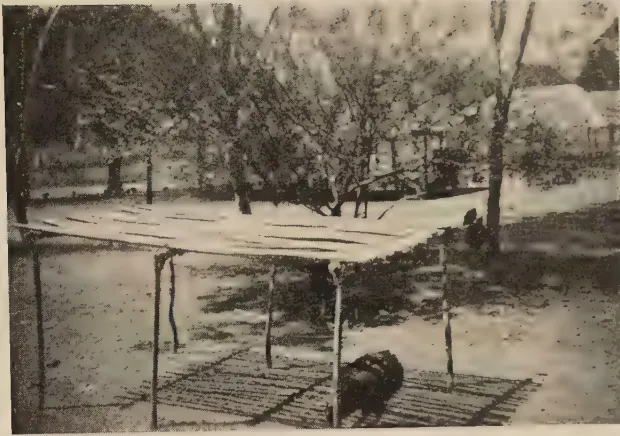
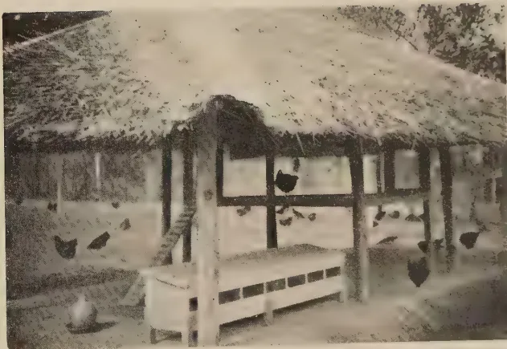

The  
**Tropical Agriculturist**

---

---

VOL. XCV

PERADENIYA, SEPTEMBER, 1940.

No. 3

---

---

<table><thead><tr><th></th><th style="text-align: right;">Page</th></tr></thead><tbody><tr><td>Editorial .. .. .</td><td style="text-align: right;">129</td></tr></tbody></table>

**ORIGINAL ARTICLES**

<table><tbody><tr><td>Recent Research in Ceylon on the Frog-eye Disease of Cigarette Tobacco. By M. Park, A.R.C.S., and M. Fernando, Ph.D. (Lond.) ..</td><td style="text-align: right; vertical-align: bottom;">131</td></tr><tr><td>The Analysis of Ceylon Foodstuffs VIII. A. Further Investigations on the Vitamin C Contents of Local Fruits, Fruit Products, and Vegetables. B. The Composition of Red and White-testaed Rices. By A. W. R. Joachim, Ph.D. (Lond.), Dip. Agric. (Cantab.), F.I.C., and D. G. Pandittesekera, Dip. Agric. (Poona) .. ..</td><td style="text-align: right; vertical-align: bottom;">136</td></tr><tr><td>The Relation between Grain and Straw Weight in the Paddy Crop. By J. C. Haigh, Ph.D. (Lond.) .. .. .</td><td style="text-align: right; vertical-align: bottom;">142</td></tr></tbody></table>

**DEPARTMENTAL AND OTHER NOTES**

<table><tbody><tr><td>The Matale Vegetable Show .. .. .</td><td style="text-align: right;">147</td></tr><tr><td>Vegetable Variety Trials at Matale, Tabbowa, and Karadiyanaru, 1937-40 .. .. .</td><td style="text-align: right;">149</td></tr><tr><td>Poultry Notes .. .. .</td><td style="text-align: right;">165</td></tr></tbody></table>

**SELECTED ARTICLES**

<table><tbody><tr><td>Roads and their Relationship to Soil Conservation .. ..</td><td style="text-align: right;">169</td></tr><tr><td>Factors influencing the Fertilization of Eggs .. ..</td><td style="text-align: right;">177</td></tr><tr><td>The Tung Oil Industry of the United States .. ..</td><td style="text-align: right;">180</td></tr></tbody></table>

**MEETINGS, CONFERENCES, &c.**

<table><tbody><tr><td>Minutes of the Fifty-second Meeting of the Rubber Research Board ..</td><td style="text-align: right;">192</td></tr></tbody></table>

**CORRESPONDENCE**

<table><tbody><tr><td>The Phosphate Content of Local Iron Slags .. ..</td><td style="text-align: right;">196</td></tr></tbody></table>

**REVIEW**

<table><tbody><tr><td>The Breeding of Herbage Plants in Scandinavia and Finland ..</td><td style="text-align: right;">198</td></tr></tbody></table>

**RETURNS, &c.**

<table><tbody><tr><td>Animal Disease Return for the Month ended August, 1940 ..</td><td style="text-align: right;">200</td></tr><tr><td>Meteorological Report for the Month ended August, 1940 ..</td><td style="text-align: right;">201</td></tr></tbody></table>

1—J. N. 97402 (8/40)

1------------------------------------------------

<!-- stage4: FAINT old-images-only -->

[Faint page: no legible print of its own could be verified; text withheld (stage 4 review list)]

2------------------------------------------------

The  
Tropical Agriculturist

SEPTEMBER, 1940

---

EDITORIAL

---

ROTATION OF PADDY WITH OTHER CROPS

---

IN those countries in which large yields of grain are recorded, paddy hardly ever follows paddy on the same land, even when it is cropped only once a year : the soil would not be able to bear the exhaustion produced by such a practice, while the insect pests and weeds which are peculiar to paddy would have the most favourable conditions of survival. In the Milanese region of Italy, for example, paddy finds a place only three times in an eight-year rotation while in countries like Java in which, with an adequate water supply, land can be under crops all the year round one or two secondary crops are raised between the annual paddy seasons. In Ceylon with the exception of comparatively small areas in which the local conditions are favourable to a seasonal rotation, paddy follows paddy even when the land is cropped twice in the year. This practice probably contributes not a little to the reputed low yields of our fields, and the reasons for the failure of the Ceylonese to adopt an agricultural method which is recognized to be sound throughout the world merit examination.

A combination of certain physical and economic factors determines the extent to which secondary crops are raised in rotation with paddy. Heavy, impermeable soils are unsuitable for secondary crops because, with their quick transition from sticky mud to concrete-hard dry clay, it is impossible to produce by tillage that soil structure which is essential to these crops. The weather plays a very important part in the problem. Most secondary crops do not tolerate water-logged conditions, and in most paddy lands an appreciable volume of rainfall creates these conditions. Economically, opportunities for marketing produce with special reference to price and transport facilities are essential. All these factors, except perhaps the condition of transport, are most unfavourable in the wet zone of Ceylon, while in the dry zone inadequate water in the dry season and bad drainage in the wet season make secondary crops impracticable, and low prices discourage enterprise even when in an exceptional case physical factors are satisfactory.

3------------------------------------------------

130

The conditions in the wet zone cannot be controlled by man on any substantial scale and, in the main, paddy must continue to remain the sole crop in lands which have sufficient water for that plant. On the other hand the conditions in the dry zone are changing rapidly : facilities for assured irrigation in two seasons are being extended ; concentration of population under these irrigation works is taking place ; transport facilities are improving daily ; subsistence farming which made the raising of grain for food the first consideration is gradually giving place to a money economy ; and the Agricultural Products (Regulation) Ordinance has assured to the farmer a remunerative price for a number of subsidiary crops. In these circumstances there is no reason why there should not be a rapid expansion of rotational cultivation on paddy lands in the dry zone.

It is the duty of the Department of Agriculture not only to stimulate the interest of farmers in this agricultural practice, but also to give them authoritative advice with regard to suitable rotations. Unfortunately the Department itself has no knowledge or experience of the subject which cannot be governed by universally applicable rules, but must be treated with special reference to local conditions. The Department realized its own weakness sometime ago, and, after a few un-co-ordinated trials which were interesting but did not yield very useful results, a departmental Committee was set up to investigate the whole problem. The Committee has planned a comprehensive scheme of trials throughout the country to be carried out during the next north-east season, and it expects to be in a position to give at least provisional advice in a year's time.

4------------------------------------------------

131

## RECENT RESEARCH IN CEYLON ON THE FROG-EYE DISEASE OF CIGARETTE TOBACCO

MALCOLM PARK, A.R.C.S.,  
 ACTING DEPUTY DIRECTOR OF AGRICULTURE,  
 AND  
 M. FERNANDO, Ph.D.,  
 ASSISTANT BOTANIST

**F**ROG-EYE (*Cercospora nicotianæ* E. and E.) is a relatively unimportant disease in most tobacco-growing countries. In Ceylon, however, the disease causes considerable damage in areas under cigarette tobacco. Experiments on frog-eye control were carried out at the departmental tobacco stations at Wariyapola and Ganewatta during the period 1936-39; the results obtained in these experiments are reviewed in the present communication. The soil at both stations is light, sandy, non-lateritic and deficient in organic matter. At these stations, the tobacco crop has been the component of a rotation which consisted of tobacco or a cereal, such as maize, grown during the *maha* season (September-October to March), and of a green manure crop like sunn hemp, grown and ploughed in during *yala* (March-April to June-July). Tobacco was therefore grown on the same areas during the *maha* seasons of alternate years. The variety of cigarette tobacco grown was Harrison's Special.

The earliest experiments (Park and Fernando, 1937*a*) aimed at estimating the value, in frog-eye control, of the commonly adopted aseptic and antiseptic precautions. These experiments showed that it was possible to prevent completely the occurrence of frog-eye in the nursery by efficient burning of the nursery soil and by the selection of clean seed. The seed should be derived from capsules free from frog-eye lesions and should be rid as completely as possible of capsule débris. If these aseptic precautions are scrupulously adhered to, seed-disinfection with a 0.1 per cent. solution of silver nitrate and spraying of nurseries with colloidal copper (one oz. per gallon) can be dispensed with. Weekly spraying of nurseries with colloidal copper (one oz. per gallon) is, however, justified by the almost complete protection that it provides against damping-off (*Pythium* sp.)

5------------------------------------------------

132

Seedlings derived from clean seed and grown on well-burnt nursery soil may, if undisturbed, remain free from frog-eye almost indefinitely, but develop numerous frog-eye lesions within two weeks of transplanting into the field. Evidence accumulated by the writers suggests that the soil of the tobacco field constitutes the most important source of *initial* infection of transplanted seedlings, and that air-borne infection does not occur over considerable distances. The fungus evidently perennates in the soil during the period of 18 months which intervenes between successive tobacco crops, presumably in the form of conidia.

The protection of transplanted seedlings that nursery spraying with colloidal copper provides, is of rather limited duration. Leaves which appear subsequent to transplanting, have no fungicidal cover and succumb to the disease. Consequently it was felt that the possibility of direct control of frog-eye in the field might be profitably explored. Experiments set down at Wariapola in 1936-37 season aimed at determining whether a single spraying of the tobacco crop in the field would provide satisfactory control of frog-eye, and at establishing within wide limits the optimum time of spray application. Preliminary tests indicated the suitability of colloidal copper (one oz. per gallon) for field spraying; the phytocidal damage was commercially negligible and there was no obvious spray deposit. In the experiments under discussion, the interval between transplanting and the harvest was 102 days, and different sets of plots were sprayed 55 days, 74 days and 99 days respectively after transplanting. The first and final sprayings proved ineffective and it was concluded that the former was too early and the latter too late to have exercised any marked control. On the other hand, the second spraying, which was done at about the time of topping, gave excellent results as judged by the number of frog-eye lesions present before harvesting, by the weight of flue-cured tobacco harvested and by the density of barn-spot on the cured leaf (Park and Fernando, 1937*b*). From these results it was clear that, in field spraying against frog-eye, the time of spray application was a factor of major importance.

In the 1937-38 season, experiments were set down at Gane-watta for the purpose of determining, within finer limits, the optimum time of spraying. The behaviour of lower concentrations of colloidal copper *viz.*,  $\frac{1}{2}$  oz. and  $\frac{1}{4}$  oz. per gallon, and of cheap, home-made copper emulsions, was also investigated with a view to determining whether spray costs could be reduced without sacrifice in efficiency (Park and Fernando, 1938*a*). The spraying times tested in these experiments were selected empirically on the results obtained in the previous year. An

6------------------------------------------------

133

intensive study of the course of frog-eye infection in the field was undertaken with a view to establishing the theoretical basis of the choice of the optimum spraying time. Two factors are of obvious importance in determining the suitability of any particular time for spraying, *viz.*, the rate of expansion of leaf surface and the drift of frog-eye infection. Spraying during a period of rapid extension of leaf surface is of little value as new unprotected tissue is being continually exposed to infection. The curve representing the increase in surface area of the leaves of a tobacco plant with time would be sigmoid, and spraying should, if other considerations permitted it, be delayed till the curve begins to flatten out. The rate of leaf expansion declines rapidly after the appearance of flower buds. Plants are topped soon after they flower, and accordingly the percentage of topped plants in the field provides an estimate of the proportion of plants which have attained maximum extension of leaf surface. Protective spraying would, however, be comparatively valueless if considerable penetration by the pathogen had already occurred, and should be undertaken while the infection level is still low. In this connexion, an examination of the progress of infection in the field would be of some interest. Even when perfectly clean seedlings are set out in the field, frog-eye lesions may be observed on practically every plant within 6-8 weeks of transplanting. While the plants are still young and in the rosette stage, it is not uncommon to find lesions on all the leaves. The situation, however, changes once the stem begins to elongate. The upper leaves of plants with definite stem development remain clean for a considerable period, infection being limited to the lower and maturer leaves. At about harvest time large numbers of lesions appear with spectacular suddenness on these upper leaves, consequent probably on changes occurring in the leaves as they mature. One hundred and two days after transplanting, the numbers of lesions on most of the leaves were negligibly low; on the hundred and sixth day—only four days later—the average number of lesions on a leaf was over a hundred. In these experiments the incubation period of a frog-eye lesion was estimated at 7-11 days. It is evident that, to ensure a satisfactory low volume of infection, spraying should have been done before the ninety-first day. At the optimum time, the crop would possess the maximum leaf area compatible with a minimum infection level. At Ganewatta, these conditions were satisfied at the stage when 61 per cent. of the plants had been topped. Significantly poorer control was obtained with spray applications made a week before or a week after this optimum, when 35 per cent. and 91 per cent. respectively of the plants had been topped. The position of the zone of effectively-protected leaves on a sprayed tobacco plant was determined by the time of

7------------------------------------------------

134

fungicide application, the earliest sprayings providing protection only for the lowermost leaves and the zone of protection advancing progressively up the stem with subsequent sprayings. It is likely that a wider range of protection would be secured by a set of two judiciously-spaced sprayings than by a single spraying at the optimum time of fungicide application.

The two copper emulsions though possessing the same copper content, were significantly less efficient than the colloidal copper solution (one oz. per gallon). The fungicidal efficiency of colloidal copper decreased *pari passu* with dilution.

The economic aspects of field spraying were investigated in a large scale trial at Wariyapola during the 1937-38 tobacco season. An area of over  $\frac{2}{3}$  acre was sprayed, three months after transplanting, with colloidal copper (one oz. per gallon). The increases in yield of total cured leaf and of grade I cured leaf were 169 and 139lb. per acre, respectively. Even with exaggerated estimates of costs of labour and fungicides, and of depreciation on spray apparatus, the nett profit from spraying on the grade I leaf alone amounted to over Rs. 100 per acre (Park and Fernando, 1938b).

The consumption of large quantities of water is one of the undesirable features of spraying; about 215 gallons of water are needed for spraying an acre of cigarette tobacco. It was felt that dusting, if effective in frog-eye control, would prove a more attractive method of fungicide application, especially in the tobacco-growing areas of the dry zone. Besides the elimination of water, advantageous features of dusting include the greater ease and speed of application and the consequently lower labour costs, and the comparative cheapness of dusting outfits. Dusts are, however, less effective than sprays on account of the larger size and the poorer adhesion of the fungicidal particles. Besides, satisfactory direction of a dust cloud is possible only in relatively still air or by the use of screens.

In experiments which were set down at Ganewatta during the 1938-39 tobacco season (Park, Paul and Fernando, 1940) the performance of a copper-lime dust was compared with that of the colloidal copper spray. Although the yield of cured leaf from the dusted plots was considerably less than that from sprayed plots, dusting produced a large and significant increase in yield over the control and should be considered a promising substitute for spraying.

Most tobacco pathologists—Butler in Nyasaland, Hopkins in Southern Rhodesia, Mandelson in Queensland and Tisdale in Florida—have advocated the use of priming as a measure of frog-eye control. Hill in Queensland, however, believes that

8------------------------------------------------

135

the practice is of questionable value in checking frog-eye. The efficacy of priming in frog-eye control was investigated in an experiment set down at Ganewatta during the *maha* season, 1938-39. There is little doubt that, under Ceylon conditions, high priming lessens the severity of the disease. The fact that it has been possible to demonstrate the depressant effect of priming on the occurrence of frog-eye, in a trial in which primed and unprimed plots of limited size were set down close together, is of considerable interest. If wind-borne infection conditioned the incidence of frog-eye to the extent that tobacco pathologists have hitherto considered it did, this demonstration would not have been possible. Park and Fernando (1937*a*) had previously suggested that the main source of initial frog eye infection of newly-planted tobacco was the conidial inoculum left over in the soil by the preceding crop, and that too much emphasis had been placed in the past on the importance of wind-borne infection. Wind velocities of considerable magnitude are often necessary for separating conidia from the parent mycelium; a velocity of 300-500 metres per second is necessary for detaching conidia of *Venturia* species. Conidia are, however, easily detached by rain. This fact probably contributes to the severity of frog-eye in wet weather.

#### LITERATURE

<table border="0">
<tbody>
<tr>
<td>Park, M. and Fernando, M.</td>
<td>1937<i>a</i> ..</td>
<td>Some studies on tobacco diseases in Ceylon—I. <i>The Tropical Agriculturist</i> LXXXVIII., pp. 153-168.</td>
</tr>
<tr>
<td></td>
<td>1937<i>b</i> ..</td>
<td>Some studies on tobacco diseases in Ceylon—II. <i>ibid</i> LXXXVIII., pp. 266-282.</td>
</tr>
<tr>
<td></td>
<td>1938<i>a</i> ..</td>
<td>Some studies on tobacco diseases in Ceylon—III. <i>ibid</i> XC., pp. 323-340.</td>
</tr>
<tr>
<td></td>
<td>1938<i>b</i> ..</td>
<td>Some studies on tobacco diseases in Ceylon—IV. <i>ibid</i> XC., pp. 341-347.</td>
</tr>
<tr>
<td>Paul, W. R. C., and Fernando, M.</td>
<td>1938 ..</td>
<td>Some studies on tobacco diseases in Ceylon—V. <i>ibid</i> XCI., pp. 338-344.</td>
</tr>
<tr>
<td>Park, M., Paul, W. R. C., and Fernando, M.</td>
<td>1940 ..</td>
<td>Some studies on tobacco diseases in Ceylon—VI. <i>ibid</i> XCV., pp. 8-15.</td>
</tr>
</tbody>
</table>

9------------------------------------------------

136

## THE ANALYSIS OF CEYLON FOODSTUFFS

VIII.—A. FURTHER INVESTIGATIONS ON THE VITAMIN C  
CONTENTS OF LOCAL FRUITS, FRUIT PRODUCTS,  
AND VEGETABLES

B. THE COMPOSITION OF RED AND WHITE-TESTAED  
RICES

A. W. R. JOACHIM, Ph.D. (Lond.), Dip. Agric. (Cantab.), F.I.C.

CHEMIST.

AND

D. G. PANDITTESEKERE, Dip. Agric. (Poona),

ASSISTANT IN AGRICULTURAL CHEMISTRY.

### PART I.

Vitamin C in Local Fruits, Fruits Products, and Vegetables

IN paper IV. of the series on the analysis of Ceylon food-stuffs published in *The Tropical Agriculturist* of January, 1938 (1), data on the vitamin C (ascorbic acid) contents of some local fruits were presented and discussed. The method adopted for the determination of vitamin C was essentially that of Bessey and King (2) in which an extract of the material in acetic or trichloracetic acid was directly titrated against a solution of the indicator dichlorophenol indophenol. It was discovered, however, by Kertesz and others (3) that certain fruits and vegetables contained enzymes which rapidly oxidised and inactivated vitamin C, even in the presence of acetic and trichloracetic acid. The difficulty was overcome by Thornton (4) by the use of a mixture of equal parts of 1 to 3 normal sulphuric acid and 0.25 normal metaphosphoric acid as the extracting medium. The latter acid is inert towards the indicator and has marked protective properties. It was subsequently observed by Bessey (5) that sulphuric acid reacted with the dye and it was, therefore, excluded from the extracting medium. In the present investigation a 3 per cent. solution of metaphosphoric acid was used as the extractant. The pH of the extract so obtained was always below 3. Thereby, according to the last-mentioned authority, the effects of tannins and allied substances on the dye, which Gatti and Knallinsky (10) found otherwise to be very marked, were eliminated. In

10------------------------------------------------

137

other respects Thornton's technique was followed. It was noted, however, by the writers that fruit juices and cordials prepared with metabisulphite invariably gave higher figures for vitamin C than could be accounted for from the vitamin contents of the original fruits. On investigation it was found that the sulphur dioxide liberated by the action of metaphosphoric acid on the metabisulphite reacted with the dye. Hence the abnormal results obtained. In order to correct for this source of error, a deduction was made from the dye titration value equivalent to the quantity of sulphur dioxide (determined by trial) in the fruit juice or cordial. Further investigations are being conducted on the estimation of ascorbic acid by the indophenol method in plant extracts containing tannin substances and sulphur dioxide.

In this series of determinations, 52 different samples of fruit, fruit products, and vegetables were examined. These consisted of fruit and vegetable varieties and products not previously investigated, or which, in the earlier series of determinations, had given low vitamin C values. In table I. the results of only 30 of these samples are shown. The others gave figures not materially different from those obtained before. Among these were samples of woodapple, mangosteen, coconut kernel and water, and fermented toddy.

TABLE I

Vitamin C (Ascorbic acid) Contents of Fruits, Vegetables, and Fruit Products

<table border="1">
<thead>
<tr>
<th colspan="2">Fruits</th>
<th rowspan="2">Mgm. per 100 gm. or 100 cc.</th>
</tr>
<tr>
<th>Name</th>
<th></th>
</tr>
</thead>
<tbody>
<tr>
<td>1.</td>
<td>Nelli S., Indian gooseberry, <i>Phyllanthus emblica</i></td>
<td>.. 468-479</td>
</tr>
<tr>
<td>2.</td>
<td>Cashew apple, <i>Anacardium occidentale</i></td>
<td>.. 320-350</td>
</tr>
<tr>
<td>3.</td>
<td>Plantain, <i>Embul hondarawala, S.</i></td>
<td>.. 11.8</td>
</tr>
<tr>
<td>4.</td>
<td>" <i>Kolikuttu, S.</i></td>
<td>.. 7.5</td>
</tr>
<tr>
<td>5.</td>
<td>" <i>Suwandel, S.</i></td>
<td>.. 8.5</td>
</tr>
<tr>
<td>6.</td>
<td>Passion fruit, purple (flesh and seed)</td>
<td>.. 13.9</td>
</tr>
<tr>
<td>7.</td>
<td>" " " (juice)</td>
<td>.. 19.5</td>
</tr>
<tr>
<td>8.</td>
<td>" " yellow (flesh and seed)</td>
<td>.. 8.9-13.3</td>
</tr>
<tr>
<td>9.</td>
<td>" " " (juice)</td>
<td>.. 12.5-17.6</td>
</tr>
<tr>
<td>10.</td>
<td>Pomegranate (flesh and seed)</td>
<td>.. 4.3</td>
</tr>
<tr>
<td>11.</td>
<td>Bael ..</td>
<td>.. 5.6-8.6</td>
</tr>
<tr>
<td>12.</td>
<td>Lime (juice) ..</td>
<td>.. 49.4</td>
</tr>
<tr>
<td>13.</td>
<td>Pineapple ..</td>
<td>.. 20.2</td>
</tr>
<tr>
<td>*14.</td>
<td>Mulberry (partially ripe) ..</td>
<td>.. 3.6</td>
</tr>
<tr>
<td>15.</td>
<td>Avocado pear ..</td>
<td>.. 3.0</td>
</tr>
<tr>
<td>16.</td>
<td>Apple (imported, locally sold)</td>
<td>.. 0.6-2.0</td>
</tr>
<tr>
<td>17.</td>
<td>" peel " ..</td>
<td>.. 3.9</td>
</tr>
<tr>
<td>18.</td>
<td>Grapes ..</td>
<td>.. 0.6-0.8</td>
</tr>
</tbody>
</table>

\* Determined by the iodine method

11------------------------------------------------

138

<table border="1">
<thead>
<tr>
<th colspan="3"></th>
<th>Mgm. per 100 gm. or 100 cc.</th>
</tr>
</thead>
<tbody>
<tr>
<td colspan="4" style="text-align: center;"><b>Fruit Products</b></td>
</tr>
<tr>
<td>19.</td>
<td>Passion fruit cordial</td>
<td>(local) ..</td>
<td>6.8</td>
</tr>
<tr>
<td>20.</td>
<td>" " "</td>
<td>(imported) ..</td>
<td>6.0</td>
</tr>
<tr>
<td>21.</td>
<td>Lime juice cordial</td>
<td>(local) ..</td>
<td>9.0</td>
</tr>
<tr>
<td>22.</td>
<td>" " "</td>
<td>(imported) ..</td>
<td>9.5</td>
</tr>
<tr>
<td>23.</td>
<td>Tomato cocktail</td>
<td>(local) ..</td>
<td>12.3</td>
</tr>
<tr>
<td>24.</td>
<td><i>Pinnadu</i>, T, dried palmyrah pulp</td>
<td>..</td>
<td>1.4</td>
</tr>
<tr>
<td>25.</td>
<td>Bees' honey</td>
<td>..</td>
<td>2.5-4.8</td>
</tr>
<tr>
<td colspan="4" style="text-align: center;"><b>Vegetables</b></td>
</tr>
<tr>
<td>26.</td>
<td>Drumstick leaves, <i>Moringa oleifera</i></td>
<td>..</td>
<td>236-240</td>
</tr>
<tr>
<td>27.</td>
<td>Chillies, green large</td>
<td>..</td>
<td>98.4</td>
</tr>
<tr>
<td>28.</td>
<td>" " small</td>
<td>..</td>
<td>22.3</td>
</tr>
<tr>
<td>*29.</td>
<td>" dry</td>
<td>..</td>
<td>35.0</td>
</tr>
<tr>
<td>30.</td>
<td><i>Gotukola</i> S., <i>Centella asiatica</i></td>
<td>..</td>
<td>13.8</td>
</tr>
</tbody>
</table>

It will be noted from table I. that the *nelli* (S.) fruit (Indian gooseberry) has an extraordinarily high vitamin C content; the cashew apple or pedicel is also a very rich source of this vitamin. Work in the Dutch East Indies (6), India (7), and Ceylon (8) has confirmed these findings. These fruits have vitamin values over 3 to 4 times those of lemons, oranges and other citrus varieties and about twice as much as that of the guava. They can, therefore, be considered the richest known sources of vitamin C. The earlier analyses had shown that the vitamin C contents of plantains were low, *viz.* 1.3 to 2 mgm. per cent. The present figures, which vary from 7.5-11.8 mgm. per cent. depending on variety, indicate that the plantain is a relatively fair source of the vitamin. The previous low values were no doubt due to the oxidation of the vitamin by the oxidases of the fruit. Appreciably higher figures than before have also been obtained in the case of the lime, pineapple, bael and avocado pear. In the case of the bael and avocado, however, even the enhanced values indicate that these fruits are relatively poor sources of the vitamin. The passion fruit has fair amounts of vitamin C. The purple variety appears to be slightly superior to the yellow variety in antiscorbutic value. For purposes of comparison, the vitamin C contents of samples of apples and grapes purchased locally were determined. Except in the case of a few varieties of apples, both this fruit and the grape are poor sources of the vitamin (4, 9). The present analyses indicate that apples and grapes purchased locally have even lower vitamin C values than samples in their country of origin are reported to contain. This is doubtless due to losses occurring in storage. It is interesting to confirm that apple peel has, relatively, a much higher vitamin C value than the flesh (9).

The examination of local and imported fruit products shows that an appreciable amount of vitamin C is lost in the process of preservation. Thus lime juice cordial has a vitamin C

\* Determined by the iodine method

12------------------------------------------------

139

content of about 9 mgm. per cent. compared with a minimum of about 30 mgm. per cent. in the fresh fruit. The losses appear to be less marked with preserved passion fruit. A sample of dried palmyrah pulp (*pinnadu*, T) showed a very low vitamin C content. The sun-drying has certainly been responsible for some loss of the vitamin. Bees' honey is a relatively poor source of vitamin C.

Of the vegetable samples examined, drumstick (*Moringa oleifera*) leaves call for special comment. Previously a very low figure was obtained for the vitamin C content of this vegetable, doubtless owing to the inability of the extracting medium to prevent the oxidation of the vitamin by the enzymes in the leaves. The value now found is 236 mgm. per cent. indicating that drumstick leaves are a very rich source of the vitamin. The Indian workers (7) confirm our present findings. *Centella asiatica*, *Gotukola S.*, has also given a much higher vitamin C value than previously.

#### SUMMARY

Further determinations of vitamin C on fruit and vegetable varieties not previously examined or which had given low results in the earlier tests, have indicated that the Indian gooseberry, *nelli S.* and cashew apple are the richest known sources of vitamin C. Plantains are now found to contain fair amounts of the vitamin. The previous low figures were due to the oxidation of the vitamin by the enzymes of the fruit during the process of extraction. The use of metaphosphoric acid as the extracting medium prevents this oxidation and the effects of tannins on the dye. Passion fruit has a fairly high vitamin C content. Samples of imported grapes and apples are poor sources of the vitamin and so are avocado pear, mangosteen, woodapple, bael, pomegranate, and bees' honey. Losses of vitamin occur in the process of fruit juice preservation and in the sun-drying of fruit. The present investigation confirms the findings of the Indian workers (7) that drumstick (*murunga*, S.) leaves are very rich in vitamin C. The low value found previously in a local sample is due, as explained, to the oxidation of the vitamin.

#### REFERENCES

1. 1. Joachim, A. W. R., and Charavanapavan, C.—The analysis of Ceylon foodstuffs. IV. The vitamin C contents of some Ceylon fruits and vegetables. *The Tropical Agriculturist*, Vol. XC., No. 1, 1938.
2. 2. Bessey, O. A., and King, C. G.—The distribution of vitamin C in plant and animal tissues and its determination. *Jour. Biol. Chem.* Vol. 103, December, 1933.
3. 3. Kertesz, Z. I., *et al.* Vitamin C in vegetables IV. Ascorbic acid oxidase. *Jour. Biol. Chem.* Vol. 116, December, 1936.
4. 4. Thornton, N. C.—Extraction and determination of vitamin C in plant tissues.—*Analyst*, Vol. 63, No. 752, p 837.
5. 5. Bessey, O. A.—Vitamin C methods of assay and dietary sources. *The Vitamins*. American Medical Assn. 1939.

13------------------------------------------------

140

6. Spruyt, J. P.—Vitamin C. content of East Indian fruits.—*Nutrition Abstracts and Reviews*, Vol. 9, No. 1.

7. ————The nutritive value of Indian foods and the planning of satisfactory diets. *Indian Health Bull.* No. 23, 1938.

8. Nicholls, L.—Private communication.

9. Daniel, E. P., and Munsel, H. E.—Vitamin contents of foods. *U. S. Dept. Agric. Mis. Publ.* No. 275.

10. Gatti, C., and Knallinsky, A.—Tillmann reaction for vitamin C in plant extracts. *Analyst*, Vol. 65, No. 771, June, 1940.

PART IITHE COMPOSITION OF RED AND WHITE-TESTAED RICES.

At the request of the Paddy Officer, analyses of samples of white- and red-testaed rices supplied by him were carried out in order to determine whether there were any marked differences in composition between them. Two lots of samples were examined. The first consisted of 10 samples of raw rices pounded by the village method, but polished to varying degrees; the second of 7 samples of raw rices pounded by the village method. Moisture, ash, protein, phosphorous and, in some cases, calcium were determined on the samples. The results of the two sets are shown separately in tables II. and III., while in table IV. the averages of all comparable samples are presented.

TABLE II

<table border="1">
<thead>
<tr>
<th>Variety.</th>
<th>Colour of testa.</th>
<th>Quality</th>
<th>Moisture. Per cent.</th>
<th>Ash. Per cent.</th>
<th>Protein. Per cent.</th>
<th>Phos- phorus. Per cent.</th>
<th>Calcium. Per cent.</th>
</tr>
</thead>
<tbody>
<tr>
<td>I. 17</td>
<td rowspan="3">Red</td>
<td>Unpolished</td>
<td>.. 10.66..</td>
<td>1.56..</td>
<td>8.82..</td>
<td>.377..</td>
<td>.042</td>
</tr>
<tr>
<td>I. 17</td>
<td>Partly polished</td>
<td>.. 10.15..</td>
<td>.87..</td>
<td>7.89..</td>
<td>.193..</td>
<td>.016</td>
</tr>
<tr>
<td>I. 17</td>
<td>Well polished</td>
<td>.. 10.92..</td>
<td>.83..</td>
<td>7.47..</td>
<td>.128..</td>
<td>.016</td>
</tr>
<tr>
<td>A. 8</td>
<td rowspan="3">White</td>
<td>Unpolished</td>
<td>.. 11.81..</td>
<td>1.34..</td>
<td>8.75..</td>
<td>.347..</td>
<td>.022</td>
</tr>
<tr>
<td>A. 8</td>
<td>Partly polished</td>
<td>.. 12.74..</td>
<td>.89..</td>
<td>8.63..</td>
<td>.251..</td>
<td>.017</td>
</tr>
<tr>
<td>A. 8</td>
<td>Well polished</td>
<td>.. 12.55..</td>
<td>.68..</td>
<td>8.48..</td>
<td>.154..</td>
<td>.016</td>
</tr>
<tr>
<td>B. 11</td>
<td>Red</td>
<td rowspan="3">Partly polished</td>
<td>.. 11.85..</td>
<td>.67..</td>
<td>8.03..</td>
<td>.157..</td>
<td>—</td>
</tr>
<tr>
<td>B. 13</td>
<td>White</td>
<td>.. 12.00..</td>
<td>.83..</td>
<td>8.26..</td>
<td>.264..</td>
<td>—</td>
</tr>
<tr>
<td>P. 9</td>
<td>White</td>
<td>.. 11.96..</td>
<td>.65..</td>
<td>8.08..</td>
<td>.193..</td>
<td>—</td>
</tr>
<tr>
<td>H.S. 30220</td>
<td>Red</td>
<td>..</td>
<td>.. 12.51..</td>
<td>.72..</td>
<td>6.78..</td>
<td>.156..</td>
<td>—</td>
</tr>
<tr>
<td>Average</td>
<td>Red</td>
<td>..</td>
<td>.. <b>11.50..</b></td>
<td>.. <b>.75..</b></td>
<td>.. <b>7.59..</b></td>
<td>.. <b>.169..</b></td>
<td>—</td>
</tr>
<tr>
<td>..</td>
<td>White</td>
<td>..</td>
<td>.. <b>12.23..</b></td>
<td>.. <b>.79..</b></td>
<td>.. <b>8.32..</b></td>
<td>.. <b>.236..</b></td>
<td>—</td>
</tr>
</tbody>
</table>

TABLE III

<table border="1">
<thead>
<tr>
<th>Variety.</th>
<th>Quality.</th>
<th>Colour of testa.</th>
<th>Moisture. Per cent.</th>
<th>Proteins. Per cent.</th>
<th>Ash. Per cent.</th>
<th>Phos- phorus. Per cent.</th>
<th>Calcium. Per cent.</th>
</tr>
</thead>
<tbody>
<tr>
<td>B 13</td>
<td>.. Raw rice, village polished</td>
<td>white</td>
<td>.. 10.18..</td>
<td>8.64..</td>
<td>1.22..</td>
<td>.246..</td>
<td>.0115</td>
</tr>
<tr>
<td>Kos-eta elwi (hill paddy)</td>
<td>..</td>
<td>..</td>
<td>.. 12.02..</td>
<td>8.31..</td>
<td>.95..</td>
<td>.180..</td>
<td>.0151</td>
</tr>
<tr>
<td>G 8 (Podiwi)</td>
<td>..</td>
<td>..</td>
<td>.. 11.68..</td>
<td>8.53..</td>
<td>1.39..</td>
<td>.304..</td>
<td>.0095</td>
</tr>
<tr>
<td>P 9 (Sudumawi)</td>
<td>..</td>
<td>..</td>
<td>.. 11.38..</td>
<td>7.98..</td>
<td>1.12..</td>
<td>.218..</td>
<td>.0122</td>
</tr>
<tr>
<td>Average of white testa rices</td>
<td>..</td>
<td>..</td>
<td>.. <b>11.29..</b></td>
<td>.. <b>8.37..</b></td>
<td>.. <b>1.17..</b></td>
<td>.. <b>.237..</b></td>
<td>.. <b>.0121</b></td>
</tr>
<tr>
<td>Chitrukai elwi (hill paddy)</td>
<td>..</td>
<td>Red</td>
<td>.. 11.69..</td>
<td>8.68..</td>
<td>.95..</td>
<td>.163..</td>
<td>.0102</td>
</tr>
<tr>
<td>B 11 (Mawi)</td>
<td>..</td>
<td>..</td>
<td>.. 12.44..</td>
<td>8.47..</td>
<td>.75..</td>
<td>.142..</td>
<td>.0162</td>
</tr>
<tr>
<td>I 17 (Sudumawi)</td>
<td>..</td>
<td>..</td>
<td>.. 12.11..</td>
<td>8.47..</td>
<td>1.16..</td>
<td>.252..</td>
<td>.0139</td>
</tr>
<tr>
<td>Average of red testa rices</td>
<td>..</td>
<td>..</td>
<td>.. <b>12.12..</b></td>
<td>.. <b>8.54..</b></td>
<td>.. <b>.95..</b></td>
<td>.. <b>.186..</b></td>
<td>.. <b>.0134</b></td>
</tr>
</tbody>
</table>

The data of table II. indicate that, as has been found previously (1), polishing the grain results in a loss of protein and, to a much greater degree, of the mineral constituents phosphorus and calcium. The losses, particularly of phosphorus, are greater, the greater the degree of polishing. The variation in composition between comparable samples of the same testa colour group are fairly appreciable. Thus the protein contents range in the red testa group from 6.78 to 8.03 per cent. and in the white testa group from 8.08 to 8.63 per cent.

14------------------------------------------------

141

Phosphorus varies similarly from 0·156 to 0·193 per cent. and from 0·193 to 0·264 per cent. in the red and white-testaed groups respectively. These observations are confirmed by the data of table III., particularly in respect of phosphorus and calcium. Both tables indicate that the average phosphorus content of the white-testaed samples is somewhat higher than that of the red rice samples.

TABLE IV

Average Composition of Samples of Red & White Village-pounded Rices.

<table border="1">
<thead>
<tr>
<th>Colour of testa.</th>
<th></th>
<th>Moisture. Per cent.</th>
<th>Protein. Per cent.</th>
<th>Ash. Per cent.</th>
<th>Phosphorus. Per cent.</th>
<th>Calcium. Per cent.</th>
</tr>
</thead>
<tbody>
<tr>
<td>Red</td>
<td>(6)</td>
<td>.. 11·79 ..</td>
<td>8·05 ..</td>
<td>0·85 ..</td>
<td>0·177 ..</td>
<td>0·012 (3)</td>
</tr>
<tr>
<td>White</td>
<td>(7)</td>
<td>.. 11·71 ..</td>
<td>8·35 ..</td>
<td>1·01 ..</td>
<td>0·237 ..</td>
<td>0·013 (4)</td>
</tr>
</tbody>
</table>

Figures in brackets indicate number of samples.

A statistical examination of the pooled data of both tables reveals that the average phosphorus content of the 7 white-testaed samples is just significantly higher than that of the 6 red-testaed rices. In regard to the protein data it will be noted that the average protein content of the partly-polished white rice samples listed in table II. is higher than that of the comparable red-testaed samples. No such differences obtain in table III. When the protein figures of tables II. and III. are considered together, no statistical difference in the average protein contents of comparable samples of white and red rices is observed. In regard to calcium, the figures of table III. indicate that the average calcium content of red rices does not significantly differ from that of white rices. As the number of samples examined is comparatively small, it would be unwise to emphasise any differences in composition observed particularly as there appears to be a popular belief locally and in India (2) that red rices are superior to white rices in nutritive value.

#### SUMMARY

Samples of white-testaed rices prepared by the local village method, do not, on the average, differ in composition from comparable red-testaed samples, except in respect of phosphorus, in which constituent they appear to be somewhat richer. In view of the comparatively small number of samples examined (13 altogether) and the appreciable variations in composition between samples of the same colour testa group, this observation cannot be regarded as conclusive. Confirmation is afforded of the marked losses, among others, of the mineral constituents phosphorus and calcium as a result of polishing rices (1).

#### REFERENCES

1. 1. Joachim, A. W. R., and Kandiah, S.—The chemical composition of some Ceylon paddies, rices and milling products. *The Tropical Agriculturist*, Vol. LXX., No. 5, 1927.
2. 2. Subramanyan, V., Sreenivasan, A. and Das Gupta, H. P.—Studies on quality in rice—I. *Ind. Jour. Agr. Sc.*, Vol. VIII., Pt. 10, Aug. 1938.

15------------------------------------------------

142

## THE RELATION BETWEEN GRAIN AND STRAW WEIGHT IN THE PADDY CROP

J. C. HAIGH, Ph.D.,  
BOTANIST

IT is generally believed that a paddy crop yields half as much again in straw as it does in grain. In a paper which appeared in this Journal in August, 1938 (Haigh, J. C.—Studies on Paddy Cultivation VIII. The Effect of Spacing and Method of Planting on Yield. *The Tropical Agriculturist*, XCI, No. 2, August 1938, p. 71), there are data which make it possible to calculate the relationship between grain and straw weight with some degree of accuracy. Tables II and VII in that paper give the yields of grain and straw from 144 plots during the *yala* 1936 season, and tables IV and IX give corresponding figures for the *maha* 1936–37 season.

Ignoring for the moment the fact that the plots had been treated in various ways, and the possibility that the relationship between grain and straw may have been affected by some of those treatments, and treating each season's figures as 144 pairs of records, we can determine the correlation between grain and straw weight. In table I the data are condensed into frequency arrays, and for convenience in working, the weights have been grouped to the nearest pound, the necessary correction ( $1/12$ ) being made in the determination of the second moment. The ratios between straw and grain weights are seen to be 1.57 in the *yala* season and 1.35 in the *maha* season. The longer period of growth during the *maha* season has resulted in an increased weight of straw, but an even greater weight of grain.

Tables II and III are correlation tables for the two seasons. The correlation coefficients are high and almost identical (+ 0.79 for *yala* and + 0.76 for *maha*), indicating a close and consistent relationship between the two variables.

The validity of the assumption that there has been no effect of treatment on the relationship between grain and straw weights can be tested by the determination of the covariance. The analyses of covariance for the two seasons are given in Table IV and from these analyses have been calculated the coefficients of correlation ( $r = \frac{\sum xy}{\sqrt{\sum x^2 \sum y^2}}$ ) for total effects and for treatment effects. These coefficients do not differ

16------------------------------------------------

143

significantly from one another, indicating that treatment has had no effect on the grain-straw relationship. The strength of this relationship is further shown by the high degree of significance of the regression between grain and straw weights, which in each case exceeds odds of 1,000 to 1.

From these data, therefore, we conclude: 1, that there is a strong relationship between the amounts of grain and straw produced in a paddy crop.

2. That the relative weights of straw and grain produced are about 4 : 3 in the *maha* season and 3 : 2 in the *yala*.

3. That the relationship has not been seriously affected by different spacings or by different types of soil.

TABLE I  
Yields of Grain and Straw in lb.

<table border="1">
<thead>
<tr>
<th rowspan="2">Class</th>
<th colspan="2">Yala 1936</th>
<th colspan="2">Maha 1936-37</th>
</tr>
<tr>
<th>Grain</th>
<th>Straw</th>
<th>Grain</th>
<th>Straw</th>
</tr>
</thead>
<tbody>
<tr><td>0.5-</td><td>.. 1.5 ..</td><td></td><td></td><td></td></tr>
<tr><td>1.5-</td><td>.. 4.0 ..</td><td>2.0</td><td></td><td></td></tr>
<tr><td>2.5-</td><td>.. 3.5 ..</td><td>3.0</td><td>4.0</td><td>0.5</td></tr>
<tr><td>3.5-</td><td>.. 12.5 ..</td><td>1.0</td><td>4.0</td><td>2.5</td></tr>
<tr><td>4.5-</td><td>.. 8.6 ..</td><td>4.0</td><td>10.0</td><td>—</td></tr>
<tr><td>5.5-</td><td>.. 10.5 ..</td><td>3.0</td><td>7.5</td><td>2.5</td></tr>
<tr><td>6.5-</td><td>.. 18.5 ..</td><td>6.0</td><td>13.0</td><td>6.5</td></tr>
<tr><td>7.5-</td><td>.. 23.0 ..</td><td>10.0</td><td>12.5</td><td>3.5</td></tr>
<tr><td>8.5-</td><td>.. 28.5 ..</td><td>7.0</td><td>15.5</td><td>9.0</td></tr>
<tr><td>9.5-</td><td>.. 8.5 ..</td><td>19.0</td><td>14.0</td><td>12.0</td></tr>
<tr><td>10.5-</td><td>.. 8.5 ..</td><td>10.0</td><td>17.0</td><td>10.5</td></tr>
<tr><td>11.5-</td><td>.. 4.5 ..</td><td>17.0</td><td>12.5</td><td>14.0</td></tr>
<tr><td>12.5-</td><td>.. 5.0 ..</td><td>6.0</td><td>12.5</td><td>13.0</td></tr>
<tr><td>13.5-</td><td>.. 5.0 ..</td><td>9.0</td><td>13.0</td><td>16.0</td></tr>
<tr><td>14.5-</td><td>.. 1.0 ..</td><td>15.0</td><td>5.0</td><td>15.0</td></tr>
<tr><td>15.5-</td><td>.. 1.0 ..</td><td>10.0</td><td>1.5</td><td>13.5</td></tr>
<tr><td>16.5-</td><td>..</td><td>1.0</td><td>1.5</td><td>6.5</td></tr>
<tr><td>17.5-</td><td>..</td><td>5.0</td><td>0.5</td><td>6.0</td></tr>
<tr><td>18.5-</td><td>..</td><td>1.0</td><td></td><td>5.0</td></tr>
<tr><td>19.5-</td><td>..</td><td>6.0</td><td></td><td>2.5</td></tr>
<tr><td>20.5-</td><td>..</td><td>1.0</td><td></td><td>4.0</td></tr>
<tr><td>21.5-</td><td>..</td><td>3.0</td><td></td><td>0.5</td></tr>
<tr><td>22.5-</td><td>..</td><td>1.0</td><td></td><td>0.5</td></tr>
<tr><td>23.5-</td><td>..</td><td>—</td><td></td><td>0.5</td></tr>
<tr><td>24.5-</td><td>..</td><td>2.0</td><td></td><td></td></tr>
<tr><td>25.5-</td><td>..</td><td>2.0</td><td></td><td></td></tr>
<tr><td></td><td></td><td>144</td><td>144</td><td>144</td></tr>
<tr><td>Means</td><td>Grain .. 7.94 ± 0.25 lb.</td><td></td><td>Grain — .. 9.78 ± 0.28 lb.</td><td></td></tr>
<tr><td></td><td>Straw .. 12.44 ± 0.41 lb.</td><td></td><td>Straw — .. 13.20 ± 0.32 lb.</td><td></td></tr>
<tr><td>D</td><td>Grain .. 2.97 ± 0.17 lb.</td><td></td><td>Grain — .. 3.33 ± 0.20 lb.</td><td></td></tr>
<tr><td></td><td>Straw .. 4.89 ± 0.29 lb.</td><td></td><td>Straw — .. 3.87 ± 0.23 lb.</td><td></td></tr>
</tbody>
</table>

Ratio of straw/grain = 1.57

Ratio of straw/grain = 1.35

17------------------------------------------------

144

TABLE IV  
Analysis of Covariance  
*Yala, 1936*

<table border="1">
<thead>
<tr>
<th></th>
<th>Degrees of Freedom</th>
<th><math>x^2</math></th>
<th><math>xy</math></th>
<th><math>y^2</math></th>
<th><math>r</math></th>
</tr>
</thead>
<tbody>
<tr>
<td>Blocks</td>
<td>.. 15 ..</td>
<td>395.40</td>
<td>1,110.44</td>
<td>1,004.77</td>
<td>..</td>
</tr>
<tr>
<td>Treatments</td>
<td>.. 23 ..</td>
<td>657.42</td>
<td>789.43</td>
<td>1,546.60</td>
<td>.. +0.78</td>
</tr>
<tr>
<td>Error</td>
<td>.. 105 ..</td>
<td>214.92</td>
<td>—235.47</td>
<td>898.06</td>
<td>..</td>
</tr>
<tr>
<td>Total</td>
<td>.. 143 ..</td>
<td>1,267.75</td>
<td>1,664.40</td>
<td>3,449.44</td>
<td>.. +0.80</td>
</tr>
</tbody>
</table>

<table border="1">
<thead>
<tr>
<th></th>
<th>D. F.</th>
<th>Sum of Squares</th>
<th>Mean Square</th>
<th>Loge SD</th>
</tr>
</thead>
<tbody>
<tr>
<td>Regression</td>
<td>.. 1 ..</td>
<td>258.1</td>
<td>258.1</td>
<td>2.7767</td>
</tr>
<tr>
<td>Deviations from regression</td>
<td>.. 104 ..</td>
<td>640.0</td>
<td>6.1</td>
<td>0.9041</td>
</tr>
<tr>
<td></td>
<td></td>
<td></td>
<td></td>
<td style="border-top: 1px solid black;"><math>z = 1.8726</math></td>
</tr>
</tbody>
</table>

For  $n_1 = 1$ ,  $n_2 = 120$ ,  $P = 0.001$ ,  $z = 1.2158$ .

Odds are 1,000 to 1 that the regression is significant.

*Maha, 1936-37*

<table border="1">
<thead>
<tr>
<th></th>
<th>Degrees of Freedom</th>
<th><math>x^2</math></th>
<th><math>xy</math></th>
<th><math>y^2</math></th>
<th><math>r</math></th>
</tr>
</thead>
<tbody>
<tr>
<td>Blocks</td>
<td>.. 15 ..</td>
<td>195.45</td>
<td>226.91</td>
<td>330.68</td>
<td>..</td>
</tr>
<tr>
<td>Treatments</td>
<td>.. 23 ..</td>
<td>1,022.52</td>
<td>933.81</td>
<td>1,199.10</td>
<td>.. +0.84</td>
</tr>
<tr>
<td>Error</td>
<td>.. 105 ..</td>
<td>323.51</td>
<td>253.53</td>
<td>602.47</td>
<td>..</td>
</tr>
<tr>
<td>Total</td>
<td>.. 143 ..</td>
<td>1,541.48</td>
<td>1,414.25</td>
<td>2,132.25</td>
<td>.. +0.78</td>
</tr>
</tbody>
</table>

<table border="1">
<thead>
<tr>
<th></th>
<th>D. F.</th>
<th>Sum of Squares</th>
<th>Mean Square</th>
<th>Loge SD</th>
</tr>
</thead>
<tbody>
<tr>
<td>Regressions</td>
<td>.. 1 ..</td>
<td>198.6</td>
<td>198.6</td>
<td>2.6457</td>
</tr>
<tr>
<td>Deviations from regression</td>
<td>.. 104 ..</td>
<td>403.9</td>
<td>3.883</td>
<td>0.6783</td>
</tr>
<tr>
<td></td>
<td></td>
<td></td>
<td></td>
<td style="border-top: 1px solid black;"><math>z = 1.9674</math></td>
</tr>
</tbody>
</table>

For  $n_1 = 1$ ,  $n_2 = 120$ ,  $P = 0.001$ ,  $z = 1.2158$ .

Odds are 1,000 to 1 that the regression is significant.

18------------------------------------------------

145

TABLE II  
 Yield of Straw and Grain, Yala 1936

$$r = \pm 0.79$$

Yield of Straw in Pounds.

<table border="1">
<thead>
<tr>
<th></th>
<th>1.5-</th>
<th>2.5-</th>
<th>3.5-</th>
<th>4.5-</th>
<th>5.5-</th>
<th>6.5-</th>
<th>7.5-</th>
<th>8.5-</th>
<th>9.5-</th>
<th>10.5-</th>
<th>11.5-</th>
<th>12.5-</th>
<th>13.5-</th>
<th>14.5-</th>
<th>15.5-</th>
<th>16.5-</th>
<th>17.5-</th>
<th>18.5-</th>
<th>19.5-</th>
<th>20.5-</th>
<th>21.5-</th>
<th>22.5-</th>
<th>23.5-</th>
<th>24.5-</th>
<th>25.5-</th>
<th>Total</th>
</tr>
</thead>
<tbody>
<tr>
<td>0.50-</td>
<td>1.0</td>
<td>0.5</td>
<td></td>
<td>0.5</td>
<td></td>
<td>1.0</td>
<td>1.0</td>
<td>1.0</td>
<td>2.0</td>
<td></td>
<td></td>
<td></td>
<td></td>
<td></td>
<td></td>
<td></td>
<td></td>
<td></td>
<td></td>
<td></td>
<td></td>
<td></td>
<td></td>
<td></td>
<td></td>
<td>1.5</td>
</tr>
<tr>
<td>1.50-</td>
<td>1.0</td>
<td>2.5</td>
<td></td>
<td>0.5</td>
<td></td>
<td>3.0</td>
<td>2.5</td>
<td>2.0</td>
<td></td>
<td></td>
<td></td>
<td></td>
<td></td>
<td></td>
<td></td>
<td></td>
<td></td>
<td></td>
<td></td>
<td></td>
<td></td>
<td></td>
<td></td>
<td></td>
<td></td>
<td>4.0</td>
</tr>
<tr>
<td>2.50-</td>
<td>1.0</td>
<td></td>
<td>1.0</td>
<td>2.0</td>
<td>2.0</td>
<td>2.0</td>
<td>3.5</td>
<td>2.0</td>
<td></td>
<td></td>
<td></td>
<td></td>
<td></td>
<td></td>
<td></td>
<td></td>
<td></td>
<td></td>
<td></td>
<td></td>
<td></td>
<td></td>
<td></td>
<td></td>
<td></td>
<td>8.5</td>
</tr>
<tr>
<td>3.50-</td>
<td></td>
<td></td>
<td></td>
<td></td>
<td></td>
<td></td>
<td>2.0</td>
<td>2.0</td>
<td>2.0</td>
<td>1.5</td>
<td>2.0</td>
<td>2.0</td>
<td>2.0</td>
<td>1.0</td>
<td>1.0</td>
<td></td>
<td></td>
<td></td>
<td></td>
<td></td>
<td></td>
<td></td>
<td></td>
<td></td>
<td></td>
<td>10.5</td>
</tr>
<tr>
<td>4.50-</td>
<td></td>
<td></td>
<td></td>
<td></td>
<td></td>
<td></td>
<td></td>
<td>2.0</td>
<td>4.5</td>
<td>4.5</td>
<td>1.0</td>
<td>1.0</td>
<td>2.0</td>
<td>1.0</td>
<td>1.0</td>
<td>1.0</td>
<td>1.0</td>
<td>1.0</td>
<td>1.0</td>
<td></td>
<td></td>
<td></td>
<td></td>
<td></td>
<td></td>
<td>18.5</td>
</tr>
<tr>
<td>5.50-</td>
<td></td>
<td></td>
<td></td>
<td></td>
<td></td>
<td></td>
<td></td>
<td>1.0</td>
<td>4.5</td>
<td>3.0</td>
<td>6.5</td>
<td>1.5</td>
<td>1.0</td>
<td>7.5</td>
<td>2.5</td>
<td></td>
<td></td>
<td></td>
<td></td>
<td></td>
<td></td>
<td></td>
<td></td>
<td></td>
<td></td>
<td>23.0</td>
</tr>
<tr>
<td>6.50-</td>
<td></td>
<td></td>
<td></td>
<td></td>
<td></td>
<td></td>
<td></td>
<td></td>
<td>6.5</td>
<td>3.0</td>
<td>2.5</td>
<td>0.5</td>
<td>1.0</td>
<td>1.0</td>
<td>0.5</td>
<td></td>
<td></td>
<td></td>
<td></td>
<td></td>
<td></td>
<td></td>
<td></td>
<td></td>
<td></td>
<td>28.5</td>
</tr>
<tr>
<td>7.50-</td>
<td></td>
<td></td>
<td></td>
<td></td>
<td></td>
<td></td>
<td></td>
<td></td>
<td></td>
<td>1.0</td>
<td>1.5</td>
<td>0.5</td>
<td>3.0</td>
<td>0.5</td>
<td>1.5</td>
<td></td>
<td></td>
<td></td>
<td></td>
<td></td>
<td></td>
<td></td>
<td></td>
<td></td>
<td></td>
<td>38.5</td>
</tr>
<tr>
<td>8.50-</td>
<td></td>
<td></td>
<td></td>
<td></td>
<td></td>
<td></td>
<td></td>
<td></td>
<td></td>
<td>1.0</td>
<td>1.5</td>
<td></td>
<td></td>
<td></td>
<td></td>
<td></td>
<td></td>
<td></td>
<td></td>
<td></td>
<td></td>
<td></td>
<td></td>
<td></td>
<td></td>
<td>48.5</td>
</tr>
<tr>
<td>9.50-</td>
<td></td>
<td></td>
<td></td>
<td></td>
<td></td>
<td></td>
<td></td>
<td></td>
<td></td>
<td></td>
<td></td>
<td></td>
<td></td>
<td></td>
<td></td>
<td></td>
<td></td>
<td></td>
<td></td>
<td></td>
<td></td>
<td></td>
<td></td>
<td></td>
<td></td>
<td>58.5</td>
</tr>
<tr>
<td>10.50-</td>
<td></td>
<td></td>
<td></td>
<td></td>
<td></td>
<td></td>
<td></td>
<td></td>
<td></td>
<td></td>
<td></td>
<td></td>
<td></td>
<td></td>
<td></td>
<td></td>
<td></td>
<td></td>
<td></td>
<td></td>
<td></td>
<td></td>
<td></td>
<td></td>
<td></td>
<td>68.5</td>
</tr>
<tr>
<td>11.50-</td>
<td></td>
<td></td>
<td></td>
<td></td>
<td></td>
<td></td>
<td></td>
<td></td>
<td></td>
<td></td>
<td></td>
<td></td>
<td></td>
<td></td>
<td></td>
<td></td>
<td></td>
<td></td>
<td></td>
<td></td>
<td></td>
<td></td>
<td></td>
<td></td>
<td></td>
<td>78.5</td>
</tr>
<tr>
<td>12.50-</td>
<td></td>
<td></td>
<td></td>
<td></td>
<td></td>
<td></td>
<td></td>
<td></td>
<td></td>
<td></td>
<td></td>
<td></td>
<td></td>
<td></td>
<td></td>
<td></td>
<td></td>
<td></td>
<td></td>
<td></td>
<td></td>
<td></td>
<td></td>
<td></td>
<td></td>
<td>88.5</td>
</tr>
<tr>
<td>13.50-</td>
<td></td>
<td></td>
<td></td>
<td></td>
<td></td>
<td></td>
<td></td>
<td></td>
<td></td>
<td></td>
<td></td>
<td></td>
<td></td>
<td></td>
<td></td>
<td></td>
<td></td>
<td></td>
<td></td>
<td></td>
<td></td>
<td></td>
<td></td>
<td></td>
<td></td>
<td>98.5</td>
</tr>
<tr>
<td>14.50-</td>
<td></td>
<td></td>
<td></td>
<td></td>
<td></td>
<td></td>
<td></td>
<td></td>
<td></td>
<td></td>
<td></td>
<td></td>
<td></td>
<td></td>
<td></td>
<td></td>
<td></td>
<td></td>
<td></td>
<td></td>
<td></td>
<td></td>
<td></td>
<td></td>
<td></td>
<td>108.5</td>
</tr>
<tr>
<td>15.50-</td>
<td></td>
<td></td>
<td></td>
<td></td>
<td></td>
<td></td>
<td></td>
<td></td>
<td></td>
<td></td>
<td></td>
<td></td>
<td></td>
<td></td>
<td></td>
<td></td>
<td></td>
<td></td>
<td></td>
<td></td>
<td></td>
<td></td>
<td></td>
<td></td>
<td></td>
<td>118.5</td>
</tr>
<tr>
<td>Total</td>
<td>2.0</td>
<td>3.0</td>
<td>1.0</td>
<td>4.0</td>
<td>3.0</td>
<td>6.0</td>
<td>10.0</td>
<td>7.0</td>
<td>19.0</td>
<td>10.0</td>
<td>17.0</td>
<td>6.0</td>
<td>9.0</td>
<td>15.0</td>
<td>10.0</td>
<td>1.0</td>
<td>5.0</td>
<td>1.0</td>
<td>6.0</td>
<td>1.0</td>
<td>3.0</td>
<td>1.0</td>
<td>—</td>
<td>2.0</td>
<td>144</td>
</tr>
</tbody>
</table>

Yield of grain in pounds.

19------------------------------------------------

146

TABLE III  
 Yield of Straw and Grain, *Maha* 1936-37

$$r = +0.76$$

Yield of Straw in Pounds

<table border="1">
<thead>
<tr>
<th></th>
<th>2.50-</th>
<th>3.50-</th>
<th>4.50-</th>
<th>5.50-</th>
<th>6.50-</th>
<th>7.50-</th>
<th>8.50-</th>
<th>9.50-</th>
<th>10.50-</th>
<th>11.50-</th>
<th>12.50-</th>
<th>13.50-</th>
<th>14.50-</th>
<th>15.50-</th>
<th>16.50-</th>
<th>17.50-</th>
<th>18.50-</th>
<th>19.50-</th>
<th>20.50-</th>
<th>21.50-</th>
<th>22.50-</th>
<th>23.50-</th>
<th>Total.</th>
</tr>
</thead>
<tbody>
<tr>
<td>2.50-</td>
<td>0.5</td>
<td>2.5</td>
<td></td>
<td></td>
<td></td>
<td></td>
<td></td>
<td></td>
<td></td>
<td></td>
<td></td>
<td></td>
<td></td>
<td></td>
<td></td>
<td></td>
<td></td>
<td></td>
<td></td>
<td></td>
<td></td>
<td></td>
<td>4.0</td>
</tr>
<tr>
<td>3.50-</td>
<td></td>
<td></td>
<td></td>
<td>1.0</td>
<td>2.0</td>
<td>0.5</td>
<td>0.5</td>
<td>1.0</td>
<td>0.5</td>
<td>1.0</td>
<td>2.0</td>
<td></td>
<td></td>
<td></td>
<td></td>
<td></td>
<td></td>
<td></td>
<td></td>
<td></td>
<td></td>
<td></td>
<td>4.0</td>
</tr>
<tr>
<td>4.50-</td>
<td></td>
<td></td>
<td></td>
<td>1.5</td>
<td>4.0</td>
<td>0.5</td>
<td>2.0</td>
<td>1.0</td>
<td>1.5</td>
<td>2.0</td>
<td>1.5</td>
<td>3.5</td>
<td></td>
<td></td>
<td></td>
<td></td>
<td></td>
<td></td>
<td></td>
<td></td>
<td></td>
<td></td>
<td>10.0</td>
</tr>
<tr>
<td>5.50-</td>
<td></td>
<td></td>
<td></td>
<td></td>
<td>0.5</td>
<td>2.0</td>
<td>1.0</td>
<td>2.0</td>
<td>1.5</td>
<td>1.5</td>
<td>2.0</td>
<td>1.0</td>
<td>1.0</td>
<td>0.5</td>
<td>0.5</td>
<td></td>
<td></td>
<td></td>
<td></td>
<td></td>
<td></td>
<td></td>
<td>7.5</td>
</tr>
<tr>
<td>6.50-</td>
<td></td>
<td></td>
<td></td>
<td></td>
<td></td>
<td></td>
<td>2.75</td>
<td>2.25</td>
<td>2.0</td>
<td>1.5</td>
<td>2.0</td>
<td>3.0</td>
<td>1.0</td>
<td></td>
<td></td>
<td></td>
<td></td>
<td></td>
<td></td>
<td></td>
<td></td>
<td></td>
<td>13.0</td>
</tr>
<tr>
<td>7.50-</td>
<td></td>
<td></td>
<td></td>
<td></td>
<td></td>
<td></td>
<td>2.25</td>
<td>1.75</td>
<td>1.5</td>
<td>3.75</td>
<td>3.25</td>
<td></td>
<td></td>
<td></td>
<td></td>
<td></td>
<td></td>
<td></td>
<td></td>
<td></td>
<td></td>
<td></td>
<td>12.5</td>
</tr>
<tr>
<td>8.50-</td>
<td></td>
<td></td>
<td></td>
<td></td>
<td></td>
<td></td>
<td>0.5</td>
<td>2.0</td>
<td>2.5</td>
<td>2.25</td>
<td>1.75</td>
<td></td>
<td></td>
<td></td>
<td></td>
<td></td>
<td></td>
<td></td>
<td></td>
<td></td>
<td></td>
<td></td>
<td>15.5</td>
</tr>
<tr>
<td>9.50-</td>
<td></td>
<td></td>
<td></td>
<td></td>
<td></td>
<td></td>
<td></td>
<td>1.0</td>
<td>2.5</td>
<td>1.0</td>
<td>0.5</td>
<td>3.0</td>
<td>1.0</td>
<td>2.0</td>
<td>1.0</td>
<td></td>
<td></td>
<td></td>
<td></td>
<td></td>
<td></td>
<td></td>
<td>14.0</td>
</tr>
<tr>
<td>10.50-</td>
<td></td>
<td></td>
<td></td>
<td></td>
<td></td>
<td></td>
<td></td>
<td>1.0</td>
<td></td>
<td></td>
<td></td>
<td>2.5</td>
<td>3.5</td>
<td>4.0</td>
<td>1.0</td>
<td></td>
<td></td>
<td></td>
<td></td>
<td></td>
<td></td>
<td></td>
<td>17.0</td>
</tr>
<tr>
<td>11.50-</td>
<td></td>
<td></td>
<td></td>
<td></td>
<td></td>
<td></td>
<td></td>
<td></td>
<td></td>
<td></td>
<td></td>
<td>1.5</td>
<td>3.5</td>
<td>2.0</td>
<td>1.0</td>
<td></td>
<td></td>
<td></td>
<td></td>
<td></td>
<td></td>
<td></td>
<td>12.5</td>
</tr>
<tr>
<td>12.50-</td>
<td></td>
<td></td>
<td></td>
<td></td>
<td></td>
<td></td>
<td></td>
<td></td>
<td></td>
<td></td>
<td></td>
<td>0.5</td>
<td>3.5</td>
<td>2.0</td>
<td>1.0</td>
<td></td>
<td></td>
<td></td>
<td></td>
<td></td>
<td></td>
<td></td>
<td>12.5</td>
</tr>
<tr>
<td>13.50-</td>
<td></td>
<td></td>
<td></td>
<td></td>
<td></td>
<td></td>
<td></td>
<td></td>
<td></td>
<td></td>
<td></td>
<td>0.5</td>
<td>3.5</td>
<td>1.5</td>
<td>1.0</td>
<td></td>
<td></td>
<td></td>
<td></td>
<td></td>
<td></td>
<td></td>
<td>13.0</td>
</tr>
<tr>
<td>14.50-</td>
<td></td>
<td></td>
<td></td>
<td></td>
<td></td>
<td></td>
<td></td>
<td></td>
<td></td>
<td></td>
<td></td>
<td>0.5</td>
<td>0.5</td>
<td>1.5</td>
<td>1.0</td>
<td></td>
<td></td>
<td></td>
<td></td>
<td></td>
<td></td>
<td></td>
<td>5.0</td>
</tr>
<tr>
<td>15.50-</td>
<td></td>
<td></td>
<td></td>
<td></td>
<td></td>
<td></td>
<td></td>
<td></td>
<td></td>
<td></td>
<td></td>
<td>0.25</td>
<td>0.25</td>
<td></td>
<td></td>
<td></td>
<td></td>
<td></td>
<td></td>
<td></td>
<td></td>
<td></td>
<td>1.5</td>
</tr>
<tr>
<td>16.50-</td>
<td></td>
<td></td>
<td></td>
<td></td>
<td></td>
<td></td>
<td></td>
<td></td>
<td></td>
<td></td>
<td></td>
<td>0.25</td>
<td>0.25</td>
<td></td>
<td></td>
<td></td>
<td></td>
<td></td>
<td></td>
<td></td>
<td></td>
<td></td>
<td>1.5</td>
</tr>
<tr>
<td>17.50-</td>
<td></td>
<td></td>
<td></td>
<td></td>
<td></td>
<td></td>
<td></td>
<td></td>
<td></td>
<td></td>
<td></td>
<td>0.25</td>
<td>0.25</td>
<td></td>
<td></td>
<td></td>
<td></td>
<td></td>
<td></td>
<td></td>
<td></td>
<td></td>
<td>0.5</td>
</tr>
<tr>
<td>Total</td>
<td>0.5</td>
<td>2.5</td>
<td>—</td>
<td>2.5</td>
<td>6.5</td>
<td>3.5</td>
<td>9.0</td>
<td>12.0</td>
<td>10.5</td>
<td>14.0</td>
<td>13.0</td>
<td>16.0</td>
<td>15.0</td>
<td>13.5</td>
<td>6.5</td>
<td>6.0</td>
<td>5.0</td>
<td>2.5</td>
<td>4.0</td>
<td>0.5</td>
<td>0.5</td>
<td>0.5</td>
<td>144</td>
</tr>
</tbody>
</table>

Yield of grain in pounds.

20------------------------------------------------

This image is a scan of a blank page. The paper has a light beige or cream-colored tint. There are a few very small, faint dark spots scattered across the surface, which appear to be scanning artifacts or dust particles. No text, lines, or other markings are present on the page.

21------------------------------------------------

LUFFAS 28-30 INCHES LONG EXHIBITED AT THE  
MATALE VEGETABLE SHOW

22------------------------------------------------

147DEPARTMENTAL AND OTHER NOTES.

---

 THE MATALE VEGETABLE SHOW,  
 JULY 26th, 27th, 1940
 

---

THE importance of holding an annual exhibition of village produce was emphasized this year at the Matale Vegetable Show which was held in conjunction with the All-Island Health and Malaria Week, and was opened, in the presence of a large gathering, by Mr. Malcolm Park, Deputy Director of Agriculture, on July 26th at the Borron Memorial Hall, Matale.

This was the third show of its kind to be held since the establishment of the Department of Agriculture Vegetable Seed Station at Matale in 1937. At the first show held in that year there were 125 exhibits of what might be termed average specimens of local vegetables. As a result of the progressive improvement of vegetable cultivation in the district 200 exhibits of better quality were shown in 1939, while this year the visitor was struck by the decided improvement as regards both number and quality of specimens on show. Luffa (*Luffa acutangula*), a photograph of which is published, bitter gourd (*Momordia charantia*), bandakka (*Hibiscus esculentus*), me (*Vigna catiang*), chillies (*Capsicum*), snake gourd (*Trichosanthes anguina*), and cucumber (*Cucumis sativus* var.), were of particularly high grade. One exhibit of tomatoes compared very well with the best that could be produced.

Demonstrations on curing of ginger and turmeric, preparation of cumbu, soybean, adlay and curing of dhal were conducted by the Propaganda Division. The Assistant Veterinary Surgeon, Kandy, staged a very interesting and useful section for those interested in livestock and was present throughout the show to answer inquiries. The exhibits in the bee section also created considerable interest; this section was visited by hundreds of students and teachers from schools in the district. The bee film was screened on the 26th night and attracted a large audience. Prizes consisting of agricultural implements, bee appliances, for which there was a persistent demand, useful articles, and certificates were distributed by Mrs. W. R. C. Paul on 27th afternoon under the Chairmanship of Mr. B. H. Aluwihare, M. S. C., who spoke of the progress vegetable cultivation has made in Matale and deplored the fact that marketing facilities had not improved and kept pace with the work of the Department in encouraging the expansion of vegetable

23------------------------------------------------

148

cultivation and improvement of the quality of vegetables. The Agricultural Officer, Propaganda, and Dr. Kahawita, and the Agricultural Instructor, Matale, also addressed the gathering.

The large scale professional market gardeners of Padiwita, Nagolla, Udupihilla, Tenne, and Raitalawa, who grow vegetables in rotation with paddy, and also the schools and home gardeners in the district are beginning to look forward to the Matale Vegetable Show as an annual event of importance in their agricultural life. The farmers acknowledge that the improvement in the quality of some vegetables now produced compared with the standard a few years back is the result of competition at the Annual Show and the dissemination of carefully selected new seed of better quality through the vegetable seed station.

24------------------------------------------------

149

## VEGETABLE VARIETY TRIALS AT MATALE, TABBOWA, AND KARADIYANARU, 1937-40.

---

THE consumption of vegetables in the Island has expanded rapidly in recent years largely as a result of improvement in facilities for trucking produce over considerable distances. To a less extent this growing consumption is due to an increased appreciation of the food value of vegetables and of their high content in vitamins and in essential minerals. Despite the large acreage under vegetables in this country, the industry possesses no organization for the distribution of pedigree seed to growers. In 1937 the Department launched a scheme for supplying this need. Three vegetable seed stations were established at Matale, Tabbowa, and Karadiyanaru for the purpose of providing vegetable growers with seed carrying a departmental guarantee of quality, purity, and viability. It was anticipated that when these stations were in full working order as multiplication plots, each station would specialize in a number of crops for which it is specially suited so that the same crop would not be grown at more than one station unless it becomes necessary to do so for a specific reason. Accordingly as an essential preliminary to routine multiplication, trials were set down for the purpose of ascertaining :

- (a) the crops in which each station should specialize,
- (b) the varieties of each crop the Department should select for multiplication.

The trials covered the following crops :

<table style="width: 100%; border-collapse: collapse;">
<tbody>
<tr>
<td style="width: 50%; vertical-align: top;">1. Bandakka (<i>Hibiscus esculentus</i> L.)</td>
<td style="width: 50%; vertical-align: top;">4. Cowpea</td>
</tr>
<tr>
<td style="width: 50%; vertical-align: top;">2. Brinjal (<i>Solanum me- longena</i>)</td>
<td style="width: 50%; vertical-align: top;">5. Cucumber</td>
</tr>
<tr>
<td style="width: 50%; vertical-align: top;">3. Capsicum</td>
<td style="width: 50%; vertical-align: top;">6. Gourds</td>
</tr>
<tr>
<td></td>
<td style="width: 50%; vertical-align: top;">7. Luffa</td>
</tr>
<tr>
<td></td>
<td style="width: 50%; vertical-align: top;">8. Tomato</td>
</tr>
</tbody>
</table>

The present communication reports the results of four trial cultivations completed during the period 1937-40.

### METHODS

The Agricultural Officers, Central, North-Western, and Eastern, in whose divisions Matale, Tabbowa, and Karadiyanaru respectively are situated were advised to select the best one of the varieties obtainable in his division of each crop under trial,

25------------------------------------------------

150

sufficient seed being procured of each selected variety for planting 1/10 acre at each of the three stations. It was originally designed that each Agricultural Officer should test at his station his own selected variety of any crop and the two varieties selected by the other two Agricultural Officers. Unfortunately for this programme, the Agricultural Officer, Eastern, found it possible to supply selected varieties of only brinjals and bandakkas. Accordingly in the rest of the crops chosen for trial, an Eastern Division variety does not occur. In the instance of some of the crops, additional varieties have been included in the tests, or the originally selected varieties have been separated into component strains. The programme of varieties under test varies slightly from station to station.

In any season, part of each station was placed under a soiling crop which was turned in before flowering. This crop provided not only green manure, but by suitable rotation ensured that crops (*e.g.*, Solanaceae) subject to soil-borne disease were not grown in the same plot in successive seasons. The following time-table was adopted with modification when necessary :

<table border="1">
<thead>
<tr>
<th rowspan="2">Crop.</th>
<th colspan="5">Grown in Plot No.</th>
</tr>
<tr>
<th>1st Year.</th>
<th>2nd Year.</th>
<th>3rd Year.</th>
<th>4th Year.</th>
<th>5th Year.</th>
</tr>
</thead>
<tbody>
<tr>
<td>Green manure ..</td>
<td>1</td>
<td>2</td>
<td>3</td>
<td>4</td>
<td>5</td>
</tr>
<tr>
<td>Bandakka ..</td>
<td>2</td>
<td>3</td>
<td>4</td>
<td>5</td>
<td>6</td>
</tr>
<tr>
<td>*Snake gourd ..</td>
<td>3</td>
<td>4</td>
<td>5</td>
<td>6</td>
<td>7</td>
</tr>
<tr>
<td>†Brinjal ..</td>
<td>4</td>
<td>5</td>
<td>6</td>
<td>7</td>
<td>8</td>
</tr>
<tr>
<td>‡Lima beans ..</td>
<td>5</td>
<td>6</td>
<td>7</td>
<td>8</td>
<td>9</td>
</tr>
<tr>
<td>*Bitter gourd ..</td>
<td>6</td>
<td>7</td>
<td>8</td>
<td>9</td>
<td>10</td>
</tr>
<tr>
<td>Radish ..</td>
<td>7</td>
<td>8</td>
<td>9</td>
<td>10</td>
<td>11</td>
</tr>
<tr>
<td>*Bottle gourd ..</td>
<td>8</td>
<td>9</td>
<td>10</td>
<td>11</td>
<td>12</td>
</tr>
<tr>
<td>‡French beans ..</td>
<td>9</td>
<td>10</td>
<td>11</td>
<td>12</td>
<td>13</td>
</tr>
<tr>
<td>*Cucumber ..</td>
<td>10</td>
<td>11</td>
<td>12</td>
<td>13</td>
<td>14</td>
</tr>
<tr>
<td>†Tomato ..</td>
<td>11</td>
<td>12</td>
<td>13</td>
<td>14</td>
<td>15</td>
</tr>
<tr>
<td>Green manure ..</td>
<td>12</td>
<td>13</td>
<td>14</td>
<td>15</td>
<td>16</td>
</tr>
<tr>
<td>*Melon ..</td>
<td>13</td>
<td>14</td>
<td>15</td>
<td>16</td>
<td>17</td>
</tr>
<tr>
<td>Onion ..</td>
<td>14</td>
<td>15</td>
<td>16</td>
<td>17</td>
<td>18</td>
</tr>
<tr>
<td>†Butter bean ..</td>
<td>15</td>
<td>16</td>
<td>17</td>
<td>18</td>
<td>19</td>
</tr>
<tr>
<td>*Luffa rough ..</td>
<td>16</td>
<td>17</td>
<td>18</td>
<td>19</td>
<td>1</td>
</tr>
<tr>
<td>†Capsicum ..</td>
<td>17</td>
<td>18</td>
<td>19</td>
<td>1</td>
<td>2</td>
</tr>
<tr>
<td>‡Cowpea ..</td>
<td>18</td>
<td>19</td>
<td>1</td>
<td>2</td>
<td>3</td>
</tr>
<tr>
<td>*Luffa smooth ..</td>
<td>19</td>
<td>1</td>
<td>2</td>
<td>3</td>
<td>4</td>
</tr>
</tbody>
</table>

This arrangement places two plots each year under a soiling crop, and separates the members of the same family, so that none appears in the same plot in successive seasons.

Weed control was effected by shallow and frequent cultivation :

Planting details for the various crops are given in Table 1 :

\* Cucurbitaceae.

† Solanaceae.

‡ Leguminosae—these crops will have a minor manurial effect.

26------------------------------------------------

151TABLE 1Planting Details

<table border="1">
<thead>
<tr>
<th>Crop.</th>
<th>Method of Planting.</th>
<th>Spacing.</th>
<th>Seed Rate. Per acre.</th>
</tr>
</thead>
<tbody>
<tr>
<td>1. Bandakka</td>
<td>2-3 seeds dibbled per hole ; 3 ft. by 3 ft. . . thinned to one when seedlings were 6 in. high</td>
<td></td>
<td>10 lb.</td>
</tr>
<tr>
<td>2. Brinjal ..</td>
<td>Nurseries sown thickly ; 3 ft. by 3 ft. . . 4 in. seedlings trans- planted</td>
<td></td>
<td>2 lb. in 36 sq. yd. of nursery</td>
</tr>
<tr>
<td>3. Capsicum.</td>
<td>Sown thinly in nurseries ; 2 ft. by 1½ ft. 3-4 in. seedlings trans- planted</td>
<td></td>
<td>1-1½ lb.</td>
</tr>
<tr>
<td>4. Cowpea ..</td>
<td>Dibbled .. 3 ft. by 3 ft. .</td>
<td></td>
<td>20 lb.</td>
</tr>
<tr>
<td>5. Cucumber</td>
<td>Pits 1½ ft. by 1½ ft. by 1½ ft. 4 ft. by 4 ft. . . filled with well-rotted manure. Several seeds dibbled per hole and thinned to 2</td>
<td></td>
<td>—</td>
</tr>
<tr>
<td>6. Gourds, bitter, snake and bottle</td>
<td>As for cucumber but 6 ft. by 6 ft. trained on to trellises ; 6 in. snake gourds weighted with stones</td>
<td></td>
<td>—</td>
</tr>
<tr>
<td>7. Luffa ..</td>
<td>As for gourds .. 5 ft. by 5 ft. . .</td>
<td></td>
<td>—</td>
</tr>
<tr>
<td>8. Tomato ..</td>
<td>Transplanted from nur- series when 6 in. high ; staked</td>
<td>3 ft. by 3 ft. . .</td>
<td>½ lb.</td>
</tr>
</tbody>
</table>

RESULTS1.—Bandakka

The Botanist's selection H10 and the 3 varieties from the Central, North-Western, and Eastern Divisions\* were included in the tests. H10 gave the highest average yields (Table 2) at both Karadiyanaru and Tabbowa. This is a variety with large attractive fruits. The variety NWD closely resembles H10 in appearance and performance. Both varieties are finely pubescent. The yields of the variety CD have been consistently low. The variety ED is a poor quality, chena variety with 5-6 in. fruits covered with stiff bristles. Mention may be made in this connexion of the desirability of smooth-fruited varieties. Varieties with stiff bristles need depilation before they are cooked. A completely hairless variety is now being propagated at Matale.

\* In the following pages, the varieties from the Central, North-Western, and Eastern Divisions will be referred to by the abbreviations CD, NWD, and ED respectively

27------------------------------------------------

152

The performance at both Tabbowa and Karadiyanaru was satisfactory. Yields at Matale were very low consequent on the high incidence of pests and diseases. Mosaic is the most damaging of these diseases, and is the limiting factor to bandakka growing at Matale. The records given in Table 3 of the incidence of mosaic on various bandakka varieties at Matale in the *maha* season 1939-40, are therefore of interest. The differences in susceptibility between the varieties are unlikely to be statistically significant. The variety Tabbowa exhibited considerably more stem-borer damage than any of the other varieties. There is nothing to choose between the varieties as regards earliness. The varieties mature rather earlier at Tabbowa than at Karadiyanaru.

Mosaic is not troublesome at Tabbowa and is completely absent at Karadiyanaru. The varieties H10 and NWD may be selected for multiplication at these two stations.

TABLE 2  
Bandakka

<table border="1">
<thead>
<tr>
<th rowspan="2">Station.</th>
<th rowspan="2">Variety.</th>
<th rowspan="2">Season.</th>
<th colspan="2">Fruits.*</th>
<th rowspan="2">Age in Days.</th>
</tr>
<tr>
<th>No.</th>
<th>Wt. in lb.</th>
</tr>
</thead>
<tbody>
<tr>
<td rowspan="10">1. Matale ..</td>
<td rowspan="2">CD</td>
<td>†m 37-38 ..</td>
<td>685 ..</td>
<td>22½ ..</td>
<td>73</td>
</tr>
<tr>
<td>m 39-40 ..</td>
<td>996 ..</td>
<td>35½ ..</td>
<td>67</td>
</tr>
<tr>
<td rowspan="2">NWD</td>
<td>m 37-38 ..</td>
<td>180 ..</td>
<td>8½ ..</td>
<td>73</td>
</tr>
<tr>
<td>m 39-40 ..</td>
<td>1,528 ..</td>
<td>65 ..</td>
<td>62</td>
</tr>
<tr>
<td rowspan="2">ED</td>
<td>m 37-38 ..</td>
<td>110 ..</td>
<td>7½ ..</td>
<td>72</td>
</tr>
<tr>
<td>m 39-40 ..</td>
<td>540 ..</td>
<td>19 ..</td>
<td>65</td>
</tr>
<tr>
<td>Américan smooth</td>
<td>m 39-40 ..</td>
<td>857 ..</td>
<td>28 ..</td>
<td>67</td>
</tr>
<tr>
<td rowspan="12">2. Tabbowa ..</td>
<td rowspan="3">CD</td>
<td>m 37-38 ..</td>
<td>2,728 ..</td>
<td>45 ..</td>
<td>—</td>
</tr>
<tr>
<td>m 38-39 ..</td>
<td>7,866 ..</td>
<td>— ..</td>
<td>56</td>
</tr>
<tr>
<td>m 39-40 ..</td>
<td>7,712 ..</td>
<td>296 ..</td>
<td>45</td>
</tr>
<tr>
<td rowspan="3">NWD</td>
<td>m 37-38 ..</td>
<td>4,863 ..</td>
<td>68 ..</td>
<td>—</td>
</tr>
<tr>
<td>m 38-39 ..</td>
<td>11,837 ..</td>
<td>— ..</td>
<td>56</td>
</tr>
<tr>
<td>m 39-40 ..</td>
<td>8,954 ..</td>
<td>592 ..</td>
<td>45</td>
</tr>
<tr>
<td rowspan="3">ED</td>
<td>m 37-38 ..</td>
<td>1,165 ..</td>
<td>21 ..</td>
<td>—</td>
</tr>
<tr>
<td>m 38-39 ..</td>
<td>11,974 ..</td>
<td>— ..</td>
<td>60</td>
</tr>
<tr>
<td>m 39-40 ..</td>
<td>8,310 ..</td>
<td>363 ..</td>
<td>51</td>
</tr>
<tr>
<td rowspan="3">H10</td>
<td>m 37-38 ..</td>
<td>4,560 ..</td>
<td>70 ..</td>
<td>—</td>
</tr>
<tr>
<td>m 38-39 ..</td>
<td>14,613 ..</td>
<td>— ..</td>
<td>60</td>
</tr>
<tr>
<td>m 39-40 ..</td>
<td>8,139 ..</td>
<td>387 ..</td>
<td>51</td>
</tr>
<tr>
<td rowspan="12">3. Karadiyanaru ..</td>
<td rowspan="3">CD</td>
<td>m 38-39 ..</td>
<td>3,218 ..</td>
<td>234 ..</td>
<td>58</td>
</tr>
<tr>
<td>y 39 ..</td>
<td>926 ..</td>
<td>77½ ..</td>
<td>51</td>
</tr>
<tr>
<td>m 39-40 ..</td>
<td>9,797 ..</td>
<td>801 ..</td>
<td>49</td>
</tr>
<tr>
<td rowspan="3">NWD</td>
<td>m 38-39 ..</td>
<td>3,561 ..</td>
<td>— ..</td>
<td>64</td>
</tr>
<tr>
<td>y 39 ..</td>
<td>199 ..</td>
<td>13 ..</td>
<td>53</td>
</tr>
<tr>
<td>m 39-40 ..</td>
<td>7,904 ..</td>
<td>595 ..</td>
<td>48</td>
</tr>
<tr>
<td rowspan="3">ED</td>
<td>m 38-39 ..</td>
<td>4,262 ..</td>
<td>— ..</td>
<td>56</td>
</tr>
<tr>
<td>y 39 ..</td>
<td>1,009 ..</td>
<td>79 ..</td>
<td>53</td>
</tr>
<tr>
<td>m 39-40 ..</td>
<td>2,975 ..</td>
<td>202 ..</td>
<td>75</td>
</tr>
<tr>
<td rowspan="3">H10</td>
<td>m 38-39 ..</td>
<td>4,677 ..</td>
<td>392½ ..</td>
<td>60</td>
</tr>
<tr>
<td>y 39 ..</td>
<td>1,543 ..</td>
<td>118 ..</td>
<td>53</td>
</tr>
<tr>
<td>m 39-40 ..</td>
<td>9,458 ..</td>
<td>804 ..</td>
<td>72</td>
</tr>
</tbody>
</table>

\* Does not include fruits damaged by pests and diseases.

† The abbreviations m and y are used for the *maha* and *yala* seasons respectively and the abbreviations 37, 38, 39, and 40 for the years 1937, 1938, 1939, and 1940 respectively.

28------------------------------------------------

153TABLE 3Incidence of Mosaic in Bandakka Varieties at Matale, *Maha*,  
1939-40

<table border="1">
<thead>
<tr>
<th>Variety.</th>
<th>Total No. of Plants.</th>
<th>No. of Plants affected with Mosaic.</th>
<th>Percentage Mosaic.</th>
</tr>
</thead>
<tbody>
<tr>
<td>CD ..</td>
<td>620 ..</td>
<td>201 ..</td>
<td>32.4</td>
</tr>
<tr>
<td>NWD ..</td>
<td>726 ..</td>
<td>316 ..</td>
<td>43.5</td>
</tr>
<tr>
<td>Tabbowa ..</td>
<td>748 ..</td>
<td>208 ..</td>
<td>27.8</td>
</tr>
<tr>
<td>American smooth ..</td>
<td>636 ..</td>
<td>222 ..</td>
<td>34.9</td>
</tr>
</tbody>
</table>

2.—Brinjals

Two selections from the Eastern and Central Divisions and LY, a variety with large, purplish-green, pleasant-flavoured fruits, were tested out at the three stations. The selection CD had originally been made at Raitalawela in Matale South, and is of especial interest on account of its marked resistance to bacterial wilt. This variety has been described at considerable length elsewhere\*. The variety ED bears medium-sized, dark purple fruits of much the same type as the variety CD.

Most of the routine multiplication will be carried out at Tabbowa where the average yields in the test seasons were very much above those at the other two stations (Table 4). The variety LY has yielded poorly at all stations and will be discarded. There is little to choose in the matter of yield between the varieties CD and ED: the latter is slightly superior. The variety CD will, however, be selected for multiplication on account of its outstanding character of wilt resistance. It should be mentioned in this connexion that the causal bacterium of wilt does not occur either at Tabbowa or at Karadiyanaru, or, for that matter, in any part of the dry zone. There will accordingly be considerable danger of perpetuating wilt-susceptible rogues in these areas. It is hence desirable that multiplication at Tabbowa be supplemented by selection for wilt-resistance in the highly-infested soil at Matale. At Matale as at all other wet zone stations, bacterial wilt is the limiting factor to the growing of solanaceous crops. This station will be used in future as a wilt nursery for the isolation of wilt-resistant strains. Records of the incidence of bacterial wilt in some of the brinjal varieties tested out at this station in the *maha* season, 1939-40, are presented in Table 5. The disease is damaging in the instance of all the varieties except CD. The susceptible varieties are all derived from areas where the wilt bacterium is conspicuously absent. The high degree of wilt resistance of the variety CD appears to be the product of generations of natural selection in soil impregnated with wilt bacteria.

\* Park, M. and Fernando, M.—1940—A variety of brinjal (*Solanum melongena* L.) resistant to bacterial wilt. *The Tropical Agriculturist* XCIV., pp. 19-21.

29------------------------------------------------

154

The ages of the varieties vary considerably at the three stations: In the *maha* season, 1939-40, the interval between transplanting and the first pick was about 120 days at Karadiyanaru, and 70-80 days at the other two stations. Mention should be made of the aberrant behaviour of the variety CD at Tabbowa in *maha*, 1939-40. The variety was unusually late that season—90 days as against 37 days in the previous *maha*—and the yield figure represents picking up to May 25; pickings after this date were possible only in this variety.

TABLE 4  
Brinjal

<table border="1">
<thead>
<tr>
<th rowspan="2">Station.</th>
<th rowspan="2">Variety.</th>
<th rowspan="2">Season.</th>
<th colspan="2">Fruits.</th>
<th rowspan="2">Age in Days.</th>
</tr>
<tr>
<th>No.</th>
<th>Wt. in lb.</th>
</tr>
</thead>
<tbody>
<tr>
<td rowspan="10">1. Matale ..</td>
<td rowspan="3">CD ..</td>
<td>m 37-38 ..</td>
<td>4,194 ..</td>
<td>1,175 ..</td>
<td>66</td>
</tr>
<tr>
<td>m 38-39 ..</td>
<td>920 ..</td>
<td>242½ ..</td>
<td>—</td>
</tr>
<tr>
<td>m 39-40 ..</td>
<td>748 ..</td>
<td>231 ..</td>
<td>71</td>
</tr>
<tr>
<td rowspan="4">NWD ..</td>
<td>m 37-38 ..</td>
<td colspan="3">(crop completely destroyed by wilt; not grown again at Matale)</td>
</tr>
<tr>
<td>m 38-39 ..</td>
<td>830 ..</td>
<td>216½ ..</td>
<td>—</td>
</tr>
<tr>
<td>m 39-40 ..</td>
<td>264 ..</td>
<td>77 ..</td>
<td>76</td>
</tr>
<tr>
<td>LY ..</td>
<td>m 38-39 ..</td>
<td>97 ..</td>
<td>37½ ..</td>
<td>—</td>
</tr>
<tr>
<td rowspan="6">2. Tabbowa ..</td>
<td rowspan="2">CD ..</td>
<td>m 39-40 ..</td>
<td>63 ..</td>
<td>25½ ..</td>
<td>82</td>
</tr>
<tr>
<td>m 38-39 ..</td>
<td>5,023 ..</td>
<td>— ..</td>
<td>37</td>
</tr>
<tr>
<td rowspan="2">NWD ..</td>
<td>m 39-40 ..</td>
<td>1,438 ..</td>
<td>218 ..</td>
<td>90</td>
</tr>
<tr>
<td>m 38-39 ..</td>
<td>2,505 ..</td>
<td>831 ..</td>
<td>59</td>
</tr>
<tr>
<td rowspan="2">ED ..</td>
<td>m 38-39 ..</td>
<td>2,346 ..</td>
<td>— ..</td>
<td>59</td>
</tr>
<tr>
<td>m 39-40 ..</td>
<td>4,808 ..</td>
<td>865½ ..</td>
<td>70</td>
</tr>
<tr>
<td rowspan="10">3. Karadiyanaru ..</td>
<td rowspan="3">CD ..</td>
<td>m 38-39 ..</td>
<td>1,505 ..</td>
<td>— ..</td>
<td>59</td>
</tr>
<tr>
<td>m 39-40 ..</td>
<td>1,704 ..</td>
<td>325 ..</td>
<td>70</td>
</tr>
<tr>
<td>y 39 ..</td>
<td>2,083 ..</td>
<td>— ..</td>
<td>—</td>
</tr>
<tr>
<td rowspan="4">ED ..</td>
<td>m 39-40 ..</td>
<td>2,630 ..</td>
<td>— ..</td>
<td>—</td>
</tr>
<tr>
<td>m 38-39 ..</td>
<td>438 ..</td>
<td>171 ..</td>
<td>129</td>
</tr>
<tr>
<td>y 39 ..</td>
<td>4,246 ..</td>
<td>— ..</td>
<td>—</td>
</tr>
<tr>
<td>m 39-40 ..</td>
<td>2,834 ..</td>
<td>— ..</td>
<td>—</td>
</tr>
<tr>
<td rowspan="3">LY ..</td>
<td>m 39-40 ..</td>
<td>202 ..</td>
<td>95 ..</td>
<td>116</td>
</tr>
<tr>
<td>m 38-39 ..</td>
<td>929 ..</td>
<td>— ..</td>
<td>—</td>
</tr>
<tr>
<td>y 39 ..</td>
<td>1,471 ..</td>
<td>— ..</td>
<td>—</td>
</tr>
<tr>
<td></td>
<td></td>
<td>m 39-40 ..</td>
<td>146 ..</td>
<td>80 ..</td>
<td>126</td>
</tr>
</tbody>
</table>

TABLE 5  
Incidence of Bacterial Wilt in Brinjal Varieties at Matale, *Maha*,  
1939-40

<table border="1">
<thead>
<tr>
<th>Variety.</th>
<th>Origin.</th>
<th>Total No. of Plants.</th>
<th>No. of Wilted Plants.</th>
<th>Percentage Wilt.</th>
</tr>
</thead>
<tbody>
<tr>
<td>CD ..</td>
<td>.. Raitalawela ..</td>
<td>240 ..</td>
<td>7 ..</td>
<td>0·3</td>
</tr>
<tr>
<td>ED ..</td>
<td>.. — ..</td>
<td>302 ..</td>
<td>142 ..</td>
<td>47·0</td>
</tr>
<tr>
<td>LY ..</td>
<td>.. — ..</td>
<td>298 ..</td>
<td>67 ..</td>
<td>22·5</td>
</tr>
<tr>
<td>Dark Purple</td>
<td>.. Anuradhapura ..</td>
<td>346 ..</td>
<td>292 ..</td>
<td>84·4</td>
</tr>
<tr>
<td>Valuthalai</td>
<td>.. Anuradhapura ..</td>
<td>296 ..</td>
<td>78 ..</td>
<td>26·4</td>
</tr>
<tr>
<td>Erangerie</td>
<td>.. Mysore ..</td>
<td>315 ..</td>
<td>348 ..</td>
<td>90·5</td>
</tr>
</tbody>
</table>

### 3.—Bitter Gourd

Two varieties from the Central and North-Western Divisions were selected for trial. Each variety was found to consist of a mixture of types differing in shape and skin colour. The "rough" types possessed pronounced, fragile ribs which were liable to damage in transport. Two distinct colour classes were distinguished, *viz.*, green and white. At Tabbowa, these

30------------------------------------------------

155

two classes were sorted out in the variety NWD. At Matale, the variety CD was classified on the basis of both colour and shape.

The average yields of numbers of fruits were highest at Karadiyanaru, and lowest at Matale (Table 6). At all stations the variety CD yielded on the average a larger number of fruits, and was earlier. The overwhelmingly superior performance of the CD strains at Matale, a station heavily infested with fruit-fly, is largely explained by their relatively greater resistance to fruit-fly attack. In the *maha* season, 1937-38, the percentages of fruits destroyed by fruit-fly in the varieties CD and NWD were 14 per cent. and 76 per cent. respectively. The figures for the subsequent seasons after the subdivision of the variety CD into its component strains are given in Table 7. The analysis of variance of these figures transformed to the appropriate inverse sine scale is presented in Table 8. The variance ratio for varieties is significant at the one per cent. point. Examination of the individual variety shows that all the CD strains are significantly more resistant than the variety NWD. There are no significant differences in resistance between the various CD strains. All the CD strains may profitably be retained for multiplication at Karadiyanaru.

TABLE 6Bitter gourd

<table border="1">
<thead>
<tr>
<th rowspan="2">Station.</th>
<th rowspan="2">Variety.</th>
<th rowspan="2">Season.</th>
<th colspan="3">Fruits.</th>
<th rowspan="2">Age in Days.</th>
<th rowspan="2">Harvest Period in Days.</th>
</tr>
<tr>
<th>No.</th>
<th>Wt. in lb.</th>
<th></th>
</tr>
</thead>
<tbody>
<tr>
<td rowspan="20">1. Matale</td>
<td rowspan="4">NWD</td>
<td>m 37-38</td>
<td>163</td>
<td>65½</td>
<td>74</td>
<td>66</td>
</tr>
<tr>
<td>m 38-39</td>
<td>134</td>
<td>20½</td>
<td>—</td>
<td>—</td>
</tr>
<tr>
<td>y 39</td>
<td>587</td>
<td>149</td>
<td>—</td>
<td>—</td>
</tr>
<tr>
<td>m 39-40</td>
<td>1,139</td>
<td>237</td>
<td>77</td>
<td>90</td>
</tr>
<tr>
<td rowspan="2">CD</td>
<td>m 37-38</td>
<td>3,600</td>
<td>347</td>
<td>76</td>
<td>64</td>
</tr>
<tr>
<td>m 38-39</td>
<td>1,742</td>
<td>165½</td>
<td>—</td>
<td>—</td>
</tr>
<tr>
<td rowspan="2">CD green rough</td>
<td>y 39</td>
<td>2,723</td>
<td>395</td>
<td>—</td>
<td>—</td>
</tr>
<tr>
<td>m 39-40</td>
<td>3,946</td>
<td>483</td>
<td>65</td>
<td>74</td>
</tr>
<tr>
<td rowspan="2">CD green smooth</td>
<td>m 38-39</td>
<td>1,307</td>
<td>138</td>
<td>—</td>
<td>—</td>
</tr>
<tr>
<td>y 39</td>
<td>2,123</td>
<td>353</td>
<td>—</td>
<td>—</td>
</tr>
<tr>
<td rowspan="2">CD white rough</td>
<td>m 39-40</td>
<td>2,178</td>
<td>250</td>
<td>65</td>
<td>73</td>
</tr>
<tr>
<td>m 38-39</td>
<td>1,735</td>
<td>168½</td>
<td>—</td>
<td>—</td>
</tr>
<tr>
<td rowspan="2">CD white smooth</td>
<td>y 39</td>
<td>2,385</td>
<td>355</td>
<td>—</td>
<td>—</td>
</tr>
<tr>
<td>m 39-40</td>
<td>2,457</td>
<td>259½</td>
<td>67</td>
<td>68</td>
</tr>
<tr>
<td rowspan="2">NWD green</td>
<td>m 38-39</td>
<td>353</td>
<td>37</td>
<td>—</td>
<td>—</td>
</tr>
<tr>
<td>y 39</td>
<td>1,434</td>
<td>218</td>
<td>—</td>
<td>—</td>
</tr>
<tr>
<td rowspan="20">2. Tabbowa</td>
<td rowspan="4">NWD green</td>
<td>m 39-40</td>
<td>1,594</td>
<td>169</td>
<td>63</td>
<td>71</td>
</tr>
<tr>
<td>m 37-38</td>
<td>338</td>
<td>78</td>
<td>—</td>
<td>—</td>
</tr>
<tr>
<td>m 38-39</td>
<td>2,269</td>
<td>—</td>
<td>—</td>
<td>—</td>
</tr>
<tr>
<td>m 39-40</td>
<td>1,413</td>
<td>—</td>
<td>63</td>
<td>139</td>
</tr>
<tr>
<td rowspan="2">NWD white</td>
<td>m 37-38</td>
<td>516</td>
<td>190½</td>
<td>—</td>
<td>—</td>
</tr>
<tr>
<td>m 38-39</td>
<td>3,328</td>
<td>—</td>
<td>—</td>
<td>—</td>
</tr>
<tr>
<td rowspan="2">CD</td>
<td>m 39-40</td>
<td>1,825</td>
<td>322</td>
<td>61</td>
<td>139</td>
</tr>
<tr>
<td>m 37-38</td>
<td>2,073</td>
<td>501</td>
<td>—</td>
<td>—</td>
</tr>
<tr>
<td rowspan="2">NWD</td>
<td>m 38-39</td>
<td>8,909</td>
<td>—</td>
<td>—</td>
<td>—</td>
</tr>
<tr>
<td>m 39-40</td>
<td>1,167</td>
<td>93½</td>
<td>60</td>
<td>88</td>
</tr>
<tr>
<td rowspan="2">NWD</td>
<td>m 38-39</td>
<td>169</td>
<td>—</td>
<td>91</td>
<td>—</td>
</tr>
<tr>
<td>y 39</td>
<td>8,888</td>
<td>—</td>
<td>54</td>
<td>—</td>
</tr>
<tr>
<td rowspan="2">CD</td>
<td>m 39-40</td>
<td>1,048</td>
<td>173</td>
<td>70</td>
<td>76</td>
</tr>
<tr>
<td>m 38-39</td>
<td>1,471</td>
<td>—</td>
<td>65</td>
<td>—</td>
</tr>
<tr>
<td rowspan="2">CD</td>
<td>y 39</td>
<td>8,165</td>
<td>—</td>
<td>52</td>
<td>—</td>
</tr>
<tr>
<td>m 39-40</td>
<td>833</td>
<td>144</td>
<td>69</td>
<td>105</td>
</tr>
</tbody>
</table>

31------------------------------------------------

156TABLE 7

Percentages of Fruits Destroyed by Fruit-fly in Bitter gourd Varieties at Matale

<table border="1">
<thead>
<tr>
<th rowspan="2">Season</th>
<th colspan="5">Varieties.</th>
</tr>
<tr>
<th>NWD.</th>
<th>CD green rough.</th>
<th>CD green smooth.</th>
<th>CD white rough.</th>
<th>CD white smooth.</th>
</tr>
</thead>
<tbody>
<tr>
<td>M 38-39</td>
<td>.. 71</td>
<td>.. 11</td>
<td>.. 12</td>
<td>.. 12</td>
<td>.. 39</td>
</tr>
<tr>
<td>M 39</td>
<td>.. 55</td>
<td>.. 15</td>
<td>.. 16</td>
<td>.. 16</td>
<td>.. 25</td>
</tr>
<tr>
<td>M 39-40</td>
<td>.. 23</td>
<td>.. 4</td>
<td>.. 10</td>
<td>.. 9</td>
<td>.. 8</td>
</tr>
</tbody>
</table>

TABLE 8.

Analysis of Variance of Transformed Data

<table border="1">
<thead>
<tr>
<th rowspan="2"></th>
<th rowspan="2">DF</th>
<th colspan="2">-1 (<math>\theta = \text{Sine } \sqrt{p}</math>)</th>
<th rowspan="2">VR</th>
</tr>
<tr>
<th>SS</th>
<th>MS</th>
</tr>
</thead>
<tbody>
<tr>
<td>Varieties</td>
<td>.. 4</td>
<td>.. 1,429.78</td>
<td>.. 357.445</td>
<td>.. 9.53**</td>
</tr>
<tr>
<td>Seasons</td>
<td>.. 2</td>
<td>.. 477.80</td>
<td>..</td>
<td>..</td>
</tr>
<tr>
<td>Error</td>
<td>.. 8</td>
<td>.. 300.03</td>
<td>.. 37.504</td>
<td>..</td>
</tr>
<tr>
<td>Total</td>
<td>.. 14</td>
<td>.. 2,207.61</td>
<td>..</td>
<td>..</td>
</tr>
</tbody>
</table>

\*\* 1.0 per cent. point of VR: 7.01

#### SUMMARY OF RESULTS

<table border="1">
<thead>
<tr>
<th></th>
<th>NWD</th>
<th>CD green rough.</th>
<th>CD green smooth.</th>
<th>CD white rough.</th>
<th>CD white smooth.</th>
<th>S.E.</th>
</tr>
</thead>
<tbody>
<tr>
<td>Degrees</td>
<td>.. 44.7</td>
<td>.. 17.9</td>
<td>.. 20.8</td>
<td>.. 20.5</td>
<td>.. 28.3</td>
<td>.. <math>\pm 3.54</math></td>
</tr>
<tr>
<td>Percentages</td>
<td>.. 49.5</td>
<td>.. 9.4</td>
<td>.. 12.6</td>
<td>.. 12.3</td>
<td>.. 22.4</td>
<td>..</td>
</tr>
</tbody>
</table>

#### 4.—Bottlegourd.

The two varieties selected for trial were similar in most respects except shape of fruit and yield. The variety derived from the North-Western Division produces elongated fruits. The Central Division variety is round-fruited and more prolific (Table 9). The high incidence of fruit-fly—in one season the damage was as high as 92 per cent.—and the uncertain performance of the plants make economic growing of bottlegourds at Matale difficult: the four-season averages for the varieties CD and NWD were 310 and 250 sound fruits per acre respectively. Both Tabbowa and Karadiyanaru carried satisfactory crops. The yields at Karadiyanaru were slightly higher, but the fruits mature rather earlier at Tabbowa.

For bottlegourds the choice of station is Karadiyanaru, and of variety CD.

32------------------------------------------------

157TABLE 9Bottlegourd

<table border="1">
<thead>
<tr>
<th rowspan="2">Station.</th>
<th rowspan="2">Variety,</th>
<th rowspan="2">Season.</th>
<th colspan="2">Fruits.</th>
<th rowspan="2">Age in Days.</th>
<th rowspan="2">Harvest Period in Days.</th>
</tr>
<tr>
<th>No.</th>
<th>Wt. in lb.</th>
</tr>
</thead>
<tbody>
<tr>
<td rowspan="4">1. Matale ..</td>
<td rowspan="2">CD</td>
<td>m 37-38 ..</td>
<td>112 ..</td>
<td>702 ..</td>
<td>— ..</td>
<td>— ..</td>
</tr>
<tr>
<td>m 38-39 ..</td>
<td>13 ..</td>
<td>71 ..</td>
<td>— ..</td>
<td>— ..</td>
</tr>
<tr>
<td rowspan="2">NWD</td>
<td>m 37-38 ..</td>
<td>83 ..</td>
<td>385 ..</td>
<td>— ..</td>
<td>— ..</td>
</tr>
<tr>
<td>m 38-39 ..</td>
<td>18 ..</td>
<td>130 ..</td>
<td>— ..</td>
<td>— ..</td>
</tr>
<tr>
<td rowspan="4">2. Tabbowa</td>
<td rowspan="2">CD</td>
<td>m 37-38 ..</td>
<td>202 ..</td>
<td>1,510 ..</td>
<td>— ..</td>
<td>— ..</td>
</tr>
<tr>
<td>m 38-39 ..</td>
<td>325 ..</td>
<td>— ..</td>
<td>— ..</td>
<td>— ..</td>
</tr>
<tr>
<td rowspan="2">NWD</td>
<td>m 39-40 ..</td>
<td>150 ..</td>
<td>669 ..</td>
<td>71 ..</td>
<td>73 ..</td>
</tr>
<tr>
<td>m 37-38 ..</td>
<td>165 ..</td>
<td>1,061½ ..</td>
<td>— ..</td>
<td>— ..</td>
</tr>
<tr>
<td rowspan="6">3. Karadiyan- aru</td>
<td rowspan="4">CD</td>
<td>m 38-39 ..</td>
<td>287 ..</td>
<td>— ..</td>
<td>— ..</td>
<td>— ..</td>
</tr>
<tr>
<td>m 39-40 ..</td>
<td>172 ..</td>
<td>724 ..</td>
<td>73 ..</td>
<td>71 ..</td>
</tr>
<tr>
<td>y 39 ..</td>
<td>221 ..</td>
<td>— ..</td>
<td>101 ..</td>
<td>— ..</td>
</tr>
<tr>
<td>y 39 ..</td>
<td>437 ..</td>
<td>— ..</td>
<td>— ..</td>
<td>— ..</td>
</tr>
<tr>
<td rowspan="2">NWD</td>
<td>m 39-40 ..</td>
<td>182 ..</td>
<td>833 ..</td>
<td>83 ..</td>
<td>44 ..</td>
</tr>
<tr>
<td>m 38-39 ..</td>
<td>222 ..</td>
<td>— ..</td>
<td>91 ..</td>
<td>— ..</td>
</tr>
<tr>
<td></td>
<td></td>
<td>y 39 ..</td>
<td>173 ..</td>
<td>— ..</td>
<td>— ..</td>
<td>— ..</td>
</tr>
<tr>
<td></td>
<td></td>
<td>m 39-40 ..</td>
<td>150 ..</td>
<td>714 ..</td>
<td>92 ..</td>
<td>34 ..</td>
</tr>
</tbody>
</table>

5.—Capsicum

Only one variety of capsicum was grown, *viz.*, the variety Elephant's Trunk obtained from the North-Western Division. The yields were lowest at Matale and most irregular at Karadiyanaru (Table 10). Tabbowa which produced the highest average yields should prove a suitable station for raising capsicums.

TABLE 10Capsicum

<table border="1">
<thead>
<tr>
<th rowspan="2">Station.</th>
<th rowspan="2">Season.</th>
<th colspan="2">Fruits.</th>
<th rowspan="2">Age in Days.</th>
</tr>
<tr>
<th>No.</th>
<th>Wt. in lb.</th>
</tr>
</thead>
<tbody>
<tr>
<td rowspan="4">1. Matale ..</td>
<td>m 37-38 ..</td>
<td>12,283 ..</td>
<td>210 ..</td>
<td>67 ..</td>
</tr>
<tr>
<td>m 38-39 ..</td>
<td>3,605 ..</td>
<td>55 ..</td>
<td>— ..</td>
</tr>
<tr>
<td>y 39 ..</td>
<td>3,385 ..</td>
<td>68 ..</td>
<td>— ..</td>
</tr>
<tr>
<td>m 39-40 ..</td>
<td>2,615 ..</td>
<td>39½ ..</td>
<td>— ..</td>
</tr>
<tr>
<td rowspan="2">2. Tabbowa ..</td>
<td>m 38-39 ..</td>
<td>100,324 ..</td>
<td>— ..</td>
<td>— ..</td>
</tr>
<tr>
<td>m 39-40 ..</td>
<td>26,986 ..</td>
<td>312 ..</td>
<td>75 ..</td>
</tr>
<tr>
<td rowspan="3">3. Karadiyanaru ..</td>
<td>m 38-39 ..</td>
<td>25,854 ..</td>
<td>— ..</td>
<td>— ..</td>
</tr>
<tr>
<td>y 39 ..</td>
<td>2,025 ..</td>
<td>— ..</td>
<td>78 ..</td>
</tr>
<tr>
<td>m 39-40 ..</td>
<td>12,400 ..</td>
<td>332 ..</td>
<td>78 ..</td>
</tr>
</tbody>
</table>

6.—Cowpea

Descriptions of the three varieties of cowpea tested out at the three stations are summarized in Table 11. The varieties vary considerably in length of pod, ranging from over a foot in the variety CD to about 5 in. in Trinidad. All the varieties are fine-flavoured. Trinidad was the best yielder at all the stations. The Botanist's selection, V4, outyielded CD at Tabbowa and at Matale (Table 12). There was, however, little difference between the average yields of these two varieties at Karadiyanaru. At all stations, the variety CD matured earlier than

33------------------------------------------------

158

either V4 or Trinidad. All the three varieties have attractive features and none of them can be conveniently discarded at this stage.

Satisfactory yields were obtained at all the three stations. The yields at Matalé were the lowest, and those at Karadiyanaru the most irregular. At the latter station, much higher yields were obtained in the *yala* season than in the *maha*. Both Tabbowa (during *maha*) and Karadiyanaru (during *yala*) should prove suitable for raising cowpeas.

TABLE 11

<table border="1">
<thead>
<tr>
<th></th>
<th>V4</th>
<th>CD</th>
<th>Trinidad.</th>
</tr>
</thead>
<tbody>
<tr>
<td><i>Vernacular name</i></td>
<td>.. Polon-mé</td>
<td>.. Murunga-mé</td>
<td>.. —</td>
</tr>
<tr>
<td><i>Type</i></td>
<td>.. Cowpea</td>
<td>.. Asparagus bean</td>
<td>.. Cowpea</td>
</tr>
<tr>
<td><i>Habit</i></td>
<td>.. Procumbent</td>
<td>.. Procumbent</td>
<td>.. Low, half bushy</td>
</tr>
<tr>
<td><i>Colour of stem</i></td>
<td>.. Green</td>
<td>.. Green with purple streaks</td>
<td>Green</td>
</tr>
<tr>
<td>    of flower</td>
<td>.. Violet</td>
<td>.. Pale purple</td>
<td>.. White</td>
</tr>
<tr>
<td>    of pod</td>
<td>.. Green with purple blotches</td>
<td>Light green</td>
<td>.. Light green</td>
</tr>
<tr>
<td><i>Pod—</i></td>
<td></td>
<td></td>
<td></td>
</tr>
<tr>
<td>    length</td>
<td>.. 7.7 in.</td>
<td>.. 14.5 in.</td>
<td>.. 5 in.</td>
</tr>
<tr>
<td><i>Seeds shape</i></td>
<td>.. Sub-reniform</td>
<td>.. Reniform</td>
<td>.. —</td>
</tr>
<tr>
<td>    length</td>
<td>.. 8.5 ± 0.06 mm.</td>
<td>.. 10.7 ± 0.05 mm.</td>
<td>.. —</td>
</tr>
<tr>
<td>    colour</td>
<td>.. Black</td>
<td>.. Brick red</td>
<td>.. White</td>
</tr>
</tbody>
</table>

TABLE 12

<table border="1">
<thead>
<tr>
<th rowspan="2">Station.</th>
<th rowspan="2">Variety.</th>
<th rowspan="2">Seascn.</th>
<th colspan="2">Pods.</th>
<th rowspan="2">Age in Days.</th>
</tr>
<tr>
<th>No.</th>
<th>Wt. in lb.</th>
</tr>
</thead>
<tbody>
<tr>
<td rowspan="10">1. Matalé</td>
<td rowspan="4">V4</td>
<td>m 37-38</td>
<td>21,146</td>
<td>336</td>
<td>75</td>
</tr>
<tr>
<td>m 38-39</td>
<td>2,511</td>
<td>26½</td>
<td>—</td>
</tr>
<tr>
<td>y 39</td>
<td>10,595</td>
<td>136</td>
<td>—</td>
</tr>
<tr>
<td>m 39-40</td>
<td>4,245</td>
<td>66½</td>
<td>72</td>
</tr>
<tr>
<td rowspan="4">CD</td>
<td>m 37-38</td>
<td>6,950</td>
<td>46</td>
<td>68</td>
</tr>
<tr>
<td>m 38-39</td>
<td>2,990</td>
<td>66</td>
<td>—</td>
</tr>
<tr>
<td>y 39</td>
<td>6,525</td>
<td>95</td>
<td>—</td>
</tr>
<tr>
<td>m 39-40</td>
<td>6,600</td>
<td>82</td>
<td>64</td>
</tr>
<tr>
<td rowspan="10">2. Tabbowa</td>
<td rowspan="3">Trinidad</td>
<td>m 37-38</td>
<td>29,686</td>
<td>141</td>
<td>70</td>
</tr>
<tr>
<td>m 37-38</td>
<td>7,094</td>
<td>48½</td>
<td>—</td>
</tr>
<tr>
<td>m 38-39</td>
<td>15,989</td>
<td>—</td>
<td>—</td>
</tr>
<tr>
<td rowspan="4">V4</td>
<td>m 39-40</td>
<td>13,015</td>
<td>235</td>
<td>61</td>
</tr>
<tr>
<td>m 37-38</td>
<td>8,454</td>
<td>64</td>
<td>—</td>
</tr>
<tr>
<td>m 38-39</td>
<td>6,061</td>
<td>44</td>
<td>—</td>
</tr>
<tr>
<td>m 39-40</td>
<td>8,485</td>
<td>147</td>
<td>54</td>
</tr>
<tr>
<td rowspan="3">Trinidad</td>
<td>m 37-38</td>
<td>35,528</td>
<td>117</td>
<td>—</td>
</tr>
<tr>
<td>m 38-39</td>
<td>18,944</td>
<td>244</td>
<td>—</td>
</tr>
<tr>
<td>m 38-39</td>
<td>19,275</td>
<td>—</td>
<td>—</td>
</tr>
<tr>
<td rowspan="10">3. Karadiyanaru</td>
<td rowspan="4">V4</td>
<td>y 39</td>
<td>16,445</td>
<td>—</td>
<td>—</td>
</tr>
<tr>
<td>m 39-40</td>
<td>3,600</td>
<td>64½</td>
<td>71</td>
</tr>
<tr>
<td>m 38-39</td>
<td>5,345</td>
<td>—</td>
<td>—</td>
</tr>
<tr>
<td>y 39</td>
<td>29,812</td>
<td>—</td>
<td>49</td>
</tr>
<tr>
<td rowspan="3">CD</td>
<td>m 39-40</td>
<td>4,793</td>
<td>126</td>
<td>44</td>
</tr>
<tr>
<td>m 38-39</td>
<td>11,785</td>
<td>—</td>
<td>—</td>
</tr>
<tr>
<td>y 39</td>
<td>34,650</td>
<td>—</td>
<td>55</td>
</tr>
<tr>
<td rowspan="2">Trinidad</td>
<td>m 39-40</td>
<td>13,000</td>
<td>126</td>
<td>17</td>
</tr>
</tbody>
</table>

### 7.—Cucumber

Three varieties from the Central, North-Western, and Eastern Divisions were grown at Tabbowa. Karadiyanaru and Matalé

34------------------------------------------------

159

carried only the variety CD. At Tabbowa the performance of the variety CD was the most satisfactory, and that of ED the poorest (Table 13). The variety CD produced well at Karadiyanaru and Matale too, though the yields at these two stations were much lower. This variety may be retained for multiplication at Tabbowa which is the obvious choice of station.

TABLE 13Cucumber

<table border="1">
<thead>
<tr>
<th rowspan="2">Station.</th>
<th rowspan="2">Variety.</th>
<th rowspan="2">Season.</th>
<th colspan="3">Fruits.</th>
<th rowspan="2">Age in Days.</th>
</tr>
<tr>
<th>No.</th>
<th colspan="2">Wt. in lb.</th>
</tr>
</thead>
<tbody>
<tr>
<td rowspan="4">1. Matale ..</td>
<td rowspan="4">CD ..</td>
<td>m 37-38 ..</td>
<td>405 ..</td>
<td>— ..</td>
<td>— ..</td>
<td>63</td>
</tr>
<tr>
<td>m 38-39 ..</td>
<td>260 ..</td>
<td>417½ ..</td>
<td>— ..</td>
<td>—</td>
</tr>
<tr>
<td>y 39 ..</td>
<td>127 ..</td>
<td>132½ ..</td>
<td>— ..</td>
<td>—</td>
</tr>
<tr>
<td>m 39-40 ..</td>
<td>410 ..</td>
<td>508 ..</td>
<td>— ..</td>
<td>—</td>
</tr>
<tr>
<td rowspan="8">2. Tabbowa ..</td>
<td rowspan="4">CD ..</td>
<td>m 37-38 ..</td>
<td>188 ..</td>
<td>547 ..</td>
<td>— ..</td>
<td>—</td>
</tr>
<tr>
<td>m 38-39 ..</td>
<td>351 ..</td>
<td>— ..</td>
<td>— ..</td>
<td>—</td>
</tr>
<tr>
<td>m 39-40 ..</td>
<td>1,103 ..</td>
<td>2010½ ..</td>
<td>— ..</td>
<td>52</td>
</tr>
<tr>
<td>NWD ..</td>
<td>m 37-38 ..</td>
<td>67 ..</td>
<td>112½ ..</td>
<td>— ..</td>
<td>86</td>
</tr>
<tr>
<td rowspan="4">ED ..</td>
<td>m 38-39 ..</td>
<td>601 ..</td>
<td>— ..</td>
<td>— ..</td>
<td>—</td>
</tr>
<tr>
<td>m 39-40 ..</td>
<td>527 ..</td>
<td>668 ..</td>
<td>— ..</td>
<td>63</td>
</tr>
<tr>
<td>m 38-39 ..</td>
<td>131 ..</td>
<td>— ..</td>
<td>— ..</td>
<td>—</td>
</tr>
<tr>
<td>m 39-40 ..</td>
<td>162 ..</td>
<td>201 ..</td>
<td>— ..</td>
<td>43</td>
</tr>
<tr>
<td rowspan="3">3. Karadiyanaru ..</td>
<td rowspan="3">CD ..</td>
<td>m 38-39 ..</td>
<td>530 ..</td>
<td>— ..</td>
<td>— ..</td>
<td>—</td>
</tr>
<tr>
<td>y 39 ..</td>
<td>1,500 ..</td>
<td>— ..</td>
<td>— ..</td>
<td>52</td>
</tr>
<tr>
<td>m 39-40 ..</td>
<td>421 ..</td>
<td>760 ..</td>
<td>— ..</td>
<td>48</td>
</tr>
</tbody>
</table>

8.—Luffa

The performance of two varieties of ribbed luffa from the Central and North-Western Divisions was compared with that of a smooth luffa from the North-Western Division. At all stations, yields as estimated by fruit number were rather higher with the NWD strain than with the CD strain of ribbed luffa (Table 14). The performance of the smooth variety was almost as good as that of NWD ribbed; the former is, however, commercially unattractive, and is rather late. The average yields at Karadiyanaru remained consistently high. The yields at Matale were poor.

For luffas the selections of station and variety are Karadiyanaru and NWD ribbed.

TABLE 14Luffa

<table border="1">
<thead>
<tr>
<th rowspan="2">Station.</th>
<th rowspan="2">Variety.</th>
<th rowspan="2">Season.</th>
<th colspan="3">Fruits.</th>
<th rowspan="2">Age in Days.</th>
<th rowspan="2">Harvest Period in Days.</th>
</tr>
<tr>
<th>No.</th>
<th colspan="2">Wt. in lb.</th>
</tr>
</thead>
<tbody>
<tr>
<td rowspan="12">1. Matale ..</td>
<td rowspan="4">CD ribbed ..</td>
<td>m 37-38 ..</td>
<td>151 ..</td>
<td>— ..</td>
<td>— ..</td>
<td>68 ..</td>
<td>50 ..</td>
</tr>
<tr>
<td>m 38-39 ..</td>
<td>500 ..</td>
<td>169 ..</td>
<td>— ..</td>
<td>— ..</td>
<td>— ..</td>
</tr>
<tr>
<td>y 39 ..</td>
<td>291 ..</td>
<td>119½ ..</td>
<td>— ..</td>
<td>— ..</td>
<td>— ..</td>
</tr>
<tr>
<td>m 39-40 ..</td>
<td>230 ..</td>
<td>66 ..</td>
<td>— ..</td>
<td>— ..</td>
<td>— ..</td>
</tr>
<tr>
<td rowspan="4">NWD ribbed ..</td>
<td>m 37-38 ..</td>
<td>605 ..</td>
<td>— ..</td>
<td>— ..</td>
<td>71 ..</td>
<td>50 ..</td>
</tr>
<tr>
<td>m 38-39 ..</td>
<td>295 ..</td>
<td>90 ..</td>
<td>— ..</td>
<td>— ..</td>
<td>— ..</td>
</tr>
<tr>
<td>y 39 ..</td>
<td>450 ..</td>
<td>185½ ..</td>
<td>— ..</td>
<td>— ..</td>
<td>— ..</td>
</tr>
<tr>
<td>m 39-40 ..</td>
<td>101 ..</td>
<td>26½ ..</td>
<td>— ..</td>
<td>— ..</td>
<td>— ..</td>
</tr>
<tr>
<td rowspan="4">NWD smooth ..</td>
<td>m 37-38 ..</td>
<td>702 ..</td>
<td>— ..</td>
<td>— ..</td>
<td>74 ..</td>
<td>143 ..</td>
</tr>
<tr>
<td>m 38-39 ..</td>
<td>217 ..</td>
<td>78 ..</td>
<td>— ..</td>
<td>— ..</td>
<td>— ..</td>
</tr>
<tr>
<td>y 39 ..</td>
<td>419 ..</td>
<td>168 ..</td>
<td>— ..</td>
<td>— ..</td>
<td>— ..</td>
</tr>
<tr>
<td>m 39-40 ..</td>
<td>31 ..</td>
<td>6 ..</td>
<td>— ..</td>
<td>— ..</td>
<td>— ..</td>
</tr>
</tbody>
</table>

2—J. N. 97402 (8/40)

35------------------------------------------------

160

<table border="1">
<thead>
<tr>
<th rowspan="2">Station.</th>
<th rowspan="2">Variety.</th>
<th rowspan="2">Season.</th>
<th colspan="2">Fruits.</th>
<th rowspan="2">Age in Days.</th>
<th rowspan="2">Harvest Period in Days.</th>
</tr>
<tr>
<th>No.</th>
<th>Wt. in lb.</th>
</tr>
</thead>
<tbody>
<tr>
<td rowspan="10">2. Tabbowa</td>
<td rowspan="2">CD ribbed</td>
<td>m 37-38</td>
<td>1,027</td>
<td>201</td>
<td>34</td>
<td>111</td>
</tr>
<tr>
<td>m 38-39</td>
<td>2,002</td>
<td>—</td>
<td>—</td>
<td>—</td>
</tr>
<tr>
<td rowspan="4">NWD ribbed</td>
<td>m 37-38</td>
<td>915</td>
<td>184½</td>
<td>—</td>
<td>—</td>
</tr>
<tr>
<td>m 38-39</td>
<td>2,187</td>
<td>—</td>
<td>—</td>
<td>—</td>
</tr>
<tr>
<td>m 39-40</td>
<td>10,485</td>
<td>3089</td>
<td>50</td>
<td>41</td>
</tr>
<tr>
<td>NWD smooth</td>
<td>m 37-38</td>
<td>1,260</td>
<td>123</td>
<td>123</td>
<td>33</td>
</tr>
<tr>
<td></td>
<td>m 38-39</td>
<td>1,265</td>
<td>—</td>
<td>—</td>
<td>—</td>
</tr>
<tr>
<td rowspan="10">3. Karadiyan- aru</td>
<td rowspan="2">CD ribbed</td>
<td>m 38-39</td>
<td>782</td>
<td>—</td>
<td>58</td>
<td>—</td>
</tr>
<tr>
<td>y 39</td>
<td>2,904</td>
<td>—</td>
<td>56</td>
<td>—</td>
</tr>
<tr>
<td></td>
<td>m 39-40</td>
<td>1,271</td>
<td>961</td>
<td>69</td>
<td>104</td>
</tr>
<tr>
<td rowspan="4">NWD ribbed</td>
<td>m 38-39</td>
<td>178</td>
<td>—</td>
<td>64</td>
<td>—</td>
</tr>
<tr>
<td>y 39</td>
<td>3,506</td>
<td>—</td>
<td>64</td>
<td>—</td>
</tr>
<tr>
<td>m 39-40</td>
<td>1,686</td>
<td>1251</td>
<td>70</td>
<td>108</td>
</tr>
<tr>
<td>NWD smooth</td>
<td>m 38-39</td>
<td>3,402</td>
<td>—</td>
<td>74</td>
<td>—</td>
</tr>
<tr>
<td></td>
<td>y 39</td>
<td>1,331</td>
<td>—</td>
<td>80</td>
<td>—</td>
</tr>
<tr>
<td></td>
<td>m 39-40</td>
<td>969</td>
<td>727</td>
<td>90</td>
<td>83</td>
</tr>
</tbody>
</table>

9.—Snake Gourd

A variety with short, stout fruits originally obtained from the North-Western Division, and one with thinner and longer fruits from the Central Division were tested out at the three stations. At all the stations the latter outyielded the variety NWD (Table 15). Moreover, at Matale at least, the variety NWD was more severely damaged by fruit-fly in all seasons; records of the incidence of fruit-fly in the two varieties are given in Table 16. Both varieties began to bear at about the same age, and do not exhibit marked differences in flavour. The variety NWD travels better than CD.

Yields fluctuated widely from season to season. The average yield at Karadiyanaru was, however, much higher than at the other two stations. Besides, this station showed less fruit-fly casualties. At Matale, on the other hand, fruit-fly accounted for losses as high as 40 per cent. in some seasons. The Aulacophora beetle was often troublesome at Tabbowa.

For snakegourds the choice of varieties is CD, and of station Karadiyanaru.

TABLE 15.Snake gourds

<table border="1">
<thead>
<tr>
<th rowspan="2">Station.</th>
<th rowspan="2">Variety.</th>
<th rowspan="2">Season.</th>
<th colspan="2">Fruits.</th>
<th rowspan="2">Age in Days.</th>
<th rowspan="2">Harvest Period in Days.</th>
</tr>
<tr>
<th>No.</th>
<th>Wt. in lb.</th>
</tr>
</thead>
<tbody>
<tr>
<td rowspan="8">1. Matale</td>
<td rowspan="4">CD</td>
<td>m 37-38</td>
<td>2,104</td>
<td>1,339½</td>
<td>68</td>
<td>60</td>
</tr>
<tr>
<td>m 38-39</td>
<td>577</td>
<td>283½</td>
<td>—</td>
<td>—</td>
</tr>
<tr>
<td>m 39-40</td>
<td>602</td>
<td>272½</td>
<td>—</td>
<td>—</td>
</tr>
<tr>
<td>NWD</td>
<td>m 37-38</td>
<td>1,210</td>
<td>475</td>
<td>76</td>
<td>55</td>
</tr>
<tr>
<td></td>
<td>m 38-39</td>
<td>550</td>
<td>215</td>
<td>—</td>
<td>—</td>
</tr>
<tr>
<td></td>
<td>m 39-40</td>
<td>197</td>
<td>74</td>
<td>—</td>
<td>—</td>
</tr>
<tr>
<td rowspan="5">2. Tabbowa</td>
<td rowspan="2">CD</td>
<td>m 37-38</td>
<td>470</td>
<td>229½</td>
<td>—</td>
<td>—</td>
</tr>
<tr>
<td>m 38-39</td>
<td>2,122</td>
<td>—</td>
<td>—</td>
<td>—</td>
</tr>
<tr>
<td rowspan="3">NWD</td>
<td>m 37-38</td>
<td>331</td>
<td>215</td>
<td>—</td>
<td>—</td>
</tr>
<tr>
<td>m 38-39</td>
<td>1,951</td>
<td>—</td>
<td>—</td>
<td>—</td>
</tr>
<tr>
<td>m 39-40</td>
<td>2,454</td>
<td>741</td>
<td>55</td>
<td>47</td>
</tr>
<tr>
<td rowspan="6">3. Karadiyan- aru</td>
<td rowspan="2">CD</td>
<td>m 38-39</td>
<td>1,663</td>
<td>—</td>
<td>33</td>
<td>—</td>
</tr>
<tr>
<td>y 39</td>
<td>3,896</td>
<td>—</td>
<td>52</td>
<td>—</td>
</tr>
<tr>
<td rowspan="4">NWD</td>
<td>m 39-40</td>
<td>751</td>
<td>572</td>
<td>69</td>
<td>105</td>
</tr>
<tr>
<td>m 38-39</td>
<td>108</td>
<td>—</td>
<td>33</td>
<td>—</td>
</tr>
<tr>
<td>y 39</td>
<td>3,874</td>
<td>—</td>
<td>54</td>
<td>—</td>
</tr>
<tr>
<td>m 39-40</td>
<td>808</td>
<td>705½</td>
<td>70</td>
<td>75</td>
</tr>
</tbody>
</table>

36------------------------------------------------

161TABLE 16Incidence of Fruit-fly on Snakegourds at Matale

<table border="1">
<thead>
<tr>
<th>Season.</th>
<th>Variety.</th>
<th>Total No. of Fruits.</th>
<th>No. Damaged by Fruit-fly.</th>
<th>Percentage Damage.</th>
</tr>
</thead>
<tbody>
<tr>
<td rowspan="2">m 37-38</td>
<td>CD ..</td>
<td>2,424 ..</td>
<td>320 ..</td>
<td>13.2</td>
</tr>
<tr>
<td>NWD ..</td>
<td>1,317 ..</td>
<td>507 ..</td>
<td>38.5</td>
</tr>
<tr>
<td rowspan="2">m 38-39</td>
<td>CD ..</td>
<td>727 ..</td>
<td>150 ..</td>
<td>20.6</td>
</tr>
<tr>
<td>NWD ..</td>
<td>697 ..</td>
<td>147 ..</td>
<td>21.1</td>
</tr>
<tr>
<td rowspan="2">y 39</td>
<td>CD ..</td>
<td>1,581 ..</td>
<td>450 ..</td>
<td>28.5</td>
</tr>
<tr>
<td>NWD ..</td>
<td>843 ..</td>
<td>360 ..</td>
<td>42.7</td>
</tr>
<tr>
<td rowspan="2">m 39-40</td>
<td>CD ..</td>
<td>781 ..</td>
<td>179 ..</td>
<td>22.9</td>
</tr>
<tr>
<td>NWD ..</td>
<td>344 ..</td>
<td>147 ..</td>
<td>42.7</td>
</tr>
</tbody>
</table>

10.—Tomato

Bacterial wilt is the limiting factor to tomato growing in the wetter areas of Ceylon. Wilt compelled the complete abandoning of tomato growing at Matale. Besides, tomatoes at this station were subject to sever epiphytotics of leaf-curl.

Three varieties of tomato were grown at Karadiyanaru, *viz.*, two varieties from the Central and North-Western Divisions, and a strain of Marglobe from Tabbowa. The variety NWD was the best performer and Marglobe the poorest (Table 17). At Tabbowa, the variety CD produced the highest yields. Satisfactory results were also obtained with the varieties Marglobe and Ponderosa. These two foreign varieties are, however, very liable to fruit-crack. Ponderosa exhibits, in addition, a high degree of susceptibility to blossom-end rot, and is late. Marglobe and CD represent the two types of tomatoes in demand in this country, *viz.*, the large, attractive, smooth-fruited type desired in salads, and the local acid-fruited varieties suitable for use in curries. Both Marglobe and CD may accordingly be retained for multiplication at Tabbowa, which is the most desirable station for the purpose.

TABLE 17Tomato

<table border="1">
<thead>
<tr>
<th rowspan="2">Station.</th>
<th rowspan="2">Variety.</th>
<th rowspan="2">Season.</th>
<th colspan="2">Fruits.</th>
<th rowspan="2">Age in Days.</th>
</tr>
<tr>
<th>No.</th>
<th>Wt. in lb.</th>
</tr>
</thead>
<tbody>
<tr>
<td rowspan="8">1. Tabbowa ..</td>
<td rowspan="2">CD ..</td>
<td>m 37-38 ..</td>
<td>10,436 ..</td>
<td>1,034 ..</td>
<td>73</td>
</tr>
<tr>
<td>m 38-39 ..</td>
<td>23,404 ..</td>
<td>— ..</td>
<td>—</td>
</tr>
<tr>
<td rowspan="4">Marglobe ..</td>
<td>m 37-38 ..</td>
<td>3,345 ..</td>
<td>630 ..</td>
<td>81</td>
</tr>
<tr>
<td>m 38-39 ..</td>
<td>6,341 ..</td>
<td>— ..</td>
<td>—</td>
</tr>
<tr>
<td>m 39-40 ..</td>
<td>3,407 ..</td>
<td>312 ..</td>
<td>49</td>
</tr>
<tr>
<td>Ponderosa ..</td>
<td>m 37-38 ..</td>
<td>682 ..</td>
<td>198 ..</td>
<td>86</td>
</tr>
<tr>
<td rowspan="8">2. Karadiyanaru ..</td>
<td rowspan="4">CD ..</td>
<td>m 38-39 ..</td>
<td>7,680 ..</td>
<td>— ..</td>
<td>—</td>
</tr>
<tr>
<td>m 39-40 ..</td>
<td>2,991 ..</td>
<td>305 ..</td>
<td>57</td>
</tr>
<tr>
<td>y 39 ..</td>
<td>3,356 ..</td>
<td>428 ..</td>
<td>—</td>
</tr>
<tr>
<td>m 39-40 ..</td>
<td>2,648 ..</td>
<td>— ..</td>
<td>85</td>
</tr>
<tr>
<td rowspan="4">Marglobe ..</td>
<td>m 38-39 ..</td>
<td>949 ..</td>
<td>49<math>\frac{3}{4}</math> ..</td>
<td>—</td>
</tr>
<tr>
<td>y 39 ..</td>
<td>1,698 ..</td>
<td>316 ..</td>
<td>—</td>
</tr>
<tr>
<td>m 39-40 ..</td>
<td>661 ..</td>
<td>— ..</td>
<td>84</td>
</tr>
<tr>
<td>NWD ..</td>
<td>m 38-39 ..</td>
<td>1,240 ..</td>
<td>77 ..</td>
<td>85</td>
</tr>
<tr>
<td rowspan="3"></td>
<td rowspan="3">NWD ..</td>
<td>y 39 ..</td>
<td>7,171 ..</td>
<td>673<math>\frac{1}{2}</math> ..</td>
<td>—</td>
</tr>
<tr>
<td>m 39-40 ..</td>
<td>3,795 ..</td>
<td>— ..</td>
<td>85</td>
</tr>
<tr>
<td>m 39-40 ..</td>
<td>1,787 ..</td>
<td>91<math>\frac{3}{4}</math> ..</td>
<td>84</td>
</tr>
</tbody>
</table>

37------------------------------------------------

162DISCUSSION

The soils of the three stations differ markedly from one another. Matale which is the most infertile of the stations, had been badly opened. Terracing had resulted in the loss by burial or erosion of much of the surface soil, and in the consequent exposure of the sub-soil. The soil, of which the main component is ironstone gravel, is not suitable for vegetable growing, and if the area is to continue to carry vegetables, heavy dressings of organic manure will become necessary.

The soil at Karadiyanaru, the next in order of fertility, is a sandy loam, deficient in nutrients both organic and inorganic, and subject to water-logging in the *maha* season. The cause of this water-logging is obscure; the possible occurrence of a cemented sandstone layer at some depth below the surface has been suggested.

Tabbowa is the happiest selection of the three sites. The soils are deep red loams, well supplied with replaceable bases, neutral to slightly alkaline in reaction, and ideal for vegetable growing. They are, however, slightly deficient in nitrogen and in organic matter, and being extremely well-drained, would suffer in periods of drought.

The relevant rainfall data for the three stations are presented in Table 18. Of the three stations, only Matale occurs within the wet zone of the Island. Except for the *yala* cultivation at Karadiyanaru, all the crops at the three stations are completely rain-fed. Heavy and well-distributed precipitation at Matale makes cultivation possible both in *yala* and in *maha*. Cultivation in *yala* will not become possible at Tabbowa till irrigation water is made available. Karadiyanaru, on the other hand, produces its most satisfactory crops in *yala*; the tendency to water-logging makes *maha* cultivation somewhat precarious.

Probably the most striking feature of the trials under review is the tendency of yields to fluctuate wildly from season to season in the wake of fluctuations in climatic conditions and in the incidence of pests and diseases. This year-to-year variation in yield appears to be most marked at Karadiyanaru in the *maha* season, but is pronounced even at Matale where precipitation is heaviest and best distributed. At Matale, in the *maha* season, 1938-39, for instance, the failure of the rains depressed yields considerably. Apart from reduced yields, an irregular water supply makes the production of quality vegetables difficult. Under conditions of irregular watering, tomatoes exhibit blossom-end rot and fruit crack, onions develop double bulbs, radishes turn bitter and most vegetables become coarse. It is hence desirable that vegetable stations be supplied with irrigation facilities.

38------------------------------------------------

163

Rainfall, apart from its direct effect on the crop, determines the severity of most pests and diseases. Fungus and bacterial diseases, almost without an exception, are severest in the wetter parts of the Island and in the wetter seasons. Bacterial wilt, for instance, makes the economic cultivation of susceptible varieties of solanaceous crops quite impossible at Matale. The disease is, however, conspicuously absent in the dry zone stations, Karadiyanaru and Tabbowa.

Fruit-fly is severest at Matale and least damaging at Karadiyanaru in the relatively dry *yala* season. The high incidence of pests and diseases makes Matale an ideal centre for the isolation of immune varieties of crop plants. Matale has already produced a wilt-resistant variety of brinjal and strains of bitter-gourd resistant to fruit-fly. The station is located in the heart of an extensive and flourishing vegetable industry, and most of the superior types of vegetables selected by the Department for multiplication had their origin in this district. For purposes of routine multiplication, however, the station, at least in its present site, is of little use. The soil, besides being infertile, is not typical of the vegetable soils of the district. In the Matale district vegetables usually occupy paddy soils and are often grown in rotation with paddy.

Karadiyanaru with its fine record of fruit-fly free crops should prove a useful station for raising cucurbits. In view of the severe water-logging that it is subject to in the *maha* season, it is suggested that this station be cultivated only during *yala*.

Tabbowa will continue to be the vegetable station *par excellence* for many years to come, and in the proposed programme nearly every crop is represented by a variety at Tabbowa. Matale and Karadiyanaru will continue to be maintained as subsidiary stations, and will supplement Tabbowa in instances of crop failure. Unfortunately, insufficient precipitation makes *yala* cultivation at Tabbowa impracticable, and till irrigation facilities are provided, this station will be cropped only in *maha*.

The list of crop varieties selected for multiplication and of the stations at which it is proposed they should be grown, is presented below :—

<table>
<thead>
<tr>
<th></th>
<th>Crops.</th>
<th>Selected Varieties.</th>
<th>Stations.</th>
</tr>
</thead>
<tbody>
<tr>
<td>1.</td>
<td>Bandakka</td>
<td>.. H10 and NWD</td>
<td>.. Tabbowa</td>
</tr>
<tr>
<td>2.</td>
<td>Brinjal</td>
<td>.. CD</td>
<td>.. Matale and Tabbowa</td>
</tr>
<tr>
<td>3.</td>
<td>Bitter gourd</td>
<td>.. 4 CD strains</td>
<td>.. Tabbowa, Karadiyanaru and Matale</td>
</tr>
<tr>
<td>4.</td>
<td>Bottle gourd</td>
<td>.. CD</td>
<td>.. Karadiyanaru</td>
</tr>
<tr>
<td>5.</td>
<td>Capsicum</td>
<td>.. NWD</td>
<td>.. Tabbowa</td>
</tr>
<tr>
<td>6.</td>
<td>Cowpeas</td>
<td>.. V4, CD and Trinitad</td>
<td>.. Tabbowa</td>
</tr>
</tbody>
</table>

39------------------------------------------------

164

<table>
<thead>
<tr>
<th></th>
<th>Crops.</th>
<th>Selected Varieties.</th>
<th>Stations.</th>
</tr>
</thead>
<tbody>
<tr>
<td>7.</td>
<td>Cucumber</td>
<td>.. CD ..</td>
<td>Tabbowa</td>
</tr>
<tr>
<td>8.</td>
<td>Luffa</td>
<td>.. NWD ribbed ..</td>
<td>Tabbowa and Karadiyanaru</td>
</tr>
<tr>
<td>9.</td>
<td>Snake gourds</td>
<td>.. CD ..</td>
<td>Tabbowa and Karadiyanaru</td>
</tr>
<tr>
<td>10</td>
<td>Tomatoes</td>
<td>.. CD and Marglobe .</td>
<td>Tabbowa</td>
</tr>
</tbody>
</table>

TABLE 18.

Monthly Rainfall in Inches at Matala, Tabbowa, and Karadiyanaru for the Years, 1938-40

<table>
<thead>
<tr>
<th></th>
<th></th>
<th>Matala.</th>
<th>Tabbowa.</th>
<th>Karadiyanaru.</th>
</tr>
</thead>
<tbody>
<tr>
<td rowspan="12">1938</td>
<td>January</td>
<td>.. 6.05 ..</td>
<td>5.19 ..</td>
<td>19.33</td>
</tr>
<tr>
<td>February</td>
<td>.. 8.33 ..</td>
<td>7.45 ..</td>
<td>16.39</td>
</tr>
<tr>
<td>March</td>
<td>.. 9.33 ..</td>
<td>8.92 ..</td>
<td>5.92</td>
</tr>
<tr>
<td>April</td>
<td>.. 10.87 ..</td>
<td>4.22 ..</td>
<td>6.60</td>
</tr>
<tr>
<td>May</td>
<td>.. 0.72 ..</td>
<td>1.46 ..</td>
<td>0.00</td>
</tr>
<tr>
<td>June</td>
<td>.. 2.38 ..</td>
<td>0.00 ..</td>
<td>0.55</td>
</tr>
<tr>
<td>July</td>
<td>.. 3.94 ..</td>
<td>0.41 ..</td>
<td>0.61</td>
</tr>
<tr>
<td>August</td>
<td>.. 1.84 ..</td>
<td>2.21 ..</td>
<td>6.93</td>
</tr>
<tr>
<td>September</td>
<td>.. 6.53 ..</td>
<td>0.12 ..</td>
<td>2.29</td>
</tr>
<tr>
<td>October</td>
<td>.. 4.04 ..</td>
<td>4.41 ..</td>
<td>7.58</td>
</tr>
<tr>
<td>November</td>
<td>.. 4.81 ..</td>
<td>5.63 ..</td>
<td>2.88</td>
</tr>
<tr>
<td>December</td>
<td>.. 12.04 ..</td>
<td>3.98 ..</td>
<td>11.65</td>
</tr>
<tr>
<td rowspan="12">1939</td>
<td>January</td>
<td>.. 7.00 ..</td>
<td>4.90 ..</td>
<td>3.16</td>
</tr>
<tr>
<td>February</td>
<td>.. 0.11 ..</td>
<td>0.23 ..</td>
<td>3.14</td>
</tr>
<tr>
<td>March</td>
<td>.. 1.60 ..</td>
<td>3.71 ..</td>
<td>0.00</td>
</tr>
<tr>
<td>April</td>
<td>.. 17.14 ..</td>
<td>10.99 ..</td>
<td>10.49</td>
</tr>
<tr>
<td>May</td>
<td>.. 4.12 ..</td>
<td>6.46 ..</td>
<td>1.15</td>
</tr>
<tr>
<td>June</td>
<td>.. 6.11 ..</td>
<td>0.74 ..</td>
<td>1.57</td>
</tr>
<tr>
<td>July</td>
<td>.. 5.74 ..</td>
<td>1.22 ..</td>
<td>1.32</td>
</tr>
<tr>
<td>August</td>
<td>.. 10.16 ..</td>
<td>0.97 ..</td>
<td>3.43</td>
</tr>
<tr>
<td>September</td>
<td>.. 4.03 ..</td>
<td>0.07 ..</td>
<td>0.00</td>
</tr>
<tr>
<td>October</td>
<td>.. 12.14 ..</td>
<td>7.35 ..</td>
<td>13.27</td>
</tr>
<tr>
<td>November</td>
<td>.. 11.95 ..</td>
<td>13.24 ..</td>
<td>15.44</td>
</tr>
<tr>
<td>December</td>
<td>.. 6.90 ..</td>
<td>4.70 ..</td>
<td>20.17</td>
</tr>
<tr>
<td rowspan="6">1940</td>
<td>January</td>
<td>.. 0.39 ..</td>
<td>0.06 ..</td>
<td>0.22</td>
</tr>
<tr>
<td>February</td>
<td>.. 2.29 ..</td>
<td>0.46 ..</td>
<td>9.81</td>
</tr>
<tr>
<td>March</td>
<td>.. 0.63 ..</td>
<td>0.24 ..</td>
<td>0.45</td>
</tr>
<tr>
<td>April</td>
<td>.. 15.56 ..</td>
<td>14.15 ..</td>
<td>3.56</td>
</tr>
<tr>
<td>May</td>
<td>.. 21.27 ..</td>
<td>6.91 ..</td>
<td>4.48</td>
</tr>
<tr>
<td>June</td>
<td>.. 8.87 ..</td>
<td>1.25 ..</td>
<td>2.25</td>
</tr>
</tbody>
</table>

40------------------------------------------------

165

## POULTRY NOTES

ST. ELMO WIJEYEKOON,

*DEMONSTRATOR IN ANIMAL HUSBANDRY AND MANAGER,  
GOVERNMENT FARM, AMBEPUSSA*

### FEEDING

**D**URING the last four months the pure-bred Rhode Island Red Poultry at the Ambepussa Farm have been fed on the following rations made up almost entirely of material produced in the Island. Local fish meal was used instead of imported meat meal for certain pens from the beginning of June :—

#### Mashes

<table border="1" style="width: 100%; border-collapse: collapse;">
<thead>
<tr>
<th style="width: 40%;"></th>
<th style="width: 20%;">Adults.</th>
<th style="width: 20%;">Growers.</th>
<th style="width: 20%;">Chickens.</th>
</tr>
</thead>
<tbody>
<tr>
<td>Kurakkan meal ..</td>
<td>35 lb.</td>
<td>30 lb.</td>
<td>32 lb.</td>
</tr>
<tr>
<td>Rice meal ..</td>
<td>35 ,,</td>
<td>25 ,,</td>
<td>25 ,,</td>
</tr>
<tr>
<td>Maize meal ..</td>
<td>10 ,,</td>
<td>15 ,,</td>
<td>20 ,,</td>
</tr>
<tr>
<td>Rice bran ..</td>
<td>—</td>
<td>15 ,,</td>
<td>10 ,,</td>
</tr>
<tr>
<td>Coconut poonac ..</td>
<td>10 ,,</td>
<td>10 ,,</td>
<td>5 ,,</td>
</tr>
<tr>
<td>Local fish meal or imported meat meal* ..</td>
<td>10 ,,</td>
<td>5 ,,</td>
<td>8 ,,</td>
</tr>
</tbody>
</table>

\* Two per cent. common salt is added to the mash when meat meal is used.

#### Grain feed

<table border="1" style="width: 100%; border-collapse: collapse;">
<thead>
<tr>
<th style="width: 20%;">Adults.</th>
<th style="width: 40%;">Growers.</th>
<th style="width: 40%;">Chickens.</th>
</tr>
</thead>
<tbody>
<tr>
<td>Paddy ..</td>
<td>Equal parts of paddy and crushed maize</td>
<td>Equal part of kurakkan, broken rice and kibbled maize.</td>
</tr>
</tbody>
</table>

#### GREEN FEED

Grass, *kankun*, spinach, &c., is fed *ad lib* finely cut up in a green feed cutting machine bought from Poultry Pty., Ltd., Sydney, N. S. W., Australia. The green feed cutter has been used here for the last 8 months. It has saved labour and provided poultry of every age with greens.

The kurakkan, rice and maize meals used are made by finely milling the grain. The variety of rice used is the country variety and not the polished grain. The maize is the dark yellow variety. The coconut poonac is "expeller" or "mill",

41------------------------------------------------

166

ground finely into meal. The fish meal is prepared by grinding up a small dry fish—which is *slightly salted*—commonly called “Caralla”. In order to ensure good storage qualities the dry fish is subjected to a further sun drying for several days before it is made into meal. Caralla dry fish is found in large quantities especially in Mannar, and in smaller quantities at village fairs. The present price of the quality used is Rs. 5 per cwt., which quantity yields about 100 lb. of meal after loss by evaporation and incidental waste.

The thanks of the writer are gratefully recorded for the assistance rendered by Dr. A. W. R. Joachim, Ph.D. (Lond.), Dip. Agric. (Cantab.) in supplying the following analysis of Caralla fish meal :—

<table>
<tr>
<td>Moisture</td>
<td>..</td>
<td>..</td>
<td>..</td>
<td>18.3 per cent.</td>
</tr>
<tr>
<td>Proteins</td>
<td>..</td>
<td>..</td>
<td>..</td>
<td>41.25 ..</td>
</tr>
<tr>
<td>Ether extract</td>
<td>..</td>
<td>..</td>
<td>..</td>
<td>8.43 ..</td>
</tr>
<tr>
<td>Mineral matter</td>
<td>..</td>
<td>..</td>
<td>..</td>
<td>31.48 ..</td>
</tr>
</table>

#### HOUSING

On this farm a method of housing has been introduced which is as near to the back-to-nature idea as circumstances permit. The house, situated in the middle of a large grass-covered run, consists of an open shed having a floor area of 20 ft. × 10 ft., and a cadjan roof supported by six wooden posts of unsawn timber 7 ft. high. A drain 2 ft. wide and 1 ft. deep is cut round the shed and the soil used to raise the floor to a height of about one foot above the level of the run. This floor is hardened by the simple process of watering, treading and stamping down.

In the middle of this shed is a 8 ft. long, 6 ft. broad and 3 ft. high wirenetting compartment, on legs 3 ft. high, which houses the birds at night. The birds reach this sleeping compartment by means of a ladder leading up to the doorway, and rest on perches. Forty adults are housed comfortably. The droppings fall on the floor under the compartment, and are swept up early each morning. The unpleasant odour generally associated with poultry houses is entirely absent.

In wet weather a length of wirenetting taken round the six posts of the cadjan shed, at floor level, keeps younger birds within bounds. The entire structure costs about Rs. 25 inclusive of labour costs. This type of house can be constructed at very little cost, if any, by villagers—bamboos being used instead of wirenetting for the housing compartment.

#### MANAGEMENT OF COCKERELS

*Safety zones.*—From about the fourth month in the case of heavy breeds like the Rhode Island Red, cockerels penned together in a run begin to test their strength by fighting. The

42------------------------------------------------

<!-- stage4: FAINT old-images-only -->

[Faint page: no legible print of its own could be verified; text withheld (stage 4 review list)]

This image is a scan of a blank page. The background is a uniform light beige or off-white color. There are several small, dark specks scattered across the surface, which appear to be dust or scanning artifacts. No text, lines, or other graphical elements are present.

43------------------------------------------------

KEROSENE TIN "DRINKER"

THE "OLIFF" PATENT VALVE AND DRINKING TROUGH

44------------------------------------------------

A black and white photograph showing a simple outdoor structure, possibly a shelter or a small shed. It has a flat roof made of wooden planks and is supported by several vertical wooden posts. A person is standing near the structure, and a dog is lying on the ground in the foreground. The background shows trees and a building.

SAFETY ZONE OR "MASSA "

A black and white photograph of a thatched-roof structure, likely a poultry house. Several chickens are visible inside and outside the structure. A wooden bench or feeder is in the foreground.

POULTRY HOUSE AT AMBEPUSSA

45------------------------------------------------

This image is a scan of a blank page. The paper has a light beige or cream-colored tint. There are a few very small, dark specks scattered across the surface, which appear to be scanning artifacts or dust particles. No text, lines, or other markings are present on the page.

46------------------------------------------------

167

result is that while some cockerels assert themselves overbearingly, others exist in fear of their stronger fellows. What would have become a serious menace to the life and well-being of the cockerels here was checked by the erection of "Safety Zones" *Massa* in the runs. The victims fly on and off these platforms, are lost to view among other birds, and thus escape from the bullies.

*The Monitor Bird.*—Another idea that works with success here is the penning up together of a number of spirited cockerels with a cock bird of mature years. He permits a healthy bout now and then, but only up to a certain limit.

*The hardening process.*—Cockerels are penned in an open grassy run with perches round a shade tree. On one side of the run is an open shed fitted up with perches. The cockerels are encouraged to spend an open-air life night and day, but the weaker birds have a chance of perching in the shed, chiefly during bad weather. As these birds develop, they join the lustier birds, which treat the shed with Spartan contempt even in bad weather. This treatment of cockerels becomes very necessary here as many of them—several hundreds—are meant for village distribution and should be capable of standing up to village conditions in any part of the Island. This hardening process was adopted advisedly in spite of possible animal and insect marauders, and steps are taken to ensure their safety by a vigilant night watcher.

#### DRINKERS

For the use of larger units of poultry several empty kerosene tins have been transformed into sanitary and "unbreakable" drinkers. An equilateral triangular opening of 7 in. side is cut on each of two opposite sides of a tin—the base of the triangle being about  $6\frac{1}{2}$  in. from the top edge—and the simple drinker is ready for use. It wears better if placed on a square frame made of four strips of wood about 2 in. high.

The "Cliff" patent water valve and drinking trough, imported from Poultry Pty., Ltd., Sydney, N. S. W., is under trial at the farm. If it proves satisfactory in use under Ceylon conditions the kerosene drinker can be replaced by it as the runs are supplied with a pipe-borne water service. The "Cliff" automatic valve provides a constant supply of water by means of a balanced lead weight which stops the flow at correct trough-level and starts it again as the fowls drink down below the level. The first automatic drinker has been in use here for some time, and has not only saved labour but also provided the fowls with a constant supply of clean water.

*Note by Editor.*—A more detailed analysis of the Caralla fish by Dr. Joachim himself shows that an average specimen

47------------------------------------------------

168

contained 17 per cent. of salt. This is a much higher percentage of salt than should be found in fish meal used as poultry food and the Department of Agriculture is carrying out trials to find an easy method of reducing the salt before the fish is used. The results of these trials will be published in due course. Till then the use of the fish is not recommended.

Likewise the quantity of salt which should be added to the mash when meat meal is used is under investigation. In the meantime 1 per cent. is suggested as a safer limit than 2 per cent.

48------------------------------------------------

169

## SELECTED ARTICLES

### ROADS AND THEIR RELATIONSHIP TO SOIL CONSERVATION\*

#### INTRODUCTION

THE importance of good roads as an aid to Government and an encouragement of prosperity was appreciated by the Romans in Britain. Their straight, hardsurfaced ways remain as their enduring monuments to this day. Rough roads, dusty in dry weather and muddy in wet, which hinder intercourse and the spread of new ideas, make administration more difficult and expensive as well as less efficient. The increase of prosperity in the community is retarded by bad roads, in that the cost of transport of exportable surpluses of agricultural and pastoral products is raised and movement of goods is made slower and more difficult, so that increased production is retarded.

In Kenya our roads, the blood vessels along which flows the trade of the Colony, vary from tarred or macadamized highways, the arteries feeding the railways, down to the native footpath or dusty cattle tracks—merest capillaries of the system of communications. Even the smallest of these tracks has some effect on the land by altering the ecological environment. The roadmaker is both a sufferer from the effects of soil erosion and a causer of soil destruction.

In the first place, the road-builder has to guard against erosion of the road surface by rain which falls upon it, and to dispose of this water as rapidly as possible. Secondly, he has to protect his road from run-off water derived from the land on either side of the road. This is especially a danger if the land is cultivated, or heavily overgrazed, right up to the edge of the road.

This practice—common in Kenya, particularly in native reserves but also frequent in European areas—is responsible for excessive wash and the silting up of ditches and culverts. In turn, the latter occurrences result in flooding and damage to the road as well as inundation and erosion of the cultivated fields lying below the road.

On his part, the road-builder or the man who starts a new track may be responsible for increased erosion in the countryside through improper alignment of the road or through inadequate or ill-planned drainage. On the more expensive types of road, erosion may be due to failure to protect cuts and fills.

---

\* By Colin Maher, M.A., Dip. Agric. (Cantab), A.I.C.T.A., Officer in charge Soil Conservation Service, Department of Agriculture, Kenya Colony, in *The East African Agricultural Journal*, Vol. V., No. 6, May, 1940.

49------------------------------------------------

170

It is very usual also for old roads to be abandoned, in native reserves and on farms, without any attempt being made to block these roads and so to prevent them from eroding into deep gullies.

It is commonly objected that more efficient erosion control on the road systems is bound up with the necessity for a far greater expenditure on their construction and upkeep, especially in the matter of the provision of a large number of culverts. This is only partially true. Attention to certain principles would avoid a great deal of needless erosion; nor can it be accepted that the intentions of the road engineer and the soil conservation engineer are inevitably dismetrically opposed, the road expert wishing to drain water away by the quickest course, while from the soil conservation point of view it is desirable to drain the water away more slowly. Roads that are technically correct from the soil conservation aspect are also more attractive highways and require less attention to maintenance, though in some cases the initial expense of construction possibly may be rather more heavy.

It is the purpose of this article to suggest ways and means by which the road engineer, the administrator, the farmer, or the native may co-operate to obtain both good roads and land unspoilt by uncontrolled run-off.

#### ROAD ALIGNMENT

It is evident that roads made on steep grades will be more liable to erosion both of road and drains, so more care in aligning the roads, or realigning them when necessary, will assist in reducing the amount of destruction of road surface and drain bottoms by the run-off water.

#### ROAD CONSTRUCTION AND DRAINAGE

The most important principle in road-making is to obtain good drainage of the surface of the road and also to prevent water from reaching the road from either side.

Earth roads in Kenya rarely have the banks at the side sloped back, but commonly the banks are raw vertical edges which continue to crumble and erode back into the field. Drains usually are cut with vertical sides, and the flow of water along the narrow bottoms often deepens the drains into dangerous gullies in ten years or so.

Where possible, instead of making ditches parallel to the road, with short mitre drains leading from the road to the main ditches, the sides of the road should be sloped back while the drains, made at the sides of the road and continuous with them, should be broad, with a gently curving section. Both roadside slopes and the edge of the road, including the drain, should be planted with grass.

This type of road and table drain necessitates the use of a wide cross-section. Roads of this nature have been made recently by the Public Works Department of Kenya across the Kano Plains near Kisumu. Roads with a section of 50 feet were also made, without side drains, along part of the main Eldoret-Burnt Forest road and the Sergoit-Farm 35 road. These wide roads were made for

50------------------------------------------------

171

reasons of drainage and economy. There are no side drains and mitre drains to be kept clean by hand labour. Most of the maintenance can be done by machinery, and maintenance is greatly reduced by allowing grass to grow on the shoulders and in the table drains. However, the Divisional Engineer, P. W. D., Kisumu, comments : " This wide section will never be popular on farms owing to the cost of construction and the amount of land required."

In the U.S.A. the recommendations of the Bureau of Public roads are as follows :—

" The minimum graded width of road-bed from out to out shoulders shall be not less than 26 feet in easy topography, not less than 24 feet in rolling topography, and not less than 20 feet in mountainous topography with a greater width than the 20 feet minimum on through fills. Where road-bed slopes are flattened to a 3 or 4 to 1, the minimum graded width in easy topography may be reduced to 24 feet."

With regard to the slopes to which the edges of the road should be cut, it must be remembered that, while compact earth has an angle of repose of  $29^{\circ}$  to  $50^{\circ}$ , wet clay has an angle of repose of only  $16^{\circ}$ , or  $27\frac{1}{2}$  per cent. Flatter slopes than these will be necessary, however, if a good protective cover of vegetation is to be encouraged.

Although grassed roads will not stand heavy traffic, roads subjected only to light or moderate traffic keep a far better surface if the grass is cut rather than periodically removed completely. The customs of maintaining a completely bare road rather than a road covered with short grass is particularly common in certain native reserves. Exposed and dusty roads are far more apt to wash into bad holes and ruts than they would have been if the grass had been cut short rather than cleared off completely. As far as possible users of grass-covered roads should avoid driving in the same tracks so as to wear away the grass, causing the concentration of water along the tracks and the consequent formation of ruts in the road.

Farm roads and pioneer roads on hillsides, where catchwater drains with culverts cannot be afforded, certainly should be left with a cover of short grass. In such cases the road may be sloped gently in the direction of the slope of the ground. Drainage takes place across the road and not under it. The grass on the road protects its surface from erosion.

However, roads on hillsides which are subject to considerable wear require catchwater drains on the slope above the road, unless the cover is exceptionally good or the run-off from the hillside is negligible.

These catchwater drains discharge under the road at intervals by means of culverts. If the culverts are too few, or if the points of discharge are not selected with sufficient care, erosion will be caused by this discharge. As a rule, slopes which are adequately covered with grass can take a fairly heavy flow of water without suffering from erosion. If the cover is poor it may be advisable to plant roots of grass or sod strips beneath the culvert, reinforced with temporary brush dams to give the grass a chance of taking hold.

Where large flows of water are likely it may be necessary to place masonry and concrete aprons beneath the mouth of the culvert.

51------------------------------------------------

172

The water from the lower side of hillside roads is usually discharged by a series of short drains taking the water from the edge of the road and leading it down the slope. These short drains should be frequent and their grade should not be too steep. The drain at the edge of the road may be dammed to direct water into the side drain. If considered necessary, short ditches can be made on the contour two or three yards below the end of the side drain in order to spread the water over the slopes.

Shallow drains at the side of the road, such as have been described in the previous paragraph, should be planted to Kikuyu grass or Star grass. Drains that are well covered with one of these grasses should be able to take a flow of 8 or 10 cusecs on a slope as steep as 12 or 15 per cent. If the grade of the ditch is steeper than 12 or 15 per cent. it will be necessary to place a few low check dams of stone across the drain in order to reduce the grade in between the checks to a more desirable slope, and so to reduce the velocity of the water and its cutting power. The only maintenance of the drains that is likely to be necessary is cutting the grass occasionally.

A great deal of interest has been taken in Texas and neighbouring states in the improvement of road design and road drainage in order to facilitate conservation of the soil. The Engineering Handbook of the Soil Conservation Service, Region Four (Arkansas, Louisiana, Texas and Oklahoma, exclusive of the Texas and Oklahoma Panhandle sections), makes the following observation on high-way drainage :—

“The road channel should be of such depth that a minimum free-board of 6 inches is maintained at all times between the maximum designed flow in the channel and the shoulder of the road. The minimum channel depth should in no case be less than 2 feet for dirt or gravel roads or less than  $1\frac{1}{2}$  feet on hard surface roads. The bottom width should be the designed bottom width necessary to take care of the drainage area. Bermuda grass (*Cynodon* sp. or Star grass.—C.M.) is recommended wherever available, and in cases where outside drainage area must be taken care of immediately after construction, the channel should be solid sodded over an area necessary to take care of the maximum designed flow, and the remaining area broadcast sodded. In cases where no outside drainage empties into the road ditch, it should be possible to use broadcast sodding over the entire area. Strip sodding should not be used for roadside erosion control except in cases where the scarcity of sod makes it impossible to use solid or broadcast sodding. Due to the numerous failures of spot sodding it is not recommended for use in any areas. A liberal application of fertilizer should be made with all broadcast and strip sodding, and where the sodding is done during the dormant season a nurse crop should be sown.”

#### ROAD RESERVES

For practical reasons connected with the maintenance of the road and the protection of agricultural land from erosion, it is necessary that the roadmaker should have some control over the land immediately contiguous to the road.

52------------------------------------------------

173

Especially in countries such as Kenya, where tourist traffic may become increasingly important, the preservation of trees, bushes and grass along the verge of the road must also be considered from the artistic point of view.

The standard width for main roads is 120 feet; that is, 60 feet measured from the centre of the road if no surveyed road reserve exists. Probably a narrower reserve would be adequate for district roads.

The amount of water discharged into road drains from the road above naturally is dependent on the land use on the slopes. Here is yet another argument for proper land use, utilizing the steeper slopes for grass land or forest, or at least employing such agricultural methods of terracing, strip-cropping and manuring as will decrease run-off, by increasing permeability of the soil, and will dispose of surplus water in an orderly manner.

Especially in native reserves, over-grazing or cultivation on the land immediately contiguous to the road results in run-off water from the land, which is often eroded, flowing across the road and carving numberless little furrows, which add nothing to the comfort of the traveller by motor car or lorry, and which cost a great deal of labour and money in road repairs. This tendency to cultivate the land right up to the road ditch is particularly prevalent in the more thickly populated native reserves, in which the preservation of a wide road reserve would be regarded as waste of good land.

It is most important that the question of standardization of road reserves in various parts of the Colony should be examined by responsible authorities and the widths laid down for various classes of roads. It should be insisted that a substantial strip on either side of the road should not be grazed or cultivated but should be left under some form of vegetation which would absorb and spread run-off water from the land above.

Under the Native Lands Trust Ordinance, 1938, a sufficiently wide strip of land could be "set apart" for this purpose. By arrangement between the Public Works Department and the local authority it should be possible to plant this strip with trees (except in very moist areas where the shade of the trees might keep the road too damp). These trees would provide timber and fuel, while they would shade the weary traveller and act as windbreaks for crop land and pasture.

Alternatively, this strip of land alongside the road could be planted to a fodder crop like Elephant grass, or a hay crop, which perhaps might be cut, cured and stored by communal effort.

### FARM AND FIELD ROADS

The correct location and construction of farm and field roads is very important in controlling erosion on the farm.

Farm roads must be placed so as to prevent, as far as possible, the concentration of water, even if this involves making the length of the roads rather greater. The roads should be situated where they will serve best those buildings and fields to and from which heavy loads will be hauled.

53------------------------------------------------

174

Inadequate drainage is the main cause of poor farm roads. Seepage water from the hillside or roof water from farm buildings may make wet spots in the road throughout the wet season. The road surface may be destroyed by erosion if the grade is too steep.

The type of soil, necessary drainage, and road material available on or near the farm should be considered before starting to make the road.

Quoting the Engineering Handbook of Region Four of the Soil Conservation Service, U.S.A., *in extenso* :—

“ The surface width should be a minimum of 8 feet with an additional 2 feet on each side between the traveled way and the ditches. The center should be higher than the sides to permit rainwater to run off. A crown of  $\frac{3}{4}$  inch to 1 inch per foot is recommended. The side ditches should be designed to take care of the run-off; and where erosion control measures are necessary, they should be installed as in terrace outlet channels. To facilitate quick removal of water, culverts and ditches should be carefully designed.

“ The road should be surfaced wherever possible with some native material such as crushed stone or gravel to prevent ruts which will collect water and cause gullying. However, as surfacing farm roads will be impractical in most cases, it is recommended that as much vegetation as possible be allowed to remain on the road surface and that the formation of tracks be avoided as much as possible by not using the road any more than is necessary during wet weather. The hazard of concentration of water in ruts and tracks can be largely overcome by locating the road as nearly as possible on the contour.

“ Individual field roads may not require the same treatment as other roads on the farm because they are not used as often and are seldom used during wet weather; however, they must be so located that they provide access to all parts of the field, in terraced fields the most desirable road location is immediately below the terrace ridge. This puts the road as nearly as possible on the contour and, also, it will receive less water at this location than at any other place in the field. Where the road cannot be located on the contour, it may be possible to locate the road in such a place that the road ditch can be utilized for a terrace outlet channel. Should the road ditch be used as a terrace outlet channel, it should be designed, constructed and sodded according to terrace outlet specifications. The danger of this location, however, is the destroying of the sod in the ditch in crossing from the road to the field between each terrace. A more desirable location is one where the water can be drained away from the road. If this method is used, the terraces may be blocked across the road ditch to intercept the run-off at each terrace. This will usually provide sufficient control and no sodding will be required in the road ditch. However, there is always danger of gullying in tracks where either of the above methods are used. Another and more desirable method of intercepting the road water is to construct the terraces across the road. This will require a terrace section across the road of such height and width that it can be easily crossed with farm machinery. This type of construction allows each terrace to intercept its portion of the run-off and prevent run-off from flowing the entire length of the slope down tracks in the road. This type of road has proven satisfactory for

54------------------------------------------------

175

roads along the closed ends of terraces and for roads through the centre of fields, where terrace drainage divides. Roads should never cross terraces at points where water must pass and neither should they cross areas where water is emptied ”.

### CUTS AND FILLS

The exposed earth on cuts and fills is likely to wash badly and to slip so as to spoil or destroy the road unless special measures are taken.

In the first place, the slopes of both cut and fill should be no steeper than 1:1 ( $45^\circ$ ). The soil on the freshly exposed surface or on the newly constructed bank can be stabilized temporarily by pegging it down with a number of little wattle hurdles, the stakes of which are driven two or three feet into the earth, aligned on the contour.

Seed of small annual grain crops, like wheat, rye, or finger millet, can be scattered on the top slope to afford temporary protection. Permanent protection can then be arranged for by planting cuttings of suitable local bushes or roots of Star grass or Kikuyu grass.

In California many steep cuttings in rather dry areas have been given good protection by planting with succulents or a drought-resistant *Mesembryanthemum* species.

The use of vegetative means of control, coupled with the practice of sloping back the sides to the required grade, often enables banks and cuttings to be consolidated and rendered secure which otherwise would require heavy expenditure on stone revetment.

In some cases it may be found desirable to expedite the growth of the vegetation by applying a dressing of *boma* manure or of artificial fertilizers.

### ABANDONED ROADS

Abandoned roads should not be left to develop into gullies. They should be blocked across at intervals by check dams of wood, earth, brushwood, or stone. These small check dams will hold up silt and moisture and enable grass and other vegetation to take a hold so that erosion is prevented.

### CATTLE TRACKS TO WATER

The continual passage of cattle up and down to water, especially when the stream or dam at which they drink is at the bottom of a steep slope, is a prolific cause of bad gullies in Kenya Colony.

The palliative often is suggested to be to fence off the track and to make the cattle use another. In fact, this practice only results in a series of gullies being formed. It is not possible as a rule for the original gully to reclothe itself rapidly with vegetation, and the vegetation which grows on the eroded track is soon trampled away when the track is brought into use once more.

The best course is to arrange for *one* track to water to be used, and this track should follow as gentle a gradient as is practicable; it should not plunge headlong down the hill. Across the track itself should be made a series of broad-base terraces at the standard spacing. The cattle should be obliged

55------------------------------------------------

176

to walk up and down these ridges by means of thick, confining hedges of thorns, *Euphorbia*, or other suitable plants. The channels of the terrace ridges across the road should discharge into a wide grassed channel running downhill on one side of the road and on the far side of the hedge. Star grasses or *Kikuyu* grass are the best grasses to protect the channel.

Cattle generally tend to follow a narrow footpath, one behind the other. Owing to this habit, the banks may be worn down here and there and will need repair periodically. Alternatively, the points at which the cattle customarily crossed the banks can be protected with slabs of stone.

#### **CATTLE GUARDS AND BRIDGES**

The European cattle-owner may wish to place cattle guards or bridges across ditches or small gullies which intersect his roads. A plan of a cattle guard used in Texas and approved by the Regional Engineer of the Soil Conservation Service is published in this article.

56------------------------------------------------

177

## FACTORS INFLUENCING THE FERTILIZATION OF EGGS.\*

---

**A**NNUALLY thousands of infertile eggs which have to be removed at the first test are placed in incubators. The loss which the poultry industry sustains in this respect is astonishingly high, for this involves the loss not only of the eggs themselves, but also of the space which they occupied in the incubator and which could otherwise have been utilized to advantage for fertile eggs. Furthermore, the desired number of eggs could not be hatched at the right time.

Fortunately, however, by using simple testers which can be made at home, we are to-day able to distinguish between fertile and infertile eggs long before the time of hatching, with the result that we can examine the breeding pens and ascertain where the fault lies.

What is meant by fertile eggs? Naturally there are many embryos which do become fertilized but which die on the first day the eggs are placed in the incubator, and after being tested such eggs should be rejected as infertile. A very large percentage of eggs annually classed as infertile fall under this group. The depth of these embryos at such an early stage must be distinguished from infertility. The description which follows chiefly concerns the causes and possible prevention of infertility in eggs. There is naturally a big difference between fertilization and hatching results. Good fertilization need not necessarily mean good hatching results, because so many other factors will influence the hatching of eggs.

A fertilized egg is one in which the sperm from the cock has become fused with ovum of the hen, and this is found on the surface of the yolk of the egg. In the hen fertilization takes place high up in the oviduct as soon as the ovum becomes detached and is taken up in the oviduct. After mating, the spermatozoa move upwards in the oviduct with a flagellating movement and as soon as one of them encounters the ovum fusion takes place, the ovum thereby becoming fertilized. As soon as such an egg is placed in an incubator, the division and increase of cells commence. If, after having been in the incubator for a few days, such an egg is held up to the light, the developed embryo will be clearly visible. Infertile eggs can usually be detected at an early stage of the hatching process.

There are hens which produce infertile eggs throughout the laying season. A possible reason for this phenomenon is that the average temperature is much lower before the commencement of the hatching season than later in the season.

---

\* By P. J. Serfontein, Professional Poultry Officer, Pretoria, in *Farming in South Africa* Vol. XV., June, 1940.

57------------------------------------------------

178

It seems, therefore, as if low temperatures affect fertilization to a large extent. A second reason may be that, just as in the case of plants, the increase in cells at this time of the year, which coincides with the commencement of the hatching season, is practically at a standstill. About the beginning of August there is again a general revival and a natural impulse towards propagation.

There is a mass of data on the relation between fertilization and the age of the birds used for breeding purposes. Unfortunately, conclusions drawn from these data are very vague and no fixed rule can be deduced. It has been found that a greater percentage of fertilized eggs with a greater viability results from the mating of young cocks and old hens than from the mating of young hens and young cocks. In the case of Leghorns it has been found that fertilization declines as the birds become older. Among Rhode Island Reds fertilization was the same in the case of one-year and two-year old hens but declined in older hens. In the case of Banded Plymouth Rocks, however, fertilization was better among two-year old than among one-year old hens. A curious phenomenon is that young cocks produce just as good fertilization early in the season as late in the season. Old cocks, on the other hand, give better results later in the season than at the beginning. Cold weather apparently affects old cocks more than young ones. Fertilization seems to be the same in the case of both young and old hens, early as well as late in the season. It is clear, therefore, that as regards fertilization hens are affected much less by weather and climatic conditions than are cocks.

The best results as regards fertilization were obtained when two-year old cocks were mated to two-year old hens. In this respect old cocks gave the best results with one-year old hens. Apparently cocks lose their fertilizing ability sooner than hens, but if such birds are well fed and cared for, it would seem as if old cocks nevertheless give satisfactory results.

In breeding pens, where fertilization is normal, hens are sometimes found which produce infertile eggs. The fault might lie with either the cock or the hen. There may be some anatomical defect, or mating with certain hens may not take place at all. In that case better results are sometimes immediately obtained by putting the hen into another pen.

With heavy breeds such as Rhode Island Reds no difference in fertilization was noticed whether a cock was mated with one or with fourteen hens. For practical purposes, however, it is recommended that one cock should be mated to eight hens in the case of all heavy breeds, such as Australorps, Rhode Island Reds, &c., and one cock with ten to thirteen hens in the case of light breeds, such as Leghorns. Naturally the condition and age of the cock will always have to be taken into consideration.

It appears that it is possible to raise hatching results by breeding, but unfortunately this cannot be said of fertilization, and it would seem that fertilization-capacity is not hereditary.

Feeding naturally plays an important part as it directly affects the health of the birds. It was found that one of the vitamins of the B-group is essential for the success of fertilization and hatching results, yet its absence will have no direct injurious effect on full-grown birds (Antidermatosi).

58------------------------------------------------

<!-- stage4: ACCEPT r2J/J_014:96 -->

179

The general treatment which fowls receive is a very important factor which cannot be ignored and is sometimes the source of the trouble. Good results cannot be expected from birds that are poorly housed and badly managed. Cocks covered with lice, for instance, gave completely negative results, yet as soon as the fowls were rid of this pest fertilization was normal. Nor can good results be expected from cocks with sores underneath their feet.

59------------------------------------------------

180

## THE TUNG OIL INDUSTRY OF THE UNITED STATES\*

DURING the months of May to October, 1939, the writer was attached to the inquiry staff of the British Colonial Hall at the New York World's Fair. It was suggested by Sir Frank Stockdale, K.C.M.G., C.B.E., Agricultural Adviser to the Secretary of State for the Colonies, and Chairman of the Advisory Council, Plant and Animal Products Department, Imperial Institute, that in view of the work of the Imperial Institute in developing tung oil production in British overseas countries the opportunity should be taken of making a study on the spot of the American tung oil industry. Through the courtesy of the Colonial Empire Marketing Board, funds were provided to enable a tour to be made of the tung growing regions of the Gulf States and the assistance thus rendered is gratefully acknowledged. The information gathered in the course of this tour, as well as the results of preliminary inquiries made in Washington and New York are incorporated in the following report : -

### TUNG OIL PRODUCTION IN THE UNITED STATES.

#### (a) Region of Cultivation.

While minor trials with growing the tung tree were made in America as long as thirty years ago, it is only within the last fifteen years that any commercial plantings were attempted, and all the large-scale plantations have arisen since 1930. From that year onwards the area under the crop has increased rapidly until to-day it is estimated that some 175,000 acres are planted with tung. It must be borne in mind, however, that many of the earlier groves were planted without proper knowledge of the tree's requirements, with the result that almost one-half of the present total acreage is probably unfit for profitable cultivation of the crop, and considerable areas have already been abandoned. New and extensive groves are still being laid down on suitable land and it seems likely that, as results are obtained in the work undertaken by the Department of Agriculture to improve stocks of planting material and tackle other problems confronting the planter, there will be very material increase of tung acreage in the future.

The region of the United States where the climate is suited to the growing of tung oil is restricted to a narrow coastal belt around the Gulf of Mexico taking in the southern part of the States of Texas, Louisiana, Mississippi, Alabama and Georgia, and a large part of Florida. North of this belt the

---

\* Extracts from a report of an inquiry carried out in Florida, Louisiana and Mississippi by M. Ashby, Ph.D., D.I.C., A.R.C.S., Assistant, Plant and Animal Products Department, Imperial Institute. *Bulletin of the Imperial Institute*, Vol. XXXVIII., No. 1 (January-March, 1940).

60------------------------------------------------

181

frost-free period is not sufficiently long for the trees to grow successfully, while to the west the rainfall is inadequate. The earliest plantings of any size were in Northern Central Florida around Gainesville. Some new planting is going on in this district now, but greater development is to be expected in the North-Western part of the State at Lamont, near Tallahassee, where the soil appears to be richer. There is a considerable number of smaller groves in Alabama and Georgia, but few large enterprises. Mississippi has the largest tung acreage of any State, now approaching 100,000 acres and mostly in the form of very extensive plantations. There is one alone, belonging to Mr. L. O. Crosby, which covers nearly 30,000 acres. Considerable areas of new plantings were seen in this State. In Louisiana, again, planting is mostly on a large scale, and the acreage is being increased. The groves of the Louisiana Tung Corporation alone occupy 17,000 acres and a further area of 25,000 acres is being planted. The acreage under the crop in Texas is not very extensive as the climate is on the dry side, though I understood that some new plantings are being made.

#### (b) Species Grown.

The species of tung tree cultivated in the United States is *Aleurites fordii* Hemsl.

*A. montana* (Lour.) Wils. appears to grow reasonably well in the Everglades region in Southern Florida, even on poor soils, but has not so far been tried on a commercial scale. Further north the winters and the spring frosts are too severe for this species, though it is interesting to note that a grafted branch borne on a tree of *A. fordii* in the grounds of the Florida University at Gainesville has made good growth and fruits regularly. In general it has been found that the seeds of *A. montana* show very poor germination, though one lot obtained from Burma proved to be good in this respect. Once germinated, there has been difficulty in establishing the seedlings even in the greenhouse, for although the shoots grow vigorously the root development is very poor indeed—after some weeks' growth in well-drained sand the appearance of the roots is exactly as if the plants had been water-logged. It has been the experience in Florida that if this period of weak root development can be passed successfully and the plants become established, they make rapid progress where they are not liable to frost damage.

There were one or two seedlings of *Aleurites trisperma* Blanco growing in the greenhouses at the University in Gainesville, and I understood that a few isolated trees of this species are to be found growing out in the open in Southern Florida.

#### (c) Soil Conditions.

As already mentioned, the species in cultivation in the United States is *A. fordii*. It may, therefore, be assumed that unless otherwise stated the details given in this and the following sections of the report refer to this species in particular, though in many cases they will doubtless have bearing on other species as well.

The soils all along this Gulf Coast belt are of a light sandy character. Geologically they may be classed as recent deposits not consolidated into sandstone, and a number of different series are distinguished. The series on

61------------------------------------------------

182

which most of the tung is grown are the Norfolk, Orangeburg, Greenville, Ruston, Susquehanna, Fellowship, Hernando, and Gainesville. Some further particulars of these different soil series may be found in publications of the University of Florida Agricultural Experiment Station and it is considered unnecessary to deal with them in detail here. Suffice it to say that they range from almost pure light sand to red sandy loams, and are of an acid nature, most samples having a pH value of between  $5\frac{1}{2}$  and 5. Soils of the Orangeburg series have given the most satisfactory results with a minimum application of fertilizer, being relatively rich sandy loams of a reddish colour. The groves of Messrs. Chase & Company at Lamont, Florida, are on soil of this type, and provide good evidence of its suitability for tung cultivation.

The natural vegetation on these soils is mostly rather poor pine forest (principally *Pinus palustris*, longleaf pine, and in Florida also *P. caribaea*, slash pine). Areas of oak scrub occur in Mississippi and Louisiana, particularly on the higher ground. For the most part it is not considered good agricultural land though in certain localities the soil is more productive: cotton, maize, satsumas, pecans, groundnuts and certain truck crops are those principally grown. Some of the tung plantations are on land previously cultivated, as, for example, Messrs. Chase & Company's groves at Lamont which are on the site of a formerly productive cotton plantation.

The above gives some idea of the general characters of the soils on which tung is grown. Local variations are frequent and often quite considerable, even within a single plantation. Such variations introduce difficulties in the economic application of fertilizer and result in uneven drainage.

As may be expected with light soils of the general type described, leaching is very heavy and pan formation not infrequent, resulting in shallow soils. The latter difficulty is overcome by hard-pan breakers drawn by heavy tractors (usually 60 h.p.).

In Florida the soil is underlaid, usually at considerable depth, with phosphatic limestone, and where outcrops of this rock occur tung trees will not grow successfully. This calciphobe tendency of tung trees is well known. Layers of clay also occur commonly at varying depths, and are of great importance as the roots of tung are highly susceptible to waterlogging even for very short periods. It is said that twenty-four hours' "wet feet" is sufficient to kill a tree, and very much less than this may cause severe damage. A large proportion of the failures among the earlier tung plantations may be put down to the fact that the vital importance of good drainage was not properly appreciated. Trees planted in badly drained soils appeared to be growing well until the roots reached the water table, but after that no further progress was made. The first indication of damage of this kind is a discolouration of the leaves to orange or red which shows from the middle of the growing season onwards. The appearance differs somewhat from the usual autumn tints of the leaves. Even mild cases have a decided effect on growth, and one commonly sees a complete gradation of stunted trees where planting has gone too low in a local hollow. In parts of Florida the drainage is bad on the tops of the undulations, owing to pan formation or water-bearing strata, making them totally unfit for tung cultivation.

62------------------------------------------------

183

The effect of good drainage on the growth of the trees is well shown by an experiment carried out on Mr. Bennett's groves at Gainesville (China-Tung Oil Company). The natural drainage of the ground is by no means bad, and the plantation is in good condition. In one small plot, however, proper tile drainage has been laid down, a procedure far too expensive for general use, and a very marked increase in growth of the trees is noticeable.

#### (d) Climate and Topography.

As already mentioned, the land suitable for growing tung in the United States is restricted to a narrow belt, on an average less than 100 miles wide, running round the coast of the Gulf of Mexico. This limitation is one of climate—rainfall and temperature being the principal factors concerned.

To the West the belt comes to an end just beyond the Mississippi Valley. Here rainfall is the limiting factor. The average annual rainfall at the western limit is about 50 in., but it is the distribution of this that is most important. Less than 30 per cent. of the total 50 in., falls in the summer months of June, July, and August, as against 30 to 45 per cent. of the higher total precipitation in the eastern part of the belt. Cultivation trials that have been carried out west of Texas to California showed that the trees cannot withstand the prolonged periods of drought, while the return on the crop is not sufficiently high to warrant the expense of irrigation.

In general it may be said that a rainfall of between 50 and 60 in. is desirable for good growth of the trees under the conditions obtaining in the Gulf States. This should be well distributed throughout the year, particularly during the growing season. It is of interest that in Mississippi and Louisiana there is commonly a dry period of five or six weeks, beginning at the end of September and the trees appear to stand this fairly well.

The importance of the temperature factor cannot be over-emphasized, as the success of the whole industry is threatened by frost damage. The species grown (*A. fordii*) requires a well-marked winter season to induce proper dormancy, and on this account it will not succeed in Southern Florida where the winter is too warm. Experiments have shown that if the trees' annual rhythm is upset by growing them in a climate lacking the proper seasonal variation they tend to lose their leaves three or four times in a year, while flowering becomes sporadic and the fruits set only occasionally. It is possible that *A. montana*, which requires a warmer climate altogether, might succeed in Southern Florida. Individual trees appear to do well there, but so far no large-scale trials have been undertaken.

The northern margin of the tung belt is determined by the severity and time of occurrence of frosts and it is possible that by means of selection and breeding hardier stock may be developed, making it possible to extend the belt northwards. However, the frequent and extensive frost damage occurring within the belt has first to be overcome.

When completely dormant mature trees are not injured by temperatures below 20°F. and old trees have been known to withstand 10°F. It should be pointed out that such frosts are only of short duration, the day temperature

63------------------------------------------------

184

usually rising well above freezing. After a warm spell in the early winter, trees may be injured by a sudden severe frost, before they have become completely dormant. In this case the buds may be damaged and frost-cracks caused in the bark. The latter do not appear to do any lasting harm owing to the tung tree's extraordinary regenerative power. Young trees up to their third year are liable to frost damage and may sometimes be killed back nearly to the ground. In such cases they are cut back to within a few inches of ground level and grow up again vigorously in the following season.

#### (e) Cultivation Practice.

A considerable body of information is available in published form on the cultivation practice on tung estates in America. It is not proposed to repeat here the details of planting and cultural operations but rather to describe some of the points noticed by the writer on his visit, particularly those where there were differences in practice on the various estates.

In the first place it should be made clear that the general way in which the crop is cultivated in Mississippi and Louisiana differs from that in Florida. Most of the Florida groves are smaller than those in the West, more money is spent on clearing the ground and later cultivation and fertilizers, and relatively large yields are required if they are to be run at a profit. Many of these groves are not the sole source of income of the owners and it does not seem to be essential in every case that they pay their way.

By contrast the groves in the West, which generally cover enormous areas, are established at low clearing and cultivation costs with the idea that the modest yields obtained from trees receiving little attention will more than balance the low running expenses. It is in this fundamental difference of outlook that the reasons lie for many of the differences in procedure.

*Clearing the Land.*—In Florida it is customary to clear the land completely before planting. Contour ploughing and terracing were not employed on the older plantations, but are to be seen in the new 3,000-acre plantation of Messrs. Larsh at Lamont. In Florida the land is often so flat as not to require any special treatment and the growers tend to be prejudiced against terracing because of the inconvenience when cultivating.

It has been the practice in Louisiana and Mississippi only to remove a proportion of the stumps when clearing new land. The site is surveyed and rows, generally 30 ft. apart, are laid out following the natural contours, terraces being made where necessary, but the stumps lying between the rows are left in place. Such a procedure allows of tremendous reduction in the cost of clearing the land but taken all round is an economy of doubtful value.

On Mr. Lamont Rowlands' plantation at Picayune, Mississippi, it was originally intended to reproduce as far as possible the conditions under which tung grows wild in China—the stumps between the rows were left in to rot and the trees were to have practically no attention at all. It was found, however, that after 3 or 4 years' moderately good growth the soil appeared exhausted and cover-cropping and cultivation were necessary if the trees were to make

64------------------------------------------------

185

further progress. Furthermore, the stumps of longleaf pine are very slow to rot on account of their high rosin content, so that before cultivation it was still necessary to remove those left between the rows.

A modification of this procedure is to clear only the rows at the time of planting, and to remove the remaining stumps left between them at leisure during the first 2 or 3 years' growth of the trees. This has as its advantages : a reduction in cost of first clearing the land ; easier removal of stumps that have had a little time to rot off ; and, that the land should be entirely cleared for cultivation by the time the trees are 4 or 5 years old, when cover-cropping becomes necessary. There is also a saving in time in only partially clearing the land before planting, and as the remaining stumps can be pulled at leisure only a small labour force is needed for the later operations. As against this there is the difficulty of removing the stumps in the restricted space between the rows without damaging the young trees, and the set-back in growth that results from the absence of cultivation and cover-crops between the rows from an early stage. Large areas of tung land have been cleared in this way, but it is significant that more than one of the growers with whom I spoke, having tried the method, considered that on the whole it is better to remove all the stumps and to prepare the ground completely before commencing planting operations.

The technique used for removing stumps on one of the plantations visited is described below. It is understood that, with minor variations, this method of clearing is generally used on the Mississippi and Louisiana groves. Basically it is that an extremely stout, heavy, hook-like instrument, rather resembling a hard-pan breaker, is drawn against the stumps by means of a 60 h.p. tractor. The "hook" is normally supported by a small simple crane mounted at the rear of the tractor. It is held by a rope wound two or three times round a slowly-revolving winch, and can thus be let down in position by simply taking off one of the turns on the rope. The tractor then draws it into the stump which either splits in two or lifts out of the ground. As the latter is rather heavy work for a 60 h.p. tractor it is considered desirable first to split the stumps by means of the hook and then to lift the two halves separately. Another type of hook has a broad end flattened in the horizontal plane. This brings the stumps out whole, rather than splitting them.

It is, of course, far easier to draw the stumps if they are no longer green and have been allowed to rot for some little time. A very large proportion of the stumps on most of the land cleared for tung growing are of the turpentine or longleaf pine (*Pinus palustris*) and are of considerable value for the distillation of pine oil. When the land to be cleared is situated near a still it has sometimes been arranged that the distiller removes the stumps free of charge, retaining them as raw material for his plant. In other cases the grower clears the land and sells the stumps, but as they are bulky transport is expensive and it does not pay to do this unless the still is near at hand.

*Planting.*—It should be stated at the outset that, up to the present, tung is practically always grown from seed. Budding and grafting have not yet progressed beyond the experimental stage.

65------------------------------------------------

186

As in the case of land-preparation, we have here again in the planting practice two different systems in use and it is of interest to discuss their relative merits. They are : (i.) planting the seed directly in the field, and (ii.) rearing in the nursery and planting out after one year's growth.

Early experiments made in Florida with planting directly in the field were not particularly successful, but large-scale plantings in Mississippi and Louisiana have shown that with proper care very satisfactory results may be obtained. In the 3,000-acre grove of Messrs. Larsh at Lamont in Florida direct planting has been followed, and the growth made in the first season is very striking.

The seed is planted in April in holes about 6 in. deep (two or usually three seeds to each hole), together with a little compost or organic fertilizer such as Peruvian guano. During the first two years constant cultivation is necessary in order to keep the weeds from choking the young trees. Agricultural paper was tried for this purpose in Florida, in the same way as it is used in the Havalian pineapple industry, but the expense proved too great. During the first season it is necessary also to remove extra seedlings where more than one have grown from the same hole.

In the case of seedlings grown in the nursery similar cultivation is required to keep down weed growth, but the area concerned is relatively small. No very special preparation is required for nursery land. The best soil is a silty loam—this is thoroughly worked and a little fertilizer added, usually along the rows where the seed is planted. An average of between 200 and 300 lb. per acre of general fertilizer mixture applied in this way is regarded as generous. It is not considered wise to apply fertilizer too liberally in the nursery, as the seedlings are then liable to serious setback when planted out in the field where heavy fertilizing is impracticable. The seeds are planted in early spring at a depth of 3 to 4 in. and spaced about 1 ft. to 18 in. apart in the row. The transplanting technique varies slightly in detail with different growers and accounts are to be found in the literature. The main outline is the same in most cases. At the bottom of the holes, which may either be dug by hand or by a mechanical digger, compost or other fertilizer is mixed with the soil : the seedlings are then set, earthed up and usually watered. Before transplanting, the stem is cut to within about 6 to 8 in. of ground level, the longer roots are trimmed, and the remaining root system is often dipped into a pail of water. All this takes place during the dormant period, usually very early in the spring. When growth restarts a certain amount of disbudding may be necessary to prevent the tree developing into the multi-trunk type.

This cutting back at the time of transplanting is avoided in the case of plants grown directly from seed and no disbudding is needed to control the branching. It is claimed that on this account the trees get a better start than nursery stock. On the other hand most growers agree that the expense of intense cultivation of the entire grove during the early period, when direct planting in the field is used, more than offsets these advantages. The factor of watering the young seedlings is one that must be borne in mind—this could always be done in the nursery if necessary, but watering a 3,000-acre grove is another matter. In addition it is pointed out that a very much better selection of stock may be made in the nursery.

66------------------------------------------------

187

Another matter of great importance that arises in connection with planting is that of spacing. The ideal spacing will, of course, be governed by a number of factors, the chief being the soil conditions and the amount of fertilizer employed. Growers generally tend to plant closely, thinking that even if the trees are not so well developed, the larger number retained will still give a greater total yield. That this outlook can be fallacious has been shown in the case of some crops (pecans provide a very good example), but so far there appears to be no reliable numerical data available for yields at different spacings with tung.

Many of the Florida groves are planted on the square with a spacing of 22 to 29 ft. In Mr. Bennett's groves the spacing is  $26\frac{1}{2}$  by  $26\frac{1}{2}$  ft. and he cultivates along and across the rows in successive years. At their present size (9 years old) the trees appear to have sufficient room, but if they grow much larger that will interfere with one another. In the Alachua Tung Oil Company's groves the trees are spaced 29 by 29 ft. in some parts and, where conditions are favourable, fine trees have developed. Unfortunately, it is not possible to compare the yields with those of Mr. Bennett's grove, because, on account of its unfortunate site with regard to altitude and air drainage, the crop on the Alachua plantation suffers from frost damage almost every year. A system commonly adopted in Louisiana and Mississippi is to leave 30 ft. space between the rows, but to plant at 15 ft. in the rows, with the intention of removing alternate trees about the fifth year. This has been adopted also on the Chase & Company's plantation at Lamont in Western Florida. The idea is that the alternate trees which are removed will give two or three crops before they are dug up—the temptation for the grower is always to “leave them for another year, as there might be a particularly good crop next season”. In practice it seems to be the rule that the growers fall to this temptation, and finally the trees become so large that it is impracticable to remove them. Mr. Rolf K. Buckley, of the Alachua Tung Oil Company's plantation at Gainesville, is the only grower that I met who had had experience of removing grown trees. In a part of this plantation the trees are spaced at 15 ft. in rows 29 ft. apart, and on one section of this he had taken out alternate trees when 4 to 5 years old. He assured me that it is an extremely difficult operation, involving high labour costs. In digging out the stumps damage to the roots of the neighbouring trees was unavoidable and the disposal of the trees taken out proved difficult. They could not be burnt *in situ* without damage to the grove, and on account of their shape they did not bunch readily and were accordingly exceedingly bulky to transport away. In Mr. Buckley's opinion the labour involved in taking these trees out was out of all proportion to the small gain of two or at the most three years' crop from them.

On the Chase & Company's grove at Lamont the trees (5 to 9 years old) are particularly well grown and the removal of alternate numbers in the row would obviously be a matter of great difficulty. The branches of neighbouring trees are well interlaced, and even between the rows (30 ft.) in some cases the branches nearly meet.

To what extent this interference affects the yield is not definitely known, but it clearly aggravates the damage done by a fungus rot that is attacking the

67------------------------------------------------

188

trees in some parts of Florida. This pest, *Clitocybe tabescens*, is soil-borne, and spreads along the rows from the roots of one tree to another.

The general opinion among members of the United States Department of Agriculture staff engaged on tung work was that a wider spacing, say 25 ft. in the row with rows 30 ft. apart, would probably give larger yields over a long period, and would certainly develop healthier trees. Some growers have the idea of growing pasture in their tung orchards when the trees become thoroughly mature, and so raising stock in conjunction with the tung. It must be pointed out, however, that in order to do this, a wide spacing of the trees would be essential, at least 30 by 30 ft. or the shading would be too great.

*Crop Management.*—Particulars of cultivation and fertilizers used are given in some of the publications on the crop so that little need be said here on these aspects of the subject. Cultivation is necessary, especially during the earlier years, in order to keep the weeds down, and is carried out as a rule by discing along the strips next to the trees. This takes place twice a year in the large plantations in Mississippi and Louisiana, but in Florida the operation is usually carried out more frequently. Care must be taken not to cultivate too deeply near the trees as the roots do not lie far below the surface of the soil. (It is said that the tung tree has a tap root; this is the case initially, but the condition does not remain for long as development of the main root does not keep pace with that of the branch roots which soon outgrow it.)

The quality and type of fertilizer used will depend on the soil and the manner in which any grove is being run. Basic slag is in fairly common use as a general fertilizer. The hulls and cake from the tung mills are usually returned to the ground; their nutritive value is not large but they improve the physical state of the soil by providing additional colloidal matter. Cases have been observed when application of the ground hulls appeared to cure bronzing (due to zinc deficiency in the soil) but the only explanation for this seems to be that the material passed through lengths of zinc-lined piping in the mill. Among other materials used are organics such as guano and artificials supplying nitrogen, phosphates and potash; the latter may sometimes be composted with leaves. Green manure is supplied by cover-crops that are ploughed in.

Fertilizer is applied annually on the higher-yielding groves, and most other groves make applications from time to time. On Mr. Rowlands' plantation at Picayune it was originally intended to do without fertilizers entirely. The remarkable response that has been obtained from a few small experimental applications on this land now convinces the owner that the practice may be worth while. Similar striking recoveries are to be observed where cover-cropping has been introduced on plantations that have hitherto received little attention.

#### (f) Yield.

The variation in yield per acre among different tung orchards, and in the same orchard in consecutive years is so great that any figures are practically valueless for purposes of generalization. This is in part due to the extreme variation of the trees and hence of the composition of different orchards, but chiefly to the frequent frost injury which may involve a loss of anything up to 90 per cent. of the year's crop.

68------------------------------------------------

189

Yields of individual trees are totally misleading on account of this variation. Records of mature trees in the Horticultural Test Grounds at Gainesville University show the average yield of nuts (seeds) from ten trees over a 13-year period (from their ninth to twenty-first year) to be 22.7 lb. The individual trees, which are all well grown and in healthy condition, have 13-year averages ranging from 4.7 lb. to 67.3 lb., there being four occasions on which the heaviest cropper bore 90 lb. of nuts or over, while the record yield was 164.8 lb. In the field, average yields of about 10 lb. per tree are more general, working out at some 500 to 600 lb. per acre under the spacings most commonly adopted. 500 lb. of nuts per acre is regarded as a good yield in large areas, even when frost damage is very slight, and under present conditions growers can hardly expect to maintain this figure.

As might be expected the composition of the fruit is also liable to some variation. The following figures give a general picture. In the average air-dry fruit the outer husk (hull) accounts for about 40 to 50 per cent. of the weight. Of the 50 to 60 per cent. which constitutes the nuts, rather less than 40 per cent. is shell and the remainder kernel. The oil content may be expressed as nearly 20 per cent. of the whole fruit (air-dry) or around 38 per cent. of the unshelled nut and 60 per cent. of the kernel. In practice not all this oil can be expressed, and if 17 per cent. by weight of the air-dry fruit is obtained (*i.e.*, about 50 per cent. on the air-dry kernel) the operation is regarded as very efficient.

To sum up—taking a good yield of nuts from mature trees to be 500 lb. per acre, as mentioned above, we can assume that 38 per cent. of oil would be recoverable from this crop, giving a figure of about 190 lb. per acre for the yield of oil. With the present heterogeneous stock and the prevalence of frost injury this seems the highest that can be generally expected until improved strains are developed.

#### (g) Diseases, Pests and Physiological Troubles.

Mention has already been made of the fungal rot caused by *Clitocybe tabescens* (an Agaric somewhat resembling *Armillaria mellea*). This first attacks the roots and quickly spreads upwards through the cambial region to the branches, finally ringing them and killing the tree entirely. In the cases that I saw the infection had reached about 3 or 4 ft. above the ground-level and copious gumming of the bark was noticeable in the affected areas. No fructifications were seen. Where outbreaks occurred the disease had spread to neighbouring trees in the row when the infected tree had not been removed at an early stage. No special control measures have so far been taken.

Up to the present the damage from this fungus is very small (I noticed it only at Lamont in Florida) but by spreading in closely planted orchards it might quickly become a menace and it seems important that the problem of its control should be tackled without delay. It is known that the fungus is widely distributed and occurs commonly on a number of trees native in the district. No other fungal diseases of the tree are known in the United States.

A certain amount of damage is caused by leaf-scale, but it is not sufficient to warrant any special control measures being taken.

69------------------------------------------------

190

El-worms (*Heterodera marioni*) causing root-knot have in some cases proved injurious to tung seedlings, but it has been shown by Dickey and Mowry that the plants outgrow the injury and that older trees are not susceptible.

A physiological trouble known as "bronzing" has been common in many of the groves, and caused considerable damage until remedial measures were discovered. The earliest symptoms of the trouble are seen in a deformation and very slightly bronzed appearance of the young terminal leaves, often showing first in the spring. A little later in the season the foliage takes on a bright yellowish bronze colour and a decidedly sickly appearance in severe cases; extensive die-back of the twigs and branches may occur during the following winter. The trouble was prevalent on a number of different soil-types, but seemed particularly common in groves planted on worked-out land.

It has been found that treatment with zinc, either by spraying on the leaves or by application through the soil, acts as a corrective to bronzing. The application can be made in a number of different forms with equally satisfactory results, but zinc sulphate is generally employed as being the cheapest. Applications of  $\frac{1}{4}$  to  $\frac{1}{2}$  lb. per tree of the salt containing one molecule of water of crystallization ( $\text{ZnSO}_4 \cdot \text{H}_2\text{O}$ ) are made, according to the age of the tree and the severity of the damage. Rapid recovery is usual. The exact mechanism of this effect has not yet been thoroughly investigated—whether it is a case of simply replacing zinc deficiency in the soil, or if the zinc salt applied has some indirect physiological action. It is interesting to note that the "rosette disease" of pecans and chlorosis of satsuma oranges frequently occur on plots adjoining tung plantings where bronzing is prevalent and that these troubles have been shown to respond to zinc treatment. This problem is discussed in some detail by H. Mowry and A. F. Camp.

Slight trouble has been experienced on some plantings from partial chlorosis known as "frenching", but it has rarely been of any great importance. Work at the University of Florida Agricultural Experiment Station indicates that application of manganese sulphate to the soil gives effective control. Symptoms of partial chlorosis have also been attributed at times to excess of lime in the soil.

Cases of what is known as "overstrain die-back" occur occasionally in trees following a year of particularly heavy cropping. There is die-back of terminal twigs and young branches, but the trouble appears to be only of a temporary nature as the trees quickly pick up again.

#### (h) Investigation Work.

While due importance must be attached to the experimental work that is being carried out on problems of fertilizers and cover crops for tung plantations, it is in the field of selection and breeding to improve the stock that the greatest advances seem possible. The tung tree is extremely variable; indeed the variation appears so general that one is forced to look upon the trees more as

70------------------------------------------------

191

individuals than as examples of a number of different varieties. From this heterogeneous stock, then, it should be possible to select and improve the general standard of the plants grown.

A few more or less characteristic forms have been noted : " cluster-bearing " and " single " type of fruiting, the Craig Kidney variety having giant fruits containing up to 20 to 30 nuts and " Moorei " which has a whippy habit and bears numerous dwarf fruits. The last two can be regarded as abnormalities, and it seems a little doubtful if any of these types could be ascribed varietal status from a strictly botanical point of view. The immediate problem, however, is not so much one of taxonomy, but rather a matter of seeking to correlate factors connected with or influencing yield. It might be split up into a number of individual problems thus :

(1) Selection of trees with the greatest inherent yielding capacity. Subsidiary to this would be the question of seeking correlation between yield and visible factors, by which high-yielding trees might be recognized at once.

(2) Selection for factors that will favour yield. In the United States the problem of developing frost-resistant stock is of more immediate importance than that of the yield itself. Questions of branching phenomena, &c., would come under this section, and also an investigation of the possibilities of inducing such characters as frost-resistance or late flowering by artificial means.

(3) Breeding work, which can be carried out both independently and also with the aim of combining factors selected under (1) and (2).

(4) Methods of vegetative propagation to ensure that the characters of desirable strains can be maintained.

3—J. N. 97402 (8/40)

71------------------------------------------------

192

## MEETINGS, CONFERENCES &c.

### RUBBER RESEARCH SCHEME (CEYLON).

MINUTES OF THE FIFTY-SECOND MEETING OF THE RUBBER RESEARCH BOARD HELD IN THE BOARD ROOM OF THE CEYLON CHAMBER OF COMMERCE, AT 2.30 P.M. ON MONDAY, JUNE 10, 1940.

#### PRESENT.

Mr. E. Rodrigo, C.C.S. (in the Chair); Mr. C. H. Collins, C.C.S. (Acting Financial Secretary); Mr. T. Amarasuriya; Mr. G. E. de Silva, M.S.C.; Mr. W. P. H. Dias, J.P.; Mr. L. M. M. Dias; Mr. L. P. Gapp; Mr. R. J. Hartley; Mr. R. C. Kannangara, M.S.C.; Mr. F. A. Obeyesekere; Mr. B. M. Selwyn; Mr. E. W. Whitelaw and Mr. E. G. Villiers, M.S.C.

Mr. R. K. S. Murray, Acting Director, was present by invitation.

Apology for absence was received from Mr. F. H. Griffith, M.S.C.

#### 1. MINUTES.

(a) Draft minutes of the meeting held on March 20, 1940, were confirmed and signed by the Chairman.

##### (b) *Matters arising from the minutes :*

1. *Cash Reserve.*—It was agreed that a special Cash Reserve was unnecessary in view of the existence of the Depreciation Reserve of about Rs. 94,000.

2. *Provident Fund.*—It was decided that the Staff Provident Fund should in future be administered as a separate Fund by a Board of Trustees consisting of the Chairman of the Board, the Director, the Financial Secretary or person deputed by him and one other member of the Board. Mr. R. J. Hartley was nominated to serve on the Board.

#### 2. BOARD.

(a) *Renomination of Mr. I. L. Cameron.*—The Chairman reported that Mr. I. L. Cameron had been re-nominated by the Rubber Growers' Association to serve on the Board for a further period of three years from April 15, 1940.

(b) *Nomination of Mr. L. M. M. Dias.*—The Chairman welcomed to the Board Mr. L. M. M. Dias who had been nominated by the Low-country Products Association in place of Mr. L. B. de Mel, J.P., U.M., with effect from April 12, 1940. Mr. de Mel was thanked for his services.

#### 3. EXPERIMENTAL COMMITTEE.

Recommendations made at meeting held on April 27, 1940.

(a) *Visiting Agent's Report.*—The Visiting Agent's Report on his inspection of Dartonfield and Nivitigalakele on November 24, 1939, was adopted, and the recommendation to pass a supplementary vote of Rs. 1,225 for plastering line rooms was approved.

72------------------------------------------------

193

(b) *Visiting Engineer's Report.*—The Visiting Engineer's Report on his inspection on February 7 and 8, 1940, was adopted.

(c) *War Bonus and Issue Price of Rice.*—It was agreed that the recommendations of the Kalutara Planters' Association as regards the payment of a War Bonus to estate labourers and adjustment of the issue price of rice should be followed at the discretion of the Director and Estate Superintendent.

(d) *Recruiting Labour.*—A supplementary vote of Rs. 60 was passed to cover expenses in recruiting temporary labour.

(e) *Quarterly Reports.*—It was agreed that the Officers' Quarterly Progress Reports should not be curtailed, but that in the interests of paper economy their circulation should be reduced by sending only the Director's Report to Members of the Board, London Advisory Committee, &c.

(f) *Memorandum by Dr. H. A. Tempany.*—A memorandum, outlining a scheme for the establishment of a system of certification for rubber of a guaranteed standard of cleanliness, was considered. It was agreed that a scheme whereby a manufacturer could obtain specially clean rubber was desirable, but that it was not at present clear how the scheme would be financed or whether there would be any direct profit to the producer of such "standard mark" rubber. It was for the producing interests themselves to set up such an organization, the function of the Board being merely to advise on equipment and methods of manufacture. It was agreed that a reply should be sent to the London Advisory Committee in the terms of a draft prepared by the Chemist.

(g) *Nomination to the London Advisory Committee.*—It was agreed that Mr. B. M. Selwyn's name be suggested to the Rubber Growers' Association for nomination to the London Advisory Committee as representing Ceylon planting interests when a vacancy next occurs.

#### 4. SMALLHOLDINGS COMMITTEE.

The minutes of a meeting of the Smallholdings Committee held on May 3, 1940, were adopted.

#### 5. ACCOUNTS.

(a) *Statement of Receipts and Payments of the Board for the quarter ended March 31, 1940 (C. P. 858)*—was approved.

(b) *Statement of Receipts and Payments of the London Advisory Committee for the year ended December 31, 1939 (C. P. 847)*—was approved.

(c) *Dartonfield and Nivitigalakele accounts for January and February, 1940*—were tabled.

(d) *Fixed Deposit.*—The Chairman reported that a fixed deposit of Rs. 15,000 at the Imperial Bank of India was transferred to the Bank of Ceylon for 12 months at  $1\frac{3}{4}$  per cent. from April 10, 1940, the rate of interest offered by the Imperial Bank for renewal being only  $1\frac{1}{2}$  per cent.

(e) *Investment of Funds in Ceylon Government  $3\frac{1}{4}$  per cent. Loan.*—Agreed that Rs. 30,000 stock be purchased in the above loan.

73------------------------------------------------

194

(f) *Supplementary Vote*.—A supplementary vote of Rs. 750 was passed to cover over-expenditure incurred as a result of the Board's recent decisions to increase the insured values of buildings and to insure against the risks of riot and civil commotion and liability for accidents to senior staff.

## 6. STAFF.

(a) *Release of Staff for War Service*.—It was decided that any officer except the Director or the officer officiating as such might be released for war service on the following terms :—

1. 1. Full salary will be paid until the officer is accepted for service subject to a maximum of five months from the date of leaving Ceylon.
2. 2. If the officer is not accepted for service within this period he must return to Ceylon, his passage being paid by the Board.
3. 3. If the officer's military salary is less than his civil salary the difference will be paid by the Board during the period of his mobilisation.
4. 4. The officer's post will be kept open for him until he is demobilized.
5. 5. The Board's contributions to the Provident Fund during the period of mobilization will be on the basis of full salary, the officer's contribution being based on the balance salary actually received from the Board.
6. 6. The officer's application should be accompanied by a medical certificate stating that he is fit for military duty.

(b) *Junior Staff Contributions to the Gloucester Fund*.—The Chairman reported that at a meeting of the Junior Staff Association the Junior staff had unanimously decided to contribute 1 per cent. of their monthly salaries to the Gloucester Fund, and had requested that the amounts be deducted on the pay sheet each month. It was decided that although the Junior Staff should be congratulated on their gesture the deduction from the pay sheets would be an undesirable procedure and could not be approved.

## 7. RUBBER CONFERENCE.

Agreed to increase the Board's contribution towards the expenses of the Rubber Conference from Rs. 100 (already voted) to Rs. 184.60.

## 8. LONDON ADVISORY COMMITTEE FOR RUBBER RESEARCH (CEYLON & MALAYA).

Minutes of meetings of the Committee and the Technical Sub-Committee held on January 26, 1940, were adopted.

## 9. PUBLICATIONS.

The 1st quarterly Circular for 1940 was tabled.

## 10. NEW RUBBER PLANTING SCHEME.

A letter from the Chief Advisory Officer of the New Rubber Planting Scheme, stating that Government had approved of 900 copies of the "Handbook of Rubber Planting (Ceylon)" being supplied free of charge to the Scheme and expressing his gratitude to the staff of the Research Scheme for their assistance and co-operation, was read and noted with appreciation.

74------------------------------------------------

<!-- stage4: ACCEPT r2J/J_014:97 -->

195**11. Mr. B. M. SELWYN.**

In view of Mr. Selwyn's impending departure on retirement, the Chairman said he wished to express, on behalf of the Board, their appreciation of his active and valuable services to the Board.

Research Laboratories,  
Dartonfield,  
Agalawatta.

July 9, 1940.

75------------------------------------------------

196

## CORRESPONDENCE

### THE PHOSPHATE CONTENT OF LOCAL IRON SLAGS

To the Editor,

*The Tropical Agriculturist,*  
Peradeniya.

Lunuwila,

September 3, 1940.

SIR,

ADAMS (1) in his monograph on the geology of Ceylon records that "in former times all over Ceylon, or at least in all the districts of the central parts of the Island, the manufacture of iron and steel was carried on by the Sinhalese. Heaps of slag marking the sites of ancient furnaces are met with in many places". Up to the year 1904 it was still carried out on a small scale near Balangoda but the industry is now extinct, not having been able to survive in competition with the cheaper iron and steel from Europe.

Near the Southern boundary of Ratmalagara Estate, Madampe, belonging to the Coconut Research Scheme considerable accumulations of such slag was discovered by the writer, forming a large slag heap. On further inquiry it was found that this slag forms the entire bund of the village tank up to a distance of several hundred yards. The bund is in fact called "yabarakanda" (*i.e.* slag bund).

Modder (3) in an account of the geology and mineralogy of the North-Western Province in 1890 records the following interesting information directly related to the area which is adjacent to the Panirendawa jungle mentioned by him.

"There are numerous caves and vast caverns in a Crown forest known as Panirendawa in the Chilaw district, from which the natives assert iron was dug out in the olden days. These abandoned recesses afford a secure rendezvous to runaway criminals who take shelter in them to evade justice". In fact in Panirendawa *mukalana* adjoining Ratmalagara estate seven deep caverns are said to exist even to this day by the villagers.

Along the D. R. C. roads in the district a large amount of this slag has been used as road metal, but yet several tons of this bye-product remain.

It was considered worth while examining the phosphate content of these slags in order to find out if they compared even approximately in their phosphate content with modern basic slags used as manure (5).

#### EXPERIMENTAL

The lumps of slags, mostly in rectangular pieces about 2 in. by 3 in., of high specific gravity, were powdered in an iron mortar and passed through a 100 mesh sieve. Such a fine sample was considered necessary to compare with modern basic slags 80 per cent. of which is guaranteed to pass a 100 mesh sieve.

76------------------------------------------------

197

Another sample of slag collected by the writer in a dry stream bed in a jungle near Battulu-oya in 1938 resembled the slag of "vitreous appearance, often showing spheroidal structure" recorded by Parsons (4) in the Reports of the Mineralogical Survey.

The phosphate was determined according to the A. O. A. C. methods. 2 gms. of the powdered samples were extracted with 25 cc. concentrated hydrochloric acid and 10 cc. concentrated nitric acid, filtered, made up to 250 cc. and the phosphoric acid in aliquots as magnesium pyrophosphate determined after precipitating with ammonium molybdate; solution in ammonia, and reprecipitation with magnesia mixture.

#### DISCUSSION

The content of phosphoric acid found in two samples are recorded below :—

<table>
<tr>
<td>Ratmalagara Slag</td>
<td>..</td>
<td>0.99 per cent.</td>
</tr>
<tr>
<td>Battulu-oya Slag</td>
<td>..</td>
<td>1.42 per cent.</td>
</tr>
</table>

It will be noticed that compared to Basic slag derived from modern steel manufacture by the open hearth and Bessemer Process, the Ceylon slags contain very low amounts of Phosphoric acid. Basic slag contains about 20 per cent. phosphoric acid (5) and the possibilities of using local slags as sources of phosphatic manure seems to be remote.

In a sample of Haematite iron ore from Nuwara Eliya analysed by the Imperial Institute and recorded by Coomaraswamy (2) the phosphoric acid in the original ore was found to be 0.05 per cent.

In both samples considerable amounts of calcium were found, showing that lime had been used as the flux. In the Battulu-oya sample a considerable amount of manganese was also present as also a trace of copper.

Yours faithfully,

M. L. M. SALGADO.

#### LITERATURE

1. (1) Adams, F. D. (1928) The Geology of Ceylon. *Canad. J. Res.* 1, 425-511.
2. (2) Coomaraswamy, A. K. (1904) *Adm. Rep. Mineralogical Survey, Ceylon.*
3. (3) Modder, F. H. (1890) A Geological and Mineralogical Sketch of the N.-W. P. Ceylon. *J. C. R. A. S.*, 15 : 39.
4. (4) Parsons, J. (1908) *Adm. Rep. Mineralogical Survey, Ceylon. E.* 8.
5. (5) Robertson, G. S. (1922) Basic Slag and Rock Phosphates. *Camb. Univ. Press.*

77------------------------------------------------

198

## REVIEW

**The Breeding of Herbage Plants in Scandinavia and Finland.**—Imperial Agricultural Bureaux, Joint Publication No. 3.

Published by the Imperial Bureau of Pastures and Forage Crops, Aberystwyth, and the Imperial Bureau of Plant Breeding and Genetics, School of Agriculture, Cambridge, Great Britain. 124 pages, with 2 maps. 1940. Price : 4s.

**T**HIS publication consists of a series of contributions by specialists each writing on his particular line of work on the breeding of herbage plants in Scandinavia and Finland, countries far advanced in this sphere, where herbage crops play an important role in the agricultural economy.

It deals with a province of plant breeding hitherto untouched in Ceylon. Nor are any of the crops in which so much improvement has been brought about under temperate conditions cultivated here to any extent. It is, nevertheless, useful to us as demonstrating what can be, and has been, achieved in those countries in bringing about in herbage plants definite improvements in desired directions by selection and breeding; and of still greater import in showing the evolution of a technique now employed and indicating the lines along which it may possibly develop in the near future. As such this publication is helpful not so much to the average farmer as to the plant breeder and geneticist and especially to the breeder of herbage plants.

On the work in Sweden, Nilsson-Leissner and Nilsson write on herbage plant breeding (pages 15 to 51), Akerberg on the application of cytology to herbage plant breeding (pages 52 to 61), and Torssell on lucerne breeding (pages 62 to 70); in Denmark, Frandsen on improvement of herbage plants (pages 71 to 79), and on some breeding experiments with timothy (pages 80 to 92); in Norway, Wexelsen on selection and inbreeding in red clover and timothy (pages 93 to 114); and in Finland, Pohjakallio on red clover breeding (pages 115 to 120).

A summary (pages 5 to 14) indicates the lessons to be drawn from their work. The crops are treated separately, an account of each crop being followed by a list of the literature. Most attention has been given to the breeding of red clover and timothy. The other crops dealt with are Alsike clover, white clover, lucerne, perennial ryegrass, Italian ryegrass, meadow fescue, red fescue, meadow grass, bent grass, cocksfoot, and miscellaneous plants.

A few selected passages of interest are quoted from the publication :

“The methods employed have been varied, but in the main their object is to increase the value for cultivation of a given population. The following scheme may be given as an outline of the different breeding methods applied to red clover.

78------------------------------------------------

199A. Selection of individual plants—

1. 1. Production of progeny without isolation.
2. 2. Production of progeny after crossing.
3. 3. Production of progeny after isolation.

B. Mass selection—

1. 4. Through selection of many plants simultaneously, which unite to form a strain ;
2. 5. Through natural selection under extreme conditions, followed by the propagation of the surviving plants ;
3. 6. Through artificial infection for testing resistance to disease and the cultivation and intercrossing of the surviving plants ” (page 26).

“ The powerful effect of natural selection has been demonstrated by provenance experiments. The variety Svalof Merkur [an entirely new strain of red clover] was produced from the local strain Spannarp by natural selection for resistance to stem nematode and crown rot ; the success of the selection is shown by its greater yield in the second harvest year as compared with the Spannarp strain ” (page 6).

In timothy breeding, “ the following practical procedure is suggested by these experiments : Select a fairly large number of individual plants, multiply them vegetatively and plant the clones in mixture on a randomized plan. Harvest the seed from the different clones after open pollination and test the  $F_1$  progenies thus produced in a field trial. The best clones can then be mixed to form the basis of a strain and also subjected to more intensive study for future breeding work ” (page 9). *This at once suggests to us a method adaptable to citronella improvement in Ceylon.*

Cytological work has been very extensive in Sweden. “ In seeking a practical application of polyploidy, changes in chromosome number have been brought about [1] by hybridization to utilize unreduced gametes, [2] by heat treatment, [3] by growing twin plants and lately, [4] by the use of colchicine. Our knowledge of polyploidy and associated phenomena in grasses has been greatly extended by this work. To illustrate its importance for the breeder the case of *Poa pratensis* may be cited.

A more recently developed line of work is that on structural hybridity and it may be that some valuable information about mating systems in cross-pollinated plants will emerge from this work ” (page 14).

One map shows the location of agricultural research stations in Norway, Sweden, and Finland, and the other, government stations for crop cultivation and private stations for plant breeding in Denmark. The addresses of the contributors are given on page 14. An index, though not essential, would have been helpful.

J. E. S.

4—J. N. 97402 (8/40)

79------------------------------------------------

200

ANIMAL DISEASE RETURN FOR THE MONTH  
ENDED AUGUST 31, 1940

<table border="1">
<thead>
<tr>
<th>Province, &amp;c.</th>
<th>Disease.</th>
<th>No. of Cases up to date since Jan. 1, 1940.</th>
<th>Fresh Cases</th>
<th>Deaths</th>
<th>Recoveries</th>
<th>Balance ill</th>
<th>No. shot</th>
</tr>
</thead>
<tbody>
<tr>
<td rowspan="4">Western .. {</td>
<td>Foot-and-mouth disease</td>
<td>221</td>
<td>..</td>
<td>8</td>
<td>207</td>
<td>6</td>
<td>..</td>
</tr>
<tr>
<td>Rabies</td>
<td>11</td>
<td>..</td>
<td>1</td>
<td>..</td>
<td>..</td>
<td>10</td>
</tr>
<tr>
<td>Piroplasmosis</td>
<td>2</td>
<td>..</td>
<td>..</td>
<td>2</td>
<td>..</td>
<td>..</td>
</tr>
<tr>
<td>Contagious Mange</td>
<td>2</td>
<td>..</td>
<td>..</td>
<td>..</td>
<td>..</td>
<td>2</td>
</tr>
<tr>
<td rowspan="2">Colombo Municipality {</td>
<td>Foot-and-mouth disease</td>
<td>410</td>
<td>..</td>
<td>2</td>
<td>406</td>
<td>..</td>
<td>2</td>
</tr>
<tr>
<td>Rabies</td>
<td>37</td>
<td>5</td>
<td>37</td>
<td>..</td>
<td>..</td>
<td>..</td>
</tr>
<tr>
<td>Cattle Quarantine Station</td>
<td>Anthrax</td>
<td>6</td>
<td>..</td>
<td>6</td>
<td>..</td>
<td>..</td>
<td>..</td>
</tr>
<tr>
<td rowspan="6">Central .. {</td>
<td>Foot-and-mouth disease</td>
<td>192</td>
<td>..</td>
<td>1</td>
<td>190</td>
<td>..</td>
<td>1</td>
</tr>
<tr>
<td>Anthrax</td>
<td>4</td>
<td>..</td>
<td>4</td>
<td>..</td>
<td>..</td>
<td>..</td>
</tr>
<tr>
<td>Rabies</td>
<td>20</td>
<td>3</td>
<td>..</td>
<td>..</td>
<td>..</td>
<td>20</td>
</tr>
<tr>
<td>Blackquarter</td>
<td>7</td>
<td>..</td>
<td>7</td>
<td>..</td>
<td>..</td>
<td>..</td>
</tr>
<tr>
<td>Contagious Mange</td>
<td>1</td>
<td>1</td>
<td>..</td>
<td>1</td>
<td>..</td>
<td>..</td>
</tr>
<tr>
<td>Piroplasmosis</td>
<td>19</td>
<td>..</td>
<td>..</td>
<td>19</td>
<td>..</td>
<td>..</td>
</tr>
<tr>
<td rowspan="2">Southern .. {</td>
<td>Rabies</td>
<td>19</td>
<td>4</td>
<td>3</td>
<td>..</td>
<td>..</td>
<td>16</td>
</tr>
<tr>
<td>Pleuro-pneumonia</td>
<td>20</td>
<td>..</td>
<td>20</td>
<td>..</td>
<td>..</td>
<td>..</td>
</tr>
<tr>
<td rowspan="2">Northern {</td>
<td>Foot-and-mouth disease</td>
<td>141</td>
<td>..</td>
<td>15</td>
<td>126</td>
<td>..</td>
<td>..</td>
</tr>
<tr>
<td>Rabies</td>
<td>5</td>
<td>..</td>
<td>..</td>
<td>..</td>
<td>..</td>
<td>5</td>
</tr>
<tr>
<td>Eastern ..</td>
<td>Foot-and-mouth disease</td>
<td>3</td>
<td>..</td>
<td>..</td>
<td>3</td>
<td>..</td>
<td>..</td>
</tr>
<tr>
<td rowspan="5">North-Western {</td>
<td>Goat Pox</td>
<td>17</td>
<td>..</td>
<td>2</td>
<td>15</td>
<td>..</td>
<td>..</td>
</tr>
<tr>
<td>Rabies</td>
<td>8</td>
<td>..</td>
<td>2</td>
<td>..</td>
<td>..</td>
<td>6</td>
</tr>
<tr>
<td>Haemorrhagic Septicaemia</td>
<td>13</td>
<td>..</td>
<td>13</td>
<td>..</td>
<td>..</td>
<td>..</td>
</tr>
<tr>
<td>Contagious Mange</td>
<td>15</td>
<td>..</td>
<td>1</td>
<td>..</td>
<td>14</td>
<td>..</td>
</tr>
<tr>
<td>North-Central..</td>
<td>Haemorrhagic Septicaemia</td>
<td>35</td>
<td>..</td>
<td>35</td>
<td>..</td>
<td>..</td>
<td>..</td>
</tr>
<tr>
<td rowspan="3">Uva .. {</td>
<td>Foot-and-mouth disease</td>
<td>101</td>
<td>..</td>
<td>13</td>
<td>88</td>
<td>..</td>
<td>..</td>
</tr>
<tr>
<td>Goat Pox</td>
<td>70</td>
<td>..</td>
<td>20</td>
<td>50</td>
<td>..</td>
<td>..</td>
</tr>
<tr>
<td>Rabies</td>
<td>9</td>
<td>..</td>
<td>1</td>
<td>..</td>
<td>..</td>
<td>8</td>
</tr>
<tr>
<td rowspan="2">Sabara-gamuwa .. {</td>
<td>Rabies</td>
<td>8</td>
<td>1</td>
<td>2</td>
<td>..</td>
<td>..</td>
<td>6</td>
</tr>
<tr>
<td>Haemorrhagic Septicaemia</td>
<td>1</td>
<td>..</td>
<td>1</td>
<td>..</td>
<td>..</td>
<td>..</td>
</tr>
</tbody>
</table>

Department of Agriculture,  
Peradeniya, September 19, 1940.

S. C. FERNANDO,  
for Deputy Director (Animal Husbandry)  
and Government Veterinary Surgeon.

80------------------------------------------------

201METEOROLOGICAL REPORT, AUGUST, 1940

<table border="1">
<thead>
<tr>
<th rowspan="2">STATION</th>
<th colspan="4">TEMPERATURE</th>
<th colspan="2">HUMIDITY</th>
<th rowspan="2">Amount of Cloud</th>
<th colspan="3">RAINFALL</th>
</tr>
<tr>
<th>Mean Maximum</th>
<th>Difference from Average</th>
<th>Mean Minimum</th>
<th>Difference from Average</th>
<th>Day</th>
<th>Night (from Minimum)</th>
<th>Amount</th>
<th>No. of Rainy Days</th>
<th>Difference from Average</th>
</tr>
</thead>
<tbody>
<tr>
<td></td>
<td>°</td>
<td>°</td>
<td>°</td>
<td>°</td>
<td>%</td>
<td>%</td>
<td></td>
<td>Ins.</td>
<td></td>
<td>Ins.</td>
</tr>
<tr>
<td>Agalawatta</td>
<td>84.3</td>
<td>-0.8</td>
<td>72.7</td>
<td>-1.1</td>
<td>78</td>
<td>90</td>
<td>6.2</td>
<td>11.20</td>
<td>27</td>
<td>—</td>
</tr>
<tr>
<td>Anuradhapura</td>
<td>91.2</td>
<td>+0.1</td>
<td>75.9</td>
<td>+0.7</td>
<td>59</td>
<td>86</td>
<td>5.4</td>
<td>0.10</td>
<td>2</td>
<td>1.14</td>
</tr>
<tr>
<td>Badulla</td>
<td>87.4</td>
<td>+1.2</td>
<td>64.2</td>
<td>0</td>
<td>54</td>
<td>91</td>
<td>4.9</td>
<td>0.83</td>
<td>3</td>
<td>1.88</td>
</tr>
<tr>
<td>Batticaloa</td>
<td>91.4</td>
<td>+1.0</td>
<td>77.1</td>
<td>+0.9</td>
<td>62</td>
<td>78</td>
<td>5.4</td>
<td>0.17</td>
<td>2</td>
<td>1.63</td>
</tr>
<tr>
<td>Colombo</td>
<td>84.8</td>
<td>+0.1</td>
<td>77.4</td>
<td>+0.7</td>
<td>79</td>
<td>86</td>
<td>7.8</td>
<td>4.23</td>
<td>13</td>
<td>1.59</td>
</tr>
<tr>
<td>Diyatalawa</td>
<td>78.6</td>
<td>+0.5</td>
<td>62.0</td>
<td>+0.5</td>
<td>56</td>
<td>78</td>
<td>6.0</td>
<td>0.34</td>
<td>3</td>
<td>2.70</td>
</tr>
<tr>
<td>Galle</td>
<td>82.6</td>
<td>+0.2</td>
<td>77.4</td>
<td>+0.9</td>
<td>80</td>
<td>84</td>
<td>5.2</td>
<td>7.16</td>
<td>22</td>
<td>1.99</td>
</tr>
<tr>
<td>Hakgala</td>
<td>68.7</td>
<td>-1.0</td>
<td>56.1</td>
<td>-0.9</td>
<td>78</td>
<td>88</td>
<td>6.6</td>
<td>2.23</td>
<td>15</td>
<td>2.80</td>
</tr>
<tr>
<td>Hambantota</td>
<td>88.3</td>
<td>+1.7</td>
<td>77.1</td>
<td>+1.3</td>
<td>74</td>
<td>86</td>
<td>5.8</td>
<td>0.26</td>
<td>4</td>
<td>0.78</td>
</tr>
<tr>
<td>Jaffna</td>
<td>85.1</td>
<td>-0.6</td>
<td>79.2</td>
<td>+0.3</td>
<td>79</td>
<td>85</td>
<td>5.6</td>
<td>0.50</td>
<td>2</td>
<td>0.54</td>
</tr>
<tr>
<td>Kandy</td>
<td>82.7</td>
<td>-0.3</td>
<td>70.5</td>
<td>+0.6</td>
<td>76</td>
<td>87</td>
<td>8.6</td>
<td>5.01</td>
<td>21</td>
<td>0.46</td>
</tr>
<tr>
<td>Kurunegala</td>
<td>85.4</td>
<td>-1.8</td>
<td>74.9</td>
<td>+0.4</td>
<td>75</td>
<td>88</td>
<td>7.8</td>
<td>5.42</td>
<td>17</td>
<td>2.71</td>
</tr>
<tr>
<td>Lunuwila</td>
<td>85.1</td>
<td>0</td>
<td>77.5</td>
<td>+1.0</td>
<td>79</td>
<td>86</td>
<td>7.4</td>
<td>3.34</td>
<td>10</td>
<td>—</td>
</tr>
<tr>
<td>Mannar</td>
<td>86.1</td>
<td>-1.6</td>
<td>78.9</td>
<td>+0.4</td>
<td>74</td>
<td>82</td>
<td>7.6</td>
<td>0</td>
<td>0</td>
<td>0.49</td>
</tr>
<tr>
<td>Nuwara Eliya</td>
<td>65.3</td>
<td>-1.3</td>
<td>54.5</td>
<td>+0.6</td>
<td>83</td>
<td>91</td>
<td>8.9</td>
<td>4.29</td>
<td>21</td>
<td>3.37</td>
</tr>
<tr>
<td>Puttalam</td>
<td>85.9</td>
<td>-0.3</td>
<td>78.4</td>
<td>+0.8</td>
<td>75</td>
<td>84</td>
<td>6.9</td>
<td>0.91</td>
<td>1</td>
<td>0.66</td>
</tr>
<tr>
<td>Ratnapura</td>
<td>86.6</td>
<td>-0.4</td>
<td>74.4</td>
<td>+0.4</td>
<td>76</td>
<td>93</td>
<td>8.0</td>
<td>8.80</td>
<td>25</td>
<td>1.80</td>
</tr>
<tr>
<td>Talawakele</td>
<td>70.6</td>
<td>-0.4</td>
<td>59.2</td>
<td>+0.2</td>
<td>82</td>
<td>91</td>
<td>8.8</td>
<td>6.91</td>
<td>25</td>
<td>—</td>
</tr>
<tr>
<td>Trincomalee</td>
<td>93.5</td>
<td>+2.0</td>
<td>78.8</td>
<td>+1.9</td>
<td>57</td>
<td>78</td>
<td>6.9</td>
<td>0.50</td>
<td>3</td>
<td>3.01</td>
</tr>
</tbody>
</table>

The rainfall for August was in deficit over the greater part of the Island. Slight excesses occurred in the western low-country and in an area immediately to the north and north-west of the hills. Excesses of 2-5 inches were commonly reported from the mid-country between the west coast and the central hills. The largest excesses were 7.00 inches at Digalla, 6.26 inches at Carchilmalley, 5.26 inches at Dabar and 5.18 inches at Avissawella. The only two stations with deficits exceeding 5 inches were Westward Ho 5.84 inches and Blair Athol 5.46 inches.

The highest monthly totals were Kenilworth 26.80 inches, Padupola 25.40 inches, Norton Bridge 23.48 inches, Blackwater 22.51 inches, while 3 other stations also recorded over 20 inches for the month. Practically all these stations are on the western slopes of the main hill masses. Over 70 of the recording stations recorded no rain at all during August.

There were only two daily falls of over 5 inches reported, 5.56 inches at Digalla and 5.14 inches at Eheliyagoda, both on the 1st.

A steady south-westerly pressure gradient prevailed throughout. The first half of the month was appreciably wetter than the latter half, while the last week was practically dry. The wettest days in the month were the 1st and the 12th.

Temperatures were, on the whole, slightly above average. The highest shade temperature recorded during August was 96.9° at Batticaloa on the 24th, while the lowest temperature was 47.1° at Nuwara Eliya on the 27th. Humidity was generally in deficit, and cloud amount in excess. Surface winds were above normal strength, the general direction being south-westerly.

A hailstorm was reported from Diyatalawa on the afternoon of the 29th.

D. T. E. DASSANAYAKE,  
Superintendent Observatory.

81------------------------------------------------

<!-- stage4: FAINT old-images-only -->

[Faint page: no legible print of its own could be verified; text withheld (stage 4 review list)]
