The image is a black and white illustration of the Royal Coat of Arms of the United Kingdom. It features a central shield divided into four quarters, supported by a lion on the left and a unicorn on the right. Above the shield is a crown. A scroll below the shield contains the motto "DIEU ET MON DROIT". The shield is encircled by a ribbon with the Latin motto "QUI BONI CUI MALI V. PENETRA".

**AGRICULTURAL RESEARCH INSTITUTE**  
**PUSA**

1------------------------------------------------

A completely blank white page with no visible content, text, or markings.

2------------------------------------------------

A completely blank white page with no visible content, text, or markings.

3------------------------------------------------

The  
**Tropical Agriculturist**  
The Agricultural Journal of Ceylon

*Founded 1881.*

Published by  
The Department of Agriculture,  
Peradeniya.

*Vol. XCVI — LCVII*

Containing Numbers 1 to 6,  
January to June, 1941.

S. N. & 6908-1,106 (9/41)

4------------------------------------------------

# INDEX

## Volume XCVI January to June, 1941

<table><thead><tr><th>Number</th><th>Month</th><th>Pages</th></tr></thead><tbody><tr><td>1</td><td>January</td><td>1- 64</td></tr><tr><td>2</td><td>February</td><td>65-126</td></tr><tr><td>3</td><td>March</td><td>127-184</td></tr><tr><td>4</td><td>April</td><td>185-252</td></tr><tr><td>5</td><td>May</td><td>253-324</td></tr><tr><td>6</td><td>June</td><td>325-384</td></tr></tbody></table>

**A**

*Ageratum conyzoides*, a virus disease of, 255  
*Agronnyza phaseoli* Coq., 221  
*Angitia (Dioclea)* sp., 10, 20  
Animal Disease Return, 62, 125, 182, 251, 322, 382  
*Aphelenchoides fragariae*, 23, 27  
    *ritzema-bosi*, 23  
    *olesistus*, 23, 24, 26  
Arecanut, preparation for the market in Mysore, 187  
Artificial manures, poisoning of cattle by, 359

**B**

Bachelor's Button, 23  
Bitter-gourd, the relative resistance of some strains to the cucurbit-fruit-fly, 347  
Board of Agriculture, minutes, 52, 236  
*Brachymeria nephantidis* Gahan, 6, 8  
Braconid wasp, 10, 12  
*Buddh Perio* variety of sorghum, 149  
Buffaloes in paddy cultivation (Editorial), 1

**C**

Cabooks, local, the composition of, 67  
Castor seed in Brazil, cultivation of, 315  
Cattle, European, failure in hot climates of, 368  
Cattle, European, in Ceylon, (Editorial), 328  
Cattle, poisoning by artificial manures, 359  
Central Board of Agriculture, minutes, 52, 236  
*Chickani* (Arecanut), 187, 194  
*Chrysanthemum* leaf disease, 25  
*Chrysanthemum leucanthemum* (ox-eye daisy), 23  
Cigarette tobacco, harvesting, curing and grading of, 201  
Cinchona in Guatemala, 307  
Citrus fruits, Ceylon, marmalade making from, 295  
Citrus growing in Western Australia, 98, 165  
Coconut caterpillar (*Nephantis serinopa* Meyr.), a study of the control of the, 3  
Coconut cultivation in the island of Trinidad, British West Indies, 328  
Coconut palm, the diseases of the (Review), 181  
Coconut Research Scheme, minutes, 60, 177  
Coconuts, the premature fall of (Editorial), 253, 381  
Cold storage investigations relating to Ceylon fruits, 353

Compost, 225  
Compost, its preparation and uses, 115  
Cowpeas: Bombay variety, 269  
    variety and cultural care, 153  
    the relative resistance of some varieties to *Agronnyza phaseoli* Coq., 221  
Crops, new, introduction of (Editorial), 127  
Cucurbit fruit-fly, the relative resistance of some strains of bitter gourd to the, 347  
*Cucurma domestica* Val. (Turmeric), cultural experiments with, 265  
Curing, grading and harvesting of cigarette tobacco, 201

**D**

*Dacus cucurbitae* Coq., 347  
Diseases of garden plants, 22  
Diseases of the coconut palm (Review), 181

**E**

*Echinochloa*, occurrence as weeds of paddy land, 35  
*Echinochloa* seeds, an investigation on methods of separating from seed paddy, 82  
Editorial, 1, 65, 127, 185, 253, 328  
Enclosing land or fields, a cheap method of (Pisé de terre), 90  
Eulophid parasite (*Trichospilus pupivora* Ferr.) of the coconut caterpillar, 3  
European cattle in Ceylon (Editorial), 328  
    failure in hot climates of, 368  
*Eurytoma* sp., 9

**F**

Food crops recently introduced at the Experiment Station, Peradeniya, 147, 212, 269  
Foods, tropical, zinc content of some, 174  
*Fornica*, sp., 10  
Fruits, Ceylon, cold storage investigations relating to, 353  
Fruit fly, cucurbit, the relative resistance of some strains of bitter-gourd to the, 347  
Fuel-plantations in the up-country, weeding in, 274

**G**

Garden plants, some diseases of, 22  
    hybridization of, 107  
Grape, a study of the factors influencing the grading of, 129  
Grapefruit, 101  
    a study of the factors influencing the grading of, 129

2

5------------------------------------------------

# INDEX

*Gerbera Jamesoni* Bolus, 22  
*Gomphrena globosa*, 23, 24  
 Grading of grape, papaya and grapefruit, a study of the factors influencing the, 129

## H

Hybridization of tropical garden plants, the, 107

## I

Inoculation of seed legumes, 50  
 Introduction of new crops (Editorial), 127

## K

Kapok, the vegetative reproduction of, 164  
 Kumquats, 101

## L

Laying records of pullets hatched from eggs imported by air mail, 88  
 Leaf-spot disease of annual phlox, a, 142, 380  
 Legumes, seed inoculation of, 50  
 Lemons, 100  
 Lime as a corner stone of increased production, 42  
 Limes, the selection and propagation of, 362

## M

Mandarins, 100  
 Marmalade making from Ceylon citrus fruits, 295  
*Maruk* (*Echinochloa* sp.), occurrence as a weed of paddy land, 35  
 an investigation on methods of separating from seed paddy, 82  
 Meteorological Report, 63, 126, 183, 252, 323, 383

## N

*Nephantis scrinopa* Meyr. (Coconut Caterpillar), 3  
 Nitrification, periodicity of, 28, 76

## O

Ox-eye daisy, 23

## P

Paddy pentatomid bug (*Scotinophara* (*Podops*) *lurida* Burm.), 217  
 Paddy pests, control methods for, 89  
 Papaya, a study of the factors influencing the grading of, 129  
 Parasite (*Trichospilus pupivora* Ferr.) of the coconut caterpillar, 3  
 Pennisetum millet, 212  
*Penatemon barbatus*, 24  
 Periodicity of nitrification, rubber area, 28  
 coconut area, 76  
*Perisierola* sp., 9  
 Pests of paddy, control methods for, 89  
 Phlox, annual, a leaf-spot disease of, 142, 380  
 Pisé de Terre: a cheap method of enclosing lands or fields, 90  
 Poisoning of cattle by artificial manures, 359  
 Pullets hatched from eggs imported by air mail, laying records of, 88  

## R

  
 Research (Editorial), 65  
 Rubber (Editorial), 185  
 Rubber, period of nitrification, 28  
 Rubber Research Scheme, minutes, 122, 318

## S

*Salvia farinacea*, 24  
*Scotinophara* (*Podops*) *lurida* Burm., the paddy pentatomid bug, 217  
*Septoria* sp., 142  
 Soil, Ceylon, studies on, 67  
 Soil mulch, effect of the, 231  
 Sorghum, 147  
*Stomatomyia bezziana* Bar., 6, 7  
 Studies on Ceylon soils, 67  
 Sugar-cane in Ceylon: a historical survey, 299

## T

Tea Research Institute, minutes, 375  
 Timber plantations in the Up-country, weeding in, 274  
 Tobacco, a virus disease of, 255  
 Tobacco, cigarette, harvesting, curing and grading of, 201  
*Trichospilus pupivora* Ferr., 3  
 Tropical goods, zinc content of some, 174  
 Turmeric (*Cucurma domestica* Val.,) cultural experiments with, 265

## V

Vegative re-production of kapok, the, 164  
 Virus disease of *Agratum conyzoides* and tobacco, 255

## W

Weeding in the Up-country timber and fuel-plantations, 274  
 Weeds of paddy land, *Echinochloa* as, 35

## Z

Zinc content of some tropical foods, 174

## AUTHOR INDEX.

### A

Argles, G. K., 362  
 Arulambalam, C., 381  
 Attygalle, A. B., 201

### B

Bhat, S. S., 129  
 Bond, Jessie, 295  
 Bond, T. E. T., 142, 380  
 Bruce, Alexander, 28, 76  
 Burns, M. M., 42

### C

Crawford, M., 359

### D

de Alwis, Edwin, 217  
 de Mel, C. N. E. J., 147, 212, 269  
 Dhareshwar, S. R., 129

### E

Editor, 1, 65, 127, 185, 253, 325  
 Eksteen, L. L., 231

### F

Fernando, M., 82, 153, 221, 265, 347  
 Fernando, W. N., 153  
 French, M. H., 368

### G

Gadd, C. H., 255  
 Gaywala, P. M., 147, 212, 269

### H

Haigh, J. C., 164  
 Holmes, C. H., 274  
 Holttum, R. E., 107

6------------------------------------------------

# INDEX

<table border="0" style="width: 100%; border-collapse: collapse;">
<thead>
<tr>
<th style="text-align: left;"></th>
<th style="text-align: right;">Facing<br/>Page</th>
</tr>
</thead>
<tbody>
<tr>
<td>J</td>
<td></td>
</tr>
<tr>
<td>Jayaratnam, T. J., 3</td>
<td></td>
</tr>
<tr>
<td>Joachim, A. W. R., 67, 353</td>
<td></td>
</tr>
<tr>
<td>K</td>
<td></td>
</tr>
<tr>
<td>Kandiah, S., 67</td>
<td></td>
</tr>
<tr>
<td>Kannangara, A. W., 187</td>
<td></td>
</tr>
<tr>
<td>L</td>
<td></td>
</tr>
<tr>
<td>Loos, C. A., 22, 255</td>
<td></td>
</tr>
<tr>
<td>M</td>
<td></td>
</tr>
<tr>
<td>McKnight, T., 50</td>
<td></td>
</tr>
<tr>
<td>Morris, J. P., 174</td>
<td></td>
</tr>
<tr>
<td>O</td>
<td></td>
</tr>
<tr>
<td>Owen, R. C., 98, 165</td>
<td></td>
</tr>
<tr>
<td>P</td>
<td></td>
</tr>
<tr>
<td>Parsons, T. H., 353</td>
<td></td>
</tr>
<tr>
<td>Paul, W. R. C., 35, 82, 265</td>
<td></td>
</tr>
<tr>
<td>Perold, I. S., 115</td>
<td></td>
</tr>
<tr>
<td>Pieris, W. V. D., 328</td>
<td></td>
</tr>
<tr>
<td>Popenoe, Wilson, 307</td>
<td></td>
</tr>
<tr>
<td>R</td>
<td></td>
</tr>
<tr>
<td>Read, W. S., 90</td>
<td></td>
</tr>
<tr>
<td>S</td>
<td></td>
</tr>
<tr>
<td>Senaratne, J. E., 35</td>
<td></td>
</tr>
<tr>
<td>T</td>
<td></td>
</tr>
<tr>
<td>Timson, S. D., 225</td>
<td></td>
</tr>
<tr>
<td>U</td>
<td></td>
</tr>
<tr>
<td>Udurawana, S. B., 347</td>
<td></td>
</tr>
<tr>
<td>V</td>
<td></td>
</tr>
<tr>
<td>Vander Spuy, M., 231</td>
<td></td>
</tr>
<tr>
<td colspan="2" style="text-align: center;"><b>ILLUSTRATIONS APPEARING IN<br/>Nos. 1-6, VOL. XCVI.</b></td>
</tr>
<tr>
<td></td>
<td style="text-align: right;">Facing<br/>Page</td>
</tr>
<tr>
<td>The coconut caterpillar ..</td>
<td style="text-align: right;">4</td>
</tr>
<tr>
<td>Parasites of the coconut caterpillar ..</td>
<td style="text-align: right;">8</td>
</tr>
<tr>
<td>do. ..</td>
<td style="text-align: right;">10</td>
</tr>
<tr>
<td><i>Gerbera Jamesoni</i> leaves attacked by<br/><i>Aphelenchoides olesistus</i> ..</td>
<td style="text-align: right;">22</td>
</tr>
<tr>
<td><i>Penstemon barbatus</i> showing symptoms of<br/>attack by <i>Aphelenchoides olesistus</i> ..</td>
<td style="text-align: right;">24</td>
</tr>
<tr>
<td><i>Chrysanthemum</i> plant attacked by the<br/>fungus <i>Septoria obesa</i> ..</td>
<td style="text-align: right;">24</td>
</tr>
<tr>
<td>Rainfall and nitrates graph—Kelani<br/>Valley Rubber Estate ..</td>
<td style="text-align: right;">29</td>
</tr>
<tr>
<td>Do. ..</td>
<td style="text-align: right;">32</td>
</tr>
<tr>
<td><i>Echinochloa colona</i> ..</td>
<td style="text-align: right;">36</td>
</tr>
<tr>
<td>Do. <i>frumentacea</i> ..</td>
<td style="text-align: right;">36</td>
</tr>
<tr>
<td>Do. <i>crus-galli</i> ..</td>
<td style="text-align: right;">38</td>
</tr>
<tr>
<td>Do. <i>stagnina</i> ..</td>
<td style="text-align: right;">38</td>
</tr>
<tr>
<td>Part of stem and leaf of the paddy plant<br/>showing ligule ..</td>
<td style="text-align: right;">40</td>
</tr>
<tr>
<td>Part of the prostrate stem of <i>Echinochloa</i><br/><i>stagnina</i> showing development of shoots<br/>and roots at nodes ..</td>
<td style="text-align: right;">40</td>
</tr>
<tr>
<td>Profile of a laterite (cabook) quarry ..</td>
<td style="text-align: right;">67</td>
</tr>
<tr>
<td>Do. ..</td>
<td style="text-align: right;">67</td>
</tr>
<tr>
<td>Profile of a lateritic (cabooky) loam ..</td>
<td style="text-align: right;">72</td>
</tr>
<tr>
<td>Rainfall and nitrates graph—Chilaw coconut<br/>estate ..</td>
<td style="text-align: right;">77</td>
</tr>
<tr>
<td>Rhode Island Red hen No. 19 hatched<br/>from egg imported by air mail ..</td>
<td style="text-align: right;">88</td>
</tr>
<tr>
<td>Foundation ridge (Pisé de Terre) ..</td>
<td style="text-align: right;">96</td>
</tr>
<tr>
<td>A mould erected do. ..</td>
<td style="text-align: right;">96</td>
</tr>
<tr>
<td>Mould with end-plank do. ..</td>
<td style="text-align: right;">96</td>
</tr>
<tr>
<td>Ransoming do. ..</td>
<td style="text-align: right;">96</td>
</tr>
<tr>
<td>A mould in position (Pisé de Terre) ..</td>
<td style="text-align: right;">96</td>
</tr>
<tr>
<td>Making a corner do. ..</td>
<td style="text-align: right;">96</td>
</tr>
<tr>
<td>A pisé block do. ..</td>
<td style="text-align: right;">96</td>
</tr>
<tr>
<td>Showing method of sloping blocks for<br/>joints (Pisé de Terre) ..</td>
<td style="text-align: right;">96</td>
</tr>
<tr>
<td>Weight of bhokari grape berries ..</td>
<td style="text-align: right;">133</td>
</tr>
<tr>
<td>Do. ..</td>
<td style="text-align: right;">133</td>
</tr>
<tr>
<td>Fakdi grape (green) ..</td>
<td style="text-align: right;">135</td>
</tr>
<tr>
<td>A large long papaya fruit ..</td>
<td style="text-align: right;">135</td>
</tr>
<tr>
<td>Bhokari grape ..</td>
<td style="text-align: right;">135</td>
</tr>
<tr>
<td>Kali sahebi grape ..</td>
<td style="text-align: right;">135</td>
</tr>
<tr>
<td>Sizes of holes for grading grapefruit ..</td>
<td style="text-align: right;">140</td>
</tr>
<tr>
<td>Leaves of <i>Phlox Drummondii</i> with leaf-<br/>spot disease associated with <i>Septoria</i><br/><i>Drummondii</i> Ell. &amp; Ev. ..</td>
<td style="text-align: right;">143</td>
</tr>
<tr>
<td>Fresh spores of <i>Septoria</i> in water ..</td>
<td style="text-align: right;">143</td>
</tr>
<tr>
<td><i>Budh Perio</i> variety of sorghum ..</td>
<td style="text-align: right;">149</td>
</tr>
<tr>
<td>Kapok bud taken from main stem ..</td>
<td style="text-align: right;">164</td>
</tr>
<tr>
<td>Do. from side branch ..</td>
<td style="text-align: right;">164</td>
</tr>
<tr>
<td>A kapok plant budded with a bud from a<br/>side branch, after one year's growth ..</td>
<td style="text-align: right;">164</td>
</tr>
<tr>
<td>Plantains serving as a catch crop and<br/>wind-break in young areca groves ..</td>
<td style="text-align: right;">190</td>
</tr>
<tr>
<td>Arcanuts ..</td>
<td style="text-align: right;">190</td>
</tr>
<tr>
<td>Shelling and slicing knife with a curved<br/>blade ..</td>
<td style="text-align: right;">195</td>
</tr>
<tr>
<td>Shelling knife with a curved blade ..</td>
<td style="text-align: right;">195</td>
</tr>
<tr>
<td>The straight-bladed knife showing how<br/>it is fitted to the wooden plant on which<br/>the sheller sits ..</td>
<td style="text-align: right;">195</td>
</tr>
<tr>
<td>Boiling of arcanut ..</td>
<td style="text-align: right;">197</td>
</tr>
<tr>
<td>"Karunka" or dried arcanuts ..</td>
<td style="text-align: right;">199</td>
</tr>
<tr>
<td>The paddy pentatomid bug (<i>Scotinophara</i><br/>(<i>Podops</i>) <i>lurida</i> Burm.) ..</td>
<td style="text-align: right;">218</td>
</tr>
<tr>
<td>Immature nut fall of coconuts (graph) ..</td>
<td style="text-align: right;">254</td>
</tr>
<tr>
<td>Diseased <i>Ageratum conyzoides</i> plant at<br/>flowering stage showing yellow vein<br/>banding ..</td>
<td style="text-align: right;">256</td>
</tr>
<tr>
<td>Diseased scion grafted to healthy stock<br/>(<i>Ageratum</i>) ..</td>
<td style="text-align: right;">256</td>
</tr>
<tr>
<td>Healthy <i>Ageratum conyzoides</i> plant ..</td>
<td style="text-align: right;">256</td>
</tr>
<tr>
<td>Under surface of tobacco leaf showing vein<br/>thickenings and eruptions ..</td>
<td style="text-align: right;">256</td>
</tr>
<tr>
<td>Diseased <i>Ageratum conyzoides</i> plant show-<br/>ing yellow vein banding ..</td>
<td style="text-align: right;">256</td>
</tr>
<tr>
<td>Apex of healthy tobacco shoot ..</td>
<td style="text-align: right;">260</td>
</tr>
<tr>
<td>Apex of diseased tobacco shoot ..</td>
<td style="text-align: right;">260</td>
</tr>
<tr>
<td>Tobacco leaf showing yellow vein banding ..</td>
<td style="text-align: right;">260</td>
</tr>
<tr>
<td>Marmalade making ..</td>
<td style="text-align: right;">296</td>
</tr>
<tr>
<td>Coconuts as a forest crop in Trinidad ..</td>
<td style="text-align: right;">330</td>
</tr>
<tr>
<td>Coconuts planted on edges of sugar-cane<br/>beds ..</td>
<td style="text-align: right;">330</td>
</tr>
<tr>
<td>"Cutlassing" weeds in a grapefruit<br/>orchard ..</td>
<td style="text-align: right;">333</td>
</tr>
<tr>
<td>"Cutlassing" nuts in the husk ..</td>
<td style="text-align: right;">333</td>
</tr>
<tr>
<td>Gouging coconut kernels from the thirds<br/>of the nuts ..</td>
<td style="text-align: right;">337</td>
</tr>
<tr>
<td>Covered barbecue ..</td>
<td style="text-align: right;">337</td>
</tr>
<tr>
<td>Trinidad copra ..</td>
<td style="text-align: right;">339</td>
</tr>
<tr>
<td>Bronze leaf wilt of coconuts ..</td>
<td style="text-align: right;">339</td>
</tr>
</tbody>
</table>

PRINTED AT THE Ceylon Government Press, COLOMBO.

4

7------------------------------------------------

The  
**Tropical Agriculturist**

LIBRA

VOL. XCVI

PERADENIYA, JANUARY, 1941.

No. 1

<table style="width: 100%; border-collapse: collapse;"><thead><tr><th></th><th style="text-align: right;">Page</th></tr></thead><tbody><tr><td>Editorial .. .. .</td><td style="text-align: right;">1</td></tr></tbody></table>

### ORIGINAL ARTICLES

<table style="width: 100%; border-collapse: collapse;"><tbody><tr><td>A Study of the Control of the Coconut Caterpillar (<i>Nephantis serinopa</i> Meyr.) in Ceylon with special Reference to its Eulophid Parasite, <i>Trichospilus pupivora</i> Ferr. By T. J. Jayaratnam ..</td><td style="text-align: right; vertical-align: bottom;">3</td></tr><tr><td>Some Diseases of Garden Plants. By C. A. Loos .. ..</td><td style="text-align: right; vertical-align: bottom;">22</td></tr><tr><td>Periodicity of Nitrification. Part II., Rubber Area. By A. Bruce, B.Sc., F.I.C. .. ..</td><td style="text-align: right; vertical-align: bottom;">28</td></tr><tr><td>The Species of <i>Echinochloa</i> in Ceylon and their Occurrence and Distribution as Weeds of Paddy Land. By W. R. C. Paul, M.A. (Cantab.), Ph.D., M.Sc. (Lond.), F.L.S., and J. E. Senaratna, B.Sc. (Lond.), F.L.S. .. ..</td><td style="text-align: right; vertical-align: bottom;">35</td></tr></tbody></table>

### SELECTED ARTICLES

<table style="width: 100%; border-collapse: collapse;"><tbody><tr><td>Lime is a Corner Stone of Increased Production .. ..</td><td style="text-align: right; vertical-align: bottom;">42</td></tr><tr><td>Seed Inoculation of Legumes .. ..</td><td style="text-align: right; vertical-align: bottom;">50</td></tr></tbody></table>

### MEETINGS, CONFERENCES, &c.

<table style="width: 100%; border-collapse: collapse;"><tbody><tr><td>Report of the Proceedings of the First Meeting of the Re-constituted Central Board of Agriculture held on December 9, 1940 ..</td><td style="text-align: right; vertical-align: bottom;">52</td></tr><tr><td>Minutes of the Fifty-third Meeting of the Coconut Research Scheme ..</td><td style="text-align: right; vertical-align: bottom;">60</td></tr></tbody></table>

### RETURNS

<table style="width: 100%; border-collapse: collapse;"><tbody><tr><td>Animal Disease Return for the Month ended December, 1940 ..</td><td style="text-align: right; vertical-align: bottom;">62</td></tr><tr><td>Meteorological Report for the Month ended December, 1940 ..</td><td style="text-align: right; vertical-align: bottom;">63</td></tr></tbody></table>

1—J. N. A. 1970(1/41)

8------------------------------------------------

A completely blank white page with no visible content, text, or markings.

9------------------------------------------------

# The Tropical Agriculturist

VOL. XCVI

PERADENIYA, FEBRUARY, 1941.

No. 2

<table><thead><tr><th></th><th style="text-align: right;">Page</th></tr></thead><tbody><tr><td>Editorial .. .. .</td><td style="text-align: right;">65</td></tr></tbody></table>

## ORIGINAL ARTICLES

<table><tbody><tr><td>Studies on Ceylon Soils. XV. The Composition of some Local Laterites (Cabooks), Soil Concretions and Clays. By A. W. R. Joachim, Ph.D., B.Sc. (Lond.), Dip. Agric. (Cantab.), and S. Kandiah, Dip. Agric. (Poona) .. .. .</td><td style="text-align: right; vertical-align: bottom;">67</td></tr><tr><td>Periodicity of Nitrification. Part III. Coconut Area. By A. Bruce, B.Sc., F.I.C. .. .. .</td><td style="text-align: right; vertical-align: bottom;">76</td></tr><tr><td>An Investigation of Methods of separating <i>Echinochloa</i> Seeds from Seed Paddy. By W. R. C. Paul, M.A. (Cantab.), Ph.D., M.Sc. (Lond.), F.L.S., and M. Fernando, Ph.D., B.Sc. (Lond.) .. .. .</td><td style="text-align: right; vertical-align: bottom;">82</td></tr></tbody></table>

## DEPARTMENTAL NOTES

<table><tbody><tr><td>Laying Records of Pullets hatched from Eggs imported by Air Mail ..</td><td style="text-align: right;">88</td></tr><tr><td>Control Methods for Paddy Pests .. .. .</td><td style="text-align: right;">89</td></tr></tbody></table>

## SELECTED ARTICLES

<table><tbody><tr><td>Pisé de Terre : A Cheap Method of enclosing Land or Fields ..</td><td style="text-align: right;">90</td></tr><tr><td>Citrus Growing in Western Australia .. .. .</td><td style="text-align: right;">98</td></tr><tr><td>The Hybridization of Tropical Garden Plants .. .. .</td><td style="text-align: right;">107</td></tr><tr><td>Compost : Its Preparation and Uses .. .. .</td><td style="text-align: right;">115</td></tr></tbody></table>

## MEETINGS, CONFERENCES, &c.

<table><tbody><tr><td>Minutes of the Fifty-fifth Meeting of the Rubber Research Board ..</td><td style="text-align: right;">122</td></tr></tbody></table>

## RETURNS &c.

<table><tbody><tr><td>Animal Disease Return for the Month ended January, 1941 ..</td><td style="text-align: right;">125</td></tr><tr><td>Meteorological Report for the Month ended January, 1941 ..</td><td style="text-align: right;">126</td></tr></tbody></table>

1—J. N. A 1653 (1/41)

10------------------------------------------------

A completely blank white page with no visible content, text, or markings.

11------------------------------------------------

# The Tropical Agriculturist<sup>25</sup>

VOL. XCVI

PERADENIYA, MARCH, 1941

No. 5

<table><thead><tr><th></th><th style="text-align: right;">Page</th></tr></thead><tbody><tr><td>Editorial .. .. .</td><td style="text-align: right;">127</td></tr></tbody></table>

## ORIGINAL ARTICLES

<table><tbody><tr><td>A Study of the Factors influencing the grading of Grape, Papaya, and Grapefruit. By S. S. Bhat, M.Ag., and S. R. Dhareshwar, B.Ag. ..</td><td style="text-align: right;">129</td></tr><tr><td>A Leaf Spot Disease of Annual Phlox. By T. E. T. Bond, Ph.D. (Lond.)</td><td style="text-align: right;">142</td></tr><tr><td>Recently introduced Food Crops at the Experiment Station, Peradeniya. 1—Sorghum. By C. N. E. J. de Mel, B.Sc. (Lond.), Dip. Agric. (Wye), and P. M. Gaywala, M.Ag. (Bombay) ..</td><td style="text-align: right;">147</td></tr><tr><td>Variety and Cultural Experiments with Cowpeas. By M. Fernando, Ph.D. (Lond.), D.I.C., and W. N. Fernando ..</td><td style="text-align: right;">153</td></tr></tbody></table>

## DEPARTMENTAL NOTES

<table><tbody><tr><td>The Vegetative Reproduction of Kapok .. .. .</td><td style="text-align: right;">164</td></tr></tbody></table>

## SELECTED ARTICLES

<table><tbody><tr><td>Citrus growing in Western Australia (continued) .. .. .</td><td style="text-align: right;">165</td></tr><tr><td>Zinc Content of some Tropical Foods .. .. .</td><td style="text-align: right;">174</td></tr></tbody></table>

## MEETINGS, CONFERENCES, &c.

<table><tbody><tr><td>Minutes of the Fifty-fourth Meeting of the Board of Management of the Coconut Research Scheme .. .. .</td><td style="text-align: right;">177</td></tr></tbody></table>

## REVIEW

<table><tbody><tr><td>The Diseases of the Coconut Palm .. .. .</td><td style="text-align: right;">181</td></tr></tbody></table>

## RETURNS, &c.

<table><tbody><tr><td>Animal Disease Return for the Month ended February, 1941 ..</td><td style="text-align: right;">182</td></tr><tr><td>Meteorological Report for the Month ended February, 1941 ..</td><td style="text-align: right;">183</td></tr></tbody></table>

1—J. N. A 2518 (8/41)

12------------------------------------------------

A completely blank white page with no visible content, text, or markings.

13------------------------------------------------

The

# Tropical Agriculturist

LIBRA

---

---

VOL. XCVI

PERADENIYA, APRIL, 1941.

No. 4

---

---

<table style="width: 100%;"><thead><tr><th></th><th style="text-align: right;">Page</th></tr></thead><tbody><tr><td>Editorial .. .. .</td><td style="text-align: right;">185</td></tr></tbody></table>

## ORIGINAL ARTICLES

<table style="width: 100%;"><tbody><tr><td>The Preparation of Areca-nut for the Market in Mysore with Brief Notes on its Cultivation. By Andrew W. Kannangara .. ..</td><td style="text-align: right;">187</td></tr><tr><td>Harvesting, Curing and Grading of Cigarette Tobacco. By A. B. Attygalle .. .. .</td><td style="text-align: right;">201</td></tr><tr><td>Recently Introduced Food Crops at the Experiment Station, Peradeniya. II—Pennisetum Millet. By C. N. E. J. de Mel, B.Sc. (Hons.), B.Sc. Agric. (Lond.), Dip. Agric. (Wye), and P. M. Gaywala, M.Ag. (Bombay)</td><td style="text-align: right;">212</td></tr><tr><td>The Paddy Pentatomid Bug—<i>Scotinophara (Podops) Lurida</i> Burm. By Edwin de Alwis .. .. .</td><td style="text-align: right;">217</td></tr><tr><td>The Relative Resistance of some Cowpea Varieties to <i>Agromyza phaseoli</i> Coq. By M. Fernando, Ph.D. (Lond.), D.I.C. .. ..</td><td style="text-align: right;">221</td></tr></tbody></table>

## SELECTED ARTICLES

<table style="width: 100%;"><tbody><tr><td>How does Compost Work ? .. .. .</td><td style="text-align: right;">225</td></tr><tr><td>Effect of the Soil Mulch .. .. .</td><td style="text-align: right;">231</td></tr></tbody></table>

## MEETINGS, CONFERENCES, &c.

<table style="width: 100%;"><tbody><tr><td>Report of the Proceedings of the Second Meeting of the Central Board of Agriculture held on February 10, 1941 .. ..</td><td style="text-align: right;">236</td></tr></tbody></table>

## RETURNS, &c.

<table style="width: 100%;"><tbody><tr><td>Animal Disease Return for the Month ended March, 1941 .. ..</td><td style="text-align: right;">251</td></tr><tr><td>Meteorological Report for the Month ended March, 1941 .. ..</td><td style="text-align: right;">252</td></tr></tbody></table>

1—J. N. A 2054 (8/41)

14------------------------------------------------

A completely blank white page with no visible content, text, or markings.

15------------------------------------------------

# The Tropical Agriculturist

VOL. XCVI

PERADENIYA, MAY, 1941

No. 5

<table><thead><tr><th></th><th style="text-align: right;">Page</th></tr></thead><tbody><tr><td>Editorial .. .. .</td><td style="text-align: right;">253</td></tr></tbody></table>

## ORIGINAL ARTICLES

<table><tbody><tr><td>A Virus Disease of <i>Ageratum conyzoides</i> and Tobacco. By C. H. Gadd and C. A. Loos .. .. .</td><td style="text-align: right;">255</td></tr><tr><td>Cultural Experiments with Turmeric (<i>Cucurma domestica</i> Val.). By W. R. C. Paul, M.A. (Cantab.), Ph.D., M.Sc. (Lond.), D.I.C., F.L.S., and M. Fernando, Ph.D., B.Sc. (Lond.), D.I.C. .. .. .</td><td style="text-align: right;">265</td></tr><tr><td>Recently introduced Food Crops at the Experiment Station, Peradeniya. III.—Cowpea : Bombay Variety. By C. N. E. J. de Mel, B.Sc. (Hons.), B.Sc. Agric. (Lond.), Dip. Agric. (Wye), and P. M. Gaywala, M.Ag. (Bombay) .. .. .</td><td style="text-align: right;">269</td></tr><tr><td>Weeding in the Up-country Timber and Fuel-Plantations. By C. H. Holmes, B.A. (Cantab.), B.Sc. (Lond.), Dip. of Forestry, Oxford and Cambridge .. .. .</td><td style="text-align: right;">274</td></tr></tbody></table>

## DEPARTMENTAL AND OTHER NOTES

<table><tbody><tr><td>Marmalade Making from Ceylon Citrus Fruits .. .. .</td><td style="text-align: right;">295</td></tr><tr><td>Sugar-cane in Ceylon : A Historical Survey .. .. .</td><td style="text-align: right;">299</td></tr></tbody></table>

## SELECTED ARTICLES

<table><tbody><tr><td>Cinchona in Guatemala .. .. .</td><td style="text-align: right;">307</td></tr><tr><td>Cultivation of Castor Seed in Brazil .. .. .</td><td style="text-align: right;">315</td></tr></tbody></table>

## MEETINGS, CONFERENCES, &c.

<table><tbody><tr><td>Minutes of the Fifty-sixth Meeting of the Rubber Research Board .. .. .</td><td style="text-align: right;">318</td></tr></tbody></table>

## RETURNS, &c.

<table><tbody><tr><td>Animal Disease Return for the Month ended April, 1941 .. .. .</td><td style="text-align: right;">322</td></tr><tr><td>Meteorological Report for the Month ended April, 1941 .. .. .</td><td style="text-align: right;">323</td></tr></tbody></table>

1—J. N. A 3090 (4/41)

16------------------------------------------------

A completely blank white page with no visible content, text, or markings.

17------------------------------------------------

# The Tropical Agriculturist

VOL. XCVI

PERADENIYA, JUNE, 1941

No. 6

<table><thead><tr><th></th><th style="text-align: right;">Page</th></tr></thead><tbody><tr><td>Editorial .. .. .</td><td style="text-align: right;">325</td></tr></tbody></table>

## ORIGINAL ARTICLES

<table><tbody><tr><td>Coconut Cultivation in the Island of Trinidad, British West Indies.<br/>By W. V. D. Pieris, M.A., Dip. Agric. (Cantab.), B.Sc. (Lond.) ..</td><td style="text-align: right; vertical-align: bottom;">328</td></tr><tr><td>The relative Resistance of some Strains of Bitter-gourd to the<br/>Cucurbit Fruit-fly. By M. Fernando, Ph.D., D.I.C. (Lond.) and<br/>S. B. Udurawana .. .. .</td><td style="text-align: right; vertical-align: bottom;">347</td></tr><tr><td>A note on some Preliminary Cold Storage Investigations relating to<br/>Ceylon Fruits. By A. W. R. Joachim, Ph.D. (Lond.), Dip. Agric.<br/>(Cantab.), F.I.C., and T. H. Parsons, F.L.S., F.R.H.S. ..</td><td style="text-align: right; vertical-align: bottom;">353</td></tr><tr><td>Poisoning of Cattle by Artificial Manures. By M. Crawford, M.R.C.V.S.</td><td style="text-align: right;">359</td></tr></tbody></table>

## SELECTED ARTICLES

<table><tbody><tr><td>The Selection and Propagation of Limes .. .. .</td><td style="text-align: right;">362</td></tr><tr><td>The Failure of Pure and High-Grade European Cattle in Hot Climates ..</td><td style="text-align: right;">368</td></tr></tbody></table>

## MEETINGS, CONFERENCES, &c.

<table><tbody><tr><td>Minutes of the Board of the Tea Research Institute held on April 4, 1941</td><td style="text-align: right;">375</td></tr></tbody></table>

## CORRESPONDENCE

<table><tbody><tr><td>A Leaf Spot Disease of Annual Phlox .. .. .</td><td style="text-align: right;">380</td></tr><tr><td>Premature Fall of Coconuts .. .. .</td><td style="text-align: right;">381</td></tr></tbody></table>

## RETURNS, &c.

<table><tbody><tr><td>Animal Disease Return for the Month ended May, 1941 .. .. .</td><td style="text-align: right;">382</td></tr><tr><td>Meteorological Report for the Month ended May, 1941 .. .. .</td><td style="text-align: right;">383</td></tr></tbody></table>

1—J. N. A 3984 (6/41)

18------------------------------------------------

A completely blank white page with no visible content, text, or markings.

19------------------------------------------------

# The Tropical Agriculturist

JANUARY, 1941

---

## EDITORIAL

---

### BUFFALoes IN PADDY CULTIVATION.

---

**O**VER the greater part of Ceylon buffaloes are preferred to bulls for paddy cultivation. In the undeveloped parts of the Island where paddy lands are close to large tracts of jungle and waste-land, the buffalo has the advantage of cheapness. The system of management is to turn the buffaloes loose in the adjoining jungle and waste-lands during the greater part of the year when they are not required for cultivation or threshing. Such a method of management certainly has the advantage of cheapness but it has the grave disadvantage that buffaloes handled in this fashion cannot be well-trained and docile. Indeed the great majority of buffaloes are so unruly and untrained that they cannot be used for ploughing, and as a result the commonest method of working the paddy fields is by "mudding"—that is driving a mob of buffaloes round and round the wet paddy land until it is churned into fluid mud. For the "mudding" of paddy lands it is essential that the land be first very thoroughly soaked with water. Rainfall alone is seldom sufficient to soak the land thoroughly and it is necessary to use water from irrigation tanks for the purpose. The result is that, in the first place, the start of cultivation has to be delayed until the tank fills and secondly that water which should have been available for the growing crops is wasted on the preliminary soaking of the land. The complaint is heard from the Irrigation Department that irrigation schemes designed to give water sufficient for a certain number of acres are in practice used to irrigate a considerably smaller area. These schemes were intended to supplement the rainfall, not to replace it. Because cultivation starts so late in the season the crop gets little benefit from the rains and demands are made on the tank supply at a much earlier stage of the crop than was anticipated when the schemes were designed. There is little doubt that dependence on "mudding" instead of ploughing is one of the main reasons for delaying the start of cultivation.

20------------------------------------------------

2

The solution lies in ploughing the land as soon as the land has been softened sufficiently by the rains. There are, of course, certain types of paddy lands which by their swampy nature or from the very heavy texture of the soil cannot be ploughed. Leaving these aside there are many paddy lands which could be ploughed if trained plough animals were available. The habit of unrestrained grazing has become so ingrained in the Ceylon buffaloes that it will be no easy matter to accustom them to the methods of management which will be necessary if they are to become well-trained, efficient plough animals. Indeed the opinion has been expressed that Ceylon buffaloes will not be suitable for such work and that a change over to bulls will be necessary if ploughing of paddy lands is to replace the present practice of "mudding". The increasing development of the country and the consequent reduction of jungle grazing for buffaloes will make the problem more acute as time passes.

It is very probable that plough bulls which are more adaptable to confinement and stall-feeding will have to replace the buffaloes in many areas.

21------------------------------------------------

3

A STUDY OF THE CONTROL OF THE COCONUT  
CATERPILLAR (*NEPHANTIS SERINOPA* MEYR.)  
IN CEYLON WITH SPECIAL REFERENCE TO  
ITS EULOPHID PARASITE, *TRICHOSPILUS*  
*PUPIVORA* FERR.

---

T. J. JAYARATNAM,  
ASSISTANT IN ENTOMOLOGY

---

I.—INTRODUCTION

THE coconut caterpillar, *Nephantis serinopa* Meyr., is the only important caterpillar pest of the coconut palm in Ceylon. Periodical infestations of this pest occur in which much damage is done in the coconut areas situated along the east and sometimes the west coast. It feeds on the leaves eating away the underside of the older and lower palm fronds, and the leaflets, if badly infested, gradually curl up along their length and eventually die. In a bad infestation thousands of palms may be affected and only the upper three or four leaves may remain green and unattacked. It also attacks other palms and has been recorded on the palmyrah, the talipot, the wild date palm, the kitul palm, and certain other species of Palmaceae.

The adult insect is a small greyish moth (Plate I., figs. 1 and 6a) which usually rests with its two pairs of wings folded over the abdomen. The male moth is slightly smaller than the female. During the day time the moths are inactive and rest on the leaflets of the older leaves. (When disturbed they only flutter away for a short distance and soon settle down again.) They are active at night when mating and egg-laying usually take place. About two days after emergence from the cocoons, the moths start laying their eggs in batches, on the surface of the leaflets, usually on the under-surface or in rows in the grooves of the midribs. The eggs are laid daily for periods ranging from about 4 to 10 days, and as many as 350 eggs may be laid by a single moth. The eggs are oval in shape, very small, and of a creamy white colour when freshly laid. Before hatching they gradually turn pinkish (Plate I., figs. 2 and 2a). The eggs hatch in about 6 to 10 days. The young caterpillars (Plate I., fig. 3) have black heads and

22------------------------------------------------

4

pinkish bodies. Soon after hatching out they settle down in the groove of the midrib on the underside of a leaflet and soon form protective galleries with small pieces of leaf tissue and pellets of waste matter. These galleries are gradually extended to include fresh portions of the under surface of the leaflets and are widened as the caterpillars grow. If a large number of caterpillars start feeding on a single leaflet, this soon becomes covered with galleries and the attacked portions turn brownish-grey and die (Plate I., figs. 5 and 6). The caterpillar is full grown in 5 to 8 weeks during which it passes through five instars. The full-grown caterpillar spins its oval silken cocoon usually on the underside of the leaflet, covering it thickly with pieces of leaf and pellets of waste matter. The pupa (Plate I., fig. 4) is brown in colour and the instar occupies about 7 to 13 days. The average length of the whole life-cycle is about 61 days and 6 generations are completed in an year.

This coconut caterpillar was first observed in Ceylon in the Batticaloa District in 1900 by Green. A second outbreak was recorded in 1906 in the same district. Later, in 1907, the pest attracted serious attention in certain small areas on the western side of the Island specially in the Colombo District. In the year 1919, the coconut caterpillar came suddenly into prominence in the Batticaloa District and since then it has become the subject of periodical investigations. Soon after this outbreak in the Batticaloa District, the status of the pest was recognized and in September, 1921, it was declared a major pest under the Plant Pests and Diseases Ordinance. Since 1922 it has gradually spread to the more inland coconut areas and has been recorded in the Western and North-Western Provinces. Also about this period this caterpillar became a serious pest in certain areas in South India, and the Government of Madras brought in the aid of the Pest Act to enforce adequate artificial methods of control by large scale cutting and burning of infested fronds.

From 1921 onwards, various mechanical measures to control this pest have been tried. In recent years, however, the decrease in severity of this pest in certain coconut areas on the western side, where it had been periodically reported to be severe, has been partially attributable to the increased efficiency of its natural enemies and partly to other causes. During the year 1934, the eastern coast experienced an unusually long drought which gave rise to a severe outbreak of the pest in Batticaloa North and certain areas in the South. Since this outbreak, the pest has occasionally broken out in a few places in this area but has not succeeded in spreading very much, while in other parts of the Island it has become quite insignificant.

23------------------------------------------------


PLATE I. THE COCONUT CATERPILLAR  
(*Polgasthalambuca*, S. *Thennotaiipula*, T.)

Figure 1.—Moth, resting position,  $\times 3$ . Figure 2.—Eggs laid near edge of cocoon, those on left freshly laid, those on right near hatching,  $\times 3$ . Figure 2a.—Egg, near hatching,  $\times 15$ . Figure 3.—Full-grown caterpillar,  $\times 3$ . Figure 4.—Cocoon turned over to show pupa,  $\times 3$ . Figure 5.—Underside of attacked leaf showing galleries of caterpillars above and gray withered portion below, reduced in size. Figure 6.—Portion of attacked leaflet, natural size, showing damage and stages of the pest: 6a, moths, male above, female below; 6b, arrows showing (1) where eggs may be laid; (2) galleries of young caterpillars starting from cocoons; (3) two cocoons, one with top removed to show pupa inside; 6c, caterpillars removed from galleries.

Escalante S. L.

24------------------------------------------------

A completely blank white page with no visible content, text, or markings.

25------------------------------------------------

The Parasite Complex of the Coconut Caterpillar in Ceylon.

```

graph TD
    CC[Coconut caterpillar  
(Nephanutes serripes)]
    CC --> EW[Eulophid wasp  
(Tychropilus purpurea)  
on pupa]
    CC --> EF[Eulophid fly  
(Stenomacrus bezzanii)  
on larva]
    CC --> BW1[Braconid wasp  
(Eupromes sp. n.)  
on larva]
    CC --> BW2[Braconid wasp  
(Eupromes sp.)  
on larva]
    CC --> BW3[Braconid wasp  
(Peromela sp. near Cephalotes Wilk.)  
on larva]
    CC --> CW[Chalcid wasp  
(Brachymeris nebulosus)  
on pupa]
    CC --> TW[Telenomus wasp  
(Aegialitis (Dioctes) sp.)  
on larva]
    CC --> BT[Bothryd wasp  
(Peromela sp.)  
on larva]

    EF --> BZ[Braconid wasp  
(Z. pupatorum)]
    EF --> SO[Braconid wasp  
(Synaldisopelasma obscurum)]
    EF --> BQ[Braconid wasp  
(? Braconoprosopus sp.)]

    BT --> CCal[Chalcid wasp  
(Calliceras sp.)]
    CCal --> PP[Primary parasite]
    CCal --> HP[Hyper-parasite]
  
```

26------------------------------------------------

6

## II.—THE INDIGENOUS PARASITES OF THE COCONUT CATERPILLAR (OTHER THAN *TRICHOSPILUS PUPIVORA* FERR.)

The illustration on page 5 expresses diagrammatically the parasite complex of the coconut caterpillar in Ceylon and the following list gives their area of occurrence and stage of host that is attacked.

The Parasite Complex of the Coconut Caterpillar in Ceylon (See page 5.)

### (a) List of Parasites of the Coconut Caterpillar Indigenous to Ceylon (other than *Trichospilus pupivora*)

<table border="1">
<thead>
<tr>
<th>Parasite.</th>
<th>Area of Occurrence.</th>
<th>Stage of Host Attacked</th>
</tr>
</thead>
<tbody>
<tr>
<td colspan="3">Diptera</td>
</tr>
<tr>
<td>(1) Tachinidae —<i>Stomatomyia bezziana</i> Bar.</td>
<td>North-Western Province, Batticaloa District</td>
<td>Larva</td>
</tr>
<tr>
<td colspan="3">Hymenoptera</td>
</tr>
<tr>
<td>(2) Chalcididae —<i>Brachymeria nephantidis</i> Gahan.</td>
<td>North-Western Province, Colombo and Batticaloa Districts</td>
<td>Pupa</td>
</tr>
<tr>
<td>(3) Bethylidae —<i>Perisierola</i> sp. ..</td>
<td>Batticaloa District ..</td>
<td>Larva</td>
</tr>
<tr>
<td>(4) Eurytomidae —<i>Eurytoma</i> sp. ..</td>
<td>Galle and Batticaloa Districts ..</td>
<td>do.</td>
</tr>
<tr>
<td>(5) Do. —<i>Eurytoma</i> sp. n. ..</td>
<td>Batticaloa District ..</td>
<td>do.</td>
</tr>
<tr>
<td>(6) Braconidae —A Braconid (undet.) ..</td>
<td>do. ..</td>
<td>do.</td>
</tr>
<tr>
<td>(7) Do. —<i>Pornicia</i> sp. near <i>Ceylonica</i> Wlk.</td>
<td>do. ..</td>
<td>do.</td>
</tr>
<tr>
<td>(8) Ichneumonidae —<i>Angitia (Dioctes)</i> sp.</td>
<td>North-Western Province, Colombo and Batticaloa Districts</td>
<td>do.</td>
</tr>
</tbody>
</table>

### (b) List of Hyper-parasites on some of the above Parasites.

<table border="1">
<thead>
<tr>
<th>Hyper-parasite</th>
<th>Area of Occurrence</th>
<th>Name of Host</th>
</tr>
</thead>
<tbody>
<tr>
<td colspan="3">Hymenoptera</td>
</tr>
<tr>
<td>(1) Calliceratidae —<i>Calliceras</i> sp. ..</td>
<td>Batticaloa District ..</td>
<td><i>Perisierola</i> sp.</td>
</tr>
<tr>
<td>(2) Eulophidae —<i>Trichospilus pupivora</i> Ferr.</td>
<td>do. ..</td>
<td><i>Stomatomyia bezziana</i> Bar.</td>
</tr>
<tr>
<td>(3) Do. —<i>Syntomosphyrum obscuriceps</i> Ferr.</td>
<td>do. ..</td>
<td>do.</td>
</tr>
<tr>
<td>(4) Encyrtidae —<i>Neasteropaeus</i> Sp. ..</td>
<td>do. ..</td>
<td>do.</td>
</tr>
</tbody>
</table>

The earliest records indicating the presence of indigenous parasites of the coconut caterpillar are mentioned by Green in 1900, when he found certain Hymenoptera from the Batticaloa District which effected a parasitism of about 25 per cent. on the host. He also recorded a minute reddish-brown wasp which heavily parasitized the host from the Chilaw District. It is not known, however, whether the latter insect was the Eulophid which is the effective controlling agent of the caterpillar in that district at present. The later records of parasites of the coconut caterpillar indicate apart from the Eulophid, which will be dealt with separately, the presence of a Tachinid *Stomatomyia bezziana* Bar. first recorded in 1922 by Hutson from the Batticaloa District, and a Chalcid *Brachymeria nephantidis* Gahan. also recorded by Hutson both from the Batticaloa and Colombo Districts in 1929. Hutson

27------------------------------------------------

7

also recorded an *Eurytoma* sp. in 1929 in the Galle District. Apart from the three parasites mentioned above the writer during the course of the last five years has found five other parasites which have not yet been completely identified, and the foregoing list is based upon the material which has been reared or inspected by the writer from several hundred specimens obtained from different parts of the country. In most cases where a few specimens have been obtained the Imperial Bureau of Entomology, London, has so far not given a specific name to the insects.

(1) *Stomatomyia bezziana* Bar. (Plate III., fig. 4).—This Tachinid larval parasite is the only one of its family so far recorded on *Nephantis* in Ceylon. It has been for a long time a very efficient parasite along the east coast, but it has recently been found to be attacked by three hyper-parasites—an Encrytid and two Eulophids, one of the latter being *Trichospilus*, the pupal parasite of *Nephantis*, and the other *Syntomosphyrum obscuriceps* Ferr. The adult, which resembles the house fly, lays one or more whitish eggs on the back of the head of a half to full grown host larva. The eggs are placed in such a position that the host cannot reach or remove the eggs. The maggots that hatch out enter the host by piercing the skin and the empty egg capsules may often be seen on the host skin. In about a week the full grown maggot emerges out from the host larva, which in the meantime has been killed by the activities of the parasite, to pupate outside (Plate III, fig. 5). In those cases where a full grown larva is attacked the host larva is able to pupate before the parasite maggot can complete its larval period. When the host pupates the parasite is trapped inside and pupates inside the body of the host pupa. When this happens the adult parasite often encounters difficulty in emerging out of the host pupa and consequently dies inside. Though more than one egg may be laid on the host and all of them hatch out and enter the host not more than two maggots survive to emerge as adults, the others being starved out owing to want of sufficient nutrition for complete development. Even when two complete development the adults are very small in size. *Stomatomyia* is found in larger numbers in the drier parts of the coconut areas. It is the most conspicuous parasite in the early stages of a pest outbreak. In certain localized areas in the Batticaloa District this Tachinid is the dominant larval parasite. It has been observed that this parasite is now losing much ground in some areas owing to the activity of its hyper-parasites mentioned earlier. Among these hyper-parasites *Trichospilus* has been recorded only on two occasions and these were during periods when the host population of *Nephantis* was on the decline. It is possible that *Trichospilus* made *Stomatomyia*

28------------------------------------------------

8

an alternate host in the absence of the coconut caterpillar in the pupal stage. It is yet too early to say what effect *Trichospilus* will have on the activity of *Stomatomyia* in the future, but with large scale liberations of the former in infested areas and in the absence of suitable stage of the host it may seriously impair the latter's efficiency especially in areas where it has been observed to be dominant.

(2) *Brachymeria nephantidis* Gahan. (Plate II., fig. 6).—This Chalcid, a primary parasite of *Nephantis*, is at present the dominant and only indigenous pupal parasite on the eastern coast and it is a keen competitor of *Trichospilus*, the Eulophid pupal parasite that is being introduced into that area from the western coast. *Brachymeria* plays a minor part in the western coast where *Trichospilus* is dominant. In certain parts of the eastern coast it was observed on investigation in 1938-39 that an average parasitism of 20.1 per cent. was obtained by this Chalcid. The following table gives a record of the observations.

TABLE I.Degree of Parasitism in the Field

<table border="1">
<thead>
<tr>
<th>Date of Examination</th>
<th>Total No. of Pupae obtained</th>
<th>No. of Pupae Parasitized by <i>Brachymeria</i></th>
<th>Percentage of Parasitism</th>
</tr>
</thead>
<tbody>
<tr><td>2. 8. 1938</td><td>.. 58</td><td>.. 11</td><td>.. 18.9*</td></tr>
<tr><td>3. 8. 1938</td><td>.. 67</td><td>.. 18</td><td>.. 26.9*</td></tr>
<tr><td>4. 8. 1938</td><td>.. 183</td><td>.. 41</td><td>.. 22.6</td></tr>
<tr><td>4. 8. 1938</td><td>.. 360</td><td>.. 42</td><td>.. 11.6</td></tr>
<tr><td>30. 8. 1938</td><td>.. 134</td><td>.. 20</td><td>.. 14.8</td></tr>
<tr><td>5. 9. 1938</td><td>.. 364</td><td>.. 79</td><td>.. 21.7</td></tr>
<tr><td>13. 9. 1938</td><td>.. 77</td><td>.. 28</td><td>.. 36.3</td></tr>
<tr><td>4. 10. 1938</td><td>.. 520</td><td>.. 69</td><td>.. 13.2</td></tr>
<tr><td>6. 10. 1938</td><td>.. 309</td><td>.. 89</td><td>.. 28.8</td></tr>
<tr><td>11. 10. 1938</td><td>.. 273</td><td>.. 50</td><td>.. 18.2</td></tr>
<tr><td>29. 10. 1938</td><td>.. 174</td><td>.. 27</td><td>.. 15.5</td></tr>
<tr><td>11. 11. 1938</td><td>.. 168</td><td>.. 39</td><td>.. 23.2</td></tr>
<tr><td>29. 11. 1938</td><td>.. 386</td><td>.. 169</td><td>.. 43.8</td></tr>
<tr><td>29. 11. 1938</td><td>.. 214</td><td>.. 38</td><td>.. 17.7</td></tr>
<tr><td>9. 12. 1938</td><td>.. 358</td><td>.. 50</td><td>.. 13.9</td></tr>
<tr><td>13. 1. 1939</td><td>.. 391</td><td>.. 35</td><td>.. 8.9</td></tr>
<tr><td>24. 1. 1939</td><td>.. 132</td><td>.. 17</td><td>.. 12.8</td></tr>
<tr><td>7. 2. 1939</td><td>.. 495</td><td>.. 148</td><td>.. 29.8</td></tr>
<tr><td>24. 2. 1939</td><td>.. 122</td><td>.. 20</td><td>.. 16.4</td></tr>
<tr><td>10. 3. 1939</td><td>.. 107</td><td>.. 36</td><td>.. 33.6</td></tr>
<tr><td>15. 5. 1939</td><td>.. 252</td><td>.. 46</td><td>.. 18.2</td></tr>
<tr><td>15. 5. 1939</td><td>.. 102</td><td>.. 16</td><td>.. 15.6</td></tr>
<tr><td>15. 5. 1939</td><td>.. 276</td><td>.. 41</td><td>.. 14.8*</td></tr>
<tr><td>15. 5. 1939</td><td>.. 287</td><td>.. 21</td><td>.. 7.3*</td></tr>
</tbody>
</table>

\* *Trichospilus* was observed to be very active in these areas during these periods.

The adult wasp (Plate II., fig. 6) is of medium size, thick set, black in colour, with yellow bars on the legs. The female has a

29------------------------------------------------


1

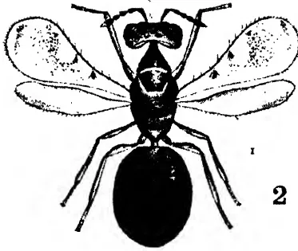

2

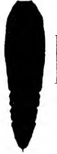

3


4

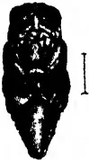

5

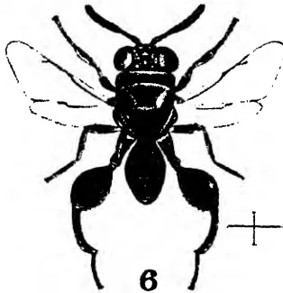

6

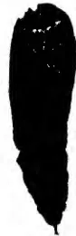

7


8

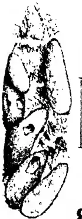

9

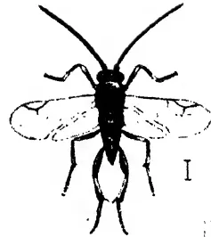

10


11

G  
de  
S

PLATE II.

1. 1. Pupa of *Trichospilus pupicrora*  $\times 20$ .
2. 2. *Trichospilus pupicrora*  $\times 20$ .
3. 3. Pupa of *Nephantix serinopa* parasitized by *T. pupicrora* showing emergence holes  $\times 3$ .
4. 4. Grub of *Brachymeria nephantidis*  $\times 4$ .
5. 5. Pupa of *B. nephantidis*  $\times 4$ .
6. 6. *Brachymeria nephantidis*  $\times 4$ .
7. 7. Pupa of *Nephantix serinopa* parasitized by *B. nephantidis* showing emergence hole  $\times 3$ .
8. 8. *Perisierola* sp.  $\times 5$ .
9. 9. Cocoons of *Perisierola* sp.  $\times 3$ .
10. 10. A Braconid larval parasite  $\times 5$ .
11. 11. Cocoons of Braconid (10).

30------------------------------------------------

A completely blank white page with no visible content, text, or markings.

31------------------------------------------------

9

sharp ovipositor with which it pierces the skin of the host pupa and lays inside it one and very rarely two eggs. The grub (Plate II., fig. 4) that hatches out feeds on the contents of the pupa and when full grown pupates inside the host. At the end of the pupation period which lasts about 10 days the adult bites it way out through the anterior end or side of the host pupa (Plate II., fig. 7) leaving inside a thin pupal skin. The parasitized host pupa is almost black in colour and the parasite or the pupa (Plate II., fig. 5) may be clearly seen inside if the host pupa is held up against light.

(3) *Perisierola* sp. (Plate II., fig. 8).—This Bethylid wasp is another of the primary larval parasites that are of minor importance taking its place along with the two Eurytomids which are mentioned below. It is probably more efficient than the latter owing to its very active habit of dispersing rapidly and also locating its host. The adult is black in colour, slender and small in size with short legs. It appears to be a strong flier. It has been observed to attack the larvae of the host and sting them for the purpose of feeding on the body fluid, thus destroying a fairly good number of the host. The female lays about 15 to 20 eggs on the skin of a medium-sized host larva. The grubs that hatch out are ecto-parasitic in habit clinging to the host in a group and feeding by sucking its juices. When fully grown they leave the host to weave silken cocoons (Plate II., fig. 9) of a dirty-brown colour usually under or within the galleries made by the host larvae. The weakened host frequently tries to pupate but fails. This parasite has only been recorded in the Batticaloa District. It has also been found to be hyper-parasitized by a Calliceratid wasp, *Calliceras* sp. This was first recorded by the writer in 1937.

(4) *Eurytoma* sp. x. (Plate III., fig. 6) and (5) *Eurytoma* sp. n. (Plate III., fig. 8).—These two Eurytomid species are larval parasites of *Nephantis*. They are extremely scarce and apparently play a very insignificant part in reducing the host population. The first species was recorded in 1929 in the Galle District and the second species in 1925 in the Batticaloa District. The former is black in colour except for parts of its legs which are yellowish brown. The female has an exerted ovipositor. The eggs are apparently laid on the young larva and the parasite completes its growth before that of the host. When fully grown they emerge from the host and pupate in rather loosely woven silken light-brown cocoons (Plate III., fig. 7). It is not unusual to find the skin of the dead host larva sticking to these cocoons which are usually found in the groove of the midrib of leaflets. The latter species is very much smaller than the former. It is also black in colour. The antennae have a few whorls of hair. It has a diamond-shaped abdomen

32------------------------------------------------

10

with a distinct petiole. Its habits and life-history are similar to the former and the cocoons are usually found in the grooves of the midribs of leaflets.

(6) A Braconid wasp (undetermined). (Plate II., fig. 10).—This is recorded in several instances as a primary larval parasite of *Nephantis* in the Batticaloa District. When full grown it emerges from the host larva and pupates just outside the body of the host. The beautiful oval white cocoons (Plate II., fig. 11) are usually found sticking to the dead host larvae in the corners of the galleries of the latter and more frequently along the groove of the midrib of a leaflet. The adult emerges by cutting a circular lid at the top end of it. It is comparatively a minor parasite of *Nephantis*. The adult is black in colour with light brown patches on the tibiae and tarsi of the legs. It is thick set with fairly large wings and a medium sized ovipositor. It appears to be active in habit and a strong flier.

(7) *Fornicia* sp. near *Ceylonica* Wlk.—Little is known of this Braconid wasp beyond its being recorded as a parasite, presumably of the larval stage of *Nephantis*, but emergence takes place from the host pupa. This was recorded for the first and the only time by the writer in 1935, in the Batticaloa District.

(8) *Angitia (Dioctes)* sp. (Plate III., fig. 2).—This small Ichneumon wasp is one of the most dominant of the larval parasites of *Nephantis* in Ceylon. Its efficiency is becoming very marked in the east coast. It was first observed by the writer in 1935. It parasitizes early or middle stage host larvae only laying a single egg on each host larva. When the parasite grub (Plate III., fig. 1) is nearly full grown the parasitized host stops feeding and soon shrinks into an inanimate mass. A few hours later the naked full grown parasite emerges from the host's body and pupates after spinning its cocoon close to the dead host. The cocoon (Plate III., fig. 3) is sausage-shaped and pale in colour and darker at either end. At the end of the pupation period which lasts about 10 days the imago bites its way through the anterior end of the cocoon. The adults are very active and strong fliers and their slender form helps them to disperse rapidly. Parasitism was found to increase with the progressive age of the infestation of the host.

III.—PARASITES AND PREDATORS OF THE COCONUT CATERPILLAR  
RECORDED IN THE EAST AND WEST COASTS AND PLAINS OF  
SOUTH INDIA (OTHER THAN *TRICHOSPILUS PUPIVORA*  
FERR.)

The parasite complex of the coconut caterpillar is expressed in the illustration given on page 11 and the list that follows gives their area of prevalence so far recorded, stage of host that is attacked, and efficiency as can be judged from published accounts.

33------------------------------------------------


PLATE III.

1. 1. Grub of *Angitia (Dioctes)* sp.  $\times 4$ .
2. 2. *Angitia (Dioctes)* sp.  $\times 5$ .
3. 3. Cocoon of *A. (Dioctes)* sp.  $\times 2$ .
4. 4. *Stomatomyia bezziana*  $\times 4$ .
5. 5. Puparium of *Stomatomyia bezziana* and parasitized *Nephantis* larva  $\times 5$ .
6. 6. *Eurytoma* sp.  $\times 5$ .
7. 7. Cocoon of *Eurytoma* sp.  $\times 3$ .
8. 8. *Eurytoma* sp. n.  $\times 10$ .

34------------------------------------------------

A completely blank white page with no visible content, text, or markings.

35------------------------------------------------

11

The Parasite Complex of the Coconut Caterpillar in South India.

**Coconut caterpillar  
(*Aphania serripes*)**

- **Braconid wasp (*Microbracon brevicornus*) on larva**
- **Chalcid beetle (*Peromus leucoceda*) on larva**
- **Eriid (*Cephalodectus murenaeus*) on larva**
- **Ichneumon wasp (*Leptochorimpla punctata*) on pupa**
- **Mite (*Predoia serripes*) on larva and pupa**
- **Plasmod wasp (*Eisamnia nephantidae*) on larva**
- **Braconid wasp (*Aposthonia angustana*) on larva**
- **Chalcid wasp (*Peromus leucoceda*) on larva**
- **Eulophid wasp (*Trichosus l. is pupicora*) on larva**
- **Chalcid wasp (*Stomatoceros sulcator-muldeni*) on pupa**

↑ Parasite  
 ↑ Predator  
 ↑ Hyper-parasite

36------------------------------------------------

12

The Parasite Complex of the Coconut Caterpillar in South India (See page 11.)

List of Parasites of the Coconut Caterpillar Indigenous to South India  
(other than *Trichospilus pupivora*)

<table border="1">
<thead>
<tr>
<th>Parasite</th>
<th>Area of Occurrence</th>
<th>Stage of Host Attacked</th>
<th>Remarks</th>
</tr>
</thead>
<tbody>
<tr>
<td colspan="4"><b>Arachnida</b></td>
</tr>
<tr>
<td>(1) <i>Pediculoides ventricosus</i></td>
<td>—</td>
<td>.. Larva and Pupa</td>
<td>—</td>
</tr>
<tr>
<td colspan="4"><b>Hymenoptera, Bethylidae</b></td>
</tr>
<tr>
<td>(2) <i>Perisierola nephantidis</i> M.</td>
<td>Coromandel Coast, Cochin</td>
<td>Larva ..</td>
<td>A fairly efficient parasite</td>
</tr>
<tr>
<td colspan="4"><b>Braconidae</b></td>
</tr>
<tr>
<td>(3) <i>Apanteles taragamae</i> Vier.</td>
<td>Cochin, Plains of South India</td>
<td>do. ..</td>
<td>An efficient parasite</td>
</tr>
<tr>
<td>(4) <i>Microbracon brevicornis</i> S.</td>
<td>Cochin ..</td>
<td>do. ..</td>
<td>—</td>
</tr>
<tr>
<td colspan="4"><b>Elasmidae</b></td>
</tr>
<tr>
<td>(5) <i>Elasmus nephantidis</i> R.</td>
<td>Cochin, North Arcot, Malabar, Travancore, Chingleput</td>
<td>do. ..</td>
<td>Degree of parasitism rather poor</td>
</tr>
<tr>
<td colspan="4"><b>Chalcididae</b></td>
</tr>
<tr>
<td>(6) <i>Stomatoceros sulcatus</i> Girault.</td>
<td>Samalkota, Mangalore, Salem, Cochin, Coimbatore</td>
<td>Pupa ..</td>
<td>Parasitism rather poor</td>
</tr>
<tr>
<td colspan="4"><b>Ichneumonidae</b></td>
</tr>
<tr>
<td>(7) <i>Xanthopimpla punctata</i> Ferr.</td>
<td>—</td>
<td>.. do. ..</td>
<td>—</td>
</tr>
<tr>
<td colspan="4"><b>Coloptera, Carabidae</b></td>
</tr>
<tr>
<td>(8) <i>Parena lacticincta</i> (Cal. leida splendidula F.)</td>
<td>Mangalore..</td>
<td>.. Larva ..</td>
<td>Found in numbers. Efficiency rather poor</td>
</tr>
<tr>
<td colspan="4"><b>Hemiptera, Reduviidae</b></td>
</tr>
<tr>
<td>(9) <i>Sphedanolesstes aurescens</i> Dist.</td>
<td>—</td>
<td>.. do. ..</td>
<td>—</td>
</tr>
</tbody>
</table>

Of these parasites only the allied species of the Bethylid *Perisierola* has been recorded in Ceylon. There is also, of course, the Eulophid *Trichospilus pupivora* Ferr. which is indigenous both in India and Ceylon.

Though all the Hymenopterous parasites except the Ichneumon wasp *Xanthopimpla* are recorded to be hyperparasitized by several species of Chalcids and an Eurytomid, their efficiency in controlling the host caterpillar has not been observed to be impaired. This appears to be due to the effective multiparasitism exercised by them and absence of clash of competition. The Braconids *Apanteles* and *Microbracon* attack only young larvae, the Bethylid *Perisierola* attacks full-grown ones, while the Elasmid *Elasmus* attacks only larvae in their pre-pupal stage, and the Chalcid *Stomatoceros* attacks only the pupa. The team work among this circle of parasites on the different stages of the host appears to have a strangle-hold on the coconut caterpillar in certain parts of South India, especially in the Coromandel coast, in spite of its fecundity

37------------------------------------------------

13IV.—THE EULOPHID PARASITE (*TRICHOSPILUS PUPIVORA* FERR.)

(Plate II., fig. 2)

*Trichospilus pupivora* belongs to the family Eulophidae of the order Hymenoptera. It is a small wasp and is one of the most important natural enemies which have been found to exert an appreciable influence on the population of the coconut caterpillar. It was first noted as a pupal parasite of the coconut caterpillar in the Negombo District in Ceylon in 1919 by Hutson, in Cochin on the Malabar coast in South India in October, 1925, in Sepang in the Malaya Peninsula and in Buitenzorg in Java; it has since been described by Ferriere and by Anantanarayanan.

(a) Habits and life-history of *Trichospilus*.—The adult insect is a minute parasitic wasp. Its head and thorax are orange-yellow in colour while the abdomen is brownish-black. It has large eyes and three ocelli, two lateral and one anterior. The wings are delicate, hyaline and somewhat smoky-brown in colour. There are two spots on each forewing formed by tufts of black hairs. The forewings are not shorter than the hind wings. The legs are quite yellow. The abdomen is almost rounded flat above with a short yellow quadrate petiole which is a little longer than broad. The male insect is smaller than the female. It has shorter antennae and legs, but the latter are thicker than those of the female. The abdomen of the female is more rounded and broader but much shorter than the thorax. The ovipositor is only visible from the ventral aspect. The females appear to be normally fertilized while within the host pupa as mating was rarely observed and then only immediately on emergence of the parasite from the host pupa. Parasites that emerged in the natural way were not observed to mate, but mating was always noticed when they were let out by artificially puncturing the host pupa. In such cases the parasites were given the opportunity to mate as otherwise they would not oviposit on the host pupae. It was noticed that one male fertilized a large number of females, accounting for the relatively small numbers of males. The adult insects lived up to 11 days in Peradeniya and 7 days in Batticaloa and 12 days in Kurunegala, the mean average temperature of these three places being  $77.2^{\circ}\text{F}$ ,  $81.3^{\circ}\text{F}$ , and  $80.7^{\circ}\text{F}$  respectively. Their longevity did not appear to be increased by feeding on sugar solution or on honey and water. The females start ovipositing within two to six hours of emergence on any part of the host pupa and die from 3 to 6 days after oviposition. The largest number of eggs laid by a single female parasite was found to be 206, with an average of 133 for ten females. Under laboratory conditions the average number of eggs laid by a single female

38------------------------------------------------

14

parasite on a pupa of the coconut caterpillar was 248. From pupae collected in the field at Kurunegala and Batticaloa an average of 91 and 96 parasites emerged. The parasite was found to attack more than one host pupa and it parasitized even 8-days-old pupa of the coconut caterpillar, the average pupal period of the host being 12 days. Parasitized pupae when exposed to parasites with fresh unparasitized pupae were not attacked. The pupa of the host (Plate II., fig. 3) when parasitized is easily differentiated by the characteristic sickly dark colour which it develops on the sixth day.

The eggs of the parasite are not visible to the naked eye and they are very minute appearing as transparent streaks amongst the contents of the host pupa. In the laboratory at Peradeniya the eggs were observed to hatch in about 24 hours.

The larval period lasts for about 7 or 8 days and by this time the entire contents of the host pupa are devoured. The larvae, which have no appendages, when full grown turn into a naked pupac (Plate II., fig. 1) within the pupal case of the host. The whole pupal period is about 8 or 9 days, after which the fully-formed adults emerge by biting tiny holes through the pupal case (Plate II., fig. 3) of the host. The whole life-cycle from egg to emergence of adult is completed in 16 to 23 days according to weather conditions, being longer in wet weather and shorter when dry. The average life-cycle was found to take 20.4 days, and in one year 17 to 18 generations were completed in the laboratory at Peradeniya where breeding was carried on uninterruptedly for over a period of four years. At Kurunegala and Batticaloa 21 or 22 generations were completed in one year with an average life-cycle of 17 and 16.5 days respectively.

(b) Laboratory breeding of the parasite.—In the field the parasite has been recorded on *Tirathaba rufivena* Walk. in Malaya; pupae of *Tirathaba* spp. in Java; pupae of *Sylepta derogata* F. in Calicut in Malabar in South India; *Thosea cervina* Walk., *Spodoptera mauritia* Boisd., and puparia of a Tachinid parasite of *Nacoleia annubilata* Swinh. in Ceylon; and pupae of *Nephantis serinopa* Meyr. in South India and Ceylon. Of the three records from Ceylon more evidence is necessary to accept the first two, namely, on *Thosea cervina* and *Spodoptera mauritia*. In the laboratory the parasite did not oviposit when several species of insects belonging to the family Limacodidae were exposed to it, the pupal case being too hard for it to pierce. And further on several occasions pupae of *Thosea cervina* were exposed to it and the parasite failed to oviposit on them. Though in the laboratory the parasite readily parasitized pupae of *Spodoptera mauritia*, the writer has not so far observed it on this Noctuid collected in the field where *Trichospilus* was naturally prevalent.

39------------------------------------------------

15

Besides it is hardly possible for this parasite to oviposit in the body of the pupa of *Spodoptera* because the latter pupates in the soil in an earthen cell quite beyond the reach of the parasite. Further, attempts made by the writer in the laboratory to make the parasite attack pupae which had pupated in earthen cells in the soil were not successful.

In the laboratory at Coimbatore, in South India, the parasite was successfully bred on the pupae of the following :—*Acontia graellsi* Feist., *Cnaphalocrocis medinalis* Gn., a Pyralid on grape vine, *Ergolis merione* Cr., and a Hesperiid coconut caterpillar. In the laboratory at Peradeniya, it was successfully bred on the pupae of the following :—(1) *Spodoptera mauritia* Boisd., (2) *Sylepta derogata* F., (3) *Prodenia litura* F., (4) *Tiracola plagiata* Wlk., (5) *Cosmophila erosa* Hubn., (6) *Plusia* spp., (7) *Terias silhetana* Wallace, (8) *Parnara bada* Mo., (9) *P. mathias* F., (10) *Borolia venalba* Mo., (11) *Homona coffearia* Nietner, (12) *Catopsilia crocal* Cram., (13) *Psara bipunctalis* F., (14) *Polytella gloriasae* F., (15) *Margaronia caesalis* Wlk., (16) *Stomatomyia bezziana* Bar., (17) Tachinid puparia—larval parasite of *Sylepta derogata*, and (18) Tachinid puparia—larval parasite of *Spodoptera mauritia*.

The parasite can be easily bred in the laboratory in large numbers under the climatic conditions at Peradeniya provided that suitable host material is made available. Pupae of *Spodoptera mauritia* which can be easily bred in the laboratory on grass, and pupae of *Prodenia litura* and *Tiracola plagiata*, both of which can be reared on castor and dadap leaves, were successfully employed as host material for breeding the parasites. From a single pupa of *Tiracola*, *Spodoptera* and *Prodenia* a maximum number of 1211, 904, and 823 parasites respectively were obtained. The parasites were successfully bred even on 10-days-old *Tiracola* pupa and 6-days-old pupae of *Prodenia* and *Spodoptera*, the pupal period of the former being about 16 to 18 days and of the two latter about 12 days. The host larvae are frequently afflicted by a bacterial disease when a large number of them are destroyed very suddenly, so that great care has to be taken to keep the breeding cages clean and dry and any overcrowding of larvae in a cage avoided. The host insects are not always available in the field in appreciable numbers. With a little care and forethought, however, it is possible to maintain a constant supply of host material. With the aid of a refrigerator it has been found possible to keep pupae and even egg masses in cold storage. This method helps to maintain a stock of larvae of all stages which will yield pupae almost daily. Glass specimen tubes,  $4\frac{1}{2}$  in. by  $1\frac{1}{2}$  in., with cotton plugs are suitable for breeding. In each tube 4 host pupae may be supplied to

40------------------------------------------------

16

20 parasites, if the host pupae belong to any of the above-mentioned species. In the case of pupae of smaller size the parasites per pupa should be reduced to two. More than one parasite was found to oviposit in a single pupa. Diseased or unhealthy pupae are not attacked. When a variety of species of host pupae were supplied to them in the same tube no partiality was shown to pupae of any particular species, not even to the natural host, the coconut caterpillar pupa. The breeding tubes must be clean. During moist wet weather parasitized pupae in the tubes become subject to fungoid attack which destroys them and eventually the parasites within them. Fresh healthy pupae should be supplied to the parasites. All diseased and unhealthy pupae, extraneous matter or parasites which have died after ovipositing in the tubes must be removed and the tubes kept clean and dry. The parasites can be easily introduced from tube to tube as they are photo-trophic and move towards light. It was possible to breed up to date uninterruptedly 84 generations of the parasite, and to send out for liberation on an average about 1,500,000 individuals per month. The parasites were sent in tubes by post to destinations which were reached in about two days, and they were observed to stand the journey very well.

**V.—ATTEMPTS AT BIOLOGICAL CONTROL OF THE COCONUT  
CATERPILLAR BY INTRODUCTION OF *TRICHOSPILUS  
PUPIVORA* FERR.**

As stated earlier *Trichospilus pupivora* is indigenous only to the west coast of Ceylon and in India to certain areas in the south including, roughly, Travancore, Cochin, and Mangalore. In these places it is the most effective parasite of the coconut caterpillar, and hence attempts have been made from time to time to utilize it for biological control in other areas where the coconut caterpillar pest occurs but in which the parasites did not appear to occur naturally.

*(a) Attempts made in South India.*

In South India the first attempt to utilize this parasite was made in 1924 when it was imported from the west coast together with the Bethylid and the Braconid parasites and introduced into Mangalore where it is reported to have failed to establish itself. In 1925 another attempt was made to re-introduce it into the same area and was met with some success. The introduction in both cases was effected by obtaining large consignments of infested leaflets with parasitized material from areas from the west and east coasts, the only enemies of the pest at the time in the district being the Chalcid wasp—*Stomatoceros sulcatiscutellum*, a pupal parasite—and a predatory Carabid beetle—*Parena lacticincta*, attacking the larva. It

41------------------------------------------------

17

appears that from time to time the Eulophid was also artificially bred and introduced into Mangalore. No record of the subsequent history of the pest in Mangalore has been published and it is not known to what extent the introduced parasite established itself. It may be mentioned that the climate of Mangalore is very much like that experienced on the west coast of Ceylon.

Another attempt that was made in South India was the introduction of the parasite into the dry areas of Coimbatore in 1925, where it appears to have failed to establish itself. The climate of Coimbatore is similar to that of the east coast of Ceylon.

*(b) Attempts made in Ceylon.*

In Ceylon attempts have been made to introduce the parasite into the east coast where it has not been known to occur naturally. The east coast coconut estates are not continuous with those in the west and central parts, being separated by a rather wide belt in which there are no coconut plantations. It has also much drier climatic conditions than those experienced by coconut estates in the west and central parts of the Island, and it is, perhaps, on account of these conditions that this parasite has not been able to establish itself here as yet. The first attempt to introduce the Eulophid was made in 1922 when small consignments were sent to two estates in Batticaloa North and South respectively. They were, however, received in a dying condition and it is possible that no actual healthy parasites were eventually liberated into the area.

A second attempt was made in 1926 when another consignment was sent to an estate in Batticaloa South. Here again insufficient care was taken in the liberation of the parasite and it is possible that the attempt was unsuccessful. In any case it was not subsequently possible to obtain evidence of them in the field in either of these attempts. In 1927, however, a more thorough attempt was made when several consignments of parasites were sent to many estates in the South and North of Batticaloa. Later inspections, however, did not reveal any signs of the parasites and it appears that this attempt was also unsuccessful. In 1935, following a very severe outbreak of the pest an organized attempt was made to breed the Eulophid in large numbers for liberation in the Batticaloa District. In November of that year several consignments of parasites were obtained from the western coast of South India, through the kind courtesy of the Government Entomologist, Agricultural Department, Madras, and laboratory breeding was carried out on a large scale at Batticaloa and on a small scale at Peradeniya. The breeding station at Batticaloa was later abandoned in 1935 as it was found that difficulties

42------------------------------------------------

18

had to be encountered in rearing the host material necessary for the parasites, and also the parasites bred seemed to be rather weak and numbers obtained relatively small. Since October of that year the breeding of the parasites was exclusively confined to Peradeniya where it was very satisfactorily carried out. The large number of parasites bred were sent by post in tubes to the Field Officers of the Agricultural Department and to Estate Managers for liberation in infested areas. From time to time observations were carried out both in the field in the Batticaloa District and in the Laboratory at Peradeniya by examination of infested leaflets. Table II. indicates the results of these investigations carried out for a period of ten months during the years 1938 and 1939 when the pest was prevalent in certain areas.

TABLE II.  
Results of Investigations in 1938 and 1939

<table border="1">
<thead>
<tr>
<th>Date of Examination</th>
<th>Name of Estate</th>
<th>Date of previous liberation of parasites</th>
<th>Total No. of pupae obtained</th>
<th>No. of pupae parasitized by <i>Trichoepilus</i></th>
<th>% of parasitism by <i>Trichoepilus</i></th>
<th>% of diseased or otherwise parasitized Pupae</th>
<th>Remarks</th>
</tr>
</thead>
<tbody>
<tr>
<td>2. 8. 38 ..</td>
<td>Tirrukovil</td>
<td>29. 7. 38 ..</td>
<td>58</td>
<td>25</td>
<td>43.2</td>
<td>56.8</td>
<td>A leaf cut from</td>
</tr>
<tr>
<td>3. 8. 38 ..</td>
<td>Thambiluvil</td>
<td>18. 12. 37 ..</td>
<td>67</td>
<td>34</td>
<td>50.7</td>
<td>47.7</td>
<td>each of five trees</td>
</tr>
<tr>
<td>4. 8. 38 ..</td>
<td>do.</td>
<td>18. 12. 37 ..</td>
<td>183</td>
<td>8</td>
<td>4.3</td>
<td>34.9</td>
<td>selected at random and infested</td>
</tr>
<tr>
<td>4. 8. 38 ..</td>
<td>Easter Seaton</td>
<td>1. 7. 38 ..</td>
<td>360</td>
<td>—</td>
<td>—</td>
<td>20.1</td>
<td>leaflets selected and examined for</td>
</tr>
<tr>
<td>30. 8. 38 ..</td>
<td>New Tirrukovil</td>
<td>11. 8. 38 ..</td>
<td>134</td>
<td>1</td>
<td>—</td>
<td>32.8</td>
<td>pupae which were</td>
</tr>
<tr>
<td>5. 9. 38 ..</td>
<td>Thambiluvil</td>
<td>4. 8. 38 ..</td>
<td>364</td>
<td>25</td>
<td>6.8</td>
<td>38.1</td>
<td>dissected or kept</td>
</tr>
<tr>
<td>13. 9. 38 ..</td>
<td>*Pilacholai</td>
<td>17. 8. 38 ..</td>
<td>77</td>
<td>—</td>
<td>—</td>
<td>48.0</td>
<td>under observation</td>
</tr>
<tr>
<td>4. 10. 38 ..</td>
<td>New Tirrukovil</td>
<td>15. 9. 38 ..</td>
<td>520</td>
<td>—</td>
<td>—</td>
<td>17.3</td>
<td>for parasites.</td>
</tr>
<tr>
<td>6. 10. 38 ..</td>
<td>Thambiluvil</td>
<td>8. 9. 38 ..</td>
<td>309</td>
<td>14</td>
<td>4.5</td>
<td>42.3</td>
<td></td>
</tr>
<tr>
<td>11. 10. 38 ..</td>
<td>*Pilacholai</td>
<td>4. 10. 38 ..</td>
<td>273</td>
<td>5</td>
<td>1.8</td>
<td>23.4</td>
<td></td>
</tr>
<tr>
<td>29. 10. 38 ..</td>
<td>New Tirrukovil</td>
<td>14. 10. 38 ..</td>
<td>174</td>
<td>3</td>
<td>1.7</td>
<td>27.0</td>
<td></td>
</tr>
<tr>
<td>11. 11. 38 ..</td>
<td>*Pilacholai</td>
<td>1. 11. 38 ..</td>
<td>168</td>
<td>3</td>
<td>1.8</td>
<td>32.1</td>
<td></td>
</tr>
<tr>
<td>29. 11. 38 ..</td>
<td>New Tirrukovil</td>
<td>7. 11. 38 ..</td>
<td>386</td>
<td>4</td>
<td>1.0</td>
<td>57.7</td>
<td></td>
</tr>
<tr>
<td>29. 11. 38 ..</td>
<td>Thambiluvil</td>
<td>13. 10. 38 ..</td>
<td>214</td>
<td>16</td>
<td>7.9</td>
<td>29.4</td>
<td></td>
</tr>
<tr>
<td>9. 12. 38 ..</td>
<td>*Pilacholai</td>
<td>22. 11. 38 ..</td>
<td>358</td>
<td>5</td>
<td>1.3</td>
<td>19.5</td>
<td></td>
</tr>
<tr>
<td>13. 1. 39 ..</td>
<td>Loxton/Palmlands</td>
<td>9. 12. 38 ..</td>
<td>391</td>
<td>70</td>
<td>17.1</td>
<td>12.5</td>
<td></td>
</tr>
<tr>
<td>24. 1. 39 ..</td>
<td>*Pilacholai</td>
<td>22. 11. 38 ..</td>
<td>132</td>
<td>12</td>
<td>9.0</td>
<td>17.4</td>
<td></td>
</tr>
<tr>
<td>7. 2. 39 ..</td>
<td>Easter Seaton</td>
<td>7. 1. 39 ..</td>
<td>495</td>
<td>61</td>
<td>12.3</td>
<td>39.7</td>
<td></td>
</tr>
<tr>
<td>24. 2. 39 ..</td>
<td>*Pilacholai</td>
<td>6. 2. 38 ..</td>
<td>122</td>
<td>6</td>
<td>4.9</td>
<td>19.6</td>
<td></td>
</tr>
<tr>
<td>10. 3. 39 ..</td>
<td>Easter Seaton</td>
<td>7. 1. 39 ..</td>
<td>107</td>
<td>8</td>
<td>7.4</td>
<td>48.5</td>
<td></td>
</tr>
<tr>
<td>15. 5. 39 ..</td>
<td>Loxton/Palmlands</td>
<td>9. 1. 39 ..</td>
<td>665</td>
<td>248</td>
<td>37.2</td>
<td>13.8</td>
<td></td>
</tr>
<tr>
<td>15. 5. 39 ..</td>
<td>Easter Seaton</td>
<td>7. 1. 38 ..</td>
<td>252</td>
<td>21</td>
<td>8.3</td>
<td>22.2</td>
<td></td>
</tr>
</tbody>
</table>

\* Estates in Batticaloa North. The others were in Batticaloa South.

## VI.—DISCUSSION

In the biological control of an insect pest a large number of factors must be taken into consideration. To begin with the area to be covered by parasite colonization must be circumscribed and more or less continuous and should possess within its limits more or less equable climatic conditions. Secondly the presence of other parasites which would lead to a condition of multiparasitism should also be considered, as the absence or elimination of the less effective ones might be favourable. At the same time several parasites might have the advantage of a superior balancing effect in that they are not all likely to suffer from deleterious factors. Thirdly, there is the presence of hyper-parasites, namely, insects which are parasitic on the primary parasites of the pest to be considered, since this has an obvious importance on the control effected by a primary parasite. On the other hand, this factor may not be so

43------------------------------------------------

19

important as it seems since secondary parasites seem to be incapable of hindering extensively the primaries which they attack, mainly because the percentage of primary parasites which they succeed in finding increase directly as the concentration of the primaries; and the percentage cannot approach an appreciable figure until the primaries are already sufficiently plentiful to suppress the pest.

The most important factor, however, is the particular nature of the parasitic insect itself. *Trichospilus pupivora* may be considered on the whole a very effective and successful parasitic insect. It has relatively a very short life-cycle with an average length of about 16.5 days, as compared with the life-cycle of its host which occupies about 60 days. A single female *Trichospilus* is capable of laying up to 200 eggs and can parasitize more than one host pupa. It can also parasitize host pupae which are as old as 8 days and each parasitized pupae can yield anything up to 200 adult parasites. Another factor which further heightens its rapid rate of increase is that the females outnumber the males. This is made possible by the ability of a single male to fertilize several females. Also it has but little tendency to superparasitism, the female being capable of discerning already sufficiently parasitized pupae. Otherwise this factor can seriously affect its value, as an environment which is capable of yielding a certain number of parasites progressively will in consequence of superparasitism be so exploited that it would produce fewer parasites. In addition to the features mentioned *Trichospilus* has also got rather active habits and a highly developed power of dispersal which is equal to if not greater than that of its host. Though its optimum conditions are relatively cool and damp weather with a temperature of about 80°F and a relative humidity of 92-94, it can also tolerate higher temperatures up to about 85°F and relative humidities as low as 78, although its rate of reproduction and vitality may be reduced in such conditions by half or more.

In the western parts of Ceylon and South India where it is normally in what may be regarded as its natural habitat, the evidence shows that it is the controlling factor of the population level of the coconut caterpillar. In these parts this pest generally possesses a population level which makes its activity quite negligible to the planter. Under such conditions the parasite is only limited in its activity by the scarcity of the host. Nevertheless the environmental conditions are so favourable to the parasite that it is capable of rapid and extensive dispersal so that it is able to maintain itself even under these conditions of low population level. It also appears in this region to be totally free from hyperparasites and enjoys

44------------------------------------------------

20

very little competition from other parasites. This is no doubt due to its better dispersal value, its greater power of locating host material, and its relatively high rate of increase in which it greatly surpasses the other parasites, and is thus able to quickly dominate a situation in which all these parasites are present.

In considering its chances of survival in the new or introduced environments into which it has been artificially brought these factors assume much greater importance. To begin with it has to tide over a period of weather conditions which are definitely unfavourable for it. This is the long dry hot spell which extends in the east coast from May to September. During this period of 3 to 4 months it passes through 6 to 10 generations during which time its vitality and activity would become greatly reduced. Under such conditions it is likely to hold on successfully only if there is a relative abundance of host material. Under these circumstances, the other parasites of the host will also be a serious competing factor. Of these the most important are the larval parasites especially *Angitia* and *Stomatomyia*. The activity of the latter is, however, checked by three hyperparasites. Records taken during times of relative host scarcity tend to show that the local parasites do exert a very strong controlling influence on the pest. It is only when the host has become very numerous that the local parasites are apparently unable to cope with the greatly increased numbers, their rate of multiplication being relatively slow and cycle of development relatively long. It is in these circumstances that *Trichospilus* would be useful, and if it is capable of tiding over the spells during which the weather conditions are unfavourable and the host relatively scarce, there is no doubt that it would be effective in keeping the pest under control in the eastern part of the Island. It is with this possibility in view that attempts have been made to introduce the parasite into this region. Further, it is also possible that though it may be unsuccessful in establishing itself in the first few attempts, repeated attempts carried out over a fairly long period might be successful in giving it a chance of readjusting its physiological requirements to such an extent as to be capable of getting established. Further, even if it is eventually shown that it is incapable of doing this, artificial liberation of the parasite might still be an effective and practical control measure to be applied in serious outbreaks of the pest in this region.

In conclusion it can be stated that as far as can be seen at present the chances of *Trichospilus* establishing itself in the eastern district seem to be poor, although it is not possible to rule it out altogether as a possible control factor until the

45------------------------------------------------

21

observations are carried out for several more years. That the continuous liberations of large numbers of the parasite which have been done during serious outbreaks in various parts are of definite value in checking these seems more or less evident, though even this needs to be confirmed by more extensive experiments and observations.

#### VII.—SUMMARY

1. The history, bionomics, and distribution of the host caterpillar are briefly described.

2. The parasite complex of the host is described with brief accounts of the life-history and habits of the parasites as far as observed by the writer within the past five years.

3. A detailed description of the habits, life-history and laboratory breeding of the Eulophid parasite is given.

4. The attempts at control by introduction of this parasite are described and discussed.

5. Finally the possibilities of utilizing this parasite as a biological control factor in the east coast of Ceylon are discussed.

#### VIII.—ACKNOWLEDGEMENTS

I am chiefly indebted to Dr. J. C. Hutson, B.A. (Oxon.), Ph.D., the late Entomologist, for guidance and encouragement given during the course of this work, and I am specially grateful to Dr. B. A. Baptist, B.Sc. Hons. (Lond.), Ph.D. (Cantab.), Acting Entomologist, for his interest and encouragement in the preparation of this paper. I have also to acknowledge with thanks the useful information given by the Government Entomologist, Coimbatore, and Mr. K. P. Anantanarayanan, B.A. Hons., on the parasites and predators of *Nephantis* in South India and breeding of *Trichospilus*. Finally, I am indebted to my colleagues in the Division of Entomology for help in various ways.

#### References

Anantanarayanan, K. P. On the bionomics of a Eulophid (*Trichospilus pupivora* Ferr.) a natural enemy of the coconut caterpillar (*Nephantis serinopa* Meyr.) in South India.—*Bull. Ent. Res.* 25, 1934, pp. 55–61.

Ferriere, C. .. Notes on Asiatic Chalcidoidae.—*Bull. Ent. Res.* 21, 1930, pp. 358–59.

Green, E. E. .. *The Tropical Agriculturist*. July, 1906, p. 83.

Hutson, J. C. .. Some preliminary notes on the coconut caterpillar in Ceylon.—*Department of Agriculture, Ceylon. Bulletin No. 58*, 1922.

Peris, M. M. .. The coconut pest in South Canara.—*The Tropical Agriculturist*. June, 1926, p. 350.

Ramachandra Rao, Y. Control of the coconut caterpillar (*Nephantis serinopa* Meyr.) by its parasites.—*Agric. J., India*. 21, 1926, pp. 452–59.

46------------------------------------------------

22SOME DISEASES OF GARDEN PLANTS

C. A. LOOS,

ASSISTANT IN MYCOLOGY, TEA RESEARCH  
INSTITUTE OF CEYLONGERBERA LEAF BLOTCH

**G**ERBERA JAMESONI Bolus, more familiarly known as the Barberton daisy, is grown extensively in Ceylon gardens for its flowers. During wet weather the leaves often have a blotched appearance due to death of parts of the leaf blades, and if the wet period is prolonged, the disease may become so severe that entire leaves die.

The first sign of the disease is usually to be found on expanded leaves as small reddish-brown spots on the upper surface, or as similar discolorations of the leaf tip. These areas become larger and darker in colour and ultimately turn black (Pl. I., fig. 1). The dead areas are usually bounded by the mid rib and larger veins on three sides but extend to the leaf margin on the fourth as, usually, there is no large vein in that region to prevent extension. Some of the dead areas may fall out of the leaves later, usually during dry weather (Pl. I., fig. 2). When the disease has been severe and large areas of leaves have been destroyed, the leaves may become irregular in shape, and appear as though parts had been eaten away by caterpillars (Pl. I., fig. 3). In very severe cases, the majority of the leaves of each plant may be entirely destroyed, but the plants recover during fine weather as the leaf buds are rarely attacked. Flowers and flower stalks are not affected.

When sections are cut through diseased areas, stained and cleared in hot lactophenol with cotton blue, eelworms may be observed within the leaf tissue. If the diseased tissue is teased apart with needles in a small quantity of water in a watch glass and allowed to stand for a short time, about half an hour, the eelworms may be seen, with the aid of a hand lens, swimming about in the water. They are small and transparent, but in shape and motion they resemble minute eels from which their common name is derived.

47------------------------------------------------

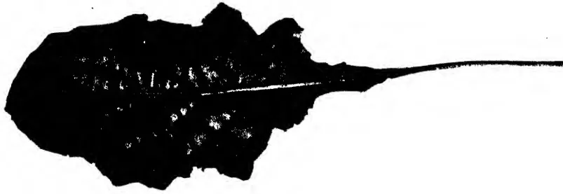A single, dark, heavily damaged leaf, likely showing severe attack. The leaf is dark and appears to be a remnant of a larger leaf, with irregular edges and some lighter, possibly dead, tissue visible.

FIG. 1.

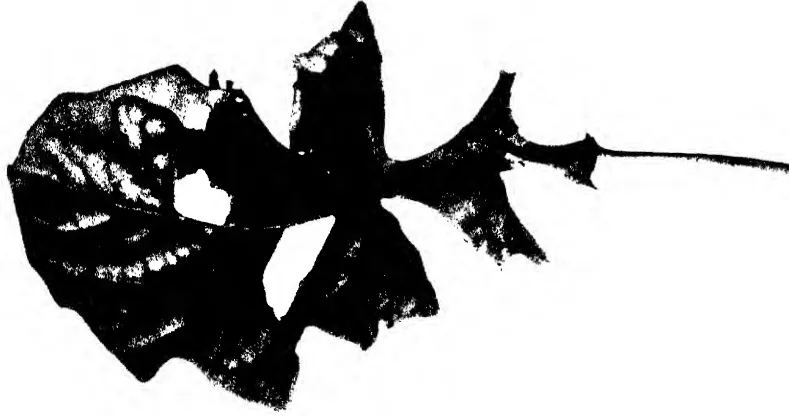A branch with several leaves, some showing early stages of attack and leaf drop. The leaves are dark and have irregular, jagged edges, indicating damage. Some leaves appear to be falling or have fallen.

FIG. 2.

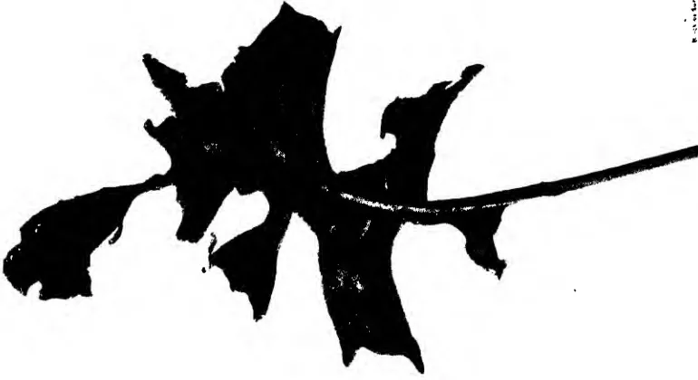A branch with several leaves, showing severe attack and significant leaf drop. The leaves are dark and have irregular, jagged edges, indicating damage. Some leaves appear to be falling or have fallen.

FIG. 3.

PLATE I. — *Gerbera Jamsonii* leaves attacked by *Aphelocochitis oleisistis*.

Fig. 1. — Early stage of attack showing leaf blotch.

Fig. 2. — Showing dead tissue fallen from the leaf.

Fig. 3. — Severe attack.

© 1934 by the American Society for the Advancement of Science

48------------------------------------------------

A completely blank white page with no visible content, text, or markings.

49------------------------------------------------

23

Eelworms, or nematodes, are known to attack the leaves of numerous plants and to cause symptoms similar to those described above in gerbera. At various times different scientific names have been applied to these worms, e.g., *Aphe-lenchoides fragariae* was used to denote the species found on strawberry, *A. ritzema-bosi* the one on chrysanthemums and *A. olesistus* on ferns and other plants. Other names have also been used to denote the worms attacking leaves of other plants. Experts are now of the opinion that many of these names must be abandoned as they are being applied to mere host varieties or biological races of at most one or two species. Steiner, and American authority, regards them all as varieties of one species, viz., *A. fragariae*. Goodey, an English authority, claims to be able to separate two species by certain morphological characters and maintains the name *A. olesistus* for the second species.

The eelworms found in Gerbera leaves exhibit the characters by which Goodey distinguishes *A. olesistus*. That name is therefore used in this paper. )

The writer has been unable to locate any previous record of *A. olesistus* attacking *Gerbera Jamesoni*. In Ceylon, however, it is a common pest of gerberas.

#### LEAF BLOTCH OF THE OX-EYE DAISY

Somewhat similar blotches are found on the leaves of the Ox-eye daisy (*Chrysanthemum leucanthemum*), which is a common plant in up-country gardens, the flowers being used for decoration purposes. The blotches are brown, with a yellowish fringe or border and contain numerous eelworms of the species *A. olesistus*. Injury to this plant is not so severe, as a rule, as to gerbera. Flowers are not attacked.

*A. olesistus* has been recorded elsewhere as a pest of *C. leucanthemum* (2).

#### PURPLE BLOTCH OF BACHELOR'S BUTTON

A few Bachelor's Button plants (*Gomphrena globosa*) growing in one garden were observed to have purplish blotches on the upper and lower surfaces of the leaves. These plants had reached the flowering stage and every leaf showed such purplish patches, which were most extensive on the basal leaves of each plant. The leaves did not wither.

On teasing the purplish blotches in water a very large number of *A. olesistus* worms were collected. They could be seen under the microscope wriggling from within the torn leaf tissues. From one piece of leaf about half a square inch in area, over a hundred worms were counted. From stained sections of the purplish blotches it was definitely established

50------------------------------------------------

24

that the worms were living endoparasitically in the leaf tissues. No dead cells were seen in the sections but the purple discoloration extended through the infected tissue.

No previous record of an attack by *A. olesistus* on *Gomphrena globosa* has been located.

#### PENSTEMON LEAF DROOP

*Penstemon barbatus* is another common plant of up-country gardens. In this plant, although the eelworm causing damage is the same species (*A. olesistus*) as found on *Gerbera Jamesoni*, *Gomphrena globosa*, &c., the symptoms produced are very different. These plants grow to a height of  $1\frac{1}{2}$ –2 feet and normally carry all their leaves till the flowering period is over.

The first leaves to be attacked are at the base of the plant, and infection is first apparent as minute purplish spots on the upper surface. These spots are similar to those produced on *Gomphrena globosa* leaves but are not so deeply coloured. The spots, if weather conditions are favourable, spread rapidly and eventually form rusty-coloured areas which cover the whole leaf. Later these leaves wither and hang down alongside the stem (Pl. II., fig. 1). The most characteristic symptom of the disease in this plant is the withering and droop of the oldest leaves from the base upwards for a considerable height above the ground. A badly infected plant at the flowering stage shows the dead leaves hanging down alongside the stem. Above these is a zone in which the lower leaves are rusty-coloured and in various stages of withering; the upper leaves stand out in their normal position, but have purplish spots and blotches. Above this zone the leaves may be normal and healthy. The flowers are not infected.

*A. olesistus* worms were collected in large numbers by teasing the purplish patches of leaf in water. On sectioning the leaves eelworms and eggs in all stages of development were seen. The purplish discoloration of the leaf is confined mostly to the epidermal cells. No worms were found in the dry dead leaves.

#### A LEAF BLOTCH OF SALVIA

A leaf blotch of *Salvia farinacea* similar to but not so extensive as of *Gerbera Jamesoni* was found during the wet weather. The blotches which were brown or black were confined mostly to the edges of the leaf and between the larger veins. Heavy infection during wet weather in a few cases caused wither and droop of the older leaves as in *Penstemon barbatus*.

On teasing the diseased tissue and in sections, *A. olesistus* was found. *A. olesistus* has been recorded as a pest of *Salvia splendens* and *Salvia* sp. elsewhere (2) but, so far as is known, this is the first record of the disease on *Salvia farinacea*.

51------------------------------------------------


FIG. 1.


FIG. 2.

PLATE II.

Fig. 1—*Penstemon barbatus* showing symptoms of attack by *A. olesistus*. Note the dead leaves hanging alongside the stem.

Fig. 2—*Chrysanthemum* plant attacked by the fungus *Septoria obesa*. The lower leaves are dead and hang down while the upper leaves are blotched.

Brown to Brown (Bent. Garden).

52------------------------------------------------

A completely blank white page with no visible content, text, or markings.

53------------------------------------------------

25

### CHRYSANTHEMUM LEAF DISEASE

Chrysanthemum plants have been observed showing symptoms very similar to those produced on *Penstemon barbatus* in that the lower leaves were dead and hanging down alongside the stem (Pl. II., fig. 2). No purple spots, however, were seen on the upper leaves, but brown spots ranging in size from mere dots to large blotches were present. The flowers and flower buds withered prematurely.

This droop of the leaves and the presence of leaf blotches in temperate climates, is usually symptomatic of an eelworm attack by the species *Aphelenchoides ritzema-bosi*, which is possibly identical with *A. olesistus*.

Sections of the diseased blotches and the teasing apart of the infected leaves in water failed to reveal this or any other species of eelworm. Another species of eelworm was, however, collected from washings of diseased leaves, and in very large quantities from washings of diseased flower buds from one garden. These worms were kindly identified by Dr. T. Goodey of the Imperial Institute of Agricultural Parasitology as *Panagrolaimus rigidus* (Schneider 1866) Thorne (1937). Dr. Goodey in his letter regarding this eelworm writes, "The nematodes are examples of *P. rigidus*. It is a very common nematode here occurring naturally on grass and in all sorts of situations. I have never found it in diseased chrysanthemums but I know the U. S. A. nematologists regard this or the very closely related *P. sublongatus* as capable of setting up diseased symptoms. So far, I believe, no one has been able to set up disease in plants grown in inoculated soil".

Although a search has been made for this or other species of eelworms in diseased chrysanthemum plants with the characteristic leaf droop symptoms, none has been found except in the above mentioned instance. Any suggestion that *P. rigidus* is the cause of this disease cannot, therefore, be maintained and the presence of that eelworm on those particular specimens must be regarded as accidental. The worm was probably living there as a saprophyte.

A fungus, however, was found common to every chrysanthemum plant showing those typical symptoms, when the leaf blotch in its early stages and sepals of withering flowers were examined. This fungus was identified as *Septoria obesa* which has been previously recorded from Japan (3). The pycnidia, 86-173 $\mu$  in diameter were produced on both surfaces of the leaf and could be found both in the blotched areas and in healthy tissue near the junction of diseased and healthy areas. Spores were thick and rounded near the base, tapering towards the apex, up to 9 septate, measuring 66-87 $\mu$   $\times$  3.2-3.6 $\mu$ .

54------------------------------------------------

26CONTROL

No attempt has been made to determine the life history of *A. olesistus* in Ceylon and the following suggestions are based on the observations recorded by other workers elsewhere.

*A. olesistus* is able to move over the surface of plants in a film of moisture, so its migration is limited to wet weather. It is evident that the worms can travel against the downward flow of surface water, otherwise their presence on the upper leaves of *Penstemon barbatus* would be difficult to explain. Entry is made into the leaf tissues via the stomata and it is probable that some movement within the tissue also occurs. Large veins seem to form impassable barriers to worms within the tissue, though they are easily passed by worms moving on the surface of the leaf.

Eggs are laid within the leaf tissue and the life cycle from egg to egg probably occupies about 14 days. Unfortunately both eelworm and eggs can withstand desiccation. The eelworm commonly found in chrysanthemum leaves in temperate climates is known to have remained viable within desiccated chrysanthemum leaves for as long as three years and to have revived when the leaves were remoistened.

The ability of the worms to withstand desiccation is of great importance when methods of control are considered. Garden coolies often remove diseased Gerbera leaves and lay them on the surface of the bed as mulch or bury them in the soil as green manure. Such treatment can only result in heavier infections later. The disposal of diseased leaves in compost heaps or pits involves the risk of dispersal of the pest to other parts of the garden when the compost is used. To keep the eelworm population in check it is imperative that all diseased leaves should be burnt.

Known infected soil should be avoided when planting susceptible plants. Planting material should, if possible, be free of the pest. This is most easily achieved when the plants are raised from seed. When propagating from cuttings, these should be taken, if possible, from parasite free stocks. Before splitting the root stocks of gerberas the soil should be washed away from the roots with water containing not more than one per cent. of ammonia and then planted in parasite-free soil.

Warm water treatment is often useful in the treatment of this type of eelworm. The aerial parts of rooted cuttings are immersed in water at 50°C. (122°F) for 5 minutes, care being taken to keep the roots from drying. Root stocks, before the cuttings are taken, should be immersed for 5 to 10 minutes in water at 50°C. after the soil has been washed from the roots.

55------------------------------------------------

27

Goodey (1) reviewing the work done with the allied species *A. fragariae* states that most investigators have found the parasite most difficult to reach by chemical treatment. Sulphur and copper compounds, potassium permanganate, barium chloride, picric acid, sodium carbonate, lime water, mercury, arsenic and nicotine preparations in soft soap solutions at concentrations which do not injure plants were found to be useless.

Control of the chrysanthemum disease mentioned here calls for different measures as the parasite concerned is a fungus. Spraying with a fungicide, such as Bordeaux mixture, at frequent intervals and the removal of infected leaves would act as a check on further spread of the disease.

#### SUMMARY

(1) Diseases of *Gerbera Jamesoni*, *Chrysanthemum leucanthemum*, *Gomphrena globosa*, *Penstemon barbatus* and *Salvia farinacea* due to attacks by the leaf eelworm *Aphelenchoides olesistus* are recorded. Characteristic symptoms on these plants are described.

(2) A disease of Chrysanthemum plants due to attack by the fungus *Septoria obesa* is described. The symptoms were somewhat similar to those recorded in temperate climates as a result of attack by the eelworm *Aphelenchoides ritzema-bosi*. The eelworm *Panagrolaimus rigidus* was observed in one case, as a saprophyte, on the diseased leaves and flower buds.

(3) Control measures are discussed.

#### ACKNOWLEDGEMENT

I wish to record my thanks to Dr. C H Gadd, Mycologist of the Tea Research Institute of Ceylon, for his encouragement and advice during these investigations and his helpful criticism in the preparation of this paper.

#### LITERATURE CITED

1. (1) Goodey, T. . . 1933. *Plant parasitic nematodes and the diseases they cause*, London.
2. (2) — . . 1940. The nematode parasites of plants catalogued under their hosts. *Imp. Bur. Agric. Parasit.* (Helm), 1940
3. (3) Hemmi, T. and Nakamura, H. . . 1927. Studies on Septorioses of plants. 1. Comparison of different species of *Septoria* causing the leaf-spot diseases of the cultivated chrysanthemum. *Mem. Coll. Agric. Kyoto. Imper. Univ.* 3, Art. 1, pp. 1-24. (abstract in *Rev. Appl. Mycol.* VII., p. 244).

56------------------------------------------------

28

## PERIODICITY OF NITRIFICATION

### PART II. RUBBER AREA

ALEXANDER BRUCE, B.Sc., F.I.C.

IN rubber areas besides the natural nitrogen content of the soil there are annual additions to the supply of nitrogen by the leaf fall from the rubber trees, which is small, and leaf droppings from cover crops of the green manure variety. Rubber, being a deciduous tree, drops its leaves annually during February and March. It is well known that deciduous plants absorb practically the whole of the plant food from the leaves before shedding them so that it is not much more than the carcass or woody framework of the rubber leaf that reaches the soil. On the other hand the green cover crop cuttings have the organic matter fully represented in sugar, starch, &c. Pruned trees and bushes, as on the tea areas, have the leafy material full of organic matter which stimulates bacterial action, when incorporated into the soil. Under the same conditions microbiological activity will be less in a rubber area than in a tea area.

Rubber trees grow under semi-forest conditions. There is little mechanical cultivation in a rubber area. Drainage and terracing are practised. In the forests of Europe there are no nitrates found and it is stated that the trees absorb the nitrogen from the soil in the form of ammonia, not nitrates. It may be that, when nitrates are poor in rubber soils, resort has to be taken to both nitrates and ammonia for nitrogen food.

#### KELANI VALLEY DISTRICT

No. 1.—Estate.

*General Data.*—This estate was opened in rubber from jungle; the oldest area opened in 1906–1907, is unmanured at present. The manured area was opened in 1911–1916.

The half millimetre sieve (60 mesh) passes 57 per cent. of soil in the manured area and 50 per cent. in the unmanured area. There is about 30 per cent. gravel present. The nitrogen in the dry soil is about 3,260 lb. per acre in the manured area and 2,865 lb. per acre in the unmanured area. The reaction p.H. is about 6. Carbon : nitrogen in the manured area is 14.4 and in the unmanured area 13.6. No nitrites were found during the period of experiment.

57------------------------------------------------


58------------------------------------------------

NOLESTATE

KELANI VALLEY DISTRICT

RAINFALL IN INCHES

NITRATES AS NITROGEN IN PER CENT

MANURED

UNMANURED

GRAPH III

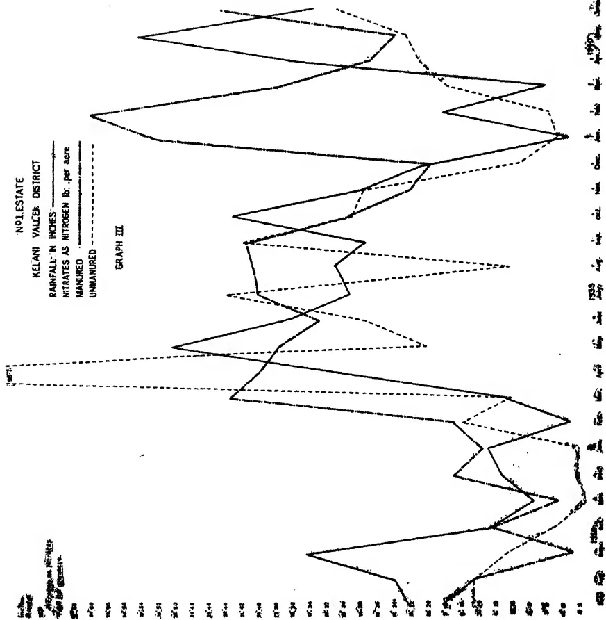

The graph displays two data series over a 30-month period. The x-axis represents months from 1 to 30. The left y-axis represents Rainfall in inches (0 to 10), and the right y-axis represents Nitrates as Nitrogen in per cent (0 to 100). Solid lines represent Rainfall, and dashed lines represent Nitrates as Nitrogen. The graph is divided into two sections: 'MANURED' (months 1-15) and 'UNMANURED' (months 16-30).

<table border="1">
<thead>
<tr>
<th>Month</th>
<th>Manured Rainfall (inches)</th>
<th>Manured Nitrates (per cent)</th>
<th>Unmanured Rainfall (inches)</th>
<th>Unmanured Nitrates (per cent)</th>
</tr>
</thead>
<tbody>
<tr><td>1</td><td>0.0</td><td>0.0</td><td>0.0</td><td>0.0</td></tr>
<tr><td>2</td><td>0.0</td><td>0.0</td><td>0.0</td><td>0.0</td></tr>
<tr><td>3</td><td>0.0</td><td>0.0</td><td>0.0</td><td>0.0</td></tr>
<tr><td>4</td><td>0.0</td><td>0.0</td><td>0.0</td><td>0.0</td></tr>
<tr><td>5</td><td>0.0</td><td>0.0</td><td>0.0</td><td>0.0</td></tr>
<tr><td>6</td><td>0.0</td><td>0.0</td><td>0.0</td><td>0.0</td></tr>
<tr><td>7</td><td>0.0</td><td>0.0</td><td>0.0</td><td>0.0</td></tr>
<tr><td>8</td><td>0.0</td><td>0.0</td><td>0.0</td><td>0.0</td></tr>
<tr><td>9</td><td>0.0</td><td>0.0</td><td>0.0</td><td>0.0</td></tr>
<tr><td>10</td><td>0.0</td><td>0.0</td><td>0.0</td><td>0.0</td></tr>
<tr><td>11</td><td>0.0</td><td>0.0</td><td>0.0</td><td>0.0</td></tr>
<tr><td>12</td><td>0.0</td><td>0.0</td><td>0.0</td><td>0.0</td></tr>
<tr><td>13</td><td>0.0</td><td>0.0</td><td>0.0</td><td>0.0</td></tr>
<tr><td>14</td><td>0.0</td><td>0.0</td><td>0.0</td><td>0.0</td></tr>
<tr><td>15</td><td>0.0</td><td>0.0</td><td>0.0</td><td>0.0</td></tr>
<tr><td>16</td><td>0.0</td><td>0.0</td><td>0.0</td><td>0.0</td></tr>
<tr><td>17</td><td>0.0</td><td>0.0</td><td>0.0</td><td>0.0</td></tr>
<tr><td>18</td><td>0.0</td><td>0.0</td><td>0.0</td><td>0.0</td></tr>
<tr><td>19</td><td>0.0</td><td>0.0</td><td>0.0</td><td>0.0</td></tr>
<tr><td>20</td><td>0.0</td><td>0.0</td><td>0.0</td><td>0.0</td></tr>
<tr><td>21</td><td>0.0</td><td>0.0</td><td>0.0</td><td>0.0</td></tr>
<tr><td>22</td><td>0.0</td><td>0.0</td><td>0.0</td><td>0.0</td></tr>
<tr><td>23</td><td>0.0</td><td>0.0</td><td>0.0</td><td>0.0</td></tr>
<tr><td>24</td><td>0.0</td><td>0.0</td><td>0.0</td><td>0.0</td></tr>
<tr><td>25</td><td>0.0</td><td>0.0</td><td>0.0</td><td>0.0</td></tr>
<tr><td>26</td><td>0.0</td><td>0.0</td><td>0.0</td><td>0.0</td></tr>
<tr><td>27</td><td>0.0</td><td>0.0</td><td>0.0</td><td>0.0</td></tr>
<tr><td>28</td><td>0.0</td><td>0.0</td><td>0.0</td><td>0.0</td></tr>
<tr><td>29</td><td>0.0</td><td>0.0</td><td>0.0</td><td>0.0</td></tr>
<tr><td>30</td><td>0.0</td><td>0.0</td><td>0.0</td><td>0.0</td></tr>
</tbody>
</table>

59------------------------------------------------

29No. 1.—KELANI VALLEY DISTRICTTable III

<table border="1">
<thead>
<tr>
<th rowspan="3">Month</th>
<th colspan="4">Rainfall</th>
<th colspan="2">Nitrates as Nitrogen,<br/>lb. per Acre.</th>
</tr>
<tr>
<th rowspan="2">Inches</th>
<th colspan="2">Intensities</th>
<th rowspan="2">Manured</th>
<th rowspan="2">Un-<br/>manured</th>
</tr>
<tr>
<th>Days.</th>
<th>Per Cent.</th>
</tr>
</thead>
<tbody>
<tr>
<td colspan="7" style="text-align: center;">1938</td>
</tr>
<tr>
<td>July ..</td>
<td>11.08 ..</td>
<td>5 ..</td>
<td>81 ..</td>
<td>18.3 ..</td>
<td>14.7 ..</td>
</tr>
<tr>
<td>August ..</td>
<td>11.96 ..</td>
<td>7 ..</td>
<td>63 ..</td>
<td>14.6 ..</td>
<td>14.5 ..</td>
</tr>
<tr>
<td>September ..</td>
<td>17.20 ..</td>
<td>5 ..</td>
<td>48 ..</td>
<td>3.8 ..</td>
<td>10.5 ..</td>
</tr>
<tr>
<td>October ..</td>
<td>6.24 ..</td>
<td>3 ..</td>
<td>59 ..</td>
<td>12.3 ..</td>
<td>4.6 ..</td>
</tr>
<tr>
<td>November ..</td>
<td>3.68 ..</td>
<td>1 ..</td>
<td>33 ..</td>
<td>4.4 ..</td>
<td>1.2 ..</td>
</tr>
<tr>
<td>December ..</td>
<td>5.60 ..</td>
<td>2 ..</td>
<td>45 ..</td>
<td>16.8 ..</td>
<td>2.10 ..</td>
</tr>
<tr>
<td colspan="7" style="text-align: center;">1939</td>
</tr>
<tr>
<td>January ..</td>
<td>6.43 ..</td>
<td>3 ..</td>
<td>70 ..</td>
<td>13.4 ..</td>
<td>2.0 ..</td>
</tr>
<tr>
<td>February ..</td>
<td>1.38 ..</td>
<td>1 ..</td>
<td>74 ..</td>
<td>16.8 ..</td>
<td>15.7 ..</td>
</tr>
<tr>
<td>March ..</td>
<td>5.63 ..</td>
<td>3 ..</td>
<td>61 ..</td>
<td>43.4 ..</td>
<td>9.8 ..</td>
</tr>
<tr>
<td>April ..</td>
<td>15.34 ..</td>
<td>5 ..</td>
<td>65 ..</td>
<td>39.8 ..</td>
<td>95.7 ..</td>
</tr>
<tr>
<td>May ..</td>
<td>25.09 ..</td>
<td>5 ..</td>
<td>88 ..</td>
<td>37.3 ..</td>
<td>20.2 ..</td>
</tr>
<tr>
<td>June ..</td>
<td>17.98 ..</td>
<td>7 ..</td>
<td>59 ..</td>
<td>32.7 ..</td>
<td>27.3 ..</td>
</tr>
<tr>
<td>July ..</td>
<td>14.36 ..</td>
<td>5 ..</td>
<td>52 ..</td>
<td>38.9 ..</td>
<td>43.6 ..</td>
</tr>
<tr>
<td>August ..</td>
<td>15.22 ..</td>
<td>— ..</td>
<td>— ..</td>
<td>40.4 ..</td>
<td>10.1 ..</td>
</tr>
<tr>
<td>September ..</td>
<td>13.33 ..</td>
<td>— ..</td>
<td>— ..</td>
<td>41.3 ..</td>
<td>41.7 ..</td>
</tr>
<tr>
<td>October ..</td>
<td>21.24 ..</td>
<td>— ..</td>
<td>— ..</td>
<td>29.1 ..</td>
<td>28.8 ..</td>
</tr>
<tr>
<td>November ..</td>
<td>13.46 ..</td>
<td>— ..</td>
<td>— ..</td>
<td>21.8 ..</td>
<td>27.3 ..</td>
</tr>
<tr>
<td>December ..</td>
<td>10.15 ..</td>
<td>— ..</td>
<td>— ..</td>
<td>19.1 ..</td>
<td>8.6 ..</td>
</tr>
<tr>
<td colspan="7" style="text-align: center;">1940</td>
</tr>
<tr>
<td>January ..</td>
<td>1.45 ..</td>
<td>— ..</td>
<td>— ..</td>
<td>51.9 ..</td>
<td>4.1 ..</td>
</tr>
<tr>
<td>February ..</td>
<td>8.89 ..</td>
<td>— ..</td>
<td>— ..</td>
<td>59.9 ..</td>
<td>5.2 ..</td>
</tr>
<tr>
<td>March ..</td>
<td>2.76 ..</td>
<td>— ..</td>
<td>— ..</td>
<td>37.6 ..</td>
<td>17.4 ..</td>
</tr>
<tr>
<td>April ..</td>
<td>17.95 ..</td>
<td>— ..</td>
<td>— ..</td>
<td>26.4 ..</td>
<td>20.7 ..</td>
</tr>
<tr>
<td>May ..</td>
<td>27.17 ..</td>
<td>— ..</td>
<td>— ..</td>
<td>23.5 ..</td>
<td>22.3 ..</td>
</tr>
<tr>
<td>June ..</td>
<td>16.72 ..</td>
<td>— ..</td>
<td>— ..</td>
<td>44.3 ..</td>
<td>30.4 ..</td>
</tr>
<tr>
<td colspan="4" style="text-align: center;">Nitrogen as Ammonia</td>
<td>14 ..</td>
<td>16.7 ..</td>
</tr>
</tbody>
</table>

*Rainfall and Nitrates Table III., Graph III.*—Nothing could be deduced from the crops submitted for inspection, as they have been too much interfered with by man. The period starts in July, 1938, and is continued until June, 1940.

Intensities of rainfall have been recorded for a year from July, 1938, to July, 1939, from daily rainfalls. The following year 1938–1939 intensities were not recorded as they are not of so much importance as in the tea areas, except for tapping data.

Nitrogen as ammonia amounted to 14 lb. per acre on the manured area and 16.7 on the unmanured area.

On the unmanured area nitrates are poor from October, 1938, until January, 1939, and again from December, 1939, until February, 1940. These low nitrate periods are important as they are the months when high nitrates are required to stimulate the leaf renewal after wintering and before wintering to stimulate

2—J. N. A 1070 (1/41)

60------------------------------------------------

30

the shedding of the leaf and produce a clean leaf callus. Rain-fall is normal and does not give an explanation for the low nitrate. It may be that the high rubber crops of these periods, and before, have been the cause of the nitrate absorption from the soil solution.

Referring to table and graph III. nitrates are not present in quantity until the month of March on the manured area and April 1939 on the unmanured area. The rainfall of July and August, 1938, of 11 in. and 12 in. did not have a greatly diminishing effect on the nitrates but in the September 1938 rains of 17 in. nitrates dropped particularly in the manured area. They rose again in October, to fall again in November and rose again in December. Rainfall in the meantime was low at 6 in. or less. On the unmanured area nitrates fell steadily from July and continued low until January. Rainfall was poor in February, 1939, and then rose steadily until it reached a high peak of 25 in. in May. Nitrates started to rise in February on both areas. March saw a great increase in nitrates in the manured area which fell in the unmanured area then rose to the highest level of all the results in the month of April. After the high rainfall of May, 1939, rains remained steadily high until September and then rose in October to 21 in. The rainfall did not effect the nitrates much on the manured area, but kept up well until September; then the high rains of October reduced nitrates until December. On the unmanured area, nitrates decreased with the high rains of May, 1939, but rose again to a peak in July, fell again in August, then rose to a peak in September and then gradually fell away until December, January, and February, 1940, with low results and then with gradual increases until June. On the manured area, on the other hand, nitrates increased to a high level in January and February, 1940, the highest reached in this area, and then fell away until April and May with the high rainfall, followed by a nitrate rise in June.

High rainfalls of September 1938, May 1939, October 1939, May 1940, did not always highly depress the nitrates. The September 1938 rains decreased nitrates in the manured area but in the unmanured area there was no sudden depression. The May 1939 rains did not greatly depress the nitrates in either area. October rains did not give a sudden depression of nitrates but a gradual depression extending over 2-3 months. The May 1940 rains depressed nitrates but with the continued high rains in June nitrates increased. There is not the same rhythmic rise and fall in nitrates and rainfall as has been shown in the Tea area.

The incidence of manuring should be noted in above. January 1940, March-May, 1939.

*Artificial Manuring* was carried out in January 1940 with a cyanamide, phosphate, potash mixture containing 40 lb. of

61------------------------------------------------

31

nitrogen per acre. The results can be seen in the increase of nitrates during that period. During 1939 a ground-nut, cyanamide, phosphate, potash mixture was applied containing 30 lb. of Nitrogen per acre applied from March to May. The higher nitrates are noted extending for several months. During March-May 1938, ammonium sulphate, phosphate mixture was applied containing 51 lb. of Nitrogen. This was outside the experimental period.

Owing to the poor nitrification results laboratory trials were made with the addition of lime water and again in the field with burnt lime on an experimental scale. It was found that the addition of 1 cwt. burnt lime per acre was sufficient greatly to increase the nitrates within a month; 3 to 6 cwt. of burnt lime per acre were also tried but there was no benefit from the increase in burnt lime.

### KELANI VALLEY DISTRICT

#### No. 2.—Estate.

This estate was opened in rubber from jungle in 1906-1916. The manured area is the younger portion and was opened in 1911-1916. The unmanured area was opened in 1906-1917, rainfall 180 in.

On the manured area, fine soil passing the 60 mesh sieve (0.5 mm) is 63 per cent. The nitrogen amounts to 3,585 lb. per acre. Carbon : nitrogen is 13.6. Reaction p.H. is about 6.

On the unmanured area fine soil amounts to 69 per cent. Nitrogen per acre amounts to 3,117 lb. per acre. Carbon : nitrogen is 15.1. No nitrites were found during the period of examination.

### KELANI VALLEY DISTRICT

Table IV

#### No. 2.—Estate

<table border="1">
<thead>
<tr>
<th rowspan="3">Month</th>
<th colspan="6">Rainfall</th>
<th colspan="2">Nitrates as Nitrogen<br/>lb. per Acre</th>
</tr>
<tr>
<th colspan="3">Inches</th>
<th colspan="3">Days Intensities</th>
<th>Manured</th>
<th>Un-<br/>manured</th>
</tr>
<tr>
<th colspan="8">Per Cent.</th>
</tr>
</thead>
<tbody>
<tr>
<td colspan="9"><b>1938</b></td>
</tr>
<tr>
<td>August ..</td>
<td>..</td>
<td>13.83</td>
<td>..</td>
<td>4</td>
<td>..</td>
<td>51</td>
<td>..</td>
<td>15.5</td>
<td>..</td>
<td>14.0</td>
</tr>
<tr>
<td>September</td>
<td>..</td>
<td>22.16</td>
<td>..</td>
<td>9</td>
<td>..</td>
<td>74</td>
<td>..</td>
<td>12.7</td>
<td>..</td>
<td>10.4</td>
</tr>
<tr>
<td>October..</td>
<td>..</td>
<td>8.25</td>
<td>..</td>
<td>4</td>
<td>..</td>
<td>64</td>
<td>..</td>
<td>2.4</td>
<td>..</td>
<td>2.3</td>
</tr>
<tr>
<td>November</td>
<td>..</td>
<td>6.45</td>
<td>..</td>
<td>3</td>
<td>..</td>
<td>50</td>
<td>..</td>
<td>103</td>
<td>..</td>
<td>17.2</td>
</tr>
<tr>
<td>December</td>
<td>..</td>
<td>7.77</td>
<td>..</td>
<td>2</td>
<td>..</td>
<td>43</td>
<td>..</td>
<td>82.1</td>
<td>..</td>
<td>78.9</td>
</tr>
<tr>
<td colspan="9"><b>1939</b></td>
</tr>
<tr>
<td>January</td>
<td>..</td>
<td>5.91</td>
<td>..</td>
<td>3</td>
<td>..</td>
<td>59</td>
<td>..</td>
<td>31.6</td>
<td>..</td>
<td>32.9</td>
</tr>
<tr>
<td>February</td>
<td>..</td>
<td>0.85</td>
<td>..</td>
<td>—</td>
<td>..</td>
<td>—</td>
<td>..</td>
<td>40.2</td>
<td>..</td>
<td>48.6</td>
</tr>
<tr>
<td>March ..</td>
<td>..</td>
<td>5.07</td>
<td>..</td>
<td>2</td>
<td>..</td>
<td>47</td>
<td>..</td>
<td>11.1</td>
<td>..</td>
<td>9.2</td>
</tr>
<tr>
<td>April ..</td>
<td>..</td>
<td>17.56</td>
<td>..</td>
<td>6</td>
<td>..</td>
<td>66</td>
<td>..</td>
<td>22</td>
<td>..</td>
<td>17.0</td>
</tr>
</tbody>
</table>

62------------------------------------------------

32Table IV.—*contd.*

<table border="1">
<thead>
<tr>
<th rowspan="2">Month</th>
<th colspan="3">Rainfall</th>
<th colspan="3">Nitrates as Nitrogen<br/>lb. per Acre</th>
</tr>
<tr>
<th>Inches</th>
<th>Days</th>
<th>Intensities</th>
<th>Manured</th>
<th colspan="2">Un-<br/>manured</th>
</tr>
</thead>
<tbody>
<tr>
<td colspan="7" style="text-align: center;">Per Cent.</td>
</tr>
<tr>
<td colspan="7" style="text-align: center;">1939</td>
</tr>
<tr>
<td>May ..</td>
<td>22.04</td>
<td>4</td>
<td>84</td>
<td>—</td>
<td>..</td>
<td>—</td>
</tr>
<tr>
<td>June ..</td>
<td>23.18</td>
<td>11</td>
<td>76</td>
<td>19.2</td>
<td>..</td>
<td>19.0</td>
</tr>
<tr>
<td>July ..</td>
<td>16.45</td>
<td>7</td>
<td>56</td>
<td>21.1</td>
<td>..</td>
<td>19.4</td>
</tr>
<tr>
<td>August ..</td>
<td>16.29</td>
<td>—</td>
<td>—</td>
<td>10.3</td>
<td>..</td>
<td>10.3</td>
</tr>
<tr>
<td>September ..</td>
<td>12.93</td>
<td>—</td>
<td>—</td>
<td>12.3</td>
<td>..</td>
<td>9.6</td>
</tr>
<tr>
<td>October ..</td>
<td>33.16</td>
<td>—</td>
<td>—</td>
<td>20.5</td>
<td>..</td>
<td>21.9</td>
</tr>
<tr>
<td>November ..</td>
<td>20.48</td>
<td>—</td>
<td>—</td>
<td>43.6</td>
<td>..</td>
<td>36.6</td>
</tr>
<tr>
<td>December ..</td>
<td>11.27</td>
<td>—</td>
<td>—</td>
<td>8.0</td>
<td>..</td>
<td>4.2</td>
</tr>
<tr>
<td colspan="7" style="text-align: center;">1940</td>
</tr>
<tr>
<td>January ..</td>
<td>0.60</td>
<td>—</td>
<td>—</td>
<td>4.5</td>
<td>..</td>
<td>4.0</td>
</tr>
<tr>
<td>February ..</td>
<td>3.14</td>
<td>—</td>
<td>—</td>
<td>408</td>
<td>..</td>
<td>22.5</td>
</tr>
<tr>
<td>March ..</td>
<td>7.72</td>
<td>—</td>
<td>—</td>
<td>21.4</td>
<td>..</td>
<td>20.3</td>
</tr>
<tr>
<td>April ..</td>
<td>18.98</td>
<td>—</td>
<td>—</td>
<td>18.1</td>
<td>..</td>
<td>20.4</td>
</tr>
<tr>
<td>May ..</td>
<td>33.23</td>
<td>—</td>
<td>—</td>
<td>45.4</td>
<td>..</td>
<td>23.6</td>
</tr>
<tr>
<td>June ..</td>
<td>35.18</td>
<td>—</td>
<td>—</td>
<td>57.3</td>
<td>..</td>
<td>42.2</td>
</tr>
<tr>
<td>July ..</td>
<td>10.26</td>
<td>—</td>
<td>—</td>
<td>27.8</td>
<td>..</td>
<td>26.6</td>
</tr>
</tbody>
</table>

Rain intensities have been noted for the first year, but as they are not of so much importance as the tea area they were discontinued.

During the high rains of August and September 1938, April-November 1939, April-June 1940, nitrates were not depressed as on the tea area with high rains. The low nitrate of December and January 1940, in both areas, are not due to rainfall but as explained under No. 1 estate may be due to the draw of the trees on soil nitrates for the heavy crop in the last quarter of the year. The low nitrates of October 1938, may be due to the rains of August and September but as high rains have not greatly depressed nitrates at other periods, the explanation given above is repeated.

Graph IV: (see page opposite) has peak rains in September 1938, with a gradual fall for 5 months until March 1939. Rains then rise and there are high rains for 8 months until November 1939. There is a down peak in nitrates in October 1938, in both areas corresponding to the high rainfall of September. Nitrates maintain a high level during November-February, then fall in March 1940. In spite of the 8 months rain April-November 1939, nitrates kept up a fair standard. The high rains of October-November correspond to the low nitrate level in December and January 1940. The nitrates had risen from August to a peak in November. Rains reached a low level in January 1940, then gradually rose to a high peak in April-June then a fall in July. Nitrate manured graph followed the unmanured graph. Increase of nitrate during high rains is noted in November 1939 and June 1940.

63------------------------------------------------

Nitrogen as Nitrates  
 per 100 lbs. per acre  
 Rainfall in inches

NO 2 ESTATE KELANI VALLEY

RAINFALL IN INCHES —————  
 NITROGEN AS NITRATES 16 per acre —————  
 MANURED —————  
 UNMANURED —————

GRAPH IV


The graph displays seasonal trends in nitrogen levels and rainfall. Rainfall peaks in January 1931 and January 1932. Nitrogen levels for both manured and unmanured plots show significant fluctuations, with notable peaks in January 1931 and January 1932, and a sharp decline in 1933. The manured plots generally maintain higher nitrogen levels than the unmanured plots.

<table border="1">
<thead>
<tr>
<th>Month</th>
<th>Rainfall (inches)</th>
<th>Manured Nitrogen (16 per acre)</th>
<th>Unmanured Nitrogen (16 per acre)</th>
</tr>
</thead>
<tbody>
<tr><td>Sept 1930</td><td>0</td><td>0</td><td>0</td></tr>
<tr><td>Oct 1930</td><td>0</td><td>0</td><td>0</td></tr>
<tr><td>Nov 1930</td><td>0</td><td>0</td><td>0</td></tr>
<tr><td>Dec 1930</td><td>0</td><td>0</td><td>0</td></tr>
<tr><td>Jan 1931</td><td>85</td><td>85</td><td>85</td></tr>
<tr><td>Feb 1931</td><td>75</td><td>75</td><td>75</td></tr>
<tr><td>Mar 1931</td><td>65</td><td>65</td><td>65</td></tr>
<tr><td>Apr 1931</td><td>55</td><td>55</td><td>55</td></tr>
<tr><td>May 1931</td><td>45</td><td>45</td><td>45</td></tr>
<tr><td>June 1931</td><td>35</td><td>35</td><td>35</td></tr>
<tr><td>July 1931</td><td>25</td><td>25</td><td>25</td></tr>
<tr><td>Aug 1931</td><td>15</td><td>15</td><td>15</td></tr>
<tr><td>Sept 1931</td><td>5</td><td>5</td><td>5</td></tr>
<tr><td>Oct 1931</td><td>0</td><td>0</td><td>0</td></tr>
<tr><td>Nov 1931</td><td>0</td><td>0</td><td>0</td></tr>
<tr><td>Dec 1931</td><td>0</td><td>0</td><td>0</td></tr>
<tr><td>Jan 1932</td><td>85</td><td>85</td><td>85</td></tr>
<tr><td>Feb 1932</td><td>75</td><td>75</td><td>75</td></tr>
<tr><td>Mar 1932</td><td>65</td><td>65</td><td>65</td></tr>
<tr><td>Apr 1932</td><td>55</td><td>55</td><td>55</td></tr>
<tr><td>May 1932</td><td>45</td><td>45</td><td>45</td></tr>
<tr><td>June 1932</td><td>35</td><td>35</td><td>35</td></tr>
<tr><td>July 1932</td><td>25</td><td>25</td><td>25</td></tr>
<tr><td>Aug 1932</td><td>15</td><td>15</td><td>15</td></tr>
<tr><td>Sept 1932</td><td>5</td><td>5</td><td>5</td></tr>
<tr><td>Oct 1932</td><td>0</td><td>0</td><td>0</td></tr>
<tr><td>Nov 1932</td><td>0</td><td>0</td><td>0</td></tr>
<tr><td>Dec 1932</td><td>0</td><td>0</td><td>0</td></tr>
<tr><td>Jan 1933</td><td>0</td><td>0</td><td>0</td></tr>
<tr><td>Feb 1933</td><td>0</td><td>0</td><td>0</td></tr>
<tr><td>Mar 1933</td><td>0</td><td>0</td><td>0</td></tr>
<tr><td>Apr 1933</td><td>0</td><td>0</td><td>0</td></tr>
<tr><td>May 1933</td><td>0</td><td>0</td><td>0</td></tr>
<tr><td>June 1933</td><td>0</td><td>0</td><td>0</td></tr>
<tr><td>July 1933</td><td>0</td><td>0</td><td>0</td></tr>
<tr><td>Aug 1933</td><td>0</td><td>0</td><td>0</td></tr>
<tr><td>Sept 1933</td><td>0</td><td>0</td><td>0</td></tr>
<tr><td>Oct 1933</td><td>0</td><td>0</td><td>0</td></tr>
<tr><td>Nov 1933</td><td>0</td><td>0</td><td>0</td></tr>
<tr><td>Dec 1933</td><td>0</td><td>0</td><td>0</td></tr>
<tr><td>Jan 1934</td><td>0</td><td>0</td><td>0</td></tr>
<tr><td>Feb 1934</td><td>0</td><td>0</td><td>0</td></tr>
<tr><td>Mar 1934</td><td>0</td><td>0</td><td>0</td></tr>
<tr><td>Apr 1934</td><td>0</td><td>0</td><td>0</td></tr>
<tr><td>May 1934</td><td>0</td><td>0</td><td>0</td></tr>
<tr><td>June 1934</td><td>0</td><td>0</td><td>0</td></tr>
<tr><td>July 1934</td><td>0</td><td>0</td><td>0</td></tr>
<tr><td>Aug 1934</td><td>0</td><td>0</td><td>0</td></tr>
<tr><td>Sept 1934</td><td>0</td><td>0</td><td>0</td></tr>
<tr><td>Oct 1934</td><td>0</td><td>0</td><td>0</td></tr>
<tr><td>Nov 1934</td><td>0</td><td>0</td><td>0</td></tr>
<tr><td>Dec 1934</td><td>0</td><td>0</td><td>0</td></tr>
<tr><td>Jan 1935</td><td>0</td><td>0</td><td>0</td></tr>
<tr><td>Feb 1935</td><td>0</td><td>0</td><td>0</td></tr>
<tr><td>Mar 1935</td><td>0</td><td>0</td><td>0</td></tr>
<tr><td>Apr 1935</td><td>0</td><td>0</td><td>0</td></tr>
<tr><td>May 1935</td><td>0</td><td>0</td><td>0</td></tr>
<tr><td>June 1935</td><td>0</td><td>0</td><td>0</td></tr>
<tr><td>July 1935</td><td>0</td><td>0</td><td>0</td></tr>
<tr><td>Aug 1935</td><td>0</td><td>0</td><td>0</td></tr>
<tr><td>Sept 1935</td><td>0</td><td>0</td><td>0</td></tr>
</tbody>
</table>

1940  
 1939  
 1938  
 1937  
 1936  
 1935  
 1934  
 1933  
 1932  
 1931  
 1930

1935  
 1934  
 1933  
 1932  
 1931  
 1930

64------------------------------------------------

A completely blank white page with no visible content, text, or markings.

65------------------------------------------------

33

Nitrates amount to 0.7 per cent. of the total nitrogen in the soil. Besides the nitrates, nitrogen as ammonia was found to the extent of 22.5 and 26.3 lb. per acre in the manured area and 13 and 17 lb. per acre in the unmanured area during June and July 1940. If these figures are taken into consideration the broken down protein matter of the soil amounts to 1.2 per cent. of the total nitrogen in the soil.

Liming experiments were tried in the laboratory and in the field on an experimental scale at the rate of 1, 3, and 6 cwt. burnt lime per acre. There was no great increase in nitrates due to the addition of lime.

*Artificial Manuring.—*

In 1928, 4 cwt. ammonium sulphate per acre were applied containing 89 lb. nitrogen ;

1935 2½ cwt. ammonium sulphate plus phosphate per acre were applied containing 50 lb. nitrogen ;

1938 400 lb. ammonium sulphate plus phosphate per acre were applied containing 80 lb. nitrogen ;

1940 300 lb. Nitrate of soda plus phosphate and potash were applied containing 45 lb. nitrogen ;

application made in February-March.

The remarkable nitrate result of 408 lb. nitrogen per acre on the manured area can be explained as due to the manure application being made during February low rainfall on a dry soil due to the previous dry month of January. The result was that the nitrate of soda did not get properly disseminated in the soil.

Shade ground temperature of the rubber area is about 85–87° F and 2–3° lower in the top inch of soil. The sun ground temperature is about 110°F.

*Physiology of the Rubber Tree.—*The function of all living matter is to reproduce its species. Failure in that function is failure in life's history. During the interval between the flowering period and the shedding of the seed crop, trees are building up reserves for the trying and exhaustive period of their main function. After the seed crop has been shed about August the trees again build up reserves for the future seed crop to complete the annual cycle. More latex is prepared and stored by the trees, which is taken advantage of by man to produce raw rubber. The big production of raw rubber during the year is after the seed crop has been shed, that is during the last quarter of the year. Latex extraction is an exhausting and unnatural process and the trees have to draw on the soil for more nutrients than is normally the case during the year. If the soil is deficient in the essential soil nutrients the trees are unable to carry out the full vegetative process demanded of it. When the seed crop is being shed trees have been known to have a secondary leaf-fall and occasionally the seed case remains

66------------------------------------------------

34

attached to the mother tree owing to the connecting tissue not having been severed by the covering callus ; the result is the seed case gets sodden with water and all the conditions for fungus growth are present which when established frequently infects the bark.

To avoid these adverse conditions it is advisable to have the trees in a condition to carry out their vegetative function by having the necessary nutrients in the soil.

To keep up soil nutrient supply it is advisable to manure in August or late July and again in December-February according to weather conditions in order to ensure a continual supply of necessary soil nutrients. This system is considered better than waiting until the soil nutrients fall to a low level as noted in the closing months of the year and the early months of the new year, and then making one application of fertilizer to satisfy the trees' requirements for a year.

Messrs. A. Baur & Co., Ltd., arranged with the agents of the estates to have soil samples taken and forwarded to the laboratory. To Messrs. A. Baur & Co., Ltd., Messrs. Whittall & Co., Messrs. Harrisons and Crosfield and their Superintendents of the estates thanks are given for all the trouble they have taken in supplying details and soil samples.

The tests were made by Messrs. A. J. Cameron and P. J. Edward to whom due acknowledgement is made.

67------------------------------------------------

35

# THE SPECIES OF *ECHINOCHLOA* IN CEYLON AND THEIR OCCURRENCE AND DISTRIBUTION AS WEEDS OF PADDY LAND

W. R. C. PAUL, M.A. (Cantab.), Ph.D., M.Sc. (Lond.), F.L.S.,  
AGRICULTURAL OFFICER, CENTRAL DIVISION

AND

J. E. SENARATNA, B.Sc. (Lond.), F.L.S.,  
ASSISTANT IN SYSTEMATIC BOTANY

THE grasses represented by certain species of *Echinochloa* are capable of growing under semi-aquatic conditions and some occur in Ceylon as noxious weeds of paddy land. They rapidly multiply causing heavy infestations which result in a serious loss in the yields of paddy.

There has been some confusion as regards the particular species of *Echinochloa* which are found as weeds in paddy fields and little information is available on the distribution and relative seriousness of the infestations caused by each species in different parts of Ceylon. Paddy cultivators do not fully realize how fast these weeds can spread in their fields and how necessary it is that prompt measures should be taken for their eradication. These weeds not only interfere with the growth of the paddy plants but also attract the paddy fly (*Leptocorisa varicornis* F.), because they flower much sooner than even the earliest maturing variety of paddy. They have been found in flower when the paddy crop is only a month old and, thereafter, a succession of plants may appear in flower, past the harvest of the paddy until the fields are ploughed and cleared of all weed growth for the next season's crop. These weeds, therefore, provide an alternate host for the paddy fly almost throughout the year.

This article has been prepared with the object of describing the species of *Echinochloa* which are found in Ceylon, all of which the writers consider to be serious weeds of paddy fields.

An examination of specimens of *Echinochloa* from various parts of Ceylon has shown that there are four species which occur in the Island, viz.: *E. colona*, *E. frumentacea*, *E. crusgalli* and *E. stagnina*.

These weeds are known by such local names as *maruk*, *wel marukku*, *goma-tana*, and *gojarawalu* in Sinhalese and *kolichudan* and *kuthirainali* in Tamil.

68------------------------------------------------

36

## 2. Botanical characters.

The genus *Echinochloa* Beauv. is distinguished from other closely related genera by the following characters :—

1. (1) The inflorescence is a panicle of spike-like racemes which arise on one side of the axis and not all round it.
2. (2) The spikelets are not silky.
3. (3) The glumes are entire (not notched) and are awned or cuspidate.
4. (4) The lower glume is abaxial.
5. (5) The leaves are linear.

The plants are annual or perennial and tufted in habit. The inflorescence is a panicle of spike-like racemes which arise on one side of the axis. The spikelets are ovate or lanceolate and are awned or cuspidate. The lower glume is smaller than the others and 3 to 5—veined. The upper glume and sterile lemma are sub-equal and 5 to 7—veined. The fruiting lemma and its palea are coriaceous or crustaceous and polished. The grains are elliptical.

The genus consists of about 25 species, distributed in the warmer parts of the world. Four species are recorded in Ceylon.

## 3. Key to the Species occurring in Ceylon.

Ligule absent; annual

Awn absent :

Racemes distant; spikelets in 3 to 5 rows, sessile;  
stems slender, erect or decumbent, 1 to 2 ft.  
high .. .. 1 *E. colona*

Racemes crowded; spikelets irregularly crowded,  
mostly in irregularly pedicelled fascicles of 3, of  
which one at least is sessile; stems stout, erect,  
2–4 ft. high .. .. 2. *E. frumentacea*

Awn  $\frac{1}{4}$  to  $\frac{3}{4}$  in long .. .. 3. *E. crus-galli*

Ligule a fringe of stiff hairs; perennial; awn  $\frac{1}{10}$  to  $\frac{1}{4}$  in.  
long .. .. 4. *E. stagnina*

## 4. Notes on the Species.

(a) *Echinochloa colona* (L.) Link (Plate I., fig. 1.)

A slender, annual grass growing up to 2 ft. in height, tufted in habit with erect or decumbent stems which on touching the ground root at the nodes. The plants are green or purplish and often exhibit wide purple transverse bands across the leaf blades.

The *stems* are terete and glabrous, except on the nodes which are sometimes obscurely pubescent.

69------------------------------------------------

![Botanical illustration of Echinochloa species. Fig. 1 (E. COLONA) shows an inflorescence (1), a stem/leaf with ligule (2), a front view of a spikelet (3), a back view of a spikelet (4), a lower glume (5), a sterile glume (6), a fruiting glume (7), and a fruiting glume with its palea (8). Fig. 2 (E. FRUMENTACEA) shows an inflorescence (1), a stem/leaf with ligule (2), a front view of a spikelet (3), a back view of a spikelet (4), a lower glume (5), a sterile glume (6), and a fruiting glume with its palea (8).](a5555c9168784e24e496dadf825e6894_1_img.webp)

1 E. FRUMENTACEA  
Fig. 2

1 E. COLONA  
Fig. 1

Block by Survey Dept. Ceylon.

PLATE I.

Fig. 1—*Echinochloa colona*.

1. 1. Inflorescence.
2. 2. Portion of stem and leaf showing the ligule.
3. 3. Front view of spikelet showing the lower glume partly covering the lower part of the lemma.
4. 4. Back view of spikelet showing the sides of the lower glume partly covering the base of the fruiting lemma.

1. 5. Lower glume.
2. 6. Sterile glume.
3. 7. Fruiting glume.
4. 8. Fruiting glume with its palea.

Fig. 2—*Echinochloa frumentacea*.

1. 1. Inflorescence.
2. 2. Portion of stem and leaf showing the ligule.
3. 3. Front view of spikelet showing the lower glume partly covering the lower part of the lemma.
4. 4. Back view of spikelet showing the sides of the lower glume partly covering the base of the fruiting lemma.

1. 5. Lower glume.
2. 6. Fruiting glume with its palea.

[Magnification : 1+2,  $\times \frac{1}{2}$  ; 3-6,  $\times 6$ .]

70------------------------------------------------

This image is a blank white page. It contains several small, dark specks which appear to be scanning artifacts or dust particles. There is no text, handwriting, or printed content on the page.

71------------------------------------------------

37

The *leaf sheaths* are glabrous. A ligule is absent but its position is marked by a discoloured semi-lunar obscure ridge. The leaf blades are 2 to 8 in. long by  $\frac{1}{8}$  to  $\frac{3}{8}$  in. wide, tapering to a fine point. The margins of the leaf are minutely and distantly serrate.

The *inflorescence* is 3 to 5 in. long, inclined, with nodes bearded or not, composed of 8 to 20 racemes which arise at distant points on the main stem which is slender.

The *racemes* are  $\frac{1}{2}$  to 1 in. long, slender, usually incurved, not regularly smaller upwards, longer or shorter than the internodes.

The *spikelets* are green or purple, not awned, 1/12 in. long, sessile, arranged in 3 to 5 closely packed rows, more or less hispidly hairy. The lower glume is one-third the length of the upper glume which is of the same length as the sterile lemma, this is paleate and empty. The fruiting lemma is coriaceous and shiny with a coriaceous palea.

(b) *Echinochloa frumentacea* (Roxb.) Link (Plate I., fig. 2.).

A tall, robust, annual grass 2 to 4 ft. in height, tufted in habit, with erect stems. The plants are green or purplish. After flowering, the base of the stems becomes decumbent and roots at the nodes.

The *stems* are terete and glabrous.

The *leaf sheaths* are glabrous. A ligule is absent, but its position is marked by a discoloured, semi-lunar obscure ridge.

The *leaf blades* are 6 to 10 in. long, up to  $\frac{1}{2}$  in. wide, tapering to a fine point. The margins of the leaf are smooth or minutely and distantly serrate.

The *inflorescence* is 4 to 8 in. long, erect or drooping, with nodes bearded, composed of 8 to 50 racemes which arise close together especially in the upper part of the main stem which is stout.

The *racemes* are  $\frac{1}{2}$  to 3 in. long, thickened, often incurved, simple or sometimes branched and corymbosely panicle, gradually shorter upwards, longer than the internodes.

The spikelets are green or purple, not awned, 1/10 to  $\frac{1}{8}$  in. long, irregularly crowded, mostly in irregularly-pedicelled fascicles of 3, of which one at least is sessile, hispidly hairy. The lower glume is one-third to half the length of the upper glume which is the same length as the sterile lemma, and this is paleate and male or empty. The fruiting lemma is coriaceous and shiny with a coriaceous palea.

(c) *Echinochloa crus-galli* (L.) Beauv. (Plate II., fig 1.)

A tall, robust annual grass 2 to 4 ft. in height, tufted in habit, with erect stems. After flowering, the base of the stems becomes decumbent and roots at the nodes.

72------------------------------------------------

38

The *stems* are terete and glabrous with the nodes glabrous.

The *leaf sheaths* are glabrous. A ligule is absent, but its position is marked by a semi-lunar obscure ridge. The leaf blades are 6 to 10 in. long by  $\frac{1}{4}$  to  $\frac{3}{8}$  in. wide, tapering to a fine point. The margins of the leaf are minutely and distantly serrate.

The *inflorescence* is 4 to 8 in. long, erect with nodes bearded, composed of 8 to 20 racemes which arise on the stout main stem.

The *racemes* are  $\frac{1}{2}$  to 2 in. long, simple or sometimes branched, gradually shorter upwards, longer than the internodes.

The *spikelets* are  $\frac{1}{12}$  to  $\frac{1}{8}$  in. long excluding the awn, hispidly hairy with an awn  $\frac{1}{4}$  to  $\frac{3}{8}$  in. long. The lower glume is one-third to half the length of the upper glume which is the same length as the sterile lemma, this being paleate, male or empty with an awn. The fruiting lemma is coriaceous and shiny with a coriaceous palea.

(d) *Echinochloa stagnina* (Retz.) Beauv. (Plate II., fig. 2.)

A tall, robust, perennial grass, 2 to 6 ft. in height, tufted in habit, with erect or usually with long, stout, creeping or floating stems, rooting at the lower nodes especially in the prostrate part of the stem.

The *stems* are terete and glabrous with the nodes glabrous.

The *leaf sheaths* are glabrous or sometimes pubescent near the lower nodes. The Ligule consists of a fringe of stiff hairs. The leaf blades are 6 to 12 in. long by  $\frac{1}{4}$  to  $\frac{3}{8}$  in. wide, pointed or sometimes tapering to a point. The margins of the leaf are minutely and distantly serrate.

The *inflorescence* is 4 to 8 in. long, erect or drooping with nodes bearded, composed of 7 to 10 racemes which arise on the stout main stem.

The *racemes* are  $\frac{1}{2}$  to  $1\frac{1}{2}$  in. long, simple or branched, gradually shorter upwards or not, longer than the internodes.

The *spikelets* are  $\frac{1}{8}$  to  $\frac{1}{6}$  in. long excluding the awn, hispidly hairy, with the awn  $\frac{1}{8}$  to  $\frac{1}{4}$  in. (sometimes up to  $\frac{1}{2}$  in.) long. The lower glume is half the length of the upper glume which is the same length as the sterile lemma and this is paleate, male or empty, with an awn. The fruiting lemma is coriaceous and shiny with a coriaceous palea.

## 5. Occurrence and Distribution.

(a) *E. colona* occurs as a common grass on high land both in the wet and dry zone areas. It has been found as a weed of paddy fields in the following localities, although it does not occur to the same serious extent as the other three species :—

Tissa, Ambalantota, Nildandahinna, Nalanda, Dambulla, Galewela, Paranthan and Pallai.

73------------------------------------------------


FIG. 1

*E. CRUSGALLI*


FIG. 2

*E. STAGNINA*

Miss H. C. Surady Dept. Geobot.

PLATE II.

Fig. 1—*Echinochloa crus-galli*.

1. 1. Inflorescence.
2. 2. Portion of stem and leaf showing the ligule.
3. 3. Front view of spikelet showing the lower glume partly covering the lower part of the lemma.
4. 4. Back view of spikelet showing the sides of the lower glume partly covering the base of the fruiting lemma.
5. 5. Lower glume.
6. 6. Fruiting glume with its palea.

Fig. 2—*Echinochloa stagnina*.

1. 1. Inflorescence.
2. 2. Portion of stem and leaf showing the ligule.
3. 3. Front view of spikelet showing the lower glume partly covering the lower part of the lemma.
4. 4. Back view of spikelet showing the sides of the lower glume partly covering the base of the fruiting lemma.
5. 5. Lower glume.
6. 6. Fruiting glume with its palea.

[Magnification: 1 & 2,  $\times 1$ ; 3-6,  $\times 6$ .]

74------------------------------------------------


75------------------------------------------------

39

(b) *E. frumentacea* was first recorded in 1900 at the Peradeniya Botanical Gardens. It is a cultivated plant known as the Barnyard Millet which has escaped and become naturalized in the low country, especially in paddy fields in the dry zone. It is grown to a small extent in certain parts of India as a grain by the poorer classes and is regarded as a good famine crop. In Egypt, it is known as *Dineba* and is used as a test crop in alkali land which is being reclaimed. In the United States of America, it is grown as a forage grass, known as "Japanese Millet" and at one time was exploited under the name of "Billion-dollar" grass (Hitchcock). It is very palatable to stock.

Next to *E. stagnina*, it is the most troublesome species and occurs in the following localities :—

Tissa, Ambalantota, Lunawa, Parts of Pata and Uda Hewaheta, and Pata and Uda Dumbara, Nalanda, Dambulla, Galewela, Anuradhapura, Vavuniya, Mannar and Paranthan.

It is particularly bad at Nalanda and Paranthan.

(c) *E. crus-galli* is the least widespread species. It had a reputation for being a serious weed, but this was in most cases due to the fact that it was confused with *E. stagnina*. It is known in the United States of America as Barnyard Grass and is very palatable to stock.

It has been recorded in paddy fields from the following localities, but it cannot be considered as a serious weed to the same extent as either *E. stagnina* or *E. frumentacea* :—

Tissa, Ambalantota, parts of Pata and Uda Dumbara and Tabbowa.

(d) *E. stagnina* is the most serious and the commonest of the four species. It was first recorded by Gardner in 1848 at Peradeniya. It is also relished by stock, but has not been expressly grown as a forage grass.

This weed has been recorded in paddy fields from the following localities :—

Tissa, Ambalantota, Negombo, alongside the Peradeniya-Gampola road and the Katugastota-Galagedera road, Delwita, parts of Pata and Uda Dumbara and Pata and Uda Hewaheta, Nildandahinna, Nikaweratiya, Hettipola, Nalanda, Tabbowa Minneriya, Anuradhapura and Murunkan.

## 6. Propagation.

All species of *Echinochloa* seed freely and the seeds which are shed in the field from plants whose ear heads are allowed to mature, germinate sooner or later. It is not exactly known how long the seeds remain viable in the soil but in previously infested fields, a large number of seedlings develop soon after preparatory

76------------------------------------------------

40

tillage operations have commenced and during the early stages of growth of the paddy crop. The seedlings grow rapidly and in about six weeks time commence flowering.

Soon after flowering, the basal portions of old stems of all species become decumbent. New shoots arise at these nodes, which root in contact with the soil or with water. These shoots may flower very early, when only a few inches high (Plate III., fig. 2). If the soil remains moist, the internodes soon decay and separate plants are thus developed from the nodes at the basal portions of the parent stems. It is, therefore, necessary that in uprooting any *Echinochloa* plant, no fragments of well-developed stems should be left within a few inches of the surface of the soil, as these are liable to produce new plants so long as each fragment contains one or more nodes.

In standing paddy, it is difficult to distinguish *Echinochloa* plants, before they have flowered unless an examination of individual plants is made. Paddy plants, however, possess a lanceolate, bifid ligule, about 1 in. long (Pl. III., fig. 1) whereas in *Echinochloa*, the ligule is either absent or a fringe of hairs.

Owing to the fact that *Echinochloa* flowers very early, it can be easily recognized before the paddy crop reaches the flowering stage, from the general appearance of its ear heads.

As will be seen on reference to Plates I. and II., the four species can be identified from their ear heads as follows :—

1. (1) *E. colona*—open ear head, no awns. Small grains.
2. (2) *E. frumentacea*—closed ear head, no awns. Large grains.
3. (3) *E. crus-galli*—closed ear head. Long awns.
4. (4) *E. stagnina*—open ear head. Short awns.

A strict vigilance should be maintained in every field for the appearance of any of these four species and as soon the ear heads emerge and these weeds are detected, every *Echinochloa* plant should be uprooted even if the paddy crop is ripening. This should be done before the ear heads mature as otherwise the seed is liable to be shed in the field and germinate at any time or become mixed with the seed paddy during harvesting. Methods for avoiding the danger of introducing *Echinochloa* seed through seed paddy contaminated with the weed seed on harvesting infested fields have been tested and cultural measures devised for keeping every field clean of all *Echinochloa* growth during the interval between harvesting of paddy and sowing or transplanting the next season's crop. A note on the results of these experiments is being prepared for publication. Attention is also drawn to the importance of uprooting every *Echinochloa* plant in the standing paddy, before its ear heads are allowed to mature.

77------------------------------------------------


Block by Survey Dept. Caylon.

FIG. 1.


Block by Survey Dept. Caylon.

FIG. 2.

PLATE III.

Fig. 1—Part of stem and leaf of the paddy plant showing the ligule ( $\times 1$ ).

Fig. 2—Part of prostrate stem of *E. Stagnina* showing development of shoots and roots at nodes ( $\times \frac{1}{2}$ ).

78------------------------------------------------

A completely blank white page with no visible content, text, or markings.

79------------------------------------------------

41SUMMARY

Four species of *Echinochloa* viz : *E. colona*, *E. frumentacea*, *E. crus-galli* and *E. stagnina* have been found in Ceylon and occur as noxious weeds under the common local names of *maruk* (Sinhalese) and *kuthiraiwali* (Tamil). They serve as an alternate host to the paddy fly.

2. A description of each species, its distribution and relative seriousness are given.

3. All species grow rapidly from seed and from stolons produced at the base of the parent stems, soon after these have flowered. Flowering takes place early and at this stage each species can be readily recognized in the standing paddy.

[*Note*.—Since this paper was sent to the press, an article entitled "Studies in the Barnyard Millet—*Echinochloa colona* var. *frumentacea* C.E.C. Fischer, by G. N. Rangaswami Ayyangar and U. L. Srinivasa Rao appeared in the January 1940 number of the *Madras Agricultural Journal*. In that article, *E. frumentacea* (Roxb.) Link is considered to be *E. colona* var. *frumentacea* C. E. C. Fischer. The author of this combination is really Ridley (Flora, Malayan Peninsula, Vol. 5, 1925) and the citation should be (Roxb.) Ridley. We, however, consider *E. frumentacea* (Roxb.) Link to be sufficiently distinct from *E. colona* (L.) Link to merit specific rank. The same view is taken by Bews (The World's Grasses) and the Russian systematists (The Flora of the U.S.S.R.)]

W.R.C.P.  
J.E.S.

80------------------------------------------------

42

## SELECTED ARTICLES

---

### LIME IS A CORNER STONE OF INCREASED PRODUCTION\*

---

**M**ORE than 2,000 years ago the Romans knew that lime increased the the productiveness of many soils, and to-day lime is becoming more and more widely used throughout this country. But lime has not always been appreciated; its use has in fact been alternately praised and condemned throughout the development of the arts of farming.

We read of the 17th Century practice of "chalking" the land, when tons of lime were laboriously spread in heavy dressings over quite considerable areas, and along with these descriptions are frequent references to the benefits to the land and crop which followed.

Later came the reaction when the initial increased production brought about by the lime began to fall off through—as we now know—the extra draft made upon the other plant foods of the soil, and the views of the farmers of this period are recalled in the familiar old saying:—

"Lime enriches the father,  
Improverishes the son."

But this view is only half a truth, for adequate liming, coupled with the use of fertilizers and good seed, can enrich both the father and the son.

Now that the value of liming is becoming more widely recognized it seems desirable to draw more attention to lime itself. In everyday language the word "lime" may mean any one of a number of substances which are sometimes used for soil improvement, and "liming" means the application of one or more of these materials on the soil. In agriculture, lime usually refers to ground limestone rock.

#### Origin of Lime

Nearly all natural waters contain lime which has been dissolved out of the rocks or soil through which the water has passed. In this way the rocks and soil gradually lose their lime, which is washed down into drainage basins or out to sea, where it is either deposited through chemical changes or it is taken up by shell fish and minute organisms to be used in building up their protective coverings. When these organisms die their shells fall to the sea floor where, over thousands of years, they accumulate to produce great beds of limestone.

Some of these beds consist almost entirely of the shell cases of minute organisms, and these produce the "chalks" while the larger shell cases produce the "shell" limes. Other beds are cemented together by iron compounds

---

\* By M. M. Burns, Lecturer, Canterbury Agricultural College, in *The New Zealand Journal of Agriculture*, Vol. 61, No. 6, December, 1940.

81------------------------------------------------

43

and/or lime itself to produce the hard and soft limestones, whereas beds which have been subjected to great pressure may actually be changed to marble, the hardest and purest form of lime.

Then, again, as lime is deposited under the sea, the commonest impurities are sand and mud; low-grade limestones containing much clay and sand are often referred to as "papa," and those containing mud as "marls."

Different forms of lime are extensively used in industry, as well as in agriculture. The soft limestones are used to prepare whiting, the hard limestone and marble for building stone and facings, and after burning, for preparation of mortar, while the limestone marls are used as a basis for cement.

### **How Soils lose Lime**

Soils in all regions where the rainfall is greater than the evaporation tend to lose lime and to become sour or acid, or if already sour to become still more so.

Rain water contains some acid which together with that developing as a result in the decay of the organic matter, dissolves lime, magnesia, and similar materials from the rocks and soil through which it percolates. These are lost in the drainage, the amount being greatest under conditions of free drainage and high rainfall.

Although the amounts of lime lost in this way under New Zealand conditions have not been measured, results from similar soils overseas under a 30-inch rainfall show that these losses would be equivalent to about 300 to 500 lb. of limestone per acre per year. On this basis, approximately one ton of limestone per acre or its equivalent in other forms of lime will be needed every four to six years to make good the drainage loss of lime under this rainfall. For districts with higher rainfall, the amounts required would be still greater.

Perhaps the most striking illustration of the loss of lime through leaching by drainage is shown on the limestone country itself, for here it is not unusual for the top soil to have lost so much lime that it is quite acid.

All agricultural crops absorb lime, so that the soil is gradually depleted of this material by the growing of crops and grazing of animals. However, the amount of lime thus carried away is small compared with that lost in the drainage. Some fertilizers, such as nitrate of soda and sulphate of ammonia, tend to increase the loss of lime slightly, while others, such as basic slag and blood and bone, tend to increase the supply.

### **Soils which need Lime**

Soils deficient in lime are frequently called sour or acid. Sour clay soils are usually heavy, slow-draining and sticky when wet, while the lighter stony soils which are sour are readily distinguished by the dominance of hairgrass, sweet vernal, and sorrel in the pastures. Careful observation of the kind and the condition of the vegetation often furnishes valuable information on the lime status of the soil.

Certain plants, such as lucerne, red clover, mangolds, and barley, make strong growth only on soils that are well supplied with lime. White clover, wheat, and ryegrass make good growth on soils which contain insufficient lime for lucerne or red clover. Oats, potatoes, and lupins will grow fairly well on

82------------------------------------------------

44

soils that are very low in lime and unsuitable for the crops already mentioned. Certain weeds, such as spurrey, sorrel, sweet vernal, hawkbit, and flat weeds, are also tolerant of very sour conditions, but their presence in large numbers may also result from an impoverished condition of the soil.

In the classification below the crops which require most lime in the soil for strong growth are placed towards the head of each list. Those below have progressively greater tolerance of acidity, and those near the end of each list make good growth on sour soils. Even so, they may still respond to liming.

#### RELATIVE LIME NEEDS OF GENERAL CROPS.

<table>
<thead>
<tr>
<th>Legumes.</th>
<th></th>
<th>Cereals.</th>
<th></th>
<th>Roots.</th>
<th></th>
<th>Grasses and Weeds.</th>
</tr>
</thead>
<tbody>
<tr>
<td>Lucerne</td>
<td>..</td>
<td>Barley</td>
<td>..</td>
<td>Sugar beets</td>
<td>..</td>
<td>Ryegrass</td>
</tr>
<tr>
<td>Red clover</td>
<td>..</td>
<td>Maize</td>
<td>..</td>
<td>Swedes</td>
<td>..</td>
<td>Poas</td>
</tr>
<tr>
<td>White clover</td>
<td>..</td>
<td>Wheat</td>
<td>..</td>
<td>Mangolds</td>
<td>..</td>
<td>Fescues</td>
</tr>
<tr>
<td>Vetches</td>
<td>..</td>
<td>Oats</td>
<td>..</td>
<td>Turnips</td>
<td>..</td>
<td>Cocksfoot</td>
</tr>
<tr>
<td>Peas</td>
<td>..</td>
<td>Rye</td>
<td>..</td>
<td>Carrots</td>
<td>..</td>
<td>Spurrey</td>
</tr>
<tr>
<td>Lupins</td>
<td>..</td>
<td></td>
<td>..</td>
<td>Potatoes</td>
<td>..</td>
<td>Sweet vernal</td>
</tr>
</tbody>
</table>

#### Effect of Lime on the Soil

When lime is added to sour soils it brings about an improvement of the soils and an increase in the yields of crops. These changes may be physical, chemical or biological.

*Physical Effects.*—Heavy clay soils are made more crumbly, easier to cultivate, less sticky, better drained, and more suitable for plant growth when heavy dressings of lime are applied. Lime is a soil-improver, not a fertilizer. Therefore, the increased growth induced by lime will result in a heavier drain on the other soil materials. This should be balanced by the use of fertilizers.

*Chemical Effects.*—Apart from adding calcium, which is a plant food, to the soil, liming brings about chemical changes which are commonly called “sweetening.” Soil acids are neutralized and harmful conditions associated with these acids are avoided. Lime also increases the efficiency of fertilizers by fixing the phosphate in a soluble form and by promoting the breakdown of the organic matter.

*Biological.*—The beneficial soil bacteria do more work in soils that contain lime or in those which have a low acidity, either naturally or as a result of liming, than they do in rather sour soils. On the other hand, some undesirable organisms of the soil are favoured by plenty of lime. Such is the fungus which causes potato scab. This potato disease is much less injurious in an acid soil. Excessive lime encourages “root rot” of tobacco, but it reduces markedly the activity of the fungus of the “club root” disease of brassicas.

#### Forms of Lime in Agriculture

There are two main forms of lime available in this country for use on the soil. These are :—

1. (1) Carbonates (chemically, calcium carbonate).
2. (2) Burnt, caustic or quicklime (chemically, calcium oxide).

The carbonate form is found naturally as marble, limestone rock, marl (which is a soft limestone, mixed with silt and clay) and shells. Ground limestone

83------------------------------------------------

45

rock is by far the commonest form of these used in New Zealand, as it is easier to handle and does not burst the bags or spoil when stored or wetted, as does burnt lime.

#### **Colour Unimportant**

The effectiveness of ground limestone which varies from nearly white to yellowish gray or deep brown, is unimportant, and cannot be taken as a measure of purity.

The effectiveness of ground limestone in correcting the acidity of soils is dependent upon its carbonate content, the hardness of the stone, and the fineness of grinding. Of these, the percentage of total carbonates present is the most important.

Usually only the highest quality deposits are used for crushing, but the commercial supplies at present made available to farmers cover a very wide range of carbonate contents. This is mainly accounted for by the uneven nature of the deposits, but commercial samples which are consistently low in carbonate content should be supplied at a cheaper rate.

#### **Classification**

In general, ground limestones may be classified on the basis of carbonate contents as :—

Over 85 per cent. carbonate : high grade.

70–85 per cent. of carbonate : medium grade.

Below 70 per cent. carbonate : low grade.

There is no simple method of determining purity of ground limestone, but a good idea as to the amount of sand and other inert impurities present can be obtained by treating a small sample in a clean bottle with weak hydrochloric acid or “spirits of salts” which has not been “killed” and noting the amount of undissolved residue.

Generally speaking, a soft rock is more easily ground and is more readily soluble in the soil water than is a hard rock, but the effects of difference in hardness can be very largely overcome by the effects of fineness of grinding. This is very important, for the finer the rock is ground, the more evenly can it be distributed, and the more rapidly will it go into solution. On the other hand, a limestone that is too finely ground will not spread evenly from the topdresser or the drill, and it is more readily lost in the drainage water.

Consequently, ordinary ground limestone should contain a large percentage of fine material which will produce a quick action in the soil, together with sufficient of the coarser fractions which will help it to run through the topdresser and will remain in the soil and continue to give some benefit over a period of years.

Many farmers are fortunate in having outcrops of limestone on their properties suitable for working by portable crushers, while others can use local deposits of soft swamp marl, which may not even require crushing.

#### **Burnt Lime**

Burnt lime or quicklime is prepared by burning limestone or shells at red heat, and the purity of the product depends mainly on the carbonate content

84------------------------------------------------

46

of the limestone used. In the process of burning, 100 lb. of pure carbonate loses 44 lb. of gas and yields 56 lb. of burnt lime or calcium oxide. When 100 lb. of a limestone containing only 80 per cent. carbonate (and 20 per cent. impurities) is burned, it will yield only four-fifths as much oxide as the pure stone, or 45 lb.

The impurities are not usually greatly changed by burning, so that the commercial product obtained from 100 lb. of an 80 per cent. carbonate limestone will be made up of 45 lb. of oxide and 20 lb. of impurities, making 65 lb. of an impure quicklime. Of course, the lower the purity of the original rock, the lower will be the quality of the burnt lime produced from it. Even more serious than this variation in the quality of the limestone used for burning is the fact that burnt lime gradually slakes or changes back to its original carbonate form if exposed to moist air, with a consequent fall in the percentage of oxide present.

**Generally speaking, the quality of the burnt lime made available to farmers is so uneven and the price so variable that it should not be purchased before making the fullest inquiries as to its purity and its value from officers of the Department of Agriculture.**

Both forms of lime have finally much the same effect on soils, but when first applied there is some difference between the effects of burnt lime and of ground limestone. Burnt lime is more soluble and therefore produces its effects on the soil much more quickly than the carbonate, which is only slowly soluble. For this reason it is often used as a preventative for "club root".

If the unpleasant nature of the burnt lime is not considered, then the choice of which form to apply is largely determined by the costs of cartage and the relative per ton costs of the two forms. One ton of good burnt lime is equal to  $1\frac{1}{2}$  to  $1\frac{3}{4}$  tons of the ground limestone.

### **Quantity needed**

Although there are many useful laboratory methods of determining the lime requirement of a field, it is essential that the method used should have been checked against field results on a similar soil and that the rainfall, management, kind of crops to be grown, and fertilizers used be taken into consideration before making recommendations on the laboratory results. At best, all recommendations as to the quantity of lime to be applied to a field are approximations.

Local knowledge of a district, its definite soil types, its farming methods, and the responses obtained from fertilizers are invaluable guides to a liming programme, and whenever possible full use should be made of the information available through officers of the Department of Agriculture.

### **Initial Application**

In order to build up the lime status of a sour clay soil to a satisfactory level an initial application of from 1 to  $1\frac{1}{2}$  tons per acre may be required, while the equivalent of about 1 ton every four to five years should be applied to maintain the lime status. On the lighter stony soils an initial dressing of from 10 cwt. to 1 ton should be adequate if followed by light annual applications of 2 to 3 cwt. per annum or 1 ton every eight to ten years.

85------------------------------------------------

47

It is of interest to note that in Southland much heavier dressings than these are frequently made and give excellent results. The common method of applying small dressings of from 1 to 3 cwt. along with superphosphate to pasture is a very satisfactory method of maintaining the lime status of the soil, especially if used after a heavy initial dressing.

An excess of lime in the soil is not desirable, but the quantities which would have to be applied to most lime-deficient soils before detrimental effects upon crops would result are so high that there is little danger of overliming. However as some crops require a higher lime content in the soil than others, it is best to lime for the particular crop to be grown. If a rotation is practised, the application should be made before sowing the particular crop which requires the highest lime content in the soil.

It should be borne in mind that other factors in soil management and manuring are important aids in stimulating growth of clovers and other lime-loving crops on sour soils. Thus, the ploughing-in of green crops or the application of superphosphate, slag, or rock phosphate may so improve soil conditions as to make possible a fair growth of these crops on soils that are otherwise too sour to grow them well.

#### **Application of Lime**

Burnt lime or very heavy dressings of the ground limestone should not be applied while any tender crop is growing. These dressings are best made during the final stages in the preparation of a seed bed for a cultivated crop so that the lime becomes thoroughly incorporated with the soil during the process of cultivation. It is not advisable to deep work the lime. If it is harrowed into the top of the seed bed it will be distributed through the lower layers quite rapidly enough in the drainage water. Small annual dressings may be applied to grass land whenever it is convenient, and, except where the lime is applied with fertilizers, the time of application is not important.

During recent years the great expansion in the application of lime during the autumn has resulted in many orders for delivery being delayed. By spreading their demands for lime throughout the year, farmers could reduce congestion at the works.

#### **Effect on Pastures**

A large percentage of New Zealand pastures need lime. The use of lime on acid or sour soils tends to encourage the development of perennial ryegrass and clovers. It is desirable to increase the growth of these plants, for they are highly palatable to stock and are high in nutritive value. On permanent pastures to which lime may be applied as a topdressing the soil does not need to be sweetened to a great depth. Accordingly,  $\frac{1}{2}$  to 1 ton per acre is usually sufficient for any one application.

If sufficient phosphate is supplied, pasture grasses and clover will grow well on soils that are quite acid. Some soils, moreover, are so strongly acid and so steep or rough that it is uneconomic to lime them under present conditions. Cocksfoot, danthonia, and the fescues make fairly good growth on soils of rather high acidity, and therefore liming on steep areas where these grasses predominate should not be generally adopted.

86------------------------------------------------

48

### **Lime stimulates Clovers**

Generally speaking, lime is of greatest direct benefit to the clovers in the pasture. Clovers are essential for low cost feed production, and the nitrogen which they fix in their roots under favourable soil conditions is required by all non-legume crops (cereals, root crops, and grasses). Indeed, lime is often called an indirect nitrogenous fertilizer for this very reason.

Liming is therefore essential on sour soil for the production of the regular rotation crops, wheat, oats, clover, and ryegrass and turnips. As clover builds up the fertility of the soil, it is the most important of these crops, and lime helps to grow clover. If the clover crop is good, then the crops following it will yield well.

The results of experiments conducted at many centres in New Zealand have shown that liming tends to stimulate the pastures most strongly during summer and autumn, periods that are normally of low production. They have also shown that pastures grown on limed land are richer in both lime and phosphate than are similar pastures grown on unlimed land.

### **Spread of Effects**

The effects of a heavy application of lime may be spread over many years, the length of time depending upon the rainfall and various properties of the soil. For example, an area at Lincoln College which received a dressing of 2 tons per acre is still outstanding after 14 years. Of course, it is impossible to distinguish between the results directly due to the liming and those due to the increased fertility of the soil built up through the stimulation of the clovers in the pasture, but it is important to remember that the interest on an investment in adequate liming is paid year in and year out for a long time, be they years of good growth or drought years. (That limed pastures will resist drought better than unlimed pastures is a point now well known to Canterbury farmers.)

Indeed, the indirect effects of liming upon soil fertility and upon the palatability of pastures are probably of even greater value than is the increased production from the pastures.

### **Use of Lime with Super**

Any form of lime in a ready mixed fertilizer reacts with the soluble phosphoric acid, causing it to revert or change from a readily soluble form to a less soluble form, thereby reducing the availability of the superphosphate used in the mixture. Advantage is taken of this reaction to produce reverted super, the special fertilizer prepared for drilling with seeds which are susceptible to burning when sown in contact with ordinary super. Accordingly, a mixture of lime and super, or reverted super, is usually used when sowing swedes, turnips, and other cruciferous crops. This reversion does not take place to any extent when the lime and super are mixed just before they are applied. (If a mixture of lime and super is to be set aside for some time before use the mixture should be shovelled over a few times at intervals of several hours before it is bagged in order to prevent setting.)

If maximum returns and efficiency from super are desired it is essential that lime be applied to sour soils either before the phosphate is applied or with the phosphate. If phosphate is added directly to sour soils a large amount of the

87------------------------------------------------

49

soluble phosphate is fixed in a form unavailable to crops by iron, aluminium, and other substances which are not active in well-limed soils. Experience has shown that the value of lime is usually increased by the use of fertilizers, and also that fertilizers give the best results when lime is adequate.

### SUMMARY

Nearly all natural waters contain lime dissolved out of the rocks and soil. In this way the soil gradually loses its lime and becomes sour or acid ; the lime is transported to the ocean, where it is deposited in beds by the accumulation of dead shellfish and the small marine organisms with shells of lime. Most of the limestone deposits now used in agriculture have accumulated in this way and then have been thrust up from the ocean floor.

Loss of lime, deterioration of pastures, and depletion of fertility go hand in hand and their effects can be offset only by making good these losses of lime. Indeed, adequate liming is a basic step in building up and maintaining the fertility of considerable areas of farming land.

The quantity of lime applied to a soil depends upon the properties of the soil, its management, and the crop to be grown. Soils which are deficient in lime should be given a heavy initial dressing of at least 1 to  $1\frac{1}{2}$  tons for heavy soils and  $\frac{1}{2}$  to 1 ton for light soils. This should be followed by light annual maintenance dressings or heavy applications spaced at longer intervals.

The most generally suitable form is the ground limestone rock. On cultivated land lime is most effectively applied during the final stages in the preparation of a seed bed for a lime-loving crop. On established pasture lime may be applied at any convenient period of the year. Farmers could help to ensure themselves of prompt deliveries from the works by ordering supplies throughout the year.

Lime tends to encourage clovers which build up the soil fertility ; for this reason lime is often called an indirect nitrogenous fertilizer. Pastures grown on well-limed land are richer in both lime and phosphate.

To obtain the greatest value from fertilizers, the lime content of the soil should be adequate, and conversely the greatest benefit from lime is received when the soil is well fertilized.

88------------------------------------------------

50SEED INOCULATION OF LEGUMES\*

**P**LANTS of the legume family, such as lucerne, clovers, cowpeas, and soybean have the ability to grow in association with certain bacteria, and, as a result, to make use of the gaseous nitrogen of the air. In this way they differ from most other plants which are able to obtain this essential element only from combined nitrogen in the soil, the supply of which is often low. When this association of bacteria and legume exists, characteristic swellings or nodules are formed on the root system of the host plant, and it is inside these nodules that the nitrogen-assimilating bacteria are found. The bacteria absorb nitrogen from the air, and this is passed on to and utilized by the plant for growth.

Two beneficial results are obtained from this association. Firstly, the legume is furnished with an assured nitrogen supply which assists it to make vigorous growth. In the case of lucerne, clovers, and other pasture legumes, efficient inoculation with the appropriate bacteria greatly aids the rapid establishment of a good stand. Secondly, a method is available for building up the nitrogen content of the soil. When legumes of the green manure type are turned in at the appropriate time there is added to the soil the nitrogen which has been gained from the air and stored temporarily in the plant tissues as nitrogenous compounds. If the correct bacteria are absent, neither of these benefits can be expected and, unfortunately, this would appear to be the case in many agricultural soils in Queensland. Under these conditions seed inoculation with a pure culture of the organism is essential.

A selective action is possessed by most if the nodule bacteria which may accordingly be divided into a number of different types or strains. Each strain is capable of inoculating only a certain legume or group of legumes. The more important agricultural legumes may be separated into seven groups, each requiring a distinct strain of bacteria, which will not associate with legumes of the other groups. These groups are:—(1) Lucerne; (2) Clovers; (3) Cowpeas (including peanuts, velvet and lima beans); (4) Vetches (including field and garden peas and broad-beans); (5) Garden bean; (6) Soybean; (7) Lupin.

The bacteria belonging to each of these groups are found to vary amongst themselves in their nitrogen-assimilatory capacity, and while some are very efficient in benefiting the host plant, others may be relatively of little or no value. When providing pure cultures for inoculation purposes an attempt is made to select only those strains which are most efficient.

Three points are therefore evident: Firstly, that it is highly desirable that only inoculated seed be sown on new land. Secondly, that it is incorrect to presuppose the presence of the appropriate strain of bacteria for one legume

\* By T. McKnight, B.Sc., Assistant to Research Officer in the *Queensland Agricultural Journal*, Vol. LIV., Part 6, December, 1940.

89------------------------------------------------

51

because another legume well equipped with nodules has been grown before on the same land. Thirdly, that if moderate or even good stands of a particular legume are obtained there is no reason to assume that a further benefit would not accompany inoculation of seed with a selected strain for subsequent sowings.

### **The Operation of Seed Inoculation**

Appropriate bacteria which have been isolated from nodules by bacteriological methods are supplied to the farmer as a culture growing on jelly in a 2-oz. medicine bottle. With each bottle is supplied 3 grams of a bacterial stimulant, calcium phosphate. The inoculum in one bottle is sufficient to treat up to 60 lb. of the larger seed such as cowpeas, or 30 lb. of the smaller seed such as lucerne or clover.

The inoculation process is simple, and consists in wetting the seeds with a suspension of the bacteria in skim milk. The calcium phosphate is dissolved in half a pint of skim milk, and the whole of the bacterial slime in the bottle is then transferred to this mixture. To do this, pour a little of the milk into the bottle and, putting the thumb over the mouth, shake vigorously, and then pour back into the rest of the milk. Repeat this several times until all of the bacterial slime has been washed off.

The seeds should be piled on a clean surface and then inoculated by pouring on the suspension, a little at a time, meanwhile thoroughly mixing the seeds with the hands until every seed is wetted. The seed should then be spread out in a cool, shady place to dry.

It is important to note that inoculated seed should be sown as soon as possible after inoculation, and should be planted only in moist soil. Seed should be drilled in or, if broadcast, harrowed in immediately, as exposure to sunlight kills the bacteria. Inoculated seed should not be sown at the same time as artificial fertilizer, and if possible the most efficient method is to apply the fertilizer in moist soil a day or two before the inoculated seed is planted.

Store the culture in a cool, dark place, and do not remove the cotton wool plug from the mouth of the bottle until the culture is to be used. The culture should be used as soon as possible after receipt, but it may be held for as long as four or five weeks without marked deterioration. If delays hold up sowing longer than this, it is advisable to obtain a fresh culture.

90------------------------------------------------

52

## MEETINGS, CONFERENCES, &c.

### REPORT OF THE PROCEEDINGS OF THE FIRST MEETING OF THE RE-CONSTITUTED CENTRAL BOARD OF AGRICULTURE HELD AT PERADENIYA IN THE BOARD ROOM OF THE DEPARTMENT OF AGRICULTURE AT 2.30 p.m. ON MONDAY, DECEMBER 9, 1940.

**M**R. M. CRAWFORD, Acting Director of Agriculture, presided and the following members were present:—Sir James Obeyesekera, Sir Wilfred de Soysa, Messrs. C. Arulambalam, W. H. Attfield, R. H. Bassett (Commissioner for the Development of Agricultural Marketing), C. M. W. Davies, C. N. E. J. de Mel (Principal, School of Agriculture, Peradeniya), L. B. de Mel, R. H. de Mel, Wace de Niese, George E. de Silva, M.S.C., G. de Soysa (Registrar of Co-operative Societies), Bertram de Zylva, A. M. Clement Dias, James P. Fernando (Chairman, Low-Country Products Association of Ceylon), Bruce Gibbon, C. E. Hamilton, J. J. Heider, L. L. Hunter, Dr. A. W. R. Joachim (Chemist), Messrs. K. Kanagasabai, R. C. Kannangara, M.S.C., W. C. Lester-Smith (Chief Advisory Officer, New Rubber Planting Scheme), A. E. Madawela, Mudaliyar S. Muttutamby, Messrs. T. B. Panabokke (Adigar), M. Park (Acting Deputy Director of Agriculture), Dr. S. C. Paul, Dr. W. R. C. Paul (Agricultural Officer, Central Division), Messrs. Wilmot A. Perera, Marcus S. Rockwood, T. M. Saba Ratnam, S. Sivapalan, Rolf Smerdon, R. H. Spencer Schrader, E. R. Tambimuttu, M.S.C., U. B. Unamboowe, Mudaliyar H. E. S. Wickramaratne, Mudaliyar N. Wickramaratne, Mr. A. A. Wickramasinghe, Rev. Father L. W. Wickramasinghe, Col. T. Y. Wright, and Mr. S. C. Fernando, Secretary.

The following members expressed their inability to attend the meeting:—The Conservator of Forests, The Director of Irrigation, the Director of the Coconut Research Scheme of Ceylon, the Director of the Rubber Research Scheme of Ceylon, the Director of the Tea Research Institute of Ceylon, the Commissioner of Lands, Messrs. F. A. E. Price, G. C. Rambukpota, M.S.C., T. B. Poholiadde, and T. B. Ellepola.

The following visitors were also present:—Dr. M. Fernando, Messrs. R. S. S. Goonewardene, T. M. Z. Mahamooth, W. Molegoda, A. V. Richards, and G. V. Wickramasekera.

The Chairman welcomed the new members and in doing so regretted the absence of His Excellency the Governor who had hoped to be present.

Mr. Rolf Smerdon inquired whether a list of the personnel of the Board could be supplied to all members. It was decided to publish a list of members of the Central Board of Agriculture in *The Tropical Agriculturist*.

#### CONFIRMATION OF MINUTES

The minutes of the last meeting of the previous Board were confirmed, subject to a correction from Mr. Spencer Schrader.

91------------------------------------------------

53

### ACTION ON PREVIOUS DECISIONS

The Chairman explained that regulations were already under consideration to control the importation of unsterilized bone manure which had been found to be a source of Anthrax infection.

### RULES

The Chairman proposed the adoption of the same Rules as had been adopted by the previous Board.

Mr. Wace de Niese suggested more frequent meetings, perhaps six a year. Mr. Rolf Smerdon pointed out that Rule 1 provided for any number in excess of the minimum three. The Chairman raised the point about additional travelling expenses.

Ultimately it was decided to adopt the following Rule in place of Rule No. 1:—  
 “The meetings of the Board shall be held 4 times a year or on any special occasion as may be desired in writing by not less than 15 members of the Board or by the President.”

The remaining Rules were adopted without change.

### ELECTION OF EXECUTIVE COMMITTEE.

Mudaliyar N. Wickremaratne proposed seven names, but in doing so said he had been asked to do so, which led to a demand by Mr. Wace de Niese—By whom? A lengthy discussion then ensued. The Chairman stated that he had asked Mudaliyar Wickremaratne to be so good as to propose these names and in doing so he had followed the procedure adopted in the past in order to expedite the business of the meeting. Eventually it was decided to defer the election till the next meeting.

### RE-APPOINTMENT OF SUB-COMMITTEE FOR SOIL CONSERVATION ORDINANCE

The Board agreed, on the proposal of the Chairman, to re-appoint the same Sub-Committee as before to consider the draft Soil Conservation Ordinance which was being prepared, its personnel being:—The Land Commissioner, the Director of Public Works, the Director of Medical and Sanitary Services, the Director of Agriculture, the Director of Irrigation, the Conservator of Forests, the Directors of the Tea Research Institute and the Rubber and Coconut Research Schemes, the Agricultural Officer, Soil Conservation, Mr. Rolf Smerdon (representative of the Planters' Association of Ceylon), Mr. S. O. Sirimane (representative of the Low-Country Products Association), three members nominated by the Chairman, Central Board of Agriculture (one of these is the Surveyor-General), the Secretary of the Board to act as Secretary of the Sub-Committee.

Mr. George de Silva suggested a time limit. The Chairman said the new officer would expedite as soon as he was released from his duties under the New Rubber Planting Scheme.

### WORK OF THE HORTICULTURAL BRANCH

Mr. A. V. Richards, Assistant Horticultural Officer, then read a paper on the work of his division. (Reproduced in last month's issue of *The Tropical Agriculturist*). The Chairman in introducing him informed the Board that he had returned recently after studying fruit-growing in America. Discussion was invited.

2—J. N. A 1070 (1/41)

92------------------------------------------------

54

Col. Wright inquired if the Fruit Fly infested Grape Fruit. Mr. Richards detailed the methods advised by the Entomologist. Mr. Bruce Gibbon said that Fruit Fly could be controlled by means of poison bait of jaggery and lead arsenate in a cigarette tin.

Mudaliyar H. E. S. Wickremaratne suggested encouraging private nursery-men, especially youths trained in agricultural farms. The Chairman agreed it was an excellent idea for promoting fruit culture.

Mr. Marcus S. Rockwood said he had tackled both the Fruit Fly and the Fruit Moth. Both were equally bad. Arsenate of lead alone could not prevent great damage. Chilaw, Bingiriya and Up-country saw the worst infestations. He was of the opinion that there was some other host besides citrus and that further investigation was necessary. He feared this menace might one day out rival even the Mediterranean Fruit Fly. Villagers should be educated in precautions such as destroying fallen fruit.

Mr. A. M. C. Dias inquired about manure. Mr. Richards said the Chemist, Dr. Joachim, had prepared a programme based on the age of the plant, which he outlined.

Sir James Obeyesekera inquired as to the possibility of growing olives in Ceylon; wild olives grew in Ceylon and there was a demand for olive oil. Mr. Richards replied that olives grew in sub-tropical climates. Dr. Joachim added that olives require a calcareous soil. Mr. George de Silva inquired whether oil could be extracted from the wild olive. Mr. Richards said it could not and Dr. Joachim explained it was known as the "wild olive" in Ceylon but was not really an olive at all.

Col. Wright inquired whether anything had been done to prevent the yellowing of mangosteen. He had asked the same question of Sir Frank Stockdale 20 years ago. Mr. Richards said this yellowing, viz., gamboge, was due to a physiological disorder which had not yet been satisfactorily explained. Apparently some of it was due to damage in packing, and sunburn. Dr. Joachim remarked that manurial trials were being carried out in Kalutara District as a method of correction. It was hoped to report in a year.

Mr. C. Arulambalam said he once drew attention to electrical treatment in Horticulture and cited the instance of an orange tree in Benares which yielded profusely to such treatment after being barren for 10 years. Mr. Richards replied that such treatment was being tried. Dr. Joachim said the method was simple: the base of the tree was enclosed with wire netting. The Benares experiment cannot be considered to be conclusive without further data; perhaps a favourable season by itself induced the fruiting.

The Chairman thanked all who had joined in the discussion and promised that Mr. Rockwood's remarks on the Fruit Fly would be particularly noted for further action.

#### OBJECTIVES IN VEGETABLE BREEDING

The summary of replies to the Questionnaire was tabled. There was no discussion.

#### RESOLUTIONS

*Co-ordination of Work.*—Mudaliyar N. Wickremaratne moved: "That this Board urges the necessity of the appointment of an agricultural officer, preferably

93------------------------------------------------

55

the Agricultural Officer (Propaganda), to assist in the proper organization and functioning of the Divisional Agricultural Associations co-ordinating the work of the Associations with the District Agricultural Committees and the Central Board of Agriculture."

In doing so he said that the local agricultural associations which were created to ensure due representation of village interests on the Board had a disappointing record. In 1936 the Board had adopted a resolution sponsored by him for an Agricultural Officer to be detailed specially to the work of co-ordinating their activities but no appointment had yet been made. He urged that the Propaganda Officer with his special aptitude and experience should devote even part of his time to this work. It appeared that resolutions from the Divisional Associations were often not even forwarded to the District Committees.

Mr. Wilmot A. Perera, seconding, said the fundamental difficulty was that these Associations were purely advisory and there was also the language difficulty, their proceedings being in the vernacular, whilst the Committees deliberated in English.

Mr. Rolf Smerdon remarked that the resolution revealed a serious indictment on Agricultural Instructors who happened to be the Secretaries. His own experience as a member in both types was that the Divisional Associations spent all their time passing resolutions, and the District Committees in turning them down, with the result that resolutions never come up to the Board.

Mudaliyar H. E. S. Wickremaratne said he often had to send his car round to collect members for meetings. He thought the local Instructor with his local knowledge was still to be preferred. Mr. C. Sivapalan agreed and added that as these Instructors sent copies of minutes to the Divisional Agricultural Officers the latter could at least take notice when attending to their executive functions in the Division.

Mr. E. R. Tambimuttu thought the real reason for their apathy was that they never seemed to be able to get sufficient funds to implement resolutions. Mr. T. B. Pannabokke, Adigar, said in his experience this apathy was due entirely to a sense of futility.

Mr. R. C. Kannangara said he preferred the local instructor and Mr. George de Silva said he would advocate concentrated effort in one place as an experiment. Mr. C. Sivapalan pointed out certain difficulties, *e.g.*, when as in Tambulegam an instructor had to cover a huge range. Recently the Trincomalee District had succeeded in growing large quantities of onions but the credit for this was due to the special food production officer.

The Chairman wound up the discussion by assuring the Board that the Department was always ready to bear in mind resolutions of this sort. It should not be possible for the Agricultural Officer, Propaganda, to devote his full time to the meetings but wherever possible he would arrange field days, &c., to coincide with meetings of the districts.

*Subsidy to Paddy.*—Mudaliyar N. Wickremaratne next moved the following resolution:—"That this Board urges the early adoption of a direct subsidy to paddy cultivation with a view to bring under regular cultivation all available paddy lands in the Island and thus to (a) increase the local production of paddy,

94------------------------------------------------

56

(b) give a fair return to the cultivator for the labour and energy spent on the cultivation, (c) wean the flow of a large sum of money annually out of this country, and (d) meet a fair share of the local requirements by local production."

The Mudaliyar began by asking members to face the reality of present prices. Last year a bag of rice cost Rs. 9.75 to Rs. 12.50 : to-day it was Rs. 12 to Rs. 16. How would this affect the labouring class and those who employed servants ? In 1935 he had carried a resolution urging the fixing of a minimum price for paddy. He found that many Minneriya cultivators had to sell paddy at 90 cents per bushel to boutique-keepers who sold later for Re. 1.25. The Chairman of the Minneriya Development Board once communicated with the Marketing Department and paddy fetched Re. 1.30. But only some 6,000 bushels were affected. He thought a direct subsidy preferable to schemes such as distribution of seed paddy and irrigation improvements. This season the Island had paid Rs. 3½ million more for its rice.

In concluding he pointed out that a subsidy would produce the incidental advantage of accurate statistics. This was so under the Paddy Tax till 1887. The subsidy could be made on a bushel or an acreage basis, 2 bushels sowing extent to count as 1 acre.

*Mr. James P. Fernando*, who seconded, said he moved a similar resolution before the Low-Country Products Association on March 13th last with the object of eliminating our dependence on foreign supplies of our staple food. He had suggested a subsidy of Rs. 20 per acre to bring new land under cultivation followed by adequate supplies of manure in the 2nd and 3rd years, the value of which could be recovered from the crops. He had advised a vote of Rs. 1 million or in the alternative 10 cents a bushel on imported rice to yield the same figure. He anticipated that about 100,000 acres of new land would be brought under cultivation with such a scheme. The chief difficulty now was poverty and lack of capital. Even Re. 1.25 was an uneconomic price. He suggested Rs. 2 as the minimum, to be imposed for an appreciable period subject to a gradual reduction on a sliding scale. If the present estimated acreage of 850,000 was correct the yield would have to be 75 or 80 bushels per acre to make the Island self-supporting in rice. Therefore the sole remedy was expansion.

*Mr. K. Kānagasabai*, said he fully supported the idea of State Aid. Assistance might assume three forms—a subsidy, guaranteed price, or a protective tariff. A subsidy was objectionable because it generally benefited the absentee landowner ; it would also embarrass Government financially. The guaranteed price could not be successful until the Co-operative movement took a firm hold with marketing agencies to supplement its activities. The protective tariff was the only sensible and reasonable method. It would not embarrass Government, its benefits would accrue equally, and its effects would be felt in the remotest parts. A tariff of 50 cents a bushel would yield Rs. 13½ million. This 50 cents would cause a rise of only 2/5 cents per head of population per day in rice prices. At the same time on the estimated acreage of 850,000 it would provide an indirect subsidy of Rs. 16 per acre. In India there was a movement to increase the export duty on rice. Why not impose an import duty ourselves and stimulate our own industry ?

95------------------------------------------------

57

*Mr. C. Arulambalum*, said we were now in an age of economic nationalism and self-sufficiency and far from the days of the H. M. Fernando school of thought who were all for concentrating on economic crops to the neglect of food crops which they said could be comfortably imported with consequent large profits. But for further self-sufficiency, he added, there must be some permanence in the scale of prices. During the last rice crisis the price of paddy rose to Rs. 6 a bushel and there was a rush to increase the area under paddy. But with the return to normality much of the new land was abandoned. Perhaps the Quota Ordinance provided the basis for a guaranteed price now.

*Colonel Wright* asked whether the man who produced 50 bushels per acre was to be subsidized in the same way as the man who secured only 12 or 14.

*Mr. George de Silva* said the State was subsidizing paddy-growing already, *e.g.*, mills were run at a loss, irrigation rates were waived, &c., though it was not the cultivator that generally benefited. He was for intensive rather than extensive cultivation. He could not see how a tariff could stimulate local production. He suggested that a Select Committee of the Board or the Executive Committee should consider the form a subsidy should take.

*Mr. R. C. Kannangara* maintained that a subsidy would be of little avail without restriction on cheap imported rice. Our land laws should be changed to eliminate joint-ownership and fragmentation of holdings. Minor helps from Government to-day such as waiver of rates really benefited only  $\frac{1}{4}$  of the cultivators who were peasant proprietors, the other  $\frac{3}{4}$  interested in paddy being also owners of extensive acreages of economic crops to which they paid almost all their attention.

*Mr. Wace de Niese* supported a protective tariff though he doubted if any State Councillor would vote for it.

*Mr. A. M. C. Dias* refuted the belief that paddy did not pay. It depended largely on the will and the till. He had secured a yield of 496 measures from 3 measures of transplanted paddy; 12 to 15 acres which yielded only 200 bushels had given him 470 under expert care, and he was hoping to get 600. To improve the yield pure line paddy should be used all over Ceylon.

*Mr. Wilmot Perera* asked whether the waiver of irrigation rates was an accepted policy now. *Mr. R. C. Kannangara* said steps were being taken to alter irrigation laws, which were a preliminary to giving effect to the State Council resolution.

The Chairman intervening remarked that to his mind a bushel basis of subsidy was not practicable in Ceylon. It was easy with sugar beet in England because all beet went to a small number of factories. Much of the paddy was consumed by the cultivator and sales were often in small parcels to a very large number of purchasers. The acreage basis also teemed with difficulties. The subsidy should be paid only for satisfactory cultivation which would require an army of inspectors to assess. The difficulty about a quota was that we imported rice and not paddy. Before a quota could be introduced we must have many more mills. Probably the paddy industry was already more subsidized than any other.

*Mr. L. B. de Mel* invited *Mr. Bassett's* remarks on the problem of the mills. He wondered whether the Marketing Department could absorb all the paddy grown and ready for milling.

96------------------------------------------------

58

*Mr. Bassett* said members had proceeded on several incorrect assumptions. Two of these were that none of the money benefited the cultivators and that huge stocks of rice had been mysteriously accumulated. From his register he could say that at harvest time money paid did go to the cultivators. The size of the mills was an important factor. The Anuradhapura one was an experimental mill. Even working 3 shifts it could not absorb all the paddy offered it. When the Department stopped buying the producer was obliged to sell to dealers who took the opportunity of resumption of purchases to sell at a higher price. The solution seemed to lie in Co-operative stores and sales for producers, as the Department could not run the risk of wastage.

*Mr. Wilmot Perera* inquired whether rice sold at the Old Town Hall Market carried the Department's guarantee. *Mr. Bassett* said it did not but the dealer who was a tenant of the Department was under supervision.

*Mr. Bassett* added that the lowest price paid by him was Re. 1.40 for paddy delivered at the mill; the highest Re. 1.80. The oldest stock at present in the mill was only 3 days old. It was hoped soon to have larger mills in operation with a capacity of about 12,000 bushels per month as compared with Anuradhapura's 4,800.

On the Chairman's suggestion, the mover agreeing it was unanimously decided to refer the resolution to the Executive Committee of the Central Board of Agriculture.

#### BETEL VINE INDUSTRY IN JAFFNA DISTRICT

On Mudaliyar Wickremaratne agreeing to defer his third resolution *Mr. Arulambalam* moved the following resolution after drawing the attention of members to his memorandum which had been circulated:—"That the Central Board of Agriculture recommends to the Department of Agriculture that an early investigation be made into the prevailing conditions of the betel-vine growing industry in the Jaffna District with a view to find out the causes which have led to its decline, and to suggest and carry out remedies for the improvement of this industry which, next to the tobacco industry, is one of the important income giving agricultural industries in the District."

*Mr. R. C. Kannangara* seconding said that something should be done to find a disease resisting variety of betel suitable to this country.

*Mr. James P. Fernando* stated that betel disease was prevalent in the North-Western Province too.

*Dr. W. R. C. Paul* agreed there had been a definite decline in production and added that the problem had been under investigation since 1937. Indian varieties had recently found their way into the Ceylon market in increasing quantities. Betel growing, he proceeded, was a highly intensive type of market gardening somewhat comparable to the forced tomato plants raised in glass houses in England. The methods of cultivation in use in Jaffna are designed to produce a humid atmosphere and an even temperature. Such conditions favour the development of parasitic organisms and unless steps are taken to check the spread of the two diseases which occur in Ceylon, viz., Bacterial leaf spot and collar rot either by direct methods such as spraying or indirectly by modifying the methods of cultivation and so rendering conditions less favourable for these organisms there will be a serious loss in yields.

97------------------------------------------------

59

Dr. Paul referred to an article written by him in *The Tropical Agriculturist* for November, 1937, wherein he advocated.

1. The reduction of shade by the use of *Sesbania grandiflora* (*S. Katumurunga*; *T. Agati*) as standards as in India instead of *Erythrina indica* (*T. mullumuruku*) which casts too heavy a shade.

2. The reduction of excessive moisture in the soil around each vine by the construction of flat or slightly raised beds with channels running between them along the two longer sides. The basin system of irrigation is avoided in this way.

3. The reduction of the frequency of irrigation.

It was noteworthy that neither of the diseases prevalent in Jaffna occurred in Mannar where Jaffna methods were not adopted.

Jaffna betel has become expensive owing to low yields due to disease, higher wages and more intensive methods. Therefore the cheaper betel from the Western and North-Western Province have found their way into Jaffna markets even though they were admitted to be inferior. This is sold at 5 to 10 cents per 100.

Indian betel is being sold in increasing quantities, though originally imported only for special occasions such as temple festivities and weddings. This is too mild for the Jaffna palate but chewing of Indian betel is becoming fashionable. The two varieties commonly imported are Ravasse and Kapurakode and trials are in progress at Jaffna, Horana, and Wagolla.

Colonel Wright inquired whether the experts could not find something else to chew, at least something which will not cause a bloody mouth.

Sir Wilfred de Soysa inquired why the demand could not be satisfied from the South of Ceylon.

The Chairman remarked that a special variety was imported to meet a special taste. Last year imports totalled Rs. 15,000. According to Mr. Arulambalam's figures that amount of betel could be produced from 1 acre so that the imports were not big as far as the area was concerned. Continuing, he assured members that the Department would press forward with the methods advocated by Dr. Paul. Cuttings could be made available to those who wanted them.

The resolution was unanimously adopted.

As it was then 5.30 P.M. the Chairman suggested adjournment.

Mr. Bruce Gibbon inquired if meetings could commence at 10.30 A.M. and continue till 5.30 P.M. with a break for lunch, since it seemed impossible to get through the agenda. Mr. R. C. Kannangara suggested 11 A.M. instead to suit those who come from long distances. It was agreed that the next meeting should commence at 11 A.M.

As the Board rose Mr. J. J. Heider proposed that members agree to donate the travelling expenses drawn by them as a contribution to The Times of Ceylon War Fund.

The Chairman said it might be left to the decision of individual members.

The meeting then terminated.

S. C. FERNANDO,

Peradeniya, January 7, 1941.

Secretary, Central Board of Agriculture.

98------------------------------------------------

60

## COCONUT RESEARCH SCHEME

### BOARD OF MANAGEMENT

#### MINUTES OF THE FIFTY-THIRD MEETING OF THE BOARD OF MANAGEMENT, COCONUT RESEARCH SCHEME, HELD IN ROOM NO. 202, NEW SECRETARIAT, COLOMBO, ON FRIDAY, DECEMBER 6, 1940, AT 10.30 A.M.

*Present.*—Mr. M. Crawford, Acting Director of Agriculture (Chairman); Mr. C. H. Collins, C. C. S. (Treasury Representative); Mr. O. B. M. Cheyne; Mr. James P. Fernando; Mr. A. F. R. Goonewardene; Mr. D. D. Karunaratne, J. P.; Mr. H. W. Peiris; Mr. Dudley Senanayake, M. S. C.; Mr. E. R. Tambimuttu, M. S. C.; Mr. G. Pandittesekera, J. P., U. M. Dr. R. Child, Director of Research, acted as Secretary.

#### MINUTES

The minutes of the previous meeting held on Friday, September 27, 1940, which had been circulated to members were confirmed.

#### BOARD OF MANAGEMENT

The Chairman reported that Mr. A. F. R. Goonewardene had been nominated by the Low-Country Products Association as one of its representatives on the Board in place of Mr. L. J. M. Peiris, who had completed his three years of office. The Board expressed its thanks to Mr. L. J. M. Peiris for his services and welcomed Mr. Goonewardene to his first meeting.

#### ESTATES

(a) *Visiting Agent's Reports.*—The reports of the Visiting Agent on his visit to Bandirippuwa and Ratmalagara estates on October 5, 1940, had been circulated. In connection with these, the Director of Research reported that on Bandirippuwa it had been subsequently decided to increase the manuring programme somewhat to deal with 2402 palms instead of 2193.

With regard to Ratmalagara, over 600 vacancies of the 976 numbered in the Visiting Agent's report had been supplied to date.

In reply to Mr. James P. Fernando, the Director of Research said that all crop details, including percentage rejections, copra outturns, &c., would be included in his Annual Reports on the estates. Replying to a further question by Mr. Fernando, the Director of Research said that the Visiting Agent's suggestion of including a progress of works statement in the monthly reports had been adopted.

The reports were approved.

(b) *Copra Kiln.*—The Chairman reported that a firm of engineers had written to the Scheme regarding a new type of copra drier, quoting special prices for two sizes of kilns. The Director of Research had expressed the opinion that a case could be made out for the erection of such a kiln on Bandirippuwa estate, both as a commercial proposition and from the point of view of experimentation. The older kiln on the estate was in a very bad state of repair and its replacement had already been recommended by the Board.

99------------------------------------------------

61

After a full discussion the Board decided that the erection of a large kiln could hardly be justified on an estate like Bandirippuwa of 150 acres, but that the small kiln should be purchased. It was desired that the engineering firm and the inventor should co-operate with the technical staff of the Scheme to ensure the efficient working of the kiln.

In reply to a question by Mr. Collins, the Director of Research said that it was the intention to retain in use the newer of two Ceylon types of kiln on Bandirippuwa estate, so that copra drying with the ordinary type of kiln could be studied side by side with the patent kiln.

Mr. Goonewardene raised the question of a design of kiln for small owners, and suggested that the engineering firm in question might be willing to co-operate with the Scheme in this matter. It was decided that the Director of Research should consult them accordingly, and that this subject should be discussed at a later meeting of the Board, at which the firm's engineer might be invited to be present.

#### PUBLICATIONS SUB-COMMITTEE

This Sub-Committee had been appointed by the Board at the previous meeting to report on the issue of publications. The Sub-Committee had met on October 30, 1940, and the minutes of the meeting had been circulated to the Board in the form of a report making recommendations regarding the better circulation of the Scheme's publications.

The Board approved of the report, and decided to put into effect the Sub-Committee's recommendations.

#### SMALL-HOLDINGS OFFICER

The following resolution had been passed by the Chilaw Planters' Association at its meeting held on November 21, 1940, and forwarded to the Chairman of the Board :—

"That the Chairman of the Coconut Research Scheme be requested to take steps early to appoint one or more small-holdings officers to help the owners of coconut lands."

The Board felt that adequate discussion could not be given to the subject at the present meeting, and decided to defer it to the following meeting to be discussed early in the Agenda. In the meantime, it was thought, the Chilaw Planters' Association might be asked to assist the Board by supplementing their resolution with suggestions about the directions in which, in their view, a small-holdings officer could do useful work. The Director of Research was instructed to ask for the Association's assistance on these lines, and to circulate papers before the next meeting.

The Director of Research referred to the fact that the present meeting was likely to be the last which Mr. Collins would attend as Treasury Representative ; he wished to place on record his own deep obligation to Mr. Collins for all the assistance he had so courteously given. The members concurred in expressing their appreciation of the invaluable services Mr. Collins had rendered to the Board.

The meeting terminated at 12.15 P.M.

4—J. N. A 1070 (1/41)

100------------------------------------------------

62

ANIMAL DISEASE RETURN FOR THE MONTH  
ENDED DECEMBER 31, 1940

<table border="1">
<thead>
<tr>
<th>Province, &amp;c.</th>
<th>Disease</th>
<th>No. of Cases up to date since Jan. 1, 1940</th>
<th>Fresh Cases</th>
<th>Deaths</th>
<th>Recoveries</th>
<th>Balance ill</th>
<th>No. shot</th>
</tr>
</thead>
<tbody>
<tr>
<td rowspan="4">Western</td>
<td>Foot-and-mouth disease</td>
<td>237</td>
<td>..</td>
<td>8</td>
<td>229</td>
<td>..</td>
<td>..</td>
</tr>
<tr>
<td>Rabies</td>
<td>20</td>
<td>..</td>
<td>2</td>
<td>..</td>
<td>..</td>
<td>18</td>
</tr>
<tr>
<td>Piroplasmosis</td>
<td>2</td>
<td>..</td>
<td>..</td>
<td>2</td>
<td>..</td>
<td>..</td>
</tr>
<tr>
<td>Contagious Mange</td>
<td>2</td>
<td>..</td>
<td>..</td>
<td>..</td>
<td>..</td>
<td>2</td>
</tr>
<tr>
<td rowspan="3">Colombo Municipality</td>
<td>Foot-and-mouth disease</td>
<td>410</td>
<td>..</td>
<td>2</td>
<td>406</td>
<td>..</td>
<td>2</td>
</tr>
<tr>
<td>Rabies</td>
<td>54</td>
<td>8</td>
<td>54</td>
<td>..</td>
<td>..</td>
<td>..</td>
</tr>
<tr>
<td>Bovine Tuberculosis</td>
<td>1</td>
<td>1</td>
<td>..</td>
<td>..</td>
<td>..</td>
<td>1</td>
</tr>
<tr>
<td>Cattle Quarantine Station</td>
<td>Anthrax</td>
<td>85</td>
<td>5</td>
<td>85</td>
<td>..</td>
<td>..</td>
<td>..</td>
</tr>
<tr>
<td rowspan="5">Central</td>
<td>Foot-and-mouth disease</td>
<td>192</td>
<td>..</td>
<td>1</td>
<td>190</td>
<td>..</td>
<td>1</td>
</tr>
<tr>
<td>Anthrax</td>
<td>4</td>
<td>..</td>
<td>4</td>
<td>..</td>
<td>..</td>
<td>..</td>
</tr>
<tr>
<td>Rabies</td>
<td>36</td>
<td>6</td>
<td>..</td>
<td>..</td>
<td>..</td>
<td>36</td>
</tr>
<tr>
<td>Blackquarter</td>
<td>7</td>
<td>..</td>
<td>7</td>
<td>..</td>
<td>..</td>
<td>..</td>
</tr>
<tr>
<td>Contagious Mange</td>
<td>1</td>
<td>..</td>
<td>..</td>
<td>1</td>
<td>..</td>
<td>..</td>
</tr>
<tr>
<td rowspan="2">Southern</td>
<td>Rabies</td>
<td>24</td>
<td>1</td>
<td>3</td>
<td>..</td>
<td>..</td>
<td>21</td>
</tr>
<tr>
<td>Pleuro-pneumonia</td>
<td>20</td>
<td>..</td>
<td>20</td>
<td>..</td>
<td>..</td>
<td>..</td>
</tr>
<tr>
<td rowspan="2">Northern</td>
<td>Foot-and-mouth disease</td>
<td>171</td>
<td>30</td>
<td>15</td>
<td>156</td>
<td>..</td>
<td>..</td>
</tr>
<tr>
<td>Rabies</td>
<td>5</td>
<td>..</td>
<td>..</td>
<td>..</td>
<td>..</td>
<td>5</td>
</tr>
<tr>
<td>Eastern</td>
<td>Foot-and-mouth disease</td>
<td>28</td>
<td>25</td>
<td>1</td>
<td>3</td>
<td>23</td>
<td>1</td>
</tr>
<tr>
<td rowspan="4">North-Western</td>
<td>Contagious Mange</td>
<td>19</td>
<td>4</td>
<td>1</td>
<td>14</td>
<td>4</td>
<td>..</td>
</tr>
<tr>
<td>Rabies</td>
<td>8</td>
<td>..</td>
<td>2</td>
<td>..</td>
<td>..</td>
<td>6</td>
</tr>
<tr>
<td>Haemorrhagic Septicæmia</td>
<td>13</td>
<td>..</td>
<td>13</td>
<td>..</td>
<td>..</td>
<td>..</td>
</tr>
<tr>
<td>Goat pox</td>
<td>28</td>
<td>..</td>
<td>8</td>
<td>20</td>
<td>..</td>
<td>..</td>
</tr>
<tr>
<td>North-Central</td>
<td>Haemorrhagic Septicæmia</td>
<td>35</td>
<td>..</td>
<td>35</td>
<td>..</td>
<td>..</td>
<td>..</td>
</tr>
<tr>
<td rowspan="4">Uva</td>
<td>Foot-and-mouth disease</td>
<td>101</td>
<td>..</td>
<td>13</td>
<td>88</td>
<td>..</td>
<td>..</td>
</tr>
<tr>
<td>Goat Pox</td>
<td>70</td>
<td>..</td>
<td>20</td>
<td>50</td>
<td>..</td>
<td>..</td>
</tr>
<tr>
<td>Rabies</td>
<td>10</td>
<td>..</td>
<td>1</td>
<td>..</td>
<td>..</td>
<td>9</td>
</tr>
<tr>
<td>Blackquarter</td>
<td>30</td>
<td>..</td>
<td>25</td>
<td>5</td>
<td>..</td>
<td>..</td>
</tr>
<tr>
<td rowspan="3">Sabara-gamuwa</td>
<td>Haemorrhagic Septicæmia</td>
<td>1</td>
<td>..</td>
<td>1</td>
<td>..</td>
<td>..</td>
<td>..</td>
</tr>
<tr>
<td>Rabies</td>
<td>11</td>
<td>..</td>
<td>3</td>
<td>..</td>
<td>..</td>
<td>8</td>
</tr>
<tr>
<td>Piroplasmosis</td>
<td>4</td>
<td>1</td>
<td>1</td>
<td>3</td>
<td>..</td>
<td>..</td>
</tr>
</tbody>
</table>

Department of Agriculture,  
Poradeniya, January 21, 1940.

M. CRAWFORD,  
Deputy Director (Animal Husbandry)  
and Government Veterinary Surgeon.

101------------------------------------------------

63METEOROLOGICAL REPORT, DECEMBER, 1940

<table border="1">
<thead>
<tr>
<th rowspan="3">STATION</th>
<th colspan="4">TEMPERATURE</th>
<th colspan="2">HUMIDITY</th>
<th rowspan="3">Amount of Cloud</th>
<th colspan="3">RAINFALL</th>
</tr>
<tr>
<th>Mean Maximum</th>
<th>Difference from Average</th>
<th>Mean Minimum</th>
<th>Difference from Average</th>
<th>Day</th>
<th>Night (from Minimum)</th>
<th>Amount</th>
<th>No. of Rainy Days</th>
<th>Difference from Average</th>
</tr>
<tr>
<th>°C</th>
<th>°</th>
<th>°</th>
<th>°</th>
<th>%</th>
<th>%</th>
<th>Ins.</th>
<th></th>
<th>Ins.</th>
</tr>
</thead>
<tbody>
<tr>
<td>Agalawatta</td>
<td>88.4</td>
<td>+0.9</td>
<td>70.9</td>
<td>-0.4</td>
<td>76</td>
<td>95</td>
<td>4.8</td>
<td>5.97</td>
<td>14</td>
<td>—</td>
</tr>
<tr>
<td>Anuradhapura</td>
<td>83.8</td>
<td>+0.9</td>
<td>72.7</td>
<td>+3.1</td>
<td>83</td>
<td>95</td>
<td>7.3</td>
<td>4.06</td>
<td>21</td>
<td>-3.55</td>
</tr>
<tr>
<td>Badulla</td>
<td>78.3</td>
<td>+1.7</td>
<td>66.7</td>
<td>+2.4</td>
<td>79</td>
<td>92</td>
<td>6.3</td>
<td>11.15</td>
<td>25</td>
<td>-0.25</td>
</tr>
<tr>
<td>Batticaloa</td>
<td>82.5</td>
<td>+0.7</td>
<td>75.0</td>
<td>+1.6</td>
<td>83</td>
<td>91</td>
<td>6.2</td>
<td>22.48</td>
<td>24</td>
<td>+5.33</td>
</tr>
<tr>
<td>Colombo</td>
<td>86.5</td>
<td>+1.0</td>
<td>73.2</td>
<td>+1.0</td>
<td>74</td>
<td>93</td>
<td>5.0</td>
<td>1.86</td>
<td>9</td>
<td>-3.78</td>
</tr>
<tr>
<td>Diyatalawa</td>
<td>72.9</td>
<td>+0.9</td>
<td>59.8</td>
<td>+1.5</td>
<td>83</td>
<td>97</td>
<td>7.2</td>
<td>8.29</td>
<td>21</td>
<td>+0.18</td>
</tr>
<tr>
<td>Galle</td>
<td>83.9</td>
<td>+0.4</td>
<td>74.3</td>
<td>+1.1</td>
<td>78</td>
<td>90</td>
<td>3.6</td>
<td>7.23</td>
<td>10</td>
<td>-0.94</td>
</tr>
<tr>
<td>Hakgala</td>
<td>65.3</td>
<td>-1.3</td>
<td>52.0</td>
<td>-0.3</td>
<td>89</td>
<td>94</td>
<td>7.9</td>
<td>11.49</td>
<td>16</td>
<td>-1.87</td>
</tr>
<tr>
<td>Hambantota</td>
<td>85.6</td>
<td>+1.1</td>
<td>74.4</td>
<td>+1.7</td>
<td>78</td>
<td>93</td>
<td>5.0</td>
<td>7.28</td>
<td>17</td>
<td>+1.69</td>
</tr>
<tr>
<td>Jaffna</td>
<td>82.2</td>
<td>-0.2</td>
<td>74.3</td>
<td>+1.6</td>
<td>80</td>
<td>88</td>
<td>7.5</td>
<td>13.45</td>
<td>22</td>
<td>+4.00</td>
</tr>
<tr>
<td>Kandy</td>
<td>83.9</td>
<td>+0.9</td>
<td>69.0</td>
<td>+1.8</td>
<td>82</td>
<td>90</td>
<td>6.3</td>
<td>7.38</td>
<td>18</td>
<td>-1.68</td>
</tr>
<tr>
<td>Kurunegala</td>
<td>86.1</td>
<td>+0.1</td>
<td>71.9</td>
<td>+1.6</td>
<td>74</td>
<td>95</td>
<td>6.5</td>
<td>6.08</td>
<td>15</td>
<td>-1.05</td>
</tr>
<tr>
<td>Lunuwila</td>
<td>87.5</td>
<td>+1.1</td>
<td>73.3</td>
<td>+1.8</td>
<td>77</td>
<td>95</td>
<td>5.2</td>
<td>2.85</td>
<td>13</td>
<td>—</td>
</tr>
<tr>
<td>Mannar</td>
<td>82.2</td>
<td>-0.9</td>
<td>75.8</td>
<td>+1.1</td>
<td>80</td>
<td>86</td>
<td>7.4</td>
<td>6.12</td>
<td>14</td>
<td>-1.69</td>
</tr>
<tr>
<td>Nuwara Eliya</td>
<td>68.9</td>
<td>+1.1</td>
<td>50.4</td>
<td>+2.2</td>
<td>76</td>
<td>93</td>
<td>6.8</td>
<td>5.22</td>
<td>14</td>
<td>-2.80</td>
</tr>
<tr>
<td>Puttalam</td>
<td>82.2</td>
<td>-2.6</td>
<td>72.4</td>
<td>+1.5</td>
<td>78</td>
<td>98</td>
<td>6.4</td>
<td>2.12</td>
<td>14</td>
<td>-4.08</td>
</tr>
<tr>
<td>Ratnapura</td>
<td>89.1</td>
<td>+1.3</td>
<td>73.8</td>
<td>+2.3</td>
<td>76</td>
<td>93</td>
<td>6.4</td>
<td>9.93</td>
<td>17</td>
<td>+0.73</td>
</tr>
<tr>
<td>Talawakele</td>
<td>74.8</td>
<td>+1.3</td>
<td>57.0</td>
<td>+0.9</td>
<td>74</td>
<td>91</td>
<td>5.9</td>
<td>3.24</td>
<td>16</td>
<td>—</td>
</tr>
<tr>
<td>Trincomalee</td>
<td>81.5</td>
<td>+0.6</td>
<td>75.5</td>
<td>+0.8</td>
<td>81</td>
<td>88</td>
<td>6.8</td>
<td>21.30</td>
<td>17</td>
<td>+8.69</td>
</tr>
</tbody>
</table>

The rainfall for December was in deficit over the greater part of the Island. Roughly speaking, excesses were the rule in the extreme north, north-west and east (except in a comparatively small coastal area between Kalmunai and Panawa), while deficits predominated elsewhere. In the hill country and in the extreme south of the Island, however, excesses and deficits were irregularly distributed.

The outstanding excess for the month was 16.14 inches at Vaganeri. Other excesses over 8 inches were Alutnuwara 9.01 inches, Point Pedro 8.79 inches and Andankulam 8.71 inches. The largest deficits were Hiniduma 10.27 inches, Nalanda 7.57 inches and Deanstone 7.31 inches.

Rainfall totals of over 30 inches for the month were recorded at 4 stations, Hendon 42.36 inches, St. Martin's Upper 37.81 inches, Vaganeri 34.44 inches, and St. Martin's Lower 31.14 inches. The lowest total for the month was 1.16 inches at Wester Seaton.

There were altogether 21 daily falls of 5 inches and over reported, the largest being 8.80 inches at Allai on the 9th. The majority of these falls occurred on the 27th.

The weather during December was predominantly of the north-east monsoon type. Most of the rain fell during the first half of the month. The second half was comparatively dry except for the last few days, particularly the 27th, on which day some heavy monsoon rain was experienced on the eastern slopes of the central hills. An appreciable amount of thunderstorm activity was reported in the course of the month.

Temperatures were again above average. The highest shade temperature recorded was 93.1° at Ratnapura on the 24th, while the lowest temperature was 37.8° at Nuwara Eliya on the 26th. Both humidity and cloud amount were generally in excess. Surface winds were predominantly north-easterly and above normal strength.

D. T. E. DASSANAYAKE,  
Superintendent Observatory.

102------------------------------------------------

A completely blank white page with no visible content, text, or markings.

103------------------------------------------------

# The Tropical Agriculturist

FEBRUARY, 1941

---

## EDITORIAL

---

## RESEARCH

---

**C**ONSIDERABLE differences of meaning are attached to the word "Research" and many people have incorrect ideas as to the functions of the research worker. In the Report on Agricultural Research in Great Britain published in 1938 by P. E. P. (Political and Economic Planning) there is a classification of research activities which should go far to clarify ideas on the subject.

The following is P. E. P.'s classification of research activities as applied to agriculture :—

1. (i.) Background research is the pursuit of knowledge for its own sake, the investigation of the fundamental scientific laws that underly all agricultural and industrial enterprise. This is the function of the universities.
2. (ii.) Basic research is the study of broad subjects with a pronounced practical bearing such as parasitology and animal genetics. This is the recognized sphere of the research institutes.
3. (iii.) *Ad hoc* research is the study of specific practical problems such as the control of foot and mouth disease, and is also the function of the research institutes though a considerable amount is done by the provincial advisory staffs and privately.
4. (iv.) Pilot or Development research bridges the gap between laboratory experiment and commercial practice, as in the growing of new strains of plants. It is done at some research institutes, as well as at agricultural colleges, farm institutes and private research stations.

That very interesting classification has been made with particular reference to Great Britain. It is of interest and value to compare the state of research work in a small country like Ceylon with much smaller financial resources.

104------------------------------------------------

66

The background research worker requires the calm atmosphere of the University where he can pursue his work free from disturbing demands for results. Even in a university little can be expected in the way of background research where a great part of the worker's time has to be devoted to routine teaching of his subject. To a great extent such work will have to be done in the larger universities in more wealthy countries.

**Basic research :** So far as agriculture is concerned we have in Ceylon three separate research institutes each concerned with a specific crop namely Tea, Rubber, and Coconut and a small number of research officers in the Department of Agriculture concerned with a multiplicity of crops and animals. Even our "one crop" research institutes cannot devote much time to purely basic problems on account of shortage of staff. This is even more true of the research officers of the Department of Agriculture.

***Ad hoc* research :** In a small country such as Ceylon it is seldom possible for a research worker or a group of workers to devote whole time altogether to one specific problem. It is this whole time devotion to a problem which is productive of results. It is probable that better results would be obtained, where the number of workers is limited, if the temptation to attack a large number of pressing problems was deliberately resisted and attention focussed entirely on a few problems. It must be remembered that the days are past when the general worker in some particular field could be expected to produce numerous results of practical value. The pioneer workers had a virgin field and made full use of their opportunity. Their successors find the more recondite and abstruse problems still awaiting solution.

**Pilot or Development research :** To a large extent in small countries this must remain the main branch of research work.

The worker in a small country must have the opportunity to keep in touch with the work of the larger institutes by visits, and by wide reading of literature emanating from these institutes. His work is then to sift out from the mass of material available those results and findings which may be of value to his country, to test the findings under local conditions and to pass on those results which prove of value. Very elaborate laboratory accommodation is probably of less importance for such work than good facilities for testing out results obtained by workers in other countries.

105------------------------------------------------

A completely blank white page with no visible content, text, or markings.

106------------------------------------------------

# PROFILE OF A LATERITE (CABOOK) QUARRY

![A stratigraphic profile diagram of a laterite (cabook) quarry. The profile is divided into four horizontal layers labeled A, B, C, and D on the left. Layer A is subdivided into two parts: 0-2' and 2-4'. Layer B is a single layer. Layer C is a single layer. Layer D is subdivided into three parts. To the right of the profile, descriptive text for each layer is provided. Layer A (0-2') is 'Surface soil containing some ironstone gravel.' Layer A (2-4') is 'A conglomerate of ironstone nodules in a clay matrix.' Layer B is 'Glazed, hard brown crust of iron oxides. Hard ferruginous vermicular laterite (cabook).' Layer C is 'Vermicular laterite easily cut, good stone.' Layer D (top part) is 'Light-coloured, soft laterite, with excess of yellowish-white clay.' Layer D (middle part) is 'Clay of varying colours from white to pinkish red.' Layer D (bottom part) is 'Partly-decomposed gneiss or igneous rock.'](6ad4ba2f3f51cdb19f87814154b9c309_2_img.webp)

<table border="1">
<tr>
<td rowspan="2">A</td>
<td>0-2'</td>
<td>Surface soil containing some ironstone gravel.</td>
</tr>
<tr>
<td>2-4'</td>
<td>A conglomerate of ironstone nodules in a clay matrix.</td>
</tr>
<tr>
<td>B</td>
<td></td>
<td>→ Glazed, hard brown crust of iron oxides.<br/>Hard ferruginous vermicular laterite (cabook).</td>
</tr>
<tr>
<td>C</td>
<td>4-20'</td>
<td>Vermicular laterite easily cut, good stone</td>
</tr>
<tr>
<td rowspan="3">D</td>
<td></td>
<td>Light-coloured, soft laterite, with excess of yellowish-white clay</td>
</tr>
<tr>
<td></td>
<td>Clay of varying colours from white to pinkish red</td>
</tr>
<tr>
<td></td>
<td>Partly-decomposed gneiss or igneous rock.</td>
</tr>
</table>

PLATE I.

107------------------------------------------------

67

108------------------------------------------------

A high-contrast black and white photograph showing a profile of a laterite (cabook) quarry. The foreground is dark, showing a pile of rocks and some wooden stakes or posts. The middle ground is a grassy slope leading up to a line of trees in the background.

PLATE II. —PROFILE OF A LATERITE (CABOOK) QUARRY.

109------------------------------------------------

87

## STUDIES ON CEYLON SOILS

---

### XV. THE COMPOSITION OF SOME LOCAL LATERITES (CABOOKS), SOIL CONCRETIONS AND CLAYS

---

A. W. R. JOACHIM, Ph.D., Dip. Agric. (Cantab.), F.I.C.,  
CHEMIST

AND

S. KANDIAH, Dip. Agric. (Poona),  
ASSISTANT IN AGRICULTURAL CHEMISTRY

---

IN this paper of the series on Ceylon Soils, data are furnished on the analytical composition of samples of the building stone known locally as *cabook*, and for which material the name laterite was first used by Buchanan in India in 1807. The samples were obtained from different sections of three representative quarries situated in the coastal belt of the humid low-country of the Island. The rocks from which the laterite is derived are Charnockites or intermediate gneisses. Several analyses of local laterite had previously been made by Bamber and Bruce (1), but so far as could be ascertained, no investigations were made on the variation in composition of samples obtained from different depths of a quarry. It is not proposed in this article to discuss the controversial question of the origin of laterite or the present state of our knowledge on the subject. All that is attempted is a discussion of the results of the analyses shown in Table I., and the deduction of such conclusions as would appear to be warranted from the data. In order, however, to afford readers, particularly of other countries, some idea of the nature and occurrence of local laterite, a profile of a cabook quarry is graphically represented in Plate I and a photograph shown in Plate II. The details of the profile need no further elaboration but it would suffice to state that cabook corresponds in every detail with the material described as "laterite" by Buchanan (2), Oldham (3), Richthofen (4), &c., in India and other tropical countries. Not every type of laterite is used as a building stone in Ceylon. Less indurated clays showing the morphological characteristics of cabook but lacking the cohesive properties of the latter, occur all over the wet zones of the Island or in the lower horizons of cabook pits. This soft laterite material is, under certain conditions, cultivated with rubber, tea,

110------------------------------------------------

68

coconut, cinnamon, and garden crops with varying degrees of success. A typical profile of such a soil is described and its analytical composition shown in Table (I).

In order to make these studies more complete, the analysis of a sample of ferruginous concretions or pisolites (known as *perdigon* in Cuba) collected from the uppermost horizon of the laterite soil profile is furnished in Table III., which also includes, for purposes of comparison, the analyses of different types of soil concretions from various parts of the Island. In Table IV. the analyses of some local clays are presented. In all centres but Peradeniya, the clay occurs in sufficient quantity to make its commercial exploitation possible.

#### ANALYTICAL METHODS

In the case of laterites, the samples were carefully selected and finely ground down. Harrison's (5) tri-acid digestion method, which permits of the separate determination of free and combined silica, was adopted. Free iron was estimated by Drosdoff and Truog's method (6). An indication of the aluminium hydroxide or hydrated oxide contents of certain samples was obtained by the analysis of hydrochloric acid extracts of the materials, as recommended by Bauer, Lenz and others (4). The ordinary fusion method of analysis was adopted in the case of the clays and soil concretions. Combined water, iron, aluminium and titanium oxides were determined in all samples; magnesium, calcium and manganese oxides in such samples as were likely to contain these in appreciable amounts.

#### CEYLON LATERITES

(For Table I. see page 69)

The analyses of nine samples of laterite and one of the yellowish-white clay material obtained from the interstices of a low-depth sample are shown in Table I. The locations of the pits and the depths from which the samples were obtained are also indicated. It will be noted from a reference to the table that in general :

(1) The combined water contents increase as the depth of sampling increases, pointing to a greater proportion of hydrated oxides being present in the lower horizons of the pit.

(2) The combined silica percentages are fairly high in the six samples examined. They are from two to three times as high as the free silica contents. Total, combined and free silica all increase with depth.

(3) The alumina contents vary from 23.5 to 30.7 per cent. These figures are low when compared with those of Indian laterite samples derived from basic rocks or even of certain local samples, but are not very different to those of the laterites of

111------------------------------------------------

A completely blank white page with no visible content, text, or markings.

112------------------------------------------------

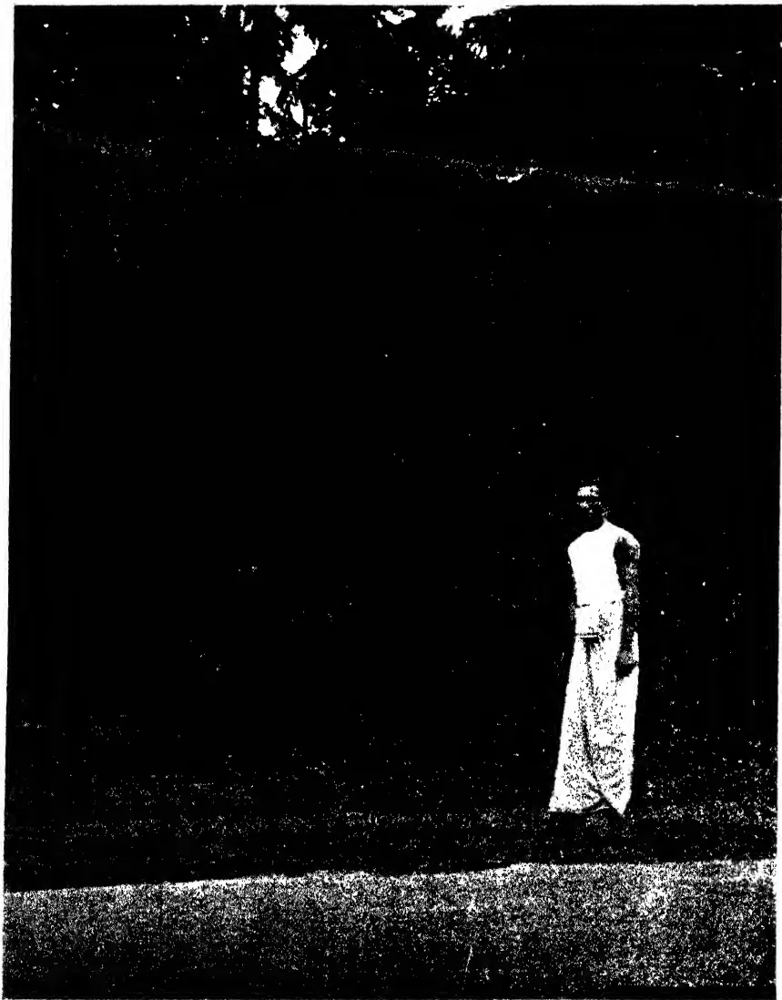A high-contrast black and white photograph. The scene is dominated by a dark, textured field. In the lower right, a person stands facing left, wearing a light-colored, long-sleeved garment. The background is dark and indistinct, with some foliage visible at the top. The overall composition is stark, emphasizing the texture of the ground and the silhouette of the person.

PLATE III.—PROFILE OF A LATERITIC (CABOOKY) LOAM.

113------------------------------------------------

69

TABLE I.

Laterite (Cabook) Profile

<table border="1">
<thead>
<tr>
<th rowspan="2">Location.</th>
<th colspan="4">Dalugama, W. P.</th>
<th colspan="4">Horagalla, W. P.</th>
<th colspan="4">Maharagama, W. P.</th>
<th rowspan="2">Yellowish-white clay material in the Below 8' interstices of D</th>
</tr>
<tr>
<th>B<br/>5'-7'</th>
<th>C<br/>7'-11'</th>
<th>D<br/>Below 11'</th>
<th>B<br/>2'-4'</th>
<th>C<br/>4'-8'</th>
<th>D<br/>Below 8'</th>
<th>B<br/>2'-4'</th>
<th>C<br/>4'-8'</th>
<th>D<br/>Below 8'</th>
<th>B<br/>2'-4'</th>
<th>C<br/>4'-8'</th>
</tr>
<tr>
<th></th>
<th>Per cent.</th>
<th>Per cent.</th>
<th>Per cent.</th>
<th>Per cent.</th>
<th>Per cent.</th>
<th>Per cent.</th>
<th>Per cent.</th>
<th>Per cent.</th>
<th>Per cent.</th>
<th>Per cent.</th>
<th>Per cent.</th>
<th></th>
</tr>
</thead>
<tbody>
<tr>
<td>Loss on ignition</td>
<td>..</td>
<td>..</td>
<td>..</td>
<td>..</td>
<td>..</td>
<td>..</td>
<td>..</td>
<td>..</td>
<td>..</td>
<td>..</td>
<td>..</td>
<td>..</td>
</tr>
<tr>
<td>Total</td>
<td>13.56</td>
<td>14.04</td>
<td>15.08</td>
<td>14.99</td>
<td>15.33</td>
<td>15.35</td>
<td>15.09</td>
<td>16.61</td>
<td>18.74</td>
<td>15.09</td>
<td>16.61</td>
<td>18.74</td>
</tr>
<tr>
<td>Free</td>
<td>33.84</td>
<td>35.22</td>
<td>40.40</td>
<td>34.64</td>
<td>40.06</td>
<td>43.00</td>
<td>30.99</td>
<td>33.83</td>
<td>31.60</td>
<td>30.99</td>
<td>35.45</td>
<td>31.60</td>
</tr>
<tr>
<td>Silica</td>
<td>8.34</td>
<td>8.06</td>
<td>9.50</td>
<td>11.86</td>
<td>12.42</td>
<td>14.11</td>
<td>..</td>
<td>..</td>
<td>..</td>
<td>..</td>
<td>..</td>
<td>..</td>
</tr>
<tr>
<td>Combined</td>
<td>25.50</td>
<td>27.16</td>
<td>30.90</td>
<td>22.78</td>
<td>27.64</td>
<td>28.89</td>
<td>..</td>
<td>..</td>
<td>..</td>
<td>..</td>
<td>..</td>
<td>..</td>
</tr>
<tr>
<td>Alumina and titanium oxide</td>
<td>25.37</td>
<td>30.22</td>
<td>30.74</td>
<td>24.37</td>
<td>29.36</td>
<td>29.81</td>
<td>23.54</td>
<td>27.61</td>
<td>32.26</td>
<td>23.54</td>
<td>28.33</td>
<td>32.26</td>
</tr>
<tr>
<td>Total</td>
<td>26.73</td>
<td>19.68</td>
<td>13.16</td>
<td>26.93</td>
<td>13.44</td>
<td>11.19</td>
<td>18.95</td>
<td>13.44</td>
<td>3.73</td>
<td>18.95</td>
<td>10.30</td>
<td>3.73</td>
</tr>
<tr>
<td>Iron oxide</td>
<td>..</td>
<td>..</td>
<td>..</td>
<td>..</td>
<td>..</td>
<td>..</td>
<td>..</td>
<td>..</td>
<td>..</td>
<td>..</td>
<td>..</td>
<td>..</td>
</tr>
<tr>
<td>Free</td>
<td>12.87</td>
<td>10.45</td>
<td>6.19</td>
<td>13.06</td>
<td>7.46</td>
<td>4.11</td>
<td>..</td>
<td>..</td>
<td>..</td>
<td>..</td>
<td>..</td>
<td>..</td>
</tr>
<tr>
<td>Combined</td>
<td>13.86</td>
<td>9.23</td>
<td>6.97</td>
<td>13.87</td>
<td>5.98</td>
<td>7.08</td>
<td>..</td>
<td>..</td>
<td>..</td>
<td>..</td>
<td>..</td>
<td>..</td>
</tr>
<tr>
<td>Total silica/sesquioxide (molecular)</td>
<td>1.31</td>
<td>1.39</td>
<td>1.75</td>
<td>1.42</td>
<td>1.79</td>
<td>1.97</td>
<td>1.47</td>
<td>1.58</td>
<td>1.54</td>
<td>1.47</td>
<td>1.72</td>
<td>1.54</td>
</tr>
<tr>
<td>Combined silica/sesquioxide (molecular)</td>
<td>1.02</td>
<td>1.08</td>
<td>1.34</td>
<td>0.93</td>
<td>1.23</td>
<td>1.33</td>
<td>..</td>
<td>..</td>
<td>..</td>
<td>..</td>
<td>..</td>
<td>..</td>
</tr>
<tr>
<td>Total silica/alumina (molecular)</td>
<td>2.25</td>
<td>2.02</td>
<td>2.07</td>
<td>2.37</td>
<td>2.34</td>
<td>2.44</td>
<td>2.23</td>
<td>2.08</td>
<td>1.66</td>
<td>2.23</td>
<td>2.12</td>
<td>1.66</td>
</tr>
<tr>
<td>Combined silica/alumina (molecular)</td>
<td>1.70</td>
<td>1.53</td>
<td>1.71</td>
<td>1.58</td>
<td>1.59</td>
<td>1.64</td>
<td>..</td>
<td>..</td>
<td>..</td>
<td>..</td>
<td>..</td>
<td>..</td>
</tr>
<tr>
<td>Alumina/iron oxide (molecular)</td>
<td>1.48</td>
<td>2.40</td>
<td>4.79</td>
<td>1.41</td>
<td>3.41</td>
<td>4.16</td>
<td>1.94</td>
<td>3.21</td>
<td>1.33</td>
<td>1.94</td>
<td>4.30</td>
<td>1.33</td>
</tr>
</tbody>
</table>

114------------------------------------------------

70

Malabar<sup>1</sup> and Kanara (8). Bamber and Bruce (1) found a variation of alumina in local samples from 22·9 to 62·0 per cent. Many of their samples, however, had alumina contents of less than 35 per cent. The alumina contents increase with depth in all cases. This is the reverse of the iron percentages which fall as the depth increases. Thus in the case of the Dalugama pit, the alumina/iron oxide ratios increase from 1·5 to 4·8 as the depth increases from 5 to 11 ft.

(4) The iron oxide contents of the samples vary appreciably, *viz.*, from 10·3 to 26·9 per cent; but a greater variation was found by Bamber and Bruce, the range in their analyses being 4·0 to 29·0 per cent. In the present samples it is interesting to note that the free and combined iron oxides occur in about equal proportions.

(5) The yellowish-white clay material is relatively rich in alumina and has a very low iron content.

The above findings are generally in conformity with those of Oldham (3), Blandford (7) and others.

The analysis of the hydrochloric acid soluble fraction of three samples of laterite shown below indicate that a proportion of the alumina in laterite exists as hydrated oxide or hydroxide. This is in conformity with the findings of previous workers, Lenz, Bauer and others (4), supported by Bamber and Bruce.

<table border="1">
<thead>
<tr>
<th rowspan="2">Sample.</th>
<th colspan="2">B</th>
<th colspan="2">D</th>
<th>White clay material</th>
</tr>
<tr>
<th colspan="2">Per cent.</th>
<th colspan="2">Per cent.</th>
<th>from D<br/>Per cent.</th>
</tr>
</thead>
<tbody>
<tr>
<td>Insoluble in acid ..</td>
<td>..</td>
<td>54·30</td>
<td>..</td>
<td>55·43</td>
<td>.. 57·73</td>
</tr>
<tr>
<td>*Soluble in acid ..</td>
<td>..</td>
<td>45·70</td>
<td>..</td>
<td>44·57</td>
<td>.. 42·27</td>
</tr>
<tr>
<td>*Containing :—</td>
<td></td>
<td></td>
<td></td>
<td></td>
<td></td>
</tr>
<tr>
<td>Combined water ..</td>
<td>..</td>
<td>15·97</td>
<td>..</td>
<td>16·03</td>
<td>.. 19·11</td>
</tr>
<tr>
<td>Alumina (<math>Al_2O_3</math>) ..</td>
<td>..</td>
<td>8·88</td>
<td>..</td>
<td>16·39</td>
<td>.. 19·17</td>
</tr>
<tr>
<td>Iron oxide (<math>Fe_2O_3</math>) ..</td>
<td>..</td>
<td>20·81</td>
<td>..</td>
<td>12·05</td>
<td>.. 3·95</td>
</tr>
</tbody>
</table>

#### GENERAL DISCUSSION

What is obvious from these analyses and those of other workers is that laterite varies greatly in composition, which is dependent on (a) the rock from which the sample is derived, and (b) the depth from which it is taken. In view of this marked variation in composition, the classification of soils into laterite, lateritic and non-lateritic types on the basis of chemical criteria alone, *e.g.*, the silica/alumina ratios of the clay fraction, is likely to be misleading. This is clearly seen in the present analyses. In no instance does the combined silica/alumina molecular ratio fall below 1·56, while the range is from 1·56 to 1·70. The corresponding ratios for samples examined by Bruce (1) varied from 1·0 to 2·6. Pendleton (9) in a paper on "The Use of the Term Laterite" has made out a good case for the restriction of

115------------------------------------------------

71

the term to the material found in tropical countries, corresponding to that described by Buchanan and Oldham. In this sense of the term, local "cabook" may rightly be described as laterite. Pendleton deprecates the use of chemical criteria alone in defining laterite. While there is much to be said for his viewpoint, it cannot be doubted that the silica/alumina molecular ratio of the clay complex is a useful index for classifying soils on a broad basis.

**The Lateritic (Cabooky) Heavy Loam.**

<table>
<tr>
<td>Location</td>
<td>..</td>
<td>Ambepussa</td>
</tr>
<tr>
<td>Elevation</td>
<td>..</td>
<td>About sea level</td>
</tr>
<tr>
<td>Climate</td>
<td>..</td>
<td>Rainfall 117 in. ; temperature 81°F.</td>
</tr>
<tr>
<td>Geological origin</td>
<td>..</td>
<td>Charnockite</td>
</tr>
<tr>
<td>Mode of formation</td>
<td>..</td>
<td>Residual</td>
</tr>
<tr>
<td>Topography</td>
<td>..</td>
<td>Undulating ; sample taken from a low hillock</td>
</tr>
<tr>
<td>Drainage</td>
<td>..</td>
<td>Free</td>
</tr>
<tr>
<td>Vegetation</td>
<td>..</td>
<td>Coconuts and garden crops</td>
</tr>
</table>

**Profile**

<table>
<tr>
<td>A 0-10 in.</td>
<td>..</td>
<td>Grey-brown, heavy loam with small proportion of ferruginous gravel ; compact but friable ; conglomerate to small clod ; root growth good</td>
</tr>
<tr>
<td>B 10-30 in.</td>
<td>..</td>
<td>Reddish-brown, heavy loam with high proportion of red hydrated ironstone nodules giving horizon mottled appearance ; hard and compact ; conglomerate to irregular clod ; root growth poor</td>
</tr>
<tr>
<td>C 30-60 in.</td>
<td>..</td>
<td>Yellowish-red "laterite" with characteristic pale yellow and red mottlings ; vermicular ; very hard and compact ; roots absent</td>
</tr>
</table>

**TABLE II.**

**The Lateritic (Cabooky) Heavy Loam, Ambepussa**

<table>
<thead>
<tr>
<th></th>
<th>A</th>
<th>B</th>
<th>C</th>
</tr>
<tr>
<th></th>
<th>Per cent.</th>
<th>Per cent.</th>
<th>Per cent.</th>
</tr>
</thead>
<tbody>
<tr>
<td colspan="4" style="text-align: center;"><b>Mechanical Analysis</b></td>
</tr>
<tr>
<td>Stones and gravel</td>
<td>.. 10.20 ..</td>
<td>21.75 ..</td>
<td>16.62 ..</td>
</tr>
<tr>
<td>Coarse sand</td>
<td>.. 30.6 ..</td>
<td>25.4 ..</td>
<td>19.8 ..</td>
</tr>
<tr>
<td>Fine sand</td>
<td>.. 13.6 ..</td>
<td>9.4 ..</td>
<td>13.2 ..</td>
</tr>
<tr>
<td>Silt</td>
<td>.. 7.8 ..</td>
<td>5.5 ..</td>
<td>4.9 ..</td>
</tr>
<tr>
<td>Clay</td>
<td>.. 43.2 ..</td>
<td>55.0 ..</td>
<td>57.7 ..</td>
</tr>
<tr>
<td>Loss by solution</td>
<td>.. 1.8 ..</td>
<td>1.2 ..</td>
<td>0.5 ..</td>
</tr>
<tr>
<td>Moisture</td>
<td>.. 3.0 ..</td>
<td>3.5 ..</td>
<td>3.9 ..</td>
</tr>
<tr>
<td>Texture index number</td>
<td>.. 39.7 ..</td>
<td>50.1 ..</td>
<td>52.4 ..</td>
</tr>
<tr>
<td>Soil type</td>
<td>.. Heavy loam</td>
<td>Gravelly clay loam</td>
<td>Gravelly clay loam</td>
</tr>
<tr>
<td colspan="4" style="text-align: center;"><b>Chemical Analysis</b></td>
</tr>
<tr>
<td>Loss on ignition</td>
<td>.. 10.91 ..</td>
<td>11.44 ..</td>
<td>10.55 ..</td>
</tr>
<tr>
<td>Combined water</td>
<td>.. 7.78 ..</td>
<td>9.83 ..</td>
<td>9.72 ..</td>
</tr>
<tr>
<td>Organic matter</td>
<td>.. 3.13 ..</td>
<td>1.61 ..</td>
<td>0.83 ..</td>
</tr>
<tr>
<td>Carbon</td>
<td>.. 1.82 ..</td>
<td>0.937 ..</td>
<td>0.483 ..</td>
</tr>
<tr>
<td>Nitrogen</td>
<td>.. 0.158 ..</td>
<td>0.099 ..</td>
<td>0.065 ..</td>
</tr>
<tr>
<td>Carbon/nitrogen ratio</td>
<td>.. 11.53 ..</td>
<td>9.47 ..</td>
<td>6.62 ..</td>
</tr>
<tr>
<td>Reaction (pH)</td>
<td>.. 6.1 ..</td>
<td>5.6 ..</td>
<td>5.1 ..</td>
</tr>
<tr>
<td>Total exchangeable bases (m.e. per 100 gm. soil)</td>
<td>.. 3.15 ..</td>
<td>1.76 ..</td>
<td>0.50 ..</td>
</tr>
</tbody>
</table>

116------------------------------------------------

72TABLE II.—*contd.*

<table border="1">
<thead>
<tr>
<th></th>
<th>A</th>
<th>B</th>
<th>C</th>
</tr>
<tr>
<th></th>
<th>Per cent.</th>
<th>Per cent.</th>
<th>Per cent.</th>
</tr>
</thead>
<tbody>
<tr>
<td>Exchangeable calcium (m.e. per 100 gm. soil)</td>
<td>2.25</td>
<td>1.24</td>
<td>0.26</td>
</tr>
<tr>
<td>Base exchange capacity</td>
<td>10.14</td>
<td>10.74</td>
<td>—</td>
</tr>
<tr>
<td>Readily available phosphoric acid (mgm. per 100 gm. soil)</td>
<td>0.86</td>
<td>0.53</td>
<td>0.49</td>
</tr>
</tbody>
</table>

Clay Analysis

<table border="1">
<tbody>
<tr>
<td>Loss on ignition</td>
<td>23.76</td>
<td>19.75</td>
<td>17.59</td>
</tr>
<tr>
<td>Silica (<math>\text{SiO}_2</math>)</td>
<td>42.08</td>
<td>43.22</td>
<td>42.42</td>
</tr>
<tr>
<td>Sesquioxides (<math>\text{R}_2\text{O}_3</math>)</td>
<td>54.30</td>
<td>53.05</td>
<td>55.05</td>
</tr>
<tr>
<td>Alumina (<math>\text{Al}_2\text{O}_3</math>)</td>
<td>44.72</td>
<td>43.26</td>
<td>46.09</td>
</tr>
<tr>
<td>Iron oxides (<math>\text{Fe}_2\text{O}_3</math>)</td>
<td>9.58</td>
<td>9.79</td>
<td>8.96</td>
</tr>
<tr>
<td><math>\text{SiO}_2/\text{Al}_2\text{O}_3</math> (molecular)</td>
<td>1.59</td>
<td>1.69</td>
<td>1.56</td>
</tr>
<tr>
<td><math>\text{SiO}_2/\text{R}_2\text{O}_3</math> (molecular)</td>
<td>1.40</td>
<td>1.47</td>
<td>1.39</td>
</tr>
<tr>
<td>Soil type</td>
<td>.. Lateritic</td>
<td>.. Lateritic</td>
<td>.. Lateritic</td>
</tr>
</tbody>
</table>

An examination of the analytical data of a lateritic (*cabooky*) loam profile (Plate III.) reveals that its A, B, and C horizons are heavy loams containing variable proportions of ferruginous concretions. The texture becomes heavier with depth. The nitrogen and organic matter contents are fairly high in the A, fair in the B, and low in the C horizons. The soils of all horizons are acid in reaction, but the acidity increases with depth. The replaceable base contents are low in the top soil, and fall to a very low level in the C horizon. The base exchange capacity of these soils is fairly high, *viz.*, about 10 mgm. equivalents per 100 gm. of soil. The readily available phosphoric acid content is low in all horizons and falls with depth. On the basis of the silica/alumina molecular ratios, the soils of even the B and C horizons are of the lateritic type, though in morphological characteristics they are typical laterites.

SOIL CONCRETIONS

(For Table III. see page 73)

The analysis of seven samples of soil concretions or pisolites (*perdigon* as they are known in Cuba) from different parts of the Island show, as to be expected, a great variation in the composition of these materials. The Ambepussa sample is less ferruginous than that from a soil associated with dolomitic limestone at Nalanda. The highest content of alumina is found in the Welimada dry *patana* sample. The concretions from Jaffna are almost entirely composed of limestone. The Hambantota pisolites (peastones) contain as much as 10 per cent. of titanium oxide, while the Peradeniya samples have no less than 13 per cent. manganese dioxide. The Sigiriya dry zone sample is similar to that from Ambepussa, but is more siliceous. The composition of the concretions is largely affected by the nature of the soils from which they were derived. Bennett and Allison (10) and Prescott (11) furnish data in confirmation.

117------------------------------------------------

33

TABLE III.

Analyses of Soil Concretions

<table border="1">
<thead>
<tr>
<th>Place</th>
<th>.. Jaffna</th>
<th>.. Welimada</th>
<th>.. Ambepussa</th>
<th>.. Nalanda</th>
<th>.. Peradeniya</th>
<th>.. Hambantota</th>
<th>.. Sigiriya</th>
</tr>
<tr>
<th>Colour</th>
<th>.. Mottled yellowish brown and reddish brown</th>
<th>.. Dark brown and reddish black</th>
<th>.. and reddish brown</th>
<th>.. Reddish brown</th>
<th>.. Black</th>
<th>.. Blackish brown</th>
<th>.. Reddish brown</th>
</tr>
<tr>
<th>Consistency</th>
<th>.. Fairly soft</th>
<th>.. Fairly hard</th>
<th>.. Hard</th>
<th>.. Very hard</th>
<th>.. Soft</th>
<th>.. Medium soft</th>
<th>.. Hard</th>
</tr>
<tr>
<th>Shape</th>
<th>.. Irregular</th>
<th>.. Round to irregular</th>
<th>.. Irregular</th>
<th>.. Irregular</th>
<th>.. Round</th>
<th>.. Round</th>
<th>.. Irregular</th>
</tr>
</thead>
<tbody>
<tr>
<td colspan="8">Rock from which material is probably derived</td>
</tr>
<tr>
<td></td>
<td>.. Miocene stone</td>
<td>.. Lime- Khondalite with Charnockite in- trusion</td>
<td>.. Charnockite</td>
<td>.. Gneiss associated with dolomitic limestone</td>
<td>.. Material found in Intermediate pockets of alluvial loam</td>
<td>.. Intermediate gneiss</td>
<td>.. Biotite gneiss</td>
</tr>
<tr>
<td></td>
<td>Per cent.</td>
<td>Per cent.</td>
<td>Per cent.</td>
<td>Per cent.</td>
<td>Per cent.</td>
<td>Per cent.</td>
<td>Per cent.</td>
</tr>
<tr>
<td>Silica (SiO<sub>2</sub>)</td>
<td>6.07</td>
<td>29.74</td>
<td>31.04</td>
<td>18.74</td>
<td>26.06</td>
<td>49.82</td>
<td>38.48</td>
</tr>
<tr>
<td>Alumina (Al<sub>2</sub>O<sub>3</sub>)</td>
<td>0.17</td>
<td>29.12</td>
<td>23.15</td>
<td>20.22</td>
<td>14.15</td>
<td>2.70</td>
<td>18.92</td>
</tr>
<tr>
<td>Iron oxide (Fe<sub>2</sub>O<sub>3</sub>)</td>
<td>4.38</td>
<td>21.73</td>
<td>33.86</td>
<td>50.58</td>
<td>20.71</td>
<td>28.87</td>
<td>35.45</td>
</tr>
<tr>
<td>Titanium oxide (TiO<sub>2</sub>)</td>
<td>—</td>
<td>1.98</td>
<td>2.45</td>
<td>4.00</td>
<td>6.30</td>
<td>9.80</td>
<td>3.50</td>
</tr>
<tr>
<td>Manganese dioxide (MnO<sub>2</sub>)</td>
<td>—</td>
<td>2.31</td>
<td>0.14</td>
<td>Trace</td>
<td>13.14</td>
<td>1.13</td>
<td>0.52</td>
</tr>
<tr>
<td>Magnesium oxide (MgO)</td>
<td>—</td>
<td>2.10</td>
<td>—</td>
<td>1.74</td>
<td>—</td>
<td>—</td>
<td>—</td>
</tr>
<tr>
<td>Calcium oxide (CaO)</td>
<td>49.13</td>
<td>—</td>
<td>—</td>
<td>Trace</td>
<td>—</td>
<td>—</td>
<td>—</td>
</tr>
</tbody>
</table>

118------------------------------------------------

74TABLE IV.Analyses of Clays

<table border="1">
<thead>
<tr>
<th></th>
<th>1.<br/>"Kirimetti"<br/>from<br/>Batapola<br/>Per cent.</th>
<th>2.<br/>"Sudukirimetti"<br/>from<br/>Metiyagoda off<br/>Ambalangoda<br/>Per cent.</th>
<th>3.<br/>Peradeniya<br/>Per cent.</th>
<th>4.<br/>Borales-<br/>gamuwa<br/>Per cent.</th>
<th>China clay<br/>Kaolin<br/>(Thorpe)<br/>Per Cent.</th>
</tr>
</thead>
<tbody>
<tr>
<td>Loss on ignition</td>
<td>.. 16.85</td>
<td>.. 14.34</td>
<td>.. 13.24</td>
<td>.. 17.85</td>
<td>.. 11-14</td>
</tr>
<tr>
<td>Silica (<math>\text{SiO}_2</math>)</td>
<td>.. 42.68</td>
<td>.. 47.02</td>
<td>.. 44.03</td>
<td>.. 38.38</td>
<td>.. 45-60</td>
</tr>
<tr>
<td>Sesquioxides (<math>\text{R}_2\text{O}_3</math>)</td>
<td>.. 39.95</td>
<td>.. 36.17</td>
<td>.. 42.64</td>
<td>.. 44.40</td>
<td>.. —</td>
</tr>
<tr>
<td>Alumina (<math>\text{Al}_2\text{O}_3</math>)</td>
<td>.. 34.51</td>
<td>.. 34.95</td>
<td>.. 41.78</td>
<td>.. 42.56</td>
<td>.. 33-40</td>
</tr>
<tr>
<td>Iron oxide (<math>\text{Fe}_2\text{O}_3</math>)</td>
<td>.. 3.68</td>
<td>.. 1.21</td>
<td>.. 0.87</td>
<td>.. 1.84</td>
<td>.. —</td>
</tr>
<tr>
<td>Titanium oxide (<math>\text{TiO}_2</math>)</td>
<td>.. 1.76</td>
<td>.. Nil</td>
<td>.. Nil</td>
<td>.. —</td>
<td>.. —</td>
</tr>
<tr>
<td>Silica/alumina (molecular)</td>
<td>2.09</td>
<td>2.28</td>
<td>1.78</td>
<td>1.53</td>
<td>2.0</td>
</tr>
<tr>
<td>Colour</td>
<td>.. Creamy grey</td>
<td>White</td>
<td>.. Pale cream</td>
<td>White</td>
<td>.. —</td>
</tr>
</tbody>
</table>

LOCAL CLAYS

Table IV. above shows the variation in composition of four types of local clays. The Ambalangoda clay approaches China clay nearest in composition and appears to be suitable for the manufacture of good quality China.

SUMMARY

The analysis of nine typical samples of laterite (*cabook*) obtained from different depths of three cabook quarries locally, shows that there are wide variations in composition between the samples. But in all instances, while the iron oxide contents decrease with increasing depth of sampling, the alumina contents increase. On the basis of their silica/alumina ratios, none of the samples would be classified as laterite. The restriction of the term to materials which correspond in morphological and physical characteristics to Buchanan's laterite, as advocated by Pendleton, would avoid much confusion. The morphological and analytical characteristics of a "lateritic" heavy loam are described.

The composition of seven samples of soil concretions or pisolites (known as *perdigon* in Cuba) is very variable and dependent on the nature of the rocks from which the pisolites were derived.

Analytical data in respect of four samples of local clays indicate that some of these are of suitable quality for ceramic purposes.

REFERENCES

1. 1. Joachim, A. W. R.—Studies on Ceylon Soils II. *The Tropical Agriculturist*, LXXXIV., May, 1935, pp. 263-264.
2. 2. Buchanan, F. H.—Journey from Madras through Mysore, Canara and Malabar, 1807.
3. 3. Oldham, 1903. A Manual of the Geology of India, p. 360.
4. 4. Glinka, K. D.—The Great Soil Groups of the World—Transl. by C. F. Marbut, pp. 51-59.

119------------------------------------------------

75

1. 5. Harrison, J. B.—The Katamorphism of Igneous Rocks under Humid Tropical Conditions.
2. 6. Drosdoff, F. and Truog, E.—A Method for Removing and Determining the Free Iron Oxides in Soil Colloids. *Jour. Am. Soc. Agronomy.*, Vol. XXVII., 1935, p. 312.
3. 7. Blanford. *Memoirs Geol. Survey, India*, I.
4. 8. Fox, C. S.—Buchanan's Laterite of Malabar and Kanara. *Records Geol. Survey, India*, LXIX., 4, 1936.
5. 9. Pendleton, R. L.—On the Use of the Term Laterite. *Amer. Soil Survey Assocn. Proc.*, 1936, pp. 102–108.
6. 10. Bennett, H. H. and Allison, R. V.—The Soils of Cuba, p. 76.
7. 11. Prescott, J. A.—The Composition of Some Ironstone Gravels from Australian Soils. *Trans. Roy. Soc. S. Austr.*, LVIII., 1934, p. 10.

120------------------------------------------------

76

## PERIODICITY OF NITRIFICATION

### PART III. COCONUT AREA

ALEXANDER BRUCE, B.Sc., F.I.C.

#### GENERAL

**C**OCONUT palms belong to the Monocotyledons while Tea and Rubber previously dealt with in parts I. and II. belong to the Dicotyledons. The methods of absorption of soil nutrients by these plants is the same, via the roots.

Coconuts shed their leaves throughout the year but absorb most of the cell contents into the main body of the palm, before being severed by the leaf callus. The fallen leaves do not add materially to the nutrients of the soil. Green manure—leguminous crops—are sometimes grown between the rows of palms. Light ploughing and harrowing take place but this is not universal. Coconut husk is occasionally buried in shallow pits with soil between the rows of palms or between four palms. Leaves (pinnae) are sometimes added to these pits, but they are more often burned and the residual ash used as a fertilizer to the palms.

Artificial manure is applied on the best cultivated estates. The continued use of manure gives good results; spasmodic manuring does not give satisfactory results. Peasants grow grass between the palms and graze cattle tied to the trunks, as a method of fertilizing the palms.

#### DATA

An estate in the Chilaw District was chosen for the investigation, as the estate is situated in a typical coconut area. The soil in this area is sandy. Coarse sand predominates, 30 per cent. passes the 60-mesh sieve (0.5 mm.): silts and clay are poorly represented. Plant-food is poor in the soil mass.

Rainfall is about 65 inches per annum. Intensities of rainfall over 1 in. are high amounting to 70–80 per cent. A recorded total high rainfall does not mean an even distribution. Such intensities are damaging to the flowers as they are dashed by the high rains. The mechanical state of the coarse sand does not permit the retention of much moisture (20–25 per cent. being an average) but generally the sands are of good depth. From these good draining qualities aeration naturally follows.

121------------------------------------------------

A completely blank white page with no visible content, text, or markings.

122------------------------------------------------

17 - Rainfall in inches - 38-39

18 - Nitrates as Nitrogen lb per acre - 38-39

19 - Crop Nuts 100,000 1938-39-40

CHILAW COCONUT ESTATE

GRAPH V

RAINFALL IN INCHES —————

NITRATES AS NITROGEN lb per acre —————

CULTIVATED —————

FALLOW —————

CROP NUTS PER 100,000 —————

1938-39-40

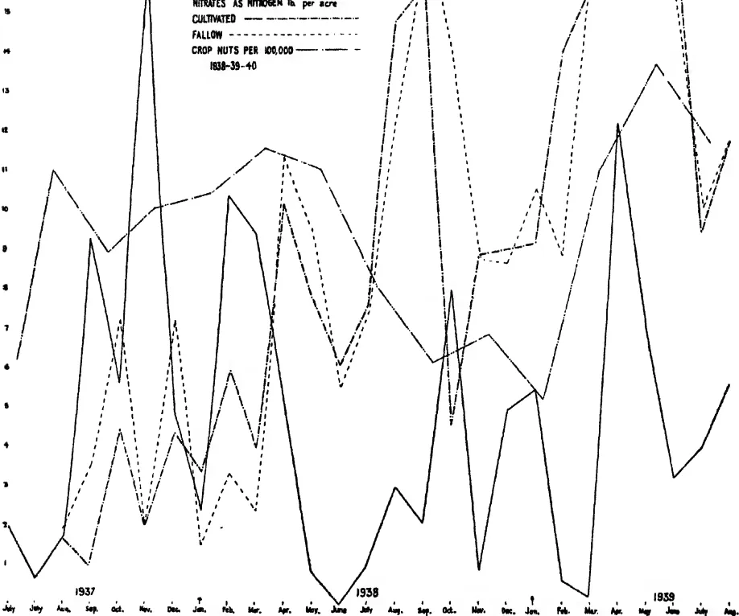

The graph displays five data series over time. Rainfall (solid line) shows significant peaks in November 1937 (~18 inches) and September 1938 (~18 inches). Nitrates as Nitrogen (dashed line) and Cultivated (dotted line) show high values in September 1938 (~18 lb per acre). Fallow (dash-dot line) and Crop Nuts (long-dashed line) show lower values, with Crop Nuts peaking in August 1938 (~14 per 100,000).

<table border="1">
<thead>
<tr>
<th>Month</th>
<th>Rainfall (inches)</th>
<th>Nitrates (lb/acre)</th>
<th>Cultivated (lb/acre)</th>
<th>Fallow (lb/acre)</th>
<th>Crop Nuts (per 100,000)</th>
</tr>
</thead>
<tbody>
<tr><td>July 1937</td><td>6.5</td><td>2.5</td><td>1.5</td><td>1.0</td><td>2.0</td></tr>
<tr><td>Aug 1937</td><td>1.0</td><td>1.5</td><td>1.0</td><td>1.0</td><td>1.5</td></tr>
<tr><td>Sept 1937</td><td>11.0</td><td>2.0</td><td>1.0</td><td>1.0</td><td>1.0</td></tr>
<tr><td>Oct 1937</td><td>8.0</td><td>4.0</td><td>2.0</td><td>1.0</td><td>1.0</td></tr>
<tr><td>Nov 1937</td><td>18.0</td><td>2.0</td><td>1.0</td><td>1.0</td><td>1.0</td></tr>
<tr><td>Dec 1937</td><td>10.0</td><td>7.0</td><td>5.0</td><td>4.0</td><td>4.0</td></tr>
<tr><td>Jan 1938</td><td>10.0</td><td>3.0</td><td>2.0</td><td>1.5</td><td>3.0</td></tr>
<tr><td>Feb 1938</td><td>10.5</td><td>6.0</td><td>3.0</td><td>2.0</td><td>3.0</td></tr>
<tr><td>Mar 1938</td><td>11.5</td><td>4.0</td><td>2.0</td><td>2.0</td><td>3.0</td></tr>
<tr><td>Apr 1938</td><td>11.5</td><td>11.5</td><td>11.5</td><td>11.5</td><td>11.5</td></tr>
<tr><td>May 1938</td><td>11.0</td><td>8.0</td><td>8.0</td><td>8.0</td><td>11.0</td></tr>
<tr><td>June 1938</td><td>10.5</td><td>6.0</td><td>6.0</td><td>6.0</td><td>10.5</td></tr>
<tr><td>July 1938</td><td>8.0</td><td>7.5</td><td>7.5</td><td>7.5</td><td>8.0</td></tr>
<tr><td>Aug 1938</td><td>7.0</td><td>18.0</td><td>18.0</td><td>18.0</td><td>7.0</td></tr>
<tr><td>Sept 1938</td><td>6.0</td><td>18.0</td><td>18.0</td><td>18.0</td><td>6.0</td></tr>
<tr><td>Oct 1938</td><td>8.0</td><td>5.0</td><td>5.0</td><td>5.0</td><td>8.0</td></tr>
<tr><td>Nov 1938</td><td>7.0</td><td>8.0</td><td>8.0</td><td>8.0</td><td>7.0</td></tr>
<tr><td>Dec 1938</td><td>6.0</td><td>8.0</td><td>8.0</td><td>8.0</td><td>6.0</td></tr>
<tr><td>Jan 1939</td><td>5.5</td><td>10.5</td><td>10.5</td><td>10.5</td><td>5.5</td></tr>
<tr><td>Feb 1939</td><td>1.0</td><td>8.0</td><td>8.0</td><td>8.0</td><td>1.0</td></tr>
<tr><td>Mar 1939</td><td>0.5</td><td>18.0</td><td>18.0</td><td>18.0</td><td>0.5</td></tr>
<tr><td>Apr 1939</td><td>11.0</td><td>18.0</td><td>18.0</td><td>18.0</td><td>11.0</td></tr>
<tr><td>May 1939</td><td>14.0</td><td>18.0</td><td>18.0</td><td>18.0</td><td>14.0</td></tr>
<tr><td>June 1939</td><td>14.0</td><td>18.0</td><td>18.0</td><td>18.0</td><td>14.0</td></tr>
<tr><td>July 1939</td><td>9.0</td><td>10.0</td><td>10.0</td><td>10.0</td><td>9.0</td></tr>
<tr><td>Aug 1939</td><td>5.5</td><td>11.5</td><td>11.5</td><td>11.5</td><td>5.5</td></tr>
</tbody>
</table>

123------------------------------------------------

77

The reaction is about 6.6 (p.H.). Carbon is about one half per cent. and the nitrogen a tenth of that. In the manured area the amount of nitrogen is about 442 lb. per acre. In the fallow area the nitrogen amounts to 537 lb. per acre. This greater amount of nitrogen (95 lb. per acre over the cultivated area) gives the fallow area a greater base for the production of nitrates, especially as there is no competition for the nitrates by coconut roots. From the nitrification figures with an average of 8.9 lb. per acre nitrogen as nitrates, about 2 per cent. of the total soil nitrogen plus manure is nitrified on the manured area, while on the fallow area with 9.2 lb. per acre nitrogen as nitrates, 1.3 per cent. of the total soil nitrogen is nitrified. Nitrates found are residual nitrates. During a third of the initial results nitrites were present but they have been eliminated now.

The carbon:nitrogen on the manured area is 13.3; on the fallow area 12.8.

TABLE V.  
Chillaw Estate

<table border="1">
<thead>
<tr>
<th rowspan="2">Month</th>
<th colspan="3">Rainfall</th>
<th rowspan="2">Crop</th>
<th colspan="3">Nitrates as Nitrogen</th>
<th colspan="2">Nitrites</th>
</tr>
<tr>
<th>Inches</th>
<th>Days</th>
<th>Per Cent.</th>
<th>Manured</th>
<th>Unmanured fallow</th>
<th>Manured</th>
<th>Unmanured Fallow</th>
</tr>
</thead>
<tbody>
<tr>
<td colspan="10"><b>1937</b></td>
</tr>
<tr>
<td>August</td>
<td>1.72</td>
<td>—</td>
<td>—</td>
<td>1101973</td>
<td>1.6</td>
<td>1.9</td>
<td>Trace</td>
<td>Trace</td>
<td></td>
</tr>
<tr>
<td>September</td>
<td>9.22</td>
<td>4</td>
<td>100</td>
<td>895848</td>
<td>1.0</td>
<td>3.5</td>
<td>Nil</td>
<td>Trace</td>
<td></td>
</tr>
<tr>
<td>October</td>
<td>5.59</td>
<td>—</td>
<td>—</td>
<td></td>
<td>4.4</td>
<td>7.2</td>
<td>Present</td>
<td>Trace present</td>
<td></td>
</tr>
<tr>
<td>November</td>
<td>15.85</td>
<td>5</td>
<td>51</td>
<td>1007840</td>
<td>2.0</td>
<td>2.0</td>
<td>Trace</td>
<td>Trace</td>
<td></td>
</tr>
<tr>
<td>December</td>
<td>4.82</td>
<td>1</td>
<td>80</td>
<td></td>
<td>4.4</td>
<td>7.2</td>
<td>Nil</td>
<td>Nil</td>
<td></td>
</tr>
<tr>
<td colspan="10"><b>1938</b></td>
</tr>
<tr>
<td>January</td>
<td>2.33</td>
<td>—</td>
<td>—</td>
<td>1043015</td>
<td>3.4</td>
<td>1.5</td>
<td>Trace</td>
<td>Present</td>
<td></td>
</tr>
<tr>
<td>February</td>
<td>10.34</td>
<td>4</td>
<td>73</td>
<td></td>
<td>5.9</td>
<td>3.3</td>
<td>Present</td>
<td>Present</td>
<td></td>
</tr>
<tr>
<td>March</td>
<td>9.30</td>
<td>3</td>
<td>36</td>
<td>1151846</td>
<td>3.9</td>
<td>2.4</td>
<td>Fair</td>
<td>Trace</td>
<td></td>
</tr>
<tr>
<td>April</td>
<td>4.79</td>
<td>—</td>
<td>—</td>
<td></td>
<td>10.2</td>
<td>11.3</td>
<td>Nil</td>
<td>Nil</td>
<td></td>
</tr>
<tr>
<td>May</td>
<td>0.8</td>
<td>—</td>
<td>—</td>
<td>1097287</td>
<td>7.8</td>
<td>9.4</td>
<td>Nil</td>
<td>Nil</td>
<td></td>
</tr>
<tr>
<td>June</td>
<td>—</td>
<td>—</td>
<td>—</td>
<td></td>
<td>6.0</td>
<td>5.5</td>
<td>Nil</td>
<td>Nil</td>
<td></td>
</tr>
<tr>
<td>July</td>
<td>0.88</td>
<td>—</td>
<td>—</td>
<td>779712</td>
<td>7.5</td>
<td>7.5</td>
<td>Nil</td>
<td>Nil</td>
<td></td>
</tr>
<tr>
<td>August</td>
<td>2.95</td>
<td>1</td>
<td>50</td>
<td></td>
<td>14.7</td>
<td>12.1</td>
<td>Nil</td>
<td>Nil</td>
<td></td>
</tr>
<tr>
<td>September</td>
<td>2.01</td>
<td>—</td>
<td>—</td>
<td>609588</td>
<td>15.6</td>
<td>17.0</td>
<td>Nil</td>
<td>Nil</td>
<td></td>
</tr>
<tr>
<td>October</td>
<td>7.98</td>
<td>2</td>
<td>75</td>
<td></td>
<td>4.5</td>
<td>14.1</td>
<td>Nil</td>
<td>Nil</td>
<td></td>
</tr>
<tr>
<td>November</td>
<td>0.81</td>
<td>—</td>
<td>—</td>
<td>677618</td>
<td>8.8</td>
<td>8.8</td>
<td>Nil</td>
<td>Nil</td>
<td></td>
</tr>
<tr>
<td>December</td>
<td>4.89</td>
<td>2</td>
<td>66</td>
<td></td>
<td>8.9</td>
<td>8.6</td>
<td>Nil</td>
<td>Nil</td>
<td></td>
</tr>
<tr>
<td colspan="10"><b>1939</b></td>
</tr>
<tr>
<td>January</td>
<td>5.39</td>
<td>2</td>
<td>62</td>
<td>524085</td>
<td>9.1</td>
<td>10.5</td>
<td>Nil</td>
<td>Nil</td>
<td></td>
</tr>
<tr>
<td>February</td>
<td>0.60</td>
<td>—</td>
<td>—</td>
<td></td>
<td>13.9</td>
<td>8.8</td>
<td>Nil</td>
<td>Nil</td>
<td></td>
</tr>
<tr>
<td>March</td>
<td>0.18</td>
<td>—</td>
<td>—</td>
<td>1089046</td>
<td>15.6</td>
<td>16.4</td>
<td>Nil</td>
<td>Nil</td>
<td></td>
</tr>
<tr>
<td>April</td>
<td>12.09</td>
<td>4</td>
<td>71</td>
<td></td>
<td>17.2</td>
<td>15.6</td>
<td>Nil</td>
<td>Nil</td>
<td></td>
</tr>
<tr>
<td>May</td>
<td>6.79</td>
<td>2</td>
<td>78</td>
<td>1364561</td>
<td>18.0</td>
<td>18.7</td>
<td>Nil</td>
<td>Nil</td>
<td></td>
</tr>
<tr>
<td>June</td>
<td>3.16</td>
<td>—</td>
<td>—</td>
<td></td>
<td>17.8</td>
<td>15.7</td>
<td>Nil</td>
<td>Nil</td>
<td></td>
</tr>
<tr>
<td>July</td>
<td>3.96</td>
<td>—</td>
<td>—</td>
<td>1163884</td>
<td>9.4</td>
<td>10.0</td>
<td>Nil</td>
<td>Nil</td>
<td></td>
</tr>
<tr>
<td>August</td>
<td>5.53</td>
<td>1</td>
<td>82</td>
<td></td>
<td>11.7</td>
<td>11.7</td>
<td>Nil</td>
<td>Nil</td>
<td></td>
</tr>
</tbody>
</table>

Graph V.—(see page opposite)—The high rains of September and November, 1937, reduced nitrates in these months, owing to the free nature of the sands. The high rains of February and March, 1938, reduced nitrates in March. There was a large

124------------------------------------------------

78

increase in nitrates in April with lower rainfall. With low rains in May-September there were increase of nitrates in August and September. November usually a month of heavy rainfall was poor in rains. The nitrates kept steadily up till the end of the period in spite of high rains in April, 1939. February and March, 1939, were exceptionally dry months.

Taking the graph as a whole the large nitrate production period is during November, 1938, to August, 1939, a period of 10 months and at the finish of the graph there was no tendency to a downward drop. The period before that was from April, 1938, until October, 1938, a period of 7 months. The period before that was from June, 1937, to March, 1938, a period of 10 months, at a lesser concentration.

The graph shows there is better staying power in nitrates during 1938-1939 than there was in 1937 and early 1938, but it should be noted that during 1938-1939 rainfall was much less than during 1937-1938. During November, 1939, there was no high seasonal rain and the May, June, July, 1938, rains were weak.

From the rainfalls of the last five years, 1935-1939, May, September, October, and November are the wettest months, chiefly November, and it is after these wet periods that manuring would be most profitable, say late November and early December and again in late May and early June. Manuring twice a year is always recommended as there are two wet and dry seasons during the book-year.

It takes a year to elaborate a coconut from flower to mature nut, so rainfall and supply of nutrients during that period is important. In order to determine effects of rainfall, &c., on crop, conditions of the previous year should be known.

Coconut palms develop nuts all the year round in order to fulfil the function of reproduction of their species. The vegetative process is in continual production in order to enable the palm to perform its main function. There is no resting period for leaf or fruit production; it is continual elaboration for 70-80 years of the raw products in soil and air. Soil nutrients must be present for the elaborate searching rooting system of the coconut palm or else the fruit crop suffers.

The fruit of the coconut palm, or the essential part, the kernel, is removed from the cultivated area and steps should be taken to replenish plant-food removed and make up the soil loss by artificial means.

#### CROP—RAINFALL—NITRATES

As it takes a year to make a coconut the crops of 1938-1939-1940 are taken and plotted against the rainfall and nitrification of 1937-1938-1939.

125------------------------------------------------

79

The heavy rainfall of November, 1937, heavy in intensities and total, probably dashed the blossoms and doomed the chances of the palms, the following year, bearing a heavy crop at that time. The heavy drop in crop from July, 1938, to January, 1940, was due to the low rainfall for 5 months from May-September, 1938, and again in November. Higher nitrification could not counteract this drought. The heavy increase in crop from February-August, 1939, coincides with better rainfall in April-May and a long period of high nitrification extending from November-August, 1939.

Rainfall is the determining factor in crop. Manuring takes place in the autumn between alternate squares of coconut palms at the rate of 15 lb. per application containing 20 lb. nitrogen, 50 lb. phosphoric acid, and 25 lb. potash. There is also a spring dressing of 6 lb. on every square of a more soluble mixture containing about the same plant-food.

### SUMMARY

TABLE VI.

<table border="1">
<thead>
<tr>
<th rowspan="3">District.</th>
<th rowspan="3">Elevation<br/>Feet.</th>
<th rowspan="3">Rainfall<br/>Inches.</th>
<th colspan="2">Nitrogen Total lb. per Acre</th>
<th colspan="2">Average monthly Nitrogen as Nitrate lb. per Acre</th>
</tr>
<tr>
<th rowspan="2">Cultivated</th>
<th rowspan="2">Uncultivated Fallow</th>
<th rowspan="2">Cultivated</th>
<th rowspan="2">Uncultivated Fallow</th>
</tr>
<tr>
<th></th>
<th></th>
</tr>
</thead>
<tbody>
<tr>
<td>Dimbulla</td>
<td>.. 5,300 ..</td>
<td>90 ..</td>
<td>6,345 ..</td>
<td>5,489 ..</td>
<td>105<br/>1.6%*</td>
<td>75<br/>1.4%*</td>
</tr>
<tr>
<td>Badulla</td>
<td>.. 3,500 ..</td>
<td>77 ..</td>
<td>2,400 ..</td>
<td>1,500 ..</td>
<td>73<br/>3.1%*</td>
<td>57<br/>3.6%*</td>
</tr>
<tr>
<td>Kelani Valley<br/>No. 1</td>
<td>.. Low ..</td>
<td>163 ..</td>
<td>3,260 ..</td>
<td>2,865 ..</td>
<td>29<br/>0.9%*</td>
<td>20<br/>0.7%*</td>
</tr>
<tr>
<td>Kelani Valley<br/>No. 2</td>
<td>.. Low ..</td>
<td>180 ..</td>
<td>3,285 ..</td>
<td>3,117 ..</td>
<td>28.6<br/>0.8%*</td>
<td>22<br/>0.7%*</td>
</tr>
<tr>
<td>Chilaw</td>
<td>.. Low ..</td>
<td>65 ..</td>
<td>442 ..</td>
<td>537 ..</td>
<td>8.9<br/>2%*</td>
<td>9.2<br/>1.7%*</td>
</tr>
</tbody>
</table>

\* Percentages of the gross nitrogen.

It is interesting to consider nitrification under different conditions of elevation, rainfall and soil conditions.

Nitrates found on a cultivated area are residual from plant absorption from nitrate prepared from soil nitrogen and manures. A fallow area has not the same competition from plant absorption and is consequently higher in nitrates on some occasions. In the rubber area, this was divided into manured and unmanured—not fallow. Both areas had this absorption of nitrates from full growing rubber trees.

Reference to Table VI.—

Dimbulla and Badulla are tea areas.

No. 1 and No. 2 Kelani Valley are rubber estates.

A Chilaw coconut estate on a sandy soil.

126------------------------------------------------

80

*Dimbulla District.*—The richest in nitrogen in the series nitrifies to 1.6 per cent. in the cultivated area and 1.4 per cent. in the fallow area. This is in a cool climate.

*Badulla District.*—Soil containing about a third of the total nitrogen of Dimbulla soil at a lower elevation and warmer climate, nitrifies to the extent of 3.1 per cent. in the cultivated area and 3.6 per cent. on the fallow area. This is about twice the nitrification of the Dimbulla area.

No. 1 Kelani Valley is at a low elevation and with heavy rainfall about double that experienced on Dimbulla and Badulla tea estates resulting in a hot steamy climate. No. 1 Kelani Valley estate soil is richer in nitrogen than Badulla tea area and nitrifies to the extent of 0.9 per cent. in the cultivated area and 0.7 per cent. on the unmanured area. A broad casting of 1 cwt. of burnt lime accelerates the nitrification.

No. 2 Kelani Valley estate soil nitrifies to the extent of 0.7 per cent. on the unmanured area and 1.2 per cent. on the manured area. The latter high result is entirely due to one month giving a very high nitrification after manuring with nitrate of soda, in dry weather. Eliminating that month, nitrification average per month is 28.6 lb. per acre = 0.8 per cent. on the total nitrogen.

The soil of the Chilaw coconut area which is a typical coconut sand, with 65 in. rainfall, classified as in the drier area, has a nitrification of 2 per cent. on the cultivated land and 1.7 per cent. on the fallow.

The outstanding feature of these results is the high percentage nitrification on Badulla tea area soil and the low nitrification on the rubber area soil. The Chilaw coconut sand was the second highest in the series next to Badulla and more than Dimbulla.

Authorities not getting the desired results on rubber leaf and latex added up to 6 cwt. of ammonium sulphate equal to 120 lb. of nitrogen per acre in one application, the bulk of which was lost to the proprietors as unabsorbable. As there was not sufficient organic matter or carbon in the soil to rectify the carbon : nitrogen on the balance of nitrogen, the unanchored nitrogen went to waste. Similarly in the tea area up to 200 lb. of nitrogen per acre were added in one application, unabsorbable, and was largely lost to the proprietors. These applications were recommended by advisers to the estates.

If the monthly average production of nitrogen as nitrates is multiplied by twelve the yearly nitrate production is obtained. If that is compared with the total nitrogen the life of the estate, based on the nitrogen, may be predicted presuming that all the nitrates formed were absorbed by the plants or taken from the estate by other means, such as seepage.

127------------------------------------------------

81TABLE VII.

<table border="1">
<thead>
<tr>
<th rowspan="2">District</th>
<th>Monthly</th>
<th>Yearly</th>
<th rowspan="2">Gross Nitrogen</th>
<th>Life</th>
</tr>
<tr>
<th>Nitrification<br/>lb. per acre</th>
<th>Nitrification<br/>lb. per acre</th>
<th>Years</th>
</tr>
</thead>
<tbody>
<tr>
<td>Dimbulla</td>
<td>.. 105</td>
<td>.. 1,260</td>
<td>.. 6345-6300 (<math>= 1260 \times 5</math>)</td>
<td>.. 5</td>
</tr>
<tr>
<td>Badulla</td>
<td>.. 73</td>
<td>.. 876</td>
<td>.. 2400-2628 (<math>= 876 \times 3</math>)</td>
<td>.. 3</td>
</tr>
<tr>
<td>Kelani Valley No. 1</td>
<td>.. 29</td>
<td>.. 348</td>
<td>.. 3260-3480 (<math>= 348 \times 10</math>)</td>
<td>.. 10</td>
</tr>
<tr>
<td>Kelani Valley No. 2</td>
<td>.. 29</td>
<td>.. 348</td>
<td>.. 3585-3480 (<math>= 348 \times 10</math>)</td>
<td>.. 10</td>
</tr>
<tr>
<td>Chilaw</td>
<td>.. 9</td>
<td>.. 108</td>
<td>.. 442-432 (<math>= 108 \times 4</math>)</td>
<td>.. 4</td>
</tr>
</tbody>
</table>

As these estates are much older than their predicted nitrogen life, the conclusion to come to is that nitrate production is not a wasting asset on the estates owing to the nitrates being immobilized by proteinization and retained in the soil until nitrification conditions recur. Such conditions only occur on properly cultivated estates.

It may seem strange that, considering several thousand pounds of nitrogen are found in each acre of land, it is necessary to add artificial manure to obtain crops. The explanation is that the nitrogen on an acre of soil is distributed in a more or less inert condition over the whole acreage while the roots of the plants only occupy a small portion of the land. Application of manures is as near the feeding roots as is practicable and is accompanied by green manure prunings which stimulates bacterial action and absorption of nutrients by the plant.

The composition of all crops is known so that the plant food removed by crops from the land can be replaced. Tea and coconuts remove large quantities of plant food from the land while rubber removes practically nothing compared to these. Rubber is produced mostly from the carbon dioxide of the air; yet rubber land has been highly fertilized in an attempt to stimulate the trees to give more rubber.

All details were collected by Messrs. A. Baur & Co., Ltd., and to them and the Superintendent of the estates thanks are rendered. Messrs. A. J. Cameron and P. J. Edward carried out the analytical part and to them thanks are given.

Laboratory,  
Green path, Colpetty.

128------------------------------------------------

82

# AN INVESTIGATION OF METHODS OF SEPARATING ECHINOCHLOA SEEDS FROM SEED PADDY

W. R. C. PAUL, M.A. (Cantab.), Ph.D., M.Sc. (Lond.), F.L.S.,  
AGRICULTURAL OFFICER, CENTRAL DIVISION

AND

M. FERNANDO, Ph.D., B.Sc. (Lond.),  
ASSISTANT BOTANIST

THE four species of *Echinochloa* occurring in Ceylon, viz.: *E. colona*, *E. frumentacea*, *E. crus-galli* and *E. stagnina*, better known locally under the Sinhalese names of *wel marukku*, *maruk*, *goma-tana* and *gogera-welu* and the Tamil names *kolichudan* and *kuthirai vali*, constitute some of the most damaging of paddy field weeds. A detailed description of the four species has been given by Paul and Senaratna (1941). These species (which in this article are included collectively under the name *maruk*) seed freely. Moreover, new shoots develop on the basal parts of old, decumbent stems, root on coming in contact with the soil or with water, and become detached from the parent stems by the decay of the internodes. These shoots soon produce earheads, even before their separation from the parent stems. In this way the *maruk* plant propagates rapidly. The seed may either be shed in the field or it may become mixed with the seed paddy in the harvesting and threshing operations.

If the freedom of seed paddy from admixture with *maruk* seed is not ensured continued reinfestation of the fields will occur at sowing time. Seed paddy derived from *maruk* infested fields will contain a proportion of *maruk* seed varying with the severity of the infestation in the fields at harvest time. It is desirable that such seed, if used for sowing, should be completely disinfested. The results of experiments designed to investigate methods of ridding seed paddy from contaminating *maruk* seed, are presented in this contribution. The efficacy of careful winnowing and of floating infested seed in water was investigated.

129------------------------------------------------

83

## EXPERIMENTAL MATERIAL AND METHODS

Samples of seed paddy (*pachchaiperumal* and *vellai illan-kalayan*) contaminated with seed of the four species of *maruk* found in Ceylon, *Echinochloa colona*, *E. frumentacea*, *E. crus-galli* and *E. stagnina* were used. The samples were obtained from the Paddy Stations at Tabbowa and Nalanda.

A hand winnow (*S. kulla*, *T. kullam* or *sulaku*) of the type commonly used in villages, was employed in the winnowing tests. The winnowing was carried out with elaborate care, small quantities of seed being handled at each operation.

The immersion method aimed at exploiting the lower specific gravity of *maruk* seed. The contaminated seed was placed in a bucket, covered with approximately its own volume of water, and stirred vigorously. A proportion of the *maruk* seed floated to the surface and was decanted off. The immersion in water and subsequent decanting may be repeated till no more *maruk* seeds float to the surface.

Estimates of the efficacy of the treatments were provided by counts of the numbers of *maruk* seeds in two ounce samples of infested seed subjected to the various treatments.

## RESULTS

The results obtained in these treatments are presented in Table I. The data form part of a binomial distribution and must accordingly undergo transformation to an inverse sine scale ( $\theta = \sin^{-1} \sqrt{p}$ ) before they can be validly subjected to an analysis of variance (Cochran, 1938). The analysis of variance of the transformed data for treatments i., ii., iii., v., and vii., is presented in Table 2. The value of F for treatments exceeds the 5 per cent. point and is hence indicative of significant effects. A summary of the means transformed back into the original scale is given at the foot of the table.

130------------------------------------------------

84

TABLE 1.  
Percentages of *Echinochloa* Seeds Removed by Various Treatments.

<table border="1">
<thead>
<tr>
<th>Sample</th>
<th>Treatment I.<br/>Winnowed<br/>(pachchai-<br/>perumal—<br/>Nalanda)</th>
<th>Treatment II.<br/>Decanted<br/>once<br/>(pachchai-<br/>perumal—<br/>Nalanda)</th>
<th>Treatment III.<br/>Decanted<br/>twice<br/>(pachchai-<br/>perumal—<br/>Nalanda)</th>
<th>Treatment IV.<br/>Decanted<br/>thrice<br/>(pachchai-<br/>perumal—<br/>Nalanda)</th>
<th>Treatment V.<br/>Decanted<br/>once<br/>(vellai-<br/>illankalayan<br/>—Tabbowa,</th>
<th>Treatment VI.<br/>Decanted<br/>twice<br/>(vellai-<br/>illankalayan—<br/>Tabbowa,</th>
<th>Treatment VII.<br/>Decanted<br/>once<br/>(vellai-<br/>illankalayan—<br/>Nalanda,</th>
<th>Treatment<br/>VIII. Decanted<br/>twice<br/>(vellai-<br/>illankalayan—<br/>Nalanda)</th>
</tr>
</thead>
<tbody>
<tr>
<td>1</td>
<td>98 per cent.</td>
<td>81 per cent.</td>
<td>94 per cent.</td>
<td>100 per cent.</td>
<td>97 per cent.</td>
<td>100 per cent.</td>
<td>71 per cent.</td>
<td>100 per cent.</td>
</tr>
<tr>
<td>2</td>
<td>98</td>
<td>87</td>
<td>100</td>
<td>100</td>
<td>83</td>
<td>97</td>
<td>100</td>
<td>100</td>
</tr>
<tr>
<td>3</td>
<td>95</td>
<td>88</td>
<td>94</td>
<td>100</td>
<td>76</td>
<td>100</td>
<td>75</td>
<td>100</td>
</tr>
<tr>
<td>4</td>
<td>97</td>
<td>85</td>
<td>99</td>
<td>100</td>
<td>93</td>
<td>100</td>
<td>100</td>
<td>100</td>
</tr>
<tr>
<td>5</td>
<td>99</td>
<td>91</td>
<td>99</td>
<td>100</td>
<td>88</td>
<td>100</td>
<td>50</td>
<td>100</td>
</tr>
<tr>
<td>6</td>
<td>93</td>
<td>86</td>
<td>100</td>
<td>100</td>
<td>89</td>
<td>100</td>
<td>100</td>
<td>100</td>
</tr>
<tr>
<td>7</td>
<td>98</td>
<td>89</td>
<td>100</td>
<td>100</td>
<td>86</td>
<td>100</td>
<td>80</td>
<td>100</td>
</tr>
<tr>
<td>8</td>
<td>98</td>
<td>91</td>
<td>99</td>
<td>100</td>
<td>94</td>
<td>100</td>
<td>100</td>
<td>100</td>
</tr>
<tr>
<td>9</td>
<td>95</td>
<td>85</td>
<td>96</td>
<td>100</td>
<td>100</td>
<td>100</td>
<td>100</td>
<td>100</td>
</tr>
<tr>
<td>10</td>
<td>99</td>
<td>78</td>
<td>91</td>
<td>100</td>
<td>100</td>
<td>100</td>
<td>100</td>
<td>100</td>
</tr>
</tbody>
</table>

131------------------------------------------------

85TABLE 2.Analysis of Variance of Transformed Data

<table border="1">
<thead>
<tr>
<th></th>
<th>DF</th>
<th>SS</th>
<th>MS</th>
<th>VR</th>
<th>Five per cent. point</th>
<th>One per cent.</th>
</tr>
<tr>
<th></th>
<th colspan="6"><math>(\theta = \sin^{-1} \sqrt[p]{p})</math></th>
</tr>
</thead>
<tbody>
<tr>
<td>Treatments</td>
<td>4</td>
<td>1242.16</td>
<td>310.54</td>
<td>3.22</td>
<td>&lt;2.61</td>
<td>&gt;3.65</td>
</tr>
<tr>
<td>Error</td>
<td>45</td>
<td>4336.84</td>
<td>96.37</td>
<td></td>
<td></td>
<td></td>
</tr>
<tr>
<td></td>
<td>49</td>
<td>5579.00</td>
<td></td>
<td></td>
<td></td>
<td></td>
</tr>
</tbody>
</table>

<table border="1">
<thead>
<tr>
<th rowspan="2"></th>
<th colspan="5">TREATMENT MEANS</th>
<th rowspan="2">STANDARD ERROR</th>
</tr>
<tr>
<th>I.</th>
<th>II.</th>
<th>III.</th>
<th>V.</th>
<th>VII.</th>
</tr>
</thead>
<tbody>
<tr>
<td>Degrees (<math>\theta = \sin^{-1} \sqrt[p]{p}</math>)</td>
<td>80.5</td>
<td>68.3</td>
<td>82.6</td>
<td>74.5</td>
<td>76.6</td>
<td><math>\pm 3.105</math></td>
</tr>
<tr>
<td>Percentages</td>
<td>97.3</td>
<td>86.3</td>
<td>98.3</td>
<td>92.8</td>
<td>94.6</td>
<td></td>
</tr>
</tbody>
</table>

The degree of infestation in the original material varied widely, and the numbers of *maruk* seeds per ounce of the original material are given below :

<table border="1">
<thead>
<tr>
<th>MATERIAL USED.</th>
<th>NO. OF MARUK SEEDS PER OZ.</th>
</tr>
</thead>
<tbody>
<tr>
<td>Treatment i.</td>
<td>39</td>
</tr>
<tr>
<td>Treatments ii., iii. and iv.</td>
<td>59</td>
</tr>
<tr>
<td>Treatments v. and vi.</td>
<td>15</td>
</tr>
<tr>
<td>Treatments vii. and viii.</td>
<td>5</td>
</tr>
</tbody>
</table>

DISCUSSION

The measure of control achieved by careful winnowing was very high—in one instance it was significantly greater than that obtained by a single decanting—but it was never complete. Besides, the method is much too laborious and slow to be of use in *Echinochloa* control.

A single immersion and decanting removed a high percentage of *maruk* seeds. Removal became, of course, progressively more complete with successive immersions. If the infestation is mild, a second immersion is all that is necessary. With severe infestations, a third immersion may be needed. After the immersion treatment, the seed may be dried immediately in the sun for about 4 hours and stored for use later or it may be germinated and sown at once. It was found that the seed subject to the immersion treatment gave a germination percentage of 100 when tested a month later. This is due to the fact that in the immersion process all the light seed floats to the surface with the *maruk* seed and is removed with decanting.

The results presented in this contribution are derived from experiments with relatively small quantities of infested seed.

132------------------------------------------------

86

The immersion treatment has, however, been practised with three decantings, using quantities up to 2 bushels at a time and 100 per cent. clean seed paddy obtained. Larger quantities may be handled at a time, provided suitable receptacles for immersion are available.

These experiments have not explored all the theoretically possible methods of purifying seed paddy. If *maruk* seeds are considerably more sensitive to heat than paddy, temperatures lethal to *maruk* seeds but not to paddy may be employed in *maruk* control.

The maximum diameter of *maruk* seeds and the minimum effective diameter of paddy seeds (*vellai illankalayan* and *pachchai perumal* varieties) are 2.85 mm. and 2.75 mm. respectively; there is, accordingly, little promise of successful exploitation of sieving as a method of *Echinochloa* control.

The method of seed treatment employed should, of course, be supplemented by the use of cultural methods in the field. The cultural methods available to the grower are briefly reviewed here.

In the control of *maruk* in paddy fields, it is essential that the weeds should be removed as soon as they are detected in the field. It is difficult, however, to distinguish *maruk* from standing paddy before the weed commences flowering, without examination of individual plants, but as it flowers much earlier than paddy, it can be uprooted without great disturbance of the paddy plants during the early stages of growth of the crop. Every *maruk* plant should be uprooted before the ear heads mature in order to prevent the seed being shed in the field, and care should be taken, especially in the case of *E. stagnina* which produces long creeping stems as the plants become older, that no fragments of stems containing one or more nodes which are likely to develop new shoots are left behind. The uprooted plants should not be heaped along the bunds of the fields as they are liable to continue growing and as there is the danger that the seeds may fall into the fields. They should either be thrown into compost heaps where there is a certainty of the composting process being well carried out and the seeds being destroyed by the heat developed in the heaps, or they should be buried in pits.

The infested field should be ploughed soon after the harvest of the paddy with a mould-board plough. All stools and fragments of stems which are difficult to eradicate by hand will thus become buried in the soil and no regrowth from the stems will take place, provided in the process of ploughing, these are buried to a depth of not less than three inches.

133------------------------------------------------

87

When the preparatory tillage operations for the next season are due to commence, the fields should on this occasion be cross ploughed, but if in the meantime, *maruk* plants are seen in flower, they should be immediately uprooted by hand. A fortnight later, a third ploughing should be given, followed by harrowing with the Burmese harrow after ten days. A second harrowing should be done about ten days later and the fields then levelled for sowing or transplanting the crop. If a single late maturing crop is only grown for the year then the fields should be periodically harrowed so as to destroy any *maruk* seedlings which develop from seed which has previously been shed in the field.

#### SUMMARY

1. Methods of freeing seed paddy from contaminating *maruk* seed have been investigated.

2. Winnowing, though providing a high degree of control, is a slow and laborious operation.

3. A series of three immersions in water and subsequent decanting provides complete control and is recommended.

4. Cultural methods of eradicating *maruk* from infested fields during the interval between harvesting and sowing or transplanting the subsequent paddy crop are briefly reviewed.

5. Every *maruk* plant should be uprooted from the standing paddy as soon as it is recognized in the flowering stage as otherwise the ear heads mature and the seeds are shed in the field and germinate or become mixed with the seed paddy during harvesting.

#### ACKNOWLEDGEMENT

We gratefully thank Mr. T. V. Thamotheram, Agricultural Instructor, Puttalam, and Mr. P. A. Gooneratne, Agricultural Instructor, Nalanda, for their assistance.

#### REFERENCES

<table border="0">
<tbody>
<tr>
<td>Cochran, W. G., 1938</td>
<td>..</td>
<td>Some difficulties in the statistical analysis of replicated experiments. <i>Empire J. Expt. Agric.</i> I., pp., 129-42.</td>
</tr>
<tr>
<td>Fisher, R. A. and Yates, F., 1938</td>
<td>..</td>
<td>Statistical tables for biological, agricultural and medical research. <i>London: Oliver and Boyd.</i></td>
</tr>
<tr>
<td>Paul, W. R. C. and Senaratne, J. E., 1941</td>
<td>..</td>
<td>The species of <i>Echinochloa</i> in Ceylon and their occurrence and distribution as weeds of paddy land. <i>The Tropical Agriculturist</i>, January, Vol. XCVI., 1941.</td>
</tr>
</tbody>
</table>

[In addition to the methods of freeing seed paddy from the seeds of *maruk* which are discussed in the above article, trials are being made with sieves of various types the results of which will be published later. *Ed. T. A.*]

134------------------------------------------------

88

## DEPARTMENTAL NOTES

---

### LAYING RECORDS OF PULLETS HATCHED FROM EGGS IMPORTED BY AIR MAIL

---

A short note was published in *The Tropical Agriculturist* for July, 1940, on the performance of a batch of 8 Rhode Island Red pullets which had been hatched from eggs sent from England by air mail. By the end of December, 1940, complete records for 12 months laying were available for each of the birds except No. 17 which had started to lay in February, much later than the others.

The complete records are published on account of the high average production of these 8 birds, the unusually high individual record of hen No. 19 and the fact that the 8 pullets have completed a year's laying without any mortality or illness.

Hen No. 19 is worthy of special mention because in the 12 months from January 1 to December 31, she laid 304 eggs, a very high record for Ceylon. This hen is of medium size weighing 5 lb. 2 oz., handles very well, has good head points, and is not loosely feathered; indeed her plumage is tighter and closer-textured than is typical of the Rhode Island Red breed. From an exhibition point of view her colour is poor being too light in shade. The photograph shows her type. The number of eggs laid by each hen during the period January 1 to December 31, 1940, is as follows:—

No. 19—304; No. 23—253; No. 17—235 in eleven months;  
 No. 20—228.; No. 21—211; No. 16—203; No. 18—193; and  
 No. 22—161; giving an average of 223 eggs per hen.

135------------------------------------------------

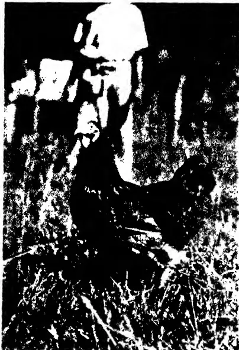

*Block by Survey Dept.*

RHODE ISLAND RED HEN NO. 19 HATCHED  
FROM EGG IMPORTED BY AIR MAIL.

136------------------------------------------------

A completely blank white page with no visible content, text, or markings.

137------------------------------------------------

89

## CONTROL METHODS FOR PADDY PESTS.

---

**P**ADDY pests can easily be prevented from causing damage to paddy cultivation if the following simple agricultural practices are observed.

(a) All wild grasses and weeds which grow on the bunds, round the borders of paddy areas, along the irrigation and drainage channels, and on the patches of high-land in paddy areas, should be kept cut short throughout the year, especially during periods when the paddy crop is not seeding. If these wild grasses and seeds are allowed to grow tall they serve as feeding and hiding places for large numbers of insect pests which attack the paddy plants when their growth has reached a suitable stage. Cutting this vegetation regularly, either for feeding to cattle or for use in making manure, is the best and most economical way of utilizing it and of reducing the number of insect pests.

(b) Special care should be taken to construct and maintain permanent wide-based bunds with well-sloped sides (*i.e.*, not too vertical, and so as to form stable bunds on the tops of which beans, murunga, katurumurunga, and other additional food crops can be grown) of sufficient height to make it possible to flood the plants when they are in the younger stages of growth so that if the pest does appear the fields can be flooded and the pest easily destroyed.

(c) Make a careful inspection of your fields after the first six weeks of growth and remove all weeds as these not only choke up the paddy plants but serve to protect the pest from any control action that might be taken to get rid of it.

138------------------------------------------------

90

## SELECTED ARTICLES.

---

### PISÉ DE TERRE: A CHEAP METHOD OF ENCLOSING LAND OR FIELDS\*

---

FOR many years, the management of the Government Cattle Farm, Hissar, has been in search of some method of building labourers' quarters, godowns, cowsheds, enclosure walls, &c., cheaper than *pucca* masonry and cheaper and more lasting than *kacha* brick. The solution has now been found in *pisé de terre* (rammed earth).

Sixty-five labourers' quarters of *pisé de terre* are now in course of construction on the farm, but it was not the intention of the author to rush into print until the work ended, and the accounts are finally closed.

At a meeting of the Central Fodder and Grazing Committee of the Imperial Council of Agricultural Research, held in New Delhi on November 21, 1938, the following items were discussed :—

- (a) The high cost of wire fencing for enclosing grazing lands and experimental areas.
- (b) The problem of finding suitable plants for "live" cattle-proof hedges, for enclosing fields, pastures, &c.

The reason for the search for "live" hedges is, of course, the necessity for finding some cheap substitute for wire or masonry fences, which are very expensive to erect and maintain.

It was recognized that it might take many years of research to discover plants suitable for the variety of climatic conditions found in this country, and many more years to establish them as "live" hedges.

The author suggested that in the meantime, walls of *pisé de terre* might be used, and was asked to prepare a note regarding the construction of boundary walls of *pisé de terre*, from experience so far gained from this type of construction, now in progress on his farm.

This article should, therefore, only be regarded as a preliminary note to a more elaborate description of *pisé* building in general, which will follow.

The information given herein, however, is sufficient to enable cheap and lasting boundary walls to be constructed by unskilled labour.

---

\* By W. S. Read, P.V.S., Superintendent, Government Cattle Farm, Hissar, India, in *Agriculture and Live-stock in India*, Vol. IX., Part IV., July, 1939.

139------------------------------------------------

91

*Pisé de terre* (rammed earth) must on no account be confused with the sun-dried brick, and mud-walling operations, carried on in many parts of this country. Advocates of *pisé de terre* have the greatest difficulty in convincing the uninitiated that this type of construction, is different from, and much stronger and more permanent than sun-dried brick or mud walls. Mud (wet soft earth) has no place in *pisé de terre* practice.

Building construction in *pisé de terre* is no new or modern invention. It has stood the test of time. Pliny mentions it in his "Natural History". The Romans introduced it into France, and buildings of *pisé de terre* have been erected in England, Africa, Australia, New Zealand, Mexico and California, representing a very wide range of climatic variation. Even in India *pisé de terre* is not unknown, as work of this description was carried out at Etah Gaol in 1867-68. Nevertheless although building in *pisé de terre* has been practised for so many centuries in so many widely spread countries, the process is still unknown to the mass of the general public. Moreover, those who have had experience of this cheap and simple method of construction are most enthusiastic regarding its merits. One is, therefore, forced to the conclusion that the only reason for it not being more widely known and practised, is prejudice on the part of the building trade, because it throws open a field for unskilled labour, supervised by very few skilled or semi-skilled artisans. On the work now in progress at Hissar, the only tradesmen employed are two masons on annas ten each *per diem* and one carpenter on annas eight *per diem*. The remainder of the gang are all entirely unskilled labourers.

The whole process of *pisé de terre* building construction can be condensed into a few words. It consists of erecting parallel wooden shutters on the site of the wall to be erected. The distance between these parallel shutters being the width of the wall required. A layer of fine earth (not mud), some four to five inches deep is spread evenly between the shutters. This earth is well rammed with wooden rammers, until they fail to leave an impression upon it. Similar layers of earth are spread and rammed until the top of the shuttering is reached. The shutters are immediately dismantled and set up for the next section. The full height of the wall is reached by placing the shutters on the courses of the wall already completed. Several sets of shutters may be in use at the same time, for as soon as two sections of the first course are finished the second course can be commenced. When two sections of the second course are ready the third course can be commenced and so on. The work thus progresses in a series of steps, which eliminates the necessity for ladders or scaffolding.

#### **DETAILS FOR CONSTRUCTING A PISE' DE TERRE WALL FIFTEEN INCHES THICK AND SIX FEET HIGH INCLUSIVE OF SIX INCHES AS FOUNDATION.**

##### **I.—Materials Required.**

(a) *Shuttering.*—There are several types of shuttering in vogue, designed to suit individual fancy and the standard of the labour to be employed. There is a big field for research in shutter design for *pisé de terre* work.

2—J. N. A 1653 (1/41)

140------------------------------------------------

92

For the work at Hissar, shutters of the utmost simplicity and cheapness were evolved, devoid of all complications, such as special moulds for corners or for joining walls at right angles. External braces and scaffolding were also eliminated. In this case, the length of the pairs of shutters was determined by the fact that blocks of quarters with rooms 10 ft. by 10 ft. were to be built. Shutters 7 ft. 3 in. in length were made to allow of each course of each 10 ft. wall being built in two sections, with allowances for overlap at the joint and for interlocking with adjoining walls. For an ordinary straightforward boundary wall, shutters 9 ft. in length can be used. Longer than this might be found heavy and unwieldy in operation.

To commence operations, construct an even number of shutters from any hard, dry, well-seasoned wood, each 9 ft. by 2 ft. by  $1\frac{1}{2}$  in., strengthened with four battens each 2 ft. by 6 in. by 1 in., rivetted on to one side of the shutter only (Fig. 1). The inner face of the plank to be as smooth as possible, with the heads of all batten rivets filed down flush with the wood. Holes  $\frac{3}{4}$  in. in diameter should be bored through the battens and plank, centred exactly 3 in. from the edge of the plank, to take the metal distance rods. Each hole should be protected by metal plates on both the inner and outer faces of the shutter. The inner plate prevents damage to the shutter by the shoulder of the distance rod, and the outer plate protects the batten from damage by the distance rod wing-nut. An iron handle is fixed to each batten to facilitate handling. A strip of 1-in. angle iron is nailed to the inner edges of the shutters to save them from damage by blows from the rammers.


The diagram illustrates the construction of a shutter side plank. The main view shows a 9-foot long plank with four battens spaced 6 inches apart. Each batten has a  $\frac{3}{4}$ -inch hole and an iron handle. The plank is reinforced with 1-inch angle iron strips on the inner edges. A side view shows the 2-foot width and the 1-inch thickness of the angle iron. Labels include: "1" angle iron", " $\frac{3}{4}$ " Holes", "Iron handles", "Battens", "Hard wood plank", and "Iron shoulder plates".

Fig. 1. Side planks

(b) *End-planks.*—Several plain "end-planks" (for square corners) will be required, for leaving spaces for gateways through the walls. One or more

141------------------------------------------------

93

“end-planks” (for making a rounded corner) will also be required. Rounded corners are usually made on the outer angles of walls to prevent chipping and damage. The dimensions of these end-planks are given in Fig 2.

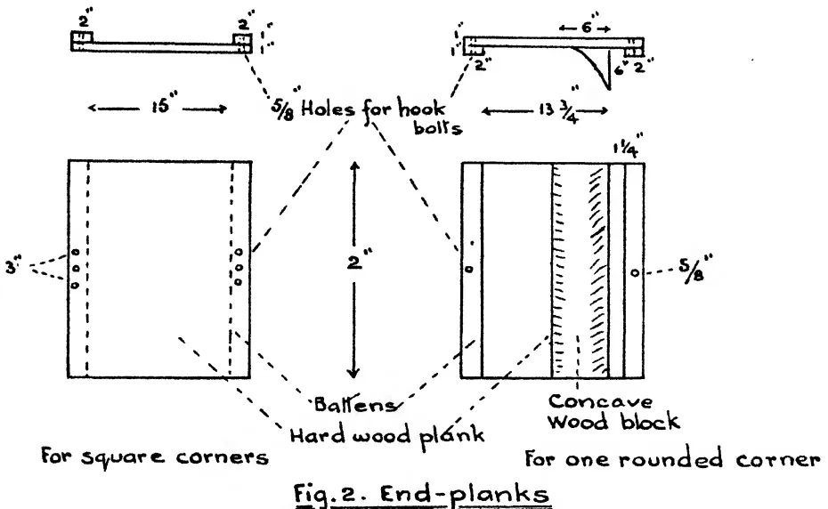

The diagram illustrates the construction of end-planks. On the left, a square end-plank is shown with a width of 3" and a height of 2". It features two vertical dashed lines and two sets of 5/8" holes for hook bolts, one on each side. On the right, a rounded end-plank is shown with a height of 2" and a width of 13 3/4". It includes a concave wood block at the corner, which is 6" wide and 2" high. The main plank is 6" wide and 2" high. It also has two sets of 5/8" holes for hook bolts. Labels include "5/8" Holes for hook bolts", "Battens", "Hard wood plank", "Concave Wood block", "For square corners", and "For one rounded corner".

Fig. 2. End-planks

(c) *Hook-bolts.*—Each end-plank will require two hook-bolts the dimensions of which are given in Fig. 3. The method of fixing is to place the end-plank in position at the end of a pair of shutters, where a finish off for a gate or doorway is required. Pass the hook-bolts through the holes in the end-plank, and run the nuts on a few turns. Engage the hooks over the edges of the two end battens of the shutters, and tighten up the wing-nuts until the end-plank is securely fixed in position.

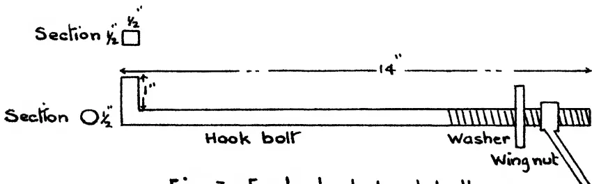

The diagram shows a hook-bolt assembly. A long hook-bolt is shown with a total length of 14". At the left end, there is a 1/2" section and a 1/4" section. At the right end, a washer and a wing nut are used to secure the bolt. Labels include "Section 1/2", "Section 1/4", "Hook bolt", "Washer", and "Wing nut".

Fig. 3. End-plank hook-bolt

142------------------------------------------------

94

(d) *Distance Rods.*—It is quite obvious that to build a good straight wall, the pairs of shutters must be kept exactly parallel. This is achieved by means of “distance rods”. Most writers remark on the difficulty of removing these rods from the wall after the earth ramming is completed. Some workers, in fact, prefer elaborate bracing mechanism out-side the shutters instead of distance rods, because of the difficulty experienced in extracting them, and the damage often done to the wall in the process.

To overcome this difficulty the author evolved the “Taper Distance Rod” illustrated in Fig. 4, which is completely successful. A light tap with a piece of wood on the taper end of the rod loosens it sufficiently to enable it to be withdrawn from the wall without any damage. The “taper” distance rod illustrated has an inner dimension of 15 in., but any size can be made according to the thickness of the wall required. Any blacksmith can prepare these rods, and the iron fittings for the planks. The planks can be built by any village carpenter.

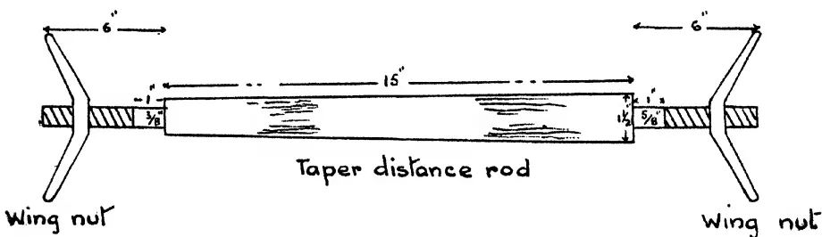

The diagram illustrates a 'Taper distance rod'. It consists of a central rectangular wooden section with a length of 15 inches. At each end, there is a tapered section that widens to a width of 6 inches. These tapered ends are secured with wing nuts. The central rod is labeled 'Taper distance rod' and the wing nuts are labeled 'Wing nut'.

Fig 4.

Eight distance rods should be provided for each pair of shutters, although in actual practice only four are used. The surplus allows of the upper rods being left in the wall when the shutters are removed, so that they can be used as bottom rods when shutters are placed for the next course of the wall. The extra rods also provide a reserve against breakage or damage.

(e) *Rammers.*—The dimensions of the rammers used are shown in Fig. 5. They should be made of hard well-seasoned wood, free from knots and cracks. The striking surface should be finished off completely smooth. Each rammer should be fitted with a long bamboo handle. The half-round rammer (B) is used for ramming the earth in corners and along the sides of the shutters, and also adjacent to the distance rods. Two square rammers (A) and one half-round rammer (B) should be provided for each pair of shutters. Two *beldars* to each mould are required for ramming.

143------------------------------------------------

95
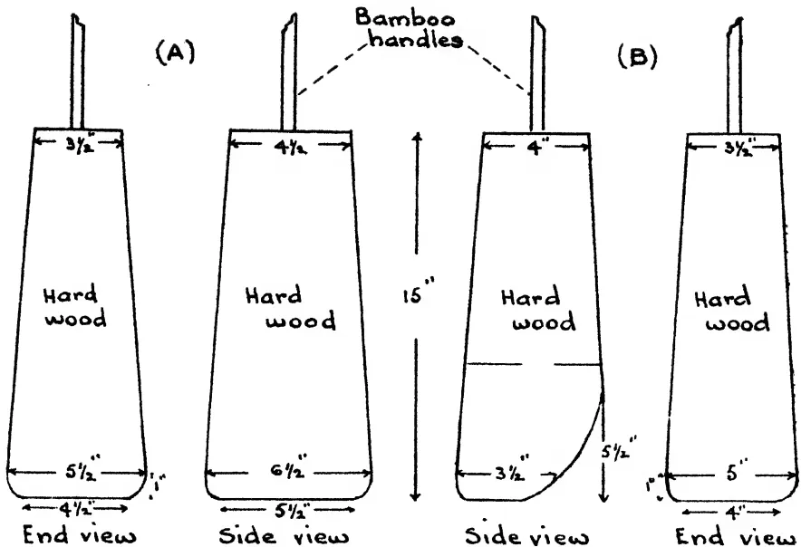

The diagram illustrates four rammers, grouped into two sets: (A) and (B). Each set consists of an end view and a side view. The rammers are constructed from hard wood and feature bamboo handles, which are indicated by dashed lines and the label 'Bamboo handles' at the top. The dimensions for each view are as follows:

- **Set (A):**
  - **End view:** Top width is  $3\frac{1}{2}$ " and bottom width is  $5\frac{1}{2}$ ". The bottom edge is labeled  $4\frac{1}{2}$ ".
  - **Side view:** Top width is  $4\frac{1}{2}$ " and bottom width is  $6\frac{1}{2}$ ". The bottom edge is labeled  $5\frac{1}{2}$ ".
- **Set (B):**
  - **Side view:** Top width is 4". The bottom width is  $3\frac{1}{2}$ " and the bottom edge is labeled  $5\frac{1}{2}$ ". A vertical dimension of 15" is shown between the top and bottom of the handle area.
  - **End view:** Top width is  $3\frac{1}{2}$ " and bottom width is 5". The bottom edge is labeled 4".

Fig. 5 Rammers

(f) *Soil*.—Almost any good arable soil is suitable for *pisé* work. Heavy clays, and light sands should be avoided. Soils can of course be blended, heavy soils with an admixture of sand, and light soils with an admixture of clay. The soil used must be dry, not wet, and the simplest test to prove the soil prepared, is to grip a handful tightly for a few seconds. If on opening the hand it remains compressed in a ball, the moisture content is too high. If it breaks down into dusty particles too rapidly it is too dry. If it cracks and disintegrates slowly it is correct. This test should be applied frequently and regularly throughout the operations.

The soil should be broken down finely, and none of the particles should exceed the size of a walnut. No grass or other vegetable matter should be permitted to remain in the soil. Nor should more soil than the quantity required for the current day's work be prepared at one time. The surface of the area from which the earth is taken should first be removed and placed on one side, to avoid having vegetable matter in the soil to be used. If the soil is excavated to a considerable depth, care should be taken to see that there is no change in the soil formation. If any change is found, the material should be blended to the correct consistency.

## II.—Building Operations.

(a) *Foundations*.—If desired the foundations for a heavy building may be of *pucca* brick, the top course of which should be of the same width as the wall to be erected, so that the shuttering may be firmly clamped on to the same. For an ordinary enclosure wall, however, a *pucca* foundation is not necessary and in any case adds to the cost.

144------------------------------------------------

96

Dig a trench on the site of the wall to be erected, 2 ft. and 15 in. wide and 6 in. deep. In the centre of the bed of the trench mark off two lines 15 in. apart, running the full length of the trench. Dig out a further 6 in. of earth on each side of these lines, leaving a foundation ridge 6 in. high and 15 in. wide (Plate I., Fig. 1). From the ends of the trench run out similar trenches at right angles until the whole area to be enclosed is surrounded. Gaps should be left in the trench where gateways in the walls are required. Level off the top of the foundation ridge where necessary.

Commencing at one corner of the enclosure, join two shutters together with the four distance pieces, leaving the wing-nuts loose. The distance rods should not be one above the other. Also see that the thick ends of the bottom taper rods are not both in the same side, otherwise the shutters (which now become a mould) will not stand vertically on the foundation ridge. The mould should overlap the second foundation ridge which runs off at right angles. A narrow groove must be cut in this ridge to accommodate the first 15 in. of the inner shutter otherwise the mould will not stand upright. Next tighten up the wing-nuts until the mould has taken a firm grip on the foundation ridge. Use a spirit level and plumb-line to set the mould perfectly upright. At the wall-angle end of the mould, fix the end-plank in position, using one which will provide for a rounded corner on the external angle of the wall. No end-plank is required at the other end of the mould.

Cover the two bottom distance rods which are resting on the foundation ridge with some of the prepared soil. Ram it well, adding more earth as required, until both rods are embedded in blocks of earth. This is extremely important, as if ramming is started all over the mould to commence with, the mould will gradually creep upwards as the ramming continues. If the bottom distance pieces are first covered and rammed well, the mould will remain firmly anchored to the foundation ridge. After the bottom distance rods have been firmly fixed in this way, spread a layer of prepared earth, 4 to 5 inches deep, evenly over the bottom of the mould. Ram this well until the rammers leave no impression on the earth. Pay particular attention to the edges of the shutters and the end-plank by ramming with the half-round rammer. Continue to add four to five inch layers of earth, ramming them as above, until the top of the mould is reached. The rammed earth at the open end of the mould is finished off as a slight slope (Plate IV., Fig. 2) as this makes a better joint than a straight end when the next mould is filled. The shutters can be removed immediately the ramming is finished. The two upper distance rods and the bottom rod nearest the sloped end of the earth block, may be left in the wall for use with succeeding shutters.

Next clamp a mould on to the foundation ridge of the other wall, pressing the ends of the shutters close up to the overlapping portion of the earth block already made. No end planks are necessary in this case. Fill and ram as before. When the mould is removed, two earth blocks at right angles forming the angle of the wall will be in position. A mould can now be set up at each end, overlapping the slopes of the earth blocks, and a third mould can be set up on the blocks already built, to commence the angle of the second course. This

145------------------------------------------------

PLATE I.

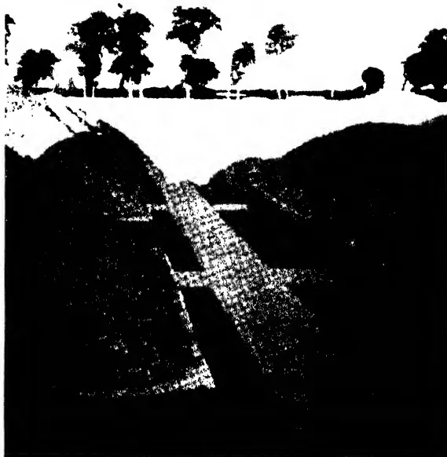A black and white photograph showing a large, dark, rectangular mound or ridge in the foreground. In the background, there is a line of trees and a fence under a bright sky.

*Block by Survey Dept.*  
FIG. 1.—FOUNDATION RIDGE

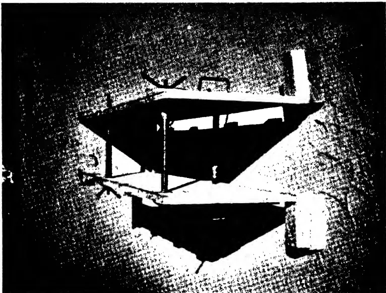A black and white photograph showing a large, dark, rectangular block or mould structure. It is supported by several vertical posts and has a flat top surface. The structure is situated on a textured ground surface.

*Block by Survey Dept.*  
FIG. 2.—A MOULD ERECTED

146------------------------------------------------

PLATE 11.

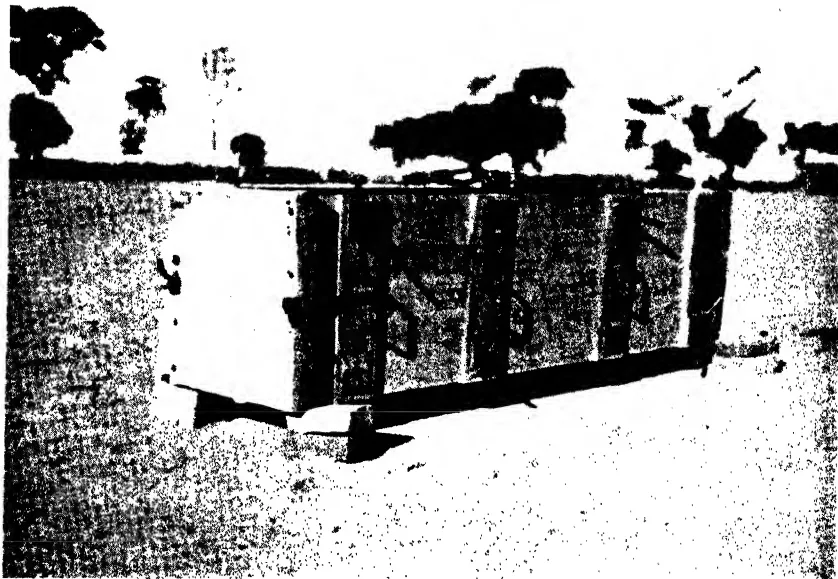A black and white photograph showing a large, rectangular, box-like structure made of wooden planks. It is positioned on a flat, open field. The structure has a flat top and appears to be a mold for casting. In the background, there are some trees and a utility pole. The lighting suggests it is daytime.

*Block by Survey Dept.*

FIG. 1.—MOULD WITH END-PLANK

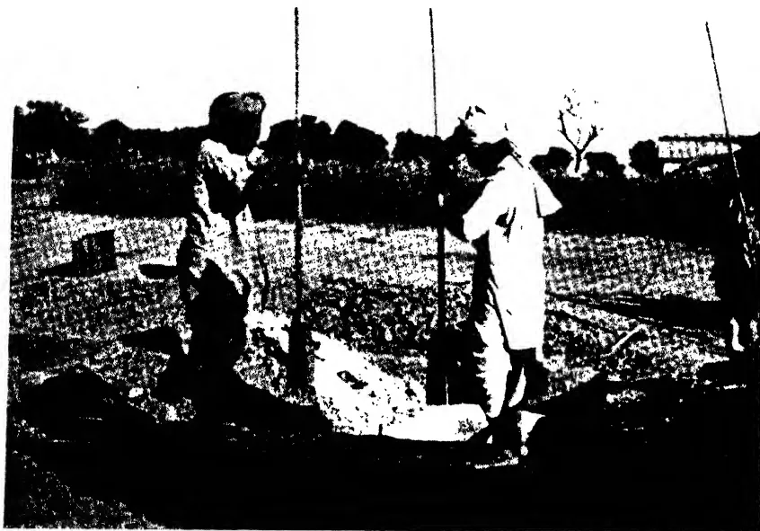A black and white photograph showing two men working on a large, rectangular mould structure. One man is standing on the left, and the other is on the right, leaning over the structure. They appear to be engaged in a task, possibly ramming or filling the mould. The structure is situated in an open field with trees in the background. The image is somewhat grainy, typical of older photography.

*Block by Survey Dept.*

FIG. 2.—RAMMING

147------------------------------------------------

PLATE III.


*Block by Survey Dept.*

FIG. 1. - A MOULD IN POSITION


*Block by Survey Dept.*

FIG. 2. - MAKING A CORNER

148------------------------------------------------

PLATE IV.


*Block by Survey Dept.*

FIG. 1.—A *pisé* BLOCK

![A high-contrast black and white photograph showing a construction site. In the foreground, there is a dark, textured area, possibly a pile of earth or a base layer. In the middle ground, several people are visible, appearing to be working on the ground. One person is standing near a low, rectangular structure that looks like a form or a small wall. The background shows a flat, open landscape with some sparse vegetation and a clear sky. The lighting is bright, creating strong contrasts between the dark foreground and the lighter background.](4a0169bdbaaa4ee1dbdddeabdaa245f1_5_img.webp)

*Block by Survey Dept.*

FIG. 2.—SHOWING METHOD OF SLOPING BLOCKS FOR JOINTS

149------------------------------------------------

97

mould should be clamped on to the second earth block which was made, overlapping the end of the first block. A round corner end-plank should be used. Alternate courses should overlap in this manner at the corners, to dovetail them for greater strength. As soon as the shuttering for the first block of the second course is taken down, four moulds can be brought into use simultaneously, and the work will proceed very rapidly.

The holes from which the distance rods are removed should be filled with loose earth tamped well home with a small wooden rod.

The walls should be allowed to dry out for about fifteen days before they are finished off with plaster. Ordinary *lepai* plaster, such as is used for *kacha* walls will do, and a coating of coal tar will render it impervious to the weather.

The most vulnerable part of these walls is the top, which should be well finished off. Driving rain has little effect on the sides of the walls if they are properly plastered, but water percolating through the top of the wall can do a lot of damage.

If desired, the top of the wall can be finished off with a few courses of burnt bricks in line, which should include a drip course.

Should something cheaper be desired, round off the top of the wall with mud and plaster it, giving a final coat of tarcoal if ordinary country plaster is used.

#### Conclusion.

Walls of this description can be made for about Rs. 1,300 a mile, entirely by unskilled labour, supervised by an ordinary mason to use the plumb line to keep the moulds upright. This estimate includes the cost of maintenance of a pair of bullocks to plough and cart the soil and also cart water to the site. This shows a tremendous saving on Public Works Department estimates for brick walls which work out as follows :—

- (a) Burnt brick in mud with cement pointing—Rs. 10,560 per mile.
- (b) Burnt brick in mud, but without cement pointing—Rs. 7,920 per mile.
- (c) Sun-dried bricks in mud with  $7\frac{1}{2}$  in. top course of *pucca* burnt brick—Rs. 3,630 per mile.

The most important point, which is really the whole secret of *pise' de terre* building is good ramming. If soil of the right consistency is used, in shallow layers as described, and the ramming is well and truly done, very durable walls and buildings can be made.

Should cracks appear in the blocks a few days after they are finished, it is a sure sign that the percentage of clay in the soil is too high, and should be reduced by blending.

I have been asked whether white ants will damage these walls. I can only say that over ten years ago about 50 ft. of wall, with no foundation, was built here. It has remained totally exposed to the weather ever since, and irrigation water often flows right up to its base. There is no sign at all of the presence of white ants. A few weeks ago a small section was cut out (after considerable heavy labour with pick-axes) and the interior of the wall was found to be almost as hard and solid as rock, with no signs of white ants, or other damage.

150------------------------------------------------

98

## CITRUS GROWING IN WESTERN AUSTRALIA\*

### INTRODUCTION

**C**ITRUS fruits have been cultivated by man for hundreds of years and although oranges are not mentioned specifically in very early history it is more than probable that the legendary "Golden Apple of Hesperides" was none other than the common garden orange. Here in Western Australia there were at least a few orange trees grown by the early settlers, no doubt from the pipes of imported fruits, but there were very little, if any, general plantings until the eighties of last century. There are still trees of these early plantings along the banks of rivers in the older settled areas. Some of the first commercial citrus groves were in the Metropolitan area and as far out as the Guildford, Cannington, Armadale and Hills districts near Perth. They were all of the seedling orange or what we now term "Common Orange" type for it was not till the end of the last century or the beginning of this one that the navel and late Valencia types made their appearance here.

As the State's population grew the planting of citrus increased and during the last forty years there have been periodic fluctuations, sometimes approaching a mild boom, in citrus plantings, until at the present time orange production ranks second only to apple growing in Western Australia's fresh-fruit growing industries.

The following table shows the areas planted and the yield of the various kinds of citrus during the year :

1938-39.

<table style="width: 100%; border-collapse: collapse;">
<thead>
<tr>
<th colspan="2"></th>
<th style="text-align: center;">Area Planted.</th>
<th style="text-align: center;">Yield.</th>
</tr>
<tr>
<th colspan="2"></th>
<th style="text-align: center;">Acres.</th>
<th style="text-align: center;">Bushels.</th>
</tr>
</thead>
<tbody>
<tr>
<td>Oranges</td>
<td style="text-align: center;">..</td>
<td style="text-align: right;">2,585</td>
<td style="text-align: right;">322,350</td>
</tr>
<tr>
<td>Mandarins</td>
<td style="text-align: center;">..</td>
<td style="text-align: right;">141</td>
<td style="text-align: right;">17,319</td>
</tr>
<tr>
<td>Lemons</td>
<td style="text-align: center;">..</td>
<td style="text-align: right;">422</td>
<td style="text-align: right;">63,139</td>
</tr>
<tr>
<td>Other citrus</td>
<td style="text-align: center;">..</td>
<td style="text-align: right;">36</td>
<td style="text-align: right;">3,248</td>
</tr>
<tr>
<td colspan="2" style="text-align: right;">Total</td>
<td style="text-align: right; border-top: 1px solid black; border-bottom: 1px solid black;">3,184</td>
<td style="text-align: right; border-top: 1px solid black; border-bottom: 1px solid black;">406,056</td>
</tr>
</tbody>
</table>

The harvesting period for navels, and most other oranges, extends from May to November, but the late Valencias which usually mature in October may in a few favoured districts be kept on the trees till the following April so that fresh oranges can be had throughout the year without the necessity for storage.

---

\* By R. C. Owen, Horticultural Adviser, in the Journal of the Department of Agriculture, Western Australia, December, 1940.

151------------------------------------------------

99

Lemons too are cropping throughout the year but local mandarins and grapefruit are off the market for several months, and the latter fruit has on occasions been imported from California and Palestine during the last few years.

### KINDS AND VARIETIES OF CITRUS

There are many species belonging to the citrus family, but only a few are valuable commercially. Those cultivated in this State include:—

1. 1. Oranges *Citrus aurantium*.
2. 2. Mandarins *C. Nobilis*.
3. 3. Lemons *C. Limonium*.
4. 4. Pomeloes (including grapefruit) *C. decumana*.
5. 5. Kumquots *C. Japonica*.

In each of these there are many varieties, but of latter years there has been a strong tendency to limit the number of varieties to the few which can be grown commercially and which satisfy the requirements of the consuming public. This is particularly so with oranges for twenty or thirty years ago any variety, whether Navel, Valencia, Joppa, Queen, Siletta, or even seedling types would command a price, and the seedlings, being more prolific, were probably more profitable than the better class varieties. At the present time, however, any varieties other than navels and late Valencias are classed as "common oranges" and the return to the grower is usually low. In spite of this there are still a number of those out-of-date varieties planted every year and though these might be valuable in marginal areas where a local demand exists, the commercial grower would be wise to plant only those varieties which the public requires.

The following is a brief description of the more popular varieties, but it must be remembered that the qualities vary considerably according to the district in which they are grown, the soil, moisture, and cultural methods employed.

### ORANGES

*Washington Navel*.—Fruit large, solid and heavy, skin smooth and of fine texture, orange to orange red in colour with the navel marking usually not prominent. Pulp juicy, with little rag, good flavour, seedless. The tree is a strong grower when young, a good and prolific bearer and generally assumes a squat roundish outline when full grown. Foliage dark green in colour.

There are also numerous sub-varieties of navels which have originated as sports from the parent. Included in these are the "Grovelly", "Thompson's Improved", "Navelencia", "Golden Nugget", and "Australian Navel". For the most part these have not the all-round good qualities of the Washington and some, particularly the "Australian Navel", are definitely inferior.

Probably the best known sub-variety is *Thompson's Improved*. Fruit somewhat similar in appearance to the Washington. Skin texture very smooth but not necessarily thin, navel scar may be prominent. Pulp crisp but less juicy than the Washington with a tendency to dry out at the stem end. Matures early and is only valuable in some of the early districts.

152------------------------------------------------

100

*Valencia Late*.—Fruit medium large, roundish oval, skin smooth and moderately thin, yellow orange to orange in colour. Has a tendency to revert to a green colour, if left hanging on the trees. Pulp acid till fully ripe, solid, juicy, with only few seeds. Ripens in the spring and in some districts can be left on the trees till the following April. Old trees have an inclination to bi-annual bearing. Tree vigorous grower with dark green foliage, more upright in growth than the Washington Navel.

### MANDARINS

Trees are generally smaller in growth and foliage than the orange. They are very hardy and bear good crops of small to medium large thin-skinned fruit quite distinct in appearance and flavour.

*Emperor*.—Fruit medium to large, roundish, irregular and flattened. Skin brittle and somewhat puffy when fully ripe, colour yellow. Pulp fairly fine, juicy and of good flavour. Tree vigorous and upright with large dark green leaves. Good bearer. With age there is a tendency to produce a mixture of large and small fruits in the one year. Medium early.

*Beauty of Glen Retreat*.—Fruit medium to large, solid, skin smooth and thin. Colour orange to orange red; skin usually tightly attached to the pulp. Very little rag. Pulp firm, juicy and when ripe is sweet. The fruit colours well before ripening and should not be marketed till the pulp is sweet. Tree vigorous and tends to form a dense head unless thinned out. Very prolific and fruit needs thinning on a heavy crop. Midseason.

*Thorny*.—One of the best flavoured of all mandarins. Fruit small to medium large according to size of crop and vigour of the tree. Roundish flattened, skin fine, tight and pale yellow in colour. Pulp fine and juicy. Tree moderately vigorous but tends to become dense and bushy. Midseason.

*Imperial*.—One of the earliest maturing mandarins on the market. Fruit medium in size, roundish flattened, skin fairly smooth and thin, yellow in colour. Pulp moderately fine and juicy. Tree upright and vigorous when young, may be only light cropped in some districts. As it matures its fruit early in the season it needs adequate summer moisture to fill out the fruits before the winter rain.

### LEMONS

Lemons are usually vigorous growers and bear fruit throughout the year. They are less resistant to frosts and should have plenty of summer moisture in order to fill out the fruit during the dry months. The winter crop—often the heaviest—is usually sold in bulk for factory purposes, but the summer and in-between crops should be cured and sold in case lots.

*Lisbon*.—Fruit medium large in size, long oval shape, skin yellow and moderately smooth, pulp fine grained and juicy; strongly acid and has few seeds. Tree strong and vigorous, prolific, carrying its fruit practically throughout the tree.

153------------------------------------------------

101

*Eureka*.—Fruit medium size, good quality, skin bright yellow, smooth and thin, pulp juicy and acid. Tree hardy and prolific, but not so dense in foliage. Much of the fruit is carried on the ends of long growths and is not so well protected from sunburn. Practically thornless.

*Villa Franca*.—Fruit medium to large oblong and slightly pointed at blossom end, pulp juicy and nearly seedless. Skin bright yellow and thin. Tree hardy and prolific, almost thornless, foliage strong and abundant.

### GRAPEFRUIT

*Grapefruit*.—Is a sub-species of the pomelo and so called because of the tendency to set its fruit in bunches. The fruit are fairly large, 3–5 inches in diameter, of roundish flattened shape, pale lemon yellow in colour. The pulp is regarded as being very wholesome and refreshing, and possessing tonic properties. The fruit may be eaten fresh and has become popular as a breakfast delicacy. It may be used for making fresh-fruit drinks and also for marmalade. In the latter respect it is replacing the Seville orange.

There are several varieties of grapefruit including Triumph, Fosters and Marsh's seedless. The last-named is by far the most widely planted here and has proved itself a strong, vigorous grower, and very prolific. The fruit is carried throughout the tree and usually the best quality fruits are those borne on the inside. Matures from May onwards and in selected districts may be carried on the tree till Christmas time.

### KUMQUOTS

*Kumquots*.—Are a dwarf species of citrus and a native of Japan. They are very hardy and prolific. Tree is very bushy with small, yellowish green leaves. Very ornamental. Fruit is small—about the size of a small apricot. There are two varieties grown—a round and an oval-shaped fruit. The round type is only suitable for marmalade, but the oval type is excellent for preserving. The demand for this class of fruit is only limited.

*Soil*.—The recognised citrus-growing districts in the West, range from Mooliabeenie-Bindoon and Chittering in the hills and foothills some forty miles north of Perth, Kalamunda and other centres in the Darling Range eastward, through Gosnells, Armadale, Serpentine, Harvey to Boyanup, Donnybrook and Capel on the coastal plain and over a hundred miles south of Perth. Apart from the three first mentioned districts where citrus culture is the main activity in the fruit-growing pursuit, citriculture is often combined with the growing of stone-fruits and in some places with apples.

Citrus fruits generally are indigenous to those tropical and subtropical regions of Asia and the islands of the Pacific where the climate is equitable and the rainfall is sufficient. The trees prefer a deep well drained loamy soil and they need adequate moisture throughout the year. They will not thrive in shallow undrained soils nor in districts where frosts are frequent and severe. In many of the inland districts of America, Africa and Palestine, and also in parts of the Eastern States of Australia, oranges and other members of the citrus group are now grown in areas that were formerly little better than desert regions.

154------------------------------------------------

102

The moisture problem has been overcome by large irrigation schemes and the frost hazard controlled by artificial heating. In Western Australia, however, the market requirements do not as yet warrant planting in districts other than those naturally suited to the trees or where local irrigation plants can be cheaply installed.

Undoubtedly the most important environmental factors in citriculture, are soil, moisture and temperature, and while the latter two can be controlled within limits by artificial means, the suitable soil is often the limiting factor to the areas planted. In this State oranges and lemons have been planted over a wide range of soil types and in many adverse soil conditions and although the trees have shown their adaptability by making good growth over a number of years, it is only those planted on the deep, well-drained and well-manured soils of the medium to lighter types, that have maintained their growth, vigour and productivity for thirty years and more. Contrary to general beliefs the citrus trees are not naturally of a shallow rooting habit, for although the finer feeding roots are mostly on the surface regions the heavier roots range outwards and downwards to a considerable depth. They will not, however, penetrate heavy clay subsoil or compacted hardpans nor will they persist below the permanent water table. Heavy soils do not as a rule produce large or long-lived trees but the fruit is often of excellent quality. The lighter soils may not be naturally so rich in plant foods, but they allow of extensive root development and any lack of fertility can be corrected by the application of manures and organic matter. Good deep loams and lighter soils also allow of better and quicker drainage and so approach the ideal for citrus growing.

Prospective growers who contemplate establishing a citrus orchard should choose a district which has proved satisfactory for the growth of that kind of fruit, or a district which has a rainfall of at least 30-35 inches and a fairly mild winter temperature. If a sufficient permanent supply of fresh water is available the natural rainfall figures are not important. The choice of the actual site must be governed not only by the suitable soil but also the natural protection afforded from the prevailing winds and severe frosts. Although the surface soil will give an indication do not rely solely on appearances but by means of a soil auger, test the soil and subsoil to a depth of four to five feet. Avoid those areas where a heavy clay subsoil comes near the surface, also shallow soils overlying cemented hardpan or rock. Deep sands and gravelly washes are also objectionable because they lack fertility and have a poor water holding capacity. The surface soil may be sandy provided the subsoil is of a heavier nature, for a light surface soil facilitates tillage, allows free entry of water and does not cake after irrigation.

When preparing the ground for the citrus orchard great care is necessary to see that all large roots are removed to the depth of several feet; this is particularly important if the original timber is marri, blackbutt or other trees which favour the growth of that root-rotting fungus *Armillaria melia* which is so fatal to citrus.

After clearing, the land should be broken up to a depth of ten to twelve inches, and provided the soil is suitable there is not much object in going deeper. Any

155------------------------------------------------

103

areas showing hardpan may be broken up by means of a subsoil plough or in extreme cases by explosives. If at all possible it is desirable to have the land cleared for at least a year prior to the planting so that the numerous small roots will have rotted away before the young trees are planted. The extra time and care taken in thoroughly preparing the land is by no means wasted for citrus respond to good treatment and the resultant strong and even growth throughout the plantation will make it well worth while.

### DRAINAGE

Adequate drainage is very important in citrus growing and although many orchards in this State have sufficient natural drainage there are others which need more and deeper drains. All citrus trees dislike cold and waterlogged soils and even if the actual surface soil does not suffer from excess water and become waterlogged there is every possibility that the water level will rise close to the surface during the rainy season. There may be only a small section of the orchard affected, perhaps an outcrop of rock or impervious soil prevents the free passage of water, thus causing a boggy patch, or again there may be a saucer-like depression which collects seepage. The only way to ascertain the need for putting in drains is by actual observation, and if test holes, three to four feet deep are dug in likely places throughout the orchard any serious rise in the water table can be noted during the wet season. A temporary rise after excessive rainfall is not serious but if the water remains within three feet of the surface for more than a week, that part of the orchard would be benefited by more or deeper drains. Where there is plenty of depth of soil drains may be five feet deep; in most cases, however, 3 feet 6 inches to 4 feet deep drains are sufficient provided they are not too far apart. For the sake of economy arrange the drains to effect the maximum drainage with the minimum length; allow sufficient fall to provide a free flow of water but avoid too much slope if there is a danger of scouring.

To facilitate cultivation and also to prevent the soil from drying out during the summer all drains in the orchard should be covered in. Burnt clay or cement concrete tile drain-pipes, although expensive, are easy to lay and give good service; where suitable rock is available a good stone drain can be put in at relatively low cost. Box drains made of timber, when constructed in a workmanlike manner, will give from thirty to forty years of service, but the makeshift drain of saplings, blackboys, or temporary materials, generally give trouble and are often only a waste of time and labour.

### PLANTING

After the orchard site is cleared, broken up and drained it is ready to lay out in preparation for planting the trees. The usual systems of lay-out are :—

1. (1) *The Square System* where the trees in the rows are the same distance apart as the rows themselves. This allows of two ways of cultivation at right angles to each other, it is easy to set out and is suitable for all but the steeper slopes.

156------------------------------------------------

104

(2) *The Septuple System* where trees are equidistant from each other and in groups of seven-six trees forming a hexagon with one tree in the centre. This system allows of three ways of cultivation at angles of  $60^\circ$  to each other, but in no case is the width of cultivation as wide as the distance the trees are apart. The septuple lay out is very suitable for planting hillsides where it may avoid working straight up and down the slope. With the same distance between the trees it allows 15 per cent. more trees to the acre than does the square system but of course each tree has approximately that much less feeding space at its disposal. Contour planting is now being practised in other parts of the world in an endeavour to avoid soil erosion.

There has been some controversy about the most suitable distance to allow between trees when planting citrus; some favour twenty feet whilst others advocate distances up to 30 feet. The writer considers that twenty feet between trees is suitable for most mandarins and other varieties having upright or dwarf habits of growth, but 24 feet or more is necessary for the larger growing orange and lemon trees. Where the soil is good and the water supply ample all the space is needed to accommodate the top growth, whereas if the soil is poor or the moisture limited the extra distance provides a bigger store of plant food moisture.

The best time for planting citrus trees is when the weather is moderately cool but not when the soil is cold and wet. If the trees are available, autumn planting during April and early May is suitable in frost-free districts; where the trees are not procurable till later or in regions where winter frosts occur, the spring planting in August and early September gives the best results. Prior to planting, remove any dead or injured roots by severing with a sharp knife or secateurs, and have the holes fertilized and prepared to receive the tree. Mix any manure well into the soil and below the root area, and so avoid the possibility of putting the roots in direct contact with artificial manures. Where chemical manures have been applied in close contact with the roots, it is no uncommon thing for the trees to remain dormant for months, and though some may eventually grow, many gradually die out. When setting the tree, spread the roots well out and press the soil closely about them. Do not plant too deeply—deep planting does not mean a deep rooting tree—it may lead to the loss of the tree through *Collar-rot* or *Gummosis* of the trunk. If the trees are set in the ground at the same depth as they originally stood in the nursery, or even slightly shallower, there should be no trouble.

After planting it is a good idea to tie the tree to a stake and hold it firm against winds, and also if the trunk is wrapped with straw, paper or bagging, it will protect it from the direct rays of the sun until such time as the tree provides sufficient shade for itself.

Through the summer the main concern is to control weed-growth and conserve soil moisture. Keep the surface soil near the tree in a good tilth but do not cultivate deep enough to disturb the roots or to dry out the soil at length.

157------------------------------------------------

105

### SELECTION OF TREES

When planting citrus trees due care should be taken to see that none but healthy and vigorous plants are selected. This is a matter of extreme importance as if the trees are unhealthy or weakly in constitution they are unlikely to give the grower satisfaction.

Nowadays citrus are all "worked" or budded trees and as the propagation of these is a specialized trade, it is in most cases better to leave it to the experienced nurseryman. He can usually be relied upon to supply good healthy trees on suitable stocks, but to give him a chance to supply your requirements and to avoid possible disappointment, it is always advisable to place your order some months in advance of planting time.

Of late years there has been a move towards standardization of citrus types and by "Bud Selection" much is being accomplished. "Bud Selection" means that the buds from which the trees were propagated were taken from parent trees selected for bearing good regular crops of fruit, true to type, and free from hereditary weakness. Bud selected trees may vary under different environmental conditions, but where conditions are alike they produce groves of even trees bearing regular type fruits. It is too much to expect even bud selected trees grown under unsuitable conditions to produce fruit of equal quality as the same trees grown under congenial conditions.

Apart from the selection of buds much can be done by the nurseryman in culling out unsuitable root stocks and only using those which are strong and vigorous. The rough lemon or citronella rootstock is favoured by most nurserymen as it is a vigorous grower and produces a good sized tree in less time than most other stocks. It is quite satisfactory under a wide range of soil conditions but some claim that the sweet orange stock is preferable for, although slower in starting, it eventually produces a large and long lived tree.

If the old sweet orange seedlings still growing in many parts of the State are any indication the sweet orange stock is very suitable for the majority of our citrus areas.

Other stocks sometimes used are the sour orange or Seville, which are said to resist collar-rot or gummosis even under wet conditions. They are strong rooting, but must have a deep and rich soil.

*Citrus trifoliata* is also used and is supposed to have a dwarfing effect on the tree. The few older trees I have seen on this stock are rather unsatisfactory.

For general plantings, trees carrying one year's growth from the bud are suitable, although older trees may be used provided they have been suitably "balled" to protect them during transport from the nursery. They are, of course, more expensive than the younger trees. When replacing trees in established orchards it is quite a good idea to purchase the trees one or two years in advance and establish them in a suitable nursery on the place. With careful attention they will make good growth and at a suitable time can be transplanted without suffering any ill effects, and will then have a better chance of competing with the older established trees around them. With care, even old trees can be transplanted, for the writer has successfully shifted

158------------------------------------------------

106

trees over thirty years of age and established them in positions among full bearing trees. In this case, however, it was necessary to cut the top growth back in proportion to the roots removed in transplanting.

### CULTIVATION

General cultivation methods in citrus growing are very similar to those carried out in any other orchard, the main objects being to maintain the soil humus by growing weeds or special green crops during the winter or wet season and ploughing them in so that the green material is well rotted before the dry season sets in, and to conserve the moisture and keep down weeds during the dry months of the year. It is much easier to maintain or even build up the humus content of the soil right from the start than to replace the organic matter after the soils have become worked out. As the trees increase in size there is less space in which to grow the green crop, and also the evergreen trees cause a dense shade and limit the growth of the crop during the short days of the winter.

Commence the building-up process from the time the orchard is planted, and when the trees are full grown there will be ample reserves of organic matter, so the maintenance will be much easier. Green crops of the legume family—beans, peas, lupins, tares, &c., not only maintain the humus content but also greatly augment the nitrogen supply of the soil and so make it possible to reduce the quantity of expensive nitrogenous manures used. New Zealand blue lupins or tick beans when planted early in the season make excellent green manure crops; they are easy to plough in and readily decompose in the soil. Whatever crop is grown, even if only natural weed growth, the secret of success is to plough it in early enough so that it decays and allows the cultivation to be completed before the dry weather sets in.

Avoid excessive summer cultivation when the soil is dry, because not only is it unnecessary from the point of view of moisture conservation, but it tends to break up the soil particles and cause loss of humus. This leads to the soil becoming "snuffy" when it will not absorb water readily, and is likely to be lost by erosion. The dust menace too is considerable, and this in its turn will choke the leaf pores and also favour the breeding of citrus red scale.

*(To be continued)*

159------------------------------------------------

107

## THE HYBRIDIZATION OF TROPICAL GARDEN PLANTS\*

**W**HEN pollen is placed on the stigma of a flower, the individual grains of pollen produce tubes which grow down into the ovary and there each fertilize an egg-cell. The result is the development of a fruit containing seeds. Many flowers are fertilized by their own pollen, while others are so arranged that they must receive pollen from other individuals. But in either case, seeds cannot be produced unless there is union of the male element of the pollen with the egg-cells in the ovary. If now pollen from one flower should fall on the stigma of a different kind of flower, various different things may happen. The pollen may remain inactive; or it may grow but fail to fertilize; or it may fertilize the ovules and so seeds may be produced. In the last case the seeds will be of mixed parentage, and when sown will produce plants which are unlike either parent. We call them hybrids.

Hybridization is thus a means of producing new kinds of plants; and it has been very much used in the last two centuries to produce garden plants which are different from their wild ancestors, the plants which nature gives to us. This process has naturally been carried on more extensively in temperate regions than in the tropics, and a large proportion of temperate garden plants are of hybrid origin. This is especially true of herbaceous plants, which are short-lived and so give quicker results than the more slow-maturing woody plants. But many groups of woody plants (such as *Rhododendrons*) have been hybridized extensively in temperate countries and have given rise to large series of beautiful new forms.

Hybridization in tropical plants has been a more recent development, and many of our plants are still as nature gave them to us—beautiful, it is true, but often lacking the variety we might have, and lacking possible combinations of useful characters such as beauty of form combined with freedom of flowering. In this article is given a brief survey of some of the results of the hybridization of ornamental plants for tropical gardens, and also some suggestions for possible new developments. But first some general remarks may be helpful.

The reader who is not familiar with the elements of plant breeding and the principles concerned is recommended to consult a little book by Mr. W. J. C. Lawrence, Curator of the John Innes Horticultural Institution, entitled *Practical Plant Breeding* (G. Allen and Unwin, 2nd ed. 1939, price 3s. 6d.). This gives a simple introduction to the subject and a description of the technique of plant breeding. Any Malayan gardener who would like to try his hand at

---

\* By R. E. Holttum, M.A., F.L.S., Director of Gardens, S. S. in *The Malayan Agricultural Association Magazine*, Vol. XI., No. 1, January, 1941.

160------------------------------------------------

108

the work of producing new plants for Malayan gardens would find the book most helpful. There are few more fascinating hobbies than work of this kind, and elaborate equipment is not needed (except in special cases such as orchids). The requirements are careful observation, careful manipulation, and patience; and the rewards may be great.

Hybrids can of course be produced only between plants which are nearly related to each other. Botanists have classified plants into groups on their external characters, and it is found in practice that plants which botanists recognize as nearly related will breed together; but one can never be certain without trying. Sometimes plants grouped in different genera are inter-fertile, while different species classed as belonging to the same genus may be inter-sterile. Then we have also to consider the fertility of the hybrids when they are produced. Some hybrids produce good seeds, and some do not. Those that do not can sometimes be propagated from cuttings, and so they can be preserved and multiplied if they are useful; but they cannot be used for further breeding.

Hybrids that are fertile when mated together or crossed back with either parent present a further problem: their off-spring is varied, and the more different the parents producing the hybrid, the more varied the offspring at the second generation. This means of course that we cannot usually propagate a hybrid by seeds if we wish to preserve its particular characters; but it also means that at the second and later generations we may expect a range of novelties such as the first hybrids do not show. This variation provides material for selection; out of the many varieties the plant breeder selects the best for propagation by cuttings or for further breeding. The less desirable varieties are discarded. There are many qualities which must be considered in evaluating hybrids: suitability to local conditions and freedom of flowering are just as important as beauty of form and colour.

On the practical side there is not space here to deal fully with the technique of pollination, but a few notes may be included. In some flowers pollination is easy; e.g., *Gloriosa*. Here the anthers are large and easy to handle and the stigma is easy to reach without disturbing the rest of the flower. In other flowers pollination is difficult; the stigma may be hidden so that the flower must be cut to reach it; the parts may be small and delicate so that they are difficult to handle without damage; and it is often necessary to open buds to remove stamens prematurely to prevent self-pollination. Every kind of flower presents its own problems, and we must study its development carefully before we can find the best way of dealing with it. The other important practical problem is breeding material. It is essential first to procure and bring into cultivation side by side as many different species or varieties as possible of the group of plants to be worked on; the greater the number of different original subjects, the greater the possibilities of breeding.

#### GROUPS WHICH HAVE ALREADY BEEN HYBRIDIZED

*Orchids* are the group of ornamental tropical plants which have received the greatest attention from hybridizers; but it is only in recent years that work

161------------------------------------------------

109

has been carried out in the tropics with a view to securing hybrids suitable to tropical gardens. For a discussion of this subject, see this Magazine, Vol. X., p. 41. Orchids are easy to pollinate, but the minute seeds need special treatment, and the seedlings require years to mature. The results, however, have been spectacular, and there are great possibilities incur rent developments in Malaya and Java.

*Cannas*.—There is a paper on the hybridization of *Cannas* in this Magazine, Vol. VI., p. 21, and a further note in Vol. VII., p. 23. Most of the *Cannas* which we grow in Malaya to-day originated by hybridization in Europe and North America. The parent species were obtained both from Asia and from America, four being principally concerned, and the first large-flowered hybrids of modern type were produced in Italy in the eighteen-nineties. To-day the number of hybrids is very large. The technique of cross pollination is not difficult (see details in the paper above quoted) and hybrid plants can be made to flower in four months from pollination. It is not likely that amateur breeders will produce anything of startling novelty, though quite possible that good new forms specially suited to local conditions may be developed. Mr. Milsum and others have produced good new hybrids in Malaya.

*Hibiscus*.—Every gardener knows the variety that exists in this genus. In this Magazine, Vol. IX., p. 88, are some notes on the origin of *Hibiscus* hybrids and on the possibility of producing more locally. The hybrids at present existing have chiefly been developed in Hawaii in the present century. More should be produced in Malaya, and attempts should be made to introduce other species into the hybrid complex. We still want more *Hibiscus* which are really free-flowering under Malayan conditions.

*Bougainvilleas*.—In this genus of South American plants hybridization began naturally between species cultivated in the Canary Islands about the beginning of the present century. Artificial hybrids were not produced until 1918, by Mr. W. N. Sands at St. Vincent. More recently, such hybrids have been raised at Calcutta and elsewhere, and natural hybridization has occurred extensively where several varieties or species have been grown together in Queensland, Mauritius and other suitable climates. There is no doubt that considerable further development is possible but it does not seem easy to produce seeds in Malaya. For an account of the present position, see this Magazine, Vol. VIII., p. 69.

*Rhododendrons*.—One does not usually think of these as tropical garden plants; but hybrids of *Rhododendrons* from the mountains of the Malayan region were made under glass in Europe more than sixty years ago and are still fine greenhouse plants. They are not suited to the Malayan lowlands, but they are under trial at our highlands, where they should be further developed, and it seems very likely that hybrids of our lowland Malayan *Rhododendron longiflorum* may be useful pot plants in the lowlands. Much more work both on mountain and lowlands species in Malaya is desirable, and there are great possibilities.

*Lantanas*.—It is only in the last two or three years that we have had any considerable number of *Lantana* hybrids in Malaya. The common species,

162------------------------------------------------

110

which has run wild as a weed and is a pest in many countries, is never sufficiently free-flowering to be a useful garden plant ; but some of the hybrids are very free-flowering and also of bright and distinctive colours. They are easy to grow and are becoming very popular. Artificial pollination is difficult, as the flowers are small ; but as any seeds must be hybrids, they will produce plants which are likely to be different from their parents. The cultivation of *Lantana* seedlings is quite interesting, as one may turn up something new and worth preserving by vegetative propagation. It seems that the common *Lantana* was introduced from South America to Europe before the end of the 17th century, and to the Eastern tropics early in the 19th century. Various colour varieties have long been known, but I have not found any information as to the origin of the present range of hybrids. I believe that many of them were produced in France, but our best seeds came from California. The best pure yellow hybrid we have at present is called "Drap d'Or"; it has been introduced to Singapore from Ceylon and from Hong-Kong. I should be interested to know of its origin.

*Water-Lilies*.—Tropical and sub-tropical water-lilies have been much hybridized in Europe and America, and we have some of the results in cultivation in Malaya. There are certain groups of species that do not interbreed, so that the possibilities are limited in some directions ; for example, it appears to be impossible to cross the blue water-lilies (*Nymphaea stellata*, &c.) with the white or pink ones of the group *Nymphaea lotus*. It is doubtful whether much useful further hybridization is possible in Malaya ; it would be best first to secure more of the hybrids produced elsewhere.

*Plumeria* (Frangipanni).—For remarks on raising plants from seeds, see this Magazine, Vol. X., p. 99. Artificial hybridization is difficult in this genus, but seeds produced naturally are usually the result of crossing (presumably by insects) and so are hybrids which may give rise to novelties. The range of colour and form is not large ; but some of the existing hybrids are very handsome. Plumerias are plants of Mexican origin, and have been cultivated for centuries. I have no information as to the origin of the finer pink hybrids to be found to-day. It appears that a considerable number are grown in Honolulu, and perhaps were produced there.

*Begonias*.—There are an enormous number of species of *Begonia*, native in the warmer parts of all continents. They have been cultivated as greenhouse plants in Europe since the 18th century, and in more recent times the wonderful large-flowered tuberous *Begonia* hybrids have been developed for outdoor cultivation in temperate countries. In Malaya we grow principally certain "foliage" *Begonias*, originating from species of the hill forests of north-eastern India, and "flowering" *Begonias*, chiefly of tropical American origin. There are also native Malayan *Begonias* in our forests, some of them worth cultivating. Very little hybridizing of *Begonias* has been done in Malaya, and there are great possibilities for the development of new forms specially suited to our climate, particularly new flowering varieties for bedding. Male and female flowers in *Begonias* are separate, which simplifies pollination problems ; but the pollen appears to be scanty and the flowers must be carefully studied to find the appropriate time to pollinate.

163------------------------------------------------

111

*Zephyranthes*.—The beautiful little Crocus-like flowers of this genus, native of the West Indies, are well known in Malayan gardens. A little hybridizing has been done, notably by Mr. Milsum in Malaya, but more might well be attempted. Pollination is easy, the seeds ripen in about three weeks and germinate almost at once. It is desirable to introduce the large *Z. aurea* (a deep yellow, the flower twice the size of the common kinds) into the scheme of hybridization. I have twice failed to do this, but further attempts should be made, especially using *Z. aurea* as pollen parent.

*Hippeastrum*.—For a note on these “Red Lilies” of tropical American origin, see this Magazine, Vol. X., p. 71. The first garden hybrid *Hippeastrum* was made in 1799, and since then a large number more, mostly for greenhouse culture in temperate regions. Modern hybrids make a magnificent display, but most are unsuited to lowland Malayan conditions. As pointed out in the note above mentioned, it is however possible to hybridize these plants here, so that we can select the seedlings which are most free-flowering in our climate. Since the note was published, several more free-flowering bulbs of large-flowered kinds have been found in Singapore, and more seedlings have been sown. There is great scope here for the amateur, as pollination and seed-raising are easy; but it takes time to raise a seedling to flowering.

*Crotons*.—The variegated leaves of these shrubs adorn all our gardens, and potted Crotons are also very handsome. They are native from the Moluccas east-wards to the Pacific, and the indigenous peoples of those parts had selected many races for ornamental cultivation before the visits of Europeans. In the 19th century many such varieties were introduced to Europe for greenhouse culture, but whether they were further hybridized artificially I do not know. Probably new varieties arise from time to time from chance seeds. Male and female flowers are separate, so that cross pollination should not be difficult, but I have never heard of an attempt locally. The experiment would be an interesting one.

*Acalypha*.—Several species of this genus of shrubs with variegated leaves are also well known in Malayan gardens; they belong to the same family as Crotons and come from the same region. The cultivated *Acalyphas* are not so striking as the Crotons, but they are quite ornamental, and in the hills some are very brightly coloured. Little if anything has been attempted at artificial hybridization until recently; I have lately heard that this has been done in North Queensland, and have received some cuttings of new hybrids through the Botanic Garden at Brisbane. It is too soon to say how good they are; but at least their existence indicates possibilities of further development within the genus.

*Ixora*.—*Ixoras* are found in every Malayan garden and are among the few shrubs we can rely on to flower throughout the year. The kinds with large heads of orange red flowers are mostly of Malayan origin; those with smaller heads of red or yellow flowers mostly from further north. The latter have certainly been hybridized, but I do not know where or when. There are other Malayan *Ixoras* not yet cultivated which might also be used, and nearly all are very variable, even in the wild. There is little doubt that the genus *Ixora* offers great scope for the hybridist, and cross pollination ought not to be difficult.

164------------------------------------------------

112

The range of tones is from scarlet through orange to yellow and white ; and the range of shape and size of flowers and size of heads is also fairly considerable.

*Caladiums*.—These well-known tuberous Aroids with prettily variegated leaves originally came from South America. They were brought into cultivation in Europe in the latter part of the 18th century and have since been very much hybridized. The common kinds have run wild in Malaya and might almost be classed as weeds ; but the finer kinds demand careful pot cultivation. There are so many kinds that it is unlikely that anyone would raise any striking novelties by further hybridizing, at least on the stock available in Malaya ; but hybridizing is doubtless possible and would be interesting for anyone who wishes to specialize in this group. I have no experience of the practical problems involved.

*Anthurium*.—Several species of this group of Aroids are cultivated for their beautiful foliage or for their flowers, the latter including the red *Anthurium Andeanum* and its hybrids which have been developed in Europe during the past sixty years. The coloured part of the plant is called the spathe ; it is a kind of leaf joined to the inflorescence. The flowers proper are closely placed upon a solid spike which stands out like a finger from the base of the spathe. These red Anthuriums make very handsome plants, though of rather fierce colour. The finest kinds have large spathes of varied shades from brilliant crimson to white. It appears that new varieties have been raised from seed in Bangkok ; and there is no reason why the same should not be done here. At present, few kinds are grown in Malaya. Pollination is easy, as the female flowers of an inflorescence are mature first, the stamens opening afterwards. The seeds develop slowly, and form irregular protuberances on the inflorescence. They appear to take some time to germinate.

#### TROPICAL GENERA WHICH HAVE BEEN LITTLE OR NOT AT ALL HYBRIDIZED

*Crinum*.—These lily-like plants were described in this Magazine, Vol. V., p. 160. The local species set fruits freely and there seems no reason why local hybrids should not be raised. The large pink *Crinum* which we call *C. amabile* is very handsome and the large white-flowered *C. giganteum* is our most beautiful lily-like plant. More variety in this group would certainly be useful.

*Gloriosa*.—*Gloriosa superba* is very common in local gardens and most useful for decorative purposes. There exist also other species, notably *G. Rothschildiana* and another which we grow under the name *G. virescens* var. *grandiflora*. So far as I know, they have not yet been hybridized locally, and the attempt would be worth while. Mr. Laycock in Singapore has raised *G. Rothschildiana* from seeds.

*Solanum*.—There are now several interesting and varied species of this genus in cultivation in Malaya ; for example, the potato tree and the pretty climbers (*S. Wendlandi* and *S. Seaforthianum*) with lavender-blue potato-like flowers. These have never been hybridized, though related species such as the tomato, potato and brinjal have been. In such a large and diverse group it seems likely that good and distinctive new garden plants might arise.

165------------------------------------------------

113

*Clerodendron*.—In this genus of shrubs, small trees and scrambling climbers, we have a number of interesting and showy species which have never been hybridized. We have flowers of red, white and blue shades, and a variety of form in the inflorescence. It is unlikely that all of these varied species are freely interfertile, but some of them probably are, and the experimental crossing would be well worth undertaking.

*Lagerstroemia*.—We in Malaya only know the tree-Lagerstroemias, the beautiful *Bungor* trees which are now being extensively planted by our roadsides (see this Magazine, Vol. VII., p. 101 and Mr. Corner's book). The Crepe Myrtle also exists in some Malayan gardens, and flowers to some extent, especially in the north (see Vol. VII., p. 105) but is rarely seen by most of us. We now also have in cultivation the Kedah Bungor (*L. floribunda*) and also a beautiful and distinct species from Thailand (*L. Loudoni*). The common *Bungor* itself exists in a number of varieties with flowers of different shades. Here we should have material to work on (if we can get them to flower together), and the prospect of hybrid Bungor trees is a fascinating one.

*Jatropha*.—For an account of the species of this genus in local cultivation see this Magazine Vol. VIII., p. 3. These species are sufficiently varied and interesting to make crossing worth a trial. Male and female flowers are separate, and large enough to handle easily, so that the technique ought not to be difficult.

*Ipomoea*.—The annual Japanese Morning Glories have been much hybridized and many beautiful shades produced during the past fifty years. These grow quite well in Malaya, but are short-lived and do not compare in usefulness as garden plants with the perennial species which grow for years without needing renewal. These permanent plants are mostly natural species that have not been hybridized. Whether they will cross or not, I do not know; but if only *I. Horsfalliae* (wine red) could be made to hybridize with any other species we might have a whole range of new plants.

*Cassia*.—It is reported that in Honolulu the beautiful yellow *Cassia fistula* ("Golden Shower") has been hybridized with pink species. I know of no other records of hybrids in this genus; but the species are so numerous, and mostly set seed so freely, that success seems quite likely. For an account of this genus, see Mr. Corner's paper in this Magazine, Vol. V., p. 37.

*Bauhinia*.—If Cassias could be hybridized, why not Bauhinias? Here we have another attractive and distinctive group of plants with several species already in local cultivation. Few hybrids seem to have been produced in the family Leguminosae, so perhaps the prospects here are not very bright; but trials should be made.

*Barleria*.—The common mauve and white garden Barlerias are attractive, though not really showy. There are also other species such as *B. involucrata* and *B. lupulina*. Attempts at crossing these would be worth while.

*Stigmaphyllon*.—The attractive yellow-flowered climbers of this tropical American genus were described in this Magazine, Vol. VII., p. 153. There are now five species in cultivation here, and all set seed occasionally. They all have yellow flowers, but are sufficiently different to be worth crossing if this is possible.

166------------------------------------------------

114

*Passiflora*.—This is a very large genus containing some 300 species, mostly from the tropics of South America. Apart from those which have edible fruits there are some very attractive garden flowers among them, several of which are already in local cultivation. They are easy to pollinate but do not set fruit readily. However, if one grew the various species side by side and carried out a large number of pollinations, success is quite likely, and the results would certainly be interesting and attractive.

It would be possible to extend this list considerably. Enough has however been written to indicate that the possibilities of this work are great, and the scope for experiment almost unlimited. When tropical plants have received the attention which has been devoted to temperate plants, our gardens will be transformed. But we must always remember that the Malayan climate is peculiar in its uniformity, and that if we want to be sure of selecting the hybrids most suited to our needs, we must raise them here.

167------------------------------------------------

115

## COMPOST : ITS PREPARATION AND USES\*

**I**T is a well-known fact that continual cultivation of the soil eventually leads to a complete depletion of plant nutrients. In the past this depletion was counteracted by bringing virgin soils under cultivation or by applying the excreta of animals. The modern farmer uses chemical fertilizers, but experience has proved that the application of these inorganic fertilizers must go hand in hand with application of organic material in some or other form.

Organic matter is indispensable in soils for the following reasons :—

(a) It usually contains all the important plant nutrients. While, in the past, all attention was given to the three major elements, viz., potash, phosphate and nitrogen, it is to-day evident that certain other elements such as copper, manganese, boron, &c., are equally important. Only very small quantities of these are needed by the average plant, but still they are most essential. There is reason to believe that most of these trace elements are present in ordinary plant residues.

(b) Organic matter improves the physical condition of a soil in that it gives a better structure to heavy clay and coarse sandy soils.

(c) Soils with a fair amount of organic matter are better able to absorb and retain water.

(d) The incorporation of organic matter into sandy soils enables such soils to absorb and retain soluble plant nutrients with ease.

It is impossible and impracticable to return to the soil all the organic matter which it loses, but by regular applications of organic matter total deterioration can be prevented. Since organic matter is largely derived from plant tissues, it is important to know how a plant is constituted, and what happens in the process of decay.

### COMPOSITION OF THE PLANT

The main groups of components are the following :—

- (a) Water-soluble substances such as carbohydrates, starches, &c.
- (b) Cellulose and hemi-cellulose.
- (c) Lignin.
- (d) Proteins.
- (e) Fats, plant oils and waxes.
- (f) Mineral matter.

From the point of view of soil fertility, all these groups are important, but we shall deal only with the carbohydrates, proteins and lignin.

---

\* By I. S. Perold, Professional Officer (Agricultural Chemistry), Stellenbosch-Eisenburg College of Agriculture in *Farming in South Africa*, Vol. XVI., No. 179, February, 1941.

168------------------------------------------------

116

*The carbon : nitrogen ratio.*—When analysing fresh plant material, it is invariably found that it contains much more carbon than nitrogen. The former is derived from the carbohydrates, whereas the latter is derived from the proteins.

The ratio of carbon to nitrogen is most important as regards soil fertility. If plant matter, such as wheat straw, with a wide carbon : nitrogen ratio, is incorporated into a soil, the productivity of the soil in the initial stages is lowered. Only after a period of six months or even longer, *i.e.*, after most of the straw is decomposed, will such a soil be able to produce a normal crop. It is thus evident that a negative period sets in during the process of decay, and this negative period is dependent upon the activities of certain micro-organisms in the soil. Since these micro-organisms need carbon as well as nitrogen for their normal existence, they start attacking the carbohydrates and proteins of the organic matter immediately after it has been incorporated.

In the case of carbohydrates, carbon becomes available and carbon dioxide and water are set free. The carbon dioxide dissolves in the soil moisture to form very dilute carbonic acid which renders reserve mineral matter in the soil more available.

Apart from carbon these micro-organisms also require nitrogen. If the supply of carbohydrate in the soil greatly exceeds that of the protein, the latter is broken down in sufficient quantities to satisfy their nitrogen requirements only. When all the available carbohydrates have been used up they attack the proteins, and only at this stage will nitrogen make its appearance in the soil.

The micro-organisms responsible for the splitting up of the carbohydrates and proteins prefer a neutral medium, and are predominantly aerobic in nature, *i.e.*, they require oxygen for normal development. The negative period in most soil types, especially in regions with a high rainfall, will therefore be fairly long.

In the preparation of compost conditions are created whereby the carbon : nitrogen ratio is narrowed in a relatively short period, with the result that there is practically no negative period when the manure is incorporated into the soil.

*The humification of lignin.*—Lignin is the parent material of the real humus. Unlike the carbohydrates and proteins, lignin is not decomposed through microbial action, but can be transferred into humus only through oxidation. Consequently an excess of oxygen is required for this process, and since most soils lack an excess of air, humification will be relatively slow.

Every observant farmer knows with what difficulty oak leaves decompose in soils, but he also knows that such leaves, when completely decomposed, have a beneficial effect in the physical condition of the soil. The reason for this is the inadequate supply of air in the soil. In the preparation of compost provision is made for sufficient air with a view to accelerating humification.

#### ARTIFICIAL DECOMPOSITION OF PLANT MATERIAL

After the Great War of 1914–1918 fertilizers were very expensive with the result that scientists directed their attention to the preparation of artificial

169------------------------------------------------

117

manure. Richards and Hutchinson in England were pioneers in this respect with their well-known "Adco". Their method was based on the principle of accelerating the decomposition of organic material in heaps by the addition of certain chemicals. However, this is rather expensive, and under present conditions it cannot be recommended in this country.

In 1931 Howard and his associates at Indore, India, introduced a new and valuable method whereby plant material is transformed *outside the soil* into available organic manure. In a treatise "The Waste Products of Agriculture" by Howard and Wad, the method is described in detail. It is dependent on three important factors which are required by the microbes responsible for the decomposition of the plant material, viz. (a) air, (b) moisture, and (c) a neutral or sweet medium.

The method differs from the "Adco" process in so far as no chemicals or chemical fertilizers are added to the plant material, but only small quantities of manure and soil.

In South Africa conditions are such that the method followed in India cannot be adopted in full. The method in use is based on the principles introduced by Howard and Wad, but the technique is different.

#### **MATERIALS FROM WHICH COMPOST IS MADE**

(1) All waste products on the farm such as old bedding from stables and kraals, grass leaves, twigs and prunings, chaff, straw, bushes, shrubs and weeds are used. Where the plant material is still green, it should not be used immediately, but first allowed to wilt.

Most of the above-mentioned materials can be packed in regular layers, but difficulty is encountered with prunings from vines and fruit trees. Owing to the shape of these materials turning is very cumbersome, and decomposition in the heap proceeds very slowly. These difficulties can be overcome in two ways: Firstly a very cheap type of mill can be used for cutting the material into 6-inch lengths before taking it to the compost heap, or the material can be kept over for a year before composting it. The easiest method is to stack the fresh prunings in a heap for a year. In this heap the material is attacked by insects which make it brittle, and this makes handling easier.

(2) Apart from the above-mentioned materials, limited quantities of manure are required for making compost. Manure is always contaminated with microbes, and thus serves as a source of inoculation for the various layers of plant material. On many farms the tractor has superseded draught animals to a large extent, and there will be a shortage of manure. This can be supplemented by increasing the bedding in the stable of the few animals still on the farm. At Elsenburg excellent results have been obtained with a mixture of manure and urine-impregnated straw in a ratio of approximately two parts by weight of manure to three parts by weight of straw. The manure used can be that of any animal or bird.

In many parts of the Union, especially in the western Cape Province, Karroo manure is consistently used in excessive quantities, with the result that black alkali is becoming a problem. By buying less Karroo manure and using it

170------------------------------------------------

118

for compost-making the farmer will render a service not only to himself, but also to the future owners of the farm. Care must be taken that the manure used is not too old. Since the ratio of manure to farm residues is approximately 1 to 12, the brak danger due to the incorporation of large amounts of Karoo manure is practically eliminated.

(3) In addition to the plant residues and manure a limited amount of loamy surface soil is required. The functions of the soil are firstly to supply micro-organisms, and secondly to absorb beneficial gases. Since the microbes responsible for decomposition require a neutral medium, it is essential to use a sweet or neutral soil. If such a soil is not obtainable some wood-ash or agricultural lime must be used with it.

### ESTABLISHING THE COMPOST HEAP

A compost heap can be established on the surface or in a shallow pit about 1 foot deep. The pit system is more expensive and is recommended only in cases where prevailing winds cause excessive drying out of the heaps.

The heap should be 15 to 18 feet wide and can be of any convenient length; preferably not exceeding 45 feet. In order to prevent too great a pressure on the lower layers, it is advisable that the height be not more than 3 to 4 feet.

The procedure in establishing the heap is as follows: Put down plant residues to a height of about 15 inches and cover this with a layer of manure—about 1 inch. Next put on a uniform layer of surface soil— $\frac{1}{2}$  to 1 inch—and if the soil is acid, spread some lime or wood-ash evenly over it. The second and third layers are put on in exactly the same way, and the last layer is well covered with about 1 inch of soil. The different layers are watered separately but not to such an extent that the heap is drenched.

After 6 to 12 hours a rise in temperature in the heap will set in and after 24 hours it ought to be about 130° F. or 55° C. The rise in temperature is caused by the rapid decomposition of the organic material by micro-organisms, and will be maintained as long as sufficient air and moisture are present. For this reason it should be seen to that no trampling down of the heap takes place and that it does not dry out. An easy way of ascertaining whether the heap is warm enough and whether it has sufficient moisture, is to push an iron standard into it. The standard when withdrawn should be hot to the touch, and should have a film of moisture on its surface. If this is not the case, water must be added to the heap. At Elsenburg the experience has been that it is hardly ever necessary to water the heaps during the winter months, and for this reason it is advisable to make compost in winter in the western Cape Province. There is also the added advantage that the compost is ready at the end of winter, *i.e.*, at a time when it is most needed by the plants.

*Turning the heap.*—The compost heap should be turned for the first time after about a month, and thereafter every three weeks. After three or four months it should be ready. In cases where an excess of woody material is used, the rate of decomposition will be slow. To accelerate the decomposition, it is advisable not to use woody materials exclusively, but to mix them with

171------------------------------------------------

119

straw, shrubs, bushes or grass. Even in cases where only straw or chaff is used, the decomposition is very uneven in the initial stages, and it is always advantageous to make a mixture of different types of materials.

In turning the heap care should be taken that the material on the outside is brought to the centre of the new heap. It is very seldom necessary to add additional manure and soil, or to cover the heap with a layer of soil when it is being turned. The main object in turning the heap is to mix the decomposing mass thoroughly, and thereby introduce sufficient air. Occasionally it happens that no rise in temperature sets in, and in such cases a small amount of manure can be added when turning the heap.

### KRAAL COMPOST

On many farms it is the custom to cart shrubs and straw into the kraal, where it mixes with the manure and becomes impregnated with urine. The objections to this system are firstly that the mass is trampled down too firmly, resulting in a very slow humification of the lignin. The manure from such kraals will always contain undecomposed materials. Secondly, there is a big loss of nitrogen from such kraals.

The defects of this system can be remedied by making compost in the kraal, and the easiest way of accomplishing this is as follows: cart the shrubs, bushes, straw, prunings and other waste materials into the kraal to a height of 2 to 3 feet, and keep the animals in the kraal until the mass is trampled down to approximately  $1\frac{1}{2}$  feet. Now remove the animals to another kraal and divide the trampled-down mass in the kraal into heaps 15 to 18 feet wide, and of any convenient length. Cover the different heaps with about an inch of soil, apply water if necessary, and leave until the first turning. Thereafter proceed as described previously. In cases where sufficient materials are at hand, a temporary kraal can be built of fencing materials.

### THE CHEMICAL COMPOSITION OF COMPOST

The composition of the final product will depend on the nature of the materials used. The following figures were obtained at Elsenburg from compost made from wheat straw, bluegum twigs and leaves, old thatch, grass and weeds.

<table border="1">
<thead>
<tr>
<th rowspan="2">Sample No.</th>
<th colspan="4">Composition on the Dry Basis</th>
</tr>
<tr>
<th>Moisture content.</th>
<th>Total nitrogen.</th>
<th>Total potassium oxide.</th>
<th>Total Phosphorus pentoxide.</th>
</tr>
</thead>
<tbody>
<tr>
<td></td>
<td>Per cent.</td>
<td>Per cent.</td>
<td>Per cent.</td>
<td>Per cent.</td>
</tr>
<tr>
<td>1</td>
<td>43.7</td>
<td>0.73</td>
<td>0.99</td>
<td>0.44</td>
</tr>
<tr>
<td>2</td>
<td>42.9</td>
<td>0.69</td>
<td>1.04</td>
<td>0.45</td>
</tr>
<tr>
<td>3</td>
<td>46.2</td>
<td>0.63</td>
<td>0.88</td>
<td>0.29</td>
</tr>
<tr>
<td>4</td>
<td>42.9</td>
<td>0.83</td>
<td>1.05</td>
<td>0.39</td>
</tr>
<tr>
<td>5</td>
<td>42.7</td>
<td>0.69</td>
<td>0.92</td>
<td>0.36</td>
</tr>
</tbody>
</table>

The average composition is therefore as follows: 0.71 per cent. nitrogen, 0.976 per cent. potassium oxide and 0.386 per cent. phosphorus pentoxide. Suppose now that 20 tons of compost ( $= 11\frac{1}{2}$  tons of dry material) be applied per morgen, then the actual weight of major plant nutrients is: 160 lb. nitrogen, 220 lb. potassium oxide and 87 lb. phosphorus pentoxide. These plant

172------------------------------------------------

120

nutrients are not essentially in the same form as in the well-known fertilizers sulphate of ammonia, muriate of potash and superphosphate, but it is important to note that 800 lb. sulphate of ammonia, 367 lb. muriate of potash and 458 lb. superphosphate must be applied to get the weight of major plant nutrients contained in 20 tons of this compost. Since the availability of the plant nutrients in compost is very high, and the nitrogen is present as organic nitrogen, the value of compost cannot be over-estimated.

A comparative test carried out in the Cape Flats recently proved that different kinds of vegetables responded much better to compost than to ordinary manure, especially in the initial stages of growth.

### THE COST OF MAKING COMPOST

It is practically impossible to estimate the cost of making compost, since too many factors must be taken into account. The first of these is the value of the plant residues. Many farmers will argue that no value ought to be given to weeds and other waste products, since these must be removed from the lands. However, this reasoning is incorrect, since expensive labour is employed for doing this work.

On the average farm there is an abundance of coarse materials, but the finer materials are usually lacking, which often makes it necessary to go to the expense of cutting grass or bushes, or even buying chaff or straw. This will undoubtedly increase the cost, but at the same time the value is also increased. Every farmer must therefore decide for himself whether he is entitled to go to the expense of buying extra materials.

The second important factor to be considered is the cost of transporting the materials to the composting site. The actual cost is usually not very high since most farmers have their own means of transport. The maintenance of these, however, must be taken into account and the final product debited with this amount. It is important to note that the carting of materials must not be done at times when more important activities on the farm require attention.

The water used in the composting process is another important factor. If it is obtained from permanent source such as a river or a dam, the cost will not be excessive, but if it is to be pumped from a borehole the cost will be slightly higher.

As is evident from the following table, labour is the most important factor in determining the cost of compost. This table represents a detailed analysis of the cost of 14 tons of compost made at Elsenburg :—

<table>
<thead>
<tr>
<th></th>
<th>£</th>
<th>s.</th>
<th>d.</th>
</tr>
</thead>
<tbody>
<tr>
<td>Two mules for 2 days at 1s. 6d. per mule per day</td>
<td>..</td>
<td>0</td>
<td>6 0</td>
</tr>
<tr>
<td>One waggon for 2 days at 2s. per day</td>
<td>..</td>
<td>0</td>
<td>4 0</td>
</tr>
<tr>
<td>Cost of labour for 4 applications of water</td>
<td>..</td>
<td>0</td>
<td>2 0</td>
</tr>
<tr>
<td>Estimated cost of water used</td>
<td>..</td>
<td>0</td>
<td>1 0</td>
</tr>
<tr>
<td>Cost of labour for 3 turnings</td>
<td>..</td>
<td>0</td>
<td>5 0</td>
</tr>
<tr>
<td>Six labourers for 2½ days at 3s. per day</td>
<td>..</td>
<td>2</td>
<td>5 0</td>
</tr>
<tr>
<td></td>
<td></td>
<td><u>3</u></td>
<td><u>3 0</u></td>
</tr>
</tbody>
</table>

Therefore cost per ton is 4s. 6d.

173------------------------------------------------

121

These figures are probably too high, since the same labour and implements are employed for making more than 14 tons of compost at a time.

### THE APPLICATION OF COMPOST

The amount of compost to be applied will depend largely on the materials from which it is made. If these materials are of inferior quality, the nutrient content will be low, and more compost will be required per morgen.

The rate of application is also dependent upon the type of soil. Loams and sandy loams usually require less than sandy soils and heavy clays.

The third factor in this connexion is the type of crop for which the compost is intended. For vines and fruit trees 10 to 15 tons per morgen ought to be sufficient, but for vegetables the amount must be increased to 15 to 20 tons per morgen.

Many farmers do not know how much a ton of manure is, and it may, therefore, interest them to know that 1 cubic yard of compost with 40 per cent. moisture weighs from 1,300 to 1,500 lb.

Stable manure usually contains a fair amount of straw, and can, therefore, be applied with stable forks. Compost on the other hand is so fine that it passes between the teeth of a fork, and the farmer may find it necessary to use spades for broadcasting it. The degree of fineness is important in that it indicates when the compost is ready, and secondly the finer material is much cheaper to handle than manure.

When compost is applied, it must not be left for long periods in small heaps on the land, since this results in a decrease in value. This also applies to stable manure. It should be broadcast and ploughed under as soon as possible. If it so happens that the compost is ready, but that the farmer cannot apply it immediately, he should rather leave it in the original heap. To prevent loss, this heap should be well trampled down and covered with a layer of soil.

### CONCLUSION

The aim of compost-making is most decidedly not to get rid of manure, but to supplement it. Compost-making is of the greatest importance to the farmer who is forced to buy manure, since it enables him to use the little manure he has to the best advantage, and it also enables him to change unavailable plant nutrients in the form of plant residues into available plant nutrients in a comparatively short time.

Chemical fertilizers are expensive and nobody can foretell what the position will be in the near future. For this and many other reasons the value of compost can never be overrated. Not only the farmer, but also his family, will benefit through compost, since it is an excellent method of combating flies. Manure pits and dung heaps are ideal places for breeding flies, but in a compost heap, this is hardly possible owing to the high temperatures.

174------------------------------------------------

122

## RUBBER RESEARCH SCHEME (CEYLON)

### MINUTES OF THE FIFTY-FIFTH MEETING OF THE RUBBER RESEARCH BOARD HELD AT DARTONFIELD ESTATE, AGALAWATTA, AT 10 A.M. ON MONDAY, JANUARY 20, 1941.

*Present*.—Mr. M. Crawford (in the Chair); Mr. T. Amarasuriya; Mr. W. P. H. Dias, J.P.; Mr. L. M. M. Dias; Mr. G. E. de Silva, M.S.C.; Mr. T. C. A. de Soysa; Mr. J. D. Farquharson; Mr. L. P. Gapp; Mr. F. H. Griffith; M.S.C.; Mr. R. C. Kannangara, M.S.C.; Mr. J. C. Kelly; Mr. F. A. Obeyesekera, and Mr. N. D. S. Silva, O.B.E., J.P.

Mr. T. E. H. O'Brien, Director, was present by invitation.

Apologies for absence were received from Messrs. R. J. Hartley; S. Phillipson (Deputy Financial Secretary); E. C. Villiers, M.S.C., and E. W. Whitelaw.

#### 1. MINUTES.

Draft minutes of the meeting held on October 28, 1940, which had been circulated to members, were confirmed and signed by the Chairman.

#### 2. BOARD.

The Chairman reported that as Acting Director of Agriculture he had assumed duties as Chairman of the Board with effect from November 11, 1940.

He welcomed Mr. S. Phillipson, C.C.S., Deputy Financial Secretary, who had been deputed by the Financial Secretary to represent him on the Board with effect from December 7, 1940.

The Chairman referred to the valuable services rendered to the Board by Mr. C. H. Collins during his long period of office and proposed that the Board's appreciation of his services be placed on record. Carried with applause. The Director said he was personally very grateful to Mr. Collins for advice given on matters referred to him.

#### 3. EXPERIMENTAL COMMITTEE.

Recommendations made at meeting held on December 17, 1940 :—

*Labour force at Dartonfield*.—Decided to provide 4 cottages for Ceylonese labourers. The Committee was asked to submit estimates for 2 single and 2 semi-detached cottages. It was also decided to provide kitchen hearths in the line rooms at Dartonfield and Nivitigalakele at a cost of Rs. 1,380.

*Accommodation for Junior staff*.—Decided to build one additional junior staff bungalow at Dartonfield during the current year, at a cost of Rs. 4,157.

*Junior Staff*.—Decided to postpone consideration of the appointment of a Chemical Assistant owing to the impending departure of the Chemist on military service.

175------------------------------------------------

123

A Sub-Committee was appointed to consider the salaries and terms of service of the junior staff. The following were nominated to serve on the Committee :—The Deputy Financial Secretary, Mr. F. A. Obeyesekera, Mr. L. P. Gapp, and the Director.

*Extension of selection and breeding work.*—Consideration was given to a memorandum embodying proposals for the extension of selection and breeding work, involving an expenditure of approximately Rs. 300,000, spread over a period of 12 years. After discussion it was decided to apply to Government for an area of approximately 1 square mile of crown land to be leased to the Research Scheme, to enable the extended programme of work to be undertaken.

*Rubber Planting in dry Districts.*—Arising from an enquiry on the subject of Rubber planting in dry districts the Director was instructed to prepare a memorandum embodying the Board's view that it is unsound to encourage the planting of Rubber in any district in which the climate is not well suited to this crop.

#### 4. SMALLHOLDINGS COMMITTEE.

Recommendations made at meeting held on January 10, 1941 :—

*Co-operative Societies.*—Decided to give the fullest support to proposals for encouraging the development of Co-operative Societies for Rubber Smallholders, and that a trial be made in the first place by endeavouring to establish a Rubber section in an existing society.

#### COAGULANTS.

Consideration was given to the situation arising from the use of sulphuric acid as an adulterant for acetic and formic acids, and as the basis of proprietary coagulants which are sold to smallholders at an unfair price. Decided to recommend, as has been done in Malaya, that regulations be issued prohibiting the import of sulphuric and other mineral acids, except under licence. The recommendation was approved that the Rubber Instructors should try to persuade village dealers to stock acid supplied by firms whose product is known to be satisfactory, and should advise smallholders to buy their acid from dealers who do so.

It was also decided to recommend that steps should be taken to have stocks of acetic and formic acid brought under control while supplies are plentiful, in order that price or other restrictions could be imposed without delay in the event of a shortage developing at any time.

*Rubber rollers for Smallholders.*—Decided to import two rubber rollers from Malaya for trial, at a cost of Rs. 250.

#### 5. ACCOUNTS.

(a) Statement of Receipts and Payments of the Board for the quarter ended September 30, 1940, was approved.

(b) Dartonfield and Nivitigalakele accounts for August, September and October, 1940, were tabled.

3—J. N. A 1658 (1/41)

176------------------------------------------------

124

**(c) Fixed Deposits—**

*Renewals.*—The Chairman reported the renewal of the following fixed deposits :—

1. (1) Rs. 35,000 at the Mercantile Bank of India renewed with the Bank of Ceylon at  $1\frac{3}{4}$  per cent. interest for 12 months from December 23, 1940.
2. (2) Rs. 50,000 at the National Bank of India, Ltd., renewed at  $1\frac{3}{4}$  per cent. interest for 12 months from December 31, 1940.

*New Deposit.*—Reported that Rs. 10,000 was placed in fixed deposit at the Bank of Ceylon at  $1\frac{3}{4}$  per cent. interest for 12 months from December 16, 1940.

**6. STAFF.**

(a) Reported that Mr. T. E. H. O'Brien had returned to the island on December 1, and resumed duties as Director with effect from December 4, 1940.

(b) *Re-engagement of Mr. R. K. S. Murray.*—Reported that Mr. Murray's period of engagement was due to expire on December 31, 1941. Mr. Murray's application for leave from May 1 (approx.) was approved and it was decided that he be offered re-engagement on the terms laid down for officers recruited from abroad.

(c) *Mr. M. W. Philpott.*—Reported that permission had been granted to Mr. M. W. Philpott to volunteer for military service, in accordance with the Board's decision of June 10, 1940. Mr. Philpott had been accepted for service in the R. A. F. and would shortly be leaving Ceylon.

(d) *Junior Staff.*—Reported the following appointments :—

1. (a) Mr. A. K. J. Abeysinghe as a clerk in the head office.
2. (b) Mr. S. D. David as assistant estate clerk.

**7. CESS COLLECTIONS.**

After discussion it was decided not to proceed with the proposals for stabilizing the Board's income from cess collections, in view of the adverse opinion expressed by one of the associations to which the proposals had been circulated for comment.

**8. PROGRESS REPORT.**

The Acting Director's report for the 3rd Quarter, 1940, was adopted.

**9. PATENTS.**

Arising from a recommendation made at the Conference of Directors of Rubber Producers' Research Organizations, held in 1940, the Board considered and decided on general lines of policy in regard to the provision of patent protection for useful discoveries made by Research Scheme officers.

**10. PUBLICATIONS.**

The 3rd Quarterly Circular for 1940 was tabled.

Research Laboratories,

Dartonfield,

Agalawatta.

February 10, 1941.

177------------------------------------------------

125

**ANIMAL DISEASE RETURN FOR THE MONTH  
ENDED JANUARY 31, 1941**

<table border="1">
<thead>
<tr>
<th>Province, &amp;c.</th>
<th>Disease</th>
<th>No. of Cases up to date since Jan. 1, 1941</th>
<th>Fresh Cases</th>
<th>Deaths</th>
<th>Recoveries</th>
<th>Balance III</th>
<th>No. shot</th>
</tr>
</thead>
<tbody>
<tr>
<td>Western</td>
<td>Rabies</td>
<td align="center">1</td>
<td align="center">1</td>
<td align="center">..</td>
<td align="center">..</td>
<td align="center">..</td>
<td align="center">1</td>
</tr>
<tr>
<td>Colombo Municipality {</td>
<td>Rabies</td>
<td align="center">7</td>
<td align="center">7</td>
<td align="center">7</td>
<td align="center">..</td>
<td align="center">..</td>
<td align="center">..</td>
</tr>
<tr>
<td rowspan="2">Central {</td>
<td>Rabies</td>
<td align="center">12</td>
<td align="center">12</td>
<td align="center">..</td>
<td align="center">..</td>
<td align="center">..</td>
<td align="center">12</td>
</tr>
<tr>
<td>Bovine Tuberculosis</td>
<td align="center">3</td>
<td align="center">3</td>
<td align="center">..</td>
<td align="center">..</td>
<td align="center">..</td>
<td align="center">3</td>
</tr>
<tr>
<td>Southern</td>
<td>Rabies</td>
<td align="center">1</td>
<td align="center">1</td>
<td align="center">..</td>
<td align="center">..</td>
<td align="center">..</td>
<td align="center">1</td>
</tr>
<tr>
<td rowspan="2">Eastern {</td>
<td>Foot-and-mouth disease</td>
<td align="center">23</td>
<td align="center">..</td>
<td align="center">3</td>
<td align="center">..</td>
<td align="center">20</td>
<td align="center">..</td>
</tr>
<tr>
<td>Rabies</td>
<td align="center">2</td>
<td align="center">2</td>
<td align="center">..</td>
<td align="center">..</td>
<td align="center">..</td>
<td align="center">2</td>
</tr>
<tr>
<td rowspan="2">North-Western {</td>
<td>Anthrax</td>
<td align="center">15</td>
<td align="center">15</td>
<td align="center">15</td>
<td align="center">..</td>
<td align="center">..</td>
<td align="center">..</td>
</tr>
<tr>
<td>Contagious Mange</td>
<td align="center">8</td>
<td align="center">4</td>
<td align="center">..</td>
<td align="center">2</td>
<td align="center">6</td>
<td align="center">..</td>
</tr>
<tr>
<td rowspan="2">Sabaragamuwa {</td>
<td>Piroplasmosis</td>
<td align="center">1</td>
<td align="center">1</td>
<td align="center">..</td>
<td align="center">1</td>
<td align="center">..</td>
<td align="center">..</td>
</tr>
<tr>
<td>Rabies</td>
<td align="center">1</td>
<td align="center">1</td>
<td align="center">1</td>
<td align="center">..</td>
<td align="center">..</td>
<td align="center">..</td>
</tr>
</tbody>
</table>

Department of Agriculture,  
Peradeniya, February 25, 1941.

M. CRAWFORD,  
Deputy Director of Agriculture (Animal Husbandry)  
and Government Veterinary Surgeon.

178------------------------------------------------

126METEOROLOGICAL REPORT, JANUARY, 1941

<table border="1">
<thead>
<tr>
<th rowspan="2">STATION</th>
<th colspan="4">TEMPERATURE</th>
<th colspan="2">HUMIDITY</th>
<th rowspan="2">Amount of Cloud</th>
<th colspan="3">RAINFALL</th>
</tr>
<tr>
<th>Mean Maximum</th>
<th>Difference from Average</th>
<th>Mean Minimum</th>
<th>Difference from Average</th>
<th>Day</th>
<th>Night (from Minimum)</th>
<th>Amount</th>
<th>No. of Rainy Days</th>
<th>Difference from Average</th>
</tr>
<tr>
<th></th>
<th>°</th>
<th>°</th>
<th>°</th>
<th>°</th>
<th>%</th>
<th>%</th>
<th></th>
<th>Ins.</th>
<th>Ins.</th>
</tr>
</thead>
<tbody>
<tr>
<td>Agalawatta</td>
<td>88.4</td>
<td>+0.3</td>
<td>70.5</td>
<td>-0.2</td>
<td>74</td>
<td>93</td>
<td>4.4</td>
<td>6.98</td>
<td>13</td>
</tr>
<tr>
<td>Anuradhapura</td>
<td>84.5</td>
<td>+1.7</td>
<td>72.3</td>
<td>+3.4</td>
<td>78</td>
<td>95</td>
<td>5.6</td>
<td>4.33</td>
<td>1.38</td>
</tr>
<tr>
<td>Badulla</td>
<td>78.0</td>
<td>+1.9</td>
<td>65.3</td>
<td>+1.6</td>
<td>76</td>
<td>92</td>
<td>5.8</td>
<td>7.11</td>
<td>3.44</td>
</tr>
<tr>
<td>Batticaloa</td>
<td>82.4</td>
<td>+1.1</td>
<td>74.6</td>
<td>+1.0</td>
<td>82</td>
<td>90</td>
<td>5.4</td>
<td>12.89</td>
<td>0.88</td>
</tr>
<tr>
<td>Colombo</td>
<td>87.1</td>
<td>+0.9</td>
<td>72.7</td>
<td>+0.8</td>
<td>74</td>
<td>93</td>
<td>5.6</td>
<td>1.22</td>
<td>2.81</td>
</tr>
<tr>
<td>Diyatalawa</td>
<td>73.1</td>
<td>+1.4</td>
<td>58.1</td>
<td>+0.6</td>
<td>79</td>
<td>94</td>
<td>6.6</td>
<td>2.73</td>
<td>3.61</td>
</tr>
<tr>
<td>Galle</td>
<td>84.8</td>
<td>+1.0</td>
<td>74.3</td>
<td>+1.6</td>
<td>78</td>
<td>93</td>
<td>4.6</td>
<td>3.12</td>
<td>0.52</td>
</tr>
<tr>
<td>Hakgala</td>
<td>66.5</td>
<td>+0.2</td>
<td>50.9</td>
<td>-0.7</td>
<td>82</td>
<td>90</td>
<td>6.2</td>
<td>7.24</td>
<td>4.89</td>
</tr>
<tr>
<td>Hambantota</td>
<td>84.8</td>
<td>-0.1</td>
<td>74.1</td>
<td>+1.6</td>
<td>80</td>
<td>90</td>
<td>5.2</td>
<td>1.70</td>
<td>2.00</td>
</tr>
<tr>
<td>Jaffna</td>
<td>83.6</td>
<td>+0.8</td>
<td>73.8</td>
<td>+1.7</td>
<td>76</td>
<td>90</td>
<td>6.0</td>
<td>7.31</td>
<td>2.97</td>
</tr>
<tr>
<td>Kandy</td>
<td>84.8</td>
<td>+1.8</td>
<td>67.4</td>
<td>+0.2</td>
<td>70</td>
<td>90</td>
<td>5.8</td>
<td>3.97</td>
<td>2.69</td>
</tr>
<tr>
<td>Kurunegala</td>
<td>87.3</td>
<td>+1.0</td>
<td>71.2</td>
<td>+1.6</td>
<td>70</td>
<td>93</td>
<td>5.2</td>
<td>2.99</td>
<td>1.88</td>
</tr>
<tr>
<td>Lunuwila</td>
<td>88.6</td>
<td>+1.3</td>
<td>72.6</td>
<td>+1.8</td>
<td>74</td>
<td>95</td>
<td>4.6</td>
<td>1.68</td>
<td>—</td>
</tr>
<tr>
<td>Mannar</td>
<td>82.7</td>
<td>-0.9</td>
<td>75.3</td>
<td>+1.2</td>
<td>80</td>
<td>88</td>
<td>5.0</td>
<td>4.19</td>
<td>0.23</td>
</tr>
<tr>
<td>Nuwara Eliya</td>
<td>66.9</td>
<td>0.7</td>
<td>48.9</td>
<td>+2.3</td>
<td>73</td>
<td>90</td>
<td>6.0</td>
<td>2.62</td>
<td>4.12</td>
</tr>
<tr>
<td>Puttalam</td>
<td>86.3</td>
<td>+0.9</td>
<td>72.0</td>
<td>+2.1</td>
<td>78</td>
<td>98</td>
<td>5.2</td>
<td>2.49</td>
<td>1.09</td>
</tr>
<tr>
<td>Ratnapura</td>
<td>89.8</td>
<td>+0.7</td>
<td>72.5</td>
<td>+1.5</td>
<td>76</td>
<td>95</td>
<td>5.8</td>
<td>4.61</td>
<td>1.86</td>
</tr>
<tr>
<td>Talawakele</td>
<td>75.2</td>
<td>+1.5</td>
<td>55.5</td>
<td>-0.3</td>
<td>65</td>
<td>85</td>
<td>5.4</td>
<td>1.91</td>
<td>—</td>
</tr>
<tr>
<td>Trincomalee</td>
<td>81.7</td>
<td>+1.3</td>
<td>75.3</td>
<td>+0.1</td>
<td>80</td>
<td>88</td>
<td>5.4</td>
<td>8.15</td>
<td>0.55</td>
</tr>
</tbody>
</table>

The rainfall for January was below normal over the greater part of the Island. Slight excesses occurred in the north and east.

The largest deficits were Upper Ohiya 7.98 inches, West Haputale 7.80 inches, Kannakadu 7.50 inches and Ledgerwatte 7.35 inches. The only excesses over 5 inches were Horaborawewa 6.79 inches, Alutnuwara 5.33 inches and Vavuniya 5.10 inches.

Rainfall totals of over 30 inches were recorded at 3 stations, St. Martin's Upper 32.48 inches, Hendon 32.16 inches and Lugal-oya 31.00 inches. Two stations, Flensburg and Veppankulam, had no rain.

There were altogether 18 daily falls of 5 inches and over reported, the largest being 9.20 inches at Korahena on the 8th. The majority of the large falls occurred on the 11th.

North-east monsoon weather prevailed during the month. Practically the whole of the rain fell during the first 17 days, the last fortnight being almost dry. The wettest periods were the 4th to the 8th, the 11th and the 12th. There was a fair amount of thunder reported during the course of the month.

Temperatures were again above average. The highest shade temperature recorded was 94.7° at Ratnapura on the 31st, while the lowest temperature was 37.3° at Nuwara Eliya on the 30th. Humidity was on the whole in excess. Cloud amounts were generally near normal. Surface winds were on the whole above average strength, the prevailing direction being north-east.

D. T. E. DASSANAYAKE,  
Superintendent, Observatory.

179------------------------------------------------

# The Tropical Agriculturist

MARCH, 1941

---

## EDITORIAL

---

### INTRODUCTION OF NEW CROPS

---

**T**HE note on food crops grown at the Experiment Station, Peradeniya, which appears in this number is fuller in general information regarding the crop with which it deals than in useful data and conclusions on its adaptability for incorporation in a scheme of rotational cropping in those parts of Ceylon in which land is still available for that form of agriculture. It is not necessary to read between the lines to discover that the authors have not collected sufficient material to justify clear-cut advice to the practical farmer who wants to know whether he is likely to make a profit by growing sorghum, where he should grow it, and in what season. They hedge their statements with a barrier of reservation : sorghum is a good crop providing food for both man and beast, excellent in favourable conditions ; the conditions at Peradeniya produce excessive vegetative growth and small earheads ; the grain itself is liable to discoloration : these defects may be partly overcome by raising the crop in the dry zone ; places receiving more than 40 inches of rain a year are unsuitable for the crop—and we know that there is no part of Ceylon which receives less than 40 inches.

We suspect that this vagueness is induced not only by the natural caution of the scientist but also by the Department's experience with other crops. For example, adlay was recommended to the public on the experience of a couple of seasons in one or two places ; but the experience of two seasons of somewhat prolonged drought discouraged large-scale production. Again, the first trials with dhal were very promising, and the officers of the Department went all out to establish it as a peasant crop ; but with the weather experienced in the last two years during the cultivation season, the plant which in India attains a height of about three feet and produces an abundant crop of pods grew into a medium-sized tree and produced a wealth of wood and leaf but a comparatively small quantity of seed.

180------------------------------------------------

128

While the provisional data obtained from these pioneer trials for acclimatizing an exotic crop are useful and instructive and their publication should be encouraged, it is clear that the scope of the preliminary trials in all these cases was too narrow. The reason is not far to seek. The results of a limited number of trials carried out in one place are liable to be fortuitous, while results obtained in one district may not be true of another. Above all no useful purpose, useful in its immediate economic results and not in the acquisition of scientific knowledge, can be served by carrying out acclimatization trials in an environment which is different from that in which economic exploitation has to be attempted. To apply these general considerations to specific cases : if dhal and sorghum are to become normal farmers' crops, it must be in the dry zone, and no useful judgement with regard to their adaptability even in that zone can be pronounced until experiments have been carried out in different districts over a number of years with the crops planted at short intervals throughout the year ; for what does well in Hambantota district may fail totally in Tamankaduwa, and a plant which produces only wood and leaf in the normal agricultural season (October to February) may manifest its Indian qualities of usefulness if it is planted after the rainy season is over and is exposed to the stress of a dry spell punctuated by very light showers.

Why, then, does the Department not employ these methods of experimentation ? We believe that the answer is that the Department is trying to use for the promotion of seasonal farming an organization which was planned for dealing with perennial crops. Its central experimental farm is at Peradeniya, and its scientific research staff is stationed in the same town. No place in Ceylon could be less suitable as a centre for the present activities of the Department. The solution appears to be the migration of the Department to the dry zone, and the establishment of a large central agricultural station, comprising both irrigable and unirrigable lands, on which the senior scientific staff will live and carry out their experiments, assisted by a number of minor satellitic experimental stations located in different parts of the country. It follows as a necessary corollary that these minor stations must be manned not by men of the average agricultural instructor type but by officers with the education and temperament necessary for undertaking scientific experiments. This means a considerable increase of staff, and increased expenditure. The alternative is stagnation accompanied by a feeling of discontent with the Department for its failure to do what it cannot do with its present equipment.

181------------------------------------------------

129

# A STUDY OF THE FACTORS INFLUENCING THE GRADING OF GRAPE, PAPAYA AND GRAPEFRUIT

**S. S. BHAT, M.Ag.,**

*HORTICULTURIST TO GOVERNMENT, BARODA,*

AND

**S. R. DHARESHWAR, B.Ag.,**

*DEPARTMENT OF AGRICULTURE, BOMBAY*

---

## CONTENTS

<table>
<tr>
<td>Introduction</td>
<td>..</td>
<td>..</td>
<td>..</td>
<td>..</td>
<td>129</td>
</tr>
<tr>
<td>Grading Standards</td>
<td>..</td>
<td>..</td>
<td>..</td>
<td>..</td>
<td>130</td>
</tr>
<tr>
<td>Grape</td>
<td>..</td>
<td>..</td>
<td>..</td>
<td>..</td>
<td>133</td>
</tr>
<tr>
<td>Papaya</td>
<td>..</td>
<td>..</td>
<td>..</td>
<td>..</td>
<td>136</td>
</tr>
<tr>
<td>Grapefruit</td>
<td>..</td>
<td>..</td>
<td>..</td>
<td>..</td>
<td>138</td>
</tr>
<tr>
<td>Summary</td>
<td>..</td>
<td>..</td>
<td>..</td>
<td>..</td>
<td>140</td>
</tr>
<tr>
<td>Acknowledgements</td>
<td>..</td>
<td>..</td>
<td>..</td>
<td>..</td>
<td>140</td>
</tr>
<tr>
<td>References</td>
<td>..</td>
<td>..</td>
<td>..</td>
<td>..</td>
<td>141</td>
</tr>
</table>

---

## INTRODUCTION

**T**HE importance of preparing fruits properly for the market, and the necessity and advantages of grading them before packing are not generally realized by Indian fruit growers. The necessity of grading fruits has been emphasized by horticultural workers of this country. Prompted by the recommendations of the Mango Marketing Committee, Bombay (1925), Cheema and Dani (1931) carried out certain trials regarding the grading and marketing of mangoes in Bombay. The Committee on the Improvement in the Marketing of Fruits and Vegetables in the Town of Bombay (1934) lent further support to the absolute necessity of grading not only mangoes but all kinds of fruits and vegetables before they are marketed. This Committee observed that it was essential to work out proper standards for grading each of the Indian fruits and vegetables somewhat on the lines adopted by the National Marks Scheme of England, and stated that research should be carried out on the fixing of grades. Naik (1935) and Nair (1932) have also advocated the need for grading fruits

182------------------------------------------------

130

when marketing them. An Agricultural Grading and Marketing Act was enacted in 1938 and several experimental fruit grading stations are now set working under this Act.

The work presented in these pages is an effort made towards finding out natural grades on a scientific basis in the case of three fruits grown in India, after a thorough study of a large number of them. It is hoped that it will be of some value in improving the present system of marketing the fruits on which these observations are recorded, and in working out grade standards for other fruits.

### GRADING STANDARDS

Many packers of fruits in India sort out fruits of different qualities more or less roughly into different lots before they are despatched to the market. Selecting the very best fruits from the lots and "topping" with them baskets containing inferior quality at the bottom is very common in this country. This practice is evidently unhappy, and its result in the market is definitely adverse to the packer in realizing reasonable price for his produce. It often happens that buyers empty "topped" baskets, and offer prices for the whole lot on the basis of the bottom-most quality. It is, therefore, essential in the interest of both growers and packers as well as consumers that proper grading and packing of different grades of fruits in separate containers according to definite standards, and using distinctive labels for each quality, should come into general practice in this country as soon as possible; the earlier it is done the better it would be for the fruit industry.

Clearly enough, fruits have to be graded according to their value depending upon their quality in any scientific system of grading them. *Quality* as applied to fruits is a highly comprehensive term. It is made up of several factors such as appearance, size, shape, and maturity of fruits; quantity, consistency, colour, taste, and flavour of pulp; size, shape, hardness, and the number of seeds, &c. These factors are much influenced by cultural and environmental conditions. Such a complex factor as quality and its standards are, therefore, bound to vary widely in different fruits, although varietal characters are more or less stable in most cases. Unfortunately, the internal characters relating to the pulp and seed, which are very important in determining the quality of fruits especially on the basis of their utility, cannot be put to test in determining their grades. For example, it is impracticable to open and scrutinize the inside of the fruits meant for packing, except perhaps in the case of one or two samples from each lot. For practical commercial purposes, therefore, a certain amount of

183------------------------------------------------

131

dependence has to be placed on the variety for its internal characters, and this fact naturally adds prominence to the external ones. Of the latter the following may be considered as the most important :

(a) Appearance ; (b) Size ; (c) Shape ; and (d) Maturity.

(a) The *Appearance* of fruits is a multiple character, chiefly depending upon colour, wartiness or smoothness of skin, cleanliness, and blemishes due to mechanical injury, attack by insects and fungi or other organisms. It is most influenced by colour, and the fruits which have developed the full and characteristic hue or hues of the variety naturally command a higher premium in price. Blemishes due to diseases and insect infestation or injury to the skin or sunscald, impair colour as well as the general appearance, and irrespective of the size of the fruits or the quality of the pulp inside, they reduce the market price of the fruits considerably. For example, Bhokari grapes are discounted in their quality and price if they bear marks of the attack of mildew, or if they do not show up their characteristic bluish-rosy tinge. Grapefruits with warty and fluffy skin are not appreciated. Mosambi oranges attacked by a trouble called "Tambera" in the Deccan, which appears in water-logged and over-irrigated orchards, get defaced and fetch a low price, although the affectionation is superficial and skin-deep, and does not interfere much with the internal quality of the fruits. Similarly markings due to *anthracnose* on papaya, and to canker on limes, reduce their market value very much.

(b) The *size* of a fruit, defined by its dimensions and often closely related to its weight, can be marked out without much difficulty. In order to fix grades of different sizes of fruits of any variety, it is necessary to measure accurately and weigh a large number of them, so as to derive a general range of the approximate grades, which may naturally suit that particular variety. This done, fruits may be separated out roughly by sight into lots of different grades. This can be easily put to a further test by having ply-wood or card-board pieces with holes suitable to each grade through which fruits of the higher grades should not pass. This method is found to be a dependable and practical one in grading apples, and Santra and Mosambi oranges. On the basis of the study recorded in this paper, the authors recommend this method for grapefruits also, in a slightly modified form. It is found that the size factors, length, circumference and weight of fruits, are positively correlated in the case of papaya, and for reasons explained under this fruit, grading by weight is recommended for it.

(c) *Shape* is more or less naturally fixed for most of our fruits and unless there is a departure from the normal due to

184------------------------------------------------

132

malformation or otherwise—and this rarely happens—this character may not play an important role in deciding the standard for grading. True, the different strains of the same variety may considerably differ in the shape of their fruits, as for example in the case of Alphonso mangoes from Navsari, which differ from the Ratnagiri fruits in being more rounded with a broader base. Similar is the case with the Santra orange which has two strains, one with a short neck at the stalk end and the other without it. In such cases, it is easy to distinguish the strains, and to grade fruits of the same strains separately according to the other characters. The shape of the branches and berries of Bhokari grapes as well as that of grapefruits is fairly uniform, while that of papaya varies very considerably. This fact is taken into consideration while suggesting grading standards for these fruits.

(d) The *maturity* of fruits is a factor which should count in grading fruits like mango and papaya, which are picked before they are fully ripe on the tree, more than in oranges and grapes, which are usually harvested on ripening. If, when picked, the fruit is not fully developed and sufficiently matured, its quality becomes poor after ripening. Cheema and Dani [1932, 1933] have defined three stages of maturity namely, A, B, and C, in the case of the Alphonso mango for purposes of export, and their experience, later on supported by cold storage experiments at Poona, is that these stages of maturity affect both the storage life of the fruits as well as their flavour and taste. Similarly, a papaya fruit, however large in size, is poor in flavour unless it was picked when the colour of the skin turned slightly yellowish. The maturity of citrus fruits and grapes is judged by the colour of the skin which they attain while picking. It is a general practice in this country to ripen banana artificially, especially for certain festivals when large quantities of this fruit are in demand. Green and immature bunches are harvested and forced to ripen by stacking them under a special hastening process. Though the skin of fruits attains a fair colour by this method, the taste of the fruits inside is anything but commendable. In this fruit, therefore, special attention is needed in specifying grades in order to prevent the inclusion of artificially-ripened immature fruits. In short, it is necessary to work out the right stage of maturity for picking each kind and variety of our fruits, both for internal as well as export trade.

Taking these considerations into account, the following attempt is made by the writers to study and suggest grades for Bhokari grapes, Washington papaya and Marsh seedless grapefruit. Most of the observations recorded here are on fruits grown at the Modibag, Poona, and the Ganeshkhind Fruit

185------------------------------------------------

A completely blank white page with no visible content, text, or markings.

186------------------------------------------------

# PLATE II

WEIGHT OF  
BHOKARI GRAPE BERRIES


PERCENTAGE FREQUENCY

80 %

70

60

50

40

30

20

10

0

0 1 2 3 4 GRAMS

16-16 }  
18-18 } BUNGH NUMBERS  
20-20 }

<table border="1"><thead><tr><th>Weight (grams)</th><th>16-16 (%)</th><th>18-18 (%)</th><th>20-20 (%)</th></tr></thead><tbody><tr><td>0.5</td><td>8</td><td>5</td><td>7</td></tr><tr><td>1.0</td><td>45</td><td>25</td><td>22</td></tr><tr><td>1.5</td><td>80</td><td>73</td><td>41</td></tr><tr><td>2.0</td><td>48</td><td>48</td><td>48</td></tr><tr><td>2.5</td><td>15</td><td>56</td><td>14</td></tr><tr><td>3.5</td><td>0</td><td>0</td><td>3</td></tr></tbody></table>

S. G. O. 2. 4. 41.

187------------------------------------------------


<!-- stage4: FAINT old-images-only -->

[Faint page: no legible print of its own could be verified; text withheld (stage 4 review list)]


188------------------------------------------------

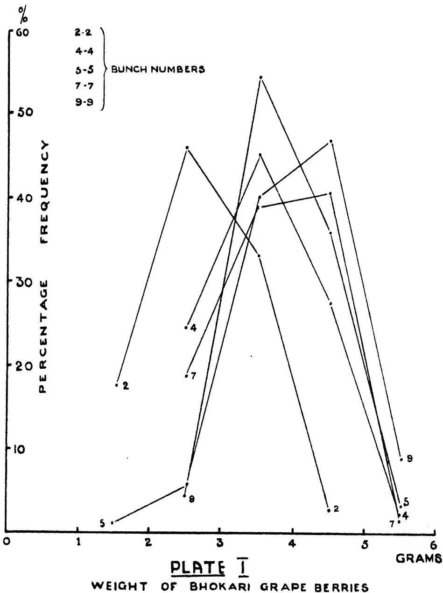

**BUNCH NUMBERS**

- 2-2
- 4-4
- 5-5
- 7-7
- 9-9

<table border="1">
<thead>
<tr>
<th>Bunch Number</th>
<th>Weight (Grams)</th>
<th>Percentage Frequency</th>
</tr>
</thead>
<tbody>
<tr>
<td rowspan="2">2-2</td>
<td>1.5</td>
<td>18</td>
</tr>
<tr>
<td>4.5</td>
<td>2</td>
</tr>
<tr>
<td rowspan="2">4-4</td>
<td>2.5</td>
<td>25</td>
</tr>
<tr>
<td>5.5</td>
<td>4</td>
</tr>
<tr>
<td rowspan="2">5-5</td>
<td>2.5</td>
<td>19</td>
</tr>
<tr>
<td>5.5</td>
<td>4</td>
</tr>
<tr>
<td rowspan="2">7-7</td>
<td>2.5</td>
<td>46</td>
</tr>
<tr>
<td>5.5</td>
<td>7</td>
</tr>
<tr>
<td rowspan="2">9-9</td>
<td>2.5</td>
<td>5</td>
</tr>
<tr>
<td>5.5</td>
<td>9</td>
</tr>
</tbody>
</table>

**PLATE I**  
WEIGHT OF BHOKARI GRAPE BERRIES

S. G. O. 2.4.41.

189------------------------------------------------

133

Experiment Station, Kirkee, during the years 1935-37, while some of the observations have been later on added by work at Baroda.

#### GRAPE

In a Bhokari grape plantation of about two acres at the Ganeshkhind Fruit Experiment Station, Kirkee, the crop of the 1935-36 season was very good and absolutely free from mildew and other diseases. There was no cold wave in that year, and the crop was therefore free from frost. Observations recorded in Table II. are on bunches of this crop, while those presented in Table I. are from bunches of the 1938-39 crop.

The Bhokari is the most common commercial variety of grapes extensively grown in Western India. It is the highest yielder of all the locally-grown varieties. Its bunches are characteristically tapering, compact and large, with a "thumb" or bunchlet shooting out from near the base. The berries are fairly large, round but slightly tapering towards the stem end, and develop a faint rosy bloom when ripe. The colour of the berries is green. Their skin is thick, pulp watery, and the taste and flavour, when the berries are fully ripe, are an agreeable blend of acid with sweet.

In grading grapes apparently two main considerations have to be confronted, namely, the bunch and the berry. The size of individual berries varies but within limits, while that of bunches varies widely in any given variety. There appears to be, however, a tendency for the berries to be larger in smaller bunches than in larger ones. The shape of bunches in the Bhokari variety is more uniform than in other varieties like Fakadi and Kali Sahebi. Cultural and climatic conditions also influence the size of berries, but when they do so, the bunches are also affected. In Table I., it may be seen that the bunches of the first lot (1 to 13 from top) are distinct from those of the second lot, both in the general weight of the bunches as well as in that of individual berries. It would thus appear that, in a given vineyard, the quality of the bunches and berries in them are fairly uniform, and generally the bunch counts more than the berry in determining the quality for marketing purposes. Ripeness being assured, therefore, the chief guiding factors for grading would be the size, compactness, and weight of the bunch in the case of grapes. Further observations on other varieties support this view (Pl. IV and Pl. V, fig. 1). Compactness is fairly uniform in all healthy bunches, and the size of the bunches varies proportionately with their weight. It was, therefore, decided as a practical measure for field work to take the weight of bunches only for grading purposes. Table II. represents the data collected on the weight of grape bunches.

190------------------------------------------------

134

TABLE I.  
Statement showing the weight of bunches and individual berries of the Bhokari variety of grapes.

<table border="1">
<thead>
<tr>
<th rowspan="3">Bunch No.</th>
<th rowspan="3">Weight of bunch in gms.</th>
<th rowspan="3">Total No. of berries.</th>
<th colspan="2">Range of Weight of berries in gms.</th>
<th colspan="12">Frequencies according to weight of berries.</th>
</tr>
<tr>
<th rowspan="2">Min.</th>
<th rowspan="2">Max.</th>
<th rowspan="2">Ave.</th>
<th colspan="2">0 to 1 gm.</th>
<th colspan="2">1 to 2 gms.</th>
<th colspan="2">2 to 3 gms.</th>
<th colspan="2">3 to 4 gms.</th>
<th colspan="2">4 to 5 gms.</th>
<th colspan="2">5 to 6 gms.</th>
</tr>
<tr>
<th>No.</th>
<th>%</th>
<th>No.</th>
<th>%</th>
<th>No.</th>
<th>%</th>
<th>No.</th>
<th>%</th>
<th>No.</th>
<th>%</th>
<th>No.</th>
<th>%</th>
<th>No.</th>
<th>%</th>
</tr>
</thead>
<tbody>
<tr><td>1</td><td>425.25</td><td>138</td><td>2.10</td><td>4.80</td><td>3.32</td><td>—</td><td>—</td><td>—</td><td>—</td><td>39</td><td>30.46</td><td>75</td><td>58.59</td><td>14</td><td>10.93</td><td>—</td><td>—</td></tr>
<tr><td>2</td><td>402.57</td><td>145</td><td>1.12</td><td>4.40</td><td>2.77</td><td>—</td><td>—</td><td>26</td><td>17.58</td><td>67</td><td>46.20</td><td>48</td><td>33.10</td><td>4</td><td>2.75</td><td>—</td><td>—</td></tr>
<tr><td>3</td><td>393.23</td><td>110</td><td>1.95</td><td>5.47</td><td>3.55</td><td>—</td><td>—</td><td>1</td><td>0.91</td><td>25</td><td>22.72</td><td>65</td><td>59.09</td><td>17</td><td>15.45</td><td>2</td><td>1.81</td></tr>
<tr><td>4</td><td>388.40</td><td>106</td><td>2.25</td><td>5.20</td><td>3.66</td><td>—</td><td>—</td><td>—</td><td>—</td><td>26</td><td>24.52</td><td>48</td><td>45.28</td><td>29</td><td>27.35</td><td>3</td><td>2.83</td></tr>
<tr><td>5</td><td>351.54</td><td>92</td><td>1.40</td><td>5.21</td><td>3.82</td><td>—</td><td>—</td><td>1</td><td>1.08</td><td>5</td><td>5.43</td><td>50</td><td>54.34</td><td>33</td><td>35.86</td><td>3</td><td>3.29</td></tr>
<tr><td>6</td><td>331.70</td><td>82</td><td>2.00</td><td>4.70</td><td>4.04</td><td>—</td><td>—</td><td>1</td><td>1.21</td><td>25</td><td>30.48</td><td>46</td><td>56.09</td><td>10</td><td>12.19</td><td>—</td><td>—</td></tr>
<tr><td>7</td><td>306.18</td><td>69</td><td>2.14</td><td>5.10</td><td>4.43</td><td>—</td><td>—</td><td>—</td><td>—</td><td>13</td><td>18.83</td><td>27</td><td>39.13</td><td>28</td><td>40.58</td><td>1</td><td>1.44</td></tr>
<tr><td>8</td><td>303.35</td><td>96</td><td>1.22</td><td>4.91</td><td>3.16</td><td>—</td><td>—</td><td>7</td><td>7.28</td><td>34</td><td>35.41</td><td>47</td><td>48.95</td><td>8</td><td>8.33</td><td>—</td><td>—</td></tr>
<tr><td>9</td><td>208.32</td><td>45</td><td>2.90</td><td>5.57</td><td>4.63</td><td>—</td><td>—</td><td>—</td><td>—</td><td>2</td><td>4.44</td><td>18</td><td>40.00</td><td>21</td><td>46.66</td><td>4</td><td>8.88</td></tr>
<tr><td>10</td><td>191.31</td><td>52</td><td>2.07</td><td>4.85</td><td>3.88</td><td>—</td><td>—</td><td>—</td><td>—</td><td>12</td><td>23.07</td><td>28</td><td>53.84</td><td>12</td><td>23.07</td><td>—</td><td>—</td></tr>
<tr><td>11</td><td>178.61</td><td>66</td><td>1.47</td><td>4.25</td><td>2.70</td><td>—</td><td>—</td><td>3</td><td>4.54</td><td>47</td><td>71.21</td><td>14</td><td>21.21</td><td>2</td><td>3.03</td><td>—</td><td>—</td></tr>
<tr><td>12</td><td>174.30</td><td>49</td><td>1.00</td><td>5.30</td><td>3.55</td><td>—</td><td>—</td><td>3</td><td>6.12</td><td>3</td><td>6.12</td><td>34</td><td>69.38</td><td>8</td><td>16.32</td><td>1</td><td>2.04</td></tr>
<tr><td>13</td><td>150.26</td><td>49</td><td>1.85</td><td>4.55</td><td>3.06</td><td>—</td><td>—</td><td>2</td><td>4.08</td><td>21</td><td>42.85</td><td>20</td><td>40.81</td><td>6</td><td>12.24</td><td>—</td><td>—</td></tr>
<tr><td>14</td><td>107.73</td><td>48</td><td>0.39</td><td>3.75</td><td>2.94</td><td>3</td><td>4.25</td><td>16</td><td>33.33</td><td>26</td><td>54.16</td><td>3</td><td>6.25</td><td>—</td><td>—</td><td>—</td><td>—</td></tr>
<tr><td>15</td><td>99.23</td><td>40</td><td>1.30</td><td>3.70</td><td>2.48</td><td>—</td><td>—</td><td>10</td><td>25.00</td><td>25</td><td>62.50</td><td>5</td><td>12.50</td><td>—</td><td>—</td><td>—</td><td>—</td></tr>
<tr><td>16</td><td>96.39</td><td>58</td><td>0.34</td><td>3.91</td><td>1.66</td><td>4</td><td>6.89</td><td>46</td><td>79.31</td><td>8</td><td>13.79</td><td>—</td><td>—</td><td>—</td><td>—</td><td>—</td><td>—</td></tr>
<tr><td>17</td><td>70.88</td><td>34</td><td>0.82</td><td>3.04</td><td>2.08</td><td>1</td><td>2.94</td><td>17</td><td>50.00</td><td>15</td><td>44.11</td><td>1</td><td>2.94</td><td>—</td><td>—</td><td>—</td><td>—</td></tr>
<tr><td>18</td><td>68.04</td><td>32</td><td>1.00</td><td>3.00</td><td>2.12</td><td>1</td><td>3.12</td><td>13</td><td>40.62</td><td>18</td><td>56.25</td><td>—</td><td>—</td><td>—</td><td>—</td><td>—</td><td>—</td></tr>
<tr><td>19</td><td>59.54</td><td>36</td><td>0.72</td><td>2.57</td><td>1.65</td><td>2</td><td>5.55</td><td>24</td><td>66.66</td><td>10</td><td>27.77</td><td>—</td><td>—</td><td>—</td><td>—</td><td>—</td><td>—</td></tr>
<tr><td>20</td><td>47.20</td><td>29</td><td>0.71</td><td>2.57</td><td>1.62</td><td>2</td><td>6.89</td><td>21</td><td>72.41</td><td>5</td><td>17.24</td><td>1</td><td>3.44</td><td>—</td><td>—</td><td>—</td><td>—</td></tr>
<tr><td>21</td><td>36.86</td><td>19</td><td>1.60</td><td>2.74</td><td>1.94</td><td>2</td><td>—</td><td>8</td><td>42.10</td><td>11</td><td>57.90</td><td>—</td><td>—</td><td>—</td><td>—</td><td>—</td><td>—</td></tr>
</tbody>
</table>

Note.—Bunches 1 to 13 were obtained from the Ganeshkind Fruit Experiment Station, Kirkce, Poona, while the remaining were grown on the Model Farm, Baroda (1938-39).

The weight of berries of bunches from Poona is generally higher than that of berries from the Baroda lot, the averages being 3.57 gms. and 1.97 gms. respectively. The average weights of berries, the weight of bunches and the number of berries in each bunch show that the individual berries do not vary in size and weight in proportion to the size and weight of the bunches, but remain more or less uniform, within a limited range. The frequencies of weight of berries are reduced to graphs in the case of bunch Nos. 2, 4, 5, 7, and 9 (Pl. I), and bunch Nos. 16, 18, and 20 (Pl. II).

191------------------------------------------------

A completely blank white page with no visible content, text, or markings.

192------------------------------------------------

PLATE V.

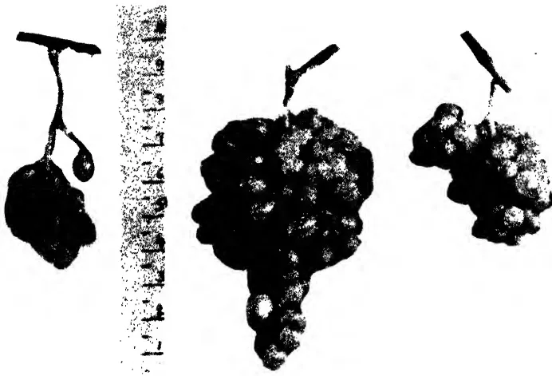A black and white photograph showing three clusters of green grapes hanging from short stems. The grapes are dark and bumpy. To the left of the middle cluster is a vertical ruler with markings, providing a scale for the fruit.

*Block by Survey Dept.*

FIG. 1.—FARDI GRAPE (GREEN).

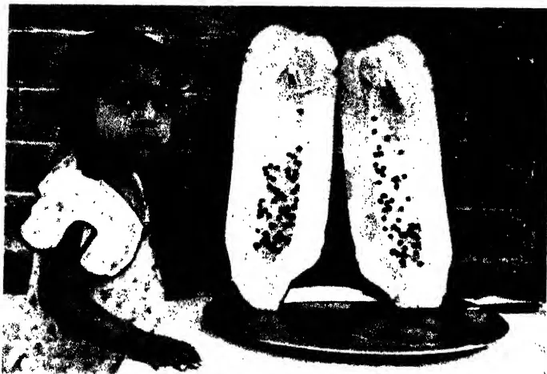A black and white photograph of two large, long papaya fruits standing upright on a dark plate. The fruits are light-colored with a textured surface. The interior of the fruits is visible, showing numerous dark seeds.

*Block by Survey Dept.*

FIG. 2.—A LARGE LONG PAPAYA FRUIT.

Length of fruit 18 in. ; circumference 18 in. ; weight 11 lb. ; seeds 111.

193------------------------------------------------

A completely blank white page with no visible content, text, or markings.

194------------------------------------------------

PLATE IV.

GRAPE BUNCHES OF DIFFERENT VARIETIES AND SIZES. THE SIZE OF BERRIES IS UNIFORM IRRESPECTIVE OF THE SIZE OF BUNCHES IN ALL THE VARIETIES.

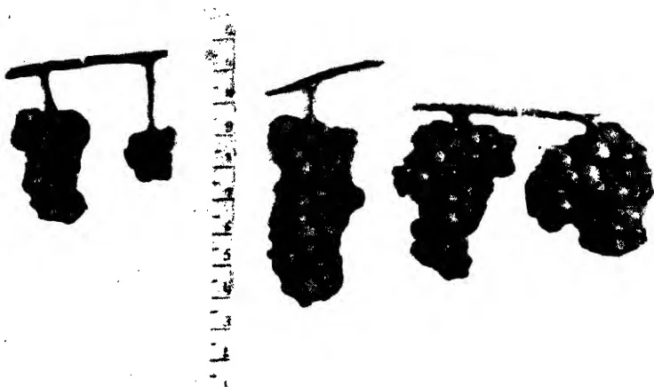A black and white photograph showing three grape bunches of the Bhokari variety. The bunches are dark and hang from short stems. A vertical ruler is positioned between the bunches on the left and the bunches on the right, providing a scale for comparison. The bunches vary in size, with the one on the left being the smallest and the one on the right being the largest.

*Block by Survey Dept.*

FIG. 1.—BHOKARI (GREEN).

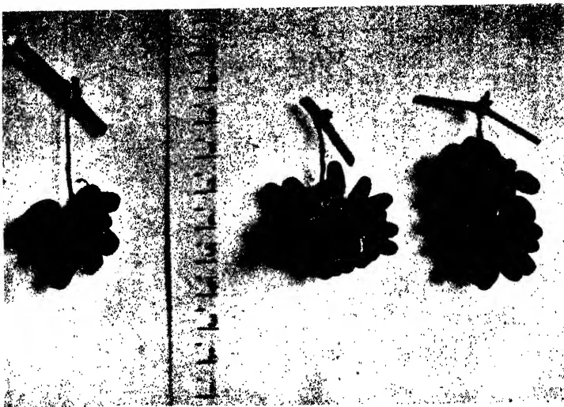A black and white photograph showing three grape bunches of the Kali Sahibi variety. The bunches are dark and hang from short stems. A vertical ruler is positioned between the bunches on the left and the bunches on the right, providing a scale for comparison. The bunches vary in size, with the one on the left being the smallest and the one on the right being the largest.

*Block by Survey Dept.*

FIG. 2.—KALI SAHEBI (BLACK).

195------------------------------------------------

135TABLE II.

Frequency of Bhokari grape bunches according to weight.

<table border="1">
<thead>
<tr>
<th>Weight in ounces ..</th>
<th>0-4</th>
<th>4-8</th>
<th>8-12</th>
<th>12-16</th>
<th>16-20</th>
<th>20-24</th>
<th>Above 24</th>
<th>Total</th>
</tr>
</thead>
<tbody>
<tr>
<td>Number of bunches ..</td>
<td>210</td>
<td>390</td>
<td>388</td>
<td>113</td>
<td>37</td>
<td>9</td>
<td>3</td>
<td>1150</td>
</tr>
<tr>
<td>Percentage :</td>
<td>18.3</td>
<td>33.9</td>
<td>33.7</td>
<td>9.8</td>
<td>3.2</td>
<td>0.8</td>
<td>0.3</td>
<td>100</td>
</tr>
</tbody>
</table>

It is seen from this table that nearly 96 per cent. of the bunches weighed less than one pound (16 ozs.), and hardly four per cent. more than that. Bunches that weigh more than twenty ounces and those weighing less than two ounces are extremely rare. These figures appear to suggest natural grades of Bhokari grapes as :

(1) *Special grade* with bunches weighing 12 ounces and above.

(2) *First grade* with bunches weighing 4-12 ounces.

(3) *Second grade* with bunches weighing below 4 ounces. There should be no objection to including bunches of the higher grades in packages of the lower ones, when difficulty arises in finding a sufficient number of bunches of the higher grade alone for making up a whole package. In such cases it is desirable to mention on the package label the quantity of the higher grade bunches included in it so as to gain a premium on the price obtained for the package as far as possible.

Grape bunches are often blemished due to the attack of mildews and other diseases, spraying and dusting marks, mechanical injury, &c. While blemishes on about five per cent. of the berries in the bunch may be allowed as normal, their occurrence to a greater extent is sure to reduce the value of the bunch. In grading fruits for the market, it is essential that blemishes or other defects should be within the limit at which fruits are safely edible as tested by an expert. Under this proviso, the grade value of grape bunches may be discounted due to their blemishes on the basis of the following formula :

Total percentage of blemishes—5 (or allowable percentage)

2

Under conditions of normal cultivation, treatment of diseases and care in handling, the percentage of blemishes on grapes is usually low. This formula, therefore, provides sufficiently

196------------------------------------------------

136

against the blemishes in grapes (and on any fruit for a matter of that), in adjusting the market value of the bunches packed. For example, no reduction in value will be made when the blemished berries do not exceed five per cent., and when they amount to, say, thirty per cent. of the berries, the grade value of the bunches will be discounted by 12.5 (equal to  $\frac{30-5}{2}$ ) per cent. Of course, it is necessary to state on the package label the actual percentage of blemished berries in the contents of the package for applying this formula at the market end.

### PAPAYA

Fruits for these observations were taken from a plantation of over 500 trees of the Washington papaya variety at the Modibag garden, Poona. The Washington papaya has purple or pinkish stem and deep yellow flowers. Fruits are usually of ovate shape, sweet taste, agreeable flavour and fair keeping quality. The variety is a prolific bearer. It has rapidly gained popularity in Western India, its acreage being at present 1,091 acres in the Bombay Presidency. Fruits are harvested when they just turn yellow for the local market, and a little earlier for longer journeys. Papaya is a quickly perishable fruit, and its movements to distant markets under the present transport conditions is very much limited.

Due to propagation of plants from seeds and the dioecious nature of the trees, a good deal of variation occurs in the shape, dimensions and the general quality of papaya fruits. Fruits of much larger size than those that are studied here are not infrequently seen in the market (Plate V, fig. 2). Their number, however, is limited. Although large fruits of papaya may occasionally bring in a fancy price, the difficulty in selling them under ordinary circumstances is great, as no average family can buy or consume such a bulky fruit. Large fruits are often associated with loss and wastage. The fruits studied here are of the average mass lot and highly representative of the normal market demand.

A number of small fruits are also produced in plantations especially about the end of the economic life of trees. They are generally unmarketable in bulk and are readily sold cheaply in villages and on way-side stalls.

In the case of this fruit three characters, namely, weight, length and maximum circumference have been studied. Length represented the distance from the stalk to the flower end of the fruit, measured over the outward curvature. A total number of 786 fruits were studied.

197------------------------------------------------

137

The following tables of frequencies are given :—

TABLE III.

Frequency of papaya fruits by weight in ounces.

<table border="1">
<thead>
<tr>
<th>Below 50 ozs.</th>
<th>30-35 ozs.</th>
<th>35-40 ozs.</th>
<th>40-45 ozs.</th>
<th>45-50 ozs.</th>
<th>50-55 ozs.</th>
<th>55-60 ozs.</th>
<th>60-65 ozs.</th>
<th>65-70 ozs.</th>
<th>70-75 ozs.</th>
<th>75-80 ozs.</th>
<th>80-85 ozs.</th>
<th>85-90 ozs.</th>
<th>90-95 ozs.</th>
<th>95-100 ozs.</th>
<th>Total</th>
</tr>
</thead>
<tbody>
<tr>
<td>Numbers 76</td>
<td>54</td>
<td>72</td>
<td>62</td>
<td>118</td>
<td>66</td>
<td>97</td>
<td>77</td>
<td>40</td>
<td>42</td>
<td>39</td>
<td>10</td>
<td>21</td>
<td>5</td>
<td>7</td>
<td>786</td>
</tr>
<tr>
<td>Percentages 9.7</td>
<td>6.8</td>
<td>9.2</td>
<td>7.9</td>
<td>15.0</td>
<td>8.4</td>
<td>12.3</td>
<td>9.8</td>
<td>5.1</td>
<td>5.3</td>
<td>5.0</td>
<td>1.3</td>
<td>2.7</td>
<td>0.6</td>
<td>0.9</td>
<td>100</td>
</tr>
</tbody>
</table>

TABLE IV.

Frequency of papaya fruits by length in inches.

<table border="1">
<thead>
<tr>
<th>Below 6 in.</th>
<th>6-7 in.</th>
<th>7-8 in.</th>
<th>8-9 in.</th>
<th>9-10 in.</th>
<th>10-11 in.</th>
<th>11-12 in.</th>
<th>12-13 in.</th>
<th>13-14 in.</th>
<th>Total.</th>
</tr>
</thead>
<tbody>
<tr>
<td>Numbers 12</td>
<td>43</td>
<td>121</td>
<td>231</td>
<td>237</td>
<td>104</td>
<td>33</td>
<td>4</td>
<td>1</td>
<td>786</td>
</tr>
<tr>
<td>Percentages 1.5</td>
<td>5.5</td>
<td>15.5</td>
<td>29.4</td>
<td>30.1</td>
<td>13.2</td>
<td>4.2</td>
<td>0.5</td>
<td>0.1</td>
<td>100</td>
</tr>
</tbody>
</table>

TABLE V.

Frequency of papaya fruits by circumference in inches.

<table border="1">
<thead>
<tr>
<th>Below 15 in.</th>
<th>15-16 in.</th>
<th>16-17 in.</th>
<th>17-18 in.</th>
<th>18-19 in.</th>
<th>19-20 in.</th>
<th>20-21 in.</th>
<th>21-22 in.</th>
<th>22-23 in.</th>
<th>23-24 in.</th>
<th>Total</th>
</tr>
</thead>
<tbody>
<tr>
<td>Numbers 158</td>
<td>108</td>
<td>134</td>
<td>142</td>
<td>106</td>
<td>72</td>
<td>47</td>
<td>13</td>
<td>4</td>
<td>2</td>
<td>786</td>
</tr>
<tr>
<td>Percentages 20.1</td>
<td>13.8</td>
<td>17.1</td>
<td>18.1</td>
<td>13.4</td>
<td>9.2</td>
<td>5.9</td>
<td>1.6</td>
<td>0.5</td>
<td>0.3</td>
<td>100</td>
</tr>
</tbody>
</table>

On working out the correlation of these characters, it was found that the correlation was positively significant between any two of them. The following correlation coefficients are noticed :—

Length  $\times$  Circumference (786 individuals), 0.52.  
 Circumference  $\times$  Weight ( do. ), 0.80.  
 Length  $\times$  Weight ( do. ), 0.70.

These figures lead us to the fact that, as all the three characters are positively correlated, any one of them might serve as well in fixing the grades of papaya fruits for marketing purposes. Simplicity in handling and conformity to market conventions are in favour of taking weight as the guiding factor in preference to length or circumference. On the basis of weight, therefore, the following grades are proposed as natural for papayas :—

*Special grade* with fruits weighing 80 ozs. and above.

*First grade* with fruits weighing 60 to 80 ozs.

*Commercial grade I.*, do. 40 to 60 ozs.

*Commercial grade II.*, do. 20 to 40 ozs.

198------------------------------------------------

138

In assigning these grades to any lot of fruits, due weight should be given to the appearance and maturity of the fruits. Papaya fruits are likely to be discountenanced when blemishes due to *anthracnose*, sunscald, and the like appear on them. The grade value of fruits may be lowered by applying the formula discussed under grapes, when they display blemishes. At the time of selling, if the fruit is too soft or over-ripe, it fetches a lower price than it would have, if it were just soft to ensure proper ripeness, but sufficiently hard to stand peeling and cutting, which is the stage best suited for the table, and on which basis the fruit should have been evaluated in relation to ripeness and consistency.

### GRAPEFRUIT

The third fruit studied is the grapefruit of the Marsh seedless variety. Fruits were taken for observation from the fairly large (about four acres) plantations of the Modibag and Ganeshkhand Fruit Experiment Station, Kirkee. In grapefruits as in other citrus fruits, the coarseness of rind, lack of juice and fluffy pulp inside reduce their market value considerably. Smooth and thin-skinned fruits of quality can be made out easily. It is suggested that such fruits alone be preferred for marketing under standard grades.

The Marsh seedless grapefruit is of medium size, pyriform oblate or roundish in shape, smooth-skinned and attains a whitish yellow colour when fully ripe. The pulp is juicy and its colour is greyish-green. The juice is abundant and agreeably bitter and acidic. The cells are of medium size and not coarse. Not much of rag is present. Pips are sometimes found developed. The tree thrives under Deccan and Gujerat conditions and bears heavily. Fruits are borne singly or in bunches of even ten or more. Its present cultivation is very limited, but it is on the increase.

Length, maximum circumference and weight are the characters studied in the case of grapefruits also. A total number of 990 fruits were studied. The following tables of frequency are given :--

TABLE VI.

Frequency of grapefruits by weight in ounces.

<table border="1">
<thead>
<tr>
<th>Below<br/>8 ozs.</th>
<th>8-12<br/>ozs.</th>
<th>12-16<br/>ozs.</th>
<th>16-20<br/>ozs.</th>
<th>20-24<br/>ozs.</th>
<th>24-28<br/>ozs.</th>
<th>28-32<br/>ozs.</th>
<th>Total</th>
</tr>
</thead>
<tbody>
<tr>
<td>Numbers<br/>4</td>
<td>97</td>
<td>336</td>
<td>367</td>
<td>141</td>
<td>40</td>
<td>5</td>
<td>990</td>
</tr>
<tr>
<td>Percentages<br/>0.4</td>
<td>9.8</td>
<td>33.9</td>
<td>37.1</td>
<td>14.3</td>
<td>4.0</td>
<td>0.5</td>
<td>100</td>
</tr>
</tbody>
</table>

199------------------------------------------------

139

**TABLE VII.**  
Frequency of grapefruits by length in inches

<table border="1">
<thead>
<tr>
<th>2-3 in.</th>
<th>3-4 in.</th>
<th>4-5 in.</th>
<th>5-6 in.</th>
<th>Total</th>
</tr>
</thead>
<tbody>
<tr>
<td>Numbers<br/>11</td>
<td>382</td>
<td>526</td>
<td>71</td>
<td>990</td>
</tr>
<tr>
<td>Percentages<br/>1·1</td>
<td>38·6</td>
<td>53·1</td>
<td>7·2</td>
<td>100</td>
</tr>
</tbody>
</table>

**TABLE VIII.**  
Frequency of grapefruits by circumference in inches.

<table border="1">
<thead>
<tr>
<th>9-10 in.</th>
<th>10-11 in.</th>
<th>11-12 in.</th>
<th>12-13 in.</th>
<th>13-14 in.</th>
<th>14-15 in.</th>
<th>15-16 in.</th>
<th>16-17 in.</th>
<th>17-18 in.</th>
<th>Total</th>
</tr>
</thead>
<tbody>
<tr>
<td>Numbers<br/>11</td>
<td>21</td>
<td>242</td>
<td>303</td>
<td>253</td>
<td>109</td>
<td>40</td>
<td>8</td>
<td>3</td>
<td>990</td>
</tr>
<tr>
<td>Percentages<br/>1·1</td>
<td>2·1</td>
<td>24·5</td>
<td>30·6</td>
<td>25·6</td>
<td>11·0</td>
<td>4·0</td>
<td>0·8</td>
<td>0·3</td>
<td>100</td>
</tr>
</tbody>
</table>

In the case of grapefruit, too, there is positively significant correlation between any two of the three characters studied. The coefficients of correlation are given below :—

<table>
<tbody>
<tr>
<td>Weight × Length</td>
<td>(990 individuals),</td>
<td>0·63.</td>
</tr>
<tr>
<td>Weight × Circumference</td>
<td>( do. ),</td>
<td>0·81.</td>
</tr>
<tr>
<td>Length × Circumference</td>
<td>( do. ),</td>
<td>0·83.</td>
</tr>
</tbody>
</table>

Grapefruit is usually sold by the number and not by weight. The shape of the fruits does not vary much. The size of the fruit is, therefore, the factor that controls its price. Owing to the peculiar shape of grapefruits, their size depends upon circumference even more than on length. In grading them it may be found easy and convenient to pass these fruits through circular holes of various diameters. Grapefruits of unduly large size are not appreciated for table use. Large fruits tend to be thick-skinned and fluffy. Fruits of medium size command popularity. Thus taking circumference as the guiding factor, the following grades may be acceptable for grapefruits :—

- \* *First grade*, fruits with circumference of 12-14 in.
- *Second grade*, fruits with circumference of 14-16 in.
- *Third grade*, fruits with circumference of 10-12 in.

---

\**Note.*—An explanation seems to be called for in these grade specifications. Fruits of medium size, as explained in the body of the discussion, are most popular being both handy and convenient for table consumption. They are therefore placed in the highest grade. The larger fruits are placed in the second grade as they generally contain more juice and are more economic, although their size and appearance may not be in their favour, than the smaller lot which are given the third place. Grading inversely according to the size of fruits would place the smallest fruits in the highest grade, which is evidently impracticable.

200------------------------------------------------

140

In actual field work it is extremely laborious to measure the circumference of each and every fruit for the sake of grading. It is, therefore, suggested that ply-wood pieces, having holes of different sizes may be used for this purpose. Holes having diameters of 3, 5, 4.0, 4.5, and 5.0 in. approximately agree with the circumference records of fruits noted above and are both easily understandable and convenient to handle by the mass of average fruit growers, and hence they may be adopted to grade fruits according to the above standards (Pl. III) :—

*First grade*, fruits which pass through 4.5 in. hole and not 4.0 in. hole.

*Second grade*, fruits which pass through 5.0 in. hole and not 4.5 in. hole.

*Third grade*, fruits which pass through 4.0 in. hole and not 3.5 in. hole.

The above grades are meant for healthy and sound fruits. Diseased and sunscalded fruits are no good for marketing under standardized grades. Blemished fruits, if not objectionable for human consumption, may be graded according to the above size standards and then discounted in value according to the formula given under grapes. Fruits that do not fall under these grades may be utilized for bottling their juice or for way-side selling as fresh fruits of ungraded quality.

#### SUMMARY

Proper grading of fruits is an essential requirement of profitable marketing. Grade standards would naturally be based on the quality of fruits. They should be as natural as possible and meet the economic requirements of growers and consumers and help the disposal of fruits in a manner satisfactory to both of them. The various factors that control the quality of fruits are discussed, and on their basis a large number of Bhokari grape bunches, Washington papayas, and Marsh Seedless grapefruits are studied. Suitable grade standards are then recommended for these fruits. The factors studied in detail are the weight of bunches and individual berries in bunches of the Bhokari grape, and the length, circumference and weight of Washington papayas and grapefruits of the Marsh Seedless variety. It is observed that the size factors in papayas and grapefruits are correlated. A new formula is suggested to adjust the grade value of fruits suffering from blemishes.

#### ACKNOWLEDGEMENTS

The writers are thankful to Mr. R. G. Allan, M.A., C.I.E., Commissioner of Agriculture, Baroda State, for the great interest

201------------------------------------------------

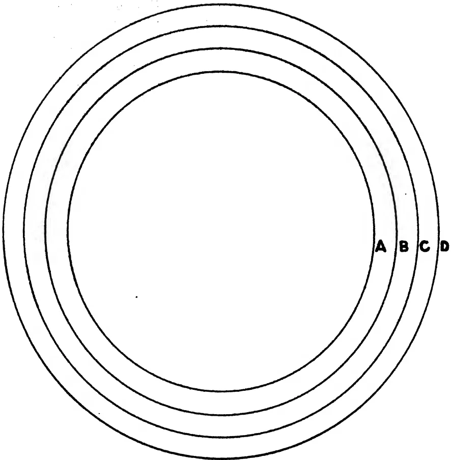

## PLATE III

Size of holes for grading grapefruits :

<table><tr><td>A</td><td>..</td><td>3.5</td><td>inches</td><td>diameter</td></tr><tr><td>B</td><td>..</td><td>4.0</td><td>do.</td><td>do.</td></tr><tr><td>C</td><td>..</td><td>4.5</td><td>do.</td><td>do.</td></tr><tr><td>D</td><td>..</td><td>5.0</td><td>do.</td><td>do.</td></tr></table>

S. G. D. 2.4.41.

*First grade* fruits pass through C and not through B.

*Second grade* fruits pass through D and not through C.

*Third grade* fruits pass through B and not through A.

202------------------------------------------------

A completely blank white page with no visible content, text, or markings.

203------------------------------------------------

141

taken in this paper ; to Dr. G. S. Cheema, Horticulturist to the Government of Bombay, for granting facilities to record observations at the institutions under his control ; to Mr. A. M. Livingstone, Agricultural Marketing Advisor to the Government of India, for having offered valuable criticisms ; to Mr. S. S. Gangadharbhotla, Superintendent, Fruit Research Station, Gandevi, for assistance in collecting data, and to Mr. G. K. Govande, Economic Botanist, Baroda State, for his assistance in working out the correlation figures.

#### REFERENCES

1. 1. Cheema, G. S. and Dani, P. G.—(1931). *Bom. Dept. Agri. Leaflet* No. 1.
2. 2. (1932, 1933). *Bom. Dept. Agri. Bull.* 17.
3. 3. Naik, K. C.—(1935) *Bihar and Orissa Dept. Agri. Bull.* 1.
4. 4. Nair, P. D.—(1932) *Agri. Livestock in Ind.* Vol. II., part 6.
5. 5. Report of the Committee on the Improvement in the Marketing of Fruit and Vegetables in the Town of Bombay (1934).
6. 6. Report of the Mango Marketing Committee, Bombay (1925).

204------------------------------------------------

142A LEAF SPOT DISEASE OF ANNUAL PHLOX

T. E. T. BOND,

MYCOLOGY DIVISION, TEA RESEARCH INSTITUTE OF CEYLON

A DISEASE causing considerable damage to plants of *Phlox Drummondii* was observed in the writer's garden\* in February, 1941. It was associated with a fungus identified as a species of *Septoria* new to Ceylon, and appeared to merit a short description.

In the early stages of the disease, spots are formed on the lower leaves which are prematurely shrivelled or defoliated. Under suitable conditions, the disease later spreads until most of the leaves are affected. The plants are rendered extremely unsightly and make little growth, the new leaves being stunted and curled and the period of flowering reduced. The spots (Pl. I, fig. 1) originate either at the margin or in the centre of the leaves. They are at first rounded or irregular in shape, about 2-3 mm. in diameter, and of a dull brown or olivaceous colour. As they increase in size, their colour changes to pale brown or whitish, and their outline becomes more uniformly circular, except where two or more spots coalesce. Commonly, they remain as distinct spots up to 2 cm. in diameter. The centre of the spot may appear raised and of a different colour, usually paler, and this is believed to indicate the former extent of the infection arrested temporarily by a period of dry weather or other unfavourable conditions, from which a more rapid spread has later occurred. Around the spots, yellow areas are formed which soon become wedge-shaped, the discolouration running back to the mid-rib following the direction of the lateral veins. These wedge-shaped areas later become brown and completely dried out, after which the whole leaf usually shrivels or drops off.

Extra detail can be observed in leaves kept in a moist chamber, or during a spell of damp weather. Under these conditions, the spots spread more rapidly and develop a narrow purplish margin, outside which for about another 2 mm. the normal green colour of the leaf persists, in strong contrast with the surrounding yellowed area. Similar "green rings" which appear to be due to a local stimulation of the cells by the products of fungal metabolism have been described by Forward (6)

---

\* St. Coombe, Talawakele. Elevation 4,500 feet.

205------------------------------------------------

A completely blank white page with no visible content, text, or markings.

206------------------------------------------------

PLATE 1.

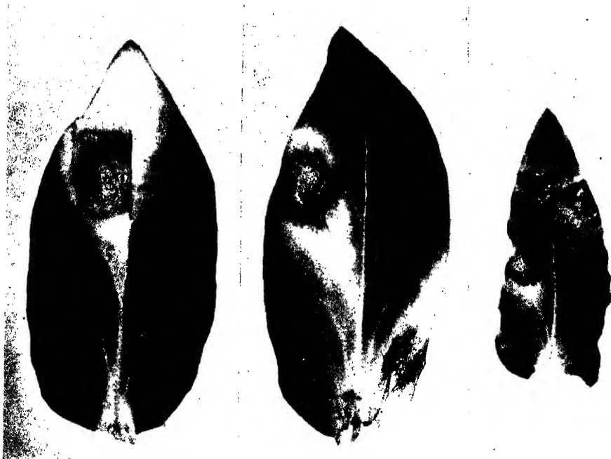Three leaves of *Phlox Drummondii* are shown, each exhibiting dark, irregular spots characteristic of leaf spot disease. The leaves are arranged horizontally, with the leftmost one being the largest and the rightmost one being the smallest.

Block by Sursee Dept.

FIG. 1.—LEAVES OF *Phlox Drummondii* WITH LEAF SPOT DISEASE ASSOCIATED WITH *Septoria Drummondii* ELL. & EV. (NATURAL SIZE).

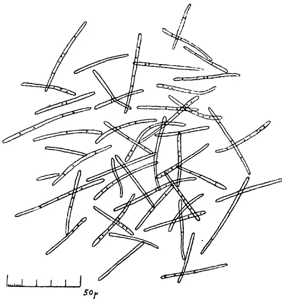A detailed line drawing of numerous fresh spores of *Septoria Drummondii* in water. The spores are elongated, multi-septate, and often branched. A scale bar at the bottom left indicates a length of 50 micrometers (50μ).

FIG. 2.—FRESH SPORES IN WATER (CAMERA LUCIDA DRAWING  $\times 430$ ).

207------------------------------------------------

143

in the case of rust pustules developing on etiolated wheat leaves. A greenish or olivaceous tinge may persist on the underside of the spot, after the surrounding tissue has become brown and dried out.

Pycnidia are developed simultaneously with the spots and under damp conditions may even appear locally in small numbers before any definite spotting is discernible. They occur chiefly on the upper surface of the leaf, and in the larger spots show a slight tendency to zonation. This is less marked and the pycnidia are also probably less numerous than is commonly observed in related species of fungi. To the naked eye the pycnidia appear as dull brown, dusty granules. Emergence of spore tendrils could be seen after a few hours in a moist chamber. Examined *in situ* using a 1 in. objective and transmitted light, the pycnidia appear pale brown in colour and the relatively large ostiole is clearly visible. The epidermis is ruptured only on the emergence of the spores, *i.e.*, the pycnidia are completely immersed, not erumpent. The measurement of 50 pycnidia gave the following results :—

<table>
<tr>
<td>Diameter of pycnidia</td>
<td>55 – 160 <math>\mu</math></td>
<td>..</td>
<td>Mean</td>
<td>103.4 <math>\mu</math> <math>\pm</math> 4.02 <math>\mu</math>*</td>
</tr>
<tr>
<td>Diameter of ostiole</td>
<td>15 – 45 <math>\mu</math></td>
<td>..</td>
<td>Mean</td>
<td>30.1 <math>\mu</math> <math>\pm</math> 0.95 <math>\mu</math></td>
</tr>
</table>

The spores (Pl. I, fig. 2) which with the pycnidia, are typical for the genus *Septoria* are hyaline, filiform or slightly wider at one end (*i.e.* acicular), straight or slightly curved or bent, and have up to three septa with a varying number of minute guttules. Their size varies within wide limits, as shown by the following measurements of 50 freshly exuded spores in water :—

<table>
<tr>
<td>Length</td>
<td>17.0 – 66.5 <math>\mu</math></td>
<td>..</td>
<td>Mean</td>
<td>43.3 <math>\mu</math> <math>\pm</math> 1.32 <math>\mu</math></td>
</tr>
<tr>
<td>Breadth</td>
<td>1.5 – 3.0 <math>\mu</math></td>
<td>..</td>
<td>Mean</td>
<td>2.1 <math>\mu</math> <math>\pm</math> 0.05 <math>\mu</math></td>
</tr>
</table>

Three species of *Septoria* have been reported in the literature as associated with leaf spot diseases of various *Phlox* spp. These are, in order of publication—

1. (1) *S. Phlogis* Sacc. & Speg.
2. (2) *S. divaricatae* Ell. & Ev. (= *S. Phlogis* Ell. & Ev. *non* Sacc. & Speg.)
3. (3) *S. Drummondii* Ell. & Ev.

In attempting to identify the Ceylon fungus, it will be necessary to give a short account of these three species and of their claims to be regarded as distinct from one another. Briefly, *S. Phlogis* was originally described from Europe, the hosts, according to Saccardo (11) and Grove (7), being *Phlox decussata*, *paniculata*, and other perennial forms. *S. divaricatae* was the name given to an American fungus which Ellis and Everhart (3) at first (1887) believed to be identical with the

---

\* The standard error of the mean is implied by this expression.

208------------------------------------------------

144

European species but later (1889) described as distinct on account of its smaller and less evidently septate spores. The same authors (4) in 1894 distinguished the fungus on the annual *Phlox Drummondii* as a third species having spores larger than those of *S. divaricatae* but nevertheless still smaller than those of the European *S. Phlogis*. Other slight differences are involved, as may be seen from the following table in which the essential characters of the three published species (taken from the sources quoted above) are tabulated together with those of the Ceylon form.

TABLE I.  
Distinguishing Characters of *Septoria* Spp. on *Phlox*

<table border="1">
<thead>
<tr>
<th></th>
<th>Spots on Foliage.</th>
<th>Pycnidia.</th>
<th>Spores.</th>
</tr>
</thead>
<tbody>
<tr>
<td><i>S. Phlogis</i></td>
<td>Clear brown at first, then whitish. Often confluent. Size variable, shape round or angular.</td>
<td>Epiphyllous, covered, clear brown. Ostiole wide. Size 100 – 200 <math>\mu</math>.</td>
<td>Filiform, mostly bent or flexuose. 1-3 septate, in size 40 – 60 <math>\mu</math> x 1 – 2 <math>\mu</math>.</td>
</tr>
<tr>
<td><i>S. divaricatae</i></td>
<td>Olivaceous below, whitish above. 1-3 mm. diam. or larger and confluent, with purplish border. Shape round.</td>
<td>Epiphyllous, rather numerous, immersed, then bursting epidermis, dull black. Size 100 – 120 <math>\mu</math>.</td>
<td>Filiform, nearly straight, aseptate. 18 – 30 <math>\mu</math> x 0.75 – 1 <math>\mu</math>.</td>
</tr>
<tr>
<td><i>S. Drummondii</i></td>
<td>Olivaceous green at first, then whitish to ochraceous. Often confluent. Form variable.</td>
<td>Epiphyllous, densely gregarious. Covered, clear brown. Ostiole wide. Size 75 – 150 <math>\mu</math>.</td>
<td>Anicular, straight or slightly bent, few indistinct septa. 35 – 50 <math>\mu</math> x 1.5 – 2 <math>\mu</math>.</td>
</tr>
<tr>
<td>Ceylon species.</td>
<td>Olivaceous at first, then brown to white. Usually round, may be confluent. Purple border may occur. Yellowing of foliage conspicuous.</td>
<td>Epiphyllous and fewer hypophyllous. Covered, dull brown, (pale brown under microscope). Ostiole wide. Size 55 – 160 <math>\mu</math>. Mean (50); 103 <math>\mu</math>.</td>
<td>Filiform, rarely anicular. Straight or slightly bent. Continuous to 3-septate. 17 – 66.5 <math>\mu</math> x 1.5 – 3 <math>\mu</math>. Mean (50) : 43 <math>\mu</math> x 2 <math>\mu</math>.</td>
</tr>
</tbody>
</table>

It will be seen from the above Table that the Ceylon form differs from any of the three published species in its epi- and hypophyllous pycnidia and in the far wider range of variation in size both of its pycnidia and spores. On the whole, it agrees more closely with *S. Drummondii* Ell. & Ev. than with any other species, and in view of its occurrence on the same host, this name is provisionally adopted for it. However, the wide variability of the Ceylon fungus, taken together with the fact that *S. Drummondii* as originally published was in any case more or less intermediate between *S. Phlogis* and *S. divaricatae*,

209------------------------------------------------

145

suggests that the distinctions between these three species are, in fact, hypothetical, and that a useful purpose would be served by combining them. Should this course be adopted, it would appear that *S. Phlogis* Sacc. & Speg., with an emended diagnosis, would be the most satisfactory name for the combined species. Support for the proposal can be inferred from the account in Grove's (7) book, while Pape (10) also, by including *Phlox Drummondii* in the list of species susceptible to leaf-spot caused by *S. Phlogis*, appears to have something of the same sort in mind. Experimental studies will, of course, be needed before the position can be fully cleared up.

Control measures for the disease have not been attempted, but judging from the recommendations of Clinton (2), Fikry (5) and other workers, satisfactory results should be obtained by strict attention to hygiene—destruction of infected leaves and plant remains—and, if considered necessary, fortnightly dusting with sulphur or spraying with Bordeaux mixture up till about blooming time.

The origin of the disease in Ceylon is not known; it does not seem to have been reported from India (1), (9) although it is known to occur in other tropical countries (5), (8). It is worth nothing that the *Phlox* family, *Polemoniaceae*, among which alternate host plants might reasonably be sought, is not represented in the Ceylon flora. The plants affected were raised from freshly-imported seed, and the possibility of seed dispersal must therefore be considered. No observational data have been obtained to preclude this possibility.

#### SUMMARY

An account is given of a leaf spot disease of *Phlox Drummondii* associated with a species of *Septoria* new to Ceylon. The nomenclature of the fungus is briefly considered, with reference to the available descriptions of three *Septoria* spp. known to infect *Phlox*. The name *S. Drummondii* Ell. & Ev. is provisionally adopted.

#### ACKNOWLEDGEMENT

I am indebted to Mr. C. A. Loos for the accompanying photograph, Fig. I.

#### REFERENCES

1. (1) Butler, E. J. and Bisby, G. R.—The fungi of India. *Scient. Monogr. Imp. Coun. agric. Res.* 1, 1931.
2. (2) Clinton, G. P.—Plant pest handbook for Connecticut. II. Diseases and injuries. *Bull. Conn. agric. Exp. Sta.* 358, 1934.
3. (3) Ellis, J. B. and Everhart, B. M.—New and rare species of North American fungi (Sphaeropsideae). *J. Mycol.* 5 : 145-57, 1889.
4. (4) do. —New species of Fungi. *Ibid.* 7 : 130-5, 1894.

210------------------------------------------------

146

(5) Fikry, A.—Diseases of phlox and antirrhinum. *Leaf. Min. Agric. Egypt* 76, 1936—(Abstr. in *Rev. appl. Mycol.* 16 : 256).

(6) Forward, D. F.—The influence of altered host metabolism upon modification of the infection type with *Puccinia graminis tritici*. p.f. 21. *Phytopathology* 22 (6) : 493-555, 1932

(7) Grove, W. B.—*British Stem-and Leaf Fungi. (Coelomycetes)*. Cambridge, 1935

(8) Hopkins, J. C. F.—A descriptive list of plant diseases in Southern Rhodesia (and their control). *Mem. Dep. Agric. S. Rhod.* 2, 1939.

(9) Mundkur, B. B.—The Fungi of India. Supplement I. *Scient. Monogr. Imp. Coun. agric. Res.* 12, 1938.

(10) Pape, H.—Eine häufige Blattfleckenkrankheit an Phlox. *Blumen —u. Pfl Bau ver. Gartenwelt.* 39 : 426-7, 1935 (Abstr. in *Rev. appl. Mycol.* 15 : 25).

(11) Saccardo, P. A.—(1884). *Sylloge Fungorum* . . . . . Vo. III.

211------------------------------------------------

147

RECENTLY INTRODUCED FOOD CROPS AT THE  
EXPERIMENT STATION, PERADENIYA  
I—SORGHUM

**C. N. E. J. DE MEL, B.Sc. (Hons.), B.Sc. Agric. (London), Dip.  
Agric. (Wye),**  
*PRINCIPAL, SCHOOL OF AGRICULTURE, PERADENIYA,*

AND

**P. M. GAYWALA, M.Ag. (Bombay),**  
*DEMONSTRATOR IN CULTIVATION, SCHOOL OF  
AGRICULTURE, PERADENIYA*

**I**N an agricultural country like Ceylon where rice constitutes the staple article of diet for which she has to depend to a great extent upon outside sources of supply, it is desirable in the interest of national economy that an attempt be made to find out suitable alternative sources of food which are capable of successful local production. These foods should be able to satisfy the dietetic requirements of the people by providing them with a well-balanced diet and should be easy to produce under the local conditions particularly in the dry zone areas where paddy cannot be produced satisfactorily in both seasons of the year without irrigation facilities and without artificial means to maintain the fertility of the soil. These alternative foods are not intended to replace rice which will, no doubt, continue to remain the staple article of diet ; but their main utility would be to furnish an appropriate variety in the food of the people so as to help in the formation of a better-balanced diet and in general to serve as desirable types of supplementary foods. The by-products of these crops should also be able to furnish fairly nutritive food for cattle.

In the south-west monsoon season of the year 1938 a number of food crops well known for their place in the daily diet of the people in Gujarat, Western India, Punjab, and in other parts of India were introduced on this station for preliminary trial.

The crops dealt with now are sorghum, pennisetum millet, and cowpeas. These crops have by now been under cultivation successively for four seasons at this station.

212------------------------------------------------

148(1) **SORGHUM** (*Andropogon Sorghum*)

This is a very important cereal crop furnishing grain and fodder which has been grown for thousands of years and on millions of acres practically all over India except in very wet parts such as Bengal, Konkan, &c. Its adaptability to adverse conditions including its capacity to withstand drought and its suitability to a wide range of soils coupled with its ability to produce large quantities of fodder give it a paramount place in Indian agriculture. To the Indian cultivator this crop is more useful than either wheat or paddy because the fodder of sorghum constitutes a staple food for his draft animals. In the case of paddy the weight of straw produced is almost equal to or little more than the weight of grain, whereas in the case of sorghum it is two and a half to three times as much as the grain.

In food value, sorghum is superior to rice though inferior to wheat. In some parts of India, sorghum is regarded by people to be more wholesome than wheat or rice on account of its being more easily digestible. In many parts of India it is the staple cereal of the middle class as well as of the agricultural class. Sorghum seed on analysis is found to contain 10.42 per cent. protein, 1.93 per cent. fat and 1.76 per cent. mineral matter which clearly shows that sorghum is definitely better than rice as a food and superior to kurakkan in respect of protein and fat.

During recent years sorghum has witnessed great industrial developments in Madras Presidency. It is found capable of being substituted for barley in malting operations. One hundred pounds of sorghum grain yield 80 to 85 lb. of dry malt of which 60 to 65 per cent. is extractable with water. Every portion of the malt is found to be of use in one form or other. For domestic purposes, the process of malting sorghum has been so simplified that any person of average intelligence can prepare his own requirements of malt from sorghum and thus have fresh malted foods for the feeding of infants and invalids and for use even by healthy persons at very little expense. The home-prepared malted foods have been found to possess all the qualities attributed to the imported malted foods available in the market under various trade names. Ceylon uses these patented foods extensively and therefore there is a possibility of developing a small lucrative side industry from sorghum if the crop finds a place in the village agriculture of this country.

**VARIETIES**

There are a large number of varieties of this crop. It is due to this fact that it is found growing under a wide range of conditions. In Ceylon, sorghum is cultivated to a small extent

213------------------------------------------------

A completely blank white page with no visible content, text, or markings.

214------------------------------------------------


*Block by Surrey Dept.*

*Buddh Perio VARIETY OF SORGHUM.*

215------------------------------------------------

149

in the Jaffna Peninsula under the name of *Cholam*. The varieties grown in Jaffna appear on examination to be essentially the fodder varieties as they generally have thin long stems, plenty of leaves and earheads small and loosely formed with very small-sized grain. These fodder varieties are quite distinct from the grain varieties and yield a very poor crop of grain. The problem was, therefore, to introduce a distinct grain variety. Surat and Broach Districts in Gujarat, Western India, are famous for the good quality of grain sorghum. Two varieties, viz., *Buddh Perio* from Surat and Broach Selection No. 8 from Broach were therefore obtained for trial. Both the varieties have large-sized bright grain and the *Buddh Perio* variety is particularly noted for the compact character of its earheads as implied by its name. Broach No. 8 being a winter variety did not grow successfully during the first two seasons. It was, therefore, discarded during the south west monsoon season of 1939. The *Buddh Perio* variety appeared to be promising from the beginning and was, therefore, tried over a period of three seasons at the Experiment Station, Peradeniya. From the observations made of the standing crop at various stages of its growing period, the crop appeared to have excellent and luxuriant growth. However, in respect of the size of the earhead, it has been observed that the earheads obtained locally are somewhat smaller than those growing in the Surat District. This may be due to the fact that the Peradeniya conditions proved too wet for this crop, and as a result the size of the earhead was adversely affected on account of somewhat distinct vegetative growth of the crop. It is possible to overcome this handicap when this crop is cultivated in the dry zone. Another difficulty is that the grain gets discoloured under Peradeniya conditions on account of rain at a time when the crop is almost ready for harvesting. This difficulty is also capable of adjustment to some extent if the sowing time is so regulated that the harvesting may take place in a dry period. Locally-produced grain in respect of size and other points of quality is practically as good as the grain produced in the Surat District. The earheads have also maintained their character of being compact.

#### SOIL REQUIREMENTS

Sorghum can be grown on a wide range of soils from the lighter type of loamy soils to the heavy type of clay soils. Heavy soils should have drainage facilities as this crop cannot tolerate water-logging in any form. On light soils the growth is comparatively small and the crop matures fairly quickly. On fertile and retentive soils the growth is excellent and the crop takes a comparatively long period to mature. The spacing provided on such soils is wider than that on the lighter soils.

216------------------------------------------------

150

It is a fairly heavy feeder and therefore the soil should be naturally fertile or should receive about 5 tons of organic manure during the course of the preparatory cultivation.

#### CLIMATIC REQUIREMENTS

Sorghum requires a fairly warm and dry climate and, therefore, it can grow practically all over the dry zone areas. The amount and distribution of rainfall act as a limiting factor in the cultivation of this crop. It can be successfully cultivated in places where the rainfall in a season ranges from 25 to 40 inches. Places receiving higher than 40 inches rain are not suitable for this crop. There should be dry weather during the harvesting period as otherwise the grains are liable to be discoloured by moulds.

#### METHODS OF CULTIVATION

In India it is cultivated as an entire crop particularly when grown in the dry winter season. In the south-west monsoon season, it is cultivated either as an entire crop or as a mixed crop. In Ceylon it may be grown as an entire crop, or as a mixed crop with soybean, cowpeas, green gram or black gram.

The land can be prepared for sowing in the usual manner by ploughing and harrowing. The suitable spacing for the *Buddh Perio* variety under our local conditions will be 18" apart between the rows and 12" apart between plants in a row. The crop can, therefore, be drilled by a three-coultered drill in lines 18" apart and then the plants can be thinned in the rows to a space of 12". If the drill is not available, the crop can be dibbled to a spacing of 18" by 12" by depositing 3 to 4 seeds in each hole. The seed rate for this spacing usually ranges from 8 to 10 lb. per acre when grown as an entire crop.

As sorghum is liable to an attack of grain smut, it is desirable to treat the seed before sowing either by steeping it for 10 minutes in a 2 per cent. solution of copper sulphate or preferably by mixing with very fine sulphur powder at 1 oz. sulphur per 15 lb. seed as a preventive measure against smut disease. The sulphur treatment has been found to be very effective in the Bombay Presidency and its cost is almost negligible. So far this disease has not appeared either on this station, or in other parts of the Island where this variety has since been grown.

It was observed as a result of an experiment carried out by the Bombay Agricultural Department (*Department of Agriculture, Bombay, Leaflet No. 18 of 1927*) that large, plump, heavy, selected seed when used for sowing contribute an increase in yield to the extent of 50 per cent. It is, therefore, a distinct advantage to use only such selected seed wherever possible.

217------------------------------------------------

151

The germination is complete within about 10 days of sowing. Filling of vacancies and thinning out wherever necessary should be undertaken soon after the germination is over. Inter-cultivation depends on the character of the soil and rainfall. As soon as the crop is about 6 to 9 inches high, the first inter-cultivation should commence. In India this inter-cultivation is usually done by working two blade-hoes yoked to a pair of bullocks, and two acres are inter-cultivated in a day in this way. Two inter-cultivations and one hand weeding may prove sufficient for this crop.

Birds do a great deal of damage to this crop and, therefore, the crop requires to be watched against birds. Scaring of birds should commence soon after the earheads begin to fill up with grain. This has usually to be continued over a period of 5 to 6 weeks. This crop was observed to require a growing period of about 5 months under Peradeniya conditions.

The crop can be harvested either by cutting the whole plant close to the ground or by simply cutting the mature earheads first and then removing the stems. Under Ceylon conditions the crop is liable to be damaged any time by untimely rain and, therefore, it is always desirable to remove the mature earheads as and when they appear fit to be removed. As the crop does not mature evenly, the harvesting of the earheads will have to be carried out at frequent intervals till all the earheads are removed. The stems may then be removed by cutting close to the ground and used as fodder either in the fresh form or after drying as hay. If the stems are allowed to stand unduly for a long period in the field after the earheads have been removed, their value as fodder deteriorates. The earheads should be dried in the sun, and when they are fully dry they can be threshed for the separation of grain.

This crop is generally threshed under the feet of bullocks in the Indian villages. Recently a stone roller with a rough surface has been introduced and it performs the work of threshing very efficiently and economically. The cost of this stone roller is about Rs. 30 and with it the threshing work can be accomplished very quickly and cheaply.

#### YIELDS

In India the yield of grain on ordinary soils ranges from 700 lb. to 1,000 lb. per acre. On fairly good land and with reasonably good cultivation, the yield ranges from 1,000 lb. to 1,400 lb. per acre. The crop is known to respond to good cultivation and manuring. The crop grown at the Experiment Station, Peradeniya, on ordinary light soil on an area of  $\frac{3}{4}$  acre in the south-west monsoon season of 1939 yielded  $15\frac{1}{2}$  bushels or 930 lb. grain. The yield per acre therefore amounted to

218------------------------------------------------

152

1,240 lb. grain, a bushel of grain weighing 60 lb. at Peradeniya. This is quite a satisfactory yield in view of the adverse climatic factors that the crop had to encounter during this particular season. In the south-west monsoon season (*Yala*) of 1940 the excellent yield of 41 bushels or 2,460 lb. was obtained. This particular crop received 50 cart loads of compost per acre and one cwt. of Nicifos No. 2 as a top dressing six weeks after sowing.

#### METHODS OF USING AS FOOD

The grain is chiefly used in the form of flour. Thicker types of *Chapathi* or *Roti* can be made from the flour of this grain. In fact, sorghum flour can be used in almost all the ways in which kurakkan or maize flour is used, and in some of the ways in which wheat flour is used. In India, the grain is also used as popped corn after parching or roasting on a popper.

219------------------------------------------------

153

## VARIETY AND CULTURAL EXPERIMENTS WITH COWPEAS

M. FERNANDO, Ph.D. (Lond.), D.I.C.,  
ASSISTANT BOTANIST

AND

W. N. FERNANDO  
ASSISTANT IN ECONOMIC BOTANY

IN connection with a co-operative, Empire-wide study of cultivated races of cowpea (*Vigna unguiculata* (L.) Walp.), initiated by Mr. H. C. Sampson, Economic Botanist, Royal Botanic Gardens, Kew, the performance of 93 varieties of cowpea collected from various parts of Ceylon was investigated at Peradeniya during the period 1933-40. An account even in outline of the vast volume of information accumulated is not attempted here. This contribution briefly reports the more important yield and cultural trials carried out at Peradeniya in the course of the investigation.

### THE 1937-8 EXPERIMENTS

In the yala season, 1937, 43 varieties were selected for trial at Peradeniya. The seven best yielders in this season were tested out in maha 1937-8, in a randomized block layout comprising seven replications of 1/218 acre plots. Summary descriptions of these seven varieties are given in Table 1. Two seeds were dibbled per hill, and the seedlings subsequently thinned to a final stand of one per hill. The hills were spaced 2 ft. apart between and within rows. The area received no manure. Blanks were supplied. The plants were earthed up against *Agromyza phaseoli* Coq. and sprayed with a contact insecticide against aphids. None of the varieties were staked. Variety 3bb brown flowered and yielded earliest. Variety 18aa buff produced the most luxuriant vegetative growth. All the varieties were harvested as dry beans. In harvesting a single border row was discarded round each plot.

The results of this trial are presented in Table 2. The analysis of variance of these data is given in Table 3. The variance ratio for varieties attains significance at the one per cent. point. The examination of individual treatment means reveals the significant superiority of 18aa buff to 3bb brown,

220------------------------------------------------

154

26 and 10a brown. The variety 18aa buff is, however, not significantly superior to 2a or 6. The differences between 2a, 6, 4, 3bb brown, 26 and 10a brown are not significant.

#### THE MAHA 1938-9 EXPERIMENT

The experiment set down in *maha* 1938-9 was similar in design to that of the previous *maha*, and included the same seven varieties. The number of replications was, however, reduced to four and the plot size increased to 1/134 acre. Cultural and harvesting methods resembled those adopted in the previous *maha*. Aphids were much more damaging than in the previous season. The prevailing dry weather also contributed to the numerous vacancies that occurred. No. 3bb. brown proved again to be the earliest of the varieties under test. Records of the numbers of dry pods and the weights of dry seeds harvested are given in Table 4.

In the analysis of variance of pod numbers (Table 5), the variance ratio for varieties exceeds the five per cent. point. The varieties 18aa buff, 6 and 2a are significantly more prolific than V4, 10a brown and 26. There are no significant differences between 6, 18aa, buff, 2a and 3bb brown, or between 3bb brown, V4, 10a, brown and 26.

In the analysis of variance of weights of dry seeds harvested (Table 6), the variance of ratio is just significant at the 5 per cent. point. The varieties 18aa buff and 6 yield significantly more than 26. The yield of 6 is also significantly greater than that of 10a brown. The differences between the other varieties are not significant.

#### THE MAHA 1939-40 EXPERIMENT

The results obtained in previous seasons suggested the restriction of further tests to the varieties 18aa buff, 6 and 2a. Seed of 2a was, however, not available in sufficient quantity. Furthermore, it was desired that the Botanist's selection V4 should continue to function as the control against which the performance of the others should be tested. The varieties 18aa buff, 6 and V4 were accordingly included in the *maha* 1939-40 tests. The layout consisted of six randomized blocks of 1/82-acre plots. The planting details and cultural and harvesting methods were the same as those in previous seasons. An early infestation of *Agromyza phaseoli* Coq. was effectively checked by earthing the plants up. Aphids, however, continued to be troublesome in spite of frequent spraying with contact insecticides. V4 exhibited a higher degree of resistance to aphid attack than the other two varieties. Apart from aphid damage, there were numerous casualties consequent on the prevailing dry weather.

221------------------------------------------------

155

The yields of dry seeds and the numbers of surviving plants in plots of the various varieties are recorded in Table 7. In the analysis of variance of yields uncorrected for plant number, the variance ratio for varieties did not reach significance even at the 5 per cent. point. In view of the lack of significance of the regression coefficient, it was, however, considered unprofitable to effect a correction for stand.

#### THE YALA 1940-41 EXPERIMENT

In yala, 1940-41, an investigation of the effect of staking cowpeas was superimposed on a trial of the three varieties tested in the previous *maha* season. The treatments were :

<table>
<tr>
<td><b>Varieties :</b></td>
<td>18aa buff</td>
</tr>
<tr>
<td></td>
<td>V4</td>
</tr>
<tr>
<td></td>
<td>6</td>
</tr>
<tr>
<td><b>Staking treatments :</b></td>
<td>A. Staked</td>
</tr>
<tr>
<td></td>
<td>B. Unstaked</td>
</tr>
</table>

The design of the experiment was factorial. The six treatments were replicated five times. Each plot contained three rows of 48 plants spaced 2 by 2 ft., and was approximately 1/76 acre. The plots were not separated by guard rows. A border row one plant deep was, however, planted round each block and was excluded from the harvest. Each plot was bisected transversely into two half plots each of which contained three rows of 24 plants. In every instance one half plot was harvested as green pods and the other half as dry beans. Three seeds were dibbled per hill on May 31, 1940, and the resulting seedlings subsequently thinned to one per hill. Vacancies were supplied. *Agromyza phaseoli* Coq. appeared in epiphytotic proportions but was effectively checked by earthing the seedlings up. Staking of the plants was begun seven weeks after sowing. It proved to be rather difficult to train V4 on to stakes; the plants kept slipping off.

With the onset of dry weather the plants were heavily infested with aphids and received two spraying with nicotine sulphate (½ oz. per gall.). Minor nuisances included the pod-boring caterpillar (*Maruca testulalis* Geyer) and leaf rust (*Uromyces appendiculatus* (Pers.) Link), both of which appeared at about harvest time.

V4 and 18aa buff flowered eight weeks after sowing. The variety 6 was markedly late. The first pick of green pods was taken on August 10. Very few plants of the variety 6 were ready for picking on this date. The numbers of plants picked on August 17, in the three varieties are given in Table 8. The distribution of these data is binomial. With non-normal data of this type, the inverse-sine transformation ( $\theta = \sin^{-1} p$ ) should precede a valid analysis of variance. The analysis of the transformed data is given in Table 9. The variance ratio

222------------------------------------------------

156

for varieties is significant at the 0·1 per cent. point. The varieties 18aa buff and V4 are significantly earlier than 6 but do not differ significantly in age from one another. The practice of staking does not significantly affect the age of a variety.

The numbers and weights of pods picked green are recorded in Table 10. The analysis of variance of weights of pods is given in Table 11. The variance ratios for varieties and stakings are both significant at the 0·1 per cent. point.

The interaction of variety with staking is barely significant. The weight of green pods produced by 18aa buff is significantly greater than that produced by either of the other two varieties. V4 and 6 do not differ significantly in yield from one another.

The analysis of variance of numbers of pods picked green yielded variance ratios for varieties and stakings significant at the 0·1 per cent. point. The variety 18aa buff was markedly and significantly more prolific than the other two varieties. The difference between V4 and 6 is not significant.

The numbers of pods and weights of seeds harvested dry are given in Table 12. The analysis of variance of weights of dry beans is given in Table 13. The variance ratios for varieties and stakings exceed the 0·1 per cent. level of significance. The interaction between varieties and stakings is not significant. The variety 18aa buff is a significantly heavier yielder than the other two varieties. V4 and 6 do not differ significantly from one another. The analysis of variance of numbers of dry pods harvested gave comparable results.

The stimulus to pod production provided by frequent picking is strikingly illustrated in the present experiment. The numbers of pods harvested green and dry are presented in Table 14. The value of "t" for the comparison between the two treatments lies between the five per cent. and one per cent. points and accordingly indicates significance.

Records of the incidence of aphids made on September 16, were interrupted by heavy rains. Satisfactory data were, however, available for three of the blocks and are given in Table 15.

These data suggest that aphid infestation is accentuated by staking. The value of "t" for comparison of staked and unstaked plots is significant at the one per cent. point.

#### DISCUSSION

The earlier yield trials narrowed the choice of varieties down to 18aa buff, V4 and 6. All these varieties are of the cowpea type (Sampson, 1936) and possess 8-12 inch pods which become pendent early and are not inflated or flabby when green. There

223------------------------------------------------

157

is little to choose between them in matters of flavour and habit of growth. The later experiments aimed at securing accurate estimates of yields of the three varieties.

The consistently satisfactory performance of the variety 18aa buff is a feature of the experiments reported in this contribution. In none of the trials did V4 or 6 prove to be significantly superior to 18aa buff, and in the last season the production of both green pods and dry beans in 18aa buff was overwhelmingly greater than in the other two varieties. Other virtues claimed for 18aa buff include a significantly greater degree of resistance to *Agromyza phaseoli* Coq. than either V4 or 6 and a significantly shorter age than 6.

The investigation of the effect of staking undertaken in the yala season, 1940-41 is of considerable interest. The chief benefit derived from staking appears to be the more efficient arrangement of the photosynthetic surface of the plant in relation to the incident light. Other benefits claimed for the practice include the removal of the fruits and leaves from contact with soil-inhabiting pathogens and greater ease of picking. In Ceylon cowpeas are staked only if they belong to the asparagus bean type (*V. sinensis* var. *sesquipedalis* of Morse), or if they are grown on paddy field bunds; asparagus bean types produce malformed pods if allowed to trail on the ground. The varieties 18aa buff, V4 and 6 are normally not regarded in this country as types that demand staking. In the instance of all these three varieties, however, staking produced large increases in the yield of both green pods and dry beans. The benefit of staking was particularly felt in 18aa buff and 6. No accurate estimates of costs are possible in an experiment of this type. It is, however, felt that in the instance of 18aa buff and 6 at least, the expenditure and labour involved in staking are justified by the significant and considerable increases in yield.

An incidental objection to staking cowpeas is the appreciably higher incidence of aphids on staked plants. Staking creates round plants conditions of low humidity which probably stimulate aphid development.

#### SUMMARY

This paper reports the results of variety and cultural experiments with cowpeas carried out at Peradeniya during the period 1937-41.

The performance of the variety 18aa buff was consistently satisfactory in all the experimental seasons. In yala 1940-41 18aa buff was markedly superior to the other varieties in the yield of both green pods and dry beans. Other desirable features of 18aa buff include earliness and resistance to *Agromyza phaseoli* Coq.

2—J. N. A 2218 (3/41)

224------------------------------------------------

158

Staking of even varieties that are not normally trained on to stakes, resulted in large and significant increases in yield.

The incidence of aphids was higher on staked plants than on plants allowed to trail on the ground.

#### ACKNOWLEDGEMENT

We are deeply grateful to Dr. J. C. Haigh, Botanist, for valuable assistance throughout the course of this work and for some of the statistical analyses.

#### REFERENCES

Cochran, W. G. 1938—Some difficulties in the statistical analysis of replicated experiments. *Empire J. Expt. Agric.* VI., 157-175.  
 Fisher, R. A. and Yates, F. 1938—*Statistical tables for biological, agricultural and medical research.* London: Oliver and Boyd.  
 Morse, W. J. 1920—Cowpeas: Culture and varieties. *U. S. D. A. Farmers' Bull.* No. 1148.  
 Piper, C. V. 1912—Agricultural varieties of the cowpea and immediately related species. *U. S. D. A. Bur. of Plant Ind. Bull* No. 229.

[For Table 1 see page 159.]

TABLE 2.

Yields of dry seeds in ounces—Maha 1937-8

<table border="1">
<thead>
<tr>
<th rowspan="2">Blocks</th>
<th colspan="6">Varieties</th>
<th rowspan="2">Totals</th>
</tr>
<tr>
<th>18aa buff</th>
<th>V4</th>
<th>6</th>
<th>3bb brown</th>
<th>2a</th>
<th>10a brown</th>
<th>26</th>
</tr>
</thead>
<tbody>
<tr>
<td>I.</td>
<td>.. 10.00..</td>
<td>5.50..</td>
<td>10.75..</td>
<td>6.50..</td>
<td>6.25..</td>
<td>7.00..</td>
<td>5.50..</td>
<td>51.50</td>
</tr>
<tr>
<td>II.</td>
<td>.. 5.25..</td>
<td>3.75..</td>
<td>3.00..</td>
<td>10.25..</td>
<td>3.25..</td>
<td>3.00..</td>
<td>4.00..</td>
<td>32.50</td>
</tr>
<tr>
<td>III.</td>
<td>.. 17.00..</td>
<td>12.25..</td>
<td>13.75..</td>
<td>4.25..</td>
<td>6.25..</td>
<td>6.75..</td>
<td>4.50..</td>
<td>64.75</td>
</tr>
<tr>
<td>IV.</td>
<td>.. 24.00..</td>
<td>13.00..</td>
<td>9.00..</td>
<td>7.25..</td>
<td>18.00..</td>
<td>3.00..</td>
<td>4.75..</td>
<td>79.00</td>
</tr>
<tr>
<td>V.</td>
<td>.. 6.00..</td>
<td>1.00..</td>
<td>1.50..</td>
<td>4.50..</td>
<td>4.75..</td>
<td>2.25..</td>
<td>2.00..</td>
<td>22.00</td>
</tr>
<tr>
<td>VI.</td>
<td>.. 1.50..</td>
<td>1.75..</td>
<td>4.00..</td>
<td>0.75..</td>
<td>5.25..</td>
<td>1.25..</td>
<td>1.50..</td>
<td>16.00</td>
</tr>
<tr>
<td>VII.</td>
<td>.. 14.00..</td>
<td>4.00..</td>
<td>0.25..</td>
<td>5.00..</td>
<td>4.25..</td>
<td>0.75..</td>
<td>2.75..</td>
<td>31.00</td>
</tr>
<tr>
<td>Totals</td>
<td>.. 77.75..</td>
<td>41.25..</td>
<td>42.25..</td>
<td>38.50..</td>
<td>48.00..</td>
<td>24.00..</td>
<td>25.00..</td>
<td>296.75</td>
</tr>
</tbody>
</table>

TABLE 3.

Analysis of variance of weights of dry seeds

<table border="1">
<thead>
<tr>
<th></th>
<th>DF</th>
<th>SS</th>
<th>MS</th>
<th>VR</th>
<th>1 per cent. point</th>
<th>0.1 per cent. point</th>
</tr>
</thead>
<tbody>
<tr>
<td>Blocks</td>
<td>.. 6 ..</td>
<td>466.1403 ..</td>
<td></td>
<td></td>
<td></td>
<td></td>
</tr>
<tr>
<td>Varieties</td>
<td>.. 6 ..</td>
<td>276.9796 ..</td>
<td>46.16326 ..</td>
<td>3.69 ..</td>
<td>3.47 ..</td>
<td>4.73 ..</td>
</tr>
<tr>
<td>Error</td>
<td>.. 36 ..</td>
<td>450.1633 ..</td>
<td>12.50454 ..</td>
<td></td>
<td></td>
<td></td>
</tr>
<tr>
<td>Total</td>
<td>.. 48 ..</td>
<td>1193.2832 ..</td>
<td></td>
<td></td>
<td></td>
<td></td>
</tr>
</tbody>
</table>

#### Summary of Results

<table border="1">
<thead>
<tr>
<th>Yield</th>
<th>18aa buff</th>
<th>V4</th>
<th>6</th>
<th>3bb brown</th>
<th>2a</th>
<th>10a brown</th>
<th>26</th>
<th>Significant Difference</th>
</tr>
</thead>
<tbody>
<tr>
<td>Oz.per/218acre</td>
<td>77.75..</td>
<td>41.25..</td>
<td>42.25..</td>
<td>38.50..</td>
<td>48.00..</td>
<td>24.00..</td>
<td>25.00..</td>
<td>38</td>
</tr>
<tr>
<td>Lb. per acre</td>
<td>..151.3 ..</td>
<td>80.3 ..</td>
<td>82.2 ..</td>
<td>74.9 ..</td>
<td>93.4 ..</td>
<td>46.7 ..</td>
<td>48.7 ..</td>
<td>70.1</td>
</tr>
</tbody>
</table>

225------------------------------------------------

159TABLE 1Description of cowpea varieties

<table border="1">
<thead>
<tr>
<th>Variety</th>
<th>18as buff</th>
<th>V4</th>
<th>6</th>
<th>3bb brown</th>
<th>10as brown</th>
<th>26</th>
<th>2a</th>
</tr>
</thead>
<tbody>
<tr>
<td>Vernacular name</td>
<td>.. Digali-me</td>
<td>.. Polon-me</td>
<td>.. Sangu-vellai</td>
<td>.. Keerian</td>
<td>.. Polon-me</td>
<td>.. Polon-me</td>
<td>.. Vellaithoyan</td>
</tr>
<tr>
<td>Type</td>
<td>.. Cowpea</td>
<td>.. Cowpea</td>
<td>.. Cowpea</td>
<td>.. Cowpea</td>
<td>.. Cowpea</td>
<td>.. Cowpea</td>
<td>.. Cowpea</td>
</tr>
<tr>
<td>Habit</td>
<td>.. Procurbent</td>
<td>.. Low, half-bushy</td>
<td>.. prostrate</td>
<td>.. prostrate</td>
<td>.. persistent</td>
<td>.. persistent</td>
<td>.. prostrate</td>
</tr>
<tr>
<td>Leaves</td>
<td>.. persistent</td>
<td>.. persistent</td>
<td>.. shed</td>
<td>.. persistent</td>
<td>.. persistent</td>
<td>.. persistent</td>
<td>.. persistent</td>
</tr>
<tr>
<td>Colour of stem</td>
<td>.. green with some purple pigment</td>
<td>.. green with purple pigment</td>
<td>.. green with some purple pigment</td>
<td>.. green with some green patches</td>
<td>.. green with purple pigment</td>
<td>.. green with purple pigment</td>
<td>.. green with purple pigment</td>
</tr>
<tr>
<td>Colour of leaf stalk</td>
<td>.. do.</td>
<td>.. do.</td>
<td>.. do.</td>
<td>.. do.</td>
<td>.. green with some purple pigment</td>
<td>.. do.</td>
<td>.. do.</td>
</tr>
<tr>
<td>Colour of leaf</td>
<td>.. do.</td>
<td>.. do.</td>
<td>.. green</td>
<td>.. green with some green</td>
<td>.. green with some green</td>
<td>.. do.</td>
<td>.. do.</td>
</tr>
<tr>
<td>Colour of young pod</td>
<td>.. green</td>
<td>.. light green with light green purplish streaks</td>
<td>.. light green</td>
<td>.. light green with light green purplish streaks</td>
<td>.. green with light green purplish streaks</td>
<td>.. green with purple tip and purple tip dorsal</td>
<td>.. green with purple tip and purple tip dorsal</td>
</tr>
<tr>
<td>Colour of mature pod</td>
<td>.. brown</td>
<td>.. straw with purple streaks</td>
<td>.. straw with purple streaks</td>
<td>.. straw with purple streaks</td>
<td>.. straw with purple streaks</td>
<td>.. purple straw</td>
<td>.. purple straw</td>
</tr>
<tr>
<td>Colour of flower</td>
<td>.. violet</td>
<td>.. violet</td>
<td>.. violet</td>
<td>.. violet</td>
<td>.. violet</td>
<td>.. violet</td>
<td>.. violet</td>
</tr>
<tr>
<td>Pod habit</td>
<td>.. horizontal</td>
<td>.. horizontal</td>
<td>.. horizontal</td>
<td>.. horizontal</td>
<td>.. horizontal</td>
<td>.. pendent</td>
<td>.. horizontal</td>
</tr>
<tr>
<td>Pod characters : length</td>
<td>.. 7.1 in.</td>
<td>.. 7.7 in.</td>
<td>.. 7.7 in.</td>
<td>.. 7.3 in.</td>
<td>.. 9.1 in.</td>
<td>.. 7.4 in.</td>
<td>.. —</td>
</tr>
<tr>
<td>Depth/breadth</td>
<td>.. 0.8</td>
<td>.. 0.56</td>
<td>.. 0.73</td>
<td>.. 0.8</td>
<td>.. 0.61</td>
<td>.. 0.62</td>
<td>.. —</td>
</tr>
<tr>
<td>Inflated or fully filled</td>
<td>.. inflated</td>
<td>.. fully filled</td>
<td>.. fully filled</td>
<td>.. inflated</td>
<td>.. —</td>
<td>.. fully filled</td>
<td>.. fully filled</td>
</tr>
<tr>
<td>straight, curved or curved coiled</td>
<td>.. curved</td>
<td>.. —</td>
<td>.. curved</td>
<td>.. curved</td>
<td>.. curved</td>
<td>.. curved</td>
<td>.. curved</td>
</tr>
<tr>
<td>Average No. of seeds per pod</td>
<td>13</td>
<td>15</td>
<td>15</td>
<td>15</td>
<td>16</td>
<td>15.5</td>
<td>..</td>
</tr>
<tr>
<td>Seed closely or loosely packed</td>
<td>.. closely packed</td>
<td>.. closely packed</td>
<td>.. closely packed</td>
<td>.. closely packed</td>
<td>.. closely packed</td>
<td>.. closely packed</td>
<td>.. closely packed</td>
</tr>
<tr>
<td>Shape and seeds</td>
<td>.. subreniform</td>
<td>.. subreniform</td>
<td>.. subreniform</td>
<td>.. subreniform</td>
<td>.. reniform</td>
<td>.. rhomboid</td>
<td>.. reniform</td>
</tr>
<tr>
<td></td>
<td>8.1±0.06 mm.</td>
<td>8.5±0.06 mm.</td>
<td>8.4±0.04 mm.</td>
<td>7.80±0.12 mm.</td>
<td>9.7±0.07 mm.</td>
<td>7.1±0.05 mm.</td>
<td>9.7±0.10 mm.</td>
</tr>
<tr>
<td>Colour of seeds</td>
<td>.. burnt sienna</td>
<td>.. black with occasional maroon or brown spots</td>
<td>.. burnt sienna</td>
<td>.. marbled on black</td>
<td>.. brown maroon on black</td>
<td>.. black</td>
<td>.. burnt sienna</td>
</tr>
<tr>
<td>Locality</td>
<td>.. Koslanda</td>
<td>.. Peradeniya</td>
<td>.. Jaffna</td>
<td>.. Jaffna</td>
<td>.. Batapola</td>
<td>.. Peradeniya</td>
<td>.. Jaffna</td>
</tr>
</tbody>
</table>

226------------------------------------------------

160TABLE 4

Numbers of dry pods and weights of dry seeds—Maha, 1938-39

<table border="1">
<thead>
<tr>
<th colspan="2"></th>
<th colspan="7">VARIETIES</th>
<th></th>
</tr>
<tr>
<th colspan="2">BLOCKS</th>
<th>18aa<br/>buff</th>
<th>V4</th>
<th>6</th>
<th>3bb<br/>brown</th>
<th>2a</th>
<th>10a<br/>brown</th>
<th>26</th>
<th>TOTAL</th>
</tr>
</thead>
<tbody>
<tr>
<td>I.</td>
<td>No. of dry pods</td>
<td>537</td>
<td>387</td>
<td>668</td>
<td>520</td>
<td>743</td>
<td>159</td>
<td>485</td>
<td>3490</td>
</tr>
<tr>
<td></td>
<td>Wt. of dry seeds</td>
<td>29 oz.</td>
<td>24 oz.</td>
<td>31 oz.</td>
<td>20 oz.</td>
<td>27 oz.</td>
<td>10 oz.</td>
<td>18 oz.</td>
<td>159 oz.</td>
</tr>
<tr>
<td>II.</td>
<td>No. of dry pods</td>
<td>963</td>
<td>381</td>
<td>842</td>
<td>473</td>
<td>725</td>
<td>481</td>
<td>434</td>
<td>4299</td>
</tr>
<tr>
<td></td>
<td>Wt. of dry seeds</td>
<td>48 oz.</td>
<td>24 oz.</td>
<td>39 oz.</td>
<td>19 oz.</td>
<td>28 oz.</td>
<td>38 oz.</td>
<td>17 oz.</td>
<td>208 oz.</td>
</tr>
<tr>
<td>III.</td>
<td>No. of dry pods</td>
<td>1152</td>
<td>492</td>
<td>937</td>
<td>664</td>
<td>1024</td>
<td>423</td>
<td>607</td>
<td>5299</td>
</tr>
<tr>
<td></td>
<td>Wt. of dry seeds</td>
<td>52 oz.</td>
<td>30 oz.</td>
<td>46 oz.</td>
<td>29 oz.</td>
<td>50 oz.</td>
<td>31 oz.</td>
<td>30 oz.</td>
<td>268 oz.</td>
</tr>
<tr>
<td>IV.</td>
<td>No. of dry pods</td>
<td>492</td>
<td>564</td>
<td>988</td>
<td>827</td>
<td>469</td>
<td>510</td>
<td>201</td>
<td>4051</td>
</tr>
<tr>
<td></td>
<td>Wt. of dry seeds</td>
<td>26 oz.</td>
<td>33 oz.</td>
<td>44 oz.</td>
<td>42 oz.</td>
<td>16 oz.</td>
<td>31 oz.</td>
<td>9 oz.</td>
<td>201 oz.</td>
</tr>
<tr>
<td>Total</td>
<td>No. of dry pods</td>
<td>3144</td>
<td>1824</td>
<td>3435</td>
<td>2484</td>
<td>2961</td>
<td>1573</td>
<td>1527</td>
<td>17148</td>
</tr>
<tr>
<td></td>
<td>Wt. of dry seeds</td>
<td>155 oz.</td>
<td>111 oz.</td>
<td>160 oz.</td>
<td>110 oz.</td>
<td>121 oz.</td>
<td>105 oz.</td>
<td>74 oz.</td>
<td>836 oz.</td>
</tr>
</tbody>
</table>

TABLE 5

Analysis of variance of numbers of dry pods

<table border="1">
<thead>
<tr>
<th></th>
<th>DF</th>
<th>SS</th>
<th>MS</th>
<th>VR</th>
<th>5 per cent.<br/>point</th>
<th>1 per cent.<br/>point</th>
</tr>
</thead>
<tbody>
<tr>
<td>Blocks</td>
<td>3</td>
<td>242990</td>
<td>80997</td>
<td></td>
<td></td>
<td></td>
</tr>
<tr>
<td>Varieties</td>
<td>6</td>
<td>686768</td>
<td>114461</td>
<td>3.76</td>
<td>2.66</td>
<td>4.01</td>
</tr>
<tr>
<td>Error</td>
<td>18</td>
<td>548181</td>
<td>30454.5</td>
<td></td>
<td></td>
<td></td>
</tr>
<tr>
<td>Total</td>
<td>27</td>
<td>1640639</td>
<td></td>
<td></td>
<td></td>
<td></td>
</tr>
</tbody>
</table>

Summary of results

<table border="1">
<thead>
<tr>
<th>Yield</th>
<th>18aa<br/>buff</th>
<th>V4</th>
<th>6</th>
<th>3bb<br/>brown</th>
<th>2a</th>
<th>10a<br/>brown</th>
<th>26</th>
<th>Significant<br/>Difference</th>
</tr>
</thead>
<tbody>
<tr>
<td>No. of pods per<br/>4/134 acre</td>
<td>3144</td>
<td>1824</td>
<td>3435</td>
<td>2484</td>
<td>2961</td>
<td>1573</td>
<td>1727</td>
<td>1037</td>
</tr>
<tr>
<td>No. of pods per<br/>acre</td>
<td>105324</td>
<td>61104</td>
<td>115073</td>
<td>83214</td>
<td>99194</td>
<td>52696</td>
<td>57855</td>
<td>34739.5</td>
</tr>
</tbody>
</table>

TABLE 6

Analysis of variance of weights of dry seeds

<table border="1">
<thead>
<tr>
<th></th>
<th>DF</th>
<th>SS</th>
<th>MS</th>
<th>VR</th>
<th>5 per cent.<br/>point</th>
<th>1 per cent.<br/>point</th>
</tr>
</thead>
<tbody>
<tr>
<td>Blocks</td>
<td>3</td>
<td>836.72</td>
<td>287.91</td>
<td></td>
<td></td>
<td></td>
</tr>
<tr>
<td>Varieties</td>
<td>6</td>
<td>1336.43</td>
<td>222.74</td>
<td>2.85</td>
<td>2.66</td>
<td>4.01</td>
</tr>
<tr>
<td>Error</td>
<td>18</td>
<td>1405.28</td>
<td>78.07</td>
<td></td>
<td></td>
<td></td>
</tr>
<tr>
<td>Total</td>
<td>27</td>
<td>3578.43</td>
<td></td>
<td></td>
<td></td>
<td></td>
</tr>
</tbody>
</table>

Summary of results

<table border="1">
<thead>
<tr>
<th>Yield</th>
<th>18aa<br/>buff</th>
<th>V4</th>
<th>6</th>
<th>3bb<br/>brown</th>
<th>2a</th>
<th>10a<br/>brown</th>
<th>26</th>
<th>Significant<br/>Difference</th>
</tr>
</thead>
<tbody>
<tr>
<td>Oz. per 4/134<br/>acre</td>
<td>155</td>
<td>111</td>
<td>160</td>
<td>110</td>
<td>121</td>
<td>105</td>
<td>74</td>
<td>53</td>
</tr>
<tr>
<td>Lb. per acre</td>
<td>324.5</td>
<td>232.4</td>
<td>335.0</td>
<td>230.3</td>
<td>253.3</td>
<td>219.8</td>
<td>154.9</td>
<td>110.1</td>
</tr>
</tbody>
</table>

TABLE 7

Yields of dry beans and numbers of surviving plants—Maha, 1939-40

<table border="1">
<thead>
<tr>
<th colspan="2"></th>
<th colspan="6">BLOCKS</th>
<th></th>
</tr>
<tr>
<th colspan="2">VARIETY</th>
<th>I.</th>
<th>II.</th>
<th>III.</th>
<th>IV.</th>
<th>V.</th>
<th>VI.</th>
<th></th>
</tr>
</thead>
<tbody>
<tr>
<td rowspan="2">18aa<br/>buff</td>
<td>Wt. of dry beans</td>
<td>49.0 oz.</td>
<td>18.5 oz.</td>
<td>17.5 oz.</td>
<td>11.0 oz.</td>
<td>13.0 oz.</td>
<td>4.0 oz.</td>
<td>113.0 oz.</td>
</tr>
<tr>
<td>No. of surviving plants</td>
<td>109</td>
<td>110</td>
<td>107</td>
<td>105</td>
<td>92</td>
<td>60</td>
<td>533</td>
</tr>
<tr>
<td rowspan="2">V4</td>
<td>Wt. of dry beans</td>
<td>28.5 oz.</td>
<td>9.5 oz.</td>
<td>22.0 oz.</td>
<td>16.5 oz.</td>
<td>8.5 oz.</td>
<td>32.0 oz.</td>
<td>112.0 oz.</td>
</tr>
<tr>
<td>No. of surviving plants</td>
<td>110</td>
<td>110</td>
<td>109</td>
<td>109</td>
<td>106</td>
<td>108</td>
<td>632</td>
</tr>
<tr>
<td rowspan="2">6</td>
<td>Wt. of dry beans</td>
<td>30.5 oz.</td>
<td>24.0 oz.</td>
<td>13.0 oz.</td>
<td>19.0 oz.</td>
<td>20.0 oz.</td>
<td>10.0 oz.</td>
<td>116.5 oz.</td>
</tr>
<tr>
<td>No. of surviving plants</td>
<td>110</td>
<td>104</td>
<td>98</td>
<td>82</td>
<td>102</td>
<td>100</td>
<td>596</td>
</tr>
<tr>
<td rowspan="2">Total</td>
<td>Wt. of dry beans</td>
<td>108.0 oz.</td>
<td>52.0 oz.</td>
<td>52.5 oz.</td>
<td>46.5 oz.</td>
<td>41.5 oz.</td>
<td>46.0 oz.</td>
<td>341.5 oz.</td>
</tr>
<tr>
<td>No. of surviving plants</td>
<td>329</td>
<td>324</td>
<td>315</td>
<td>296</td>
<td>299</td>
<td>268</td>
<td>1581</td>
</tr>
</tbody>
</table>

227------------------------------------------------

161TABLE 8

Percentages of Plants harvested on August 17, 1940.

<table border="1">
<thead>
<tr>
<th rowspan="2">Blocks</th>
<th colspan="2">18aa buff</th>
<th colspan="2">V4</th>
<th colspan="2">6</th>
</tr>
<tr>
<th>Staked</th>
<th>Unstaked</th>
<th>Staked</th>
<th>Unstaked</th>
<th>Staked</th>
<th>Unstaked</th>
</tr>
</thead>
<tbody>
<tr>
<td>I. ..</td>
<td>77.8 ..</td>
<td>77.8 ..</td>
<td>84.1 ..</td>
<td>97.1 ..</td>
<td>35.5 ..</td>
<td>24.2 ..</td>
</tr>
<tr>
<td>II. ..</td>
<td>66.2 ..</td>
<td>44.4 ..</td>
<td>47.0 ..</td>
<td>47.2 ..</td>
<td>13.8 ..</td>
<td>13.3 ..</td>
</tr>
<tr>
<td>III. ..</td>
<td>88.9 ..</td>
<td>100 ..</td>
<td>57.4 ..</td>
<td>59.7 ..</td>
<td>32.8 ..</td>
<td>20.7 ..</td>
</tr>
<tr>
<td>IV. ..</td>
<td>75.3 ..</td>
<td>59.4 ..</td>
<td>69.9 ..</td>
<td>61.4 ..</td>
<td>23.5 ..</td>
<td>10.9 ..</td>
</tr>
<tr>
<td>V. ..</td>
<td>87.3 ..</td>
<td>77.5 ..</td>
<td>75.7 ..</td>
<td>72.9 ..</td>
<td>42.6 ..</td>
<td>37.3 ..</td>
</tr>
</tbody>
</table>

TABLE 9Analysis of variance of transformed data ( $0 = \sin^{-1} \sqrt{p}$ )

<table border="1">
<thead>
<tr>
<th></th>
<th>DF</th>
<th>SS</th>
<th>MS</th>
<th>VR</th>
<th>0.1 per cent. point</th>
</tr>
</thead>
<tbody>
<tr>
<td>Blocks ..</td>
<td>4 ..</td>
<td>1517.05 ..</td>
<td>379.26 ..</td>
<td></td>
<td></td>
</tr>
<tr>
<td>Total treatments ..</td>
<td>5 ..</td>
<td>6014.43 ..</td>
<td>1202.89 ..</td>
<td>15.58 ..</td>
<td>6.46 ..</td>
</tr>
<tr>
<td>Varieties ..</td>
<td>2 ..</td>
<td>5917.01 ..</td>
<td>2958.51 ..</td>
<td>38.34 ..</td>
<td>9.95 ..</td>
</tr>
<tr>
<td>Stakings ..</td>
<td>1 ..</td>
<td>30.80 ..</td>
<td>30.80 ..</td>
<td></td>
<td></td>
</tr>
<tr>
<td>Interaction ..</td>
<td>2 ..</td>
<td>66.62 ..</td>
<td>33.31 ..</td>
<td></td>
<td></td>
</tr>
<tr>
<td>Error ..</td>
<td>20 ..</td>
<td>1543.29 ..</td>
<td>77.16 ..</td>
<td></td>
<td></td>
</tr>
<tr>
<td>Total ..</td>
<td>29 ..</td>
<td>9074.77 ..</td>
<td></td>
<td></td>
<td></td>
</tr>
</tbody>
</table>

TABLE 10

Numbers and weights of green pods

<table border="1">
<thead>
<tr>
<th rowspan="2">Blocks</th>
<th colspan="2">18aa buff</th>
<th colspan="2">V4</th>
<th colspan="2">6</th>
<th rowspan="2">Totals</th>
</tr>
<tr>
<th>Staked</th>
<th>Unstaked</th>
<th>Staked</th>
<th>Unstaked</th>
<th>Staked</th>
<th>Unstaked</th>
</tr>
</thead>
<tbody>
<tr>
<td>I. <br/> No. <br/> Wt.</td>
<td>3779 <br/> 38.8 lb.</td>
<td>1788 <br/> 18.8 lb.</td>
<td>1716 <br/> 28.3 lb.</td>
<td>1388 <br/> 22.5 lb.</td>
<td>2606 <br/> 25.4 lb.</td>
<td>1020 <br/> 10.8 lb.</td>
<td>12297 <br/> 144.6 lb.</td>
</tr>
<tr>
<td>II. <br/> No. <br/> Wt.</td>
<td>2481 <br/> 24.5 lb.</td>
<td>1592 <br/> 14.8 lb.</td>
<td>732 <br/> 9.4 lb.</td>
<td>849 <br/> 11.9 lb.</td>
<td>1468 <br/> 13.3 lb.</td>
<td>912 <br/> 7.6 lb.</td>
<td>8034 <br/> 81.5 lb.</td>
</tr>
<tr>
<td>III. <br/> No. <br/> Wt.</td>
<td>3056 <br/> 30.8 lb.</td>
<td>2154 <br/> 20.9 lb.</td>
<td>1220 <br/> 18.1 lb.</td>
<td>845 <br/> 12.7 lb.</td>
<td>2088 <br/> 18.6 lb.</td>
<td>1874 <br/> 17.3 lb.</td>
<td>11237 <br/> 118.4 lb.</td>
</tr>
<tr>
<td>IV. <br/> No. <br/> Wt.</td>
<td>3064 <br/> 31.8 lb.</td>
<td>2173 <br/> 21.5 lb.</td>
<td>1253 <br/> 19.6 lb.</td>
<td>845 <br/> 13.3 lb.</td>
<td>1673 <br/> 17.9 lb.</td>
<td>1078 <br/> 10.8 lb.</td>
<td>10086 <br/> 114.9 lb.</td>
</tr>
<tr>
<td>V. <br/> No. <br/> Wt.</td>
<td>3660 <br/> 36.9 lb.</td>
<td>1526 <br/> 15.2 lb.</td>
<td>1676 <br/> 28.8 lb.</td>
<td>1229 <br/> 19.1 lb.</td>
<td>2593 <br/> 25.1 lb.</td>
<td>638 <br/> 6.6 lb.</td>
<td>11322 <br/> 131.7</td>
</tr>
<tr>
<td>Total <br/> No. <br/> Wt.</td>
<td>16040 <br/> 162.8 lb.</td>
<td>9233 <br/> 91.2 lb.</td>
<td>6597 <br/> 104.2 lb.</td>
<td>5156 <br/> 79.5 lb.</td>
<td>10428 <br/> 100.3 lb.</td>
<td>5522 <br/> 53.1 lb.</td>
<td>52976 <br/> 591.1 lb.</td>
</tr>
</tbody>
</table>

TABLE 11

Analysis of variance of weights of green pods

<table border="1">
<thead>
<tr>
<th></th>
<th>DF</th>
<th>SS</th>
<th>MS</th>
<th>VR</th>
<th>5 per cent. point</th>
<th>1 per cent. point</th>
<th>0.1 per cent. point</th>
</tr>
</thead>
<tbody>
<tr>
<td>Blocks ..</td>
<td>4 ..</td>
<td>372.84 ..</td>
<td></td>
<td></td>
<td></td>
<td></td>
<td></td>
</tr>
<tr>
<td>Total treatments ..</td>
<td>5 ..</td>
<td>1329.13 ..</td>
<td>265.8 ..</td>
<td>16.89 ..</td>
<td>— ..</td>
<td>— ..</td>
<td>6.46 ..</td>
</tr>
<tr>
<td>Stakings ..</td>
<td>1 ..</td>
<td>686.40 ..</td>
<td>686.40 ..</td>
<td>43.61 ..</td>
<td>— ..</td>
<td>— ..</td>
<td>14.82 ..</td>
</tr>
<tr>
<td>Varieties ..</td>
<td>2 ..</td>
<td>532.69 ..</td>
<td>266.35 ..</td>
<td>16.92 ..</td>
<td>— ..</td>
<td>— ..</td>
<td>9.95 ..</td>
</tr>
<tr>
<td>Interaction ..</td>
<td>2 ..</td>
<td>110.04 ..</td>
<td>55.02 ..</td>
<td>3.50 ..</td>
<td>3.49 ..</td>
<td>5.85 ..</td>
<td>— ..</td>
</tr>
<tr>
<td>Error ..</td>
<td>20 ..</td>
<td>314.78 ..</td>
<td>15.74 ..</td>
<td></td>
<td></td>
<td></td>
<td></td>
</tr>
<tr>
<td>Total ..</td>
<td>29 ..</td>
<td>2016.75 ..</td>
<td></td>
<td></td>
<td></td>
<td></td>
<td></td>
</tr>
<tr>
<td>Yield</td>
<td></td>
<td>18 aa buff</td>
<td>V4</td>
<td>6</td>
<td colspan="3">Significant Difference</td>
</tr>
<tr>
<td>Lb. per 10/76 acre ..</td>
<td></td>
<td>254.0 ..</td>
<td>188.7 ..</td>
<td>153.4 ..</td>
<td colspan="3">37.0 ..</td>
</tr>
<tr>
<td>Lb. per acre ..</td>
<td></td>
<td>1930.4 ..</td>
<td>1396.1 ..</td>
<td>1165.8 ..</td>
<td colspan="3">281.2 ..</td>
</tr>
</tbody>
</table>

3—J. N. A 2318 (8/41)

228------------------------------------------------

162TABLE 12

Numbers of dry pods and weights of dry seeds

<table border="1">
<thead>
<tr>
<th rowspan="2">Blocks</th>
<th rowspan="2"></th>
<th colspan="2">18aa buff</th>
<th colspan="2">V4</th>
<th colspan="2">6</th>
<th rowspan="2"></th>
</tr>
<tr>
<th>Staked</th>
<th>Unstaked</th>
<th>Staked</th>
<th>Unstaked</th>
<th>Staked</th>
<th>Unstaked</th>
</tr>
</thead>
<tbody>
<tr>
<td rowspan="2">I.</td>
<td>No. of pods</td>
<td>1474</td>
<td>1475</td>
<td>535</td>
<td>576</td>
<td>737</td>
<td>633</td>
<td>5430</td>
</tr>
<tr>
<td>Wt. of seeds</td>
<td>4.47 lb.</td>
<td>4.30 lb.</td>
<td>2.28 lb.</td>
<td>2.44 lb.</td>
<td>2.28 lb.</td>
<td>1.37 lb.</td>
<td>17.14 lb.</td>
</tr>
<tr>
<td rowspan="2">II.</td>
<td>No. of pods</td>
<td>2172</td>
<td>1538</td>
<td>733</td>
<td>776</td>
<td>1052</td>
<td>728</td>
<td>6999</td>
</tr>
<tr>
<td>Wt. of seeds</td>
<td>6.92 lb.</td>
<td>4.44 lb.</td>
<td>3.37 lb.</td>
<td>3.06 lb.</td>
<td>3.30 lb.</td>
<td>2.37 lb.</td>
<td>23.46 lb.</td>
</tr>
<tr>
<td rowspan="2">III.</td>
<td>No. of pods</td>
<td>1653</td>
<td>1602</td>
<td>289</td>
<td>377</td>
<td>678</td>
<td>465</td>
<td>5064</td>
</tr>
<tr>
<td>Wt. of seeds</td>
<td>5.37 lb.</td>
<td>4.53 lb.</td>
<td>1.28 lb.</td>
<td>1.73 lb.</td>
<td>2.06 lb.</td>
<td>1.54 lb.</td>
<td>16.51 lb.</td>
</tr>
<tr>
<td rowspan="2">IV.</td>
<td>No. of pods</td>
<td>2356</td>
<td>1552</td>
<td>840</td>
<td>518</td>
<td>692</td>
<td>743</td>
<td>7001</td>
</tr>
<tr>
<td>Wt. of seeds</td>
<td>7.06 lb.</td>
<td>4.48 lb.</td>
<td>3.44 lb.</td>
<td>2.20 lb.</td>
<td>3.16 lb.</td>
<td>3.06 lb.</td>
<td>23.40 lb.</td>
</tr>
<tr>
<td rowspan="2">V.</td>
<td>No. of pods</td>
<td>2880</td>
<td>1427</td>
<td>1184</td>
<td>460</td>
<td>1310</td>
<td>358</td>
<td>7619</td>
</tr>
<tr>
<td>Wt. of seeds</td>
<td>9.39 lb.</td>
<td>3.97 lb.</td>
<td>6.20 lb.</td>
<td>3.22 lb.</td>
<td>6.44 lb.</td>
<td>0.97 lb.</td>
<td>30.69 lb.</td>
</tr>
<tr>
<td rowspan="2">Total</td>
<td>No. of pods</td>
<td>10535</td>
<td>7594</td>
<td>3581</td>
<td>2707</td>
<td>4769</td>
<td>2927</td>
<td>32113</td>
</tr>
<tr>
<td>Wt. of seeds</td>
<td>33.71 lb.</td>
<td>21.72 lb.</td>
<td>16.57 lb.</td>
<td>12.65 lb.</td>
<td>17.24 lb.</td>
<td>9.31 lb.</td>
<td>111.20 lb.</td>
</tr>
</tbody>
</table>

TABLE 13

Analysis of variance of weights of dry seeds

<table border="1">
<thead>
<tr>
<th>Blocks</th>
<th>DF</th>
<th>SS</th>
<th>MS</th>
<th>VR</th>
<th>5 per cent. point</th>
<th>1 per cent. point</th>
<th>0.1 per cent. point</th>
</tr>
</thead>
<tbody>
<tr>
<td>Total treatments</td>
<td>4</td>
<td>22.1799</td>
<td>..</td>
<td>..</td>
<td>..</td>
<td>..</td>
<td>..</td>
</tr>
<tr>
<td>Varieties</td>
<td>5</td>
<td>73.1394</td>
<td>..</td>
<td>..</td>
<td>..</td>
<td>..</td>
<td>..</td>
</tr>
<tr>
<td>Stakings</td>
<td>2</td>
<td>50.9383</td>
<td>..</td>
<td>..</td>
<td>..</td>
<td>..</td>
<td>..</td>
</tr>
<tr>
<td>Interaction</td>
<td>1</td>
<td>18.9449</td>
<td>..</td>
<td>..</td>
<td>..</td>
<td>..</td>
<td>..</td>
</tr>
<tr>
<td>Error</td>
<td>20</td>
<td>25.3620</td>
<td>..</td>
<td>..</td>
<td>..</td>
<td>..</td>
<td>..</td>
</tr>
<tr>
<td>Total</td>
<td>29</td>
<td>120.6813</td>
<td>..</td>
<td>..</td>
<td>..</td>
<td>..</td>
<td>..</td>
</tr>
</tbody>
</table>

<table border="1">
<thead>
<tr>
<th>Yield</th>
<th>18aa buff</th>
<th>V4</th>
<th>6</th>
<th>Significant Difference</th>
</tr>
</thead>
<tbody>
<tr>
<td>Lb. per 10/76 acre</td>
<td>55.43</td>
<td>20.22</td>
<td>26.55</td>
<td>10.50</td>
</tr>
<tr>
<td>Lb. per acre</td>
<td>421.3</td>
<td>222.1</td>
<td>201.8</td>
<td>79.8</td>
</tr>
</tbody>
</table>

TABLE 14

Numbers of pods harvested green and dry

<table border="1">
<thead>
<tr>
<th rowspan="2">Block</th>
<th colspan="2">No. of pods Harvested</th>
<th rowspan="2">Difference (green-dry)</th>
</tr>
<tr>
<th>green</th>
<th>dry</th>
</tr>
</thead>
<tbody>
<tr>
<td>I.</td>
<td>12297</td>
<td>5430</td>
<td>+6867</td>
</tr>
<tr>
<td>II.</td>
<td>8034</td>
<td>6999</td>
<td>+1035</td>
</tr>
<tr>
<td>III.</td>
<td>11237</td>
<td>5064</td>
<td>+6173</td>
</tr>
<tr>
<td>IV.</td>
<td>10086</td>
<td>7001</td>
<td>+3085</td>
</tr>
<tr>
<td>V.</td>
<td>11322</td>
<td>7619</td>
<td>+3703</td>
</tr>
<tr>
<td></td>
<td>52976</td>
<td>32113</td>
<td>+20863</td>
</tr>
</tbody>
</table>

$$t = 3.9$$

(For  $n = 4$ :  $P = 0.05$ ,  $t = 2.776$   
 $P = 0.01$ ,  $t = 4.604$ )

229------------------------------------------------


<!-- stage4: ACCEPT r2J/J_015:14 -->

163TABLE 15

Number of plants infested with aphids in staked and unstaked plots

<table>
<thead>
<tr>
<th rowspan="2">Block Variety</th>
<th colspan="3">Number of infested plants.</th>
</tr>
<tr>
<th>Staked</th>
<th>Unstaked</th>
<th>Difference.</th>
</tr>
</thead>
<tbody>
<tr>
<td>I. 18aa buff.</td>
<td>.. 4 ..</td>
<td>.. 0 ..</td>
<td>.. + 4 ..</td>
</tr>
<tr>
<td>V4 ..</td>
<td>.. 4 ..</td>
<td>.. 0 ..</td>
<td>.. + 4 ..</td>
</tr>
<tr>
<td>6 ..</td>
<td>.. 11 ..</td>
<td>.. 0 ..</td>
<td>.. +11 ..</td>
</tr>
<tr>
<td>II. 18aa buff</td>
<td>.. 10 ..</td>
<td>.. 0 ..</td>
<td>.. +10 ..</td>
</tr>
<tr>
<td>V4 ..</td>
<td>.. 18 ..</td>
<td>.. 1 ..</td>
<td>.. +17 ..</td>
</tr>
<tr>
<td>6 ..</td>
<td>.. 14 ..</td>
<td>.. 3 ..</td>
<td>.. +11 ..</td>
</tr>
<tr>
<td>III. 18aa buff</td>
<td>.. 35 ..</td>
<td>.. 0 ..</td>
<td>.. +35 ..</td>
</tr>
<tr>
<td>V4 ..</td>
<td>.. 3 ..</td>
<td>.. 0 ..</td>
<td>.. + 3 ..</td>
</tr>
<tr>
<td>6 ..</td>
<td>.. 8 ..</td>
<td>.. 1 ..</td>
<td>.. + 7 ..</td>
</tr>
<tr>
<td></td>
<td><hr/>107</td>
<td><hr/>5</td>
<td><hr/>+102</td>
</tr>
</tbody>
</table>

$$t = 3.4$$

(For  $n = 8$  and  $P = 0.01$ ,  $t = 3.355$ )


230------------------------------------------------

164DEPARTMENTAL NOTETHE VEGETATIVE REPRODUCTION OF KAPOK

J. C. HAIGH, Ph.D.,  
BOTANIST

THE object of this note is to issue a warning to anyone who may contemplate the propagation of kapok by budding. The actual technique is simple—90 per cent. success has been obtained with patch budding—but care must be taken to choose the buds from the right part of the mother tree. Information has been available for some time that buds taken from the main stem would produce an upright tree, but that, if the buds were taken from a side branch, the growth would tend to be drooping; no evidence was available, however, and as the point is one of considerable practical importance, buddings have been made with buds taken from the two sources mentioned, and observations made on the subsequent growth of the scions. The observations may be summarized in the following table:—

<table>
<thead>
<tr>
<th rowspan="2">Source of buds</th>
<th rowspan="2">Number of successful grafts</th>
<th colspan="2">Resultant growth</th>
</tr>
<tr>
<th>Upright</th>
<th>Lateral</th>
</tr>
</thead>
<tbody>
<tr>
<td>Main stem</td>
<td>69</td>
<td>69</td>
<td>—</td>
</tr>
<tr>
<td>Side branches</td>
<td>60</td>
<td>13</td>
<td>47</td>
</tr>
</tbody>
</table>

The figures confirm the information already available, and indicate the necessity of using only buds from the main stem if an upright tree is to result.

The accompanying photographs illustrate the types of growth to be expected from the two types of buds. Plate I. shows two budded plants, from which it is seen that the two types of growth are distinguishable soon after the buds have shot. In *all* cases where buds from side branches were used, the scion emerged from the stock at a greater angle than where buds had been taken from the main stem; in some cases, however, the growth subsequently became upright, and produced the plants that are classified as "upright" in the table above. Plate II. shows a good example of the lateral type of growth, after one year from budding. The future growth of this tree will be watched with interest, but it would obviously be undesirable to have a plantation of trees of this type.

It is immaterial from what part of the main stem buds are taken or from what tier of side branches; the only distinction is between the main stem and its branches.

231------------------------------------------------

PLATE I.

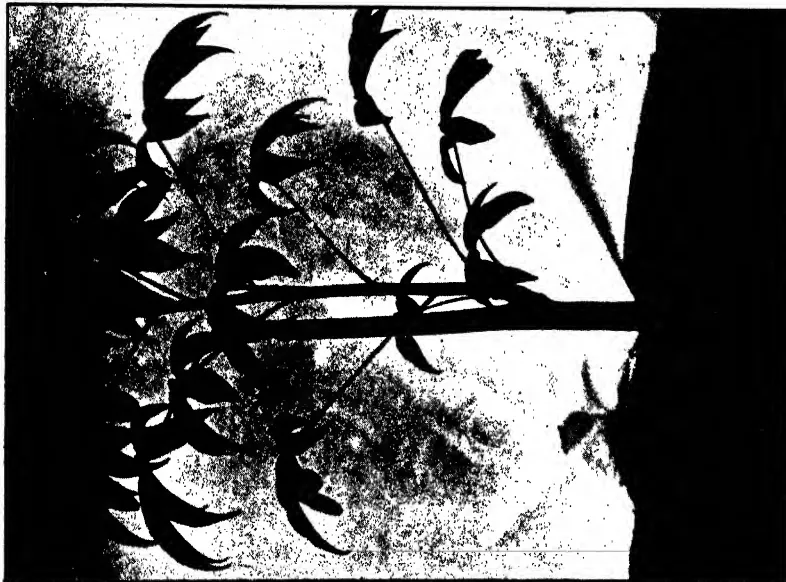A high-contrast, black and white photograph of a plant branch. The branch features several large, dark, serrated leaves that are sharply defined against a lighter, textured background. The central stem is visible, and the overall composition is a close-up shot of the foliage.

*Block by Survey Dept.*

FIG. 1.—KAPOK BUD TAKEN FROM MAIN STEM.

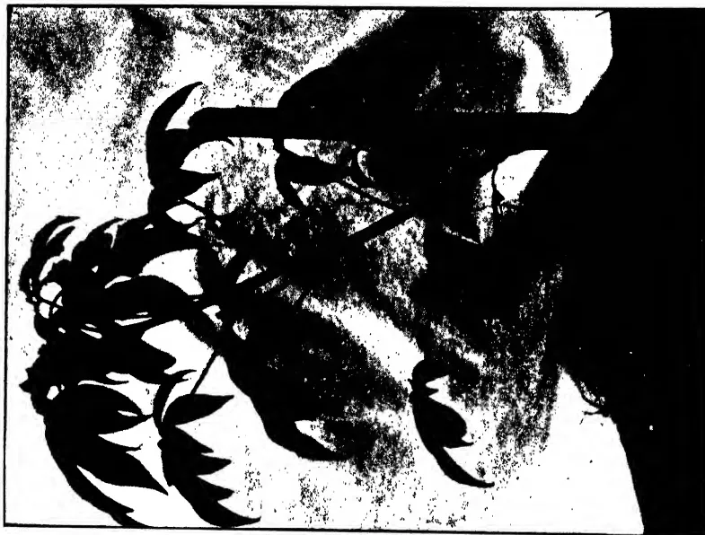A high-contrast, black and white photograph of a plant branch, similar to Figure 1. It shows large, dark, serrated leaves and a central stem. The lighting is different, creating a more dramatic silhouette effect against the background.

*Block by Survey Dept.*

FIG. 2.—KAPOK BUD TAKEN FROM SIDE BRANCH.

232------------------------------------------------

A completely blank white page with no visible content, text, or markings.

233------------------------------------------------

PLATE II.

A high-contrast black and white photograph of a Kapok plant. The plant is shown in a field with a dense thicket of foliage in the background. The foreground shows the ground with some sparse vegetation and a prominent, curved, dark object, possibly a branch or a piece of debris, lying across the middle ground. The image is framed by a thick black border.

*Block by Survey Dept.*

A KAPOK PLANT BUDDED WITH A BUD FROM A SIDE BRANCH,  
AFTER ONE YEAR'S GROWTH.

234------------------------------------------------

A completely blank white page with no visible content, text, or markings.

235------------------------------------------------

165

## SELECTED ARTICLES

### CITRUS GROWING IN WESTERN AUSTRALIA\*

*(Continued from the last Number)*

#### MANURING OF CITRUS.

**C**ITRUS trees when once established will go on producing fruit for years without any special manurial treatment, but eventually they become unthrifty or fail completely. It will then take several years at least of heavy manuring to restore them to a good healthy condition again, so it is far better to keep the trees going steadily by the regular application of suitable manures. It is generally recognized that all fruit trees need an all-round manure containing phosphates, nitrogen and potash, but the proportion of each of these elements and the amount used is largely dependent on the age and condition of the tree and the natural richness of the soil. Most of our soils are deficient in one or more of these necessary constituents but in the absence of experimental data it is impossible to recommend any mixture or fixed quantity of fertilizer for all soils. The whole problem is a question of balance between the necessary plant food elements, and while analysts may determine the chemical constituents of a tree and its crop we cannot guarantee that by placing these constituents in the soil the plants will receive them, for chemical changes take place in the soil and may render some of the substances insoluble or at least unavailable to the plant.

A fertilizer mixture that has given good results and maintained trees in growth and cropping is a mixture of superphosphate, sulphate of ammonia and sulphate of potash roughly in the proportion of 2.2.1. and giving an analysis of  $P_2O_5$  9 per cent., N 8 per cent. and  $K_2O$  10 per cent. Some growers prefer to use bone-dust or blood and bone, but these are not balanced and should be fortified with soluble phosphate and potash.

If good crops of leguminous plants have been regularly ploughed in for a number of years the proportion of nitrogen in the mixture can safely be reduced; otherwise the trees tend to become too rank and produce a soft and insipid fruit, which does not keep well.

The quantity of fertilizer to apply is largely dependent on the size of the trees but dressings of over 10 cwt. per acre should seldom be necessary, and an average of 4 to 6 lb. per tree is often adequate. When purchasing manures it is far better to spend, say, £10 on a ton of well-balanced manure than the same amount on two or more tons of manure containing, say, only phosphates, unless

\* By R. C. Owen, Horticultural Adviser, in the *Journal of Agriculture*, Western Australia, December, 1940.

236------------------------------------------------

166

there is definite evidence to show that only phosphates are required. In other States it is often advocated that sulphate of ammonia or nitrate of soda should be applied at the annual rate of one pound per tree for every year of the tree's age up to twelve years. That is, a tree of more than twelve years of age would receive twelve pounds of concentrated nitrogenous manure every year. In this State where we experience long dry summers and heavy rains during the ripening and maturity period of our orange crops, that amount of nitrogen would be out of all proportion.

Lemon trees which produce heavy crops of fruit and which must be kept growing strongly, will stand heavier nitrogenous manures than oranges and other fruits.

The time for applying manures to citrus is still controversial but as the trees are evergreen and growth is intermittent throughout the year there is some evidence that to divide the annual amount into two or three dressings, say, early Autumn, Spring and Summer is beneficial.

This summer dressing can only be applied where irrigation is possible, for it would be unwise to apply readily soluble manures when the trees are stressed for want of water.

The phosphate and potash manures, because they do not readily wash out of the soil, may be safely applied in one dressing and placed as deeply as possible in the soil. If, however, the soil is rich in iron, there is a danger of the soluble phosphate becoming changed to insoluble iron phosphate and thus lost to the plant. In that case the phosphate could be applied as acid soluble basic phosphate which though only slowly available to the plant would last in the soil for a long time. Readily soluble nitrogenous manures may be applied as a top dressing during the Spring or Autumn or with the irrigation waters in the Summer.

### IRRIGATION

As mentioned previously, citrus trees need an ample supply of water, especially through the hot summer, and as 80 per cent. of our normal rainfall occurs between the months of May to October the remaining six months of hot dry weather put a severe test on water reserves in the soil. There are very few orchards here which can adequately maintain full bearing citrus trees throughout the year without irrigation, but unfortunately there are many places which through lack of sufficient water supply are denied this necessary irrigation and consequently the trees never have a chance to produce their quota of good quality fruit.

It is surprising just how much drought an orange tree will endure and still mature fruit of a sort, but that fruit is usually small, of poor texture and juice content and affected by drought crinkle. Another effect of drought is out-of-season fruit caused by the trees flowering profusely after the flush of sap caused by Autumn rains.

At present there are no big acreages of citrus in our recognized irrigation areas and practically all the orchard irrigation is carried out from comparatively small private schemes. A few fortunate growers situated on permanent water-courses in the hills can gravitate the water on to their orchards with very

237------------------------------------------------

167

little cost, but the majority have to instal plants commensurate with the size of their orchards, or in accordance with their available water supply. These supplies are drawn from the local rivers, creeks, soaks and wells and there are various systems of applying the water to the soil.

Where the supply is limited and the orchard is not graded the most economical method for even distribution is through pipes and sprinklers. This method is more costly in power and the initial installation of piping and also necessitates some form of cultivation after each watering, but there is actually less work involved, and there is no soil washing. This method is becoming increasingly popular with citrus orchardists. Some growers use movable sprinklers connected by hoses to the fixed supply pipe, others make use of light piping made from galvanized sheet metal with the sprinklers fixed directly into the pipes. These pipes can be easily shifted about and coupled up again so that when one land has been watered the pipes are set up in another place, and so on until the whole orchard has been covered. Usually the sprinklers are left running for  $1\frac{1}{2}$  to 2 hours in the one place and this approximates  $1\frac{1}{2}$  to 2 inches of water.

Where the water supply is adequate and the land is better graded the method of open furrow irrigation can be used. The water is caused to flow down one or more open furrows between the trees the number of furrows depending on the flow of water and the type of soil concerned. Furrow irrigation is more difficult to control unless the grade is even and the subsoil uniform in texture. There is always a tendency for some trees to be overwatered, while others might not receive sufficient; if drainage is not sufficient seepage may occur and cause water-logging and consequent damage to the trees.

For the best results use comparatively short furrow leads—not more than five chains—and use the maximum volume of water without causing scouring. The practice of watering citrus by flooding, where the butts of the trees are inundated or kept wet for any length of time should be strongly condemned, for it will eventually lead to loss or damage to the trees through collar-rot and brown rot gummosis.

Whatever system of water reticulation is used it is preferable to give a few good waterings at long intervals rather than frequent waterings of short duration. Do not commence irrigation before it is necessary because heavy applications early in the season are likely to chill the ground and may check the activity of the roots and the soil bacteria.

Within a day or two after irrigation the soil should be lightly cultivated to loosen up the surface and prevent any weeds from growing.

### PRUNING

Pruning of citrus is not classed as essential by many growers and while it is true that young trees need very little in the way of pruning excepting to keep the main framework open the older trees are in most cases benefited by some form of pruning to remove the dead and dying fruit wood.

Valencias which have a more free and open type of growth need only occasional cutting to keep the branches off the ground and to remove spent fruiting woods. Navelis, however, rapidly become dense and unthrifty if pruning

238------------------------------------------------

168

is neglected for long especially as the trees advance in years. The nature of a Navel tree is to expand by throwing out successive layers of fruiting wood and as the older wood outlives its usefulness it slowly dies and is succeeded by new growth. As this new growth extends it gradually shuts out the light and the fruiting wood inside the tree is forced out of existence. The dead wood in itself is harmful because it scratches and blemishes the fruit and also forms a breeding ground for harmful fungous diseases, but the worn out wood is just as harmful because without helping in the necessary metabolism of the plant it is still living and in effect is robbing other parts of essential plant food. This worn out wood should be removed by pruning as soon as it becomes weakly and in doing so the dead wood of the future will be dispensed with.

The outer surface of the tree should be kept sufficiently open to allow light and air to circulate but not too open to allow the direct rays of the sun to penetrate and scald the main branches. The inside fruiting wood may also be thinned to allow the remainder plenty of room to bloom and crop. If the work is done regularly the tree can be kept strong and healthy and that tendency for over-blooming followed by poor setting—usually a sign of a weakened condition—can be overcome.

Mandarin trees, too, become very dense and bushy if not pruned. This leads to the tree becoming weakly and bearing large crops of small fruits poor in quality.

The important thing is to anticipate that too-heavy crop and reduce it by judiciously thinning out the fruiting wood. This will maintain a better balance between the fruit and wood growth and so keeps the tree in a healthy and profitable state.

Lemon trees respond readily to good pruning but if neglected they soon deteriorate. To fully realize this it is only necessary to crawl under one—this in itself is a feat requiring skill and determination—and take a look from the inside. There will be seen a dense mass of dead and dying wood interlaced by watershoots and suckers struggling to reach the light. Finally if they ever reach the outside they blossom and carry a bunch of fruit which sways about and becomes hopelessly blemished before it is even half grown.

The lower branches, too, when tangled on the ground interfere with the harvesting and cultivation; in the winter they keep the trunk and main limbs so damp that the health of the tree is endangered.

The lemon tree can be kept fairly open, and by regular pruning the fruiting wood should be renewed as soon as it shows signs of flagging.

Even young and vigorous trees can be benefited by using secateurs. Those long rank shoots should be shortened back to stimulate the growth of finer lateral fruiting wood which carries the better quality fruit. By carefully observing the time and effect of this style of pruning from one season to another it is possible to stimulate the production of the summer crop of fruit. In most districts it takes ten to twelve months from the time of pruning to force the new laterals, carry the blossom and mature the fruit, so that if the pruning is done in the early summer months the resulting crop should be ready for harvesting.

239------------------------------------------------

169

during the summer of the following year. In an endeavour to stimulate the summer crop the grower must be prepared to sacrifice a portion of the winter crop which will have already set. Control of soil moisture by irrigation is essential to bring a heavy summer crop of lemons to size and maturity.

It is better to prune lightly every year or two rather than to wait till the tree is a mass of unthrifty wood before cutting it heavily in an endeavour to restore its vigour and fruitfulness.

### HARVESTING

Harvesting the crop is quite as important and needs just as much care and attention as any of the other cultural items. Some growers who are most particular in giving the trees every attention to produce excellent fruit, spoil the effect and actually lose money by careless methods of picking and packing. Oranges, and in fact all citrus fruits, have their juicy pulp protected by a more or less tough skin and can be kept for a considerable time after they are normally ripe provided that skin is not damaged. Once the surface is broken the spores of decay organisms gain access and the fruit rapidly breaks down.

When fresh picked the cells of the skin and rind are full of moisture and are easily bruised or scratched, so great care should be exercised during picking operations. Actually the fruit should not be picked but cut from the trees with a pair of blunt-nosed snips. During the work the operator should wear soft gloves or at least keep his finger nails closely trimmed to avoid damage to the fruit. Picking bags which are strapped to the shoulders are most convenient receptacles for holding the fruit before it is transferred to the boxes, because they leave both hands free for work. Gently grasp the fruit with the left hand and with the snips in the right hand cut the stem an inch or so back from the fruit, then with a second cut neatly sever the short piece of stem close to the button. By making the two separate cuts the stem which would otherwise die back is removed from the tree, also the cut close to the fruit can be made closer and cleaner with less risk of damage. Fruit should be placed—not dropped—into the picking bag. Do not over-fill the bag as this tends to crush the skin, especially if the picker is working from a ladder. Carefully transfer from the bag to the packing boxes. So far as possible avoid picking the fruit when wet; if this is not practicable then as soon as convenient afterwards spread the fruit out on a bench in the shed to dry. Fruit intended for long transport or for storage is better if not packed immediately, but left for some days in a cool, dry place so that the excess moisture in the skin can dry out. This causes a toughening of the rind and makes the skin less susceptible to injury.

Oranges in commercial quantities do not keep for long periods in store, and it is usual to let them remain on the trees till convenient to market. In districts where the fruit matures early the grower should avail himself of the higher prices ruling to dispose of his crop—within the limits of the market—before the later districts commence harvesting. In this way the loss through windfalls will be appreciably less and the mid-season gluts can in some measure be avoided. The grower in the late maturing districts, however, is faced with a different problem. Most of his ~~Novel~~ crop is ripe during the months of plentiful supplies and he has the choice of marketing the bulk of the crop at

4—J. N. A 2318 (3/41)

240------------------------------------------------

170

comparatively low prices or risking heavy losses by windfalls and breakdowns in an endeavour to keep some of the fruit for the higher prices ruling towards the close of the season. The decision rests with the grower, but if he chooses to keep his Navel oranges on the tree for months after they mature, then it is only natural to expect a proportion of windfalls and decayed fruit.

### LEMON HARVESTING AND CURING

Oranges and mandarins and to a lesser extent grapefruit are marketed within a comparatively short time of picking, but lemons, apart from winter fruits for factory purposes, are better if cured before being sent to market. In this case the fruit should be picked before it is fully coloured or ripe. Pick to size rather than to colour for the market requires a moderately small lemon of about  $2\frac{1}{4}$  inches in diameter, and if allowed to fully develop some of the fruit would be oversize and coarse in texture. Green fruit may be picked when it attains  $2\frac{3}{8}$  inch diameter, for in the process of curing it will shrink considerably. Most of the crop will be picked just as it is turning in colour from green to yellow, and this is the ideal stage for curing. As with other fruit careful picking and handling is essential, the main cause of fruit rotting and becoming mouldy in the curing room can be traced to bruises and scratches received in picking.

Grade the lemons before curing and cull out all mis-shapen, blemished or tree-ripe fruits, for they will not warrant curing, and only occupy valuable space in the chamber. If the market warrants it these culls can be packed fresh or disposed of to the factory for processing either for peel, juice or essential oil.

The curing process is really only a slow reduction in the moisture content of the skin accompanied by a change in colour and in the general texture of the whole fruit. During the process the skins become tougher, but more fine and thin and assume a soft leathery feel, the rag or white pithy substance practically disappears. There will be some loss in size through shrinkage and this varies according to the type and stage of maturity of the original fruit. There is very little, if any, loss in the actual juice content and the proportion of juice to the total weight of fruit is greatly increased.

The secret of successful lemon curing is to carefully pick the fruit before it is too mature and then place it in a room or container where the moisture reduction can be controlled. If the moisture is lost too rapidly, or too much is lost, the fruit will become shrivelled and will look unattractive: if the rate of curing is too slow there will be a bigger chance of losing a proportion through mould and breakdown.

The curing room must not be draughty and should be kept at a moderately even temperature. Once it was considered that an underground room or cellar was essential for lemon curing, and although very suitable it has no advantage over an ordinary room where the temperature can be kept regulated and the ventilation controlled.

Some growers placed the lemons in clean sand or sawdust and either of these gives very good results, but both entail extra handling and cleaning. A method which is very much simpler and which also gives excellent results, is to place

241------------------------------------------------

171

the fruit loosely in boxes, stack them in the curing room and cover entirely with a light tarpaulin or sack. A little experience will indicate just the amount of covering necessary and inspections can readily be made to see when the fruit is cured. The usual time for complete curing is from three to six weeks, varying according to the temperature and the state of maturity of the fruit. Once cured the fruit can be marketed immediately, or if the price does not warrant sale, can be kept in the room for weeks or even months without serious deterioration. Lemons picked during the drier months of the year can be cured with very little trouble, but during the cold damp months of mid-winter when the skins are soft and full of moisture it is practically impossible to get consistently good results. Probably artificial heating and air conditioning would solve the problem.

#### USE OF ETHYLENE GAS

Citrus fruits showing green colour, if kept for a few days in an atmosphere charged with ethylene gas will rapidly change colour and take on the appearance of normal ripe fruit. This treatment does nothing more than colour the rind and leaves the pulp and juice content unchanged. It is valuable for re-colouring ripe Valencias which have reverted to a green colour through being left on the trees, and is also used for prematurely colouring lemons and Navel oranges. Lemons, of course, are normally sold for their juice, which is rich in citric acid, and as this acid is present even in immature fruit, the gas-treated fruit does not differ much from the normal lemon.

Oranges, however, are expected to contain a certain proportion of sugars and to be reasonably sweet to the taste, but immature oranges which have been artificially coloured by gas treatment are often lacking in this respect. The purchaser relying on colour as a sign of sweetness, is often deceived into buying fruit which is not true to nature's label.

There are arguments for and against this gas treatment for colouring immature oranges, but so long as the public are willing to pay higher prices for well-coloured oranges early in the season, the enterprising grower will do his best to supply that need. Growers, however, would do well to remember that the consumer once deceived may not be inclined to buy again till late in the season. This temporary loss of public buying would have serious repercussions on the market price.

#### PACKING

By far the greater part of Western Australia's citrus crops are consumed within the State, and the small export trade is practically confined to Java, Singapore and Colombo. For local trade the fruit is usually packed in the Australian dump case, the three-quarter dump case, or the three-quarter bushel flat case. For export the standard citrus case holds  $1\frac{1}{3}$  bushels but half citrus box holding  $\frac{2}{3}$  bushel may be used for lemons.

Before packing the fruit should be graded for size and quality, and firmly packed in the cases, using only those packs which will bring the top layer of fruit level with the top of the case without undue squeezing. The number of fruit in the case should be legibly marked on the outside so that the prospective buyer can see it at a glance and mentally work out the cost of the fruit per dozen.

242------------------------------------------------

172

## DISEASE AND PESTS

As with growing other kinds of fruit or in producing any other type of agricultural commodity there are a number of pests and diseases to contend with in citrus growing. Every year these diseases take their toll and a proportion of the crop is lost entirely or is reduced in value. Practically all pests and diseases have their particular remedy and the careful grower who takes due precautions to combat these pests may find some consolation in the fact that if plant diseases were unknown the production figures would rapidly increase to such an extent that unless new markets were found the monetary returns would be very low indeed.

It is not possible in this article to give details of the diseases which affect citrus trees and fruit but most of these diseases and their control are dealt with in various bulletins and "Journal" articles of this department. These can be had free of charge on application.

## BUDDING AND GRAFTING

It has been mentioned earlier in this article that in this State there are still many citrus trees of the older seedling types and varieties of low commercial value. These trees in many instances do not pay for their upkeep and should be dealt with accordingly. Where the tree is unhealthy or unthrifty through disease of the roots and trunk it is a waste of time to do anything else than grub it out and if desirous, replant with a healthy tree of suitable variety. If the tree is still healthy and vigorous it may be worked over to a more profitable variety, and will in a few years time produce good crops of fruit for which there will be a market demand. Apart from the semi-dwarf varieties of mandarin trees which may not form good stocks for more vigorous kinds, all commercial citrus varieties can be successfully grafted or budded one on the other. Citrus wood, because it does not callous readily, is not the easiest to graft, but provided the work is done carefully in the early spring—August and September—there should be fair prospects of success. Large trees must be cut back for reworking and if cleft grafted scions are inserted in the cut limbs there is a chance that they will grow. If these scions fail, the cut limbs will send out numerous new shoots which will be fit to bud the following season. When cutting back a tree for reworking always leave a few limbs intact to provide shade for the trunk and main arms. A coat of limewash painted or sprayed on any exposed limbs will do much to protect the bark from sun scald. One of the greatest difficulties in budding or grafting citrus is to procure suitable scions and budding wood. It is desirable to select scions from mature trees which have proved themselves heavy and regular bearers of good quality fruit, but these trees very often only produce fine fruiting wood unsuitable for grafting or budding. When a grower anticipates reworking a number of old trees it is a good idea to prune back a portion at least of the desired bud-wood tree so that it will make strong enough growth to provide scions in time for the contemplated budding or grafting operation.

Budding into vigorous young shoots which arise after the old tree has been headed back, is the most reliable method of reworking citrus. Use the ordinary shield method of cutting the bud and insert in the stock by making a "T" or

243------------------------------------------------

173

inverted "T" cut. The bud should be cut from one year old round wood of one quarter to one half inch in diameter. Younger wood is usually too angular to provide suitable buds. Cut the bud to include a thin piece of wood which keeps the shield piece of bark more rigid and facilitates its insertion under the bark of the stock. If this piece of wood is removed it may injure the bud itself and often prevents good results. Buds put in during the spring may be forced into active growth by removing the upper portion of the stock immediately the bud has healed in, but buds put in during late summer and autumn are better left dormant till the following spring. If the top growth is then cut back the young bud will have the whole growing season to establish itself.

Young growths from buds and grafts should be suitably protected against injury from strong winds.

### SUMMARY

In conclusion it must be realized that in these days of keen competition and fluctuating markets the citrus grower in common with other primary producers must keep the cost of production at a minimum. This can only be accomplished by growing good commercial varieties on suitable soils in districts where natural conditions are not altogether uncongenial. Plant only those varieties suited to the district, and by scientific cultural methods endeavour to keep all the trees in a healthy and vigorous condition. Use care in picking and handling and by marketing only fruit consistently true to name and grade, build up a reputation for reliability.

Without unlimited capital you cannot keep an orchard. Make the orchard keep you.

244------------------------------------------------

174ZINC CONTENT OF SOME TROPICAL FOODS\*

A MAJOR problem of modern nutrition science concerns the distribution and physiological role of those mineral elements which occur in small amounts in animal and plant tissues. Study of the literature shows that in addition to the better known mineral elements occasions have arisen, when traces of aluminium, cobalt, copper, nickel, fluorine, zinc and zirconium among others have appeared essential if the proper utilization of the diet is to be secured. Occasionally it seems that some of these elements have been associated with pathological conditions, but further investigation has tended to show that under varied dietary environment it is sometimes possible to substitute one of these elements for another. This probably means that insufficient investigation has as yet been carried out. Again the literature indicates the nutritional value of some of these "trace" elements without being able to apply any well-defined label to the condition brought about by the deficiency or absence of such elements.

The study of zinc in relation to food illustrates these points. A comprehensive review was published by Rose (1929) and need not be recapitulated here. Since that date McCollum (1933) has published the results of some experiments which led him to the conclusion that while there was no evidence that zinc was essential to growth it appeared to be essential for normal reproduction. The negative results of McCollum as far as growth is concerned were not altogether confirmed by Elvejem and Hart and their colleagues. In 1934 they reported that a low content of zinc in the diet, not only retarded the growth of rats but also interfered with the normal development of the fur. In 1937 they reported that a deficiency could be arrested by the presence of 40 gammas of zinc per day. Metabolism experiments upon rats receiving only 22 gammas of zinc showed a marked decrease in the growth rate and this appeared to be due to a lowered efficiency in the utilization of food. They found that the nitrogenous metabolism including endogenous metabolism was lowered. Their experiments offered no indication that the carbohydrate metabolism was affected. In this connection, however, it may be mentioned that zinc in combination with insulin is sometimes employed as zinc-protamin-insulin on account of its modified hypoglycemic action. Elvejem and Hart (1938) conclude their studies with the suggestion that zinc, like several other trace elements, will probably be found to possess a specific role in the activation of some enzyme. In this connection it is of interest to observe that the distribution of zinc in local foods follows to a considerable extent that of vitamin B<sub>1</sub>.

There is yet but little indication of the human requirement. It has been estimated that a man of 70 kilograms contains 2·2 grams of zinc in his composition. This is almost as much as the amount of iron estimated by Sherman 2·8

\* By J. P. Morris, from the Biochemical Laboratory, King Edward VII. College of Medicine, Singapore.

245------------------------------------------------

175

grams. Scoular (1939) however, reports the results of 35 balance experiments on children of pre-school age. She concluded that 0.307 milligrams per kilogram of body weight would supply the need for zinc, and that if excessive amounts are taken, they are not absorbed but excreted through the alimentary tract.

This small amount scarcely bears relationship to the amount contained in the body, but from the earlier experiments of Hubbell and Mendel (1927) and those of McCollum mentioned above it would appear that lower amounts may be needed for growth than for reproduction. The main physiological function of children should be growth.

A typical daily diet for two adults and three children in Singapore can be stated as consisting of 2½ katties rice, 2 katties fresh fish, 330 grams Chinese mustard leaf (saylor sawi) and 200 grams of pork. This yields just over 6 milligrams of zinc per adult per day. Since the average weight of a Singapore adult asiatic is 58 kilograms the amount of zinc in such a diet is equivalent to 0.1 milligram per kilogram of body weight instead of 0.307 milligram as recommended by Scoular.

Thus while it is not yet possible to state the specific role of zinc, it seems clear that it must be considered as one of the essential nutritional catalysts.

In order to be able to understand more fully the importance of the mineral elements the composition of the numerous experimental diets which are being studied in this laboratory have to be analysed as completely as possible. Some of these elements have already been studied by Morris and Rosedale (1935); the distribution of zinc in local foods is now presented, and other elements are already being studied.

The experimental procedure adopted for this work has followed that of Eggleton (1938) using 1.5. Diphenylthiocarbazone (Dithizone) in chloroform.

The author wishes to express his thanks to Professor J. L. Rosedale for his helpful criticisms, suggestions and encouragement during this investigation.—

### ZINC CONTENT OF FOODS EXPRESSED IN MILLIGRAMS PER 100 GRAMS OF EDIBLE PORTION.

#### *Animal Products.*

<table>
<tbody>
<tr>
<td>Abalone ..</td>
<td>2.13</td>
<td>Cuttle fish, dried ..</td>
<td>1.02</td>
</tr>
<tr>
<td>Beef ..</td>
<td>2.17</td>
<td>Salt fish, dried ..</td>
<td>0.38</td>
</tr>
<tr>
<td>Blachan ..</td>
<td>2.63</td>
<td>Ikan Tinggeri ..</td>
<td>0.29</td>
</tr>
<tr>
<td>Cheese, Red Cheddar ..</td>
<td>0.91</td>
<td>Ikan Merah ..</td>
<td>0.33</td>
</tr>
<tr>
<td>Crab flesh ..</td>
<td>1.41</td>
<td>Tunny ..</td>
<td>0.46</td>
</tr>
<tr>
<td>Edible Bird's Nest ..</td>
<td>0.067</td>
<td>Shark's Fins ..</td>
<td>1.37</td>
</tr>
<tr>
<td>Egg Hen's Whole ..</td>
<td>0.87</td>
<td>Oysters (Australian) ..</td>
<td>6.68</td>
</tr>
<tr>
<td>Egg Yolk ..</td>
<td>3.68</td>
<td>Oysters (Rock) ..</td>
<td>10.38</td>
</tr>
<tr>
<td>Egg White ..</td>
<td>0.021</td>
<td>Oysters (Muar River) ..</td>
<td>9.87</td>
</tr>
<tr>
<td>Egg Duck's ..</td>
<td>0.76</td>
<td>Milk fresh (Cold Storage) ..</td>
<td>0.41</td>
</tr>
<tr>
<td>Egg Duck's Salted ..</td>
<td>1.311</td>
<td>Milk (Malayan Farm) ..</td>
<td>0.38</td>
</tr>
<tr>
<td>Chicken flesh ..</td>
<td>1.48</td>
<td>Milk Sterilized ..</td>
<td>0.36</td>
</tr>
<tr>
<td>Mutton ..</td>
<td>2.92</td>
<td>Milk Condensed, Sweet ..</td>
<td>0.81</td>
</tr>
<tr>
<td>Pork ..</td>
<td>2.44</td>
<td>Lactogen ..</td>
<td>2.55</td>
</tr>
<tr>
<td>Cuttle fish, fresh ..</td>
<td>0.71</td>
<td>Milk, Dried Skim ..</td>
<td>1.24</td>
</tr>
</tbody>
</table>

246------------------------------------------------

176*Cereals and Pulses.*

<table>
<tbody>
<tr>
<td>Atta (Wheat flour)</td>
<td>..</td>
<td>1.07</td>
<td>Ragi (Millet)</td>
<td>..</td>
<td>1.48</td>
</tr>
<tr>
<td>Barley</td>
<td>..</td>
<td>2.28</td>
<td>Rice Polished</td>
<td>..</td>
<td>1.02</td>
</tr>
<tr>
<td>Bread, Brown</td>
<td>..</td>
<td>0.43</td>
<td>Rice Husked</td>
<td>..</td>
<td>1.88</td>
</tr>
<tr>
<td>Bread, White</td>
<td>..</td>
<td>0.38</td>
<td>Rice Polishings</td>
<td>..</td>
<td>1.91</td>
</tr>
<tr>
<td>Dhall, Green</td>
<td>..</td>
<td>1.09</td>
<td>Sago</td>
<td>..</td>
<td>0.18</td>
</tr>
<tr>
<td>Dhall, Red</td>
<td>..</td>
<td>2.14</td>
<td>Soya Bean, Black</td>
<td>..</td>
<td>2.50</td>
</tr>
<tr>
<td>Dhall, Yellow</td>
<td>..</td>
<td>3.33</td>
<td>Soya Bean, White</td>
<td>..</td>
<td>5.20</td>
</tr>
<tr>
<td>Butter Beans</td>
<td>..</td>
<td>3.12</td>
<td>Soya Bean Cake</td>
<td>..</td>
<td>0.54</td>
</tr>
<tr>
<td>Haricot Beans</td>
<td>..</td>
<td>4.28</td>
<td>Soya Bean Curd</td>
<td>..</td>
<td>0.56</td>
</tr>
<tr>
<td>Black Gram</td>
<td>..</td>
<td>1.11</td>
<td>Tapioca</td>
<td>..</td>
<td>0.04</td>
</tr>
<tr>
<td>Macaroni (Egg Noodles)</td>
<td>..</td>
<td>1.69</td>
<td>Wheat</td>
<td>..</td>
<td>2.46</td>
</tr>
<tr>
<td>Mee Sua</td>
<td>..</td>
<td>1.19</td>
<td>Quaker Oats</td>
<td>..</td>
<td>2.35</td>
</tr>
<tr>
<td>Maize</td>
<td>..</td>
<td>1.42</td>
<td>Peanuts</td>
<td>..</td>
<td>1.91</td>
</tr>
</tbody>
</table>

*Fruits.*

<table>
<tbody>
<tr>
<td>Apple</td>
<td>..</td>
<td>0.031</td>
<td>Jack Fruit</td>
<td>..</td>
<td>1.23</td>
</tr>
<tr>
<td>Banana</td>
<td>..</td>
<td>0.181</td>
<td>Jack Fruit Seeds</td>
<td>..</td>
<td>0.83</td>
</tr>
<tr>
<td>Bua Lye</td>
<td>..</td>
<td>0.011</td>
<td>Mango</td>
<td>..</td>
<td>0.055</td>
</tr>
<tr>
<td>Bua Chicku</td>
<td>..</td>
<td>0.009</td>
<td>Orange</td>
<td>..</td>
<td>0.61</td>
</tr>
<tr>
<td>Chempedak</td>
<td>..</td>
<td>0.056</td>
<td>Papaya</td>
<td>..</td>
<td>0.41</td>
</tr>
<tr>
<td>Chempedak Seeds</td>
<td>..</td>
<td>0.036</td>
<td>Pumelo</td>
<td>..</td>
<td>0.32</td>
</tr>
<tr>
<td>Coconut</td>
<td>..</td>
<td>5.03</td>
<td>Pineapple</td>
<td>..</td>
<td>0.025</td>
</tr>
<tr>
<td>Guava</td>
<td>..</td>
<td>2.41</td>
<td>Tomato</td>
<td>..</td>
<td>0.301</td>
</tr>
</tbody>
</table>

*Vegetables.*

<table>
<tbody>
<tr>
<td>Bamboo Shoots</td>
<td>..</td>
<td>1.05</td>
<td>Lobak</td>
<td>..</td>
<td>0.174</td>
</tr>
<tr>
<td>Beet root</td>
<td>..</td>
<td>0.61</td>
<td>Lettuce (inner leaves)</td>
<td>..</td>
<td>0.45</td>
</tr>
<tr>
<td>Bitter Gourd</td>
<td>..</td>
<td>0.793</td>
<td>Lettuce (outer leaves)</td>
<td>..</td>
<td>0.33</td>
</tr>
<tr>
<td>Bottle Gourd</td>
<td>..</td>
<td>0.683</td>
<td>Patola (Lufius)</td>
<td>..</td>
<td>1.43</td>
</tr>
<tr>
<td>Cabbage (inner leaves)</td>
<td>..</td>
<td>0.58</td>
<td>Potato</td>
<td>..</td>
<td>0.32</td>
</tr>
<tr>
<td>Cabbage (outer leaves)</td>
<td>..</td>
<td>0.43</td>
<td>Pumpkin</td>
<td>..</td>
<td>0.075</td>
</tr>
<tr>
<td>Carrot</td>
<td>..</td>
<td>0.53</td>
<td>Sayor Puteh</td>
<td>..</td>
<td>0.63</td>
</tr>
<tr>
<td>Cucumber</td>
<td>..</td>
<td>0.063</td>
<td>Snake Gourd</td>
<td>..</td>
<td>0.091</td>
</tr>
<tr>
<td>Egg Plant</td>
<td>..</td>
<td>0.33</td>
<td>Spinach</td>
<td>..</td>
<td>0.65</td>
</tr>
<tr>
<td>French Beans</td>
<td>..</td>
<td>0.59</td>
<td>Spring Onions</td>
<td>..</td>
<td>0.43</td>
</tr>
<tr>
<td>Green Pepper</td>
<td>..</td>
<td>0.31</td>
<td>Sprouted Beans</td>
<td>..</td>
<td>0.50</td>
</tr>
<tr>
<td>Green Peas (in tin)</td>
<td>..</td>
<td>4.04</td>
<td>String Beans</td>
<td>..</td>
<td>0.22</td>
</tr>
<tr>
<td>Kang Kong</td>
<td>..</td>
<td>0.99</td>
<td>Sweet Potato</td>
<td>..</td>
<td>0.86</td>
</tr>
<tr>
<td>Lady's-fingers</td>
<td>..</td>
<td>0.51</td>
<td>Yams</td>
<td>..</td>
<td>1.14</td>
</tr>
<tr>
<td>Leeks</td>
<td>..</td>
<td>0.21</td>
<td></td>
<td></td>
<td></td>
</tr>
</tbody>
</table>

*Condiments and Curry Stuffs.*

<table>
<tbody>
<tr>
<td>Chillies (dried)</td>
<td>..</td>
<td>0.16</td>
<td>Garlic</td>
<td>..</td>
<td>0.93</td>
</tr>
<tr>
<td>Chillies (green)</td>
<td>..</td>
<td>0.056</td>
<td>Pepper corns</td>
<td>..</td>
<td>0.23</td>
</tr>
<tr>
<td>Onions (small)</td>
<td>..</td>
<td>1.29</td>
<td></td>
<td></td>
<td></td>
</tr>
</tbody>
</table>

*Miscellaneous.*

<table>
<tbody>
<tr>
<td>Cattle horn</td>
<td>Calculated on dry weight</td>
<td>..</td>
<td>..</td>
<td>12.86</td>
</tr>
<tr>
<td>Human toe and finger nails</td>
<td>Calculated on dry weight</td>
<td>..</td>
<td>..</td>
<td>10.83</td>
</tr>
<tr>
<td>Human hair pigmented</td>
<td>..</td>
<td>..</td>
<td>..</td>
<td>14.51</td>
</tr>
</tbody>
</table>

247------------------------------------------------

177

## MEETINGS, CONFERENCES, &c.

## COCONUT RESEARCH SCHEME

### BOARD OF MANAGEMENT.

MINUTES OF THE FIFTY-FOURTH MEETING OF THE  
BOARD OF MANAGEMENT, COCONUT RESEARCH  
SCHEME, HELD AT BANDIRIPPUWA ESTATE,  
LUNUWILA, ON MONDAY, MARCH 31, 1941,  
AT 10.30 A.M.

#### PRESENT.

Mr. E. Rodrigo, Acting Director of Agriculture (Chairman); Mr. O. B. M. Cheyne; Mr. A. R. Ekanayake; Mr. A. F. R. Goonewardene; Mr. D. D. Karunaratne, J.P.; Mr. G. Panditsekere, J.P., U.M.; Mr. H. W. Peiris; Mr. E. R. Tambimuttu, M.S.C.

Dr. R. Child, Director of Research, acted as Secretary. Apology for absence was received from Mr. C. E. Jones, C.C.S.

#### MINUTES.

The minutes of the previous meeting held on Friday, December 6, 1940, were confirmed.

It was decided to modify the existing procedure by sending the minutes to the Press without waiting for members' approval of the circulated minutes.

#### BOARD OF MANAGEMENT.

The Chairman reported the following :—

(a) Mr. G. Panditsekere had been renominated by His Excellency the Governor as Smallholders' Representative for a further three years from January 1, 1941.

(b) Mr. S. Phillipson had been deputed by the Financial Secretary as an *ex-officio* member of the Board from December 7, 1940, in place of Mr. C. H. Collins.

On February 19, 1941, Mr. C. E. Jones had been deputed by the Financial Secretary to succeed Mr. Phillipson as a member of the Board.

(c) Dr. S. C. Paul succeeded Mr. James P. Fernando as Chairman of the Low-Country Products Association on March 24, 1941, and so became an *ex-officio* member of the Board.

#### STAFF.

(a) The Board approved of an application from the Director of Research for two months' leave in Ceylon.

(b) *Junior Staff Medical Scheme.*—Following the discussion at the previous meeting, the details asked for had been circulated. It was decided that it

248------------------------------------------------

178

was not possible to institute such a scheme at the present time owing to financial stringency, but that the Board approved of the Scheme in principle and would give the matter due consideration should it be possible to do so later.

(c) *Appointment of Mr. R. W. Senaratne* as Field Assistant to the Geneticist's Department from January 20, 1941, was confirmed.

#### ANNUAL REPORT.

The following reports were tabled :—

(a) *Annual Report of the Board of Management for 1940.*—The Chairman mentioned that this report had as usual been approved for publication as a Government Sessional Paper and was in the hands of the Government Printer.

(b) *Report of the Auditor-General for 1940.*—See para. Finance (b) below.

(c) *Report of the Director of Research on Bandirippuwa estate for 1940.*—In reply to a question by Mr. Ekanayake, the Director of Research said that separate yield records of all blocks and subdivisions were kept.

The Director of Research mentioned in reply to a question by Mr. Goonewardene that the experiments carried out on fly breeding in poonac by the Medical Entomologist of the Department of Medical and Sanitary Services in collaboration with the Scheme had been completed. Permission would be sought from the Director of Medical and Sanitary Services to make the results available to the Board.

#### FINANCE.

(a) *The Statement of Receipts and Expenditure* for the quarter ended December 31, 1940, was tabled.

(b) *Date of Annual Audit.*—The Auditor-General had called attention to para. 27 of his Report for 1939. It was decided to reply that the Board's opinion that section 8 (2) of Ordinance No. 29 of 1928 (Cap. 303), did not appear to imply that the audit of the Scheme's accounts should be completed by January 31 in each year, but only that the statement of receipts and payments for the previous year should be prepared by that date; and further to suggest that the Auditor-General should get the opinion of the Legal Secretary on this point. Only should legal advice not be in agreement with the Board's opinion was any amendment of this section of the Ordinance called for.

#### ESTATES.

(a) *The Progress Reports* of Bandirippuwa and Ratmalagara Estates from July to December, 1940, were tabled.

(b) *Copra Kiln.*—The Chairman reported that the Patent Copra kiln, of which the Board had authorized the construction at the last meeting, had been completed.

The Director of Research undertook to keep all particulars of working costs and to report on them after the kiln had been in operation some months.

#### MISCELLANEOUS.

(a) *Small Holdings Officers.*—With reference to the discussion at the previous meeting, the Chairman said that as then decided the Chillaw Planters' Association

249------------------------------------------------

179

had been asked to supplement their resolution with suggestions regarding the work and usefulness of small holding officers. The Planters' Association had appointed a sub-committee for this purpose, whose report was awaited.

(b) *Research Apprentices.*—The Chairman referred to the discussion on this subject at the fifty-second meeting held on September 27, 1940. The Director of Research had discussed the question with the Professor of Chemistry, University College, Colombo, and put forward the following points :—

- (i.) It might be difficult to get graduates to take up work as research students or apprentices without guarantee of permanent employment.
- (ii.) A subsistence allowance of Rs. 100 was the least which could be regarded as reasonable.
- (iii.) In England, where there were openings in industry, &c., such students were compelled to carry out their one year's or two years' period or refund their allowances received. In Ceylon this was not possible. For the first three months some such restriction might be imposed, but after that the student should be free to take up employment if it was offered.
- (iv.) The Scheme's financial position was much less favourable than when the subject was previously considered and in fact did not really permit of an increase of expenditure of Rs. 2,400 per annum.

The Chairman said that the question should also be considered in relation to a motion moved at the previous meeting of the Central Board of Agriculture by Mr. A. A. Wickremasinghe :—

- (i.) This Board is of opinion that adequate provision should be made to provide both advanced courses of study as well as practical training in estate management as a post-graduate course to qualified students.
- (ii.) This Board is further of opinion that provision should be made for such students to reside at the various research centres, to wit :—Tea, Rubber and Coconut Research Schemes.

He thought that the Board should authorise the Director to state at the next meeting of the Board of Agriculture that the Board of Management was quite willing to make provision for two graduates to work as research students or apprentices, but that unfortunately their resources were insufficient for them to meet the expense. Further the Board did not consider that it was practicable to provide facilities for training in elementary science or for general agricultural training on Bandirippuwa Estate.

The Board was in general agreement with the view but Mr. Pandittesekere was emphatic that at least one appointment should be made at once without waiting to see what recommendation to the Honourable Minister would be made by the Central Board of Agriculture. He thought that from the point of view of extending "consumption" research, which was Mr. Jas. P. Fernando's main object in raising the question in September, 1940, the question was urgent.

After further discussion, the Board decided to appoint a "Probationer Research Assistant" on a temporary basis, who should be an Honours Graduate

250------------------------------------------------

180

on a stipend of Rs. 100 per month without any other allowances whatever. No guarantee could be given of security of tenure other than one month's notice, but should any provision be made by Government or should the Scheme's own financial position improve, the terms of service would be revised accordingly. It was decided to advertise early so that this assistant could take up duties on Dr. Child's return from leave early in June, 1941.

(c) *Dispensary at Palu Bingiriya.*—Correspondence with the Chairman, Yagam Pattu Village Committee, was tabled. The Board agreed that they would be willing to lease, for the purpose of a dispensary, an area not exceeding  $\frac{1}{2}$  acre of jungle of Ratmalagara Estate, at the site included on a sketch plan submitted. The rental would be nominal.

#### OTHER BUSINESS.

*Replanting.*—Mr. Goonewardene spoke on the subject of replanting old coconut lands and inquired what was being done to study the subject of underplanting. The Director of Research referred to the experiment on manuring underplanted young palms which is being carried out on a Nattandiya estate. Mr. Goonewardene thought it desirable to compare in the field the system of clearing out old trees before putting in new plants and the usual practice of underplanting. The Director of Research undertook to try and get facilities to carry out a trial on a suitable old estate.

The meeting adjourned at 12.30 P.M.

251------------------------------------------------

181

## REVIEW.

**The Diseases of the Coconut Palm.**—By H. R. Briton-Jones, D.Sc., Ph.D. Revised by E. E. Cheesman, M.Sc., A.R.C.S., Pp. XVI. 176 ; 37 Plates. Available from Messrs. Bailliere, Tindall & Cox, 7 and 8, Henrietta Street, London, W. C. 2. Price 10s. 6d.

**T**HE late Professor H. R. Briton-Jones was unfortunately unable to complete the final revision of the text of this book owing to his untimely death in November, 1936. Subsequent to his death, publication was, of necessity, somewhat delayed, and Professor E. E. Cheesman has made revisions and additions to the original text in view of later investigations. The book now published fills a long-felt want as literature on diseases of coconuts is not readily available to planters and, coming as it does from one who had such wide experience, it is very welcome. It is much to be regretted that Professor Briton-Jones did not live long enough to know how much his book will be appreciated.

Perhaps the most valuable contribution made by the author to our knowledge of coconut diseases has been the result of his studies of diseases which have been somewhat loosely termed "bud-rot", "root disease" and "tapering disease". In this book he has lucidly differentiated the diseases which have hitherto been grouped together under one or more of the above headings. His main work has been in the elucidation of the disease to which he has given the name "Bronze Leaf Wilt", in the description of which Ceylon coconut planters will recognize the symptoms of what is commonly mislabeled "root disease" or less commonly "tapering disease" in this country. He has shown that the disease is caused by conditions which prevent the palm from obtaining from the soil a regular supply of water, in other words, drought, which may be climatic or physiological. The chapter on Bronze Leaf Wilt is recommended for careful study by coconut planters. It is clearly written and written in language which is remarkably free from the technical jargon which makes so many scientific works unintelligible to the average layman.

The chapter on Phytophthora bud-rot is interesting in that "leaf-bitten disease", which occurs rather uncommonly in Ceylon, is included, the author's view being that the disease is a form of Phytophthora bud-rot in which the apical cell is not actually destroyed.

Subsequent chapters deal with Tapering Stem Wilt or Pencil Point Diseases, Red Ring Disease (not recorded in Ceylon), Lightning Strike, Stem Bleeding Disease, Root Diseases, Leaf Disease and Gumming Disease and dropping of nuts.

The book is profusely illustrated, the plates being of a uniformly high standard and readily illustrating the points brought out in the text. The book is admirably printed and, although rather expensive, is strongly recommended to all coconut planters.—M.P.

252------------------------------------------------

182

ANIMAL DISEASE RETURN FOR THE MONTH  
ENDED FEBRUARY 28, 1941

<table border="1">
<thead>
<tr>
<th>Province, &amp;c.</th>
<th>Disease</th>
<th>No. of Cases up to date since Jan. 1, 1941</th>
<th>Fresh Cases</th>
<th>Deaths</th>
<th>Recoveries</th>
<th>Balance III</th>
<th>No. shot</th>
</tr>
</thead>
<tbody>
<tr>
<td rowspan="2">Western</td>
<td>Rabies</td>
<td>3</td>
<td>2</td>
<td>..</td>
<td>..</td>
<td>..</td>
<td>3</td>
</tr>
<tr>
<td>Piroplasmosis</td>
<td>1</td>
<td>1</td>
<td>..</td>
<td>1</td>
<td>..</td>
<td>..</td>
</tr>
<tr>
<td rowspan="2">Colombo Municipality</td>
<td>Anthrax</td>
<td>..</td>
<td>..</td>
<td>..</td>
<td>..</td>
<td>..</td>
<td>..</td>
</tr>
<tr>
<td>Rabies</td>
<td>11</td>
<td>4</td>
<td>11</td>
<td>..</td>
<td>..</td>
<td>..</td>
</tr>
<tr>
<td>Cattle Quarantine Station</td>
<td>Anthrax</td>
<td>4</td>
<td>4</td>
<td>4</td>
<td>..</td>
<td>..</td>
<td>..</td>
</tr>
<tr>
<td rowspan="2">Central</td>
<td>Rabies</td>
<td>24</td>
<td>12</td>
<td>6</td>
<td>..</td>
<td>..</td>
<td>18</td>
</tr>
<tr>
<td>Bovine Tuberculosis</td>
<td>6</td>
<td>3</td>
<td>..</td>
<td>..</td>
<td>..</td>
<td>6</td>
</tr>
<tr>
<td rowspan="2">Southern</td>
<td>Foot-and-mouth disease</td>
<td>43</td>
<td>43</td>
<td>1</td>
<td>..</td>
<td>42</td>
<td>..</td>
</tr>
<tr>
<td>Rabies</td>
<td>2</td>
<td>1</td>
<td>..</td>
<td>..</td>
<td>..</td>
<td>2</td>
</tr>
<tr>
<td>Northern</td>
<td>Foot-and-mouth disease</td>
<td>48</td>
<td>48</td>
<td>..</td>
<td>48</td>
<td>..</td>
<td>..</td>
</tr>
<tr>
<td rowspan="2">Eastern</td>
<td>Foot-and-mouth disease</td>
<td>23</td>
<td>..</td>
<td>3</td>
<td>20</td>
<td>..</td>
<td>..</td>
</tr>
<tr>
<td>Rabies</td>
<td>3</td>
<td>1</td>
<td>..</td>
<td>..</td>
<td>..</td>
<td>3</td>
</tr>
<tr>
<td rowspan="3">North-Western</td>
<td>Anthrax</td>
<td>18</td>
<td>3</td>
<td>18</td>
<td>..</td>
<td>..</td>
<td>..</td>
</tr>
<tr>
<td>Rabies</td>
<td>2</td>
<td>2</td>
<td>..</td>
<td>..</td>
<td>..</td>
<td>2</td>
</tr>
<tr>
<td>Contagious Mange</td>
<td>8</td>
<td>..</td>
<td>..</td>
<td>7</td>
<td>..</td>
<td>..</td>
</tr>
<tr>
<td>North-Central</td>
<td>Haemorrhagic Septicaemia</td>
<td>30</td>
<td>30</td>
<td>30</td>
<td>..</td>
<td>..</td>
<td>..</td>
</tr>
<tr>
<td rowspan="2">Sabara-gamuwa</td>
<td>Piroplasmosis</td>
<td>1</td>
<td>..</td>
<td>..</td>
<td>1</td>
<td>..</td>
<td>..</td>
</tr>
<tr>
<td>Rabies</td>
<td>1</td>
<td>..</td>
<td>1</td>
<td>..</td>
<td>..</td>
<td>..</td>
</tr>
</tbody>
</table>

Department of Agriculture,  
Peradeniya, March 21, 1941.

S. C. FERNANDO,  
for Deputy Director (Animal Husbandry) and  
Government Veterinary Surgeon.

253------------------------------------------------

183METEOROLOGICAL REPORT, FEBRUARY, 1941

<table border="1">
<thead>
<tr>
<th rowspan="3">STATION</th>
<th colspan="4">TEMPERATURE</th>
<th colspan="2">HUMIDITY</th>
<th rowspan="3">Amount of Cloud</th>
<th colspan="3">RAINFALL</th>
</tr>
<tr>
<th>Mean Maximum</th>
<th>Difference from Average</th>
<th>Mean Minimum</th>
<th>Difference from Average</th>
<th>Day</th>
<th>Night (from Minimum)</th>
<th>Amount</th>
<th>No. of Rainy Days</th>
<th>Difference from Average</th>
</tr>
<tr>
<th>°</th>
<th>°</th>
<th>°</th>
<th>°</th>
<th>%</th>
<th>%</th>
<th>Ins.</th>
<th></th>
<th>Ins.</th>
</tr>
</thead>
<tbody>
<tr>
<td>Agalawatta</td>
<td>91.2</td>
<td>+1.4</td>
<td>71.7</td>
<td>+0.5</td>
<td>74</td>
<td>98</td>
<td>4.4</td>
<td>7.27</td>
<td>11</td>
<td>—</td>
</tr>
<tr>
<td>Anuradhapura</td>
<td>86.8</td>
<td>0</td>
<td>71.3</td>
<td>+2.0</td>
<td>75</td>
<td>95</td>
<td>5.4</td>
<td>2.53</td>
<td>7</td>
<td>+ 1.04</td>
</tr>
<tr>
<td>Badulla</td>
<td>79.6</td>
<td>+0.6</td>
<td>64.7</td>
<td>+1.6</td>
<td>70</td>
<td>91</td>
<td>4.6</td>
<td>3.38</td>
<td>10</td>
<td>+ 0.89</td>
</tr>
<tr>
<td>Batticaloa</td>
<td>83.9</td>
<td>+1.1</td>
<td>75.3</td>
<td>+1.6</td>
<td>76</td>
<td>88</td>
<td>5.8</td>
<td>8.71</td>
<td>11</td>
<td>+ 0.03</td>
</tr>
<tr>
<td>Colombo</td>
<td>89.1</td>
<td>+2.3</td>
<td>73.5</td>
<td>+1.5</td>
<td>69</td>
<td>90</td>
<td>5.6</td>
<td>3.06</td>
<td>10</td>
<td>+ 0.86</td>
</tr>
<tr>
<td>Diyatalawa</td>
<td>75.3</td>
<td>+0.4</td>
<td>58.2</td>
<td>+1.7</td>
<td>66</td>
<td>88</td>
<td>5.9</td>
<td>2.04</td>
<td>9</td>
<td>+ 0.24</td>
</tr>
<tr>
<td>Galle</td>
<td>86.2</td>
<td>+1.0</td>
<td>74.6</td>
<td>+1.1</td>
<td>74</td>
<td>88</td>
<td>4.8</td>
<td>5.43</td>
<td>8</td>
<td>+ 2.44</td>
</tr>
<tr>
<td>Hakgala</td>
<td>71.7</td>
<td>+1.7</td>
<td>53.2</td>
<td>+2.8</td>
<td>70</td>
<td>85</td>
<td>5.7</td>
<td>2.68</td>
<td>9</td>
<td>— 0.74</td>
</tr>
<tr>
<td>Hambantota</td>
<td>87.4</td>
<td>+1.4</td>
<td>74.3</td>
<td>+1.4</td>
<td>72</td>
<td>88</td>
<td>5.6</td>
<td>0.77</td>
<td>3</td>
<td>— 0.27</td>
</tr>
<tr>
<td>Jaffna</td>
<td>86.0</td>
<td>+0.4</td>
<td>73.2</td>
<td>+1.0</td>
<td>69</td>
<td>90</td>
<td>5.0</td>
<td>1.63</td>
<td>3</td>
<td>+ 0.47</td>
</tr>
<tr>
<td>Kandy</td>
<td>87.5</td>
<td>+1.2</td>
<td>68.4</td>
<td>+1.4</td>
<td>66</td>
<td>85</td>
<td>5.5</td>
<td>1.44</td>
<td>4</td>
<td>— 0.36</td>
</tr>
<tr>
<td>Kurunegala</td>
<td>90.1</td>
<td>+0.2</td>
<td>71.2</td>
<td>+1.9</td>
<td>62</td>
<td>90</td>
<td>4.3</td>
<td>3.87</td>
<td>5</td>
<td>+ 2.18</td>
</tr>
<tr>
<td>Lunuwila</td>
<td>93.5</td>
<td>+4.1</td>
<td>73.2</td>
<td>+2.1</td>
<td>62</td>
<td>93</td>
<td>4.7</td>
<td>0.15</td>
<td>2</td>
<td>—</td>
</tr>
<tr>
<td>Mannar</td>
<td>85.8</td>
<td>+0.8</td>
<td>75.3</td>
<td>+1.7</td>
<td>69</td>
<td>84</td>
<td>6.2</td>
<td>1.19</td>
<td>4</td>
<td>— 0.54</td>
</tr>
<tr>
<td>Nuwara Eliya</td>
<td>70.7</td>
<td>+0.8</td>
<td>47.0</td>
<td>+2.7</td>
<td>62</td>
<td>93</td>
<td>7.2</td>
<td>1.77</td>
<td>7</td>
<td>+ 0.06</td>
</tr>
<tr>
<td>Puttalam</td>
<td>90.7</td>
<td>+2.4</td>
<td>71.3</td>
<td>+1.2</td>
<td>66</td>
<td>93</td>
<td>5.5</td>
<td>0.12</td>
<td>2</td>
<td>— 0.95</td>
</tr>
<tr>
<td>Ratnapura</td>
<td>92.4</td>
<td>+0.6</td>
<td>73.2</td>
<td>+2.0</td>
<td>61</td>
<td>90</td>
<td>5.5</td>
<td>4.65</td>
<td>9</td>
<td>+ 0.21</td>
</tr>
<tr>
<td>Talawakele</td>
<td>77.9</td>
<td>+1.8</td>
<td>55.6</td>
<td>+1.2</td>
<td>56</td>
<td>76</td>
<td>5.6</td>
<td>1.68</td>
<td>9</td>
<td>—</td>
</tr>
<tr>
<td>Trincomalee</td>
<td>83.3</td>
<td>+0.7</td>
<td>77.5</td>
<td>+1.8</td>
<td>72</td>
<td>80</td>
<td>5.9</td>
<td>7.33</td>
<td>6</td>
<td>+ 5.29</td>
</tr>
</tbody>
</table>

The rainfall for February was distributed rather irregularly on either side of average, but on the whole excesses covered the greater part of the Island. Being a month of generally little rainfall, deficits cannot attain large values. The largest deficits were 3.53 inches at Kolsanda, 3.25 inches at Blackwood, and 3.16 inches at Udahena.

Excesses of over 10 inches occurred at a number of stations, either on the north-eastern slopes of the hills or in the east coastal districts. Appreciable excesses also occurred at a couple of stations in the south-west. Outstanding excesses were Alutnuwara 14.37 inches, St. Martin's Upper 14.28 inches, Sakamam Tank 13.69 inches and Hendon 13.40 inches.

Rainfall totals of over 20 inches for the month were registered at 3 stations, St. Martin's Upper 23.39 inches, Hendon 23.36 inches and St. Martin's Lower 20.84 inches. About a dozen stations received no rain at all during the month.

There were 13 daily falls of 5 inches and over reported, the largest being 7.40 inches at Sengapodai on the 6th, on which day the majority of these falls occurred.

North-easterly pressure gradients and winds prevailed throughout the month. Nearly the whole of the rains fell between the 4th and the 12th. Particularly dry periods were 16th-19th and 23rd-25th. An appreciable amount of thunderstorm activity was reported.

Temperatures were consistently above average. The highest shade temperature recorded was 98.6° at Lunuwila on the 25th, while the lowest temperature was 34.7° at Nuwara Eliya on the 18th. Humidity was generally above average by day and below average by night. Cloud amounts were on the whole in excess. Winds were above normal strength, the prevailing direction being north-easterly.

D. T. E. DASSANAYAKE,  
Superintendent Observatory.

254------------------------------------------------


255------------------------------------------------

The  
Tropical Agriculturist

APRIL, 1941

---

EDITORIAL

---

RUBBER

---

**A**CCORDING to the authoritative statement published in the last Annual Report of the Ceylon Planters' Association, the area of old rubber replanted after the current Rubber Control Ordinance was passed in 1934 was slightly under 27,000 acres. This constitutes approximately  $4\frac{1}{2}$  per cent. of the 604,000 acres under rubber in the Island. The peak of replanting activity was reached in 1937 followed by a slow but steady decline in the last three years. The complacency of the rubber grower in Ceylon evidenced by these disappointing figures justifies our return to a subject which was discussed editorially in this journal exactly three years ago.

The argument advanced in 1938 was based on the probability that the Governments which were parties to the International Agreement would not find it expedient to make rubber restriction a permanent arrangement in their respective countries. Subsequent events lend strong re-inforcement to this argument. In the first place there is no certainty, or even probability, that the political re-alignments that will be produced by the war will enable all rubber-growing countries to take concerted action for the control of production. In the second place the position and prospects of synthetic substitutes for rubber have improved considerably in the last three years. One lesson of first importance learnt from the present war is that it is unsafe for a country to depend for its supplies of an essential commodity on long-distance sea transport. We fear that the nations of the post-war world will find the substitute of an artificial product for natural rubber to be a means of escape from such dependence in respect of that very important commodity. For most purposes it is not inferior to plantation rubber. For some it is superior. Uniformity of quality is more

256------------------------------------------------

186

easily secured in the synthetic than in the natural article. In these circumstances rubber can retain even a part of its popularity in the market only by a very considerable disparity in price in its favour. It is reported that the cost of producing synthetic substitutes has come down to two shillings per pound from the pre-war figure of four shillings and six pence. This downward trend will be accelerated when the world is left with the scientific knowledge and experience accumulated during the war, but free from its stress and strain, so that shilling-a-pound Buna or Neoprene, though not exactly within sight, may yet be just round the corner. From a shilling to nine pence, and then to six pence—these are not inconceivable steps. The time must come when competition with artificial products will make it impossible to maintain a high price level for rubber by restriction.

The rubber grower in Ceylon must therefore face the fact that before long he will have to compete with his rivals in Malaya and the Netherlands East Indies in a contracted market. He has no chance of survival if he has an old plantation consisting of unselected trees which yield some five to six hundred pounds of rubber per acre while his rival has large selected clonal plantations with yields in the neighbourhood of 1500 lb. per acre. We therefore repeat our advice to him to replant all he can, and to do it while the rubber coupon market holds out to him the opportunity of doing so with very little loss.

257------------------------------------------------

187

## THE PREPARATION OF ARECANUT FOR THE MARKET IN MYSORE WITH BRIEF NOTES ON ITS CULTIVATION

ANDREW W. KANNANGARA,  
ASSISTANT TO THE AGRICULTURAL OFFICER,  
PROPAGANDA

**C**ONSEQUENT on a motion in the State Council that early action should be taken to reorganize the areca industry in Ceylon, the Department of Commerce and Industries initiated certain inquiries which led to the recommendation that steps be taken to introduce the manufacture of the arecanut preparation known (in Mysore) as "chickani". The consumption of this form of dried arecanuts, according to the Ceylon Trade Commissioner in India, is "on the increase and fetches very remunerative prices in the Madras market", compared with the products exported to India.

This recommendation was submitted to the Director of Agriculture with the request that he should consider the desirability of sending an agricultural officer to study the preparation of "chickani". With the sanction of the Ministry of Agriculture and Lands, the Director, therefore, deputed the writer to proceed to India.

In this article are described the various processes involved in the manufacture of this product. There are also brief notes on the cultivation of areca in Mysore particularly insofar as it differs from the processes obtaining in Ceylon.

### GENERAL

Mysore State is a gently undulating plateau surrounded on three sides by a chain of mountains. For agricultural purposes this plateau divides itself into two main natural divisions—the *malnad* and the *maidan*—each with distinct characteristics of its own. The *malnad* consists of the hilly tracks of the west, covered by magnificent forests, a good portion of which is planted with major crops such as coffee, coconut and arecanut. The *maidan* area is more extensive. It consists of the rich alluvial plains of red and black soils in which are cultivated the annual crops that are so necessary for the well-being of any people.

258------------------------------------------------

188

The average rainfall ranges from 30 inches in the east to 250 inches in the west. In the north-east, there are places which receive only 15 inches in 12 months, but agriculture does not depend solely upon rain water. Extensive irrigation works have been constructed, of which the most important is the Irwin Canal Scheme which conveys the water of the Cauvery river hundreds of miles inland. These irrigation works bring under cultivation thousands of acres of *maidan* tracts which, under ordinary circumstances, would have remained unproductive.

In Mysore State, as in most other parts of India, at least 75 per cent. of the population are agriculturists. Of the crops raised by them, areca cultivation appears to receive particular attention. This is vastly different from conditions prevailing in Ceylon where the arecanut palm takes no place whatsoever among cultivated crops. Nevertheless, in Ceylon this palm has survived through the ages in the great struggle for existence; so that to-day it occupies an extent of land covering nearly 70,000 acres. This acreage is by no means to be despised, for it out-figures Mysore, where arecanut is cultivated, by over 25,000 acres.

#### BOTANICAL AND LOCAL NAMES

The arecanut (or betelnut as it is popularly referred to in India) is botanically called *Areca catechu*, Linn.; it belongs to the natural order *Palmae*. In the different provinces in India it is given various local names, the most popular of which are: Adike (Kanarese), Pakku (Tamil), and Supari (Hindi and Bengali).

#### HABITAT

The areca palm is considered a native of Cochin China and Malaya. It is now cultivated throughout tropical India including Burma and Ceylon.

#### DISTRIBUTION

##### I. Mysore State

<table>
<thead>
<tr>
<th>District.</th>
<th></th>
<th>Acreage.</th>
<th>Yield in cwt.</th>
<th>Value of Crop.<br/>Rs.</th>
</tr>
</thead>
<tbody>
<tr>
<td>1. Shimoga ..</td>
<td>..</td>
<td>16,000</td>
<td>80,000</td>
<td>2,560,000</td>
</tr>
<tr>
<td>2. Tumkur ..</td>
<td>..</td>
<td>10,000</td>
<td>50,000</td>
<td>1,200,000</td>
</tr>
<tr>
<td>3. Kadur ..</td>
<td>..</td>
<td>7,000</td>
<td>35,000</td>
<td>980,000</td>
</tr>
<tr>
<td>4. Hassan ..</td>
<td>..</td>
<td>3,500</td>
<td>10,500</td>
<td>252,000</td>
</tr>
<tr>
<td>5. Mysore ..</td>
<td>..</td>
<td>3,200</td>
<td>12,000</td>
<td>288,000</td>
</tr>
<tr>
<td>6. Bangalore, &amp;c.</td>
<td>..</td>
<td>2,800</td>
<td>7,650</td>
<td>183,600</td>
</tr>
<tr>
<td colspan="2">Total ..</td>
<td><u>42,500</u></td>
<td><u>195,150</u></td>
<td><u>5,463,600</u></td>
</tr>
</tbody>
</table>

259------------------------------------------------

189

<table border="1">
<thead>
<tr>
<th rowspan="2">District.</th>
<th colspan="2">II. Ceylon</th>
<th rowspan="2">Value of Crop.<br/>Rs.</th>
</tr>
<tr>
<th>Acreage.</th>
<th>Yield in cwt.</th>
</tr>
</thead>
<tbody>
<tr>
<td>1. Kegalla ..</td>
<td>.. 22,000</td>
<td></td>
<td></td>
</tr>
<tr>
<td>2. Ratnapura ..</td>
<td>.. 9,000</td>
<td></td>
<td></td>
</tr>
<tr>
<td>3. Kandy ..</td>
<td>.. 9,000</td>
<td></td>
<td></td>
</tr>
<tr>
<td>4. Colombo ..</td>
<td>.. 6,000</td>
<td></td>
<td></td>
</tr>
<tr>
<td>5. Kurunegala ..</td>
<td>.. 5,000</td>
<td></td>
<td></td>
</tr>
<tr>
<td>6. Matara ..</td>
<td>.. 5,000</td>
<td></td>
<td></td>
</tr>
<tr>
<td>7. Other Districts..</td>
<td>.. 12,476</td>
<td></td>
<td></td>
</tr>
<tr>
<td>Total ..</td>
<td>.. 68,476</td>
<td></td>
<td></td>
</tr>
</tbody>
</table>

#### SELECTION OF SITE

The most important consideration in the selection of a site for the cultivation of arecanuts appears to be the availability of an adequate supply of water. In the *malnad* or the rain-fed uplands of Mysore arecanut gardens are generally located in the valleys of hills adjoining tropical forests. These forests have the advantage of retaining sufficient moisture which the areca plantations can absorb during dry summer months. They act as natural wind-breaks, protecting the arecas from the effects of desiccating winds. They supply the necessary green leaf material for the crop, and fuel for boiling the nuts. In the dry areas of the State, however, arecanuts are cultivated wherever an adequate supply of water is available. It is not uncommon to find large and extensive plantations in these dry regions where tank irrigation is available or along the banks of rivers. Under normal conditions the areca palm thrives quite satisfactorily up to 3,000 feet in localities where the rainfall ranges from 80 to 250 inches. In Ceylon, areca thrives naturally up to 2,500 feet in the wet zone.

#### NURSERY

The method of raising nurseries varies in different localities. The most suitable method appears to be to plant the fruits in carefully prepared trenches. These trenches are half filled with river sand, fruits placed in them and covered with a layer of leaf mould. In some places, ripe fruits are dried in the sun for a day or two, then mixed with a reasonable quantity of rich moist soil and tied into bundles in plantain sheaths. After germination they are planted in a nursery near a good source of water. In other places the fruits are placed in heaps until they show signs of germination, when they are planted in nurseries. Another practice, which is rare, is to envelope the fruits in a thick layer of cattle dung and to plant them direct in the field after drying the dung.

Under Ceylon conditions it appears to be the common practice to plant the fruits in the field direct without even digging proper holes, or to transplant from a nursery when the seedlings are 6 to 12 months old. In Mysore at least two years are allowed

260------------------------------------------------

190

to elapse before seedlings are uprooted from the nursery. Planting *in situ* is hardly ever practised. The fruits are selected from the November pick, when the crop is considered to be at its best and from trees of vigorous growth which are reputed to produce the finest grades of dried nuts. Such trees are about 30 years old, and the fruits well formed with a thin shell and a pointed apex. The fruits are allowed to ripen in the trees themselves and, when two or three of them fall from a bunch, that bunch is considered to have attained the optimum stage of maturity, for purposes of germination. The fruits under these conditions are picked, dried for a day or two and placed for germination in the manner adopted in the particular locality.

#### VARIETIES

In Mysore, there are apparently no distinct varieties of edible arecanuts, though there are trees some with yellow and others with green fruits when immature. Differences in nut size are also seen. Whether these differences are due to the presence of distinct types, or to environmental factors, is not known. For purposes of drying, the size of the nut or the colour of the husk is immaterial.

In Ceylon there are at least two distinct chewing species, namely, *A. concinna* (Lenteri, Sinh.) and *A. catechu* (Puwak, Sinh.); the latter has three cultivated varieties known by the Sinhalese names of (a) Sinhala Puwak, (b) Rata Puwak and (c) Hamban Puwak. Recently three other varieties, *viz.* Borli, Severdhan and Mangalore have been imported from India, and are being tried at Eraminigolla Areca Station in the Kegalle District.

#### PREPARATION OF LAND AND PLANTING

When a suitable site is selected the land is cleared of all vegetation. Most of the stumps and roots are removed as far as possible. In the hills, a regular system of channels is constructed so as to include between two channels a strip of land sufficient to accommodate two rows of arecas. During the monsoons these channels are used for drainage purposes, and in the dry season they are utilized to irrigate the plants. There are instances where channels are so far apart that even three or four rows can be planted. In the Shimoga district, which is situated in the *malnad* area, however, in many gardens only one row of plants is permissible owing to the hilly nature of the land.

The beds are thoroughly hoed or ploughed and one or more rows of plantains are established at distances of 8 feet, according to the width of the beds. The plantains, in addition to being a profitable catch crop, act as a wind-break and supply shade to the young areca seedlings. (Plate I., fig. 1). They are allowed to grow for one year before the areca is planted. The areca

261------------------------------------------------

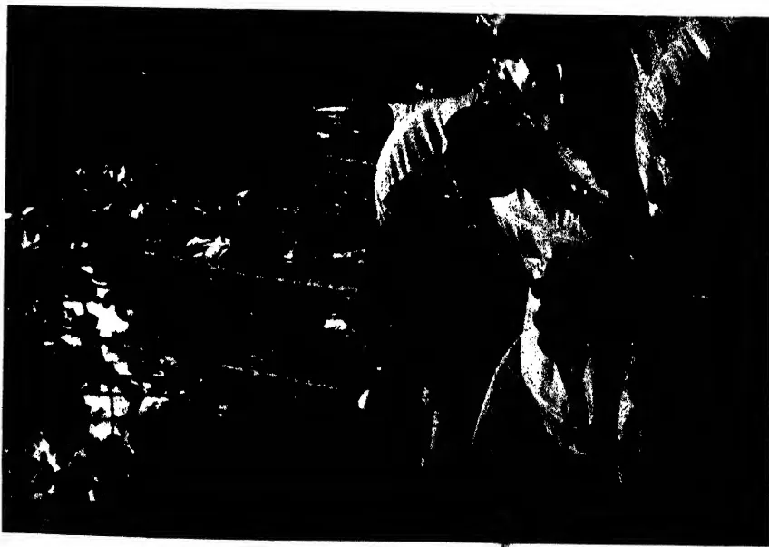

*Block by Survey Dept.*

Fig. 1.—Plantains serving as a catch crop and windbreak in a young areca grove.

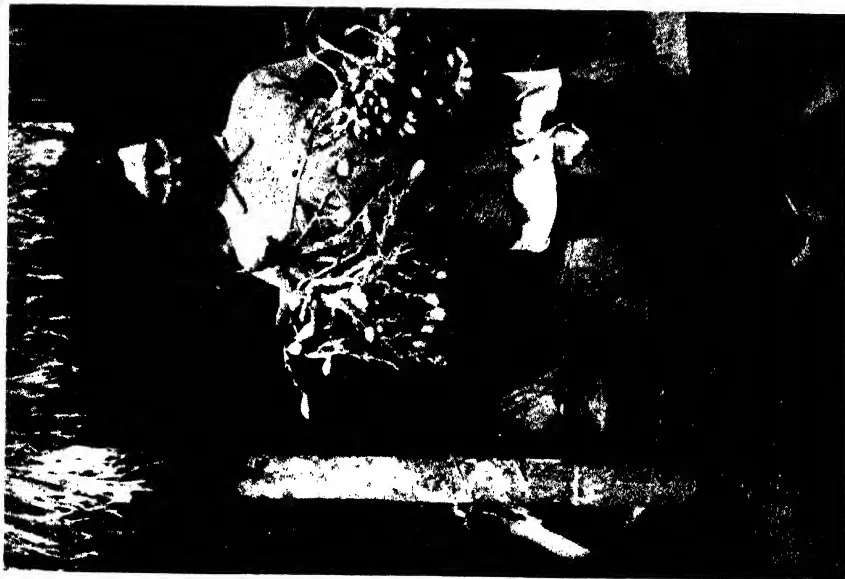

*Block by Survey Dept.*

Fig. 2.—Arecanuts. (The bunch on the left is affected with *Kolevoga-Phytophthora* sp.)

262------------------------------------------------

A completely blank white page with no visible content, text, or markings.

263------------------------------------------------

191

plants are usually planted, in the same row as the plantains at distances of 8 feet. When the areca plants are well established, pepper vines are trained to them and cardamom rootstocks are planted along the channels. This completes the first cycle of the arecanut plantation.

After about 20 years a fresh supply of areca seedlings is planted between the original row so as to replace the first planting which will become unproductive about the time the new trees put forth a good crop. Regular cultural and manurial programmes as detailed elsewhere are carried out and vacancies filled.

In the *maidan* or the drier plateau the cultural operations are more or less the same, but the land is not divided into alternate rows of ridges and furrows unless it has a tendency to water-logging. Cardamom and pepper are replaced by coconut and the betel vine. In Ceylon, arecanuts are not subject to any form of systematic cultivation.

The areca seedlings are allowed to remain in the nursery for about two to four years before they are planted out. Planting is usually carried out immediately after the main south-west monsoon rains in August and September. The holes are made  $1\frac{1}{2}$  to 2 feet deep and 3 feet square. In sandy soils, holes of greater depth are preferred.

The first crop can generally be expected about the 10th year, but under good cultivation the trees may bear in 8 years, so that the land has to be well maintained for at least 8 years before any return can be expected from it. It is for this reason that so much importance is paid to catch crops. In Ceylon, areca trees begin to bear even in the 6th year and in the 8th year a satisfactory crop is possible.

The annual recurrent expenses on maintaining an acre of land under areca in Mysore are fairly high. They include the following cultural operations in addition to expenses on spraying against *Koleroga* (*Phytophthora* sp.), and on land tax. Plate I., fig. 2.

1st year : Hoeing and the application of farmyard manure at the rate of one basket per tree, or 15 to 20 tons per acre.

2nd year : Application of F. Y. M. and green manuring. Each tree receives about 35 lb. of green leaf to supplement the F.Y.M.

3rd year : No treatment.

4th year : As in the first year and so on.

The expenditure on maintaining an arecanut garden in Mysore is about Rs. 75 made up as follows :—

<table>
<thead>
<tr>
<th></th>
<th></th>
<th></th>
<th>Rs.</th>
</tr>
</thead>
<tbody>
<tr>
<td>1.</td>
<td>Manuring</td>
<td>.. ..</td>
<td>35</td>
</tr>
<tr>
<td>2.</td>
<td>Hoeing, &amp;c.</td>
<td>.. ..</td>
<td>20</td>
</tr>
<tr>
<td>3.</td>
<td>Land tax</td>
<td>.. ..</td>
<td>10</td>
</tr>
<tr>
<td>4.</td>
<td>Spraying</td>
<td>.. ..</td>
<td>10</td>
</tr>
<tr>
<td colspan="3" style="text-align: right;">Total</td>
<td style="border-top: 1px solid black; border-bottom: 3px double black;">75</td>
</tr>
</tbody>
</table>

264------------------------------------------------

192

It is unfortunate that none of these cultural operations are carried out in Ceylon. Judging from the results now obtained, Ceylon areca should give very remunerative yields if only it received a part of the attention given in Mysore.

#### PESTS AND DISEASES

A number of pests and diseases of the areca palm has been recorded in Mysore, but none are so harmful as *Koleroga*, (*Phytophthora omnivora*, var. *arecae*) and *Anaberoxa* (*Ganoderma lucidum*). The annual losses caused by the former disease alone are estimated at Rs. 400,000.

*Koleroga*.—The symptoms of the disease are the rotting and the consequent falling of immature nuts during the south-west monsoons. In the Shimoga District where very heavy rain is experienced, the fungus attacks even the crowns of palms and causes a rot of the buds.

The control measures recommended are the removal of the affected portions and their destruction by fire, and the spraying of the bunches regularly from the end of May throughout the rains with a 2 per cent. solution of Bordeaux mixture. This is obtained by mixing the ingredients in the following proportion :—

<table>
<tr>
<td>CuSO<sub>4</sub></td>
<td>..</td>
<td>..</td>
<td>..</td>
<td>5 lb.</td>
</tr>
<tr>
<td>Quick lime</td>
<td>..</td>
<td>..</td>
<td>..</td>
<td>5 lb.</td>
</tr>
<tr>
<td>Water</td>
<td>..</td>
<td>..</td>
<td>..</td>
<td>25 gallons</td>
</tr>
</table>

Cultivators are alive to the importance of spraying to control this disease and spraying is carried out regularly. The officers of the Department of Agriculture, Mysore, who are stationed in areca-growing districts are provided with a stock of spraying machines which are used for the spraying of palms of cultivators who are unable to purchase machines of their own.

*Anaberoxa*.—This fungus usually attacks the roots and the base of the stems rendering the affected parts dry and brittle. The more common symptoms are the poor growth of the crown and the yellowing of the leaves. As the disease advances, bracket-shaped fructifications appear at the basal regions of the palms.

The remedial measures which are simple and efficacious consist of the destruction of the dead and diseased portions and the subsequent application of sulphur dust at the rate of half to one pound per palm over an isolated ring of land which includes the suspected trees.

*Anaberoxa* is most prevalent in the *maidan* and the *semi-malnad* areas.

265------------------------------------------------

193HARVEST

The stage at which the fruits are harvested is an important factor in the preparation of the dried product. The best quality can only be produced with those nuts which are moderately firm to the touch and from which no liquid oozes out.

They should contain only a limited quantity of tannin. The stage of maturity is generally tested by the insertion of the pointed end of a knife into the nut. If penetration takes place with only slight pressure it is considered sufficiently mature for curing. Those that do not conform to these conditions are considered unfit for proper curing and the finished product is of a poor quality. In Ceylon fruits are plucked when they are either very tender or fully mature.

With reasonable correctness observant land-owners are able to predict the time of harvest, from the date of appearance of the inflorescences. A few of these may open during off seasons, but they are ignored, as they invariably mature during the rains when it is both difficult and dangerous to climb the trees to pluck them. In Ceylon the cropping season goes on from August to March and two or three pickings of three to four bunches are possible. These trees appear to be more productive than those of Mysore. The main cropping season in Mysore is about August to January and this is done on three occasions. In the first plucking, only about a quarter of the season's crop is collected; the second plucking which falls in October or November is the most important in that the bulk of the fruits is available at this time. This really becomes a rush season and all effort is made to expedite the boiling and drying processes. The last harvest is the smallest and depending on weather conditions this may continue until January.

The process of harvesting the fruits is as interesting as it is varied. The best method is that in which the bunches are brought down without the separation of any of the fruits. In order to do this, a man suitably attired climbs a tree from which most other trees are approachable. His dress consists of :—

- (a) A seat on which to rest so that he may be at ease when plucking the bunches.
- (b) A breast plate made of areca spathes to protect his chest from abrasions.
- (c) A loop for his legs to facilitate a good grip on the trunk of the tree while climbing. This is removed when the seat is used.
- (d) A belt with a ring to support the long rope which helps to lower the bunches.
- (e) A long bamboo at one end of which a hooked knife is attached for pulling the neighbouring trees within reach to pluck the bunches with his hands.

266------------------------------------------------

194

(f) Some hooks to fix the tree pulled by the bamboo towards the one to which the climber is clinging. Plate I., fig. 1.

Thus equipped he climbs the trees, takes his seat apparently in a comfortable manner, and with great dexterity wrests the bunches from the trees only to lever them along the long rope, one end of which is hooked to his belt and the other end held taut by his assistant on the ground. He plucks an average of 150 bunches a day and is paid at the rate of Rs. 5 per 1,000 bunches.

In some localities the bunches are cut and pulled down by means of a curved knife attached to a long bamboo. As they drop, a wide blanket or mat which is held firm by four persons is outstretched to receive them. In other localities, the momentum of the falling bunches is reduced by the throwing up of jute hessian bags to meet them. The bunches become entangled in the bag and reach the ground with reduced speed, somewhat similar to the action of a parachute.

These contrivances aim at reducing the damage caused to the nuts by their impact with the hard ground. Nevertheless, there are persons who allow the bunches to fall on the bare ground and then collect the scattered fruits.

The bunches, or the fruits as the case may be, are now collected and brought to the godown. To detach the fruits, the bunches are raised by a strong rope which is passed through two tough spadices, and beaten on a wooden base. In a few seconds all the fruits are released from the spadices. A labourer receives Rs. 5 for detaching the fruits from 1,000 bunches, which he himself has to transport to the godown.

#### YIELDS

The usual number of trees per acre in a cultivated garden is 400, and the average yield per tree is 2 or 3 bunches. Each bunch contains about 200 to 250 fruits. The yield per acre, therefore, is 160,000 to 300,000 fruits. About 28,000 fruits produce a hundred-weight of the prepared product and the annual return from an acre works out at 6 to 10 cwt. Sinhala Puwak yields better than most of the varieties in Mysore, the average being about 3 to 4 bunches per tree, each bunch containing 200 to 400 fruits. The number of fruits per acre is about 240,000 to 640,000 with the same stand of trees.

#### THE PREPARATION OF *CHICKANI*

##### 1. SHELLING AND SLICING

The next operation is that of shelling and slicing. In order to obtain a good quality product for the market shelling should commence almost immediately after plucking. If immature fruits are plucked they are left in the godown for a day or two

267------------------------------------------------

A completely blank white page with no visible content, text, or markings.

268------------------------------------------------

PLATE II.

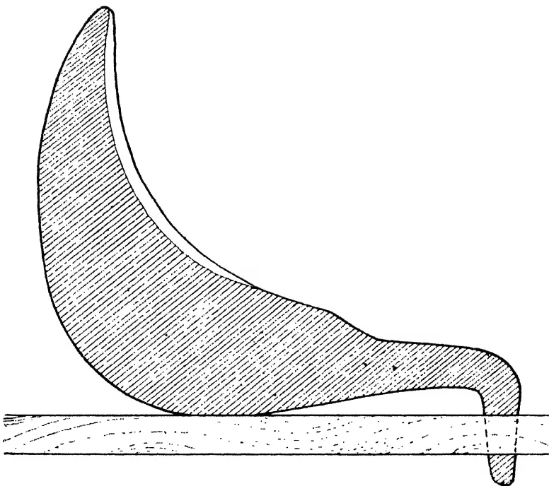A detailed line drawing of a specialized kitchen knife. The blade is long and curved, with a distinct concave edge on the inner side, characteristic of a shelling knife. The handle is attached to the back of the blade and has a complex, ergonomic shape with a small notch or indentation near the base of the blade. The entire object is shown in profile, resting on a horizontal surface that is indicated by a series of short, parallel lines.

Shelling and slicing knife with a curved blade (half size).

269------------------------------------------------

A completely blank white page with no visible content, text, or markings.

270------------------------------------------------

PLATE III.


Shelling knife with a curved blade. The point of the blade is used for shelling (actual size).

271------------------------------------------------

This image is a blank white page. It contains two small, isolated black dots: one in the upper-left quadrant and one in the lower-middle section. There is no text, handwriting, or printed content on the page.

272------------------------------------------------

PLATE IV.

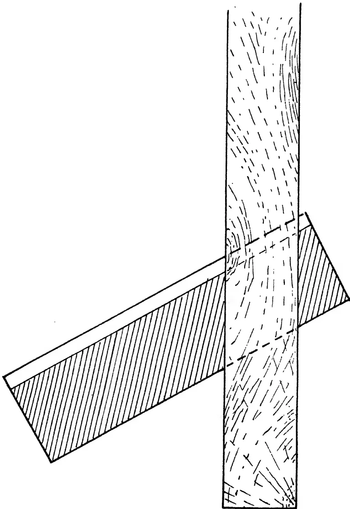A technical line drawing showing a straight-bladed knife positioned diagonally across a wooden plank. The knife's blade is a long, straight line. The wooden plank is a rectangular block with a wood grain texture represented by short, irregular lines. The knife is shown in two positions: one where the blade is fully inserted into a slot cut into the plank, and another where the blade is partially inserted, showing the blade's thickness and the slot's depth. The plank is oriented diagonally from the bottom-left towards the top-right.

The straight-bladed knife showing how it is fitted to the wooden plank on which the sheller sits. This knife is used both for shelling and for slicing.

273------------------------------------------------

195

so that they may harden while resting. Shelling is often delayed when dark and sultry weather conditions prevail. In such cases it becomes more profitable to commence shelling immediately, and to resort to artificial drying than to await fine weather. In any case, nuts should not be left unhusked for more than three days.

The instruments for shelling are sharp knives, the edges of which are either concave or straight. The blade is firmly fitted to a strong wooden plank on which the sheller can sit. The curved instruments are of two kinds—the one has a sharp blade and the other a sharp point. (Plates II. and III.) The sharp-edged knife is used both for shelling the fruit and for slicing it, whereas the sharp-pointed one can do only one operation, namely, shelling. In this case another knife has to be used for slicing, thus delaying the work for sometime (Plate IV). But this does not make the work more expensive, as the labourers are paid according to the quantity of fruits shelled.

In shelling, the ideal to be aimed at is an unbruised nut with the thin membranous tissue covering it intact. Injured nuts present a poor appearance and consequently fetch a lower price in the market.

It is likely that on shelling there will be a number of over-ripe fruits to which some portions of the shell will adhere. These are generally kept in water for about a day when it becomes easy to remove the shells. In principle, the methods adopted for shelling and slicing the nuts are the same in both countries. The Mysore knives appear to give a larger out-turn of nuts per hour than the scissors-like arecanut cutters used in Ceylon. The green fruits yield 35 per cent. nuts and 65 per cent. husks by weight.

Shelling is undertaken only by trained labourers. It is not everyone who can acquire the swiftness that is expected of the shellers. During their training they invariably receive a number of cuts on their palms even when they are well protected with a thick pad.

In slicing the nuts the common practice is to cut them into two. But if sufficient labour is available they are cut into smaller sections or even chipped into finer pieces. These fetch a better market price which more than covers the extra labour involved. The nuts may be sliced into fours, eighths, sixteenths, or into still finer pieces. Some of them resemble cloves in shape. These are popularly known in the market as “*Lavanga Chooru*” or “*Koch-adike*.”

## 2. BOILING

Arecanuts are boiled to bring them into the correct degree of palatability. In the process of boiling, excess tannin and mucilage are removed and a certain amount of foreign tannin

274------------------------------------------------

196

is infused into them. It is partly in order to infuse this tannin and partly to obtain a good colour that the liquid of the previous season's boiling is mixed with fresh water for the new nuts. This liquid is absorbed into the nuts, thereby preventing a fibrous nature in the finished product.

The nuts are boiled in a mixture of water and catechu decoction (which is no more than the liquid of the previous year's boil referred to above) in a copper or earthen vessel from  $1\frac{1}{2}$  to 3 hours over a steady fire. When they are sufficiently boiled the embryos drop out, and the cut surfaces assume a slightly concave appearance. The decoction is strained off through bamboo baskets or through perforated ladles before removal for drying. If it is anticipated that soon after boiling the nuts cannot be sun-dried owing to wet weather, instead of boiling them, they should be kept immersed in water for a day or two. As soon as the boiling of one lot is over the pot is again charged with fresh nuts and into the decoction from the previous boil sufficient fresh water is poured to fill the pot (Plate V.).

The boilers are usually of copper, but earthen vessels can be used, though these suffer from the disadvantage that they do not last long. However, the poorer classes who cannot afford copper vessels can use them. Where the decoction or the starter, as it is popularly called, is not available, the nuts are boiled in fresh water and coloured later.

There are many organic and inorganic ingredients in use for obtaining a good colour. But none produces so good a colour as the natural one imparted on boiling with the catechu decoction. The decoction obtained on boiling with fresh water can be used again and again and until about the third or fourth occasion when the correct consistency is obtained. Those boiled in fresh water must be rubbed with the inspissated decoction after the nuts have been dried in the sun for about three days so as to impart to them a good colour. But this colour may not last long.

Some material used for artificial colouring are (1) betel vine (2) slaked limestone, (3) catechu from *Acacia catechu*, (4) bark of *Eugenia jambolana*, (5) bark of *Ficus religiosa* and (6) sandalwood bark. Although these ingredients are used by the arecanut growers, the Government of Mysore are not prepared to recommend them as experiments have not yet been carried out by the officials.

The catechu decoction can be used the next year kept either in liquid or in solid form. The solid form is obtained by thickening and drying the liquid. Fastidious folk on occasion boil the nuts in milk. This is only for personal use.

275------------------------------------------------

This image is a blank white page. It contains several small, dark specks which appear to be scanning artifacts or dust particles. There is no text, handwriting, or printed content on the page.

276------------------------------------------------

PLATE V.

A detailed black and white line drawing of a traditional boiling setup for arecanuts. The setup includes a large copper pot (1) on a fire, a funnel (2) with a long handle, a smaller pot (3) on the side, and a drainage pot (4) at the back. The fire is made of logs and is built on a wooden platform.

Boiling of arecanuts.—(1) Copper pot. It should be slightly tilted.  
(2) Funnel to drain off the frothy water.

(3) Pot to collect the drained-off water (catechu).  
(4) Fireplace.

277------------------------------------------------

197

### 3. DRYING

The next operation is to dry the nuts. Drying is generally done over barbecues about 8 feet in height. The reason for using tall barbecues is perhaps to prevent pilfering. Otherwise lower and more accessible drying floors are preferred. Spreading the nuts over stones when available will serve the same purpose. The nuts are dried from about 6–9 days depending on the intensity of the sun. If uncertain weather conditions are likely to prevail for over three days, it is advisable to dry the boiled product in flue barns.

The actual expenses incurred in the production of the dried nuts are :—

<table>
<thead>
<tr>
<th></th>
<th>Rs.</th>
<th>c.</th>
</tr>
</thead>
<tbody>
<tr>
<td>1. Harvesting of 1,000 bunches, <i>i.e.</i>, produce of nearly one acre</td>
<td>..</td>
<td>5 0</td>
</tr>
<tr>
<td>2. Bringing to shed and clearing</td>
<td>..</td>
<td>5 0</td>
</tr>
<tr>
<td>3. Shelling and slicing</td>
<td>..</td>
<td>5 0</td>
</tr>
<tr>
<td>4. Boiling if paid labour is used</td>
<td>..</td>
<td>1 0</td>
</tr>
<tr>
<td>5. Drying if labour is used</td>
<td>..</td>
<td>1 0</td>
</tr>
<tr>
<td style="text-align: right;">Total</td>
<td>..</td>
<td><u>17 0</u></td>
</tr>
</tbody>
</table>

<table>
<thead>
<tr>
<th></th>
<th>Rs.</th>
<th>c.</th>
</tr>
</thead>
<tbody>
<tr>
<td>Yield of dried nuts, say, 6 cwt. at Rs. 35</td>
<td>..</td>
<td>210 0</td>
</tr>
<tr>
<td>Total expenses Rs. 75 * Rs. 17</td>
<td>..</td>
<td>92 0</td>
</tr>
<tr>
<td>Depreciation of appliances, &amp;c.</td>
<td>..</td>
<td>8 0</td>
</tr>
<tr>
<td style="text-align: right;">.. Nett profit</td>
<td>..</td>
<td><u>110 0</u></td>
</tr>
</tbody>
</table>

#### Cost of Appliances

<table>
<thead>
<tr>
<th></th>
<th>Rs.</th>
<th>c.</th>
</tr>
</thead>
<tbody>
<tr>
<td>1. 2 boilers (<i>à</i> Rs. 15 each)</td>
<td>..</td>
<td>30 0</td>
</tr>
<tr>
<td>2. 1 open copper vessel</td>
<td>..</td>
<td>15 0</td>
</tr>
<tr>
<td>3. 1 funnel and pot</td>
<td>..</td>
<td>4 0</td>
</tr>
<tr>
<td>4. 1 perforated ladle</td>
<td>..</td>
<td>1 0</td>
</tr>
<tr>
<td>5. 2 baskets for straining</td>
<td>..</td>
<td>1 0</td>
</tr>
<tr>
<td>6. Setting up 1 barbecue</td>
<td>..</td>
<td>5 0</td>
</tr>
<tr>
<td>7. 100 mats</td>
<td>..</td>
<td>10 0</td>
</tr>
<tr>
<td>8. 10 knives</td>
<td>..</td>
<td>5 0</td>
</tr>
<tr>
<td style="text-align: right;">Total</td>
<td>..</td>
<td><u>71 0</u></td>
</tr>
</tbody>
</table>

These appliances will last for 15 years.

### 4. GRADING

Grading of dried arecanuts is an art which can only be acquired after considerable amount of experience of the market requirements. The best quality consists of tender sliced nuts and the most inferior is the ripe whole nut. In Mysore, the tender nuts

278------------------------------------------------

198

as well as the ripe nuts are subject to the same process of boiling. Between these two grades are a number of other grades, the more important of which are detailed below.

- A. Chickani adike—tender nuts cut into two.
- B. Chooru or Koch-adike—tender nuts sliced into several small pieces.
- C. Idi adike—unsliced nuts.

These are again sub-divided as follows :—

A. Chickani adike (Synonyms : Holu, Jibbu, Saraku) has the following sub-grades in order of merit.

(1) Hassar or Chickani—Rs. 55 per cwt. Those that can be accommodated to the greatest height when sliced tender nuts are placed one over the other, form this grade. These will invariably be the embryo ends of the nuts.

(2) Petin—Rs. 50 per cwt. Saucer-shaped bottom half of the nuts.

(3) Raja alu—Rs. 45 per cwt.

(4) Dala—Rs. 42·50 per cwt.

(5) Sanna bette—Rs. 40 per cwt.

(6) Bette—Rs. 35 per cwt.

(7) Goravalu bette—Rs. 32·50 per cwt. Oldest nuts to which the shell clings.

B. Chooru or Koch adike—To this group falls the finer slices. The most popular sub-grade of this variety is the clove-shaped slices or “Lavanga Chooru”.

C. Idi adike.

(1) Chickani idi—tender whole nuts,

(a) Api—those with a depression on top.

(b) Rete—others.

(2) Ara bette or Bette idi—more mature nuts than (a).

(3) Gorabalu—shrivelled entire nuts, may be due to diseases.

(4) Gotu—those with clinging shell.

The dried nuts are thus graded and sold in the open market or are taken to the Shimoga Co-operative Stores. They fetch from Rs. 32·50 to Rs. 55·00 per cwt., according to the quality and the demand in the market. The *malnad* nuts are generally sold at Rs. 35 per cwt. and, as a yield of about 6½ cwt. per acre can be obtained, a gross return of about Rs. 200 per acre is possible. In well-cared-for gardens a gross income of over Rs. 400 per acre is not uncommon.

#### OTHER PREPARATIONS

Of the other preparations, preserved whole nuts in husks are the most important. (Plate VI.) There is a demand for this variety in the *Supari* markets of Bombay and Calcutta and the ruling market price is Rs. 15 per cwt. To obtain quality produce of this grade, certain varieties of fruits are required, unlike for Chickani preparations where the size and the quality of the fruit are immaterial. Those that best lend themselves for drying according to this method are the *Borli* and *Severdhan* varieties. In order to obtain a fine quality of dried product in which the

279------------------------------------------------

A completely blank white page with no visible content, text, or markings.

280------------------------------------------------

PLATE VI.

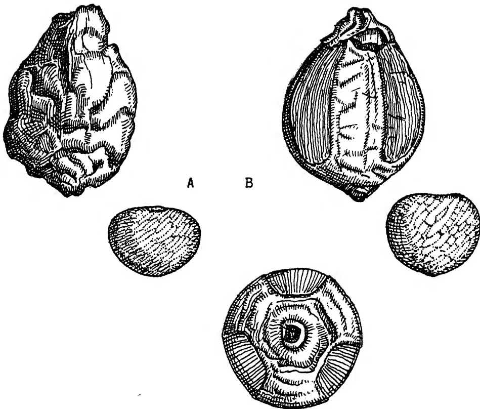

The image contains five detailed line drawings of arecanut kernels. At the top left is a large, irregularly shaped, and heavily wrinkled kernel, labeled 'A'. At the top right is a large, more oval-shaped kernel with distinct vertical ridges, labeled 'B'. Below these are two smaller, oval-shaped kernels, one on the left and one on the right, both showing a fine, textured surface. At the bottom center is a circular, cross-sectional view of a kernel, showing concentric layers and a central dark spot.

“ Karunka ” or dried arecanuts.

A.—Ceylon method which causes shrivelling of the nuts and fungus growth.

B.—Indian method which gives a well-formed nut of superior quality.

281------------------------------------------------

199

nut is not mildewed or shrivelled, ripe fruits are plucked and the husks lightly stripped in about three places (Plate VI B). They are then dried in the sun and kept in a cool dry place stacked in gunny bags. Ten thousand ripe nuts go to form a hundred-weight of the dried product.

In Ceylon mature whole nuts are dried and marketed under the name "Karunka" or "Kotte-pakku" (Plate VI A). This preparation is considerably inferior to the product found in the *Supari* markets of Bombay or Calcutta. This inferiority may be attributed to :

1. (1) The diminutive size of the local Sinhala puwak.
2. (2) The indifferent method of drying.
3. (3) The poor keeping qualities of the nuts.
4. (4) Mildewed and discoloured appearance of the cut surface of the nuts.

These defects can easily be overcome. An imitation of the Chickani preparation, too, is produced in Ceylon. This is known as "Petipuwak" or "Kalli-pakku". In this case, very tender nuts are put on the market after being sliced and dried. Both these products, "karunka" and "peti-puwak", need considerable improvement if they are to find a reasonable market in India where nearly 90 per cent. of the Ceylon produce is disposed of. The quantity exported from Ceylon shows a gradual reduction every year. In 1939, the total quantity sent out was 94,407 cwt. valued at Rs. 1,190,731, of which 77,462 cwt. were bought by British India at the rate of about Rs. 13 per cwt. These figures are considerably below those obtainable for the last 10 years. Mysore preparations are sold in Indian markets at rates varying from Rs. 32.50 to Rs. 55 per cwt. so that the poorest Mysore preparations fetch about Rs. 15 more than the best variety from Ceylon.

#### CONCLUSION

The tendency to produce inferior marketable goods is a weakness of the Ceylon villager. It needs to be corrected. With such an assured and lucrative market so near at hand, there is no reason why the highest grades of arecanuts should not be produced in Ceylon.

The cost of local production is much lower compared with that of Mysore. Here the cost of cultivation is almost nil, but the yield per acre appears to be considerably higher than in Mysore even where particular attention is paid to cultivation processes. *Sinhala puwak* comes into bearing from 6 to 8 years, whereas the Mysore varieties do not yield a satisfactory

282------------------------------------------------

200

return even in the 10th year. In Ceylon no expense is incurred on irrigating arecas nor has the need so far arisen to combat serious diseases such as *Phytophthora omnivora* var. *areca* or *Ganoderma lucidum*. Furthermore, the extent locally under areca exceeds that of Mysore by over 25,000 acres.

In consideration of these facts, Ceylon should be able to face competition from any part of the world where areca is cultivated, provided the nuts are prepared in the manner required by the import markets. Thus could Ceylon revive a decadent industry and bring about happier conditions among the areca growers—a voiceless people preyed upon by the merciless middlemen !

#### ACKNOWLEDGEMENT

The writer's thanks are due to the officials of the Department of Agriculture, Mysore, for the assistance given him to learn the processes enumerated above, within the short period of two weeks. He is also grateful to Dr. W. R. C. Paul and to Mr. W. Molegode of Peradeniya, for kindly reading over the manuscript and making valuable suggestions.

283------------------------------------------------

201

## HARVESTING, CURING AND GRADING OF CIGARETTE TOBACCO

A. B. ATTYGALLE,  
*ASSISTANT TO TOBACCO OFFICER, PERADENIYA*

### HARVESTING

**R**IPENING of leaves commences from below and proceeds upwards. The tobacco crop should be ready for harvesting about four weeks after topping, but no fixed dates can be laid down. The condition of the leaf should be the sole guide in judging the correct stage for harvesting the crop. The leaves should be judged from a little distance as the colour may be deceptive when looked at from nearby. Locate the highest matured leaf on the plant and start picking from these downwards. The harvesting of tobacco for flue-curing is very important, since properly-grown tobacco is often spoilt through wrong methods of harvesting. Ripening is indicated by the change in the colour and the texture of the leaves.

The deep green colour of healthy, light-textured leaf changes by gradual degrees to a greenish yellow as the leaf reaches maturity, whilst in the case of heavy-textured leaf the change to a yellow colouration may be confined only to small areas of the leaf surface causing the ripe leaf to appear with yellow flecks or spots. The accumulation of starch granules within the cells causes the leaf to become brittle and roughened, this change from being pliable and smooth to the touch is another indication of ripeness. Such leaf will crack when folded and pressed between the finger and the thumb.

For flue-curing, tobacco should be fully ripe when placed in the barn. Tobacco picked before being fully ripe shows, when cured, a greenish colour and this tobacco is of very little commercial value. On the other hand over-ripe leaves are uneven in colour and brittle when cured. For flue-curing it is very essential that all the leaves should be in the same stage of ripeness and texture, as otherwise all the leaves will not yellow at the same time in the barn. Five to seven pickings are necessary for the complete harvest of a field. Two to three leaves can be harvested from a plant at each picking.

284------------------------------------------------

202

Start harvesting early in the morning before any wilting has taken place, *i.e.*, while the leaves are still wet with dew. Every effort should be made to complete the picking before the sun becomes too hot. Tobacco should not be harvested too soon after heavy rains, since rains wash from the leaves soluble gums, oils and resins which facilitate curing. If the leaves resume a greenish appearance the tobacco should be left until signs of maturity reappear. The leaves are primed from the plants as they ripen and placed in shallow baskets and carried on to the shed where they are strung together for hanging in the barn. The bottom and the middle leaves are the most valuable, and great care should be taken of them. The leaves should not be allowed to remain in the sun and get sun-scorching. Bruising of leaves should also be avoided. It is essential to fill the flue-barn in one day and commence the curing operations in the same evening, as a day's difference in the time of harvesting may result in the tobacco harvested first having yellowed or wilted much more than that harvested last. Should a certain quantity of tobacco be of heavy body it should be placed on the top tiers and the lighter-bodied tobacco on the bottom tiers.

#### STRINGING AND FILLING

Two sets of sticks are required for a barn. Strong round jungle sticks could be used for this purpose with advantage. Strong soft twine is tied to one end of the stick and it should be cut off at a point two and a half times the length of the stick. The stick is supported by means of a wooden frame.

The tobacco is placed in bunches of three to four leaves depending on their size and are held together with the backs of their mid-ribs touching one another. The person tying holds the string in one hand and the bunch of leaves in the other and the string is wrapped round the bunches one inch from the butts and the bunches are turned over and across the stick to form a draw twist. The next bunch of leaves is placed on the opposite side of the stick so that the alternate bunches will balance. Bunches are placed from two to three inches apart depending on the size of the leaf. The free end of the string is fastened through a slit at the end of the stick. Start filling the barn from top to bottom and place sticks at six to eight inches apart. Each stick four and a half feet long should carry 24 to 30 bunches of leaves. Crowding of sticks should be avoided, since drying is thereby retarded and sponging facilitated.

#### FLUE BARN

Special barns are necessary for the curing of cigarette tobacco. These barns are known as flue-barns because of the use of flue-pipes for heating the barns. Barns should be constructed on a level site in close proximity to the homestead on a tobacco

285------------------------------------------------

203

field because this will facilitate the supervision of work. A water supply should be available at the barn. The building should be so located that the prevailing winds do not blow through the furnace.

The size of a flue-barn to be erected on a holding will depend on the area of tobacco usually grown each year in the scheme of rotation to be adopted. The minimum economic unit required for the erection of a barn should be about 10 acres. Small flue-barns are better than big ones because it is very essential to fill a flue-barn in one day.

Furnaces are turned out of cast iron and the cost of these will depend on the weight of cast iron, so it is essential to use a furnace of minimum size. A furnace 3 feet deep,  $1\frac{1}{2}$  feet wide,  $2\frac{1}{2}$  feet high will serve to heat a barn 16 feet by 16 feet, 20 feet high. It is a great mistake to erect a barn of too great a height, because curing does not take place uniformly in the upper tiers. A permanent barn would be more preferable to a temporary barn in order to obtain the best results with the least risk of failure. The best size of a flue-barn is 16 feet by 16 feet by 20 feet high. Such a barn will hold leaves of four acres of tobacco at a time, *i.e.*, six to seven hundred sticks of tobacco.

Emil J. Livera has described in detail the construction of flue-barns, furnaces and flue-pipes, in *The Tropical Agriculturist*, Vol. LXXXV., September, 1935, hence the writer does not propose to go into details on these questions.

#### METHOD OF CURING

The aim of the grower is to cure leaves a rich lemon colour. A crop of tobacco properly grown and harvested may be completely ruined by wrong methods of curing. A good deal of skill and attention is therefore required by day and night. Curing means the correct manipulation of the temperature and humidity of the barn, after the barn has been filled with leaves, so that the yellowish green colour of the leaf when harvested is gradually changed into a rich lemon colour. The moisture content of the leaf too is considerably reduced. During the process of curing, the leaf is subjected to a series of chemical changes.

No hard and fast rules could be followed in flue-curing of tobacco. The grower should modify the methods of curing to suit the local conditions. The following factors influence the duration of the curing processes :—

1. (1) Soil;
2. (2) Climate;
3. (3) Cultural operations;
4. (4) Degree of ripeness of the leaf.

286------------------------------------------------

204

The writer has found the process described below good for conditions obtaining at Wariyapola.

The process of curing falls into three stages :—

1. (1) Yellowing of leaf;
2. (2) Fixing the colour;
3. (3) Drying the leaf—both web and mid-rib.

#### YELLOWING

The barn should be evenly filled taking care that no large spaces are left between the leaves and the sticks. If the quantity of leaf is insufficient completely to fill the barn, the sticks should be evenly placed over a few tiers. Then a reliable thermometer and hygrometer are hung below the last tier of leaves somewhere away from the furnace, preferably in the middle of the barn so that the reading could be easily taken through the pane in the window provided.

The time taken in yellowing the leaf varies according to the conditions of the leaf, hence the extreme importance of harvesting leaves of the same stage of ripeness in order to secure a uniform barn load. The yellowing of the leaf is the outward symptom of the slow starvation process which is taking place in the cells and the temperature and the humidity in the barn should have to be so adjusted that this process will take place with maximum efficiency. A small fire is started in the furnace and the temperature kept at 80 to 100° F. and a high humidity of not less than 80°. The yellowing of leaf proceeds more successfully at a moderate temperature of 80 to 100° F. and a high humidity not less than 80° and should be completed in 30 to 40 hours, after which the temperature should be raised to fix the colour.

Since it is impossible to get a barn-load with leaves all of which are in the same condition, yellowing will not proceed uniformly all over the barn, and one of the difficulties is to judge correctly the precise moment at which it is most advantageous to stop the yellowing process. The leaves which are allowed to yellow too much will not retain their colour in the later stages of curing, but will turn brown; on the other hand leaves which have not yellowed sufficiently will be fixed with a greenish tinge. It is better to err on the green side as these leaves will improve their colour in bulk. During the yellowing stage the temperature should be slowly raised and all the ventilators and doors should remain shut to keep the humidity high. If the humidity in the barn goes below 80° it should be raised by artificial means. This could be done by placing wet gunny bags over the flue-pipes. The floor of the barn

287------------------------------------------------

205

should not be watered as this will cause sponging of leaves. The rate of raising the temperature during the yellowing process should be as follows :—

<table>
<tr>
<td>From start to 3 hours</td>
<td>..</td>
<td>..</td>
<td>80° F.</td>
</tr>
<tr>
<td>4th to 8th hour</td>
<td>..</td>
<td>..</td>
<td>85° F.</td>
</tr>
<tr>
<td>9th to 14th hour</td>
<td>..</td>
<td>..</td>
<td>87½° F.</td>
</tr>
<tr>
<td>15th to 20th hour</td>
<td>..</td>
<td>..</td>
<td>90° F.</td>
</tr>
<tr>
<td>21st to 23rd hour</td>
<td>..</td>
<td>..</td>
<td>92½° F.</td>
</tr>
<tr>
<td>24th to 28th hour</td>
<td>..</td>
<td>..</td>
<td>95° F.</td>
</tr>
<tr>
<td>29th to 34th hour</td>
<td>..</td>
<td>..</td>
<td>97½° F.</td>
</tr>
<tr>
<td>35th to 37th hour</td>
<td>..</td>
<td>..</td>
<td>100° F.</td>
</tr>
</table>

If the leaf is very thick the time taken for yellowing will be longer and the temperature should be raised more slowly. The leaves on the lower tiers just above the furnace and over the flue-pipes next to the furnace will dry early. To prevent this cover the furnace and the main flue-pipes with wooden planks.

#### FIXING THE COLOUR

The green leaf contains about 80 per cent. of water and in fixing the colour this moisture has to be driven off. To do this successfully the moisture must be removed as fast as it is given off by the leaves and therefore the ventilators must be opened and the temperature raised. This is the most critical stage in the process and most of the failures to secure good colour occur at this stage. The two chief difficulties are scalding and sponging of leaf. The former is caused by raising the temperature too rapidly. When about 75 per cent. of the leaf surface has yellowed the fixing of colour is begun by raising the temperature to 100° F. and also raising the top ventilator over the ridge of the roof about half the length of its travel. The temperature should be maintained at 100° F. till the whole surface of the leaf has yellowed, with only a trace of green along the veins and mid-ribs and then the temperature should be increased at the following rates :—

102½° F. for one hour, top ventilators full open, bottom ventilators quarter open.

105° F. for one hour, top ventilators full open, bottom ventilators half open.

107½° F. for one hour, all ventilators full open.

110° F. do.

112½° F. do.

115° F. do.

117½° F. do.

120° F. do.

122½° F. do.

125° F. for four hours, all ventilators full open.

2—J. N. A 2684 (8/41)

288------------------------------------------------

206

The fixing of colour therefore takes from 13 to 16 hours at a temperature ranging from 100° to 125° F. The best colour in tobacco is usually obtained when the leaf is fixed with a very faint greenish tinge which disappears during the subsequent fermentation in bulk. Sponging is the term given to the reddening of the leaf caused by excessive moisture during the late stage of yellowing and at the commencement of the fixing stage. This can be prevented by opening the ventilators: the correct manipulation of the top and the bottom ventilators is just as important as the maintenance of the correct temperature if good colour is to be obtained. If difficulty is experienced in reducing the moisture sufficiently, the temperature in the barn may be "flashed" that is raised quickly from 112 to 120° F. and after about half an hour allowed to drop back to 110° F. One or two such flashes are usually sufficient to dry out the excessive moisture. This is done to prevent the sponging of the leaf owing to the presence of too much moisture. The temperature is held at 125° F. for four hours to accustom the leaves to a high temperature. During the process of fixing the colour temperature should be kept constant.

#### DRYING THE LEAF

The web of the leaf should be thoroughly dried out at a temperature of 130 to 140° F. and during this stage the temperature is raised by 5° F. every two or three hours. The temperature should be maintained at 140° F. till the web of leaf is thoroughly dried.

The remainder of the process consists of drying the mid-ribs of leaves. This requires 36 to 40 hours with a temperature ranging from 145° to 160° F. During this stage the temperature is raised by 5° F. every other hour and maintained at 160° F. till the mid-ribs are thoroughly dried. The top and the bottom ventilation should be reduced at this stage, allowing slightly more ventilation at the top than at the bottom. It is not advisable to raise the temperature above 160° F. because the leaf becomes brittle and it loses the soft silkiness and the bright colour desired in high grade tobacco. After the mid-ribs are dried, the fire is raked out, doors and ventilators are left open for the barn to cool.

It is difficult to lay down a definite formula, as the methods of curing are subjected to modifications due to different stages of maturity, variable texture of leaf, climatic conditions and other factors. Higher temperatures are required in wet weather than in dry weather, and lower temperatures are required in cool weather than in warm weather.

A curing chart of a fairly even barn load of tobacco is appended.

289------------------------------------------------

207CURING CHART

<table border="1">
<thead>
<tr>
<th>Date.</th>
<th>No. of Hours.</th>
<th>Temp. F.</th>
<th>Relative Humidity.</th>
<th>Raising of Temp.</th>
<th>Time.</th>
<th>Remarks.</th>
</tr>
</thead>
<tbody>
<tr>
<td>16.2.37 ..</td>
<td>1 ..</td>
<td>80° ..</td>
<td>82 ..</td>
<td>..</td>
<td>5 P.M. ..</td>
<td>Loaded barn and started firing</td>
</tr>
<tr>
<td></td>
<td>2 ..</td>
<td>80° ..</td>
<td>82 ..</td>
<td>..</td>
<td>6 ..</td>
<td></td>
</tr>
<tr>
<td></td>
<td>3 ..</td>
<td>80° ..</td>
<td>82 ..</td>
<td>..</td>
<td>7 ..</td>
<td></td>
</tr>
<tr>
<td></td>
<td>4 ..</td>
<td>85° ..</td>
<td>82 ..</td>
<td>85° ..</td>
<td>8 ..</td>
<td></td>
</tr>
<tr>
<td></td>
<td>5 ..</td>
<td>85° ..</td>
<td>82 ..</td>
<td>..</td>
<td>9 ..</td>
<td></td>
</tr>
<tr>
<td></td>
<td>6 ..</td>
<td>85° ..</td>
<td>82 ..</td>
<td>..</td>
<td>10 ..</td>
<td></td>
</tr>
<tr>
<td></td>
<td>7 ..</td>
<td>85° ..</td>
<td>82 ..</td>
<td>..</td>
<td>11 ..</td>
<td></td>
</tr>
<tr>
<td></td>
<td>8 ..</td>
<td>85° ..</td>
<td>82 ..</td>
<td>..</td>
<td>12 (midnight)</td>
<td></td>
</tr>
<tr>
<td>17.2.37 ..</td>
<td>9 ..</td>
<td>85° ..</td>
<td>82 ..</td>
<td>..</td>
<td>1 A.M.</td>
<td></td>
</tr>
<tr>
<td></td>
<td>10 ..</td>
<td>87½° ..</td>
<td>85 ..</td>
<td>87½° ..</td>
<td>2 ..</td>
<td></td>
</tr>
<tr>
<td></td>
<td>11 ..</td>
<td>87½° ..</td>
<td>85 ..</td>
<td>..</td>
<td>3 ..</td>
<td></td>
</tr>
<tr>
<td></td>
<td>12 ..</td>
<td>87½° ..</td>
<td>85 ..</td>
<td>..</td>
<td>4 ..</td>
<td></td>
</tr>
<tr>
<td></td>
<td>13 ..</td>
<td>87½° ..</td>
<td>85 ..</td>
<td>..</td>
<td>5 ..</td>
<td></td>
</tr>
<tr>
<td></td>
<td>14 ..</td>
<td>87½° ..</td>
<td>85 ..</td>
<td>..</td>
<td>6 ..</td>
<td></td>
</tr>
<tr>
<td></td>
<td>15 ..</td>
<td>90° ..</td>
<td>80 ..</td>
<td>90° ..</td>
<td>7 ..</td>
<td>Slight change in colour. Placed wet gunnies over flue-pipes to maintain high humidity</td>
</tr>
<tr>
<td></td>
<td>16 ..</td>
<td>90° ..</td>
<td>80 ..</td>
<td>..</td>
<td>8 ..</td>
<td></td>
</tr>
<tr>
<td></td>
<td>17 ..</td>
<td>90° ..</td>
<td>80 ..</td>
<td>..</td>
<td>9 ..</td>
<td></td>
</tr>
<tr>
<td></td>
<td>18 ..</td>
<td>90° ..</td>
<td>80 ..</td>
<td>..</td>
<td>10 ..</td>
<td>There was high wind. Continued placing of wet gunnies</td>
</tr>
<tr>
<td></td>
<td>19 ..</td>
<td>90° ..</td>
<td>80 ..</td>
<td>..</td>
<td>11 ..</td>
<td>Colour improving</td>
</tr>
<tr>
<td></td>
<td>20 ..</td>
<td>90° ..</td>
<td>80 ..</td>
<td>..</td>
<td>12 (noon)</td>
<td></td>
</tr>
<tr>
<td></td>
<td>21 ..</td>
<td>92½° ..</td>
<td>80 ..</td>
<td>92½° ..</td>
<td>1 P.M. ..</td>
<td>Colour improving, high wind. Continued placing of wet gunnies</td>
</tr>
<tr>
<td></td>
<td>22 ..</td>
<td>92½° ..</td>
<td>80 ..</td>
<td>..</td>
<td>2 ..</td>
<td></td>
</tr>
<tr>
<td></td>
<td>23 ..</td>
<td>92½° ..</td>
<td>80 ..</td>
<td>..</td>
<td>3 ..</td>
<td></td>
</tr>
<tr>
<td></td>
<td>24 ..</td>
<td>95° ..</td>
<td>80 ..</td>
<td>95 ..</td>
<td>4 ..</td>
<td>Considerable change in colour. High wind retarding yellowing of leaves. Colour now spreading</td>
</tr>
<tr>
<td></td>
<td>25 ..</td>
<td>95° ..</td>
<td>80 ..</td>
<td>..</td>
<td>5 ..</td>
<td></td>
</tr>
<tr>
<td></td>
<td>26 ..</td>
<td>95° ..</td>
<td>80 ..</td>
<td>..</td>
<td>6 ..</td>
<td></td>
</tr>
<tr>
<td></td>
<td>27 ..</td>
<td>95° ..</td>
<td>80 ..</td>
<td>..</td>
<td>7 ..</td>
<td></td>
</tr>
<tr>
<td></td>
<td>28 ..</td>
<td>95° ..</td>
<td>80 ..</td>
<td>..</td>
<td>8 ..</td>
<td></td>
</tr>
<tr>
<td></td>
<td>29 ..</td>
<td>97½° ..</td>
<td>79 ..</td>
<td>97½° ..</td>
<td>9 ..</td>
<td>Continued placing of wet gunnies, colour very much changed, not ready yet for fixing</td>
</tr>
</tbody>
</table>

290------------------------------------------------

208

<table border="1">
<thead>
<tr>
<th>Date.</th>
<th>No. of Hours.</th>
<th>Temp. F.</th>
<th>Relative Humidity.</th>
<th>Raising of Temp.</th>
<th>Time.</th>
<th>Remarks.</th>
</tr>
</thead>
<tbody>
<tr>
<td rowspan="3">17.2.37 ..</td>
<td>30 ..</td>
<td>97½° ..</td>
<td>79 ..</td>
<td>..</td>
<td>10 P.M.</td>
<td></td>
</tr>
<tr>
<td>31 ..</td>
<td>97½° ..</td>
<td>79 ..</td>
<td>..</td>
<td>11 "</td>
<td></td>
</tr>
<tr>
<td>32 ..</td>
<td>97½° ..</td>
<td>79 ..</td>
<td>..</td>
<td>12 (midnight)</td>
<td></td>
</tr>
<tr>
<td rowspan="20">18.2.37 ..</td>
<td>33 ..</td>
<td>97½° ..</td>
<td>79 ..</td>
<td>..</td>
<td>1 A.M. ..</td>
<td>Colour very much changed, will be ready for fixing soon, removed wet gunnies</td>
</tr>
<tr>
<td>34 ..</td>
<td>97½° ..</td>
<td>79 ..</td>
<td>..</td>
<td>2 "</td>
<td></td>
</tr>
<tr>
<td>35 ..</td>
<td>100° ..</td>
<td>60 ..</td>
<td>100° ..</td>
<td>3 "</td>
<td>Top ventilator half open, commenced fixing colour</td>
</tr>
<tr>
<td>36 ..</td>
<td>100° ..</td>
<td>60 ..</td>
<td>..</td>
<td>4 "</td>
<td></td>
</tr>
<tr>
<td>37 ..</td>
<td>100° ..</td>
<td>60 ..</td>
<td>..</td>
<td>5 "</td>
<td></td>
</tr>
<tr>
<td>38 ..</td>
<td>102½° ..</td>
<td>42 ..</td>
<td>102½° ..</td>
<td>6 "</td>
<td>Top ventilator full open, and bottom ventilators quarter open</td>
</tr>
<tr>
<td>39 ..</td>
<td>105° ..</td>
<td>41 ..</td>
<td>105° ..</td>
<td>7 "</td>
<td>Top ventilator full open and, bottom ventilator half open</td>
</tr>
<tr>
<td>40 ..</td>
<td>107½° ..</td>
<td>40 ..</td>
<td>107½° ..</td>
<td>8 "</td>
<td>All ventilators full open</td>
</tr>
<tr>
<td>41 ..</td>
<td>110° ..</td>
<td>40 ..</td>
<td>110° ..</td>
<td>9 "</td>
<td>All ventilators full open</td>
</tr>
<tr>
<td>42 ..</td>
<td>112½° ..</td>
<td>40 ..</td>
<td>112½° ..</td>
<td>10 "</td>
<td></td>
</tr>
<tr>
<td>43 ..</td>
<td>115° ..</td>
<td>38 ..</td>
<td>115° ..</td>
<td>11 "</td>
<td></td>
</tr>
<tr>
<td>44 ..</td>
<td>117½° ..</td>
<td>37 ..</td>
<td>117½° ..</td>
<td>12 (noon)</td>
<td></td>
</tr>
<tr>
<td>45 ..</td>
<td>120° ..</td>
<td>35 ..</td>
<td>120° ..</td>
<td>1 P.M.</td>
<td></td>
</tr>
<tr>
<td>46 ..</td>
<td>122½° ..</td>
<td>35 ..</td>
<td>122½° ..</td>
<td>2 "</td>
<td></td>
</tr>
<tr>
<td>47 ..</td>
<td>125° ..</td>
<td>32 ..</td>
<td>125° ..</td>
<td>3 "</td>
<td></td>
</tr>
<tr>
<td>48 ..</td>
<td>125° ..</td>
<td>..</td>
<td>125° ..</td>
<td>4 "</td>
<td>Humidity not recorded</td>
</tr>
<tr>
<td>49 ..</td>
<td>125° ..</td>
<td>..</td>
<td>125° ..</td>
<td>5 "</td>
<td></td>
</tr>
<tr>
<td>50 ..</td>
<td>125° ..</td>
<td>..</td>
<td>125° ..</td>
<td>6 "</td>
<td></td>
</tr>
<tr>
<td>51 ..</td>
<td>130° ..</td>
<td>..</td>
<td>130° ..</td>
<td>7 "</td>
<td></td>
</tr>
<tr>
<td>52 ..</td>
<td>130° ..</td>
<td>..</td>
<td>130° ..</td>
<td>8 "</td>
<td></td>
</tr>
<tr>
<td>53 ..</td>
<td>130° ..</td>
<td>..</td>
<td>130° ..</td>
<td>9 "</td>
<td></td>
</tr>
<tr>
<td>54 ..</td>
<td>135° ..</td>
<td>..</td>
<td>135° ..</td>
<td>10 "</td>
<td></td>
</tr>
<tr>
<td>55 ..</td>
<td>135° ..</td>
<td>..</td>
<td>135° ..</td>
<td>11 "</td>
<td></td>
</tr>
<tr>
<td>56 ..</td>
<td>135° ..</td>
<td>..</td>
<td>135° ..</td>
<td>12 (midnight)</td>
<td></td>
</tr>
<tr>
<td rowspan="6">19.2.37 ..</td>
<td>57 ..</td>
<td>140° ..</td>
<td>..</td>
<td>140° ..</td>
<td>1 A.M.</td>
<td></td>
</tr>
<tr>
<td>58 ..</td>
<td>140° ..</td>
<td>..</td>
<td>140° ..</td>
<td>2 "</td>
<td></td>
</tr>
<tr>
<td>59 ..</td>
<td>140° ..</td>
<td>..</td>
<td>140° ..</td>
<td>3 "</td>
<td></td>
</tr>
<tr>
<td>60 ..</td>
<td>140° ..</td>
<td>..</td>
<td>140° ..</td>
<td>4 "</td>
<td></td>
</tr>
<tr>
<td>61 ..</td>
<td>145° ..</td>
<td>..</td>
<td>145° ..</td>
<td>5 "</td>
<td>Bottom ventilators quarter closed</td>
</tr>
<tr>
<td>62 ..</td>
<td>145° ..</td>
<td>..</td>
<td>145° ..</td>
<td>6 "</td>
<td></td>
</tr>
</tbody>
</table>

291------------------------------------------------

209

<table border="1">
<thead>
<tr>
<th>Date.</th>
<th>No. of Hours.</th>
<th>Temp. F.</th>
<th>Relative Humidity.</th>
<th>Raising of Temp.</th>
<th>Time.</th>
<th>Remarks.</th>
</tr>
</thead>
<tbody>
<tr>
<td>19.2.37 ..</td>
<td>63 ..</td>
<td>150° ..</td>
<td>..</td>
<td>150° ..</td>
<td>7 a.m. ..</td>
<td>Bottom<br/>lators<br/>closed</td>
<td>venti-<br/>half</td>
</tr>
<tr>
<td></td>
<td>64 ..</td>
<td>150° ..</td>
<td>..</td>
<td>150° ..</td>
<td>8 ..</td>
<td></td>
<td></td>
</tr>
<tr>
<td></td>
<td>65 ..</td>
<td>155° ..</td>
<td>..</td>
<td>155° ..</td>
<td>9 ..</td>
<td>Bottom<br/>lators<br/>closed.</td>
<td>venti-<br/>full<br/>Top-<br/>ventilator half<br/>closed</td>
</tr>
<tr>
<td></td>
<td>66 ..</td>
<td>155° ..</td>
<td>..</td>
<td>155° ..</td>
<td>10 ..</td>
<td></td>
<td></td>
</tr>
<tr>
<td></td>
<td>67 ..</td>
<td>160° ..</td>
<td>..</td>
<td>160° ..</td>
<td>11 ..</td>
<td></td>
<td></td>
</tr>
<tr>
<td></td>
<td>68 ..</td>
<td>160° ..</td>
<td>..</td>
<td>160° ..</td>
<td>12 (noon)</td>
<td></td>
<td></td>
</tr>
<tr>
<td></td>
<td>69 ..</td>
<td>160° ..</td>
<td>..</td>
<td>160° ..</td>
<td>1 P.M.</td>
<td></td>
<td></td>
</tr>
<tr>
<td></td>
<td>70 ..</td>
<td>160° ..</td>
<td>..</td>
<td>160° ..</td>
<td>2 ..</td>
<td></td>
<td></td>
</tr>
<tr>
<td></td>
<td>71 ..</td>
<td>160° ..</td>
<td>..</td>
<td>160° ..</td>
<td>3 ..</td>
<td></td>
<td></td>
</tr>
<tr>
<td></td>
<td>72 ..</td>
<td>160° ..</td>
<td>..</td>
<td>160° ..</td>
<td>4 ..</td>
<td></td>
<td></td>
</tr>
<tr>
<td></td>
<td>73 ..</td>
<td>160° ..</td>
<td>..</td>
<td>160° ..</td>
<td>5 ..</td>
<td></td>
<td></td>
</tr>
<tr>
<td></td>
<td>74 ..</td>
<td>160° ..</td>
<td>..</td>
<td>160° ..</td>
<td>6 ..</td>
<td></td>
<td></td>
</tr>
<tr>
<td></td>
<td>75 ..</td>
<td>160° ..</td>
<td>..</td>
<td>160° ..</td>
<td>7 ..</td>
<td></td>
<td></td>
</tr>
<tr>
<td></td>
<td>76 ..</td>
<td>160° ..</td>
<td>..</td>
<td>160° ..</td>
<td>8 ..</td>
<td></td>
<td></td>
</tr>
<tr>
<td></td>
<td>77 ..</td>
<td>160° ..</td>
<td>..</td>
<td>160° ..</td>
<td>9 ..</td>
<td></td>
<td></td>
</tr>
<tr>
<td></td>
<td>78 ..</td>
<td>160° ..</td>
<td>..</td>
<td>160° ..</td>
<td>10 ..</td>
<td></td>
<td></td>
</tr>
<tr>
<td></td>
<td>79 ..</td>
<td>160° ..</td>
<td>..</td>
<td>160° ..</td>
<td>11 ..</td>
<td></td>
<td></td>
</tr>
<tr>
<td></td>
<td>80 ..</td>
<td>160° ..</td>
<td>..</td>
<td>160° ..</td>
<td>12 (midnight)</td>
<td></td>
<td></td>
</tr>
<tr>
<td>20.2.37 ..</td>
<td>81 ..</td>
<td>160° ..</td>
<td>..</td>
<td>160° ..</td>
<td>1 A.M.</td>
<td></td>
<td></td>
</tr>
<tr>
<td></td>
<td>82 ..</td>
<td>160° ..</td>
<td>..</td>
<td>160° ..</td>
<td>2 ..</td>
<td></td>
<td></td>
</tr>
<tr>
<td></td>
<td>83 ..</td>
<td>160° ..</td>
<td>..</td>
<td>160° ..</td>
<td>3 ..</td>
<td></td>
<td></td>
</tr>
<tr>
<td></td>
<td>84 ..</td>
<td>160° ..</td>
<td>..</td>
<td>160° ..</td>
<td>4 ..</td>
<td></td>
<td></td>
</tr>
<tr>
<td></td>
<td>85 ..</td>
<td>160° ..</td>
<td>..</td>
<td>160° ..</td>
<td>5 ..</td>
<td></td>
<td></td>
</tr>
<tr>
<td></td>
<td>86 ..</td>
<td>160° ..</td>
<td>..</td>
<td>160° ..</td>
<td>6 ..</td>
<td></td>
<td></td>
</tr>
<tr>
<td></td>
<td>87 ..</td>
<td>160° ..</td>
<td>..</td>
<td>160° ..</td>
<td>7 ..</td>
<td></td>
<td></td>
</tr>
<tr>
<td></td>
<td>88 ..</td>
<td>160° ..</td>
<td>..</td>
<td>160° ..</td>
<td>8 ..</td>
<td></td>
<td></td>
</tr>
<tr>
<td></td>
<td>89 ..</td>
<td>160° ..</td>
<td>..</td>
<td>160° ..</td>
<td>9 ..</td>
<td></td>
<td></td>
</tr>
<tr>
<td></td>
<td>90 ..</td>
<td>160° ..</td>
<td>..</td>
<td>160° ..</td>
<td>10 ..</td>
<td></td>
<td></td>
</tr>
<tr>
<td></td>
<td>91 ..</td>
<td>160° ..</td>
<td>..</td>
<td>160° ..</td>
<td>11 ..</td>
<td></td>
<td></td>
</tr>
<tr>
<td></td>
<td>92 ..</td>
<td>160° ..</td>
<td>..</td>
<td>160° ..</td>
<td>12 (noon)</td>
<td></td>
<td></td>
</tr>
<tr>
<td></td>
<td>93 ..</td>
<td>160° ..</td>
<td>..</td>
<td>160° ..</td>
<td>1 P.M.</td>
<td></td>
<td></td>
</tr>
<tr>
<td></td>
<td>94 ..</td>
<td>160° ..</td>
<td>..</td>
<td>160° ..</td>
<td>2 ..</td>
<td></td>
<td></td>
</tr>
<tr>
<td></td>
<td>95 ..</td>
<td>160° ..</td>
<td>..</td>
<td>160° ..</td>
<td>3 ..</td>
<td></td>
<td></td>
</tr>
<tr>
<td></td>
<td>96 ..</td>
<td>160° ..</td>
<td>..</td>
<td>160° ..</td>
<td>4 ..</td>
<td>.. Raked out fire,<br/>and allowed<br/>barn to cool</td>
<td></td>
</tr>
</tbody>
</table>

### SHINGLING

Shingling is the arrangement of the sticks of tobacco when unloaded from the barn. When leaves are soft enough for handling, they are removed from the barn and shingled, *i.e.*, sticks are stacked on mats or cadjans so that the next upper stick overlaps the leaves of the lower by one-third of their length. These sticks when shingled will form a heap of about four square feet and the heap is covered with clean gunnies or mats. Under favourable weather conditions the leaves can be detached from the sticks the next day. If rains prevail the heap is kept till dry weather comes.

292------------------------------------------------

210

### GRADING

The cured tobacco should be in the right condition for grading, *i.e.*, it should be slightly flaccid so that it will not break in handling, but it should not be too moist nor too soft, because it will then turn mouldy and lose the bright colour. A bundle of leaves when held by the butts, shaken about and held with the tips of the leaves upwards, should if in the right condition for handling remain erect or only slightly drooping.

The grading of tobacco should best be done on the farm. Grading does two things. It allows your tobacco to show up in the best light, and it also gives both the grower and the prospective buyer a much more correct idea of the percentages of all the grades. In cigarette tobacco, colour is the base for grading. Sub-grades are formed from leaves of the same colour, but of indifferent quality. The following are the recognized grades of cigarette tobacco :—

1. 1. Bright lemon coloured leaf.
2. 2. Bright orange coloured leaf, not so clear as No. 1. This grade will take slight sponging or blotching, but should show good colour.
3. 3. This grade should carry leaf with a fair amount of good colour, but not good enough for Nos. 1 and 2 and should carry a trace of green.
4. 4. This grade is bright green, leaf should be free of serious sponging and if kept in proper condition will improve colour and the same will go into grades 1 and 2. If kept in bad condition will become worse and go to lower grades. Here conditioning is very important.
5. 5. This grade will carry all leaves which will not make any of the above grades. It will show very little colour and will carry sponge and dark leaves, but the leaves should be alive. Dead or perished leaves which have no stretch will be discarded.
6. 6. If harvesting and curing is properly done this grade should not appear. Dark brown and green leaves which are unsuitable for cigarette making are put here.

### BULKING

After grading the leaves of each grade are made into small bundles or hands containing 25 leaves depending on size. These are bound and held together by a leaf of the same grade. Various grades should be kept separately in single bulk, the division being maintained by a single string or straw. The hands are bulked on platforms to a height of about 4 feet. The heaps are covered with clean gunny bags or mats. The bulks should be broken up once in fourteen days and rebulked so that the upper hands will go to the bottom of the bulk.

293------------------------------------------------

211

Prior to transport each grade is packed separately with the aid of a baling press into bales of convenient sizes for handling. A good size baling press should be 24 in. by 34 in. (base to be 18 in. deep) and should not weigh more than 150 lb. Bales should be wrapped in dry gunnies or mats to prevent drying out and damage by handling. The leaf should be sufficiently damp to be pliable but not to break in handling ; on the other hand the leaf should not be wet or too soft. If the leaf becomes too soft it should be dried up by hanging out in a shade exposed to wind and air till sufficient moisture goes out of the leaf to leave it in a proper condition for bulking. If a number of leaves are gathered together with the butt ends in one's hand and the leaves are shaken out and held upright, and if these leaves remain more or less erect or upright, the tobacco is satisfactory in keeping condition. If the leaves droop like the leaves of a palm they are unsafe for bulking.

294------------------------------------------------

212

RECENTLY INTRODUCED FOOD CROPS AT THE  
EXPERIMENT STATION, PERADENIYA  
II—PENNISETUM MILLET

---

C. N. E. J. DE MEL, B.Sc. (Hons.), B.Sc. Agric. (London),  
Dip. Agric. (Wye),  
PRINCIPAL, SCHOOL OF AGRICULTURE, PERADENIYA

AND

P. M. GAYWALA, M.Ag. (Bombay),  
DEMONSTRATOR IN CULTIVATION, SCHOOL OF  
AGRICULTURE, PERADENIYA

---

**T**HIS is known also as pearl millet, bulrush millet, or spiked millet. In Ceylon it is generally known by the South Indian name *cambu*. In India pennisetum millet stands only next to sorghum in importance and occupies an area of about eighteen million acres every year distributed practically all over India except in very wet parts such as Konkan and Assam. Pennisetum millet, being more drought resistant than sorghum, has a greater degree of adaptability to adverse conditions than sorghum. Unlike sorghum it tillers freely. A crop grown for grain, it yields along with grain a fairly large amount of fodder which amounts to as much as  $2\frac{1}{2}$  to 3 times the yield of grain. The fodder of pennisetum millet being relatively more fibrous is considered slightly inferior to that of sorghum. It is, however, as good as paddy straw. Pennisetum millet generally occupies lighter types of soils under relatively dry conditions where other cereal crops cannot grow satisfactorily. Its adaptability to adverse conditions and high yield of straw along with grain has won for it the front rank among the small-grained millet crops in India.

#### VARIETIES

There are a large number of varieties growing in India suitable for a wide range of conditions. In Ceylon this crop is cultivated to a small extent in the Jaffna Peninsula; but the variety grown there has a very small-sized earhead with a small-sized grain and is a very poor yielder. The problem was, therefore, to introduce a high-yielding and vigorously-growing variety which can successfully withstand comparatively heavy showers

295------------------------------------------------

213

of rain which commonly occur even under the dry zone conditions in Ceylon. Jamnagar, an Indian State situated in the north-western part of Kathiawar, Gujarat, Western India, is famous for the well-known giant variety of this crop. The seed of the Jamnagar Giant variety was, therefore, obtained for trial. It was first grown at the Experiment Station, Peradeniya, on a small trial plot during the south-west monsoon of 1938. This small scale trial appeared quite promising. Since then it has been grown every season at the Experiment Station, Peradeniya, with remarkable success. After its preliminary success at the Experiment Station, Peradeniya, it has also been introduced at many departmental experiment stations in the dry zone and has given good results under favourable conditions. This variety has now been acclimatized under local conditions.

The characteristic features of this variety are: very large-sized earhead  $1\frac{1}{2}$  to 3 feet in length, with large-sized, bright, pearl-like grain and profuse tillering. Another point in favour of this variety is that it can tolerate comparatively high rainfall conditions, provided actual stagnation of water does not take place. It can resist drought to a remarkable extent. In fact, in some of the seasons of severe drought this was one of the few crops that looked green and succeeded at the Experiment Station, Peradeniya. From the observations made on the standing crop at various stages of its growth, the crop appeared to have excellent green luxuriant growth and heavy tillering almost similar to the crop in parts of Kathiawar and Gujarat. It is interesting to note that the remarkable size of its earhead has been maintained during the course of its cultivation in this country and has been an object of considerable attraction both at the Experiment Station, Peradeniya, and in the dry zone areas where it has been introduced. This variety is ready for harvest under the local conditions after four months of sowing.

#### SOIL REQUIREMENTS

This crop requires lighter types of soils where sorghum may not grow satisfactorily. Even some of the gravelly soils have been found satisfactory for this crop. This crop can, therefore, be grown on chenas in the dry zone and generally on any type of high land where the soil is not heavy.

#### CLIMATIC REQUIREMENTS

The crop does best when the climate is moderately dry and when rain comes in light showers with plenty of sunshine between the showers. If there is heavy early rain, poor germination and stunted seedlings are noticed. With continuous rainfall, plants turn pale yellow and the pollen is washed away. Generally the crop cannot stand heavy rain. In certain places

296------------------------------------------------

214

where the early rains are heavy the sowing has to be purposely delayed for about a month to avoid the risk of damage from rain during the very early stage. This is essentially a dry zone crop and should be raised in areas where the rainfall is low. During the growing period the rainfall should be light and frequent. The flowering period as well as the harvesting period should preferably be free from cloudy weather or rain. Rain during the flowering period washes away the pollen and interferes with the fertilization and the result is that the earheads are almost blank, *i.e.*, without the formation of grain. Rain during the ripening of grain discolours the grain by moulds and sometimes brings about serious lodging of the plants. It can be grown satisfactorily up to an elevation of 3,000 feet.

#### SUITABLE SEASON

Over a large part of the dry zone this is a suitable cereal crop for the south-west monsoon season and should be grown in rotation with other crops. In the moderately-wet mid-country zones, it may be grown during the north-east monsoon so that the crop may ripen during the dry month of February. It can also be cultivated during the *yala* season on certain paddy lands under village tanks where the soil is light and well drained, during years when the available supply of water is not considered sufficient for the growing of the paddy crop.

#### METHODS OF CULTIVATION

The preparatory cultivation consists of light and shallow ploughing followed by harrowing. Sometimes the land may not be ploughed at all and only harrowing fulfills the requirements of the preparatory tillage. The root system being entirely a surface feeder, deep cultivation is not necessary.

The spacing of  $1\frac{1}{2}$  feet  $\times$  1 foot for the Jamnagar Giant variety has been found suitable under local conditions. The crop can, therefore, be sown by a three-coultered drill if available, or it can be sown by dibbling in rows previously marked out to a spacing of  $1\frac{1}{2}$  feet. Three to four seeds should be dibbled to a depth of about an inch in each hill. The seed rate per acre under these conditions of sowing as an entire crop usually ranges from 4 to 6 pounds. The land should be planked over after sowing to cover the seed. In India, the smaller varieties of this crop are grown as mixed crop with dhal, horse gram, green gram, cowpeas or gingelly.

In some parts of India, when the seedlings are just about three inches, a small wooden plank is rolled over the crop with a view to encourage tillering. Thinning and filling up of vacancies should be attended to as soon as possible after a fortnight of sowing. Not more than two plants should be allowed to grow on each hill. When the crop is about six inches

297------------------------------------------------

215

high the first inter-cultivation should be given. The second inter-cultivation, if necessary, can be given when the plants are about 18 inches high. Wherever there is a possibility of lodging of plants, the crop requires to be earthed up soon after the last inter-cultivation. This gives additional support to the plant and its tillers. The crop is ready for harvest after four months of sowing.

Generally a mixed crop of this millet is not given any manure though it appears to respond to the application of manure. If it is not rotated with a leguminous crop, the crop would benefit by the application of about five tons of cattle manure or compost during the course of the preparatory tillage. As for the application of artificial fertilizers, one of the authors found nitrate of soda to be useful under Poona conditions when applied as a top-dressing at the rate of 20 lb. nitrogen per acre after about three weeks of sowing.

The crop requires to be watched against birds in the same manner as sorghum from the time the earheads begin to be filled up with grain. It is necessary for a period of five to six weeks.

This variety matures unevenly on account of a large number of tillers. Under local conditions there is the possibility of untimely rains. To counteract this difficulty, the crop is harvested in two or three instalments as and when the earheads get ready for harvest. After the earheads are removed, the stems may be cut close to the ground and used for fodder or for hay making. The earheads are allowed to dry under the sun. The grain is separated by threshing either under the feet of bullocks or by beating with wooden flails. The seed can then be cleaned by the usual winnowing.

#### YIELDS

In India the yield of grain of this variety under ordinary conditions ranges from 900 lb. to 1,200 lb. per acre. On fairly-good land and with good cultivation the yield ranges from 1,200 lb. to 1,800 lb. per acre. Yields comparable to Indian standards have been obtained at the Experiment Station, Peradeniya. The crop is known to respond to good cultivation and manuring. This may be illustrated by an example of the crop grown during the south-west monsoon season of 1940 at the Experiment Station, Peradeniya. The crop in this season received 50 cartloads of compost during the course of the preparatory tillage and as a result yielded as high as  $39\frac{3}{4}$  bushels or 2,226 lb. grain per acre. A bushel of grain weighs 56 lb.

#### PESTS AND DISEASES

The most common disease with this crop in India is known as "green ear" disease. This is caused by a fungus organism

298------------------------------------------------

216

known as *Sclerospora graminicola*. The disease appears in the form of a mass of small, twisted green leaves instead of the grain in the earhead or instead of the entire earhead. The disease may affect a part or the entire earhead. In very severe cases, only a cluster of small leaves may appear in the place of the earhead. This disease has also been observed in a few scattered cases on the crop grown at the Experiment Station, Peradeniya, in certain seasons associated with continuous rain. No insect pests are known to damage this crop seriously.

#### METHODS OF USING AS FOOD

The grain is chiefly used in the form of flour. Thicker types of *chapathis* or *roti* can be made from the flour of this grain. In India the grain is also used as popped corn after parching or roasting on a popper. The tender earheads when the grain is just in milk stage are parched and eaten by the villagers as a delicacy. The grain of this millet on analysis is found to contain 11.59 per cent. protein, 4.99 per cent. fat and 2.65 per cent. mineral matter which clearly shows that pennisetum millet is definitely better than rice or kurakkan and almost equal to wheat in food value.

299------------------------------------------------

217

THE PADDY PENTATOMID BUG  
*SCOTINOPHARA (PODOPS) LURIDA* BURM.

E. DE ALWIS,  
 ASSISTANT IN ENTOMOLOGY

**T**HIS insect is common in China and Japan where it is an occasional pest of paddy. It is also present in Assam and India where, however, it is regarded as a rare species. A related species, *Scotinophara coarctata* F., is recorded by Dammerman as a rice pest in the Malay Archipelago. In Ceylon it has been recorded from time to time chiefly from the southern-most parts of the Island but hitherto not in numbers large enough to be considered as a pest. The places it has been recorded from in Ceylon are Matara, Bentota, Hambantota, Ambalantota, Anuradhapura, Dandagamuwa, Kurunegala, and Ja-ela. During the Maha of 1940, however, it occurred in very large numbers in the paddy areas of the Walawe Left and Right Bank Schemes.

*Host plants.*—It is found on paddy and allied grasses but breeds chiefly on paddy. In the laboratory it has been bred successfully on Napier and Guinea grass.

DESCRIPTION AND LIFE-HISTORY

This insect belongs to the family of bugs (*Hemiptera-Heteroptera*) known as the shield bugs (*Pentatomidae*), which are characterized by the well-developed dorsal thoracic shield which projects posteriorly covering and protecting the abdomen. The adult bug is a dull coloured dark-brownish insect (fig. 1) 9 to  $10\frac{1}{2}$  mm. long and about 5 to  $5\frac{1}{2}$  mm. broad and of a broadly ovate shape. The head is slightly convex and sinuate in front of the eyes. The antennae are about half the length of the body, 6-segmented, with the broad basal joint concealed when viewed from above, second joint distinctly shorter than third, and terminal joint slightly thicker than the rest of the antenna. The 4-jointed rostrum reaches the posterior coxae. Two ocelli lateral in position are present. The thorax is almost black in colour with a coarsely punctate surface. The pronotum has straight lateral margins, with a distinct spine near each anterior angle. The scutellum is narrowed behind the base, that is, in the section covering the abdomen and extends backwards almost to the apex of the abdomen. The coxa and femur of the legs are black in colour while the remaining segments are brown. The tarsi are three jointed. The under

300------------------------------------------------

218

surface of the bug is also black in colour becoming brownish towards the margin. Both sexes are similar in appearance except in the postero-ventral region of abdomen where the secondary-sexual differences are visible.

*Life-History : Eggs.*—These are deposited in a regular manner in commonly two, sometimes three, very rarely four, parallel rows each egg being placed in the alternate space between the eggs of the adjoining row. The maximum number of eggs found to be laid in a single row is 13. Each egg is about 1 mm. long and  $\frac{3}{4}$  mm. broad, cylindrical in shape and pale green in colour when freshly laid. As development proceeds they turn pinkish. They hatch in 5–6 days (fig. 2). *Nymphs. First instar* (fig. 3). The newly hatched nymph is about 1 mm. in size and almost circular in shape ; the head and thorax are dark brown in colour and finely punctured ; eyes are black and prominent ; antennae and legs are pale brown, abdomen slightly darker and finely dotted with black ; the mid-dorsal abdominal region carries three dark brown transverse bands, the first of which is very narrow. This instar lasts for 5–6 days. *Second instar.* This is about  $2\frac{1}{2}$  mm. long. Head and thorax yellowish brown and finely punctured with black ; eyes are reddish brown and prominent ; four irregular brownish markings are present on either side of the pro-and meso-thorax ; antennae and legs are pale yellowish brown ; abdomen darker brown with fine punctures and transverse bands as in first instar. Duration of the instar is 11–13 days. *Third instar* (fig. 4). This is about  $3\frac{1}{2}$  mm. long ; head and thorax as in previous instar ; antennae pale brown with dark brown terminal segments ; legs pale yellowish brown ; abdomen pinkish brown dotted with black. Mid-dorsal transverse bands as in previous instars. Duration of instar is 8 to 11 days. *Fourth instar.* This is about 5 mm. long. Head and thorax as in previous instar ; antennae, legs and abdomen similar to previous instar. Duration of the instar 9 to 10 days. *Fifth instar* (fig. 5). About 8 mm. in size with brown head and thorax ; wing pads distinct ; antennae pale yellowish-brown except terminal segment which is dark brown. Abdomen dark brown with fine black punctures with transverse bands as in previous instar. It lasts for 11 to 13 days. The total life cycle period from egg to adult occupies 49 to 59 days or nearly 2 months.

#### HABITS AND NATURE OF DAMAGE CAUSED

Both the nymphs and adults feed entirely on the stems of the paddy plants, inserting their slender beaks into the tender portions of the stem and sucking its juices. They are generally active during the late evenings and early mornings. They avoid strong sun light and during the day they cluster near the bases of the plants almost at the water level, and if no water

301------------------------------------------------

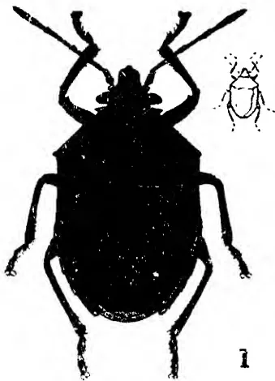

1

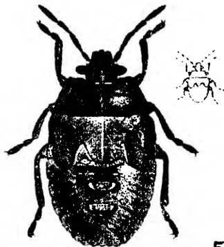

5


2

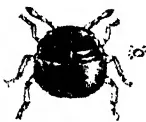

3

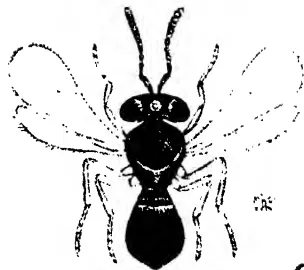

6

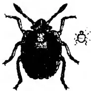

4


7

Gen. de S.  
Insecta

Block by Survey Dept.

THE PADDY PENTATOMID BUG—*Scotinophara (Podops) lurida* Burm.

<table border="0">
<tr>
<td>Fig. 1.—Adult bug, <math>\times 5</math>.</td>
<td>Fig. 4.—Third instar, nymph, <math>\times 5</math>.</td>
</tr>
<tr>
<td>Fig. 2.—Egg-mass, <math>\times 5</math>.</td>
<td>Fig. 5.—Fifth instar nymph, <math>\times 5</math>.</td>
</tr>
<tr>
<td>Fig. 3.—First instar, nymph, <math>\times 10</math>.</td>
<td>Fig. 6.—Adult parasite, <math>\times 20</math>.</td>
</tr>
<tr>
<td colspan="2">Fig. 7.—Parasitized egg-mass, <math>\times 5</math>.</td>
</tr>
</table>

302------------------------------------------------

A completely blank white page with no visible content, text, or markings.

303------------------------------------------------

219

is present in the field they pass down into the cracks in the soil of the fields as well as bunds. The adult bugs after emergence spend a few weeks on the plants feeding occasionally until harvesting time when they retire to their hiding places in the soil in the fields as well as in the adjoining patches of high land and surrounding jungle. Here they remain in inactive retirement till the emergence of the paddy plants of the next season. As soon as the new paddy is about 3 weeks old they invade the paddy again. They do not, however, feed to any appreciable extent and are at first relatively inactive during the day. During the night they generally leave the paddy temporarily and fly about settling down again in the morning. After a few days of such activity, mating and egg laying take place after which the adults gradually die off. The damage inflicted by these insects is caused by the puncturing of the stems and extraction of the sap. If the bugs are few in number there is no appreciable damage done to the plants, but if numerous the vitality of the plants is seriously affected and the plants may be even killed outright. This is particularly so if the plants are attacked during the first two months of growth. Subsequent to this they are capable of resisting the attack even if severe.

#### CONTROL MEASURES

The most effective and practicable control measures for a pest of this sort are those cultural practices associated with good paddy cultivation. They are as follows :—(1) Cleaning up the bunds, the adjoining lands, and the surrounding jungle of weeds and wild grasses either by keeping them regularly cut or by burning. (2) Erecting strong and high bunds. (3) Ploughing in the stubble of the harvest. These measures will destroy large numbers of the adult bugs in their hiding places before the appearance of the paddy plants. If the pest is prevalent in the district, however, further remedial measures must be taken. This consists of (1) carefully watching the young paddy from the 3rd to the 6th week of growth and, if the pest appears, flooding the fields thus drowning the pest. The nymphal stages of the pest are particularly susceptible to this treatment. In order to improve and quicken the effect of flooding, oiling of the flooded fields may be done by using a little kerosene oil. This must be introduced into the inflowing water and thoroughly distributed. The oiled water must be run off after 3–6 hours and the fields subsequently flooded with fresh water so as to wash off the oil completely. (2) Collecting the pest by hand and destroying it. This can be most conveniently done during the 5th or 6th week of growth when the normal weeding of the fields is carried out. The bugs as they are picked may be put into a vessel containing water with a film of kerosene floating

304------------------------------------------------

220

on top. The removal of weeds makes flooding more effective in destroying the pest and also makes the paddy plants more vigorous and capable of withstanding the attack of the bugs.

Another possible control measure is the growing of a small area of paddy a few weeks ahead of the remaining paddy as a trap crop. The pest would be attracted to this from their places of retirement and can be dealt with before the main paddy appears.

The natural enemies of the pest consist of a few predaceous bugs and a Hymenopterous wasp (fig. 6). The former attack and feed on the young nymphs but they are very scarce and their controlling effect quite negligible. The latter parasitizes the eggs of the bug. Eggs 1-3 days old are susceptible to attack. A single parasite egg is laid in each host egg and the parasitized eggs turn a purplish hue as development of the parasite goes on (fig. 7). This is completed in 11 days after which the parasite emerges through an irregular hole which it makes in the cap of the egg. Records taken in the field during the Maha of 1940 give an average parasitism of 89 per cent. This parasite therefore seems capable of effecting quite an appreciable control of the pest under normal conditions.

#### ACKNOWLEDGEMENT

I am greatly indebted to Dr. B. A. Baptist, B.Sc. (Hons.) (Lond.), Ph.D. (Cantab.), Acting Entomologist, for guidance and advice in the preparation of this article.

#### REFERENCES

1. 1. Distant, W. L. .. Fauna of British India, Rhynchota, Vol. I. Page 74 (1902)
2. 2. Dammerman, K. W. .. The Agricultural Zoology of the Malay Archipelago. Page 220 (1929)

305------------------------------------------------

221

## THE RELATIVE RESISTANCE OF SOME COWPEA VARIETIES TO *AGROMYZA PHASEOLI* COQ.

M. FERNANDO, Ph.D. (Lond.), D.I.C.,  
ASSISTANT BOTANIST

**T**HE bean fly (*Agromyza phaseoli* Coq.) is a troublesome pest of cowpeas in Ceylon. Though not so damaging as in beans, the pest is nevertheless responsible for numerous casualties and for considerably reduced yields in cowpeas.

The adult fly deposits its eggs within the leaves soon after the seedlings have appeared above ground. The larvae, when they hatch out, burrow down the petiole and stem, and eventually pupate at ground level. Infested plants wilt and may subsequently die. The plants often exhibit characteristic lesions near the collar where the stem is ruptured by the crowding of larvae and pupae. The hilling up of affected seedlings and the consequent development of adventitious roots at points above these lesions may induce recovery. Infested plants, even if they survive, may however, remain unthrifty.

The pest can be effectively checked by the frequent application of contact insecticides. Elaborate spray schedules, however, entail considerable and recurrent expenditure, and demand skilled supervision, and cannot hence be unreservedly recommended to the village grower.

The search for bean-fly-resistant cowpeas has been attended with some degree of success. Records of bean fly damage made in variety trials set down at the Experiment Station, Peradeniya, in the *yala* season, 1940, demonstrated significant differences in resistance between cowpea varieties, and are presented in this contribution.

### EXPERIMENTAL MATERIAL AND METHODS

*Varieties of Cowpea.*—The performance of 93 varieties of cowpea collected from various parts of the Island had been investigated at Peradeniya during the period 1933–40. In

306------------------------------------------------

222

*yala* 1940, three of the most prolific of these varieties, viz., 18aa buff, V4 and 6, were selected for further trial. Summary descriptions of these three varieties are presented in Table I.

*Design of Experiment.*—The appearance in *yala* 1940, of a severe epiphytotic of bean fly created conditions ideal for susceptibility tests. The tests were superimposed on an investigation of the effect of staking on the yield of the three varieties, 18aa buff, V4 and 6 (Fernando and Fernando, 1941). For the purposes of the present records, staking was considered a dummy treatment. The three varieties were replicated five times in 3/38-acre blocks. The plants were spaced 2 by 2 ft.

*The Experimental Area.*—The soil was a heavy loam with a pH value of 6–6.5, and had carried a crop of sorghum in *maha* 1939–40.

*Planting details.*—The land has been ploughed, harrowed and levelled in the usual way. Three seeds were dibbled per hill on May 28. The percentage germination in 18aa buff and V4 was over 90. The stand in 6 was rather poorer. Blanks were supplied on June 7.

### RESULTS

Records made on June 21, of percentages of plants in the three varieties attacked by bean fly are given in Table 2. The analysis of variance of these data transformed to the appropriate inverse sine scale ( $0 = \text{Sin } \sqrt{p}$ ) is given in Table 3. The variance ratio for varieties surpasses the 0.1 per cent. point, and hence indicates a very high degree of significance. Examination of the variety means given at the foot of Table III. reveals the significant superiority of 18aa buff to the other varieties. V4 and 6 do not differ significantly in susceptibility from one another.

The resistance of 18aa buff to bean fly is of especial interest in view of its other virtues which include *inter alia* a significantly higher yielding capacity than either V4 or 6, and a significantly shorter age than 6 (Fernando and Fernando, 1941).

### SUMMARY

In susceptibility tests set down at the Experiment Station Peradeniya, in the *yala* season, 1940, the variety 19aa buff exhibited a significantly higher degree of resistance to attack by the bean fly than either V4 or 6.

### ACKNOWLEDGEMENT

The writer is indebted to Dr. J. C. Haigh, Botanist, for valuable advice.

307------------------------------------------------

223REFERENCES

Cochran, W. G., 1938 .. Some difficulties in the statistical analysis of replicated experiments. *Empire J. Expt. Agric.* VI., 157-175.

Fernando, M. and Fernando, W. N., 1941 .. Variety and cultural experiments with cowpeas. *The Tropical Agriculturist*, XCVI., No. 3.

Fisher, R. A. and Yates, F., 1938 .. *Statistical tables for biological, agricultural and medical research.* London: Oliver & Boyd.

TABLE IDescription of Cowpea varieties

<table border="1">
<thead>
<tr>
<th>Variety</th>
<th>18aa buff</th>
<th>V4</th>
<th>6</th>
</tr>
</thead>
<tbody>
<tr>
<td>Vernacular name..</td>
<td>Digali-me</td>
<td>Polon-me</td>
<td>Sangu-vellai pai-thangai</td>
</tr>
<tr>
<td>Type ..</td>
<td>Cowpea</td>
<td>Cowpea</td>
<td>Cowpea</td>
</tr>
<tr>
<td>Habit ..</td>
<td>Procumbent</td>
<td>Low, half-bushy</td>
<td>Prostrate</td>
</tr>
<tr>
<td>Leaves ..</td>
<td>Persistent</td>
<td>Persistent</td>
<td>Shed</td>
</tr>
<tr>
<td>Colour of stem ..</td>
<td>green with some green purple pigment</td>
<td>green</td>
<td>green with some purple pigment</td>
</tr>
<tr>
<td>Colour of leaf stalk ..</td>
<td>do.</td>
<td>do.</td>
<td>do.</td>
</tr>
<tr>
<td>Colour of leaf ..</td>
<td>do.</td>
<td>do.</td>
<td>green</td>
</tr>
<tr>
<td>Colour of young pod ..</td>
<td>green</td>
<td>light green with purplish streak</td>
<td>light green</td>
</tr>
<tr>
<td>Colour of mature pod ..</td>
<td>brown</td>
<td>straw with purple blotches</td>
<td>pale straw</td>
</tr>
<tr>
<td>Colour of flower ..</td>
<td>violet</td>
<td>violet</td>
<td>violet</td>
</tr>
<tr>
<td>Pod habit ..</td>
<td>horizontal</td>
<td>horizontal</td>
<td>horizontal</td>
</tr>
<tr>
<td>Pod characters :</td>
<td></td>
<td></td>
<td></td>
</tr>
<tr>
<td>Length ..</td>
<td>7.1 in.</td>
<td>7.7 in.</td>
<td>7.7 in.</td>
</tr>
<tr>
<td>Depth/breadth ..</td>
<td>0.8</td>
<td>0.56</td>
<td>0.73</td>
</tr>
<tr>
<td>Inflated or fully filled ..</td>
<td>inflated</td>
<td>fully filled</td>
<td>fully filled</td>
</tr>
<tr>
<td>Straight, curved or coiled ..</td>
<td>curved</td>
<td>—</td>
<td>curved</td>
</tr>
<tr>
<td>Average No. of seeds per pod ..</td>
<td>13</td>
<td>15</td>
<td>15</td>
</tr>
<tr>
<td>Seed closely or loosely packed ..</td>
<td>closely packed</td>
<td>closely packed</td>
<td>closely packed</td>
</tr>
<tr>
<td>Shape and length of seeds ..</td>
<td>subreniform +0.06 mm.</td>
<td>subreniform +0.06 mm.</td>
<td>subreniform +0.04 mm.</td>
</tr>
<tr>
<td>Colour of seeds ..</td>
<td>burnt sienna</td>
<td>black with occasional maroon or brown spots</td>
<td>burnt sienna</td>
</tr>
<tr>
<td>Locality ..</td>
<td>Koslanda</td>
<td>Peradeniya</td>
<td>Jaffna</td>
</tr>
</tbody>
</table>

308------------------------------------------------

224TABLE II

Percentages of Plants attacked by bean fly

<table border="1">
<thead>
<tr>
<th rowspan="2">Block</th>
<th colspan="3">Variety</th>
</tr>
<tr>
<th>18aa buff</th>
<th>V4</th>
<th>6</th>
</tr>
</thead>
<tbody>
<tr>
<td>I</td>
<td>.. 23.4 per cent. ..</td>
<td>27.5 per cent. ..</td>
<td>58.5 per cent. ..</td>
</tr>
<tr>
<td>II</td>
<td>.. 39.5 ..</td>
<td>80.2 ..</td>
<td>78.3 ..</td>
</tr>
<tr>
<td>III</td>
<td>.. 42.9 ..</td>
<td>78.8 ..</td>
<td>69.7 ..</td>
</tr>
<tr>
<td>IV</td>
<td>.. 14.3 ..</td>
<td>54.8 ..</td>
<td>53.8 ..</td>
</tr>
<tr>
<td>V</td>
<td>.. 22.7 ..</td>
<td>49.0 ..</td>
<td>60.3 ..</td>
</tr>
</tbody>
</table>

TABLE IIIAnalysis of Variance of transformed data ( $\theta = \text{Sin } \sqrt{p}$ )

<table border="1">
<thead>
<tr>
<th></th>
<th>DF</th>
<th>SS</th>
<th>MS</th>
<th>VR</th>
<th>0.1 per cent. point</th>
</tr>
</thead>
<tbody>
<tr>
<td>Stocks</td>
<td>.. 4 ..</td>
<td>852.33 ..</td>
<td>213.08 ..</td>
<td></td>
<td></td>
</tr>
<tr>
<td>Varieties</td>
<td>.. 2 ..</td>
<td>1,336.68 ..</td>
<td>668.34 ..</td>
<td>20.97 ..</td>
<td>18.49 ..</td>
</tr>
<tr>
<td>Error</td>
<td>.. 8 ..</td>
<td>254.93 ..</td>
<td>31.87 ..</td>
<td></td>
<td></td>
</tr>
<tr>
<td>Total</td>
<td>.. 14 ..</td>
<td>2,443.94 ..</td>
<td></td>
<td></td>
<td></td>
</tr>
</tbody>
</table>

Summary of Results

<table border="1">
<thead>
<tr>
<th rowspan="2"></th>
<th colspan="3">Variety</th>
<th rowspan="2">S.E.</th>
</tr>
<tr>
<th>18aa buff</th>
<th>V4</th>
<th>6</th>
</tr>
</thead>
<tbody>
<tr>
<td>Degrees (<math>\theta = \text{Sin } \sqrt{p}</math>)</td>
<td>31.9 ..</td>
<td>50.0 ..</td>
<td>53.4 ..</td>
<td>.. <math>\pm</math> 2.52</td>
</tr>
<tr>
<td>Percentages</td>
<td>.. 28.0 ..</td>
<td>58.7 ..</td>
<td>64.5 ..</td>
<td>..</td>
</tr>
</tbody>
</table>

309------------------------------------------------

225SELECTED ARTICLESHOW DOES COMPOST WORK\*

[In a letter addressed to *The Countryside*, January, 1941, "Farmer" raises the question of how compost exerts its beneficial effect on crops, and suggests that this is largely due to its nitrogen content, and he therefore inquires concerning the cheapest form of the latter available to farmers.]

**D**ESPITE the vast amount of research which has been focussed in recent years on the investigation of the composition and action of humus in the soil, and compost is essentially a form of humus, it is not possible for any one to answer categorically "Farmer's" queries, but the matter is discussed in this article from the point of view of the farmer and it is hoped that these very brief notes on an extremely complex subject may be of assistance to him.

It can be said at once that compost does not merely supply nitrogen to the crop, but potash and phosphate also, and in quantities which are very considerable at the ordinary rates of application of this manure, namely, five to ten tons per acre. Moreover, these plant foods are in a readily available condition in properly made compost.

A normal well-made compost in Southern Rhodesia may be expected to contain approximately 0·8 per cent. of nitrogen, 0·4 per cent. of phosphoric oxide, 1·0 per cent. of potash, and 1·9 per cent. of calcium oxide (lime). When a dressing of 10 cubic yards (approximately 5 tons) per acre is applied to the soil, therefore, the equivalent of about 400 lb. sulphate of ammonia, of 200 lb. of 20 per cent. superphosphate, of 206 lb. of sulphate of potash, and of 190 lb. of calcium oxide or approximately 350 lb. of ground limestone, is added. It will be seen therefore that compost is a complete fertilizer, although it is an unbalanced one for most of our farm crops, with the possible exception of some vegetables, since it is lacking in phosphate (compared with the nitrogen), which is still the principal plant food in which practically all our soils are very deficient, and it supplies comparatively large quantities of nitrogen to the soil. The actual nitrogen added to the soil in the compost is not the end of the story, however, since the organic matter, the lime and the phosphate in the compost all stimulate the activity of the free-living nitrogen-fixing bacteria in the soil, and these make further considerable quantities of nitrogen (obtained from the air) available to the crop.

There is no doubt that the main effect of an application of compost on, say, a crop of maize, *which is observable to the eye*, is the effect of the large nitrogen supply which is seen in the greatly increased growth of leaf and stem. This

---

\* By S. D. Timson, Assistant Agriculturist, in *The Rhodesia Agricultural Journal* Vol. XXXVIII., No. 3, March, 1941.

310------------------------------------------------

226

is to be expected from the analysis, of course, and from what we know by observation of the effect of a dressing of well-rotted kraal manure under favourable conditions, though the nitrogen in the latter is not so readily available as that in compost. However, the analysis shows that large quantities of phosphate and potash are also supplied by compost in a readily available form, and these will affect the growth of the crop and tend to counter-balance the tendency to an excess of nitrogen where large dressings of compost are applied. Evidence of this has repeatedly been seen in the past two or three years on farms where dressings of compost of from 7 to 14 tons per acre have been applied to maize without any additional phosphate or potash. Good yields of grain have been obtained despite the excess of nitrogen, and this could not be expected if dressings of nitrogen alone in the form of, say, sulphate of ammonia equivalent in quantity to the nitrogen in the compost had been applied without any phosphate or potash to balance it.

There is little doubt, however, that better yields of maize would have been obtained in these cases by the application of additional supplies of phosphate in the form of a suitable fertilizer, and perhaps (especially in the case of sandy soils) by additional supplies of potash, though this is unlikely, since the quantity contained in compost is large, as shown above.

Farmers can therefore be recommended to reinforce their dressings of compost applied to crops, by dressings of a suitable phosphatic fertilizer, on soils known to respond to phosphatic fertilizers. Experience on farms indicates that the normal dressing of phosphatic fertilizer can be economically reduced, where 5 to 8 tons of compost per acre are applied, but each farmer should test this for himself on his own fields. It is suggested that he should try reducing his dressing of phosphate to two-thirds, and then to a half of the normal one, and note the results.

That the effect of dressings of compost to crops is not due solely to the nitrogen it contains is indicated by the experiments of Jackson and Wad, where compost containing 110.2 lb. of nitrogen was compared with sulphate of ammonia containing the same quantity of nitrogen, in its effect on the wheat crop. The wheat treated with compost yielded 1,829 lb. of grain and 2,117 lb. of straw per acre, whereas the wheat receiving sulphate of ammonia yielded 1,210 lb. of grain and 1,472 lb. of straw per acre.

The higher yields of wheat produced by the compost are doubtless due in part to the potash, phosphate and other minerals in the compost, and also to the important effects of the humus on the bacterial population of the soil, and the improvement in the crumb-structure or friability of the soil.

Compost (as also farmyard manure), is such a complex substance and some of its reactions on the soil and plant growth are so indirect, and so dependent on varying soil and climatic conditions, that it will never be possible to reduce its beneficial effects on crops to terms of nitrogen, phosphate and potash alone.

What the farmer requires to know is whether its action in the soil can be economically reinforced by additional phosphate, potash, or nitrogen in the form of fertilizers or in any other way. As already suggested, it can be usefully

311------------------------------------------------

227

and economically reinforced with light dressings of phosphatic fertilizers, but except under exceptional circumstances it is unlikely that additional dressings of nitrogen or potash will be economic.

Now with regard to the suggestion by "Farmer" that experiments should be made to determine the cheapest way to supply a nitrogen deficiency in our soils, there can be little doubt that this can be most economically done by applying compost. On the basis of the analysis given above a 5-ton dressing per acre will supply nitrogen equivalent to 400 lb. of sulphate of ammonia. From reliable costings of making compost we can now say with assurance that a 5-ton dressing of compost should not cost more than 7s. 6d. to make, and 1s. 8d. to cart and spread on an acre of land, a total of 9s. 2d. for native labour and rations. If we neglect the phosphate and potash in the compost and charge all the cost of making and spreading it to the nitrogen, the cost of the equivalent of 400 lb. of sulphate of ammonia is 9s. 2d. spread on the land. The same dressing of nitrogen applied as sulphate of ammonia would cost in cash f.c.r. Salisbury at the pre-war price (£9 15s. 0d. per ton) approximately 39s. and at present prices (if it is obtainable) much more, actually £3 12s. 0d.

The green-manure crop is another cheap source of nitrogen, since the top growth of a well grown crop of sunn-hemp when ploughed under will return to the soil about 210 lb. of nitrogen per acre, or the equivalent of 1,050 lb. (approximately) of sulphate of ammonia at a cost of, say 20s. per acre. The nitrogen contained in the root system of the sunn-hemp is an unknown factor, but we know from research in America that in the root system of a good velvet bean crop there is about 10 lb. of nitrogen per acre, which is equivalent to about 50 lb. of sulphate of ammonia. If this figure be taken for the nitrogen in the root system (it is sufficiently near for the present purpose), we arrive at a total nitrogen content of the sunn-hemp crop of 200 lb., which is equivalent to 1,100 lb. of sulphate of ammonia. However, only two-thirds of this nitrogen (approximately) is obtained from the air through the agency of the legume bacteria, so the whole sunn-hemp crop adds only some 146 lb. of new nitrogen to the soil. This is equivalent to 733 lb. of sulphate of ammonia. There is this great difference, however, between compost and fertilizers on the one hand, and the green manure crop on the other, namely that the land under green manure is idle, in the sense that it is not producing a cash crop or one which can be converted into cash through the agency of stock.

It would appear to be fair therefore to charge to the green manure crop as a source of nitrogen the profit, which might be expected from a cash crop, which might have been grown on the land occupied by the green manure.

Land which would normally be green manured in the maize belt may be expected to produce 8 bags an acre, and the profit per bag may be taken to be 2s. 6d. Therefore the sum of 20s. is to be added to the cost of producing and ploughing under the sunn-hemp (20s. per acre) making the total cost of producing the nitrogen equivalent to 733 lb. of sulphate of ammonia at 40s. or approximately 21s. 9d. for nitrogen equivalent to 400 lb. of sulphate of ammonia, our basis of comparison with compost.

312------------------------------------------------

228

We finally arrive at the cost of supplying to the soil 80 lb. of nitrogen, or its approximate equivalent of 400 lb. of sulphate of ammonia, to be 9s. 2d. as compost; 21s. 9d. in the form of sunn-hemp ploughed in, and 72s. as sulphate of ammonia at present prices, or 39s. at pre-war prices of this fertilizer.

Of course, all the nitrogen in compost or in green manures is not available to crops in the year of application, since a proportion remains bound up in the humus until the following year, but we are concerned at the moment with the cheapest source of nitrogen on the farm, and it is clear from the above facts that the nitrogen in the compost and in green manures is very much cheaper than that in the cheapest artificial fertilizer source of nitrogen.

The subject has been pursued at some length as it is considered desirable once again to emphasize the fact that the nitrogen supply for the soil should be produced on the farm as far as this is possible, since it is a very expensive item to purchase in the form of fertilizer. The estimates given above illustrate in a practical form how much cheaper it is for the farmer to manufacture his own supplies of nitrogen on the farm rather than purchase it in the form of artificial fertilizer.

Of course, this is not the whole story of nitrogen supply on the farm by a long way, since there are occasions when only a nitrogenous fertilizer, alone, or, perhaps, in combination with the green manure or compost (as in the growing potatoes) can be used, particularly in the case of the tobacco crop, and in top-dressing pastures, or crops temporarily suffering from nitrogen starvation. Nevertheless, if the farmer properly maintains the nitrogen supply in his soil by green manuring, by applying compost, and by ploughing under the stubble of legumes and grass hay crops, he will seldom require to purchase nitrogenous manures for he will in those ways maintain the humus content of the soil, and it must be remembered that the humus in the soil is the source of all the nitrogen consumed by crops, except where it is added to the soil in the form of inorganic fertilizers.

It should be mentioned here that maize has not given an economical response to nitrogenous fertilizers in experiments carried out at the Salisbury Experiment Station during the seasons 1929-30 and 1930-31. In the former year nitrate of soda was applied at the rate of 75 lb. per acre and 150 lb. per acre in the drills when the seed was sown, and at 75 lb. per acre broadcast when the maize was between 6 and 7 inches high. No beneficial effect on the yield of maize was recorded.

In 1930-31 a top dressing of 100 lb. of nitrate of soda per acre was applied along the row of plants (*a*) when they were 12 to 24 inches high; (*b*) when the plants were near the flowering stage; (*c*) from the time when the maize was 12 inches high in weekly applications of 25 lb. each. The cost of 100 lb. of nitrate of soda at that time was 16s. (it is now 16s. 6d.). In this experiment increases in yield of maize over the control were for the three methods of application as follows—(*a*) 0.72 bags per acre; (*b*) 1.74 bags; (*c*) 1.85 bags per acre. These increases, however, were not statistically significant and may therefore have been due to chance. Even the greatest increase in yield (1.85 bags per acre) was not profitable.

313------------------------------------------------

229

In both experiments a basic dressing of 400 lb. of potassic superphosphate per acre was applied during preparation of the soil in order to ensure that a lack of either potash or phosphate should not interfere with the response of the maize to nitrogen. Furthermore, at the Potchefstroom School of Agriculture no significant response by maize to applications before planting of 100 lb. of sulphate of ammonia or of 133 lb. per acre of nitrate of soda, since the experiment was commenced in 1932, either in the form of increases in yield of grain or of stover, was shown. A basic dressing of 200 lb. per acre of superphosphate is applied annually.

With regard to "Farmer's" suggestion that the effect of the method of applying compost to the soil might affect its value, this is being investigated on the Witchweed Demonstration Farm near Whitecliffe. The indications at present are that covering the compost by ploughing is more beneficial to the maize crop than covering by disc-harrow, as evidenced by the considerably stronger growth and darker green colour of the maize, where the compost was ploughed in. Farmers are advised to try this simple experiment in order to obtain information concerning the matter under their own conditions of soil and climate.

The very important beneficial effect of compost, green manure or kraal manure, on the crumb structure or friability of the soil, since this is largely due to their humus content, must necessarily be only temporary since humus in the soil is continually being destroyed in arable land in this Colony by the action of micro-organisms. This is especially true of our soils, since the high soil temperature increases the activity of these organisms. The work of Mohr has demonstrated that humus will not accumulate in well-drained soils when the average temperature is 77° Fahrenheit or higher, as is usually the case in this Colony, during the summer months of October to April. It is probable, too, that destruction of humus in the surface soil during the winter months is furthered by other agencies, including the action of sunlight.

For these reasons the farmer in this Colony must face the necessity of continually replenishing the supply of humus in the soil by green manuring, compost, kraal manure, and the stubbles of legumes and other annual hay crops. The great efficiency of temporary grass leys in restoring the crumb structure and humus content of the soil has been demonstrated in other countries throughout the world and is under investigation here, and should be borne in mind. If the farmer maintains the humus content of his soil in these ways he will automatically maintain the nitrogen supply at the same time, since humus is the only source of nitrogen in the soil for plant growth, except where it is added in the form of inorganic fertilizers.

A good humus supply in the soil, secured by the methods indicated above, will also normally ensure a good supply of potash, but the farmer will always need to maintain the phosphate supply in the soil by the addition of phosphates, excepting only, perhaps, in the case of certain heavy black soils, on which dressings of sulphate have not proved effective in Matabeleland.

It is possible that the mycorrhizal association with the roots of our crops may prove to be an important factor in the success of compost. Roots of maize grown on land dressed with compost on the Witchweed Demonstration

314------------------------------------------------

230

Farm last season were forwarded to Sir Albert Howard, and were found by the leading authority on the subject to be thoroughly permeated with mycorrhizal hyphae. The mycorrhizal association has been proved by this Department to be essential to the successful culture of certain pine trees in this Colony.

It is also possible that part of the beneficial effect of compost may be ascribed to the action of some plant-stimulating and growth-regulating substances known as Hormones, which are akin in their action on plant growth to vitamins in the food of man, but this is not sufficiently established at present to be accepted without reserve.

Much research has been directed in recent years to the "deficiency diseases" of crops, due to the absence or deficiency in some soils of the rarer elements such as boron, copper, zinc, and manganese. In a number of cases these diseases have been cured by applications of compost or farm yard manure, which contain most of these rarer elements in minute, but sufficient quantities. A boron deficiency disease of oranges has recently been demonstrated on the Mazoe Citrus Estate.

It may perhaps be claimed that sufficient has been said to indicate the intricacy of the problem "How does compost work?" It is such a vast subject that despite the tremendous amount of research which has been devoted to it in recent years it is certain that this question cannot be answered in full for many generations, if ever. Nevertheless, the farmer can remain assured that he has in compost a valuable and cheap source of fertility for his soils, which normally requires reinforcement only with comparatively small additions of phosphate to make it suitable for use for all our principal farm crops.

That some 615 of our farmers have made, during the past year nearly 150,000 cubic yards of compost is sufficient evidence that its value is being widely appreciated. And the fact that individual farmers have made such large quantities during the year as 4,320, 4,400 and 3,000 cubic yards respectively indicates that it is cheap to make, and this is supported by accurate costings which are now available.

315------------------------------------------------

231EFFECT OF THE SOIL MULCH.\*

**F**ORMERLY it was accepted without question that the loosening of the first few inches of surface soil by means of harrows or other implements was an aid to the conservation of the moisture in the lower soil. In spite of the fact that many findings during the past twenty years cast some doubt on the validity of this theory, there are still many farmers who believe in the effectiveness of a soil mulch under dry-land-farming conditions. The reason for this belief is partly due to the fact that the movement of moisture in the soil is not always correctly understood.

REAL AND APPARENT CAPILLARY MOISTURE

Capillary moisture such as appears in the soil can be divided into two types, viz., real capillary moisture and apparent capillary moisture. *Real capillary moisture* occurs in conjunction with underground water, *i.e.*, within two or three feet above the level of underground water. In this zone the typical capillary movement of the moisture can be detected and may be compared with that of paraffin in the wick of a lamp. This upward movement can be inhibited by breaking the capillary tubes. In practice, therefore, the loss of moisture as a result of evaporation on the surface can be reduced by cultivation, *i.e.*, by establishing a mulch. It seldom occurs, however, that the natural level of underground water is only three feet below the surface of the soil.

If dry soil is irrigated and it is found after a while that the soil is moist to a depth of four feet, those four feet of surface soil are said to be saturated to their "field water capacity". The movement of moisture to the drier sub-soil takes place very slowly, since this type of moisture, which is also known as *apparent capillary moisture*, moves mainly in the form of vapour. The same applies to the loss of moisture to surface soil already desiccated. A break-down in the capillary tubes in the soil caused, for example, by cultivation can therefore have only a slight practical effect, if any, on the conservation of moisture in the soil.

As long ago as 1914 Burr found that a soil mulch does not to any marked extent prevent the loss of soil moisture, and in 1917 Harris and Jones expressed the view that *cultivation of the soil was much more important as a means of controlling weeds than of maintaining a mulch for moisture conservation*. Little attention was given to these views, however, since the results achieved by other research workers appeared to prove the contrary; but when Veihmeyer came to the same conclusion in 1927 his findings were accepted by experts as

---

\* By L. L. Eksteen and Dr. M. van der Spuy, Glen College of Agriculture, in *Farming in South Africa*, February, 1941.

316------------------------------------------------

232

conclusive. During 1934-35 Esselen obtained the same results on light, sandy soil. In 1938 a similar experiment was repeated on a heavy, clayey soil at the Glen College of Agriculture since it is still believed by some that a soil mulch delays evaporation in this type of soil.

### PROCEDURE OF EXPERIMENT

The treatments consisted of the cultivation of the soil to a depth of four inches and the eradication of weeds at the same time as against no cultivation and the removal of weeds by hand, care being taken to disturb the surface of the soil as little as possible.

The plots measured 20 feet by 28 feet, a strip 4 feet wide being left between them in order to obviate the possibility of moisture moving from one plot to the other. Each treatment was replicated five times in a randomized block arrangement. The method of sampling adopted was that described by Esselen in the January 1937 issue of *Farming in South Africa*.

The experiment lasted from May 12, 1938, to April 28, 1939, and in all 2,800 samples of soil were taken for moisture determinations. The variation in soil texture over the whole area covered by the experiments was exceptionally small.

Table I. reflects the mechanical composition of the soil taken from one of the plots.

TABLE I.—Mechanical Composition of the Soil.

<table border="1">
<thead>
<tr>
<th>Depth</th>
<th colspan="8">Hyg. &gt;2 mm. 2-2 mm. .2-.02 mm. .02-.002mm. &lt;.002 mm.<br/>Moisture.</th>
</tr>
</thead>
<tbody>
<tr>
<td>0-12 in.</td>
<td>..</td>
<td>3.15</td>
<td>..</td>
<td>0</td>
<td>..</td>
<td>2.64</td>
<td>..</td>
<td>52.1</td>
<td>..</td>
<td>10.25</td>
<td>..</td>
<td>33.75</td>
</tr>
<tr>
<td>12-24 in.</td>
<td>..</td>
<td>3.45</td>
<td>..</td>
<td>0</td>
<td>..</td>
<td>1.56</td>
<td>..</td>
<td>44.6</td>
<td>..</td>
<td>13.25</td>
<td>..</td>
<td>37.50</td>
</tr>
<tr>
<td>24-36 in.</td>
<td>..</td>
<td>3.59</td>
<td>..</td>
<td>0</td>
<td>..</td>
<td>0.75</td>
<td>..</td>
<td>35.8</td>
<td>..</td>
<td>18.50</td>
<td>..</td>
<td>40.00</td>
</tr>
</tbody>
</table>

Owing to the presence of a high percentage of fine sand, clay and silt, the soil tends to form deep fissures on drying. If the soil is somewhat dry, cultivation is exceptionally difficult, since large hard clods are formed. Irrigation water is absorbed very slowly.

The experiment was commenced on May 12, 1938, when all the plots were irrigated, 4 inches of water being applied. On May 21, the first samples were taken and on May 24, the five cultivated plots were loosened to a depth of 4 inches with a special fork. On September 29 a second irrigation of 5.7 inches and on October 4 a third of 1.6 inches, a total therefore of 7.3 inches, were given. On October 10, samples of the plots were taken and on October 11, the soil of the cultivated plots was loosened once more. The rainfall during the period covered by the experiment is given in Table II. After every appreciable fall of rain the soil mulch was restored.

317------------------------------------------------

233TABLE II

<table border="1">
<thead>
<tr>
<th colspan="2">Date.</th>
<th>Precipitation<br/>in inches.</th>
<th colspan="2">Date.</th>
<th>Precipitation<br/>in inches.</th>
</tr>
</thead>
<tbody>
<tr>
<td colspan="3">1938.</td>
<td colspan="3">1939.</td>
</tr>
<tr>
<td>May</td>
<td>14</td>
<td>.. .09</td>
<td>Jan.</td>
<td>1</td>
<td>.. 1.41</td>
</tr>
<tr>
<td>June</td>
<td>1</td>
<td>.. .03</td>
<td>"</td>
<td>10</td>
<td>.. .06</td>
</tr>
<tr>
<td>"</td>
<td>9</td>
<td>.. .02</td>
<td>"</td>
<td>11</td>
<td>.. .30</td>
</tr>
<tr>
<td>"</td>
<td>10</td>
<td>.. .01</td>
<td>"</td>
<td>13</td>
<td>.. .06</td>
</tr>
<tr>
<td>"</td>
<td>13</td>
<td>.. .06</td>
<td>"</td>
<td>20</td>
<td>.. .09</td>
</tr>
<tr>
<td>"</td>
<td>14</td>
<td>.. .24</td>
<td>"</td>
<td>21</td>
<td>.. .41</td>
</tr>
<tr>
<td>"</td>
<td>15</td>
<td>.. .09</td>
<td>"</td>
<td>23</td>
<td>.. .15</td>
</tr>
<tr>
<td>"</td>
<td>17</td>
<td>.. .06</td>
<td>"</td>
<td>28</td>
<td>.. .14</td>
</tr>
<tr>
<td>"</td>
<td>18</td>
<td>.. .13</td>
<td>"</td>
<td>29</td>
<td>.. .12</td>
</tr>
<tr>
<td>"</td>
<td>19</td>
<td>.. .07</td>
<td>"</td>
<td>30</td>
<td>.. .70</td>
</tr>
<tr>
<td>"</td>
<td>20</td>
<td>.. .06</td>
<td>"</td>
<td>31</td>
<td>.. .15</td>
</tr>
<tr>
<td>July</td>
<td>6</td>
<td>.. .30</td>
<td>Feb.</td>
<td>1</td>
<td>.. .10</td>
</tr>
<tr>
<td>"</td>
<td>7</td>
<td>.. .02</td>
<td>"</td>
<td>8</td>
<td>.. .25</td>
</tr>
<tr>
<td>Aug.</td>
<td>2</td>
<td>.. .02</td>
<td>"</td>
<td>11</td>
<td>.. .28</td>
</tr>
<tr>
<td>"</td>
<td>27</td>
<td>.. .17</td>
<td>"</td>
<td>13</td>
<td>.. .11</td>
</tr>
<tr>
<td>"</td>
<td>28</td>
<td>.. .08</td>
<td>"</td>
<td>14</td>
<td>.. .08</td>
</tr>
<tr>
<td>Sept.</td>
<td>8</td>
<td>.. .01</td>
<td>"</td>
<td>15</td>
<td>.. .05</td>
</tr>
<tr>
<td>Oct.</td>
<td>2</td>
<td>.. .18</td>
<td>"</td>
<td>17</td>
<td>.. .51</td>
</tr>
<tr>
<td>"</td>
<td>3</td>
<td>.. .16</td>
<td>"</td>
<td>21</td>
<td>.. .12</td>
</tr>
<tr>
<td>"</td>
<td>4</td>
<td>.. .10</td>
<td>"</td>
<td>22</td>
<td>.. .10</td>
</tr>
<tr>
<td>"</td>
<td>10</td>
<td>.. .37</td>
<td>"</td>
<td>23</td>
<td>.. .20</td>
</tr>
<tr>
<td>"</td>
<td>21</td>
<td>.. .04</td>
<td>"</td>
<td>28</td>
<td>.. .07</td>
</tr>
<tr>
<td>"</td>
<td>24</td>
<td>.. .50</td>
<td>March</td>
<td>5</td>
<td>.. .05</td>
</tr>
<tr>
<td>"</td>
<td>25</td>
<td>.. .36</td>
<td>"</td>
<td>8</td>
<td>.. .03</td>
</tr>
<tr>
<td>"</td>
<td>29</td>
<td>.. .81</td>
<td>"</td>
<td>9</td>
<td>.. .38</td>
</tr>
<tr>
<td>"</td>
<td>30</td>
<td>.. .02</td>
<td>"</td>
<td>10</td>
<td>.. .08</td>
</tr>
<tr>
<td>Nov.</td>
<td>3</td>
<td>.. .36</td>
<td>"</td>
<td>29</td>
<td>.. .08</td>
</tr>
<tr>
<td>"</td>
<td>4</td>
<td>.. .26</td>
<td>"</td>
<td>30</td>
<td>.. 1.23</td>
</tr>
<tr>
<td>"</td>
<td>9</td>
<td>.. .12</td>
<td>"</td>
<td>31</td>
<td>.. .04</td>
</tr>
<tr>
<td>"</td>
<td>15</td>
<td>.. .45</td>
<td>April</td>
<td>2</td>
<td>.. .57</td>
</tr>
<tr>
<td>"</td>
<td>29</td>
<td>.. .42</td>
<td>"</td>
<td>4</td>
<td>.. .20</td>
</tr>
<tr>
<td>"</td>
<td>30</td>
<td>.. .76</td>
<td>"</td>
<td>14</td>
<td>.. .20</td>
</tr>
<tr>
<td>Dec.</td>
<td>2</td>
<td>.. .04</td>
<td>"</td>
<td>18</td>
<td>.. .02</td>
</tr>
<tr>
<td>"</td>
<td>11</td>
<td>.. .11</td>
<td></td>
<td></td>
<td></td>
</tr>
<tr>
<td>"</td>
<td>18</td>
<td>.. .25</td>
<td></td>
<td></td>
<td></td>
</tr>
<tr>
<td>"</td>
<td>25</td>
<td>.. .44</td>
<td></td>
<td></td>
<td></td>
</tr>
<tr>
<td>"</td>
<td>26</td>
<td>.. .32</td>
<td></td>
<td></td>
<td></td>
</tr>
<tr>
<td>"</td>
<td>27</td>
<td>.. 1.75</td>
<td></td>
<td></td>
<td></td>
</tr>
<tr>
<td>"</td>
<td>28</td>
<td>.. .05</td>
<td></td>
<td></td>
<td></td>
</tr>
</tbody>
</table>

318------------------------------------------------

234DISCUSSION

The results show that there is no practical difference between these two treatments. If a soil mulch is made with a view to conserving soil moisture it does not answer its purpose.

The maintenance of a soil mulch, however, offers other advantages which should not be overlooked. These advantages are the following :—

*Weed Control.*—There is no cheaper and quicker method of weed control than soil cultivation. If weed control is neglected crops are deprived of plant foods and moisture, with the result that production suffers. Moisture determinations made on the first foot of soil from plots in another experiment reveal that a plot overgrown by weeds contains 4·5 per cent. moisture, whereas one on which clean cultivation had been carried out, contained 7·0 per cent. moisture. The average yield of air-dried material in lb. per morgen for the two treatments in this experiment was as follows :—

<table border="1">
<thead>
<tr>
<th colspan="3">Weed Infested Plots.</th>
<th colspan="2">Clean Plots.</th>
</tr>
<tr>
<th>Weeds.</th>
<th>Stalks.</th>
<th>Grain.</th>
<th>Stalks.</th>
<th>Grain.</th>
</tr>
<tr>
<th>lb.</th>
<th>lb.</th>
<th>lb.</th>
<th>lb.</th>
<th>lb.</th>
</tr>
</thead>
<tbody>
<tr>
<td>8,852 ..</td>
<td>3,015 ..</td>
<td>160 ..</td>
<td>5,777 ..</td>
<td>1,718 ..</td>
</tr>
</tbody>
</table>

These figures clearly prove the following :—

1. (1) Weeds deprive crops of moisture.
2. (2) The high yield of weeds must necessarily remove many nutrients from the soil. Fertilizing of the soil should be practised in conjunction with cultivation.
3. (3) Under conditions such as those which prevailed during the experiment, the grain yield may be increased ten-fold, provided proper cultivation is carried out.

In these circumstances, therefore, there is little danger of over-cultivation in maize lands, since the weeds grow apace during the summer months. The most effective method of control is cultivation while the weeds are still in their early stages of growth.

*Reduction of Run-off.*—Soil cultivation directly aids the conservation of rain water since it improves the absorption capacity of the soil, thereby greatly reducing run-off. It is during heavy downpours that the beneficial effect really becomes obvious. In another experiment carried out at Glen, it was established that the percentage of run-off was as reflected in Table III.

**TABLE III.—Run-off from Uncultivated and Cultivated Soil**

<table border="1">
<thead>
<tr>
<th rowspan="2">Precipitation</th>
<th rowspan="2">Time<br/>(in minutes)</th>
<th colspan="2">Run-off from</th>
</tr>
<tr>
<th>Uncultivated<br/>Soil<br/>per cent.</th>
<th>Cultivated<br/>Soil<br/>per cent.</th>
</tr>
</thead>
<tbody>
<tr>
<td>0·15 inch ..</td>
<td>25 ..</td>
<td>8·3 ..</td>
<td>—</td>
</tr>
<tr>
<td>0·21 inch ..</td>
<td>12 ..</td>
<td>43·0 ..</td>
<td>21·7</td>
</tr>
<tr>
<td>0·25 inch ..</td>
<td>70 ..</td>
<td>9·2 ..</td>
<td>—</td>
</tr>
<tr>
<td>0·32 inch ..</td>
<td>13 ..</td>
<td>39·1 ..</td>
<td>—</td>
</tr>
<tr>
<td>0·35 inch ..</td>
<td>34 ..</td>
<td>41·3 ..</td>
<td>—</td>
</tr>
<tr>
<td>0·50 inch ..</td>
<td>297 ..</td>
<td>10·6 ..</td>
<td>3·0</td>
</tr>
<tr>
<td>0·53 inch ..</td>
<td>65 ..</td>
<td>38·0 ..</td>
<td>5·3</td>
</tr>
<tr>
<td>1·29 inch ..</td>
<td>650 ..</td>
<td>22·4 ..</td>
<td>3·1</td>
</tr>
</tbody>
</table>

319------------------------------------------------

235

*Prevention of Wind Erosion.*—Soils containing a large percentage of fine sand and little clay tend to become wind-blown. This condition is common in many places in the Glen area, but in the western districts especially, farmers sometimes experience great difficulty with this type of soil. Drifting usually commences after the surface has been levelled by rains. Consequently, cultivation of such soils with harrows and other implements after rains with a view to restoring a broken crust in the surface soil appears to offer the only solution. In this respect the same run-off experiment at Glen yielded further interesting results. The uncultivated plot which was free from grass and other crops lost 160 lb. of soil during the period July 1, 1939, to August 31, 1940, whereas the cultivated plot which also had no vegetal cover lost only 33 lb. *i.e.*, 8 tons and 1½ ton per morgen respectively.

### CONCLUSIONS

(1) From the experiments described above it cannot be deduced that a soil mulch has any noticeable effect on the evaporation of moisture from soil in which the underground water level is very deep.

(2) The crop yield can be greatly increased by controlling weeds effectively during the early stages.

(3) Cultivation of the soil reduces run-off.

(4) Soils cultivated to a rough, broken surface do not easily become wind-blown.

320------------------------------------------------

236

## MEETINGS, CONFERENCES, &c.

### REPORT OF THE PROCEEDINGS OF THE SECOND MEETING OF THE CENTRAL BOARD OF AGRICULTURE HELD IN THE BOARD ROOM OF THE DEPARTMENT OF AGRICULTURE AT PERADENIYA, ON MONDAY, FEBRUARY 10, 1941, AT 11 a.m.

**M**R. M. CRAWFORD, Acting Director of Agriculture, presided, and the following members were present:—Sir James Obeyesekere, Sir Wilfred de Soysa, Messrs. C. Arulambalam, R. H. Bassett (Commissioner for Development of Agricultural Marketing), Dr. Reginald Child (Director, Coconut Research Scheme), Messrs. C. M. W. Davies, C. N. E. J. de Mel (Principal, School of Agriculture), R. H. de Mel, Wace de Niese, George E. de Silva, M.S.C., G. de Soysa (Registrar of Co-operative Societies), A. M. Clement Dias, T. B. Ellepola, Dr. J. C. Haigh (Botanist), Messrs. C. E. Hamilton, J. J. Heider, K. Kanakasabai, W. C. Lester-Smith, A. E. Madawala, Mudaliyar S. Muttutamby, Dr. R. V. Norris (Director, Tea Research Institute of Ceylon), Messrs. T. E. H. O'Brien (Director, Rubber Research Scheme), M. Park (Acting Deputy Director of Agriculture), Dr. S. C. Paul, Dr. W. R. C. Paul, Messrs. Wilmot A. Perera, T. B. Poholiyadde, F. A. E. Price, T. M. Saba Ratnam, Rolf Smerdon, R. H. Spencer Schrader, T. A. Strong (Conservator of Forests), S. G. Taylor (Director of Irrigation), U. B. Unamboowe, Mudaliyar H. E. S. Wickramaratne, Mudaliyar N. Wickramaratne, Messrs. A. A. Wickramasinghe, C. L. Wickremesinghe (Commissioner of Lands), Col. T. Y. Wright, and Mr. S. C. Fernando, Secretary.

The following members had expressed their inability to be present:—Messrs. H. W. Amarasuriya, M.S.C., W. H. Attfield, James P. Fernando (Chairman, Low-Country Products Association of Ceylon), Bruce S. Gibbon, R. C. Kannangara, M.S.C., T. B. Panabokke, Adigar, Marcus S. Rockwood, R. C. Scott (Chairman, Planters' Association of Ceylon), S. Sivapalan, E. R. Tambimuttu, M.S.C., and Rev. Father L. W. Wickramasinghe.

The following visitors were also present:—Dr. M. Fernando, Dr. D. E. V. Koch, Messrs. J. E. Senaratne and G. V. Wickramasekera.

#### CONFIRMATION OF MINUTES

The minutes of the 1st meeting were confirmed, subject to a correction from Mr. A. M. Clement Dias.

321------------------------------------------------

237

### ELECTION OF EXECUTIVE COMMITTEE OF THE BOARD

The following were elected :—Sir Wilfred de Soysa, Messrs. C. M. W. Davies, Bruce Gibbon, K. Kanakasabai, Wilmot A. Perera, Rolf Smerdon, Mudaliyar S. Muttutamby, and Mudaliyar H. E. S. Wickremaratne.

### STATEMENT BY THE BOTANIST

The Chairman in calling upon Dr. Haigh to present his statement explained to the Board that it covered just a few of his Division's activities, and was in the form of a Progress Report since the last statement. Dr. Haigh dealt in some detail with four important crops, viz., kapok, castor, cinchona and sugar.

*Kapok*.—Had great possibilities in Ceylon. Ceylon kapok in England fetched sixpence a pound and was used for stuffing cushions and mattresses. Java sent a grade which fetched twopence more and was used for life-saving appliances such as life belts, life jackets, and seaplane floats. The Department found that there was no essential difference between the two grades, and their experience with a cleaning machine was happy in that it enabled them to produce a sample to be tested for the Board of Trade by the Ministry of Shipping. The samples were reported to be of the standard required for life-saving appliances, and there was a prospect of good business. If Ceylon could replace Javanese exports to Britain, Ceylon exports thereto would rise by 100 per cent. The world trade was near 30,000 tons of which Java had a virtual monopoly, but Java maintained her position owing to three factors (1) she exported a superior product (2) she guaranteed its superiority (3) she guaranteed its quality and identity. India, and even Ceylon on the other hand, appeared to send kapok adulterated with other fibres such as Bombax (S. Katuimbul), and Wara (Sinhalese) a shrub growing near the sea in the Dry Zone.

A superior product from Ceylon could tap the markets of Australia, which imported 4,500 tons annually, the U. S. A. (15,000), New Zealand (1,200) and Singapore (1,000) tons.

Kapok was essentially a village industry. 90 per cent. of the crop in Java was grown by smallholders on their boundaries, and cleaned and exported by a central factory, and Ceylon could have a similar system. A scheme to make purchases in the villages was now with the Ministry of Agriculture, and the Department was awaiting its approval. This would be a valuable sideline in rural economy.

*Castor*.—Selected seed had been sent to Colombo for extraction by the British Ceylon Corporation. There were no technical difficulties. The Medical Department found it to be up to pharmaceutical standards. About two years from now the whole of the castor oil used by that Department should be from seed locally grown and oil locally manufactured.

*Cinchona*.—The first trial area was planted near Welimada three months ago. They were hoping to plant another area in the Wet Zone this year. If cinchona could grow in the Uva patnas there would be an enormous expansion in cultivation, as so much land was available. The experiments of the Forest Department in Welimada gave room for optimism.

3—J. N. A 2684 (3/41)

322------------------------------------------------

238

*Sugar.*—Their first trials in the Eastern Province had been completed. They had still to learn, but it would be no idle dream to produce all the Island's requirements in due course. There were over 30 varieties to choose from without taking into account the possibilities of local breeding and improvement; they had also to determine the best seasons, agricultural practices, and above all, action in the field and reaction at the factory. Other countries had found that the best variety in the field did not necessarily give the best results in the factory.

The mention of "factory" often conjured up visions of capitalistic exploitation. But if Ceylon were to produce locally the 70,000 tons imported annually of which 92 per cent. was refined, large scale operations were inevitable. This did not however preclude the smaller grower: growing was one thing extraction another. Besides, 8 per cent. of total imports, *i.e.*, nearly 6,000 tons of crude unrefined sugar, could be supplied by village industry entirely.

Comparisons with India could be very misleading. Sugar cane had been grown there for over 2,500 years—during the whole of which the sugar industry had given the raw material for jaggery, &c. Just now the position was changing, and two years ago figures showed that India produced  $4\frac{1}{2}$  million tons, of which 72 per cent. was jaggery, 2 per cent. planting material, 2 per cent. factory sugar, 13 per cent. chewing and 11 per cent. local sugar refining. The bulk of the sugar in India was consumed by the peasant who wanted it, and would want it, in the form of raw sugar. In Ceylon they were starting from the beginning, and the need to be supplied was overwhelmingly of sugar in the refined form.

*Mudaliyar N. Wickramaratne* said he was interested chiefly in sugar as a village industry and referred to a memorandum he had sent up earlier. He had also in 1937 suggested sugar as a village industry for the consideration of the Board. Growers in Galle District seemed to need advice and help. The Department had promised to do so after experimentation. They were still experimenting.

He said there were opportunities already for crude sugar as there were over 1,000 acres of cane in Galle District. Food crops could be interplanted too.

*Mudaliyar Wickramaratne* referring to his visits to Coimbatore and Mysore in 1939 and 1940 drew comparisons with methods. Why not import a successful Coimbatore variety? he asked. He had heard that one such had ousted all the experimental products in Bihar, Central Provinces and the United Provinces. One variety should do for the Dry Zone and another for the Wet. The Mahavamsa was authority to show that we grew sugar cane 2,000 years ago. In early British times the Elphinstones and Winters had produced sugar cane and his own grand uncle had a steampower plant for making sugar. They were all varieties from Mauritius. When he (the speaker) visited Kiliveddi lately he was disappointed with the whole experiment and worst of all a rubber roller was used for extracting juice. He added that he thought this work was one for an agricultural chemist rather than a Botanist.

There was tremendous overproduction in India, but an International agreement had banned exports. A barter arrangement of Ceylon coconuts for Indian sugar might however be considered.

323------------------------------------------------

239

Answering Mudaliyar Wickramaratne, *Dr. Haigh* said that 11 varieties from Coimbatore were planted. India had experimented for thirty years, not thirteen. Ten years ago less than 25 per cent. of Indian grown sugar was of improved varieties, but the figure is increasing year by year. This Department's experiments had lasted only sixteen months. Indian research had established that sampling of the kind done in Ceylon was quite reliable and that large scale extraction-trial, at least at the preliminary stages, was not necessary. *Dr. Joachim*, the Chemist, was now looking out for small-scale machinery in India.

*Mr. George E. de Silva* inquired what was the best elevation for cinchona, and where seeds were available. He had found it difficult to obtain seeds from the Department, although at one time it was an industry like tea or rubber. About sugar cane experiments he thought there should be a more practical approach.

*Col. Wright* said he once obtained seed from an Up-country estate, but most of it was destroyed by insects. Many years ago he had an estate on which there were thousands of trees, but cinchona went down to a penny a pound and all the trees were cut out.

*Mr. Rolf Smerdon* asked where he could see a kapok cleaning machine and what was its approximate cost.

*Mr. R. H. Spencer Schrader* asked whether kapok was used as an insulating material for refrigerators.

*Sir James Obeyesekere* inquired whether the Department could not obtain supplies of cinchona seed from Java and Sumatra.

*Dr. Haigh* replying *seriatim*, said: *Cinchona*.—They were trying *ledgeriana*, the best of all varieties with the highest quinine content, and *succirubra*, which though more vigorous in growth contained less quinine. A hybrid was also being tried to preserve the virtues of both with more quinine content than *succirubra*. *Robusta* a fairly stable hybrid and *officinalis* were also being tried. *Ledgeriana* was the one really wanted and most grown. The elevation for cinchona was anything over 3,000 ft. There was plenty of *succirubra* seed available in Ceylon. Dalhousie Estate in Maskeliya produced *succirubra* and supplied seeds. Other varieties were all imported for trials and the plants were still too small to supply seeds. The quinine content of *succirubra* was about 1 per cent. Java had an average quinine content of 10 per cent., Bengal 6 per cent., and Madras between 4 to 4½ per cent. Java had strictly prohibited the export of seeds, and in 1938 he was told at a demonstration that all the seed used had been poisoned.

*Kapok*.—The cleaning machine could be seen at the Experiment Station. Kapok was very largely used for insulation, particularly of refrigerators. He thought all American refrigerators used kapok.

*Mr. C. Arulambalam* mentioned that the All-India Village Industries Association had popularized a machine costing Rs. 50 which could manufacture sugar not only from the sugar cane, but also from the juice of palm trees. They were trying to have 2 or 3 of these machines in Jaffna, to experiment on palm juice.

324------------------------------------------------

240

The Chairman summing up the economic aspect of sugar said that as 92 per cent. of Ceylon's needs were supplied by refined sugar, manufacture had to be by factory methods, whilst village industry could supply the 8 per cent. unrefined. Dr. Haigh's experiments had gone far to indicate the types that grow well in Ceylon and they were all grateful to him for his paper.

## RESOLUTIONS

### Co-operative Colonization

*Mr. C. Arulambalam* moved the following resolution :—

“ The Central Board of Agriculture is of opinion that, in connexion with the development of Colonization Schemes in Ceylon encouragement should be given to the establishment under such Schemes of Agricultural Settlements on a co-operative group basis ”,

explaining that Agricultural Settlements on a group basis had been successful in Malaya, where 59 settlers had taken up 243 acres for development on a co-operative basis first, before parcelling out to the individual members. Thereby development became more thorough and also less expensive. He understood the Registrar of Co-operative Societies had a similar scheme in view based on a Burma model—the Sittang colonies.

*Mr. G. de Soyza* (Registrar of Co-operative Societies) supported the proposal and added that such schemes had been worked with success in the East. In Palestine all Jewish emigrants had been settled on the land co-operatively, but co-operative colonization presupposed a high degree of co-operative quality and the Jews were co-operators by nature. Success depended largely on the co-operative quality of the individual colonists. He had advocated the Burma model for Ceylon, and between the Land Commissioner and himself a scheme should in due course be ready for submission to the Minister.

*Mr. Kanakasabai* thought the new Land Ordinance precluded co-operative development.

*Mr. C. L. Wickremesinghe* (Land Commissioner) said he was very glad that colonization was creating such public interest. The co-operative principle had not been thought of at the start, but it was hoped to introduce it soon in the light of Indian and Burman experience. Even now a mere theoretical study of their reports gave no inkling of the enormous practical difficulties the settlers must have had to face, but Mr. de Soyza hoped to get more information.

This principle had been introduced into the Scheme for schools, accounts of which had appeared lately in the press.

There was no legal difficulty as feared by some members. When land is alienated under the Ordinance there were certain restrictions on individuals ; but land could be alienated outside the Ordinance, and then Co-operative Societies can have it in perpetuity, giving individual title if necessary.

*Mr. Wilmot A. Perera* inquired whether the State Farm Scheme was connected with this.

*Mr. C. L. Wickremesinghe* said it was on somewhat different lines. The State Council would be taking it up soon.

325------------------------------------------------

241

*The Chairman* remarked that all seemed to favour the motion, and he would commend to the Board a small colony at Kurundankulam near Anuradhapura, now four years old, which was based on co-operative principles. In a week there was to be a field day, and members of the Board would be welcome to see the success attained so far in a novel method of development.

*Mr. Rolf Smerdon* suggested a slight amendment to the motion, and the mover accepting, the following was put to the Board and adopted unanimously—

“ that the Central Board of Agriculture recommends that, in connexion with the development of Colonization Schemes in Ceylon, encouragement should be given to the establishment under such schemes of agricultural settlements on a co-operative group basis ”.

#### Taxation of Village Cattle

*Mr. Wilmot A. Perera* in moving the following resolution :—

“ That the taxation of cattle and buffaloes for revenue purposes by Village Committees is not conducive to the improvement of Peasant Farming, and this Board desires that the Ministries of Agriculture and Local Administration should direct Village Committees to explore all other avenues of taxation prior to the imposition of a tax on animals used for Agricultural Purposes ” :

said that, in the Kalutara District, Village Committees had already started taxing dogs, donkeys, elephants, &c. He was concerned mainly with animals used for agricultural purposes. Perhaps on the taxation of cattle there were two schools of thought. There would soon be a land tax, and one never knew to what lengths Village Committees might go to add to their coffers. He intended his motion as a sort of *careat* against taxation highly detrimental to agricultural development.

*Mr. Wace de Niese* seconding, thought it would be better if the Minister for Local Administration could be asked to restrain these Committees.

*Mr. George de Silva* pointed out that these being self-governing institutions could not be dictated to. Instead, public opinion should be roused to restrain members in such matters.

*Mr. K. Kanakasabai* remarked that without good pasture grounds livestock were more a burden than a relief to the cultivator. He said “ cultivator ” deliberately because the owner allowed his cattle to stray and forage over other people’s properties. He thought a tax would weed out the unfit and encourage better breeds.

*Mr. Rolf Smerdon* said if an animal was worth owning it was worth paying a small tax for. The villager should be able to pay 25 cents on worthwhile cattle. He was opposed to the resolution.

*Mr. A. M. Clement Dias* said that Village Committees did not mirror public opinion accurately, and even the State Council did not. Village Committee members were influential people who cared little about the poor owners of cattle. Many estates, spurred by the Cattle Breeders’ Association, kept cattle for breeding purposes, and a tax was sure to discourage estate owners

326------------------------------------------------

242

and thereby nullify its object if it was to promote a better breed by weeding. Estate labourers had no vote and owners would therefore have no voice on the Committees.

*Mudaliyar S. Muttutamby* said that useless cattle were a real problem in the Dry Zone. The good bulls in the third or fourth year were castrated for cart work, and the useless ones were allowed to roam and breed. He thought a tax was essential to reduce numbers.

*Mudaliyar H. E. S. Wickramaratne* suggested that cattle used for agricultural purposes should not be taxed till Village Committees were able to provide pasture.

*Mr. R. H. Spencer Schrader* said if an animal was worth breeding it was worth a tax of 25 cents a year.

*The Chairman* then intervening said the first part of the motion appeared to contradict the second. He thought what Mr. Perera had in mind was that animals used for agriculture might not be taxed. Replying to Mr. Smerdon he added, the animal that is trained is used and the untrained is not used. Animals were used for manure, cultivation and breeding. He suggested adding after the words "for revenue purposes by Village Committees" the words "which are used for purposes of agriculture".

*Mr. C. L. Wickremesinghe* said that according to Mr. George E. de Silva neither Minister could give direction to a Village Committee.

*Dr. R. V. Norris* (Director, Tea Research Institute) suggested substituting after the word 'desires' "that the attention of Village Committees should be called to the desirability of exploring other avenues of taxation".

*Mr. Wilnot A. Perera* said all he wanted was to bring these views to their notice.

*Mr. C. L. Wickremesinghe* suggested forwarding this information to the District Agricultural Committees. After some discussion the Chairman read the text of the following amended resolution which was accepted by the Board, with Mr. Rolf Smerdon dissenting:—

"That the Central Board of Agriculture is of the opinion that taxation of cattle and buffaloes which are used for agricultural purposes by Village Committees is not conducive to the improvement of peasant farming, and desires that the attention of Village Committees should be called to the desirability of exploring other avenues of taxation".

#### Organization of Cattle Breeders' Associations

*Mudaliyar N. Wickramaratne* moved the following resolution:—

"That it is the earnest desire of those who are interested in the rearing of local cattle that the Director of Agriculture should organize an association or associations on the lines of the Cattle Breeders' Association of Ceylon for the improvement of the indigenous cattle".

He referred to the formation of the Cattle Breeders' Association 3 years ago following a memorandum by a sub-committee appointed by the Board. He was sorry to see nothing done to improve the breed of indigenous cattle. At the

327------------------------------------------------

243

present pace no appreciable results were likely for another 50 years. The subscription for membership was Rs. 10 a year, which kept out the poor folk. Everybody knew the value of implemental cultivation, and for this cattle were required. If the estimate of paddy acreage at 800,000 acres was correct, then allowing a pair for 2 acres, over 400,000 pairs would be needed, and to get this number the total cattle population will have to be over 1,200,000. So we cannot have too many cattle for a long time.

He repeated that the Cattle Breeders' Association assisted only the well-to-do as it had only the outlook of the well-to-do 150 members paying Rs. 10 per head. He wished to see local associations spring up in the villages to improve village agricultural cattle and take measures to provide adequate pasture. He had read in the press that Agricultural Instructors and others down South had already formed such an association in the Southern Province.

*Mr. K. Kanakasabai* seconded.

*Col. Wright* inquired whether small Cattle Shows had not been organized by the Board.

*Mudaliyar H. E. S. Wickramaratne* remarked that his District Agricultural Committee in Matara had already taken steps to organize district shows.

*Mr. A. M. Clement Dias* said that as a member of the Cattle Breeders' Association he could say they had done a good deal. During the Colombo show last year they had granted Rs. 200 to enable villagers to bring their cattle. With more funds they could undertake to do more for villagers.

The Chairman, speaking as a member of the Association, said the mover's criticisms were not justified. It was incorrect to say the Cattle Breeders' Association were not interested in village cattle, nor was it solely interested in dairy and milk production. There had been a spate of cattle shows lately, viz., at Kurunegala, Wagolla, Marawila and Mirigama, &c. The Association was very keen to get at the villager. Members were keen on organizing shows in the villages, and a clause in the Show Regulations enabled fees to be waived from village cattle. Personally he preferred to see the Association deofficialized, but if so far the important office-bearers happened to be high officials it was not because the Department was anxious to dominate.

*Mr. R. H. Spencer Schrader* said that the Mudaliyar appeared to expect quick results. With village breeds results were slow as they matured slowly. It required five years to raise a generation. In the first generation improvement was very slow. Noticeable improvement came only with the second, and it was really true that nothing much could be done under 50 years. We were dealing with not machines but livestock.

*Sir Wilfred de Soysa* recalled the remarks of His Excellency the Governor when opening the Show in 1939 recommending that the Association should take the initiative in forming associations all over the country. As a member he could say that everything would be done whenever opportunity arose.

*Mr. C. Arulambalam* suggested the District Agricultural Committees as suitable media for the popularization of the proposed activities.

328------------------------------------------------

244

*Mr. C. L. Wickremesinghe* said he would like to move the following amendment :—

“ That it is the earnest desire of those who are interested in the rearing of local cattle that the Director of Agriculture should consider the possibility of forming suitable organizations for the improvement of indigenous cattle. ”

*Mr. H. E. S. Wickramaratne* seconded.

The mover agreeing, the motion in this amended form was put to the Board and carried unanimously.

It being 1 o'clock the Board adjourned to lunch.

#### **Planting of Palmyrah on Waste land**

Resuming at 2.30 P.M. the Board proceeded to consider the following resolution by *Mr. C. Arulambalam* :—

“ That with a view to improve the conditions in the dry zone of the Island particularly in the spheres of economic benefit and nutrition this Board recommends, for the favourable consideration of Government, the planting up with the palmyrah palm of the waste land in the dry zone suitable for the growth of that palm, the planting to be done systematically and spread over a number of years with the view to minimize as far as possible the cost and labour involved. ”

The mover referred to the memorandum he had circulated and dwelt in some detail on the merits of the palm as a food and a provider. He was glad the Department had made many investigations on the various products, and the Chemist had confirmed the value of its leaf as suitable feeding stuff for cattle, which was a welcome solution to the pasture problem in times of drought.

He then read a passage from Professor T. M. Carver, Professor of Rural Economy at Harvard University, in support of his argument that it was the duty of the State to plant up waste land with whatever was suitable.

*Mudaliyar S. Muttutamby* seconding the motion said he was concerned particularly with Mannar District. Planting of palmyrah caused very little trouble.

*Mr. K. Kanakasabai* thought a good deal of co-operation was necessary between the Forest and Agricultural Departments in this matter. He had seen for himself the many failures of the Forest Department in reafforestation owing to the ravages of wild animals and adverse climate; the palmyrah would present fewer difficulties as it grew on any soil and was immune from depredation after the third year. A newer impetus would also be given to the toddy industry.

*Dr. S. C. Paul* recalled an expression of opinion by him to the press some years ago that for Colonization to be successful in the North-Central Province the palmyrah should find a prominent place in cultivation. It gave the settler his food, building materials and manure; its toddy was a good preventative, if not too fermented, as it contained vitamin B complex in the highest form of concentration. It was also a wonderful prophylactic against malaria, and he had come to this conclusion after careful comparison of conditions between

329------------------------------------------------

245

South India and Ceylon. Under exactly similar conditions the former seemed to be immune from malaria, and his explanation was the extensive plantations of palmyrah there. He heartily supported the motion.

The resolution was carried unanimously.

### Chemical research on paddy soils

*Mr. K. Kanakasubai* moved the following resolution :—

“ That this Board recommends that the Agricultural Department should undertake as early as possible chemical research on paddy soils of the important tracts with a view to ascertain to what extent the loss of plant food has proceeded and what manures are necessary for replenishing the supply and whether the soil is capable of producing the maximum crop under proper management. ”

The Chairman explained that Dr. Joachim, who had prepared a short note, was away in India, but his assistant Dr. Koch was present to read it.

*Mr. Kanakasubai* emphasized that it was a vital problem as more than one factor was really involved. First, there was no perennial source of water for irrigation ; second, there was considerable soil denudation ; third, wastage of water was inevitable in diverting supply ; fourth, paddy land remained always paddy land in Ceylon, without rotation.

The soil contained the various chemical elements necessary for plant growth, and the problem of agriculture was always to restore to the soil what was removed in cultivation. But water was necessary for the absorption of food by a plant. This was one reason why some paddy growers generally plough with the sowing of paddy. Others thought it disadvantageous to sow paddy in sodden land. In certain tracts ploughing in dry weather and sowing in pulverized soil gives the best results, so that the system adopted in one locality would not do always for another.

Therefore a thorough chemical analysis of the soil was necessary. Many believed that green manure was superior to artificials in paddy cultivation but green manure did not suit every soil, because if the trenching of green material was deficient, a toxin arose to affect the growth of the plant. Only a soil survey could reveal the ideal manure. If such data were available when the Minneriya Scheme was launched much money could have been saved. A good scheme would be to classify all the tracts and call for chemical research. Madras Presidency had made great strides after such surveys. He hoped Mr. Rodrigo would return from India full of such information.

*Mudaliyar N. Wickramaratne* seconding said the information when available should be disseminated.

*Dr. Koch* first read Dr. Joachim's statement which was a *resumé* of the work already done by the Department, and proposed to be done. It emphasized that the extent of the losses of plant food depended largely on the original composition of the soil. Old paddy tracts could not yield this information. Tracts newly opened were better for the test, but even if the information were

330------------------------------------------------

246

available it would be of little practical value. What was much more important was the knowledge of the present nutrient status of these soils. On this he drew reference to :

Departmental Bulletin No. 57 by A. Bruce on "paddy soils of Ceylon" and paper XI. of the Series on "Ceylon Soils", by Joachim and Kandiah, published in *The Tropical Agriculturist*, April, 1938.

But soil analysis always had its limitations. It alone could not assess correctly the crop-yielding capacity or the available plant food. Many other factors mattered e.g. (1) variety of crop (2) climate (3) system and degree of cultivation (4) water supply.

Under "Climatic conditions" the question of sunshine was of great importance. Data available during five years showed that, provided irrigation water was supplied in adequate quantity, yields of paddy were governed by the amount and intensity of sunshine during the growing season. In the Dry Zone, for instance, the shorter *yala* season gave higher yields. Manuring appeared to be of limited value in a season of poor sunshine.

In cultivation and crop yields, experiments had shown that the use of a Ceres or improved iron plough increased yields by 25 to 30 per cent.

Manurial trials had also been extensively carried out with both artificial and organic manures. It was after a trial that the use of green manure had been made a condition for the free issue of bonemeal under the Food Drive.

Dr. Koch speaking on his own said that the "soil profile" had become a subject of intensive study lately and he was now checking up to ascertain why certain fields in Nawalapitiya and Kurunegala districts gave higher yields. To recommend a suitable fertilizer it was essential that there should first be a profile representative of an area and a volume of the soil up to a depth of two feet.

Dr. R. V. Norris said he had much to do with experiments in Madras as he was Agricultural Chemist at the time. Results would have been quicker and more effective with field trials than with purely analytical work. To determine certain features such as salinity and alkalinity chemical analysis was necessary, but as a general guide far more information could be got from actual field trials.

Mr. S. G. Taylor, Director of Irrigation, said the Ministry had laid down a standing order that soil surveys should be carried out before a scheme was passed to the Irrigation Department.

Mr. K. Kanakasabai, replying, said that sometimes the question to be decided was whether cultivators should cultivate in *yala* or *maha*. The Unichchai scheme, for instance, was designed entirely for *munnari* as there was no water. Field officers should where possible benefit from the experience already gained by cultivators and complete trials on such matters as saving the water supply, in order to expand the area under paddy. In the report for 1939 the Director of Irrigation had observed that such schemes were designed for *munnari*, (*maha*), making a *yala* crop thereby unnecessary.

The Chairman said he welcomed the resolution as the chemical division had been strengthened with the appointment of Dr. Koch, and another officer was returning soon after his training. A big problem was provided by Major Irrigation Schemes which had been designed and costs estimated on the basis

331------------------------------------------------

247

that they would irrigate a *maha* crop but which in practice had been used more as *yala* schemes. As a result the area of land which could be irrigated was much less than was contemplated when the schemes were designed. Chemical investigations would never convince the cultivators under such schemes that they could and should grow a long-aged paddy instead of their present short-aged ones. That could only be done by convincing demonstration on the land under the irrigation schemes in question. The organization of such demonstrations was under consideration at the moment.

The resolution was carried unanimously.

### **Marketing and Irrigation**

Two resolutions originally standing in the name of Madukande Dissawe, late member, were then sponsored by Mr. T. M. Saba Ratnam, but before he had proceeded far he requested permission to withdraw both and re-introduce them in an amended form as he was not wholly in sympathy with either.

As the Board assented, Mr. Wilmot A. Perera raised a few questions on

### **Priority Lists**

He wished to know why schemes which had been on the list over 3 years ago were being re-introduced. It was perhaps due to the change of District Irrigation Engineers. There seemed to be some confusion in these matters.

*Mr. S. G. Taylor*, Director of Irrigation, replied that they had several large schemes in areas in which Mr. Wilmot Perera was interested, mostly of the salt water exclusion variety which were very difficult, and required extensive investigation and could not in consequence be finished in one year. The general practice with regard to items on the priority lists was to investigate an item one year and construct it the next. This had been followed all over the Island and had proved very satisfactory, but in the Southern Province and also in Kalutara District where they had several of these exclusion schemes, such simple procedure was not always possible.

Replying to further interpellation Mr. Taylor said that some Divisional Irrigation Engineers were too optimistic as to what could be done in one year. In other cases District Agricultural Committees disregarded the advice given to them by the Divisional Irrigation Engineer and pressed him to take more items on the lists. Practice showed that their optimism was not justified and as a result the same scheme appeared in subsequent lists.

### **Training Classes for Sinhalese and Tamil speaking students**

*Mudaliyar N. Wickramaratne* next moved the following resolution :—

“ That this Board is of opinion that training classes for the training of Sinhalese and Tamil speaking students who have passed Junior and Senior School Leaving Certificate Examination in the Vernacular should be started at the School of Agriculture, Peradeniya, from the year 1941.”

The trend of educational policy now, he began, was to use the mother tongue as the medium. Government was making a knowledge of the local languages compulsory for Government servants, and the Courts were likely to conduct proceedings before long in Sinhalese and Tamil. Besides, English education

332------------------------------------------------

248

was becoming very expensive in Ceylon. Therefore it was reasonable that agricultural training should be in the vernaculars. Even the English-educated would often have to work in the villages with those ignorant of English. At present vernacular training was given to a few teachers, but the process of educating the massess in this way would be very slow. Even the classes for headmen had been discontinued.

*Mr. K. Kanakasabai* seconded as he thought it a very desirable scheme.

*Mr. A. M. Clement Dias* inquired whether a practical training was not given at Labuduwa and Wagolla.

*Mr. Rolf Smerdon* inquired what efforts the Department made to secure employment for students who completed their training.

*The Chairman* explained there were two types of training at the Agricultural School, Peradeniya, and the Principal would be glad to give details.

*Mr. C. N. E. J. de Mel* (Principal, School of Agriculture) wished to know first from the mover what particular type of training he had in view and what purpose he had in mind, and it was explained that the object was to give education to those who knew no English.

Continuing, *Mr. de Mel* said he believed the Mudaliyar's idea was not to make Sinhalese and Tamil the sole media of instruction. When the Farm School at Peradeniya was established in 1916 there were classes in Sinhalese and Tamil also. Some minor headmen were admitted to these. The Tamil classes were subsequently transferred to the Tinnevelly Farm School at Jaffna, but the Sinhalese classes were continued, with no headmen but Sinhalese teachers selected by the Director of Education. 12 such men were trained every year and last year they had 15. There had been many inquiries from those who were not teachers, but every prospective student also wanted to be informed of the prospects of employment after training.

The training of the type the Mudaliyar desired was already available throughout the Island at the various practical farm schools. But in the speaker's view, the sort of men the Mudaliyar had in mind would prove much less successful than the less educated men who came there with the object of returning to the land and developing their own agricultural resources: the former, he feared, aimed primarily at employment on other people's lands, or betterment of prospects in teaching, or other careers.

In 1936 Peradeniya had only 24 men in the English classes. There are now 80. There were, as already mentioned, 15 in the Sinhalese classes, and in addition apprentices and casual students were also trained, bringing the grand total to about 90 a year. He would say, therefore, subject to decisions on policy by the Honourable the Minister, that there was little scope for multiplication of courses with present staff and accommodation.

The distribution of the various practical farm schools throughout the Island was as follows, all the men being in residence:—Tinnevelly with 23 men, Labuduwa 16, Mapalana 12, Wariyapola 20, Karadian Aru 27, Wagolla 24—a total of 122. There would soon be four more, Horana with accommodation for 24, Nalanda 20, Walpita 20 and a school in Animal Husbandry at Ambe-pussa Farm for 24 men. The total will then be 210. No doubt the number of these schools will progressively increase.

333------------------------------------------------

249

Selection for admission to these was made very carefully by Revenue Officers, and deserving men could apply. Personally as Principal he thought it unwise to add to the strain on the Peradeniya School as staffed and equipped at present. To the criticism that the practical farm schools gave only 1 year's training he would reply that it was just what was wanted by practical-minded men who wished to return to their land for cultivation of paddy and annual crops. Actually the type of training given in Peradeniya was unsuited to this class of men. The curriculum at Peradeniya was admirably suited to those who by their knowledge of English were able to found on a sound scientific basis a useful training in practical agriculture. He submitted the same did not apply to students whose educational record did not rise above the standard maintained in village schools. They benefited far more by a strictly practical bias which the existing Farm Schools provided at present.

*Mr. Rolf Smerdon* inquired the cost per student per year at Peradeniya and elsewhere.

*Mr. de Mel* said the Peradeniya School charged fees only from those in the English educated classes. The Sinhalese teachers there paid no fees : they drew their salaries from Government while under training. Students at the practical schools were given free accommodation and a mess allowance of 50 cents a day.

*Mr. Rolf Smerdon* : that is about Rs. 180 a year.

*Mudaliyar H. E. S. Wickramaratne* remarked that the mover's object could be attained by increasing admissions to the farm schools, but *Mr. de Mel* pointed out that each had now reached the limit of its capacity.

*The Chairman* said the remedy was of course in adding to the number of practical farm schools, as they were steadily doing. He was still not quite sure, however, exactly what type of training the mover had in mind.

*Mudaliyar N. Wickramaratne* replied that he envisaged the same education in agriculture as was imparted in Peradeniya, for those who were educated in Sinhalese and Tamil up to a certain standard. The present farm school courses really catered for sons of farmers : he wished to bring in those others who could never hope to acquire an adequate knowledge of English and thereby educate themselves by reading scientific books. The period of training should also be 2 years instead of 1.

*The Chairman.*—The two years' course at Peradeniya is mainly to train men for employment in the Department of Agriculture as instructors ; more than half of the students taking the 2 years' course are intended to become instructors. Unless English is used as the medium of instruction these students will be cut off from use of scientific text books necessary for their education as we have not yet got scientific text books in Sinhalese and Tamil. In the practical farm schools the training is largely practical. The object is not to turn out instructors but to turn out practical agriculturists. There would be little point in making the practical farm schools replicas of the Peradeniya School of Agriculture. The object the *Mudaliyar* had in view would best be met by increasing the number of practical Farm Schools.

334------------------------------------------------

250

*Mr. de Mel* thought that as long as we had English education in this country it was not feasible to teach students from secondary schools their agriculture in Sinhalese or Tamil. For them even a two-year training was inadequate to ground them thoroughly both in annual crops and in plantation crops like tea, rubber and coconuts. The men contemplated by the mover were not seriously interested in plantation crops. By using English as the medium the school at Peradeniya was able to offer the fullest benefit from a study of scientific subjects like Chemistry and Botany. Just as the present curriculum was designed to benefit a particular type who could benefit by their knowledge of English, in his opinion a definite reorientation was necessary before they could hope to meet the needs of the type of student the mover had in view.

*Mudaliyar N. Wickramaratne* said he still thought that this type should not be shut out.

*The Chairman* winding up the discussion said the matter had now been thoroughly ventilated and it was clear that to double the length of the present vernacular courses in the farm schools it would be necessary to halve the number of students. Training for vernacular speaking students was directly available at the Practical Farm Schools. The type of training given on the 2 years' course at Peradeniya made it necessary to use English. From what had been said he thought that the Board would endorse that what the motion contemplated was already being done, but the Department could not promise any large institution at Peradeniya for the vernacular classes.

This was assented to.

#### OTHER BUSINESS

Under any other business the Chairman inquired about the time for the next meeting. The additional morning session this time had helped them to clear the agenda and he wondered whether they should not revert to the single afternoon session. Of course if the agenda was particularly heavy the Chairman could in his discretion arrange to start in the forenoon.

Various members then suggested ways and means of expediting business, such as a time limit for speeches, the exclusion of history, particularly ancient history, from discussions, and also the safe burial of subjects which had appeared and been adequately discussed in *The Tropical Agriculturist*.

The Chairman commenting on the last suggestion pointed out that everybody did not read *The Tropical Agriculturist* and, even though the subject might not be new, discussion was a good opportunity for reviewing one's knowledge and letting people know about new developments.

What really mattered, he thought, was an effort by the Chairman to prune the agenda hereafter by being stricter over resolutions which served little purpose, and by members to expedite business by confining themselves to matters on which they possessed special knowledge and refraining from repetition.

The meeting terminated at 4.20 P.M.

Peradeniya, March 10, 1941.

S. C. FERNANDO,  
Secretary, Central Board of Agriculture.

335------------------------------------------------

251

ANIMAL DISEASE RETURN FOR THE MONTH  
ENDED MARCH 31, 1941

<table border="1">
<thead>
<tr>
<th>Province, &amp;c.</th>
<th>Disease</th>
<th>No. of Cases up to date since Jan. 1, 1941</th>
<th>Fresh Cases</th>
<th>Deaths</th>
<th>Recoveries</th>
<th>Balance III</th>
<th>No. shot</th>
</tr>
</thead>
<tbody>
<tr>
<td rowspan="3">Western</td>
<td>Foot-and-mouth disease</td>
<td>..</td>
<td>..</td>
<td>..</td>
<td>..</td>
<td>..</td>
<td>..</td>
</tr>
<tr>
<td>Rabies</td>
<td>8</td>
<td>4</td>
<td>4</td>
<td>..</td>
<td>..</td>
<td>4</td>
</tr>
<tr>
<td>Piroplasmosis</td>
<td>1</td>
<td>..</td>
<td>..</td>
<td>1</td>
<td>..</td>
<td>..</td>
</tr>
<tr>
<td rowspan="3">Colombo Municipality</td>
<td>Rabies</td>
<td>12</td>
<td>1</td>
<td>12</td>
<td>..</td>
<td>..</td>
<td>..</td>
</tr>
<tr>
<td>Hemorrhagic Septicæmia</td>
<td>1</td>
<td>1</td>
<td>..</td>
<td>1</td>
<td>..</td>
<td>..</td>
</tr>
<tr>
<td>Anthrax</td>
<td>6</td>
<td>2</td>
<td>6</td>
<td>..</td>
<td>..</td>
<td>..</td>
</tr>
<tr>
<td rowspan="3">Central</td>
<td>Foot-and-mouth disease</td>
<td>2</td>
<td>2</td>
<td>..</td>
<td>..</td>
<td>2</td>
<td>..</td>
</tr>
<tr>
<td>Rabies</td>
<td>28</td>
<td>4</td>
<td>6</td>
<td>..</td>
<td>..</td>
<td>22</td>
</tr>
<tr>
<td>Bovine Tuberculosis</td>
<td>6</td>
<td>..</td>
<td>..</td>
<td>..</td>
<td>..</td>
<td>6</td>
</tr>
<tr>
<td rowspan="2">Southern</td>
<td>Foot-and-mouth disease</td>
<td>43</td>
<td>..</td>
<td>2</td>
<td>41</td>
<td>..</td>
<td>..</td>
</tr>
<tr>
<td>Rabies</td>
<td>5</td>
<td>3</td>
<td>..</td>
<td>..</td>
<td>..</td>
<td>5</td>
</tr>
<tr>
<td>Northern</td>
<td>Foot-and-mouth disease</td>
<td>178</td>
<td>130</td>
<td>..</td>
<td>168</td>
<td>10</td>
<td>..</td>
</tr>
<tr>
<td rowspan="2">Eastern</td>
<td>Foot-and-mouth disease</td>
<td>23</td>
<td>..</td>
<td>3</td>
<td>20</td>
<td>..</td>
<td>..</td>
</tr>
<tr>
<td>Rabies</td>
<td>4</td>
<td>1</td>
<td>..</td>
<td>..</td>
<td>..</td>
<td>4</td>
</tr>
<tr>
<td rowspan="3">North-Western</td>
<td>Anthrax</td>
<td>18</td>
<td>..</td>
<td>18</td>
<td>..</td>
<td>..</td>
<td>..</td>
</tr>
<tr>
<td>Rabies</td>
<td>3</td>
<td>1</td>
<td>..</td>
<td>..</td>
<td>..</td>
<td>3</td>
</tr>
<tr>
<td>Contagious Mange</td>
<td>8</td>
<td>..</td>
<td>1</td>
<td>7</td>
<td>..</td>
<td>..</td>
</tr>
<tr>
<td>North-Central</td>
<td>Hemorrhagic Septicæmia</td>
<td>43</td>
<td>13</td>
<td>43</td>
<td>..</td>
<td>..</td>
<td>..</td>
</tr>
<tr>
<td rowspan="2">Sabara-gamuwa</td>
<td>Rabies</td>
<td>2</td>
<td>1</td>
<td>2</td>
<td>..</td>
<td>..</td>
<td>..</td>
</tr>
<tr>
<td>Piroplasmosis</td>
<td>3</td>
<td>2</td>
<td>..</td>
<td>3</td>
<td>..</td>
<td>..</td>
</tr>
</tbody>
</table>

Department of Agriculture,  
Peradeniya, May 1, 1941.

M. CRAWFORD,  
Deputy Director (Animal Husbandry)  
and Government Veterinary Surgeon.

336------------------------------------------------

252METEOROLOGICAL REPORT, MARCH, 1941

<table border="1">
<thead>
<tr>
<th rowspan="3">STATION</th>
<th colspan="4">TEMPERATURE</th>
<th colspan="2">HUMIDITY</th>
<th rowspan="3">Amount of Cloud</th>
<th colspan="3">RAINFALL</th>
</tr>
<tr>
<th>Mean Maximum</th>
<th>Difference from Average</th>
<th>Mean Minimum</th>
<th>Difference from Average</th>
<th>Day</th>
<th>Night (from Minimum)</th>
<th>Amount</th>
<th>No. of Rainy Days</th>
<th>Difference from Average</th>
</tr>
<tr>
<th>°</th>
<th>°</th>
<th>°</th>
<th>°</th>
<th>%</th>
<th>%</th>
<th>Ins.</th>
<th></th>
<th>Ins.</th>
</tr>
</thead>
<tbody>
<tr>
<td>Agalawatta</td>
<td>90.8</td>
<td>+0.9</td>
<td>72.6</td>
<td>+0.3</td>
<td>74</td>
<td>98</td>
<td>4.0</td>
<td>5.61</td>
<td>12</td>
<td>—</td>
</tr>
<tr>
<td>Anuradhapura</td>
<td>92.4</td>
<td>+1.5</td>
<td>72.7</td>
<td>+1.2</td>
<td>59</td>
<td>93</td>
<td>3.6</td>
<td>3.09</td>
<td>6</td>
<td>— 0.55</td>
</tr>
<tr>
<td>Badulla</td>
<td>83.6</td>
<td>+1.4</td>
<td>64.2</td>
<td>—0.1</td>
<td>64</td>
<td>91</td>
<td>4.2</td>
<td>4.72</td>
<td>10</td>
<td>— 0.85</td>
</tr>
<tr>
<td>Batticaloa</td>
<td>86.6</td>
<td>+1.2</td>
<td>75.5</td>
<td>+0.5</td>
<td>72</td>
<td>91</td>
<td>4.3</td>
<td>0.75</td>
<td>7</td>
<td>— 2.60</td>
</tr>
<tr>
<td>Colombo</td>
<td>89.5</td>
<td>+1.8</td>
<td>74.3</td>
<td>+0.3</td>
<td>65</td>
<td>90</td>
<td>5.3</td>
<td>0.77</td>
<td>6</td>
<td>— 4.10</td>
</tr>
<tr>
<td>Diyatalawa</td>
<td>78.8</td>
<td>+1.7</td>
<td>58.2</td>
<td>+0.2</td>
<td>60</td>
<td>85</td>
<td>5.2</td>
<td>6.28</td>
<td>14</td>
<td>+ 1.33</td>
</tr>
<tr>
<td>Galle</td>
<td>86.8</td>
<td>+0.5</td>
<td>75.7</td>
<td>+0.6</td>
<td>74</td>
<td>88</td>
<td>4.0</td>
<td>3.34</td>
<td>6</td>
<td>— 2.87</td>
</tr>
<tr>
<td>Hakgala</td>
<td>75.6</td>
<td>+2.6</td>
<td>50.8</td>
<td>—0.8</td>
<td>64</td>
<td>93</td>
<td>5.1</td>
<td>5.58</td>
<td>9</td>
<td>— 1.12</td>
</tr>
<tr>
<td>Hambantota</td>
<td>87.5</td>
<td>+0.7</td>
<td>74.4</td>
<td>+0.3</td>
<td>72</td>
<td>90</td>
<td>5.2</td>
<td>5.01</td>
<td>5</td>
<td>+ 1.18</td>
</tr>
<tr>
<td>Jaffna</td>
<td>90.2</td>
<td>+1.8</td>
<td>76.7</td>
<td>+0.9</td>
<td>67</td>
<td>84</td>
<td>4.0</td>
<td>0.35</td>
<td>2</td>
<td>— 1.48</td>
</tr>
<tr>
<td>Kandy</td>
<td>90.8</td>
<td>+2.7</td>
<td>68.3</td>
<td>—0.3</td>
<td>62</td>
<td>90</td>
<td>4.8</td>
<td>4.17</td>
<td>10</td>
<td>— 1.66</td>
</tr>
<tr>
<td>Kurunegala</td>
<td>94.4</td>
<td>+1.9</td>
<td>72.4</td>
<td>+0.5</td>
<td>58</td>
<td>93</td>
<td>4.2</td>
<td>2.53</td>
<td>6</td>
<td>— 3.45</td>
</tr>
<tr>
<td>Lunuwila</td>
<td>91.6</td>
<td>+2.0</td>
<td>74.4</td>
<td>+1.2</td>
<td>67</td>
<td>93</td>
<td>4.4</td>
<td>1.02</td>
<td>4</td>
<td>—</td>
</tr>
<tr>
<td>Mannar</td>
<td>89.7</td>
<td>0</td>
<td>75.6</td>
<td>+0.4</td>
<td>66</td>
<td>86</td>
<td>3.9</td>
<td>0.02</td>
<td>1</td>
<td>— 1.70</td>
</tr>
<tr>
<td>Nuwara Eliya</td>
<td>72.7</td>
<td>+1.9</td>
<td>44.7</td>
<td>—1.5</td>
<td>60</td>
<td>93</td>
<td>6.5</td>
<td>4.77</td>
<td>8</td>
<td>+ 0.45</td>
</tr>
<tr>
<td>Puttalam</td>
<td>91.6</td>
<td>+2.0</td>
<td>73.7</td>
<td>+1.0</td>
<td>67</td>
<td>90</td>
<td>3.7</td>
<td>1.08</td>
<td>2</td>
<td>— 2.25</td>
</tr>
<tr>
<td>Ratnapura</td>
<td>92.5</td>
<td>+0.5</td>
<td>73.9</td>
<td>+1.4</td>
<td>67</td>
<td>90</td>
<td>6.0</td>
<td>7.79</td>
<td>20</td>
<td>— 3.16</td>
</tr>
<tr>
<td>Talawakele</td>
<td>79.5</td>
<td>+2.0</td>
<td>54.8</td>
<td>—0.4</td>
<td>54</td>
<td>78</td>
<td>5.0</td>
<td>5.62</td>
<td>11</td>
<td>—</td>
</tr>
<tr>
<td>Trincomalee</td>
<td>86.5</td>
<td>+1.2</td>
<td>76.9</td>
<td>+0.5</td>
<td>70</td>
<td>86</td>
<td>4.0</td>
<td>1.05</td>
<td>4</td>
<td>— 1.31</td>
</tr>
</tbody>
</table>

The greater part of the Island received less than its due share of rainfall during March; but deficits were, on the whole, not particularly large except in the west. In parts of the hill-country, but more especially in the southern and south-eastern midlands, an excess rainfall was recorded.

The only excess of over 10 inches was 14.85 inches at Keenagahaella. Other large excesses included 7.52 inches at Buttala, 7.41 inches at Panilkanda, 7.40 inches at Mahawalatenna, 7.23 inches at Holinwood, and 7.13 inches at Anningkanda.

The largest deficits were 8.72 inches at Halwatura, 8.05 inches at Keragala and 7.99 inches at Sirikandura.

Rainfall totals of over 20 inches were recorded at Keenagahaella 26.42 inches, Panilkanda 20.67 inches and Anningkanda 20.11 inches. Over a score of recording stations, the majority of them in the North, received no rain at all during the month.

Only 5 daily falls of over 5 inches were reported, the largest being 6.35 inches at Walton on the 12th.

The first half of the month was more or less dry, and nearly the whole of the rain fell during the latter half of the month as a result of local afternoon and evening thunderstorm activity, which were fairly well in evidence. A weak northerly pressure gradient prevailed.

Temperatures were again above average. The highest shade temperature recorded was 97.7° at Puttalam on the 14th, while the lowest temperature was 35.1° at Nuwara Eliya on the same date. Humidity was below average, and cloud amounts generally about normal. Surface winds were above normal strength, direction being variable.

A fall of hail was reported from Labookelle estate (Ramboda) on the afternoon of the 25th.

D. T. E. DASSANAYAKE,  
Superintendent, Observatory.

337------------------------------------------------

# The Tropical Agriculturist

MAY, 1941

---

## EDITORIAL

---

### THE PREMATURE FALL OF COCONUTS

---

**D**IRECT physical injury to the bunch stalk or to the individual nut may cause the fall of the immature coconut. In these cases the cause is obvious. In most estates there is a certain number of trees which drop their nuts before maturity with no such apparent reason. When the industry was prosperous the planter was not disturbed by the loss of a small percentage of nuts from this cause ; but when low prices made it necessary for him to seek compensation in higher yields, he began to ask whether nothing could be done to stop this waste. One energetic planter practically forced the problem on the notice of the Department of Agriculture, which undertook certain investigations with his helpful co-operation. The publicity which the subject received from the discussion at a meeting of the Kurunegala Planters' Association in 1939 perhaps accelerated the pace of these investigations. They have so far been inconclusive and have not even provided an index to the future solution of the problem. The Department decided to publish the graph which appears on the next page not because it contains information which is immediately useful but because it was thought desirable to create interest in the subject and perhaps induce suggestions from the public on a problem which is probably more agricultural than scientific.

The average monthly falls of nuts per palm for all the trees in the observation areas are plotted in the graph side by side with the rainfall. The curve shoots up in the dry months January-March and the inference is drawn that the severity of the nutfall is due to physiological factors produced by inadequate soil moisture. But, confronted with the minor but not negligible peaks of the wet months of May and October, one proceeds to hypothesize that there are two parallel causes : inadequate moisture which reaches its highest intensity in the dry months and a fungus disease which is most active in wet weather. The symptoms pointed to *Phytophthora palmivora* as the offending organism. But efforts to isolate it by culture in the laboratory yielded negative results.

338------------------------------------------------

254

In these circumstances the empirical "hit or miss" method of experimentation was applied so as to cover the possibility of both an organic causal agent and unfavourable physical factors. Sulphur dusting, application of copper emulsion, cutting the lower leaves of the crown, improvement of soil drainage, special manures, application of salt to the soil, burning the crown without damaging the apical bud—all these forms of treatment were tried with no significant results. The drainage of the soil and the burning of the crown were followed by symptoms of recovery but after a short time the trees relapsed to their bad habit of dropping their nuts prematurely.

Perhaps it is appropriate that at this stage the Coconut Research Scheme should take up the investigation. In the meantime those who are engaged in it will find suggestions from experienced planters and other members of the public helpful. Even if such suggestions do not prescribe the cure, they may indicate new lines of inquiry.

339------------------------------------------------

A completely blank white page with no visible content, text, or markings.

340------------------------------------------------

# IMMATURE NUT-FALL OF COC

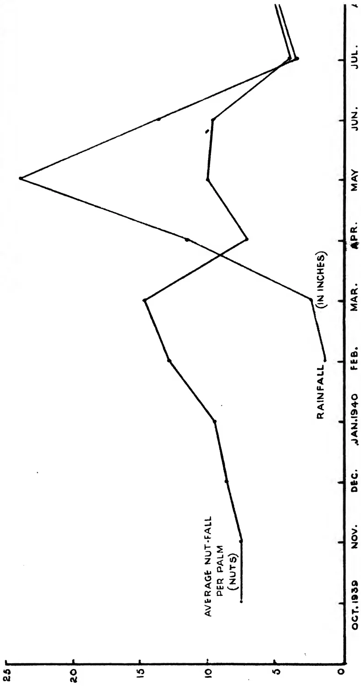

This line graph illustrates the relationship between rainfall and immature nut-fall in coconut palms from October 1939 to July 1940. The Y-axis represents the number of nuts per palm, ranging from 0 to 25. The X-axis represents the months. Two data series are plotted: Average Nut-Fall per Palm (Nuts) and Rainfall (Inches).

<table border="1"><thead><tr><th>Month</th><th>Average Nut-Fall per Palm (Nuts)</th><th>Rainfall (Inches)</th></tr></thead><tbody><tr><td>OCT. 1939</td><td>2.5</td><td>0.0</td></tr><tr><td>NOV.</td><td>3.0</td><td>0.0</td></tr><tr><td>DEC.</td><td>4.0</td><td>0.0</td></tr><tr><td>JAN. 1940</td><td>10.0</td><td>0.0</td></tr><tr><td>FEB.</td><td>13.0</td><td>0.0</td></tr><tr><td>MAR.</td><td>15.0</td><td>2.0</td></tr><tr><td>APR.</td><td>12.0</td><td>1.0</td></tr><tr><td>MAY</td><td>25.0</td><td>0.0</td></tr><tr><td>JUN.</td><td>10.0</td><td>0.0</td></tr><tr><td>JUL.</td><td>2.0</td><td>0.0</td></tr></tbody></table>

341------------------------------------------------

# ONUTS


<table border="1"><thead><tr><th>Month</th><th>Top Line</th><th>Bottom Line</th></tr></thead><tbody><tr><td>AUG.</td><td>High</td><td>Low</td></tr><tr><td>SEP.</td><td>Low</td><td>High</td></tr><tr><td>OCT.</td><td>Medium</td><td>Medium</td></tr><tr><td>NOV.</td><td>Medium</td><td>Medium</td></tr><tr><td>DEC.</td><td>Medium</td><td>Medium</td></tr><tr><td>JAN. 1941</td><td>Medium</td><td>Medium</td></tr><tr><td>FEB.</td><td>Medium</td><td>Medium</td></tr><tr><td>MAR.</td><td>Medium</td><td>Medium</td></tr><tr><td>APR.</td><td>High</td><td>High</td></tr></tbody></table>

5.0.0 11 6.41

342------------------------------------------------

A completely blank white page with no visible content, text, or markings.

343------------------------------------------------

255

## A VIRUS DISEASE OF *AGERATUM CONYZOIDES* AND TOBACCO

C. H. GADD and C. A. LOOS,  
TEA RESEARCH INSTITUTE OF CEYLON

**T**HE disease of *Ageratum conyzoides* Linn. (*Hulan-tala*, Sinhalese, and *Pum-pullu*, Tamil) which forms the subject of this paper was first observed by the junior author on an estate in the Kurunegala District of Ceylon, about two years ago. Diseased specimens were then few, and confined to one part of the estate only. Now, on unweeded portions of that estate and waste-land about it, the disease is so common that it is difficult to find healthy specimens of this weed.

Photographs of a typical diseased specimen at the flowering stage and of a young diseased plant after transplanting to a six-inch pot are reproduced as Pl. I., fig. 1, and Pl. II., fig. 3, respectively. A photograph of a healthy plant is also shown in Pl. II., fig. 1, for comparison.

*Ageratum conyzoides* is a common weed of cultivated and waste-lands throughout Ceylon and of itself is of no economic importance. Nevertheless, any disease to which the weed is subject becomes of great economic importance if it can pass readily to a crop plant and thereby cause loss. During the course of these investigations there were indications that tobacco is susceptible to the same disease, and that if tobacco is to be protected this weed would have to be completely eradicated from tobacco areas, particularly when tobacco is off the ground. Otherwise, the weed remains a continuous source of infection for successive crops of tobacco.

### SYMPTOMS OF THE DISEASE

Viewed from the upper surface the veins of the upper leaves appear as yellow lines. The lines are actually broader than the veins themselves, as the yellow colour spreads slightly into the adjoining green tissues. This gives the diseased leaf a characteristic appearance; numerous green islands are surrounded by yellow lines which coincide with the veins. We have used the term "yellow vein-banding" to describe this condition. Yellow vein-banding is usually less marked towards the base of the leaf; there, the bands are often narrower and not so yellow. The difference between the bands at the base and apex of diseased leaves is well shown in Pl. II., fig. 3.

344------------------------------------------------

256

The yellow vein-banding is not so marked on the undersurface of the leaves. The veins are yellow and appear to stand out more prominently than in healthy leaves. This is due not so much to a swelling or abnormal growth of the veins as to the interveinal areas being raised somewhat and becoming concave on the under surface.

In addition to the characteristic vein-banding described above, a few plants exhibited a curl of the leaves. The edges of the leaves were curled downwards and inwards towards the lower surface. This condition, but in tobacco, not *Ageratum*, is shown in Pl. III., fig. 2. The *Ageratum* plants never showed the curl symptom so markedly as is illustrated in that figure.

A few plants amongst those exhibiting the curl symptom showed a third symptom, *viz.*, a thickening of the veins on the undersurface of the leaf. These thickenings were about a millimetre in length and occurred scattered haphazard, but always on the smaller veins. The plants which exhibited this symptom of vein thickening showed it on all leaves with yellow vein-banding.

Those plants which carried healthy leaves at the base of the stems usually had diseased leaves on the branches arising in the axils of the apparently healthy leaves. In such cases, it is probable that the leaves formed before infection occurs remain apparently healthy and do not display any of the symptoms characteristic of the disease, whereas all leaves formed after infection, develop the symptoms, no matter whether the new leaves are formed on the main stem from the terminal bud or on branches from axillary buds subtended by apparently healthy leaves. Evidence in support of that probability is given later.

#### TRANSMISSION EXPERIMENTS

##### *To Ageratum Conyzoides*

A number of wild *Ageratum* plants of the low-country, white-flowered variety, both healthy and diseased, were planted in six-inch pots and brought into the laboratory of the Tea Research Institute at St. Coombs.\* The healthy and diseased plants were collected from different localities and were placed in separate rooms to avoid accidental infection. Twelve healthy plants were kept as controls, the remainder being used for experiments. No disease symptoms developed in any of these twelve control plants during the course of the experiments; so, no further mention will be made of them.

(a) *Mechanical Transmission.*—Juice extracted from diseased *Ageratum* leaves was rubbed lightly on to the 4 uppermost leaves of each of 12 healthy *Ageratum* plants. Half of each leaf-blade was inoculated in this manner; six of the plants had the juice

---

Talawakele : elevation 4,500 feet.

345------------------------------------------------

A completely blank white page with no visible content, text, or markings.

346------------------------------------------------

PLATE II.

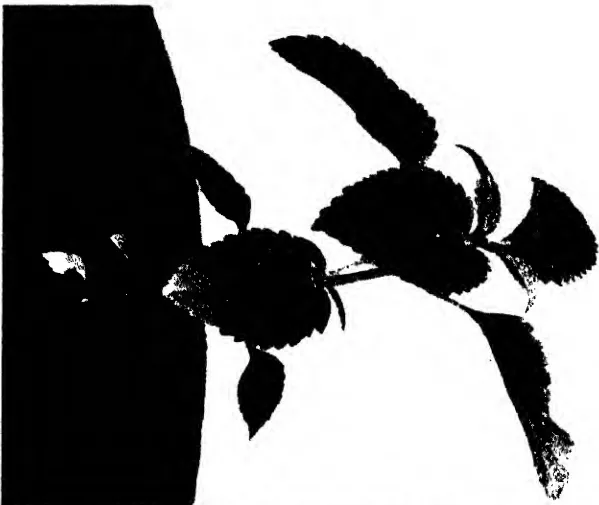A black and white photograph of a healthy tobacco plant (A. conyzoides). The plant has several dark, healthy-looking leaves and a central stem with some small, developing flower buds. The background is a solid dark color.

Fig. 1.—Healthy *A. conyzoides* plant.

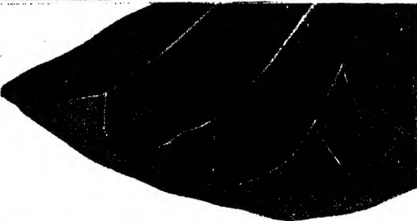A high-contrast, black and white photograph showing the underside of a tobacco leaf. The leaf is dark, and the veins are clearly visible as lighter, slightly raised lines. There are some small, irregular spots or eruptions on the leaf surface, particularly near the veins.

Fig. 2.—Under surface of tobacco leaf showing vein thickenings and eruptions.

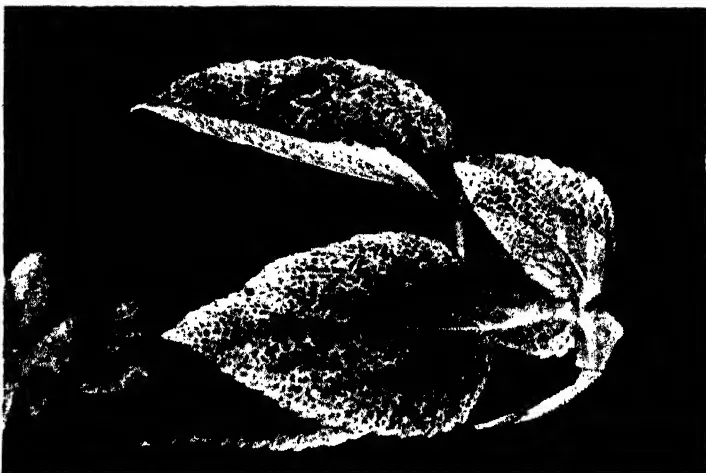A black and white photograph of a diseased tobacco plant (A. conyzoides). The leaves are heavily mottled with numerous small, light-colored spots and streaks, which are characteristic of yellow vein banding. The plant appears stunted and less healthy than the one in Fig. 1.

Fig. 3.—Diseased *A. conyzoides* plant showing yellow vein banding.

347------------------------------------------------

A completely blank white page with no visible content, text, or markings.

348------------------------------------------------


<!-- stage4: ACCEPT r2J/J_015:33 -->

PLATE I.

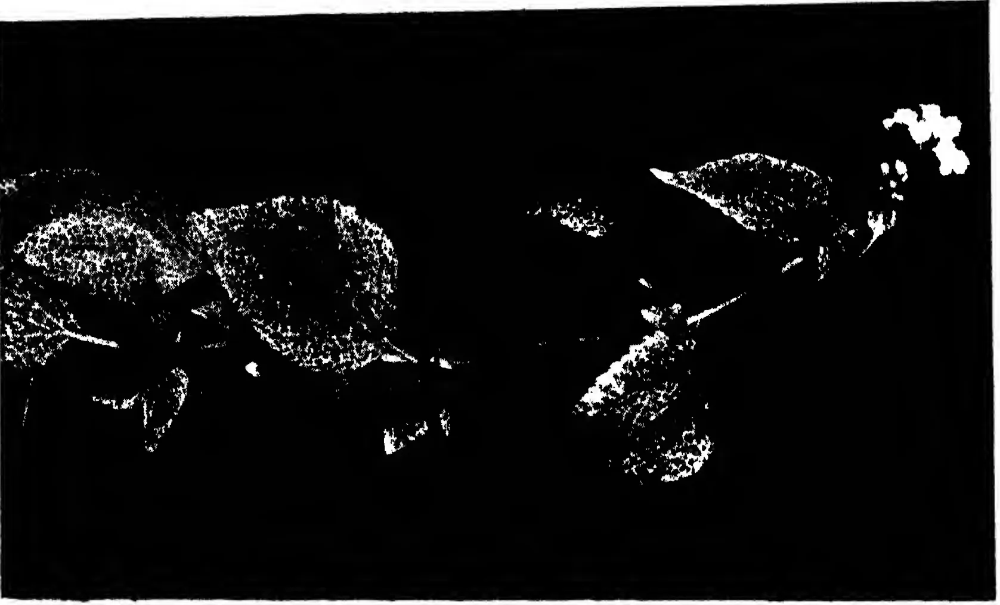

Fig. 1.—Diseased *Ageratum conyzoides* plant at flowering stage showing yellow vein banding.


Fig. 2.—Diseased scion grafted to healthy stock (*Ageratum*). Note the diseased leaves of the axillary branches of the stock.


349------------------------------------------------

257

rubbed on the upper surface of the leaves and the other six on their lower surfaces. Two months later, all the inoculated plants had produced a considerable amount of new growth and had reached the flowering stage, but in none had any symptoms of disease developed.

(b) *White Fly Inoculation*.—Eight healthy *Ageratum* plants were used in this experiment. Two healthy plants were placed in each of 4 insect cages, together with a diseased plant and a number of white flies collected from tomato plants. After five days, during which time the flies fed readily on both healthy and diseased plants, the flies were removed. None of the healthy plants later developed any symptom of disease.

(c) *Aphid Inoculation*.—An unidentified species of aphid, cream in colour, was collected from healthy *Ageratum* plants growing on St. Coombs, and a large number of these insects were transferred to diseased plants where they fed readily. After four days on the diseased plants the aphids were moved to the young expanding leaves of seven healthy plants, where they were allowed to feed for another four days before being removed.

All the leaves on which the aphids had fed became crinkled and curled, but the leaves which developed later on six of the healthy plants were normal. This crinkle may therefore be attributed solely to injuries caused directly by the aphids when feeding.

One of the inoculated plants, however, developed the characteristic yellow vein-banding symptom of this disease three weeks later. The symptom first appeared on the young leaves on which the aphids had fed, as a slight yellowing of the veins. All leaves produced later, not only on the main stem but also on all lateral shoots, showed vein-banding markedly. Those leaves which were fully grown at the time of inoculation remained green and apparently normal throughout the experiment. There was no evidence of transmission to any of the remaining six plants.

(d) *Grafts*.—Attempts were also made to transmit the disease by grafting. Five healthy and five diseased *Ageratum conyzoides* plants growing in pots and of approximately the same size were chosen. The upper three inches were cut from each main stem and used as scions. The diseased scions were grafted to the main stems of the healthy plants, and healthy scions to the diseased plants. The common cleft graft method was used, with raffia to bind the graft in position. The grafted plants were covered with bell jars, to maintain humid conditions for twelve days, the bell jars being lifted for a short time daily, for aeration. Good fusions between stocks and scions were made, as no wilting took place on removal of the bell jars after that period.

350------------------------------------------------

258

All five plants carrying diseased scions, sixteen days from the making of the graft, showed slight yellowing of the veins in the youngest expanding leaves of the shoots growing in the axils of the uppermost leaves of the healthy stock. On the nineteenth day, four of the five grafts showed definite yellow vein-banding symptoms in those leaves noted on the sixteenth day, and early symptoms were visible on the expanding leaves of the shoots in the axils of the second and third pairs of leaves below the union. The remaining graft, in which growth was rather slow, took longer to show the vein-banding symptom markedly. At the end of the experiment, two months after the grafts were made, all new growths from the healthy stocks were badly diseased.

Grafting appeared to aggravate the symptoms in the diseased scions, as later growth became stunted and the diseased leaves became curled and more markedly banded. No new growth was produced from the axillary buds of the diseased scions.

Pl. I., fig. 2, is a photograph of a graft of this series taken twenty-three days after the graft was made. The position of the union between healthy and diseased tissues is marked by an arrow. It will be seen from the photograph that the disease has passed to the previously healthy stock and that the symptoms are exhibited by the young leaves. Leaves which were fully grown before the graft was made remained green.

Although satisfactory fusion was obtained between diseased stocks and healthy scions, no symptom of disease was observed in the scions of any of the five plants grafted in this way, even after three months. The scions grew normally and the new leaves remained apparently healthy. The stock remained diseased, and all new leaves exhibited the vein-banding symptom. Observations ceased after the plants reached the flowering stage.

These results are in marked contrast with those obtained when healthy stocks and diseased scions were used. In the latter case, the virus—these experiments indicate that the disease is caused by a virus—moved readily downwards into the stock; whereas the reverse movement is either very slow or non-existent.

### *To Tobacco*

A few diseased *Ageratum* plants after potting, happened to be left in an open shed for a few days alongside some tobacco seedlings also growing in pots. Some time later, it was noticed that two of the tobacco seedlings were exhibiting symptoms of yellow vein-banding, exactly similar to that shown by the diseased *Ageratum* plants. The tobacco plants exhibited the symptoms only on the youngest leaves, the older leaves being of the normal green colour. This fact suggested a recent, and not a seed, infection. The tobacco seed was Harrison's Special,

351------------------------------------------------

259

supplied by the Department of Agriculture, and plants grown from the same sample of seed previously had all been healthy. There was therefore no grounds whatever for suspecting that the disease was in the seed originally.

The only insects which could be found on the diseased tobacco plants were a few white flies. It was decided therefore to attempt to transfer the disease from *Ageratum* to tobacco by means of white flies.

(a) *White Fly Inoculation*.—A diseased *Ageratum* plant was placed in each of two insect cages and white flies collected from tomato plants growing some distance away were introduced into the cages. The flies quickly settled down to feed on the *Ageratum* leaves. The following day, three young healthy tobacco plants (Harrison's Special) were put into one cage and two into the other. The white flies were then disturbed; many then settled on the tobacco plants and began to feed. After the healthy plants had remained in the cages for four days all the plants were sprayed with nicotine sulphate and soap to kill off the flies. All plants, including the controls, were later examined daily to ensure their freedom from white flies or other insects.

The three tobacco plants which were enclosed in one cage were numbered 1, 2 and 3; the remaining two from the other cage were numbered 4 and 5. In addition, seventeen healthy tobacco plants from the same batch of seedlings were kept as controls. Plants 1, 2, and 4, and two of the controls later developed disease symptoms but these symptoms were not identical in all cases.

Plant No. 1 at the beginning of the experiment had five leaves and an expanding bud. Seven weeks later it had thirteen leaves of which the 8th, 9th and 10th showed symptoms of yellow vein-banding on half the leaf blades, the symptom on the 10th leaf being most marked. Viewed by transmitted light the yellowing of the veins, particularly the smaller veins, appeared equal on both sides of the leaf. The youngest leaves, Nos. 11–13, were not full grown and appeared normal. Seven weeks later, i.e., fourteen weeks from the beginning of the experiment, the plant had twenty-two leaves. From the 8th to the 12th leaf vein-banding occurred on half the leaf blade only, but the symptom was more intensified than after the seventh week. Leaves above the 12th showed the symptom over the whole leaf blade, except the youngest which appeared normal. Expanding leaves did not show any symptom as a rule for three or four weeks after emergence from the bud.

Plant No. 2 followed much the same course as No. 1. Yellow vein-banding was the dominant feature and in this case, the symptom occurred over the whole leaf blades of the 8th and later formed leaves. In no leaf was the banding restricted to

352------------------------------------------------

260

half a leaf. The young leaves, newly expanding from the bud, tended to curl towards the lower surface but as they became older this tendency disappeared and the leaves became normal in shape except for a slightly wavy margin. Vein-banding, as shown in Pl. III., fig. 3 was the most notable symptom as it was in plant No. 1.

Plant No. 4, which was inoculated in the second cage, displayed somewhat different symptoms. Seven weeks after inoculation this plant had eleven leaves. The 9th counting from the base exhibited yellow vein-banding slightly over the whole leaf-blade, and the 10th showed it near the leaf tip only. Leaves 10 and 11 were curled, the edges tending to curve downwards and inwards towards the lower surface. Two weeks later, leaves 9 and 10 still showed vein-banding slightly, but some of the smaller veins on the under surface had begun to form dark green thickenings. The leaf edges were more markedly curled. Leaves 11, 12 and 13 were curled but showed no vein-banding. A large number of the veins on the under surface were thickened and a few bore leafy outgrowths or enations, both frill-shaped and cup-shaped, such as are illustrated in Pl. II., fig. 2. Leaf No. 14 was about 1 inch long, crinkled and curled but no vein thickenings or enations were present. The characteristic curl of the young leaf is shown in Pl. III., fig. 2, which should be compared with Pl. III., fig. 1, which is of a normally healthy apex of a tobacco shoot. Twelve weeks after inoculation, the plant had 22 leaves. All traces of vein-banding had disappeared from leaves 9 and 10, and no other leaves exhibited it. Instead, all the leaves from the 9th upwards were crinkled and markedly arched, the upper surface being convex, and the veins on the under surface were thickened and often produced enations. Enations remained small, the largest being about 7 mm. wide. Vein thickening was more common than enations. This plant became stunted in growth.

Of the seventeen control plants one developed the yellow vein-banding symptom markedly and at the same time exhibited leaf curl. Pl. III., fig. 2, is a photograph of this plant. Another developed leaf curl only without any vein-banding. The remaining plants were healthy and without any disease symptom when observations ceased as the plants entered the flowering stage.

#### DISCUSSION

The above experiments indicate that the disease (or diseases) of *Ageratum conyzoides* here described is probably caused by one or more viruses which are transferable to tobacco by white flies. From the symptoms on *Ageratum* and on tobacco it seems probable that at least two viruses are concerned; one may cause the vein-banding symptom and the other, the leaf-curl with vein thickenings or enations.

353------------------------------------------------

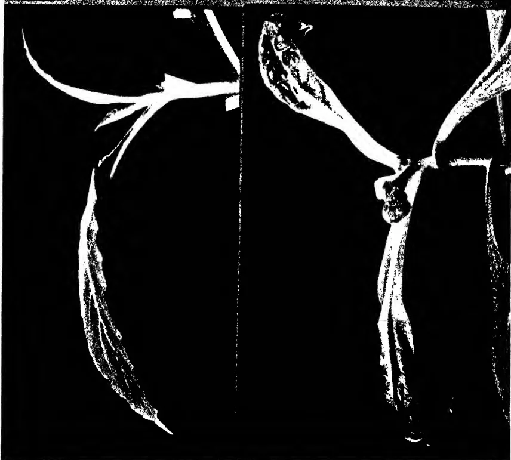The image contains two black and white photographs of tobacco shoot apices. The top photograph shows a healthy shoot with a straight stem and a pointed apex. The bottom photograph shows a diseased shoot with a distorted, curled apex.

Fig. 1 (top).—Apex of healthy tobacco shoot.  
Fig. 2 (bottom).—Apex of diseased tobacco shoot. Note the leaf curl.

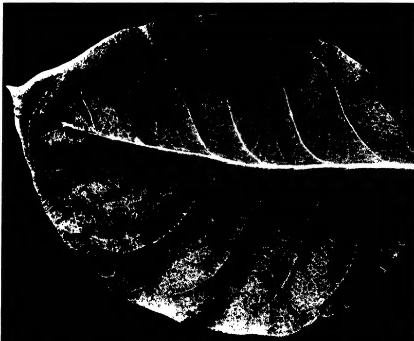A black and white photograph of a tobacco leaf showing yellow vein banding, a symptom of tobacco mosaic disease.

Fig. 3.—Tobacco leaf showing yellow vein banding.

354------------------------------------------------

A completely blank white page with no visible content, text, or markings.

355------------------------------------------------

261

The writers make no claim that the experiments here described are in any way critical. Such experiments are impossible in the absence of an insect proof plant house, and incidentally, the writers have not the time for such experiments as their interests lie mainly with the diseases of the tea bush. Their experiments, however, indicate the probability that the weed *Ageratum*, harbouring one or more viruses, is liable to cause trouble, if it has not already occurred, in the tobacco gardens of Ceylon. For this reason it seemed advisable to publish these observations in full.

Thung (8) in 1934 reported that *Ageratum conyzoides* harboured the virus of the tobacco leaf-curl disease in the Dutch East Indies and that this weed was one of the most important in carrying over the disease during the time when there was no tobacco in the fields. In 1936, Pruthi and Samuel (5) observed that *Ageratum conyzoides*, a very common weed at Pusa, India, suffered from a leaf-curl with symptoms resembling those of some types of diseased tobacco. Their experiments demonstrated that *A. conyzoides* is an alternate host of tobacco leaf-curl virus and that white fly can transmit the disease from this host to tobacco very easily.

Leaf-curl of tobacco was first recorded in Ceylon by Petch (3) in 1907, when the cause of the disease was unknown. His description of the curled leaves and the swellings of the veins leave no doubt that he was describing the disease commonly known as "leaf-curl".

Leaf-curl occurs in Africa wherever tobacco is grown, and it is the most serious disease with which the tobacco grower must contend (6). It is also a disease of considerable importance in the Dutch East Indies (7) and India (2).

Storey (6) has described the effect of the disease in the following terms :—

"The leaf-curl virus is somewhat exceptional in producing normally no chlorosis, either general or in a mosaic pattern. Its characteristic effect is to induce hyperplastic growth in the form of enations upon the lower surface of the leaves. These enations are located along the smaller veins; in them chlorophyll is strongly developed giving them the same dark green colour as the upper surface of the leaf itself. Normally the enations amount to no more than a thickening of parts of the leaf-veins, irregularly distributed, but at times they may grow out into frills or cups of considerable size.

"The enations are usually accompanied by uneven growth of the main veins and leaf-lamina, so that the leaves are fantastically distorted, crinkled and twisted. The plant is generally stunted, and the growth of the flowering stems in particular is reduced."

356------------------------------------------------

262

From the foregoing it is evident that the inoculated tobacco plant No. 4 had acquired the leaf-curl disease, which in all probability had been transferred from *Ageratum* to the tobacco. The fact that some *Ageratum* plants exhibited a mild leaf curl together with a thickening of the small veins on the under surface of the leaves clearly indicates that at least some of the *Ageratum* plants carried the tobacco leaf-curl virus. This observation is in accord with those of Thung (8) and Pruthi and Samuel (5) who have shown that *A. conyzoides* is a carrier of tobacco leaf-curl virus in the Dutch East Indies and India respectively.

The most pronounced symptom of the diseased wild *Ageratum* plants and of the inoculated tobacco plant No. 1 was the presence of yellow lines superimposed on the veins, here termed yellow vein-banding, and not a leaf-curl with thickened veins. The question which arises is "Is the yellow vein-banding symptom the result of infection by the leaf-curl virus or is it indicative of infection by yet another virus?"

All descriptions of the leaf-curl disease of tobacco indicate considerable variation of the symptoms. Thung (7) differentiated three types of leaf-curl (kroepeek) of tobacco, two of which are characterized by the presence of enations, whereas the third, termed "transparent kroepeek" is distinguished by the curling of the leaves towards the ventral side and the clearing of the veins, enations being absent. Pal and Tandon (2) differentiated five types of leaf curl designated A, B, C, D, and X, two of which, C and D, are characterized by vein thickenings and enations being absent. Pruthi and Samuel (5) as a result of their experiments in transmission of the virus between tobacco and *Ageratum* concluded that *A. conyzoides* is an important alternative host of tobacco leaf-curl virus D. Amongst the symptoms of leaf-curl virus D are:—"Foliage colour normal green in early stages, tending to become yellowish green with advancing maturity . . . . . Vein clearing usually persistent in younger leaves but not so distinct as that in C, and moreover it does not extend to the smallest vein." (2).

The writers are of the opinion that the symptom they have described as yellow vein-banding is not the same as that described by Pal and Tandon as vein clearing or by Thung as transparency. The illustrations of the diseased leaves of *Ageratum* published by Pruthi and Samuel (5) do not show yellow lines along the veins such as are evident in Pl. I., fig. 1, and Pl. II., fig. 3, of the Ceylon plants.

In Africa the early symptoms of leaf-curl disease of tobacco "often take the form of a clearing of the veins of a young leaf. Usually this effect is transitory, but rarely the pale network, visible from the upper surfaces, may persist" (6). The "pale

357------------------------------------------------

263

network visible from the upper surface " of Storey's description more nearly approximates our " yellow vein-banding " but that character in the specimens here described was common, not rare.

Thung (7) had attributed the transparent vein or pale network symptom to a virus distinct from that causing enations and his view is supported by Kerling (1). Pal and Tandon (2) consider that their leaf-curl types A to D are due to four distinct viruses and their type X as due to a mixture of two or more viruses in different combinations. Storey (6) however ascribes the symptom differences to climatic and soil differences and possibly to differences in the virulence of virus strains. The different symptoms noted in the inoculated tobacco plants 1 and 4 can hardly be ascribed to soil or climatic differences, though the possibility of a difference in virulence of the virus strains remains. So long as the differentiation of viruses is based on symptomatology in the absence of definite knowledge of the properties of the viruses concerned, such problems as this will recur.

One other point remains. Tobacco leaf-curl virus is usually transmitted by white flies as in the tobacco infections described here. The apparent transmission of the *Ageratum* virus to another *Ageratum* plant by aphids suggests the possibility that aphids as well as white flies also may transmit this yellow vein-banding virus. The experiment can, however, only be regarded as an indication of a possibility and nothing more.

The writers are of the opinion that the yellow vein-banding disease of *Ageratum conyzoides* here described is caused by a virus or strain of virus belonging to the tobacco leaf-curl group. It is possibly more nearly allied to the virus or strain which causes transparent veins than to the one which causes vein thickenings and enations. It also seems probable from the course of the disease in the inoculated tobacco plant No. 2 that the true leaf-curl virus may cause the yellow vein-banding symptom to be masked.

#### CONTROL

The removal and destruction of diseased plants on sight is probably one of the most practical ways of restricting the spread of such virus diseases as leaf-curl of tobacco. It is not sufficient merely to rogue the crop plant and supply with healthy plants, if weeds in the vicinity are harbouring the virus. Such weeds must be eradicated especially when the crop plant is off the ground. Thung (8) claims that control of tobacco leaf-curl can be secured by the timely removal of all sources of infection, including the weed *Ageratum conyzoides*, over a radius of some 50 metres round the tobacco growing villages.

358------------------------------------------------

264SUMMARY

A disease of *Ageratum conyzoides* is described. The principal symptom is a yellow vein-banding.

The disease was successfully transmitted to healthy *Ageratum* plants by grafting and to tobacco plants by white flies.

The disease is caused by a virus allied to the virus or viruses which cause tobacco leaf-curl.

The eradication of the weed from tobacco areas is advocated.

LITERATURE

1. 1. Kerling, L. C. P.—The anatomy of the “kroepoek-diseased” leaf of *Nicotiana tabacum* and of *Zinnia elegans*. *Phytopath.* XXIII., pp. 175–190, 1933. (*Rev. App. Myc.* XII., p. 474, 1933).
2. 2. Pal, B. P. & Tandon, R. K.—Types of tobacco leaf-curl in Northern India. *Indian J. of Agric. Sci.* 7, pp. 363–393 (1938).
3. 3. Petch, T.—Diseases of tobacco in Dumbara. *Circ. and Agric. J. of R. B. G.*, IV., No. 7, pp. 41–48 (1907).
4. 4. Pruthi, H. S. and Samuel, C. K.—Entomological investigations on the leaf-curl disease of tobacco in North Bihar. *Ind. J. of Agric. Sci.* 7, pp. 659–665 (1938).
5. 5. Pruthi, H. S. and Samuel, C. K.—Transmission of leaf-curl by white fly, *Bemisia gossypiperda*, to tobacco, Sann-hemp and a new alternate host of the leaf-curl virus. *Ind. J. of Agric. Sci.* IX., pp. 223–275, 1939.
6. 6. Storey, H. H.—Virus disease of East African Plants II. Leaf-curl disease of tobacco. *East Afri. J.*, I., pp. 148–153 (1935).
7. 7. Thung, T. H.—De krul-en kroepoek-ziekten van Tabak en de oorzaken van hare verbreiding. *Proefstat. Vorstenlandsche Tabak, Meded.* 72 (1932). (*Rev. App. Myc.* XI., p. 478 (1932)).
8. 8. Thung, T. H.—Bestrijding der krul-en kroepoek-ziekten van tabak. *Proefst. Vorstenlandsche Tabak. Meded.* 78. 1934. (*Rev. App. Myc.* XIII., p. 806, 1934).

359------------------------------------------------

265

## CULTURAL EXPERIMENTS WITH TURMERIC (*CUCURMA DOMESTICA* VAL.)

### I. THE INFLUENCE OF MULCHING AND OF THE SIZE OF SEED ON THE YIELD OF SOME VARIETIES OF TURMERIC

W. R. C. PAUL, M.A. (Cantab.), Ph.D., M.Sc. (Lond.), D.I.C., F.L.S.,  
AGRICULTURAL OFFICER, CENTRAL DIVISION

AND

M. FERNANDO, Ph.D., B.Sc. (Lond.), D.I.C.,  
ASSISTANT BOTANIST

THE cultivation of turmeric in Ceylon has extended during recent years and, with the guaranteed price which is now laid down under the Agricultural Products (Regulation) Ordinance, its popularity has increased and is likely to increase further. With the increase in area under the crop has come the realization that our knowledge of methods of cultivation is limited. The note now published contains the results of the first stage of investigations that aim at supplying the gaps in our knowledge of cultural methods.

The application of straw mulches is a routine cultural practice in most turmeric-growing areas. The benefits claimed for the practice include the addition to the soil of quantities of organic matter and potash, the checking of weed growth and the conservation of soil moisture. The last mentioned factor is probably of little importance in the conditions of heavy precipitation under which turmeric is normally grown in this country. An examination of the effect of rice straw mulches was included in the present study.

The cost of seed rhizomes is an item of some magnitude in turmeric growing, and the effect of reduced seed rates on yield is, accordingly, of interest. The effect of bisecting the seed rhizomes longitudinally was one of the factors investigated in the experiment reported in this paper.

A trial of three varieties of turmeric, viz., a local variety and two introduced Indian varieties, Poona and Guntur, was superimposed on the cultural studies.

360------------------------------------------------

266

### THE DESIGN OF THE EXPERIMENT

The following treatments were included in a  $3 \times 2 \times 2$  factorial design :—

<table>
<tr>
<td>Three varieties :</td>
<td><math>V_0</math> — local</td>
</tr>
<tr>
<td></td>
<td><math>V_1</math> — Poona</td>
</tr>
<tr>
<td></td>
<td><math>V_2</math> — Guntur</td>
</tr>
<tr>
<td>Two sizes of seed :</td>
<td><math>P_0</math> — Whole rhizomes</td>
</tr>
<tr>
<td></td>
<td><math>P_1</math> — Rhizomes bisected longitudinally</td>
</tr>
<tr>
<td>Two mulching treatments :</td>
<td><math>M_0</math> — Unmulched</td>
</tr>
<tr>
<td></td>
<td><math>M_1</math> — Mulched with rice straw</td>
</tr>
</table>

There were three replications in six blocks of six plots and the interactions PM and VPM were partially confounded with block differences in each replication. For a detailed exposition of the design, reference may be made to Yates (1937).

The plants were spaced  $1 \times 1$  ft. in  $1/681$  acre plots. There were no guard rows between plots, but in the harvest a single border row was rejected round each block.

### EXPERIMENTAL MATERIAL AND METHODS

Strictly comparable planting material of the three varieties included in the trial could not be procured. The available material consisted of mother setts of the local and Guntur varieties, and "fingers" of the variety Poona. The Indian material had been imported direct.

The experiment was set down at the Experiment Station, Nugawela, in the 1940–41 season. The soil of the experimental area was a light loam of average fertility. The land received a dressing of compost of 25 tons per acre on the eve of planting. The rhizomes were planted on May 7, 1940. A mulch of 20 lb. per plot of rice straw (6 tons per acre) was applied to the  $M_1$  plots on the date of planting. The mulch was subjected to continual disturbance by the strong winds that prevailed, and had to be weighed down by strips of wood. The  $M_0$  plots, which were not mulched with straw, received a light soil mulch. All plots received two weedings. Precipitation during the experimental period was abnormally heavy.

The dates of sprouting of the local, Poona and Guntur varieties were May 29, May 31, and June 4 respectively. The variety Guntur, although a late sprouter, showed subsequently much more vigorous vegetative growth than either of the other two varieties. The plots mulched with straw exhibited earlier shoot development. In the variety Poona, reduction in size of seed depressed the vegetative vigour of the plants; plants grown from whole "fingers" were appreciably taller.

361------------------------------------------------

267

Except for slight damage by the pyralid caterpillar, *Dichocrocis punctiferalis* Guen., pests and diseases were refreshingly scarce. The caterpillar bores into stems and shoots of turmeric. The extraction of the borer from invaded plants by means of a thin wire effectively checked the infestation. Susceptibility to borer attack appeared to be positively correlated with plant vigour. This correlation probably accounted for the higher incidence of stem borer in the variety Guntur.

Some of the plants flowered on October 2. The local variety had begun yellowing on December 12. The other two varieties had yellowed by January 13, 1941.

The crop was lifted on January 30.

### RESULTS

The weights of rhizomes produced by plots subjected to the various treatments are presented in Table 1. The analysis of variance of these data is given in Table 2. The variance ratio for total treatments attains significance at the 0·1 per cent. point. The variance ratios for varieties and mulchings are significant at the 0·1 per cent. point, and that for size of seed at the 5 per cent. point. None of the interactions exhibit significance.

The examination of individual variety totals with the aid of their standard error reveals the significant superiority of the variety Guntur.

The large and significant increase in yield effected in this experiment by mulching can probably be traced to the manurial value of rice straw.

The reduction in yield accompanying reduction in seed size was particularly marked in the instance of "fingers" of the variety Poona. The economic implications of these depressed yields are, however, not quite clear.

### SUMMARY

The results of an experiment set down in *maha*, 1940-41, at the Experiment Station, Nugawela, for the purpose of investigating the effect of mulching and of the size of seed on the yield of some varieties of turmeric, are reported.

The variety Guntur yielded a significantly greater weight of uncured rhizomes than either the variety Poona or the local variety.

Mulching the crop with rice straw at the rate of 6 tons per acre produced a large and significant increase in yield.

Reduction in the size of seed depressed yields considerably. Longitudinal bisection of mother sets in the local and Guntur varieties, and of "fingers" in the variety Poona resulted in a significant reduction in yield.

362------------------------------------------------

268ACKNOWLEDGEMENT

We are indebted to Mr. E. C. Wirasinha, Agricultural Instructor, Katugastota, for his careful supervision of the field operations.

REFERENCE

Yates, F., 1937 .. The design and analysis of factorial experiments. *Imperial Bureau of Soil Science, Tech. Comm. No. 35.*

TABLE 1.—Yields of Uncured Rhizomes in Pounds

<table border="1">
<thead>
<tr>
<th colspan="2"></th>
<th colspan="3">VARIETIES</th>
<th>Total</th>
</tr>
<tr>
<th colspan="2"></th>
<th>V<sub>0</sub></th>
<th>V<sub>1</sub></th>
<th>V<sub>2</sub></th>
<th></th>
</tr>
</thead>
<tbody>
<tr>
<td rowspan="3">MULCHINGS</td>
<td>M<sub>0</sub> ..</td>
<td>138.4</td>
<td>128.0</td>
<td>238.5</td>
<td>504.9</td>
</tr>
<tr>
<td>M<sub>1</sub> ..</td>
<td>232.6</td>
<td>183.9</td>
<td>323.1</td>
<td>739.6</td>
</tr>
<tr>
<td>Total ..</td>
<td>371.0</td>
<td>311.9</td>
<td>561.6</td>
<td>1244.5</td>
</tr>
<tr>
<th colspan="2"></th>
<th colspan="3">VARIETIES</th>
<th>Total</th>
</tr>
<tr>
<th colspan="2"></th>
<th>V<sub>0</sub></th>
<th>V<sub>1</sub></th>
<th>V<sub>2</sub></th>
<th>6</th>
</tr>
<tr>
<td rowspan="3">SIZES OF SEED</td>
<td>P<sub>0</sub> ..</td>
<td>193.4</td>
<td>200.3</td>
<td>293.8</td>
<td>687.5</td>
</tr>
<tr>
<td>P<sub>1</sub> ..</td>
<td>177.6</td>
<td>111.6</td>
<td>267.8</td>
<td>557.0</td>
</tr>
<tr>
<td>Total ..</td>
<td>371.0</td>
<td>311.9</td>
<td>561.6</td>
<td>1244.5</td>
</tr>
<tr>
<th colspan="2"></th>
<th colspan="3">SIZES OF SEED</th>
<th>Total</th>
</tr>
<tr>
<th colspan="2"></th>
<th>P<sub>0</sub></th>
<th>P<sub>1</sub></th>
<th></th>
<th></th>
</tr>
<tr>
<td rowspan="3">MULCHINGS</td>
<td>M<sub>0</sub> ..</td>
<td>298.6</td>
<td>206.3</td>
<td>..</td>
<td>504.9</td>
</tr>
<tr>
<td>M<sub>1</sub> ..</td>
<td>388.9</td>
<td>350.7</td>
<td>..</td>
<td>739.6</td>
</tr>
<tr>
<td>Total ..</td>
<td>687.5</td>
<td>557.0</td>
<td></td>
<td>1244.5</td>
</tr>
</tbody>
</table>

TABLE 2.—Analysis of Variance of Yields of Uncured Rhizomes

<table border="1">
<thead>
<tr>
<th></th>
<th>DF</th>
<th>SS</th>
<th>MS</th>
</tr>
</thead>
<tbody>
<tr>
<td>Blocks ..</td>
<td>5</td>
<td>1959.1</td>
<td>391.8</td>
</tr>
<tr>
<td>Treatments ..</td>
<td>11</td>
<td>5277.4</td>
<td>479.8*</td>
</tr>
<tr>
<td>    V ..</td>
<td>2</td>
<td>2838.1</td>
<td>1419.0*</td>
</tr>
<tr>
<td>    P ..</td>
<td>1</td>
<td>473.1</td>
<td>473.1†</td>
</tr>
<tr>
<td>    PV ..</td>
<td>2</td>
<td>259.7</td>
<td>129.8</td>
</tr>
<tr>
<td>    M ..</td>
<td>1</td>
<td>1530.1</td>
<td>1530.1*</td>
</tr>
<tr>
<td>    MV ..</td>
<td>2</td>
<td>66.2</td>
<td>33.1</td>
</tr>
<tr>
<td>    PM ..</td>
<td>1</td>
<td>9.8</td>
<td>9.8‡</td>
</tr>
<tr>
<td>    PMV ..</td>
<td>2</td>
<td>100.4</td>
<td>50.2‡</td>
</tr>
<tr>
<td>Error ..</td>
<td>19</td>
<td>1198.8</td>
<td>63.1</td>
</tr>
<tr>
<td>Total ..</td>
<td>35</td>
<td>8435.3</td>
<td></td>
</tr>
</tbody>
</table>

\* Significant at the 0.1 per cent. point.

† Significant at the 5 per cent. point.

‡ Partially confounded with blocks.

363------------------------------------------------

269

RECENTLY INTRODUCED FOOD CROPS AT THE  
EXPERIMENT STATION, PERADENIYA  
III.—COWPEA: BOMBAY VARIETY

C. N. E. J. DE MEL, B.Sc. (Hons.), B.Sc. (Agric.) (London),  
Dip. Agric. (Wye),  
PRINCIPAL, SCHOOL OF AGRICULTURE, PERADENIYA

AND

P. M. GAYWALA, M.Ag. (Bombay),  
DEMONSTRATOR IN CULTIVATION, SCHOOL OF  
AGRICULTURE, PERADENIYA

**C**OWPEA is an important leguminous crop which is increasing in popularity in the tropics. It is grown principally for four distinct purposes. In India this is chiefly cultivated as a seed crop for the use of grain as an important pulse food. The pulse is used in a variety of ways. Cowpea seed has a high food value and contains 24.56 per cent. protein and 3.23 per cent. mineral matter which clearly indicates that it very favourably compares as food in respect of these two nutrients with other pulses in common use such as Bengal gram, green gram, black gram, dolicos lablab beans, dhal and lentils. Studies conducted by the Bureau of Home Economics of the Department of Agriculture, U. S. A., indicate that, in food value, digestibility and flavour, cowpea ranks well with beans and peas as a staple article of diet. In Ceylon, however, the cultivation of this crop for seed purposes is practically unknown and cowpea grain is not used as a pulse food in the diet of the people. The next important use to which this crop is put is as a vegetable. The cultivation of this crop in Ceylon is chiefly devoted to the production of tender green pods to be sold as a vegetable. The vegetable is appreciated all over the country and there is an extensive demand for it throughout the year. To meet this demand the crop is grown under a wide range of conditions and suitable varieties have been developed. The great point in favour of the cultivation of this crop for vegetable purposes is that it can be grown quite satisfactorily under wet zone conditions on well-drained land. The crop is also grown in India for green manure

364------------------------------------------------

270

and fodder purposes. In this case the choice falls upon those varieties which have a spreading habit of growth and which produce luxuriant vegetative growth.

The range of pulse grains used in the normal diet of this country is very limited and is confined chiefly to green gram. Cowpea seed is almost as rich as green gram in respect of protein and mineral matter and is not difficult to digest. As such the use of cowpea seed will not only add to the variety in the diet but will also help in the development of a better-balanced diet. Under such circumstances an attempt was made for the introduction of a suitable grain variety possessing certain desirable features such as high yielding power of seed, vigorous and erect habit of growth, the ease with which it can be cultivated and early maturity so that the crop can be conveniently fitted into any scheme of rotational cropping.

With these considerations in view, the seed of the variety which is now popularly known as Bombay cowpea was obtained from India. It was first grown at the Experiment Station, Peradeniya, during the south-west monsoon season of 1938. The crop yielded without any manurial treatment 320 lb. seed per acre under adverse climatic conditions. This small scale trial appeared quite promising. Since then it has been grown almost every season at the Experiment Station, Peradeniya. The wet zone conditions are really not favourable to the grain variety of cowpea and as such the yields at the Experiment Station, Peradeniya, are not up to the expected standard. It has now also been introduced at some of the departmental stations in the dry zone. Dry zone conditions are definitely more favourable for a grain variety of this crop, and the crop has shown excellent performance under the favourable conditions of the dry zone. This variety has now been acclimatized under the local conditions. The characteristic features of this variety are: erect and vigorous habit of growth, short growing period, fairly uniform maturity which enables the crop to be harvested in one operation, the compact and well-filled medium-sized pods which do not burst open on maturity thus preventing the loss due to shattering of seed from a mature crop. The seed which is fairly heavy and attractive in appearance yields dhal of good quality on splitting and curing. Another point in favour of this variety is that in the dry zone it is almost free from the attack of aphides and *agromyza* fly to which the vegetable varieties are easily susceptible. It is quite hardy and able to resist drought better than the ordinary vegetable varieties and yields a distinctly better crop during the dry season than the other vegetable varieties grown at the Experiment Station, Peradeniya. This variety is ready for harvest under local conditions in 3 months after sowing.

365------------------------------------------------

271

Being a leguminous crop with considerable growth of bacterial nodules and with the shedding of substantial amount of leafy matter during the course of the growing period, the crop enriches the soil in respect of nitrogen and organic matter. Besides thus raising the standard of soil fertility, the cowpea crop also improves the physical condition of the land. As such it admirably fulfils the requirements of an excellent short period rotational crop under the dry zone conditions.

#### SOIL REQUIREMENTS

Cowpea will grow well on well-drained, moderately-light loam or medium loam soils. Being a leguminous crop, the presence of lime in the soil is essential. On rich soils a comparatively thick vegetative growth results and the yield of seed is low. For a seed crop soils of medium fertility are best suited.

#### CLIMATIC REQUIREMENTS

Cowpea requires a fairly warm growing season for its proper development. This particular variety is able to withstand drought better than the other locally grown vegetable varieties. For a seed crop continuous rain is not favourable during the period of flowering or of ripening of pods. The best results are obtained when growth takes place during a reasonably warm period with a fairly good distribution of rainfall and when bright weather prevails during and after flowering. Consideration of these climatic requirements clearly indicates that the dry zone is the most suitable place for this grain variety of cowpea. It will grow in the wet zone on a well-drained soil under fairly heavy rainfall, but in this case it will distinctly run towards vegetative growth and the yield of seed will be comparatively small.

#### SUITABLE SEASON

In parts of the dry zone which receive about 20 inches or more rain during the south-west monsoon season this pulse crop can be grown during that season. It may be grown during the north-east monsoon season in parts where this monsoon is not so heavy and where a dry period is available in January and February for the pods to ripen. It can also be cultivated during the south-west monsoon season on certain types of paddy lands under the village tanks where the soil is light and well drained, during years when the available supply of water is not considered enough for the growing of the paddy crop.

#### METHOD OF CULTIVATION

The land should be ploughed to a depth of about six inches and then brought to a fairly fine state of tilth by subsequent

366------------------------------------------------

272

harrowing. Usually this crop is not manured but it responds to the application of three to five tons cattle manure or compost during the course of the preparatory tillage.

For the Bombay cowpea, the spacing of 18 inches between rows and 12 inches within the row has been found suitable under the local conditions. The crop can, therefore, be sown by a three-coultered drill if available or it can be sown by dibbling in rows previously marked to a spacing of 18 inches. Two to three seeds should be dibbled to a depth of about an inch in each hill 12 inches apart in the row. Cowpea seed maintains its germinating power for five to seven years and therefore there is no necessity to sow unduly thick with a view to securing a good stand. The seed rate per acre under these conditions of sowing as an entire crop usually ranges from 15 to 20 lb. This can be grown as a mixed crop with sorghum or gingelly and in that case the seed rate will be proportionately low.

The crop germinates on the fifth day. Thinning and filling up of vacancies if necessary should be attended to as soon as possible after about 12 days of sowing. Not more than two plants should be allowed to stand in each hill. With this variety only one intercultivation is possible and that should be done about three weeks after sowing. The crop then rapidly grows and almost covers the land.

The first crop of pods can be harvested in tender stage for the vegetable market. This adds to the profit from the crop. The seed crop is ready for harvest from three months after sowing. As the crop matures fairly evenly and as there is no possibility of loss of seed by shattering from the pods, one can wait till most of the crop is ready for harvest. It is a pleasant sight to see a field of cowpea of this variety almost covered with creamy-white pods just before harvesting. The crop is harvested in one operation by cutting the plants close to the land. These are then dried and threshed out either under the feet of bullocks or by beating with wooden flails. The seed can be cleaned by the usual winnowing. The broken straw obtained as a bye-product of threshing is a valuable foodstuff for all types of farm animals.

#### YIELDS

The yield of a normally good crop in India ranges from 500 to 1,000 lb. dry seed per acre. At the Experiment Station, Peradeniya, the crop has suffered from heavy rain on many occasions. Under such adverse climatic conditions, on a light type of soil and without any manuring the crop yielded 498 lb. dry seed per acre at the Experiment Station, Peradeniya.

367------------------------------------------------

273

during the south-west monsoon season of 1940. Yields approximating this figure have not so far been recorded for any other variety of cowpea grown at this station. The crop has however done distinctly better under the dry zone conditions for which it is intended. It is interesting to note that this variety of cowpea has yielded 18 bushels and 8 measures or 1,131 lb. dry seed per acre at the Experiment Station, Anuradhapura, on ordinary light soil, under ordinary conditions of cultivation and attention and without any kind of manuring.

#### METHOD OF USE AS FOOD

It can be used like green gram in the form of whole grain after cooking and flavouring with the usual currystuffs. It can also be used in a variety of ways like dhal after splitting the seed into halves and removing the seed coats.

368------------------------------------------------

274

## WEEDING IN THE UP-COUNTRY TIMBER AND FUEL-PLANTATIONS

C. H. HOLMES, B.A. (Cantab.), B.Sc. (Lond.), Dip. of Forestry,  
Oxford and Cambridge,

DIVISIONAL FOREST OFFICER (SILVICULTURE).

**T**HE earliest Timber and Fuel-plantations in the Up-country Division appear to have been initiated sometime between 1890 and 1900; but systematic planting dates from about 1916 and has continued almost in unbroken sequence up to the present. The total area under plantation as at the end of September, 1940, is 7,536 acres of which 2,028 acres are of *patana* or grassland afforestation and the rest reforestation of montane forest. The latter has involved the conversion to selected exotic timber and fuel species of part of the natural wet evergreen sub-tropical montane forest located in the highest peneplane of the central mountain massif of the Island. Afforestation has for the greater part concerned the dry *patana* grassland of the Province of Uva and very little of the black wet *patana* of the higher reaches of the Central Province.

The principal centres of reforestation have been :—Kandapola, Ohiya, Conical Hill, Pattipola—Ambawela, and more recently Mahacoodagala. The rainfall in this tract results from either of the two monsoons or both supplemented by not infrequent intermonsoonal local thunderstorms. The first two and the last of the centres mentioned are predominantly north-east monsoon areas whilst the remaining centres are considerably wetter and experience rains from both monsoons. The afforestation centres—Errabedde and Kinigama—are north-east monsoon areas slightly drier than the other north-eastern monsoon areas mentioned and characterized by more marked and protracted annual periods of drought during which scorching dry winds are experienced.

“Clean Weeding”, an operation that consists of the scraping or even cutting off about 1 to 2 in. of the surface soil by mammoty in the eradication of ground—chiefly herbaceous—weeds and bracken (*Pteridium aquilina*), has been practised for varying periods of years at the commencement of each new plantation and is still in vogue except on the steepest slopes.

369------------------------------------------------

275

This practice of wholesale clean-weeding appears to be a custom or habit borrowed from the tradition of annual crop farming in England by the pioneering coffee planters and later followed by their successors, the tea and rubber planters. The example of these industrial agriculturists has in turn been copied in the tending of our own Timber and Fuel-plantations in the Up-country Division.

Up to recent times, absolute tidiness on the plantation floor until the tree crop was adjudged large enough to look after itself—and this was often given an over-generous margin of time—was nearly as much the fetish as it has been with the planters. “Permanent” weeding contracts, automatically renewed every 3 months, used to run through each financial year, and weeding recommenced at the beginning in each annual plantation area or “coupe” as soon as it was completed at the other end. Good work was judged by the lack of anything green but the tree crop introduced; and the plantations, except for the actual crop tended and the absence of soil cultivation or manuring, carried much the same appearance as tea estates managed according to the accepted practices of those days.

It is not possible in the absence of detailed figures, which have not been kept, to assess accurately costs per acre for each successive year of weeding and so to arrive at the average total formation expenditure per acre on weeding. From a careful study of the Annual Estimates for the 10-year period 1925–26 to 1934–35 inclusively there does not appear to have been any difference in annual weeding costs per acre between forest and *patana* plantations and estimates have been on the same basic rates. As might be guessed costs have been heavier in earlier times becoming less later on. The period of weeding has generally been 4 to 5 years and much longer in earlier plantations going up to 8 years in some cases owing to failure of the species first tried. The following table gives a fair idea of the average costs per acre for each year of weeding :—

<table>
<thead>
<tr>
<th></th>
<th>Range of Costs</th>
<th>Approx. Av.<br/>costs<br/>per acre<br/>Rs.</th>
</tr>
</thead>
<tbody>
<tr>
<td>First Year—</td>
<td></td>
<td></td>
</tr>
<tr>
<td>    Clean weeding</td>
<td>.. Rs. 10 to Rs. 20</td>
<td>.. 15</td>
</tr>
<tr>
<td>Second Year—</td>
<td></td>
<td></td>
</tr>
<tr>
<td>    Clean weeding</td>
<td>.. Rs. 5 to Rs. 15</td>
<td>.. 10</td>
</tr>
<tr>
<td>Third Year—</td>
<td></td>
<td></td>
</tr>
<tr>
<td>    Clean weeding</td>
<td>.. Rs. 5 to Rs. 15</td>
<td>.. 10</td>
</tr>
<tr>
<td>Fourth Year—</td>
<td></td>
<td></td>
</tr>
<tr>
<td>    Clean, strip or circle weeding</td>
<td>Rs. 2 to Rs. 5</td>
<td>.. 5</td>
</tr>
<tr>
<td>Fifth Year—</td>
<td></td>
<td></td>
</tr>
<tr>
<td>    Mostly circle weeding</td>
<td>.. Cents 75 to Rs. 5</td>
<td>.. 2</td>
</tr>
</tbody>
</table>

370------------------------------------------------

276

The average total costs of weeding previously incurred may therefore be reasonably, though still conservatively, assessed at a round sum of Rs. 40 per acre.

In 1934-35 weeding estimates were drastically cut down all round and weeding reduced to the minimum thought possible. In view of the poor results with the exotic species then used in *patana* planting, it was decided in future to use *Eucalyptus robusta* 75 per cent. made up with 25 per cent. of selected Timber Eucalypts—(*Eucalyptus citriodora*, *E. maculata*, *E. microcorys*, &c.) for general grassland afforestation. At the same time it was decided to initiate investigations with a view to determining the minimum intensity and frequency of weeding consistent with the establishment of plantations of satisfactory quality in reasonable time.

The following five different treatments covering a wide range of intensity and frequency of weeding were decided on :—

Treatment A.—Clean weed throughout. 4, 3, and 2 weedings in the 1st, 2nd, and third year of plantation respectively.

Treatment B.—Clean weed 3 times in the 1st year. Strip weed contour-wise 3 times in the 2nd year. Patch weed twice in the 3rd year.

Treatment C.—Strip weed contour-wise 3 times in the 1st year. Patch weed 3 times in the 2nd year. Patch weed once in the 3rd year.

Treatment D.—Patch weed 3 times in the 1st year. Patch weed twice in the 2nd year. Patch weed once in the third year.

Treatment E.—Clean weed as and when found desirable in the 1st year. Strip weed as and when found desirable in the 2nd year. Strip or patch weed as found desirable in the 3rd year.

Six sets of considerably large experimental plots were laid down accordingly—4 sets in reforestation and 2 sets in afforestation centres—all in November, 1935, excepting the sets of plots at Pattipola-Ambawela which were planted in July of the same year. The plots were made as large as possible from the total area of cleared land available for planting at each place so that reasonably reliable costings may be kept.

The prescriptions laid down were generally closely followed in practice except that, in the case of treatment E, it was left to the Divisional Forest Officer, Up-country Division, to adopt the

371------------------------------------------------

277

kind and frequency of weeding he considered necessary for each year. Consequently the actual treatments the E plots were subjected to, varied at different centres and were as follows :—

- I.—Kandapola—Clean weeded once each year for 3 years.
- II.—Conical Hill—Clean weeded generally and strip weeded on steep slopes once in the 1st year. Clean weeded once each year for the next two years.
- III.—Pattipola-Ambawela—Clean weeded once each year for 3 years.
- IV.—Ohiya—Clean weeded twice in the 1st year. Strip weeded twice in the 2nd year.
- V.—Kinigama—Patch weeded once each year for the 1st two years. Strip weeded twice in the 3rd year. Patch weeded once each year for the next two years.
- VI.—Errabedde Strip weeded twice in the 1st year. Strip weeded 3 times in the 2nd year. Strip weeded once each year for the next two years.

It was intended that treatment should cease as soon as the majority of the plants reached the pre-determined *establishment heights* which were arbitrarily fixed at 10 ft. and 6 ft. respectively for the broad-leaved species and cypress. In practically all the reforestation plots and the more-intensely weeded of the afforestation plots, weeding was discontinued at the end of the *2nd year from planting*. The other less-intensely weeded plots were generally patch weeded two years more up to 1940.

Counts of survivals and measurements were taken from 3 to 8 indicator plots arranged to give as representative a sample as possible of each of the larger unit experimental plots. Mean heights were taken by direct measurement of 200 sample trees of cypress or *Eucalyptus robusta*, and generally when available 100 of each of the other timber species—*Acacia melanoxylon* and *Eucalyptus maculata*—taken *at random* evenly spread out in each of the chosen indicator plots within each major experimental plot. In the smaller experimental plots counts and measurements were confined to the inner plots leaving surrounds to offset marginal effects.

Rather than attempt to be concerned with all the species used in the plantations it was decided, in view of obvious practical difficulties any such attempt would entail, to be content with the examination of selected principal type species to judge of the results of the trials. For the reasons that they were the most uniform as regards growth and stocking and also formed 75 per cent. of the plantation mixtures used in reforestation and afforestation respectively, *Cupressus macrocarpa* and

372------------------------------------------------

278

*Eucalyptus robusta* are naturally to be regarded as the principal test species. As representative of the other timber species, *Acacia melanoxylon* was chosen in view of its having been the only species represented in all of the 20 forest-land plots and also as it was in greater number per plot than those of the other timber species used. Unfortunately, however, owing to damage occasioned by sambhur, after the 3rd year particularly, the species proved unsuitable for checking up final results, and, instead, *Eucalyptus maculata* had to be used as was done also for assessment of results in the case of the Patana Weeding Experimental Plots.

It would be best, before going on to discuss the results of the experiments, to review the factors most likely to influence the intensity and frequency of weeding required in any general case to give any satisfactory results :—

#### THE QUALITY AND INTENSITY OF THE INITIAL BURN

The more intense the fire and the more uniformly spread the burn-off of the brush-wood and “lop and top” on the site cleared for planting the less, obviously, would be the subsequent weed growth. Up to a point a good burn will also promote early growth apart from bringing about a reduction of the incidence of the weeds and so reduce subsequent spread of the weeds by the increased cover given by the tree crop. These effects will naturally be less in grassland afforestation than in forest land reforestation. Of the latter type of plots those of Kandapola and Pattipola-Ambawela had the best burns of the year. The Ohiya plots were next best, and in the Conical Hill plots the burn was poor and very patchy. The differences in the amount of weed and consequently costs of weeding at these different centres (*vide* Table II.) is in part a reflexion of the kind of burn each set of plots had received.

#### THE RAINFALL

Other things being equal the greater the amount of rainfall and the better distributed it is throughout the year, the greater would be the incidence and growth of the weeds. Thus, as is to be expected, weed growth is less at Kandapola and Ohiya and much worse at Conical Hill and at Pattipola. The resultant effects of different grades and types of weeding employed must also depend on the rainfall experienced during the period covered by the experiments. Table IV. gives the monthly average rainfall at each centre for the periods preceding first and final measurements respectively, together with the mean monthly rainfall averages of the localities concerned for comparison with the former. This mean monthly rainfall has, in the absence of figures over a sufficiently long period, been taken in each case from figures kept by adjoining estates—except for Ohiya

373------------------------------------------------

279

and Errabedde where adequate statistics from within the area of the plantations were available. For 3 of the former cases, however, average figures for the period of  $3\frac{1}{2}$  years from statistics kept by the Department are given for comparison with those of the nearest local rain gauge station.

It will be observed that the rainfall over the experimental periods before first and final measurements have generally been heavier than average and agrees rather closely with the averages for the past  $3\frac{1}{2}$  years taken from local Departmental readings at each centre. Rainfall averages for the period preceding first measurements have been approximately 8, 11 and 20 per cent. higher than normal for Ohiya, Pattipola-Ambawela, and Kinigama respectively. It cannot, therefore, be said that the experiments have been conducted over a period in which weather conditions were less favourable than normal to weed growth—thereby making less intensive and more curtailed weeding possible than would have been feasible under normal conditions.

#### SOIL

It is to be expected that weed growth is likely to be heavier in the richer and more fertile soils than in the poor soils. Fertility is not any intrinsic quality of what are recognized as good soils but merely an acquired character arising out of biological processes above and within the soil dependent mainly on the vegetation that has covered it. The removal of this covering vegetation and continued exposure of the soil by weeding inevitably leads to soil deterioration and such effects will naturally be most evident in soils that were poor to start with. It is unnecessary to go into the causes responsible for this loss of initial fertility. They are complex and manifold. Interference with the life processes of the soil faunal and floral population and consequent loss of soil structure rather than loss of soil nutrient through erosion are more likely to be responsible particularly in the early stages.

Soil profiles were examined in all the experimental plots taking generally 4 pits per plot one at the top, one at the bottom, and two on the mid slopes of each plot. The geological origin (Charnockite) and mineral nature of the soils appear to be the same in both the forest and the grassland areas. The soils in the reforestation plots are closely alike—a dark-grey, sandy loam overlying a deep yellow or reddish-brown, slightly micaceous, clayey loam mixed with ferruginous and quartzose gravel in varying proportions. Granite and quartz stones and boulders are common, and as in the *patana* soils a hard, compact stratum of gravel frequently appears usually about  $1\frac{1}{2}$  ft. to 2 ft. from the surface. The better soils of the *patana* as found for example in plots given to treatment A, B, and C at Errabedde

374------------------------------------------------

280

and A, B, and E at Kinigama are similar to the forest soils but are less humose and lighter in colour. The poorer soils of the *patana* appearing in knolls, hill-tops, and ridges are truncated degradates of this general soil type bringing the gravel and boulders nearer or right to the surface. This type of degraded soil is represented in plots given treatment E at Errabedde and C, D, and E<sub>2</sub>, at Kinigama. On the whole the soils of the *patana* grassland plots are poorer than those of the forest plots.

As a general rule weed growth in the reforestation plantations is least in the year following clearing and burning and becomes progressively heavier in subsequent years, until the plantation crop begins to close over. In dry *patana* grassland impoverished by frequent grass fires, grazing and erosion, which later receives an added impetus by the clearing and burning of the surface vegetation preparatory to planting, the weed growth tends to be heaviest in the first year and becomes less in subsequent years and progressively weaker and scantier still the longer clean weeding is continued. If clean weeding is persisted in long enough, a naked, barren plantation floor is produced. The diminishing degree of the incidence of the weeds reflects the cumulative deterioration of the soil quality and when the last stage is reached conditions are hopeless and perhaps worse for the tree crop than those produced by the weeds. This has happened already in certain of our plantations on the *patana*, notably in the dismal 216 acres of 1926 at Kinigama.

Fortunately the species adopted for general afforestation with the initiation of these experiments are generally better suited to local conditions and the hazards of complete soil loss except on hill-crests, &c., where there is not much to lose any way are much reduced. The dangers of excessive weeding, particularly in the *patana* grassland plantations, are real and require to be kept in mind.

#### GRADIENTS OF SLOPE AND ELEVATION

It has already been mentioned that interference with the organic life processes of the soil and loss of structure are probably the first detrimental effects of soil exposure. The intensity of insolation in the rarified atmosphere of high elevations is likely to aggravate such effects.

On the degree of slope would depend the amount of interference with the surface soil and erosion consequent on weeding operations; hence the frequency and intensity of weeding conducive to the best results must vary in the inverse ratio to gradient. The forest plantations are all above 5,000 ft. and up to a little above 6,000 ft. in elevation. As may be surmised, gradients of slopes are generally steep to moderately steep.

375------------------------------------------------

281

The grassland plantations are all below 5,000 ft. in elevation ranging from about 3,800 ft. to 4,500 ft. Gradients of slopes involved here are generally less steep than in the higher elevation forest plantations. Owing, however, to (a) the nature of the soil, (b) the vegetational cover or lack of it, declivity is more conducive here to soil loss and deterioration.

It will be seen from Tables I. and II. that weeding in any of the forms followed in these experiments has not, as far as the forest land plantations are concerned, been required beyond a period of 2 years from planting. It has happened, however, that weeding in the set of plots at Pattipola-Ambawela and in plot D of Conical Hill was continued to the 3rd year. In the former case the plot given to treatment A was twice clean weeded in the third year, those of treatments B, C, and D were patch weeded once and plot E received one clean weeding. The growth of the constituent species in plot E, the poorest plot of the set, was still better than that realized at any other centre in the same year. Weeding, therefore, was not strictly required though done. In plot D, Conical Hill, a single patch weeding was carried out in the 3rd year presumably more to improve appearance owing to rank growth of brambles than out of regard to the growth of the trees crops. This will be evident from a comparison (*vide* Table I.) of the mean heights of cypress and *Acacia melanoxylon* in this plot with those of plots C and E adjacent to it in which weeding ceased in the 2nd year.

In the case of the *patana* grassland plantations, weeding was very definitely unnecessary beyond the 2nd year from planting in respect of plots given to treatments A and B at both Kinigama and Errabedde. At the latter centre where soil conditions have been better this is equally true for treatment C (*vide* Table I.). Mean heights of *Eucalyptus robusta* varied from 12.5 ft. to 21.5 ft. and of *Eucalyptus maculata* from 13 ft. to 19.3 ft. at initial measurements.

As regards the other less intensive forms of weeding, treatment may safely have been discontinued by the end of the 4th year at the latest.

The average total formation costs per acre on weeding from details of expenditure kept by the territorial management staff, as given in Table II., are as follows :—

<table>
<thead>
<tr>
<th></th>
<th colspan="2">Reforestation Plots.</th>
<th colspan="2">Afforestation Plots.</th>
</tr>
<tr>
<th></th>
<th>Rs.</th>
<th>c.</th>
<th>Rs.</th>
<th>c.</th>
</tr>
</thead>
<tbody>
<tr>
<td>Treatment A</td>
<td>.. 10</td>
<td>34 per acre.</td>
<td>.. 14</td>
<td>65 per acre.</td>
</tr>
<tr>
<td>" B</td>
<td>.. 9</td>
<td>44 "</td>
<td>.. 13</td>
<td>53 "</td>
</tr>
<tr>
<td>" C</td>
<td>.. 9</td>
<td>0 "</td>
<td>.. 13</td>
<td>60 "</td>
</tr>
<tr>
<td>" D</td>
<td>.. 7</td>
<td>62 "</td>
<td>.. 9</td>
<td>43 "</td>
</tr>
<tr>
<td>" E</td>
<td>.. 7</td>
<td>75 "</td>
<td>.. 15</td>
<td>25 "</td>
</tr>
</tbody>
</table>

376------------------------------------------------

282

Strangely enough there has apparently been little difference as regards average costs of the first 3 forms of treatment, and that there should be less than the difference of a rupee between average costs per acre of treatment A as compared with treatment C is difficult to understand. It is clear, however, that the most expensive form of weeding has not been much more than  $\frac{1}{2}$  to  $\frac{1}{3}$  the expenditure estimated for the period 1925 to 1935 (*vide* paragraph on average costs per acre). The costs per acre given in Table II. represent the total amounts expended up to the date of final measurement for the periods of weeding indicated.

For examination of the treatment effects as shown by survival percentages and mean height growths, it would suffice to take statistics collected in the 3rd and 5th years of treatments, the first being after weeding terminated in the reforestation plots and the more intensely-weeded of the afforestation plots and the final measurements when weeding was terminated in the rest of the plots. The full summaries of the statistical data are given in Tables I., II., and III.

#### REFORESTATION WEEDING TRIALS

##### Kandapola

At initial measurements, treatment plots B and E were significantly better than the continuously-weeded plot A—plot B as regards the growth of the cypress and *Eucalyptus maculata* and plot E in respect of that of *Acacia melanoxylon*. Plot D (patch weeded) was significantly worse than plot A in respect of the growth of all 3 test species. Plot C showed no significant difference from plot A as regards the growth of the cypress or *Eucalyptus maculata* but was just significantly worse than A in respect of *Acacia melanoxylon*. Survival percentages of all species were very satisfactory and, on the whole, of the same order for all 5 plots.

At final measurement (*vide* Table II.) a general levelling up of the first differences between the plots was to be noted. Plots B, C, and D were neither significantly better in respect of the growth of the cypress nor worse as regards the growth of the *Acacia melanoxylon* than plot A. Treatment E showed up best in respect of the growth of all species the mean heights of which were significantly better than that attained in other treatment plots—but its position appears to have favoured this particular plot.

Sambhur caused considerable damage as indicated by percentages of plants of *Acacia melanoxylon* browsed shown in Table II. The incidence of the damage in plots A, B, C, and D being about the same, no appreciable difference has probably been caused to their relative differences.

377------------------------------------------------

283

In September, 1940, there were no apparent differences favouring the less-weeded plots. If anything, such differences as were noticeable as regards growth and general conditions appeared slightly in favour of the least-weeded plots D and E. All plots were doing well and canopy was closed or fast closing up in all of them.

The results from the set of trials carried out at Kandapola indicate that *any* of the lower grades of weeding would to all practical purposes have been as acceptable as the district management practice of continued clean weeding.

#### Conical Hill

At first measurement, treatments B, C, D, and E were all significantly worse than treatment A in respect of the growth of both test species except in the case of treatment B where the lower mean height as compared with that of the same species in plot A carried no significance. Survival percentages of cypress and broad-leaved timber species were satisfactory and of about the same order for all plots except for broad-leaved timber species in plot E which was only 40.5 per cent. (*vide* Table I.).

At last measurement (*vide* Table II.), there has again been a general levelling up of differences, and treatment C was no longer significantly worse than treatment A in respect of the growth of either of the indicator species used.

Sambhur damage suffered by the *Acacia melanoxylon* precludes direct comparison of the mean heights attained by it in different plots but the incidence of the damage being the same for plots A, B, and C, the non-significance of the difference of the mean heights of this species in plots A and C can scarcely be treated as not confirming the more definite indication given by the cypress.

In September, 1940, plantations in plots A and D had closed up well. The stocking and condition of the standing plots B, C, and E were satisfactory though canopy had not closed up yet. The floor in plots C and E was covered with a heavy, mostly herbaceous, weed growth.

It would appear from the results here that a lower intensity and frequency of weeding than that followed in treatment A is feasible. In the end treatment C has proved no worse than treatment A.

#### Pattipola-Ambawela

At initial measurements, treatments B, C, D, and E were again all significantly worse than clean weeding throughout except that the differences of the mean heights of *Acacia melanoxylon*

2—J. N. A 8 090 (4/41)

378------------------------------------------------

284

and *Eucalyptus maculata* in plots A and B were not significant. Survival percentages of all species were satisfactory and of about the same order for all the plots—*vide* Table I.

Final measurements show that the growth of plants in the less-weeded plots has again been catching up with that of the plants in plot A. Treatment A is no longer significantly better than either treatments B or C. Even in treatment D, the significance of the negative difference of the mean height of the cypress as compared with that under treatment A is much reduced.

*Acacia melanoxylon* has been subject to sambhur damage but to a much less extent than at any other centre. The higher incidence of the sambhur as indicated by the percentage of plants browsed in plots B and C as compared with plot A emphasizes rather than vitiates observations made above.

In September, 1940, plantations in plots A, B, C, and E were all doing excellently and crowns were closed or closing up. Plot D was the poorest as regards general conditions, being the most exposed to wind. The canopy in this plot is still open, but from all appearances will close in another year or two. The ground is well covered mainly by herbaceous weeds.

The results indicate here again that lower grades of weeding B, C, D, and E are all feasible. At the end of five years from planting there have been no significant negative differences between the mean heights of all the 3 test species in treatment B and C as compared with treatment A. Where significant, the difference has been in favour of treatment C. For all practical requirements, treatment C has scored as well or better than treatment A.

#### Ohiya

As in the sets of trials at the 3 other reforestation centres, treatments B, C, D, and E were all significantly poorer as regards the growth of all 3 test species in comparison with treatment A, and unlike them remained so at the last measurement. The survival percentages of the cypress and broad-leaved timber species were variable but on the whole satisfactory.

The *Acacia melanoxylon* had suffered considerable damage from browsing by sambhur. In this set of trials, unfortunately, the incidence of browsing as indicated by the percentages of plants browsed (*vide* Table II.), happens to be less in plot A than in the other plots and no conclusions are therefore possible as regards treatment effects on this species. Measurements of *Eucalyptus maculata*—*vide* Table III.—indicate, however, that there has been a general improvement of the relative mean height in the less-weeded plots B, C, and D as compared with plot A.

379------------------------------------------------

285

In September, 1940, plots given treatments A and B were very much the same in appearance. Both were good as regards stocking and general condition with canopy fully closed. Plots C and D appeared slightly poorer in height growth but still were quite satisfactorily established. Plot E, occupying a more favourable position, was better than the last two and canopy had fully closed up. In all the plots the plantation floor was adequately covered and protected.

The results of the investigations at this centre indicated that treatment A was significantly better than any of the other treatments. Judging, however, from the mean height growth, stocking and general conditions of the plantations at last measurements, the less-intensive forms of weeding have proved not inconsistent with the satisfactory establishment of plantations concerned in reasonable time.

Summarizing the results of the different sets of experimental trials conducted at the four reforestation centres, it will be seen that though there has been some inevitable plot and locality differences that have been influencing the treatment effects the following reasonably definite conclusions stand out quite clearly :—

1. I. At the end of the *third year* from planting the experimental plots at all but one centre, *i.e.*, Kandapola, have shown clean weeding to be significantly better than any of the other treatments.
2. II. At the end of the *fifth year*, however, there has been a general improvement of the less-weeded plots at all centres but one, *i.e.*, Ohiya, resulting in reduction of the initial differences of treatments B and C—particularly C—to statistical insignificance as compared with treatment A.
3. III. The mean heights and survival percentages of the constituent species together with the general conditions of the plantations raised under different treatments show that the lower intensities and frequencies have proved quite feasible and consistent with the intents and purposes of practical management.
4. IV. The period of weeding has been needlessly protracted in the past and that it need not under normal average conditions be extended beyond the 2nd or certainly the 3rd year from planting except, perhaps, for the lowest grade of weeding D.
5. V. Under average or normal conditions treatment C—strip-weeding in the first year and patch-weeding in the second—should be as acceptable as the present district practice of clean weeding as far as growth, stocking

380------------------------------------------------

286

and establishment of the plantations are considered, but is greatly to be preferred to clean weeding on the tenets of silviculture, soil conservation, and economics.

VI. Weeding costs in the past have been excessive and formed too high a proportion of the all-in-information costs. Costings kept in these trials indicate that, under the most expensive form of weeding, costs need not be more than a fraction of estimated previous expenditure.

#### AFFORESTATION WEEDING TRIALS

##### Kinigama

At initial measurements, plots under treatments A and B were about equal as regards stocking and growth of all species. Actual differences between mean heights of both *Eucalyptus robusta* and *Eucalyptus maculata* in plots A and B were non-significant. All other treatments were, on the same basis, found to be significantly worse than either treatment A or B. It will be seen from Table I. that survival percentages were very satisfactory for all plots.

At final measurements, exactly the same relative differences between the several treatments remained. Treatments A and B showed no significant difference as regards height growth of the red-gum, and the difference of the mean heights of *Eucalyptus maculata* in the two plots was barely significant. All other treatments remained significantly worse than treatments A and B, and in the least-weeded plots a tendency to reduction of the relative differences in height is still noticeable, e.g., plot E<sub>1</sub>.

In September, 1940, plots A and B were much the same as regards height-growth and stocking. The crowns of trees in plot A were smaller (Crown : stem ratio :: 1 : 5 to 1 : 4) than those in plot B (crown : stem ratio :: 1 : 3 on average), and the canopy on the higher slopes was very open. The floor in plot A was for the most part naked and devoid of any ground cover. Leaf litter had been washed down slopes and accumulated on the gentler gradients at the bottom. In plot B there were faint contour ridges of scanty grass left from the strip-weeding in the second year, tending in places to hold up leaf litter. Unfortunately the alignments of some of the contour strips for weeding were not quite what they might have been. The canopy was on the whole closer and denser than in plot A. In plot E<sub>1</sub>, adjacent to plot A, the canopy was just closing and plants, though smaller than in plots A and B, were looking vigorous and healthy. The floor had more pronounced contour ridges of grass which were effectively holding up leaf litter and checking surface soil wash. Plots C, D, and E<sub>2</sub> are on less favourable sites of poorer

381------------------------------------------------

287

soil conditions and it is fortunate both from the experimental and soil conservation view points that they received the less drastic forms of weeding. The eucalypts on the higher reaches of the plots are poor in condition and growth, better on the lower slopes and particularly in plot C where, though they are yet small, they appear to be vigorous and healthy.

The results of the experiments conducted at this centre indicate that :—

- (a) Treatment A is not significantly better than treatment B.
- (b) In the case of either treatment A or B fully-established plantations were possible within a period of 2 years.
- (c) Under favourable soil conditions patch-weeding, strip-weeding and patch-weeding again in the first, second, and third year from planting has sufficed, *e.g.*, plot E<sub>1</sub>.

#### Errabedde

At first measurement, very good stocking and mean heights were recorded in plots under treatments A, B, and C. Growth of all species in all plots was much better than in the corresponding set of plots at Kinigama. In respect of the growth of both *Eucalyptus robusta* and *Eucalyptus maculata*, treatments A and B showed no significant differences between them whilst all other treatments were significantly worse than either of these.

At final measurements, treatments A and B were about equal and still significantly better than any of the other treatments. The relative differences of mean heights of both species in these plots as compared with those of plot A were, however, noticeably reduced and appeared to show that, given time, these differences are likely to disappear altogether. The growth shown by even the least-weeded plot D is quite satisfactory.

In September, 1940, the plantation floor in plot A was bare except for patches of litter washed together by the rain and some bracken. The topmost surface soil on the slopes and the central ridge in the plot had been removed and the ground was hard and compacted. In the plot given treatment B conditions were similar but there was a better covering of leaf litter and more bracken. In plot C there had been very little surface wash and the floor was on the whole well covered with leaf litter, grasses, patches of scrub growth, other ground weeds, and various leguminous creepers. The growth was, of course, poorer than in the more-weeded plots A and B, but the chances appeared to be that the growth in this plot would eventually turn tables on those two plots. The plantation under treatment D had not yet closed cover as in plots A, B, and C but

382------------------------------------------------

288

the plants were growing vigorously and likely to cover up soon. The floor in plots  $D_1$  and  $D_2$  was well covered with weed growth and leaf litter. The surface soil was intact and there had been no appreciable quantity of soil washed from the weeded patches. In the plot given treatment E, the lower section by a stream was growing luxuriantly and the plantation even on the upper stony slopes was beginning to close cover. The floor was for the most part exposed and covered only by a scanty growth of grass and other weeds.

The results of the investigations here indicate that :—

- (a) Under the more favourable conditions obtaining in these plots as compared with those at Kinigama, any of the lower grades of weeding tried would be feasible.
- (b) Treatment A is not significantly better than treatment B, but both these treatments were significantly better than the other treatments up to the end of the 5th year of planting.
- (c) The mean height growths of both *Eucalyptus robusta* and *Eucalyptus maculata* in the plots given the lower grades of weeding were satisfactory particularly for treatment C for which mean heights of 15.8 ft. and 14.4 ft. were recorded at first measurement and at final measurements 28.6 ft. and 22.3 ft. for *Eucalyptus robusta* and *Eucalyptus maculata* respectively.
- (d) Soil conditions were better maintained in the less-weeded plots than in the more-intensely-weeded plots.
- (e) Growth rates in the interval between first and last measurements were left relatively unimpaired by treatments and even better than in the period previous to first measurement.

It will be observed that, despite plot and locality differences, which here again fortunately favoured the more-intensely-weeded plots rather than the less-weeded plots but which could not naturally be eliminated or provided against using such large plots, there appear a number of definite conclusions that are yet fairly clear :—

- I. There have been no admissible differences between treatments A and B at either Kinigama or Errabedde or at initial or final measurements in respect of the growth of either of the test species or stocking or general conditions of the plots concerned.
- II. All the other treatments C, D, and E remained significantly worse than either of the first two treatments

383------------------------------------------------

289

but the growth rates of the plants in these plots showed an improvement in the second as compared with the first period of experiment (*i.e.*, before and after first measurement).

- III. For general purposes, clean weeding in the first year and strip weeding in the second year should, from every plantation point of view, be as acceptable as the present management practice of continued clean weeding, and is very much to be preferred for other reasons. Under favourable conditions even treatment C should amply secure all plantation requirements and is to be preferred where its practice appears feasible.
- IV. As in the case of the reforestation areas, the period of weeding has been needlessly protracted in previous management practice and under general average conditions need not extend beyond the second year or certainly not beyond the 3rd year from planting.
- V. Total expenditure on the most intensive form of weeding has been but a fraction of the estimated expenditure previously incurred.

#### ABSTRACT

This note is concerned with weeding in the Timber and Fuel-plantations of the Up-country Division and experimental investigations conducted in the period 1935 to 1940 with a view to determining the minimum intensity, frequency, and period of weeding consistent with the satisfactory establishment of plantations in reasonable time.

Brief notes on the Up-country plantations, historical background of the practice of clean weeding and a description of its nature are given and the average total formation costs per acre on weeding for the decade previous to the initiation of the experiments estimated.

The principal locality and climatic factors bearing on the question of the type of weeding likely to be most suitable are examined and discussed. The rainfall conditions during the experimental period have not been specially favourable to the control of weed growth but have rather tended to be otherwise as shown by average rainfall statistics given.

The results obtained from observations carried out in 30 mainly large stage-II. experimental plots, to allow of costings, replicating 5 different treatments at 6 different plantation centres are examined and summarized separately for reforestation and afforestation centres. All measurements have been statistically evaluated and given in summary form in Tables I., II., and III.

384------------------------------------------------

290

The main conclusions are :—

- (a) That the period of weeding ought under average conditions to be considerably shorter than it has been in the past and need not generally be extended beyond 2 or at most 3 years.
- (b) That though clean weeding throughout has generally given significantly better results in the early life of the plantations, it does not maintain this advantage over the lower grades of weeding even in the 5th year from planting. Even where it does maintain this initial advantage significantly there are indications that the less-weeded plots are likely to overcome their initial handicap in time.
- (c) That strip-weeding in the first year and patch-weeding in the 2nd (if necessary in the 3rd year) has in the main been no worse than clean weeding throughout, in the case of reforestation areas. This treatment is, therefore, recommended in view of other advantages principally of soil conservation and costs.
- (d) That clean weeding in the first year followed by strip-weeding in the 2nd year has actually been no worse than continued clean weeding in the afforestation areas. For other cogent reasons, principally for maintenance of the already impoverished soil capital of the *patana* grasslands, this form of treatment ought to replace the present district management practice of clean weeding throughout period of formation.
- (e) Consequent on the above conclusions, total formation expenditure on weeding need be but a small fraction of what such cost appears to have been in the past.

It is to the credit of the territorial officers on whom the responsibility for the executive work mainly rested that the investigations have been brought to a satisfactory conclusion despite this being amongst the first of anything like organized or detailed experimental investigations they have had to contend with. Sincere thanks are due for the co-operation and assistance of the Divisional Forest Officers who have held charge of the Division during the past 5 years, the territorial Forest Rangers and the Research Rangers who have been in charge of the field work.

385------------------------------------------------

291TABLE I.

<table border="1">
<thead>
<tr>
<th>Expt. No.</th>
<th>Treatment.</th>
<th>Localities.</th>
<th>Date of Measurement.</th>
<th>Extent.</th>
<th>Survival Percent.</th>
<th>Mean Height in Feet.</th>
<th>Standard Error in Feet.</th>
<th>Difference of Means from A in Feet</th>
<th>Standard Error of Difference in Feet.</th>
<th>Survival Percent. of Timber Species.</th>
<th>Mean Height in Feet.</th>
<th>Standard Error in Feet.</th>
<th>Difference of Means from A in Feet.</th>
<th>Standard Error of Difference in Feet.</th>
</tr>
</thead>
<tbody>
<tr>
<td colspan="15" style="text-align: center;"><i>Cupressus macrocarpa</i></td>
</tr>
<tr>
<td>F 11</td>
<td>A</td>
<td rowspan="5">Kandapola.</td>
<td>11. 3. 38</td>
<td>5 ac.</td>
<td>84.4</td>
<td>5.5</td>
<td>.093</td>
<td>—</td>
<td>.708</td>
<td>96.3</td>
<td>2.6</td>
<td>.139</td>
<td>.292</td>
<td>.172 NS</td>
</tr>
<tr>
<td>12</td>
<td>B</td>
<td>17. 3. 38</td>
<td>5 ac.</td>
<td>84.7</td>
<td>6.2</td>
<td>.102</td>
<td>+.096</td>
<td>.250</td>
<td>95.8</td>
<td>2.3</td>
<td>.101</td>
<td>.500</td>
<td>.170 S</td>
</tr>
<tr>
<td>13</td>
<td>C</td>
<td>22. 3. 38</td>
<td>5 ac.</td>
<td>86.0</td>
<td>5.8</td>
<td>.096</td>
<td>+.083</td>
<td>.833</td>
<td>100.0</td>
<td>2.1</td>
<td>.098</td>
<td>.667</td>
<td>.163 S</td>
</tr>
<tr>
<td>14</td>
<td>D</td>
<td>19. 1. 38</td>
<td>5 ac.</td>
<td>81.9</td>
<td>4.7</td>
<td>.083</td>
<td>—</td>
<td>.417</td>
<td>100.0</td>
<td>1.9</td>
<td>.083</td>
<td>.750</td>
<td>.213 S</td>
</tr>
<tr>
<td>15</td>
<td>E</td>
<td>10. 2. 38</td>
<td>10 ac.</td>
<td>81.7</td>
<td>5.9</td>
<td>.073</td>
<td>—</td>
<td>—</td>
<td>78.2</td>
<td>3.3</td>
<td>.162</td>
<td>—</td>
<td>—</td>
</tr>
<tr>
<td>F 20</td>
<td>A</td>
<td rowspan="5">Conical Hill</td>
<td>7. 11. 38</td>
<td>4 ac.</td>
<td>84.6</td>
<td>9.4</td>
<td>.143</td>
<td>—</td>
<td>.250</td>
<td>74.5</td>
<td>8.8</td>
<td>.358</td>
<td>.750</td>
<td>.460 NS</td>
</tr>
<tr>
<td>21</td>
<td>B</td>
<td>7. 11. 38</td>
<td>4 ac.</td>
<td>88.5</td>
<td>7.2</td>
<td>.121</td>
<td>—</td>
<td>.250</td>
<td>60.9</td>
<td>8.0</td>
<td>.288</td>
<td>1.333</td>
<td>.488 S</td>
</tr>
<tr>
<td>22</td>
<td>C</td>
<td>7. 11. 38</td>
<td>4 ac.</td>
<td>84.7</td>
<td>6.8</td>
<td>.141</td>
<td>—</td>
<td>.250</td>
<td>70.5</td>
<td>7.4</td>
<td>.303</td>
<td>3.500</td>
<td>.487 S</td>
</tr>
<tr>
<td>23</td>
<td>D</td>
<td>29. 10. 38</td>
<td>4 ac.</td>
<td>77.2</td>
<td>7.3</td>
<td>.125</td>
<td>—</td>
<td>.250</td>
<td>68.4</td>
<td>5.3</td>
<td>.329</td>
<td>4.333</td>
<td>.394 S</td>
</tr>
<tr>
<td>25a</td>
<td>E</td>
<td>7. 11. 38</td>
<td>4 ac.</td>
<td>72.4</td>
<td>4.9</td>
<td>.102</td>
<td>—</td>
<td>.450</td>
<td>40.5</td>
<td>4.4</td>
<td>.171</td>
<td>—</td>
<td>—</td>
</tr>
<tr>
<td>F 28</td>
<td>A</td>
<td rowspan="5">Pattipola.</td>
<td>22. 11. 38</td>
<td>2.5 ac.</td>
<td>89.9</td>
<td>10.3</td>
<td>.218</td>
<td>—</td>
<td>.167</td>
<td>85.0</td>
<td>14.3</td>
<td>.440</td>
<td>.500</td>
<td>.658 NS</td>
</tr>
<tr>
<td>29</td>
<td>B</td>
<td>22. 11. 38</td>
<td>2.5 ac.</td>
<td>93.0</td>
<td>9.2</td>
<td>.174</td>
<td>—</td>
<td>.750</td>
<td>89.0</td>
<td>13.8</td>
<td>.488</td>
<td>.500</td>
<td>.557 S</td>
</tr>
<tr>
<td>30</td>
<td>C</td>
<td>29. 10. 38</td>
<td>2.5 ac.</td>
<td>87.0</td>
<td>9.8</td>
<td>.211</td>
<td>—</td>
<td>.167</td>
<td>85.0</td>
<td>6.8</td>
<td>.341</td>
<td>8.000</td>
<td>.531 S</td>
</tr>
<tr>
<td>31</td>
<td>D</td>
<td>29. 10. 38</td>
<td>2.5 ac.</td>
<td>91.7</td>
<td>8.5</td>
<td>.207</td>
<td>—</td>
<td>.583</td>
<td>90.3</td>
<td>6.3</td>
<td>.298</td>
<td>7.417</td>
<td>.592 S</td>
</tr>
<tr>
<td>31a</td>
<td>E</td>
<td>22. 11. 38</td>
<td>2.5 ac.</td>
<td>84.1</td>
<td>9.8</td>
<td>.179</td>
<td>—</td>
<td>—</td>
<td>83.8</td>
<td>6.3</td>
<td>.396</td>
<td>—</td>
<td>—</td>
</tr>
<tr>
<td>U 6</td>
<td>A</td>
<td rowspan="5">Ohya</td>
<td>23. 12. 38</td>
<td>5 ac.</td>
<td>69.0</td>
<td>8.9</td>
<td>.216</td>
<td>—</td>
<td>.750</td>
<td>69.0</td>
<td>4.3</td>
<td>.354</td>
<td>.583</td>
<td>.633 S</td>
</tr>
<tr>
<td>7</td>
<td>B</td>
<td>23. 12. 38</td>
<td>5 ac.</td>
<td>85.7</td>
<td>8.2</td>
<td>.163</td>
<td>—</td>
<td>.250</td>
<td>82.0</td>
<td>3.7</td>
<td>.534</td>
<td>5.167</td>
<td>.368 S</td>
</tr>
<tr>
<td>8</td>
<td>C</td>
<td>23. 12. 38</td>
<td>5 ac.</td>
<td>84.0</td>
<td>6.2</td>
<td>.183</td>
<td>—</td>
<td>.250</td>
<td>84.0</td>
<td>3.3</td>
<td>.089</td>
<td>—</td>
<td>—</td>
</tr>
<tr>
<td>9</td>
<td>D</td>
<td>2. 11. 38</td>
<td>5 ac.</td>
<td>72.0</td>
<td>6.7</td>
<td>.198</td>
<td>—</td>
<td>.250</td>
<td>68.0</td>
<td>2.5</td>
<td>.211</td>
<td>5.875</td>
<td>.413 S</td>
</tr>
<tr>
<td>9a</td>
<td>E</td>
<td>17. 1. 39</td>
<td>7 ac.</td>
<td>73.0</td>
<td>6.9</td>
<td>.182</td>
<td>—</td>
<td>.250</td>
<td>63.0</td>
<td>3.5</td>
<td>.108</td>
<td>3.208</td>
<td>.370 S</td>
</tr>
<tr>
<td colspan="15" style="text-align: center;"><i>Eucalyptus robusta</i></td>
</tr>
<tr>
<td>U 14</td>
<td>A</td>
<td rowspan="5">Kinnigama</td>
<td>15. 11. 38</td>
<td>3.75 ac.</td>
<td>96.0</td>
<td>12.8</td>
<td>.348</td>
<td>—</td>
<td>.250</td>
<td>84.0</td>
<td>13.0</td>
<td>.602</td>
<td>.833</td>
<td>.908 NS</td>
</tr>
<tr>
<td>15</td>
<td>B</td>
<td>15. 11. 38</td>
<td>3.75 ac.</td>
<td>95.0</td>
<td>12.5</td>
<td>.430</td>
<td>—</td>
<td>.250</td>
<td>82.0</td>
<td>14.8</td>
<td>.680</td>
<td>1.833</td>
<td>.673 S</td>
</tr>
<tr>
<td>16</td>
<td>C</td>
<td>15. 11. 38</td>
<td>3.75 ac.</td>
<td>96.0</td>
<td>5.3</td>
<td>.183</td>
<td>—</td>
<td>.417</td>
<td>75.0</td>
<td>4.9</td>
<td>.302</td>
<td>8.083</td>
<td>.698 S</td>
</tr>
<tr>
<td>16a</td>
<td>D</td>
<td>23. 10. 38</td>
<td>3 ac.</td>
<td>90.0</td>
<td>5.3</td>
<td>.224</td>
<td>—</td>
<td>.750</td>
<td>82.0</td>
<td>5.4</td>
<td>.354</td>
<td>7.583</td>
<td>.686 S</td>
</tr>
<tr>
<td>16b</td>
<td>E<sub>1</sub></td>
<td>8. 11. 38</td>
<td>2 ac.</td>
<td>85.0</td>
<td>8.7</td>
<td>.235</td>
<td>—</td>
<td>.417</td>
<td>67.0</td>
<td>4.3</td>
<td>.330</td>
<td>8.750</td>
<td>.686 S</td>
</tr>
<tr>
<td></td>
<td>E<sub>2</sub></td>
<td></td>
<td>8. 11. 38</td>
<td>2 ac.</td>
<td>90.0</td>
<td>4.3</td>
<td>.124</td>
<td>—</td>
<td>.417</td>
<td>75.0</td>
<td>4.1</td>
<td>.265</td>
<td>8.917</td>
<td>.658 S</td>
</tr>
<tr>
<td>U 25</td>
<td>A</td>
<td rowspan="5">Erabedde</td>
<td>2. 11. 38</td>
<td>5 ac.</td>
<td>94.4</td>
<td>21.5</td>
<td>.507</td>
<td>—</td>
<td>.250</td>
<td>62.3</td>
<td>19.3</td>
<td>.774</td>
<td>.750</td>
<td>.858 NS</td>
</tr>
<tr>
<td>26</td>
<td>B</td>
<td>5. 11. 38</td>
<td>5 ac.</td>
<td>87.5</td>
<td>20.3</td>
<td>.450</td>
<td>—</td>
<td>.250</td>
<td>87.5</td>
<td>18.5</td>
<td>.370</td>
<td>.433</td>
<td>.940 S</td>
</tr>
<tr>
<td>27</td>
<td>C</td>
<td>6. 11. 38</td>
<td>5 ac.</td>
<td>84.7</td>
<td>15.8</td>
<td>.378</td>
<td>—</td>
<td>.250</td>
<td>84.7</td>
<td>14.4</td>
<td>.533</td>
<td>13.000</td>
<td>1.091 S</td>
</tr>
<tr>
<td>28</td>
<td>D</td>
<td>5. 11. 38</td>
<td>8 ac.</td>
<td>100.0</td>
<td>7.3</td>
<td>.234</td>
<td>—</td>
<td>.250</td>
<td>100.0</td>
<td>6.3</td>
<td>.768</td>
<td>—</td>
<td>—</td>
</tr>
<tr>
<td>28a</td>
<td>E</td>
<td>10. 11. 39</td>
<td>5 ac.</td>
<td>100.0</td>
<td>18.0</td>
<td>.321</td>
<td>—</td>
<td>.250</td>
<td>—</td>
<td>No. Euc. maculata</td>
<td></td>
<td></td>
<td></td>
</tr>
<tr>
<td>28b</td>
<td>D<sub>a</sub></td>
<td></td>
<td>19. 11. 39</td>
<td>4 ac.</td>
<td>99.8</td>
<td>13.0</td>
<td>.113</td>
<td>—</td>
<td>.500</td>
<td>100.0</td>
<td>10.8</td>
<td>.494</td>
<td>8.417</td>
<td>.918 S</td>
</tr>
</tbody>
</table>

386------------------------------------------------

262

TABLE II.

<table border="1">
<thead>
<tr>
<th>Expt. No.</th>
<th>Treatment.</th>
<th>Localities.</th>
<th>Date of Measurement.</th>
<th>Mean Height in Feet.</th>
<th>Standard Error.</th>
<th>Difference of Means from A in Feet.</th>
<th>Standard Error of Difference.</th>
<th>Percentage of Damage.</th>
<th>Mean Height in Feet.</th>
<th>Standard Error.</th>
<th>Difference of Means from A in Feet.</th>
<th>Standard Error of Difference.</th>
<th>Period of Weeding Years.</th>
<th>Total Weeding Costs per Acre.</th>
<th>Rs. c.</th>
</tr>
</thead>
<tbody>
<tr>
<td colspan="16"><i>Cupressus macrocarpa</i></td>
</tr>
<tr>
<td>F 11</td>
<td>A</td>
<td rowspan="5">Kandapola</td>
<td>29.10.40</td>
<td>11.85</td>
<td>± .447</td>
<td>—</td>
<td>—</td>
<td>95</td>
<td>4.36</td>
<td>± .182</td>
<td>—</td>
<td>—</td>
<td>2</td>
<td>7</td>
<td>70</td>
</tr>
<tr>
<td>12</td>
<td>B</td>
<td>29.10.40</td>
<td>12.83</td>
<td>± .481</td>
<td>+.98</td>
<td>± .657 NS</td>
<td>97</td>
<td>4.27</td>
<td>± .161</td>
<td>+.09</td>
<td>± .243 NS</td>
<td>2</td>
<td>5</td>
<td>97</td>
</tr>
<tr>
<td>13</td>
<td>C</td>
<td>29.10.40</td>
<td>12.26</td>
<td>± .391</td>
<td>+.41</td>
<td>± .594 NS</td>
<td>94</td>
<td>4.24</td>
<td>± .217</td>
<td>-.12</td>
<td>± .283 NS</td>
<td>2</td>
<td>3</td>
<td>73</td>
</tr>
<tr>
<td>14</td>
<td>D</td>
<td>29.10.40</td>
<td>12.63</td>
<td>± .452</td>
<td>+.78</td>
<td>± .638 NS</td>
<td>99</td>
<td>3.89</td>
<td>± .148</td>
<td>+.47</td>
<td>± .235 NS</td>
<td>2</td>
<td>2</td>
<td>27</td>
</tr>
<tr>
<td>14a</td>
<td>E</td>
<td>29.10.40</td>
<td>13.52</td>
<td>± .546</td>
<td>1.67</td>
<td>± .706 S</td>
<td>36</td>
<td>13.27</td>
<td>± .791</td>
<td>8.91</td>
<td>± .812 S</td>
<td>2</td>
<td>2</td>
<td>74</td>
</tr>
<tr>
<td>F 20</td>
<td>A</td>
<td rowspan="5">Conical Hill</td>
<td>31.10.40</td>
<td>12.62</td>
<td>± .336</td>
<td>—</td>
<td>—</td>
<td>66</td>
<td>8.09</td>
<td>± .455</td>
<td>—</td>
<td>—</td>
<td>2</td>
<td>13</td>
<td>21</td>
</tr>
<tr>
<td>21</td>
<td>B</td>
<td>31.10.40</td>
<td>10.57</td>
<td>± .285</td>
<td>2.05</td>
<td>± .441 S</td>
<td>68</td>
<td>7.57</td>
<td>± .409</td>
<td>.52</td>
<td>± .612 NS</td>
<td>2</td>
<td>12</td>
<td>39</td>
</tr>
<tr>
<td>22</td>
<td>C</td>
<td>31.10.40</td>
<td>12.56</td>
<td>± .245</td>
<td>—</td>
<td>± .416 NS</td>
<td>59</td>
<td>8.08</td>
<td>± .372</td>
<td>.01</td>
<td>± .588 NS</td>
<td>2</td>
<td>13</td>
<td>67</td>
</tr>
<tr>
<td>23</td>
<td>D</td>
<td>31.10.40</td>
<td>11.00</td>
<td>± .276</td>
<td>1.62</td>
<td>± .435 S</td>
<td>92</td>
<td>4.91</td>
<td>± .217</td>
<td>3.18</td>
<td>± .504 S</td>
<td>3</td>
<td>12</td>
<td>69</td>
</tr>
<tr>
<td>23a</td>
<td>E</td>
<td>31.10.40</td>
<td>10.36</td>
<td>± .263</td>
<td>2.26</td>
<td>± .457 S</td>
<td>94</td>
<td>4.90</td>
<td>± .212</td>
<td>3.19</td>
<td>± .502 S</td>
<td>2</td>
<td>13</td>
<td>20</td>
</tr>
<tr>
<td>F 28</td>
<td>A</td>
<td rowspan="5">Pattipola.</td>
<td>25.10.40</td>
<td>14.09</td>
<td>± .317</td>
<td>—</td>
<td>—</td>
<td>18</td>
<td>15.49</td>
<td>± .655</td>
<td>—</td>
<td>—</td>
<td>3</td>
<td>10</td>
<td>17</td>
</tr>
<tr>
<td>29</td>
<td>B</td>
<td>22.10.40</td>
<td>14.03</td>
<td>± .315</td>
<td>.06</td>
<td>± .447 NS</td>
<td>32</td>
<td>12.35</td>
<td>± .526</td>
<td>3.14</td>
<td>± .840 S</td>
<td>3</td>
<td>10</td>
<td>37</td>
</tr>
<tr>
<td>30</td>
<td>C</td>
<td>22.10.40</td>
<td>14.71</td>
<td>± .464</td>
<td>.62</td>
<td>± .562 NS</td>
<td>36</td>
<td>13.12</td>
<td>± .801</td>
<td>2.37</td>
<td>± 1.035 S</td>
<td>3</td>
<td>9</td>
<td>91</td>
</tr>
<tr>
<td>31</td>
<td>D</td>
<td>25.10.40</td>
<td>12.65</td>
<td>± .407</td>
<td>1.44</td>
<td>± .516 S</td>
<td>83</td>
<td>6.02</td>
<td>± .417</td>
<td>9.47</td>
<td>± .776 S</td>
<td>3</td>
<td>9</td>
<td>91</td>
</tr>
<tr>
<td>31a</td>
<td>E</td>
<td>25.10.40</td>
<td>12.11</td>
<td>± .358</td>
<td>1.98</td>
<td>± .479 S</td>
<td></td>
<td>(No. of Acacia melanoxyylon inadequate)</td>
<td></td>
<td></td>
<td></td>
<td></td>
<td></td>
<td></td>
</tr>
<tr>
<td>U 6</td>
<td>A</td>
<td rowspan="5">Ohiya</td>
<td>23.10.40</td>
<td>15.19</td>
<td>± .440</td>
<td>—</td>
<td>—</td>
<td>70</td>
<td>7.35</td>
<td>± .564</td>
<td>—</td>
<td>—</td>
<td>2</td>
<td>11</td>
<td>43</td>
</tr>
<tr>
<td>7</td>
<td>B</td>
<td>23.10.40</td>
<td>11.68</td>
<td>± .435</td>
<td>3.51</td>
<td>± .619 S</td>
<td>96</td>
<td>3.41</td>
<td>± .271</td>
<td>3.94</td>
<td>± .626 S</td>
<td>2</td>
<td>10</td>
<td>75</td>
</tr>
<tr>
<td>8</td>
<td>C</td>
<td>23.10.40</td>
<td>9.91</td>
<td>± .375</td>
<td>5.28</td>
<td>± .578 S</td>
<td>97</td>
<td>3.25</td>
<td>± .146</td>
<td>4.10</td>
<td>± .583 S</td>
<td>2</td>
<td>8</td>
<td>80</td>
</tr>
<tr>
<td>9</td>
<td>D</td>
<td>24.10.40</td>
<td>10.02</td>
<td>± .299</td>
<td>5.17</td>
<td>± .532 S</td>
<td>90</td>
<td>4.04</td>
<td>± .206</td>
<td>3.31</td>
<td>± .600 S</td>
<td>2</td>
<td>8</td>
<td>96</td>
</tr>
<tr>
<td>9a</td>
<td>E</td>
<td>24.10.40</td>
<td>10.95</td>
<td>± .396</td>
<td>4.24</td>
<td>± .582 S</td>
<td>98</td>
<td>3.28</td>
<td>± .157</td>
<td>4.07</td>
<td>± .585 S</td>
<td>2</td>
<td>7</td>
<td>68</td>
</tr>
<tr>
<td>U 14</td>
<td>A</td>
<td rowspan="5">Kimigama</td>
<td>11. 9.40</td>
<td>20.77</td>
<td>± .286</td>
<td>—</td>
<td>—</td>
<td></td>
<td>24.76</td>
<td>± .668</td>
<td>—</td>
<td>—</td>
<td>2</td>
<td>13</td>
<td>04</td>
</tr>
<tr>
<td>15</td>
<td>B</td>
<td>11. 9.40</td>
<td>19.22</td>
<td>± .596</td>
<td>1.55</td>
<td>± .661 NS</td>
<td></td>
<td>22.57</td>
<td>± .755</td>
<td>2.19</td>
<td>± 1.008 S</td>
<td>2</td>
<td>12</td>
<td>50</td>
</tr>
<tr>
<td>16</td>
<td>C</td>
<td>26. 9.40</td>
<td>9.03</td>
<td>± .303</td>
<td>11.74</td>
<td>± .417 S</td>
<td></td>
<td>8.17</td>
<td>± .385</td>
<td>16.59</td>
<td>± .771 S</td>
<td>5</td>
<td>12</td>
<td>36</td>
</tr>
<tr>
<td>16a</td>
<td>D</td>
<td>11. 9.40</td>
<td>8.84</td>
<td>± .458</td>
<td>—</td>
<td>± .540 S</td>
<td></td>
<td>10.32</td>
<td>± .341</td>
<td>14.43</td>
<td>± .750 S</td>
<td>5</td>
<td>9</td>
<td>43</td>
</tr>
<tr>
<td>16bi</td>
<td>E<sub>1</sub></td>
<td>6. 8.40</td>
<td>9.49</td>
<td>± .316</td>
<td>11.28</td>
<td>± .426 S</td>
<td></td>
<td>8.43</td>
<td>± .568</td>
<td>16.34</td>
<td>± .977 S</td>
<td>5</td>
<td>11</td>
<td>9</td>
</tr>
<tr>
<td>16bii</td>
<td>E<sub>2</sub></td>
<td>27. 9.40</td>
<td>17.94</td>
<td>± .642</td>
<td>2.83</td>
<td>± .703 S</td>
<td></td>
<td>9.50</td>
<td>± .719</td>
<td>15.26</td>
<td>± .981 S</td>
<td>5</td>
<td></td>
<td></td>
<td></td>
</tr>
<tr>
<td>U 25</td>
<td>A</td>
<td rowspan="5">Fribedde</td>
<td>15.10.40</td>
<td>31.73</td>
<td>± .705</td>
<td>—</td>
<td>—</td>
<td></td>
<td>26.96</td>
<td>± .947</td>
<td>—</td>
<td>—</td>
<td>2</td>
<td>16</td>
<td>26</td>
</tr>
<tr>
<td>26</td>
<td>B</td>
<td>16. 6.40</td>
<td>20.26</td>
<td>± .288</td>
<td>1.47</td>
<td>± .762 NS</td>
<td></td>
<td>25.15</td>
<td>± .637</td>
<td>1.81</td>
<td>± 1.142 NS</td>
<td>2</td>
<td>13</td>
<td>56</td>
</tr>
<tr>
<td>27</td>
<td>C</td>
<td>28.60</td>
<td>30.60</td>
<td>± .330</td>
<td>3.13</td>
<td>± .778 S</td>
<td></td>
<td>22.32</td>
<td>± .689</td>
<td>4.64</td>
<td>± 1.171 S</td>
<td>3</td>
<td>14</td>
<td>84</td>
</tr>
<tr>
<td>28</td>
<td>D</td>
<td>28.11.40</td>
<td>15.50</td>
<td>± .797</td>
<td>18.23</td>
<td>± 1.065 S</td>
<td></td>
<td>12.0</td>
<td>± .970</td>
<td>14.96</td>
<td>± 1.356 S</td>
<td>5</td>
<td>—</td>
<td>—</td>
</tr>
<tr>
<td>28a</td>
<td>E</td>
<td>28.11.40</td>
<td>25.05</td>
<td>± .618</td>
<td>6.68</td>
<td>± .939 S</td>
<td></td>
<td>(Number of Enc. maculata inadequate)</td>
<td></td>
<td></td>
<td></td>
<td>4</td>
<td>19</td>
<td>40</td>
</tr>
<tr>
<td>28b</td>
<td>D<sub>2</sub></td>
<td>28.11.40</td>
<td>21.84</td>
<td>± .346</td>
<td>10.25</td>
<td>± .780 S</td>
<td></td>
<td>17.15</td>
<td>± .543</td>
<td>9.81</td>
<td>± 1.045 S</td>
<td>5</td>
<td>—</td>
<td>—</td>
<td></td>
</tr>
</tbody>
</table>

387------------------------------------------------

293

TABLE III.—EUCALYPTUS MACULATA

<table border="1">
<thead>
<tr>
<th rowspan="2">Expt. No.</th>
<th rowspan="2">Localities.</th>
<th rowspan="2">Treatment.</th>
<th rowspan="2">Date of Measurement.</th>
<th rowspan="2">Mean Height in Feet.</th>
<th rowspan="2">Standard Error.</th>
<th rowspan="2">Difference of Means from A in Feet.</th>
<th rowspan="2">Standard Error of Difference.</th>
<th rowspan="2">Date of Measurement.</th>
<th rowspan="2">Mean Height in Feet.</th>
<th rowspan="2">Standard Error.</th>
<th rowspan="2">Difference of Means from A in Feet.</th>
<th rowspan="2">Standard Error of Difference.</th>
</tr>
<tr>
<th></th>
<th></th>
<th></th>
<th></th>
<th></th>
<th></th>
<th></th>
</tr>
</thead>
<tbody>
<tr>
<td colspan="13" style="text-align: center;"><i>First Measurement (3 years old).</i></td>
</tr>
<tr>
<td rowspan="5">F 11<br/>12<br/>13<br/>14<br/>14a</td>
<td rowspan="5">Kandapola</td>
<td>A</td>
<td>1. 3. 38</td>
<td>8.38</td>
<td>± .363</td>
<td>—</td>
<td>—</td>
<td>3.12.40</td>
<td>20.09</td>
<td>± .449</td>
<td>—</td>
<td>—</td>
</tr>
<tr>
<td>B</td>
<td>16. 3. 38</td>
<td>10.28</td>
<td>± .435</td>
<td>1.88</td>
<td>.587 S</td>
<td>3.12.40</td>
<td>19.54</td>
<td>± .354</td>
<td>.55</td>
<td>.572 NS</td>
</tr>
<tr>
<td>C</td>
<td>22. 3. 38</td>
<td>8.80</td>
<td>± .344</td>
<td>.42</td>
<td>.500 NS</td>
<td>3.12.40</td>
<td>16.21</td>
<td>± .274</td>
<td>3.88</td>
<td>.627 S</td>
</tr>
<tr>
<td>D</td>
<td>19. 1. 38</td>
<td>6.94</td>
<td>± .392</td>
<td>1.44</td>
<td>.534 S</td>
<td>3.12.40</td>
<td>17.63</td>
<td>± .332</td>
<td>2.46</td>
<td>.558 S</td>
</tr>
<tr>
<td>E</td>
<td>10. 2. 38</td>
<td>10.56</td>
<td>± .319</td>
<td>2.18</td>
<td>.484 S</td>
<td>3.12.40</td>
<td>23.37</td>
<td>± .406</td>
<td>3.28</td>
<td>.605 S</td>
</tr>
<tr>
<td colspan="13" style="text-align: center;"><i>Second Measurement (5 years old).</i></td>
</tr>
<tr>
<td rowspan="5">F 28<br/>29<br/>30<br/>31<br/>31a</td>
<td rowspan="5">Pattipola.<br/>Ambaweela</td>
<td>A</td>
<td>22.11.38</td>
<td>13.92</td>
<td>± .391</td>
<td>—</td>
<td>—</td>
<td>22.11.40</td>
<td>17.30</td>
<td>± .453</td>
<td>—</td>
<td>—</td>
</tr>
<tr>
<td>B</td>
<td>22.11.38</td>
<td>13.18</td>
<td>± .456</td>
<td>.74</td>
<td>.601 NS</td>
<td>22.11.40</td>
<td>18.86</td>
<td>± .446</td>
<td>1.56</td>
<td>.636 NS</td>
</tr>
<tr>
<td>C</td>
<td>29.10.38</td>
<td>10.20</td>
<td>± .361</td>
<td>2.72</td>
<td>.532 S</td>
<td>22.11.40</td>
<td>19.67</td>
<td>± .492</td>
<td>2.37</td>
<td>.669 S</td>
</tr>
<tr>
<td>D</td>
<td>29.10.38</td>
<td>9.89</td>
<td>± .399</td>
<td>4.03</td>
<td>.559 S</td>
<td>22.11.40</td>
<td>12.16</td>
<td>± .215</td>
<td>5.14</td>
<td>.501 S</td>
</tr>
<tr>
<td>E</td>
<td></td>
<td></td>
<td></td>
<td></td>
<td></td>
<td></td>
<td></td>
<td colspan="3">(No Enc. maculata)</td>
</tr>
<tr>
<td rowspan="5">U 6<br/>7<br/>8<br/>9<br/>9a</td>
<td rowspan="5">Oliya</td>
<td>A</td>
<td>23.12.38</td>
<td>16.68</td>
<td>± .478</td>
<td>—</td>
<td>—</td>
<td>26.11.40</td>
<td>24.84</td>
<td>± .503</td>
<td>—</td>
<td>—</td>
</tr>
<tr>
<td>B</td>
<td>23.12.38</td>
<td>13.00</td>
<td>± .396</td>
<td>3.68</td>
<td>.621 S</td>
<td>26.11.40</td>
<td>23.22</td>
<td>± .354</td>
<td>1.62</td>
<td>.615 S</td>
</tr>
<tr>
<td>C</td>
<td>23.12.38</td>
<td>11.53</td>
<td>± .387</td>
<td>5.15</td>
<td>.615 S</td>
<td>22.11.40</td>
<td>18.51</td>
<td>± .416</td>
<td>6.33</td>
<td>.653 S</td>
</tr>
<tr>
<td>D</td>
<td>2.11.38</td>
<td>10.71</td>
<td>± .539</td>
<td>5.97</td>
<td>.720 S</td>
<td>22.11.40</td>
<td>19.43</td>
<td>± .342</td>
<td>5.41</td>
<td>.608 S</td>
</tr>
<tr>
<td>E</td>
<td>17.1.39</td>
<td>13.39</td>
<td>± .411</td>
<td>3.29</td>
<td>.630 S</td>
<td>20.11.40</td>
<td>18.18</td>
<td>± .326</td>
<td>6.66</td>
<td>.609 S</td>
</tr>
</tbody>
</table>

388------------------------------------------------

294

TABLE IV.—RAINFALL

<table border="1">
<thead>
<tr>
<th rowspan="2">Months</th>
<th colspan="3">Kandapola</th>
<th colspan="3">Conical Hill</th>
<th colspan="3">Pattipola-Ambawela</th>
<th colspan="3">Ohiya</th>
<th colspan="3">Kinigama</th>
<th colspan="3">Errabede</th>
</tr>
<tr>
<th>Average from clearing to final measurement.</th>
<th>Average from clearing to final measurement.</th>
<th>Average at station for 3½ years.</th>
<th>Average from clearing to final measurement.</th>
<th>Average at station for 3½ years.</th>
<th>Mean average for 20 years.</th>
<th>Average from clearing to final measurement.</th>
<th>Average from clearing to final measurement.</th>
<th>Mean average for 10 years.</th>
<th>Average from clearing to final measurement.</th>
<th>Average from clearing to final measurement.</th>
<th>Mean average for 27 years.</th>
<th>Average from clearing to final measurement.</th>
<th>Average at station for 3½ years.</th>
<th>Average from clearing to final measurement.</th>
<th>Average from clearing to final measurement.</th>
<th>Mean average for 30 years.</th>
<th>Average from clearing to final measurement.</th>
<th>Mean average for 20 years.</th>
</tr>
</thead>
<tbody>
<tr>
<td>January</td>
<td>11.93</td>
<td>8.98</td>
<td>7.14</td>
<td>4.58</td>
<td>3.86</td>
<td>2.70</td>
<td>9.08</td>
<td>8.10</td>
<td>12.20</td>
<td>8.90</td>
<td>6.47</td>
<td>11.05</td>
<td>7.32</td>
<td>5.11</td>
<td>2.43</td>
<td>8.52</td>
<td>2.00</td>
<td>3.58</td>
<td>7.53</td>
</tr>
<tr>
<td>February</td>
<td>6.71</td>
<td>5.86</td>
<td>7.19</td>
<td>3.85</td>
<td>3.20</td>
<td>3.06</td>
<td>7.21</td>
<td>5.70</td>
<td>3.99</td>
<td>9.39</td>
<td>6.46</td>
<td>2.74</td>
<td>10.39</td>
<td>6.89</td>
<td>7.30</td>
<td>3.55</td>
<td>5.75</td>
<td>4.72</td>
<td>2.72</td>
</tr>
<tr>
<td>March</td>
<td>5.37</td>
<td>4.14</td>
<td>3.99</td>
<td>4.80</td>
<td>6.23</td>
<td>6.17</td>
<td>10.34</td>
<td>8.50</td>
<td>5.14</td>
<td>6.75</td>
<td>4.97</td>
<td>6.85</td>
<td>10.28</td>
<td>7.39</td>
<td>15.07</td>
<td>7.15</td>
<td>6.53</td>
<td>4.05</td>
<td>5.43</td>
</tr>
<tr>
<td>April</td>
<td>6.53</td>
<td>9.24</td>
<td>3.15</td>
<td>5.55</td>
<td>7.92</td>
<td>10.16</td>
<td>6.19</td>
<td>8.40</td>
<td>5.88</td>
<td>8.75</td>
<td>12.17</td>
<td>8.97</td>
<td>12.37</td>
<td>13.37</td>
<td>5.45</td>
<td>8.97</td>
<td>7.87</td>
<td>9.15</td>
<td>6.36</td>
</tr>
<tr>
<td>May</td>
<td>7.06</td>
<td>8.08</td>
<td>3.38</td>
<td>8.41</td>
<td>10.20</td>
<td>13.41</td>
<td>6.15</td>
<td>4.75</td>
<td>4.39</td>
<td>6.45</td>
<td>6.52</td>
<td>6.62</td>
<td>4.90</td>
<td>5.62</td>
<td>5.27</td>
<td>5.49</td>
<td>11.20</td>
<td>6.29</td>
<td>5.58</td>
</tr>
<tr>
<td>June</td>
<td>1.87</td>
<td>3.40</td>
<td>3.53</td>
<td>11.60</td>
<td>13.41</td>
<td>16.39</td>
<td>4.70</td>
<td>4.83</td>
<td>8.41</td>
<td>2.02</td>
<td>1.91</td>
<td>3.20</td>
<td>1.32</td>
<td>2.14</td>
<td>2.19</td>
<td>2.56</td>
<td>4.22</td>
<td>4.25</td>
<td>1.35</td>
</tr>
<tr>
<td>July</td>
<td>3.97</td>
<td>3.92</td>
<td>3.84</td>
<td>8.43</td>
<td>8.57</td>
<td>9.13</td>
<td>9.70</td>
<td>6.53</td>
<td>4.55</td>
<td>3.15</td>
<td>3.87</td>
<td>2.80</td>
<td>3.33</td>
<td>3.08</td>
<td>2.27</td>
<td>2.19</td>
<td>7.26</td>
<td>2.64</td>
<td>1.47</td>
</tr>
<tr>
<td>August</td>
<td>3.04</td>
<td>3.13</td>
<td>3.24</td>
<td>11.75</td>
<td>10.33</td>
<td>10.09</td>
<td>7.96</td>
<td>4.44</td>
<td>3.99</td>
<td>5.95</td>
<td>6.89</td>
<td>5.36</td>
<td>4.19</td>
<td>3.47</td>
<td>4.26</td>
<td>3.25</td>
<td>4.92</td>
<td>2.64</td>
<td>2.45</td>
</tr>
<tr>
<td>September</td>
<td>5.73</td>
<td>6.32</td>
<td>6.29</td>
<td>8.03</td>
<td>9.33</td>
<td>9.75</td>
<td>6.21</td>
<td>6.04</td>
<td>6.72</td>
<td>9.44</td>
<td>6.34</td>
<td>11.08</td>
<td>6.24</td>
<td>7.60</td>
<td>4.83</td>
<td>5.05</td>
<td>6.75</td>
<td>4.41</td>
<td>4.39</td>
</tr>
<tr>
<td>October</td>
<td>7.59</td>
<td>6.38</td>
<td>5.85</td>
<td>9.72</td>
<td>10.34</td>
<td>10.70</td>
<td>10.94</td>
<td>7.33</td>
<td>10.64</td>
<td>8.93</td>
<td>10.51</td>
<td>10.51</td>
<td>12.70</td>
<td>12.67</td>
<td>13.57</td>
<td>12.69</td>
<td>1.89</td>
<td>6.77</td>
<td>9.25</td>
</tr>
<tr>
<td>November</td>
<td>10.80</td>
<td>9.98</td>
<td>11.63</td>
<td>8.02</td>
<td>5.86</td>
<td>6.90</td>
<td>14.55</td>
<td>12.75</td>
<td>11.38</td>
<td>17.18</td>
<td>13.97</td>
<td>14.01</td>
<td>12.96</td>
<td>10.69</td>
<td>6.38</td>
<td>11.15</td>
<td>1.81</td>
<td>8.82</td>
<td>8.32</td>
</tr>
<tr>
<td>December</td>
<td>15.93</td>
<td>17.13</td>
<td>14.49</td>
<td>8.02</td>
<td>5.86</td>
<td>6.90</td>
<td>14.55</td>
<td>12.75</td>
<td>11.38</td>
<td>17.18</td>
<td>13.97</td>
<td>14.01</td>
<td>12.96</td>
<td>10.69</td>
<td>6.38</td>
<td>11.15</td>
<td>1.81</td>
<td>8.82</td>
<td>8.32</td>
</tr>
<tr>
<td></td>
<td>86.18</td>
<td>87.18</td>
<td>89.77</td>
<td>109.78</td>
<td>109.51</td>
<td>113.70</td>
<td>93.34</td>
<td>89.51</td>
<td>85.87</td>
<td>93.43</td>
<td>84.76</td>
<td>86.83</td>
<td>96.64</td>
<td>84.70</td>
<td>79.06</td>
<td>80.79</td>
<td>65.82</td>
<td>66.15</td>
<td>65.29</td>
</tr>
</tbody>
</table>

389------------------------------------------------

295DEPARTMENTAL AND OTHER NOTESMARMALADE MAKING FROM CEYLON CITRUS FRUITS

JESSIE BOND, M.Sc.

*(FORMERLY INSTRUCTRESS IN FRUIT AND VEGETABLE  
PRESERVATION, AGRICULTURAL DEPARTMENT,  
BRISTOL UNIVERSITY, ENGLAND)*

**C**ITRUS fruits available for marmalade making in Ceylon include oranges, grapefruit, lemons and limes. The bitter orange generally grown is larger than the Seville orange and, although it does not give such a high quality product, is probably the best fruit in Ceylon for "everyday" marmalade. Sweet oranges and mandarin oranges can be combined with other citrus fruits to give variety of flavour. Lemons are mainly used with the other fruits to add acidity and limes can be similarly used, although they by themselves make an attractive marmalade. Grapefruit marmalade is a pleasant change from bitter orange marmalade.

The fruit used should be ripe, or very slightly under-ripe, never over-ripe as over-ripe fruit will not give a good set. The skin should be of good colour and free from blemishes.

The set or gel of marmalade depends upon the presence in the fruit of a substance known as pectin which occurs mainly in the white pith forming the inner layer of the skin. In the process of marmalade making this pectin must first be extracted from the fruit and then combined with the correct quantities of sugar and acid to give the gel. Many marmalade recipes wrongly recommend that the white pith should be left out, which means that very little pectin remains and consequently the marmalade will not set. The amount of pectin present in any one kind of fruit varies with the ripeness of the fruit and also with the conditions under which it has been grown. But the amount of pectin controls the amount of sugar to be used. Thus it is obvious that if marmalade is made from a recipe, without allowance for pectin variation, results will sometimes be good and sometimes poor. Therefore it is necessary to test in a simple manner whether much or little pectin is present.

390------------------------------------------------

296

### To Test for Pectin.

In the process of marmalade making, which will be given in practical detail later, the first stage is to boil the fruit in water until the peel is soft and the pectin extracted. The concentration of pectin in the liquid should then be tested as follows: —

Take a teaspoonful of liquid from the pan and place in a glass tumbler. Allow it to cool and then add to it three teaspoonfuls of methylated spirits and stir gently to mix. This precipitates the pectin as a jelly-like clot. If there is plenty of pectin present the clot will be a solid lump and about the size of the teaspoonful of liquid taken (Pl. I., fig. 1A); with less pectin the clot will be broken into several pieces and smaller in amount (Pl. I., fig. 1B) and with a still smaller proportion of pectin numerous small lumps, not forming a clot at all, will appear (Pl. I., fig. 1C). If a good pectin clot is obtained 1-1½ lb. of sugar should be added to 1 lb. of pulp in the pan. With only a moderate clot  $\frac{3}{4}$ -1 lb. of sugar can be added or further boiling given to concentrate the pectin. If the clot is poor and further boiling will reduce the liquid too much in proportion to the peel, the only thing to do is to add pectin from some other source. The easiest way of doing this is to boil the peel of some other citrus fruit in water for about two hours and then, after testing it for pectin, add the liquid to that in the pan.

### Sugar.

Sugar is the preservative in marmalade and the finished product should contain 60-65 per cent. of it. Some of it is present as invert sugar. Ordinary granulated sugar is quite suitable for marmalade making and it is unnecessary to buy more expensive sugars which are sometimes recommended.

### Acid.

Acid helps to extract pectin from the pith, is necessary in combination with pectin and sugar to form the gel, and adds to the flavour of the marmalade. Some citrus fruits require the addition of acid and this is usually added, at the beginning of the process, in the form of lemon or lime juice, but sometimes as citric or tartaric acid. With a little experience the degree of acidity can be estimated, sufficiently accurately, by taste.

### Practical Marmalade making.

There are many individual preferences in marmalade making. Some people like the peel cut fine, others prefer it coarse; some like a clear jelly marmalade, others a thick marmalade; some like to boil the fruit whole and cut up the peel afterwards, others to cut it at the beginning and so on. All these variations cannot receive separate treatment here but as long as the general principles are understood and followed the marmalade will be a success.

391------------------------------------------------

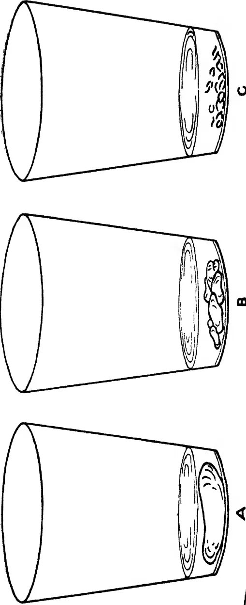Three cylindrical jars are shown side-by-side, labeled A, B, and C from left to right. Jar A shows a small, rounded piece of marmalade on the surface. Jar B shows a larger, more irregular piece of marmalade. Jar C shows a very large, flat, and slightly textured piece of marmalade, indicating it has set.

Fig. 1

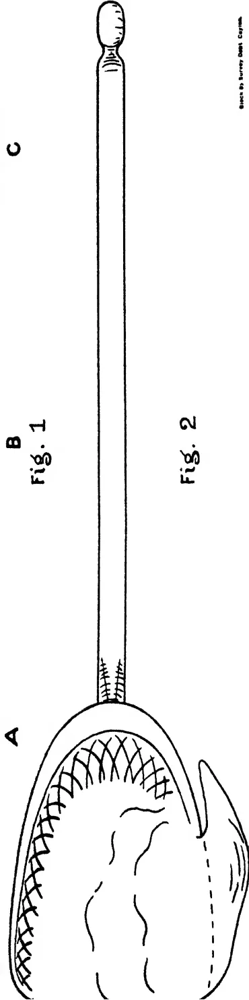A large spoon is shown, oriented vertically. The bowl of the spoon is filled with a textured, cross-hatched pattern, representing the marmalade. The handle of the spoon is long and thin, with a rounded end at the top. The handle has some cross-hatching near the bowl, possibly indicating a grip or a specific type of spoon.

Fig. 2

PLATE 1.—MARMALADE MAKING.

Fig. 1.—"Testing for Pectin."  
Fig. 2.—"Flake " test to determine if the Marmalade is sufficiently boiled.

Repro. by Survey Dept. Copyright.

392------------------------------------------------

This image is a blank white page. It contains several small, dark specks which appear to be scanning artifacts or dust particles. There is no text, handwriting, or printed content on the page.

393------------------------------------------------

297

### Cutting and Soaking the Fruit.

The fruit is first weighed then peeled and the peel sliced finely or coarsely as desired and placed in a large basin. The rest of the fruit is cut into rather small pieces and tied in a muslin bag which is placed with the peel in the basin, together with any juice draining out of it. If desired the white pith may be removed from the peel before cutting in which case it should be cut finely and also put in the muslin bag. Any added acid is put in at this stage and if lemon juice is used the lemon peel is cut into small pieces and included in the muslin bag. Water is now added, the usual amount being 2 pints to 1 lb. of fruit. More can be put in during boiling if it is necessary. The basin is covered to keep out dust and left to stand overnight. This soaking helps to soften the peel and shorten the subsequent boiling but can be left out if marmalade has to be made in a hurry.

### Boiling and Addition of Sugar.

An aluminium pan is probably the best; copper, brass and enamel are quite satisfactory, but iron should not be used as it may give the marmalade a metallic taste. The pan is first weighed, the contents of the basin poured in and brought to the boil. Slow boiling is continued until the peel is quite soft. At intervals during boiling, the muslin bag is pressed with a wooden spoon to squeeze out juice and pectin from it. As soon as the peel is soft the pectin test is taken. If it is satisfactory the pan is removed from the heat, the muslin bag well squeezed and extracted from the pan and the pan again weighed. As was mentioned above the weight of pulp thus obtained determines the amount of sugar to be added. The pan is replaced on the heat, the sugar added and the mixture again brought to the boil. To prevent burning it is stirred with a wooden spoon until the sugar dissolves. At this stage the marmalade is boiled as quickly as possible, as a short boiling, once the sugar is added, is essential for bright colour and good flavour.

### Finishing Point.

There are several methods adopted for telling when the marmalade is sufficiently boiled. The most usual method is to take out a small amount, put it on a cold plate to cool, and then see if it sets. In a hot country this may take some few minutes and meanwhile the marmalade in the pan may be over boiled. A similar type of test is the "flake" test. The wooden stirring spoon is dipped into the marmalade and taken out with some marmalade adhering to it. It is then held horizontally over a plate away from the heat and rotated to cool it. When the marmalade is ready it will not drop from the spoon in single drops, but first hang in a sheet and then flake off (Pl. I., fig. 2). This test is quicker than the former but the most reliable method

394------------------------------------------------

298

of obtaining the end point is by weight. It has been previously mentioned that the finished marmalade should contain 60 per cent. or thereabout of sugar for the sake of good keeping. If the correct amount of sugar, as given by the pectin test, has been added this concentration also gives the right set. Thus if the weight of sugar added is 60 per cent. of the marmalade, the weight of marmalade = weight of sugar  $\times 10/6$ . As the weight of the pan has previously been taken the marmalade is boiled until it attains this weight.

#### **Putting into Jars.**

As soon as the marmalade is sufficiently boiled it is taken from the heat and immediately skimmed. Scum should not be removed during boiling or a good deal of marmalade will be wasted. It is then allowed to cool for several minutes, stirred well to distribute the peel, and poured into clean warmed jars. The jars are filled right to the top as marmalade shrinks on cooling, and, while it is still very hot, a waxed paper circle, cut just the size of the inside rim of the jar, is placed flat on the surface. The marmalade is then allowed to stand until quite cold when covers are put on the jars.

Marmalade made in this way will keep for many months in the jars. It should be stored in as cool and dry a place as possible, preferably away from the wall, in a store cupboard which is in a part of the house protected from the direct rays of the sun.

#### **Note.**

No recipes are given here, as it has already been explained that marmalade of uniformly good quality cannot be made by rule-of-thumb methods. However the following notes on mixtures of fruit may be of help to the inexperienced.

#### **Bitter Orange Marmalade.**

Use one lemon to two bitter oranges.

#### **Grapefruit Marmalade.**

Use one lemon to two grapefruit.

#### **Mandarin Orange Marmalade.**

Use one grapefruit and two lemons to 2 lb. of mandarin oranges. This is best made as a jelly marmalade. Cut about three quarters of the peel of the mandarin oranges and tie in a muslin bag. Remove this after boiling and strain the juice from the rest through a jelly bag. Then pour the juice back into the pan, put in the peel from the muslin bag, add sugar as required and finish in the usual way.

#### **Lime Marmalade.**

Use limes only, or one grapefruit to one dozen limes.

#### **Lemon Marmalade.**

Use lemons only, or one grapefruit to six lemons.

395------------------------------------------------

299

## SUGAR-CANE IN CEYLON : A HISTORICAL SURVEY

---

**I**N these notes, an attempt is made to summarize briefly the progress of sugar-cane cultivation in Ceylon from the earliest times from which records are available up to the present day.

### EARLY SUGAR-CANE PLANTATIONS

It has been stated that sugar-cane was grown in Ceylon in the days of the Sinhalese kings even before the Dutch era, but no details of such cultivations are available.

The systematic cultivation of the crop was established in Ceylon during the early part of the last century. It was grown in various districts of the Island, in the Southern Province near Baddegama on heavy loams (paddy soils), at Jaffna, Northern Province (calcareous loams), at Anuradhapura, North-Central Province (heavy loams over gravel), and in the Eastern Province at Allai (medium loams).

The pioneers in sugar-cane cultivation, however, did not find the undertaking very successful and by the time of the Great War 1914–18, the plantations had either been entirely abandoned or re-cultivated in tea and rubber. The following extract from the Ceylon Observer Handbook and Directory furnishes some particulars regarding the early sugar-cane plantations :—

“The systematic cultivation of sugar-cane was previous to the present (twentieth) century attempted twice on a large scale in Ceylon in the neighbourhood of Kalutara. Mr. Winter planted and grew canes near Kalutara in 1826 and manufactured sugar therefrom but transferred his operations to Baddegama near Galle in 1840 upon an old indigo estate that he purchased. Mr. Tytler was employed in cane cultivation for Messrs. Acland and Boyd in 1837–40 in Dumbara and Messrs. Baring Bros. opened Peradeniya Estate in sugar in 1840. Between 1842 and 1846 large sugar plantations were formed in the Southern Province, viz., Oodagama on the Gintara river by Baron Delmar, Hahangam near Galle by Baron Delmar, Telicada on the Gintara river by Messrs. Faulkner and Liverpool, Kohila Wagura at Ambalangoda by Messrs. Tindall and Co., Paraduwa near Matara by Lord Elphinstone, Wilpitiya on the Matara river by Mr. Greg. Small plantations were opened near the Gintara river by

396------------------------------------------------

300

Mr. A. Orr and at Watteraka by Mr. Palmer. There were also several sugar plantations in the Eastern Province, viz., Dalloopatugedera, Katukanda, Dambawinna and Etgala.

In 1860, however, the only places where systematic cane cultivation was being carried on were Paraduwa, Baddegama, Etgala and Peradeniya. Within a few years after 1860 the only estate carrying on sugar cultivation was Baddegama in the Southern Province.

The reasons assigned for the previous failure of sugar-cane ventures was the poor quality of the juice of canes grown in the Southern Province. Plantations were situated in the regions receiving a rainfall of between 100 and 150 inches of rain and juices were said to test between 6–9° Beaumé. In the Western Province, coconuts were found to grow better than canes and rapidly replaced the cane cultivation in 1860".

#### FIRST TRIALS WITH SUGAR-CANE

The first experiments with sugar-cane conducted by the Department were at the Experiment Stations at Peradeniya and Anuradhapura in 1920. The varieties tried included Sealy's Seedling, 55r, 3390, D.K. 74, Red Top Mauritius, San Nombre and Striped Tanna.

Yields of cane per acre varied from 45.8 tons per acre with Sealy's Seedling to 20.8 tons with 131r at Peradeniya, and 30.8 tons per acre with Sealy's Seedling to 2.4 tons with Striped Tanna at Anuradhapura. The sucrose percentages varied from 11.4 to 20.2 at Peradeniya and 11.6 to 20 at Anuradhapura.

These trials were continued in 1921 and 1922 and the results were published in *The Tropical Agriculturist*, Vol. LVI., 1921, p. 205–210, and Vol. LIX., p. 205–207.

The trial plots at Peradeniya and Anuradhapura were maintained for the purpose of multiplication of the better varieties and issue to planters, but were eventually discontinued owing to the absence of public interest in the crop.

#### DROUGHT-RESISTING SUGAR-CANE

Prior to 1918, the Ceylon Sugar Refineries, Ltd., had conducted experiments with drought-resisting canes like Red and Striped Mauritius, Yellow Caledonia, the results of which led them to believe that such canes might prove a profitable crop in Ceylon.

#### HIGH LAND SUGAR-CANE

An interesting trial cultivation of high land cane was undertaken by Mr. A. W. Winter, the Baddegama planter, in 1920–21. On his estate Pillagoda Valley he had already tried the varieties

397------------------------------------------------

301

Striped White Tanna, DK 74, B. 3390, 55p, 131MP, Seely's Seedling and San Nombre. He also had a small estate at Ganewatta where he was cultivating sugar-cane.

His trial was more in the manner of a speculative commercial enterprise rather than a planned trial for the purpose of scientific observation. It was, however, the first attempt to grow sugar-cane on high land in Ceylon and for that reason merits notice.

In 1920 he applied to the Director of Food Production for the lease of some land in Ratmarathimbillakanda in Gangaboda pattu, Southern Province, for experimental purposes with high land cane. This land was visited by the Director of Agriculture and he reported favourably on the high land cane already being experimented with at Pillagoda Valley. Mr. Winter applied for an area of 100 acres to start with. The lease was approved by the Governor in 1923 on the understanding that only sugar-cane was to be grown on the land.

By July 1923, about 100 acres of land were leased by Mr. Winter and in May, 1924, a further 100 acres were leased by him. In October, 1928, Mr. Winter reported to the Director of Agriculture that the returns on his cultivation were not sufficient to pay for the harvesting of the cane and the manufacture of sugar at the prevailing prices and that he had lost about 2 lakhs of rupees in the venture about the success of which he was now pessimistic. He stated that the canes "did not grow to any length and the quantity of cane was nothing like what it ought to be nor the quantity of sugar for a given quantity of juice".

The Divisional Agricultural Officer visited Mr. Winter's estate and factory in November, 1928, and reported that the growth of the cane on high-land was very variable and, especially in the ratoan crop, did not appear to be satisfactory. He stated that the growth of cane was not as good as that on low-lying land and the sucrose content was low. The extension of cultivation on the high land was not recommended.

#### SUGAR COMMITTEE OF THE BOARD OF AGRICULTURE

In the Annual Report of the Department of Agriculture for 1917 it was stated that "some investigation had been made into the possibilities of a sugar industry for the Colony" and that it was thought that such an industry could be established with advantage. It was also suggested that at the commencement it would possibly have to be an industry for small growers and to require some assistance from Government in its initial stages.

In view of the entire dependence of the Island upon imports for its supply of sugar, this was followed in May, 1918, by the

398------------------------------------------------

302

appointment of a Committee by the Board of Agriculture to consider the prospects and possibilities of sugar-cane cultivation and of the manufacture of sugar in Ceylon. This Committee included in its consideration the possibility not only of producing sugar in the Island, but also of exporting sugar, thus satisfying the desire of the Imperial authorities to produce an adequate supply of sugar within the Empire.

The Committee met thrice. It considered details concerning the former sugar-cane cultivation and some of the members examined the prospects of sugar-cane cultivation along the banks of the Gin-ganga, at Kalupahana in the Province of Uva, under irrigation in the North-Central Province, and under the proposed Allai Extension Scheme in the Trincomalee District in the Eastern Province.

At that time the sugar-cane cultivations in Ceylon generally consisted of small gardens adjoining dwelling houses in villages. There were two centres for growing sugar-cane for the manufacture of sugar—at Nagoda in Galle District and at Kalupahana in the Province of Uva. At both these centres there was an area of 30–40 acres under cultivation. The cane was crushed in bullock or hand-power mills to prepare a raw sugar. At Nagoda some clarification of this preparation was carried out to produce a fine-grain raw sugar, while at Kalupahana cakes of cane jaggery were manufactured. It was reported that at Kalupahana the cultivation of sugar-cane was of the most primitive type undertaken by estate labourers—the Bourbon variety of cane being grown. The yield of canes was very poor and the Committee of the Board of Agriculture stated that, with improved methods of cultivation, a two-fold increase in the yield could have been expected.

At Nagoda and along the banks of the Gin-ganga nearly 300 acres had at one time been under cultivation. The estate of Messrs. Winter and Bowman was originally 100 acres in extent, but it was later planted up with tea and rubber and the sugar-cane abandoned. The reasons for this were : (a) the decrease in the price of sugar, (b) the low sucrose content of the canes, (c) the increasing cost of labour, (d) difficulty with regard to fuel, and (e) the higher profits derived from tea and rubber. The varieties of canes grown at this centre were Bourbon and Striped Singapore.

The Committee, having reviewed the existing cane cultivations, concluded that more extensive areas in Ceylon would be capable of being cultivated with sugar-cane with profit, for example in the Kurunegala District, Southern, Sabaragamuwa and Uva Provinces, and along the banks of the Mahaweli-ganga. The Committee, however, did not recommend that large areas under tanks be exclusively devoted to sugar-cane cultivation since

399------------------------------------------------

303

the growth of paddy on these areas was also necessary and important; but it pointed out that a satisfactory rotation of sugar with paddy or other food crops had been worked out in Java. The Allai Extension Scheme was specially mentioned as worthy of development for sugar-cane cultivation.

#### TRIALS AT ALLAI

The suggestion of trying out the possibilities of sugar-cane cultivation at Allai had been before the Director of Agriculture for a number of years. It was believed that, should the Scheme prove of definite promise, capitalist concerns would be attracted to undertake large-scale plantation at Allai.

The question of labour was also examined by the Director of Agriculture, but it was his opinion that there should be no difficulty in securing labour from Batticaloa.

The Allai Tank consisted of a large area of some 10,000 acres of practically flat land situated near the east coast of Ceylon, south of Kottiar Bay and Trincomalee harbour. About 3,277 acres forming the bed of the former Allai tank, most of which was free of trees or jungle growth, used to become flooded to a depth of one or two feet during the north-east monsoons in December-January, but the water gradually subsided with the irrigation of 2,000 acres of paddy below the tank bund. Under the Scheme it was proposed to utilize the tank bed and surrounding land for cultivation.

In August, 1920, as a result of the recommendation of the Sugar Committee, the Director of Agriculture suggested to the Ceylon Government that the Allai Extension Scheme be closely examined by sugar experts with practical commercial experience in other tropical countries and proposed that financial interests prepared to finance large sugar-cane plantations be introduced. This was followed by an invitation by Mr. (now Sir) F. A. Stockdale, Director of Agriculture, to Mr. C. F. Hughes, Managing Director of the Colonial Sugar Refinery Co., Sydney, Australia, to examine the Allai Extension Scheme for sugar-cane plantation.

Mr. Hughes visited Allai in November, 1924, and reported that about 7,500 acres of the Scheme may be suitable for cane growing of which Crown land consisted of 5,000 acres. He also reported that the "general configuration of the area appeared almost ideal for the purpose of growing sugar-cane under irrigation and with modern conditions of cultivation". He advised that the first step to be undertaken was to ascertain what varieties of cane were likely to yield the best sugar results under local conditions by planting in several experimental plots the more promising of the canes cultivated at Peradeniya and Anuradhapura.

400------------------------------------------------

304

This recommendation was similar to that of the Committee on the proposals for the development of the Economic Resources of the Colony reproduced below :

“*Sugar-cane Cultivation.*—This Committee entirely endorses the recommendation of the Conference that the Department of Agriculture should carry out experiments on the cultivation of sugar-cane on a sufficiently extensive scale to demonstrate whether such cultivation is commercially possible. It will be seen on reference to page 52 of the minutes of the second meeting that the proposals made by Mr. Stockdale for carrying out the experiments would involve the cultivation of two areas of about 20 acres each, one in the dry zone and the other under a tank. He estimates the cultivation charges at Rs. 350 per acre, and the cost of the outfit required for dealing with the output of an area of 20 acres at Rs. 10,000. The cost of the experiments apart from the value of the land would then be (Rs. 350 by 40) plus Rs. 20,000 = Rs. 34,000. In view of Ceylon’s annual consumption of 40,000 tons of imported sugar, we are of opinion that an expenditure of Rs. 40,000 to 50,000 from revenue on experiments which might demonstrate the possibility of local production of this quantity at a cheap price as that now paid for imported sugar would be fully justified.” (Government Sessional Paper VI. of 1921).

The Director of Agriculture examined the question with the Divisional Agricultural Officer, Northern Division, and arrived at the opinion that two blocks of 10 acres would be sufficient to begin with—one to be in the jungle land and the other in the low-lying, more swampy area—and suggested that the trial should last for three years. He recommended that this be done early so that the mill qualities of the various canes which will be experimented with be thoroughly investigated. Provision for the trials was included in the Estimates of 1924–25.

Two blocks of land were selected in April, 1925, and an Agricultural Instructor was stationed at the trial area in August, 1925. However, only one block was cleared and developed.

Planting commenced in November, 1925, and 11 varieties of cane were grown. Cuttings of these varieties were obtained from the Experiment Station, Peradeniya and Anuradhapura. Further planting was continued periodically up to October, 1926. Irrigation had to be carried on at regular intervals from March to September inclusive, and this was provided by means of a Persian wheel.

#### RESULTS OF ALLAI TRIAL

Harvesting of the 1925 planting commenced in July, 1927, and extended to the middle of October. The usual Indian

401------------------------------------------------

305

method of manufacturing cane-sugar jaggery was adopted. The ratoan crop was cut in July–September, 1928, and the results are given below :

<table border="1">
<thead>
<tr>
<th rowspan="2"></th>
<th colspan="4">Ratoon Crop</th>
</tr>
<tr>
<th colspan="2">Canes<br/>(Tons)</th>
<th colspan="2">Jaggery<br/>(Tons)</th>
</tr>
</thead>
<tbody>
<tr>
<td>Barbados 208 ..</td>
<td>..</td>
<td>14·2</td>
<td>..</td>
<td>1·3</td>
</tr>
<tr>
<td>Striped White Tanna ..</td>
<td>..</td>
<td>19·5</td>
<td>..</td>
<td>0·8</td>
</tr>
<tr>
<td>San Nombre ..</td>
<td>..</td>
<td>32·1</td>
<td>..</td>
<td>2·2</td>
</tr>
<tr>
<td>Barbados 3390 ..</td>
<td>..</td>
<td>22·9</td>
<td>..</td>
<td>1·3</td>
</tr>
<tr>
<td>Mauritius 131r ..</td>
<td>..</td>
<td>10·5</td>
<td>..</td>
<td>0·8</td>
</tr>
<tr>
<td>Mauritius 1237 ..</td>
<td>..</td>
<td>21·8</td>
<td>..</td>
<td>1·2</td>
</tr>
<tr>
<td>Striped Tanna ..</td>
<td>..</td>
<td>14·0</td>
<td>..</td>
<td>0·9</td>
</tr>
<tr>
<td>Demerara 74 ..</td>
<td>..</td>
<td>30·6</td>
<td>..</td>
<td>1·2</td>
</tr>
<tr>
<td>Cheribon ..</td>
<td>..</td>
<td>11·7</td>
<td>..</td>
<td>0·5</td>
</tr>
<tr>
<td>Mauritius 55r ..</td>
<td>..</td>
<td>23·9</td>
<td>..</td>
<td>1·5</td>
</tr>
</tbody>
</table>

The average yield per acre of the total areas cut were :

<table border="1">
<tbody>
<tr>
<td>Virgin crop—Canes ..</td>
<td>..</td>
<td>35 tons</td>
</tr>
<tr>
<td>Jaggery ..</td>
<td>..</td>
<td>2·45 „</td>
</tr>
<tr>
<td>Ratoon crop—Canes ..</td>
<td>..</td>
<td>20·1 „</td>
</tr>
<tr>
<td>Jaggery ..</td>
<td>..</td>
<td>1·17 „</td>
</tr>
</tbody>
</table>

The detailed analysis of canes produced and the Profit and Loss Account were published in Government Sessional Paper L. of 1928.

The Director of Agriculture made the following statements regarding the results obtained at the Allai Trials :

1. (i.) The system obtaining in Java of rotating sugar-cane with paddy should be reported upon by an officer of the Department of Agriculture.
2. (ii.) Success in sugar-cane growing will not be achieved unless capital is available for the manufacturing side of the industry.
3. (iii.) In Allai itself success cannot be achieved unless the land can be adequately drained and flooding prevented.
4. (iv.) If the drainage is good, there are decided possibilities before the cultivation of sugar-cane in the Allai area.

*Note.*—Mr. L. Lord, an officer of the Department of Agriculture who visited Java in 1929 to study rice cultivation there, was directed to include in his study sugar-cane also ; but unfortunately Mr. Lord's experience could not be turned to advantage owing to his resignation from the service of the Government.

The experiment at Allai was finally closed in September, 1930.

#### RECENT TRIALS AT KILIVEDDY

With the conclusion of the Allai trial no further systematic experiments with sugar-cane were undertaken until in June,

402------------------------------------------------

306

1937, the Research and Experiment Committee of the Department of Agriculture assigned to the Botanist of the Department the two following experiments with the crop :

- (i.) An experiment to determine the best variety of cane to be grown, from the standards of yield and sugar content.
- (ii.) An experiment to compare the yield and sugar content of imported varieties of sugar-cane.

The locality of the trials was to be Kiliveddy which is situated near Muttur, Trincomalee District.

Thirty-eight Varieties of sugar-cane which consisted of 12 Coimbatore varieties and others from Java, Federated Malay States, Mauritius, South Africa, Queensland, and Hawaii were included in field trials. The trials commenced in September, 1939, and are expected to continue for a period of about five years before provisional conclusions can be published by the Botanist.

#### ARTIFICIAL INSEMINATION OF COWS.

It is notified for general information that owners of cattle who are desirous of getting their cows impregnated by the above method should communicate with the Veterinary Research Officer, Peradeniya, who will provide them with further particulars on the subject.

The following scale of fees will be charged for insemination with effect from June 1, 1941 :—

<table>
<thead>
<tr>
<th colspan="7"></th>
<th>Rs.</th>
<th>c.</th>
</tr>
</thead>
<tbody>
<tr>
<td>To</td>
<td>places</td>
<td>within</td>
<td>10</td>
<td>miles</td>
<td>from</td>
<td>Peradeniya ..</td>
<td>4</td>
<td>0</td>
</tr>
<tr>
<td>"</td>
<td>"</td>
<td>"</td>
<td>20</td>
<td>"</td>
<td>"</td>
<td>" ..</td>
<td>8</td>
<td>0</td>
</tr>
<tr>
<td>"</td>
<td>"</td>
<td>"</td>
<td>30</td>
<td>"</td>
<td>"</td>
<td>" ..</td>
<td>10</td>
<td>0</td>
</tr>
<tr>
<td>"</td>
<td>"</td>
<td>"</td>
<td>50</td>
<td>"</td>
<td>"</td>
<td>" ..</td>
<td>12</td>
<td>50</td>
</tr>
</tbody>
</table>

If a reinsemination is found necessary the owner should pay half the above rates provided it is done within 60 days of the first insemination.

M. CRAWFORD,  
for Director of Agriculture.

Peradeniya, May 22, 1941.

403------------------------------------------------

307SELECTED ARTICLESCINCHONA IN GUATEMALA\*

THE comprehensive summary of recent progress in cinchona cultivation throughout the world published in the bulletin of the Imperial Institute, 1939, includes only brief mention of the work which has been done in the Republic of Guatemala. Since those experiments show considerable promise, it is hoped a general survey of results obtained to date may prove of interest.

BOTANY

To render intelligible this discussion it is necessary to consider briefly the botanical status of the plants grown as sources of the drug quinine. Weddell, who devoted exhaustive study to the genus *Cinchona* in the early days, published in 1848, a list comprising 21 species. Later, in 1870, he revised his classification, extending it to include some 37 species and 15 subspecies. Many of these, in the light of later study, seem more properly to be considered as geographical forms or varieties. The summary made by the Imperial Institute, mentioned above, states:—

“ Four species only have been cultivated to any extent as a source of alkaloids. These are *C. ledgeriana* Mœns ex Trimen (known also as *C. calisaya* Wedd. var *ledgeriana* Howard) from which Ledger Bark is obtained; *C. succirubra* Pavon ex Klotsch, the source of Red Bark; and finally *C. calisaya* Wedd. and *C. officinalis* Linn., yielding Yellow Bark, and Crown Bark or Loxa respectively. Two hybrids may also be mentioned, namely *ledgeriana*  $\times$  *succirubra*, known as ledger hybrid or sometimes as *C. hybrida*, and *officinalis*  $\times$  *succirubra*, which is usually called *C. robusta*. At the present time practically the entire supply of cinchona bark in commerce is obtained from *C. ledgeriana* and *C. succirubra*. ”

This classification, though greatly reducing the confusion in which the subject was left by the early botanists, is considered by certain American students as requiring still further simplification. Paul C. Standley, who has devoted much study to the Rubiaceæ of tropical America, reduces the species involved in commercial quinine production to *C. officinalis* Linn. and *C. pubescens* Vahl (*C. succirubra* Pavon), justifying his stand in the following words (cf. the *Rubiaceæ of Ecuador*, Field Museum of Natural History, Publication No. 285, Chicago, 1931):

“ Because of the great economic importance of the trees concerned and especially because of the varying quinine content in the inhabitants of the various regions, several botanists have devoted a great deal of time and hundreds of printed pages and plates to a discussion of the species of the genus. The result of their work has been the description of a great number of so-called species, based on characters that certainly would not be considered valid or important in other genera of the Rubiaceæ. The writer has examined a large

\* By Wilson Popence (United Fruit Co.) in *Tropical Agriculture*, Vol. XVIII, No. 4, April, 1941.

404------------------------------------------------

308

amount of herbarium material of the genus, as well as photographs of many of the types involved. He is quite unable to discover any conservative basis for recognizing the many species to which names have been given, and he believes that these names relate to variable races of a few not very clearly marked species which may be recognized for botanical convenience. The mere fact that the variations of these races are important from the stand-point of the pharmacist does not justify their recognition, if such were possible, as species in the ordinary sense of that term."

Admittedly the last word has not been said regarding the botanical status of those forms of cinchona which yield quinine commercially. Admittedly further study may alter the classification adopted by Standley. But the simplification of the agricultural problem by the elimination of numerous questionable species, which do not invariably come true when grown from seed, seems so logical and so practical that Standley's classification has been accepted by those working in Cinchona in Guatemala at the present time. *C. ledgeriana* is therefore not recognized as a species; neither is *C. calisaya*. Both are forms of *C. officinalis*, a widely variable species which hybridizes freely with the other one which produces commercial quinine—*C. pubescens* (more commonly known as *C. succirubra*), giving rise to forms which often go under the name of *C. robusta* but which more properly are to be termed *officinalis*  $\times$  *pubescens* hybrids.

Agriculturally, it is becoming the practice in Guatemala to refer to trees of the species *officinalis* as calisayas; those of the form known elsewhere as *C. Ledgeriana* as Ledgers or calisayas of the Ledger race; trees of the species *pubescens* as succirubras; and all hybrids between *officinalis* and *pubescens* as hybrids rather than *C. robusta*. Without presuming to say that this terminology will stand test of the future botanical investigation, it is felt that its simplicity recommends it.

### HISTORICAL

The stimulation of interest in Cinchona culture shortly after the middle of the last century, resulting from the successful efforts of the British and the Dutch to transplant Cinchona trees from their native home in the Andes to plantations in the Eastern tropics, had repercussions in several regions, of which Guatemala seems to have been one. For we can only attribute to this cause the introduction of Cinchona into this country about the year 1870, a work which seems to have been fostered by that remarkable man, President Justo Rufino Barrios. Details are difficult to obtain at this late day, but it is known that Barrios planted cinchona extensively on his property "El Porvenir" in the Department of San Marcos, where the progeny of his original trees still grow in vast numbers. An examination of these half-wild trees to-day suggests that Barrios brought in both *C. officinalis* and *C. pubescens*. As would be expected, the latter is the one which has survived, most of the present trees being unquestionably of that species; but there are sufficient indications of *calisaya* blood to convince one that hybridization has taken place, and that while the more delicate *officinalis* has disappeared, its memory still lingers in the narrow, smooth leaves, the white flowers and the relatively high quinine content of numerous trees scattered over the slopes of the volcano Tajumulco which dominates this beautiful property.

405------------------------------------------------

309

Shortly after the death of Barrios the Reformer a serious effort was made by Germans to establish Cinchona cultivation in the Department of Alta Verapaz of which we fortunately have an account in the memoirs of Franz Sarg, published in "Deutschtum in der Alta Verapaz" 1938. Sarg states that the Minister of Agriculture, Don Manuel Herrera, offered a prize of fifteen hundred pesos to the man who would make the first planting of two thousand trees. Through the good offices of Prince Nikolaus of Nasuas seeds were obtained from Ceylon in 1878, and in 1882 the prize was claimed and paid. Difficulty in handling the bark, and falling prices in the world market, discouraged the undertaking and the project was dropped. But two old trees at the Finca Sachamach, near Coban, still remain to testify that here again the effort was not limited to the introduction of the relatively inferior succirubras, but that *calisayas* also were involved; for these two trees, which may be seedlings of some of the first ones planted, show definite evidence of *calisaya* blood—again in their leaves, their flowers, and their relatively high quinine content.

After these early efforts, from which no pecuniary profit seems ever to have been derived, interest lapsed for half a century. Then, with a view to developing a Cinchona industry capable of supplying the North American market with quinine, experiments were started which had the support of the Guatemala and the United States governments. Seeds of the Ledger race were obtained, and later, through the good offices of the Division of Plant Exploration and Introduction of the United States Department of Agriculture, other promising strains were brought into the country. Nurseries were established in several places; Don Mariano Pacheco, Director General of Agriculture for the Republic of Guatemala, gave the subject his personal attention; and work was under way which in the past two years has commenced to show promising results.

#### COMMERCIAL CINCHONAS AND THEIR CHARACTERISTICS

Naturally, these recent experiments in Guatemala have had as background the available literature upon the general subject of cinchona cultivation in other regions, particularly Java, which at present supplies 95 per cent. of the world's quinine. The literature, while by no means extensive, is sufficient to point out the objectives which must be attained if success is to be achieved. Of particular value has been W. N. Sand's account of the Cinchona Industry in Java, published in the Malayan Agricultural Journal, 1922; and "De Kina-cultuur" by A. Groothoff, published in Haarlem, Holland, in 1925. A more recent work of value, from a different region, is E. H. J. Stoffels' bulletin "Le Quinquina", published by L'Institut National pour l'Etude Agronomique, Belgian Congo, 1939.

These publications by no means exhaust the list, of course, and it is perhaps well to mention once again the excellent summary compiled by the Imperial Institute, referred to at the beginning of this paper. From this last-named publication, and bearing in mind the fact that the Ledger race of *calisaya* is today the source of most of the quinine produced commercially, the following quotation is of more than passing interest:—

"It has already been mentioned that *C. ledgeriana* is more exacting in its requirements than any other species. The most suitable climatic conditions

406------------------------------------------------

310

for satisfactory bark production of high quinine content would appear to be those obtaining in Java at elevations of 4,000 to 5,000 feet. The character of the soil is also of great importance in the case of this species; its first essentials are that it should be friable and of good depth, the best results in Java having been obtained on such soils recently cleared of forest. Other species, especially *C. succirubra*, on the other hand, will thrive and give relatively good yields of alkaloids under conditions where *C. ledgeriana* would fail. For this reason, and owing to the uncertainty of successfully re-establishing *ledgeriana* on old cinchona lands attention has been paid to the question of grafting the latter species on the more vigorous *succirubra* stock. This has proved highly successful and practically all the Ledger bark now being produced in Java is harvested from grafted trees."

Work in Guatemala commenced with full appreciation of the fact that experimentation is required to determine which kinds are best suited to profitable commercial exploitation under the particular conditions of soil and climate existing in this country; but also, with understanding that high-yielding Ledgers such as those grown in Java have fully demonstrated their value and might here prove to be the best. More time will be required to determine for any given area just what is right. The situation, so far as can be judged at long range (since Java is accepted as the guide), sums itself up about as follows:—

*Ledger seedlings on their own roots.*—These are held to be the ideal thing, where conditions for their development are satisfactory. They have the advantage that root-bark as well as stem-bark contains relatively high percentages of quinine, whereas Ledgers grafted on *succirubra* rootstocks suffer from the disadvantage of the relatively low quinine content of the root-bark. There is the further advantage that the expenses of grafting is avoided.

*Ledger clones on succirubra roots.*—These can be grown on soils not sufficiently rich for Ledgers on their own roots. Vegetative propagation provides foreknowledge regarding quinine content of the ultimate tree, a distinct gain since it is a notorious fact that Cinchona seedlings are in nearly all instances subject to much variation.

*Calisayas other than those of the Ledger race.*—These were given a trial in the Asiatic tropics before the advent of Ledgers (the history of which is too well known to require mention here), and the fact that Ledgers have completely superseded them speak volumes. Nevertheless, the literature makes little mention of new trials in the past half century, and there seems a definite possibility that the Andean region, native home of the Cinchonas, may still yield forms of *C. officinalis* which, under certain conditions of climate and soil, will have commercial value.

*Succirubras on their own roots.*—These are of more rapid growth than Ledgers, and can be cultivated successfully on many soils not suited to the latter; but their quinine content is low and they are not considered commercially very satisfactory—except where there is an interest in alkaloids other than quinine, such as cinchonidine and quinine, of which succirubras sometimes contain relatively large percentages.

407------------------------------------------------

311

*Hybrids, C. officinalis* × *C. pubescens*.—These are frequently mentioned in the literature and there can be no doubt that some of them have played a part in commercial production. Many have the advantage of being more robust than Ledgers, and of more rapid growth. As a rule, their quinine content is lower than that of good Ledgers; but the volume of bark produced at a given age may be considerably greater, hence the lower quinine content is in part offset. There is the added circumstance that hybrids often grow well on soils which will not support Ledger seedlings. Due to their mixed genetic constitution, however, it seems probable that it will be necessary to graft hybrids on to succirubra stocks if uniformly good results are desired.

### RESULTS OF EXPERIMENTATION TO DATE

The pioneering done in the 1870's and 1880's has left large numbers of Cinchonas—mostly succirubras, with a few evidence of calisaya blood at Coban and El Porvenir—scattered over Gautemala, chiefly in the Alta Verapaz and on the coffee plantations of the Pacific side. But the information gained in the early days regarding the adaptability of Gautemalan soils and climates to the culture of calisayas is lost. Present efforts to determine the commercial possibilities of Cinchona culture in this Republic have had to be based on the fact that nothing is known and everything is to be learned.

Seeds of high-grade Ledgers were obtained and nurseries formed at several places which in the light of information gleaned from the literature seemed promising. Lack of experience naturally resulted in the loss of many seedlings; but sufficient were saved to plant several small experimental areas, chiefly at Finca Halvetia (Department of Retalhuleu) Finca Samac (Alta Verapaz) Finca El Zaptoe (Escuintla) and Finca Panamá (Sololá). These plantings ranged in elevation from 3,500 to 4,500 feet, and represented a very considerable range of climatic conditions.

Many of these trees have attained sufficient size to show interesting responses to environmental conditions, and to permit of bark analysis. Best growth has been obtained on the brown, deep, volcanic fine sandy loams and silt loams of the Pacific side, and on the alluvial clay loams of the Coban region. On the black sandy loams—one of the chief soil types of the Pacific side—results have not been so good; though it may be noted that in all cases these Ledger seedlings have been planted on land which for many years previously had grown coffee or other crops.

Since writers on Cinchona cultivation in Java repeatedly stress the necessity of using virgin lands for Ledger seedlings, it cannot fairly be said that experience in Gautemala on old lands of the black sandy type is discouraging.

In considering the results of bark analyses it must be remembered that samples are taken from precisely that part of the tree which contains the highest percentage of quinine, namely the trunk at about three feet from the ground. Bark from the smaller branches does not show such high percentages, nor does that from the roots. On the basis of the available literature, Ledger seedlings which show 12 to 13 per cent. of quinine sulphate when bark-sampled at the age of five to six years can be considered good; and such trees are now growing in Guatemala.

408------------------------------------------------

312

From these trees it should be feasible not only to develop satisfactory sources of high-grade seed for further planting, but also, and perhaps even more important, select the most vigorous and disease-resistant individuals, and those with the thickest bark, for the establishment of clones to be propagated by grafting on *succirubras*. Not a few such clones have already been chosen and are being propagated as rapidly as possible. W. N. Sands (*loc. cit.*) has enumerated the principal factors which should be taken into account when selecting individual for vegetative propagation, and his description of the Java technique has been accepted as the best guide until such time as adequate experience has been gained locally.

In addition to trees of Ledger race now established in Guatemala there are numerous others obtained from several sources through the co-operation of the United States Department of Agriculture. And there are many seedlings from the old trees at Sachamach near Coban, broad-leaved forms of apparently mixed blood, vigorous in growth and suitable for cultivation on lands not rich enough for Ledger seedlings. Some of these, and some of the broad-leaved trees presumably of hybrid origin which have been introduced from other regions, have shown quinine contents of 6 to 7 per cent., which is considered satisfactory in view of their rapid growth and thick bark.

Unfortunately, the altitudinal range of the first experimental plantings does not include elevations above 4,500 feet. Recently, therefore, small plantings have been made at higher levels—up to 6,200 feet in one instance—to test the possibilities of the zone immediately above that in which coffee is profitably grown in this republic. For it will greatly facilitate the development of Chincona industry if coffee planters can use for this crop lands between 5,000 and 6,000 feet in elevation. Many planters possess such lands which because they were not considered suitable for coffee are still in virgin forest.

### PROPAGATION

The production of *succirubra* seedlings on which to graft Ledgers offers few difficulties. Successful production of Ledger and other *calisaya* seedlings, on the other hand, requires good technique and attention to details; while grafting is in this case, as with many other trees, something which can be successfully carried out only when it is backed by a certain amount of experience and knowledge of essential factors.

To the experienced horticulturist, in other words, there is nothing in the propagation of Cinchona, asexually or sexually, which presents serious problems; but the tropical agriculturist accustomed only to the simpler techniques of cane, coffee or banana culture (for example) will find the propagation of Cinchona difficult until he has devoted much time to a conscientious study of details.

*Seed Beds.*—The basic principles underlying the propagation of Cinchona from seed appear to be these: the seed must be kept uniformly moist while they are germinating, and should be given very little light. If allowed to dry out once they have commenced to swell, they die. Immediately they have germinated, they are endangered by the risk of "damping off" against which they must be protected by a delicate adjustment of light and ventilation,

409------------------------------------------------

313

assisted in some instance by a judicious use of Bordeaux mixture. In a few weeks' time they are out of danger, so far as damping off is concerned, and must be given more light, gradually, without exposing them to the direct rays of the sun.

The type of seed bed used in Guatemala differs in no major respect from that described in the literature; indeed it has been patterned after the latter. Obviously, local experience is still meagre in this as in many other respects. Protection from the sun is usually provided by sheet-iron ("lamina") roofing which is easily obtainable in most parts of tropical America and which can be used repeatedly for many years. Seed bed should not be wider than three or four feet: the length is optional. The roof should have a steep slope, from north (the higher side) to south. It is important that good ventilation be provided on both sides, and the bed should run from east to west so that light can be admitted, in gradually increasing intensity, on the northern side without letting the sun have direct access to the plants. During the first few weeks (germination usually takes place in 20 to 30 days) the beds are kept dark by using bamboo mats, canes or other convenient material along the northern side. Adjustment from time to time permits the necessary increase of light as the plants develop and require it.

The beds are surfaced with an inch or two of rich forest loam or leaf-mould. The seeds are sown at the rate of two to three grams per square yard of surface (a gram contains 2,000 to 3,000 Ledger seeds): if sown more thickly, it has been found that the danger of damping off is greatly increased. Though it is not necessary to cover the seed with soil, it is local experience that drawing a very fine-toothed rake gently over the surface after sowing, aids in securing a good germination.

*Nurseries.*—The time which must elapse before seedlings are ready to be transferred from seed beds to nurseries varies greatly with the climate—in other words, the altitude above sea level. In general it ranges between six and ten months. Before they are moved, the seedlings—which should be about two inches high—are hardened gradually by exposure to more light. If not sufficiently hardened, moving is fraught with considerable risk of loss. If hardening is attempted too suddenly—that is, if the plants are exposed to the full force of the sun's rays—the risk is just as great.

Nursery beds are carefully prepared and provided with shade of some sort to reduce the amount of light which reaches the young plants at the start. Here again experience and assiduous attention to details are essential. Plants are spaced  $2 \times 2$  inches to  $6 \times 6$  inches apart, the spacing depending upon the size they have reached at the time they are moved, and the programme to be followed later: if spaced closely a second transplanting is necessary, since  $6 \times 6$  inch. spacing is required during the few months before the trees are ready to be transferred to permanent locations in the field.

Fortunately Cinchona seedlings, if properly grown and "hardened off" transplant very readily, even when moved, with bare roots.

*Grafting.*—The technique at present employed in Guatemala is that which has been developed by Jorge M. Benitez, Plant Propagator of Experimental

8—J. N. A 3090 (4/41)

410------------------------------------------------

314

Plantations Inc. at Finca El Naranjo, Chicacao—principal base of experimental Cinchona cultivation in this Republic.

It differs slightly from standard practice in Java if one can judge by published descriptions of the latter.

The essentials of grafting seem to be these : stock plants (invariably of the species *pubescens* or *succirubra*) must be strong and vigorous, with stems one-half to three-quarters of an inch in diameter at the ground. Scions must be of sound, half-ripened wood. And the work should be done in damp weather if best results are expected.

In other words, the principals are the same as with other trees, and are familiar to horticulturists. The percentage of success varies, however, with different varieties, the strong-growing hybrids such as those known in several countries as "robustas" being much easier to graft than the more delicate Ledgers.

Young trees in vigorous growth provide better scions than older trees. Blossoming wood should not, of course, be used. The scions should be about four inches in length, and of the thickness of a lead pencil. They do not need to be terminals, but should have two nodes towards the upper end. The leaves are carefully trimmed off with the grafting knife and a diagonal cut about two inches in length is made toward the lower end. This cut is placed against a long shallow cut on the side of the stock-plant, so that the cambium layer of the scion comes into direct contact with that of the stock. Holding the scion firmly in place with one hand, the graft is then bound with waxed tape, made by boiling cheap muslin in a mixture of beeswax and resin. After this is done, the graft is covered completely with warm melted wax applied with a one-inch brush.

Union takes place in four to six weeks. After the scion has commenced to grow vigorously, the stock plant is cut back gradually. In about one year's time the grafted plant is ready for moving into its permanent location in the field.

The best months for grafting in Gautemala are considered by Benitez to be June and July, though the work can be done very satisfactorily at any time between the onset of the summer rains in May and the season of heavy rains in September-October.

#### FIELD CULTURE

Obviously, Guatemala lacks extensive experience regarding this subject. Plantings now being made are spaced variously, from a minimum of 4 × 4 feet to a maximum of 10 × 10 feet. Practice in Java—again as described by Sands and others—suggest close planting and later thinning out for the exploitation of the bark. The culture given in the field is much the same as that used for coffee—another rubiaceous plant—primarily because this technique is familiar to Guatemala agriculturists.

Little is known, as yet, regarding pests and diseases which must eventually be faced by the Cinchona planter in this country. It seems usually to be the case that enemies develop more abundantly when their host plants are cultivated on an extensive commercial scale.

411------------------------------------------------

315

## CULTIVATION OF CASTOR SEED IN BRAZIL\*

**C**ULTIVATION of Castor Seed in Brazil.—Of the two chief countries exporting castor seed (*Ricinus communis* L), India and Brazil, the latter has become increasingly important in recent years on account of greater proportions of the Indian crop being utilized in the country of origin. In 1931, for example, India exported 117,000 tons of the seed and Brazil 19,000 tons. By 1938 the position had completely reversed, India exporting only 9,000 tons in that year, whilst the Brazilian export had risen to 124,000 tons.

In Brazil the crop is considered to give the best results when grown in a moist tropical climate with the rainfall well distributed over the year. Even in a tropical country it does not do well at too high an altitude, or under insufficiently damp conditions; whilst if the climate is too cold, although a satisfactory vegetative growth may be obtained, the yield may be adversely affected.

The crop is cultivated in the agricultural zones of the north-eastern states, in the same area in which maize is widely grown and its cultivation has also spread to the south of the country. In the valley of the San Francisco River the castor bean grows wild and the produce of the wild plant is harvested. It is also cultivated in this region.

The crop does well in the coastal districts, and in these areas it may, in the absence of frost, persist for several years. In such localities a tall growing variety may be employed. The plant is reported to be intolerant of a heavy dew-fall, and may be adversely affected by low temperature even in the absence of actual frost.

Although the castor plant may survive for from five to ten years it is normally cultivated as an annual, though in some cases it appears that the crop may be left for two seasons. It is often grown in rotation with cotton, in which case it is advised that a green-manure crop should be taken in between.

Three general types of plant are recognised, the tall, medium, and short. These vary in height from 5 ft. up to some 30 ft. or more. The seeds are from  $\frac{1}{4}$  in. to 1 in. in length, with many variations of colour.

In normal circumstances it is the short or "low" types that are cultivated, and of these two varieties "Caturra" and "MC" are mentioned as being useful kinds, and also as being reasonably resistant to frost. A number of selected strains of the different types have also been produced by the Agricultural Institute, Campinas, S. Paulo.

An important point in choosing a variety is that the husks should not split too readily so that a large portion of the crop is lost before harvest. Generally

---

\* Extract from the *Bulletin of the Imperial Institute*, Vol. XXXVIII, No. 3, July–September 1940.

412------------------------------------------------

316

speaking the short varieties do not split before harvest. With these the seed weight is roughly half a gram, and the oil content is about 50–60 per cent. A medium variety is “ Bourbon ” the seed of which have an oil content of about 63 per cent. The seeds of the tall varieties average round about a gram in weight. A tall variety whose seeds do not split in the field is “ Zanzibar ”. In general, however, the tall varieties have this defect. An additional disadvantage of the tall kind is the difficulty encountered in harvesting due to their great height. Also as a general rule the oil-seed trade does not like the large seeds.

In general, results depends much on choosing the right variety. This can only be done by tests in the country of production. It has been found, for example, that varieties which give satisfactory results in one district may be comparative failures when tried in a different locality.

The castor plant will grow in almost any soil, but for profitable cultivation it is necessary to have good average land. Thus a sandy loam, containing humus and lime, is found to be satisfactory. Strongly calcareous, clay, peaty, sandy, waterlogged or cold soils are all less suitable, though excessive dampness can be corrected by drainage. The crop does well on flat valley soils, and on land bordering rivers.

Soils deficient in lime should be lightly limed about every three years. Freshly cleared forest land may be most advantageously first utilised for other crops as otherwise the castor plant tends to run too much to foliage. In any case the land should be capable of ploughing to a depth of about 9 in.

It is suggested that as castor is an exhaustive crop it is not well suited to inter-cultivation. However, in India, the crop is not normally grown as a pure stand, but is commonly intercultivated, or grown round the borders of the farms.

The castor crop make good use of farmyard manure or of compost, and has a high nitrogen requirement. Green manure crops such as mucuna and crotalaria may be employed with advantage to save the cost of other fertilizers.

It is calculated that a crop of 1,800 lb. of castor seed per acre removes from the soil approximately 54 lb. of nitrogen, 22 lb. of phosphoric acid, 16 lb. of potash, and 5 lb. of lime. A suggested manurial dressing is 8 tons of farmyard manure plus 90 lb. each of superphosphate of lime and potassium chloride per acre. Alternatively, 900 lb. of castor seed cake may be employed with 180 lb. of superphosphate of lime and 90 lb. of potassium chloride. Manuring must be adapted to the requirements of the particular soil, but a complete manurial dressing is recommended to obtain the best results.

Before the crop is sown the land should be ploughed twice in different directions and a good seed bed prepared. Authorities seem to agree that a thorough and deep cultivation of the soil prior to planting is advisable, and it is probably essential to the profitable cultivation of this crop under Brazilian conditions. The seed may be drilled but is usually planted in rows by hand ; it should not be sown broadcast.

413------------------------------------------------

317

In central and southern Brazil sowing takes place during the months of September and November, for preference after a spring rain. The spacing adopted varies according to the type, and also to some extent with the fertility of the soil, the wider of the following spacings may be employed on rich land.

<table>
<tr>
<td>Short types</td>
<td>..</td>
<td>40-80 in. ×</td>
<td>70-80 in.</td>
</tr>
<tr>
<td>Medium types</td>
<td>..</td>
<td>70-100 in. ×</td>
<td>90-120 in.</td>
</tr>
<tr>
<td>Tall types</td>
<td>..</td>
<td>80-120 in. ×</td>
<td>120 in.</td>
</tr>
</table>

Three to four seeds are put in at each stand and are covered to a depth of about 2 in. The crop is thinned to one plant per stand as soon as it is strong enough, *i.e.*, when the plants are about 1 ft. in height. With the short types from 5 lb. to 7 lb. of seeds is required to plant an acre, and an average return is given as 1,600 lb. per acre, though the yield may be as low as 700 lb., and as high as 2,650 lb. per acre in exceptionally favourable circumstances.

The land should be kept free from weeds by cultivation until the crop is approximately 40 in. in height, at which stage the castor plants shade the land. It is advised that the plants should be topped when about 3 ft. in height, though not all authorities consider topping necessary with the short types. This operation serves to keep the bushes low, with facilities for harvesting.

At harvest the capsules are removed from the plants by cutting and the seed may be separated from the husks by beating at this time. Varieties such as "MC" with which shedding in the field does not occur, are best left until all the fruits are ripe.

The crop is quite frequently harvested when about three-quarters of the fruits are ripe; the remaining capsules will ripen during drying. It is important, however, not to cut the fruits earlier as there will be a loss in the yield of oil obtained if too high a proportion of unripe fruit is harvested. After harvest the fruits are spread out in the sun to dry and split. Splitting may have to be assisted by threshing, though in normal circumstances, if the crop is picked in dry weather and spread out in the sun, the capsules split satisfactorily. The seed can be readily separated from the husks, though the crop may be beaten to facilitate this operation. If the crop is harvested when damp, trouble in separation may be experienced. With large plantations some form of artificial drying equipment may have to be provided on account of the size of crop to be handled.

The presence of broken seeds and rubbish lowers the value of the seed, and these are usually removed by winnowing before the crop is bagged. The seed may be graded according to size, and for storage purposes a dry ventilated building should be employed.

While many insects live on the castor plant in Brazil it is reported that none of these do any damage of serious economic importance. There are no widespread diseases affecting the castor crop in that country, though in certain circumstances severe damage is experienced from *Botrytis* sp. while leaf spot is common.

414------------------------------------------------

318

## MEETINGS, CONFERENCES, &c.

### MINUTES OF THE FIFTY-SIXTH MEETING OF THE RUBBER RESEARCH BOARD HELD AT THE CHAMBER OF COMMERCE, COLOMBO, AT 2.30 P.M. ON MONDAY, APRIL 21, 1941.

*Present*.—Mr. E. Rodrigo (in the Chair); Mr. C. E. Jones (Deputy Financial Secretary); Mr. T. Amarasuriya; Mr. W. P. H. Dias, J.P.; Mr. L. M. M. Dias; Mr. T. C. A. de Soysa; Mr. J. D. Farquharson; Mr. L. P. Gapp; Mr. R. C. Kannangara, M.S.C.; and Mr. F. A. Obeysekera.

Mr. T. E. H. O'Brien, Director, was present by invitation.

Apologies for absence were received from Messrs. J. A. S. Agar; F. H. Griffith, M.S.C.; R. J. Hartley; N. D. S. Silva, O.B.E., J.P.; E. C. Villiers, M.S.C.; and E. W. Whitelaw.

#### 1. MINUTES.

(a) Draft minutes of the meeting held on January 20, 1941, which had been circulated to members, were confirmed and signed by the Chairman.

(b) Matters arising from the minutes :

##### *Coagulants*—

Reported that new legislation would be required before the import of sulphuric and other mineral acids could be controlled. After discussion it was decided that further action in the matter be postponed, and that propaganda for discouraging the use of proprietary coagulants be undertaken by the Smallholdings Department.

#### 2. DECISION BY CIRCULATION OF PAPERS.

##### *Training of Rubber Tappers*—

Reported that, as approved by circulation of papers, a memorandum had been sent to the Minister for Labour, Industry and Commerce, expressing the view that Rubber tappers could not usefully be trained at Dartonfield.

#### 3. BOARD.

The Chairman reported the following changes in membership since the last meeting :—

- (a) Resumption of duties as Chairman by Mr. E. Rodrigo from February 25, 1941.
- (b) Nomination of Mr. C. E. Jones, Deputy Financial Secretary, to represent the Financial Secretary in place of Mr. S. Phillipson, from February 19, 1941.

415------------------------------------------------

319

(c) Renomination of Mr. E. C. Villiers as one of the representatives of the State Council for a further period of three years from February 16, 1941.

(d) Renomination of Mr. L. P. Gapp by the Ceylon Estates Proprietary Association for a further period of three years from April 1, 1941.

(e) Nomination of Mr. J. A. S. Agar by the Ceylon Estates Proprietary Association to act for Mr. J. C. Kelly during the latter's absence from the Island with effect from April 3, 1941.

#### 4. EMPLOYERS' PROVIDENT FUND.

On the proposal of the Chairman it was decided that the Board should resume the administration of the Fund under the old rules, subject to a change in the rate of contribution from 5 to 7½ per cent. Amendments to rules 3 (i) and 3 (ii) were also approved.

#### 5. EXPERIMENTAL COMMITTEE.

Recommendations made at meeting held on March 17, 1941 :—

(a) *Export of Latex.*—Decided to increase the year's output of preserved latex from Dartonfield to 40,000 lb. (dry rubber), including 20,000 lb. to be purchased from outside estates. A vote of Rs. 8,500 was approved to meet the extra expenditure.

(b) *Estate Cart road.*—Decided to accept the offer of the Kalutara D. R. C. to metal, tar, and maintain the approach road, subject to the payment of a first and final contribution of Rs. 6,550 towards the cost of the work. It was also decided to accept the contribution offered by Gallawatta estate towards the cost of the work.

(c) *Over-expenditure of estate votes.*—Covering sanction was given for the over-expenditure of Rs. 3,696 on estate votes in 1940.

(d) *Buildings.*—The following votes were approved :—

<table>
<thead>
<tr>
<th></th>
<th style="text-align: right;">Rs.</th>
</tr>
</thead>
<tbody>
<tr>
<td>Double cottage for Ceylonese labourers with well and 2 latrines ..</td>
<td style="text-align: right;">1,651</td>
</tr>
<tr>
<td>Extension of bungalow servants' quarters (2 rooms) ..</td>
<td style="text-align: right;">827</td>
</tr>
<tr>
<td>Manure shed at Nivitigalakele .. ..</td>
<td style="text-align: right;">67</td>
</tr>
<tr>
<td colspan="2" style="text-align: right;">(Supplementary)</td>
</tr>
<tr>
<td>Water tank at Nivitigalakele .. ..</td>
<td style="text-align: right;">350</td>
</tr>
</tbody>
</table>

(e) *Exchange of clones with Proefstation West Java.*—A proposal made by the Proefstation West Java, for the exchange of new clones between the two Institutes, was approved in principle.

(f) *Clone museum at Kepitigalla estate.*—Noted that the proposal for the establishment of a clone museum at Kepitigalla estate had been approved by the Directors of the Kepitigalla Estate Co. The Director was authorized to arrange for an area of eight acres to be replanted during the N. E. planting season, subject to approval of the estimates by the Experimental Committee.

(g) *Verification of Stores, 1940.*—The Director's report on the verification of stores, 1940, was adopted.

(h) *Malaria Control Scheme.*—Agreed that the Board should continue to subscribe to the Malaria Control Scheme on an annual basis.

416------------------------------------------------

320

## 6. SMALLHOLDINGS COMMITTEE.

Minutes of the meeting of the Smallholdings Committee, held on March 18, 1941, were adopted.

## 7. ACCOUNTS.

(a) Statement of Receipts and Payments of the Board for the quarter ended December 31, 1940, was approved.

(b) Balance Sheet and Auditor's Report for 1940 was approved, and it was noted that the surplus at the end of 1940 was Rs. 215,006.

(c) *Excess expenditure and savings on votes.*—The statement of Excesses and Savings on votes for 1940 was approved, and covering sanction granted for excess expenditure amounting to Rs. 9,467.

(d) Dartonfield and Nivitigalakele accounts for November and December, 1940, and January, 1941, were tabled.

(e) *Investment of Rs. 40,000.*—The Chairman reported that Rs. 40,000 had been invested in the Ceylon Government 2½ per cent. War Loan, 1948.

(f) *Fixed Deposits.*—The Chairman reported the renewal of the following fixed deposits :—

1. (1) Rs. 30,000 at the Chartered Bank of India, Australia and China for 12 months from February 5, 1941, at 1¾ per cent. per annum.
2. (2) Rs. 15,000 at the Bank of Ceylon for 12 months from April 10, 1941, at 1¾ per cent. per annum.

(g) *Supplementary Votes.*—The following supplementary votes were passed, to meet the cost of works approved at the meeting held on January 20, 1941 :—

<table style="width: 100%; border-collapse: collapse;">
<thead>
<tr>
<th style="text-align: left;"></th>
<th style="text-align: right;">Rs.</th>
</tr>
</thead>
<tbody>
<tr>
<td>Junior Staff Bungalow at Dartonfield .. ..</td>
<td style="text-align: right;">4,500</td>
</tr>
<tr>
<td>Kitchen hearths in labourer's quarters at Dartonfield and Nivitigalakele .. ..</td>
<td style="text-align: right;">1,380</td>
</tr>
</tbody>
</table>

## 8. REPORTS.

(a) Director's Report for the quarter ended December 31, 1940, was approved.

(b) Annual Report for 1940, was approved and it was agreed that it should be published as usual.

## 9. STAFF.

(a) *Mr. R. K. S. Murray.*—Reported the departure of Mr. R. K. S. Murray on leave for 8 months from April 16. Arrangements were made for carrying on the work of the Botanical and Mycological Department during his absence.

(b) *Mr. M. W. Philpott.*—Reported that the departure of Mr. M. W. Philpott on military service had been cancelled, on official representations that his technical services were likely to be required in Ceylon.

(c) Junior Staff

(a) *Appointments.*—The appointment of one Rubber Instructor (new appointment) and one Laboratory Assistant (replacement) were reported.

417------------------------------------------------

321

(b) *War allowance*.—An interim report of the Committee appointed to consider the salaries and terms of service of the Junior Staff was considered, and it was decided that a war allowance, on the terms approved for Government servants, be paid to officers in receipt of a monthly salary of Rs. 100 or less, with effect from March 1, 1941.

#### 10. LONDON ADVISORY COMMITTEE FOR RUBBER RESEARCH (CEYLON AND MALAYA).

(a) *Annual Contribution*.—Decided that the Board's contribution, at the present rate of £875 per annum, be continued on a yearly basis from 1942.

(b) *Changes in membership*.—The following changes were reported :—

##### *Advisory Committee*—

1. (1) Dr. H. A. Tempany nominated by the Colonial Advisory Council of Agriculture and Animal Health in succession to Sir Frank Stockdale.
2. (2) Death of Sir Herbert Wright, one of the representatives of Ceylon planting interests. It was decided to record the Board's appreciation of the services of Sir Herbert to the Ceylon Rubber industry.

##### *Technical Sub-Committee*—

1. (1) Death of Mr. B. D. Porritt.
2. (2) Dr. S. Pickles appointed in place of Mr. W. G. Smith who had resigned.

The meeting terminated with a vote of thanks to the Chamber of Commerce for the use of their room.

Research Laboratories,  
Dartonfield,  
Agalawatta, May 6, 1941.

← J. N. A 3000 (4/41)

418------------------------------------------------

322

**ANIMAL DISEASE RETURN FOR THE MONTH  
ENDED APRIL, 1941**

<table border="1">
<thead>
<tr>
<th>Province, &amp;c.</th>
<th>Disease</th>
<th>No. of Cases up to date since Jan. 1941</th>
<th>Fresh Cases</th>
<th>Deaths</th>
<th>Recoveries</th>
<th>Balance III</th>
<th>No. shot</th>
</tr>
</thead>
<tbody>
<tr>
<td rowspan="3">Western</td>
<td>Foot and mouth disease</td>
<td>1</td>
<td>1</td>
<td>—</td>
<td>—</td>
<td>1</td>
<td>—</td>
</tr>
<tr>
<td>Piroplasmosis</td>
<td>1</td>
<td>—</td>
<td>—</td>
<td>1</td>
<td>—</td>
<td>—</td>
</tr>
<tr>
<td>Rabies</td>
<td>9</td>
<td>1</td>
<td>4</td>
<td>—</td>
<td>—</td>
<td>5</td>
</tr>
<tr>
<td rowspan="3">Colombo Municipality</td>
<td>Foot and mouth disease</td>
<td>1</td>
<td>1</td>
<td>—</td>
<td>1</td>
<td>—</td>
<td>—</td>
</tr>
<tr>
<td>Rabies</td>
<td>16</td>
<td>4</td>
<td>16</td>
<td>—</td>
<td>—</td>
<td>—</td>
</tr>
<tr>
<td>Haemorrhagic Septicaemia</td>
<td>1</td>
<td>—</td>
<td>—</td>
<td>1</td>
<td>—</td>
<td>—</td>
</tr>
<tr>
<td>Cattle Quarantine Station</td>
<td>Anthrax</td>
<td>12</td>
<td>6</td>
<td>12</td>
<td>—</td>
<td>—</td>
<td>—</td>
</tr>
<tr>
<td rowspan="4">Central</td>
<td>Foot and mouth disease</td>
<td>2</td>
<td>—</td>
<td>—</td>
<td>2</td>
<td>—</td>
<td>—</td>
</tr>
<tr>
<td>Rabies</td>
<td>33</td>
<td>5</td>
<td>6</td>
<td>—</td>
<td>—</td>
<td>27</td>
</tr>
<tr>
<td>Piroplasmosis</td>
<td>1</td>
<td>1</td>
<td>—</td>
<td>1</td>
<td>—</td>
<td>—</td>
</tr>
<tr>
<td>Bovine Tuberculosis</td>
<td>6</td>
<td>—</td>
<td>—</td>
<td>—</td>
<td>—</td>
<td>6</td>
</tr>
<tr>
<td rowspan="2">Southern</td>
<td>Foot-and-mouth disease</td>
<td>43</td>
<td>—</td>
<td>2</td>
<td>41</td>
<td>—</td>
<td>—</td>
</tr>
<tr>
<td>Rabies</td>
<td>8</td>
<td>3</td>
<td>—</td>
<td>—</td>
<td>—</td>
<td>8</td>
</tr>
<tr>
<td>Northern</td>
<td>Foot-and-mouth disease</td>
<td>238</td>
<td>60</td>
<td>—</td>
<td>238</td>
<td>—</td>
<td>—</td>
</tr>
<tr>
<td rowspan="2">Eastern</td>
<td>Foot-and-mouth disease</td>
<td>65</td>
<td>42</td>
<td>4</td>
<td>58</td>
<td>3</td>
<td>—</td>
</tr>
<tr>
<td>Rabies</td>
<td>4</td>
<td>—</td>
<td>—</td>
<td>—</td>
<td>—</td>
<td>4</td>
</tr>
<tr>
<td rowspan="3">North-Western</td>
<td>Anthrax</td>
<td>18</td>
<td>—</td>
<td>18</td>
<td>—</td>
<td>—</td>
<td>—</td>
</tr>
<tr>
<td>Rabies</td>
<td>5</td>
<td>2</td>
<td>—</td>
<td>—</td>
<td>—</td>
<td>5</td>
</tr>
<tr>
<td>Contagious Mange</td>
<td>8</td>
<td>—</td>
<td>1</td>
<td>7</td>
<td>—</td>
<td>—</td>
</tr>
<tr>
<td>North-Central</td>
<td>Haemorrhagic Septicaemia</td>
<td>43</td>
<td>—</td>
<td>43</td>
<td>—</td>
<td>—</td>
<td>—</td>
</tr>
<tr>
<td rowspan="2">Sabara-gamuwa</td>
<td>Rabies</td>
<td>3</td>
<td>1</td>
<td>3</td>
<td>—</td>
<td>—</td>
<td>—</td>
</tr>
<tr>
<td>Piroplasmosis</td>
<td>4</td>
<td>1</td>
<td>—</td>
<td>4</td>
<td>—</td>
<td>—</td>
</tr>
</tbody>
</table>

Department of Agriculture,  
Peradeniya, May 21, 1941.

M. CRAWFORD,  
Deputy Director (Animal Husbandry) and  
Government Veterinary Surgeon.

419------------------------------------------------

323METEOROLOGICAL REPORT, APRIL, 1941

<table border="1">
<thead>
<tr>
<th rowspan="3">STATION</th>
<th colspan="4">TEMPERATURE</th>
<th colspan="2">HUMIDITY</th>
<th rowspan="3">Amount of Cloud</th>
<th colspan="3">RAINFALL</th>
</tr>
<tr>
<th>Mean Maximum</th>
<th>Difference from Average</th>
<th>Mean Minimum</th>
<th>Difference from Average</th>
<th>Day</th>
<th>Night (from Minimum)</th>
<th>Amount</th>
<th>No. of Rainy Days</th>
<th>Difference from Average</th>
</tr>
<tr>
<th>°</th>
<th>°</th>
<th>°</th>
<th>°</th>
<th>%</th>
<th>%</th>
<th>Ins.</th>
<th></th>
<th>Ins.</th>
</tr>
</thead>
<tbody>
<tr>
<td>Agalawatta</td>
<td>90.2</td>
<td>+1.1</td>
<td>75.3</td>
<td>+1.7</td>
<td>78</td>
<td>95</td>
<td>5.1</td>
<td>11.85</td>
<td>19</td>
<td>—</td>
</tr>
<tr>
<td>Anuradhapura</td>
<td>92.6</td>
<td>+1.4</td>
<td>76.6</td>
<td>+2.1</td>
<td>69</td>
<td>93</td>
<td>6.0</td>
<td>6.30</td>
<td>11</td>
<td>+ 0.44</td>
</tr>
<tr>
<td>Badulla</td>
<td>85.4</td>
<td>+1.4</td>
<td>68.8</td>
<td>+2.6</td>
<td>72</td>
<td>95</td>
<td>5.6</td>
<td>7.55</td>
<td>14</td>
<td>+ 1.13</td>
</tr>
<tr>
<td>Batticaloa</td>
<td>88.5</td>
<td>+0.8</td>
<td>78.8</td>
<td>+2.2</td>
<td>75</td>
<td>89</td>
<td>5.2</td>
<td>3.74</td>
<td>8</td>
<td>+ 1.99</td>
</tr>
<tr>
<td>Colombo</td>
<td>89.4</td>
<td>+1.7</td>
<td>77.2</td>
<td>+1.4</td>
<td>72</td>
<td>91</td>
<td>7.0</td>
<td>7.93</td>
<td>17</td>
<td>— 0.95</td>
</tr>
<tr>
<td>Diyatalawa</td>
<td>78.8</td>
<td>+1.0</td>
<td>62.7</td>
<td>+2.5</td>
<td>76</td>
<td>92</td>
<td>6.4</td>
<td>6.58</td>
<td>16</td>
<td>+ 1.34</td>
</tr>
<tr>
<td>Galle</td>
<td>87.2</td>
<td>+1.0</td>
<td>78.8</td>
<td>+2.2</td>
<td>80</td>
<td>89</td>
<td>5.8</td>
<td>11.45</td>
<td>21</td>
<td>+ 2.67</td>
</tr>
<tr>
<td>Hakgala</td>
<td>74.8</td>
<td>+0.6</td>
<td>57.2</td>
<td>+2.4</td>
<td>82</td>
<td>92</td>
<td>6.4</td>
<td>11.26</td>
<td>19</td>
<td>+ 4.12</td>
</tr>
<tr>
<td>Hambantota</td>
<td>88.8</td>
<td>+1.2</td>
<td>78.4</td>
<td>+2.2</td>
<td>77</td>
<td>89</td>
<td>5.4</td>
<td>2.02</td>
<td>9</td>
<td>— 1.29</td>
</tr>
<tr>
<td>Jaffna</td>
<td>90.4</td>
<td>+0.9</td>
<td>81.3</td>
<td>+1.3</td>
<td>76</td>
<td>85</td>
<td>5.3</td>
<td>3.63</td>
<td>8</td>
<td>+ 2.14</td>
</tr>
<tr>
<td>Kandy</td>
<td>89.9</td>
<td>+2.0</td>
<td>72.3</td>
<td>+2.4</td>
<td>72</td>
<td>92</td>
<td>6.9</td>
<td>4.91</td>
<td>12</td>
<td>— 1.32</td>
</tr>
<tr>
<td>Kurunegala</td>
<td>92.4</td>
<td>+1.4</td>
<td>76.4</td>
<td>+1.9</td>
<td>69</td>
<td>93</td>
<td>6.2</td>
<td>10.94</td>
<td>13</td>
<td>+ 1.49</td>
</tr>
<tr>
<td>Lunuwila</td>
<td>90.7</td>
<td>+2.1</td>
<td>77.5</td>
<td>+2.1</td>
<td>72</td>
<td>95</td>
<td>6.1</td>
<td>9.15</td>
<td>13</td>
<td>—</td>
</tr>
<tr>
<td>Mannar</td>
<td>90.3</td>
<td>— 0.4</td>
<td>79.9</td>
<td>+2.0</td>
<td>74</td>
<td>87</td>
<td>6.3</td>
<td>5.00</td>
<td>5</td>
<td>+ 1.87</td>
</tr>
<tr>
<td>Nuwara Eliya</td>
<td>73.2</td>
<td>+1.8</td>
<td>52.2</td>
<td>+2.7</td>
<td>74</td>
<td>94</td>
<td>7.6</td>
<td>5.71</td>
<td>17</td>
<td>+ 1.05</td>
</tr>
<tr>
<td>Puttalam</td>
<td>91.5</td>
<td>+2.3</td>
<td>77.3</td>
<td>+1.4</td>
<td>74</td>
<td>93</td>
<td>6.1</td>
<td>2.97</td>
<td>9</td>
<td>— 1.92</td>
</tr>
<tr>
<td>Ratnapura</td>
<td>92.1</td>
<td>+1.1</td>
<td>76.4</td>
<td>+2.6</td>
<td>78</td>
<td>91</td>
<td>5.4</td>
<td>10.42</td>
<td>20</td>
<td>— 0.82</td>
</tr>
<tr>
<td>Talawakele</td>
<td>79.0</td>
<td>+1.6</td>
<td>59.1</td>
<td>+1.3</td>
<td>76</td>
<td>91</td>
<td>6.2</td>
<td>9.68</td>
<td>17</td>
<td>—</td>
</tr>
<tr>
<td>Trincomalee</td>
<td>89.8</td>
<td>+0.9</td>
<td>79.5</td>
<td>+1.9</td>
<td>72</td>
<td>89</td>
<td>5.1</td>
<td>4.10</td>
<td>8</td>
<td>+ 2.11</td>
</tr>
</tbody>
</table>

The rainfall for April was rather irregularly distributed on either side of average, but, on the whole, excesses predominated. Deficits were generally confined to the western half of the island.

The largest excesses were 8.34 inches at Chadayantalavai, 7.86 inches at Dyraaba, and 7.41 inches each at Helboda and Batalagodawewa, while the largest deficits were 6.56 inches at Hiniduma, 6.40 inches at Matugama and 6.12 inches at Ambanpitiya.

The highest monthly totals were 19.34 inches at Udahena, 19.23 inches at Conical Hill and 18.78 inches at Lemastota, while about a dozen other stations, the majority in the south-west or in the southern foot-hills, also recorded totals of over 15 inches. Only 5 stations received less than 2 inches of rain for the month. There were no nil returns.

There were altogether 9 daily falls of 5 inches and over reported during April, the majority of them on the 22nd. The largest was 8.38 inches at Galagoda on the 3rd.

The bulk of the rain occurred during the period 4th-5th, and 8th-15th. The second half of the month was comparatively dry, the only noteworthy wet day being the 22nd., when moderately heavy rain occurred in the south-west particularly on the west and south-west coasts. Local thunderstorm activity was fairly well in evidence, and accounted for nearly the whole of the rain.

Temperatures were again above average. The highest shade temperature recorded was 96.1° at Trincomalee on the 29th, while the lowest temperature was 43.4° at Nuwara Eliya on the 20th. Humidity was above average by day, and generally about average by night, while cloud amounts were in excess. Surface winds were above normal strength, direction being variable.

D. T. E. DASSANAYAKE,  
Superintendent, Observatory.

420------------------------------------------------

A completely blank white page with no visible content, text, or markings.

421------------------------------------------------

# The Tropical Agriculturist

JUNE, 1941

---

## EDITORIAL

---

### EUROPEAN CATTLE IN CEYLON

---

**T**HE contribution to *The East African Agricultural Journal*, April 1941, by Dr. M. H. French in which he describes the failure of pure European cattle and of high-grade crosses in hot climates and which we reproduce on page 368 *et seqq.* of this number is of special interest to this Island at the present moment when the Department of Agriculture is trying to establish a herd of pure European cattle at Bopatalawa. The reader will naturally want to know whether the Department is ignoring the experience of the whole of the tropical and sub-tropical world, for Dr. French is recording not only his own conclusions but those of workers in widely separated countries with the one common factor of a hot climate, such as the Southern States of America, the Philippines, South and Central Africa, India, Tropical Australia, and the West Indian Islands. These conclusions may be summarized as follows:—

1. Pure European cattle bred in the Tropics gradually lose their type: they fail to maintain their form and constitution. It is difficult to rear calves, and, when they survive under special care, development is arrested at the age of about six months. Environmental factors other than nutrition and care are responsible for their subnormal development.

2. While the first cross of the European male with the cow of the Zebu type—and generally, though not always, the reciprocal cross—produces a good dairy cow, further grading-up leads to constitutional failure and the eventual triumph of environment over heredity.

This experience is doubtless a depressing one. They have induced the Indian Government to turn its back on all imported types of cattle: the catalogue of the All-India Cattle Show has no class for European breeds and their crosses. But there are certain considerations which make one hope that the last word has not been said on the subject. The scale of the trials from which the adverse conclusions are drawn does not appear in

422------------------------------------------------

326

many cases to have been sufficiently extensive to exclude the possibility that the results are not universally true. Dr. French himself has recorded the reservation that his results "do not mean that European cattle cannot do extremely well inside the Tropics if they live at an altitude at which the climate simulates that of temperate zones. Under such conditions very little degeneration of type is observed". Experiments in pure breeding have not been carried to a point at which it could be determined whether a local breed of foreign origin inferior to the ancestral degree of excellence but superior to the good Zebu types cannot eventually be established by the progressive retardation of the tendency to degenerate. The importance of such a development may be estimated from the fact that, with a daily average of 59 cows in milk, the Scindhi herd in the Imperial Dairy Expert's farm at Bangalore yielded only an average of 3,390 lb. of milk per cow for the year ending June 30, 1940. In these conditions a degenerate Friesian or an Ayrshire cow which would give 5,000 lb. with the same kind of feeding would be a valuable asset to a local dairyman. Trials in crossing have not been sufficiently sustained to determine whether, by the alternation of grading-up and grading-down, and inbreeding amongst selected specimens, a new breed with the high productivity of the European ancestor and the constitutional adaptability of the Zebu can be established. Then there is our own experience in the uplands of Ceylon where the descendants of cattle imported by the early tea planters bred under conditions which are not ideal and often subjected to the evils of exploitation by the low-country dairyman are not very mean performers as dairy cows. Finally there is the question whether crossing for the sake of the first cross only is not a sound economic proposition.

This catalogue of unsolved or partially-investigated problems presents a very extensive field for experimental work, and it is proposed to carry out this work at Bopatalawa. Climatically the site has been well selected, because the simulation of the conditions of the temperate zone is as approximate as it is possible to get in Ceylon, and, if the poverty of the available pasture is overcome by its replacement with new varieties of grass or neutralized by the introduction of other equivalent forms of feeding, there is every reason to hope that a herd of European cattle not far removed from the original type either in constitution or in productivity will be established. Adequate data are not available to enable one to say which European breed will adapt itself most readily to the conditions at Bopatalawa. Dr. French, the management of the Hope Farm in Jamaica, and the Escola Superior de Agricultura e Veterinaria de Minas Gerais, Brazil, appear to have found the Friesian to be most suitable for their experiments in cross-breeding. But

423------------------------------------------------

327

Dr. French himself in his present article expresses the view that "probably the smaller or more-slowly-maturing European breeds will prove the best". In these circumstances it seems to be advisable to try out a number of breeds—say, the Friesian, the Ayrshire, and the Jersey—simultaneously. Perhaps the Department should not wait till it has finally decided which of these breeds is best suited to Ceylon before it starts its crossing trials. A programme may be drawn up at once providing for the maintenance of several groups with different proportions of Friesian (for it seems advisable to base these preliminary trials on the recorded experience elsewhere), and tropical blood. When the optimum proportion has been determined, animals of that grade may be bred together so as to fix the characteristics of a new type on the same principle as that on which the Southdown breed of sheep was evolved.

424------------------------------------------------

330

a few being on heavy, badly-drained soils ; but up to that year the agricultural wealth of Trinidad was carried on the shoulders of the cocoa and sugar growers, coconuts being no more than a minor crop. In 1920 there was a slump in cocoa and growers were faced with ruin, with the result that many of them cut down their cocoa and replanted their land with coconuts, such land often being heavy, sticky and badly drained and thus thoroughly unsuitable for the palm. Similarly, the slump in sugar resulted in considerable areas of heavy cane land also being planted up with coconuts. These later plantings brought up the acreage to over 30,000 in 1921.

By the end of the first quarter of this century the area under coconuts in Trinidad consisted of,

1. The Cocal on the east coast, a strip seldom more than a few hundred yards wide, but many miles long, where the palm was a more or less self-sown and reproducing forest crop, growing under very favourable conditions due to the natural fertilization of the soil by the seepage into the sea of the waters from the Nariva Swamp, almost completely uncared for and irregularly spaced at the rate of 80-90 palms per acre or more. The annual rainfall in this area was about 80 inches and the annual yield was often as much as 5,000 nuts per acre.

2. The Nariva-Mayaro region, south of the Cocal, to a point where the sandy coastal flats disappeared ; not less fertile than the Cocal owing to similar conditions of soil and climate and not less productive.

3. The North Coast district where conditions were less favourable to coconut cultivation, but where the crop was made to pay by good management. Here too the land was naturally fertilized by seepage water from the hills. Coconuts were also found in sheltered bays on the North Coast and on the marine terrace in the north eastern region, a natural formation from 100 to 120-yards wide and 100 feet above sea-level. Here the soil was mostly loose sand and mixed with humus.

4. Cedros, the most suitable coconut district in Trinidad, where soil and climate were ideal for maximum production and where annual yields of over 5,000 nuts per acre were recorded on some estates. Here too there are patches of heavy soil on which the palm does not thrive so well, but estates on such land were efficiently managed, large sums being spent on drainage and cultivation which enabled the palm to be grown profitably.

5. Plantations in other parts of Trinidad, which had replaced cocoa and sugar-cane or which were planted on virgin land mostly unsuitable for coconuts by reason of the soil being heavy and difficult to drain.

425------------------------------------------------

PLATE I.


Fig. 1.—Coconuts as a forest-crop in Trinidad; over-crowded irregularly and too closely spaced, self-sown and with a rank undergrowth of weeds. This and the subsequent photographs were taken by the author in February and March, 1940.


Fig. 2.—Coconuts planted on edges of sugar-cane beds, too closely spaced and with half their root systems in water. Note the large number of fallen nuts.

426------------------------------------------------

A completely blank white page with no visible content, text, or markings.

427------------------------------------------------

331

A writer in 1926 suggested that the history of coconut planting in Trinidad could be divided into three stages in which,

1. 1. The most suitable land was planted or self-planted.

1. 2. Cultivation was extended to unsuitable land owing to pressure of population and rise in market prices coupled with increased facilities for ocean transportation. At the time, the industry was said to be entering into this second stage.

1. 3. Owing to economic pressure there would be a general retreat of cultivation from the poorer lands and increased production in the better areas by intensive methods of agriculture. He stated "This third stage is not near at hand in Trinidad; and the sharp increases in price are as dangerous and unsettling as sharp decreases, since they stimulate the planting of coconuts on low-grade land and therefore retard in such regions as Trinidad the trend toward a closer adjustment to geographic conditions".

That was in 1926. In 1940, when the present writer visited Trinidad, this retreat was well advanced but increasing economic pressure was only one of its causes. Two other causes, equal in potency to economic pressure, have been faulty agriculture and disease; and disease is closely related to bad agriculture as the latter is no doubt to some extent related to economic pressure.

A report published in 1906 states that in opening up land under coconuts in Trinidad, little or no attempt was made to utilize selected planting material, that in some cases seed nuts were indiscriminately imported from Venezuela and other countries, that little tillage or manuring was done, that nuts were planted at stake which prevented any selection of seedlings as normally carried out in nurseries, that the planting distance was only 25 feet and that the palms under such conditions did not come into bearing until they were 12 to 20 years old. It is stated that, owing to inefficient methods of agriculture, some plantations were already going off even in 1906.

Later plantings were apparently done more carefully or on better land, because in 1910 it is reported that palms in certain areas were coming into bearing in 4 or 5 years and reaching economic production in 12 to 14 years. An annual production of 100 nuts per palm in such areas is given, but one is inclined to doubt this figure as the planting distance is stated as being 15 to 18 feet, which would result in a stand of 151 to 193 palms to the acre, which is on an average three or four times as many as are planted in Ceylon.

It has been stated already that in 1921 the area under coconuts was estimated as exceeding 30,000 acres. This had increased to 45,000 acres by 1930, which year could perhaps be regarded as marking the beginning of the retreat mentioned earlier.

428------------------------------------------------

332

The faulty practice of agriculture and a number of ambient influences form a mutually reactive system. These are an erratic demand for the product which is often bound up with an uncertain supply, violently fluctuating prices at the large buying centres with their disastrous effects on local markets, distance from markets and lack of transport facilities, a misunderstanding of the requirements of the crop, lack or meagreness of capital and credit facilities, scarcity, high cost, inefficiency and/or inefficient utilization of labour, lack of adequate mechanization of cultural operations, lack of cheap power for operating machinery, outbreaks of pests and diseases and, finally, lethargic, spasmodic and badly-informed State supervision.

Tropical agriculture as a whole has suffered from some or all of these causes since its organization into plantation units and Trinidad has had, perhaps, more than her fair share of trouble. In the early days of coconut cultivation, when little attention was paid to scientific agriculture, an erratic demand was closely bound up with an uncertain supply; but with the appearance of plantations this latter uncertainty was largely removed and a growing recognition of the importance of vegetable oils in soap and margarine manufacture resulted in an increased and increasing demand for copra and coconut oil. The entry of other vegetable oils, such as palm oil, and of hydrogenated fish oils, notably whale oil, did not greatly alter this demand, but it did bring about a scaling down of prices. This in itself would not have been a serious matter and would in fact have resulted in a stabilization of prices to the mutual benefit of all producers of oil, but soap and margarine manufacture fell into the hands of big business corporations, which also had control over whaling operations, and it was not long before whale oil was used as a stick with which to beat the producers of vegetable oils. It was found possible by the simple expedient of extending or contracting whaling operations to control the prices of vegetable oils to the advantage of the manufacturers.

Trinidad came in for her full share of trouble due to violent price fluctuations, but to the good fortune of the coconut industry there happened to be oil mills in the country capable of crushing all the copra that was produced and, furthermore, the local demand for coconut oil was such that there was no necessity to ship any of it to Europe or the United States. The oil manufacturers, some of whom also happened to be growers, were not slow to take advantage of this extremely happy combination of events and in 1930 the Government was persuaded to introduce protective legislation directed at encouraging the local manufacture of coconut oil and lard substitutes. Tariff protection was given to the oil factories, the consumer was

429------------------------------------------------

This image is a blank white page. It contains several small, dark specks which appear to be scanning artifacts or dust particles. There is no text, handwriting, or printed content on the page.

430------------------------------------------------

PLATE II.

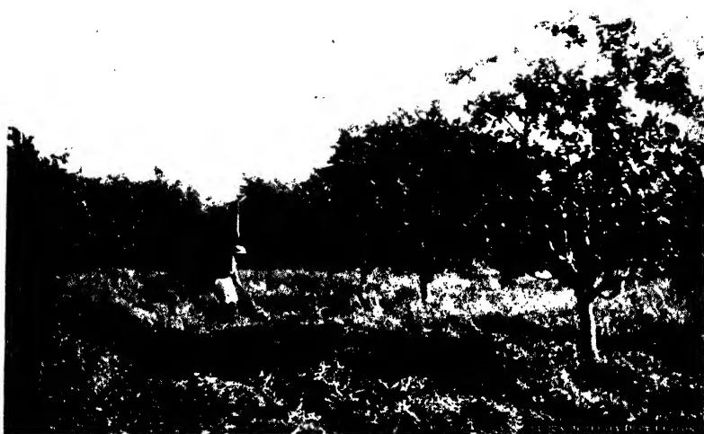A black and white photograph showing a person in a field, likely a grapefruit orchard, engaged in weeding. The person is bent over, working among the plants. The background shows trees and foliage.

Fig. 1.—“Cutlassing” weeds, the universal form of weeding, here seen practised in a grapefruit orchard.

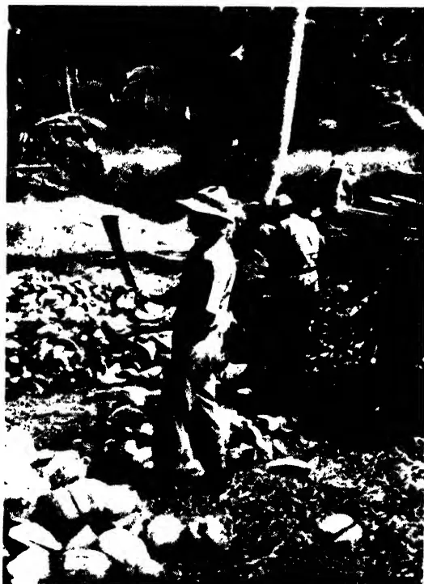A black and white photograph showing a person in a field, likely a grapefruit orchard, engaged in weeding. The person is bent over, working among the plants. The background shows trees and foliage.

Fig. 2.—“Cutlassing” nuts in the husk.

431------------------------------------------------

333

protected by the fixing of a maximum price for oil and oil products and the producer was safeguarded by the maintenance of a minimum price for copra.

Advantage was taken by the coconut growers themselves of this tariff protection given to oil manufacturers and in 1936 a number of them combined to form the Trinidad Coconut Growers' Association, which by the end of that year had a membership of 69 and had control of nearly 50 per cent. of the coconut production of Trinidad and Tobago. By 1938 this Association had erected a factory equipped with modern machinery for the production of edible oil and lard compound, and in 1940 arrangements were being made to instal a margarine plant.

Thus, it will be seen that the possibility of a deterrent effect on coconut cultivation in Trinidad caused by an erratic demand in European and American markets and by violent price fluctuations in these markets has been removed or, at least, greatly mitigated by wise action on the part of the Government and by co-operation among manufacturers and growers; and this same protection and co-operation have taken the Trinidad coconut industry out of the sphere of stagnation due to curtailment of transport facilities in times of war, such as these, which have struck a crippling blow at coconut producers in countries like New Guinea, the Malay States and in the Far East generally and those engaged in the oil palm industry in the Dutch East Indies and Africa.

The faulty practice of agriculture, which is often brought about by erratic demand, instability of prices and transport difficulties, is greatly aggravated by an insufficient understanding of the cultural, manurial and general environmental requirements of the crop; and this is mostly in evidence when businessmen take to agriculture with the sole purpose of turning crops into cash. In Ceylon, it was possible, by a lucky accident, to convert derelict coffee land in the higher altitudes into first-rate tea plantations with a minimum knowledge of the ecological requirements of tea, but when heavy cane and cocoa lands in Trinidad were converted into coconut plantations, a blunder of the first magnitude was committed from the evil effects of which the island has not yet recovered. But, quite apart from this extension of cultivation to unsuitable soils resulting in some cases in an almost irremediable state of malnutrition of the palms, the manurial and cultural requirements of the crop even on the more suitable soils have been inadequately satisfied, and the general debility and unproductiveness of the palms on most estates and their consequent susceptibility to disease are mainly due to what might be termed remediable malnutrition.

432------------------------------------------------

334

The old type of sugar cane cultivation, or cane-farming as it is called in the West Indies, was not the best school for a training in agriculture nor the best demonstration of agricultural methods for those engaged in the cultivation of perennial crops like cocoa and coconuts, or for those turning to these crops as an escape from the depression in sugar. Nothing could be more primitive and inefficient than the old methods, still practised on some sugar estates, of bad planting, over-ratooing and under-manuring, and there is no doubt that these same practices have led to the exhaustion of the soil of many plantations and even of whole islands in the West Indies. With slave labour in the early days and poorly-paid indentured East Indian and emancipated negro labour in more recent times, coupled with returns of nearly £100 gross income per acre with sugar selling at £80 a ton, it was possible to continue in the old ways and shut one's eyes to the gradual depletion and general ruination of the soil; and coconut planters could learn little or nothing from the gentleman-farmers on sugar plantations in the palmy days of the sugar industry.

The coconut palm in Trinidad, having begun as a reproducing forest crop, has remained more or less in this primitive state even where active extension of cultivation has been adopted. Coconut lands are almost completely innocent of the plough, the harrow and even the humble mamoty. As for manuring, the planters either depend on the bounty of Providence and expect seepage waters from neighbouring swamps in their exit to the sea to fertilize the land or misunderstand their problems to the extent that they are more ready to ascribe the debility and gradual death of thousands of palms to some obscure and vaguely defined "physiological disease" than to pause and consider whether the palms are not really suffering from under-nourishment and neglect of soil management.

The most common and in fact the only form of cultivation adopted on the majority of estates is "cutlassing" (or "slashing" as it is called in Ceylon and the Malay States) whereby the rank growth of weeds is infrequently and at irregular intervals cut down by a type of scythe called a cutlass and left lying on the ground to dry and decay. The soil is not opened up and aerated, no thorough weeding is done in the sense of digging up the weeds by the roots or turning them into the soil, no green manuring, no adequate draining, no removal of dead palms nor observation of the generally accepted principles of plant sanitation. Here again, Providence has been kind to the Trinidad coconut growers. The black beetle, *Oryctes rhinoceros*, L., is not found there, but the possibility of a chance introduction of this pest should not be ignored.

433------------------------------------------------

335

Examples of faulty soil management are to be seen everywhere in Trinidad and many such came to my notice during the short time that I spent there. For instance, to take an extract at random from my diary, I find that on March 7, 1940, I was taken by an officer attached to the Department of Agriculture "to see a small plantation which he told me was in its fifth planting in 70 or 80 years. This lay by the coast along the main road from Port-of-Spain to St. Pierre, past the Pan-American Airways Port. The area was permanently water-logged and the soil was therefore peaty and black in colour. An excellent growth of grass was noticed among the coconuts. The young palms were said to grow well and bear heavily till about the 20th year and then die. I myself saw palms, that could not have been more than eight years old, carrying heavy bunches of nuts, and other palms, which appeared to me to be well over twenty years old but which my companion assured me were not older than twenty years, showing signs of senility both in the stem and in the crown.

No cultivation of any sort was done on these lands and the palms were planted very close to each other. In some cases, the distance between them could not have been more than 10 feet.

Going on, we came to higher ground where palms were planted on slopes and more or less inter-planted with limes. Both palms and limes were dying or dead. My companion said that the cause of death was the same in both cases, *viz.*, the restricted root range owing to the impervious nature of the soil. Pruning the limes, he told me, gave them a further short lease of life, but sooner or later they died.

I was told that no manuring or cultivation was done, and as far as I could see, death was due to this as much as to any other cause. The soils are undoubtedly difficult, but they are made worse by continued neglect".

In the former case, where the soil was very rich by reason of its position by the sea, it was obvious that what the land required was drainage and wider planting; but I was told that the owner of the property found it quite profitable to replant every 15 years or so in the same old way and did not think it worth his while to resort to drainage and correct spacing of palms. This may have been so in a country where cost of labour was said to be very high, but it appeared to me to be a most wasteful practice.

Later in the same month (Sunday, the 17th) I visited Guayaquayare Bay and Mayaro Bay and made the following entry in my diary:—

"The coconuts in these regions are growing under almost complete forest conditions. The planting distance varies from

434------------------------------------------------

336

nil (where from two to six palms are growing in the same clump) to not more than 18 feet between palms. All stages of growth are to be found together, from seedlings a few months old to palms of 40 years and up to what appeared to me like 60-70 year old palms. They all appeared to be self-sown and I noticed no attempts at planting. Perhaps a few have been planted by hand, but it has been done so haphazardly that they are hardly noticeable. The shade is so dense that there is hardly any other undergrowth, but it is plain that this same shade interferes with the normal growth of the palms and their productions of nuts. No attempts at cultivation were seen and it is likely that the seepage from the Nariva Swamp is sufficient to keep the soil supplied with nutrients without resorting to artificial manuring. The palms looked quite healthy and I noticed no Bronze Leaf Wilt. Production could probably be more than doubled by thinning out the plantation and planting up vacancies on a systematic scale."

Two days later I was on my way to Cedros with the same Agricultural Officer as had on a former occasion pointed out to me the Trinidad method of planting coconuts in swampy soils, and this trip is recorded in my diary as follows :—

"We passed various coconut areas on indifferent and poor soils, mostly low-lying and clayey. Mr. X. pointed out an area near Longdenville where coconut trunks were lying on the ground and the land being got ready for cane. This area which was said to have a sandy topsoil 5 feet deep overlying clay had been recommended by a visitor to Trinidad as being good for coconuts, as similar land in Ceylon was, according to him, put to the same use. Coconuts had been planted and had grown for 18-22 years and had then died of Bronze Leaf Wilt. No attention had been paid to the soil or to the palms; neither manuring nor cultivation.

A little further on we came to an area of coconuts which had been poisoned with sodium arsenite to make way for cane. Later we passed an area of coconuts interplanted with limes. The latter were alive but the former had died owing, it was said, to the hardness and imperviousness of the soil, but to a greater extent, in my opinion, due to neglect. The limes were also going off.

A Red Ring patch was pointed out to me some distance away and I was told that as no control measures were being attempted the disease was slowly infecting the neighbouring areas."

Trinidad provides an outstanding example of what might be termed "speculative agriculture". In Ceylon, it will be remembered that during the big rubber boom quite a few land-owners cut down mature coconuts in order to plant rubber

435------------------------------------------------

A completely blank white page with no visible content, text, or markings.

436------------------------------------------------

PLATE III.

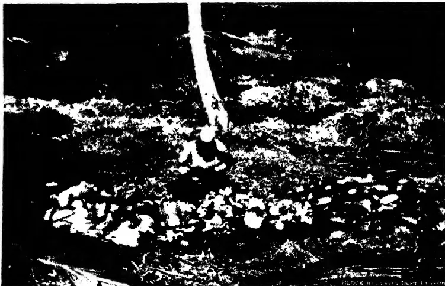A black and white photograph showing a person kneeling on the ground, surrounded by a large pile of nuts. The person is using a tool to gouge kernels from the nuts. The ground is covered with sand and dirt, indicating a potential for contamination.

Fig. 1.—Gouging the kernels from the thirds of the nuts. The possibility of contamination with sand and dirt is plainly visible.

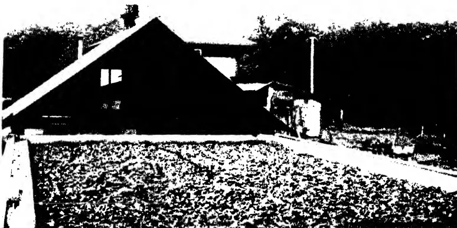A black and white photograph of a covered barbecue. The structure has a dark, sloped roof and a small window. The roof is made of movable galvanized iron.

Fig. 2.—Covered barbecue. The galvanized iron roof is movable.

437------------------------------------------------

337

and when the slump came rubber in its turn was cut down for replacement with coconuts. But it must be said for the Ceylon estate owner that in the process of changing over from one crop to another, a wholesale sweep was made of the offending crop before the other was planted. No attempt was made to inter-plant rubber with coconuts or coconuts with rubber in effecting the change-over.

In Trinidad, speculative agriculture has been practised on a larger scale—cane to coconuts, cane to cocoa, cocoa to cane, coconuts to cane and at the present time coconuts and cocoa to tonka beans; and in making the great change-over from cane to coconuts, instead of completely removing the cane and replanting the land with coconuts or at least planting the coconuts in the centre of the cane beds making proper allowance for correct spacing, the coconut seedlings were planted on the edges of the 20-foot cane beds with 25 feet between seedlings in the beds with the cane still standing. This resulted in the coconut seedlings being too close together with most of their roots in the more or less water-saturated soil in the drains between the cane beds. The early growth of these seedlings must have been very good owing to their still narrow root range, but by the time they had formed stems and the canes had to be removed, their roots must have been permanently in water and a state of physiological drought must have set in with a consequent incidence of Bronze Leaf Wilt. Many old cane plantations replanted with coconuts in this manner are to be seen in Trinidad and now some of them on which the coconuts have proved unprofitable are having their dead and dying palms removed to make way for a return to cane-farming.

It must not be inferred from the examples given above that all coconut plantations in Trinidad are in the same state. There are notable exceptions and these are to be found mainly in the Cedros district, but even in that region plantation management cannot be regarded as being up to the best practices in Ceylon. To take an example at random, one evil attendant on cutlassing was seen on a plantation where a thick mat of tinder-dry weeds had caught fire by accident or design. The flames had been so fierce that some fine young palms which made up the block were badly burned and the toil and expense of many years thus thrown away in one night. Such fires were said to be not infrequent and discontented labour was suspected of being responsible for them. No change in cultivation practice was, however, contemplated as a check on such incendiarism.

It is not intended in this essay to make more than passing mention of the difficulties encountered by Trinidad coconut growers due to the lack or meagreness of capital and credit

438------------------------------------------------

338

facilities. In the days of slave labour and easy access to land there could not have been the same scarcity of capital as a natural aptitude and training among agriculturists and "emancipation only meant the substitution of a low wage for the previous outlay on the purchase and maintenance of slaves, besides absolving employers from responsibility". In later times no doubt there was much money to be spent and sometimes wasted on speculative agriculture and many expensive mistakes must have been made by the pioneers as for instance in the fruitless attempts made to grow sugar cane instead of coconuts in the Cedros area and coconuts instead of cocoa and sugar cane in the interior of the island. In 1913 owners were willing to spend and were spending up to £40 an acre on development of land under coconuts and one estate of 500 acres in the Cedros district had actually spent £18,143 for that purpose. This rate of spending was confined to a few estates and was no doubt reduced during slump years; but on the other hand, incomes were good and estate owners could have had no great cause for complaint at least up to the year 1929, when the post-war economic structure of Europe and America finally collapsed. Thus one estate, 1,300 acres in extent, made during the years 1919 to 1929, a nett income of £20,000 a year or £15 per acre, *i.e.*, about Rs. 200 per acre.

The depression since 1929, coupled with labour costs, have made things very difficult for estate owners but they have at least achieved the supreme triumph of co-operation which has been mentioned earlier and which will be treated in greater detail in a subsequent paper; and it is not too much to hope that this same co-operation will help greatly in bringing about a general stabilization of the industry in the future, provided it is saved from destruction due to other causes to be mentioned later.

At the present time, male labourers on coconut estates in Trinidad are paid up to 2 shillings a day and female labourers generally half that sum, although it often happens that daily earnings amount to rather more than these sums, since a fair amount of estate work is done on the task system. Although these wage rates are generally considered too low for decent living it is, on the other hand, pointed out by the estate owners that even at these rates it is difficult both to compete in the world's market with producing countries where wages are lower and at the same time to adopt intensive methods of agriculture involving regular cultivation and manuring and measures of general plant sanitation.

In many instances hot air driers and covered barbecues are used in the manufacture of copra. But the finished product, whether sun-dried or dried in hot air kilns is of poor quality in

439------------------------------------------------

A completely blank white page with no visible content, text, or markings.

440------------------------------------------------

PLATE IV.


Fig. 1.—Trinidad copra. Note extensive mould growth.

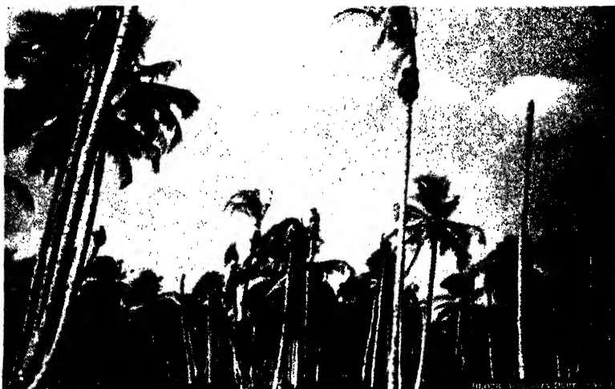

Fig. 2.—Bronze leaf wilt.

441------------------------------------------------

339

comparison with Ceylon copra. All the samples seen by the writer were covered with moulds. The fault is to be found in the initial preparation of the nuts for drying. As a rule, the husk of the nut is not removed before the nut is opened unless the nuts are to be sold in the shell. Instead, the whole nut is directly cut into three segments by a cutlass, the blade passing right through the husk, shell and kernel. The thirds of the nuts are then handed over to women who gouge out the fresh kernel which is often broken into small pieces in the process. Cutlassing nuts is done either by men or by women and paid for by the task.

All this work is carried out in the field or on grass or sand near the kilns; and it will be plain that the broken pieces of kernel become contaminated with sand and dirt and expose a large surface to infection by bacteria and moulds.

The only copra that is dried in the shell is obtained from culls rejected during the grading of husked nuts, quite a considerable quantity of which is still shipped in that state. Thus all those nuts that pass through a  $3\frac{3}{4}$  inch ring are used for copra curing.

The nuts themselves should be very suitable for copra-making as picking is done only two or three times a year, which results in the presence of large numbers of naturally fallen nuts at most times of the year, but, as a matter of fact, on many plantations collection is not regularly carried out, owing to which a large percentage of sprouted nuts are used for copra making, with a consequent decrease in the weight of copra obtainable as well as in considerable damage to its appearance. On one estate the writer saw a heap of nuts collected from the field for cutlassing in which there were some with sprouts 18 inches long. These nuts must have been on the ground for 6 to 7 months.

No doubt mouldy copra and copra from sprouted nuts are not rejected by oil millers owing to the high percentage of oil generally found in such copra, but it cannot possibly pay the producers to release these inferior grades on the market. The loss in weight must be very considerable.

In Trinidad, besides Phytophthora Bud Rot against which there are no known preventive or curative measures, the two most important diseases of the coconut palm are Red Ring and Bronze Leaf Wilt. Red Ring, the most obvious symptoms of which are a red streaking of the ground tissues of the leaf-stalks and the presence of a red or reddish ring of tissue between the vascular bundles of the stem, is caused by the eel-worm, *Aphelenchus cocophilus* Cobb., which may invade the palm by way of the roots, the stem or the leaf bases of the crown. As

442------------------------------------------------

340

a rule only four to seven-year old palms are affected, younger or older palms being attacked only infrequently. Affected palms, almost without exception, succumb to the disease and these dead palms can serve as sources of infection to surrounding healthy palms. The eel-worms are said to be able to pass from palm to palm through the soil and one method of control is based on this belief. It has also been conjectured that they are able to travel up the surface of the trunks and gain entry into the palm by way of cracks in the leaf bases. The most recent theory is that the eel-worms are carried by the fauna that are normally associated with coconut plantations, such as various insects, tarantulas, spiders and rodents. It has also been suggested that the Black Vulture (*Coragyps atratus foetens* Lichtenstein), whose diet includes bits of coconut kernel, which are left lying about under the palms after the nuts have been split and gouged, might be attracted to diseased palms which have been felled and later carry the eel-worms on its feet to the crowns of healthy palms.

Whatever the mode of infection may be, one significant fact that has emerged from the study of the disease is that it is almost absent on lands where sugar cane is grown as a catch crop among the coconuts for any period up to eight years. Sugar cane cannot be grown under forest conditions. It has to be tilled, manured and weeded; and there is no doubt that the coconuts under these conditions derive some benefit from the cultural treatments given to the cane. It is also conjectured that during the process of weeding the cane a secondary host of the eel-worm is removed, although such a host has not yet been discovered. On account of these observations and theories the old method of control of Red Ring by means of isolation trenches round the palms is now not wholeheartedly recommended. Instead, the latest methods of control have been laid down as follows:—

“All weeds round palms which are three years old should be dug out for a distance of 5 feet from the trunk, the soil being cultivated, and a liberal dressing of complete artificial fertilizers given. The amount and ratio of the mixture would vary with different soils, but a dressing suggested is 5 lb. per palm of a mixture of 4 cwt. sulphate of ammonia, 2 cwt. of sulphate of potash and 4 cwt. of superphosphate of lime. Except on light sandy soil, where 50 per cent. more sulphate of potash would be required, this would certainly stimulate the young palms to more rapid growth, and in at least a number of cases would effectively change the flora on the treated soil. The same treatment should be given annually for a period of four years. Apart from any influence which it might very reasonably have on the incidence of

443------------------------------------------------

341

Red Ring disease the treatment should fully repay expenditure by bringing the palms into crop some years before those not receiving the cultivation and manuring”.

At the present time, Red Ring has become relatively unimportant in Trinidad owing to the appearance of the far more formidable malady known as Bronze Leaf Wilt.

In 1924, it was observed that many coconut palms were dying of a disease in which the outward symptoms were a yellowing and wilting of the outer leaves, a browning of the unopened inflorescences and the shedding of young nuts. The bud was not affected in the early stages of the disease, but all palms that showed signs of wilting in combination with the other symptoms mentioned died sooner or later. In 1925, a similar disease was observed in British Guiana and there too the bud tissue was the last to be affected. By 1928, thousands of palms in Trinidad were seen to be affected, and a special study of the disease was begun. Two types of wilt were recognized (1) where the symptoms were similar to those of a root disease described in Ceylon as due to the fungus *Macrophomina phaseoli* and (2) where no fungus was found in the roots, but death was ascribed to a state of physiological drought, *i.e.*, a condition in which the palm was unable to take up water from the soil. This latter disease was named Bronze Leaf Wilt owing to a bronzing of the foliage during the process of wilting. The symptoms of the disease have been described as follows:—

“The three lowest leaves of bearing palms, which usually appear quite normal and healthy previously, are observed to have taken on a yellow and bronze colouring, the colour proceeding from the tips of the leaflets backwards. At the same time the tips of the next two or three leaves are seen to be yellowing, the extent of discoloration increasing with increase in the age of the leaf. The yellowing of the leaf extends up to still younger leaves but long before the youngest leaves show discoloration of any kind a rot sets in at the base and in the folds of the leaflets of the central spear of leaves. The rot later extends into the cabbage. This rot develops to a considerable degree before the central spear of leaves changes colour but in the later stages of the rot they wilt, turning to a dull greyish-brown colour and fall over at the base. Shedding of nuts takes place at the same time or slightly in advance of the discoloration of the leaves, the youngest nuts being shed first. The oldest inflorescence on the tree is seen to be changing to a brown colour, in some cases even before the spathe has opened.”

It was found that the disease could be artificially induced by cutting trenches round a healthy palm and thus inhibiting water uptake and that in some cases a diseased palm could be

444------------------------------------------------

342

cured by the simple process of watering. The disease was found to be most prevalent on heavy soils in bad tilth, where palms were overcrowded on the land; and it was, therefore, suggested that Bronze Leaf Wilt could be prevented by soil cultivation, drainage, proper spacing of palms and periodical removal of weeds, a combination of cultural operations which, with manuring, is usually regarded as elementary in efficient coconut cultivation. Investigations were continued in 1929 and the observations of the previous years were confirmed and the same recommendations were repeated. In 1930, Bronze Leaf Wilt was found in the neighbouring island of Tobago, prevalent under the same conditions as in Trinidad, and was seen to have made headway on the stiff, clay soil of the coastal belt of British Guiana. In the latter place, groups of palms were seen to wilt as opposed to the wilting of individual palms scattered here and there. Again an unsuitable environment and faulty cultural practices were given as the first causes of the disease.

These suggestions regarding the causes of the disease found general acceptance, and, in the administration report for 1930 of the Director of Agriculture of Trinidad and Tobago, it is categorically stated that Bronze Leaf Wilt was related to the extension of coconut cultivation to unsuitable soils. At the same time, soil chemists in Trinidad were discovering that manuring coconuts showed profitable increase of yield over unmanured areas and also over pre-manurial periods and an experiment was laid down to ascertain whether manuring had any effect on Bronze Leaf Wilt. The situation was by now sufficiently serious to warrant the institution of a Coconut Survey by the Department of Agriculture and in 1931 it was found that 400 out of 1,900 properties examined were affected by wilt. This was so alarming that it was considered necessary to re-examine the earlier observations on the disease and to make a more direct and careful study of it. Accordingly, in 1932, an experienced officer of the Department was appointed to carry out the necessary investigations, the Imperial College of Tropical Agriculture providing him with laboratory facilities.

It is interesting to note that in the same year, a wilt disease of coconut palms, similar to Bronze Leaf Wilt, was observed in Ceylon and in Jamaica. In Ceylon, the trouble appeared in the environs of Puttalam after a severe and protracted drought and was found to be worst on poorly-cultivated estates and on wet, swampy land and on soils liable to water-logging. As a preventive against the physiological condition, proper soil cultivation, improvement of tilth and drainage to induce deeper rooting were recommended. In Jamaica, wilt was found to occur in a locality which had experienced a serious

445------------------------------------------------

343

drought followed by excessive rain and was confined almost entirely to hill slopes with heavy clay soils. It was recalled that a wilting of palms under similar conditions had occurred in Jamaica in 1911 and 1912, and the important observation was made that the condition was reduced to insignificance by proper cultivation and drainage. Only palms weakened by abnormal weather conditions and growing on unsuitable soil were found to suffer.

At the commencement of the special inquiry instituted in Trinidad, the observations of earlier workers both in Trinidad and in other countries were once again confirmed, but it was found that although Bronze Leaf Wilt was worst on heavy soils, it was sometimes present on free-draining light soils also; but it was not found on the sandy coastal belts around Cedros and in the Mayaro region.

The inquiry was concluded in 1937, and it was definitely confirmed that the disease occurred on all soils, ranging from the very sandy types to clays, but that the compactness of the soil and its perviousness to water were of primary importance in relation to it. Palms died from wilt on heavy soils liable to water-logging, on light, open-textured, free-draining soils, and on soils which had a layer of marl, a so-called "intolerant layer" underlying a friable top soil. All wilt soils showed a high content of nitrogen, but low phosphorus and potassium, especially the latter. The root-systems of all wilted palms examined were found to be limited by the high water-table in water-logged areas or by the intolerant layer when it was present close to the surface. In the water-logged areas, masses of rotted roots were seen below the level of the water-table, but where wilt was encountered in open-textured, free-draining soils, the wilted palms had better root systems than on the other two soil types but poorer root systems than those of healthy palms.

Thus, after five or six years of patient and intensive work, it was found that, in addition to the fact that no insect or fungus was primarily associated with the disease, coconuts were affected by Bronze Leaf Wilt on :—

1. 1. Heavy clay soils, even when they were naturally rich in plant nutrients, unless they were adequately drained and aerated.

1. 2. Light, sandy, free-working and self-draining soils, unless they were supplied with plant food, particularly potash, and unless measures were adopted to conserve soil moisture and,

1. 3. Soils with an intolerant layer of marl, which for some obscure reason, refused to allow the coconut palm to grow and thrive.

446------------------------------------------------

344

On the first type of soil, draining was once again recommended. On the second type, manuring, especially with potassic fertilizers, the burial of husks, other organic matter and farmyard manure, irrigation and, on undulating land, contour draining. Where contour draining was found to be too expensive, a change-over from coconuts to Tonka Bean was recommended. On the third type of soil, a reversion to sugar cane was advised.

The situation in 1937 was described by the Director of Agriculture in his administration report as proving disastrous. In 1938, Bronze Leaf Wilt was still taking its toll of the palms. In the following year, no improvement is recorded and in 1940, when the writer visited Trinidad, the wilt situation on some estates was quite alarming and the disease was spreading.

Many names have been given to the disease, the most arresting of which is undoubtedly "Bronze Leaf Wilt." It has been ascribed to "physiological drought". It has been called a "nutritional-physiological malady" and a "physiological die-back". These names are self-explanatory and, if the causes of the disease have been correctly ascertained, as they no doubt have been, the coconut industry in Trinidad is faced with a serious decline, except in the sandy coastal belts and the Brasso Silts. Its resuscitation lies in the adoption of the recommendations made by the many investigators of the disease from time to time, which are, as stated earlier, based entirely on accepted principles of tropical agriculture. Except on the marls and heavy clays, which are by their very nature said to be unsuitable for coconut cultivation, Bronze Leaf Wilt should be regarded as a preventable and remediable condition. On the marls and the clays, sugar-cane can be and is grown with success. On the other soil types on which coconuts have been planted, it may not be possible to get the very high annual yields of 6,000 nuts per acre obtained in the coastal areas, but under careful estate management it should be possible to secure profitable yields of 4,000 to 4,500 nuts per acre. The regular and judicious use of the plough and the disc-harrow from the time of transplantation, rigorous attention to weeding, water-conservation and drainage, scientific manuring (particularly potash manuring), replanting with selected nuts from high-yielding palms at a minimum planting distance of 28 feet on the square or its equivalent, the cultivation of cover crops and their correct utilization on the land, and husk trenching on the soils liable to rapid drying are cultural operations that have been practised with profitable results in older coconut growing countries; and there is no reason why their adoption should not prove beneficial under the conditions prevailing on coconut plantations in Trinidad.

447------------------------------------------------

345BIBLIOGRAPHY

1. 1. Anon., .. The Coconut Trade in Trinidad. *T. A.*, Ceylon 2, 1882, 494
2. 2. Anon., .. The Coconut palm and its produce in Trinidad. *Ibid.*, 5, 1885-6, 687
3. 3. Anon., .. The Coconut Industry of Trinidad. *Ibid.*, 27, 1906, 155-8
4. 4. Grieg, W. .. The Coconut Industry of Trinidad. *West Indian Bull.* VI., 1905, 149
5. 5. Anon., .. West Indian coconut product industry. *T. A.*, Ceylon, 35, 1910, 269
6. 6. Anon., .. Developing the Demerara copra industry. *Ibid.*, 36, 1911, 575
7. 7. Watts, F. .. Coconut cultivation in West Indies. London, 1911. *T. A.*, Ceylon, 38, 1912, 171
8. 8. Anon., .. Cocoa, coconut and rubber in Trinidad. *Ibid.*, 88
9. 9. Thornton, T. .. Coconuts in Tobago, *Ibid.*, 41, 1913, 379
10. 10. Anon., .. Coconut planting in Trinidad. *Ibid.*, 378
11. 11. Anon., .. Coconut cultivation in Trinidad, St. Vincent and the Gold Coast. *Bull. Imp. Inst.*, 17, 1919, 260
12. 12. Anon., .. Survey of oilseeds and vegetable oils. Vol. II., Coconut palm products. Empire Marketing Board, 61, 1932, 46-54
13. 13. Dept. Agric. .. Trinidad and Tobago, Admin. Reports of Director of Agriculture
14. 14. James, P. E. .. Geographic factors in the Trinidad coconut industry. *Econ. Geog.*, 2, 1926, No. 1, 108-125
15. 15. Dash, J. S., .. Coconut cultivation. *Agric. J. British Guiana*, 2, No. 1, March, 1929, Reprinted in *T. A.*, Ceylon 73, 1929, 116
16. 16. Altson, R. A. .. Repts. Asst. Botanist and Mycologist. *Rept. Dept. Sci. and Agric., British Guiana*, 1923 to 1925
17. 17. Bain, F. M. .. Bronze Leaf Wilt of the coconut palm. *Proc. Agric. Soc., Trinidad and Tobago* 35, 1934, 12, 507-21
18. 18. Bain, F. M. .. *Bronze Leaf Wilt disease of the coconut palm.* Trinidad, Government Printing Office, 1937
19. 19. Bain, F. M. .. Report on the coconut growing areas of Jamaica. Dept. Sci. and Agric., Jamaica, Bull. 22, 1940
20. 20. Briton-Jones, H. R. Wilt disease of coconut palms in Trinidad. Part I. *T. A.*, Trinidad, 5, 1928 (Supplement). Part II. *Ibid.* 6, 1929 (Supplement)
21. 21. Briton-Jones, H. R. Trinidad plant diseases. *Ibid.*, 8, 11, 300-302, 1931
22. 22. Briton-Jones, H. R. *The disease of the coconut palm.* Baillière, Tindale and Cox., London, 1940
23. 23. Cobb, N. A. .. A newly discovered nematode (*Aphelenchus cocoophilus*) connected with a serious disease of the coconut palm. *West Indian Bull.*, 17, No. 4, 1919, 203-10
24. 24. Stockdale, F. A. .. Coconut palm disease in Trinidad, *Dept. Agric., Jamaica Bull.* 5, 1907, 111-39
25. 25. Stockdale, F. A. .. Coconut palm disease. *Proc. Agric. Soc., Trinidad and Tobago*, 7, 1907, Paper 247, 9-51
26. 26. Stockdale, F. A. .. Fungus disease of coconuts in the West Indies. *West Indian Bull.*, 9, 1909, 361-381

448------------------------------------------------

346

27. Nowell, W. .. The Red Ring or root disease of coconuts. *West Indian Bull.*, 17, 1919, 189-202

28. Nowell, W. .. The Red Ring disease of coconuts. *Proc. Agric. Soc., Trinidad and Tobago*, Paper No. 736, 19, 1919, 217-219

29. Nowell, W. .. The Red Ring disease of coconut palms. *West Indian Bull.*, 18, Nos. 1-2, 1920, 73-76

30. Nowell, W. .. Diseases of Crop plants in the Lesser Antilles. West India Committee London, 1923

31. Nowell, W. .. Coconut Budrot in Trinidad. *Rept. Proc. Imp. Bot. Conf., London*, 1924, 161-162

32. Stell, F. .. Plant pathology. *Trinidad and Tobago Dept. Agric. Rept.*, 1928, 49-51

33. Martyn, E. B. .. Bot. and Myc. Div. Ann. Rept. 1929. *British Guiana Agric. J.*, 3, No. 4, 1930, 226-333

34. Martyn, E. B. .. *Ibid.*, 4, No. 2, 1931, 97

35. Martyn, E. B. .. Bot. and Myc. Div. Ann. Rept. 1932, British Guiana, 107

36. Martyn, E. B. .. *Ibid.*, 1934, 106

37. Park, M. .. The effect of drought on coconuts at Puttalam. *T. A., Ceylon*, 78, 1932, 11-14

38. Park, M. .. Some notes on the effect of drought on the yield of coconut palms. *Ibid.*, 83, 1934, 141-150

39. Smith, F. E. V. .. Plant diseases in Jamaica in 1932, *Ann. Rept. Dept. Sci. and Agric. Jamaica*, 1932, 13-16

40. Mac Millan, W. M... *Warning from the West Indies*, London, 1936

449------------------------------------------------

347

## THE RELATIVE RESISTANCE OF SOME STRAINS OF BITTER-GOURD TO THE CUCURBIT FRUIT-FLY

M. FERNANDO, Ph.D. (Lond.), D.I.C.,  
ASSISTANT BOTANIST

AND

S. B. UDURAWANA,  
AGRICULTURAL INSTRUCTOR, MATALE SOUTH

**F**RUIT-FLY (*Dacus cucurbitae* Coq.) has compelled the total abandoning of cucurbits in certain market-garden areas in Ceylon, and represents the most serious hazard in cucurbit growing in this country. The female fly pushes its ovipositor through the epidermis and deposits its eggs within the fruit. The larvae hatch out in about a week and cause extensive rotting of the fruit. When the larvae have attained their maximum size, they drop out of the fruit on to the ground, and pupate just below ground level. Examination of the ground under rotting fruits will reveal considerable numbers of pupae. Flies eventually emerge from these pupae and effect re-infestation of the crop. The relatively short life cycle of the cucurbit fruit-fly leads to the rapid increase in fly numbers, and in consequent fruit damage, towards the close of the fruiting season. Despite its limited host range—only fruits of the family *Cucurbitaceae* are subject to attack—the survival level of the fly remains high in most instances and extensive infestation of successive crops results. Probably numerous wild gourds function as alternate hosts.

Apart from the regular collection and destruction of invaded fruits, the only remedial measure available to the grower has been the use of sodium silicofluoride baits. These baits are, however, of doubtful value. Fruit-flies feeding on these baits are reputed to fly away and die elsewhere; there appears to be no evidence that the flies actually imbibe lethal quantities of the poison. Apart from the question of their efficacy the baits involve considerable and recurrent expenditure. As in the instance of other pests of village crops, the production of resistant varieties appears to be the only satisfactory solution to the fruit-fly problem.

450------------------------------------------------

348

The search for fruit-fly resistance in cucurbit varieties was initiated by Dr. J. C. Haigh, Botanist, when he established the three vegetable seed stations at Matale, Tabbowa and Karadiyanaru in 1937. Particularly promising results have been obtained with bitter-gourds (*Momordica charantia* Linn.). The present paper reports the results of yield and fruit-fly resistance tests of some strains of bitter-gourd carried out during the period, 1937-41.

*The 1937-40 experiments.*—Two varieties were originally selected for trial in 1937, viz., the variety CD from the Central Division, and the variety, NWD white smooth, from the North-Western Division. The variety CD consisted of a mixture of types differing in shape and external colour of fruits. The "rough" types possessed pronounced, fragile ribs. Two distinct colour classes were distinguished, viz., green and white. The variety CD was sorted in 1938 into the following component strains :—

<table border="0">
<tbody>
<tr>
<td>1. CD green rough</td>
<td>3. CD white rough</td>
</tr>
<tr>
<td>2. CD green smooth</td>
<td>4. CD white smooth</td>
</tr>
</tbody>
</table>

Trials were set down by Dr. J. C. Haigh at the three vegetable seed stations, at Matale, Tabbowa and Karadiyanaru. Fruit-fly was severest at Matale and least damaging at Karadiyanaru in the relatively dry *yala* season. Records of fruit-fly incidence at Karadiyanaru and Tabbowa are scanty and are not included here. The high incidence of fruit-fly at Matale makes it an ideal centre for the isolation of resistant varieties. The station is located in the heart of an extensive and flourishing vegetable industry. The soil of which the main component is ironstone gravel, is, however, infertile and atypical.

At Matale, in the *maha* season, 1937-38, the variety CD heavily outyielded the variety NWD white smooth; the yields of fruit in the varieties CD and NWD white smooth were 3,470 lb. and 655 lb. per acre respectively. The overwhelmingly superior performance of the variety CD is, in part, explained by its relatively greater resistance to fruit-fly attack; the percentages of fruits destroyed by fruit-fly in this season, in the varieties CD and NWD white smooth, were 14 and 76 respectively.

Records of fruit-fly incidence and of yield for subsequent seasons, after the sub-division of the variety CD into its component strains, are given in Table 1. The figures refer to 1/10-acre plots. The analysis of variance of percentages of fruit-fly damage, converted to the appropriate inverse sine scale ( $\theta = \text{Sin } \sqrt{p}$ ), is given in Table 2. In this analysis, the effect of seasons is confounded with replicates. The variance ratio for strains attains significance at the one per cent. point. Examination of individual strain means indicates the significant superiority of all the CD strains to NWD white smooth.

451------------------------------------------------

349

It is evident from Table 1. that, apart from their higher degree of resistance to fruit-fly, the CD strains are markedly superior in the yield of both numbers and weights of fruits. CD green rough outyielded the other CD strains.

*The maha 1940-41 experiment.*—In the *maha* season, 1940-41 the four CD strains and the strain NWD white smooth were again tested out at the Vegetable Seed Station, Matale, in a randomized block lay-out comprising four replications of 1/44-acre plots. Hills were spaced  $4 \times 4$  ft. Four seeds were dibbled per hill on November 21, 1940; the resulting seedlings were thinned first to two, and eventually to one per hill. Blanks were supplied. The final stand was satisfactory. Five-weeks-old plants were trained to supports. The only troublesome pest, apart from fruit-fly, was the *Aulacophora* beetle. Plants were sprayed with lead arsenate ( $\frac{1}{2}$  oz. per gall.) on the day the beetle was first noticed. The plants flowered 5-6 weeks after sowing. Fruit-fly was first observed on January 20, 1941. Daily records of fruit-fly damage were kept till the completion of the harvest. In the harvests, a single border row of plants was discarded round each plot. The fruits were picked during the period January 29-March 1. Records were maintained of the total numbers of fruits produced and of the numbers and weights of sound fruits.

The analysis of variance of percentages of fly-damaged fruits transformed to the inverse sine scale ( $\theta = \text{Sin } \sqrt{p}$ ), is given in Table 3. The variance ratio for strains exceeds the 5 per cent. point and indicates significance. Strain totals of the transformed data and their standard error are given at the foot of the table. Every one of the CD strains is seen to be significantly more resistant than the strain NWD white smooth. None of the CD strains, however, differ significantly in resistance from one another.

The analysis of variance of weights of sound fruits produced is given in Table 4. The variance ratio for strains attains significance at the 5 per cent. point. Examination of individual strain totals by means of their standard error reveals the significant superiority of all CD strains, except CD green smooth, to the strain NWD white smooth. CD green rough significantly outyielded CD green smooth. The differences between the other CD strains are not significant.

The analysis of variance of numbers of sound fruits is given in Table 5. The variance ratio for strains exceeds the 5 per cent. point, and is hence indicative of significant effects. In the examination of individual strain totals with the use of their standard error, all the CD strains, except CD green smooth, are seen to be significantly superior to NWD white smooth. The CD strains do not differ significantly from one another.

452------------------------------------------------

350

The analysis of variance of total numbers of fruits produced—these figures include, of course, the fruits destroyed by fruit-fly—is presented in Table 6. The variance ratio for strains is significant at the 5 per cent. point. The tests of individual strain totals with the use of their standard error, demonstrate the significant superiority of all CD strains, except CD green smooth, to NWD white smooth. It is evident that the superior performance of the CD strains, green rough, white rough and white smooth, is not completely accounted for by their greater resistance to fruit-fly attack; these strains are intrinsically more prolific than NWD white smooth. CD green smooth is significantly inferior to CD green rough and CD white rough.

The strain CD green rough has put up the most consistently satisfactory performance both in respect of yield and of resistance to fruit-fly during the whole experimental period, 1938–1941. Further selection for yield and for fruit-fly resistance will accordingly proceed within this strain. It is encouraging to note that the continuous selfing envisaged in this programme of selection would not lead to loss in vigour. Cucurbits, unlike most other naturally cross-pollinated crops, are not injuriously affected by continuous inbreeding.

Examination of the records over the whole experimental period reveals indications of a narrowing down of the differences in fruit-fly susceptibility between the various strains. This apparent reduction in resistance in the CD strain, or the apparent grading up of the strain NWD white smooth, may find an explanation in the considerable natural crossing that must have occurred in the field.

#### SUMMARY

Five strains of bitter-gourd (*Momordica charantia* Linn.), viz., four strains, CD green rough, CD green smooth, CD white rough and CD white smooth, from the Central Division, and a strain, NWD white smooth from the North-Western Division, were tested out for yield and for resistance to the cucurbit fruit-fly (*Dacus cucurbitae* Coq.) at the Vegetable Seed Station, Matale, during the period, 1938–41.

2. The four CD strains exhibited, in all experimental seasons, a higher degree of resistance to fruit-fly than the strain NWD white smooth. The four CD strains did not differ significantly from one another.

3. In the *maha* season 1940–41 the strains, CD green rough and CD white rough, proved to be significantly superior to the strain NWD white smooth in the yield of both numbers and weights of sound fruits. CD white smooth yielded a significantly larger number of sound fruits than NWD white smooth, and CD green rough a significantly greater weight of sound fruits than CD green smooth.

453------------------------------------------------

351

4. In the *maha* 1940-41 experiment it was evident that the strains, CD green rough, CD white rough and CD white smooth, apart from their greater resistance to fruit-fly, were intrinsically more prolific than NWD white smooth, *i.e.*, the total number of fruits produced by these CD strains was significantly larger. The strains, CD white rough and CD green rough also significantly outyielded CD green smooth in the total number of fruits.

5. The strain CD green rough was consistently the best performer in regard both to resistance to fruit-fly and to yield.

#### ACKNOWLEDGEMENT

We are indebted to Dr. J. C. Haigh, Botanist, for valuable advice and assistance. The original demonstration of the existence of fruit-fly resistance in CD strains of bitter-gourd is due to Dr. Haigh. We also thank Dr. W. R. C. Paul, Agricultural Officer, Central Division, for his co-operation.

#### REFERENCES

Cochran, W. G., 1938 .. Some difficulties in the statistical analysis of replicated experiments. *Empire J. Expt. Agric.* VI., 157-175

Fisher, R. A. and Yates, F., 1938 .. *Statistical tables for biological agricultural and medical research.* London: Oliver and Boyd

Hutson, J. C., 1939 .. Some suggestions for the control of the citrus and mango fruit-fly (*Dacus ferrugineus*). *The Tropical Agriculturist* XCII., pp. 281-287

1941 .. A Manual of some Ceylon crop pests (unpublished)

TABLE 1.—Records of yield and of fruit-fly incidence, 1938-40

<table border="1">
<thead>
<tr>
<th rowspan="2">Strain.</th>
<th rowspan="2">Season.</th>
<th colspan="3">Yield of Fruits.</th>
<th rowspan="2">Percentages of Fly-damaged Fruits.</th>
</tr>
<tr>
<th>No.</th>
<th colspan="2">Wt. in lb.</th>
</tr>
</thead>
<tbody>
<tr>
<td rowspan="4">CD green rough</td>
<td>{ <i>maha</i> 1938-39</td>
<td>.. 1742</td>
<td>.. 165<math>\frac{1}{2}</math></td>
<td>.. 11</td>
</tr>
<tr>
<td>{ <i>yala</i> 1939</td>
<td>.. 2723</td>
<td>.. 395</td>
<td>.. 15</td>
</tr>
<tr>
<td>{ <i>maha</i> 1939-40</td>
<td>.. 3946</td>
<td>.. 483</td>
<td>.. 4</td>
</tr>
<tr>
<td>{ <i>maha</i> 1938-39</td>
<td>.. 1307</td>
<td>.. 138</td>
<td>.. 12</td>
</tr>
<tr>
<td rowspan="4">CD green smooth</td>
<td>{ <i>yala</i> 1939</td>
<td>.. 2123</td>
<td>.. 353</td>
<td>.. 16</td>
</tr>
<tr>
<td>{ <i>maha</i> 1939-40</td>
<td>.. 2178</td>
<td>.. 250</td>
<td>.. 10</td>
</tr>
<tr>
<td>{ <i>maha</i> 1938-39</td>
<td>.. 1735</td>
<td>.. 168<math>\frac{1}{2}</math></td>
<td>.. 12</td>
</tr>
<tr>
<td>{ <i>yala</i> 1939</td>
<td>.. 2385</td>
<td>.. 355</td>
<td>.. 16</td>
</tr>
<tr>
<td rowspan="3">CD white rough</td>
<td>{ <i>maha</i> 1939-40</td>
<td>.. 2457</td>
<td>.. 259<math>\frac{1}{2}</math></td>
<td>.. 9</td>
</tr>
<tr>
<td>{ <i>maha</i> 1938-39</td>
<td>.. 353</td>
<td>.. 37</td>
<td>.. 39</td>
</tr>
<tr>
<td>{ <i>yala</i> 1939</td>
<td>.. 1434</td>
<td>.. 218</td>
<td>.. 25</td>
</tr>
<tr>
<td rowspan="3">CD white smooth</td>
<td>{ <i>maha</i> 1939-40</td>
<td>.. 1594</td>
<td>.. 169</td>
<td>.. 8</td>
</tr>
<tr>
<td>{ <i>maha</i> 1938-39</td>
<td>.. 134</td>
<td>.. 20<math>\frac{1}{2}</math></td>
<td>.. 71</td>
</tr>
<tr>
<td>{ <i>yala</i> 1939</td>
<td>.. 587</td>
<td>.. 149</td>
<td>.. 55</td>
</tr>
<tr>
<td rowspan="2">NWD white smooth</td>
<td>{ <i>maha</i> 1939-40</td>
<td>.. 1139</td>
<td>.. 237</td>
<td>.. 23</td>
</tr>
</tbody>
</table>

TABLE 2.—Analysis of Variance of Percentages of Fly-damaged Fruits Transformed to the Inverse Sine Scale ( $\theta = \text{Sin } -\sqrt{p}$ )

<table border="1">
<thead>
<tr>
<th></th>
<th>DF.</th>
<th>SS.</th>
<th>MS.</th>
<th>VR.</th>
<th>1 per cent. point.</th>
<th>0.1 per cent. point.</th>
</tr>
</thead>
<tbody>
<tr>
<td>Strains</td>
<td>.. 4 ..</td>
<td>1429.78</td>
<td>.. 357.445 ..</td>
<td>9.53</td>
<td>.. 7.01 ..</td>
<td>.. 14.39 ..</td>
</tr>
<tr>
<td>Seasons</td>
<td>.. 2 ..</td>
<td>477.80</td>
<td></td>
<td></td>
<td></td>
<td></td>
</tr>
<tr>
<td>Error</td>
<td>.. 8 ..</td>
<td>300.03</td>
<td>.. 37.504 ..</td>
<td></td>
<td></td>
<td></td>
</tr>
<tr>
<td>Total</td>
<td>.. 14 ..</td>
<td>2207.61</td>
<td></td>
<td></td>
<td></td>
<td></td>
</tr>
</tbody>
</table>

454------------------------------------------------

352Summary of Results

<table border="1">
<thead>
<tr>
<th></th>
<th>CD green rough.</th>
<th>CD green smooth.</th>
<th>CD white rough.</th>
<th>CD white smooth.</th>
<th>NWD white smooth.</th>
<th>S. E.</th>
</tr>
</thead>
<tbody>
<tr>
<td>Degrees</td>
<td>.. 17.9..</td>
<td>20.8..</td>
<td>20.5..</td>
<td>28.3..</td>
<td>44.7..</td>
<td>± 3.54</td>
</tr>
<tr>
<td>Percentages</td>
<td>.. 9.4..</td>
<td>12.6..</td>
<td>12.3..</td>
<td>22.4..</td>
<td>49.5</td>
<td></td>
</tr>
</tbody>
</table>

**TABLE 3.—Analysis of Variance of Percentages of Fly-damaged Fruits**  
Transformed to the Inverse Sine Scale ( $\theta = \text{Sin}^{-1} \sqrt{p}$ )

<table border="1">
<thead>
<tr>
<th></th>
<th>DS.</th>
<th>SS.</th>
<th>MS.</th>
<th>VR</th>
<th>5 per cent. point.</th>
<th>1 per cent. point.</th>
</tr>
</thead>
<tbody>
<tr>
<td>Blocks</td>
<td>.. 3 ..</td>
<td>62.11</td>
<td></td>
<td></td>
<td></td>
<td></td>
</tr>
<tr>
<td>Strains</td>
<td>.. 4 ..</td>
<td>382.07</td>
<td>.. 95.52 ..</td>
<td>5.14</td>
<td>3.26</td>
<td>5.41</td>
</tr>
<tr>
<td>Error</td>
<td>.. 12 ..</td>
<td>223.04</td>
<td>.. 18.59 ..</td>
<td></td>
<td></td>
<td></td>
</tr>
<tr>
<td>Total</td>
<td>.. 19 ..</td>
<td>667.22</td>
<td></td>
<td></td>
<td></td>
<td></td>
</tr>
</tbody>
</table>

Summary of Results

<table border="1">
<thead>
<tr>
<th></th>
<th>CD green rough.</th>
<th>CD green smooth.</th>
<th>CD white rough.</th>
<th>CD white smooth.</th>
<th>NWD white smooth.</th>
<th>S. E.</th>
</tr>
</thead>
<tbody>
<tr>
<td>Degrees</td>
<td>.. 38.7..</td>
<td>42.0..</td>
<td>43.3..</td>
<td>44.3..</td>
<td>51.9..</td>
<td>± 2.156</td>
</tr>
<tr>
<td>Percentages</td>
<td>.. 39.2..</td>
<td>44.8..</td>
<td>47.0..</td>
<td>48.8..</td>
<td>62.0</td>
<td></td>
</tr>
</tbody>
</table>

**TABLE 4.—Analysis of Variance of Weights of Sound Fruits**

<table border="1">
<thead>
<tr>
<th></th>
<th>DF.</th>
<th>SS.</th>
<th>MS.</th>
<th>VR.</th>
<th>5 per cent. point.</th>
<th>1 per cent. point.</th>
</tr>
</thead>
<tbody>
<tr>
<td>Blocks</td>
<td>.. 3 ..</td>
<td>872.5</td>
<td></td>
<td></td>
<td></td>
<td></td>
</tr>
<tr>
<td>Strains</td>
<td>.. 4 ..</td>
<td>2651.4</td>
<td>.. 662.85 ..</td>
<td>3.52</td>
<td>3.26</td>
<td>5.41</td>
</tr>
<tr>
<td>Error</td>
<td>.. 12 ..</td>
<td>2258.4</td>
<td>.. 188.2 ..</td>
<td></td>
<td></td>
<td></td>
</tr>
<tr>
<td>Total</td>
<td>.. 19 ..</td>
<td>5782.3</td>
<td></td>
<td></td>
<td></td>
<td></td>
</tr>
</tbody>
</table>

Summary of Results

<table border="1">
<thead>
<tr>
<th>Yield.</th>
<th>CD green rough.</th>
<th>CD green smooth.</th>
<th>CD white rough.</th>
<th>CD white smooth.</th>
<th>NWD white smooth.</th>
<th>Significant Difference.</th>
</tr>
</thead>
<tbody>
<tr>
<td>Lb. per 4/41 acre</td>
<td>.. 308.5 ..</td>
<td>210.0..</td>
<td>267.0..</td>
<td>231.5..</td>
<td>175.0..</td>
<td>84.5</td>
</tr>
<tr>
<td>Lb. per acre</td>
<td>.. 31621.3 ..</td>
<td>21525.0..</td>
<td>27367.5..</td>
<td>23728.8..</td>
<td>17937.5..</td>
<td>8661.3</td>
</tr>
</tbody>
</table>

**TABLE 5.—Analysis of Variance of Numbers of Sound Fruits**

<table border="1">
<thead>
<tr>
<th></th>
<th>DF.</th>
<th>SS.</th>
<th>MS.</th>
<th>VR.</th>
<th>5 per cent. point.</th>
<th>1 per cent. point.</th>
</tr>
</thead>
<tbody>
<tr>
<td>Blocks</td>
<td>.. 3 ..</td>
<td>45577.2</td>
<td></td>
<td></td>
<td></td>
<td></td>
</tr>
<tr>
<td>Strains</td>
<td>.. 4 ..</td>
<td>179871.5</td>
<td>.. 44967.875 ..</td>
<td>4.81</td>
<td>3.26</td>
<td>5.41</td>
</tr>
<tr>
<td>Error</td>
<td>.. 12 ..</td>
<td>112167.3</td>
<td>.. 9347.275 ..</td>
<td></td>
<td></td>
<td></td>
</tr>
<tr>
<td>Total</td>
<td>.. 19 ..</td>
<td>337616.0</td>
<td></td>
<td></td>
<td></td>
<td></td>
</tr>
</tbody>
</table>

Summary of Results

<table border="1">
<thead>
<tr>
<th></th>
<th>CD green rough.</th>
<th>CD green smooth.</th>
<th>CD white rough.</th>
<th>CD white smooth.</th>
<th>NWD white smooth.</th>
<th>Significant Difference.</th>
</tr>
</thead>
<tbody>
<tr>
<td>Number of sound fruits per 4/41 acre</td>
<td>.. 2191 ..</td>
<td>1604 ..</td>
<td>1868 ..</td>
<td>1683 ..</td>
<td>1034 ..</td>
<td>596</td>
</tr>
<tr>
<td>Number of sound fruits per acre</td>
<td>.. 22458 ..</td>
<td>16441 ..</td>
<td>19147 ..</td>
<td>17251 ..</td>
<td>10599 ..</td>
<td>6109</td>
</tr>
</tbody>
</table>

**TABLE 6.—Analysis of Variance of Total Numbers of Fruits**

<table border="1">
<thead>
<tr>
<th></th>
<th>DF.</th>
<th>SS.</th>
<th>MS.</th>
<th>VR.</th>
<th>5 per cent. point.</th>
<th>1 per cent. point.</th>
</tr>
</thead>
<tbody>
<tr>
<td>Blocks</td>
<td>.. 3 ..</td>
<td>72080.95</td>
<td></td>
<td></td>
<td></td>
<td></td>
</tr>
<tr>
<td>Strains</td>
<td>.. 4 ..</td>
<td>139036.30</td>
<td>.. 34759.075 ..</td>
<td>4.61</td>
<td>3.26</td>
<td>5.41</td>
</tr>
<tr>
<td>Error</td>
<td>.. 12 ..</td>
<td>90435.30</td>
<td>.. 7536.275 ..</td>
<td></td>
<td></td>
<td></td>
</tr>
<tr>
<td>Total</td>
<td>.. 19 ..</td>
<td>301552.55</td>
<td></td>
<td></td>
<td></td>
<td></td>
</tr>
</tbody>
</table>

Summary of Results

<table border="1">
<thead>
<tr>
<th></th>
<th>CD green rough.</th>
<th>CD green smooth.</th>
<th>CD white rough.</th>
<th>CD white smooth.</th>
<th>NWD white smooth.</th>
<th>Significant Difference.</th>
</tr>
</thead>
<tbody>
<tr>
<td>Number of fruits per 4/41 acre</td>
<td>.. 3558 ..</td>
<td>2873 ..</td>
<td>3489 ..</td>
<td>3254 ..</td>
<td>2713 ..</td>
<td>535</td>
</tr>
<tr>
<td>Number of fruits per acre</td>
<td>.. 36470 ..</td>
<td>29448 ..</td>
<td>35762 ..</td>
<td>33354 ..</td>
<td>27808 ..</td>
<td>5484</td>
</tr>
</tbody>
</table>

455------------------------------------------------

353

# A NOTE ON SOME PRELIMINARY COLD STORAGE INVESTIGATIONS RELATING TO CEYLON FRUITS

A. W. R. JOACHIM, Ph.D. (Lond.), Dip. Agric. (Cantab.), F.I.C.,  
CHEMIST

AND

T. H. PARSONS, F.L.S., F.R.H.S.,  
HORTICULTURAL OFFICER

**C**OLD storage investigations relating to Ceylon fruits were started in 1937 in co-operation with the New Colombo Ice Co., Ltd., who made available for these trials the necessary cold storage facilities and rendered all assistance possible. The object of these investigations was to work out the storage life of Ceylon fruits, with a view to determining the possibilities in regard to their commercial storage and transport. The investigations relate to the following fruits: mango, mangosteen, grapefruit, orange, mandarin, avocado pear, papaw, sapodilla, pineapple, custard apple, soursop, cherimoyer, and bael.

Three series of trials were carried out. The first in 1937-38 was mainly exploratory and confined to four varieties of fruit—grapefruit, mangosteen, avocado pear, and mango. The second, conducted in 1939, was rather more elaborate in scope and detail and had for its object the determination of the “commercial storage life” of the fruits under trial. By this term is meant the length of time the fruits can be stored before spoilage from fungal rots and functional diseases is 10 per cent. (1). The varieties of fruit experimented with were: orange, pineapple, sapodilla, custard apple, cherimoyer, and bael fruit.

The third series of trials conducted in 1940 was designed to ascertain the storage behaviour of varieties of local fruit at different temperatures during a period of four weeks, and how they would react when transferred subsequently to temperatures of 80°F (the normal Colombo air temperature) and 65°F (the average English summer temperature) respectively. The following fruits were under experiment: mango (5 varieties), grapefruit (2 varieties), orange, mangosteen, mandarin, soursop,

456------------------------------------------------

354

papaw, and avocado pear. For various reasons, however, the original programme could only have been adhered to in the case of the orange and mangosteen trials.

The fruit for the trials was obtained from Departmental Stations or reliable growers. Great care was taken in their selection. Only sound, well-matured fruit was chosen. On arrival at the cold store the fruit was sorted out and placed in open trays in the storage chambers. These were maintained at temperatures ranging from 35° to 55°F.

The results of observations are summarized under each fruit separately. In every case the storage period specified refers to the "commercial storage life" of the fruit variety under test.

#### MANGO

The varieties experimented with were: Willard, Jaffna, Vellai Columban, Karuthai Columban, and Ambalavi. The fruits were obtained from Jaffna except in the case of the Jaffna variety, which was obtained from Colombo. They were fully-grown and well-matured but hard. The number of fruit for each test generally varied from 20 to 100, and the storage temperatures from 40° to 50°F. Willard stored well at 45–50°F for a period of about three weeks. Jaffna stored best at 45°F for about three weeks. Vellai Columban kept well for three weeks at 50°F, but the Karuthai Columban and Ambalavi varieties gave best results at 40°F, the storage life being in each instance three weeks. In the earlier series of trials, the flavour and appearance of the Willards were quite good even after a storage of seven weeks at 40°F. These trials indicate that the optimum storage temperatures for most local varieties of mangoes range from 40° to 45°F, and that the commercial storage life is about three weeks.

#### MANGOSTEEN

Mangosteens were stored at 40°, 45°, and 50°F respectively. One hundred fruits were kept under observation in each lot. The fruits were picked at the stage when, though fully-grown, they were of a pale pink colour. In cold storage they changed to the dark purple colour of the ripe mangosteen. The fruit stored at 40°F had a commercial storage life of about a fortnight. After four weeks, when 50 per cent. of the fruit had spoilt, the sound fruits were divided into two lots and transferred to temperatures of 80° and 65°F respectively. All were spoilt within five days. The fruit at 45°F stored well for more than three weeks. At the end of four weeks, 27 per cent. had gone bad. The remainder, removed to temperatures of 80° and 65°F respectively, were spoilt within five days. At 50°F the fruit had a storage life of two and a half weeks. At the end of

457------------------------------------------------

355

four weeks, the sound fruit (66 per cent. of the original number) were transferred to 65° and 80°F, but were all spoilt within four days. The rinds of spoilt fruits were generally very hard and of a dull brown colour. Under atmospheric conditions mangosteens have a commercial storage life of about a week's duration.

It will thus be noted that 45°–50°F is a suitable temperature range for the storage and transport of local mangosteen, the commercial storage life being about three weeks. In these trials, losses up to 34 per cent. of the fruit occurred during a period of four weeks, and the remainder were all spoilt during five days storage at both 65° and 80°F. Earlier observations indicated that a temperature of 42°F was not unsuitable for the storage and transport of local mangosteens. The results of experimental shipments of mangosteens from Burma to the United Kingdom, showed that 50°F was the optimum storage temperature for this fruit. Successful transport was, however, dependent on other conditions *viz.*, freedom of fruit from disease, correct degree of maturity, *i.e.*, an "almost ripe" stage, and the method of packing (2).

#### GRAPEFRUIT

The earlier trials were confined to the two varieties—Walters and Cecily Seedless. The storage temperatures were 40°, 45° or 50°F. It was then observed that the fruit stored well for about eight weeks. The second series of trials was carried out with the Walters and Marsh's Seedless varieties. The number of fruit for each test was 50. These trials indicated that the optimum storage temperature for Walters grapefruit was 40°F and for Marsh's Seedless 45°F. At the end of a period of five weeks at 45°F only 4 per cent. of the Marsh's Seedless fruit had been spoilt. Of the remainder, 20 per cent. were spoilt after one week's storage at both 65° and 80°F. Walters showed a spoilage of 27 per cent. at the end of nine weeks' storage at 40°F. The subsequent spoilage percentages of sound fruit during one week's storage at 65° and 80°F were 20 and 25 per cent. respectively.

#### ORANGE

Oranges from Bibile were stored at the temperatures 35°, 40° and 45°F, the number of fruit in each lot being 30. It was noted that the commercial storage life was about seven weeks at the optimum temperature of 35°F. Subsequent trials with lots of 50 each of the local green orange showed that 40° and 45°F are suitable temperatures for the storage of this variety. At the end of four weeks storage at these temperatures, only 4 per cent. of the fruit were spoilt. Of the remainder over 50 per cent. went bad during one week's storage at both 65° and 80°F.

2—J. N. A 3984 (6/41)

458------------------------------------------------

356**MANDARIN**

Beauty of Glen, Emperor, and Nagpur varieties from Pelwehera Station were stored at 40° and 45°F. The number of fruits under observation in each lot was 75. The fruit kept well for four weeks at both these temperatures.

**SAPODILLA**

Fifty sapodilla fruits were stored at each of the temperatures 40°, 45°, and 50°F. From the commercial standpoint, the fruit stored well for a week at 40° and 45°F.

**PINEAPPLE**

Kew pineapples were stored at 45°, 50°, and 55°F. Sixteen fruits were kept under observation in each lot. The fruit stored well for six weeks at each temperature. Later trials gave very disappointing results largely because the fruit had been affected by some disease due to the wet conditions prevailing during growth.

**CUSTARD APPLE**

Custard apple was stored at 45°F and 50°F. Twenty-five fruits were used for each test. The fruit stored best at 50°F, the commercial life being just over two weeks.

**SOURSOP**

Soursop was stored at 45° and 50°F. Twenty-four fruits were kept under observation for each test. The fruit stored best at 45°F, the commercial storage life being three weeks.

**CHERIMOYER**

Cherimoyer fruit were stored at 50°F and 45°F. The number of fruits in each lot averaged fifteen. The fruit kept well for over two weeks at 45°F.

**PAPAW**

Papaw was stored at 40°F, 45°F, and 55°F. The optimum storage temperatures were 50°–55°F, but the commercial storage life was only two weeks.

**AVOCADO PEAR**

The earlier tests with the St. Anne variety of avocado pear appeared to indicate that from two to three weeks was the longest period the fruit could be stored, 40° F being the optimum storage temperature. Subsequent trials with the local variety of avocado pear showed that of the fruit stored at 40°, 45° and 50°F, those at 40°–45°F kept best, but the commercial storage life was only one week.

**BAEL (AEGLE MARMELOS)**

Bael fruit was stored at 45° and 50°F. Thirty-two fruits were stored at each temperature. The fruits stored best at 45°F, the commercial storage life being eight weeks.

459------------------------------------------------

357

### MEAN AND MAXIMUM STORAGE LIFE

In the second and third series of the trials referred to above, in addition to the "commercial storage life", data were obtained of the "mean storage life" i.e. the period when 50 per cent. of the fruit were spoilt, and the maximum duration of storage (100 per cent. spoilage) of the different varieties of fruit under test at the optimum storage temperatures. As the data may be of some interest, they are given in Table I.

### GENERAL DISCUSSION

As a result of these trials it may be concluded that the only local fruits of any importance which offer possibilities in regard to commercial storage and transport abroad are the mango, mangosteen, citrus varieties and some types of pineapple. Of the minor fruits bael is the most promising. It will also be noted that the commercial storage life of certain local fruits is appreciably shorter than what has been obtained with the same fruit in other countries (1, 3). The citrus varieties in the West Indies and Alphonso mangoes in India are examples in point. In the case of citrus varieties, the relatively short storage life observed in these tests is due to the quality of the fruits which had been adversely affected by the prolonged droughts of 1939 and 1940.

### ACKNOWLEDGEMENTS

It is with pleasure that the authors acknowledge the ready co-operation extended to them in this work by Mr. R. Gatehouse, Works Manager of the New Colombo Ice Co., Mr. E. K. Munro and his assistant at Iceland—a branch of the same firm. They are also indebted to Mr. A. V. Richards, Assistant Horticultural Officer, and to Mr. S. C. Gunaratnam for making the necessary arrangements for the fruit in the third and second series of trials respectively. They are also deeply grateful to Dr. G. S. Cheema, Horticulturist to the Government of Bombay, and to Dr. D. V. Karmarkar, his assistant, for valuable suggestions in regard to the format and subject matter of this paper.

### REFERENCES

1. 1. Cheema, G. S., Karmarkar, D. V., and Joshi, B. M.—Investigations on the Cold Storage of Mangoes. *Imp. Coun. Agr. Res. India. Mis. Bul.* No. 21, 1939.
2. 2. Empire Marketing Board. Report on Experimental Consignments of Mangosteen from Burma, 1931 and 1932. Also *Trop. Agriculturist*, LXXX., No. 2, 1933, and LXXXV., No. 6, 1936.
3. 3. Wardlaw, C. W.—Tropical Fruits and Vegetables. An Account of their Storage and Transport. *Tropical Agriculture*, XIV., 1937.

460------------------------------------------------

358TABLE I.

<table border="1">
<thead>
<tr>
<th rowspan="2">Fruit</th>
<th rowspan="2">Variety</th>
<th>Mean storage life</th>
<th>Maximum storage life</th>
</tr>
<tr>
<th>(50 per cent. spoilage)</th>
<th>(100 per cent. spoilage)</th>
</tr>
</thead>
<tbody>
<tr>
<td>1. Mango</td>
<td>.. Willard</td>
<td>.. Between 3 and 4 weeks.</td>
<td>About 4 weeks</td>
</tr>
<tr>
<td></td>
<td>Jaffna</td>
<td>.. do.</td>
<td>.. do.</td>
</tr>
<tr>
<td></td>
<td>Ambalavi</td>
<td>.. About 3 weeks</td>
<td>.. do.</td>
</tr>
<tr>
<td></td>
<td>Karuthai Colum-</td>
<td></td>
<td></td>
</tr>
<tr>
<td></td>
<td>ban</td>
<td>.. " 4 "</td>
<td>.. About 5 weeks</td>
</tr>
<tr>
<td></td>
<td>Vellai Columban</td>
<td>.. " 4 "</td>
<td>.. " 5 "</td>
</tr>
<tr>
<td>2. Orange</td>
<td>.. Bibile local</td>
<td>.. Two months</td>
<td>.. About 10 weeks</td>
</tr>
<tr>
<td></td>
<td>Local green</td>
<td>.. 6 to 7 weeks</td>
<td>.. do.</td>
</tr>
<tr>
<td>3. Grapefruit</td>
<td>.. Walters</td>
<td>.. &gt; 9 weeks</td>
<td>.. " 10 "</td>
</tr>
<tr>
<td></td>
<td>Marshs</td>
<td>.. &gt; 8 "</td>
<td>.. " 10 "</td>
</tr>
<tr>
<td>4. Mandarin</td>
<td>.. Beauty of Glen</td>
<td rowspan="3">} Between 4 and 5 weeks</td>
<td></td>
</tr>
<tr>
<td></td>
<td>Nagpur</td>
<td></td>
</tr>
<tr>
<td></td>
<td>Emperor</td>
<td></td>
</tr>
<tr>
<td>5. Pineapple</td>
<td>.. Kew</td>
<td>.. About 7 weeks</td>
<td>.. 8 weeks</td>
</tr>
<tr>
<td>6. Mangosteen</td>
<td>.. —</td>
<td>.. &gt; 4 weeks</td>
<td>.. About 6 weeks</td>
</tr>
<tr>
<td>7. Papaw</td>
<td>.. —</td>
<td>.. About 2 weeks</td>
<td>.. " 3 "</td>
</tr>
<tr>
<td>8. Custard apple</td>
<td>.. —</td>
<td>.. " 3 "</td>
<td>.. " 7 "</td>
</tr>
<tr>
<td>9. Cherimoyer</td>
<td>.. —</td>
<td>.. " 3 "</td>
<td>.. " 4 "</td>
</tr>
<tr>
<td>10. Soursop</td>
<td>.. —</td>
<td>.. Between 3 and 4 weeks</td>
<td>.. " 4 "</td>
</tr>
<tr>
<td>11. Avocado pear</td>
<td>Local &amp; St. Anne</td>
<td>About 3 weeks</td>
<td>.. " 4 "</td>
</tr>
<tr>
<td>12. Sapodilla</td>
<td>.. —</td>
<td>.. " 3 "</td>
<td>.. 3 to 4 weeks</td>
</tr>
<tr>
<td>13. Bael</td>
<td>.. —</td>
<td>.. " 9 "</td>
<td>.. 10 weeks</td>
</tr>
</tbody>
</table>

461------------------------------------------------

359

## POISONING OF CATTLE BY ARTIFICIAL MANURES

M. CRAWFORD, M.R.C.V.S.,

*DEPUTY DIRECTOR (ANIMAL HUSBANDRY) AND  
GOVERNMENT VETERINARY SURGEON.*

**A**LTHOUGH artificial manures are used largely on estates in Ceylon, cases of poisoning of cattle by such manures have been of very rare occurrence in the past. Some years ago a number of "tavalam" bulls on an up-country estate which had been transporting bags of a manure mixture died. The mixture in this case contained among other things calcium cyanamide and potassium nitrate. The bulls had been observed to lick the manure bags with relish apparently liking the salty taste of the mixture. The symptoms shown were suggestive of hydrocyanic acid poisoning and experiments in the laboratory showed that goats died with classical symptoms of hydrocyanic acid poisoning when drenched with a suspension in water of this mixture.

In a case recently reported, sixteen head of cattle died a short time after being allowed to graze on a portion of a rubber estate which had been dressed the previous day with nitrate of soda.

All sixteen cattle died within a few hours. The symptoms as described by the keepers were bloating, distress shown by the cattle running about wildly, severe purging with, in some cases, eversion of the rectum and bleeding.

On post-mortem examination by the Assistant Veterinary Surgeon, severe inflammation of the abomasum and small intestines was observed. Irritant poisoning was suspected and the Assistant Veterinary Surgeon collected about a cigarette-tinful of what he described as "a white powder which had been spread on the land" and sent it for examination. He also sent samples of stomach contents from the dead cattle. These productions were examined by the Agricultural Chemist who reported —

(a) That "the white powder" was nitrate of soda in the granular form which is less hygroscopic than the amorphous form.

462------------------------------------------------

360

(b) That the stomach contents were negative for arsenic and other heavy metals and for hydrocyanic acid, but gave a marked reaction to the test for nitrates.

A guinea pig which was drenched with approximately 2 grammes of the white powder in solution in the evening was found dead on the following morning and on post-mortem examination showed inflammation of the small intestines.

The Assistant Veterinary Surgeon reported that a search of the area over which the cattle had been grazing failed to disclose any known poisonous plants.

On this evidence there can be little doubt that "the white powder" namely granular nitrate of soda had been responsible for the death of the cattle.

Several interesting points arise from this incident.

In the first place nitrate of soda is commonly used as a manure in Ceylon yet no cases of poisoning by it have been reported in the past. A search of the literature available was made but no records of poisoning by nitrate of soda could be found.

Cases of poisoning of cattle by nitrate of potash are recorded in the literature, such cases having occurred where nitrate of potash has been given as a purgative in mistake for Epsom salts. In these cases the dose of nitrate of potash had been from  $\frac{1}{2}$  to 1 lb. in solution in water.

As a rule the sodium salts are less toxic than the corresponding potassium salts which would lead one to assume that the fatal dose of nitrate of soda would probably be round about half a pound. If that assumption be correct, the affected cattle must have consumed a considerable quantity of the manure. This is quite possible as nitrate of soda has a not unpleasant slightly salty "cool" flavour. It is well known that cattle often show a marked craving for salt and will lick salt with avidity if occasion offers. It is quite possible that this is the explanation of this unusual occurrence.

Another point is that had the amorphous and very hygroscopic form of nitrate of soda been used it is most probable that all or most of it would have gone into solution and been absorbed into the soil in the interval between the application of the manure to the soil and the cattle being allowed to graze over the land.

The unusual features of this incident are that the substance incriminated is one very commonly used as a manure and one which is not poisonous unless taken in comparatively large quantities.

The combination of circumstances which brought about this accident are dry weather, the fact that a very short time elapsed between the manure being applied and the cattle being

463------------------------------------------------

361

allowed to graze over the land, and, one must assume, that the cattle in this case had a definite craving for salt which led them to seek out and lick up this substance on account of its salty taste.

It is obvious that such accidents can be prevented by the very simple precaution of not allowing cattle to graze over land which has been dressed with nitrate of soda until an interval of some days has elapsed especially in dry weather.

#### ACKNOWLEDGEMENTS

To Dr. Joachim and Dr. Koch for analysis and to Mr. W. Chandrasena, G.B.V.C., for an account of the clinical symptoms and post-mortem findings.

464------------------------------------------------

362SELECTED ARTICLESTHE SELECTION AND PROPAGATION OF LIMES\*

**D**URING the past year or two the planting of limes has been undertaken on a considerable scale in many parts of Jamaica, and there are signs that this movement to increase the island's output of limes is becoming more and more widespread. Large increases in the crop may, therefore, be expected within the next five years.

This development raises the question as to what means are to be employed to dispose of future crops. Of the three main outlets for limes, fresh fruit, lime oil, and lime juice, only the first seems capable of any large and rapid expansion; for the production of lime oil is already tending to outstrip demand while the manufacture of lime juice has always been a rather doubtful proposition. It would appear desirable, therefore, that growers wishing to plant further limes should do so with a view to producing fruit suitable for the fresh fruit market.

At the present time the United States takes the bulk of the Jamaican green lime crop, but although this market is still expanding from year to year, the pressure of competition from other countries, especially Mexico, as well as from those limes produced in Florida, is also becoming increasingly severe. Of the other markets to which Jamaican limes are shipped the most important is the United Kingdom. Exports to this market have risen steadily during the past three years, but the only fruits taken in any quantity have been those of the larger sizes and the proportion of the crop disposed of in England will remain comparatively small so long as the average size of the fruit produced here remains as its present small dimensions. In order that this potentially very large market may be developed to the fullest possible extent it would seem desirable for growers to make every effort to increase the size of their fruits in future crops. Any improvement in this direction will have the additional advantage that it will reduce the proportion of limes rejected as too small even to ship to the United States or Canada.

In the case of established trees size and quality of fruit may be improved to some extent by cultivation, manuring and irrigation, but it is not the purpose of these notes to discuss these methods, but rather to show how growers can improve matters when planting new areas of trees. The points discussed are variation in lime trees and methods of selection and propagation.

VARIATION OF LIMES

The idea seems to be prevalent in Jamaica that the West Indian or Mexican lime is a more or less uniform and stable strain and that variations in the

---

\* By G. K. Argles. Extract from the *Journal of the Jamaican Agricultural Society*, October 1938.

465------------------------------------------------

363

vigour, size of fruit and other characters are due solely to differences in soil, water supply, altitude, shade, and manurial and cultural treatments. While it is true that these factors do affect lime trees very markedly, it is, however, a fundamental mistake to imagine that the West Indian lime is in any sense of the word a horticultural variety.\* Examination of any plantation of trees or of a row of seedlings in a nursery shows that we have a collection of varieties to be considered. Some trees are vigorous, others weak, some fairly upright, others spreading; some are spiny, others nearly spineless; and while some are scarcely affected by withertip others are seriously diseased. The size and shape of the leaves and fruit also vary greatly. Differences in soil and climate may accentuate or modify certain of these variations, but they cannot eliminate them, and under any given set of soil and climatic conditions we cannot depend upon two trees behaving in exactly the same way.

These variations among limes have arisen because, at any rate until recently, the lime has been entirely a wild tree crop and the only means by which it was propagated was the indiscriminate scattering of seed. Where seed is the means employed for multiplying a species differences are bound to occur between some of the progeny. The expression "some of the progeny" is used instead of "all of the progeny," because, unlike most tree crops, citrus species produce a high proportion of seedlings that are true to type. This happens through the occurrence of a phenomenon known as polyembryony, and were it not for this factor it is possible that the mixture of types in limes would by now be so great as to make an export trade impossible.

By polyembryony it is meant that the seed contains a number of embryos instead of one, and that all of these embryos except one are of vegetative origin and will develop like buds into trees identical to the female parent. The remaining embryo is of sexual origin, that is it arises as a result of pollination and fertilization, and will develop into a tree genetically different from its female parent. When germinating, lime seeds may thus often give rise to more than one plant per seed, and, as the vegetative embryos are usually more vigorous than the sexual embryo, the latter is commonly killed and only occasionally survives to form a tree. This explains why on some properties small groups of lime trees may be found all of which exhibit the same set of distinct characteristics. Despite this, perhaps one in every twenty or thirty lime trees growing wild arises from a sexual embryo and, differing in greater or less degree from its parent tree, will give rise to new groups of trees.

A second probable cause of variation lies in the marked tendency of citrus trees to produce bud mutations or "sports". Many growers may have noticed lime trees bearing branches or fruits that differ in some respect from the other branches or fruits on the same tree. Seeds from fruits produced in this way give rise to plants that resemble the mutant form and not the original type. The great majority of these "sports" are of inferior quality, but it may be of interest to recall that certain of the well known citrus varieties, such as the Washington Navel orange, arose in this way.

---

\* The species to which West Indian limes belong. *Citrus aurantifolia* does contain certain clonal varieties such as the Persian seedless lime and the T1 lime, but none of these is of the true West Indian type. The T1 is a hybrid of inferior quality.

466------------------------------------------------

364

### THE SELECTION OF LIMES FOR PROPAGATION

The foregoing remarks on variation in limes serve to emphasize that whatever method of propagation is to be used careful selection of parent trees is desirable. The characteristics upon which this selection should be based are as follows:—

(1) *Size of fruit.*—For reasons already stated large size of fruit is desirable, provided of course that the fruit is of good quality.

(2) *Shape of fruit.*—A roundish bell-shaped fruit is to be preferred to a long lemon-shaped fruit or to a round orange-shaped fruit. The widest section of the fruit should be situated towards the apex rather than in the centre. In other words the fruit should taper slightly towards the stem end, although without showing any bottle neck such as commonly occurs in lemons. A persistent stigma at the apical end is an undesirable feature of certain limes, since it is liable to be damaged in handling leaving a small exposed wound.

(3) *Quality of fruit.*—The main features here are a thin, smooth skin, plenty of juice of good flavour, few seeds, and a rich, deep green colour.

(4) *Tree shape and vigour.*—These are not always easy to judge in trees growing in bush or under shade, but where possible preference should be given to trees that are vigorous and relatively upright in habit of growth.

(5) *Freedom from disease.*—The most serious disease affecting West Indian limes is withertip or Anthracnose, caused by the fungus *Gloeosporium Limeticolum*. It produces a die-back of young shoots and leaves, destroys many blossoms and young fruits, and appears on mature fruits in the form of unsightly corky spots. Another common disease of limes in Jamaica is the Knot disease, caused by the fungus *Sphaeropsis tumefaciens*. This disease is also easily recognized by the large swollen knots produced on branches and shoots. In selecting trees for propagation preference should always be given to trees that are free from these and other diseases. This is advisable because limes undoubtedly vary in their susceptibility to different disorders. In fact there is one lime, the hybrid T1, that is known to be immune to withertip, but unfortunately the quality of its fruit is not sufficiently good to warrant its cultivation.

(6) *Spininess.*—Preference should be given to trees with a few short spines or, where possible, with no spines rather than to trees with numerous long spines. Pricks or scratches on the fruits provide points of entry for fruit-rotting organisms, and fruits found to be damaged in this way have to be rejected in the packing house.

In addition to the points mentioned above there is the very important consideration of keeping quality. A relatively short storage life is one of the main reasons why lime cannot compete more successfully with lemons in distant markets. This is, however, a problem that the grower is not in a position to study for himself, since cold storage facilities are necessary, but in selection work recently started by this Division it is a factor which will receive very careful attention.

467------------------------------------------------

365

### PROPAGATION BY SEED

Seed is the simplest and commonest method of propagating lime trees, and, if the precautions described in this section are taken, there is no reason why this method should not produce as uniform a set of good trees as could other methods of propagation.

The first step is to select a satisfactory parent tree or trees, allow the fruits to ripen and then collect the seed. The usual citrus nursery practice of seed bed and nursery rows should then be followed, with the one important difference that steps should be taken to eliminate all sexually produced seedlings.

On germinating all seedlings which appear to differ in any way from the general run of plants should be removed. This includes all plants which are abnormally weak or vigorous or which showed distinct leaf or spine characters. Further roguing should be done in the nursery rows before the trees are planted in their permanent positions. In all it may be necessary to remove some 20 to 25 per cent. of the original stand of plants, but, if this is done carefully and systematically, the grower will have the satisfaction of knowing that all or the great majority of the plants remaining are of vegetative origin and should develop into trees showing the same set of characteristics as the parent tree from which he had taken the seed.

### PROPAGATION BY BUDDING

The great majority of cultivated citrus trees are raised by budding the desired variety on to a rootstock, and of the species of citrus used for rootstocks preference has most commonly been given to the gummosis-resistant sour orange, *Citrus Aurantium*. Under certain climatic and soil conditions and with certain scion varieties, however, the sour orange has proved unsatisfactory as a stock and other species such as rough lemon, *C. Limonia*, sweet orange, *C. sinensis* and trifoliolate orange, *Poncirus trifoliata* have had to be used in its stead.

Unfortunately experience of the behaviour of limes budded on to sour orange is limited to a comparatively small number of young trees, and it is impossible, as yet, to state with any degree of certainty whether or not the combination is likely to produce a healthy long-lived tree. In this connection it may be of interest to recount the experience of lemon growers in California. The lemon, although a distinct species from the lime, is its closest relative among the citrus fruits. Some 25 years ago almost all lemons in California were raised on sour orange stocks. For a number of years the trees grew and cropped well, but when they were about 20 years old many ceased growing, collapsed and died suddenly. Pomologists have attributed this sudden decline to incompatibility between the lemon and the sour orange arising out of the different physiological processes in the two plants. We do not know yet whether a similar fate will overtake lime trees worked on the sour orange, but the botanical relationship between the lime and the sour orange is just as remote as is the relationship between the lemon and the sour orange, and the possibility of failure cannot therefore be ruled out. Moreover there is apparently a tendency for some lime trees to snap off from the stock at the point of

468------------------------------------------------

366

union during windy periods, and this also suggests that the combination may not be wholly compatible. In these circumstances growers are recommended to discontinue budding limes on to sour orange until such time, some years hence, as more clear-cut evidence of behaviour has been obtained.\*

Of the other rootstocks that might be used for limes even less is known. From the standpoint of closeness of relationship the rough lemon ought to prove the most successful, but even here failure might possibly occur owing to the differences in vigour between the two plants. The lime itself can of course be used as a rootstock, but this procedure does not offer any advantages over propagation by seed as described in the last section, nor apparently over propagation by means of cuttings as outlined in the next section.

In instances where growers may still wish to bud limes on to sour orange or other rootstocks the same rules apply to the selection of budwood as to the choice of parent trees for the production of seed. Particular care should be taken, after selecting a suitable tree or trees to avoid taking budwood from branches that have arisen as sports and are not true to the type chosen. Such sports are not necessarily distinguishable from the rest of the tree by foliage characters, but may often be recognized in the fruits. Thus in taking budwood preference should be given, where possible, to branches that are bearing one or more fruits of the desired shape and size.

#### PROPAGATION BY SEMI-HARDWOOD CUTTINGS

Propagation of limes by means of cuttings is still in an experimental stage, because, although we know that given suitable conditions limes can be easily raised in this manner, we do not yet know whether trees so propagated will develop as well, or live so long, as trees raised from seed. This method has however been chosen by us to raise a number of lime selections for the following reasons :

1. (1) Wood suitable for cuttings is available at almost all seasons of the year whereas ripe fruits are not always obtainable.
2. (2) Cuttings form trees somewhat more rapidly than do seeds.
3. (3) Seedless or almost seedless types can be included. These types could of course be raised by budding, but this method was ruled out on the grounds already stated and because of the risk that the reaction of the stock on the scion might mask the true behaviour of the scion varieties selected.

Several lime growers have intimated that they would like to try raising limes from cuttings and have asked for information as to a suitable technique. The following notes are based on the method we are using at present at the Low Temperature Station.

The first essential is a propagator, of which the most satisfactory type consists of concrete walls with glass frame cover. This is, however, expensive to construct, and a fairly satisfactory propagator can be made out of an old packing case with a cover consisting of "windowlite" (a form of cellophane with

---

\* This recommendation does not of course apply to the budding of sweet oranges or grape-fruit on to sour orange as both these combinations appear to grow satisfactorily.

469------------------------------------------------

367

fine mesh wire embedded). The cover should fit as closely as possible to produce high atmospheric humidity inside the propagator. High temperature is also desirable, and the propagator is therefore best placed in full sunlight, but the cuttings themselves should be protected from scorching by means of 2 or 3 layers of cheesecloth placed over the glass or "windowlute". If there is either too much ventilation or too few layers of cheesecloth some or all of the cuttings will drop their leaves and thereafter fail to root.

The bottom of the propagator may be filled with coarse sand or gravel of any type to give proper drainage, but the medium in which the cuttings are actually placed should be chosen carefully. A fine sharp calcareous sand of the type found on many beaches, but free from salt, should give satisfactory results, especially if mixed with a little leaf mould or rich soil in the proportions 3 to 4 parts sand to 1 part leaf mould. If the sand used is too coarse the cuttings generally produce a lot of callus, but root only slowly if at all, whereas if the mixture contains too much soil they are liable to rot at the base. The rooting medium should consist of a layer 4 to 6 inches deep with the upper surface about 1 foot to 15 inches from the top of the propagator.

The cuttings themselves should consist of terminal flushes that have recently ceased to elongate and bear full-sized firm leaves up to the apex. With short flushes one cutting 4 to 6 inches long can be taken, but with longer flushes two or even three cuttings may be made from the one shoot. We use secateurs to remove the cuttings from the trees and for transportation purposes place them in damp moss. When ready to put them into the frame each cutting is pared back with a sharp knife to give a diagonal cut just below the base of a leaf stalk. Secateurs are not used for this operation because they tend to crush the wood slightly. None of the leaves are removed nor are they cut in half.

Once in the frame the cuttings should be watered at least twice a day. Given the right conditions rooting should start in 2 to 3 weeks and a majority of the cuttings should be rooting within 30 days. If care is taken in digging the cuttings up to see whether they are rooting no damage will be done.

After rooting has started the cuttings may either be left in the frames until considerable root growth has been made (say up to 35 days), after which all that are well rooted may be planted out and shaded for a few days, or they may be examined every few days and such as have just started to root be placed in pots containing a sandy soil, kept in the propagator for about a week and then hardened off in the pots put in shade and later in full sunlight before planting out. Cheap wicker work basket pots are very suitable for this purpose, since when the cuttings are ready to be planted out roots appear through the side of the pot, and, in setting out, both pot and plant are planted, thus producing no check to growth.

The rooted cuttings should be planted out in nursery rows fully exposed to the sun. Then, if the bed is never allowed to dry out completely in the early stages, shoot growth should start within a few days and trees large enough to transplant into the grove should be obtained in the space of 3 to 4 months.

470------------------------------------------------

368

## THE FAILURE OF PURE AND HIGH-GRADE EUROPEAN CATTLE IN HOT CLIMATES\*

**D**URING the last two years there has been a considerable increase in the literature dealing with the effects of climate on animal production. Many authors have discussed the reactions of European cattle in hot climates, and a brief discussion of this problem will be of value to stockowners in East Africa.

Local Zebu cattle are not sufficiently economic to satisfy the more intensive conditions of European farming, and the breeding and selection of improved local types is an expensive and life-long occupation. Most farmers therefore decide to get a much more rapid improvement by using bulls of recognized European breeds to grade up their Zebu stock. The Veterinary Department foresaw this trend of development and much time and money have been spent in experimentation. The results obtained have been discussed in the Annual Reports of the Veterinary Department for the last five years and summarized in the *Empire Journal of Experimental Agriculture*, Vol. 8, pp. 11-22, 1940.

Stated briefly, the results obtained were that half-grade animals were superior to the Zebu in every way. Higher grading towards a European breed invariably caused trouble, and the three-quarter and higher grades of cattle were definitely inferior to the half-grades and often less economic than the better Zebu types. The number of constitutional failures increased with higher grading to the European type, so that conformation as well as productivity left much to be desired.

Good types of high-producing animals have been imported to the Government farms, and a good measure of productivity has at first been obtained. Breeding trouble then occurred in a high percentage of cases, and the productivity in subsequent seasons has declined. In addition to this degeneration of imported stock, the first generation of stock born in this Territory were inferior to their imported ancestors. Subsequent generations declined still further unless fresh blood was continually imported.

It is interesting now to consider the reactions of farmers to this information because, generally, one of two attitudes is adopted. Either the farmer says, "Well, what else could one expect from Government activity", or he says, "Well, this may be true in Mpwapwa and Dar-es-Salaam but, on my farm where the climate and management, &c., are so much better, I am certain I could put up a good show". Actually, I have seen many constitutional failures amongst the high-grade stock of farmers and, in other case, farmers who realize they have graded too highly are using Zebu bulls to make their

\* By M. H. French, M.A., Ph. D., Dip. Agric. (Cantab.), in *The East African Agricultural Journal*, Vol. VI., No. 4, April, 1941.

471------------------------------------------------

369

dairy herds more economic. The experience of the Government farms has been disregarded and many farmers are covering the same ground to their financial disadvantage.

The object of this article is therefore to show farmers that the same troubles are widespread throughout the tropical and sub-tropical areas of the world. It is not merely a Tanganyikan problem and the causes lie in the European breeds and their inability to adapt themselves adequately to an environment so dissimilar from that in which the breeds were originally developed.

Different breeds of animals, different systems of feeding and management, and different climatic conditions will obviously occur between Brazil, Texas, Louisiana, Jamaica, the Gold Coast, South Africa, Tanganyika, India, Queensland and the Philippine Islands, yet from these countries have come repeated statements that the grading up of local cattle with European bulls leads to constitutional failures. The level at which degenerative tendencies become obvious varies with the breed of animal, the climate and the management, but nowhere, so far, have high-grade European cattle adapted themselves completely to tropical climatic environments. This does not mean that European cattle cannot do extremely well inside the tropics if they live at an altitude at which the climate simulates that of temperate zones. Under such conditions, very little degeneration of type is observed, but once the animals are subjected to tropical and sub-tropical conditions their powers of adaptation become overtaxed.

That the poor development and retarded growth rates of young stock is not due to diets deficient in some essential constituent has been demonstrated in Brazil, Jamaica, India and Tanganyika. I have also shown recently that high-grade oxen can digest local foodstuffs just as efficiently as Zebu. With their larger stomach capacities, high-grade stock should therefore be just as capable of obtaining enough nutrients as the Zebu. Why, then, is it impossible to rear heavy-producing high-grade stock successfully in tropical environments? The answer has not yet been worked out completely, but one factor of enormous importance has become generally recognized, *i.e.*, the inability of high-grade and pure-bred European cattle to eliminate heat sufficiently rapidly to maintain normal body temperatures.

It is perhaps only natural that the influence of high atmospheric temperatures should have been the first of the tropical climatic factors to be studied, because we all know the lassitude and lack of tone which follow a prolonged stay in a hot region. Most workers have recorded factors which are governed by the prevailing air temperatures, but it is well to remember that most of these are secondary to the effect of high air temperatures on heat elimination.

European breeds have been evolved under climatic conditions which necessitated the conservation of heat to maintain a normal body temperature. The Zebu, on the other hand, has been evolved under tropical and sub-tropical conditions where it has been more important to prevent overheating of the body. Naturally the European type will be less efficient than the Zebu in hot climates because its heat-regulating mechanisms will be functioning in a reverse and unfamiliar manner.

472------------------------------------------------

370

All body functions (eating, digestion, blood circulation, movement, and productive activities) develop heat. The larger, quicker-growing European animals produce greater quantities of heat than the smaller Zebus and so, not only are the European animals less able to eliminate heat than Zebus but they have more to dissipate if they are to maintain normal body temperatures. It is obvious that body temperatures can only remain normal if the rates of heat production and elimination are the same. Once the rate of elimination fails to keep pace with the rate of production, heat is stored in the body and the body temperature must rise.

This is exactly what happens in pure and high-grade cattle in high air temperatures, and the result is that these animals spend a considerable part of each day in a state of fever. Observations from all parts of the tropics and sub-tropics agree that the rectal temperatures of European and high-grade cattle reach high levels in the middle of the day and that this febrile state is prolonged for a considerable time after the air temperatures drop towards evening. The fact that the return to normal body temperature lags behind the evening decline in air temperature indicates that a large amount of heat is stored in the body during the day and that the rate of elimination is significantly lower than is desirable. With Zebu cattle there may be a slight increase in rectal temperature when grazing during the midday heat, but the increase is slight and quickly returns to normal as the air temperature drops. Certainly the Zebu does not reach a state of fever and must possess a better mechanism for heat elimination than European types.

It is well known that within any given breed certain individuals possess superior powers of adaptation to high external temperatures, but the variations between Zebu and European cattle are too great and too constant to be other than significant breed differences. The Zebu possesses superior powers of heat adaptation to the Aberdeen-Angus, Shorthorn, Sussex and Hereford breeds of beef cattle and to the Friesian and Ayrshire milk breeds. The different European breeds, however, are not all equally inferior to the Zebu ; for instance, the Friesian appears better able to withstand tropical conditions than the Ayrshire, and the Hereford better than the Aberdeen-Angus. The powers of adaptation of grade European  $\times$  Zebu cattle lie between those of the parent types, but the higher the cross-breds are graded to the European type the less suited do they become to tropical conditions.

The body temperature of any animal is a measure of its efficiency to control heat elimination, and the failure of European animals to maintain normal rectal temperatures is therefore a clear indictment of their suitability to tropical climates. Much work has, however, been done to determine what causes European animals to lose their thermal control, and a brief summary of the chief heat-regulatory mechanisms will be given before proceeding to a discussion of the metabolic changes involved and their repercussions on other body functions.

Normally, hot-bodied animals lose heat to the surrounding atmosphere by radiation, but higher air temperatures reduce the rate of heat lost by this means and reserve mechanisms are then called into operation. In cattle, however,

473------------------------------------------------

371

the presence of a coat of long hair interferes with heat elimination, because a layer of air gets enmeshed in the long hairs and prevents the free exchange of heat between the skin and the air. With Zebu cattle the hair is short and fine and lies close to the skin, offering the minimum obstacle to free heat exchange. In European breeds the hairs are much longer and stand more erect, so that the free exchange of heat between their skins and the outside air is impeded. Here then is a genetical factor which tends to reduce the powers of heat elimination in European cattle as compared with Zebus.

Once the heat lost by radiation is insufficient to keep body temperature down, the body increases its blood circulation through the skin, so that the maximum amount of heat shall be lost by this physical process. With increasing air temperatures it is found that all breeds of cattle show increased pulse rates, but the increase is very much greater in European types than in Zebus. When the heart is forced to work extra hard for long periods each day it is liable to become overtaxed and lose its efficiency. This is very much more liable to occur in European than in Zebu cattle.

The next physiological process normally called into play, to allow heat elimination to keep pace with heat production, is sweating. By this mechanism a film of moisture is secreted on the skin, and by its evaporation a large amount of heat is dissipated. Unfortunately, cattle sweat very little and this avenue of heat elimination is of little significance, but experiments have shown that Zebu cattle have nearly twice as many sweat glands per unit of skin area as are found in the skins of European breeds. Here again, although the total effect is small, the Zebu have another genetical superiority over European breeds of cattle, and experiments have proved that the amount of water vaporized through the skins of Zebu cattle is one and a half to two times the amount transpired from European cattle as soon as the air temperature rises above the region of thermal neutrality for cattle.

Instead of sweating, cattle eliminate water vapour through the lungs to cool themselves. As temperatures rise every one must have noticed that cattle respire at increasing rates. Actually this provides the most spectacular difference between European and Zebu cattle, because, once the air temperature rises above 80° F., Zebus respire faster but the increase in respiration rates of European cattle is many times that of the Zebu increase.

Everyone is familiar with the spectacle of a mixed herd of European and Zebu animals out at pasture in the middle of the day, and must have noticed how the Zebus continue to graze long after the pure and high-grade European animals have sought the shelter of a shady tree. The Zebus continue grazing quite comfortably (with a slightly increased respiration rate) whilst only a few yards away European animals are standing in the shade (to get maximum surface cooling), panting at a very fast rate, often with their mouths open and saliva dripping from their jaws. This is a most convincing demonstration of the superiority of Zebus over European cattle in hot climates.

The failure to maintain body temperatures by European cattle in the tropics is therefore not due to a failure of the normal physiological processes which

3—J. N. A 3984 (6/41)

474------------------------------------------------

372

promote heat elimination. In fact, these processes work at a much higher rate in European than in Zebu cattle, but still the rate of heat production outstrips the rate of elimination and body temperature rises.

As has been pointed out earlier, all body activities develop heat, and since the European breeds have genetic potentialities which allow them to grow quicker, and form flesh, fat and milk at higher rates than the Zebu, there is a greater heat production in European cattle than in Zebus. Even the eating, rumination and digestion of food generates an appreciable quantity of heat, and, since the larger European cattle need more food for maintenance purposes alone, it is obvious that they will always be at a disadvantage when compared with Zebus. It is this ability to convert larger amounts of food into flesh and milk, and the consequent more highly intensified metabolic system, which is probably the underlying cause of the failure of European cattle to adapt themselves completely to high air temperature. These breeds with their high metabolic capacity have been evolved in areas with low air temperatures for the greater part of the year and where heat elimination is not a serious problem. When they are introduced to areas where high atmospheric temperatures are the rule, the reduced rates of heat elimination cause distress and febrile conditions. This is in keeping with the fact that the smaller Jersey cows, with their lower food requirements for maintenance and consequently lower heat production, have proved the best European dairy breed for Jamaica and the Southern United States.\*

What then will be the further effects of overheating the bodies of European cattle? The first effect is the feeling of lassitude already mentioned, and probably the second is a reduction of appetite. With fever, appetite is never as high as when body temperature is normal and this lowered food intake will assist the distressed European cattle by reducing the quantity of heat generated from alimentation. On the other hand, a reduced food consumption means that less nutrients are available for productive purposes and the rates of growth, fattening and milk production will be lower than the genetic potentialities of the breed. This is in fact what has been observed in most parts of the tropical and sub-tropical regions. High-yielding milk cows can be imported and will do well for a period, but eventually their yields drop to much lower plane and, similarly, high grading to European bulls does not give corresponding increases in milk production.

Overheating also leads to high rates of water vapour elimination, and to counteract this desiccating tendency it is observed that European types of cattle drink much larger quantities of water than Zebus. The large water intake leads to a greater output of less concentrated urine and the kidneys are forced to work at a much greater rate.

It has also been shown that the haemoglobin index of the blood is reduced by rises in temperature and when the blood of Zebus is compared with that of

---

\* It is likely that one factor in the Jersey's favour is a purely geometric effect of its small size. The ratio of surface (*i.e.*, both radiating area and sweating area) to weight decreases with greater total size and with increasing compactness of form. Thus a square heavy Shorthorn would have a lower proportion of surface to weight than an animal of a more leggy breed, and in general European cattle would in this respect compare unfavourably with the smaller, lighter built tropical breeds in their ability to keep the body temperature down.—*R.E.M.*

475------------------------------------------------

373

European cattle it is found that the latter have considerably lower haemoglobin and red cell counts, whereas in more temperate regions the haemoglobin index and red cell counts of European cattle are similar to those recorded for Zebus in the tropics. It is interesting in this connexion that the low haemoglobin index of European cattle in the tropics is not apparently caused by pathogenic agents and is also not relieved by feeding iron, copper and cobalt supplements at a high rate. There are also indications that high temperatures affect the alkalinity, salinity, non-protein nitrogen and sugar contents of the blood, but the importance of this is not clear. There may, however, be some correlation between the low haemoglobin content and the increased circulatory and respiratory rates. With the enormous increase in the two latter, a low haemoglobin is probably of importance in preventing over-oxygenation of the tissues.

There is an undoubted relationship between reproduction and overheating. It has already been pointed out that in imported European cattle breeding troubles occur and the fertility of pure and high-grade cattle is often very low. This problem has not yet been satisfactorily elucidated, but observations are reported showing that overheating in male animals seriously reduces the vitality of spermatozoa, inhibits spermatogenesis, and may even kill them if the body temperature rises to 106° F. Similarly, when European cows are brought in from grazings after midday, they have high body temperatures, and service at this time exposes the sperm to temperatures which may easily damage it. These two factors may therefore be partially responsible for the low conception rates in European cattle in tropical climates.

It has been mentioned above that European cattle can often be seen panting at a fast rate with saliva dripping from their open jaws. It has recently been reported from South Africa that when the body temperature rises to 106° F. in European cattle as much as four gallons of saliva have been collected from bulls out in the sun and as much as two gallons from animals in stalls. This means that there is a considerable loss (up to 2 oz. daily) of mineral salts drained from the body tissues.

A further complicating factor, introduced by the overheating of European cattle, which tends to start a vicious circle is the tremendous increase in the circulatory and respiratory rates. By increasing these rates considerably, the body is able to increase the rate of heat elimination, but they also involve a considerable increase in muscular activity. The latter inevitably results in an increased metabolism, which means that there is an extra quantity of heat generated. Also, as the heat-regulatory mechanism loses control and body temperatures rise, the normal metabolic reactions in the body become deranged and behave as uncontrolled chemical reactions where their velocity varies with the temperature. When this happens there is a considerable unnecessary liberation of heat at a time when heat elimination has already ceased to keep pace with production.

Once the velocity rates of the various biochemical reactions are accelerated by the increased body temperatures, the equilibrium points become shifted. The efficiency of the body then becomes reduced because, once a disturbance in one of the balanced bodily systems has occurred, repercussions of equal

476------------------------------------------------

374

magnitude will occur amongst the other systems of the complex. It is almost certain, for instance, that the endocrine balanced system would become disturbed and the results of this alone on various body functions would be enormous, and the same applies to the other complex biochemical systems on whose smooth running the wellbeing of the body depends.

Enough has probably been said to indicate the enormous importance of air temperatures in determining the degree of success that will follow the introduction of European types of cattle into areas possessing a tropical climate, but temperature is merely one factor in the environment. The influence of the sun and the humidity of the atmosphere are other factors exerting deleterious influences, and both factors exaggerate the effects caused by temperature alone. If this article has drawn the attention of farmers to this very important problem of breed reaction to environment it will have served its purpose. Improvement of Zebu cattle by grading up to European bulls is not merely a question of good feeding and management; there are inherited characteristics in European animals which are working against their complete adaptation to tropical and sub-tropical environments. Some breeds, and these are usually the most improved of the European types, will fit less easily into tropical conditions than others. Farmers embarking on improvement schemes involving European cattle should give considerable thought to the breed they intend to use. Probably the smaller or more slowly maturing European breeds will prove the best.

Although this article stresses the bad results that follow the introduction of European animals, it must not be forgotten that a good measure of improvement will be obtained if the level of European blood in the progeny is kept down to half or less. Selection of better types of Zebu animals is obviously the ideal to aim at, but the time involved will usually make the farmer decide to try grading to a European bull. This will pay so long as the Zebu hardiness and acclimatization characters predominate in the progeny, and on Government farms in this Territory it has been found that animals higher graded than the half-breds are too weighted with European characters to be satisfactorily economic. At higher altitudes or where air temperatures are relatively low the level of grading, beyond which it is uneconomic to breed, will possibly be higher than the half-bred, but every farmer should test this for himself on a small number of animals before risking his whole herd.

It may be asked what should be done once the herd has reached the half-bred stage. There are two alternatives; one is to use a native bull and, on the quarter grade progeny so obtained, use another European bull. Later crossing with native bulls will be needed to keep the level of European blood to half or less. This process is not very satisfactory because of the difficulty in obtaining Zebu bulls from a known milking strain, unless such animals are imported from India. The better alternative, I think, is to select a half-grade bull from a good cow and mate half-grade stock together. Although there may be great variation in type amongst the progeny, it should be possible by rigorous selection eventually to evolve a good strain of animal capable of producing milk or beef economically, but still remaining in harmony with the environment.

477------------------------------------------------

375

## MEETINGS, CONFERENCES, &c.

### MINUTES OF A MEETING OF THE BOARD OF THE TEA RESEARCH INSTITUTE OF CEYLON HELD AT THE CEYLON CHAMBER OF COMMERCE ROOMS, COLOMBO, ON FRIDAY, APRIL 4, 1941, AT 2.30 P.M.

*Present.*—The Chairman (Mr. T. B. Panabokke, Adigar), the Financial Secretary (Hon. Mr. H. J. Huxham), the Chairman, Planters' Association of Ceylon (Mr. D. E. Hamilton), the Chairman, Ceylon Estates Proprietary Association (Mr. C. H. Bois), Messrs. J. D. Hoare, S. F. H. Perera, G. K. Newton, and Dr. R. V. Norris (Director and Secretary).

Mr. F. J. Whitehead was present by invitation.

1. 1. The Notice calling the Meeting was read.
2. 2. The Minutes of the meeting of the Board held on December 19, 1940, were confirmed.

Letters expressing regret at inability to attend were tabled from the Director of Agriculture (Mr. E. Rodrigo), Major J. W. Oldfield, Messrs. R. G. Coombe, and R. P. Gaddum.

### 3. MEMBERSHIP OF THE BOARD AND COMMITTEES

(i.) The Chairman welcomed Mr. D. E. Hamilton on becoming an Ex-officio Member of the Board on his election to the Chair of the Planters' Association of Ceylon and congratulated him on his election.

He also welcomed Mr. G. K. Newton, nominated by the Planters' Association of Ceylon to act for Mr. James Forbes on leave. (Letter dated December 17, 1940, from Secretary, Planters' Association of Ceylon).

(ii.) Reported that Mr. R. P. Gaddum had been nominated by the Ceylon Estates Proprietary Association to act for Mr. J. C. Kelly proceeding on leave. (Authority letter dated April 2, 1941, from the Secretary, Ceylon Estates Proprietary Association).

(iii.) The Chairman referred to the valuable help given by Mr. R. C. Scott, the late Chairman of the Planters' Association, both on the Board and the Finance Committee. A cordial vote of thanks to Mr. Scott for his services was recorded.

*Finance Committee.*—Proposed from the Chair that Mr. Gaddum be nominated to the Finance Committee to act for Mr. Kelly during his leave. Approved.

*Estate and Experimental Sub-Committee.*—Reported that Mr. D. T. Richards had resumed his place on this Committee on his return from leave. Thanks to Mr. F. A. Bond for his services while acting for Mr. Richards were recorded.

The Chairman then said with the permission of the Board he would next take item 5 (d) in order not to detain Mr. Whitehead who had kindly attended to advise the Board on this matter.

478------------------------------------------------

376

**5(d). EMPIRE DRIER AND REORGANIZATION OF ST. COOMBS ROLLING ROOM**

The Chairman said details of the proposed scheme, which was concerned with alterations and repairs to the Empire Drier and the enlargement of the rolling room to provide additional space for experimental work, had been given in the Minutes of the Estate and Experimental Committee which had been circulated to Members. The scheme was supported by this Committee and had been considered by the Finance Committee that morning.

The Finance Committee were in favour of the scheme in so far as technical and financial considerations were concerned. The only question was one of principle in regard to whether under present conditions the use of the required steel work was justifiable. The Committee referred this point for the opinion of the Board.

The Chairman asked the Financial Secretary for his view on this question.

Mr. Huxham said supplies of steel were very limited indeed and there would be great difficulty in obtaining further imports. He considered present stocks should be used with the greatest caution and envisaged possible Government control of this commodity.

Mr. Whitehead then gave details of the scheme. He stressed that immediate expenditure for the protection of the Empire drier were essential, and that if the scheme as a whole were not carried out much of this would be nullified and ultimately heavier expenditure would have to be incurred. He said more space was urgently required if the Institute was to have the means for adequate experimental work on machinery and plant. He stressed that the drying room was out-of-date and that St. Coombs factory should not be allowed to fall behind modern practice in its lay out.

In regard to the question of steel work, Mr. Whitehead said in reconstructing the existing verandah and enlarging this, all existing steel work and roofing material would be used again and the amount of new steel work required was very small in amount and could all be supplied from existing stock in Ceylon, of which it would form but a negligible fraction.

Substantial annual and recurring savings would result from reduced insurance charges and lower upkeep charges, particularly in regard to chimney renewals.

Mr. Hamilton suggested that all steel uprights should be replaced by reinforced concrete pillars.

It was decided to adopt this modification and the Board after further discussion sanctioned a sum of Rs. 22,000 for putting into effect Mr. Whitehead's plan. This sum includes estate obligations.

In reply to Mr. Perera, the Director said the work of moving and re-erecting the driers would in each case be carried out by the Agents for the machine concerned.

The Chairman thanked Mr. Whitehead for attending and advising the Board, and Mr. Whitehead then left the meeting.

**4. FINANCE**

**(a) Audited Accounts for 1940 and Auditors' Reports thereon.**

The Chairman referred to the satisfactory financial position as shown by the accounts for 1940 from which he quoted figures in regard to various items of

479------------------------------------------------

377

receipt and expenditure. It was noted that the liability under depreciation reserve, now amounting to Rs. 399,362, was covered by cash and liquid assets to the extent of nearly 71 per cent.

In regard to the Estate Working Account, the profit at Rs. 46,507 was the highest yet recorded for St. Coombs.

It was reported that 113,977 pounds of tea had been supplied to the Ministry of Food at an average price under the two contracts of 83·25 cents and 42,391 pounds sold on the local market at an average price of Rs. 1·01 gross.

The Audited Accounts were accepted.

*Auditors' Reports.*—The Chairman said these were of the usual satisfactory nature and there was little in them on which comment was required. The following matters had been considered by the Finance Committee.

(i.) *Insurance.*—The Finance Committee were satisfied that insurance cover was adequate.

(ii.) *Depreciation.*—The Board accepted the recommendation of the Finance Committee that the present practice should be continued whereby depreciation is not written off furniture, renewals being met from revenue account.

In regard to depreciation generally, the Financial Secretary suggested that at a later date the question of limiting against depreciation might be considered.

(iii.) *Motor Roller and Motor Car.*—The Board approved the arrangements made by the Director in allocating depreciation in these two items.

(iv.) It was agreed at the suggestion of Mr. Hoare that at the end of the present year the Director would present a statement showing the distribution of capital expenditure up-to-date as between the Estate and Research side.

(b) *Institute's Account for February, 1941.*

Reported that a further sum of Rs. 50,000 had been invested in Ceylon Government 2½ per cent. War Loan.

The Accounts were accepted.

(c) *Investments.*

The Director reported that the Attorney-General had ruled that the Institute could not place funds in the Interest free loan; it had also been found that the Institute could not purchase Ceylon Savings Certificates.

The Board confirmed the decision taken by circulation of papers to make the above investment of Rs. 50,000.

In regard to future investments, the Chairman said while there was an appreciable amount of cash in hand, receipts from the cess and tea sales would be slow in coming in during the first few months of the year. He thought therefore a fairly large sum should be kept free to finance current expenditure.

The Financial Secretary hoped the Board would not be too cautious in this respect and invest as much as possible of its funds in the War Loans.

After discussion, in which the question of advances from different banks against War Loans was considered, the Board asked the Chairman and Director

480------------------------------------------------

378

to review the position at the end of each month so that any sum available, even if small in amount, might be invested at as early a date as possible.

*(d) 1941 Estimates.*

(i.) Recorded that the amount voted in 1940 against capital/expenditure for the Maternity Home and Lines and unexpended at the end of the year was Rs. 6,863. This sum was revoted under 1941 A/c.

(ii.) Estate Accounts. Vote 65, Engine Running Costs. The Board approved the recommendation of the Finance Committee that the T. R. I. contribution to this vote be increased by 20 per cent. in consequence of the increased cost of fuel and oil.

(iii.) The Board sanctioned an additional vote of Rs. 180 under Research Estimates, vote 46, for replacement of the kitchen stove in the Director's bungalow.

(iv.) Estimated Receipts. It was noted that receipts under the cess were likely to be reduced by about Rs. 6,600 owing to restriction being increased to 10 per cent.

## 5. ST. COOMBS ESTATE

*(a) Visiting Agent's Report.*

Labour Out-turn. An error in the report was corrected, the average out-turn being 76 per cent. and not 68 per cent as recorded.

*(b) Disposal of St. Coombs Crop, 1941.*

Reported that 116,550 pounds had been accepted by the Tea Commissioner at an average price of 83.55 cents. The necessary agreement had been signed that morning. (Authority, Circular No. 6/41 of March 5, 1941).

*(c) Water Sanitation, St. Coombs Estate.*

The Board considered this scheme as detailed in the recommendation of the Estate and Experimental Committee. The Chairman reported that the Finance Committee had recommended that sanction should be accorded.

The Director gave details of the procedure to be adopted and the Board approved expenditure of:—

- (i) Rs. 500 for increased water storage facilities.
- (ii) Rs. 4,800 for providing water sanitation to the two new sets of lines, existing Nos. 1 and 2 lines and the factory latrine.

*(d) Use of St. Coombs Road by Kowlahena and Waltrim Estates.*—Reported that the agreement on the above matter had been duly signed. (Authority Circular No. A. 3/41 of February 3).

## 6. MINUTES OF THE 46TH MEETING OF THE ESTATE AND EXPERIMENTAL COMMITTEE HELD ON MARCH 22, 1941

Most of the items had already been discussed under previous business.

The Director enlarged on the fertilizer position and stated that he had written to the Planters' Association of Ceylon and the Ceylon Estates

481------------------------------------------------

379

Proprietary Association in regard to further rationing of Ammonium Sulphate and and Nitrate of Soda. The position would be that :—

- (i.) Mineral Nitrogen would be restricted to one-third of the total nitrogen in tea mixtures.
- (ii.) Nitrogen in the form of Ammonium Sulphate would be limited to one-sixth of the total nitrogen.

The Director said in future much larger supplies of groundnut cake would be required and he was making inquiries about the position from the Director of Agriculture, Madras.

In this connection, the Financial Secretary pointed out that there might be difficulties about freight from India and rates were being largely increased. The Director said he would maintain touch with the Fertilizer Firms on this subject.

In reply to Mr. Hoare, the Director said they had obtained no evidence to support the view that weed seeds were imported in groundnut cake.

The minutes of the Estates and Experimental Committee were recorded.

#### 7. SENIOR SCIENTIFIC STAFF

(i.) Reported that Mr. C. B. R. King had received a Commission as Pilot Officer in the R. A. F. V. R. (Administrative Branch) and left Ceylon on service in January.

(ii.) Reported that Captain Tubbs had been promoted Major in January.

(iii.) The Director conveyed Dr. Eden's thanks to the Board in connection with his promotion to the Selection Grade.

#### 8. JUNIOR SCIENTIFIC STAFF

(i.) *Small Holdings Officer, Gampola.*—Reported that as a result of representations to the O. C., C. L. I., Mr. Illankoon was now being relieved for a period of two weeks every two months to attend to his civil duties.

(ii.) *Small Holdings Officer, Baddegama. Advance for Car.*—The Board accepted the recommendation of the Finance Committee that an advance of Rs. 2,323 be sanctioned for the purchase of a car for official use.

#### 9. TEA SCIENTIFIC CONFERENCE, SOUTH INDIA

The Board approved the Director's suggestion that Dr. Gadd should be deputed to attend the Tea Scientific Conference to be held by the United Planters' Association of South India in August, 1941, and voted a sum of Rs. 500 for the expenses of this visit. It was noted Dr. Gadd would at the same time visit the U. P. A. S. I. Tea Experimental Station and certain estates in South India.

#### 10. RECREATIONAL FACILITIES—SUBORDINATE STAFF

The Board sanctioned expenditure of Rs. 50 for the provision of a Volley Ball Court for the Subordinate Staff.

The Research Institute of Ceylon,  
St. Coombs, Talawakele.

ROLAND V. NORRIS,  
Secretary.

4—J. N. A 3984 (6/41)

482------------------------------------------------

380CORRESPONDENCE**A Leaf Spot Disease of Annual Phlox.**

Tea Research Institute,  
St. Coombs,  
Talawakele, Ceylon,  
24th May, 1941.

The Editor,  
*The Tropical Agriculturist*,  
Department of Agriculture,  
Peradeniya.

DEAR SIR,

WITH reference to my article entitled "A Leaf Spot Disease of Annual Phlox" which appeared in *The Tropical Agriculturist* Vol. XCVI, No. 3, it has been brought to my notice that there is a record of leaf spot of *Phlox drummondi* caused by *Septoria drummondii* on page D43 of the Administration Report of the Director of Agriculture, Ceylon, for the year 1938. The statement expressed in my paper that the fungus was new to Ceylon requires amendment in the light of this observation.

Yours faithfully,  
T. E. T. BOND.

483------------------------------------------------

381

### The Premature Fall of Coconuts

To

The Editor,  
*The Tropical Agriculturist*,  
 Peradeniya.

SIR,

I HAVE read with great interest your editorial on "The Premature Fall of Coconuts" appearing in the May (1941) issue of *The Tropical Agriculturist*.

You refer to 3 likely causes :—(1) Direct physical injury to the bunch stalk or the individual nut, (2) Physiological factors produced by inadequate soil moisture and (3) A fungus disease which is most active in wet weather.

Of the last mentioned 2 causes fungus disease due to wet conditions is likely to be chiefly prevalent in the Wet Zone with its large rainfall throughout the year.

In the Dry Zone, inadequate soil moisture is the most likely cause. I have observed in coconut estates in Jaffna that a slight shower of rain following a prolonged drought brought about a large fall of immature coconuts, but if the drought is followed by heavy rain the fall was not appreciable.

In the case of human beings also slight rain after a long drought leads to the general prevalence of such complaints as sore eyes and particularly so in the case of persons who walk barefoot.

It is known that cattle are liable to certain diseases during seasons of prolonged drought.

Can it be that these results are due to the sudden exudation of heat from a non-cooled soil when insufficient rain falls? The matter is worth investigation.

I am, Sir,  
 Yours in service,

Jaffna.

Sgd. C. ARULAMBALAM.

5—J. N. A 3984 (6/41)

484------------------------------------------------

382

ANIMAL DISEASE RETURN FOR THE MONTH  
ENDED MAY, 1941

<table border="1">
<thead>
<tr>
<th>Province, &amp;c.</th>
<th>Disease</th>
<th>No. of Cases up to date since January, 1941</th>
<th>Fresh Cases</th>
<th>Deaths</th>
<th>Recoveries</th>
<th>Balance III</th>
<th>No. shot</th>
</tr>
</thead>
<tbody>
<tr>
<td rowspan="2">Western</td>
<td>Foot-and-mouth disease</td>
<td>1</td>
<td>..</td>
<td>..</td>
<td>1</td>
<td>..</td>
<td>..</td>
</tr>
<tr>
<td>Rabies</td>
<td>10</td>
<td>1</td>
<td>5</td>
<td>..</td>
<td>..</td>
<td>5</td>
</tr>
<tr>
<td rowspan="3">Colombo Municipality</td>
<td>Foot-and-mouth disease</td>
<td>1</td>
<td>..</td>
<td>..</td>
<td>1</td>
<td>..</td>
<td>..</td>
</tr>
<tr>
<td>Rabies</td>
<td>19</td>
<td>3</td>
<td>19</td>
<td>..</td>
<td>..</td>
<td>..</td>
</tr>
<tr>
<td>Haemorrhagic Septicæmia</td>
<td>1</td>
<td>..</td>
<td>..</td>
<td>1</td>
<td>..</td>
<td>..</td>
</tr>
<tr>
<td>Cattle Quarantine Station</td>
<td>Anthrax</td>
<td>12</td>
<td>..</td>
<td>12</td>
<td>..</td>
<td>..</td>
<td>..</td>
</tr>
<tr>
<td rowspan="5">Central</td>
<td>Foot-and-mouth disease</td>
<td>2</td>
<td>..</td>
<td>..</td>
<td>2</td>
<td>..</td>
<td>..</td>
</tr>
<tr>
<td>Contagious Abortion</td>
<td>1</td>
<td>1</td>
<td>..</td>
<td>..</td>
<td>1</td>
<td>..</td>
</tr>
<tr>
<td>Rabies</td>
<td>33</td>
<td>..</td>
<td>6</td>
<td>..</td>
<td>..</td>
<td>27</td>
</tr>
<tr>
<td>Piroplasmosis</td>
<td>4</td>
<td>3</td>
<td>1</td>
<td>3</td>
<td>..</td>
<td>..</td>
</tr>
<tr>
<td>Bovine Tuberculosis</td>
<td>6</td>
<td>..</td>
<td>..</td>
<td>..</td>
<td>..</td>
<td>6</td>
</tr>
<tr>
<td rowspan="2">Southern</td>
<td>Foot-and-mouth disease</td>
<td>43</td>
<td>..</td>
<td>2</td>
<td>41</td>
<td>..</td>
<td>..</td>
</tr>
<tr>
<td>Rabies</td>
<td>8</td>
<td>..</td>
<td>..</td>
<td>..</td>
<td>..</td>
<td>8</td>
</tr>
<tr>
<td>Northern</td>
<td>Foot-and-mouth disease</td>
<td>248</td>
<td>10</td>
<td>..</td>
<td>248</td>
<td>..</td>
<td>..</td>
</tr>
<tr>
<td rowspan="2">Eastern</td>
<td>Foot-and-mouth disease</td>
<td>65</td>
<td>..</td>
<td>7</td>
<td>58</td>
<td>..</td>
<td>..</td>
</tr>
<tr>
<td>Rabies</td>
<td>4</td>
<td>..</td>
<td>..</td>
<td>..</td>
<td>..</td>
<td>4</td>
</tr>
<tr>
<td rowspan="3">North-Western</td>
<td>Anthrax</td>
<td>18</td>
<td>..</td>
<td>18</td>
<td>..</td>
<td>..</td>
<td>..</td>
</tr>
<tr>
<td>Rabies</td>
<td>5</td>
<td>..</td>
<td>..</td>
<td>..</td>
<td>..</td>
<td>5</td>
</tr>
<tr>
<td>Contagious Mange</td>
<td>8</td>
<td>..</td>
<td>1</td>
<td>7</td>
<td>..</td>
<td>..</td>
</tr>
<tr>
<td>North-Central</td>
<td>Haemorrhagic Septicæmia</td>
<td>43</td>
<td>..</td>
<td>43</td>
<td>..</td>
<td>..</td>
<td>..</td>
</tr>
<tr>
<td rowspan="2">Sabara-gamuwa</td>
<td>Rabies</td>
<td>5</td>
<td>2</td>
<td>3</td>
<td>..</td>
<td>..</td>
<td>2</td>
</tr>
<tr>
<td>Piroplasmosis</td>
<td>4</td>
<td>..</td>
<td>..</td>
<td>4</td>
<td>..</td>
<td>..</td>
</tr>
</tbody>
</table>

Department of Agriculture,  
Peradeniya, June 20, 1941.

M. CRAWFORD,  
Deputy Director of Agriculture (Animal Husbandry)  
and Government Veterinary Surgeon.

485------------------------------------------------

383METEOROLOGICAL REPORT, MAY, 1941

<table border="1">
<thead>
<tr>
<th rowspan="3">STATION</th>
<th colspan="4">TEMPERATURE</th>
<th colspan="2">HUMIDITY</th>
<th rowspan="3">Amount of Cloud</th>
<th colspan="3">RAINFALL</th>
</tr>
<tr>
<th>Mean Maximum</th>
<th>Difference from Average</th>
<th>Mean Minimum</th>
<th>Difference from Average</th>
<th>Day</th>
<th>Night (from Minimum)</th>
<th>Amount</th>
<th>No. of Rainy Days</th>
<th>Difference from Average</th>
</tr>
<tr>
<th>°</th>
<th>°</th>
<th>°</th>
<th>°</th>
<th>%</th>
<th>%</th>
<th>Ins.</th>
<th></th>
<th>Ins.</th>
</tr>
</thead>
<tbody>
<tr>
<td>Agalawattha</td>
<td>87.8</td>
<td>+1.2</td>
<td>75.2</td>
<td>+0.6</td>
<td>84</td>
<td>93</td>
<td>6.2</td>
<td>41.91</td>
<td>28</td>
<td>—</td>
</tr>
<tr>
<td>Anuradhapura</td>
<td>91.5</td>
<td>+1.8</td>
<td>77.3</td>
<td>+1.4</td>
<td>72</td>
<td>91</td>
<td>7.4</td>
<td>8.00</td>
<td>10</td>
<td>+ 4.87</td>
</tr>
<tr>
<td>Badulla</td>
<td>84.9</td>
<td>+0.2</td>
<td>68.2</td>
<td>+1.9</td>
<td>74</td>
<td>95</td>
<td>6.4</td>
<td>9.92</td>
<td>19</td>
<td>+ 5.24</td>
</tr>
<tr>
<td>Batticaloa</td>
<td>91.7</td>
<td>+1.7</td>
<td>79.4</td>
<td>+1.8</td>
<td>68</td>
<td>85</td>
<td>6.1</td>
<td>0.12</td>
<td>2</td>
<td>— 1.77</td>
</tr>
<tr>
<td>Colombo</td>
<td>88.3</td>
<td>+1.7</td>
<td>77.6</td>
<td>+0.1</td>
<td>76</td>
<td>89</td>
<td>8.4</td>
<td>13.50</td>
<td>22</td>
<td>— 1.48</td>
</tr>
<tr>
<td>Diyatalawa</td>
<td>78.6</td>
<td>0</td>
<td>63.6</td>
<td>+1.7</td>
<td>72</td>
<td>89</td>
<td>7.6</td>
<td>5.25</td>
<td>20</td>
<td>— 0.61</td>
</tr>
<tr>
<td>Galle</td>
<td>86.1</td>
<td>+1.5</td>
<td>78.5</td>
<td>+0.7</td>
<td>74</td>
<td>82</td>
<td>7.0</td>
<td>18.07</td>
<td>25</td>
<td>+ 5.60</td>
</tr>
<tr>
<td>Hakgala</td>
<td>73.2</td>
<td>+0.2</td>
<td>58.6</td>
<td>+0.7</td>
<td>86</td>
<td>94</td>
<td>6.8</td>
<td>17.48</td>
<td>19</td>
<td>+ 9.52</td>
</tr>
<tr>
<td>Hambantota</td>
<td>88.3</td>
<td>+1.9</td>
<td>78.3</td>
<td>+1.1</td>
<td>76</td>
<td>89</td>
<td>7.3</td>
<td>4.14</td>
<td>10</td>
<td>+ 0.71</td>
</tr>
<tr>
<td>Jaffna</td>
<td>90.4</td>
<td>+2.7</td>
<td>83.0</td>
<td>+1.5</td>
<td>76</td>
<td>83</td>
<td>6.1</td>
<td>0.36</td>
<td>6</td>
<td>— 1.29</td>
</tr>
<tr>
<td>Kandy</td>
<td>87.9</td>
<td>+1.7</td>
<td>71.8</td>
<td>+0.8</td>
<td>75</td>
<td>92</td>
<td>8.0</td>
<td>12.83</td>
<td>20</td>
<td>+ 6.84</td>
</tr>
<tr>
<td>Kurunegala</td>
<td>90.6</td>
<td>+2.0</td>
<td>76.5</td>
<td>+0.9</td>
<td>74</td>
<td>93</td>
<td>7.6</td>
<td>9.22</td>
<td>24</td>
<td>+ 2.54</td>
</tr>
<tr>
<td>Lunuwila</td>
<td>89.0</td>
<td>+1.8</td>
<td>78.2</td>
<td>+1.2</td>
<td>76</td>
<td>91</td>
<td>7.2</td>
<td>7.25</td>
<td>20</td>
<td>—</td>
</tr>
<tr>
<td>Mannar</td>
<td>90.9</td>
<td>+1.5</td>
<td>81.4</td>
<td>+0.8</td>
<td>72</td>
<td>83</td>
<td>8.3</td>
<td>1.11</td>
<td>8</td>
<td>— 0.79</td>
</tr>
<tr>
<td>Nuwara Eliya</td>
<td>70.6</td>
<td>+0.3</td>
<td>54.5</td>
<td>+1.1</td>
<td>82</td>
<td>97</td>
<td>8.9</td>
<td>20.05</td>
<td>22</td>
<td>+ 13.17</td>
</tr>
<tr>
<td>Puttalam</td>
<td>90.3</td>
<td>+2.6</td>
<td>79.0</td>
<td>+0.5</td>
<td>74</td>
<td>89</td>
<td>7.5</td>
<td>3.80</td>
<td>10</td>
<td>+ 0.06</td>
</tr>
<tr>
<td>Ratnapura</td>
<td>90.0</td>
<td>+1.8</td>
<td>75.7</td>
<td>+0.9</td>
<td>81</td>
<td>93</td>
<td>8.0</td>
<td>30.40</td>
<td>26</td>
<td>+ 10.33</td>
</tr>
<tr>
<td>Talawakele</td>
<td>74.2</td>
<td>— 0.6</td>
<td>60.5</td>
<td>+0.6</td>
<td>80</td>
<td>91</td>
<td>8.4</td>
<td>27.36</td>
<td>26</td>
<td>—</td>
</tr>
<tr>
<td>Trincomalee</td>
<td>90.8</td>
<td>— 0.7</td>
<td>80.5</td>
<td>+1.9</td>
<td>67</td>
<td>82</td>
<td>6.7</td>
<td>2.42</td>
<td>5</td>
<td>— 1.03</td>
</tr>
</tbody>
</table>

The rainfall for May was above average except in the north of the Island and some west coastal districts, and along the east coast. Excesses were particularly marked in the south-west, specially near the hills.

The largest excesses were 29.12 inches at Carchilmally, 28.32 inches at Kenilworth, 26.94 inches at Norton Bridge, 26.77 inches at Hatton and 25.79 inches at Helboda, while more than a dozen other stations also recorded excesses of over 20 inches. The largest deficit was 3.91 inches at Palugaswewa.

The highest monthly totals were 51.65 inches at Kenilworth, 49.84 inches at Kokkawita and 49.06 inches at Carney. Six stations, nearly all on the east coast, received no rain at all.

There were altogether 150 daily falls of 5 inches and over reported during May, of which 15 falls were 10 inches and over. More than two-thirds of these occurred on the 21st and 22nd. The largest fall was 20.95 inches at Kenilworth on the 22nd. The previous record at this station was 20.19 inches on October 4, 1913. Other large falls during the month included 15.24 inches at Padupola on the 22nd, and 14.32 inches at Kokkawita on the 21st.

Intermonsoon weather that was prevalent in April persisted well into May, and during the first two-thirds of the month scattered showers of local thunderstorm origin were generally experienced. South-west monsoonal conditions did not appear till about the 20th, rather later than in most years. A steep south-westerly pressure gradient rapidly developed, and on the 21st and the following days heavy monsoon rains accompanied by pronounced squally conditions were experienced in the south-west of the Island. Towards the end of the month weather conditions moderated appreciably, with resultant decrease of rain.

Temperatures were consistently above average. The highest shade temperature recorded was 98.7° at Batticaloa on the 25th, while the lowest temperature was 49.3° at Nuwara Eliya on the 1st. Humidity was generally above average, while cloud amounts were in excess. Surface winds were above normal strength, the predominant direction being south-westerly.

D. T. E. DASSANAYAKE,  
*Superintendent, Observatory.*

486------------------------------------------------

A completely blank white page with no visible content, text, or markings.

487------------------------------------------------

# The Tropical Agriculturist

VOL. XCVII

PERADENIYA, JULY, 1941.

No. 1

<table><thead><tr><th></th><th style="text-align: right;">Page</th></tr></thead><tbody><tr><td>Editorial .. .. .</td><td style="text-align: right;">1</td></tr></tbody></table>

## ORIGINAL ARTICLES

<table><tbody><tr><td>The Effect of Manuring Coconut Palms on the Oil and Protein Contents of the Copra. By Reginald Child, B.Sc., Ph.D. (Lond.), F.I.C., and M. L. M. Salgado, B.Sc. (Lond.), Ph.D. (Cantab.), Dip. Agric. (Cantab.) .. .. .</td><td style="text-align: right;">4</td></tr><tr><td>Cultural Experiments with Turmeric (<i>Cucurma domestica</i> Val.). By W. R. C. Paul, M.A. (Cantab.), Ph.D., M.Sc. (Lond.), D.I.C., and M. Fernando, Ph.D., B.Sc. (Lond.), D.I.C. .. .. .</td><td style="text-align: right;">10</td></tr><tr><td>Some Results of Harrowing a Growing Rice Crop. By G. V. Wickramasekera, A.I.C.T.A. (Trinidad), Dip. Agric. (Poona) .. .. .</td><td style="text-align: right;">14</td></tr><tr><td>A Virus Disease of <i>Emilia scabra</i>. By C. A. Loos .. .. .</td><td style="text-align: right;">18</td></tr></tbody></table>

## DEPARTMENTAL NOTES

<table><tbody><tr><td>Report on the Work in Progress in the Chemical Division of the Department of Agriculture .. .. .</td><td style="text-align: right;">22</td></tr><tr><td>Rotational Farming Scheme, Kurundankulam, North-Central Province .. .. .</td><td style="text-align: right;">28</td></tr><tr><td>Balsa Wood .. .. .</td><td style="text-align: right;">35</td></tr></tbody></table>

## SELECTED ARTICLES

<table><tbody><tr><td>Industrial Uses of Cashew and its Products .. .. .</td><td style="text-align: right;">37</td></tr><tr><td>Mixed or Multiple Cropping in Native Agricultural Practice .. .. .</td><td style="text-align: right;">40</td></tr><tr><td>Lime and Liming .. .. .</td><td style="text-align: right;">46</td></tr></tbody></table>

## MEETINGS, CONFERENCES, &c.

<table><tbody><tr><td>Report of the Proceedings of the Third Meeting of the Central Board of Agriculture held on June 2, 1941 .. .. .</td><td style="text-align: right;">50</td></tr></tbody></table>

## RETURNS, &c.

<table><tbody><tr><td>Animal Disease Return for the Month ended June, 1941 .. .. .</td><td style="text-align: right;">56</td></tr><tr><td>Meteorological Report for the Month ended June, 1941 .. .. .</td><td style="text-align: right;">57</td></tr></tbody></table>

1—J. N. A 4890 (7/41)

488------------------------------------------------

A completely blank white page with no visible content, text, or markings.

489------------------------------------------------

# The Tropical Agriculturist

LIBRARY

VOL. XCVII

PERADENIYA, AUGUST, 1941.

No. 2

<table><thead><tr><th></th><th style="text-align: right;">Page</th></tr></thead><tbody><tr><td>Editorial .. .. .</td><td style="text-align: right;">59</td></tr></tbody></table>

## ORIGINAL ARTICLES

<table><tbody><tr><td>Leaf Spot Disease of Lettuce and Antirrhinum. By T. E. T. Bond, Ph.D. (Cantab.) .. .. .</td><td style="text-align: right;">62</td></tr><tr><td>The Potash Content of Coconut Husks and Husk Ash. By M. L. M. Salgado, Ph.D., Dip. Agric. (Cantab.), B.Sc. (Lond.), and E. Chinnarasa, B.Sc. (Lond.) .. .. .</td><td style="text-align: right;">68</td></tr><tr><td>The Nitrogen Content of Ceylon Rain. By D. E. V. Koch, Ph.D., B.Sc., D.I.C. (Lond.), F.I.C., F.R.H.S. .. .. .</td><td style="text-align: right;">74</td></tr><tr><td>The Seed Fat of <i>Garcinia Echinocarpa</i> Thwaites<sup>(1)</sup>—"Madol Oil". By Reginald Child, B.Sc., Ph.D. (Lond.), F.I.C., and Wilfred R. N. Nathanael, B.Sc. (Lond.) .. .. .</td><td style="text-align: right;">78</td></tr></tbody></table>

## DEPARTMENTAL NOTES

<table><tbody><tr><td>Jams and Jellies from Ceylon Fruits .. .. .</td><td style="text-align: right;">82</td></tr><tr><td>Tung Oil : Trials in Ceylon .. .. .</td><td style="text-align: right;">87</td></tr></tbody></table>

## SELECTED ARTICLES

<table><tbody><tr><td>A Method of Compost-making used in Nyasaland .. .. .</td><td style="text-align: right;">95</td></tr><tr><td>The Manufacture of Dried Banana Products .. .. .</td><td style="text-align: right;">99</td></tr></tbody></table>

## MEETINGS, CONFERENCES, &c.

<table><tbody><tr><td>Minutes of the Board of the Tea Research Institute .. .. .</td><td style="text-align: right;">103</td></tr><tr><td>Minutes of the Rubber Research Board .. .. .</td><td style="text-align: right;">107</td></tr></tbody></table>

## CORRESPONDENCE

<table><tbody><tr><td>Statistical Analysis of Experiments .. .. .</td><td style="text-align: right;">110</td></tr></tbody></table>

## RETURNS

<table><tbody><tr><td>Animal Disease Return for the Month ended July, 1941 .. .. .</td><td style="text-align: right;">111</td></tr><tr><td>Meteorological Report for the month ended July, 1941. .. .. .</td><td style="text-align: right;">112</td></tr></tbody></table>

1—J. N. A 5688 (8/41)

490------------------------------------------------

A completely blank white page with no visible content, text, or markings.

491------------------------------------------------

# The Tropical Agriculturist

VOL. XCVII

PERADENIYA, SEPTEMBER, 1941

No. 3

<table><thead><tr><th></th><th style="text-align: right;">Page</th></tr></thead><tbody><tr><td>Editorial .. .. .</td><td style="text-align: right;">113</td></tr></tbody></table>

## ORIGINAL ARTICLES

<table><tbody><tr><td>The Bethylid Parasite (<i>Perisierola nephantidis</i> M.) of the Coconut Caterpillar (<i>Nephantis serinopa</i> Meyr.). By T. J. Jayaratnam ..</td><td style="text-align: right;">115</td></tr><tr><td>Common Mistakes in Flue-curing of Tobacco. By A. B. Attygalle ..</td><td style="text-align: right;">126</td></tr></tbody></table>

## DEPARTMENTAL NOTES

<table><tbody><tr><td>Notes on Fruit Culture—I. Cultivation of Lemons ..</td><td style="text-align: right;">129</td></tr><tr><td>A Cheap and Efficient Honey Extractor ..</td><td style="text-align: right;">132</td></tr><tr><td>History of the Department of Agriculture, Ceylon ..</td><td style="text-align: right;">135</td></tr></tbody></table>

## SELECTED ARTICLES

<table><tbody><tr><td>The Banana .. .. .</td><td style="text-align: right;">138</td></tr><tr><td>A Simple Method of Budding Tung Trees ..</td><td style="text-align: right;">143</td></tr><tr><td>Produce Clean Grapefruit and Oranges ..</td><td style="text-align: right;">147</td></tr><tr><td>The Artificial Incubation, Brooding and Rearing of Chickens ..</td><td style="text-align: right;">151</td></tr><tr><td>Common Diseases of Young Calves and their Control in India ..</td><td style="text-align: right;">164</td></tr></tbody></table>

## RETURNS, &c.

<table><tbody><tr><td>Animal Disease Return for the Month ended August, 1941 ..</td><td style="text-align: right;">181</td></tr><tr><td>Meteorological Report for the Month ended August, 1941 ..</td><td style="text-align: right;">182</td></tr></tbody></table>

1—J. N. A 6049 (9/41)

492------------------------------------------------

This image is a blank white page. It contains several small, dark specks which appear to be scanning artifacts or dust particles. There is no text, handwriting, or printed content on the page.

493------------------------------------------------

# The Tropical Agriculturist

VOL. XCVII

PERADENIYA, OCTOBER, 1941.

No. 4

<table><thead><tr><th></th><th style="text-align: right;">Page</th></tr></thead><tbody><tr><td>Editorial .. .. .</td><td style="text-align: right;">183</td></tr></tbody></table>

## ORIGINAL ARTICLES

<table><tbody><tr><td>The Analysis of Ceylon Foodstuffs. By A. A. Hoover, Ph.D., B.Sc.<br/>(Lond.) .. .. .</td><td style="text-align: right;">185</td></tr><tr><td>The Storage of Rice in Steel Drums. By H. W. Roy Bertrand ..</td><td style="text-align: right;">188</td></tr></tbody></table>

## DEPARTMENTAL AND OTHER NOTES

<table><tbody><tr><td>Cotton Cultivation in Ceylon .. .. .</td><td style="text-align: right;">190</td></tr><tr><td>The Alkali Soil Problem and Reclamation Methods in India and Ceylon..</td><td style="text-align: right;">202</td></tr><tr><td>History of the Department of Agriculture, Ceylon .. ..</td><td style="text-align: right;">215</td></tr><tr><td>Fodder .. .. .</td><td style="text-align: right;">229</td></tr><tr><td>Coconut Research Scheme—Programme of Experiments for 1942 ..</td><td style="text-align: right;">232</td></tr></tbody></table>

## SELECTED ARTICLES

<table><tbody><tr><td>Lime for Agricultural Purposes .. .. .</td><td style="text-align: right;">236</td></tr><tr><td>Calf Rearing .. .. .</td><td style="text-align: right;">241</td></tr><tr><td>Humus and Soil Erosion .. .. .</td><td style="text-align: right;">249</td></tr></tbody></table>

## CORRESPONDENCE

<table><tbody><tr><td>The Premature Fall of Coconuts .. .. .</td><td style="text-align: right;">250</td></tr></tbody></table>

## RETURNS, &c.

<table><tbody><tr><td>Animal Disease Return for the Month ended September, 1941 ..</td><td style="text-align: right;">252</td></tr><tr><td>Meteorological Report for the Month ended September, 1941 ..</td><td style="text-align: right;">253</td></tr></tbody></table>

1—J. N. A 7305 (10/41)

494------------------------------------------------


495------------------------------------------------

# The Tropical Agriculturist

VOL. XCVIII

PERADENIYA, NOVEMBER, 1941

No. 5

<table><thead><tr><th></th><th style="text-align: right;">Page</th></tr></thead><tbody><tr><td>Editorial .. .. .</td><td style="text-align: right;">255</td></tr></tbody></table>

## ORIGINAL ARTICLES

<table><tbody><tr><td>Experiments on Associated Growth of Leguminous and Non-Leguminous Crops.—1. By W. R. C. Paul, M.A. (Cantab.), Ph.D. (Lond.), D.I.C., and A. W. R. Joachim, Ph.D. (Lond.), Dip. Agric. (Cantab.) ..</td><td style="text-align: right;">257</td></tr><tr><td>Experiments on the Manuring of Cigarette Tobacco in Ceylon. By W. M. Rogers and A. W. R. Joachim, Ph.D. (Lond.) Dip. Agric. (Cantab.) .. .. .</td><td style="text-align: right;">264</td></tr><tr><td>Pseudo Fowl Plague. By M. Crawford, M.R.C.V.S. .. ..</td><td style="text-align: right;">272</td></tr></tbody></table>

## DEPARTMENTAL NOTES

<table><tbody><tr><td>History of the Department of Agriculture, Ceylon .. ..</td><td style="text-align: right;">275</td></tr></tbody></table>

## SELECTED ARTICLES

<table><tbody><tr><td>Composting. The Safe Conversion of Village Refuse and Nightsoil into a Valuable Manure .. .. .</td><td style="text-align: right;">294</td></tr><tr><td>The Soybean—Glycine max .. .. .</td><td style="text-align: right;">302</td></tr></tbody></table>

## MEETINGS, CONFERENCES, &c.

<table><tbody><tr><td>Minutes of the 58th Meeting of the Rubber Research Board ..</td><td style="text-align: right;">307</td></tr><tr><td>Minutes of the Board of the Tea Research Institute ..</td><td style="text-align: right;">310</td></tr></tbody></table>

## REVIEW

<table><tbody><tr><td>The Control of Weeds .. .. .</td><td style="text-align: right;">314</td></tr></tbody></table>

## RETURNS

<table><tbody><tr><td>Animal Disease Returns for the Month ended October, 1941 ..</td><td style="text-align: right;">317</td></tr><tr><td>Meteorological Report for the Month ended October, 1941 ..</td><td style="text-align: right;">318</td></tr></tbody></table>

1—J. N. A 7936 (11/42)

496------------------------------------------------

This image is a blank white page. It contains several small, dark specks which appear to be scanning artifacts or dust particles. There is no text, handwriting, or printed content on the page.

497------------------------------------------------

# The Tropical Agriculturist

VOL. XCVIII

PERADENIYA, DECEMBER, 1941

No. 6

<table><thead><tr><th></th><th style="text-align: right;">Page</th></tr></thead><tbody><tr><td>Editorial .. .. .</td><td style="text-align: right;">319</td></tr></tbody></table>

## ORIGINAL ARTICLES

<table><tbody><tr><td>The Cultivation of Gingelly in Ceylon. By W. R. C. Paul, M.Sc., Ph.D. (Lond.) and P. M. Gaywala, M.Ag. (Bombay) .. .. .</td><td style="text-align: right;">321</td></tr><tr><td>Prevention of Damage to Young Rubber by Snails and Slugs. By H. W. R. Bertrand .. .. .</td><td style="text-align: right;">327</td></tr></tbody></table>

## DEPARTMENTAL AND OTHER NOTES

<table><tbody><tr><td>Increasing the Crops from Ceylon Rubber Estates .. .. .</td><td style="text-align: right;">328</td></tr><tr><td>Sugar Cane Soils, Manuring and Irrigation in Certain Provinces of India .. .. .</td><td style="text-align: right;">335</td></tr></tbody></table>

## SELECTED ARTICLES

<table><tbody><tr><td>Coconut Oil .. .. .</td><td style="text-align: right;">351</td></tr><tr><td>Manuring of Mango Trees : the Present Position .. .. .</td><td style="text-align: right;">352</td></tr></tbody></table>

## MEETINGS, CONFERENCES, &c.

<table><tbody><tr><td>Report of the Proceedings of the Fourth Meeting of the Central Board of Agriculture held on November 3, 1941 .. .. .</td><td style="text-align: right;">357</td></tr><tr><td>Minutes of the 57th Meeting of the Board of Management, Coconut Research Scheme .. .. .</td><td style="text-align: right;">364</td></tr><tr><td>Minutes of the 59th Meeting of the Rubber Research Board .. .. .</td><td style="text-align: right;">366</td></tr></tbody></table>

## RETURNS, &c.

<table><tbody><tr><td>Animal Disease Return for the Month ended November, 1941 .. .. .</td><td style="text-align: right;">369</td></tr><tr><td>Meteorological Report for the Month ended November, 1941 .. .. .</td><td style="text-align: right;">370</td></tr></tbody></table>

1—J. N. A 8794 (12/41)

498------------------------------------------------

This image is a blank white page. It contains several small, dark specks which appear to be scanning artifacts or dust particles. There is no text, handwriting, or printed content on the page.

499------------------------------------------------

The  
**Tropical Agriculturist**

JULY, 1941

---

EDITORIAL

---

AGRICULTURAL EDUCATION AND THE  
CIVIL SERVICE

---

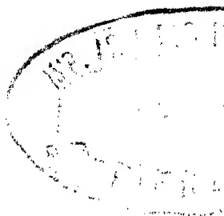A circular library stamp is located in the upper right corner of the page. The text 'UNIVERSITY OF MADRAS' is visible around the top edge of the stamp. The date '1941' is stamped in the center. There is some illegible text below the date, possibly a library code or reference number.

**F**IVE years ago the Executive Committee for Agriculture and Lands created a special grade of officers, recruited in a probationary capacity from University graduates in science, to serve as the nursery in which future holders of higher appointments in the field branch of the agricultural service would be reared. When three posts in this grade were advertised in 1937 it was hoped to recruit men with good honours degrees; but the only suitable candidate with an honours degree withdrew his application, and the Department had to be satisfied with the pass degree; and even in that class the field of choice was not extensive. Within six months two of the three selected candidates applied for posts of about the same grade in other Government Departments. The apparent inconsistency between this experience and the general belief that the graduates whom the University College turns out find it increasingly difficult to secure employment merits examination.

The agricultural student's preliminary education must include biology and chemistry. These subjects are not popular with the average "examination wallah" who prefers the more precise and more theoretical mathematics and physics. In a country in which neither the course of studies which a young man pursues nor the profession which he eventually adopts is always determined by special aptitude or by what may be described as a vocational call, some inducement is necessary to persuade students to move away from the beaten track. The conditions of service in the Department of Agriculture do not provide that inducement. On the contrary, these conditions repel rather than attract. Initiative and personal resourcefulness rather than the correct application of physical laws

500------------------------------------------------

2

are necessary for successful achievement in the activities of a field officer of the Department. He must be not only a scientist and an agriculturist but also a psychologist. Failure is easy, and the reward of success must be proportionately alluring. But the prospects are poorer than those of other departments of similar status. There are no other fields of employment in which the possession of qualifications in the less theoretical sciences is regarded as a special claim in favour of a candidate. The result is a dearth of young men who possess, if not an education in the science of agriculture, at least a knowledge of the fundamental sciences that lead to a study of agricultural science.

Recruitment to the Department of Agriculture is only a minor problem. There is a demand throughout the country that our educated young men should take a lead in the application of science to agriculture. Since neither natural inclination nor the prospect of a career at present attracts them to a course of studies that will equip them for this mission the interests of the country require that the necessary bias should be created by some artificial stimulus. In the search for such a stimulus clues are supplied by a quotation in a daily paper from the Educational Supplement of the *Times* and by an order of the Government of Madras published in the issue of the *Madras Agricultural Journal* for the month of June, 1941. The former quotes the opinion of an experienced teacher that during a visit to Australia he found that some of the best educated people he met were students from agricultural colleges. The latter makes the Collector and the District Agricultural Officer jointly responsible for the agricultural programme of each district. There is no doubt that the ambition of most well-educated and clever young men in this country is to enter the Civil Service. If they succeed in getting into that Service and become district officers a knowledge of agricultural science will be very useful to them should they follow the lead from Madras. If they fail we have the testimony of the contributor to the *Times* Supplement that education in an agricultural college is as good as any form of general education in a young man's preparation for life. The conclusion will become apparent to our readers that the stimulus for an agricultural education which we were seeking will be provided by the inclusion of Agricultural Science as a subject for the Civil Service with some weightage in marking in its favour.

501------------------------------------------------

3

### NOTICE

It is with regret that we announce to our readers that, owing to war-time conditions, *The Tropical Agriculturist* will be published quarterly instead of monthly from the beginning of 1942 till the end of the war.

EDITOR,  
*The Tropical Agriculturist.*

### INORGANIC NITROGENOUS FERTILIZERS

WE have been informed by Government that it is unlikely that any further supplies of inorganic nitrogenous fertilizers will be imported into Ceylon for the period of the war. It is suggested that tea and rubber planters should so arrange their manurial mixtures as to obtain their requirements of nitrogen from organic manures such as groundnut cake, castor cake, coconut poonac and compost.

EDITOR,  
*The Tropical Agriculturist.*

502------------------------------------------------

4

## THE EFFECT OF MANURING COCONUT PALMS ON THE OIL AND PROTEIN CONTENTS OF THE COPRA

**REGINALD CHILD, B.Sc., Ph.D. (Lond.), F.I.C.,**  
*DIRECTOR OF RESEARCH, COCONUT RESEARCH SCHEME*

AND

**M. L. M. SALGADO, B.Sc. (Lond.), Ph.D. (Cantab.), Dip. Agric.**  
*(Cantab.),*

*SOIL CHEMIST, COCONUT RESEARCH SCHEME*

**C**OCOONUT oil is, and will probably remain, the chief commercial product of the coconut palm. The final criterion of yield in manurial and other experiments on the palm should therefore be the quantity of oil obtained per acre. In practice it is not, of course, possible to crush separately the copra from a large number of experimental plots and the presentation of results on the basis of copra yields has to suffice. It is not even necessary to prepare copra, since Pieris (1) has shown that the correlation between weight of husked nuts and corresponding copra weight is very high and that copra yields are estimated sufficiently accurately even for experimental purposes as 32 per cent. of the weight of the husked nuts.

It is at the same time important to know whether manurial applications to coconut palms have any pronounced influence on the oil content of the copra produced. To examine this question moisture and oil determinations were carried out on samples of copra from selected plots of a manurial trial conducted by the Coconut Research Scheme at Bandirippuwa Estate, Lunuwila, Ceylon. This experiment (which will be reported in detail elsewhere) is a duplicated  $3 \times 3 \times 3$  factorial experiment in which are compared all the combinations of nitrogen, phosphoric acid and potash applied at nil, single and double doses. The plots selected for the present study were the sixteen receiving double doses of fertilizers, the treatments being shown with the complete data in Table I.

Each plot contains eighteen trees and the crop is collected every two months. The experiment was laid down in November, 1934, and fertilizers applied for the first time in

503------------------------------------------------

5

TABLE I.

<table border="1">
<thead>
<tr>
<th rowspan="3">Pick No.</th>
<th rowspan="3">Date of Pick</th>
<th rowspan="3">Date of Coping</th>
<th rowspan="3">Treatment</th>
<th rowspan="3">Plot No.</th>
<th colspan="3">M. II 7</th>
<th colspan="3">M. II 8</th>
<th colspan="3">M. II 9</th>
<th colspan="3">M. II 10</th>
<th colspan="3">M. II 11</th>
<th colspan="3">M. II 12</th>
<th rowspan="3">Average for year, combining duplicate plots for each treatment</th>
</tr>
<tr>
<th colspan="3">December 17, 1936</th>
<th colspan="3">February 11, 1937</th>
<th colspan="3">April 14, 1937</th>
<th colspan="3">June 15, 1937</th>
<th colspan="3">August 12, 1937</th>
<th colspan="3">October 13, 1937</th>
</tr>
<tr>
<th>H<sub>2</sub>O</th>
<th>Oil</th>
<th>Oil (Dry Wt.)</th>
<th>H<sub>2</sub>O</th>
<th>Oil</th>
<th>Oil (Dry Wt.)</th>
<th>H<sub>2</sub>O</th>
<th>Oil</th>
<th>Oil (Dry Wt.)</th>
<th>H<sub>2</sub>O</th>
<th>Oil</th>
<th>Oil (Dry Wt.)</th>
<th>H<sub>2</sub>O</th>
<th>Oil</th>
<th>Oil (Dry Wt.)</th>
<th>H<sub>2</sub>O</th>
<th>Oil</th>
<th>Oil (Dry Wt.)</th>
<th>H<sub>2</sub>O</th>
<th>Oil</th>
<th>Oil (Dry Wt.)</th>
</tr>
<tr>
<th>N. P. K.</th>
<th></th>
<th></th>
<th></th>
<th></th>
<th></th>
<th></th>
<th></th>
<th></th>
<th></th>
<th></th>
<th></th>
<th></th>
<th></th>
<th></th>
<th></th>
<th></th>
<th></th>
<th></th>
<th></th>
<th></th>
<th></th>
<th></th>
<th></th>
</tr>
</thead>
<tbody>
<tr>
<td>0</td>
<td>0</td>
<td>0</td>
<td>0</td>
<td>8</td>
<td>7.0</td>
<td>64.4</td>
<td>69.2</td>
<td>6.1</td>
<td>65.6</td>
<td>69.8</td>
<td>8.0</td>
<td>64.1</td>
<td>69.7</td>
<td>5.1</td>
<td>65.3</td>
<td>68.6</td>
<td>7.9</td>
<td>64.1</td>
<td>69.6</td>
<td>6.7</td>
<td>63.5</td>
<td>68.1</td>
<td>6.5</td>
<td>64.6</td>
<td>69.1</td>
</tr>
<tr>
<td></td>
<td></td>
<td></td>
<td></td>
<td>28</td>
<td>5.9</td>
<td>64.4</td>
<td>68.5</td>
<td>5.8</td>
<td>65.2</td>
<td>69.3</td>
<td>6.2</td>
<td>65.0</td>
<td>69.3</td>
<td>6.1</td>
<td>65.0</td>
<td>69.2</td>
<td>6.5</td>
<td>64.2</td>
<td>69.7</td>
<td>6.5</td>
<td>63.8</td>
<td>68.2</td>
<td>6.5</td>
<td>63.8</td>
<td>68.2</td>
</tr>
<tr>
<td>2(G)</td>
<td>0</td>
<td>0</td>
<td>0</td>
<td>17</td>
<td>6.7</td>
<td>62.9</td>
<td>67.4</td>
<td>5.7</td>
<td>66.4</td>
<td>70.4</td>
<td>7.4</td>
<td>63.8</td>
<td>68.9</td>
<td>5.6</td>
<td>64.5</td>
<td>68.3</td>
<td>6.5</td>
<td>64.9</td>
<td>69.4</td>
<td>6.9</td>
<td>64.5</td>
<td>68.6</td>
<td>6.9</td>
<td>64.5</td>
<td>68.6</td>
</tr>
<tr>
<td></td>
<td></td>
<td></td>
<td></td>
<td>40</td>
<td>6.5</td>
<td>63.8</td>
<td>68.2</td>
<td>5.9</td>
<td>64.3</td>
<td>68.4</td>
<td>6.3</td>
<td>66.1</td>
<td>70.5</td>
<td>5.6</td>
<td>65.4</td>
<td>69.5</td>
<td>7.2</td>
<td>65.1</td>
<td>70.2</td>
<td>7.7</td>
<td>62.8</td>
<td>68.0</td>
<td>7.7</td>
<td>62.8</td>
<td>68.0</td>
</tr>
<tr>
<td>0</td>
<td>2</td>
<td>0</td>
<td>0</td>
<td>15</td>
<td>5.8</td>
<td>64.2</td>
<td>68.2</td>
<td>5.5</td>
<td>66.5</td>
<td>70.5</td>
<td>7.2</td>
<td>64.9</td>
<td>69.9</td>
<td>5.7</td>
<td>65.3</td>
<td>69.0</td>
<td>6.2</td>
<td>65.8</td>
<td>70.2</td>
<td>6.1</td>
<td>64.8</td>
<td>69.0</td>
<td>6.1</td>
<td>65.1</td>
<td>69.4</td>
</tr>
<tr>
<td></td>
<td></td>
<td></td>
<td></td>
<td>37</td>
<td>5.5</td>
<td>63.5</td>
<td>69.3</td>
<td>5.6</td>
<td>65.7</td>
<td>69.6</td>
<td>6.6</td>
<td>64.5</td>
<td>69.1</td>
<td>6.0</td>
<td>64.9</td>
<td>69.3</td>
<td>6.8</td>
<td>65.7</td>
<td>70.5</td>
<td>6.6</td>
<td>63.8</td>
<td>68.3</td>
<td>6.6</td>
<td>63.8</td>
<td>68.3</td>
</tr>
<tr>
<td>0</td>
<td>0</td>
<td>2</td>
<td>0</td>
<td>21</td>
<td>7.0</td>
<td>63.5</td>
<td>68.3</td>
<td>5.2</td>
<td>66.1</td>
<td>69.7</td>
<td>7.4</td>
<td>64.3</td>
<td>69.4</td>
<td>5.1</td>
<td>66.0</td>
<td>69.7</td>
<td>6.8</td>
<td>65.5</td>
<td>70.3</td>
<td>6.3</td>
<td>64.7</td>
<td>69.9</td>
<td>6.3</td>
<td>65.2</td>
<td>69.6</td>
</tr>
<tr>
<td></td>
<td></td>
<td></td>
<td></td>
<td>46</td>
<td>6.0</td>
<td>64.4</td>
<td>68.6</td>
<td>4.9</td>
<td>66.7</td>
<td>70.1</td>
<td>6.7</td>
<td>65.4</td>
<td>70.1</td>
<td>5.8</td>
<td>66.7</td>
<td>70.8</td>
<td>6.6</td>
<td>66.1</td>
<td>70.8</td>
<td>7.4</td>
<td>63.6</td>
<td>68.7</td>
<td>7.4</td>
<td>63.6</td>
<td>68.7</td>
</tr>
<tr>
<td>2(S)</td>
<td>2</td>
<td>0</td>
<td>0</td>
<td>19</td>
<td>6.9</td>
<td>63.8</td>
<td>68.5</td>
<td>4.9</td>
<td>66.6</td>
<td>70.1</td>
<td>7.4</td>
<td>64.6</td>
<td>69.8</td>
<td>6.3</td>
<td>65.5</td>
<td>69.9</td>
<td>5.9</td>
<td>66.0</td>
<td>70.1</td>
<td>5.5</td>
<td>65.8</td>
<td>69.6</td>
<td>5.5</td>
<td>65.0</td>
<td>69.5</td>
</tr>
<tr>
<td></td>
<td></td>
<td></td>
<td></td>
<td>53</td>
<td>5.4</td>
<td>64.8</td>
<td>68.4</td>
<td>6.1</td>
<td>65.9</td>
<td>70.2</td>
<td>7.0</td>
<td>64.4</td>
<td>69.3</td>
<td>6.2</td>
<td>65.5</td>
<td>69.8</td>
<td>8.4</td>
<td>64.5</td>
<td>70.4</td>
<td>7.6</td>
<td>62.9</td>
<td>68.1</td>
<td>7.6</td>
<td>62.9</td>
<td>68.1</td>
</tr>
<tr>
<td>2(S)</td>
<td>0</td>
<td>2</td>
<td>0</td>
<td>2</td>
<td>5.8</td>
<td>65.7</td>
<td>69.7</td>
<td>5.6</td>
<td>64.4</td>
<td>68.3</td>
<td>7.7</td>
<td>63.4</td>
<td>68.7</td>
<td>5.6</td>
<td>64.3</td>
<td>68.1</td>
<td>6.0</td>
<td>65.4</td>
<td>69.6</td>
<td>7.0</td>
<td>64.4</td>
<td>69.2</td>
<td>6.3</td>
<td>64.8</td>
<td>69.1</td>
</tr>
<tr>
<td></td>
<td></td>
<td></td>
<td></td>
<td>34</td>
<td>5.7</td>
<td>64.1</td>
<td>68.0</td>
<td>6.0</td>
<td>65.2</td>
<td>69.3</td>
<td>6.7</td>
<td>64.1</td>
<td>68.7</td>
<td>5.4</td>
<td>65.7</td>
<td>69.4</td>
<td>7.1</td>
<td>65.7</td>
<td>70.7</td>
<td>6.6</td>
<td>65.0</td>
<td>69.6</td>
<td>6.6</td>
<td>65.0</td>
<td>69.6</td>
</tr>
<tr>
<td>0</td>
<td>2</td>
<td>2</td>
<td>0</td>
<td>5</td>
<td>6.8</td>
<td>65.1</td>
<td>69.8</td>
<td>6.0</td>
<td>64.0</td>
<td>68.1</td>
<td>8.1</td>
<td>64.0</td>
<td>69.7</td>
<td>5.2</td>
<td>66.1</td>
<td>69.7</td>
<td>6.3</td>
<td>65.5</td>
<td>69.9</td>
<td>5.2</td>
<td>65.3</td>
<td>68.8</td>
<td>6.3</td>
<td>64.9</td>
<td>69.3</td>
</tr>
<tr>
<td></td>
<td></td>
<td></td>
<td></td>
<td>38</td>
<td>5.6</td>
<td>64.5</td>
<td>68.4</td>
<td>5.9</td>
<td>65.4</td>
<td>69.5</td>
<td>7.0</td>
<td>64.6</td>
<td>69.5</td>
<td>6.5</td>
<td>64.7</td>
<td>69.2</td>
<td>6.5</td>
<td>65.9</td>
<td>70.5</td>
<td>6.2</td>
<td>64.2</td>
<td>68.4</td>
<td>6.2</td>
<td>64.2</td>
<td>68.4</td>
</tr>
<tr>
<td>2(G)</td>
<td>2</td>
<td>2</td>
<td>0</td>
<td>16</td>
<td>6.6</td>
<td>64.2</td>
<td>68.7</td>
<td>5.7</td>
<td>64.4</td>
<td>68.3</td>
<td>7.3</td>
<td>65.1</td>
<td>70.2</td>
<td>5.7</td>
<td>64.9</td>
<td>68.8</td>
<td>7.1</td>
<td>64.8</td>
<td>69.8</td>
<td>5.8</td>
<td>65.3</td>
<td>69.3</td>
<td>5.8</td>
<td>65.3</td>
<td>69.3</td>
</tr>
<tr>
<td></td>
<td></td>
<td></td>
<td></td>
<td>38</td>
<td>6.4</td>
<td>63.8</td>
<td>69.0</td>
<td>5.4</td>
<td>66.4</td>
<td>70.3</td>
<td>6.6</td>
<td>65.8</td>
<td>70.4</td>
<td>5.5</td>
<td>65.8</td>
<td>69.6</td>
<td>7.4</td>
<td>65.2</td>
<td>70.4</td>
<td>7.9</td>
<td>63.0</td>
<td>68.4</td>
<td>7.9</td>
<td>63.0</td>
<td>68.4</td>
</tr>
<tr>
<td></td>
<td></td>
<td></td>
<td></td>
<td></td>
<td>6.2</td>
<td>64.3</td>
<td>68.6</td>
<td>5.6</td>
<td>65.6</td>
<td>69.5</td>
<td>7.1</td>
<td>64.6</td>
<td>69.6</td>
<td>5.7</td>
<td>65.4</td>
<td>69.3</td>
<td>6.8</td>
<td>65.3</td>
<td>70.1</td>
<td>6.6</td>
<td>64.2</td>
<td>68.7</td>
<td>6.6</td>
<td>64.2</td>
<td>68.7</td>
</tr>
</tbody>
</table>

Date of application of fertilizers : November, 1935.

Applications :

- N<sub>2</sub> = 1.0 lb. nitrogen per palm
- P<sub>2</sub> = 2.0 lb. P<sub>2</sub>O<sub>5</sub> per palm, as 6.56 lb. Superphosphate.
- K<sub>2</sub> = 1.5 lb. K<sub>2</sub>O per palm, as 3.0 lb. 50 per cent. Muriate of Potash.

In plots 17 and 40 : 5.26 lb. Calcium cyanamide.  
 In plots 19, 53, 2, and 34 : 4.85 lb. sulphate of ammonia.  
 In plots 16 and 38 : 19.16 lb. Groundnut cake.

504------------------------------------------------

6

November, 1935. The samples for the present work were from the six picks of the second year after manuring, viz., from December, 1936, to October, 1937.

*Sampling and Analysis.*—At each pick two nuts were collected separately from each tree, giving 36 nuts for each plot. These sixteen lots of 36 nuts were separately converted into copra, curing being done about a month after plucking according to the usual local practice.

Reduction of the samples for analysis was carried out by the method previously described (2).

Moisture was determined by drying at 100°C (see comments in ref. 2) and oil by extracting the dried samples with light petroleum (B. Pt. 40–60°C) in a Bolton-Revis apparatus. All determinations were carried out in duplicate and were repeated in the few cases which failed to agree within 0·5 per cent. of oil.

*Results.*—The complete results are given in Table I. It will at once be apparent that there is no indication that the differential manurial treatments are reflected in the oil percentages of the copra samples. In fact the small variation is surprising, the coefficient of variation for the 96 figures being 1·2 per cent.

In the previous paper (2) no differences were observed between the average oil percentages of copra samples from six estates in different parts of Ceylon; these estates represented soil types which must have varied considerably in fertility.

Patel (3) quotes oil percentages of copra from 17 plots receiving different manurial treatments in a trial carried out in Madras, which he states appear to show that all treatments increased the oil content. His oil percentage figures were obtained by crushing the copra in a country oil mill. The recovery of oil by this means is very low, Patel's percentages averaging 55·0 per cent., and the process is very variable. He himself admits that "it would have been more accurate if the determinations were carried out by chemical methods". We consider it very doubtful that much value attaches to his figures, since our experience is that it is quite impossible to obtain results with a country oil mill sufficiently consistent for experimental purposes.

At the same time whilst we claim that our present work shows clearly that under the conditions described manurial treatments have not influenced the oil content of the copra, the limitations of this statement must be recognized. The palms on the experimental field are mature palms, perhaps 40 years old at the time of commencement of the trial. Up to 1935 they had (presumably) received identical manuring and

505------------------------------------------------

7

cultivation treatments, only being treated differentially with the application of the fertilizer treatments in November, 1935. It is not impossible that significant differences of oil content might begin to show themselves after the palms have been differentially treated for a longer period, and it will be of interest to repeat the observations on copra samples from the same plots in a later year.

The average oil content of the present 96 copra samples was 69.3 per cent. (dry weight), a figure rather higher than the general mean of 68.3 per cent. previously found for 52 samples of Ceylon Estate Copra drawn from all over the Island (2). This difference, if any significance attaches to it, may be related to the fact that Bandirippuwa Estate has been, in general, maintained at a higher level of fertility than the estates from which the 52 previous samples were drawn.

*Oil/Husked Nut Ratio.*—Since the oil content of copra is fairly constant a simple extension of the copra/husked nut ratio of 32 per cent. can be made. Table II. shows the yields of the 16 plots during the period over which the copra samples were taken for the present study. Figures are given for weight of husked nuts, weight of copra, oil percentage of copra and the copra/husked nut and oil/husked nut ratios. The latter ratio does not vary much from 20.5 per cent.

TABLE II.

Total plot yields for the year December, 1936, to October, 1937 (M. II), showing weight of husked nuts and copra weights, and also the copra/husked nut and oil/husked nut ratios.

<table border="1">
<thead>
<tr>
<th>Treatment</th>
<th>Plot No.</th>
<th>Wt. of husked nuts (lb.)</th>
<th>Wt. of Copra (lb.)</th>
<th>Copra/husked nut ratio</th>
<th>Average oil per cent. of copra</th>
<th>Oil/husked nut ratio</th>
</tr>
</thead>
<tbody>
<tr>
<td rowspan="2">0 0 0 ..</td>
<td>8</td>
<td>1,524</td>
<td>482</td>
<td>31.6</td>
<td>64.5</td>
<td>20.4</td>
</tr>
<tr>
<td>28</td>
<td>1,876</td>
<td>595</td>
<td>31.7</td>
<td>64.8</td>
<td>20.5</td>
</tr>
<tr>
<td rowspan="2">2 0 0 ..</td>
<td>17</td>
<td>2,348</td>
<td>743</td>
<td>31.6</td>
<td>64.5</td>
<td>20.4</td>
</tr>
<tr>
<td>40</td>
<td>2,270</td>
<td>709</td>
<td>31.2</td>
<td>64.6</td>
<td>20.2</td>
</tr>
<tr>
<td rowspan="2">0 2 0 ..</td>
<td>15</td>
<td>2,165</td>
<td>690</td>
<td>31.9</td>
<td>65.2</td>
<td>20.8</td>
</tr>
<tr>
<td>37</td>
<td>1,706</td>
<td>537</td>
<td>31.5</td>
<td>65.1</td>
<td>20.5</td>
</tr>
<tr>
<td rowspan="2">0 0 2 ..</td>
<td>21</td>
<td>2,250</td>
<td>699</td>
<td>31.1</td>
<td>65.0</td>
<td>20.2</td>
</tr>
<tr>
<td>46</td>
<td>2,065</td>
<td>656</td>
<td>31.8</td>
<td>65.5</td>
<td>20.8</td>
</tr>
<tr>
<td rowspan="2">2 2 0 ..</td>
<td>19</td>
<td>1,948</td>
<td>620</td>
<td>31.8</td>
<td>65.4</td>
<td>20.8</td>
</tr>
<tr>
<td>53</td>
<td>1,649</td>
<td>550</td>
<td>33.3</td>
<td>64.7</td>
<td>21.5</td>
</tr>
<tr>
<td rowspan="2">2 0 2 ..</td>
<td>2</td>
<td>1,908</td>
<td>610</td>
<td>32.0</td>
<td>64.6</td>
<td>20.7</td>
</tr>
<tr>
<td>34</td>
<td>2,193</td>
<td>662</td>
<td>30.2</td>
<td>65.0</td>
<td>19.6</td>
</tr>
<tr>
<td rowspan="2">0 2 2 ..</td>
<td>5</td>
<td>1,812</td>
<td>577</td>
<td>31.8</td>
<td>65.0</td>
<td>20.7</td>
</tr>
<tr>
<td>33</td>
<td>1,809</td>
<td>567</td>
<td>31.3</td>
<td>64.9</td>
<td>20.3</td>
</tr>
<tr>
<td rowspan="2">2 2 2 ..</td>
<td>16</td>
<td>2,606</td>
<td>830</td>
<td>31.8</td>
<td>64.8</td>
<td>20.6</td>
</tr>
<tr>
<td>38</td>
<td>1,968</td>
<td>629</td>
<td>32.0</td>
<td>65.0</td>
<td>20.8</td>
</tr>
<tr>
<td>Total</td>
<td></td>
<td>32,097</td>
<td>10,156</td>
<td>31.60</td>
<td>64.90</td>
<td>20.51</td>
</tr>
<tr>
<td>Average</td>
<td></td>
<td>2,006</td>
<td>635</td>
<td></td>
<td></td>
<td></td>
</tr>
</tbody>
</table>

506------------------------------------------------

8

The practical oil yield of copra of average oil content 64.9 per cent. when crushed in hydraulic presses or efficient expellers would be about 62.9 per cent. (cf. reference 2). Twenty per cent. of the husked nut weight would, therefore, give an estimate of the commercial oil yield obtainable, sufficiently close for practical purposes.

*Protein Content.*—Nitrogen was estimated by Kjeldahl's method on the oil-free extracted meals from the samples of two series M. II 10 and M. II 11, with the results shown in Table III.

TABLE III.

<table border="1">
<thead>
<tr>
<th>Treatment</th>
<th>Plot No.</th>
<th>M. II 10<br/>Nitrogen %<br/>(Dry weight)</th>
<th>M. II 11<br/>Nitrogen %<br/>(Dry weight)</th>
<th></th>
</tr>
</thead>
<tbody>
<tr>
<td rowspan="2">0 0 0 ..</td>
<td>8</td>
<td>3.82</td>
<td>3.59</td>
<td></td>
</tr>
<tr>
<td>28</td>
<td>3.21</td>
<td>3.49</td>
<td></td>
</tr>
<tr>
<td rowspan="2">0 0 2 ..</td>
<td>21</td>
<td>3.68</td>
<td>3.76</td>
<td></td>
</tr>
<tr>
<td>46</td>
<td>3.75</td>
<td>3.74</td>
<td></td>
</tr>
<tr>
<td rowspan="2">0 2 0 ..</td>
<td>15</td>
<td>3.80</td>
<td>3.26</td>
<td></td>
</tr>
<tr>
<td>37</td>
<td>3.61</td>
<td>3.35</td>
<td rowspan="2">Mean of total samples<br/>from no nitrogen<br/>plots</td>
</tr>
<tr>
<td rowspan="2">0 2 2 ..</td>
<td>5</td>
<td>3.80</td>
<td>3.69</td>
</tr>
<tr>
<td>33</td>
<td>3.67</td>
<td>3.65</td>
<td></td>
</tr>
<tr>
<td colspan="2">Means no<br/>nitrogen plots</td>
<td>3.67</td>
<td>3.57</td>
<td>3.62</td>
</tr>
<tr>
<td rowspan="2">2 0 0 ..</td>
<td>17</td>
<td>3.35</td>
<td>3.58</td>
<td></td>
</tr>
<tr>
<td>40</td>
<td>3.47</td>
<td>3.64</td>
<td></td>
</tr>
<tr>
<td rowspan="2">2 0 2 ..</td>
<td>2</td>
<td>3.56</td>
<td>3.67</td>
<td></td>
</tr>
<tr>
<td>34</td>
<td>3.76</td>
<td>3.69</td>
<td></td>
</tr>
<tr>
<td rowspan="2">2 2 0 ..</td>
<td>19</td>
<td>3.78</td>
<td>3.55</td>
<td></td>
</tr>
<tr>
<td>53</td>
<td>3.72</td>
<td>3.45</td>
<td rowspan="2">Means of total samples<br/>from plots receiving<br/>1 lb. nitrogen per<br/>palm</td>
</tr>
<tr>
<td rowspan="2">2 2 2 ..</td>
<td>16</td>
<td>3.53</td>
<td>3.48</td>
</tr>
<tr>
<td>38</td>
<td>3.61</td>
<td>3.49</td>
<td></td>
</tr>
<tr>
<td colspan="2">Means { Plots receiving<br/>1.0 lb. nitrogen<br/>per palm</td>
<td>3.60</td>
<td>3.57</td>
<td>3.58</td>
</tr>
</tbody>
</table>

General mean N % = 3.60

These results show clearly that manuring at the rate of 1 lb. nitrogen per palm has not, in the second year after application, affected the nitrogen content of the copra. If the results are re-arranged with respect to potash or phosphoric acid treatments, it is apparent that these treatments have also caused little or no variation in nitrogen content.

<table border="1">
<thead>
<tr>
<th></th>
<th>Average Nitrogen per<br/>cent. (Dry weight)</th>
</tr>
</thead>
<tbody>
<tr>
<td>16 samples from P<sub>0</sub> plots ..</td>
<td>3.61</td>
</tr>
<tr>
<td>16 samples from P<sub>4</sub> plots ..</td>
<td>3.59</td>
</tr>
<tr>
<td>16 samples from K<sub>0</sub> plots ..</td>
<td>3.54</td>
</tr>
<tr>
<td>16 samples from K<sub>4</sub> plots ..</td>
<td>3.66</td>
</tr>
</tbody>
</table>

507------------------------------------------------

9

*Acknowledgements.*—Our thanks are due to Mr. W. R. N. Nathanael, B.Sc., Technical Assistant to the Technological Chemist, who assisted with the analytical work, and to Mr. M. G. Fonseca, Field Assistant to the Soil Chemist, who was responsible for the field work.

*Summary.*—During the second year after application, different fertilizer treatments to coconut palms did not affect the oil or nitrogen content of the copra.

The average moisture and oil contents of 96 samples of copra examined were, moisture 6.35 per cent., oil 64.9 per cent., oil (dry weight) 69.3 per cent. The average nitrogen content of the dry oil-free extracted meals was 3.60 per cent.

An estimate of the oil yield obtainable from nuts, sufficiently accurate for practical purposes, is obtained by taking 20 per cent. of the weight of the husked nuts.

#### REFERENCES

1. 1. W. V. D. Pieris.—Studies on the Coconut Palm-II. On the Relation between the weight of Husked Nuts and the weight of Copra. *The Tropical Agriculturist*, 1935, LXXXV., Pp. 208-220.
2. 2. R. Child.—Ceylon Estate Copra. *ibid.*, 1937, LXXXVIII., pp. 137-149.
3. 3. J. S. Patel.—“The Coconut”, Madras, 1938, p. 211.

508------------------------------------------------

10

## CULTURAL EXPERIMENTS WITH TURMERIC (*CUCURMA DOMESTICA* VAL.)

### II. THE INFLUENCE OF SPACING, MULCHING AND KIND OF SEED ON YIELD

W. R. C. PAUL, M.A. (Cantab.), Ph.D., M.Sc. (Lond.), D.I.C.,  
AGRICULTURAL OFFICER, CENTRAL DIVISION  
AND

M. FERNANDO, Ph.D., B.Sc. (Lond.), D.I.C.,  
ASSISTANT BOTANIST

THE high price and the limited availability of land in the wet zone of Ceylon make spacing a factor of considerable importance in turmeric growing in this country.

The turmeric grower usually spaces his plants one foot apart between and within rows. This paper reports the results obtained with closer and wider spacings.

A turmeric crop occupies the land for as long as ten months, and the possibility of taking a catch crop off the area in the interval between the planting and the sprouting of the turmeric has occasionally been explored. Dwarf French beans (*Phaseolus vulgaris* L.), in view of their extremely short age, probably constitute the most popular choice in catch crops grown at the elevation between 1,000 and 2,000 feet where conditions are most suitable for turmeric cultivation. The practice of interposing this bean crop compels the postponement of the application of the straw mulch till the beans are lifted. On the other hand, the turmeric may be benefited by the legacy of accumulated nitrogen left over in the soil by the legume. The residual effect on the turmeric of the practice of taking a crop of beans off the area was investigated in the experiment presented in this paper.

The relative suitability of mother setts and of "fingers" for purposes of seed was also studied.

#### *The Design of the Experiment.*

The following treatments were included in a  $3 \times 3 \times 3$  unreplicated factorial design of 27 plots :—

<table border="0">
<tr>
<td rowspan="3">'Three types of seed</td>
<td rowspan="3">{</td>
<td>T<sub>0</sub>—"Fingers" of the local variety</td>
</tr>
<tr>
<td>T<sub>1</sub>—Whole mother setts of the local variety</td>
</tr>
<tr>
<td>T<sub>2</sub>—"Fingers" of the variety Poona</td>
</tr>
</table>

509------------------------------------------------

11

<table border="0">
<tr>
<td rowspan="3">Three spacings</td>
<td rowspan="3">{</td>
<td><math>S_0</math>—<math>1\frac{1}{2}</math> by <math>1\frac{1}{2}</math> ft.</td>
</tr>
<tr>
<td><math>S_1</math>—1 by 1 ft.</td>
</tr>
<tr>
<td><math>S_2</math>—<math>\frac{1}{2}</math> by <math>\frac{1}{2}</math> ft.</td>
</tr>
<tr>
<td rowspan="3">Three mulching treatments</td>
<td rowspan="3">{</td>
<td><math>M_0</math>—unmulched</td>
</tr>
<tr>
<td><math>M_1</math>—mulched with rice straw at planting time</td>
</tr>
<tr>
<td><math>M_2</math>—mulch of rice straw applied after a crop of dwarf French beans, sown at the time of planting of the turmeric had been removed</td>
</tr>
</table>

The 27 plots were disposed in 3 blocks of 9 plots each. Two of the eight degrees appropriate to the second-order interaction,  $T \times S \times M$ , were confounded with block differences. The remaining six degrees of freedom were available for the estimate of error. For details of the design, reference may be made to Yates (1937).

The plots were square and  $1/538$  acre in extent. Guard rows were discarded and a nett area of  $1/1210$  acre was harvested from each plot.

#### *Experimental Material and Methods.*

The experiment was conducted at the Experiment Station, Nugawela, in the 1940–41 season. The soil of the experimental area was a lateritic loam of average fertility and rather acid in reaction.

The rhizomes were planted and, in the  $M_2$  plots, dwarf French beans dibbled on May 10, 1940. A mulch of 20 lb. rice straw per plot (6 tons per acre) was applied to the  $M_1$  plots on the date of planting. Germination of the beans was satisfactory; the percentage germination on May 15, was 90. On May 24, vacancies in the beans were filled, and the  $M_0$  and  $M_2$  plots were given a light soil mulch.

The turmeric commenced sprouting during the period May 29–31, the sprouting appearing earlier in plots mulched with straw.

An epiphytotic of bean-fly (*Agromyza phaseoli* Coq.) unfortunately devastated the bean crop. It was harvested on July 1, and a straw mulch (20 lb. per plot) applied to the  $M_2$  plots on this date.

Vacancies in the turmeric crop were supplied on June 12. Plants of the local variety grown from mother setts exhibited the most vigorous vegetative growth and tillering. Plants spaced closest, however, appeared to be least affected by the spell of dry weather which occurred in the latter half of the growing season.

Stem-borer (*Dichocrocis punctiferalis* Guen.) appeared to be most damaging to the vegetatively vigorous plants; the incidence of the pest was lowest in the plots with the closest spacing.

510------------------------------------------------

12

The area received two weedings. The turmeric flowered on October 2, and was lifted on February 3, 1941.

### *Results.*

The weights of rhizomes produced by plots subjected to the various treatments, are given in Table 1, and the analysis of variance of these figures in Table 2. The spacing variance shows significance at the 5 per cent. point. None of the other main effects or first order interactions are significant.

There was evidently little difference in performance between the variety Poona and the local variety. In the local variety the superiority of mother sets to "fingers" was not appreciable.

The considerable increase in yield produced by the application of a straw mulch on the date of planting was not significant. The failure to demonstrate significance in this instance should be interpreted in terms of the low number of degrees of freedom available for the estimate of error and of the extremely small plot-size. The examination of individual spacing totals reveals the significant superiority of the closest spacing, viz.,  $\frac{1}{2} \times \frac{1}{2}$  ft., to both the other spacings. The large and significant difference between the optimum spacing, viz.,  $\frac{1}{2} \times \frac{1}{2}$  ft., and the spacing almost universally adopted by the turmeric grower lend these data considerable interest.

### SUMMARY

The results of an experiment conducted in the 1940-41 season, at the Experiment Station, Nugawela, for the purpose of examining the effect of spacing, mulching and kind of seed on the yield of turmeric, are presented.

Plants spaced  $\frac{1}{2} \times \frac{1}{2}$  ft., yielded a significantly greater weight of uncured rhizomes than plants spaced either  $1 \times 1$  ft., or  $1\frac{1}{2} \times 1\frac{1}{2}$  ft.

There were no other significant effects.

### ACKNOWLEDGEMENT

We are grateful to Mr. E. C. Wirasinha, Agricultural Instructor, Katugastota, for his careful supervision of the field operations.

### REFERENCES

Paul, W. R. C., & Fernando, M., 1941—Cultural Experiments with turmeric (*Cucurma domestica* Val.). I. The influence of mulching and of the size of seed on the yield of some varieties of turmeric. *The Tropical Agriculturist*, Vol. XCVI.

Yates, F., 1937—The design and analysis of factorial experiments. *Imperial Bureau of Soil Science, Tech. Comm. No. 35*.

511------------------------------------------------

13TABLE 1.—Yields of uncured rhizomes in lb.

<table border="1">
<thead>
<tr>
<th colspan="2"></th>
<th colspan="4">TYPES OF SEED</th>
</tr>
<tr>
<th colspan="2"></th>
<th>T<sub>0</sub></th>
<th>T<sub>1</sub></th>
<th>T<sub>2</sub></th>
<th>Total</th>
</tr>
</thead>
<tbody>
<tr>
<td rowspan="4">SPACINGS</td>
<td>S<sub>0</sub> ..</td>
<td>21.25</td>
<td>40.25</td>
<td>34.00</td>
<td>95.50</td>
</tr>
<tr>
<td>S<sub>1</sub> ..</td>
<td>32.25</td>
<td>41.00</td>
<td>56.75</td>
<td>130.00</td>
</tr>
<tr>
<td>S<sub>2</sub> ..</td>
<td>72.25</td>
<td>73.75</td>
<td>57.75</td>
<td>203.75</td>
</tr>
<tr>
<td>Total</td>
<td>125.75</td>
<td>155.00</td>
<td>148.50</td>
<td>429.25</td>
</tr>
<tr>
<th colspan="2"></th>
<th colspan="4">MULCHINGS</th>
</tr>
<tr>
<th colspan="2"></th>
<th>M<sub>0</sub></th>
<th>M<sub>1</sub></th>
<th>M<sub>2</sub></th>
<th>Total</th>
</tr>
<tr>
<td rowspan="4">SPACINGS</td>
<td>S<sub>0</sub> ..</td>
<td>22.00</td>
<td>43.25</td>
<td>30.25</td>
<td>95.50</td>
</tr>
<tr>
<td>S<sub>1</sub> ..</td>
<td>28.75</td>
<td>46.00</td>
<td>55.25</td>
<td>130.00</td>
</tr>
<tr>
<td>S<sub>2</sub> ..</td>
<td>68.50</td>
<td>94.00</td>
<td>43.25</td>
<td>203.75</td>
</tr>
<tr>
<td>Total</td>
<td>117.25</td>
<td>183.25</td>
<td>128.75</td>
<td>429.25</td>
</tr>
<tr>
<th colspan="2"></th>
<th colspan="4">MULCHINGS</th>
</tr>
<tr>
<th colspan="2"></th>
<th>M<sub>0</sub></th>
<th>M<sub>1</sub></th>
<th>M<sub>2</sub></th>
<th>Total</th>
</tr>
<tr>
<td rowspan="4">TYPES OF SEED</td>
<td>T<sub>0</sub> ..</td>
<td>51.50</td>
<td>48.00</td>
<td>26.25</td>
<td>125.75</td>
</tr>
<tr>
<td>T<sub>1</sub> ..</td>
<td>26.00</td>
<td>80.25</td>
<td>48.75</td>
<td>155.00</td>
</tr>
<tr>
<td>T<sub>2</sub> ..</td>
<td>39.75</td>
<td>55.00</td>
<td>53.75</td>
<td>148.50</td>
</tr>
<tr>
<td>Total</td>
<td>117.25</td>
<td>183.25</td>
<td>128.75</td>
<td>429.25</td>
</tr>
</tbody>
</table>

TABLE 2.—Analysis of variance of weights of uncured rhizomes

<table border="1">
<thead>
<tr>
<th colspan="2"></th>
<th>DF</th>
<th>SS</th>
<th>MS</th>
<th colspan="3">VR 5 per cent. 1 per cent</th>
</tr>
<tr>
<th colspan="2"></th>
<th></th>
<th></th>
<th></th>
<th colspan="2">point.</th>
<th>point.</th>
</tr>
</thead>
<tbody>
<tr>
<td rowspan="3">Main effects</td>
<td>T</td>
<td>2</td>
<td>52.42</td>
<td>26.21</td>
<td>..</td>
<td>..</td>
<td>..</td>
</tr>
<tr>
<td>S</td>
<td>2</td>
<td>679.53</td>
<td>339.765</td>
<td>..</td>
<td>8.98</td>
<td>5.14</td>
<td>10.92</td>
</tr>
<tr>
<td>M</td>
<td>2</td>
<td>276.24</td>
<td>138.12</td>
<td>..</td>
<td>3.65</td>
<td>5.14</td>
<td>—</td>
</tr>
<tr>
<td rowspan="3">First-order interactions</td>
<td>TS</td>
<td>4</td>
<td>164.92</td>
<td>41.23</td>
<td>..</td>
<td>..</td>
<td>..</td>
</tr>
<tr>
<td>TM</td>
<td>4</td>
<td>391.08</td>
<td>97.77</td>
<td>..</td>
<td>..</td>
<td>..</td>
</tr>
<tr>
<td>SM</td>
<td>4</td>
<td>351.14</td>
<td>87.785</td>
<td>..</td>
<td>..</td>
<td>..</td>
</tr>
<tr>
<td rowspan="2">Second-order interactions (TSM)</td>
<td>Error</td>
<td>6</td>
<td>226.97</td>
<td>37.83</td>
<td>..</td>
<td>..</td>
<td>..</td>
</tr>
<tr>
<td>Confounded with blocks ..</td>
<td>2</td>
<td>184.48</td>
<td>92.24</td>
<td>..</td>
<td>..</td>
<td>..</td>
</tr>
<tr>
<td colspan="2"></td>
<td><u>26</u></td>
<td><u>2326.78</u></td>
<td></td>
<td></td>
<td></td>
<td></td>
</tr>
</tbody>
</table>

512------------------------------------------------

14

## SOME RESULTS OF HARROWING A GROWING RICE CROP

G. V. WICKRAMASEKERA, A.I.C.T.A. (Trinidad), Dip. Agric. (Poona),

PADDY OFFICER

### INTRODUCTION.

IN the March, 1940, issue of this journal, Vol. XCIV., No. 3, pages 146-159, the writer detailed results of investigations into various cultural treatments carried out to determine the effect on yield of harrowing a growing rice crop. In it the yields obtained and the economics of the various treatments tested were discussed; the practicability of the adoption of the simple and inexpensive method of using a wooden toothed-harrow for harrowing a growing rice crop was stressed, and the technique described. It was also pointed out that the scope for adopting the practice of transplanting in Ceylon was very much limited owing to the fact that (i.) on a rough computation about  $\frac{2}{3}$  of the area under rice in *maha* is sown with short-termed varieties maturing in  $2\frac{1}{2}$ - $4\frac{1}{2}$  months, the acreage under 4-month varieties predominating; in *yala* over  $\frac{4}{5}$  the acreage is sown with short-termed varieties maturing in  $2\frac{1}{2}$ -4 months, with 3-month varieties predominating; (ii.) the cost of raising seedlings in a nursery and of transplanting them is over Rs. 10 per acre and the increase in yield obtained by transplanting long-termed varieties is about 10-12 bushels. Short-termed varieties are not transplanted as the increase in yield is comparatively low while the cost remains the same; (iii.) in the large paddy tracts the various irrigation schemes are designed to provide irrigation for the cultivation of short-termed varieties only; and (iv.) labour is so scarce in these areas that even weeding is not practised.

Results of six field trials conducted both by private owners of paddy fields and by the Department are recorded below. They confirm the conclusions already reported, namely, that the yields of paddy could be appreciably increased by adopting the very economical method of harrowing a growing rice crop.

513------------------------------------------------

15TRIALS

The trials were conducted at Padiligama in Tissamaharama during *maha* 1939-40, at Batalagoda (Kurunegala District), Paranthan (Jaffna District), and Kiula near Ambalantota during *yala* 1940, and again at Batalagoda and Paranthan in *maha* 1940-41.

In conducting these trials no elaborate technique was employed as in the experiments reported previously (Wickramasekera, 1940) to permit the results being statistically analysed. Since this system of cultivation has passed the experimental stage the present trials were regarded more as demonstrations rather than experiments. In all cases the crop was sown broadcast in the customary manner and half of each block was harrowed when the seedlings were about 3-4 weeks old. The yields of the harrowed and the unharrowed blocks, in each case, were recorded in order to determine the yield difference. The percentage increase in yield obtained is striking.

[For Table *see* page 17.]

1. No. 1. Padiligama.—*Maha* 1939-40; fields were prepared by mudding by buffaloes and no manures were applied. The season was normal.
2. 2. Batalagoda.—*Yala* 1940; the fields were ploughed with the light iron plough and harrowed with the wooden-toothed harrow; no manures were applied. The season was normal.
3. 3. Batalagoda.—*Maha* 1940-41; fields were cultivated in the village method in order to determine the optimum duty of water required under cultivators' conditions of cultivation; no manures were applied. The season was unfavourable for rice cultivation.
4. 4. Paranthan.—*Yala* 1940; the fields were heavily manured with organic and inorganic manures the previous season and this season too a crop of sunn-hemp was ploughed in and  $\frac{3}{4}$  cwt. of nicifos per acre was applied. The season was normal. The yield in consequence increased from an average of about 30 bushels to 54 bushels per acre in the unharrowed area as compared to the yield of 60 bushels per acre in the harrowed area. The induced increased fertility of the fields may have masked the effect of harrowing.

514------------------------------------------------

16

5. Paranthan.—*Maha* 1940-41; this block was cropped continuously and in the previous season it was manured but not so heavily as the block referred to in item 4. This season 4 cartloads of cattle manure and  $\frac{3}{4}$  cwt. of nicifos per acre were applied. The season was unfavourable. *Maha* yields are usually lower than in *yala*. Unseasonal rain was experienced at flowering time and some damage was caused by the stem borer (*Schoenobius bipunctifer*).

6. Kiula.— *Yala* 1940; fields were prepared by mudding by buffaloes. No manures were applied.

It will be seen that where the standard of cultivation is poor, the response to harrowing the rice crop is greater. This system has been tried on long-termed varieties of rice when the crop was about 4 weeks old with equally encouraging results.

The technique of harrowing a growing rice crop is described in the article referred to above.

515------------------------------------------------

17Table showing the results of Harrowing a Rice Crop.

<table border="1">
<thead>
<tr>
<th rowspan="2">Locality</th>
<th rowspan="2">Season</th>
<th rowspan="2">Variety</th>
<th rowspan="2">Period from sowing to maturity. Months</th>
<th rowspan="2">Area harrowed Acres</th>
<th rowspan="2">Area unharrowed Acres</th>
<th colspan="2">Yield of harrowed Area</th>
<th colspan="2">Yield of unharrowed area</th>
<th colspan="2">Increase in yield of the harrowed area over the unharrowed area</th>
<th rowspan="2">Per-cent age increase</th>
</tr>
<tr>
<th>Total Bushels</th>
<th>Per acre Bushels</th>
<th>Total Bushels</th>
<th>Per acre Bushels</th>
<th>Total Bushels</th>
<th>Per acre Bushels</th>
</tr>
</thead>
<tbody>
<tr>
<td>Padiligama</td>
<td>Maha 1939-40</td>
<td>Pachchaiperumal</td>
<td>3</td>
<td>4.67</td>
<td>4.67</td>
<td>239.5</td>
<td>51.28</td>
<td>191.75</td>
<td>41.06</td>
<td>47.75</td>
<td>10.22</td>
<td>24.9</td>
</tr>
<tr>
<td>Batalagoda</td>
<td>Yala 1940</td>
<td>Pachchaiperumal</td>
<td>3</td>
<td>10</td>
<td>10</td>
<td>359.25</td>
<td>35.93</td>
<td>230.75</td>
<td>23.08</td>
<td>128.5</td>
<td>12.85</td>
<td>55.7</td>
</tr>
<tr>
<td>Batalagoda</td>
<td>Maha 1940-41</td>
<td>Vellai-Illankalayan</td>
<td>4</td>
<td>5.88</td>
<td>5.88</td>
<td>102.75</td>
<td>17.47</td>
<td>68.50</td>
<td>11.65</td>
<td>34.25</td>
<td>5.82</td>
<td>49.95</td>
</tr>
<tr>
<td>Parathan</td>
<td>Yala 1940</td>
<td>Pachchaiperumal</td>
<td>3</td>
<td>5</td>
<td>5</td>
<td>304.5</td>
<td>60.9</td>
<td>271.0</td>
<td>54.2</td>
<td>33.5</td>
<td>6.7</td>
<td>12.4</td>
</tr>
<tr>
<td>Parathan</td>
<td>Maha 1940-41</td>
<td>Vellai-Illankalayan</td>
<td>4</td>
<td>7.50</td>
<td>7.50</td>
<td>286.5</td>
<td>38.02</td>
<td>203.00</td>
<td>27.9</td>
<td>83.5</td>
<td>11.1</td>
<td>40.9</td>
</tr>
<tr>
<td>Kiula</td>
<td>Yala 1940</td>
<td>Murunga</td>
<td>3</td>
<td>2</td>
<td>2</td>
<td>57.0</td>
<td>28.5</td>
<td>72.0</td>
<td>18.0</td>
<td>15.0</td>
<td>10.5</td>
<td>58.3</td>
</tr>
</tbody>
</table>

516------------------------------------------------

18

## A VIRUS DISEASE OF *EMILIA SCABRA*

C. A. LOOS,

TEA RESEARCH INSTITUTE OF CEYLON

THE disease of *Emilia scabra* DC which is described in this paper was first observed over an year ago in marsh land on an estate in the Talawakelle district.

At that time only a few diseased plants were seen, but now the disease is very common in that marsh area. The writer has since observed the disease on roadside plants about a mile from the marsh. Possibly it is more common in other districts.

A photograph of a typical diseased plant after transplanting to a six-inch pot is reproduced as Fig. 1.

*Emilia scabra* is a common weed of cultivated land as well as of roadsides and marsh land. Economically it is of little importance. This view may, however, have to be amended should the virus disease here described prove capable of injuring a major crop as the weed is so widely spread. There were no indications in the field that tea is susceptible to the disease though the diseased area bounded a tea estate.

### SYMPTOMS OF THE DISEASE

The most characteristic symptom is the presence of broad yellow lines along the veins on the upper surface of the leaf. These lines are broader than the veins themselves, as the yellow colour spreads into the adjoining green tissues. The term yellow vein-banding has been used to describe this condition. Yellow vein-banding is marked on all the veins of affected leaves. On the under surface, the yellowing is not so pronounced as on the upper surface. There are no swellings on the veins or other distortion of the leaves. In very badly diseased plants, the yellowing spreads over the whole leaf surface.

Plants which carry healthy leaves at the base of the stems often have diseased leaves arising from the axils of the apparently healthy leaves. It is probable in such cases that the leaves formed before infection remain apparently healthy and do not develop any visible symptom. Evidence to support this probability is given later.

517------------------------------------------------

A completely blank white page with no visible content, text, or markings.

518------------------------------------------------


FIG. 1.—DISEASED *Emilia scabra* PLANTS. NATURAL INFECTION.


FIG. 2.—DISEASED SCION GRAFTED TO HEALTHY STOCK OF *Emilia scabra*. POSITION OF GRAFT INDICATED BY RAFFIA BINDING. PHOTOGRAPHED 3 WEEKS AFTER

519------------------------------------------------

19TRANSMISSION EXPERIMENTS*To Emilia scabra.*—

*Emilia* plants from the field were transferred to six-inch pots and brought into the laboratory. Fifteen plants were kept as controls, the remainder being used for experiments. The experimental plants and the controls were placed in separate rooms to avoid accidental infection.

No disease symptom developed on any of the control plants.

*By mechanical transmission and aphid inoculation.*—Attempts to transmit the disease by juice expressed from diseased leaves, and with two unidentified species of aphids failed.

*By grafting.*—Attempts to transmit the disease by grafting were successful. Seven healthy *Emilia scabra* plants growing in six-inch pots were chosen. Diseased scions collected from the field were cleft grafted on to healthy stems of approximately the same size. Raffia was used to bind the grafts in position. The grafted plants were covered with bell jars to maintain humid conditions for 25 days, the bell jars being lifted for a short time daily for aeration. When complete fusion between stock and scion was made no wilting took place when the bell jars were removed.

TABLE I.—Diseased scions grafted to healthy *Emilia* stocks

<table border="1">
<thead>
<tr>
<th>Plant No.</th>
<th>No. of grafts made.</th>
<th>No. of Unions obtained.</th>
<th>Period between time of grafting and appearance of diseased symptoms.</th>
<th>Results.</th>
</tr>
</thead>
<tbody>
<tr>
<td>1 ..</td>
<td>2 ..</td>
<td>2 ..</td>
<td>13 days ..</td>
<td>Positive</td>
</tr>
<tr>
<td>2 ..</td>
<td>2 ..</td>
<td>1 ..</td>
<td>14 ..</td>
<td>Positive</td>
</tr>
<tr>
<td>3 ..</td>
<td>2 ..</td>
<td>0* ..</td>
<td>29 ..</td>
<td>Positive</td>
</tr>
<tr>
<td>4 ..</td>
<td>2 ..</td>
<td>2 ..</td>
<td>14 ..</td>
<td>Positive</td>
</tr>
<tr>
<td>5 ..</td>
<td>3 ..</td>
<td>1 ..</td>
<td>11 ..</td>
<td>Positive</td>
</tr>
<tr>
<td>6 ..</td>
<td>1 ..</td>
<td>0 ..</td>
<td>..</td>
<td>Negative</td>
</tr>
<tr>
<td>7 ..</td>
<td>2 ..</td>
<td>1 ..</td>
<td>14 ..</td>
<td>Positive</td>
</tr>
</tbody>
</table>

\* One imperfect union. See text.

From Table I it may be seen that the disease was transmitted in all plants where complete union was effected between stock and scion. Plant No. 3 is of interest in that transmission of the disease occurred even though complete union between stock and scion was not made. One of the two grafted stems wilted before the bell jar was removed, but the other did not wilt until 4 days after the removal of the bell jar. The delayed wilting of the latter scion after removal of the bell jar suggests that an imperfect union had been obtained and that the virus passed through that incomplete union. The disease symptoms were also later in making their appearance in this plant. In the others, symptoms occurred between 11 and 14 days after making the graft.

The disease symptoms first appeared as small yellow spots scattered haphazard on the veins of young leaves formed on

520------------------------------------------------

20

axillary shoots from the grafted branches. The yellow spots later united; this resulted in a yellow vein-banding throughout the affected leaves. Where the grafted branches made little or no growth, disease symptoms appeared on other shoots growing more rapidly. In every case the disease became systemic on all new growth 7-10 days after the first symptoms were apparent. Fig. 2 is a photograph of plant No. 7, three weeks after the graft was made; raffia around the stem indicates the position of the graft. The branch at the further end of the pot remained healthy till shortly before the photograph was taken, when disease symptoms became apparent in the opening bud. All green leaves formed before the grafts were made remained green and apparently healthy throughout the experiment, but shoots formed in the axils of such leaves exhibited the symptoms in all leaves developed later.

The only negative case was plant No. 6, but here no fusion was made between stock and scion.

*To Tobacco.*— •

Attempts to transmit the disease by mechanical means to seedling plants of Harrison's Special tobacco failed.

#### DISCUSSION

The above experiments indicate that the disease of *Emilia scabra* here described is transmissible by grafting, and owing to the absence of a visible parasite, it is probably caused by a virus. A somewhat similar yellow vein-banding in *Ageratum conyzoides* has been described from Ceylon (1) and it was there suggested that the virus concerned was probably related to the virus of tobacco leaf-curl. No attempts have been made by the writer to transmit the disease to *Ageratum* or to tobacco other than those mentioned above. No opinion can therefore be offered concerning the relationships of this virus disease of *Emilia*.

Species of *Emilia* are known to be susceptible to the virus which causes spotted wilt of tomato and tobacco and yellow spot of pineapple (2). That virus, however, in *Emilia* produces a distinct mottling of the young leaves with subsequent development of circular, concentrically zoned spots which later may become necrotic. The symptoms of the *Emilia* disease here described are so very different that there is no reason to suspect that the spotted wilt virus is concerned.

#### SUMMARY

A virus disease of *Emilia scabra* is described. The principal symptom is a yellow vein banding.

521------------------------------------------------

21

The disease was successfully transmitted to healthy *Emilia* plants by grafting.

The symptoms are different from those known to be caused by the spotted wilt virus in *Emilia*.

#### ACKNOWLEDGEMENT

I wish to record my thanks to Dr. C. H. Gadd, Mycologist of the Tea Research Institute of Ceylon, for his helpful criticism in the preparation of this paper.

#### LITERATURE

1. 1. Gadd, C. H. & Loos, C. A. . . A virus disease of *Ageratum conyzoides* and tobacco. *The Tropical Agriculturist*, XCVI, pp. 255-264 (1941).
2. 2. Parris, G. K. . . Mechanical transmission of yellow spot virus : evidence for identity with spotted-wilt virus. *Phytopath.* 30, pp. 299-312 (1940).

522------------------------------------------------

22DEPARTMENTAL NOTESREPORT ON THE WORK IN PROGRESS IN THE CHEMICAL DIVISION OF THE DEPARTMENT OF AGRICULTURE\*

**T**HE more important work which the Chemical Division of the Department has undertaken in recent years and is at present carrying out, may be classified under the following heads :—

- (i.) Investigations on Ceylon soils in relation to local crops ;
- (ii.) Manurial and cultural experiments in collaboration with Divisional and Crop Officers on the more important crops of the Island ;
- (iii.) Studies on local vegetable foods : their nutritive values and economic utilization ;
- (iv.) Chemical investigations relative to the quality of agricultural products.

I shall deal with each of these separately.

*Soil Investigations.*—These necessarily constitute the major items of work in the Division. The investigations are of two types (*a*) those of more immediate practical interest and importance *e.g.*, soil survey work, (*b*) those of a long range or more fundamental character, *e.g.*, the study of the main soil groups of the Island. During the past few years, as a result of the policy laid down in 1935 that a soil survey report should be furnished in respect of every area proposed for development as a colonization or irrigation scheme, no fewer than 58 soil reconnaissance surveys were carried out by the Division. The areas thus surveyed ranged in extent from 300 to over 25,000 acres, as in the case of the Parakrama Samudra Scheme. It has to be emphasized, however, that these surveys are of a very preliminary nature and have for their object the ascertaining of the general suitability or otherwise of the whole or part of the areas in question for development. It is not claimed for them that they furnish all the requisite pedological data for the area surveyed. In this respect, the studies on the major soil groups and types of the Island are much more complete and on more fundamental lines. As a result, we have been

---

\* A report read by the chemist at the meeting of the Central Board of Agriculture held on May 28, 1941.

523------------------------------------------------

23

able to classify our soils on a sound, rational basis, and have secured valuable information on the nature and properties of our soils, and of their rough distribution. The results of these studies have been published in a series of papers to the *Tropical Agriculturist*. The more intensive study of the paddy soils of the Island to which reference was made at the last meeting of the Board, will shortly be taken in hand by Dr. Koch, the Research Assistant in Agricultural Chemistry.

The whole question of a successful rotation agriculture in Ceylon, and in the tropics generally, hinges largely on the maintenance and improvement of soil fertility. Even were every measure taken to prevent the loss of the fertile top soil, experience and research have indicated that there is a marked deterioration of soil fertility when virgin soil is brought under cultivation with annual crops in the wet tropics. This is due to the climatic conditions favouring the rapid decomposition of organic matter and the leaching of mineral nutrients. The Division has accordingly, in co-operation with field officers, set in train a series of investigations to ascertain how soil fertility can be maintained under these conditions by (i.) cropping systems, viz., associated growth and rotational cropping (ii.) green manuring, liming, composting, &c., (iii.) the East African practice of pasture and grass fallows. In regard to the first of these measures, an experiment conducted at the Dambulla Experiment Station in co-operation with Dr. Paul, the Divisional Agricultural Officer, Central, has shown that it is much more advantageous to grow kurakkan and green gram in association with each other than as pure crops. Investigations have also been started to determine the changes brought about in the soil as a result of *chena* cultivation and the rate of recuperation of soil fertility during the reversion of the land to secondary jungle. The evidence so far obtained from four experimental centres of trial indicate that, provided no loss of soil occurs through erosion, there is but little change in the intrinsic composition of the soil immediately before and after *chena*ing. The reason for the adoption of the practice of shifting cultivation is not apparently to be sought in the loss of soil fertility. Excessive weed growth, necessitating either soil management and regular implemental tillage or high jungle shade, for its elimination, would appear to be a more likely reason.

It would be of interest here to mention that Dr. Koch has recently started an investigation which is both of academic interest and practical importance in Ceylon and the tropics, on the effects of sunlight on the organic matter and nitrogen contents of the soil.

Closely related to the problem of soil fertility is that of soil infertility. One of the main causes of soil infertility are "alkali"

524------------------------------------------------

24

salts which, in badly-drained, irrigated areas rise to the soil surface during the dry weather as a result of the high water table, and prove detrimental to crops. Alkali soils occur in parts of the dry zone in Ceylon, but, at present, only in small extents. In view, however, of the extensive development of irrigation schemes in the Island and the likelihood of the problem becoming serious, if the necessary precautions are not taken in time, a comprehensive series of investigations is to be started in co-operation with the Irrigation Department to determine the measures necessary to prevent the development of alkali in irrigable soils which, though now free of the trouble, are likely to develop it if irrigated. Trials are also in hand to ascertain the most economical method of reclaiming for paddy cultivation a small area of alkali soil under one of the major irrigation schemes.

A good deal of attention has been given to the investigation of crop failures due to soil factors other than alkali. These failures have been traced to excessive acidity, lack of lime, deficiency of organic and inorganic nutrients, bad drainage, &c. A good example of crop failure or at any rate, poor crop growth, as a result of soil deficiencies, is furnished by citrus "chlorosis", which is characterized by the yellowing of the leaves, followed by the dieback of the branches and, not infrequently, the death of the tree. There is little doubt that in Ceylon this trouble is largely due to a lack of adequate manuring, liming and cultivation. In a few cases, a deficiency in the soil of one or more of the minor elements, viz., borax, zinc, &c., has been found to be the source of the trouble, but in all these instances, the trees had shown the symptoms despite normal manuring and liming.

*Manurial and Cultural Trials.*—The study of the soil in the laboratory though useful in many respects, is incomplete unless it is accompanied by field trials to determine its crop-yielding capacity, manurial and cultural requirements for particular crops, &c. Manurial and cultural experiments are, therefore, an important feature of the work of the Division. These are conducted at our experiment stations in close collaboration with Divisional and Crop Officers, and are designed on modern lines of field experimentation, permitting the statistical interpretation of the results. Much useful and reliable data on the manurial requirements of paddy and other economic crops such as chillies, cotton, ginger, fodder grasses, tomatoes, &c., have thus been obtained. Further trials on these crops and on tobacco, soybean, betel, citronella and fruit crops are in progress. One such trial has been designed to determine the best time and method of application of fertilizers to paddy; another is to ascertain whether hyperphosphate—a finely ground rock

525------------------------------------------------

25

phosphate, now available in quantity, would be a suitable substitute for bone meal and other phosphatic fertilizers for manuring paddy. The indications are that this is the case. Both these trials were conducted in collaboration with the Paddy Officer.

However much the reserve of plant food material in a soil, yields of crop cannot be high unless the soil is cultivated. Trials have, therefore, been carried out with the Paddy Officer for the past two years at Bathalagoda Station, to determine how yields of paddy are affected by system of cultivation. The advantage of using a Ceres or light iron plough instead of a village plough has been very clearly demonstrated at this station, yield increases of over 30 per cent. having been obtained each season. The trials will be continued for a few years so that the cumulative effects of the treatments may be determined. Soil resistance studies are being made simultaneously.

*Studies on Local Foods, their Nutritive Values and Economic Utilization.*—The study of the nutritive values of local vegetable foods from the chemical standpoint has been one of the most important and interesting lines of work which the Division has undertaken in recent years. Over 265 samples of vegetable foods comprising grains, pulses, leafy and non-leafy vegetables, roots and yams, oil seeds, fruits and fruit products, and honeys have been analysed, in a number of instances for both organic and mineral constituents. A series of nine papers have been published in *The Tropical Agriculturist*, on the subject. These analyses have no doubt proved of some value to the Medical Department in their work on nutrition. A few interesting features of this work may perhaps be referred to here. Of local fruits, the humble “ nelli ” or Indian gooseberry, the cashew apple, and the guava are the richest sources of Vitamin C. The avocado pear has the highest calorific value. Gingelly is perhaps the most nutritious of local vegetable foods, being rich in proteins, fats, and calcium. *Pinnatu*, the dried pulp of the palmyrah fruit is a rich source of the easily digestible sugars, glucose and laevulose.

The question of the economic utilization of local foods, particularly fruits, has received such attention as has been possible with the limitations imposed by staff and more pressing demands on our time. It is gratifying to record, however, that the investigations carried out on the canning and bottling of local fruit, the preparation and preservation of fruit juices and cordials, &c., have proved fruitful in that small-scale industries in these lines have now been established locally. This has largely been made possible by the holding of training classes in fruit preservation in the laboratory for members of the public and others. Six such courses have been held up to now,

526------------------------------------------------

26

and these are becoming more popular each year. I am sure Mr. Bassett will pardon me if I say that the work on fruit canning which he is now doing with such acceptance, had its origin in the Chemical Laboratory at Peradeniya, the special officer responsible for this work having received his training here. While on this subject it should be stated that during the past two years canning tests have been made on 68 small samples of imported canning pineapple varieties, grown locally by the Botanist. The tests indicate that of these varieties Ripley and Rough Leaf are the most suitable for the purpose. Since 1937 preliminary trials with the cold storage of the more important varieties of Ceylon fruit have been conducted with the co-operation of the Horticultural Officer and the New Colombo Ice Co., and much useful information has been gained thereby. On the subject of fruit preserves, it may be of interest to remark that very satisfactory ginger preserves have been prepared by a modification of the Hong Kong method from imported China ginger grown locally as well as from a similar type of ginger cultivated in Ceylon.

The possibilities in regard to the economic utilization of local foods being so great, it was considered essential to appoint an officer who would devote his attention solely to this aspect of our work. Mr. C. Charavanapavan, Government Scholar, was accordingly sent to Great Britain to obtain the necessary training. He has completed his course of studies and has just joined the Division as Research Probationer in Food Technology. We can now confidently look forward to rapid advances in this field of our activities in future.

*Chemical Investigations Relative to the Quality of Local Agricultural Products.*—These investigations are of widerange and varied character. The following may be considered as typical:—

- (a) The trials conducted at Mapalana Station in the Matara District, to determine the effects of variety, manurial treatment and shade on the yield and quality of citronella oil. The results to date indicate that shade is detrimental to yield of oil.
- (b) An investigation undertaken to determine the factors responsible for the keeping quality of kitul jaggery and the modifications necessary in present methods of manufacture to ensure a product of good keeping quality.
- (c) The change in composition with age of the imported sugar cane varieties being tested out by the Botanist at Kiliveddi. Practically all varieties gave sucrose contents of over 15 per cent. in 11 to 13 months from planting.

527------------------------------------------------

27

- (d) The variation in nutritive value of varieties of fodder grasses, under differential manurial treatments, at varying intervals of cutting.
- (e) The variation in hydrocyanic acid content of manioc, lima beans, pasture grasses (*e.g.* star grass), &c., with variety, age of sample, &c.

Other such investigations have dealt with ginger (curing and oil extraction), papain (quality and detection of adulteration), derris root (rotenone content), citrus fruits (colouring and rind oil extraction), oil seeds, *e.g.*, castor, gingelly, soybean (yield and quality of oil), cinchona bark (quinine and other alkaloidal content), camphor cuttings and cinnamon roots (camphor), annato seed (dye extraction methods), &c.

There are other important aspects of our work which I cannot deal with now, but I should wish to make a brief reference to the advisory analytical work which occupies a good part of our time and attention. Among the numerous samples examined are local fodders, feedingstuffs, manures, green manures, fertilizers, and waste materials suited for use as feedingstuffs, manures or composting. We have thus obtained a considerable amount of data which we have published in *The Tropical Agriculturist* from time to time. We will be prepared to examine any such samples as are likely to prove of special interest to agriculturists, which members of this Board or of the public might send us.

528------------------------------------------------

28

## ROTATIONAL FARMING SCHEME, KURUNDANKULAM, NORTH-CENTRAL PROVINCE

**G. HARBORD, Dip. Agric. (Wye),**  
*AGRICULTURAL OFFICER, GRADE I*

**T**HIS article describes stages covering a period of 3 years in the development of a peasant settlement in the dry zone, where conditions are exacting and the crops to be raised must depend entirely upon the rainfall of the north-east monsoon falling from October to December followed by a minor or short-term crop season dependent on rain falling in April-May. In circumstances like these the building up of a cash reserve and of stocks of food for man and beast becomes a sheer necessity for the settler to enable him to tide over unproductive seasons resulting from climatic inconsistencies over which he has no control. Reference is made to the economics of the scheme, affecting both Government and the settler, and an attempt is made to show the annual gross cash income which a settler who has become well established on a mixed farm of 10 acres might reasonably expect to earn.

### OBJECTS OF THE SCHEME.

The main object of the scheme is to ascertain whether, with assistance and guidance, the Vanni villagers can be successfully trained to substitute for the chena system of cultivation a method of established mixed farming with the use of simple implements and earn from it an income which will provide for more than bare subsistence. In its conception it was designed to operate for the collection of crop records and other data which are unobtainable on a Government Farm worked entirely by hired labour.

The original intention was to develop a land adjoining a settled village, Lulwewa, but unfortunately this plan could not be carried through because of the great difficulty in inducing the villagers to come forward and operate the scheme. Eventually, a block of one hundred acres of unirrigable land under average jungle was selected at Kurundankulam situated five miles to the north-east of Anuradhapura and adjoining the Trincomalee road. This area which was demarcated to provide ten 10-acre allotments each with a road frontage, is generally undulating and has a good and fairly uniform depth of reddish brown friable soil. The farms are long and narrow and this is rather a disadvantage in practice.

529------------------------------------------------

29

In January, 1938, ten familied men were locally recruited as prospective settlers. These men, who consisted of Kandyans, Low-country Sinhalese, and also two Tamils (one from Jaffna and one an Indian Tamil) had for several years been earning a precarious livelihood as agricultural labourers on private-owned lands outside Anuradhapura. It soon became evident that some of these men were mere adventurers to whom settled work was distasteful and so, after a patient trial of 18 months, steps were taken which eliminated the six misfits and substituted for them cultivators of a better type.

The fact that the present group of settlers, of whom seven are Kandyans and three Low-country Sinhalese, have shown increasing readiness to co-operate and assist one another in their activities is an encouraging sign for the ultimate success of the settlement. All have cleared their debts and are building up substantial Savings Bank balances. It is of interest to note that the four original settlers, including the only typical Vanni villager, are amongst the most progressive of the settlers.

#### STAGES IN THE DEVELOPMENT OF THE SCHEME.

##### The Year 1938.

Thirty acres (Block A) or three acres per allotment were opened up by the settlers and planted with chena crops—cereals, cotton, chillies, cucurbits, legumes and vegetables. At the same time coconuts, plantains and fruit trees (mango, orange, lime, papaw, sapodilla, breadfruit, jak, &c.), were planted in the residential garden acre of each of the holdings.

The houses were constructed by the settlers with assistance. These dwellings which were substantially built of *palu*, satinwood, *chela*, and *we-warana* timber with wattle and daub walls and cadjan roofing consisted of two large living rooms, broad verandahs on all sides and a kitchen situated on the back verandah. They were built at a cost of Rs. 200 each. The roadside acre of each holding was selected for the sites of the houses so as to give the settlers an opportunity of increasing their income by catering for the requirements of the heavy pilgrim traffic which passes between Anuradhapura and Mihintale during festivals.

A communal well 9 feet in diameter and 28 feet deep was sunk at a cost of Rs. 1,275 and this gave a reliable and good water supply. A boundary barbed wire fence was erected for the protection of the cleared area. The required planting material—seed, seedling plants and fruit trees—was provided.

##### The Year 1939.

This year proved to be a particularly difficult stage in the development of the settlement. It should have been a period of settling down and of steady progress, but elements of unsettle-

530------------------------------------------------

30

ment affected the situation for a while. It had been expected that the settlers would devote part of their time to the removal of stumps from their cleared areas, and to the provision of simple soil protective measures, but practically no work of this nature was accomplished by them. The settlers showed commendable keenness in the work of sowing, planting and harvesting their crops, and they maintained a succession of crops covering the land as long as any moisture remained in the soil. They were preoccupied in extracting the maximum income from the soil consistent with a minimum expenditure of energy on their part, but they were not anxious to work on the ground when it became hard during the dry season—the only time when the ground was free from crops.

In these circumstances, which are normal to dry zone agriculture on unirrigable lands, it was soon appreciated that it was beyond the capacity of the pioneer settler struggling for his very existence himself to reclaim his holding and bring it into a condition for implemental tillage. A change of policy was necessary and it was decided, in effect, that Government must create established farms on which the land would be cleared and brought under the plough, and the settlers provided with the necessary live and dead stock before the holdings were handed to them.

The equipment for an established farm was to include a house, a well, a set of tools and also farming implements, a pen of poultry, two milch cows, a pair of bullocks, two female goats, and also planting material (including a prescribed number of fruit trees). In addition a stud bull and a male goat would be made available for the settlement.

As the first step in this direction an additional thirty acres (Block B) or three acres per allotment was cleared by Government and a cover crop of dhal, cowpeas, cucurbits, and soybeans established for *Maha* 1939–40. In the meantime, the settlers repeated the cultivation of crops under chena conditions in Block A.

#### **The Year 1940.**

During this year rapid progress was made with the work of consolidating and settling down. Much of the material in live and dead stock required to equip the farm was procured. This included a set of tools, ploughs and other cultivation implements, poultry houses and runs, &c. A residential area of six acres on the opposite side of the Trincomalee road was developed and temporary buildings erected including quarters for an Agricultural Instructor, stores, and other necessary sheds. A residential Agricultural Instructor was appointed in September to control operations, to assist the settlers and to record data. Four additional wells were constructed. These were sunk to an

531------------------------------------------------

31

average depth of 35 feet at a cost of Rs. 630 each. Seven pairs of untrained young Kinnaiya bulls were procured from Welikande in Tamankaduwa, at Rs. 100 per pair. Their handling and training to cart and plough has been a difficult and slow process.

Land reclamation work on Block B was undertaken. The operations carried out by manual labour included the removal of all stumps and roots to a depth of one foot, the levelling of termite mounds and also ploughing and harrowing. This work was begun in April and completed by September at a cost of Rs. 100 per acre.

This area was then handed over to the settlers as an established part of their holdings and was cultivated by them for the *maha* 1940-41 season with kurakkan, chillies and cotton. At the same time Block A, excluding the home garden area, *i.e.*, 20 acres or two acres per allotment was taken in hand to be reclaimed in a similar manner, and a ground cover of dhal, cowpeas and cucurbits was established for the *maha* 1940-41 season—primarily for the protection of the soil until stump extracting work could be done early in 1941.

#### The Year 1941.

It is expected that the work of creating established farms will be completed in October, 1941. The remaining area of 40 acres or 4 acres per allotment (Block C) which is at present under jungle remains to be reclaimed. It is hoped to do this in 1941 using Caterpillar Tractor machinery.

#### GENERAL

In all the development work, the settlers themselves have taken an active part, receiving wages for work done. This arrangement has been of great benefit to the settlers as they have been able to increase their income substantially at a time when the earnings from their partially-developed holdings were insufficient for their needs, and at the same time they have received a training in planting methods, in mulching, which is essential for dry farming, in the handling of tillage implements, and in the handling and care of live stock—work in which they had practically no previous experience.

The progress of the development of the holdings is shown in Table 1.

The following may be cited to indicate the yields of different crops obtained by the settlers :—

<table>
<thead>
<tr>
<th>Crop.</th>
<th>Yield per Acre.</th>
</tr>
</thead>
<tbody>
<tr>
<td>Cotton (Cambodia)</td>
<td>.. 6 to 10 cwt.</td>
</tr>
<tr>
<td>Chillies (Tuticorin)</td>
<td>.. 4 cwt. green and 2 cwt. dried.</td>
</tr>
<tr>
<td>Gingelly (black)</td>
<td>.. 10 to 15 bushels</td>
</tr>
<tr>
<td>Kurakkan E 43</td>
<td>.. 15 to 20 bushels</td>
</tr>
<tr>
<td>Menneri</td>
<td>.. 10 to 12 bushels</td>
</tr>
<tr>
<td>Dhal (Gujarat)</td>
<td>.. 200 lb.</td>
</tr>
<tr>
<td>Soybean { small seeded</td>
<td>.. 150 lb.</td>
</tr>
<tr>
<td>                  { Large seeded</td>
<td>.. 220 lb.</td>
</tr>
</tbody>
</table>

2—J. N. A 4690 (7/41)

532------------------------------------------------

32

The above represents actual yields from the better-grown crops. Accurate figures for the yields of vegetable garden crops and cucurbits were not obtainable as a large proportion of these crops were either consumed by the settlers or sold on the spot as they were harvested.

Accounts have been kept as far as possible of the income accruing to settlers from the sale of surplus produce. The highest cash income of an individual settler so recorded was Rs. 270 in the first year and Rs. 245 in the second year. Judging from results already obtained during the current year and with the increased area now under cultivation, it is probable that there will be a considerable increase in the cash income from each holding during the third and subsequent years.

The layout for an established holding of 10 acres has been tentatively fixed as follows :—

**Acre 1 (nearest road).**

House and garden : this will contain the house, a well, fruit trees.—30 oranges, 6 jak, 12 coconut palms and 3 mangoes—the poultry run and vegetable garden. Murunga trees and kapok will be planted on the boundary.

**Acre 2.**

Fodder area : this will contain the cattle shed, compost heaps and pits and will be interplanted with mango trees.

**Acre 3 & 4.**

These two acres will be under pasture and plantation in rotation, the area being changed round once in 3 years. Mango trees will be planted in this block also, to provide shade for the cattle.

**Acre 5-10.**

Rotation area : this area of 6 acres will be planted with cereals, cotton, chillies and legumes in rotation, the complete rotation being one of three years or six seasons. The rotation is shown in Table 1.

### ECONOMIC

The total expenditure by Government up to September 30, 1941, which includes the total allocation for the year 1940-41, amounts to about Rs. 28,000 or Rs. 2,800 per holding. It is estimated that the total sum which will have been spent on the scheme to bring it to the stage when the ten established farms will be handed over to the settlers will not exceed Rs. 44,000 or Rs. 4,400 per holding. This figure does not include overhead charges.

An attempt has been made to estimate the gross cash income in respect of surplus produce that may be derived from the

533------------------------------------------------

33

established farm. The estimate is based on the average results already obtained by the settlers. This is given below in Table 2.

Should this income be obtained and maintained, the outlay by Government will be justified. Even at this early stage it has been made clear that successful dry zone farming is a particularly exacting occupation requiring untiring energy on the part of the farmer and a determination to carry out the various operations at the right time.

[For table 1 see page 53.]

**TABLE 2**  
**Kurundankulam Rotational Farming Scheme**

*Details of Annual Cash Income (Approximately) for an Allotment*

<table border="0">
<thead>
<tr>
<th rowspan="2">Crop.</th>
<th rowspan="2">Acreage.</th>
<th rowspan="2">Details.</th>
<th colspan="2">Amount.</th>
</tr>
<tr>
<th>Rs.</th>
<th>c.</th>
</tr>
</thead>
<tbody>
<tr>
<td>Plantain ..</td>
<td>1 acre</td>
<td>300 commercial bunches at cents 75 each</td>
<td>225</td>
<td>0</td>
</tr>
<tr>
<td>Chillies ..</td>
<td>2 acres</td>
<td>12 cwt. green at Rs. 10 ..</td>
<td>120</td>
<td>0</td>
</tr>
<tr>
<td></td>
<td></td>
<td>6 cwt. dried at Rs. 16 ..</td>
<td>96</td>
<td>0</td>
</tr>
<tr>
<td></td>
<td></td>
<td></td>
<td style="border-top: 1px solid black;">216</td>
<td style="border-top: 1px solid black;">0</td>
</tr>
<tr>
<td>Cotton ..</td>
<td>2 acres</td>
<td>10 cwt. at Rs. 11 ..</td>
<td>110</td>
<td>0</td>
</tr>
<tr>
<td>Gingelly ..</td>
<td>1 acre</td>
<td>12 bushels at Rs. 4 ..</td>
<td>48</td>
<td>0</td>
</tr>
<tr>
<td>Vegetables ..</td>
<td>1½ acre</td>
<td>Including cucurbits, tomatoes, capsicum ..</td>
<td>60</td>
<td>0</td>
</tr>
<tr>
<td>Cereals ..</td>
<td>2 acres—</td>
<td></td>
<td></td>
<td></td>
</tr>
<tr>
<td></td>
<td>Kurakkan ½ acre ..</td>
<td rowspan="4">} Kurakkan, Hill Paddy, Meneri, Sorghum, Cambu (exclusive of home consumption and for poultry) ..</td>
<td rowspan="4">30</td>
<td rowspan="4">0</td>
</tr>
<tr>
<td></td>
<td>Hill paddy ½ acre ..</td>
</tr>
<tr>
<td></td>
<td>Meneri ½ acre ..</td>
</tr>
<tr>
<td></td>
<td>Cumbu ½ acre ..</td>
</tr>
<tr>
<td>Legumes ..</td>
<td>3 acres—</td>
<td></td>
<td></td>
<td></td>
</tr>
<tr>
<td></td>
<td></td>
<td></td>
<td style="text-align: right;">Rs.</td>
<td style="text-align: right;">c.</td>
</tr>
<tr>
<td></td>
<td>Dhal 1 acre ..</td>
<td rowspan="4">} Dhal, green gram, cow peas and groundnuts—</td>
<td></td>
<td></td>
</tr>
<tr>
<td></td>
<td>Green gram 2 ..</td>
<td>10 bushels at Rs. 2 ..</td>
<td>20</td>
<td>0</td>
</tr>
<tr>
<td></td>
<td>Cow peas 3 acres ..</td>
<td>10 bushels at Rs. 4 ..</td>
<td>40</td>
<td>0</td>
</tr>
<tr>
<td></td>
<td>Groundnut 1 acre ..</td>
<td></td>
<td>10</td>
<td>0</td>
</tr>
<tr>
<td></td>
<td></td>
<td></td>
<td style="border-top: 1px solid black;">70</td>
<td style="border-top: 1px solid black;">0</td>
</tr>
<tr>
<td>Sussex hemp ..</td>
<td>3 acres</td>
<td>By sale of seed and fibre ..</td>
<td>40</td>
<td>0</td>
</tr>
<tr>
<td>Poultry ..</td>
<td rowspan="2">{ A flock of 10 laying hens at 125 eggs per hen at 4 cents per egg ..</td>
<td></td>
<td>50</td>
<td>0</td>
</tr>
<tr>
<td></td>
<td>20 birds (cockerels, old hens and pullets for sale) ..</td>
<td></td>
<td>20</td>
<td>0</td>
</tr>
<tr>
<td></td>
<td></td>
<td></td>
<td style="border-top: 1px solid black;">70</td>
<td style="border-top: 1px solid black;">0</td>
</tr>
<tr>
<td>Goats ..</td>
<td>2 young animals for sale at Rs. 15 each ..</td>
<td></td>
<td>30</td>
<td>0</td>
</tr>
<tr>
<td>Permanent tree products—citrus, mango, jak, breadfruit, papaw, kapok, murunga, betel ..</td>
<td>..</td>
<td>..</td>
<td>100</td>
<td>0</td>
</tr>
<tr>
<td></td>
<td></td>
<td></td>
<td style="border-top: 1px solid black;">1,000</td>
<td style="border-top: 1px solid black;">0</td>
</tr>
</tbody>
</table>

534------------------------------------------------

TABLE 1  
Cropping Programme

34

<table border="1">
<thead>
<tr>
<th></th>
<th colspan="4">1st Year</th>
<th colspan="3">2nd Year</th>
<th colspan="2">3rd Year</th>
</tr>
<tr>
<th></th>
<th>Jan. 1938</th>
<th>Yala, 1938</th>
<th>Maha 1938-39</th>
<th>Yala 1939</th>
<th>Maha 1939-40</th>
<th>Yala 1940</th>
<th>Maha 1940-41</th>
<th colspan="2">Yala 1941</th>
</tr>
</thead>
<tbody>
<tr>
<td rowspan="3">BLOCK A</td>
<td>Acres 1</td>
<td>Jungle cleared<br/>Feb.-March,<br/>1938.</td>
<td>Gingelly</td>
<td>(House and Garden)<br/>Meneri and green<br/>gram</td>
<td>(House and Garden)<br/>Cambu and Sorghum<br/>Garden crops</td>
<td>(House and Garden)<br/>Meneri and green<br/>gram</td>
<td>(House and Garden)<br/>Vegetables, fruit<br/>and<br/>plantains</td>
<td>(House and Garden)<br/>Vegetables crops,<br/>fruit and<br/>plantains</td>
<td>(House and Garden)<br/>Vegetables crops,<br/>fruit and<br/>plantains</td>
</tr>
<tr>
<td>Acres 2</td>
<td>Jungle cleared<br/>Feb.-March,<br/>1938</td>
<td>Gingelly</td>
<td>Tuttorin chillies<br/>Mango, tomatoes<br/>Cambodia cotton</td>
<td>Kurakkian<br/>Dhal, cowpeas<br/>Maize</td>
<td>Gingelly<br/>Dhal, cowpeas<br/>and meneri</td>
<td>Dhal, cucurbits and<br/>maize</td>
<td>Dhal, cucurbits and<br/>maize</td>
<td>Dhal, meneri<br/>(stumping)</td>
</tr>
<tr>
<td>Acres 3</td>
<td>Jungle</td>
<td>Cleared<br/>July, 1938</td>
<td>Kurakkian (failed)<br/>Cucurbits, green<br/>gram, mustard</td>
<td>Gingelly</td>
<td>Chillies<br/>Cotton</td>
<td>Dhal, cowpeas and<br/>maize</td>
<td>Dhal, cowpeas and<br/>maize</td>
<td>Dhal, meneri<br/>(stumping)</td>
</tr>
<tr>
<td rowspan="3">BLOCK B</td>
<td>Acres 4</td>
<td>"</td>
<td>Jungle</td>
<td>Jungle cleared<br/>July, 1939</td>
<td>Dhal, cucurbits<br/>soybeans</td>
<td>Meneri<br/>Dhal and cucurbits<br/>(stumping)</td>
<td>Kurakkian</td>
<td></td>
<td>Gingelly</td>
</tr>
<tr>
<td>Acres 5</td>
<td>"</td>
<td>"</td>
<td>Jungle cleared<br/>July, 1939</td>
<td>Dhal, cucurbits<br/>Soybeans</td>
<td>Dhal and cucurbits<br/>(stumping)</td>
<td>Cotton</td>
<td></td>
<td>Sunhemp</td>
</tr>
<tr>
<td>Acres 6</td>
<td>"</td>
<td>"</td>
<td>Jungle cleared<br/>July, 1939</td>
<td>Dhal<br/>Cowpeas</td>
<td>Dhal and cowpea<br/>(stumping)</td>
<td>Chillies</td>
<td></td>
<td>Chillies<br/>Cowpeas<br/>Green gram</td>
</tr>
<tr>
<td rowspan="4">BLOCK C</td>
<td>Acres 7</td>
<td>"</td>
<td>"</td>
<td>Jungle</td>
<td>Jungle</td>
<td>Jungle</td>
<td>Jungle</td>
<td>Jungle</td>
<td>Jungle</td>
</tr>
<tr>
<td>Acres 8</td>
<td>"</td>
<td>"</td>
<td>"</td>
<td>"</td>
<td>"</td>
<td>"</td>
<td>"</td>
<td>"</td>
</tr>
<tr>
<td>Acres 9</td>
<td>"</td>
<td>"</td>
<td>"</td>
<td>"</td>
<td>"</td>
<td>"</td>
<td>"</td>
<td>"</td>
</tr>
<tr>
<td>Acres 10</td>
<td>"</td>
<td>"</td>
<td>"</td>
<td>"</td>
<td>"</td>
<td>"</td>
<td>"</td>
<td>"</td>
</tr>
</tbody>
</table>

535------------------------------------------------

35BALSA WOOD

**I**NQUIRIES have recently been received from aircraft manufacturers abroad concerning the availability in Ceylon of Balsa Wood, large quantities of which are required in the construction of aeroplanes. Although the conditions are such that there is an unusually large demand for this wood at the present time, it is likely that this demand will persist and this note is published with the object of placing what information we have at the disposal of planters and land-owners in Ceylon who may wish to grow this timber.

Balsa Wood is obtained from the tree *Ochroma pyramidale* Urb. (= *O. lagopus* Sw.) which is a native of Central America and which is known by various names such as corkwood, bombast, down tree, mahoe and balsa wood. The wood is noteworthy on account of its weight, which when dry is only 7.3 lb. per cu.ft., being lighter than cork which weighs 13.7 lb. per cu.ft. The wood is white, sometimes stained with red, and silky to the touch. It is very porous and absorbs water readily, with the result that it soon becomes water-logged when placed in water. It is, however, possible to render the wood waterproof by chemical treatment and when so treated it retains its buoyancy in water longer than cork. During the last war it was extensively used in the construction of aeroplanes and of life-boats and rafts carried by warships and transports. In the submarine and mine barrage, 250 miles long, which was located in the North Sea, 80,000 floats made of Balsa Wood were used. The wood is also useful as an insulating material for refrigeration, &c. The cotton-like fibre produced in the fruit—the tree is botanically closely related to *Bombax*, the Red or Silk cotton tree—may be used for stuffing pillows and mattresses.

The tree was first introduced and planted in the Royal Botanic Gardens, Peradeniya, in 1884, the original specimen surviving until 1925 when it was blown down by the wind. The bole of this tree was fairly sound and was cut into lengths of 8 feet each, these lengths being easily handled by one man. The logs were sawn into planks which were used for making packing cases and boxes, which were found to be most useful for sending seeds, &c., by post, on account of their lightness.

536------------------------------------------------

36

There are five Balsa Wood trees growing at present in the Royal Botanic Gardens. The details of their dimensions are given below :—

<table>
<thead>
<tr>
<th rowspan="2">Tree No.</th>
<th rowspan="2">Date of Planting.</th>
<th colspan="2">Girth at 3 feet.</th>
</tr>
<tr>
<th>Ft.</th>
<th>In.</th>
</tr>
</thead>
<tbody>
<tr>
<td>B (a) 135</td>
<td>.. 1922 ..</td>
<td>9 ..</td>
<td>1</td>
</tr>
<tr>
<td>D 211</td>
<td>.. 1925 ..</td>
<td>6 ..</td>
<td>2</td>
</tr>
<tr>
<td>E (a) 4</td>
<td>.. 1928 ..</td>
<td>7 ..</td>
<td>7</td>
</tr>
<tr>
<td>E (a) 30</td>
<td>.. 1928 ..</td>
<td>7 ..</td>
<td>5</td>
</tr>
<tr>
<td>A (a) 6</td>
<td>.. 1931 ..</td>
<td>6 ..</td>
<td>1</td>
</tr>
</tbody>
</table>

Tree No. D 211 is under heavy shade and in a situation where its growth is hampered by the proximity of other and larger trees. The trees all have a good habit of growth for timber purposes with a good, straight stem which branches fairly high.

It appears that the tree is best suited to the wet zone and to elevations ranging from sea level to about 2,000 ft. It grows rapidly and it is probable that, at a lower elevation than Peradeniya and on good soil, trees of about six years of age would have a girth of about 6 feet which would be a suitable stage for felling the trees. It is suggested that if Balsa is to be grown as a pure stand, it should be planted fairly close, say, 10 ft. by 10 ft., in order to promote the formation of clean straight trunks. It might also be tried experimentally in areas of rubber estates where rejuvenation is undertaken, but no information is available on its effect on young rubber trees.

Numbers of young plants and a quantity of seed have been issued from the Royal Botanic Gardens, Peradeniya, from time to time for experimental planting, and owners of trees are requested to get into touch with the Curator, Royal Botanic Gardens, Peradeniya, who is attempting to collect information on the amount of timber available. The plants grow readily from seed of which there will be a fair quantity available in March-April, after the next fruiting season. A limited number of plants is, however, available for north-east monsoon planting.

537------------------------------------------------

37SELECTED ARTICLESINDUSTRIAL USES OF CASHEW AND ITS PRODUCTS\*

**I**NTRODUCTION.—The cashew (*Anacardium occidentale*, L.) has, of late, received commercial importance chiefly on account of the great demand for its edible kernels. Believed to be a native of South America, the cashew that was introduced on the West Coast of India by the Portuguese has now established itself as a commercial crop in the States of Cochin and Travancore and in the district of Malabar and South Kanara. It is now seen to be spreading to other parts of the Presidency, on account of its capacity to thrive under widely varied conditions of soil, climate and rainfall. The possibilities of further extension in its cultivation in regard to its occupation of land now left uncultivated due to subnormal fertility, indifferent rainfall or other reasons, cannot be under-rated.

The importance of the cashewnut in industry can easily be gauged when we note that according to the latest available figures, about 10,192 tons of cashew kernels valued at Rs. 11,411,170 were exported from British India during the year 1936-37. Of this, S. India contributed 8,799 tons valued at Rs. 9,971,567 while Bombay was responsible for the remainder. The value of exported cashewnut kernels from India is about 82 per cent. of the world export trade in them which amounted to 3½ million American dollars in 1936 (i.e. about 14 million rupees).

Commercially today, the cashew kernels alone are known to any extent. The cashew, however, yields certain other products, each of which foster possibilities of industrial utilization. Though the economic uses of these products have been established, they form, as yet, only a fertile field of unexplored wealth. This note collates the already recorded uses to which the products of cashew can be put, and it is hoped that it would stimulate interest both in regard to the extended cultivation of cashew and its increased industrial use.

*The Cashewnut.*—The cashew is chiefly cultivated for the valuable kernels that it yields. In India the cashew kernels both "raw" and "roasted" find a place in a variety of household preparations. In Europe and America the kernel is largely used as a "dessert" nut and for making confectioneries, particularly in the manufacture of nut chocolates. It provides a cheap source of protein and is considered better than other nuts because of its high biological value. Table I. below gives a comparative statement of the protein content, true digestibility and biological value of cashew and other commercial nuts.

---

\* By C. M. John, Oil Seed Specialist, Coimbatore, in *The Madras Agricultural Journal*, Vol. XXIX., No. 5, May, 1941.

538------------------------------------------------

38

**TABLE I.—Protein content, true digestibility and biological value of cashew and other nuts\***

<table border="1">
<thead>
<tr>
<th>Description of nuts.</th>
<th>Protein Per cent. crude.</th>
<th>True digestibility.</th>
<th>Biological value.</th>
</tr>
</thead>
<tbody>
<tr>
<td>Cashewnut fresh ..</td>
<td>19.52 ..</td>
<td>96.23 <math>\pm</math> 0.16 ..</td>
<td>72.50 <math>\pm</math> 0.66</td>
</tr>
<tr>
<td>Blanched almonds ..</td>
<td>21.94 ..</td>
<td>93.95 <math>\pm</math> 0.23 ..</td>
<td>50.84 <math>\pm</math> 0.37</td>
</tr>
<tr>
<td>English walnuts fresh ..</td>
<td>21.16 ..</td>
<td>84.11 <math>\pm</math> 0.22 ..</td>
<td>55.89 <math>\pm</math> 0.92</td>
</tr>
<tr>
<td>Groundnut raw ..</td>
<td>28.25 ..</td>
<td>97.39 <math>\pm</math> 0.27 ..</td>
<td>57.90 <math>\pm</math> 1.1</td>
</tr>
</tbody>
</table>

\* From Mitchell, and Readless (1937).

The cashewnut is also said to contain vitamins A and B. It contains about 40 per cent. of oil of high nutritive value equal to that of almond oil and superior to olive oil. The oil, it is reported, can be utilized with advantage in certain pharmaceutical preparations. It is not of much interest commercially at present as the price of the kernels is too high to be utilized for production of oil.

In spite of all these advantages the cashew kernel is marketed in India in a very indifferent manner. No proper grading or hygienic packing of the stuff is undertaken in the internal markets though some attempt in this line is made with the stuff exported. Joachim (1936) in his studies in the "Vita-pack" process for preserving cashewnuts has found that the packing of well dried cashewnuts in well sealed receptacles containing dry carbon dioxide gas is a very effective means of preserving them for no less than eight months (the duration of the experiment). The trials also appear to indicate that, provided that the nuts are thoroughly dried, they can be preserved for this period of time in well filled and well sealed containers without carbon dioxide. An organized production, grading, packing and marketing, would thus certainly induce greater utilization of the produce in the confectionery trade and better sales both in the home and foreign markets.

*The Shell.*—The cashewnut shell contains 29 per cent. of a reddish brown oil of which 10 to 15 per cent. is obtained during the roasting of the nuts, which is commonly done in open pans over a small circular earthen furnace. As nuts get roasted the oil exudes out and is drawn off at one end. The oil contains anacardic acid, gallic acid and cardol. The shell oil finds extensive use in the preparation of varnishes, synthetic resins, moulding compositions, insulating coating, inks, &c., as a preservative paint for boats and fishing nets, and as a protective for floor and wooden rafters against termite attack. The acrid oil is medicinal and "has been used as an anaesthetic in leprosy and as a blister in warts, corns and obstinate ulcers". In combination with kerosene or crude oil, it is lethal to mosquito larvae. In addition to these uses, further interest in anacardic acid which forms 90 per cent. of the corrosive oil has arisen recently as an antiseptic for textiles, the anilide and analagous derivatives of the acid being expected to combine the antiseptic properties of "shirlan" with a wetting power from its polar hydroxyl and hydrophobic long chain alkyl residue.

It is estimated that about 11,000 gallons of this oil are annually exported to Europe and particularly to America under the trade name of "Cardole oil". The price of the oil varies from 8 to 12 annas per gallon. It is also computed that "about 32,000 tons of raw cashewnuts are roasted every year in India and thus at the present rate of kernel production nearly 13,000 tons of roasted shells

539------------------------------------------------

39

containing nearly 18 per cent. of oil are available which could yield 53,000 gallons of the roasted nut shell oil ”. It may be possible to improve the process of roasting with a view to greater recovery of the oil.

The cashewnut shell is at present largely used as fuel in the process of roasting the nuts. The partly burnt shells from a previous charge form the fuel for the next charge of the nuts. This method is wasteful for the shell is valuable for other purposes. It gives on destructive distillation a combustible gas of a calorific value which compares favourably with coal gas. A ton of cashew shells gives about 6,000 cubic feet of gas. The shell charcoal which is one third of the shell has a calorific value of coal and is smokeless.

*The Cashew Apple.*—The apple which is the swollen pedicel of the fruit is edible and on a small scale is eaten fresh or preserved with sugar. It has antiscorbutic properties containing as it does Vitamin C. It is determined that one ounce of the fruit contains 120 milligrams of vitamin C and the normal requirement for a man is 50 milligrams. By fermentation either alcohol or vinegar can be obtained from it. “ Dr. F. Marsden finds that 100 gms. of the apple yields 70 c.c. of juice containing 11.2 grams of invert sugar and on an average 3.8 per cent. of alcohol ”. The invert sugars of the apple are valuable for inclusion in infant and invalid foods. These can be made available by converting the juice of the apple into a syrup which preserves the invert sugars. When mixed with iron sulphate the juice is said to make a good hair dye.

The cashew apple, thus, should be given further attention. An attempt should be made to utilize this fruit in the different ways indicated above instead of allowing it to be wasted. Preservation of the apples particularly of the sweeter varieties in sugars can be organized as a cottage industry.

*The Cashew Wood.*—Cashew timber is used for making country boats and packing cases. The wood is red, moderately hard, close grained and weighing 38 lb. to the cubic foot. The resinous gum which exudes from the bark of the tree is said to be deterrent to insects, and can therefore be used for book binding. It is also useful in tanning. The sap obtained from the incisions on the bark is utilized as an indelible marking ink. The charcoal of the wood is highly estimated by the iron smiths of *Tavoy* and West Coast.

*Conclusion.*—These are but a few of the many and diverse uses to which cashew and its products can be put. Many of them easily lend themselves to industrial exploitation. More than that, the products of cashew can replace many of the materials that are at present of necessity being imported into this country. Where India could be self-sufficient in its needs of small scale industries, by the utilization of the wealth that is so easily procurable, cashew has abundant potentialities. A little more research on the side of industrial utilization of the different products should put the cashew industry of India on a sound basis for fuller expansion.

540------------------------------------------------

40

## MIXED OR MULTIPLE CROPPING IN NATIVE AGRICULTURAL PRACTICE.\*

**I**N present-day agriculture, as it has been evolved by European practice, it is customary and in fact generally necessary to plant annual crops separately. Mechanical method of sowing, cultivation and harvesting make this imperative. Where, however, such mechanical methods have not yet been adopted mixed cropping may be more advantageous than pure planting.

On the face of it, mixed cropping appears to be a retrograde step, since even in primitive farming the various cultural operations, and specially those of sowing and harvesting, are bound to be more tedious. Obviously the primitive farmer must have had very definite reasons not only for adopting but for continuing this apparently retrograde practice. Recent studies on this subject, however, have confirmed the soundness of mixed cropping and have provided numerous data in support of the practice.

Rotation of crops, though not now regarded as strictly indispensable in modern farming, is certainly considered advisable. Mixed cropping is the primitive farmer's method of introducing a rotation into his system of farming; in other words, a simultaneous instead of a successive rotation.

In countries of dense population and consequent land shortage mixed cropping is obviously practised from sheer necessity in order to make the fullest use of all cultivable land; in fact, areas where the system is most common are in those countries notorious for land shortage, *e.g.*, India, China, and Japan (1). Nicol (2) has summarized many of the types of mixed cropping found in India and elsewhere. Also, where soil and climate induce rank vegetative growth, as in the coastal belt of West Africa, the maintenance of an adequate soil cover by means of a mixture of crops helps the cultivator considerably in his unceasing struggle against weed growth; this better surface cover also causes a reduction in soil temperature, thereby encouraging soil nitrification. Publications on West African agriculture (4) make frequent reference to mixed planting.

Most mixed cropping combines leguminous and non-leguminous crops, advantage being taken of the power of legumes for nitrogen fixation. Mixtures of grain crops and oil seeds form a second type while various other types of minor importance are found, *e.g.*, grain crop plus fibre crop. In the two latter types the advantage obtained by mixed planting is probably due to the different rooting habits of the various crops, *i.e.*, some are shallow—and some are deep rooted, thereby tapping different layers of the soil and using different proportions of the available plant foods. The effect is thus to exhaust the soil "at a far slower rate than would one single crop, which would use up some single constituent of the soil at a rapid rate. In fact, the group of plants growing on the soil forms a 'plant society' like the natural plant societies that grow on any piece of soil left to nature" (5). Various writers have mentioned the beneficial effect of the roots of one species on those of another or of the substances produced by one species and made available for other species in the crop mixture. While these assumptions are probably due to

\*By J. K. Robertson, B.Sc, (Agric.), A.I.C.T.A., Agricultural Officer, Tanganyika Territory, in *The East African Agricultural Journal* Vol. VI, No. 4, April, 1941.

541------------------------------------------------

41

the nitrogen-fixation powers of legumes, it is well known that certain non-leguminous deep-rooting plants exercise a beneficial effect on the following crop. This may be due in part to the breaking up of a hard pan by the root systems of deep-rooting plants and to the aeration of the subsoil and addition of organic matter by the subsequent decomposition of the roots. The beneficial effect of cotton on the succeeding crop is taken advantage of in rotating it with tobacco, as in the U. S. A. and Rhodesia, even although the cotton crop may be grown at a loss. Pigeon pea (*Cajanus indicus*) is well known for its beneficial effect on the following crop; this may be due in part to its property of nitrogen fixation and partly to its deep-rooting habit. Again, the restorative properties of Elephant grass (*Pennisetum purpureum*) are now becoming well known, and it is being used as a fallow crop and also to plant among or near areas of permanent crops such as coffee and tea, thus providing a supply of mulching material. In Uganda it was previously the custom to crop the land for two or three years then to fallow it for any period up to ten years. Elephant grass became the dominant species in the fallow, and after three years a pure stand was obtained. In recent years attempts have been made to short-circuit the natural reversion of fallow lands to Elephant grass by planting it at the beginning of the fallow, thereby reducing considerably the length of the fallow period. Previously the restorative properties of Elephant grass were considered to be due to the mass of vegetative growth produced and the consequent addition of humus to the soil. Recently the view has been expressed that "the beneficial portion of the grass undoubtedly lies in the rootstock" (6).

Maize, one of the main cereals grown by native tribes in East Africa lends itself particularly to mixed cropping. Usually a legume is interplanted in maize, and if both are planted at the same time, it is usual to choose a non-climbing legume, since a vigorous climber would smother the maize crop. Suitable legumes are kidney beans (*Phaseolus vulgaris*), erect type cowpea (*Vigna catjang*), green gram (*Phaseolus mungo*), and groundnuts (*Arachis hypogaea*). If the legume is planted when the maize is ripening a quick-growing vigorous climber is generally used, as in the case of sowing velvet bean (*Stizolobium deeringianum*) in ripening maize. The velvet bean eventually forms a dense mat of vegetation on the maize stalks and the two can be cut and used as cattle fodder. Bonavist bean (*Dolichos lablab*) and Madagascar butter bean (*Phaseolus lunatus*) can also be used in this way.

In the Tanga area of Tanganyika, maize is usually grown in conjunction with cassava; in fact, comparatively little of the maize is grown pure. The maize is planted as often as three times a year and the cassava sets interplanted as soon as the maize seedlings show above ground. The maize can be consumed from three to three-and-a-half months after planting and the cassava then left to mature. Cassava does not appear to suffer unduly from shading by the maize crop in the early stages of growth and once the maize is harvested, it can develop unhampered. The mixture is an excellent one, since an early food crop is obtained and also a drought-resistant crop as an insurance against later food shortage. The only extra labour involved in the growing of the cassava is the actual planting; no weeding costs are incurred since the maize must be weeded in any case and, after the maize is harvested the cassava soon shades the ground so effectively that little or no weeding is required. A

542------------------------------------------------

42

non-climbing legume may be added to this maize-cassava mixture, according to the season of planting, *e.g.*, cowpeas in the short rains (November–December) or kidney beans at the end of the main rains (May). Pigeon pea is also found in the mixture, and its addition is a particularly useful one since it persists after both maize and cassava have been removed and forms a useful restorative crop before the land is again brought into cultivation.

In the Handeni division of Korogwe district maize is the staple food crop and cassava was but little grown until compulsory planting was introduced following two successive years of famine. Considerable difficulty was experienced in getting natives to plant an adequate area of this crop, and even then it was found that with separate planting of the two crops not only was the maize invariably planted on the best land and cassava relegated to infertile parts but the maize crop always received priority in planting and cultivation. Even after several years of separate planting of these crops the food position was by no means satisfactory. Mixed planting of maize and cassava has now been recommended for this area, and, although it is not compulsory, already the system is catching on. There has been a marked improvement in the food position, so much so that residents have expressed the opinion that food crops and food supplies are better now than ever before.

Guinea corn (*Sorghum vulgare*) is often interplanted with maize, especially in that part of the coastal belt of Tanganyika where there is no prolonged dry spell between the short and the long rains. Both are planted as the short rains permit, in November or December; the maize is harvested at the beginning of the main rains, leaving the sorghum to develop in pure culture.

An important development of mixed cropping has recently taken place in the Lindi area of Tanganyika. Sorghum is grown together with sesame (*Sesamum indicum*), and although the system is at best a compromise it appears to be highly successful. Both are planted in December–January; the sesame is harvested after three months leaving a pure stand of sorghum. If the sorghum is fairly widely spaced the sesame grows well, but with the usual close planting practised by natives yields are not very high. Again if rain is scarce the sesame crop is a good one, the sorghum correspondingly poor, and *vice versa*. The system may be regarded as an insurance against the vagaries of the weather; that it has been successful so far is amply borne out (7):—

“The bulk of the sesame exported from the Territory is grown in the Southern Province in a simultaneous rotation with sorghum, the most important food crop, and a record crop of 5,228 tons, valued at £53,317, was shipped. Sesame is a popular crop with native cultivators, and efforts are being made to introduce it into the Morogoro district, where it could be grown with the sorghum crop.”

Cotton lends itself readily to interplanting, provided that due consideration is given to the soil and climate. Usually it is found that the cotton can be grown successfully in simultaneous rotation with other crops only where the soil is fertile and the rainfall ample. In drier, less fertile parts the system generally becomes that of interplanting the cotton in a ripening crop. This is confirmed by Faulkner and Mackie (3), who state that “cotton in Southern

543------------------------------------------------

43

Nigeria is almost invariably interplanted with other crops . . . .” and again “In Northern Nigeria, cotton has in the past almost invariably been grown as a sole crop, but, owing to the recent low price of cotton, some farmers are beginning to interplant their cotton in crops of *gero* or maize. These are early crops which can be harvested a few weeks after the cotton is planted. This practice may be regarded as an example of the way in which the native farmer can adapt his methods to suit economic conditions. By growing a corn crop, as well as cotton on the same land, he is able to obtain a greater total return for his labour, even if he loses a little in his yield of cotton. He reduces to a minimum the cost of the labour actually expended on the cotton.”

The Rufiji river in Tanganyika overflows its banks to some extent every year, and in the land thus flooded both types of interplanting are seen. On the typical *mlau* or flood lands, rice is usually planted in the short rains and harvested when the water recedes, but in recent years the depth of flood water has been so great that many of these short-rains plantings on *mlau* land have been entirely submerged. In such areas the land is completely free of vegetative growth when the water recedes, and cotton is planted as soon as the surface soil is dry enough (8). Cotton may be planted pure or together with maize, the latter being harvested as early as possible to permit the full development of the cotton. In parts where the floodwater remains comparatively shallow, the rice crop planted in the short rains is harvested in May and June, after the subsidence of the floodwater. As the season is by then well advanced every effort is made to plant the cotton as early as possible, and for this reason cotton seed is usually interplanted in the rice either just before harvest or immediately the crop has been gathered. No clearing or cultivation is necessary, and as often as not the rice stalks are merely divided to permit planting of the cotton. That the system is successful is amply borne out (9) :—

“The importance of cotton to the large rice-growing areas of the Rufiji valley has already been indicated. Experiments have been carried out at Mpanganya to obtain comparative data of cash returns of rice sown as a pure crop and rice intersown with cotton; the former gave 1,639 lb. of paddy at a gross return of Sh. 149 per acre, while where cotton was planted between the rows of flowering rice the yields were 1,298 lb. of rice and 597 lb. of seed cotton, the total return from the intersown crop being Sh. 163 per acre. There is also the value of the cover effect of the cotton crop, which by leaving the land clean at the end of the season appreciably reduces the labour cost for the preparation of the land in the following year.”

In choosing crops to interplant with cotton care must be taken that the cotton is not unduly shaded, since cotton is not tolerant of shade. The maize and cotton mixture appears to be successful only where soil and climate permit rapid development of the maize and its subsequent removal before the cotton crop is seriously endangered by being shaded. This interplanting of cotton and maize is common on the fertile soils of Morogoro and Kilosa, but efforts to introduce the system to other (drier) parts have not been successful.

Interplanting cotton with legumes should go far towards stabilizing the area planted to the crop, since, as it is chiefly grown pure at present, the native

544------------------------------------------------

44

tends to discontinue growing cotton in periods of low prices and to resume cotton planting only when prices improve. It would also maintain a better balance between food crops and cash or export crops, especially as legumes usually form too small a part of native dietary. In Uganda it is stated (10) (11) :

“ An interesting development is that experiments are tending to show that cotton interplanted with one row of groundnuts gives a considerably better cash return than cotton alone. In the event of this being confirmed by repetitions of the experiments, it would be possible to increase greatly the quantity of groundnuts grown in the Protectorate without diminishing the cotton acreage. Single rows of groundnuts are apt to go down with Mosaic disease, and two rows, although less subject to Mosaic, are apt to depress the cotton yield. Difficulties such as these would have to be overcome before the practice could be made general, but the results obtained to date indicate that this is a very promising field for further research.”

Experiments in Tanganyika (12) confirm that interplanting of groundnuts in cotton depresses the yield of the latter, but that the total crop and the total cash return are invariably enhanced.

A further advantage in the mixed planting of annual crops is seen where crops have to be protected against vermin, game or insect pests. During a recent locust campaign several areas of cotton were seen that had been entirely defoliated and even the bark removed from stems and branches, indicating that the locusts had probably completed their damage entirely undisturbed. Food crops only a short distance away were but little damaged. Recently a comparatively simple method of protecting native crops from the wild pig has been devised, and one that natives appear to be quite prepared to follow ; nevertheless, although natives in the area in question have been accustomed to mixed planting of maize and cassava for sometime, they are again reverting to pure planting of cassava, since they argue that the measures suggested would be too laborious if used on both crops ! In time they may modify their views. Again, where only certain crops are liable to attack by insect pests, mixed planting may prove the difference between entire loss of a crop and only slight damage.

In soil conservation work, strip-cropping has been advocated to counter soil erosion ; mixed cropping, where it can be practised, although less spectacular than strip-cropping, is possibly far more effective, especially where procumbent types form part of the plant mixture.

Mixed planting of perennial crops has been a tenet of agricultural practice in many countries for some considerable time, and little more than passing reference need be made here to local examples.

Coconuts form the staple permanent crop along the coastal belt of Tanganyika, and although the crop is a valuable one, owners often do not work on them other than to collect the nuts. It is well known that the removal of rank grass and weed growth has a marked beneficial effect on the palms, yet prices of copra in the last few years have prevented any development in this direction. It has always been customary to interplant young coconuts with

545------------------------------------------------

45

food crops, but there has been a welcome tendency of late, especially among small growers, to space their palms wider than usual and to grow annual crops (chiefly cassava) between the coconuts, even after the palms have reached maturity. The system is an excellent one, since the cultivation given to the cassava has a beneficial effect on the coconut palms, and in addition a valuable food crop is obtained. Further, it has been observed that the rank grass growth in neglected coconut plantations catches fire readily when thoroughly dry (as in the hot season between short and long rains) and that the resultant fires often spread rapidly over a wide area. Coconut palms seem to be particularly easily damaged by bush fires, and several areas of once perfectly good coconuts are known to have been destroyed in this way. Where even single rows of cassava are planted between coconuts the resultant cultivation is usually able to prevent grass fire from spreading.

Citrus is an important crop in the Muhesa area of Tanga District, but here again the owners may be described as citrus pickers rather than citrus growers. Rank grass usually grows up between the citrus trees, and bush fires cause considerable damage, as in the case of coconut plantations. Here, again, interplanting of annual crops and the consequent cultivation can reduce the damage by bush fires considerably.

In Bukoba (13) (14), on the western shore of Lake Victoria, both Arabica and Robusta coffee are grown in a mixed culture with bananas, while intervening patches of land may be planted to grain or leguminous crops. The bananas provide a considerable amount of vegetation which can be used as a mulch round the coffee trees. It is noteworthy that the Bukoba soils are notoriously infertile, and that outside the banana-coffee area annual crops cannot be grown successfully without large dressings of manure or compost.

No article on mixed cropping can be concluded without passing reference to British pastures established with a mixture of grass and clover seeds. The practice of growing *mashlum*, or a mixture of peas, beans, vetches and oats, is also deserving of mention. A less familiar practice, and one that should be far more commonly followed, is that of sowing a mixture of Italian ryegrass and late flowering red clover, (20 lb. of the former and 3 lb. of the latter per acre is recommended), together with cereal crops, *i.e.*, quite apart from sowing down land to grass. The ryegrass and clover keep annual weeds in check; they provide excellent grazing for sheep in the autumn after the cereal crop has been harvested, and the green turf when ploughed under enriches the soil far more than a meagre growth of weeds and stubble. Experiments conducted on succeeding crops have indicated that this ryegrass-clover turf, when ploughed under, is equal to an application of two tons of farmyard manure per acre.

#### SUMMARY.

Some of the advantages of mixed or multiple cropping, as opposed to growing crops in pure culture, are enumerated. The practice is particularly suited to primitive agriculture, and although of limited value in modern mechanized farming, certain types of the system are still of importance. Perennial crops, which are not so dependent on mechanized farming, are suited to the system. Examples of mixed cropping found in East Africa are given.

546------------------------------------------------

46LIME AND LIMING\*

THERE is becoming apparent amongst the farming community a growing appreciation of the uses and value of lime. Mainly because of high costs incidental to delivery on the farm, its use in Tasmanian agriculture has not, in the past, been extensive. Recent developments should, however, ensure that adequate supplies will in future be available at more advantageous prices. The results of experimental work, moreover, points to the practicability of smaller and more frequent applications compared with the larger occasional dressings formerly used. The immediate outlay necessary to secure economic results may thus be reduced appreciably.

Liming trials have been carried out by the Department of Agriculture in various parts of the Island for some years. These have yielded much valuable information, but the data in regard to certain problems are as yet incomplete and further trials are required for their elucidation.

Dressings of lime down to comparatively small amounts have yielded outstanding results on the North-West Coast, particularly in the Ulverstone district. Generally, a greater number of useful pasture plants per square yard and greatly increased plant vigour was obtained. Even where these results were less marked, the efficacy of lime was apparent over extensive areas.

Positive responses to lime have also been obtained on a number of widely differing soil types in the north-east of the State. In a series of trials on second-class soil of granitic origin in the Springfield district, where pasture was limed in strips, a marked increase in growth was observed. This was accompanied by a higher proportion of clover plants and a noticeable improvement in the colour of the herbage. Although the whole of the area had previously been topdressed annually with fertiliser, stock concentrated on the limed strips, grazing them out before the unlimed portions, for which they showed considerably less relish.

A similar grazing circumstance was noted in the Branxholm district on first-class basaltic land. Sheep grazed on a lucerne paddock which had been used previously as a liming-demonstration area, so concentrated on the small limed portions that the plants were literally eaten into the ground and damaged by over grazing. The unlimed portions of the paddock were grazed only moderately and suffered no ill-effects.

Applications of lime to certain refractory ironstone soils of the North Midlands have resulted in greatly increased vigour, healthier colour and improved palatability of pastures, especially those consisting of Subterranean Clover.

---

\* Extracted from *The Tasmanian Journal of Agriculture*, Vol. XII.—No. 1, February, 1941.

547------------------------------------------------

47

The improvement in both the quality and quantity of pasture produced following liming has been fully demonstrated in these and many other trials, thus indicating that the use of lime could be exploited to a greater extent to improve production.

#### **ACTION OF LIME ON THE SOIL**

The physical, chemical and biological conditions of the soil, all of which have a profoundly important bearing on plant growth, are intimately associated with the function of lime.

In clay soils it binds the minute soil particles into small grains or crumbs. This renders the soil more open, more friable and better aerated; further, it promotes the penetration of rain and plant roots and the earlier working of the land after rain. In light, drifts, a similar cohesive effect of lime causes the soil to be less "drifty" better suited for cultivation and of improved moisture-holding capacity.

Lime is an alkaline substance which attacks and neutralises acid compounds in the soil. This "sweetening" action plays an important part in controlling the solubility and resultant availability of plant foods and in maintaining their availability. The action of quicklime, which is a strongly active water-soluble alkali, is far more rapid in the early stages than carbonate of lime (ground rock limestone), which is only faintly alkaline and quite insoluble in water, though soluble in some organic acids found in the soil.

The degree of soil acidity influences the activity of certain bacterial soil organisms whose presence is necessary to the breaking down into soluble compounds of the plant and animal residues and wastes which have been absorbed into the soil. Where lime exists in reasonable quantities these are decomposed and incorporated into the soil as "humus". These humic compounds are rich in nitrogen, but the presence of lime is necessary to promote "nitrification", the process through which nitrogen is converted into a readily assimilated plant food in the form of nitrates.

The presence of lime has a marked effect on the development of bacterial nodules on the roots of legumes. This development in its turn has a direct bearing on the quantity of nitrogen extracted from the soil-air and converted into available plant food. Where legumes are growing in lime-deficient soils, nodule growth is restricted and in some cases non-existent.

The biological effect of lime is largely interlocked with the chemical and physical effects. It is concerned mainly with the activity of soil bacteria. In addition, the improvement in aeration, drainage, and the physical condition of the soil decreases the incidence of certain soil-borne fungi harmful to plant life.

#### **LIME ANALYSIS AND DISTRIBUTION OF LIMING COST**

Chemical analysis is not infallibly indicative of the lime requirements of a soil. It may be employed to determine the degree of acidity or alkalinity, but not the form or availability of any lime present. Analysis may reveal that a large quantity of lime is necessary to obtain a condition of actual neutrality. This need not necessarily, however, be achieved immediately, by applying all the lime required at one application. It will usually be found effective and will spread the cost over a long period, to distribute the amount of annual dressings over several seasons.

3—J. N. A 4690 (7/41)

548------------------------------------------------

48

### SYMPTOMS OF LIME DEFICIENCY

Visual evidences which suggest a lime shortage in grassland are the accumulation of a skin of decayed vegetable matter on the surface, a wiry type of grass-growth, and clovers exhibiting a pale, unhealthy colour, or even completely absent. In arable land a deficiency might be expressed by crops "going off" in patches and having little resistance to drought, disease and insect attack.

### COMMERCIAL TYPES OF LIME

The main sources of lime in Tasmania are the limestone rock deposits, though in some districts limestone marls and seashell deposits may be of local importance.

Lime is available for agricultural purposes in two main forms—Oxide and Carbonate. Oxide of lime (quicklime) is obtained by burning limestone and grinding it to a fine powder. Commercially it is known as "ground burnt" lime. Carbonate of lime is simply crude limestone rock, finely ground. Though the burnt lime is at first more active in the soil than carbonate of lime, it quickly absorbs moisture to form "slaked" lime. Later it reverts to the carbonate form.

Some diversity of opinion exists as to the better form of lime for agricultural use. The majority of trials have shown that either is equally effective, though the effects of ground limestone may be somewhat slower in becoming manifest. On the other hand, burnt lime is particularly unpleasant to handle and quickly burns through any bags in which it is stored. The most important consideration is that of monetary value, and the most practical guide is a comparison of purchasing and transport costs, based on actual lime content. In comparing values, 56 lb. of pure oxide of lime may be considered as equivalent to 100 lb. pure carbonate.

### METHOD OF APPLICATION

Numerous methods are employed of applying lime to the soil. These range from simple hand broadcasting to the use of machinery especially designed for the work. These machines are expensive and usually beyond the economic capacity of most Tasmanian farms. Generally, therefore, spreading is done by means of the small rotary fertiliser-spreader or the seed-drill, or broadcast by hand.

### TIME OF APPLICATION

Trials have indicated that the best results are obtained when lime is applied to a fallow. It tends naturally to work downwards through the soil, and should not, therefore, be applied before ploughing but distributed over a ploughed surface and incorporated in the soil by subsequent cultivation.

The top dressing of pasture with lime can be undertaken at any time, but the best results may reasonably be expected from late summer or early autumn applications which are readily washed into the soil by the late autumn and winter rains.

The near-neutral and less active ground limestone may be applied at almost any time without risk to the plant. The strongly alkaline burnt lime is liable to burn the leaves or even to kill the plant if applied to growing crops. The

549------------------------------------------------

49

application should therefore be made not less than two weeks prior to seeding, and preferably earlier. It is desirable, though not essential, that rain should fall following the application and prior to seeding. As may be expected, the heavier the quantity applied, the greater the burning action, and, conversely, when lighter dressings are used and the distribution is reasonably even, the risk of damage is extremely slight.

Lime will combine chemically with superphosphate, causing a reversion of the phosphate into an insoluble form. Accordingly, lime should not be mixed with super or sown at the same time. An interval of three weeks at least should elapse between their application.

### **RATE OF APPLICATION**

The application of lime in some form has been practised for many centuries in some countries, the practice generally being to apply large quantities once or perhaps twice in the lifetime of the landowner. As the result of increased knowledge, the modern trend is to reduce the amount used at each dressing but to increase the frequency of application, so that in the aggregate a like amount will be applied over a period.

The presence of lime stimulates the conversion of soil organic matter into a soluble form (humus) which may readily be lost. Lighter dressings are therefore to be preferred, preferably interspersed with green manuring or combined with cropping programme designed to increase the organic content of the soil. The amount of lime required will obviously vary according to the type and condition of any particular soil. As a standard dressing, however, it is recommended that 5 to 10 cwt. per acre of ground burnt lime be applied, or 10 to 20 cwt. per acre of ground limestone.

### **CONCLUSION**

There is little doubt that the majority of Tasmanian soils are lime deficient to a greater or lesser extent. The shortage is liable to affect adversely the quality and yield of crops and pastures and to be a significant factor in animal health troubles. Without possessing a greater knowledge of the requirements of their own particular soils, many farmers may hesitate to embark on any considerable outlay for lime. It is therefore, suggested that small trial areas be limed and any improvement noted, particularly in growth-vigour and palatability. This would provide a practical basis for any subsequent decision with regard to a general liming programme.

550------------------------------------------------

50

## MEETINGS, CONFERENCES, &c.

### REPORT OF THE PROCEEDINGS OF THE THIRD MEETING OF THE CENTRAL BOARD OF AGRICULTURE HELD AT PERADENIYA IN THE BOARD ROOM OF THE DEPARTMENT OF AGRICULTURE AT 2,30 p.m. ON MONDAY JUNE 2, 1941.

**M**R. E. RODRIGO, Director of Agriculture, presided and the following members were present :—Sir Wilfred de Soysa, Dr. S. C. Paul, Messrs. George E. de Silva, M.S.C., A. M. Clement Dias, R. H. de Mel, J. J. Heider, Wace de Niese, Wilmot A. Perera, W. R. C. Paul, Marcus S. Rockwood, A. E. Madawala, T. B. Ellepola, Mudaliyar S. Muttutamby, Messrs. C. Arulambalam, F. J. C. de Mel (Assistant Commissioner for the Development of Agricultural Marketing), K. Kanakasabai, Mudaliyar N. Wickramaratne, Messrs. S. G. Taylor (Director of Irrigation), L. B. de Mel, W. H. Attfield, F. A. Price, C. M. W. Davies, Dr. J. C. Haigh (Botanist), Messrs. R. H. Spencer-Schrader, T. B. Panabokke (Adigar), Dr. A. W. R. Joachim (Chemist), Mr. M. Crawford (Deputy Director, Animal Husbandry and Government Veterinary Surgeon), Dr. Reginald Child (Director, Coconut Research Scheme of Ceylon), Mr. T. E. H. O'Brien (Director, Rubber Research Scheme of Ceylon), Dr. R. V. Norris (Director, Tea Research Institute of Ceylon), Messrs. Malcolm Park (Acting Deputy Director of Agriculture), Bruce S. Gibbon, Rev. Fr. L. W. Wickramasinghe, Messrs. R. C. Kannangara, M.S.C., H. W. Amarasuriya, M.S.C., Col. T. Y. Wright, and Mr. N. H. W. Dulling (*vice* Chairman, Planters' Association of Ceylon) and Mr. S. C. Fernando, Secretary.

The following members expressed their inability to attend :—Sir. J. P. Obeysekera, The Conservator of Forests, The Commissioner of Lands, The Chairman, Planters' Association of Ceylon, The Registrar of Co-operative Societies, Mudaliyar H. E. S. Wickramaratne, Messrs. W. C. Lester-Smith, S. Sivapalan, E. R. Tambimuttu M.S.C., M. M. Ebrahim, T. M. Saba Ratnam, U. B. Unamboowe, Rolf Smerdon, and A. A. Wickramasinghe.

The following visitors were also present :—Dr. A. Nell, Messrs. G. V. Wickramasekera, A. V. Richards, and T. M. Z. Mahamooth.

#### CONFIRMATION OF MINUTES

The minutes of the previous meeting were confirmed, subject to a few corrections.

#### CHANGES IN PERSONNEL

The nomination of Mr. M. M. Ebrahim *vice* Dr. S. C. Paul nominated member, now *ex officio* member as Chairman, Low-country Products Association, was intimated to the Board.

551------------------------------------------------

51

## ACTION TAKEN ON PREVIOUS RESOLUTIONS

The following were read out :—

### (a) Chemical Research on Paddy Lands

The Chemist has been instructed to undertake the investigation and he has assigned it to Dr. Koch, Assistant in Soil Chemistry, who returned recently with the Ph.D. degree, London. It will be appreciated that such investigations take time and will take from 5 to 10 years to complete.

### (b) Taxation of Cattle used for Agricultural purposes

The Chairman regrets that when the motion was discussed at the last meeting he failed to bring to the notice of the meeting recent amendments to the law on this matter.

Under section 47 of the Village Communities Ordinance a Village Committee may impose and levy taxes only on such vehicles and animals as are specified in Schedule I. and this Schedule enumerates only elephants, horses, mules and donkeys.

Therefore taxation of cattle is *ultra vires* and the citizen is justified in law in refusing to pay such a tax, so far as the Chairman is in a position to interpret the law.

### (c) Organization of Cattle Breeders' Associations

The Director of Agriculture has given thought to this matter and found that the creation of an organization of the kind contemplated by the resolution was too complicated a task for him to undertake without the advice and assistance of a group of experienced men interested in the subject and he has decided to suggest to the Board today the appointment of a small Sub-Committee of the Board including non-members if they wish to draft concrete proposals to give effect to this resolution.

### (d) Direct Subsidy to Paddy Cultivation

The Executive Committee to whom this resolution was referred after considering it at its meeting to-day decided to recommend that a direct subsidy to all growers was not feasible but an appropriate form would be a guaranteed price on a bushel basis. After careful consideration it came to the conclusion that Rs. 2 was an adequate price and that the Quotas Ordinance was the appropriate machinery to give effect to this form of subsidy.

In pursuance of the resolution referred to at (c) above, the Chairman proposed that a Committee be appointed to examine the question in detail and formulate proposals. The suggestion was accepted and the following Committee was appointed :—Dr. S. C. Paul, Mudaliyar N. Wickramaratne, Mudaliyar S. Muttutambiy, Mr. R. H. Spencer Schrader, Sir Wilfred de Soysa, Mr. K. Kanakasabai, Dr. A. Nell, and the Chairman.

## DISCUSSION ON STATUS AND FUNCTION OF THE EXECUTIVE COMMITTEE

The Chairman invited the views of the Board on the points raised by him in a memorandum explaining that the status and functions of the Executive Committee were not clearly defined in the written constitution.

552------------------------------------------------

52

After some discussion in which the Hon. the Minister also joined the following decisions were reached :—

1. (1) All resolutions should be forwarded to the Minister through the Executive Committee.
2. (2) When a resolution is phrased in general terms without any indication of the manner in which it should be given effect to, the Executive Committee should work out details to be placed before the Ministry.
3. (3) The Chairman will forward the resolution to the Minister together with a minute embodying the decision of the Executive Committee.

### REPORT ON THE CHEMICAL DIVISION

The Chemist then read a paper on the work of his Division (to be reproduced in full in the July number of *The Tropical Agriculturist*).

The paper was greatly appreciated by the Board and further information was sought on fruit canning, analyses of foods and soil surveys.

The Chemist explained that his analyses were chemical, not biological as those made in England of local food samples sent by the Medical Department.

Reference was also made by the Chairman to a proposal for the establishment of a permanent centre for the demonstration of the manufacture of fruit preservatives and fruit preservations. The public were always welcome at the Chemist's laboratories and other places where his experiments were undertaken.

### RESOLUTIONS

#### (a) Classification of Paddy Lands

The Board first considered the following resolution by Mr. K. Kanakasabai :—

That this Board recommends that a definite classification of all paddy lands under the various irrigation schemes in the Island should be made as early as possible for the purpose of determining the methods of cultivation, the time of sowing and the amount of irrigation levy to be made.

Mr. C. Arulambalam seconded.

The mover urged that a classification of all irrigable lands was necessary as there was a growing tendency to waste water on yala crops when almost all irrigation schemes were primarily intended for maha. The Director of Irrigation had referred to this in his Administration Report for 1939. Yala required 5 acre feet and Maha only 2. Just now Irrigation Headmen with no technical training controlled the distribution of water.

As an example he cited the Unichchai Scheme which was meant for about 13,000 acres a year but now served a Yala Crop of 6,000 and a Maha Crop of 300.

With early cultivation advantage could be taken of the rains.

The Hon. the Minister for Agriculture and Lands agreed there was a tremendous waste of water in the dry zone. He added that for *Maha*, cultivators could manage with rain and a little additional water, thereby bringing the extent of the maha crop up to about four times that of the yala crop. A higher water rate for *Yala* would not be an adequate remedy, as some had suggested. More co-operation from cultivators was necessary.

553------------------------------------------------

53

*Mr. S. G. Taylor, Director of Irrigation*, endorsing what the Minister had said, affirmed that all the tanks in Ceylon were meant for the wet season cultivation, viz., *Maha*. They were meant only to supplement the water towards the end of the cultivation season when rain became scarce. When only a small acreage was cultivated in the wet season they contrived to have a *meda* crop with the *yala* crop pushed back. In India no tank or reservoirs were used for a dry season crop. Under Iramadamu Tank which was expected to irrigate 20,000 acres the actual cultivation was only 3,000 acres for each crop. He agreed a higher water rate would not be effective.

Members discussed the feasibility of classifying *all* paddy lands throughout the country and ultimately the following amendment by Mr. H. W. Amarasuriya was accepted by the Board.

“That this Board recommends that a definite classification of all paddy lands under the major Irrigation Schemes in the Island should be made as early as possible.”

#### (b) Dry Land Farming

Mr. C. Arulambalam moved the following resolution :—

That the Central Board of Agriculture records its appreciation of the initiative taken by the Department of Agriculture in inaugurating the system of dry-land farming for unirrigable areas in the dry zone in substitution for the prevailing system of chena cultivation as evidenced by the Kurundankulam Rotational Farming Scheme in the North-Central Province, conducted under the auspices of the Department of Agriculture, the chief features of which are (a) application of the principles of dry farming to unirrigable areas (b) implemental cultivation with the help of animal labour, and (c) rotational cultivation in a scientific manner of agricultural products suitable for the economy of the dry zone, and is of opinion that the same system of dry farming should be encouraged throughout the unirrigable areas of the dry zone.

Mudaliyar N. Wickramaratne seconded.

The mover cited with appreciation Palle Pamunuwa village as an example of the appeal the methods of the Department had in the villages.

The Chairman, before accepting the terms of the resolution, wished to caution the Board against taking the Kurundankulam Experiment as conclusive proof of the practicability of economic dry farming. The Department was not sure of its ground yet and before extending the principle or recommending it for general adoption he desired to satisfy himself fully that unirrigated dry farm cultivation was not only feasible but also economic.

#### (c) Palmyra Research Scheme

Mr. C. Arulambalam moved the following resolution :—

(ii.) That this Board recommends for the favourable consideration of Government the establishment of a Palmyra Research Scheme on the lines of the Coconut Research Scheme for investigating the possibilities of the Palmyra palm from both the nutritional and industrial points of view.

Mr. K. Kanakasabai seconded.

554------------------------------------------------

54

The mover said that organized research was necessary to investigate the various economic uses of Palmyra for nutritional, medicinal and industrial purposes. Among the products he enumerated juice of the ripe palmyra fruit, both fresh and dried, flour, both from fresh and dried roots, fibre, jaggery and suga., timber and even the treated leaves for printing visiting cards, &c.

To finance the scheme he advocated diverting proceeds from the present palmyra tree tax in the Jaffna Peninsula.

Dr. Child, Director of Research, Coconut Research Scheme, thought that the suggestion to finance such a research institute from the toddy revenue was unsound in principle and added that existing institutions could probably undertake what research was necessary. He feared that similar proposals would be put forward for separate research institutes for other minor industries such as citronella, &c.

*The Hon. the Minister* said he hoped, if the resolution was accepted, the Executive Committee would formulate a clear cut scheme as three other Ministries, viz., Home, Labour, Industry and Commerce, and Health would also have to be consulted.

On Mr. Amarasuriya's motion, seconded by Col. T. Y. Wright, the whole question was referred to the Executive Committee.

#### **(d) Stock Improvement Centres to serve as Models**

The following resolution by Mr. Spencer-Schrader, seconded by Mr. F. A. E. Price, was then accepted after a brief discussion :—

That the Central Board of Agriculture recommends that one or more centres be opened in suitable places where experiments may be carried out with a view to improving the local cattle by methods which are within the means of the small farmer and peasant, to serve as models to those who live in the vicinity of such centres.

#### **(e) Advisory Committee for Paddy Officer**

Mr. A. M. C. Dias then moved the following resolution, which was seconded by Mr. Wace de Niese :—

That the Central Board of Agriculture is of opinion that an advisory committee should be appointed to help and advise the Paddy Officer to improve the paddy industry.

His idea, the mover said, was to help the cultivator with advice and good paddy. The literature now disseminated was too "learned". Local Committees of practical men could assist the Paddy Officer in giving of his best to the village cultivator.

Mr. Amarasuriya asked how the Paddy Officer could improve the *industry*. He was only a Specialist and the economics of cultivation was not a matter for him.

The Chairman, agreeing, said the Paddy Officer was primarily a botanist or geneticist. Advisory Committees could be of more help to the Propaganda Officer and the Divisional Officers rather than to a technical officer like this.

The resolution was lost.

555------------------------------------------------

55

**(1) Karachi Schemes under Iranamadu Tank**

That with a view to develop the lands comprised in the Karachi Schemes, under the Iranamadu Tank in the Northern Province to the maximum extent and in such a way that the cultivators under that scheme may get the highest return possible for both Kalapokam (maha) and Sirupokam (yala) cultivation of their lands, thereby increasing the food production under that scheme to the fullest possible extent, this Board urges, for the favourable consideration of Government, the need for taking the required steps for increasing the storing capacity of the Iranamadu Tank so as to provide an adequate supply of water for both Kalapokam and Sirupokam cultivation for the cultivators under the Karachi Scheme.

In moving the above resolution Mr. C. Arulambalam read a memorandum on the history of the Tank and the scheme for the development of land under it. The Karachi Scheme went back to 1856. There was already a considerable monsoon cultivation there, in 1900. According to the original scheme the land was to supply water for 20,000 acres. At present only 9,000 were under cultivation. Another 7,000 could be supplied if cultivation were restricted to Kalapokam (maha). However, when cultivators were first attracted to the Karachi Scheme, they expected to get water for both cultivations. Even at a recent conference (January 1941) cultivators still pressed for Sirupokam cultivation of paddy.

Mr. Kanakasabai seconded.

Mr. S. G. Taylor, Director of Irrigation, said it was impossible to supply the whole of the 20,000 acres for a dry season paddy crop. Just now about 3,000 acres were cultivated for each crop. By increasing the maximum capacity of the tank another 1,500 might be cultivated in each season but this would cost about Rs. 530 an acre which was prohibitive.

The Hon. the Minister endorsing the Director of Irrigation's remarks said the Iranamadu Tank was like all others meant for a wet season crop but unfortunately the holders of land under the tank lived in the Jaffna Peninsula and there was generally a scarcity of labour for cultivating a kalapokam (maha) crop to the full. He appealed to land owners to develop this land on a basis of a full kalapokam cultivation.

Mr. L. B. de Mel remarked that in Ratnapura District Schemes costing barely half that of the Karachi Scheme had been postponed on the score of expense.

The resolution was lost.

It being nearly 6 P.M. the Board adjourned.

Department of Agriculture,  
Peradeniya, June 25, 1941.

S. C. FERNANDO,  
Secretary, Central Board of Agriculture.

4—J. N. A 4690 (7/41)

556------------------------------------------------

56

## ANIMAL DISEASE RETURN FOR THE MONTH ENDED JUNE, 1941

<table border="1">
<thead>
<tr>
<th>Province, &amp;c.</th>
<th>Disease</th>
<th>No. of Cases up to date since Jan. 1, 1941</th>
<th>Fresh Cases</th>
<th>Deaths</th>
<th>Recoveries</th>
<th>Balances III</th>
<th>No. shot</th>
</tr>
</thead>
<tbody>
<tr>
<td rowspan="3">Western</td>
<td>Foot and mouth disease</td>
<td>1</td>
<td>—</td>
<td>—</td>
<td>1</td>
<td>—</td>
<td>—</td>
</tr>
<tr>
<td>Rabies</td>
<td>15</td>
<td>2</td>
<td>6</td>
<td>—</td>
<td>—</td>
<td>7</td>
</tr>
<tr>
<td>Piroplasmosis</td>
<td>1</td>
<td>1</td>
<td>—</td>
<td>1</td>
<td>—</td>
<td>—</td>
</tr>
<tr>
<td rowspan="3">Colombo Municipality</td>
<td>Foot and mouth disease</td>
<td>1</td>
<td>—</td>
<td>—</td>
<td>1</td>
<td>—</td>
<td>—</td>
</tr>
<tr>
<td>Rabies</td>
<td>21</td>
<td>2</td>
<td>21</td>
<td>—</td>
<td>—</td>
<td>—</td>
</tr>
<tr>
<td>Haemorrhagic Septicaemia</td>
<td>1</td>
<td>—</td>
<td>—</td>
<td>1</td>
<td>—</td>
<td>—</td>
</tr>
<tr>
<td>Cattle Quarantine Station</td>
<td>Anthrax</td>
<td>6*</td>
<td>—</td>
<td>6*</td>
<td>—</td>
<td>—</td>
<td>—</td>
</tr>
<tr>
<td rowspan="5">Central</td>
<td>Foot and mouth disease</td>
<td>2</td>
<td>—</td>
<td>—</td>
<td>2</td>
<td>—</td>
<td>—</td>
</tr>
<tr>
<td>Contagious Abortion</td>
<td>1</td>
<td>—</td>
<td>—</td>
<td>—</td>
<td>—</td>
<td>1</td>
</tr>
<tr>
<td>Rabies</td>
<td>39</td>
<td>6</td>
<td>8</td>
<td>—</td>
<td>—</td>
<td>31</td>
</tr>
<tr>
<td>Piroplasmosis</td>
<td>4</td>
<td>—</td>
<td>1</td>
<td>3</td>
<td>—</td>
<td>—</td>
</tr>
<tr>
<td>Bovine Tuberculosis</td>
<td>6</td>
<td>—</td>
<td>—</td>
<td>—</td>
<td>—</td>
<td>6</td>
</tr>
<tr>
<td rowspan="3">Southern</td>
<td>Foot-and-mouth disease</td>
<td>43</td>
<td>—</td>
<td>2</td>
<td>41</td>
<td>—</td>
<td>—</td>
</tr>
<tr>
<td>Rabies</td>
<td>9</td>
<td>1</td>
<td>—</td>
<td>—</td>
<td>—</td>
<td>9</td>
</tr>
<tr>
<td>Haemorrhagic Septicaemia</td>
<td>53</td>
<td>53</td>
<td>53</td>
<td>—</td>
<td>—</td>
<td>—</td>
</tr>
<tr>
<td>Northern</td>
<td>Foot-and-mouth disease</td>
<td>248</td>
<td>—</td>
<td>—</td>
<td>248</td>
<td>—</td>
<td>—</td>
</tr>
<tr>
<td rowspan="2">Eastern</td>
<td>Foot-and-mouth disease</td>
<td>65</td>
<td>—</td>
<td>5</td>
<td>59</td>
<td>1</td>
<td>—</td>
</tr>
<tr>
<td>Rabies</td>
<td>5</td>
<td>1</td>
<td>—</td>
<td>—</td>
<td>—</td>
<td>5</td>
</tr>
<tr>
<td rowspan="3">North-Western</td>
<td>Anthrax</td>
<td>18</td>
<td>—</td>
<td>18</td>
<td>—</td>
<td>—</td>
<td>—</td>
</tr>
<tr>
<td>Rabies</td>
<td>6</td>
<td>1</td>
<td>—</td>
<td>—</td>
<td>—</td>
<td>6</td>
</tr>
<tr>
<td>Contagious Mange</td>
<td>8</td>
<td>—</td>
<td>1</td>
<td>7</td>
<td>—</td>
<td>—</td>
</tr>
<tr>
<td rowspan="2">North-Central</td>
<td>Piroplasmosis</td>
<td>1</td>
<td>1</td>
<td>—</td>
<td>—</td>
<td>1</td>
<td>—</td>
</tr>
<tr>
<td>Haemorrhagic Septicaemia</td>
<td>43</td>
<td>—</td>
<td>43</td>
<td>—</td>
<td>—</td>
<td>—</td>
</tr>
<tr>
<td rowspan="2">Sabargamuwa</td>
<td>Rabies</td>
<td>5</td>
<td>—</td>
<td>3</td>
<td>—</td>
<td>—</td>
<td>2</td>
</tr>
<tr>
<td>Piroplasmosis</td>
<td>4</td>
<td>—</td>
<td>—</td>
<td>4</td>
<td>—</td>
<td>—</td>
</tr>
</tbody>
</table>

\* April and May return should read number of cases for the year 6 and total deaths 6.

Department of Agriculture,  
Peradeniya, July 16, 1941.

M. CRAWFORD,  
Deputy Director (Animal Husbandry) and  
Government Veterinary Surgeon.

557------------------------------------------------

57METEOROLOGICAL REPORT, JUNE, 1941

<table border="1">
<thead>
<tr>
<th rowspan="3">STATION</th>
<th colspan="4">TEMPERATURE</th>
<th colspan="2">HUMIDITY</th>
<th rowspan="3">Amount of Cloud</th>
<th colspan="3">RAINFALL</th>
</tr>
<tr>
<th>Mean Maximum</th>
<th>Difference from Average</th>
<th>Mean Minimum</th>
<th>Difference from Average</th>
<th>Day</th>
<th>Night (from Minimum)</th>
<th>Amount</th>
<th>No. of Rainy Days</th>
<th>Difference from Average</th>
</tr>
<tr>
<th>°</th>
<th>°</th>
<th>°</th>
<th>°</th>
<th>%</th>
<th>%</th>
<th>Ins.</th>
<th></th>
<th>Ins.</th>
</tr>
</thead>
<tbody>
<tr>
<td>Agalawatta</td>
<td>85.1</td>
<td>0</td>
<td>74.5</td>
<td>+0.1</td>
<td>83</td>
<td>93</td>
<td>6.5</td>
<td>14.89</td>
<td>29</td>
<td>—</td>
</tr>
<tr>
<td>Anuradhapura</td>
<td>89.6</td>
<td>+0.2</td>
<td>77.1</td>
<td>+0.9</td>
<td>66</td>
<td>89</td>
<td>6.6</td>
<td>0.22</td>
<td>6</td>
<td>— 0.72</td>
</tr>
<tr>
<td>Badulla</td>
<td>84.7</td>
<td>—0.7</td>
<td>66.3</td>
<td>+1.0</td>
<td>62</td>
<td>89</td>
<td>5.4</td>
<td>1.00</td>
<td>8</td>
<td>— 0.79</td>
</tr>
<tr>
<td>Batticaloa</td>
<td>92.8</td>
<td>+0.8</td>
<td>78.2</td>
<td>+0.8</td>
<td>57</td>
<td>76</td>
<td>5.6</td>
<td>0.86</td>
<td>4</td>
<td>— 0.15</td>
</tr>
<tr>
<td>Colombo</td>
<td>85.8</td>
<td>+0.6</td>
<td>77.1</td>
<td>—0.3</td>
<td>78</td>
<td>84</td>
<td>8.6</td>
<td>8.42</td>
<td>28</td>
<td>— 0.56</td>
</tr>
<tr>
<td>Diyatalawa</td>
<td>77.0</td>
<td>+0.8</td>
<td>64.1</td>
<td>+1.2</td>
<td>63</td>
<td>76</td>
<td>6.2</td>
<td>0.50</td>
<td>9</td>
<td>— 1.27</td>
</tr>
<tr>
<td>Galle</td>
<td>83.4</td>
<td>—0.2</td>
<td>77.4</td>
<td>0</td>
<td>68</td>
<td>70</td>
<td>7.0</td>
<td>7.50</td>
<td>21</td>
<td>— 1.18</td>
</tr>
<tr>
<td>Hakgala</td>
<td>67.6</td>
<td>—1.5</td>
<td>58.6</td>
<td>+0.4</td>
<td>85</td>
<td>89</td>
<td>7.4</td>
<td>6.79</td>
<td>15</td>
<td>— 0.19</td>
</tr>
<tr>
<td>Hambantota</td>
<td>84.7</td>
<td>+2.0</td>
<td>77.1</td>
<td>+0.2</td>
<td>83</td>
<td>89</td>
<td>7.1</td>
<td>4.21</td>
<td>19</td>
<td>+ 1.98</td>
</tr>
<tr>
<td>Jaffna</td>
<td>86.8</td>
<td>+0.4</td>
<td>81.8</td>
<td>+1.1</td>
<td>79</td>
<td>81</td>
<td>6.0</td>
<td>0</td>
<td>0</td>
<td>— 0.40</td>
</tr>
<tr>
<td>Kandy</td>
<td>83.1</td>
<td>0</td>
<td>71.7</td>
<td>+0.5</td>
<td>80</td>
<td>88</td>
<td>8.6</td>
<td>5.97</td>
<td>23</td>
<td>— 3.61</td>
</tr>
<tr>
<td>Kurunegala</td>
<td>85.9</td>
<td>—0.6</td>
<td>76.3</td>
<td>+0.9</td>
<td>77</td>
<td>88</td>
<td>8.7</td>
<td>8.81</td>
<td>25</td>
<td>+ 1.42</td>
</tr>
<tr>
<td>Lunuwila</td>
<td>85.4</td>
<td>—0.3</td>
<td>77.2</td>
<td>0</td>
<td>83</td>
<td>91</td>
<td>8.0</td>
<td>6.24</td>
<td>22</td>
<td>—</td>
</tr>
<tr>
<td>Mannar</td>
<td>87.8</td>
<td>+0.5</td>
<td>81.4</td>
<td>+0.9</td>
<td>73</td>
<td>79</td>
<td>8.5</td>
<td>0.01</td>
<td>1</td>
<td>— 0.49</td>
</tr>
<tr>
<td>Nuwara Eliya</td>
<td>65.1</td>
<td>—0.9</td>
<td>56.3</td>
<td>+0.8</td>
<td>85</td>
<td>88</td>
<td>9.2</td>
<td>9.46</td>
<td>23</td>
<td>— 1.48</td>
</tr>
<tr>
<td>Puttalam</td>
<td>86.6</td>
<td>+0.5</td>
<td>79.5</td>
<td>+0.4</td>
<td>77</td>
<td>85</td>
<td>7.2</td>
<td>1.00</td>
<td>11</td>
<td>— 0.67</td>
</tr>
<tr>
<td>Ratnapura</td>
<td>86.2</td>
<td>+0.2</td>
<td>76.7</td>
<td>+2.1</td>
<td>80</td>
<td>88</td>
<td>8.0</td>
<td>16.60</td>
<td>28</td>
<td>— 2.44</td>
</tr>
<tr>
<td>Talawakele</td>
<td>71.1</td>
<td>+0.3</td>
<td>60.8</td>
<td>+0.4</td>
<td>85</td>
<td>91</td>
<td>8.6</td>
<td>10.22</td>
<td>25</td>
<td>—</td>
</tr>
<tr>
<td>Trincomalee</td>
<td>92.4</td>
<td>+0.5</td>
<td>80.9</td>
<td>+2.1</td>
<td>58</td>
<td>76</td>
<td>6.8</td>
<td>0</td>
<td>0</td>
<td>— 1.08</td>
</tr>
</tbody>
</table>

The rainfall for June was below average over the greater part of the Island. Slight excesses occurred in the west, in the south and at a few scattered stations among the hills. Departures from average were generally small, only a very few stations recording departures of over 5 inches.

The largest deficits were 7.17 inches at Norton Bridge, 6.57 inches at Carney, and 5.62 inches at Westward Ho., while two other stations, Baddegama and Maliboda, also recorded deficits of over 5 inches. The largest excesses were 10.79 inches at Kabaragala, 8.99 inches at Moratuwa and 6.99 inches at Theydon Bois.

The largest monthly totals were 40.72 inches at Theydon Bois, 36.15 inches at Kanilworth, and 35.59 inches at Watawala. Three more stations, Padupola, Blackwater, and Norton Bridge, in the same area also recorded totals of over 30 inches for the month. As many as 75 mil returns were received. Practically the whole of the North, North-West and North-east, including 2 principal stations Jaffna and Trincomalee, recorded no rain at all.

No daily falls of 5 inches or over were reported during the month.

The weather during June was of the usual south-west monsoon type, with south-westerly barometric gradients, winds generally south-westerly and rainfall mainly confined to the south-west and the hills. Particularly wet periods were the 8th–12th, the 17th, and the 25th–27th. The only comparative dry spell so far as the south-west of the Island was concerned was the 5th–7th.

Temperatures were generally above average. The highest shade temperature recorded was 97.4° at Batticaloa on the 12th, while the lowest temperature was 51.0° at Nuwara Eliya on the 15th. Humidity was, on the whole, above average by day and below average by night. Cloud amounts were generally in excess. Surface winds were above normal strength, the predominant direction being south-westerly.

D. T. E. DASSANAYAKE,  
Superintendent, Observatory.

558------------------------------------------------

This image is a blank white page. It contains several small, dark specks which appear to be scanning artifacts or dust particles. There is no text, handwriting, or printed content on the page.

559------------------------------------------------

# The Tropical Agriculturist

AUGUST, 1941

---

## EDITORIAL

---

### THE BIOLOGICAL CONTROL OF INSECT PESTS

---

A T a recent meeting of the land-owners under the Walawe Irrigation Scheme convened to discuss measures for controlling the paddy pentatomid bug (*Scotinophara* (*Podops*) *lurida* Burm.) which caused considerable damage to the paddy crops of the last two years in that area, one speaker is reported to have demanded that "the Department of Agriculture should introduce the necessary parasites as early as possible". This demand reflects a faith in the ready availability and the certain effectiveness of the appropriate entomophagous insect which is not justified by the circumstances of the case but which, nevertheless, is generally entertained by those who are not familiar with the difficulties of the problem. A few examples of spectacular pest control like that of the fluted scale by the *Vedalia* beetle and the citrophilus mealybug by the Coccinellid *Cryptolaemus*, both in California, have propagated this faith. The principle of biological control is attractive in its simplicity and in the little demand it makes on the farmer's industry: man turns the mutual predacity of insects to his own advantage by setting one which is harmless to him to parasitize and destroy another which causes damage to his crops. Unfortunately its practical application is subject to very definite limitations which it may be useful and instructive to examine in some detail.

It is axiomatic that if a parasitic insect and its potential host inhabit the same country—the word "country" being used not in its political meaning but in its geographical meaning of a unit of area which is completely cut off from other areas by sea, extensive desert, ice-capped mountains, or other barrier which cannot be crossed by the insect—the former will carry out its predatory function with the maximum efficiency of which it is capable in its environment. No human manipulation can increase its efficiency. Thus it happens that we are not aware

560------------------------------------------------

60

of a single instance in the history of entomological science in which a country reduced an insect pest by the controlled breeding and liberation of indigenous parasites. If man wants to disturb nature's balance of insect life in one country he must introduce the destructive agency from another country.

Another important factor in the problem is that human intercourse, seasonal long-distance migration of birds, and other like movements have enabled insects to cross barriers which would otherwise have been insuperable to them and made all old countries entomologically one unit so that, with rare exceptions, it is impossible to control the pests of one of these countries by the introduction of predators from another. Generally speaking results of any importance have been achieved only in new countries to which pests were accidentally introduced or in those islands which are situated at some distance from the large continents and where the indigenous fauna is limited in variety and the parasitic element is poorly developed. England, India or Ceylon cannot hope to do what California, Fiji or Hawaii has done in this branch of applied science.

Seldom, if ever, has it been found possible for one country to import parasitizing insects from another country by correspondence. A party of exploration must proceed to those countries in which the pest that has to be controlled is indigenous to carry out investigations, to discover the parasitic organism, and to bring it home in safety, feeding and caring for it on the way. Thus the importation of parasites for the elm-leaf beetle and the elm scale to California involved a six-months' expedition of a group of scientists to Europe. When about five years ago the Government of the United States of America decided to look for a controlling parasite for a fruit fly in Hawaii, it sent out an expedition of over twelve eminent entomologists to all parts of the world, one of them spending several months in Ceylon. There is no use of talking of introducing effective parasitism of Ceylon's insect pests unless Ceylon is prepared to incur the expenditure necessary for such exploration.

Finally the country that spends the money must be prepared for sustained effort for long periods or even for complete disappointment. The discovery of the parasite for the citrophilus mealybug already quoted was the result of some 30 years' work. The Americans discovered the predacious capsid bug that controlled the sugar-cane leaf hopper in Hawaii only after about 25 years' work. An Asian parasite effectively controlled the yellow scale of citrus in some parts of California, but in the Tulone county and other sections it failed unaccountably. A parasite of the Red Scale which was very successful in China proved to be completely unsuccessful in

561------------------------------------------------

61

California. It is evident that an introduced parasite may find superior enemies in its new home or its introduction might so disturb the balance of nature as to enable the host to depend more successfully on new resistances.

To summarize, for effective biological control of pests the necessary parasites must be imported from distant countries ; it is necessary to send scientific expeditions abroad to discover and bring home such parasites ; adaptation of the introduced organism to local conditions takes a long time and may eventually not be achieved. It is these difficulties that have limited the really successful application of this principle to a little over a dozen cases restricted to the New World and isolated islands in the middle of the ocean.

562------------------------------------------------

62

## LEAF SPOT DISEASES OF LETTUCE AND ANTIRRHINUM.

T. E. T. BOND,

MYCOLOGY DIVISION, TEA RESEARCH INSTITUTE  
OF CEYLON

### LEAF SPOT OF LETTUCE—*SEPTORIA LACTUCAE* PASS.

**T**HIS disease was observed causing considerable damage to young lettuce plants in the writer's garden\* towards the end of May, 1941. It has not previously been recorded in Ceylon (Bertus, *in litt.*)

Symptoms were first noticed on a Cos variety, on plants about a month old, and a few days later a comparable batch of a cut-leaved cabbage type appeared similarly affected (Plate I., Fig. 1). The first sign of the disease is the appearance of irregular, pale-brown or silvery spots on the outer leaves of the plant. The spots later become more distinct, being pale or papery in the centre with a darker margin. Occasionally the centres fall out giving a "shot-hole" effect. The irregular outline is characteristic; it is maintained while the spots increase in size and gradually coalesce to form large, withered areas. At this stage the leaves turn yellow and collapse. As the disease progresses the inner leaves are affected successively until only the heart leaves are left unattacked. The plants may eventually succumb entirely, and are in any case rendered worthless. If attack is postponed or avoided until the plants have made fair growth, its effects would doubtless be less severe.

In the material described, the pycnidia were at no time conspicuous on the spots, and no zonation was seen. The pycnidia occur on both surfaces of the leaf and are immersed in the mesophyll except for a shallow beak which ruptures the epidermis. Exudation of spore tendrils is readily observable in a moist chamber. Under the microscope, in surface view, the pycnidia appear brown in colour with the beak, which is composed of darker, thicker-walled cells forming a well-marked ring about the ostiole. The measurement of 50 pycnidia gave the following results:—

<table>
<tr>
<td>Diameter of pycnidia :—</td>
<td>65 — 145<math>\mu</math></td>
<td>Mean 106.9<math>\mu</math></td>
<td><math>\pm</math> 2.72<math>\mu</math>†</td>
</tr>
<tr>
<td>Diameter of ostiole :—</td>
<td>15 — 40<math>\mu</math></td>
<td>Mean 29.4<math>\mu</math></td>
<td><math>\pm</math> 0.85<math>\mu</math></td>
</tr>
</table>

These dimensions are not significantly different from those of the pycnidia of *Septoria Drummondii* Ell. & Ev. (1), in which however, there is no dark ring around the ostiole.

\* St. Coombs, Talawakelle. Elevation 4,500 feet.

† The standard error of the mean is implied by this expression.

563------------------------------------------------

A completely blank white page with no visible content, text, or markings.

564------------------------------------------------

PLATE I.

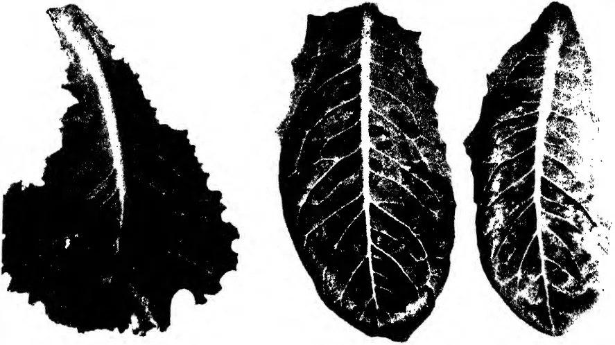Three black and white photographs of lettuce leaves. The left leaf shows a large, dark, irregular spot on its upper surface. The middle and right leaves show smaller, more distinct dark spots, primarily on the lower surface, which are characteristic of leaf spot symptoms.

Fig. 1.—Leaves of lettuce showing leaf spot symptoms associated with *Septoria lactucae* Pass. (5/8 natural size).

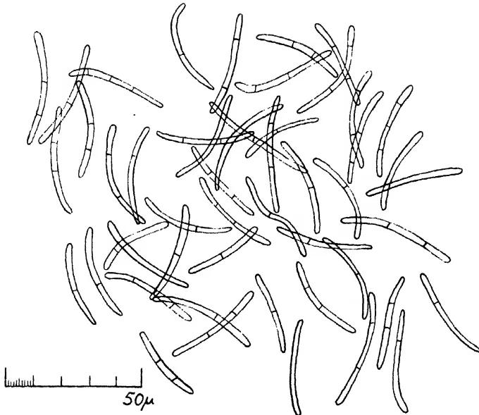A camera lucida drawing of numerous fresh spores of *Septoria lactucae*. The spores are elongated, multi-septate, and slightly curved. They are shown in a cluster, overlapping each other. A scale bar at the bottom left indicates a length of 50 micrometers (50μ).

Fig. 2.—Fresh spores of *Septoria lactucae* Pass., in water (camera lucida drawing  $\times 580$ ).

565------------------------------------------------

63

The spores (Plate I., Fig. 2) are hyaline, almost invariably curved, mostly 2-to 3-septate or rarely continuous, rounded at the ends. They are irregular in breadth, occasionally tapering from one end. The following measurements give the lengths (measured as the arc) and maximum breadths of 50 freshly exuded spores in water :—

<table>
<tr>
<td>Length :—</td>
<td>29.0 — 43.5<math>\mu</math></td>
<td>Mean 35.1<math>\mu</math> <math>\pm</math> 0.35<math>\mu</math></td>
</tr>
<tr>
<td>Breadth :—</td>
<td>1.5 — 3.0<math>\mu</math></td>
<td>Mean 2.3<math>\mu</math> <math>\pm</math> 0.04<math>\mu</math></td>
</tr>
</table>

Both pycnidia and spores are typical for the genus *Septoria*, and the fungus can be identified as *Septoria lactucae* Pass.

It is interesting to note that Moore (7) has recently recorded the introduction of this fungus into Britain, and in fact the writer discovered the disease on St. Coombs within a few days of reading Moore's paper. Moore (7) gives a full account of the synonymy and distribution of the fungus. Briefly, *S. lactucae* Passerini is the valid name of the species which is based on an Italian specimen published with diagnosis in 1878. *S. lactucae* Peck. is based on N. American material described independently by Peck, in 1879, and is therefore synonymous. *S. consimilis*, Ellis and Martin (1885) appears to be the only other synonym published subsequently.

The fungus as described by Moore (7) has pycnidia from 54 to 120 $\mu$  in diameter with mostly two-celled spores measuring 29 to 40 $\mu$   $\times$  2.5 $\mu$ . The pycnidia of Moore's specimen appear to be slightly smaller on the average and the spores more frequently uniseptate, but in spore size and other characteristics there is a very close agreement with the Ceylon form.

According to Moore (7), *S. lactucae* is of almost world wide distribution having been reported from the greater part of Europe, from N. America, Argentina, Japan, China, and India (3). It has also recently been reported from Southern Rhodesia (6). The fungus is presumably seed transmissible, since Moore records the presence of pycnidia in four or five per cent. of "seeds" examined by him from among those from which his plants were raised. It is somewhat surprising that the fungus should apparently not have been detected in Britain for more than sixty years after its original discovery in Italy and N. America.

The precise origin of the seed from which the St. Coombs diseased material was obtained cannot be traced. It was not freshly imported and may have been "once-grown" in the Kandapola district. A few seeds from this or a similar batch were available for examination, but no pycnidia were detected. Control measures were not attempted at St Coombs in view of the early approach of monsoon conditions. In addition to strict attention to picking off diseased leaves and the destruction of plant debris, regular spraying with Bordeaux mixture should prove effective.

566------------------------------------------------

64

Control of the disease is obviously of prime importance in those districts in which plants are grown commonly for seed. Experience of the leaf spot disease of celery caused by *Septoria apii* has demonstrated the practical impossibility of preventing seed-borne infection by the usual methods of disinfection, the fungal spores being too well protected within the enclosing pycnidia. The same conditions would presumably apply to *S. lactucae* with the additional difficulty that lettuce seed is known to be relatively intolerant of disinfection (12). Thus, isolation, hygiene and routine spraying methods would have to be relied upon for the production of disease-free seed. It should be noted that isolation can hardly be considered effective if weeds closely related to the lettuce (*i.e.* *Compositae-Cichorieae*) are allowed to flourish since it seems likely that among these a number of susceptible species might exist, which could serve as a reservoir of infection. In the Ceylon indigenous flora, *Lactuca Heyneana* DC (= *L. runcinata* DC) would hardly be important, judging from Trimen's (11) remarks on its distribution, but *Crepis japonica* Benth., which is common upcountry, should be viewed with suspicion. Various introduced species, among which the common sowthistles, *Sonchus oleraceus* L. and *S. arvensis* L. are the best known examples, are perhaps rather more important. The eradication of these weeds from areas of intensive lettuce cultivation would be advisable.

## 2. LEAF SPOT OF ANTIRRHINUM—*PHYLLOSTICTA ANTIRRHINI* SYD.

This disease occurred in a young planting of dwarf antirrhinums at St. Coombs in April, 1941. This also is a new record for Ceylon (Bertus, *l. c.*).

The earliest symptoms are more or less isolated spots on the leaves (Plate II., Fig. 1). These appeared on both green and red leaved varieties and during the first few weeks were relatively scattered and difficult to find. With the onset of the monsoon the spotting became more abundant and appeared to develop in some cases to a "stem-blight" condition, *i.e.* a water-soaking of the leaves and drooping and rotting of the young stem apex with a certain amount of general wilting. However, the plants were severely affected at the time with the root knot eelworm and the wilting and collapse of the stems may have been due in part to this cause. Finally, when the plants had been flowering for some time, typical spots with abundant pycnidia were seen on certain immature capsules as well as on the dead flower stalks and on the stem at the top of the inflorescence. No pycnidia were observable at any time at the base of the stems. (See below.)

The spots occur typically at the apex and margins of the leaves. They are usually circular, olivaceous to thin, papery

567------------------------------------------------

A completely blank white page with no visible content, text, or markings.

568------------------------------------------------

PLATE II.

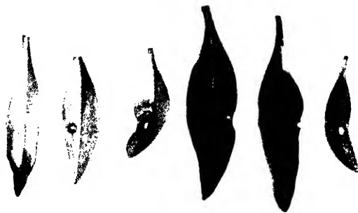Six individual leaves of Antirrhinum are shown in a row, illustrating the progression of leaf spot disease. The leaves are elongated and narrow. From left to right, the spots are small and faint, then larger and more distinct, and finally very large, dark, and confluent areas covering most of the leaf surface.

Fig. 1.—*Antirrhinum* leaves with leaf spot disease associated with *Phyllosticta antirrhini* Syd. (natural size).

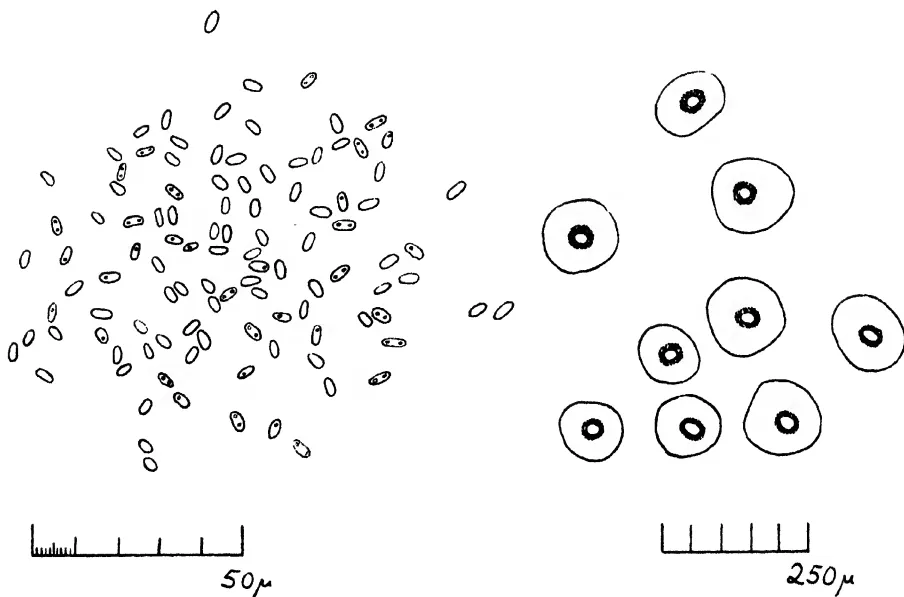Two camera lucida drawings of *Phyllosticta antirrhini*. The left drawing shows a large cluster of small, oval spores in water, with a scale bar below labeled 50μ. The right drawing shows several pycnidia, which are circular structures containing a central dark spot, as seen in a surface view of an infected leaf, with a scale bar below labeled 250μ.

Fig. 2.—*Phyllosticta antirrhini* Syd. *left*, fresh spores in water,  $\times 580$ ; *right*, pycnidia as seen in surface view of infected leaf,  $\times 80$  (camera lucida drawings).

569------------------------------------------------

65

brown in colour and may have a whitish, raised centre. The margin is purplish, or there may be a succession of purple rings round the border.

The pycnidia are abundant, epiphyllous and a few hypophyllous, and may show more or less zonation. Under the microscope they are immersed, clear brown in colour, thin-walled and translucent, with a ring of dark thicker-walled cells around the ostiole, as in *Septoria lactucae*, described above. Twenty pycnidia only were measured, with the following results :—

<table>
<tr>
<td>Diameter of pycnidia :—</td>
<td>90 — 150<math>\mu</math></td>
<td>Mean</td>
<td>115.5<math>\mu</math></td>
<td><math>\pm</math> 3.21<math>\mu</math></td>
</tr>
<tr>
<td>Diameter of ostiole :—</td>
<td>20 — 30<math>\mu</math></td>
<td>Mean</td>
<td>24.8<math>\mu</math></td>
<td><math>\pm</math> 0.98<math>\mu</math></td>
</tr>
</table>

The spores were exuded in water only : no spore tendrils were formed in moist air. The spores are hyaline and aseptate, oval to oblong ; one or two minute guttules may be present. Fifty spores were measured in water, as follows :—

<table>
<tr>
<td>Length :—</td>
<td>4.0 — 6.0<math>\mu</math></td>
<td>Mean</td>
<td>4.7<math>\mu</math></td>
<td><math>\pm</math> 0.07<math>\mu</math></td>
</tr>
<tr>
<td>Breadth :—</td>
<td>1.5 — 2.5<math>\mu</math></td>
<td>Mean</td>
<td>1.9<math>\mu</math></td>
<td><math>\pm</math> 0.04<math>\mu</math></td>
</tr>
</table>

The characters outlined above serve to identify the fungus as *Phyllosticta antirrhini* Syd. The only essential disagreement with Grove's (5) diagnosis of the species is in the occasional presence of guttules in the spores, these being described as eguttulate by the latter author (Plate II., Fig. 2).

The correct identification of this fungus leads to the old difficulty of distinguishing between the genera *Phyllosticta* and *Phoma*. The original distinction was simple (see 4) : *Phyllosticta* on leaves and *Phoma* on stems. The diagnoses given by Saccardo (9) in 1884 admit that *Phyllosticta* species may occasionally be caulicolous but emphasize differences in habit and in the characters of the pycnidia. Thus, *Phyllosticta* causes spotting of the leaves (or stems), and the pycnidia are thin-walled, with wide pore, whereas *Phoma* pycnidia are not developed on spots, are stouter-walled and with a minute pore. Grove (5) has recently sought a biological interpretation of the differences in habit noted by Saccardo, and considers that *Phyllosticta* is essentially parasitic (holoparasitic) being confined to the "spot" which it kills, whereas *Phoma* is a saprophyte or facultative parasite (generally if not always a wound parasite) growing equally well on dead as on living tissue.

*Phyllosticta antirrhini* is a useful example for testing the validity of these distinctions. It has long been known to occur on stem tissues and on this account has been described by certain authors as a species of *Phoma*. Grove (5), for instance, mentions the names *Phoma oleracea* Sacc. var. *antirrhini* and *Phoma antirrhini*. Certainly, in Britain and the U. S. A. the stem infection appears to be more severe than that so far

570------------------------------------------------

66

observed in Ceylon by the writer. Two forms of attack have been described in the literature. The commonest and most destructive is a "stem canker" (8), otherwise known as "stem rot" (2) or "stem spot" (10), which involves the formation of spots or lesions bearing pycnidia at the base of the main stems. The stems are eventually girdled completely, so that the parts above the lesion wilt and die. The other type of infection, noted by Smiley (10), is a "branch blight" involving a direct attack on the tips of the young shoots. The latter appears to have more in common with the leaf spot phase of the disease. Possibly also it can be correlated with the symptoms described above from St. Coombs. Buddin and Wakefield (2) were only able to produce the "stem canker" experimentally if the stems were wounded before inoculation, but no wounding was necessary for the infection of the leaves with the production of typical leafspot symptoms. Thus the causal fungus in their experiments (assuming that a single species only was involved) appears to behave both in habit and mode of attack as a *Phoma* and as a *Phyllosticta* simultaneously. Several authors (5, 2) have noted that a second pycnidial fungus, *Diplodina passerinii* All., is frequently associated with the stem canker lesions especially towards the end of the growing season. There seems to be no evidence to suggest that these two fungi are in any way related, nor does anyone appear to have investigated their mutual effect on pathogenicity and symptoms produced.

Both Buddin and Wakefield (2) and Smiley (10) note that *Phyllosticta antirrhini* is a high temperature fungus; the former author considers that the relatively high temperature necessary for optimum infectivity—about 77°F.—accounts for the comparative scarcity of "leaf spot" on antirrhinums grown out of doors in Britain and, by contrast, for the frequency of "stem rot" on young plants grown under glass. Under these favourable conditions the fungus is able to survive in the soil: the wounding of the stems necessary for infection will occur freely during transplanting. If these conclusions hold, one would expect "stem canker" symptoms to be prevalent under up-country conditions in Ceylon, but, as noted above, there is so far no reliable evidence that it occurs here. An experimental investigation of the disease might produce interesting results. A search for *Diplodina passerinii* should also be made.

The disease should be amenable to control by Bordeaux spraying or sulphur dusting (10). The "stem canker" phase, should it appear here, would probably necessitate rigorous uprooting of diseased plants. Buddin and Wakefield (2) have suggested watering the soil with Cheshunt compound at the time of transplanting for the control of soil-borne infection.

571------------------------------------------------

67

The occurrence of pycnidia on the capsules and old flower-stalks points to the possibility of seed infection or to infection from parts of these organs present as impurities in the seed. The St. Coombs specimens were grown from freshly imported seed of which none was available for later examination.

#### SUMMARY

An account is given of two leaf spot diseases new to Ceylon, viz., a disease of lettuce (*Lactuca sativa* L.) associated with *Septoria lactucae* Pass., and a disease of *Antirrhinum majus* Hort. associated with *Phyllosticta antirrhini* Syd. Brief notes on the naming of the fungus and the control of the disease are given in each case.

#### REFERENCES

1. (1) Bond, T. E. T.—A leaf spot disease of annual Phlox. *The Tropical Agriculturist*, 96 (3) : 142-6, 1941.
2. (2) Buddin, W. and Wakefield, E. M.—Notes on some *Antirrhinum* diseases I. Stem-rot and leaf-spot due to *Phyllosticta antirrhini*, Syd. *Gdnrs. Chron.* 76 : 150-2, 1924.
3. (3) Butler, E. J. and Bisby, G. R.—The fungi of India. *Scient. Monogr. Imp. Coun. agric. Res. I.*, 1931.
4. (4) Grimes, M., O'Connor, M. and Cummins, H. A.—A study of some *Phoma* species. *Trans. Brit. mycol. Soc.* 17 : 97-111, 1932.
5. (5) Grove, W. B.—*British Stem and Leaf Fungi*. (*Coelomycetes*) Cambridge, 1935.
6. (6) Hopkins, J. C. F.—A descriptive list of plant diseases in Southern Rhodesia (and their control). *Mem. Dep. Agric. S. Rhod.* 2, 1939.
7. (7) Moore, W. C.—New and interesting plant diseases. 8 Leafspot of Lettuce (*Septoria lactucae* Pass). *Trans. Brit. mycol. Soc.* 24 : 346-9, 1941.
8. (8) Overholts, L. O.—Mycological notes for 1928-29. *Mycologia* 22 : 232-46, 1930—(Abstr. in *Rev. appl. Mycol.* 10 : 130.)
9. (9) Saccardo, P. A. *Sylloge Fungorum* . . . . . Vol. III (1884).
10. (10) Smiley, E. M.—The *Phyllosticta* blight of snapdragon. *Phytopathology*, 10 : 232-48, 1920.
11. (11) Trinen, H.—*A Handbook to the Flora of Ceylon* . . . . . Part III. (1895).
12. (12) White, H. L.—The sterilization of lettuce seed. *Ann. appl. Biol.* 25 : 767-80, 1938.

572------------------------------------------------

68

## THE POTASH CONTENT OF COCONUT HUSKS AND HUSK ASH

M. L. M. SALGADO, Ph.D. (Cantab.), B.Sc. (Lond.), Dip. Agric.  
(Cantab.),

SOIL CHEMIST,

AND

E. CHINNARASA, B.Sc. (Lond.),

TECHNICAL ASSISTANT TO THE SOIL CHEMIST,  
COCONUT RESEARCH SCHEME, CEYLON

IN a previous publication "The Manurial Value of Coconut Husk Ash" published in 1936 (1) the potash content of coconut husks from palms growing on loamy soils was estimated at 15 lb. per 1,000 husks, and for those on gravelly soils at 10 lb. per 1,000; the corresponding husk ashes contained 39 per cent. and 31 per cent. potash respectively. These results, it should be noted, were based on a limited number of samples collected from Bandirippuwa estate. Later, in the course of advisory work, samples of husks from other estates were found to show a considerably lower content of potash in the husks as well as in their ash.

In connexion with studies on the uptake of potash a large number of analytical figures (288 in all) relating to the potash content of husks has now been obtained on samples from plots of the manurial experiment at Bandirippuwa Estate. These figures for potash content range from as low as 2 lb. to as high as 14 lb. of potash per 1,000 husks.

It was a curious coincidence, and an unfortunate one, that the samples upon which the figures published in 1936 were based should have been unusually rich in potash, since this gave too high a figure to indicate normal expectations. Such high yields as 14 lb. potash per 1,000 husks are obtained under extremely favourable conditions, but are now found to be exceptional. This applies equally to the potash content of the ash.

In this paper a summary of the 288 analytical figures is given, and, based thereon, a more reliable indication of what quantity of potash can normally be expected from 1,000 husks and from husk ash under various soil and seasonal conditions. In view of the shortage of potash manures which is expected to be serious after the end of this year, husks and husk ash will have to be utilized to a greater extent as a source of potash, and reliable data on their potash contents seem desirable.

573------------------------------------------------

69

### EXPERIMENTAL

The manurial experiment in question is a duplicated  $3 \times 3 \times 3$  factorial experiment in which are compared all the possible combinations of nitrogen, phosphoric acid, and potash applied at nil, single and double levels. A complete account of this experiment will be published separately.

The complete manurial treatments of the sixteen plots dealt with in the present study are as follows:—

<table border="0">
<thead>
<tr>
<th rowspan="3">Plot Nos.</th>
<th rowspan="3">No Potash Plots<br/><math>K_0</math></th>
<th rowspan="3">Plot Nos.</th>
<th rowspan="3">Plots receiving<br/>double doses<br/>of potash<br/>(<math>K_2=1.5</math> lb. <math>K_2O</math><br/>or 3 lb. muriate<br/>of potash<br/>N. P. K.)</th>
</tr>
<tr>
<th>N. P. K.</th>
</tr>
<tr>
<th>N. P. K.</th>
</tr>
</thead>
<tbody>
<tr>
<td>8 &amp; 28</td>
<td>.. 0 0 0 ..</td>
<td>21 &amp; 46</td>
<td>.. 0 0 2</td>
</tr>
<tr>
<td>17 &amp; 40</td>
<td>.. 2 0 0 ..</td>
<td>2 &amp; 34</td>
<td>.. 2 0 2</td>
</tr>
<tr>
<td>15 &amp; 37</td>
<td>.. 0 2 0 ..</td>
<td>5 &amp; 33</td>
<td>.. 0 2 2</td>
</tr>
<tr>
<td>19 &amp; 53</td>
<td>.. 2 2 0 ..</td>
<td>16 &amp; 38</td>
<td>.. 2 2 2</td>
</tr>
</tbody>
</table>

The nitrogen application (double dose =  $N_2$ ) on the plots receiving this treatment is 1.0 lb. N. per palm every two years; and the phosphoric acid application (double dose =  $P_2$ ) 2.0 lb.  $P_2O_5$  per palm every two years.

Each plot consists of 18 trees (2) and the crop is collected every two months. At each pick 100 husks were taken from each plot, ashed and the potash content determined. On some occasions the number of nuts for a plot was below hundred, in which case all the husks were used for the sample.

The plots are randomized throughout the experimental field and thus represent a variety of soil types. One area in particular is gravelly and the soil poor in available potash, whilst other areas are good loam of higher potash content.

### RESULTS

Table I

*Frequency Distribution of the Potash Content of Husks.*

<table border="0">
<thead>
<tr>
<th rowspan="2">lb. potash/1000 husks</th>
<th colspan="2">Number of Samples</th>
</tr>
<tr>
<th><math>K_0</math></th>
<th><math>K_2</math></th>
</tr>
</thead>
<tbody>
<tr>
<td>1- 2</td>
<td>.. 25 ..</td>
<td>.. 5 ..</td>
</tr>
<tr>
<td>2- 3</td>
<td>.. 42 ..</td>
<td>.. 15 ..</td>
</tr>
<tr>
<td>3- 4</td>
<td>.. 33 ..</td>
<td>.. 19 ..</td>
</tr>
<tr>
<td>4- 5</td>
<td>.. 24 ..</td>
<td>.. 26 ..</td>
</tr>
<tr>
<td>5- 6</td>
<td>.. 5 ..</td>
<td>.. 23 ..</td>
</tr>
<tr>
<td>6- 7</td>
<td>.. 9 ..</td>
<td>.. 18 ..</td>
</tr>
<tr>
<td>7- 8</td>
<td>.. 2 ..</td>
<td>.. 11 ..</td>
</tr>
<tr>
<td>8- 9</td>
<td>.. 3 ..</td>
<td>.. 12 ..</td>
</tr>
<tr>
<td>9-10</td>
<td>.. 1 ..</td>
<td>.. 5 ..</td>
</tr>
<tr>
<td>10-11</td>
<td>.. — ..</td>
<td>.. 4 ..</td>
</tr>
<tr>
<td>11-12</td>
<td>.. — ..</td>
<td>.. 3 ..</td>
</tr>
<tr>
<td>12-13</td>
<td>.. — ..</td>
<td>.. — ..</td>
</tr>
<tr>
<td>13-14</td>
<td>.. — ..</td>
<td>.. 3 ..</td>
</tr>
<tr>
<td>Total number of samples</td>
<td>.. <u>144</u> ..</td>
<td>.. <u>144</u> ..</td>
</tr>
</tbody>
</table>

574------------------------------------------------

70

In Table I the results (one set for  $K_0$  plots and one for  $K_2$  plots) are grouped according to the calculated quantity of potash per thousand husks. It will be seen that of the 144  $K_0$  samples, 25 contain from one to two lb. potash per 1,000 husks, 42 contain from two to three lb. and so on, and 124 of the 144 samples fall in the one to five lb. groups. With the 144  $K_2$  samples the highest frequency occurs in the four to five lb. potash group, and 124 samples occur in the two to nine lb. potash group.

The general average for the  $K_0$  samples is 3.47 lb. potash per 1,000 husks, and for the  $K_2$  samples 5.67 lb. potash per 1,000 husks. The difference of about 70 per cent. is definitely significant and indicates that the potash content of husks is largely dependent on the potash status of the soils on which the palms are grown. The question of potash recovery by manured palms will be discussed in detail in a later paper.

Table II

*Frequency Distribution of Potash Content of Husk Ash.*

<table border="1">
<thead>
<tr>
<th rowspan="2">Per cent. potash in husk ash</th>
<th colspan="2">Number of Samples</th>
</tr>
<tr>
<th><math>K_0</math></th>
<th><math>K_2</math></th>
</tr>
</thead>
<tbody>
<tr>
<td>3- 6 ..</td>
<td>3 ..</td>
<td>1</td>
</tr>
<tr>
<td>6- 9 ..</td>
<td>14 ..</td>
<td>2</td>
</tr>
<tr>
<td>9-12 ..</td>
<td>29 ..</td>
<td>6</td>
</tr>
<tr>
<td>12-15 ..</td>
<td>32 ..</td>
<td>10</td>
</tr>
<tr>
<td>15-18 ..</td>
<td>26 ..</td>
<td>19</td>
</tr>
<tr>
<td>18-21 ..</td>
<td>11 ..</td>
<td>22</td>
</tr>
<tr>
<td>21-24 ..</td>
<td>14 ..</td>
<td>24</td>
</tr>
<tr>
<td>24-27 ..</td>
<td>10 ..</td>
<td>22</td>
</tr>
<tr>
<td>27-30 ..</td>
<td>3 ..</td>
<td>16</td>
</tr>
<tr>
<td>30-33 ..</td>
<td>1 ..</td>
<td>14</td>
</tr>
<tr>
<td>33-36 ..</td>
<td>1 ..</td>
<td>4</td>
</tr>
<tr>
<td>36-39 ..</td>
<td>— ..</td>
<td>4</td>
</tr>
<tr>
<td>Total number of samples ..</td>
<td>144</td>
<td>144</td>
</tr>
</tbody>
</table>

A similar variation is seen in the potash content of the husk ash (Table II). The mean of the 144 samples from the unmanured plots is 15.50 per cent. and from the potash-manured plots 22.54 per cent. with a maximum frequency between 12 to 15 per cent. for the unmanured and 21 to 24 per cent. for the potash-manured plots.

A high positive correlation is found between the amount of potash per 1,000 husks and the corresponding percentages of potash in the ash. The coefficient of correlation for the unmanured plots is +0.8256, for the potash-manured plots, +0.7692 and for all the plots, +0.8269.

575------------------------------------------------

71

*Seasonal Variation* : From Tables III and IV a definite seasonal variation in the potash content (both of the husk and of the ash) is observed. The husks from the larger crops of April and June are in general lower in potash content than those from the smaller picks of December and February, both of the  $K_0$  and  $K_2$  plots. The differences between the mean figures of these picks based on 3-year averages have been found to be statistically significant.

Table III

*Potash Content of Husks : lb. per 1,000 Husks. (Mean of 8 Plots).*

<table border="1">
<thead>
<tr>
<th></th>
<th>1<br/>Dec.<br/>Pick</th>
<th>2<br/>Feb.<br/>Pick</th>
<th>3<br/>April<br/>Pick</th>
<th>4<br/>June<br/>Pick</th>
<th>5<br/>Aug.<br/>Pick</th>
<th>6<br/>Oct.<br/>Pick</th>
</tr>
</thead>
<tbody>
<tr>
<td colspan="7"><math>K_0</math> (not manured with potash)</td>
</tr>
<tr>
<td>M II Dec. 1936–Nov. 1937</td>
<td>5.75..</td>
<td>6.15..</td>
<td>2.88..</td>
<td>3.35..</td>
<td>— ..</td>
<td>2.66</td>
</tr>
<tr>
<td>M III Dec. 1937–Nov. 1938</td>
<td>4.26..</td>
<td>3.23..</td>
<td>2.53..</td>
<td>1.66..</td>
<td>— ..</td>
<td>4.01</td>
</tr>
<tr>
<td>M IV Dec. 1938–Nov. 1939</td>
<td>3.09..</td>
<td>4.19..</td>
<td>2.77..</td>
<td>2.64..</td>
<td>3.71..</td>
<td>2.54</td>
</tr>
<tr>
<td>Mean of 3 years</td>
<td>4.37..</td>
<td>4.52..</td>
<td>2.73..</td>
<td>2.55..</td>
<td>3.71..</td>
<td>3.07</td>
</tr>
<tr>
<td></td>
<td colspan="6" style="text-align: right;">(one year only)</td>
</tr>
<tr>
<td>M VI Dec. 1940 and Feb. 1941</td>
<td>2.84..</td>
<td>4.39</td>
<td></td>
<td></td>
<td></td>
<td></td>
</tr>
</tbody>
</table>

$K_2$  (manured with 3 lb. muriate of potash per palm.)

<table border="1">
<tbody>
<tr>
<td>M II</td>
<td>8.01..</td>
<td>8.86..</td>
<td>4.61..</td>
<td>5.24..</td>
<td>— ..</td>
<td>4.09</td>
</tr>
<tr>
<td>M III</td>
<td>6.36..</td>
<td>5.01..</td>
<td>3.82..</td>
<td>2.40..</td>
<td>— ..</td>
<td>6.58</td>
</tr>
<tr>
<td>M IV</td>
<td>6.18..</td>
<td>7.00..</td>
<td>4.93..</td>
<td>4.76..</td>
<td>5.25..</td>
<td>4.15</td>
</tr>
<tr>
<td>Mean of 3 years</td>
<td>6.85..</td>
<td>6.96..</td>
<td>4.45..</td>
<td>4.17..</td>
<td>5.25..</td>
<td>4.94</td>
</tr>
<tr>
<td></td>
<td colspan="6" style="text-align: right;">(one year only)</td>
</tr>
<tr>
<td>M VI</td>
<td>6.21..</td>
<td>8.65</td>
<td></td>
<td></td>
<td></td>
<td></td>
</tr>
</tbody>
</table>

<table border="1">
<thead>
<tr>
<th></th>
<th>Mean<br/>lb./1000<br/>husks</th>
<th>Standard<br/>Deviation</th>
<th>Coefficient<br/>of<br/>variation</th>
</tr>
</thead>
<tbody>
<tr>
<td><math>K_0</math> (not manured with potash)</td>
<td>3.47</td>
<td>1.69</td>
<td>48.56%</td>
</tr>
<tr>
<td><math>K_2</math> (manured with potash)</td>
<td>5.67</td>
<td>2.48</td>
<td>43.77%</td>
</tr>
</tbody>
</table>

Table IV

*Per cent. Potash in Husk Ash. (Mean of 8 Plots).*

<table border="1">
<thead>
<tr>
<th></th>
<th>1<br/>Dec.<br/>Pick</th>
<th>2<br/>Feb.<br/>Pick</th>
<th>3<br/>April<br/>Pick</th>
<th>4<br/>June<br/>Pick</th>
<th>5<br/>Aug.<br/>Pick</th>
<th>6<br/>Oct.<br/>Pick</th>
</tr>
</thead>
<tbody>
<tr>
<td colspan="7"><math>K_0</math> not manured with potash.</td>
</tr>
<tr>
<td>M II Dec. 1936–Nov. 1937</td>
<td>25.08..</td>
<td>22.40..</td>
<td>10.91..</td>
<td>17.52..</td>
<td>— ..</td>
<td>8.51</td>
</tr>
<tr>
<td>M III Dec. 1937–Nov. 1938</td>
<td>18.50..</td>
<td>13.13..</td>
<td>15.22..</td>
<td>14.33..</td>
<td>— ..</td>
<td>17.09</td>
</tr>
<tr>
<td>M IV Dec. 1938–Nov. 1939</td>
<td>14.30..</td>
<td>20.15..</td>
<td>12.14..</td>
<td>14.90..</td>
<td>16.24..</td>
<td>11.26</td>
</tr>
<tr>
<td>Mean of 3 years</td>
<td>19.29..</td>
<td>18.56..</td>
<td>12.76..</td>
<td>15.58..</td>
<td>16.24..</td>
<td>12.29</td>
</tr>
<tr>
<td></td>
<td colspan="6" style="text-align: right;">(one year only)</td>
</tr>
<tr>
<td>M VI Dec. 1940 &amp; Feb. 1941</td>
<td>12.67..</td>
<td>14.61</td>
<td></td>
<td></td>
<td></td>
<td></td>
</tr>
</tbody>
</table>

576------------------------------------------------

72

<table border="1">
<thead>
<tr>
<th></th>
<th>1<br/>Dec.<br/>Pick</th>
<th>2<br/>Feb.<br/>Pick</th>
<th>3<br/>April<br/>Pick</th>
<th>4<br/>June<br/>Pick</th>
<th>5<br/>Aug.<br/>Pick</th>
<th>6<br/>Oct.<br/>Pick</th>
</tr>
</thead>
<tbody>
<tr>
<td colspan="7"><b>K<sub>2</sub> manured with 3 lb. muriate of potash per palm.</b></td>
</tr>
<tr>
<td>M II ..</td>
<td>..25.48..</td>
<td>..26.53..</td>
<td>..16.14..</td>
<td>..24.72..</td>
<td>—</td>
<td>..12.07</td>
</tr>
<tr>
<td>M III ..</td>
<td>..26.24..</td>
<td>..18.54..</td>
<td>..22.70..</td>
<td>..20.94..</td>
<td>—</td>
<td>..25.41</td>
</tr>
<tr>
<td>M IV ..</td>
<td>..25.02..</td>
<td>..29.20..</td>
<td>..19.90..</td>
<td>..18.12..</td>
<td>..23.26..</td>
<td>..19.55</td>
</tr>
<tr>
<td>Mean of 3 years</td>
<td>..25.58..</td>
<td>..24.76..</td>
<td>..19.58..</td>
<td>..21.23..</td>
<td>..23.26..</td>
<td>..19.01</td>
</tr>
<tr>
<td></td>
<td colspan="6" style="text-align: right;">(one year only)</td>
</tr>
<tr>
<td>M VI ..</td>
<td>..24.19..</td>
<td>..27.66</td>
<td></td>
<td></td>
<td></td>
<td></td>
</tr>
</tbody>
</table>

<table border="1">
<thead>
<tr>
<th></th>
<th>Mean<br/>%K<sub>2</sub>O in ash</th>
<th>Standard<br/>Deviation</th>
<th>Coefficient<br/>of variation</th>
</tr>
</thead>
<tbody>
<tr>
<td>K<sub>0</sub> (not manured with potash) ..</td>
<td>15.50 ..</td>
<td>5.95 ..</td>
<td>38.39%</td>
</tr>
<tr>
<td>K<sub>2</sub> (manured with potash) ..</td>
<td>22.54 ..</td>
<td>6.78 ..</td>
<td>30.08%</td>
</tr>
</tbody>
</table>

It is further noticed that the lowest average potash content for a year was that of the season December, 1938, to November, 1939, which followed the abnormally dry year of 1938, whilst the highest was that of the season December, 1936, to November, 1937, which followed a year (1936) of good well-distributed rainfall. This effect is probably connected with the small size of the nuts following drought periods and therefore of the husks, as well as with a reduction in potash uptake from the soil under dry conditions.

*Variation with Soil Type.*—The potash content of the husks varies with the soil type on which the palms grow. Thus a good loam well supplied with available potash will be reflected in a high potash content in the husks while a poor gravelly soil will produce husks of a low potash content. This is well illustrated by an examination of the data for the individual plots.

From these data the following have been taken as tentative average values for different coconut soil types :—

<table border="1">
<thead>
<tr>
<th>Soil Type</th>
<th>lb. potash<br/>per 1000<br/>husks</th>
<th>% potash<br/>in ash</th>
<th>* Cash value<br/>of potash in<br/>1000 husks<br/>Rs. c.</th>
</tr>
</thead>
<tbody>
<tr>
<td>1. Good loam ..</td>
<td>6 to 8 ..</td>
<td>30 ..</td>
<td>1 50</td>
</tr>
<tr>
<td>2. Medium loam ..</td>
<td>5 to 7 ..</td>
<td>25 ..</td>
<td>1 35</td>
</tr>
<tr>
<td>3. Sandy cinnamon soil ..</td>
<td>3 to 4 ..</td>
<td>15 ..</td>
<td>0 75</td>
</tr>
<tr>
<td>4. Gravelly soil ..</td>
<td>3 to 4 ..</td>
<td>15 ..</td>
<td>0 75</td>
</tr>
<tr>
<td>5. Lateritic (cabook) soil ..</td>
<td>2 ..</td>
<td>10 ..</td>
<td>0 50</td>
</tr>
</tbody>
</table>

From soils manured with potash, particularly the poor soils, the potash content of husks will be higher, though not to the extent of 70 per cent. since this difference was found between the unmanured plots and plots manured with a heavy dose of 3 lb. muriate of potash. (See above).

\* Calculated on the basis of the present market value of muriate of potash—Rs. 250 per ton.

577------------------------------------------------

73

The following values obtained for samples of husks from other estates illustrate the extent of the variation between different soil types :—

<table border="1">
<thead>
<tr>
<th>Soil type</th>
<th>Locality</th>
<th>lb. potash per<br/>1000 husks</th>
</tr>
</thead>
<tbody>
<tr>
<td>Poor laterite ..</td>
<td>Veyangoda ..</td>
<td>2.5</td>
</tr>
<tr>
<td>Heavily manured cinnamon soil ..</td>
<td>Negombo ..</td>
<td>8.0</td>
</tr>
<tr>
<td>Gravelly soil ..</td>
<td>Nattandiya ..</td>
<td>4.5</td>
</tr>
<tr>
<td>Sandy loam ..</td>
<td>Jaffna ..</td>
<td>6.5</td>
</tr>
</tbody>
</table>

#### NOTE ON THE METHOD OF BURNING HUSKS

As potash salts are likely to be lost by volatalization at high temperatures, burning of husks should be carried out under a slow smoky fire. Trials made at burning husks in a kiln similar to a lime kiln were not particularly successful. It was very difficult to control the temperature, owing to the draught through the firing holes ; and when a large number of husks was burnt in the course of a day, the temperature rose to a red heat towards the end of the operation and the ash mostly fused into a viscous liquid which solidified into hard lumps, the final ash being largely of this nature. These lumps were found to contain barely 2 per cent. water soluble potash.\*

The most satisfactory method is to burn the husks in shallow pits about 2 feet deep, which yields an ash in the form of a fine dry powder with a high potash content. In order to expedite the burning when necessary a number of pits may be operated at the same time.

#### SUMMARY

1. 1. Values previously recorded for the potash content of coconut husks and husk ash are shown to be high and exceptional.
2. 2. The potash content shows considerable variation depending on soil and seasonal factors. This is illustrated by an examination of the analyses of 288 samples of husks from the plots of a manurial experiment.
3. 3. There is a good correlation between the potash content of husks and of the corresponding husk ash.
4. 4. Average tentative values of potash content of husks in relation to different coconut soil types are given.
5. 5. Burning husks in a kiln has not been found satisfactory and burning in pits is recommended.

#### ACKNOWLEDGEMENT

Thanks are due to Mr. M. G. Fonseca, Field Assistant, for supervising the sampling and ashing of the husks.

#### REFERENCES

1. 1. Salgado, M. L. M.—The manurial value of coconut husk ash. *The Tropical Agriculturist*, Vol. LXXXVI., 3, 1936, p. 131. .
2. 2. Pieris, W. V. D. and Salgado, M. L. M.—Experimental error in field experiments with coconuts. *ibid.*, Vol. LXXXIX., 2, 1937, p. 75.

\*They contain also 12 per cent. of  $K_2O$  extracted by hot concentrated hydrochloric acid ; this appears to be present with ferrous iron as a complex silicate, and would not be readily available.

578------------------------------------------------

74

## THE NITROGEN CONTENT OF CEYLON RAIN

**D. E. V. KOCH, B.Sc. Hons., Ph.D. (Lond.), F.I.C., D.I.C., F.R.H.S.,**  
*RESEARCH ASSISTANT IN AGRICULTURAL CHEMISTRY*

**T**HERE has been rather wide variation in the amounts of nitrogenous matter—both ammonia and nitrate-nitrite—brought down by rain water annually in different parts of the world as indicated by the records of various observers. The results of N. H. J. Miller (1) at Rothamsted, which date back to nearly four decades, obtained during a period of 13 years' rainfall indicate that the annual quantity of ammoniacal and "nitric" nitrogen varied between 4.43 lb. and 3.31 lb. with an average of 3.84 lb. per acre per annum. A very low value of 0.5 lb. of nitrogen as ammonia was recorded by Gray of New Zealand, while about the same time a value of over 14 lb. was registered in Venezuela.

In the tropics, atmospheric electrical disturbances are popularly believed to promote the formation of oxides of nitrogen with consequent increase in the total amount of nitrogen brought down by rain. Unfortunately the average amount ascertained by different observers in the tropics has been even less than what has been recorded in European countries, except that the tropical rain was at times better supplied with nitric nitrogen. Leather (2) recorded figures of 3.405 and 3.250 lb. of total nitrogen as having been brought down annually at the two Indian stations Dehra Dun and Cawnpore respectively. Corbet (3) on the other hand estimated that in Malaya 40–50 lb. of nitric acid (equivalent to 9–11 lb. nitrogen) and lesser amounts of ammonia were returned annually per acre in the rain water. The only work carried out in Ceylon was that by M. K. Bamber (4) in 1898–9. He obtained values of 3.65 and 1.28 for ammoniacal and nitrate-nitrite nitrogen respectively. In view of the development of microchemical technique and the improved modern analytical methods available, it was considered desirable to find out whether or not larger amounts of nitrogen are in reality brought down in any part of Ceylon.

In this paper, the results of an investigation on this subject which was carried out at Peradeniya are set out.

*Sampling.*—The rain waters (whenever any fell) actually collected in a rain guage were transferred to Winchester quarts

579------------------------------------------------

75

and stored under toluene. Half-monthly samples were kept separately and analysed with the least possible delay. In a few cases daily specimens of rain water were also examined.

*Technique.*—For the estimation of ammoniacal nitrogen, 500 mls. were treated with 10 mls. of 10 per cent. w/v  $\text{H}_2\text{SO}_4$  and carefully concentrated to about 30 mls. The ammonia in this solution was distilled using a Micro-Pregl still into standardized hydrochloric acid of approximately N/100. Back titration was carried out employing a micro burette reading to .01 mls which is equivalent to .0014 m.gm. of nitrogen. Hence for the volume taken, the results do not have an error exceeding  $\pm$  .003 p.p.m. especially as readings were taken in duplicate. Total inorganic nitrogen was similarly obtained, but after the reduction of  $\text{NO}_3\text{-NO}_2$  nitrogen by the usual micro-chemical technique using a fixed quantity of reduced iron in two stages. The differences between the two sets of figures are correct records of the nitrate-nitrite nitrogen in rain water.

The analytical data for the period May 1, 1940, to April 30, 1941, are given in Table I.

It is to be noted that a figure as high as 12.85 lb./acre per annum of inorganic nitrogen has been recorded. Of this amount, nitrogen in the form of ammonia is nearly  $7\frac{1}{2}$  lb.—actually 7.49 lb.—and therefore is in slight excess. Hence the ratio of " $\text{NH}_3\text{,N}$ " / " $\text{NO}_3\text{-NO}_2\text{,N}$ " is 1/0.72, which is very near the value obtained by Leather at Dehra Dun (India).

The following conclusions may also be drawn :—

(a) The highest amount of total nitrogen brought down was in the second half of March, 1941, when there was fairly heavy rainfall following a period of drought.

(b) For nearly six months of the year, viz., August to January, there was a preponderance of ammonia in the rain waters and hence the ratio of ammoniacal nitrogen to nitrate-nitrite nitrogen was much above 1.5. The periods October 1–15 and November 16–30 were, however, exceptions; but it has to be stated that these rainfalls were frequently accompanied by heavy thunderstorms.

(c) During the months of July, 1940, and April, 1941, the nitrogenous matter brought down was least.

(d) In general, when the rainfall is small the rain water contains a higher concentration of both ammonia and nitrates.

#### DISCUSSION

The total amount of nitrogenous matter brought down by rain is not only dependent on the extent to which matter in the atmosphere had been previously washed out by rain but also on the total quantity of the fall. In the wet zones of

580------------------------------------------------

76

Ceylon, therefore, it may reasonably be concluded that the higher the rainfall the greater would be this value. On the other hand, in the dry zones, the amount of nitrogen returned to the soil cannot be expected to be so great. Whilst the nitrogen figures obtained for Peradeniya weather conditions must be considered as being fairly satisfactory—and this is partly due to the rainfall being above normal (average rainfall figures for 16 years at the Peradeniya Experiment Station and for 56 years at the Royal Botanic Gardens, Peradeniya, are 93.52 and 91.81 inches respectively)—it has to be realized that, owing to a great part of this precipitation being lost by surface run-off, &c., the actual amounts available to plants will be appreciably smaller.

#### REFERENCES

1. (1) Miller, N. H. J.—The amounts of nitrogen as ammonia and as nitric acid in the rain water collected at Rothamsted. *Jour. Agric. Science* Vol. I., p. 280.
2. (2) Leather, J. W.—The composition of Indian rain and dew. *Memoirs Department of Agriculture, India (Chemical series)*, Vol. I., p. 1.
3. (3) Corbet, A. S.—*Biological processes in tropical soils*, p. 86.
4. (4) Bamber, M. K.—Report on Ceylon tea soils, Colombo, 1900.

581------------------------------------------------

77

**TABLE I**  
(Nitrogen)

<table border="1">
<thead>
<tr>
<th rowspan="2"></th>
<th rowspan="2">Rainfall<br/>Inches</th>
<th colspan="4">Parts per Million</th>
<th rowspan="2">Ratio<br/>a/b</th>
<th colspan="3">Pounds per Acre.</th>
</tr>
<tr>
<th>As Ammonia<br/>(a)</th>
<th>As Nitrate<br/>and Nitrite<br/>(b)</th>
<th>As Ammonia</th>
<th>As Nitrate<br/>and Nitrite</th>
<th>Total</th>
</tr>
</thead>
<tbody>
<tr>
<td>May ..</td>
<td>9.52</td>
<td>.060</td>
<td>.093</td>
<td>.129</td>
<td>.200</td>
<td>.645</td>
<td></td>
<td></td>
<td>.329</td>
</tr>
<tr>
<td>16th-31st</td>
<td>19.80</td>
<td>.048</td>
<td>.087</td>
<td>.215</td>
<td>.390</td>
<td>.552</td>
<td></td>
<td></td>
<td>.605</td>
</tr>
<tr>
<td>June ..</td>
<td>8.50</td>
<td>.081</td>
<td>.210</td>
<td>.156</td>
<td>.404</td>
<td>.386</td>
<td></td>
<td></td>
<td>.560</td>
</tr>
<tr>
<td>16th-30th</td>
<td>6.22</td>
<td>.090</td>
<td>.178</td>
<td>.127</td>
<td>.250</td>
<td>.506</td>
<td></td>
<td></td>
<td>.377</td>
</tr>
<tr>
<td>July ..</td>
<td>1.99</td>
<td>.116</td>
<td>.103</td>
<td>.052</td>
<td>.046</td>
<td>1.14</td>
<td></td>
<td></td>
<td>.098</td>
</tr>
<tr>
<td>16th-31st</td>
<td>1.22</td>
<td>.145</td>
<td>.123</td>
<td>.040</td>
<td>.035</td>
<td>1.13</td>
<td></td>
<td></td>
<td>.075</td>
</tr>
<tr>
<td>August</td>
<td>4.48</td>
<td>.102</td>
<td>.120</td>
<td>.103</td>
<td>.122</td>
<td>.830</td>
<td></td>
<td></td>
<td>.225</td>
</tr>
<tr>
<td>1st-15th</td>
<td>.96</td>
<td>.910</td>
<td>.191</td>
<td>.199</td>
<td>.041</td>
<td>4.76</td>
<td></td>
<td></td>
<td>.239</td>
</tr>
<tr>
<td>16th-31st</td>
<td>.96</td>
<td>1.32</td>
<td>.280</td>
<td>.287</td>
<td>.061</td>
<td>4.72</td>
<td></td>
<td></td>
<td>.348</td>
</tr>
<tr>
<td>September</td>
<td>8.14</td>
<td>.449</td>
<td>.192</td>
<td>.827</td>
<td>.354</td>
<td>2.34</td>
<td></td>
<td></td>
<td>1.181</td>
</tr>
<tr>
<td>16th-30th</td>
<td>5.69</td>
<td>.072</td>
<td>.100</td>
<td>.093</td>
<td>.129</td>
<td>.720</td>
<td></td>
<td></td>
<td>.222</td>
</tr>
<tr>
<td>October</td>
<td>7.10</td>
<td>.270</td>
<td>.167</td>
<td>.434</td>
<td>.268</td>
<td>1.62</td>
<td></td>
<td></td>
<td>.702</td>
</tr>
<tr>
<td>16th-31st</td>
<td>11.98</td>
<td>.612</td>
<td>.075</td>
<td>1.659</td>
<td>.203</td>
<td>8.16</td>
<td></td>
<td></td>
<td>1.862</td>
</tr>
<tr>
<td>November</td>
<td>4.03</td>
<td>.192</td>
<td>.463</td>
<td>.176</td>
<td>.423</td>
<td>.416</td>
<td></td>
<td></td>
<td>.599</td>
</tr>
<tr>
<td>16th-30th</td>
<td>4.26</td>
<td>.900</td>
<td>.132</td>
<td>.867</td>
<td>.127</td>
<td>6.82</td>
<td></td>
<td></td>
<td>.994</td>
</tr>
<tr>
<td>December</td>
<td>3.02</td>
<td>.190</td>
<td>.030</td>
<td>.130</td>
<td>.020</td>
<td>6.33</td>
<td></td>
<td></td>
<td>.150</td>
</tr>
<tr>
<td>16th-31st</td>
<td>2.41</td>
<td>.300</td>
<td>.069</td>
<td>.164</td>
<td>.038</td>
<td>4.35</td>
<td></td>
<td></td>
<td>.202</td>
</tr>
<tr>
<td>January</td>
<td>1.39</td>
<td>2.00</td>
<td>.520</td>
<td>.629</td>
<td>.164</td>
<td>3.85</td>
<td></td>
<td></td>
<td>.793</td>
</tr>
<tr>
<td>1941</td>
<td>1.92</td>
<td>.210</td>
<td>.850</td>
<td>.091</td>
<td>.369</td>
<td>.247</td>
<td></td>
<td></td>
<td>.460</td>
</tr>
<tr>
<td>February</td>
<td>.67</td>
<td>.300</td>
<td>.900</td>
<td>.049</td>
<td>.148</td>
<td>.383</td>
<td></td>
<td></td>
<td>.197</td>
</tr>
<tr>
<td>March ..</td>
<td>.00</td>
<td>.670</td>
<td>.990</td>
<td>.897</td>
<td>1.326</td>
<td>.677</td>
<td></td>
<td></td>
<td>2.223</td>
</tr>
<tr>
<td>16th-31st</td>
<td>5.92</td>
<td>.096</td>
<td>.072</td>
<td>.113</td>
<td>.085</td>
<td>1.33</td>
<td></td>
<td></td>
<td>.198</td>
</tr>
<tr>
<td>April ..</td>
<td>5.20</td>
<td>.090</td>
<td>.262</td>
<td>.054</td>
<td>.156</td>
<td>.344</td>
<td></td>
<td></td>
<td>.210</td>
</tr>
<tr>
<td>16th-30th</td>
<td>2.64</td>
<td></td>
<td></td>
<td></td>
<td></td>
<td></td>
<td></td>
<td></td>
<td></td>
</tr>
<tr>
<td>Total</td>
<td>*118.04</td>
<td>.281</td>
<td>.201</td>
<td>7.490</td>
<td>5.359</td>
<td>1/0.72</td>
<td></td>
<td></td>
<td>12.849</td>
</tr>
</tbody>
</table>

1" / acre rainfall = 226,240 lb. or 101 tons.

\* The rainfall for this period at the Experiment Station, Peradeniya, was 115.37".

582------------------------------------------------

78

## THE SEED FAT OF GARCINIA ECHINOCARPA, THWAITES<sup>(1)</sup>—"MADOL OIL"

REGINALD CHILD, B.Sc., Ph.D. (Lond.), F.I.C.,  
DIRECTOR OF RESEARCH, COCONUT RESEARCH SCHEME,  
AND  
WILFRED R. N. NATHANAEL, B.Sc. (Lond.),  
TECHNICAL ASSISTANT TO THE TECHNOLOGICAL CHEMIST,  
COCONUT RESEARCH SCHEME, CEYLON

IN 1900 among the exhibits sent from Ceylon to the Exhibition at Paris was a small collection of oils from forest trees and uncultivated plants. A brief description of these oils was published in *The Tropical Agriculturist* (Ceylon), Vol. XX., No. 9 (March, 1901) Suppl. p. 650 and No. 10 (April, 1901) Suppl. pp. 728-9; and these notes were reproduced in the *Journal*\* of the Imperial Institute, June, 1901, and in the abstracts of the *Journal of the Society of Chemical Industry*, 1901, 20, 641.

"Madol Oil" was one of the oils included and all later references thereto in standard works such as those of Lewkowitsch (2) and of Grün & Halden (3) are derived from the 1901 description mentioned above. It is described as "the product of *Garcinia echinocarpa* (Guttiferae)—a tall tree of the forests in the lower mountain zone of Ceylon. The thick oil is extracted from the seeds. Thwaites mentions that it is burnt but it yields a poor light. The leaves and bark are used in dropsical affections, and also as a vermifuge: no mention is, however, made of the oil being medicinally employed". Alston (4) states that *G. echinocarpa* also occurs in S. India.

We have recently had the opportunity of examining a sample of the seeds and the expressed fat. The fruits of *G. echinocarpa* usually contain one, two or (less commonly) three seeds, which are described by Trimen (*loc. cit.*) as "1 in., subglobular or ovoid, testa thick, reddish brown". Our sample of seeds averaged 2.52 (longest diam.) and 2.05 (shortest diam.) cm., the range being 1.8 by 1.5 cm. to 3.2 by 2.4 cm. They were all ovoid (the nearest to spherical being 2.2 by 2.1 cm.), except that those from two-seeded fruits were compressed on one side, and the few from three-seeded fruits had two sides somewhat compressed.

The sample (No. 1) of expressed fat with which we were supplied under the name "Madol Oil" was a chocolate-coloured fat, somewhat granular in appearance, with a characteristic aromatic odour.

---

\*Not the *Bulletin*, as erroneously stated in Grün and Halden (*loc. cit.*); this only commenced publication in 1903.

583------------------------------------------------

79

The coats of the seeds were removed, the kernels dried, ground and extracted with light petroleum, b.p. 40–60° :

Average weight of 100 seed-coats : 72 gms. (23 per cent. of whole seeds)  
 Average weight of 100 kernels : 240 gms. (77 per cent. of whole seeds)  
 Average weight of 100 seeds : 312 gms.

<table>
<tr>
<td>Kernels : Moisture per cent.</td>
<td>..</td>
<td>..</td>
<td>7.9</td>
</tr>
<tr>
<td>Oil per cent.</td>
<td>..</td>
<td>..</td>
<td>64.4</td>
</tr>
<tr>
<td>Oil per cent. (dry basis)</td>
<td>..</td>
<td>..</td>
<td>69.9</td>
</tr>
<tr>
<td>Oil per cent. on whole seeds</td>
<td>..</td>
<td>..</td>
<td>49.6</td>
</tr>
</table>

The extracted oil (referred to as sample 2) was deep brown and viscous, slowly solidifying at about 26°C to a soft yellowish brown fat, which re-melts at about 37°C. It has a not unpleasant characteristic odour. The usual constants were as follows :—

<table>
<thead>
<tr>
<th></th>
<th>Sample 1.</th>
<th>Sample 2.</th>
</tr>
</thead>
<tbody>
<tr>
<td>Density <math>d_{15.5}^{99^\circ}</math></td>
<td>.. 0.878</td>
<td>.. 0.877</td>
</tr>
<tr>
<td>Refractive Index <math>n_D^{40^\circ}</math></td>
<td>.. 1.4688</td>
<td>.. 1.4690</td>
</tr>
<tr>
<td>Dispersive power</td>
<td>.. —</td>
<td>.. .0183</td>
</tr>
<tr>
<td>Melting point (Capillary tube)</td>
<td>.. —</td>
<td>.. 36.5—38.5°C</td>
</tr>
<tr>
<td>Free fatty acid (Oleic per cent.)</td>
<td>.. —</td>
<td>.. 7.0</td>
</tr>
<tr>
<td>Saponification value</td>
<td>.. 202.4</td>
<td>.. 203.4</td>
</tr>
<tr>
<td>Iodine value</td>
<td>.. 72.5</td>
<td>.. 73.0</td>
</tr>
<tr>
<td>Titre (fatty acids)</td>
<td>.. —</td>
<td>.. 55°C</td>
</tr>
</tbody>
</table>

*Constituent Fatty Acids of Fat.*—A preliminary examination of the fatty acids showed stearic and oleic acids to be the major components. Separation by crystallization of the lead salts from alcohol gave 40.5 per cent. of “solid” acids (Iodine value 3.8; Saponification equivalent 282.2) and 59.5 per cent. of “liquid” acids (Iodine value 110.5; Saponification equivalent 311.2).

Crystallization of the “solid” acids from alcohol readily gave almost pure stearic acid (m. p. 69°C) in over 70 per cent. yield. Their composition may therefore be reasonably calculated from the iodine value and saponification equivalent as oleic 1.7, palmitic 3.0 and stearic acid 35.8 per cent. of the total acids.

The “liquid” acids contain a considerable amount of resinous acidic material insoluble in light petroleum, and also of unsaponifiable matter. When freed from these, they had Iodine value 92.9, and oxidation by Lapworth’s method (5) gave dihydroxystearic acid in amounts indicating the presence of at least 41.4 per cent. of oleic acid (as percentage of total acids).

The fatty acids of madol fat may therefore be taken as containing at least 36 per cent. of stearic and 4.3 per cent. of oleic acid, with minor quantities of palmitic and linoleic acids.

584------------------------------------------------

80

Vegetable fats which are largely made up of stearic and oleic acids are mostly confined to the Natural Orders *Guttiferae* and *Sapotaceae*. Of *Garcinia* spp., Hilditch (6) gives references for *G. cambogia*, *G. indica* and *G. morella*.

We regret that we have not the opportunity at the present time to undertake a more detailed investigation of this typical member of an interesting group of fats.

*Potential Economic value of Fat.*—The kernels appear to contain phenolic substances which darken rapidly when the surface of the kernel is exposed. This probably accounts for the dark colour of the oil. In any case, on account of its acidity, colour and odour, the oil would require considerable refining before it could find any industrial application.

The crushing of the kernels would not present any great difficulty, as their moisture and oil content is similar to that of copra, and they could well be crushed in an expeller. The decorticating of the seeds on a large scale would, however, be troublesome, and it might be necessary to crush the whole seeds, with consequent reduction of oil yield.

A yield of 60–61 per cent. of oil on the crushed decorticated kernels could be obtained in practice, or rather under 40 per cent. on the whole seeds.

The fat is not likely to be utilizable for edible purposes, owing to the extensive refining required.

Owing to its exceptionally high titre (55·0°C) it might be useful in soap-making, especially in Ceylon where the principal soap-making oil is coconut, which has a low titre.

Another possibility is the preparation of “stearine” for candle making. Thus, a sample of the mixed fatty acids gave after one cold pressing in a Carver laboratory press, 44 per cent. of a “stearine” of Iodine Value 18·4. This was very dark in colour, but could be bleached by acid dichromate solution.

The refining of the fat needs particular study, and it could not in any case be successfully exploited commercially unless available in quantity at a very cheap cost of collection.

*Extracted kernels.*—The dry oil-free extracted kernels had :

<table>
<tr>
<td>Nitrogen (Kjeldahl)</td>
<td>=</td>
<td>1·57 per cent.</td>
</tr>
<tr>
<td>Ash</td>
<td>=</td>
<td>8·46 per cent.</td>
</tr>
</table>

The ash contained :—

<table>
<tr>
<td>K<sub>2</sub>O</td>
<td>..</td>
<td>..</td>
<td>..</td>
<td>39·7 per cent.</td>
</tr>
<tr>
<td>CaO</td>
<td>..</td>
<td>..</td>
<td>..</td>
<td>15·6 „ „</td>
</tr>
<tr>
<td>MgO</td>
<td>..</td>
<td>..</td>
<td>..</td>
<td>13·5 „ „</td>
</tr>
<tr>
<td>Na<sub>2</sub>O</td>
<td>..</td>
<td>..</td>
<td>..</td>
<td>1·5 „ „</td>
</tr>
<tr>
<td>P<sub>2</sub>O<sub>5</sub></td>
<td>..</td>
<td>..</td>
<td>..</td>
<td>5·0 „ „</td>
</tr>
<tr>
<td>SiO</td>
<td>..</td>
<td>..</td>
<td>..</td>
<td>0·2 „ „</td>
</tr>
</table>

The residual cake has therefore very little manurial value, except for about 3 per cent. of potash.

585------------------------------------------------

81SUMMARY

The kernels of *Garcinia echinocarpa* (Sinh. Madol) contain about 64 per cent. of a solid fat. The seed fat, in common with other seed fats of *Garcinia* spp. and the *Guttiferae* generally, contains notable proportions of stearic and oleic acids. It might be applicable in soap making and in the preparation of "stearine". As obtained from the seeds it is, however, acid, dark in colour and of pronounced odour; and would need extensive refining. Its commercial exploitation would therefore be doubtful unless the seed could be collected in quantity at a very cheap rate.

REFERENCES

1. 1. Thwaites. *Kew Journ. Bot.* 1854. vi. 71. Fl. B. Ind. i. 264.  
   See Trimen: *Flora of Ceylon*, Vol. I, 1893, page 96.
2. 2. *Chemical Technology & Analysis of Oils, Fats and Waxes*, 6th edition, 1922, Vol. 2, p. 611.
3. 3. *Analyse der Fette und Wachse*, 1929, Vol. II., p. 673.
4. 4. Alston in Trimen's *Flora of Ceylon*, Vol. VI., 1930, p. 86.
5. 5. Lapworth, A. and Mottram, E. N.—*J. Chem. Soc.*, 1925, **127**, 1629.
6. 6. Hilditch, T. P.—*The Chemical Constitution of Natural Fats* (1940), page 155.

586------------------------------------------------

82

## DEPARTMENTAL NOTES

### JAMS AND JELLIES FROM CEYLON FRUITS

C. CHARAVANAPAVAN, M.Sc., D.I.C., A.I.C.,  
*RESEARCH ASSISTANT IN FOOD TECHNOLOGY*  
*CHEMICAL DIVISION*

A considerable amount of jams and jellies is imported annually into the Island. It is possible to reduce these imports by encouraging the public to make jams and jellies in their own homes. If these are well made and packed efficiently they could be retailed and sold at reasonable profit to the makers.

The same principles essentially apply to jams as well as jellies. In either case fruit and sugar are so combined to give a jellied consistency. The formation of this jelly depends on three factors :—

- (a) The presence of a substance called pectin, found in the fruit.
- (b) A certain proportion of acid.
- (c) The sugar, which is added to the fruit.

#### PECTIN

Pectin belongs to a group of substances known as carbohydrates. It is found in the middle lamellae of the cell walls of fruit, and in some vegetables, notably root tubers. The quality of this pectin also determines the consistency of the jam or jelly. This is ascertained by carrying out a simple test.

#### PECTIN TEST

The fruit is boiled with a small quantity of water and broken into pulp. The pectin extract is obtained by squeezing a portion of the pulp through muslin. To every teaspoonful of the extract after allowing to cool are added three teaspoonfuls of methylated spirits. On mixing a clot is formed owing to the presence of pectin. The nature of the pectin is indicated by the clot. If the clot is firm enough to drop in one solid mass on pouring, the fruit is considered to be rich in pectin. If it drops out in three or four small lumps and cannot be kept together in one mass, the fruit is only moderately rich in pectin. If no clot forms, then very little or no pectin is present in the fruit. This is a useful test and with a little experience it is possible to

587------------------------------------------------

83

ascertain the amount of sugar necessary for a particular fruit to produce a jam or jelly which will neither be of too stiff nor too soft a consistency.

(a) For fruits rich in pectin (firm clot)—

1 lb. 2 oz. to 1 lb. 4 oz. sugar per pound of the edible portion of fruit.

(b) For fruits fairly rich in pectin (weak clot)—

$\frac{3}{4}$  lb. to 1 lb. sugar per pound of the edible portion of fruit.

(c) For fruits lacking pectin (broken clot)—

$\frac{1}{2}$  to  $\frac{3}{4}$  lb. sugar per pound of the edible portion of fruit.

It is not necessary to apply the pectin test if a recipe has already been found to give satisfactory results, but where any doubt exists as to the proportion of sugar in the case of an unfamiliar fruit, the test will be found to be of much value.

#### GENERAL METHOD FOR JAM MAKING

The fruit selected for jam making should be ripe but not over-ripe. At this stage the pectin and acid are abundant. The edible portion is weighed and placed in an aluminium vessel or a copper vessel lined with tin. Sufficient water is added to cover the fruit, the vessel is heated, and the fruit boiled until it is soft. The fruit is then mashed with a wooden spoon. A small quantity of citric or tartaric acid or lime juice is added to the fruit before boiling if it is deficient in acid. The quantity of acid necessary can be determined by taste alone. In any case it is advisable not to add too much acid. The presence of acid helps the extraction of pectin from the tissue of the fruit. The time taken for the fruit to be cooked depends on the nature of the fruit. It is advisable not to overcook, as prolonged boiling causes deterioration of the pectin and thereby affects the jellying capacity of the product. At this stage the pectin test is carried out on a very small portion of the pulp and the necessary amount of sugar added to the rest of the pulp. The vessel is warmed gently and the mixture stirred thoroughly to dissolve the sugar and prevent it from caramelizing. The vessel is then heated rapidly and the contents are boiled vigorously with constant stirring. If the jam froths too much, about half a teaspoonful of any edible oil can be added to reduce frothing.

When most of the water is expelled, the jam begins to thicken and at a certain stage flakes will form on the spoon when it is dipped in the jam and held over the vessel. A bit of the jam at this stage when dropped into cold water should remain undissolved. The vessel is taken away from the source of heat, the scum removed and the jam is poured, while very hot, into clean warmed bottles. It is essential that the bottles should be warmed to prevent cracking caused by uneven expansion on pouring the

588------------------------------------------------


<!-- stage4: ACCEPT r2J/J_015:55 -->

### *ERRATA.*

*The Tropical Agriculturist*, October, 1941, page 203, line 23 : for "Sodium carbonate : 0·1 to 0·5 per cent." read "Sodium carbonate : 0·1 to 0·15 per cent."

*The Tropical Agriculturist*, December, 1941, page 343, line 11 from bottom : for "thirtieth" read "thirteenth".


589------------------------------------------------

A completely blank white page with no visible content, text, or markings.

590------------------------------------------------

84

very hot jam. The jam shrinks on cooling and hence should be filled right up to the brim of the bottle. A waxed-paper disc cut to fit the inside rim of the bottle is placed on the surface of the jam while still hot. A metal cap is then put on the bottle and sealed air-tight. The bottle is kept inverted for a few minutes so that the hot jam may sterilize the waxed-paper. The waxed-paper disc protects the jam from any mould infection and also prevents contact of the jam with the metal cap.

If the jam is to be consumed within a few weeks, it is not necessary to use an air-tight metal cap for the bottle. An ordinary piece of parchment paper tied over the mouth of the bottle would suffice.

It is not necessary to sterilize the bottles before filling, as the jam ought to be hot enough, on pouring, to destroy any micro-organisms responsible for spoilage. It is however necessary to sterilize the metal caps by boiling in water for a few minutes.

The keeping quality of the jam also depends on the amount of sugar in the product, 65 to 70 per cent. sugar in the final product is a suitable range to ensure the preservation of jams in good condition. This concentration of sugar suppresses the growth of micro-organisms. To ascertain the proper concentration of sugar the vessel in which the jam is boiled could be weighed at intervals. The weight of jam should be  $5/3$  times the weight of sugar added.

The bottles of jam are then allowed to cool and kept in a cool, dry place.

#### GENERAL METHOD FOR JELLY MAKING

A good fruit jelly should be transparent and attractive in colour. It should possess a strong flavour of the original fruit. It should not be gummy and when cut with a knife it should have a clear cut surface.

Fruit jellies could be successfully made from fruit rich in pectin. The fruits should be cut into thin slices, covered with water and boiled in suitable vessels as in the case of jams. When the fruit becomes soft enough, the whole mass is placed in a jelly bag made of flannel or double layer of cheese cloth and the clear extract is allowed to drip. Fresh water is added to the fruit residue and boiled for a short period to extract more pectin and the mass is strained as before. To the total extract is added sugar at the rate of pound per pound of original fruit. The rest of the procedure is exactly the same as in jam making.

#### CEYLON FRUITS SUITABLE FOR JAM AND JELLY MAKING

*Tree tomato (Cyphomandra betacea)*

This fruit is very rich in good quality pectin, and is sufficiently acidic to give a good jam. The skin is objectionable and should be peeled off after blanching in boiling water for two to three minutes.

591------------------------------------------------

85**Uguessa** (*Flacourtia ramontchi*)

This fruit is suitable for both jam and jelly making. It is very rich in pectin and sufficiently acidic.

**Lovi-Lovi** (*Flacourtia inermis*)

This fruit is suitable for both jam and jelly making. It is very rich in pectin and acid.

**Weralu** (*Elaeocarpus serratus*)

This fruit is more suitable for jelly than for jam. It is fairly rich in pectin and very acidic.

**Rozelle** (*Hibiscus sabdariffa*)

This fruit is suitable for both jam and jelly making. It is quite rich in pectin and acid.

**Brazil Cherry** (*Eugenia micheli*)

This fruit is rich in pectin. It is quite acidic. The seed is objectionable and should be removed. It is suitable for jam making.

**Loquat** (*Photinia japonica*)

This fruit is not very rich in pectin. It is sufficiently acidic and gives a good jam.

**Umbrella** (*Acacia planifrons*)

This fruit is fairly rich in pectin and is sufficiently acidic. It is suitable for jam making.

**Palmyra** (*Borassus flabellifer*)

The pulp is extracted from the ripe fruit and squeezed through muslin cloth to exclude fibre. The pulp is very rich in pectin. Lime juice is used to make up for lack of acidity. This gives a jam of very good consistency.

**Passion fruit** (*Passiflora edulis*)

The inner portion of the skins of the yellow variety of this fruit is suitable for jam making. The skins are softened by boiling with water, and the pulp scooped out. This is mixed with the necessary amount of the fruit juice and converted into jam.

**Mango** (*Mangifera indica*)

Most sour and fleshy mangoes are suitable for jam making. They are not very rich in pectin; but the jam is reasonably good.

**Nutmeg** (*Myristica fragrans*)

The fleshy portion of the fruit is very rich in pectin and sufficiently acidic to give a good jelly.

592------------------------------------------------

86**Ketambilla** (*Alberia gardneri*)

This is a very sour fruit. It is rich in pectin and suitable for jelly making.

**Guava** (*Psidium guayava*)

This fruit is very rich in pectin and suitable for jelly making.

**Woodapple** (*Feronia elephantum*)

The well ripened fruit is used. The fruit is rich in pectin and acid and gives a good jelly.

**Sour plantain** (*Musa sapientum*)

This fruit is rich in pectin and sufficiently acidic to give a good jelly. The well ripened fruit is used.

593------------------------------------------------

87TUNG OIL: TRIALS IN CEYLON

**T**HE Tung Oil or China Wood oil of commerce is obtained from two species of *Aleurites*, *A. Fordii* and *A. montana*. The former was originally grown chiefly in the mountain gorges and on hill-sides of the Upper Yantse valley while the latter occurred wild in Upper Burma and largely under semi-cultivation in Southern China.

Tung Oil sprang into prominence immediately after the Great War, 1914–18. It was then being used to an increasing degree for paint and varnish making, being almost essential for some purposes, and in the manufacture of certain insulating materials in electrical equipment as well as for water-proofing material for fabrics. Its use in the motor industry was also extensive. In England its expanding utility attracted the attention of the Advisory Committee on Oils and Oilseeds and the Research Association of British Paint, Colour and Varnish Manufacturers. Since the production of Tung Oil was almost the monopoly of China in those days, and since conditions in China were far from stable, the importance of developing its production in British countries, with the object of safeguarding the future supplies and improving the quality of the oil, was stressed.

Soon after the Great War many countries realized the potentialities of *Aleurites* as a new plantation crop and took up the experimental cultivation of the plant, among them being the United States of America (where fairly large experimental plantations in Florida and Alabama were already under the crop), Australia, Kenya, Burma, India, Malacca, Madagascar, Fiji, Malaya, West Indian Islands, Java, and Ceylon. The Imperial Institute initiated the trial cultivation of the crop in many of the British Possessions and watched its progress carefully.

FIRST TRIALS IN CEYLON

The first introduction of *Aleurites Fordii* by the Department of Agriculture was in December, 1917, when 24 seeds of *A. Fordii* were received from the Superintendent of Botanic and Forestry Department, Hong Kong. In January, 1918, a further consignment of 30 seeds of *A. Fordii* and 75 seeds of *A. montana* were received from the same source. Seeds of *A. Fordii* were received through the Secretary of the Ceylon Agricultural Society in March, 1918, and from the Imperial Institute direct in July, 1918. All these seeds were distributed for propagation among the Botanic Gardens at Peradeniya, Hakgala, and Heneratgoda.

594------------------------------------------------

88

Of the plants raised from these consignments (over 250) a few *A. Fordii* plants were distributed for trial in July, 1919, among nine estates situated in Nuwara Eliya, Bandarawela, Demodera, Badulla, Kandy, Ukuwela, Kurunegala and Galaha, while a few plants of *A. Fordii* and *A. montana* both were grown at the Experiment Station, Peradeniya, and the three Botanic Gardens.

The *A. montana* plants did not thrive at any of the three Gardens nor on the Experiment Station, Peradeniya, and in 1920 only six of the plants were growing, while *A. Fordii* plants appeared to be doing better. This was surprising in view of the fact that *A. montana* was reported by the Imperial Institute to be making good progress in the Federated Malay States, and the Department therefore obtained for further trial another consignment of *A. montana* seeds from the Botanical and Forestry Department, Hong Kong, in February, 1922. Of this consignment of seeds which were planted on the Experiment Station, Peradeniya, in May 1922, 5 seeds germinated. However, none of the plants either from this consignment of seeds or from previous importations appeared to thrive at the Experiment Station, Peradeniya, and the Botanic Gardens. Reports on the growth of the *A. Fordii* plants distributed among the estates were obtained in December, 1920, and none of the growers commented favourably on the health and condition of the plants. Most of the plants had failed to establish themselves while others appeared to be making little headway. The result of this preliminary trial led the Director of Agriculture to the belief that *A. Fordii* was not suited to the soil and climatic conditions of the Island. He therefore reported to the Imperial Institute in 1922 that the progress of *Aleurites* plants in Ceylon was unsatisfactory in all locations.

#### FURTHER TRIALS

The attempts to establish Tung Oil trees in Ceylon did not, however, end here. Further supplies of seed of both *A. Fordii* and *A. montana* were obtained from Hong Kong in February, 1923, and were planted at the Royal Botanic Gardens, Peradeniya, and the Botanic Gardens at Hakgala and Heneratgoda. In January, 1928, the growth and the condition of these plants were examined and it was observed that *A. montana* fared better than *A. Fordii*. At Heneratgoda, while the growth of both *A. montana* and *A. Fordii* appeared satisfactory, the *A. montana* plants seemed to fare decidedly better than *A. Fordii* plants. The contrast between the growth of the plants of the two varieties at the Royal Botanic Gardens, Peradeniya, was striking. None of the plants of *A. Fordii* had in 1928 reached 12 inches in height and the plants were in very poor health, while some plants of *A. montana* had already flowered

595------------------------------------------------

89

and fruited, the largest tree having reached a height of 10 feet. At Hakgala the best *A. Fordii* plant was 2 feet in height and its growth was poor while the best *A. montana* plant was five feet in height and had made fair growth (the plants at Hakgala did not, however, flourish, having failed to survive the high winds of the south-west monsoon). Both species appeared to favour mid-country elevations with a low rainfall and a light, well-drained soil in sheltered situations.

Further supplies of *A. Fordii* seeds were received from the Director of Paint Research Station, Middlesex, in May, 1928. Seventy-five plants propagated from these seeds were planted at a private estate at Ambepussa and 9 at the Royal Botanic Gardens, Peradeniya. Seeds from China of both species were also received in April, 1929, from the Economic Botanist, Royal Botanic Gardens, Kew, with a request that they be distributed among members of the planting community. These seeds were distributed among four estates situated in Gampola, Ambepussa, Demodera, and Badulla—Gampola and Ambepussa estates receiving *A. motana* seeds and other two estates *A. Fordii* seeds.

#### TRIALS BY PLANTERS

By this time the demand for *Aleurites* seed for experimental purposes from plants had increased greatly for the Departmental Seed Store had sold over 1,000 lb. of *A. montana* seed alone to applicants. A number of planters were trying *Aleurites* on their estates—in most cases only a few plants interplanted with rubber, tea and coconuts being grown. The list of purchasers of seed from the Department showed that the plant was being tried in almost all parts of the planting districts of the Island. The following table shows the more important areas in which these trial cultivations had been undertaken :

<table border="1">
<thead>
<tr>
<th>Place.</th>
<th>Elevation.</th>
<th>Variety.</th>
<th>Remarks.</th>
</tr>
</thead>
<tbody>
<tr>
<td>Mahagama ..</td>
<td>150–250 ft. ..</td>
<td><i>A. montana</i> ..</td>
<td>Over 2,000 plants grown. Plants grown in baskets did better than transplanted ones</td>
</tr>
<tr>
<td>Mirigama ..</td>
<td>about 200 ft. ..</td>
<td>do. ..</td>
<td>—</td>
</tr>
<tr>
<td>Veyangoda ..</td>
<td>50 ft. ..</td>
<td>do. ..</td>
<td>Two plants reached a height of 12 feet</td>
</tr>
<tr>
<td>Kegalla ..</td>
<td>400 ft. ..</td>
<td>do. ..</td>
<td>About 800 plants grown</td>
</tr>
<tr>
<td>Nattandiya ..</td>
<td>100 ft. ..</td>
<td>do. ..</td>
<td>Plants transplanted from nursery successfully</td>
</tr>
<tr>
<td>Madulkelle ..</td>
<td>2,300 ft. ..</td>
<td>do. ..</td>
<td>Stood the drought well; plants made more lateral than vertical growth</td>
</tr>
<tr>
<td>Ambepussa ..</td>
<td>400 ft. ..</td>
<td>do. ..</td>
<td>—</td>
</tr>
<tr>
<td>Chilaw ..</td>
<td>100–130 ft. ..</td>
<td>do. ..</td>
<td>Poor growth. Seemed unsuitable for locality</td>
</tr>
<tr>
<td>Kahawatta ..</td>
<td>1,000 ft. ..</td>
<td><i>A. Fordii</i> ..</td>
<td>Four plants grown. Healthy but slow growth</td>
</tr>
</tbody>
</table>

2—J. N. A 5693(8/41)

596------------------------------------------------

90

<table border="1">
<thead>
<tr>
<th>Place.</th>
<th>Elevation.</th>
<th>Variety.</th>
<th>Remarks.</th>
</tr>
</thead>
<tbody>
<tr>
<td>Taldena ..</td>
<td>960 ft. ..</td>
<td>do. ..</td>
<td>—</td>
</tr>
<tr>
<td>Galboda ..</td>
<td>2,800 ft. ..</td>
<td>do. ..</td>
<td>—</td>
</tr>
<tr>
<td>Colombo ..</td>
<td>Sea level ..</td>
<td>do. ..</td>
<td>Growth of plants poor</td>
</tr>
<tr>
<td>Kalutara ..</td>
<td>30 ft. ..</td>
<td>do. ..</td>
<td>Locality seemed unsuitable</td>
</tr>
<tr>
<td>Negombo ..</td>
<td>Sea level ..</td>
<td>do. ..</td>
<td>—</td>
</tr>
<tr>
<td>Halgranoya ..</td>
<td>4,500 ft. ..</td>
<td>do. ..</td>
<td>—</td>
</tr>
<tr>
<td>Padukka ..</td>
<td>50 ft. ..</td>
<td>do. ..</td>
<td>—</td>
</tr>
<tr>
<td>Badulla ..</td>
<td>2,800 ft. ..</td>
<td>do. ..</td>
<td>Seemed to do well at this elevation</td>
</tr>
</tbody>
</table>

In Mahagama, Ambepussa, and Badulla, the plants were grown as a pure crop,  $8\frac{1}{3}$  acres,  $3\frac{1}{2}$  acres, and  $\frac{2}{3}$  acre, respectively, being cultivated with the crop.

The Manager of the Experiment Station, Peradeniya, obtained in June, 1931, reports from growers on the progress of *Aleurites* cultivated by them. An extract from his report to the Director of Agriculture is given below :

“Sixteen reports were received as to *A. Fordii*. The number of plants being grown was small. In no case were more than six trees planted. Out of sixteen reports only two are really favourable—one at Galboda at an elevation of 2,800 feet and with a rainfall of 196 inches, and the other near Badulla. The remainder all report partial or complete failure, or poor growth. In a number of cases the replies indicate that the plants died of drought.

The reports on *A. montana* are fewer but much more favourable. Only two reports were really unfavourable—one from Panwila and one from Wattagama. In other cases good healthy growth is reported from low and mid-country localities. In the case of this plant, planting on a field scale has been undertaken in at least four estates. The writer visited one such clearing in the low-country in May and was very favourably impressed by the healthy appearance of the young plants.”

The chief trouble at Peradeniya with *A. Fordii* appeared to be that the plants, although they germinated well and grew up to a height of about 1 foot rapidly, were subsequently affected by the high temperature, when they became unthrifty and growth was arrested. *A. montana* seeds, while not germinating so freely as *A. Fordii*, eventually produced plants which withstood local conditions better. The *A. montana* trees planted at Heneratgoda Gardens grew up to a good height but produced few fruits. The *A. Fordii* plants failed altogether.

The results of the experimental trials indicated that *A. montana* was a more tropical species than *A. Fordii* and grew much better in Ceylon than the latter species. *A. Fordii* was found to be quite unsuitable for the dry districts of low elevation and with a small rainfall. It required a light, dry but not retentive soil and grew best on rocky hillsides with

597------------------------------------------------

91

ample drainage. However, the Ceylon climate did not appear to be suited for really satisfactory growth of the plant. The reports received from almost every place where it was cultivated either stated that the plants did not make any progress at all or that they grew up to a certain height and stagnated there. In any event the reports were not favourable.

#### SURVEY OF CULTIVATION IN CEYLON

In 1937 the Department made a survey of the position of Tung Oil cultivation in Ceylon and found that a number of estates carried *Aleurites* plants, both *Fordii* and *montana*, a few estates having over 4,000 plants of *A. montana* growing. These estates were situated at elevations varying from 5,000 ft. to 150 ft. but from none of them were received favourable reports relating to the condition of *A. Fordii* plants. Most of the *A. Fordii* trees were reported to be stunted and dormant and not producing any fruit. On the other hand, reports relating to the progress of *A. montana* were mostly satisfactory. Only on one low-country estate was the progress of *A. montana* reported to be not very satisfactory. Some of the estates had trees of an average age of 5 years bearing fruit regularly.

The total number of trees growing in Ceylon at this time was estimated to be approximately 30,000 which on the basis of 100 trees per acre was equivalent to 300 acres in cultivation. Of these *A. Fordii* numbered about 6,600 and *A. montana* about 23,000. These trees were planted as a pure crop on clearings only to a small extent. They had mostly been planted along roads, ravines, and boundaries, while in a few cases planting had been done between tea and rubber.

It was noticed that *A. Fordii* had failed repeatedly in all localities in the Island where it was tried to establish the species. The progress of *A. montana*, however, was satisfactory in mid-country. The Department of Agriculture, therefore, decided in 1938 that *A. Fordii*, having been proved by repeated trial to be unsuited to Ceylon conditions, should not be persevered with any more.

At the same time, a campaign to popularize *A. montana* as a village small holders' crop was started. A beginning was made with a village in Tispane (elevation ranging between 1,500 and 2,500 feet; rainfall well distributed throughout the year and over 100 inches annually). Three-months old nursery plants were planted in June, 1937, on sites provided with sufficient shade and adequately sheltered from strong winds. Although good progress was made at the start a subsequent spell of dry weather killed a number of plants. The major pest in the young stage of the plants was the giant snail (*Achatina fulica*). A few of these plants fruited in 1940, and a close watch is being kept on their progress.

598------------------------------------------------

92

### ANALYSIS OF MONTANA OIL AND VARNISH MAKING TESTS

A sample of *A. montana* seed obtained from trees grown at Peradeniya and another of seed of the same species obtained from China were sent to the Imperial Institute in January, 1932, for an analysis of the oil and for testing the suitability of the respective oils for the manufacture of varnish as compared with *A. Fordii* oil. The analysis carried out by the Imperial Institute showed that the quality of the oil of the *A. montana* seed from Peradeniya conformed to the general standard of *A. montana* oil and the opinion was expressed that it would be quite salable and useful in the manufacture of varnish.

The result of a test with *A. montana* oil in varnish making carried out by the Research Association of British Paint, Colour, and Varnish Manufacturers indicated that varnish made from the oil compared favourably with that made from *A. Fordii* oil, although it was observed that in certain respects it was slightly inferior to varnish from *A. Fordii* oil.

### PRESENT POSITION OF TUNG CULTIVATION IN CEYLON

At the present time there are a number of estates where *A. montana* trees are growing. Estates carrying over 50 trees are :—

<table>
<tbody>
<tr>
<td>Arratenne, Madulkelle</td>
<td>..</td>
<td>550</td>
<td>trees</td>
</tr>
<tr>
<td>Louisfield, Mahawela</td>
<td>..</td>
<td>80</td>
<td>„</td>
</tr>
<tr>
<td>Pitakanda, Matale</td>
<td>..</td>
<td>472</td>
<td>„</td>
</tr>
<tr>
<td>Etnawela, Warakapola</td>
<td>..</td>
<td>319</td>
<td>„</td>
</tr>
<tr>
<td>Kirimetiya, Galaha</td>
<td>..</td>
<td>1,899</td>
<td>„</td>
</tr>
<tr>
<td>Sanquhar, Campola</td>
<td>..</td>
<td>5,683</td>
<td>„</td>
</tr>
<tr>
<td>Ettie, Kegalla</td>
<td>..</td>
<td>61</td>
<td>„</td>
</tr>
<tr>
<td>Springwood, Rakwana</td>
<td>..</td>
<td>700</td>
<td>„</td>
</tr>
<tr>
<td>Madulkelle, Madulkelle</td>
<td>..</td>
<td>580</td>
<td>„</td>
</tr>
<tr>
<td>Kenilworth, Ginigaththena</td>
<td>..</td>
<td>530</td>
<td>„</td>
</tr>
<tr>
<td>Beredewella, Matale</td>
<td>..</td>
<td>1,470</td>
<td>„</td>
</tr>
<tr>
<td>Nikakotuwa, Matale</td>
<td>..</td>
<td>1,456</td>
<td>„</td>
</tr>
<tr>
<td>Nayapane, Pussellawa</td>
<td>..</td>
<td>2,898</td>
<td>„</td>
</tr>
<tr>
<td>Selegama, Matale</td>
<td>..</td>
<td>14,872</td>
<td>„</td>
</tr>
<tr>
<td>Rappahannock, Uda Pussellawa</td>
<td>..</td>
<td>300</td>
<td>„</td>
</tr>
</tbody>
</table>

### DETAILS OF CULTIVATION

*A. montana* grows well in localities situated in moist zones at an altitude ranging from a few hundred feet to 3,000 feet. Indeed, there are trees in some of the above-mentioned estates which possess a branch spread of as much as 30 feet and a height of 15 feet. It appears to benefit from a good soil in that trees growing on a poor soil are less vigorous than those on a rich soil. The tree likes a situation protected from strong winds, while intercultivation with tea does not appear to affect the growth of the tree adversely since it is observed that trees

599------------------------------------------------

93

growing on tea land have made equal progress to those growing as a pure crop. No doubt the attention given to the tea crop is beneficial to the tung trees as well.

#### Soil

*A. montana* appears, from observations made, to like a partially acid soil. According to American growers, liming of the soil is not advocated and the healthy condition of the trees growing on tea land justifies this opinion. The American belief is that much lime leads to bronzing of the trees.

#### Yield

Though *A. montana* grows well here and flowers freely the majority of the flowers are staminate. Only a small percentage gives pistillate flowers in sufficient quantity to make the crop a really paying one. In America good yielders of the crop have been isolated into "single" and "cluster" types, and, although the "cluster" type gives larger yields in the first few years, the "single" type makes amends as it reaches maturity. The predominant tree in America is, of course, *A. Fordii*, but *A. montana* which is the tree suited to our conditions, generally fruits in clusters rather than as singles.

In the absence of authoritative information, it is not possible to give accurate figures of yield of oil from trees grown in Ceylon. *A. montana* gives 3 seeds per fruit, and it is estimated that 75 to 80 seeds make one pound. A tree may yield up to 25 lb. of dried seed per annum, although American growers state that 50 lb. of dried seed may be obtained. One pound of air-dried seed gives about  $\frac{1}{3}$  of its own weight in oil.

Accurate figures regarding the number of fruits and the number of seeds to the pound, and the calculated oil yield per acre will be obtained by the Curator of the Royal Botanic Gardens when the *A. montana* trees at the Royal Botanic Gardens and the Experiment Station, Peradeniya, yield their first crop. These figures will be published in due course as well as those in respect of yields obtained by private growers of *A. montana*.

As far as individual trees are concerned some estates have produced trees yielding from 400 to 692 fruits per annum and quite a number yielding over 300 fruits per annum. These figures are the average for a period of 6 years in the case of older trees and of 3 years in the case of the younger trees.

#### Budding

It is obvious that, to maintain a high yield of fruits, trees from selected high yielders must be propagated by budding. Records of budding in *A. montana* in Ceylon are not common but there are some plantations where a number of budded trees, some of which have fruited in one year from budding, exist.

600------------------------------------------------

94

An article on budding tung trees was published in the *Nyasaland Agricultural Quarterly Journal*, January, 1941, and it is proposed to reprint this article in a future issue of *The Tropical Agriculturist*.

From the foregoing summary it will be seen that the cultivation of *Aleurites* in Ceylon has not progressed to any appreciable degree. This may perhaps be due to the fluctuations of the market value of Tung Oil and the uncertainty of the demand for the oil from the manufacturers. It may also in no small measure be due to the fact that *A. Fordii* which is believed to yield an oil superior to that from *A. montana* is definitely unsuited to local climatic conditions and that it has not been proved that even *A. montana* will be a remunerative crop if it is established as a pure plantation crop. Other reasons which may have militated against the expansion of this crop are the stability of the rubber and tea industries with their attractive returns and the restricted availability of land in localities and at elevations suitable for the cultivation of the crop. However, it is likely that new uses for Tung Oil may be found by the post-war industrialists and the economic potentialities of Tung Oil may yet prove sufficiently wide to attract capitalists to take up the cultivation of *Aleurites* as a plantation crop.

601------------------------------------------------

95SELECTED ARTICLES.A METHOD OF COMPOST-MAKING USED IN NYASALAND\*

**L**ARGE quantities of compost are made by the Department of Agriculture in Nyasaland by the method described below. The description is taken from typescript sheets circulated by the Department. The annual out-turn on the Zomba Experiment Station is 400 tons, which is either used on the station, with outstanding results, or sold to native cultivators.

The object of the process is to convert a mixture of plant residues and animal waste products into a type of organic matter similar to that found in normal well-aerated soils, and to effect this transformation with the minimum loss of nitrogen. In order to achieve these objects certain conditions must be fulfilled and the following points should be remembered throughout the process :—

1. The animal waste products must be incorporated as thoroughly as possible with the plant residues.

2. There must be an ample supply of air throughout the decomposing manure.

3. There must be an ample supply of water, since no effective decomposition can occur under dry conditions ; but the water supply must be carefully regulated in order to prevent loss of aeration.

4. It is important to prevent the development of acidity, and this is inhibited by the addition of wood ashes and earth. The wood ashes also serve as a source of additional potash and phosphate (and should be stored under cover to prevent leaching of these constituents) ; and the earth, as will be seen later, can be conveniently used as an absorbent for urine from the cattle.

5. The decomposition depends on micro-organisms, and the ultimate product is controlled by the types of micro-organisms which are concerned in its formation. When the first four conditions are observed the correct micro-flora will automatically develop in time, but the process will be more rapid and certain if the material is inoculated with a portion of older and actively decomposing manure, which contains a large number of desirable micro-organisms. Decomposition takes place in roughly two stages—

- (a) a rapid decomposition of carbohydrate material, chiefly induced by fungi, followed by
- (b) a slower decomposition of nitrogenous material in which bacteria play the predominating part.

Accordingly, it is desirable to inoculate the manure at two stages in its decomposition, using appropriate material in each case. These considerations are the basis of what is now generally known as the Indore method, devised

---

\* Extracted from the *East African Agricultural Journal*, Vol. VII., No. 1, July, 1941.

602------------------------------------------------

96

originally by Howard and Wad (*The Waste Products of Agriculture*, 1931). The process here described is the Indore method, but the quantities of the various ingredients have been actually tried at the Zomba Experimental Station with satisfactory results.

### CATTLE MANAGEMENT

The cattle pen should be situated near a supply of water, if possible. There is no reason to make the pen an elaborate affair, the only essential feature being a floor composed of a six-inch layer of powdered earth on which fresh bedding can be spread each day. This earth floor supplies a suitable resting-place for the cattle and absorbs urine. After three to four months the urine earth so formed should be removed, dried and stored for use in the compost manufacture. As there will generally be an excess of urine earth, a portion may be available for direct application to the fields, where it will be found useful as a quick-acting fertilizer on account of its high nitrogen content.

*Bedding for cattle.*—The bedding for the cattle is composed of all the waste products of the estate. Practically anything can be used, such as fallen leaves, green manure, weeds, &c., and these should be allowed to wither for at least two days before being stacked ready for use. All hard material may advantageously be spread on roads, until crushed by traffic, before stacking. Any woody substances, such as saw dust, wood shavings, paper, &c., though unsuitable for bedding may be used in the compost if previously soaked for at least two days in water. The amount should be less than one-twentieth of the bedding.

The most satisfactory compost is prepared from *mixed* vegetable residues. No one type of residues should exceed a third of the total, and so precautions must be observed in the stacking. Each type of bedding as it arrives should be stacked as a layer, not exceeding one foot in thickness, and successive layers should be of dissimilar material. When bedding stacked in this way is being moved to the cattle pen, vertical sections of the stack should be taken, thus ensuring an even mixing of all ingredients.

### DIRECTIONS FOR COMPOST MANUFACTURE

The compost is prepared in shallow pits, which should obviously be as near the cattle pen as possible. The size of the pits recommended by Howard and Wad are 30 ft. by 14 ft. and one foot in depth, the earth from the pit being built up to give a total depth not exceeding two feet.

The time required to fill such a pit naturally depends on the number of cattle, but it is important that not more than six days' bedding be used for each batch of compost. With twenty cattle a pit can be completely filled with six days' bedding. But with only ten cattle only one-half of the pit should be used, and so on. There is, however, no reason why the whole or a part of the pit should not be filled if there are sufficient cattle.

In the following directions the weight of the various materials are calculated for ten cattle. These quantities are, of course, only intended as an approximate guide, and in practice it will be found advantageous to measure the volume occupied by the various weights of materials in any convenient receptacle, and use these for future work.

603------------------------------------------------

97

The bedding is conveniently moved from the stack to the pen and from the pen to the compost pit in a stretcher consisting of a piece of canvas, 4 ft. by 3 ft. nailed to two bamboo or other poles, 7 ft. 6 in. in length. This can be easily carried by two men, and serve as a useful rough measure of the bedding used.

For ten cattle, ten to fifteen stretchers of beddings are spread on the floor of the pen each night. The trampling of the cattle helps to break up the plant residues further, and the bedding also becomes impregnated with urine.

*First day.*—In the morning a thin paste or slurry is made as follows:—

- 5 lb. of wood ashes.
- 5 lb. of urine earth.
- 50 lb. of fresh dung from the pen.
- 10 lb. of material from a compost pit, ten to fifteen days old.
- 20 gallons water.

This is placed in readiness besides the pit.

Any excess of dung, 20 lb. of material from a 10 to 15 days old pit, and 80 lb of urine earth are distributed as uniformly as possible over the used bedding in the pen. The bedding is then transferred, in stretchers, to the pit, where it is spread in successive layers of about two inches in thickness, each layer being sprinkled with an aliquot portion of the freshly stirred slurry before the next is added.

When the entire day's bedding has been transferred to the pit six gallons of water are sprinkled over the charge, and in the evening a further ten gallons are similarly applied.

*Second Day.*—Six gallons of water are sprinkled over the first day's charge and a new charge placed on top in a similar manner.

*Third, Fourth and Fifth Days.*—Exactly the same as second day.

*Sixth Day.*—Final charge and one-half of pit filled.

*Seventh Day.*—Six gallons of water sprinkled on last charge. Charging the other half of the pit is started.

*Tenth Day.*—Fungus growth should be well established and the temperature should be rising.

*Twelfth Day.*—First watering with 25 to 30 gallons.

*Sixteenth and Seventeenth Days.*—First turning. 60 lb. of material from a month old pit are scattered over the surface of the compost, moistened and mixed with the top layers by raking. Half of the compost is then dug out in vertical strips and scattered over the remaining undisturbed half in thin layers, which are sprinkled with water. The total water required is 60 to 100 gallons.

*Twenty-fourth Day.*—Second watering with 25 to 30 gallons.

*Thirtieth or thirty-second Day.*—Second turning. The double thickness of compost from the first turning is turned back into the empty section of the pit. As before, the material is removed in vertical strips and it is then scattered over the vacant part of the pit, with the addition of about 60 gallons of water.

*Thirty-eighth Day.*—Third watering with 25 to 30 gallons.

*Forty-fifth Day.*—Fourth watering with 25 to 30 gallons.

604------------------------------------------------

98

*Sixtieth Day.*—Third turning. As the compost is turned it is removed from the pits and made into rectangular heaps on the surface, either between the pits or in the field where the compost is to be used. These heaps should not be larger than 10 feet at the base, 9 feet at the apex, and  $3\frac{1}{2}$  feet in height. 40 to 80 gallons of water should be added during this turning.

*Sixty-seventh Day.*—Fifth watering with 20 to 25 gallons of water.

*Seventy-fifth Day.*—Sixth watering with 20 to 25 gallons of water.

*Ninetieth Day.*—Compost ready for use.

Throughout these processes it is important to avoid compacting the material in any way, and to be sure that it is well broken up and mixed during each of the turnings. It is also of great importance to be sure that all water and slurry is applied evenly to the compost.

It will be seen that in order to run the process continuously with ten cattle a minimum of five pits is necessary.

#### EFFECT OF RAIN

The foregoing instructions apply to the making of compost in dry weather. In the event of rain the quantities of water added must be reduced and, as a guide to the reduction necessary, it may be helpful to note that one inch of rain represents the addition of about 218 gallons of water to a 30 feet by 14 feet pit.

During the rainy season it is advisable to abandon the pits and proceed with compost-making in heaps above ground level. In order to ensure good aeration, the dimension of the heaps should not exceed 7 ft. by 7 ft. at the top, 8 ft. by 8 ft. at the base, and two feet in height. The capacity of such a heap is approximately an eighth of a pit, and consequently two can be formed by the bedding of ten cattle in three days. The charging and turning of the heaps is carried out in a similar manner to the pits, but the amount of watering required depends on the rainfall and no hard-and-fast rule can be given. It should be noted that if the rainfall is so great as to cool the pits seriously the subsequent turnings and other operations must be delayed.

This method of composting in heaps tends to give a less uniform product than the pit method, and should only be resorted to at seasons when the rainfall is so great that the pits cannot be used.

Costs, carefully worked out in Zomba, come to slightly less than 3/- per ton.

605------------------------------------------------

99

## THE MANUFACTURE OF DRIED BANANAS PRODUCTS\*

**T**WO different types of products can be made by drying bananas, according to whether the fruit is taken "green" or ripe. In the latter case the starch has become converted into sugar, and it is at this stage that the fruit is dried to make dried bananas (banana figs) and banana flakes. In the unripe fruit the carbohydrates exist almost entirely as starch, and in this condition the fruit can be converted into banana flour.

### I. DRIED BANANAS (BANANA FIGS)

For the manufacture of banana figs the fruit must be quite ripe. If they are dried before the whole of the starch has been converted into sugar they yield a hard product, lacking in sweetness and flavour. On the other hand if they are over-ripe the resulting figs will be sticky and discoloured, a condition the avoidance of which is, in any case, one of the chief difficulties in their manufacture.

*Varieties.*—The particular variety of banana used has some influence on the results obtained, but it is not likely that bananas would generally be planted especially with a view to the production of "figs", and in practice the greatest quantities of the latter found in the European market are made from Gros Michel and Cavendish bananas, the latter giving the better results.

In gathering the fruit, and in any subsequent storage prior to treatment, care must be taken to protect it from bruising.

*Peeling.*—The first stage in the treatment is to remove the skin, a process which can be facilitated if necessary by momentary immersion in boiling water. The peeled fruits can be dried whole, but it is more usual to divide them into two longitudinal sections. For this purpose knives made of bamboo or wood, or of stainless steel, can be employed; ordinary steel knives must not be used as they would discolour the product.

*Drying.*—There are various process for drying the bananas. The simplest is sun-drying and this is practised in some countries, the fruit being simply exposed in trays to the heat of the sun and covered at night and in cloudy weather. The drying takes several days. Not only is there uncertainty as to the degree of drying obtained by this method, but there is a risk of some acetic fermentation taking place, the appearance of the finished product is liable to vary considerably, and there is danger of contamination by insects and dust.

Artificial methods of drying are to be preferred if the product is intended for export. Good results can be obtained with a simple "drying closet," i.e., a room heated by a stove, provided there is adequate ventilation so that the moist air is rapidly removed and a steady current of air kept up. In order that the drying may be properly controlled it must be as regular as possible, the material in different parts of the chamber being treated equally. Especially to be avoided is any possibility of moisture being re-condensed on to material in process of drying.

---

\*Extract from the *Bulletin of the Imperial Institute*, Vol. XXXIX., No. 1, Jan-March 1941.

606------------------------------------------------

100

More elaborate equipment can be employed if the quantities to be treated make it worth while, and probably the most generally useful installation is some form of "tunnel" plant.

The tunnel system consists in the employment of a long chamber or tunnel which can be heated and in which provision is made for the conveyance of the material to be dried from one end of the tunnel to the other, generally by means of a series of carriers running on rails. The heating is effected by means of steam pipes, and a current of hot air is kept up by means of fans. The "counter current" principle is commonly employed, that is to say the air is forced along the tunnel in the opposite direction to that in which the material is travelling, by which means the latter encounters progressively higher temperatures and drier air as it advances and loses moisture.

Vacuum plant can also be used, and this method is in principle the best, but the equipment is more expensive and requires more expert attention. Its installation is not recommended unless work is to be carried out on a fairly large scale and a future regular outlet for the product is reasonably certain.

Suitable equipment is made by various British firms manufacturing drying plant, the names of which can be obtained on application to the Imperial Institute.

*Colour and Appearance.*—The colour of the finished product is greatly improved if the bananas, after peeling and before drying, are treated with sulphur dioxide. This is done by exposing them to the fumes of burning sulphur. The length of exposure required is generally from about 15 to 30 minutes in the case of fruit split longitudinally into two pieces. It is important to note that the finished product should not contain sulphur dioxide in excess of the quantities permitted by the food laws in the country in which it is to be sold.

The chief problem in the manufacture of banana figs is to obtain a product of pleasing appearance. It should be of a pale yellow or golden colour, having an aroma suggesting that of the fruit, not of a confectionery preparation. It should be of uniform consistency, free from crust and not sticky on the surface.

The attainment of these qualities involves care in carrying out the drying. Too high a temperature will result in the formation of a brownish crust which not only hinders the evaporation of the moisture in the interior but detracts from the appearance of the product and may impart a "burnt" taste to it. Whatever method of drying be adopted the temperature should not at any time exceed 140°F. Considerably lower temperatures are employed in the case of vacuum drying.

As already indicated an important desideratum is the avoidance of stickness and dark colour in the finished product. The preliminary sulphuring, as recommended above, probably does much to avoid both these conditions. According to Kervégant (*Le Bananier et son Exploitation*, 1935), it renders inactive the oxidases that cause darkening of the fruit and at the same time it facilitates drying by making the material less hygroscopic. Furthermore it is claimed that there is less destruction of vitamins in the case of fruit that has been sulphured before drying.

As a further precaution against stickness it has been suggested that the figs should be lightly dusted with banana flour.

607------------------------------------------------

101

The finished product should contain not more than 20 per cent. of moisture, 15 per cent. being a preferable figure. The yield of figs may be taken at 10 to 14 per per cent. of the weight of the bunches of fresh fruit (including stems).

*Packing.*—The method of packing is a matter of importance. Banana figs are commonly packed under light pressure in wooden boxes containing 28 lb., 56 lb., and sometimes 100 lb. When packed in this way their separation into small quantities for retail purposes is not an easy matter, and for retail sale it is recommended that they should be packed in small cartons with attractive coloured labels at the point of production. Ordinary paper cannot be employed owing to the sticky nature of even the best prepared figs, but “butter” paper or “Cellophane” can be used.

The figs should be of uniform size in any one package, and with this object they should be separated according to sizes before drying.

## II. BANANA CHIPS AND FLOUR

Banana flour is obtained by drying bananas at a stage short of full ripeness, before the starch has become converted into sugar. Some varieties of banana are more suitable than others; the best is stated to be the plantain, *Musa paradiasiaca*, in which only a small proportion of the starch becomes converted into sugar even when the fruit is quite ripe. In practice, however, as in the case of banana figs, the varieties employed are mainly Gros Michel and Cavidish, and it is essential that they should be taken at the right stage, which is generally described as fully grown, unripe or three-quarter ripe.

*Banana Chips.*—The usual practice is to begin by preparing banana “chips”. The fruit is first peeled. This is more difficult with green bananas than with fully ripe ones, but it can be facilitated by first plunging the fruit into very hot (not boiling) water, say at about 170° F for 4 or 5 minutes. Knives made of bamboo, wood or stainless steel can be used, but ordinary steel must be avoided. The peeled fruit can be dried whole, or cut into longitudinal sections, but it is more usually cut transversely into slices about  $\frac{1}{8}$  to  $\frac{1}{4}$  in. thick. These slices are then dried by one or other of the means described in the case of banana figs. Sun-drying can be used, and this is perhaps less objectionable than in the case of figs, but artificial means are to be recommended as more reliable.

The dried “chips” should contain not more than about 10 per cent. of moisture, in order to ensure good keeping qualities. The yield is about 10 to 12 per cent. on the fresh bunches, including stalks.

*Banana Flour.*—The conversion of the chips into flour is simply a matter of milling to obtain a fine powder.

There are also methods of preparing flour from the peeled bananas without first making chips. According to one process the peeled bananas are crushed to a paste, which is then dried by passing it on to hot rotating cylinders. By this means it is dried in a few seconds and obtained in the form of flakes, which are then easily reduced to flour.

Proposals have recently been made in Ecuador to prepare dried *ripe* bananas in flake form for use in conjunction with breakfast foods, &c. The same suggestions have been made with reference to the utilization of bananas in Fiji. So far, however, the process does not appear to have progressed much beyond the experimental stage.

608------------------------------------------------

102

Another method that can be employed for the production of banana flour is by the use of spraying process, the pulped fruit being atomised in a warm chamber and by this means converted into a dried powder almost instantaneously. This spraying process has been successfully applied to *ripe* bananas. The product so obtained contains sugars, as well as vitamins, and is claimed to be more suited for the preparation of children's and invalid foods than flour made from green bananas.

A method has also been used in Jamaica whereby the peeled bananas are dried in a vacuum apparatus containing an arrangement of rotating paddles and fixed knives. The disintegrated material so obtained is passed through fine sieves, the coarse fractions being further milled till the whole is reduced to the desired degree of fineness.

In the manufacture of banana chips and flour higher temperatures are permissible than in the case of the figs, but there is danger of darkening if the temperature is allowed to exceed 200° F.

It should be emphasized that there is practically no demand in consuming countries for imported banana flour, the demand being for the product in the form of chips, which are subsequently converted into flour. This is because the material preserves its qualities better in the form of chips; the chips are more conveniently shipped; manufacturers in the consuming countries prefer their own milling methods, and the possibility of adulteration is avoided.

Banana chips are commonly shipped in jute bags lined with impermeable paper.

609------------------------------------------------

103

## MEETINGS, CONFERENCES, &c.

### MINUTES OF A MEETING OF THE BOARD OF THE TEA RESEARCH INSTITUTE OF CEYLON HELD AT THE CEYLON CHAMBER OF COMMERCE ROOMS, COLOMBO, ON THURSDAY, JULY 24, 1941, AT 2.30 P.M.

*Present.*—T. B. Panabokke, Adigar, (Chairman), the Chairman, Planters' Association of Ceylon (Mr. D. E. Hamilton), the Chairman, Ceylon Estates Proprietary Association (Mr. C. H. Bois), Mr. R. G. Coombe, Major J. W. Oldfield, C.M.G., O.B.E., M.C., Messrs. J. D. Hoare, S. F. H. Perera, W. H. Gourlay, G. K. Newton, R. P. Gaddum and Dr. R. V. Norris (Director, T. R. I., and Secretary).

1. The Notice convening the meeting was read.

2. The Minutes of the Meeting of the Board held on April 4, 1941, were confirmed after a minor correction to lines 1 and 3 of Item 5 (d) where "drying" room was substituted for Rolling Room.

A letter was tabled from the Director of Agriculture regretting inability to be present.

#### 3. MEMBERSHIP OF THE BOARD AND COMMITTEES

There were no changes to record.

#### 4. FINANCE

(i.) *T. R. I. Accounts for Half-Year ending June 30, 1941.*—These had been circulated to members. The Chairman commented on the more favourable position due to heavier recent receipts from tea sales and the cess.

*Estate Working Account.*—This showed a profit of Rs. 20,517 as against a deficit of Rs. 17,044 at the end of May and a deficit of Rs. 13,758 at the corresponding date in 1940. It was reported that in addition there were some 25,000 of made tea in Colombo awaiting shipment.

*Revenue Account.*—Receipts from the cess had improved but at June 30 were approximately Rs. 10,000 less than at same date in 1940. The surplus on revenue account at Rs. 78,034 was however higher by Rs. 25,313.

*Cash Position.*—Rs. 82,000 was on fixed deposit of which Rs. 75,000 represented sums required for payments against the Government Loan to be made in September and the balance the Furlough and Passages Reserve. Investments at cost stood at Rs. 141,875.

Cash on current account amounted to Rs. 91,884 against which there were liabilities of approximately Rs. 10,000. In addition a sum of Rs. 42,492 being cess for June was due from the Collector of Customs (since received).

(ii.) *Investments.*—The Chairman said it had not since the last meeting been possible to make further investments as until the present month the balance on current account had been under Rs. 30,000. Recent heavy receipts had

610------------------------------------------------

104

now changed the position as indicated above. A sum of approximately Rs. 40,000 was required for capital expenditure in the second half of the year and he thought a further sum of Rs. 50,000 could now be invested.

The Board sanctioned investment of this sum in the Government of Ceylon  $2\frac{1}{2}$  per cent. War Loan.

The Accounts to June 30 were approved.

At the request of Mr. Coombe, the Director said he would give details of tea sales and average prices realized in subsequent statements.

#### 5. ST. COOMBS ESTATE

(i.) *Visiting Agent's Report dated June 23, 1941: Manuring.*—In reply to Mr. Perera, the Director said there was no reason to think nitrogen applications were inadequate. The yield for the first six months of the year worked out at 417 lb. per acre. It would be possible to obtain data in regard to higher nitrogen applications from some of the manurial experimental plots.

Mr. Hoare commented on the proportion of phosphoric acid in the estate mixture which he thought was somewhat high in relation to nitrogen.

In reply to Mr. Gaddum and Mr. Hamilton the Chairman explained that the estimate for the new Estate Lines had been very carefully scrutinized by the Finance Committee and approved both by that Committee and the full Board.

In reply to Mr. Hamilton, the Director said the question of the drainage of the experimental area in the 1938 clearings was under discussion with the Agricultural Chemist.

Replying to Mr. Gaddum, the Director said that he had no information available with regard to the suitability of wild sunflower as a green manure plant for clearings. It was now being given a trial on St. Coombsclearing owing to the difficulty experienced in establishing other species.

(ii.) *Storm Damage.*—It was reported that considerable damage had occurred on St. Coombs Estate on May 23 when exceptionally heavy rainfall occurred. Members were referred to the Minutes of the Experimental Committee (page 5) in which further details were given.

The Board noted that the cost of making good this damage on the estate was likely to cost about Rs. 1,500.

On the research side the Director said the main pipe-line had been breached in 5 places and cost of repairs amounted to Rs. 306. The most serious trouble was the destruction of the bridge leading to the subordinate staff quarters and the only means of now dealing with this was the construction of a wire bridge of about 120 feet span. The cost of this was provisionally estimated at Rs. 1,250.

Some doubts were expressed as to whether this sum would be adequate owing to the swampy nature of the ground and the difficulty of securing good foundations. Ultimately it was decided to give the Director discretion to exceed the above estimate if found necessary.

#### 6. MINUTES OF THE MEETING OF THE ESTATE AND EXPERIMENTAL SUB-COMMITTEE HELD ON JULY 12, 1941

Comments were invited.

Mr. Hoare said he did not consider that climatic conditions alone were responsible for the recent increase in weeds experienced by estates and still thought that the use of groundnut cake had something to do with this.

611------------------------------------------------

105

The Director said the Institute had found no evidence that weed seed were introduced in this manure. He would however endeavour to obtain comparative data in regard to weeds in the manurial plots.

The Board approved the recommendation of the Committee that a sum of Rs. 300 be allowed under Estate Capital account for purchase of a hand cart.

The Minutes of the Experimental Committee Meeting were recorded.

#### 7. SENIOR SCIENTIFIC STAFF

Reported that Dr. T. Eden, Agricultural Chemist, had returned from long leave and resumed duties on July 15.

#### 8. JUNIOR SCIENTIFIC STAFF

(a) *Mr. B. T. Schuiling*.—Reported that the balance of the loan given to this officer for the purchase of a car had now been repaid in full.

(b) The Board confirmed the following salary increments :—

- (i.) Mr. H. B. Sreerangachar Rs. 20 per mensem as from July 15.
- (ii.) Mr. F. D. Tillekeratne Rs. 20 per mensem as from September 15.
- (iii.) Mr. R. L. Illankoon Rs. 20 per mensem as from October 1.

#### 9. SUBORDINATE STAFF—COST OF LIVING

The Board further considered the position of the Institute's Subordinate Staff (Laboratory Attenders, Telephone Operators and similar officers—all on salaries below Rs. 100 per mensem).

The Board decided that in view of the further increase in the cost of rice and other necessities some relief should be given and sanctioned payment as a temporary measure of a special allowance to these officers equivalent to 5 per cent. of salary in the case of unmarried staff and 10 per cent. of salary in the case of married members. These allowances will not be taken into account in calculating Provident Fund Contributions.

#### 10. UTILIZATION OF VACANT SENIOR STAFF BUNGALOW AND GUEST HOUSE

The Director said it was possible No. 3 Senior Staff Bungalow, at present occupied by Mrs. King, might shortly be vacant.

The Board decided this bungalow might be leased at the discretion of the Director on a monthly rental of Rs. 100 plus Rs. 10 for electric light and Rs. 2 for telephone connection. Any lease should be terminable at one month's notice.

The Director also asked if the Board would consider the utilization of the Guest House for convalescent members of the combatant forces for whom accommodation might be required.

The Director was instructed to make inquiries from the Naval and Military Authorities as to the need for such accommodation. It was also considered that if the Guest House were used in this manner, one room should in any case be kept free for the use of visitors to the Institute.

#### 11. RESEARCH IN THE LOW-COUNTRY

The Director said he had received a letter from the Southern Province Planters' Association inquiring as to whether there was any likelihood of the Institute setting up a sub-station in the Low-Country in the near future.

3—J. N. A 5683 (8/41)

612------------------------------------------------

106

He had replied, provisionally, that in view of the uncertain position due to the war he thought the Board would be unable to commit itself to further recurring expenditure at the present time. He had suggested, however, that he should attend a meeting of the Southern Province Planters' Association to hear their views on the question.

In discussion it was pointed out that it was the policy of the Board, subject to financial considerations, to establish sub-stations though it would be preferable that such should not be on private land.

Mr. Coombe considered that in estimating the Institute's future financial requirements Low-country claims would be sympathetically considered by the Associations concerned.

On the motion of Mr. Bois, seconded by Mr. Perera, the Director was instructed to draw up a Memorandum on the subject for discussion in the first place by the Experimental Sub-Committee. The views of the Committee, if approved in principle by the Board, would then be submitted to District Planters' Associations in the Low-country for comment.

#### 12. TRAINING OF CEYLONESE STUDENTS AT THE RESEARCH INSTITUTES

It was reported that the motion on this subject which had been pending for some time in the Central Board of Agriculture had not yet been discussed.

#### 13. ANY OTHER BUSINESS

It was reported that owing to war conditions the Tea Scientific Conference which was to have been held in S. India in August, and which Dr. Gadd had been deputed to attend, would not now take place.

The Meeting terminated with a vote of thanks to the Chair.

Tea Research Institute of Ceylon,  
St. Coombs,  
Talawakelle, July 26, 1941.

ROLAND V. NORRIS,  
Secretary.

613------------------------------------------------

107

## RUBBER RESEARCH SCHEME (CEYLON)

**MINUTES OF THE FIFTY-SEVENTH MEETING OF THE RUBBER  
RESEARCH BOARD HELD IN THE CHAMBER OF  
COMMERCE BUILDING, COLOMBO, AT 2.30 P.M.,  
ON MONDAY, JULY 21, 1941**

*Present*.—Mr. E. Rodrigo, (in the Chair) ; Mr. C. E. Jones (Deputy Financial Secretary) ; Mr. T. Amarasuriya, M.M.C. ; Mr. J. A. S. Agar ; Mr. W. P. H. Dias, J.P. ; Mr. L. M. M. Dias ; The Honourable Mr. G. E. de Silva, M.S.C. ; Mr. T. C. A. de Soysa ; Mr. J. D. Farquharson ; Mr. R. J. Hartley ; Mr. F. A. Obeyesekere ; Mr. N. D. S. Silva, O.B.E., J.P. ; Mr. E. C. Villiers, M.S.C. ; and Mr. E. W. Whitelaw.

Mr. T. E. H. O'Brien, Director, was present by invitation.

Apologies for absence were received from Messrs. L. P. Gapp, F. H. Griffith, M.S.C. ; and R. C. Kannangara, M.S.C.

### 1. MINUTES

(a) Draft minutes of the meeting held on April 21, 1941, which had been circulated to members, were confirmed and signed by the Chairman.

(b) *Matters arising from the minutes : Clone Museum at Kepitigalla Estate.*—Reported that the Experimental Committee had approved the estimates for replanting 8 acres, as part of the clone museum, at Kepitigalla estate. A sum of Rs. 808.80 was voted to cover the Board's share of the expenditure.

### 2. DIRECTOR'S REPORT FOR 1ST QUARTER, 1941

*Oidium leaf disease.*—A member stated that ordinary grades of dusting sulphur might not be available next year and suggested the issue of a memorandum explaining the relative merits of substitutes such as green sulphur. The Director replied that he understood that supplies of sulphur would be available from Java next year, but would make further inquiries. (It has since been ascertained that a supply of Java sulphur has been ordered by the local Agents). It was further stated that the Research Scheme had assisted in laying out a trial for comparison of green sulphur and yellow sulphur during the last dusting season ; unfortunately, no definite conclusions could be drawn from the trial owing to the mild attack of oidium. It was decided that a further trial should be carried out in 1942.

After further discussion the report was adopted.

### 3. EXPORT OF LATEX

Consideration was given to a proposal for the increased commercial production of creamed latex by the Research Scheme, in plant to be provided by the Department of Commerce and Industries. After discussion it was decided that the necessary plant for the monthly production of 3,000 gallons of creamed latex should be installed by the Research Scheme at a cost of Rs. 5,500.

614------------------------------------------------

108

#### 4. ACCOUNTS

(a) Statement of Receipts and Payments of the Board for the quarter ended March 31, 1941, was approved.

(b) Dartonfield and Nivitigalakele accounts for February, March and April, 1941, were tabled.

(c) *Investment in Ceylon Government War Loan.*—The Chairman reported that Rs. 20,000 had been invested in the Ceylon Government 3 per cent. War Loan 1956/60. Approved.

#### 5. STAFF

(a) *Junior Staff Salaries Committee.*—The report of a Committee appointed to report on the salaries and terms of service of the junior staff was considered. After discussion and minor amendments, the recommendations for changes in salary scales and leave terms were adopted.

(b) Reported that the services of the Geneticist's Laboratory Assistant had been discontinued, and arrangements had been made for the appointment of an Experimental Conductor in his place.

(c) Sanction was given for voluntary monthly contributions to War Charities by members of the staff to be collected by deductions from salaries. Deduction should only be made on the written application of each officer.

#### 6. EXPERIMENTAL COMMITTEE

Recommendations made at a meeting of the Experimental Committee held on June 23, 1941.

(a) *Buildings.*—The following votes were approved :—

<table style="width: 100%; border-collapse: collapse;">
<thead>
<tr>
<th style="text-align: left;"></th>
<th style="text-align: right;">Rs.</th>
</tr>
</thead>
<tbody>
<tr>
<td>(1) Repairs to tool shed at Nivitigalakele .. ..</td>
<td style="text-align: right;">200</td>
</tr>
<tr>
<td>(2) Erection of dhoby house at Dartonfield .. ..</td>
<td style="text-align: right;">2,000</td>
</tr>
</tbody>
</table>

(Subject to payment of rental by dhoby at Rs. 10 per month).

(b) *Purchase of Clonal Seeds.*—A sum of Rs. 1,500 was voted for the purchase of clonal seeds from the Nederlands East Indies.

(c) *Manuring trials on estates.*—After discussion it was decided that yield recording in the manuring trial in mature Rubber at Dartonfield should be placed on a monthly sampling basis in 1942, and that the services of the conductor in charge of the experiment should be utilized to carry out three similar experiments on outside estates in different districts.

(d) The Visiting Agent's report on his inspection of the Board's estates on May 15 was adopted.

#### 7. SMALLHOLDINGS COMMITTEE

Recommendations made at a meeting of the smallholdings Committee held on June 3, 1941.

*Coagulants.*—(a) Decided to issue a leaflet to all smallholders, advising against the use of proprietary coagulants. It was reported that the Rubber Controller had kindly undertaken to distribute the leaflets with the next issue of rubber coupons.

(b) Decided to arrange that acetic acid in sealed bottles supplied by "approved" suppliers to "approved" dealers should bear special labels issued by the Research Scheme.

615------------------------------------------------

109**8. CONFERENCE OF DIRECTORS IN JAVA**

Reported that the Director had been invited to attend a Conference of Directors of Rubber Research organizations in the East, which would probably be held in Java in November, 1941. The Director was authorised to attend the Conference, subject to the international situation remaining satisfactory.

**9. PUBLICATIONS**

The handbook entitled "The Identification of Ceylon Clones of Hevea Braziliensis" was tabled.

The meeting terminated with a vote of thanks to the Chamber of Commerce.

Research Laboratories,  
Dartonfield,  
Agalawatta,  
July 31, 1941.

616------------------------------------------------

110CORRESPONDENCE

THE EDITOR,  
*The Tropical Agriculturist.*

Govinna, August 17, 1941.

Statistical Analysis of Experiments.

SIR,

The majority of those who have to put into practice the results of research are little, if at all, acquainted with the present methods of expressing in mathematical terms the degree of credibility of the results, yet the value of such work must ultimately depend on the understanding of it by those who direct the industry. A case in point arose at the last Rubber Conference. A planter asked what some such term as "Co-variance", "Standard Deviation", or "Probable error" actually meant. The answer, though not actually, was substantially to the effect that unless we revised our Hall and Knight, read up the Binomial and spent a year or two studying Dr. Fisher, we couldn't be expected to know what it meant in plain terms,. The average Planter, Visiting Agent, Agent, or Director has far too many chores to attend to to keep up with the doubtless valuable methods of statistical analysis. It conveys nothing to the majority that the Standard Deviation was .4 or .7, but the results of experiments are stultified unless they can be put into terms which can be understood by those who have to use them, and who, incidentally, pay for them. Is it not time that, wherever possible, some such method as that advocated by "Student" and Love's Tables, quoting the "odds", be used? For example, take 6 replications of Control "A" and 6 of a manurial experiment "B". Let the mean deviation of "B" from "A" be 6.4 and the calculated Standard Deviation be 4.8. Then, dividing 6.4 by 4.8 a "Z" of 1.17 is got. Reference to Love's Tables, under Column "Z" and "n" (the number of replications) 6, shows that the "odds" are approximately 40 to 1 that the treatment was significant. Similarly, with a calculated "Z" of 2.65 and 6 replications the odds would be 999 to 1.

Expressed in this way the degree of credibility of the experiment is plain. The method should appeal particularly to those who relieve the tedium of planting by backing odds of a different sort.

It is not pretended that this particular method should be applied to all types of experiments affecting Rubber. It is put forward as an indication of what can and should be done by scientists to simplify interpretation of the work they are paid for. Might I suggest that those interested read Sylvanus Thompsons' Introduction to "The Calculus Made Easy". He did not succeed in making a difficult subject "easy", but having known "many fools who could calculate" he decided that "what one fool can do another can". He did, at least, help to debunk a lot of relatively useless esoteric matter.

Yours faithfully,  
H. W. R. BERTRAND.

617------------------------------------------------

111

ANIMAL DISEASE RETURN FOR THE MONTH  
ENDED JULY, 1941

<table border="1">
<thead>
<tr>
<th>Province, &amp;c.</th>
<th>Disease</th>
<th>No. of Cases up to date since January 1, 1941</th>
<th>Fresh Cases</th>
<th>Deaths</th>
<th>Recoveries</th>
<th>Balance III</th>
<th>No. shot</th>
</tr>
</thead>
<tbody>
<tr>
<td rowspan="3">Western</td>
<td>Foot-and-mouth disease</td>
<td>1</td>
<td>..</td>
<td>..</td>
<td>1</td>
<td>..</td>
<td>..</td>
</tr>
<tr>
<td>Rabies</td>
<td>15</td>
<td>..</td>
<td>6</td>
<td>..</td>
<td>..</td>
<td>9</td>
</tr>
<tr>
<td>Piroplasmosis</td>
<td>1</td>
<td>..</td>
<td>..</td>
<td>1</td>
<td>..</td>
<td>..</td>
</tr>
<tr>
<td rowspan="4">Colombo Municipality</td>
<td>Foot-and-mouth disease</td>
<td>1</td>
<td>..</td>
<td>..</td>
<td>1</td>
<td>..</td>
<td>..</td>
</tr>
<tr>
<td>Rabies</td>
<td>30</td>
<td>9</td>
<td>30</td>
<td>..</td>
<td>..</td>
<td>..</td>
</tr>
<tr>
<td>Hæmorrhagic Septicæmia</td>
<td>1</td>
<td>..</td>
<td>..</td>
<td>1</td>
<td>..</td>
<td>..</td>
</tr>
<tr>
<td>Anthrax</td>
<td>8</td>
<td>2</td>
<td>8</td>
<td>..</td>
<td>..</td>
<td>..</td>
</tr>
<tr>
<td rowspan="5">Central</td>
<td>Foot-and-mouth disease</td>
<td>2</td>
<td>..</td>
<td>..</td>
<td>2</td>
<td>..</td>
<td>..</td>
</tr>
<tr>
<td>Contagious Abortion</td>
<td>1</td>
<td>..</td>
<td>..</td>
<td>..</td>
<td>..</td>
<td>1</td>
</tr>
<tr>
<td>Rabies</td>
<td>44</td>
<td>5</td>
<td>8</td>
<td>..</td>
<td>..</td>
<td>36</td>
</tr>
<tr>
<td>Piroplasmosis</td>
<td>4</td>
<td>..</td>
<td>1</td>
<td>3</td>
<td>..</td>
<td>..</td>
</tr>
<tr>
<td>Bovine Tuberculosis</td>
<td>6</td>
<td>..</td>
<td>..</td>
<td>..</td>
<td>..</td>
<td>6</td>
</tr>
<tr>
<td rowspan="4">Southern</td>
<td>Foot-and-mouth disease</td>
<td>43</td>
<td>..</td>
<td>2</td>
<td>41</td>
<td>..</td>
<td>..</td>
</tr>
<tr>
<td>Rabies</td>
<td>11</td>
<td>2</td>
<td>..</td>
<td>..</td>
<td>..</td>
<td>11</td>
</tr>
<tr>
<td>Hæmorrhagic Septicæmia</td>
<td>53</td>
<td>..</td>
<td>53</td>
<td>..</td>
<td>..</td>
<td>..</td>
</tr>
<tr>
<td>Foot-and-mouth disease</td>
<td>248</td>
<td>..</td>
<td>..</td>
<td>248</td>
<td>..</td>
<td>..</td>
</tr>
<tr>
<td rowspan="2">Eastern</td>
<td>Foot-and-mouth disease</td>
<td>65</td>
<td>..</td>
<td>6</td>
<td>59</td>
<td>..</td>
<td>..</td>
</tr>
<tr>
<td>Rabies</td>
<td>6</td>
<td>1</td>
<td>..</td>
<td>..</td>
<td>..</td>
<td>6</td>
</tr>
<tr>
<td rowspan="4">North-Western</td>
<td>Anthrax</td>
<td>18</td>
<td>..</td>
<td>18</td>
<td>..</td>
<td>..</td>
<td>..</td>
</tr>
<tr>
<td>Rabies</td>
<td>8</td>
<td>1</td>
<td>..</td>
<td>..</td>
<td>..</td>
<td>8</td>
</tr>
<tr>
<td>Contagious Mange</td>
<td>8</td>
<td>..</td>
<td>1</td>
<td>7</td>
<td>..</td>
<td>..</td>
</tr>
<tr>
<td>Piroplasmosis</td>
<td>1</td>
<td>..</td>
<td>..</td>
<td>1</td>
<td>..</td>
<td>..</td>
</tr>
<tr>
<td>North-Central</td>
<td>Hæmorrhagic Septicæmia</td>
<td>43</td>
<td>..</td>
<td>43</td>
<td>..</td>
<td>..</td>
<td>..</td>
</tr>
<tr>
<td>Uva</td>
<td>Black Quarter</td>
<td>13</td>
<td>13</td>
<td>13</td>
<td>..</td>
<td>..</td>
<td>..</td>
</tr>
<tr>
<td rowspan="2">Sabara-gamuwa</td>
<td>Rabies</td>
<td>5</td>
<td>..</td>
<td>3</td>
<td>..</td>
<td>..</td>
<td>2</td>
</tr>
<tr>
<td>Piroplasmosis</td>
<td>4</td>
<td>..</td>
<td>..</td>
<td>4</td>
<td>..</td>
<td>..</td>
</tr>
</tbody>
</table>

Department of Agriculture,  
Peradeniya, August 22, 1941.

M. CRAWFORD,  
Deputy Director (Animal Husbandry) and  
Government Veterinary Surgeon.

618------------------------------------------------

112METEOROLOGICAL REPORT, JULY, 1941

<table border="1">
<thead>
<tr>
<th rowspan="3">STATION</th>
<th colspan="4">TEMPERATURE</th>
<th colspan="2">HUMIDITY</th>
<th rowspan="3">Amount of Cloud</th>
<th colspan="3">RAINFALL</th>
</tr>
<tr>
<th rowspan="2">Mean Maximum</th>
<th rowspan="2">Difference from Average</th>
<th rowspan="2">Mean Minimum</th>
<th rowspan="2">Difference from Average</th>
<th rowspan="2">Day</th>
<th rowspan="2">Night (from Maximum)</th>
<th rowspan="2">Amount</th>
<th rowspan="2">No. of Rainy Days</th>
<th rowspan="2">Difference from Average</th>
</tr>
<tr>
<th>Ins.</th>
<th>Ins.</th>
</tr>
</thead>
<tbody>
<tr>
<td>Agalawatta</td>
<td>85.7</td>
<td>+0.6</td>
<td>73.3</td>
<td>-0.7</td>
<td>79</td>
<td>93</td>
<td>5.5</td>
<td>13.35</td>
<td>27</td>
<td>—</td>
</tr>
<tr>
<td>Anuradhapura</td>
<td>92.3</td>
<td>+1.6</td>
<td>76.9</td>
<td>+1.1</td>
<td>59</td>
<td>86</td>
<td>6.0</td>
<td>0</td>
<td>0</td>
<td>1.36</td>
</tr>
<tr>
<td>Badulla</td>
<td>87.1</td>
<td>+0.8</td>
<td>63.9</td>
<td>-0.1</td>
<td>54</td>
<td>91</td>
<td>4.6</td>
<td>0.63</td>
<td>3</td>
<td>1.76</td>
</tr>
<tr>
<td>Batticaloa</td>
<td>92.8</td>
<td>+0.4</td>
<td>77.8</td>
<td>+0.9</td>
<td>60</td>
<td>76</td>
<td>4.7</td>
<td>0.15</td>
<td>1</td>
<td>1.02</td>
</tr>
<tr>
<td>Colombo</td>
<td>86.3</td>
<td>+1.7</td>
<td>77.1</td>
<td>+0.1</td>
<td>74</td>
<td>82</td>
<td>7.2</td>
<td>3.72</td>
<td>20</td>
<td>2.24</td>
</tr>
<tr>
<td>Diyatalawa</td>
<td>79.7</td>
<td>+1.5</td>
<td>61.8</td>
<td>-0.7</td>
<td>56</td>
<td>76</td>
<td>5.2</td>
<td>0.21</td>
<td>3</td>
<td>1.75</td>
</tr>
<tr>
<td>Galle</td>
<td>83.8</td>
<td>+1.1</td>
<td>77.7</td>
<td>+0.9</td>
<td>78</td>
<td>80</td>
<td>5.9</td>
<td>7.14</td>
<td>23</td>
<td>0.44</td>
</tr>
<tr>
<td>Hakgala</td>
<td>69.1</td>
<td>+0.9</td>
<td>57.4</td>
<td>+0.2</td>
<td>81</td>
<td>86</td>
<td>6.0</td>
<td>4.22</td>
<td>15</td>
<td>3.11</td>
</tr>
<tr>
<td>Hambantota</td>
<td>86.6</td>
<td>-1.4</td>
<td>76.9</td>
<td>+0.6</td>
<td>79</td>
<td>86</td>
<td>6.2</td>
<td>3.12</td>
<td>13</td>
<td>0.69</td>
</tr>
<tr>
<td>Jaffna</td>
<td>86.4</td>
<td>+0.4</td>
<td>80.4</td>
<td>+0.7</td>
<td>80</td>
<td>85</td>
<td>4.9</td>
<td>0</td>
<td>0</td>
<td>0.56</td>
</tr>
<tr>
<td>Kandy</td>
<td>84.1</td>
<td>+1.7</td>
<td>70.1</td>
<td>-0.5</td>
<td>74</td>
<td>87</td>
<td>7.8</td>
<td>5.36</td>
<td>17</td>
<td>2.26</td>
</tr>
<tr>
<td>Kurunegala</td>
<td>87.2</td>
<td>+0.8</td>
<td>75.7</td>
<td>+0.6</td>
<td>74</td>
<td>86</td>
<td>7.4</td>
<td>3.33</td>
<td>22</td>
<td>0.79</td>
</tr>
<tr>
<td>Lunuwila</td>
<td>86.4</td>
<td>+1.2</td>
<td>76.9</td>
<td>-0.1</td>
<td>79</td>
<td>91</td>
<td>6.6</td>
<td>2.18</td>
<td>11</td>
<td>—</td>
</tr>
<tr>
<td>Mannar</td>
<td>87.2</td>
<td>-0.5</td>
<td>80.2</td>
<td>+1.1</td>
<td>74</td>
<td>80</td>
<td>7.7</td>
<td>0</td>
<td>0</td>
<td>0.51</td>
</tr>
<tr>
<td>Nuwara Eliya</td>
<td>65.6</td>
<td>+0.1</td>
<td>53.8</td>
<td>-0.9</td>
<td>80</td>
<td>91</td>
<td>8.4</td>
<td>3.84</td>
<td>16</td>
<td>7.99</td>
</tr>
<tr>
<td>Puttalam</td>
<td>87.5</td>
<td>+1.8</td>
<td>79.7</td>
<td>+1.6</td>
<td>74</td>
<td>82</td>
<td>6.8</td>
<td>0.06</td>
<td>2</td>
<td>1.30</td>
</tr>
<tr>
<td>Ratnapura</td>
<td>88.0</td>
<td>+1.5</td>
<td>75.7</td>
<td>+1.3</td>
<td>78</td>
<td>91</td>
<td>7.0</td>
<td>9.14</td>
<td>24</td>
<td>4.20</td>
</tr>
<tr>
<td>Talawakele</td>
<td>71.9</td>
<td>+2.1</td>
<td>58.8</td>
<td>-0.7</td>
<td>82</td>
<td>91</td>
<td>7.6</td>
<td>8.57</td>
<td>24</td>
<td>4.99</td>
</tr>
<tr>
<td>Trincomalee</td>
<td>93.8</td>
<td>+1.5</td>
<td>79.3</td>
<td>+1.4</td>
<td>56</td>
<td>78</td>
<td>6.4</td>
<td>2.54</td>
<td>5</td>
<td>0.67</td>
</tr>
</tbody>
</table>

In July the rainfall was below average almost throughout the Island. Slight excesses, in no case as much as 5 inches, occurred in the south, at a few scattered stations, among the hills and to the south-east of them and in the Trincomalee area. Deficits were most marked in the south-western hill country and the regions to the immediate west of it, where July rainfall averages are high.

The most outstanding deficits were 11.26 inches at Blackwater, 10.74 inches at Westward Ho. Quite a number of stations in the same area were in deficit by 8-9 inches. The only excesses over 2 inches were Carchilmally 4.69 inches, Madawachchiya 2.49 inches, Sangilikandarawa 2.30 inches, Matara Hospital 2.16 inches, and Ambalantota 2.15 inches.

The largest monthly totals were 24.32 inches at Norton Bridge, 23.71 inches at Carchilmally, 21.66 inches at Abergeldie Group and 21.07 inches at Watawala. Totals of over 20 inches were also recorded at Kitulgala, Theydon Bois and Kenilworth. Over 0 stations, including three of the principal stations, Jaffna, Anuradhapura and Mannar, received no rain at all during July. The majority of the nil returns were from the north and east of the Island.

The only daily fall over 5 inches reported was 5.60 inches at Carchilmally on the 5th.

The weather during the month remained of the settled south-west monsoon type, the pressure gradient across the Island and winds being generally south-westerly. A fair amount of rain fell in the south-west during the first third of July. The 11th to the 22nd was a comparatively dry period, but there was an appreciable increase of rainfall again during the last few days.

Temperatures were again generally above average. The highest shade temperature recorded was 96.9° at Batticaloa on the 2nd, while the lowest temperature was 46.2° at Nuwara Eliya on the 20th. Humidity was below average, particularly by night. Cloud amounts were in deficit. Surface winds were above normal strength, the predominant direction being south-westerly.

D. T. E. DASSANAYAKE,  
Superintendent Observatory.

619------------------------------------------------

The  
Tropical Agriculturist

SEPTEMBER, 1941

---

EDITORIAL

---

THE AGEING OF COCONUT PLANTATIONS

---

**T**HE following statement of the collections of the export-cess under Ordinance No. 29 of 1928 which created the Coconut Research Scheme should be of interest to coconut-land-owners in this country :

<table><thead><tr><th></th><th></th><th></th><th>Rs.</th><th>c.</th></tr></thead><tbody><tr><td>1929</td><td>..</td><td>..</td><td>55,540</td><td>52</td></tr><tr><td>1930</td><td>..</td><td>..</td><td>49,294</td><td>56</td></tr><tr><td>1931</td><td>..</td><td>..</td><td>55,252</td><td>46</td></tr><tr><td>1932</td><td>..</td><td>..</td><td>42,254</td><td>62</td></tr><tr><td>1933</td><td>..</td><td>..</td><td>47,992</td><td>64</td></tr><tr><td>1934</td><td>..</td><td>..</td><td>66,326</td><td>57</td></tr><tr><td>1935</td><td>..</td><td>..</td><td>47,555</td><td>22</td></tr><tr><td>1936</td><td>..</td><td>..</td><td>38,313</td><td>34</td></tr><tr><td>1937</td><td>..</td><td>..</td><td>50,531</td><td>91</td></tr><tr><td>1938</td><td>..</td><td>..</td><td>58,690</td><td>44</td></tr><tr><td>1939</td><td>..</td><td>..</td><td>50,926</td><td>74</td></tr><tr><td>1940</td><td>..</td><td>..</td><td>36,937</td><td>77</td></tr><tr><td>1941 (1st half)</td><td>..</td><td>..</td><td>12,106</td><td>31</td></tr></tbody></table>

A general downward trend in the annual collection noticeably underlies the marked fluctuations from year to year. No factor other than production affecting the volume of exports operated during the period to which the statement refers. It is therefore correct to assume that this downward trend in the cess accurately reflects a corresponding decline in production. It may be said that the lower standard of cultivation induced by the fall in prices was responsible for the reduced yield in produce. But it is easy to exaggerate the importance of this factor. In the first place, going through the coconut growing districts one does not get an impression of a total abandonment of cultivation. On the contrary those larger estates that passed into the hands of Indian moneylenders as a result of the depressed market appear to receive more intensive attention under the new management than they did before. In the second place, the trees that were planted under

620------------------------------------------------

114

the stimulus of the post-war boom of the twenties are now maturing and their contribution to the export trade should be sufficient to offset the effects of under-cultivation of older areas.

The true cause of the slow but progressive decline in production must be sought in the growing senility of the older trees. The period of rapid expansion of this plantation industry began about 60 to 70 years ago, and, while 70 years do not necessarily cover the full span of life of a coconut tree, at the age of sixty its reproductive energy is on the way to rapid decline.

A note of warning with regard to this matter was first sounded by the Geneticist of the Coconut Research Scheme at a meeting of the Coconut Planters' Joint Committee in September, 1938, followed by a similar utterance by the Director of Research at a meeting of the Chilaw Planters' Association in March, 1939. The latter officer critically analysed the position in a contribution to this journal in June, 1939, and summarized it with the observation that "for the next few years, unless estates and small holdings are increasingly taken in hand for replanting and cultivation, production will show a progressive decline". These repeated warnings appear to have gone unheeded. We feel it to be our duty to associate ourselves with them. Considering the long time that the coconut tree takes to grow to maturity, the sterilization of the land for about one human generation can be avoided only by the overlap of at least 10 years between one plantation and its successor. Failure to replant with the first signs of senility can be justified only by the intention to retire the land from the coconut crop.

621------------------------------------------------

115

THE BETHYLID PARASITE (*PERISIEROLA NEPHANTIDIS* M.) OF THE COCONUT CATERPILLAR (*NEPHANTIS SERINOPA* MEYR.)

T. J. JAYARATNAM,  
ASSISTANT IN ENTOMOLOGY

**I**NRODUCTION.—In an article in the *Tropical Agriculturist* of January, 1941, contributed by the writer (1) reference was made to a Bethylid wasp *Perisierola* sp., since identified as *Perisierola nephantidis* M., a primary larval parasite of the coconut caterpillar. It was mentioned in that article that this parasite was first recorded in Ceylon in 1937 and that it was only recorded in the Eastern coconut areas of Ceylon, where it was playing a minor rôle in the control of the caterpillar pest. Since the writing of that article an outbreak of the coconut caterpillar pest was reported from an estate in Pallai in one of the Northern coconut areas of the Island, where this wasp appeared to be playing a predominant role as a larval parasite in the control of the pest. Further this outbreak was the first record of the pest in that area after a period of 17 years.

*Occurrence and Distribution.*—According to Ramachandra Rao and Cherian (3) this parasite was recorded earlier than 1924 from several coconut districts in the East Coast of South India. Later it was introduced into Mangalore and the West Coast of South India. In Ceylon it was first noticed in 1937 by the writer in the Batticaloa District and this year (1941) it was recorded in the Jaffna District.

THE PARASITE (Pl. I Fig. 4.)

(a) *Description and Habits.*—*Perisierola* belongs to the family Bethylidae of the order Hymenoptera. In 1927 Ramachandra Rao and Cherian (3) discussed the life-history of this insect under the name of *Parasierola* sp. and in 1934 it was described by Musebeck (2) from specimens sent from Coimbatore, South India, when the present specific name was given. The adult insect is a minute, black, ant-like wasp about 3 mm. long. The head is about as long as broad, its upper surface of a leathery texture with numerous but distinct punctures. The mandibles are black in the female and yellow in the male; the antennae are yellowish brown and about as long as the head, the basal joint broad and flattened and the remainder of the antennae much more slender. The thorax is slightly narrower than the head. The wings are

622------------------------------------------------

116

transparent with yellowish veins, and the legs are black with the tibiae and tarsi brownish yellow. The abdomen is equal in size to the thorax but is distinctly constricted at the base and tapers gradually towards the posterior end. It has a black smooth shiny appearance.

(b) *Habits and Behaviour of Adult Parasite.*—The insect is very active and energetic in disposition and responds strongly to the slightest stimulus. It is capable of vigorous and rapid flight. It is also able to run quickly and with ant-like agility to work its slender elongated body through the galleries of the host caterpillar. It also exhibits a preference for cracks and similar situations. It is very active in locating host larvae and shows a tendency to be pugnacious and attempts to defend itself from attack.

The insects were observed to mate about 24 hours after emergence. The females mated only once, but a single male was found to impregnate several females. Copulation lasted about 5 minutes. Soon after mating, the adult parasites were observed to attack the host larvae. A third or fourth instar larva of the coconut caterpillar is usually chosen and one or more adult parasites attack the host, and grasping it by the mandibles insert the sting at the posterior end of their abdomen into the body of the host. A single adult parasite is able to quieten a host with two or three stings, after which the latter becomes completely paralysed. The substance injected during stinging is believed to be neurotoxic in nature and not a single host larva that was stung in this manner and paralysed ever recovered, though they showed slight movement when touched. In some cases the host was killed outright apparently by heavy stinging. The adult parasite usually feeds on the body juices of the paralysed host larva before it begins to oviposit on it and more host larvae may be stung and paralysed than are utilized for oviposition. According to Ramachandra Rao and Cherian (3) only the full grown larva in the pre-pupal stage is attacked by the parasite but in this study the full grown host larva prior to or during the pre-pupal stage was never observed to be attacked. In more than one instance the death of the adult parasite resulted in its attempt to attack full grown caterpillars from the vigorous efforts of the caterpillar to dislodge it and reach it with its mandibles. On the other hand when second instar larvae were attacked as occurred in rare cases these were killed outright, and the parasite was found to avoid ovipositing on such dead host material. Oviposition on the host did not take place immediately it was stung and paralysed, but shortly after. Eggs were deposited singly but generally in rows on any part of the host, from the third to the last segment of the body, the head being counted as the first segment.

623------------------------------------------------

A completely blank white page with no visible content, text, or markings.

624------------------------------------------------


1


2

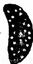

2 a

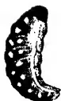

2 b


3

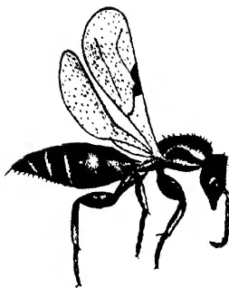

4

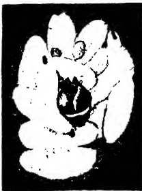

5


6

G. L. de S.

THE BETHYLID PARASITE OF THE COCONCT CATERPILLAR.

Fig. 1.—Egg  $\times 5$ .

Fig. 2.—Grubs  $\times 5$ .

Fig. 2A.—Half-grown grubs  $\times 5$ .

Fig. 2B.—Full grown grubs  $\times 5$ .

Fig. 3.—Pupa  $\times 10$ .

Fig. 4.—*Perisierola*  $\times 8$ .

Fig. 5.—Cocoon with head of host  $\times 6$ .

Fig. 6.—*Calliecrus* sp.  $\times 8$ .

625------------------------------------------------

117

The number of eggs laid by a parasite on one single host caterpillar varied from 1 to 15, each egg being laid after an interval of about 5 minutes. When several host larvae were supplied to one single adult parasite, the parasite laid a few eggs at a time, each batch of eggs being confined to a single host. When only a single host was supplied the parasite after laying a batch of eggs on the host refrained from ovipositing further until fresh host was supplied, which was readily attacked and used for oviposition. Superparasitism was thus never found to take place. The maximum number of eggs laid by a single adult parasite was 74 during a period of 13 days on 12 host larvae. The average number of eggs laid by each of the 18 female parasites under observation was 19. The maximum number of days a female and male parasite lived under laboratory conditions when fed on sugar and water was 26 and 22 days respectively, and the average length of life of an adult was 17 days. It was found that parasites which were fed on sugar and water laid more eggs and lived longer than those which only obtained the body juices of the host larva for their nourishment.

(c) *Development.*—The eggs (fig. 1) are minute slender elongated objects about  $\frac{1}{2}$  mm. long and slightly broader at the base. They are of a dull whitish colour. Hatching was observed to occur approximately 24 to 40 hours after deposition.

The newly hatched grub (fig. 2) is semi-transparent but within a few hours it gets more rounded and turns light yellow. On the second day (fig. 2A) it becomes pinkish and on the third day (fig. 2B) the colour deepens and the body is marked with white dots. The full grown grub measures about 3 mm. It has a tapering body with a swelling at the hinder end. The grub is ecto-parasitic in habit and attaches itself to the body of the host at the point of attachment of the egg. When dislodged from its position, the grub was never able to regasp the host or continue its feeding and consequently died. In about  $2\frac{1}{2}$  to  $3\frac{1}{2}$  days the grub becomes full grown and by this time the body of the host has usually become almost completely desiccated. The grub now detaches itself from the remains of the host and begins to construct a small white oval cocoon. The cocoons (fig. 5) are spun in groups massed together within the galleries of the host larva on the coconut leaflets and usually just beside the remains of the host. After the cocoons are spun the grub casts off its meconium which may be found at one end of the cocoon and gradually turns into a pupa.

The pupa (fig. 3) when fresh is grey in colour but on the fourth day the whole body turns black. The body and limbs of the adult may be clearly seen at this stage through the enclosing pupal skin. On or about the fifth day the pupal skin is cast off. The adult remains in the cocoon till the

626------------------------------------------------

118

cuticle of its body and wings are hardened. It finally emerges by biting a hole through the side of the cocoon. The actual pupal period lasts about 5 days (this is excluding the period of quiescence prior to emergence from the cocoon). It was observed on several instances that the adults after emerging from the cocoons re-enter them for short periods before they finally begin their active life. The total length of the life-cycle of *Perisierola* from egg to emergence of adults varies from  $11\frac{1}{2}$  to 15 days.

The following table gives the life-history records of 18 adult female parasites.

[For Table see pages 121-125]

*Natural Enemies of Perisierola.*—The exposed position of the grubs and cocoons of *Perisierola* makes them readily vulnerable to hyperparasites. In South India, five natural enemies of *Perisierola*, 3 hymenopterons, a mite and a fungus are recorded by Ramachandra Rao and Cherian (3).

In Ceylon, the only recorded hyperparasite of *Perisierola* is a Calliceratid wasp—*Calliceras* sp. (fig. 6) which attacks only the pupal stage of its host. Several of these minute wasps mob a single cocoon of *Perisierola* and lay eggs on it. The grubs that hatch out pierce through the cocoon and attack the pupa, but apparently only if it is in pre-pupal stage as it was observed that cocoons older than three days were not attacked. The life-cycle of *Calliceras* from laying of eggs to emergence of adults was 15 days, which is almost the same period as that of its host, and the adult lived up to a fortnight. It is therefore unlikely that this hyperparasite can appreciably reduce the effectiveness of *Perisierola*.

*The Value of Perisierola as a Control Factor for the Coconut Caterpillar.*—The parasite has many features which should enable it to become a significant factor in the control of the coconut caterpillar pest. Its life-cycle is relatively short and it can pass through 3 or 4 generations during a single generation of its host. It can attack its host for a relatively long period of the latter's life-history, that is about 2 weeks, as it attacks the caterpillar and parasitizes it successfully at any stage between the third and the fifth larval instars. Apart from actual parasitization it probably disposes of a number of host larvae by attacking them for feeding purposes, which greatly increases the controlling effect which it exercises over the pest. Further it is active and energetic in disposition and appears to have a high dispersal value and great ability in locating its host. Also the females outnumber the males in the proportion of 3 to 1, and finally it has no tendency to superparasitism.

627------------------------------------------------

119

The chief factors which limit its utility are hyperparasites and weather conditions. Of the former although there are five recorded in South India by Ramachandra Rao and Cherian (3), in Ceylon there appears to be, as far as is known at present, only one hyperparasite, namely *Calliceras*, and this seems to be of minor importance. Weather conditions however appear to have a very marked effect on it and is probably the chief limiting factor of its population level. Its ecto-parasitic habit makes it still further susceptible to weather conditions. Judging from its distribution, extremes of relative humidity are very unfavourable for it, and such conditions combined with high temperature no doubt act fatally on its development and disposition. Thus it has never been recorded in the highly humid Central and Western coconut areas of the Island. It is practically always present in the Eastern District but it does not appear at any time to assume significant proportions. This is no doubt due for the most part to the relatively long periods during the year in which the weather conditions are actually unfavourable for the parasite. In the Northern or Jaffna District where favourable weather conditions are existent for a longer period during the year it appears to exert a much greater controlling effect, which has been found to be diminishing with the advent of the extremely hot and dry weather. It seems on the whole, therefore, that *Perisierola* could be an effective controlling factor only in limited outbreaks of the pest which occur in regions where the change-over from the wet to the dry seasons is relatively gradual and in the absence of serious hyperparasites.

#### SUMMARY

1. The history and the distribution of *nephantidis* M. *Perisierola* is briefly stated.

2. A description is given of the appearance and behaviour of the adult parasite.

3. A general description of the development of the insect is given with life-history records of 18 cases.

4. The only natural enemy of the parasite in Ceylon is briefly described.

5. Finally its utility as a control factor for the coconut caterpillar pest is discussed.

#### ACKNOWLEDGEMENTS

I am deeply grateful to Dr. B. A. Baptist, B.Sc. Hons (Lond.), Ph.D. (Cantab.), Acting Entomologist, for his helpful interest and guidance during the course of this work. I am also much indebted to the Government Entomologist, Department of Agriculture, Madras, for the identification of the parasite.

628------------------------------------------------

120REFERENCES

1. 1. Jayaratnam, T. J.—1941. A study of the control of the coconut caterpillar (*Nephantis serinopa* Meyr.) in Ceylon with special reference to its Eulophid parasite (*Trichospilus pupivora* Ferr.). *The Tropical Agriculturist*. January, pp. 3-21.
2. 2. Musebeck, C. F. W.—1934. Seven new species of Indian Bethylidae (Hymenoptera). *Records of Indian Museum*. Vol. XXXVI., pp. 225-26.
3. 3. Ramachandra Rao, Sahib V., and Cherian, M.C.—1927. Notes on the life-history and habits of *Perisierola* sp.—the Bethylid parasite of *Nephantis serinopa*. *Madras Agricultural Department Year Book*, pp. 11-22.

629------------------------------------------------

121

<table border="1">
<thead>
<tr>
<th>Serial No.</th>
<th>Date adult parasite emerged.</th>
<th>Date mating was observed.</th>
<th>Date host was supplied.</th>
<th>Date eggs were laid.</th>
<th>No. of eggs laid.</th>
<th>Date eggs hatched.</th>
<th>Incubation period in hours (approx.).</th>
<th>Date cocooning was observed.</th>
<th>Larval period in days.</th>
<th>Date of emergence of adults.</th>
<th>Pupal period in days.</th>
<th>Total life-cycle in days from egg to adult.</th>
<th>Total No. of eggs laid by parent parasite.</th>
<th>Total No. of host larvae on which eggs were laid.</th>
<th>Date of death of parent parasite.</th>
<th>Longevity of parasite in days.</th>
<th>Remarks.</th>
</tr>
</thead>
<tbody>
<tr>
<td>E1*</td>
<td>27.2.41 A.M.</td>
<td>27.2.41 P.M.</td>
<td>28.2.41 A.M.</td>
<td>2.3.41 A.M.</td>
<td>3</td>
<td>3.41 A.M.</td>
<td>36-40</td>
<td>6.3.41 A.M.</td>
<td>3</td>
<td>14.3.41 A.M.</td>
<td>8</td>
<td>12</td>
<td></td>
<td></td>
<td></td>
<td></td>
<td>8.3.41 Host larva and grubs died</td>
</tr>
<tr>
<td></td>
<td></td>
<td></td>
<td>3.3.41 A.M.</td>
<td>4.3.41 A.M.</td>
<td>4</td>
<td>5.3.41 A.M.</td>
<td>36</td>
<td>—</td>
<td>—</td>
<td>—</td>
<td>—</td>
<td>—</td>
<td></td>
<td></td>
<td></td>
<td></td>
<td></td>
</tr>
<tr>
<td></td>
<td></td>
<td></td>
<td>4.3.41 A.M.</td>
<td>4.3.41 P.M.</td>
<td>4</td>
<td>6.3.41 A.M.</td>
<td>36-40</td>
<td>8.3.41 P.M.</td>
<td>2½</td>
<td>10.3.41 A.M.</td>
<td>8</td>
<td>12</td>
<td></td>
<td></td>
<td></td>
<td></td>
<td></td>
</tr>
<tr>
<td></td>
<td></td>
<td></td>
<td>4.3.41 A.M.</td>
<td>5.3.41 A.M.</td>
<td>6</td>
<td>6.3.41 P.M.</td>
<td>36</td>
<td>—</td>
<td>—</td>
<td>17.3.41 A.M.</td>
<td>—</td>
<td>12</td>
<td></td>
<td></td>
<td></td>
<td></td>
<td></td>
</tr>
<tr>
<td></td>
<td></td>
<td></td>
<td>5.3.41 A.M.</td>
<td>6.3.41 A.M.</td>
<td>7</td>
<td>7.3.41 A.M.</td>
<td>24</td>
<td>9.3.41 P.M.</td>
<td>2½</td>
<td>16.3.41 A.M.</td>
<td>8½</td>
<td>12</td>
<td></td>
<td></td>
<td></td>
<td></td>
<td></td>
</tr>
<tr>
<td></td>
<td></td>
<td></td>
<td>6.3.41 A.M.</td>
<td>7.3.41 A.M.</td>
<td>3</td>
<td>8.3.41 A.M.</td>
<td>24</td>
<td>—</td>
<td>—</td>
<td>21.3.41 A.M.</td>
<td>—</td>
<td>14</td>
<td></td>
<td></td>
<td></td>
<td></td>
<td></td>
</tr>
<tr>
<td></td>
<td></td>
<td></td>
<td>7.3.41 A.M.</td>
<td>9.3.41 A.M.</td>
<td>8</td>
<td>10.3.41 A.M.</td>
<td>24</td>
<td>—</td>
<td>—</td>
<td>29.3.41 A.M.</td>
<td>—</td>
<td>14</td>
<td></td>
<td></td>
<td></td>
<td></td>
<td></td>
</tr>
<tr>
<td></td>
<td></td>
<td></td>
<td>9.3.41 A.M.</td>
<td>11.3.41 A.M.</td>
<td>5</td>
<td>12.3.41 A.M.</td>
<td>24</td>
<td>—</td>
<td>—</td>
<td>—</td>
<td>—</td>
<td>—</td>
<td></td>
<td></td>
<td></td>
<td></td>
<td></td>
</tr>
<tr>
<td></td>
<td></td>
<td></td>
<td>11.3.41 A.M.</td>
<td>—</td>
<td>6</td>
<td>—</td>
<td>—</td>
<td>—</td>
<td>—</td>
<td>—</td>
<td>—</td>
<td>—</td>
<td></td>
<td></td>
<td></td>
<td></td>
<td></td>
</tr>
<tr>
<td></td>
<td></td>
<td></td>
<td>14.3.41 A.M.</td>
<td>15.3.41 A.M.</td>
<td>6</td>
<td>—</td>
<td>—</td>
<td>—</td>
<td>—</td>
<td>—</td>
<td>—</td>
<td>—</td>
<td></td>
<td></td>
<td></td>
<td></td>
<td></td>
</tr>
<tr>
<td></td>
<td></td>
<td></td>
<td>15.3.41 A.M.</td>
<td>19.3.41 A.M.</td>
<td>10</td>
<td>—</td>
<td>—</td>
<td>—</td>
<td>—</td>
<td>—</td>
<td>—</td>
<td>—</td>
<td></td>
<td></td>
<td></td>
<td></td>
<td></td>
</tr>
<tr>
<td></td>
<td></td>
<td></td>
<td>19.3.41 A.M.</td>
<td>21.3.41 A.M.</td>
<td>12</td>
<td>—</td>
<td>—</td>
<td>—</td>
<td>—</td>
<td>—</td>
<td>—</td>
<td>—</td>
<td></td>
<td></td>
<td></td>
<td></td>
<td></td>
</tr>
<tr>
<td></td>
<td></td>
<td></td>
<td>21.3.41</td>
<td>—</td>
<td>—</td>
<td>—</td>
<td>—</td>
<td>—</td>
<td>—</td>
<td>—</td>
<td>—</td>
<td>—</td>
<td>74</td>
<td>12</td>
<td>22.3.41</td>
<td>25-26</td>
<td>Host larvae were attacked but no eggs were laid</td>
</tr>
</tbody>
</table>

\* Fed on sugar and water.

630------------------------------------------------

122

<table border="1">
<thead>
<tr>
<th>Serial No.</th>
<th>Date adult parasite emerged.</th>
<th>Date mating was observed.</th>
<th>Date host was supplied.</th>
<th>Date eggs were laid.</th>
<th>No. of eggs laid.</th>
<th>Date eggs hatched.</th>
<th>Incubation period in hours (approx.).</th>
<th>Date cocooning was observed.</th>
<th>Interval period in days.</th>
<th>Date of emergence of adults.</th>
<th>Pupal period in days.</th>
<th>Total life-cycle in days from egg to adult.</th>
<th>Total No. of eggs laid by parent parasite.</th>
<th>Total No. of host larvae on which eggs were laid.</th>
<th>Date of death of parent parasite</th>
<th>Longevity of parasite in days.</th>
<th>Remarks.</th>
</tr>
</thead>
<tbody>
<tr>
<td>E 2*</td>
<td>A.M.<br/>27.2.41</td>
<td>P.M.<br/>27.2.41</td>
<td>A.M.<br/>28.2.41</td>
<td>A.M.<br/>4.3.41</td>
<td>15</td>
<td>P.M.<br/>5.3.41</td>
<td>36</td>
<td>A.M.<br/>8.3.41</td>
<td>2½</td>
<td>A.M.<br/>15.3.41</td>
<td>8</td>
<td>13</td>
<td></td>
<td></td>
<td></td>
<td></td>
<td>Host larva and parasite grubs died</td>
</tr>
<tr>
<td></td>
<td></td>
<td></td>
<td>A.M.<br/>4.3.41</td>
<td>A.M.<br/>5.3.41</td>
<td>2</td>
<td>P.M.<br/>6.3.41</td>
<td>36</td>
<td></td>
<td></td>
<td></td>
<td></td>
<td></td>
<td></td>
<td></td>
<td></td>
<td></td>
<td></td>
</tr>
<tr>
<td></td>
<td></td>
<td></td>
<td>A.M.<br/>5.3.41</td>
<td>A.M.<br/>7.3.41</td>
<td>8</td>
<td>A.M.<br/>8.3.41</td>
<td>24</td>
<td>P.M.<br/>10.3.41</td>
<td>2½</td>
<td>A.M.<br/>19.3.41</td>
<td>8½</td>
<td>12</td>
<td></td>
<td></td>
<td></td>
<td></td>
<td></td>
</tr>
<tr>
<td></td>
<td></td>
<td></td>
<td>A.M.<br/>7.3.41</td>
<td>A.M.<br/>8.3.41</td>
<td>5</td>
<td>A.M.<br/>9.3.41</td>
<td>24</td>
<td></td>
<td></td>
<td></td>
<td></td>
<td></td>
<td></td>
<td></td>
<td></td>
<td></td>
<td></td>
</tr>
<tr>
<td></td>
<td></td>
<td></td>
<td>A.M.<br/>8.3.41</td>
<td></td>
<td></td>
<td></td>
<td></td>
<td></td>
<td></td>
<td></td>
<td></td>
<td></td>
<td></td>
<td></td>
<td></td>
<td></td>
<td></td>
</tr>
<tr>
<td></td>
<td></td>
<td></td>
<td>A.M.<br/>9.3.41</td>
<td>A.M.<br/>10.3.41</td>
<td>5</td>
<td>A.M.<br/>11.3.41</td>
<td>24</td>
<td></td>
<td></td>
<td></td>
<td></td>
<td></td>
<td></td>
<td></td>
<td></td>
<td></td>
<td>Host larva killed by parasite</td>
</tr>
<tr>
<td></td>
<td></td>
<td></td>
<td>A.M.<br/>10.3.41</td>
<td>A.M.<br/>11.3.41</td>
<td>8</td>
<td></td>
<td></td>
<td>A.M.<br/>14.3.41</td>
<td></td>
<td>A.M.<br/>23.3.41</td>
<td>8</td>
<td>12</td>
<td></td>
<td></td>
<td></td>
<td></td>
<td></td>
</tr>
<tr>
<td></td>
<td></td>
<td></td>
<td>A.M.<br/>11.3.41</td>
<td></td>
<td></td>
<td></td>
<td></td>
<td></td>
<td></td>
<td></td>
<td></td>
<td></td>
<td></td>
<td></td>
<td></td>
<td></td>
<td></td>
</tr>
<tr>
<td></td>
<td></td>
<td></td>
<td>A.M.<br/>14.3.41</td>
<td>A.M.<br/>16.3.41</td>
<td>9</td>
<td></td>
<td></td>
<td></td>
<td></td>
<td>A.M.<br/>31.3.41</td>
<td></td>
<td></td>
<td>52</td>
<td>7</td>
<td>77.3.41</td>
<td>19</td>
<td>do.</td>
</tr>
<tr>
<td></td>
<td></td>
<td></td>
<td>A.M.<br/>16.3.41</td>
<td></td>
<td></td>
<td></td>
<td></td>
<td></td>
<td></td>
<td></td>
<td></td>
<td></td>
<td></td>
<td></td>
<td></td>
<td></td>
<td></td>
</tr>
<tr>
<td>E 3*</td>
<td>do.</td>
<td>do.</td>
<td>A.M.<br/>28.2.41</td>
<td>A.M.<br/>2.3.41</td>
<td>12</td>
<td>A.M.<br/>4.3.41</td>
<td>40</td>
<td>A.M.<br/>6.3.41</td>
<td>2½</td>
<td>A.M.<br/>14.3.41</td>
<td>8</td>
<td>12</td>
<td></td>
<td></td>
<td></td>
<td></td>
<td>Host larvae not touched at all</td>
</tr>
<tr>
<td></td>
<td></td>
<td></td>
<td>A.M.<br/>3.3.41</td>
<td></td>
<td></td>
<td></td>
<td></td>
<td></td>
<td></td>
<td></td>
<td></td>
<td></td>
<td></td>
<td></td>
<td></td>
<td></td>
<td></td>
</tr>
<tr>
<td></td>
<td></td>
<td></td>
<td>A.M.<br/>5.3.41</td>
<td></td>
<td></td>
<td></td>
<td></td>
<td></td>
<td></td>
<td></td>
<td></td>
<td></td>
<td></td>
<td></td>
<td></td>
<td></td>
<td></td>
</tr>
<tr>
<td></td>
<td></td>
<td></td>
<td>A.M.<br/>28.2.41</td>
<td>A.M.</td>
<td></td>
<td>P.M.</td>
<td></td>
<td>P.M.</td>
<td></td>
<td>A.M.</td>
<td></td>
<td></td>
<td>12</td>
<td>1</td>
<td>13.3.41</td>
<td>15</td>
<td></td>
</tr>
<tr>
<td>G *</td>
<td>A.M.<br/>1.3.41</td>
<td></td>
<td>A.M.<br/>3.3.41</td>
<td>A.M.<br/>6.3.41</td>
<td>8</td>
<td>P.M.<br/>7.3.41</td>
<td>36</td>
<td>P.M.<br/>9.3.41</td>
<td></td>
<td>A.M.<br/>18.3.41</td>
<td>8½</td>
<td>12</td>
<td></td>
<td></td>
<td></td>
<td></td>
<td></td>
</tr>
</tbody>
</table>

\* Fed on sugar and water.

631------------------------------------------------

123

<table border="1">
<tbody>
<tr>
<td rowspan="6">G*</td>
<td>28.2.41</td>
<td></td>
<td>A.M.</td>
<td>A.M.</td>
<td></td>
<td>A.M.</td>
<td></td>
<td></td>
<td></td>
<td></td>
<td></td>
<td></td>
<td></td>
<td></td>
<td></td>
<td></td>
<td></td>
<td></td>
<td></td>
<td></td>
</tr>
<tr>
<td></td>
<td>6.3.41</td>
<td>8.3.41</td>
<td>6</td>
<td>9.3.41</td>
<td>24</td>
<td>—</td>
<td>—</td>
<td>—</td>
<td>—</td>
<td>—</td>
<td>—</td>
<td>—</td>
<td>—</td>
<td>—</td>
<td>—</td>
<td>—</td>
<td>—</td>
<td>—</td>
<td></td>
</tr>
<tr>
<td>1.3.41</td>
<td>8.3.41</td>
<td>9.3.41</td>
<td>6</td>
<td>10.3.41</td>
<td>36</td>
<td>—</td>
<td>22.3.41</td>
<td>—</td>
<td>13</td>
<td>—</td>
<td>—</td>
<td>—</td>
<td>—</td>
<td>—</td>
<td>—</td>
<td>—</td>
<td>—</td>
<td>—</td>
<td></td>
</tr>
<tr>
<td></td>
<td>10.3.41</td>
<td>11.3.41</td>
<td>3</td>
<td>—</td>
<td>—</td>
<td>—</td>
<td>23.3.41</td>
<td>—</td>
<td>12</td>
<td>—</td>
<td>—</td>
<td>—</td>
<td>—</td>
<td>—</td>
<td>—</td>
<td>—</td>
<td>—</td>
<td>—</td>
<td></td>
</tr>
<tr>
<td></td>
<td>11.3.41</td>
<td>14.3.41</td>
<td>4</td>
<td>—</td>
<td>—</td>
<td>—</td>
<td>—</td>
<td>—</td>
<td>—</td>
<td>—</td>
<td>—</td>
<td>—</td>
<td>—</td>
<td>—</td>
<td>—</td>
<td>—</td>
<td>—</td>
<td>—</td>
<td></td>
</tr>
<tr>
<td></td>
<td>14.3.41</td>
<td>—</td>
<td>—</td>
<td>—</td>
<td>—</td>
<td>—</td>
<td>—</td>
<td>—</td>
<td>—</td>
<td>—</td>
<td>—</td>
<td>—</td>
<td>—</td>
<td>—</td>
<td>—</td>
<td>—</td>
<td>—</td>
<td>—</td>
<td></td>
</tr>
<tr>
<td rowspan="3">G1*</td>
<td>28.2.41</td>
<td></td>
<td>A.M.</td>
<td></td>
<td>A.M.</td>
<td></td>
<td>P.M.</td>
<td>A.M.</td>
<td></td>
<td></td>
<td></td>
<td></td>
<td></td>
<td></td>
<td></td>
<td></td>
<td></td>
<td></td>
<td></td>
<td></td>
</tr>
<tr>
<td></td>
<td>3.3.41</td>
<td>6.3.41</td>
<td>10</td>
<td>7.3.41</td>
<td>30</td>
<td>9.3.41</td>
<td>2½</td>
<td>18.3.41</td>
<td>8½</td>
<td>12</td>
<td></td>
<td></td>
<td></td>
<td></td>
<td></td>
<td></td>
<td></td>
<td></td>
<td></td>
</tr>
<tr>
<td>1.3.41</td>
<td>6.3.41</td>
<td>7.3.41</td>
<td>6</td>
<td>8.3.41</td>
<td>24</td>
<td>10.3.41</td>
<td>2½</td>
<td>19.3.41</td>
<td>8½</td>
<td>12</td>
<td></td>
<td></td>
<td></td>
<td></td>
<td></td>
<td></td>
<td></td>
<td></td>
<td></td>
</tr>
<tr>
<td rowspan="4">G2*</td>
<td>do.</td>
<td></td>
<td>A.M.</td>
<td></td>
<td>A.M.</td>
<td></td>
<td>P.M.</td>
<td>A.M.</td>
<td></td>
<td></td>
<td></td>
<td></td>
<td></td>
<td></td>
<td></td>
<td></td>
<td></td>
<td></td>
<td></td>
<td></td>
</tr>
<tr>
<td></td>
<td>3.3.41</td>
<td>6.3.41</td>
<td>11</td>
<td>7.3.41</td>
<td>30</td>
<td>9.3.41</td>
<td>2½</td>
<td>18.3.41</td>
<td>8½</td>
<td>12</td>
<td></td>
<td></td>
<td></td>
<td></td>
<td></td>
<td></td>
<td></td>
<td></td>
<td></td>
</tr>
<tr>
<td></td>
<td>6.3.41</td>
<td>8.3.41</td>
<td>5</td>
<td>9.3.41</td>
<td>24</td>
<td>12.3.41</td>
<td>3½</td>
<td>21.3.41</td>
<td>8½</td>
<td>13</td>
<td></td>
<td></td>
<td></td>
<td></td>
<td></td>
<td></td>
<td></td>
<td></td>
<td></td>
</tr>
<tr>
<td></td>
<td>8.3.41</td>
<td>12.3.41</td>
<td>3</td>
<td>—</td>
<td>—</td>
<td>—</td>
<td>—</td>
<td>25.3.41</td>
<td>—</td>
<td>—</td>
<td></td>
<td></td>
<td></td>
<td></td>
<td></td>
<td></td>
<td></td>
<td></td>
<td></td>
</tr>
<tr>
<td rowspan="5">G3*</td>
<td>do.</td>
<td></td>
<td>A.M.</td>
<td></td>
<td>P.M.</td>
<td></td>
<td>P.M.</td>
<td></td>
<td></td>
<td></td>
<td></td>
<td></td>
<td></td>
<td></td>
<td></td>
<td></td>
<td></td>
<td></td>
<td></td>
<td></td>
</tr>
<tr>
<td></td>
<td>3.3.41</td>
<td>5.3.41</td>
<td>7</td>
<td>6.3.41</td>
<td>30</td>
<td>8.3.41</td>
<td>2</td>
<td>—</td>
<td>—</td>
<td>—</td>
<td></td>
<td></td>
<td></td>
<td></td>
<td></td>
<td></td>
<td></td>
<td></td>
<td></td>
</tr>
<tr>
<td></td>
<td>5.3.41</td>
<td>—</td>
<td>—</td>
<td>—</td>
<td>—</td>
<td>—</td>
<td>—</td>
<td>—</td>
<td>—</td>
<td>—</td>
<td></td>
<td></td>
<td></td>
<td></td>
<td></td>
<td></td>
<td></td>
<td></td>
<td></td>
</tr>
<tr>
<td></td>
<td>7.3.41</td>
<td>10.3.41</td>
<td>10</td>
<td>11.3.41</td>
<td>24</td>
<td>—</td>
<td>—</td>
<td>—</td>
<td>—</td>
<td>—</td>
<td></td>
<td></td>
<td></td>
<td></td>
<td></td>
<td></td>
<td></td>
<td></td>
<td></td>
</tr>
<tr>
<td></td>
<td>10.3.41</td>
<td>13.3.41</td>
<td>5</td>
<td>14.3.41</td>
<td>24</td>
<td>—</td>
<td>—</td>
<td>—</td>
<td>—</td>
<td>—</td>
<td></td>
<td></td>
<td></td>
<td></td>
<td></td>
<td></td>
<td></td>
<td></td>
<td></td>
</tr>
<tr>
<td rowspan="3">G4*</td>
<td>do.</td>
<td></td>
<td>A.M.</td>
<td></td>
<td>A.M.</td>
<td></td>
<td>P.M.</td>
<td></td>
<td>A.M.</td>
<td></td>
<td></td>
<td></td>
<td></td>
<td></td>
<td></td>
<td></td>
<td></td>
<td></td>
<td></td>
<td></td>
</tr>
<tr>
<td></td>
<td>3.3.41</td>
<td>4.3.41</td>
<td>3</td>
<td>6.3.41</td>
<td>40</td>
<td>8.3.41</td>
<td>2½</td>
<td>17.3.41</td>
<td>8½</td>
<td>13</td>
<td></td>
<td></td>
<td></td>
<td></td>
<td></td>
<td></td>
<td></td>
<td></td>
<td></td>
</tr>
<tr>
<td></td>
<td>4.3.41</td>
<td>—</td>
<td>4</td>
<td>6.3.41</td>
<td>36</td>
<td>8.3.41</td>
<td>2½</td>
<td>16.3.41</td>
<td>8</td>
<td>12</td>
<td></td>
<td></td>
<td></td>
<td></td>
<td></td>
<td></td>
<td></td>
<td></td>
<td></td>
</tr>
</tbody>
</table>

\* Fed on sugar and water.

632------------------------------------------------

124

<table border="1">
<thead>
<tr>
<th>Serial No.</th>
<th>Date adult parasite emerged.</th>
<th>Date mating was observed</th>
<th>Date host was supplied.</th>
<th>Date eggs were laid.</th>
<th>No. of eggs laid.</th>
<th>Date eggs hatched.</th>
<th>Incubation period in hours (approx.).</th>
<th>Date cocooning was observed.</th>
<th>Larval period in days.</th>
<th>Date of emergence of adults.</th>
<th>Pupal period in days.</th>
<th>Total life-cycle in days from egg to adult.</th>
<th>Total No. of eggs laid by mother parasite.</th>
<th>Total No. of host larvae on which eggs were laid.</th>
<th>Date of death of mother parasite.</th>
<th>Longevity of parasite in days.</th>
<th>Remarks.</th>
</tr>
</thead>
<tbody>
<tr>
<td rowspan="5">G 4*</td>
<td rowspan="5">28.2.41<br/>1.3.41</td>
<td rowspan="5"></td>
<td>P.M.<br/>4.3.41</td>
<td>A.M.<br/>6.3.41</td>
<td>3</td>
<td>A.M.<br/>7.3.41</td>
<td>24</td>
<td>P.M.<br/>9.3.41</td>
<td>2½</td>
<td>A.M.<br/>18.3.41</td>
<td>8½</td>
<td>12</td>
<td></td>
<td></td>
<td></td>
<td></td>
<td></td>
</tr>
<tr>
<td>A.M.<br/>6.3.41</td>
<td>A.M.<br/>7.3.41</td>
<td>2</td>
<td></td>
<td></td>
<td></td>
<td></td>
<td></td>
<td></td>
<td></td>
<td></td>
<td></td>
<td></td>
<td></td>
<td></td>
</tr>
<tr>
<td>A.M.<br/>7.3.41</td>
<td>A.M.<br/>8.3.41</td>
<td>3</td>
<td>A.M.<br/>9.3.41</td>
<td>24</td>
<td>A.M.<br/>12.3.41</td>
<td>3</td>
<td>A.M.<br/>20.3.41</td>
<td>8</td>
<td>12</td>
<td></td>
<td></td>
<td></td>
<td></td>
<td></td>
</tr>
<tr>
<td>A.M.<br/>8.3.41</td>
<td>A.M.<br/>9.3.41</td>
<td>3</td>
<td>A.M.<br/>10.3.41</td>
<td>24</td>
<td>A.M.<br/>13.3.41</td>
<td>3</td>
<td>A.M.<br/>22.3.41</td>
<td>9</td>
<td>13</td>
<td></td>
<td></td>
<td></td>
<td></td>
<td></td>
</tr>
<tr>
<td>A.M.<br/>9.3.41</td>
<td>A.M.<br/>10.3.41</td>
<td>4</td>
<td></td>
<td></td>
<td></td>
<td></td>
<td></td>
<td>A.M.<br/>26.3.41</td>
<td></td>
<td></td>
<td>22</td>
<td>7</td>
<td>13.3.41</td>
<td>14</td>
<td></td>
</tr>
<tr>
<td>G 5*</td>
<td>do.</td>
<td>—</td>
<td>A.M.<br/>3.3.41</td>
<td>A.M.<br/>7.3.41</td>
<td>11</td>
<td>A.M.<br/>8.3.41</td>
<td>24</td>
<td>P.M.<br/>10.3.41</td>
<td>2½</td>
<td>A.M.<br/>19.3.41</td>
<td>9</td>
<td>12</td>
<td></td>
<td></td>
<td></td>
<td></td>
</tr>
<tr>
<td></td>
<td></td>
<td></td>
<td>A.M.<br/>7.3.41</td>
<td>A.M.<br/>10.3.41</td>
<td>12</td>
<td>A.M.<br/>11.3.41</td>
<td>24</td>
<td></td>
<td></td>
<td>P.M.<br/>21.3.41</td>
<td></td>
<td>11½</td>
<td></td>
<td></td>
<td></td>
<td></td>
</tr>
<tr>
<td></td>
<td></td>
<td></td>
<td>A.M.<br/>10.3.41</td>
<td></td>
<td></td>
<td></td>
<td></td>
<td></td>
<td></td>
<td></td>
<td></td>
<td></td>
<td>23</td>
<td>2</td>
<td>15.3.41</td>
<td>16</td>
<td></td>
</tr>
<tr>
<td>G 7*</td>
<td>do.</td>
<td>—</td>
<td>A.M.<br/>3.3.41</td>
<td>A.M.<br/>5.3.41</td>
<td>6</td>
<td>P.M.<br/>6.3.41</td>
<td>30</td>
<td></td>
<td></td>
<td>P.M.<br/>16.3.41</td>
<td></td>
<td>11½</td>
<td></td>
<td></td>
<td></td>
<td></td>
</tr>
<tr>
<td></td>
<td></td>
<td></td>
<td>A.M.<br/>5.3.41</td>
<td>A.M.<br/>7.3.41</td>
<td>5</td>
<td></td>
<td></td>
<td></td>
<td></td>
<td></td>
<td></td>
<td></td>
<td></td>
<td></td>
<td></td>
<td></td>
</tr>
<tr>
<td></td>
<td></td>
<td></td>
<td>A.M.<br/>7.3.41</td>
<td></td>
<td></td>
<td></td>
<td></td>
<td></td>
<td></td>
<td></td>
<td></td>
<td></td>
<td>11</td>
<td>2</td>
<td>10.3.41</td>
<td>11</td>
<td>Host died</td>
</tr>
<tr>
<td>H.</td>
<td>1.3.41</td>
<td>—</td>
<td>A.M.<br/>3.3.41</td>
<td>A.M.<br/>6.3.41</td>
<td>8</td>
<td>P.M.<br/>7.3.41</td>
<td>30</td>
<td></td>
<td></td>
<td></td>
<td></td>
<td></td>
<td></td>
<td></td>
<td></td>
<td></td>
<td>Host and parasite grubs died</td>
</tr>
<tr>
<td></td>
<td></td>
<td></td>
<td>A.M.<br/>6.3.41</td>
<td>A.M.<br/>9.3.41</td>
<td>6</td>
<td>A.M.<br/>10.3.41</td>
<td>24</td>
<td></td>
<td></td>
<td></td>
<td></td>
<td></td>
<td></td>
<td></td>
<td></td>
<td></td>
</tr>
<tr>
<td></td>
<td></td>
<td></td>
<td>A.M.<br/>9.3.41</td>
<td></td>
<td></td>
<td></td>
<td></td>
<td></td>
<td></td>
<td></td>
<td></td>
<td></td>
<td>14</td>
<td>2</td>
<td>13.3.41</td>
<td>13</td>
<td></td>
</tr>
</tbody>
</table>

\* Fed on sugar and water.

633------------------------------------------------

125

<table border="1">
<tbody>
<tr>
<td>H 1.</td>
<td>1.3.41</td>
<td>—</td>
<td>A.M.<br/>3.3.41</td>
<td>A.M.<br/>4.2.41</td>
<td>3</td>
<td>A.M.<br/>5.3.41</td>
<td>30</td>
<td>P.M.<br/>8.3.41</td>
<td>3½</td>
<td>17.3.41</td>
<td>—</td>
<td>13</td>
<td>3</td>
<td>1</td>
<td>5.3.41</td>
<td>5</td>
</tr>
<tr>
<td>J.</td>
<td>3.3.41</td>
<td>4.3.41</td>
<td>A.M.<br/>5.3.41</td>
<td>A.M.<br/>8.3.41</td>
<td>5</td>
<td>P.M.<br/>9.3.41</td>
<td>36</td>
<td>P.M.<br/>12.3.41</td>
<td>3</td>
<td>A.M.<br/>21.3.41</td>
<td>9</td>
<td>13</td>
<td></td>
<td></td>
<td></td>
<td></td>
</tr>
<tr>
<td></td>
<td></td>
<td></td>
<td>A.M.<br/>8.3.41</td>
<td>A.M.<br/>10.3.41</td>
<td>5</td>
<td>A.M.<br/>11.3.41</td>
<td>24</td>
<td>—</td>
<td>—</td>
<td>—</td>
<td>—</td>
<td>—</td>
<td>10</td>
<td>2</td>
<td>12.3.41</td>
<td>10</td>
</tr>
<tr>
<td></td>
<td></td>
<td></td>
<td>A.M.<br/>10.3.41</td>
<td>—</td>
<td>—</td>
<td>—</td>
<td>—</td>
<td>—</td>
<td>—</td>
<td>—</td>
<td>—</td>
<td>—</td>
<td></td>
<td></td>
<td></td>
<td></td>
</tr>
<tr>
<td>J 1.</td>
<td>do.</td>
<td>do.</td>
<td>A.M.<br/>5.3.41</td>
<td>A.M.<br/>8.3.41</td>
<td>7</td>
<td>P.M.<br/>9.3.41</td>
<td>36</td>
<td>A.M.<br/>13.3.41</td>
<td>3½</td>
<td>A.M.<br/>21.3.41</td>
<td>8</td>
<td>13</td>
<td></td>
<td></td>
<td></td>
<td></td>
</tr>
<tr>
<td></td>
<td></td>
<td></td>
<td>A.M.<br/>8.3.41</td>
<td>—</td>
<td>5</td>
<td>—</td>
<td>—</td>
<td>—</td>
<td>—</td>
<td>—</td>
<td>—</td>
<td>—</td>
<td>12</td>
<td>2</td>
<td>15.3.41</td>
<td>13</td>
</tr>
<tr>
<td></td>
<td></td>
<td></td>
<td>A.M.<br/>14.3.41</td>
<td>—</td>
<td>—</td>
<td>—</td>
<td>—</td>
<td>—</td>
<td>—</td>
<td>—</td>
<td>—</td>
<td>—</td>
<td></td>
<td></td>
<td></td>
<td></td>
</tr>
<tr>
<td>J 2.</td>
<td>do.</td>
<td>do.</td>
<td>A.M.<br/>5.3.41</td>
<td>P.M.<br/>7.3.41</td>
<td>6</td>
<td>A.M.<br/>9.3.41</td>
<td>36</td>
<td>—</td>
<td>—</td>
<td>A.M.<br/>22.3.41</td>
<td>—</td>
<td>14½</td>
<td></td>
<td></td>
<td></td>
<td></td>
</tr>
<tr>
<td></td>
<td></td>
<td></td>
<td>A.M.<br/>5.3.41</td>
<td>P.M.<br/>9.3.41</td>
<td>4</td>
<td>—</td>
<td>—</td>
<td>—</td>
<td>—</td>
<td>—</td>
<td>—</td>
<td>—</td>
<td>10</td>
<td>2</td>
<td>12.3.41</td>
<td>10</td>
</tr>
<tr>
<td></td>
<td></td>
<td></td>
<td>A.M.<br/>9.3.41</td>
<td>—</td>
<td>—</td>
<td>—</td>
<td>—</td>
<td>—</td>
<td>—</td>
<td>—</td>
<td>—</td>
<td>—</td>
<td></td>
<td></td>
<td></td>
<td></td>
</tr>
<tr>
<td>J 3.</td>
<td>do.</td>
<td>do.</td>
<td>A.M.<br/>5.3.41</td>
<td>A.M.<br/>7.3.41</td>
<td>4</td>
<td>—</td>
<td>—</td>
<td>—</td>
<td>—</td>
<td>—</td>
<td>—</td>
<td>—</td>
<td></td>
<td></td>
<td></td>
<td></td>
</tr>
<tr>
<td></td>
<td></td>
<td></td>
<td>A.M.<br/>7.3.41</td>
<td>P.M.<br/>8.3.41</td>
<td>1</td>
<td>A.M.<br/>10.3.41</td>
<td>36</td>
<td>—</td>
<td>—</td>
<td>—</td>
<td>—</td>
<td>—</td>
<td>5</td>
<td>2</td>
<td>12.3.41</td>
<td>10</td>
</tr>
<tr>
<td></td>
<td></td>
<td></td>
<td>A.M.<br/>8.3.41</td>
<td>—</td>
<td>—</td>
<td>—</td>
<td>—</td>
<td>—</td>
<td>—</td>
<td>—</td>
<td>—</td>
<td>—</td>
<td></td>
<td></td>
<td></td>
<td></td>
</tr>
<tr>
<td>J 4.</td>
<td>do.</td>
<td>do.</td>
<td>A.M.<br/>5.3.41</td>
<td>P.M.<br/>7.3.41</td>
<td>2</td>
<td>A.M.<br/>9.3.41</td>
<td>36</td>
<td>P.M.<br/>12.3.41</td>
<td>3½</td>
<td>A.M.<br/>21.3.41</td>
<td>8½</td>
<td>13½</td>
<td></td>
<td></td>
<td></td>
<td></td>
</tr>
<tr>
<td></td>
<td></td>
<td></td>
<td>A.M.<br/>7.3.41</td>
<td>A.M.<br/>9.3.41</td>
<td>5</td>
<td>—</td>
<td>—</td>
<td>—</td>
<td>—</td>
<td>—</td>
<td>—</td>
<td>—</td>
<td>7</td>
<td>2</td>
<td>12.3.41</td>
<td>10</td>
</tr>
<tr>
<td></td>
<td></td>
<td></td>
<td>A.M.<br/>9.3.41</td>
<td>—</td>
<td>—</td>
<td>—</td>
<td>—</td>
<td>—</td>
<td>—</td>
<td>—</td>
<td>—</td>
<td>—</td>
<td></td>
<td></td>
<td></td>
<td></td>
</tr>
<tr>
<td>K.</td>
<td>do.</td>
<td>do.</td>
<td>A.M.<br/>5.3.41</td>
<td>A.M.<br/>8.3.41</td>
<td>6</td>
<td>A.M.<br/>9.3.41</td>
<td>24</td>
<td>P.M.<br/>12.3.41</td>
<td>3½</td>
<td>A.M.<br/>21.3.41</td>
<td>8½</td>
<td>13</td>
<td></td>
<td></td>
<td></td>
<td></td>
</tr>
<tr>
<td></td>
<td></td>
<td></td>
<td>A.M.<br/>8.3.41</td>
<td>A.M.<br/>9.3.41</td>
<td>5</td>
<td>A.M.<br/>10.3.41</td>
<td>24</td>
<td>—</td>
<td>—</td>
<td>22<br/>23</td>
<td>21.3.41</td>
<td>—</td>
<td>13-14</td>
<td>2</td>
<td>12.3.41</td>
<td>10</td>
</tr>
<tr>
<td></td>
<td></td>
<td></td>
<td>A.M.<br/>9.3.41</td>
<td>—</td>
<td>—</td>
<td>—</td>
<td>—</td>
<td>—</td>
<td>—</td>
<td>—</td>
<td>—</td>
<td>—</td>
<td>11</td>
<td>2</td>
<td>12.3.41</td>
<td>10</td>
</tr>
</tbody>
</table>

N.B.—A single host larva was supplied to each female parasite and when oviposition was noticed on it, a fresh host was supplied and the parasitized host removed.

634------------------------------------------------

126

## COMMON MISTAKES IN FLUE-CURING OF TOBACCO

A. B. ATTYGALLE,

ASSISTANT TO TOBACCO OFFICER

SOME of the difficulties in the flue-curing of cigarette tobacco can be directly traced to the field. For example, the faulty field management and adverse climatic conditions exercise some influence on the standard of curing operations.

*Field Management.*—Thorough preparation of the land followed by proper after-cultivation and cultural methods, such as priming, topping and suckering, materially influence the results of curing. A crop of tobacco correctly primed, topped and suckered ripens more uniformly and produces a better tobacco than a crop which is unprimed and topped either too high or too low. The time of planting also plays a very important part; less difficulty is usually experienced in curing tobacco planted during the earlier part of the season than in curing the later planted portion of the crop.

*Climatic Conditions.*—During seasons of adverse weather conditions, it is usual to expect certain difficulties in the curing of the crop. Should a prolonged spell of dry weather occur when the tobacco is nearing maturity the leaf turns yellow and commences to perish on the plant. This type of leaf when placed in the barn yellows well and retains the good colour until the fixing of the colour; after that stage the colour changes to green and the cured product will be on the green side. This is due to the leaf being immature; the yellowing of leaf in the field is an indication that the plant is perishing for want of moisture though it is very often mistaken as a sign of ripening, and this is known as false ripening. When false ripening is observed it is best to give a good irrigation or hand watering if water is available and delay the harvest for a week or so. If water is not available for irrigating or hand watering and the weather continues to be dry, the only course open is to proceed with the harvesting.

Heavy or continuous rain after a spell of dry weather will induce "second growth", which makes the leaf very difficult to cure, and it is best to delay the harvesting till the leaf shows signs of ripening again.

635------------------------------------------------

127

*Harvesting.*—Fully ripe leaf of uniform body and texture should be harvested for each barn ; good care exercised in this respect materially helps in the curing operations. Very often damaged and over-ripe leaf is harvested and cured in place of good leaf which, if left on the plant too long, loses quality. It is very important that the leaves of each bunch should be placed back to back when tied on to the sticks and the number of bunches should fill the stick without over-crowding. When filling the barn good care should be taken to place the sticks of tobacco evenly along the tiers to avoid over-crowding. In an over-crowded barn the leaf is liable to “sponge”.

*Curing.*—The timely use of top ventilation will prevent the yellow leaf from sponging and a minimum of bottom ventilation will prevent the atmosphere of the barn from drying too rapidly, thus giving the greener tobacco a better opportunity of yellowing. As the curing season advances the rate of curing gradually becomes slower as the leaf takes a longer period to yellow. During the time of curing a good deal of damage to tobacco is experienced through raising the temperature by sudden jumps, *e.g.*, 10° at a time, thus rendering the leaf brittle, besides scorching the leaf to some extent.

It is not possible to prescribe a definite formula for flue-curing since the method to be adopted for any particular barn load is subject to modifications owing to different varieties grown, soil types, different stages of maturity, the variable texture of the leaf, climatic conditions and other factors. However the following points should be remembered when flue-curing a barn of tobacco:—

(1) For successful flue-curing proper harvesting of tobacco is of the utmost importance as ripeness influences the quality of the cured product.

(2) The eye should be trained to judge a fully ripe leaf and only fully ripe leaf with colour, *i.e.*, yellowish green, should be harvested for flue-curing.

(3) Uniformity in harvesting makes curing easy.

(4) Green tobacco has no value and therefore every precaution should be taken to reduce it to the absolute minimum.

(5) Adequate barn accommodation and tying-sheds will facilitate harvesting of tobacco.

(6) Tobacco leaf should be very carefully handled during harvest, transport and tying on the sticks, otherwise damage will result in much loss to the grower.

(7) Curing of tobacco demands considerable skill and experience and it should be studied as such.

(8) The barns should not be over-crowded as this will sponge the leaf which will reduce in value.

(9) The curing barns and other requisite buildings should be in proper order and trim before the crop is due for harvesting.

636------------------------------------------------

128

(10) Adequate supervision should be provided throughout the harvesting and curing of your crop.

(11) More tobacco than can be conveniently accommodated in the barns and buildings should not be grown.

(12) The temperature should be kept as constant as possible throughout the curing process.

(13) In wet weather it is necessary to ventilate sooner than in dry weather.

(14) During cool weather a slightly low temperature should be maintained during the yellowing stage and higher temperature during wet weather for fixing the colour of the leaf.

(15) During the yellowing stage the temperature should not be raised more rapidly than by 5 degrees at a time when changes in the leaf are observed.

(16) During the fixing stage the temperature should not be raised more rapidly than by  $2\frac{1}{2}$  degrees every hour unless there is some difficulty in reducing the moisture in the barn. In such a case flash the temperature from  $110^{\circ}$  to  $120^{\circ}\text{F}$ . in a short time and maintain it for half an hour and reduce it again to  $110^{\circ}\text{F}$ .

(17) Green and heavy-bodied leaf will require a longer period and higher humidity during the yellowing stage than fully ripe and yellowish green light-textured leaf.

(18) Tobacco which has not been grown suitably for flue-curing cannot be cured successfully and in attempting to cure this type of tobacco a very slow rate of curing should be followed until the requisite yellowing is obtained.

(19) Every effort should be made to produce quality rather than quantity.

637------------------------------------------------

129DEPARTMENTAL NOTESNOTES ON FRUIT CULTURE—I. CULTIVATION  
OF LEMONS

A. V. RICHARDS, M.Sc. (Calif.), B.Sc. (Lond.), Dip. Agric. (Cantab.),  
A.I.C.T.A. (Trinidad),

HORTICULTURAL OFFICER

THE lemon (*Citrus limonum Risso*) is an important member of the citrus family which is highly esteemed for its characteristic acid flavour. It is grown on a commercial scale chiefly in Southern California and the Mediterranean region bordering Italy where the soil and climatic conditions are extremely favourable for the production and curing of the fruit. Both these regions together produce enough lemons to supply most of the world markets. †

† *Varieties.*—The varieties of commercial importance are Eureka, Lisbon, Villafranca and Genoa, all of which bear fruit throughout the year although the peak of production may occur in early summer or mid-winter depending on the variety. Eureka is the leading variety grown in California. It is prolific and the fruit is of excellent quality. The tree is thornless, comes into bearing early and its production reaches the peak during the summer months when lemons are in demand. An undesirable characteristic of this variety is its tendency to produce fruit on the tips of long canes which drop their leaves as they bend over, thus exposing the fruit and branches to sun-scorch. Except for a few strains which are known to be somewhat vigorous and productive, the others tend to decline after a few years when budded on sour orange stock. For this reason many growers prefer to use trees budded on sweet orange or rough lemon stock.‡

Lisbon is a vigorous grower having heavy foliage which protects the fruit from sunburn, but the tree is thorny and produces most of its crop during the winter. The fruit does not keep long in storage as the skin is somewhat loose and the centre hollow.

Of the two remaining varieties Villafranca is intermediate in type between Eureka and Lisbon and is the variety commonly grown in Florida. Genoa is nearly thornless and produces fruit of good quality which keeps well in storage.

638------------------------------------------------

130

*Picking and Grading.*—Lemon trees have lighter green foliage than the orange and may grow to a height of 10 to 20 feet. A single tree may produce as many as 3,000 fruits a year under favourable conditions. The fruit is picked by size rather than by colour. The best grades are picked green when the fruit has the maximum of acidity. Each picker carries a ring in his left hand which he slips over the fruit to test its size. The rings commonly used vary from 2 6/32 to 2 9/32 inches in diameter. Every green fruit that does not pass through the ring is picked together with yellow or tree ripe fruit. The latter is picked regardless of size.

After picking, the fruits are taken to the packing house where they are left for a day or two to wilt, then washed and graded according to colour into green, light green, silver and tree ripe, silver being yellow fruit with a touch of green at the blossom end. These fruits are then cured by placing in storage rooms in which the temperature is maintained at 55°F and humidity at 90 per cent. In the process of curing which may take from 8 weeks for the green fruit to a week or two for "silver", the skin of the fruit turns glossy yellow and becomes thinner, thus making it easy to extract the juice. No fruit is kept in storage for over six months. After curing, the fruits are again graded by appearance and size, and shipped to the markets.

Sometimes when the demand for lemons is heavy, curing is hastened by treatment with ethylene but such fruits do not ship well.

*Local Production.*—In recent years the cultivation of lemons has received some attention in Ceylon where the semi-dry areas up-country at an elevation of 3,000 to 4,500 feet appear to be suitable for them. Elsewhere in the low-country they do not grow so well as the lime and are hardly known. The trees shown in Plates I. and II. are imported South African budgrafts of the Genoa variety grown at Uva Orange Farm, Diyatalawa, at an elevation of 4,300 feet. They were supplied by Messrs. H. E. V. Pickstone & Brothers, Simondium, Cape of Good Hope, and planted in May, 1941. Their rootstock is believed to be rough lemon which is the stock used almost exclusively for citrus in South Africa. Except for occasional hand watering for the first six months after planting, the trees have not received much irrigation but have depended on the rainfall which averages 63 inches annually with a drought period of about 3½ months. Recently with the increase in size of the trees it has been found necessary to apply irrigation water during the drought period in furrows running along the contour about three feet from the main stem.

The trees are planted on contour terraces each nine feet wide. They were given a liberal dressing of well-rotted horse manure

639------------------------------------------------


PLATE 1.

IMPORTED SOUTH AFRICAN BUDGRAFT OF LEMON (GENOA VARIETY) GROWN AT UVA ORANGE FARM, DIYATALAWA.

640------------------------------------------------

This image is a blank white page. It contains no text, figures, or tables. There are a few very small, isolated black pixels or specks visible, likely due to scanning noise or dust on the original paper. One speck is located in the upper right quadrant, and another is in the lower left quadrant.

641------------------------------------------------

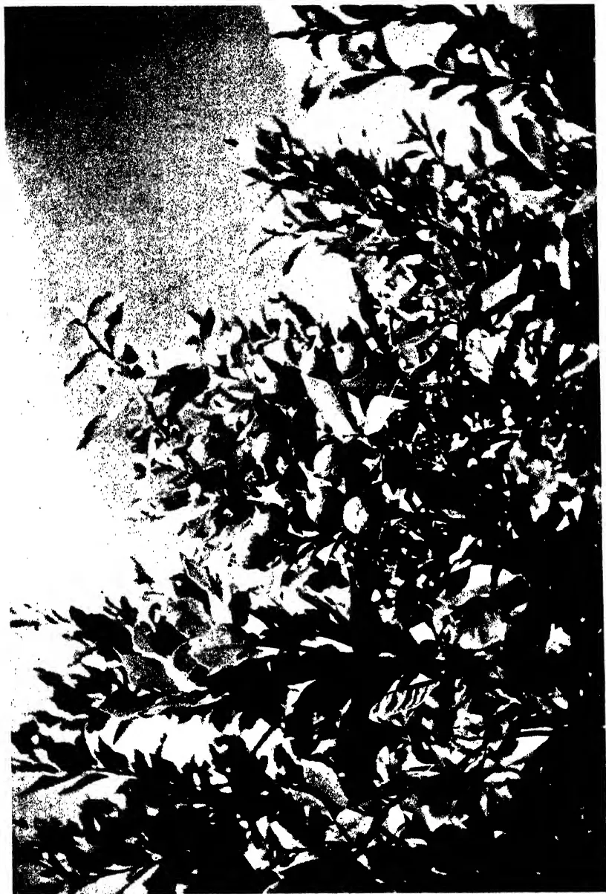A high-contrast black and white photograph of a lemon tree branch. The branch is densely covered with small, oval-shaped leaves and several round lemons. The lighting is harsh, creating deep shadows and bright highlights, which emphasizes the texture of the leaves and the smooth surface of the fruit. The background is a dark, textured gradient.

PLATE II.

IMPORTED SOUTH AFRICAN BUDGRAFT OF LEMON (GENOA VARIETY) GROWN AT UVA ORANGE FARM, DIYATELAWA.

642------------------------------------------------


643------------------------------------------------

131

soon after planting and have since then received a top dressing of sulphate of ammonia every six months and an yearly application of dolomitic lime and compost made of coir dust. Just before drought sets in, the main stem and lower branches are lime-washed with ordinary lime to which is added zinc sulphate at the rate of one tablespoonful per gallon of lime wash;

The trees average 9 feet 8 inches in height, and have a good spread of foliage, which is kept sprayed as a routine measure with Sulfinette, Kerala fish oil soap and nicotine sulphate (Black Leaf 40). They have already come into bearing and promise to be highly productive in years to come.

644------------------------------------------------

132

## A CHEAP AND EFFICIENT HONEY EXTRACTOR

V. E. DALPADADO,

ASSISTANT FARM SCHOOL OFFICER, WARIYAPOLA

**T**HE absence of a cheap device for the extraction of comb honey is a difficulty which confronts the village bee-keeper. The Martandam pattern honey extractor is too costly. It is also beyond the workmanship of the ordinary village blacksmith as two cog wheels are required in its construction; and these are expensive and difficult to procure.

It is the wish of the writer to popularize a cheap yet efficient extractor which costs about Re. 1 to make, and one which a villager with limited means could turn out.

The writer hopes that this inexpensive extractor will help not only the village bee-keeper to develop bee-keeping as a subsidiary home industry, but also the amateur bee-keeper who keeps bees as a hobby and for profit.

### THE PRINCIPAL PARTS OF THE EXTRACTOR AND THEIR CONSTRUCTION.

- (a) Bamboo Cistern.
- (b) Water-tight Bottom Plank.
- (c) Revolving Centre-piece.
- (d) Handle.

(a) *The Bamboo Cistern.*—The bamboo cistern is 14 inches long and 6 to 8 inches in diameter. The two edges of the cistern are sawn off evenly leaving two projections diametrically opposite to each other on the top edge of the cistern. The projections should be about 2 inches long and one inch broad. (Fig. I. A.A.) The handle is fixed on these two projections.

A water-tight base is fitted to the open bottom end of the cistern and nailed. (Fig. I. B.) Just flush with the bottom plank a hole,  $\frac{1}{2}$  inch in diameter, is bored in the container and a metal tubing about  $1\frac{1}{2}$  inches long is fixed. (Fig. I. C.) This serves as an outlet for the honey when extraction is in progress. Another hole of the same diameter is provided in the middle of one projection, (Fig. I. D.), and the twine required for revolving the centre-piece passes through this hole.

(b) *The Bottom Plank.*—This is made out of one inch thick plank. A small hole ( $\frac{1}{4}$  inch in diameter and  $\frac{1}{2}$  inch in depth) is made in its centre. The sides of the hole may be lined with a

645------------------------------------------------

A completely blank white page with no visible content, text, or markings.

646------------------------------------------------


Fig. IV. is a perspective view of a rectangular container. The container is constructed from a central axis, lateral planks, and perforated zinc sheets. The overall length is 9 1/2 inches, the width is 3 1/2 inches, and the height is 5 1/4 inches. A handle is attached to the top, and a bottom nail is shown. Labels include: HANDLE, L, K, NECK, NAIL, G, PERFORATED ZINC SHEETS, CENTRAL AXIS, LATERAL PLANK, and BOTTOM NAIL.

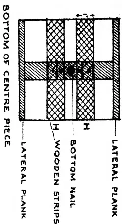

Fig. V. is a cross-sectional view of the bottom of the center piece. It shows a grid of lateral planks and bottom wooden strips. Labels include: LATERAL PLANK, H, BOTTOM NAIL, and WOODEN STRIPS.

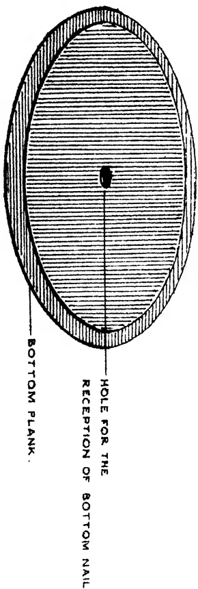

Fig. IV (continued) is a top-down view of the container. It shows an oval shape with a central hole for the bottom nail. Labels include: HOLE FOR THE RECEPTION OF THE BOTTOM NAIL and BOTTOM PLANK.

6 0 4 0 4

647------------------------------------------------


Fig. 1 is a perspective drawing of a bamboo pot assembly. The pot is cylindrical with vertical bamboo slats. It has a top handle and a central neck. A string is attached to the pot. Dimensions include a diameter of 6" - 8" d., a height of 12", and a neck projection of 2". Labels include HANDLE, PROJECTION, NECK, BAMBOO POT, BOTTOM PLANK, OUTLET, and C.

Fig. 1

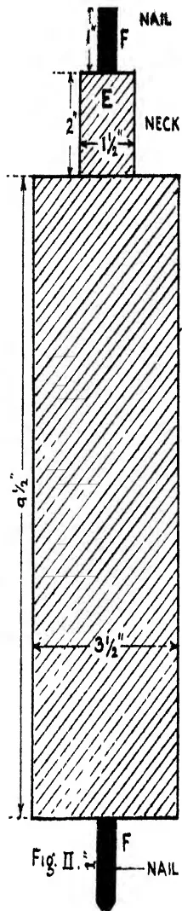

Fig. II is a side elevation drawing of the bamboo pot assembly. It shows the pot body, the neck, and the handle. Dimensions include a neck height of 2" and a neck width of 1 1/2". Labels include NECK, NAIL, and F.

Fig. II.

CENTRAL AXIS

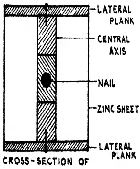

Fig. III is a cross-section of the centre-piece. It shows a central axis with a nail passing through it, flanked by lateral planks and a zinc sheet. Labels include LATERAL PLANK, CENTRAL AXIS, NAIL, and ZINC SHEET.

CROSS-SECTION OF CENTRE-PIECE

Fig. III.

648------------------------------------------------

A completely blank white page with no visible content, text, or markings.

649------------------------------------------------

133

thin sheet of metal to prevent wear and tear. (Fig. IV. H.). This is not necessary if hard wood like Huri-mara is used for the bottom plank. This hole is meant to receive the bottom nail of the centre-piece. The nail should fit loosely into the hole so that the centre-piece will revolve smoothly upon it.

(c) *The Revolving Centre-piece.*—This is made entirely out of any hard wood. The central axis (Fig. II.) is about  $9\frac{1}{2}$  inches long (without the neck) and  $3\frac{1}{2}$  inches broad, and is made from a half-inch plank. The neck is 2 inches long and  $1\frac{1}{2}$  inches broad and is situated on the top edge of the central axis. (Fig. II. E.) The twine for revolving the centre-piece is coiled round the neck.

Two headless nails each  $\frac{1}{4}$  inch in diameter and two inches long are driven, one, into the middle of the neck and vertically, and the other, into the bottom of the central axis, so that only one inch of the nail sticks out. (Fig. II. F.F.) The whole centre-piece revolves on these two nails.

Two lateral planks each  $9\frac{1}{2}$  inches long and  $3\frac{1}{2}$  inches broad are nailed down centrally, and at right angles to the central axis on either side. (Fig. III. Cross-section.) This will form two compartments on either side of the central axis. A piece of zinc sheet, with or without perforations, preferably the former, about one inch broad and 4 inches long is placed across, from the edge of one lateral plank to the edge of the other at the top and nailed down. Two more pieces are fixed similarly at the middle and at the bottom. (Fig. IV. G.G.G.) Three more zinc sheets are fixed likewise on the opposite side of the central axis. These sheets prevent the honey comb from breaking and also hold the comb-frame in position when extraction is in progress.

To prevent the comb-frames from slipping through the bottom when they are placed in the compartments for extraction, two strips of wood, each  $3\frac{1}{2}$  inches long, and  $\frac{1}{4}$  inch thick and one inch broad are nailed down at the middle, parallel to the lateral plank and on each side of the bottom nail. (Fig. V. H.H.)

(d) *Handle.*—This consists of a strip of wood,  $\frac{3}{4}$  inches thick and one inch broad and about the length of the external diameter of the bamboo container, i.e., 6 to 8 inches. (Fig. IV. K.). A small hole  $\frac{1}{4}$  inch in diameter is bored in its centre for the reception of the top nail of the centre-piece. (Fig. IV. L.) The top nail should fit this hole loosely so that the centre-piece will revolve smoothly. With a view to preventing wear and tear when extraction is in progress, it is advisable to line the hole with a thin sheet of metal. This is not absolutely necessary if hard wood is used. The top portion of the handle may be of any design to suit one's fancy. The handle is fixed in position.

650------------------------------------------------

134

on the two projections of the bamboo container with screw nails so that the centre-piece may be removed with ease for cleaning.

#### HOW TO ASSEMBLE THE PARTS OF THE EXTRACTOR

Place the centre-piece inside the bamboo container. The bottom nail of the centre-piece should fit into the hole in the bottom plank. Hold the centre-piece centrally in the container and fix on the handle. The top nail of the centre-piece should fit loosely into the hole provided in the handle. Revolve the centre-piece to see that it does not touch the sides of the container. Fix the handle to the two projections by means of screw nails. A piece of strong twine or cord about 3 feet long is tied to the neck of the centre-piece and coiled round it. The free end of the twine is passed through the hole provided in one of the projections to which the handle is fixed. Now the extractor is ready for use.

#### MODUS OPERANDI

After removing the cell-caps from the honey comb in the frames by passing a knife dipped into hot water, place the two frames one in each of the two compartments in the centre-piece. (Fig. I.M.M.). The twine is wound round the neck of the centre-piece and the free end passed through the hole in the projection. Pull the twine firmly and release immediately. This will set the centre-piece revolving at a fairly rapid speed. When it ceases to revolve, it will be noticed that all the honey from that side of the comb facing the wall of the container has been extracted by centrifugal action. Turn the comb-frames the other way round and repeat the process. All the extracted honey will flow out through the outlet in the container.

#### ACKNOWLEDGEMENTS

The writer wishes to record his thanks to Mr. H. A. Pieris, Agricultural Officer, North-Western Division, Wariapola, for the encouragement given him in the preparation of this article.

651------------------------------------------------

135

# HISTORY OF THE DEPARTMENT OF AGRICULTURE, CEYLON.

**S. C. FERNANDO, B.A. (Oxon), C.C.S.**  
*ADMINISTRATIVE SECRETARY*

## I. INTRODUCTORY.

**T**HE Department of Agriculture, as such, dates from 1912. Till then for nearly a century the Department of the Royal Botanic Gardens functioned virtually as an agricultural department. No other specific official organization can be traced at any period of the Island's long history. To explain this curious feature in a predominantly agricultural community some historical background is essential.

Britain was the first European Power to consolidate her rule over the whole Island, which she did from 1815 onwards. The Portuguese from mid-16th up to mid-17th and the Dutch from mid-17th up to the end of the 18th century held a rather precarious sway over the Maritime Provinces, often amounting to a little more than "garrison rule". Therefore though deeply interested in commercial export of spices like cinnamon to Europe, and at times of rice to other colonial possessions, these two Powers could leave little impression on agricultural *administration*; and the direction of agricultural pursuits remained fundamentally what it was under Sinhalese kings.

The ancient Village Community and the Headmen System were the two institutions that buttressed rural agriculture (the only type that mattered) for over 2,000 years, with feudal tenure as a social nexus and stimulus to cultivation. Government action was ever on the grand scale as with the magnificent irrigation works of Parakrama Bahu (1164-1197 A.D.) but details of administration were left largely to the local institutions.

"Tanks and water courses were repaired in common and combined labour collected the harvests".

It was also a time when

"Land was not the luxury of a few but the daily occupation and livelihood of the majority".

So long as Agriculture remained "subsistence" rather than "commercial" there was naturally not the same urge towards superior variety, grade or stock. Rents, dues and taxes were an adequate stimulus to cultivation. Export trade in food-stuffs no doubt existed under Sinhalese kings but the internal

652------------------------------------------------

136

economy of the country remained one mostly of barter : there was little commercial intercourse between self-contained villages except for commodities like salt. Besides, as we see in our own day, the cultivation of paddy and the chena crop (the antiquity of which is established by pre-Sinhalese Veddah legends) required no complicated "capitalistic" organization based on a cash nexus.

Mainly under consolidated British rule, with its stimulus to coffee, tea, cocoa, coconuts and rubber, commercial agriculture began to cut through the ancient structures of society. The individual began to assert himself against hard-baked custom to join the new race for wealth. Money circulated more freely and "native" trades like the arrack business were quickly stimulated. There arose a vast social and agrarian revolution : land became aggregated in large holdings, a new agricultural rich arose, and the commercial estate came to stay. Land, in the economic sense, had become the "luxury of a few".

Very soon therefore commercial agriculture began to present its own problems in the 19th century, and in the absence of a proper Department of Agriculture the Royal Botanic Gardens at Peradeniya, (established in 1822 for a less ambitious purpose) meant far more to estate agriculture than its title would indicate, and did all the pioneer and experimental work for "economic crops". Its international reputation, fostered largely by the calibre of the research and scientific staff it was able to attract from time to time, made a separate Department of Agriculture appear almost superfluous, at least in the eyes of those interested in plantation agriculture. Indeed, published reports and other documents would indicate that but for the rising and resurgent interest in village agriculture early in the 20th century (in which Governor Blake and Mr. John Ferguson, C.M.G., played a prominent part among Europeans) the establishment of a separate department would have been much longer delayed.

1899 brought agitation to a head and a commission was appointed "to inquire into and report on the advisability of establishing a Department of Agriculture".

Various memoranda were submitted to it, most of them, curiously, eulogizing existing organizations rather than appreciating the necessity for a new department. The Government Agents also emphasized their capacity and strength to look after the peasant. Although the Commission reported in favour of a new department the project fell through and remained in abeyance for 13 years.

The explanation for the failure is understandable. The Department of the Botanic Gardens (now with subsidiary gardens at Hakgala and Heneratgoda, and several branch gardens elsewhere) had become a true epitome of a department for all forms of estate agriculture, and it seemed all the more

653------------------------------------------------

137

an unnecessary duplication if not a superfluity to have a separate department to assist and advise plantations. At the same time some of the protagonists of village agriculture became half converted to the plea of possible superfluity in their own cause when a determined case was made on behalf of the Government Agent regime that

“the cultivator could not be raised by a department but only by the influence of the right sort of man placed in quasi-parental authority”.

To the credit of both sections however the cause of a new department did not fall without substantial result. The Department of Botanic Gardens redoubled its efforts to further justify its existence, and in 1902 the establishment of the Experiment Station at Gannoruwa was followed by the appointment of a Committee of Agricultural Experiments. Similarly under the patronage of Governor Blake the Agricultural Society was formed in 1904 to promote village agriculture.

In the wake of these efforts there grew a healthy parallel development which was to outlive for many years the actual establishment of the Department in 1912 to combine the ideals of both. The Botanic Gardens threw offshoots in the way of Entomologists, Chemists, and Mycologists (later to be absorbed in the new Department) and, preserving its original and essential features, exists to this day with the same international reputation. The Agricultural Society with a Board of Agriculture of its own as executive set up an admirable framework for village agriculture with field instructors as the backbone for Livestock, Education, Paddy Cultivation, Exhibitions, Apiculture and Sericulture. This provided the nucleus for the promotion of peasant agriculture in later days, and if this Society itself “withered away” by about 1924 it was solely because its active supporters were becoming enthusiastic non-official members on a reconstituted Board of Agriculture set up to assist the new Department in 1921.

Thus it happened that whereas the Survey Department dated from 1800, the Forest Department from 1883, and Veterinary from about 1900, the most predominant single interest of the Island contrived to be guided till 1912 by organizations, none of which in its own right could claim the exclusive title of a Department *for* Agriculture.

654------------------------------------------------

138SELECTED ARTICLESTHE BANANA\*

**F**OR a plantation site a north-easterly aspect well protected by a natural wind-break of mountains or timber on the western and southerly sides is regarded as the ideal situation. Easterly and south-easterly aspects may be used provided they also are well protected from cold winds. Too much attention cannot be given to the provision of wind-breaks. The leaves are the factories in which the plant's food is manufactured, and naturally the less they are damaged by wind or other agency the greater will be the amount of food available for the plant's use.

In the northern part of the State alluvial lands yield the best results, as growth throughout the year is even and fairly continuous.

PREPARATION OF THE LAND

The preliminary preparation of scrub land is confined to merely felling the timber at a suitable time—generally during winter—allowing it to dry for several months, and then burning off. Subsequently unburnt timber up to 12 inches in diameter is piled together and refired, the heavier logs being allowed to remain where they fell.

PLANNING AND PLANTING

In the south planting may be proceeded with from September to early March, though usually planting before the end of December is advisable in so far that the plants get a better start before the winter and fruit in a shorter time. Opinions vary as to the best month for planting to avoid having the main bunching during the period when short fruit known as "November dumps" are thrown. No definite rule can be laid down in the matter, as much depends on conditions existing in individual districts and the situation in which the plants are to be planted. Intending growers should ascertain the experiences of other growers in the district on the matter.

The land should be marked out at distances of 12 feet by 12 feet or 10 feet by 10 feet and holes about 12 inches deep and 18 to 24 inches across dug to receive the suckers. Various distances apart at which to set the plants have been advocated, but experience has proved that distances of 6 feet by 6 feet and 8 feet by 8 feet are not successful. Though 12 inches may be regarded as a safe guide to the depth of the holes at planting, the influence of the soil drainage and local conditions have an important bearing on the matter. Obviously, for instance, it would not be advisable to dig a deep hole in a soil with a heavy clay subsoil close to the surface, whilst in deep alluvial lands 18 to 20 inches would not be too great. When planting it is not necessary to completely refill the hole. The soil will gradually work in

---

\* Extracts from an article appearing in the *Queensland Agricultural Journal*, June, 1941

655------------------------------------------------

139

during cultivation and heavy rains. For practical purposes it is sufficient if the base of the plant is covered to a depth of 6 inches. Do not use the soil which has been dug out of the hole, but break down the surface soil from around the edges with a mattock, thus providing friable soil for the young roots to start in.

Too little attention has in the past years been paid by growers to the damaging effect of soil washing in hillside plantations. It is well worth the labour expended to provide terraces as frequently as possible across the hills. These may be built up of logs or stones between the rows of plants. Growers who have adopted this practice have cut larger size bunches and have considerably extended the period of productivity of their plantations. There is no reason to doubt that the comparatively short life of Southern Queensland plantations is often due to the loss of valuable top soil by erosion. The holding of this soil on the hillside, combined with proper cultivation and fertilizing, will add several years to the present recognised profitable life of banana plantations.

Green manuring for the combined purposes of reducing soil losses during the rainy season and to provide additional humus should also be given serious consideration by growers.

#### PLANTS

Planting is carried out by means of suckers (off shoots), bits, or butts. Suckers are most generally used on account of their availability and convenience for transport. Butts are rarely used and are not recommended, as they present a ready means of transferring beetle-borer to a new plantation. Bits are portions of old butts which have been chopped into pieces—each piece having one eye or bud from which a plant will develop. Very small suckers are not desirable. In no case should they be less than 3 inches in diameter through the corm. Care should also be taken not to obtain water suckers—*i.e.*, those which have thrown large leaves at an early age. The best suckers are those about 18 inches long, which taper from a well-developed base to a top of comparatively long, narrow, sword leaves. If such suckers have developed the first stages of full foliage and are desired as plants they should be cut off several inches above the corm after being dug. If used at a still later stage the stem should be cut off close to the corm and the centre gouged out to prevent further growth from that source. The butt will be found to contain several more or less developed buds or eyes distributed over its surface; these should also be gouged out and one only left to grow from around the base. Each plant should be carefully trimmed, the roots being cut close into their bases, and where there is any suspicion that the beetle-borer may be present the external covering should also be pared off.

#### CULTIVATION

Given fair conditions the young banana plant will require little attention for some time. Weed growth will sooner or later appear and should be immediately suppressed. On hillsides it is rarely possible to use horse implements, consequently hand-chipping and pulling the weeds must be resorted to. Spraying with various weedicides is practised by some growers, and with a suitable spray the practice has much to commend it provided cultivation is not altogether neglected. A plantation needs to be chipped at least

656------------------------------------------------

140

twice a year to ensure good results. There is one feature growers should never overlook, and that is that it is not possible to grow bananas and weeds at the one time with any degree of success, particularly whilst the banana plants are young. It is of the utmost importance to suppress all weeds in the early stages of the plants' growth.

### DESUCKERING

The right time to remove the unwanted suckers is when they first appear above the ground. The parent plant then does not waste energy building up suckers which have later to be destroyed.

Under average conditions the usual method has been to allow only one plant to grow for the first four months. Then allow the first follower to develop, preferably at the side. After another four months allow a second sucker to develop on the opposite side of the parent, and after a similar interval allow a third sucker to develop at the side of the first. If possible, never allow suckers to grow from the down hill side of the parent, as in a year or two, unless the soil is continually banked up around the plants, they will be growing on the top of the ground. For this reason also the suckers which are retained as followers should originate well down in the ground and not at soil level. After the third sucker has been allowed to develop allow the fourth sucker to come from the side of the second, and so on. By following this method of pruning one developed bunch only is permitted to hang on each stool at one time, and as the plant is putting its energy into the bunch it will be a good one and worth more than two or three smaller bunches. Furthermore, succeeding bunches follow in fairly regular order.

Some growers have the idea that no suckers should be removed from the parent until it has borne a bunch. Such is an entirely erroneous idea, and probably developed from the fact that suckers *intended for replanting* should only be taken from parents which have borne a bunch. If taken before, the suckers are soft and invariably produce a very poor first bunch.

In desuckering it is advisable to avoid injury to the roots of the parent plant as far as possible. The implement in use most favoured is the gouge made from a 3-feet piece of spring steel  $1\frac{1}{2}$  inch by  $\frac{1}{4}$  inch. About 15 inches of one end is hammered out, and the edges turned up and sharpened. This "blade" is tapered to a point of about half-an-inch across to facilitate its entry well into the corm of the sucker after the top has been severed, whilst the sharp curved edges make it easy to cut out a cone-shaped piece of plant and prevent further growth. The top of the gouge is generally fitted with a handle of  $\frac{1}{2}$  inch round iron for better leverage.

### THE ONE-BUNCH ONE-SUCKER SYSTEM

The great problem facing the banana grower is the production of first class fruit. Of recent years in many instances the sites for banana growing have shifted from the extremely fertile scrub soils to forest soils of varying fertility and aspect. The necessity of grubbing the forest soil and the use of fertilizers has considerably increased the cost of production, and unless a definite system of desuckering is carried out the production from this class of soil will not often be commercially profitable.

657------------------------------------------------

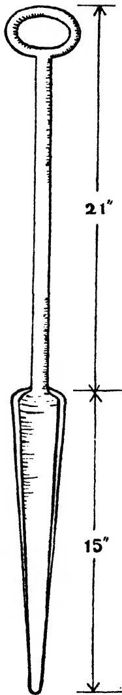A technical line drawing of a banana desuckering gouge. The tool consists of a long, thin handle with a circular loop at the top. The handle is marked with small vertical lines. Below the handle is a wider, tapered head that ends in a sharp point. To the right of the tool, a vertical dimension line with arrows at both ends indicates a total length of 21 inches. A horizontal crosshair marks the junction between the handle and the head, with a vertical dimension line below it indicating a length of 15 inches for the head.

**BANANA DESUCKERING  
GOUGE.**

658------------------------------------------------

A completely blank white page with no visible content, text, or markings.

659------------------------------------------------

141

A system of desuckering, which has been tried and proved in the Eumundi and Yandina districts and is locally known as the one-bunch one-sucker system, has as adherents, the principal growers. Growers who have carried out the system have had as much as 200 cases to the acre for the first cut off forest soil, and by the selection of the correct follower for the second and subsequent cuts have reached an average of 500 cases per acre during the life of the plantation.

The system really starts with the selection of the stock for planting, and in this connection well developed eyes with a portion of the corm adhering, and known as bits, are given first preference, and healthy suckers of more than 3 inches diameter are next best.-

The bits or suckers are planted in a hole dug to a depth of about 12 inches. It is advisable not to cover the plant with more than 3 to 6 inches of soil at the time of planting, thus preventing the corm from forming too near the surface. The distance apart should not be less than 10 feet by 10 feet.

Suckers are a popular form of stock, and in placing these in the holes the followers for the second and succeeding crops can in a big percentage of cases be definitely ascertained. The side of the sucker furthest away from the parent usually produces the correct follower, and the sucker should be placed with the correct side facing the direction from which it is desired the follower should grow. On very steep slopes a follower at the side is preferred for the reason that if allowed to grow on the top side the old corm when rotting allows the young plant to sag forward, whereas if on the side the ground helps to stay it. The maiden plant must be regularly desuckered *as soon as the suckers appear above the ground*, this operation being most important, having, as it does, a direct influence on the size and quality of the expected bunch.

Where a grower has had experience in a certain locality, the number of months required to throw a bunch can in most cases be used as a basis in determining the time when the follower is allowed to come. From observations of quite a number of seasons and other factors in North Coast districts, a period of approximately fourteen months is the usual time taken from planting to bunching. Using this with local data, followers can be left to insure the avoidance of fruit being thrown during November, as such fruit, having been formed in the plant in the winter, is usually unprofitable.

The most important factor governing the system is the selection of the correct first follower, and although some seasons make it somewhat hard, a careful observant grower can get at least 95 per cent. correct. On examining a banana plant with a number of suckers surrounding the butt, it will be found that the majority, and in some cases the whole, of the suckers are growing from eyes or buds that are in a circle at or near the soil level. These suckers are referred to as "sitters" and when allowed to develop into matured plants are sitting more or less on the surface with a root action that is superficial. *Such suckers are to be avoided as followers.*

Usually after the plant has made good growth and has been regularly desuckered, it forms one or perhaps more suckers that come from buds or eyes directly *below* the top layer of eyes and at least 5 inches lower in the soil: *these are the correct followers*, and if the injunction to place the suckers the

2—J. N. A 6049 (9/41)

660------------------------------------------------

142

correct way when planting has been carried out, by the time the bunch is thrown on the parent plant the grower will have a nice sturdy spear leaved follower of from 2 to 4 feet in height on the top or at the side according to the contour of the plantation. It is of the utmost importance that the follower is above ground *when the bunch is thrown on the parent plant.*

Once a grower has reached the stage of having his next year's follower correctly placed as regards position and time his main troubles are over, as it has been proved definitely that the third and succeeding correct followers, to the extent of 95 per cent., are true follows through, *i.e.*, in a direct line with the original plant and the first follower. The straight follow-through demands that the planter must ensure that the first follower does not grow on the down hill side or towards a fixed object such as a stump or astone.

The objectives of this system are the same as are aimed for in every other line of fruit production where pruning is resorted to for definite results. A desuckered banana plant enjoys a maximum of sunlight, available food and moisture, and must, when these and other essential factors are present, produce a superior article. In addition, a one-bunch one-sucker plantation can be regularly and effectively baited for beetle and offers facility for inspection for bunchy top and other diseases.

### THRASHING

By thrashing is meant the removal of dead leaves from around the stem of the plants. Carry out this work after the winter. The banana is a tropical plant and growing in Southern Queensland under semi-tropical conditions, the dead leaves provide a certain amount of warmth for the stem during the colder months.

661------------------------------------------------

143

## A SIMPLE METHOD OF BUDDING TUNG TREES\*

**T**HE advantages which are likely to be obtained from the budding of seedling stocks of tung trees (*Aleurites fordii* and *Aleurites montana*) with scions from selected high yielding mother trees were discussed in an article in the last issue of The Nyasaland Tea Association Quarterly Journal (Vol. 5, No. 2, pp. 6-10). It was pointed out that there is every promise that the plantations of such buddings will yield very considerably more than those established from unselected seed, but that budding is at present only in the experimental stage and no yield figures are yet available for clones in bearing. In the present article a simple method of budding is briefly described. Other methods have been adopted quite successfully with tung in other parts of the world, and no special advantages are claimed for that described here, but it is one which has already been found to be easy and successful in Nyasaland.

### 1. MATERIALS REQUIRED

The only materials required are a supply of waxed tape and a budding knife. It is not necessary to purchase a proper budding knife as any small penknife will do as long as it has a blade which will take a really keen edge right up to the point. If the work is to be done easily and efficiently it is essential that the knife should be really sharp. Prepared budding tape can be purchased from horticultural salesmen but it is cheaper to make it on the estate. Any kind of cheap calico or similar cloth is suitable for making the tape as long as it is not of too open a texture. The cheapest "grey sheeting" obtained from local stores has been found quite satisfactory. The cloth should be cut into strips about 6 or 8 inches wide by 24 inches long and the strips rolled up moderately tightly. The rolls are soaked for a few minutes in molten wax and then removed to cool, after which they can be cut across with a sharp knife at intervals of  $\frac{1}{2}$  or  $\frac{3}{4}$  inch, thus giving a number of waxed tapes each  $\frac{1}{2}$  or  $\frac{3}{4}$  inch by 24 inches long. Beeswax is suitable for waxing the tape, but it can be made much more adhesive if it is soaked in a mixture of beeswax (5 lb.), resin ( $\frac{3}{4}$  lb.), and linseed oil ( $\frac{1}{2}$  pint). This mixture should be boiled before use. Paraffin wax, either alone or mixed with a little petroleum jelly, also makes a satisfactory budding wax.

### 2. SELECTION OF STOCKS AND OF BUDWOOD

Strongly grown seedlings about one year old are best for budding, those of ideal size having a diameter of  $\frac{3}{4}$  to  $1\frac{1}{2}$  inches at a height of 3 inches above ground level. Any size of seedling from a diameter of  $\frac{1}{2}$  inch up to 4 inches can be budded but with very small or very large stocks the operation becomes

---

\*By C. C. Webster, B.Sc., A.I.C.T.A., in *Nyasaland Agricultural Quarterly Journal*, Vol. 1, No. 1, January, 1941.

662------------------------------------------------

144

more difficult owing to differences in bark thickness and curvature between stock and scion. It cannot be said at present whether it is desirable to raise stocks from selected seed but it is probable that healthy and vigorous growth is more important in a stock than any other characteristics which may be derived from the parent plant.

The selection of suitable budwood from high yielding trees is by no means an easy matter. It is desirable to obtain vigorous shoots of the previous season's growth, of over  $\frac{1}{2}$  inch in diameter, and containing well developed buds. Care must be taken that shoots selected for budwood do not merely contain leaf scars with no apparent bud above them. Good budwood is often very difficult to find on trees over six years old which are bearing heavily. Pollarding, *i.e.*, cutting back some of the strong secondary branches of the tree, will produce good strong sticks of budwood after a year's growth, but this is a rather wasteful procedure as it greatly reduces the cropping of the tree, and a better method of obtaining suitable material is by the use of multiplication nurseries which are mentioned below.

### 3. TIME OF BUDDING

Budding may be done at any time when the bark will peel readily from both the stock and the scion, which it will do throughout the growing season between September and March. For the following reasons, however, it is best to bud as soon as possible when growth has recommenced after the dormant season :

- (a) The budded plants have then the whole of the rainy season in which to grow.
- (b) When the work is done in September and October it is not likely to be held up by rain, whereas later, when the rains have broken, budding cannot be done on wet days.
- (c) In September and October other work is not as heavy as it is when the rains have started.

### 4. THE OPERATION OF BUDDING

It is advisable to insert the bud-patch well down at the base of the stock, only about an inch above ground level, as this will reduce any risk there may be of breakage by wind at the union of stock and scion. If the base of the stock is dirty with soil beaten up by rain it is as well to clean it before commencing to bud. A panel of bark is then cut on the stock by making two parallel vertical cuts, each about  $1\frac{1}{2}$  inches long and about  $\frac{1}{2}$  an inch apart, and joining them by a horizontal cut across the top. (F in diagram). These cuts should be made down to the wood. The stock is then left for the time being and a patch of bark, containing a bud, removed from the scion or bud-stick. This bud patch, when prepared, should be slightly smaller than the panel cut on the stock. It may be prepared in two ways.

- (a) Starting at least  $1\frac{1}{2}$  inches above the bud cut is made into the wood of the bud stick and continued downwards behind the bud for at least an inch below the leaf scar. When this has been done the bud, attached to its chip of wood can be removed from the shoot with a square cut across the bottom.

663------------------------------------------------

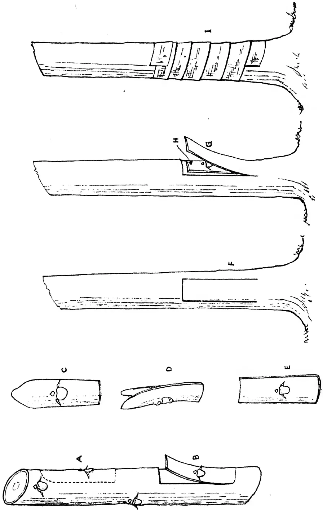

This botanical illustration depicts various methods of budding a tree trunk. The trunk is shown in longitudinal section, revealing its internal structure. The methods are labeled as follows:

- **A:** A bud is inserted into a slit made in the trunk's bark.
- **B:** A bud is inserted into a rectangular notch cut into the trunk.
- **C:** A bud is inserted into a small, pointed notch.
- **D:** A bud is inserted into a small, V-shaped notch.
- **E:** A bud is inserted into a rectangular notch.
- **F:** A bud is inserted into a rectangular notch.
- **G:** A bud is inserted into a V-shaped notch.
- **H:** A bud is inserted into a V-shaped notch.
- **I:** A bud is inserted into a rectangular notch.

The trunk is shown with its bark and internal wood layers. The buds are small, rounded structures with a central point of attachment.

BUDDING TUNG TREES.

664------------------------------------------------

This image is a blank white page. It contains several small, dark specks which appear to be scanning artifacts or dust particles. There is no text, handwriting, or printed content on the page.

665------------------------------------------------

145

(A in diagram). The patch of bark is then carefully loosened from the chip of wood and peeled away (C) and (D) after which it is trimmed up to a rectangular shape and to a size which will fit into the panel cut on the stock (E).

(b) Alternatively the patch of bark may be peeled directly off the bud stick without any adhering chip of wood. To do this two parallel vertical cuts are made through the bark of the stick on either side of the bud at slightly less than half an inch apart. These cuts are commenced  $1\frac{1}{4}$  inches above the bud and continued for the same distance below it, where they are joined by a horizontal cut. The blade of the knife is now inserted across the top of the vertical cuts, the bark gripped between the knife and the finger and the patch peeled gently downwards (B).

Having obtained the bud patch the flap of bark which has been cut on the stock is peeled downwards (G) and the bud patch inserted between the flap of bark and the wood of the stock. The flap of bark is then replaced in the position over the bud patch and binding is commenced. It should be begun with a firm turn at the bottom to hold the end of the tape and then continued spirally upward with a slight overlap. Binding should not be too tight over the middle of the bud patch, but should be finished off firmly above. The pointed end of the handle of the budding knife may then be pushed through the upper end of the tape into the bark of the stock to hold it in position.

In carrying out these operations two points must especially be remembered :

1. (1) When removing the bud patch from the scion it is essential to see that the whole of the bud is removed. If the patch is peeled off properly there will be a minute projecting peg on the inside of the bark behind the bud and a corresponding small hole in the wood. If there is a hole in the bark behind the bud the patch should be thrown away as it is useless.
2. (2) The inner surface and edges of the bud patch, and also the wood and cut edges of the bark on the stock, should not be handled or dirtied. This is important because handling these surfaces spoils the cells which will initiate the callus growth to join the patch on to the stock. The patch can easily be made larger than required and held, while inserting, by the upper end, which may afterwards be cut off.

It is necessary, of course, to put the bud patch in the right way up, *i.e.*, with the bud above the leaf scar.

After binding, the budding is left for 14 to 21 days before opening. With vigorous stock 14 days is usually long enough, but with small stocks or in very dry weather it may be advisable to leave it 3 weeks. The binding is then removed and the flap of stock bark stripped down and cut off at the bottom, when it will be found that the bud patch is firmly held to the stock by callus growth. If there is doubt as to whether the patch has "taken" a minute scratch should be made on it with the point of the knife which will show whether the tissue is green and living or brown and dead. A week or ten days after opening, the stock may be cut off with a clean sloping cut 3 or 4 inches above the bud patch in order to force the scion bud into growth. Other buds which may begin to grow out from the stock itself should, of course, be rubbed off. I have not found it necessary in Nyasaland to shade the

666------------------------------------------------

146

buddings at any stage. After cutting the stock the cut surface may be protected with tar or white lead paint, but this again has not been found necessary. When the budding has produced a strong shoot the dead "snag" of the stock above the union may be cut off.

## 5. BUDDING IN THE NURSERY OR IN THE FIELD

When establishing an area of budded trees the seedlings to be budded may either be (a) planted in their final positions in the field, allowed to grow big enough and then budded *in situ*, or, (b) raised and budded in a nursery and afterwards transplanted as budded stumps. When budding *in situ* by the method described above I have usually obtained from 97 to 100 per cent. of successful buddings, but the transplanting of budded stumps has not yet been tried, except on a very small scale, and therefore cannot confidently be recommended.

## 6. MULTIPLICATION NURSERIES

As already mentioned, it is not usually an easy matter to obtain good budwood from a high yielding tree over 6 or 8 years old; and where any quantity is required it is impossible to get it directly from the mother tree unless the latter is severely pruned and its yield of fruit consequently greatly reduced. Budwood may be readily multiplied, however, by budding on to seedling stocks in a nursery and subsequently allowing the seedling to grow *in situ* for a year. Such buddings will produce in a season's growth strong sticks of budwood containing anything from 25 to 50 buds each. If this shoot is then cut off and used for budding, the stump of scion left behind will again grow out and produce more budwood the following year. Seedlings for budding in a multiplication nursery should preferably be planted from 3 to 5 feet apart, and good treatment in the way of cultivation and manuring will, of course, increase the amount of budwood produced.

667------------------------------------------------

147

## PRODUCE CLEAN GRAPEFRUIT AND ORANGES\*

### DISFIGUREMENT OF FRUIT BY MECHANICAL INJURIES

**F**RUIT grown on trees exposed to the wind is often found to be scarred, resulting from bruises caused by their rubbing together or against the branches of the trees. While it is impossible to eliminate entirely injury of this nature, the establishment of wind-breaks will be found to reduce the losses in great measure.

Injury often results from the carelessness of labourers in the field and from lack of supervision. The inadvertent stroke of the cutlass is at once obvious, but the considerable damage caused by the workmen and supervisors rubbing against the fruit during its period of growth, which is the cause of permanent disfigurement, is not evident until later. *Great care should therefore be taken that rubbing against the tree is avoided from the time it begins to flower.*

### STAINS AND BLEMISHES ON FRUIT CAUSED BY PESTS AND DISEASES.

#### Russetting

"Russetting" is a common form of disfigurement of oranges and grapefruit in Trinidad and is a major cause of rejection of fruit intended for export. Russet fruit may show discolouration of several different kinds. The most usual is a more or less uniform browning at the rind, over the whole or part of its surface; the colour of the stain, however, may vary from grey, through various shades of brown, to almost black. In some cases, the injury takes the form of "tear staining", when the stain runs in conspicuous streaks down the fruit. Russetting of citrus fruit cannot be removed by washing and polishing and must therefore be prevented by proper treatment in the field.

#### Cause of Russetting

The cause of this injury is an extremely small mite, practically invisible to the naked eye, but plainly discernible with the aid of a hand magnifier of medium power: it is of an elongated oval shape and pale yellow in colour. The period of development is short, adults developing in about 10 days after the eggs are laid. On this account, a very few mites can give rise to enormous populations in the space of a few weeks when conditions are favourable for their reproduction, which is greatest during periods of dry weather.

Russetting of fruit takes place as a consequence of the feeding activities of the mites. They feed upon the oil in the rind of green fruit and in the surface of the leaves; the discolouration of the fruit is due to the drying up of the external cells and to the presence of oil on the rind, which becomes dark brown on exposure to the air.

---

\* By A. Pickles and F. M. Bain in the *Proceedings of the Agricultural Society of Trinidad and Tobago* for the quarter ending December, 1940.

668------------------------------------------------

148

Although the fruit is most unattractive in appearance, the edible properties are not usually affected by russetting, but sometimes the fruit is rendered dry and spongy. Leaves which are affected by the mite lose their gloss and become slightly curled, but this effect is not serious. The presence of a large population of mites on the leaves, however, is certain to lead to attack of the fruits in due course.

#### Prevention and Control of Russetting

Discolouration of citrus fruit by rust mite can only be avoided by spraying or dusting the trees in the field at the correct time. Plantations, where the trouble is known to occur, should be examined towards the end of the dry before the main flowering occurs and, if numerous mites are discovered, the trees should be sprayed or dusted according to the directions given below, just after the fruit is set. *When the fruit is already discoloured, no treatment is of any avail.* The trees should be examined again at intervals until the fruit begins to colour and spraying or dusting should be repeated if the mites again become numerous.

Rust mite is readily controlled by spraying or dusting with one or other of the sulphur preparations described below.

##### (a) Sulphur Dust.

Dusting with finely powdered sulphur is the cheapest method of control but, as the equipment necessary is rather expensive in first cost, this method is one for the large producer. Specially prepared dusting sulphur, very finely pulverized, should be applied to the trees with a dusting machine which may be operated by hand or power. According to size and mode of operation, such machine may cost from about twenty dollars to four or five hundred dollars. Dusting sulphur costs about 3¢ per lb. in Trinidad and a fully grown grapefruit tree will require an application of about half a pound. Treatment with a small motor-driven machine at St. Augustine Experiment Station costs about 2½¢ per tree for labour, materials and depreciation.

##### (b) Lime-Sulphur Spray.

Lime-Sulphur spray is more of general utility to the citrus grower than sulphur dust, as it may be used for the control of a number of pests and diseases besides rust mite. It is more expensive in use than sulphur dust, however, and is troublesome to prepare. Full direction for its home manufacture may be obtained on application to the Department of Agriculture. Probably most planters would prefer to purchase ready-made lime sulphur, of which there are several reliable brands available. It is usually effective against rust mites when diluted with 80 to 100 parts of water. When used against other pests and diseases, the directions furnished by the makers should be followed.

Fully grown grapefruit trees require from 3 to 5 gallons of spray for complete coverage. The concentrated preparation may be obtained for a cost of about 80¢ per gallon and the total cost of spraying amounts to between 4¢ and 6¢ per tree, depending upon the size of the trees and the availability of a water supply.

669------------------------------------------------

149

(c) *Wettable Sulphur.*

Ordinary pulverized sulphur will not mix with water, but commercial preparations are available consisting of finely powdered sulphur incorporated with wetting agents. Such preparations are known as "wettable sulphur" and cost rather more than dusting sulphur. Wettable sulphur may be mixed with water and sprayed on to the trees but, more generally, the sulphur is used in conjunction with Bordeaux Mixture when spraying is also practised for scab control, or with oil emulsion when scale insects require attention (*see below*). Whatever liquid is used, five pounds of wettable sulphur should be added to forty gallons.

### SOOTY MOULD OR BLACK BLIGHT

Sooty mould is a black fungoid coating of the leaves and fruit. The fungus forms a "skin" dull black in colour when dry.

#### Cause of Sooty Mould or Black Blight

This affection of citrus fruit is a symptom, rather than a disease in itself and is only present when scale insects, mealy bugs, white flies, aphides or similar insects infest the tree. Such insects secrete a sweet fluid known as "honey dew" which, incidentally, is highly attractive to ants, and it is on this fluid that the sooty mould develops.

The presence of sooty mould definitely indicates that the tree is being seriously affected by scales, &c. Sooty mould itself is directly harmful to the trees; the coating over the leaves prevents the access of light and thus results in retarded growth, light flowering and reduced power to resist drought conditions; the fruit of affected trees is often smaller in size, definitely dirty in appearance and is more likely to decay in storage than in normal fruit.

#### Prevention and Control of Sooty Mould or Black Blight

Since fruit affected by sooty mould is particularly unattractive in appearance, it should be washed before being sent to a local market. Prevention and control in the field depend upon the eradication of scales and other insects which are responsible for the condition. This is best attained by spraying with an oil emulsion or with lime-sulphur. Recent work in the United States indicates that dusting with sulphur in the field removes sooty mould from leaves and fruit to a large extent and also tends to prevent or to delay its re-appearance. Whenever possible, however, control of the insects responsible is to be recommended.

### SCABBED FRUIT

#### Cause of Scabbed Fruit

Corky or scaly disfigurements of the rind of citrus fruits arise from a variety of causes, but the most serious injury of this description arises from a well defined group of fungus disease, of which the scab of sour orange is a familiar example. Disease closely allied to sour orange scab occur on king orange and grapefruit, causing serious disfigurement of the fruit and foliage. There is little evidence to show that the injuries to fruit and leaves impair the general health of the tree, but infected fruit is often so badly misshapen and scarred that it is useless for market.

670------------------------------------------------

150

### Prevention and Control of Grapefruit Scab

Spraying for the control of grapefruit scab is necessary, not only to save as much of the crop as possible, but also to restrict the spread of the disease. Experience in Trinidad and elsewhere indicates that a good measure of control of the disease can be obtained by spraying the trees with Bordeaux Mixture or with lime-sulphur. The former is generally found to be more effective, but is unfortunately often followed by an attack of scale insects.

For the control of scab, two applications of Bordeaux Mixture, or one of lime-sulphur and one of Bordeaux Mixture are to be recommended. The first application should be made about the end of April. The second application is to be made when the principal blossom flush appears; this is usually in June or July.

Scab, rust mite and scale can be controlled by combining Bordeaux Mixture with wettable sulphur or with oil emulsion.

For scab control, lime-sulphur should be used in greater concentration than when used against rust mite alone. Dilution of stock solution with 50 parts of water appears to be satisfactory.

### HOW TO PREPARE BORDEAUX MIXTURE

The method of preparing Bordeaux Mixture is as follows:—

<table>
<tr>
<td>Copper sulphate</td>
<td>..</td>
<td>..</td>
<td>..</td>
<td>4 lb.</td>
</tr>
<tr>
<td>Temper lime</td>
<td>..</td>
<td>..</td>
<td>..</td>
<td>4 lb.</td>
</tr>
<tr>
<td>Water</td>
<td>..</td>
<td>..</td>
<td>..</td>
<td>40 gallons</td>
</tr>
</table>

Slake the lime in a wooden tub by *moistening* it from time to time with a little water. Meanwhile, tie up the copper sulphate in a cloth bag and suspend it over 10 to 20 gallons of water in a second barrel, so that the bag just touches the water. When the lime is slaked and the copper sulphate is dissolved, stir the lime up with the remaining water and pour into it the copper sulphate solution, with constant stirring.

### DAMAGE CAUSED BY SCALE INSECTS

A large proportion of the citrus fruit received at the packing shed is disfigured by scale insects. Excessive injury by them is usually an indication that the trees are too much exposed to the wind. Injury frequently occurs where two fruits touch in the bunch on the tree. More serious attack sometimes occurs when fruit remains on the tree for a considerable time after ripening, resulting in disfigured fruit with a coarse rind and dry interior.

Most of the fruit produced in the Colony would undoubtedly benefit from an application of oil emulsion or lime sulphur to reduce scale damage, and the plantations should be inspected periodically and the necessary work undertaken if the attack of scales is at all heavy.

### CONCLUSION

It is confidently hoped that all growers will co-operate in an effort to produce clean fruit, both for the local and export markets. It is a matter of financial importance to the individual grower and one upon which the successful future of the orange and grapefruit industry may largely depend.

671------------------------------------------------

151

## THE ARTIFICIAL INCUBATION, BROODING AND REARING OF CHICKENS\*

**E**VERYONE engaged in poultry farming is confronted with the problem of raising young stock. The pivot point on which the success of the poultry farmer turns is his ability to renew the laying flocks satisfactorily each year. The profitable period of a fowl's life is so short that it is necessary to raise stock for the laying pens every year, and the beginner finds this to be the most difficult part of the whole business, while success in this direction is most important. It is attained only by the intelligent application of correct methods. If the incubation, brooding and rearing of chickens are not carried out under such conditions as will produce and maintain both growth and good constitutional qualities the mature stock will fail to produce or earn more than a nominal profit. A set-back during the life of the chicks may adversely affect their stamina, and the progeny of such stock, if raised under similar conditions, will be less valuable than the parents. With such deterioration the flock would become unprofitable in two or three generations. On the other hand chicks from good stock, if given intelligent care and surrounded with the essentials required for proper growth and robust development, would mature into poultry capable of returning to their owner the last farthing in payment for the food and accommodation provided. Good methods and well grown mature stock increase the productive efficiency of succeeding generations and successful poultry farming is appreciably maintained.

The chick hatched for the market must make rapid gains. To do this in the shortest time assures the greatest profit, and the conditions and methods of rearing in some respects are artificial. The chick destined for the laying house, however, must be allowed to grow steadily without any set-back and more natural conditions might be approximated with a view to raising stock robust in constitution. The young birds will then withstand the strain of consistent egg production, which is necessary to produce the results that counts.

The building up of a strain of fowls involves something more important than the selection of standard requirements or prolific egg production, namely, breeding for health and constitutional fitness. Those who are successful in the business on a large scale have learned by experience that it pays to select only healthy vigorous stock for breeding. Unless inherent these qualities are less likely to be transmitted to the chicks, whereas constitutional defects may be reflected in several generations, with a tendency to increase rather than lessen in a given strain. The brooding stock should be sound in health and not too closely inbred.

---

\* By H. G. Wheeldon, Poultry Officer, in *The Rhodesia Agricultural Journal*, September, 1941.

672------------------------------------------------

152

*The Breeding Stock.*—Select the breeding stock for health and constitutional qualities, then for desired qualities in other respects. Choose only the best for the breeding pens, even if a few birds only are used, and pen them with a view to off-setting minor physical defects by mating birds that are strong where the others show weakness. When the individual birds have been selected and penned according to ancestry, then house, manage and feed them with a view to maintaining health and profitable returns. Their requirements must be met and regular supervision is necessary. A comfortable shelter when needed from the rays of the sun and during wet weather; a fair variety of wholesome food; clean drinking water; always *a liberal supply of green food*, and suitably ventilated houses without draughts are the important essentials.

It is not sufficient to exercise reasonable care with the breeding stock alone, the careful handling of the eggs before incubation, during incubation, and the management of the chicks to maturity are of equal importance. It is upon the common sense application of their requirements that the success of commercial poultry production depends. Lack of stamina is often the result of in-breeding, overcrowded quarters and unsuitable rations which undermine the constitution of chickens.

Assuming then that the breeding birds have been carefully selected, well housed and supplied with their normal requirements, the next point of importance is the proper care of the eggs for incubation; this is where many poultry farmers unconsciously go wrong. Careless methods of handling and storage of the eggs for incubation and during incubation impairs the hatchability. Probably more chicks are found dead in shell or are weakly after hatching as the result of wrong methods of handling them than from any other cause.

*Eggs for Hatching.*—Eggs intended for the incubator should be gathered once daily in cool weather and twice during the hot weather. Renew the nesting material often, handle the eggs with clean hands, place them in a clean receptacle, and keep them in a rack with small end downward, or if they are stored on their side, turn the eggs daily. Avoid excessive evaporation of the contents of the eggs by covering them with a cloth. The room in which they are kept should be fresh and cool, a temperature of about 60° F. is desirable. Wherever possible they should be used for incubation before they are ten days old, as the germ weakens with age. Prolonged exposure of the eggs to the temperature of 80° or 90°, or frequent warming and cooling before incubation, may destroy the germ or will surely result in a weak chick. Select only the best eggs for incubation. Uniformity in size, shape and shell texture are important and they should not be less than 2 oz. or above 2½ oz. in weight.

*Artificial Incubation.*—Artificial incubation may account for considerable losses, because the hatchability of eggs is so easily affected by machines carelessly operated or handled without sufficient knowledge of the work. It should be mentioned that with the modern systems of incubation good results are invariably obtained if the machines are managed with due care. There are various types and makes of incubators, such as moisture or tank machines and those embodying the hot air principle, each of which gives satisfactory results. Mammoth coal burning machines are available, and cabinet incubators embodying similar principles more recently introduced are heated

673------------------------------------------------

153

either by blue flame or electricity. It is necessary to understand thoroughly the operation and conditions most suitable for these incubators by following the printed instructions accompanying each machine.

In choosing an incubator be sure of obtaining one of sufficient capacity to meet requirements. It is much better during the initial stages to incubate fewer eggs in a machine with reasonable greater capacity than to have a surplus of good eggs for hatching with only a limited incubation capacity. There are disadvantages also in extending the incubation season over a period of several months for the renewal of the laying flock. Adequate incubator capacity would ensure a given number of chicks over a shorter period.

Incubation may be successfully carried out throughout the year, especially when ducklings and chickens are intended for table purposes. The most seasonable and profitable period for hatching chicks of the heavy and light breeds for the laying flock is during May to August.

The most important point to consider in providing suitable conditions for incubation are uniform temperature, adequate moisture and ventilation in the room and freedom from excessive vibration. It is important that the incubator be level on a solid foundation or platform and the room suitably ventilated and controlled to provide a steady replacement of the atmosphere without excessive draughts. Strong currents of air may be controlled in windy weather by inserting hessian covered frames in the open spaces provided for ventilation. The small type of incubator should be placed about one foot from the wall of the room.

After studying the instructions carefully and having set up the incubator under proper conditions, it should be operated without eggs for a few days, to become thoroughly acquainted with the details and adjustment to the regulating device. An even temperature of  $102^{\circ}$  to  $103^{\circ}$  in the egg chamber is required during the early stages of the incubation. The thermometers should be tested annually to make sure they are in order before incubation commences. The chief requirements in successful incubation are uniformity of temperature with adequate moisture and ventilation. It is advisable to fumigate the egg chamber with formalin after each hatch.

The possibility of disease during incubation can be minimized by fumigation of the egg chambers which is a desirable precaution also in the case of purchasing secondhand machines. For fumigation the ventilators should be plugged or strips of paper pasted over them, wet the interior of the compartments with water and then insert a saucer or shallow tin containing permanganate of potash crystals with double the amount of commercial formalin poured over the crystals; 1 oz. formalin to  $\frac{1}{2}$  oz. permanganate of potash would be sufficient for every 5 cubic feet internal measurements, close the machine and maintain its operating temperature for a few hours. After fumigation leave the machine open to air before placing in the eggs.

Having fumigated and thoroughly mastered the operation of the machine, and maintained a uniform temperature in the empty incubator, fill the trays. The eggs should be left for several hours to warm up when the temperature will automatically rise to about  $103^{\circ}$ . After 24 hours the eggs should be turned and aired, and this should be done at regular intervals throughout the period of incubation.

674------------------------------------------------

154

There are no infallible rules for operating an incubator. The amount of moisture and ventilation required, the manner of turning and cooling the eggs and other details cannot be definitely stated for all machines. These are subject to variation according to the type of incubator and climatic conditions. The mammoth machines and some of the smaller incubators are equipped with a turning device and printed instructions for their operation accompany each machine. The usual method of turning eggs by hand in small incubators is to remove the eggs in the centre of the tray to the side or end of the rows, and gently roll these at the sides to the centre of the tray. This method may be adopted for turning and cooling the eggs in the morning, but in the evening give each egg a quarter or half turn, then close the drawer without cooling them. As to the length of time the eggs might be left to cool, no hard and fast rule can be given, this must be left to the discretion of the operator. In hot weather, however, when the temperature of the incubator and the room tends to rise, the eggs may be cooled from five to fifteen minutes longer than under ordinary conditions, remembering always that during the last week of incubation eggs also require more air than they do during the first ten days. Under ordinary conditions the eggs are aired and cooled during the early stages of incubation sufficiently to give best results while they are being turned. A point of great importance is to turn the flame of the lamp very low during the time the eggs are being cooled. The embryo chick generates animal heat as soon as it commences to develop and the volume of warmth increases steadily during the period of incubation. This is the reason why the temperature usually rises during the last week or ten days, and it may be necessary to reduce the flame of the lamp very considerably or to readjust very carefully the regulator during this period. It is inadvisable to tamper with the regulating device during the hatch, but it must be done if after lowering the flame the temperature tends to rise above 105° F.

The normal periods of incubation are as follows:—Fowls, 21 days; domestic ducks, 28 days; muscovy, 35 days; geese, 28 days; turkey, 30 days; guinea fowl, 26 days; English pheasant, 26 days.

The eggs may be tested twice during the period of incubation, the first test on the seventh day and the second on the fourteenth day. At the first test remove all infertile eggs, broken yolks and dead germs. Mark those which may be doubtful and continue to incubate them until the second test. If they do not develop further by that time they should be removed, as well as all the other dead and weak germs and addled eggs. Turning of the eggs should be discontinued on the morning of the twentieth day or sooner if the chicks begin to hatch. On the morning of the twenty-first day gently remove empty shells and place the hatched chicks in the drying box, or as provided in some machines in the nursery trays, and allow them to dry off for twenty-four or thirty-six hours, when the chicks should be removed to the brooders. The brooders should be thoroughly cleaned and littered with grass. Fireless or cold brooders should be placed with the chicks in a sheltered sunny locality, taking care to provide shade when required. From this stage until a few days old the chicks will require frequent attention, and it is important to avoid excessive exposure during the early morning and evening to avoid chilling. The activities of the chicks will indicate plainer than words whether they are comfortable or not.

675------------------------------------------------

155

If crowding together and chirping, their usual requirement is warmth. Close observation and careful management will ensure good growth to marketable age or maturity of a large percentage of the chicks placed in the brooders after hatching.

*Artificial Brooding.*—Artificial brooding is comparatively simple when the requirements are thoroughly understood. Although constant attention and observation are necessary, any system other than artificial brooding in the case of chicks hatched and raised on a commercial basis would be too laborious and out of the question. The main object is to provide facilities for protection and to keep the chicks warm and comfortable during the early stages after hatching. They should be kept under control and provided with conditions to encourage good health and robust development. The care and attention given to chicks during the first few days, the critical period of their life, determines to a great extent their future value. The most satisfactory and economical types of brooders are generally those that are portable.

There are two types of artificial brooders, both of which have proved satisfactory and adaptable to the requirements of the poultry farmer for brooding chicks in either small or large units. They are the fireless or cold brooder (a misnomer) and heated brooders; the greatest essentials being efficiency, convenience, economy and safety.

*Fireless Brooders.*—The drawback with most brooding systems is the cost. The need of an efficient, convenient and economical means of brooding chicks in small units is a matter of importance to many poultry keepers, and for this purpose the fireless or cold-brooder is advocated. The outdoor colony brooder is easy to construct and handle. It affords the necessary protection from vermin and can be moved to fresh ground as often as may be necessary. The capacity of this brooder provides for 50 chicks without artificial heating. This system has been practised for a considerable number of years with satisfactory results in this Colony. Heated brooders are not necessary for brooding chicks in small units in warm localities. Suitable arrangements could be made to equip this brooder with a temporary heating device in the case of emergency when the chicks are to be removed from the incubator during a spell of cold cloudy weather. This requires careful attention, however, to avoid overheating the chicks and heating devices are not generally necessary.

The brooder must be thoroughly clean and the floor littered with grass or straw. The interior of the brooder chamber should be thickly lined with long grass on all sides to provide a fairly deep nest in which to brood the newly hatched chicks on removal from the incubators and at night. The hessian covered frame or hover is placed over the nest and pressed down to about one or two inches above the chicks in the nest. As the chicks require more room and ventilation so the nesting material should be reduced until only sufficient grass is left to round off the corners and support for the hover. The hover can be raised in this way as the chicks increase in size and finally removed when they are reasonably well feathered. This hardens them off before their transfer from the brooder at five to six weeks of age.

The chicks should be confined to the hover section most of the time during the first day or two, especially if the weather is unfavourable, the position of

676------------------------------------------------

156

the brooder should be adjusted periodically so as to admit the sun to the interior of the brooder all day if possible. From the third day they can be confined to the exercising apartment to a greater extent with access to the brood chamber as they require it and later allowed in the attached wire run. During the first two or three days when the chickens are confined to the hover section it must be lifted several times a day at regular intervals for feeding the chicks, but the chicks must be replaced under the hover after feeding before they become chilled. By frequent handling in this manner the chicks soon learn what is required of them, and may soon be trusted to take care of themselves when they require warmth. If they show any disposition to crowd or huddle together outside the brooder chamber at any time, place them under the hover to warm up. When they are a week old they may be allowed access to the wire run. A covering on top of the run is necessary for shade in the absence of shade from trees. Not more than fifty chicks should be placed in this type of brooder, as it is considered the maximum limit of safety. Care must be taken to keep the chicks warm and comfortable at all times, and to provide ample ventilation for them at night. Overcrowding under the hover with insufficient ventilation, especially at night, will definitely impair the vitality of the chicks and will lead to respiratory troubles, stunted growth and mortality. Overcrowding is as harmful as supplying unsatisfactory rations.

The chicks should be given the opportunity of exercising in quarters that are not too cramped. They should be provided with sufficient hopper space to allow easy access to the food and water at all times during the day. Sun and air the hover compartment daily when not in use, as well as the litter. The litter should be renewed as often as may be necessary, generally twice a week.

*Heated Brooders.*—Of the many types of heated brooders the oil burning, electrically heated and battery systems are probably the most commonly used, and to a less extent the hot water pipe system. There is also the flue system and coal burning brooder stoves for heating the entire apartment for brooding chicks. All these methods of providing warmth are giving satisfactory results. Heated brooders and apartments must be suitably ventilated.

They are as a rule centrally heated and in the case of brooder stoves the heat generated is greater than the chicks require. The room must be large enough to provide sufficient floor space to allow the chicks to regulate for themselves the distance from the heater or degree of warmth they require. The room should not be allowed to become stuffy and oppressive during the day through lack of ventilation. Such brooder apartments should be provided with facilities for ample ventilation during the day and to a less extent at night. The zones of heat varying in temperature on the floor level at night enable the chicks to choose the temperature most comfortable to them by spreading out on the floor of the room. The room temperature for battery brooders on a large scale may be automatically regulated and controlled.

The oil burning, electrically heated and hot water systems are generally adaptable to the hover or box and canopy design of brooder. They provide a minimum heating capacity to keep newly-hatched chicks warm and comfortable and are more practicable and economical for brooding chicks in units of moderate size. They meet, with practically no exception, all the requirements

677------------------------------------------------

157

laid down for satisfactory brooding and may be placed in any convenient building or in a brooder house designed and equipped for that purpose. Where brooding is undertaken on a large scale with heated brooders a special brooder house is necessary, which must be designed to fulfil the requirements of the heating system to be adopted.

*Brooder House.*—There are three types of brooder houses generally used for the successful rearing of chickens. They are :—

1. 1. The portable or colony house.
2. 2. A long permanent building subdivided into pens having either a built-in or portable heating system.
3. 3. Permanently built house for brooder stoves.

1. Colony brooder houses installed with a portable heating system should be made as large as can be moved conveniently. A house 10 ft. by 12 ft. should be the minimum for units of 300 chicks. A suitable size for units up to 500 chicks would be 14 ft. by 16 ft. A lean-to roof at least 6 ft. 6 in. in front and 5 ft. at the back should suit a house 12 ft. deep, and an uneven span or apex type of roof would be more satisfactory for a house which is 16 ft. deep, the height of the walls being 6 ft. and the roof at the apex 7 ft. 6 in. The house consists of a wooden frame with water-tight roof. The sides, back and front should be covered with wire netting, attached to the inside of the framework. The back wall and lower part of the sides and front should consist of some light weather-proof material, such as galvanized sheet iron, malthoid or rubberoid, &c. This should be 3 ft. high on the sides and front wall. The openings above this may be fitted with hinged wooden frames covered with fine hessian, hinged at the bottom to swing down on the outside of the house. These shutters may be closed for protection when necessary or opened for ventilation and to admit sunshine as may be required.

2. A brooder house constructed of bricks for built-in or portable heating systems should be 12 feet deep with a passage 3 feet wide along the interior of the back wall. The house should be subdivided by wire netting partitions 6 feet apart for units of 100 young chicks and subdivided into larger sections when the brooding of larger chicks is intended. A northern aspect is preferable. Outdoor wire runs should be provided to coincide with the internal subdivisions of the house. An open fronted house of this type can be operated successfully in some localities, but provision should be made to minimise ground draughts by solid dwarf partitions 12 inches high and with hinged cloth covered frames for closing the open front when desirable in cold weather. In cold climates the front of the house should be enclosed with glass windows to afford the protection necessary. In planning a brooder house, consideration must be given to convenience in attending to the chicks, inspecting the hovers, feeding and watering, disinfecting and cleaning.

3. For brooding chicks in large individual units proper facilities are required which entail the provision of equipment most suitable for this purpose. The types available would be heated battery brooders, and the canopy type of brooder stoves, or a combination of battery brooder with other systems deserve consideration. Battery brooders are compact and may be housed in almost any convenient room. A room suitable for a canopy coal burning

678------------------------------------------------

158

stove with a capacity for 1,200 chicks would be 25 or 30 feet long and 15 or 18 feet deep respectively, suitably enclosed in front. Runs at the back and front of the house should be provided for alternate use and with four exits or trapdoors in the walls to each run.

A system of battery brooding for large numbers of chicks immediately after hatching combined with other heated systems such as may be in existence, to be used for the chickens as they become stronger, would be of considerable advantage. Battery brooders electrically heated are reliable, economical in fuel and easy to operate. They are extremely useful during the early stages up to three weeks of age from hatching. They facilitate the safe handling of chickens in large numbers during their early life when the conditions required by them are definitely more exacting. As the chicks become stronger they are better able to fend for themselves and withstand the conditions on being transferred to the brooder houses such as those equipped with other heating devices in which the subdivision of chicks in smaller units is practised.

*Ventilation and Temperatures.*—The importance of adequate ventilation in the brooder house and brooders cannot be too strongly emphasized. Adequate ventilation of the brooder house itself does not necessarily ensure sufficient ventilation under the hovers, these must be provided with facilities to permit a free circulation of air.

With heated brooders the temperature is another important factor. Insufficient warmth induces crowding and is harmful; over-heating, due to lack of ventilation, causes sweating, resulting in respiratory troubles, which impair the vitality of the stock. These conditions are particularly observed under hovers equipped with strips of cloth or curtains that hang close to the floor and which restrict the circulation of air. When used the end of the cloth should be at least 2 inches from the floor. In operating such brooders additional ventilation and a reduction in the temperature as the chicks grow older must not be overlooked. At the start the temperature in the brooders should be 90° to 95°, and this should be gradually reduced to 65° at the end of the second week. Later the chicks should be brooded without artificial heat for a time before transferring them to outside quarters.

*Brooder Management.*—The brooder should be ready for the chicks at least two or three days before the chicks arrive. If it is a new brooder with regulating device make sure it is properly adjusted and that it works freely. The capacity of the brooder should not be exceeded. When too many chicks are brooded together proper control of the young stock and access to the food hoppers is not always possible. Do not attempt to brood chicks of different ages in the same flock under the same hover. The brooder house floor should be lightly covered with coarse clean sand for large heated brooders and only a section of the floor of the room partitioned off with boarding in which to place scratching litter such as chaff or cut grass to a depth of 2 inches.

With heated brooders the liberty of the chicks should be first restricted confining them within a reasonable radius from the hover by a temporary wire netting screen for the first few days. Advantage should be taken during this period to train the chicks to return independently to the hover for the warmth and protection they require. They will soon learn to take cover,

679------------------------------------------------

159

and as they become older and more independent they should be given more room to exercise, and after the end of the first week the whole of the floor space should be accessible to them. At this stage the chicks may be allowed out into the outside runs of the brooder house during fine weather. Observation is necessary on the first occasion, as they may not be able to find their way back into the brooder house. Sanitation and cleanliness under the hover and in the brooder house are very essential for health and the sturdy development of young stock. The brooder compartments should be thoroughly cleaned and disinfected after the removal of chickens.

Chickens at 5-6 weeks old are generally well feathered and they should be removed either to outside coops confined in pens, or reared under the colony system. On transferring them to their new quarters they will require some attention for several evenings to accustom them to their new surroundings. This attention would be amply repaid and is necessary to obviate overcrowding and possible mortality. They should be accommodated in units of 50 or a maximum of 100 chicks and separated according to sex. Perches are not necessary at this stage, but the floor of the house should be well littered and the corners rounded off with grass, or preferably with wire netting, to prevent corner crowding. As the chickens develop the accommodation should be increased or the number of chicks reduced according to the size of the coops in which they are accommodated.

*Feeding.*—The proper feeding and management of the young stock determines to a great extent their future value as breeders and layers.

Growing birds want variety, if for no other reason than to maintain their appetite, and there must be no stinting of food, although waste must be avoided. There is an axiom in the management of stock that the "feeding must be above the breeding" if improvement is to be obtained. While it is true that improved results would be secured by sound methods of feeding, it is equally true that still better results would be obtained by having the stock properly bred and properly fed. In this way the greatest return would be derived from a given amount of food.

The object of the poultry breeder to-day is to economise in almost every branch of his business, but there is one place where stinting is false economy, and that is in the supply of food. It is much better to hatch fewer birds and feed them well within one's means than try and raise a large number that may be under-nourished.

The successful feeding of chicks is not a difficult problem provided they are supplied with their natural requirements. Almost any wholesome nitrogenous ration made up of grain and grain by-products, green food and animal food given regularly is what they require in the way of food and they must always have access to clean water and grit.

The chicks will be ready for their first food 36 to 48 hours after hatching. It is necessary to bear in mind that the newly hatched chick, by absorption of the yolk of the egg just prior to emerging from the shell, has been provided by nature with sustenance for the first 48 hours after hatching. Feeding, therefore, too soon after hatching, is not only unnecessary but undesirable and may prove harmful.

680------------------------------------------------

160

The food should be given preferably when they have been removed from the incubator to the brooder. They should be provided with shallow vessels each containing dry mash, water and a little grit. Two or three pieces of straw may be allowed to float on the surface of the water, which the chicks will peck at, and soon learn to drink. At frequent intervals during the first two days their attention should be drawn to the food, either by tapping the food with the forefinger or by taking a pinch of the mash between the fingers and allowing it to sift down from a few inches above the food tray. By these simple means chicks can be taught to eat and will soon learn to care for themselves. A small quantity of pinhead oatmeal may be given twice a day as an additional feed during the morning and evening. From the third day a little munga or commercial chick food may be given in conjunction with the dry mash, substituting the oatmeal and feed at frequent and regular intervals during the course of the day.

The best results are obtained by the dry mash system of feeding, either combined with grain or fed as an "all-mash" ration without the use of grain. An all-mash ration simplifies feeding and the stock make greater gains in weight as a rule; when it is desired to feed grain with dry mash it can be done by substituting grain for portion of maize meal.

When the feeding of moist food is adopted, the mash should be mixed to a crumbly consistency with separated milk or warm water, and the chicks given only sufficient to be consumed in half an hour. The food left over after that time should be removed until the next feed. Moist mash may be fed in conjunction with dry mash as a regular system in the rearing of table birds. For stock that are intended for the laying and breeding pens, however, the mash in a moist state should be regarded as supplementary, especially for late hatched chicks and chicks that have gone off their feed or flagging. A moist mash as a change stimulates the appetite and encourages a greater consumption of food and maintains good growth and development. Grit and water are necessary at all times, and finely cut tender green vegetation must be given daily. Bone meal, lime and salt as a mineral mixture may be incorporated in the mash for all ages of growing stock. Separated milk, when available, is a desirable addition given either mixed with mash as a moist food or the curd given in separate receptacles. It is better to give the curd after draining off the whey when milk is supplied separately.

The grain mixture or munga should be fed in loose litter, which will induce the chicks to exercise by scratching for it. Feed the grains four times a day in small quantities at regular intervals for young chicks. As the chicks grow older accustom them to a larger range or run, placed with the brooder on grass covered ground. The site which has been set aside should be planted preferably with a permanent grass such as couch. This serves to sweeten the land during the off season and furnishes green pickings for the chicks and two or three cutting of grass of desirable length during the rainy season for use in the brooders.

When the chicks are eight weeks old give them a mixture of larger grain, such as cracked wheat or crushed mealies mixed with munga and small sunflower seed. By the time the chicks are six to eight weeks old the principal

681------------------------------------------------

161

dangers of chickenhood are past, and at this stage they may be removed or weaned from the brooder to suitable coops. The rearing can be continued in wire runs or by the colony system.

The chickens may, when old enough, be allowed free range under the colony system where they can have freedom under natural conditions, but they must be provided with nourishing food *ad lib.* to ensure steady, healthy, continuous growth. Guard against insect vermin and keep the coops clean and dry.

Chickens intended for laying or breeding purpose should be carefully selected when young, the first selection being made when they are eight weeks old. Separate all the cockerels and house them separately from the pullets. Those showing retarded growth should be separated from the more robust ones and placed in a pen for fattening. A regular practice of culling the young stock is advocated by which essential economies may be affected. The stock showing evidence of lack of stamina and the cockerels having standard defects should be drafted from time to time to the fattening pens for disposal.

Dry mash hoppers are of the greatest advantage in feeding poultry of all ages. By using hoppers for the dry mash, time and labour will be saved. This method of feeding is the cleanest, easiest and best way to feed poultry. The hoppers should be replenished daily, or in the case of self-filling hoppers less frequently, depending upon size of flock. The chickens should have access to the food all day and sufficient hopper space must be provided to enable all the chickens to feed comfortably without overcrowding and molesting each other. Double-sided hoppers are recommended 4 feet long for 100 chicks and an intermediate size for half-grown stock should be 6 feet long. The size of hopper accommodation required should be based on the equivalent of one inch per bird.

The value of green food throughout the whole year cannot be too strongly emphasized either in a fresh succulent form or supplied as leaf meal in the mash. Leaf meal may be soaked in water for an hour and fed to the birds after draining in place of succulent green food.

At the age of five months on reaching laying maturity they should be fed on a mash and grain mixture for adult stock.

There are so many grains and meals obtainable in Rhodesia which are suitable for feeding to poultry that a good ration may be made up to suit the poultry farmer from the variety of foodstuff available. The accompanying rations consist of foodstuffs that are generally easily available and have proved satisfactory. The digestibility, general analysis and palatability of the constituents are important and must be taken into consideration in compiling efficient rations. Other farm-grown foodstuffs may be substituted, but they have been found less palatable and more indigestible as a rule. To supply young stock with food that does not furnish the necessary nutritional requirements or that is not palatable and of good quality is wasteful or would seriously retard their growth. In the case of laying stock lowered productivity would be the result.

During the early stages the rate of growth of the chick is chiefly limited by its capacity for the consumption of food, and although there is at present no data available by which to determine the exact requirements of the chick for

682------------------------------------------------

162

protein and carbohydrates, it has been found there is little possibility of over-feeding a chick in its early stages of growth and that the food mixtures usually given to chicks during the early stages are deficient in protein.

The following ration based on these observations has given excellent results. The chickens grow and feather more quickly and the rearing mortality is reduced to a minimum.

With a view to simplifying chick rearing, the following ration was tested at the Salisbury Experiment Station, where it has since been used for a number of years in the rearing of light and heavy breeds of fowls. The results have proved so satisfactory that this ration can be recommended.

### CHICKEN REARING RATION. HATCHING TO MATURITY

<table>
<thead>
<tr>
<th colspan="5">Mash Mixture</th>
</tr>
</thead>
<tbody>
<tr>
<td>Bran</td>
<td>..</td>
<td>..</td>
<td>..</td>
<td>10 lb.</td>
</tr>
<tr>
<td>Pollard</td>
<td>..</td>
<td>..</td>
<td>..</td>
<td>17 lb.</td>
</tr>
<tr>
<td>Mealie Meal</td>
<td>..</td>
<td>..</td>
<td>..</td>
<td>45 lb.</td>
</tr>
<tr>
<td>Oats (rolled or meal)</td>
<td>..</td>
<td>..</td>
<td>..</td>
<td>10 lb.</td>
</tr>
<tr>
<td>Meat or Fish Meal (12 weeks)</td>
<td>..</td>
<td>..</td>
<td>..</td>
<td>10 lb.</td>
</tr>
<tr>
<td>Monkey Nut Cake (ext)</td>
<td>..</td>
<td>..</td>
<td>..</td>
<td>10 lb.</td>
</tr>
<tr>
<td>Milk, thick separated if available to 10 weeks (optional)</td>
<td>..</td>
<td>..</td>
<td>..</td>
<td></td>
</tr>
<tr>
<td>Bone Meal</td>
<td>..</td>
<td>..</td>
<td>..</td>
<td>2 lb.</td>
</tr>
<tr>
<td>Salt (fine)</td>
<td>..</td>
<td>..</td>
<td>..</td>
<td><math>\frac{1}{2}</math> lb.</td>
</tr>
<tr>
<td>Lime (limestone or powdered oyster shell)</td>
<td>..</td>
<td>..</td>
<td>..</td>
<td>1 lb.</td>
</tr>
<tr>
<td>Charcoal</td>
<td>..</td>
<td>..</td>
<td>..</td>
<td>1 lb.</td>
</tr>
</tbody>
</table>

### Grain Mixture—from 8 weeks

<table>
<tbody>
<tr>
<td>Crushed Maize</td>
<td>..</td>
<td>..</td>
<td>..</td>
<td>60 lb.</td>
</tr>
<tr>
<td>Munga</td>
<td>..</td>
<td>..</td>
<td>..</td>
<td>30 lb.</td>
</tr>
<tr>
<td>Sunflower Seed (optional)</td>
<td>..</td>
<td>..</td>
<td>..</td>
<td>10 lb.</td>
</tr>
</tbody>
</table>

The above mash may be fed alone during the early stages of growth, or in addition munga as a grain feed may be given from the first week to 8 weeks old, thereafter add crushed maize and small sunflower seed, the latter being optional.

From 12 weeks onwards omit meat or fishmeal, the other ingredients remaining the same.

When thick separated milk is available reduce the meat meal to 5 lb. In the event of oats being too costly substitute by increasing the maize meal and bran each by 5 lb.

A liberal supply of green food is essential for all ages of growing stock, especially when white maize is used. Part may be mixed for convenience in the mash in the form of lucerne or sunflower leaf meal in addition to succulent green food given daily.

*General Observation.*—The mortality of young chicks is not always due to disease and parasitic vermin; losses may occur from several other causes which are often overlooked and can be forestalled.

*Overcrowding and Chilling.*—The brooding chicks in quarters that are comparatively restricted is accompanied by some danger of overcrowding and suffocation. When the chicks are too cramped and without sufficient ventilation suffocation may result, particularly at night. Overcrowding occurs also outside the brooder during cloudy weather and chilling may result, such as when they are unable to find their way back to the brooder chamber; also

683------------------------------------------------

163

young chicks that are exposed too long at sunset or exposed too early in the morning may become chilled. It is particularly important to avoid possible chilling during the day and overcrowding at night when the chicks are very young.

Another source of danger arises in removal of the chickens from the brooders. During the first few nights careful observation would be well repaid, as they will crowd together especially in chilly weather, or they may not find their way back into the new quarters. If left outside overnight mortality will result. At this stage overhead protection placed about 2 feet above the floor, to take the place of the hover, and having the corners of the pens rounded off, are necessary precautions to avoid losses.

*Bowel Trouble.*—The derangement of the digestive system of young chicks is caused by a number of conditions including chilling, improper feeding, sun-warmed water, overheating or stale and inferior quality foods. Digestive disorders during the early stages of growth may be the result of feeding the chicks too soon after hatching or of allowing them access to moist mash that has fermented. Always supply clean water, fresh wholesome food and provide shade for the chicks and drinking water.

*Sanitation.*—Sanitation checks disease and must be regarded as one of the important considerations in successful chick rearing. Many common diseases and troubles of both old and young stock can be avoided by following sanitary principles. Proper sanitation means raising chicks on fresh ground, moving portable brooders from place to place at intervals, or in the case of permanent runs digging them over and growing a crop during the off season. Contaminated ground should be treated with lime during the rainy season. Renewing the litter in the brooders as often as necessary and consistent cleaning of utensils and disinfecting brooders after each lot of chicks are weaned are essential points in sanitation.

*Cannibalism or Toe Picking.*—This is frequently very difficult to deal with, and when an outbreak occurs every effort should be made to nip the trouble in the bud. As a rule one or two birds are the culprits and others simply join in the feast, and it is only by close observation that the ring-leaders may be detected, and if removed in time it is probable no further losses would occur.

Cannibalism is often associated with poor hatches and unthrifty stock. The latter may be brought about by too close confinement in the brooders and runs followed by monotony or by providing insufficient hopper accommodation. Under such conditions the tendency for the chicks to peck and bully and injure one another is greater. These are the most common causes of cannibalism, and the danger under these circumstances becomes a very real one.

Much of this trouble can be avoided by furnishing the chicks with proper nourishment and brooding them in smaller units. There should be no delay in culling the weak stock, separating the sexes and transferring them to larger quarters. Anything that can be done to keep them busy deserves consideration, such as encouraging them to forage about in the runs, the feeding of grain in litter and hanging up in the runs several bunches of green food within easy reach. These are methods to encourage scratching and exercise and in this way healthy chicks are produced.

684------------------------------------------------

164

## COMMON DISEASES OF YOUNG CALVES AND THEIR CONTROL IN INDIA\*

**T**HE cattle breeding and dairy industries annually suffer grave losses due to disease in young calves. Sufficient recognition has not hitherto been given in India to such losses, in which should be included not only fatalities among young calves which would have otherwise become valuable cows, bulls or bullocks, but also the cost of looking after the diseased calves, inability to replace animals that are cast from the herd each year, expense involved in purchasing fresh stock to keep up the strength of the herd and rearing of those calves which would in other countries have been disposed of as unprofitable. It is, therefore, of vital importance for the proper development of these industries in this country that losses on this account should be checked by keeping the diseases of young calves under control and to this end stock owners should take every opportunity to obtain the assistance of the Civil Veterinary Department.

At the Government Cattle Farm, Hissar, Punjab, where about 7,000 head of cattle are kept, including a dairy herd, these diseases have been observed to occur more frequently in the dairy calves than in those of the general herds. The diseases commonly encountered are white scour, navel-ill, pneumonia and ringworm. These as well as congenital blindness, rickeis, &c., which are due to vitamin or mineral deficiency in the diet, are also common in Indian villages and certain dairy farms where calves are reared under less favourable conditions.

Calves are very liable to contract hæmorrhagic septicæmia (*gulghotu* or *gholwa*) and blackquarter (*phatsari*) through grazing over infected areas, particularly during the rainy season, and it is therefore advisable that they should be protected with vaccine against such diseases before they are sent out to paddocks.

The diseases of young calves may be conveniently divided into bacterial, nutritional and parasitic.

### I.—BACTERIAL DISEASES

Bacterial diseases of young calves are mostly congenital, *i.e.*, infection occurs inside the uterus and the symptoms are manifested shortly after birth. In such cases the same organisms which cause trouble in the young can usually be isolated from the uterus of their dams. These infections may also take place after birth from external sources, and the earlier they appear in life the less are the chances of recovery.

\* By R. L. Kaure, B.V.Sc., M.R.C.V.S., Assistant Serologist, Imperial Veterinary Research Institute, Mukteswar, in the *Indian Journal of Veterinary Science and Animal Husbandry*, Vol. XI, Part II., June, 1941.

685------------------------------------------------

165

The saying "Prevention is better than cure" holds good in the control of congenital bacterial infections for which the following general measures of prevention are recommended, and they may advantageously be combined, in the event of actual outbreaks, with the curative measures to be described later under various diseases :—

1. Attention should be paid to the proper feeding and exercise of the herd and sanitation of the premises, as these factors have a great influence on the disease resistance of the herd and the production of healthy normal progeny.

2. The mating of parents with diseased sex organs should be avoided. Cows with an abnormal vaginal discharge or sires with infected genitals or temporarily sterile cows should not be used for breeding.

3. Cows should be dried six to eight weeks before they are likely to calve, in order to give them a chance to recover their health and vitality for the next parturition. They should be fed liberally on a well-balanced ration containing adequate proportions of minerals and vitamins. For the supply of the former, 3 to 4 ounces of bone-meal should be mixed daily with the concentrate ration to provide calcium and phosphorus. Small quantities of potassium iodide should also be added to provide iodine and rock salt to lick *ad libitum*. For the supply of vitamins green fodder should be provided throughout the year, if possible, and when required 2–4 ounces of cod liver oil may be added daily to the concentrate ration just before feeding.

4. Cows should be prepared for calving by clipping hair from the hind quarters and legs and by daily washing and cleaning the external genitals, tail, and hind quarters with an antiseptic lotion (e. g., 1 in 1,000 solution of potassium permanganate) for a few days before calving. When about to calve the cow should be moved to a clean stall which has been thoroughly disinfected previously.

5. The calf should be received on fresh and unsoiled straw and its umbilical cord should be immediately ligatured with carbolized twine about half an inch from the abdominal wall, cut with a sterilized pair of scissors and the stump dressed with a tincture of iodine followed in a few minutes by an application of Stockholm tar.

6. Every calf should be allowed the colostrum of its dam for at least a few days. Colostrum is the most natural food for the calf, and is endowed with laxative property. It is also rich in minerals and contains certain substances (antibodies) which act as a preventive against various infections.

7. When calves are weaned they should be fed often, but with small quantities of milk at body heat. If they are fed with a large quantity of milk at one time it forms a big clot in the stomach which causes gastric irritation. If a calf is to be fed on separated milk instead of whole milk, this should not be done until the calf is four weeks old and the change should be brought about gradually. The cream that has been removed by the separator may be substituted by giving 1–2 ounces of cod liver oil daily.

8. The dam's udder and feeding utensils should be kept clean in order to prevent infection taking place after birth through feeding. It is a good practice to scald the utensils thoroughly after cleaning.

686------------------------------------------------

166

9. Regular exercise out-of-doors is essential for calves in order to keep them fit and to prevent them from catching cold and pneumonia.

10. The calf pens should be built hygienically with concrete floors and be kept clean, properly drained and occasionally disinfected and white-washed.

11. If the calves are kept in small groups contagious diseases can be controlled more easily.

12. On infected farms the temperatures of all the new-born calves should be taken for at least 7 to 10 days from birth as in most of these congenital diseases the first indication is rise of temperature. Moreover, these diseases are more fatal to young calves, and the earlier these are detected the greater are the chances of their recovery with suitable treatment. Usually the normal calf is very active and vigorous and has a soft smooth coat. If it lies quietly or stands in a stupor or if the coat is rough, it may be taken that it is out-of-sorts and the source of the derangement should be ascertained.

13. The affected calves should be isolated immediately from the healthy and be provided with separate attendants. The premises and feeding utensils should be thoroughly disinfected. The healthy calves may be removed to fresh clean premises, preferably at a higher level.

14. The carcase of a calf that has died of any contagious disease should be either burnt or buried with lime six feet below the surface.

15. On the advice of a competent veterinary authority, calves born on farms infected with white scour or navel-ill may be given preventive inoculations against these diseases within a few days of the birth. Pregnant cows, especially those which habitually give birth to calves affected with these diseases, may also be similarly treated.

(i.) *Calf septicæmia*.—In this disease the calf is born sick and weak, is unable to get up, shows high temperature and usually dies within twelve to twenty-four hours or a little longer after birth. On *post-mortem* examination the heart, serous and mucous membranes show hæmorrhagic spots. The spleen may be slightly enlarged and congested. In such cases the dam usually has retained the placenta or shows symptoms of inflammation of the uterus and there may be a history of previous abortion or of the birth of a calf infected with navel-ill.

Very little can be done to save the calf affected with this disease. However, if possible, internal antiseptics and general stimulants such as a mixture of quinine sulphate (ten grains) sodium salicylate (thirty grains), potassium iodide (twenty grains) and aromatic spirits of ammonia (one drachm) in about two ounces of water may be given three or four times a day. A serum prepared against the organisms that are commonly encountered in such outbreaks may be used as a curative. General hygienic care and proper nursing may help the patient.

(ii.) *White scour*.—In this disease the calf shows a rise of temperature before manifesting scour and there is dullness, depression and disinclination for food. A few hours or a day later the faeces become thin and are of a yellowish or white colour with a foetid odour. The affected calf has a staring coat and cold limbs, is very weak and is unable to stand. When young calves get white scour, older calves may subsequently contract the infection from

687------------------------------------------------

167

them and an outbreak may result, but the younger calves are affected more seriously and the losses will be much greater than in the older calves. When the disease develops within a few hours of birth the calf may die within two days. In some cases there is a tendency for white scour gradually to merge into calf pneumonia.

If diarrhoea has not yet commenced and there is only a rise of temperature, isolate the affected calf, reduce the food and immediately inject subcutaneously 15 c.c. of the white scour serum available for the purpose, the injections being given every three hours for the first day. If the calf is very weak and shows lassitude, a pint of warm water containing one tea-spoonful of sodium bicarbonate and a drachm of aromatic ammonia may be given morning and evening an hour before feed. This will act as a stimulant and will counteract the over-acidity which is common in such cases. Salol or sodium salicylate or bismuth subnitrate in half to one drachm dose may be given three times a day with good results.

When diarrhoea occurs, discontinue the use of milk as an article of diet at once and substitute barley water at body heat. Sodium bicarbonate may be added. When barley water is not available, lime water to which a little wheat flour has been added may be used instead and it may be drenched, if necessary. The calf should be blanketed and kept in a clean, warm place. The extremities may be hand-rubbed and bandaged. About 30 c.c. of the white scour serum may be given intravenously.

(iii.) *Calf pneumonia*.—In this disease, which may accompany or follow white scour, there is fever, nasal discharge, hacking cough and laboured breathing. The calf may be unable to rise and may develop dropsy of the dependent parts. Usually both lungs are found to be affected and on *post-mortem* examination they may present a marbled appearance with thickened interlobular septa. In older calves the condition may become chronic with abscess formation in the lung.

In this disease the calf should be blanketed and kept in a clean, warm place and its extremities hand-rubbed and bandaged. Preventive inoculations with hæmorrhagic septicæmia serum is indicated in such cases, because generally the organism of this disease is prevalent in those herds where pneumonic symptoms predominate. Good results are likely to be obtained from the application of a mild mustard plaster or a stimulating liniment to the chest wall and from the use of medicated inhalations, *e.g.*, carbolic acid or eucalyptus, and general stimulants and internal antiseptics such as those recommended under calf septicaemia.

(iv.) *Navel-ill*.—In this disease, which is mostly congenital, the navel, may be somewhat swollen with a foul-smelling discharge. There is fever, lassitude and weakness and the calf may remain lying down. Infection from the navel may extend to the liver and also to the various joints and these may form suitable sites for the propagation of bacteria. The affected joints become swollen, hot, tense and painful and there is marked lameness.

When the joints have become affected, curative treatment is far from satisfactory. When synovial sheaths alone are affected, it is comparatively easy to treat. In the first instance the umbilicus should be carefully examined.

688------------------------------------------------

168

If there is an abscess it should be opened in a place where there are no other animals and the evacuated pus should be carefully disposed of in order to prevent the spread of infection. The abscess cavity should then be irrigated with a disinfectant lotion, followed by a dressing consisting of equal parts of carbolic acid and glycerine, and subsequently treated daily with milder dressings such as  $2\frac{1}{2}$  per cent. carbolic lotion or tincture of iodine till the wound is healed. When there is an abscess in the region of a joint, it should be opened, evacuated, irrigated with a disinfectant lotion followed by an injection of clove oil into the wound which should then be bandaged. If the abscess involves the joint proper and it has reached the stage of purulent arthritis, treatment is rarely worth while. In the case of non-suppurating inflammation of the joint, a weak biniodide of mercury blister or a mixture of liniment camphor co. (one part), liniment belladona (two parts) and liniment saponis (three parts) may be applied locally. Stimulants and internal antiseptics may be administered, *e.g.*, 1 to 2 drachms of aromatic spirits of ammonia and  $\frac{1}{2}$  to 1 drachm of salol in about two ounces of water, thrice daily. Calcium sulphide in 15 grains dose mixed with simple syrup may be given thrice daily as it has been found to be good in all pyaemic conditions.

(v.) *Calf diphtheria*.—This is another contagious bacterial disease of young calves but the infection in this case is acquired after birth. It is characterized in its course by diphtheritic inflammation of the mucous membrane of the mouth, from where it may extend further. Generally the disease is confined to such farms or premises where calves are reared under insanitary conditions. It is quite distinct from human diphtheria and is usually conveyed through unclean milk pails and feeding utensils. The organism of the disease remains alive for a considerable period in sheds and is therefore easily transmitted to healthy calves. Poorly fed calves are most susceptible and the disease is more common among pail-fed calves during early spring and late autumn months when the weather is changing and is rather cold. Infection is facilitated by the eruption of teeth which causes injuries to the mucous membranes of the mouth.

In an outbreak, the majority of calves become affected, weak and poorly nourished calves being usually the first to be attacked. The affected calves show a rise of temperature, unthriftiness, impaired appetite, salivation, coughing, dirty-yellow nasal discharge and red granulating ulcers and yellow patches on the mucous membrane of the lips, gums and inside the mouth. These mouth lesions bleed easily and make it difficult for the affected calf to pick up solid food. The infection may spread to the intestine and lungs. The bowels may become irregular, with a tendency to diarrhoea, and in some cases pneumonia develops and increases the mortality. Severe cases die in three to five days whereas mild cases may recover with suitable treatment in about three to four weeks but the animals' growth remains stunted. On *post-mortem* examination the yellow patches and ulcers referred to above may be found to have extended to the pharynx, nasal cavity, larynx, lungs and liver and at other times in the intestine.

For the control of this disease milk pails, feeding utensils or troughs should be examined in order to determine the source of infection. One should be particularly suspicious about those that are made of wood. All such utensils

689------------------------------------------------

169

or troughs should be thoroughly scalded. The calves should be examined and those affected should be isolated and kept in a clean, warm place. The premises should be thoroughly disinfected. The mouth lesions should be cleaned with 1 in 1000 solution of potassium permanganate and the yellow patches may be curetted. Tincture of iodine may then be painted over the lesions. Before feeding, the milk should be warmed and about half a drachm of potassium chlorate for each calf should be dissolved in it. Internal antiseptics and stimulants, *e. g.*, salol ( $\frac{1}{2}$  drachm), sodium salicylate ( $\frac{1}{2}$  drachm) and aromatic spirits of ammonia (1 drachm) in about two ounces of water may be given to the calves two or three times a day. In order to keep up the vitality of the patient, artificial feeding with whole milk and eggs may have to be resorted to in some cases.

## II.—NUTRITIONAL DISEASES

In new-born calves there occur a number of diseases which are the result of feeding cows in deficient and unbalanced diet, especially during pregnancy. Of these, mention may be made of congenital blindness, pica and rickets. Nutritional deficiency in the cow is reflected in the calf during its foetal development and while on milk. Such a deficiency in the dam may also result in abortion, or the birth of a dead calf, of a weak and under-sized calf that may die soon after birth. Even those calves that are born normally to such dams, and are apparently healthy, possess a greatly lowered resistance to disease. All these pathological conditions are very difficult to cure but they can be easily prevented by feeding cows on diets containing suitable proportions of vitamins and minerals.

Although goitre, which is prevalent in other species of animals, is not so far known to affect calves in India, nevertheless it is liable to occur chiefly in places that are awl~~y~~ from the sea at high altitudes and around large lakes where the soil and water are deficient in iodine and its occurrence in such areas can be easily prevented by using iodized salt licks or by occasional administration of potassium iodide in small quantities in their diet.

(i.) *Congenital blindness.*—It would appear that the condition is especially widespread in the Indus valley, certain parts of the Punjab and Delhi where green fodder is not included in the diet of cattle for a considerable period during the year. It is also of interest that night blindness, which is reported to disappear on feeding fresh green fodder, is prevalent in these areas. The disease becomes much more serious in those herds where intensive methods of breeding and milk production are practised because under these conditions any nutritional defect brought about by lack of vitamins or minerals in the diet becomes more pronounced. In such herds, the incidence of congenital blindness may be as high as 30 per cent. or more. It has been observed that cows which have had intermittent periods of sterility do not produce blind calves. Such sterility prevents the depletion of the mineral and vitamin reserves of their bodies by frequent pregnancies and thus enables them to deliver normal calves occasionally.

The calves may be born blind of one or both eyes or the sight may be only impaired at birth and complete blindness may follow gradually. In most cases the blind calves do not show any apparent pathological condition of

690------------------------------------------------

170

the eyes, and these outwardly appear to be perfectly normal. In such cases degenerative changes are usually found in the optic nerves. However, in some cases the cornea and other structures of the eye may show inflammatory changes followed by an opacity in the eye. Sometimes these calves also develop convulsive fits which may be associated with vitamin A deficiency.

The occurrence of congenital blindness in calves can be successfully prevented by including green fodder or two or four ounces of cod-liver oil in the daily ration of cows especially during pregnancy.

(ii.) *Pica*.—A large quantity of calcium and phosphorus is required for growth of the foetus inside the uterus and a similar quantity is also passed out from the cow's body in the milk. She, therefore, requires plenty of these minerals in her food during pregnancy and the lactation period in order to cope with this demand and to make up any losses in the bones which act as body reserves for these minerals. If the demand on these body reserves is too large and the losses are not made good, the cow as well as her milk yield suffers, and the calves may be born weak or dead. Such cows may even fail to breed or may abort. Calves require plenty of calcium and phosphorus for bone development and it is, therefore, essential to provide them with a sufficient quantity of these minerals in the diet. If by any means calves suffer from a lack of phosphorus they generally develop pica. It may also be caused by an insufficiency of sodium salts.

Affected calves have a tendency to lick and to gnaw almost any foreign object which they come across, *e. g.*, wood, earth, soiled litter and even excreta. Their appetite for normal food is very capricious. They become uneasy and depressed and lose condition. They show intermittent tympany and irregular bowels. If left untreated they become thin and wasted and die from malnutrition and exhaustion after a period of suffering which may last for several months. They lick one another and by so doing considerable quantity of hair may accumulate in the rumen, the constant movement of which may convert it into a ball or a short cylinder. Sometimes salts may deposit on a hair ball giving it a highly polished surface. On account of the changing position of these balls intermittent flatulence or impaction may result.

The best method of preventing this disease is to supply plenty of calcium, phosphorus and sodium in the diet of the cows during pregnancy and to the calves after birth. Calves that are fed on liberal amounts of milk will receive enough calcium and phosphorus from this food. To compensate any deficiency of these minerals the best method is to leave a mineral mixture consisting of 200 lb. of bone-meal, for the supply of calcium and phosphorus, and 150 lb. of common salt, for the supply of sodium, contained in a box protected from rain in the calf-pens and cow-sheds so that they may eat it as they need. The digestive disturbances may be treated by giving castor oil (2-4 ounces) followed by digestive tonics like gentian (1-2 drachms), ginger (1-2 drachms) and nux vomica (10-20 grains). When a hair ball is suspected, treatment is not satisfactory as the condition is likely to prove fatal sooner or later.

(iii.) *Rickets*.—This is a disease of young animals caused by faulty nutrition and is characterized by constitutional debility, together with enlargement of the ends of the long bones and a diminution in their resistance. There is

691------------------------------------------------

171

a deficiency of lime salts and an excess of organic matter in the affected bones. The quantity of lime salts, which form the framework of the bone, limits the organic matter in it. Absence or deficiency of vitamin D (antirachitic) which controls the metabolism of calcium and phosphorus, deficiency of lime (calcium) and unsuitable calcium-phosphorus ratio in the diet are the chief aetiological factors, although under the same feeding conditions some may suffer from this disease while others may escape due to certain individual differences.

The affected animal shows stiffness of the limbs, disinclination to move and a tendency to stand with the back humped. The long bones in the limbs become supple and curved under the weight of the body. Their ends which form the joints become swollen. This swelling is more commonly seen at the hock and knee joints. The ends of the ribs also become enlarged and may be easily palpated or seen. The affected animal loses appetite for its normal food but licks the walls and earth, probably in order to get lime salts in which its body is deficient. The disease runs a chronic course and if an animal is left untreated it dies of exhaustion or of congestion of the lungs due to its constantly lying down on one side.

The method of its control consists in providing plenty of well-balanced diet, reasonable exercise in the open and hygienic care for the pregnant cows and for the new-born calves. Sunshine is very essential in the prevention of this disease because it converts ergosterol, a precursor of vitamin D which is present in the skin, into Vitamin D. Whole milk cannot be relied upon to supply enough vitamin D for the needs of the calf and skimmed milk is certainly deficient. Of the natural foods sun-cured hay is the only reliable source of vitamin D. The calf which is given this hay liberally will not ordinarily have rickets. If at any time symptoms of rickets develop, irradiated yeast or irradiated ergosterol or purified cod liver oil may be given in order to supply vitamin D along with bone-meal which would supply both calcium and phosphorus in a suitable proportion and plenty of nutritious diet. Light exercise, if possible may be given in the open where there is plenty of sunshine. The affected limbs may be supported by means of splints but one should not attempt to reduce the swelling of joints by applying pressure bandages which may result in sloughing. With suitable treatment recovery may occur in a considerable number of cases, provided they are in the early stages of the disease. A deformity in the affected limbs or joints may remain even after the treatment which is useless in advanced cases. On the whole, prevention is more satisfactory than the treatment of affected individuals.

### III.—PARASITIC DISEASES

#### A.—Helminthic

Of the helminthic diseases, parasitic bronchopneumonia, parasitic gastritis, intestinal infestation with large round worm (*Ascaris vitulorum*) and tape worm (*Moniezia expansa*) and infestation with the eye-worm (*Thelazia rhodesi*) are of common occurrence in calves. The control of these diseases may be largely affected by adopting the following general measures recommended for their prevention rather than waiting to treat the clinical cases when they occur,

3—J. N. A 6049 (9/41)

692------------------------------------------------

172

because by the time they attract attention the parasitic infestation in a herd may have become heavy and have reached a serious stage :—

1. Damp and low-lying places provide an ideal place for the development of worm larvæ and the breeding of intermediate hosts of certain worms. Such places should, therefore, be avoided or drained. Ditches which cannot be drained properly may be filled in with earth.

2. Keep the young stock which are more susceptible to parasitic infestation away from the older animals which are often carriers of parasites and from the infected grazing areas used by them.

3. In order to avoid over-stocking, which is liable to increase parasitic infestation, keep calves in small batches, according to age, in separate pens.

4. Paddocks for calves should be used in rotation. The ground should be ploughed and used for cultivation when not required as a paddock. This procedure will kill the worm eggs and larvæ.

5. Frequent removal and proper disposal of the excreta is necessary. It may be stored in a pit, and used as manure in fields that are under cultivation.

6. Watering and feeding troughs should be kept clean and be at a higher level than the ground in order to avoid contamination.

7. Build up the resistance of the herd and that of the new progeny by feeding the cows on a nutritious and well balanced diet, paying special attention to its vitamin and mineral contents.

8. Obviously affected animals should be isolated from the rest and the premises should be thoroughly cleaned and disinfected. Animals in both lots should be given suitable treatment with vermicides.

9. Regular drenching of the stock with vermicides, as recommended later, helps a great deal in keeping the parasitic infestations on a farm under control.

(i.) *Parasitic bronchopneumonia*.—This is caused by a thread-like round worm, known as *Dictyocaulus viviparous*, which is the thickness of twine and is about  $1\frac{1}{2}$  to 5 inches in length. The parasite inhabits the trachea, bronchi and lungs whence the worm eggs are coughed up and swallowed. In the intestine the eggs hatch and young larvæ are passed out in the faeces. Under favourable conditions of moisture and temperature these larvæ survive and are swallowed by other animals along with the grass and reach the lungs *via* the blood stream.

The common symptoms are nasal discharge, paroxysms of cough with expulsion of mucus which is sometimes mixed with blood and always contains worms and their eggs. The coughed-up mucus may be swallowed and passed out with the faeces, thereby spreading the infection on the pastures and farm premises. The animal gradually loses condition and becomes anaemic and its respiration becomes accelerated. Swellings may appear on the dependent parts of the body. The affected lung shows patches of consolidation with worms and their eggs in the air passages. The condition can be diagnosed by observing the symptoms and examining the parasite and the eggs, under the microscope, in the coughed-up mucus and nasal discharge.

For the control of this parasitic infestation, the affected animal should be isolated and the infected premises vacated. Low-lying places and ditches should be avoided. The animal should be fed liberally on nourishing diet

693------------------------------------------------

173

and provided with clean drinking water and should not be overcrowded. Regular drenching of the whole stock with a suitable vermicide mixture, as recommended later under the parasitic infestations of the digestive tract, is likely to prove useful. Those vermicides which are excreted by the lungs and act as pulmonary and bronchial disinfectants are specially useful, *e. g.*, turpentine oil (1–3 drachms) or carbolic acid (5–15 minims) or lysol (5–15 minims) given in milk. This method has the additional advantage of destroying stomach parasites which are so often simultaneously present. Generally the treatment of individual cases is difficult on account of the peculiar location of these worms. However, they may be killed by pouring about  $\frac{1}{2}$  to 1 drachm of chloroform into the nostrils or better 3 to 4 drachms of the following iodine mixture may be given slowly by means of an intratracheal injection, to be given by a qualified veterinarian :—

Iodine 1 part.  
Potassium iodide 10 parts  
Distilled water 100 parts.

(Mix up and make into emulsion by adding equal parts of olive oil and turpentine oil.)

The general measures recommended for the prevention of parasitic diseases may be adopted.

(ii.) *Parasitic gastritis*.—This is caused by two species of wire worms (*Hae-monchus contortus* and *Mecistocirrus digitatus*). The former parasite is about an inch long and its female possesses a peculiar appendage covering the vulva situated at about the posterior fourth of the body and visible to the naked eye. The latter parasite which is more common in India is about 1 to  $1\frac{1}{2}$  inches long, is stouter than the former parasite and its females do not possess any appendage over the vulva. The males of both worms are comparatively small and possess a peculiar expansion or “bursa” situated at the posterior end and visible to the naked eye. In either case the eggs are passed out in the faeces and hatch under suitable conditions of warmth and moisture, and the young larvæ crawl up the grass blades and infest any animal ingesting them.

The parasites cause marked digestive disturbances, loss of appetite and constipation followed by diarrhoea. There is progressive loss of condition, the animal becomes anaemic and in advanced cases swellings and die of extreme emaciation. The condition can be diagnosed by the symptoms mentioned above, detection of the worm eggs in the faeces and parasites in the fourth stomach on *post-mortem* examination.

On an infected farm parasitic gastritis can be controlled by regular drenching of young stock with 3 to 4 ounces of 1 per cent. solution of copper sulphate. It is not necessary to fast the animals before drenching. After drenching, the animal should not be given any feed or water for 2 or 3 hours. This treatment does not require subsequent purgation. The solution is best prepared by dissolving 4 ounces of copper sulphate crystals in a pint of boiling water in an enamelled or earthen vessel and then diluting it to 3 gallons with cold water.

694------------------------------------------------

174

(iii.) *Intestinal infestation with large round worms.*—This infestation is due to *Ascaris vitulorum*, the male of which possesses a specially curved tail and is smaller and thinner than the female, measuring 6 to 10 inches in length and  $\frac{1}{8}$  to  $\frac{1}{5}$  inch in thickness. The female has a straight tail and measures 8 to 12 inches in thickness. The worm eggs are passed out in the faeces and under suitable conditions of temperature and humidity embryos appear in them in about three weeks, after which they are infective. On ingestion with contaminated food or drinking water the larval worms are liberated in the digestive canal, thence enter the blood vessels and reach the various organs, e. g., heart, lungs, and liver. In about two weeks from the time that they first enter the host they reach the digestive canal a second time.

These parasites do not affect the health of the animal unless they are numerous. Heavy infestation may result in chronic inflammation of the intestine, and continued diarrhoea or diarrhoea and constipation may alternate. The affected animals lose condition, appear dull and their coats become dry and harsh. Their development is arrested and they become pot-bellied. Occasionally the parasites may cause intestinal obstruction. The condition can be diagnosed by the clinical symptoms, detection of the worm eggs in the faeces and the parasite in the intestine on *post-mortem* examination.

The treatment of affected animals with ordinary vermicides, e. g., turpentine oil (one ounce in about half a pint of linseed oil) gives quite satisfactory results. The treatment should be followed in about 12 hours by a dose of about 4 ounces of castor oil.

(iv.) *Intestinal infestation with tape worms.*—The common tape worm which infests the intestine of calves in India is *Moniezia expansa* measuring 3 to 20 feet in length and about half an inch in breadth. The tape worm possesses a globular head, a narrow neck and a segmented body in which each segment is a sexually complete individual possessing both male and female organs. The terminal segments containing a large number of eggs constantly break off and are passed out with the faeces. Probably under suitable conditions these eggs undergo further development for about two months and become infective. Calves may get infected soon after birth and the worm attains the adult stage inside the intestine in about six weeks' time.

When the parasites are present in small numbers no marked symptoms may be observed but when they are in large numbers the animal appears dull, the visible mucous membranes are pale and digestive disturbances set in. Rumination becomes irregular. At first there is constipation but it is soon followed by diarrhoea and mature segments of the parasites containing the eggs are passed out in the faeces. There are indications of colic and the worst affected animals will follow the herd with difficulty. There is progressive weakness and exhaustion and the affected calves remain stunted in their growth. The condition can be definitely diagnosed by the detection of the worm segments or eggs in the faeces and the entire parasites in the intestine on *post-mortem* examination.

A drug should be considered to have produced the desired effect only when the heads of the parasites are passed out in the faeces and one should look for these after a vermicide drench has been given. One per cent. solution of

695------------------------------------------------

175

copper sulphate, as recommended in parasitic gastritis, also proves effective against tape worms provided one per cent. by weight of tobacco dust is added. The tobacco dust should be steeped overnight in a little cold copper sulphate solution and then added to the rest of the solution. It is not necessary to follow up with a purgative. Another method of treatment is to give two doses of kamala (1 to  $1\frac{1}{2}$  drachms) in about 4 ounces of castor oil the same day. Freshly ground arecanut (two drachms) may be given in milk twice daily for a week and be followed by a purgative, *e. g.*, magnesium sulphate (6 ounces) dissolved in water

(v.) *Eye-worm infestation*.—This infestation is caused by a thread-like round worm, about  $\frac{1}{2}$  to 1 inch long, called *Thelazia rhodesi*. This is usually found in the conjunctival sac but it may invade the anterior chamber of the eye, when the condition becomes much more serious. A large number of calves may suffer from this eye trouble on a farm. When the worms are few the symptoms may be so slight that the condition may remain undetected. In some cases, however, conjunctivitis lachrymation, and fear of light may be present. When the worms are present in large numbers these symptoms are more intensified and ulceration and opacity of the cornea may result rendering the animal blind. The condition can be diagnosed by the symptoms described above and by the detection of the parasite in the affected eye.

Treatment consists of the removal of the worms by means of soft camel hair brush or a fine pair of forceps, using a local anaesthetic if necessary, and then treating the inflammatory condition of the eye by means of antiseptic eye lotions, *e. g.*, silver nitrate (1 to 2 grains) in an ounce of distilled water.

### B.—Other Parasitic Diseases

(i.) *Coccidiosis*.—It is essentially an enzootic disease caused by a double-contoured oval parasite called *Eimeria zurni* inhabiting the intestine and setting up severe inflammation of the intestine. The disease is more common during the wet season in low-lying and marshy areas. The infection takes place by means of ingestion of contaminated food and water.

The disease appears in an acute form in calves, but older animals show more resistance which is liable to be broken down by devitalizing diseases, especially those which involve the digestive tract, *e. g.*, rinderpest. The affected animal stands with arched back and head held forward and shows loss of appetite and severe watery diarrhoea accompanied by the passage of blood and mucus, and the rectum may prolapse on account of too much straining. Anaemia and emaciation may be present and there may also be febrile symptoms and the animal may succumb. The older affected animals, though they may not show any symptoms of the disease, contaminate the pastures and byres and thus spread the infection to young susceptible animals. On *post-mortem* examination the intestinal mucous membrane, particularly of the large intestine, appears congested, inflamed, thickened and covered with flakes of clotted blood. In severe cases the epithelium of the intestinal mucous membrane may be denuded in certain places giving it a roughened appearance. The mesenteric glands may be congested and enlarged. The diagnosis of this condition can be readily made by the detection of the coccidium in the faeces with the aid of a low-power microscope.

4—J. N. A 6049 (9/41)

696------------------------------------------------

176

The disease may be controlled by examining all the cattle on a farm and separating the affected animals from the non-affected ones. They should be removed from the pasture where they developed the disease and kept on high grounds or in clean dry sanitary byres until they are satisfactorily treated. Young cattle should be separated both in the byres and at pasture from the adult cattle which may be the carriers of the infection. The byres should be kept clean and the litter should be removed frequently and burnt. The animals should be prevented from drinking stagnant, polluted water. Medicinal treatment in some cases may prove useful. One or two table-spoonfuls of the mixture containing two parts of ferrous sulphate, two parts of sulphur, and six parts of common salt may be given in the grain feed. Enema with lukewarm one per cent. solution of alum and tannic acid is also recommended.

During the course of the treatment the animal should be kept comfortable and well protected from the weather and be fed on dry nutritious diet.

(ii.) *Mange*.—The term mange or scabies is applied to a class of contagious skin disease caused by mites, manifested by itching and eczema of the skin and resulting in the loss of hair and scab formation. There are three different mites which produce mange in cattle, namely *Sarcoptes scabiei* which causes the so-called sarcoptic mange and particularly attacks areas around the eyes, cheeks and necks, *Psoroptes communis* which causes the so-called psoroptic mange and attacks the sides of the neck, shoulders, base of the horns, roots of the tail and back, and *Symbiotes (Chorioptes) bovis* which causes a type of mange noticeable at the base of the tail but which may extend towards the anus and inside the thighs. The lesions produced in all the three types and their treatment are very similar. Sarcoptic mange is the worst type of mange as its parasite burrows under the surface of the skin and remains embedded, especially during winter, and is therefore not easily affected by medicinal dressings. The disease spreads by direct contact or through contaminated yards and houses, grooming utensils, clothing, &c. After infection it may take about a month for noticeable symptoms to develop. It develops more readily in unthrifty animals during the winter months. The parasites are specific for cattle and do not thrive on other species of animals and man.

The first noticeable symptoms in mange is constant rubbing and scratching of the skin. The skin is first covered with small pimples and scab, and after the hairs are rubbed off, bare patches appear on the affected parts. Later the skin becomes thickened, wrinkled into folds and cracked. There is marked loss of condition and even emaciation. During the warm weather, when pastures are also luxuriant, the condition may temporarily improve and remain undetected. All the three types of mange may be readily diagnosed by the detection of parasites in scrapings from the lesions, when these are examined on a dark background with a hand lens or under the low power of a microscope.

All the affected animals should be strictly isolated till cured and the infected premises, utensils and clothing should be thoroughly disinfected. The bedding and litter of the infected animals should be burnt. In the treatment of individual cases the hair should be clipped, if the affected area is not too large

697------------------------------------------------

177

and the weather is warm. The clipped hair should be completely burnt. Wash the surface with soap and warm water, clean it, allow it to dry and then apply the following dressing by means of a suitable brush :—

Sulphur 2 parts  
Oil of tar 1 part  
Potassium bicard 1 part  
Raw linseed oil 8 parts.

(Gradually heat the ingredients together and stir till thoroughly mixed.)

This dressing may be applied warm at a temperature that is slightly higher than the body temperature ( $105^{\circ}$ – $110^{\circ}$  F.), so that its consistency remains thin and it may be applied more easily. The application should be left on for about 10 days and the surface of the body should then be washed and a second application given as before. Ordinarily two applications are sufficient to effect a cure but in obstinate cases another application may be given. When the number of animals to be treated is large they may be dipped in the following dipping solution, preferably at  $105^{\circ}$ – $110^{\circ}$  F. :—

Sulphur 24 lb.  
Unslaked lime (ordinary) 10 lb.  
Water (preferably soft) 100 gallons.

In preparing this mixture, the lime should be slaked to form a thick paste, the sulphur should then be added to it and thoroughly mixed. To this, 25 to 30 gallons of boiling water should be added and the mixture should be boiled and stirred for two hours. Decant the fluid and add water to make 100 gallons. The capacity of the dipping vat can be easily determined by the following formula :—

$$\frac{\text{Average length in inches} \times \text{average width in inches} \times \text{depth in inches}}{231}$$

= the capacity of the vat gallons.

The animals should not be thirsty or hungry or overfed before dipping. They may be rested, if they have travelled a long distance, prior to dipping. The animals' bodies should be free from injuries and there should not be any projecting nails or similar objects in the vat which may injure the animal's body. The dipping solution may be stirred by means of a bucket or a plunger before the dipping commences. The animals should be completely dipped for 2 to 3 minutes at least, ducking their heads once or twice, and dipping should be repeated in 10–15 days. Immediately after the dipping the animals should be protected from exposure to cold. Dipping may be avoided during very cold weather. All the infected and exposed animals should be dipped. Following each dipping the yards and sheds occupied by them should be cleaned and disinfected and the animals then put in clean yards. The animals should be looked after well and fed nicely.

(iii.) *Ringworm*.—This is a contagious skin disease caused by a parasitic fungus, known as *Trichopyton tonsurans*, and characterized by the formation of circular patches covered with scales, scabs and short and uneven hair stumps,

698------------------------------------------------

178

It occurs most frequently among calves, especially during the winter months, and when they are kept undernourished and overcrowded in insanitary buildings. The vitality of the parasite is very great and it may live in a dormant state for several months in damp stables and may be carried from year to year, resulting in annual outbreaks of the disease. It spreads from one animal to another by direct contact and indirectly by posts and other fittings in the calf pens, against which the infected calves may have rubbed their bodies or which may be contaminated by clothing or grooming utensils used on infected calves.

In calves the lesions are commonly found round the eyes, base of the ears or neck, shoulders, mouth and lips. The parasite attacks the skin and destroys the hair which becomes brittle and breaks off, so that the disease is manifested by circular bare patches of skin which soon get covered with bran-like scales, but after a time the patches become covered with scabs of silvery grey colour. Sometimes these scabs crack and bleed, especially when the animal rubs the lesions against hard objects which it does owing to the irritation. The lesions do not heal spontaneously but they clean up sufficiently during summer and readily respond to proper treatment.

In order to control an outbreak of this disease the affected animals should be separated from the non-affected ones, the premises should be kept clean, dry, properly ventilated and disinfected, and the litter should be removed daily and burnt. Clothing, grooming utensils, &c., should be disinfected by boiling or soaking in 10 per cent. carbolic solution or 1 in 1000 solution of mercury perchloride. Disinfection of walls, floors, partitions and other fittings should also be done carefully. The calves should be brushed, groomed and kept clean. A liberal diet should be allowed. Cats and dogs should not be allowed to run about the infected premises as they may disseminate the infection. The affected calves should be looked after by separate attendants. The best way of treating the lesions is to remove hair from round about them, soften the scabs with warm water and soap and remove all the debris, which should be burnt. Allow the parts to dry and then apply tincture of iodine or equal parts of tincture of iodine and vaseline or 1 in 40 ointment of biniodide of mercury. For widespread lesions one part of sulphur, one part of potassium carbonate, one part of oil of tar with 8 parts of lard or oil is quite good. A case should be considered as cured only when there is no longer a scabby condition of the skin and a good smooth crop of new hair grows.

(iv.) *Tick infestation.*—There are a variety of ticks found infesting cattle in India and *Hyalomma aegyptium* and *Boophilus australis* are the more common ones. The latter ticks transmit bovine piroplosmosis which is commonly known as red-water in cattle. Since calves possess a considerable degree of resistance to piroplosmosis it does not appear in them in its clinical form in spite of their harbouring the infected tick. They may, however, develop a mild attack and become immune to this disease for the rest of their lives. The harm, therefore done by the ticks to calves is due only to their sucking the blood of the host which becomes anaemic and to their inoculating into the host's body a poisonous saliva which creates uneasiness and emaciation so that the affected young animal develops poorly. The skin may appear

699------------------------------------------------

179

rough and uneven on account of the attachment of ticks, which are found more numerous on the neck, ears, navel, thighs, &c. Pustules and ulcers may develop when the ticks have been torn from their host by licking or rubbing.

The best method of eradicating ticks from a herd is to burn the vegetation from the pastures, cultivate or change the pastures and house the animals in pukka buildings where there are no cracks in which the female tick can deposit her eggs. The building should be kept clean and disinfected and the animals should be dipped occasionally in a suitable tick-killing solution, or this may be applied to them with a brush or cloth. When the number of animals to be treated is small a suitable tick-killing solution, as recommended below for dipping, may be applied by means of brush or cloth, or a spray pump may be used for the purpose with satisfactory results. When the number of animals to be treated is large the best method of combating ticks is to dip the animals in a suitable solution in the same way and with the same precautions as recommended in the case of mange. The following formula constitutes a satisfactory tick-killing solution (used in Queensland):—

Arsenious oxide 8 lb.  
 Caustic soda 5 lb.  
 Stockholm tar  $\frac{1}{2}$  gallon.  
 Tallow or oil (animal or vegetable) 4 lb.  
 Water 400 gallons.

*Directions.*—Mix from 8 to  $8\frac{1}{2}$  lb. of commercial arsenic (to contain 8 lb. arsenious oxide) in its powdered dry state intimately with 2 lb. of caustic soda, and while stirring add slowly up to 4 gallons of water. Heat to boiling point if arsenic has not properly dissolved. Then boil from 50 to 100 gallons of water in a 400-gallon tank and add 2 lb. of caustic soda and 4 lb. of tallow (or oil), boil for about 15 minutes, then add slowly in a thin stream half a gallon of the best Stockholm tar. When the whole of the tar has been added, boil from 30 to 40 minutes, then add the arsenical solution and fill up the tank with water. It is advisable to test the safety of arsenical dip first on a few animals. Special care must be taken with such a dip when using it in a hot and humid atmosphere and if found necessary it may be further diluted so as to render it safe but not ineffective.

(v.) *Lousiness.*—Three kinds of lice, namely *Haematopinus eurysternus*, the short-nosed cattle louse, *Linognathus vituli*, the long-nosed cattle louse, and *Trichodectes scalaris*, the biting louse of cattle are commonly met with on Indian cattle, particularly the young stock. Neglected and poorly-nourished cattle kept under insanitary conditions are more predisposed to infestation with lice. These parasites are specific for cattle and do not show any tendency to leave the host. Once the parasites and eggs become dislodged from the animal, they die within 7 or 8 days under most favourable conditions. The first two species of lice are known as the sucking lice because they puncture the skin and suck blood. They are about 2–3 mm. long. The biting louse, which is smaller and more common than the sucking louse, is commonly met with on the withers and around the root of the tail. The sucking louse, being more irritating, usually selects such parts of the body where efforts of the

700------------------------------------------------

180

animals to dislodge them cannot be successful, *e. g.*, sides of the neck, brisket, back, inner surface of the thighs, on the head, and around the nose, eyes and ears. When the infestation is heavy they may be found on any part of the body.

All the species of lice feed on the tissues of their host and cause a great deal of irritation, evidenced by rubbing and scratching. In the infested parts scurf and even crusts of dried blood may be found and the hair may look coarse and erect. Heavy infestation results in emaciation and anaemia. On careful examination one can find the parasite and its eggs ("nits") the latter attached to the hairs. For all the three species of lice the same method of treatment and control proves effective. This consists in isolating the affected animals and applying some parasiticide dressing. The dressing should be applied thoroughly and repeated twice or thrice with 15 or 16 days' interval, as some of the eggs may survive the first dressing and hatch in about 10-14 days, thus giving rise to a new generation of lice. When the number of animals to be treated is small, equal parts of cotton-seed oil and kerosene may be applied with a brush or two parts of kerosene emulsified with one part of milk and added to 8 parts of water may be applied by means of a spray pump all over the body, taking special care of the brisket, inside the thighs, ears, &c., If the weather is not cold the hair may be clipped before applying the dressing and burnt. When the number of animals to be treated is large, dipping is the best method of treatment; the lime and sulphur dip, as recommended for mange, may be used against lice, observing all the necessary precautions mentioned there. Attention should be paid to the proper cleanliness of the animals and the premises.

701------------------------------------------------

181

ANIMAL DISEASE RETURN FOR THE MONTH  
ENDED AUGUST, 1941

<table border="1">
<thead>
<tr>
<th>Province, &amp;c.</th>
<th>Disease</th>
<th>No. of Cases up to date since Jan. 1, 1941</th>
<th>Fresh Cases</th>
<th>Deaths</th>
<th>Recoveries</th>
<th>Balance III</th>
<th>No. shot</th>
</tr>
</thead>
<tbody>
<tr>
<td rowspan="3">Western</td>
<td>Foot and mouth disease</td>
<td>2</td>
<td>1</td>
<td>—</td>
<td>1</td>
<td>1</td>
<td>—</td>
</tr>
<tr>
<td>Rabies</td>
<td>16</td>
<td>1</td>
<td>8</td>
<td>—</td>
<td>—</td>
<td>8</td>
</tr>
<tr>
<td>Piroplasmosis</td>
<td>1</td>
<td>—</td>
<td>—</td>
<td>1</td>
<td>—</td>
<td>—</td>
</tr>
<tr>
<td rowspan="3">Colombo Municipality</td>
<td>Foot and mouth disease</td>
<td>57</td>
<td>56</td>
<td>—</td>
<td>1</td>
<td>56</td>
<td>—</td>
</tr>
<tr>
<td>Rabies</td>
<td>37</td>
<td>7</td>
<td>37</td>
<td>—</td>
<td>—</td>
<td>—</td>
</tr>
<tr>
<td>Haemorrhagic Septicaemia</td>
<td>1</td>
<td>—</td>
<td>—</td>
<td>1</td>
<td>—</td>
<td>—</td>
</tr>
<tr>
<td>Cattle Quarantine Station</td>
<td>Anthrax</td>
<td>8</td>
<td>—</td>
<td>8</td>
<td>—</td>
<td>—</td>
<td>—</td>
</tr>
<tr>
<td rowspan="5">Central</td>
<td>Foot and mouth disease</td>
<td>2</td>
<td>—</td>
<td>—</td>
<td>2</td>
<td>—</td>
<td>—</td>
</tr>
<tr>
<td>Contagious Abortion</td>
<td>1</td>
<td>—</td>
<td>—</td>
<td>—</td>
<td>—</td>
<td>1</td>
</tr>
<tr>
<td>Rabies</td>
<td>49</td>
<td>5</td>
<td>9</td>
<td>—</td>
<td>—</td>
<td>40</td>
</tr>
<tr>
<td>Piroplasmosis</td>
<td>4</td>
<td>—</td>
<td>1</td>
<td>3</td>
<td>—</td>
<td>—</td>
</tr>
<tr>
<td>Bovine Tuberculosis</td>
<td>6</td>
<td>—</td>
<td>—</td>
<td>—</td>
<td>—</td>
<td>6</td>
</tr>
<tr>
<td rowspan="3">Southern</td>
<td>Foot-and-mouth disease</td>
<td>43</td>
<td>—</td>
<td>2</td>
<td>41</td>
<td>—</td>
<td>—</td>
</tr>
<tr>
<td>Rabies</td>
<td>12</td>
<td>1</td>
<td>—</td>
<td>—</td>
<td>—</td>
<td>12</td>
</tr>
<tr>
<td>Haemorrhagic Septicaemia</td>
<td>53</td>
<td>—</td>
<td>53</td>
<td>—</td>
<td>—</td>
<td>—</td>
</tr>
<tr>
<td>Northern</td>
<td>Foot-and-mouth disease</td>
<td>248</td>
<td>—</td>
<td>—</td>
<td>248</td>
<td>—</td>
<td>—</td>
</tr>
<tr>
<td rowspan="2">Eastern</td>
<td>Foot-and-mouth disease</td>
<td>65</td>
<td>—</td>
<td>6</td>
<td>59</td>
<td>—</td>
<td>—</td>
</tr>
<tr>
<td>Rabies</td>
<td>8</td>
<td>2</td>
<td>—</td>
<td>—</td>
<td>—</td>
<td>8</td>
</tr>
<tr>
<td rowspan="3">North-Western</td>
<td>Anthrax</td>
<td>24</td>
<td>6</td>
<td>24</td>
<td>—</td>
<td>—</td>
<td>—</td>
</tr>
<tr>
<td>Rabies</td>
<td>8</td>
<td>1</td>
<td>—</td>
<td>—</td>
<td>—</td>
<td>8</td>
</tr>
<tr>
<td>Contagious Mange</td>
<td>8</td>
<td>—</td>
<td>1</td>
<td>7</td>
<td>—</td>
<td>—</td>
</tr>
<tr>
<td>North-Central</td>
<td>Haemorrhagic Septicaemia</td>
<td>43</td>
<td>—</td>
<td>43</td>
<td>—</td>
<td>—</td>
<td>—</td>
</tr>
<tr>
<td>Uva</td>
<td>Blackquarter</td>
<td>13</td>
<td>—</td>
<td>13</td>
<td>—</td>
<td>—</td>
<td>—</td>
</tr>
<tr>
<td rowspan="2">Sabara-gamuwa</td>
<td>Rabies</td>
<td>6</td>
<td>1</td>
<td>3</td>
<td>—</td>
<td>—</td>
<td>3</td>
</tr>
<tr>
<td>Piroplasmosis</td>
<td>4</td>
<td>—</td>
<td>—</td>
<td>4</td>
<td>—</td>
<td>—</td>
</tr>
</tbody>
</table>

Department of Agriculture,  
Peradeniya, September 19, 1941.

M. CRAWFORD,  
Deputy Director (Animal Husbandry) and  
Government Veterinary Surgeon.

702------------------------------------------------

182METEOROLOGICAL REPORT, AUGUST, 1941

<table border="1">
<thead>
<tr>
<th rowspan="3">STATION</th>
<th colspan="4">TEMPERATURE</th>
<th colspan="2">HUMIDITY</th>
<th rowspan="3">Amount of Cloud</th>
<th colspan="3">RAINFALL</th>
</tr>
<tr>
<th>Mean Maximum</th>
<th>Difference from Average</th>
<th>Mean Minimum</th>
<th>Difference from Average</th>
<th>Day</th>
<th>Night (from Minimum)</th>
<th>Amount</th>
<th>No. of Rainy Days</th>
<th>Difference from Average</th>
</tr>
<tr>
<th>°</th>
<th>°</th>
<th>°</th>
<th>°</th>
<th>%</th>
<th>%</th>
<th>Ins.</th>
<th></th>
<th>Ins.</th>
</tr>
</thead>
<tbody>
<tr>
<td>Agalawatta</td>
<td>84.6</td>
<td>-0.5</td>
<td>73.6</td>
<td>-0.1</td>
<td>82</td>
<td>93</td>
<td>6.2</td>
<td>22.13</td>
<td>30</td>
<td>—</td>
</tr>
<tr>
<td>Anuradhapura</td>
<td>92.5</td>
<td>+1.4</td>
<td>77.7</td>
<td>+2.4</td>
<td>58</td>
<td>84</td>
<td>6.0</td>
<td>0.82</td>
<td>1</td>
<td>- 0.42</td>
</tr>
<tr>
<td>Badulla</td>
<td>87.1</td>
<td>+0.8</td>
<td>66.1</td>
<td>+1.9</td>
<td>56</td>
<td>89</td>
<td>5.4</td>
<td>3.52</td>
<td>3</td>
<td>+ 0.81</td>
</tr>
<tr>
<td>Batticaloa</td>
<td>92.7</td>
<td>+2.2</td>
<td>78.2</td>
<td>+1.9</td>
<td>60</td>
<td>74</td>
<td>5.4</td>
<td>0.20</td>
<td>2</td>
<td>- 1.60</td>
</tr>
<tr>
<td>Colombo</td>
<td>85.6</td>
<td>+0.9</td>
<td>77.1</td>
<td>+0.4</td>
<td>75</td>
<td>84</td>
<td>7.6</td>
<td>6.03</td>
<td>26</td>
<td>+ 3.39</td>
</tr>
<tr>
<td>Diyatalawa</td>
<td>79.1</td>
<td>+1.0</td>
<td>63.2</td>
<td>+1.6</td>
<td>59</td>
<td>79</td>
<td>5.6</td>
<td>1.11</td>
<td>7</td>
<td>- 1.93</td>
</tr>
<tr>
<td>Galle</td>
<td>83.2</td>
<td>+0.8</td>
<td>76.9</td>
<td>+0.4</td>
<td>83</td>
<td>86</td>
<td>7.0</td>
<td>9.81</td>
<td>28</td>
<td>+ 4.64</td>
</tr>
<tr>
<td>Hakgala</td>
<td>68.1</td>
<td>-1.5</td>
<td>58.2</td>
<td>+1.3</td>
<td>88</td>
<td>89</td>
<td>7.7</td>
<td>3.59</td>
<td>22</td>
<td>- 1.44</td>
</tr>
<tr>
<td>Hambantota</td>
<td>86.0</td>
<td>-0.7</td>
<td>76.5</td>
<td>+0.6</td>
<td>78</td>
<td>88</td>
<td>6.9</td>
<td>1.06</td>
<td>17</td>
<td>+ 0.02</td>
</tr>
<tr>
<td>Jaffna</td>
<td>86.7</td>
<td>+1.0</td>
<td>80.2</td>
<td>+1.2</td>
<td>80</td>
<td>85</td>
<td>5.0</td>
<td>2.55</td>
<td>4</td>
<td>+ 1.51</td>
</tr>
<tr>
<td>Kandy</td>
<td>82.4</td>
<td>-0.6</td>
<td>71.0</td>
<td>+1.1</td>
<td>80</td>
<td>90</td>
<td>8.8</td>
<td>7.10</td>
<td>28</td>
<td>+ 1.63</td>
</tr>
<tr>
<td>Kurunegala</td>
<td>86.1</td>
<td>-0.9</td>
<td>75.3</td>
<td>+0.7</td>
<td>78</td>
<td>91</td>
<td>8.5</td>
<td>8.10</td>
<td>26</td>
<td>+ 5.39</td>
</tr>
<tr>
<td>Lunuwila</td>
<td>85.8</td>
<td>+0.4</td>
<td>77.5</td>
<td>+0.8</td>
<td>81</td>
<td>91</td>
<td>7.0</td>
<td>4.21</td>
<td>17</td>
<td>—</td>
</tr>
<tr>
<td>Mannar</td>
<td>87.2</td>
<td>-0.4</td>
<td>79.9</td>
<td>+1.4</td>
<td>76</td>
<td>82</td>
<td>8.1</td>
<td>1.26</td>
<td>2</td>
<td>+ 0.77</td>
</tr>
<tr>
<td>Nuwara Eliya</td>
<td>65.1</td>
<td>-1.4</td>
<td>55.8</td>
<td>+1.8</td>
<td>88</td>
<td>91</td>
<td>9.4</td>
<td>7.40</td>
<td>28</td>
<td>- 0.26</td>
</tr>
<tr>
<td>Puttalam</td>
<td>87.4</td>
<td>+1.2</td>
<td>79.9</td>
<td>+2.3</td>
<td>74</td>
<td>82</td>
<td>7.3</td>
<td>0.50</td>
<td>2</td>
<td>+ 0.25</td>
</tr>
<tr>
<td>Ratnapura</td>
<td>86.1</td>
<td>-0.8</td>
<td>75.8</td>
<td>+1.8</td>
<td>79</td>
<td>91</td>
<td>7.9</td>
<td>22.43</td>
<td>30</td>
<td>+11.83</td>
</tr>
<tr>
<td>Talawakele</td>
<td>70.2</td>
<td>-0.8</td>
<td>60.8</td>
<td>+1.8</td>
<td>87</td>
<td>94</td>
<td>9.2</td>
<td>13.38</td>
<td>31</td>
<td>+ 3.11</td>
</tr>
<tr>
<td>Trincomalee</td>
<td>94.1</td>
<td>+2.5</td>
<td>79.7</td>
<td>+2.7</td>
<td>56</td>
<td>78</td>
<td>6.7</td>
<td>2.64</td>
<td>3</td>
<td>- 0.87</td>
</tr>
</tbody>
</table>

The rainfall for August was above average in the south-west, south and north-west of the Island. Elsewhere deficits, generally slight, were the rule.

The greater part of the north and east of the Island has had a deficient rainfall for three consecutive months, and the effects of the drought would be fairly pronounced. Nearly half the Island, comprising the northern and eastern districts, received less than 2 inches for the three months, June to August.

The largest excesses for August occurred in the south-west immediately to the west of the central hills. Here, Theydon Bois had an excess of 22.28 inches, Kenilworth 20.41 inches, Dabar 18.50 inches, Padupola 18.37 inches, Kokkawita Group 17.94 inches and Watawala 17.05 inches, above their respective August averages.

The only deficit over 4 inches was 4.27 inches at Mousagalla.

The largest monthly totals were 44.91 inches at Kenilworth, 43.79 inches at Watawala, 42.56 inches at Theydon Bois and 40.29 inches at Norton Bridge. About 7 other stations in the same area also received rainfall totals of over 30 inches. About a score of scattered stations failed to get any rain during the month.

Six daily falls over 5 inches were reported, all on the 13th, the largest being 5.84 inches at Watawala.

The weather during August was for the most part of the settled south-west monsoon type. In the south-west of the Island the rain was fairly well distributed throughout the month. Particularly wet days were the 12th-14th, the 17th, and the 27th.

Temperatures were about evenly divided above and below average by day, and were consistently above average by night. The highest shade temperature recorded was 97.1° at Trincomalee on the 25th, while the lowest temperature was 53.1° at Nuwara Eliya on the 28th. Day humidities were generally above average and night humidities below. Cloud amounts were in excess. Surface winds were above average strength, the prevailing direction being south-westerly.

D. T. E. DASSANAYAKE,  
Superintendent Observatory.

703------------------------------------------------

# The Tropical Agriculturist

OCTOBER, 1941

---

## EDITORIAL

---

### THE FUTURE OF OLD COCONUT ESTATES

---

IN the last issue of this journal we associated ourselves with the warning sounded by the officers of the Coconut Research Scheme that, unless the older estates were replanted, production of coconuts would progressively decline, and added that failure to replant with the first signs of senility of the existing trees could be justified only by the intention to retire the land from the coconut crop. Perhaps the context and the tone of this observation give the impression that the alternative of retirement is mentioned as a development which no reasonable man would contemplate, in the same way that advice given to a motorist to observe the rules of the road unless he intends to kill himself does not admit the possibility that he could have any such intention. It would, therefore, be useful to examine whether there are any reasons for believing that all land-owners may not wish to renew their plantations.

On the basis of the fluctuating prices of the last eight years, the average annual income per acre of coconut land which may be classified as good in respect of the conditions of soil and climate, calculated as the difference between gross receipts and current cost of production and marketing, may be estimated at thirty rupees. While there will be a large number of smallholders who will continue to plant a few coconut trees each in his own compound more through inherited instinct than as an investment, it is doubtful whether a capitalist will plant coconuts in the expectation of these returns: nor can one predict with a degree of reasonable assurance that fifteen or twenty years hence even these modest returns will be obtainable. Moreover, there are two types of land which no one will want to replant—those in which the soil has been thoroughly depleted by erosion and those which may be classified as marginal or sub-marginal and to which cultivation was unwisely extended under the stimulus of the rising prices of the turn of the century. It is fairly certain that presently there will be coconut-land-owners who are in

704------------------------------------------------

184

doubt whether they should replant their old estates with a new generation of the same crop or should replace the coconut with any other crop which assures them of an annual income of Rs. 40 to Rs. 50 per acre, as well as those who find it necessary to turn away from coconuts on any terms. The Department of Agriculture appears to be the authority to which land-owners will naturally turn for advice with regard to suitable alternative crops.

The Department has hitherto done no investigational work which would qualify it to give this advice. Common observation and experience in other parts of the world leave no doubt that, unless proximity to a city or other factor makes the intensive cultivation of a very valuable crop by the artificial reformation of the soil practicable, land exhausted by erosion must revert to permanent pasture. Only experiments carefully planned and sustained over a long period can teach us to what remunerative use those lands can be put which can be regenerated without prohibitive expenditure. It may be regarded as one of the principal duties of the Department of Agriculture at the present time to launch these experiments.

705------------------------------------------------

185

## THE ANALYSIS OF CEYLON FOODSTUFFS

### X.—THE MINERAL ANALYSES OF SOME LOCAL YAMS AND VEGETABLES

A. A. HOOVER, B.Sc., Ph.D.,

DEPARTMENT OF BIOCHEMISTRY,  
CEYLON MEDICAL COLLEGE, COLOMBO

**T**HIS paper deals with an investigation into the protein and mineral contents of a number of yams and green vegetables grown in Ceylon with a view to find how far such foodstuffs could supplement the average diet in regard to proteins, calcium and phosphorus. It is well known that the diet of the poorer classes of any country is invariably lacking in these dietary requisites. Yams are a popular food of the poorer section of this country and, as such, it is necessary to compare their popularity with their nutritional value.

The following figures were obtained with foodstuffs which were either bought in the markets or obtained from experimental stations :—

TABLE I

<table border="1">
<thead>
<tr>
<th rowspan="2">Name.</th>
<th colspan="5">Roots</th>
<th rowspan="2">Magnesium.</th>
</tr>
<tr>
<th>Moisture.</th>
<th>Ash.</th>
<th>Protein.</th>
<th>Calcium.</th>
<th>Phosphorus.</th>
</tr>
</thead>
<tbody>
<tr>
<td>Bathala</td>
<td>.. 45.5..</td>
<td>0.57..</td>
<td>1.20..</td>
<td>0.006..</td>
<td>0.103..</td>
<td>0.016</td>
</tr>
<tr>
<td>Dehiala</td>
<td>.. 48.5..</td>
<td>0.78..</td>
<td>3.70..</td>
<td>0.009..</td>
<td>0.123..</td>
<td>0.031</td>
</tr>
<tr>
<td>Karanai (T.)</td>
<td>.. 79.9..</td>
<td>1.16..</td>
<td>0.88..</td>
<td>0.095..</td>
<td>0.050..</td>
<td>0.025</td>
</tr>
<tr>
<td>Hingurala</td>
<td>.. 60.9..</td>
<td>0.84..</td>
<td>1.97..</td>
<td>0.001..</td>
<td>0.064..</td>
<td>0.016</td>
</tr>
<tr>
<td>King Yam (Low-country)</td>
<td>76.2..</td>
<td>0.88..</td>
<td>2.06..</td>
<td>0.002..</td>
<td>0.061..</td>
<td>0.011</td>
</tr>
<tr>
<td>King Yam (Jaffna)</td>
<td>.. 73.7..</td>
<td>0.76..</td>
<td>2.05..</td>
<td>0.003..</td>
<td>0.062..</td>
<td>0.012</td>
</tr>
<tr>
<td>King Yam (Experimental Station, Jaffna)</td>
<td>.. 55.4..</td>
<td>0.59..</td>
<td>2.65..</td>
<td>0.009..</td>
<td>0.054..</td>
<td>0.019</td>
</tr>
<tr>
<td>Kiriala ..</td>
<td>.. 43.4..</td>
<td>0.73..</td>
<td>2.95..</td>
<td>0.009..</td>
<td>0.119..</td>
<td>0.013</td>
</tr>
<tr>
<td>Kirikondol</td>
<td>.. 68.1..</td>
<td>0.75..</td>
<td>1.23..</td>
<td>0.002..</td>
<td>0.041..</td>
<td>0.015</td>
</tr>
<tr>
<td>Kukulala</td>
<td>.. 68.7..</td>
<td>0.63..</td>
<td>1.16..</td>
<td>0.004..</td>
<td>0.041..</td>
<td>0.026</td>
</tr>
<tr>
<td>Manioc (Peradeniya)</td>
<td>.. 66.9..</td>
<td>0.76..</td>
<td>0.64..</td>
<td>0.004..</td>
<td>0.041..</td>
<td>0.013</td>
</tr>
<tr>
<td>Manioc (Jaffna)</td>
<td>.. 58.0..</td>
<td>1.06..</td>
<td>0.73..</td>
<td>0.024..</td>
<td>0.066..</td>
<td>0.021</td>
</tr>
<tr>
<td>Manioc (Jaffna Experimental Station)</td>
<td>.. 69.9..</td>
<td>0.84..</td>
<td>0.52..</td>
<td>0.039..</td>
<td>0.034..</td>
<td>0.014</td>
</tr>
<tr>
<td>Yellow sweet potato</td>
<td>.. 62.1..</td>
<td>1.1..</td>
<td>2.35..</td>
<td>0.025..</td>
<td>0.030..</td>
<td>0.036</td>
</tr>
<tr>
<td>Rathala</td>
<td>.. 58.4..</td>
<td>0.65..</td>
<td>4.01..</td>
<td>0.008..</td>
<td>0.116..</td>
<td>0.017</td>
</tr>
</tbody>
</table>

706------------------------------------------------

186

The analytical figures shown represent percentages of fresh materials. Owing to the uncertainty of the freshness of the roots, the results, for purposes of comparison, are expressed below as percentages of the dry weight:—

TABLE II

<table border="1">
<thead>
<tr>
<th rowspan="2">Name.</th>
<th colspan="6">Roots</th>
</tr>
<tr>
<th>Ash.</th>
<th>Protein.</th>
<th>Calcium.</th>
<th>Phosphorus.</th>
<th>Magnesium.</th>
<th></th>
</tr>
</thead>
<tbody>
<tr>
<td>Bathala</td>
<td>.. 1.04</td>
<td>.. 2.2</td>
<td>.. 0.011</td>
<td>.. 0.188</td>
<td>.. 0.029</td>
<td></td>
</tr>
<tr>
<td>Karanai</td>
<td>.. 5.76</td>
<td>.. 4.37</td>
<td>.. 0.472</td>
<td>.. 0.248</td>
<td>.. 0.124</td>
<td></td>
</tr>
<tr>
<td>Dehiala</td>
<td>.. 1.51</td>
<td>.. 7.18</td>
<td>.. 0.017</td>
<td>.. 0.239</td>
<td>.. 0.060</td>
<td></td>
</tr>
<tr>
<td>Hingurala</td>
<td>.. 2.14</td>
<td>.. 5.05</td>
<td>.. 0.003</td>
<td>.. 0.164</td>
<td>.. 0.042</td>
<td></td>
</tr>
<tr>
<td>King Yam</td>
<td>.. 3.71</td>
<td>.. 8.68</td>
<td>.. 0.007</td>
<td>.. 0.256</td>
<td>.. 0.047</td>
<td></td>
</tr>
<tr>
<td>Kiriala</td>
<td>.. 1.3</td>
<td>.. 5.21</td>
<td>.. 0.016</td>
<td>.. 0.211</td>
<td>.. 0.023</td>
<td></td>
</tr>
<tr>
<td>Kirikondol</td>
<td>.. 2.36</td>
<td>.. 3.86</td>
<td>.. 0.007</td>
<td>.. 0.128</td>
<td>.. 0.047</td>
<td></td>
</tr>
<tr>
<td>Kukulala</td>
<td>.. 2.0</td>
<td>.. 3.70</td>
<td>.. 0.012</td>
<td>.. 0.131</td>
<td>.. 0.082</td>
<td></td>
</tr>
<tr>
<td>Manioc (Peradeniya)</td>
<td>.. 2.30</td>
<td>.. 1.93</td>
<td>.. 0.012</td>
<td>.. 0.125</td>
<td>.. 0.040</td>
<td></td>
</tr>
<tr>
<td>Habarala</td>
<td>.. 3.67</td>
<td>.. 5.41</td>
<td>.. 0.226</td>
<td>.. 0.107</td>
<td>.. 0.271</td>
<td></td>
</tr>
<tr>
<td>Rathala</td>
<td>.. 1.60</td>
<td>.. 9.75</td>
<td>.. 0.019</td>
<td>.. 0.282</td>
<td>.. 0.041</td>
<td></td>
</tr>
</tbody>
</table>

TABLE IIILeafy Vegetables

<table border="1">
<thead>
<tr>
<th>Name.</th>
<th>Botanical Name.</th>
<th>Moisture.</th>
<th>Protein.</th>
<th>Calcium.</th>
<th>Magnesium.</th>
<th>Phosphorus.</th>
<th>Iron.</th>
</tr>
</thead>
<tbody>
<tr>
<td>Arai-keerai</td>
<td>.. <i>Amaranthus polygonoides</i> L.</td>
<td>.. 85.0</td>
<td>.. 4.32</td>
<td>.. 0.595</td>
<td>.. 0.228</td>
<td>.. 0.074</td>
<td>.. 0.005</td>
</tr>
<tr>
<td>Kura-thampala</td>
<td>.. <i>Amaranthus viridis</i> L.</td>
<td>.. 87.3</td>
<td>.. 3.54</td>
<td>.. 0.540</td>
<td>.. 0.221</td>
<td>.. 0.087</td>
<td>.. 0.006</td>
</tr>
<tr>
<td>Kangun</td>
<td>.. <i>Ipomaea aquatica</i> Forsk</td>
<td>.. 85.5</td>
<td>.. 5.06</td>
<td>.. 0.132</td>
<td>.. 0.035</td>
<td>.. 0.038</td>
<td>.. 0.005</td>
</tr>
<tr>
<td>Mukunuvenna</td>
<td>.. <i>Alternanthera sessilis</i> R. Br.</td>
<td>.. 86.2</td>
<td>.. 3.30</td>
<td>.. 0.226</td>
<td>.. 0.101</td>
<td>.. 0.049</td>
<td>.. 0.006</td>
</tr>
<tr>
<td>Gas-thampala</td>
<td>.. <i>Amaranthus paniceus</i> L.</td>
<td>.. 85.2</td>
<td>.. 4.32</td>
<td>.. 0.517</td>
<td>.. 0.218</td>
<td>.. 0.092</td>
<td>.. 0.007</td>
</tr>
<tr>
<td>Sarana</td>
<td>.. <i>Boerhaavia diffusa</i> L.</td>
<td>.. 92.1</td>
<td>.. 2.18</td>
<td>.. 0.117</td>
<td>.. 0.076</td>
<td>.. 0.042</td>
<td>.. 0.004</td>
</tr>
<tr>
<td>Kathurumurunga</td>
<td>.. <i>Sesbania grandiflora</i> Pers.</td>
<td>.. 82.3</td>
<td>.. 6.16</td>
<td>.. 0.302</td>
<td>.. 0.082</td>
<td>.. 0.074</td>
<td>.. 0.004</td>
</tr>
</tbody>
</table>

These results represent percentages of the fresh material. But here again, the freshness is a doubtful factor and for purposes of comparison, the analyses are expressed below as percentages of dry weight:—

TABLE IVLeafy Vegetables

<table border="1">
<thead>
<tr>
<th>Name.</th>
<th>Protein.</th>
<th>Calcium.</th>
<th>Magnesium.</th>
<th>Phosphorus.</th>
<th>Iron.</th>
</tr>
</thead>
<tbody>
<tr>
<td>Arai-Keerai</td>
<td>.. 30.67</td>
<td>.. 4.22</td>
<td>.. 1.62</td>
<td>.. 0.525</td>
<td>.. 0.035</td>
</tr>
<tr>
<td>Kura-thampala</td>
<td>.. 27.95</td>
<td>.. 4.26</td>
<td>.. 1.74</td>
<td>.. 0.687</td>
<td>.. 0.047</td>
</tr>
<tr>
<td>Kangun</td>
<td>.. 34.90</td>
<td>.. 0.91</td>
<td>.. 0.24</td>
<td>.. 0.262</td>
<td>.. 0.034</td>
</tr>
<tr>
<td>Mukunuvenna</td>
<td>.. 23.91</td>
<td>.. 1.64</td>
<td>.. 0.73</td>
<td>.. 0.355</td>
<td>.. 0.043</td>
</tr>
<tr>
<td>Gas-thampala</td>
<td>.. 29.20</td>
<td>.. 3.49</td>
<td>.. 1.47</td>
<td>.. 0.621</td>
<td>.. 0.047</td>
</tr>
<tr>
<td>Sarana</td>
<td>.. 27.60</td>
<td>.. 1.48</td>
<td>.. 0.96</td>
<td>.. 0.531</td>
<td>.. 0.050</td>
</tr>
<tr>
<td>Kathurumurunga</td>
<td>.. 34.80</td>
<td>.. 1.70</td>
<td>.. 0.46</td>
<td>.. 0.418</td>
<td>.. 0.023</td>
</tr>
</tbody>
</table>

The methods of analysis of minerals recommended by the Rowett Institute, Aberdeen, (cf. Imperial Bureau of Animal Nutrition, Technical Communication No. 9) were employed with slight modifications.

DISCUSSION

It is interesting to compare the mineral contents of these foodstuffs with the figures of Sherman (1938) representing the daily requirements of an average adult. Such an adult

707------------------------------------------------

187

should include 0.45 gms. of calcium, 0.88 gms. of phosphorus and 12 mgs. of iron in his daily diet. It is evident that yams could hardly supply these nutritional needs, whereas green vegetables compare favourably in this respect. In fact, the biological value of a Ceylonese diet, consisting mainly of carbohydrates, could hardly be enhanced by inclusion of roots in the diet. On the other hand, the wider use of green vegetables to correct the mineral deficiency of our diet should be advocated by those interested in the nutritional problems of this country, especially because they are good sources of vitamins A and C as well. It is worth considering whether the lands at present devoted to the cultivation of yams could not be used more profitably for the cultivation of foodstuffs of greater nutritional value.

In considering the calcium content of foodstuffs, one should bear in mind the fact that the nutritional availability of calcium varies with different foods. It was found that calcium of milk was well utilized, that of kale and carrots equally well (Rose, 1920), while that of spinach was utilized to only a very slight extent if at all (Fincke, 1935). According to Fincke, oxalate in the food may greatly reduce the absorption of the food calcium and this may account for serious discrepancies in calcium balance experiments carried out with foodstuffs which were known to have a high calcium content. The availability of calcium of green vegetables should be determined by animal experiments and the results of such an investigation would be more significant than those obtained by chemical analysis.

It is not claimed that the analytical figures obtained in the present investigation represent average values for the foodstuffs concerned. In fact on comparing these values with those obtained by Koch and Kandiah (1938) and by Joachim, Kandiah and Pandittesekera (1939) certain discrepancies are observed which may be attributed to sample differences. The influence of soil on the mineral content of foodstuffs is too significant to be overlooked when making up standard figures for nutritional work.

#### SUMMARY

Roots have no nutritional importance apart from their carbohydrate content. Green vegetables are excellent sources of calcium, iron and vitamins A and C.

#### REFERENCES

Sherman, H. C.—*Chemistry of Food and Nutrition*, 1938.  
 Rose, M. S.—*J. Biol. Chem.* 41, 349-355, 1920.  
 Fincke, M. L., and Sherman, H. C.—*J. Biol Chem.* 110, 421-428, 1935.  
 Koch, D. E. V. and Kandiah, S.—*The Tropical Agriculturist*, XC., No. 1, p. 11, 1938.  
 Joachim, A. W. R., *et al.*—*The Tropical Agriculturist*, XCIII, No. 6, p. 336, 1939.

708------------------------------------------------

188THE STORAGE OF RICE IN STEEL DRUMS

H. W. R. BERTRAND,  
GOVINNA ESTATE, GOVINNA

**C**EYLON is dangerously dependent on imported rice. For reasons obvious to all who have tried growing foodstuffs on tea and rubber estates it is impossible to make good even a small part of the deficiency, and, under normal conditions of storage, not more than three, or at the most four, months consumption can be kept on estates without deterioration. Storage in the Colombo granaries is limited, and concentration of a large and vital proportion of the Island's food supply at one point is dangerous. Such considerations led to investigating the possibility of establishing an "iron ration" on estates, a quantity which would help to tide over a period of interruption of supplies and which would keep indefinitely.

A note on this inquiry and its results may be of interest.

Rice may be damaged or lost by attacks of rats, weevils, microscopic insects, or moulds. Rats can be dealt with in any properly built store, the others make long storage in ordinary conditions impossible. They could, however, be controlled if dry rice could be stored in a dry chamber, or in the presence of a harmless gas which supports no forms of life. The possibility of building a gas-proof dry store was investigated, with a view to flooding it periodically with either a poisonous gas, such as cyanide, or carbon monoxide generated from the exhaust of a car, or with a heavy gas such as  $\text{CO}_2$  which would present fewer difficulties and would "stay put" longer. Mr. L. P. Gapp and Mr. G. R. Whitby of the B. C. C. became interested and the latter gentleman offered a solution as to the "store". The British Ceylon Corporation could offer steel "dumpy" drums costing Rs. 13 which would hold 8 bushels. The drums would have a return value of about Rs. 8 if in good order. Room for a number of these could be found in most factories. It was thought that some poison gas, such as cyanide would have to be introduced. Mr. W. R. Thomson of Messrs. Shaw Wallace & Co., kindly worked out the amount of cyanogas required for drums of this size. On this basis some bottles were filled with weevilly rice "doped" with the proportionate amount. All weevils were dead in a few minutes. Another bottle was filled with weevil-infected rice but without other treatment.

Within three days these were dead, having exhausted the oxygen. Subsequent microscopic examination showed no growth of other parasites or fungi.

709------------------------------------------------

189

Thus encouraged, 44 drums were ordered. Each was filled with 8 bushels of rice, previously well sun-dried, and into the bottom of each drum  $\frac{1}{4}$  oz. of cyanogas had been placed, tied up in fine cloth with a long string attached so that it could be fished for and removed before returning the drums, and would not directly contaminate the rice. Later tests proved that the cyanogas is unnecessary if the rice has been well dried, the drums fully filled and the screw bungs made airtight with rubber washers. Separate lots of 8 bushels were thinly exposed to the sun on jute hessian for about 2 hours and turned over. While still hot, the rice was put into the drums, with a specially made funnel. The drums had to be rocked and the rice poked with a stick in order to get in the full amount. The bungs were then screwed home and a seal applied to detect theft. The dates of filling were painted on. The labour of drying and filling requires some organization, otherwise much time is wasted. The first 2 were filled on August 20, 1940, and the last 9 were filled on September 27, 1940.

A drum filled on August 31, 1940, was opened for inspection on May 3, 1941, *i. e.*, 9 months later. The rice was found in perfect condition. It had lost about 6 measures through drying, but this was made good by exposing the rice to normal atmospheric conditions for 3 days before issue. One drum was purposely filled with weevil infected rice. When opened the weevils were dead and the rice was undamaged.

Between June 28, 1940, and July 13, *i.e.*, after some 10 to 11 months storage, 13 drums (104 bushels) were opened and the rice issued, also in perfect condition. These drums were re-filled with sun-dried rice but without cyanogas.

<table style="width: 100%; border-collapse: collapse;">
<thead>
<tr>
<th></th>
<th style="text-align: right;">Rs. c.</th>
</tr>
</thead>
<tbody>
<tr>
<td>Cost of rice per bushel on estate ..</td>
<td style="text-align: right;">4 76</td>
</tr>
<tr>
<td>Filling, without the cost of steel drums ..</td>
<td style="text-align: right;">0 7</td>
</tr>
<tr>
<td colspan="2" style="text-align: right; border-top: 1px solid black; border-bottom: 1px solid black;">4 83 per bushel.</td>
</tr>
</tbody>
</table>

If the drums were used once only and subsequently sold for Rs. 8 an additional cost of  $62\frac{1}{2}$  cents would have to be added, bringing the total cost to Rs.  $5.45\frac{1}{2}$  per bushel. The present price of rice shows a small profit, but the main thing is that this estate has an "iron ration" of 352 bushels, or enough to keep the labour for two months should supplies be temporarily cut off. Before rice control is enforced it would seem to be a wise measure for the Controller to announce that rice stored by some such permanent means should not be forced into immediate issue after control is introduced. With so large a population dependent on imported food in time of war it seems an elementary precaution to encourage the establishment of widely distributed and permanently stored rice.

710------------------------------------------------

190DEPARTMENTAL NOTESCOTTON CULTIVATION IN CEYLON\*

**T**HE first mention of cotton in Ceylon is to be found in BK LXXII. of the Mahavansa, dated about 1164 A. D. but it is likely that it was used long before that time.

As far back as 161 B. C. (BK XXV.) there is mentioned the existence at Anuradhapura of a canopy of "8000 pieces of cloth of every hue", and it is feasible to suppose that the cloth was cotton cloth. The cotton would of course be Indian cotton, for it is quite certain that no other kind was available in those early days. Perhaps I should here explain that there are in cultivation very many forms of cotton, and there are almost as many opinions on the way they should be classified. I do not propose to waste either your time or mine in discussing this matter; commercially cottons are divided into long, medium and short stapled according to the length of the fibre which grows from the seed coat, and which forms the cotton of commerce.

*Long-stapled* cottons have a fibre of  $1\frac{1}{2}$  inches length or more, and include Sea Island types, which produce the longest of all fibres (up to  $1\frac{3}{4}$  or  $1\frac{7}{8}$ ) and Egyptians, with a fibre length round about  $1\frac{1}{2}$  in. Sea Island cotton was formerly grown in the Southern states of N. America, but has now been abandoned there, largely because of the ravages of the boll weevil. It requires a sea-board climate and is now grown almost entirely in the W. Indian islands. It is the most valuable of all the cottons, but is a poor yielder, and the market for this type of cotton is strictly limited. The Egyptian cottons are a hybrid race, being built up from an indigenous brown cotton and a white Sea Island type. They exist in two types, a brown or khaki cotton resembling the original tree cotton of Egypt, which grows well but is unsuitable for dyed fabrics on account of its colour, and a white, which is now being developed to a greater extent than the other. Though not so hardy, it is white and can therefore be dyed, and it is earlier than the brown and is therefore not so subject to the attacks of the boll-worm. Egyptian types are essentially to be grown under irrigation (under which they were evolved) and have done consistently well only under those conditions. The plants are tall and straggling in habit.

---

\* Being the text of a talk given by Dr. J. C. Haigh, Botanist of the Department of Agriculture, to the Committee of the Low-country Products Association, in Colombo, on October 9, 1941.

711------------------------------------------------

191

*Medium-stapled* cottons have a fibre length of  $1-1\frac{1}{2}$  inches, and form the bulk of the European spinning market. The chief source of supply is the U. S. A., where the American uplands varieties have been developed, although it is likely that the original type came from Asia. The Cambodian cotton that has been grown in Ceylon for many years belongs to this type. It is naturally a perennial, but is treated agriculturally as an annual, chiefly for pest control. It will grow on most soils, but too-heavy types should be avoided in dry tropical areas, as the cracking which occurs in dry weather will injure the numerous side roots; in temperate climates, this factor is not of importance. Uplands cottons will mature with only 20 inches of rain if it is well distributed; heavy rain produces excessive growth on light soils and may check growth entirely on heavy soils, by producing a water-logged condition. Too much rain also encourages pests, particularly the boll worm. These cottons are planted in rows about 3 feet apart, on ridges if the rainfall is heavy. They require a growing season of about 3 months, during which the weather should be hot and wet, with rain falling at frequent intervals; this should be followed by a dry season of about the same length, during which the plant flowers, and matures its bolls. The crop ripens uniformly, so that there are few pickings at harvest time.

*Short-stapled* cottons have a fibre length from  $\frac{1}{2}-1$  inch and are represented in commerce by the Indian types. They are also naturally perennial, and have a short, coarse but strong fibre. Like the upland types, they have a long taproot, but whereas in the Upland cottons the lateral roots run horizontally and are near the surface, those in the Indian cottons go down at a much more acute angle. These types are therefore drought-resistant and will grow in climates with not more than 10 inches of rain per annum. They are planted more closely than the upland types (18 inches instead of 3 feet) or they may be planted at the same spacing and interplanted with grain crops (*e.g.*, Kurakkan). They are the earliest of all the cottons, maturing in  $4-4\frac{1}{2}$  months, and producing small bolls, which are picked at frequent intervals.

I have found no record of cotton cultivation in Portuguese times, but the Dutch had a local cotton industry and may have been responsible for the introduction of New World cottons into the East. That industry received a severe set-back when Government imposed a tax on manufactured articles, but it persisted, and may even have flourished in out-of-the-way villages. Various introductions were made in the early days of the British occupation, and a traveller in 1816 reports that "although all kinds of cotton will grow freely in Ceylon, yet none is cultivated because of lack of capital, and all cloth is

712------------------------------------------------

192

imported ”. This statement cannot be strictly true, because there are records of a very old industry in Batticaloa which produced sheeting, towelling and table wear, and which is likely to have been a relic of Dutch times ; nevertheless, there seems to have been no cultivation on a large scale.

It appears from a study of Ceylon agriculture that periodically there arises an impetus towards the cultivation of some particular plant which is ordinarily grown only in small quantity. At intervals throughout the 19th century such an impetus was directed towards cotton cultivation. In 1833 Government distributed seed in large quantities, in 1848 the then director of the Royal Botanic Gardens, George Gardner, strongly recommended cotton cultivation for the North-Central Province and in 1851 his successor, Thwaites, distributed seed of an American variety, and a pamphlet of instructions for its cultivation. In 1853 Dr. Kelaart published useful notes on cultivation, recommending particularly the Sea Island variety, and the matter was warmly taken up by the Kandy Agri-Horticultural Society. This Society obtained from the Manchester Cotton Supply Association no less than 40 casks of Sea Island seed from America and in 1858 this was largely distributed throughout the Island. In 1859 Mr. J. A. Caley published an elaborate report on the present condition of cotton cultivation in Ceylon, with a map showing the districts suitable and the proposed ports for shipment. By this time it had been clearly shown that the moist region of Ceylon possessed too uncertain a climate to allow of regularly-good crops, however well the American kinds might seem to flourish in certain seasons. For many years after that, Peradeniya contrived with some difficulty (since it lies in the moist regions) to keep up a supply of seed of the different kinds, but by 1863 all interest in cotton had completely died out. The factors responsible are said to have been the unsuitability of the weather, the lack of an organized market and the high cost of production, which could not compete against the fall in the world price of cotton and the low cost of imported cotton goods.

For twenty years cotton cultivation was forgotten, but interest was revived again at the time of the coffee crash and in the 80's another wave of enthusiasm was started. Seed was again distributed from Peradeniya through the agency of the Revenue Officers, and some good crops were reported. More detailed records are available from this period of the performance of different types in various parts of the Island, and it is apparent that in spite of past experience, attempts were still being made to grow cotton in those areas which have rain in both monsoons. Indeed, good crops of Sea Island cotton were raised at Gampola and the quality of the lint received favourable reports from England ; but it is significant

713------------------------------------------------

193

that the best results were obtained in those years when the N. E. monsoon was considered to have failed. At this time (1888) the Ceylon Spinning and Weaving Co. was established and opened a mill in Colombo, and it was hoped that the provision of a regular market would stimulate cultivation. The hopes were not realized ; by 1891 enthusiasm had died, and for the next 10 years no mention of cotton is to be found in agricultural literature or reports. In 1901, however, it was announced that a railway was to be built to Jaffna, and it was urged that the opening up of the northern part of the Island which was confidently expected to follow the opening of the railway, would provide an excellent opportunity for the establishment of a cotton-growing industry. The idea was encouraged by the newly-founded British Cotton-Growing Association. The chief source of cotton to Europe was at that time the U. S. A., but consumption in that country was increasing faster than production, the attacks of the boll-weevil were spoiling an increasingly-large percentage of the crop and the amount of cotton available for export was becoming less each year. The threatened shortage caused great anxiety to the Lancashire cotton trade, and the new Association set out to establish a cotton-growing industry within the British Empire, and so to become independent of American supplies. Large-scale experiments were started in the Anuradhapura District, at Maha Illuppalama, with Indian cottons for the local market, and Egyptian and American varieties for export to Europe. Those with Indian cottons were soon abandoned ; it is true that cotton of excellent quality was produced and that yields equal to those in the Tinnevelly district of India were obtained, but the value of the crop, including the seed, was only Rs. 15 per acre, which was very much less than the cost of raising it. In fact, the cost was five times the returns, and although cotton grown under these conditions might be acceptable to a cultivator who took no count of the cost of his own labour, it was obviously not a commercial proposition. Attention was therefore concentrated on longer-stapled cottons, which produced excellent crops at first. They did not last ; the weed growth smothered them, the rains spoilt them, and enthusiasm for cotton cultivation was not equal to the strain put upon it. About the same time the mills went into liquidation.

A change in procedure was made in 1909, as a result of the visit of the Director of Agriculture in Nyassaland. He suggested that since the heavy rains of the N. E. monsoon encouraged undue vegetative growth, and the untimely rains of March spoilt the ripening crop, the planting season should be changed, at least where irrigation facilities were available. For the next two years, therefore, cotton at Maha Illuppalama was planted in February, when the N. E. monsoon was over.

714------------------------------------------------

194

It did no better than before ; the winds of July whipped off the seed cotton, and the crop was not fully gathered in before it had to be uprooted to prepare the land for the next season. A return was made to the old system, and an attitude of resignation to the difficulties and limitations of cotton cultivation was officially adopted.

This attitude was encouraged if not produced, by a report made by Professor Wyndham Dunstan of the Imperial Institute, who visited the Island in 1910 on behalf of the British Cotton Growing Association. He wasted no words in sympathy and few in encouragement. He considered that no experiments should have been necessary to prove that Indian cottons could not be grown with profit in Ceylon ; that attempts to grow Egyptian cotton, which has a long maturing period, were not likely to be successful in any area in which there was not complete control over the water supply, that there was no evidence that Sea Island could be properly established and that in any case a cotton of such superfine quality would require much more careful attention than it would be likely to get ; and finally that systematic and properly-conducted (how unkind !) experiments should be made with types of American Uplands, which had hitherto received little attention. The appointment of an expert was recommended, but was not supported by Government, who considered that in the then-flourishing state of the rubber, coconut and tobacco industries, the small profits to be made from cotton cultivation were insufficient to attract capitalists, even were expert advice available.

About this time, the late Sir Marcus Fernando reported the results of trials made in the Kurunegala district of sowing cotton in between rows of coconut trees. Good quality cotton was produced, and yields were sometimes encouraging, but the crop was often ruined by untimely rain. His example was not followed.

The centre of interest now shifts to the Hambantota district of the Southern Province, where experiments were started about 1912, largely as a result of the enthusiasm of Mudaliyar Amara-sekera, but little serious attention was given to the crop until 1920, when free seed was distributed and experiment stations were opened. At this time there was a depression in the rubber industry, and many people were looking for other crops to grow. The Mills had been saved by the aid of the BCGA and joined in the search for land on which to grow cotton. Trials were also made in the Northern and other Provinces, and in 1922 seed was distributed sufficient for planting 600 acres. Past encouragements and warnings were alike ignored, and a fresh start was made with a complete range of varieties from short-stapled Indians to long Sea Islands. Yields were good ( $5\frac{1}{2}$  cwts. from Sea Islands, 6 cwts. from Uplands, 4 cwts. from Egyptian) and

715------------------------------------------------

195

the department of Agriculture made arrangements to purchase seed cotton for cash from small growers. It also made arrangements to sell such seed cotton to the Spinning and Weaving Mills, at a price to be agreed upon each year. The price was for seed cotton delivered in Colombo; the department collected, graded and forwarded it, and deducted only the cost of transport and travelling expenses; no charge was made for the time of the officers engaged in this work.

In 1923, 1,600 acres of cotton permits were taken out, but the weather interfered with the clearing operations and not more than 400 acres were cultivated. The crop was sold to the mills at Rs. 25 per cwt. of seed cotton, and the cultivator made five times as much money as he could from grain crops. In 1924 the acreage was estimated at 1,500, crops were not so good, but prices were still high. In 1925 Mr. E. R. Hilson, Cotton Specialist to the Government of Madras, visited the cotton areas of Ceylon and reported on their possibilities. He considered that soils were generally suitable, but that dry zone areas could be classified by their rainfall. The Hambantota district was considered good, Embilipitiya, Anuradhapura and Vavuniya fair, Dambulla worthy of trial, Bibile suitable only in dry years. He advocated the introduction of a rotation system, and advised that an American Upland cotton be grown, of the type of Durango and Cambodia. His recommendations were adopted in that only seed of the Cambodia variety was henceforward issued to cultivators, although a number of types continued to be tried on experiment stations. Schemes of rotation were also put into operation. In 1927 world prices broke, and Government, fearing that to pay an economic price to the cultivator would kill a healthy young industry, subsidized the producer to the extent of Rs. 5.50 per cwt; even then he received only Rs. 20.50. The following year a government grant of Rs. 1.70 per cwt. was required, but the price paid to the cultivator had now fallen to Rs. 19.50 per cwt. In 1929 it was Rs. 18.50 and in 1930 it fell further to Rs. 16. In 1931 it was only Rs. 10, and *this* figure was considerably above world average. It was only natural that this steady and depressing fall in price should discourage the cultivator and the crop from the Hambantota District fell from 2,273 cwt. in 1930 to 819 cwt. in 1931, a large proportion of the chena permits not having been sown. The price went up to Rs. 12 in 1932, being still above market average, but the crop fell to 200 cwt., and in 1933 it was down to 126 cwt. That was the nadir; in 1934, the crop had increased to 956 cwt., at the same price, partly as a result of the increased price and partly because of an especially-favourable season which gave yields above the average. In 1935 the crop was 1,500 cwt., in 1936 it was 3,000, and in 1937 4,000 cwt., and the price was still Rs. 12 per cwt. It will

716------------------------------------------------

198

only remedy here appears to be to pick quickly when it is fine. Earlier sowing is desirable, so that the plants may be established before the fury of the monsoon descends and drowns the seed or young seedlings, but early sowing is limited by the incidence of rain. Later sowing to bring flowering time in February, the driest month, exposes the seed to the risk of drowning just mentioned.

Rain, then, either in its abundance, its irresponsibility, or its absence, appears to be the chief enemy of the cotton plant—which is a paradox since without it cotton could not be grown at all. Under present conditions of cultivation, other pests are not of great importance; there are a few insects which have little more than a nuisance value, and rats and elephants sometimes ruin the cultivator's work. Soils generally are suitable, although in the northern part of the Island there are areas of clayey soil which are not to be recommended. The answer to this question then appears to be that conditions in parts of the dry zone are suitable for cotton cultivation.

The next question is: How should it be grown? Commercial cultivation appears to have been rejected, and perhaps with reason under present conditions. The uncertainty of the rainfall (it is estimated that the odds against a good year are about 3 to 2) the sparseness of labour in areas of suitable climate, leading to high cost of production, and the smallness of the profit because of low market prices, all combine to drive away capitalist enterprise. Figures of cost are unfortunately not available, but I give, for what they are worth, similar figures from one of our experiment stations. In considering them, I would like you to bear in mind (1) that Government experiment stations have the reputation, whether deserved or not, of being more expensive to run than would be a privately-owned property, (2) that the area from which these figures are calculated is small, and that costs are likely to be increased thereby, (3) that, on the other hand, it is possible that the yields are rather higher because of the small area, which would perhaps offset the increase in cost.

Income and Expenditure statement from an area of 3 acres grown under cotton, being part of a rotation area on a dry-zone experiment station.

<table border="1">
<thead>
<tr>
<th rowspan="2">Year.</th>
<th>Cost per</th>
<th>Return per</th>
<th>Profit or Loss</th>
<th colspan="2">Yield per acre of</th>
</tr>
<tr>
<th>acre.</th>
<th>acre.</th>
<th>per acre.</th>
<th colspan="2">seed cotton.</th>
</tr>
<tr>
<th></th>
<th>Rs. c.</th>
<th>Rs. c.</th>
<th>Rs. c.</th>
<th colspan="2"></th>
</tr>
</thead>
<tbody>
<tr>
<td>1938-39</td>
<td>48 95</td>
<td>26 11</td>
<td>Loss 22 84</td>
<td>3 cwt.</td>
<td>65 lb.</td>
</tr>
<tr>
<td>1939-40</td>
<td>58 2</td>
<td>68 73½</td>
<td>Profit 10 71½</td>
<td>6 "</td>
<td>57 "</td>
</tr>
<tr>
<td>1940-41</td>
<td>49 75</td>
<td>77 0</td>
<td>Profit 27 25</td>
<td>6 "</td>
<td>38 "</td>
</tr>
<tr>
<td>Average</td>
<td>52 24</td>
<td>57 28</td>
<td>Profit 5 4</td>
<td>5 "</td>
<td>53 "</td>
</tr>
</tbody>
</table>

717------------------------------------------------

199

<table>
<thead>
<tr>
<th></th>
<th></th>
<th>Rs.</th>
<th>c.</th>
</tr>
</thead>
<tbody>
<tr>
<td>Rates of pay</td>
<td>Men</td>
<td>0</td>
<td>60 per day</td>
</tr>
<tr>
<td></td>
<td>Boys</td>
<td>0</td>
<td>45 "</td>
</tr>
<tr>
<td></td>
<td>Women</td>
<td>0</td>
<td>30 "</td>
</tr>
</tbody>
</table>

Analysis of cost of cultivation (average of 3 years).

<table>
<thead>
<tr>
<th></th>
<th></th>
<th>Rs.</th>
<th>c.</th>
</tr>
</thead>
<tbody>
<tr>
<td>Preparatory cultivation</td>
<td>..</td>
<td>4</td>
<td>24</td>
</tr>
<tr>
<td>Manures and manuring</td>
<td>..</td>
<td>9</td>
<td>10</td>
</tr>
<tr>
<td>Seeds and sowing</td>
<td>..</td>
<td>3</td>
<td>80</td>
</tr>
<tr>
<td>After-cultivation</td>
<td>..</td>
<td>13</td>
<td>51</td>
</tr>
<tr>
<td>Watering (one season only)</td>
<td>..</td>
<td>0</td>
<td>15</td>
</tr>
<tr>
<td>Harvesting and cleaning</td>
<td>..</td>
<td>19</td>
<td>98</td>
</tr>
<tr>
<td>Pest control</td>
<td>..</td>
<td>1</td>
<td>45</td>
</tr>
<tr>
<td></td>
<td></td>
<td><hr/></td>
<td><hr/></td>
</tr>
<tr>
<td></td>
<td></td>
<td>52</td>
<td>23</td>
</tr>
</tbody>
</table>

In view of these figures, it is for those responsible for agricultural enterprise to decide whether, in view of the limitations that have been outlined and the returns to be expected, they will invest their money in cotton cultivation on a large scale. There remains peasant agriculture. Cotton is now grown entirely in chenas, and all authorities are agreed that, if cotton cultivation is to be a success, it must take its place in a scheme of rotation. The chena cultivator has neither the money to buy implements or fertilizers, nor the interest in the land to use those things if he had them. The land therefore remains unstumped (which reduces the stand of plants and therefore the yield) and unweeded (which reduces the yield still further). The average yield on chenas is not more than 2 cwt. seed cotton per acre; on experiment stations, under a system of rotation, it is considerably higher. Experiments on stations have shown that the limiting factor in cotton cultivation is weed growth, and that a luxuriant crop of weeds will mask any manurial or spacing effects. For twenty years the officers of the department have endeavoured, by precept and by practice, to persuade the peasantry to adopt a form of rotation, and have failed. This failure is perhaps natural—the cultivator will not till what he does not own, and the tendency in recent years has been to reduce the size of chena permits rather than to increase them. Further, it is not yet proved that it is practicable for the peasant cultivator to adopt a system of rotation; an experiment to test this point is now being conducted at Kurandankulam, but results are not yet available. Rotation programmes have been worked out for most areas of the Island and are available when required.

The answer to the second question is then that cotton should be grown as a rotation crop in village settlements. Until, however, the chena cultivator is weaned from his present

718------------------------------------------------

200

practice, and not only encouraged, but also helped, to become a mixed farmer, cotton will continue to be grown in chenas, with all the disadvantages attached to that form of cultivation.

The third question is what kind should be grown ? During the past century, every conceivable type of cotton has been tried, and it is significant that, whilst much prominence has been given to the excellent crops obtained from Sea Island and Egyptian types, those types have failed to persist, whereas the more ordinary Upland type has always been grown and is still being grown to-day. Desirable as it may be to wish to grow Superfine cottons, it is commercial commonsense to grow that type which produces the best gross return, and experience in Ceylon indicates that an Upland type answers that description. Moreover, we have a market in Colombo for our cotton that can take only two types—short-stapled Indian and medium-stapled American Upland, and of the two, there is no doubt that Upland is the more profitable. So long, therefore, as cotton is grown under dry land conditions and is sold in the local market, the type to be grown is a medium-stapled American Upland. Of the 17 varieties now being tried at Tissamaharama, 12 are of this type. On the question of supplying the local market against developing an export trade, there can be little argument. With ruling market prices, we could not hope to compete in world trade. In 1938 my department recommended that all Government requirements of cloth should be bought from the Spinning and Weaving Mills ; the proposal was turned down because it was shown that the material already supplied by the Mills, which amounted to about half of that used by Government, was inferior in quality to and higher in cost than that supplied by the Crown Agents. Nor are we likely to be forced into the export market by the overproduction of local requirements. Under the terms of the present contract, the mills will take up to 10,000 cwt. per annum, but that is only a fraction of their total requirements ; our peak year to date has been 4,000, and it has been estimated that under present conditions of cultivation we are not likely to exceed double that amount, *i.e.* 8,000 cwt. Our present output occupies the mills for one week per year ! In addition to seed cotton required by the mills there are the possibilities of a hand-loom industry to be exhausted before export has to be considered.

The next question to be asked is how should it be disposed of ? The question has already been answered above, but there are differences of opinion on the method to be used. Under present conditions, seed cotton is bought in the villages and transported to Colombo ; it is there ginned, and the seed required for the next sowing is transported back again. The cost of transport is considerable (it costs more to transport seed cotton from Hambantota to Colombo than it would from

719------------------------------------------------

201

Bombay) and is borne by the cultivator, so that he loses perhaps Rs. 1.50 to 2 out of the Rs. 12 paid by the mills. It is true that he gets more than he gives, for not only is the organization for the purchase of seed cotton arranged for him, but the time of the buying staff is charged to Government account, so that the disposal of the crop is done for him more cheaply than he could do it himself. Nevertheless, suggestions have been made to save the cost of transport to the cultivator by establishing a ginnery in the Hambantota district. The suggestion was first made in 1934 by Mudaliyar Amarasekera, and again in 1938 by Mr. D. M. Rajapakse, Member of the State Council; it was turned down on both occasions, for what appear to be good reasons. It was argued that a minimum consumption of 4,000 cwt. per annum would alone justify a ginnery, which even then would work for only one month in the year; that although the Hambantota district was the largest cotton producing area, yet cotton was being grown, and in increasing quantities, in other parts of the Island and that either seed cotton from those areas must continue to be sent to Colombo or other ginneries must be established, and that on these grounds the establishment of a ginnery in the Hambantota district was both impracticable and uneconomical.

I have dealt up to now with future development under conditions of cultivation such as now obtain, but I must, in conclusion, mention that irrigation schemes in the dry zone are now beginning to function, and will offer another possible field for cotton cultivation. It should be possible under conditions of controlled water supply and drainage to produce bigger yields than are produced in chenas; it may be possible to grow longer-stapled cottons for an export market, perhaps by reviving Mo Call's method of sowing in February and cultivating throughout the dry weather. Whatever happens, the possibilities of cotton as a rotation crop under dry zone conditions will continue to receive the attention of the Department of Agriculture.

720------------------------------------------------

202

## THE ALKALI SOIL PROBLEM AND RECLAMATION METHODS IN INDIA AND CEYLON\*

A. W. R. JOACHIM, Ph.D., B.Sc. (Lond.), Dip. Agric. (Cantab.)  
CHEMIST.

**T**HE methods adopted for the reclamation of alkali soils in India may be grouped under the following three heads :—

(a) *Mechanical*, under which is included (i.) drainage, (ii.) leaching with water.

(b) *Agronomic*.—These include —

(i.) the growing of suitable crops in suitable rotations,

(ii.) the cultivation of salt-resistant varieties of such crops,

(iii.) green manuring,

(iv.) the application of farmyard manure, compost and other bulky organic residues.

(c) *Chemical*.—Of the chemicals used for correcting soil alkalinity, one type, *viz.*, sulphate of ammonia, molasses and sugar cane press mud is utilized, at any rate occasionally, as fertilizers for crops. The other type *viz.*, gypsum, sulphur, alum and iron sulphate, is rarely, if ever, used for this purpose.

In but few instances is the adoption of one of these methods alone sufficient to reclaim an area satisfactorily. In practice, a combination of the mechanical and agronomic methods has been found most effective and economic in India. Owing to the high cost of chemicals, particularly of the second type referred to, they are used for reclamation only when land values are so high or land pressure so great that its reclamation becomes a necessity.

### GENERAL POSITION OF THE ALKALI SOIL PROBLEM IN INDIA

Before these methods are discussed in greater detail, it would be useful to indicate briefly the general position in regard to alkali soils in India. Alkali lands in India are known under various names in the different Provinces, *viz.*, *kallar* in the Sind and Bombay Presidency, *thur*, *rakkar* and *bari* in the Punjab, *usar* and *reh* in the United Provinces and Bihar.

---

\* Extract from a report by the author on a tour in India to study the problem of alkali soils.

721------------------------------------------------

203

The alkali problem is most serious in the irrigated areas of the Punjab, the Sind and, to a lesser degree, the Bombay Presidency. It is also serious in the United Provinces, where however, irrigation is not the prime cause of the trouble, at any rate in the greater part of the alkali land in the Province. In Bengal the alkalinity is of the saline type and occurs on soils subjected to inundations with brackish water through tidal influence, as in the Sundarbans in the Gangetic delta. The problem is not considered serious in Bihar and Mysore, at present, though alkali areas occur in various parts of these Provinces. In Madras Presidency, however, the problem causes much concern particularly on certain types of soil and in certain irrigated areas. The alkali salts present in the soils of the Bombay Presidency, Punjab and Sind are mainly of the "white alkali" type. They consist mainly of the chlorides and sulphates of sodium and, in lesser proportions, of magnesium and calcium. In the United Provinces and parts of the Madras Presidency and Mysore, the salts present are mainly the carbonates and bicarbonates of sodium. Investigations carried out have shown the following approximate limits of tolerance of vegetation to different alkali salts in the soil :—

<table>
<tr>
<td>Sodium carbonate :</td>
<td>0·1 to 0·5</td>
<td>per cent.</td>
</tr>
<tr>
<td>Sodium chloride :</td>
<td>0·2 to 0·3</td>
<td>„ „</td>
</tr>
<tr>
<td>Sodium sulphate :</td>
<td>0·4 to 0·6</td>
<td>„ „</td>
</tr>
</table>

It has been found that, in general, a salt content of 0·2 per cent. in the soil within the root range of most crops will depress yields, while if the salt content is about 0·5 per cent. most crops will fail. In the Punjab rice fails in soils with a salt content above 0·36 per cent. or of a markedly alkaline reaction (pH above 9·5). But crops such as *dhaincha* (*Sesbania aculeata* or *aegyptiaca*), lucerne, berseem (*Trifolium alexandrinum*) and certain varieties of sugar cane, rice and sorghum are found to withstand higher salt concentrations and degrees of soil alkalinity than those indicated, provided they are grown under copious irrigation.

#### THE SCIENTIFIC INVESTIGATION OF THE ALKALI PROBLEM

The investigation of problems connected with the practical reclamation of alkali soils is, in many of the Provinces, mainly undertaken by the Irrigation Research Divisions of these Provinces, particularly in respect of the mechanical methods of reclamation referred to above. The Agricultural Departments are generally responsible for the agronomic and chemical methods of control and reclamation of these soils. But in all the Provinces, the greatest importance is attached to research, both in laboratory and field, for the solution of the many problems connected with this question, and special organizations,

722------------------------------------------------

204

research centres and reclamation farms have been established for the purpose. Of these latter, mention need only be made of the Punjab Irrigation Research Institute with its full complement of research divisions including those for Soil Chemistry, Soil Physics, and Land Reclamation, the Punjab Drainage Division of the P. W. D., the Irrigation Research Divisions of the Bombay Presidency and of the Sind with their corresponding soil research departments, the alkali reclamation centres of Baramati in the Deccan canal area, Dokri in the Sind, Chakanwali in the Punjab, Siriguppa in the Madras Presidency, Babur farm in Mysore, and Unao in the U. P., to many of which research officers are attached.

#### MECHANICAL METHODS

(i.) *Drainage*.—That adequate soil drainage is most essential in irrigated areas so as (a) to prevent a rise in the sub-soil water level and, in consequence, the development of alkali salts in the soil, (b) to rectify damage caused by alkali in such soils, is now recognized by all authorities in India and elsewhere. The following quotation from J. Thorpe's *Geography of the Soils of China* is worth noting in this connexion : "In establishing new irrigation projects in a semi-arid region the matter to be taken into consideration is that of drainage, no matter how well the soil is drained under the existing natural conditions. *What we have to see is what steps are taken to drain effectively the area after it is subjected to more intensive irrigation.*" It will thus be clear that no irrigation system can be considered perfect without an efficient system of drains capable of carrying away the excess water and of maintaining the sub-soil water levels at depths suitable for a crop to be grown, and sufficient to prevent a rise of salts to the surface by capillarity if these are present in the sub-soil water or in the soil crust. In the Punjab a minimum sub-soil water depth of 10 ft. is considered necessary if the latter phenomenon is to be prevented, while in the Deccan a depth of 4 ft. generally suffices. If the sub-soil water does not contain an excess of salts, the following water table depths are considered in India to be the minimum for the successful cultivation of crops :—cotton—between 5 and 6 ft. ; sugar cane—between 2 and 3 ft. ; fodder crops—4 ft., and 7 to 8 ft. in the case of lucerne ; rice—not less than  $1\frac{1}{2}$  ft. at the time of sowing or transplanting.

Drainage of irrigated areas on a comprehensive scale is undertaken in many of the Provinces of India, particularly in the Punjab and Bombay Presidency. In the Sind expensive drainage works have not been constructed. Where the water-table is too high, mechanical pumping is resorted to. In many of the Provinces, as in the Sind and Bombay Presidency, the rise in sub-soil water level in irrigated areas is prevented by

723------------------------------------------------

205

restricting the cultivation of crops such as rice and/or sugar cane, which require large amounts of irrigation water, to certain areas only. In the Punjab the restriction of rice cultivation is automatically effected, since only 25 per cent. of the cultivable commanded area is allowed irrigation during the *khariff* or hot weather season, when alone rice can be grown. In the Deccan canal areas, Bombay Presidency, sub-soil drainage is carried out on thoroughly sound, scientific lines, by a technique developed as a result of years of research and experience. The methods adopted here can, with suitable modification, be adopted in countries, such as Ceylon, where the soils are derived from igneous and metamorphic rocks *in situ*. In the Punjab, surface, seepage and surface *cum* seepage drainage are all adopted, as well as pumping by mechanical means. Surface and tube well drainage is the practice in the U. P.

(ii.) *Leaching* or the application of heavy doses of water to wash down the salts into the sub-soil or permeable sub-stratum is the most obvious step in the reclamation of an alkali soil. The leaching has to be continuous for a period, if it is to be effective. The construction of bunds around the area to be leached is necessary and so also of drains to carry away the drainage water. The land has to be carefully levelled before it is flooded. In the case of the "white alkali" soils which predominate in the Sind and the Punjab, and the saline soils of Bengal, leaching alone effects a marked reduction in the salt content of these soils. But in alkaline soils, owing to their low water permeability, leaching alone is not sufficient. The use of chemicals to promote water percolation is necessary. The quantity of water required for effectively leaching a white alkali soil varies, but does not exceed 6 acre-ft. per acre in most Provinces. Rainfall, however, is utilized in many places where irrigation water is not available.

In regard to the quality of the irrigation water it has been found in India that all waters with a salt content of less than 50 parts per 100,000 are quite suitable for irrigation. Waters containing less than 50 p.p. 100,000 of soluble salts but having a pH value of about 9 may be dangerous. Waters with soluble salts between 60 and 120 p.p. 100,000 may be satisfactory if the proportion of calcium salts in them are high. If the soluble salt content is greater than 120 p.p. 100,000, the water is not satisfactory for irrigation purposes unless it has a low pH (about 8.0), when further investigation in regard to its composition becomes necessary, or is used on calcareous soils containing over 6 per cent. calcium carbonate. The quality of the sub-soil water is a useful index of the likelihood of alkali development in a soil under conditions of high water-table. In the Sind a sub-soil water with a salt content of less than 120 p.p. 100,000 is considered safe in this respect, one containing

724------------------------------------------------

206

120—1,000 p.p. 100,000, dangerous, one with 1,000—3,000 p.p. 100,000 bad, while one with a salt content greater than 3,000 p.p. 100,000 is considered very bad.

#### AGRONOMIC METHODS

The growing of suitable crops in suitable rotations is one of the chief methods adopted in India for reclaiming alkali soils. These crops are, however, grown only after the land has been partially reclaimed by drainage and leaching. Rice is the chief crop used for the purpose on such lands in the Punjab, Bengal, Madras Presidency, U. P., Mysore, and sugar cane in the Deccan, Mysore and Madras. Both these crops require large quantities of water and the concentrations of salt in the root zone are thus reduced appreciably. Further, the carbonic acid formed in large quantities in irrigated rice soils aids in the removal of sodium from sodiumized alkali soils. When grown as a reclamation crop, rice is always transplanted. The varieties of rice and sugar cane cultivated are of the salt-resisting type. There are numerous varieties of salt-resisting rices, e.g. *Sathra* 278 and *Jhona* 349 in the Punjab, *Patnai* 23 and *Patnai* 298 in Bengal, Co 2 *Samba* in Madras Presidency, *Torh* in the Sind and T17 and T23 in the U. P. At the Sabour Rice Research Station in Bihar, it has been established that it is possible to grow paddy in saline soils, if the seed is pre-treated with minute solutions of common salt. Of the salt-resisting sugar cane varieties, Co290, Co419, and POJ2878 may be mentioned. Among the leguminous crops which, owing to their ability to withstand relatively large amounts of salt in the soil and high degrees of alkalinity, are extensively used as reclamation crops, are berseem clover (*Trifolium alexandrinum*), an excellent winter fodder, *dhaincha* (*Sesbania aculeata* or *aegyptiaca*), a summer green manure crop, and lucerne. Sunn hemp is grown largely in the Bombay and Madras Presidencies, the U. P. and Mysore. These leguminous crops are generally grown prior to rice for green manuring purposes, but in the Punjab the reverse practice is followed. In Mysore *honey* (*Pongamia glabra*) leaf material is popular as a green manure on both alkali and normal soils. On the more alkaline type of soils in the Sind, certain tannin-containing materials, e.g., *babul* (*Acacia arabica*) bark and *khabba* (*Salvadora* spp) leaves, have been found very beneficial for improving soil drainage and reducing alkalinity. Following on rice or sugar cane and a green manure crop, *rabi* (winter) or *khariff* (dry season) crops such as cotton, sorghum, *cambu*, *ragi* (kurakkan), wheat and pulses are grown in rotation, if the land is considered fit for these crops. Sorghum, *cambu* and kurakkan are reputed to be tolerant to small quantities of salt in the soil. But whatever rotation is adopted, in no circumstances is the land, once it has been

725------------------------------------------------

207

brought into cultivation allowed to lie fallow. On the more refractory types of alkali soils such as are widespread in the United Provinces, and common in certain parts of the Punjab (the so-called *rakkar* or *bari* soils), the rice *cum* green manure treatment is repeated successively until the land is ready for other crops. In the U. P. such soils are bunded and rainwater or irrigation water impounded. The plots are then left fallow in order to promote the development of natural pasture grasses. No grazing is permitted for a year or two. The land is subsequently ploughed up, leached, green manured and cropped with rice. In many instances, however, alkali soils of the markedly alkaline type can be successfully reclaimed only by supplementing these mechanical and agronomic measures with chemical correctives. The cost of reclamation is then frequently uneconomic.

One of the most feasible of the agronomic methods of reclaiming mild alkali soils is the application of heavy dressings of farmyard manure (10 to 20 tons per acre), bulky organic manures and residues such as compost, town sweepings, root stubble, &c. It has been found at Padegaon Sugarcane Research Station in the Deccan, Bombay, that farmyard manure is much more effective for this purpose if it is used with other soil ameliorants such as sulphur. In the U. P. the burial of root stubble of sorghum and sugar cane has proved beneficial in reclaiming mild *usar* (alkali) soils. The intensive cultivation of all crops grown at any stage of the reclamation of an area, and even subsequent to it, is very essential if the area is to be successfully reclaimed and so maintained.

#### CHEMICAL METHODS OF SOIL RECLAMATION

The chemical correctives or soil ameliorants which are occasionally used in India as a supplement to the mechanical and agronomic methods outlined above for the reclamation of typical alkaline soils with high pH values, are gypsum (calcium sulphate), sulphate of ammonia alone or in combination with other soil amendments, molasses, sugar cane press mud, and sulphur.

The use of the last-mentioned material is hardly likely to be an economical proposition, except where land values are high, its cost being about Rs. 150 per ton and the quantity required for reclamation, from 1 to 2 tons per acre. It has, however, been very successfully used for reclaiming a typically alkaline soil in the Trichinopoly district of the Madras Presidency, and is recommended for application at the rate of  $\frac{1}{2}$  to 1 ton per acre along with farmyard manure at the rate 5 tons per acre, for the speedy reclamation of typically-alkaline *chopan* soils of the Deccan, Bombay Presidency.

726------------------------------------------------

208

Molasses is a by-product of the sugar cane industry. It contains between 60 to 70 per cent. carbohydrates, 4 to 5 per cent. potash, 2 per cent. lime, 0.5 per cent. nitrogen, 0.5 per cent. iron and aluminium oxides and 0.5 per cent. sulphuric acid. Its value as a soil ameliorant for alkali soils was first demonstrated by Professor N. R. Dhar of Allahabad. He showed that markedly alkaline soils could be successfully reclaimed for growing rice by using from 5 to 10 tons of the material per acre, but quantities as low as 1 or 2 tons have also proved satisfactory on certain soils. The high cost of the material and difficulty of transporting and applying it, militate, however, against its extensive usage for the purpose. Good results from its application have also been secured on alkaline soils in Mysore and at the Government Farm Unao, U. P., rice being the crop grown in every instance. In Bihar and the Deccan equally successful results have been obtained, the crops grown in these cases being sugar cane. The effect of the molasses is: (1) to neutralize the soil alkalinity through the acids present in and produced as a result of its decomposition, and (2) to convert the sodium carbonate into the soluble bicarbonate through the carbonic acid gas liberated in the decomposition process. The lime present in it converts the sodium clay into a calcium clay with consequent improvement in the physical properties of the soil.

Much more promising from the reclamation standpoint is press mud, a waste product of cane sugar factories. This material contains, on the average, 50 to 55 per cent. organic matter, 0.8 to 1 per cent. nitrogen, 2.5 to 3 per cent. phosphoric acid, 0.8 to 1.0 per cent. potash and 6 to 8 per cent. lime. Used either alone or with molasses on markedly alkaline soils at rates from 2 to 5 tons per acre, it has proved very successful in Mysore, the U. P., Bihar and Bombay Presidency.

Gypsum has been found very satisfactory as a reclamant for markedly alkaline soils and has been used to some extent for the reclamation of such soils at Trichinopoly in the Madras Presidency, Kalashahkaku Farm and other centres in the Punjab, Baramati, Padegaon, &c., in the Deccan. The amounts used average 3 tons per acre, and the cost of the treatment varies from Rs. 50 to Rs. 125 per acre. Gypsum converts the sodium carbonate of these alkali soils to the easily leached sodium sulphate.

Sulphate of ammonia is useful for ameliorating the soil conditions of the milder types of alkaline soils. As such soils are very deficient in nitrogen, this and other nitrogenous alkali soil amendments are, in addition, of direct advantage to the crops grown on the reclaimed lands.

Trials with lime and ground limestone on alkaline soils have been made, but for satisfactory results the addition of green or other bulky organic manure was found necessary.

727------------------------------------------------

209

The less well-known chemicals used in other countries for alkali land reclamation, *viz.*, alum, sulphate of iron and calcium chloride have not been used on any scale in India, except in a few isolated trials. Their cost renders their usage prohibitive.

Owing to their generally high cost and the difficulty of procuring or applying them, no extensive use of most of these materials for alkali soil reclamation in India is anticipated. Gypsum, press mud, and molasses, where it is easily available and cannot otherwise be disposed of, offer the greatest possibilities in this direction.

#### **THE ALKALI PROBLEM IN IRRIGATED AREAS IN CEYLON AND ITS CONTROL, WITH PARTICULAR REFERENCE TO MINNERIYA**

##### **The Alkali Soil Problem in Ceylon**

The alkali soil problem, as distinguished from the saline soil problem caused by salt water inundation, is by no means a serious one at the present time in Ceylon ; but if the necessary measures to prevent its development in the irrigated areas of the dry zone of the Island are not taken in time, there will undoubtedly be cause for apprehension in the future on this score. While comparatively small extents of alkali soils do occur in practically all the irrigated tracts of the dry zone, whether under large irrigation schemes such as the Kalawewa, Walawe, Kirindi-oya and Minneriya Schemes or under smaller tanks, the total area of such lands is not probably, at present, very great. Only a detailed salt survey will reveal the extent of these areas, but there is good reason for believing that soil alkalinity of various degrees of intensity is responsible, to some extent at any rate, for the low yields of paddy in some of these irrigated tracts. The salts present in most irrigated areas in Ceylon are those of white alkali, *viz.*, the chlorides and sulphates of sodium and magnesium.

The development of alkali salts in low-lying irrigated areas in the dry zone of the Island is mainly due to defective or poor soil drainage. Only seldom is the trouble due to an excess of soluble salts in the irrigation water, as is occasionally the case with the water of certain village tanks and rivers contaminated with salt water, or to the presence of soluble salts in the virgin soil in quantities likely to be injurious to crops, as is of such frequent occurrence in India. But the predisposing causes to alkali formation do exist in certain irrigable tracts of the dry zone. These are : (i.) a fairly prolonged period of dry weather during which evaporation and capillary action are at an optimum, alternating with a period of heavy rainfall ; (ii.) a low-lying situation rendering natural drainage defective or impossible ; (iii.) the presence of an impervious sub-soil, hard pan, or rock at a comparatively shallow depth ; (iv.) comparatively large percentages of soluble salts in the sub-soil water.

728------------------------------------------------

210

It is well known that the water in many parts of the dry zone is brackish owing to dissolved salts derived from the weathering of gneissic and igneous rocks which underlie the greater part of the Island. In poorly-drained areas in the dry zone, the sub-soil water level rises as a result of irrigation and the salts contained in the water are brought to the soil surface during subsequent periods of drought. In the course of time an accumulation of salts occurs in the soil in quantities deleterious both to dry land crops and to paddy. The latter is, however, able to withstand a higher concentration of these salts in the soil for reasons already indicated. If the salts are allowed to remain for a sufficiently long period, the soil deteriorates and a typical alkaline soil is formed. Apart from being directly injurious to crops, such a soil has the disadvantages of poor tilth and of being impervious to water. Soil drainage, therefore, becomes a very difficult proposition, and the application of chemical correctives and bulky organic manures becomes imperative if the soil condition is to be ameliorated.

#### METHODS FOR PREVENTING ALKALI SOIL DEVELOPMENT IN IRRIGATED AREAS LOCALLY

It will thus be realized that of all the measures necessary to prevent the development of alkali salts in irrigated soils or to rectify such alkalinity where it has occurred, effective drainage is the most important. Any measures taken in this connection should be comprehensive, *i.e.*, should relate to the scheme as a whole and not be confined to particular sections only. Drainage must be undertaken after due consideration of a number of factors, *viz.*, the nature and depth of the soil, type of sub-soil, the topography and geology of the area, &c. To be effective, drains must be designed to carry away excess water and to maintain the sub-soil water level at depths suitable for the crops to be grown, and must therefore be cut well into the permeable sub-stratum. Sub-soil surveys such as are carried out in the Bombay Presidency by field officers of the Irrigation Research Division with the co-operation and general advice of the soil scientists, should be a preliminary to the construction of any extensive drainage scheme in the irrigated areas of Ceylon. The drainage technique adopted in this Province would appear to be one which might well, with modification, be followed in Ceylon. The type of drains, their dimensions, distances apart, &c., should be carefully pre-determined, if unnecessary expenditure is to be avoided. The contouring and careful levelling of paddy fields should always be practised, as drainage is thereby promoted.

Certain soils are, however, difficult to drain satisfactorily owing to their intrinsic nature. Such soils are those with a high degree of alkalization, *i.e.*, the percentage of replaceable

729------------------------------------------------

211

sodium and potassium to total base exchange capacity, or with a relatively high proportion of replaceable magnesium in the clay complex, or those containing high percentages of clay of the montmorillonite type. In addition to increasing the frequency of drains, one or more of the following agricultural treatments become, therefore, necessary on these soils:— liming, green manuring, bulky organic manuring, the application of physiologically-acid fertilizers such as sulphate of ammonia, and intensive cultivation.

If the soil is well drained and well cultivated, and if green and bulky organic manuring and occasional liming are adopted in the newly-opened irrigated tracts of our dry zone, there should be little, if any, danger of alkali salts developing in them. The green manures recommended for local conditions are sunhemp (*Crotalaria juncea*), *Crotalaria striata*, *pila* (*Tephrosia purpurea*) which has the advantage of re-establishing itself once it has been introduced into an area, and *Sesbania aculeata* or *aegyptiaca* (*dhaincha*). Much more use, as in India, should be made of the last mentioned crop, which is able to grow under fairly moist soil conditions such as obtain in many paddy fields and can stand alkaline conditions as well. *Pillipesara* (*Phaseolus trilobus*) which is grown largely in certain parts of S. India and *shevri* (*Serabia aegyptiaca*) which is grown in the Bombay Presidency, should also be experimented with.

#### METHODS OF RECLAMATION OF ALKALI SOILS LOCALLY

If the soil of any area has developed alkali, the measures that may be recommended for adoption in Ceylon are as follows:—

(1) Effective drainage. Open drains will generally be preferable under most local conditions, but pipe or mole drains may be necessary in certain circumstances.

(2) Continuous leaching with water for varying periods up to 8 weeks, depending on the efficiency of the drainage, in order to wash down the salts to the sub-soil. The area will have to be divided into small blocks, each banded and drained all round, before the leaching process is begun. The careful levelling of the land is also very necessary. The blocks should be laid out on the contour.

(3) Leaching should be followed by the cultivation of a green manure crop in the area. One of the crops mentioned should be selected. This crop should be turned in later. In the alternative, heavy dressings of green manure, farmyard manure, compost or other bulky organic manure should be given. The application of 1 to 2 cwt. per acre of sulphate of ammonia will also be advantageous.

(4) A crop of *transplanted*, salt-resistant paddy should then be grown. Trials with salt-resistant varieties of paddy have already been started by the Paddy Officer. Some of these

730------------------------------------------------

212

varieties are being tried out in a block of alkali soil at Minneriya, now under reclamation by the methods herein outlined. Investigation may show that the Sabour (Bihar) method of pre-treating paddy seed of the varieties grown normally in an area with very dilute salt solutions may render these varieties suitable for cultivation on alkali soils within the area.

(5) An application of ground limestone or preferably gypsum (calcium sulphate) at rates up to 2 tons per acre, should be given at the start of the reclamation process to soils which are either markedly alkaline (with high pH values) or which have a relatively low calcium/total base ratio. Whether this is so or not can only be determined by analysis. Burnt lime can be substituted for calcium sulphate or carbonate where the latter are not available, but is not so efficacious.

(6) Following on paddy, a second green manure crop should be taken, to be succeeded again by paddy. From the standpoint of soil reclamation, it is very beneficial to take two crops of paddy each year until the area is fully reclaimed. The land should not be allowed to lie fallow for any length of time. Failing two crops of paddy, one of paddy and one of a green manure or other crop should be taken.

(7) Once the land has been successfully reclaimed for rice, it could be utilized for growing other crops in rotation, such as sugar cane (salt-resistant varieties of which, *e.g.*, Co290, Co413, Co419, Co421, POJ2878 should be grown in the first instance), sorghum, kurakkan, *cambu* and at a later stage, cotton, other soil conditions being satisfactory.

If and when a sugar cane industry develops in the Island, molasses, press mud or a mixture of the two could be usefully employed for reclaiming alkali soils of the more refractory type. For the present, their utilization for this purpose is entirely ruled out, and so also is the use of sulphur owing to its extremely high cost.

#### MINNERIYA ALKALI SOIL RECLAMATION TRIALS

It will be of interest to mention in this connexion that trials with the reclamation of a 5-acre block of land of about 25 acres extent at Minneriya, which had developed alkali salts as a result of a high sub-soil water level and bad drainage (due to a low topographical situation), on the lines indicated above, have after but one season of experiment, given most encouraging results. The drainage of the whole area by the Irrigation Department had preceded these trials. The necessity for adequate leaching, careful levelling and thorough cultivation, and the great value of green manuring and liming these soils have already been clearly established. The usual variety of paddy grown in the Minneriya Scheme during the *yala* season,

731------------------------------------------------

213

*viz., pachchaiperumal*, was found satisfactory. Certain salt-resisting varieties have also been tried out by the Paddy Officer, but some of these have proved unsuitable for the particular conditions.

#### THE RECLAMATION OF SALINE SOILS IN CEYLON

Typically saline soils in Ceylon such as occur in areas subjected to periodical flooding with salt or brackish water, *e.g.*, the Mutturajawela and other low-lying tracts of the Western Province, can be reclaimed by methods similar to those adopted for the reclamation of the alluvial saline soils of the Gangetic delta, *viz.*, the Sundarbans in Bengal. Here the river water which is saline owing to tidal action overflows into the surrounding land during times of flood. The method suggested for reclamation of such lands locally is as follows :—

1. (1) Exclusion of salt or brackish water by bunds.
2. (2) Leaching of the salts with rain or irrigation water, if available.
3. (3) Removal of excess water through sluice gates or by mechanical pumping, if necessary.
4. (4) Drainage through surface drains of adequate depth.
5. (5) The growth of a transplanted, salt-resisting variety of rice. If the land was previously under jungle, a broadcast crop may have to be taken for a year or two until the stumps of trees can be removed. The Sabour (Bihar) method of pre-treating paddy seed with minute solutions of salt prior to planting has possibilities for these soils.
6. (6) The application of lime in sufficient quantity, if the soil is strongly acid, as are the Mutturajawela soils, in order to correct this defect and to effect rapid decomposition of the peaty material.
7. (7) If found necessary after trial, the application, as in Bengal, of copper sulphate as a soil amendment at a rate up to 100 lb. per acre, in order to precipitate the excess of ferrous (iron) salts in the soil and to remove the toxic organic matter decomposition products.

#### THE NEED FOR RESEARCH ON THE PROBLEM AND OF DETAILED SOIL SURVEYS

Before the reclamation of any alkali soil on a large scale is attempted, it is most essential that field trials on a fair scale should first be carried out to determine the mechanical, agronomic and chemical measures necessary for the economic reclamation of the type of soil. Simultaneously with these field trials, chemical and other determinations should be undertaken to study by means of observation tubes the change in sub-soil water levels as a result of cultivation and irrigation,

2—J. N. A 7305 (10/41)

732------------------------------------------------

214

the variation in the salt contents of different horizons of the soil down to water-table, &c. This is the procedure universally followed in the different Provinces of India and is strongly recommended for adoption in Ceylon.

In India, and for that matter in S. Africa, Australia, Egypt and other countries where large irrigation schemes are in existence it is now the universal practice for *detailed*, comprehensive soil surveys to be made of the areas to be developed under any proposed irrigation project. In the Madras Presidency, for example, a sum of approximately Rs. 45,000 was spent in conducting a soil survey of the Tungabhadra Project covering an extent of about one million acres. In the Punjab these and more detailed soil surveys are carried out, the cost of the latter being Re. 1.25 per acre. In Australia and S. Africa these surveys are even of a more detailed character, and a soil survey of an extent of 10 to 15,000 acres will occupy the full time of at least two soil chemists, and a staff of field assistants and labourers for periods varying from six months upwards. Of the need for detailed soil surveys of this nature in Ceylon, I am definitely convinced, after having personally conducted over 40 preliminary reconnaissance soil surveys of areas under proposed irrigation and colonization schemes.

I am definitely of opinion that we in Ceylon cannot afford to neglect this important aspect of agricultural colonization in the dry zone under irrigation. I cannot conclude this section better than by quoting from the United States Department of Agriculture Year Book for 1938, *Soils and Men*, a passage which may safely be taken as the official American outlook on this subject.

“The plans for an irrigation enterprise should include the survey of the soils and classification of the lands as well as investigation of the available irrigation water and the means of conserving it and conveying it to the land. Furthermore, experience has shown that, after irrigation has become established, re-examinations of the soil should be made from time to time to determine the trend of changes that may occur in the root zone in consequence of inadequate sub-soil drainage or the accumulation of soluble salts . . . . . Meanwhile the work of constructing and operating irrigation projects goes on. Avoidable mistakes are made and there are many failures. Questions are raised as to the permanence of irrigation agriculture because of uncertainties as to the causes of the trouble . . . . . These are the reasons for emphasizing the need of careful, detailed soil surveys and land classification prior to the development of projects.”

733------------------------------------------------

215

## HISTORY OF THE DEPARTMENT OF AGRICULTURE, CEYLON

S. C. FERNANDO, B.A. (Oxon.), C.C.S.,  
ADMINISTRATIVE SECRETARY

### II.—PARALLEL DEVELOPMENTS

A.—THE BOTANIC GARDENS, 1822—

B.—THE GOVERNMENT AGENT ADMINISTRATION, 1833—

C.—THE AGRICULTURAL SOCIETY, 1904.

#### A.—THE BOTANIC GARDENS

“**T**HE Gardens” became an Institution and a Department long before the Department of Agriculture was established. In 1909 Mr. Herbert White of the Civil Service was able to say in his *Ceylon Manual* :—

“The Department of the Public Service of Ceylon known as the Royal Botanic Gardens includes at the present time a much wider range of activity than its title would indicate to residents in Europe ; it is rather a Department of Botany and Agriculture than a Botanic Garden in the ordinary sense, though it includes a number of Botanic Gardens.”

#### Botanical research

Ceylon flora had been brought to the notice of European botanists comparatively early in the history of botany. A happy association with a future Professor of Botany at Leyden brought Ceylon prominently to the notice of European Botanists. This was PAUL HERMANN, who when Chief Medical Officer in the Dutch East India Company’s service in Ceylon from 1672 to 1677 collected plants in the Maritime Provinces and made notes on their uses, which he took with him to Leyden. In 1745, it is said, Hermann’s Ceylon herbarium fortunately came into the hands of LINNAEUS, who published an account of the specimens that had survived under the title “*Flora Zeylanica*”.

Thus Ceylon has the honour of possessing one of the earliest published “*Floras*” based on the Linnaean System, and that written by Linnaeus himself.

#### Dutch Interest

Interest in Ceylon botany was maintained throughout the Dutch occupation. Seeds and fruits were sent to Holland from time to time, and the idea of a Botanic Gardens may be said

734------------------------------------------------

216

to have originated with the Dutch. There is evidence to show that they maintained a garden somewhere in Slave Island (Colombo) in the 1790's.

### The Peradeniya Gardens, 1822

#### (a) Site

The Peradeniya site, 68 miles from Colombo, was finally selected in 1822, in the early stages of British administration, by Governor Sir Edward Barnes. There were at least three changes of site prior to this.

The Dutch Garden had fallen into disuse, no doubt in the transitional phase of war with the British, but in 1798 the first English Governor, the Honourable Frederick North, ran a small private garden at Peliyagoda, near Colombo, under the superintendence of Joseph Joinville.

In 1810 Sir Joseph Banks, then President of the Royal Society, was instrumental in getting opened the first English Botanic Garden in Ceylon with W. Kerr as Superintendent. This consisted of 7 acres of land in Slave Island, named after Kew Gardens, and the site is still indicated by Kew Road. Kerr was also placed in charge of the garden at King's House as "Resident Superintendent and Chief Gardener". His successors to this day exercise general supervision over all Governor's gardens.

In 1813 the garden was moved to Kalutara (26 miles away), the Colombo site being found to be subject to frequent flooding. Alexander Moon was put in charge in 1817. Under him the gardens were much improved, and, in 1822, at the direction of Governor Barnes, the site was finally removed to Peradeniya.

Thus the premier garden of the East was finally located in a site rich in historical associations as the fruit garden and pleasure grounds of Sinhalese royalty down to the fall of the Kandyan kingdom. Emerson Tennent records that even as early as 1371 a Sinhalese King is said to have held court at "Peradeniya, situated near the river Mahaweliganga".

It is believed that this Governor's intelligent anticipation of a great future for coffee inspired the site in mid-country, almost at the gateway of the rising commercial estates. Thus a link was forged at the very inception between a pure scientific outlook and the practical agricultural approach that the neighbouring Gangaroo estate, opened in 1825 as the first coffee plantation on a large scale, was able to inspire. This estate of over 550 acres was later to be absorbed as the Experiment Station of the Gardens.

"Moon transferred to Peradeniya all the plants which could be moved from Kalutara, and laid out the south-eastern part of the ground, planting especially coffee and cinnamon. In 1824 he published in English and Sinhalese his "Catalogue of

735------------------------------------------------

217

the Indigenous and Exotic plants growing in Ceylon". He made a considerable herbarium, now mostly at Kew, and commenced the library of the Department.

"In 1818 Harmanis de Alwis Seneviratne was appointed writer under him, and displayed such talent for drawing that Moon had him taught at his own cost and appointed as draughtsman in 1823. This was the beginning of the splendid series of coloured drawings of the Ceylon flora and of other plants cultivated in the gardens which has been steadily continued to the present time by H. de Alwis, his two sons, William and George, and his grandson, Alfred, who is at present the draughtsman of the Department" (HERBERT WHITE in 1909).

The association of this family with the Department of Agriculture is unbroken to this day, 123 years after that first appointment, the present representatives being Mr. E. de A. Seneviratne of the Entomological Division and Mr. D. de A. Seneviratne of the Veterinary.

The nearest parallel to it is that of the continuous association of the Nock family with Hakgala Gardens from 1882 to 1940. The first of these, William Nock, is still living, at the advanced age of 92.

The lines of development of the Gardens from then on are thus summarized by Herbert White :—

"In many ways the history of its gradual enlargement reflects the general history of the 19th century in Botany and its allied sciences and arts. In the early years of the past century, when Botany consisted only of the study of the external characters of plants, their classification, and the investigation, naming, and cataloguing of the plants of the different regions of the world, the Royal Botanic Gardens of Ceylon were occupied principally with the collection and description of the world flowering plants and ferns of the Island, and with the gradual accumulation at Peradeniya of as many as possible of these. This has resulted in the formation of a great herbarium and museum of Ceylon plants, a very complete collection of living specimens in the various gardens, publication of a Flora of the Colony, the final volume of which was completed in 1900.

"A solid foundation was thus laid for the further investigation of the flora of Ceylon by agricultural and economic botanists, vegetable physiologists and pathologists, and other workers."

#### (b) *Research and Staff*

In 1825 Moon died of fever. From this time till 1844 the Gardens languished, and were put to rather humiliating use by Government as a market garden, the produce of which was sold in Kandy! One drawback apparently was the selection of the earlier superintendents after Moon rather for their horticultural attainments, no doubt with a view to promoting the preliminary

736------------------------------------------------

218

lay-out, although the terms of their appointment included "making discoveries in botany" and "forming a herbarium of dried plants for the future use of the establishment in Ceylon".

In 1844, however, the true scientific era began with a series of appointments which brought Ceylon to very prominent notice among tropical countries. GEORGE GARDNER, the well-known Brazilian explorer and traveller, took charge in 1844. He brought out to Ceylon a large herbarium and a good botanical library. Though death cut short his career at the early age of 37 only five years later, his work on Ceylon Flora was substantial enough to be a credit to his memory.

GEORGE HENRY KENDRICK THWAITES, who arrived in 1849, was a botanist with an established European reputation already for his investigations on *Algae* and *Diatomaceae*. He made numerous collecting tours in the Island and discovered a number of new and interesting plants, many of which were described in papers in *Hooker's London Journal of Botany*. In 1858, he began the publication of a catalogue of Ceylon plants, *Enumeratio Plantarum Zeylanicae*, which was completed in 1864.

"For thirty-one years (1849-1880) he was to control the destinies of the Department, and to do much for scientific botany and for the planting industries of Ceylon. Until about 1857 his duties were largely of a purely scientific kind, but afterwards his time was increasingly taken up with economic work, chiefly the introduction, acclimatization, and extension of new economic products."

In 1880 Thwaites was succeeded by HENRY TRIMEN, a well-known botanical writer then holding an appointment as Assistant in the Botanical Department of the British Museum. Trimen addressed himself to the task of preparing a full descriptive flora of the Island, supplementing the work of Thwaites, which he did with great thoroughness.

"Thus thanks to the labours of Thwaites and Trimen Ceylon possessed at the close of the last century a more complete knowledge of its flora, whether phanerogamic or cryptogamic, than any other tropical country.

"At the same time the work of the Director of the Botanical Gardens had now definitely become that of an Agricultural Adviser to the Ceylon Government and to planters, and Trimen's Annual Reports show that he kept that view of his duties always in the foreground." (*Gardens Centenary Number*).

In 1896 Trimen was succeeded by J. C. WILLIS, one time Senior Assistant in Botany in the University of Glasgow. Under him the work of the Gardens underwent rapid transformation and the new outlook was clearly endorsed by the publication in 1897 of a periodical entitled "Circulars of the Royal Botanic Gardens, Peradeniya" for economic questions, and in 1901 a scientific botanical journal, *The Annals of the Royal Botanic Gardens, Peradeniya*.

737------------------------------------------------

219

Thus under the guidance of scientists of international fame the "Peradeniya Gardens" paved the way for an Agricultural Department based on wider principles early in the 20th century. To many now living, names like Gardner, Thwaites and Trimen have almost a legendary ring, and Thwaites in particular with a reputation for habits of seclusion, is remembered as a spare figure sparsely seen on his trips home from work, notoriously not for rest, but for more in the recesses of his study.

(c) *Expansion and Growth from 1850*

(i.) Branch Gardens

"Among the numerous introductions throughout the 19th century may be mentioned—cocoa, cinchona, india rubber, Liberian coffee, vanilla, a vast number of plants of minor importance, new varieties of fruits, vegetables, and flowers, shade and timber trees, &c., while the spread of the cultivation of tea, cloves, nutmegs and many other things has also been largely helped by the introduction of good kinds through the Botanic Gardens." (Herbert White.)

As the work at Peradeniya developed and expanded Branch Gardens were opened in the different climatic zones. Among the most important of these were :—

HAKGALA, which Mr. William Nock was later to develop into a "mountain garden unrivalled in the Tropics", was established in 1860 as a nursery for cinchona, and in due course extended for the acclimatization and trials of trees, shrubs and plants suitable for the cooler and higher elevations, *e.g.*, acacias, conifers, eucalyptus, camphor, European and Australian fruits and vegetables.

In 1901 a small laboratory was opened for the use of scientific workers, with sleeping accommodation, and in 1921 a rockery.

HENARATGODA was opened in 1876 for the accommodation of the recently introduced rubber plants (*Hevea brasiliensis*) which laid the foundation of a flourishing planting industry. Small plantations of mangosteen, kola, cinnamon were also made. Some fine specimens of tropical trees are also to be seen in these Gardens, and a feature of considerable interest is the female plant of coco-de-mer.

ANURADHAPURA was opened in 1883 for trials with trees and shrubs suitable for the dry zone, but had to be closed in 1906 when the Department decided to pay greater attention to economic agriculture. This now forms the park-like grounds of the Grand Hotel so familiar to circuit officers who lodge there.

BADULLA was opened in 1886 to demonstrate that rubber could be grown in Uva, closed in 1906, and now forms the park of the Urban Council, Badulla.

738------------------------------------------------

220

Among other introductions were fine timber trees such as sandalwood (*Santalum album*) which seeded freely and spread naturally in Uva.

NUWARA ELIYA was in 1902 for trials with conifers and horticultural plants.

The floral garden scheme with the beautiful ponds was the special care of William Nock from Hakgala Gardens, and these curators held charge till October 1, 1929, when the local authority took over what had already become the well-known Park of this sanatorium.

Of historical interest to the Peradeniya Gardens are :—

The opening of the New Peradeniya Railway Station in 1889, specially intended for the convenience of visitors to the Gardens; and the building of a Resthouse in 1901 intended primarily for the accommodation of visitors to, and scientific workers in, the Gardens. As a sort of vestigial privilege to-day, even under Provincial Road Committee administration, occupation rules are relaxed, and two rooms are always available for scientific workers coming to make a prolonged stay to undertake research.

#### (ii.) Organization

In 1857 the title of Resident Superintendent was changed to Director, Thwaites becoming the first.

In 1860 the post of Curator was created to relieve the Director of routine garden work, W. Cameron being the first. Since then the purely "garden" work has been ably superintended by a succession of Curators, the post outliving the creation of the new Department in 1912.

H. F. Macmillan, who joined in 1895 as Curator, is well-known for his authoritative book on "Tropical Gardening and Planting" which he wrote with special experience and knowledge of conditions in Ceylon. In 1913 for a brief period after the creation of the new Department the post of Superintendent was revived with Macmillan as the holder, but lapsed with his retirement in 1925.

The present Curator is Mr. T. H. Parsons, who has seen continuous service since 1914, bred like many of his predecessors in the tradition of Kew. The present handbook on the Royal Botanic Gardens, Peradeniya, was prepared by him.

In 1883 the Director's bungalow in the centre of the garden was turned into a museum.

As mentioned earlier, J. C. Willis was the last of the Directors of the Gardens Department. When he arrived in 1896 the Department was still botanical, and that mainly systematic. An indication of this persistent pure botanical bias is seen in the postponement of the appointment of an Economic Botanist till 1919. Till then the Director was also in effect Botanist with a Scientific Assistant to help him.

739------------------------------------------------

221

The first step towards "modernization" was the establishment in 1897 of the "Circulars" referred to earlier. These were brief popular accounts of current topics on agriculture, horticulture, entomology or botany, published as occasion required.

The first expansion with Staff took place in 1897 when Mr. John Parkin was appointed Scientific Assistant to work on Para rubber, and the growth of a great new industry followed two important discoveries made by him and the Director Dr. Willis in the method of tapping and preparing rubber.

In 1899 E. E. GREEN, who later became a well-known authority on COCCIDAE and author of *The Coccidae of Ceylon* was appointed permanently as Entomologist. He investigated the principal pests of tea, cocoa, coconuts and paddy in Ceylon. For his meritorious work he was awarded the Barclay Medal in 1901.

In 1900 J. B. CARRUTHERS was appointed Mycologist, and investigations into the canker disease of cocoa were continued. Other diseases such as canker disease of rubber, branch canker of tea, root diseases of tea, were also investigated. In 1905 he was succeeded by T. PETCH, who had worked on fungi for 15 years before his appointment. As we shall see later, he thoroughly examined the earlier collection of fungi from Ceylon, and was responsible for several standard publications.

In 1880 Mr. H. MARSHALL WARD, who later became Professor of Botany at Cambridge, had been appointed for a period to investigate the disease fungus of the coffee leaf-- the first appointment of an official mycologist in the British Empire. He published many valuable reports.

"The damage caused by fungus diseases is often considerable and may sometimes completely prevent the growth of certain crops. There is the classic example of the coffee leaf disease, caused by the fungus *Hemileia vastatrix*, which was the main cause of the ruin of the coffee-planting industry in Ceylon towards the end of the last century. The damage caused by this disease led to an appreciation of the importance of tropical plant diseases and, since the beginning of the present century, there have been mycologists and plant pathologists in most countries who have studied plant diseases and who have endeavoured to discover means of checking their ravages." (Malcolm Park, Pathologist and Acting Deputy Director, in *Diseases of village crops in Ceylon*, 1941).

Peradeniya soon became a recognized centre of mycological knowledge.

In 1900 M. K. BAMBER became the first Agricultural Chemist. The chemical and physical properties of Ceylon soils were investigated, and trials and investigations made as to the manurial requirements of various crops. Bamber was mainly

740------------------------------------------------

222

responsible for the spread of green manuring throughout the Island. The Tea industry is said to owe much of its present-day methods of cultivation to his efforts.

During 1900 the new laboratory at Peradeniya was opened.

*(d) Experimental Station at Gannoruwa, 1902, and  
the Committee of Agricultural Experiments*

The year 1902 constitutes a turning point and a landmark with the establishment of the Experiment Station at Gannoruwa, on the opposite bank of the Mahaweli-ganga, sited on the former Gangaroo estate of 550 acres, then partly under cocoa.

It was no longer worthwhile merely to know that a particular "economic product" *would* grow in Ceylon. It was equally, if not more, important to know the best methods of cultivation and of preparation for market. This involved cultivation and preparation on a commercial scale to test the resulting products by sale in the open market; and such experiment was more suited to a scientifically equipped institution which was not obliged to show profits.

The Administration Report for the year states :—

"The need for such an experiment station has long been felt, and the site chosen gives every promise of this, the first British Tropical Agricultural Experiment Station on any scale, being of the greatest value to Ceylon in the first instance, and in some measure to the whole Empire. The fact that the Station adjoins the Royal Botanic Gardens will enable the Director and his colleagues effectually to superintend the various experiments carried on without loss of time.

"The object of the station is to add to our knowledge of economic products by using scientific methods in experiment and observation. Such questions as the best methods of cultivation of plants already being cultivated for profit with a view to improving these; the prevention and cure of the diseases associated with cultivated plants; the introduction of new and untried plants of possible economic value; the improvement by selection and other scientific methods, of economic plants; the determination of the value of various manures for different crops; the value of shade for each product; and the best trees and numbers of them to be used.

"Mr. Herbert Wright, A.R.C.S., at that time Scientific Assistant and Acting Curator of the Peradeniya Gardens was appointed Controller of the Station."

In order that the best technical advice and help might be available in carrying on its work a COMMITTEE OF AGRICULTURAL EXPERIMENTS was appointed with the Director as President, and the Senior Scientific Staff and a few unofficials, including planters, as members.

741------------------------------------------------

223

Since the opening of the Station the agricultural experimental plots in the Gardens were no further extended, and some of the plants were transferred to the Experiment Station. The Royal Botanic Gardens was in future to deal mainly with horticultural plants, leaving the trial and experiment of agricultural plants to the Experiment Station.

Its achievements up to 1922 were thus summarized in the *Gardens Centenary Number*:—

“The work on this Station has been of the greatest value to the planting industry. Manurial experiments with various crops are being carried out, tapping experiments with rubber systematically conducted, the cultivation of cocoa studied, the value of green manuring in tea demonstrated, yields of lemon grass investigated, trials being made with many crops of economic importance and in recent years detailed investigations, from the point of view of the economic botanist, have been begun in respect to the individual yields of rubber of known parentage, the variation of individuals of cocoa of known parentage and to the selection and improvement of paddies.”

The Peradeniya Experiment Station served as an excellent model for many more in other appropriate parts of the Island, and inspired ultimately the establishment of Research Schemes for tea in 1925, coconut in 1928, and for rubber in 1930. Although the major agricultural industries now depend little on this Station for results (with the exception perhaps of experimental work in budded rubber at the Iriyagama Division) it subserves a very useful purpose to this day for work on annual crops, fodder and pasture grasses, and coffee, cocoa, and fruits.

Above all, it has been closely linked with agricultural education at Peradeniya since the opening of the School there in 1916, being the experimental ground and demonstration plot (*e.g.*, soil conservation measures in recent years) for many a future agriculturist.

#### B.—THE GOVERNMENT AGENT ADMINISTRATION, 1833

In 1833 the Government Agent regime was established by the British Government. With powers almost approximating to those of an old-time Dissawa, or Governor of a Province, the Government Agents were the lineal legal descendants of the Collectors or Agents of Government in the Maritime Provinces, and of the Revenue Commissioners of the Board of Commissioners for the Kandyan Provinces.

This system, subject to political and constitutional changes from time to time, has persisted to this day.

The following is a Blue Book definition of their duties:—

“Collecting the revenue, suggesting improvements in the mode of collecting it, to hear and settle all disputes arising in the management of the different revenue farms, *in the*

742------------------------------------------------

224

*superintendence of agricultural pursuits* and the sale of Government waste lands, and to communicate to the inhabitants the orders of Government."

Their patriarchal, or quasi-parental, authority in the provinces for many decades made them the very pivot of the British administration. Many questions now almost exclusively handled by technical departments came within their purview right up to the end of the 19th century. A notable example is Irrigation. When the restoration of Irrigation Works became almost a passion with Governor Ward and Governor Gregory in the latter half of the century the first thought was not the creation of a new Department so much as a new Province (the North-Central Province under Government Agent Dickson). Till the creation of the Irrigation Department in 1900 work in the provinces was entrusted to Provincial Irrigation Boards with Government Agents as ex-officio Presidents, although the Public Works Department (established in 1867) did some of the technical work.

So it was with Agriculture, especially rural agriculture. Paddy and *chena* were the main sustenance in the villages, and with Government Agents in control of land and revenue (including the Paddy Tax) it was but natural that rural agriculture should come peculiarly in their purview. Famines, floods, pests and pestilences were subjects of their paternal care to avoid; so what more natural than for them to scan the agricultural horizon to see that crops were grown, did not fail, and made men full?

One of the main arguments against a new Department in 1899 was that the peasant would be less amenable to a technical Department than to the Government Agents and the Headmen System.

"There is in every Province a Government Agent, his assistant, his native executive staff. I do not think that a Board of men, however able and scientific, could do much good unless it was in touch with, and had control over, the local headmen.

"It seems to me that the proposal that a scientific department at Peradeniya should control agriculture in the villages is not practicable.

"*We cannot ignore or disregard the existing administration so long as it lasts and so long as it is strong as it is now, it would be useless to create a new department which would be powerless to face the strength of the Government Agents and their officers.*" (Chief Justice Lawrie.)

A member of the Civil Service, Mr. W. E. Davidson, who was one of them said:—

"I am not in favour of an Agricultural Department, at least so far as it would affect the agriculture of the peasantry.

743------------------------------------------------

225

“ It would add one more bond of centralization which would tend to hamper the individual action of the Revenue Officer, who alone is in direct touch with the cultivator, and who works best when left to follow his natural bent.”

This line of argument was one of the major factors that torpedoed the recommendation of the 1899 Commission and delayed the new Department till 1912.

However, as we shall see presently, an unanswerable argument loomed large, and the following case for CONTINUITY, put with considerable humour and resource in a memorandum by Mr. John Ferguson, ultimately paved the way :—

“ The great defect hitherto has been the absence of continuity of work. One officer’s fad is irrigation ; another’s gardening ; another’s stock improvement ; another’s paddy or coconuts. Owing to the frequent changes in administration each man’s scheme, good in itself, is gradually dropped by his successor.

“ Our stations are full of neglected sites where some civilian started an experimental garden and the next man let it die out.

“ One officer has a taste for agriculture ; he knows about live stock ; he is fond of riding round and is interested in what the people are doing. His successor, being altogether a student before coming out to Ceylon, does not perhaps know a cow from a bull, never rode a horse, and cares nothing for agriculture in any form or farm.”

#### C.—THE CEYLON AGRICULTURAL SOCIETY (1904)

On October 28, 1904, His Excellency Sir Henry Arthur Blake presiding, in the presence of a large gathering, The Ceylon Agricultural Society was founded.

The Hon’ble Mr. John Ferguson, C.M.G., proposed :—

“ That a Society shall be formed to encourage the advance of the agricultural community by improved methods of cultivation, and more useful selection in stock breeding and such other means as may suggest themselves to the Society.”

The seconder was Dr. H. M. (later Sir Marcus) Fernando, and the motion was carried unanimously.

The Hon’ble Dr. Rockwood then moved :—

“ That a Board of Agriculture be formed to consist of the following ex-officio members, with H. E. the Governor as President.

The Members of the Legislative Council.  
The Government Agent of each province.  
The Director of the Royal Botanic Gardens.  
The Director of Public Instruction.  
The Colonial Veterinary Surgeon.

together with members to be nominated from the Society.

Mr. (later Sir William) Duff Gibbon seconded.

744------------------------------------------------

226

The Administration Report of the Director, Royal Botanic Gardens, for the year records :—

“ The object of establishing this Society is to get at the native cultivator, and especially the villager, by means of the wealthier local landowners and planters, and to bring to the hand of every one who wishes it the experience and knowledge of the various branches of agriculture possessed by the Peradeniya staff, the Government Veterinary Surgeon, and other officials, and as far as possible also that of the various experienced planters and agriculturists belonging to the Society.”

Governor Blake with his experience in Jamaica is said to have been the main inspiration for this Society. One had been organized there in 1895.

Thus, despite the failure of the 1899 Commission, the minor gulf between plantation and rural agriculture was happily bridged, and the remarkable enthusiasm of the European community, among them John Ferguson, and Crosbie Roles of the *Times*, was a happy augury. Wealthy landowners and other prominent gentlemen among the Ceylonese like Hulugalle Adigar, S. C. Obeysekera, J. W. C. de Soysa, S. D. Bandaranaike, James Pieris, A. E. Rajapakse, H. L. de Mel, W. A. de Silva, William Dunuville, A. Kankasabai, Francis Beven, J. D. Vanderstraaten, P. Arunachalam, C. E. A. Dias, J. H. Meedeniya, L. E. Blaze and D. S. Senanayake were original members.

The subscription was Rs. 5 a year, which entitled members to a free copy of the official Magazine.

Starting with 200 in the first year the membership was later to rise to over 2,800 (including foreign members who joined as subscribers to the Magazine of the Society), and with the addition of Rs. 30,000 annually from Government the Society was able to run a minor Department.

For nine years even after the establishment of the Department of Agriculture, its field organization, yearly expanding, functioned efficiently and independently, till in 1921 under the Territorial Organization Scheme of Director Stockdale the staff was absorbed into the official and now reorganized Department.

The Board of Agriculture was the Executive with several committees, such as finance, education and publication, live-stock, paddy cultivation, exhibition, to assist in special branches of work. Its first secretaries were civil servants of the calibre of E. B. Denham, and A. N. Galbraith, and in 1907, Mr. Christie Drieberg, Superintendent of School Gardens, assumed the office in addition to his own duties.

The early field agricultural and other staff have interesting links with the present day. Among the 3 first appointed—2

745------------------------------------------------

227

for Sinhalese districts and 1 for Tamil—was Mr. (later Mudaliyar) N. Wickramaratna now active in retirement on a differently constituted Board of Agriculture. In 1909 a Kandyan Instructor was appointed for the first time, and the choice was Mr. W. Molegode, now energetic Propaganda Officer of the Department. Among the first of the clerical staff was Mr. W. A. W. Gunawardena, now at the top of the Head Office clerical staff.

The enthusiasm of the progenitors never waned. Numerous local societies sprang up throughout the Island. Governors regularly presided at Board meetings, Sir Robert Chalmers often holding them at Queen's House. Wealthy members readily subscribed to promote exhibitions throughout the country, by the Province, District or Division. (The Nuwara Eliya Agri-Horticultural Show, still an annual feature, is a legacy of those days.) Wherever the Instructors worked, government agent and assistant, chief headman and minor, priest and parson, planter and pedagogue all readily co-operated and assisted.

Among the many achievements of the Society in the villages were the introduction of new paddy varieties, cotton, grape-fruit and White Burley tobacco, apiculture and sericulture, and successful demonstrations with green manuring and with transplantation of paddy, supplying of planting material, popularization of the light iron plough, and even improvement of livestock, for which its Instructors were given some technical training to supplement the work of the Stock Inspectors of the Veterinary Department whose duties were mainly associated with the preventive and curative sides of disease.

The relations of the Instructors of the Society with the School Garden Staff (transferred to the Department of the Botanic Gardens in 1906 and absorbed into the new Department in 1912) continued cordial owing to the happy accident of its Secretary being also the Superintendent of School Gardens. This, with other factors such as the presence of the Director and other technical staff on the Society's Executive Board, promoted a healthy parallel development till the Reorganization Scheme of 1921 rendered the Society more or less superfluous.

#### PUBLICATIONS

There was considerable dissemination of information through magazines and leaflets in the three languages, among a host of subjects covered by the latter being—

Catterpillar pest in paddy fields,  
Castration of Cattle,  
Cotton Experiment Stations,  
Shade trees and how to plant them,  
Tobacco cultivation in Dumbara, &c.

746------------------------------------------------

228

The Society published the first issue of its English Magazine in combination with the *Tropical Agriculturist* in February, 1905; a Sinhalese edition *Govikam Sangarawa* in July, 1905, and a Tamil the *Kamat Tholil Velakkam* in January, 1906.

*The Tropical Agriculturist* had been founded in June, 1881, by Mr. John Ferguson, the foster-father of the Agricultural Society. One of the very first publications of the kind, it had received a warm welcome from Dr. Trimen of the Peradeniya Gardens, the Kew authorities, the West Indies and islands of the Pacific, South America, Africa, California and Florida. Only three years later, its founder had the pleasure of hearing the Agricultural Department at Washington eulogize it, "prizing this East Indian publication above most coming into their office".

"But without going any further", said Mr. Ferguson in a virtual swansong in February, 1905, "into the vast amount of interesting and useful information which this first volume as well as subsequent issues of our 'T.A.' contained we must now turn to the duty more immediately before us of announcing the amalgamation of our periodical with the 'Magazine of the Ceylon Agricultural Society'. This Society was bound to have a representative organ to justify its existence and to afford necessary information to its members. Dr. Willis and his Scientific Staff at Peradeniya, with technical experts in other official departments, were ready to conduct, and contribute to the same, and we at once recognised that two agricultural monthlies would be out of place in Ceylon, and that it would be far better to coalesce forces, utilising certain features of the 'T.A.' and making the most of the prestige it has acquired, especially outside of this island."

Dr. Willis assumed the responsible editorial charge, and the founder "practically severed his personal connection" after a continuous association of 25 years.

747------------------------------------------------

229FODDER.

M. CRAWFORD, M.R.C.V.S.,

GOVERNMENT VETERINARY SURGEON.

ONE of the weaknesses of Ceylon methods of cattle breeding is the almost complete absence of the practice of storing and using straw or hay for the feeding of cattle during seasons of scarcity. Practically the only straw ever saved and fed to cattle is paddy straw; even that does not apply to all parts of Ceylon. The greater part of Ceylon's cattle population has to depend on grazing with consequent annually recurring periods of semi-starvation.

The value of straw or hay is not realized and little or no attempt is made to grow, harvest and store supplies of material to be used for feeding cattle.

A very different state of affairs exists in India. Since the climatic and soil conditions of parts of South India are not too unlike those of parts of Ceylon it is of especial interest to have some knowledge of the methods in use in that part of the world.

Throughout Littlewood's most interesting book on the Livestock of Southern India, there are numerous references to the fodder problem as it affects different parts of Southern India. Practically all the crops grown to provide fodder for cattle in South India grow, or could be grown, in some part or other of Ceylon. The following notes have been collected from Littlewood's book with the object of stimulating interest and encouraging experiment in Ceylon with a view to increasing the fodder supplies not only in quantity but in variety.

Littlewood has much to say on grazing practices in Southern India; but these notes will deal only with fodder crops and especially with residues of cereals and pulses which can furnish valuable food for cattle.

*Cholam.*—This appears to be one of the main fodder crops of Southern India. In some places it is grown purely as a fodder crop but this is not a general practice. Where it is grown as a purely fodder crop the seed rate is much heavier than is the case when it is grown for the grain. This gives a heavier yield of fodder and the stems are thinner and so more suitable for cattle. In the Ongole and Guntur areas cholam is grown mixed with sunn hemp as a purely fodder crop. It may also be sown mixed with a pulse. It is said to be sown at a high seed rate in July and August and cut and fed green up to the end of December. In most cases cholam is grown as a grain crop the straw only being used for feeding cattle.

748------------------------------------------------

230

Another practice mentioned is to sow at a high seed rate and thin out the young plants to be used as green fodder leaving the remainder to mature as a grain crop. The tops of cholam after removing the grain are also used as fodder.

*Sunnhemp*.—Is grown and fed to cattle either green or as hay. In the delta tract it is sown for fodder following paddy. Large quantities of sunnhemp hay are said to be sold from the delta area for feeding cattle on dry lands. The exact manner in which cuttings of green sunnhemp are taken is not quite clear but it appears that it is possible to take more than one cutting. Apparently cutting is started at one end of the plot when the crop is half grown and cuttings are made daily thereafter proceeding from one end of the plot to the other.

*Cumbu*.—It is stated that the main unirrigated cereal crop of the Dharapuram taluk (that is within the area where Kangayam cattle are bred) is cumbu and the straw forms the main fodder supply in that place. A special 4-months variety with a branching habit known as “nadam” cumbu is used and is sown in July-August. This variety has a fine straw and plenty of leaf. The straw is harvested when the dew is on it for two reasons : (1) the leaf is not brittle and does not break off and (2) the moisture supplied by the dew makes the fodder more succulent when it is stacked. With cumbu a pulse is usually sown and the straw of the pulse is mixed with the cumbu straw. In other parts cumbu straw is not so highly prized as other straws but is used when obtainable.

*Kurakkan*.—The straw of this is considered as good as paddy and meneri straw and is apparently used as fodder in all parts of Southern India. In some parts it is considered superior to paddy straw.

*Panicum miliaceum* (*Meneri* S.).—The straw is prized in the area where Ongole or Nellore cattle are reared. In that part it is said to be the only dry land cereal grown in the north-east monsoon. This straw is said to give a soft and shining coat to the cattle. The husks of the meneri grain are used as cattle food. The fact that this straw is largely used for feeding such a noted breed of cattle as the Ongole would indicate that it is very nutritious.

*Setaria italica* (*Tanahals*).—This is grown on the black soils of the Ceded Districts. The straw is said to be a specially valuable fodder.

*Other cereals*.—The straw of the *Pennisetum typhoides*, *Paspalum scrobiculatum* (*Amu* S.) and of *Panicum miliare* (*Hin-meneri* S.) are also used in parts of Southern India as fodder for cattle.

749------------------------------------------------

231

*Pulses.*—The straw, husks and pods of pulses are prized as fodder for cattle and are carefully collected and stored. Among the pulses grown, cowpea, horsegrain and *Phaseolus trilobus* (*Bin-me S.*) are prized as cattle fodder. Littlewood states that the greatest care is taken to collect the leaves and pods after the pulse crop is harvested: the fields are often swept so that none of the fallen leaves should be lost. In the Ongole tract it is stated cowpea is sown early in the season and after a cutting is taken for fodder the crop is allowed to grow on for grain.

In addition to the cereals and pulses described above cotton is largely grown and the cotton seed is used for cattle feeding. It is not definitely stated but from the context it would appear that some of the cotton is ginned in the village instead of at large mills. That practice would of course save the cost of transport of the cotton seed back to the village after ginning.

The following extract is given to show the care taken by breeders and as an example of the kind of methods we shall have to inculcate in Ceylon.

#### EXTRACT

“In Ongole district bull calves are given some soft green grass after about 40 days old and a month or two afterwards some good green fodder if available. Sometimes a little grain, such as cholam is ground up, boiled in water and then fed. After weaning, sorghum and horsegrain is pounded and made into a paste along with water in the form of a thin gruel twice a day. If the quantity is limited the calf is only fed once a day at 3 P.M. At 20 to 24 months the young bull is trained for work and at the age of  $2\frac{1}{2}$  years light work is given and this gradually increases until the animal cuts its second pair of teeth. *Most of the grain consumed is produced on the homestead and it is very rare that the ryot purchases grain for this purpose.*”

That is the way the fine Ongole cart bulls are produced.

---

Reference : *Livestock of Southern India* by R. W. Littlewood, N.D.A. Published by Madras Government Press (1936).

750------------------------------------------------

232

## COCONUT RESEARCH SCHEME

### PROGRAMME OF EXPERIMENTS FOR 1942

THE following research programme for the year 1942 has been adopted by the Board of the Coconut Research Scheme :—

#### A.—GENETICIST'S DEPARTMENT.

##### I.—*Bandirippuwa Estate.*—

(a) *Yield Records.*—These will be continued on Geneticist's Blocks A. & B. and on the selected seed palms.

*Objects.*—(i.) To ascertain the relation between climate, particularly rainfall, and the physiological activities of palms of high, low and average yielding capacity.

(ii.) To isolate high yielders for provision of planting material.

(b) *Dwarf Palms.*—Detailed records on 12 dwarf palms will be continued.

*Object.*—To study on a small scale the development, the earliness of maturity, period of economic production and yield of the green dwarf palm.

(c) *Nurseries.*—A uniformity trial with seedlings in the nursery; observations will be continued.

*Object.*—To obtain data on the natural variation of seedling growth, which will enable experiments—such as manurial trials on seedlings—to be planned with greater accuracy.

##### II.—*Co-operative Experiments.*—

(a) *Yield Records.*—Record on 28 estates, containing approximately 2,000 palms will be continued.

*Object.*—To extend the selection of high yielders on private estates for the purpose of supplying good planting material.

(b) *Experimental Plantations : I.—Plantation I.*—Recording work on this will be continued.

*II.*—Recording on this secondary plantation has been discontinued on the Board's instructions.

*Object of I.*—To study the nature of segregation of characters in relation to yield of proved high yielding palms.

*III.*—On the Matale plantation occasional records will be continued.

*Object.*—To study the performance of selected seedlings planted on a fairly large scale under private management in the Matale district.

##### III.—*Ratmalagara Estate.*—

(a) *Field Experiment I.*—Records on this experiment will be continued during 1942.

*Object.*—To compare the performance of selected and unselected seedlings from proved high yielders, proved low yielders, and nuts picked at random from estate heaps.

751------------------------------------------------

233

(b) *Dwarf Palm*.—Observations will be made on the area of dwarf palms planted up in 1940, which has been continued in 1941 to 10 acres (about 900 palms).

*Object*.—As in I. (b) on a field scale.

(c) *Field Experiment 2*.—Commencement of the experiment included in the programme for 1941 (A. III. b), has again been postponed, for reference to the Board in view of the Scheme's financial position. The expense of clearing an area for this experiment and of its upkeep would be considerable and the adequate control of the experiment would entail the appointment of another Field Assistant.

## B.—SOIL CHEMIST'S DEPARTMENT.

### I.—Field Experiments.—

(a) *Bandirippuwa Estate*.—(i.) *NPK Manurial Experiment*.—Yield recording on this experiment will be continued in 1942, the eighth year of the experiment.

*Object*.—To determine the response of mature coconut palms to the three manurial constituents, Nitrogen, Phosphoric Acid and Potash, at the levels nil, single and double doses of each combined in all possible ways.

(ii.) *Cover Crop Experiment*.—Records to be continued during 1942.

*Object*.—To determine the effect on mature coconuts of growing a cover crop and treating it in different ways, with and without fertilizers.

(b) *Ratmalagara Estate*: (i.) *Combined Manurial and Cultivation Experiment*.—Records will be continued in 1942.

*Object*.—As in I. (a) (i.).

(c) *Manurial Experiments on other Estates*.—

#### (i.) *Veyangoda*.

*Object*.—As in I. (a) (i.) with simpler manurial treatments but the addition of husk burying treatments.

#### (ii.) *Southern Province*.

*Object*.—As in c (i.). Yield recordings on these two experiments will be continued in 1942.

#### (iii.) *Fodder Grass Experiment*.

Records on fodder grass harvested and on the yields of the coconuts will be continued.

*Object*.—The object of this experiment is to study the effect on mature palms of growing fodder grass beneath them, and of various fertilizer treatments continued with the fodder cultivation.

#### (iv.) *Manurial Experiment on Underplanted Seedlings*.

Observations on this experiment at Letchimey estate, Nattandiya, will be continued in 1942.

*Object*.—To determine the effect of manurial treatments and cover crops on underplanted seedlings with regard to growth, early bearing, &c.

### II.—Laboratory Investigation in connection with Field Experiments.—

(i.) Soil analyses will be done as exigencies permit on samples from the N. P. K. and cover crop experiments. Emphasis was laid in 1941 on phosphoric acid. Potash will be particularly studied in 1942.

*Objects*.—To study the effect on soil composition of nature of fertilizer treatment and cover crop treatment.

752------------------------------------------------

234

(ii.) Analyses of husks and coconut water samples from the plots of the NPK experiment for potash will be continued, with the addition of fronds and bunch stalks.

*Object.*—To study quantitatively the potash uptake of the palm.

### III.—Other Investigations.—

(a) *Potash Salts from Husk Ash.*—Experiments, which on a laboratory scale have been successful, will be continued on a larger scale.

(b) *Nutfall.*—Preliminary investigations carried on by the Department of Agriculture on this subject have been referred to the Scheme for continuation and expansion. It is hardly possible at present to set this out in a research programme in a formal manner, as the early work must be observational.

## C.—TECHNOLOGICAL CHEMIST'S DEPARTMENT.

### I.—Laboratory Investigation in collaboration with other Departments.—

(a) *Germination Experiment No. 2.*—In the first experiment in 1941 the germination of the coconut was studied up to 30 weeks and interesting results obtained, particularly with reference to the distribution of moisture, total dry matter, nitrogen and potash.

It is proposed in 1942 to carry out a further experiment to study the change over a longer period, with special reference to phosphoric acid and the organic constituents (oil, sugar and cellulose). This will best be commenced late in the year.

*Object.*—As stated. The first experiment has already supplemented our information on the transplantation and the manurial requirements of young plants, especially with regard to potash, and incidentally (as foreshadowed last year) has yielded particulars of the composition of the apple (at all stages) not previously available.

### II.—Copra Investigations.—

\*(a) *White Copra.*—Survey of white copra from different types of kiln on the lines already followed for No. 1, No. 2 and No. 3 copra, including examination of samples from available sources including co-operative societies, and study of keeping qualities.

*Object.*—As in the previous case, to ascertain what is to be regarded as an acceptable standard of white copra; and also to assess the efficiency of the various types of hot air driers in use.

If the Board decides to erect a Walahanduwa drier on Ratmalagara estate, work on this will be included under the present head. The patent hot-air kiln at Bandirippuwa estate will obviously be useful.

(b) *Individual Variation between Palms.*—Routine analyses by a rapid approximate method will be continued on 100 nuts per pick during 1942.

*Object.*—To ascertain whether there is a significant difference in oil content between nuts from individual palms and thus whether there is any possibility of attempting breeding for high oil content.

\*(c) *Attempted Preparation of other Types of Copra* including whole copra (*kotta-pol*) and "crystallized" copra.

*Object.*—To follow up suggestion made for preparing copra in new marketable forms.

\* Indicates new lines of work on those which have developed from previous work in modified directions.

753------------------------------------------------

235III.—*Toddy Products*.—

(a) *Arrack*.—Continuation of co-operative experiments with the Excise Department and the Government Analyst on arrack distillation.

*Object*.—To obtain information on the secondary constituents of arrack, particularly those responsible for its aroma; and the control of these constituents by varying distillation conditions. The ultimate object is to improve the standard of arrack. Up to September, 1941, seven experimental distillations have been carried out at one of the distilleries, and much useful information has already been obtained.

(b) *Dwarf Palms*.—Tapping of dwarf palms will be continued.

*Object*.—To ascertain the average toddy yield of dwarf palms, its composition and therefore whether dwarf palms are likely to be of economic interest for toddy and its products.

IV.—*Other Products*.—

(a) *Coconut Shell Tar*.—Further results have been obtained in 1941 on the composition of shell tar and further work is projected in 1942.

(b) *Utilization of Charcoal*.—Possibility of wider use of charcoal as fuel by briquetting is suggested for study in 1942.

D.—*All Departments* have a certain amount of laboratory work in connection with inquiries.

Bandirippuwa Estate,  
Lunuwila, September 23, 1941.

REGINALD CHILD,  
Director of Research.

754------------------------------------------------

236

## SELECTED ARTICLES

### LIME FOR AGRICULTURAL PURPOSES\*

**A**T the present time artificial fertilizers are expensive and, in some instances, extremely difficult to obtain. Consequently, farmers are casting about for cheaper substitutes and so run the risk of being persuaded into purchasing not only cheaper but also, unfortunately, inferior fertilizers as is apparent from the numerous complaints continually being received.

These remarks apply particularly to the purchase of lime for agricultural purposes. In this connection the farmer is confronted primarily by one or more of the following questions and without guidance is not always in a position to take the right decision :—

1. (1) Does my soil require lime ?
2. (2) If so, what is the most suitable kind of lime to use ?
3. (3) What quantity is required and how must it be applied ?
4. (4) What are the characteristics of good agricultural lime ?
5. (5) What protection does the law afford farmers who purchase such requirements ?

#### (1) LIME REQUIREMENTS OF SOIL

In so far as question (1) is concerned, soil requires lime—

1. (a) if it is very acid ;
2. (b) if it contains large quantities of iron oxide and alumina which cause applications of soluble phosphatic fertilizers for the most part to revert to less easily available chemical combinations, as generally occurs in the reddish brown leached soils of the mist-belt ;
3. (c) if, owing to certain forms of " brak " or to injudicious cultural practices, the structure of clay or clay-loam soils has deteriorated to such a very unfavourable physical condition that the soils have become sticky and impervious to water or puddles easily and forms hard clods and cracks as soon as it dries out ; and
4. (d) if there is actually a deficiency of calcium for the requirements of certain crops which definitely require " sweet " soil, as in the case of tobacco, and a number of legumes, including lucerne.

From the foregoing it may therefore be concluded that in the great majority of cases agricultural lime should be regarded primarily as a soil corrective and not as a fertilizer, and that, although it does serve as a fertilizer in the

---

\* By A. Marais, Senior Professional Officer, Division of Chemical Services, Pretoria, in *Farming in South Africa*, Vol. XVI.—No. 184, July, 1941.

755------------------------------------------------

237

exceptional instances mentioned under (c), its function is solely to supplement an actual calcium deficiency for the plant. Consequently, it can under no circumstances be regarded as a substitute for other essential plant nutrients like phosphorus, potassium (potash) or nitrogen. According to reports received, there are actually people travelling about the country, trying to persuade farmers that certain brands of lime can replace fertilizers like superphosphate. The main object of this article is to warn farmers.

The reason why lime cannot replace other fertilizers is very clear if the following facts are taken into consideration :—

(i.) Owing to the general deficiency of phosphorus in most soils in South Africa, a suitable phosphatic fertilizer is absolutely essential to ensure a satisfactory harvest in the case of the great majority of agricultural crops grown in this country.

(ii.) With the exception of those mentioned under (d) most agricultural crops actually remove proportionately more phosphoric oxide ( $P_2O_5$ ) than lime ( $CaO$ ) from a morgen of land, as the following few examples will show :—

<table>
<tbody>
<tr>
<td>Wheat</td>
<td>..</td>
<td>..</td>
<td>23 lb. <math>P_2O_5</math></td>
<td>and 12 lb. <math>CaO</math></td>
</tr>
<tr>
<td>Oats</td>
<td>..</td>
<td>..</td>
<td>15 lb. <math>P_2O_5</math></td>
<td>and 12 lb. <math>CaO</math></td>
</tr>
<tr>
<td>Mealies</td>
<td>..</td>
<td>..</td>
<td>28 lb. <math>P_2O_5</math></td>
<td>and 20 lb. <math>CaO</math></td>
</tr>
<tr>
<td>Mangolds</td>
<td>..</td>
<td>..</td>
<td>28 lb. <math>P_2O_5</math></td>
<td>and 23 lb. <math>CaO</math></td>
</tr>
<tr>
<td>Beans</td>
<td>..</td>
<td>..</td>
<td>46 lb. <math>P_2O_5</math></td>
<td>and 35 lb. <math>CaO</math></td>
</tr>
</tbody>
</table>

(iii.) Even comparatively acid soils contain more than sufficient lime for the actual requirements of most crops grown on them.

(iv.) Most of the commonly used phosphatic fertilizers such as superphosphate, rock phosphate, super-rock mixtures, guano phosphate, &c., are all calcium phosphates which contain proportionately about 5 parts of phosphoric oxide ( $P_2O_5$ ) for every 6 parts of lime ( $CaO$ ).

(v.) The farmer who, in the first instance, regularly uses the ordinary phosphatic fertilizers is thereby at the same time providing, in addition to phosphoric oxide, more than sufficient lime for the actual requirements of most crops.

This explanation, and the assertion that lime can be regarded as a fertilizer only in exceptional cases, will no doubt run counter to the experience of many farmers who have found that applications of lime have actually resulted in increased crop yields, especially on old lands. Closer investigation in such cases often reveals that the increase is due to a more favourable season, better seed, more thorough cultivation of the soil or stricter control of weeds, rather than to the effect of the applied lime. By a process known as "base exchange" in the soil it does happen, however, that comparatively unavailable potash reserves present in the soil are made partially available for the plant by the action of the applied lime and also that the microbial activity in the soil is stimulated in such a manner that phosphates and other soil constituents become more available. In this case it is the essential plant nutrients thus liberated, and not the lime which are responsible for the temporary revival and increase in crop yields. In such cases where lime increases the crop yield, its application amounts in reality to soil piracy. The inevitable result is that land to which lime, and no phosphate, has been applied will be left in

756------------------------------------------------

238

a still more exhausted condition. Unfortunately the so-called "lime-experiments" so often mentioned in testimonials are seldom, if ever, continued any longer than one or two seasons, with the result that not only is the farmer unaware of the fact that with the assistance of lime his soil will ultimately become exhausted, but that by providing agents with testimonials, or by assisting in doing so, he is largely instrumental in misleading his fellow farmers.

It is only natural to conclude, therefore, that few farmers are themselves in a position to judge whether their soil actually requires lime for one or more of the purposes enumerated above. Before a farmer allows himself to be persuaded into using lime as a substitute for fertilizers, especially at the present time when the temptation to economize on his fertilizer requirements is very great indeed, he would save himself much unnecessary expense and disappointment if he first consults the Extension Officer or the College of Agriculture serving his particular area, and if necessary, sent the latter some truly representative samples of his soil to be tested. In most cases this service will cost him nothing.

## (2) MOST SUITABLE KIND OF LIME TO USE

In regard to question (2) lime is to-day offered for agricultural purposes mainly in three forms, viz. :—

(a) Calcium carbonate ( $\text{CaCO}_3$ ), the finely pulverized natural limestone which ought to contain 100 per cent.  $\text{CaCO}_3$  in the pure state. High quality calcium carbonate should contain at least 90 per cent.  $\text{CaCO}_3$  or more than 50 per cent.  $\text{CaO}$ . This is the cheapest, safest and most common form of agricultural lime. Farmers are sometimes advised to use on acid or ferruginous soils superphosphate which has been mixed with agricultural lime. In such cases it is this form of lime which should be used and not the kinds mentioned under (b) and (c).

(b) Burned or unslaked lime is obtained by thoroughly burning the carbonate limestone until it has all been converted into calcium oxide which in the pure state ought to contain 100 per cent.  $\text{CaO}$ . In this form, however, the lime is corrosive, destroying bags in which it is placed and burning the eyes, nose and mouth of those working with it. Consequently it is rather troublesome to handle. Its action on the soil is very drastic and it is therefore recommended only for improving the soil structure as discussed under question (1) (c). If burned lime is exposed to the air or moistened it is converted into slaked lime, the chemical process being accompanied by the liberation of a great amount of heat.

(c) In its purest form this slaked or hydrated lime  $\text{Ca}(\text{OH})_2$  should contain 100 per cent.  $\text{Ca}(\text{OH})_2$  which is equivalent to 75 per cent.  $\text{CaO}$ , the form in which the chemical composition is generally stated. To some extent slaked lime possesses the same characteristics as unslaked lime but is markedly less caustic. It is usually sold in the form of a fairly fine powder and is presumed to act comparatively rapidly and therefore regarded as better than ground limestone. After long exposure to the air both slaked and unslaked lime partially revert to the carbonate form and consequently mixtures of this

757------------------------------------------------

239

or of partly burned lime are also found on the market. Such lime is more concentrated than the pure carbonate and therefore more expensive. Slaked lime may also be used for improving soil of the type discussed under item 1 (c).

### (3) AMOUNT AND METHOD OF APPLICATION

Regarding the quantity required and the method of application the answer to question (3) depends not only on the purpose for which the lime is to be used but also on the nature of the soil, and consequently this can be settled only by actual determination of the lime requirements of such soil. Usually applications for approximately 2 tons of ground limestone or 1 ton of unslaked or slaked lime per morgen repeated every three years are recommended. Where a proper system of rotational cropping is practised lime should always be applied to the crop requiring it most. Since the action of the carbonate is comparatively slow, it should preferably be well ploughed under a few months before planting the crop for which it is intended. On account of the caustic action of burned lime this form of lime also should only be used if several months elapse before the soil is utilized for a crop.

### (4) CHARACTERISTICS OF GOOD AGRICULTURAL LIME

In regard to question (4), the farmer should make sure that he purchases the correct kind of lime, that it is reasonably fine, and that the price is in accordance with its actual lime ( $\text{CaO}$ ) content. Fineness is of importance chiefly in the case of the carbonate or ground limestone. This form of lime is not soluble in water, but if it is present as a fine powder the carbon dioxide and moisture in the soil gradually dissolve and "activate" it. Provided it is not coarser than ground coffee it is quite satisfactory, for in this state a sufficient proportion of fine material will be present to ensure a good reaction. In the first season. Extreme fineness is no particular recommendation and the statements sometimes made that certain kinds of lime are of a "colloidal" nature (*i.e.*, invisibly fine particles) and therefore superior to other kinds are usually gross exaggerations.

In any case it is really the calcium oxide ( $\text{CaO}$ ) which is the active agent in all kinds of agricultural lime, although it is not denied that the form of combination and the degree of fineness influence their activity. Consequently these figures are also used as the basis for comparing one kind of lime with another especially in regard to the price. For that reason the analysis of all kinds of agricultural lime always shows the percentage of  $\text{CaO}$ . So, for example, a 100 per cent. calcium carbonate contains 56 per cent.  $\text{CaO}$ , from which can be calculated that calcium carbonate with, say, 30 per cent.  $\text{CaO}$  contains only about 53 per cent. carbonate ( $\text{CaCO}_3$ ) and therefore 47 lb. of impurity in every 100 lb. of the article. Hence, if a farmer has to choose between two kinds of agricultural lime for which different prices are quoted, he must first make sure of the correct kind which he requires for his purpose. If he decides to use the carbonate form and is satisfied that the degree of fineness is correct he should then obtain the correct figure for the percentage of  $\text{CaO}$ . The price per ton is then divided by the percentage of  $\text{CaO}$  and the "unit price" thus obtained. Similarly the unit price of any other lime can be obtained and a comparison made with the first.

758------------------------------------------------

A completely blank white page with no visible content, text, or markings.

759------------------------------------------------


<!-- stage4: ACCEPT r2J/J_015:67 -->

### *ERRATA*

*The Tropical Agriculturist*, September, 1941, page 119, lines 14 and 15 from bottom : for "*nephantidis* M. *Perisierola*" read "*Perisierola nephantidis* M."

*The Tropical Agriculturist*, September, 1941, page 130, line 12 from bottom : for "May, 1941" read "November, 1938". The photographs of the trees were taken in May, 1941.


760------------------------------------------------

240

By the way of example, let us suppose that the farmer takes the following two advertisements quoting lime at :—

- (a) £1 per ton containing 50 per cent. CaO ; and
- (b) £1 10s. per ton containing 30 per cent. CaO.

In the case of (a,) therefore £1 is divided by 50 when it will be found that the unit price for this lime is about 5*d.*, while in the case of (b) if £1 10s. is divided by 30 the unit price of CaO will be exactly 1*s.* From this it is very obvious that the farmer will be getting much better value for his money if he purchases (a).

#### (5) PROTECTION FOR THE FARMER

With reference to question (5) farmers are reminded that there is a law governing the sale of all fertilizers, stock feeds, seed and stock remedies. In consequence all such articles must regularly be registered with the Department of Agriculture and Forestry, from which farmers can always obtain full particulars. The seller is also obliged to furnish the buyer with a statement giving an analysis of the article which must serve as a guarantee. In addition the bags must be properly marked with his registered name and trade mark. If the farmer has reason to doubt the genuineness of the article he is purchasing; he can avail himself of the protection afforded by this law.

Under these circumstances therefore every farmer ought to know exactly what he is buying, and in the event of his not understanding the figures given in the analysis, he should write to this Department for particulars before making any blind purchase. If, however, the farmer should find it too much trouble to obtain the necessary information in advance and, for example, buys agricultural lime with 30 per cent. CaO for £1 10s. per ton when he could have obtained a lime containing 50 per cent. CaO for £1, he has no one but himself to blame, and cannot avail himself of the protection afforded under the above-mentioned or any other act.

761------------------------------------------------

241CALF REARING\*

**W**HEN milk products are sold, attention should be devoted to every possible source of wastage, which tends to lessen the regular monthly income. The rearing of calves is usually a costly business. Consequently, it is necessary that the minimum quantities of milk on which a calf can be reared normally, without in any way impairing its health, should be known.

A mistake often made in this country is the indiscriminate rearing of every calf born. It would be far more profitable to select for rearing only calves which, in the owner's mind, would justify the time and expenditure involved. Those calves that have no history in regard to production, or whatever quality is desired, should be sold as veal or even destroyed.

When a calf is hand-reared, there is no reason why it should not thrive and be in just as good health as the beef calf, which is allowed to run with its dam and suck whenever it feels like it.

Many farms are situated in parts of the country, where there is excellent cattle veld, but no possibility of growing supplementary feed, owing to the low rainfall. Where transport facilities exist in such areas, dairy ranching is generally resorted to with success. It would not be advisable, however, under these conditions to farm with high-producing cows, as they are liable to be milked to death.

Under dairy-ranching conditions, calves are reared in a number of different ways. There is always the temptation to obtain as much milk as possible from the cows, often with irreparable loss as far as health and growth of the calves are concerned.

In some cases calves are allowed to suck only a little before and after milking, and during the day they are grazed in a small paddock. Calves reared under such conditions are stunted and thin as a result of mineral deficiency and a possible protein shortage. It would be advisable to supplement these deficiencies in the form of a lick. The quantity of milk allocated to each calf is often regulated by allowing the calf to have one or two quarters of the udder at each milking. Although this may be described as a step in the right direction, the calf is practically certain to receive an insufficient milk supply. The reason for this statement will be appreciated when one considers the fact that many cows on dairy ranches only produce about one gallon of milk daily, a quantity necessary for a two-weeks-old calf.

In order, therefore that the calf may have a good start in life, it seems advisable to milk only once a day. Greatest success in the raising of calves

---

\* By Dr. P. J. v. d. H. SCHREUDER, Senior Professional Officer, Glen College of Agriculture and Experiment Station O.F.S. and Dr. J. W. Groenewald, Research Officer, Division of Veterinary Services, Onderstepoort, Transvaal, in *Union of South Africa Department of Agriculture and Forestry Bulletin 224*.

762------------------------------------------------

242

is attained where the calves are separated from their dams in the evening, and the cows milked the following morning. During the day, the calves should be allowed to run with the cows in the veld. Small calves are capable of walking remarkably long distances; in fact, herdboys usually find it difficult to manage a herd of cows with their calves. For these reasons, and because of transport conditions, some dairymen prefer to milk in the evenings, the calves being shut up in the kraal during the day. It may be pointed out, however, that calves which run with the cows during the day will learn to graze the natural veld at an early age.

Calves should be adequately supplied with fresh, clean water at all times. Water from frozen troughs, however, as is often seen during winter, is definitely harmful to calves and young stock.

Under dairy-ranching conditions, calves should be supplied with phosphatic supplements at an early age. These animals do not receive the quantity of milk and additional concentrate supplements usually fed where calves are hand-reared. Phosphorus may be supplied, either in the form of licks or dosed to the animals daily. The daily quantities to be dosed are 3 ounces of bone-meal or 2 ounces of degelatinized bone-flour, or 1 ounce of di-calcium phosphate, placed on the back of the tongue with a spoon. The two last-named substances should be moistened with water before being administered. Licks are mixed in the following proportions by weight: 3 parts of bone-meal and 1 part of salt, or, 2 parts of degelatinized bone-flour and 1 part of salt, or 1 part of di-calcium phosphate and 1 part of salt.

When di-calcium phosphate is used, a guarantee should be obtained from the seller as to the fluorine content of the substance. If the fluorine content of di-calcium phosphate exceeds 0.5 per cent., it may prove harmful to animals.

The present high standards of maximum milk production have created a cow giving quantities of rich milk much in excess of the normal requirements of the calf. It would, therefore, be unwise, from a health point of view, to allow a calf from such a cow to gorge itself with milk. The digestive system of the young calf is very sensitive to changes of diet, quantities of feed, dirt, and changes of temperature. Hence, it is at all times necessary to be absolutely punctual and very precise in the matter of feeding. Strict adherence to the factors just mentioned will ensure a happy, "flashy" calf, whose unstunted growth will soon repay the extra attention given to its feeding and management.

In urban areas, whole milk is generally retailed, the result being that no skimmed milk is available for calf-rearing. In some instances such dairymen resort to nurse-cows with success.

### CARE OF THE COW

It is desirable that the cow should be in a good physical condition prior to calving, in order to ensure a healthy calf. The cow should be dried off 6 to 8 weeks before calving time. During this "dry" period she should receive a good, fairly nutritious and laxative ration. The nutritive requirements of the foetus for the greater part of the gestation period are naturally small, yet it is necessary to supply the cow with an adequate supply of feed to build a well-developed calf. Failure to give a good cow the needed rest results in her having to start the next lactation in too low a condition. The feeding problem of a

763------------------------------------------------

243

cow that is due to calve is practically solved where she has access to good grazing. If the cow is low in condition, she should receive, in addition to pasture, 4 or 5 lb. of grain daily. A good grain mixture may be made up from equal parts of maize-meal, wheaten bran and ground oats. If no grazing is available, it is essential to supply the cow with some silage or green feed, in order to provide a laxative ration. About a week before calving, the grain ration may be reduced or completely withdrawn. A few feeds before calving may consist of a wet mash of equal parts of ground oats and bran, mixed with warm water. Every effort must be made to keep the cow from becoming constipated, as this increases the possibility of difficulty at calving.

Exercise is essential to the dry cow. A 2-gallon (16 to 20 lb.) cow should not take longer than 2 weeks to dry off. A good plan is to keep such a cow in the byre—if she is accustomed to graze, but off her grain ration—and give hay only. Milk only once daily for the first four days, then relieve the udder every other day for a period of about a week. In this connexion it is wise to be careful, but the farmer should not be unduly alarmed, for unless the udder has some defect, no harm will result. When the udder is dry and in a good pliable condition, feeding may be resumed.

#### CARE OF THE CALF

Provision should be made for the calf to be born in sanitary quarters. The pen must be clean, light, well-ventilated, and comfortable. In order to avoid infection with any of the calf diseases, the pen should be cleaned and lime and dip used on the floor, as well as clean straw put down for bedding. It is advisable to allow the cow to occupy the calving pen for a few days prior to calving. Weather conditions generally favour outdoor calving in this country. This is desirable, provided that the cow calves in a clean grassy paddock. During the ordeal of calving, careful and prompt attention may be necessary. Experience enables one to gauge fairly closely when the calf will come. The pronounced loosening of the vulva and the "falling away" on either side of the tail setting are fairly reliable indications that calving is near. Another reliable guide is the filling and distention of the teats. During calving, the cow should be disturbed as little as possible. A cow should calve down within an hour of onset of parturition.

If the cow has calved normally, she will immediately lick her calf. This act assists in drying the calf and starting respiration, and also helps the blood circulation. Should foetal membranes cover the nostrils, these must be removed promptly. It is always desirable immediately after birth to wash and disinfect the navel of the new-born calf with a disinfectant such as tincture of iodine or carbolic acid.

A strong calf will usually attempt to rise in about 15 or 20 minutes, and will be nursing within about half an hour. If, after an hour, the calf has not had a drink, it may be advisable to give it some assistance. It is essential that the calf get the first milk or colostrum, which has special laxative properties as well as additional qualities which are necessary to start the new-born calf on its career. Colostrum, for instance, has the property of providing the calf with certain anti-bodies which fortify the animal against the many infections liable to occur at this delicate age. Occasionally, when the calf fails to receive

764------------------------------------------------

244

the first milk or colostrum from its dam, the meconium is retained, because the bowels remain inactive. In this case a teaspoonful of castor oil may be given at frequent intervals until there is a movement of the bowels.

### TEACHING THE CALF TO DRINK

The calf may be separated from the cow immediately after having had its first drink, or it may be allowed to remain with its dam for one or two days. If the udder is much inflamed frequent sucking by a calf is undesirable. If left together longer, both the cow and the calf will be more disturbed when they are finally separated. Most calves will learn to drink in a few minutes, especially if they are hungry. The best method is to allow the calf to suck one's fingers; the hand can be gradually lowered into the bucket and submerged in the milk sufficiently deeply to allow a little of the milk to be taken by the calf. The fingers can then be withdrawn gradually so as not to arouse suspicion. One lesson may suffice, but if it does not, the procedure must be repeated until the calf will drink from the bucket on its own. Here success comes only with patience.

### THE WHOLE-MILK PERIOD

As already mentioned, the hand-rearing of calves is in the best interests of both calf and dairyman, yet it is not always an easy task and is perhaps most conscientiously carried out by older men. Some dairymen are inclined to favour the use of nurse-cows. This method of raising calves has its possibilities, provided cows of a suitable type are obtainable, and that the number of calves allotted to each cow is such that they all get sufficient milk. For instance, one quarter of an old cow producing 4 gallons of milk daily could be given to each of four calves. This question, however, must be left entirely to the discretion of the farmer.

It is naturally desirable, for economic reasons, to have the whole-milk period as short as possible. Nevertheless, best results are always obtained when conditions approximate to those of Nature. It has been shown that if there is 3 to 5 per cent. of butterfat in milk it passes more easily through the digestive tract than does skimmed milk.

When the calf is taken away from its dam, it should not be over-fed. There is generally more risk of over-feeding at this stage than there is of under-feeding. A useful rule is to give the calf approximately 1 lb. of milk daily for every 10 lb. of its weight.

The birth weights of calves are approximately as follows:—Ayrshire, 66 lb.; Guernsey, 64 lb.; Friesland, 94 lb.; Jersey, 54 lb. Calves of all mixed breeds may, as a rule, be taken to weigh approximately 70 lb. at birth.

A Jersey calf weighing 54 lb. would therefore be given about 5.5 or, for ease, 6 lb. of milk per day, whereas the 94 lb. Friesland may get as much as 10 lb. The milk must be fed at about body heat. Best results are obtained when calves are fed 3 times a day at this stage. The general practice among many dairymen is to feed twice daily from the outset. It is necessary that feed buckets should be scalded and kept in a clean place after feeding. Irregularities, such as unhygienic utensils, may result in dirty and sour milk, which, in turn, is a certain cause of scour.

765------------------------------------------------

245

In ordinary circumstances the whole-milk period lasts for 3 weeks. The increase in milk fed from the first day is about  $\frac{1}{2}$  lb. every second day, until the calf is 3 weeks old.

### THE SKIMMED-MILK PERIOD

When a calf has been on whole milk for 3 weeks, skimmed milk is substituted for the whole milk. The change from whole milk to skimmed milk should take place gradually. The procedure usually adopted is to replace 1 lb. of whole milk by 1 lb. of skimmed milk daily until, after a week or ten days, the calf is entirely on skimmed milk. As a rule, calves are fed skimmed milk until they reach the age of 6 months. Buttermilk or whey may to some extent take the place of skimmed milk. Both these feeds, however, are often stored in dirty containers.

It must be borne in mind that these substances are derived from mixed milks at creameries, and are liable to be infected with tubercular bacilli or other pathogenic organisms. Buttermilk is further unreliable in that it often contains excessive amounts of wash water. Whey, on the other hand, lacks the protein which is present in buttermilk or skimmed milk. When whey is used success can be obtained only by inducing the calves to take a protein supplement in the form of a grain mixture. The following grain mixture may be fed along with whey and a legume hay : 3 parts of ground maize and 3 parts of linseed-oil meal. Dried skimmed milk is expensive in this country, but where it is obtainable it is mixed with water, and fed. One part of dried skimmed milk is added to 9 parts of water, and is then equal to 10 parts of ordinary skimmed milk.

When skimmed milk forms the major feed, Table I may be used as a guide :—

**Table 1.—Rearing Calves on Skimmed Milk**

<table border="1">
<thead>
<tr>
<th>Age of calf.</th>
<th>Whole milk.<br/>lb.</th>
<th>Skimmed milk.<br/>lb.</th>
<th>Grain.<br/>lb.</th>
<th>Hay.<br/>lb.</th>
</tr>
</thead>
<tbody>
<tr>
<td>1 to 2 days</td>
<td>.. With dam</td>
<td>.. —</td>
<td>.. —</td>
<td>.. —</td>
</tr>
<tr>
<td>2 to 14 days</td>
<td>.. 5 to 10</td>
<td>.. —</td>
<td>.. —</td>
<td>.. —</td>
</tr>
<tr>
<td>2 to 3 weeks</td>
<td>.. 10 tp 1*</td>
<td>.. 1 to 10*</td>
<td>.. <math>\frac{1}{4}</math></td>
<td>.. free access</td>
</tr>
<tr>
<td>3 to 4 weeks</td>
<td>.. —</td>
<td>.. 10</td>
<td>.. <math>\frac{1}{2}</math></td>
<td>.. ..</td>
</tr>
<tr>
<td>4 to 5 weeks</td>
<td>.. —</td>
<td>.. 11</td>
<td>.. <math>\frac{1}{2}</math></td>
<td>.. ..</td>
</tr>
<tr>
<td>5 to 6 weeks</td>
<td>.. —</td>
<td>.. 12</td>
<td>.. <math>\frac{1}{2}</math></td>
<td>.. ..</td>
</tr>
<tr>
<td>6 to 8 weeks</td>
<td>.. —</td>
<td>.. 13</td>
<td>.. 1</td>
<td>.. ..</td>
</tr>
<tr>
<td>8 to 12 weeks</td>
<td>.. —</td>
<td>.. 14</td>
<td>.. 2</td>
<td>.. ..</td>
</tr>
<tr>
<td>12 to 24 weeks</td>
<td>.. —</td>
<td>.. 16</td>
<td>.. 3</td>
<td>.. ..</td>
</tr>
</tbody>
</table>

\* In the first case the whole milk is gradually decreased, while the skimmed milk is increased accordingly. Where dairy farming is practised successfully, a milk scale becomes an essential. On the farm a gallon is taken to represent 10 lb.

### WHERE ONLY A LIMITED QUANTITY OF WHOLE MILK IS AVAILABLE

It frequently happens that calves have to be reared on a limited quantity of whole milk because no skimmed milk is available. In this case it should be remembered that the secret of success lies in giving the calves a good start on whole milk. At the same time, they should receive every possible encouragement to eat grain and hay. The whole-milk requirements of Friesland calves reared in this manner, according to Mr. C. A. Murray, Matopos School of Agriculture, Southern Rhodesia, are given in Table II.

3—J. N. A 7305 (10/41)

766------------------------------------------------

246

Another method of raising calves on a minimum quantity of whole milk is to give a milk substitute. No such substitute can, however, take the place of milk with entire satisfaction. The calf meals or gruels are not as easily digested as milk, with the result that digestive disturbances are more common. A simple gruel may be mixed, in equal parts by weight, as follows:—Linseed-meal, blood-meal and pollards.

**Table 2.—Raising Friesland Calves on a Limited Quantity of Whole Milk**

<table border="1">
<thead>
<tr>
<th>Period in days.</th>
<th>Period in weeks.</th>
<th>Whole milk per calf daily.</th>
</tr>
</thead>
<tbody>
<tr>
<td>1st day, with dam ..</td>
<td>.. — ..</td>
<td>.. — ..</td>
</tr>
<tr>
<td>2nd day, dam's milk ..</td>
<td>.. — ..</td>
<td>4 pints</td>
</tr>
<tr>
<td>3rd to 7th day, dam's milk ..</td>
<td>.. — ..</td>
<td>6 ..</td>
</tr>
<tr>
<td></td>
<td>2nd week ..</td>
<td>8 ..</td>
</tr>
<tr>
<td></td>
<td>3rd ..</td>
<td>10 ..</td>
</tr>
<tr>
<td></td>
<td>4th ..</td>
<td>10 ..</td>
</tr>
<tr>
<td></td>
<td>5th ..</td>
<td>12 ..</td>
</tr>
<tr>
<td></td>
<td>6th ..</td>
<td>10 ..</td>
</tr>
<tr>
<td></td>
<td>7th ..</td>
<td>8 ..</td>
</tr>
<tr>
<td></td>
<td>8th ..</td>
<td>6 ..</td>
</tr>
<tr>
<td></td>
<td>9th ..</td>
<td>4 ..</td>
</tr>
<tr>
<td></td>
<td>10th ..</td>
<td>2 ..</td>
</tr>
</tbody>
</table>

One part of the above gruel mixture is mixed with 8 parts of water and brought to the boil. The gruel is then allowed to cool, but it should always be fed at body heat. Where gruel is used as the major feed, calves may be fed as shown in Table 3.

**Table 3.—Feeding Gruel to Calves**

<table border="1">
<thead>
<tr>
<th>Age of calf.</th>
<th>Milk. lb.</th>
<th>Gruel. lb.</th>
<th>Grain. lb.</th>
<th>Hay. lb.</th>
</tr>
</thead>
<tbody>
<tr>
<td>1 to 2 days ..</td>
<td>.. with dam ..</td>
<td>.. — ..</td>
<td>.. — ..</td>
<td>.. — ..</td>
</tr>
<tr>
<td>2 to 14 days ..</td>
<td>.. 10 ..</td>
<td>.. — ..</td>
<td>.. — ..</td>
<td>.. — ..</td>
</tr>
<tr>
<td>2 to 3 weeks ..</td>
<td>.. 9 ..</td>
<td>.. 1 ..</td>
<td>.. — ..</td>
<td>.. — ..</td>
</tr>
<tr>
<td>3 to 4 weeks ..</td>
<td>.. 9 ..</td>
<td>.. 3 ..</td>
<td>.. <math>\frac{1}{4}</math> ..</td>
<td>free access</td>
</tr>
<tr>
<td>4 to 6 weeks ..</td>
<td>.. 6 ..</td>
<td>.. 6 ..</td>
<td>.. <math>\frac{1}{2}</math> ..</td>
<td>.. ..</td>
</tr>
<tr>
<td>6 to 8 weeks ..</td>
<td>.. — ..</td>
<td>.. 12 ..</td>
<td>.. <math>\frac{3}{4}</math> ..</td>
<td>.. ..</td>
</tr>
<tr>
<td>8 to 12 weeks ..</td>
<td>.. — ..</td>
<td>.. 14 ..</td>
<td>.. 1 ..</td>
<td>.. ..</td>
</tr>
<tr>
<td>12 to 16 weeks ..</td>
<td>.. — ..</td>
<td>.. 14 ..</td>
<td>.. 2 ..</td>
<td>.. ..</td>
</tr>
<tr>
<td>16 to 20 weeks ..</td>
<td>.. — ..</td>
<td>.. — ..</td>
<td>.. 4 ..</td>
<td>.. ..</td>
</tr>
</tbody>
</table>

The quantity of milk or gruel given depends largely on the size or weight of the calf. Jersey calves, for instance, will be found to thrive better on half the quantities given in Tables 2 and 3 especially if they are fed only twice daily. The condition of the faeces should always be carefully watched, and the milk reduced in case of diarrhoea.

### THE FEEDING OF GRAIN AND HAY

There is considerable doubt as to the desirability of allowing a calf roughage at too early an age. Calves will be seen to nibble at feeds when they are only a few days old. A few handfuls of grain and a little hay may be given in order to induce them to eat. At 3 weeks calves will consume approximately the quantities given in the accompanying tables. These are only approximate guides and should be followed with discretion. Calves should be fed so that

767------------------------------------------------

247

their mangers are always clean. They relish whole grain. Whole maize or oats may be given. It may also be desirable to feed bran or oil-meal, but never feed cotton-seed meal to calves. A mixture that has given excellent results is : 3 parts of ground maize, 3 parts of crushed oats, 1 part of bran and 1 part of linseed-oil meal. This grain mixture may be modified to some extent, with equally satisfactory results. The main thing is to watch for digestive disturbances. If these occur, the grain mixture will either have to be cut down or changed. Perhaps all that will be necessary is to give less lucerne hay. Bran and oil-meal are desirable on account of their added phosphorus and protein content, as well as laxative effect.

Feeders differ as to the desirability of silage for young calves. There is no danger, however, as long as calves consume all the silage before them. Danger of scours occurs only when silage has been allowed to accumulate in the mangers, or when it is mouldy. When calves are properly fed, there is no need for them to be let out to pasture. Pasturing inadequately fed calves on poor veld before they have reached the age of 6 months tends to make them paunchy. However, they should at all times receive sun and exercise.

Calves should always have free access to fresh clean water. An abundant milk supply does not make up for the water that a calf requires.

If calves are reared along the lines prescribed above until they are 6 months old, no mineral supplement will be necessary. Serious consequences may be expected should a nutritional deficiency occur during the first six months of the calf's life. The ration should be such that the calves will make at least normal growth for the breed, which, according to the Missouri Research Station, is given in Table 4.

**Table 4.—Normal Weight and Height at Withers of Females**

<table border="1">
<thead>
<tr>
<th rowspan="2">Age (Months)</th>
<th colspan="2">Frieslands.</th>
<th colspan="2">Jerscys.</th>
<th colspan="2">Ayrshires.</th>
</tr>
<tr>
<th>Height.<br/>Inches.</th>
<th>Weight.<br/>lb.</th>
<th>Height.<br/>Inches.</th>
<th>Weight.<br/>lb.</th>
<th>Height.<br/>Inches.</th>
<th>Weight.<br/>lb.</th>
</tr>
</thead>
<tbody>
<tr><td>Birth</td><td>28.3</td><td>90</td><td>26.0</td><td>55</td><td>—</td><td>69</td></tr>
<tr><td>1</td><td>30.2</td><td>121</td><td>27.7</td><td>76</td><td>27.5</td><td>90</td></tr>
<tr><td>2</td><td>32.3</td><td>157</td><td>29.4</td><td>105</td><td>29.5</td><td>128</td></tr>
<tr><td>3</td><td>34.2</td><td>200</td><td>31.2</td><td>140</td><td>31.2</td><td>170</td></tr>
<tr><td>4</td><td>36.2</td><td>240</td><td>32.9</td><td>174</td><td>33.1</td><td>218</td></tr>
<tr><td>5</td><td>38.0</td><td>302</td><td>35.1</td><td>222</td><td>35.1</td><td>254</td></tr>
<tr><td>6</td><td>39.7</td><td>349</td><td>36.9</td><td>260</td><td>36.4</td><td>286</td></tr>
<tr><td>7</td><td>40.9</td><td>389</td><td>38.1</td><td>302</td><td>37.3</td><td>304</td></tr>
<tr><td>8</td><td>42.2</td><td>425</td><td>39.3</td><td>350</td><td>38.5</td><td>336</td></tr>
<tr><td>9</td><td>42.9</td><td>466</td><td>40.5</td><td>376</td><td>39.0</td><td>366</td></tr>
<tr><td>10</td><td>43.8</td><td>501</td><td>41.3</td><td>407</td><td>39.6</td><td>406</td></tr>
<tr><td>11</td><td>44.3</td><td>529</td><td>41.9</td><td>432</td><td>40.1</td><td>427</td></tr>
<tr><td>12</td><td>44.8</td><td>558</td><td>42.6</td><td>456</td><td>40.7</td><td>456</td></tr>
<tr><td>13</td><td>45.6</td><td>574</td><td>43.3</td><td>480</td><td>41.3</td><td>485</td></tr>
<tr><td>14</td><td>46.2</td><td>596</td><td>43.8</td><td>503</td><td>42.0</td><td>533</td></tr>
<tr><td>15</td><td>46.8</td><td>612</td><td>44.4</td><td>520</td><td>42.4</td><td>547</td></tr>
<tr><td>16</td><td>47.4</td><td>643</td><td>44.6</td><td>533</td><td>42.7</td><td>560</td></tr>
<tr><td>17</td><td>47.7</td><td>660</td><td>45.1</td><td>553</td><td>43.1</td><td>579</td></tr>
<tr><td>18</td><td>47.9</td><td>686</td><td>45.5</td><td>572</td><td>43.7</td><td>604</td></tr>
<tr><td>19</td><td>48.3</td><td>715</td><td>46.0</td><td>598</td><td>44.2</td><td>627</td></tr>
<tr><td>20</td><td>48.7</td><td>746</td><td>46.3</td><td>621</td><td>44.6</td><td>651</td></tr>
<tr><td>21</td><td>48.9</td><td>774</td><td>46.5</td><td>649</td><td>44.9</td><td>679</td></tr>
<tr><td>22</td><td>49.2</td><td>796</td><td>46.8</td><td>668</td><td>45.4</td><td>707</td></tr>
<tr><td>23</td><td>49.5</td><td>824</td><td>47.2</td><td>689</td><td>45.6</td><td>733</td></tr>
<tr><td>24</td><td>49.8</td><td>841</td><td>47.4</td><td>716</td><td>45.9</td><td>759</td></tr>
</tbody>
</table>

← J. N. A 7305 (10/41)

768------------------------------------------------

248**COMMON CALF TROUBLES**

When calves have had their milk feed, they will invariably start sucking each other. This vice often becomes serious, for not only is hair swallowed, but udders, navels and scrotums may be damaged. A good plan is to feed the grain mixture after the calves have finished their milk. Cheap but effective wooden stanchions are often employed to prevent this vice, and they make the feeding of calves safe and easy. These are made by bolting uprights, 6 inches apart, to a horizontal beam placed along the ground. A second horizontal beam placed along the ground. A second horizontal beam about 4 feet high, completes the stanchion, every second upright being left loose on the upperbeam, so that it acts scissors-like, and the head of the calf may easily be secured.

More calves are stunted because of common scours than through insufficiency of feed. This defect is liable to occur under the best feeding conditions. The most frequent cause of common scours is over-feeding. Hence, it is always essential to reduce the feed. Good results have been obtained by reducing the milk feed to half the daily supply. Water is then added to the milk, making the feed up to 1 part of milk and 1 part of water. The calf may be fed on water and milk until improvement is noticed. The quantity of water is then gradually diminished and replaced by milk, until the calf is on its regular quantity of milk. The usual method of treating calves that have common scours, is to give them a dose of 1 to 3 ounces of castor oil. A tablespoon of lime-water may also be added to each quart of milk.

The addition of pure lime (calcium carbonate) as a routine procedure at each feeding period has given excellent results, and is a good preventive measure against scours.

Flies often abound in calf pens and where calves are fed. Many fly repellants may be used, but the greatest success is usually attained by applying preventive measures. Flies hatch in wet and damp places, or in the droppings of animals. The best methods of dealing with flies is therefore to keep the surroundings clean and dry.

769------------------------------------------------

249HUMUS AND SOIL EROSION\*

**O**NE of the most beneficial properties of humus in soil is its capacity to absorb and retain water, thereby restricting erosion. This characteristic is of the greatest importance to the farmer in his struggle against soil erosion.

The lack of humus in arable lands manifests itself in the case with which dongas are formed, the compacting of the soil and formation of a hard crust after every shower of rain, the rapid desiccation of the soil and the poor absorption of rain in comparison with the amount precipitated. This lack of humus results in poor germination and growth of crops, and relatively poor yields even though fertilizer is applied.

In many cases this deterioration is the direct result of continuous intensive cultivation of the soil without giving it an opportunity to lie fallow so as to make possible the accumulation of organic matter in the form of grass, shrubs, &c., in the form of humus or in order that the soil may be enriched by the ploughing under of green manure, straw, stable-manure, &c.

The difficulty may be largely met by allowing permanent pasture grasses to occupy a definite place in the crop-rotation system of the farm. The good vegetal cover of land planted to such pasture grasses will reduce run-off to a minimum while incessant combustion of vegetable and animal matter as a result of continuous cultivation of the soil is also eliminated. The dung of animals grazing on such grasses is beneficial, and a mass of material in the form of leaves, stalks and roots is available for conversion into humus.

The problem of soil erosion affects not only cultivated lands but also natural grazing where this evil may perhaps have even more serious consequence. Erosion, desiccation and poor plant growth are also encountered in the natural veld and are the direct result especially of overstocking, trampling out and burning of the veld which prevent any plant material from being available for conversion into humus. Soil-erosion works can yield the desired results only when an improvement is effected in the physical structure of the soil so that water made available can be absorbed and retained. This capacity can be increased considerably when sufficient quantities of vegetable and animal matter are introduced in the soil. Consequently it is essential that overstocking, trampling out and burning of our natural grazing should be eliminated immediately and that a system of grazing should be applied in which the natural pasture plants can develop to the fullest extent so that as much organic matter as possible may be returned to the soil in the form of humus.

---

\* By J. C. S. Brandt, Extension Officer, Smithfield, in the *Farming in South Africa*, Vol. XVI.—No. 184, July, 1941.

770------------------------------------------------

250CORRESPONDENCE

112, Barnes place,  
Colombo, October 10, 1941.

The Editor,  
*Tropical Agriculturist*,  
Department of Agriculture,  
Peradeniya.

**The Premature Fall of Coconuts.**

SIR,

THE subject of your Editorial in the May Issue of the *Tropical Agriculturist* should be of immense interest to all practical coconut planters, and of concern to others.

Your invitation for suggestions from the public gives me inducement to write on the subject, and I thank you for further information supplied.

Your first suggestion of inadequate moisture being one of the causes, has a very important bearing on the whole question, while that of fungus disease may, for the present, be left alone in view of the many experiments carried out without success.

The graph to show the average rate of nutfall per palm side by side with the rainfall for that period is a right step taken to arrive at the root cause of the trouble, with your Chemist, perhaps to follow up and check unusual deficiencies or accumulations in the soil during periods of dry weather and when the water table is low, and when the reverse takes place.

It is not clear whether the numbers given represent nuts of all ages. If the figures represent buttons only it then clearly shows the effect of the moisture content in the soil at the time the spathes open.

Estate owners who appreciate records and keep them will know that, when the rainfall is below normal for a certain period, the crops for that corresponding period 12 months later are low. Similarly the reverse is the case when the rainfall has been normal. Estates in the Puttalam District, and I should say in a good many other areas, will afford proof from the crops harvested this year as a result of last year's well-distributed rainfall.

Having had the opportunity to examine rainfall and crop figures on a great many coconut estates, particularly in the North-Western Province, during the past two decades, I am satisfied that this contention is not without foundation.

It may thus be concluded and I am strongly of opinion that rainfall about 12 months back from harvest has a direct bearing on the question of abscission of immature nuts in the button stage. There might have been an abnormal drought or heavy rainfall before the spathes of harvested crops opened, or when the young female flower was ready for pollination.

771------------------------------------------------

251

The extent of nutfall and the final decrease or increase in crops is also controlled by the degree and nature of the cultivation given to the land during these periods. We often hear that light showers following a drought cause tender nuts and buttons to fall, and this is being experienced at the present moment in areas known as the dry zone. Planters may also have experienced serious nutfall following the application of mineral manures when the rainfall that was expected to follow was on the short side. It is also to be noted that the rate of nutfall on land that receives no cultivation is greater than on land which receives regular cultivation during periods of prolonged dry weather.

There is also the fact that the area available in the root system for the absorption of soil moisture is very much reduced by reason of the fact that the hypodermis continues to grow during periods of drought and reduces the area of epidermis, immediately behind the tip of the root, through which the water is taken. Therefore all these factors such as cultivation, application of mineral manures, dry weather, excessive rainfall, starvation, strong winds, and last but not least, the inherent defect in the palm to cause its immature nuts and buttons to fall, are all contributory causes.

The slogan therefore is to cultivate your land regularly (I use this in its widest sense) and return everything that is not wanted back to the land by burying, instead of adopting the wasteful method of burning, unless it is to get some potash. When possible, make your own compost and apply it to your land in large quantities. Well made compost will give you as complete a mixture as you can wish to have now at very little cost. More than half this cost of making compost is incurred on an average estate in its daily routine but allowed to go to utter waste. Such methods will help to produce 2 to  $2\frac{1}{2}$  thousand nuts per acre in the Western Province and similar soil, and  $2\frac{1}{2}$  to  $3\frac{1}{2}$  thousand or over in the North-Western Province. When this is reached one need not worry about nutfall, which under some few circumstances I do not think can be avoided.

I regret the long delay in sending you this.

Yours faithfully,

MARCUS S. ROCKWOOD

[The figures referred to in paragraph 5 relate to records taken of nuts other than button nuts.—Ed., *T.A.*]

772------------------------------------------------

252

ANIMAL DISEASE RETURN FOR THE MONTH  
ENDED 30TH SEPTEMBER, 1941

<table border="1">
<thead>
<tr>
<th>Province, &amp;c.</th>
<th>Disease</th>
<th>No. of Cases up to date since January 1, 1941</th>
<th>Fresh Cases</th>
<th>Deaths</th>
<th>Recoveries</th>
<th>Balance III</th>
<th>No. shot</th>
</tr>
</thead>
<tbody>
<tr>
<td rowspan="3">Western</td>
<td>Foot-and-mouth disease</td>
<td>73</td>
<td>71</td>
<td>1</td>
<td>28</td>
<td>44</td>
<td>..</td>
</tr>
<tr>
<td>Piroplasmosis</td>
<td>1</td>
<td>..</td>
<td>..</td>
<td>1</td>
<td>..</td>
<td>..</td>
</tr>
<tr>
<td>Rabies</td>
<td>19</td>
<td>4</td>
<td>7</td>
<td>..</td>
<td>..</td>
<td>12</td>
</tr>
<tr>
<td rowspan="4">Colombo Municipality</td>
<td>Foot-and-mouth disease</td>
<td>860</td>
<td>803</td>
<td>..</td>
<td>621</td>
<td>239</td>
<td>..</td>
</tr>
<tr>
<td>Rabies</td>
<td>38</td>
<td>1</td>
<td>38</td>
<td>..</td>
<td>..</td>
<td>..</td>
</tr>
<tr>
<td>Hemorrhagic Septicæmia</td>
<td>1</td>
<td>..</td>
<td>..</td>
<td>1</td>
<td>..</td>
<td>..</td>
</tr>
<tr>
<td></td>
<td></td>
<td></td>
<td></td>
<td></td>
<td></td>
<td></td>
</tr>
<tr>
<td rowspan="2">Cattle Quarantine Station</td>
<td>Foot-and-mouth disease</td>
<td>5</td>
<td>5</td>
<td>..</td>
<td>5</td>
<td>..</td>
<td>..</td>
</tr>
<tr>
<td>Anthrax</td>
<td>8</td>
<td>..</td>
<td>8</td>
<td>..</td>
<td>..</td>
<td>..</td>
</tr>
<tr>
<td rowspan="6">Central</td>
<td>Foot-and-mouth disease</td>
<td>5</td>
<td>3</td>
<td>..</td>
<td>2</td>
<td>3</td>
<td>..</td>
</tr>
<tr>
<td>Piroplasmosis</td>
<td>4</td>
<td>..</td>
<td>1</td>
<td>3</td>
<td>..</td>
<td>..</td>
</tr>
<tr>
<td>Rabies</td>
<td>51</td>
<td>2</td>
<td>9</td>
<td>..</td>
<td>..</td>
<td>42</td>
</tr>
<tr>
<td>Bovine Tuberculosis</td>
<td>6</td>
<td>..</td>
<td>..</td>
<td>..</td>
<td>..</td>
<td>6</td>
</tr>
<tr>
<td>Contagious Abortion</td>
<td>1</td>
<td>..</td>
<td>..</td>
<td>..</td>
<td>..</td>
<td>1</td>
</tr>
<tr>
<td>Blackquarter</td>
<td>12</td>
<td>12</td>
<td>12</td>
<td>..</td>
<td>..</td>
<td>..</td>
</tr>
<tr>
<td rowspan="4">Southern</td>
<td>Foot-and-mouth disease</td>
<td>43</td>
<td>..</td>
<td>2</td>
<td>41</td>
<td>..</td>
<td>..</td>
</tr>
<tr>
<td>Rabies</td>
<td>13</td>
<td>1</td>
<td>..</td>
<td>..</td>
<td>..</td>
<td>13</td>
</tr>
<tr>
<td>Hemorrhagic Septicæmia</td>
<td>53</td>
<td>..</td>
<td>53</td>
<td>..</td>
<td>..</td>
<td>..</td>
</tr>
<tr>
<td></td>
<td></td>
<td></td>
<td></td>
<td></td>
<td></td>
<td></td>
</tr>
<tr>
<td>Northern</td>
<td>Foot-and-mouth disease</td>
<td>248</td>
<td>..</td>
<td>..</td>
<td>248</td>
<td>..</td>
<td>..</td>
</tr>
<tr>
<td rowspan="3">Eastern</td>
<td>Foot-and-mouth disease</td>
<td>65</td>
<td>..</td>
<td>6</td>
<td>59</td>
<td>..</td>
<td>..</td>
</tr>
<tr>
<td>Goat pox</td>
<td>4</td>
<td>4</td>
<td>1</td>
<td>..</td>
<td>3</td>
<td>..</td>
</tr>
<tr>
<td>Rabies</td>
<td>12</td>
<td>4</td>
<td>..</td>
<td>..</td>
<td>..</td>
<td>12</td>
</tr>
<tr>
<td rowspan="4">North-Western</td>
<td>Mange</td>
<td>9</td>
<td>1</td>
<td>1</td>
<td>7</td>
<td>1</td>
<td>..</td>
</tr>
<tr>
<td>Anthrax</td>
<td>24</td>
<td>..</td>
<td>24</td>
<td>..</td>
<td>..</td>
<td>..</td>
</tr>
<tr>
<td>Rabies</td>
<td>9</td>
<td>1</td>
<td>..</td>
<td>..</td>
<td>..</td>
<td>9</td>
</tr>
<tr>
<td>Piroplasmosis</td>
<td>3</td>
<td>2</td>
<td>2</td>
<td>1</td>
<td>..</td>
<td>..</td>
</tr>
<tr>
<td>North-Central</td>
<td>Hemorrhagic Septicæmia</td>
<td>43</td>
<td>..</td>
<td>43</td>
<td>..</td>
<td>..</td>
<td>..</td>
</tr>
<tr>
<td rowspan="2">Uva</td>
<td>Anthrax</td>
<td>31</td>
<td>31</td>
<td>31</td>
<td>..</td>
<td>..</td>
<td>..</td>
</tr>
<tr>
<td>Blackquarter</td>
<td>13</td>
<td>..</td>
<td>13</td>
<td>..</td>
<td>..</td>
<td>..</td>
</tr>
<tr>
<td rowspan="2">Sabara-gamuwa</td>
<td>Piroplasmosis</td>
<td>4</td>
<td>..</td>
<td>..</td>
<td>4</td>
<td>..</td>
<td>..</td>
</tr>
<tr>
<td>Rabies</td>
<td>6</td>
<td>..</td>
<td>3</td>
<td>..</td>
<td>..</td>
<td>3</td>
</tr>
</tbody>
</table>

Department of Agriculture,  
Peradeniya, October 25, 1941.

M. CRAWFORD,  
Deputy Director (Animal Husbandry) and  
Government Veterinary Surgeon.

773------------------------------------------------

253METEOROLOGICAL REPORT, SEPTEMBER, 1941

<table border="1">
<thead>
<tr>
<th rowspan="3">STATION</th>
<th colspan="4">TEMPERATURE</th>
<th colspan="2">HUMIDITY</th>
<th rowspan="3">Amount of Cloud</th>
<th colspan="3">RAINFALL</th>
</tr>
<tr>
<th>Mean Maximum</th>
<th>Difference from Average</th>
<th>Mean Minimum</th>
<th>Difference from Average</th>
<th>Day</th>
<th>Night (from Maximum)</th>
<th>Amount</th>
<th>No. of Rainy Days</th>
<th>Difference from Average</th>
</tr>
<tr>
<th>°</th>
<th>°</th>
<th>°</th>
<th>°</th>
<th>%</th>
<th>%</th>
<th>Ins.</th>
<th></th>
<th>Ins.</th>
</tr>
</thead>
<tbody>
<tr>
<td>Agalawatta</td>
<td>84.1</td>
<td>-1.6</td>
<td>73.0</td>
<td>-0.3</td>
<td>82</td>
<td>93</td>
<td>6.8</td>
<td>26.32</td>
<td>28</td>
<td>—</td>
</tr>
<tr>
<td>Anuradhapura</td>
<td>92.1</td>
<td>+0.9</td>
<td>75.6</td>
<td>+0.7</td>
<td>62</td>
<td>91</td>
<td>6.8</td>
<td>2.78</td>
<td>9</td>
<td>-1.13</td>
</tr>
<tr>
<td>Badulla</td>
<td>85.4</td>
<td>-0.4</td>
<td>66.1</td>
<td>+1.9</td>
<td>66</td>
<td>92</td>
<td>6.2</td>
<td>7.16</td>
<td>13</td>
<td>+2.68</td>
</tr>
<tr>
<td>Batticaloa</td>
<td>88.9</td>
<td>-0.7</td>
<td>77.2</td>
<td>+1.2</td>
<td>66</td>
<td>80</td>
<td>5.4</td>
<td>1.99</td>
<td>6</td>
<td>-0.56</td>
</tr>
<tr>
<td>Colombo</td>
<td>85.5</td>
<td>+0.2</td>
<td>76.3</td>
<td>-0.3</td>
<td>75</td>
<td>84</td>
<td>8.0</td>
<td>9.46</td>
<td>27</td>
<td>+2.45</td>
</tr>
<tr>
<td>Diyatalawa</td>
<td>78.0</td>
<td>0</td>
<td>62.1</td>
<td>+1.4</td>
<td>70</td>
<td>89</td>
<td>6.5</td>
<td>4.30</td>
<td>17</td>
<td>-0.10</td>
</tr>
<tr>
<td>Galle</td>
<td>83.0</td>
<td>+0.1</td>
<td>76.7</td>
<td>-0.2</td>
<td>83</td>
<td>86</td>
<td>7.3</td>
<td>17.20</td>
<td>25</td>
<td>+6.80</td>
</tr>
<tr>
<td>Hakgala</td>
<td>70.2</td>
<td>-0.4</td>
<td>58.1</td>
<td>+1.9</td>
<td>82</td>
<td>86</td>
<td>7.0</td>
<td>7.14</td>
<td>19</td>
<td>+0.57</td>
</tr>
<tr>
<td>Hambantota</td>
<td>86.0</td>
<td>-0.4</td>
<td>76.5</td>
<td>+0.4</td>
<td>79</td>
<td>88</td>
<td>6.7</td>
<td>4.38</td>
<td>14</td>
<td>+1.32</td>
</tr>
<tr>
<td>Jaffna</td>
<td>86.0</td>
<td>0</td>
<td>78.8</td>
<td>-0.3</td>
<td>79</td>
<td>86</td>
<td>5.6</td>
<td>8.70</td>
<td>7</td>
<td>+5.61</td>
</tr>
<tr>
<td>Kandy</td>
<td>84.4</td>
<td>+0.3</td>
<td>69.1</td>
<td>-0.1</td>
<td>78</td>
<td>92</td>
<td>8.1</td>
<td>4.66</td>
<td>20</td>
<td>-1.93</td>
</tr>
<tr>
<td>Kurunegala</td>
<td>86.8</td>
<td>-0.8</td>
<td>74.6</td>
<td>+0.5</td>
<td>77</td>
<td>90</td>
<td>8.1</td>
<td>7.32</td>
<td>20</td>
<td>+1.15</td>
</tr>
<tr>
<td>Lunuwila</td>
<td>85.9</td>
<td>-0.3</td>
<td>75.6</td>
<td>-0.7</td>
<td>81</td>
<td>95</td>
<td>7.2</td>
<td>7.71</td>
<td>21</td>
<td>—</td>
</tr>
<tr>
<td>Mannar</td>
<td>86.9</td>
<td>-1.1</td>
<td>78.7</td>
<td>-0.1</td>
<td>75</td>
<td>84</td>
<td>8.2</td>
<td>3.78</td>
<td>4</td>
<td>+2.45</td>
</tr>
<tr>
<td>Nuwara Eliya</td>
<td>67.5</td>
<td>+0.3</td>
<td>54.0</td>
<td>+1.2</td>
<td>83</td>
<td>94</td>
<td>8.8</td>
<td>4.97</td>
<td>24</td>
<td>-3.96</td>
</tr>
<tr>
<td>Puttalam</td>
<td>88.0</td>
<td>+1.4</td>
<td>78.7</td>
<td>+1.1</td>
<td>74</td>
<td>84</td>
<td>6.6</td>
<td>0.86</td>
<td>5</td>
<td>-0.93</td>
</tr>
<tr>
<td>Ratnapura</td>
<td>86.3</td>
<td>-1.0</td>
<td>74.4</td>
<td>+1.0</td>
<td>83</td>
<td>95</td>
<td>7.7</td>
<td>21.69</td>
<td>28</td>
<td>+5.41</td>
</tr>
<tr>
<td>Talawakele</td>
<td>73.3</td>
<td>+1.1</td>
<td>59.4</td>
<td>+1.3</td>
<td>82</td>
<td>94</td>
<td>8.8</td>
<td>7.89</td>
<td>21</td>
<td>-2.29</td>
</tr>
<tr>
<td>Trincomalee</td>
<td>91.2</td>
<td>-0.4</td>
<td>76.7</td>
<td>-0.2</td>
<td>65</td>
<td>86</td>
<td>4.2</td>
<td>8.30</td>
<td>9</td>
<td>+4.48</td>
</tr>
</tbody>
</table>

The rainfall for September was generally above average in the north, south-west and south of the Island. Deficits predominated in the central hill-country. Slight excesses also occurred in small areas to the north-east and east of the central hills, and around Trincomalee on the east coast.

The largest excesses were 15.90 inches at Sunderland, 15.38 inches at Beauséjour, 15.35 inches at Marambekanda, 15.30 inches at Ruwanwella and 15.18 inches at Geekiyankanda, nearly all in the western and south-western mid-country. About a dozen other stations in the same areas also recorded excesses of over 10 inches.

The largest deficits were 5.57 inches at Onoogal-oya, 5.33 inches each at Hatton and Blair Athol and 5.27 inches at Westward Ho.

The largest monthly totals were Kottawa 37.00 inches, Dabar 33.64 inches, Udugama 33.54 inches and Sunderland 32.38 inches. Nine other stations also received rainfall totals of over 30 inches.

Altogether 16 daily falls of over 5 inches were reported, nearly all of them on the 30th, the largest being 8.70 inches at Marambekanda.

The weather during September gave clear evidence of the effect of a weakening south-west monsoon. Although for the most part a moderate south-westerly pressure gradient prevailed during the month, there were occasional periods of comparatively even pressure distribution, allowing the development of local circulations and the resulting thunderstorms. The rainfall was fairly well distributed in time, the only comparatively dry period being the 21st-26th.

Temperatures were irregularly distributed on either side of average by day, and were generally above average by night. The highest shade temperature recorded was 95.2° at Batticaloa on the 8th, while the lowest temperature was 47.8° at Nuwara Eliya on the 13th and 25th. Humidities were above average during the month, and cloud amounts were in excess. Surface winds were on the whole about average, the predominant direction being south-westerly.

D. T. E. DASSANAYAKE,  
Superintendent, Observatory.

774------------------------------------------------

A completely blank white page with no visible content, text, or markings.

775------------------------------------------------

# The Tropical Agriculturist

NOVEMBER, 1941

---

## EDITORIAL

---

### HUMAN WASTE AND AGRICULTURE

---

**M**ANY factors contribute to the progressive depletion of plant foods from cultivated land. Some of them are variable, and the intensity of their action may be reduced to negligible proportions by good husbandry. But one form of soil impoverishment, the absorption and assimilation of nutriment by the growing plant and its eventual withdrawal in the form of a crop, is implicit in the very purpose of cultivation and is therefore unavoidable. One crop may be cited as an illustration, not because of its superior voraciousness but because of its importance. It has been estimated that a one-hundred-bushel crop of rice removes from the soil in which it grows the following approximate quantities of the three principal elements of plant food.

<table><tr><td>Nitrogen</td><td>=</td><td>155 pounds</td></tr><tr><td>Phosphorus</td><td>=</td><td>18 pounds</td></tr><tr><td>Potassium</td><td>=</td><td>95 pounds</td></tr></table>

This drain cannot be arrested: it must be remedied by restoration. The penalty of failure is the exhaustion of the soil followed by the physical deterioration and the eventual extinction of the race.

Until the use of mineral fertilizers was developed in very recent times by countries which practise commercial agriculture, the only method known to man of giving back to the soil what he took away from it was the application of organic waste. The success with which any country maintained a dense population with undiminished virility depended upon the thought and labour which the farmer expended on this agricultural practice. Measured by this standard, the Mongolian races of East Asia have through the ages proved themselves to be the best farmers of the world. With a density of population which is equal to three

776------------------------------------------------

256

persons to the acre of cultivated land, the Japanese, the Korean and the Chinese betray no signs of devitalization. The agricultural methods which have given such enduring qualities to the Mongolian races merit our serious consideration.

In his very readable book, *Farmers of Forty Centuries*, Dr. F. F. King of the United States Department of Agriculture gave a very full account of the energy and resourcefulness which the Mongol races applied to the conservation and use of organic waste, and no form of waste received more attention than human excrement. Its use is practically universal. To dispel the possible hasty impression that the contribution that this waste product can make to the soil in the form of manure is trifling in volume, Dr. King quotes from analyses made by scientific workers that the estimate of the average annual production per million of adult population is 5,794,300 pounds of nitrogen, 1,825,000 pounds of potassium and 775,600 pounds of phosphorus carried in 456,250 tons of excreta. The rest of the world has now been aware of the ancient Chinese and Japanese practice for some time. But both the realization of the danger of applying untreated human waste, probably carrying swarms of intestinal parasites, direct to the soil, and the natural unwillingness to handle this form of matter which mankind generally entertains have stood in the way of the general adoption of this practice.

The work done by Sir Albert Howard in India has succeeded in finding a simple and inexpensive process for rendering night soil safe and fit for use in agriculture. In composting not only are the objectionable qualities of the material removed while its fertilizer elements are conserved but used as what is commonly known as a "starter" it accelerates the breakdown of the more obdurate forms of farm waste. We reproduce in this number an account by Dr. J. W. Scharff of trials carried out in Malaya for adapting Sir Albert Howard's process to local conditions, and these adaptations appear to be eminently suitable for Ceylon. It is believed that local authorities which are responsible for sewage conservancy in towns are ready to undertake composting on a large scale. It is the consumer, the farmer who will pay something above the cost of production of the manure and use it on his land, who has not yet emerged. Perhaps the cessation of the import of mineral fertilizers will produce the consumer.

777------------------------------------------------

257

## EXPERIMENTS ON ASSOCIATED GROWTH OF LEGUMINOUS AND NON-LEGUMINOUS CROPS—I

W. R. C. PAUL, Ph.D., (Lond.), Dip. Agric. (Cantab.),  
*AGRICULTURAL OFFICER, CENTRAL DIVISION*

AND

A. W. R. JOACHIM Ph.D., (Lond.), Dip. Agric. (Cantab.),  
*CHEMIST*.

IN peasant agriculture in the tropics, it is a common practice existing from early times to grow a mixture of annual crops, particularly of legumes and non-legumes. From the standpoint of present day arable farming in temperate countries, this system is generally regarded as primitive and the precursor of mono crop cultivation on a rotational system.

However, many advantages are now claimed for this system, especially when the unit of land available for cultivation is small and several different crops are to be raised in the season. It enables the maximum utilization of the land and provides for the fullest use of the available plant food in the soil, since the different crops in the mixture would be feeding at various depths in the soil and absorbing different proportions of plant food. Economy of labour in sowing and cultivation can be effected, while losses from pests and diseases can be reduced. It is also possible to prevent to some extent soil erosion and weed growth, especially when erect and procumbent varieties are grown in mixture. There is, furthermore, the advantage that, when an unfavourable season prevails, one crop in the mixture is likely to grow better than another and there would be no total failure as there might be if a single crop was grown on the land.

Modern methods of mechanized farming do not readily lend themselves to the requirements of mixed cropping, but, in the tropics at least, such methods are not likely to be introduced for a long time.

The mixture may consist of a variety of types—annuals and perennials, erect and prostrate, early and late maturing, leguminous and non-leguminous crops. There may be a large number of components in a mixture and the relative proportions of these may vary considerably.

778------------------------------------------------

258

Leguminous crops may be grown either in a rotation or in association with non-legumes. In the former case, the beneficial effect of the legume on the non-legume is due to the fact that, when the legume has completed its growth, nitrogen becomes available in the soil as a result of the decay of the nodules and the roots. When legumes and non-legumes are grown in association, Virtanen and his associates (1933, 1937 and Nicol (1936) claim that the legumes excrete organic nitrogen from their developing nodules which is utilized by the non-legume during its growth. On the other hand, a number of other investigators such as Trumble and Shapter (1937), Wilson and Burton (1938), Shapter (1939) and Wyss and Wilson (1941) have not been able to confirm these findings. Apparently, certain environmental factors govern the excretion or otherwise of nitrogen from the legumes, but what these are and how they operate are not clearly understood. If the environmental conditions are such that the leguminous species fixes more nitrogen than is required for its development, then nitrogen accumulates in the nodules and is excreted (Wyss and Wilson 1941). Some workers *e.g.*, Madhok (1940) and Papadakis (1941) have found that the yields of the legume are depressed as a result of the association. This may be due to the fact that the non-legumes use up much of the nitrogen that the legumes have fixed to the detriment of the latter. The beneficial effect on the non-legume may also be determined by a suitable combination of legume and non-legume. Madhok (1940) reports that while sorghum benefits by association with the cluster bean (*Cyamopsis psoraloides*) wheat, on the other hand, does not show any marked or consistent beneficial effect when grown in association with gram (*Cicer arietinum*).

Nevertheless, legumes and non-legumes are frequently cropped together. Even in temperate countries pastures consist of grasses and cloves in suitable mixtures. Cereals and pulses in the tropics are commonly mixed. Nicol (1935) has given many instances of these in India and elsewhere. Barley or wheat and gram are frequently grown together in the North-West Frontier Province, wheat and gram in the Punjab, cumbu (*Pennisetum typhoideum*) and dhal or horsegram, sorghum and cluster bean in the Bombay Presidency. Rangasamy Ayyangar and Sankara Ayyar (1941) report that sorghum is grown with various pulses such as dhal, gram, green gram and cowpea in the Madras Presidency. In Mysore State, kurakkan is associated with *motchchai* (*Dolichos lablab*) or horsegram, while in the chenas of Ceylon (jungles cleared for shifting cultivation) *kurakkan* is grown as the main crop with green gram, maize, chillies, mustard and *Amaranthus* sp. (*S. tampala*). In West Africa, sorghum is grown with cowpea

779------------------------------------------------

259

(Irvine 1934) and in East Africa, maize with various legumes such as French beans (*Phaseolus vulgaris*), cowpea, green gram and groundnuts (Robertson 1941).

From the practical standpoint what is important is to determine whether it is more economical to grow crops of cereal and legumes in association than in separate plots of half the unit area. There is a scarcity of field experimental data on this point. The most extensive series of experiments so far carried out are those of Papadakis (1941) in Greece. He found that the yield of a cereal crop in a mixture with a legume was about 60 per cent. more than the yield produced on half the area of the cereal when sown alone, while the yield of the leguminous crop was about equal to that of half the area sown with the legume alone.

With the object of obtaining some definite information on the subject of associated growth under Ceylon dry zone conditions, preliminary experiments were commenced at the Agricultural Station, Dambulla, in the *maha* 1938-39 season, the cereal and legume crops being *kurakkan* and green gram respectively. The effect of liming was examined at the same time. The residual effect of the different treatments was tested by growing gingelly on all the plots in the following *yala* season. The experiment was repeated in the *maha* 1939-40 and *maha* 1940-41 seasons with certain modifications in the treatments. In the first year, the *kurakkan* failed owing to the drought, and in the second year, severe damage by grasshoppers in certain plots and water-logging in others during November again resulted in the failure of the *kurakkan* and thus of the whole experiment. In the *maha* 1940-41 season, conditions were generally satisfactory and the experiment was successfully carried out. The following were the treatments:—

1. (1) *Kurakkan* (K) drilled in rows 9-in. apart
2. (2) Green gram (G) ditto.
3. (3) *Kurakkan* and green gram ( $K_1 G_1$ ) drilled in alternate rows 9 in. apart.
4. (4) *Kurakkan* and green gram ( $K_2 G_2$ ) drilled in two rows of *kurakkan* 6 in. apart alternating with one row of green gram 9 in. between the rows of *kurakkan*.
5. (5) *Kurakkan* (L K) as in 1 above, but with lime applied at the rate of 1 ton per acre.
6. (6) Green gram (L G) as in 2 above but with lime at 1 ton per acre.
7. (7) *Kurakkan* and green gram (L  $K_1 G_1$ ) as in 3 above but with lime at 1 ton per acre.
8. (8) *Kurakkan* and green gram (L  $K_2 G_2$ ) as in 4 above but with lime at 1 ton per acre.

780------------------------------------------------

260

The treatments were replicated in 5 randomized blocks. The soil of the area is a fairly deep, medium loam, well-supplied with plant nutrients generally, and of neutral to slightly alkaline reaction.

Pure line *kurakkan* (E 43) and a local variety of green gram were used. The experimental area was ploughed on September 9, 1940, and manured with compost at 6 tons per acre on September 20. On October 12, the land was harrowed with a disc harrow, followed by a spiked tooth harrow. Lime was applied to the plots receiving this treatment on October 20 at the rate of 1 ton per acre. The plot size was 1/48 acre. The crops were sown on October 29 and 30, and the *kurakkan* was thinned out on November 25. A considerable amount of damage in the plots in Block No. 5 was caused by attacks of elephant, wild pig and monkeys and the yields from this block were, therefore, omitted from the calculations.

Harvesting of the green gram took place on December 25, and of *kurakkan* on February 2-7, 1941. The results which have been subjected to statistical analysis are given below:—

TABLE I.

<table border="1">
<thead>
<tr>
<th rowspan="3">Treatments.</th>
<th colspan="4">MEAN YIELD OF KURAKKAN PER PLOT</th>
</tr>
<tr>
<th>No lime.</th>
<th>Lime.</th>
<th>Mean.</th>
<th>Bushels per acre.</th>
</tr>
<tr>
<th>lb.</th>
<th>lb.</th>
<th>lb.</th>
<th></th>
</tr>
</thead>
<tbody>
<tr>
<td><i>Kurakkan</i> (K)</td>
<td>.. 42.7</td>
<td>.. 45.5</td>
<td>.. 44.1</td>
<td>.. 33.0</td>
</tr>
<tr>
<td><i>Kurakkan</i> and green gram (K G<sub>1</sub>)</td>
<td>.. 35.7</td>
<td>.. 38.7</td>
<td>.. 37.2</td>
<td>.. 27.6</td>
</tr>
<tr>
<td><i>Kurakkan</i> and green gram (K G<sub>2</sub>)</td>
<td>.. 32.2</td>
<td>.. 39.3</td>
<td>.. 35.8</td>
<td>.. 26.9</td>
</tr>
<tr>
<td>Mean</td>
<td>.. 36.8</td>
<td>41.5</td>
<td></td>
<td></td>
</tr>
<tr>
<td>Significant difference</td>
<td></td>
<td></td>
<td>Mean<br/>lb. per plot</td>
<td>Bushels per acre</td>
</tr>
<tr>
<td>(1) Liming Vs. no liming</td>
<td>P = .05</td>
<td>..</td>
<td>4.75</td>
<td>.. 3.6</td>
</tr>
<tr>
<td>(2) Crop treatments</td>
<td>P = .05</td>
<td>..</td>
<td>5.8</td>
<td>.. 4.3</td>
</tr>
<tr>
<td></td>
<td>P = .01</td>
<td>..</td>
<td>6.7</td>
<td>.. 5.0</td>
</tr>
</tbody>
</table>

TABLE II.

<table border="1">
<thead>
<tr>
<th rowspan="3">Treatments.</th>
<th colspan="4">MEAN YIELD OF GREEN GRAM PER PLOT</th>
</tr>
<tr>
<th>No lime.</th>
<th>Lime.</th>
<th>Mean.</th>
<th>Bushels per acre.</th>
</tr>
<tr>
<th>lb.</th>
<th>lb.</th>
<th>lb.</th>
<th></th>
</tr>
</thead>
<tbody>
<tr>
<td>Green gram (G)</td>
<td>.. 10.7</td>
<td>.. 8.9</td>
<td>.. 9.8</td>
<td>.. 7.3</td>
</tr>
<tr>
<td><i>Kurakkan</i> and green gram (K G<sub>1</sub>)</td>
<td>.. 3.7</td>
<td>.. 3.8</td>
<td>.. 3.8</td>
<td>.. 2.8</td>
</tr>
<tr>
<td><i>Kurakkan</i> and green gram (K<sub>2</sub> G)</td>
<td>.. 2.4</td>
<td>.. 2.6</td>
<td>.. 2.5</td>
<td>.. 1.8</td>
</tr>
<tr>
<td>Mean</td>
<td>.. 5.6</td>
<td>5.1</td>
<td></td>
<td></td>
</tr>
</tbody>
</table>

781------------------------------------------------

261

It will be seen that the pure *kurakkan* ( $K_1$ ) treatment has given significantly higher yields of *kurakkan* than the mixed *kurakkan* and green gram treatments ( $K_1 G_1$  and  $K_2 G_2$ ). There is no significant difference in yield between the two latter treatments, viz. :  $K_1 G_1$  and  $K_2 G_2$ .

The yields of green gram were not subjected to statistical analysis, as it is clear that the pure green gram treatment is superior to the other two.

Liming has had no effect on the yield of green gram but there are indications of some beneficial effect on the *kurakkan* though statistical significance at the 5 per cent. point has not been reached. The reason for this poor response to liming is due to the fact that the soil was of high calcium status. The average  $P_H$  of the unlimed plots was 7.63, and of the limed plots 8.21, the calcium oxide contents being 0.86 and 0.96 per cent. respectively. The analysis of samples of *kurakkan* grain and green gram seed from the limed and unlimed plots showed little differences in respect of the lime, phosphoric acid and protein contents.

#### THE ECONOMICS OF MIXED CROPPING UNDER THE EXPERIMENTAL CONDITIONS

On examining the yields of the crops grown pure and in association, it will be seen that :—

<table>
<thead>
<tr>
<th></th>
<th></th>
<th>lb.</th>
</tr>
</thead>
<tbody>
<tr>
<td>1.</td>
<td>One unit of <i>kurakkan</i> (K) gave ..</td>
<td>44.1 of K</td>
</tr>
<tr>
<td></td>
<td>and one unit of green gram (G) gave ..</td>
<td>9.8 of G</td>
</tr>
<tr>
<td>2.</td>
<td>Two units of <i>kurakkan</i> and green gram grown in alternate rows (<math>K_1 G_1</math>) gave ..</td>
<td>74.4 of K</td>
</tr>
<tr>
<td></td>
<td></td>
<td>7.6 of G</td>
</tr>
<tr>
<td>3.</td>
<td>Two units of <i>kurakkan</i> and green gram ..</td>
<td>71.6 of K</td>
</tr>
<tr>
<td></td>
<td>grown with 2 rows of K alternating with one row of G (<math>K_2 G_2</math>) gave ..</td>
<td>5.0 of G</td>
</tr>
</tbody>
</table>

These results indicate that two units of a mixture of *kurakkan* and green gram produce about 70 per cent. more cereal grain than one unit of the cereal alone and about 25 per cent. less gram than one unit of the pulse sown alone. Papadakis (1941) obtained similar results from his field experiments in respect of the cereal yields but reported only a small average decrease of the legume. An examination of his data shows, however, that except in the case of lupins, the yield of legume was depressed to a fairly appreciable degree by the association.

If the results now obtained are confirmed by further experiments in progress, it would appear advantageous, when it is necessary to raise both a cereal and legume crop (the cereal being the more important consideration) on a definite area of land, to grow the crops in association rather than in separate plots of half the extent each. If, on the other hand, economic returns are of primary importance, the system of cropping to be adopted should be determined by the respective prices of

782------------------------------------------------

262

cereal and legume. In this instance, at the prevailing prices of *kurakkan* and green gram (Re. 1.00 per bushel of *kurakkan* and Rs. 6.00 per bushel of green gram at Dambulla), the returns from 2 acres based on the yields obtained in this experiment are indicated in Table III.

TABLE III.

<table border="1">
<thead>
<tr>
<th></th>
<th>Yield per acre.<br/>Busehls.</th>
<th>Value.<br/>Rs.</th>
<th>Total value.<br/>Rs.</th>
</tr>
</thead>
<tbody>
<tr>
<td>1. <i>Under pure cropping</i></td>
<td></td>
<td></td>
<td></td>
</tr>
<tr>
<td>    <i>kurakkan</i></td>
<td>.. 33.0 ..</td>
<td>33.00</td>
<td rowspan="2">.. 76.80</td>
</tr>
<tr>
<td>    green gram</td>
<td>.. 7.3 ..</td>
<td>43.80</td>
</tr>
<tr>
<td>2. <i>Under mixed cropping (K<sub>1</sub> G<sub>1</sub>)</i></td>
<td></td>
<td></td>
<td></td>
</tr>
<tr>
<td>    <i>kurakkan</i></td>
<td>.. 55.2 ..</td>
<td>55.20</td>
<td rowspan="2">.. 88.80</td>
</tr>
<tr>
<td>    green gram</td>
<td>.. 5.6 ..</td>
<td>33.60</td>
</tr>
<tr>
<td>3. <i>Under mixed cropping (K<sub>2</sub> G<sub>2</sub>)</i></td>
<td></td>
<td></td>
<td></td>
</tr>
<tr>
<td>    <i>kurakkan</i></td>
<td>.. 53.8 ..</td>
<td>53.80</td>
<td rowspan="2">.. 75.40</td>
</tr>
<tr>
<td>    green gram</td>
<td>.. 3.6 ..</td>
<td>21.60</td>
</tr>
</tbody>
</table>

From the point of view of economic returns and total food production, mixed cropping is, therefore, preferable to pure cropping under Dambulla conditions, but factors such as the spacing and seed rate of the components of the mixture would probably determine the result, as may be gauged from this experiment. Too high a proportion of the non-legume in the mixture would unduly depress the yield of the legume.

RESIDUAL EFFECTS OF THE LEGUME.

For the *yala* season, the experimental area was ploughed and harrowed from March 26-31, no manure being added. A variety of gingelly called Burma No. 3, a black seed selection originally obtained from Burma, was sown broadcast on April 9, on all the experimental plots in order to ascertain the residual effects of the legume in pure stand and mixed. The crop was harvested on June 18. The yield results are given in Table IV :—

TABLE IV.  
MEAN YIELDS OF GINGELLY PER PLOT

<table border="1">
<thead>
<tr>
<th></th>
<th>No lime.<br/>lb.</th>
<th>Lime.<br/>lb.</th>
<th>Mean.<br/>lb.</th>
<th>Bushels.<br/>per acre.</th>
</tr>
</thead>
<tbody>
<tr>
<td><i>Previous treatments</i></td>
<td></td>
<td></td>
<td></td>
<td></td>
</tr>
<tr>
<td>Green gram (G) ..</td>
<td>15.6 ..</td>
<td>14.7 ..</td>
<td>15.1 ..</td>
<td>11.3</td>
</tr>
<tr>
<td><i>Kurakkan</i> (K) ..</td>
<td>17.0 ..</td>
<td>15.6 ..</td>
<td>16.3 ..</td>
<td>12.2</td>
</tr>
<tr>
<td><i>Kurakkan</i> and green<br/>gram (K<sub>1</sub> G<sub>1</sub>) ..</td>
<td>13.2 ..</td>
<td>15.5 ..</td>
<td>14.3 ..</td>
<td>10.3</td>
</tr>
<tr>
<td><i>Kurakkan</i> and green<br/>gram (K<sub>2</sub> G<sub>2</sub>) ..</td>
<td>14.7 ..</td>
<td>15.0 ..</td>
<td>14.8 ..</td>
<td>11.1</td>
</tr>
<tr>
<td>Mean ..</td>
<td>15.1</td>
<td>15.2</td>
<td></td>
<td></td>
</tr>
</tbody>
</table>

It is apparent that gingelly has shown no response to liming in the previous season nor has there been any appreciable residual effect of the legume either alone or in the mixture on

783------------------------------------------------

263

the yields of gingelly. The question of the residual effects of leguminous crops which are not grown for green manuring is being further investigated.

#### SUMMARY

1. An experiment carried out at the Dambulla Agricultural Station to ascertain whether it is more advantageous to grow *kurakkan* and green gram in association than as pure crops, indicated that from the aspect of both grain production (particularly of the cereal) and economic returns, mixed cropping was preferable.

2. Liming produced no significant increases in yields of *kurakkan* and green gram, or of the subsequent crop of gingelly.

3. There were no residual effects of the legume, both alone and in mixture, on the gingelly crop.

#### ACKNOWLEDGEMENT

We record our thanks to Mr. J. S. L. White, Agricultural Instructor, Dambulla, for his care in supervising the field operations in this experiment.

#### REFERENCES.

1. 1. Irvine, F. R. .. A textbook of West African agriculture. Oxford Univ. Press 1934
2. 2. Madhok, M. R. .. Association of legumes and non-legumes. Soil Science 49, 1940
3. 3. Nicol, H. .. Mixed cropping in primitive agriculture. Empire Journ. Exper. Agric. 3, 1935
4. 4. Nicol, H. .. The utilization of atmospheric nitrogen by mixed crops. Internat. Rev. Agric. 27, 1936
5. 5. Papadakis, J. S. .. Small grains and winter legumes grown mixed for grain production. Journ. Amer. Soc. Agron. 33, 1941
6. 6. Rangasamy Ayyangar, G. N. and Sankara Ayyar Rotation and mixed crops with sorghum. Madras Agric. Journ, 1941
7. 7. Robertson, J. K. .. Mixed or multiple cropping in native agricultural practice. East African Journ. 6, 1941
8. 8. Shafter, R. E. .. An experiment to detect the possible excretion of nitrogen by leguminous plants. Journ. Council Scient. Indust. Res. Australia 3, 1937
9. 9. Trumble, H. C. and Strong, T. H. Investigations on the associated growth of herbage plants. Bull 105 Council Scient. Indus. Res. Australia 1937
10. 10. Virtanen, A. I. .. The nitrogen nutrition of plants. Herbage Reviews 1, 1933
11. 11. Virtanen, A. I. .. Excretion of nitrogen by leguminous plants. Nature 140, 1937
12. 12. Virtanen, A. I., Hansen, S. V., and Lane, T. Excretion of nitrogen in associated cultures of legumes and non-legumes. Journ. Ag. Science 27, 1937
13. 10. Virtanen, A. I., Hansen, S. V., and Lane, T. Influence of various factors on the excretion of nitrogenous compounds from the nodules. Journ. Ag. Science 27, 1937
14. 14. Wilson, P. W. and Burton, J. C. Excretion of nitrogen by leguminous plants. Journ. Ag. Science 28, 1938
15. 15. Wyss Orville and Wilson, P. W. Factors influencing excretion of nitrogen by legumes. Soil Science 52, 1941

784------------------------------------------------

264

## EXPERIMENTS ON THE MANURING OF CIGARETTE TOBACCO IN CEYLON

W. M. ROGERS,  
TOBACCO OFFICER,  
AND  
A. W. R. JOACHIM, Ph.D (Lond.),  
CHEMIST.

### INTRODUCTION

IN the *maha* 1940 season a manurial trial was laid down at the Wariyapola Experiment Station to ascertain the effects of varying combinations of nitrogen and potash on the yield and quality of cigarette tobacco, the level of phosphoric acid being maintained constant.

The variety of tobacco experimented with was Harrison's Special, which has, up to now, been found most suited to the district. The soil of the area is a light sandy loam, extremely poor in nitrogen and organic matter and poor in mineral nutrients. It is of slightly acid reaction. The incidence of rainfall at the station during the period of the trial, *i.e.*, from October to early March and the average distribution are shown below :—

1940-41.

<table style="margin-left: auto; margin-right: auto;">
<thead>
<tr>
<th></th>
<th></th>
<th></th>
<th style="text-align: center;">Inches.</th>
<th style="text-align: center;">Average.<br/>Inches.</th>
</tr>
</thead>
<tbody>
<tr>
<td>October</td>
<td>..</td>
<td>..</td>
<td style="text-align: center;">18.40</td>
<td style="text-align: center;">13.7</td>
</tr>
<tr>
<td>November</td>
<td>..</td>
<td>..</td>
<td style="text-align: center;">21.21</td>
<td style="text-align: center;">11.7</td>
</tr>
<tr>
<td>December</td>
<td>..</td>
<td>..</td>
<td style="text-align: center;">5.20</td>
<td style="text-align: center;">6.2</td>
</tr>
<tr>
<td>January</td>
<td>..</td>
<td>..</td>
<td style="text-align: center;">1.93</td>
<td style="text-align: center;">5.4</td>
</tr>
<tr>
<td>February</td>
<td>..</td>
<td>..</td>
<td style="text-align: center;">0.56</td>
<td style="text-align: center;">1.5</td>
</tr>
<tr>
<td>March (1-5th)</td>
<td>..</td>
<td>..</td>
<td style="text-align: center;">0.25</td>
<td style="text-align: center;">0.5</td>
</tr>
<tr>
<td></td>
<td></td>
<td></td>
<td style="text-align: center; border-top: 1px solid black;"><u>47.55</u></td>
<td style="text-align: center; border-top: 1px solid black;"><u>39.0</u></td>
</tr>
</tbody>
</table>

### EXPERIMENTAL DETAILS

The manurial treatments, which consisted of combinations of nitrogen at three levels with potash at two levels, were six in number, and are detailed below.

1. (1) Single nitrogen (20 lb. per acre) and single potash (approx. 20 lb. per acre)—NK.
2. (2) Single nitrogen (20 lb. per acre) and double potash (40 lb. per acre)—N2K.
3. (3) Double nitrogen (40 lb. per acre) and single potash (20 lb. per acre)—2NK.
4. (4) Double nitrogen (40 lb. per acre) and double potash (40 lb. per acre)—2N2K.

785------------------------------------------------

265

- (5) Treble nitrogen (60 lb. per acre) and single potash (20 lb. per acre)—3NK.
- (6) Treble nitrogen (60 lb. per acre) and double potash (40 lb. per acre)—3N2K.

Nitrogen was applied as a mixture of nitrate of soda and blood meal, the quantities of these fertilizers per acre for the single dressing having been 100 lb. and 40 lb. respectively. These quantities were increased proportionately for the higher dressings. Potash was applied as sulphate of potash, the amount per acre for the single dressing having been 40 lb. The basal application of phosphoric acid was 30 lb. per acre in the form of superphosphate.

The experiment was laid out in six randomized blocks, each plot being of external dimensions 30 ft. by 30 ft. The net harvested area per plot was 24 ft. by 24 ft., comprising 81 plants in all. The plants were spaced 3 ft. by 3 ft. The fertilizers were applied at intervals as follows :—

- One quarter, 5 days after planting.
- One half, 14 days after planting.
- One quarter, 21 days after planting.

The mixture was applied, suitably diluted with sand, around each plant separately.

#### OTHER PRACTICAL DETAILS

The area was originally planted out towards the end of October but had to be replanted on November 19 and 20 as a result of heavy rains. The first application of fertilizer was given on November 25, 1941, the second on December 3, 1941, and the last on December 11, 1941. It was noted that the plots receiving the highest dressing of nitrogen showed greatest vigour and rapidity of growth in the early stages of crop development. At each harvest, of which there were six, records of the green weight were kept so that information could be obtained relative to the conversion ratio of green to cured tobacco. The tobacco was flue-cured.

The high yield of crop per acre obtained in this trial as compared with the average for the station can be accounted for on the following grounds :—(1) the normal application of nitrogen on the station is 20 lb. per acre, corresponding to the lowest nitrogen level in the experiment; (2) in the trial all vacancies were filled, as far as was possible, with the best plants, and the best time of the season was selected for planting; (3) yields are based on the maximum number of plants per unit area, while on the farm the actual extent of land under crop is appreciably less than the surface area, owing to drains, bunds, &c.; (4) the area selected for the trial was the best available from the point of view of uniformity, good drainage, &c. On the farm certain areas are waterlogged in wet weather; (5)

786------------------------------------------------

266

the season was generally favourable in respect of total rainfall. The average yield of crop on the station for the season is much higher than that in previous years.

RESULTS

The data obtained from the trial is presented in a series of six tables, each of which deals with a separate aspect of the trial. In table I. below the yields of cured tobacco in pounds per plot are shown. No correction has been made in plot yield for the number of vacancies. In tables IA and IB, the results of the statistical analysis of the data are presented.

TABLE I  
Yields of Cured Tobacco in Lbs.  
Blocks.

<table border="1">
<thead>
<tr>
<th>Treatments</th>
<th>A</th>
<th>B</th>
<th>C</th>
<th>D</th>
<th>E</th>
<th>F</th>
<th>Total</th>
<th>Mean</th>
</tr>
</thead>
<tbody>
<tr>
<td>I NK</td>
<td>.. 11.9..</td>
<td>7.9..</td>
<td>7.5..</td>
<td>8.7..</td>
<td>6.7..</td>
<td>10.8..</td>
<td>53.5..</td>
<td>8.92</td>
</tr>
<tr>
<td>II N2K</td>
<td>.. 10.8..</td>
<td>6.8..</td>
<td>9.4..</td>
<td>5.3..</td>
<td>7.2..</td>
<td>7.4..</td>
<td>46.9..</td>
<td>7.81</td>
</tr>
<tr>
<td>III 2NK</td>
<td>.. 16.3..</td>
<td>10.4..</td>
<td>12.8..</td>
<td>6.0..</td>
<td>11.2..</td>
<td>9.1..</td>
<td>65.8..</td>
<td>10.97</td>
</tr>
<tr>
<td>IV 2N2K</td>
<td>.. 16.1..</td>
<td>9.0..</td>
<td>10.6..</td>
<td>16.1..</td>
<td>9.0..</td>
<td>9.8..</td>
<td>70.6..</td>
<td>11.77</td>
</tr>
<tr>
<td>V 3NK</td>
<td>.. 13.2..</td>
<td>7.8..</td>
<td>14.3..</td>
<td>17.6..</td>
<td>12.4..</td>
<td>14.1..</td>
<td>79.4..</td>
<td>13.23</td>
</tr>
<tr>
<td>VI 3N2K</td>
<td>.. 17.7..</td>
<td>10.5..</td>
<td>10.3..</td>
<td>17.1..</td>
<td>11.5..</td>
<td>14.6..</td>
<td>90.7..</td>
<td>15.12</td>
</tr>
<tr>
<td></td>
<td>86.0</td>
<td>52.4</td>
<td>73.9</td>
<td>70.8</td>
<td>58.0</td>
<td>65.8</td>
<td>406.9</td>
<td></td>
</tr>
</tbody>
</table>

General mean : 11.3 lb.

TABLE IA  
Analysis of Variance of Yields

<table border="1">
<thead>
<tr>
<th></th>
<th>Degrees of freedom</th>
<th>Sum of sq.</th>
<th>Mean sq.</th>
<th>F</th>
</tr>
</thead>
<tbody>
<tr>
<td>Treatments</td>
<td>.. 5</td>
<td>.. 218.7</td>
<td>.. 43.74</td>
<td>.. 7.2</td>
</tr>
<tr>
<td>Blocks</td>
<td>.. 5</td>
<td>.. 119.1</td>
<td>..</td>
<td></td>
</tr>
<tr>
<td>Error</td>
<td>.. 25</td>
<td>.. 152.1</td>
<td>.. 6.08</td>
<td></td>
</tr>
<tr>
<td></td>
<td>35</td>
<td>489.9</td>
<td></td>
<td></td>
</tr>
</tbody>
</table>

For  $P = .05$ ,  $F = 2.60$

,,  $P = .01$ ,  $F = 3.86$

Results are very definitely significant.

TABLE IB  
Yields in Lbs.

<table border="1">
<thead>
<tr>
<th></th>
<th>Single nitrogen</th>
<th>Double nitrogen</th>
<th>Treble nitrogen</th>
<th>Total</th>
<th>Mean per plot</th>
<th>Per acre</th>
</tr>
</thead>
<tbody>
<tr>
<td>Single potash</td>
<td>53.5</td>
<td>.. 65.8</td>
<td>.. 79.4</td>
<td>.. 198.7</td>
<td>.. 11.04</td>
<td>.. 662.4</td>
</tr>
<tr>
<td>Double potash</td>
<td>46.9</td>
<td>.. 70.6</td>
<td>.. 90.7</td>
<td>.. 208.2</td>
<td>.. 11.57</td>
<td>.. 694.2</td>
</tr>
<tr>
<td>Total</td>
<td>.. 100.4</td>
<td>.. 136.4</td>
<td>.. 170.1</td>
<td>.. 406.9</td>
<td>..</td>
<td>..</td>
</tr>
<tr>
<td>Mean per plot</td>
<td>8.37</td>
<td>.. 11.37</td>
<td>.. 14.17</td>
<td>..</td>
<td>11.3</td>
<td>..</td>
</tr>
<tr>
<td>Mean per acre</td>
<td>502.0</td>
<td>.. 682.0</td>
<td>.. 850.5</td>
<td>..</td>
<td>..</td>
<td>.. 678</td>
</tr>
<tr>
<td>Per cent. of mean</td>
<td>.. 74.0</td>
<td>.. 100.5</td>
<td>.. 125.4</td>
<td>..</td>
<td>..</td>
<td>.. 100</td>
</tr>
</tbody>
</table>

Significant differences :—

For comparisons of nitrogen treatments : 2.07 lb. or 1.83 per cent. ( $P = .05$ ), 2.84 lb. or 2.51 per cent. ( $P = .01$ ).

For comparisons of potash treatments : 1.69 lb. or 1.49 per cent. ( $P = .05$ ), 2.29 lb. or 2.03 per cent. ( $P = .01$ ).

787------------------------------------------------

267

An examination of the data of tables IA and IB will indicate that very significant increased yields are obtained as a result of nitrogenous manuring, the increases being almost proportional to the additional amounts of nitrogen applied. The yields of cured tobacco at the second and third levels of nitrogen, expressed as percentages of the mean, are over 25 and 50 per cent. higher than that at the first level. Expressed in pounds per acre, the average yield varies from 502 lb. for the single nitrogen to 850 lb. for the treble nitrogen dressing. The additional application of potash over the basal dressing of 20 lb. per acre is without effect on yield. Interactions between the nitrogen and potash treatments are not significant.

TABLE II  
Yields of Tobacco according to Grades

<table border="1">
<thead>
<tr>
<th rowspan="2">Grades</th>
<th colspan="6">Treatments.</th>
</tr>
<tr>
<th>NK</th>
<th>N2K</th>
<th>2NK</th>
<th>2N2K</th>
<th>3NK</th>
<th>3N2K</th>
</tr>
</thead>
<tbody>
<tr>
<td rowspan="2">I</td>
<td><i>9.2</i></td>
<td><i>6.3</i></td>
<td><i>6.7</i></td>
<td><i>10.9</i></td>
<td><i>4.9</i></td>
<td><i>3.4</i></td>
</tr>
<tr>
<td><i>17.2</i></td>
<td><i>15.5</i></td>
<td><i>10.2</i></td>
<td><i>15.4</i></td>
<td><i>6.2</i></td>
<td><i>3.8</i></td>
</tr>
<tr>
<td rowspan="2">II</td>
<td><i>8.2</i></td>
<td><i>7.2</i></td>
<td><i>9.5</i></td>
<td><i>13.7</i></td>
<td><i>8.3</i></td>
<td><i>7.2</i></td>
</tr>
<tr>
<td><i>15.2</i></td>
<td><i>17.5</i></td>
<td><i>14.5</i></td>
<td><i>19.3</i></td>
<td><i>10.4</i></td>
<td><i>7.9</i></td>
</tr>
<tr>
<td rowspan="2">III</td>
<td><i>3.0</i></td>
<td><i>4.5</i></td>
<td><i>4.9</i></td>
<td><i>5.8</i></td>
<td><i>1.3</i></td>
<td><i>2.8</i></td>
</tr>
<tr>
<td><i>5.6</i></td>
<td><i>11.1</i></td>
<td><i>7.4</i></td>
<td><i>8.2</i></td>
<td><i>1.7</i></td>
<td><i>3.1</i></td>
</tr>
<tr>
<td rowspan="2">IV</td>
<td><i>11.7</i></td>
<td><i>7.0</i></td>
<td><i>12.3</i></td>
<td><i>11.5</i></td>
<td><i>11.4</i></td>
<td><i>14.1</i></td>
</tr>
<tr>
<td><i>21.7</i></td>
<td><i>17.2</i></td>
<td><i>18.6</i></td>
<td><i>16.3</i></td>
<td><i>14.3</i></td>
<td><i>15.9</i></td>
</tr>
<tr>
<td rowspan="2">V</td>
<td><i>10.8</i></td>
<td><i>7.0</i></td>
<td><i>14.0</i></td>
<td><i>14.7</i></td>
<td><i>21.7</i></td>
<td><i>26.2</i></td>
</tr>
<tr>
<td><i>20.2</i></td>
<td><i>17.2</i></td>
<td><i>21.3</i></td>
<td><i>20.8</i></td>
<td><i>27.2</i></td>
<td><i>28.8</i></td>
</tr>
<tr>
<td rowspan="2">VI</td>
<td><i>6.0</i></td>
<td><i>4.1</i></td>
<td><i>6.8</i></td>
<td><i>4.3</i></td>
<td><i>8.2</i></td>
<td><i>10.3</i></td>
</tr>
<tr>
<td><i>11.2</i></td>
<td><i>10.1</i></td>
<td><i>10.3</i></td>
<td><i>6.0</i></td>
<td><i>10.4</i></td>
<td><i>11.3</i></td>
</tr>
<tr>
<td rowspan="2">VII</td>
<td><i>4.8</i></td>
<td><i>4.7</i></td>
<td><i>11.5</i></td>
<td><i>9.9</i></td>
<td><i>23.4</i></td>
<td><i>26.8</i></td>
</tr>
<tr>
<td><i>8.9</i></td>
<td><i>11.3</i></td>
<td><i>17.5</i></td>
<td><i>14.0</i></td>
<td><i>29.5</i></td>
<td><i>29.6</i></td>
</tr>
</tbody>
</table>

Figures in italics indicate percentages of the grade on total yield of crop for the particular treatment.

In table II. above are shown the yields of each of the seven commercial grades of tobacco for the different treatments. The data are yields of crop from six replicated plots. The figures in italics are percentages of the grades of tobacco on total yield of crop for each treatment.

It will be observed that the highest dressing of nitrogen results in a large outturn of poor quality tobacco. Thus, the percentages of grades V., VI., and VII. tobacco from the treble nitrogen (60 lb. per acre) treatments are 67.1 and 69.7 per cent. respectively, while the corresponding figures for the single nitrogen treatment are 40.3 and 38.6 per cent. respectively. On the other hand, the single and double nitrogen treatments give much the same outturns of good quality tobacco, *viz.*, 38.0 and 34.1 per cent. and 34.1 and 32.9 per cent. respectively

788------------------------------------------------

268

The higher application of potash does not appear to offset any ill-effects of the high nitrogen applications on quality, nor does it improve the quality of tobacco at the lower levels of nitrogen. From the points of view of both quality and yield, the double nitrogen treatments are, therefore, preferable to the single nitrogen treatments.

**TABLE III**  
Average Value in Cents per Lb.  
Treatments

<table style="width: 100%; text-align: center;">
<thead>
<tr>
<th>NK</th>
<th>N2K</th>
<th>2NK</th>
<th>2N2K</th>
<th>3NK</th>
<th>3N2K</th>
</tr>
</thead>
<tbody>
<tr>
<td>64.7 ..</td>
<td>67.0 ..</td>
<td>60.7 ..</td>
<td>64.8 ..</td>
<td>54.1 ..</td>
<td>51.1</td>
</tr>
</tbody>
</table>

Average for nitrogen treatments :  $N = 65.8$ ,  $2N = 62.7$ ,  $3N = 52.6$ .

Average for potash treatments :  $K = 59.7$ ,  $2K = 60.6$

Significant differences :—

<table style="width: 100%; text-align: center;">
<thead>
<tr>
<th></th>
<th>P = .05</th>
<th>P = .01</th>
</tr>
<tr>
<th></th>
<th>cts.</th>
<th>cts.</th>
</tr>
</thead>
<tbody>
<tr>
<td>for nitrogen comparisons is ..</td>
<td>4.2 ..</td>
<td>5.7</td>
</tr>
<tr>
<td>for potash comparisons is ..</td>
<td>3.4 ..</td>
<td>4.6</td>
</tr>
<tr>
<td>for means of treatments is ..</td>
<td>5.9 ..</td>
<td>8.0</td>
</tr>
</tbody>
</table>

The average price per pound of tobacco obtained for each of the separate treatments and for each level of nitrogen and potash, has been calculated from the yields per plot obtained of each grade of tobacco and the price per pound of the grade on the following scale :—

<table style="width: 100%; text-align: center;">
<thead>
<tr>
<th>Grade</th>
<th>I.</th>
<th>..</th>
<th>..</th>
<th>Rs.</th>
<th>c.</th>
</tr>
</thead>
<tbody>
<tr>
<td></td>
<td></td>
<td></td>
<td></td>
<td>1</td>
<td>0 per lb.</td>
</tr>
<tr>
<td>"</td>
<td>II.</td>
<td>..</td>
<td>..</td>
<td>0</td>
<td>90 "</td>
</tr>
<tr>
<td>"</td>
<td>III.</td>
<td>..</td>
<td>..</td>
<td>0</td>
<td>80 "</td>
</tr>
<tr>
<td>"</td>
<td>IV.</td>
<td>..</td>
<td>..</td>
<td>0</td>
<td>60 "</td>
</tr>
<tr>
<td>"</td>
<td>V.</td>
<td>..</td>
<td>..</td>
<td>0</td>
<td>50 "</td>
</tr>
<tr>
<td>"</td>
<td>VI.</td>
<td>..</td>
<td>..</td>
<td>0</td>
<td>40 "</td>
</tr>
<tr>
<td>"</td>
<td>VII.</td>
<td>..</td>
<td>..</td>
<td>0</td>
<td>30 "</td>
</tr>
</tbody>
</table>

These figures are shown in table III. above. The data were subjected to statistical analysis and found to be significant. The significant value differences for the various comparisons are also shown in the table.

It will be noted that (1) there is, on the average, no statistical difference in value per lb. between that of the single and double nitrogen treatments ; (2) there is a very marked and statistically significant falling off in price, viz., from 66 to 53 cts. as the quantity of nitrogen is increased from the first and second to the third level (60 lb. per acre) ; (3) increasing the potash has not led to a statistically significant improvement in the value of the tobacco produced. At the lower levels of nitrogen an increase of potash does, however, appear to have some effect on the value of tobacco ; (4) the average price per lb. of tobacco in the case of treatment III. (double nitrogen, single potash) is significantly less than that of treatment II. (single nitrogen, double potash).

789------------------------------------------------

269

**TABLE IV**  
**Gross Returns Per Acre**

<table border="1">
<thead>
<tr>
<th>Treatments</th>
<th>NK</th>
<th>N2K</th>
<th>2NK</th>
<th>2N2K</th>
<th>3NK</th>
<th>3N2K</th>
</tr>
</thead>
<tbody>
<tr>
<td>Rs.</td>
<td>346</td>
<td>317</td>
<td>398</td>
<td>450</td>
<td>420</td>
<td>458</td>
</tr>
</tbody>
</table>

The data in table IV. above show that the highest gross returns are obtained from the double nitrogen and potash, and treble nitrogen and double potash treatments. In view, however, of the quality and price of tobacco at the third level of nitrogen being appreciably less than that of the product at the lower nitrogen levels, the double nitrogen, double potash treatment could be considered to be the optimum under the soil and climatic conditions at Wariapola.

**TABLE V**  
**Percentage Yields of Crop at each Harvest**

<table border="1">
<thead>
<tr>
<th rowspan="2">Treatments</th>
<th colspan="6">Harvests</th>
</tr>
<tr>
<th>1st</th>
<th>2nd</th>
<th>3rd</th>
<th>4th</th>
<th>5th</th>
<th>6th</th>
</tr>
</thead>
<tbody>
<tr>
<td>NK</td>
<td>15.4</td>
<td>24.6</td>
<td>26.2</td>
<td>4.6</td>
<td>22.3</td>
<td>6.3</td>
</tr>
<tr>
<td>N2K</td>
<td>16.4</td>
<td>24.8</td>
<td>25.9</td>
<td>4.3</td>
<td>21.7</td>
<td>6.9</td>
</tr>
<tr>
<td>2 NK</td>
<td>13.1</td>
<td>22.2</td>
<td>27.5</td>
<td>2.9</td>
<td>26.0</td>
<td>7.6</td>
</tr>
<tr>
<td>2 N2K</td>
<td>15.5</td>
<td>26.3</td>
<td>27.7</td>
<td>4.2</td>
<td>20.4</td>
<td>7.6</td>
</tr>
<tr>
<td>3 NK</td>
<td>12.9</td>
<td>24.5</td>
<td>23.9</td>
<td>2.2</td>
<td>28.3</td>
<td>7.9</td>
</tr>
<tr>
<td>3 N2K</td>
<td>13.5</td>
<td>23.1</td>
<td>25.2</td>
<td>2.6</td>
<td>28.0</td>
<td>7.7</td>
</tr>
</tbody>
</table>

In table V. above, the calculated percentages of cured tobacco on total crop obtained at each harvest for each treatment are furnished. The data indicate that the treatments have not exerted any appreciable differential effect in respect of rate of maturity, as gauged from the total crop harvested at each harvest. The low percentage yield of crop at the fourth harvest is noteworthy.

**TABLE VI**  
**Percentage of Cured to Green Tobacco**

<table border="1">
<thead>
<tr>
<th rowspan="2">Treatments</th>
<th colspan="6">Harvests</th>
<th rowspan="2">Average<br/>Per<br/>Cent.</th>
</tr>
<tr>
<th>1st<br/>Per<br/>Cent.</th>
<th>2nd<br/>Per<br/>Cent.</th>
<th>3rd<br/>Per<br/>Cent.</th>
<th>4th<br/>Per<br/>Cent.</th>
<th>5th<br/>Per<br/>Cent.</th>
<th>6th<br/>Per<br/>Cent.</th>
</tr>
</thead>
<tbody>
<tr>
<td>NK</td>
<td>10.7</td>
<td>15.0</td>
<td>15.7</td>
<td>14.6</td>
<td>18.2</td>
<td>19.7</td>
<td>15.6</td>
</tr>
<tr>
<td>N2K</td>
<td>11.1</td>
<td>15.1</td>
<td>17.6</td>
<td>13.1</td>
<td>18.2</td>
<td>18.7</td>
<td>15.6</td>
</tr>
<tr>
<td>2 NK</td>
<td>10.0</td>
<td>13.6</td>
<td>17.0</td>
<td>13.6</td>
<td>18.0</td>
<td>18.2</td>
<td>15.1</td>
</tr>
<tr>
<td>2 N2K</td>
<td>10.0</td>
<td>14.0</td>
<td>16.6</td>
<td>14.4</td>
<td>18.8</td>
<td>18.0</td>
<td>15.3</td>
</tr>
<tr>
<td>3 NK</td>
<td>9.4</td>
<td>14.6</td>
<td>16.0</td>
<td>14.0</td>
<td>17.8</td>
<td>19.3</td>
<td>15.2</td>
</tr>
<tr>
<td>3 N2K</td>
<td>9.5</td>
<td>13.4</td>
<td>16.0</td>
<td>13.3</td>
<td>18.1</td>
<td>19.7</td>
<td>15.0</td>
</tr>
<tr>
<td>Average</td>
<td>10.1</td>
<td>14.3</td>
<td>16.5</td>
<td>13.8</td>
<td>18.2</td>
<td>18.9</td>
<td>15.3</td>
</tr>
<tr>
<td>Date of harvest</td>
<td>23/1</td>
<td>3/2</td>
<td>10/2</td>
<td>18/2</td>
<td>25/2</td>
<td>5/3</td>
<td></td>
</tr>
<tr>
<td>Rainfall for<br/>period be-<br/>tween har-<br/>vests</td>
<td>1.93</td>
<td>—</td>
<td>.56</td>
<td>—</td>
<td>—</td>
<td>.02</td>
<td></td>
</tr>
</tbody>
</table>

790------------------------------------------------

270

The percentages of cured to green tobacco at each harvest for each treatment are set out in table VI. The interesting point which emerges from the data is that the percentages, except in one instance, increase from 10.1 to 18.9 as the season advances. In the case of the exception referred to, the fourth harvest the yields of crop harvested were so very low as compared with those of the harvest immediately before and after, that any figures obtained therefrom cannot be considered truly representative. These results need no explanation and are as to be expected. The percentage figures are not in any way correlated to the rainfall prior to or between harvests.

#### GENERAL

These results, in respect of yield and quality of crop as affected by fertilizer treatment, generally confirm those obtained in Rhodesia (1). The quantities of nitrogen applied in our trial are, however, appreciably higher than those in the Rhodesian experiments. The reverse is the case with potash. Further trials on similar lines to the one under discussion are contemplated at two centres next *yala* season.

#### SUMMARY AND CONCLUSIONS

A manurial trial conducted at the Wariyapola Experiment Station during the *maha* 1941-42 season to determine the effects of combinations of nitrogen and potash at different levels on the yield and quality of cigarette tobacco have indicated that :—

(1) Yields increase proportionately with the additional amounts of nitrogen applied, the rate of increase being about 25 per cent. of the mean yield for each unit of nitrogen (20 lb. per acre) given.

(2) An additional application of potash (20 lb. per acre) over the basal dressing (20 lb. per acre) is without effect on yield.

(3) The highest dressing of nitrogen (60 lb. per acre) reduces the percentage outturn of the higher grades and increases appreciably the percentage of the lower grades of tobacco.

(4) There is a marked falling off in the average value per pound of the cured tobacco as the quantity of nitrogen is increased from the first and second to the third level. Increasing the potash, has not affected any improvement in quality of tobacco.

(5) The highest gross returns are obtained from the treble nitrogen, double potash and the double potash, double nitrogen treatments.

(6) From the point of view of both yield and quality of tobacco at Wariyapola, the optimum manurial dressing would appear to be 40 lb. nitrogen and 40 lb. potash per acre.

791------------------------------------------------

271

(7) Manurial treatments do not appear to affect to any appreciable degree, the percentage yields of crop at each harvest on total crop harvested.

(8) The outturns of cured to green tobacco increase with advancing season.

#### ACKNOWLEDGEMENTS

The writers acknowledge with thanks the care and attention devoted to the practical details of this trial by Mr. S. Balasingham, Manager, Experiment Station, Wariyapola, and Mr. T. B. Wijetunge, Agricultural Instructor (Tobacco), Wariyapola.

#### LITERATURE

1. 1. Report of the Tobacco Research Board, 1937. *Rhodesia Agr. Jour.*, Vol. XXV., May, 1938.

792------------------------------------------------

272

## PSEUDO FOWL PLAGUE

M. CRAWFORD, M.R.C.V.S.

GOVERNMENT VETERINARY SURGEON

**T**HIS is the most serious infectious disease of poultry in Ceylon at present and is doing more to hinder the development of a promising cottage industry than any other single factor. As there seems to be a good deal of misunderstanding of the nature and origin of the disease it is advisable to give a brief resumé of the important points.

One misconception that exists in some places is that the disease has been introduced and spread by means of the imported breeds of poultry such as the R. I. R. which are being popularized by the Department of Agriculture. This is not correct. The disease is new not only to Ceylon but to science. The first record of the occurrence of this disease was a serious outbreak on a large poultry farm at Newcastle in England in 1926. The origin of the infection was never definitely proved but it was suspected to have come from America. The disease was dealt with very rigorously and did not spread and never became established in England. It is unknown there to-day.

In 1927 reports of a new disease of poultry came in from numerous and widely separated places, for example at Rhaniket in the north of India, the Phillipines, Java and Ceylon.

The source of infection was never definitely traced in any of these outbreaks. In India it spread with great rapidity from the north to the south and it is still a great source of loss to poultry keepers in India.

It is suspected that Ceylon was infected from India. At that time large numbers of live poultry were regularly imported from South India to Colombo and the disease first appeared in Colombo and round about. There is no definite proof of this but when investigations were made later it was shown that fowls actually affected with the disease were being brought from India to Ceylon. It was because of this that the import of live fowls from India and Asiatic Ports was prohibited in 1931. Following prohibition there was a considerable decrease in the number of outbreaks of the disease and there were periods of quiescence but the disease has never died out since it started in 1927, and recently it has shown evidence of increased activity.

793------------------------------------------------

273

The disease is essentially one which is spread by direct contact. Spread of infection by intermediate agents, as for example crows and dogs carrying pieces of carcasses of birds dead of the disease does occur but only over short distances. In towns and villages crows and dogs play an important part in disseminating the disease once it has been introduced but they are of little or no importance in carrying the disease over any considerable distance. That is very evident from the experience of our own Departmental farms. These farms are not situated in towns or villages and we have never had the disease at any time on any of our farms with one exception and that was the Tinnevelly Experiment Station where the fowl runs were within a stone's throw of a busy public road. The experience of large poultry farmers on estates have been similar, for example the brothers Van Geyzel and Mr. Schrader have probably the largest poultry farms in Ceylon and none of them has ever had this disease. It may be stated with confidence that in 99 per cent. of outbreaks the primary infection is introduced by fowls either actually sick with the disease or which have been in contact with sick birds.

Once introduced into a village or town, intermediate agents such as crows and dogs can and do play an important part in spreading infection.

To control or prevent spread by such intermediate agents is of course a very difficult task and so the most useful measures are those designed to prevent the primary introduction from outside areas.

Transport of fowls by railway is a frequent means of spreading infection over long distances in a very short time. A recent example will illustrate this. An outbreak occurred in Anuradhapura. This was soon followed by reports of outbreaks at Galle, Katugastota and Trincomalee.

In the case of Galle there was clear and definite proof that infection had been introduced by fowls brought from Anuradhapura by train and in the case of Trincomalee and Katugastota there is good reason to believe that the same applies.

It is therefore very important that early and stringent measures be taken to prevent fowls from an infected place being sent out by rail.

The disease was added to the list of diseases under the Contagious Diseases (Animals) Ordinance (Chapter 327) in 1931. This was done in order that regulations could be passed prohibiting import of fowls into Ceylon from countries where the disease was known to be widespread.

At first no attempt was made to deal with outbreaks in accordance with the regulations framed under that Ordinance. It was thought that the difficulties of enforcing the regulations would be very great. In some areas the attempt has been

794------------------------------------------------

274

made to deal with the disease in accordance with the regulations, and experience shows that such action can be very useful even when it is not possible to attain rigorous enforcement of all details of the regulations.

The attention of all Revenue Officers is therefore drawn to this disease because (1) it is a serious stumbling block to the development of a very promising village industry (2) it is causing a scarcity of eggs and table poultry and (3) there is reason to believe that utilization of the powers under the Contagious Diseases (Animals) Ordinance is likely to be very useful in checking spread.

The main points which should be borne in mind are—

- (a) The disease causes a high mortality generally over 80 per cent.
- (b) There are no carriers.
- (c) Recovered birds have a strong and lasting immunity.
- (d) The virus is delicate and readily destroyed outside the fowl's body by natural agencies such as sunlight.

For these reasons the disease is theoretically one which it should be possible to eradicate completely from an island such as Ceylon in the same way as it has been possible to eradicate Rinderpest.

- (e) The sick fowl and the fowl which has been in contact with sick fowls are the normal means of introducing infection into a clean area.
- (f) The railway and 'buses can act as rapid means of disseminating infection over long distances.
- (g) Carelessness in disposing of carcasses is very common. They are frequently thrown out on rubbish heaps, into ditches, dust bins, &c., instead of being burnt or buried deeply.
- (h) The reprehensible practice of selling off all contact birds as soon as the disease appears in a poultry yard is one of the ways in which the disease is rapidly spread.
- (i) The activities of hawkers must be stopped as soon as the disease occurs in any area.
- (j) Up to the present no practicable curative or preventive treatment is known and attempts at treatment should not be encouraged.
- (k) There is some suspicion that the regulations prohibiting import of live fowls may be evaded by small sailing craft from India and inquiry should be made as to whether this is in fact occurring. A feature of the disease has been the frequency with which it occurs at sea coast towns.

795------------------------------------------------

275DEPARTMENTAL NOTESHISTORY OF THE DEPARTMENT OF  
AGRICULTURE, CEYLON

S. C. FERNANDO, B.A. (Oxon.), C.C.S.,  
ADMINISTRATIVE SECRETARY

III.—AGITATION FOR A SCIENTIFIC DEPARTMENTAgriculture through the Centuries(a) "Subsistence"

**A**GRICULTURE in Ceylon remained for centuries at the familiar "subsistence" level till the "economic" crop as an article of commerce came to stay with European rule. Rice was the staple diet. Contrary to earlier theories it is now believed that the Sinhalese who came with Wijaya (circa 550 B.C.) were not the first to cultivate paddy. Perhaps it became a regular "wet crop" for the first time under them with their inherited genius for irrigation, but earlier civilizations seem to have cultivated various types of paddy as they could in addition to other grains and millets. It must be conceded that pre-Sinhalese civilizations, of which there were substantial traces, cannot have subsisted solely on the *chena* and the chase.

Paddy and the *chena* crop still rule rural agriculture. The problem of the Department to-day is to ensure maximum yields in the former with improved methods of cultivation, and to mitigate the effects of the latter on soil and vegetation.

The *chena* is often represented as a very wasteful and shifting form of cultivation. But considering its antiquity its effects have not been disastrous (Legend speaks of the Lord of Katarama meeting his consort Valliamma, the daughter of a Veddah Chieftain, as she kept watch over her father's *chena* lands). The *chena* is also spoken of as a lazy man's occupation; but we have authentic evidence from a Polonnaruwa inscription that a Sinhalese King—Nissanka Malla—waived or reduced the dues for *chena* lands on the basis that it required more industry than paddy cultivation! The truth is that it was merely a supplemental food crop to eke out what the peasant's paddy land and garden plot gave him, and the idea of wastefulness came only with commercial timber. Felling the same jungle every 10 to 15

796------------------------------------------------

276

years seems no doubt a wasteful procedure these days, and one of the outstanding experiments of the Department to-day is a trial—the first in the history of Ceylon agriculture—to reduce this cycle by appropriate rotations with leguminous crops, and possibly organic manuring. At Kurundankulama—4 miles from Anuradhapura—a notable experiment is also being tried to test the economic feasibility of “dry farming”.

Above all there is the land problem which the Department has to face. As we have seen, “commercial” agriculture caused a vast aggregation of holdings in the wet zone, and except in the sparsely irrigated expanses of the dry zone available units for rural agriculture are mostly uneconomic. A peasant-farmer class as in India is difficult to foster, except perhaps in the frugal and industrious Tamil districts of the North. A rural gentry is also non-existent, in contrast to European countries, as wealthy landowners prefer to live in the towns.

#### (b) Commercial

The Portuguese and Dutch both introduced many useful plants, the former from the West Indies, the latter from the East. To their acclimatizations Ceylon owes among others the guava, pineapple, chillie, papaw, jambu, custard apple, murunga, manioc and dhall. The anonas and passion fruits were introduced very early from Tropical America. Citrus fruits came from India and Java, sapodilla from the West Indies. Under British rule the Peradeniya Gardens continued the process, and Ceylon obtained durian from Malaya in 1850, mountain papaw from Peru in 1880, tree tomato in 1884 and cherimoyer in 1882. Peaches, apples, plums, strawberries and pears were tried from time to time at Hakgala Gardens, and all except apples are being successfully grown at the higher elevations.

However, the commercial prosperity of the Island from the early 19th century onwards was founded successively (with some overlapping) on coffee, cinchona, tea, cocoa, coconuts and rubber. The Dutch and British both made much money from cinnamon, but substantial prosperity came with the rest.

Coffee saw a rush for planting in 1837, with great prosperity from 1856–70, reached its zenith in 1869, and began to collapse with the appearance of the leaf fungus disease *Hemeleia vastatrix*. Competition from Brazil, unaffected by the leaf disease, finally ousted it from commercial agriculture.

Cinchona was a short chapter bridging the gap between coffee and tea from 1877 to 1888. The annual output from 1884 to 1888 was about half the world production—a startling fact to realize in these days of imported quinine. It was first established at Hakgala Gardens in 1861, for which the site was really opened.

797------------------------------------------------

277

A superior type from the Netherlands Indies ultimately ousted cinchona.

*Cocoa* also helped to bridge the gap, introduced in 1819 and cultivated systematically after 1870. It can still be accounted a commercial crop next to tea, rubber and coconut, subject to heavy competition from African colonies.

*Tea* the richest single product today with an export trade of Rs. 200 million in some years, after slow beginnings in 1840, forged ahead from 1880 onwards.

*Coconut* grown as early as B.C. 161 according to the *Mahawansa* (The Ancient Sinhalese Chronicle) was cultivated on a commercial scale from 1840 onwards, and till recent years had earned for its stability the sobriquet of "Consols of the East".

*Rubber* (*Hevea brasiliensis*) was the last of the major crops to establish itself, first planted at Heneratgoda Gardens in 1876 from seedlings raised at Kew, out of seed smuggled from the Amazon Valley by the intrepid Sir Henry Wickham.

*Tobacco, arecanuts, citronella, pepper, vanilla, nutmeg and cloves* are minor industries.

As we shall see presently, the misfortunes of European planters with coffee disease in particular, and the scares created with similar threats to tea and cocoa, put commercial plantations in the vanguard of a persistent agitation for a properly-equipped and adequately-staffed scientific Department of Agriculture.

#### The State and Research

A Government Department presupposes State action, and it must be appreciated that individualist theories of the 19th century in Europe kept the State in the background, relegating it to the status of a mere policeman to preserve Law and Order. Broader conceptions of its status and functions arose with the Organic Theory of the State later in the century, and early in the 20th it came to be regarded as the "most representative organ of the community" and "the great architect which correlates". Experience also showed that the State alone had the capacity to undertake expensive and protracted research.

It is therefore reasonable to assume that British colonies were permeated similarly with *laissez faire* ideas, and nothing wrong appeared in leaving individual industries to work their own destiny. The Tea Industry had for an appreciable time to pay scientists of the eminence of Green and Carruthers from private collections, and almost all his period of service Bamber worked for a retainer. The first up-surge of protest and agitation came from this industry, which urged that the largest single contributor to the revenue had a claim on Government funds for scientific assistance.

798------------------------------------------------

278

In the late 'nineties there was also persistent criticism in England that she was getting behind Germany in science and industry despite all her initial advantages. The "London Times" said :—

"There is in Germany an immense industrial demand for men scientifically trained to investigate the properties of matter. In this country there is hardly any demand at all. Her commercial domain will go on extending and ours proportionately shrinking, unless Englishmen become practical enough to look beyond their noses, and wise enough to believe in knowledge."

The *Ceylon Observer* echoed this sentiment with :—

"The lesson taught the nation in industrial and commercial matters, in which Great Britain is paying the penalty of a narrow conservatism which has enabled American and German goods to oust British goods even in British Colonies, ought to be laid to heart, and applied to matters agricultural, if there is to be progression, rather than stagnation and retrogression".

#### Growing Agitation

The agitation in Ceylon, which grew in volume till Government was forced to appoint the Commission of 1899, may be detailed and analysed for convenience and clarity under three separate heads :—

- (a) planting interests,
- (b) "rural" patrons,
- (c) Agricultural Education.

The *Ceylon Observer* was in the vanguard of all three under the able editorship of John Ferguson, who had, by founding the *Tropical Agriculturist* in 1881, created another fitting medium to carry on a controversy which his uncle A. M. Ferguson had started.

#### (a) Planting Interests

In the years 1897 and 1898 The *Observer* returned to the charge, and like the *Times*, opened its columns to editorial and other comment which often became both violent and vitriolic.

Thus an *Observer* editorial of May 7, 1897 :—

"Ceylon, although ahead in much is still behind in a good deal as compared with its neighbours. So much of our prosperity depends on Agriculture, that one would naturally conclude the Government would see to it that every kind of scientific assistance was rendered to those who are engaged in the work, and when difficulties arose, or a blight of any kind threatened the prosperity of any of its branches, that there was a Department of Agriculture to which we might go for expert advice. But as we all know this is not so. Just at present there is considerable anxiety as to where the cocoa pest may land its planters and those dependent on the industry. It may be something else later on ; indeed there is much even now that ought to be studied in respect of our tea and coconuts, not to speak of minor, new and untried products. India has its Agricultural Department and special officials—so has Java, where indeed all the cadets for the Covenant Civil Service have to acquire a special grounding in agricultural knowledge before they are allowed to take up revenue or administrative work . . . . Here we have not even an Entomologist in the Government service to verify a "poochee"—much less an allowance made to a competent Entomologist available on the spot—but have to depend on the gracious services of private observers who have taken to the study for pure love of it."

"When one thinks how much money is at stake in connection with the Agriculture of Ceylon, how even the very stability of the Government depends on its prosperity, it is passing strange that so little is done to guard its interests or guide its destinies. When an Entomologist was asked for by the Planters' Association, the request was refused, and it is only when the steed has been stolen that our authorities bestir themselves and endeavour to lock the door.

799------------------------------------------------

279

" A London merchant, who has interests in cocoa in Ceylon, has been writing out regarding the Government Reports which the Republic of the United States issue from its Departments of Agriculture, for the advice and guidance of fruit growers there. These Reports are extremely practical . . . . It is an object lesson which carries conviction and the fruit-grower, if his garden or plantation be a failure, has himself to thank for the want of success. For he is not left as is the cocoa, tea, and coconut planter in Ceylon to puzzle out what ought to be done.

" In the Ceylon crusade against the cocoa pest men seem to be all at sixes and sevens. That it is a fungus is the belief of some, while others hold it is a beetle; and as for remedies, the white wash and tar brushes have been much in evidence, and after that too often comes alas! the saw and the furnace . . . . If the men who are interested in it only knew what to do, there would be a determined effort to do it; but they fight their enemy in the dark, waste their strength in wild blows at nothing—and many are so sick of experiments that they are letting things take their course till the expert promised has arrived, studied and spoken. Had there been a Department of Agriculture to turn to or even an Entomologist to examine carefully, experiment and then advise, this weary waiting might have been avoided, and less treasure lost. Scientific advisors are the need of the day."

The administration of the day was trounced in no uncertain terms, and right through the trenchant editorials of these years we find bitter criticism of the policy of "expansion" in other directions, to the almost complete neglect of agricultural interests.

" It must be deemed a lasting disgrace to the Government of— that it should have refused the Planters' Association the aid of an Entomologist at the time a special appeal for one was made.

" Would it be considered dreadfully heretical to advise the reduction of our nine Government Agencies to four or five Collectorates, and the devotion of the salaries and allowances so saved to the establishment of an Agricultural Department and Scientific staff to deal specially with the enemies to which all our food, fruit or other commercial products are subject? . . . a far more useful service than the devising of better means of collecting revenue or the watching over land applications, encroachments and sales. Since the abolition of the only semblance of land revenue assessment and collections in Ceylon, what have our nine Government Agents to do of any importance that would not be disposed of by two or three Collectors from Southern India? A thousand worries and trifles affecting Kachcheri routine do not and ought not to count in such a case."

### On 25th May it wrote again :—

" It is somewhat ludicrous to note the progress made by tiny insignificant West Indian islands in calling in science to the aid of their agriculture and planters, as compared with the do-nothingness of the Ceylon Government. The Ceylon Civil authorities seem to content themselves with showing a budget worthy of the first of Crown Colonies, due mainly to a Customs tariff—which enlightened administrators ought to be ashamed of—and to a Railway income with which no single Civil Servant has anything to do . . . .

" The only practical step taken in all the years of prosperity has been the establishment of the Agricultural School—now threatened with abolition!

" One would think that, after the extinction of our coffee through the operation, first of, an insignificant fungus and afterwards of a scale insect in green-bug, one of the first steps taken by a Ceylon Executive could be the establishment of a Scientific Board of Experts to watch over the new staple tea—on which local prosperity so largely depends—as well as over our palm and other branches of agriculture. Not a bit of it. The salary—even temporarily—of an Entomologist was grudged and absolutely refused . . . .

" Everything in Ceylon, in fact, has been left for the planter agriculturist to find out for himself, save in so far as the Royal Botanic Gardens, the Director and his lieutenants could render aid. Anything like scientific experiments at the instance of the Government, for the benefit of planters or farmers, Europeans or native, has never entered into the local official mind."

### On 29th May again it had something to say :—

" The subject of 'agricultural development' is one that may be regarded as a continuous permanent topic of discussion in Ceylon. We can never exhaust it, for there is always some fresh development of existing industry which demands attention."

The Editor then goes on to refer to a lecture recently delivered in Jamaica by Dr. Morris, C.M.G., of Kew, before the Governor

800------------------------------------------------

280

and a large body of the residents. Dr. Morris had covered a wide range of subjects including bananas, grapes, oranges, grape-fruit, pineapples, tree tomatoes, potatoes, ginger, tobacco and agricultural teaching.

"It may be hard to say what Ceylon could do as a rival with existing fruit-exporting countries were her resources properly tried and with the aid of refrigerating rooms in ocean mail-steamers."

Then in prophetic vein the Editor continues :—

"This lecture was followed by an animated discussion in which the Governor bore his full share ; and if it be true that Sir Henry Blake is ere long to secure the Governorship of Ceylon, a more than ordinary interest will attach to his views and to his personal experience of agricultural development."

It is a pleasant thought that Sir Henry Blake did come to Ceylon as Governor in 1903 and became the founder of the Agricultural Society in 1904, taking a keen interest in both estate and rural agriculture.

The reference to fruit-growing, however, makes melancholy reading today, 44 years later, when, with the first Fruit Development Committee Report just published, a Director late in the line of succession finds it still an incipient industry in Ceylon.

Later in 1897 the Government by way of concession arranged for the appointment of E. E. Green as honorary Entomologist, which he was apparently able to accept being also a practical planter with interests in estates.

But this only fanned the flame. Said a planter in the *Observer* of June 12th :—

"Why don't we have Honorary Colonial Secretaries, Honorary Governors, &c. ? Government will spend money on beautifying Nuwara Eliya or any place where it is pleasant to pass the hot season ; but spending money on a scientific department will not catch on long. If some of the money spent on the tomfoolery, Sir—indulged in, when he multiplied Government Agencies and so multiplied Provincial officers and cost of buildings to represent worthily the splendour of those new Provincial Chiefs, had been devoted to provide salaries of scientific men to report on our agriculture, &c. What a blessing to Ceylon that would have been ?"

"Peg away, therefore, till we have two Scientific Investigators to watch over the Agriculture of the Colony, and have nothing to do with honorary appointments."

But there was no immediate sign of a permanent appointment, and on February 25, 1898, the *Observer* returned to the charge :—

"It is no new cry for us to take up that of the need of a Scientific Agricultural Department ; and that we are again referring to it, is for the object of bringing prominently before the Government what has been done elsewhere in the same time, and the happy results which have accrued therefrom. The failure of the sugar industry in the West Indies has been so widespread and so serious that after the report of a specially appointed Commission to inquire into the causes, the Imperial Government has decided to grant some relief."

"It is to be presumed that in time British colonists and tropical planters will wake up to the need of having the best scientific advice available for all kinds of tropical agriculture."

"Our home authorities have the courage to run a railway through a sparsely-populated and a lean unhealthy land ; although when approached for specialists for such a thing as the cocoa disease, they fail at first to find one. A thoroughly equipped Scientific Department, ready for every kind of agricultural investigation would pay the country and the whole body of agriculturists a great deal better than broad-gauge lines to the North, &c."

The *Observer* was at it again on September 28, 1898.

801------------------------------------------------

281

"The old saw that 'experience teaches fools' has long ago been discredited; for it is only the wise who benefit in this way; a fool never! Still, like many another untrue statement the proverb lives on, to mislead the unwary. In Ceylon it would seem as if often the school of experience has closed its doors, and that the teachings of the past were to remain disregarded."

Quoting a planter who had written on the same theme, the editorial proceeds :—

"Our Government likes big schemes, evidently, a Railway to Jaffna for example, where such a scoop is taken out of the island's surplus in one dip, as would meet the outlay for a trained band of scientific agricultural experts for a generation to come. His Excellency may desire to hand down his name as an up-to-date railway man, and leave his mark in that dreary region of the North-Central Province."

Finally the article winds up with the familiar diatribe :—

"A scientific officer or two would not cost more than a very few of the Cadets who are dancing their heels about Kachcheries to very little practical result."

#### (c) "Rural" Patrons

In the last century even among those who espoused the cause of rural agriculture there prevailed a feeling of diffidence at the very idea of weaning the peasant from his age-long methods of cultivation. Many seriously inquired whether he would ever care to be taught, and the surest way of raising a laugh those days at any agricultural meeting was to talk of improving the practice of agriculture in the villages.

Judged in the light of present-day experience it is clear that even the most honest and sincere of these "rural" patrons were misguided in their early efforts, and the less sincere of them were openly cynical, dallying with rural agriculture as a mere hobby and assuming the role of patron merely to patronize. We in our generation may be wiser, profiting from accumulated experience and benefiting from larger revenues, but it is surprising that a body of men—both Europeans and Ceylonese—who could agitate through decades, from behind rising incomes, for more and more Government assistance for plantation agriculture, should have believed that the helpless villager of their solicitude could raise himself into a gentleman-farmer by merely having his ears filled with "education" and chatter, but not his hands with the wherewithal to buy the eulogized implements and feed his family and himself while he tried them.

But that was a much earlier generation. True insight and reform came with the Agricultural Society of 1904, and the villager found a more understanding patron. In fairness to the older generation it must be said that they did have some organization, and an Agricultural Society was actually founded in 1843. But it seems to have lasted only two years, since J. W. Bennet writing the following year in his *Ceylon and its Capabilities* refers to it as already dead and replaced by a Horticultural Society.

The Agricultural Society of 1843 had a membership of over 150, with the Governor as Patron and the Colonial Secretary as

802------------------------------------------------

282

President. It promoted and encouraged agricultural shows at home and corresponded with agricultural bodies abroad. But it had no field organization like its eponymous successor of 1904, and the failure to establish itself, at least in the cause of rural agriculture, was apparently due to its activities being somewhat academic. Besides, neither this nor the branch Agri-Horticultural Societies that succeeded it seem to have been seriously meant to promote rural agriculture in the interests of the native peasant. They discussed cotton, tobacco and vanilla no doubt, but they also seriously canvassed the introduction of Chinese labour into Ceylon (proceedings of the Kandy Agri-Horticultural Society, March 6, 1858).

It was then apparently all a matter of the village plough wearing a Top Hat.

#### Shows and Exhibitions

On March 29, 1897, after a recent Agri-Horticultural Show in Nuwara Eliya the *Times of Ceylon* made the following introspective comment :—

" But if we ask ourselves what good has resulted from the exhibition just over, or from similar exhibitions in the past, as far as the natives of this country are concerned, we must say it has been almost *nil*. This may be a pessimistic view to take of the matter, but it is nevertheless a true one.

" Natives are persuaded to take part in these Shows, and to exhibit produce of different kinds, according as they are worked up by the various Government officials who have to do with such exhibitions, and the extent of native participation is generally gauged by the energy, and often the popularity, of their European superiors. The attendance of natives is also influenced by officialdom, and where, as at the Nuwara Eliya Show, His Excellency the Governor takes a keen personal interest in the proceedings, it will be found that the interest of chiefs and leading natives generally is proportionately visible.

" The Governor referred to the influence of Agricultural Shows on native agriculture in a manner which showed that the subject is new to him, and, after a longer sojourn in the Island, he will probably be led to modify his views about improving native agriculture by means of semi-European Shows or by any other occidental means.

" The history of the question in Ceylon proves the futility of this ; and the miserable failure of the Agricultural School in Colombo, which has been attracting attention of late, is only one more proof of the justice of our contention. His Excellency was good enough to suggest matters that the local press should write about. Among these he particularized agriculture in Ceylon, and he invoked the aid of the local newspapers in its regeneration. Speaking for ourselves we may say that, if by writing about the subject in any shape we could bring about such reforms in native agriculture as would increase the productiveness of the soil of Ceylon and imbue the native agriculturist with energy, perseverance, and intelligence, we would devote a large portion of our paper every day to effect such a beneficent result.

" But it is hopeless to expect that, where practical example, practical help, and practical supervision have failed to induce the native to change his ways writing articles in newspapers will have any better effect.

" The subject of native agriculture has cropped up periodically in the press, in official reports, in Legislative Council speeches, and in prize distribution addresses, with unvarying regularity ; and official interest in the matter, which goes back even beyond Mr. Green's introduction of Swedish ploughs to supersede the primitive village article, some time ago culminated in the establishment of the Agricultural School, which we believe is now admitted even by sanguine officialdom to have entirely failed in the object for which it was started.

" Lest it seem that we take a prejudiced and too gloomy view of the question, we may point out that there have been some officials with courage enough to tell the truth as we have told it ; while leading and intelligent natives have repeated the same warnings against trying to occidentalize the oriental villager. Mr. Ponnambalam Coomaraswamy, for instance, in Council ridiculed the Agricultural College, its teaching and its instructors, and, though he is not a Sinhalese, he is, we believe, a large landowner, and he may be assumed to know something about native habits and prejudices.

803------------------------------------------------

283

"The same thing has been found out in India, where agriculture is more successfully carried out by a more industrious and persevering people, and, if the Bengalees and the Tamils, who, as agriculturists, are worth twice the same number of Sinhalese, will not change their methods of tilling the soil, it is a hopeless task, we fear, to expect the Sinhalese population of this Island to do so."

A correspondent gave expression to similar views when he commented:—

"The fact that Agri-Horticultural Shows have hitherto been held in centres chiefly affected by the European community would seem to point to the probability that the social, rather than the practical aspects of the collection of interesting exhibits have weighed most with public servants."

Today we can happily say that the annual Agri-Horticultural Exhibition at Nuwara Eliya, which is a legacy of those days and is organized by a Society, happens to be the only exhibition of which the social attraction proves to be as strong as the agricultural. But it is just as well perhaps that this Annual Show should continue with undiminished vigour because it provides the only opportunity for many a "deruralized" town elite to see a pumpkin or a brinjal!

Half a century later we can scarce suppress a smile at the unbounded optimism of those enthusiasts who seriously and sincerely believed that island-wide shows, exhibitions and lectures could alone revolutionize the village mind and village agriculture into new ways of cultivation. Today, the Department of Agriculture, with its numerous stations, farms and demonstration plots, and Divisional and Research Staff, increasingly realizes that the root cause of village decadence is more physical than psychological. With our ideas today of planned research, scientific management, co-operative loans, and above all, guaranteed markets and prices, it is becoming apparent that peasant agriculture, once relieved of the enormous initial handicaps that are beyond the peasant's capacity to surmount unaided, admits as much of economic management as does planting agriculture itself.

Under the present Ministry of Agriculture, with co-ordination of departments in a manner unknown before, an era of mechanized farming is just beginning, with tractors to fell unyielding forest, aided by the paraphernalia of angle-dozers, &c., to stump and uproot. The solution that eluded European officials like Mr. H. W. Green, with his honest Swedish plough, and his equally well-meaning successors is now in the grasp of the Department of Agriculture, *viz.*, that implemental cultivation is ineffective without thorough scouring of the soil for obstructive roots and stumps.

All the same it is fair to examine the ideas and opinions of those days in a background not merely of current politics but also of current political theory. As we have mentioned earlier, self-help was still an accepted creed in England (the plantations

804------------------------------------------------

284

suffered too) and the State had hardly begun to ameliorate social conditions with legislation for Housing, Health and Old Age Pensions. So, agriculture could hardly have expected a benevolent paternalism. The limited vision of those days, moreover, despite the undoubted sincerity in motive, is shown to best effect when we analyse the views held on, and the results expected at the time of, agricultural education.

## AGRICULTURAL EDUCATION

### (a) Clues and Cues

The history of agricultural education in Ceylon is one of extraordinary appeal, and its course is of particular interest to the Department of Agriculture. The varying up-surges of convergent and divergent ideals and the vicissitudes that attended almost every experiment tried are a mere mirror and reflection of the conflicting theories of which we have not seen the last up to this day, some six decades after the opening of that first school in Colombo in 1884 by H. W. Green, C.C.S., Director of Public Instruction.

The very institutions changed hands numerous times much like Vimy Ridge and Siddi Rezegh of recent military memory. And in many respects it does not appear quite certain yet which Department should have the bigger "pull"—Agriculture or Education.

First, the then Department of Public Instruction opened the Colombo School in 1884, till the agitation that it served no useful purpose brought it to a close in 1901.

Soon after, in 1902, a School Gardens Organization was constituted by the same Department, with a Government Stock Garden serving as feeder, to teach agriculture in a more practical form to the Schools. The increasing dependence of this organization on the Department of the Royal Botanic Gardens for scientific advice and planting material (all of which could not be supplied by the Stock Garden) led to its transfer in 1906. Then again in 1931 the Director of Agriculture, yielded it back to the Department of Education. Meanwhile however, the Department of Agriculture had resuscitated the idea of a School, and one was opened at Peradeniya in 1916, known first as the School of Tropical Agriculture, later in 1922 as the Farm School, Peradeniya, and finally in 1940 as the School of Agriculture, which under University auspices may prove to be the beginnings of a Faculty of Agriculture.

The present arrangement appears broadly to be to vest elementary education in the Department of Education and advanced training for an agricultural career—whether official, personal, or arm-chair—in the Department of Agriculture.

805------------------------------------------------

285

For the first time in the history of the pivotal field staff—the office of Agricultural Instructor goes back to 1886—officers are directly recruited for a 2-years' training at the School before appointment. This scheme was introduced in May, 1937. Although it is incontestable that there have been many notable successes both among those recruited before 1916, with some short training at the Royal Botanic Gardens and the Experiment Station, Peradeniya, and those who joined afterwards with the School Certificate, this special recruitment and training with stringent provision for "axeing" of misfits has tended to produce a very successful and effective type of officer, answering to the requirements, whether of the rural agriculturist in the field, or of the Research Officer in the field and laboratory.

The close connection between agricultural education and the agitation for a Commission is explained by the ingrained belief that agricultural education was the "open sesame" to a complete revolution in the methods of rural agriculture. The conservatism of centuries, some of them said, could be broken only by enlightened teaching. Towards the end of the century many expressed open dissatisfaction with the direction of the Colombo School of Agriculture, and it was the appointment of a Committee to investigate into its workings that crystallized agitation for a wider inquiry by a Commission into the necessity for a Department of Agriculture.

#### **The Colombo School of Agriculture 1884-1901**

H. W. Green, C.C.S., in his Administration Report for 1884, as Director of Public Instruction, records :—

"The School was opened on the 14th of January, 1884, with 28 boarders and a few day-students, whom I personally selected from some 80 applicants for admission. The greater part of them were the sons of men of property, as I desired that this class of students should put in practice upon their own lands hereafter the lessons in agriculture which they might learn while at this school. A few, however, were admitted, who had little or no property, with the idea that they might prove useful as Superintendents of estates in planting districts where European Superintendents suffer in health. I also trust that some of these poorer students will be useful to me as teachers in Provincial Agricultural Schools, should the movement in favour of agricultural education prosper.

"After a few preliminary difficulties and frictions, 22 students settled down with a will to their new work, and I am well pleased with them.

"The first year's work was, in accordance with the scheme, all theoretical, the practical work commencing with the year 1885. And I may say in anticipation of my report for 1885 that the students have taken most kindly to the rough manual work of ploughing, and so forth. I mention this especially, because it was thought by many that boys of their position in life would consider ploughing as beneath their dignity. An 'Instructor of Agriculture' was arranged for, and was to have arrived at the end of the year, but unfortunately there has been unforeseen difficulty in securing a proper person.

"The practical work has been temporarily placed under Mr. A. Jayawardena, a Sinhalese gentleman who was himself educated at the Saidapet College in the Madras Presidency."

Before we follow its tenuous course to extinction in 1901 it is interesting to examine whether the last word has yet been said, anywhere in the world, on agricultural education; and whether in Ceylon here the ideal has yet been attained of running the slogan "Back to the Land" into earth in either sense of the term.

2—J. N. A 7936 (11/41)

806------------------------------------------------

286

When John Ferguson appealed in the *Tropical Agriculturist* of 1882 for some agricultural education, accompanied with practical work, his aim he said was—

“to divert the ever-abounding and continually increasing thirst for the youth of Ceylon to enter the legal or medical professions, or to rest content with a clerkship. If only such a diversion could be effected, what a different race we should have in time to come! How much they themselves would be benefited and the island in general!”

Prophetically untrue!

A journalist of a much later day (*The Ceylon Daily News* of December 3, 1941) reviewing an experiment (save the mark!) in Wales, utters this familiar agricultural lament:—

“The most common complaint is that there is still too little formal technical instruction in the schools. As in other countries the difficulty is to steer a middle course between the academic and the purely vocational. Agriculture is essentially an applied science, not in itself of much educative value; while on the other hand, an attempt to give it a sociological rather than a vocational orientation, in order to widen its appeal, often results in making it completely unreal to the pupil. There is need of close contact between the schools and the farms, which is often difficult to attain in a country where even in the rural districts the factory and the workshop are both more real and more attractive than the land. This is less acute in a land like Ceylon which is still predominantly agricultural, and where there is more “future” in agriculture than in any alternative occupation. Here our main problem must always be to see that the land is not left to the merely rustic. If the ‘bold peasantry’ is to be, as Western and oriental tradition have agreed it should be, ‘its country’s pride’, it must be educated, not only in the sense of being schooled in academic subjects, but also and especially in the sense of being educated in the use of its hands and agricultural implements.”

#### Its Aims

The Colombo School was a monument to that good type of Government Agent, who made an effort to do his best for agriculture in the absence of a special department. This was the first official attempt at organization, and Mr. H. W. Green, the founder, brought to bear his experiences of rural agriculture on the institution he founded as Director of Public Instruction with a three-fold object, viz. :—

1. (i.) to create a class of trained landed proprietors,
2. (ii.) to equip young men for posts of Estate Superintendent,
3. (iii.) to train teachers to give instruction on agriculture in village schools.

Mr. Green was earnest and sincere, enthusiastic and hopeful. But his project carried with it the seeds of failure. Mr. John Ferguson pithily summarized the causes in these words, writing in 1909 :—

“There were serious flaws in Mr. Green’s scheme. His selection of a site (guided no doubt by consideration of economy) was most unfortunate; his curriculum of work was not sufficiently practical, and included much that was calculated to attract scholars; he did not provide for the institution being utilized as a training ground for the large number of petty village officers who in a great degree control the destinies of the rural population. It was hardly to be expected that the sons of the conservative cultivators would have looked to an institution in which they had no faith. The same difficulty as regards attendance was for a long time experienced in England, where agricultural education was decried by the practical farmers of the day as a fad; and this difficulty was a more formidable obstacle in an Eastern country.”

The present Department has happily eliminated all the shortcomings referred to in the above epitaph. Stations are

807------------------------------------------------

287

scattered throughout the various climatic zones ; practical farm schools in different districts combine the necessary rural bias with a vivid recognition of practicalities ; classes for minor headmen were actually held at the Peradeniya School in 1917, 1919 and 1921 till discontinued as a retrenchment measure, but their superiors, *viz.*, Divisional Revenue Officers are given a six weeks' intensive training instead ; classes for vernacular teachers are held ; above all, sons of wealthy landowners who formerly went to England to become harmless barristers at great cost now turn increasingly to agriculture as a vocation, and, studying with a seriousness of purpose, regard visits to paternal estates not so much picnic parties as serious business undertakings.

If there is one impediment still it is the presence of the occasional careerist in the Learner Class, but it is fair to add that the initial salary of Rs. 56 a month for an Agricultural Instructor compares very poorly with the Rs. 250 that his compeer of similar age is promised as a Divisional Revenue Officer.

#### Its Critics

Mr. John Ferguson's succinct estimate appears mild compared with that of the bitter critics who talked this School to its doom in 1901. All emphasized its failures, few recognized its achievements, and, virtually on trial before the Commission of 1899, it was unceremoniously closed on March 29, 1901.

In his evidence before the Commission, Dr. J. C. Willis, Director of the Royal Botanic Gardens, made the following comment, which was typical of the general feeling :—

"The present School is, as we have seen, in the Department of Public Instruction, and it would seem better to transfer it to the Agricultural Department. It does not seem so far to have been a success. It is not easy to decide the actual causes of this. Want of sympathy with its objects and lack of knowledge of agricultural subjects on the part of those in authority may have had something to do with it, but I think the chief cause has been the failure to attract the class of students for whom it was originally intended, the sons of wealthy native land-owners.

"A second great cause, in my opinion, has been the character of the teaching syllabus ; there has been too much of general subjects and too much indoor teaching. The finished product of the school course is rather the young man of whom we have too many already, who would rather work with his head than his hands, and 'handle the pen in preference to the hoe.' In an agricultural school the students should work in the field with their own hands for at least half of their time.

"The school at present stands in Colombo on poor soil, and in a climate and soil which forms but a poor representation of those prevailing in most of the Island . . . .

#### Its Apologist—Mr. Christopher Drieberg

But it had a notable apologist, Mr. Christopher Drieberg, Superintendent of the School from 1889 till its closure.

The early history of agricultural education and development (particularly rural) in Ceylon is incomplete by a long way without mention of the notable contribution made by Mr. Christopher Drieberg.

808------------------------------------------------

288

Born in 1862, he proceeded to Europe to study agriculture at Edinburgh University and returning in 1889 with the B.A. degree was appointed Superintendent of the Colombo School, of which till then Mr. Green was the nominal head as Principal.

Guiding its destinies till 1901, when despite his vigorous protests and proposals for reform the School was closed, he found solace in the substitute of his recommendation under the same Department, *viz.*, the School Gardens. On its transfer to the Department of the Royal Botanic Gardens in 1906, Mr. Driberg continued as Superintendent and, becoming also Secretary of the Ceylon Agricultural Society in 1907, when "the novelty of it had worn off", he constituted himself an excellent *liaison* officer between the two parallel branches of Agriculture. He was the real founder of the School of Tropical Agriculture at Peradeniya in 1916.

In the time of Dr. Willis he helped to organize many Co-operative Credit Societies with the assistance of Mr. (now Mudaliyar) N. Wickremaratne and had helped to swell the number of school gardens to 400 at the time of his retirement. His designation was changed to Superintendent of Low-Country Products and School Gardens Division in July, 1913.

At a great farewell demonstration on his retirement from the Public Service in 1919, Mr. Petch the Acting Director of Agriculture said :—

"Agricultural instructors, agricultural shows, demonstration plots and farms are incidents in Mr. Driberg's useful career. His work has earned the well-merited approbation of successive Governors. We may recollect Sir Henry McCallum's saying—

'Well may we have a Driberg in every Province'."

Even after his retirement Mr. Driberg's interest in agriculture remained unabated, and he was an active member on the Board of Agriculture of 1921. For a brief period he edited the *Ceylon Morning Leader*. He died in December, 1935, aged 73.

#### His Apologia and Scheme for Reform

Mr. Driberg analysed the work of the School under 3 heads (*Tropical Agriculturist*, 1899)—

1. (1) What it had done so far,
2. (2) What was expected of it,
3. (3) Why it was apparently a failure.

*What it had done so far.*—He "made bold to say" that it had done more good to the native population than either the Royal Botanic Gardens or the Colombo Museum which cost very much more. The School was at any rate a purely scientific and technical one, teaching agriculture with its allied sciences such as botany, chemistry and veterinary science; and a product of the school, if he kept his eyes open, was bound to influence people with whom he moved. It at least succeeded in teaching educated youths the dignity of labour.

809------------------------------------------------

289

*What was expected of it.*—The great misfortune of this School, he pleaded, was that its friends and foes alike judged it by a severely high standard, *viz.*, what was *expected* of it.

Many personal friends among “leading native agriculturists” had told him they had expected the School to carry out experiments on the various products on a small scale at the school itself and on a large scale outside “with a view to showing how economic products could be cultivated on a commercial scale”.

But this, (and we should agree), was too much to expect of a School allowed only Rs. 6,000 a year !

Many expected the School to produce a rural gentry ; and, when this grand class failed to materialize they blamed it on the School !

Then again Mr. Green, the founder, himself had hoped for a revolutionary change in rural methods. He expected the Swedish plough to work miracles, but it failed :—

“The iron plough which Mr. Green tried to introduce was undoubtedly a failure, and some people are under the impression that this was all that the School tried to do ; and when the plough failed the School was also put down as a failure.”

*Why it apparently failed.*—When Mr. Green started the School he was anxious to have it as an integral part of the old Normal School, the only training Institution for Government teachers, and he succeeded in placing it in charge of the Principal and Science Master who was a European. The Vernacular Normal Students who were trained to be village teachers were taught botany, chemistry and agriculture in addition to the ordinary school subjects. Mr. Green’s idea was to give them a training in practical agriculture also, to enable them to teach agriculture to the villagers through the schoolboys.

But in his absence on furlough Government decided to abolish the Normal School and open village training schools instead. A large saving was thus effected, but the Agricultural School now stood alone, much to Mr. Green’s annoyance. Mr. Green, however, was equal to the occasion and sent out a number of passed students as teachers in the village schools. These were entrusted with more ambitious tasks, and designated Agricultural Instructors.

As we shall see presently, their handicaps weighed heavily on them, and when these Instructors failed in their mission the school came to be further discredited.

Then again a promise had been held out by Government to set a premium on the certificate of the school when making appointments to Chief Headmen’s posts. But other influences had stood in the way, and an excellent medium for promoting agriculture in the villages was thus unavailed of.

810------------------------------------------------

290

In a pathetic attempt to save the school Mr. Drieberg urged various reforms—among them distribution of improved implements through trained instructors ; distribution of seeds and plants with the co-operation of the Revenue Officers ; circulation of pamphlets, bulletins and leaflets ; students to be taken on tour ; the Superintendent of the School to itinerate ; agricultural shows at different centres ; curriculum for vernacular students (to be nominated by Revenue Officers) drawn from the native headman class ; practical veterinary training ; and finally an independent status for the School with severance from the Training School, Practical School and Forestry School, with all which it formed one unit in a complex Institute.

The School was not saved, but all these proposals, without exception have formed an essential feature of development in the Department, or of the new School that came to Peradeniya.

#### Retrospect

On the balance of evidence the critics and detractors of the School must be held to have been unfair and unjust. It achieved something, and two prominent Ceylonese agriculturists, the Honourable Mr. W. A. de Silva and the late Gate-Mudaliyar A. E. Rajapakse are monuments to its memory (to mention only the two most notable). The Agricultural Instructors it sent out did substantial work in the villages despite considerable handicaps, and the Agricultural Primer written by Mr. Green himself was taught in all Government Schools : at least people were made agricultural-minded. The Government Dairy, Colombo, founded in 1893 at Mr. Drieberg's instance, emphasized quite early the importance of livestock in a scheme of agricultural education, and soon after the appointment of a Colonial Veterinary Surgeon to assist in it and advise Government on veterinary matters a separate Veterinary Department came into existence about 1900. The first Stock Inspectors of the Veterinary Department had their training at the school. When the Botanic Gardens became the oracle for estate agriculture, the Colombo School even in an inferior way did the same for rural, and documents show that Government Agents genuinely interested in agriculture, like Mr. W. E. Davidson, were keen to have experiments conducted, and planting material supplied, by the school. Viticulture was taken seriously and an Italian named Zanetti was enlisted for some time to advise. Above all, what it did helped to emphasize what it allegedly did not, and the opening of the Experiment Station at Gannoruwa in 1902 near Peradeniya Gardens was a direct sequel to the analysis of its working before the Commission of 1899.

It was a great experiment and the experiment was worth trying, even if the only lesson it taught to future administrators

811------------------------------------------------

291

was the importance of a field agricultural staff. The Agricultural Instructor to-day, far more thoroughly trained and equipped, is the pivot of our rural development work, serving directly under Divisional Agricultural Officers.

#### Agricultural Instructors

It will surprise many to know that the office of Agricultural Instructor goes back to 1886, that is, the year when the first batch passed out.

Passed students were sent out from the School on a salary of Rs. 30 to 40 a month to work under the patronage, rather than control, of the Kachcheries. Directed expressly to show improved methods of paddy cultivation to the villagers, an Agricultural Instructor had also to teach the Agricultural Primer in Schools, establish model gardens with the help if possible of school boys, choosing his own site, and what was more, to advance the cost of experiments till he could recoup himself with the sale of produce! He had to find his own board and lodging, and the more elaborate his model garden the more he had to be out of pocket. Naturally the temptation was great "to keep an inexpensive show of a few plots stocked with easily grown vegetables".

So much for our first experiment stations and demonstration plots with their highly speculative element!

If these Agricultural Instructors were a failure, the system rather than the men was to blame. There was sad lack of continuity. Their number at any time seldom exceeded 4 or 5, appointments generally depending on the request of a particular Government Agent. When this Government Agent was transferred the Agricultural Instructor was "left adrift as it were without a patron". They worked under the immediate shadow of native chiefs "who had received no training in agriculture themselves and were as ignorant as the ordinary villager". Facilities were very few, and the arrangement for creating model gardens justifies Mr. Driberg's charge that they were "rather expected like the Hebrews of old to make bricks without straw. They had no money, no seed paddy, no implements given them".

The prejudice against these poor men was as unfair and shortsighted as against the School itself. Mr. F. R. Ellis, C.C.S., dubbed them once as—

"a happy band of youths who for a series of years received a good salary for cultivating Crown land with cattle supplied by Government and appropriated the produce for their own use."

Unkind words these for men "speculating" on Rs. 30 a month! Many did honest work and the results of important experiments are still on record. But Mr. Ellis seems to have

812------------------------------------------------

292

been a cynical old man, for, shortly after we find him telling the Commission his estimate of the Botanic Gardens :—

“I believe that it is pretty generally admitted that the Department presided over by Mr. Willis has been little more than a scientific toy.”

Today the Department of Agriculture spends nearly one lakh on Agricultural Schools,  $5\frac{1}{2}$  lakhs on experiment stations and demonstration plots, and  $1\frac{1}{4}$  on providing planting material. We would view with horror and astonishment any proposal today to close all our schools and stations (and perhaps the Department itself !) on the ground that the Burmese harrow had made no progress yet, or that paddy still gave an average of only 25 bushels per acre !

The Colombo School was closed because, with its Rs 6,000 a year to educate 25 students, pay the staff, and conduct various experiments, it failed to revolutionize village agriculture !

The Agricultural Instructors had been discontinued in 1896.

Wiser in our generation, with experience of colonization schemes, &c, we are more charitable to the villager and to ourselves. We think in terms not of lethargy or stupidity so much as sheer incapacity in the absence of the necessary resources.

#### The Appointment of the 1899 Commission

In 1896 a promise was made in the Legislative Council to appoint a Committee to inquire into the working of the School of Agriculture. In 1898 it was revealed that the Committee had not met, chiefly because the Colonial Secretary who was Chairman had left on furlough soon afterwards. Members then inquired whether “the scope of the Agricultural School could not be very largely extended in the direction of an Agricultural Department”.

Mr Abdul Rahiman called it “more a Government pet than an Agricultural teacher”, and urged that “by keeping on the Agricultural School and the Botanic Gardens separately a larger staff was required ; it was a burden to the Government and unprofitable”.

Sir Noel Walker, Colonial Secretary, said he had found on his return “every man’s hand against the institution” although he considered that Rs 6,000 a year was not an exorbitant sum to spend on such an institution. However he agreed that—

“the question of an Agricultural Department for the Colony was a much larger one than an Agricultural School. He thought it was a good and proper thing in a colony such as theirs, on account of its being an Agricultural colony.”

In the same debate the planting member urged that if the Committee was to meet at all to inquire into the working of the school the scope of the inquiry might be extended to examine the feasibility of an Agricultural Department to include a

813------------------------------------------------

293

cryptogamist, an agricultural chemist, and entomologist. He reminded Government that hitherto they had not succeeded in obtaining permanent appointments of such officers to the Department of Royal Botanic Gardens. Referring to Messrs. Green, Carruthers and Bamber, who were till then working independently or on retainers, the Honourable Mr. Mitchell said what seemed to him a requirement now was that "*all the scientists instead of acting independently should be brought together and combined in one Department of Agriculture under one directing head*".

H. E. Sir West Ridgeway, then intervening, announced his intention to appoint a Commission instead of a Committee to report on the larger question of a Department of Agriculture.

814------------------------------------------------

294

## SELECTED ARTICLES,

---

### COMPOSTING

---

#### THE SAFE CONVERSION OF VILLAGE REFUSE AND NIGHTSOIL INTO A VALUABLE MANURE

---

**T**HE Chinese from time immemorial have used human excrement as an important and never failing source of manure in their agricultural pursuits.

Indeed one cannot help being struck, almost everywhere, in Malaya by the success and hardihood of the so-called Chinese squatter in rearing vegetables. He succeeds in cultivating luscious crops on almost any kind of land, however wretched or inhospitable the conditions may appear to be.

The faculty of the Chinese market gardener in making infertile soil fertile, and in maintaining that fertility, is largely due to his clever use of freshly fermented nightsoil and urine.

Though vegetables thrive, the practice of putting human wastes directly on the soil is dangerous to health. The heavy toll of sickness and death from various bowel diseases in China is well known.

The Chinese living on the land in China, are an easy prey to a swarm of filthy parasites, and yet, in spite of this grave handicap, no one can deny the virility of the race and their ability to maintain themselves under conditions which would be fatal to those less inured to such devastating infections.

Health Officers in this country, and elsewhere, have been brought up, quite rightly, to regard the safe disposal of human excrement as an essential requisite for safeguarding public health. We could justify our action in preventing the use of nightsoil in agriculture, because of the serious risks to health which its use involved.

Health Officers and Sanitary Inspectors have been very active in stopping the supplies of manure so eagerly desired by the Chinese cultivator.

We have sought the co-operation of all educated men and women to insist upon the use of properly constructed latrines by everyone and we have been inclined to regard the installation of a water-carriage system as one of the final aims of civilization.

Though there has been little drama or reward for the Sanitarian in struggling against "the filthy diseases" one has, at least, the satisfaction of knowing that, as a result of these latrine campaigns, a large number of persons have been saved from a miserable and untimely death and the constant drain on the vitality of our people from worm infection is lessening in this country.

---

\* Read at the Annual Meeting of the Malaya Branch, British Medical Association, Kuala Lumpur, March 23, 1940, by Dr. J. W. Scharff, M.D., D.P.H., Chief Health Officer, Singapore.

815------------------------------------------------

295

What I shall have to say later about "composting" should not be taken as a recommendation to relax those sanitary standards, which are slowly but surely being built up, with such good effect, throughout Malaya.

### PROGRESS IN RURAL SANITATION

In 1925 the International Health Division of the Rockefeller Foundation, in association with the Government of the Straits Settlements, undertook a "Rural Sanitation Campaign" lasting three years. At the conclusion of this campaign, the health authorities concerned had visited every part of the territories of Singapore, Malacca and Penang. They investigated the incidence of worm infections throughout these areas and undertook the treatment of many thousand persons found to be infected. During this time they organized the construction of sanitary latrines in every village and Government School throughout the land. Doctors Russell and Yaeger, who were the local representatives of the Rockefeller Foundation, also introduced the bore-hole latrine. This has since proved a valuable instrument for securing improvement in rural sanitation. Its value is so much the greater, because it removes all temptation of the illicit use of the contents of the latrine.

At the conclusion of the Rural Sanitation Campaign, I happened to be stationed in Penang and it fell to me to follow up the work there to its logical conclusion. In the administration of Rural Sanitation, it was sometimes necessary to institute proceedings against cultivators who continued to use their own, and other people's faeces in their gardens. Magistrates were not averse to inflicting heavy fines upon persons proved guilty of using human ordure as manure. The knowledge that there would be a heavy penalty, coupled with the gradual elimination of supplies, sufficed to stop the practice in two country places in Penang. This would have had a disastrous effect on local agriculture had it not been for the fact that the gardeners lived mostly near the seashore, and the alternative of fish manure was available in plenty (though at some extra expense) to make up for this loss. The Chinese are adaptable and thanks to the efforts of the Agricultural Department they were amenable to persuasion. It then became the established practice, wherever possible, to use the sea for dumping refuse, in the hope that fish might thereby thrive and fatten. Surplus fish, not required for human food, would thus in turn provide a safe source of nourishment for the soil. This plan of using fish manure sufficed, for a time, to ease my feeling that there must be something wrong in deliberately throwing away a substance which by proper manipulation might safely serve to enrich the land.

It had long been deemed beyond the wit of man to prevent this wastage. The priceless loss of this valuable material has been dramatically likened by Victor Hugo, the novelist, to a stream of gold flowing to waste along a sewer.

In the Tropics, the dangers of using crude sewage direct upon the land, are far more intense and deadly than is the case in a temperate climate where the risk of worm infection is relatively slight.

An editorial in the Indian Medical Gazette of February, 1934, drew attention to the fact that a method had been found in India to convert village refuse and nightsoil directly into humus. The composting method described in articles

816------------------------------------------------

296

by Mielazis, Jackson and Wad, was the Indore system. It was claimed that this method was simple, safe, economical and free from nuisance and that even fly-breeding was abolished.

Such a simple solution for a difficult problem in rural sanitation, seemed too good to be true. It seemed to me to be beyond the realms of reasonable expectation that this new method of composting could readily be adapted to fit the special conditions of Malayan climate and environment. I know now that I was wrong.

At the London School of Hygiene in the Summer of 1937, I had the good fortune to listen to an eloquent talk by Sir Albert Howard on the subject of composting. This information helped to convert me to the view that the Indian methods of composting were scientifically sound and that they should receive an extended trial in Malaya.

On my return to Singapore, in the Autumn of 1937, experiments in the composting of village refuse and nightsoil were begun. These experiments have now gone forward sufficiently to convince me that in composting we possess a means of stimulating agriculture and perhaps even of making the people of Malaya self-supporting in vegetable food.

In bringing these investigations to the notice of this Association I wish, in particular, to invite discussion upon the safeguards which may be needed to ensure that the work of composting is so carried out in Malaya as to cause no danger to public health.

### THE DEVELOPMENT OF COMPOSTING

Prior to the introduction of composting, by Sir Albert Howard and his co-workers in India in the year 1931, there had been many attempts to render human excrement, or its products, safe and fit for agriculture. All of these, so far as my experience goes, have failed in Malaya, because of the extreme resistance of intestinal worm eggs and amoebic cysts; in only one of these attempts has there been a certain measure of success. Since 1932, the sludge from the Municipal Sewage Works in Singapore has been subjected to the heat of 140°F for about half an hour. This heating has been proved by Dr. Gilmour, the Municipal Bacteriologist, to be sufficient to destroy all pathogenic organisms, which may be present in the sludge, including the eggs of intestinal worms. The source of the heat is derived from the gas evolved in the Imhoff tanks and the process is therefore comparatively inexpensive.

The heated sludge, though no longer dangerous, is, however, of poor manurial value, since it is lacking in adequate amounts in nitrogen and potash.

Sludge in Singapore is given away free of charge for those who choose to pay for cartage.

This serves to emphasize the difference in value between the sludge of septic tanks and the crude nightsoil, for which the Chinese gardener is always ready to pay a handsome price.

It also serves to bring into view the great potential value of compost in which every element needed by plants is properly preserved.

Composting as originally propounded by Howard and Wad is a process whereby the waste products of agriculture are converted into humus. In principle it corresponds to the natural process which goes on in the jungle,

817------------------------------------------------

297

whereby the residues of plant and animal life are converted into humus, through the agency of fungi and bacteria. Nature's method of dealing with forest wastes, is to convert them into an essential manure for trees, by means of continuous oxidation. The revolution of recent years in the technique of rubber cultivation, by the "forestry method", has been due to modern understanding of this principle.

The Indore composting process, which is based upon the same principle, was first devised for the manufacture of humus from waste products of agriculture. It was later adapted, as I have already said, to serve as a simple solution for the sanitary disposal of the nightsoil and rubbish carted from towns and villages in India. Further modification of this process resulted in the creation of the Culcutta system of composting, in which the compost is made in brick-lined pits, instead of in mounds or trenches.

In following up this work in Malaya one has to guard against the penalty of allowing enthusiasm or haste to outstrip good sense. There is a painful feeling that one might endanger health by listening too freely to the clamour for manure; added to this there is a natural disinclination to proclaim one's interest in articles so unsavoury as nightsoil and rubbish. Experience shows that these objections can be overcome and I am now satisfied that, with reasonable care, both the Indore process and the Culcutta system, with very slight and easy modifications, as briefly summarized at the conclusion of this article, can be safely used in Malaya.

I am prepared to prophesy that composting of refuse in our village kampongs and estates will cause a revolution in the sanitary organization of our rural areas no less dramatic and no less beneficial than has been the case in the change over from the clean weeding to forestry methods in rubber cultivation. It is clearly the duty of Health Officers, stimulated, not only by the crying need of improved nutrition amongst the masses, but also, by the special needs of war, to encourage this sanitary revolution and to see that the work is carried out safely and expeditiously.

### THE AGRICULTURE ASPECT

The importance of composting is intensified by war conditions.

The war has had a profound effect in hastening the effort which is being made in Rural Singapore to alter sanitary organization in such a way as to produce the greatest possible amount of compost, as quickly as can be done. Composting is now being carried out in three large village centres drawing supplies from about 10,000 inhabitants, yielding approximately three tons of crude compost daily. Arrangements are being made to extend the system.

Meanwhile certain areas of waste land near Health Department Coolie lines have been occupied; over fourteen acres of this land are already being cultivated for the production of vegetables and fruit.

At the beginning it required considerable persuasion to induce the labourers to carry out this work in their spare time, after working hours, without extra pay.

The first of these vegetable and fruit garden allotments, to start cultivation, was begun in the third week of October, 1939; others followed in quick succession. The first crops were gathered in within two months; these,

818------------------------------------------------

295

consisted mainly of kangkong, spinach and beans. Later, supplies of tomatoes, lettuce, cucumber, radishes, chillies, ground nuts, pumpkins, bringals, ragi, tapioca and sweet potato began to arrive; and now, within six months of planting a bumper crop of papaya is about to be gathered in.

The produce is shared amongst Health Department labourers. At the present rate of production it is estimated that over 200 of them are saving at the rate of 20 cents a week as a result of their daily ration of vegetables. Thus within six months, vegetable production is benefiting the labour force at a rate of over \$ 2,000 a year. What the increase in health and vitality of the labourers is going to be remains still to be computed.

The cost of composting is no greater than cost of incineration and the capital cost of the compost pit is very considerably less than that of a village incinerator.

The local staff of the Agricultural Department have been closely associated with this work and, but for their cordial assistance, this fine achievement on the part of the coolies could not have been accomplished.

There is evidence on all sides that this development is being watched with growing interest by the villagers, many of whom are now getting busy on their own allotments. The slogan "For Health and Victory grow your own Vegetables and Fruit", is finding practical expression in the clamour for more and more supplies of compost by the would-be Chinese and Tamil gardeners. The Eurasian village community, and even the Malays, are joining in this hubbub; there are signs that school teachers are awakening to the possibility of making the local schools gardens something more than mere show places. These developments are all of very recent date.

#### LOCAL EXPERIMENTS IN COMPOSTING

The period of two years, preceding the outbreak of war, was taken up with the study of the methods by which composting of village refuse and nightsoil might be well and safely done. This necessitated tests not only from the chemical, as well as the parasitological standpoint but also involved attention to the aesthetic aspect of the process.

There have been many doubts to overcome and many difficulties and disappointments to face; there are doubtless many more adversities and adversaries to face before one can hope to establish this practice of composting on a firm, self-supporting and healthy basis.

From the parasitological point of view it has been necessary to ascertain the degrees of safety in the various systems which are practicable in this country. Temperature records have been made throughout the testing period and temperature readings are now being taken regularly under practical field conditions. The highest temperature recorded was 168°F and the lowest 142°F; these temperatures are maintained in the compost heaps for at least three weeks, during which time the compost is being turned and all fly maggots living in the surface of the heap are thereby killed. Thus the margin of safety is considerably greater than that which has been proved sufficient in dealing with sludge in Singapore.

It has been determined that the nightsoil used in making compost is literally teeming with ascaris eggs; it is also heavily contaminated with hookworm eggs. By the end of the third week, the compost is free from intestinal worm eggs.

819------------------------------------------------

299

Smell is a factor to be reckoned with, but I find that with increasing experience of the method, this objectionable feature, which is common to all concerns where nightsoil is manipulated, can be reduced to a minimum.

Indeed, I believe that, by seeding the nightsoil pails and buckets with compost, it will be possible to reduce the smell nuisance almost completely. It may, moreover, be possible, by this means, to introduce a saving in the present extravagant use of antiseptic fluids. These are points which must remain for subsequent confirmation. It should be observed however that the presence of either flies or odour in any composting scheme is an indication of defective work. Composting depends for its success upon the elimination of flies and smell.

The chemical results of village composting in Singapore have so far been poor. Nitrogen is recorded at the rate of only 0.73 per cent. and Phosphates, in the experimental samples, occur only in negligible amounts. These figures were so disappointing, in comparison with the Indian results, that, in the latter stages of these preliminary experiments, I was in doubt as to whether it would be worth while continuing an apparently thankless task. I am glad to report that field tests are beginning to show that the purely laboratory approach to the problem was misleading. Either there was something wrong with the sampling or, as now appears more likely, small scale experiments did not suffice to establish the full effects of the chemical process involved in composting. The Agricultural Department in Singapore have now started a field test in their experimental agricultural station. It is confidently expected that these tests will bear out the view that the compost produced on a large scale from village refuse in Singapore is of great manurial value.

The following is a brief summary of two methods of composting village refuse and nightsoil which have so far proved to be practicable and safe under the local conditions prevailing in Malaya.

#### THE " CALCUTTA " METHOD OF COMPOSTING AS USED IN SINGAPORE

A battery of brick-lined trenches, twelve feet long, four feet wide and two feet deep, are constructed. Channels, formed of loose bricks, are so laid, beneath the trenches, as to provide amply for drainage and aeration. (For specification see *Journal of Royal Sanitary Institute*, Vol. LIX., No. 4, October, 1938.)

2. An appropriate amount of refuse is dumped daily into successive trenches. One trench may, if necessary, be used for two days' supply of refuse. The refuse is sorted; bottles, tins and other incombustible materials are taken out and put on one side for subsequent disposal.

3. The sorted refuse is spread loosely over the surface of the trench. A layer of about six to ten inches is required. The refuse is drawn up towards the side and sloping end of the trench, so as to form a hollow into which the nightsoil is to be dumped.

4. Crude nightsoil (undiluted with water) is poured direct from nightsoil pails on to the layer of refuse. About one gallon of nightsoil is required for each cubic foot of refuse.

820------------------------------------------------

300

5. Immediately after adding the nightsoil, the refuse is thoroughly mixed, using a long rake. The coolie stands on the edge of the trench. The mixture of refuse and nightsoil is then drawn into a heap to one end of the trench where it is left undisturbed for a week. No watering is done. In very wet weather a loose layer of attaps is used to protect the heap from excessive moisture.

6. At the end of a week (during which time seven other trenches will usually have been similarly filled) the rubbish is turned and is drawn over to the other end of the trench where it is left to mature for two weeks. It is then removed and stacked in a heap on an earth floor, preferably under cover, for a further two weeks, by which time it is ready for use.

Thus, at the end of the fifth week, a continuous daily supply of humus becomes available for agriculture. The whole process, when properly carried out, is free from fly-breeding. Maggots may occasionally be observed at the surface of the heap, but these are killed after the first turn. The trenches are so constructed as to prevent the escape of maggots. The average temperature recorded during the first two weeks is at  $145^{\circ}\text{F}$ . At the end of this period the temperature gradually falls to normal. The occurrence of smell, except at the time of dumping nightsoil, is not more than that which is normally associated with an efficient septic tank.

#### THE "INDORE" METHOD OF COMPOSTING AS USED IN SINGAPORE

Well drained land, free from flooding, is suitable for this method of composting. The area required is pegged and levelled. Plots of suitable size are marked out and defined with shallow earth drains.

2. Village refuse is stacked loosely in heaps. These heaps should not be less than six feet wide at the base, four feet high and four feet wide at the top. The volume of a heap  $6 \text{ feet} \times 4 \text{ feet} \times 4 \text{ feet}$  is reckoned as representing 96 cubic feet of refuse. Glass, tins, coconut husks, stones, and other incombustible material are sorted out and put on one side for subsequent disposal.

3. A trench, four feet long, two feet wide and two feet deep, having a cubic content of 16 cubic feet, is dug out in the centre of a heap of the standard size. This trench is filled with well-stirred crude nightsoil. The top of the trench is then covered over loosely with refuse drawn from the side of the heap.

The quantity of nightsoil filling the trench should equal about one-sixth (14 per cent.) of the volume of the heap. For ready reckoning each nightsoil pail full represents three gallons; approximately one gallon of nightsoil is added to each cubic foot of refuse.

4. The heap is left undisturbed for a week, except for a daily moistening with about six gallons of water in dry weather. No watering is done during wet weather.

5. At the end of the first week the heap is turned so that the outer portion of the heap becomes the inner and the rubbish inside the heap forms the outer covering. A trench three feet long, two feet wide and two feet deep is dug along the centre of the heap which is by this time reduced to about four-fifths of its original volume. Twelve cubic feet of crude nightsoil (twenty-five

821------------------------------------------------

301

nightsoil pails full), equal to about one-tenth of the volume of the standard heap, is added. The top of the trench is then again covered over with drawn refuse. Watering is continued, as before, daily in dry weather.

6. The turning of the compost heap, as described above, is done, again at the end of the second week and trenched along the centre. The same quantity of nightsoil is again added.

7. At the end of the third and fourth weeks the heap is again turned but no more nightsoil is added. Daily watering is discontinued. The heaps are now left to mature for one month. In the event of heavy rain a loose covering of grass (lallang) or coconut fronds is laid over the heaps.

Two months from the commencement of composting the heaps will have been reduced to almost one-third of its original size. The compost is then fully mature and can be used upon the land. The amount of compost to be used in vegetable cultivation depends upon the condition of the soil. In Singapore the proportion used successfully in cultivation plots has been a mixture of one part of soil to one of humus.

The Indore method requires no capital outlay on the construction of trenches, as in the case in the Calcutta method. The Indore method, however, necessitates the use of a much greater area of land and calls for much more manipulation. There is therefore a slightly greater recurring cost, though this is found to be no greater than is required for efficient incineration.

The Indore method is applicable only where the whole supply of nightsoil is available in villages or towns (*i.e.*, in villages or towns where the use of bucket latrines is universal) and where there is an ample supply of well water.

Temperature records in the Indore method are relatively higher and more prolonged than in the Calcutta system. The temperature reached in the first week averages 160°F and this heat is maintained at a high level (average 150°F) during the first three weeks.

Maggots, which may be seen at the surface of the heap, are destroyed at the first turn and do not reappear. The existence of fly breeding is evidence of inefficiency. Unpleasant odours, except at the time of applying nightsoil, are evidence of inefficient workmanship.

#### REFERENCES

Jackson, F. K. and Wad, Y. D.—The Sanitary Disposal and Agricultural Utilization of Habitation Wastes by the Indore Method. *Indian Medical Gazette*, LXIX, February, 1934.

Mieldazis, J. J.—Organic Manure from Street Refuse and Nightsoil at Mysore City, India. *Indian Medical Gazette* LXIX, February, 1934.

Howard, Sir Albert.—The Manufacture of Humus from the Wastes of Town and Village. *Journal of the Royal Sanitary Institute*, LIX, October, 1938.

822------------------------------------------------

302

## THE SOYBEAN—GLYCINE MAX\*

### INTRODUCTION

**S**TARCHY foods, such as yams and sweet potatoes occupy too high a percentage of the peasant crops grown in this Island. Though such foods are excellent for supplying the energy requirements of a working people nevertheless something more must be sought if a community is to maintain good health by replacing muscle and fluids necessary for the proper functioning of the human body. To attain proper nutrition a certain minimum of protein rich foods must be consumed and this is true whether it be humans or farm animals. Proteins are usually supplied in agricultural communities by meat, milk and such crops as peas and beans.

In all systems of well-established peasant farming, animals feature prominently and are an essential part to the highest development of permanent peasant agriculture, but amongst the peasant agriculture of Jamaica, mixed farming as such, cannot be said to exist. Therefore, not only is the availability of milk and meat to the peasant limited and made comparatively expensive but a sound system of the maintenance of soil fertility is also lacking.

There has always been a large market for imported peas and beans, which market could be and ought to be, supplied entirely by local production. This market has undoubtedly in the past flourished largely on the popularity of red peas. Though there are numerous other varieties of peas and beans produced in Jamaica at the present time, nevertheless, red peas are the most popular and command the highest price. It is also equally true that on the whole, red peas produce undoubtedly the lowest yield per acre and are, in many instances, a gamble to grow. Not only are they limited to certain soil types, affected by the incidence of rain and drought, but they are also being wiped out on large areas of this Island through the ravages of virus diseases, more particularly, bean mosaic. Much that can be said about red peas can also be said to a lesser extent about the other varieties grown. It is therefore felt that if the production of peas could be made more attractive, not only would peasant agriculture be given an extra source of revenue, and Island diets considerably enhanced, but peasant agriculture would be given a sound way of maintaining soil fertility.

For protein rich foods to be easily available to the masses, any encouragement to the planter must not be made, if possible, at the expense of an increased selling price but rather through the agencies of a higher yielding bean or pea, together with the judicious maintenance of soil fertility and the economic use of artificial manures. Similarly, for the consumer to benefit, the commodity being

---

\* By C. D. Hutchings (introduction by R. F. Innes, in *The Journal of the Jamaica Agricultural Society*, Vol. XLV.—Nos. 6 and 7, June-July, 1941.

823------------------------------------------------

303

bought by him must be of improved food nutritive value. In the case of peas and beans therefore, the great problem facing the agricultural community is to increase yields per acre without increasing cost and at the same time to produce a bean or pea of improved nutritive value.

In 1938, work was commenced on investigations leading up to the attainment of these necessities. The work was made possible by a grant from Colonial Development Funds, as a result of which, several hundred new varieties of pulse and food crops have been introduced into Jamaica from all over the world and tried out under local conditions. Arising out of these trials, it has been possible to multiply up and to place at the disposal of the planting community small samples of improved varieties of food crops of food value and yielding capabilities superior to the peasant varieties in cultivation. Amongst these crops introduced are several varieties of Soya beans.

Soya beans were introduced in Jamaica primarily for the purpose of improving the diet and agriculture of the peasant farmer. The bean is far richer than any other and by comparison with red peas, yields on the average twice as much weight of peas per acre. It is a vigorous growing crop and enhances soil fertility by the fixation of nitrogen. It could be further made to fill a prominent place in agriculture through augmenting the stock feed of the Island by being reaped in the green state and used as fodder. A general account of this crop is given by Mr. Hutchings.

The Soybean is an annual leguminous plant, of erect, bushy habit varying in height from  $1\frac{1}{2}$  to  $3\frac{1}{2}$  feet. It is a native of South-eastern Asia, and its history is lost in antiquity. The first mention on record of the plant was made by the Chinese Emperor Shen-Nung about 4,800 years ago.

Fifty-three samples of seed, including forty-five separate varieties have been imported into Jamaica during the past three years from Africa, Asia, America and the East and West Indies. Some eight varieties have been selected, showing most promise, for further cultivation. In most cases, varietal samples were received in two and four ounce lots, from the produce of which 1,200 lb. of seed have already been distributed throughout the Island. A brief, tabular description of eight selected varieties appears below :—

<table border="1">
<thead>
<tr>
<th>Variety.</th>
<th>Source.</th>
<th>Description.</th>
</tr>
</thead>
<tbody>
<tr>
<td>Trinidad</td>
<td>.. Trinidad ..</td>
<td>Large, yellow, late, high yield</td>
</tr>
<tr>
<td>Palmetto</td>
<td>.. U. S. A. ..</td>
<td>Small, black-eye, early, high yield</td>
</tr>
<tr>
<td>Chinese</td>
<td>.. N. Borneo ..</td>
<td>Large, green, medium, high yield</td>
</tr>
<tr>
<td>Otoxi</td>
<td>.. S. Rhodesia ..</td>
<td>Medium, brown, late, moderate</td>
</tr>
<tr>
<td>Biltan</td>
<td>.. S. Rhodesia ..</td>
<td>Medium, black, late moderate</td>
</tr>
<tr>
<td>Otootan</td>
<td>.. U. S. A. ..</td>
<td>Medium, black, late, moderate</td>
</tr>
<tr>
<td>White Beloxi</td>
<td>.. U. S. A. ..</td>
<td>Medium, black-eye, early, high yield</td>
</tr>
<tr>
<td>Beloxi</td>
<td>.. U. S. A. ..</td>
<td>Large, brown, early, moderate</td>
</tr>
</tbody>
</table>

On the whole, the Soybean crop is not tolerant of all the soil types occurring in the Island ; most successful crops have been grown on red limestone soil, and sandy alluvial soil ; moderate crops have been grown on heavy clay alluvial soil in some localities ; poor crops have always resulted when planting took place on

824------------------------------------------------

304

acid Inland Basin soils as occur at Wakefield, St. Catheriné, or Goodhope, Trelawny, and on soil derived from conglomerate in the Blue Mountains in Portland. The crop appears to be tolerant of a considerable range in altitude, growing equally well at sea level and at two thousand feet. All other factors being equal, moisture is the factor controlling the success or failure of the Soybean crop; experience with this crop has so far been limited to a period of three years, over widely scattered experimental areas, and, while not conclusive, that experience points to the necessity of a minimum of 20 inches of rainfall during the growth of the crop. Seasonal variation affects the crop to the extent that short-day crops planted during the period September to January will mature earlier and yield less than long-day crops planted during the period February to August.

Soybean seed will retain their vitality for rather more than a year if stored in a dry place. Stored seed appears to be far less susceptible to weevil damage than maize, cowpeas, or red beans.

There are two main types of Soybeans under cultivation in the Island at present, with an intermediate third stage. The first, represented by large, more or less, round coarse seed of varying colours from cream to chocolate, should be planted at the rate of 45 to 50 lb. per acre, or two seed 12 inches by 24 inches; the second type, represented by smaller, more elongate seed varying in colour from black-eye, cream to black, should be seeded at the rate of 35 to 40 lb. per acre, or two seed 8 inches by 18 inches. The third type should fit in somewhere between the first two in planting rates and distances.

The Soybean, in common with other legumes, lives in close association with certain bacteria which form tubercles or bacterial colonies on the roots of the plant. The bacteria, in return for support and food provided by the plant, obtain nitrogen from the air, fixing it in a form which may be used by the plant. When Soybean seeds are planted in an area for the first time, it becomes necessary to inoculate the seed with bacteria. This is most easily accomplished by obtaining tubercles or nodules from the roots of growing plants, crushing them in milk, and wetting the seed with the mixture.

The Soybean crop requires very thorough cultivation, for weeds must be controlled to prevent competition for moisture, and a deep loose seed bed must be provided. Irrigation can be an adequate substitute for rainfall, but it is an important fact that irrigation practised immediately after planting will result in very poor germination. In the event of irrigation being necessary at planting time, the water should be laid on, and then free moisture allowed to evaporate or drain away before planting takes place, and no further irrigation should be practised until young plants have appeared through the soil. The harvesting of the Soybean crop is relatively simple, and may most easily be accomplished by snapping the plants when mature at the soil surface, and then exposing them to the sun on a barbecue or similar surface. When perfectly dry, a considerable amount of automatic shattering will take place, and this action may be completed by a light flailing.

Maximum net yields of dry Soybean seed have reached 2,000 lb. or 31 bushels per acre on irrigated sandy alluvial soil, and 1,900 lb. or 29-30 bushels per acre

825------------------------------------------------

305

on non-irrigated red limestone soil. Average yields of the most productive variety now under cultivation in the Island, namely, the "Trinidad", may be expected to range around 1,400-1,500 lb. or 21-23 bushels per acre. The crop will mature in ten weeks, and the latest variety, "Trinidad", planted during the long day "Palmetto", planted on sandy alluvial soil during the short-day period, will mature in ten to sixteen weeks, depending on season and variety; the earliest variety, period will require fifteen to sixteen weeks.

The Soybean is attacked in the field, and in storage by certain insect pests and plant diseases. The leading insect pests are the Leafcater moth, *Lamprosema indicta*, a *Pyralid*, the caterpillar form of which rolls the leaves into feeding shelters and cannot be easily poisoned; the *Chrysomelid*, *Ceratomia denticolis*, of which both immature and adult forms cause injury by eating numerous holes in the foliage; and a stored grain moth, a *Pyralid*, *Ephestia* sp. the larval form of which attacks stored seed. A species of weevil, *Mulabris* sp. attacks stored seed also, to a limited extent. The leafcater may be controlled by dusting with lead arsenate and hydrated lime in the proportions of one to six parts. Storage pests may be controlled by fumigation with carbon bisulphide; it has been found that the use of paradichlorobenzene, and naphthalene flakes for the control of storage pests impairs the vitality of the seed. A virulent, virus disease which causes discoloration and general distortion of foliage, and stunting of the entire plant occurs frequently in the field; this disease is seed borne initially, but it appears to be transmissible from plant to plant, and from plot to plot by other agencies, possibly insect vectors. Roguing, or uprooting and destruction of diseased plants is the only effective control. Failure to destroy the comparatively few diseased plants arising from infected seed will result in the probable epidemic spread of the disease. Seed stored while damp or in damp places, will almost certainly become infected with moulds and be destroyed.

The great bulk of Soybeans produced in the world are grown in the temperate climate zones, the most intensively cultivated areas of the earth's surface. The crop occupies a top rank position in modern agricultural practice, for which it depends upon the following points:—

1. (1) Very rich in protein.
2. (2) Provides the richest nitrogenous roughage adapted to most farms.
3. (3) Suited to many uses, and relished by most livestock.
4. (4) A good hay crop, fitting well in crop rotations.
5. (5) Has merit as a soil builder if properly used.
6. (6) Ranks well as a cash crop.

As food for man and feed for beast it is unexcelled in value, containing as it does 40 per cent. protein, 20 per cent. fat, and the important vitamins A, B, and D. The yield of protein, *weight for weight* (1) is approximately twice that of meat, four times that of eggs, and twelve times that of milk.

826------------------------------------------------

306

A list of food, feed, and industrial products obtained from the Soybean is given below:—

*Food Products*

<table>
<tr>
<td>Soybean flour.</td>
<td>Vegetable shortening.</td>
</tr>
<tr>
<td>Refined edible Soybean oil.</td>
<td>Infant foods.</td>
</tr>
<tr>
<td>Soybean salad oil.</td>
<td>Diabetic foods.</td>
</tr>
<tr>
<td>Chocolate bars.</td>
<td>Oleo-margarine.</td>
</tr>
<tr>
<td>Sausages.</td>
<td>Lard substitutes.</td>
</tr>
<tr>
<td>Cocoa.</td>
<td>Filled sweets.</td>
</tr>
<tr>
<td>Bread.</td>
<td>Macaroni.</td>
</tr>
<tr>
<td>Muffins, cookies, doughnuts.</td>
<td>Soybean sprouts.</td>
</tr>
<tr>
<td>Soy sauce.</td>
<td>Soybean cheese, milk, butter.</td>
</tr>
<tr>
<td>Soy soup.</td>
<td>Soybean ice cream, biscuits.</td>
</tr>
</table>

*Livestock Food Products*

<table>
<tr>
<td>Commercial feed.</td>
<td>Dog Chow.</td>
<td>Rabbit chow.</td>
</tr>
<tr>
<td>Dairy feed.</td>
<td>Chicken chowder.</td>
<td>Chick startena.</td>
</tr>
<tr>
<td>Hog chow.</td>
<td>Steer fatena.</td>
<td>Chick fatena.</td>
</tr>
<tr>
<td>Poultry chow.</td>
<td>Calf chow.</td>
<td>Lay chow.</td>
</tr>
</table>

*Industrial Products*

<table>
<tr>
<td>Paint.</td>
<td>Printers Ink.</td>
<td>Soap.</td>
</tr>
<tr>
<td>Varnish.</td>
<td>Glycerine.</td>
<td>Core binders.</td>
</tr>
<tr>
<td>Enamels.</td>
<td>Celluloid.</td>
<td>Rubber substitutes.</td>
</tr>
<tr>
<td>Oilcloth.</td>
<td>Linoleum.</td>
<td>Waterproof soybean glue.</td>
</tr>
</table>

827------------------------------------------------

307

## MEETINGS, CONFERENCES, &c.

### RUBBER RESEARCH SCHEME (CEYLON)

**MINUTES OF THE FIFTY-EIGHTH MEETING OF THE RUBBER  
RESEARCH BOARD HELD AT THE CHAMBER OF  
COMMERCE, COLOMBO, AT 2.30 P.M. ON  
MONDAY, OCTOBER 27, 1941**

*Present.*—Mr. E. Rodrigo (in the Chair); Mr. C. E. Jones (Deputy Financial Secretary); Mr. T. Amarasuriya; Mr. W. P. H. Dias, J.P.; Mr. G. E. de Silva, M.S.C.; Mr. T. C. A. de Soysa; Mr. J. D. Farquharson; Mr. L. P. Gapp; Mr. F. H. Griffith, M.S.C.; Mr. R. J. Hartley; Mr. R. C. Kannangara, M.S.C.; Mr. F. A. Obeyesekera; Mr. N. D. S. Silva, O.B.E., J.P.; and Mr. E. W. Whitelaw.

Mr. T. E. H. O'Brien, Director, was present by invitation.

Apologies for absence were received from Messrs. J. A. S. Agar; L. M. M. Dias and E. C. Villiers, M.S.C.

#### 1. MINUTES

(a) Draft minutes of the meeting held on July 21, 1941, which had been circulated to members, were confirmed and signed by the Chairman.

(b) *Matters arising from the minutes*—

1. 1. *Supplies of sulphur.*—Reported that adequate supplies of Java sulphur are expected in Ceylon before the next refoliation season.
2. 2. *Conference of Directors.*—Reported that the proposed Conference had been postponed until April, 1942.
3. 3. *Advisory services to estate owners in South India.*—Reported that the United Planters' Association of South India had proposed terms on which advice by correspondence might be made available to estates in South India. It was decided to accept the proposed terms.

#### 2. DECISION BY CIRCULATION OF PAPERS

*Lease of Crown land for experimental planting.*—Reported that the Visiting Agent's recommendations had been adopted by the Experimental Committee, and that application had been made for the lease of a block of Crown land at Hedigalla.

#### 3. DIRECTOR'S REPORT FOR 2nd QUARTER 1941

*Wind damage.*—Reported that a large number of replies to the questionnaire regarding wind damage in young areas had been received, and that the information was being tabulated for publication in the Quarterly Circular.

828------------------------------------------------

308

*Manuring young Rubber.*—The Director explained the modified recommendations for manuring young Rubber which it was proposed to embody in a revised edition of Advisory Circular No. 2. After discussion it was agreed that the recommendations should be modified as suggested.

The report was then adopted.

#### 4. RESEARCH PROGRAMMES FOR 1942

Research Programmes for 1942 were considered, and it was noted that the progress of work would depend on the availability of staff due to the international situation. The programmes were adopted.

#### 5. EXPERIMENTAL COMMITTEE

Recommendations made at a meeting held on September 29, 1941 :—

(a) *Estate estimates for 1942.*—Detailed estate estimates for 1942, as recommended by the Experimental Committee, were approved.

(b) *Buildings.*—Recommendations for building construction in 1942 were approved as follows :—

<table>
<thead>
<tr>
<th></th>
<th>Rs.</th>
<th>c.</th>
</tr>
</thead>
<tbody>
<tr>
<td>1. Quarters for Chief Budder .. ..</td>
<td>2,500</td>
<td>0</td>
</tr>
<tr>
<td>2. Improvements to Engine Driver's quarters .. ..</td>
<td>675</td>
<td>0</td>
</tr>
<tr>
<td>3. Manure shed at Dartonfield .. ..</td>
<td>551</td>
<td>0</td>
</tr>
<tr>
<td>4. Workshop at Dartonfield .. ..</td>
<td>900</td>
<td>0</td>
</tr>
</tbody>
</table>

Estimates for the construction of labourers' cottages were referred back to the Committee for further consideration.

#### 6. POWER SUPPLY AT DARTONFIELD

A breakdown of the large engine at Dartonfield was reported and it was decided, after consideration of a proposal to instal a standby engine, to ask the Board's Consulting Engineers to report on future power requirements.

#### 7. ACCOUNTS

(a) Statement of Receipts and Payments of the Board for the quarter ended June 30, 1941, was approved.

(b) Dartonfield and Nivitigalakele accounts for May, June and July, 1941, were tabled.

(c) *Estimates of Income and Expenditure for 1942*—

Draft estimates of income and expenditure for 1942 were considered. After discussion and amendment, estimates were approved according to the following summary :—

<table>
<thead>
<tr>
<th></th>
<th>Rs.</th>
<th>c.</th>
</tr>
</thead>
<tbody>
<tr>
<td>Income .. ..</td>
<td>353,884</td>
<td>0</td>
</tr>
<tr>
<td>Expenditure—</td>
<td></td>
<td></td>
</tr>
<tr>
<td></td>
<td>Rs.</td>
<td>c.</td>
</tr>
<tr>
<td>Revenue .. ..</td>
<td>235,723</td>
<td>0</td>
</tr>
<tr>
<td>Capital .. ..</td>
<td>12,664</td>
<td>0</td>
</tr>
<tr>
<td></td>
<td><u>248,387</u></td>
<td><u>0</u></td>
</tr>
</tbody>
</table>

829------------------------------------------------

309**8. STAFF**

*Mr. R. K. S. Murray.*—Approval was given for one month's extension of leave on medical grounds.

**9. MEETINGS**

In view of the large amount of business to be dealt with, it was decided to hold six Board meetings annually, instead of the four meetings laid down as a minimum in the Rubber Research Ordinance.

Consideration of other items on the agenda was postponed and the meeting closed with a vote of thanks to the Chamber of Commerce for the use of the room.

Research Laboratories,  
Dartonfield,  
Agalawatta,  
November 14, 1941.

830------------------------------------------------

310

**MINUTES OF A MEETING OF THE BOARD OF THE TEA  
RESEARCH INSTITUTE OF CEYLON, HELD AT THE  
CEYLON CHAMBER OF COMMERCE ROOMS, COLOMBO,  
ON THURSDAY, NOVEMBER 6, 1941, AT 3 P.M.**

*Present.*—Adigar T. B. Panabokke (Chairman), The Hon. the Financial Secretary (Mr. H. J. Huxham), The Director of Agriculture (Mr. Edmund Rodrigo, C.C.S.), The Chairman, Ceylon Estates Proprietary Association (Mr. C. H. Bois), Messrs. R. G. Coombe, J. D. Hoare, J. C. Kelly, W. H. Gourlay, and Dr. R. V. Norris (Director and Secretary).

1. 1. The Notice convening the meeting was read.
2. 2. The Minutes of the Meeting of the Board held on July 24, 1941, were confirmed.

Tabled letter from Chairman, Planters' Association of Ceylon (Mr. D. E. Hamilton), regretting inability to be present.

### **3. MEMBERSHIP OF THE BOARD AND COMMITTEES**

(i.) Reported that Mr. J. C. Kelly had returned from leave and resumed his place on the Board and Finance Committee.

The Chairman welcomed Mr. Kelly and asked the Board to record their thanks to Mr. R. P. Gaddum for his services while acting for Mr. Kelly.

(ii.) Reported that Mr. S. F. H. Perera's nomination as the representative on the Board of the Low-country Products Association had expired on September 25. A new nomination by the Low-country Products Association was awaited.

### **4. FINANCE**

(i.) *Institute's Accounts to September 30, 1941.*—The Chairman said the position was favourable due to good cropping and high tea sales, though receipts from the cess were still below the estimate due to delay in tea shipments.

The Chairman reported that the payments due in September on account of interest charges and capital repayments of the Government Loan had been duly met.

*Cash Position.*—The Chairman said Rs. 32,000 was on fixed deposit. This included Rs. 25,000 against loan payments due in 1942. The latter sum might be increased at the discretion of himself and the Director as funds permitted. The balance on current account at Rs. 61,038 was somewhat high but the payments against factory alterations, &c., had still to be met.

(ii.) *Subscriptions to War Charities.*—The Chairman referred to the appeal for the Merchant Services Comfort Fund and asked if a donation could not be made to this deserving cause. It was decided, however, in view of the Attorney-General's ruling that the Institute could not contribute to such Funds.

831------------------------------------------------

311

(iii.) *Estimates 1942*.—It was decided for estimating purposes to take the exportable quota for the restriction year 1941–42 at 87 per cent. of the standard crop.

#### 5. ST. COOMBS ESTATE

*Visiting Agent's Report dated October 28, 1941*.—The Chairman said this report had only been received a few days ago and would be considered by the Estate and Experimental Sub-Committee on the 29th November. Meantime he invited comments.

(1) *Labour*.—The Chairman said there had been some difficulty in keeping up-to-date with routine work owing to the large amount of male labour required in connection with the factory alterations and other work on Capital Account.

(2) *Crop*.—It was reported that the estimate would probably be exceeded in spite of somewhat unfavourable weather since the monsoon began.

(3) *Soil Erosion*.—The proposals on page 3 of the Visiting Agents report would be put before the Experimental Sub-Committee.

(4) *Manures*.—Reported that the Director and Agricultural Chemist were in favour of a reduction in the amount of Phosphoric acid in the estate mixture and proposals to this effect would be submitted to the Experimental and Estate Sub-Committee.

(5) *Nurseries*.—In reply to Mr. Coombe, the Director said he thought the chief trouble was drainage. The matter was being considered by the Agricultural Chemist.

(6) *Upkeep and Cultivation*.—Page 5 of Visiting Agent's report. These proposals would be referred to the Experimental Committee.

Mr. Hoare suggested that the real cost of certain items of work could be more clearly shown if this were given in cost per acre instead of cents per pound of tea. The Director said in the monthly statements it was necessary to adhere to one system. He agreed, however, that in the estimates and reports cost per acre of appropriate items could be shown and he would take up this matter.

(7) *Factory extension and alterations*.—The Director reported the progress made in the above works which he hoped would be complete about the end of the month.

(8) *Water-borne sanitation*.—The Director said work was in progress installing water borne sanitation. He had been struck by what appeared to him the excessive size of the disposal part of the system and he thought the working of the system should be observed before further lines were converted.

Mr. Kelly pointed out that the Medical Authorities were responsible for this part of the plan.

After discussion it was decided (1) that the Government Medical Inspecting Officer might be asked to comment on the plan, (ii.) that Dr. Swenson should be asked to inspect the system when in working order, and (iii.) that provision for converting further lines should be deferred until his views had been ascertained.

(9) *Weeds and Ground Covers*.—Mr. Hoare referred to the comment of the Visiting Agent in connection with weeds in relation to ground covers and asked that this might be looked into. He also asked for information in regard to the rotation of shade trees and green manures.

832------------------------------------------------

312

The Director said in regard to shade trees it was desirable to arrange for regular replacement so that a stand of vigorous trees of suitable size might be maintained. In regard to green manures it was necessary to have a rotation to reduce the risk of heavy soil infection with pests such as eelworm, &c.

In reply to Mr. Gourlay, the Director said gliricidias did not do well on St. Coombs which was probably too high for it. In reply to Mr. Coombe, Dr. Norris said he had no objection to accacia.

(10) *Food Production*.—The Financial Secretary said he noted no provision seemed to exist for food production and asked what the position was. He thought most strongly the Institute should continue work on food production.

The Director said the only land available at St. Coombs for food production was patana and referred to the Annual Report for 1940 in which the results of the Institute's trials were given. It would be seen that these had been a complete failure though everything had been done to bring the area into good cultivation. He appreciated the importance of the subject but considered the land in question was quite unsuitable and further trials would only be a waste of money.

Mr. Hoare said the fact that chena cultivation was not carried out on the Uva patanas supported the view that patana land was unsuitable for production of the crops desired.

In reply to Mr. Gourlay who asked as to the possibilities of producing crops such as Indian corn, interplanted with tea, the Director said he did not consider this had any chance of success.

The Director of Agriculture said his Department had not experimented with patana land. He supported the Director however in his view that further trials at St. Coombs would be of little value. After further discussion the Financial Secretary said he would not press the matter further.

Mr. Coombe reminded the Director of the suggestion that Members of the Experimental Committee should have an opportunity to see the clearings, &c., before the next meeting. The Director said he would try to arrange this.

## 6. JUNIOR SCIENTIFIC STAFF

(i.) Reported that Mr. B. T. Schuiling, Field Assistant, Passara, had resigned his appointment as from 31st October and his resignation had been accepted by the Director.

It was not proposed to fill the vacancy immediately but to consider this when the question of research for the Low-country came up for discussion.

## 7. RESEARCH FOR THE LOW-COUNTRY

Reported that a circular had been issued to Low-Country Planters' Associations on this subject and the Director had arranged to meet the Associations concerned to discuss the question. A memorandum would then be prepared for submission to the Experimental Committee.

## 8. FACILITIES FOR TRAINING CEYLONESE STUDENTS AT ST. COOMBS

The Director reported that this subject had been discussed at the last meeting of the Board of Agriculture held on November 4. In accordance with the instructions of the Board he had intimated that while the Board agreed in

833------------------------------------------------

313

principle to the provision of facilities for training in research methods it was considered training in estate management could only be given on commercial estates. The Directors of the Rubber and Coconut Schemes had taken a similar line.

A resolution that training in research and estate management should be provided for Ceylonese graduates had been passed by 3 votes to 1. The further resolution that such training should be given at the three research Institutes had been defeated by 8 votes to 2.

#### 9. ST. COOMBS CADDAI

The Board approved the fixing of the Institute's seal to a new agreement rendered necessary by a change of the proprietorship of the caddai.

#### 10. ANY OTHER BUSINESS

(i.) *Research in the Chemistry of Tea.*—The Director reported that a further technical report had been received from Dr. Bradfield. Encouraging progress was being made.

(ii.) *Next Board Meeting.*—It was decided that the next meeting of the Board should be held in Colombo, on Thursday, December 18, a meeting of the Finance Committee being held in the morning of the same day.

The Meeting then concluded with a vote of thanks to the Chair.

Tea Research Institute of Ceylon,  
St. Coombs,

Talawakelle, November 10, 1941.

ROLAND V. NORRIS,  
Secretary.

834------------------------------------------------

314REVIEWTHE CONTROL OF WEEDS

**A** SYMPOSIUM of the prevention and eradication of weeds on agricultural land by cultural, chemical and biological means. Edited by R. O. Whyte and published by the Imperial Bureau of Pastures and Forage Crops as Bulletin 27 in their Herbage Publication Series.

This most useful bulletin embodies the interim results of extensive research programmes on weed control now being carried on in many countries; it embraces work in Canada and the United States of America, Australia and New Zealand, South Africa and Germany, on the control of weeds on arable land, grass land and turf, by agronomic, ecological, biological and chemical methods. It deals with conditions in temperate or sub-tropical climates, but the principles involved are applicable to tropical conditions, and there are mentioned sufficient familiar plants to suggest that what has been successfully tackled in other countries is not incapable of solution here.

After having lived for many years in Ceylon, it is comforting to read that there is no such thing as "clean" land (particularly when the information comes from Canada) and to find that in other parts of the world too a field reported clean will produce heavy stands of weed growth, if left fallow. It is not so comforting to read claims made for the control, nay for the eradication, of weed plants such as kora, couch and illuk, that are philosophically regarded in this country as being uneradicable. It would almost appear that in Ceylon familiarity has lapsed from her usual practice and has bred content. It is certainly disturbing to read that weeds will normally be suppressed by the crop, but we are again comforted by the fact that they are not always so, even in other countries, and also by the statement that crops do not all show the same efficiency as controllers of weed growth. Lest it should be concluded that Ceylon grows all the wrong crops, it must also be stated that crop management plays a large part in weed control. In fact, cultural methods are advocated as the best means of controlling annual weeds. Cropping programmes must be planned with the object of producing a succession of vigorous crop plants, and the rotation should if possible include a crop with a large leaf surface, for light is considered necessary to weed growth, and the crop plant exercises control largely by its shading action. Not entirely; root competition also plays a part, and the nature of the root system affects the efficiency of a plant as a weed controller. Barley, for example, is the best of all the cereals largely because it spreads its lateral roots horizontally just below the surface of the soil, occupies the inter-row spaces and depletes them of moisture, and starves out the weed seeds which germinate a few days later; at the same time the main roots go vertically and tap the lower layers. Wheat and oats have a more sloping penetration, and the less horizontally the roots go, the less efficient are the crops as weed smotherers.

835------------------------------------------------

315

Intercultivation in the early stages of crop growth can be of the greatest value in suppressing weeds, and in America it is one of the heaviest items in the cost of raising crops like corn, cotton and beans. It is recognized that the principal value of intertillage is the destruction of weeds and that other values are incidental, if they exist at all; in consequence, it ceases as soon as the crop is large enough to take care of itself and any subsequent (small) weed growth is tolerated.

The control of perennial species is an even more urgent and difficult problem, and in some areas is threatening the very existence of crop production. It is a different problem because the roots of these plants serve not only as organs of absorption, but also of storage and reproduction, and for this reason, a detailed knowledge of the morphology and distribution of the roots is an essential preliminary to any attempt at control. For example, the perennial sowthistle (*Sonchus arvensis*) distributes its roots mostly within the first six inches from the surface, although the vertical roots may penetrate freely to a depth of six feet. The roots are very succulent and are covered with a thin and weak bark. "By applying a shallow but thorough surface tillage and preventing top-growth appearing above the surface for a period of 10-12 weeks, the food reserves stored in the roots are depleted and the roots themselves are weakened; in this condition, the thin epidermis afford the roots little protection against decomposition and they decay very rapidly." On the other hand, the roots of field bindweed (*Convolvulus arvensis*) "possess an extremely thick corky layer in their bark, abundant food reserves, and penetrate to a depth of 12-20 feet below the surface. For these reasons, they may resist successfully a complete inhibition of their top growth for a period of one season without noticeable loss of vigour. In the second consecutive year of this treatment, they suffer noticeably, but often preserve some of their vitality even after three years". There is obviously need for investigation in Ceylon into this question.

It is in the control of perennial weeds that chemical methods are most widely used, because it is essential that the roots of perennials are completely destroyed and this destruction is often feasible only by chemical means. Chemical control may be exercised to some extent by corrosive fertilizers—substances like Kainit and Calcium Cyanamide, which kill the weeds and then, by decomposition, become available as fertilizers. Used in this way, they are applied shortly before the crop is planted, but their use is very limited. They are effective only on young growth and their success depends entirely on the existence of favourable weather conditions; the soil must be moist for the fertilizer to decompose, but not too wet or it is diluted and becomes ineffective. Much more widely used are special weed killers which may be divided into two classes, those like iron sulphate and some copper salts which have a selective action, affecting weeds to a greater extent than cereals, and others like chlorates and arsenates which destroy all plant growth. These last are used in localities not under cultivation, such as roadsides or railway lines, and also on cultivated land in special circumstances, particularly for the eradication of deep-seated, root-propagated weeds. In America, this method is used by groups of farmers for the destruction of all noxious weeds within their district; application is made for State assistance, which is provided by gangs of unemployed labour, for which the farmers pay. Sodium chlorate was originally used, but carbon bisulphide is now becoming popular on high-priced

836------------------------------------------------

316

lands ; it is costly to apply, but one dose will kill all root growth to a depth of 18 inches within 2-3 weeks, and a crop of beans can be planted three weeks after the treatment. Chemical methods are so expensive, however, as to be prohibitive over large areas except on valuable land, and cultural methods are being more and more tried for the eradication of perennial weeds ; continuous shallow cultivation has given the most promise, by preventing all growth from appearing above the soil surface and so starving out the storage organs below.

Control of weeds in grassland, either turf or pasture, is a different problem because it is necessary to tackle the weeds while the grass is there, and without injuring it. The application of sulphate of ammonia (108 lb. per acre twice a year), superphosphate (at the same rate) and lime (1,000 lb. per annum) produced in America a marked improvement in the condition of lawn turf and a marked diminution in the weed population, and arsenical compounds proved to be more harmful to weeds than to the grass.

On grassland, regular rolling is of great importance, because it makes the soil moist, encourages tillering and helps to produce a close sward which not only suppresses the weed growth present, but also prevents the germination of new weed seeds. Of even greater value, however, is regular cropping and treading by animals, but it is essential that the grazing be controlled. "Perhaps the greatest factor in the spread or control of weeds in pastures is the system of grazing practised. Close and continuous grazing is the most fruitful method of inducing pasture weeds." (New Zealand). "The modern form of pasture management now becoming increasingly common, which consists of division into small paddocks and frequent rotation of the grazing animals together with periodic mowing, will contribute greatly to the suppression of weeds arising from the one-sided use of grassland." (Germany). Top dressing with artificials to stimulate quick recovery of the sward after grazing and to increase the growth and density of the pasture is a vital factor in weed control. Different animals may be required to control different weeds, *e.g.* in New Zealand, sheep eradicate *Chrysanthemum leucanthemum* from a pasture, but cows won't touch it ; on the other hand, *Acaena sanguisorba* will be kept under control by cattle but neglected by sheep. The weeds should be grazed and not neglected, and maximum benefit will be obtained if they are grazed when they are making their main development ; if the process is persevered with, the weeds will probably give up the unequal struggle. In particularly stubborn cases chemical methods may be necessary, or perhaps burning, but a fire must develop sufficient heat to destroy all seed capsules and to roast any seed shed on the ground. In extreme cases it will be necessary to plough up the pasture and to resow it after a period of use as arable land ; in these circumstances, plant sociological data will be of great value in compounding the seeds mixture.

The length of this review is perhaps the best tribute to the value of the bulletin. Much has not been mentioned, but it must be obvious that this publication will repay study by all agriculturists.

837------------------------------------------------

317

ANIMAL DISEASE RETURN FOR THE MONTH  
ENDED OCTOBER 31, 1941

<table border="1">
<thead>
<tr>
<th>Province, &amp;c.</th>
<th>Disease</th>
<th>No. of Cases up to date since Jan. 1, 1941</th>
<th>Fresh Cases</th>
<th>Deaths</th>
<th>Recoveries</th>
<th>Balance III</th>
<th>No. shot</th>
</tr>
</thead>
<tbody>
<tr>
<td rowspan="3">Western</td>
<td>Foot and mouth disease</td>
<td>101</td>
<td>29</td>
<td>1</td>
<td>77</td>
<td>23</td>
<td>—</td>
</tr>
<tr>
<td>Piroplasmosis</td>
<td>1</td>
<td>—</td>
<td>—</td>
<td>1</td>
<td>—</td>
<td>—</td>
</tr>
<tr>
<td>Rabies</td>
<td>22</td>
<td>3</td>
<td>6</td>
<td>—</td>
<td>—</td>
<td>16</td>
</tr>
<tr>
<td rowspan="3">Colombo Municipality</td>
<td>Foot and mouth disease</td>
<td>894</td>
<td>34</td>
<td>—</td>
<td>894</td>
<td>—</td>
<td>—</td>
</tr>
<tr>
<td>Rabies</td>
<td>40</td>
<td>2</td>
<td>40</td>
<td>—</td>
<td>—</td>
<td>—</td>
</tr>
<tr>
<td>Haemorrhagic Septicaemia</td>
<td>1</td>
<td>—</td>
<td>—</td>
<td>1</td>
<td>—</td>
<td>—</td>
</tr>
<tr>
<td rowspan="2">Cattle Quarantine Station</td>
<td>Foot and mouth disease</td>
<td>5</td>
<td>—</td>
<td>—</td>
<td>5</td>
<td>—</td>
<td>—</td>
</tr>
<tr>
<td>Anthrax</td>
<td>8</td>
<td>—</td>
<td>8</td>
<td>—</td>
<td>—</td>
<td>—</td>
</tr>
<tr>
<td rowspan="6">Central</td>
<td>Foot and mouth disease</td>
<td>5</td>
<td>—</td>
<td>—</td>
<td>5</td>
<td>—</td>
<td>—</td>
</tr>
<tr>
<td>Piroplasmosis</td>
<td>4</td>
<td>—</td>
<td>1</td>
<td>3</td>
<td>—</td>
<td>—</td>
</tr>
<tr>
<td>Contagious Abortion</td>
<td>1</td>
<td>—</td>
<td>—</td>
<td>—</td>
<td>—</td>
<td>1</td>
</tr>
<tr>
<td>Rabies</td>
<td>53</td>
<td>2</td>
<td>9</td>
<td>—</td>
<td>—</td>
<td>44</td>
</tr>
<tr>
<td>Bovine Tuberculosis</td>
<td>6</td>
<td>—</td>
<td>—</td>
<td>—</td>
<td>—</td>
<td>6</td>
</tr>
<tr>
<td>Blackquarter</td>
<td>30</td>
<td>18</td>
<td>30</td>
<td>—</td>
<td>—</td>
<td>—</td>
</tr>
<tr>
<td rowspan="3">Southern</td>
<td>Foot-and-mouth disease</td>
<td>43</td>
<td>—</td>
<td>2</td>
<td>41</td>
<td>—</td>
<td>—</td>
</tr>
<tr>
<td>Rabies</td>
<td>15</td>
<td>2</td>
<td>—</td>
<td>—</td>
<td>—</td>
<td>15</td>
</tr>
<tr>
<td>Haemorrhagic Septicaemia</td>
<td>53</td>
<td>—</td>
<td>—</td>
<td>53</td>
<td>—</td>
<td>—</td>
</tr>
<tr>
<td>Northern</td>
<td>Foot-and-mouth disease</td>
<td>248</td>
<td>—</td>
<td>—</td>
<td>248</td>
<td>—</td>
<td>—</td>
</tr>
<tr>
<td rowspan="3">Eastern</td>
<td>Foot-and-mouth disease</td>
<td>65</td>
<td>—</td>
<td>6</td>
<td>59</td>
<td>—</td>
<td>—</td>
</tr>
<tr>
<td>Rabies</td>
<td>12</td>
<td>—</td>
<td>—</td>
<td>—</td>
<td>—</td>
<td>12</td>
</tr>
<tr>
<td>Goat pox</td>
<td>4</td>
<td>—</td>
<td>2</td>
<td>2</td>
<td>—</td>
<td>—</td>
</tr>
<tr>
<td rowspan="4">North-Western</td>
<td>Mange</td>
<td>9</td>
<td>—</td>
<td>1</td>
<td>8</td>
<td>—</td>
<td>—</td>
</tr>
<tr>
<td>Anthrax</td>
<td>24</td>
<td>—</td>
<td>24</td>
<td>—</td>
<td>—</td>
<td>—</td>
</tr>
<tr>
<td>Rabies</td>
<td>10</td>
<td>1</td>
<td>—</td>
<td>—</td>
<td>—</td>
<td>10</td>
</tr>
<tr>
<td>Piroplasmosis</td>
<td>3</td>
<td>—</td>
<td>2</td>
<td>1</td>
<td>—</td>
<td>—</td>
</tr>
<tr>
<td>North-Central</td>
<td>Haemorrhagic Septicaemia</td>
<td>43</td>
<td>—</td>
<td>43</td>
<td>—</td>
<td>—</td>
<td>—</td>
</tr>
<tr>
<td rowspan="2">Uva</td>
<td>Anthrax</td>
<td>85</td>
<td>54</td>
<td>85</td>
<td>—</td>
<td>—</td>
<td>—</td>
</tr>
<tr>
<td>Blackquarter</td>
<td>13</td>
<td>—</td>
<td>13</td>
<td>—</td>
<td>—</td>
<td>—</td>
</tr>
<tr>
<td rowspan="2">Sabaragamuwa</td>
<td>Rabies</td>
<td>6</td>
<td>—</td>
<td>3</td>
<td>—</td>
<td>—</td>
<td>3</td>
</tr>
<tr>
<td>Piroplasmosis</td>
<td>4</td>
<td>—</td>
<td>—</td>
<td>4</td>
<td>—</td>
<td>—</td>
</tr>
</tbody>
</table>

Department of Agriculture,  
Peradeniya, November 21, 1941.

M. CRAWFORD,  
Deputy Director (Animal Husbandry) and  
Government Veterinary Surgeon.

3—J. N. A 7936 (11/41)

838------------------------------------------------

318METEOROLOGICAL REPORT, OCTOBER, 1941

<table border="1">
<thead>
<tr>
<th rowspan="3">STATION</th>
<th colspan="4">TEMPERATURE</th>
<th colspan="2">HUMIDITY</th>
<th rowspan="3">Amount of Cloud</th>
<th colspan="3">RAINFALL</th>
</tr>
<tr>
<th>Mean Maximum</th>
<th>Difference from Average</th>
<th>Mean Minimum</th>
<th>Difference from Average</th>
<th>Day</th>
<th>Night (from Minimum)</th>
<th>Amount</th>
<th>No. of Rainy Days</th>
<th>Difference from Average</th>
</tr>
<tr>
<th>°</th>
<th>°</th>
<th>°</th>
<th>°</th>
<th>%</th>
<th>%</th>
<th>Ins.</th>
<th></th>
<th>Ins.</th>
</tr>
</thead>
<tbody>
<tr>
<td>Agalawatta ..</td>
<td>86.1</td>
<td>+0.3</td>
<td>73.8</td>
<td>+1.3</td>
<td>82</td>
<td>95</td>
<td>6.4</td>
<td>24.81</td>
<td>28</td>
<td>—</td>
</tr>
<tr>
<td>Anuradhapura ..</td>
<td>89.1</td>
<td>+0.3</td>
<td>74.8</td>
<td>+1.4</td>
<td>74</td>
<td>95</td>
<td>7.2</td>
<td>8.35</td>
<td>19</td>
<td>— 1.42</td>
</tr>
<tr>
<td>Badulla ..</td>
<td>83.9</td>
<td>+0.9</td>
<td>67.0</td>
<td>+1.6</td>
<td>69</td>
<td>95</td>
<td>5.4</td>
<td>10.15</td>
<td>19</td>
<td>+ 0.43</td>
</tr>
<tr>
<td>Batticaloa ..</td>
<td>87.4</td>
<td>+0.3</td>
<td>76.6</td>
<td>+1.4</td>
<td>73</td>
<td>86</td>
<td>5.4</td>
<td>6.57</td>
<td>17</td>
<td>— 0.50</td>
</tr>
<tr>
<td>Colombo ..</td>
<td>86.1</td>
<td>+1.3</td>
<td>76.0</td>
<td>+1.2</td>
<td>74</td>
<td>86</td>
<td>6.8</td>
<td>15.20</td>
<td>22</td>
<td>+ 1.95</td>
</tr>
<tr>
<td>Diyatalawa ..</td>
<td>77.3</td>
<td>+0.9</td>
<td>62.2</td>
<td>+1.6</td>
<td>76</td>
<td>94</td>
<td>6.7</td>
<td>10.32</td>
<td>23</td>
<td>+ 0.81</td>
</tr>
<tr>
<td>Galle ..</td>
<td>83.7</td>
<td>+0.7</td>
<td>76.5</td>
<td>+1.1</td>
<td>83</td>
<td>91</td>
<td>6.6</td>
<td>17.29</td>
<td>27</td>
<td>+ 5.66</td>
</tr>
<tr>
<td>Hakgala ..</td>
<td>70.9</td>
<td>+0.7</td>
<td>57.5</td>
<td>+2.1</td>
<td>79</td>
<td>92</td>
<td>7.9</td>
<td>16.69</td>
<td>23</td>
<td>+ 3.89</td>
</tr>
<tr>
<td>Hambantota ..</td>
<td>87.0</td>
<td>+0.8</td>
<td>76.8</td>
<td>+1.6</td>
<td>78</td>
<td>86</td>
<td>6.4</td>
<td>9.77</td>
<td>14</td>
<td>+ 4.95</td>
</tr>
<tr>
<td>Jaffna ..</td>
<td>86.0</td>
<td>+0.4</td>
<td>78.3</td>
<td>+0.8</td>
<td>81</td>
<td>89</td>
<td>6.2</td>
<td>11.36</td>
<td>16</td>
<td>+ 1.78</td>
</tr>
<tr>
<td>Kandy ..</td>
<td>85.2</td>
<td>+1.2</td>
<td>69.9</td>
<td>+1.3</td>
<td>79</td>
<td>92</td>
<td>8.1</td>
<td>13.96</td>
<td>25</td>
<td>+ 3.09</td>
</tr>
<tr>
<td>Kurunegala ..</td>
<td>87.8</td>
<td>+0.4</td>
<td>74.6</td>
<td>+1.5</td>
<td>77</td>
<td>93</td>
<td>7.8</td>
<td>15.57</td>
<td>23</td>
<td>— 0.27</td>
</tr>
<tr>
<td>Lunuwila ..</td>
<td>86.7</td>
<td>+1.0</td>
<td>75.5</td>
<td>+1.2</td>
<td>81</td>
<td>95</td>
<td>6.6</td>
<td>9.19</td>
<td>20</td>
<td>—</td>
</tr>
<tr>
<td>Mannar ..</td>
<td>85.9</td>
<td>—1.4</td>
<td>78.7</td>
<td>+1.4</td>
<td>79</td>
<td>86</td>
<td>8.6</td>
<td>5.57</td>
<td>12</td>
<td>— 1.42</td>
</tr>
<tr>
<td>Nuwara Eliya ..</td>
<td>68.5</td>
<td>+0.6</td>
<td>53.8</td>
<td>+2.0</td>
<td>84</td>
<td>94</td>
<td>8.8</td>
<td>9.28</td>
<td>23</td>
<td>— 1.36</td>
</tr>
<tr>
<td>Puttalam ..</td>
<td>87.3</td>
<td>+1.1</td>
<td>77.5</td>
<td>+2.1</td>
<td>78</td>
<td>89</td>
<td>7.0</td>
<td>5.93</td>
<td>15</td>
<td>— 2.15</td>
</tr>
<tr>
<td>Ratnapura ..</td>
<td>87.6</td>
<td>+0.4</td>
<td>74.5</td>
<td>+1.8</td>
<td>84</td>
<td>95</td>
<td>7.7</td>
<td>26.64</td>
<td>28</td>
<td>+ 8.80</td>
</tr>
<tr>
<td>Talawakele ..</td>
<td>75.5</td>
<td>+2.4</td>
<td>60.0</td>
<td>+2.3</td>
<td>81</td>
<td>94</td>
<td>7.6</td>
<td>11.84</td>
<td>24</td>
<td>+ 1.69</td>
</tr>
<tr>
<td>Trincomalee ..</td>
<td>87.6</td>
<td>—0.2</td>
<td>76.8</td>
<td>+1.2</td>
<td>76</td>
<td>88</td>
<td>6.7</td>
<td>10.84</td>
<td>21</td>
<td>+ 1.70</td>
</tr>
</tbody>
</table>

The rainfall for October was above average over the greater part of the Island. Deficits of 2–5 inches occurred at about a score of stations, about half of which were in the western low-country between Colombo and Kurunegala. Excesses of over 10 inches were recorded at a number of stations in the south-west and in the hill-country.

Outstanding excesses were 19.19 inches at Morawaka, 16.71 inches at Carchilmally, 16.47 inches at St. Leonard's, 16.11 inches at Lunugala and 16.08 inches at Udahena. The only deficits over 5 inches were Bibile 5.84 inches, Orwell 5.37 inches and Point Pedro 5.01 inches.

The largest monthly totals were Udugama 39.76 inches, Maliboda 37.96 inches and Kenilworth 37.18 inches, while about a score of other stations, nearly all in the south-west of the Island, also recorded totals of over 30 inches for the month.

Altogether 47 daily falls of 5 inches and over were reported, of which the majority occurred on the 4th and 22nd. The largest falls were 9.40 inches at Udahena on the 22nd and 7.92 inches at Kalutara on the 4th.

A moderate westerly or south-westerly pressure gradient persisted well into October. During the period 4th to 8th, the weather came under the influence of a depression which formed in south-west Bay of Bengal and moved up in a north-westerly direction to the Indian coast. Heavy rain occurred on the western sea-board and low-country during the initial stage of the depression.

During the second half of the month, however, the predominant feature of the weather was the more or less even distribution of pressure and the resulting scattered thunderstorm development.

Temperatures were about consistently above average. The highest shade temperature recorded was 95.2 at Anuradhapura on the 15th, while the lowest temperature was 47.8° at Nuwara Eliya on the 17th. Humidities were generally above average by day and about average by night. Cloud amounts were in excess. Surface winds were consistently above average strength, the direction being variable.

D. T. E. DASSANAYAKE,  
Superintendent, Observatory.

839------------------------------------------------

# The Tropical Agriculturist

DECEMBER, 1941

---

## EDITORIAL

---

AFTER 60 YEARS.

---

**T**HIS is the last monthly issue of *The Tropical Agriculturist*. Hereafter it will appear as a quarterly publication. This major change after 60 years is a landmark in our history and our readers may find interest in a brief retrospective survey of ourselves.

*The Tropical Agriculturist* was first published in June, 1881, by Messrs. A. M. & J. Ferguson of the "Observer" Press. It was essentially a planters' journal. It served both as a clearing house of practical planting experience and as a medium for presenting to the planters agricultural information culled from publications throughout the world. Writing twenty-four years later Mr. E. B. Denham described it as "a recognised reference work on all matters connected with agriculture in the Tropics". This was a correct description of *The Tropical Agriculturist* during the first quarter century of its existence except in one respect: its interest was very largely restricted to commercial agriculture as opposed to consumption agriculture of the peasant. This was the period of the discovery and the rapid expansion of the primary commodities of the tropics which fed the factories of Europe, and the planters were experimenting with new crops and seeking information with regard to their cultivation and preparation for the market. *The Tropical Agriculturist* brought them this information.

The Ceylon Agricultural Society was founded in October, 1904, and started its own journal. Mr. Ferguson felt that it would be wise to "coalesce forces utilizing certain features of *The Tropical Agriculturist* and making the most of the prestige which it had acquired especially outside the Island". The amalgamation was effected in 1905, and in July of that year appeared the first number of *The Tropical Agriculturist and Magazine of the Ceylon Agricultural Society*. Dr. J. C. Willis, Director, Royal Botanic Gardens, was the Editor, and the new publication with the

840------------------------------------------------

320

complicated name began to acquire a greater scientific and academic bias than it had when there was no official association, and to lose its popularity with the planters.

The joint ownership continued till 1913, when the Fergusons sold their half share to the Agricultural Society which thus became the sole owner. The only evidence of the change which the journal showed was in the title. The first number after the change appeared in March, 1913, as—

The Tropical Agriculturist :  
Journal of the  
Ceylon Agricultural Society.

The progressive change of the character of the journal from a popular to a semi-scientific magazine was accelerated in 1921 when, with the absorption of the Ceylon Agricultural Society by the Department of Agriculture, *The Tropical Agriculturist* became the official journal of that Department, and the Director of Agriculture its *ex officio* editor. The Research Officers of the Department began to publish the results of their more elementary experiments in *The Tropical Agriculturist* whose contents began to be divided into two distinct parts—original contributions from scientific officers and reproductions of articles which might have a local or general interest from other journals. To-day it has come to occupy the status of one of the most important semi-scientific publications of the tropical world.

A reference to our printers would be of special interest because perhaps the present change is due in large measure to the change of printers. The "Observer" Press printed *The Tropical Agriculturist* from its birth till the Ceylon Agricultural Society became the sole proprietors in 1913. From that year till the end of 1935 Messrs. H. W. Cave & Co., were the printers. About this time the Treasury raised the point that the usual Government practice of calling for tenders for every service under Government should be applied to *The Tropical Agriculturist* and thus Messrs. Colombo Apothecaries, Ltd., became the printers by successful tender. The Treasury went one step further in 1938 when it was decided that the Government Press should print the journal. The Editor lost in this manner the independence of action which he had enjoyed for over half a century.

841------------------------------------------------

321THE CULTIVATION OF GINGELLY IN CEYLON

W. R. C. PAUL, M.Sc., Ph.D. (Lond.),  
 AGRICULTURAL OFFICER, CENTRAL DIVISION  
 AND

P. M. GAYWALA, M.Ag. (Bombay),  
 LECTURER, SCHOOL OF AGRICULTURE, PERADENIYA.

ONE of the earliest known oil bearing plants in the world is *Sesamum orientale* Linn, (*S. indicum* Linn), commonly called gingelly in Ceylon and South India and till in North India. It is a quick growing annual, extensively cultivated for its small seed in the warmer and drier regions of the tropics such as parts of Africa, India, and China. In Ceylon, it is the main money crop of the *chena*.

The seed is valued for its oil which in the tropics is used for cooking and other domestic purposes and in Europe for the manufacture of margarine, soap and perfumes, being a good substitute for the more expensive olive oil. The raw seed both whole and crushed is favoured in India and Ceylon as an ingredient in the domestic preparation of sweetmeats. Apart from being one of the richest sources of oil, gingelly seed contains a high proportion of protein, calcium and phosphorus as will be seen from the analyses quoted later in this article. The cake or poonac which remains as a residue after the oil is expressed is an important feeding stuff for livestock.

As the local production of gingelly is not sufficient to meet the Island's requirements, seed, oil and poonac are annually imported from India. The following table gives the figures of imports and exports during the last 5 years :—

Table I. Showing the imports and exports of gingelly seed, oil and poonac from 1935.

<table border="1">
<thead>
<tr>
<th rowspan="3"></th>
<th colspan="4">1935.</th>
</tr>
<tr>
<th colspan="2">Imports.</th>
<th colspan="2">Exports.</th>
</tr>
<tr>
<th>Quantity.<br/>Cwt.</th>
<th>Value.<br/>Rs.</th>
<th>Quantity.<br/>Cwt.</th>
<th>Value.<br/>Rs.</th>
</tr>
</thead>
<tbody>
<tr>
<td>Seed</td>
<td>.. 27,598 ..</td>
<td>218,540</td>
<td>.. 345 ..</td>
<td>2,156</td>
</tr>
<tr>
<td>Oil</td>
<td>.. 303 ..</td>
<td>7,795</td>
<td>.. 28 ..</td>
<td>905</td>
</tr>
<tr>
<td>Poonac</td>
<td>.. 213,049 ..</td>
<td>1,376,692</td>
<td>.. — ..</td>
<td>—</td>
</tr>
<tr>
<td></td>
<td colspan="4" style="text-align: center;">1936.</td>
</tr>
<tr>
<td>Seed</td>
<td>.. 47,924 ..</td>
<td>376,046</td>
<td>.. 19 ..</td>
<td>78</td>
</tr>
<tr>
<td>Oil</td>
<td>.. 467 ..</td>
<td>11,922</td>
<td>.. 46 ..</td>
<td>2,824</td>
</tr>
<tr>
<td>Poonac</td>
<td>.. 266,791 ..</td>
<td>1,507,832</td>
<td>.. — ..</td>
<td>—</td>
</tr>
</tbody>
</table>

842------------------------------------------------

322

<table border="1">
<thead>
<tr>
<th rowspan="3"></th>
<th colspan="4">1937.</th>
</tr>
<tr>
<th colspan="2">Imports.</th>
<th colspan="2">Exports.</th>
</tr>
<tr>
<th>Quantity.<br/>Cwt.</th>
<th>Value.<br/>Rs.</th>
<th>Quantity.<br/>Cwt.</th>
<th>Value.<br/>Rs.</th>
</tr>
</thead>
<tbody>
<tr>
<td>Seed</td>
<td>.. 42,389 ..</td>
<td>348,339</td>
<td>.. 123 ..</td>
<td>650</td>
</tr>
<tr>
<td>Oil</td>
<td>.. 1,843 ..</td>
<td>39,995</td>
<td>.. 2,185 ..</td>
<td>29,539</td>
</tr>
<tr>
<td>Poonac</td>
<td>.. 295,131 ..</td>
<td>1,635,113</td>
<td>.. — ..</td>
<td>—</td>
</tr>
<tr>
<td></td>
<td></td>
<td>1938.</td>
<td></td>
<td></td>
</tr>
<tr>
<td>Seed</td>
<td>.. 32,254 ..</td>
<td>235,174</td>
<td>.. — ..</td>
<td>—</td>
</tr>
<tr>
<td>Oil</td>
<td>.. 4,991 ..</td>
<td>107,343</td>
<td>.. 101 ..</td>
<td>3,801</td>
</tr>
<tr>
<td>Poonac</td>
<td>.. 277,657 ..</td>
<td>1,666,642</td>
<td>.. — ..</td>
<td>—</td>
</tr>
<tr>
<td></td>
<td></td>
<td>1939.</td>
<td></td>
<td></td>
</tr>
<tr>
<td>Seed</td>
<td>.. 18,379 ..</td>
<td>132,737</td>
<td>.. — ..</td>
<td>—</td>
</tr>
<tr>
<td>Oil</td>
<td>.. 6,393 ..</td>
<td>140,535</td>
<td>.. 679 ..</td>
<td>8,128</td>
</tr>
<tr>
<td>Poonac</td>
<td>.. 273,091 ..</td>
<td>1,467,536</td>
<td>.. — ..</td>
<td>—</td>
</tr>
<tr>
<td></td>
<td></td>
<td>1940.</td>
<td></td>
<td></td>
</tr>
<tr>
<td>Seed</td>
<td>.. 9,655 ..</td>
<td>84,071</td>
<td>.. 132 ..</td>
<td>899</td>
</tr>
<tr>
<td>Oil</td>
<td>.. 9,055 ..</td>
<td>210,930</td>
<td>.. 66 ..</td>
<td>1,331</td>
</tr>
<tr>
<td>Poonac</td>
<td>.. 255,169 ..</td>
<td>1,946,518</td>
<td>.. — ..</td>
<td>—</td>
</tr>
</tbody>
</table>

It will be noted that the imports of seed have fallen considerably while those of oil have increased. This is largely due to the fact that within recent years there has been an increasing demand for the better quality Indian milled oil, specially amongst the Indian community in Ceylon. The import figures for poonac remain at a level. The exports are negligible.

*Origin and Botanical Description.*—The cultivated varieties belong to the single species *S. orientale* Linn., a member of the family *Pedaliaceae*, but there is some uncertainty as to the exact origin of the crop. It is widely cultivated in north-east Africa where 10 out of the 12 known species of *Sesamum* occur in the wild state while on the other hand in India a striking diversity of forms is seen. The general evidence, however, points to Africa as being the primary centre of origin with India and Japan as secondary centres.

The plant is an erect herb, which grows to a height of 2–4 ft. The stems are hairy and generally 4 sided. Certain varieties are branched.

The leaves may be bluish green and simple, opposite or alternate. They are polymorphic, the lower leaves being large while those nearer the apex tend to become linear. They may be entire, excised or lobed. Mucilaginous hairs are present.

The flowers are borne either singly or in groups of 2–3 on short pedicels in the axils of the leaves, though usually only one develops. Flowering commences from the base of the stem upwards in 3–8 weeks time from sowing, according to the variety.

The corolla is bilobed and its colour varies from white, a tinge of purple to a reddish purple, the lip of the lower lobe being sometimes a deeper colour than the rest of the corolla. On the throat of the corolla, deeper colour spots and hairs are present.

843------------------------------------------------

323

There are four anthers of which two are longer and lie at the same level as the bifid stigma. The anthers dehisce before the flower opens early morning and as the stigmas are receptive at the same time self pollination takes place. The flowers are visited later in the day by insects. Abortion of the stamens is, however, not uncommon and cross fertilization thus takes place.

The capsule is pubescent, oblong and bilocular, each loculus being sub-divided by a false septum. It is green in colour turning brown when fully ripe and dehiscing from the apex leaving the central wall with its seeds free.

The seeds are smooth, small, ovoid and flattened. They number about 200,000 per lb. and their colour varies from white, grey, brown to black. Black seed is a genetic dominant to brown and both to white. The seed coat encloses an embryo with clearly distinguished cotyledons and radicle. Albumen is little developed. Analysis of the seed carried out in the Chemical Division shows the following percentages :—

Protein 20·14. Fat 50·76. Calcium 1·38. Phosphorus ·50.  
Iron ·015. Carbohydrate 16·59.

*Varieties and Selections.*—There are several varieties based on the colour of the seed, time of maturity, degree of branching, number of capsules per leaf axil, yield and the quality and quantity of the oil.

White seed varieties are generally preferred because they usually contain a higher percentage and a better quality of oil than the brown or black seed varieties. Trials are being conducted at the Pelwehera Experiment Station, Dambulla, with a white seed variety from Gujerat as regards its suitability under Ceylon conditions from the point of view of growth, yield and keeping quality. Its oil content in comparison with a recommended selection (Burma No. 3) and a local variety is given below from analyses carried out in the Chemical Division :—

<table border="1">
<thead>
<tr>
<th></th>
<th></th>
<th>Colour of<br/>Seed.</th>
<th></th>
<th>Age in<br/>Days.</th>
<th></th>
<th>Moisture.<br/>Per Cent.</th>
<th></th>
<th>Oil.<br/>Per Cent.</th>
</tr>
</thead>
<tbody>
<tr>
<td>1.</td>
<td>Gujerat var</td>
<td>.. White ..</td>
<td>..</td>
<td>64</td>
<td>..</td>
<td>5·58</td>
<td>..</td>
<td>47·3</td>
</tr>
<tr>
<td>2.</td>
<td>Burma No. 3</td>
<td>.. Black ..</td>
<td>..</td>
<td>68</td>
<td>..</td>
<td>5·62</td>
<td>..</td>
<td>39·4</td>
</tr>
<tr>
<td>3.</td>
<td>Local</td>
<td>.. Brown ..</td>
<td>..</td>
<td>80</td>
<td>..</td>
<td>5·66</td>
<td>..</td>
<td>42·3</td>
</tr>
</tbody>
</table>

There are early, medium and late varieties whose ages vary from just over 2 to 4½ months. Most of the Ceylon varieties take 2½ to 3 months. The maturation period, branching and the root system show a genetic correlation.

The yield of seed and the percentage and quality of oil are important characters in breeding and selection work.

844------------------------------------------------

324

*Soil and Climate.*—The crop requires a well-drained sandy loam which is well supplied with lime. It does not grow successfully on heavy soils. A warm dry climate with light rains during the early stages of growth is needed. Heavy rains are detrimental to the crop which is, therefore, only grown during the south-west monsoon season (*yala*) in the dry zone areas of the Island. If sown for the north-east monsoon (*maha*) the crop is severely affected by pests and diseases.

*Systems of Cropping.*—In Ceylon gingelly is commonly grown in *chenas* after the previous *maha* crop of *kurakkan*. Some *chenas* are, however, especially in the North-Central Province cleared for the first time for a *yala* crop and are sown with gingelly which is followed by *kurakkan* in the next *maha* season. In the Jaffna Peninsula, gingelly is sown after the harvest of the paddy or tobacco crop on paddy land either alone or mixed with *kurakkan* and green gram. The usual mixed crops with gingelly in India are *Pennisetum* millet (*cumbu*), sorghum, cotton or dhal.

In dry land mixed farming schemes suggested for the dry zone, gingelly may be grown for the *yala* season in rotation with *kurakkan*, green gram, dhal, chillies, *cumbu* and Bombay cowpea. It is also recommended for the *yala* season in fields situated under village tanks, where the soil is light and water supply is inadequate for two paddy crops in the year. It should be sown in alternate rows with green gram or the bush cowpea variety from Bombay.

*Method of Cultivation.*—Except in *chena* planting the soil should be ploughed with an iron plough, manured with compost at the rate of about 5 tons per acre, and harrowed until a fine seed bed is produced.

The seed should be drilled in shallow rows about 1 to  $1\frac{1}{2}$  ft. apart with a seed rate of about 2 lb. per acre or in alternate rows  $1\frac{1}{2}$  ft. apart with green gram or Bombay cowpea. Being small and light, the seed should be mixed with dry ash or sand, so as to ensure its even distribution in the row and it should then be lightly covered over with soil by mamotties or a tooth or brushwood harrow. If heavy rain occurs after sowing, germination becomes uneven.

The cotyledons appear above ground in about 4–6 days. The seedlings are delicate and cannot withstand heavy rain. When they are about 2–3 weeks old, they should be thinned out to about 6–8 in. in the row hoeing the soil at the same time. If a leguminous intercrop is sown only 2 weedings will be necessary.

*Harvesting and Yields.*—When the leaves turn yellow and drop, the first formed capsules which have turned brown begin to

845------------------------------------------------

325

burst and harvesting should be carried out at this stage. If it is delayed the capsules become shattered and considerable loss results.

The crop is harvested with the sickle by cutting down the plants to ground level. They are tied in bundles of convenient size and carried to a shed with a clean hard floor and open sides where they are heaped with their butt ends resting on the ground and allowed to remain for about 7 days. If such accommodation is not available, the stocks should be covered over with gunny bags to protect them from the sun. During this period all the leaves drop and the capsules turn brown. The bundles are then taken to an open drying floor on which a mat is spread, if a smooth clean floor is not available. The capsules burst with exposure to sun and most of the seeds are shed. In order to ensure the removal of all the remaining seeds, the capsules are beaten with a mallet or a wooden roller is passed over them several times. The seeds are then separated from the chaff and dust by winnowing.

As a single crop, the yield of clean seed may vary from 300 to 600 lb. per acre. In *chenas*, the usual yield is about 300 lb. per acre. The bushel weight varies from 46 to 52 lb. The local price varies from Rs. 3 to Rs. 4.50 a bushel, but Rs. 3.50 is considered to be a satisfactory price to the grower in Ceylon.

*Extraction of Oil.*—The percentage of oil varies from 35 to 47 according to the variety and the method of extraction. In Europe and America the oil is extracted by means of hydraulic mills. The usual local method of extraction is in a *chekku* which is a wooden press revolved by bullocks moving round in a circle. The seeds are first soaked and then rubbed to remove the husks. After drying they are subject to pressure in the *chekku*.

A bushel of seed of the local varieties yields in a *chekku* about 12 bottles (18 lb.) of oil or about 35 per cent. while with a hydraulic mill about 42 per cent. of oil can be extracted. In North India, the improved *chekku* mill gives about 42 per cent. of oil for white seed varieties while the hydraulic mills in Bombay extract 45 per cent. or more.

The white seed varieties give a better quality oil than the coloured varieties. A bottle of oil is valued in Ceylon at about 75 cents.

The *poonac* contains about 6 per cent. nitrogen and 40–43 per cent. protein, as compared with 21 per cent. for mill coconut *poonac* and 18 per cent. for *chekku* coconut *poonac*. It is also rich in calcium. It is of interest to note that butter made from milk produced by cows fed on coconut *poonac* is of a firmer texture and has a higher melting point than butter from the milk of cows fed on gingelly *poonac*. On the other hand, the

846------------------------------------------------

326

keeping qualities of coconut *poonac* are inferior and as it swells in the presence of water and causes undue distension in the stomach of cattle if fed dry in large quantities it should be soaked thoroughly before feeding, while gingelly *poonac* can be safely fed in the dry condition\*.

*Storage.*—Seed gingelly should be stored in clean bins with tight fitting lids or in the local *bissas*. The seed should first be thoroughly dried in the sun and while still hot placed in the bins or *bissas* with a layer of clean dry sand on top to a depth of about 3 in.

\* Crawford M.—Coconut *poonac* as a food for livestock. *The Tropical Agriculturist*—March, 1940.

847------------------------------------------------

327

## PREVENTION OF DAMAGE TO YOUNG RUBBER BY SNAILS AND SLUGS

H. W. R. BERTRAND.  
*GOVINNA ESTATE, GOVINNA*

**S**INCE Meta became unobtainable, damage to young rubber by slugs and snails has been rather serious on some estates. Hand picking and other methods have been resorted to but have proved either very expensive or ineffective. The Conductor of an estate managed by the writer thought of a scheme which has since been somewhat improved on and has proved absolutely effective, cheap and safe.

Coir fibre from an old mattress was tied in a small bunch round the stem at a height of a few feet, with most of the "fuzz" pointing downwards. This warded off most attacks, but in a few cases the pest got past. A suggestion subsequently made by Mr. W. R. Thomson of British Fertilisers, Ltd., that coconut "bristle fibre" might be used with better effect was tried out with material kindly supplied by him, some two or three ounces per plant being used according to the size of the stem. Doubtless, with practice in tying, an even less amount would be wanted. The bristles are tied more or less about the middle, with the lower ends projecting downwards and outwards. Both on this estate where it was first tried, and subsequently on another which the writer "visits" and where much damage was being done, the method has proved 100 per cent. effective. Obviously the bundles should not be tied too tightly nor with too strong fibres. With bristle fibre quoted at Rs. 8 per cwt. the cost, including labour, would be between  $1\frac{1}{2}$  and  $2\frac{1}{2}$  cents per plant according to size. The cost per acre would usually be very small as attacks are generally confined to certain areas or even to individual plants.

The method would appear to be applicable to certain other plants of economic or ornamental value.

848------------------------------------------------

328

## DEPARTMENTAL AND OTHER NOTES

### INCREASING THE CROPS FROM CEYLON RUBBER ESTATES\*

#### INTRODUCTION

**O**NE of the most serious economic consequences of the war situation in the Far East is the interference, actual and potential, with the availability of rubber to the Allied Powers. At the time of writing, the industry in Malaya has been largely immobilised and there is a serious threat to the Netherlands East Indies. It is obvious that Ceylon, with its relatively small planted acreage, cannot make up more than a very small proportion of the lost production, but it is equally clearly a patriotic duty, as well as good business, for all producers in this country to take such steps to effect an immediate increase in output as may be compatible with the preservation of the capital value of their properties. A notice circulated by the Rubber Controller, dated December 28, 1941, has already drawn attention to this matter.

Hevea possesses remarkable reserves of capacity for the production of rubber, and yields can be immediately increased by adopting measures which are known to be more or less harmful to the tree. Damage caused by the extraction of latex, however, is only a matter of degree. The very operation of tapping involves artificial disturbance of the normal metabolic processes, and as a broad generalisation it is true that any increase in the yield of latex is accompanied by a reduction in vegetative growth. In the present emergency there is ample justification for drawing on the capital reserves of the tree provided the damage of a direct nature, *e.g.*, tapping wounds, Brown Bast, is not excessive.

The purpose of the following notes is to discuss the more legitimate ways and means of increasing crop, that is to say, the methods which will cause the least injury to the trees. Some may find application on one estate and some on another, and the action that may be taken in any particular area must be left largely to the discretion of the Superintendent. Unless otherwise stated the remarks apply only to mature seedling trees; a special paragraph is devoted to the tapping of budded areas.

---

\* Rubber Research Scheme, Ceylon, Advisory Circular No. 16.

849------------------------------------------------

329TAPPING INTENSITY

The most obvious way of boosting the crop is to increase the intensity of tapping, either by increasing the total length of tapping cut (or cuts) or by reducing the interval between successive tappings. The least estates can do at the present time is to tap at 100 per cent. intensity, *e.g.*, S/2, d/2; 2S/2, d/4, &c., if their present system is milder. On estates in the wetter low-country districts which have satisfactory bark reserves we recommend the temporary adoption of Double-Three tapping (2S/2, d/3, 133 per cent.) *i.e.*, two opposite half spiral cuts every three days. Attention was drawn to this system in the Fourth Quarterly Circular for 1940 under the heading "Planting Notes", and again in the Third Quarterly Circular for 1941 in the paper entitled "Some Wartime Problems of the Rubber Industry". For details the reader is referred to these two publications, but it may be stated here that in a tapping experiment on Dartonfield this system has given 17 per cent. more rubber over a period of four years than normal alternate day tapping (S/2, d/2, 100 per cent.), and 10 per cent. more than Double-Four (2S/2, d/4, 100 per cent.). This method of tapping was adopted on a number of estates in 1941 and although no comparative data are available the impression has been gained that most Superintendents are satisfied with the extra crops harvested.

Another system which has given promising results in the Dartonfield experiment involves tapping the tree on a half spiral on alternate days but on alternating sides *i.e.*, the tree is tapped on alternate days and each cut once in four days. The designation of this system is S/2, d/2, ( $2 \times 2d/4$ ), 100 per cent. Over a period of four years an apparent gain in yield of 9.5 per cent. over S/2, d/2, 100 per cent. has been obtained, though the reliability of this difference is rather uncertain.

At the present time we do not recommend the adoption of any system with an intensity of more than 133 per cent.

In areas of improved high-yielding material, whether buddings or seedlings, it is inadvisable to tap at more than 100 per cent. intensity on account of the greater danger of inducing a high incidence of Brown Bast.

A common method of increasing the intensity is to "double-tap", *i.e.*, tap in the afternoons as well as the mornings. With systems of 100 per cent. intensity or less this procedure is thought to be quite justified, even in normal circumstances, after a long wet period when tapping has been intermittent owing to rain. In such circumstances double-tapping is merely an effort to restore the theoretical intensity of the system by making up for lost tapping days. It should not, however, be carried out for more than a few consecutive days. When good tapping weather can be expected to persist, *i.e.*, in December

850------------------------------------------------

330

or January, it is suggested that an extra tapping be interpolated once in four or five days. Resort to this expedient is inadvisable if the intensity of tapping exceeds 100 per cent. *e.g.*, Double-Three (2S/2, d/3, 133 per cent).

#### DEPTH OF TAPPING

There is a tendency for tapping in Ceylon to be rather shallower than in Malaya and the N. E. I., and an immediate increase in yield could be obtained by tapping deeper. The aim should be to leave 1 mm. of cortex rather than  $1\frac{1}{2}$  mm., which is thought to be about the average on estates in this country. The implications of advocating deeper tapping at the present time when supervision is much reduced are fully realised, and it must be for each individual Superintendent to judge whether his tapping depth can be improved without the risk of serious wounding.

Extra deep tapping is inadvisable on double-cut or full spiral systems owing to the resultant increase in the "ringing" effect.

#### THICKNESS OF SHAVINGS

A recent experiment on budded trees at Nivitigalakele showed that with the Michie-Golledge knife there is no advantage in taking shavings thicker than  $1/25$  inch on the S/2, d/2, 100 per cent. system. This corresponds to an average monthly consumption of about  $\frac{1}{2}$  inch. The results may be presumed to apply to seedling trees also, but they must be qualified by stating that the tapping, being under close supervision, was of a very high-class. Less expert tappers might advantageously consume more bark. It is necessary of course, to take rather thicker parings where the interval between successive tappings is three or four days.

The following annual rates of bark consumption are considered to be minima for the production of maximum crop in the wet zone. They assume the cessation of tapping for one month covering the wintering period. In drier districts the consumption should be slightly higher, both on account of the larger number of tapping days and the fact that the cortex dries out more between tappings.

<table>
<tbody>
<tr>
<td>S/2, d/2, 100 per cent.</td>
<td>..</td>
<td><math>5\frac{1}{2}</math> inches</td>
<td></td>
</tr>
<tr>
<td>2S/2, d/4, 100 per cent.</td>
<td>..</td>
<td><math>6\frac{1}{2}</math> "</td>
<td>(<i>i.e.</i>, <math>3\frac{1}{4}</math> inches on each panel)</td>
</tr>
<tr>
<td>2S/2, d/3, 133 per cent.</td>
<td>..</td>
<td>8 "</td>
<td>(<i>i.e.</i>, 4 inches on each panel)</td>
</tr>
</tbody>
</table>

In this connection attention may be drawn to the necessity of keeping the knives sharp. Maximum production cannot be obtained with blunt knives.

#### HEIGHT OF CUT

It is well known that the yield of seedling trees increases markedly as the height of the cut decreases. Where tapping

851------------------------------------------------

331

is on a single half spiral cut with a change of panel every 6 or 12 months, this fact can be utilized by tapping the lower panel of every tree irrespective of the normal change-over. This practice will inevitably lead to a period of reduced crops in later years when all the higher cuts come to be tapped, but this is a small price to pay for the satisfaction of maximum output in the present emergency.

#### UNPRODUCTIVE TREES

On every old estate which has not been rigidly and recently thinned there is a certain proportion of trees which are out of tapping on account of Brown Bast, temporary dryness or thin bark. Lazy and unambitious tappers will be content for these trees to be permanently out of commission and will, unless carefully supervised, add to their number. Every effort should be made to bring such trees back into tapping even at the expense of making wounds on trees which are difficult to tap on account of irregularities in the panel. It would, however, be unsound to allow tappers to waste time on trees with a negligible yield at the expense of earlier and more careful tapping of productive trees.

Where the bark of any panel is too thin to be tapped at normal levels it is suggested that a new cut should be opened at the maximum height at which the tapper can operate without a ladder. With the Michie-Golledge knife this is about 40 inches for a man of average stature on flat ground. The bark at this height will usually be virgin and of adequate thickness. In the case of a double-cut system, trees with thin bark on one panel can thus be tapped on both sides, but if the bark at normal levels is untappable on both sides then the new high cut should be tapped on one side only, *i.e.*, no tree should be tapped with two high cuts.

#### SCRAP

When crops were restricted the poorer grades of scrap were usually left on the trees or on the ground, but in present circumstances all grades should be collected. As an indication of the quantity of scrap that can be harvested if adequate payment is made, the following figures relating to the last three years' crop at Dartonfield may be of interest. The tapping system over most of the estate is 2S/2, d/4, 100 per cent.

<table>
<tr>
<td>Average yield per acre..</td>
<td>..</td>
<td>529 lb.</td>
</tr>
<tr>
<td>„ scrap „ „ ..</td>
<td>..</td>
<td>67 „</td>
</tr>
<tr>
<td>„ „ as per cent. of total</td>
<td>..</td>
<td>12.6</td>
</tr>
</table>

#### SIZE AND ALLOCATION OF TAPPERS' TASKS

Within limits the yield per acre varies inversely with the size of the tapping task. A measure of the increase in crop obtainable by reducing the task was made in a series of experiments

852------------------------------------------------

332

by Mr. A. H. Healey and published in the First Quarterly Circular for 1940, page 19. The full task consisted of 180 trees tapped on the Double-Four system ( $2S/2$ ,  $d/4$ , 100 per cent.) on flat land. It was estimated that by reducing the size of the task by 30 per cent. *i.e.*, to 126 trees, the annual crop would be increased by 6.7 per cent.

Unfortunately a decrease in the size of the tapper's task automatically involves an increase in the number of tappers (if the system remains unaltered) and extra tappers may not be obtainable. Where tapping is on a single cut system this difficulty may be circumvented by changing to a double-cut system. For example, a task of 200 trees on  $S/2$ ,  $d/2$ , 100 per cent. may be changed to 100 trees on  $2S/2$ ,  $d/4$ , 100 per cent. without any alteration in the tapping force. The latter, although consisting of the same number of cuts, will be tapped in less time than the former, and a higher intake due to an earlier average time of tapping may be confidently anticipated. In the S.-W. Monsoon, when partial wash-outs are frequent, more latex can be collected in a scramble from 100 trees with two cuts each than from 200 trees with one cut.

In tapping experiments in the wet zone the Double-Four system ( $2S/2$ ,  $d/4$ , 100 per cent.) has consistently given slightly higher yields than half spiral alternate day tapping ( $S/2$ ,  $d/2$ , 100 per cent.), but it is not suited to the drier localities.

A further legitimate method of increasing yields is to allocate the best tappers to the highest yielding tasks. An example of the advantage to be gained by thus disposing the tappers is given below. Consider two tasks X and Y and two tappers A and B. When tapped by the better tapper A, task X gives 12 lb. and task Y 6 lb. Tapper B is only able to harvest two-thirds the crop that can be obtained by A. The total yields obtained under the two alternative arrangements are given below, and it is seen that the first arrangement results in an increased crop of about 14 per cent.

<table border="1">
<thead>
<tr>
<th></th>
<th>Task</th>
<th></th>
<th>Tapper</th>
<th>Yield</th>
<th></th>
<th>Task</th>
<th></th>
<th>Tapper</th>
<th>Yield</th>
<th></th>
<th>Total</th>
</tr>
</thead>
<tbody>
<tr>
<td>(1)</td>
<td>X</td>
<td>..</td>
<td>A</td>
<td>.. 12</td>
<td>..</td>
<td>Y</td>
<td>..</td>
<td>B</td>
<td>.. 4</td>
<td>..</td>
<td>16 lb.</td>
</tr>
<tr>
<td>(2)</td>
<td>X</td>
<td>..</td>
<td>B</td>
<td>.. 8</td>
<td>..</td>
<td>Y</td>
<td>..</td>
<td>A</td>
<td>.. 6</td>
<td>..</td>
<td>14 ,,</td>
</tr>
</tbody>
</table>

#### ABSENTEE TAPPERS

It is, perhaps, elementary to point out that crop is lost unless extra tappers are available to fill tasks which would otherwise remain untapped in the occasional absence of regular tappers. The employment of substitute tappers is not favoured by some Superintendents as it increases the difficulty of maintaining a uniformly high standard to tapping, but in present circumstances extra crop is more important than a few wounds.

853------------------------------------------------

333

### REST DURING WINTERING PERIOD

At first sight an obvious method of increasing crops is to omit the usual period of rest during refoliation after the annual "winter". This practice, which is almost peculiar to Ceylon, was originally based on sound physiological considerations, but there are no experimental data relating to this country to show whether the total annual crop is thereby increased or decreased. In other countries the advantages of a rest are not considered to compensate for the loss of crop during this period, but in a normal season in Ceylon the yield appears to show a more marked decrease than elsewhere, probably because the wintering is more regular. In the absence of definite information the value of continuing to tap throughout the wintering period must remain a matter of opinion, and the view here expressed is that it would be inadvisable to add this burden to all the other measures designed to extract the maximum quantity of latex from the tree.

It is suggested, however, that the period of rest might be reduced to two or three weeks by continuing to tap about a week longer than usual, *i.e.*, until most of the trees are bare or starting to show new leaves. On physiological grounds the time at which tapping should be stopped is during *re*-foliation rather than *de*-foliation, and the impression has been gained that some estates stop tapping rather too early. In normal times an important consideration is the economics of collecting reduced crops, but in the present emergency it is the rubber itself which is of first importance even if it is expensive to collect. To some extent trees might receive individual treatment, *i.e.*, tapping of late-wintering trees might be continued longer than the rest and early winterers taken back into tapping before the remainder.

### YOUNG BUDDED AREAS

Although all budded areas should be brought into tapping as early as possible we do not encourage any departure from normal methods, nor is it considered advisable to tap trees before they have attained the minimum girth of 20 inches at a height of 36 inches from the union. The only modification of our standard recommendations of which we would approve is to tap areas with only, say, 60 per cent. of tappable trees as against the usual figure of 75 per cent.

### REPLANTING

In present circumstances it is both poor business and, in our opinion, a dereliction of national duty to cut out tappable trees for replanting unless they have been ruined for future yields by "slaughter" tapping. Taking the long view, the desirability of accelerating replanting programmes in Ceylon is

854------------------------------------------------

334

not diminished, and reserves, both of cash and planting material, should be built up against the day when work can be resumed. Reserves of planting material may take the form of stumped buddings which can be developed in nurseries and transplanted when about two years old from budding. An experiment at Dartonfield has shown that stumped buddings can be tapped nearly a year earlier than budded stumps planted at the same time, and it is believed that the method may be of considerable value in making up for time lost by the interruption of replanting programmes.

#### SUPERVISION

It is necessary to record our opinion that the success of the various measures suggested above is largely dependent on the maintenance of efficient supervision. The reduction of European Staffs consequent on military embodiment, and the restrictions imposed by petrol rationing, will render this difficult to achieve, and it can only be suggested that Superintendents should regard the supervision of tapping as the first call on their time even to the detriment of work in new clearings.

Research Laboratories,  
Dartonfield,  
Agalawatta.  
January, 1942.

855------------------------------------------------

335

## SUGAR CANE SOILS, MANURING AND IRRIGATION IN CERTAIN PROVINCES OF INDIA.\*

A. W. R. JOACHIM, Ph.D., B.Sc. (Lond.), Dip. Agric. (Cantab.)  
CHEMIST

### INTRODUCTION

IN this section a summary of information obtained on sugar cane soils, irrigation and manuring as a result of visits to certain sugar cane areas and experimental centres in India is furnished. The conditions and problems of sugar cane cultivation are so extremely varied in the different Provinces that it is well nigh impossible, in a few pages, to deal with the subject adequately. As, however, but few of the planting practices and experimental findings in India will be applicable to local conditions without test, a detailed presentation of the facts would be of little practical interest and value. Attention would therefore be directed mainly to the general aspects of the subject under review. A brief discussion of the possibilities of sugar cane cultivation in Ceylon, so far as it relates to the particular aspects of study referred to, will be included. References will also be made to *gur* (jaggery) and *khandajari* (unrefined) sugar manufacture, and to the experimental technique relating to field trials with, and the analytical examination of, sugar cane.

The sugar cane centres, factories, and research stations visited in the course of the tour were :—

The Coimbatore Sugarcane Research Station,  
Hebbal and Irwin Canal Farms, Mysore,  
Hadapsar Effluent Farm, Deccan, Bombay,  
Padegaon Sugar Cane Research Station, Deccan,  
The Sansar Sugar Factory, Kalamb, Deccan, Bombay,  
The Agricultural College, Lyallpur, Punjab,  
The Imperial Institute of Sugar Technology, Cawnpore,  
U. P.,

---

\*Extract from a report made in January 1941 by the author on a tour in India to study the problem of alkali soils. An extract from the same report was reproduced in *The Tropical Agriculturist*, October, 1941.

856------------------------------------------------

336

The Shahjahanpur Sugar Cane Research Station, U.P.,  
 The Pusa Agricultural Research Institute, Bihar,  
 The Sugar Cane Research Sub-station, Patna, Bihar,  
 The Plassey Sugar Factory and Farm, Ramnagar, Bengal.

#### SUGAR CANE CULTIVATION IN INDIA—GENERAL

The total area under sugar cane in India during the 1940–41 season exceeded 4.5 million acres. Of this extent, about 55 per cent. or over 2.5 million acres were cultivated in the United Provinces alone. The Punjab and Bihar followed with over 500,000 acres each. The other cane-growing Provinces in order of production were Bengal, Madras and Bombay with a total acreage of 650,000 acres.

The rainfall of sugar-growing areas in India varies from 20 inches and less to over 80 inches. The greater part of the crop is irrigated by canal or tube well irrigation. In the U. P. 40 per cent of the crop (over 500,000 acres) is, however, unirrigated; in north Bihar, with an annual rainfall of about 40 inches, the crop is grown with no irrigation whatsoever. In the Bombay and Madras Presidencies and Mysore cane is grown entirely under irrigation which is freely given, while in the Punjab, Bengal and the U. P. the quantity of irrigation water supplied per acre is relatively small. The duty varies from 2 to 3 acre ft. per acre per crop, as in the U. P., to over 12 acre ft. per acre as in the Bombay Presidency.

The soils of the sugar cane areas of India are mainly alluvial silts and loams, *e.g.*, those of the U. P., Punjab, North Bihar, and parts of Bengal and Madras Presidency; but residual soils such as the red loams of Mysore, Bengal and Madras Presidency and the black and grey brown clay loams of the Deccan, Bombay, S. Bihar, and other parts of India are also utilized for the crop with success. On some of the latter soils, however, the problem of soil drainage requires careful attention, as sugar cane is a crop which is very susceptible to water-logging. The soils are generally well supplied with calcium and potash, but are deficient in nitrogen and organic matter, and to a lesser degree, in phosphoric acid.

Manuring of the cane crop is, therefore, universal in India. In addition to farmyard manure, green manure, compost, and organic cakes, artificial fertilizers are used in large quantities. Nitrogen is the chief fertilizing constituent required by the crop, and the amounts of this constituent applied vary from 40 to 400 lb. per acre. In tropical India *i.e.*, Mysore, Madras, Bombay, where thick and relatively long-aged varieties are grown and irrigation is heavy, much larger quantities of nitrogen are applied than in the sub-temperate Provinces, *e.g.*, Punjab. Phosphoric acid and potash are not generally

857------------------------------------------------

337

applied, as the responses to these fertilizing constituents are small. In certain parts of the Bombay Presidency, Mysore, Bihar and Bengal, however, phosphoric acid has proved beneficial and is given at the rate of 40-50 lb. per acre as superphosphate or nicifos.

Sugar cane is generally grown in rotation with other crops in India, paddy being the most popular of these. Wheat, kurakkan, cambu, sorghum, tobacco, cotton, jute, legumes, *e.g.*, gram, and sunn hemp, and other green manures are among the other crops included in the rotation. Plantains and betel are occasionally used for the purpose in the Madras Presidency.

Ratoonng of sugar cane is fairly common in certain Provinces, but is generally discouraged, and precluded in a few areas, *e.g.*, Mysore, by controlling the irrigation water issue. Where ratooning is practised, one ratoon crop is generally taken, but occasionally the crop is ratooned for as long as 5 years.

Methods of cultivation vary widely in the different Provinces and even within a Province, being dependent to some degree on the type of cane cultivated. The Java method of cultivation in trenches is adopted in parts of Bengal, and the Madras Presidencies, the trenches being about one foot in depth. In the Bombay Presidency, Mysore, and other areas planting in furrows followed by earthing up later is generally the practice. Sowing on the flat with or without earthing later is adopted in the Punjab, Bihar, parts of the U. P., &c. Earthing up is essential on the richer soils to prevent lodging. Where this is impracticable, binding the tops of canes and leaves is practised. The spacing between rows varies from 1 to 4 ft. and is determined by the type of cane grown, method of cultivation, fertility of the soil, &c.

Average yields of well-cultivated crop in India vary from about 25 tons of cane per acre in the U. P. and Bihar to over 50 tons in parts of the Bombay and Madras Presidencies. Yields are determined by the variety, soil and cultural conditions, and the frequency and amount of irrigation water. In the U. P., Punjab and other parts of sub-tropical India early maturing varieties are generally cultivated owing to the danger of damage to the crop by frost.

Sugar cane is utilized in India for the manufacture of *gur* (jaggery), *khandhari* (unrefined) sugar, and refined sugar. The greatest development of the cane sugar industry in all its aspects is in the U. P.

#### SOILS

In the following paragraphs the soils of the areas visited are dealt with separately.

858------------------------------------------------

338

*Coimbatore.*—In Coimbatore sugar cane is grown on red and brown calcareous loams formed from the decomposition of igneous rocks and gneisses. “Kankar” or massive limestone underlies the soil at varying depths. Gypsum is often present in the soil profile. Provided the drainage is good, both the red and brown soils are very suitable for the crop.

*Mysore.*—In Mysore the soils on which sugar cane is grown are mainly the red, yellow and grey loams of 2 to 3 ft. depth, derived from igneous rocks and gneisses. These constitute about 50 per cent. of the 50,000 acres of irrigable land under the Irwin Canal. They are very deficient in nitrogen, the amount varying from 0·02 to 0·04 per cent. in the majority of the soils, and in organic matter, and are poor in phosphoric acid and bases. Their pH values generally vary from 6·5 to 7·5. About 40 per cent. of the irrigable area under the Irwin Canal is too gravelly or stony for the profitable cultivation of cane and 10 per cent. of the land becomes too moist for cane when water flows in the irrigation channels. A small area of cane is also grown on the black clay loams.

*Bombay Presidency.*—The soils of the cane-growing areas of the Bombay Presidency are mainly derived from igneous rocks, gneisses and schists. They are generally of heavy texture and vary from a few inches to as much as six feet in depth. They are underlain by decomposing rock material known as *murum*. In colour they show a wide variation from grey to brown and black. Eight soil types have been recognized in the Deccan area. These soils are rich in lime, potash and phosphoric acid, but are deficient in nitrogen and organic matter. Some of them have a tendency to water-logging, and need to be carefully drained if the formation of alkali salts is to be avoided. All these soils require intensive cultivation and manuring with nitrogenous fertilizers and bulky organic manures.

*Punjab and Bihar.*—The sugar cane soils of the Punjab and North Bihar are deep, alluvial silt loams rich in calcium carbonate, the content of which frequently exceeds 10 per cent. They overlie a sand or clay sub-soil. Their chief requirements are nitrogen and organic matter, but they are well supplied with mineral plant foods. They are generally slightly alkaline in reaction. They drain well normally. The soils of South Bihar vary, but comprise largely the black heavy loams derived from the weathering of basic igneous rocks and schists.

*United Provinces.*—The soils of the main cane-growing tracts of the U. P. are the alluvial loams of the Gangetic plains. These soils do not vary much in chemical composition but are of wide textural range. They are rich in lime and potash, occasionally deficient in phosphoric acid and invariably in nitrogen and organic matter.

859------------------------------------------------

339

*Bengal.*—Sugar cane is cultivated mainly in W. Bengal. The soils on which the crop is grown are of two main types : (i.) the alluvial soils of the Gangetic plain varying in texture from light to heavy loams, (ii.) the red lateritic soils derived from igneous and metamorphic rocks. The greater part of the crop is cultivated on the former types of soil. These are generally rich in plant food constituents. The red lateritic loams are acid in reaction and respond to liming. They are deficient in phosphoric acid and, to some degree, in nitrogen.

#### MANURING

The practices followed in regard to the manuring of cane at the centres or in the areas indicated are as follows :—

*Coimbatore Farm.*—At the Coimbatore Farm on the red and brown loams, in addition to a basal application of farmyard or green manure, sugar cane is manured with nitrogenous fertilizers at the rate of 100 lb. nitrogen per acre, half being in the form of organic cake and half as sulphate of ammonia. In other parts of the Madras Presidency, *e.g.*, at the Gudiyattam Sugar Cane Research Station, the normal manure application per acre is ; 10 tons farmyard manure at the time of preparation of the land, 2 cwt. superphosphate and 75 lb. nitrogen (in the proportion of two of sulphate of ammonia to one of ground-nut cake) at planting, and an equal quantity of nitrogen at the time of earthing up. The varieties of cane cultivated are the Coimbatore strains.

*Mysore.*—In Mysore sugar cane is heavily manured, particularly with nitrogenous fertilizers, the quantity of nitrogen applied being as much as 400 lb. per acre. Of this amount, 60 lb. is applied in the form of green manure *e.g.*, sunn hemp, before planting, 100 lb. as compost or farmyard manure at planting and when earthing up, and 240 lb. as sulphate of ammonia, in equal amounts at planting, 6 and 12 weeks later, and subsequent to earthing up. In addition, 1½-2 cwts. concentrated superphosphate and, occasionally, 1 cwt. of sulphate of potash are applied in the furrows at the time of planting. After earthing up, the Java "cone" method of applying fertilizers is employed on Departmental Farms. Holes are made in the ridges 2-3 inches apart with the cone and the requisite quantity of fertilizer mixture applied to each hole with a standard measure. Yields of crop obtained are from 35-50 tons/acre, the variety commonly cultivated being H. M 320, a 12-13 month cane. This variety does not deteriorate in quality for 2 to 3 months after maturity.

*Bombay Presidency.*—At the Hadapsar Experimental Effluent Farm, nitrogen is applied to sugar cane as sewage at the rate of 225 lb. per acre. The effluent contains 2·8-3 p.p. 100,000

860------------------------------------------------

340

of total nitrogen of which 1.2 parts are as free and saline ammonia and the remainder as albuminoid nitrogen. In addition, the leguminous crop *dhaincha* (*Sesbania aculeata*) is cultivated for green manuring, the green material thus obtained being about 10 tons per acre. Experience has shown that it is very essential to stir the soil treated with the effluent frequently, if it is to be kept in good condition. 1,000 acres of cane are irrigated with effluent in the area, the irrigation rate being Rs. 72 per acre for a 15-month crop. Yields of cane on the farm average 42 tons per acre, the variety chiefly cultivated being Co 419.

At the Padegaon Sugar Cane Research Station on the heavy black, brown and grey loams, the following are the recommendations at present in regard to the manuring of the crop :—

(1) Green manure or compost to be applied at the rate of 10 tons per acre ; if the latter, half is to be ploughed in and half applied in the furrows.

(2) Top dressings of nitrogen at the rate of 300 lb. per acre for plant cane in the proportion of one of sulphate of ammonia to two of organic cake, *e.g.*, groundnut cake, are to be given as follows :—

At planting : 30 lb. nitrogen as sulphate of ammonia,  
Two months later : 30 lb. as sulphate of ammonia and 75 lb.  
as cake,

Four months from planting : 40 lb. as sulphate of ammonia,  
At earthing : 125 lb. nitrogen as cake.

Yields of crop obtained vary from 45 to 50 tons per acre. Some of the varieties now normally cultivated are Co 419, Co 360, and POJ 2878.

*Punjab*.—Early-maturing varieties only are cultivated in the Punjab. Manuring is chiefly with nitrogenous fertilizers at the rate of 100 lb. of nitrogen per acre as castor cake. This is given in two applications : the first after planting and the second before the rains about 4 months later. In addition, farmyard manure at the rate of 5 tons per acre is given as a basal dressing. Potash and phosphoric acid are not effective in increasing yields. Yields of crop on Departmental Farms vary from 30 to 35 tons per acre, but the average on cultivators' fields is about 25 tons per acre. Some of the varieties cultivated are Co 285, Co 312 and Co 313.

*United Provinces*.—The main fertilizing constituent required by cane on the alluvial soils of the U. P. is nitrogen. There is no response generally to applications of phosphoric acid and potash, but occasionally phosphoric acid gives beneficial

861------------------------------------------------

341

returns. The quantity of nitrogen applied varies from 100 to 150 lb. per acre, 60 lb. being in the form of green manure and the balance as organic cake and sulphate of ammonia. Where artificials are not normally used, farmyard manure at the rate of 10 tons per acre is applied at the time of preparation of the land. At the Shahjahanpur Sugar Cane Research Station molasses have been found to give increased crop yields, but owing to the disadvantages attendant on its usage, *e.g.*, difficulty of handling, its relatively high cost, it has not proved economic to utilize it for the purpose. At Padegaon, Bombay, Deccan, molasses alone have not proved effective in increasing yields, but mixed with *gurhal* ash, beneficial results have been obtained. The average yield of crop on the Shahjahanpur sugar cane station is 30 tons per acre, but the average for the province is only from 20 to 25 tons per acre. Yields can be increased to 50 tons per acre by heavy manuring, but the practice is not recommended. Varieties chiefly cultivated are Co 312 and Co 421.

*Bihar.*—On the alluvial soils of N. Bihar, where again short-aged varieties of sugar cane are grown, the quantity of nitrogen applied as top dressings to sugar cane is comparatively small, *viz.*, 40–60 lb. per acre. This is given in organic and inorganic form, and is additional to a basal application of green manure (sunnhemp) or farmyard manure which is reckoned to give about 60 lb. of nitrogen per acre. Phosphoric acid is invariably applied at the rate of 40–50 lb. per acre in the form of superphosphate or nicifos. The fertilizer mixture is given in two dressings, half at planting and half at earthing. Sugar cane press mud is recommended for application to cane at the rate of 4 to 7 tons per acre, about 10 to 12 weeks before planting. Yields of crop in Bihar average about 20–25 tons per acre. No irrigation water is normally given in N. Bihar and this may partly account for the relatively low yields. The crop varieties popularly cultivated are Co 331, Co 313 and Co 299.

*Bengal.*—On well-cultivated sugar cane plantations on the alluvial silt and loam soils of Bengal, nitrogen is applied to the crop at the rate of 100–125 lb. per acre partly as a basal dressing of green manure or farmyard manure and partly as top dressings of castor, groundnut or mustard cake mixed with sulphate of ammonia or nicifos. The green manures cultivated are sunnhemp, *dhaincha* (*Sesbania aculeata*) or cowpea. When cattle manure is used half is applied when the land is being ploughed and half in the furrows. Phosphoric acid is applied at the rate of 30–50 lb. per acre as bone meal or nicifos. The fertilizers are given in three dressings, two before and one at earthing up. Yields on these soils average 30–35 tons/acre for plant cane and 20–25 tons/acre for the ratoan crop. The varieties

862------------------------------------------------

342

cultivated are mainly Co 213, Co 313 and Co 421. On the red lateritic soils of N. Bengal liming at the rate of about 10 cwt. per acre has proved to be very effective.

### IRRIGATION

In tropical India, *e.g.*, the Bombay and Madras Presidencies and Mysore, sugar cane is heavily irrigated, the duty being as high as 12 acre ft. per annum exclusive of rainfall. In parts of sub-tropical India where irrigation facilities are available, the crop is watered during the dry season but in restricted quantities. Thus in the U. P. the maximum number of irrigations per season each of 3 to 4 acre-inches per acre is six, the total duty being less than 2 acre ft. per acre. The irrigations are given during critical periods at intervals of a fortnight to a month. In the Punjab the number of irrigations varies from 16 to 20, and the interval between irrigations from 10 to 15 days. The total duty per season is 5 to 6 acre ft. per acre. In Bengal on one large plantation in Ramnagar, where the annual rainfall is 55–60 in. only one or two irrigations are given during the dry season. In other parts of sub-tropical India, *e.g.*, North Bihar, parts of U. P. and the Punjab, the crop is almost entirely cultivated without irrigation. This is due to the high water-retentive capacity of the soils, the absence of irrigation facilities and a comparatively higher and better distributed rainfall (42 to 55 inches per annum). The crops in these areas show, however, marked responses to as few as two or three irrigations during the hot weather.

In the tropical sugar cane districts of India, where the rainfall is generally low (about 20 inches per annum), irrigation is regularly practised, the interval being, on the average, once in 10 days, or more frequently at certain periods. At the Padegaon Sugar Cane Research Station in the Bombay Presidency, experiments carried out with varying duties of water showed that, exclusive of rainfall, 8 acre ft. per annum at field site was the optimum. Presuming a loss of 30 per cent. in transit, a duty of 120 in. of irrigation water at distributary head was required. The yield obtained with normal manuring and cultivation and the irrigation duty indicated was 45–50 tons per acre for a 14-month crop. The duty fixed by the Irrigation Department for sugar cane in the Deccan Canal areas is 124 inches per acre per annum.

Where heavy irrigation is given, as in Mysore and Bombay, at the early stages of cultivation of the crop the irrigation water is let into the furrows in zig-zag fashion. After earthing, the water is circulated likewise between the rows. Where the crop is not earthed, the fields are divided into small plots by shallow drains which thus carry the water over the whole field.

863------------------------------------------------

343

## THE POSSIBILITIES OF SUGAR CANE CULTIVATION IN CEYLON

As this question has been comprehensively dealt with in the report of the Committee appointed by the Hon'ble the Minister for Agriculture and Lands, of which the writer was a member, no further comment is required except to indicate that (1) there are comparatively large extents of soil in Ceylon suitable for the crop. These soils are similar to the Mysore and Bengal red loams, but are relatively richer in plant nutrients than the latter. They would, however, require systematic manuring, particularly with nitrogenous fertilizers, if good yields are to be secured over a period of years; (2) as the crop, if cultivated on any large scale, would need irrigation during the dry weather, owing to the low water-retentive capacity of our soils and tropical red soils generally, experiments would have to be conducted to determine the optimum water requirement on different soil types under varying manurial treatments.

### ANALYTICAL AND FIELD EXPERIMENTAL TECHNIQUE

*Methods of Analysis.*—The methods adopted in India for the analysis of sugar cane and its products are those detailed in "A Handbook for Cane Sugar Manufacturers and their Chemists" by G. L. Spencer and "Methods of Chemical Control for Cane Sugar Factories and Gur Refineries" issued by the Sugar Technologists' Association of India.

*Sugar Cane Sampling for Analysis.*—At the centres visited, a sample of sugar cane for analysis consists of from 30 to 75 canes taken at random from 6 to 7 clumps. When samples are required from randomized experimental plots, the clumps are selected from the border rows. The canes are crushed in a bullock or electrically-driven crusher after the unmillable tops have been removed. The juices are strained and weighed. When new varieties are being tested out, each sample consisted of the canes from a single clump.

Analyses commence when canes are eight months old at Coimbatore, in Bihar and the U. P. and when ten months old in Mysore, and are continued up to the thirtieth month. Monthly and, at certain stages, fortnightly analyses are carried out.

*Tests for Maturity.*—At Pusa, the Q1/Q2 ratio (an extension of the top/bottom ratio of Visvanath and Kasinath) is used to determine the stage of maturity in cane, Q1 being the Brix of the third or fourth internode below and Q2 the Brix of the fourth internode above the central internode, as determined by the hand refractometer. Regression equations have been worked out for determining the Brix value of the juice of the whole cane without crushing the stalk.

864------------------------------------------------

344

*Experimental Field Technique.*—The plot dimensions for field experiments with sugar cane vary somewhat at different experimental centres, but the nett harvested plot area is generally  $1/40$ th of an acre (1 *guntha*), the gross area being about  $1/28$ th acre. The plot is at least three times as long as it is broad. The number of harvested rows is 5 or 6 when the rows are spaced 3 ft. apart, and the length of the rows varies from 60–72 ft. The Statistician of the Pusa Research Institute, however, recommends that the nett harvested plot should consist of 4 rows each 90 ft. long, 2 rows at either side and a length of 6 ft. at the ends of the rows being left as a border.

#### SUGAR AND JAGGERY (GUR) MANUFACTURE

Refined sugar was manufactured in 147 factories in India during 1940–1941, about 50 per cent. of which were in the U. P., and 25 per cent in Bihar. Research in sugar technology is carried out at the Imperial Institute of Sugar Technology, Cawnpore. Here a complete experimental factory unit to deal with a ton per hour of sugar cane has been erected to study the research problems connected with cane sugar manufacture and the utilization of the by-products of the industry. Courses in sugar technology are also conducted at the Institute. In the U. P. and Bihar, *khandsari* or unrefined sugar is extensively manufactured as a cottage industry in small mills distributed over the planted areas. The process of manufacture is briefly as follows :—The juice is boiled in a special furnace after neutralization with lime if necessary, and clarification with superphosphate solution and *bhindi* mucilage prepared by soaking overnight 1 part of crushed *bhindi* (ladies' fingers) plant in 10 parts of water and squeezing the soaked plant. The striking point of the "rab" or concentrated juice is ascertained by a simple instrument called the "rabometer". At the proper concentration the "rab" has a Brix value of 85–87. The "rab" is then poured into cooling pans, (a little sodium hydro-sulphite being added at the same time to bleach the product) and allowed to crystallize for 7–10 days. The rab is then centrifuged in a power drawn centrifuge. Trials made in this laboratory with the clarificants mentioned have confirmed their value for the preparation of jaggery of good keeping quality from kitul (*Caryota urens*) toddy.

All over India much attention has been given to improvements in *gur* (jaggery)-making outfits. A bulletin on this subject has been issued by the Sugar Committee of the Imperial Council of Agricultural Research, New Delhi.

In Mysore and the Madras Presidency much attention has been given to the manufacture of activated carbon from paddy husk with the primary object of utilizing it for decolourizing

865------------------------------------------------

345

cane juices and so obtaining a superior quality of jaggery (*gur*). The material is also useful in the oil-refining industry and in the preparation of gas masks. Two methods of manufacture have been adopted: (1) the carbonization process followed by alkali and acid treatments. This is described in leaflet No. 81 of the Department of Agriculture, Madras—"Manufacture of Active Carbon from Paddy Husk", (2) the zinc chloride-hydrochloric acid process. Recently at the Bilari Research and Testing Station, U. P., where research on *gur* and *khandsari* sugar manufacture is being carried out, a process has been worked out for the preparation of activated carbon from the same raw material using calcium chloride as the activating agent. At this station too, a complete unit, which includes a crusher (*Kolhu*), furnace (*bel*), crystallizer, hand centrifuge, and sugar drier, has been designed for the manufacture of sugar on a cottage industry scale. The cost in India of one such unit is reckoned at Rs. 750. Such a unit, even at double the cost, should prove very suitable if it is intended to establish a cane sugar cottage industry in Ceylon.

At Mandya Farm a new type of white jaggery is prepared which is very much like sugar. The juice, after liming and treatment with activated carbon obtained from paddy husk in the proportion of 1 lb. of the latter to 100 gallons of juice, is boiled in the usual way in a shallow pan (about 8 in. to 1 ft. deep) to a temperature of about 116°–118°C, *i.e.* about 2°C less than that for jaggery. The pan is removed from the fireplace, the contents allowed to cool slightly, and then stirred rapidly with a wooden stirrer till the jaggery begins to grain. A creamy-white product of good keeping quality is thus obtained.

#### UTILIZATION OF BY-PRODUCTS

Molasses is the chief by-product of the cane sugar industry. At the Mandya factory in Mysore and in a few others in U. P. and Bihar, a part of the molasses is utilized for the manufacture of power alcohol. The material is also used as a cattle food in various ways, as a manure, for soil reclamation purposes and as a surfacing for roads. At the Indian Institute of Science, Bangalore, attempts are being made to work out a process for the extraction of potash from molasses by treatment with tartaric acid obtained from green tamarind.

At the Sugar Technological Institute, Cawnpore, *begasse* (cane fibre), cane trash, and press mud have been successfully employed for the manufacture of compost by the hot fermentation process. The final product has a nitrogen content of about 1 per cent. In the *khandsari* sugar industry, *begasse* and cane trash are used as fuel.

866------------------------------------------------

346MISCELLANEOUS

In this brief section will be set down the observations of the writer in regard to work of experimental or practical interest connected with local agricultural or chemical science, and not referred to elsewhere in this report. The original publications in respect of some of these subjects are available for reference, if necessary.

In addition to the centres already indicated, the following were visited :—

The Indian Institute of Science, Bangalore.

The Nutrition Research Laboratories, Coonoor.

The Dry Farming Station, Rohtak, Punjab.

The Ganeshkand Fruit Experiment and Cold Storage Research Station, Poona.

The Guntur Agricultural Station, Madras Presidency.

(1) *Paddy Rotations*.—In many parts of India paddy is not cultivated successively on the same land, but the practice of rotations on paddy land is by no means general. The cultivation between paddy crops of a leguminous crop for food, such as cowpea and grams, or for green manuring, *e.g.* sunn hemp, *dhaincha* (*Sesbania aculeata*) is fairly commonly practised. Sugar cane is perhaps the most popular crop for growing in rotation with paddy. In the Coimbatore District of Madras, paddy is rotated with sugar cane, plantain and betel or turmeric. In Mysore under the Irwin Canal Scheme, the normal rotation practised is sugar cane or cotton, green manure (a mixture of sunn hemp, horse gram and cowpeas), paddy, and kurakkan or cigarette tobacco (Harrison's Special). A rotational system of irrigation or block system of cultivation is adopted in the area, the blocks being of 50 acres maximum extent. In the Sind, U. P., and Bihar, grams, peas, rape seed and leguminous green manure and fodder crops, *e.g.*, berseem clover (*Trifolium alexandrinum*), *matar* (*Lathyrus sativus*) are among the crops cultivated occasionally after paddy. In Bihar and U. P. sugar cane is included in the rotation, in places. Berseem clover is popular in the Punjab between rice crops. At the Chinsura Paddy Farm in Bengal, when early varieties of rice are cultivated a *rabi* (winter) crop of gram or lentils is grown. Jute, sugar cane, potatoes and the green manure *dhaincha* are other crops grown in rotation with paddy in certain areas of the Province.

(2) *The Harrowing of a Broadcast Paddy Crop*.—In many parts of India where paddy is sown broadcast for any reason whatsoever, the practice of harrowing or ploughing a growing crop of paddy when the crop is about 4–6 weeks old is common, as it has been found appreciably to increase crop yields. The practice is adopted in certain parts of Mysore, in the Punjab

867------------------------------------------------

347

Hills, in E. Bengal and Bihar. The implements used are a spiked harrow or a country plough without a mould board, these being generally drawn by bullocks.

(3) *Dry Farming*.—At the Dry Farming Research Station at Rohtak in the Punjab where the annual rainfall is about 15 inches, experiments are conducted to study the problems of dry farming in India. The crops grown in winter are barley, wheat and gram; in summer cambu, cotton, sunflower and green manure crops. The importance of keeping land fallow has been strongly indicated. Increased yields subsequent to fallowing are attributed to: (1) the moisture conserved, (2) the greater availability of the nitrogen and mineral nutrients of the soil as a result of the practice. Moisture conservation is also promoted by (1) the eradication of weeds, (2) artificial mulches of *bajra* (cambu) and cotton stalks and, to a lesser degree, by (3) the formation of a soil mulch. Deep cultivation (6 inches) was not more advantageous than shallow cultivation (4 inches) in conserving moisture. Yields of cambu from plots so treated were not significantly different. The value of the "Sohaga" or levelling beam for breaking clods, levelling plots and improving the tilth of seed beds has also been demonstrated.

At the Agricultural Station, Guntur, Madras Presidency, dry farming is practised with great success. The annual rainfall is only 35 inches, most of which falls during the S.-W. monsoon from June to September. Rain does, however, fall during the south-west monsoon months of October and November. The soils of the district are of two main types: (1) the heavy black clay loams of over 6 ft. depth and high water-retaining capacity. These drain freely. They are well supplied with potash and lime, but are poor in nitrogen and phosphoric acid; (2) the red light loams of poor water-retaining capacity and low nutrient status. The former type of soil predominates. The crops cultivated in the district are cigarette tobacco (Variety Harrison's Special), of which there were 110,000 acres in 1940, chillies, groundnut, cotton, dry grains, dhal and fodder crops. There are two main seasons for cultivation: (1) the wet or S.-W. monsoon season (*punasa*), (2) the N.-E. monsoon or partially dry season (*pyru*). In the former, groundnut, fodder and the minor food crops are cultivated, and in the latter, tobacco, cotton, chillies and millets. It will be noted that the more important crops are not cultivated during the heavy N.-E. rains, but immediately following them. The high water-retentive capacity of the black soils enables them to satisfy adequately the requirements of these crops for water during the subsequent cool, dry months (December to February) which

868------------------------------------------------

348

are ideal for the ripening and harvesting of the crops, and the preparation of the produce for storage or sale.

The system of rotation practised, which has been found best for the district, is as follows :—

<table>
<tbody>
<tr>
<td>1st year ..</td>
<td>1st season (June-September)</td>
<td>Groundnut and dhal in rows, cambu and Italian millet broadcast ; or fodder</td>
</tr>
<tr>
<td></td>
<td>2nd season (October-March)<br/>(if favourable)</td>
<td>Maize and sorghum for food and fodder ; or fallow</td>
</tr>
<tr>
<td>2nd year ..</td>
<td>1st season</td>
<td>.. Fallow</td>
</tr>
<tr>
<td></td>
<td>2nd season</td>
<td>.. Chillies</td>
</tr>
<tr>
<td>3rd year ..</td>
<td>1st season</td>
<td>.. Fallow</td>
</tr>
<tr>
<td></td>
<td>2nd season</td>
<td>.. Sorghum</td>
</tr>
<tr>
<td>4th year ..</td>
<td>1st season</td>
<td>.. Fallow</td>
</tr>
<tr>
<td></td>
<td>2nd season</td>
<td>.. Tobacco or cotton</td>
</tr>
</tbody>
</table>

Generally only one crop is taken each year. If the N.-E. monsoon is favourable, a second crop may be taken. Like elsewhere, it is the distribution of the rainfall rather than the quantity which matters. Inter-cultural operations are very essential for success. Good yields of crop are obtained in normal seasons. Thus yields of cigarette tobacco average 750 to 1,000 lb. per acre. No artificial fertilizers are generally applied, but cattle manure is widely used, even tobacco being given a dressing of  $1\frac{1}{2}$  to  $2\frac{1}{2}$  tons per acre. The leguminous fodder *Phaseolus trilobus* (*pillipesera*) grows excellently in the area and is sown either as a pure crop or mixed with sorghum.

(4) *Middle Class Land Colonization in Mysore.*—An interesting experiment in middle class land colonization has been inaugurated at Maddur Taluk, Mysore, on an area of red loamy soil under the Irwin Canal Scheme. 10 colonists (some of whom are graduates in agriculture) have been selected and each has been allotted 25 acres of land, 15 of which are irrigable. The land is ploughed by tractor and discharrowed before it is given over to the colonists. A deposit of Rs. 1,000 was paid by each colonist. The colonists are compelled to follow the advice and directions of the Agricultural Department officers in all matters connected with the scheme. In the first year cigarette tobacco was cultivated, and yielded, with manuring, 5,000–6,000 lb. of green leaf per acre ; 5–6 acres were cultivated by each colonist. The dry crops included in the cultivation programme are : kurakkan, sorghum, gingelly, castor, cowpeas, groundnut, *Dolichos lab-lab* and pasture or fodder grass. On the irrigable land, the crops proposed to be cultivated are tobacco, cotton, paddy, sugar cane, kurakkan and groundnut. Money is to be lent to the colonists at the rate of Rs. 1,000 per annum for the first two years and at Rs. 500 per annum for the next three or four years, and is to be recovered from the crop returns.

869------------------------------------------------

349

(5) *The Utilization of Nelli (S) (Phyllanthus emblica) as a Source of Vitamin C.*—At the Coonoor Nutrition Research Laboratories *nelli* (S) fruit which is a very rich source of vitamin C, is dried in the sun, ground finely, mixed with talc in the proportion of 10 of the *nelli* flour to one of the latter, and made into tablets for supplying troops. Each tablet contains 5–8 mgm. of ascorbic acid. Work carried out by us at Peradeniya on local *nelli* showed that while the fresh fruit was a rich source of vitamin C, though not as rich as the Indian product, a very high proportion of the vitamin was lost during sun-drying. Further work is being undertaken on this subject.

(6) *Insects as Test Animals for Nutritional and Vitaminic Studies.*—At the Indian Institute of Science, Bangalore, interesting experiments have been conducted with the rice moth as a test animal for studies on the vitamin B contents of foods. Fed *en masse* on a diet devoid of vitamin B1, the moths showed poor growth, while those treated with a full diet followed the normal course of development. The experiments indicated that sorghum constitutes a complete and adequate diet and hence a good source of vitamin B1, to these insects. In view of these findings, the rapid development of the rice moth in unpolished rice, which is a good source of vitamin B1, can be well understood.

(7) *The Malting of Grains.*—Methods have been worked out by the Agricultural Chemist, Madras, and Dr. B. N. Sastri of the Indian Institute of Science for the preparation of malted grains and malt extracts. At Coimbatore, sorghum (*cholam*) is the chief grain to which attention has been directed. The process is described in leaflet No. 4 of the Madras Department of Agriculture, entitled "Malt from Cholam". Dr. Sastri has prepared a malt extract from kurakkan. This grain, he has found, is a complete food so far as proteins are concerned. Work on this subject has just been started in this laboratory.

(8) *The Ganeshkand Fruit and Cold Storage Experiment Station, Poona.*—This is the main horticultural station of the Bombay Presidency and is under the direction of Dr. G. Cheema, Horticulturist, who is also in charge of the cold storage research station. The fullest facilities are available at the station for the conduct of cold storage trials, while limited facilities also exist for work on the gas storage of fruit. A full-time chemist is attached to the station.

(9) *The Lyallpur Fruit Preservation Laboratory.*—At the Agricultural College, Lyallpur, Punjab, a fully-equipped laboratory exists for the investigation both on a laboratory and semi-commercial scale of problems relating to the canning and bottling of fruit, fruit juices, fruit preserves, &c., and the cold

2—J. N. A 8704 (12/41)

870------------------------------------------------

350

storage of fruit. A whole-time research chemist is attached to the laboratory. The semi-commercial production of bottled citrus juices is undertaken in the institution.

(10) *The Crop Water Requirement Research Station, Lyallpur, Punjab.*—This station, situated a few miles from Lyallpur, is under the charge of the Professor of Agriculture, Lyallpur Agricultural College, who is assisted by a staff of five research officers. The station has a well laid out irrigation system permitting of the accurate measurement of the water supplied to a crop which is led into the fields through open concrete flumes. Trials are being carried out with the irrigation requirements, under varying cultural conditions, of sugar cane, wheat, cotton, and other crops.

(11) *Ranawara (S) (Cassia auriculata) Bark as a Source of Tannin.*—The bark of *Cassia auriculata* (ranawara S) finds wide application in producing a satisfactory half-tanned leather, owing to its high tannin content (about 13 per cent.). The material is obtained by coppicing the tree, drying the stems and removing the bark mechanically. It is reported that there is a good market for the bark in India. There would appear to be good scope for developing this industry in the dry sandy areas of Ceylon, e.g. Paranthan, and Puttalam districts, where the plant grows freely.

(12) *Useful Trees along Roadsides, &c.*—All over Mysore and Madras avenues of tamarind are common along the main roads. In certain parts of India avenues of mango trees have also been observed. Roads in our dry zones may advantageously be lined with such trees or others useful to man and beast. In Madras, *Sesbania grandiflora* (*Katuru murunga* S) is used as a hedge plant or as standards for betel vines. This is a practice worthy of emulation by local betel cultivators.

---

871------------------------------------------------

351SELECTED ARTICLESCOCONUT OIL\*

**D**EVELOPMENTS in the Pacific focus attention on coconut oil. Even though there is at present a marked scarcity of bottoms to carry coconut oil from Philippine ports to the United States, actual hostilities would make this situation more acute. In all likelihood, supplies of coconut oil would be shut off from the rank and file of the soap industry. Those soapers who have anticipated this situation to some extent, and who have large stocks of coconut oil on hand, would be able to carry on until the exhaustion of their stocks. After that, it would be a case of getting along as best they could with little or no coconut oil.

If there is one oil which has always been considered indispensable in soap manufacture, it is coconut. The great bulk of our toilet and laundry soaps would suffer without it, particularly when they are used in hard water districts. The liquid soap and shampoo manufacturers would be just about crippled, for to-day about ninety per cent. of all such products are made from coconut oil. Those who depend on the lauric acid esters of coconut oil for the manufacture of lauryl alcohol detergent derivatives would be in the same boat. All told, a shortage of coconut oil is probably the most serious of all fat or oil shortages for the soap industry.

The prospects of substitutes for coconut oil are not bright. Babassu oil, potentially a large tonnage item with characteristics similar to coconut is in no position to-day to replace any material part of coconut tonnage. The same is true of palm kernel oil. Synthetic lauric acid is still of insufficient production to be a factor. Beyond these, there are no suitable substitutes.

With an American public which has been educated to the free-lathering properties of soaps and shampoos containing coconut oil in good proportion, the effects of coconut oil conspicuous by its absence can well be imagined. In Brazil, there should lie the opportunity in a coconut scarcity to exploit babassu oil in a manner which has never existed before. But are they smart enough to do it,—or will they immediately go to work to kill the goose that lays the golden eggs, as they are doing in the case of carnauba wax?

Let us all sincerely hope that the supply of coconut oil will not be shut off for the seriousness of any such situation would not be fully realized until it were actually upon us. A little is better than no coconut oil at all!

---

\* Editorial from *Soap*, 1941, Vol. XVII., No. 8, August, 1941. (New York, U. S. A.)

872------------------------------------------------

352

## MANURING OF MANGO TREES: THE PRESENT POSITION\*

**M**ANURING in the case of mangoes is best divided into two parts : (1) manuring desirable in the preparation of an orchard ; and (2) the manurial requirements of the mango plants in a growing orchard.

With regard to (1), R. G. Allan in *Modern Mango Cultivation* (Bulletin No. 13, Department of Agriculture, United Provinces) gives the following information :—

“ The general tendency of most growers is not to provide enough manure. Manuring should be done by using leaf manure, well rotted farmyard dung or well decomposed compost or a mixture of these. Forty pounds of this per tree is not by any means excessive. Commercial orchard practices elsewhere advise as much as a maund to a maund and a half per tree, although in the last case the soils in which the trees were being planted were of lower fertility than those of the United Provinces. Another important addition to the pit contents is bone. This should take the form of bonemeal, not broken bone pieces, in quantities of between 5 to 10 lb. per pit. Again, if wood ash is available, the manure given to the tree will be improved by like amounts of this or in its absence, commercial sulphate of potash at about half the rate for wood ash.

### Warding off white ants.

As recorded above, the major part of this mixture should be worked into the soil used in the lower part and rather less should be included in the soil of the top foot. To the latter, however, it is useful to mix in addition 2 lb. of neem cake or 4 lb. of mohwa cake, as these, in addition to supplying food, tend to keep away white ants, one of the chief enemies of the young orchard. It is suggested that with the soil and silt used to fill the lower 2 ft., 30 to 40 lb. coarse manure, 6 lb. bonemeal, and 6 lb. wood ash should be used while to the soil for the top foot should be added to 10 lb. old manure, 2 to 3 lb. bonemeal and 2 lb. neem cake. The soils so treated should be returned to the pit in layers, firming each layer as it is put in. This should be completed before the rains and left to settle down under the influence of the early showers before planting is done. The sub-soil from the pit, if not used in filling because of its poor quality or the easy presence of silt, can be utilized either to level up local depressions or in constructing thallas.

(2) The manuring of the growing orchard is a subject which has not received close experimental attention and it is, therefore, less easy to be definite about this. Allan, in his book quoted above, says : “ Successful manuring must ensure a good tree growth without detriment to yield and good yield without

---

\* By S. C. Roy, M.Sc. B.Sc. (Lond.) Assistant Agricultural Commissioner with the Government of India in *Indian Farming* Vol. II., No. 11, Nov., 1941.

873------------------------------------------------

353

detriment to quality. The common dressing given by many growers is only 10 lb. of farm-yard or leaf manure per annum per tree. This is definitely, even allowing for the fertility of the United Provinces soils, on the low side and could be profitably increased.'

### **Bombay practice.**

The Department of Agriculture, Bombay, advises 20 lb. farmyard manure, 5 lb. bonemeal and 10 lb. wood ash at the close of the first year, with additions each year of 10 lb. farm-yard manure, 1 lb. bonemeal, and 2 lb. wood ash till the total per tree is 100 lb. farmyard manure, 15 lb. bonemeal, and 30 lb. wood ash. If green manuring with sanai is done in the rains the farmyard manure can be considerably reduced, in fact almost discarded, but the minerals should continue.

Research workers in other parts of the world vary in their opinion as to the desirability of heavy or nitrogenous manures once the tree is in bearing, but all formulae for the manuring of mango emphasize the need of phosphoric acid as supplied by bonemeal or superphosphate and potash as supplied by wood ash or sulphate of potash. The presence of ample supplies of these influence fruit yield, fruiting regularity and the quality of the fruit. They indicate that farmyard manure can be given in increasing amounts up to the fifth or sixth year but that after that it is inadvisable to give this except on poor soils but that the minerals are essentials. Trees should receive, when the diameter of the crown is approximately 15 ft., 9 lb., per annum of a mixture made up in the proportion of 100 lb. superphosphate (17 per cent.) and 15 lb. sulphate of potash or 8 lb. of a mixture made up at 90 lb. bonemeal and 15 lb. sulphate of potash given in two dressings in the year, once with the opening of the rains and again at the ploughing after the rains close. This quantity is reduced in amount or increased in proportion when the diameter of the crown is less or more than 15 ft.

In regard to the United Provinces, the heavy manurial dressings advocated in Bombay seem too large."

### **U. P. recommendations.**

Mr. Allan suggests the following :—

"(1) 10 lb. farmyard manure, good leaf mould or compost increasing in 10 years by 3 lb. to 5 lb. per annum to 40 lb. or 55 lb.

(ii.) 3 lb. neem cake increasing in 6 years by  $\frac{1}{2}$  lb. per annum to a maximum of 6 lb.

(iii.) 3 lb. superphosphate or bonemeal and 1 lb. of sulphate of potash increasing in 10 years by  $\frac{3}{4}$  lb. up to a combined maximum of 12 lb.

If the general growth of the trees is too vigorous after definite fruiting has been established (ii.) of the above can be cut down or withdrawn. All manuring of a mango tree should be done in a ring or if intercropping is done, a square round the tree, starting the ring or the square with its inner edge 1 ft. from the tree and increasing this from the tree by 6 to 9 in. in accordance with tree vigour further from the tree each year or so as to lie 1 ft. or 1 ft. 6 in. inside the crown of the tree. The manure should be applied in a trench 6 in. deep,

874------------------------------------------------

354

2 ft. wide to begin with, increasing gradually in cross section to 4 ft. or  $4\frac{1}{2}$  ft. in width as the tree grows. It is useless applying manure near the stem of the tree and it becomes more useless every year the tree grows.

Manuring is probably best done in October and early November after the roots have been opened out and aerated. As an alternative practice some growers advise the application of (i.) at the beginning of the rains when the land is first ploughed, and (ii.) and (iii.) in October when the second general clearing of the garden takes place."

### **In the Philippines.**

P. J. Wester in his book, *The Mango* (Bulletin No. 18 of the Philippines Bureau of Agriculture) writes :—

"The soil in the Philippines is in general sufficiently rich in all elements for the development of the trees. In fact, it seems to be well supplied in nitrogen and in consequence the trees develop top at the expense of fruit production. During the early development of the trees, artificial fertilizer is ordinarily an unnecessary expenditure in the Philippines but later when the trees come to bearing to counteract the influence of a superabundance of nitrogen in the soil, it would seem reasonable that the judicious applications of a fertilizer containing potash and phosphoric acid would increase fruit production. These applications should be made from September 1 to about January 1 and not during the spring or summer months. The application of well decomposed stable manure to the young trees will hasten their development but when they become of fruiting age it is best to use it only on very poor soils."

Wilson Popenoe in *Tropical and Sub-tropical Fruits* says : "Recent experiments indicate that a liberal application of potash is extremely beneficial. A standard commercial fertilizer specially prepared in Florida for use of mango trees contains amonia 5 to 6 per cent., phosphoric acid 7 to 9 per cent. and potash 9 to 11 per cent. These elements are derived from ground bone, nitrate of soda, dried blood, dissolved bone black, and high grade potash soils."

Woodrow recommends for India that young trees be fertilized liberally with barnyard manure : but he adds that as soon as they come into bearing, the application of manure must be stopped and leguminous crops planted between the rows.

P. J. Wester in the book already quoted says : "Judging from the experience in Florida, a formula calling for 8 per cent. phosphoric acid and from 3 to 4 per cent. potash is likely to answer. Such a fertilizer can, to the best advantage be made from 450 kilos super phosphate (17 per cent.) and from 60 to 80 kilos high-grade sulphate of potash (50 per cent.). About 2 kilos of this mixture should be applied twice a year and coincident with the ploughings at the beginning and close of the rainy season to a tree with a crown diameter of 5 metres, larger trees receiving proportionately larger amounts. Or 400 kilos bonemeal (20 per cent. phosphoric acid, 5 per cent. nitrogen) might be substituted for the superphosphate which would also give the mixture 2 per cent. nitrogen. The fertilizer should be broadcast on the ground away from the trunk in a circle under slightly outside the crown."

875------------------------------------------------

355

### **Organic manure.**

P. H. Rolfs in Bulletin No. 127 of the University of Florida writes : "The mango tree is as sensitive to the kind of fertilizer as is the citrus tree. During the early growth of the tree, and before it begins to produce a crop, organic ammonia such as dried blood or cotton-seed meal may be used at times to advantage ; but this is easily overdone, and then freching of the tree will occur, even in the nursery rows. A good and fairly safe fertilizer for nursery trees and newly set groves may be made of the following ingredients ; sulphate of ammonia 125 lb., dried blood 200 lb., high-grade sulphate of potash 200 lb. and acid phosphate (14 per cent.) 800 lb.

The amount of this fertilizer to be used will have to be determined by the conditions : but from 1 to 3 lb. per tree for the first year, with probably double the amount for the second year, would seem to be sufficient under ordinary conditions. The fertilizer should be scattered in a circle not less than 4 ft. in diameter and well worked into the soil. For bearing mango trees a good fertilizer may be made up from 250 lb. sulphate of ammonia, 300 lb. high-grade sulphate of potash, and 850 lb. (14 per cent.) acid phosphate. Large bearing trees may be given from 10 to 40 lb. per year. One-fourth may be applied about the first of October, one-half about the middle of January, and the remainder about the first of March. The amounts should be varied according to the needs of the tree. A tree exhausted by a heavy crop should have an application of 1 to 5 lb. of sulphate of ammonia or nitrate of soda immediately after the crop has been taken off.

### **Remedy for dry periods.**

During excessive dry periods, the ammonia of the soil available to the tree becomes too low for the health of the tree as shown by a loss of green colour. This may be partially remedied by an application of nitrate of soda or nitrate of potash at the rate of one to several pounds per tree according to the individual need. During some years a period of heavy rains occurs and the available ammonia is leached out of the soil. After such periods the trees take on a yellowish and sickly look. This can be quickly remedied by an application of nitrate of soda.

It frequently happens that mango trees, even with the best care and attention and with a reasonable amount of fertilizer, fail to respond and grow. Such trees are frequently helped materially by being given an application of stable manure. Stable manure used as a constant fertilizer will be found as unsatisfactory in the mango grove as in the citrus grove. It is not advisable to use any stable manure in grooves that are making a reasonably good growth."

W. T. Pope in Bulletin No. 58 of the Hawaii Experiment Station states : "No systematic and careful experimenting with fertilizer for mangoes has been done in Hawaii. The station has from time to time fertilized the old mango orchard with well-rotted barnyard manure at the rate of about 10 tons per acre."

J. E. Higgins in Bulletin No. 12 of the Hawaii Experiment Station states : "No systematic and careful experimenting with fertilizers for mangoes has

876------------------------------------------------

356

been done in Hawaii. Experience in India has led to the use of bones in the holes where mango trees are to be planted, and this has produced good results, the bone furnishing both phosphoric acid and nitrogen."

#### **Use of Salt.**

Woodrow, in *Gardening in India*, states that in some of the very rainy districts it is customary to apply salt at the rate of about 10 lb. per tree several months before flowering should take place. The object of this seems to be to arrest the growth in order that the tree may mature fruit buds. In the German journal *Der Tropenpflanzer*, 1938, there is an article "Die Dungung im Obstbau Der Tropen Und Suptropen" (Manuring in tropical and subtropical fruit culture). The following very short reference is included in it: "Mango, etc., etc. For these sound experimental results are not forthcoming. There are, however, various findings among which are those of Jacob and Coyle who recommend the following for established plantations as annual dressings: 40 to 50 kg. nitrogen, 60 to 80 kg. phosphate and 100 to 150 kg. potash per hectare."

In pounds per acre these figures mean 45 to 56 lb. of nitrogen per acre; 67 to 112 lb. of phosphate per acre; and 112 to 168 lb. of potash per acre.

877------------------------------------------------

357

## MEETINGS, CONFERENCES, &c.

### REPORT OF THE PROCEEDINGS OF THE FOURTH MEETING OF THE CENTRAL BOARD OF AGRICULTURE HELD AT PERADENIYA IN THE BOARD ROOM OF THE DEPARTMENT OF AGRICULTURE AT 2-30 p.m. ON MONDAY, NOVEMBER 3, 1941.

Mr. E. Rodrigo, Director of Agriculture, presided and the following members were present :—Sir Wilfred de Soysa, Sir J. P. Obeyesekera, Dr. S. C. Paul, Mudaliyar S. Muttutamby, Messrs. Wace de Niese, A. A. Wickramasinghe, J. J. Heider, R. H. de Mel, L. L. Hunter, S. Sivapalan, M. M. Ebrahim, T. M. Saba-Rutnam, K. Kanakasabai, A. E. Madawala, T. B. Panabokke (Adigar), L. B. de Mel, T. B. Ellepola, Colonel T. Y. Wright, Dr. A. W. R. Joachim (Chemist), Dr. Reginald Child (Director, Coconut Research Scheme of Ceylon), Mr. T. E. H. O'Brien (Director, Rubber Research Scheme of Ceylon), Dr. R. V. Norris (Director, Tea Research Institute of Ceylon), Messrs. M. Crawford (Deputy Director, Animal Husbandry and Government Veterinary Surgeon), Malcolm Park (Acting Deputy Director of Agriculture), A. M. Clement Dias, Marcus S. Rockwood, Bruce S. Gibbon, C. Arulambalam, Wilmot A. Perera, Dr. J. C. Haigh (Botanist), Messrs. G. de Soysa (Registrar, Co-operative Societies), C. E. Hamilton, H. W. Amarasuriya, M.S.C., R. H. Basset (Commissioner for Development of Agricultural Marketing), A. P. Weir (Acting Director of Irrigation), Dr. W. R. C. Paul, Mr. R. C. Kannangara, M.S.C., Mr. C. N. E. J. de Mel (Principal, School of Agriculture, Peradeniya), Mudaliyar N. Wickramaratne, Mr. U. B. Unamboowe, Mudaliyar H. E. S. Wickramaratne, Mr. C. L. Wickremesinghe (Commissioner of Lands), Mr. E. R. Tambimuttu, M.S.C., Mr. N. H. W. Dulling (Vice-Chairman, Planters' Association of Ceylon), and Mr. S. C. Fernando, Secretary.

The following members had expressed their inability to be present :—Rev. Father L. W. Wickramasinghe, Messrs. W. H. Attfield, R. H. Spencer-Schrader, Geo. E. de Silva, M.S.C., F. A. E. Price, W. C. Lester-Smith, Bertram de Zylva, and the Conservator of Forests.

The following visitors were present :—Dr. A. Nell, J. P. Blackmore, W. M. Rogers, G. V. Wickramasekara, J. G. Jeffrey, and C. Charavanapavam.

The minutes of the previous meeting were confirmed.

The following change in personnel was announced :—Mr. A. P. Weir, Acting Director of Irrigation, in place of Mr. S. G. Taylor, Director of Irrigation, on leave.

#### ACTION TAKEN ON PREVIOUS RESOLUTIONS

The following statement was tabled :—

##### Planting Waste Land in the Dry Zone with Palmyrah

This was referred to the Forest Department through the Hon. the Minister for Agriculture and Lands. Action on a large scale was not favoured as

878------------------------------------------------

358

its economic forestry value was reported to be small. However, the Department of Agriculture has decided to encourage the planting of palmyrah in open spaces near village settlements in the dry zones, to be extended further in due course to more remote areas as the population becomes aware of the usefulness of this tree, and the Director has already given instructions to local staff for this purpose.

#### **Cattle Centres for Selective Breeding to Serve as Models**

Mr. R. H. Spencer-Schrader's resolution and memorandum were considered by the Executive Committee. As a result of the decision the Executive Committee was of the opinion that two centres on the lines envisaged by Mr. Schrader might be tried one in the Welimada District and one in the Hambantota District. A scheme for starting two such centres was drafted and forwarded to the Hon. the Minister for his approval and for instructions as to the manner in which the necessary financial provision should be made.

A vital point in Mr. Schrader's scheme was that the cattle concerned should be of the local village type.

The Hon. the Minister is of the opinion that since improvement of the local cattle by selective breeding must necessarily be a long term project such work should be done by Government itself. He does not consider such long term improvement work is suitable for villages. He has no objection to such work being done by the Department of Agriculture on its own farms.

#### **SPECIAL COMMITTEE TO REPORT ON THE ORGANIZATION OF CATTLE BREEDERS' ASSOCIATIONS IN THE VILLAGES FOR THE IMPROVEMENT OF INDIGENOUS STOCK**

This committee decided to advise the Director of Agriculture, Mudaliyar N. Wickremaratna dissenting, that 2 or 3 villages near Nikaweratiya should be selected as an experiment for the promotion of associations under the guidance of the Department, details to be worked in an experimental way to ascertain the feasibility of controlled registration, castration, feeding and breeding up in the selected areas. The Director of Agriculture will proceed on the basis of this advice.

#### **CLASSIFICATION OF PADDY LANDS**

The Executive Committee met twice to decide on a suitable report to the Hon. the Minister for Agriculture and Lands but deferred further consideration till more information was called for and received from the Director of Irrigation and the Revenue Officers.

#### **REPORT TO THE BOARD ON A PALMYRAH RESEARCH SCHEME**

The following report by the Executive Committee was considered and accepted by the Board subject to the following amendment moved by Dr. R. Child, Director, Coconut Research Scheme. In place of the words *the Coconut Research Scheme* the words "the existing Government Departments and the Research Institution" be substituted.

879------------------------------------------------

359

## REPORT ON A PALMYRAH RESEARCH SCHEME

The objects of the mover were carefully considered. It was felt that existing schemes in Ceylon dealt with commodities consumed largely on a commercial scale abroad and their work was mainly agricultural research.

The export trade in palmyrah products was negligible and it was very unlikely that potential markets of the world would turn even to improved products as substitutes. Local uses were already well known and if research was called for in any particular line the existing Government Departments and the Research Institutions with their present staff could undertake it.

It was unanimously agreed that expenditure on a special scheme was therefore not warranted at present.

## TOBACCO GROWING IN CEYLON

Mr. C. L. Drake, Director, Ceylon Tobacco Company, Limited, who was present by invitation, then gave an address on Tobacco Growing in Ceylon.

This address aroused considerable interest, and information was sought by members on the policy of the Company and the attitude of the Department and Minister. To an inquiry whether the grower was paid an adequate price the Honourable the Minister replied that the policy had been decided at a Conference with the Company's representatives and he could assure the Board from his experience that the Company was not making large profits as was generally believed; on the contrary as it paid for the experts, erected curing barns and bought all the crop grown at a fixed price without undue strictness over quality, it often had to face a loss. If the Department undertook what the Company was doing he would have had to go to the State Council for funds to meet the losses.

The present aim was to teach the cultivators to grow tobacco and grow it well under supervision. The Company bought all the leaf now, even what was unsuitable for cigarettes.

Mr. Arulambalam inquired what success there was with new types of tobacco. The Minister replied that the Department was still experimenting. White Burely had been recommended but there was no demand from London.

Mr. E. R. Tambimuttu suggested more drastic steps to prevent the smuggling of beedi.

## RESOLUTIONS

The following resolutions by Mr. A. A. Wickramasingha were then considered :—

- (a) This Board is of opinion that adequate provision should be made to provide both advanced courses of study as well as practical training in estate management as a post graduate course to qualified students.
- (b) This Board is further of opinion that provision should be made for such students to reside at the various Research Centres, to wit :—  
  Tea, Rubber and Coconut Research Schemes.

The mover said that Ceylonese were not successful planters, as a rule, because the facilities to train them were inadequate. Besides, the least intelligent members of a family were usually sent out to be planters.

880------------------------------------------------

360

He suggested that students after their course at the School of Agriculture, Peradeniya, should be sent to the Research Institutes to complete their training. Without some such training employment would not be available to them on large estates.

Sir Wilfred de Soysa, seconding, said the practice in other countries was to give such intensive training. As one of the earliest to go from Ceylon in 1903 for a training at the Royal Agricultural College, Cirencester, he could recall the grounding the students received in practical agriculture by visiting various farms and stations.

Dr. Norris, Director, Tea Research Institute, discussed the question under three heads :—

- (a) Post Graduate Science Training.
- (b) Estate Management.
- (c) Accommodation.

In Java he found the standard of agricultural training among assistants on estates relatively high. Many were degree men. For some years, he had urged that men engaged for estates in Ceylon should receive some preliminary agricultural training prior to recruitment, but little had been done in the matter.

In June, 1938, his Institute had considered the facilities available there to give such a training, but the laboratory equipment could not provide for more than one graduate in each section, *i.e.*, 5 in all. Even then there were practical difficulties. There was the question of accommodation and funds.

Estate Management was really a separate question. He did not think the Companies had thought so much of scientific knowledge in admitting recruits. Research training alone might not qualify a man to work on a Company estate in the absence of practical experience in the business side of an estate. He felt that the Research Institutes were not suitable places for training young men in commercial estate management.

Mr. Heider thought the problem could be solved by making the graduate apply for employment on a European estate. He would be prepared to admit a man to his own, at Palugaswewa, and pay a suitable salary.

Col. Wright said he had great experience regarding Ceylonese planters and the great majority of them were excellent planters. He could not understand the urge for so much scientific knowledge except possibly in tea manufacture, the great thing was to have practical knowledge in estate working and the management of labour.

Mr. O'Brien, Director, Rubber Research Scheme, said his Board had already considered the question of training students on several occasions. The principle was adopted that training should only be given if it could not be obtained elsewhere. One student had been given a course of training in rubber technology, and courses in budgrafting had been conducted for some years. It was considered that training in practical estate management could be given more effectively on commercial estates. The Board would be prepared to accept 3 science graduates for training in research methods, one in each department, provided that suitable arrangements could be made by Government for accommodating the students and payment of subsistence allowances. The proposal could not, however, be put into effect at present owing to the periodical absences of technical officers on military service.

881------------------------------------------------

361

Mr. H. W. Amarasuriya thought there should be change of heart in Estate Agents. He commended Mr. Heider on his offer.

Mr. Wilmot A. Perera said he believed there was compulsory legislation in the Dutch East Indies to take in a certain number of local men.

Dr. Child, Director, Coconut Research Scheme, said his Scheme had already taken what action they could and there was already a Research Probationer on Rs. 100 a month.

Mr. C. N. E. J. de Mel, Principal, School of Agriculture, remarked that the future of Agricultural Training in Ceylon was already being canvassed with the Principal of the University College. The English practice referred to by Sir Wilfred de Soysa was being followed already in his School.

The mover, replying, said he thought training should come first and employment would follow.

The Chairman, winding up, said he thought that the reference to "advanced training as post graduate courses" on the resolution had perhaps misled some speakers. The mover was probably not thinking of post graduate work in research; but the training of graduates in practical estate management.

An agricultural faculty was likely to find a place in the New University. In the meantime he thought Mr. Heider's suggestion the best to meet the situation.

The resolutions (a) and (b) were put to the house separately. The first was carried by 3 to 1 but the second was lost by 8 to 2.

After resolution (b) was rejected Dr. Norris explained that he voted against it because he could not support a proposal to give training in estate management at the Research Centres. He thought that facilities could be provided for post graduate training in research, but even such provision should be deferred for the duration of the war owing to depleted staff. Therefore he thought that the Tea Research Institute could not expect to undertake wider responsibilities in providing those facilities at the present time.

### AGRICULTURAL SCHOOLS

The following resolution was then considered:—

"This Board recommends to the Honourable the Minister for Agriculture and Lands to investigate and consider the urgent need for the establishment of Agricultural Schools under the management of the Department of Agriculture, in Provincial or District centres for the training of the village youth from their 14th year and up to the 19th in agriculture and animal husbandry".

In moving it Mudaliyar H. E. S. Wickramaratne requested and obtained the permission of the Board to make a slight amendment by adding "practical" before "agriculture" in the last line.

He agreed that existing schools and stations could be used for the purpose but his intention was that the course should last at least five years. In Matara District there was good scope for such employment after a training like this.

882------------------------------------------------

362

Mudaliyar N. Wickramaratne seconded and Mr. Arulambalam spoke in support.

The Chairman, intervening, explained the scope of the existing schools, and pointed out that the present accommodation would limit the number of students in training severely if the course had to last 5 years instead of 2 as now. Even now there were no more than 20 annually.

The mover replying said he contemplated a scheme for "external" students as well.

The resolution was lost.

### FOOD PRODUCTION

Mudaliyar N. Wickramaratne having agreed to waive a resolution by him on the same subject the following was moved by Col. T. Y. Wright on behalf of the Planters' Association of Ceylon.

"That as rice is the staple food of the peoples of this Island it is of the utmost importance that all available uncultivated land which is at present irrigable should be brought under immediate cultivation. While appreciating the enormous efforts of the Minister of Agriculture in increasing the supply of rice at Minneriya and Minipe, &c., it is considered that quicker results will be obtained by making available to villagers all uncultivated lands suitable for paddy cultivation in the vicinity of their villages where the labour for such cultivation is already permanently resident".

Col. Wright said that he had been requested by the Planters' Association to move this resolution as Mr. Dulling was a deputy for another member of the Board and he could neither move a resolution or speak to it without the permission of the Chairman and he asked the Chairman to allow Mr. Dulling to speak to the resolution later.

At the same time he urged the importance of producing rice to the utmost capacity to-day and he wished to make it clear that this resolution was in no way whatever a reflection on the efforts made by the Minister of Agriculture in such rice producing schemes such as Minneriya and other schemes which had always had his full support, if it was otherwise he would not be proposing this resolution to-day.

He was informed at a recent meeting of the Board of Agriculture that there were 92,000 acres of paddy land uncultivated.

Mr. C. E. Hamilton seconded.

Mr. N. H. Dulling, Chairman, Matale Planters' Association, speaking in support said he had reason to believe that there was a shortage of buffaloes for cultivation. If according to figures given 11,000 neat cattle and 600 buffaloes were slaughtered last year for consumption then some restriction should be imposed, or vigorous breeding carried out on State farms.

Mr. E. R. Tambimuttu thought there was some misconception about irrigable land which probably arose from certain remarks of the Director of Irrigation in his Administration Report. What the Director had urged was the necessity to make more use of the rains by advancing the cultivation season.

Mr. R. C. Kannangara said he thought the Government Agents were not enthusiastic enough.

883------------------------------------------------

363

Mr. R. H. Bassett contributing to the discussion said he was buying at a fixed price all the paddy that his mills could cope with, and under a quota the produce of the mills was sold at a fixed price to the importer.

Replying to a complaint from Mr. Bruce Gibbon about weevils found in bags sent from the Marketing Department he disowned responsibility as the importer himself appeared to be the person to blame. His own bags were free of infection when packed at the mills with locally milled rice.

The Honourable the Minister intervening at this stage said he thought Col. Wright's figure, 92,000 was exaggerated. Actually all the irrigable land was being cultivated to-day, especially when prices were so good. The trouble was the tremendous waste of water referred to by the Director of Irrigation.

He then outlined the quicker methods he had in view, with tractor machinery to open up new land, likely to be available soon under Lease and Lend arrangement with the United States of America. There was also the possibility, he added, of requisitioning the services of Italian Prisoners of War with experience of rice cultivation, to help in the Food Drive. The Director of Irrigation had already interviewed some of them.

Mr. C. L. Wickremasinghe proposed that the resolution should be amended by the insertion of the words "and that the Executive Committee of the Central Board of Agriculture should submit to Government concrete proposals for obtaining these results". The amendment was seconded by Mr. T. B. Panabokke, Adigar, and accepted by the mover and seconder of the original resolution. The resolution as thus amended was passed.

It being past 6.10 P.M. the meeting closed.

S. C. FERNANDO,  
Secretary, Central Board of Agriculture.

Peradeniya, November 28, 1941.

884------------------------------------------------

364

## COCONUT RESEARCH SCHEME

### BOARD OF MANAGEMENT.

**DRAFT MINUTES OF THE FIFTY-SEVENTH MEETING OF THE  
BOARD OF MANAGEMENT, COCONUT RESEARCH SCHEME,  
HELD AT BANDIRIPPUWA ESTATE, LUNUWILA,  
ON FRIDAY, DECEMBER 19, 1941, AT 10 A.M.**

#### PRESENT.

Mr. E. Rodrigo, C.C.S., Acting Director of Agriculture, Chairman ; Mr. O. B. M. Cheyne ; Mr. D. D. Karunaradne, J.P. ; Mr. G. Pandittesekera, J.P., U.M. ; Mr. C. A. M. de Silva ; Mr. E. R. Tambimuttu, M.S.C.

Dr. R. Child, Director of Research, acted as Secretary. Apologies for absence were received from Mr. C. E. Jones, C.C.S. (Deputy Financial Secretary), Mr. A. F. R. Goonewardene and Dr. S. C. Paul.

#### MINUTES.

The minutes of the previous meeting held on Friday, September 26, 1941, which had been circulated to members were confirmed.

#### BOARD OF MANAGEMENT.

The Chairman reported that the Low-country Products Association had nominated Mr. Chas. A. M. de Silva to serve on the Board in place of Mr. H. W. Peiris, whose three-year term of service expired on October 31, 1941. The Chairman welcomed Mr. de Silva to the present meeting. The Board placed on record its appreciation of the services of Mr. H. W. Peiris.

#### STAFF.

*Research Student.*—The Chairman reported that, in accordance with the Board's instructions at the previous meeting, the Director of Research had appointed Mr. V. Perampalam as Research Student from October 16, 1941. The Board approved.

#### BUILDINGS SUB-COMMITTEE.

The minutes of the 21st and 22nd meetings of the Buildings Sub-Committee had been circulated. The Chairman reported that the Ceylon kiln at Ratmalagara Estate had been satisfactorily completed at a cost considerably below the original estimate.

Mr. Cheyne drew particular attention to the question of rebuilding the copra store on Bandirippuwa Estate. The Board desired that the Director of Research should, in consultation with the Buildings Sub-Committee, prepare a plan and estimate for the next meeting.

The Board approved of other recommendations of the Sub-Committee.

885------------------------------------------------

365

## ESTATES.

*The Visiting Agent's Reports* were tabled. The Chairman mentioned that since the V.A.'s report, the sixth and last pick had been collected at Ratmalagara Estate and the total crop for the year came to 252,297 nuts against 150,430 in 1940 and an estimate of 185,000. Mr. C. A. M. de Silva inquired the number of nuts per bearing palm, and whether the increased crop was largely due to young palms coming into bearing. The Director of Research said that full details would appear in the Annual Report, but he could say that the increase in the number of bearing palms was only about 7 per cent.

## MISCELLANEOUS.

*Mr. Menon's Work.*—The Chairman reported that the Ceylon Coconut Board expected that a Pilot Plant for the preparation of press-boards from immature coconuts would be ready to commence operation in Colombo in January. It was decided to allow equipment purchased by the Coconut Board to be removed from the C. R. S. Laboratory for use by Mr. Menon in the new pilot factory, and offer to sell to the Coconut Board at cost price the laboratory equipment bought by the Coconut Research Scheme in connexion with Mr. Menon's research work at Bandirippuwa.

## LOAN OF PHOTOGRAPHS.

The Chairman said that the Ceylon Coconut Board had in September, 1941, asked for the use of some of the photographs which appeared in Mr. Pieris' "Illustrated Guide to Coconuts" (1936) for propaganda purposes. The Director of Research had agreed to this, provided that due acknowledgement was made to Mr. Pieris and to the Scheme. The Board approved of this action.

## LETTER FROM THE NORTHERN DIVISION CO-OPERATIVE FEDERATION, LTD.

A letter from the Hon. Secretary, Northern Division Co-operative Federation, Ltd., Jaffna, dated September 13, 1941, forwarding a copy of a resolution relating to improvement of the Coconut Industry, was tabled for information.

## PATENT FOR POTASH RECOVERY.

The Board confirmed the Chairman's action in approving of a patent being taken out by Dr. M. L. M. Salgado, Soil Chemist, for a process of recovering potash in commercial form from coconut husk ash.

The Chairman said that he would report to the Board at an early date on the progress of the work, and the Board could then discuss the means whereby the process should be commercially developed.

## CO-OPERATIVE EXPERIMENTAL WORK AT MATARA.

In reply to a question by Mr. C. A. M. de Silva, the Director of Research said that it was intended to start an experiment on an estate at Matara, provided that this could be supervised, without much extra staff travelling, by an officer at present visiting the experimental area at Ahangama. It was intended that the Soil Chemist or his Senior Field Assistant, on their next visit to Ahangama, should go on to meet the proprietor of the land in question.

The meeting terminated at 11.35 A.M.

3—J. N. A 8704 (12/41)

886------------------------------------------------

366

## MEETINGS, CONFERENCES, &c.

### RUBBER RESEARCH SCHEME (CEYLON)

MINUTES OF THE FIFTY-NINTH MEETING OF THE RUBBER  
RESEARCH BOARD HELD AT THE CHAMBER OF  
COMMERCE, COLOMBO, AT 2.30 P.M. ON MONDAY,  
DECEMBER 8, 1941.

#### PRESENT.

Mr. E. Rodrigo (in the Chair); Mr. C. E. Jones (Deputy Financial Secretary); Mr. W. P. H. Dias; Mr. G. E. de Silva, M.S.C.; Mr. T. C. A. de Soysa; Mr. F. H. Griffith, M.S.C.; Mr. R. J. Hartley; Mr. R. C. Kannangara, M.S.C.; Mr. F. A. Obeyesekera, and Mr. E. C. Villiers, M.S.C.

Mr. T. E. H. O'Brien, Director, was present by invitation.

Apologies for absence were received from Messrs. J. A. S. Agar, T. Amarasuriya, J. D. Farquharson, E. W. Whitelaw and L. M. M. Dias.

#### 1. MINUTES.

Draft minutes of the meeting held on October 27, 1941, which had been circulated to members, were confirmed and signed by the Chairman.

#### 2. BOARD.

The Chairman reported that:—

- (a) Mr. E. W. Whitelaw had been renominated by the Rubber Growers' Association to serve on the Board for a further period of three years from December 14, 1941.
- (b) Mr. J. A. S. Agar had been nominated by the Ceylon Estates Proprietary Association to serve on the Board for a period of three years from October 6, 1941, in place of Mr. J. C. Kelly, who had resigned.

#### 3. SMALLHOLDINGS COMMITTEE.

Recommendations made at meetings of the Smallholdings Committee held on September 12 and November 5, 1941, were considered.

(a) *Joint work with Co-operative Department.*—Agreed that the necessary capital (about Rs. 2,000) should be advanced to enable a Rubber Producers' Co-operative Society to be formed, subject to payment of interest at  $2\frac{1}{2}$  per cent. per annum after the first year, and repayment of the capital in ten instalments after the first year.

(b) *Marketing of sheet.*—Agreed that the Research Scheme should establish and operate a buying agency for smallholders' rubber in a suitable centre for a trial period of one year, employing a manager on commission.

(c) *Coagulants.*—Noted that the Government Marketing Department had arranged to undertake the sale of acetic acid in sealed bottles, and that the statutory maximum prices had been adjusted to provide a reasonable margin of profit for the retail sale of acid in sealed bottles in outstations.

887------------------------------------------------

367

#### 4. STAFF.

Decided that Mr. C. D. de Fonseca (Secretary to the Director) be promoted to the post of Secretary-Accountant on the salary scale previously approved for the Estate Superintendent.

#### 5. LONDON ADVISORY COMMITTEE.

(a) Minutes of meetings of the London Advisory Committee for Rubber Research (Ceylon and Malaya) and the Technical Sub-Committee held on June 6, 1941, were tabled.

(b) The following changes in membership of the Committee were reported:—

1. (1) Mr. F. P. Jepson to represent the Government of Ceylon *vice* Dr. W. Youngman who had resigned.
2. (2) Mr. H. W. Horner to represent Ceylon Planting interests *vice* the late Sir Herbert Wright.

#### 6. PUBLICATIONS.

The following publications were tabled:—

1. (1) Annual Report for 1940.
2. (2) 1st and 2nd Combined Quarterly Circular for 1941.
3. (3) Advisory Circular No. 2 (Revised October, 1941).

#### 7. DIRECTOR'S REPORT.

The Director's report for the 3rd quarter, 1941, was considered and adopted.

#### 8. EXPERIMENTAL COMMITTEE.

Recommendations made at a meeting of the Experimental Committee held on November 14, 1941, were considered.

(a) *Power requirements at Dartonfield.*—The Consulting Engineer's report on power requirements at Dartonfield was adopted, and it was decided to install a 20–23 H.P. Gardner engine and electric generator. A sum of Rs. 9,000 was voted to cover the cost of purchase and installation, and extension of the engine room.

(b) *Labourers' quarters.*—The recommendation that all labourer's quarters be constructed of permanent materials was adopted. It was decided that a quadruple set of quarters be constructed in cement bricks with tiled roof at Dartonfield, and a similar set at Nivitigalakele. A vote of Rs. 6,000 was approved for the purpose.

(c) *Quarters for junior employees.*—Approval was given for the construction of one junior staff bungalow at Dartonfield in 1942. The Director was asked to submit plans of a cheaper type of bungalow than those previously erected.

It was also agreed that proposals be formulated for providing living accommodation for all minor employees at Dartonfield.

(d) *Test tapping at Wagolla.*—Decided that test-tapping of budded trees at Wagolla be discontinued after the next resting period, and that the lease of the land be relinquished.

(e) *Netherlands Indies Rubber Research Institute.*—Decided to offer the fullest co-operation to the newly formed Netherlands Indies Rubber Research Institute at Buitenzorg, Java.

4—J. N. A 8704 (12/41)

888------------------------------------------------

368**9. ACCOUNTS.**

(a) Statement of Receipts and Payments of the Board for the quarter ended September 30, 1941, was approved.

(b) Dartonfield and Nivitigalakele accounts for August, 1941, were tabled.

(c) Reported that Rs. 15,000 had been invested in Ceylon Government 3 per cent. War Loan 1956/60 on November 27, 1941.

(d) Reported that Rs. 20,000 had been placed on fixed deposit with the Imperial Bank of India for 12 months from November 28, 1941, at  $1\frac{1}{2}$  per cent. interest per annum.

The meeting terminated with a vote of thanks to the Chamber of Commerce for the use of the Committee room.

Research Laboratories,

Dartonfield,

Agalawatta.

December 23, 1941.

889------------------------------------------------

369

ANIMAL DISEASE RETURN FOR THE MONTH  
ENDED NOVEMBER 30, 1941

<table border="1">
<thead>
<tr>
<th>Province, &amp;c.</th>
<th>Disease</th>
<th>No. of Cases up to date since January 1, 1941</th>
<th>Fresh Cases</th>
<th>Deaths</th>
<th>Recoveries</th>
<th>Balance III</th>
<th>No. shot</th>
</tr>
</thead>
<tbody>
<tr>
<td rowspan="3">Western</td>
<td>Foot-and-mouth disease</td>
<td>104</td>
<td>4</td>
<td>1</td>
<td>91</td>
<td>13</td>
<td>..</td>
</tr>
<tr>
<td>Rabies</td>
<td>27</td>
<td>5</td>
<td>10</td>
<td>..</td>
<td>..</td>
<td>17</td>
</tr>
<tr>
<td>Piroplasmosis</td>
<td>1</td>
<td>..</td>
<td>..</td>
<td>1</td>
<td>..</td>
<td>..</td>
</tr>
<tr>
<td rowspan="4">Colombo Municipality</td>
<td>Foot-and-mouth disease</td>
<td>902</td>
<td>8</td>
<td>1</td>
<td>901</td>
<td>..</td>
<td>..</td>
</tr>
<tr>
<td>Rabies</td>
<td>46</td>
<td>6</td>
<td>..</td>
<td>46</td>
<td>..</td>
<td>..</td>
</tr>
<tr>
<td>Hemorrhagic Septicæmia</td>
<td>1</td>
<td>..</td>
<td>..</td>
<td>1</td>
<td>..</td>
<td>..</td>
</tr>
<tr>
<td></td>
<td></td>
<td></td>
<td></td>
<td></td>
<td></td>
<td></td>
</tr>
<tr>
<td rowspan="2">Cattle Quarantine Station</td>
<td>Foot-and-mouth disease</td>
<td>5</td>
<td>..</td>
<td>..</td>
<td>5</td>
<td>..</td>
<td>..</td>
</tr>
<tr>
<td>Anthrax</td>
<td>8</td>
<td>..</td>
<td>8</td>
<td>..</td>
<td>..</td>
<td>..</td>
</tr>
<tr>
<td rowspan="6">Central</td>
<td>Blackquarter</td>
<td>30</td>
<td>..</td>
<td>30</td>
<td>..</td>
<td>..</td>
<td>..</td>
</tr>
<tr>
<td>Foot-and-mouth disease</td>
<td>5</td>
<td>..</td>
<td>..</td>
<td>5</td>
<td>..</td>
<td>..</td>
</tr>
<tr>
<td>Piroplasmosis</td>
<td>6</td>
<td>2</td>
<td>1</td>
<td>5</td>
<td>..</td>
<td>..</td>
</tr>
<tr>
<td>Rabies</td>
<td>55</td>
<td>4</td>
<td>9</td>
<td>..</td>
<td>..</td>
<td>46</td>
</tr>
<tr>
<td>Bovine Tuberculosis</td>
<td>6</td>
<td>..</td>
<td>..</td>
<td>..</td>
<td>..</td>
<td>6</td>
</tr>
<tr>
<td>Contagious Abortion</td>
<td>1</td>
<td>..</td>
<td>..</td>
<td>..</td>
<td>..</td>
<td>1</td>
</tr>
<tr>
<td rowspan="4">Southern</td>
<td>Foot-and-mouth disease</td>
<td>43</td>
<td>..</td>
<td>2</td>
<td>41</td>
<td>..</td>
<td>..</td>
</tr>
<tr>
<td>Rabies</td>
<td>20</td>
<td>5</td>
<td>..</td>
<td>..</td>
<td>..</td>
<td>20</td>
</tr>
<tr>
<td>Hemorrhagic Septicæmia</td>
<td>53</td>
<td>..</td>
<td>53</td>
<td>..</td>
<td>..</td>
<td>..</td>
</tr>
<tr>
<td></td>
<td></td>
<td></td>
<td></td>
<td></td>
<td></td>
<td></td>
</tr>
<tr>
<td>Northern</td>
<td>Foot-and-mouth disease</td>
<td>248</td>
<td>..</td>
<td>..</td>
<td>248</td>
<td>..</td>
<td>..</td>
</tr>
<tr>
<td rowspan="3">Eastern</td>
<td>Foot-and-mouth disease</td>
<td>65</td>
<td>..</td>
<td>6</td>
<td>59</td>
<td>..</td>
<td>..</td>
</tr>
<tr>
<td>Rabies</td>
<td>12</td>
<td>..</td>
<td>..</td>
<td>..</td>
<td>..</td>
<td>12</td>
</tr>
<tr>
<td>Goat pox</td>
<td>4</td>
<td>..</td>
<td>2</td>
<td>2</td>
<td>..</td>
<td>..</td>
</tr>
<tr>
<td rowspan="4">North-Western</td>
<td>Mange</td>
<td>9</td>
<td>..</td>
<td>1</td>
<td>8</td>
<td>..</td>
<td>..</td>
</tr>
<tr>
<td>Anthrax</td>
<td>24</td>
<td>..</td>
<td>24</td>
<td>..</td>
<td>..</td>
<td>..</td>
</tr>
<tr>
<td>Rabies</td>
<td>11</td>
<td>1</td>
<td>..</td>
<td>..</td>
<td>..</td>
<td>11</td>
</tr>
<tr>
<td>Piroplasmosis</td>
<td>3</td>
<td>..</td>
<td>2</td>
<td>1</td>
<td>..</td>
<td>..</td>
</tr>
<tr>
<td rowspan="2">North-Central</td>
<td>Foot-and-mouth disease</td>
<td>2</td>
<td>2</td>
<td>..</td>
<td>..</td>
<td>2</td>
<td>..</td>
</tr>
<tr>
<td>Hemorrhagic Septicæmia</td>
<td>43</td>
<td>..</td>
<td>43</td>
<td>..</td>
<td>..</td>
<td>..</td>
</tr>
<tr>
<td rowspan="2">Uva</td>
<td>Anthrax</td>
<td>87</td>
<td>2</td>
<td>87</td>
<td>..</td>
<td>..</td>
<td>..</td>
</tr>
<tr>
<td>Blackquarter</td>
<td>13</td>
<td>..</td>
<td>13</td>
<td>..</td>
<td>..</td>
<td>..</td>
</tr>
<tr>
<td rowspan="2">Sabara-gamuwa</td>
<td>Rabies</td>
<td>6</td>
<td>..</td>
<td>3</td>
<td>..</td>
<td>..</td>
<td>3</td>
</tr>
<tr>
<td>Piroplasmosis</td>
<td>5</td>
<td>1</td>
<td>..</td>
<td>5</td>
<td>..</td>
<td>..</td>
</tr>
</tbody>
</table>

Department of Agriculture,  
Peradeniya, December 29, 1941.

M. CRAWFORD,  
Deputy Director (Animal Husbandry) and  
Government Veterinary Surgeon.

890------------------------------------------------

370METEOROLOGICAL REPORT, NOVEMBER, 1941

<table border="1">
<thead>
<tr>
<th rowspan="3">STATION</th>
<th colspan="4">TEMPERATURE</th>
<th colspan="2">HUMIDITY</th>
<th rowspan="3">Amount of Cloud</th>
<th colspan="3">RAINFALL</th>
</tr>
<tr>
<th>Mean Maximum</th>
<th>Difference from Average</th>
<th>Mean Minimum</th>
<th>Difference from Average</th>
<th>Day</th>
<th>Wght (from Maximum)</th>
<th>Amount</th>
<th>No. of Rainy Days</th>
<th>Difference from Average</th>
</tr>
<tr>
<th>°</th>
<th>°</th>
<th>°</th>
<th>°</th>
<th>%</th>
<th>%</th>
<th>Ins.</th>
<th></th>
<th>Ins.</th>
</tr>
</thead>
<tbody>
<tr>
<td>Agalawatta</td>
<td>84.8</td>
<td>-1.6</td>
<td>72.8</td>
<td>+1.0</td>
<td>84</td>
<td>93</td>
<td>7.1</td>
<td>26.58</td>
<td>25</td>
<td>—</td>
</tr>
<tr>
<td>Anuradhapura</td>
<td>84.5</td>
<td>-0.9</td>
<td>73.5</td>
<td>+1.7</td>
<td>84</td>
<td>98</td>
<td>8.0</td>
<td>10.65</td>
<td>25</td>
<td>0.89</td>
</tr>
<tr>
<td>Badulla</td>
<td>79.5</td>
<td>+0.3</td>
<td>67.5</td>
<td>+1.8</td>
<td>84</td>
<td>97</td>
<td>8.0</td>
<td>16.14</td>
<td>28</td>
<td>+ 6.12</td>
</tr>
<tr>
<td>Batticaloa</td>
<td>83.9</td>
<td>-0.2</td>
<td>75.4</td>
<td>+1.1</td>
<td>83</td>
<td>91</td>
<td>7.4</td>
<td>18.36</td>
<td>26</td>
<td>+ 2.48</td>
</tr>
<tr>
<td>Colombo</td>
<td>85.3</td>
<td>+0.4</td>
<td>74.2</td>
<td>+0.6</td>
<td>76</td>
<td>88</td>
<td>8.4</td>
<td>14.23</td>
<td>25</td>
<td>+ 1.89</td>
</tr>
<tr>
<td>Diyatalawa</td>
<td>73.7</td>
<td>-0.4</td>
<td>62.7</td>
<td>+2.5</td>
<td>85</td>
<td>97</td>
<td>8.6</td>
<td>8.82</td>
<td>27</td>
<td>1.37</td>
</tr>
<tr>
<td>Galle</td>
<td>83.5</td>
<td>+0.2</td>
<td>75.3</td>
<td>+1.1</td>
<td>82</td>
<td>91</td>
<td>7.6</td>
<td>11.09</td>
<td>21</td>
<td>0.05</td>
</tr>
<tr>
<td>Hakgala</td>
<td>69.4</td>
<td>+0.7</td>
<td>57.7</td>
<td>+3.2</td>
<td>93</td>
<td>97</td>
<td>9.0</td>
<td>12.80</td>
<td>28</td>
<td>+ 0.75</td>
</tr>
<tr>
<td>Hambantota</td>
<td>85.2</td>
<td>-0.1</td>
<td>75.7</td>
<td>+1.8</td>
<td>82</td>
<td>91</td>
<td>7.7</td>
<td>8.06</td>
<td>22</td>
<td>+ 0.28</td>
</tr>
<tr>
<td>Jaffna</td>
<td>83.4</td>
<td>-0.2</td>
<td>75.4</td>
<td>+0.7</td>
<td>86</td>
<td>93</td>
<td>8.0</td>
<td>26.30</td>
<td>27</td>
<td>+ 9.98</td>
</tr>
<tr>
<td>Kandy</td>
<td>83.9</td>
<td>+0.4</td>
<td>69.9</td>
<td>+1.7</td>
<td>81</td>
<td>95</td>
<td>9.0</td>
<td>14.15</td>
<td>27</td>
<td>+ 2.94</td>
</tr>
<tr>
<td>Kurunegala</td>
<td>86.2</td>
<td>-0.7</td>
<td>73.4</td>
<td>+1.4</td>
<td>80</td>
<td>95</td>
<td>9.0</td>
<td>18.73</td>
<td>27</td>
<td>+ 5.21</td>
</tr>
<tr>
<td>Lunuwila</td>
<td>85.9</td>
<td>+0.2</td>
<td>73.6</td>
<td>+1.0</td>
<td>84</td>
<td>98</td>
<td>7.8</td>
<td>20.35</td>
<td>28</td>
<td>—</td>
</tr>
<tr>
<td>Mannar</td>
<td>83.0</td>
<td>-1.6</td>
<td>76.6</td>
<td>+1.0</td>
<td>85</td>
<td>91</td>
<td>9.2</td>
<td>18.90</td>
<td>26</td>
<td>+ 9.05</td>
</tr>
<tr>
<td>Nuwara Eliya</td>
<td>67.4</td>
<td>0.5</td>
<td>55.7</td>
<td>+4.3</td>
<td>86</td>
<td>94</td>
<td>9.1</td>
<td>11.80</td>
<td>29</td>
<td>+ 2.20</td>
</tr>
<tr>
<td>Puttalam</td>
<td>85.6</td>
<td>+0.3</td>
<td>74.8</td>
<td>+1.6</td>
<td>84</td>
<td>95</td>
<td>8.1</td>
<td>24.01</td>
<td>27</td>
<td>+14.05</td>
</tr>
<tr>
<td>Ratnapura</td>
<td>86.0</td>
<td>-1.4</td>
<td>73.7</td>
<td>+1.3</td>
<td>87</td>
<td>98</td>
<td>9.0</td>
<td>17.45</td>
<td>24</td>
<td>+ 2.45</td>
</tr>
<tr>
<td>Talawakele</td>
<td>74.4</td>
<td>+1.1</td>
<td>60.8</td>
<td>+3.4</td>
<td>77</td>
<td>86</td>
<td>8.5</td>
<td>9.90</td>
<td>28</td>
<td>+ 1.32</td>
</tr>
<tr>
<td>Trincomalee</td>
<td>83.8</td>
<td>+0.5</td>
<td>75.5</td>
<td>+0.7</td>
<td>84</td>
<td>93</td>
<td>8.2</td>
<td>26.85</td>
<td>27</td>
<td>+12.59</td>
</tr>
</tbody>
</table>

The rainfall for November was above average over nearly the whole of the Island. The only appreciable area reporting deficits was the south-western quarter of the Uva Province. A few, more or less isolated, cases of deficits also occurred, chiefly in the hill-country and along the southern and south-western coasts.

The largest excesses were 20.80 inches at Pottuvil, 19.50 inches at Tabbowa, 19.19 inches at Eastern Saltern (Puttalam), 18.22 inches at Western Saltern (Puttalam), and 17.72 inches at Horawupotana. The only deficits over 5 inches were Kalutara 6.34 inches, Udahena 6.24 inches and Sudupanawela 5.09 inches.

The largest monthly totals were Dehiowita 41.16 inches, Bingiriya 35.76 inches, Moototie 35.32 inches, while about a dozen other scattered stations also recorded totals of over 30 inches.

Altogether 42 daily falls of 5 inches and over were reported, of which 10 occurred on the 25th. The largest falls were 9.53 inches at Yataderia on the 27th, 8.50 inches at Battuloya on the 18th and 8.40 inches at Kalmunai on the 25th.

The weather during the month was mainly governed by weak irregular pressure gradients, leading to general thunderstorm activity. Unsettled conditions prevailed from the 14th for a few days as a result of the formation to the north-east of the Island of a depression, which steadily developed into a cyclonic storm and moved away in a northerly direction.

Temperatures were mainly below average by day, and consistently above average by night. The highest shade temperature recorded was 92.8 at Puttalam on the 1st, while the lowest temperature was 50.6° at Nuwara Eliya on the 21st. Humidities were above average, and cloud amounts in excess. Surface winds were again consistently above average strength, the direction being variable.

D. T. E. DASSANAYAKE,  
Superintendent Observatory.

891------------------------------------------------

A completely blank white page with no visible content, text, or markings.

892------------------------------------------------

A completely blank white page with no visible content, text, or markings.

893------------------------------------------------


<!-- stage4: FAINT old-images-only -->

[Faint page: no legible print of its own could be verified; text withheld (stage 4 review list)]
