# The Tropical Agriculturist

VOL. XCVIII PERADENIYA, JULY-SEPTEMBER, 1942, No. 3

<table><thead><tr><th></th><th style="text-align: right;">Page</th></tr></thead><tbody><tr><td>Editorial .. .. .</td><td style="text-align: right;">1</td></tr></tbody></table>

## ORIGINAL ARTICLES

<table><tbody><tr><td>Cultural Experiments with Cassava. By M. Fernando, Ph.D., B.Sc. (Lond.), D.I.C., and E. S. Jayasundera, Dip. Agric. (Poona) ..</td><td style="text-align: right;">3</td></tr><tr><td>Studies on Propagation of Seedless Tahiti Lime. By A. V. Richards, M.Sc. (Calif.), B.Sc. (Lond.), Dip. Agric. (Cantab.), A.I.C.T.A. (Trinidad) .. .. .</td><td style="text-align: right;">9</td></tr><tr><td>The Soils and Ecology of the Wet Evergreen Forests of Ceylon—Part II. By R. A. De Rosayro, B.A., B.Sc. (Oxon), B.Sc. (Lond.) ..</td><td style="text-align: right;">13</td></tr></tbody></table>

## DEPARTMENTAL NOTES

<table><tbody><tr><td>Diplodia Ear Rot of Maize .. .. .</td><td style="text-align: right;">36</td></tr><tr><td>Items of Interest in the Activities of the Royal Botanic Gardens, Peradeniya .. .. .</td><td style="text-align: right;">37</td></tr><tr><td>Yield and Cost of Production of Paddy at Departmental Paddy Seed Stations .. .. .</td><td style="text-align: right;">54</td></tr></tbody></table>

## SELECTED ARTICLES

<table><tbody><tr><td>Soil Problems in Tropical Crop Production .. ..</td><td style="text-align: right;">55</td></tr><tr><td>Tomato Diseases and how to Control them .. ..</td><td style="text-align: right;">58</td></tr></tbody></table>

## MEETINGS, CONFERENCES, &c.

<table><tbody><tr><td>Minutes of a Meeting of the Rubber Research Board held on June 22, 1942 .. .. .</td><td style="text-align: right;">62</td></tr><tr><td>Minutes of a Meeting of the Board of Management, Coconut Research Scheme, held on August 14, 1942 .. .. .</td><td style="text-align: right;">65</td></tr><tr><td>Minutes of a Meeting of the Rubber Research Board held on August 24, 1942 .. .. .</td><td style="text-align: right;">68</td></tr></tbody></table>

## REVIEW

<table><tbody><tr><td>Imperial Bureau of Horticulture and Plantation Crops—Index to Horticultural Abstracts Volumes I.-X., 1931-1940 ..</td><td style="text-align: right;">70</td></tr></tbody></table>

## RETURNS

<table><tbody><tr><td>Animal Disease Returns for the Month ended June, 1942 ..</td><td style="text-align: right;">71</td></tr><tr><td>Animal Disease Returns for the Month ended September, 1942 ..</td><td style="text-align: right;">72</td></tr><tr><td>Meteorological Reports for the Months April to September, 1942 ..</td><td style="text-align: right;">73-78</td></tr></tbody></table>

1—J. N. A 22104-905 (2/43)

1------------------------------------------------

<!-- stage4: FAINT old-images-only -->

[Faint page: no legible print of its own could be verified; text withheld (stage 4 review list)]

2------------------------------------------------

The  
Tropical Agriculturist  
JULY TO SEPTEMBER, 1942

EDITORIAL

ANNUAL CROPPING IN THE TROPICS

THE adaptation from Mr. H. J. Page's article on soil problems in tropical crop production which we take over from the February, 1942, number of the Tropical Agriculture is likely to have a deflating effect on the optimism of those who base their expectation of profit from agriculture in the tropics on the luxuriance of the forest growth in those regions. Mr. Page points out that good forest growth is not necessarily evidence of a rich soil and that in the hot and humid conditions of the tropics, especially the wet tropics, the rapid circulation of a small quantity of plant food in the soil produces forests of great density and luxuriance. Under these conditions nature flourishes on very limited capital and quick turn over. Deforestation not only removes the factors which induce this quickturn over but also makes room for the operation of chemical and mechanical forces which hasten the depletion of the soil. The roots of the forest trees, in the discharge of their duty to find food, penetrate every part of the soil and subsoil in which plant food released by the weathering processes of an earlier period is stored. After absorption and conversion this food is deposited by the trees in the form of a surface layer of leaf mould and humus. In this manner the greater part of the available food supply of the soil is concentrated in a layer of a few inches thickness on the surface of the ground, protected by the cover of the forest. The removal of that protection exposes it not only to chemical deterioration through the action of the sun but to its complete dislodgement with the run off of storm water. After two or three seasons of this exposure, the land is left with only the native fertility of its subsoil which may be quite high in the case of alluvial soils and soils of recent volcanic origin, but is low in the very ancient lateritic soils of Ceylon. In these last, the dissipation of the accumulated surface fertility makes the land incapable of supporting a cultivated crop. It follows from these considerations that annual agriculture in Ceylon is practicable only with the preservation of the surface soil from erosion and the periodical introduction of plant food from external sources to replace not only the withdrawals through cropping but also waste through

3------------------------------------------------

2

erosion. Conservation gains special importance from the difficulty of introducing manures.

The control of soil erosion has received greater attention in the United States of America than in any other country. In connexion with the Reedy Fork Demonstration in North Carolina the soil conservation service of the United States Department of Agriculture has adopted the proposition that with a gradient of 7 per cent. effective control of erosion is impracticable under clean tilled crops and that lands of that steepness should be put under pasture or other close growing crops, and that lands with a slope of 12 per cent. should not be cropped at all, but should be put under forest. These propositions should be more true for Ceylon with its much higher annual rainfall. A 7 per cent. gradient represents a slope of 4 degrees. There is very little land in the country with a lower gradient, and therefore it is impossible to apply the American standard in Ceylon. But the fact must be faced that in practising annual agriculture Ceylon is trying what is regarded as impracticable in America. It would therefore be the path of wisdom to concentrate on the area of one monsoon, and, even in that area, to avoid the steeper slopes. In short, when we think of annual agriculture, we must think of the dry zone.

4------------------------------------------------

3

## CULTURAL EXPERIMENTS WITH CASSAVA (*MANIHOT UTILISSIMA POHL-I.*)

M. FERNANDO, Ph.D., B.Sc. (Lond.), D.I.C.,  
ACTING BOTANIST

AND

E. S. JAYASUNDERA, Dip. Agric. (Poona),  
MANAGER, EXPERIMENT STATION, ANURADHAPURA

### SUMMARY

A TRIAL was set down at the Experiment Station, Anuradhapura, for the purpose of determining the effect of length and orientation of cutting, spacing and tiller number on the yield of two varieties of cassava.

2. Plants derived from eighteen-inch cuttings significantly outyielded plants derived from six-inch cuttings.

3. The superiority of vertical planting over horizontal planting was significant at the odds of 99 to 1. The latter method, apart from depressing the yield per plant, resulted in lower percentage survival.

4. There were no significant differences in yield between the two varieties, A. 3.7 and B. 4.1, and between the two spacings, 3ft. by 3 ft. and 3 ft. by 2 ft.

5. The thinning of tillers to one per plant did not affect the yield significantly.

### INTRODUCTION

Cassava (*Manihot utilisima* Pohl) has always been the most widely cultivated root-crop in the villages in Ceylon, and has assumed, in war-time, tremendous importance as a "famine" crop. With the considerable extension of the acreage under the crop, the demand for more exact information on cultural methods has become urgent. Methods of cassava culture have been the subject of investigation by the Botanist, Department of Agriculture, for some time. The results of an experiment that aimed at determining the effect of length and orientation of cutting, spacing and tiller number on the yield of cassava varieties are, presented herein.

### TREATMENTS

There were 32 treatments, consisting of the following, in all combinations :

(V) Variety : A. 3.7 ( $V_0$ ) or B. 4.1 ( $V_1$ ).

5------------------------------------------------

4

(L) Length of cutting : 6 inches ( $L_0$ ) or 18 inches ( $L_1$ ).  
 (S) Spacing : 3 ft. by 3 ft. ( $S_0$ ) or 3 ft. by 2 ft. ( $S_1$ ).  
 (O) Orientation of cutting : cutting planted horizontally ( $O_0$ ) or vertically ( $O_1$ ).

(N) Number of tillers : plant allowed to develop all the tillers that appear ( $N_0$ ) or only one tiller ( $N_1$ ).

A single replication of 32 plots was distributed over four blocks of eight plots. The plots measured 24 ft. by 18 ft. (1/100 acre).

Details of the design are given in Appendix 1.

#### MATERIAL AND METHODS

Summary descriptions of the varieties under test are given below :

$V_0$  : Serial number, A. 3.7 ; local variety originally obtained from Paranthan ; local name *manyokka* ; petiole yellowish-green with faint rose shading at distal end ; young leaf purplish-brown with yellowish-green midrib ; stem bright green, becoming silver-grey when mature ; tuber short and stout ; outer skin of tuber buff or dirty white, with occasional dark grey patches ; inner skin light yellow ; flesh yellow ; branching low ; foliage dense ; perianth of male flowers cream with faint rose shading ; perianth of female flowers cream with alizarine pink stripes ; stigma very pale pink ; ovary green with pink ridges ; flowers of both sexes bloom almost simultaneously.

$V_1$  : Serial number B. 4.1 ; local variety originally obtained from Matugama ; local name *demas manyokka* ; petiole carmine red ; young leaf purplish-green with red midribs ; stem bright green with five red stripes, turning silver-grey when mature ; tuber short and stout ; outer skin of tuber buff or salmon, scaly ; inner skin light yellow ; flesh yellow ; branching variable ; foliage dense ; perianth of male flower bright green with red shading ; perianth of female flower light green with red stripes and shading ; stigma cream ; ovary green with pink ridges ; flowers of both sexes bloom almost simultaneously ; male flowers more numerous.

Planting material of both these varieties had been raised at the Experiment Station, Nugawela.

The trial was set down at the Experiment Station, Anuradhapura, in the *maha* season, 1940-41. The soil was a chocolate

6------------------------------------------------

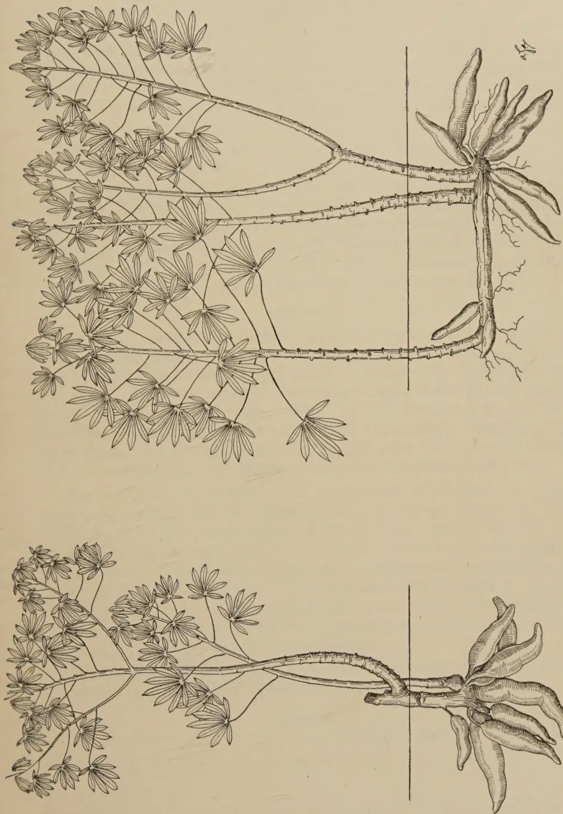The illustration consists of two detailed botanical drawings of plants, labeled D1 and D0. Both drawings are bisected by a vertical line, with the upper portion showing the plant's growth habitus vertically and the lower portion showing it horizontally. The plants have a similar morphology: a central, segmented stem with small, pointed leaves and terminal clusters of flowers. In the D1 drawing, the stem is relatively short and thick, with a dense cluster of flowers at the top. In the D0 drawing, the stem is longer and more slender, with a more extensive and branched flower cluster. The horizontal sections clearly show the root system, which is fibrous and spreads out from the base of the stem.

D1

D0

Block by Survey Dept. Ceylon.

Fig. 1.—Illustrating the habit of plants derived from cuttings placed vertically (D1) and horizontally (D0).

7------------------------------------------------

This image shows a blank, aged, cream-colored page. There are faint, illegible markings and a vertical line on the left side, possibly from a previous page or a watermark. The paper has a slightly textured appearance with some minor discoloration and small dark spots, characteristic of old paper.

8------------------------------------------------

5

brown loam which, on account of its high content in exchangeable bases, was decidedly alkaline in reaction. The experimental area had carried a crop of green gram in the previous *yala*, and had subsequently been ploughed, disc-and tooth-harrowed in the manner usual on Departmental stations. Cuttings were planted on October 10, 1940. Despite careful planting, one or two cuttings in the 01 plots had been placed the wrong way up; in tender cuttings, the locating of axillary buds is often difficult.

Sprouting of some of the vertically placed cuttings was observed four days after planting. Thinning of tillers in N1 plots to one per plant commenced on November 14. The area received five weedings. Weed infestation was heavier in 00 plots evidently as a result of the later sprouting. The crop was lifted on March 19, 1941. The nett harvested area in each plot was 18 ft. by 12 ft. (1/200 acre). Meteorological data for the experimental season are given in Appendix 2.

### RESULTS

Cuttings placed vertically sprouted earlier than cuttings placed horizontally. In the instance of the vertical planting, sprouting was somewhat earlier in the shorter cuttings. Cuttings placed vertically died back to the point of origin of the first tiller (Fig. 1). This die-back did not, however, appear to affect the plant adversely. Considerably larger numbers of vacancies were recorded in the instance of the shorter cuttings and of cuttings orientated horizontally.

The analysis of variance of the yields of tubers in plots subjected to the various treatments is given in Appendix III. The effects of the orientation of the cutting, and of the length of the cutting, are significant at the one and five per cent. points respectively. There is no significant difference in performance between the two varieties. Spacing and the reduction of the tiller number to one per plant have not produced significant effects. The interaction between spacing and length of cutting is the only one that reaches significance.

The yields and the percentages of surviving plants in plots subjected to the various treatments are given in Table I.

TABLE I.

<table border="1">
<thead>
<tr>
<th>Treatment.</th>
<th colspan="2">Yield in lb. per acre.</th>
<th colspan="2">Percentage Survival.</th>
</tr>
</thead>
<tbody>
<tr>
<td>1. <i>Variety</i> :—</td>
<td></td>
<td></td>
<td></td>
<td></td>
</tr>
<tr>
<td>    A. 3.7</td>
<td>..</td>
<td>8254</td>
<td>..</td>
<td>82.1</td>
</tr>
<tr>
<td>    B. 4.1</td>
<td>..</td>
<td>8394</td>
<td>..</td>
<td>83.3</td>
</tr>
<tr>
<td>2. <i>Length of cutting</i> :—</td>
<td></td>
<td></td>
<td></td>
<td></td>
</tr>
<tr>
<td>    6 inches</td>
<td>..</td>
<td>7612</td>
<td>..</td>
<td>71.4</td>
</tr>
<tr>
<td>    18 inches</td>
<td>..</td>
<td>9037</td>
<td>..</td>
<td>93.9</td>
</tr>
</tbody>
</table>

9------------------------------------------------

6

<table border="1">
<thead>
<tr>
<th>Treatment.</th>
<th colspan="2">Yield in lb. per acre.</th>
<th>Percentage Survival.</th>
</tr>
</thead>
<tbody>
<tr>
<td>3. Spacing :—</td>
<td></td>
<td></td>
<td></td>
</tr>
<tr>
<td>3 ft. by 3 ft. ..</td>
<td>..</td>
<td>7924</td>
<td>81.2</td>
</tr>
<tr>
<td>3 ft. by 2 ft. ..</td>
<td>..</td>
<td>8724</td>
<td>83.7</td>
</tr>
<tr>
<td>4. Orientation of Cutting :</td>
<td></td>
<td></td>
<td></td>
</tr>
<tr>
<td>Horizontal ..</td>
<td>..</td>
<td>6556</td>
<td>76.2</td>
</tr>
<tr>
<td>Vertical ..</td>
<td>..</td>
<td>10093</td>
<td>89.2</td>
</tr>
<tr>
<td>5. Number of Tillers :—</td>
<td></td>
<td></td>
<td></td>
</tr>
<tr>
<td>Unlimited ..</td>
<td>..</td>
<td>8384</td>
<td>82.3</td>
</tr>
<tr>
<td>One ..</td>
<td>..</td>
<td>8264</td>
<td>83.1</td>
</tr>
</tbody>
</table>

The analysis of variance of percentage stand, transformed to the inverse-sine scale appropriate to the binomial distribution, did not reveal significant effects in the instance of any of the treatments. It is accordingly difficult to evaluate the degree to which the larger numbers of casualties would have depressed the yields of  $L_0$  and  $O_0$  plots.

#### DISCUSSION

Despite the importance of the crop, the volume of relevant published work is not large. In the Philippines, Mendiola (1931) recommends the use of mature cuttings 25–30 cms. long, a planting distance of 75–100 cms., and either vertical or oblique planting. Greenstreet and Lambourne (1933) provide a detailed account of cultural practices in Malaya. In that country, cassava is planted in smallholdings and in market gardens, either on the flat or in ridges. Ridges are spaced four feet apart; the spacing of plants on the ridge is  $2\frac{1}{2}$ –3 ft. On the flat, the spacing may be as close as 3 ft. by 2 ft. When cassava is raised as a catch crop in young rubber, the planting distance is roughly 4–5 ft. by 5 ft. Spacing in unstumped land is necessarily irregular. Mature stems—the woody bases and tender apices are discarded—are cut into 5–6 inch sections. Most growers, particularly the Chinese, bury the cuttings horizontally just below ground level. Javanese and Malays, however, plant cuttings vertically or obliquely. Greenstreet and Lambourne (l.c.) report the failure, in Java, to obtain increased yields by thinning the plants to a single stem.

A diversity of opinion exists with regard to the best orientation of the cutting. None of the practices described above has, however, been based on the results of exact field experiments. *The demonstration, in the experiment presented herein, of the significant superiority of vertical planting, at least under unirrigated conditions in the dry zone, is accordingly of considerable interest. Horizontal planting not only depresses the yield per plant, but results in lower percentage survival of the cuttings.*

10------------------------------------------------

7

The undesirability of using cuttings as short as six inches is evident in this experiment. It has been shown in an experiment, which will be reported in a later number of this series, that the optimum length of cutting is approximately nine inches.

Although the wider spacing, 3 ft. by 3 ft., and the practice of leaving the tillers unthinned did not reduce yields, it may be suggested that, if the difference between spacings had been larger, both the effect of thinning tillers to one per plant and the interaction between thinning and spacing might have attained significance.

#### ACKNOWLEDGEMENT

We are grateful to Dr. J. C. Haigh, Botanist, for valuable advice during the course of the work, and to Mr. K. D. S. S. Nanayakkara, Assistant in Economic Botany, for the descriptions of the two cassava varieties.

#### REFERENCES

Fisher, R. A., and Yates, F., 1938 Statistical Tables for Biological, Agricultural and Medical Research. *London: Oliver and Boyd.*

Greenstreet, V. R., and Lambourne, J., 1933 Tapioca in Malaya. *Dept. of Agric., S. S. and F. M. S., Bull. No. 13 (General Series).*

Mendiola, N. B., 1931 Cassava Growing and Cassava Starch Manufacture. *Philippine Agriculturist XX: pp. 447-476.*

Yates, F., 1937 The Design and Analysis of Factorial Experiments. *Imperial Bureau of Soil Science Tech. Comm. No. 35.*

#### APPENDIX. I.

##### Design of the Experiment.

A factorial design by Yates (1937) of the form  $2^5$  was adopted. The 32 treatments (five factors each at two levels) were arranged in the following manner:

<table border="1">
<thead>
<tr>
<th>BLOCK 1</th>
<th>BLOCK 2</th>
<th>BLOCK 3</th>
<th>BLOCK 4</th>
</tr>
</thead>
<tbody>
<tr>
<td>1 1 1 1 1*</td>
<td>1 1 1 0 1</td>
<td>1 1 1 0 0</td>
<td>1 1 1 1 0</td>
</tr>
<tr>
<td>1 1 0 1 0</td>
<td>1 1 0 0 0</td>
<td>1 1 0 0 1</td>
<td>1 1 0 1 1</td>
</tr>
<tr>
<td>1 0 1 0 1</td>
<td>1 0 1 1 1</td>
<td>1 0 0 1 1</td>
<td>1 0 1 0 0</td>
</tr>
<tr>
<td>1 0 0 0 0</td>
<td>1 0 0 1 0</td>
<td>1 0 1 1 0</td>
<td>1 0 0 0 1</td>
</tr>
<tr>
<td>0 1 1 0 0</td>
<td>0 1 1 1 0</td>
<td>0 1 1 1 1</td>
<td>0 1 1 0 1</td>
</tr>
<tr>
<td>0 1 0 0 1</td>
<td>0 1 0 1 1</td>
<td>0 1 0 1 0</td>
<td>0 1 0 0 0</td>
</tr>
<tr>
<td>0 0 1 1 0</td>
<td>0 0 1 0 0</td>
<td>0 0 1 0 1</td>
<td>0 0 1 1 1</td>
</tr>
<tr>
<td>0 0 0 1 1</td>
<td>0 0 0 0 1</td>
<td>0 0 0 0 0</td>
<td>0 0 0 1 0</td>
</tr>
</tbody>
</table>

The three interactions, V.L.O., V.S.N. and L.S.O.N. were confounded with the four blocks. For further details of the design, reference may be made to Yates (1937).

\* The levels of the five factors in each treatment combination are given in succession, e.g., 1 1 0 1 0 indicates  $V_1 L_1 S_0 O_1 N_0$ .

11------------------------------------------------

8

APPENDIX II.  
Meteorological Data.

<table border="1">
<thead>
<tr>
<th rowspan="3">Month.</th>
<th colspan="4">Temperature.</th>
<th colspan="2">Humidity.</th>
<th colspan="3">Rainfall.</th>
</tr>
<tr>
<th>Mean Maximum.</th>
<th>Difference from Average.</th>
<th>Mean Minimum.</th>
<th>Difference from Average.</th>
<th>Day.</th>
<th>Night.</th>
<th>Amount.</th>
<th>No. of Rainy days.</th>
<th>Difference from Average.</th>
</tr>
<tr>
<th>°F</th>
<th>°F</th>
<th>°F</th>
<th>°F</th>
<th>Per cent.</th>
<th>Per cent.</th>
<th>Inches.</th>
<th></th>
<th>Inches.</th>
</tr>
</thead>
<tbody>
<tr>
<td>September</td>
<td>94.5</td>
<td>+3.6</td>
<td>75.3</td>
<td>+0.5</td>
<td>59</td>
<td>91</td>
<td>9.78</td>
<td>8</td>
<td>+5.87</td>
</tr>
<tr>
<td>October</td>
<td>88.4</td>
<td>-0.5</td>
<td>73.6</td>
<td>+0.2</td>
<td>78</td>
<td>93</td>
<td>14.20</td>
<td>19</td>
<td>+4.43</td>
</tr>
<tr>
<td>November</td>
<td>85.8</td>
<td>+0.4</td>
<td>73.3</td>
<td>+1.7</td>
<td>83</td>
<td>95</td>
<td>7.47</td>
<td>24</td>
<td>-4.07</td>
</tr>
<tr>
<td>Dec., 1940</td>
<td>83.8</td>
<td>+0.9</td>
<td>72.7</td>
<td>+3.1</td>
<td>83</td>
<td>95</td>
<td>4.06</td>
<td>21</td>
<td>-3.55</td>
</tr>
<tr>
<td>Jan., 1941</td>
<td>84.5</td>
<td>+1.7</td>
<td>72.3</td>
<td>+3.4</td>
<td>78</td>
<td>95</td>
<td>4.33</td>
<td>15</td>
<td>-1.38</td>
</tr>
<tr>
<td>February</td>
<td>86.8</td>
<td>0</td>
<td>71.3</td>
<td>+2.0</td>
<td>75</td>
<td>95</td>
<td>2.53</td>
<td>7</td>
<td>+1.04</td>
</tr>
<tr>
<td>March</td>
<td>92.4</td>
<td>+1.5</td>
<td>72.7</td>
<td>+1.2</td>
<td>59</td>
<td>93</td>
<td>3.09</td>
<td>6</td>
<td>-0.55</td>
</tr>
</tbody>
</table>

APPENDIX III.Table 1. Analysis of Variance of Yields.

<table>
<thead>
<tr>
<th></th>
<th></th>
<th>D. F.</th>
<th>S. S.</th>
<th>M. S.</th>
</tr>
</thead>
<tbody>
<tr>
<td>Main Effects :</td>
<td></td>
<td></td>
<td></td>
<td></td>
</tr>
<tr>
<td>V</td>
<td>..</td>
<td>1</td>
<td>3.85</td>
<td>3.85</td>
</tr>
<tr>
<td>L</td>
<td>..</td>
<td>1</td>
<td>399.74</td>
<td>399.74</td>
</tr>
<tr>
<td>S</td>
<td>..</td>
<td>1</td>
<td>126.01</td>
<td>126.01</td>
</tr>
<tr>
<td>O</td>
<td>..</td>
<td>1</td>
<td>2462.27</td>
<td>2462.27</td>
</tr>
<tr>
<td>N</td>
<td>..</td>
<td>1</td>
<td>2.82</td>
<td>2.82</td>
</tr>
<tr>
<td>Interactions :</td>
<td></td>
<td></td>
<td></td>
<td></td>
</tr>
<tr>
<td>V. L</td>
<td>..</td>
<td>1</td>
<td>0.26</td>
<td>0.26</td>
</tr>
<tr>
<td>V. S</td>
<td>..</td>
<td>1</td>
<td>17.26</td>
<td>17.26</td>
</tr>
<tr>
<td>V. O</td>
<td>..</td>
<td>1</td>
<td>187.70</td>
<td>187.70</td>
</tr>
<tr>
<td>V. N</td>
<td>..</td>
<td>1</td>
<td>2.05</td>
<td>2.05</td>
</tr>
<tr>
<td>L. S</td>
<td>..</td>
<td>1</td>
<td>388.51</td>
<td>388.51</td>
</tr>
<tr>
<td>L. O</td>
<td>..</td>
<td>1</td>
<td>73.51</td>
<td>73.51</td>
</tr>
<tr>
<td>L. N</td>
<td>..</td>
<td>1</td>
<td>33.01</td>
<td>33.01</td>
</tr>
<tr>
<td>S. O</td>
<td>..</td>
<td>1</td>
<td>166.99</td>
<td>166.99</td>
</tr>
<tr>
<td>S. N</td>
<td>..</td>
<td>1</td>
<td>42.55</td>
<td>42.55</td>
</tr>
<tr>
<td>O. N</td>
<td>..</td>
<td>1</td>
<td>80.96</td>
<td>80.96</td>
</tr>
<tr>
<td>Main Effects and Interactions</td>
<td>..</td>
<td>15</td>
<td>3987.47</td>
<td>265.83</td>
</tr>
<tr>
<td>Blocks</td>
<td>..</td>
<td>3</td>
<td>—</td>
<td>—</td>
</tr>
<tr>
<td>Remainder</td>
<td>..</td>
<td>13</td>
<td>710.29</td>
<td>54.64</td>
</tr>
<tr>
<td>Total</td>
<td>..</td>
<td>31</td>
<td></td>
<td></td>
</tr>
</tbody>
</table>

12------------------------------------------------

9

## STUDIES ON PROPAGATION OF SEEDLESS TAHITI LIME

A. V. RICHARDS, M.Sc. (Calif.), B.Sc. (Lond.), Dip. Agric. (Cantab.),  
A.I.C.T.A. (Trinidad),

HORTICULTURAL OFFICER

### SUMMARY

**T**HE Tahiti lime which is completely seedless and highly resistant to citrus canker has been found to make the best growth on rough lemon stocks in the low-country wet zone and mid-country. It has proved a failure on pummelo and sour orange. On the latter, scion over-growth, leaf fall and dieback were pronounced.

The acid lime (*Citrus aurantifolia* Swingle) is a common citrus fruit in village gardens where it is grown from seed for use as a flavouring agent in curries and as a refreshing fruit drink which is esteemed for its health promoting qualities.

The local variety of lime is not unlike the West Indian or British Guiana lime which is reputed to bear fruit all the year round when grown under conditions of uniform rainfall or irrigation. Though resistant to drought these varieties are highly susceptible to citrus canker which may some times cause severe loss of crop through premature leaf fall and fruit drop. It is the infected lime in village gardens which is usually responsible for the spread of citrus canker in newly planted citrus orchards in the vicinity.

A recent introduction into Ceylon is the Tahiti lime which is completely seedless, having probably originated as a budsport of the Persian or Bearss lime grown in California. It is reputed to exhibit a high degree of resistance to citrus canker, but is susceptible to citrus scab which, however, is easily controlled by provision of partial overhead shade and spray application.

The Tahiti lime can be readily distinguished from the common acid lime by its spreading habit of growth and the shape of its leaves which are larger and more elongated with a tendency to curl at the margins (Fig. 1.). The branches are inclined to droop, and are either spineless or have small spines at the nodes. The flowers are pure white in colour with no trace of the purple pigment seen on buds of the common lime, and the anthers are white and not yellow owing to the absence of viable pollen.

The fruits which are borne singly or in clusters of 2 or 3 nearly all the year round are more like the lemon in shape, being broadly oval with a small broad based nipple (Fig. 3). They vary in size from medium to large, the largest fruits being 6.4 cm. in length and 5.2 cm. in girth. They are very juicy, and have the characteristic acid flavour and aroma of the common lime.

13------------------------------------------------

10

The occurrence of a probable budsport with erect habit of growth and small round fruits, not unlike the common lime in shape and size, has been observed at Nalanda Fruit Station and Uva Orange Farm, Diyatalawa (Fig. 2.), and its performance is being watched with interest.

### Soil and Climatic requirements.

Seedless Tahiti lime does well on light to medium loams of high fertility which are well drained. It responds well to soil application of lime, and does not develop symptoms of *chlorosis* or yellowing of foliage so readily as the other varieties of budded citrus in the wet zone. Nevertheless, it requires a soil rich in humus and nitrogen to make healthy vigorous growth and produce good crops.

It is not resistant to drought like the common acid lime, and even with irrigation it does not grow so well in the low-country dry zone as it does in the low-country wet zone and mid-country. It makes excellent growth and is highly productive on cultivated patana soils in semi-dry areas at an elevation of 2,500 to 4,500 feet, provided water is available for irrigation during severe drought. Some of the finest trees in the Island are to be seen at Uva Orange Farm, Diyatalawa.

### Methods of Propagation.

Being seedless the Tahiti lime has to be propagated vegetatively. It will strike readily from cuttings in a solar propagator or in the open, but such plants are unsatisfactory as they make weak growth and exhibit a strong tendency to flower prematurely and set no fruit. The same is true of plants raised from layers or gooties.

The variety is best propagated by budding on to compatible root stocks by the usual inverted "T" method of budding. The budgrafts should be planted at a spacing of 18 ft. by 18 ft. in large well prepared holes of size 3 ft. by 3 ft., containing a mixture of good top soil, well rotted cattle manure or compost, leaf mould, sand and some lime which should be applied after the manure has been in the ground for some time.

### Root stock influence

With a view to determining the suitability of rough lemon (*C. jambhiri* Lush), sour orange (*C. Aurantium* L. and pummelo (*C. Maxima* Merr) and as root stocks for Seedless Tahiti lime an experiment was laid down on the Randomized Block principle in February 1938, under semi-dry conditions at Nalanda Fruit Station where the soil is a gravelly red dolomitic loam rich in iron nodules. The lay-out of the experiment consisted of four blocks, each with three plots over which were randomized the three root stock treatments. Three budded plants selected for uniform vigour of growth and age were planted in each plot extending down a terraced hill slope. The necessary budwood for raising

14------------------------------------------------

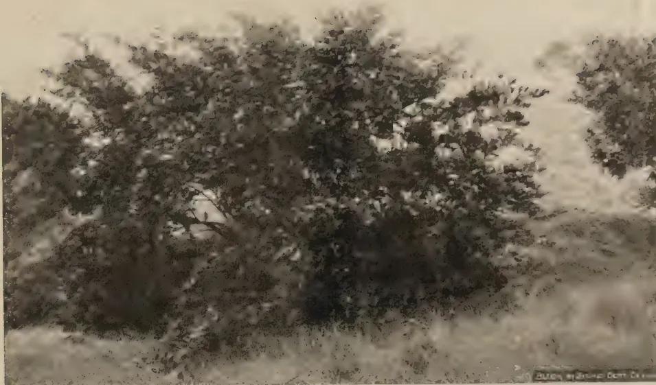A black and white photograph of a Seedless Tahiti Lime tree grafted onto a Rough Lemon stock. The tree has a dense, rounded, and spreading habit of growth, with many branches and leaves visible. The background shows a grassy field and some other trees in the distance.

Fig. 1—Seedless Tahiti Lime on Rough Lemon stock. (Normal spreading habit of growth.)

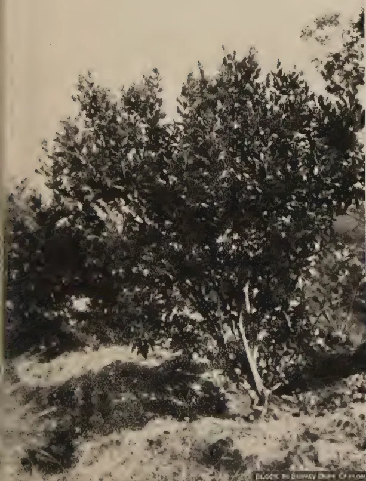A black and white photograph of a Seedless Tahiti Lime tree grafted onto a Rough Lemon stock. The tree has an erect habit of growth, with a more upright and bushy appearance compared to Fig. 1. The background shows a grassy field and some other trees in the distance.

Fig. 2—Seedless Tahiti Lime on Rough Lemon stock. (Erect habit of growth of budsport.)

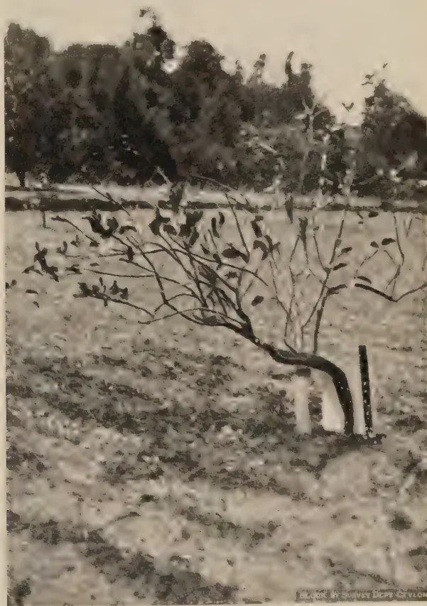A black and white photograph of a Seedless Tahiti Lime tree grafted onto a Sour Orange stock. The tree has a more open and less dense habit of growth compared to the previous figures. The background shows a grassy field and some other trees in the distance.

Fig. 4—Seedless Tahiti Lime on Sour Orange stock. (Note scion overgrowth and die back.)

15------------------------------------------------

12

The failure of pummelo and sour orange as stocks for seedless Tahiti lime has also been observed at Peradeniya and Uva Orange Farm, Diyatalawa, in the mid-country wet and semi-dry zones respectively. At both these places vigorous growth and good yields were possible only on rough lemon which is recommended for use as the most compatible of stocks so far under trial.

#### REFERENCES

1. 1. Richards, A. V., 1938      Studies on stock-scion interaction in Citrus—I  
   *The Tropical Agriculturist* Vol. XCI. No. 1,  
   pp. 12-24.
2. 2. Fennah, R. G., 1940 ..    Observations on Behaviour of Citrus Root-  
   Stocks in St. Lucia, Dominica and Mont-  
   serrat. *Tropical Agriculture* Vol. XVII. No. 4,  
   pp. 72-76.
3. 3. Hume, H. H., 1930 ..    The Cultivation of Citrus Fruits, Mac Millan,  
   London.

16------------------------------------------------

*Note.*—Plates 1–13 illustrating the Article “Soil and Ecology of the Wet Evergreen Forests—Parts I. and II.” appear at the end of this Issue facing page 78.

17------------------------------------------------

<!-- stage4: FAINT old-images-only -->

[Faint page: no legible print of its own could be verified; text withheld (stage 4 review list)]

This image is a scan of a blank page. The background is a uniform light beige or tan color. There are several small, dark specks scattered across the page, which appear to be scanning artifacts or dust. A faint, thin horizontal line is visible near the bottom edge of the page, possibly a scanning artifact or a mark on the original paper.

18------------------------------------------------

13

## THE SOILS AND ECOLOGY OF THE WET EVERGREEN FORESTS OF CEYLON—II.

R. A. De ROSAYRO, B.A., B.Sc. (Oxon), B.Sc. (Lond.),  
ASSISTANT CONSERVATOR OF FORESTS

### PART II.

#### ECOLOGY AND FOREST TYPES.

**G**ENERAL.—The vegetation of the south-western portion of the Island, corresponding roughly to the region of highest rainfall, 100 to 200 inches and over, is Tropical Wet Evergreen or Rain Forest. Slight modifications in the general type of vegetation are found with the merging of this “wet zone” into the “montane zone” (roughly above 3,000 feet altitude) on the lower slopes of the central mountain mass proper on the one hand, and into the “dry zone” (roughly below 75 inches rainfall) on the south-eastern escarpment slopes of the second peneplain on the other. The montane zone is characterized by Sub-Tropical or Temperate Wet Evergreen Forest and the dry zone by Dry, Semi-Deciduous Forest.

The Wet Evergreen Forests are similar in type to the Wet Evergreen Forests of India, Burma and Malaya. There are usually four or five well marked tiers of vegetation which may be referred to as (a) the *tree layer* consisting usually of two tiers (i) a *dominant layer* composed of tall and often including deciduous tree species which may in the climax forests reach a height of as much as 150 feet and (ii) a *second layer* of sub-dominant tree species, consisting entirely of evergreen species; (b) a *shrub layer* usually divisible into *tall* and *low shrub* layers and including bamboos and canes, and, finally, (c) a *ground layer* consisting of grasses, ferns, herbs and mosses. In the natural climax types, the dominant layer forms a more or less closed canopy. Where the cover is not too dense, often as a result of biotic interference, there is often a rich undergrowth of evergreen shrubs, ferns and grasses and the ubiquitous *bata* bamboo—*Ochlanda stridula*, Thw. Epiphytes, lianes and climbers occur usually in profusion on the tree trunks. The leaves of most species are usually thick, firm and glossy with characteristic drip-tips (10). The bark of tree species is generally smooth. Plank buttresses are characteristic of some of the larger tree species, e.g., *kekuna*—*Canarium zeylanicum*, Bl., *netaw*—*Xylopia parviflora* Hk. f., and *tiniya*—*Doona congestifolia*, Thw. There are two flowering and fruiting seasons, roughly from March to June and from October to December, corresponding with the incidence of the controlling south-west and north-east monsoons respectively. The former period is more important for regeneration, the latter is contributory to its establishment.

19------------------------------------------------

14

*Origin of the Wet Evergreen Forests—Succession.*—The origin of the Wet Evergreen forests appears to have been in a *hydrosere*. Early stages of a *prisere* are difficult to differentiate as such, from those of a *sub-sere* which occurs under similar conditions on alluvial soils of river and stream banks. The climax type of forest which may be designated *high forest*, the general characters of which have been described above, has become profoundly altered in composition by biotic interference, chiefly by man, so that only a few communities confined to relatively inaccessible forest may be considered as true climax. F. D'A Vincent in his Report on the Forest Administration of Ceylon—1882, states that the past history of the Island “ forces us to the conclusion that a large proportion of the existing forests, usually spoken of as virgin or original, are but a secondary growth which sprang up on the disappearance of a large population, sometime between the eighth and thirteenth centuries ” (11). In several of the more accessible forests, *chena* (shifting) cultivation has been the primary cause of the replacement of high forest by an inferior scrub growth in more recent instances, or by a “low-jungle” type consisting of stunted and poorly stocked forest, in the case of older cultivation. Unsystematic exploitation also has taken heavy toll of fine stands of forest; cases are on record where forests well known in the past for their contents of such species as *hora*—*Dipterocarpus zeylanicus*, Thw., or *yakahalu-dun*—*Doona trapezifolia*, Thw., now contain only vestiges of previous good growth and stocking, e.g., Talawitiya, Nahitiya and Nuwagankande forests in the Ratnapura District (12).

*Wet Evergreen Forest Communities.*—From an analysis of one per cent. enumerations carried out in forests examined under Working Plans investigations, it has been possible to distinguish important communities (associations) of tree species. These communities and the corresponding communities of the shrub and ground layers are considered together and related as far as possible to the site (generally soil) conditions. In the following descriptions of Wet Evergreen forest communities, the terms “*high forest*”, “*low jungle*” and “*scrub jungle*” which are of common usage have been adopted. The distinction between *high forest* and *low jungle* though not precise, is useful in conveying a general impression of two types of vegetation which differ strikingly in the height growth of the dominant trees, in the crop form and stocking. The characteristic features of typical *high forest* have already been described. In typical *low jungle* the dominant layer is not so well developed, the dominant height growth being restricted to below 60 feet; the trees usually have a characteristic stunted and stag-headed appearance and the stocking is relatively poor. *Low jungle* communities

20------------------------------------------------

15

are for the most part of secondary origin, while the best developed *high forest* communities may be considered true climax types. The term "*scrub jungle*" is applied to an early stage of secondary succession in which tree species are usually absent and shrub species predominate.

*Plant Lists.*—In the description of each community, plant lists of important species have been prepared. Frequencies have been indicated by the following symbols: 4=*very abundant*, 3=*abundant*, 2=*frequent*, 1=*occasional*. In the case of tree species in the *dominant layer*, it has been possible from the analysis of enumerations to give a numerical significance to these otherwise arbitrary frequencies. In the case of the *undergrowth* species, corresponding degrees of frequency are expressed qualitatively (13).

<table border="0">
<thead>
<tr>
<th>Frequency.</th>
<th>Symbol.</th>
<th>Tree species.</th>
<th>Undergrowth species.</th>
</tr>
</thead>
<tbody>
<tr>
<td>very abundant</td>
<td>4</td>
<td>.. over 50%</td>
<td>.. forming a carpet or nearly so</td>
</tr>
<tr>
<td>abundant</td>
<td>3</td>
<td>.. over 25% to 50%</td>
<td>.. in groups and individuals regularly distributed</td>
</tr>
<tr>
<td>frequent</td>
<td>2</td>
<td>.. over 5% to 25%</td>
<td>.. in scattered groups and individuals</td>
</tr>
<tr>
<td>occasional</td>
<td>1</td>
<td>.. over 1% to 5%</td>
<td>.. in scattered individuals</td>
</tr>
</tbody>
</table>

On account of the great variety of tree and undergrowth species, species which occur rarely, *i.e.*, below one per cent. in distribution or only in a few isolated individuals, have been omitted from these lists as their inclusion would make the plant lists unwieldy, apart from the fact that they have no particular significance.

#### IMPORTANT HIGH FOREST COMMUNITIES.

### I. The *Dipterocarpus* Community.

This community is recognized by the predominance of a single species, *hora*—*Dipterocarpus zeylanicus*, Thw., or rarely *bu-hora*—*Dipterocarpus hispidus*, Thw. The latter species is however less gregarious in its distribution. This community is the most striking of the Wet Evergreen forest communities, in that in the dominant tree layer, *hora* may form as much as one-half of the entire tree species and the proportion of the other commoner associates of the community is relatively less. In the near vicinity of rivers and streams, it has been observed forming an association with *diya-na*—*Mesua thwaitesii*, Planch. and Trim., especially in the forests of Region III, associated with the Adam's Peak range and Rakwana hill country. This association belongs more properly to the next important community (the *Mesua-Doona* community) described later.

In the more bouldery and steeper sites, *hora* has sometimes been observed in association with *kataboda*—*Durio zeylanicus*, Gardn., though the latter often assumes predominance forming

21------------------------------------------------

16

a faciation (described later). The other commoner sub-dominant species are *milla*—*Vitex pinnata*, L., *hedawaka*—*Chaetocarpus castanocarpus*, Thw., *godapara*—*Dillenia retusa*, Thunb., *diyapara*—*Wormia triquetra*, Rottb., *malaboda*—*Myristica dactyloides*, Gaertn., *badulla*—*Semecarpus gardneri*, Thw., and *yakahalu-dun*—*Doona trapezifolia*, Thw., all of which are ubiquitous in distribution. *Godapara* is however more confined to the forests of the extreme south-west (Kalutara, Galle and Matara districts) and *diyapara* to sub-region ii of Region II in the vicinity of the Adam's Peak Range (Ratnapura district).

The Dipterocarpus community is usually well-stocked especially with large sized trees. The height growth is perhaps the best of all Wet Evergreen forest communities, reaching a dominant height of as much as 150 feet. The boles of *hora* are characteristically straight with well formed compact crowns. (*vide* photographs 1, 2, and 3 on Plates 9 and 10.)

The predominance of *hora* in the *second layer* is less marked; of the commoner associated species in the dominant layer, *godapara*, *diyapara* and *hedawaka* now often assume predominance. Other species which are confined to this layer and also well represented are *otha*—*Macaranga digyna*, Muell, Arg., and less frequently *walla*—*Gyrinops walla*, Gaertn. In well stocked areas, the *undergrowth* is usually scarce, and a thick leaf litter of *hora* may be found. The commoner shrub species are *peratambala*—*Gaertnera vaginans*, Merr., and *tapassarabulath*—*Apama siliquosa*, Lamk.

Regeneration of *hora* is usually prolific in the seedling stage but a curious feature is that advance growth and pole stages are lacking in most *hora* communities. *Hora*, in common with other Dipterocarpus species, is a pronounced light demander; under the closed canopy which is typical of the community, *hora* does not obtain sufficient light for establishment. A sufficiently open canopy appears to be necessary for its establishment and where such openings have been made experimentally, *e.g.*, in Badulukele forest in the Matara district, a young dense pole crop of *hora* results. Regeneration of the other commoner tree species is good.

*Site Conditions and Ecological Status.*—This community is rarely observed at higher elevations, above approximately 2,500 feet and as characteristic of other *Dipterocarpus* communities of the hygrophilous type in the Indo-Malayan region (14) finds its best development in moist alluvial riverain soils and along valleys and depressions. When found on slope or ridge sites, the predominance of *hora* may be attributed to relatively good moisture conditions consequent on a high water table and good drainage; the soils thus associated with *hora* are typically Series I, Series II and the Sub-series i. (the better drained

22------------------------------------------------

17

soils) of Series III. There is, however, every indication that this community was far more widespread in the past, under the usually very moist soil conditions associated with a moist climate generally prevailing over the whole Wet Evergreen forest tract. The deterioration of the soil conditions as a result of soil exposure by *chena* cultivation and to a lesser extent over-exploitation, has now relegated this species from its gregarious distribution to one of sporadic occurrence on such soils. From this view point the *hora* community may be regarded in the broad sense as a true climax or more precisely as a *post-climax*\*.

*List of Species* in order of predominance.—Degrees of frequency are shown. Silvicultural dominants shown thus : D. Species confined to the second layer indicated thus : s. l. Low shrubs indicated thus : l. s.

*Tree Layer.*

<table border="0">
<tbody>
<tr>
<td><i>hora</i>—<i>Dipterocarpus zeylanicus</i>, Thw. or</td>
<td rowspan="2">}</td>
<td rowspan="2">3-4</td>
<td rowspan="2">D</td>
</tr>
<tr>
<td><i>bu-hora</i>—<i>Dipterocarpus hispidus</i>, Thw.</td>
</tr>
<tr>
<td><i>milla</i>—<i>Vitex pinnata</i>, L.</td>
<td></td>
<td>2</td>
<td></td>
</tr>
<tr>
<td><i>godapara</i>—<i>Dillenia retusa</i>, Thunb.</td>
<td></td>
<td>2</td>
<td></td>
</tr>
<tr>
<td><i>hedawaka</i>—<i>Chaetocarpus castanocarpus</i>, Thw.</td>
<td></td>
<td>2</td>
<td></td>
</tr>
<tr>
<td><i>na</i>—<i>Mesua ferrata</i>, L.</td>
<td></td>
<td>2</td>
<td></td>
</tr>
<tr>
<td><i>diya-na</i>—<i>Mesua thwaitesii</i>, Planch. and Trim.?</td>
<td></td>
<td>2</td>
<td></td>
</tr>
<tr>
<td><i>kataboda</i>—<i>Durio zeylanicus</i>, Gardn.</td>
<td></td>
<td>2</td>
<td>D</td>
</tr>
<tr>
<td><i>diyapara</i>—<i>Wormia triquetra</i>, Rottb.</td>
<td></td>
<td>2</td>
<td></td>
</tr>
<tr>
<td><i>malaboda</i>—<i>Myristica dactyloides</i>, Gaertn.</td>
<td></td>
<td>1</td>
<td></td>
</tr>
<tr>
<td><i>badulla</i>—<i>Semecarpus gardneri</i>, Thw.</td>
<td></td>
<td>1</td>
<td></td>
</tr>
<tr>
<td><i>yakahalu-dun</i>—<i>Doona trapezifolia</i>, Thw.</td>
<td rowspan="2">}</td>
<td rowspan="2">1</td>
<td rowspan="2">D</td>
</tr>
<tr>
<td><i>dun</i>—<i>Doona zeylanica</i>, Thw.</td>
</tr>
<tr>
<td><i>welipenna</i>—<i>Anisophyllea cinnamomoides</i>, Gardn. and Champ.</td>
<td></td>
<td>1</td>
<td></td>
</tr>
<tr>
<td><i>etamba</i>—<i>Mangifera zeylanica</i>, Hk.f.</td>
<td></td>
<td>1</td>
<td></td>
</tr>
<tr>
<td><i>ipetha</i>—<i>Cyathocalyx zeylanicus</i>, Champ.</td>
<td></td>
<td>1</td>
<td></td>
</tr>
<tr>
<td><i>kirihembiliya</i>—<i>Palaquium petiolare</i> (n) Engl.</td>
<td></td>
<td>1</td>
<td></td>
</tr>
<tr>
<td><i>kina</i>—<i>Calophyllum tomentosum</i>, Wight.</td>
<td></td>
<td>1</td>
<td></td>
</tr>
<tr>
<td><i>walla</i>—<i>Gyrinops walla</i>, Gaertn.</td>
<td></td>
<td>1</td>
<td>s. l.</td>
</tr>
<tr>
<td><i>otha</i>—<i>Macaranga digyna</i>, Muell, Arg.</td>
<td></td>
<td>1</td>
<td>s. l.</td>
</tr>
<tr>
<td><i>aridda</i>—<i>Camnosperma zeylanicum</i>, Thw.</td>
<td></td>
<td>1</td>
<td></td>
</tr>
<tr>
<td><i>gulu-mora</i>—<i>Cryptocarpa wightiana</i>, Thw.</td>
<td></td>
<td>1</td>
<td></td>
</tr>
<tr>
<td><i>tiniya</i>—<i>Doona congestifolia</i>, Thw.</td>
<td></td>
<td>1</td>
<td>D</td>
</tr>
<tr>
<td><i>uruhonda</i>—<i>Lasianthera apicalis</i>, Thw.</td>
<td></td>
<td>1</td>
<td></td>
</tr>
<tr>
<td><i>peleng</i>—<i>Kurrumia zeylanica</i>, Arn.</td>
<td></td>
<td>1</td>
<td></td>
</tr>
<tr>
<td><i>madol</i>—<i>Garcinia echinocarpa</i>, Thw.</td>
<td></td>
<td>1</td>
<td></td>
</tr>
<tr>
<td><i>netaw</i>—<i>Xylopia parviflora</i>, Hk.f. and Th.</td>
<td></td>
<td>1</td>
<td></td>
</tr>
<tr>
<td><i>bokera</i>—<i>Ochna wightiana</i>, Wall.</td>
<td></td>
<td>1</td>
<td>s. l.</td>
</tr>
<tr>
<td colspan="4"><i>Shrub Layer</i> (including bamboos, canes and rushes)</td>
</tr>
<tr>
<td><i>kekiriwara</i>—<i>Schumacheria castaneaefolia</i>, Vahl.</td>
<td></td>
<td>2</td>
<td>D</td>
</tr>
<tr>
<td><i>peratambala</i>—<i>Gaertnera vaginans</i>, Merr.</td>
<td></td>
<td>2</td>
<td>D.</td>
</tr>
<tr>
<td><i>tapassara-bulath</i>—<i>Apama siliquosa</i>, Lamk.</td>
<td></td>
<td>2</td>
<td>l. s.</td>
</tr>
<tr>
<td><i>bata</i> (bamboo)—<i>Ochlanda stridula</i>, Thw.</td>
<td></td>
<td>2</td>
<td></td>
</tr>
</tbody>
</table>

(Note.—\*The terminology of Clements (15) has been adopted throughout this paper in accordance with the mono-climax theory of succession).

23------------------------------------------------

18

<table>
<tr>
<td><i>galkaranda</i>—Humboldtia laurifolia, Vahl.</td>
<td>1</td>
</tr>
<tr>
<td><i>kebella</i>—Aporosa lindleyana, Baill.</td>
<td>1</td>
</tr>
<tr>
<td><i>pinibaru</i>— { Memecylon arnottianum, Wight. Eugenia phillyraeoides, Trim. }</td>
<td>1</td>
</tr>
<tr>
<td><i>baludan</i>—Syzygium sp.</td>
<td>1</td>
</tr>
<tr>
<td><i>wewel</i> (cane)—Calamus zeylanicus, Bedd.</td>
<td>1</td>
</tr>
<tr>
<td><i>olodiya</i>—Draecena thwaitesii, Regel.</td>
<td>1</td>
</tr>
<tr>
<td><i>dunukeiya</i> (rush)—Pandanus foetidus, Roxb.</td>
<td>1</td>
</tr>
<tr>
<td><i>okeiya</i> (rush)—Pandanus zeylanicus, Solms.</td>
<td>1</td>
</tr>
</table>

*Ground Layer.*

<table>
<tr>
<td>(a) Herbs—<i>niya</i>—Alipinia sp. (?)</td>
<td>2</td>
</tr>
<tr>
<td>          <i>walensal</i>—Elettaria cardamomum, Mat.</td>
<td>2</td>
</tr>
<tr>
<td>(b) Grasses—Hypolytrum latifolium, Rich.</td>
<td>1</td>
</tr>
<tr>
<td>          Fimbristylis dura, Alston</td>
<td>1</td>
</tr>
<tr>
<td>(c) Ferns.—Hemetelia walkerae (large tree fern)</td>
<td>1</td>
</tr>
<tr>
<td>          Angiopteris evecta (small tree fern)</td>
<td>1</td>
</tr>
<tr>
<td>          Nephrolepis exaltata, Schett.</td>
<td>1</td>
</tr>
<tr>
<td>          Blechnum orientale</td>
<td>1</td>
</tr>
<tr>
<td>          Lindsaya Lancea L.</td>
<td>1.</td>
</tr>
</table>

*Climbers.*

<table>
<tr>
<td><i>potowel</i>—Pothos ceylanicus</td>
<td>1</td>
</tr>
<tr>
<td><i>rilapan</i>— { Freycinetia walkeri, Solms. Freycinetia pycnophylla, Solms. }</td>
<td>1</td>
</tr>
<tr>
<td><i>bambarawel</i>—Dalbergia Championii, Thw.</td>
<td>1</td>
</tr>
<tr>
<td><i>banwel</i> or <i>kahawel</i>—Coscinium fenestratum, Coleb.</td>
<td>1</td>
</tr>
<tr>
<td><i>radaliyawel</i>—Connarus macrocarpus, L.</td>
<td>1</td>
</tr>
</table>

## II. The Mesua-Doona Community.

The *Mesua-Doona* community, like the *Dipterocarpus* community, is also a well defined one. The predominant species which make up the community are *na*—*Mesua ferrea*, L., *diya-na*—*Mesua thwaitesii*, Planch. and Trim., *dun*—*Doona zeylanica* Thw., and *yakahalu-dun*—*Doona trapezifolia*, Thw. In the association, either or both the *Mesua* species may be present and similarly either or both *Doona* species. The community is for the most part confined in its distribution to bouldery, steep and moist areas occurring at the higher altitude of sub-region ii of Region II and is especially characteristic of the forests of the Adami's Peak Range and Rakwana hill country. *Hora*—*Dipterocarpus zeylanicus*, Thw., or *bu-hora*—*Dipterocarpus hispidus*, Thw., is often an associate of the community occurring with *diya-na* which is more a dominant species of the second layer. *Kataboda*—*Durio zeylanicus*, Gardn., and more rarely *uruhonda*—*Lasianthera apicalis*, Thw., are sometimes locally co-dominant, the former especially in the ecotone between this community and the *kataboda*—*Durio zeylanicus*, Gardn., faciation described later. Among the other commoner associates

24------------------------------------------------

19

of the community in the dominant layer are *kirihembiliya*—*Palaquium petiolare* (n) Engl., *hedawaka*—*Chaetocarpus castanocarpus*, Thw., *etamba*—*Mangifera zeylanica*, Hk.f., *kian*—*Calophyllum tomentosum*, Wight., *milla*—*Vitex pinnata*, L., *malaboda*—*Myristica dactyloides*, Gaertn., and *tiniya*—*Doona congestifolia*, Thw. Of these species, the softwooded, faster growing species *kataboda*, *kirihembiliya*, *etamba*, *malaboda* and *tiniya* have a tendency to group themselves together forming a faciation. This community is comparable in stocking and growth to the *hora* community, especially in localities where *kataboda* and *hora* are co-dominants of the community. In general, however, the height growth of the dominants is somewhat less, but usually above 100 feet. (*Vide* photograph 4 on Plate 10.)

In the *second layer*, in addition to the pole stages of the principal species of the dominant layer, *madol*—*Garcinia echinocarpa*, Thw., a characteristic understorey species, is common. In the undergrowth, *galkaranda*—*Humboldtia laurifolia*, Vahl., is often predominant in the tall shrub layer, assuming the proportions of a low tree in some localities. *Beru*—*Agrostistachys longifolia*, Benth., is another characteristic tall shrub; *Walkopi*—*Lasianthus strigosus*, Wight., *kebella*—*Aporosa lindlayana*, Baill., and *pinibaru*—*Memecylon arnottianum*, Wight., and *Eugenia phillyraeoides*, Trim., are also fairly common tall shrubs. *Tapassara-bulath*—*Apama siliquosa*, Lamk., and canes (*wevel*—*Calamus zeylanicus*, Bedd.) are common in the low shrub layer. Among the commoner herbs in the ground layer are *nellu*—*Strobilanthes* spp. (often forming a thick carpet) and *niya*—*Alpinia* sp. (?). *Lindsaya lancea*, L., is a frequent fern. Regeneration of the principal species in the community is abundant, more so than in any other community of the Wet Evergreen forests. Germination is profuse under parent trees and seedlings of *na*—*Mesua ferrea*, L. and the *Doona* species often form a dense carpet soon after the monsoonal rains. Advance growth is also correspondingly good of the *Doona* species but less frequent of the *Mesua* species.

*Site Conditions and Ecological Status.*—The typical site conditions of the community are steep and bouldery slopes occurring generally at higher altitudes between the approximate limits of 1,500 and 3,000 feet. The soils associated with these sites are those of Series II and sub-series i of Series III. This community, on account of its widespread distribution and association with high altitudes may be considered a true *climax*; where, however, the character of the community is modified by an association of *diya-na*—*Mesua thwaitesii*, Planch. and Trim., with *hora*—*Dipterocarpus zeylanicus*, Thw., at the vicinity of water-courses, the community may be considered a *post-climax* related to the *Dipterocarpus post-climax*.

25------------------------------------------------

20

*List of Species in order of predominance.* D=silvicultural dominant, s. l.=second layer; l. s.=low shrub.

*Tree Layer*

<table>
<tbody>
<tr>
<td><i>na</i>—<i>Mesua ferrea</i>, L.</td>
<td>2</td>
<td></td>
</tr>
<tr>
<td><i>diya-na</i>—<i>Mesua thwaitesii</i>, Planch. and Trim.</td>
<td>2</td>
<td></td>
</tr>
<tr>
<td><i>dun</i>—<i>Doona zeylanica</i>, Thw.</td>
<td>2</td>
<td>D</td>
</tr>
<tr>
<td><i>yakahaiu-dun</i>—<i>Doona trapezifolia</i>, Thw.</td>
<td>2</td>
<td>D</td>
</tr>
<tr>
<td><i>hora</i>—<i>Dipterocarpus zeylanicus</i>, Thw.</td>
<td>1-2</td>
<td>D</td>
</tr>
<tr>
<td><i>kataboda</i>—<i>Durio zeylanicus</i>, Gardn.</td>
<td>1-2</td>
<td>D</td>
</tr>
<tr>
<td><i>uruhonda</i>—<i>Lasianthera apicalis</i>, Thw.</td>
<td>1-2</td>
<td>D</td>
</tr>
<tr>
<td><i>hedawaka</i>—<i>Chaetocarpus castanocarpus</i>, Thw.</td>
<td>1</td>
<td></td>
</tr>
<tr>
<td><i>kirihembiliya</i>—<i>Palaquium petiolare</i> (n) Engl.</td>
<td>1</td>
<td>D</td>
</tr>
<tr>
<td><i>etamba</i>—<i>Mangifera zeylanica</i>, Hk. f.</td>
<td>1</td>
<td></td>
</tr>
<tr>
<td><i>kina</i>—<i>Calophyllum tomentosum</i>, Wight.</td>
<td>1</td>
<td></td>
</tr>
<tr>
<td><i>milla</i>—<i>Vitex pinnata</i>, L.</td>
<td>1</td>
<td></td>
</tr>
<tr>
<td><i>madol</i>—<i>Garcinia echinocarpa</i>, Thw.</td>
<td>1</td>
<td>s. l.</td>
</tr>
<tr>
<td><i>malaboda</i>—<i>Myristica dactyloides</i>, Gaertn.</td>
<td>1</td>
<td>D</td>
</tr>
<tr>
<td><i>tiniya</i>—<i>Doona congestifolia</i>, Thw.</td>
<td>1</td>
<td>D</td>
</tr>
<tr>
<td><i>welipenna</i>—<i>Anisophyllea cinnamomoides</i>, Gardn. and Champ.</td>
<td>1</td>
<td></td>
</tr>
<tr>
<td><i>peleng</i>—<i>Kurrumia zeylanica</i>, Arn.</td>
<td>1</td>
<td></td>
</tr>
<tr>
<td><i>molpedda</i>—<i>Walsura piscidia</i>, Roxb.</td>
<td>1</td>
<td></td>
</tr>
<tr>
<td><i>godapara</i>—<i>Dillenia retusa</i>, Thunb.</td>
<td>1</td>
<td></td>
</tr>
<tr>
<td><i>wanami</i>—<i>Madhuca fulva</i>, Macbr.</td>
<td>1</td>
<td></td>
</tr>
<tr>
<td><i>dathketiya</i>—<i>Xylopia championii</i>, Hk. f. and Th.</td>
<td>1</td>
<td>s. l.</td>
</tr>
<tr>
<td><i>walla</i>—<i>Gyrinops walla</i>, Gaertn.</td>
<td>1</td>
<td>s. l.</td>
</tr>
<tr>
<td><i>bokera</i>—<i>Ochna wightiana</i>, Wall.</td>
<td>1</td>
<td>s. l.</td>
</tr>
<tr>
<td><i>porowamara</i>—<i>Diospyros insignis</i>, Thw.</td>
<td>1</td>
<td>s. l.</td>
</tr>
</tbody>
</table>

*Shrub Layer* (including canes and rushes)

<table>
<tbody>
<tr>
<td><i>galkaranda</i>—<i>Humboldtia laurifolia</i>, Vahl.</td>
<td>2</td>
<td></td>
</tr>
<tr>
<td><i>beru</i>—<i>Agrostistachys longifolia</i>, Benth.</td>
<td>2</td>
<td></td>
</tr>
<tr>
<td><i>kin-beru</i>—<i>Agrostistachys coriacea</i></td>
<td>1</td>
<td></td>
</tr>
<tr>
<td><i>wal-kopi</i>—<i>Lasianthus strigosus</i>, Wight.</td>
<td>1</td>
<td></td>
</tr>
<tr>
<td><i>pini-baru</i>—{ <i>Memecylon arnottianum</i>, Wight. <i>Eugenia phillyraeoides</i>, Trim.</td>
<td>1 1</td>
<td></td>
</tr>
<tr>
<td><i>kebella</i>—<i>Aporosa lindleyana</i>, Baill.</td>
<td>1</td>
<td></td>
</tr>
<tr>
<td><i>tapassara-bulath</i>—<i>Apama siliquosa</i>, Lamk.</td>
<td>1</td>
<td>l. s.</td>
</tr>
<tr>
<td><i>galis</i>—<i>Gardenia latifolia</i>, Ait.</td>
<td>1</td>
<td></td>
</tr>
<tr>
<td><i>kekiriwara</i>—<i>Schumacheria castaneaefolia</i>, Vahl.</td>
<td>1</td>
<td></td>
</tr>
<tr>
<td><i>wevel</i> (cane)—<i>Calamus zeylanicus</i>, Bedd.</td>
<td>1</td>
<td></td>
</tr>
<tr>
<td><i>dunukeiya</i> (rush)—<i>Panadanus foetidus</i>, Roxb.</td>
<td>1</td>
<td></td>
</tr>
<tr>
<td><i>okeiya</i> (rush)—<i>Pandanus zeylanicus</i>, Solms.</td>
<td>1</td>
<td></td>
</tr>
</tbody>
</table>

*Ground Layer.*

<table>
<tbody>
<tr>
<td>Herbs : <i>nellu</i>—<i>Strobilanthes trifidus</i> and other <i>Strobilanthes</i> spp.</td>
<td>3</td>
</tr>
<tr>
<td><i>niya</i>—<i>Alpinia</i> sp. (?)</td>
<td>2</td>
</tr>
<tr>
<td>Grasses, Ferns and Climbers as for Community I.</td>
<td></td>
</tr>
</tbody>
</table>

## IIa. The *Durio* and Softwooded Species Faciation.

Within the *Mesua-Doona* community is an important and striking faciation, the *Durio zeylanicus*, Gardn., and softwooded species faciation. Its best development is at higher altitudes nearing the 3,000 feet limit. It is more restricted in its distribution than the *Mesua-Doona* community proper, confined with rare exceptions to the forests of Region III of the Adam's

26------------------------------------------------

21

Peak Range. *Kataboda*—*Durio zeylanicus*, Gardn., is the predominant species in the faciation and is somewhat comparable in its predominance to *hora*—*Dipterocarpus zeylanicus*, Thw., in Community I, although its frequency within the faciation does not exceed one-fifth of the entire stock. Characteristic associates are *tiniya*—*Doona congestifolia*, Thw., *malaboda*—*Myristica dactyloides*, Gaertn., and *kirihembiliya*—*Palaquium petiolare* (n) Engl.; *tiniya* occurs at the highest altitudes on the summits and upper slopes of ridges. As the principal species are all softwooded, the faciation may be considered essentially a "softwood" type. The other commoner species in the dominant layer are *hedawaka*—*Chaetocarpus castanocarpus*, Thw., *kina*—*Calophyllum tomentosum*, Wight., *diyapara*—*Wormia triquetra* Rottb., and *liyan*—*Homalium zeylanicum*, Benth. The second layer and undergrowth show no salient differences in composition from the community proper. Regeneration of *kataboda* and *tiniya* is profuse under parent trees, usually forming a carpet in the seedling stage.

### III. The Camnosperma and other Species Community.

This community is of restricted occurrence, being confined to the forests of the Adam's Peak Range in sub-region ii of Region III, chiefly in a part of the extensive forest of Bambarabotuwa situated in the Ratnapura district. Here *aridda*—*Camnosperma zeylanicum*, Thw., forms a consociation representing a little over one-half of the total stock. No other species is constantly associated with *aridda*; *malaboda*—*Myristica dactyloides*, Gaertn., *hedawaka*—*Chaetocarpus castanocarpus*, Thw., *panudan*—*Syzygium neesianum*, Arn., *diyapara*—*Wormia triquetra*, Rottb., and *kirihembiliya*—*Palaquium petiolare* (n) Engl., may be considered the chief species among others observed in the dominant layer. The stocking of *aridda* is exceptionally dense and pole stages of this species are frequent in groups. The dominant height growth, however, does not exceed 100 feet and the maximum girth at breast height is below 6 feet. A curious feature is also the high incidence of dying back of *aridda*, associated with some form of unidentified fungus damage at the bases of the trees. It is probable that the origin of the decay is physiological (*vide* Site Conditions described below).

In the *second layer* in addition to the commoner species of the dominant layer, *angana*—*Neltris jambosella*, Gaertn., and *bokera*—*Ochna wrightiana*, Wall., are common. In the *undergrowth*, the shrub layer is characterized by the predominance of a species mostly confined to this locality, *val-weraniya*—*Lasianthus oliganthus*, Thw. Among the other commoner shrub species are the ubiquitous *peratambala*—*Gaertnera vaginans*, Merr., *keki-riwara*—*Schumacheria castaneaeifolia*, Vahl., and *tapassara-bulath*—*Apama siliquosa*, Lamk. Regeneration and advance growth

27------------------------------------------------

22

of *aridda* is poor in comparison to its proportion in the dominant layer. Regeneration of *kirihembiliya*—*Palaquium petiolare* (n) Engl., *yakahalu-dun*—*Doona trapezifolia*, Thw., *walu-kina*—*Calophyllum bracteatum*, Thw., and *diyataliya*—*Mastixia tetrandra* var. *thwaitesii*, Clarke, is the most frequent.

*Site Conditions and Ecological Status.*—The characteristic feature of the part of the Bambarabotuwa forest where the community is best represented is the presence of slab-rock which outcrops throughout the area; even on the more shallow soils in the vicinity of exposed slab-rock, *aridda* often predominates though showing poorer growth. The soil belongs to sub-series ii of Series III with a fairly high humic content in the A horizon. The community appears to be at least partly conditioned by a restricted development in the soil profile, and may therefore be considered a *sub-climax*.

*List of Species* in order of predominance. D=Silvicultural dominant; s. l. = second layer; l. s. = low shrub.

*Tree Layer.*

<table>
<tbody>
<tr>
<td><i>aridda</i>—<i>Camnosperma zeylanicum</i>, Thw.</td>
<td>3-4</td>
<td>D</td>
<td></td>
</tr>
<tr>
<td><i>malaboda</i>—<i>Myristica dactyloides</i>, Gaertn.</td>
<td>2</td>
<td>D</td>
<td></td>
</tr>
<tr>
<td><i>hedawaka</i>—<i>Chaetocarpus castanocarpus</i>, Thw.</td>
<td>2</td>
<td></td>
<td></td>
</tr>
<tr>
<td><i>panudan</i>—<i>Syzygium neesianum</i>, Arn.</td>
<td>1</td>
<td></td>
<td></td>
</tr>
<tr>
<td><i>diyapara</i>—<i>Wormia triquetra</i>, Rottb.</td>
<td>1</td>
<td></td>
<td></td>
</tr>
<tr>
<td><i>kirihembiliya</i>—<i>Palaquium petiolare</i> (n) Engl.</td>
<td>1</td>
<td>D</td>
<td></td>
</tr>
<tr>
<td><i>welipenna</i>—<i>Anisophyllea cinnamomoides</i>, Gardn. and Champ.</td>
<td>1</td>
<td></td>
<td></td>
</tr>
<tr>
<td><i>gulumora</i>—<i>Cryptocarya wightiana</i>, Thw.</td>
<td>1</td>
<td></td>
<td></td>
</tr>
<tr>
<td><i>badulla</i>—<i>Semecarpus gardneri</i>, Thw.</td>
<td>1</td>
<td></td>
<td></td>
</tr>
<tr>
<td><i>etamba</i>—<i>Mangifera zeylanica</i>, Hk. f.</td>
<td>1</td>
<td></td>
<td></td>
</tr>
<tr>
<td><i>bokera</i>—<i>Ochna wightiana</i>, Wall.</td>
<td>1</td>
<td>s. l.</td>
<td></td>
</tr>
<tr>
<td><i>angana</i>—<i>Nelitis jambosella</i>, Gaertn.</td>
<td>1</td>
<td>s. l.</td>
<td></td>
</tr>
<tr>
<td><i>peleng</i>—<i>Kurrumia zeylanica</i>, Arn.</td>
<td>1</td>
<td></td>
<td></td>
</tr>
<tr>
<td><i>uruhonda</i>—<i>Lasianthera apicalis</i>, Thw.</td>
<td>1</td>
<td></td>
<td></td>
</tr>
<tr>
<td><i>milla</i>—<i>Vitex pinnata</i>, L.</td>
<td>1</td>
<td></td>
<td></td>
</tr>
<tr>
<td><i>waljambu</i>—<i>Syzygium aqueum</i> (Burm. f.) Alston.</td>
<td>1</td>
<td></td>
<td></td>
</tr>
<tr>
<td><i>yakahalu-dun</i>—<i>Doona trapezifolia</i>, Thw.</td>
<td>1</td>
<td></td>
<td></td>
</tr>
<tr>
<td><i>otha</i>—<i>Macaranga digyna</i>, Muell, Arg.</td>
<td>1</td>
<td></td>
<td></td>
</tr>
<tr>
<td><i>walla</i>—<i>Gyrinops walla</i>, Gaertn.</td>
<td>1</td>
<td>s. l.</td>
<td></td>
</tr>
<tr>
<td><i>madol</i>—<i>Garcinia echinocarpa</i>, Thw.</td>
<td>1</td>
<td>s. l.</td>
<td></td>
</tr>
<tr>
<td><i>walu-kina</i>—<i>Calophyllum bracteatum</i>, Thw.</td>
<td>1</td>
<td></td>
<td></td>
</tr>
<tr>
<td><i>diyataliya</i>—<i>Mastixia tetrandra</i> var. <i>thwaitesii</i>, Clarke</td>
<td>1</td>
<td>s. l.</td>
<td></td>
</tr>
</tbody>
</table>

*Shrub Layer.*

<table>
<tbody>
<tr>
<td><i>val-weraniya</i>—<i>Lasianthus oliganthus</i>, Thw.</td>
<td>3-4</td>
<td>D</td>
<td></td>
</tr>
<tr>
<td><i>galkaranda</i>—<i>Humboldtia laurifolia</i>, Vahl.</td>
<td>2-3</td>
<td></td>
<td></td>
</tr>
<tr>
<td><i>kekiriwara</i>—<i>Schumacheria castaneaefolia</i>, Vahl.</td>
<td>1</td>
<td></td>
<td></td>
</tr>
<tr>
<td><i>peratambala</i>—<i>Gaertnera vaginans</i>, Merr.</td>
<td>1</td>
<td></td>
<td></td>
</tr>
<tr>
<td><i>tapassera-bulath</i>—<i>Apama siliquosa</i>, Lamk.</td>
<td>1</td>
<td>l. s.</td>
<td></td>
</tr>
<tr>
<td><i>wal-bombu</i>—<i>Symplocus spicata</i>, Roxb.</td>
<td>1</td>
<td></td>
<td></td>
</tr>
<tr>
<td><i>peradomba</i>—<i>Syzygium</i> sp.</td>
<td>1</td>
<td></td>
<td></td>
</tr>
<tr>
<td><i>dunukeiya</i> (rush)—<i>Pandanus foetidus</i>, Roxb.</td>
<td>1</td>
<td>in moist sites.</td>
<td></td>
</tr>
</tbody>
</table>

28------------------------------------------------

23Ground Layer.

<table>
<tr>
<td>(a) Herbs—<i>niya</i>—<i>Alpinia</i> sp. (?)</td>
<td rowspan="2">2</td>
<td rowspan="2">in moist sites.</td>
</tr>
<tr>
<td>    <i>nellu</i>—<i>Strobilanthes</i> spp.</td>
</tr>
<tr>
<td>(b) Ferns—<i>Hemetelia walkerae</i> (tree fern)</td>
<td>1</td>
<td>in moist sites.</td>
</tr>
<tr>
<td>    <i>Lindsaya lancea</i> L.</td>
<td>1</td>
<td></td>
</tr>
<tr>
<td>    <i>Gleichenia linearis</i> (<i>kekilla</i>)</td>
<td>1</td>
<td>in dry exposed situations.</td>
</tr>
</table>

Climbers.

<table>
<tr>
<td><i>bambarawel</i>—<i>Dalbergia championii</i>, Thw.</td>
<td>1</td>
</tr>
<tr>
<td><i>kahawel</i>—<i>Coscinium fenestratum</i>, Colobr.</td>
<td>1</td>
</tr>
<tr>
<td><i>kiriwel</i>—<i>Ichnocarpus frutescens</i>, Ait.</td>
<td>1</td>
</tr>
<tr>
<td><i>puswel</i>—<i>Entada scandens</i>, Benth.</td>
<td>1</td>
</tr>
<tr>
<td><i>radaliyawel</i>—<i>Connarus macrocarpus</i>, L.</td>
<td>1</td>
</tr>
</table>

#### IV. The Vitex-Wormia-Chaetocarpus-Anisophyllea-(Dillenia) Community.

This is essentially a very mixed community which characterizes most of the forests falling within Region I, the coastal plain and sub-region ii, *i.e.*, the lower slopes, of Region II. The species which predominate in this community are of widespread distribution being very adaptable to varying site conditions, both of altitude and soils; in this respect, the community is therefore less well defined than the communities so far described. *Milla*—*Vitex pinnata*, L., *diyapara*—*Wormia triquetra*, Rottb., *hedawaka*—*Chaetocarpus castanocarpus*, Thw., and *welipenna*—*Anisophyllea cinnamomoides*, Gardn. and Champ., are the principal species of the community and together form about one quarter to one half of the total stock. They also assume a silviculturally dominant role within this community, whereas within the communities so far described (I–III) they are usually sub-dominants or dominants of the second layer. *Milla* is usually numerically, the most frequent species; *diyapara*, *hedawaka* and *welipenna* are each about equally represented. *Godapara*—*Dillenia retusa*, Thunb., is also an equally common associate except in the Ratnapura District where it is less well represented. *Malaboda*—*Myristica dactyloides*, Gaertn., *badulla*—*Semecarpus gardneri*, Thw., *etamba*—*Mangifera zeylanica*, Hf. k., *aridda*—*Camnosperma zeylanicum*, Thw., *kirihebiliya*—*Palaquium petiolare* (n) Engl., and *diyataliya*—*Mastixia tetrandra*, var. *thuaitesii*, Clarke, are also somewhat frequent associates of the community, often forming a faciation of softwooded species which is described separately below. Among the other common associates of the community which deserve special mention are *gulumora*—*Cryptocarpa wightiana*, Thw., the *kinas*—*Calophyllum* spp. including *Calophyllum tomentosum*, Wight. (*kina*), *C. calaba*, L., (*guru-kina*), and *C. bracteatum*, Thw., (*walu-kina*), *panudun*—*Syzygium neesianum*, Arn., *peleng*—*Kurrumia zeylanica*, Arn., *yakahalu-dun*—*Doona trapezifolia*, Thw., *uruhonda*—*Lasianthera apicalis*, Thw., *tiniya*—*Doona congestifolia*, Thw., *wal-jambu*—*Syzygium aqueum*, (Burm. f.) Alston., and *alubo*—*Syzygium makul*, Gaertn. The dominant height growth within

29------------------------------------------------

24

the community is somewhat poor, seldom exceeding 100 feet and in general between 75 to 100 feet. Stocking, crown and bole form are inferior to Communities I to III, and some instances may approach the appearance of low jungle. (*Vide* photographs 5 & 7 on Plates 11 and 12.)

The *second layer* is characterized by the co-dominance with the principal associates of certain other species, among which *walla*—*Grynops walla*, Gaertn., may be singled out as the predominant species. The other common species are *angana*—*Neltris jambosella*, Gaertn., *bokera*—*Ochna wightiana*, Wall., *pepaliya*—*Aporosa latifolia*, Thw., *dathketiya*—*Xylopia championii*, Hk. F. and Th., *goraka*—*Garcinia cambogia*, Desrourss., *madol*—*Garcinia echinocarpa*, Thw., *porowamara*—*Diospyros insignis*, Thw., and *ankenda*—*Acronychia pedunculata*, Miq.

The *undergrowth* is usually dense and is characterized by the predominance of shrub species. *Kekiriwara*—*Schumacheria castaneaefolia*, Vahl. is perhaps the commonest tall shrub species in the community. *Peratambala*—*Gaertnera vaginans*, Merr., in the tall shrub layer and *tapassara-bulath*—*Apama siliquosa*, Lamk., in the low shrub layer are also two species of frequent and ubiquitous distribution. Other shrub species are more restricted in their distribution; among the commoner of these may be mentioned *galkaranda*—*Humboldtia laurifolia*, Vahl., which is more frequent on bouldery and steep slopes, *galis*—*Gardenia latifolia*, Ait., *pinibaru*—*Memecylon arnottianum*, Wight., and *Eugenia phillyraeoides*, Trim., and *wal-bombu*—*Symplocos spicata*, Roxb. The *bata* bamboo, *Ochlanda stridula*, Thw., is also characteristic of the community becoming abundant in the more exposed areas under an interrupted canopy; this species is probably a relict of an earlier successional phase, namely, the *Aporosa*-*Chaetocarpus*-*Vitex*-*Anisophyllea* low jungle community described later. Among the commoner grasses may be mentioned *Fimbristylis dura*, Alston., and *Hypolytrum latifolium*. Rushes, chiefly the *Pandanus* species, *dunukeiya* and *okeiya*, and canes (*wevel*), *Calamus zeylanicus*, Bedd., form a *moist faciation* in the more swampy localities. In such waterlogged or moist situations, herbs such as *thebu*—*Costus speciosus*, and *niya*—*Alpinia* sp. (?), and ferns such as *Nephrolepis exaltata*, Schett., *Blechnum orientale* and *Lindsaya lancea*, L. are frequent. *Helminthostachys zeylanica* though less frequent may be mentioned as a characteristic fern.

*Regeneration* though good and frequent cannot compare with the prolific regeneration found in Communities I. to III. Regeneration of the principal co-dominants of the community is generally good and frequent, especially that of *milla*—*Vitex pinnata*, L. In addition, regeneration of softwooded species, particularly *kirihembiliya*—*Palaquium petiolare* (n) Engl. is striking, though more properly within the softwooded species

30------------------------------------------------

25

*faciation* described below. Of the commoner associates, regeneration of *gulumora*—*Cryptocarpa wightiana*, Thw., may be singled out for special mention, as frequent and widespread. Regeneration of the other commoner associates and principal species of the second layer is generally occasional to frequent in distribution.

*Site Conditions and Ecological Status.*—The soils associated with the community are sub-series ii and iii of Series III. and the soils of Series IV. On account of the comparative accessibility of the areas where the community occurs, and the frequent evidence of past *chena* cultivation, *e. g.*, in the Gilinale and part of Bambarabotuwa forests in the Ratnapura District, or heavy exploitation, *e.g.*, Talawitiya and Muwagankande forests in the Ratnapura District, it is probable that the character and composition of the natural climax community has become profoundly altered by biotic interference; the present community, under the existing conditions may be considered either as a relatively stable phase, *i.e.*, a *sub-climax*, or a successional phase, *i.e.*, a *sub-sere*. With proper control of felling and adequate protection, it is possible on the better sites at least, that a succession to the climax communities I and II may be expected, especially within the softwooded species *faciation* described below. On the poorer sites, especially where the character of the community approaches the low-jungle type, succession to the original high forest communities cannot be expected and the community may then be considered a sub-climax.

*List of Species* in order of predominance. —D=Silvicultural dominant; s. l.=second layer; l. s.=low shrub.

*Tree Layer.*

<table border="0">
<tbody>
<tr>
<td><i>milla</i>—<i>Vitex pinnata</i>, L.</td>
<td>2-3</td>
<td>D</td>
</tr>
<tr>
<td><i>diyapara</i>—<i>Wormia triquetra</i>, Rottb.</td>
<td>2</td>
<td>D</td>
</tr>
<tr>
<td><i>hedawaka</i>—<i>Chaetocarpus castanocarpus</i>, Thw.</td>
<td>2</td>
<td>D</td>
</tr>
<tr>
<td><i>welipenna</i>—<i>Anisophyllea cinnamomoides</i>, Gardn. and Champ.</td>
<td>2</td>
<td>D</td>
</tr>
<tr>
<td><i>godapara</i>—<i>Dillenia retusa</i>, Thunb.</td>
<td>2</td>
<td>D</td>
</tr>
<tr>
<td><i>malaboda</i>—<i>Myristica dactyloides</i>, Gaertn.</td>
<td>1-2</td>
<td>D</td>
</tr>
<tr>
<td><i>badulla</i>—<i>Semecarpus gardneri</i>, Thw.</td>
<td>1-2</td>
<td></td>
</tr>
<tr>
<td><i>walla</i>—<i>Gyrinops walla</i>, Gaertn.</td>
<td>1-2</td>
<td></td>
</tr>
<tr>
<td><i>kataboda</i>—<i>Durio zeylanicus</i>, Gardn.</td>
<td>1-2</td>
<td>D</td>
</tr>
<tr>
<td><i>etamba</i>—<i>Mangifera zeylanica</i>, Hk. f.</td>
<td>1-2</td>
<td></td>
</tr>
<tr>
<td><i>aridda</i>—<i>Camnosperma zeylanicum</i>, Thw.</td>
<td>1</td>
<td></td>
</tr>
<tr>
<td><i>diyataliya</i>—<i>Mastixia tetrandra</i> var. <i>thwaitesii</i>, Clarke</td>
<td>1</td>
<td></td>
</tr>
<tr>
<td><i>kirihembiliya</i>—<i>Palaquium petiolare</i> (n) Engl.</td>
<td>1</td>
<td>D</td>
</tr>
<tr>
<td><i>gulumora</i>—<i>Cryptocarpa wightiana</i>, Thw.</td>
<td>1</td>
<td></td>
</tr>
<tr>
<td><i>kina</i>—<i>Calophyllum tomentosum</i>, Wight.</td>
<td rowspan="3">} 1</td>
<td rowspan="3"></td>
</tr>
<tr>
<td><i>guru-kina</i>—<i>Calophyllum calaba</i>, L.</td>
</tr>
<tr>
<td><i>walu-kina</i>—<i>Calophyllum bracteatum</i>, Thw.</td>
</tr>
<tr>
<td><i>pepaliya</i>—<i>Aporosa latifolia</i>, Thw.</td>
<td>1</td>
<td>s. l.</td>
</tr>
<tr>
<td><i>angana</i>—<i>Neltris jambosella</i>, Gaertn.</td>
<td>1</td>
<td>s. l.</td>
</tr>
<tr>
<td><i>bokera</i>—<i>Ochna wightiana</i>, Wall.</td>
<td>1</td>
<td>s. l.</td>
</tr>
</tbody>
</table>

31------------------------------------------------

26

<table border="0">
<tr>
<td><i>dathketiya</i>—<i>Xylopia championii</i>, Hk. f. and Th.</td>
<td>1</td>
<td>s. l.</td>
</tr>
<tr>
<td><i>goraka</i>—<i>Garcinia cambogia</i>, Desrous.</td>
<td>1</td>
<td>s. l.</td>
</tr>
<tr>
<td><i>na</i>—<i>Mesua ferrea</i>, L.</td>
<td>1</td>
<td></td>
</tr>
<tr>
<td><i>porowamara</i>—<i>Diospyros insignis</i>, Thw.</td>
<td>1</td>
<td>s. l.</td>
</tr>
<tr>
<td><i>madol</i>—<i>Garcinia echinocarpa</i>, Thw.</td>
<td>1</td>
<td>s. l.</td>
</tr>
<tr>
<td><i>panudun</i>—<i>Syzygium neesianum</i>, Arn.</td>
<td>1</td>
<td></td>
</tr>
<tr>
<td><i>peleng</i>—<i>Kurrumia zeylanica</i>, Arn.</td>
<td>1</td>
<td></td>
</tr>
<tr>
<td><i>yakahalu-dun</i>—<i>Doona trapezifolia</i>, Thw.</td>
<td>1</td>
<td></td>
</tr>
<tr>
<td><i>uruhonda</i>—<i>Lasianthera apicalis</i>, Thw.</td>
<td>1</td>
<td></td>
</tr>
<tr>
<td><i>ankenda</i>—<i>Acronychia pedunculata</i>, Miq.</td>
<td>1</td>
<td></td>
</tr>
<tr>
<td><i>tiniya</i>—<i>Doona congestifolia</i>, Thw.</td>
<td>1</td>
<td>D</td>
</tr>
<tr>
<td><i>alubo</i>—<i>Syzygium makul</i>, Gaertn.</td>
<td>1</td>
<td></td>
</tr>
<tr>
<td><i>dambu</i>—<i>Syzygium gardneri</i>, Thw.</td>
<td>1</td>
<td></td>
</tr>
<tr>
<td><i>waljamu</i>—<i>Syzygium aqueum</i> (Burm. f.) Alston</td>
<td>1</td>
<td></td>
</tr>
<tr>
<td><i>dun</i>—<i>Doona zeylanica</i>, Thw.</td>
<td>1</td>
<td></td>
</tr>
</table>

*Shrub Layer* (including bamboos, rushes and canes)

<table border="0">
<tr>
<td><i>kekiriwara</i>—<i>Schumacheria castaneaeifolia</i>, Vahl.</td>
<td>3</td>
<td></td>
</tr>
<tr>
<td><i>bata</i> (bamboo)—<i>Ochlanda stridula</i>, Thw.</td>
<td>3</td>
<td></td>
</tr>
<tr>
<td><i>peratambala</i>—<i>Gaetnera vaginans</i>, Merr.</td>
<td>2-3</td>
<td></td>
</tr>
<tr>
<td><i>tapassara-bulath</i>—<i>Apama siliquosa</i>, Lamk.</td>
<td>2-3</td>
<td>l. s.</td>
</tr>
<tr>
<td><i>galkaranda</i>—<i>Humboldtia laurifolia</i>, Vahl.</td>
<td>2-3</td>
<td></td>
</tr>
<tr>
<td><i>galis</i>—<i>Gardenia latifolia</i>, Ait.</td>
<td>2</td>
<td></td>
</tr>
<tr>
<td><i>pinibaru</i>—<i>Memecylon arnottianum</i>, Wight.</td>
<td>2</td>
<td></td>
</tr>
<tr>
<td><i>Eugenia phillyraeoides</i>, Trim.</td>
<td></td>
<td></td>
</tr>
<tr>
<td><i>wal-bombu</i>—<i>Symplocos spicata</i>, Roxb.</td>
<td>1-2</td>
<td></td>
</tr>
<tr>
<td><i>welikaha</i>—<i>Memecylon silvaticum</i>, Thw.</td>
<td>1-2</td>
<td></td>
</tr>
<tr>
<td><i>pathkela</i>—<i>Bridelia moonii</i>, Thw.</td>
<td>1-2</td>
<td></td>
</tr>
<tr>
<td><i>dunekeiya</i> (rush)—<i>Pandanus foetidus</i>, Roxb.</td>
<td>1-2</td>
<td>in moist sites.</td>
</tr>
<tr>
<td><i>okeiya</i> (rush)—<i>Pandanus zeylanicus</i>, Solms.</td>
<td></td>
<td></td>
</tr>
<tr>
<td><i>wewel</i> (cane)—<i>Calamus zeylanicus</i>, Bedd.</td>
<td>1-2</td>
<td>in moist sites.</td>
</tr>
</table>

*Ground Layer and Climbers* as for Community I. In addition the following :—

<table border="0">
<tr>
<td>Herbs : <i>thebu</i>—<i>Costus speciosus</i>, Sm.</td>
<td>1-2</td>
<td rowspan="3">) in moist sites.</td>
</tr>
<tr>
<td><i>nellu</i>—<i>Strobilanthes</i> spp.</td>
<td>1-2</td>
</tr>
<tr>
<td><i>Dianella ensifolia</i>, Red.</td>
<td>1</td>
</tr>
<tr>
<td><i>Climbers and Creepers.</i></td>
<td></td>
<td></td>
</tr>
<tr>
<td><i>bandurawel</i>—<i>Nephenthes distillatoria</i>, L.</td>
<td>1</td>
<td></td>
</tr>
<tr>
<td><i>korosawel</i>—<i>Delima sarmentosâ</i>, L.</td>
<td>1</td>
<td></td>
</tr>
<tr>
<td><i>walgamiris</i>—<i>Piper</i> spp.</td>
<td>1</td>
<td></td>
</tr>
</table>

#### IVa. The *Myristica*-*Semecarpus*-*Mangifera* and other Soft-wooded Species Faciation.

The softwooded species faciation of the *Vitex*-*Wormia*-*Chaetocarpus*-*Anisophyllea* community resembles in its relationship to the main community, the *Durio* and softwooded species faciation to the *Mesua*-*Doona* community, and to a certain extent is also associated with higher altitudes within the distributional range of the community. *Malaboda*—*Myristica dactyloides*, Gaertn., *badulla*—*Semecarpus gardneri*, Thw., and *etamba*—*Mangifera zeylanica*, Hk. f., are generally the predominant species in the faciation ; *kirihembiliya*—*Palaquium petiolare* (n) Engl., *kataboda*—*Durio zeylanicus*, Gardn., and *aridda*—

32------------------------------------------------

27

*Camnosperma zeylanicum*, Thw., are the other commoner soft-wooded constituents of the faciation; *kirihembiliya* may sporadically show local predominance though not so markedly as *aridda* and *kataboda*, the former being the chief species in Community III and the latter in the softwooded species faciation of Community II. Other frequent hardwooded species in the dominant layer are *hedawaka*—*Chaetocarpus castanocarpus*, Thw., and *welipenna*—*Anisophyllea cinnamomoides*, Gardn. and Champ. (*vide* photograph 6 on Plate 11).

The *second layer* and *undergrowth* show no marked differences in composition from the main community. Regeneration is generally more prolific within the faciation especially of the softwooded species forming the faciation, chiefly, *kirihembiliya*.

Ecologically the faciation may be considered more advanced than the main community and more closely resembling the climax communities, especially the faciation of Community II and Community III. The faciation may be regarded as a *sub-sere* which may succeed to a high-forest community.

#### LOW JUNGLE COMMUNITIES

##### i. The **Aporosa-Chaetocarpus-Vitex-Anisophyllea and other Species Community.**

This is the most important and widespread of low jungle communities. In its composition, the community bears a distinct resemblance to high forest Community IV—the *Vitex-Wormia-Chaetocarpus-Anisophyllea* community. *Pepaliya*—*Aporosa latifolia*, Thw., which is only an occasional species in the latter community now becomes the predominant species. With this exception, the principal co-dominants of the latter community, viz., *hedawaka*—*Chaetocarpus castanocarpus*, Thw., *milla*—*Vitex pinnata*, L., and *welipenna*—*Anisophyllea cinnamomoides*, Gardn. and Champ., have also the same status within this community, indicating a probable relationship between the two communities. This aspect will be considered later. The other common associates of the dominant layer are *godapara*—*Dillenia retusa*, Thunb., *diyapara*—*Wormia triquetra*, Rottb., *badulla*—*Semecarpus gardneri*, Thw., *kina*—*Calophyllum* spp. (chiefly *walu-kina*—*C. bracteatum*, Thw.), *malaboda*—*Myristica dactyloides*, Gaertn., *aridda*—*Camnosperma zeylanicum*, Thw., *gulu-mora*—*Cryptocarpa wightiana*, Thw., and *etamba*—*Mangifera zeylanica*, Hk. f.

In the *second layer*, *walla*—*Gyrinops walla*, Gaertn., is the predominant species and may also be considered a characteristic species of the community. The other commoner species in the second layer are *angana*—*Nelitis jambosella*, Gaertn.,

33------------------------------------------------

28

*bokera*—*Ochna wightiana*, Wall., *goraka*—*Garcinia gambogia*, Desrous., *wanaidella*—*Wenlandia notoniana*, Wall., and the palm *katukitul*—*Oncosperma fasciculatum*, Thw.

The important distinctions in the height growth and crop form have been described previously. (*vide* photograph 8 on Plate 12).

The *undergrowth* is usually dense and characterized by the predominance of the *bata* bamboo—*Ochlanda stridula*, Thw., which may be regarded, where abundant, as an indicator species of the community. It often forms a characteristic association with the tall shrub species *kekiriwara*—*Schumacheria castaneefolia*, Vahl. The other species present are also common to the high forest Community IV. *Regeneration* is poor in comparison with the latter community, the principal species of the community being also the principal species found in regeneration.

*Site Conditions and Ecological Status.*—This community occurs chiefly on bouldery and exposed sites. The soils associated with such sites are mainly those of Series VI. *Chena* cultivation is probably the chief cause in the removal of the natural vegetation and production of this type of forest. In addition, severe exposure to monsoonal winds may be in some instances a contributory factor to the relative stability of this community, *e.g.*, in Mipagama-Pedikande and Waratelgoda forests in the Ratnapura District. As the soils have now become more or less permanently altered, the community may be regarded a *disclimax* and even possibly a *faciation* of the high forest Community IV on these shallow degraded soils.

*List of Species* in order of predominance. D = Silvicultural dominant; s.l. = second layer; l.s. = low shrub.

*Tree Layer.*

<table>
<tbody>
<tr>
<td><i>pepaliya</i>—<i>Aporosa latifolia</i>, Thw.</td>
<td>3</td>
<td></td>
</tr>
<tr>
<td><i>hedawaka</i>—<i>Chaetocarpus castanocarpus</i>, Thw.</td>
<td>2-3</td>
<td>D</td>
</tr>
<tr>
<td><i>milla</i>—<i>Vitex pinnata</i>, L.</td>
<td>2</td>
<td>D</td>
</tr>
<tr>
<td><i>walla</i>—<i>Gyrinops walla</i>, Gaertn.</td>
<td>2</td>
<td>s.l.</td>
</tr>
<tr>
<td><i>welipenna</i>—<i>Anisophyllea cinnamomoides</i>, Gardn. and Champ.</td>
<td>2</td>
<td>D</td>
</tr>
<tr>
<td><i>godapara</i>—<i>Dillenia retusa</i>, Thunb.</td>
<td>1-2</td>
<td>D</td>
</tr>
<tr>
<td><i>angana</i>—<i>Nelitis jambosella</i>, Gaertn.</td>
<td>1-2</td>
<td>s.l.</td>
</tr>
<tr>
<td><i>diyapara</i>—<i>Wormia triquetra</i>, Rottb.</td>
<td>1-2</td>
<td></td>
</tr>
<tr>
<td><i>badulla</i>—<i>Semecarpus gardneri</i>, Thw.</td>
<td>1-2</td>
<td></td>
</tr>
<tr>
<td><i>walukina</i>—<i>Calophyllum bracteatum</i>, Thw.</td>
<td>1-2</td>
<td></td>
</tr>
<tr>
<td><i>malaboda</i>—<i>Myristica dactyloides</i>, Gaertn.</td>
<td>1-2</td>
<td>D</td>
</tr>
<tr>
<td><i>aridda</i>—<i>Camnosperma zeylanicum</i>, Thw.</td>
<td>1</td>
<td></td>
</tr>
<tr>
<td><i>yakahalu-dun</i>—<i>Doona trapezifolia</i>, Thw.</td>
<td rowspan="2">1</td>
<td rowspan="2">D</td>
</tr>
<tr>
<td><i>dun</i>—<i>Doona zeylanica</i>, Thw.</td>
</tr>
<tr>
<td><i>bokera</i>—<i>Ochna wightiana</i>, Wall.</td>
<td>1</td>
<td>s.l.</td>
</tr>
<tr>
<td><i>goraka</i>—<i>Garcinia gambogia</i>, Desrous.</td>
<td>1</td>
<td>s.l.</td>
</tr>
<tr>
<td><i>kenda</i>—<i>Macaranga peltata</i>, Muell. Arg.</td>
<td>1</td>
<td>s.l.</td>
</tr>
<tr>
<td><i>gulumora</i>—<i>Cryptocarpa membranacea</i>, Thw.</td>
<td>1</td>
<td></td>
</tr>
<tr>
<td><i>etamba</i>—<i>Mangifera zeylanica</i>, Hk. f.</td>
<td>1</td>
<td></td>
</tr>
</tbody>
</table>

34------------------------------------------------

29

<table>
<tr>
<td><i>netaw</i>—<i>Xylopia parvifolia</i>, Hk. f. and Th.</td>
<td>1</td>
<td>D</td>
</tr>
<tr>
<td><i>dambu</i>—<i>Syzygium gardneri</i>, Thw.</td>
<td>1</td>
<td></td>
</tr>
<tr>
<td><i>panudan</i>—<i>Syzygium neesianum</i>, Arn.</td>
<td>1</td>
<td></td>
</tr>
<tr>
<td><i>kirihembiliya</i>—<i>Palaquium petiolare</i> (n) Engl.</td>
<td>1</td>
<td>D</td>
</tr>
<tr>
<td><i>ipetha</i>—<i>Cyathocalyx zeylanicus</i>, Champ.</td>
<td>1</td>
<td></td>
</tr>
<tr>
<td><i>bombu</i>—<i>Symplocos spicata</i>, Roxb.</td>
<td>1</td>
<td>s.l.</td>
</tr>
<tr>
<td><i>madol</i>—<i>Garcinia echinocarpa</i>, Thw.</td>
<td>1</td>
<td>s.l.</td>
</tr>
<tr>
<td><i>alubo</i>—<i>Syzygium makul</i>, Gaertn.</td>
<td>1</td>
<td></td>
</tr>
</table>

*Shrub Layer* (including bamboos and canes).

<table>
<tr>
<td><i>bata</i> (bamboo)—<i>Ochlanda stridula</i>, Thw.</td>
<td>3-4</td>
<td></td>
</tr>
<tr>
<td><i>kekiriwara</i>—<i>Schumacheria castaneaefolia</i>, Vahl.</td>
<td>3</td>
<td></td>
</tr>
<tr>
<td><i>tapassara-bulath</i>—<i>Apama siliquosa</i>, Lamk.</td>
<td>2</td>
<td>1.s.</td>
</tr>
<tr>
<td><i>galkaranda</i>—<i>Humboldtia laurifolia</i>, Vahl.</td>
<td>2</td>
<td></td>
</tr>
<tr>
<td><i>peratambala</i>—<i>Gaertnera vaginans</i>, Merr.</td>
<td>2</td>
<td></td>
</tr>
<tr>
<td><i>mussaenda</i>—<i>Mussaenda frondosa</i>, L.</td>
<td>2</td>
<td></td>
</tr>
<tr>
<td><i>wewel</i> (cane)—<i>Calamus zeylanicus</i>, Bedd.</td>
<td>2</td>
<td>in moist sites</td>
</tr>
</table>

*Ground Layer and Climbers* as for High Forest Community IV.

#### MINOR COMMUNITIES.

##### ii. The *Oncosperma* and Other Species Community.

On the open slab-rock formation or steep bouldery localities, especially on rocky ledges and precipitous summits, *e.g.*, the Ballahela rock in the Kelani Valley Reserve, the Yakatuwa rock in Timbiripola-Maniyangama forest near Avisawella, a community characterized chiefly by the palm *katu-kitul*—*Oncosperma fasciculatum*, Thw., has become established. *Indi* (a palm) *Phoenix zeylanica*, Trim., *dotalu* (a palm)—*Loxococcus rupicola*, W. and D., *daluk*—*Euphorbia antiquorum*, L., and thorny small tree species such as *katukenda*—*Scolopia acuminata*, Clos., are other occasional and characteristic associates. Only a few sporadic bigger tree species such as *kekuna*—*Canarium zeylanicum*, Bl., and *atuketiya*—*Xylopia parviflora*, Hk. f., occur in pockets of soil.

In the undergrowth, *bata*—*Ochlanda stridula*, Thw., and grasses are common. Climbers are also of frequent occurrence.

Ecologically the community may be considered a faciation of the high forest Community IV or the *Aporosa-Chaetocarpus-Vitex-Anisophyllea* low jungle community on slab-rock formations. Where such exposure has been entirely natural, the community may be considered a *Xerophytic climax*.

##### iii. *Humboldtia* and Other Species Community.

In parts of the Kelani Valley Reserve which lie south of the Kelani Ganga near Kitulgala, areas which have been heavily exploited in the past almost amounting to clear-felling, for pit-props and box-woods, are now covered with an almost pure growth of *galkaranda*—*Humboldtia laurifolia*, Vahl. This shrub species here assumes the proportions of a low tree. A dominant height of 40 feet is not uncommon. *Dathketiya*—*Xylopia championii*, Hk. f., is a common tree species. The

. 2—J. N. A 22104 (2/43)

35------------------------------------------------

30

commoner species in the shrub layer are *peratambala*—*Gaertnera vaginans*, Merr., *kekiriwara*—*Schumacheria castaneaeifolia*, Vahl., and *tapassara-bulath*—*Apama siliquosa*, Lamk.. Regeneration of *galkaranda* is prolific, but of other tree species is poor.

The community usually occurs in sites which are steep and bouldery. It is probably a biotically induced *sub-sere* which may eventually succeed to a type of forest similar to high forest Community IV.

#### SCRUB JUNGLE COMMUNITIES.

Scrub jungle characterizes the initial stages of succession in forests which have been clear-felled, generally in *chena* cultivation, provided that the soil has not become too impoverished by burning and resultant exposure, to support this type of growth.

The characteristic dominants of the community are the shrub *associes*, *weraniya*—*Hedyotis fructicosa*, L.—*bowitiya*, the larger *maha-bowitiya*—*Melastoma malabathricum*, Linn., and the smaller *bowitiya*—*Osbeckia aspera*, Bl., which are among the earliest colonizers. Among other early invaders which may, especially on steep rocky sites replace the *associes* in dominance, are climbers and creepers, often thorny, among which the most important are *lankapalu*—*Mikania scandens*, the shrub *Lantana aculeata*, L., *naperitta*—*Hibiscus furcatus*, Roxb., and *pamba*—*Lygodium scandens*, Sw..

In a later stage in succession, representative tree species of low jungle such as *wanaidella*—*Wenlandia notoniana*, Wall., *kenda*—*Macaranga peltata*, Muell. Arg., *gedumba*—*Trema orientalis*, Bl., and *diyapara*—*Wormia triquetra*, Rottb., make their appearance, and the shrub growth is often augmented or replaced by an invasion of the *bata* (bamboo)—*Ochlanda stridula*, Thw., often in association with *kekiriwara*—*Schumacheria castaneaeifolia*, Vahl.. In some localities an almost pure consociation of *kenda* or *gedumba* may become established, e.g., in the Badulla-walla and Eluwana forests of the Ratnapura District and Yagirale forest in the Kalutara District. (*vide* photograph 9 on Plate 13). Regeneration of tree species is poor and sporadic. *Diyapara*—*Wormia triquetra*, Rottb., *milla*—*Vitex pinnata*, L., *hedarwaka*—*Chaetocarpus castanocarpus*, Thw., *walukina*—*Calophyllum bracteatum*, Thw., and *del*—*Artocarpus nobilis*, Thw., are among the commoner species.

*Site Conditions and Ecological Status.*—Scrub jungle often occurs cheek by jowl with low jungle communities. It is probably the earliest observable re-growth on land that has been completely depleted of forest in *chena* cultivation and subsequently abandoned. It may be regarded as a *sub-sere* preceding the *Aporosa*—*Chaetocarpus*—*Vitex*—*Anisophyllea* low jungle community and occurring like it, mainly on the soils of Series VI.

36------------------------------------------------

31

*List of Species* (including low tree species indicated thus :—  
1. t.)

*Shrub Layer.*

<table>
<tbody>
<tr>
<td><i>weraniya</i>—<i>Hedyotis fructicosa</i>, L.</td>
<td>3</td>
<td></td>
</tr>
<tr>
<td><i>maha-bowitiya</i>—<i>Melastoma malabathricum</i>, Linn.</td>
<td rowspan="2">} 3</td>
<td></td>
</tr>
<tr>
<td><i>bowitiya</i>—<i>Osbeckia aspera</i> Bl.</td>
<td></td>
</tr>
<tr>
<td><i>bata</i> (bamboo)—<i>Ochlanda stridula</i>, Thw.</td>
<td>2-3</td>
<td></td>
</tr>
<tr>
<td><i>Lantana aculeata</i>, L.</td>
<td>2-3</td>
<td></td>
</tr>
<tr>
<td><i>kenda</i>—<i>Macaranga peltata</i>, Muell. Arg.</td>
<td>1-3</td>
<td>1.t.</td>
</tr>
<tr>
<td><i>gedumba</i>—<i>Trema orientalis</i>, Bl.</td>
<td>2</td>
<td>1.t.</td>
</tr>
<tr>
<td><i>kekiriwara</i>—<i>Schumacheria castaneaefolia</i>, Vahl.</td>
<td>1-2</td>
<td></td>
</tr>
<tr>
<td><i>galkaranda</i>—<i>Humboldtia laurifolia</i>, Vahl.</td>
<td>1-2</td>
<td></td>
</tr>
<tr>
<td><i>tapassara-bulath</i>—<i>Apama siliquosa</i>, Lamk.</td>
<td>1-2</td>
<td></td>
</tr>
<tr>
<td><i>peratambala</i>—<i>Gaertnera vaginans</i>, Merr.</td>
<td>1</td>
<td></td>
</tr>
<tr>
<td><i>Solanum</i> sp.</td>
<td>1</td>
<td></td>
</tr>
<tr>
<td><i>kudu-miris</i>—<i>Toddalea aculeata</i>, Pers.</td>
<td>1</td>
<td></td>
</tr>
<tr>
<td><i>divikaduru</i>—<i>Tabernaemontana dichotoma</i>, Roxb.</td>
<td>1</td>
<td>1.t.</td>
</tr>
<tr>
<td><i>ankenda</i>—<i>Acronychia pedunculata</i>, Miq.</td>
<td>1</td>
<td>1.t.</td>
</tr>
<tr>
<td><i>kepittiya</i>—<i>Croton lacciferus</i>, L.</td>
<td>1</td>
<td>1.t.</td>
</tr>
<tr>
<td><i>katukitul</i> (palm)—<i>Oncosperma fasciculatum</i>, Thw.</td>
<td>1</td>
<td>1.t.</td>
</tr>
<tr>
<td><i>wewel</i> (cane)—<i>Calamus zeylanicus</i>, Redd.</td>
<td>1</td>
<td></td>
</tr>
<tr>
<td><i>hin-eraminiiya</i>—<i>Zizypus oenoplia</i>, Mill.</td>
<td>1</td>
<td></td>
</tr>
</tbody>
</table>

*Ground Layer.*

<table>
<tbody>
<tr>
<td>(a) <i>Herbs</i>—<i>Ipomaea sepiaria</i>, Koenig.</td>
<td>2-3</td>
</tr>
<tr>
<td><i>Hedyotis auricularia</i>, L.</td>
<td>2</td>
</tr>
<tr>
<td><i>Torenia crustacea</i></td>
<td>2</td>
</tr>
<tr>
<td><i>Hibiscus vitifolius</i>, L.</td>
<td>1-2</td>
</tr>
<tr>
<td><i>Hedyotis nitida</i>, W. and A.</td>
<td>1</td>
</tr>
<tr>
<td><i>Desmodium trifolium</i>, DC.</td>
<td>1</td>
</tr>
<tr>
<td><i>Desmodium gyrans</i>, DC.</td>
<td>1</td>
</tr>
<tr>
<td><i>Centella asiatica</i></td>
<td>1</td>
</tr>
<tr>
<td><i>Costus speciosus</i>, Sm.</td>
<td>1</td>
</tr>
<tr>
<td><i>Hedyotis forma</i></td>
<td>1</td>
</tr>
<tr>
<td><i>Vernonia cinerea</i>, Wess.</td>
<td>1</td>
</tr>
<tr>
<td><i>Mimosa pudica</i>, L.</td>
<td>1</td>
</tr>
<tr>
<td><i>Dianella ensifolia</i>, Red.</td>
<td>1</td>
</tr>
<tr>
<td><i>Alpinia</i> sp. (?)</td>
<td>1</td>
</tr>
<tr>
<td>(b) <i>Grasses</i> (and sedges)—<i>Fimbristylis dura</i>, Alston.</td>
<td>2</td>
</tr>
<tr>
<td><i>Lophatherum zeylanicum</i>, Hk. f.</td>
<td>1</td>
</tr>
<tr>
<td><i>Themeda tremula</i>, Hack.</td>
<td>1</td>
</tr>
<tr>
<td><i>Cyperus pilosus</i>, Vahl.</td>
<td>1</td>
</tr>
<tr>
<td><i>Panicum brevifolium</i>, Roxb.</td>
<td>1</td>
</tr>
<tr>
<td>(c) <i>Ferns</i>—<i>Nephrolepis exaltata</i>, Schett.</td>
<td>2</td>
</tr>
<tr>
<td><i>Adiantum hispidulum</i></td>
<td>1</td>
</tr>
<tr>
<td><i>kekilla</i>—<i>Gleichenia linearis</i></td>
<td>1</td>
</tr>
<tr>
<td><i>Blechum orientale</i></td>
<td>1</td>
</tr>
<tr>
<td><i>Pteris hookeriana</i></td>
<td>1</td>
</tr>
<tr>
<td><i>Nephrodium calcaratum</i></td>
<td>1</td>
</tr>
</tbody>
</table>

*Climbers and creepers.*

<table>
<tbody>
<tr>
<td><i>lankapalu</i>—<i>Mikania scandens</i></td>
<td>3 locally</td>
</tr>
<tr>
<td><i>napiritta</i>—<i>Hibiscus furcatus</i>, Roxb.</td>
<td>2</td>
</tr>
<tr>
<td><i>pamba</i>—<i>Lygodium scandens</i>, Sw.</td>
<td>2</td>
</tr>
<tr>
<td><i>korosowel</i>—<i>Delima sarmentosa</i>, L.</td>
<td>2</td>
</tr>
</tbody>
</table>

37------------------------------------------------

32FERNLAND AND GRASSLAND COMMUNITIES

The *Fernland Community* is associated specifically with the soils of Series VII and occurs in localities which have been in the past under *chena* cultivation and preserved in their present condition by periodical firing. The typical consociation consists of *kekilla*—*Gleichenia linearis*. This species has also been observed to invade scrub jungle which has recently been burnt over. The tree layer is absent or represented by a few stunted tree species characteristic of low jungle such as *diyapara*—*Wormia triquetra*, Rottb., *pepaliya*—*Aporosa latifolia*, Thw., and *walu-kina*—*Calophyllum bracteatum*, Thw. The typical shrub species of the scrub jungle communities are of somewhat frequent occurrence, the most important among these being *weraniya*—*Hedyotis fructicosa*, L., *bowitiya*—*Melastoma malabathricum*, Linn., (*maha-bowitiya*) and *Osbeckia aspera*, Bl., and the *bata* bamboo—*Ochlanda stridula*, Thw. Other common shrubs are *Zizypus oenoplia*, Mill. and *Memecylon capitellatum*, L. In the ground layer, *Desmodium gyrans*, DC., *Phyllanthus niruri*, L. and other *Phyllanthus* spp. are common herbs. On fairly moist sites where the *kekilla* has escaped frequent firing, the fern *Nephrolepis exaltata*, Schett., may also be found as a frequent associate of the *kekilla*. The club moss *Lycopodium clavatum* is also found in the moister sites. *Themeda tremula*, Hack., is a commoner grass found frequently in the more exposed sites.

Regeneration of tree species is scarce; the acid humic *kekilla* layer appears to prevent the penetration of the roots of the young seedlings which have been observed to die after germination. In areas subjected to frequent fires, the humus layer is thin, but the presence of a hard surface ferruginous gravel layer resulting from soil desiccation, prevents the establishment of seedlings.

The *Grassland Community* (*patana*) appears to be similar in origin; the chief species in the community are *illuk*—*Imperata arundinacea*, Cyrill, and *mana*—*Andropogon nardus*, L.

Both fernland and grassland communities may be regarded as relatively stable on account of the altered soil conditions, making succession to a forest climax improbable. They may therefore be regarded as *disclimaxes* (fire climax).

**Tabular Summary of Forest Communities**, in relation to Soils, Undergrowth, Regeneration and Ecological Status.

1. High Forest Communities.

<table border="1">
<thead>
<tr>
<th>Community.</th>
<th>Soils.</th>
<th>Chief species in undergrowth</th>
<th>Regeneration.</th>
<th>Ecological status.</th>
</tr>
</thead>
<tbody>
<tr>
<td>I. <i>Dipterocarpus</i> and other species</td>
<td>Series I. Series II. sub-series i. of Series III.</td>
<td><i>Gaertnera</i>, <i>Schumacheria</i>, <i>Apama</i>, <i>Ochlanda</i>.</td>
<td>Prolific regeneration of <i>Dipterocarpus</i> in seedling stages but poor established regeneration. Regeneration of other common tree species, good.</td>
<td><i>Post-Climax</i>.</td>
</tr>
</tbody>
</table>

38------------------------------------------------

33

<table border="1">
<thead>
<tr>
<th>Community.</th>
<th>Soils.</th>
<th>Chief species in undergrowth.</th>
<th>Regeneration.</th>
<th>Ecological status.</th>
</tr>
</thead>
<tbody>
<tr>
<td>II. <i>Mesua-Doona</i>.</td>
<td>Series II. sub-series i of Series III.</td>
<td><i>Humboldtia</i>, <i>Agrostistachys</i>, <i>Lasianthus</i>, <i>Strobilanthes</i>, <i>Lindsaya</i>.</td>
<td>Prolific regeneration of <i>Mesua ferrea</i> and <i>Doona</i> species.</td>
<td><i>Post-Climax</i></td>
</tr>
<tr>
<td>II. (a) <i>Durio</i> &amp; soft-wooded species.</td>
<td>Same as above.</td>
<td>Same as above</td>
<td>Prolific regeneration of <i>Durio</i> and <i>Doona congestifolia</i>.</td>
<td><i>Faciation</i> of II.</td>
</tr>
<tr>
<td>III. <i>Camnosperma</i> &amp; other species</td>
<td>Sub-series ii of Series III.</td>
<td><i>Lasianthus</i>, <i>Humboldtia</i>, <i>Schumacheria</i>, <i>Gaertnera</i>, <i>Apama</i>.</td>
<td>Regeneration of <i>Camnosperma</i> somewhat poor; regeneration of <i>Palaquium petiolare</i>, <i>Doona trapezifolia</i> and <i>Calophyllum bracteatum</i>, good.</td>
<td><i>Sub-Climax</i>.</td>
</tr>
<tr>
<td>IV. <i>Vitex-Wormia-Chaetocarpus-Anisophyllea</i>-<i>Dillenia</i></td>
<td>Sub-series ii and iii of Series III and Series IV.</td>
<td><i>Schumacheria</i>, <i>Ochlanda</i>, <i>Gaertnera</i>, <i>Apama</i>, <i>Humboldtia</i>, <i>Gardenia</i>.</td>
<td>Regeneration of principal associates good and frequent.</td>
<td><i>Sub-Climax</i> or <i>sub-sere</i></td>
</tr>
<tr>
<td>IV. (a) <i>Myristica Semicarpus-Mangifera</i> and other softwooded species</td>
<td>Same as above</td>
<td>Same as above</td>
<td>Regeneration of principal soft-wooded associates frequent to prolific.</td>
<td><i>Faciation</i> of IV. (<i>sub-sere</i>).</td>
</tr>
</tbody>
</table>

## 2. Low Jungle Communities.

<table border="1">
<thead>
<tr>
<th>Community.</th>
<th>Soils.</th>
<th>Chief species in undergrowth.</th>
<th>Regeneration.</th>
<th>Ecological status.</th>
</tr>
</thead>
<tbody>
<tr>
<td>i. <i>Aporosa-Chaetocarpus-Vitex-Anisophyllea</i> and other species,</td>
<td>Mainly Series VI.</td>
<td><i>Ochlanda</i>, <i>Schumacheria</i>, <i>Apama</i>, <i>Humboldtia</i>, <i>Gaertnera</i>, <i>Mussaenda</i>.</td>
<td>Regeneration generally poor.</td>
<td><i>Disclimax</i> or <i>faciation</i> of high forest Community IV.</td>
</tr>
<tr>
<td>ii. <i>Oncosperma</i> and other species</td>
<td>Slab-rock and boulders</td>
<td><i>Ochlanda</i>, <i>Grasses</i>, &amp;c.</td>
<td>Scarce to nil.</td>
<td><i>Faciation</i> of Community IV or low jungle Community i, or <i>xerophytic climax</i>.</td>
</tr>
<tr>
<td>iii. <i>Humboldtia</i> and other species</td>
<td>Sub-series iii of Series III and Series IV.</td>
<td><i>Gaertnera</i>, <i>Schumacheria</i>, <i>Apama</i>.</td>
<td>Regeneration of <i>Humboldtia</i> prolific, of tree species poor.</td>
<td><i>Sub-sere</i>.</td>
</tr>
</tbody>
</table>

## 3. Scrub Jungle, Fernland and Grassland Communities.

<table border="1">
<thead>
<tr>
<th>Community.</th>
<th>Soils.</th>
<th>Chief species in undergrowth</th>
<th>Regeneration</th>
<th>Ecological status.</th>
</tr>
</thead>
<tbody>
<tr>
<td><i>Hedyotis-Melastoma-Osbeckia</i> (scrub jungle)</td>
<td>Series VI.</td>
<td><i>Mikania</i>, <i>Lantana</i>, <i>Hibiscus</i>, <i>Macaranga</i> (tree), <i>Ochlanda</i>.</td>
<td>Regeneration of tree species poor and sporadic.</td>
<td><i>Sub-sere</i>.</td>
</tr>
</tbody>
</table>

39------------------------------------------------

34

<table border="1">
<thead>
<tr>
<th>Community.</th>
<th>Soils.</th>
<th>Chief species in undergrowth.</th>
<th>Regeneration.</th>
<th>Ecological status.</th>
</tr>
</thead>
<tbody>
<tr>
<td>(a) <i>Gleichenia</i> (fernland)</td>
<td rowspan="2">Series VII.</td>
<td rowspan="2"><i>Hedyotis</i>, <i>Melastoma</i>, <i>Osbeckia</i>, <i>Ochlanda</i>, <i>Zizyphus</i>, <i>Phyllanthus</i>.</td>
<td rowspan="2">Regeneration of tree species practically nil.</td>
<td rowspan="2"><i>Disclimaxes</i> (fire cli- maxes)</td>
</tr>
<tr>
<td>(b) <i>Imperata</i> or <i>Andropogon</i> (grassland)</td>
</tr>
</tbody>
</table>

### SUMMARY

1. The introductory paragraph describes the manner in which the data was collected, the scope and purpose of the paper.

*Part I.* deals with the *Situation, Climate, Geology and Soils.*

2. The regional distribution of the Wet Evergreen Forests according to topography is described, three Regions being recognized.

3. The climate of the Wet Evergreen Forests is described. Three broad zones of rainfall distribution are distinguished and described, the effect of the South-West monsoonal winds in relation to the topographical regions being dealt with. Temperature and relative humidity conditions are also described briefly.

4. Under Geology, the origin and structure of the Island and composition of the rock formations are briefly described; the topographical recognition of regions is related to geological origin.

5. The salient morphological characters of the Wet Evergreen Forest soils are briefly described, the results of mechanical and chemical analyses made by Joachim (7 and 9) discussed and related to morphological and profile characteristics. The conclusions reached in the writer's previous paper (1.) are confirmed.

6. The soils are classified into seven Soil Series :—I. Alluvial Soils, II. Residual Non-gravelly Loams, III. Residual Gravelly Loams, IV. Soils with a Zonal Gravel Layer, V. Swamp (Clayey) Soils, VI. Shallow, Truncated and Bouldery Soils, VII. Fernland (*Kekilla*) Soils. The classification is based on physical properties, chiefly on the disposition of the gravel and stone content. The seven Soil Series are described briefly, the detail amplified where necessary with special reference to the soils of the Ratnapura and Kegalla Districts. Series III., in particular, is now divided into three sub-series based on the texture of the soils and size of the gravel content. The Soil Series are related briefly to vegetational types.

*Part II.* deals with *Ecology and Forest Types.*

7. The general vegetational characters of the Wet Evergreen Forests are described; their origin and the basis of recognition of forest communities are dealt with; the use of the terms "high

40------------------------------------------------

35

forest ", "low jungle ", and "scrub jungle " in the description of forest communities, is explained. The symbols used in Plant Lists and the preparation of the latter, are described.

8. Four important High Forest Communities are recognized and described :—I. The *Dipterocarpus* and other species community ; II. The *Mesua-Doona* community ; III. The *Camnosperma* and other species community ; IV. The *Vitex-Wormia-Chaetocarpus-Anisophyllea-(Dillenia)* community. Faciations of Community II. and IV. are also described. In each case the community is related to its site conditions, and its ecological status is mentioned. Plant lists are given for the four main communities.

9. Among Low Jungle Communities, the important *Aporosa-Chaetocarpus-Vitex-Anisophyllea* and other species community is described with a Plant list. Two minor low jungle communities are also described.

10. Scrub jungle communities are next described in relation to ecological succession, and a Plant list given.

11. Finally the fernland and grassland communities are briefly described.

12. A tabular summary of Forest Communities in relation to Soils, Undergrowth, Regeneration and Ecological Status is given.

#### REFERENCES

1. 1. de Rosayro, R. A.—Soils of the Wet Zone Forests of the Matara, Galle, and Kalutara Districts. The Tropical Agriculturist, Vol. XCII., No. 5, 1939.
2. 2. Adams, F. D.—The Geology of Ceylon—Canadian Journal of Research, Vol. I., 1929.
3. 3. Bamford, A. J.—Notes on the Climate of Western Ceylon with special reference to the Upper Winds at Colombo—Ceylon Journal of Science, Section E. Vol. I., Part 3.
4. 4. Report on the Colombo Observatory, with maps and statistics for 1938.
5. 5. Wayland, E. J.—Stone Ages of Ceylon—Spoilia Zeylanica, Vol. XI., 1915–1921.
6. 6. Coates, J. S.—The Geology of Ceylon—Spoilia Zeylanica, Vol. XIX., 1935.
7. 7. Joachim, A. W. R.—Studies on Ceylon Soils VI.—The Tropical Agriculturist Vol. LXXXV. No. 3, 1935.
8. 8. Joachim, A. W. R. and Kandiah, S.—Studies on Ceylon Soils, XIII.—The Tropical Agriculturist, Vol. XCV. No. 5, 1941.
9. 9. Joachim, A. W. R.—Studies on Ceylon Soils VIII.—The Tropical Agriculturist Vol. LXXXVIII., No. 2, 1937.
10. 10. Baker, J. R.—Rain Forest in Ceylon—Kew Bulletin, 1938 No. 1.
11. 11. Vincent, F. d'A.—Forest Administration of Ceylon—1881. Sessional Paper No. XLII. of 1882.
12. 12. Lushington, P. M.—Report on the Ceylon Forests in 1921 and their General Administration—Sessional Paper No. XII. of 1921.
13. 13. Fabricius, L., Oudin, A. and Guillebaud, W. H.—Outlines for Permanent Sample Plot Investigations—London, 1936.
14. 14. Troup, R. S.—The Silviculture of Indian Trees, Vol. I., Oxford 1921.
15. 15. Clements, F. E.—Nature and Structure of the Climax—Journal of Ecology Vol. XXIV., No. 1., 1936.

41------------------------------------------------

36DEPARTMENTAL NOTESDIPLODIA EAR ROT OF MAIZE

SAMPLES of maize cobs collected from an up-country estate have been found to be rotted and blackened by a species of *Diplodia*, which was later confirmed as *Diplodia frumenti* Ell. and Ev. This is a first record of this fungus for Ceylon and India, and apparently it has not been collected outside U. S. A. and Tanganyika.

SYMPTOMS OF THE DISEASE

The mycelium of the causal fungus penetrates the cob, kernels, husks and stalks of the maize plant, forming a dark-brown, felt-like mould on these parts. If the interior of a severely diseased kernel were examined, it would be seen to consist of a mass of blackened tissue which has been invaded by the hyphae. A maize cob may be attacked to various extents by the fungus and it is the upper part of the cob that is in most cases affected. In certain cases the cob may be completely reduced to a blackened mass or only a part of the cob may be attacked. In other cases only a few scattered kernels show the characteristic blackening and in yet others the diseased kernels cannot be detected until they are germinated.

The fungus also attacks the stalks of the maize plants at their nodes and internodes. The spores are formed as aggregations called pycnidia which break out through longitudinal cracks on the outer tissues of the stalks.

*D. frumenti* enters the cobs through the exposed tips and wounds and by growing into the cobs at the upper ends. It has been known to survive on old maize stalks in the field and as dormant mycelium in the seed. *D. frumenti* is not confined to maize but is also known to cause a typical *Diplodia* rot of oranges, grapefruit, sweet potatoes, cotton bolls and watermelons in U. S. A.

CONTROL

The following measures are recommended in controlling the spread of this disease :—

- (a) No seed from a diseased crop should be used for sowing.
- (b) Judicious rotation of crops should be practised on fields that have borne a diseased crop of maize and it should not be put under maize for a period of at least one year.
- (c) After the crop is harvested the diseased cobs should be burnt; the stalks of plants should either be burnt *in situ* or may be used in making compost. The heat generated in making compost would be sufficient to kill the fungus.

It is requested that the Plant Pathologist be informed of any fresh outbreaks of this disease.

42------------------------------------------------

37

## ITEMS OF INTEREST ON THE ACTIVITIES OF THE ROYAL BOTANIC GARDENS, PERADENIYA

T. H. PARSONS, F.L.S., F.R.H.S.,  
*CURATOR, ROYAL BOTANIC GARDENS, PERADENIYA*

### III.—1928–1934

THE routine operations of 1928 were many, and work in connection with metalling of the drives and paths and improvements to the South Garden lake all made demands on the labour. Efforts were made this year to endeavour to put the 55 acres of Arboretum at the north end of the garden into a condition resembling the central and better kept portion of the garden. This entailed the levelling down of many mounds, extraction of old roots, eradication of the troublesome “Elephant foot” weed and the sensitive grass, and last but not least, preparation for metalling, tarring and brick edging all the paths intersecting these Arboretum sections.

The main item among the new works was the extension of the Pinetum to its present day capacity, which involved much work extending over practically the whole year. This extension was rendered possible by the demolition of the old condemned bungalow, the eradication of its foundations, the smoothing out of the terraced compound and the filling in and levelling over of a large tennis court area. Only by these laborious means could the area be brought into alignment with the surrounding areas of the existing Pinetum, and in configuration to the gradual slope leading from the Entrance gate and frontage, up to the summit of the South Garden Hill.

Experience with the earlier conifer plantings led us to believe that this frontage area could be made very attractive by the addition of further plantings of the various cypress and other conifers and this has since proved to be the case. The fact that the new site was an open position and facing south, whereas these sub-tropical plants prefer a sheltered and northern aspect had to be considered, and special precautions to start them all successfully were undertaken. Sixty-two holes of 4 ft. by 4 ft. were excavated and the bottoms dynamited, the holes

43------------------------------------------------

38

being refilled with good soil transported from other parts of the Gardens. As wide a variety of pine species as were available, including *Pinus Merkusii* and *Pinus Carabaea*, were planted towards the end of the year, and the whole area turfed over. The trouble taken was well worth while as exemplified by the present well grown specimens now 13 years of age yet retaining all branches and foliage from the base of the stem. The area has, by visitors from other gardens and parks, and persons who should know, been termed as outstanding and probably the best group of conifers in the tropics.

In this year also a new innovation in the formation of beds of the Malayan ground orchid, *Spathoglottis plicata*, both mauve and white forms, was made in the flower garden. This plant had for some years previous been an attractive feature of some low country gardens but had not been tried out as a bed plant at this elevation. The plants adapted themselves so satisfactorily that plantings have continued regularly since and large supplies sent out to other gardens in mid-country. The yellow *Spathoglottis aurea* was also imported this year from Penang and crosses with this and *Spathoglottis plicata* are now a common feature in the gardens.

The remetalling of roads and paths proceeded with much vigour on a vote obtained specially for this work. There are  $4\frac{1}{2}$  miles of road or drives 13 feet wide, and  $1\frac{1}{2}$  miles of paths of 5 to 6 feet wide in the gardens which have to be regularly maintained. In this year 2,385 yards, or one and one third of a mile, of road was metalled and tarred or about to be tarred. Such roads as were on a gradient were wholly tarred on completion of metalling and in the case of both roads and paths the sides were brick edged to allow the elimination of all unsightly side drains. This metalling, tarring, and brick edging operation was in fact completed on all roads and paths throughout the gardens by the end of 1929. Not only has this improved the garden appearance enormously but as an economy measure is to be commended. Our upkeep costs of roads and paths before 1927 was approximately Rs. 1,300 a year, but since 1929 this has been reduced to between Rs. 400 and Rs. 500 a year.

The budding of citrus continued and increased stocks were raised in the nurseries. With these larger scale operations and more intensive form of nursery work various forms of pests and diseases appeared including citrus canker, mildew and a form of root attack classified at the time as *Rhizoctonia bataticola*, an ubiquitous disease of this period but since little heard of, though it resulted in large losses at the time. The choice of rootstock for citrus was this year extended to include the citron, lemon and nateran, and this question of rootstock trials is more fully dealt with later.

44------------------------------------------------

39

Further Chaulmoogra Oil plants were raised and six different species of *Hydnocarpus* introduced as a possible rootstock for this oil plant. Germination of the new seed was normal but in later years the buddings did not prove successful, all but *Hydnocarpus Woodii* proving incompatible to both *Hydnocarpus anthelmintica* and *Tarakto-genos Kurzii* the true leprosy oil plants. If our old garden specimen of *Hydnocarpus anthelmintica* is however a true guide, budding would appear unnecessary as this seedling tree seeds regularly and crops freely. *Tarakto-genos* has however to date not yet proved very fruitful in any locality in Ceylon.

Budding of rubber in the nursery continued, the scions being from selected high yielding trees of the seven blocks of rubber at the Heneratgodu gardens. This subject however was one too colossal for our garden resources and steps were taken by the Department to obtain assistance from the Rubber Restriction Funds for the prosecution of budding on a large scale, and for selection work. Steps were in fact taken to open up an undeveloped part of the Experiment Station, Peradeniya, now known as the Eriyagama Division, and to plant it with rubber seedlings in preparation for budding and the subsequent testing of clones of budded trees for high yield. The first area of 10 acres was cleared and planted this year.

Among new plants brought back from Kew by the Curator on his return from leave this year was a fine collection of orchids, a new *Pentas*, a pink *Poinsettia*, six new *Ixoras*, four new *Bougainvilleas* and some new plants for the up-country gardens at Hakgala.

These new introductions are very necessary and are interesting portions of the work of the Botanic Gardens, particularly as there are no nurserymen of any repute in the Island. The scarlet *Pentas* (*Pentas coccinea*), for instance, is a case in point. This one plant was brought here in October of this year (1928) and carefully planted. It flowered at X'mas and continued to do so for months, so much so that propagating material was very scanty. In course of time, however, the plant made sufficient growth to enable us to make a large bed of it in the flower garden. From this bed was obtained sufficient material to raise nursery plants for disposal to the public and distribution has now reached the stage that there can hardly be a garden in the low and mid-country where this plant is not represented. One of the *Bougainvilleas* (Mrs. Butt) has a similarly wide distribution together with the pink *Poinsettia*, though these larger shrubby plants have not quite the same popularity as the smaller herbaceous *Pentas*. The deciding factor generally is whether the plant adapts itself to the extent of being freely reproduced by seed or vegetatively. The *Bougainvillea* var. "Rosa Catalina", for instance, will not propagate freely even

45------------------------------------------------

40

under Solar Propagator or Hortomone treatments, and though introduced from Russels nursery, Richmond Surrey, as far back as 1921 is still very rare in the Island.

Camphor (*Cinnamomum Camphora*) has in the past been produced in Ceylon, having been in the Island from as far back as 1852, but not on any large scale, due probably to the fact that the plants have to be produced vegetatively and are difficult to propagate, which retards large scale operations. None of the garden trees at Peradeniya, Hakgala or Heneratgoda has ever seeded, nor have the plantation of these trees at the Experiment Station at Peradeniya, and it is doubtful if it seeds in Ceylon at all.

It is a native of the East and is cultivated mostly in Formosa. The tree produces in Ceylon both solid camphor and oil, but when grown in the Mauritius and the West Indian Islands some trees produce both camphor and oil and others oil only, due presumably to variety or to soil or climatic conditions. For purposes of investigation into this point we received from Mauritius three plants that yield camphor and oil and three that yield oil only. These were planted in the spice grove and though the former have attained good dimensions, the latter remain in the form of a bush only a few feet in height. Six plants of our local species, yielding both camphor and oil, were sent to Mauritius for trial under their particular soil and climatic conditions. Further, from seed received from Mauritius in 1926, a number of plants had been raised and planted here in the spice grove and in the South Garden and other plants sent to Hakgala for trial. The parent tree of this seed yields no solid camphor under Mauritius conditions, and the analysis of the produce of these trees now growing at Peradeniya, when completed, should be interesting.

Notable visitors to the gardens this year were Dr. (now Sir) A. W. Hill, Director of the Royal Botanic Gardens, Kew, in February, and Mr. T. W. Taylor, the Curator of the Royal Botanic Gardens, Kew, in March. The latter stayed at Peradeniya for 6 days before proceeding Home, during which period a thorough exploration of the gardens was made and a large amount of material reserved for him.

The Director of this Department Mr. (now Sir) F. A. Stockdale having been appointed Assistant Agricultural Adviser to the Secretary of State, left Ceylon on November 21, after 12 years' service here as Director, during which period the work of the gardens received direction and much help and guidance from him.

## 1929.

The normal routine operations took the usual toll of labour during 1929 but nevertheless the principle of some new improve-

46------------------------------------------------

41

ment each year was strictly adhered to. This year apart from the continuation and completion of the remetalling of all paths and roads, the flower garden, the new fruit plot and the nurseries received special attention. Fruit work indeed was beginning to take up a large share of our energies.

Notable additions to the arboreal collection were several species of *Eucalyptus* and *Inga*, some new *Cocos* and *Thrinax* and *Cupressus lusitanica* from the Amani Institute for the Pinetum.

The demand for Tung Oil seed and plants began to reassert itself this year and the Central Seed Store was detailed to import seed and supply the requirements received from estates. The gardens for their part had raised plants of both *Aleurites Fordii* and *A. montana* and distributed to 48 applicants during the year, *A. Fordii* to up-country and *A. montana* to mid-country and low-country applicants. 21 lb. of seed was also distributed on the same lines.

Records also show that 320 Chaulmoogra oil plants were sent to Etnawala Estate and 200 plants to Sorana Estate this year.

The budded rubber in the nursery was cut back for multiplication budwood purposes, 172 plants being thus treated, the produce of 34 of Heneratgoda's best yielding trees. Budwood from here was later utilized in the buddings at the new Eriyagama Division which was this year increased to 50 acres.

Twelve mirror carp were obtained from the Nuwera Eliya lake with the consent of the Ceylon Fishing Club and 24 young Gourami were obtained from the Superintendent, Mahawatte Estate, Ulapane, and put into the garden lake for re-stocking purposes. All established themselves well and no casualties occurred. The mirror carp, in fact, appreciated the changed environment and were growing well. Unfortunately at time of writing none remain, 5 having been carried out into the Mahaweliganga in the flood of 1933, 4 in the 1940 flood and the remaining 3, all fine large specimens, in the flood of the year 1941.

Our first experiment in the preparation and transporting of fruit for export in rubber latex covers was undertaken this year, a crate containing 135 mangosteens being forwarded to the Secretary, Empire Marketing Board, in August. The mangosteen season was a poor one on the whole but the fruits so treated were well up to standard. The fruits were immersed in raw untreated latex and allowed to dry by suspension on string tied to the fruit stalks, 5 immersions being considered necessary to form a coat of coagulated rubber sufficient for the purpose of protecting the fruit. Three days were found sufficient for the drying out of the latex, when the fruits were then dusted with talc powder. Light *Cananga* wood, 3/8 inch thick, was

47------------------------------------------------

42

used in making the four boxes and one crate into which the fruits were then packed. The dimensions of the trays were 15 inches by  $8\frac{1}{2}$  inches and 16 inches by 9 inches, the crates being slotted to allow the four trays to be fitted in. Interspaces between the planking were arranged in both trays and crate to allow a free circulation of air. The fruits were graded during the packing, two boxes holding 32 fruits each, the third 35 fruits, and the fourth 36 fruits. The total weight, when completed for despatch, was 58 lb.

The report on the condition on arrival of the fruits in England was not favourable, rot having entered the fruit at the tip of the fruit stalk which had not been treated with latex to the same extent as the fruit.

His Royal Highness the Duke of Gloucester, accompanied by His Excellency the Governor, and their staffs visited the gardens on April 14, 1929. In commemoration of the visit a tree was planted in the Great Circle by His Royal Highness, the plant selected being a representative of the Anonaceae, *Monodora tenuifolia*, the orchid flower tree, a native of tropical Africa. This species flowers profusely in the dry season, the individual flower being very suggestive of an orchid. Tea was also partaken of by the party before departure.

### 1930.

The year 1930 was noticeable for the extra activities put into fruit production, especially citrus, on which a bulletin was drafted and published in the Tropical Agriculturist this year. The collections in the Arboretum, Palmetum and Pinetum received their usual attention, last year's Eucalyptus plantings having made great growth. An interesting re-introduction among the palms was that of *Copernicia cerifera*, the Carnauba wax palm of Brazil. The palm is particularly noted for its economic value in the production of a valuable wax obtained from the leaves which is used in the manufacture of polishes, gramophone records and for many other purposes. The wood of this palm is one of the hardest known. The palm requires heat, but the Peradeniya specimen thrives well though it has attained no great height. A batch of seedlings were sent to the Heneratgoda gardens where growth is more free and these plants are much larger in comparison for their age. Wax production is perceptible along the edges and undersides of the leaves and leaf stalks.

Another useful palm introduced here this year was *Bactris Gassipes* (*Guilielma utilis*) the peach palm of Costa Rica. This palm is of bushy habit with long black spines along the stem, whilst the fruit is a huge cluster, often seedless, and very palatable when boiled and eaten with a sprinkling of salt. The young stems are used for walking sticks. The palm now fruits here regularly and is a seedless form.

48------------------------------------------------

43

New plantings in the Pinetum this year included *Cupressus Arizonica*, *C. fastigiata* and *Araucaria excelsa*, the Norfolk Island pine. The latter is a very ornamental specimen and has been tried, unsuccessfully, here on many occasions; yet there is one to be observed in fine growth in Kandy.

The flower garden was particularly attractive to garden enthusiasts this year due partly to the establishment, after multiplication, of the new plants brought out from Kew in 1928, *Pentas coccinea* and the pink Poinsettia have already been referred to and others to make a fine and new show were the climber *Jasminum Rex*, an outstanding large white, star flowered variety of the Jasmines; *Euphorbia rosea*, a pretty pink form of this small garden shrub; *Thunbergia chrysops* a gold to purplish blue climbing species of free growth, hardy habit and very free flowering; *Isoloma hirsuta*, a pot plant of the Gesneria type, and many new species of Ixora, Pavonia, Ache-menés, and some varieties and species of the pitcher plant (Nepenthes) Bertolonia, Anthurium and Hoffmannia were also on show.

Fruit work in the nurseries received all available attention but the proportion of the garden allocation that could be diverted to this nursery work was not all that could be desired. Moreover such large demands were made during the year for fruit plants that many had to be passed over to suppliers outside the Island, chiefly to Australia, for citrus. Progress in our own supplies was undoubtedly slow owing to scanty supplies of budwood and to the fact that the imported good kinds in the Island were yet in the young early growing stage and unsuited as parent trees for budwood.

The root stock question was however receiving attention, the selection being increased by new species of citrus obtained from the Philippines, recommended as very suitable root stocks for citrus by Mr. P. J. Wester, the Government's Fruit Horticulturist there and an American Shaddock from Cuba.

Mangosteen propagation received renewed attention also. In this case the seed of a good quality fruit invariably comes true to type, which is not the case with most citrus and some other fruits. The reasons here for grafting, budding, or other means of vegetative propagation is to force the tree to fruit earlier, since a seedling will take eight years or more to fruit, whilst by propagating vegetatively the period before fruiting is practically halved. Three species of *Garcinia* were raised for root stock purposes, *Garcinia cornea*, *G. Cambogia*, and *G. Xanthochymus*. The latter was disappointing and slow in its seedling growth, slower in fact than the mangosteen itself, and it was subsequently eliminated. The two former species, however, grew much more rapidly and a large number of mangosteen scions were inarched on these and a few grafted. The results were however

49------------------------------------------------

44

in all cases disappointing for though the union was successful no amount of care and attention could stimulate growth to any reasonable extent as to be termed in the least satisfactory. Most in fact remained alive but were in the same condition and height three years later as at the time of grafting.

It has since been proved that grafting or inarching is more satisfactory if done on own roots, *i.e.*, on the mangosteen seedling itself. The operation requires skill owing to the gamboge in the stem, and as the percentage of success is not high the cost per grafted plant is necessarily high and beyond the scope of the general orchardist.

The Cannas in beds at the Main Gate began to deteriorate and show signs of soil sickness, the January planting being the sixth in succession with cannas. A change of both soil and subject was made, the early July plantings being alternated with beds of the scarlet *Salvia* and the yellow variety of the "Ostrich plume" *Celosia*. The effect was a very pleasing one but for permanence of subject the canna is hard to beat for this particular position and purpose.

The two trees of *Ficus elastica* the "Rambong" or "India Rubber" near the flower garden, introduced here in 1835, had by reason of their branch spread and brittleness of wood, become dangerous to passing traffic and steps were taken to cut back all branches as near the stem as possible. It was hoped that these trees could be retained till their centenary in 1935 for the buttress roots, radiating in all directions, are a prominent botanical feature of these trees. At the time of writing one has survived this period but the other collapsed and died in 1933.

A broadcast talk was given by the Curator in April on "The Utility of Botanic Gardens", and in May the Curator, Peradeniya, and Acting Curator of Hakgala acted as judges at the Fruit and Farm Products Exhibition in Colombo, the opportunity being taken to deliver two lectures on fruit cultivation, one in Sinhalese and the other in English.

### 1931.

The year 1931 saw the vote for maintenance and upkeep cut down on the grounds of depression and the consequent need for retrenchment in expenditure.

Certain new works, therefore, and, in particular the reconstruction or formation of a new students herbaceous collection, had to be held up for the time being. The depression did not, however, affect the increasing use now being made of the gardens by the public or of the demands upon the nursery produce.

The gardens had at this stage become much more popular with local visitors than previously due to the fact that improvements of the past few years had opened up all parts to easy

50------------------------------------------------

45

inspection, and that the labelling system was now such that much information could be gained by their inspection and thus the interest in visits to the gardens increased. It was observed too that the villager patronised the gardens in much larger numbers, and his children in school parties and the like, being particularly interested in budding and grafting operations in the fruits, and the Hibiscus, and particularly in the names of the economic and medical trees and herbs of the country. This was gratifying to note for though the villager is not as a rule a lover of flowers to the extent that some other countries can boast, he is interested in the economic and certain other plants in the part that they play in his religious belief, and in medicine.

The upkeep of the collections received their due share of labour, the arboretum being enriched this year by the planting of a collection of the dye plant, *Diospyros mollis*, a tree native to Siam, the fruit of which produces a high quality black dye which is used extensively in that country for the dyeing of silk yarn and cloth. It is understood also that Siam has an extensive trade from this dye and that silk is imported into Siam especially to be dyed.

A wardian case of 34 of these plants was received from Kew for trial in Ceylon, and 22 plants were put out in these gardens and 12 forwarded to the gardens at Heneratgoda. Growth was slow at the start as was expected, being of the ebony family, but progress was more rapid in later years. In the year of writing (1941) two of these trees fruited for the first time, the tree bearing the largest crop producing in all about 7 lb. of dried fruit. Of this  $5\frac{1}{2}$  lb. were sent in May, 1941, to the Imperial Institute, London, for test as to its quality as grown in Ceylon, the extraction of such dyes being more the function of the Industrial Chemist. The remaining  $1\frac{1}{2}$  lb. of dried pulp produced a good quantity of seed which has been sown. The plants raised are now being distributed to other areas to test out the tree in a range of climatic conditions.

The flower garden was supplemented this year with many introduced specimens including the shrubby *Tecoma Smithii* and the fine climber *Tecoma Guilfoylei*, a new Oleander, a Jacaranda, 4 garden varieties of Lantana, and a large variety of new orchids for the Orchid House.

Fruit work in the nurseries continued apace, attention being again given this year to citrus rootstocks. At this time our knowledge of the requirements were vague. They had to be sought and the means of doing so was by experiment and trial on such varieties as we could accumulate. The possible rootstocks numbered seven and a tentative trial as to the compatibility of our grapefruit on these stocks was laid down in the garden nurseries. The rootstocks were the Grapefruit, Pummelo,

51------------------------------------------------

46

Sour Orange, Nataran, American Shaddock, a hybrid Grapefruit from the Experiment Station—(Citrus sp. F 4/5) and a local species of citrus identified as *Citrus megaloxycarpa*.

A second plot of the same species of rootstock was devoted to the other citrus types, the Washington Naval, the Malta orange, Mandarin, Lime and Lemon being the scions tried out. Much information was gained from these plots in later years but the sour orange is the only rootstock that has survived all tests. The American Shaddock turned out a coarse and straggly grower and very susceptible to canker, while the Nataran decidedly dwarfed all the scions put on it. The remainder, with the exception of the Pummelo, were eliminated at an early stage for various reasons.

A Solar Propagator, an invention to afford bottom heat and consisting of two compartments, a heating compartment and a propagating compartment, was planned and erected in the nursery to assist in the rooting of all type of plants that are difficult to root or propagate in other ways. It has been most successful and helpful, and is so to this day.

A further spurt was made in the distribution of Tung Oil seed and plants as a public demand for this plant had again arisen. In the year of writing a census of areas under this crop has been made and details will be given later.

Two prominent and interesting visitors to Ceylon and to the Gardens this year were Dr. Harold Lyon, of the Hawaiian Experiment Station, Honolulu, and Mr. P. J. Wester, of the Agricultural Department of the Philippines. Both were high authorities on horticultural matters and both stayed here for several weeks during March and April. Mr. Wester, who is well known for his wide experience and literature on fruit propagation in the tropics, afforded considerable assistance in the layout and procedure of the fruit experiments in our nursery and in the different methods of grafting of tropical plants.

Both officers expressed their appreciation of the rich collection at Peradeniya and returned home with a wide selection of plants and seed from these gardens. Mr. Wester's share was in fact 12 wardian cases of plants and two cabin trunks filled with bags of various seeds for distribution in the Philippine Islands. In return we received many valuable additions of material of Philippine species whilst it was through the presentations made by Dr. Lyon that we possess the present magnificent collection of Hawaiian hybrid Hibiscus.

Mr. Wester was an elderly and a sick man but he did not spare himself during his whole period here, working in the gardens as he did during all the day-light hours. He often stated that his aim in later life was to see Peradeniya before he died. His last letter, six months after he had returned to the

52------------------------------------------------

47

Philippines, stated he had been successful in establishing the whole of his new collections in the various gardens of the Philippines but shortly after we were informed by his Ministry that he had died.

The literature put out by the gardens this year included an article on "The Mango in Ceylon" which was published in the April edition of the Tropical Agriculturist.

### 1932.

In 1932 retrenchment was again the order of the day and again a limit had to be placed upon the amount of new work the gardens could undertake. These were however continued on a smaller scale and a good deal of attention given to consolidation of past years work and additions to the fruit nurseries. Additional plantings of new species were made in the Arboretum, Palmetum, and Pinetum, mostly however in the Arboretum where 38 new plants were put out and established.

The Kenya Pencil Cedar, *Juniperus procera*, a very handsome conifer as grown here in Ceylon, fruited for the first time but unfortunately all the seed was infertile.

The budding of ornamentals was now well on the way and a new innovation made in the flower garden by the planting of standard cuttings of the common Hibiscus on which were budded the new varieties obtained this year from Hawaii, a selection of doubles on one and singles on the other and so on. The results have since been very striking, and to the villager and school parties which visits the gardens these plants are of much interest and convey to them a very striking illustration of a new method and the purposes of budding. Seeing is believing, and when these plants are in flower in their many colours on the one plant inquiries are always made, and the method is explained to them on the spot by the overseer or by the labourers.

The orchids too flowered well and drew much attention, more so perhaps in that literature is now becoming available on the subject, and by the formation of a Ceylon Orchid Society in Kandy.

In July this year the garden had received a very magnificent collection of the best Hawaiian Hibiscus crosses from Dr. Harold Lyon, who had visited these gardens last year. They comprised 19 varieties, single and doubles, and these were planted in a row just outside the flower garden proper. These, with the best of those already in the gardens, enabled us to maintain a really large and valuable collection of these fine flowering shrubs. Five hybrid Temple trees were received from the same source also.

In September the gardens received from Madras a rooted cutting of a fine new *Bougainvillea* named "Louis Wathen". The plant originated in the garden of the Agricultural Horticultural Society of Madras as a bud sport from the well known *Bougainvillea* "Mrs. Butt", the crimson flowered variety.

53------------------------------------------------

48

It possesses all the good points of the latter but is of a rich orange terra cotta hue, supplemented with rosy mauve when the flowers expand. The plant established itself and grew well from the start and since it propagates easily from cuttings, distribution of this new plant has been wide in subsequent years.

Nursery work was expedited. Budding of fruits, particularly Citrus varieties, and with material being raised on a large scale for the newly opened areas at Minneriya, the new lower nurseries were utilized to their limits. If the nurseries had their limitations the demands on them had none and the gardens were asked to raised and root 100,000 pepper cuttings in baskets for distribution to the various Agricultural Instructors in the country. It is difficult to envisage the space required for this large number even where packed basket to basket, and it was necessary to open up a large area in the South Garden river bank for this purpose. The number was, however, successfully raised and distributed this and the early part of the following year, much transport by train and lorry being incurred incidentally.

A great loss to the gardens was that of our first introduced Brazil nut tree (*Bertholletia excelsa*) in the Lake Drive. This tree was a source of great interest to visitors not only for its commercial uses but by the magnificent proportions of the tree itself. It was unfortunately blown down in January in a strong wind and investigation showed such to be primarily due to a disease of the tap root. The tree was introduced to Peradeniya in 1880 and first fruited in 1900, since when it has produced regular crops varying from 10 to 120 fruits annually. Other trees, the progeny of the parent tree, were fortunately established in the garden and it is interesting to note that the seedlings fruit in about 10 years against the parent's 20 years, due doubtless to the plant now having become acclimatised.

A new avenue of the fine flowering tree *Cassia multijuga* was planned and planted this year. The site selected was the long straight section of the river drive bordering the Great lawn in section G. This species having flowered here last year a few seed were obtained and sufficient plants raised to plant up an avenue of these trees, planted 25 feet apart. It is a rapid growing plant which flowers under good cultivation in from 12 to 18 months from planting. This avenue, in fact, flowered the following year and has been a glorious sight of bright yellow every September–October. The trees need pruning back every other year as this encourages ample growth which terminates with the flower spikes. The avenue again this year of writing (1941) was a fine sight.

The giant bamboo (*Dendrocalamus gigantea*) is a plant of much interest not only to the Gardens, but outside. It is not

54------------------------------------------------

49

often that an exotic plant acclimatises itself so well as to produce better specimens than those generally found in its native habitat, but that is the case with this bamboo at Peradeniya. One of these plants produced seed last year and quite a number of seedlings were put out in the garden this year, and others sold to the public.

Petch in the Annals of the Royal Botanic Gardens in 1918 gave the history of this introduction. It came from the Calcutta gardens in 1856, the Calcutta parent having been introduced there in 1831. Our introduction in its turn was propagated vegetatively and distributed locally in the Island. One of the latter, obtained from Peradeniya in 1874 and grown at Abbotsford Estate (4,460 ft.), flowered and fruited in 1892, but it was not till 1903 that the Peradeniya plant flowered and fruited at which time 16 stems (culms) flowered from the clump originally introduced. It was generally believed that when the specimen flowered it died, but such has not always been the case here. The Abbotsford plant survived the flowering, as did our original plant, but of later plantings quite a number have flowered and died. It is noticed however that the original Peradeniya clumps produced only a small percentage of flowering stems. These died out but the main plant carried on quite vigorously. It is possible the clumps propagated vegetatively do on occasions flower themselves to death but not generally so. The majority of the later planted clumps are grown from seedlings and it will be interesting to observe in the years to come whether these flower intermittently or flower themselves to death and at what age. All are yet young, as ages go for this plant, all having been planted in the present century. Statistics on the dimensions of the clumps should also be interesting as the original introduction still survives and is in vigorous growth counting 406 stems and a girth measurement of 193 feet, the diameter of the largest stem or culm, being  $9\frac{1}{2}$  inches. This clump is situated above the South Garden lake, on the left hand side of the road leading to the South Garden.

A series of articles was prepared by the Curator and published in the Tropical Agriculturist from June onwards on "The cultivation of Fruits in Ceylon", and an illustrated article on "Vegetative Propagation" was published in the Tropical Agriculturist and in the Govikam Sangarawa.

### 1933.

The Curator was away on leave in 1933 from January to October, the Curator of Hakgala Gardens acting here for that period. The year was most noticeable for the record flood which occurred in May, and the subsequent wet weather which resulted in that year's exceptional rainfall of 124.24 inches against an average of a little over 89 inches a year. The precipitation for May alone was 30.80 inches. The abnormal

55------------------------------------------------

50

rainfall created havoc in the garden and particularly in the fruit nurseries along the river bank where the river in its rise of 33 feet above normal carried all before it.

Large stocks of citrus, mangoes, jak, avocado and other fruits were irretrievably lost and the nursery site after the fall of the river showed a deposit of sand in some places 5 feet deep.

The enumeration of the trees in the Arboretum and other collections started in the previous year had necessarily to remain in abeyance during the absence of the Curator, partly as it was an undertaking of the permanent Curator and on account of reduction of staff made at this time. This work however was partially resumed towards the end of the year.

The fine specimen of the Balsa wood tree (*Ochroma pyramidalis*) on the river bank off section B, which established itself in 1924, as a self sown seedling from the original tree of 1884 which was cut down in 1923, is now a fine specimen and a large label drawing attention to its quick growth, its utility and the lightness of its wood was installed at the base of the tree. The demand for the wood of this tree for use in aeroplane construction has at the present time come to the fore and this subject is dealt with more fully in the year 1941 notes.

Large scale buddings of the new *Hibiscus* received the previous year were undertaken by the acting Curator, all the new plants having now flowered and proved to be magnificent specimens. Large stocks of rooted cuttings of the local *Hibiscus rosasinensis* were established and the budding of all varieties proceeded and is being continued at the present moment. In later years the demand for these plants has exceeded all expectations and they have become one of the most popular groups of plants for Ceylon gardens. For some years budwood supplies was the limiting factor but this has now been overcome.

The orchid collection was this year enriched by plants received on exchange with Trinidad and by plants brought back by the Curator from Kew and St. Alban's on his return here in October. The new *Bougainvillea* "Louis Wathen" flowered for the first time early in the year and was truly up to the fine description given it by Madras. Another variety "Mrs. Mc Lean" was brought back from Kew in October and on its flowering was found to be very similar in colour to the Madras plant. The latter was, as before stated, a budsport from "Mrs. Butt" grown in the Madras gardens. The "Mrs. Mc. Lean" was also a budsport of "Mrs. Butt" grown in a Trinidad garden and presented to Kew. The *Peradeniya* plant was a rooted cutting from this plant. Budsports are rare and it is a strange coincidence that two such should be produced at

56------------------------------------------------

51

about the same time of very similar colour and character but from opposite parts of the world, one in Madras and the other in the West Indies.

One item from the fruit experiments for this year is worth recording. This is that the Ceylon Rough lemon was raised and given a trial as a rootstock for citrus. The seed in fact was sown in the previous December and good stocks were raised. The growth of this species was however most unsatisfactory, being stunted and bench-rooted, low branched and intensively liable to scale insects. This was doubtless due to the very wet season and the floods which inundated the nursery twice in May and again in October. In any case it was considered an unsuitable stock, which was a mistake, for further trials in the normal seasons and in areas better situated than our present nurseries has proved this rootstock to be the quickest and best for practically all varieties of citrus. It is an instance where no definite decision should be made on the results of any single trial, and some years were lost by doing so.

The acting Curator, Mr. Nock, whose experience and ability in water gardens is well known, gave considerable attention to the garden lake this year in the direction of the preparation of new beds and the planting of many varieties of water lilies and other water plants. The plants however suffered the usual fate in a short time for not only the Gourami and Carp but all the smaller kinds of fish attacked the lilies and ate the young growth as fast as it appeared.

The remaining articles on the "Cultivation of Fruits in Ceylon" by the Curator were published in the January to March issues of the Tropical Agriculturist, and an article on "Food Crops of the Tropics" by the Curator was published in the May issue of that publication.

### 1934.

A noticeable feature of 1934 was again the weather. The average annual rainfall over the past 50 years is 89 inches. Last year was 124.24 inches spread over 149 days. July, August, and September this year registered only 5.58 inches compared with the average of 21.43 and last year's 28.36 inches in the same period. The result was a check on the development side, so much labour being necessitated and used on watering. Peradeniya is a wet zone and the results of this unusual drought were peculiar. Many of the shrubs in borders beyond the range of watering simply withered and remained dormant till the arrival of the October rains, a few dying right out. Owing to the lack of moisture the trees in the gardens became defoliated to an extent not before seen or recorded, and most fruit trees were forced to dormancy.

57------------------------------------------------

52

On the arrival of the October rains there was a burst of flower and out of season crops were in course of formation on several fruit trees at the end of the year, including Durians, Mangosteens and Rambuttan whose season here is usually July and August.

Fruit work this year made much headway, but demands exceeded production. The output of the combined garden nurseries amounted to over 30,000 plants supplied to 1,251 applicants. The fruit proportion of these supplies worked out at 23 plants per applicant. Being a public garden, all demands must be met if the plants are available and no differentiation can be made. Consequently it is obvious from the above figures that all go to establish a few trees here and there, often in unsuitable districts, and practically none to establish orchards on commercial lines. Only when inaugurated on commercial lines will fruit cultivation receive the serious attention it deserves.

The true "Seville" orange appears to be, and has since proved, a very useful stock for citrus. There are however only a few trees here and there of this species. A batch of young seedlings of these were brought along, having been obtained last year with the kind assistance of Dr. Parsons, the late Superintendent of Angoda, and at this time resident in Gibraltar, who personally raised the seedlings from true Spanish stock and handed them over to the Curator on his way back from leave in 1933. The plants are established at Hakgala and will prove useful mother trees of the future.

A note worthy of record is that one of the purple skinned Avocado trees fruited and gave 165 large fruits of very fine flavour. The tree was from seed received from Cuba in 1928, and the tree still crops freely at the time of writing.

One of the main new works this year was that leading to a great improvement in the flower garden environment. One of the two famous "Rambong" or India rubber trees (*Ficus elastica*) collapsed at the end of last year having just reached its centenary. This species was first introduced here in 1833 and established in a double row bordering the public road on the left hand side of the entrance, and two at the head of the flower garden.

The row bordering the road died out fairly early and were cut down in 1912-13 but the two fine specimens near the flower garden were retained till one collapsed as stated. The interest in these trees is not so much the value of the rubber they yield but in the striking appearance of their enormous buttressed roots spreading over the surface of the ground. The remaining tree of the original introduction still survives though in no flourishing condition at the time of writing (1941), but two fine specimens of the

58------------------------------------------------

53

species planted in 1914 are established along the garden frontage on the same site as part of the old double row, and their root formation is becoming very characteristic.

To give some idea of the dimensions this *Ficus elastica* reaches, the tree cut out this year was found to have a circumference of 35 feet, and the ground spread of the buttressed roots from north to south was just over 100 feet.

The removal of this *Ficus* near the flower garden enabled this section to be opened up for garden effect and to improve the landscape feature of this area. The area was terraced over and new beds formed on the site. The soil from the levelling was used to shape up the nearby mound and this allowed an extension of the plant houses by the erection of a new section and the planting of a border row of plants of our best *Bougainvillea* with specimens of *Tecoma araliacea* (from a root cutting), *Tabebuia spectabilis*, and a new arrival in *Tabebuia guayacan*, a magnificent flowering tree of Panama.

The *Ficus* are noticeable for the spreading habit of their roots or branches and one tree at present in the gardens, *Ficus Trimeni*, at the time of writing has a stem circumference of 36 feet and a branch spread of 195 feet. This had in fact reached 212 feet a few years ago but a few of the outer branches had to be lopped in view of possible damage to road traffic. Another such tree *Ficus Benjamina* on the Great Lawn is a young tree, 15 years of age and a magnificent specimen, dwarf in habit but single stemmed and with a large spreading umbrella habit. Though the base is only as yet 7 feet 3 inches in girth and 29 feet in height the branch spread already reaches 123 feet. As there are over 20 indigenous species of *Ficus* in Ceylon these notes are interesting in that they apply to the characteristics of a genus which is widely found here.

Contributions to garden literature this year included an article on "Pruning in the Tropics" and another on the "Cultivation and upkeep of Orchids". The latter was in the form of a lecture to the newly formed Orchid Circle of Ceylon, and was later published.

59------------------------------------------------

54

## YIELD AND COST OF PRODUCTION OF PADDY AT DEPARTMENTAL PADDY SEED STATIONS

**T**HE last figures published were for the *Maha* season, 1937-38 (Tropical Agriculturist for January, 1939). The following statement presents the data for the period *Yala*, 1938, to *Maha*, 1941-42. Two tables are given :—

*Table I.*—The average yields and costs of production for all stations taken together for each season separately.

*Table II.*—The average figures of each station individually for the four *Yala* seasons together, and for the four *Maha* seasons together.

TABLE I.

Average of all the Paddy Stations in the Island

<table border="1">
<thead>
<tr>
<th rowspan="2"></th>
<th colspan="4">Yala</th>
<th colspan="4">Maha</th>
</tr>
<tr>
<th>1938.</th>
<th>1939.</th>
<th>1940.</th>
<th>1941.</th>
<th>1938-39</th>
<th>1939-40</th>
<th>1940-41.</th>
<th>1941-42.</th>
</tr>
</thead>
<tbody>
<tr>
<td>Acreage ..</td>
<td>162.50..</td>
<td>123.90..</td>
<td>141.54..</td>
<td>124.54</td>
<td>151.05..</td>
<td>181.25..</td>
<td>114.75..</td>
<td>196.53.</td>
</tr>
<tr>
<td>Average yield per acre bushel ..</td>
<td>37.1 ..</td>
<td>45.2 ..</td>
<td>33.8 ..</td>
<td>31.5</td>
<td>41.1 ..</td>
<td>43.8 ..</td>
<td>41.6 ..</td>
<td>34.5</td>
</tr>
<tr>
<td>Cost of production per bushel Rs. cts. ..</td>
<td>1.82..</td>
<td>1.49..</td>
<td>1.76..</td>
<td>2.00</td>
<td>1.69..</td>
<td>1.23..</td>
<td>1.58..</td>
<td>1.83</td>
</tr>
<tr>
<td>Average for—whole period—Yield per acre bushel ..</td>
<td></td>
<td>38.6 bushels</td>
<td></td>
<td></td>
<td></td>
<td></td>
<td></td>
<td></td>
</tr>
<tr>
<td>Cost of production Rs. ..</td>
<td></td>
<td>1.68</td>
<td></td>
<td></td>
<td></td>
<td></td>
<td></td>
<td></td>
</tr>
</tbody>
</table>

TABLE II.

Averages for Year 1938-41

<table border="1">
<thead>
<tr>
<th rowspan="3">Station.</th>
<th colspan="3">Yala Seasons</th>
<th colspan="3">Maha Seasons</th>
</tr>
<tr>
<th rowspan="2">Average acres cultivated.</th>
<th rowspan="2">Average yield. per acre per Yala season. Bushels.</th>
<th>Average cost of production of 1 bushel of paddy per Yala season. Rs. c.</th>
<th rowspan="2">Average acres cultivated.</th>
<th rowspan="2">Average yield per acre per Maha season. Bushels.</th>
<th>Average cost of production of 1 bushel of paddy per Maha season. Rs. c.</th>
</tr>
<tr>
<th></th>
<th></th>
<th></th>
</tr>
</thead>
<tbody>
<tr>
<td>Nalanda</td>
<td>.. 3.25 ..</td>
<td>.. 27.3 ..</td>
<td>.. 2.31 ..</td>
<td>5.62 ..</td>
<td>.. 26.8 ..</td>
<td>.. 2.33 ..</td>
</tr>
<tr>
<td>Karadiyan-aru</td>
<td>.. 10.08 ..</td>
<td>.. 24.5* ..</td>
<td>.. 2.95 ..</td>
<td>22.37 ..</td>
<td>.. 39.7 ..</td>
<td>.. 1.58 ..</td>
</tr>
<tr>
<td>Tampalakamam</td>
<td>.. 8.18 ..</td>
<td>.. 50. ..</td>
<td>.. 1.39 ..</td>
<td>— ..</td>
<td>— ..</td>
<td>— ..</td>
</tr>
<tr>
<td>Mavadipalli</td>
<td>.. 35.00 ..</td>
<td>.. 22.5† ..</td>
<td>.. 2.30 ..</td>
<td>35.28 ..</td>
<td>.. 23.6† ..</td>
<td>.. 2.10 ..</td>
</tr>
<tr>
<td>Paranthan</td>
<td>.. 30.83 ..</td>
<td>.. 49.7* ..</td>
<td>.. 1.19 ..</td>
<td>29.56 ..</td>
<td>.. 44.9* ..</td>
<td>.. 1.46 ..</td>
</tr>
<tr>
<td>Minneriya</td>
<td>.. 15.87 ..</td>
<td>.. 37.8 ..</td>
<td>.. 2.36 ..</td>
<td>15.75 ..</td>
<td>.. 32.2 ..</td>
<td>.. 2.92 ..</td>
</tr>
<tr>
<td>Vavuniya</td>
<td>.. — ..</td>
<td>.. — ..</td>
<td>.. — ..</td>
<td>6.56 ..</td>
<td>.. 34.3 ..</td>
<td>.. 1.94 ..</td>
</tr>
<tr>
<td>Anuradhapura</td>
<td>.. 23.19 ..</td>
<td>.. 41.8 ..</td>
<td>.. 1.37 ..</td>
<td>38.50 ..</td>
<td>.. 50.3 ..</td>
<td>.. 1.19 ..</td>
</tr>
<tr>
<td>Batalagoda</td>
<td>.. 12.50 ..</td>
<td>.. 30.9† ..</td>
<td>.. 1.13 ..</td>
<td>5.00 ..</td>
<td>.. 41.4† ..</td>
<td>.. 1.24 ..</td>
</tr>
<tr>
<td>Labuduwa</td>
<td>.. 3.37 ..</td>
<td>.. 32.8 ..</td>
<td>.. 2.10 ..</td>
<td>4.19 ..</td>
<td>.. 26.9 ..</td>
<td>.. 2.09 ..</td>
</tr>
<tr>
<td>Batapola</td>
<td>.. 4.75 ..</td>
<td>.. 24.2 ..</td>
<td>.. 2.33 ..</td>
<td>2.00 ..</td>
<td>.. 7.7† ..</td>
<td>.. 4.37 ..</td>
</tr>
<tr>
<td>Ambalantota</td>
<td>.. 19.50 ..</td>
<td>.. 37.5† ..</td>
<td>.. 2.44 ..</td>
<td>35.00 ..</td>
<td>.. 31.† ..</td>
<td>.. 1.85 ..</td>
</tr>
<tr>
<td>Tabbowa</td>
<td>.. 14.62 ..</td>
<td>.. 40.4† ..</td>
<td>.. 1.67 ..</td>
<td>19.16 ..</td>
<td>.. 45.2* ..</td>
<td>.. 1.34 ..</td>
</tr>
</tbody>
</table>

\* 3 seasons only.

† 2 seasons only.

‡ 1 season only.

60------------------------------------------------

55SELECTED ARTICLESSOIL PROBLEMS IN TROPICAL CROP PRODUCTION\*

IT will generally be conceded that one of the most important factors which affects the growth of a crop is the soil in which it is grown. To obtain good yields the soil must be in a state of good fertility, and fertility depends largely on two things: the *presence* of sufficient plant food, and the *absence* of harmful factors. For example, some soils will never give good crops unless they are manured, because they are either naturally lacking in plant food or have been exhausted by previous cropping. Other soils may have ample reserves of plant food but may be waterlogged through lack of drainage so that plants fail to grow because they have "wet feet". It is the job of the soil scientist to find out how any given soil must be treated so that it will grow and maintain a vigorous crop, and how such treatment can be applied most economically.

It is a popular belief that all land on which virgin forest is growing is tremendously fertile. This is an utter fallacy. To the laymen's eye all forest looks more or less alike—dense and luxuriant—and this has been thought to show that the soil on which it grows must be very rich. But those who have to do with the forest know that there are enormous differences in its density and luxuriance—many giant well-grown trees in some areas and only relatively small ones in others. Nevertheless, even on areas of poorer forest, there is a density of vegetation much greater than that found on most soils in temperate regions. The fact is that a soil may be quite fertile *under forest conditions*; *i.e.* so long as it is covered with forest, and yet of poor fertility when cleared and planted with another crop. Under forest conditions, with the plentiful rainfall and warmth of the humid tropics, there is a rapid circulation of plant food. Leaves and twigs are constantly being shed: they fall to the ground, are soon rotted down, and their plant foods, nitrogen, phosphate, potash and so on—are released and quickly available for absorption again by the roots of forest plants. This process is many times quicker than it is in a forest in the temperate zone. In this way a given amount of plant food may do duty in the forest much more often than it does in the temperate zone. Copious leaf-fall results in a permanent layer of leaf mould and humus on the surface of the soil, and the presence of a rich humid zone in the top few inches of the soil itself. The quicker circulation of the plant foods of the soil—root absorption—translocation to the leaves—leaf-fall—rotting—results from the biological and chemical processes which occur in this humus layer, and much of the apparent fertility of the forest soils depends upon it. Thus, under forest conditions, this humus layer is permanent; it is replenished by leaf-fall as quickly as it is rotted or carried away by micro-organisms and insects.

\* Adapted from an article by H. J. Page published in *The R. R. I. Planters' Bulletin*, No. 16, and appearing in "Tropical Agriculture". The Journal of the Imperial College of Tropical Agriculture, Vol. XIX, No. 2, February, 1942.

61------------------------------------------------

56

But when the forest is removed from the land this closed forest cycle is broken. The wastage side of the cycle, the rotting away and oxidation of the humus, continues—indeed, it is hastened by exposure to the tropical sun—but the replenishment side of the cycle ceases—there is no more leaf-fall to restore the losses; the humus layer has very soon vanished into thin air—literally so—and the soil is left bare, with only its *innate* fertility at the disposal of the planter. The big differences which may exist in that innate fertility are then revealed. Many soils are now known to be lacking in certain plant foods from the very time they are cleared from forest, *i.e.*, the amount of plant food which is supplied under the closed cycle of forest conditions is not enough to allow good vigorous growth of a cultivated crop, unless supplemented by manuring.

The loss of the humus layer which follows the felling and clearing of forest is rapid enough if it depends simply on exposure to the sun and air. But to make matters worse, the usual method of clearing, at any rate until recently, has been to burn off the felled timber and undergrowth. This certainly saves a lot of trouble at the time, but results in immediate erosion of the surface soil, and lays up trouble and expense for the future. In this connection it may be pointed out that in the tropics the surface layer of leaf and humus is generally much shallower than in the temperate zone, the difference often amounting to several inches. The effect of burning will consequently be much more severe on the total amount of humus available in a tropical soil after burning than it would be in the case of a soil in temperate regions since it is the topmost layer of the soil which is mainly damaged by fire. Although opinion is divided on the question of burning, the method clearly offers serious disadvantages, the chief being that by the destruction of surface vegetation and plant seeds the soil is left exposed for a considerable time and the process of soil erosion greatly hastened. In recent years, therefore, methods of clearing without any burning have been developed and are finding increasing favour with progressive planters.

Another serious cause of soil deterioration on clearing from forest is erosion. In the forest the dense cover of undergrowth and humus prevents this from happening even on the steepest land, but after clearing, special measures must be taken if it is to be prevented. Here again the mass of timber on a clearing which has not been burned is a great help. The establishment of ground cover also is no less important as a safeguard against erosion than it is as a means of maintaining a supply of humus. It is always easy to be wise after the event, but it is none the less amazing that until little more than a few years ago clean-weeding was the order of the day on most tropical estates, and this not because a ground cover could not be established but because clean weeding was deliberate.

It will be seen that the aims of soil scientists working in the tropics may therefore be defined as: first, the study of methods of conserving the fertility of the original soil, both in keeping up its content of humus and plant food and in preventing the loss of the soil itself by erosion; second, the study of methods of adding to the original fertility of the soil, where this is too low to allow the best results to be obtained from the crop grown on it; and, finally, the restoration of fertility which has been lost by the treatments and cropping of the soil in the past.

62------------------------------------------------

57

The main problems will include the comparison of *methods of clearing*, e.g., with and without burning, comparison of methods of preventing *soil erosion* by mechanical means such as contour terracing, bunding, silt pitting ; the comparison of merits of different kinds of *ground cover*, such as natural covers and introduced leguminous covers, together with a study of the best means of establishing such covers among the young and mature crop ; the study of all these various methods in relation to their effects on erosion losses, growth of the crop, and humus content of the soil—the latter also in relation to other methods such as burying green material, mulching, composting, &c. ; finally, the study of the *manuring* of crop areas, newly planted, replanted and mature, and the relation of manuring to the other problems.

Underlying all this is the need to study the nature and properties of the soils themselves. In some parts of the world, such as the prairies of North America and the steppes of Southern Russia, there are whole regions where the soil and climate are practically the same for hundreds of miles, so that the same methods of husbandry can be applied with little or no modification everywhere. In many British Colonies this is very far from being the case. We have a wide variety of soils, many of low fertility. A detailed *soil survey* of all crop-growing areas must therefore be carried out, involving study of these soils in the field and their analyses in the laboratory. Along with this there must be a scheme of *experiments in the field*, and each type of experiment must be repeated many times on *each* of the different kinds of soil. Analyses in the laboratory are not enough ; so many other factors are involved that reliable conclusions can be reached, and trustworthy advice be given, only when we know how the crop itself responds, and how this response varies from one soil to another, when different carefully chosen methods of treatment are applied under ordinary estate conditions.

63------------------------------------------------

58

## TOMATO DISEASES AND HOW TO CONTROL THEM

**S**UCCESS in tomato growing depends largely on the avoidance of losses from diseases. The location of the crop—whether in coastal or inland districts with their different climates—and its distance from closely populated areas, determine which of the many diseases will demand closest attention. Then the time of cropping—early, mid-season or late—and the type of season, whether wet or dry, will have their influence. It thus becomes necessary for the tomato grower to acquaint himself early with the troubles he is likely to encounter in his district, and to decide on appropriate control measures, modifying operations to suit the season.

### BRONZE OR SPOTTED WILT.

In the outdoor crop the most serious disease in many districts is bronze or spotted wilt, a virus disease, which is conveyed from diseased to healthy plants by means of small, flying insects, *viz.*, thrips. Losses from bronze wilt are particularly heavy in spring and autumn crops grown near cities and large towns. This is because many garden and ornamental plants can harbour the bronze wilt virus, and thrips which migrate as winged adults from these plants to young succulent tomatoes, carry the virus with them. Many weeds, too, particularly in old cultivated areas, harbour the virus, and the migration of virus-carrying thrips which occurs when the weeds commence to "hay-off", may lead to bad outbreaks of the disease in the neighbouring tomato crops.

Losses from bronze wilt can be reduced by spraying from the seed-bed stage onwards with a bait consisting of tartar emetic and sugar.

### WILTS CAUSED BY FUNGI AND BACTERIA

In addition to bronze or spotted wilt, there are a number of wilts caused by fungi and bacteria. Fusarium wilt is the best known of these, and the "wilt resistant" varieties have reference to this disease. There is also Verticillium wilt, called after the fungus which invades and blocks the water-conducting channels of the plants; and bacterial wilt, in which the water-conducting system is invaded by bacteria instead of a fungus.

### CANKER

In recent years another bacterial disease, canker, has come into prominence. In this case, the bacteria may break through the stem and leaf stalks, causing splits or cankers. Canker is recognized, not so much by its wilting effect on plants, as by its stunting action, and sometimes, a striking, "bird-eye" spotting of the fruit may also be present.

Losses from fungous and bacterial wilt diseases, as well as canker, may be avoided by using care in the selection of seed, care in the introduction of new tomato seed to the farm and by crop rotation.

### BLIGHTS AND LEAF-SPOTS.

In wet periods fungous diseases of the foliage can become highly destructive to the tomato crop. Late or Irish blight is likely to be the most troublesome

---

\* Notes contributed by the Biological Branch Division of Science Services in *The Agricultural Gazette of New South Wales*, Vol. LIII. Part 8, August 1, 1942.

64------------------------------------------------

59

in coastal districts, but *Septoria* leaf-spot and *Alternaria* leaf-spot (or early blight) can cause much loss of leaves, and in the case of the latter, fruit losses as well. These diseases can be controlled by spraying with Bordeaux mixture ; in spring and summer use of this spray is advisable, and it is a waste of time attempting to grow a late autumn crop in coastal districts unless Bordeaux is used. Its use with glasshouse crops is also advisable in wet years to prevent outbreaks of blight, since the spray applied for leaf mould control (Shirlan A. G.) does not alone control blight.

### ROOT KNOT AND BLOSSOM-END ROT

*Root knot*, characterised by lumps or galls on the roots, is caused by nematodes—minute worms invisible to the naked eye. The disease can become serious enough to cause the abandonment of sandy soils in which tomatoes have been grown year after year without rotation.

The greatest care must be exercised to prevent the introduction of this disease on infested seedlings. In glasshouse culture it is payable to use steam to rid infested soil of nematodes.

*Blossom-end* Rot is caused by water deficiency during the development of the fruit, and can occur even in well managed crops during periods of hot dry winds. Flooding of the soil, by stifling root action, can also lead to insufficient water reaching the fruit.

### FURTHER VIRUS DISEASES

In addition to bronze wilt there are other virus diseases which can lessen the profit from a tomato crop. Big bud, which takes the form of proliferated shoots and malformed flower trusses, occurs when virus-carrying insects migrate to the crop from other infected plants ; it is common in inland districts but in some years is also of importance on the coast. Mosaic usually originates from the hands of smokers, the virus being present in most brands of tobacco. Fern leaf is caused by inoculation of tomato plants by aphids with cucumber mosaic virus, which is relatively common in other crop plants and weeds.

### LEAF MOULD AND STREAK

Growers of glasshouse tomatoes may encounter any of the above diseases, but a fungous disease, leaf mould or mildew, which is rarely troublesome in the field, calls for most attention. *Fusarium* and *Verticillium* wilts under glasshouse conditions are usually attended to by steam sterilisation of the soil each year, or as often as losses warrant it. In certain instances complete failure of glasshouse crops has been caused by streak, a virus disease, related to tobacco mosaic. It is suspected that this disease, like tobacco mosaic, is introduced and spread on the fingers of smokers, and care in washing the hands with soap and water after smoking should be insisted on.

### CONTROL MEASURES

#### Seed Disinfection

Tomato seed should always be disinfected before planting. Dust the seed with copper oxychloride, or a proprietary mercury dust, by shaking the dust and seed together in a lidded container. If the seed is of doubtful origin it should be soaked in 0.6 per cent. solution of acetic acid (1 fl. oz. in a gallon) for twenty-four hours, to guard against the introduction of canker disease.

65------------------------------------------------

60

After drying thoroughly, it may be treated by dusting as above to reduce possible losses from damping-off. Copper oxychloride should be used at the rate of one level teaspoonful per pound of seed, and the mercury dusts at the rate of a quarter or half level teaspoonful per pound. Growers are advised to save their own seed each year from selected healthy plants, and to be reluctant about introducing new lots of seed unless there is good reason.

### CROP ROTATION

The danger from soil-inhabiting parasites is at a minimum on virgin land, and it is advisable not to use the same land year after year, either for the seed-bed or the crop. The seed-bed should be well drained, and in areas subject to heavy rains should be of the covered type, especially when the early spring crop is being grown. The varieties Break o' Day, Marglobe, Pritchard and Marhio are resistant to *Fusarium* wilt, and are well suited to old land if such must be planted.

### FUNGICIDES

The application of fungicides is similar to paying insurance. It is, however, a preventive of disease and not a cure. In coastal and tableland districts, and in inland districts when the season is wet, plants in the seed-bed should receive a spray of 1-1-20 Bordeaux mixture soon after the first true leaves appear. Two or three applications at intervals of ten days are advisable with early planted crops.

After recovery following transplanting, early crops on the coast and tablelands should be sprayed with 1-1-20 Bordeaux mixture. Regular spraying with 1-1-20 Bordeaux mixture at intervals of ten days or a fortnight should be a routine procedure with coastal crops in the spring and autumn months, and also in the summer when wet weather prevails. With certain coastal crops it is advisable to combine arsenate of lead (3 lb. to 40 gallons) with the Bordeaux mixture to control the tomato caterpillar, and to spray the whole plant at least once a week. When this is done the strength of the Bordeaux mixture should be reduced to 1-1-40 to avoid excess spray deposit. Nicotine sulphate, too, may be added (16 oz. to 40 gallons) to 1-1-40 Bordeaux mixture, with or without arsenate of lead, to control aphids which may be troublesome if dry weather prevails in the spring and autumn. Bordeaux mixture increases the activity of nicotine. Colloidal sulphur or wettable sulphur also may be added to Bordeaux mixture to control mites.

For inland districts and later planted crops on the tablelands, field application of Bordeaux mixture is usually unnecessary except in wet seasons. Here the most serious causes of loss are mite injury and the virus disease big bud, and bronze wilt if the crop is located near a town. Mite may be controlled by spraying with 1-100 lime-sulphur, or dusting with sulphur every three weeks from the time the first blossoms appear. If Bordeaux mixture is being used, colloidal sulphur (1 lb. in 40 gallons) may be combined with it for control of mites, or sulphur dust may be used on top of the Bordeaux. Limesulphur should not be combined with Bordeaux mixture.

In the neighbourhood of cities and towns the main fight will be against bronze wilt. From the early seed-bed stage onwards a bait for the virus-carrying thrips consisting of tartar emetic 1 oz., sugar 4 oz. and water 4 gallons,

66------------------------------------------------

61

should be applied, as a fine mist, each week. Application of other sprays may be necessary, too, and the tartar emetic bait should be applied after they have dried. Renew the bait after rain, since it is easily washed off the plant. To prepare small quantities of the spray, dissolve 1 oz. of tartar emetic in 1 quart of water and bottle. Take 2 fluid oz. ( $\frac{1}{4}$  cup) of the bottled solution, add  $1\frac{1}{2}$  pints of water and stir in one heaped teaspoonful of sugar. Prepare fresh dilution each time required. A fly sprayer is satisfactory for spraying seedbeds, and for economy in the field, ordinary spray equipment should be modified by fitting a nozzle with a very small aperture. A thorough coverage of the whole of the upper surface of the plants should be the objective at each application.

3---J. N. A 22104 (2/43)

67------------------------------------------------

62

## RUBBER RESEARCH SCHEME (CEYLON)

MINUTES OF THE SIXTY-FIRST MEETING OF THE RUBBER  
RESEARCH BOARD HELD AT THE CEYLON CHAMBER OF  
COMMERCE, COLOMBO, AT 2 P.M. ON  
MONDAY, JUNE 22, 1942.

### PRESENT.

Mr. M. Crawford, Acting Director of Agriculture (in the chair); Mr. C. E. Jones, C.C.S. (Deputy Financial Secretary); Mr. J. A. S. Agar; Mr. W. P. H. Dias, J.P.; Mr. L. M. M. Dias; The Hon. Mr. G. E. de Silva, M.S.C.; Mr. J. D. Farquharson; Mr. F. H. Griffith, M.S.C.; Mr. W. N. Gunawardena, J.P., U.M.; Mr. R. J. Hartley; Mr. R. C. Kannangara, M.S.C.; Mr. J. L. D. Peiris; and Mr. E. W. Whitelaw.

Mr. T. E. H. O'Brien, Director, was present by invitation.

Apologies for absence were received from Messrs. L. P. Gapp and N. D. S. Silva, O.B.E., J.P.

### 1. MINUTES.

(a) Draft minutes of the meeting held on April 23, 1942, which had been circulated to members, were confirmed and signed by the Chairman.

(b) *Matters arising from the minutes—*

*Temporary engagement of Botanist.*—A letter from Mr. C. C. T. Sharp accepting engagement as temporary Botanist on the terms offered was read.

### 2. BOARD.

(a) *Changes in membership.*—The Chairman reported that as Acting Director of Agriculture he had assumed duties as Chairman of the Board with effect from May 4, 1942.

The following changes in membership were also reported :—

(1) Nomination of Messrs. W. N. Gunawardena, J.P.; J. L. D. Peiris and S. O. Sirimanne to represent the L.C.P.A. with effect from May 18, May 18 and June 26, 1942, in place of Messrs. T. Amarasuriya, T. C. A. de Soysa and N. D. S. Silva respectively.

(2) Renomination of Mr. W. P. H. Dias for three years from June 10, 1942, as one of the representatives of the smallholders.

Messrs. Gunawardena, Peiris and Sirimanne were welcomed to the Board and Messrs. Amarasuriya, De Soysa and Silva were thanked for their services.

(b) *Petrol coupons for attendance at Board Meetings.*—Decided that arrangements be made to obtain a pool of coupons to cover members' attendance at meetings.

### 3. SMALLHOLDINGS COMMITTEE.

*Recommendations made at meeting held on May 22, 1942—*

*Joint work with Co-operative Department.*—Agreed that a loan of Rs. 2,000 be made to the Hataraliyadde Co-operative Rubber Curing and Sales Society for construction of its buildings and equipment, subject to satisfactory arrangements being made regarding security.

68------------------------------------------------

63

#### 4. EXPERIMENTAL COMMITTEE.

*Recommendations made at meeting held on May 22, 1942—*

(a) *Building Construction.*—Modification of the building programme, as recommended by the Committee, was approved.

(b) *Visiting Engineer's Report*—

*Lathe*—Agreed that a lathe be bought if a suitable one was available at an economic price.

(c) *Water supply.*—Agreed that a new water pump be bought.

(d) *Lease of land at Hedigalla*—

*Planting 20 acres with food crops.*—Noted that an area of 20 acres had been cleared and divided into 22 plots in which a rotation of a variety of crops will be carried out.

Agreed that a further 10–15 acres be opened for N.E. planting for the production of foodstuffs.

Regarding the experimental planting of foodstuffs under mature Rubber it was noted that  $\frac{1}{2}$  acre had been planted with sweet potatoes and  $\frac{1}{2}$  acre with manioc. Half the area had been ridged for sweet potatoes and holed for manioc; the other half had been envelope forked.

#### 5. STAFF.

(a) *Mr. M. W. Philpott.*—Reported that Mr. M. W. Philpott, Chemist, had been released for temporary official duties out of Ceylon.

(b) *Recovery of salary advances.*—It was agreed that the salary advances given to the staff in April should be recovered in 18 instalments starting from June, 1942.

(c) *Junior Staff*—

1. *War Allowance.*—It was agreed that war allowance on the revised scale adopted by Government should be paid to officers in receipt of salaries up to Rs. 200 per month.

2. *Medical Fund.*—Agreed that a Medical Fund for the junior staff be formed on the lines suggested by the Director.

3. *Dartonfield Conductor.*—Reported that Mr. M. D. T. Goonewardena had been appointed Conductor at Dartonfield with effect from June 8, 1942.

#### 6. ACCOUNTS.

(a) Balance Sheet and Auditor's Report for 1941 was adopted.

(b) Dartonfield and Nivitigalakele accounts—September, 1941, to February, 1942, were tabled.

(c) Inventory Report for 1941 was adopted.

(d) *Revote of 1941 estimates.*—Unexpended balances of certain 1941 capital votes, amounting to Rs. 13,609, were revoted and supplementary votes totalling Rs. 1,343 were passed.

(e) *Investments.*—Sale of Rs. 20,000 Ceylon Government 3 per cent. Loan stock and Rs. 40,000 Ceylon Government  $2\frac{1}{2}$  per cent. War Loan stock was reported.

4—J. W. A 22104 (2/43)

69------------------------------------------------

64

(f) *Fixed Deposits*—

(1) A fixed deposit of Rs. 15,000 at the Bank of Ceylon had been transferred to current account at maturity on April 10.

(2) A fixed deposit of Rs. 20,000 at the Imperial Bank of India had been transferred to London on fixed deposit for one year from May 4, 1942.

**7. DIRECTOR'S REPORTS FOR THE QUARTERS ENDED DECEMBER 31, 1941, AND MARCH 31, 1942, WERE APPROVED.**

The work done by Mr. Hastings, as recorded in his reports on the plasticity of rubber from individual trees and on the prussic acid content of manioc, was noted with interest.

**8. NEW RUBBER PLANTING.**

(a) *Commercial planting*.—Agreed that the Chairman should write to the Minister for Agriculture and Lands expressing the view that new Rubber planting rights should be accorded to Ceylon.

(b) *Seed Gardens*.—Correspondence with the Director of Agriculture regarding the establishment of a seed garden of about 100 acres for the supply of material for commercial planting was considered. It was agreed that the Research Scheme should undertake responsibility for the establishment of seed gardens, but that no steps could be taken in the matter under present circumstances.

**9. REPORTS TO GOVERNMENT DEPARTMENTS, &c.**

Correspondence on the following subjects was reported ; Tyre conservation and retreading ; rubber production in Africa ; self vulcanising rubber ; stocks of dusting sulphur.

**10. LONDON ADVISORY COMMITTEE.**

Minutes of meetings of the Committee and the Technical Sub-Committee held on September 26, 1941, were adopted.

**11. ADVISORY SERVICES TO ESTATE OWNERS IN INDIA.**

Reported that the United Planters' Association of Southern India had decided to drop the proposals for advice by correspondence until the cessation of hostilities, as it was considered that the proposed subscription was too high for the amount of assistance which would be possible by correspondence under war time conditions.

**12. DISINTEGRATOR MOTOR.**

In view of a defect in the motor of the experimental disintegrator approval was given for the expenditure of Rs. 1,500 for a new motor and installation, if found necessary.

The meeting terminated with a vote of thanks to the Chamber of Commerce for the use of the room.

Research Laboratories,  
Dartonfield,  
Agalawatta, July 8, 1942.

70------------------------------------------------

65

## COCONUT RESEARCH SCHEME—BOARD OF MANAGEMENT

DRAFT MINUTES OF THE FIFTY-NINTH MEETING OF THE  
BOARD OF MANAGEMENT, COCONUT RESEARCH SCHEME,  
HELD IN ROOM NO. 202, NEW SECRETARIAT,  
COLOMBO, ON FRIDAY, AUGUST 14, 1942, AT  
10.30 A.M.

### PRESENT.

Mr. E. Rodrigo, C.C.S., Acting Director of Agriculture (Chairman); Mr. C. E. Jones, C.C.S. (Treasury Representative); Mr. O. B. M. Cheyne; Sir Wilfred de Soysa; Mr. E. R. Tambimuttu, M.S.C.; Mr. G. Pandittesekere, J.P., U.M.; Mr. C. A. M. de Silva; Mr. A. R. Ekanayake; Mr. D. D. Karunaratne, J.P.

Dr. Reginald Child, Director of Research, acted as Secretary.

### MINUTES.

The minutes of the previous meeting, held on Monday, March 2, 1942, which had been circulated to members were confirmed.

### BOARD OF MANAGEMENT.

The Board passed a vote of condolence on the death of Dr. S. C. Paul, which occurred on March 8, 1942.

The Chairman reported that Mr. A. F. R. Goonewardene had succeeded Dr. Paul as Chairman, Low-Country Products Association, and thus became an *ex-officio* member of the Board.

The Low-Country Products Association had nominated Sir Wilfred de Soysa as one of their members in place of Mr. Goonewardene, from March 26, 1942. In welcoming Sir Wilfred de Soysa, the Chairman referred to his previous period of service on the Board from March, 1935–March, 1936.

The Chairman further reported that the Planters' Association of Ceylon had re-nominated Mr. O. B. M. Cheyne as one of their representatives from June 8, 1942; he was glad to report the renewal of Mr. Cheyne's membership, which had been continuous since July, 1936.

### STAFF.

*Resignation of Mr. J. Duff-Tytler.*—The Chairman reported that Mr. J. Duff-Tytler, Chief Clerk since October 1, 1929, had left the service of the Scheme on July 11, 1942, to take up a planting appointment, having given due notice.

The Board decided that for the present Mr. T. B. Weerakoon should act as Chief Clerk.

At the suggestion of the Director of Research, the Board placed on record its appreciation of Mr. J. Duff-Tytler's service, which had been the longest of any member of the Staff.

71------------------------------------------------

66

## ESTATE REPORTS.

The Report of the Director of Research on Bandirippuwa estate for 1941 and the Report of the Superintendent, Ratmalagara estate, for 1941, were tabled.

## ESTATES.

The Progress Reports on Bandirippuwa and Ratmalagara estates were tabled.

Mr. C. A. M. de Silva inquired whether the census was checked at the time of each picking, to enable the yield per bearing palm to be checked with greater accuracy. The Director of Research said that this was hardly necessary at Bandirippuwa where there were very few vacancies and young palms; at Ratmalagara, where there were young areas coming into bearing, it might be done with advantage and he would give instructions accordingly.

## FOOD PRODUCTION.

*Temporary Clerk.*—The Chairman reported that a temporary Clerk for office work in connexion with Food Production had been appointed; he was being paid from Government Funds.

A Report on Food Production at Bandirippuwa estate was tabled. Mr. C. A. M. de Silva expressed the opinion that growing food crops under mature coconuts was not feasible and that the work at Bandirippuwa should not be continued. The Chairman said that the Director of Research was definitely of the opinion that the expenditure on food crops at Bandirippuwa estate would not nearly be recovered; however, it was, he thought, the Scheme's duty to carry out full trials on the subject, as our information was limited and indefinite, and to advise the coconut industry after thorough study.

Mr. Cheyne agreed. He related his experience in planting up some 170 acres of coconut land on Horatapola Group; with green gram (30 acres) the original growth was good, but seventy-five per cent. of the crop was lost owing to insect pests; similarly 15 acres of millet, which grew well, was largely attacked by paddy fly; maize had suffered from the depredations of squirrels. Incidentally he made the suggestion that cover crops might form an alternative host for pests of leguminous crops and that it would be as well to eradicate covers early from intended food areas. In spite of these discouraging experiences, he proposed to continue this work, and he certainly thought the trials at Bandirippuwa should be proceeded with. Many failures were due to lack of understanding of proper conditions and it was the Scheme's duty, as the Chairman had said, to investigate these questions.

The Board agreed that work at Bandirippuwa should be continued on the lines already started.

A Report on Food Production at Ratmalagara estate was tabled. The Chairman observed that during the year 1940-1, over Rs. 2,000 worth of food crops had been grown at Ratmalagara, from only about 12 acres. Now there were some 90 acres under cultivation of which 56 acres of newly cleared land had been given out to 32 share croppers. It was here a question of fully opened chena and young clearings, and not of interplanting mature areas.

The Board approved of the report.

72------------------------------------------------

67**MISCELLANEOUS.**

*Rubber Seed Garden at Ratmalagara.*—The Chairman recalled that the Board had agreed in 1940 to place two acres of land on Ratmalagara estate at the disposal of the Rubber Research Scheme for the purpose of establishing there an isolated rubber seed garden. This matter had remained in abeyance since the Rubber Research Scheme's Staff had been largely engaged on other duties. It was now decided, however, to take advantage of the Coconut Research Board's offer and to plant the selected area in November, 1942.

The Board confirmed its previous decision and suggested that the Rubber Research Board should hold the land on an annually renewable lease on a peppercorn rental.

**OTHER BUSINESS.**

Mr. Pandittesekere inquired whether work on the copra kiln at Ratmalagara estate was being continued. The Director of Research reported that he had obtained the necessary iron plates through the Ceylon Coconut Board. It was, however, virtually impossible to obtain cement at the present time, and he hesitated to recommend building in lime plaster, or in mud plaster.

The Board decided that the work should be continued, using mud plaster.

The Meeting terminated at 12 noon.

73------------------------------------------------

68

## RUBBER RESEARCH SCHEME (CEYLON)

MINUTES OF THE SIXTY-SECOND MEETING OF THE RUBBER  
RESEARCH BOARD HELD AT THE CEYLON CHAMBER OF  
COMMERCE, COLOMBO, AT 2 P.M. ON MONDAY,  
AUGUST 24, 1942.

*Present.*—Mr. E. Rodrigo, C.C.S. (in the Chair); Mr. C. E. Jones, C.C.S. (Deputy Financial Secretary), Mr. W. P. H. Dias, J.P., Mr. L. M. M. Dias, Mr. J. D. Farquharson, J.P., U.M., Mr. W. N. Gunawardena, J.P., U.M., Mr. L. P. Gapp, Mr. R. J. Hartley, Mr. F. A. Obeyesekere, Mr. J. L. D. Peiris, Mr. S. O. Sirimane, and Mr. G. R. Whitby, M.S.C.

Mr. T. E. H. O'Brien, Director, was present by invitation.

Apologies for absence were received from Messrs. J. A. S. Agar, F. H. Griffith, M.S.C., R. C. Kannangara, M.S.C., and E. W. Whitelaw.

### 1. MINUTES

(a) Draft minutes of the meeting held on June 22, 1942, which had been circulated to members, were confirmed and signed by the Chairman.

(b) *Matters arising from the minutes* :—

*Petrol Coupons for Attendance at Board Meetings.*—The Chairman reported that the Petrol Controller had agreed to issue coupons to cover members' attendance at meetings.

### 2. BOARD

(a) *Resumption of duties by Mr. E. Rodrigo* :—

The Chairman reported that he had resumed duties as Chairman of the Board with effect from July 7, 1942.

(b) *Nomination of Mr. G. R. Whitby, M.S.C.* :—

The Chairman reported that Mr. G. R. Whitby, M.S.C., had been nominated as one of the representatives of the State Council with effect from July 21, 1942, in place of Mr. E. C. Villiers who had resigned.

Mr. Whitby was welcomed to the Board and Mr. Villiers thanked for his services.

### 3. DIRECTOR'S REPORT FOR THE 2ND QUARTER, 1942

*Chemical Department* :—

*Coagulants.*—Agreed that further representations be made recommending priority for import of acetic and formic acid.

*Botanical Department* :—

*Tapping experiment in 1934 replanted area.*—In reply to an enquiry regarding the response of Tj. 1 to various tapping systems the Director said that in tapping trials carried out on estates clone Tj. 1 had stood up to 100 per cent. tapping with a low incidence of Brown Bast; the dry rubber content was low, varying from  $2\frac{1}{2}$  to  $2\frac{3}{4}$  lb. per gallon.

74------------------------------------------------

69

#### 4. LONDON ADVISORY COMMITTEE

The question of the contributions to be made to the Committee was considered. After discussing alternative suggestions for financing the work under present conditions the matter was left over for further review if the Committee was unable to obtain the necessary funds from sources in England.

#### 5. EXPERIMENTAL COMMITTEE

(a) *Estate Superintendent*.—The Committee's recommendation for payment of an increased salary to the Superintendent, subject to engagement on a four-year agreement from July 1, 1942, was approved.

(b) *Visiting Agent's Report* :—

1. (1) *Labourers' Quarters*.—The recommendation that a retaining wall be built round the front of the new cottage at Dartonfield was approved.
2. (2) *Green Manure*.—The recommendation that supplying of creeping covers should be undertaken was approved.
3. (3) *Manure and Transport*.—Agreed that the present manuring programme, as provided for in the Dartonfield estimates, be continued without change.
4. (4) *Replanted Areas*.—The recommendation that paths be cut between the plants in the  $12\frac{1}{2}$  and 6 acre replanted areas at Dartonfield and in the 1939 clearing at Nivitigalakele was approved.

#### 6. STAFF

(a) *Dr. L. A. Whelan*.—Agreed that Dr. L. A. Whelan, Soil Chemist, be offered re-engagement for a further period of 4 years and 8 months from April 30, 1943, on the terms laid down for officers recruited from abroad.

(b) *Chemist's Laboratory Assistant*.—Agreed that Mr. N. Palewandrem, Chemist's Laboratory Assistant, be promoted to Laboratory Assistant, Grade I., with effect from June 1, 1942.

#### 7. ACCOUNTS

(a) Receipts and Payments Account for the 1st quarter, 1942, was approved.

(b) Dartonfield and Nivitigalakele accounts for March and April, 1942, were tabled.

(c) *Motor Mileage Rates*.—Agreed that the increased motor mileage rates payable to Government officers be made applicable to Research Scheme Officers.

#### 8. PUBLICATIONS

The policy to be followed in regard to the issue of publications under present conditions was discussed, and it was considered that producers would wish to follow up the results of experiments such as measurements of growth in replanted areas, tapping and manuring trials, &c. Agreed that a Combined Quarterly Circular be issued shortly; also that no subscription be levied for 1943, in view of the reduced number of publications which would be issued in 1942.

The meeting terminated with a vote of thanks to the Chamber of Commerce for the use of its room.

Research Laboratories,  
Dartonfield, Agalawatta,  
September 3, 1942.

75------------------------------------------------

70

## REVIEW

---

**I**MPERIAL Bureau of Horticulture and Plantation Crops. Index to Horticultural Abstracts Volumes I-X, 1931-1940. I. B.H.P.C., East Malling, Kent, England, September, 1941, pp. 160. Price 25sh.

One of the resolutions adopted at the first Imperial Horticultural Conference held in London in August, 1930, was "That a commentary on current horticultural literature is desirable and should take the form of summaries of sufficient length to indicate the contents and scope of the papers concerned".

Since then the Imperial Bureau of Fruit Production, which later came to be known as the Imperial Bureau of Horticulture and Plantation Crops in view of the inclusion in its sphere first of vegetable and flower culture and later of tropical plantation crops, has implemented this decision by the publication of Horticultural Abstracts as a quarterly periodical.

Recorded in this periodical in the form of comprehensive abstracts in English is the gist of the more important papers in horticultural research the world over no matter where they may have appeared and in whatever language.

This has entailed the continuous examination of a vast amount of literature on a variety of horticultural subjects, including fruit, vegetables, commercial floriculture, perennial tropical crops, and the storage and processing of horticultural products, for the maintenance of an efficient service by the Bureau, and the information so provided in the form of abstracts has not infrequently been supplemented by helpful editorial notes.

This work has been brought to successful completion after 10 years by the provision of a single, comprehensive, subject and author index covering the whole period in place of the cross-referenced subject index which was issued each year.

When used in conjunction with the abstracts this ten-year index in which the subject matter of more than 9,500 papers is carefully cross-referenced will be of invaluable help to the horticultural research worker who wishes to keep in touch with all modern horticultural problems.

Great credit is due to the Staff of the Imperial Bureau of Horticulture and Plantation Crops for having satisfactorily accomplished the laborious task of compiling this most useful ten-year index to Horticultural Abstracts.

A.V.R.

76------------------------------------------------

71

ANIMAL DISEASE RETURN FOR THE MONTH  
ENDED JUNE, 1942

<table border="1">
<thead>
<tr>
<th>Provinces &amp;c.</th>
<th>Disease.</th>
<th>No. of Cases up to date since Jan. 1, 1942</th>
<th>Fresh Cases</th>
<th>Deaths</th>
<th>Recoveries</th>
<th>Balance</th>
<th>No. shot</th>
</tr>
</thead>
<tbody>
<tr>
<td rowspan="2">Western</td>
<td>Foot and-mouth disease</td>
<td>13</td>
<td>..</td>
<td>..</td>
<td>13</td>
<td>..</td>
<td>..</td>
</tr>
<tr>
<td>Anthrax</td>
<td>2</td>
<td>..</td>
<td>2</td>
<td>..</td>
<td>..</td>
<td>..</td>
</tr>
<tr>
<td rowspan="3">Colombo Municipality</td>
<td>Rabies</td>
<td>17</td>
<td>1</td>
<td>17</td>
<td>..</td>
<td>..</td>
<td>..</td>
</tr>
<tr>
<td>Epizootic</td>
<td></td>
<td></td>
<td></td>
<td></td>
<td></td>
<td></td>
</tr>
<tr>
<td>Lymphangitis</td>
<td>1</td>
<td>..</td>
<td>..</td>
<td>..</td>
<td>..</td>
<td>1</td>
</tr>
<tr>
<td rowspan="3">Central</td>
<td>Rabies</td>
<td>21</td>
<td>4</td>
<td>1</td>
<td>..</td>
<td>..</td>
<td>20</td>
</tr>
<tr>
<td>Tuberculosis</td>
<td>2</td>
<td>..</td>
<td>2</td>
<td>..</td>
<td>..</td>
<td>..</td>
</tr>
<tr>
<td>Piroplasmosis</td>
<td>6</td>
<td>..</td>
<td>3</td>
<td>3</td>
<td>..</td>
<td>..</td>
</tr>
<tr>
<td rowspan="2">Southern</td>
<td>Rabies</td>
<td>1</td>
<td>..</td>
<td>..</td>
<td>..</td>
<td>..</td>
<td>1</td>
</tr>
<tr>
<td>Haemorrhagic Septicaemia</td>
<td>16</td>
<td>..</td>
<td>16</td>
<td>..</td>
<td>..</td>
<td>..</td>
</tr>
<tr>
<td>Northern</td>
<td>Foot-and-mouth disease</td>
<td>453</td>
<td>60</td>
<td>..</td>
<td>453</td>
<td>..</td>
<td>..</td>
</tr>
<tr>
<td>Eastern</td>
<td>Rabies</td>
<td>1</td>
<td>..</td>
<td>..</td>
<td>..</td>
<td>..</td>
<td>1</td>
</tr>
<tr>
<td rowspan="3">North-Western</td>
<td>Foot-and-mouth disease</td>
<td>300</td>
<td>68</td>
<td>1</td>
<td>263</td>
<td>36</td>
<td>..</td>
</tr>
<tr>
<td>Rabies</td>
<td>7</td>
<td>..</td>
<td>..</td>
<td>..</td>
<td>..</td>
<td>7</td>
</tr>
<tr>
<td>Goat Pox</td>
<td>30</td>
<td>..</td>
<td>..</td>
<td>30</td>
<td>..</td>
<td>..</td>
</tr>
<tr>
<td>Uva</td>
<td>Haemorrhagic Septicaemia</td>
<td>6</td>
<td>..</td>
<td>6</td>
<td>..</td>
<td>..</td>
<td>..</td>
</tr>
<tr>
<td rowspan="4">Sabara-gamuwa</td>
<td>Foot-and-mouth disease</td>
<td>37</td>
<td>..</td>
<td>..</td>
<td>37</td>
<td>..</td>
<td>..</td>
</tr>
<tr>
<td>Anthrax</td>
<td>1</td>
<td>..</td>
<td>1</td>
<td>..</td>
<td>..</td>
<td>..</td>
</tr>
<tr>
<td>Rabies</td>
<td>4</td>
<td>1</td>
<td>—</td>
<td>..</td>
<td>..</td>
<td>4</td>
</tr>
<tr>
<td>Piroplasmosis</td>
<td>6</td>
<td>..</td>
<td>5</td>
<td>1</td>
<td>..</td>
<td>..</td>
</tr>
</tbody>
</table>

Department of Agriculture,  
Peradeniya, August 1, 1942.

M. CRAWFORD,  
Deputy Director (Animal Husbandry)  
and Government Veterinary Surgeon.

77------------------------------------------------

72

ANIMAL DISEASE RETURN FOR THE MONTH  
ENDED SEPTEMBER, 1942

<table border="1">
<thead>
<tr>
<th>Province, &amp;c.</th>
<th>Disease</th>
<th>No. of Cases up to date since Jan. 1, 1942</th>
<th>Fresh Cases</th>
<th>Deaths</th>
<th>Recoveries</th>
<th>Balance ill</th>
<th>No. shot</th>
</tr>
</thead>
<tbody>
<tr>
<td rowspan="2">Western</td>
<td>Foot-and-mouth disease</td>
<td>13</td>
<td>—</td>
<td>—</td>
<td>13</td>
<td>—</td>
<td>—</td>
</tr>
<tr>
<td>Anthrax</td>
<td>2</td>
<td>—</td>
<td>2</td>
<td>—</td>
<td>—</td>
<td>—</td>
</tr>
<tr>
<td rowspan="4">Colombo Municipality</td>
<td>Anthrax</td>
<td>20</td>
<td>14</td>
<td>20</td>
<td>—</td>
<td>—</td>
<td>—</td>
</tr>
<tr>
<td>Rabies</td>
<td>37</td>
<td>7</td>
<td>37</td>
<td>—</td>
<td>—</td>
<td>—</td>
</tr>
<tr>
<td>Pleuro Pneumonia</td>
<td>363</td>
<td>300</td>
<td>363</td>
<td>—</td>
<td>—</td>
<td>—</td>
</tr>
<tr>
<td>Epizootic Lymphangitis</td>
<td>1</td>
<td>—</td>
<td>—</td>
<td>—</td>
<td>—</td>
<td>1</td>
</tr>
<tr>
<td rowspan="2">Cattle Quarantine Station</td>
<td>Anthrax</td>
<td>62</td>
<td>42</td>
<td>62</td>
<td>—</td>
<td>—</td>
<td>—</td>
</tr>
<tr>
<td>Rinderpest</td>
<td>35</td>
<td>—</td>
<td>6</td>
<td>—</td>
<td>—</td>
<td>29</td>
</tr>
<tr>
<td rowspan="5">Central</td>
<td>Foot-and-mouth disease</td>
<td>52</td>
<td>12</td>
<td>1</td>
<td>40</td>
<td>11</td>
<td>—</td>
</tr>
<tr>
<td>Rabies</td>
<td>21</td>
<td>—</td>
<td>1</td>
<td>—</td>
<td>—</td>
<td>20</td>
</tr>
<tr>
<td>Piroplasmosis</td>
<td>7</td>
<td>1</td>
<td>3</td>
<td>—</td>
<td>—</td>
<td>4</td>
</tr>
<tr>
<td>Tuberculosis</td>
<td>5</td>
<td>—</td>
<td>2</td>
<td>—</td>
<td>—</td>
<td>3</td>
</tr>
<tr>
<td>Mange</td>
<td>1</td>
<td>—</td>
<td>—</td>
<td>1</td>
<td>—</td>
<td>—</td>
</tr>
<tr>
<td rowspan="3">Southern</td>
<td>Anthrax</td>
<td>13</td>
<td>—</td>
<td>13</td>
<td>—</td>
<td>—</td>
<td>—</td>
</tr>
<tr>
<td>Rabies</td>
<td>10</td>
<td>3</td>
<td>—</td>
<td>—</td>
<td>—</td>
<td>—</td>
</tr>
<tr>
<td>Haemorrhagic Septicaemia</td>
<td>16</td>
<td>—</td>
<td>16</td>
<td>—</td>
<td>—</td>
<td>—</td>
</tr>
<tr>
<td rowspan="2">Northern</td>
<td>Foot-and-mouth disease</td>
<td>453</td>
<td>—</td>
<td>—</td>
<td>453</td>
<td>—</td>
<td>—</td>
</tr>
<tr>
<td>Piroplasmosis</td>
<td>2</td>
<td>—</td>
<td>—</td>
<td>2</td>
<td>—</td>
<td>—</td>
</tr>
<tr>
<td>Eastern</td>
<td>Rabies</td>
<td>1</td>
<td>—</td>
<td>—</td>
<td>—</td>
<td>—</td>
<td>1</td>
</tr>
<tr>
<td rowspan="2">Uva</td>
<td>Foot-and-mouth disease</td>
<td>27</td>
<td>—</td>
<td>—</td>
<td>27</td>
<td>—</td>
<td>—</td>
</tr>
<tr>
<td>Haemorrhagic Septicaemia</td>
<td>6</td>
<td>—</td>
<td>6</td>
<td>—</td>
<td>—</td>
<td>—</td>
</tr>
<tr>
<td rowspan="4">Sabara-gamuwa</td>
<td>Foot-and-mouth disease</td>
<td>37</td>
<td>—</td>
<td>—</td>
<td>37</td>
<td>—</td>
<td>—</td>
</tr>
<tr>
<td>Anthrax</td>
<td>1</td>
<td>—</td>
<td>1</td>
<td>—</td>
<td>—</td>
<td>—</td>
</tr>
<tr>
<td>Rabies</td>
<td>5</td>
<td>—</td>
<td>—</td>
<td>—</td>
<td>—</td>
<td>5</td>
</tr>
<tr>
<td>Piroplasmosis</td>
<td>5</td>
<td>—</td>
<td>5</td>
<td>—</td>
<td>—</td>
<td>—</td>
</tr>
</tbody>
</table>

Department of Agriculture,  
Peradeniya, October 30, 1942.

M. CRAWFORD,  
Acting Director of Agriculture and  
Government Veterinary Surgeon.

78------------------------------------------------

73METEOROLOGICAL REPORT, APRIL, 1942

<table border="1">
<thead>
<tr>
<th rowspan="3">STATION</th>
<th colspan="4">TEMPERATURE</th>
<th colspan="2">HUMIDITY</th>
<th rowspan="3">Amount of Cloud</th>
<th colspan="3">RAINFALL</th>
</tr>
<tr>
<th>Mean Maximum</th>
<th>Difference from Average</th>
<th>Mean Minimum</th>
<th>Difference from Average</th>
<th>Day</th>
<th>Night (from Minimum)</th>
<th>Amount</th>
<th>No. of Rainy Days</th>
<th>Difference from Average</th>
</tr>
<tr>
<th>°</th>
<th>°</th>
<th>°</th>
<th>°</th>
<th>%</th>
<th>%</th>
<th>Ins.</th>
<th></th>
<th>Ins.</th>
</tr>
</thead>
<tbody>
<tr>
<td>Agalawatta ..</td>
<td>87.8</td>
<td>-1.3</td>
<td>73.7</td>
<td>0</td>
<td>80</td>
<td>90</td>
<td>6.0</td>
<td>20.57</td>
<td>25</td>
<td>—</td>
</tr>
<tr>
<td>Anuradhapura ..</td>
<td>91.1</td>
<td>-0.2</td>
<td>74.3</td>
<td>-0.3</td>
<td>72</td>
<td>93</td>
<td>5.4</td>
<td>9.90</td>
<td>14</td>
<td>+ 4.04</td>
</tr>
<tr>
<td>Badulla ..</td>
<td>83.9</td>
<td>-0.2</td>
<td>67.7</td>
<td>+1.4</td>
<td>78</td>
<td>97</td>
<td>6.6</td>
<td>6.27</td>
<td>19</td>
<td>- 0.15</td>
</tr>
<tr>
<td>Batticaloa ..</td>
<td>88.8</td>
<td>+1.1</td>
<td>77.2</td>
<td>+0.4</td>
<td>76</td>
<td>91</td>
<td>4.8</td>
<td>4.92</td>
<td>11</td>
<td>+ 3.17</td>
</tr>
<tr>
<td>Colombo ..</td>
<td>88.2</td>
<td>+0.4</td>
<td>75.2</td>
<td>-0.7</td>
<td>76</td>
<td>93</td>
<td>6.4</td>
<td>10.72</td>
<td>15</td>
<td>+ 1.84</td>
</tr>
<tr>
<td>Diyatalawa ..</td>
<td>76.1</td>
<td>-1.8</td>
<td>61.9</td>
<td>+1.5</td>
<td>78</td>
<td>94</td>
<td>6.5</td>
<td>5.26</td>
<td>22</td>
<td>+ 0.02</td>
</tr>
<tr>
<td>Galle ..</td>
<td>86.2</td>
<td>-0.1</td>
<td>76.9</td>
<td>+0.1</td>
<td>83</td>
<td>91</td>
<td>6.0</td>
<td>20.03</td>
<td>20</td>
<td>+11.25</td>
</tr>
<tr>
<td>Hakgala ..</td>
<td>74.8</td>
<td>+0.6</td>
<td>55.7</td>
<td>+0.6</td>
<td>84</td>
<td>94</td>
<td>6.8</td>
<td>6.98</td>
<td>16</td>
<td>- 0.16</td>
</tr>
<tr>
<td>Hambantota ..</td>
<td>87.9</td>
<td>+0.2</td>
<td>76.8</td>
<td>+0.5</td>
<td>78</td>
<td>88</td>
<td>6.5</td>
<td>3.99</td>
<td>10</td>
<td>+ 0.68</td>
</tr>
<tr>
<td>Jaffna ..</td>
<td>89.7</td>
<td>+0.1</td>
<td>80.2</td>
<td>+0.1</td>
<td>74</td>
<td>82</td>
<td>4.5</td>
<td>2.21</td>
<td>6</td>
<td>+ 0.72</td>
</tr>
<tr>
<td>Kandy ..</td>
<td>87.9</td>
<td>-0.2</td>
<td>70.8</td>
<td>+0.7</td>
<td>73</td>
<td>87</td>
<td>7.1</td>
<td>9.74</td>
<td>17</td>
<td>+ 3.51</td>
</tr>
<tr>
<td>Kurunegala ..</td>
<td>90.5</td>
<td>-0.6</td>
<td>75.1</td>
<td>+0.5</td>
<td>74</td>
<td>93</td>
<td>5.9</td>
<td>12.50</td>
<td>19</td>
<td>+ 3.05</td>
</tr>
<tr>
<td>Lunuwila ..</td>
<td>88.9</td>
<td>+0.1</td>
<td>75.1</td>
<td>-0.6</td>
<td>77</td>
<td>93</td>
<td>5.3</td>
<td>14.08</td>
<td>14</td>
<td>—</td>
</tr>
<tr>
<td>Mannar ..</td>
<td>89.8</td>
<td>-0.9</td>
<td>77.5</td>
<td>-0.5</td>
<td>76</td>
<td>91</td>
<td>6.6</td>
<td>4.96</td>
<td>7</td>
<td>+ 1.83</td>
</tr>
<tr>
<td>Nuwara Eliya ..</td>
<td>70.4</td>
<td>-1.1</td>
<td>51.8</td>
<td>+2.1</td>
<td>84</td>
<td>94</td>
<td>7.5</td>
<td>7.26</td>
<td>20</td>
<td>+ 2.60</td>
</tr>
<tr>
<td>Puttalam ..</td>
<td>90.5</td>
<td>+1.2</td>
<td>77.1</td>
<td>+1.1</td>
<td>73</td>
<td>89</td>
<td>5.4</td>
<td>4.18</td>
<td>8</td>
<td>- 0.71</td>
</tr>
<tr>
<td>Ratnapura ..</td>
<td>90.2</td>
<td>-0.9</td>
<td>73.7</td>
<td>-0.2</td>
<td>84</td>
<td>95</td>
<td>9.4</td>
<td>27.15</td>
<td>27</td>
<td>+15.91</td>
</tr>
<tr>
<td>Talawakele ..</td>
<td>76.7</td>
<td>-0.8</td>
<td>59.2</td>
<td>+1.3</td>
<td>79</td>
<td>91</td>
<td>6.6</td>
<td>7.83</td>
<td>21</td>
<td>+ 1.53</td>
</tr>
<tr>
<td>Trincomalee ..</td>
<td>88.8</td>
<td>-0.2</td>
<td>77.6</td>
<td>-0.1</td>
<td>78</td>
<td>89</td>
<td>5.4</td>
<td>6.18</td>
<td>8</td>
<td>+ 4.19</td>
</tr>
</tbody>
</table>

The rainfall in April was above normal over the whole Island except in a few small areas, notably to the North-East of Anuradhapura. The excesses were pronounced in the southern half, chiefly round Ratnapura, and in the coastal region to the north of Galle.

The largest excesses were 21.29 inches at Carchilalley Estate, 17.55 inches at Batapola, and 15.91 inches at Ratnapura, while the highest deficit reported is only 2.78 inches at Kosgolla.

The biggest monthly totals were 29.94 inches at Kitulgala, 29.80 inches at Carchilalley Estate, and 29.79 inches at Ingoya Estate, while about 10 other stations in the south-west also reported totals over 25 inches. Only half a dozen stations received less than 2 inches of rain for the month. There were no nil returns.

There were altogether 79 falls of 5 inches and over reported during April, nearly all falling on the 23rd; 8 of these were over 10 inches and they fell on the 23rd. The largest was 12.50 inches at Kanana Estate on the 23rd.

There was rain practically every day of the month, but this was mostly confined to the south-west quarter, the chief cause being thunderstorm activity. Rain was heavy and widespread over the Island on the 23rd, owing to the formation of a depression over the Gulf of Mannar. This explains also the large number of falls of five inches and over on this date.

Temperatures were, on the whole, about normal. The highest shade temperature recorded was 96.2° at Anuradhapura on the 16th while the lowest temperature was 43.4° at Nuwara Eliya on the 12th. Humidities were generally above normal, while the cloud amounts were mostly so. Surface winds were above average strength and variable in direction.

A. P. KANDASAMY,  
Acting Superintendent, Observatory.

79------------------------------------------------

74METEOROLOGICAL REPORT, MAY, 1942

<table border="1">
<thead>
<tr>
<th rowspan="3">STATION</th>
<th colspan="4">TEMPERATURE</th>
<th colspan="2">HUMIDITY</th>
<th rowspan="3">Amount of Cloud</th>
<th colspan="3">RAINFALL</th>
</tr>
<tr>
<th>Mean Maximum</th>
<th>Difference from Average</th>
<th>Mean Minimum</th>
<th>Difference from Average</th>
<th>Day</th>
<th>Night (from Minimum)</th>
<th>Amount</th>
<th>No. of Rainy Days</th>
<th>Difference from Average.</th>
</tr>
<tr>
<th>°</th>
<th>°</th>
<th>°</th>
<th>°</th>
<th>%</th>
<th>%</th>
<th>Ins.</th>
<th></th>
<th>Ins.</th>
</tr>
</thead>
<tbody>
<tr>
<td>Agalawatta ..</td>
<td>86.9</td>
<td>+0.2</td>
<td>74.9</td>
<td>+0.3</td>
<td>84</td>
<td>95</td>
<td>7.2</td>
<td>22.79</td>
<td>24</td>
<td>—</td>
</tr>
<tr>
<td>Anuradhapura ..</td>
<td>91.8</td>
<td>+1.9</td>
<td>76.9</td>
<td>+0.9</td>
<td>70</td>
<td>91</td>
<td>6.8</td>
<td>2.55</td>
<td>7</td>
<td>— 0.58</td>
</tr>
<tr>
<td>Badulla ..</td>
<td>85.6</td>
<td>+0.5</td>
<td>68.0</td>
<td>+1.6</td>
<td>74</td>
<td>92</td>
<td>5.6</td>
<td>4.67</td>
<td>12</td>
<td>— 0.01</td>
</tr>
<tr>
<td>Batticaloa ..</td>
<td>91.0</td>
<td>+0.9</td>
<td>79.0</td>
<td>+1.3</td>
<td>74</td>
<td>87</td>
<td>5.5</td>
<td>0.10</td>
<td>3</td>
<td>— 1.79</td>
</tr>
<tr>
<td>Colombo ..</td>
<td>87.4</td>
<td>+0.7</td>
<td>77.2</td>
<td>—0.3</td>
<td>78</td>
<td>89</td>
<td>7.9</td>
<td>17.90</td>
<td>24</td>
<td>+ 2.92</td>
</tr>
<tr>
<td>Diyatalawa ..</td>
<td>79.1</td>
<td>+0.5</td>
<td>63.4</td>
<td>+1.4</td>
<td>72</td>
<td>89</td>
<td>6.4</td>
<td>4.94</td>
<td>20</td>
<td>— 0.92</td>
</tr>
<tr>
<td>Galle ..</td>
<td>85.7</td>
<td>+1.0</td>
<td>78.8</td>
<td>+1.0</td>
<td>83</td>
<td>86</td>
<td>7.6</td>
<td>8.81</td>
<td>21</td>
<td>— 3.66</td>
</tr>
<tr>
<td>Hakgala ..</td>
<td>75.8</td>
<td>+2.8</td>
<td>59.3</td>
<td>+1.4</td>
<td>88</td>
<td>89</td>
<td>6.7</td>
<td>3.01</td>
<td>10</td>
<td>— 4.95</td>
</tr>
<tr>
<td>Hambantota ..</td>
<td>86.2</td>
<td>—0.3</td>
<td>77.8</td>
<td>+0.5</td>
<td>83</td>
<td>89</td>
<td>6.8</td>
<td>5.78</td>
<td>18</td>
<td>+ 2.35</td>
</tr>
<tr>
<td>Jaffna ..</td>
<td>89.1</td>
<td>+1.2</td>
<td>82.4</td>
<td>+0.8</td>
<td>78</td>
<td>83</td>
<td>5.0</td>
<td>2.44</td>
<td>4</td>
<td>+ 0.79</td>
</tr>
<tr>
<td>Kandy ..</td>
<td>88.5</td>
<td>+2.2</td>
<td>72.2</td>
<td>+1.1</td>
<td>72</td>
<td>88</td>
<td>6.9</td>
<td>3.26</td>
<td>11</td>
<td>— 2.73</td>
</tr>
<tr>
<td>Kurunegala ..</td>
<td>89.7</td>
<td>+1.0</td>
<td>76.6</td>
<td>+0.9</td>
<td>80</td>
<td>91</td>
<td>7.5</td>
<td>3.81</td>
<td>18</td>
<td>— 2.87</td>
</tr>
<tr>
<td>Lunuwila ..</td>
<td>87.9</td>
<td>+0.5</td>
<td>76.4</td>
<td>—0.7</td>
<td>84</td>
<td>95</td>
<td>7.4</td>
<td>14.04</td>
<td>21</td>
<td>—</td>
</tr>
<tr>
<td>Mannar ..</td>
<td>89.1</td>
<td>—0.4</td>
<td>81.1</td>
<td>+0.5</td>
<td>80</td>
<td>87</td>
<td>8.4</td>
<td>5.76</td>
<td>4</td>
<td>+ 3.86</td>
</tr>
<tr>
<td>Nuwara Eliya ..</td>
<td>71.8</td>
<td>+1.5</td>
<td>54.5</td>
<td>+1.0</td>
<td>82</td>
<td>94</td>
<td>8.3</td>
<td>3.47</td>
<td>13</td>
<td>— 3.41</td>
</tr>
<tr>
<td>Puttalam ..</td>
<td>89.4</td>
<td>+1.5</td>
<td>79.1</td>
<td>+0.6</td>
<td>75</td>
<td>87</td>
<td>6.6</td>
<td>2.33</td>
<td>8</td>
<td>— 1.41</td>
</tr>
<tr>
<td>Ratnapura ..</td>
<td>89.4</td>
<td>+1.0</td>
<td>75.5</td>
<td>+0.7</td>
<td>81</td>
<td>95</td>
<td>7.9</td>
<td>22.10</td>
<td>22</td>
<td>+ 2.03</td>
</tr>
<tr>
<td>Talawakele ..</td>
<td>77.5</td>
<td>+2.7</td>
<td>61.0</td>
<td>+1.1</td>
<td>78</td>
<td>92</td>
<td>7.6</td>
<td>6.77</td>
<td>14</td>
<td>— 1.16</td>
</tr>
<tr>
<td>Trincomalee ..</td>
<td>92.7</td>
<td>+1.2</td>
<td>79.6</td>
<td>+0.9</td>
<td>70</td>
<td>85</td>
<td>6.2</td>
<td>1.28</td>
<td>6</td>
<td>— 2.17</td>
</tr>
</tbody>
</table>

Rainfall in May was below normal over a major portion of the Island, excesses being found chiefly in the western parts of Northern Province, in the Western and Southern Provinces and in the western and southern parts of the central hills.

The largest excesses were 16.80 inches at Rasagalla Estate, 12.68 inches at Dompe and 12.58 inches at Maskeliya, while the highest deficits were 7.52 inches at Carchilmalley Estate and 7.22 inches at Geekiyanakanda Estate.

The biggest monthly totals were 35.26 inches at Kenilworth Estate, 32.87 inches at Carney Estate and 32.05 inches at Gona Penigala Estate, while about 10 other stations in the south-west reported totals over 25 inches. About half a dozen stations from the north and east recorded no rain at all for the month.

There were altogether 70 falls of 5 inches and over reported during the month, most of them falling during the period 28th to 31st. Of these, four were falls over 10 inches, the highest being 13.50 inches at Rasagalla Estate on the 31st.

Rainfall was chiefly confined to the south-west quarter of the Island, and was caused partly by thunderstorm activity and partly by south-west monsoon conditions. The weather was intermittently monsoonal till about the 24th, when the south-west monsoon conditions were established over the Island. There was heavy rain in the south-west on the 8th, 28th, 30th and 31st, while there was little or no rain on the 1st, 3rd and 13th.

Temperatures were a little above normal, both by day and night. The highest shade temperature recorded was 97.4° at Batticaloa on the 26th, while the lowest temperature was 47.1° at Nuwara Eliya on the 13th. Humidities and cloud amounts also were above normal. Surface winds continued above average strength and the predominating direction was south-west.

A. P. KANDASAMY,  
Acting Superintendent, Observatory.

80------------------------------------------------

75METEOROLOGICAL REPORT, JUNE, 1942

<table border="1">
<thead>
<tr>
<th rowspan="3">STATION</th>
<th colspan="4">TEMPERATURE</th>
<th colspan="2">HUMIDITY</th>
<th rowspan="3">Amount of Cloud</th>
<th colspan="3">RAINFALL</th>
</tr>
<tr>
<th rowspan="2">Mean maximum</th>
<th rowspan="2">Difference from Average</th>
<th rowspan="2">Mean Minimum</th>
<th rowspan="2">Difference from Average</th>
<th rowspan="2">Day</th>
<th rowspan="2">Night (from Minimum)</th>
<th rowspan="2">Amount</th>
<th rowspan="2">No. of rainy Days</th>
<th rowspan="2">Difference from Average</th>
</tr>
<tr>
<th>Ins.</th>
<th>Ins.</th>
</tr>
</thead>
<tbody>
<tr>
<td>Agalawatta ..</td>
<td>84.4</td>
<td>-0.7</td>
<td>73.9</td>
<td>-0.5</td>
<td>85</td>
<td>95</td>
<td>7.8</td>
<td>17.28</td>
<td>26</td>
<td>—</td>
</tr>
<tr>
<td>Anuradhapura ..</td>
<td>90.2</td>
<td>+0.8</td>
<td>77.3</td>
<td>+1.0</td>
<td>68</td>
<td>86</td>
<td>7.6</td>
<td>0.12</td>
<td>3</td>
<td>-0.82</td>
</tr>
<tr>
<td>Badulla ..</td>
<td>85.0</td>
<td>-0.3</td>
<td>66.3</td>
<td>+0.9</td>
<td>70</td>
<td>95</td>
<td>5.7</td>
<td>2.28</td>
<td>7</td>
<td>+0.49</td>
</tr>
<tr>
<td>Batticaloa ..</td>
<td>92.3</td>
<td>+0.2</td>
<td>76.6</td>
<td>-0.9</td>
<td>67</td>
<td>86</td>
<td>6.0</td>
<td>0.13</td>
<td>2</td>
<td>-0.88</td>
</tr>
<tr>
<td>Colombo ..</td>
<td>85.2</td>
<td>-0.1</td>
<td>77.3</td>
<td>0</td>
<td>80</td>
<td>86</td>
<td>8.4</td>
<td>7.67</td>
<td>23</td>
<td>-1.31</td>
</tr>
<tr>
<td>Diyatalawa ..</td>
<td>77.6</td>
<td>-0.1</td>
<td>64.3</td>
<td>+1.3</td>
<td>66</td>
<td>76</td>
<td>6.6</td>
<td>2.11</td>
<td>11</td>
<td>+0.34</td>
</tr>
<tr>
<td>Galle ..</td>
<td>83.1</td>
<td>-0.5</td>
<td>77.5</td>
<td>+0.1</td>
<td>86</td>
<td>89</td>
<td>7.6</td>
<td>11.47</td>
<td>19</td>
<td>+2.79</td>
</tr>
<tr>
<td>Hakgala ..</td>
<td>69.1</td>
<td>+0.2</td>
<td>58.6</td>
<td>+0.4</td>
<td>91</td>
<td>89</td>
<td>7.6</td>
<td>8.94</td>
<td>16</td>
<td>+1.96</td>
</tr>
<tr>
<td>Hambantota ..</td>
<td>86.4</td>
<td>-0.1</td>
<td>77.2</td>
<td>+0.3</td>
<td>80</td>
<td>86</td>
<td>7.0</td>
<td>1.49</td>
<td>8</td>
<td>-0.74</td>
</tr>
<tr>
<td>Jaffna ..</td>
<td>86.7</td>
<td>+0.3</td>
<td>81.4</td>
<td>+0.7</td>
<td>80</td>
<td>83</td>
<td>6.6</td>
<td>0.45</td>
<td>1</td>
<td>+0.05</td>
</tr>
<tr>
<td>Kandy ..</td>
<td>82.7</td>
<td>-0.4</td>
<td>71.5</td>
<td>+0.3</td>
<td>78</td>
<td>85</td>
<td>8.5</td>
<td>10.01</td>
<td>25</td>
<td>+0.43</td>
</tr>
<tr>
<td>Kurunegala ..</td>
<td>86.0</td>
<td>-0.4</td>
<td>76.3</td>
<td>+0.8</td>
<td>78</td>
<td>86</td>
<td>8.7</td>
<td>8.59</td>
<td>19</td>
<td>+1.20</td>
</tr>
<tr>
<td>Lunuwila ..</td>
<td>85.1</td>
<td>-0.6</td>
<td>77.1</td>
<td>-0.1</td>
<td>85</td>
<td>93</td>
<td>8.6</td>
<td>6.17</td>
<td>20</td>
<td>—</td>
</tr>
<tr>
<td>Mannar ..</td>
<td>87.4</td>
<td>-0.9</td>
<td>80.7</td>
<td>+0.1</td>
<td>79</td>
<td>85</td>
<td>8.8</td>
<td>0</td>
<td>0</td>
<td>-0.50</td>
</tr>
<tr>
<td>Nuwara Eliya ..</td>
<td>65.1</td>
<td>-0.9</td>
<td>56.7</td>
<td>+1.1</td>
<td>86</td>
<td>91</td>
<td>9.4</td>
<td>11.04</td>
<td>24</td>
<td>+0.10</td>
</tr>
<tr>
<td>Puttalam ..</td>
<td>86.3</td>
<td>+0.1</td>
<td>80.1</td>
<td>+1.0</td>
<td>71</td>
<td>80</td>
<td>8.0</td>
<td>1.12</td>
<td>12</td>
<td>-0.55</td>
</tr>
<tr>
<td>Ratnapura ..</td>
<td>86.1</td>
<td>-0.4</td>
<td>74.6</td>
<td>-0.1</td>
<td>73</td>
<td>95</td>
<td>8.3</td>
<td>32.74</td>
<td>25</td>
<td>+13.70</td>
</tr>
<tr>
<td>Talawakele ..</td>
<td>71.2</td>
<td>+0.4</td>
<td>60.8</td>
<td>+0.3</td>
<td>90</td>
<td>94</td>
<td>9.0</td>
<td>15.15</td>
<td>27</td>
<td>+1.62</td>
</tr>
<tr>
<td>Trincomalee ..</td>
<td>92.3</td>
<td>+0.4</td>
<td>80.1</td>
<td>+1.2</td>
<td>62</td>
<td>78</td>
<td>7.1</td>
<td>0.02</td>
<td>1</td>
<td>-1.06</td>
</tr>
</tbody>
</table>

Rainfall in June was above normal in the hill country and the neighbouring areas and below normal elsewhere over the Island. The largest excesses which were confined to a small area to the west of the central hills were 30.29 inches at Kenilworth Estate, 29.58 inches at Moorootie Estate and 29.24 inches at Kitulgala while the highest deficits were 5.14 inches at Ambepussa, 3.94 inches at Moratuwa and 3.69 inches at Wariyapola Experiment Station.

The highest monthly totals were 66.69 inches at Kenilworth Estate, 57.14 inches at Kitulgala, 54.95 inches at Ingoya Estate, 54.58 inches at Padupola and 54.24 inches at Moorootie Estate, with several other stations in this neighbourhood reporting falls over 40 inches. About 50 stations in the north and east recorded no rain at all during the month.

There were altogether 50 falls of 5 inches and over, most of them falling during the period 1st to 3rd. Of these 5 were falls over 10 inches, the highest being 12.89 inches at Ratnapura on the 2nd.

South-West monsoon weather was prevailing during the month and consequently, rain was chiefly confined to the south-west quarter of the Island. Rainfall was evenly distributed throughout the month, except on the 12th, 13th and 23rd which were dry days. A little thunder was in evidence during the first week.

Temperatures were about normal by day and above normal by night. The highest shade temperature was 96.3° at Batticaloa on the 10th and 18th, while the lowest temperature was 51.8° at Nuwara Eliya on the 12th. Cloud amounts were above normal while humidities were about normal. Surface winds continued above average strength and the prevailing direction was south-westerly.

A. P. KANDASAMY,  
Acting Superintendent, Observatory.

81------------------------------------------------

76METEOROLOGICAL REPORT, JULY, 1942

<table border="1">
<thead>
<tr>
<th rowspan="3">STATION</th>
<th colspan="4">TEMPERATURE</th>
<th colspan="2">HUMIDITY</th>
<th rowspan="3">Amount of Cloud</th>
<th colspan="3">RAINFALL</th>
</tr>
<tr>
<th rowspan="2">Mean Maximum</th>
<th rowspan="2">Difference from Average</th>
<th rowspan="2">Mean Minimum</th>
<th rowspan="2">Difference from Average</th>
<th rowspan="2">Day</th>
<th rowspan="2">Night (from Minimum)</th>
<th rowspan="2">Amount</th>
<th rowspan="2">No. of Rainy Days</th>
<th rowspan="2">Difference from Average</th>
</tr>
<tr>
<th>Ins.</th>
<th>Ins.</th>
</tr>
<tr>
<th></th>
<th>°</th>
<th>°</th>
<th>°</th>
<th>°</th>
<th>%</th>
<th>%</th>
<th></th>
<th></th>
<th></th>
</tr>
</thead>
<tbody>
<tr>
<td>Agalawatta</td>
<td>83.7</td>
<td>-1.4</td>
<td>73.8</td>
<td>-0.1</td>
<td>85</td>
<td>95</td>
<td>8.4</td>
<td>12.92</td>
<td>26</td>
<td>—</td>
</tr>
<tr>
<td>Anuradhapura</td>
<td>90.7</td>
<td>-0.1</td>
<td>76.5</td>
<td>+0.6</td>
<td>64</td>
<td>86</td>
<td>7.4</td>
<td>0.06</td>
<td>1</td>
<td>1.30</td>
</tr>
<tr>
<td>Badulla</td>
<td>85.1</td>
<td>-1.3</td>
<td>64.4</td>
<td>+0.4</td>
<td>67</td>
<td>94</td>
<td>6.0</td>
<td>1.01</td>
<td>5</td>
<td>1.38</td>
</tr>
<tr>
<td>Batticaloa</td>
<td>93.1</td>
<td>+0.6</td>
<td>77.9</td>
<td>+1.0</td>
<td>62</td>
<td>76</td>
<td>5.4</td>
<td>0.82</td>
<td>2</td>
<td>0.35</td>
</tr>
<tr>
<td>Colombo</td>
<td>84.4</td>
<td>-0.3</td>
<td>77.4</td>
<td>+0.4</td>
<td>78</td>
<td>84</td>
<td>8.4</td>
<td>2.99</td>
<td>12</td>
<td>2.97</td>
</tr>
<tr>
<td>Diyatalawa</td>
<td>77.7</td>
<td>-0.6</td>
<td>63.3</td>
<td>+0.9</td>
<td>62</td>
<td>79</td>
<td>6.4</td>
<td>1.52</td>
<td>8</td>
<td>0.44</td>
</tr>
<tr>
<td>Galle</td>
<td>82.4</td>
<td>-0.4</td>
<td>77.0</td>
<td>+0.2</td>
<td>87</td>
<td>88</td>
<td>7.6</td>
<td>6.40</td>
<td>21</td>
<td>0.30</td>
</tr>
<tr>
<td>Hakgala</td>
<td>67.1</td>
<td>-1.2</td>
<td>57.8</td>
<td>+0.6</td>
<td>86</td>
<td>92</td>
<td>7.8</td>
<td>8.04</td>
<td>14</td>
<td>0.71</td>
</tr>
<tr>
<td>Hambantota</td>
<td>89.1</td>
<td>+1.2</td>
<td>77.3</td>
<td>+1.0</td>
<td>74</td>
<td>84</td>
<td>6.4</td>
<td>0.54</td>
<td>8</td>
<td>1.89</td>
</tr>
<tr>
<td>Jaffna</td>
<td>86.0</td>
<td>-0.1</td>
<td>80.4</td>
<td>+0.7</td>
<td>79</td>
<td>82</td>
<td>5.8</td>
<td>0.23</td>
<td>1</td>
<td>0.33</td>
</tr>
<tr>
<td>Kandy</td>
<td>81.2</td>
<td>-1.3</td>
<td>71.0</td>
<td>+0.4</td>
<td>78</td>
<td>85</td>
<td>9.0</td>
<td>10.79</td>
<td>23</td>
<td>3.17</td>
</tr>
<tr>
<td>Kurunegala</td>
<td>85.1</td>
<td>-1.4</td>
<td>75.5</td>
<td>+0.3</td>
<td>76</td>
<td>88</td>
<td>8.5</td>
<td>3.51</td>
<td>17</td>
<td>0.61</td>
</tr>
<tr>
<td>Lunawila</td>
<td>84.4</td>
<td>-0.9</td>
<td>77.1</td>
<td>+0.2</td>
<td>84</td>
<td>91</td>
<td>8.4</td>
<td>2.26</td>
<td>10</td>
<td>—</td>
</tr>
<tr>
<td>Mannar</td>
<td>86.5</td>
<td>-1.2</td>
<td>78.8</td>
<td>-0.4</td>
<td>79</td>
<td>86</td>
<td>8.1</td>
<td>0.03</td>
<td>1</td>
<td>0.48</td>
</tr>
<tr>
<td>Nuwara Eliya</td>
<td>63.8</td>
<td>-1.8</td>
<td>55.7</td>
<td>+1.1</td>
<td>86</td>
<td>91</td>
<td>9.4</td>
<td>15.28</td>
<td>20</td>
<td>3.45</td>
</tr>
<tr>
<td>Puttalam</td>
<td>85.9</td>
<td>0</td>
<td>78.9</td>
<td>+0.7</td>
<td>78</td>
<td>82</td>
<td>8.0</td>
<td>0.16</td>
<td>2</td>
<td>1.20</td>
</tr>
<tr>
<td>Ratnapura</td>
<td>85.4</td>
<td>-1.2</td>
<td>74.7</td>
<td>+0.2</td>
<td>82</td>
<td>93</td>
<td>7.8</td>
<td>28.61</td>
<td>25</td>
<td>15.27</td>
</tr>
<tr>
<td>Talawakele</td>
<td>68.7</td>
<td>-1.3</td>
<td>60.4</td>
<td>+1.0</td>
<td>88</td>
<td>94</td>
<td>9.3</td>
<td>22.22</td>
<td>26</td>
<td>8.66</td>
</tr>
<tr>
<td>Trincomalee</td>
<td>92.6</td>
<td>+0.2</td>
<td>79.0</td>
<td>+1.0</td>
<td>60</td>
<td>76</td>
<td>7.6</td>
<td>0.07</td>
<td>1</td>
<td>1.80</td>
</tr>
</tbody>
</table>

The distribution of rainfall for July was typically monsoonal, totals of 5 inches and over for the month being practically limited to the south-west quarter. Slight deficits predominated over the greater part of the Island, the majority of negative offsets of 2 inches and over being found in the west and south. Considerable excesses were recorded in the western parts of the central hills, where 9 stations received rainfalls more than 20 inches in excess of their July averages. The largest excesses were 33.44 inches at Moorootie Estate, 30.14 inches at Carchilmally Estate, 26.98 inches at Luccombe Estate and 25.49 inches at Maliboda Estate. The largest deficit was 5.43 inches at Dandeniya.

The highest monthly totals were 52.46 inches at Moorootie Estate, 51.28 inches at Luccombe Estate, and 50.34 inches at Kenilworth Estate, while a number of other stations in the same area also received over 40 inches for the month. About 50 stations, mostly in the north-west and south-east, recorded no rain at all.

There were as many as 80 daily falls of 5 inches and over for the month, more than four-fifths of which occurred on the 15th and 16th, the earlier day accounting for well over half the falls. Altogether 15 falls of over 10 inches were reported, all on the 15th, the largest being 20.56 inches at Ingoya Estate, a record for that station, the previous highest daily fall being 11.76 inches on May 22, 1941. Other outstanding cases of new records were 19.94 inches at Maliboda Estate (previous largest, 12.00 inches on September 29, 1924), and 15.53 inches at Ratnapura (previous largest, 12.89 inches on June 2 this year). Ratnapura's figures are especially interesting, the records going back 74 years.

The weather during July was of the usual south-west monsoon type. Except during the periods 5th to 7th and 26th to 31st, when fairly dry conditions prevailed, the rainfall was well distributed. Particularly wet days were the 15th, 16th, and 21st.

Temperatures were below normal by day and above normal by night, offsets being generally small. The highest shade temperature was 98.3° at Batticaloa on the 30th, while the lowest temperature was 52.8° at Nuwara Eliya on the 13th. Humidities were generally above normal, while cloud amounts were in excess. Surface winds were above average strength, the predominant direction being south-westerly.

D. T. E. DASSANAYAKE,  
Superintendent, Observatory.

82------------------------------------------------

77METEOROLOGICAL REPORT, AUGUST, 1942

<table border="1">
<thead>
<tr>
<th rowspan="3">STATION</th>
<th colspan="4">TEMPERATURE</th>
<th colspan="2">HUMIDITY</th>
<th rowspan="3">Amount of Cloud</th>
<th colspan="3">RAINFALL</th>
</tr>
<tr>
<th>Mean Maximum</th>
<th>Difference from Average</th>
<th>Mean Minimum</th>
<th>Difference from Average</th>
<th>Day</th>
<th>Night (from Minimum)</th>
<th>Amount</th>
<th>No. of Rainy Days</th>
<th>Difference from Average</th>
</tr>
<tr>
<th>°</th>
<th>°</th>
<th>°</th>
<th>°</th>
<th>%</th>
<th>%</th>
<th>Ins.</th>
<th></th>
<th>Ins.</th>
</tr>
</thead>
<tbody>
<tr>
<td>Agalawatta</td>
<td>84.3</td>
<td>-0.7</td>
<td>73.6</td>
<td>-0.2</td>
<td>84</td>
<td>95</td>
<td>8.2</td>
<td>17.72</td>
<td>26</td>
<td>—</td>
</tr>
<tr>
<td>Anuradhapura</td>
<td>91.3</td>
<td>+0.1</td>
<td>75.2</td>
<td>-0.3</td>
<td>68</td>
<td>88</td>
<td>7.2</td>
<td>2.31</td>
<td>5</td>
<td>+ 1.07</td>
</tr>
<tr>
<td>Badulla</td>
<td>84.8</td>
<td>-1.5</td>
<td>64.9</td>
<td>+0.5</td>
<td>66</td>
<td>91</td>
<td>5.9</td>
<td>4.24</td>
<td>11</td>
<td>+ 1.53</td>
</tr>
<tr>
<td>Batticaloa</td>
<td>90.6</td>
<td>0</td>
<td>76.2</td>
<td>-0.3</td>
<td>64</td>
<td>79</td>
<td>5.6</td>
<td>2.71</td>
<td>3</td>
<td>+ 0.91</td>
</tr>
<tr>
<td>Colombo</td>
<td>84.5</td>
<td>-0.2</td>
<td>77.0</td>
<td>+0.2</td>
<td>78</td>
<td>84</td>
<td>7.5</td>
<td>5.74</td>
<td>14</td>
<td>+ 3.10</td>
</tr>
<tr>
<td>Diyatalawa</td>
<td>76.2</td>
<td>-2.0</td>
<td>62.1</td>
<td>+0.4</td>
<td>66</td>
<td>84</td>
<td>6.5</td>
<td>2.97</td>
<td>14</td>
<td>- 0.07</td>
</tr>
<tr>
<td>Galle</td>
<td>82.2</td>
<td>-0.3</td>
<td>77.0</td>
<td>+0.4</td>
<td>84</td>
<td>88</td>
<td>7.6</td>
<td>5.49</td>
<td>19</td>
<td>+ 0.32</td>
</tr>
<tr>
<td>Hakgala</td>
<td>68.6</td>
<td>+0.8</td>
<td>56.9</td>
<td>-0.2</td>
<td>83</td>
<td>91</td>
<td>7.4</td>
<td>5.31</td>
<td>14</td>
<td>+ 0.28</td>
</tr>
<tr>
<td>Hambantota</td>
<td>87.8</td>
<td>+1.1</td>
<td>76.5</td>
<td>+0.6</td>
<td>74</td>
<td>86</td>
<td>6.2</td>
<td>1.63</td>
<td>8</td>
<td>+ 0.59</td>
</tr>
<tr>
<td>Jaffna</td>
<td>86.6</td>
<td>+0.8</td>
<td>79.5</td>
<td>+0.5</td>
<td>76</td>
<td>82</td>
<td>5.0</td>
<td>2.81</td>
<td>2</td>
<td>+ 1.77</td>
</tr>
<tr>
<td>Kandy</td>
<td>82.9</td>
<td>0</td>
<td>70.6</td>
<td>+0.6</td>
<td>75</td>
<td>82</td>
<td>7.8</td>
<td>9.64</td>
<td>20</td>
<td>+ 4.17</td>
</tr>
<tr>
<td>Kurunegala</td>
<td>85.6</td>
<td>-1.4</td>
<td>75.1</td>
<td>+0.5</td>
<td>76</td>
<td>88</td>
<td>7.8</td>
<td>8.32</td>
<td>10</td>
<td>+ 5.61</td>
</tr>
<tr>
<td>Lunuwila</td>
<td>84.6</td>
<td>-0.6</td>
<td>76.6</td>
<td>-0.2</td>
<td>83</td>
<td>91</td>
<td>8.0</td>
<td>3.82</td>
<td>13</td>
<td>—</td>
</tr>
<tr>
<td>Mannar</td>
<td>86.8</td>
<td>-0.7</td>
<td>78.1</td>
<td>-0.5</td>
<td>79</td>
<td>86</td>
<td>8.2</td>
<td>0.35</td>
<td>3</td>
<td>- 0.14</td>
</tr>
<tr>
<td>Nuwara Eliya</td>
<td>65.1</td>
<td>-1.3</td>
<td>54.7</td>
<td>+0.6</td>
<td>85</td>
<td>91</td>
<td>8.9</td>
<td>7.50</td>
<td>23</td>
<td>- 0.16</td>
</tr>
<tr>
<td>Puttalam</td>
<td>85.9</td>
<td>-0.4</td>
<td>78.2</td>
<td>+0.4</td>
<td>76</td>
<td>84</td>
<td>6.8</td>
<td>2.29</td>
<td>4</td>
<td>+ 2.04</td>
</tr>
<tr>
<td>Ratnapura</td>
<td>85.7</td>
<td>-1.2</td>
<td>74.6</td>
<td>+0.4</td>
<td>80</td>
<td>93</td>
<td>8.2</td>
<td>12.98</td>
<td>24</td>
<td>+ 2.38</td>
</tr>
<tr>
<td>Talawakele</td>
<td>71.0</td>
<td>+0.1</td>
<td>59.8</td>
<td>+0.6</td>
<td>85</td>
<td>94</td>
<td>8.7</td>
<td>9.31</td>
<td>24</td>
<td>- 0.96</td>
</tr>
<tr>
<td>Trincomalee</td>
<td>92.9</td>
<td>+1.1</td>
<td>77.7</td>
<td>+0.5</td>
<td>64</td>
<td>80</td>
<td>6.6</td>
<td>1.09</td>
<td>6</td>
<td>- 2.42</td>
</tr>
</tbody>
</table>

The rainfall for August was above average over the greater part of the Island. Slight deficits, however, predominated in the northern and eastern districts. A number of stations to the west of the central hills and on the north-east shoulder recorded excesses of more than 10 inches, the largest being 14.97 inches at Kitulgala, 13.30 inches at Kellie Estate and 12.67 inches at Kanangama Estate. The biggest deficits were 4.51 inches at Norton Bridge and 4.20 inches at Passara.

Five stations received more than 25 inches for the month, the highest totals being 31.87 inches at Kitulgala and 30.21 inches at Kenilworth Estate. A few stations in the north and east recorded no rain at all.

There were 18 daily falls of 5 inches and over for the month, more than half of which occurred on the 17th, the largest being 8.74 inches at Kenilworth Estate on that day. The rest of these fell either on the 7th or the 18th.

The weather during August was generally of the settled south-west monsoon type. Fairly heavy rain fell on the 7th, 17th, 20th and 21st. Very little rain was experienced during the first week. For the rest of the month generally light or moderate rain occurred.

Temperatures were slightly below normal by day and a trifle above average by night. The highest shade temperature was 97.4° at Batticaloa on the 3rd, while the lowest temperature was 46.3° at Nuwara Eliya on the 6th. Cloud amounts were in excess, while humidities were generally above normal. Surface winds were predominantly south-westerly and above average strength.

D. T. E. DASSANAYAKE,  
Superintendent, Observatory.

83------------------------------------------------

78METEOROLOGICAL REPORT, SEPTEMBER, 1942

The rainfall for September was in deficit over the greater part of the Island, and particularly so in the area between the western coast and the hill country, where deficits of over 5 inches were commonly reported. Excesses of over 5 inches occurred at a few stations scattered in and around the hills, while excesses of 2-5 inches were experienced in the Trincomalee District and in the hill country, chiefly in the south-eastern parts.

Largest deficits were Eheliyagoda 9.98 inches, Dompe 9.18 inches, Labugama 9.12 inches and Carney 8.90 inches, while biggest excesses included Kitulgala 9.47 inches, Carchilmally 9.09 inches and Horaborawewa 7.42 inches.

Highest rainfall totals for September were Kitulgala 31.65 inches, Padupola 29.60 inches and Kenilworth 26.38 inches. Another half a dozen stations mostly in the same area also recorded totals over 20 inches.

There were 10 daily falls of 5 inches and over, all of which with one exception occurred on the 24th, the largest being 7.60 inches at Padupola.

Thunderstorm activity was chiefly responsible for the little rain that occurred during the first week. On the 8th the gradient steepened resulting in increased rainfall in the south-west. Thereafter up to the 18th conditions remained more or less steady with generally light rain confined to the south-west. For the rest of the month an appreciable part of the rain was of the irregularly distributed thunderstorm type. Unsettled weather gave moderately heavy rain in the south-west on the 24th.

Temperatures were slightly below normal on the whole by day and generally a trifle above average by night. The highest shade temperature was 98.0° at Anuradhapura on the 3rd, while the lowest temperature was 49.3° at Nuwara Eliya on the 6th. Cloud amounts were in excess. Humidities were above normal by day and about normal by night. Surface winds were generally south-westerly and above average strength.

D. T. E. DASSANAYAKE,  
*Superintendent, Observatory.*

84------------------------------------------------

THE SOILS AND ECOLOGY OF THE WET EVERGREEN FORESTS OF CEYLON

Plate 1. MAP SHOWING REGIONAL DISTRIBUTION OF THE WET EVERGREEN FORESTS

Scale: 1 inch = 8 miles

LEGEND

- Wet Evergreen Forests
- Regional Boundaries
- **I** Region I (the coastal plain  
  approx: altitudinal limits 0' - 300')
- **IIi** Sub-region i of Region II  
  (approx: altitudinal limits 300' - 750')
- **IIii** Sub-region ii of Region II  
  (approx: altitudinal limits 750' - 1600')
- **III** Region III (approx: altitudinal  
  limits 1600' - 3500')
- **IV** The third peneplain (approx:  
  altitudinal limits above 3500')

![A detailed map of Ceylon (Sri Lanka) showing the regional distribution of wet evergreen forests. The map is divided into four main regions: Region I (coastal plain), Region II (sub-regions i and ii), Region III (1600' - 3500'), and Region IV (above 3500'). The map includes numerous place names such as Colombo, Kalutara, Alutgama, Galle, Matara, and Weligamu. It also shows major rivers like the Ganga, Kelani, and Kalu. A north arrow is located in the upper right quadrant. The map uses different hatching and shading to represent the presence of wet evergreen forests in various areas, particularly in the central and southern highland regions.](487c184ba9eb16c19d6f27fe97d7ceaa_6_img.webp)

S. G. O. 18-2 12

85------------------------------------------------

This image is a scan of a blank page. The paper has a light beige or cream-colored tint. There are a few very small, dark specks scattered across the surface, which appear to be scanning artifacts or dust particles. No text, lines, or other markings are present on the page.

86------------------------------------------------

<!-- stage4: ACCEPT r2J/J_015:121 -->

THE SOILS AND ECOLOGY OF THE WET EVERGREEN FORESTS OF CEYLON

Plate 2. MAP SHOWING ZONAL DISTRIBUTION OF ANNUAL AVERAGE RAINFALL  
(to be super-imposed on Plate 1.)

Scale 1 inch = 8 miles

LEGEND

I Zone I - 70" - 100"

II Zone II - 100" - 150"

III Zone III - above 150"

The stations shown are those for which  
Curves of Average Monthly Rainfall  
Distribution are shown in Plate 3.

Map of Ceylon showing the zonal distribution of annual average rainfall. The map is divided into three zones: Zone I (70" - 100"), Zone II (100" - 150"), and Zone III (above 150").

Stations marked on the map:

- Yatiyan to ta
- Kitulgala
- Hanwella
- Inqiriya
- Kalutara
- Carnoy Estate
- Balangoda
- Deniyaya
- Nakiadeniya
- Hiyare
- Arachchi Amuna
- Kekanaadura

Legend:

- I Zone I - 70" - 100"
- II Zone II - 100" - 150"
- III Zone III - above 150"

Scale 1 inch = 8 miles

North arrow pointing upwards.

S. G. O. 18.12.42

87------------------------------------------------

This image is a scan of a blank page. The background is a uniform light beige or tan color. There are a few very small, faint dark specks scattered across the surface, which appear to be scanning artifacts or dust particles. No text, lines, or other graphical elements are present.

88------------------------------------------------

THE SOILS AND ECOLOGY OF THE WET EVERGREEN FORESTS OF Ceylon

Plate 3. Curves of Average Monthly Rainfall Distribution for 12 Typical Stations  
(Location of stations is shown on Plate 2.)

Zone I - 70" - 100"

- 1. Kekenadura
- 2. Arachchi Amuna
- 3. Balangoda

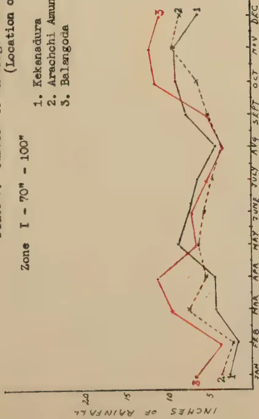

A line graph showing average monthly rainfall in inches for three stations in Zone I (70" - 100"). The x-axis represents months from January to December. The y-axis represents rainfall in inches from 0 to 20. Station 1 (Kekenadura) is shown with a solid line, Station 2 (Arachchi Amuna) with a dashed line, and Station 3 (Balangoda) with a dotted line. All three stations show a similar pattern of rainfall, with a peak in July and August and a minimum in January and February.

<table border="1">
<thead>
<tr>
<th>Month</th>
<th>Station 1 (Kekenadura)</th>
<th>Station 2 (Arachchi Amuna)</th>
<th>Station 3 (Balangoda)</th>
</tr>
</thead>
<tbody>
<tr><td>JAN</td><td>5</td><td>5</td><td>5</td></tr>
<tr><td>FEB</td><td>5</td><td>5</td><td>5</td></tr>
<tr><td>MAR</td><td>10</td><td>10</td><td>10</td></tr>
<tr><td>APR</td><td>10</td><td>10</td><td>10</td></tr>
<tr><td>MAY</td><td>10</td><td>10</td><td>10</td></tr>
<tr><td>JUNE</td><td>15</td><td>15</td><td>15</td></tr>
<tr><td>JULY</td><td>18</td><td>18</td><td>18</td></tr>
<tr><td>AUG</td><td>18</td><td>18</td><td>18</td></tr>
<tr><td>SEPT</td><td>15</td><td>15</td><td>15</td></tr>
<tr><td>OCT</td><td>10</td><td>10</td><td>10</td></tr>
<tr><td>NOV</td><td>5</td><td>5</td><td>5</td></tr>
<tr><td>DEC</td><td>5</td><td>5</td><td>5</td></tr>
</tbody>
</table>

Fig. 1.

Zone II - 100" - 150"

- 1. Kalutara
- 2. Hiya re
- 3. Deniyaya
- 4. Hanwells
- 5. Nakiadeniya

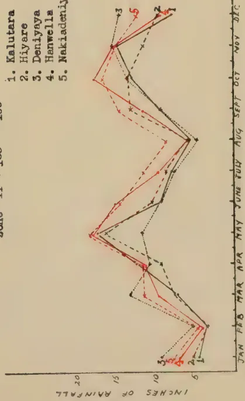

A line graph showing average monthly rainfall in inches for five stations in Zone II (100" - 150"). The x-axis represents months from January to December. The y-axis represents rainfall in inches from 0 to 20. Station 1 (Kalutara) is shown with a solid line, Station 2 (Hiya re) with a dashed line, Station 3 (Deniyaya) with a dotted line, Station 4 (Hanwells) with a dash-dot line, and Station 5 (Nakiadeniya) with a long-dashed line. All five stations show a similar pattern of rainfall, with a peak in July and August and a minimum in January and February.

<table border="1">
<thead>
<tr>
<th>Month</th>
<th>Station 1 (Kalutara)</th>
<th>Station 2 (Hiya re)</th>
<th>Station 3 (Deniyaya)</th>
<th>Station 4 (Hanwells)</th>
<th>Station 5 (Nakiadeniya)</th>
</tr>
</thead>
<tbody>
<tr><td>JAN</td><td>5</td><td>5</td><td>5</td><td>5</td><td>5</td></tr>
<tr><td>FEB</td><td>5</td><td>5</td><td>5</td><td>5</td><td>5</td></tr>
<tr><td>MAR</td><td>10</td><td>10</td><td>10</td><td>10</td><td>10</td></tr>
<tr><td>APR</td><td>10</td><td>10</td><td>10</td><td>10</td><td>10</td></tr>
<tr><td>MAY</td><td>10</td><td>10</td><td>10</td><td>10</td><td>10</td></tr>
<tr><td>JUNE</td><td>15</td><td>15</td><td>15</td><td>15</td><td>15</td></tr>
<tr><td>JULY</td><td>18</td><td>18</td><td>18</td><td>18</td><td>18</td></tr>
<tr><td>AUG</td><td>18</td><td>18</td><td>18</td><td>18</td><td>18</td></tr>
<tr><td>SEPT</td><td>15</td><td>15</td><td>15</td><td>15</td><td>15</td></tr>
<tr><td>OCT</td><td>10</td><td>10</td><td>10</td><td>10</td><td>10</td></tr>
<tr><td>NOV</td><td>5</td><td>5</td><td>5</td><td>5</td><td>5</td></tr>
<tr><td>DEC</td><td>5</td><td>5</td><td>5</td><td>5</td><td>5</td></tr>
</tbody>
</table>

Fig. 2.

Zone III - above 150"

- 1. Yatiyantota
- 2. Ingiriya
- 3. Kitulgala
- 4. Carney Estate

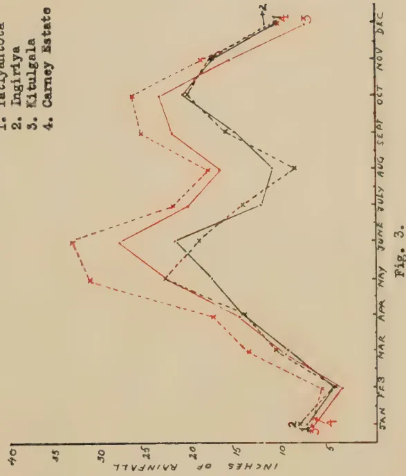

A line graph showing average monthly rainfall in inches for four stations in Zone III (above 150"). The x-axis represents months from January to December. The y-axis represents rainfall in inches from 0 to 40. Station 1 (Yatiyantota) is shown with a solid line, Station 2 (Ingiriya) with a dashed line, Station 3 (Kitulgala) with a dotted line, and Station 4 (Carney Estate) with a dash-dot line. All four stations show a similar pattern of rainfall, with a peak in July and August and a minimum in January and February.

<table border="1">
<thead>
<tr>
<th>Month</th>
<th>Station 1 (Yatiyantota)</th>
<th>Station 2 (Ingiriya)</th>
<th>Station 3 (Kitulgala)</th>
<th>Station 4 (Carney Estate)</th>
</tr>
</thead>
<tbody>
<tr><td>JAN</td><td>5</td><td>5</td><td>5</td><td>5</td></tr>
<tr><td>FEB</td><td>5</td><td>5</td><td>5</td><td>5</td></tr>
<tr><td>MAR</td><td>10</td><td>10</td><td>10</td><td>10</td></tr>
<tr><td>APR</td><td>10</td><td>10</td><td>10</td><td>10</td></tr>
<tr><td>MAY</td><td>10</td><td>10</td><td>10</td><td>10</td></tr>
<tr><td>JUNE</td><td>15</td><td>15</td><td>15</td><td>15</td></tr>
<tr><td>JULY</td><td>25</td><td>25</td><td>25</td><td>25</td></tr>
<tr><td>AUG</td><td>25</td><td>25</td><td>25</td><td>25</td></tr>
<tr><td>SEPT</td><td>20</td><td>20</td><td>20</td><td>20</td></tr>
<tr><td>OCT</td><td>10</td><td>10</td><td>10</td><td>10</td></tr>
<tr><td>NOV</td><td>5</td><td>5</td><td>5</td><td>5</td></tr>
<tr><td>DEC</td><td>5</td><td>5</td><td>5</td><td>5</td></tr>
</tbody>
</table>

Fig. 3.

S. G. O. 8. 1. 43.

89------------------------------------------------

This image is a scan of a blank page. The background is a uniform light beige or tan color. There are a few very small, dark specks scattered across the surface, which appear to be scanning artifacts or dust particles. No text, lines, or other graphical elements are present.

90------------------------------------------------

THE SOILS AND ECOLOGY OF THE WET EVERGREEN FORESTS OF CEYLON

PROFILE DIAGRAMS

Legend

Mineral Skeleton :-

Ferruginous concretions (some cut through) drawn roughly to scale

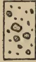

Quartz concretions drawn roughly to scale

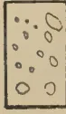

Stones or undecomposed boulders drawn roughly to scale

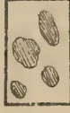

Decomposing rock or boulders

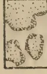

Bands of iron ore

Red mottlings (or streaks) of iron-oxide

Yellow mottlings (or streaks) of iron-oxide

Roots and humus :-

Root matting

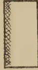

Humus or decaying vegetable matter

Roots (small)

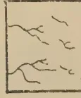

Large roots cut through

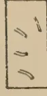

Horizon Boundaries :-

———— boundary distinct

- - - - - boundary merging

~~~~~ boundary undulating

Texture :- Texture of horizon written opposite appropriate horizon

Colour :- Colour of horizon written opposite appropriate horizon

Coarse sand

Veins or pockets of Clay

Plate 4.

S.A.O. 8. I. 43.

91------------------------------------------------

This image is a scan of a blank page. The background is a uniform light beige or tan color. There are a few very small, dark specks scattered across the surface, which appear to be scanning artifacts or dust particles. No text, lines, or other graphical elements are present.

92------------------------------------------------

SERIES I

SERIES II

SERIES III  
sub-series 1

Kudawa, 700'  
Gilmale

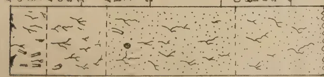

A.1.0-6" dark greyish brown loam  
A.2.6"-16" dark brown sandy loam  
A.3.16"-38" brown sandy loam  
C. below 38" golden brown alluvial sand  
1'  
2'  
3'  
4'

Diagram 1

Gayirengama, 2300'  
Bamberabotuwa

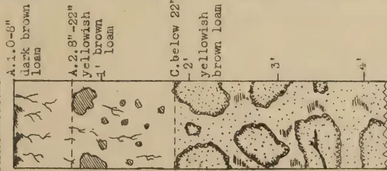

A.1.0-8" dark brown loam  
A.2.8"-22" yellowish brown loam  
C. below 22" yellowish brown loam  
1'  
2'  
3'  
4'

Diagram 2

Farawalatenne, 400'  
Kelani Valley

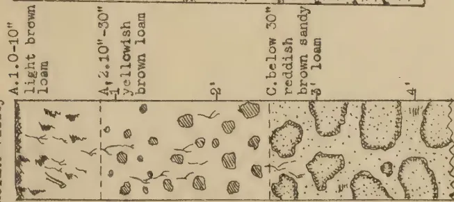

A.1.0-10" light brown loam  
A.2.10"-30" yellowish brown loam  
C. below 30" reddish brown sandy loam  
1'  
2'  
3'  
4'

Diagram 3

Owala Mahabags, 600'  
Bamberabotuwa

A. 0-20" dark greyish brown sandy loam  
C. below 20" yellowish brown loam  
C. below 20" yellowish brown loam  
1'  
2'  
3'  
4'

Diagram 4

Madawala, 700'  
Kelani Valley

A.1.0-9" loose light brown sandy loam  
A.2.9"-26" yellowish brown sandy loam  
C.1.26"-39" reddish brown loam  
C.2. below 39" dark reddish brown clayey loam  
1'  
2'  
3'  
4'

Diagram 5

Gerandiolla, 1800'  
Bamberabotuwa

A.1.0-8" loose dark brown sandy loam  
A.2.8"-22" yellowish brown sandy loam  
C. below 22" 2' decomposing parent rock with yellowish brown loam  
1'  
3'

Diagram 6

Plate 5

S.G.O. B. I. 43.

93------------------------------------------------

This image is a scan of a blank page. The background is a uniform light beige or tan color. There are a few very small, dark specks scattered across the surface, which appear to be scanning artifacts or dust particles. No text, lines, or other graphical elements are present.

94------------------------------------------------

SERIES III

sub-series iii

sub-series ii

sub-series i

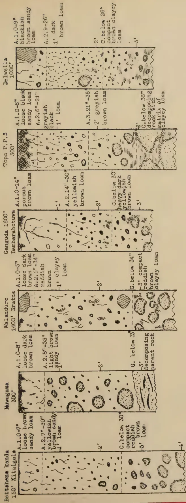

The figure displays six soil profile diagrams, each showing a vertical cross-section of soil with various horizons and their descriptions. The profiles are labeled with their respective locations and depths.

- **Battahena kanda (150'):**
  - A.1.0-7" loose brown sandy loam (1')
  - A.2.7"-30" yellowish brown sandy loam (1')
  - C. below 30" compact reddish brown loam (2')
  - C. below 30" compact reddish brown loam (3')
- **Muwagama (300'):**
  - A.1.0-8" loose dark brown loam (1')
  - A.2.8"-33" light brown sandy loam (1')
  - G. below 33" decomposing parent rock (2')
  - G. below 33" decomposing parent rock (3')
- **Walandure (1400') Eratne:**
  - A.1.0-5" loose dark brown loam (1')
  - A.2.5"-34" reddish brown clayey loam (1')
  - C. below 34" compact reddish brown clayey loam (2')
  - C. below 34" compact reddish brown clayey loam (3')
- **Gangoda (1600') Bambarebotuwa:**
  - A.1.0-14" porous brown loam (1')
  - A.2.14"-30" yellowish brown loam (1')
  - C. below 30" heavy dark yellowish brown loam (2')
  - C. below 30" heavy dark yellowish brown loam (3')
- **Topo P.P.3 (300'):**
  - A.1.0-6" loose black sandy loam (1')
  - A.2.6"-21" greyish black loam (1')
  - A.3.21"-36" greyish brown loam (2')
  - C. below 36" decomposing rock with matrix of clayey loam (3')
- **Delwella (1000'):**
  - A.1.0-9" blackish brown sandy loam (1')
  - A.2.9-26" dark brown loam (1')
  - C. below 26" compact brown clayey loam (2')
  - C. below 26" compact brown clayey loam (3')

Diagram 7      Diagram 8      Diagram 9      Diagram 10      Diagram 11      Diagram 12

Plate 6.  
S.A.O. 8. I. 43.

95------------------------------------------------

This image is a scan of a blank page. The paper has a light beige or cream-colored tint. There are a few very small, dark specks scattered across the surface, which appear to be scanning artifacts or dust particles. No text, lines, or other markings are present on the page.

96------------------------------------------------

SERIES III  
sub-series iii

Talawitiya

300'

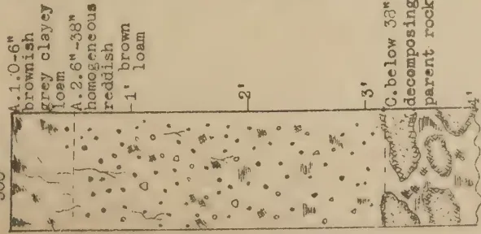

A.1.0-6" brownish grey clayey loam  
A.2.6"-38" homogeneous reddish brown loam  
B.1' brown loam  
C. below 38" decomposing parent rock

Diagram 13

Masimbula

1400'

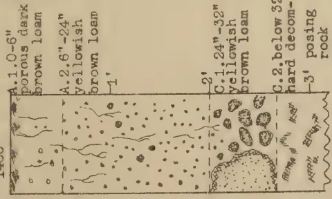

A.1.0-6" porous dark brown loam  
A.2.6"-24" yellowish brown loam  
B.1' yellowish brown loam  
C.1.24"-32" yellowish brown loam  
C.2. below 32" hard decomposing rock

Diagram 14

Gilimala 500'

Duragekande

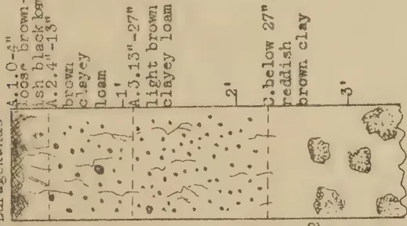

A.1.0-4" pods. brownish black loam  
A.2.4"-13" brown clayey loam  
B.1' light brown clayey loam  
C. below 27" reddish brown clay

Diagram 15

Merekele

800'

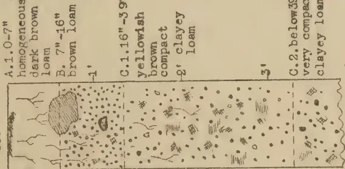

A.1.0-7" homogeneous dark brown loam  
B.7"-16" brown loam  
C.1.16"-39" yellowish brown compact clayey loam  
C.2. below 39" very compact clayey loam

Diagram 16

Gilimala 1800'

Ratgama

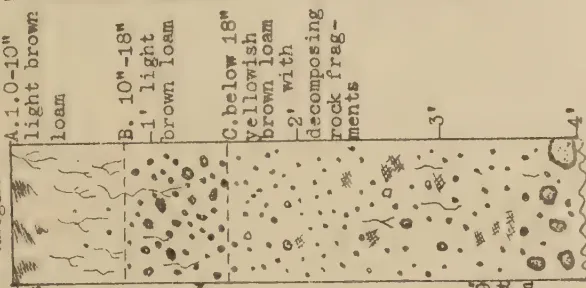

A.1.0-10" light brown loam  
B.10"-18" light brown loam  
C. below 18" yellowish brown loam with decomposing rock fragments  
C.2. below 31" reddish stiff clayey loam

Diagram 17

Mudukotuwa

150'

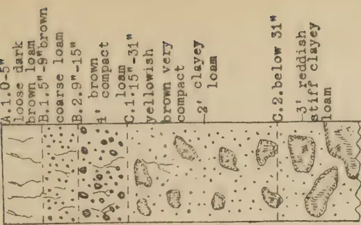

A.1.0-5" loose dark brown loam  
B.1.5"-9" brown coarse loam  
B.2.9"-15" brown compact loam  
C.1.15"-31" yellowish brown very compact clayey loam  
C.2. below 31" reddish stiff clayey loam

Diagram 18

Plate 7

S. G. O. 3. 1. 43.

97------------------------------------------------

This image is a scan of a blank page. The background is a uniform light beige or tan color. There are a few very small, dark specks scattered across the surface, which appear to be scanning artifacts or dust particles. No text, lines, or other graphical elements are present.

98------------------------------------------------

SERIES V

SERIES VI

Magurugoda

200'

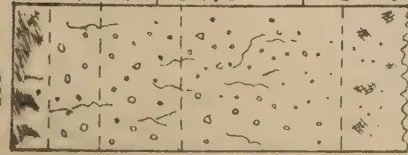

A.1.0-3" fine blackish sand  
 A.2.3"-7" blackish loam  
 A.3.7"-14" brown loam  
 C.1.14" - 27" yellowish brown clayey loam  
 C.2. below 27" stiff yellow clay

Diagram 19

Madampe

1500'

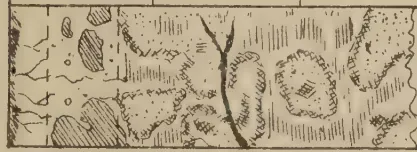

A.1.0-5" blackish sandy loam  
 A.2.3"-9" blackish loam  
 C. below 9" Deep slate loam with veins of clay in between decomposing rock

Diagram 20

Dambuliwana

500'

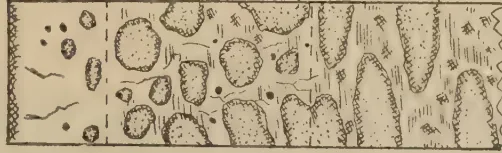

A.1.0-8" grey sandy loam  
 C.1.8"-26" greyish brown clayey loam with decomposing rock fragments  
 C.2. below 25" greyish brown clay in between decomposing rock

Diagram 21

Mipagama

1100'

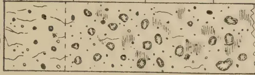

A.0-11" brown loam  
 C.1. below 11" yellowish brown loam with clay in between decomposed rock  
 C.2. below 25" greyish brown clay in between decomposing rock

Diagram 22

Delwella, 2,

1000'

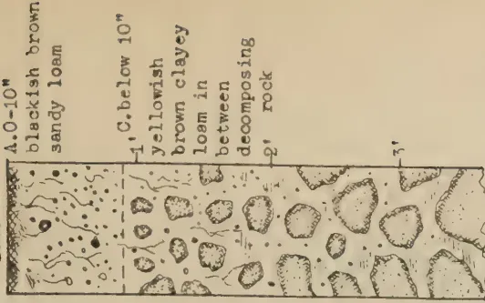

A.0-10" blackish brown sandy loam  
 C. below 10" yellowish brown clayey loam in between decomposing rock  
 C.2. below 25" greyish brown clay in between decomposing rock

Diagram 23

Plate 8

S.G.O. 6. 1. 45.

99------------------------------------------------

This image is a scan of a blank page. The paper has a light beige or cream-colored tint. There are a few very small, dark specks scattered across the surface, which appear to be scanning artifacts or dust particles. No text, lines, or other markings are present on the page.

100------------------------------------------------

PLATE 9.

Block by Survey Dept. Galle

1. The *Dipterocarpus* Community. Madakada forest, Western Province. The tall light barked trees are *hora-Dipterocarpus Zeylanicus*. The undergrowth (in the fore-ground) contains the *bata* bamboo, *Ochlanda stridula*, the tall shrub *kekirucara* - *Schumacheria castaneifolia*, and ferns including *Nephrolepis exaltata* and *Aspidopsis erecta*.

Block by Survey Dept. Galle

2. The *Dipterocarpus* Community. Kottawa forest, Galle District. The large rough barked trees in the foreground are *bu hora-Dipterocarpus hispidus*. The undergrowth, in the foreground, contains the same shrub (*Schumacheria*) and bamboo species.

101------------------------------------------------

PLATE 10.

BLOCK BY SURVEY DEPT. CYLION

3. The *Dipterocarpus* Community. Madakada forest, Western Province. The tall light barked trees are *hora-Dipterocarpus Zeylanicus*. The predominant girth class here is 2-4 feet, and height 80-90 feet. Note thick cover of *bata-Ochlanda stridula* in the foreground.

BLOCK BY SURVEY DEPT. CYLION

4. The *Mesua Doona* Community. Delwella forest, Ratnapura District. The large tree in the left foreground (near figure) is *Yahahalu-dun-Doona trapezifolia* and in the right foreground, *na-Mesua ferrea*. The understorey trees in the centre are *madol (Garcinia echinocarpa)*. The large-leaved tall shrub in the extreme right foreground is *beru-Aprostostachys longifolia*.

102------------------------------------------------

PLATE II.

BLOCK BY SURVEY DIST. CYALON

5. The *Vitex*-*Wormia*-*Chaetocarpus*-*Anesophyllea*-*(Dillenia)* Community. Ingiriya forest, Western Province. Natural forest containing chiefly *milla*-*Vitex pinnata* heavily felled selectively in the past. Note poor stem and crown form. Heavy growth of *bata*-*Ochlanda stridula* on the edge of forest and *kekirwara*-*Schumacheria castaneaefolia* in the undergrowth.

BLOCK BY SURVEY DIST. CYALON

6. The *Myristica*-*Semecarpus*-*Mangifera* and other softwooded species Faciation. Kottawa forest, Galle District. Growth is strikingly better than in the main Community. (Vide photograph opposite). The undergrowth in the foreground contains *Schumacheria* (right of figure) and ferns. *Neprolepis exaltata* (left foreground).

103------------------------------------------------

PLATE 12.

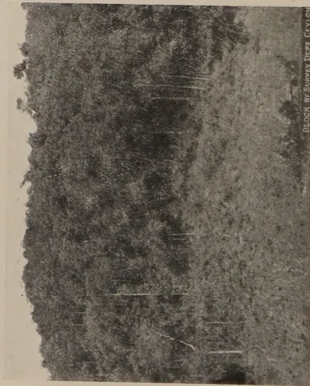

7. The *Vitex*-*Wormia*-*Chaetocarpus*-*Anisophyllea* Community. Thandikele forest, Ratnapura District. Typical appearance of heavily exploited forest. Note poor height growth, poor bole form and spreading crowns. The clearing in the foreground is *chena*, reafforested with *jak*.

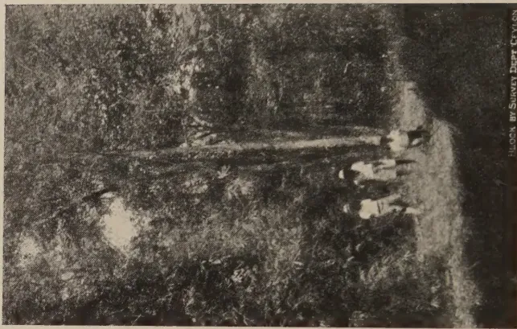

8. The *Aporosa*-*Chaetocarpus*-*Viter-Anisophyllea* Low Jungle Community. Karawitakande forest, Ratnapura District. The low-branched tree in the centre is *hedawaka-chaetocarpus*-*Castanocarpus*. The height growth is poor, under 50 feet. Tall, thick *bata* bamboo-*Ochlanda* to be observed in the left foreground.

104------------------------------------------------

PLATE 13.

9. *Scrub Jungle Community*.—Yagirale forest, Kalutara District. A late stage in natural colonization of clear felled forest. An almost pure consociation of *gedumba-Trema orientalis* covers the entire area.

10. Portion of Kammeliya forest, Galle District. The topography is typical of the Wet Evergreen Forests on the escarpment slopes of the second peneplain. Note the burnt patch on the hill on the right covered with *kekilla-Gleichenia linearis*. Also the steep rocky precipice on the left.

105------------------------------------------------

11 3112