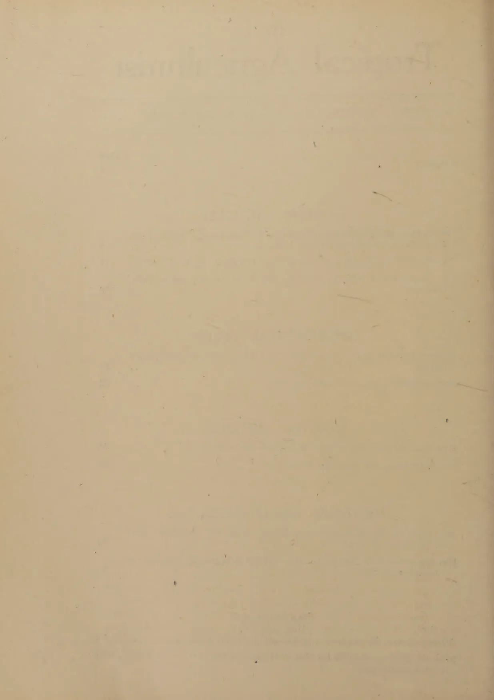
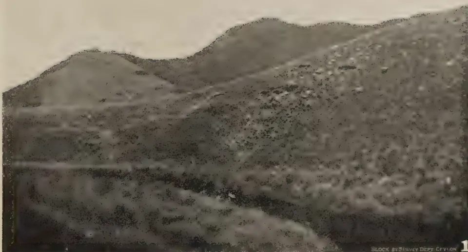
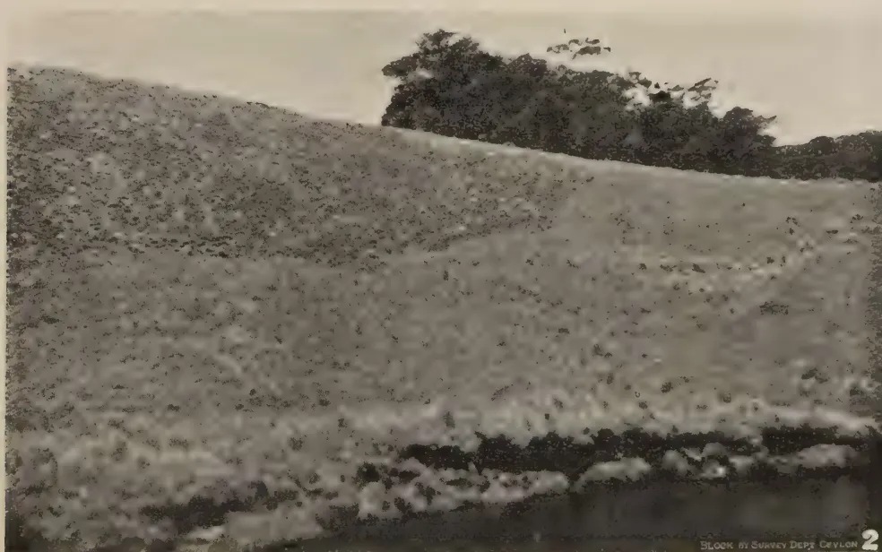
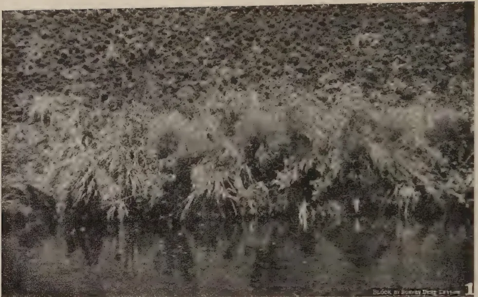
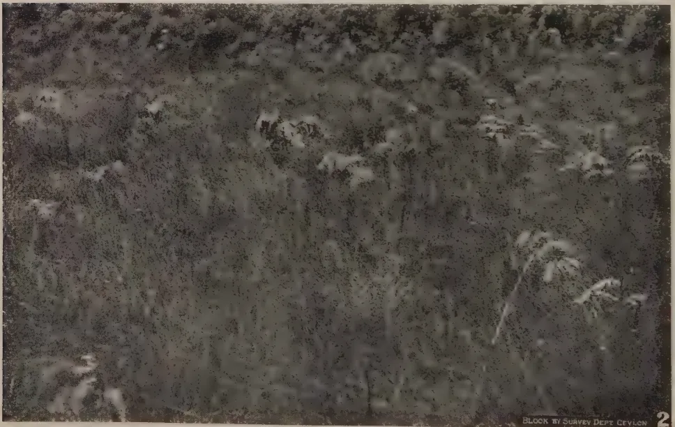
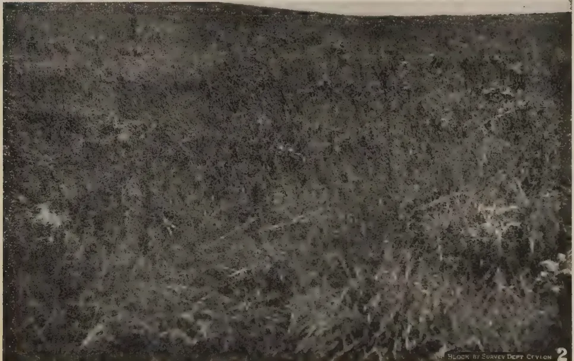
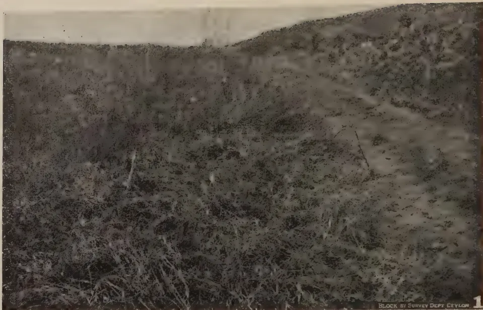
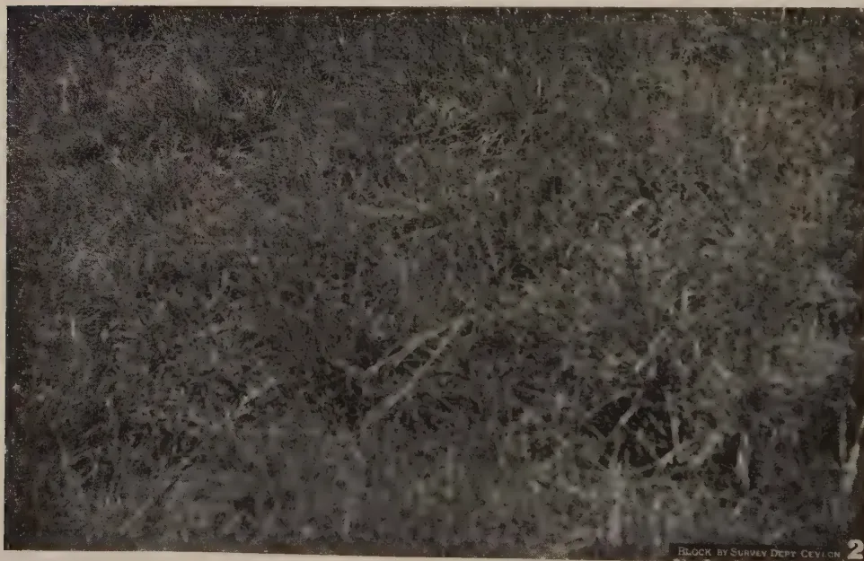
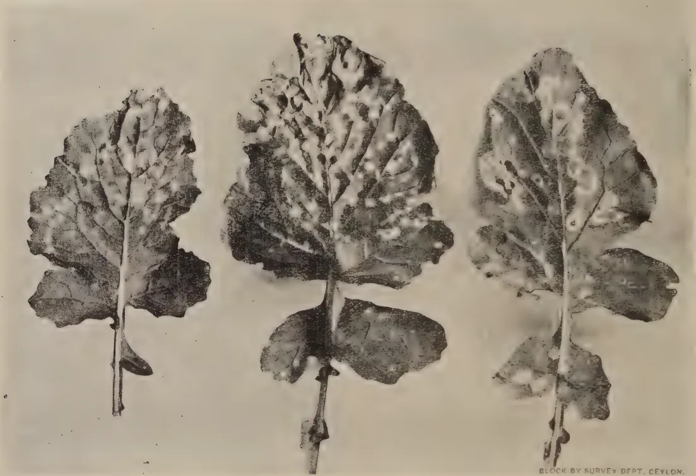
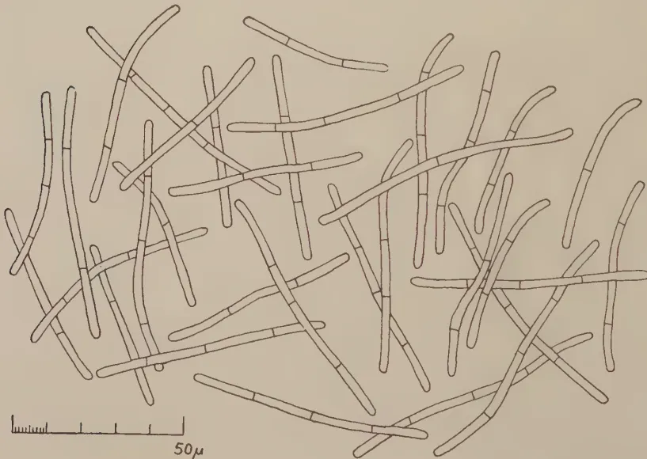

# The Tropical Agriculturist

---

VOL. XCVIII PERADENIYA, OCTOBER-DECEMBER, 1942. No. 4.

---

<table><thead><tr><th></th><th style="text-align: right;">Page</th></tr></thead><tbody><tr><td>Editorial .. .. .</td><td style="text-align: right;">1</td></tr></tbody></table>

## ORIGINAL ARTICLES

<table><tbody><tr><td>Patana Burning with Particular Reference to Pasturage and Wet Patanas. By J. E. Senaratna, B.Sc. (Lond.), F.L.S. .. .. .</td><td style="text-align: right;">3</td></tr><tr><td>"White Snot" of Turnip : A Disease New to Ceylon. By T. E. T. Bond</td><td style="text-align: right;">17</td></tr></tbody></table>

## ERRATA

*The Tropical Agriculturist*, April to June, 1942, page 7, lines 9 and 16 from bottom : substitute 8 for 6.

---

<table><tbody><tr><td>deniya .. .. .</td><td style="text-align: right;">26</td></tr><tr><td>Departmental Laying Competition, 1942 .. .. .</td><td style="text-align: right;">42</td></tr></tbody></table>

## SELECTED ARTICLES

<table><tbody><tr><td>Experimental Breeding of Dairy Cattle for the Tropics .. .. .</td><td style="text-align: right;">44</td></tr><tr><td>Soil Cultivation and Increased Production .. .. .</td><td style="text-align: right;">52</td></tr></tbody></table>

## MEETINGS, CONFERENCES, &c.

<table><tbody><tr><td>Minutes of the 5th Meeting of the Central Board of Agriculture held on December 21, 1942 .. .. .</td><td style="text-align: right;">59</td></tr><tr><td>Minutes of the 63rd Meeting of the Rubber Research Board held on November 2, 1942. .. .. .</td><td style="text-align: right;">70</td></tr></tbody></table>

## RETURNS

<table><tbody><tr><td>Animal Disease Return for the Month of December, 1942 .. .. .</td><td style="text-align: right;">73</td></tr><tr><td>Meteorological Reports for October to December, 1942 .. .. .</td><td style="text-align: right;">74-76</td></tr></tbody></table>

1—J. N. A 22151 (3/43).

1------------------------------------------------

1890  
1891  
1892  
1893  
1894  
1895  
1896  
1897  
1898  
1899  
1900  
1901  
1902  
1903  
1904  
1905  
1906  
1907  
1908  
1909  
1910  
1911  
1912  
1913  
1914  
1915  
1916  
1917  
1918  
1919  
1920  
1921  
1922  
1923  
1924  
1925  
1926  
1927  
1928  
1929  
1930  
1931  
1932  
1933  
1934  
1935  
1936  
1937  
1938  
1939  
1940  
1941  
1942  
1943  
1944  
1945  
1946  
1947  
1948  
1949  
1950  
1951  
1952  
1953  
1954  
1955  
1956  
1957  
1958  
1959  
1960  
1961  
1962  
1963  
1964  
1965  
1966  
1967  
1968  
1969  
1970  
1971  
1972  
1973  
1974  
1975  
1976  
1977  
1978  
1979  
1980  
1981  
1982  
1983  
1984  
1985  
1986  
1987  
1988  
1989  
1990  
1991  
1992  
1993  
1994  
1995  
1996  
1997  
1998  
1999  
2000  
2001  
2002  
2003  
2004  
2005  
2006  
2007  
2008  
2009  
2010  
2011  
2012  
2013  
2014  
2015  
2016  
2017  
2018  
2019  
2020  
2021  
2022  
2023  
2024  
2025  
2026  
2027  
2028  
2029  
2030  
2031  
2032  
2033  
2034  
2035  
2036  
2037  
2038  
2039  
2040  
2041  
2042  
2043  
2044  
2045  
2046  
2047  
2048  
2049  
2050  
2051  
2052  
2053  
2054  
2055  
2056  
2057  
2058  
2059  
2060  
2061  
2062  
2063  
2064  
2065  
2066  
2067  
2068  
2069  
2070  
2071  
2072  
2073  
2074  
2075  
2076  
2077  
2078  
2079  
2080  
2081  
2082  
2083  
2084  
2085  
2086  
2087  
2088  
2089  
2090  
2091  
2092  
2093  
2094  
2095  
2096  
2097  
2098  
2099  
2100

2------------------------------------------------

# The Tropical Agriculturist

---

VOL. XCVIII PERADENIYA, OCTOBER-DECEMBER, 1942. No. 4.

---

<table><thead><tr><th></th><th style="text-align: right;">Page</th></tr></thead><tbody><tr><td>Editorial .. .. .</td><td style="text-align: right;">1</td></tr></tbody></table>

## ORIGINAL ARTICLES

<table><tbody><tr><td>Patana Burning with Particular Reference to Pasturage and Wet Patanas. By J. E. Senaratna, B.Sc. (Lond.), F.L.S. .. .. .</td><td style="text-align: right;">3</td></tr><tr><td>"White Spot" of Turnip: A Disease New to Ceylon. By T. E. T. Bond</td><td style="text-align: right;">17</td></tr><tr><td>The Production of Hibiscus Hybrids. By D. M. A. Jayaweera, B.Sc. (London) .. .. .</td><td style="text-align: right;">19</td></tr></tbody></table>

## DEPARTMENTAL NOTES

<table><tbody><tr><td>Items of Interest in the Activities of the Royal Botanic Gardens, Pera- deniya .. .. .</td><td style="text-align: right;">26</td></tr><tr><td>Departmental Laying Competition, 1942 .. .. .</td><td style="text-align: right;">42</td></tr></tbody></table>

## SELECTED ARTICLES

<table><tbody><tr><td>Experimental Breeding of Dairy Cattle for the Tropics .. .. .</td><td style="text-align: right;">44</td></tr><tr><td>Soil Cultivation and Increased Production .. .. .</td><td style="text-align: right;">52</td></tr></tbody></table>

## MEETINGS, CONFERENCES, &c.

<table><tbody><tr><td>Minutes of the 5th Meeting of the Central Board of Agriculture held on December 21, 1942 .. .. .</td><td style="text-align: right;">59</td></tr><tr><td>Minutes of the 63rd Meeting of the Rubber Research Board held on November 2, 1942. .. .. .</td><td style="text-align: right;">70</td></tr></tbody></table>

## RETURNS

<table><tbody><tr><td>Animal Disease Return for the Month of December, 1942 .. .. .</td><td style="text-align: right;">73</td></tr><tr><td>Meteorological Reports for October to December, 1942 .. .. .</td><td style="text-align: right;">74-76</td></tr></tbody></table>

1—J. N. A 22151 (3/43).

3------------------------------------------------

<!-- stage4: FAINT old-images-only -->

[Faint page: no legible print of its own could be verified; text withheld (stage 4 review list)]

This image shows a blank, aged, cream-colored page. The paper has a slightly textured appearance with some minor discoloration and faint, illegible markings scattered across the surface. A faint horizontal line is visible near the top of the page, possibly indicating a header or a separator. The overall appearance is that of an old, unused sheet of paper.

4------------------------------------------------

# The Tropical Agriculturist

OCTOBER TO DECEMBER, 1942

---

## EDITORIAL

---

### THE PADDY GROWER AND THE GENERAL PUBLIC

---

**I**N the last few months there has been much correspondence in the daily press and talk in public places regarding the paddy grower's duty to the general public. The views expressed on these occasions have for the most part been coloured by a misunderstanding of the position of the paddy grower and, perhaps, an examination of that position would be useful.

Paddy growing as a business carried out by the employment of paid labour with the intention of covering expenses and retaining a margin of profit has been such a rare practice in this country that in a general survey of the industry the few cases, if any, in which this practice obtained may be ignored without vitiating the conclusions that are drawn from the survey. Tradition and the desire to provide food for the family drove the paddy grower to this form of agriculture and his aim was only to provide enough for the family's consumption from season to season. He seldom over shot this aim except under the more recently opened major tanks where a reasonably adequate area has been allotted to each colonist. On the contrary the average farmer gathers a harvest which is enough to carry the family through only part of the year on the basis of not too liberal a ration.

Paddy farmers may be divided into two classes, (1) cultivators of their own lands who form the large majority and (2) share croppers. Generally speaking, neither group sold paddy. Nor would a 50 per cent. increase in yield enable them to sell much if they retained enough for their own families. To talk of them as suppliers of what has now come to be called the black market or as exploiters of the public misfortune is to betray ignorance of rural conditions. There may be a few cases here and there in which the lure of a tempting price throws a man of this class off his guard and induces him to sell that which he was not in the habit of selling, which he did not intend to sell, and which he

5------------------------------------------------

2

would not sell if he looked a few months ahead. In their case there is no diversion to the black market of paddy that would normally have been available to the open market, and the erring farmer is only a victim of temptation rather than a calculating profit maker. In these circumstances the attitude of the public towards him should be not that of outraged authority forcing him to disgorging his greedy surplus, but that of the hungry prodigal who begs his brother to share with him the latter's inadequate meal.

There remain the colonist under the major tanks and the share cropper's opposite number—the land lord. It is true that there was not in the past keen competition to become colonists in the malarial jungle, and that those who now ask to be fed by the colonist regarded themselves as superior to the colonizing stratum of society. But at the same time there is no doubt that the colonist has received very considerable assistance from the state and that assistance alone enabled him to be in possession of a surplus of food. The public has a right to expect him to make that surplus available to it, not free nor at a scarcity price, but at a price which would enable him to maintain his farm and to procure some of the same luxuries of life as the paddy consumer enjoys.

The land lord stands in a category of his own. The only contribution which he makes to agriculture is ownership which is barren and often even obstructive. There is no need to nurse and sustain him because, if he disappears completely tomorrow, production will not be appreciably reduced; perhaps it will be stimulated. Generally he owns a large area which he divides amongst a number of share croppers from each of whom he gets a share of the harvest varying from one quarter to over one half. His aggregate receipts are in excess of the requirements of his family, and it was his surplus that entered into whatever local trade in paddy there was before the war. It is this same land lord who today sells rice at prices varying between 75 cents and Re. 1.25 per measure in different parts of the country. It does not seem to be contrary to sound policy or to considerations of justice to take over the whole of the landlord's share and to place him on the common ration.

To summarize—a situation may arise, if it has not already arisen, in which not only would the state be justified in ignoring, but it would be its duty to ignore, all considerations of normal justice and to force the paddy grower to surrender his reserve of tomorrow's food to keep the race alive today; but short of that situation rice for the non-farming population must be found in the landlord's share, and in the surplus above their needs that the few colonists established in the last ten years under the major tanks produce.

6------------------------------------------------

3

# PATANA BURNING WITH PARTICULAR REFERENCE TO PASTURAGE AND WET PATANAS

---

## A PRELIMINARY NOTE

---

J. E. SENARATNA, B.Sc. (Lond.), F.L.S.,  
ASSISTANT IN SYSTEMATIC BOTANY

---

WITH FOUR PLATES

---

### INTRODUCTION.

**P**ATANAS are large tracts of undulating grasslands, similar to savannahs, in the centre, east, and south-east of Ceylon. A good account of the botany of the Ceylon patanas is given by H. H. W. Pearson (1), and by J. Parkin and H. H. W. Pearson (2). They are of economic interest as pasturage areas.

In Ceylon the burning of patanas has been practised from ancient times. More recently there has been an outcry against the custom and from time to time attempts have been made to put an end to the practice. Now it is questioned whether burning is really harmful.

Patanas were burnt mainly by the grazier in order to provide fresh succulent pasturage for his cattle and buffaloes; to a small extent by the hunter to drive out game; and sometimes accidentally.

### THE PROBLEM.

The relatively high rainfall of the patanas is not evenly distributed throughout the year, but is seasonal. There are periods of about four months each—the monsoons—during which most of the precipitation takes place, alternating with periods of relative drought. With the commencement of a rainy season the patana grasses start a very active period of vegetative growth which ends with the cessation of the monsoon rains, after which, growth slows down again, and becomes relatively quiescent.

In unburnt areas the large tufts of the patana grasses produce fresh growth, which, however, being surrounded by the old, coarse, fibrous, unpalatable leaves and old stalks, is not easily accessible to stock. At most, they can bite off only the protruding tops at the crown of the tuft. Thus old, dry grass accumulates at the base of the plants, and forms a layer of varying thickness on the ground. This fibrous material does

7------------------------------------------------

4

not readily decay and, as the years go on, the layer becomes thicker and thicker while the plants go on producing less and less feed for stock.

The burning of such a patana has the effect of removing the undecayed layer and the coarse, dry grass, while providing also a certain amount of readily utilizable manure in the form of ash, and of stimulating the plants to fresh, vigorous growth.

After burning, the grass shoots up and the fresh, succulent, palatable grass is very tempting to stock and readily grazed by them. Vegetative growth is so prolific that much more than can be consumed by the limited herds is produced, and consequently, only the tenderest portions are eaten and the rest left. Wild herbivorous animals such as elk from the nearby forests roam at night over this luxuriant pasture and, although consuming some of the rich herbage, enrich the soil with their droppings. Still, so vast are the patanas and so prolific the growth of grass in relation to the feeding animals that there is no question of overgrazing, and more than sufficient leaf is left to the plants for storage of food in the underground rhizomes for future use. This is particularly true of the wet patanas where, from a pasture point of view, there appears to be no deterioration in quality and quantity of feed in spite of all the burning that has been taking place in the past. Rather the contrary.

It is now a well-known fact that quite irrespective of species, tender grass is very rich in protein. Conditions being such, can the grazier be blamed for this age-old practice which, with very little effort on his part, provides him with such a wealth of pasturage for his stock? Why then has the practice been condemned?

The chief objection to burning has been on the ground of soil erosion. What is the effect of burning on the land *qua* land? Denuding any land of its cover of vegetation, particularly its low, ground cover, causes erosion, especially in sloping land as in the case of patanas. To what extent does burning actually increase soil erosion and how does burnt patana land compare in fertility with similar but unburnt areas over a long period of years? And during the same period how far does the harm, if at all, counterbalance the advantage of plentiful, rich pasturage? To answer these questions we must consider the effect on the vegetative cover.

#### SUCCSSION.

It is common observation that vegetation in a state of relative equilibrium with its environment when interfered with, as by burning, reacts in a definite direction. Thus, when an area forming part of a forest is burnt and left to itself, the bare ground is soon covered with grasses and herbs; later, shrubs

8------------------------------------------------

5

appear and ultimately trees when that relative equilibrium is again reached. This change from bare ground, in stages, to vegetation in relative equilibrium with its environment, in this case forest, is known as succession.

This change may take many years or many hundreds of years. In fact, vegetation is constantly changing and the rate of change varies greatly. Once relative equilibrium is reached changes still go on but they are so slow as to be hardly noticeable in short periods of a few years.

Coming back to the area of burnt forest which has again become forest, the same type of forest as that surrounding it is possible only if the other factors of environment have continued to remain relatively unaltered. But if, for example, the soil has quickly changed owing to soil erosion or other causes so that the fertility has been greatly diminished, the forest stage may not be reached but a relatively stable scrub type of vegetation may be formed. Such is seen in the scrub formed after chena cultivation in the dry zone. Again, if forest or scrub are not given time to form, as by frequent burning, a grassland type may become relatively stable. Thus probably originated the large stretches of patanas which exist today in an otherwise forest-clad environment.

In each case the stage of relative equilibrium reached is known as the climax stage: thus in the examples cited above, the climax stage is forest in the first case, scrub in the second, and grassland in the third.

There may be still smaller sub-divisions as climax stages *e.g.*, in grassland, relative equilibrium with the environment may be reached with the large, tufted grass, *mana* (Sinhalese), *Cymbopogon confertiflorus* (Steud.) Stapf, dominant; or with the smaller, tufted grass *pini-baru-tana* (Sinhalese), *Themeda tremula* (Nees ex Steud.) Hack., dominant; or with the wiry, tufted grass *et-tuttiri* (Sinhalese), *Aristida setacea* Retz., (or *A. Adscensionis* L.) dominant: in which cases the climax will be the *mana* dominant stage, or the *pini-baru-tana* dominant stage, or the *et-tuttiri* dominant stage respectively.

#### THE CEYLON PATANAS.

Patanas form a distinct and homogeneous type of natural grassland with well-defined characters. Their area is not known. Quoting Pearson (1): "Tennent almost certainly exaggerates when he says 'the extent of this patana-land is enormous in Ceylon, amounting to millions of acres'. The area of the district under consideration may be taken roughly as 200,000 acres [73,000 hectares]. The flora of the patanas as a whole is composed of plants which, generally speaking, present characters which tend to reduce transpiration and to

9------------------------------------------------

6

protect delicate parts from the injurious effects of intense illumination : broadly speaking, it may thus be regarded as a ' Xerophyte-Association ' in Warming's sense ". Patanas are large savannah-like regions, mostly composed of coarse tussocky grasses, of which only the tender shoots of some are palatable. Patanas appear to be a climax type ; several theories have been advanced to account for this. Characteristic patana country is found in Uva at altitudes from 2,000 to 4,500 feet. From the Uva patanas of these lower altitudes, " wide and extensive tongues of patana-vegetation protrude into the forest on the eastern slopes of the central ridge, and even in places cross the summit of the ridge : thus, extensive patanas are found on Horton Plains (7,000 ft.), on the eastern slopes of Totapella, up the Hakgala valley, and across the ridge as far as Nuwara Eliya ". Pearson's work should be consulted for a full account of the patana vegetation. (Senaratna (3) .)

The patana areas may be conveniently considered under two main sub-divisions—the dry patanas, and the wet patanas.

#### THE DRY PATANAS.

The dry patanas occur between 2,000 and 4,500 feet elevation. They receive 75 to 100 inches of rainfall but most of it during the North-East Monsoon, so that during the remaining eight months of the year, March to October, they experience relative drought. They are more savannah-like than are the wet patanas. Quoting Pearson, again, " . . . the conditions which determine the characteristic features of the flora are, briefly, intense illumination, the heating effects of the rays of a vertical sun, and a comparatively dry season of eight months' duration, during six months of which a drying wind blows constantly over the area and the sky is usually unclouded. The evaporation from the surface is therefore intense—a fact which must have a considerable influence upon the vegetation of a district which has little standing water, and but little soil by which absorbed water may be retained, and which therefore depends for its water-supply upon dew and rainfall ; and the latter, as we have already seen, is, during the dry season, comparatively small in amount ; and what little there is, by reason of the undulation of the country and the hardness of the surface, tends to run off rather than be absorbed. Therefore the supply of water to the roots is small, and the necessity for the reduction of transpiration imperative ".

#### THE WET PATANAS.

The wet patanas occur from 4,500 to 8,000 feet elevation. They receive 75 to 125 inches of rainfall which is more evenly distributed and they experience both monsoons. The sun is often clouded so that the intensity of illumination is less. The

10------------------------------------------------

7

soil is rich in humus which varies in thickness from a few inches to a few feet, and it retains a considerable amount of water. The flora consists mainly of species of grasses of the same genera as in the dry patanas but here the growth is more luxuriant. Above 5,000 feet the flora is almost temperate; and above 6,000 feet the tufted grasses become more compact to form a coarse turf.

It is particularly in these wet patanas with their heavy, fairly evenly distributed rainfall and water-retaining soil that most can be expected from a pasture point of view. At Bopatalawa, 5,100 feet elevation, general observations have shown that burning tends to reduce the dominant *mana* which is relatively useless from a pasture point of view and increase the useful *pini-baru-tana*, *rat-tana* (Sinhalese) (*Ischaemum ciliare* Retz.), and other species.

#### THE EFFECT OF BURNING ON SUCCESSION.

In Ceylon no experimental data are available to indicate definitely the harmfulness or otherwise of this almost universal practice of burning. Trials are being conducted but from the very nature of the problem it will be many years before definite results can be obtained. A certain amount of work on similar problems has been done in other countries, particularly in South Africa, and a resumé of that work should, at this stage, be useful in giving helpful indications.

#### VELD BURNING IN SOUTH AFRICA.

J. W. Bews (4) writing on grassland succession in South Africa, states—" . . . . In the more mesophytic [i.e., fairly and continuously moist] areas of eastern South Africa there are three main stages of the grassland plant succession, if we begin with the dry open spaces . . . . the three stages are dominated respectively by—

- (a) Species of *Aristida*, *Eragrostis*, *Sporobolus*, *Cynodon*, &c.;
- (b) *Themeda triandra* with *Andropogon* spp.; and
- (c) *Cymbopogon* spp. with shrubs. The third stage is really, however, transitional to forest.

"It is only in the more mesophytic areas that the grassland plant succession in South Africa advances towards forest. Over great stretches of the high plateau, as well as over a good deal of Natal, *Themeda* represents the final stage. In drier areas the grasslands succession does not proceed beyond the first stage, and *Aristida* spp., &c., are dominant in the climax vegetation . . . ."

In certain areas of South Africa experiments showed that burning tended to improve the stock-carrying capacity of the grasslands whereas in other areas similar experiments gave an opposite result—the veld becoming poorer with regard to its

11------------------------------------------------

8

carrying capacity, so that some farmers maintained that burning was good and necessary while others contended that it was harmful and wasteful.

"The reason for these opposite results soon became apparent from a study of the question in relation to succession. Burning tends to throw back the succession, and if long continued it destroys the climax stages and the succession has to start afresh. Now on farms situated in mesophytic areas (forest areas), the Tambookie grasses (*Cymbopogon*) and accompanying shrubs—the third stage mentioned above—are more or less useless for stock. If these are burned, the earlier (*Themeda* and *Andropogon*) stage is, temporarily at least, established and provides good grazing. Farmers in such areas were therefore advised to continue the practice of burning, but to take care not to burn more often than necessary, lest in turn they might destroy the mesophytic grasses (*Themeda*, &c.) and bring in the pioneer wire grasses (*Aristida* spp., &c.).

"In drier areas over all the eastern high veld plateau, where the climax stage consists of *Themeda* and *Andropogon* spp., burning tends to destroy this also, and the pioneer stages, *Aristida*, *Eragrostis*, &c., take possession. These being xerophytic [living in and adapted to conditions of drought] are unpalatable to stock and of less value. In such areas farmers were advised not to burn the grass, but to graze it down or to cut it, so as to give the early growth in spring a chance to develop. Where *Aristida* spp. were already dominant the more mesophytic species might be re-established by discontinuing the practice of burning.

"An important result, therefore, of the work on grassland successions was not merely the satisfaction of reconciling conflicting opinions among farmers, but the ability to give detailed advice on grass veld treatment under the varying conditions which prevail over South Africa."

#### BEARING OF THE WORK IN SOUTH AFRICA ON THE PROBLEM IN CEYLON.

Writing generally, from somewhat limited observation, in Ceylon, too, there are the same three main stages of grassland plant succession :

- (a) *Aristida* spp. (*et-tuttiri*) dominant;
- (b) *Themeda tremula* (*pini-baru-tana*), *Chrysopogon zeylanicus* Thw., *Arundinella* spp., *Ischaemum* spp., &c. dominant; and
- (c) *Cymbopogon confertiflorus* (*mana*) dominant.

The (a) *et-tuttiri* (*Aristida*) dominant grasslands are confined to the dry zone; large tracts of such may be seen about Polonnaruwa, and this stage does not occur in the patanas.

12------------------------------------------------

9

The *et-tuttiri* (*Aristida*) is an unpalatable, wiry grass, eaten by stock only in its very young stages, and, as in the case of South Africa, is more or less useless. Of greatest value from a stock-feed point of view is the (b) stage with *pini-baru-tana* (*Themeda tremula*), *Chrysopogon zeylanicus*, &c., dominant, as they are good, palatable grasses, while the (c) stage with *mana* (*Cymbopogon confertiflorus*) dominant is of very little value.

Now, if stage (c) grassland (*mana*) is burnt, and stage (b) (*pini-baru-tana*) is brought about, a valuable sward is obtained from what once used to be valueless. And it is the (c) (*mana*) stage which is commonest in the Ceylon patanas. On examination of frequently (probably once or twice a year) burnt patanas at Bopatalawa it is seen that the valuable (b) (*pini-baru-tana*) stage is now mainly present whereas in unburnt areas is found the (c) (*mana*) stage which is of very little value. Thus from a preliminary examination alone, burning can be recommended in similar localities where the *mana* (c) stage is dominant. Nor is there any fear of the useless *et-tuttiri* (a) stage being brought to occur as, with judicious burning, the environment is too favourable for such a climax to form.

#### VELD BURNING FOR SOUR-VELD MANAGEMENT.

J. W. Rowland (5) mentions a practical aspect of grassland burning which is of interest. "In the sour veld, especially where haymaking and ploughing for supplementary feeding are not practised, fire is used for the control of grazing. The veld alone in this country is not sufficiently nutritious in the mature state to support livestock, but the system of farming is so regulated that there is constantly an area where young short shoots are available for grazing owing to regrowth after the burn. The accompanying diagram shows the system :—

Area A—Burn August, 1935 ; Burn February, 1937 ; Burn August, 1938.

Area B—Burn February, 1936 ; Burn August, 1937 ; Burn February, 1939.

Area C—Burn August, 1936 ; Burn February, 1938 ; Burn August, 1939.

"By this method, for example, a portion (A) of the area to be grazed is burned in August, 1935. This is grazed through the ensuing spring and summer by both sheep and cattle. During February and March, 1936, another area (B) is burned for late summer and winter grazing. During the winter of 1936, in August another area (C) is burned for grazing in spring and summer 1936 to 1937. In late summer (February) area A is burned for autumn and winter grazing. Area B is burned in winter 1937 and in the following autumn area C is burned again.

"Under such a system fencing is scarcely necessary. During November, December and January, the grazing is of good quality, but is very poor in winter and only fair in late summer

13------------------------------------------------

10

“Only very incomplete utilization of herbage is feasible by these methods, and it is found that under heavy stocking the veld deteriorates rapidly.

“With a few animals on a comparatively large area, a large proportion of the veld matures, and each section, owing to its growing out after burning, and the two years’ interval between each burning, has ample chance to maintain a vigorous root system.

“Where land is very sour and economic conditions make it unwise to put much capital into land development, the system may be justified, since it definitely renders possible the running of livestock on this land for twelve months out of twelve, and the veld is stable and does not deteriorate.”

Apparently with the large extent of patana land available, a modification of this system of rotational grazing without fencing is the most likely to be adopted in Ceylon for many years to come. The great advantage is that there is feed during the whole year. Another greatly to be appreciated advantage, particularly at a time like the present when barbed wire is almost unobtainable, is that no fencing is required. The disadvantage of this method is that so much herbage is wasted. But under present conditions, in any case, owing to the paucity of grazing animals available, a large proportion runs to waste. When, however, intensive methods are introduced, no doubt a more suitable system will be evolved.

#### PATANA BURNING AND ITS EFFECTS ON THE LAND.

The advantages and disadvantages of burning veld in South Africa are discussed by W. R. Thompson (6). The advantages of burning are :—

(1) It helps in removal of dry and accumulated organic matter which not only prevents the accessibility of what tender growth is available but also actually reduces the quantity produced.

(2) Veld unburnt over long periods not only increases in the amount of useless shrubs and other unpalatable plants “but often induces inferior grazing. Desirable species of grasses either disappear entirely or become stunted in growth, being replaced by useless shrubs and other forms of vegetation of doubtful value.”

(3) It prevents growth of shrubs and other useless plants.

(4) It helps in the permanent prevention of fires. If grown over long periods the grass will at most times burn and there is the ever present danger of accidental burning.

(5) Burning kills off ticks and similar insects and thus prevents the spreading of tick-borne diseases. There is some difference of opinion on this as the effects are purely temporary.

In this respect the effects, however, are distinctly seen at Bopatalawa, where in November, 1942, patana burnt over at

14------------------------------------------------

11

least three years ago is heavily infected with ticks whereas that burnt in December, 1941, and later, is free of ticks. How far under Ceylon conditions burning is effective in controlling ticks has to be determined but this preliminary observation deserves mention here.

(6) Burning is advocated towards the end of the active period of growth as this tends to encourage new grass growth and so prolongs the grazing period.

The disadvantages of burning are :—

1. (1) Soil erosion is increased.
2. (2) Under certain conditions, undesirable ecological changes are brought about in the sward.
3. (3) Soil fertility may be adversely affected.
4. (4) Moisture content of the soil may be lessened.
5. (5) Soil temperatures are increased.
6. (6) It is responsible for mortality in desirable insects and other animals including superficial soil organisms.

Considering the advantages and disadvantages as a whole and applying them to Ceylon conditions, the former certainly are preponderant. But each case must be considered on its own merits, depending particularly on climax stage, climate, soil and lie of land.

#### THE PROBLEM OF SOIL EROSION.

The chief, and perhaps the only really noteworthy, objection to burning has been that it causes soil erosion and this aspect deserves fuller consideration. The present state of our knowledge of soil erosion has been summarized in a simple and lucid manner by G. V. Jacks (7) who states :—

“The cause of soil erosion is often given as the destruction of the natural vegetation which normally affords the soil adequate protection from the erosive action of rain and wind. This is correct up to a point, but there is no reason why the destruction of the natural vegetation, whether forest or grass-land, should necessarily be harmful. All agriculture involves such destruction, and it stands to reason that no permanent agriculture is possible where the soil is progressively deteriorating. The real cause of erosion is the practice of an agriculture which does not take full account of the natural limitations of the environment and causes soil exhaustion, which is the invariable precursor of soil erosion. Soil in a high state of fertility rarely erodes, even when stripped of vegetation, and the only certain cure for soil erosion is to utilize the land in a manner which maintains, and preferably increases, its fertility. Such a type of land utilization is general in the highly farmed countries of Western Europe, where, despite prolonged and intensive agriculture, the soils are probably now capable of

15------------------------------------------------

12

greater and more sustained production than at any previous time. The agriculture of the Middle Ages was, like the present-day agriculture of much of the New World, soil-exhausting, and might ultimately have caused widespread erosion had it not been put on an entirely new basis by the agricultural revolutions of the seventeenth and eighteenth centuries. These resulted in a type of agriculture that, so far as the maintenance of soil fertility was concerned, made the optimal use of the natural qualities of the environment.

“In the eroding countries of the New World a comparable harmony between agriculture and the environment does not exist; erosion is, indeed, the most common physical symptom of an absence of such harmony . . . . The factors, chief among which is the climate, that determine how the soil must be cultivated so as to increase its fertility are still largely outside human control . . . .

“On the other hand, the factor which determines how the land actually is utilized is primarily economic. In general, men will always cultivate the land in the way that gives them the greatest economic advantage, and soil-exhausting agriculture, which implies drawing on the existing fertility reserves, tends to be easier and more immediately profitable than soil-conserving agriculture, which implies investing something in the land to pay a dividend at a later date. Consequently, although the measures required to stop erosion and build up soil fertility are simple and understood everywhere, they are not applied on a scale commensurate with the task unless and until the economic conditions of a country make it more profitable to conserve than to exhaust the soil. The first essential step in the soil-conserving agricultural revolution in Britain—the enclosure and pasturing of exhausted arable land—was promoted by the prosperity of the wool trade and the contemporary depression of the grain trade . . . . American economy is developing along lines which are making it more profitable to make than to destroy soil fertility. Provided future developments are in the same direction, the problem of soil erosion will solve itself.

“ . . . . The necessary requisites for the accomplishment of soil conservation in an eroding region are thus, firstly, an economic system under which it is more profitable to make than to destroy soil fertility, and secondly and complementarily, a form of society that can work the economic system . . . .”

In Ceylon, regulated burning of the wet patanas for later pasturing of stock brings about a biotic equilibrium, increasing soil fertility and fulfils the requisite conditions for preventing erosion. This, perhaps, explains why oft-burnt patanas go on producing good feed without showing any signs of greater erosion than coarse, unburnt patanas of little use for pasture, in comparable situations.

16------------------------------------------------

13

Stimulated by the burn, the grass shoots up and the quick rate of growth is kept up by the fertility of the soil, so that in a short time a new and complete ground cover is formed. Thus at Bopatalawa (wet patanas, 5,100 feet elevation) in patana burnt on August 8, 1942, the grass was 6 to 8 inches high on September 2 (*i.e.*, in a little over 3 weeks. Plate II., photograph 1), and 12 to 16 inches high by November 2 (3 months) when, practically no bare ground was left exposed to the direct beating action of the falling rain of the oncoming North-East Monsoon.

#### THE TIME OF YEAR AND FREQUENCY OF BURNING.

The time of year at which burning should take place is an important aspect of the problem. In general, burning should be done when the soil is moist, after a few showers of rain, but well in advance of the heavier rains, so that the grass would have grown and covered the ground, thus preventing direct beating of the rain on bare soil, when the heavy rains occur. In patana burnt in such a manner, soil erosion is negligible. On the other hand, if patana is burnt at the commencement of the heavier rains, bare ground is exposed to the direct action of the falling raindrops and appreciable soil erosion would result. Burning in the latter case is definitely harmful and is condemned. But, timely burning is beneficial.

At any time, burning stimulates the grass to new growth, so that burning can be regulated to provide fresh food throughout the year. Nevertheless plants cannot be forced to grow at too frequent intervals because they must be allowed to store food so that they are not exhausted or given too severe a setback by untimely forced growth.

A well regulated system has to be devised and this can only be done after *ad hoc* experiments have been carried out to determine the most favourable times and frequencies of burning under the various conditions present.

Having generalized, it is well now to consider some specific observations.

#### SOME OBSERVATIONS AT BOPATALAWA.

Bopatalawa is in the wet patanas, at an elevation of 5,100 feet, with an almost temperate climate, and receiving an average annual rainfall of 104 inches in 204 days, distributed as follows :

<table>
<thead>
<tr>
<th>Jan.</th>
<th>Feb.</th>
<th>Mar.</th>
<th>Apr.</th>
<th>May.</th>
<th>Jun.</th>
<th>Jul.</th>
<th>Aug.</th>
<th>Sep.</th>
<th>Oct.</th>
<th>Nov.</th>
<th>Dec.</th>
</tr>
</thead>
<tbody>
<tr>
<td>4"</td>
<td>2.5"</td>
<td>6"</td>
<td>10"</td>
<td>9"</td>
<td>13"</td>
<td>11"</td>
<td>9"</td>
<td>9"</td>
<td>13"</td>
<td>10"</td>
<td>8"</td>
</tr>
</tbody>
</table>

With regard to patana burning, no earlier history of the place has been recorded, but it is unlikely that any patana there, has not been burnt within 3 to 4 years. Preliminary observations have been made and *ad hoc* experiments are being laid down there. To give a clear idea, complementary photographs (Plates I.-IV.) showing some features of interest are added. All the photographs were taken on September 2, 1942.

17------------------------------------------------

14PLATE I.

*Photograph 1* shows a patana burnt on August 8, 1942; and an unburnt area on the near side of the stream; and in the distance, patana with forest on either side.

In *photograph 2*, another part of the area burnt on the same date is seen in the mid-distance, abutting in front on an area burnt earlier in the year and now covered with grass; in the latter the large tufts scattered in the valley to the right are *mana*; in the background is forest. Most of the grass is *pini-baru-tana*, and *Chrysopogon zeylanicus*. There is some bracken (*Pteridium aquilinum* (L.) Kuhn) scattered among the grass, more densely just behind the *mana* near the bank of the stream.

PLATE II.

*Photograph 1* shows a near view of the burnt area shown in Plate I, photograph 1. The large tufts of grass near the bank of the stream (and scattered in the valley on the right in Plate I, photograph 2) are *mana*. Such areas often escape the burn, and they are also more favourably situated, so that the higher climax stage (useless for pasture) continues. Near the bank is seen unburnt *mana* mixed with bracken, and the leguminous shrub *et-tora* (Sinhalese) (*Atylosia trinervia* (Spr.) Gamble). Bordering the stream are a few clumps of *ela-mal* (Sinhalese) (*Hedychium flavescens* Carey). Scattered behind, in the patana proper, are a few burnt *mana* tufts (larger than the rest) among the numerous, close and smaller tufts which are *pini-baru-tana* (*Themeda*), *Chrysopogon zeylanicus*, *Arundinella* spp., *Pollinia* spp., &c. The grass which was burnt on August 8, 1942, has grown 6 to 8 inches high by September 2, and 12 to 16 inches high by November 2.

*Photograph 2* shows an unburnt (recently) patana on low flat land on the nearside of, and bordering the stream. It gives an idea of the vegetation before burning of patana similar to that shown in photograph 1. The dominant grasses are *pini-baru-tana* (*Themeda*), *Chrysopogon zeylanicus*, &c. Bracken occurs scattered about. The fringe of taller vegetation in the background borders the stream.

Soil erosion to any appreciable extent was not observed in the burnt plots up to November 2, 1942, by when the soil was fully covered with growth of vegetation.

PLATE III.*Photograph 1.*

Foreground: patana burnt on December 26, 1941.

Mid-distance: patana burnt on July 20, 1942.

On right, wedged between the two: patana burnt on August 8, 1942.

Background: patana with forest on either side.

18------------------------------------------------

A black and white photograph showing a wide view of a hilly landscape. In the foreground, there are dark, textured slopes. In the middle ground, a valley or lower-lying area is visible. In the background, several prominent, rounded mountains rise against a pale sky. The photograph has a grainy texture and a dark border. In the bottom right corner, the text "BLOCK BY SURVEY DEPT Ceylon" is printed, followed by a large number "1".

*Photo by J. E. Senaratna, 2.4x. 1942.*

Plate I.—Photograph 1. Bopatalawa Patanas. Patana burnt on August 8, 1942 (mid-distance).

A black and white photograph of a hilly landscape. The foreground shows a dark, textured slope. In the middle ground, a large, dark, dense cluster of trees or bushes sits atop a hill. The background shows more distant, lighter-colored hills. The photograph has a grainy texture and a dark border. In the bottom right corner, the text "BLOCK BY SURVEY DEPT Ceylon" is printed, followed by a large number "2".

*Photo by J. E. Senaratna, 2.4x. 1942.*

Plate I.—Photograph 2. Bopatalawa Patanas. Patana burnt on August 8, 1942, abutting in front on an area burnt earlier in the year.

19------------------------------------------------

A black and white photograph showing a dense field of charred vegetation. The foreground is dominated by dark, tangled remains of plants, likely grasses or reeds, which have been burned. The background shows a continuation of this burnt area, with some lighter patches that might be unburnt or ash-covered ground. The overall texture is rough and uneven due to the destruction. In the bottom right corner, there is a small white box containing the text 'BLOCK BY SURVEY DEPT CEYLON' and a large number '1'.

*Photo by J. E. Senaratna, 2.ix.1942.*

Plate II.—Photograph 1. Bopatalawa Patanas. Near view of area burnt on August 8, 1942 (Plate I., photograph 1).

A black and white photograph showing a field of tall, dense vegetation, identified as patana. The plants have long, slender leaves and appear to be in a natural, unburnt state. The lighting is somewhat dim, and the overall tone is dark. The vegetation is thick and covers the entire frame. In the bottom right corner, there is a small white box containing the text 'BLOCK BY SURVEY DEPT CEYLON' and a large number '2'.

*Photo by J. E. Senaratna 2.ix.1942.*

Plate II.—Photograph 2. Bopatalawa Patanas. Unburnt (recently) patana on near side by the stream.

20------------------------------------------------

*Photo by J. E. Senaratna, 2.ix.1942.*

Plate III.—Photograph 1. Bopatalawa Patanas.

Foreground : Patana burnt on December 26, 1941.

Mid-distance : Patana burnt on July 20, 1942.

On right, wedged between the two patana burnt on August 8, 1942.

Background : Patana with forest on either side.

*Photo by J. E. Senaratna, 2.ix.1942.*

Plate III.—Photograph 2. Bopatalawa Patanas. Unburnt (recently) patana on hillside.

21------------------------------------------------

A black and white photograph showing a landscape of unburnt patana. The foreground is dominated by dense, low-lying vegetation that has been cut, revealing a fibrous layer on the ground beneath. The background shows a sloping hillside covered in similar vegetation. In the bottom right corner, there is a small label that reads "BLOCK BY SURVEY DEPT. CEYLON" followed by a large number "1".

*Photo by J. E. Senaratna, 2.ix.1942.*

Plate IV.—Photograph 1. Bopatalawa Patanas. Unburnt (recently) patana with the grass in the foreground cut off to show the undecayed, fibrous layer on the ground.

A black and white photograph showing the regrowth of grass two months after cutting. The vegetation is denser and more established than in the first photograph, covering the ground more completely. The background shows a similar sloping hillside. In the bottom right corner, there is a small label that reads "BLOCK BY SURVEY DEPT. CEYLON" followed by a large number "2".

*Photo by J. E. Senaratna, 2.ix.1942.*

Plate IV.—Photograph 2. Bopatalawa Patanas. Regrowth of grass two months after cutting of a patana similar to that in photograph 1 above.

22------------------------------------------------

15

Photograph 2 shows patana on a sloping hillside, in the experimental pasture area, which has not been burnt within at least two years. The dominant grasses are *pini-baru-tana* (*Themeda*), *Chrysopogon zeylanicus*, &c. with *rat-tana* (*Ischaemum ciliare* Retz.); and bracken plants every 6 feet or so. (cf. Plate II. photograph 2.)

#### PLATE IV.

Photograph 1 shows the same type of unburnt patana as Plate III., photograph 2, but with the grass in the foreground cut off to show the undecayed layer over 2 inches thick of dry, fibrous material on the ground.

Photograph 2 shows regrowth about 2 months after cutting, in the same type of patana shown in photograph 1. The grasses are just coming into flower while in the adjoining uncut area (not shown) there are still no signs of flowering.

It should be pointed out that in cutting off the grass, a part of the mineral salts absorbed by the plants is removed with the cut parts of the plants and so is lost to the soil which provided it, whereas in burning, it is returned to the soil in the form of ash, *i.e.*, fertility, at least with regard to mineral salts, is depleted in cutting, but maintained in burning.

#### CONCLUSIONS.

Burning of patanas has gone on from ancient times chiefly for providing fresh pasturage for stock. It has been condemned from time to time as causing soil erosion, but, the alleged harmful effects of burning are, in fact, open to question. The problem is really one of succession. There are two main stages of grassland succession in the patanas. The earlier, useful *pini-baru-tana* (*Themeda*), &c. climax, and the later, useless *mana* (*Cymbopogon*) climax. If patanas, in the latter climax stage are burnt and the former is brought about, a useful sward is obtained from what once used to be valueless. Thus from preliminary observation alone burning is recommended in wet patanas with the *mana* climax.

In Ceylon no experimental data are available with regard to burning of patanas. A certain amount of experimental results are available on burning veld in South Africa. Some of this work has been considered, particularly in relation to the Ceylon problem. The advantages and disadvantages of burning are pointed out. The main objection is that burning causes soil erosion. In the wet patanas, at least, it is shown that this objection does not hold in the case of regulated burning. The time of year and frequency of burning are important factors, and the most favourable times and frequencies have to be determined by *ad hoc* experiments. Preliminary observations at Bopatalawa (illustrated with photographs) confirm the view that regulated burning is beneficial.

23------------------------------------------------

16REFERENCES.

1. 1. Pearson, H. H. W. .. The Botany of the Ceylon Patanas, in the *Journal of the Linnean Society—Botany*, Vol. XXXIV., pp. 300-365 (1899).
2. 2. Parkin, J., and Pearson H. H. W. In the same Journal, Vol. XXXV., pp. 430-463 (1903).
3. 3. Senaratna, J. E. .. Ceylon Grassland, in the *Report of the Fourth International Grassland Congress, Aberystwyth, Great Britain*, p. 166 (1937).
4. 4. Bews, J. W. .. On the Survey of Climatic Grasslands, based on Experience in South Africa, in Tansley and Chipp's *Aims and Methods in the Study of Vegetation*, pp. 344-346 (1926).
5. 5. Rowland, J. W. .. Grazing Management, in the *Union of South Africa, Department of Agriculture and Forestry, Bulletin No. 168*, pp. 19-21 (1937).
6. 6. Thompson, W. R. .. Veld Burning: Its History and Importance in South Africa, in the *University of Pretoria, Series No. 1*, 31 (1936).
7. 7. Jacks, G. V. .. Prospects for Soil Conservation, in *Endeavour*, Vol. 1, pp. 33-35 (1942).

24------------------------------------------------

<!-- stage4: FAINT old-images-only -->

[Faint page: no legible print of its own could be verified; text withheld (stage 4 review list)]

This image is a scan of a blank page. The paper has a light beige or cream-colored tint. There are some very faint, blurry artifacts scattered across the surface, which appear to be dust or imperfections in the paper or the scanning process. No text, lines, or other markings are present.

25------------------------------------------------

PLATE I.

Three turnip leaves are shown side-by-side, each exhibiting numerous small, white, circular spots scattered across the leaf surface. The leaves are attached to short stems. The spots are most prominent on the upper leaves. The background is a plain, light color.

BLOCK BY SURVEY DEPT. CEYLON.

Fig. 1.—Turnip leaves showing symptoms of “white spot” disease.

A detailed line drawing of numerous spores of *Cercosporella brassicae*. The spores are long, slender, and slightly curved, with distinct transverse septa. They are arranged in a loose, overlapping cluster. At the bottom left, there is a scale bar with markings and the text "50μ".

BLOCK BY SURVEY DEPT. CEYLON.

Fig. 2.—Fresh spores of *Cercosporella brassicae* (Fautr. and Roum.) von Hoehn. in water (Camera lucida drawing  $\times 575$ ).

26------------------------------------------------

17

## "WHITE SPOT" OF TURNIPS: A DISEASE NEW TO CEYLON

T. E. T. BOND,

MYCOLOGY DIVISION, TEA RESEARCH  
INSTITUTE OF CEYLON

IN December, 1942, the writer's attention was drawn to a severe leaf-spotting disease of turnips (*Brassica Campestris* L) occurring in a garden at St. Coombs, Talawakele\*. The disease was identified as "white spot", due to the fungus *Cercospora brassicae* (Fautr. and Roum.) von. Hoehn., which has not hitherto been reported from Ceylon. The purpose of the present article is to place this occurrence on record and to give a short description of the disease and the control measures to be adopted against it.

The disease causes an intense spotting of the leaves (Plate I., fig. 1). The spots, which are more or less circular in outline and rarely exceed a quarter of an inch in diameter, are at first dull brown or purplish in colour. Later they become bleached white in the centre, remaining coloured and with a slight tendency to zonation at the margins. It is at this stage that the common name "white spot", used by British (7) and American (6) authors, is particularly applicable. The further development seems to depend on the severity of the infection. Where the spots are close together, and especially at the tip and margins of the leaf, their combined effect is to cause a general drying out of the tissues which become brown and crumpled as in the leaf in the centre of the figure. Otherwise, where the spots are relatively scattered, they continue to expand slowly and the bleached centres eventually fall out, giving a "shot-hole" effect as shown on the right of the figure.

No special fructifications are produced by the fungus which forms its spores freely on both surfaces of the spot. The spore-bearing hyphae are short, colourless and exceedingly delicate and can be seen only with a lens of good magnification: there is no felted or "mildewy" appearance visible to the naked eye. Nevertheless, the spores are produced in great abundance and their dispersal by wind and rain leads to a rapid spread of the disease when conditions are favourable.

Seen under the microscope, the spores (*conidia*) are much elongated, cylindrical, straight or slightly curved, hyaline and 1-4 septate (Plate I., fig. 2). A sample of fifty, measured in water, gave the following dimensions:—

<table style="width: 100%; border-collapse: collapse;">
<tr>
<td style="width: 15%;">Length :</td>
<td style="width: 25%;">44.5 <math>\mu</math>—89.5 <math>\mu</math></td>
<td style="width: 10%;">:</td>
<td style="width: 15%;">mean</td>
<td style="width: 35%; text-align: center;"><math>64.9 \pm 1.47 \mu</math>†</td>
</tr>
<tr>
<td>Width :</td>
<td>2.0 <math>\mu</math>—3.0 <math>\mu</math></td>
<td>:</td>
<td>mean</td>
<td style="text-align: center;"><math>2.4 \pm 0.05 \mu</math></td>
</tr>
</table>

\* Elevation 4,500 feet

† The standard error of the mean is implied by this expression.

27------------------------------------------------

18

These characters serve to identify the fungus as *Cercospora brassicae* (Fautr. and Roum.) von Hoehn., = *Cylindrosporium brassicae* Fautr. and Roum. As shown recently by Mason (2), this fungus and *Cercospora brassicicola* P. Henn., which causes leaf spots of cabbage (*Brassica oleracea* L.) and Chinese cabbage (*B. chinensis* L.) in the tropics and the United States, have been confused in the past and together wrongly associated with the name "*Cercospora bloxami* Berk. and Br." There is no record of any of these fungi on *Brassica* spp. in Ceylon (Bertus, *in litt.*), and none of them is listed in the "Fungi of India" (1, 3).

The disease appears to be best known in the southern United States (6). It is of little economic importance in Britain (4), and probably is severe only when the crop is grown in warmer, subtropical or tropical climates. No attempt has been made to examine its distribution in detail, since many of the records are of doubtful value owing to the confused nomenclature of the fungus, already noted.

"White spot" should be controlled by picking off the diseased leaves as they appear, or in severe attacks by a copper emulsion spray prepared according to the directions given in the recent Peradeniya Manual on "Diseases of Village Crops" (5). The sudden origin of the disease, in a bed of young plants grown from freshly imported seed, suggests the possibility of an introduction through a contaminated seed supply. In any case, hygienic measures should be attended to and no seed should be saved from diseased plants.

#### SUMMARY.

An account is given of a disease of turnips (*Brassica campestris* L.) known as "white spot", caused by the fungus *Cercospora brassicae* (Fautr. and Roum.) von Hoehn., which is new to Ceylon.

#### REFERENCES.

1. (1) Butler, E. J. and Bisby, G. R.—The Fungi of India. *Scient. Monogr. imp. Coun. agric. Res. I.*, 1931.
2. (2) Mason, E. W.—On *Cercospora bloxami* Berk. and Br. *Trans. Brit. mycol. Soc.* 20 : 110–11, 1936.
3. (3) Mundkur, B. B.—The Fungi of India. Supplement I. *Scient. Monogr. imp. Coun. agric. Res. XII.*, 1938.
4. (4) Ogilvie, L.—Diseases of Vegetables. *Bull. Minist. Agric., London*, 123, 1942.
5. (5) Park, M. and Fernando, M.—Diseases of Village Crops in Ceylon. *Peradeniya Manuals, IV.*, 1941.
6. (6) Weber, G. F.—Some diseases of cabbage and other crucifers in Florida. *Bull. Fla. agric. Exp. Sta.* 256, 1932.
7. (7) "List of common names of British Plant diseases". 2nd. edn., Cambridge, 1935.

28------------------------------------------------

19

## THE PRODUCTION OF HIBISCUS HYBRIDS

D. M. A. JAYAWEERA, B.Sc. (London),  
GARDEN PROBATIONER,  
ROYAL BOTANIC GARDENS, PERADENIYA

**T**HE large, showy blossoms of the horticultural varieties of *Hibiscus* are among the most attractive of tropical garden flowers, and the inheritance of flower colour in this genus has always been a subject of considerable genetic and commercial interest. The production of *Hibiscus* hybrids has engaged the writer's attention for some time, and an account of his breeding methods is presented in this contribution. Familiarity with the structure of the flower, and with its anthesis is an essential preliminary to attempts at hybridization. A brief description of the structure of the hibiscus flower is given below.

The flower of *Hibiscus* is one of the simplest among flowering plants. It belongs to the family *Malvaceae*. It is very large and its parts can be easily handled. The first point that would strike the hybridizer is the brightness of the petals, in the centre of which is a staminal column to which the stamens or male reproductive organs are attached. The flower consists of four whorls of floral segments.

*Calyx*.—This is a set of five green segments at the base of the flower. It is quite visible when the petals of the flower with the central column have fallen. Each segment of the calyx is called a sepal and these sepals fuse together to form a tubular structure. This set of sepals remains behind with the female reproductive organ after the petals and staminal column have fallen. The calyx serves no particular purpose except that it provides a certain amount of protection for the developing fruit. Just at the base of the calyx there is another set of small green segments called the epicalyx. This too remains behind with the calyx.

*Corolla*.—In the single petalled varieties the corolla consists of five brightly coloured petals. These petals overlap each other regularly at the base of the flower but they are not fused. The central staminal column fuses with the corolla at its base. In the double-petalled varieties there are the usual five petals on the outside while on the inside there are quite a number of petal-like structures which are referred to as petaloids. These petaloids are actually modified stamens. Their number may

29------------------------------------------------

20

vary. This modification of stamens to petaloids may go to such an extent that in some horticultural varieties of hibiscus no stamens will be obvious, but on close examination a few scattered stamens may be observed.

*Androecium*.—This constitutes the stamens or the male reproductive organs. Each stamen is made up of a stalk called the filament at the end of which is an anther which bears the male reproductive bodies or pollen. The filaments or stalks of stamens fuse to form the central staminal column. This staminal column is hollow inside and runs down to fuse with the bases of the petals round the female reproductive organ. The male reproductive bodies or pollen grains are very minute and yellow in colour. They are spiny as seen through the microscope and are found to contain starch.

*Gynoeecium or Pistil*.—This is the female reproductive organ of the flower. It is made up of an ovary which communicates with the stigmas or receptive surfaces of the flower by means of a thread-like structure called the style. This style passes through the hollow staminal column to divide into five branches which terminate in five knob-like velvety surfaces. The colour and the number of the stigmas in different flowers may vary. In some double petalled flowers the stigmas are reduced to such an extent that they are not visible and such flowers are useless to work with.

The breeder's equipment includes a pair of fine scissors with bent blades, a fine camel-hair brush, grease proof paper bags, a phial of rectified spirits and tags for labelling. The anthers of the flowers that are to be used as female parents should be removed with the pair of scissors before they shed their pollen. In the instance of some varieties at the time the flower opens the anthers may have already dehisced. In such instances, it will be necessary to effect emasculation through an incision in the unopened corolla. Great care should be exercised in the process of the removal of stamens. It sometimes happens that the anthers are cut in halves and the immature pollen may adhere to the blades of the scissors. If care is not exercised, the blades of the scissors with immature pollen may touch the stigmas, thereby transferring pollen on to its stigmatic surfaces and bringing about self-pollination. If such a thing happens the flower should be discarded. The mutilation of the petals and the stamens will not in any way affect the mechanism of fertilization.

Emasculation should be effected either in the early morning of the day on which the flower is to be pollinated, or in the evening immediately preceding that day. To prevent the random deposition of foreign pollen, the emasculated flower is bagged till the stigmatic surfaces become receptive and till sufficient pollen of the selected male parent becomes available.

30------------------------------------------------

21

The flowers that are to be used as pollen parents should also be kept bagged till they are put to use. Pollen may be stored in vitro over calcium chloride for considerable periods without appreciable loss in viability. When the pollen of the male parent is ripe the operator can either detach this flower from the plant and bring it to the bagged one or transfer the pollen on to the stigmas by means of a sterile camel-hair brush. If this same brush is to be used for another crossing care should be taken to sterilize the brush again in rectified spirits or hot water and wash in tap water before use.

Once the pollen is brought to the flower which the hybridizer is going to pollinate and which he has already bagged, the paper bag is removed, the flower pollinated by depositing the pollen on the stigmas, and rebagged. The pollen applied should cover the stigmas thoroughly and the bags should be left for at least 24 hours after pollination when the stigmas will show signs of wilting. Then and then only should the bag be removed from the flower. After pollination a tag denoting the parents male and female with the date and time of pollination should be tied on to the stalk of the flower. As large quantities of pollen as possible should be used at each operation as an appreciable proportion of the pollen is often sterile.

Pollination may be effectively carried out between 8 A.M. and 11 A.M., after which the possibility of successful crossing is reduced, although there have been cases where successful crosses have been brought about at other times of the day. The stigmatic surface is most receptive to pollen between 8 A.M. and 11 A.M. The time of ripening of stamens in flowers of hibiscus varies. Most of the varieties have their pollen ready between 6.30 A.M. and 8 A.M. while in others their anthers may dehisce later or not at all.

In varieties like *Hibiscus John Walker* and *Hibiscus Albus* the undehisced anthers may be ripped open by a fine needle, the mature pollen gathered by a flattened needle and used in pollination.

Rainy days are not favourable for pollination as rain either destroys or washes away pollen from the stigmas so that the hybridizer should take particular care to pollinate his flowers only when pollen and stigmas are dry.

In double-petalled varieties the amount of pollen produced by a single flower is very small because some of the stamens are aborted into petaloids. In such cases pollen of two or three flowers of the same plant may be used to pollinate a single flower.

Successful crosses may be effected between horticultural varieties of hibiscus. Interspecific crosses are more difficult. Attempts at crossing *Hibiscus elatus* S. W., *Hibiscus abelmoschus* (L) and *Hibiscus eriocarpus* D. C. with horticultural varieties have failed.

31------------------------------------------------

22

If pollination has been a success the fruit will begin to develop after about a week. The fruit matures in about 28 to 37 days from the date of pollination. The hybridizer should not be disappointed if his fruits fall off after about 15 to 20 days. These have not attained maturity and are useless. When a fruit matures the sepals and the outside of the fruit begin to yellow. If this be allowed to remain on the plant it may either fall to the ground or split into five sections exposing the black seeds. At this stage it must be detached from the plant, the seeds gathered and air dried. On examining the number of seeds in each pod of the 64 pods raised in the Royal Botanic Gardens, Peradeniya, it was found to vary from 3 to 43 and each seed is about the size of a *Bandakka* seed. The dry seed may be sown immediately or after about a week. If sown immediately the time taken for germination may be shortened. When the seeds are sown after a period of rest of one week they germinate in 10 to 20 days. Malvaceous seeds are notoriously short-lived. Seeds of *Hibiscus* varieties, however, retain their viability for at least one month. The seeds must be sown about one centimetre deep in well-prepared soil and watered with a rose. The soil of the nursery may have the following composition :—

- 2 parts well-decayed cattle manure
- 2 parts fine, well-rotted leaf-mould
- 3 parts fine river sand
- 2 parts red earth.

These are well mixed and the coarser particles sieved off.

When the seedlings have produced the first foliage leaves they must be put into bamboo pots containing the same compost and allowed to grow. When the plants have attained a height of about 6 inches they may be planted out in rows 6 feet apart, plants of each row alternating with those of adjacent rows. Care should be taken when the plants are in the seedling stage and subsequently as well. Pests may be avoided by spraying the plants regularly with a solution of lead-arsenate (1 oz. in 2 gallons of water) at least once a week.

The following crosses have been carried out in the Royal Botanic Gardens, Peradeniya, with the successes indicated.

<table border="1">
<thead>
<tr>
<th rowspan="2">No. of flowers Crossed</th>
<th colspan="2">Parent varieties</th>
<th rowspan="2">No. of Pods</th>
<th rowspan="2">No. of Seeds</th>
<th rowspan="2">No. of Seed- lings.</th>
</tr>
<tr>
<th>Male</th>
<th>Female</th>
</tr>
</thead>
<tbody>
<tr>
<td>10</td>
<td>Luna Shaw</td>
<td>Prince of Japan</td>
<td>—</td>
<td>—</td>
<td>—</td>
</tr>
<tr>
<td>12</td>
<td>Anna Shaw</td>
<td>do.</td>
<td>—</td>
<td>—</td>
<td>—</td>
</tr>
<tr>
<td>8</td>
<td>Prince of Japan</td>
<td>do.</td>
<td>3</td>
<td>23</td>
<td>17</td>
</tr>
<tr>
<td>31</td>
<td>do.</td>
<td>Luna Shaw</td>
<td>—</td>
<td>—</td>
<td>—</td>
</tr>
<tr>
<td>11</td>
<td>Anna Shaw</td>
<td>(Unnamed)</td>
<td>—</td>
<td>—</td>
<td>—</td>
</tr>
</tbody>
</table>

32------------------------------------------------

23

<table border="1">
<thead>
<tr>
<th rowspan="2">No. of Flowers Crossed</th>
<th colspan="2">Parent varieties</th>
<th rowspan="2">No. of Pods.</th>
<th rowspan="2">No. of Seeds.</th>
<th rowspan="2">No. of Seed- lings.</th>
</tr>
<tr>
<th>Male</th>
<th>Female</th>
</tr>
</thead>
<tbody>
<tr><td>4</td><td>Brilliantissima</td><td>Red Rover</td><td>—</td><td>—</td><td>—</td></tr>
<tr><td>6</td><td>Mrs. Walker</td><td>do.</td><td>—</td><td>—</td><td>—</td></tr>
<tr><td>16</td><td>Superb</td><td>do.</td><td>—</td><td>—</td><td>—</td></tr>
<tr><td>10</td><td>Gloria</td><td>do.</td><td>—</td><td>—</td><td>—</td></tr>
<tr><td>9</td><td>Goldmine</td><td>do.</td><td>1</td><td>10</td><td>6</td></tr>
<tr><td>6</td><td>Mrs. Wise</td><td>do.</td><td>—</td><td>—</td><td>—</td></tr>
<tr><td>4</td><td>Daffodil</td><td>do.</td><td>—</td><td>—</td><td>—</td></tr>
<tr><td>18</td><td>Prince of Japan</td><td>do.</td><td>—</td><td>—</td><td>—</td></tr>
<tr><td>10</td><td>Aurora Sport</td><td>do.</td><td>—</td><td>—</td><td>—</td></tr>
<tr><td>15</td><td>Kruss</td><td>do.</td><td>—</td><td>—</td><td>—</td></tr>
<tr><td>10</td><td>Elatus (S. W.)</td><td>(Unnamed)</td><td>—</td><td>—</td><td>—</td></tr>
<tr><td>7</td><td>do.</td><td>Prince of Japan</td><td>—</td><td>—</td><td>—</td></tr>
<tr><td>8</td><td>Mrs. Wise</td><td>Gloria</td><td>—</td><td>—</td><td>—</td></tr>
<tr><td>7</td><td>Hirtus</td><td>Prince of Japan</td><td>—</td><td>—</td><td>—</td></tr>
<tr><td>3</td><td>La France</td><td>do.</td><td>—</td><td>—</td><td>—</td></tr>
<tr><td>8</td><td>do.</td><td>Luna Shaw</td><td>3</td><td>14</td><td>4</td></tr>
<tr><td>13</td><td>Luna Shaw</td><td>Red Rover</td><td>—</td><td>—</td><td>—</td></tr>
<tr><td>21</td><td>Gloria</td><td>(Unnamed)</td><td>—</td><td>—</td><td>—</td></tr>
<tr><td>1</td><td>Mallow</td><td>Luna Shaw</td><td>—</td><td>—</td><td>—</td></tr>
<tr><td>12</td><td>Aurora Sport</td><td>do.</td><td>—</td><td>—</td><td>—</td></tr>
<tr><td>2</td><td>Abelmoschus (L)</td><td>do.</td><td>—</td><td>—</td><td>—</td></tr>
<tr><td>2</td><td>Eriocarpus (D.C.)</td><td>Kruss</td><td>—</td><td>—</td><td>—</td></tr>
<tr><td>2</td><td>Abelmoschus (L)</td><td>(Unnamed)</td><td>—</td><td>—</td><td>—</td></tr>
<tr><td>2</td><td>Eriocarpus (D.C.)</td><td>Luna Shaw</td><td>—</td><td>—</td><td>—</td></tr>
<tr><td>2</td><td>do.</td><td>Red Rover</td><td>—</td><td>—</td><td>—</td></tr>
<tr><td>2</td><td>Mallow</td><td>do.</td><td>—</td><td>—</td><td>—</td></tr>
<tr><td>2</td><td>Daffodil</td><td>(Unnamed)</td><td>—</td><td>—</td><td>—</td></tr>
<tr><td>2</td><td>Safrano</td><td>Red Rover</td><td>—</td><td>—</td><td>—</td></tr>
<tr><td>4</td><td>Superb</td><td>(Unnamed)</td><td>—</td><td>—</td><td>—</td></tr>
<tr><td>10</td><td>Aurora</td><td>Luna Shaw</td><td>1</td><td>3</td><td>1</td></tr>
<tr><td>1</td><td>Kissed</td><td>do.</td><td>1</td><td>28</td><td>23</td></tr>
<tr><td>2</td><td>Kruss</td><td>(Unnamed)</td><td>—</td><td>—</td><td>—</td></tr>
<tr><td>9</td><td>May Walker</td><td>Luna Shaw</td><td>—</td><td>—</td><td>—</td></tr>
<tr><td>3</td><td>Anna Shaw</td><td>(Unnamed)</td><td>—</td><td>—</td><td>—</td></tr>
<tr><td>3</td><td>Mrs. Wise</td><td>do.</td><td>—</td><td>—</td><td>—</td></tr>
<tr><td>2</td><td>Safrano</td><td>Red Rover</td><td>—</td><td>—</td><td>—</td></tr>
<tr><td>2</td><td>Evergreen</td><td>(Unnamed)</td><td>—</td><td>—</td><td>—</td></tr>
<tr><td>10</td><td>Brilliantissima</td><td>Luna Shaw</td><td>—</td><td>—</td><td>—</td></tr>
<tr><td>3</td><td>Superb</td><td>do.</td><td>1</td><td>18</td><td>4</td></tr>
<tr><td>3</td><td>Prince of Japan</td><td>Daffodil</td><td>1</td><td>9</td><td>8</td></tr>
<tr><td>2</td><td>Gloria</td><td>do.</td><td>1</td><td>26</td><td>26</td></tr>
<tr><td>4</td><td>Aureola</td><td>(Unnamed)</td><td>—</td><td>—</td><td>—</td></tr>
<tr><td>4</td><td>Wilhelmina</td><td>Luna Shaw</td><td>2</td><td>14</td><td>6</td></tr>
<tr><td>3</td><td>do.</td><td>Anna Shaw</td><td>—</td><td>—</td><td>—</td></tr>
<tr><td>3</td><td>(Unnamed)</td><td>Luna Shaw</td><td>—</td><td>—</td><td>—</td></tr>
<tr><td>2</td><td>Aurora Sport</td><td>Anna Shaw</td><td>—</td><td>—</td><td>—</td></tr>
<tr><td>3</td><td>Goldmine</td><td>Luna Shaw</td><td>1</td><td>10</td><td>1</td></tr>
<tr><td>11</td><td>Luna Shaw</td><td>(Unnamed)</td><td>—</td><td>—</td><td>—</td></tr>
<tr><td>12</td><td>Wilhelmina</td><td>Red Rover</td><td>1</td><td>13</td><td>10</td></tr>
<tr><td>15</td><td>Agnes</td><td>Luna Shaw</td><td>—</td><td>—</td><td>—</td></tr>
<tr><td>5</td><td>Aurora Sport</td><td>do.</td><td>1</td><td>6</td><td>3</td></tr>
<tr><td>4</td><td>Gloria</td><td>Anna Shaw</td><td>1</td><td>18</td><td>16</td></tr>
</tbody>
</table>

33------------------------------------------------

24

<table border="1">
<thead>
<tr>
<th rowspan="2">No. of Flowers Crossed</th>
<th colspan="2">Parent varieties</th>
<th rowspan="2">No. of Pods</th>
<th rowspan="2">No. of Seeds</th>
<th rowspan="2">No. of Seed- lings.</th>
</tr>
<tr>
<th>Male</th>
<th>Female</th>
</tr>
</thead>
<tbody>
<tr><td>2</td><td>Gloria</td><td>Goldmine</td><td>—</td><td>—</td><td>—</td></tr>
<tr><td>4</td><td>do.</td><td>(Unnamed)</td><td>—</td><td>—</td><td>—</td></tr>
<tr><td>2</td><td>Aureola</td><td>Luna Shaw</td><td>—</td><td>—</td><td>—</td></tr>
<tr><td>3</td><td>Eriocarpus (D.C.)</td><td>Anna Shaw</td><td>—</td><td>—</td><td>—</td></tr>
<tr><td>2</td><td>Orange</td><td>Prince of Japan</td><td>—</td><td>—</td><td>—</td></tr>
<tr><td>5</td><td>(Unnamed)</td><td>(Unnamed)</td><td>2</td><td>16</td><td>8</td></tr>
<tr><td>3</td><td>Gloria</td><td>Luna Shaw</td><td>1</td><td>14</td><td>8</td></tr>
<tr><td>14</td><td>Anna Shaw</td><td>Anna Shaw</td><td>4</td><td>52</td><td>23</td></tr>
<tr><td>4</td><td>Red Rover</td><td>Red Rover</td><td>1</td><td>9</td><td>7</td></tr>
<tr><td>3</td><td>Superb</td><td>Prince of Japan</td><td>1</td><td>6</td><td>1</td></tr>
<tr><td>4</td><td>Mrs. Walker</td><td>Luna Shaw</td><td>1</td><td>13</td><td>9</td></tr>
<tr><td>3</td><td>Red Rover</td><td>Daffodil</td><td>1</td><td>20</td><td>6</td></tr>
<tr><td>11</td><td>Evergreen</td><td>Luna Shaw</td><td>1</td><td>25</td><td>14</td></tr>
<tr><td>3</td><td>Prince of Japan</td><td>Anna Shaw</td><td>—</td><td>—</td><td>—</td></tr>
<tr><td>5</td><td>Daffodil</td><td>(Unnamed)</td><td>—</td><td>—</td><td>—</td></tr>
<tr><td>10</td><td>Hybrid 60</td><td>Hybrid 60</td><td>5</td><td>103</td><td>61</td></tr>
<tr><td>3</td><td>May Walker</td><td>(Unnamed)</td><td>—</td><td>—</td><td>—</td></tr>
<tr><td>2</td><td>Anna Shaw</td><td>Daffodil</td><td>1</td><td>5</td><td>2</td></tr>
<tr><td>3</td><td>Prince of Japan</td><td>(Unnamed)</td><td>—</td><td>—</td><td>—</td></tr>
<tr><td>6</td><td>Kruss</td><td>do.</td><td>—</td><td>—</td><td>—</td></tr>
<tr><td>3</td><td>Mrs. Walker</td><td>do.</td><td>—</td><td>—</td><td>—</td></tr>
<tr><td>2</td><td>Superb</td><td>do.</td><td>—</td><td>—</td><td>—</td></tr>
<tr><td>4</td><td>Golden Fleece</td><td></td><td></td><td></td><td></td></tr>
<tr><td></td><td>Hybrid</td><td>Luna Shaw</td><td>—</td><td>—</td><td>—</td></tr>
<tr><td>2</td><td>Kissed</td><td>(Unnamed)</td><td>—</td><td>—</td><td>—</td></tr>
<tr><td>6</td><td>Kruss</td><td>Daffodil</td><td>—</td><td>—</td><td>—</td></tr>
<tr><td>7</td><td>Mrs. Wise</td><td>do.</td><td>2</td><td>43</td><td>30</td></tr>
<tr><td>3</td><td>Superb</td><td>do.</td><td>2</td><td>66</td><td>51</td></tr>
<tr><td>5</td><td>Kissed</td><td>do.</td><td>4</td><td>47</td><td>27</td></tr>
<tr><td>7</td><td>Evergreen</td><td>do.</td><td>3</td><td>113</td><td>83</td></tr>
<tr><td>7</td><td>Daffodil</td><td>do.</td><td>3</td><td>66</td><td>46</td></tr>
<tr><td>4</td><td>Rosa-Sinensis (L)</td><td>Anna Shaw</td><td>—</td><td>—</td><td>—</td></tr>
<tr><td>2</td><td>La France</td><td>(Unnamed)</td><td>—</td><td>—</td><td>—</td></tr>
<tr><td>14</td><td>May Walker</td><td>Daffodil</td><td>—</td><td>—</td><td>—</td></tr>
<tr><td>6</td><td>Luna Shaw</td><td>Luna Shaw</td><td>4</td><td>72</td><td>22</td></tr>
<tr><td>4</td><td>Aurora Sport</td><td>Daffodil</td><td>—</td><td>—</td><td>—</td></tr>
<tr><td>6</td><td>Kruss</td><td>Luna Shaw</td><td>—</td><td>—</td><td>—</td></tr>
<tr><td>7</td><td>La France</td><td>Daffodil</td><td>—</td><td>—</td><td>—</td></tr>
<tr><td>4</td><td>Agnes</td><td>do.</td><td>—</td><td>—</td><td>—</td></tr>
<tr><td>4</td><td>Aureola</td><td>do.</td><td>—</td><td>—</td><td>—</td></tr>
<tr><td>5</td><td>Aurora</td><td>do.</td><td>—</td><td>—</td><td>—</td></tr>
<tr><td>2</td><td>Red Rover</td><td>Luna Shaw</td><td>1</td><td>15</td><td>8</td></tr>
<tr><td>2</td><td>Evergreen</td><td>Evergreen</td><td>—</td><td>—</td><td>—</td></tr>
<tr><td>6</td><td>Anna Shaw</td><td>Luna Shaw</td><td>1</td><td>21</td><td>16</td></tr>
<tr><td>2</td><td>Hybrid (pink with wine coloured centre)</td><td>Luna Shaw</td><td>1</td><td>9</td><td>7</td></tr>
<tr><td>9</td><td>Wilhelmina</td><td>(Unnamed)</td><td>1</td><td>9</td><td>7</td></tr>
<tr><td>4</td><td>Kissed</td><td>Goldmine</td><td>—</td><td>—</td><td>—</td></tr>
<tr><td>2</td><td>Gloria</td><td>Superb</td><td>—</td><td>—</td><td>—</td></tr>
<tr><td>3</td><td>May Walker</td><td>do.</td><td>—</td><td>—</td><td>—</td></tr>
<tr><td>2</td><td>(Unnamed)</td><td>Daffodil</td><td>1</td><td>25</td><td>7</td></tr>
</tbody>
</table>

34------------------------------------------------

25

<table border="1">
<thead>
<tr>
<th rowspan="2">No. of Flowers Crossed</th>
<th colspan="2">Parent varieties</th>
<th rowspan="2">No. of Pods</th>
<th rowspan="2">No. of Seeds</th>
<th rowspan="2">No. of Seed- lings.</th>
</tr>
<tr>
<th>Male</th>
<th>Female</th>
</tr>
</thead>
<tbody>
<tr>
<td>3</td>
<td>Hybrid (pink with wine coloured centre)</td>
<td>Daffodil</td>
<td>1</td>
<td>6</td>
<td>5</td>
</tr>
<tr>
<td>6</td>
<td>Luna Shaw</td>
<td>do.</td>
<td>2</td>
<td>55</td>
<td>3</td>
</tr>
<tr>
<td>2</td>
<td>Aureola</td>
<td>do.</td>
<td>1</td>
<td>12</td>
<td>4</td>
</tr>
<tr>
<td>5</td>
<td>Mrs. Wise</td>
<td>do.</td>
<td>1</td>
<td>17</td>
<td>16</td>
</tr>
<tr>
<td>4</td>
<td>Hirtus</td>
<td>(Unnamed)</td>
<td>—</td>
<td>—</td>
<td>—</td>
</tr>
<tr>
<td>622</td>
<td></td>
<td></td>
<td>64</td>
<td>1031</td>
<td>614</td>
</tr>
</tbody>
</table>

Some of the seedlings planted out in the economic nursery of the Royal Botanic Gardens have already come into flower. Many of them show marked variations in the colour and size of the flowers. The amateur should now select only those plants which he wishes to reserve and propagate them vegetatively by grafting them on compatible stocks. Stock-scion incompatibility is indicated by unsatisfactory union, and by the widely different rates of growth of stock and scion.

35------------------------------------------------

26

## DEPARTMENTAL NOTES

### ITEMS OF INTEREST IN THE ACTIVITIES OF THE ROYAL BOTANIC GARDENS, PERADENIYA

T. H. PARSONS, F.L.S., F.R.H.S.

CURATOR, ROYAL BOTANIC GARDENS, PERADENIYA.

IV.—1935 to 1940 (*Concluded.*)

**T**HE year 1935 was again on the dry side but with a very good rainfall distribution. The shortfall was again in the S. W. which resulted for the second year in succession in irregular flowering and fruiting. The flowering of the trees and shrubs was in fact abnormal and rarely had the Gardens so many varieties out at the one period and in such abundance.

The depression of the Island's industries continued and our garden vote was again reduced. Some new work was, however, persevered with, the lake border being taken up, realigned and replanted and a water service installed. A new site for a more representative collection of Ceylon and exotic perennials and herbs, termed the "Student's Garden", was worked up, planned in September, and work started with the October rains.

Unfortunately the resident staff and the labour force suffered severely from the malarial epidemic which first broke out towards the end of last year and extended for several months into the present year. It was not until the closing months of the year that the labour force regained its full vitality. Of a resident population in the garden lines of 102, all were at one time or other down with malaria but fortunately only 2 died. Among the village labour employed here, however, the death rate was much heavier, due probably to a less strict attention available in respect of sanitation, diet and medical conveniences.

Losses among trees in the arboretum are to be noted, due doubtless to the two successive years of relative drought. The Peradeniya Garden is in the wet zone and its contents demand fairly regularly moist conditions, but in this, the second of the two dry years, only 38 inches of rain was experienced in the 9 months, January to September. The result was a defoliation of all the trees, rarely if ever seen here before. The palms stood the drought better and only a few died.

During April Capt. H. A. Johnston again visited the gardens and gave us valuable assistance in the palm collection. He had

36------------------------------------------------

27

in previous years done similar work including the enumerating and correct identification of many of our palm species and had continued this work on the present occasion. The flower, fruit and inflorescence spathes were despatched to Kew and Dahlem, and regular batches of seed, as fresh specimens fruited, were later sent to these institutions for propagating purposes. On this occasion a large number of the more prominent and interesting palms were photographed by Capt. Johnston and a set of 98 photographs of these were presented to this office.

The East African Pencil Cedar (*Juniperus procera*) in the pinetum fruited again this year and on this occasion the seeds were fertile. Some were sown and planted here, and seed was also sent to other institutions abroad. In East Africa this is a valuable timber tree and its smooth grain renders it essentially suitable for pencils and the like. Though a giant tree in its native habit, in Ceylon it reaches no great height or girth but has a very handsome head and pyramid habit of growth.

A large and dying bamboo, *Gigantochloa aspera*, the Java building bamboo, near the lake was rooted out. The area was prepared and an Ixora collection established in its site. Ten species were planted in duplicate and at the time of writing this collection presents a magnificent sight.

An ancient "Bo" tree on the mound in the centre of the Garden was blown down and had to be removed. The area was taken in hand and re-sloped, turfed, and planted with a choice selection of flowering trees which will in later years make this portion a very attractive feature. The plant houses near the office were this year re-shaped and practically re-built to bring them into harmony with the new and more up-to-date additions made here last year. The orchid house was also overhauled and the contents improved by further additions. The Cattleyas flowered well in this year of drought, one hybrid producing flowers, one of which was over  $7\frac{1}{2}$  in. long and  $5\frac{1}{2}$  in. across, the labellum or lip, measuring  $4\frac{3}{4}$  in. by  $3\frac{1}{4}$  in. Under the best environment this would be a very fine specimen and this is all the more satisfying as our local conditions are normally by no means ideal for the Cattleya group of orchids.

The nursery output of plants showed increases in numbers and kind, the output of the combined fruit and ornamental nurseries amounting to 38,672 plants supplied to 1,535 applicants. This is an increase on last year's output and due to a quantity of material being sent out for planting to commemorate the Silver Jubilee of His late Majesty King George the Fifth. Over 3,000 plants were in fact sent out for this occasion. Records also showed the stock and scion plots in Citrus nursery to have fruited for the first time, the scions on Sour Orange being the first to do so.

37------------------------------------------------

28

If Ceylon has no nurserymen of repute, we are at least spared the unreliability of the Indian nurserymen. The 6 seedless Pomegranates purchased from India 2 years ago at a high cost had been vigorously propagated and sent out to the dry parts of the country where these plants would flower and fruit to the best advantage. Unfortunately the fruit of the first batch sent out have proved to be full of seed and of poor flavour and inferior to our old variety so that our time and labour in this respect was wasted.

Due to the recent malarial epidemic drastic measures had now to be taken to reduce the incidence of malaria infection. The mosquito gang formed last year worked steadily on all bamboo clumps, clearing, cutting and sanding all stumps, and the garden pond and all drains were regularly oiled once a week to destroy mosquito larvae and to keep down this pest. The oiling does not appear to have in any way affected the fish living in the pond but is fatal to the mosquito larvae.

It has recently been observed also that small cavities, very occasionally to be found in tree stems and branches, act as shelters for mosquitos and in the aggregate harbour large numbers. The mosquito work now include the filling in of all such cavities wherever found.

A new site for a more representative collection of Ceylon and exotic perennials and herbs was selected in the South portion of the gardens and the area planned and pegged out in September last. The actual opening up of this new section commenced with the October rains and was nearing completion at end of the year. The need of a better and more representative collection than the old one for the use of the visitors and college students had long been a pressing necessity. The site of the old herbaceous garden, as the above new garden is completed, will be utilized after renovation for the formation of a smaller but purely medicinal plant collection for which there seems also to be a pressing need. The new herbaceous garden caters for the reception of 75 natural orders of Ceylon and exotic plants, and all such as are obtainable in the Gardens and locally have already been established whilst the collection of those from out-stations is being expedited to complete this as early as possible. A large scale plan and notice board indicating the position of the natural orders and other details was prepared and completed in a short time.

The overhaul of the fern house near the office was undertaken and completed, the design following that of the new section erected on the flower garden side of the glasshouse last year. The pillars were shortened and rounded where required and a span roof erected in place of the old flat roof, with a centre dome as in the opposite section. The staging was dismantled and re-erected on more suitable lines and the cement flooring

38------------------------------------------------

29

replaced with loose and more moisture retaining material with red brick surfacing. This completed the formation of a very ornamental range of plant houses and also brought them more into line with up-to-date plant requirements.  
(1936)

After the lean years of the past, the year 1936 showed improvements in the direction of an increased allocation to the garden funds and the return of 2 sub-staff officers whereby alterations and improvements shelved for some years were now undertaken.

The three arboreal collections received their usual attention and during the year 80 new plants were put out and established here. The conifers in the pinetum retain their remarkable adaptability and freedom from any diseases or pests and a character impervious to drought or flood periods, for all are in vigorous and robust health. All are, of course, exotic and many are famous in their particular habitat for their vast dimensions and size. Our specimens are still young and it will be interesting to see what the years ahead have to show in this respect.

The oldest conifer introductions are three specimens of *Araucaria*, *A. Cunninghamii* and *A. Bidwilli*, dating back to 1848 and *A. Cookii* and some *Agathis robusta* trees, dating back to 1865. This *Agathis*—the Queensland Kauri pine—has already reached large dimensions and the trees are yet young as age goes for such trees. The largest garden tree is a double stemmed specimen of 19 ft. 6 in. in girth and there are five others, single stemmed specimens, which exceed 16 ft. in girth. The timber of this species has many uses in Queensland but has not yet been tested here and as grown under our conditions, principally because no specimen has yet reached maturity. The trees are measured annually and the girth measurements increase a few inches year by year.

Apart from the completion and consolidation this year of the new students' garden, other work comprised the establishment of a very fine collection of our new *Hibiscus* and *Ixoras* and the formation and planting up of a new garden for medical plants.

Looking back, the *Hibiscus* collection has proved the most popular of the new works for some years past. Twenty-two of our best varieties were made available for easy inspection bordering an area on the left of the Lake Drive. The Gardens being so intensively cultivated these days it is extremely difficult to find additional sites for new collections. In this case the mounds of earth on the South Garden hill slopes were reduced to obtain sufficient soil to fill a depression bordering the Lake Drive along a length of 250 feet and a width of 25 feet, sufficient to contain the 22 varieties mentioned with a back ground of *Hibiscus hirtus* and *Achanea Leschenaultii*.

39------------------------------------------------

30

The plantings were made 15 feet apart, in two rows, being given ample-sized holes from which the benefits are perceptible at the time of writing. An article with coloured plates and cultural details describing these varieties was subsequently drafted by the Curator and published in *The Tropical Agriculturist*. Further work on this group of plants has been in the crossing of the best varieties and we now possess a large variety of crosses which are in their turn being described, and if funds permit, coloured plates arranged for. One of the best flowering varieties is "Prince of Japan", and incidentally it is one of the most slow growing plants it is possible to handle owing to weak growth habit of the parent, but it has fortunately crossed well as a male parent with other varieties and may give reversions with a more vigorous habit of growth.

The large and persistent call for grafted citrus led to a successful application for a piece of land of about  $1\frac{1}{4}$  acres at the Experiment Station, Peradeniya. It was situated along the river bank where the soil is of a sandy and well drained nature and very suitable to citrus nursery work. Water piping, a tank and a water pump were installed and the whole area opened up very quickly, and seedlings mostly of rough lemon, sour orange, and a few pumelo were raised there and later planted out. By the end of the year the whole area had been planted and comprised just under 20,000 seedlings of which 14,000 were citrus, 4,000 mangoes and the remainder miscellaneous fruits.

To complete the picture the results might here be given as regards these citrus. It takes 1 to  $1\frac{1}{2}$  years at Peradeniya to raise a citrus seedling to the budding stage, so that budding began towards the end of 1937 from selected scions already allocated for this purpose. Not all the seedlings, however well cultivated, are available for budding to produce first class specimens for if 70 to 75 per cent. can be used this is a satisfactory proportion. The budded seedlings need a period of 6 months from budding to form a head, at which stage the cutting of the tap roots in situ has to be done, and 3 months given to recover from this operation. Buddings were very successful here and fortunately uniformity of growth was of the best. By the end of 1938, therefore, 5,000 good budded plants were lifted and potted of which just over 4,000 were distributed to applicants.

All this was most satisfactory as it conformed to preconceived theories not before tested out in large scale nursery operations. Visions of large scale citrus nurseries throughout the Island began to arise, especially as the plants from this area were particularly robust and free growing, but these visions were short lived owing to the appearance of citrus canker in the nursery. This canker is common to the west

40------------------------------------------------

31

monsoon zones of most tropical countries, but it can, has been, and still is being coped with where it occurs in orchards. With the intensive system of propagation obtaining in a nursery the keeping in check of this disease is extremely difficult and it was reluctantly decided, in order to avoid any possible distribution of diseased plants, to close down the nursery here. This was done with the consequence that citrus propagation came to a halt whilst experiments were being made to find locations in isolated areas in the wet zone where land was available and the surrounding areas were free from canker. (1937).

Weather conditions returned to normal in 1937 with a distribution of rainfall over 169 days. This distribution, generally extending over a period of 160 and 180 days a year is a feature that goes far to make these Gardens the attraction they are, with their collections of plants from all parts of the world. The physical features of Peradeniya in its rainfall distribution, average good soil, equable climate and outstanding landscape features stands well to the credit of Alexander Moon when he, on December 11, 1821, sent in a report to Government recommending Peradeniya as a site for the Botanic Gardens.

Routine and upkeep work increases each year as the collections extend, such as for instance the new and extended students garden, a medicinal garden and a Hibiscus and Ixora collection opened up in the past year or two. Consequently a larger proportion of the labour is involved in routine. The principle of some new work each year still holds good, however, and labour is found somehow or other to keep such going.

One beauty of the garden is its magnificent trees, and by judicious plantings for many years past this feature will be maintained. Trees, however, reach maturity and die and in the past few years a fairly large proportion of casualties have occurred in this way. The ages of the respective trees vary of course enormously, but generally 70 or 80 years appear to be a fairly normal life period for the average tree. There are exceptions and the famous Inga (*Enterolobium Saman*) is a case in point, and at the time of writing an original tree of this specimen remains and is a magnificent specimen, towering to a hundred feet or more with a widespread umbrella-shaped head and a girth of stem of 17 feet 3 inches at 3 feet from the ground. This parent tree was introduced here from Tropical South America in 1851 and planted in its present site in 1853. From this introduction the progeny have been distributed far and wide in the Island and to many places outside. It can be seen growing throughout the Island along the roadsides from sea level to over 4,000 feet, and where ample room is available this species as a roadside tree is hard to beat.

2—J. N. A 22151 (3/43)

41------------------------------------------------

32

The fine row of these trees bordering the Main Kandy-Colombo road opposite the gardens and along the old racecourse are typical of the species and were planted here about 1882, and several will doubtless be incorporated in the site and landscape of the new University. Road widening here and there throughout the country has led to the removal of many of these fine trees, the stem invariably being left to rot along the roadside, yet the wood is a very sound timber. Lushington, in his report on the Ceylon Timbers, states "It is a Deal of the first quality and the Madras Ordinance have recognized this and have paid as much as Re. 1.25 for it per cubic foot. It would certainly be ranked among the Red Deals of the English Market ; and is an admirable timber for packing cases if properly seasoned. In Ceylon it is wasted and burnt as refuse, simply because the properties have not been recognized by the village carpenter".

The trees which collapsed and had to be cut during the year included a large Red Cotton tree (*Bombax Malabaricum*) a Toddalia, a Cedar (*Cedrala Serrata*) and a very large highly prized "Waraka" jak. The "Waraka" seed unfortunately rarely produces a "Waraka" plant, the "Wela" predominating in a bed of jak seedlings even if the whole of the seed came from "Waraka" fruits. This probably accounts for the preponderance of "Wela" jak plants in the Island. It is noted, however, that in any seedling bed the majority of the seedlings bear an oval or ovate shaped leaf whilst a few have an oblong or linear shaped leaf. Two years ago a plant of each form was planted out in nursery together with an oblong shoot grafted on the oval leaf seedling. The theory held was that the oval leaf plant was a "Wela" and the oblong leaved type a "Waraka". The oblong leafed seedling fruited in 1940 and again in the year 1941 and produced "Waraka" fruits. The few plants used does not give this the status of an experiment on this theory but is mentioned as a possible or even probable means of detecting the "Waraka" variety in the seedling stages. This theory might well be further tested out in the country by other individuals.

The nursery was again extended this year by a shifting back of the boundaries 15 feet to enable us to give more space to the raising of Hibiscus cuttings for budding purposes, the demand for these still exceeding the supply.

The wilt disease of Zinnias played much havoc this year with this beautiful annual and experiments were made to eliminate the disease by soil treatment in the particular beds where the disease was especially virulent. The old-fashioned but very effective gardening remedy is to burn the soil in the beds to a depth of a foot by means of bonfires on the surface, but on any large area this is impracticable and other means were tried. Four ounces of flowers of sulphur were applied to every

42------------------------------------------------

33

square yard of ground and the beds so treated were again used for the trials of this annual. The results were satisfactory in that the disease was combated for a time, but it was found that in itself this treatment resulted in stunted plants and small flowers and that ample supplies of humus in the form of cattle manure and leaf-mould were needed to maintain fertility. Unfortunately it is contended, rightly or wrongly, that these forms of humus carry the disease so that one nullifies the good effect of the other. It has since been found in practice that a Zinnia bed can be given the humus it needs and produce good free flowering plants provided seed is sown in situ and later thinned out. It is believed that the small roots and root hairs which get damaged in course of transplanting from the seed bed or box to the bed proper act as sources of entry for the disease to the plant.

The bungalow in the South Garden and near the Main road junction assigned to the Director was condemned by the Public Works Department and has been pulled down. A new bungalow on practically the same site was this year in course of erection.

The students and the medical herb gardens are now serving the purpose for which they were opened. Large numbers of students of botany and ayurvedic medicine studying the representatives in the respective plots are to be seen daily.

The Curator was this year appointed to the new post of Horticultural Officer in addition to his own duties, with the assistance of Mr. A. V. Richards, the Research Probationer in Botany, and with the necessary clerical assistance. The object of this appointment was to take over the co-ordination and general supervision of all work in connection with experiments on and exploitation of fruit growing in this country.

(1938)

The Curator was on leave during the first half of the year, 1938, resuming duties again on June 27th. Dr. J. C. Haigh, the Botanist, officiated during this period, assisted by Mr. D. A. W. Ranasinghe, the present Garden Assistant of these gardens.

Climatically the year was a favourable one, as though only 74.14 inches of rain was experienced, it was spread over a period of 172 days which for garden purposes is admirable.

The arboreal collections were well maintained and space for new specimens is now becoming restricted. Usually new plantings are made in duplicate and where the specimen is not dioecious steps have now to be taken to remove the weaker of the two. This year five new specimens were found room for in the Arboretum, six in the Palmetum and two in the Pinetum in addition to any replanting of local specimens necessitated. The herb collections are being increased and Bulletin No. 91 on medical herbs drafted and published last year helps this work along very considerably.

43------------------------------------------------

34

The already large demand for our new *Hibiscus* was considerably stimulated by the publication this year of Bulletin No. 93 on "Horticultural *Hibiscus* in Ceylon", with five coloured plates depicting 16 of the best varieties, and though priced at 75 cents per copy this bulletin is in much demand. It will later, it is hoped, be supplemented by a similar work on our new crossings.

A considerable improvement to the gardens frontage took place this year coincident and in connection with the layout of the compound of the Director's new bungalow which was nearly completed at the end of the year. The entrance drive was brought in alignment and at right angles to the main road and the compound area levelled, treated and turfed over. By the planting up of selected flowering trees and the inclusion of a long border of ornamental flowering shrubs the Royal Botanic Gardens' frontage aspect was materially improved. Though bungalows in gardens such as these are necessary evils and extraneous buildings for officials unconnected with the garden work still encumber the Gardens, each planting scheme such as that performed this year does tend to alleviate this drawback to the garden landscape. Although so many buildings still encumber the Gardens there is nothing that can be used to shelter the visiting public during inclement weather or even light showers. There are two memorials to past Directors in Monument and Thwaites drive and a small summer house at the old ferry. The two monuments commemorate the services of two Directors, Gardener (1844-49) and Thwaites (1849-80), but there is nothing in the gardens to commemorate the valuable work on Botany and Horticulture, including the publication of the "Flora of Ceylon", still in wide use, and the very valuable and historic annual reports of Dr. Trimen (1880-95). With a large increase in visitors each year and the proximity of the new University, the erection of a large and generous shelter on artistic lines as a belated act of commemoration should certainly be considered in the future.

Though some orchids were stolen in the early part of the year other valuable new varieties were brought back from England by the Curator on his return from leave in England. With the orchids came new and interesting ornamentals from Kew including palms, *Ixoras*, *Nephtenes*, Water Lilies, *Anthuriums* and such like. The most bulky item brought back, however, was a very fine collection of fruit plants and other material from Palestine. The portion of the deck allotted to the plants was in fact transformed to a well stocked garden. The Curator had, as Horticultural Officer, visited Palestine on the way home to acquire further experience in the more up-to-date methods of fruit production, particularly citrus, and whilst there arrangements were made to pick up on the return journey a collection

44------------------------------------------------

35

of fruits including the true Shamouti (Jaffna) orange, figs, grapes, walnuts and the like. This was done and the material collected was drafted to the up-country fruit stations, chiefly Malpotha.

Visitors inspecting the gardens a few years ago and doing so again in their present state would remark on the practical absence of that tropical pest, the "termite" or white ant. In earlier days it seemed impossible to successfully cope with the mounds though Tamil labourers were regularly employed to dig out and destroy the nest, to enjoy eating the queen and then level off the mounds. The nests reappeared with few exceptions. A remedy, and it can be termed a hundred per cent. remedy, if porperly applied, came along recently in the use of petrol. Mr. F. P. Jepson, the Assistant Entomologist, had paid considerable attention to the matter and his formulae has proved the remedy. The modus operandi is to close all vents except one, using this in which to insert a small quantity of petrol. A vent penetrating deeply should be left for treatment. A small section of bamboo 1 in. or so in diameter is used as a funnel and an ounce or so of petrol is poured in. This is sufficient for a normal sized nest and up to a quarter of a cigarette tin full for a large nest. Immediately the petrol is poured down the bamboo, the latter must be withdrawn and the vent hole sealed up to render the whole nest permanently sealed or practically so and thus allow the gasses given off by the petrol to take full effect.

(1939).

The first remark applicable to 1939 is the steady increase of visitors to the gardens. Whereas a decade ago scores visited the Gardens, hundreds now visit them, and this is attributed to the steady improvement in accessibility to all part, and the interest raised by the new collections such as the students' garden, the medicinal herb garden, the special collections of horticultural subjects such as Hibiscus and the flower garden, not excepting the advantage a well stocked nursery affords to some. Much latitude is allowed visitors in their peregrinations here and there throughout the gardens and there is little to complain of in general in their behaviour. One disturbing feature at that time was the increase in motor traffic. This form of traffic is not usually allowed in Botanic gardens and it may become necessary to impose some form of restriction in the future.

The rainfall for the year was most favourable, 99.69 inches falling on 183 days. The distribution allowed the lawn areas, for instance, to recover to an extent not reached since the period preceding the 1935 drought. Some large and aged trees collapsed this year, principally the *Araucaria Cookii* referred to previously under trees of large dimensions, a fine specimen of *Ficus parasitica* over 10 feet in diameter, and an old tree of the wild

45------------------------------------------------

36

nutmeg near the flower garden which, in its collapse, devastated a large portion of the flower garden border area, and a specimen of the Queensland nut tree. This Queensland nut tree (*Macadamia ternifolia*), as far as records of the garden go, is the original tree introduced here in 1868. The specimen had been sickening for some years, but bore fruit up to the last. The nut is of high quality resembling that of the Brazil nut, but the fruit possesses an exceedingly hard shell and it is difficult to extract the kernel whole. There is reputed to be a soft shelled variety, of which the gardens possess 2 trees, and the nut possesses a high commercial value. It is a very slow growing tree of about 40 feet high and needs a good soil with plenty of moisture. It is best suited to the mid-country parts of Ceylon and may prove a promising economic tree for these parts.

In new works undertaken this year the main operation was the reconstruction of the whole fernery and improvements to its immediate surroundings. The lower portion was turned into a small woodland area by the removal of old beds and opening up in grass under the shade of existing trees. The fernery was reduced in size and reconstructed with smaller beds, new paths made and arranged to enclose the whole area, a new water service put in and a large variety of additional ferns planted in beds. The opening up of these additional paths eliminated the tendency to form untidy boundaries and the outskirts becoming receptacles for garden rubbish which should have been taken elsewhere. To avoid disfiguring the whole fernery with labels a bed was set aside in which all the fern representations are established and have since been labelled. Visitors, therefore, wishing to identify any fern can thus refer to the named portion in the eastern corner of the fernery.

One of the double coconuts (*Lodoicea sechellarum*) in the Monument Drive avenue flowered this year. It is the first of the palms to flower in this avenue which was planted in 1904, the specimen proving to be a male.

It is still a problem to propagate the magnificent flowering tree *Amherstia nobilis* in the quantities required to meet the public demand. It is one of the most difficult trees to grow but also one of the best. We propagate by gootee but the wood being hard the proportion of success is always small. The trees seed very rarely and of the few seed produced only a small percentage are fertile.

This year hand pollination of the flowers was undertaken. The normal flowering season is November to March, and 200 flowers were so treated, the result, however, producing only 6 seed of which only two were fertile. Grafting on to *Saraca indica* and *Humboldtia laurifolia*, two nearly allied species, has proved a failure. If only this species could be satisfactorily

46------------------------------------------------

37

rooted it would be a boon, as it is the one tree that garden enthusiasts prize above all others here and in all tropical countries. Even Burma, its home, is not excluded for numerous requests for plants of it come from there. In the year of writing the treatment of cuttings with Hortomone A is being experimented with.

The plants grow very slowly, and their range is limited to areas between 500 feet and 3,000 feet elevation in Ceylon, the best specimens being at an elevation of about 2,000 feet. The tree was originally introduced here in 1860 and it is believed the tree in the Liana Drive is the original specimen. The fine row of 12 trees bordering the Main Entrance, and incidentally a topic of much discussion in the London gardening press some years ago, was planted in 1904 under the partial shade of the Inga trees on the opposite side of the road, and this permanent semi-shade would seem a necessary requirement for its successful cultivation.

(1940)

The year of 1940, concluding the period of notes that these activities cover, was notable for its exceptionally high flood during the month of May. The weather had been exceptionally dry for the first three months of the year but a good April rainfall of 13.25 inches was followed by a May record of 27.64 inches with steady precipitation in subsequent months to give a total of 117.19 inches on 199 days compared with the average of 90 inches on 162 days.

During the three days May 16-18 falls of 6.58 ; 7.75 and 5.26 inches were registered. The second day's fall constitutes a record for the 58 years that daily rainfall readings have been kept in the Gardens.

Consequently much damage was done and a lot of produce was lost from the lower nurseries. Two specimens of the original 1876 rubber (*Hevea brasiliensis*) in the South Garden plantation were blown down but the rest of these historic trees remain in good health. The largest and most graceful tree of the gardens, a *Pterocarpus indicus* growing just off the Great Circle, suffered severe damage by strong wind. This tree is a native of the East Indies, and in Burma is known as the "Padouk" and is there considered a very valuable tree in that its flowers are used for temple offerings, and because of its timber which is highly valued and known as Burmese "Rosewood". The specimen is a very branched one with a fluted stem which has a circumference of 38 feet at 3 feet from the ground. It had from February to April produced masses of flower to an unusual extent and was a very attractive sight. A large branch 6 feet in diameter was blown down, splitting the main stem and damaging 3 other large branches in its fall. The damaged branches were cut back and other damage rectified as much as possible and the split section girded with iron bands. The age

47------------------------------------------------

38

of the tree is not known exactly but it must be a century old, if not more. At the end of the year the tree had shown remarkable powers of recovery.

Supervision in gardens of this type comes first and foremost, for without it all sections would fast degenerate now they are so full and extensively planted. Forebodings of evil therefore arose when two senior officers retired this year and on the grounds of retrenchment their position remained unfilled. Subsequently the lack of assistance in supervision resulted for a time in a drop in the output of labour and a consequent hint of untidiness in the general appearance of the Gardens among other drawbacks. Fortunately this state of affairs was subsequently rectified by the provision of further assistance.

A particularly heavy planting programme was undertaken this year, all sections outside the collections proper being explored and overhauled and all gaps filled for the eventual benefit of the coming generation of visitors and workers. Four hundred and fifty such plantings were made, the labelling of these and the normal routine labelling of garden plants resulted in well over 2,000 labels being put out during the year.

The Public Works Department carried out useful improvements to one of the three sets of garden labourers' lines by the erection of verandah half-walls in brick with expanded metal upper sections and doors and by the erection of fireplaces to each room. These improvements allow the maintenance of cleanliness and better health, and they are much appreciated by the occupants. The second set of lines was similarly reconstructed early in 1941 and the necessary work on the third set is under consideration at the time of writing.

The general demand for nursery produce continues to expand and the Public Works Department this year contributed its quota by its demands for trees for roadside planting. Several hundreds of selected trees for roadside purposes were supplied and the policy of the past of felling any roadside tree at will and often with little justification seems now to have ended.

The "Tonka" bean (*Dipteryx odorata*) is little known in Ceylon, but the gardens have a very fine specimen which fruited profusely in the early months of this year. Fifteen pounds of seed (kernels) from this crop were cured by the Department's Chemist and forwarded to the Marketing Commissioner in Colombo, who disposed of them for a sum of just under Rs. 75. An article published in *The Tropical Agriculturist* and in the local newspapers stimulated a demand and doubtless more would have been disposed of had stocks been available.

The first introduction of this species was in 1881 but the original tree rarely fruits, due mostly to its position shut in by other trees. The fruiting specimen now referred to is a tree introduced here from Kew in 1897, and planted in the open.

48------------------------------------------------

39

When it fruits, which is usually every third year, it produces heavy crops and well over 40 lb. of seed is collected from the tree. The fruit is really a pod resembling in shape a small hen's egg, which contains one almond shaped brownish and strongly fragrant seed or kernel. This seed is the "Tonka" bean of commerce and is especially valued in perfumery, in the preparation of toilet powders, scented soaps, tobacco, snuff and the like. They are also used for flavouring, a "Tincture of Tonka" being sometimes employed by pastry cooks and confectioners as a substitute for vanilla. The market value of the bean fluctuates greatly according to supply and demand, varying from five to eight shillings a pound. Large supplies of seedlings were raised to meet a possible demand but little has so far been experienced.

The two old, large and isolated Hevea rubber trees C 275 and M 49 planted in the 1880's and long suspected to be another species—*Hevea Spruceana* in fact—have this year been examined by the Rubber Research Scheme in the leaf, flower, fruit and latex characters. It has been found that these trees vary in no characteristic way from *Hevea brasiliensis*, our present estate rubber species. There are other Hevea rubber trees of interest in the Gardens and these comprise two groups of 3 and 10 trees respectively, planted on the river bank.

The group of 3 trees were from seed received from Java in 1922. The parent of this seed had been collected, in the form of seed, from the area of "hard" Para rubber on the lower reaches of the Amazon, in 1913, at the request of the Netherland East Indies Government and was grown on in Java.

These parent trees did not in the earlier tappings indicate that there was very much difference in the quality of the rubber from these trees and from the earlier Wickham material. Later, however, one tree, No. 58, TJILENDEK, gave high yields and seed from this was received here from Java in 1924. From this seed 10 plants were raised and later planted out on the Gardens' river bank, as stated above. The possibilities in these 10 trees would therefore be high yields and a better grade of rubber than the normal estate form of *Hevea brasiliensis*.

The Royal Botanic Gardens' Benefit Society started by the labourers in December, 1938, continues to thrive. The granting of small sums in case of death or times of adversity to contributing members has proved a real boon to the labourers. The position at the end of 1940 showed a balance in hand of Rs. 308. The labourers further decided in July last, and again on their own initiative, to contribute one day's pay per month to the War Purposes Fund. Contribution to the end of 1940 (six months) had amounted to Rs. 317.

The above summarizes the activities of these Gardens in the past quarter of a century or so. The work lying ahead will be

49------------------------------------------------

40

much on the same lines, in maintaining its valuable collections of botanical material, in its efforts in promoting and stimulating progress in horticultural matters, in production of new plants such as our present Hibiscus crosses and the extension of such work to the orchids, bulbs and other plant groups, not omitting such economic plants that still come our way mainly from the fact that the gardens have the reputations of having been the chief introductory source of older days.

Instancing the latter, Tung Oil and the Balsa are examples of more modern times. It is yet too early to say whether Tung Oil—the species *Aleurites montana* is intended—will become a commercial proposition. There are trees in the gardens, the Experimental Station and on estates, now under trial at elevations of 1000 feet to 3,000 feet in the moist zone and there is no question but that it grows, and grows well. It likes the soil and climatic conditions in general except that it objects to aspects with strong winds, and 10-year old seedlings trees with a branch spread of 30 feet have been observed in the Island. One drawback, and it is a major one, is that crops are erratic due to a preponderance of male flowers on most of the trees. The experience is that one tree may be a mass of flowers but result in the production of a crop of only 30 or 40 fruits. On the other hand a tree if it produces pistilate or female flower will give 500 fruits per tree or more. The record to date is 692 fruits on one tree.

The position in brief is that ordinarily seedlings will result in a large percentage of males and a very small percentage of female trees. As such, a plantation is definitely not a paying proposition. It seems necessary to adopt the present policy of the rubber planter of budding from high yielding parents and such parents are fortunately recorded. It will still remain to be seen what variation, if any, occurs in the yield of budded trees though these should be typical of the parent, and still more important, how the budded trees progress structurally and whether they attain the size and reproduce the healthy character of the seedling. Budgrafting usually dwarfs the tree or shrub and if budding in this case does so then spacing can be much reduced possibly to 15 ft. by 15 ft. The demand for the oil in America is a considerable one and the current (1941) market price for *Aleurites montana* oil is £69 per ton. The statistician can work out his prospects on a plantation of trees giving say an average of 400 fruits per tree and planted at 193 trees to the acre (which is 15 ft. by 15 ft.), one pound of dried fruit equals one-fifth of a pound of oil, or one pound of dried seed produces one-third its weight in oil. If the fruit (which is three seeded) is of normal size, 38 to 42 dried fruit weigh one pound and approximately 150 dried seed weigh one pound. Till the budded plants in the Island have been tested further no accurate figures can be submitted.

50------------------------------------------------

41

Another subject of possible future interest is the Balsa tree *Ochroma pyramidalis*. As aeroplane construction increases so does the demand for this wood because of its excessive lightness relative to strength. We have had the species in the gardens since 1884 and still have several fruiting trees from which to raise the stocks. The article in the July 1941 issue (page 35) of the *The Tropical Agriculturist* gives particulars of the tree and there is now no doubt that in the low-country wet zones where growth is rapid the necessary lightness in wood can be obtained.

The manufacturers require timber of about 11 lb. per cubic foot weight, *i.e.*, a specific gravity of 0.17, and it is anticipated that in the low-country where growth is rapid the tree would reach the felling stage in from 5 to 6 years or earlier. A garden specimen cut recently, though ten years of age, 6 feet in circumference and thought to be comparatively old and tough for this type of wood, gave logs and planks of a weight of 13 lb. per cubic foot. The tree had no special treatment, having in fact to fend for itself in the vicinity of several large and older trees. It would appear therefore that there are possibilities for the wood given forestry conditions of growth and if grown from Peradeniya elevation downwards. It also seems to prefer damp and moist areas, such as along streams and river banks, but not swampy areas. Samples of the wood of this garden tree were recently sent to Australia for test and a very satisfactory report has now been received. There are three grades, soft, medium and hard, medium being that mostly required and used.

The report on the specimen sent to the aeroplane constructors in Australia is that it is of the medium category and exceedingly good. The manufacturers are prepared to accept any that can be produced, at 4 shillings per cubic foot f.o.b. Colombo. Unfortunately there are few trees outside the Royal Botanic Gardens though the gardens some years ago endeavoured to stimulate interest in this tree by publicity in the Press and an article in *The Tropical Agriculturist*. Stocks were raised and a percentage utilized but no great demand arose. Large stocks of seedlings are being raised for any who would wish to try out this tree again, and for any wishing to see the plant in growth and its character there is a plantation of 100 trees, planted on forestry lines in October, 1941, on the river bank in the vicinity of the Gardens Summer House.

In concluding this article, which was intended to cover the main activities of these Gardens, it is feared, on looking back, that much has been omitted, but the Gardens are cosmopolitan in that they house a large variety of material some of which has an old history, some is of present importance and much, it is hoped, will be of future interest.

51------------------------------------------------

42DEPARTMENTAL LAYING COMPETITION, 1942

THE results of the laying competition held in 1942 are given below. Points have been allotted on the same basis as last year, that is 1 point for each egg laid. Points have been added or deducted for mortality as follows : Any pen which had no deaths during the 12 months got a bonus of 200 points. Any pen which had only 1 death got no bonus points. On every death in excess of one, 100 points have been deducted, *e.g.*, if 2 birds died then 100 points are deducted ; if 3 birds died 200 points and so on.

<table border="1">
<thead>
<tr>
<th>Station.</th>
<th>Total eggs laid.</th>
<th>Deaths.</th>
<th>Bonus Points + or —</th>
<th>Total points.</th>
</tr>
</thead>
<tbody>
<tr>
<td>1st School Dairy, Peradeniya..</td>
<td>1,454 ..</td>
<td>— ..</td>
<td>+200 ..</td>
<td>1,654</td>
</tr>
<tr>
<td>2nd Government Farm, Ambe- pussa ..</td>
<td>1,206 ..</td>
<td>— ..</td>
<td>+200 ..</td>
<td>1,406</td>
</tr>
<tr>
<td>3rd Animal Breeding Centre, Nikaweratiya ..</td>
<td>1,326 ..</td>
<td>1 ..</td>
<td>nil ..</td>
<td>1,326</td>
</tr>
<tr>
<td>4th Central Agricultural Station, Horana ..</td>
<td>1,116 ..</td>
<td>— ..</td>
<td>+200 ..</td>
<td>1,316</td>
</tr>
<tr>
<td>5th Government Farm, Polon- naruwa ..</td>
<td>1,318 ..</td>
<td>2 ..</td>
<td>—100 ..</td>
<td>1,218</td>
</tr>
<tr>
<td>6th Central Agricultural Station, Labuduwa ..</td>
<td>1,201 ..</td>
<td>1 ..</td>
<td>nil ..</td>
<td>1,201</td>
</tr>
<tr>
<td>7th Animal Breeding Centre, Veyangoda ..</td>
<td>873 ..</td>
<td>— ..</td>
<td>+200 ..</td>
<td>1,073</td>
</tr>
<tr>
<td>8th Experiment Station, Anura- dhapura ..</td>
<td>833 ..</td>
<td>— ..</td>
<td>+200 ..</td>
<td>1,033</td>
</tr>
<tr>
<td>9th Farm School, Labuduwa ..</td>
<td>925 ..</td>
<td>1 ..</td>
<td>nil ..</td>
<td>925</td>
</tr>
<tr>
<td>10th Experiment Station, Wariya- pola ..</td>
<td>713 ..</td>
<td>— ..</td>
<td>+200 ..</td>
<td>913</td>
</tr>
<tr>
<td>11th Farm School, Wariyapola..</td>
<td>708 ..</td>
<td>— ..</td>
<td>+200 ..</td>
<td>908</td>
</tr>
<tr>
<td>12th Batugedera, Demostration Centre ..</td>
<td>895 ..</td>
<td>1 ..</td>
<td>nil ..</td>
<td>895</td>
</tr>
<tr>
<td>13th Animal Breeding Centre, Murunkan ..</td>
<td>837 ..</td>
<td>1 ..</td>
<td>nil ..</td>
<td>837</td>
</tr>
<tr>
<td>14th Animal Breeding Centre, Akkaraipattu ..</td>
<td>1,001 ..</td>
<td>3 ..</td>
<td>—200 ..</td>
<td>801</td>
</tr>
<tr>
<td>15th Paddy Station, Tabbowa</td>
<td>796 ..</td>
<td>1 (Destroyed) ..</td>
<td>nil ..</td>
<td>796</td>
</tr>
<tr>
<td>16th Experiment Station, Jaffna</td>
<td>780 ..</td>
<td>1 ..</td>
<td>nil ..</td>
<td>780</td>
</tr>
<tr>
<td>17th Farm School, Mapalana ..</td>
<td>817 ..</td>
<td>2 ..</td>
<td>—100 ..</td>
<td>717</td>
</tr>
<tr>
<td>18th Farm School, Karadianaru</td>
<td>793 ..</td>
<td>2 ..</td>
<td>—100 ..</td>
<td>693</td>
</tr>
<tr>
<td>19th Animal Breeding Centre, Trincomalee ..</td>
<td>521 ..</td>
<td>1 ..</td>
<td>nil ..</td>
<td>521</td>
</tr>
<tr>
<td></td>
<td><b>18,149</b></td>
<td><b>17</b></td>
<td></td>
<td></td>
</tr>
</tbody>
</table>

52------------------------------------------------

43

The following comparisons are made with the 1941 results. 19 pens were entered as compared with 18 last year. 18,149 eggs were laid by 114 birds, an average of 159 per bird, as compared with 19,033 laid by 108 birds in 1941, an average of 176 per bird.

The lower average is disappointing but doubtless due to a large extent to food difficulties and frequent changes of diet necessitated by difficulty in obtaining supplies.

As was the case last year 8 birds were entered in each pen but the score of 6 birds only was counted in the final results, the other two birds being spares to replace casualties if any.

Of 152 birds originally entered 17 died or were destroyed during the course of the year, a mortality of just over 11 per cent. as compared with 20 per cent. in the previous year. This is very satisfactory.

The highest individual score was 320 eggs laid by hen No. 103 at Peradeniya and the second highest 306 by hen No. 260 at Labuduwa Agricultural Station.

Peradeniya again takes 1st place, closely followed by Ambepussa and Nikaweratiya.

It is of interest to note that Nikaweratiya was the only station where each of the 6 scoring hens topped the 200 egg mark.

Five stations had an average yield per hen exceeding 200 eggs per annum, these were Peradeniya, Ambepussa, Nikaweratiya, Labuduwa and Polonnaruwa.

Akkaraipattu would have occupied a much higher place in the final results but for losing 200 points on account of the death of 3 birds.

Any pen which exceeded 900 eggs may be considered to have done reasonably well. Any below that have done badly and must endeavour to improve next year.

53------------------------------------------------

44

## SELECTED ARTICLES

### EXPERIMENTAL BREEDING OF DAIRY CATTLE FOR THE TROPICS\*

#### INTRODUCTION

IN the summer of 1941 the writer made a tour of the South Eastern part of the United States of America. He visited the King Ranch at Kingsville, property of the Kleberg family, and met Congressman Richard Kleberg and Dr. Northway. He saw the Brahman (Zebu) herd at Hungerford, property of Mr. Hudgin; the Jeanerette Station, Louisiana—Mr. Rhoad; and met Professor Williams and staff at the Texas A. and M. College; officers of the Federal Department of Agriculture at Washington D. C. and Beltsville, Md.; and finally Dr. Becker and officers of the Experiment Station at Gainesville, Florida. To these gentlemen he is much indebted.

The main object of this tour was to enquire into dairy cattle and their management, feeding and breeding, under sub-tropical conditions, especially from the aspect of nutrition where maximum use is made of home grown foods. Hence forage and fodder crops were of considerable interest. At the same time, knowing how artificial a life is led by good milking cattle in the tropics, the writer wanted to learn whether any attempt had been made to breed or to select a dairy cow more suited to cope with or bear conditions of heat and humidity such as are met with in the tropics, and therefore one able to be kept under more nearly average conditions, comparable with those under which dairy cattle are kept elsewhere. It is generally realized that the greater the artificial aid used to bolster up milk production, the higher the expense; all the factors which operate to reduce the efficiency of the dairy cow in the more tropical countries are not even yet known.

Thus the work done at the King Ranch in evolving a type of beef animal more suited to conditions in that part of Texas than high grade or pure bred Shorthorns and Herefords; and Rhoad's painstaking researches at Jeanerette concerning the behaviour of various types and crosses of livestock under conditions of heat and humidity, were of particular interest. This work all relates rather to animals kept for breeding and beef, the milk-producing side having not yet figured in the work, at least not in any way directly. The work current in the South Eastern United States in connection with pasture, forage and fodder, and especially that concerned with vital mineral elements, vitamins and parasites fits well into the picture, and undoubtedly is going

\* By E. Harrison, C.M.G. (Imperial College of Tropical Agriculture) in "Tropical Agriculture", The Journal of the Imperial College of Tropical Agriculture, Vol. XIX., No. 4, April, 1942.

54------------------------------------------------

45

to be of increasing service in helping the farmer to surmount some of the admittedly greater difficulties of dairy farming in the more nearly true tropics : Panama, the West Indies, Colombia and countries in which conditions are akin.

### THE PROBLEM

One of the greatest bugbears of cattle farmers in tropical areas is how to breed to maintain virility, size, and the attributes of improved cattle breeds under conditions which vary so much from those in which the breeds were evolved and established. In the past cattle improvement has gone hand in hand with the improvement in availability and quality of foodstuffs and methods of feeding employed ; the yield of milk or of beef keeping pace at least with the extra effort made by the farmer. The standard of production has thus been steadily raised but efforts still are constantly being made everywhere to meet the nutritional requirements of cattle within reason and knowledge, and economically enough to ensure profits. Even then in tropical areas, from causes which were, and in many cases still are obscure, they have failed, and here the work being done in examining the role of minor elements and vitamins and on parasites, is of importance. But with all this and bearing in mind the breeding work which has been done and the researches of Rhoad, is it certain that we can ever accept as the dairy animal for the tropics a breed or breeds originally evolved in more temperate climes where natural conditions are so different and the range of foodstuffs which may be grown, including the composition of the pasturage, is so varied, and where rainfall and heat have not so profoundly affected soil composition ?

There are Asiatic cattle, admittedly not what could be called real dairy cattle, which, under ordinary and reasonably good conditions of feeding, do reproduce, thrive and give moderate to low milk yields in conditions of heat and humidity. They have been used with some measure of success in tropical areas in crossing with beef and dairy breeds evolved in temperate zones, for the purpose of imparting vigour, while considerable success has attended their use with beef breeds for ranching purposes. In the Santa Gertrudis selection something exists which is not just a cross, but rather in the nature of a breed in that animals of this selection, when interbred, reproduce themselves with but little variation from the average. The sooner this selection is described and its character and characteristics settled the better. Whilst it is said that nowhere does this Texas selection do so well as in the zone in which it was evolved, this does not in the author's view vitiate any claim which may be made to have it recognized as a breed. Were there one hundred thousand representatives of this selection, behaving reasonably as a pure breed, it would be recognized as a breed without hesitation.

What must be realized is that the system of crossing between breeds to produce a crossbred dairy animal does not take one far ; the crossbred dairy cow herself, being a cross bred, deliberately produced as a cross, is of no particular importance as a breeding cow. But, if as a result of breeding within the cross and subsequent selection, a blend of blood which carries the desirable characteristics were isolated and concentrated by breeding artifice, as was done with the Santa Gertrudis, then something might be achieved. This work

55------------------------------------------------

46

will have to be done deliberately. No doubt bulls and cows are being produced every year which could be used as the basis for a breed, but in the nature of things these individuals are lost or are never discovered and tested.

What would be contemplated is the mingling of "European" dairy blood with what can be termed "heat resisting" blood—with a view to isolating a suitable blend, and then concentrating the blood of the blend so that it can be bred pretty nearly true, eliminating by rigid selection any tendency to diverge from the original purpose and ideal, and finally isolating a group of individuals which will breed together in usual conformity.

What material exists, and how it should be used, is the next question.

Indigenous herds of cattle in India have, for countless generations, been bred and reared under conditions of high heat and some humidity and often are used to short commons. In Africa, too, there are animals, presumably descendants of cattle of the same generic type as Indian or Zebu cattle, but as a rule they are not so well defined as breeds. In South Africa, from the indigenous red Trek Ox type, specially sorted and matched mainly for hauling purposes, a more or less uniform type called the Afrikaner has been selected, and today is there recognized as a breed. Several enthusiastic South African breeders have been careful to select and breed herds of Afrikanders for milking capacity. In India there is a deliberate attempt to gather together into groups specimens which may ultimately be bred into dairy or milking stock. In parts of Africa attempts, on a quite inadequate scale, are being made to select groups of indigenous cattle showing milking tendencies but much remains to be done. The main reason why it is considered important to select from the indigenous cattle is because they have the ability to withstand the conditions and the endemic diseases prevalent in the country: the more European blood which is infused, the lower the ratio of recovery of calves from East Coast Fever infection, for instance. Thus, today, it is not easy to secure animals with heat resisting ability, which at the same time are renowned for milking capacity.

Rhoad has demonstrated, from data secured in studying respiration rates, sweat production and rise in temperature due to exposure to the direct rays of strong sunlight, that types of animals group themselves in his list in direct proportion to the "amount" of Indian or Zebu blood present. Thus the pure Brahman, a white or silver haired animal with black points, large drooping ears, often a "mealy mouth", a loose folded skin which has black pigmentation, stands out as a type least discommoded by heat and humidity. It has more numerous sweat glands. The Afrikaner—(unfortunately Rhoad has too few of these animals, and the published data from the Messina (Transvaal) Experiment Station are not yet sufficiently extensive)—stands below the pure Zebu, but high enough to indicate that it is equipped for heat regulation far better than a European breed of livestock (*Bos Taurus*). The Jersey, in whose background there may be some of this heat resisting blood, stands higher than the Hereford, Angus or Shorthorn; and as yet insufficient work has been done on the Friesian to enable it to be placed accurately. There are, moreover, no records which might indicate why the South African farmer prefers the more nearly black coated Friesian to the whiter coated strains.

56------------------------------------------------

47

The heat resisting ability of the Jersey is to be noted, its almost typical mealy mouth can be seen dozens of times a day amongst degenerate Zebu types of cattle in Central Africa.

The tropical dairy cow might well be built up of a blend of Zebu blood, if possible with milking tendencies; and one or other or both of the better class true dairy animals—Jersey or Friesian. South Africa has its “Cape Cow”, a dairy animal—resembling and possibly being actually a Friesian grade topped on a *pot pourri* of breeds of all kinds with the Hottentot cow as the original female ancestor—here there is *no known* proportion of heat resisting blood, but there is some present. The Hottentot cow more than probably figures largely in the make up of the Afrikaner and it may be taken that the Hottentot cow was not unrelated to the Indian type of cattle.

But one should not fall into the groove of postulating an optimum proportion of Zebu as against temperate zone (Taurus) dairy blood. One should rather think, as did the men of Santa Gertrudis, of how to isolate a decent looking good producing type suited to the conditions, and how to concentrate that blood until a range of stock resembling a breed is obtained which can be multiplied and dealt with as a breed; namely, a number of better class herds, from which can be drawn bulls showing the best of type and performance and the best of blood, to use on specimens of the type in less productive herds.

The system of Jersey cattle breeding, the “bull testing” or the “proven bull” system adopted by the United States Department of Agriculture, whilst it takes cognisance of type and points, does not essentially rely on blood lines but on the producing performance of the daughters of a bull. This is an almost purely utilitarian approach. In other words the ability of a bull to raise or maintain in his daughters, the known productive capacity of their dams—good milking specimens of the Jersey Breed—is a measure of the value of a bull. This ability is highly prized. Naturally the fecundity of the bull, likely length of useful life and so forth, has its place in their calculations. But until a bull, through its daughters, has demonstrated his capacity, ability and superiority, he is not a herd header. With the high standards set there is a tendency for blood lines to assert themselves, but these lines are not dominant in the breeding programme. At the Experiment Station, Gainesville, a combination of “proven utility” and “blood line” is used in the mating of the Jersey herd. So, similarly, in making the new tropical breed, bulls must be found, which, under feasible conditions of dairy herd management, will tend to throw daughters, from recorded females of type and constitution similar to the bulls; which show an advance on their dams from the butter fat or milk producing angle.

#### SUGGESTED PROJECTS

Now as to making these crosses, namely:—

- (a) Indian type bulls on groups of milk recorded European type females, and the reciprocal.
- (b) European type bulls of milk proven breeding capacity on groups of Indian type cows which are known as milkers.

It should be recollected that type in Zebu cattle is rather dominant, especially in project (a). The concentration of blood in the Zebu is comparable with

57------------------------------------------------

48

the concentrated blood of European pure breeds—what is required is not the milking capacity of the Indian cow, but rather its adaptability to tropical conditions, vigour, and natural adjustment for comfort. Its actual conformation and the nervousness of its females are not wanted. What is wanted is hidden physiological ability. It is suggested that the bulls used in project (a) be the first cross between two distinct types of Zebu, if possible finding a good bull or bulls out of decent milking and reasonably quiet Zebu cows and using them on the best milking cows of another type or breed of Zebu, or alternatively using Afrikander-Zebu crosses.

The young bulls of this first cross should then be taken, with their presumably warring blood, and used on good recorded Jersey cows and, if at all feasible, on good recorded Friesian cows. The first record will be the fecundity of the bull, the next the extent to which the appearance of the dam is dominant and finally the heifer record for milking performance and behaviour compared with that of its dam. Within 4 to 5 years of the production of these bulls information should be available regarding the ability of a “cross bred” bull of double Zebu strain to settle known milking cows, and the extent to which his use has masked or depressed in his daughters the milking capacity as carried in their dams. That, at any rate, might indicate bulls of mixed Zebu origin which do or do not seriously interfere with the milking capacity of their daughters out of recorded cows.

Now to concentrate this Zebu + European blood it will be necessary to inbreed, and to do this at least two bulls of the cross will have to be isolated whose daughters, out of good milking cows of the same origin or cross as themselves, are not deteriorated as dairy cows relative to their mother's performances. It may be assumed with what extent of reasonableness the author is quite unaware, that a son from an original recorded cow is comparable in make up with his full sister, at any rate a son by the same bull following a good performing daughter out of a good recorded mother may be comparable with that daughter. This will not be known until these bulls are tested on the half bred daughters of the other bull, and possibly on pure bred cows of the breed. With luck and replication it may be possible to get a “half bred” which can be used to set up a new type. On the other hand this may fail utterly.

The reciprocal cross of the European type bull on Zebu  $\times$  Zebu or Afrikander  $\times$  Zebu heifers will need to be made. This way, European on Indian has, it is believed, the virtue of giving a more “European” looking female. Gradging up should not follow, but rather an attempt be made to concentrate the blood of the best heifers from this second cross by a form of line breeding—using as bulls the full brothers of the best milking heifers. The first cross Zebu-European heifers will have to be handled in a way approximating to the handling of dairy cows; in this way, at any rate, docile animals and animals which milk reasonably well when deprived of their calves would show up. The milk records of these cross bred daughters would be almost sure to be much superior to those of their dams, and their milk records would have to be compared with known records of pure bred heifers, the daughters of the pure bred bulls used. It would mean the use of proven sires on a range of mixed Zebu heifers or cows. The object should be to get a couple of a hundred cross bred heifer calves each year for two years at least, preferably three years; and also a large number of young bulls.

58------------------------------------------------

49

In project (a) where the Zebu cross bull would be used on recorded dairy cows, the mechanism of the work would consist in producing the bulls, letting them out to a number of dairy farmers say twenty or more, for service, each one to say twenty-five of their recorded and known dairy cows, and subsequently purchasing the calves at fixed prices. These calves would be taken to the extensive project centre where they would be reared, and that centre would be equipped for raising and handling a large number of milking heifers as well as a large number of young bulls. It is unnecessary here to expand on the details of management, they would be uniform and the project is large scale. The writer believes this project could only be carried out in one of the southern states of the United States of America, for nowhere else can one find a sufficiently large number of breeders with recorded pure bred cows, and consequently the Project Farm would need to be located there.

For project (b)—the use of proven sires on crossed Zebu dams—a venue in Brazil or India will have to be chosen, and some time may elapse before a large enough herd of females is gathered together. It is certain that it will be difficult to find a group of cattle owners with females of the breeding required, and thus the project itself may actually be more laborious, as the original heifers may have to be bred and raised before the proven sires are brought down.

A number of small herds of Zebu cross cows headed by proven bulls brought down from the United States will be required, and the offspring will need to be reared and tested for milk production. A considerable number of the young bulls will have to be kept also, until the heifer records have been obtained. Thereafter the project will be concerned with line breeding in the second cross.

Why it is felt that both projects are needed is because there is some slight evidence that the use of "European" bulls on Zebu type females gives a half bred animal which resembles the sire much more than the dam, both in conformation and milking capacity. But the evidence is very slender. The basic conditions vary. In tropical areas there are more Zebus and therefore more females of that type. In subtropical areas, there are well recorded herds, and there the "European" female is available in quantity. There may be some sex-linked inheritance—at present we are limited to general statements, admittedly born of observation, such as—the sire determines the shape, the dam has an influence on the internal set up and so on. The author believes that none of these statements made about cattle has any scientific basis.

In both of these projects the finding of individuals which show the desired characteristics will be the more laborious but the more certain the greater the magnitude of the experiment. By the use of artificial insemination it will be possible the more rapidly to increase the numbers of cattle carrying altogether, or in part, the breeding required.

The question arises: are the projects, which will be expensive, really worth while? Will it not do to go on in our present hit-and-miss fashion until by luck some breeder hits on the right thing, or until a group of breeders get together deliberately and purposely set out to do this work?

In view of the increasing importance attaching to the value of milk and milk products in human nutrition, and the need for incorporating the keeping of

59------------------------------------------------

50

profitable livestock in conjunction with tropical agricultural operations, there is no question of the importance of the problem. The real question actually is will it pay to make a deliberate and controlled attempt to create a new strain or strains of tropical milking cattle suited to lower elevations in the tropical regions of the Americas? It is a contribution sorely needed, for we see the great attempts made by dairy farmers in these lower tropics to conduct dairy farming operations, using the highest possible grade of milking stock, under extreme artificial conditions. Practically the whole of the concentrate portion of the ration is imported, but debility of stock becomes apparent. The length of the service period, namely the period which elapses between calving and getting the cow in calf again, shows an increase. Vigour is what is lacking, that and the inability of an "improved" animal to be comfortable in the ordinary conditions of the lower tropics. Dairy farmers in the tropics shelter cattle, kill flies, keep the byres scrupulously clean, exercise the bulls, have cows served early in the morning, rear calves in such a way as to lessen the risk of infection by internal parasites and exclude the chance of pneumonia. They try to and do supply essential major and minor elements and food constituents according to the requirements of maintenance, increase and production. They import known and expensive feeding stuffs, and simulate as far as they can the treatment and feeding of dairy cows in what they think of as the better dairying regions of the world. In spite of all this, the improved dairy cow in the tropics fails to reach a reasonable standard of production from total nutrients fed. In some parts of the tropics dairy cows are taken to the "hills" to recuperate, some owners are using air-conditioning. Others, recognizing the uselessness of going up to too high a grade of European blood, regularly introduce common heifers and cows into their herds—in fact, in the herds there is a continual process of restricted grading up, and at the same time, by the practice of settling shy breeders by the use of Zebu bulls, there is an unsatisfactory process of grading down. The "blood" in the herds is in a state of a continual flux. The author is of the opinion that the tropics should have its own breed, breeds or strains, and that this problem should be tackled systematically in order to achieve the aim of greater certainty of productivity and profit from each individual bred, not high productivity from a few individuals. In Jamaica, where there are many experienced cattle breeders, they are well aware of the problem. A steadily increasing population must demand economical livestock, and so it is with many another tropical country. Ten years ago Hammond recommended the kind of programme sketched here—not on so large a scale however—with a view to producing a dairy cow for Jamaica; but no deliberate large scale attempt was made, which is a very great pity.

Rhoad, in a paper published under the auspices of the Union Pan Americana, has discussed the situation of dairy cattle breeding in Brazil. He shows in that paper and in an earlier one, that crossing, back crossing, and grading up and down pervades the efforts of dairy cattle breeders in Minas Gerais. He has demonstrated the fact also that in these herds there are animals of above average production, and has shown their ability to respond to more continuous and exact supplementary feeding. There is always an attraction in isolating and grouping better specimens and breeding a superior herd, not only with the

60------------------------------------------------

51

object of maintaining a better dairy herd, but also for producing bulls for use among commoner herds. It is assumed that this common sense approach to a solution of the problem is being pursued there. But it must be recognized that it does not give any reliable information as to how the foundation cow should be bred, or was bred. The bulls from such a herd will go out and be used presumably on cows of breeding similar to themselves, but there is no certainty of this.

No attempt here has been made to work out the cost of the suggested projects—they would not be cheap, as a minimum of 400 original cows would be needed for each, requiring a minimum of 20 bulls to create the experimental animals in each project. Subsequently, uniformity of treatment to yield comparable results is essential and continuity of objective and of management is most important. Projects of this nature are long term and twenty-five years would be a reasonable period to set.

This paper does not pretend to cover the subject; it will have served its purpose if it arouses interest, and points the need to a thorough survey of the position. Several countries are interested, and it might well be best for representatives from them to confer on this and related subjects in order that the best lines of approach may be elucidated, and laid down.

61------------------------------------------------

52

## SOIL CULTIVATION AND INCREASED PRODUCTION\*

**A**T present a heavy demand for agricultural products is being experienced, so that there is no immediate danger of over-production in so far as the main crops of the Union are concerned. Prices are high and farmers now have the opportunity of reducing heavy financial burdens since they are assured of a good income.

The first question which arises is: How should farmers set about matters in order to *increase* production? The most obvious answer appears to be: cultivate a larger area, if possible. Unfortunately, however, the adoption of this advice will not always be wise or even justified, because in many cases farmers are short of labour, tractive power, implements, &c., and in others it would mean that valuable grazing or even soil which is unsuitable for cultivation would have to be ploughed. A second answer to the question is that the soil should be cultivated more *effectively* and more *judiciously*. The importance of thorough cultivation as a means of increasing production is not yet fully realized. In far too many cases efforts to increase production merely mean the extension of the area under cultivation. Generally better *cultivation* is the only means of ensuring *more economical* production. In this article the role which cultivation plays in crop production is discussed, the results given being based on experimental data.

### PARTICULARS OF EXPERIMENT

The experiment was carried out at the Glen College of Agriculture in the Orange Free State, and the results extend over a period of two seasons. The crop used for this purpose was maize, which is by far the most important cereal in the summer-rainfall area. During both seasons the variety planted was the Synthetic Potchefstroom Pearl.

The experiment was laid out according to the randomized block system with seven replications. Five different treatments were made in the experiment, namely:—

1. (1) *Weed control together with the maintenance of a mulch.*—After every rain which had caused the surface of the soil to become compact, the mulch was restored with the aid of an inter-row cultivator. Manual labour was employed for the removal of weeds which appeared in the rows.
2. (2) *Clean cultivation by means of a cultivator and with the hand.*—This treatment did not differ very much from No. 1, except that no special effort was made to maintain the mulch. Cultivation was resorted to only when weeds made their appearance.
3. (3) *Ridging of the soil in the rows.*—This was done by means of a ridging plough. The first cultivation was carried out while the weeds in the rows were still so small that they could be covered with the soil. This method of weed control is practised to a certain extent in the maize growing areas of the Orange Free State.

---

\* By Dr. J. H. Hofmeyr, Professional Officer (Agronomy), Stellenbosch-Elsenburg College of Agriculture (formerly Lecturer in Field Husbandry at Glen), in "Farming in South Africa," Vol. 17., No. 200, November, 1942.

62------------------------------------------------

53

(4) *Cutting weeds without disturbing the soil surface.*—In this case use was not made of a cultivator, but the weeds were cut by hand without in the least disturbing the soil surface.

(5) *No weed control.*—After the maize had been planted the weeds were not controlled in any way, as is still only too common in practice.

The experiment was carried out on fine, sandy loam soil with a firm sub-soil. The soil used is inclined to form a fairly hard crust in course of time if not loosened periodically. The soil was ploughed deeply during the winter and left until planting time, when it was cultivated with a spring-tined harrow. The latter treatment was carried out a number of days after the first rains had fallen, that is towards the end of October or the beginning of November, in order to give all the weeds an opportunity of germinating before the young weed seedlings were destroyed by cultivation. It should be pointed out here that prior to and including this cultivation all plots received the same treatment *without exception*. Only after the maize had been planted did the various plots receive the respective treatments listed above. For the different treatments, these conditions correspond well with what happens in practice. The maize was planted in rows three feet apart, with a spacing of three feet in the row.

In so far as *fertilizing* is concerned, only super-phosphate was applied during winter at the rate of 200 lb. per morgen, immediately before the soil was ploughed.

### RESULTS

The results of this experiment cover a period of two summer seasons, namely, 1939–40 and 1940–41. As regards rainfall and, consequently, the general climatic conditions, these two seasons differed very widely, as is reflected from the rainfall figures given in Table II.

Table I shows the grain yield expressed in bags per morgen, the yield of dry plant material expressed in tons per morgen, and the statistical significance of the differences between the treatments.

TABLE I.—Grain and Stover yield (dry plants).

<table border="1">
<thead>
<tr>
<th rowspan="3"></th>
<th colspan="4">1939–40.</th>
<th colspan="4">1940–41.</th>
</tr>
<tr>
<th colspan="2">Grain.</th>
<th colspan="2">Stover.</th>
<th colspan="2">Grain.</th>
<th colspan="2">Stover.</th>
</tr>
<tr>
<th>Bags per morgen.</th>
<th>Per cent.</th>
<th>Tons per morgen.</th>
<th>Per cent.</th>
<th>Bags per morgen.</th>
<th>Per cent.</th>
<th>Tons per morgen.</th>
<th>Per cent.</th>
</tr>
</thead>
<tbody>
<tr>
<td>1. Mulch ..</td>
<td>8.60</td>
<td>131.0</td>
<td>2.04</td>
<td>111.5</td>
<td>26.17</td>
<td>109.2</td>
<td>3.67</td>
<td>110.8</td>
</tr>
<tr>
<td>2. Clean cultivation ..</td>
<td>9.15</td>
<td>139.4</td>
<td>1.99</td>
<td>108.5</td>
<td>24.83</td>
<td>103.7</td>
<td>3.42</td>
<td>103.0</td>
</tr>
<tr>
<td>3. Ridging of the soil ..</td>
<td>7.30</td>
<td>111.4</td>
<td>1.65</td>
<td>90.2</td>
<td>28.30</td>
<td>118.1</td>
<td>3.81</td>
<td>115.2</td>
</tr>
<tr>
<td>4. Cutting of weeds ..</td>
<td>6.90</td>
<td>105.2</td>
<td>2.12</td>
<td>115.8</td>
<td>23.24</td>
<td>97.5</td>
<td>3.14</td>
<td>94.8</td>
</tr>
<tr>
<td>5. No weed control ..</td>
<td>0.85</td>
<td>13.0</td>
<td>1.36</td>
<td>74.0</td>
<td>17.12</td>
<td>71.5</td>
<td>2.52</td>
<td>76.2</td>
</tr>
<tr>
<td>Average yield ..</td>
<td>6.56</td>
<td>100</td>
<td>1.83</td>
<td>100</td>
<td>23.93</td>
<td>100</td>
<td>3.31</td>
<td>100</td>
</tr>
<tr>
<td>Standard error ..</td>
<td>0.71</td>
<td>10.8</td>
<td>0.09</td>
<td>4.95</td>
<td>0.53</td>
<td>2.20</td>
<td>0.19</td>
<td>5.83</td>
</tr>
<tr>
<td>Significant difference ..</td>
<td>2.0</td>
<td>30.4</td>
<td>0.26</td>
<td>14.0</td>
<td>1.49</td>
<td>6.2</td>
<td>0.55</td>
<td>16.3</td>
</tr>
<tr>
<td>z—Value ..</td>
<td colspan="2">1.5523</td>
<td colspan="2">1.2629</td>
<td colspan="2">2.0833</td>
<td colspan="2">0.9708</td>
</tr>
</tbody>
</table>

For  $P = .01$ ,  $n_1 = 4$ ,  $n_2 = 24$ ,  $z$  is equal to 0.7197, i.e., the chances for the reliability of the differences (between the treatments) greater than the significant difference are much greater than 100 : 1.

63------------------------------------------------

54

The following conclusions are justified from the results given in Table I.

A. 1939-40 experiment :—

(a) *Grain yield*.—(i.) All cultural treatments, viz., Nos. 1, 2, 3 and 4, are significantly better than no weed control at all. (ii.) Clean cultivation as in treatment No. 2 is also significantly better than weed control without disturbing the soil surface (Treatment No. 4.)

(b) *Stover yield*.—(i.) All cultural treatments, i.e., Nos. 1, 2, 3 and 4, are significantly better than no weed control. (ii.) Maintenance of the mulch, clean cultivation and weed control without disturbing the soil surface, as in treatments 1, 2 and 4, are significantly better than ridging of the soil (Treatment 3.)

B. 1940-41 experiment :—

(a) *Grain yield*.—(i.) All cultural treatments, viz., Nos. 1, 2, 3 and 4, are significantly better than no weed control (Treatment 5). (ii.) All cultural treatments (Nos. 1, 2 and 3) are also significantly better than weed control without disturbing the soil surface. (iii.) Ridging of the soil (Treatment 3) is significantly better than the maintenance of a mulch and clean cultivation (Treatments 1 and 2.)

(b) *Stover yield*.—(i.) All cultural treatments are significantly better than no weed control. (ii.) Maintenance of the soil mulch and ridging of the soil (Treatments 1 and 3) are significantly better than weed control without disturbing the soil surface.

DISCUSSION

A comparison of the yield figures for the two seasons, as given in Table I immediately shows a striking difference in the yield per morgen. During the 1939-40 season the yield was much lower throughout than during the 1940-41 season. This is explained by the great difference in rainfall between the two seasons. The 1939-40 season may be regarded as unfavourable, and the 1940-41 season as an unusually good season for the Glen area, except that the rainfall ceased very suddenly at the end of February.

TABLE II.—Rainfall figures at College of Agriculture, Glen, for Summer Seasons, 1939-40 and 1940-41.

<table border="1">
<thead>
<tr>
<th>Season.</th>
<th>October.</th>
<th>November.</th>
<th>December.</th>
<th>January.</th>
<th>February.</th>
<th>March.</th>
</tr>
<tr>
<td></td>
<td>Inches.</td>
<td>Inches.</td>
<td>Inches.</td>
<td>Inches.</td>
<td>Inches.</td>
<td>Inches.</td>
</tr>
</thead>
<tbody>
<tr>
<td>1939-40 ..</td>
<td>5.37</td>
<td>4.48</td>
<td>1.22</td>
<td>1.64</td>
<td>3.13</td>
<td>4.43</td>
</tr>
<tr>
<td>1940-41 ..</td>
<td>0.59</td>
<td>5.80</td>
<td>4.40</td>
<td>2.39</td>
<td>6.90</td>
<td>0.33</td>
</tr>
<tr>
<td>Average 20 years</td>
<td>1.29</td>
<td>2.80</td>
<td>2.64</td>
<td>3.27</td>
<td>2.65</td>
<td>3.39</td>
</tr>
</tbody>
</table>

This table shows clearly that the rainfall for the 1939-40 season was very low during the critical months, December and, especially, January, and far below the average figures for 20 years, whereas the rainfall during December

64------------------------------------------------

55

and January for the 1940-41 season was very favourable. It is interesting, therefore, to compare the effect of different methods of cultivation and weed control, as well as no weed control after planting, during two widely different seasons. On the whole, 1939-40 may be considered a season of crop failure.

#### GRAIN YIELD

Experiments which had previously been carried out on similar lines at Pietersburg (Northern Transvaal) and at Glen, are quoted by Saunders (4). Although the treatments were not all identical with those of the experiment under discussion, they nevertheless corresponded in the following respects: In the Pietersburg experiment there were, among other things, cutting of weeds without disturbing the soil surface, ridging of the soil, and no weed control, while the former Glen experiment included treatments such as cutting of weeds without disturbing the soil surface, ordinary inter-row cultivation as well as no weed control. Both experiments covered several years, and in the main the results correspond with those of the experiment under discussion. So, for example, the far-reaching effect of weeds on the yield of maize has been indisputably proved. It was also found in both cases that maize yields are much poorer if weeds are cut off without cultivation of the soil after the maize has been planted, instead of being controlled by means of inter-row cultivation.

Ridging of the soil proved successful in the Pietersburg experiment although it was not the most effective of the various methods of cultivation. In the Glen experiment the ridging method gave good results as is shown by the grain-yield figures in Table I. During the favourable 1940-41 season this cultural practice produced better yields than any of the other treatments, although during the unfavourable 1939-40 season it yielded lowest of all the cultural methods. Apparently, therefore, this method is more liable to fluctuate than any of the others. Where production is in any way limited by moisture conditions, care should be taken to ensure that ridging takes place along the contour, otherwise rainwater will be conducted along the furrows instead of being caught up and conserved. The reason why ridging yields relatively poorer results during unfavourable dry seasons, is due to the fact that a considerable proportion of the moist soil is exposed during this treatment, and that the loss of moisture is greater than when the cultivator is used. According to Saunders (4) the reason why ridging often gives the best results in dry sections of the country is probably to be found in the fact that the young weeds in the rows are covered with soil and so destroyed. In other words, it is a matter of better weed control in comparison with ordinary inter-row cultivation where *no* manual labour is employed for cultivation in the rows.

Although the difference is not statistically significant it nevertheless is interesting, as indicated by the results given in Table I, that during the 1939-40 season clean cultivation with the cultivator and by hand produced higher yields than the maintenance of a mulch together with cultivation in the row by hand, while the very opposite occurred in 1940-41. It is difficult to conclude whether or not this slight difference during the dry season is due to a greater loss of essential moisture as a result of intensified cultivation in order to maintain the mulch. What is of importance, however, is the fact that

65------------------------------------------------

56

the maintenance of a mulch is not essential but that the number of cultivations as well as the time when these should be carried out must be determined by the appearance and growth of weeds. According to McCall (3) a mulch may even to a certain extent be detrimental for the absorption of rainwater if each shower of rain is so light that moisture does not properly penetrate the loose soil. In such loose soil the rate of evaporation is also much greater than in compact soil, since the volume weight is lower in loose soil and the moisture content higher with a consequently greater rate of evaporation. It should be pointed out here that at Glen the rains consist for the most part of isolated light showers, especially during unfavourable seasons.

The old theory in connection with the great advantage of a mulch for preventing loss of moisture is too well-known to require detailed discussion here. On the other hand there is the more recent theory that under normal field conditions, which include dry-land production, a soil mulch has no water-conserving effect whatever. Veihmeyer (5) is one of the leading champions of this theory. Subsequent investigations carried out in this connection in the Union support the findings of Veihmeyer. Mention may be made of the work done by Esselen (2) on light sandy soil, and that undertaken by Eksteen and van der Spuy (1) on heavy, clayey soil. In spite of these findings, however, the figures given in Table I clearly show that on the whole the maintenance of a mulch, clean cultivation and ridging yield better results than no cultivation after planting and control of weeds without disturbing the soil surface. It would be erroneous therefore to conclude from the results of research work mentioned above that there are no advantages attached to the cultivation of the soil after planting time. In the light of the above investigations it may safely be inferred that the advantage of maintaining a mulch and carrying out other cultural practices, as reflected in greater yields, lies in the fact that the loose, cultivated surface soil is better able to *catch* and *absorb* rain water than uncultivated soil which eventually forms a thin crust through which rain water penetrates with difficulty and down which it runs more readily if the ground has a slope. Loosening of the soil results in *better aeration* and consequently more intensive micro-organic activity in the soil, as well as more vigorous root development.

#### STOVER YIELD

The stover yield is important in so far as it is an indication of the amount of plant material suitable for grazing or feed for animals which remains on the land after the grain has been reaped. It also serves to indicate the relative quantity of green material, for ensiling for instance, which may be expected from the different treatments. It is sufficient to mention, however, without detailed discussion, that the results broadly correspond to those for the grain yield. Of special significance is the fact that during an unfavourable season, as in 1939-40, the fluctuations in the grain yield with the different treatments are much greater than in the case of the stover yield, whereas during a favourable season, as in 1940-41, this is not the case, as can be seen from the yield figures in Table I, calculated as a percentage of the average yield. There also appears to be a closer correlation between grain yield and stover yield with the different treatments during favourable seasons than is the case during unfavourable seasons.

66------------------------------------------------

57

It is also abundantly clear that where weeds are allowed to compete with maize plants, not only the grain yield but the stover yield is seriously affected. Many of the weeds, moreover, are totally unsuitable for grazing or inferior in nutritive value.

#### GENERAL CONCLUSIONS

(1) Where moisture is in any way a factor limiting production—and that includes the extensive maize growing areas of the Orange Free State, as well as other parts of the country—it is absolutely essential that rigid weed control should be practised in order to increase production or even, in some cases, to produce a crop at all. *Weeds and drought have an identical effect on the growth of maize and other agricultural crops.* Hence, the drier and more unfavourable climatic conditions are, the more imperative it is that effective weed control should be practised—and the sooner the better.

(2) The production of maize may be considerably increased, without extending the cultivated area, merely by practising more effective weed control. Even for the more economical production of maize, better weed control by hand and inter-row cultivation are essential.

(3) Although the use of a ridging plough for the inter-row cultivation of maize often yields excellent results, this implement should be judiciously used. The use of an ordinary cultivator appears to give more constant and generally satisfactory results, provided the weeds are subsequently hoed by hand in the rows. The ridging plough also requires more tractive power and greater effort in handling than the ordinary cultivator. An additional disadvantage is that it leaves the land uneven, making subsequent ploughing more difficult.

(4) The maintenance of a mulch appears to be unnecessary but, generally speaking, under dry-land production the number of cultivations, as well as the time of cultivation, should be determined primarily by the appearance of weeds. The additional cultivations just to maintain the mulch apparently have no or little effect on yield, and only increase production costs.

(5) Under the prevailing conditions, when the scarcity of fertilizer and labour may definitely have a limiting effect on production, especially if the area under cultivation is injudiciously extended, it is essential that due account should be taken of the factors mentioned. This can be done only by thorough cultivation of the soil planted and the complete eradication of weeds in order to increase the *yield per morgen* as effectively as possible. The ploughing, fertilizing and planting of extensive lands frequently means a wastage of valuable fertilizer if the yield is low as a result of poor weed control due to a shortage of labour. In that case the weeds enjoy the benefit of the fertilizer.

(6) In many cases it would pay farmers to bear in mind that the application of fertilizers cannot make up for neglect of proper weed control and the other operations associated with thorough cultivation. Not only the agricultural crop but the weeds also are nourished by the fertilizer and frequently the competition set up is to the detriment of the former, especially where moisture conditions are not so favourable.

The writer herewith wishes to express his thanks to Mr. S. W. Pienaar and Mr. W. A. Nieman of the Glen College of Agriculture for their assistance in carrying out the above experiment.

67------------------------------------------------

<!-- stage4: ACCEPT r2J/J_016:6 -->

58LITERATURE

1. (1) Eksteen, L. L. and van der Spuy, M. J.—Effect of the soil mulch—*Farming in South Africa*, Vol. 16, pp. 51 and 52 (1941).
2. (2) Esselen, D. J.—Does cultivation conserve soil moisture ?—*Farming in South Africa*, Vol. 12, pp. 6–12 (1937).
3. (3) McCall, M. A.—The soil mulch in the absorption and retention of moisture.—*Jour. of Agric. Res.*, Vol. 30, pp. 819–831 (1925).
4. (4) Saunders, A. R.—“Maize in South Africa”, p. 134. Publishers : Central News Agency, Union of S. A.
5. (5) Veihmeyer, F. J.—Some factors affecting the irrigation requirements of deciduous orchards—*Hilgardia*, Vol. II (1927).

68------------------------------------------------

59

## MEETINGS, CONFERENCES, &c.

### REPORT OF THE PROCEEDINGS OF THE FIFTH MEETING OF THE CENTRAL BOARD OF AGRICULTURE HELD AT PERADENIYA IN THE HALL OF THE SCHOOL OF AGRICULTURE AT 2.30 P.M. ON MONDAY, DECEMBER 21, 1942.

Mr. M. Crawford, Acting Director of Agriculture, presided and the following members were present:—Mr. H. W. Amarasuriya, M.S.C.; Col. T. Y. Wright; Messrs. Bruce S. Gibbon; A. A. Wickramasinghe; W. C. Lester-Smith; Wace de Niese; A. E. Madawala; C. Arulambalam; A. M. Clement Dias; K. Kanakasabai; Mudaliyar N. Wickramaratne; Dr. W. R. C. Paul; Messrs. H. E. Jansz (Acting Commissioner of Lands); R. K. S. Murray (Deputy Director of Agriculture); Dr. Reginald Child (Director, Coconut Research Scheme of Ceylon); Mr. C. N. E. J. de Mel (Principal, School of Agriculture); Messrs. Wilmot A. Perera; Bertram de Zylva; M. M. Ebrahim; Mr. T. E. H. O'Brien (Director, Rubber Research Scheme of Ceylon); Revd. Father L. W. Wickramasinghe; Mr. G. de Soyza (Registrar of Co-operative Societies); Mr. N. W. H. Dulling (Acting Chairman, Planters' Association of Ceylon); Dr. M. Fernando (Acting Botanist); Mr. S. G. Taylor (Director of Irrigation); Mr. T. A. Strong (Conservator of Forests); and Mr. P. Gnana Pragasam (Secretary).

The following members expressed their inability to attend the meeting:—Sir Wilfred de Soysa; Mudaliyar H. E. S. Wickramaratne; Messrs. F. A. E. Price; C. M. W. Davies; T. M. Saba Rutnam; P. B. Poholiyadde; T. B. Ellepola; The Director, Tea Research Institute; The Commissioner for the Development of Agricultural Marketing; Messrs. R. H. de Mel; G. C. Rambukpota, M.S.C.; and Mr. T. B. Panabokke (Adigar).

The following visitors were also present:—Mr. Malcolm Park and Dr. D. E. V. Koch.

#### CONFIRMATION OF MINUTES.

The minutes of the previous meeting were confirmed.

#### VOTE OF CONDOLENCE

The Chairman in proposing a vote of condolence on the death of Dr. S. C. Paul said that the Board had sustained a great loss by the demise of one of its most useful members. Apart from his services to the cause of Medicine which were Island-wide he contributed in no small measure to the advancement of Agriculture. He also identified himself in many other activities of public interest. The Chairman was sure that it would be the wish of the Board to place on record its sense of loss and sympathy with the bereaved family.

The vote of condolence was passed in the usual manner.

#### CHANGES IN PERSONNEL

The Chairman announced that Mr. N. W. H. Dulling took Mr. D. E. Hamilton's place in his capacity as Acting Chairman of the Planters' Association of Ceylon. Mr. A. F. R. Gunawardene took the place of late Dr. S. C. Paul in his capacity as Chairman of the Low Country Products Association.

69------------------------------------------------

60

## ACTION TAKEN ON PREVIOUS RESOLUTIONS

The following was read out :—

### *Advanced Courses of Study and Practical Training in Estate Management*

The Director of Agriculture had been in touch with the Vice-Chancellor of the University of Ceylon not only in connexion with the subject matter of this resolution but also regarding the proposed Faculty of Agriculture in the University. These questions were still in their initial stages and it was not possible to furnish greater details. The question of higher training in Agriculture was definitely under very close consideration. Whether such training should be imparted through the Department of Agriculture or by the University of Ceylon was a point at issue. The general trend of opinion appeared to be that provision for higher training should be made by the University. The School of Agriculture was not provided with the necessary facilities and it was not possible to impart training in Estate Management there. Attempts had however been made by the Principal, School of Agriculture, to place students on estates. Two ex-students of the School of Agriculture were known to have been taken free by two estates for training while others preferred taking men as "Creepers" on payment of the usual premium. That was how the matter stood.

### *Election of Vice-President*

The President said that the constitution of the Central Board of Agriculture under sub-sections (1) and (2) of section 4 of the Department of Agriculture Ordinance (Chapter 304) as approved by the State Council on September 24, 1940, provided :

- (1) His Excellency the Governor, President ;
- (2) The Director of Agriculture, Chairman.

His Excellency the Governor in a communication to the Honourable the Minister for Agriculture and Lands had expressed the view that under the present constitution it was anomalous for His Excellency the Governor to hold the post of President of the Board of Agriculture and for that reason he notified his resignation and at the same time assured the Board of his unabated interest in the deliberations of the Board. The Executive Committee for Agriculture and Lands at its meeting held on December 4, 1941, resolved under sub-section (1) and (2) of section (4) of the Department of Agriculture Ordinance (Chapter 304) that the constitution of the Central Board of Agriculture should be amended as follows :—

- (1) The Director of Agriculture, President ;
- (2) Vice-President (to be elected from the members of the Board) who shall preside at meeting in the absence of the President.

These amendments to the constitution were passed by the State Council on February 11, 1942, and ratified by His Excellency the Governor on February 26, 1942, under sub-section (3) of the Ordinance. It now remained for the Board to elect a Vice-President.

70------------------------------------------------

61

Mr. Wace de Niese suggested that Mr. M. Crawford be elected as he thought the post should be held by an officer in the Department.

The Chairman said that there was no hard and fast rule about it. It was up to the Board to elect one of its members. He, however, suggested that instead of nominating him by name it would be more appropriate to nominate the next senior officer of the Department.

Mr. Wace de Niese said that he suggested Mr. Crawford's name as he had experience in conducting the meetings of the Board.

Mr. K. Kanakasabai seconded.

Mr. T. E. H. O'Brien brought forward as an amendment the next senior Deputy Director to take the Chair in the absence of the President.

Mr. Wilmot A. Perera seconded the amendment.

The Chairman put the amendment before the Board and it was carried.

Col. T. Y. Wright enquired whether it was in order if they expressed their sympathy to the Director of Agriculture over his recent accident. He wished that he would recover soon.

The Board concurred unanimously.

In reply to a question raised by Mr. Wace de Niese as to why the meeting was held at the Hall of the School of Agriculture, the Chairman said that it was purely because the Board Room of the Department of Agriculture was used as their Seed Store as a result of the emergency.

*Office of the Sub-Divisional Agricultural Officer, Jaffna*

Mr. C. Arulambalam enquired whether the Chairman would make a statement in regard to the closure of the Sub-Divisional Agricultural Office at Jaffna.

The Chairman said that from the beginning of January, 1943, one of the most senior Divisional Agricultural Officers, Mr. W. P. A. Cooke, would be stationed in the Northern Province.

**RESOLUTIONS**

Mudaliyar N. Wickramaratne agreeing to the request of the Chairman to take together items 4, 5 and 11 on the agenda as they were intimately connected with one another proposed the following resolutions:—

- (a) That as the silting of springs, streams, water-courses and rivers is becoming a real source of danger to the proper cultivation of food crops and a source of heavy expenditure to Government this Board urges the Ministry of Agriculture and Lands and other authorities concerned to take every possible step to reduce such silting to a minimum.
- (b) That the Central Board of Agriculture expresses its appreciation of the initiation and organization of various schemes by the Ministry of Agriculture and Lands for the development of agriculture in this Island and requests the Honourable the Minister for Agriculture and Lands to consider the advisability of the creation of a separate division of the Department of Agriculture to direct food production by cultivation of paddy and other food crops in order to ensure a regular food supply to the people of this country.

71------------------------------------------------

62

(c) That it is the opinion of this Board that the country can attain self-sufficiency in the matter of cereal food, such as paddy, Indian corn, and kurakkan and urges the Honourable the Minister for Agriculture and Lands to adopt a more comprehensive policy in the production of the said crops in order to attain this object.

Speaking to resolution (a) above Mudaliyar Wickramaratne said that the occasion for submitting that resolution was the floods of 1940-41. As the result of these floods a large number of paddy fields was silted and could not be cultivated. Even though the State Council voted a handsome amount for the clearing of streams, &c., still a large number of fields remained uncultivated. The dryness of the springs and streams owing to want of rain contributed to the Malaria Epidemic of 1934-35. The silting of the highland without sufficient protection to prevent soil erosion was a contributory factor to those evils. He emphasized that immediate steps should be taken to prevent soil erosion. He thought that the Board could point out to the Minister for Agriculture and Lands that the practical methods advocated by the Soil Erosion Officer in regard to prevention of soil erosion and silting of streams should be adopted.

In introducing resolution (b) Mudaliyar Wickramaratne said that the notice of that resolution was given in 1941 as he felt a separate division was necessary to adopt means and measures to implement the food supplies of the Island. He then outlined the history of the Department and the various activities initiated by the Agricultural Society in the matter of food production until its abolition in 1919. He was sure that if the various reports on the improvement of paddy cultivation had been given effect to the present crisis could have been averted to a great extent. He advocated the establishment of a new branch mainly for the purpose of food production of the Island.

In moving resolution (c) Mudaliyar Wickramaratne said that he considered that resolution very important. In Ceylon cereals form the most important part of the peoples food supply. Girawa pattu and Magam pattu have a reputation for the cultivation of kurakkan and Indian corn while Walapane and Dumbara concentrated on Indian corn. Kurakkan was extensively grown in the Wanni. These were grown in Ceylon as a chena crop. Steps should be taken to systematize the growing of these cereals as rotation crops. He then gave statistics of the acreage of paddy cultivation in Ceylon and pointed out that if steps were taken to encourage the cultivation of cereals on a systematic basis the yield of such cultivation would supplement the paddy produced in the land and in course of time Ceylon would be self-sufficient in regard to its food supplies.

Mr. Wace de Niese in seconding these resolutions paid a tribute to the persistent and consistent way in which Mudaliyar Wickramaratne stressed the question of food production.

Mr. K. Kanakasabai in supporting said that for the proper development of land under food production there should be a reclassification of land in order that unsuitable land might not be cultivated.

Mr. Wilmot A. Perera enquired what progress had been made in the preparation of the draft Soil Conservation Ordinance.

72------------------------------------------------

63

The Chairman replied that the Director of Agriculture and Mr. W. C. Lester-Smith were to have collaborated in preparing the draft bill but Mr. Lester-Smith being seconded for various other duties it had to be put by.

Mr. A. M. Clement Dias said that about two years ago the price of paddy was fixed at Rs. 2.50 per bushel. As the cost of labour has risen to between Re. 1 and Re. 1.25 per bushel he thought that the best solution to encourage paddy cultivation, would be to raise the price of a bushel of paddy to Rs. 5.

Mr. C. Arulambalam supported Mr. Dias.

Mr. A. A. Wickremasinghe remarked that this was an opportune time for the Department of Agriculture to consider the establishment of a special research branch for paddy and other crops in order that yields might be increased.

Mr. N. W. H. Dulling said that the question of silting was a very important one. Silting was chiefly due to chena cultivation and lack of irrigation channels. So far as estates were concerned they were properly drained. Estates lost large sums of money in the cultivation of foodstuffs. He attributed this to inexperience and unfortunate weather conditions. A suggestion had been made to the Minister for Agriculture and Lands that it would be more beneficial to the country if the money spent by estates was diverted to the Ministry for subsidizing village cultivations and generally improving the cultivation of existing areas in preference to the long term policy which gave no immediate results. While large areas were available for cultivation, lack of water and other uncontrollable factors, such as labour and inaccessibility contributed to their being left undeveloped. In conclusion he said that everything should be done to increase food production and raise the maximum crop.

Mr. A. E. Madawela said that as paddy cultivation was not remunerative the rich landowner preferred converting his paddy fields to rubber or tea estates leaving the cultivation of paddy to the poor villager. If the price of paddy was raised to Rs. 5 per bushel it would be a stimulus to the grower and the country would see an abundance of its staple food.

Mr. Bertram de Silva expressed the view that the Director of Agriculture was very anxious to subsidize paddy cultivation. The scarcity of cattle was another difficulty that faced the paddy cultivator. Steps should be taken to prevent the villager from selling his cattle and a remunerative price within the means of the consumer should be fixed for paddy. The difference between the cost to Government and the price paid by the consumer should be treated as sub-vention to the industry.

Mr. H. W. Amarasuriya opposed the resolution to create a separate division for food production although he wished the Department should undertake the principles embodied in the resolution. He referred to the splendid work done by Assistant Government Agents (Emergency) and also to the devoted attention paid by the Paddy Officer of the Department to the research aspect of paddy cultivation.

Mr. T. E. H. O'Brien suggested that a draft of certain amendments to the Irrigation Ordinance which had been prepared 2 or 3 years ago and which

3—J. N. A 22151 (3/43)

73------------------------------------------------

64

had been considered by the Board and the Planters' Association might be brought into operation with necessary amendments in accordance with suggestions and conclusions made by the Planters' Association. He thought that this would be helpful pending the drafting and enactment of a general soil erosion ordinance.

The Chairman in summarizing the various points raised during the discussion said that while nothing had been done in regard to the Soil Conservation Ordinance, instructions had gone from the Minister to the officers of the Department as well as to the Emergency Government Agents that in opening lands consideration should be given to the importance of adopting soil conservation measures. Steps were being taken to recruit about 50 cultivation officers to help in the regulation of irrigation water and better use of it in the field. In regard to the creation of a separate division for food production he assured the Board that the Department had gone further than the resolution. The whole Department had been reorganized so that its whole energy was directed to food production. The staff of the paddy division had been considerably strengthened and laboratory officers released for work on food crops. The country was far from being self-sufficient in the matter of food supply but great strides had been made in that direction. Imports of rice had been reduced to a possibly one-third of the normal but yet the country was not driven to starvation in spite of the decrease in imported rice. He commented on the observations made by a member who had compared the static condition of the paddy market with the increased prices obtained for tea, rubber and coconut. These products he said were bought by people outside, while paddy was consumed by the indigenous population. An undue raise in the price of paddy would immediately affect the country at large. He said that the Minister for Agriculture and Lands had always in mind the cultivation of paddy as a remunerative proposition but the Ministry had to give due consideration to the inadvisability of raising the price of paddy, it being the staple food of the majority. In concluding, the Chairman suggested that since the whole Department was working on food production, and resolution (c) was being given effect to by the reorganization of the Department, only resolution (a) be forwarded to the Minister.

Mudaliyar N. Wickramaratne was prepared to withdraw resolution (b) but wished that resolution (a) and (c) be forwarded to the Minister.

The resolutions were put to the house and carried with the addition of the word "eventually" suggested by Mr. O'Brien before the word "attain" in line 2 of resolution (c).

#### PRESENT SITUATION OF THE COCOA INDUSTRY

Mr. Bruce Gibbon in thanking the Chairman for circulating his notes on the subject drew the attention of the Board to an error that had crept into the memorandum which he submitted. In the 1935 report the word "only" should be substituted by the word "new". Continuing he said that since representations had been made to the Department of Agriculture and the Planters' Association of Ceylon, he understood that the Government was endeavouring to improve the prices or at least to find a market for this

74------------------------------------------------

65

commodity. In these circumstances he would leave the matter in the hands of the Department and he wished that it be minuted that something was being done. He therefore would leave the matter for the present.

The Chairman agreed that the cocoa industry was in a parlous state as explained by Mr. Gibbon. He had requested Mr. Gibbon to introduce the subject so that it would be discussed by the Board. In the meanwhile, the Marketing Board and the Minister were negotiating with a view to improving the market for this produce. The Philippines was the main market for Ceylon cocoa but owing to the international situation the market had disappeared. In addition the shortage of shipping facilities to Britain and other places contributed to the present state of the industry.

Mr. Gibbon consented to allow the matter to stand over.

The Chairman assured that this matter would receive the closest attention of the Department.

On Dr. Child pointing out that the coconut industry had its own Research Scheme as the Tea and Rubber Research Schemes the sentence relating to these schemes was deleted from the memorandum.

Mudaliyar N. Wickramaratne, on behalf of Mudaliyar H. E. S. Wickramaratne, moved the following resolution :—

“ That a demonstration in the manuring of coconuts and on the value of husk burying be opened by the Coconut Research Scheme on the private coconut land of ten acres offered by Mr. Arthur Weerakoon at Kotavila in the Matara District ”.

He said that Mudaliyar H. E. S. Wickramaratne wished a demonstration centre similar to the one at Ahangama be opened at Kotavila.

Dr. Child said that the Matara District Agricultural Committee passed a resolution recommending that a Coconut Experiment Station be established at Kakanadu in the Matara District. The Assistant Government Agent, Matara, referred the matter to him. He replied that as that request involved strengthening the staff of the scheme with additional men the matter could not be undertaken for the duration of the war. He felt that it was incorrect to say that Southern Province was neglected. Kotavila estate was only 10 miles from the scene of the experiments conducted by the Coconut Research Scheme at Ahangama. He said that the Board should realize that his staff was very small. The scheme's Soil Chemist's Division had only one assistant and that Division had to run seven field experiments. In February, last year, the scheme was compelled to place two of its staff on food production work on coconut estates. In view of these circumstances it was impossible for the Coconut Research Scheme to undertake any new experiments and that was the declared policy of the Coconut Research Scheme Board.

The Chairman thought that it would be adequate if Mudaliyar H. E. S. Wickramaratne was informed that the Coconut Research Scheme was prepared to carry out experiments in the Matara District as soon as normal conditions return.

In the absence of Mr. T. B. Ellapola it was decided that his resolution should stand over.

75------------------------------------------------

66RESTORATION OF MINOR TANKS

Mr. Madawela in moving the following amended resolution in lieu of the resolution standing against his name—

“ that this Board is of opinion that steps should be taken to restore all the abandoned minor tanks in the N.-W. P. without being included in the priority list as required by Land Ordinance No. 184 ”

said that with a view to giving a further impetus to paddy cultivation, which was already intensified as a result of the food production campaign, all abandoned tanks in the Kurunegala District numbering 1,095 should be restored. The requirements adhered to according to the irrigation rules such as investigation by the Irrigation Department and placing on the priority list should be dispensed with. As long as the Land Ordinance No. 184 existed he said the people would not be able to restore those minor tanks for 100 years.

Col. T. Y. Wright seconded.

Mr. Bruce S. Gibbon in supporting said that in the Central Province as a result of a resolution passed at the Kandy District Agricultural Committee the Government Agent allocated a certain amount for the restoration of minor tanks. It seemed absurd to allow 2 to 3 thousand such tanks to run waste and not be made use of. He thought that the Revenue Officers should be empowered to allocate money to the local inhabitants to put those tanks into order and considered this an excellent scheme.

Mr. S. G. Taylor said that Mr. Madawela's intention was not to have a priority list. If a tank was breached there was no objection to spending two or three hundred rupees, but on most of these tanks very much more was involved. Many tanks restored by relief labour had proved unsatisfactory.

Mr. Taylor continuing said that the Irrigation Department knew of many restored by relief labour which had failed. He had known that during relief time, work on thousands of minor tanks was done. He thought it would be better if Mr. Madawela modified his resolution specifying the tanks the restoration of which should be taken up. In places in Kurunegala District to get sufficient water to work 10 acres the Irrigation Department would have to spend thousands of rupees. That was very uneconomic. There are thousands of tanks in the North-Western Province and the Irrigation Department has, for the past ten years or more been restoring and improving tanks in that province, but in the Kurunegala District we have now got to the stage when remaining tanks on the lists are most uneconomic propositions. So that instead of everything it would be of more use if tanks which are practical propositions were specified. I should also like to point out that full cultivation under tanks which *have* been restored is not taking place. A list of such tanks has been sent to the Government Agent.”

Mr. Wilmot A. Perera referred to a rule by which villagers themselves must do their earth work.

Mudaliyar N. Wickramaratne supporting the resolution said that he knew of thousand tanks that should be restored. He wished that as other members were also interested in the restoration of tanks in their areas it would be better to amend the resolution to include all abandoned tanks in the Island. He emphasized that every acre of paddy land should necessarily be cultivated.

76------------------------------------------------

67

He suggested slowing down of restoration of some of the major irrigation tanks and sending of irrigation officers for work in connexion with minor tanks.

Mr. Taylor said that 50 per cent. of the officers of his Department were engaged on minor tanks.

Mr. C. Arulambalam supported Mudaliyar Wickramaratne and suggested that the application of that resolution should not be confined to North-Western Province alone.

Mr. K. Kanakasabai thought it inadvisable to take up repairs of tanks without prior investigation.

The Chairman said that to a non-technical man the resolution commended itself as a very sensible one. He personally was in favour but now that their technical officer had pointed out the impracticability of putting into operation such a scheme, he thought that it would be advisable for Mr. Madawela to amend the resolution to fall in with the views of the Director of Irrigation.

Mr. Madawela was prepared to submit a list of tanks if the Irrigation Department would send officers for investigation.

Mr. N. W. H. Dulling enquired whether the resolution could not be amended in the following terms :

“ That this Board urges Government to consider the desirability of examining district recommendations for the restoration of abandoned tanks ”.

Mr. Madawela said he would accept the amendment.

Mr. Taylor said the District Agricultural Committee should submit a priority list.

Mr. Madawela said that if the priority list was insisted on the District Agricultural Committee might select about 12 tanks a year.

Mr. Taylor said that when any list was submitted to the District Agricultural Committee it was given a preliminary examination to save expensive surveys. An officer went out and if it was found to have possibilities it was given an appropriate certificate. Whenever the Department of Irrigation found there were tanks that were worth while taking up they were given priority. In any district that was lacking in staff if they had work on a priority list they would send the staff as far as possible to that district. Normally it took three weeks to investigate a tank.

After a lengthy discussion the following amended resolution was put to the Board and unanimously carried :—

That this Board is of opinion that in view of the present emergency steps be taken to restore any abandoned minor tanks in the North-Western Province which are approved by the District Agricultural Committee to enable the fields under them to be cultivated.

#### REAFFORESTATION DRIVE

Mr. Wilmot A. Perera moved the following resolution :—

“ The Central Board of Agriculture would wish to bring to the notice of the Government, the urgency of a well-planned and vigorously executed country wide reafforestation drive, in view of the serious denudation of our timber resources continuing at present ”.

77------------------------------------------------

68

Speaking to the resolution Mr. Perera said that forest and climatic reserves were being used for food production and hence a very acute shortage of fuel had already arisen. He was not aware of the position in the up-country but the position in low-country was one of utmost gravity. If this state was allowed to continue the villagers would not have timber to build their houses. The position of the tea and rubber producer was even more serious as liquid fuel was not obtainable. He cited as an instance the Madras Presidency where a similar situation was combatted by the granting of a subsidy to cultivators if they planted a specific number of trees on their allotments.

Mr. C. Arulambalam seconded the resolution.

Mr. N. H. W. Dulling supported it.

Col. T. Y. Wright enquired whether all the food planting areas could not be planted with fuel trees.

Mr. T. A. Strong attributed the shortage of fuel in the low-country to the density of population. He added reafforestation was necessarily a long-term business and unless the land was definitely under forest for 50 years it was waste of time in planting.

Mr. Wilmot A. Perera suggested albizzias might be grown for purposes of firewood. He expressed the view that firewood contractors were responsible for much avoidable denudation.

Col. T. Y. Wright pointed out that many years ago tea estates feared a shortage of firewood but planting of *grevillea* saved the situation.

The Chairman enquired from Mr. Strong whether he could recommend suitable species as hedge plants to serve as fuel in the allotments opened up for food production. The planting of jak was for food and timber rather than for firewood.

Mr. Strong replied that there was the possibility of establishing some quick-growing form of hedgerow.

Mr. T. E. H. O'Brien said that in his district there was a fear of fuel shortage but that was overcome by cutting out old and unprofitable rubber and replanting. He was optimistic that the position would right itself after the war if the replanting of rubber areas was taken up. In replying to an enquiry by Mr. Dulling Mr. Strong said that in all areas under his charge which were felled reafforestation had been introduced.

The Chairman in summarizing said that leaving aside the firewood aspect, the resolution as the Conservator of Forests pointed out referred to reafforestation. They were all convinced that reafforestation should be continued. The resolution was carried unanimously.

Mr. K. Kanakasabai was prepared to allow his resolution to be taken up at the next meeting of the Board.

#### COMPLETE AGRICULTURAL SURVEY

Mr. Wilmot A. Perera proposed the following resolution :—

“That the Central Board of Agriculture wishes the desirability of a complete agricultural survey of the country to be brought to the notice of the Government and expresses the hope that this be undertaken without undue delay in the event of the proposed census not being proceeded with”.

78------------------------------------------------

69

Speaking to the resolution Mr. Perera said that at the meeting of the Board in May, 1935, a resolution regarding the formation of a bureau of statistics was passed unanimously but nothing came of it although the Director of Agriculture undertook to make provision in that year's budget.

Mr. Taylor in seconding the resolution said that they continually required statistics but these were not available. A Statistics Officer worked for one year and then he was discontinued. It would be admirable if the resolution could be given effect to particularly in regard to areas under paddy cultivation and the yield of paddy.

Mudaliyar N. Wickramaratne said that the best method of collecting statistics was by the medium of Vel Vidanes whose returns should be verified by Agricultural Instructors and scrutinized by Divisional Agricultural Officers. The Vel Vidanes were the best authority, as regards sowing extent and the yields.

The Chairman said that the Department of Agriculture was now more in need of statistics than even before. The local acreage under cultivation and the yields produced were not known. A makeshift arrangement that had been adopted was to make use of the Emergency Assistant Government Agents organization together with the help of headmen and Revenue Officers for a survey and estimate of crops. The Department proposed to check the returns submitted in respect of a few sample villages in each district.

The resolution was passed unanimously.

#### TIME AND PLACE OF THE BOARD MEETINGS

Mr. N. W. H. Dulling suggested that the Board Meetings be held earlier than 2.30 P.M. as from next meeting preferably in the morning with a break for lunch.

Mr. C. Arulambalam supported the suggestion.

The Chairman explained that they tried that experiment of holding meetings in the mornings with a break for lunch but it failed as it inconvenienced members of the Board who had to come from different parts of the Island.

Mr. Bruce S. Gibbon thought that the Board might try again to hold its meetings in the mornings. He enquired whether it was absolutely necessary to hold their meetings at Peradeniya in view of the inconvenience caused to members owing to lack of travelling facilities. He wished the Chairman to consider the possibility of holding their meetings at Kandy.

The Chairman said he would consider the matter.

The meeting terminated at 6.15 P.M., with a vote of thanks to the chair.

P. GNANA PRAGASAM,  
Secretary, Central Board of Agriculture.

Peradeniya, February 12, 1943.

79------------------------------------------------

70

## RUBBER RESEARCH SCHEME CEYLON

### MINUTES OF THE SIXTY-THIRD MEETING OF THE RUBBER RESEARCH BOARD HELD AT THE CEYLON CHAMBER OF COMMERCE, COLOMBO, AT 2 P.M. ON MONDAY, NOVEMBER 2, 1942.

*Present.*—Mr. M. Crawford (in the chair); Mr. C. E. Jones, C. C. S. (Deputy Financial Secretary); Mr. W. H. Attfield; Mr. W. P. H. Dias, J.P.; Mr. L. M. M. Dias; Mr. J. D. Farquharson; Mr. L. P. Gapp; Mr. W. N. Gunawardena, J.P.; Mr. F. H. Griffith, M.S.C.; Mr. R. J. Hartley; Mr. R. C. Kannangara, M.S.C.; Mr. F. A. Obeyesekera, and Mr. E. W. Whitelaw.

Mr. T. E. H. O'Brien, Director, was present by invitation.

Apologies for absence were received from Messrs. J. L. D. Peiris and S. O. Sirimane.

#### 1. MINUTES.

(a) Draft minutes of the meeting held on August 24, 1942, which had been circulated to members, were confirmed and signed by the Chairman.

(b) *Matters arising from the minutes*—

*Coagulants.*—Reported that further representations had been made recommending priority for import of acetic and formic acid.

#### 2. BOARD.

(a) *Acting Chairman*—The Chairman reported that as Acting Director of Agriculture he had assumed duties as Acting Chairman of the Board with effect from September 23, 1942.

(b) *Changes in Membership*—The following changes in the membership of the Board since the last meeting were reported.

1. 1. Mr. J. A. S. Agar had resigned and Mr. W. H. Attfield had been nominated in his place with effect from September 28, 1942.
2. 2. Mr. G. R. Whitby, M.S.C., had resigned on October 13, 1942.
3. 3. Mr. F. H. Griffith, M.S.C., had been renominated as a representative of the Planters' Association of Ceylon for a further period of 3 years from November 15, 1942.

Mr. Attfield was welcomed to the Board and Messrs. Agar and Whitby thanked for their services.

#### 3. SMALLHOLDINGS COMMITTEE.

Recommendations made at meeting held on September 21, 1942.

(a) *Estimates for 1943*—Detailed estimates of expenditure, as recommended by the Committee, were approved.

(b) *Smallholdings Propaganda Officer's Report for the 2nd quarter, 1942* :—

*Food Production.*—Agreed that the Smallholdings Propaganda Officer should serve on the Kalutara District Food Production Committee if invited to do so.

80------------------------------------------------

71

#### 4. EXPERIMENTAL COMMITTEE.

Recommendations made at meeting held on September 21, 1942 :—

(a) *Commercial tapping at Nivitigalakele.*—The recommendation that the 1926 and 1927 clearings at Nivitigalakele should be tapped on the double-three system was approved.

(b) *Experimental planting*—

1. 1. *1943 planting.*—Proposals for 1943 planting, as recommended by the Committee, were approved.
2. 2. *Planting distance trial, Nivitigalakele (1941).*—The decision that this experiment be abandoned and that an experiment of improved design be laid out at Hedigalla when circumstances permit was endorsed.

(c) *Estimates for 1943.*—Detailed estate estimates for 1943 providing for expenditure as follows were approved :—

<table>
<thead>
<tr>
<th></th>
<th></th>
<th></th>
<th>Rs.</th>
<th>c.</th>
</tr>
</thead>
<tbody>
<tr>
<td>Dartonfield</td>
<td>..</td>
<td>..</td>
<td>31,839</td>
<td>0</td>
</tr>
<tr>
<td>Nivitigalakele</td>
<td>..</td>
<td>..</td>
<td>22,039</td>
<td>0</td>
</tr>
<tr>
<td>Hedigalla</td>
<td>..</td>
<td>..</td>
<td>14,253</td>
<td>0</td>
</tr>
</tbody>
</table>

(d) *Intensive tapping experiment.*—Proposals for an experiment to compare intensive tapping systems, as recommended by the Committee, were approved.

(e) *Personnel of Committee.*—Agreed that the present Committee members should continue to serve.

(f) *Estate kaddy.*—Agreed that the establishment of a kaddy at Dartonfield be considered by the Experimental Committee.

#### 5. STAFF.

(a) *Dr. L. A. Whelan.*—Reported that Dr. L. A. Whelan, Soil Chemist, had accepted re-engagement for a further period of 4 years and 8 months from July 1, 1943.

(b) *Mr. M. W. Philpott.*—

1. 1. Reported that Mr. Philpott had returned to Ceylon and resumed duties on October 5.
2. 2. Terms of re-engagement to be offered to Mr. Philpott, on termination of his present agreement on July 14, 1943, were considered.

(c) *Insurance against accidents.*—Agreed that a policy be taken out to cover the Board against the risk of accidents to staff officers.

(d) *Junior Staff Medical Fund.*—Draft rules were considered and approved subject to certain minor amendments. It was agreed that the Fund should be started in January, 1943.

(e) *Dr. C. E. Ford.*—Reported that Dr. C. E. Ford had signed the supplementary agreement in respect of his period of military service. Terms of re-engagement on conclusion of his period of military service were considered.

(f) *2nd. Laboratory Assistant, Chemical Department.*—Agreed that this post, which had remained vacant since December, 1941, should now be filled.

(g) *Manufacture of vulcanized products.*—Agreed that an annual statement showing the profit or loss on the manufacture of vulcanized products be prepared and that the prices of the products be reviewed.

4—J N. A 22151 (3/43)

81------------------------------------------------

72

## 6. ACCOUNTS.

(a) Statement of Receipts and Payments of the Board for the 2nd quarter 1942 was approved.

(b) Dartonfield and Nivitigalakele accounts for May, June and July, 1942, were tabled.

(c) Estimates of income and expenditure for 1943 were approved as follows :-

<table>
<thead>
<tr>
<th></th>
<th>Rs.</th>
<th>c.</th>
<th>Rs.</th>
<th>c.</th>
</tr>
</thead>
<tbody>
<tr>
<td>Income</td>
<td></td>
<td></td>
<td>383,185</td>
<td>0</td>
</tr>
<tr>
<td>Expenditure —</td>
<td></td>
<td></td>
<td></td>
<td></td>
</tr>
<tr>
<td>    Revenue</td>
<td>..</td>
<td>254,456</td>
<td>0</td>
<td></td>
</tr>
<tr>
<td>    Capital</td>
<td>..</td>
<td>15,384</td>
<td>0</td>
<td>269,840</td>
</tr>
</tbody>
</table>

Agreed that a Reserve for stabilization of income be established by placing in reserve income from the cess received in excess of the amount due on 75 per cent. of each year's standard production.

(d) *Investments.*—In view of present conditions the Board's policy in regard to investments was reviewed. It was agreed that :—

1. 1. Rs. 50,000 be retained in current account.
2. 2. Rs. 35,000 be placed in Ceylon Government 3½ per cent. Home Defence Loan.
3. 3. Rs. 20,000 be placed in fixed deposit.

(e) *Supplementary votes.*—Supplementary votes of revenue expenditure totalling Rs. 3,593 and capital expenditure totalling Rs. 2,684 were approved.

## 7. REPORTS TO GOVERNMENT DEPARTMENTS.

Reported that reports had been made regarding increasing the output of rubber from Ceylon, alternative sources of rubber and reclaiming of scrap rubber. Also reported that matters relating to rationing of fertilizers had been discussed with representatives of the C. E. P. A. and the P. A. of Ceylon.

## 8. MANIOC DRYING HOUSE.

A suggestion that a manioc drying house should be constructed at Dartonfield for demonstration purposes was not approved.

## 9. SEED GARDEN AT RATMALAGARA ESTATE.

Reported that the Coconut Research Board had agreed to the establishment of a two acre Rubber seed garden at Ratmalagara Estate.

## 10. LONDON ADVISORY COMMITTEE.

Minutes of meetings of the Committee and the Technical Sub-Committee held on March 20, 1942, were adopted.

## 11. NEXT MEETING.

It was agreed that the next meeting be held in mid January.

The meeting terminated with a vote of thanks to the Chamber of Commerce for the use of the room.

Research Laboratories,  
Dartonfield,  
Agalawatta.

November 14, 1942.

82------------------------------------------------

73

ANIMAL DISEASE RETURN FOR THE MONTH  
OF DECEMBER, 1942

<table border="1">
<thead>
<tr>
<th>Province, &amp;c.</th>
<th>Disease.</th>
<th>No. of Cases up to date since Jan. 1, 1942</th>
<th>Fresh Cases</th>
<th>Deaths</th>
<th>Recoveries</th>
<th>Balance ill</th>
<th>No. shot</th>
</tr>
</thead>
<tbody>
<tr>
<td rowspan="5">Western</td>
<td>Foot and mouth</td>
<td>30</td>
<td>17</td>
<td>..</td>
<td>13</td>
<td>17</td>
<td>..</td>
</tr>
<tr>
<td>Anthrax</td>
<td>2</td>
<td>..</td>
<td>2</td>
<td>..</td>
<td>..</td>
<td>..</td>
</tr>
<tr>
<td>Rabies</td>
<td>1</td>
<td>..</td>
<td>..</td>
<td>..</td>
<td>..</td>
<td>1</td>
</tr>
<tr>
<td>Foot and mouth</td>
<td>1160</td>
<td>254</td>
<td>..</td>
<td>1160</td>
<td>..</td>
<td>..</td>
</tr>
<tr>
<td>Anthrax</td>
<td>198</td>
<td>13</td>
<td>198</td>
<td>..</td>
<td>..</td>
<td>..</td>
</tr>
<tr>
<td rowspan="3">Colombo Municipality</td>
<td>Rabies</td>
<td>59</td>
<td>6</td>
<td>59</td>
<td>..</td>
<td>..</td>
<td>..</td>
</tr>
<tr>
<td>Epizootic Lymphangitis</td>
<td>1</td>
<td>..</td>
<td>..</td>
<td>..</td>
<td>..</td>
<td>1</td>
</tr>
<tr>
<td>Pleuro Pneumonia</td>
<td>1112</td>
<td>316</td>
<td>1112</td>
<td>..</td>
<td>..</td>
<td>..</td>
</tr>
<tr>
<td rowspan="2">Government Cattle Quarantine Station, Colombo</td>
<td>Anthrax</td>
<td>1</td>
<td>..</td>
<td>1</td>
<td>..</td>
<td>..</td>
<td>..</td>
</tr>
<tr>
<td>Rinderpest (Goats)</td>
<td>35</td>
<td>..</td>
<td>6</td>
<td>..</td>
<td>..</td>
<td>29</td>
</tr>
<tr>
<td rowspan="6">Central</td>
<td>Foot and mouth</td>
<td>70</td>
<td>..</td>
<td>1</td>
<td>69</td>
<td>..</td>
<td>..</td>
</tr>
<tr>
<td>Mange</td>
<td>1</td>
<td>..</td>
<td>..</td>
<td>1</td>
<td>..</td>
<td>..</td>
</tr>
<tr>
<td>Rabies</td>
<td>30</td>
<td>3</td>
<td>2</td>
<td>..</td>
<td>..</td>
<td>28</td>
</tr>
<tr>
<td>Piroplasmosis</td>
<td>2</td>
<td>..</td>
<td>..</td>
<td>2</td>
<td>..</td>
<td>..</td>
</tr>
<tr>
<td>Tuberculosis</td>
<td>6</td>
<td>..</td>
<td>3</td>
<td>..</td>
<td>..</td>
<td>3</td>
</tr>
<tr>
<td>Anthrax</td>
<td>13</td>
<td>..</td>
<td>13</td>
<td>..</td>
<td>..</td>
<td>..</td>
</tr>
<tr>
<td rowspan="4">Southern</td>
<td>Rabies</td>
<td>18</td>
<td>2</td>
<td>..</td>
<td>..</td>
<td>..</td>
<td>18</td>
</tr>
<tr>
<td>Haemorrhagic Septicaemia</td>
<td>16</td>
<td>..</td>
<td>16</td>
<td>..</td>
<td>..</td>
<td>..</td>
</tr>
<tr>
<td>Mange</td>
<td>1</td>
<td>1</td>
<td>..</td>
<td>1</td>
<td>..</td>
<td>..</td>
</tr>
<tr>
<td>Foot and mouth</td>
<td>3</td>
<td>3</td>
<td>..</td>
<td>1</td>
<td>2</td>
<td>..</td>
</tr>
<tr>
<td rowspan="2">Northern</td>
<td>Foot and mouth</td>
<td>453</td>
<td>..</td>
<td>..</td>
<td>453</td>
<td>..</td>
<td>..</td>
</tr>
<tr>
<td>Piroplasmosis</td>
<td>2</td>
<td>..</td>
<td>..</td>
<td>2</td>
<td>..</td>
<td>..</td>
</tr>
<tr>
<td>Kayts Quarantine Station</td>
<td>Rinderpest</td>
<td>20</td>
<td>13</td>
<td>..</td>
<td>..</td>
<td>..</td>
<td>20</td>
</tr>
<tr>
<td rowspan="2">Eastern</td>
<td>Rabies</td>
<td>1</td>
<td>..</td>
<td>..</td>
<td>..</td>
<td>..</td>
<td>1</td>
</tr>
<tr>
<td>Foot and mouth</td>
<td>328</td>
<td>328</td>
<td>..</td>
<td>328</td>
<td>..</td>
<td>..</td>
</tr>
<tr>
<td rowspan="4">North Western</td>
<td>Rabies</td>
<td>9</td>
<td>9</td>
<td>..</td>
<td>..</td>
<td>..</td>
<td>9</td>
</tr>
<tr>
<td>Mange</td>
<td>52</td>
<td>..</td>
<td>6</td>
<td>46</td>
<td>..</td>
<td>..</td>
</tr>
<tr>
<td>Goat Pox</td>
<td>39</td>
<td>..</td>
<td>..</td>
<td>39</td>
<td>..</td>
<td>..</td>
</tr>
<tr>
<td>Foot and mouth</td>
<td>27</td>
<td>..</td>
<td>..</td>
<td>27</td>
<td>..</td>
<td>..</td>
</tr>
<tr>
<td rowspan="3">Uva</td>
<td>Anthrax</td>
<td>40</td>
<td>..</td>
<td>40</td>
<td>..</td>
<td>..</td>
<td>..</td>
</tr>
<tr>
<td>Blackquarter</td>
<td>19</td>
<td>..</td>
<td>..</td>
<td>19</td>
<td>..</td>
<td>..</td>
</tr>
<tr>
<td>Haemorrhagic Septicaemia</td>
<td>6</td>
<td>..</td>
<td>6</td>
<td>..</td>
<td>..</td>
<td>..</td>
</tr>
<tr>
<td rowspan="4">Sabara-gamuwa</td>
<td>Foot and mouth</td>
<td>37</td>
<td>..</td>
<td>..</td>
<td>37</td>
<td>..</td>
<td>..</td>
</tr>
<tr>
<td>Anthrax</td>
<td>1</td>
<td>..</td>
<td>..</td>
<td>1</td>
<td>..</td>
<td>..</td>
</tr>
<tr>
<td>Rabies</td>
<td>6</td>
<td>..</td>
<td>..</td>
<td>..</td>
<td>..</td>
<td>6</td>
</tr>
<tr>
<td>Piroplasmosis</td>
<td>5</td>
<td>..</td>
<td>5</td>
<td>..</td>
<td>..</td>
<td>..</td>
</tr>
</tbody>
</table>

M. CRAWFORD,

Deputy Director (Animal Husbandry)  
and Government Veterinary Surgeon.

Department of Agriculture,  
Peradeniya, February 13, 1943.

5—J. N. A 22151 (3/43)

83------------------------------------------------

74METEOROLOGICAL REPORT, OCTOBER, 1942

The rainfall for October was in deficit over the greater part of the Island, but the departures were generally not large there being only 2 cases of deficits of over 10 inches. Fairly large excesses occurred in the south-west and in the south. Appreciable excesses also occurred in the south-eastern coastal regions and in the western half of the Jaffna Peninsula.

The largest excess was 21.96 inches at Morawaka. Other excesses over 15 inches were 17.10 inches at Rayigam estate and 16.99 inches at Kokkawita Group. The biggest deficits were Flensburg 10.34 inches, Wariyapola 10.08 inches, Giriulla 9.55 inches, St. Martin's Upper 9.44 inches, and Nalanda 9.42 inches.

The highest totals for October were Rayigam estate 37.94 inches, Millawa 37.65 inches, Morawaka 37.07 inches and Carney estate 35.63 inches.

There were altogether 62 daily falls of 5 inches and over, of which nine-tenths occurred during the period 4th to 6th, particularly on the 4th on which day nearly half the total number of falls occurred. The largest fall for the month was 10.47 inches at Morawaka on the 6th. Other outstanding falls were at Rayigam estate, 10.10 inches on the 4th and 10.12 inches on the 5th.

A moderate south-westerly pressure gradient prevailed through the greater part of the month. Thunderstorm activity was well in evidence and accounted for most of the rain. The only comparatively dry periods were the 17th to 20th and the 25th to 27th. Particularly heavy rains fell during 4th to 6th in the south-west.

Temperatures were a little below normal by day, and on the whole about normal by night. The highest shade temperature was 93.8° at Anuradhapura on the 19th, while the lowest air temperature recorded was 43.9° at Nuwara Eliya on the 20th. Day humidities were generally above average, while night humidities were in the main below average. Cloud amounts were in excess. Surface winds were consistently above strength, the direction being chiefly westerly.

D. T. E. DASSANAYAKE,  
*Superintendent, Observatory.*

84------------------------------------------------

75METEOROLOGICAL REPORT, NOVEMBER, 1942

The rainfall for November was in deficit throughout the Island, and considerably so over the greater part of it, quite a number of stations recording deficits of over 10 inches. A few scattered stations experienced trivial excesses.

The biggest deficits were 16.26 inches at West Haputale estate, 14.95 inches at Upper Ohiya estate and 14.53 inches at Koslanda, all on the southern edge of the central hill massif. The next deficit was 12.97 inches at Jaffna Farm School in the North. Only 3 stations showed excesses of over 2 inches, 4.39 inches at Dabar estate, 4.04 inches at Kanana estate and 2.67 inches at Taldena.

The highest totals for November were Dabar estate 19.82 inches, Hendon estate 18.17 inches and St. Martin's Upper 17.95 inches.

There were altogether 11 daily falls of 5 inches and over, of which the majority occurred on the 27th and 28th. The largest fall was 6.06 inches at St. Martin's Upper on the 27th.

The weather during the month was more settled than is usual for the time of year, the only wet periods being 1st to 5th, 13th to 15th and 25th to 30th. Particularly wet days were the 4th and 27th. More or less dry weather prevailed during the intervening periods, 6th to 12th and 16th to 24th. Thunderstorm activity once again accounted for most of the rain during the month.

Temperatures were generally above average by day, and below average by night. The highest shade temperature was 93.1° at Ratnapura on the 23rd, while the lowest air temperature was 37.8° at Nuwara Eliya on the 21st. Humidities and cloud amounts were below average. Surface winds were consistently above average strength, the direction being variable.

D. T. E. DASSANAYAKE,  
*Superintendent, Observatory.*

85------------------------------------------------

76METEOROLOGICAL REPORT, DECEMBER, 1942

In marked contrast to November, the rainfall for December was in excess practically throughout the Island, the only appreciable area where deficits were experienced being to the immediate south of the central hills. (Generally speaking the largest excesses occurred in the northern parts.)

The biggest excesses were 23.13 inches at Kankesanturai, 22.54 inches at Meeriatenna, 21.76 inches at Nachchikkali, and 21.56 inches at Kubitigollewa. The largest deficits were 4.03 inches at Pottuvil and 3.59 inches at Embilipitiya.

The highest totals for December were Hendon 45.08 inches and Paranthan 42.97 inches. Over a score of other stations, mostly on the north-eastern slopes of the hills, also received rainfalls of over 30 inches. No station recorded less than 5 inches in December.

At a number of stations the December totals proved the highest on record for that month. Thus Meeriatenna's 36.19 inches was easily the highest there for December in 31 years, its previous December record being 26.67 inches in 1923. Similarly Nachchikkali's 26.67 inches (previous 26 year record 12.66 inches in 1923), and Kubitigollewa's 35.64 inches (previous 22 year record 28.06 inches also in 1923). Kankesanturai's 31.98 inches had been beaten only once in 50 years (33.13 inches in 1911).

There were altogether 75 daily falls of 5 inches and over, of which more than two-fifths occurred on the 11th. Several large falls also occurred on the 10th and the 14th. Outstanding daily falls were 11.50 inches at Karukkuwa on the 14th, 3.87 inches at St. Martin's Upper on the 11th, and 9.85 inches and 9.40 inches at Karativu and Nachchikkali respectively on the 14th.

As a result of the influence of a low pressure area that persisted around Ceylon for the greater part of the month, weather conditions were unusually disturbed, and heavy widespread rain was experienced up to about the 18th. On the 20th the pressure rose rapidly, and conditions more or less returned to normal.

Temperatures were generally below average by day, and consistently above average by night. The highest shade temperature was 91.3° at Ratnapura on the 20th, while the lowest air temperature was 41.8° at Nuwara Eliya on the 27th and 29th. Humidities and cloud amounts were in excess. Winds were above average in every case, the predominant direction being north-easterly.

D. T. E. DASSANAYAKE,  
*Superintendent, Observatory.*

86------------------------------------------------

This image shows a blank, aged page with a light beige or cream color. The surface has a subtle texture and a few minor blemishes or discolorations, typical of old paper. There is no text or other content on the page.

87------------------------------------------------

This image shows a single, blank page of aged paper. The paper has a warm, light brown or tan color, characteristic of old documents. The surface is not perfectly uniform, showing subtle variations in tone and texture, with some faint, darker smudges and small spots scattered across it. There is no text, handwriting, or printed content on the page. The overall appearance is that of a flyleaf or endpaper from an old book.

88------------------------------------------------

This image shows a blank, aged, cream-colored page, likely an endpaper or flyleaf from an old book. The paper has a slightly textured appearance with some minor discoloration and faint smudges. In the top left corner, there is a small, light-colored rectangular label or piece of tape, which is also blank and shows some signs of wear and discoloration. The rest of the page is empty, with no text or other markings.

89------------------------------------------------

