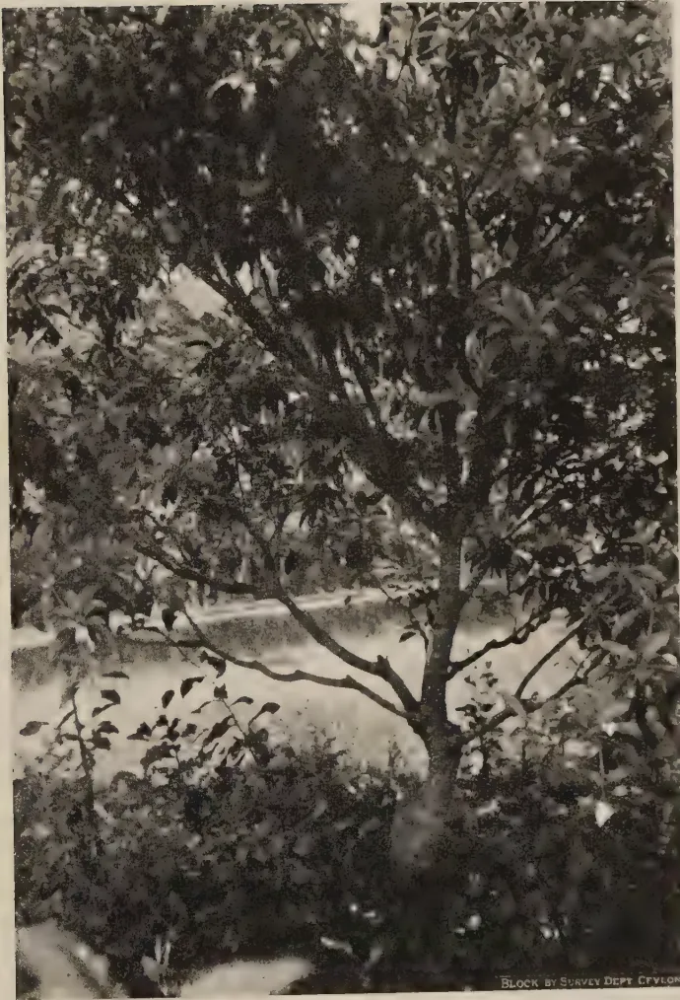

# The Tropical Agriculturist

VOL. XCIX.

PERADENIYA, APRIL-JUNE, 1943.

No. 2.

<table><thead><tr><th></th><th style="text-align: right;">Page</th></tr></thead><tbody><tr><td>Editorial .. .. .</td><td style="text-align: right;">65</td></tr></tbody></table>

## ORIGINAL ARTICLES

<table><tbody><tr><td>Spacing Experiments with Vegetables. By M. Fernando, Ph.D., B.Sc. (Land) D.I.C. .. .. .</td><td style="text-align: right;">69</td></tr></tbody></table>

## ERRATA.

Please amend paging in Numbers 2, 3, and 4 of Vol. XCVIII. of this journal as follows :—

<table><tbody><tr><td>Number 2, April to June, 1942 ..</td><td style="text-align: right;">67 to 140 instead of 1-74</td></tr><tr><td>Number 3, July to September, 1942 ..</td><td style="text-align: right;">141 to 218 instead of 1-78</td></tr><tr><td>Number 4, October to December, 1942 ..</td><td style="text-align: right;">219-294 instead of 1-76</td></tr></tbody></table>

The paging appearing in the summary of contents, which appears just before the Editorial, requires amendment in view of this alteration.

In line 19 of page 49 of Vol. XCIX No. 1, January to March, 1943, number, substitute "stubble" for "stabble" and "vegetative" for "vegetable".

<table><tbody><tr><td>The Effect of a Leguminous Cover Crop in Building up Soil Fertility ..</td><td style="text-align: right;">101</td></tr><tr><td>Studies on the Effect of Various Factors on the Vitamin C Content of the Milk of Cows and Buffaloes .. .. .</td><td style="text-align: right;">108</td></tr></tbody></table>

## MEETINGS, CONFERENCES, &c.

<table><tbody><tr><td>Draft Minutes of the 62nd Meeting of the Board of Management, Coconut Research Scheme, held on April 30, 1943 .. .. .</td><td style="text-align: right;">116</td></tr><tr><td>Minutes of a Meeting of the Board of the Tea Research Institute held on May 14, 1943 .. .. .</td><td style="text-align: right;">118</td></tr><tr><td>Minutes of the 65th Meeting of the Rubber Research Board held on May 24, 1943 .. .. .</td><td style="text-align: right;">123</td></tr></tbody></table>

## RETURNS

<table><tbody><tr><td>Animal Disease Return for the Month ended June, 1943 ..</td><td style="text-align: right;">127</td></tr><tr><td>Meteorological Reports for April to June, 1943 ..</td><td style="text-align: right;">128-130</td></tr></tbody></table>

1—J. N. A 26983 (8/43)

1------------------------------------------------

This image shows a blank page with a light beige or cream-colored background. The surface has a subtle texture and contains several small, faint smudges and blemishes, particularly towards the right side. There is no text or other content on the page.

2------------------------------------------------

# The Tropical Agriculturist

VOL. XCIX.

PERADENIYA, APRIL-JUNE, 1943.

No. 2.

<table><thead><tr><th></th><th style="text-align: right;">Page</th></tr></thead><tbody><tr><td>Editorial .. .. .</td><td style="text-align: right;">65</td></tr></tbody></table>

## ORIGINAL ARTICLES

<table><tbody><tr><td>Spacing Experiments with Vegetables. By M. Fernando, Ph.D., B.Sc. (Lond.), D.I.C. .. .. .</td><td style="text-align: right;">69</td></tr><tr><td>Studies in Propagation of Sapodilla. By A. V. Richards, M.Sc. (Calif.), B.Sc. (Lond.), Dip. Agric. (Cantab.), A.I.C.T.A. (Trinidad) ..</td><td style="text-align: right;">78</td></tr><tr><td>The Effect of Ammonium Sulphate and of Ammonium Phosphate as Nicifos on the Lateritic Paddy Soils of Peradeniya. By D. E. V. Koch, B.Sc. (Hons.), Ph.D. (Lond.), F.I.C., D.I.C., F.R.H.S. ..</td><td style="text-align: right;">83</td></tr><tr><td>Radish Seed Production. By M. Fernando, Ph.D. (Lond.) ..</td><td style="text-align: right;">86</td></tr></tbody></table>

## DEPARTMENTAL NOTES

<table><tbody><tr><td>History of Cinchona Culture in Ceylon .. .. .</td><td style="text-align: right;">91</td></tr></tbody></table>

## SELECTED ARTICLES

<table><tbody><tr><td>The Selection of Poultry Breeding Stock .. .. .</td><td style="text-align: right;">96</td></tr><tr><td>The Effect of a Leguminous Cover Crop in Building up Soil Fertility ..</td><td style="text-align: right;">101</td></tr><tr><td>Studies on the Effect of Various Factors on the Vitamin C Content of the Milk of Cows and Buffaloes .. .. .</td><td style="text-align: right;">108</td></tr></tbody></table>

## MEETINGS, CONFERENCES, &c.

<table><tbody><tr><td>Draft Minutes of the 62nd Meeting of the Board of Management, Coconut Research Scheme, held on April 30, 1943 .. .. .</td><td style="text-align: right;">116</td></tr><tr><td>Minutes of a Meeting of the Board of the Tea Research Institute held on May 14, 1943 .. .. .</td><td style="text-align: right;">118</td></tr><tr><td>Minutes of the 65th Meeting of the Rubber Research Board held on May 24, 1943 .. .. .</td><td style="text-align: right;">123</td></tr></tbody></table>

## RETURNS

<table><tbody><tr><td>Animal Disease Return for the Month ended June, 1943 ..</td><td style="text-align: right;">127</td></tr><tr><td>Meteorological Reports for April to June, 1943 ..</td><td style="text-align: right;">128-130</td></tr></tbody></table>

1—J. N. A 26983 (8/43)

3------------------------------------------------

<!-- stage4: FAINT old-images-only -->

[Faint page: no legible print of its own could be verified; text withheld (stage 4 review list)]

4------------------------------------------------

The  
Tropical Agriculturist  
APRIL TO JUNE, 1943

EDITORIAL

RINDERPEST AND GOAT VIRUS

**O**UTBREAKS of Rinderpest were of frequent occurrence in Ceylon up to 1933, when it was eradicated by a great effort. Mass inoculation with formalized vaccine and control of the movement of cattle were the chief weapons employed in this campaign. Thereafter the enforcement of very strict regulations for the quarantine of imported cattle, goats, and sheep kept the disease out until it re-appeared in Colombo at the beginning of this year. All the available evidence, positive and negative, points to the goats imported from India for slaughter as the source of infection. Cart bulls that frequented the harbour area were first affected, and before long cases occurred in urban and suburban dairies. Since then the suggestion has been frequently made both by the owners of these dairies and by others who are interested in the health of cattle that goat virus should be used to fight the epizootic. It is felt that those who advocate this step do not always appreciate the nature of this form of treatment or its implications. Perhaps, a short discussion of the subject by a layman for the benefit of his lay readers may help the latter to approach the subject with greater understanding and some circumspection, even if they do not succeed in shedding their preconceptions.

The essence of the fight against a disease by the prophylactic inoculation of its live virus lies in the conferment of immunity by the controlled infection and cure of the individual. It is observed that a cow which has an attack of rinderpest and recovers successfully resists re-infection during the remainder of its life. This fact teaches the obvious lesson that if there is the risk of the casual infection of a herd, it would be wise to infect the animals deliberately with rinderpest in conditions in which recovery is practically assured. This consideration forms the basis of the use of goat virus for the purpose of preventive inoculation. It infects the subject with rinderpest, but with a strain of it which has been so attenuated by passage through goats that, generally, the consequent reaction is mild and harmless. With very little risk the treated animals acquire durable immunity.

The first use of goat virus standardized to suit the conditions of another country must be undertaken with caution. It is

5------------------------------------------------

66

easy to repeat Kenya's experience. That country imported the strain of virus evolved at Muktesar for Indian conditions and found that the reaction killed their cattle which did not have the same degree of natural resistance to the disease which the cattle of the Indian plains possess. Dr. Edwards, the originator of the goat virus method of immunization, himself admitted the restricted applicability of that method when he said at a meeting of the Royal Society of Arts as recently as May last year that "it is not generally applicable elsewhere" and that its success in India was due to "the reason that the conditions in India are peculiar. The Zebu cattle of India have a large degree of basic immunity, probably as a result of having had to confront periodic waves of infection with rinderpest for untold ages". The cattle of Ceylon may be placed in a category even more remote from the Indian standard in this respect than the cattle of Kenya, and the use of the Muktesar strain, which alone is available to us at present, must be preceded by cautious trial. Subject to this reservation, there can be no doubt that, from the point of view of the individual owner who is anxious to save his own cow but is not concerned in the rest of the community, immunization by the use of goat virus is the most satisfactory preventive measure. It would be equally satisfactory from the point of view of a country or province in which rinderpest is enzootic and which hopes not to eradicate the disease, but only to keep it under control by the periodical immunization of a large section of its more valuable cattle. But Ceylon's position is different. It is a country which was free from rinderpest and hopes to recover and maintain that state of freedom. Whether in the circumstances it would be wise to introduce goat virus depends upon the further question whether rinderpest communicated by the inoculation of goat virus is contagious to goats and cattle. Before trying to find an answer to this last question it would be useful to examine the consequences that would follow the introduction of the virus if it is in fact contagious.

The use of goat virus to immunize threatened herds can do no harm if every inoculated animal is kept under the strictest possible conditions of quarantine till it develops the reaction and completes recovery, the men who look after the animals taking the precautions that are necessary to ensure that they themselves do not become unconscious agents for the carriage of the virus. But from the experience of the last six months with regard to the standard of responsibility and reliability of the average owner of cattle, it can be predicted with certainty that they will not be so kept. At least some of the inoculated animals will become foci of infection. These infections may go unnoticed for sometime until the virus reacquires its old potency by passage backwards through a number of cattle.

6------------------------------------------------

67

The disease will spread, infecting even goats, since it is now adapted to that ruminant, and perhaps to wild game. It will become enzootic in Ceylon.

We have not been able to trace Indian literature which records work done in India to ascertain whether rinderpest caused by the inoculation of goat virus is contagious. Writing about the natural virus Dr. Edwards of Muktesar, says that in the scene of outbreaks of severe rinderpest amongst cattle in India the goats nearly always escape attack, and that it is not possible to transmit the infection from the infected goat to a healthy goat. But he does not say whether the strain of rinderpest "fixed" on goats is naturally transmissible. In an article published in 1933 in the Indian Journal of Veterinary Science, Messrs. J. D'Costa and Balwant Singh make the statement that "Healthy goats kept in contact with infected goats were also found to contract the disease", and the context leaves the impression that these two authors refer to rinderpest induced by inoculation.

The experience of Ceylon in this matter is not without significance. During the long period when rinderpest was raging in many parts of the Island cases of rinderpest amongst goats were so rare that, when they did occur, they attracted the curious attention of all Veterinary Surgeons. No case of rinderpest in imported goats came under the notice of the Government Veterinary Department. Goats for the slaughter house continued to be imported from India after the importation of cattle for the same purpose was prohibited, and for nearly ten years these goats did not introduce rinderpest to the country. These facts lead to the conclusion that under natural conditions goats did not normally contract rinderpest by contagion and that cases of rinderpest amongst them were rare—which is exactly what Dr. Edwards says. But the more recent experience of Ceylon has been different. Rinderpest is fairly common amongst imported goats. They seem to communicate it to each other by contact. They introduced the present outbreak of bovine rinderpest, which is of a milder type than the rinderpest of the past, the percentage of recoveries being higher. It is reported that in some cases before rinderpest with recognizable symptoms, eventually proving fatal, was detected in a herd, some animals developed a temperature and general malaise, but recovered. It seems reasonable to conclude that in the last few years the habits and incidence of rinderpest in India have undergone a subtle change. It has become a common disease amongst goats, in a mild form, but transmissible back to cattle, and liable to regain its normal virulence by passage through cattle. The only known factor which could bring about this change was the release during the last 6 or 7 years of increasingly large quantities of rinderpest virus adapted to the infection of goats and mild in its effects on cattle. It follows that this strain is contagious.

7------------------------------------------------

<!-- stage4: ACCEPT r2J/J_016:17 -->

68

The above argument does not have the same unquestionable probative value as a proposition in Euclid. But it has so much force in it that it would be unwise to ignore it especially when the results of a mistake may be so serious. Our advice is that goat virus should not be introduced to Ceylon unless the country decides to suffer enzootic conditions of rinderpest and to save some cattle by inoculation of this virus.

8------------------------------------------------

69SPACING EXPERIMENTS WITH VEGETABLES

M. FERNANDO, Ph.D., B.Sc. (Lond.), D.I.C.  
ACTING BOTANIST

SUMMARY

SPACING experiments with vegetables set down at the Vegetable Seed Stations at Matale and Tabbowa, in the *maha* season, 1940-41, are reported in this paper. On the basis of the results of these experiments, the following spacings are recommended to growers :—

<table>
<tbody>
<tr>
<td>1. Cucumber (<i>Cucumis sativus</i> L.)</td>
<td>4 ft. by 1 ft.</td>
</tr>
<tr>
<td>2. Luffa (<i>Luffa acutangula</i> Roxb.)</td>
<td>6 ft. by 4 ft.</td>
</tr>
<tr>
<td>3. Bandakka (<i>Hibiscus esculentus</i> L.)</td>
<td>3 ft. by 3 ft.</td>
</tr>
<tr>
<td>4. Brinjal (<i>Solanum Melongena</i> L.)</td>
<td>3 ft. by 4 ft.</td>
</tr>
<tr>
<td>5. Cowpea (<i>Vigna unguiculata</i> Walp.)</td>
<td>4 ft. by 2 ft.</td>
</tr>
</tbody>
</table>

In 1940, the Botanist assumed control of the Departmental Vegetable Seed Stations. A programme of vegetable selection with clearly defined objectives was outlined (Anon. 1940 *a* and *b*). The scantiness of information on cultural methods impeded the prosecution of this programme. Spacing information was the most pressing need. Trials set down at the Vegetable Seed Stations at Matale and Tabbowa, in the *maha* season, 1940-41, aimed at providing the desired data. The more important of these trials are reported herein.

The soils of the two stations differ markedly from one another. Matale is the more infertile, and the soil, of which the main component is ironstone gravel, is unsuitable for vegetables. Heavy dressings of organic manure are necessary if vegetable growing is to be at all possible. Tabbowa soils, on the other hand, are deep red loams, well supplied with replaceable bases, neutral to alkaline in reaction, and ideal for vegetable growing. They are, however, somewhat deficient in nitrogen and in organic matter, and their extremely good drainage may damage crops in periods of drought.

Matale and Tabbowa fall within the wet and dry zones respectively. At Matale, heavy and well distributed precipitation makes cultivation possible in both *yala* and *maha*. Insufficient rain prevents *yala* cultivation at Tabbowa. Rainfall data for the experimental season are given in Table 1.

9------------------------------------------------

70TABLE 1

Monthly Rainfall at Matale and Tabbowa in the Maha Season, 1940-41

<table border="1">
<thead>
<tr>
<th rowspan="2"></th>
<th colspan="2">Matale</th>
<th colspan="2">Tabbowa</th>
</tr>
<tr>
<th>Rainfall in inches.</th>
<th>Number of Rainy Days.</th>
<th>Rainfall in inches.</th>
<th>Number of Rainy Days.</th>
</tr>
</thead>
<tbody>
<tr>
<td>1940.</td>
<td></td>
<td></td>
<td></td>
<td></td>
</tr>
<tr>
<td>September</td>
<td>.. 11.50 ..</td>
<td>13 ..</td>
<td>0.86 ..</td>
<td>5</td>
</tr>
<tr>
<td>October</td>
<td>.. 15.38 ..</td>
<td>20 ..</td>
<td>7.18 ..</td>
<td>22</td>
</tr>
<tr>
<td>November</td>
<td>.. 13.91 ..</td>
<td>22 ..</td>
<td>17.04 ..</td>
<td>25</td>
</tr>
<tr>
<td>December</td>
<td>.. 6.97 ..</td>
<td>15 ..</td>
<td>2.19 ..</td>
<td>16</td>
</tr>
<tr>
<td>1941.</td>
<td></td>
<td></td>
<td></td>
<td></td>
</tr>
<tr>
<td>January</td>
<td>.. 7.55 ..</td>
<td>14 ..</td>
<td>2.14 ..</td>
<td>11</td>
</tr>
<tr>
<td>February</td>
<td>.. 3.23 ..</td>
<td>7 ..</td>
<td>0.22 ..</td>
<td>1</td>
</tr>
<tr>
<td>March</td>
<td>.. 2.12 ..</td>
<td>5 ..</td>
<td>0.11 ..</td>
<td>1</td>
</tr>
<tr>
<td>April</td>
<td>.. 4.79 ..</td>
<td>11 ..</td>
<td>3.49 ..</td>
<td>8</td>
</tr>
</tbody>
</table>

### 1. Cucumber (*Cucumis sativus* L.)

The following spacings were tested at Matale : 8 ft. by 4 ft., 4 ft. by 4 ft., 4 ft. by 2 ft. and 4 ft. by 1 ft. The spacings were replicated in four randomized blocks of 1/57 acre plots. Each plot had a nett harvested area of 1/170 acre. The Botanist's selected strain of the indigenous cucumber was grown. The experimental area, which consisted of newly cleared land, received an application of 10 tons compost per acre on November 16, 1940. Four seeds were dibbled per hill on November 21. Ninety per cent. of the seeds had germinated on November 24. Seedlings were thinned successively to three, two and one per hill on December 6, 11 and 19. Vegetative growth was most vigorous and flowering most prolific at the closest spacings. A record, made on December 19, of the incidence of flowering is given below :

<table border="1">
<thead>
<tr>
<th>Spacing.</th>
<th>Total Number of Plants in Flower.</th>
</tr>
</thead>
<tbody>
<tr>
<td>4 ft. by 1 ft. ..</td>
<td>30</td>
</tr>
<tr>
<td>4 ft. by 2 ft. ..</td>
<td>19</td>
</tr>
<tr>
<td>4 ft. by 4 ft. ..</td>
<td>2</td>
</tr>
<tr>
<td>4 ft. by 8 ft. ..</td>
<td>0</td>
</tr>
</tbody>
</table>

Even after allowance is made for the greater number of plants at the closer spacings, plants at 4 ft. by 1 ft. and 4 ft. by 2 ft. will be seen to be earlier than those at 4 ft. by 4 ft. and 4 ft. by 8 ft.

*Aulacophora* beetles occurred in large numbers. Fruit-fly (*Dacus cucurbitae* Coq.) was first observed on December 31; the damage was not considerable. Fruits were harvested on January 9, 14 and 22, 1941.

10------------------------------------------------

71

The analysis of variance of weights of fruits harvested is given in Appendix I. The variance ratio for spacings reaches significance at the one per cent. point. The yield data are summarized below in Table 2.

TABLE 2  
Yields of Cucumber Fruits in lb. per Acre

<table>
<thead>
<tr>
<th>Spacing:</th>
<th>8 ft. by 4 ft.</th>
<th>4 ft. by 4 ft.</th>
<th>4 ft. by 2 ft.</th>
<th>4 ft. by 1 ft.</th>
<th>Significant Difference.</th>
</tr>
</thead>
<tbody>
<tr>
<td>Yield (lb./acre)</td>
<td>.. 1890 ..</td>
<td>3734 ..</td>
<td>4284 ..</td>
<td>6061 ..</td>
<td>1898</td>
</tr>
</tbody>
</table>

Yields were highest at the closest spacing, and declined *pari passu* with width of spacing. The 4 ft. by 1 ft. spacing was significantly superior to both 4 ft. by 4 ft. and 4 ft. by 8 ft. The superiority of 4 ft. by 2 ft. to 4 ft. by 8 ft. was also significant.

A somewhat different series of spacings was investigated at Tabbowa, viz., 8 ft. by 8 ft., 8 ft. by 4 ft., 4 ft. by 4 ft. and 4 ft. by 1 ft. The spacings were replicated in four randomized blocks of 1/38 acre plots. The nett harvested area was the same as in the Matale trial, viz. 1/170 acre. The variety grown was also identical. Seed was dibbled on November 13, 1940. Germination was evident in nearly 75 per cent. of the hills on November 19. Damage to seed by rats caused numerous vacancies; these were filled on November 23. *Aulacophora* sp. made its first appearance on December 10; the beetles were collected in hand nets and destroyed. Fruit-fly was first recorded on December 30; the damage was inappreciable. The first and main harvest was made on January 15, 1941. A second and much smaller pick was taken on January 24. All the vines were dead by February 2.

Appendix 2 gives the analysis of variance of total weights of fruits harvested. The variance ratio for spacings is significant at the five per cent. point. A summary of the yield data is presented in Table 3. As in the Matale trial, increase in yield runs parallel to increase in plant number per unit area. The closest spacing, 4 ft. by 1 ft., is significantly superior to every one of the other spacings. There are no other significant differences.

TABLE 3  
Yields of Cucumber Fruits in lb. per Acre

<table>
<thead>
<tr>
<th>Spacing:</th>
<th>8 ft. by 8 ft.</th>
<th>8 ft. by 4 ft.</th>
<th>4 ft. by 4 ft.</th>
<th>4 ft. by 1 ft.</th>
<th>Significant Difference.</th>
</tr>
</thead>
<tbody>
<tr>
<td>Yield (lb./acre)</td>
<td>.. 489 ..</td>
<td>1768 ..</td>
<td>2261 ..</td>
<td>4905 ..</td>
<td>2263</td>
</tr>
</tbody>
</table>

Comparable results have been obtained at the dry and wet zone stations. The closest spacing tested, viz. 4 ft. by 1 ft. has given the highest yields, in spite of the apparent overcrowding that occurs at this spacing.

11------------------------------------------------

72

## 2. *Luffa* (*Luffa acutangula* Roxb.)

At Tabbowa, the following spacings were tested in a randomized block design : 6 ft. by 6 ft., 6 ft. by 4 ft., 4 ft. by 4 ft. and 3 ft. by 3 ft. There were four blocks of 1/38 acre plots. A nett area of 1/100 acre was harvested in each plot. Seeds of the Botanist's selected strain of ribbed luffa were dibbled on November 13, 1940. Approximately 90 per cent. of the seeds had germinated within a week. Blanks were filled on November 23. Vines had commenced trailing on December 10, and were thinned to one per hill and trained to stakes on December 18. The area was weeded on December 17, 1940, and January 18, 1941. Fruits were harvested on January 16, 22, 28 and 31, and February 3 and 8.

The analysis of variance of total weights of fruits harvested is presented in Appendix 3. The variance ratio exceeds the 0.1 per cent. point, and indicates a very high degree of significance. Yield data are recorded in Table 4. The widest spacing, 6 ft. by 6 ft. is significantly inferior to the other three. These three spacings do not differ significantly from one another. The growers' obvious choice is the 6 ft. by 4 ft. spacing.

TABLE 4  
Yields of *Luffa* Fruits in lb. per Acre

<table>
<thead>
<tr>
<th>Spacing :</th>
<th>6 ft. by 6 ft.</th>
<th>6 ft. by 4 ft.</th>
<th>4 ft. by 4 ft.</th>
<th>3 ft. by 3 ft.</th>
<th>Significant Difference.</th>
</tr>
</thead>
<tbody>
<tr>
<td>Yield (lb./acre) ..</td>
<td>17425</td>
<td>29770</td>
<td>28023</td>
<td>34590</td>
<td>5057.5</td>
</tr>
</tbody>
</table>

## 3. *Bandakka* (*Hibiscus esculentus* L.)

At Tabbowa, the performance of the Botanist's single-plant selection, H. 10 was compared with that of the variety NWD. There was little difference in type between the two strains. Both possessed unbranched stems and pigmented petioles, and produced large, ridged, pubescent fruits. The two varieties were tested at the following spacings : 3 ft. by 3 ft., 3 ft. by 2 ft. and 3 ft. by 1 ft. The layout consisted of four randomized blocks of six 1/34 acre plot. Each plot possessed a nett harvested area of 1/48 acre.

Seeds were dibbled on November 14, 1940. Nearly 85 per cent. of the seed in both strains had germinated on November 19. Vacancies were supplied on November 24. The area received one weeding on December 15. Seedlings were thinned to one per hill on December 19. Flowering in the strain NWD was slightly earlier than in H. 10 ; in the former, five per cent. of the plants were in flower on December 26. Harvesting was spread over the period January 16—February 15, 1941 ; there were eleven picks at approximately three-day intervals.

12------------------------------------------------

73

In the analysis of variance of total weights of fruits, none of the variance ratios reach significance even at the five per cent. point. There is no significant difference in yield between the two varieties. As there is no evidence of an increase in yield with closer spacing, 3 ft. by 3 ft. appears to be the most economic planting distance. Yield data are summarized below in Table 5.

TABLE 5Yields of Bandakka Fruits in lb.

(Yields per acre are given in brackets below plot totals)

<table border="1">
<thead>
<tr>
<th rowspan="2">Varieties.</th>
<th colspan="3">Spacings.</th>
<th rowspan="2">Total.</th>
</tr>
<tr>
<th>3 ft. by 3 ft.</th>
<th>3 ft. by 2 ft.</th>
<th>3 ft. by 1 ft.</th>
</tr>
</thead>
<tbody>
<tr>
<td>H. 10</td>
<td>549.6 (6595.2)</td>
<td>370.8 (4449.6)</td>
<td>637.3 (7647.6)</td>
<td>1557.7 (6230.8)</td>
</tr>
<tr>
<td>N.W.D.</td>
<td>604.8 (7257.6)</td>
<td>469.8 (5637.6)</td>
<td>562.2 (6746.4)</td>
<td>1636.8 (6547.2)</td>
</tr>
<tr>
<td></td>
<td>1154.4 (6926.4)</td>
<td>840.6 (5043.6)</td>
<td>1199.5 (7197.0)</td>
<td>3194.5 (6389.0)</td>
</tr>
</tbody>
</table>

4. Brinjal (*Solanum Melongena* L.)

Two spacings were tested at Matale, viz. 3 ft. by 4 ft. and 3 ft. by 2 ft. Two varieties were grown, viz. (a) Matale Wilt-Resistant, the Botanist's selection for resistance to bacterial wilt (*Bacillus solanacearum* E.F.Sm), and (b) Valuthalai, a strain obtained from the Experiment Station, Anuradhapura. The former produces purple fruits and the latter green fruits. The variety Valuthalai branches higher. The high-branching habit is valuable in the control of soil-borne, fruit-rotting fungi, i.e. *Phytophthora* spp. A factorial design consisting of five blocks of four 1/67 acre plots was adopted. Each plot had a nett harvested area of 1/130 acre.

Seeds of the two varieties were drilled in nurseries on October 4, 1940. Damping-off (*Rhizoctonia solani* Kühn) caused some damage to the Valuthalai beds. Seedlings were transplanted on November 11. The area had carried luffas and bitter-gourds in the previous *yala* and received an application of 10 tons compost per acre in the experimental season. The soil of the station has always been heavily infested with the wilt bacterium. Wilt caused 16 casualties in the Matale Wilt-Resistant strain and 107 in Valuthalai. Red ants (*Dorylus orientalis* Westw.) too proved troublesome; casualties numbered seven in the Matale Wilt-Resistant strain, and 22 in Valuthalai. The filling of vacancies was continued till December 28. Harvesting was spread over the period February 7—April 20, 1941; eleven picks were taken at approximately weekly intervals.

13------------------------------------------------

74

The analysis of variance of total weights of fruit harvested is presented in Appendix 4. The variance ratio for varieties is greatly in excess of even the 0.1 per cent. point. The variance ratios for spacing and for the interaction between varieties and spacing do not reach significance. The Matale Wilt-Resistant strain is significantly and overwhelmingly superior; the yield is roughly five times that of Valuthalai (Table 6). The greater susceptibility of Valuthalai to wilt would have contributed to the relatively low yields in that strain. The 3 ft. by 4 ft. spacing is recommended as it is not significantly inferior to 3 ft. by 2 ft.

TABLE 6

Yields of Brinjal Fruits in lb.

(Yields per acre are given in brackets below plot totals.)

<table border="1">
<thead>
<tr>
<th rowspan="2">Varieties.</th>
<th colspan="2">Spacings.</th>
<th rowspan="2">Total.</th>
</tr>
<tr>
<th>3 ft. by 4 ft.</th>
<th>3 ft. by 2 ft.</th>
</tr>
</thead>
<tbody>
<tr>
<td>Matale Wilt-Resistant</td>
<td>.. 178.0 (4628.0)</td>
<td>.. 204.3 (5311.8)</td>
<td>.. 382.3 (4969.9)</td>
</tr>
<tr>
<td>Valuthalai ..</td>
<td>.. 35.3 (917.8)</td>
<td>.. 41.3 (1073.8)</td>
<td>.. 76.6 (995.8)</td>
</tr>
<tr>
<td>Total</td>
<td>.. 213.3 (2772.9)</td>
<td>245.6 (3192.8)</td>
<td>458.9 (2982.9)</td>
</tr>
</tbody>
</table>

### 5. Cowpea (*Vigna unguiculata* Walp.)

Two spacings were investigated at Tabbowa. viz. 4 ft. by 3 ft. and 4 ft. by 1 ft. The strains whose performance was investigated included :

(a) *V. 4.*—The Botanist's single-plant selection of *polon-mé*. Plants in this strain possess a low, half-bushy habit, violet flowers, short, straw-coloured, purple-blotched pods which are closely packed with black, subreniform seeds.

(b) *Trinidad.*—An erect, white-flowered, white-seeded, short-podded strain of the *catjang* type.

(c) *C. D.*—The Botanist's selected strain of *murunga-mé*. The strain is characterized by its very short age (two months) and the possession of very long, attractive pods of the *sesquipedalis* type. The flowers are violet and the seeds brown.

The strain C. D. is usually staked as it is claimed that plants that are allowed to trail on the ground produce a high proportion of malformed pods.

The four varietal treatments, viz. *V. 4* (unstaked) *Trinidad* (unstaked), *C. D.* (unstaked) and *C. D.* (staked), at the two spacings, viz. 4 ft. by 3 ft. and 4 ft. by 1 ft. were tested in a factorial design of four blocks of eight 1/76 acre plots. The nett harvested area in each plot was 1/151 acre.

14------------------------------------------------

75

Seeds were dibbled on November 14, 1940. Over 90 per cent. of the seeds had germinated on November 19. Vacancies were filled on November 24. The first appearance of aphids was noted on December 10. Aphid attack was particularly severe on the strain C. D. Spraying with a solution of soft soap (1 oz. per gallon) provided effective control. On December 14, vines of the strain C. D. were staked in the plots relegated to that treatment. Plants in all varieties were thinned to one per hill on the same day.

The strain C. D. was earliest; flowers were observed in this strain on December 24. Flowering in Trinidad and V. 4 was recorded on December 26 and 29 respectively. Pods in C. D. were ready for picking on January 5, 1941. A reappearance of aphids was observed on that date; spraying brought the pest again under control. The area received weedings on December 14 and 24. Dry pods were picked on January 17, February 8, 18 and 26, and March 3, 1941. On February 8, all the C. D. vines were observed to be dead or moribund, and no harvests were available in that strain after that date. Bird damage was severe in the staked C. D. plots.

The analysis of variance of yields of dry seeds (Appendix 5) reveals a variance ratio for varieties significant at the 0.1 per cent. point. The variance ratios for spacings and for the interaction between spacings and varieties do not attain significance. Yield data are summarized in Table 7. The strain V. 4 significantly outyields C. D. (in both staked and unstaked plots) and Trinidad; the yield of V. 4 is roughly three times that of Trinidad, and 17 times the average yield of C. D.

TABLE 7  
Yields of Dry Cowpea Seeds in oz.

(Yields in lb. per acre are given in brackets below plot totals.)

<table border="1">
<thead>
<tr>
<th rowspan="2">Spacings</th>
<th colspan="4">Varieties</th>
<th rowspan="2">Total</th>
<th rowspan="2">Significant Difference</th>
</tr>
<tr>
<th>V. 4.</th>
<th>Trinidad</th>
<th>CD. Staked</th>
<th>CD. Unstaked</th>
</tr>
</thead>
<tbody>
<tr>
<td>4 ft. by 3 ft. ..</td>
<td>300.0 ..</td>
<td>69.5 ..</td>
<td>37.0 ..</td>
<td>59.0 ..</td>
<td>465.5 ..</td>
<td>—</td>
</tr>
<tr>
<td>..</td>
<td>(707.8) ..</td>
<td>(164.0) ..</td>
<td>(87.3) ..</td>
<td>(139.2) ..</td>
<td>(274.6) ..</td>
<td>—</td>
</tr>
<tr>
<td>.4 ft. by 1 ft. ..</td>
<td>418.1 ..</td>
<td>190.6 ..</td>
<td>40.9 ..</td>
<td>64.6 ..</td>
<td>714.2 ..</td>
<td>—</td>
</tr>
<tr>
<td>..</td>
<td>(986.5) ..</td>
<td>(449.7) ..</td>
<td>(96.5) ..</td>
<td>(152.4) ..</td>
<td>(421.3) ..</td>
<td>—</td>
</tr>
<tr>
<td>Total ..</td>
<td>718.1 ..</td>
<td>260.1 ..</td>
<td>77.9 ..</td>
<td>123.6 ..</td>
<td>1179.7 ..</td>
<td>193.0</td>
</tr>
<tr>
<td>..</td>
<td>(847.1) ..</td>
<td>(306.8) ..</td>
<td>(91.9) ..</td>
<td>(145.8) ..</td>
<td>(347.9) ..</td>
<td>(227.7)</td>
</tr>
</tbody>
</table>

In the strain C. D., the yield of staked plots is appreciably but not significantly less than that in unstaked plots. Rather different results had been obtained by Fernando and Fernando (1941). In the instance of all the three varieties of cowpea investigated by these writers, staking produced large and significant increases in the yield of both snap and dry-shell beans. It was argued that staking provided more efficient arrangement of the photosynthetic surface in relation to incident light. The benefit of staking would be particularly felt in

15------------------------------------------------

76

varieties with dense and persistent foliage. The failure of the strain C. D., in which the foliage is sparse and evanescent, to profit by staking is not difficult to explain; there would be no appreciable shading of leaves even in unstaked plants. Moreover, in the present experiment, bird damage would have depressed the yield of staked plants.

Although the closer spacing produced consistent increases in yield in the instance of all the varietal treatments (Table 7), the non-significance of these increases prevents the present writer's recommending the 4 ft. by 1 ft. spacing with confidence. Till superiority of this spacing is demonstrated statistically, the 4 ft. by 3 ft. spacing or an intermediate spacing—say, 4 ft. by 2 ft.—should be preferred.

#### ACKNOWLEDGMENT

I am grateful to Mr. S. B. Udurawana, Agricultural Instructor, Matale South, for his careful supervision of the field arrangements and for the accurate recording of data in the Matale experiments.

#### REFERENCES

1. 1. Anon. 1940a .. Vegetable Variety Trials at Matale, Tabbowa and Karadianaru, 1937-40  
   *The Tropical Agriculturist* XCV. 149-164
2. 2. — 1940b .. Objectives in Vegetable Breeding: Answer to a Questionnaire issued by the Botanist  
   *Ibid.* XCV. 344-349.
3. 3. Fernando, M. and Fernando, W. N. 1941 Variety and Cultural Experiments with Cowpeas  
   *Ibid.* XCVI. 153-163

#### APPENDIX I

##### Analysis of Variance of Weights of Cucumber Fruits Harvested at Matale

<table border="1">
<thead>
<tr>
<th></th>
<th>D.F.</th>
<th>S.S.</th>
<th>M.S.</th>
<th>V.R.</th>
<th>1 per cent. point.</th>
<th>0.1 per cent. point.</th>
</tr>
</thead>
<tbody>
<tr>
<td>Blocks ..</td>
<td>3</td>
<td>585.445</td>
<td>—</td>
<td>—</td>
<td>—</td>
<td>—</td>
</tr>
<tr>
<td>Spacings ..</td>
<td>3</td>
<td>1254.175</td>
<td>418.058</td>
<td>8.22*</td>
<td>6.99</td>
<td>13.90</td>
</tr>
<tr>
<td>Error ..</td>
<td>9</td>
<td>450.760</td>
<td>50.084</td>
<td>—</td>
<td>—</td>
<td>—</td>
</tr>
<tr>
<td>Total ..</td>
<td>15</td>
<td>2290.38</td>
<td></td>
<td></td>
<td></td>
<td></td>
</tr>
</tbody>
</table>

\* Significant at the one per cent. point.

#### APPENDIX 2

##### Analysis of Variance of Weights of Cucumber Fruits Harvested at Tabbowa

<table border="1">
<thead>
<tr>
<th></th>
<th>D.F.</th>
<th>S.S.</th>
<th>M.S.</th>
<th>V.R.</th>
<th>5 per cent. point.</th>
</tr>
</thead>
<tbody>
<tr>
<td>Blocks ..</td>
<td>3</td>
<td>644.44</td>
<td>—</td>
<td>—</td>
<td>—</td>
</tr>
<tr>
<td>Spacings ..</td>
<td>3</td>
<td>1430.62</td>
<td>476.87</td>
<td>6.29†</td>
<td>3.86</td>
</tr>
<tr>
<td>Error ..</td>
<td>9</td>
<td>682.56</td>
<td>75.84</td>
<td>—</td>
<td>—</td>
</tr>
<tr>
<td>Total ..</td>
<td>15</td>
<td>2757.62</td>
<td></td>
<td></td>
<td></td>
</tr>
</tbody>
</table>

† Significant at the five per cent. point.

16------------------------------------------------

77APPENDIX 3Analysis of Variance of Weights of Luffa Fruits

<table border="1">
<thead>
<tr>
<th></th>
<th>D.F.</th>
<th>S.S.</th>
<th>M.S.</th>
<th>V.R.</th>
<th>0.1 per cent. point.</th>
</tr>
</thead>
<tbody>
<tr>
<td>Blocks</td>
<td>.. 3 ..</td>
<td>62056</td>
<td>.. 20685.3 ..</td>
<td>.. 20.69 ..</td>
<td>.. 13.90 ..</td>
</tr>
<tr>
<td>Spacings</td>
<td>.. 3 ..</td>
<td>62876</td>
<td>.. 20958.7 ..</td>
<td>.. 20.96*</td>
<td>.. 13.90 ..</td>
</tr>
<tr>
<td>Error</td>
<td>.. 9 ..</td>
<td>9000</td>
<td>.. 1000.0 ..</td>
<td>.. — ..</td>
<td>.. — ..</td>
</tr>
<tr>
<td>Total</td>
<td>.. 15 ..</td>
<td>133932</td>
<td></td>
<td></td>
<td></td>
</tr>
</tbody>
</table>

\* Significant at the 0.1 per cent. point.

APPENDIX 4Analysis of Variance of Weights of Brinjal Fruits

<table border="1">
<thead>
<tr>
<th></th>
<th>D.F.</th>
<th>S.S.</th>
<th>M.S.</th>
<th>V.R.</th>
<th>0.1 per cent. point.</th>
</tr>
</thead>
<tbody>
<tr>
<td>Blocks</td>
<td>.. 4 ..</td>
<td>1256.45</td>
<td>.. — ..</td>
<td>.. — ..</td>
<td>.. — ..</td>
</tr>
<tr>
<td>Treatments</td>
<td>.. 3 ..</td>
<td>4745.39</td>
<td>.. — ..</td>
<td>.. — ..</td>
<td>.. — ..</td>
</tr>
<tr>
<td>(Varieties)</td>
<td>.. (1) ..</td>
<td>(4672.62)</td>
<td>.. 4672.62 ..</td>
<td>.. 49.55†</td>
<td>.. 18.64 ..</td>
</tr>
<tr>
<td>(Spacings)</td>
<td>.. (1) ..</td>
<td>( 52.16)</td>
<td>.. 52.16 ..</td>
<td>.. — ..</td>
<td>.. — ..</td>
</tr>
<tr>
<td>(Interaction)</td>
<td>.. (1) ..</td>
<td>( 20.61)</td>
<td>.. 20.61 ..</td>
<td>.. — ..</td>
<td>.. — ..</td>
</tr>
<tr>
<td>Error</td>
<td>.. 12 ..</td>
<td>1131.57</td>
<td>.. 94.30 ..</td>
<td>.. — ..</td>
<td>.. — ..</td>
</tr>
<tr>
<td>Total</td>
<td>.. 19 ..</td>
<td>7133.41</td>
<td></td>
<td></td>
<td></td>
</tr>
</tbody>
</table>

† Significant at the 0.1 per cent. point.

APPENDIX 5Analysis of Variance of Weights of Dry Cowpea Seeds

<table border="1">
<thead>
<tr>
<th></th>
<th>D.F.</th>
<th>S.S.</th>
<th>M.S.</th>
<th>V.R.</th>
<th>5 per cent. point.</th>
<th>0.1 per cent. point.</th>
</tr>
</thead>
<tbody>
<tr>
<td>Blocks</td>
<td>.. 3 ..</td>
<td>640.1</td>
<td>.. — ..</td>
<td>.. — ..</td>
<td>.. — ..</td>
<td>.. — ..</td>
</tr>
<tr>
<td>Treatments</td>
<td>.. 7 ..</td>
<td>35675.1</td>
<td>.. — ..</td>
<td>.. — ..</td>
<td>.. — ..</td>
<td>.. — ..</td>
</tr>
<tr>
<td>(Varieties)</td>
<td>.. (3) ..</td>
<td>(32092.7)</td>
<td>.. 10697.6 ..</td>
<td>.. 21.1‡</td>
<td>.. — ..</td>
<td>.. 9.73 ..</td>
</tr>
<tr>
<td>(Spacings)</td>
<td>.. (1) ..</td>
<td>( 1932.8)</td>
<td>.. 1932.8 ..</td>
<td>.. 3.8 ..</td>
<td>.. 4.60 ..</td>
<td>.. — ..</td>
</tr>
<tr>
<td>(Interaction)</td>
<td>.. (3) ..</td>
<td>( 1649.6)</td>
<td>.. 549.9 ..</td>
<td>.. 1.1 ..</td>
<td>.. 3.34 ..</td>
<td>.. — ..</td>
</tr>
<tr>
<td>Error</td>
<td>.. 14 ..</td>
<td>7084.3</td>
<td>.. 506.0 ..</td>
<td>.. — ..</td>
<td>.. — ..</td>
<td>.. — ..</td>
</tr>
<tr>
<td>Total</td>
<td>.. 31 ..</td>
<td>43399.5</td>
<td></td>
<td></td>
<td></td>
<td></td>
</tr>
</tbody>
</table>

‡ Significant at the 0.1 per cent point.

17------------------------------------------------

78

## STUDIES IN PROPAGATION OF SAPODILLA

A. V. RICHARDS, M.Sc. (Calif.) B.Sc. (Lond.), Dip. Agric. (Cantab.),  
A.I.C.T.A. (Trinidad),

HORTICULTURAL OFFICER

### SUMMARY

**T**HE *Mec* (*Madhuca* (*Bassia*) *longifolia*) when used as a root stock for *Sapodilla* often appears to out-grow the scion in girth after 4 to 5 years, and causes sudden die back. There is no evidence of such delayed incompatibility with *Palu Manilkara* (*Mimusops*) *hexandra* which is relatively slow growing and more drought resistant.

### INTRODUCTION

The *Sapodilla* (*Achras Zapota*), which was introduced into Ceylon about 1802, is native to tropical America where it grows wild from seed. The tree is ever-green and has a rounded or conical crown bearing rather small leathery leaves in which both upper and lower surfaces are smooth and shining. It attains a height of 50 to 70 feet in its native habitat. The budgrafted tree has a spreading habit of growth and is 20 to 30 feet in height.

The bark of the tree contains a milky latex known in commerce as chickle, which is secured by tapping the trunk and main branches of seedling trees found in the jungle. The latex is compressed into blocks and exported in large quantities from Southern Mexico and Central America to the United States where it is used in the manufacture of chewing gum.

Trees grown from seed take 6 to 8 years to come into bearing, but layered and grafted plants flower earlier within about half that period. The flowers appear in the leaf axils of the new flush which is produced with the rains. They are small and have white petals. The fruits vary in shape from round to oval and are 2 in. to  $3\frac{1}{2}$  in. in diameter. Some trees produce consistently numerous egg-shaped fruits which are rather small in size, while the better varieties bear large round fruits which are easy to grade. Both these types are found in the experimental plot at Wariyapola where they are in season from March to July and again from September to December. A well grown tree may produce over 1,500 fruits during the season. Some trees bear fruits nearly all the year round when grown under conditions of uniform rainfall or irrigation.

18------------------------------------------------

79

The fruit has a thin skin which is nutty brown in colour and somewhat scurfy when immature. At this stage it contains tannin and milky latex, but these disappear as it ripens. A mature fruit which is ready for picking can be recognised easily by the comparatively smooth appearance of the skin and the retarded flow of latex when it is nipped. The ripe fruit is slightly fragrant and very luscious. Its flesh is light brown in colour, soft and translucent with a rich sugary flavour which is acceptable to the Ceylonese palate. It is essentially a dessert fruit and is not generally used as stewed or preserved fruit, although in Cuba and Brazil it finds popular use as a base for sherbert.

On an average each fruit contains 2 or 3 hard shining black seeds which are easily separable from the flesh, but the number may vary in some varieties from nil to 10 or 12. They will remain viable for several months if they are washed and stored dry.

#### SOIL AND CLIMATIC REQUIREMENTS

The *Sapodilla* appears to tolerate a fairly wide range of soil and climatic conditions. It makes best growth on rich sandy loams having an adequate supply of soil moisture in the low country wet and semi-dry zones, but it grows almost equally well on lateritic soil up to an elevation of about 2,500 feet in the wet zone above which it does not appear to be very productive. It requires irrigation or hand watering during severe drought when grown in the dry zone. The trees respond well to periodic dressing of well rotted cattle manure or compost which should be applied in a circle a foot or two beyond the drip of the tree and forked in lightly. They require a spacing of 35 feet to 40 feet on good soils.

#### PROPAGATION

*Sapodilla* will grow well from seed which should be sown  $\frac{1}{2}$  in. deep in pans or seed beds containing a mixture of light sandy soil and compost. The beds should be enclosed with wire netting to keep out rats and squirrels which would otherwise eat up the seed. Germination will take place within 3 to 4 weeks and the plants can be potted up or transplanted for budgrafting into nursery beds about 10 weeks later after the second set of leaves have appeared. The seedlings will be ready for planting into the permanent site when 12 to 15 months old. Seedling plants make slow growth and cannot be depended upon to come true to type. They are variable in their habit of growth, season of maturity, size, shape and quality of fruit. They are not so desirable for planting on a commercial scale for production of fruit as plants propagated vegetatively by layering, inarching or budgrafting.

Layers strike root more readily than gootees and are easily raised from branches that lie close to the ground. The branch to be layered is either partially ring barked or a slanting cut is

19------------------------------------------------

80

made half way into the stem and kept open by insertion of a small stone. The treated portion of the stem is then pegged down in a shallow trench and covered over with good top soil which is kept sufficiently moist for the roots to develop. The rooted layer is then severed by stages from the parent tree by first cutting a notch which is then deepened once a week if the leaves continue to remain fresh without wilting. The notch should never be cut before the layer strikes roots.

The method of gooteeing is similar to layering except that the ring barked portion of the stem is covered over with a mixture of good top soil, sand and compost, and wrapped with coir fibre which is kept moist by squirting water periodically from a garden syringe or allowing it to trickle slowly down a wick from a bamboo container suspended above the gootee. Gootees may take from 4 to 10 months to strike root.

Both layers and gootees develop into vigorous trees which have been known to come into bearing within 2 years of planting. Nevertheless these methods of propagation are slow and cumbersome and the number of plants that can be raised each year from a bearing tree is limited. The same is true of inarching in which the selected scion branch on the tree is made to unite with the root stock seedling brought near it in a pot fixed at the cleft end of a bamboo pole or placed on a platform, the union being facilitated by slicing off 2 to 3 inch length of bark and part of the wood of both the stock and scion and tying the cut surfaces together so that the cambia of each are in direct contact. More rapid multiplication is, however, possible by the methods of budding or grafting, but the problem is to find quick growing stocks which are compatible with sapodilla.

The seedling sapodilla will make a good compatible stock but it is slow growing, and seed is not always available in sufficient quantities to raise large number of stocks. The other stocks which are used are :—

(*Madhuca (Bassia) longifolia*), the *Mee* (Sinhalese) or *Eluppai* (Tamil), and *Manilkara (Mimusops) hexandra*, the *Palu*.

*Mee* seed is available in large quantities during the season, and the seedlings make vigorous growth. 3 to 4 months old seedlings grown under irrigation in nursery beds have been successfully cleft grafted using tender scion pieces from the current season's growth in the dry zone at the Farm School, Jaffna, where the percentage of success has been over 95 per cent. The cut end of each scion piece taken from the terminal growth is shaped in the form of a wedge and inserted into the cleft made on the stock immediately after it is topped at a height of 4 in. to 5 in. The graft union is then tied with budding tape and the scion protected from sun scorch and excessive desiccation by means of two mango leaves which are wrapped loosely round it.

20------------------------------------------------

PLATE 1.  
Sapodilla on local *palu* seedling stock.  
(Note free growth of 4 month old scion.)

21------------------------------------------------

A black and white photograph of a Sapodilla plant growing on a mound of earth (mee) in a field. The plant has a dense cluster of upright, spindly stems. In the background, there are several large, leafy trees. The ground is covered with low-lying vegetation. A small credit line in the bottom right corner reads 'PHOTO BY SURVEY DEPT. CEYLON'.

PLATE 2.

Sapodilla on *mee* at Wariyapola.

(Note scion decline and growth of suckers from stock.)

Trees in the background are on Indian *palu* stocks.

22------------------------------------------------

81

Union takes place within a month, and the scion produces new flush with subsequent irrigation. One year old stocks are less satisfactory, the percentage of success being only 35 per cent.

Stocks which are 8 to 9 months old can be successfully budded by the modified Forkert method in which a strip of bark is peeled down to a depth of about 1 in. after making a transverse incision on the stem at a height of about 6 in. to 7 in., and the scion bud of suitable size taken without the wood from the previous season's growth is placed immediately underneath the flap after  $\frac{2}{3}$ rd of it is cut off transversely. The flap is placed over the bud leaving the "eye" of the bud exposed, and is then wrapped tightly with budding tape which should cover the entire bud. The operation should be done quickly before latex collects round the wound. Two weeks later the tape is untied, and if the bud remains alive it is again tied back leaving only the 'eye' of the bud exposed. A week later the stock is topped 6 in. above the bud union to force the scion bud to shoot out.

Neither budding nor grafting on *mee* stocks has given satisfactory results in the wet zone at Peradeniya, but on *palu* stocks the modified Forkert method of budding has given over 50 per cent. successful bud 'take' (Plate 1). It should be possible to improve upon these results as the stocks used were grown on poor gravelly soil which had stunted their growth somewhat. The *palu* which is widely distributed in the jungles is slow growing compared with the *mee*, the seedlings taking over 18 months to be fit for budding, but is probably more drought resistant and long lived than *mee*.

#### ROOT STOCK INFLUENCE

Preliminary observations on the growth of sapodilla budgrafts on *mee* stocks indicate the existence of delayed incompatibility between most seedling *mee* stocks and the sapodilla scion. Although the scion grows well for the first 4 or 5 years, it is unable to keep pace with the stock which soon outgrows it in girth and begins to throw out suckers. This apparently brings about the sudden decline of the scion which may sometimes snap at the bud union. Both at Wariapola and Labuduwa sapodilla budgrafts on *mee* stock imported from South India have been observed to show this type of sudden decline after 4 to 5 years of growth (Plate 2). The stock over growth is also pronounced in the early years on many of the young *mee* stocks cleft grafted at the Farm School, Jaffna (Plate 3). There are, however, a few exceptions which are probably due to the occurrence of variant types among *mee* seedlings.

If not for the occurrence of stock over growth the use of *mee* as a rootstock would make it possible to propagate sapodilla rapidly on a large scale. Trials are in progress to determine

23------------------------------------------------

82

whether it is not possible to induce the scion to establish itself on its own roots if it is grafted low and planted with the graft union below ground level.

The *palu* stock, being relatively slow growing, does not tend to overgrow the scion in girth in the early years although in the older trees there is some evidence of slight stock overgrowth which does not appear to have any ill effect on the growth of the scion (Plate 4). The trees have continued to be very productive and appear to be long lived. The strain of *palu* found in India, where it is known as *Khirnee*, appears to grow more freely and produce larger leaves under local conditions than the local strain of *palu*. *Mamilkara (Mimusops) Kauki* L. has also been used as a stock in India (1) where it was found to be a dwarfing stock which induced earlier bearing compared with trees on their own roots, but the stock takes about 2 years to be fit for budding.

There is no evidence of incompatibility in the case of sapodilla bud grafted on its own root stocks. In Java (2) two forms of sapodilla are in use as root stocks of which one produces ovoid fruits and the other globose fruits, but the seedling stocks take over 2 to 3 years to be big enough for budgrafting.

#### ACKNOWLEDGEMENTS

Thanks are due to Mr. S. C. Guneratnam, Head Master, Farm School, Jaffna, for information on the technique of cleft grafting young *mee* stocks with sapodilla at Jaffna, and to Mr. J. M. Brown, Conductor, Horticultural Nursery, Peradeniya, for carrying out the trial budding on *palu* stocks.

#### REFERENCES

1. 1. Fielden, G. St. Clair.. 1936. Vegetative Propagation of Tropical and Sub-Tropical fruits. *Imperial Bureau of Fruit Production*. Tech. Comm. No. 7.
2. 2. Ochse, J. J. .. 1931. Fruits and Fruit Culture in Dutch East Indies (G. Kolff & Co., Batavia) English Edition.

24------------------------------------------------

A black and white photograph of a Sapodilla tree growing on a meadow at Jaffna. The tree is the central focus, with its trunk and branches covered in dense, dark foliage. The ground around the base of the tree is also covered in vegetation, indicating significant stock overgrowth. The background is slightly blurred, showing more of the meadow and some distant trees. In the bottom right corner of the photograph, there is a small text label that reads "BLOCK BY SURVEY DEPT Ceylon".

PLATE 3.  
Sapodilla on *mee* at Jaffna.  
(Note stock overgrowth in 3 year old plant.)

25------------------------------------------------

A black and white photograph of a Sapodilla tree growing on a mound of earth (Indian palu) at Wariyapola. The tree is dense with leaves and branches, and the ground around it is covered in grass and low vegetation. A small white marker is visible near the base of the tree. In the bottom right corner of the image, there is a small black rectangle with white text that reads 'BLOCK BY SURVEY DEPT CEYLON'.

PLATE 4.  
Sapodilla on Indian *palu* at Wariyapola.  
(Note absence of marked stock overgrowth.)

26------------------------------------------------

83

THE EFFECT OF AMMONIUM SULPHATE AND  
OF AMMONIUM PHOSPHATE AS NICIFOS  
ON THE LATERITIC PADDY SOILS  
OF PERADENIYA

---

D. E. V. KOCH, B.Sc. (Hons.), Ph.D. (Lond.), F.I.C., D.I.C., F.R.H.S.  
ASSISTANT CHEMIST

---

**S**UMMARY.—As is to be expected, ammonium sulphate lowers the pH of these soils and consequently reduces the amount of calcium in exchangeable form. It also reduces the percentage of calcium relative to the base capacity. There is practically no loss of calcium when ammonium phosphate fertilizers are applied.

In spite of great textural differences the degree of saturation with respect to calcium is fairly constant in the soils of any particular field.

#### EXPERIMENTAL

In the Tropical Agriculturist, Vol. XCIV., 1940, p. 214, the results of certain laboratory studies on the absorptive capacity of three paddy soils for ammonium fertilizers were discussed. With a view to ascertaining the effects produced under field conditions, a trial was laid out at the Experiment Station, Peradeniya, in Yala, 1940, using ammonium sulphate and nicifos; for purposes of further comparison, treatments with nitrogen as (1) nitrates and (2) in organic form were included. The experiment was carried out in four replications A. B. C. & D. Soils only from the plots treated with ammonium sulphate and with nicifos and the control were sampled, when the plants were about  $3\frac{1}{2}$  weeks old. Up to that time, best growth was observed on the nicifos treated plots. The plants in the areas receiving nitrogen were superior in growth to those in the control plots, indicating that even on these soils, which are fairly well supplied with nitrogen, there is a response to nitrogenous fertilizers by paddy. Unfortunately, owing to the heavy rains that followed, the whole area was badly inundated and the field experiment had to be abandoned. However, the soils which were collected prior to flooding were examined for certain chemical properties.

27------------------------------------------------

84

### SAMPLING

The soils of block A were very uniform. Sampling in this case was carried out to two depths, 0-3 in., and 4-6 in. and in the others 0-3 in., except from block B which was similar to block D. In the last mentioned block, the nicifos plot had been adversely affected by wash. Sampling was done in duplicate.

The results obtained are given in Table 1.

### DISCUSSION

Although the soils vary rather widely in texture—from a sandy loam to a heavy loam—it is to be noted that there is a reasonably constant proportion of calcium with respect to the total base content in them. This would indicate that the loss of exchangeable calcium from soils in the same field is directly proportional to the percentage of this base to the total bases in exchangeable form. However, since there are small differences in these percentages and the differences appear to be related to the treatments, it is considered necessary to comment on them.

A glance at the table shows that in the ammonium sulphate treated plots there has been some preferential loss of calcium and consequently the percentage of this mineral in the exchange complex is lowered; that this is not the case with the nicifos treatment is clearly borne out by the fact that the average of these percentages for the nicifos treatment is definitely high. The laboratory studies (1) have revealed that in the absorption of ammonia by soils from ammonium sulphate there was a corresponding release of calcium, which under the field conditions has evidently been lost. On the other hand, ammonium phosphate, though used in nearly equivalent proportions, had a far less displacing effect on calcium in spite of it being absorbed to a greater extent. It is seen that the application of ammonium phosphate fertilizers to the lateritic soils of Peradeniya does not bring into solution the replaceable calcium of these soils.

It would therefore appear that as the main manurial requirements of paddy are nitrogen and phosphoric acid there seems to be some advantage in supplying these in the form of a compound concentrated fertilizer, rather than as a mixture of sulphate of ammonia and a phosphatic fertilizer such as bone meal, superphosphate, &c. It must be mentioned, however, that all phosphate fertilizers in commercial use contain a certain proportion of calcium, and whether the calcium supplied in this way would counter-balance the loss of displaced calcium by ammonium sulphate under wet land conditions has to be ascertained by further work.

### REFERENCES

1. 1. Koch, D. E. V.—“The absorptive capacity of three paddy soils for ammonium fertilizers.” *Trop. Agric.* Vol. XCIV., 1940, p. 214.

28------------------------------------------------

<!-- stage4: ACCEPT r2J/J_016:13 -->

85TABLE I

<table border="1">
<thead>
<tr>
<th rowspan="2">Block</th>
<th rowspan="2">Sample</th>
<th rowspan="2">Depth of sampling inches</th>
<th rowspan="2">Treatment</th>
<th rowspan="2">pH</th>
<th>m.e. total</th>
<th>m.e. Ca/</th>
<th rowspan="2">Ca in total bases</th>
<th rowspan="2">base capacity</th>
<th>ratio Ca</th>
</tr>
<tr>
<th>bases/100 grs.</th>
<th>100% grs.</th>
<th>to base capacity</th>
</tr>
</thead>
<tbody>
<tr>
<td>A</td>
<td>.. 1</td>
<td>.. 0-3..</td>
<td>SO4..</td>
<td>5.63..</td>
<td>4.49..</td>
<td>2.78..</td>
<td>61.9..</td>
<td>— ..</td>
<td>—</td>
</tr>
<tr>
<td>A</td>
<td>.. 2</td>
<td>.. 0-3..</td>
<td>SO4..</td>
<td>5.65..</td>
<td>4.33..</td>
<td>2.68..</td>
<td>61.9..</td>
<td>10.47..</td>
<td>.256</td>
</tr>
<tr>
<td>A</td>
<td>.. 1</td>
<td>.. 0-3..</td>
<td>PO4..</td>
<td>5.83..</td>
<td>4.82..</td>
<td>3.03..</td>
<td>62.9..</td>
<td>— ..</td>
<td>—</td>
</tr>
<tr>
<td>A</td>
<td>.. 2</td>
<td>.. 0-3..</td>
<td>PO4..</td>
<td>5.80..</td>
<td>4.76..</td>
<td>2.98..</td>
<td>62.6..</td>
<td>10.42..</td>
<td>.287</td>
</tr>
<tr>
<td>A</td>
<td>.. 1</td>
<td>.. 4-6..</td>
<td>SO4..</td>
<td>5.30..</td>
<td>4.17..</td>
<td>2.55..</td>
<td>61.2..</td>
<td>— ..</td>
<td>—</td>
</tr>
<tr>
<td>A</td>
<td>.. 2</td>
<td>.. 4-6..</td>
<td>SO4..</td>
<td>5.26..</td>
<td>4.13..</td>
<td>2.54..</td>
<td>61.5..</td>
<td>10.24..</td>
<td>.248</td>
</tr>
<tr>
<td>A</td>
<td>.. 1</td>
<td>.. 4-6..</td>
<td>PO4..</td>
<td>5.36..</td>
<td>4.66..</td>
<td>2.95..</td>
<td>63.3..</td>
<td>— ..</td>
<td>—</td>
</tr>
<tr>
<td>A</td>
<td>.. 2</td>
<td>.. 4-6..</td>
<td>PO4..</td>
<td>5.40..</td>
<td>4.61..</td>
<td>2.95..</td>
<td>64.0..</td>
<td>10.37..</td>
<td>.285</td>
</tr>
<tr>
<td>A</td>
<td>.. 1</td>
<td>.. 0-6..</td>
<td>nil ..</td>
<td>5.76..</td>
<td>4.39..</td>
<td>2.80..</td>
<td>63.8..</td>
<td>— ..</td>
<td>—</td>
</tr>
<tr>
<td>A</td>
<td>.. 2</td>
<td>.. 0-6..</td>
<td>nil ..</td>
<td>5.80..</td>
<td>4.32..</td>
<td>2.79..</td>
<td>64.6..</td>
<td>10.20..</td>
<td>.274</td>
</tr>
<tr>
<td>C</td>
<td>.. 1</td>
<td>.. 0-3..</td>
<td>SO4..</td>
<td>5.20..</td>
<td>2.80..</td>
<td>1.73..</td>
<td>61.8..</td>
<td>— ..</td>
<td>—</td>
</tr>
<tr>
<td>C</td>
<td>.. 2</td>
<td>.. 0-3..</td>
<td>SO4..</td>
<td>5.24..</td>
<td>2.81..</td>
<td>1.70..</td>
<td>60.5..</td>
<td>8.37..</td>
<td>.203</td>
</tr>
<tr>
<td>C</td>
<td>.. 1</td>
<td>.. 0-3..</td>
<td>PO4..</td>
<td>5.60..</td>
<td>4.12..</td>
<td>2.61..</td>
<td>63.3..</td>
<td>— ..</td>
<td>—</td>
</tr>
<tr>
<td>C</td>
<td>.. 2</td>
<td>.. 0-3..</td>
<td>PO4..</td>
<td>5.56..</td>
<td>4.08..</td>
<td>2.61..</td>
<td>64.0..</td>
<td>9.34..</td>
<td>.279</td>
</tr>
<tr>
<td>D</td>
<td>.. 1</td>
<td>.. 0-3..</td>
<td>SO4..</td>
<td>5.26..</td>
<td>5.74..</td>
<td>3.50..</td>
<td>61.0..</td>
<td>— ..</td>
<td>—</td>
</tr>
<tr>
<td>D</td>
<td>.. 2</td>
<td>.. 0-3..</td>
<td>SO4..</td>
<td>5.30..</td>
<td>5.66..</td>
<td>3.43..</td>
<td>60.6..</td>
<td>15.10..</td>
<td>.227</td>
</tr>
<tr>
<td>D</td>
<td>.. 1</td>
<td>.. 0-3..</td>
<td>PO4..</td>
<td>5.96..</td>
<td>1.74..</td>
<td>1.13..</td>
<td>65.0..</td>
<td>— ..</td>
<td>—</td>
</tr>
<tr>
<td>D</td>
<td>.. 2</td>
<td>.. 0-3..</td>
<td>PO ..</td>
<td>5.90..</td>
<td>1.80..</td>
<td>1.14..</td>
<td>63.3..</td>
<td>3.70..</td>
<td>.308</td>
</tr>
</tbody>
</table>

29------------------------------------------------

86

## RADISH SEED PRODUCTION

M. FERNANDO, Ph.D. (Lond.),  
ACTING BOTANIST.

### SUMMARY.

**M**ETHODS of radish seed production recommended for adoption by vegetable growers who desire securing their own planting material, and by nurserymen, are described.

#### 1.—INTRODUCTION

The growing of radishes which, in Ceylon, has always been a popular market-garden crop, has expanded considerably in war time. The industry has, in the past, depended almost completely on foreign supplies of seed, and is menaced by the high cost and limited availability of imported seed. At the present time, many growers at Kandapola and Palugama obtain their planting material by allowing a small proportion of their crop to run to seed. There has, however, been no attempt at supplying the seed requirements of growers in areas where climatic and disease factors discourage seed production but permit the raising of a satisfactory crop of roots. The acreage in this country under radishes warrants the establishment of a seed industry of modest proportions. It is hoped that both growers who aim at securing their own planting material and nurserymen will find the description, in this paper, of methods of radish seed production adopted at the Vegetable Seed Station, Matale, useful.

#### 2.—VARIETIES.

The Indian radish attains considerable size, and differs markedly from the European. Watt (1908) suggests that their origins differ. Systematists, however, place both varieties in the species, *Raphanus sativus* L. The present paper refers, of course, to the Indian variety.

A diversity of types of good quality exists in Ceylon, including long and turnip-rooted, white and scarlet strains; white types are commoner than coloured ones. The Botanist's strain, Long White, is derived from a single-plant selection made in 1939, and has been grown successfully since that time every year at the Vegetable Seed Station, Matale. The methods described below have particular application to this strain.

30------------------------------------------------

87

### 3.—CULTURAL METHODS.

Apart from its insistence on a light, rich, friable soil, radishes are not fastidious in their requirements. The plant thrives in both the dry and wet zones, and at elevations ranging from sea-level to over 6,000 ft.

For seed production, holes spaced 3 ft. apart and measuring 9 in. (deep) by 12 in. by 12 in. are prepared, and manured with compost at the rate of about 15 tons per acre. It is unnecessary to dig deeper than 9 in.; even in very deep holes penetration does not exceed 9 in.

Four seeds are dibbled per hill; one seed is placed in the centre of the hill, and the other three are disposed in a triangle with a six-inch side round the central one. It is the plants derived from the peripheral seeds that are usually thinned. This method of crowding plants in widely separated hills is preferred on account of the greater room it allows for tillage operations, and of the more satisfactory spacing and stand it provides the plants left over after the final thinning. Radish seed has good keeping qualities, and the percentage germination normally obtained approximates to 100 per cent. Germination is evident about three days after sowing.

The area should receive at least three weedings. The weeding dates recommended are two, ten and seventeen weeks after sowing. As the tap root elongates, the plant protrudes out of the soil. Roots should be hilled up as they appear above soil level. At least two earthings should be done, the first six weeks and the other ten weeks after sowing.

Marketable roots can be lifted four-five weeks after sowing. The plants flower on about the 45th day after sowing, and all hills should be thinned to a single plant before that date. If the stand is good, and the thinning done in time, about 10,000 marketable roots per acre should be available.

In the eleventh week after sowing, staking of the plants becomes necessary. The stakes need not be longer than four feet. Leaf sheaths of plantain or arecanut provide admirable material for tying, and are cheaper than string.

The four-petalled, pale purple flowers set into conical siliquae; convexities on the surface of the siliquae mark the position of the seeds. The first harvest of seed becomes available when the plants are fourteen weeks old. Seed that is ready for harvesting is chocolate-brown in colour, and is hard and cannot be crushed by pressure between the thumb and fore-finger. The racemes ripen in acropetal succession, and harvesting should be delayed till the seed at the tips of the racemes are fully mature. Whole plants are lifted. The roots are cut off and destroyed in an incinerator. The tops are stocked on a barbecue and sun dried for several days till the pod walls turn brittle. The seed can

31------------------------------------------------

88

then be threshed with ease under the feet of labourers. The threshed seed is hand winnowed, hand sorted and subjected to a final period of sun drying before storage.

The methods described above are satisfactory for the multiplication of seed for distribution to the public. The initial seed from which the seed grower derives his commercial crop should, however, be raised with greater care. Continuous seed production on the lines described above would result in strains that produce profuse seed and poor roots. To obtain seed for his own sowing, the seed grower should select, at the time the hills are thinned, a sufficient number of the best roots lifted. Selected roots should not be below average size and should conform to type. If casualties caused by soft-rot are not too numerous, 500 roots should provide sufficient seed for sowing one acre. The rosettes of leaves are cut off to reduce transpiration losses, and the mother roots are transplanted 3 ft. apart in prepared soil. The soil should be well compacted round the roots to prevent desiccation and to secure good anchorage during the flowering and seeding periods.

#### 4.—CONTAMINATION OF SEED STOCKS

Radishes belong to the Cruciferae, a family in which cross pollination is notoriously easy; members of this family produce wind-borne pollen in profusion. Radishes cross readily with cauliflowers, cabbages, turnips, kale, kohlrabi and other members of the mustard family (Quinn, 1941). Self pollination by bagging inflorescences with cloth or paper is possible, but is neither practicable on a large scale nor economic. Percentage fruit set in bagged plants is, moreover, very low. The only feasible method, in commercial seed growing, of ensuring freedom from crossing is isolation of the crop: there should be no cruciferous seed crop within one mile of the radishes. The area should also be kept free of cruciferous weeds.

#### 5.—DISEASES AND PESTS

Soft-rot caused by the bacterium, *Bacillus carotovorus* L. R. Jones often kills a large percentage of the plants soon after they have flowered, and constitutes the most serious limiting factor to successful radish seed production. The pathogen inhabits the soil and enters the root through wounds, e.g., those caused by the extrusion of lateral roots or in transplanting; bacteria, unlike fungi, are incapable of puncturing the plant epidermis. Penetration of the host is followed by the secretion of quantities of the enzyme protopectinase, the active agent in this type of parasitism; this enzyme dissolves the middle lamellae and causes the subsequent death of the plant cells. Like most bacterial diseases, soft-rot is particularly troublesome in alkaline soils. Depressing

32------------------------------------------------

89

the pH value of the soil does not, however, provide a practicable method of soft-rot control.

Soft-rot is, in certain areas, so damaging that the choice of any particular planting method may be determined largely by its effect on the incidence of the disease. Indian seed growers transplant six-weeks-old mother roots after the excision of the leaf rosette and of the lower half of the tap root. It has been shown in an experiment carried out at the Vegetable Seed Station, Matale, that the mutilation of the root incident to this method results in severe damage by the soft-rot bacterium. Details of this experiment are given in Appendix I. The treatment did not even provide the traumatic stimulus that was expected of it; transplants flowered later and the yield of seed per plant was less.

The common cruciferous pest, *Crocidolomia binotalis*, is often troublesome. The moth deposits masses of eggs on the lower surface of the leaves. The caterpillars, apart from feeding on the leaves, may cause severe damage to pods. Bored pods produce no seed, and are filled instead with the faecal pellets of the insect. The insect pupates in the soil. Spraying with lead arsenate is recommended. If, however, spraying is done a short time before plants are lifted for consumption, derris may be used.

#### 6.—REFERENCES.

<table>
<tbody>
<tr>
<td>Quinn, N. R. 1941</td>
<td>..</td>
<td>Production of Vegetable Seeds <i>S. Dept. Ag. S. Australia</i> XLIV. 577-580</td>
</tr>
<tr>
<td>Watt, G. 1908</td>
<td>..</td>
<td>Commercial Products of India</td>
</tr>
</tbody>
</table>

#### APPENDIX I.

##### THE EFFECT OF THE METHOD OF PLANTING ON THE INCIDENCE OF SOFT-ROT (*Bacillus carotovorus* L. R. JONES).

The following treatments were included in a  $2 \times 2$  factorial experiment set down at the Vegetable Seed Station, Matale, in the *yala* season, 1941 :—

(T) Two methods of planting :

<table>
<tbody>
<tr>
<td>T0</td>
<td>..</td>
<td>Seeds dibbled in the field</td>
</tr>
<tr>
<td>T1</td>
<td>..</td>
<td>Planted according to the Indian method, <i>i.e.</i>, six-weeks-old plants uprooted and transplanted after excision of the leaf rosette and of the lower half of the swollen tap root.</td>
</tr>
</tbody>
</table>

(S) Two spacings

<table>
<tbody>
<tr>
<td>S0</td>
<td>..</td>
<td>3 ft. <math>\times</math> 3 ft.</td>
</tr>
<tr>
<td>S1</td>
<td>..</td>
<td>1½ ft. <math>\times</math> 1½ ft.</td>
</tr>
</tbody>
</table>

There were four replications of 1/97 acre plots. In harvesting, a single border row was discarded round each plot.

The soil of the experimental area was a relatively infertile loam of which the main component was an ironstone gravel, and had carried crops of capsicums, dwarf French beans and cambu (*Pennisetum typhoides* Stapf.) in previous seasons. The area received a dressing of eight tons of compost per acre on May 27, 1941. Individual holes received a further application of seven tons per acre.

33------------------------------------------------

90

On May 30, three seeds were dibbled per hill in  $T_0$  plots, and seeds were sown in nurseries for  $T_1$  plots. Plants in  $T_0$  plots were thinned to two per hill on June 25, and finally to one per hill on July 4. Six-weeks-old plants treated in the way described above were transplanted to  $T_1$  plots on July 15. Plants in  $T_0$  and  $T_1$  plots flowered on July 18 and July 25 respectively. Vegetative growth of plants in  $T_1$  plots was poor. Mature pods were harvested in both  $T_0$  and  $T_1$  plots on October 1, and dried before extraction of the seed.

Soft-rot caused by the bacterium, *Bacillus carotovorus* L.R. Jones, appeared in epiphytotic form during the experimental season. Total number of casualties in  $T_0$  and  $T_1$  plots were 716 and 941 respectively. The analysis of variance of percentage damage transformed to the appropriate inverse sine scale ( $\theta = \sin^{-1}\sqrt{P}$ ) is given in Table I. The variance ratio for planting methods is significant at the one per cent. point and indicates that transplanting mutilated roots aggravates the disease. The relevance of this result to other soil-borne bacterial diseases is evident. Dibbling seed in the field, instead of transplanting seedlings from nurseries, may, for instance reduce the damage caused by that scourge of solanaceous crops—the wilt organism, *Bacillus solanacearum* E. F. Sm.

Neither the effect of spacing nor the interaction between spacings and planting methods is significant. The highly significant block variance argues the existence of differences in various parts of the field (*a*) in the survival level of the pathogen, or (*b*) in the virulence of the pathogen, or (*c*) in the susceptibility of the host plant, and suggests the possibility of disease control by cultural methods. These differences in disease incidence between blocks were not correlated with differences in the pH value of soil.

TABLE I.

PERCENTAGES OF PLANTS KILLED BY *B. carotovorus*: ANALYSIS OF VARIANCE OF TRANSFORMED DATA.

<table border="1">
<thead>
<tr>
<th></th>
<th><i>DF</i></th>
<th><i>SS</i></th>
<th><i>MS</i></th>
<th><i>VR</i></th>
<th><i>One Per Cent Point.</i></th>
</tr>
</thead>
<tbody>
<tr>
<td>Treatments ..</td>
<td>3 ..</td>
<td>1050.8 ..</td>
<td>..</td>
<td>..</td>
<td>..</td>
</tr>
<tr>
<td>  (Planting Methods) ..</td>
<td>(1) ..</td>
<td>(995.4) ..</td>
<td>995.4 ..</td>
<td>16.18 ..</td>
<td>10.56 ..</td>
</tr>
<tr>
<td>  (Spacings) ..</td>
<td>(1) ..</td>
<td>( 14.4) ..</td>
<td>14.4 ..</td>
<td>..</td>
<td>..</td>
</tr>
<tr>
<td>  (Interaction) ..</td>
<td>(1) ..</td>
<td>( 41.0) ..</td>
<td>41.0 ..</td>
<td>..</td>
<td>..</td>
</tr>
<tr>
<td>Blocks ..</td>
<td>3 ..</td>
<td>3816.9 ..</td>
<td>1272.3 ..</td>
<td>..</td>
<td>..</td>
</tr>
<tr>
<td>Error ..</td>
<td>9 ..</td>
<td>553.2 ..</td>
<td>61.5 ..</td>
<td>..</td>
<td>..</td>
</tr>
<tr>
<td>Total ..</td>
<td><u>15</u></td>
<td><u>5420.9</u></td>
<td>..</td>
<td>..</td>
<td>..</td>
</tr>
</tbody>
</table>

34------------------------------------------------

91DEPARTMENTAL NOTESHISTORY OF CINCHONA CULTURE IN CEYLON

D. M. A. JAYAWEERA, B.Sc. (London),  
 ASSISTANT IN TRAINING TO THE CURATOR,  
 ROYAL BOTANIC GARDENS, PERADENIYA

CEYLON'S association with the Cinchona industry dates as far back as 1858 when Dr. Cleghorn, the Conservator of Forests in the Madras Presidency, paid a visit to the Royal Botanical Gardens, Peradeniya, to confer on the subject of introducing the Cinchona plant to Ceylon. Dr. Thwaites, the Director of the Royal Botanical Gardens at that time, decided to give it a trial in the Island and he selected a plot of land near Nuwara Eliya for the purpose. The first consignment of plants was collected and brought to Bombay by Mr. Clements R. Markham. As the plants were not quite healthy they were all sent to Neilgherry instead of a few being sent here as was first intended. Subsequently almost all the plants died. Another consignment of plants collected by Dr. Spruce in South America arrived in good condition in Bombay but the whole of it was sent to Ootacamund. In February, 1861, Mr. Pritchett was kind enough to send to Ceylon a parcel of seed of *Cinchona micrantha* Ruiz. & Pav. and *Cinchona nitida* Ruiz. & Pav. collected by him in South America. Another parcel containing seeds of *Cinchona succirubra* Pav. collected by Dr. Spruce reached here immediately after. Of these seeds the following plants were raised.

<table>
<tbody>
<tr>
<td><i>C. succirubra</i></td>
<td>..</td>
<td>..</td>
<td>..</td>
<td>530 plants</td>
</tr>
<tr>
<td><i>C. micrantha</i></td>
<td>..</td>
<td>..</td>
<td>..</td>
<td>180 plants</td>
</tr>
<tr>
<td><i>C. Peruviana</i></td>
<td>..</td>
<td>..</td>
<td>..</td>
<td>25 plants</td>
</tr>
<tr>
<td><i>C. nitida</i></td>
<td>..</td>
<td>..</td>
<td>..</td>
<td>65 plants</td>
</tr>
<tr>
<td><i>C. sp.</i></td>
<td>..</td>
<td>..</td>
<td>..</td>
<td>60 plants</td>
</tr>
</tbody>
</table>

About the same time Sir William Hooker sent 6 plants of *C. calisaya* Wedd. of which only two survived the journey and they were planted at Hakgala. Weddel was responsible for introducing *C. calisaya* into Europe. He collected some seeds of this species in Bolivia and plants from these seeds were raised in hot houses of Jardin des Plantes in Paris. One of these plants was sent to Java in 1851 by the Botanical Gardens of Leyden who had obtained it in exchange for some tropical plants. Just as Teysmann was able to raise two rooted cuttings from it Mr. MacNicoll, the Conductor of the Hakgala

35------------------------------------------------

92

Gardens at the time, was able to raise two rooted cuttings from the *Cinchona calisaya* that Sir William Hooker had sent. Judging by the health of the plants growing at various elevations it was thought that *Cinchona calisaya* would do well at an elevation of above 5,000 feet. As *C. succirubra* was doing extremely well at Hakgala and tolerably well at Peradeniya, they concluded that a suitable elevation for it would be one of over 3,500 feet. In 1862 an area was cleared for Cinchona at Hakgala and planted up under the care of Mr. MacNicoll who was taking a very keen interest in Cinchona. Mr. MacNicoll was able to raise as many as 600 rooted cuttings of *C. succirubra*. At the same time 150 plants of *C. succirubra* were sent from Kew but of these only 110 survived the journey. They were planted at Peradeniya. A packet containing a small number of seeds of *Cinchona condamina* Humb. & Bonpl. (*C. officinalis* Linn.) was sent by Mr. Markham and plants raised from these were planted at Hakgala. Meanwhile the propagation of Cinchona was going on at Hakgala under the guidance of Mr. MacNicoll.

In January, 1863, 15 plants of *Cinchona calisaya* were received from Java. Of these 12 reached Hakgala in good condition and they were planted there. Mr. MacNicoll was able to increase the number by striking cuttings from them. The propagation of Cinchona was carried on with the two species *Cinchona succirubra* and *Cinchona officinalis* (*C. condamina*) at Hakgala and plants of these two varieties were sold at 1 sh. each.

By 1864 there was a large number of plants raised by cuttings and Government decided to distribute those which could be spared free of charge to the planters of the Island. The number of plants applied for by the planters was 28,524 of which 9,000 were issued from the nurseries at Hakgala. Judging from the rate of propagation, Mr. MacNicoll was of opinion that it was possible to supply plants at the rate of 20,000 a month from the nurseries at Hakgala.

The *C. succirubra* plants at Peradeniya were not coming up so well as those at Hakgala. The *C. officinalis* planted at Nuwara Eliya perished owing to frost-bite. In March, 1864, some seeds of *C. Pitayensis* Wedd. sent by Mr. Markham were received here but they failed to germinate. In the annual report of the Royal Botanic Gardens, Peradeniya, September, 1864, to August, 1865, Dr. G. H. K. Thwaites wrote with reference to Cinchona; "Many thousands of plants have been distributed from the Hakgala Garden, and I have received from the various parts of the Island, where they have been planted, most favourable reports of their perfect health and vigorous growth; and not a single report of an opposite

36------------------------------------------------

93

character has yet reached me: so that there appears every prospect of quinine becoming, before very long, one of the most important products of the Island.”

The same year Hakgala nurseries had supplied 39 applicants with 129,350 plants in the proportion of  $\frac{3}{4}$  *C. succirubra* and  $\frac{1}{4}$  *C. officinalis* but the demand was for 439,274 plants with three of the applicants calling for as many as 100,000 each if such a number could be spared. The same year several plants of *C. officinalis* and one of *C. succirubra* came into flower at Hakgala. The position of Cinchona at Hakgala between September, 1864, and August, 1865, was as follows:—

<table>
<tbody>
<tr>
<td><i>C. succirubra</i></td>
<td>planted out</td>
<td>..</td>
<td>..</td>
<td>1,345</td>
</tr>
<tr>
<td></td>
<td colspan="3">The largest plant was 17 feet in height and 12<math>\frac{3}{4}</math> inches in circumference at base</td>
<td></td>
</tr>
<tr>
<td>Do.</td>
<td>Stock plants for taking cuttings</td>
<td>..</td>
<td>..</td>
<td>2,380</td>
</tr>
<tr>
<td>Do.</td>
<td>Plants ready for distribution</td>
<td>..</td>
<td>..</td>
<td>63,158</td>
</tr>
<tr>
<td>Do.</td>
<td>Small plants and rooted cuttings</td>
<td>..</td>
<td>..</td>
<td>78,290</td>
</tr>
<tr>
<td><i>C. officinalis</i></td>
<td>Planted out</td>
<td>..</td>
<td>..</td>
<td>1,044</td>
</tr>
<tr>
<td>Do.</td>
<td>Stock plants for taking cuttings</td>
<td>..</td>
<td>..</td>
<td>1,934</td>
</tr>
<tr>
<td>Do.</td>
<td>Plants ready for distribution</td>
<td>..</td>
<td>..</td>
<td>109,845</td>
</tr>
<tr>
<td>Do.</td>
<td>Small plants and rooted cuttings</td>
<td>..</td>
<td>..</td>
<td>93,880</td>
</tr>
<tr>
<td><i>C. crispella</i></td>
<td>Planted out</td>
<td>..</td>
<td>..</td>
<td>430</td>
</tr>
<tr>
<td><i>C. micrantha</i></td>
<td>Planted out</td>
<td>..</td>
<td>..</td>
<td>600</td>
</tr>
<tr>
<td>Do.</td>
<td>Small plants and rooted cuttings</td>
<td>..</td>
<td>..</td>
<td>612</td>
</tr>
<tr>
<td><i>C. Calisaya</i></td>
<td>Planted out</td>
<td>..</td>
<td>..</td>
<td>100</td>
</tr>
<tr>
<td>Do.</td>
<td>Small plants and rooted cuttings</td>
<td>..</td>
<td>..</td>
<td>261</td>
</tr>
<tr>
<td><i>C. pahudiana</i></td>
<td>How. Planted out</td>
<td>..</td>
<td>..</td>
<td>25</td>
</tr>
<tr>
<td>Do.</td>
<td>Small plants and rooted cuttings</td>
<td>..</td>
<td>..</td>
<td>122</td>
</tr>
</tbody>
</table>

From these figures it was evident that the propagation of Cinchona had been pursued on a fairly large scale. From September, 1865, to August, 1866; 213,300 Cinchona plants were distributed in the Central Province and a large number of seeds of *C. succirubra* and *C. officinalis* were collected at Hakgala and sent to Kew, India, Australia, China, Java, Mauritius and Borneo.

Mr. C. R. Markham who introduced Cinchona to India visited Ceylon and was very much impressed by the health of the plants here, and the ease with which they were propagated by cuttings. Samples of *C. officinalis* bark sent to Mr. J. E. Howard for analysis yielded a high percentage of quinine and he strongly advocated the extensive plantation of this species. In 1869 some seed of *C. lanceolata* Ruiz. & Pav. (*C. officinalis*) were received from Java and the following year a few plants of the narrow-leaved variety of *C. officinalis* were received from Ootacamund plantations. Mr. Broughton, the Government Chemist to Neilgherry Cinchona plantations was of opinion that the use of cattle manure in the case of the trees of *C. officinalis* brought about a marked increase in the yield of quinine and other alkaloids without affecting the luxuriance

37------------------------------------------------

94

of the trees. There was a very large demand for Cinchona plants grown at Hakgala and the number supplied during the years 1873, 1874, 1875, and 1876 was 670,500 ; 826,000 ; 794,500 ; and 1,196,000 respectively. These figures do not in any way represent all the Cinchona or the whole area planted with Cinchona in the Island, as many of the planters had their own private nurseries of Cinchona plants raised from seeds and cuttings.

In 1876, a request for a few plants of *C. calisaya* variety *Ledgeriana* How. was made by H. E. Sir William Gregory to the Governor-General of the Netherlands Indies and he sent a wardian case containing 185 small plants of this variety from the plantations of Badong ; out of this number only 6 survived the voyage. The bark of this particular species yields a high percentage of quinine and an interesting story is associated with the discovery of the species itself. In 1865 an English merchant named Charles Ledger was travelling in Peru and Bolivia buying Cinchona bark and he, through one of his most trusted Indian bark collectors named Manuel, collected 14 pounds of seed of *C. calisaya*. Manuel was murdered by the Cacerilleros when they discovered that he was responsible for collecting seeds for Ledger. Ledger sent the seed to his brother George Ledger in London with instructions to sell the seed to the British Government. Since negotiations were being delayed and thinking that the seeds might lose their power of germination he sold one pound of seed to the Netherland's Government and the remainder to a British Indian planter. Out of this pound of seed Mr. K. W. van Gorkam, Director of Cinchona plantations in Java raised 20,000 plants and this strain of Calisaya was named *Ledgeriana*, after Ledger. Nothing was heard of the 13 pounds sold to the British Indian planter.

In 1880 an impetus, unparalleled in any previous period, was given to the cultivation of Cinchona in Ceylon by the Government offering to the planters the more valuable *C. Ledgeriana* Moens ex Trimen for cultivation. The varieties that were generally cultivated at that time were *C. succirubra* and *C. officinalis* of which many planters had extensive private nurseries, and naturally demands on Hakgala fell. At this time there were about 3,000 seedlings of *C. Ledgeriana* mostly raised from seeds received in 1878 and 1250 young plants from this stock were distributed among 32 applicants with strict instructions to collect the seed pure. This species was difficult to propagate by cuttings ; it had to be either raised from seed (collected pure) or grafted on *C. succirubra* stock.

By this time some of the best varieties of Cinchona had been distributed and cultivated in the Island. In 1882 most of the

38------------------------------------------------

This image is a scan of a blank page. The paper has a light beige or cream-colored tint. There are some very faint, blurry marks and slight variations in color across the surface, which appear to be scanning artifacts or imperfections in the paper itself. No text, lines, or other graphical elements are present.

39------------------------------------------------

Export of Cinchona Bark  
From 1882 to 1902

The graph illustrates the export volume of Cinchona Bark over a 20-year period. The Y-axis, labeled 'P O U N D S in Millions', has a scale from 0 to 15 with major tick marks every 1 unit. The X-axis, labeled 'Y E A R', shows years from 1880 to 1902 in 2-year increments. The data line starts at approximately 3.2 million pounds in 1882, rises steeply to a peak of about 14.5 million pounds in 1886. After the peak, the export volume drops sharply to around 9.2 million pounds in 1888, then fluctuates with a slight rise to 6.8 million in 1892 before a sharp decline to 3.5 million in 1894. From 1894 to 1902, the exports show a general downward trend, reaching a low of about 0.5 million pounds in 1898, a small peak of 0.8 million in 1900, and ending at approximately 0.5 million pounds in 1902.

<table border="1"><thead><tr><th>Year</th><th>Exports (Millions of Pounds)</th></tr></thead><tbody><tr><td>1882</td><td>3.2</td></tr><tr><td>1884</td><td>8.5</td></tr><tr><td>1886</td><td>14.5</td></tr><tr><td>1888</td><td>9.2</td></tr><tr><td>1890</td><td>8.8</td></tr><tr><td>1892</td><td>6.8</td></tr><tr><td>1894</td><td>3.5</td></tr><tr><td>1896</td><td>1.5</td></tr><tr><td>1898</td><td>0.5</td></tr><tr><td>1900</td><td>0.8</td></tr><tr><td>1902</td><td>0.5</td></tr></tbody></table>

Block by Survey Dept. Ceylon.

40------------------------------------------------

95

trees of *C. calisaya*, *C. Ledgeriana*, *C. officinalis* and *C. succirubra* that had been planted at Hakgala Botanic Gardens were dying out and all those that showed signs of going off were uprooted and barked. From these 1,472 pounds of bark were obtained. Two plants of "Hard Carthagena" bark variety were received from Kew and of these only one survived. This was planted at Hakgala under the care of Mr. Nock and by the end of the year he had increased the number to three. In March, 1882, the Madras Government sent some seeds of *C. Pitayensis*. These germinated well and the plants seemed of a very hardy variety. About the same time seeds of two Jamaica Hybrids were received but these were of no particular importance as they resembled, to a large extent, the local Cinchona Hybrids. It was estimated that the number of Cinchona trees planted in the Island was in the neighbourhood of 128,000,000 and the export of bark was gradually gaining momentum.

Much disappointment was felt at the heavy mortality of seedlings and young trees and some attributed this to the degeneration of Cinchonas in the Island while others thought that shallow soil, cold subsoil and wet wind-exposed hill sides were the causes. It was thought that in the well protected areas with a deep soil and good drainage they might do well.

In the year 1886, the export of Cinchona bark from the Island reached the figure of 15,364,912 pounds. From this time onwards export of bark was on the decline, as indicated by the accompanying graph. This was partly due to the low prices that prevailed and the low quality of the bark. Further the Cinchona trees in the Island were becoming scarcer and fast dying away without any replacement being made. The planters found it more profitable to plant Tea instead of Cinchona.

The history of Cinchona culture in Ceylon was coming to a close by 1891. There was no actual revival of Cinchona cultivation in the Island although there was a tendency in that direction in 1901, by the purchase of seed from abroad and planting them in various districts, but without scientific methods this was proving a dismal failure. Java, on the other hand, has shown us that Cinchona can be grown profitably with proper selection to improve the quality of the bark and grafting and by paying due attention to climatic, atmospheric and soil conditions.

2—J. N. A 26983 (8/43)

41------------------------------------------------

96

## SELECTED ARTICLES

---

### THE SELECTION OF POULTRY BREEDING STOCK\*

---

**T**HE selection of the best individual fowls for the breeding pen is of the utmost importance, for attention to housing, management and feeding by themselves without due attention to sound breeding practice will not yield really good results. The selection of the best breeding fowls can only be accomplished through a close study of the birds themselves, for selection on records alone may eventually produce somewhat disappointing results. Until recent years, selection was almost entirely dependent on the skill of the breeder in selecting those individuals which appeared to have the most desirable characteristics. This basis of selection enabled the old type of breeder to evolve many breeds possessing stamina, beauty of form and plumage. However, the recent rapid improvements in productive capacity have only been made possible by the utilization of accurate records based on an ever-growing knowledge of genetical principles.

#### SOUND PHYSIQUE

The possession of good physique and constitutional vigour is the first essential of all first-class stock. A sound physique in very high producing lines is even more essential than in low producing stock, for the high producer has to consume more food and do much more work which necessarily throws more strain upon all the vital body functions. In the first instance the good layer must have good body size so that there is plenty of room for all the organs necessary for the ingestion of food and its manufacture into eggs. All fowls, therefore, should have relatively broad, long backs and be wide between the legs. Size alone, however, is not necessarily a sign of stamina. Fowls with good stamina have bright, rather bold eyes. A sunken eye is the sign of a rather sluggish disposition and of a low egg-producing capacity. The female should have a bright, clean, alert appearance; the male, on the other hand, should be more rugged and bold without being coarse.

The commercial producer of eggs or poultry meat, who only sells his products for direct consumption, need not trouble overmuch about breed characteristics. On the other hand, the flock-owner who sells hatching eggs or stock birds must pay considerable attention to these points, for he must produce stock which conforms to the breed standards. In the past far too much attention was paid to body conformation and plumage colour and in certain instances varieties were almost ruined as far as their productivity was concerned by breeding for useless, or even harmful points.

---

\* By A. J. Macdonald, B.Sc., B.Sc. (Agri.), N.D.A., Officer-in-charge, Poultry Research Section, Imperial Veterinary Research Institute, Izatnagar, in "Indian Farming" Vol. III, No. 12, December, 1942.

42------------------------------------------------

97

The production of strains which not only lay well but are also uniform in size, shape and colour is a most difficult problem. It is comparatively easy to breed for a single character, such as the shape of the comb, but when many characters including production are concerned the difficulties confronting the breeder are exceedingly complex. However, as the purchasing public demands stock which conform to the breed standards the practical breeder has to cater for these demands even though he knows that he has to reject very valuable birds from the purely utility standpoint.

### AGE OF BREEDING STOCK

First-class pullets will probably give better fertility and hatchability and produce as strong, if not stronger, offspring than older birds. However, a pullet will only give good results if she is properly mature and has sound constitutional vigour. As the constitution of a bird cannot be accurately determined until it has proved its ability to live, breeding from pullets only is liable to introduce weaknesses. Experiments have shown that pullets which die during their first laying year give progeny with a higher mortality rate than those birds which complete their laying year. The popular belief that breeding from pullets must end in disaster is not necessarily true, for such birds, if properly handled, can give excellent results. Another disadvantage in using pullets is that no records of production are available at the time of mating. For these reasons breeders mostly use second-year or older birds and strictly confine the use of pullets to small test matings. Though old birds give comparatively few eggs and somewhat lower fertility and hatchability, their retention in limited numbers is very sound if they have proved their ability to transmit valuable characteristics to their offspring. Young mature males almost invariably give better fertility and hatchability results than second-year or older males. However, in certain cases the retention of choice males for even five or six breeding seasons is well warranted.

### SYSTEM OF BREEDING

*In-breeding* is the mating together of relatives. Close in-breeding is the mating together of close relatives, such as father to daughter or brother to sister. Close in-breeding, if carried out over a number of generations, usually results in a lowering of fertility and hatchability, a decreased rate of growth, a lowered vitality and an increased mortality rate. However, close in-breeding, if practised with discretion and combined with very rigorous culling, is often useful in fixing good characters and has been widely used in the establishment of many breeds. *Line breeding* is a less extreme form of in-breeding in which not too nearly related relatives are mated together in such a manner that a given ancestor will appear fairly frequently in the pedigree. Line breeding is used fairly extensively by certain very successful breeders, but here again vigour may be lost unless rigid selection is practised.

Most breeders practise what is known as *out-breeding*, i.e., the mating together of non-related stocks by the purchase of fresh blood every year. For the average breeder this system is probably the best, for the infusion of fresh blood each year will help to maintain the stamina of the flock. The main objection to this system is that it renders difficult the fixing of good characters

43------------------------------------------------

98

and that it merely hides the occurrence of bad characters and does not eliminate them. In actual fact the system is rarely practised, for most birds of any one breed have a fair degree of relationship.

*Cross-breeding* is fairly extensively used by commercial egg and table poultry producers. The mating together of different breeds is normally supposed to produce what is known as hybrid vigour in the offspring. Actual experiments have not always supported the popular faith in hybrid vigour, but the system is on the whole very sound and it certainly removes all possibilities of close in-breeding.

Crossing of breeds bearing sex-linked characters is popular, for, with suitable matings, it is possible to obtain great accuracy of sexing at day-old and so sell off or eliminate unwanted birds of either sex. Commercial egg producers can, therefore, concentrate on the rearing of female chickens, while table poultry producers need only rear cockerels which give a better return than pullets.

### RECORDS

The introduction of trap-nesting has been a most important innovation in the improvement of egg-laying strains of fowls. However, many breeders are inclined to trapnest too extensively, since it is obviously useless to trapnest birds for breeding purposes which, from their physical conformation, are unlikely to be of any value in the breeding pen. Most breeders also place undue emphasis on trapnest records and fail to pay sufficient attention to other vital factors such as body size and constitutional vigour. In the first instance, birds should be selected on their physical characters and the final selection made by consulting the trapnest records. In India especially, trapnesting is usually practised over too short a period. Trapnesting over a period of three to four months, though useful, is too short, for it only yields information in regard to age at first egg and rate of winter production. Though high egg production is closely correlated with early sexual maturity and intense winter production, attention to these two factors alone may result in strains which are non-persistent as regards production. The best system is trapnesting throughout life, for the breeder should evolve strains which will lay consistently over two or more years. Attention should also be paid to egg size as it always deteriorates unless constant selection is made. As hot weather materially lowers egg size it is even more difficult in India to maintain than in more temperate climates.

Though the maintenance of good egg size is important, excess should be avoided, for very large eggs (2½ oz.) do not hatch as well as standard eggs (2 oz.) and the production of such eggs throws an undue strain on the egg producing organ with a resulting increase in the mortality rate.

### PROGENY TESTING

With simple straightforward trapnesting it is only possible to make a rapid improvement in low-grade stock. Breeders of well-bred stock have, however, found that trapnesting alone does not yield further improvement, for many females with good egg production records fail to give progeny of similar quality. Similarly, full brother males may prove of very unequal value in the breeding

44------------------------------------------------

99

pens, for some may yield a large percentage of high producing daughters whereas others give daughters which put up low records. The value of a male or female as a breeder can, therefore, only be determined by testing out the progeny.

Some poultry breeders carry on very extensive progeny testing with various matings and retain all the pullets or a large proportion of the progeny to test out their value as egg producers and breeders. This type of work involves the keeping of many records, but, if these are properly used, it is possible to build up families of superior value.

Considerable attention should be given to hatchability, for, by selecting from those matings which give high hatchability, it is possible to build up strains with the inheritance for high hatchability. Fertility is not inherited but considerable delay and wastage can be avoided by test-matings early in the breeding season, selecting those birds which give good fertility and culling out those that do not give good results.

By pedigreeing the chicks from each mating and selecting those that give a high percentage of rearability, it is possible to build up strains of superior stamina and livability. Breeders are often tempted to retain high producing birds from strains which incur heavy mortality; but such a basis of selection is very unsound and will inevitably lead to disappointing results. The good breeder will select his breeding stock, both males and females, from families which have given good hatchability and rearability and a good average egg production.

The table poultry producer selects along lines different from those of the egg producer. However, even with table breeds a certain amount of selection is necessary for egg-producing qualities, for the initial cost of day-old chicks is less from good producers than low producers. The table poultry producer must also select for good livability, rapid growth and good body conformation. In some ways the problems of the table poultry producer are more easily solved than those of the egg producer, for it is easier to select for rapid growth than for high egg production. The rate of growth in a flock can be very materially increased by selecting those birds which grow quickly. Table poultry producers who have consistently selected the heaviest birds of both sexes at eight weeks old and used these as breeders have markedly improved the rate of growth in their stock. Selection should also be made for quick feathering, for birds which feather poorly have, when dressed, an inferior appearance to those that feather quickly.

### SELECTION WITHOUT TRAPNESTS

Though trapnesting is essential for the very best results in breeding for egg production, the good breeder can get fairly satisfactory results by other methods of selection. In the first instance, it is easy to select and leg-band the stock according to the age that laying commences. The non-laying pullet has a hard, dry vent and little or no space between the pelvic bones, or between the pelvic bones and the keel, whereas the laying bird has a soft, moist vent and a considerable space between the pelvic bones and between these and the keel. The abdomen of the layer is soft and pliable, whereas in the non-layer it is hard and inelastic. By handling and ringing the birds at fairly frequent intervals it is possible to divide the flock into early producers, late producers

45------------------------------------------------

100

and intermediates between these two types. As early production is correlated with high production, it is possible to pick out the better layers by a proper system of recording with different coloured bands. By a similar system of recording with a further series of different coloured leg-bands, it is possible to divide the flock into persistent producers and non-persistent producers. The birds which stop early in their first laying year, moult slowly and take a long time to come back into lay, whereas birds which lay for a long period moult quickly and take much less time to come back into lay. Birds which have been rung for early and persistent production are, on the average, very much better layers than those rung for late non-persistent production.

There is no quick road to success in poultry breeding. Though fair results can occasionally be obtained by lucky, haphazard matings, consistently good results can only be secured by the persistent application of a sound breeding policy. The keeping of records is of value only when they are properly utilized, in order to maintain or increase the standard of performance. The record of the individual should not be given undue weight, for it is the average results that are secured from large families from each mating that serve as the best criterion for selecting outstanding males and females. The value of the breeding dam should be based on her own production record, her pedigree, her sisters' records and the progeny test. The superior male can only be selected by scrutiny of his dam's record, his pedigree, the average production of his sisters and the record of his progeny.

46------------------------------------------------

101

## THE EFFECT OF A LEGUMINOUS COVER CROP IN BUILDING UP SOIL FERTILITY\*

THE soil type is that of the Kikuyu lateritic red loam, which is the dominant soil of the main coffee areas and of the Native Reserves in the Central Province. The sedentary soil which is derived from porous sub-acid volcanic rocks is of great depth and has very desirable physical properties. Its productiveness depends mainly on the maintenance of the phosphate status and the humus content of the surface soil and the associated supply of available nitrates.

During 1932 and 1933 monthly observations were made on the seasonal moisture content of adjoining soil profiles under different vegetal covers at the Scott Agricultural Laboratories. The treatments comprised two permanent cover crops, two short-term green manures, a vegetable mulch and clean cultivation. This work showed that, under the prevailing conditions, a surface soil under clean cultivation held less moisture at the end of the seasonal rains than a similar surface soil carrying permanent cover crops. Later, during the dry weather, the top-soil of the cultivated soil and to a lesser extent where the green manures had been turned in, lost moisture rapidly at first and then remained about constant, whereas the sub-soil moisture was only slightly reduced. In the cover-crop areas the initial higher amount of water after the rains showed a relatively smaller loss throughout the subsequent dry season of about six months. The outstanding result of these trials was the marked efficiency of a vegetable-mulch in conserving both top-soil and sub-soil moisture.

At the end of this period the performance of *Glycine javanica* as a permanent cover crop was very promising; it made vigorous growth and began to form a litter of decaying debris over a protected, moist, porous immediate surface soil. When the main trials were discarded, this treatment, together with that of the adjoining plot under clean cultivation, was retained for further observations on the role of this leguminous cover crop in building up total soil-nitrogen.

### CHANGES IN TOTAL SOIL-NITROGEN STATUS

During the period of the first soil-moisture trials, when very careful periodical replicated soil-sampling was done, certain of the samples were used for the determination of total nitrogen. It was appreciated that any small changes in total soil-nitrogen would be extremely difficult to assess owing to (a) small natural soil differences according to sites, (b) the difficulty of taking truly representative soil-samples to an exact and uniform depth from a natural soil-surface of varying apparent density, and (c) the absolute differences that

---

\* By G. H. Gethin Jones, M.Sc., Soil Chemist, Kenya Department of Agriculture, Kenya, in The East African Agricultural Journal of Kenya, Tanganyika, Uganda and Zanzibar, Vol. VIII—No. 1, July, 1942.

47------------------------------------------------

102

must obtain before they can be measured by soil analysis. Thus, with ideal sampling and analysis, the addition of nitrogen equivalent to that contained in 200 lb. of sulphate of ammonia or in two or three tons of bulky organic manure per nine-inch acre of surface soil containing, say, 0.200 per cent. of total nitrogen would only increase the amount present to about 0.202 per cent. Such a difference is not likley to be greater than the sampling and analytical error. The series of early determinations of total nitrogen for the different plots thus served to give a measure of the variation in total soil-nitrogen content that must be expected with supposed unaltered soils and would indicate the magnitude of difference that in any later determined values could be regarded as significant. The composite samples used were made up of equal weights of six sub-samples taken from the opposite ends of three representative prepared holes. The values for total nitrogen thus obtained from a series of four periodical samplings of surface soil (0-9") within six different plots is given in Table I.

TABLE IPercentage Total Nitrogen in Different Plots

<table border="1">
<thead>
<tr>
<th>Date of Sampling.</th>
<th>Plot 1.</th>
<th>Plot 2.</th>
<th>Plot 3.</th>
<th>Plot 4.</th>
<th>Plot 5.</th>
<th>Plot 6.</th>
</tr>
</thead>
<tbody>
<tr>
<td>16-6-32</td>
<td>.. 199 ..</td>
<td>204 ..</td>
<td>207 ..</td>
<td>201 ..</td>
<td>197 ..</td>
<td>200 ..</td>
</tr>
<tr>
<td>14-7-32</td>
<td>.. 193 ..</td>
<td>207 ..</td>
<td>201 ..</td>
<td>196 ..</td>
<td>200 ..</td>
<td>197 ..</td>
</tr>
<tr>
<td>29-8-32</td>
<td>.. 210 ..</td>
<td>205 ..</td>
<td>223 ..</td>
<td>196 ..</td>
<td>204 ..</td>
<td>199 ..</td>
</tr>
<tr>
<td>28-9-32</td>
<td>.. 197 ..</td>
<td>205 ..</td>
<td>209 ..</td>
<td>201 ..</td>
<td>202 ..</td>
<td>196 ..</td>
</tr>
<tr>
<td>Mean</td>
<td>.. 200 ..</td>
<td>205 ..</td>
<td>210 ..</td>
<td>198 ..</td>
<td>201 ..</td>
<td>198 ..</td>
</tr>
<tr>
<td>S. D.</td>
<td>.. ± .006 ..</td>
<td>± .001 ..</td>
<td>± .008 ..</td>
<td>± .002 ..</td>
<td>± .002 ..</td>
<td>± .001 ..</td>
</tr>
</tbody>
</table>

Excluding the high figures for plots 1 and 3 on August 29, 1932, the differences recorded in any one plot vary between .003 per cent. N and .008 per cent. N and for all the plots together there is an extreme difference of only .014 per cent. N, viz. between .193 per cent. and .207 per cent. The uniformity of the surface soil in this respect is thus clearly shown.

In August, 1936, that is five years after the planting of the *Glycine javanica* cover crop and four years after the above analyses, the soils of this plot and of the adjoining cultivated plot were again similarly sampled for the determination of total nitrogen. By this time the cover crop had a vigorous rooting system and had made a dense tangled growth about one foot high. There were three or four inches of loose litter which was decomposing at its base and the underlying surface soil was very open and appreciably darker than the cultivated soil. The latter had about ceased to carry any weed growth and from now on could be regarded as under a true soil-mulch treatment. In November, 1941, when the cover crop had been established for ten years (nine years after the initial soil analyses recorded in Table 1) both plots were once more similarly sampled. By this time the cover crop was still making very vigorous growth, especially in the rainy season. Failing to obtain a hold, the vines fell back in a partially procumbent tangled mass with more upright newer growth. The height was now about 15" — 18" over about 5" of loose leaf and stem litter, at the base of which there was a distinct zone of partially humified, somewhat earthy compost-like material with active mycelial growth. This layer overlay about  $\frac{3}{4}$ " of a dark, puffed-up soil which was very rich in organic matter and usually harboured an active soil fauna.

48------------------------------------------------

103

The means of the four 1932 nitrogen determinations (omitting the two abnormal values), the 1936 determinations and the 1941 determinations, all based on oven-dried surface soil (0"-9"), are given in Table II. For the last period, the value for total nitrogen based on ignited soil is also given in brackets.

TABLE II  
Percentage Total Nitrogen after Different Periods

<table border="1">
<thead>
<tr>
<th>Date of Sampling.</th>
<th>Plot 1 Soil Mulch.</th>
<th>Plot 3 <i>Glycine javanica.</i></th>
</tr>
</thead>
<tbody>
<tr>
<td>Mean of 1932 ..</td>
<td>0.196</td>
<td>0.206</td>
</tr>
<tr>
<td>August, 1936 ..</td>
<td>0.198</td>
<td>0.242</td>
</tr>
<tr>
<td>November, 1941 ..</td>
<td>0.184 (0.211)</td>
<td>0.270 (0.313)</td>
</tr>
<tr>
<td>Apparent difference after 9 years ..</td>
<td colspan="2">— 0.012 = 6% + 0.064 = 31%</td>
</tr>
</tbody>
</table>

A separate sampling of the  $\frac{1}{4}$ " layer of the loose soil immediately below the decaying litter showed it to contain as much as 0.477 per cent. N in the oven-dried sample, which is equivalent to 0.576 per cent. N on the ignited soil.

Table II. shows that during the first four years there was no change in the total-nitrogen content of the clean-weeded plot, but that with a soil-mulch instead of weeding during the next five years the total-nitrogen content appears to have fallen slightly—perhaps not significantly. Under the cover crop, there was an increase of 0.036 per cent. total nitrogen during the first four years and a further smaller increase of 0.028 per cent. N during the subsequent five years, making a total gain of 0.064 per cent. N or about 30 per cent. of the original content.

It is interesting to convert the above changes into pounds of total soil-nitrogen per acre. A nine-inch sampling of the surface soil indicated its weight to be about 1,820,000 lb. per acre. In 1932, this would have included 3,750 lb. of total soil-nitrogen; in 1936, 4,404 lb., and in 1941, 4,914 lb., thus showing a total gain of 1,164 lb. Without laying stress on these exact figures it can safely be said that during the first five years the mean annual gain was about 160 lb. of total soil-nitrogen and in the last four years 100 lb., an average of 130 lb. over the whole period.

The vigour of growth of the cover crop and the mass of the associated litter have both been steadily increasing. However, it is likely that the continued further accumulation of soil organic matter and its associated nitrogen under the new, undisturbed, cooler, environment is now becoming less marked as equilibrium is being reached under the new edaphic conditions. There is now a marked visible difference between the surface soils of the cover-crop and the soil-mulch plots. The former has a very desirable structure and a much darker colour such as obtains under virgin forest, whereas the latter has become very powdery and more reddish, following prolonged cultivation and exposure without the addition of any form of organic matter.

#### CHANGES IN PHOSPHATE AND POTASH STATUS

As a prolonged growth of the *Glycine javanica* and a determination of its effect on the soil were not anticipated in 1932 when the soil moisture under various surfaces was studied, the phosphate and potash-status of the different plots was not then estimated. This lessens the value of subsequent comparative

49------------------------------------------------

104

data for these two nutrients and in the circumstances it is only possible to compare the present values for two different plots, though, as with the total nitrogen values, the phosphate and potash figures are likely to have been fairly similar for both plots when this trial was started. The phosphoric oxide was removed by extracting and finally leaching 100 gr. of finely ground soil (all passing 40-mesh sieve) with 2,000 ml. of fifth-normal nitric acid. The potash was extracted with 500 ml. of semi-normal acetic acid. The values obtained are given in Table III.—phosphoric oxide in parts per million, potash in milligram equivalent per 100 gram of soil and also as percentage.

**TABLE III**  
**Final Phosphate and Potash Status of Surface Soil in 1941**  
PLOT 1—SOIL MULCH.

<table style="width: 100%; border-collapse: collapse;">
<thead>
<tr>
<th style="text-align: left;">Phosphoric Oxide p.p.m.</th>
<th colspan="2" style="text-align: right;">Potash.</th>
</tr>
<tr>
<th></th>
<th style="text-align: right;">M.E./100g.</th>
<th style="text-align: right;">As per cent.</th>
</tr>
</thead>
<tbody>
<tr>
<td>9.9 .. ..</td>
<td style="text-align: right;">1.15</td>
<td style="text-align: right;">0.054</td>
</tr>
</tbody>
</table>

PLOT 3—COVER CROP.

<table style="width: 100%; border-collapse: collapse;">
<thead>
<tr>
<th style="text-align: left;">Phosphoric Oxide p.p.m.</th>
<th colspan="2" style="text-align: right;">Potash.</th>
</tr>
<tr>
<th></th>
<th style="text-align: right;">M.E./100g.</th>
<th style="text-align: right;">As per cent.</th>
</tr>
</thead>
<tbody>
<tr>
<td>19.3 .. ..</td>
<td style="text-align: right;">2.04</td>
<td style="text-align: right;">0.096</td>
</tr>
</tbody>
</table>

*Note.*—There is need to qualify the figures given in Table III. The quoted values denoting the availability of phosphoric oxide, which are only about 0.001 per cent. and 0.002 per cent. for the surface soil, may appear to be excessively low to those not acquainted with the characteristic phosphate status of this lateritic type of red acid soil. These are about the range of values always obtained by weak acid extraction for this productive soil type. These values do not denote the fairly well-defined "available" phosphate as applicable to non-lateritic soils, but give a measure of the dynamic equilibrium that is reached between some fairly insoluble colloidal phosphate complex and that which passes into solution with standard strength and volume of weak acids. As the initial soluble portion is removed from the system by an acid extracting medium or by the roots of plants, further, only slightly smaller, amounts of phosphate pass from the insoluble into the soluble phase by further extractions. The recorded relative values obtained during this initial standard extraction indicate both the amount of phosphate reserves and the continuous availability of phosphates in this soil type, provided that allowances can be made for changes in the organic matter content and soil reaction. When these latter values are raised, the amount of phosphate extracted by weak acids is increased. A single extraction with tenth-normal soda so dissociates the phosphate complex that in the same soil sample about 0.06 per cent. phosphate is removed from the system or more than fifty times as much as by a more prolonged fifth-normal acid extraction. Such a soda extraction removes more than half of the total soil phosphates, including added soluble phosphates that rapidly become fixed, but excluding most of the residues of unaltered, recently added, insoluble phosphates; the latter are soluble in weak acids. The quoted values for potash refer mainly to the so-called "exchangeable potash", but in the case of the soil that has been newly enriched in organic matter and material of high ash content from the decaying litter, it is likely that some unabsorbed potash of organic origin is also extracted by this treatment.

50------------------------------------------------

105

A separate analysis of the uppermost  $\frac{3}{4}$  inch layer of the enriched soil immediately below the litter of Plot 3 showed it to contain 63.1 p.p.m. phosphoric oxide and 3.41 M.E./100 g. or 0.160 per cent. of potash. The very slow downward movement of phosphate in this soil type is illustrated by the high accumulation of this nutrient in the uppermost layer of the undisturbed soil.

Table III. shows very marked increases in the "rate of availability" of phosphate and in the "available" potash in the surface soil under the cover crop. The increase of 9.4 p.p.m., *i.e.*, from 9.9 to 19.3 p.p.m., of phosphoric oxide, equal to about 17 lb. per nine-inch acre, represents only a portion of the improved phosphate status. The acid-leaching treatment indicates the initial rate of availability of this nutrient rather than the available reserves which have also been increased. It is outstanding in that the surface soil has an improved phosphate status in spite of the extraction from the soil profile of about 100 lb. phosphoric oxide which is contained in the over-lying cover crop and its litter. Phosphate has been removed from the fairly insoluble colloidal complex from the whole root zone and has been deposited in a more available form along with newly accumulated organic matter in the top-soil. The natural upward cycle of this nutrient to the surface via root action and plant debris has been hastened and, from the known very slow downward movement of phosphate in this lateritic soil type, the greatly improved phosphate status of the surface soil is likely to be prolonged. As this soil type is fairly low in total phosphates, it is likely that when worn-out arable land, with depleted phosphate reserves, is rested under such a leguminous or other cover, it would be an economical practice to broadcast and to work into the soil some finely ground, cheap mineral phosphate or bonemeal to encourage such growth and to hasten the accumulation of more available phosphate in the surface soil.

The greater amount of exchangeable potash in the surface soil of the plot carrying the cover crop is most marked. This was confirmed by extracting with normal ammonium acetate. The value of 2.04 M.E./100 g. soil for Plot 3 is greater by 0.89 M.E./100 g. than that obtained for Plot 1. This represents a gain of 760 lb. potash per nine-inch acre if the soils were similar in this respect at the start of the experiment. This soil type is exceptionally rich in available potash; the values obtained for over a hundred representative surface soils range between 1.0 and 2.0 M.E./100 g., the higher values being usually associated with soils of coffee plantations which have had heavy dressings of organic manures. The values for the sub-soils are also correspondingly high. Added potash is generally not required and only where severe surface erosion has occurred is it likely that more potash will prove beneficial; in all such cases, the need for building up humus and phosphate reserves is very much greater.

#### NUTRIENT CONTENT OF COVER CROP AND ASSOCIATED LITTER

The values quoted in Tables II. and III. refer to the nutrient status of the soils only and do not include nutrients contained in the standing legume and its litter. Representative samples of unit areas of the litter and also of the leaves and green stems of the cover-crop, omitting the basal coarser stems greater than about one-tenth of an inch in diameter, were weighed and analysed. The crop was estimated to amount to about 21,000 lb. of fresh green matter, or

51------------------------------------------------

106

5,700 lb. of dried matter, per acre ; the litter, with some dispersed soil, to about 16,200 lb. of dry matter per acre. The latter contained 26 per cent. of soil and insoluble ash, 13 per cent. of soluble ash, and 61 per cent. of organic matter as shown by the "loss on ignition" value. The soil-free and ash-free organic portion was calculated to amount to about 9,900 lb. per acre. The material was partly humified and served as an additional vegetable mulch underneath the growing cover crop. The composition and accumulation of nutrients in the crop and its litter are shown in Table IV.

TABLE IV  
Composition of Cover Crop and Litter

<table border="1">
<thead>
<tr>
<th rowspan="2">Lb. per Acre Earth-free Dry Matter.</th>
<th colspan="3">Percentage Composition of Dry Matter.</th>
<th colspan="3">Nutrient Content in lb. per Acre.</th>
</tr>
<tr>
<th>Nitrogen.</th>
<th>Phos- phoric Oxide.</th>
<th>Potash.</th>
<th>Nitrogen.</th>
<th>Phos- phoric Oxide.</th>
<th>Potash.</th>
</tr>
</thead>
<tbody>
<tr>
<td>Cover-crop :</td>
<td></td>
<td></td>
<td></td>
<td></td>
<td></td>
<td></td>
</tr>
<tr>
<td>5,700 ..</td>
<td>2.28 ..</td>
<td>0.40 ..</td>
<td>1.96 ..</td>
<td>130 ..</td>
<td>23 ..</td>
<td>113</td>
</tr>
<tr>
<td>Litter :</td>
<td></td>
<td></td>
<td></td>
<td></td>
<td></td>
<td></td>
</tr>
<tr>
<td>12,000 ..</td>
<td>2.33 ..</td>
<td>0.73 ..</td>
<td>1.66 ..</td>
<td>280 ..</td>
<td>88 ..</td>
<td>197</td>
</tr>
<tr>
<td>Total, 17,700</td>
<td>—</td>
<td>—</td>
<td>—</td>
<td>410</td>
<td>111</td>
<td>310</td>
</tr>
</tbody>
</table>

The total nutrient contents of the cover crop and its litter amount to about 400 lb. of total nitrogen, about 100 lb. of phosphoric oxide and about 300 lb. of potash per acre. The mineral ingredients have been extracted from the whole soil profile and in due course when ploughed in will enrich the surface soil of the cover crop still further. Most of the nitrogen contained in material above ground level will at first be contained in the surface soil but, owing to nitrification and ultimate leaching, some unknown portion will soon be lost to the more or less stable soil nitrogen. When the surface cover is ploughed in the nutrient status of the surface soil is therefore enriched more than that shown by the comparative soil analyses quoted.

Assuming that no nitrogen is lost during the breaking down of the vegetal cover turned in, the surface soil is temporarily enriched by a further 400 lb. of nitrogen that has to be added to the increase of 1,164 lb. already recorded by soil analysis. When the cover is newly ploughed in, the total soil nitrogen would appear to be increased, for the time being, by a further 0.022 per cent., making a total of 0.292 per cent. in 1941, against 0.206 per cent. in 1932. The gain within nine years of 0.086 per cent., representing about 1,500 lb. nitrogen per nine-inch acre, is accompanied by a change in the soil from dark chocolate-red to almost black, with a much improved natural structure. Similarly, the inclusion of about 100 lb. of phosphoric oxide and about 300 lb. of potash contained in the surface organic matter would further increase the already heightened levels of these nutrients in the surface soil of the cover-crop plot.

#### DISCUSSION

It will have been noted that this work originated from field observations on the markedly improved soil conditions in the old-established cover-crop plot as compared with the adjoining area under clean cultivation. The

52------------------------------------------------

107

investigation was not a planned one. Hence the data on the original phosphate and potash status of the two plots are missing and more frequent sampling and analyses for all nutrients have not been done. In default of these, use has been made of old analytical data collected for other purposes and further similar sampling and more detailed analyses have been made to measure the observed soil improvement. However, the changes, as confirmed by soil analyses, are so marked that the unavoidable limitations of the survey have not greatly lessened the value of the work and the results that can be drawn from it.

In this single instance it is clear that a cover of the indigenous legume *Glycine javanica* made a vigorous and prolonged growth and that within nine years it greatly raised the stored fertility of the Kikuyu loam at the Scott Agricultural Laboratories. Owing to the lack of proper comparative analytical data, the values for phosphate and potash are not necessarily accurate, but there is evidence that the surface soil has been greatly enriched in these nutrients. Total soil nitrogen has been raised from 0.206 per cent. to 0.292 percent., a gain of about 40 per cent. and equivalent to an accumulation of about 1,500 lb. nitrogen per nine-inch acre within nine years, more than half of it during the first four. This equals the nitrogen contained in 60 or 70 tons of good compost. The total nitrogen in the soil-mulch plot appears to have been about constant during the period of weed growth, followed by a possible small loss during the subsequent five years under true soil-mulch. The cover crop is seen to have extracted from the whole soil profile very large amounts of nutrients, which are added to the surface soil when the crop is finally ploughed in previous to a further arable ley. This particular cover crop has been shown to be highly suitable as a means of conserving and improving the soil during resting periods and also previous to the planting and during the early stages of growth of widely spaced permanent crops.

(Received for publication on 26th January, 1942.)

53------------------------------------------------

108

## STUDIES ON THE EFFECT OF VARIOUS FACTORS ON THE VITAMIN C CONTENT OF THE MILK OF COWS AND BUFFALoes\*

*(Received for publication on 28th March, 1942.)*

IN the human diet vitamin C is considered to be one of the vital factors in the maintenance of health. Fresh milk is one of the sources for our supply of vitamins. Since milk and milk products play a very important part in the dietary of the majority of the Indian population, vitamin C is of special significance. It is very sensitive to the action of light and heat, and in this country where the milk is transported in open vessels for distribution, etc. and subjected to high temperature of boiling, before consumption, its study is made all the more important.

Whitnah and Riddell (1937) found that the average values of vitamin C content in milk for the different breeds of cows were, Ayrshire 24.1, Guernseys 26.0, Holsteins 23.5 and Jerseys 29.2 mg. per litre. Kon and Watson (1936) observed that the vitamin C content of colostrum was slightly higher than that of milk. The work of King and Waugh (1934) showed that the destruction of vitamin C in milk was much more in the "holding method" than in the "flash method" of pasteurization. In the same work the authors showed that prolonged heating of milk, exposed to air, tended to destroy vitamin C more severely than heating it to the boiling point for a short time. Kon and Watson (1936) found that half an hour's exposure to sunlight was sufficient to change all the ascorbic acid in a pint bottle of milk into the reversibly oxidized form. Schwartz, Murphy and Hann (1930) showed that the rate of destruction of the vitamin C varied with the kind of metal with which the milk came into contact during heating. It decreased by 20 to 40 per cent. with aluminium; slightly greater with tinned copper and up to 80 to 90 per cent. with naked copper.

In India no work has so far been carried out to study the effect of various factors on the vitamin C content of milk. The climatic and other conditions of this country are so different from those of temperate countries that the results obtained abroad could not be expected to hold good here. It was therefore thought that work done in this country on the lines followed by workers in other countries might prove useful. Although this investigation cannot be claimed to be an exhaustive one, it is hoped that the results obtained will prove useful for further investigation when so little data are available on the subject in this country.

\* By Zal R. Kothavalla and Harnand Singh Gill, Imperial Dairy Department, Bangalore, in "The Indian Journal of Veterinary Science and Animal Husbandry", Vol. XIII., Part 1, March, 1943.

54------------------------------------------------

109

## EXPERIMENTAL

### (a) Plan of work

This work was done with a view to determine the vitamin C content of the milk of cows and buffaloes and the effects of various factors on it. The animals selected for the purpose included Sindhi, Gir, Crossbred and Ayrshire cows and Murrah buffaloes. The animals concerned were fed on a controlled ration consisting of Guinea grass, Rhodes grass, Ragi straw and a grain mixture fed at the rate of 1 lb. for every 2 lb. of milk produced. It was decided to determine the effects on the vitamin C content of the milk obtained from these animals in its relation to the breed, temperature of heating and storage, exposure to sunlight, kind of metal of the containers, &c.

### (b) Method of estimating vitamin C

(i.) *Reagents used.* The 2 : 6-dichlorophenol indophenol solution used for the purpose was prepared by grinding the dye in a mortar with pre-boiled glass distilled water until the solution was complete (Manaker and Guerrant, 1938). The solution was then standardized by adding 1 gm. of potassium iodide and 1 ml. of 25 per cent. sulphuric acid to 15 ml. of the dye solution and titrating the liberated iodine with 0.01 N sodium thiosulphate solution, 1 ml. of which is equivalent to 0.88 mg. of ascorbic acid. This method of standardization of the dye solution is based on the quantitative conversion of the potassium iodide into iodine.

(ii.) *Estimation of reduced ascorbic acid.* To 25 ml. of milk taken from the representative sample, were added 15 ml. of 25 per cent. trichloroacetic acid. The mixture was allowed to stand for a few minutes after shaking and was then filtered. Five ml. of the clear resultant filtrate were titrated from a micro-burette with 2 : 6-dichlorophenol indophenol reagent until a faint pink colour, which persisted for about half a minute, was obtained.

(iii.) *Estimation of total ascorbic acid.* Through the remainder of the filtrate a moderate stream of hydrogen sulphide was passed for about 15 minutes. The container was then stoppered and the saturated solution was allowed to stand in the dark for about 15 hours. At the end of this period, the solution which became cloudy on standing was filtered and the hydrogen sulphide was removed by passing a current of carbon dioxide until the emergent gas failed to stain moist lead acetate paper. This took on an average about 10 minutes. The filtrate was then titrated against 2 : 6-dichlorophenol indophenol reagent. The hydrogen sulphide treatment was employed to reduce the reversibly oxidized ascorbic acid. The titrations were carried out in a semi-dark room with the help of an artificial light. The water used for preparing the solutions and for the dilutions and rinsing of the apparatus, was obtained by distilling the ordinary distilled water in a glass apparatus. In the course of the estimation of vitamin C no metal was allowed to come in contact with the milk.

### (c) Factors studied

(i.) *Effect of breed on the vitamin C content of milk.* Animals beyond the first month of lactation were selected for estimating the vitamin C content of milk. Samples were taken both morning and evening for a period of two weeks

55------------------------------------------------

110

from 12 animals from every breed of cows and Murrah buffaloes, with the exception of the Ayrshire breed, of which only two animals were available. A representative sample was made up by taking 15 ml. of milk from every sample. The vitamin C content of this sample was determined on the lines indicated above. Daily variations in the values for each breed of animals for 14 days, both morning and evening, have been determined and the average figures for this period are presented in Table I

TABLE I

The average vitamin C content of milk of cows and Murrah buffaloes as determined before and after the hydrogen sulphide treatment

<table border="1">
<thead>
<tr>
<th rowspan="3">Class of Animals.</th>
<th colspan="6">Vitamin C in mg. per litre of milk.</th>
</tr>
<tr>
<th colspan="2">Morning</th>
<th colspan="2">Evening</th>
</tr>
<tr>
<th>Before treatment with H2S</th>
<th>After treatment with H2S</th>
<th>Before treatment with H2S</th>
<th>After treatment with H2S</th>
</tr>
</thead>
<tbody>
<tr>
<td>Sindhi cows ..</td>
<td>.. 26.4 ..</td>
<td>.. 29.0 ..</td>
<td>.. 27.2 ..</td>
<td>.. 29.3 ..</td>
</tr>
<tr>
<td>Gir cows ..</td>
<td>.. 26.3 ..</td>
<td>.. 28.7 ..</td>
<td>.. 26.8 ..</td>
<td>.. 28.9 ..</td>
</tr>
<tr>
<td>Crossbred cows ..</td>
<td>.. 23.0 ..</td>
<td>.. 25.1 ..</td>
<td>.. 23.5 ..</td>
<td>.. 25.6 ..</td>
</tr>
<tr>
<td>Ayrshire cows ..</td>
<td>.. 22.7 ..</td>
<td>.. 24.9 ..</td>
<td>.. 22.9 ..</td>
<td>.. 25.0 ..</td>
</tr>
<tr>
<td>Murrah buffaloes ..</td>
<td>.. 27.0 ..</td>
<td>.. 29.6 ..</td>
<td>.. 27.4 ..</td>
<td>.. 29.8 ..</td>
</tr>
</tbody>
</table>

It will be seen from Table I that of the four breeds of cows studied, (a) the Sindhi cows produced milk of the highest and the Ayrshire cows produced milk of the lowest vitamin C content; (b) the vitamin C content of the milk of Murrah buffaloes was also very high and higher than most of the breed of cows; and (c) the ascorbic acid content of the evening milk was slightly higher than that of the morning milk.

(ii.) *Effect of breed on the vitamin C content of colostrum.* The vitamin C content of the colostrum of different breeds of cows and Murrah buffaloes was also determined both morning and evening from the first to the fifth day of calving. For the estimation of reduced and total ascorbic acid in the colostrum, the same procedure as was adopted in the case of milk was followed.

TABLE II

The vitamin C content of the colostrum of cows and Murrah buffaloes

<table border="1">
<thead>
<tr>
<th rowspan="3">No. of days after calving.</th>
<th rowspan="3">Class of Animals.</th>
<th colspan="6">Vitamin C in mg. per litre of Milk.</th>
</tr>
<tr>
<th colspan="2">Morning</th>
<th colspan="2">Evening</th>
</tr>
<tr>
<th>Before treatment with H2S</th>
<th>After treatment with H2S</th>
<th>Before treatment with H2S</th>
<th>After treatment with H2S</th>
</tr>
</thead>
<tbody>
<tr>
<td>1..</td>
<td>Sindhi cow</td>
<td>.. 27.3 ..</td>
<td>.. 29.7 ..</td>
<td>.. 27.9 ..</td>
<td>.. 30.3 ..</td>
</tr>
<tr>
<td>2..</td>
<td></td>
<td>.. 27.6 ..</td>
<td>.. 30.0 ..</td>
<td>.. 28.5 ..</td>
<td>.. 30.6 ..</td>
</tr>
<tr>
<td>3 ..</td>
<td></td>
<td>.. 27.6 ..</td>
<td>.. 29.4 ..</td>
<td>.. 28.2 ..</td>
<td>.. 30.0 ..</td>
</tr>
<tr>
<td>4 ..</td>
<td></td>
<td>.. 27.0 ..</td>
<td>.. 29.4 ..</td>
<td>.. 27.6 ..</td>
<td>.. 30.0 ..</td>
</tr>
<tr>
<td>5 ..</td>
<td></td>
<td>.. 26.4 ..</td>
<td>.. 29.4 ..</td>
<td>.. 27.3 ..</td>
<td>.. 29.4 ..</td>
</tr>
<tr>
<td>1 ..</td>
<td>Gir cow</td>
<td>.. 27.3 ..</td>
<td>.. 30.0 ..</td>
<td>.. 27.6 ..</td>
<td>.. 30.0 ..</td>
</tr>
<tr>
<td>2 ..</td>
<td></td>
<td>.. 27.0 ..</td>
<td>.. 29.7 ..</td>
<td>.. 28.2 ..</td>
<td>.. 30.3 ..</td>
</tr>
<tr>
<td>3 ..</td>
<td></td>
<td>.. 27.0 ..</td>
<td>.. 29.4 ..</td>
<td>.. 27.6 ..</td>
<td>.. 30.0 ..</td>
</tr>
<tr>
<td>4 ..</td>
<td></td>
<td>.. 26.4 ..</td>
<td>.. 29.4 ..</td>
<td>.. 27.0 ..</td>
<td>.. 29.7 ..</td>
</tr>
<tr>
<td>5 ..</td>
<td></td>
<td>.. 26.4 ..</td>
<td>.. 28.8 ..</td>
<td>.. 27.0 ..</td>
<td>.. 29.1 ..</td>
</tr>
</tbody>
</table>

56------------------------------------------------

111TABLE II—contd.

Vitamin C in mg. per litre of Milk.

<table border="1">
<thead>
<tr>
<th rowspan="3">No. of days after calving</th>
<th rowspan="3">Class of Animals</th>
<th colspan="4">Morning</th>
<th colspan="2">Evening</th>
</tr>
<tr>
<th colspan="2">Before treatment with H2S</th>
<th colspan="2">After treatment with H2S</th>
<th>Before treatment with H2S</th>
<th>After treatment with H2S</th>
</tr>
<tr>
<th>..</th>
<th>..</th>
<th>..</th>
<th>..</th>
<th>..</th>
<th>..</th>
</tr>
</thead>
<tbody>
<tr>
<td>1 ..</td>
<td rowspan="5">Crossbred</td>
<td>..</td>
<td>24.0</td>
<td>..</td>
<td>26.3</td>
<td>..</td>
<td>25.5</td>
</tr>
<tr>
<td>2 ..</td>
<td>..</td>
<td>24.0</td>
<td>..</td>
<td>26.0</td>
<td>..</td>
<td>25.2</td>
</tr>
<tr>
<td>3 ..</td>
<td>..</td>
<td>23.7</td>
<td>..</td>
<td>24.6</td>
<td>..</td>
<td>25.2</td>
</tr>
<tr>
<td>4 ..</td>
<td>..</td>
<td>23.4</td>
<td>..</td>
<td>24.6</td>
<td>..</td>
<td>24.6</td>
</tr>
<tr>
<td>5 ..</td>
<td>..</td>
<td>22.8</td>
<td>..</td>
<td>24.6</td>
<td>..</td>
<td>24.6</td>
</tr>
<tr>
<td>1 ..</td>
<td rowspan="5">Ayrshire</td>
<td>..</td>
<td>23.4</td>
<td>..</td>
<td>25.4</td>
<td>..</td>
<td>23.7</td>
</tr>
<tr>
<td>2 ..</td>
<td>..</td>
<td>23.4</td>
<td>..</td>
<td>25.5</td>
<td>..</td>
<td>23.4</td>
</tr>
<tr>
<td>3 ..</td>
<td>..</td>
<td>23.1</td>
<td>..</td>
<td>25.2</td>
<td>..</td>
<td>23.4</td>
</tr>
<tr>
<td>4 ..</td>
<td>..</td>
<td>22.8</td>
<td>..</td>
<td>25.2</td>
<td>..</td>
<td>23.4</td>
</tr>
<tr>
<td>5 ..</td>
<td>..</td>
<td>22.8</td>
<td>..</td>
<td>24.9</td>
<td>..</td>
<td>23.1</td>
</tr>
<tr>
<td>1 ..</td>
<td rowspan="5">Murrah buffalo</td>
<td>..</td>
<td>27.6</td>
<td>..</td>
<td>29.9</td>
<td>..</td>
<td>27.7</td>
</tr>
<tr>
<td>2 ..</td>
<td>..</td>
<td>27.6</td>
<td>..</td>
<td>29.9</td>
<td>..</td>
<td>27.7</td>
</tr>
<tr>
<td>3 ..</td>
<td>..</td>
<td>27.5</td>
<td>..</td>
<td>29.7</td>
<td>..</td>
<td>27.6</td>
</tr>
<tr>
<td>4 ..</td>
<td>..</td>
<td>27.3</td>
<td>..</td>
<td>29.7</td>
<td>..</td>
<td>27.6</td>
</tr>
<tr>
<td>5 ..</td>
<td>..</td>
<td>27.3</td>
<td>..</td>
<td>29.7</td>
<td>..</td>
<td>27.3</td>
</tr>
</tbody>
</table>

Table II indicates that : the ascorbic acid content of colostrum was higher than that of milk.

(iii.) *Effect of pasteurization on the vitamin C content of milk.* The vitamin C content of milk was determined before and after it as pasteurized by the "holding" and "flash" methods. In the "holding method" the milk was heated to 145°F. for 30 minutes and after cooling it its ascorbic acid content was estimated by titrating against 2 : 6-dichlorophenol indophenol reagent. Four trials were made with this method of pasteurization. In the "flash method" the milk was heated to 165°F. and held at that temperature for 30 seconds and then cooled and titrated for the vitamin C content. A similar number of trials was made in this case also. In this as well as the following experiments, no attempt was made to determine combined ascorbic acid as it was time consuming and as the object was only to obtain comparative data for the values of milk under various treatments. The figures given in Table III. represent only the reduced ascorbic acid contents.

TABLE III

The vitamin C content of milk before and after pasteurization.

Vitamin C in mg. per litre of Milk.

<table border="1">
<thead>
<tr>
<th rowspan="2">No. of experiments.</th>
<th rowspan="2">Method of pasteurization.</th>
<th colspan="3">Vitamin C in mg. per litre of Milk.</th>
</tr>
<tr>
<th>Vitamin C before pasteurization.</th>
<th>Vitamin C after pasteurization.</th>
<th>*Percentage loss in pasteurization.</th>
</tr>
</thead>
<tbody>
<tr>
<td>1 ..</td>
<td>Holding</td>
<td>.. 25.6</td>
<td>.. 20.0</td>
<td>.. 22.0</td>
</tr>
<tr>
<td>2 ..</td>
<td>"</td>
<td>.. 25.2</td>
<td>.. 19.0</td>
<td>.. 24.6</td>
</tr>
<tr>
<td>3 ..</td>
<td>"</td>
<td>.. 25.8</td>
<td>.. 19.2</td>
<td>.. 25.6</td>
</tr>
<tr>
<td>4 ..</td>
<td>"</td>
<td>.. 24.6</td>
<td>.. 18.6</td>
<td>.. 24.3</td>
</tr>
<tr>
<td colspan="5">*N.B.—Average percentage loss in "holding" pasteurization amounted to 24.1</td>
</tr>
<tr>
<td>1 ..</td>
<td>Flash</td>
<td>.. 26.4</td>
<td>.. 21.8</td>
<td>.. 17.4</td>
</tr>
<tr>
<td>2 ..</td>
<td>"</td>
<td>.. 24.9</td>
<td>.. 19.8</td>
<td>.. 20.5</td>
</tr>
<tr>
<td>3 ..</td>
<td>"</td>
<td>.. 25.5</td>
<td>.. 20.7</td>
<td>.. 18.8</td>
</tr>
<tr>
<td>4 ..</td>
<td>"</td>
<td>.. 24.6</td>
<td>.. 21.3</td>
<td>.. 13.4</td>
</tr>
</tbody>
</table>

\*N.B.—The average percentage loss in "flash" pasteurization amounted to 17.5.

57------------------------------------------------

112

In Table III the destruction of a significant portion of the vitamin C content by the "holding method" of pasteurization can be accounted for as due to the prolonged period of oxidation, brought about partly as a result of exposure to air and partly to a longer contact with the metallic surface. The lesser destruction of vitamin C in milk by the "flash method" of pasteurization may probably be due to a very short heating period and lesser exposure to metals.

(iv.) *Effect of heating milk to the "first boil" (Indian household method of boiling milk) on the vitamin C content of milk.* The vitamin C content of milk was determined before it was subjected to the "first boil". The milk was heated and its ascorbic acid content was tested at the boiling point. Thereafter, at 10, 20 and 30 minutes of boiling. The milk after being heated was cooled under the tap and then tested for its vitamin C content.

TABLE IV

The vitamin C content of milk before and after heating

Vitamin C in mg. per litre of Milk.

<table border="1">
<thead>
<tr>
<th>Time of Boiling</th>
<th>Before heating</th>
<th>After heating</th>
<th>Per cent. loss after boiling</th>
</tr>
</thead>
<tbody>
<tr>
<td>0 minutes</td>
<td>25.8</td>
<td>20.1</td>
<td>22.1</td>
</tr>
<tr>
<td>10 "</td>
<td>25.8</td>
<td>8.6</td>
<td>66.7</td>
</tr>
<tr>
<td>20 "</td>
<td>25.2</td>
<td>0.9</td>
<td>96.4</td>
</tr>
<tr>
<td>30 "</td>
<td>24.6</td>
<td>0.0</td>
<td>100.0</td>
</tr>
</tbody>
</table>

Table IV. shows that :

(a) The vitamin C was destroyed to the extent of about 22 per cent. by the time the first boil was attained.

(b) After 10 minutes of boiling (which is approximately the time devoted to boiling milk in most of the Indian homes) over 66 per cent. of the ascorbic acid content was destroyed.

(c) After 20 minutes of boiling almost the whole of it was destroyed, and

(d) After 30 minutes of boiling the ascorbic acid was completely destroyed.

(v.) *Effect of storage of milk on its vitamin C content.* The ascorbic acid content of fresh milk was estimated and the sample of milk then divided into two portions and put into stoppered flasks. One portion was kept in cold storage and was tested for its vitamin C content at intervals of 24 hours. The other portion was kept at the room temperature and tested at intervals of three hours until the milk curdled on heating.

TABLE V

Effect of storage on the vitamin C content of milk

(Initial vitamin C 25.2 mg.)

Vitamin C in mg. per litre of Milk.

<table border="1">
<thead>
<tr>
<th colspan="3">Room temperature</th>
<th colspan="3">Cold store temperature 45°F.</th>
</tr>
</thead>
<tbody>
<tr>
<td>After</td>
<td>3 hours</td>
<td>23.4</td>
<td>After</td>
<td>one day</td>
<td>23.4</td>
</tr>
<tr>
<td>"</td>
<td>6 "</td>
<td>21.6</td>
<td>"</td>
<td>two days</td>
<td>22.2</td>
</tr>
<tr>
<td>"</td>
<td>9 "</td>
<td>20.4</td>
<td>"</td>
<td>three days</td>
<td>20.4</td>
</tr>
<tr>
<td>"</td>
<td>11 "</td>
<td>19.2</td>
<td>"</td>
<td>four days</td>
<td>18.6</td>
</tr>
</tbody>
</table>

58------------------------------------------------

113

Table V. indicates that :

Milk kept at room temperature lost nearly 24 per cent. of its ascorbic acid content at the end of 11 hours and that kept in the cold store lost over 26 per cent. at the end of four days.

(vi.) *Influence of light on the vitamin C content of milk.* The ascorbic acid content of milk was determined and one lb. of the milk was then distributed in small glass containers. One container was exposed to direct midday sunlight (in early June), one to diffused light and the other was kept in a dark place. The vitamin C content of each sample was estimated at intervals of 15 minutes.

TABLE VI

Influence of light on the vitamin C content of milk

<table border="1">
<thead>
<tr>
<th rowspan="2">Time exposure (minutes)</th>
<th rowspan="2">Method of exposure</th>
<th colspan="2">Vitamin C in mg. per litre of Milk</th>
</tr>
<tr>
<th>Before exposure</th>
<th>After exposure.</th>
</tr>
</thead>
<tbody>
<tr>
<td>15 ..</td>
<td>Direct sunlight</td>
<td>.. 24.9</td>
<td>.. 16.8</td>
</tr>
<tr>
<td>30 ..</td>
<td>do. ..</td>
<td>.. 24.9</td>
<td>.. 8.9</td>
</tr>
<tr>
<td>45 ..</td>
<td>do. ..</td>
<td>.. 24.9</td>
<td>.. 0.0</td>
</tr>
<tr>
<td>15 ..</td>
<td>Diffused light</td>
<td>.. 24.9</td>
<td>.. 23.5</td>
</tr>
<tr>
<td>30 ..</td>
<td>do. ..</td>
<td>.. 24.9</td>
<td>.. 22.2</td>
</tr>
<tr>
<td>45 ..</td>
<td>do. ..</td>
<td>.. 24.9</td>
<td>.. 20.8</td>
</tr>
<tr>
<td>15 ..</td>
<td>Darkness</td>
<td>.. 24.9</td>
<td>.. 24.6</td>
</tr>
<tr>
<td>30 ..</td>
<td>do. ..</td>
<td>.. 24.9</td>
<td>.. 23.9</td>
</tr>
<tr>
<td>45 ..</td>
<td>do. ..</td>
<td>.. 24.9</td>
<td>.. 23.5</td>
</tr>
</tbody>
</table>

It was found that :

- (a) Vitamin C was completely destroyed when milk was exposed to direct midday sunlight for 45 minutes.
- (b) A little less than 17 per cent. of it was destroyed when milk was exposed to diffused light for the same length of time, and
- (c) When milk was kept in the dark over the same period the loss in ascorbic acid content was just a little over 5 per cent. only.

(vii.) *Effect of the kind of metal on the vitamin C content of milk.* The vitamin C content of milk was estimated before it was subjected to the action of various metal surfaces in the course of pasteurization. Four vessels of the same size and capacity constructed of aluminium, nickel, tinned copper and naked copper were obtained and to each of these 2 lb. of milk were added. The milk was heated to 145°F and this temperature was maintained for 30 minutes. It was then cooled and the ascorbic acid content determined for each vessel. Three trials were made with the "holding method" for every kind of metal utensil used. A similar number of trials with the same vessel was also made with the "flash method" of pasteurization. The loss in the ascorbic acid content of milk due to the action of different metals in both the methods of pasteurization was then estimated.

59------------------------------------------------

114TABLE VII

Action of metals on the vitamin C content of milk during pasteurization

<table border="1">
<thead>
<tr>
<th>Method of pasteurization</th>
<th>Metal used</th>
<th>Average per cent. of Vitamin C lost in pasteurization</th>
</tr>
</thead>
<tbody>
<tr>
<td>Holding ..</td>
<td>Nickel</td>
<td>8.3</td>
</tr>
<tr>
<td>Flash ..</td>
<td>Nickel</td>
<td>5.1</td>
</tr>
<tr>
<td>Holding ..</td>
<td>Aluminium</td>
<td>26.1</td>
</tr>
<tr>
<td>Flash ..</td>
<td>Aluminium</td>
<td>21.1</td>
</tr>
<tr>
<td>Holding ..</td>
<td>Tinned copper</td>
<td>28.4</td>
</tr>
<tr>
<td>Flash ..</td>
<td>Tinned copper</td>
<td>23.5</td>
</tr>
<tr>
<td>Holding ..</td>
<td>Naked copper</td>
<td>78.4</td>
</tr>
<tr>
<td>Flash ..</td>
<td>Naked copper</td>
<td>69.2</td>
</tr>
</tbody>
</table>

It is evident from Table VII that :

- (a) The destruction of the ascorbic acid of milk was lowest in a nickel pasteurizer and greatest in a naked copper pasteurizer.
- (b) The destruction with "holding method" of ascorbic acid was over 78 per cent. whereas in the "flash method" of pasteurization it was 69 per cent. with the the copper surfaces.

(viii.) *The loss in vitamin C content of milk during its handling and processing in a commercial dairy.* This part of the work was done in order to find out to what extent the vitamin C content of milk was affected in the normal course of handling and processing market milk in a dairy. As soon as the milk was drawn from the animals its vitamin C content was determined. Samples were taken just before pasteurization and again after the milk had been pasteurized, cooled and bottled. Three hours after pasteurization (which is the usual time taken to deliver milk to the customers in the rounds) the vitamin C content of the unsold milk brought back to the dairy was determined, both from half and one pound size bottles of milk.

TABLE VIII

Effect of handling and processing milk in a dairy on its ascorbic acid content

<table border="1">
<thead>
<tr>
<th></th>
<th>Vitamin C in mg. per litre of Milk</th>
</tr>
</thead>
<tbody>
<tr>
<td>Immediately after milking ..</td>
<td>24.8</td>
</tr>
<tr>
<td>Just before pasteurization ..</td>
<td>24.3</td>
</tr>
<tr>
<td>Immediately after pasteurization (flash)</td>
<td>18.4</td>
</tr>
<tr>
<td>Three hours after bottling (<math>\frac{1}{2}</math> lb. bottles)</td>
<td>9.5</td>
</tr>
<tr>
<td>Three hours after bottling (1 lb. bottles)</td>
<td>13.6</td>
</tr>
</tbody>
</table>

It was found that :

In the normal process of handling, pasteurizing and bottling of milk, in a commercial dairy the loss of vitamin C content was over 60 per cent. in half pound bottles and almost 50 per cent. in one pound bottles by the time the milk was delivered at the customer's door.

60------------------------------------------------

115SUMMARY

The vitamin C content of the milk and the colostrum of the Sindhi cows was found to be higher than that of the Gir, the Crossbred and the Ayrshire cows. The Murrah buffaloes produced milk and colostrum of a higher ascorbic acid content than the cows of most of the breeds experimented with.

The destruction of the vitamin C content of milk was greater in the "holding" than in the "flash method" of pasteurization.

With the first boil attained, the milk lost about 23 per cent. of its ascorbic acid content, and after 10 minutes of boiling over 66 per cent. and after 20 minutes of boiling almost the whole of it.

Milk kept at room temperature lost nearly 24 per cent. of its ascorbic acid content at the end of 11 hours, while that kept in the cold store (45°F) lost only about 26 per cent. at the end of four days.

Vitamin C was completely destroyed when milk was exposed to direct midday sunlight (June) for 45 minutes, about 17 per cent. when it was exposed to diffused light and only 5 per cent. when it was kept in the dark for the same length of time.

The destruction of ascorbic acid was lowest when the milk was heathed in a vessel made of nickel, slightly higher in aluminium, still higher in tinned copper and highest in naked copper. In the last case the destruction was over 78 per cent. in the "holding" and 69 per cent. in the "flash method" of pasteurization.

Milk handled and processed in a commercial dairy and delivered to customers in half pound bottles lost over 60 per cent. and in one pound bottles over 50 per cent. of its vitamin C before it was delivered at the customer's door.

ACKNOWLEDGEMENTS

The authors are grateful to the staff of the Imperial Dairy Institute, Bangalore, for arranging and supplying the samples of milk, &c., as required.

REFERENCES

King, C. G. and Waugh, W. A. (1934). *J. Dairy Sc.* **17**, 489.  
 Kon, S. K. and Watson, M.B. (1936). *Biochem. J.* **30**, 2273.  
 Manaker, M. H. and Guerrant, N. B. (1938). *Ind. Eng. Chem., Anal. Edi.* **10**, 25.  
 Schwartz, E. W., Murphy, F. J. and Hann, R. M. (1930). *J. Nutrition*, **2**, 325.  
 Whitnah, C. H., and Riddell, W. H. (1937). *J. Dairy Sci.* **20**, 9

61------------------------------------------------

116

## MEETINGS, CONFERENCES, &c.

### COCONUT RESEARCH SCHEME—BOARD OF MANAGEMENT

DRAFT MINUTES OF THE SIXTY-SECOND MEETING OF THE BOARD OF MANAGEMENT, COCONUT RESEARCH SCHEME, HELD IN ROOM No. 202, NEW SECRETARIAT, COLOMBO, ON FRIDAY, APRIL, 30, 1943, AT 10.30 A.M.

*Present.*—Mr. E. Rodrigo, C.C.S., Acting Director of Agriculture, (Chairman); Mr. C. E. Jones, C.C.S., Treasury Representative; Mr. S. Pararajasingham, Chairman, L.C.P.A., Mr. W. P. H. Dias, J.P., Mr. D. D. Karunaratne, J.P., Mr. G. Pandittesekera, J.P., U.M., Mr. Chas. A. M. de Silva.

Apologies for absence were received from Sir Wilfred de Soysa and Mr. E. R. Tambimuttu, M.S.C. Mr. O. B. M. Cheyne was absent on leave in India.

Dr. R. Child, Director of Research, acted as Secretary.

#### MINUTES

The minutes of the previous meeting held on Monday, December 14, 1942, which had been circulated to members were confirmed.

#### BOARD OF MANAGEMENT

The Chairman reported that Mr. S. Pararajasingham had succeeded Mr. A. F. R. Goonewardene as Chairman, Low-Country Products Association, and thus as an ex officio member of the Board. He referred to Mr. Pararajasingham's previous term of service from March, 1932, to May, 1933, as a nominated member of the L.C.P.A. and welcomed his return to the Board.

The Chairman further reported that Mr. W. P. H. Dias had been nominated by the Planters' Association as from March 1, 1943, to succeed Mr. A. R. Ekanayake as their representative on the Board. He welcomed Mr. Dias to the Board and paid a tribute to Mr. A. R. Ekanayake's nine years of useful service since 1934.

#### STAFF

*New Appointments.*—The following appointments made by the Director of Research were ratified :—Mr. C. S. A. Fernando as Second Clerk from February 1, 1943, and Mr. W. D. Frederick as Conductor from March 1, 1943.

#### FINANCE

The Statements of Receipts and Payments for the quarters ended September 30, 1942, and December 31, 1942, were tabled.

#### BUILDING SUB-COMMITTEE

The minutes of meetings of the Building Sub-Committee held on February 4, 1943, and March 26, 1943, had been circulated. In connection with these Mr. G. Pandittesekera suggested that it would be advisable for the Committee to meet more frequently and to be consulted more on work in progress. The

62------------------------------------------------

117

Director of Research agreed that more frequent consultation between him and the Building Sub-Committee would be useful and said that the Committee had not met in 1942 ; that was, however, rather an abnormal year. In 1943, two meetings had already been held and further meetings would be arranged.

#### ESTATE

The Progress Report, Bandirippuwa Estate, for July-December, 1942, was tabled.

#### MISCELLANEOUS

(a) *Rubber Seed Garden at Ratmalagara Estate.*—The Chairman reported that an informal agreement was being drawn up by the lawyers of the Rubber Research Scheme, as approved by the Board at the previous meeting.

(b) *Food Products from the Coconut.*—Mr. G. Pandittesekera moved the following motion, of which due notice had been given :—

“That in the opinion of the Board, investigations should be made by the Scheme with a view to the production from the coconut of some food product or products capable of supplementing the Island’s supply of staple foods.”

The Director of Research said that the role of the coconut in supplying the bulk of the fat part of the Island’s dietary must be borne in mind. One product which had aroused some interest was Coconut Flour ; the furtherance of the use of this would necessitate some propaganda work to popularise it, and it had the defect of poor keeping qualities. A small co-operative bakery had been put up at Bandirippuwa and this could be used for actual trial.

The Board gave a general instruction that the matter should be further explored on the lines of Mr. Pandittesekera’s motion.

The meeting adjourned at 1.30 P.M.

63------------------------------------------------

118

MINUTES OF A MEETING OF THE BOARD OF THE TEA  
RESEARCH INSTITUTE OF CEYLON HELD AT THE CEYLON  
CHAMBER OF COMMERCE ROOMS, COLOMBO, ON  
FRIDAY, MAY 14, 1943, AT 2.30 P.M.

---

*Present.*—Adigar T. B. Panabokke (Chairman); the Acting Financial Secretary (Mr. C. H. Collins, C.C.S.); the Director of Agriculture (Mr. E. Rodrigo, C.C.S.); the Chairman, Planters' Association of Ceylon (Mr. N. H. W. Dulling); the Chairman, Ceylon Estates Proprietary Association (Mr. R. Mann); Major J. W. Oldfield, C.M.G., O.B.E., M.C., and Messrs. J. C. Kelly, W. H. Gourlay, W. P. H. Dias, H. St. J. Cole-Bowen and Dr. R. V. Norris (Director and Secretary).

Letters of apology for inability to attend were received from Messrs. R. G. Coombe and G. K. Newton.

1. The notice convening the Meeting was read.

2. The Minutes of the Meeting of the Board held on December 18, 1942, were confirmed after the omission of the word "strongly" in the penultimate line of paragraph 2 of item 5 (ii.) (b) "Dearness allowance".

### 3. MEMBERSHIP OF THE BOARD AND COMMITTEES.

(a) Reported that His Excellency the Governor had renewed the nomination of Adigar T. B. Panabokke as the representative on the Board of the Small Holders for a further period of three years as from February 2, 1943.

(b) Reported that the Planters' Association of Ceylon had nominated Mr. H. St. J. Cole-Bowen as one of their representatives on the Board, with effect from January 22, 1943, to fill the vacancy caused by the resignation of Mr. J. D. Hoare. The Chairman welcomed Mr. Cole-Bowen to the Board.

(c) Reported that the Ceylon Estates Proprietary Association had renewed the nomination of Mr. W. H. Gourlay as one of their representatives for a further period of three years as from February 1, 1943.

(d) *Finance Sub-Committee.*—Mr. H. St. J. Cole-Bowen was unanimously elected to fill the vacancy on the Finance Sub-Committee caused by the resignation of Mr. J. D. Hoare.

### 4. CHAIRMANSHIP OF THE BOARD.

The Chairman reported that Mr. G. K. Newton had been unable to accept the invitation of the Board to take over the Chairmanship and he (Mr. Panabokke) had in the circumstances agreed to carry on temporarily until the matter could receive further consideration.

Mr. Panabokke said Mr. J. C. Kelly has been approached but felt that he also could not take over this office at the present time. Mr. Kelly said, owing to calls on his time, he would only have been able to assume the Chairmanship

64------------------------------------------------

119

under very restricted conditions. He thought it would be advantageous for the Chairman to be a Planter and asked if Mr. Panabokke would be willing to continue in office. Mr. Panabokke having expressed his willingness to do so, he was unanimously re-elected Chairman on the proposition of Mr. Dulling, seconded by Mr. Kelly.

Mr. Panabokke thanked the Board for the confidence they had shown in him by his re-election.

## 5. FINANCE.

### (i.) *Audited Accounts of the Institute to December 31, 1942.*

Reported that the above together with the audited accounts of the Junior Staff Provident Fund and Junior Staff Medical Fund had been considered by the Finance Committee with the Auditors' reports thereon.

The latter were of the usual satisfactory nature and called for little comment. It was noted that the surplus on revenue account for the year was Rs. 115,132, as against Rs. 106,722 in 1941, though the profit on the Estate had been reduced owing to the higher cost of production and lower average tea prices due to less tea being sold on the local market.

Mr. Kelly proposed and Mr. Dulling seconded that the accounts and the Auditors' reports thereon be accepted and recorded. This was unanimously carried.

### (ii.) *The Institute's Accounts to March 31, 1943, were accepted.*

### (iii.) *Tea Research Institute Cess for 1944-1948.*

The Chairman said a Memorandum on the Institute's financial position, together with estimates of future expenditure and receipts, had been prepared by the Director and issued to members. This Memorandum had been considered by the Finance Committee together with the recommendations of the Special Sub-Committee appointed by the Board to consider the question of the cess.

The Director said, in reference to the last paragraph of his Memorandum that since the Meeting of the Sub-Committee he had discussed this matter with the Acting Financial Secretary. Mr. Collins had expressed the view that while it would not be possible now to discharge part of the loan due to Government, the annual rates of repayments might be increased. The effect, so far as the Institute was concerned, would be much the same in as much as the loan would in this way be redeemed at an earlier date. Mr. Collins confirmed the Director's remarks.

The Chairman said the Finance Committee had unanimously made the following recommendations :—

- (a) That the estimates of expenditure prepared by the Director for the period 1944-1948 be accepted.
- (b) In view of the most uncertain position in regard to receipts the cess be maintained at 14 cents, and
- (c) That the annual payments on the Government loan be increased to approximately Rs. 100,000 per annum, whereby the loan would be discharged in seven years.

65------------------------------------------------

120

The Director said these recommendations were based on the assumption that the *average* annual exports of tea would be about 235 million pounds and the profit on St. Coombs estate about Rs. 20,000 per annum. On this basis it was anticipated an average deficit of about Rs. 14,000 per annum in the period 1944/1948 would have to be met from reserves, while the increases in the rate of repayment of the loan would absorb Rs. 125,000 in the five years in question. By the end of 1948 the liquid reserves would therefore be reduced to about 2½ lakhs which, it had previously been agreed, would be an appropriate figure.

After further discussion, in which Major Oldfield stressed the importance of a conservative policy in view of the uncertain conditions now prevailing, Mr. Mann proposed and Mr. Dulling seconded that the recommendations of the Finance Committee be adopted. This was carried unanimously.

(d) *Dearness Allowance, T.R.I. and St. Coombs Estate Staff.*

The Chairman said in accordance with the instructions of the Board this matter had been referred to the Sub-Committee appointed for this purpose. This Sub-Committee had considered the different salary scales in which the staff were grouped and their terms of service and had unanimously recommended that, having regard to the present high cost of living, the payment of dearness allowance on the scales provided in the Government Scheme and adopted by the Ceylon Estates Proprietary Association and Planters' Association, should be made to all staff on salaries up to and including Rs. 400 per mensem.

In so doing they wished to point out that the Institute's appointments were not pensionable and that officers on salaries between Rs. 200 and Rs. 400 per mensem, who did not at present draw a dearness allowance, were married men of some seniority with responsibilities in the way of children's education, &c., the cost of which was now greatly increased. The Chairman said these recommendations had been approved by the Finance Committee. Adoption of the proposals would involve increased expenditure of about Rs. 4,000 per annum.

The Acting Financial Secretary said, while personally sympathising with the persons involved, he strongly urged that the Board should not at present agree to these proposals. The object of the Government Scheme was to alleviate hardship in the cases of those whose salaries allowed no margin of safety. He thought that where salaries were over Rs. 200 per mensem the marginal differences were reasonably adequate. He said the adoption of the scheme might have wide repercussions and should be considered in connection with the urgent necessity to discourage inflation.

Mr. Dias supported Mr. Collins.

Mr. Dulling referred to the fact that the Institute's posts were not pensionable while Government employees, in view of their pension, could more safely draw on their reserves to tide over the temporary period of high prices.

Mr. Mann supported this point of view and stressed that Government had failed to control prices and keep down the cost of living. Prices continued to rise and he thought that some relief was necessary.

In reply, Mr. Collins stressed that Government was doing everything humanly possible to keep down the cost of living but it was impossible to control the prices of commodities, including food, that had to be imported from abroad.

66------------------------------------------------

121

Mr. Kelly said the Institute was not bound to adhere to the Government scales but he appreciated the repercussions that might arise if a change were made. He asked when the special report on Dearness Allowance, which it was understood Government was preparing, would appear.

Mr. Rodrigo supported the Acting Financial Secretary; he thought the dearness allowance should be restricted to a scale sufficient to ensure maintenance without impairing efficiency.

After further discussion, Major Oldfield suggested that the matter be deferred to a future meeting pending the issue of the Government report referred to. This was seconded by Mr. Dias and carried *nem con*.

(e) *Insurances. Factory and Machinery.*

The Board approved of an increase in insurance cover to the replacement value arrived at in the revaluation recently carried out.

## 6. ANNUAL REPORT OF THE BOARD FOR 1942.

The Draft Report of the Board for 1942 was approved.

## 7. ST. COOMBS ESTATE.

(i.) *The Visiting Agent's Report dated March 1, 1943*, was approved and recorded.

(ii.) *Minutes of the Estate and Experimental Sub-Committee held on March 10, 1943*.

(a) It was noted that, in view of the reduction in manuring due to fertilizer rationing, the pruning cycle on St. Coombs was to be reduced to 3 years.

(b) *Food Production on St. Coombs.*—Reported that attempts to produce food crops on St. Coombs had been an almost complete failure. Such attempts had necessarily had to be made chiefly in interplanted areas, both in mature pruned tea and in the young patna clearings. Climatic conditions had been particularly severe while there had been widespread thefts of crop. The matter had been discussed by the Estate and Experimental Sub-Committee at the last meeting when the following resolution had been adopted for the consideration of the Board.

“That in view of previous and present experience in food production on St. Coombs, and with the full concurrence of the Institute's technical opinion, this Committee recommends the Board to seek exemption for that portion of its liability that cannot be covered by labourers' gardens, either (1) by joining a syndicate or (2) by contribution to the Food Production Fund if alternative (1) is impossible”.

The Director said everyone was agreed it was urgently necessary to produce food wherever possible. On the other hand, it did not assist food production merely to go on spending money and labour in areas where the chances of success were remote and in such cases efforts should be diverted to more suitable areas. The matter had been discussed by the Finance Committee who thought that the Institute should contract out for the first half of 1943 and in the meantime explore the possibility of joining later in a syndicate for food production at a suitable elevation.

67------------------------------------------------

122

In reply to Major Oldfield, the Director said he did not think the failure on St. Coombs to obtain successful results was primarily due to poor seed. Much seed of inferior quality had however undoubtedly been imported and planters should preferably try and obtain seed of successful local varieties.

The Director of Agriculture thought the Institute should give expression to its view, with which he agreed, that interplanting of food crops in tea was likely to give only poor results and that up-country patanas, generally speaking, could not be rapidly brought into the state of cultivation required for food crops.

After further discussion it was decided that St. Coombs estate should contract out for the first planting season in 1943 but that, if possible, arrangements should be made to join an approved syndicate later. The Director was also asked to submit a draft note for the approval of the Board, embodying the views of the Institute on the matter of food production on estates; this note, after approval, to be included in the Annual Report of the Institute.

#### 8. JUNIOR SCIENTIFIC STAFF.

The Board sanctioned normal salary increments to the following members of the Junior Staff :—

Mr. H. B. Sreeranchar with effect from July 15, 1943.

Mr. M. B. Boange with effect from July 15, 1943.

Mr. F. D. Tillekeratne with effect from September 1, 1943.

#### 9. PUBLICATIONS.

(i.) Reported that owing to the shortage of staff it had only been possible to publish two numbers of the Tea Quarterly in 1942.

(ii.) The Board decided in view of the present paper restrictions to discontinue temporarily the inclusion of advertisements in the Tea Quarterly.

#### 10. ANY OTHER BUSINESS.

(i.) *Fertilizer Rationing*.—An interim report by the Director on the organization and working of the Fertilizer Rationing and Distribution Scheme was tabled. Mr. Dulling, on behalf of the Planters' Association, asked that a cordial vote of thanks be recorded to Dr. Norris for his work in organizing this Scheme which had met with great acceptance. Mr. Mann said he would like to associate the Ceylon Estates Prorietary Association with Mr. Dulling's proposal. This was carried with acclamation.

(ii.) Reported that Dr. Eden had been acting as technical adviser to the Planters' Association Committee dealing with the dearness allowance due to estate labourers. He had been able to suggest various improvements which were likely to result in substantial savings to the industries concerned.

The Meeting then concluded with a vote of thanks to the Chair.

Tea Research Institute of Ceylon,  
St. Coombs, Talawakele.

ROLAND V. NORRIS,  
Secretary.

68------------------------------------------------

123

## RUBBER RESEARCH SCHEME (CEYLON.)

MINUTES OF THE SIXTY-FIFTH MEETING OF THE RUBBER  
RESEARCH BOARD HELD AT THE CEYLON CHAMBER OF  
COMMERCE, COLOMBO, AT 2.30 P.M. ON MONDAY  
MAY 24, 1943

*Present.*—Mr. E. Rodrigo, C.C.S. (in the Chair), Mr. C. E. Jones, C.C.S. (Deputy Financial Secretary), Mr. T. Amarasuriya, M.S.C., Mr. W. P. H. Dias, J.P., The Hon'ble Mr. G. E. de Silva, M.S.C., Mr. J. D. Farquharson, Mr. L. P. Gapp, Mr. F. H. Griffith, M.S.C., Mr. W. N. Gunawardena, J.P., Mr. R. J. Hartley, Mr. R. C. Kannangara, M.S.C., Mr. F. A. Obeyesekera, Mr. S. F. H. Perera and Mr. J. L. D. Peiris.

Mr. T. E. H. O'Brien, Director, was present by invitation.

Apologies for absence were received from Mr. W. H. Attfield and Mr. E. W. Whitelaw.

### 1. MINUTES

(a) *Confirmation.*—Draft minutes of the meeting held on January 25, 1943, which had been circulated to members, were confirmed and signed by the Chairman.

(b) *Matters arising from the minutes :—*

*Establishment of Rubber seed garden at Walpita.*—Reported that the Board's decision had been conveyed to the Director of Agriculture and it had now been decided that the seed garden would be established by Government.

### 2. DECISION BY CIRCULATION OF PAPERS

*Experimental seed garden at Ratmalagara Estate.*—Reported that arrangements had been made for a lease bond to be drawn up as members had expressed their approval of the proposed terms.

### 3. BOARD

The following changes in membership were reported :—

- (a) Mr. F. A. Obeyesekera had been renominated as one of the representatives of smallholders for a further period of three years from November 25, 1942.
- (b) Mr. S. F. H. Perera had been nominated as one of the representatives of the Low-Country Products Association of Ceylon for three years from April 12, 1943, in place of Mr. L. M. M. Dias whose period of membership had expired.
- (c) Mr. R. J. Hartley had been nominated as one of the representatives of the Rubber Growers' Association for three years from April 15, 1943, in place of Mr. I. L. Cameron whose period of membership had expired.

69------------------------------------------------

124

The new members were welcomed to the Board and the retiring members thanked for their services.

#### 4. EXPERIMENTAL COMMITTEE

(a) *Recommendations made at meeting held on February 22, 1943 :—*

(1) *Statement of over-expenditure and savings on estate votes.*—The summarised statement of over-expenditure and savings on estate votes attached to the Committee minutes was considered and covering sanction granted for the over-expenditure.

(2) *Visiting Agent's Report :—*

*Carpenter's Shed.*—Plan and estimate for the construction of a carpenter's shed, as modified by the Committee at its meeting of May 17, 1943, were approved.

(3) *Water supply to junior staff bungalows.*—The recommendation that a settling tank be constructed above the main storage tank was approved.

(4) *Quadruple cottages at Dartonfield and Nivitigalakele.*—The estimate for the quadruple cottage to be built at Dartonfield was increased as recommended by the Committee at its meetings on February 22, and May 17.

An estimate for the construction of a quadruple cottage at Nivitigalakele was considered. Construction of the cottage was approved subject to certain amendments in the specification.

The minutes were adopted subject to the above comments.

(b) *Recommendations made at meeting held on May 17, 1943 :—*

(1) *Quorum for meetings.*—Mr. S. F. H. Perera was elected to the Committee and it was agreed that the quorum should remain at three members and the Convenor.

(2) *Maximum production of rubber :—*

*Slaughter tapping.*—The decision that the Director's proposals for slaughter tapping at Dartonfield and Nivitigalakele be approved, subject to a scheme for payment of compensation being adopted, was endorsed. It was mentioned that details of the compensation scheme had since appeared in the press.

*Bonus to estate staff.*—The Committee's recommendation that a bonus based on crop increase over a datum line calculated from the monthly crop figures for 1942 be paid was approved after consideration of an alternative proposal made by the Director.

*Out-turn bonus.*—The Committee's recommendation that a bonus be paid to tappers subject to out-turn either for tapping or for general work when required, and subject to a deduction in cases where the wage has had to be made up to the minimum, was approved.

(3) *Cart road to Hedigalla.*—The Committee's recommendation that a two-ft. path be cut along the entire length of the road which had been marked out by the surveyor and that tenders be invited for construction of the first two sections of the road was approved.

70------------------------------------------------

125

(4) *Junior Staff bungalow*.—Agreed that the question of construction of a further bungalow be postponed, and the Director was asked to make enquiries regarding the availability of a bungalow on an adjoining estate.

The minutes were adopted subject to the above comments.

## 5. REPORTS

(a) *Director's report for the 4th quarter, 1942, and 1st quarter, 1943*.—were adopted.

(b) *Annual Report for 1942* :—

*Staff*.—The question of the appointment of a Mycologist was considered. It was agreed that the appointment of a Mycologist was desirable but that no action should be taken until the end of the war as it was unlikely that a suitable officer would be available.

The report was considered and adopted, and it was noted that a large amount of work had been done in spite of adverse conditions.

## 6. ACCOUNTS

(a) *Statement of Receipts and Payments of the Board for the fourth Quarter, 1942*.—were approved.

(b) *Dartonfield and Nivitigalakele accounts from October, 1942, to February, 1943 and Hedigala accounts for January and February, 1943*—were tabled.

(c) *Balance Sheet, Income and Expenditure Account and Auditor's Report for 1942*—were adopted. The Auditor-General's comments regarding security for the loans given to a Co-operative Society were considered and the Director's action in this connection approved.

*Statement of over-expenditure and savings on votes*.—Statement A of the Auditor's Report setting out details of over-expenditure and savings on votes for 1942 was considered and supplementary votes of Rs. 11,284 on Revenue account and Rs. 962 on Capital account passed to cover the over-expenditure.

(d) *Revotes of 1942 estimates*.—Unexpended balances of 1942 capital votes amounting to Rs. 4,951 were revoked.

(e) *Supplementary votes*.—Supplementary votes of Rs. 4,054 on Revenue Account and Rs. 1,336 on Capital Account were passed.

(f) *Inventory Report for 1942*—was adopted.

## 7. STAFF

(a) *Re-engagement of Mr. W. I. Pieris*.—Agreed that Mr. W. I. Pieris, Smallholdings Propaganda Officer, be offered re-engagement for a further period of four years and three months from the date of expiry of his present agreement.

(b) *Re-engagement of Mr. C. A. de Silva*.—Agreed that Mr. C. A. de Silva, Assistant Botanist, be offered re-engagement for a further period of four years and three months from the date of expiry of his present agreement.

(c) *Junior Staff*.—Reported appointment of an Analyst for the Soils Department and two clerks for the Head Office.

71------------------------------------------------

126**8. REPORTS TO GOVERNMENT DEPARTMENTS**

Reports to several departments on various aspects of rubber production and manufacture were tabled.

**9. LONDON ADVISORY COMMITTEE**

Minutes of meetings of the Advisory Committee and the Technical Sub-Committee held on November 13, 1942, were approved.

**10. PUBLICATIONS**

Advisory Circulars No. 19 and 20 and supplement to Advisory Circular No. 17 were tabled.

Agreed that a revised edition of the handbook "Guide to the preparation of plantation rubber in Ceylon," be printed and issued to all persons on the publications register.

The meeting terminated with a vote of thanks to the Chamber of Commerce for the use of the room.

72------------------------------------------------

127

ANIMAL DISEASE RETURN FOR THE MONTH  
ENDED JUNE, 1943

<table border="1">
<thead>
<tr>
<th>Province, &amp;c.</th>
<th>Disease</th>
<th>No. of Cases up to date since Jan. 1, 1943</th>
<th>Fresh Cases</th>
<th>Deaths</th>
<th>Recoveries</th>
<th>Balance III</th>
<th>No. shot</th>
</tr>
</thead>
<tbody>
<tr>
<td rowspan="4">Western</td>
<td>Foot-and-mouth disease</td>
<td>1,270</td>
<td>—</td>
<td>14</td>
<td>1,256</td>
<td>—</td>
<td>—</td>
</tr>
<tr>
<td>Rinderpest</td>
<td>193</td>
<td>48</td>
<td>108</td>
<td>40</td>
<td>11</td>
<td>34</td>
</tr>
<tr>
<td>Contagious Pleuro-Pneumonia</td>
<td>96</td>
<td>—</td>
<td>85</td>
<td>—</td>
<td>—</td>
<td>11</td>
</tr>
<tr>
<td>Rinderpest</td>
<td>709</td>
<td>34</td>
<td>388</td>
<td>—</td>
<td>—</td>
<td>321</td>
</tr>
<tr>
<td rowspan="3">Colombo Municipality</td>
<td>Foot-and-mouth disease</td>
<td>204</td>
<td>33</td>
<td>1</td>
<td>203</td>
<td>—</td>
<td>—</td>
</tr>
<tr>
<td>Pleuro Pneumonia</td>
<td>1,089</td>
<td>—</td>
<td>1,089</td>
<td>—</td>
<td>—</td>
<td>—</td>
</tr>
<tr>
<td>Rabies</td>
<td>24</td>
<td>4</td>
<td>24</td>
<td>—</td>
<td>—</td>
<td>—</td>
</tr>
<tr>
<td>Municipal Quarantine Station</td>
<td>Anthrax</td>
<td>179</td>
<td>42</td>
<td>179</td>
<td>—</td>
<td>—</td>
<td>—</td>
</tr>
<tr>
<td rowspan="2">Government Quarantine Station Colombo</td>
<td>Foot-and-mouth disease</td>
<td>51</td>
<td>—</td>
<td>1</td>
<td>55</td>
<td>—</td>
<td>—</td>
</tr>
<tr>
<td>Rinderpest</td>
<td>—</td>
<td>—</td>
<td>—</td>
<td>—</td>
<td>—</td>
<td>—</td>
</tr>
<tr>
<td rowspan="6">Central</td>
<td>Foot-and-mouth disease</td>
<td>2,000</td>
<td>600</td>
<td>40</td>
<td>1,300</td>
<td>660</td>
<td>—</td>
</tr>
<tr>
<td>Rinderpest</td>
<td>29</td>
<td>—</td>
<td>20</td>
<td>9</td>
<td>—</td>
<td>—</td>
</tr>
<tr>
<td>Piroplasmosis</td>
<td>75</td>
<td>12</td>
<td>15</td>
<td>57</td>
<td>3</td>
<td>—</td>
</tr>
<tr>
<td>Rabies</td>
<td>44</td>
<td>4</td>
<td>1</td>
<td>—</td>
<td>—</td>
<td>43</td>
</tr>
<tr>
<td>Tuberculosis</td>
<td>6</td>
<td>—</td>
<td>3</td>
<td>—</td>
<td>—</td>
<td>3</td>
</tr>
<tr>
<td>Mange</td>
<td>1</td>
<td>—</td>
<td>—</td>
<td>1</td>
<td>—</td>
<td>—</td>
</tr>
<tr>
<td rowspan="4">Southern</td>
<td>Foot-and-mouth disease</td>
<td>1,418</td>
<td>134</td>
<td>30</td>
<td>1,285</td>
<td>103</td>
<td>—</td>
</tr>
<tr>
<td>Surra</td>
<td>4</td>
<td>—</td>
<td>2</td>
<td>2</td>
<td>—</td>
<td>—</td>
</tr>
<tr>
<td>Anthrax</td>
<td>6</td>
<td>—</td>
<td>6</td>
<td>—</td>
<td>—</td>
<td>—</td>
</tr>
<tr>
<td>Pleuro Pneumonia (Goats)</td>
<td>25</td>
<td>—</td>
<td>25</td>
<td>—</td>
<td>—</td>
<td>—</td>
</tr>
<tr>
<td>Kayts Quarantine Station</td>
<td>Rinderpest</td>
<td>31</td>
<td>15</td>
<td>—</td>
<td>—</td>
<td>—</td>
<td>31</td>
</tr>
<tr>
<td rowspan="3">Northern</td>
<td>Foot-and-mouth disease</td>
<td>825</td>
<td>825</td>
<td>17</td>
<td>685</td>
<td>123</td>
<td>—</td>
</tr>
<tr>
<td>Pleuro Pneumonia</td>
<td>12</td>
<td>—</td>
<td>7</td>
<td>5</td>
<td>—</td>
<td>—</td>
</tr>
<tr>
<td>Mange</td>
<td>16</td>
<td>—</td>
<td>1</td>
<td>13</td>
<td>2</td>
<td>—</td>
</tr>
<tr>
<td>Eastern</td>
<td>Rabies</td>
<td>1</td>
<td>—</td>
<td>—</td>
<td>—</td>
<td>—</td>
<td>1</td>
</tr>
<tr>
<td rowspan="5">North-Western</td>
<td>Foot-and-mouth disease</td>
<td>2,599</td>
<td>28</td>
<td>29</td>
<td>2,565</td>
<td>5</td>
<td>—</td>
</tr>
<tr>
<td>Haemorrhagic Septicaemia</td>
<td>6</td>
<td>—</td>
<td>6</td>
<td>—</td>
<td>—</td>
<td>—</td>
</tr>
<tr>
<td>Goat pox</td>
<td>24</td>
<td>—</td>
<td>—</td>
<td>24</td>
<td>—</td>
<td>—</td>
</tr>
<tr>
<td>Rabies</td>
<td>1</td>
<td>—</td>
<td>1</td>
<td>—</td>
<td>—</td>
<td>—</td>
</tr>
<tr>
<td>Anthrax</td>
<td>217</td>
<td>116</td>
<td>217</td>
<td>—</td>
<td>—</td>
<td>—</td>
</tr>
<tr>
<td rowspan="2">Sabara-gamuwa</td>
<td>Foot-and-mouth disease</td>
<td>776</td>
<td>496</td>
<td>10</td>
<td>557</td>
<td>209</td>
<td>—</td>
</tr>
<tr>
<td>Rabies</td>
<td>3</td>
<td>—</td>
<td>2</td>
<td>—</td>
<td>—</td>
<td>1</td>
</tr>
</tbody>
</table>

Department of Agriculture,  
Peradeniya, July 15, 1943.

M. CRAWFORD,  
Deputy Director (Animal Husbandry) and  
Government Veterinary Surgeon.

3—J. N. A 26983 (8/43)

73------------------------------------------------

128METEOROLOGICAL REPORT, APRIL, 1943

<table border="1">
<thead>
<tr>
<th rowspan="3">STATION</th>
<th colspan="4">TEMPERATURE</th>
<th colspan="2">HUMIDITY</th>
<th rowspan="3">Amount of Cloud</th>
<th colspan="3">RAINFALL</th>
</tr>
<tr>
<th rowspan="2">Mean Maximum</th>
<th rowspan="2">Difference from Average</th>
<th rowspan="2">Mean Minimum</th>
<th rowspan="2">Difference from Average</th>
<th rowspan="2">Day</th>
<th rowspan="2">Night (from Minimum)</th>
<th rowspan="2">Amount</th>
<th rowspan="2">No. of Rainy Days</th>
<th rowspan="2">Difference from Average</th>
</tr>
<tr>
<th>%</th>
<th>%</th>
<th>Ins.</th>
<th>Ins.</th>
</tr>
</thead>
<tbody>
<tr>
<td>Agalawatta ..</td>
<td>87.6</td>
<td>-1.5</td>
<td>73.0</td>
<td>-0.7</td>
<td>84</td>
<td>95</td>
<td>7.3</td>
<td>13.56</td>
<td>22</td>
<td>—</td>
</tr>
<tr>
<td>Anuradhapura ..</td>
<td>90.6</td>
<td>-0.7</td>
<td>74.3</td>
<td>-0.3</td>
<td>82</td>
<td>93</td>
<td>5.2</td>
<td>9.37</td>
<td>15</td>
<td>+ 3.51</td>
</tr>
<tr>
<td>Badulla ..</td>
<td>84.5</td>
<td>+0.4</td>
<td>65.3</td>
<td>-1.1</td>
<td>73</td>
<td>95</td>
<td>4.4</td>
<td>1.33</td>
<td>9</td>
<td>+ 5.09</td>
</tr>
<tr>
<td>Batticaloa ..</td>
<td>87.9</td>
<td>+0.1</td>
<td>76.5</td>
<td>-0.3</td>
<td>75</td>
<td>84</td>
<td>5.4</td>
<td>1.81</td>
<td>6</td>
<td>+ 0.06</td>
</tr>
<tr>
<td>Colombo ..</td>
<td>87.3</td>
<td>-0.6</td>
<td>76.3</td>
<td>+0.4</td>
<td>80</td>
<td>91</td>
<td>6.0</td>
<td>7.16</td>
<td>18</td>
<td>- 1.72</td>
</tr>
<tr>
<td>Diyatalawa ..</td>
<td>77.5</td>
<td>-0.3</td>
<td>60.0</td>
<td>-0.5</td>
<td>72</td>
<td>89</td>
<td>5.4</td>
<td>4.14</td>
<td>15</td>
<td>- 1.10</td>
</tr>
<tr>
<td>Galle ..</td>
<td>84.5</td>
<td>-1.8</td>
<td>76.3</td>
<td>-0.5</td>
<td>82</td>
<td>91</td>
<td>7.3</td>
<td>13.29</td>
<td>19</td>
<td>+ 4.51</td>
</tr>
<tr>
<td>Hakgala ..</td>
<td>74.9</td>
<td>+0.6</td>
<td>54.6</td>
<td>-0.5</td>
<td>74</td>
<td>85</td>
<td>5.6</td>
<td>7.13</td>
<td>10</td>
<td>- 0.01</td>
</tr>
<tr>
<td>Hambantota ..</td>
<td>87.0</td>
<td>-0.7</td>
<td>76.2</td>
<td>-0.2</td>
<td>78</td>
<td>88</td>
<td>5.0</td>
<td>4.42</td>
<td>11</td>
<td>+ 1.11</td>
</tr>
<tr>
<td>Jaffna ..</td>
<td>87.6</td>
<td>-2.0</td>
<td>79.4</td>
<td>-0.7</td>
<td>78</td>
<td>85</td>
<td>4.7</td>
<td>3.26</td>
<td>10</td>
<td>+ 1.77</td>
</tr>
<tr>
<td>Kandy ..</td>
<td>88.6</td>
<td>+0.6</td>
<td>69.0</td>
<td>-1.1</td>
<td>74</td>
<td>92</td>
<td>5.6</td>
<td>6.23</td>
<td>13</td>
<td>0</td>
</tr>
<tr>
<td>Kurunegala ..</td>
<td>91.0</td>
<td>-0.1</td>
<td>74.4</td>
<td>-0.3</td>
<td>71</td>
<td>90</td>
<td>5.7</td>
<td>8.73</td>
<td>15</td>
<td>- 0.72</td>
</tr>
<tr>
<td>Lunuwila ..</td>
<td>87.8</td>
<td>-1.1</td>
<td>74.9</td>
<td>-0.7</td>
<td>83</td>
<td>98</td>
<td>6.4</td>
<td>5.34</td>
<td>15</td>
<td>—</td>
</tr>
<tr>
<td>Mannar ..</td>
<td>87.8</td>
<td>-2.8</td>
<td>77.7</td>
<td>-0.3</td>
<td>82</td>
<td>89</td>
<td>5.6</td>
<td>5.88</td>
<td>11</td>
<td>+ 2.75</td>
</tr>
<tr>
<td>Nuwara Eliya ..</td>
<td>71.6</td>
<td>+0.2</td>
<td>48.7</td>
<td>-1.2</td>
<td>77</td>
<td>93</td>
<td>6.6</td>
<td>2.82</td>
<td>9</td>
<td>- 1.84</td>
</tr>
<tr>
<td>Puttalam ..</td>
<td>87.8</td>
<td>-1.6</td>
<td>76.4</td>
<td>+0.4</td>
<td>77</td>
<td>88</td>
<td>5.8</td>
<td>3.87</td>
<td>9</td>
<td>- 1.02</td>
</tr>
<tr>
<td>Ratnapura ..</td>
<td>90.0</td>
<td>-1.1</td>
<td>73.5</td>
<td>-0.4</td>
<td>80</td>
<td>95</td>
<td>7.4</td>
<td>13.97</td>
<td>19</td>
<td>+ 2.73</td>
</tr>
<tr>
<td>Talawakele ..</td>
<td>78.3</td>
<td>+0.8</td>
<td>56.5</td>
<td>-1.5</td>
<td>74</td>
<td>88</td>
<td>6.0</td>
<td>3.61</td>
<td>12</td>
<td>- 2.69</td>
</tr>
<tr>
<td>Trincomalee ..</td>
<td>89.8</td>
<td>+0.8</td>
<td>76.6</td>
<td>-1.1</td>
<td>73</td>
<td>84</td>
<td>5.0</td>
<td>6.47</td>
<td>10</td>
<td>+ 4.48</td>
</tr>
</tbody>
</table>

Rainfall in April was irregularly distributed on both sides of average in the southern parts of the Island to south of Anuradhapura where negative and positive offsets were found side by side. In the northern parts it was chiefly a little above normal. The larger excesses were not confined to any particular area, but the larger deficits were found to south-east of Badulla and Diyatalawa.

The largest excesses were 15.22 inches at Carney Estate and 14.95 inches at Moorootie Estate, while other stations that recorded large excesses were St. Leonard's Estate, Woodside Estate and Rasagalla Estate. The biggest deficits were 9.31 inches at Udahena Estate, 7.92 inches at Lunugala Estate and 7.73 inches at Sudupanawela.

Rainfall was greatest inland in the south-west quarter near the foot-hills where Carney Estate recorded a monthly total of 33.04 inches (a record for April : previous highest 29.39 inches in 1942), nearly double the average for this month. The next highest monthly total was 25.15 inches at Moorootie Estate, while no other station recorded as much as 20 inches. Rainfall was least along the east coast south of Batticaloa where several stations totalled less than an inch of rain for the month. Sakamam had no rain at all, while other low totals were 0.28 inch at Timitar Estate, 0.39 inch at Nakulugamuwa and 0.42 inch at Panawa.

There were nine daily falls of five inches and over, the highest being 6.82 inches, at two stations, viz. :—at Carney Estate on the 27th and at Vincit Estate on the 29th.

Except for short dry spells at the commencement of the month and from the 17th to 19th, thunderstorm activity was well in evidence throughout the month, and resulted in a fair amount of rain, generally of a scattered type. Unsettled weather gave appreciably increased rainfall on the 9th.

Temperatures were generally below average. The highest shade temperature was 97.6° at Kurunegala on the 4th, while the lowest air temperature was 38.9° at Nuwara Eliya on the 1st. Humidities were above average by day and generally below average by night. Cloud amounts were irregularly distributed on either side of average. Winds were above average strength, the predominant direction being south-westerly.

A fall of hail was reported from Trincomalee on the afternoon of the 14th.

D. T. E. DASSANAYAKE,  
Superintendent, Observatory.

74------------------------------------------------

129METEOROLOGICAL REPORT, MAY, 1943

<table border="1">
<thead>
<tr>
<th rowspan="3">STATION</th>
<th colspan="4">TEMPERATURE</th>
<th colspan="2">HUMIDITY</th>
<th rowspan="3">Amount of Cloud</th>
<th colspan="3">RAINFALL</th>
</tr>
<tr>
<th rowspan="2">Mean Maximum</th>
<th rowspan="2">Difference from Average</th>
<th rowspan="2">Mean Minimum</th>
<th rowspan="2">Difference from Average</th>
<th rowspan="2">Day</th>
<th rowspan="2">Night (from Minimum)</th>
<th rowspan="2">Amount</th>
<th rowspan="2">No. of Rainy Days</th>
<th rowspan="2">Difference from Average.</th>
</tr>
<tr>
<th>Ins.</th>
<th>Ins.</th>
</tr>
</thead>
<tbody>
<tr>
<td>Agalawatta</td>
<td>85.5</td>
<td>-1.2</td>
<td>73.2</td>
<td>-1.4</td>
<td>86</td>
<td>93</td>
<td>8.4</td>
<td>28.03</td>
<td>27</td>
<td>—</td>
</tr>
<tr>
<td>Anuradhapura</td>
<td>88.4</td>
<td>-1.5</td>
<td>75.6</td>
<td>-0.4</td>
<td>79</td>
<td>93</td>
<td>7.0</td>
<td>12.67</td>
<td>11</td>
<td>+ 9.54</td>
</tr>
<tr>
<td>Badulla</td>
<td>83.2</td>
<td>-1.9</td>
<td>66.0</td>
<td>-0.4</td>
<td>76</td>
<td>95</td>
<td>6.4</td>
<td>7.07</td>
<td>17</td>
<td>+ 2.39</td>
</tr>
<tr>
<td>Batticaloa</td>
<td>90.4</td>
<td>+0.3</td>
<td>76.9</td>
<td>-0.8</td>
<td>70</td>
<td>82</td>
<td>6.8</td>
<td>0.87</td>
<td>3</td>
<td>- 1.02</td>
</tr>
<tr>
<td>Colombo</td>
<td>86.3</td>
<td>-0.4</td>
<td>76.6</td>
<td>-0.9</td>
<td>81</td>
<td>88</td>
<td>8.3</td>
<td>16.63</td>
<td>24</td>
<td>+ 1.65</td>
</tr>
<tr>
<td>Diyatalawa</td>
<td>76.5</td>
<td>-2.1</td>
<td>62.4</td>
<td>+0.4</td>
<td>70</td>
<td>84</td>
<td>7.4</td>
<td>3.72</td>
<td>17</td>
<td>- 2.14</td>
</tr>
<tr>
<td>Galle</td>
<td>83.9</td>
<td>-0.8</td>
<td>76.3</td>
<td>-1.5</td>
<td>84</td>
<td>91</td>
<td>7.9</td>
<td>20.28</td>
<td>26</td>
<td>+ 7.81</td>
</tr>
<tr>
<td>Hakgala</td>
<td>68.2</td>
<td>-4.8</td>
<td>57.2</td>
<td>-0.7</td>
<td>86</td>
<td>89</td>
<td>8.0</td>
<td>17.72</td>
<td>21</td>
<td>+ 9.76</td>
</tr>
<tr>
<td>Hambantota</td>
<td>85.0</td>
<td>-1.5</td>
<td>76.9</td>
<td>-0.4</td>
<td>84</td>
<td>88</td>
<td>7.2</td>
<td>18.85</td>
<td>22</td>
<td>+15.42</td>
</tr>
<tr>
<td>Jaffna</td>
<td>86.5</td>
<td>-1.4</td>
<td>79.9</td>
<td>-1.7</td>
<td>80</td>
<td>85</td>
<td>6.3</td>
<td>18.85</td>
<td>8</td>
<td>+17.20</td>
</tr>
<tr>
<td>Kandy</td>
<td>84.5</td>
<td>-1.8</td>
<td>70.7</td>
<td>-0.4</td>
<td>80</td>
<td>90</td>
<td>8.0</td>
<td>21.51</td>
<td>21</td>
<td>+15.52</td>
</tr>
<tr>
<td>Kurunegala</td>
<td>87.2</td>
<td>-1.5</td>
<td>75.6</td>
<td>-0.1</td>
<td>78</td>
<td>91</td>
<td>7.4</td>
<td>22.04</td>
<td>21</td>
<td>+15.36</td>
</tr>
<tr>
<td>Lunuwila</td>
<td>86.7</td>
<td>-0.7</td>
<td>76.3</td>
<td>-0.8</td>
<td>86</td>
<td>95</td>
<td>8.3</td>
<td>8.86</td>
<td>19</td>
<td>—</td>
</tr>
<tr>
<td>Mannar</td>
<td>87.0</td>
<td>-2.5</td>
<td>78.6</td>
<td>-2.0</td>
<td>83</td>
<td>89</td>
<td>7.8</td>
<td>6.44</td>
<td>7</td>
<td>+ 4.54</td>
</tr>
<tr>
<td>Nuwara Eliya</td>
<td>66.4</td>
<td>-3.9</td>
<td>54.1</td>
<td>+0.6</td>
<td>84</td>
<td>91</td>
<td>8.4</td>
<td>22.86</td>
<td>22</td>
<td>+15.98</td>
</tr>
<tr>
<td>Puttalam</td>
<td>87.1</td>
<td>-0.8</td>
<td>79.0</td>
<td>+0.5</td>
<td>72</td>
<td>82</td>
<td>7.6</td>
<td>5.19</td>
<td>11</td>
<td>+ 1.45</td>
</tr>
<tr>
<td>Ratnapura</td>
<td>87.1</td>
<td>-1.3</td>
<td>74.6</td>
<td>-0.2</td>
<td>85</td>
<td>95</td>
<td>8.1</td>
<td>29.19</td>
<td>27</td>
<td>+ 9.12</td>
</tr>
<tr>
<td>Talawakele</td>
<td>72.8</td>
<td>-2.0</td>
<td>59.8</td>
<td>-0.1</td>
<td>88</td>
<td>91</td>
<td>8.0</td>
<td>26.59</td>
<td>24</td>
<td>+18.66</td>
</tr>
<tr>
<td>Trincomalee</td>
<td>88.7</td>
<td>-2.8</td>
<td>77.1</td>
<td>-1.6</td>
<td>72</td>
<td>84</td>
<td>7.2</td>
<td>9.23</td>
<td>9</td>
<td>+ 5.78</td>
</tr>
</tbody>
</table>

Rainfall in May was remarkably in excess over a large part of the Island. Excesses were greatest on the south-western parts of the central hills. There were a few small areas with slight deficits, chiefly in the Western Province and in the Batticaloa District.

The largest excesses were 41.73 inches at Padupola, 41.39 inches at Carchilmalley Estate (Helboda North) and 38.84 inches at Theydon Bois Estate. No station recorded a deficit of as much as 5 inches, the largest being 4.96 inches at Heneratgoda and 4.38 inches at Orange Hill Estate.

Rainfall was heaviest on the south-western slopes of the hills, where Padupola recorded 64.45 inches for the month and Theydon Bois Estate 61.02 inches. There were several other stations in this neighbourhood with monthly totals over 50 inches.

The Northern Province which normally has a small rainfall in May came in for a good share of it this year, most of the stations there getting totals over 15 inches. In terms of averages, the majority of the stations had rainfall well over 500 per cent. of their May averages.

Batticaloa District was rather unfortunate this month in regard to rainfall. A good many stations there recorded less than two inches for the month, the lowest totals being 0.37 inch at Kumuna, 0.50 inch each at Naula and Unichchai and 0.56 inch at Lahugala.

There were more than 150 daily falls of five inches and over, nearly all occurring during the period, 11th to 14th. Six of these falls comprised amounts over 10 inches, the highest being, 11.06 inches at Watawala on the 11th, and 10.80 inches and 10.79 inches at Paranthan and Iranaimadu respectively on the 13th.

Under the influence of a depression that formed in the south-west Bay of Bengal to east of Ceylon, the weather over the Island became distinctly unsettled about the 11th, and widespread rain occurred on that and the following days. The rain was particularly heavy in the south-west, and in the northern parts.

The depression gradually developed into a cyclonic storm and moved away in a north-westerly direction. It crossed the Indian coast about 60 miles south of Madras on the 18th. Its influence on Ceylon rainfall, however, continued to be felt up to about the 20th, when normal monsoonal conditions were established.

Temperatures were below average. The highest shade temperature was 95.3° at Batticaloa on the 18th, while the lowest air temperature was 44.8° at Nuwara Eliya on the 30th. Humidities were well above average by day, and about average by night. Cloud amounts were appreciably in excess. Winds were above average strength, the general direction being south-westerly.

D. T. E. DASSANAYAKE,  
Superintendent, Observatory.

75------------------------------------------------

130METEOROLOGICAL REPORT, JUNE, 1943

<table border="1">
<thead>
<tr>
<th rowspan="3">STATION</th>
<th colspan="4">TEMPERATURE</th>
<th colspan="2">HUMIDITY</th>
<th rowspan="3">Amount of Cloud</th>
<th colspan="3">RAINFALL</th>
</tr>
<tr>
<th>Mean Maximum</th>
<th>Difference from Average</th>
<th>Mean Minimum</th>
<th>Difference from Average</th>
<th>Day</th>
<th>Night (from Minimum)</th>
<th>Amount</th>
<th>No. of Rainy Days</th>
<th>Difference from Average</th>
</tr>
<tr>
<th>°</th>
<th>°</th>
<th>°</th>
<th>°</th>
<th>%</th>
<th>%</th>
<th>Ins.</th>
<th></th>
<th>Ins.</th>
</tr>
</thead>
<tbody>
<tr>
<td>Agalawatta ..</td>
<td>83.2</td>
<td>-1.9</td>
<td>72.4</td>
<td>-2.0</td>
<td>86</td>
<td>95</td>
<td>8.6</td>
<td>21.16</td>
<td>26</td>
<td>—</td>
</tr>
<tr>
<td>Anuradhapura ..</td>
<td>87.8</td>
<td>-1.6</td>
<td>75.5</td>
<td>-0.9</td>
<td>75</td>
<td>91</td>
<td>6.9</td>
<td>0.16</td>
<td>2</td>
<td>— 0.78</td>
</tr>
<tr>
<td>Badulla ..</td>
<td>84.3</td>
<td>-1.0</td>
<td>64.7</td>
<td>-0.8</td>
<td>70</td>
<td>94</td>
<td>6.0</td>
<td>0.41</td>
<td>6</td>
<td>— 1.38</td>
</tr>
<tr>
<td>Batticaloa ..</td>
<td>92.5</td>
<td>+0.4</td>
<td>77.4</td>
<td>-0.1</td>
<td>62</td>
<td>76</td>
<td>6.2</td>
<td>0.04</td>
<td>1</td>
<td>— 0.97</td>
</tr>
<tr>
<td>Colombo ..</td>
<td>84.3</td>
<td>-1.0</td>
<td>76.3</td>
<td>-1.0</td>
<td>80</td>
<td>86</td>
<td>8.4</td>
<td>8.46</td>
<td>21</td>
<td>— 0.52</td>
</tr>
<tr>
<td>Diyatalawa ..</td>
<td>76.7</td>
<td>-1.0</td>
<td>63.2</td>
<td>+0.1</td>
<td>66</td>
<td>79</td>
<td>7.1</td>
<td>0.76</td>
<td>6</td>
<td>— 1.01</td>
</tr>
<tr>
<td>Galle ..</td>
<td>81.6</td>
<td>-2.0</td>
<td>75.1</td>
<td>-2.3</td>
<td>87</td>
<td>91</td>
<td>7.7</td>
<td>9.95</td>
<td>25</td>
<td>+ 1.27</td>
</tr>
<tr>
<td>Hakgala ..</td>
<td>65.8</td>
<td>-3.1</td>
<td>57.4</td>
<td>-0.8</td>
<td>90</td>
<td>92</td>
<td>8.8</td>
<td>7.57</td>
<td>24</td>
<td>+ 0.59</td>
</tr>
<tr>
<td>Hambantota ..</td>
<td>85.6</td>
<td>-0.9</td>
<td>76.1</td>
<td>-0.8</td>
<td>80</td>
<td>88</td>
<td>6.3</td>
<td>0.96</td>
<td>10</td>
<td>— 1.27</td>
</tr>
<tr>
<td>Jaffna ..</td>
<td>86.0</td>
<td>-0.4</td>
<td>80.3</td>
<td>-0.5</td>
<td>79</td>
<td>82</td>
<td>4.8</td>
<td>0.14</td>
<td>1</td>
<td>— 0.26</td>
</tr>
<tr>
<td>Kandy ..</td>
<td>81.2</td>
<td>-1.9</td>
<td>70.3</td>
<td>-1.0</td>
<td>84</td>
<td>90</td>
<td>9.0</td>
<td>13.22</td>
<td>29</td>
<td>+ 3.64</td>
</tr>
<tr>
<td>Kurunegala ..</td>
<td>84.4</td>
<td>-2.0</td>
<td>74.8</td>
<td>-0.7</td>
<td>78</td>
<td>88</td>
<td>8.2</td>
<td>6.66</td>
<td>24</td>
<td>— 0.73</td>
</tr>
<tr>
<td>Lunuwila ..</td>
<td>84.4</td>
<td>-1.2</td>
<td>75.4</td>
<td>-1.8</td>
<td>87</td>
<td>93</td>
<td>8.6</td>
<td>6.82</td>
<td>18</td>
<td>—</td>
</tr>
<tr>
<td>Mannar ..</td>
<td>86.1</td>
<td>-2.1</td>
<td>79.2</td>
<td>-1.4</td>
<td>80</td>
<td>85</td>
<td>7.0</td>
<td>0</td>
<td>0</td>
<td>— 0.50</td>
</tr>
<tr>
<td>Nuwara Eliya ..</td>
<td>62.5</td>
<td>-3.4</td>
<td>55.5</td>
<td>-0.2</td>
<td>90</td>
<td>91</td>
<td>9.6</td>
<td>12.02</td>
<td>28</td>
<td>+ 1.08</td>
</tr>
<tr>
<td>Puttalam ..</td>
<td>84.7</td>
<td>-1.5</td>
<td>78.5</td>
<td>-0.7</td>
<td>78</td>
<td>82</td>
<td>7.1</td>
<td>0.39</td>
<td>4</td>
<td>— 1.28</td>
</tr>
<tr>
<td>Ratnapura ..</td>
<td>84.7</td>
<td>-1.7</td>
<td>74.3</td>
<td>-0.3</td>
<td>84</td>
<td>93</td>
<td>8.0</td>
<td>19.46</td>
<td>27</td>
<td>+ 0.42</td>
</tr>
<tr>
<td>Talawakele ..</td>
<td>67.8</td>
<td>-3.0</td>
<td>60.2</td>
<td>-0.3</td>
<td>94</td>
<td>97</td>
<td>9.8</td>
<td>19.16</td>
<td>30</td>
<td>+ 5.63</td>
</tr>
<tr>
<td>Trincomalee ..</td>
<td>90.5</td>
<td>-1.4</td>
<td>78.6</td>
<td>-0.4</td>
<td>65</td>
<td>78</td>
<td>7.0</td>
<td>0.01</td>
<td>1</td>
<td>— 1.07</td>
</tr>
</tbody>
</table>

Rainfall in June was typically south-west monsoonal, rain occurring almost every day of the month on the windward slopes of the hills where several stations recorded totals over 40 inches, while in the north and east of the Island a large number of stations had no rain at all. Considered in terms of averages, rainfall was slightly below average, on the whole, excesses being found chiefly among the central hills and in the south-western low country nearer the coast. Larger excesses were confined to the former area.

The highest monthly totals were 46.70 inches at Blackwater Estate, 46.68 inches at Norton Bridge and 46.04 inches at Padupola, while altogether 77 stations reported no rain at all.

The highest excesses were 19.06 inches at Carchilmalley Estate (Helboda North), 14.77 inches at Luccombe Estate and 14.73 inches at Padupola. The greatest deficits were 5.59 inches at Keragala Estate, 5.12 inches at Ambepussa and 4.49 inches at Carney Estate.

The only fall over 5 inches was 5.15 inches at Padupola on the 6th.

Weather during the month was of the normal south-west monsoon type, and the rain chiefly confined to the south-west quarter. The distribution was fairly even throughout the month, except towards the end of the month, when the weather was comparatively dry. There were fairly heavy rains on the 1st, 4th, 5th, 11th and 13th. Thunderstorms were active at the beginning of the month.

Temperatures were below average. The highest shade temperature was 95.5° at Batticaloa on the 28th, while the lowest air temperature was 53.9° at Nuwara Eliya on the 23rd. Humidities were above average by day and about average by night. Cloud amounts were above normal. Wind strength was above average, and the general direction south-westerly.

D. T. E. DASSANAYAKE,  
Superintendent, Observatory.