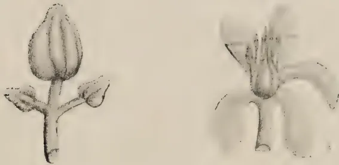
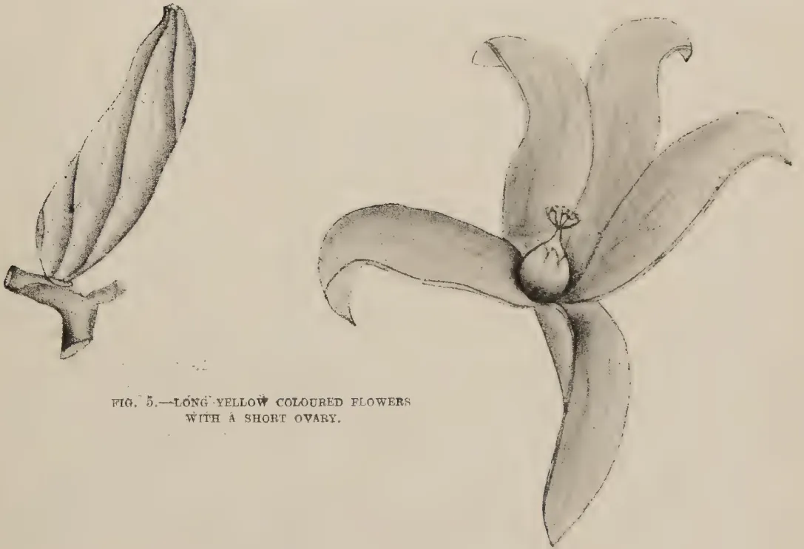
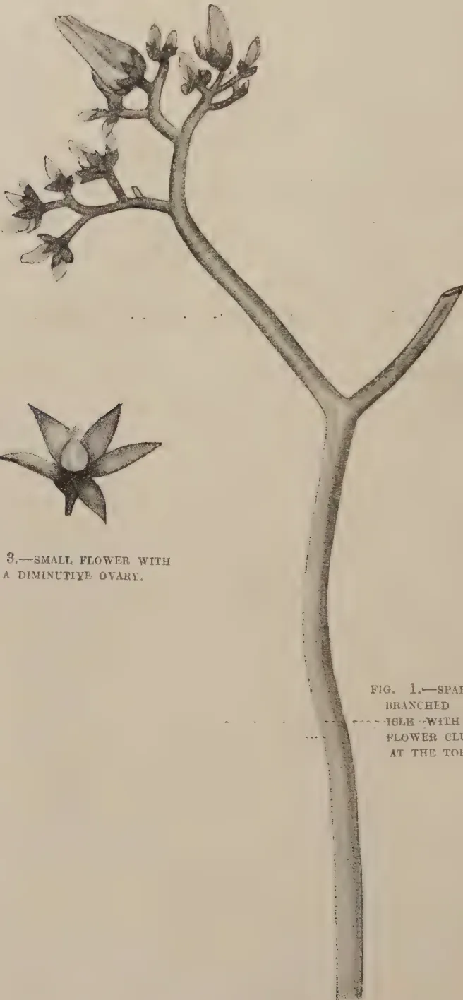
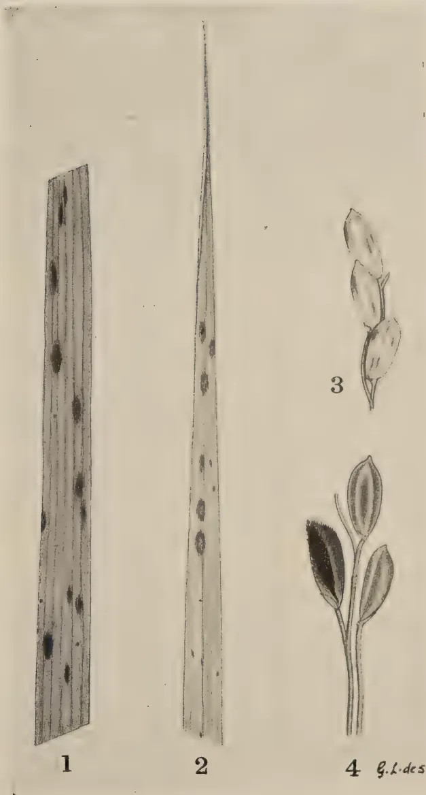

The

# Tropical Agriculturist

---

---

VOL. XCIX

PERADENIYA, JULY-SEPTEMBER, 1943.

No. 3

---

---

<table><thead><tr><th></th><th style="text-align: right;">Page</th></tr></thead><tbody><tr><td>Editorial .. .. .</td><td style="text-align: right;">131</td></tr></tbody></table>

## ORIGINAL ARTICLES

<table><tbody><tr><td>Stock—Scion Trials with Mango—I. A Preliminary Note. By A. V. Richards, M.Sc. (Calif.), B.Sc. (London), Dip. Agric. (Cantab.), A.I.C.T.A. (Trinidad) .. .. .</td><td style="text-align: right; vertical-align: bottom;">134</td></tr><tr><td>Hydnocarpus Oils in Ceylon, Part II. By Reginald Child, B.Sc., Ph.D. (Lond.), F.I.C. and Wilfred R. N. Nathanael, B.Sc. (Lond.) ..</td><td style="text-align: right; vertical-align: bottom;">140</td></tr><tr><td>Sex Variation in Papaw (Carica Papaya, Linn). By I. A. Sayed, B.Ag. (Bom.) .. .. .</td><td style="text-align: right; vertical-align: bottom;">143</td></tr><tr><td>Salvinia Auriculata <i>Aublet</i>. By J. E. Senaratna, B.Sc. (Lond.), F.L.S.</td><td style="text-align: right; vertical-align: bottom;">146</td></tr></tbody></table>

## DEPARTMENTAL NOTES

<table><tbody><tr><td>Brown Spot of Paddy .. .. .</td><td style="text-align: right;">150</td></tr><tr><td>Paddy Cultivation in Kandy .. .. .</td><td style="text-align: right;">152</td></tr><tr><td>The Utilization of the Sword-Bean and Jack-Bean as Food ..</td><td style="text-align: right;">157</td></tr><tr><td>Botanist's Selections .. .. .</td><td style="text-align: right;">160</td></tr></tbody></table>

## SELECTED ARTICLES

<table><tbody><tr><td>Methods in Plant Breeding .. .. .</td><td style="text-align: right;">162</td></tr></tbody></table>

## MEETINGS, CONFERENCES, &c.

<table><tbody><tr><td>Report of the Proceedings of the Sixth Meeting of the Central Board of Agriculture held on July 26, 1943 .. .. .</td><td style="text-align: right; vertical-align: bottom;">169</td></tr><tr><td>Minutes of the 66th Meeting of the Rubber Research Board held on July 16, 1943 .. .. .</td><td style="text-align: right; vertical-align: bottom;">184</td></tr><tr><td>Minutes of the 63rd Meeting of the Board of Management, Coconut Research Scheme, held on July 30, 1943 .. .. .</td><td style="text-align: right; vertical-align: bottom;">187</td></tr><tr><td>Minutes of the 64th Meeting of the Board of Management, Coconut Research Scheme, held on September 13, 1943 .. .. .</td><td style="text-align: right; vertical-align: bottom;">190</td></tr><tr><td>Minutes of a Meeting of the Board of the Tea Research Institute held on September 28, 1943 .. .. .</td><td style="text-align: right; vertical-align: bottom;">192</td></tr></tbody></table>

## RETURNS

<table><tbody><tr><td>Animal Disease Return for the Month ended September, 1943 ..</td><td style="text-align: right;">196</td></tr><tr><td>Meteorological Reports for July to September, 1943 ..</td><td style="text-align: right;">197-199</td></tr></tbody></table>

1—J. N. A 28918 (10/43)

1------------------------------------------------

<!-- stage4: FAINT old-images-only -->

[Faint page: no legible print of its own could be verified; text withheld (stage 4 review list)]

2------------------------------------------------

The

# Tropical Agriculturist

JULY TO SEPTEMBER, 1943

---

## EDITORIAL

---

### THE KURUNDANKULAM EXPERIMENT

---

**C**EYLON is not a farming country and it does not contain a population of farmers. Without a definition of the word farmer this statement may seem startling to our readers. It is used here to mean a man who raises annual crops and livestock primarily for sale and not for personal consumption and, for this purpose, has control, either as owner or as tenant, of an area of arable land and of cultivated pasture, equipped with the necessary buildings, agricultural implements, and livestock, which is large enough to engage all his working hours throughout the year and to secure a reasonable standard of living to his family. It is probably true to say that in the whole of Ceylon outside the Jaffna Peninsula there is not a single farmer in this sense of the word, and even in that small district the density of population makes the average holding so small that agriculture assumes more the nature of market gardening than that of farming. Therefore all efforts to improve the agriculture of the country must be preceded by the creation of farms and farmers. These farms cannot be situated in the Wet Zone. Apart from the universally recognized unsuitability of the soil and climatic conditions of the wet tropics for raising the staple crops of annual agriculture, land is not available in that Zone. It is probably true to say that in the whole of the Wet Zone there is not a single block of five, or even two, acres of high land which is vacant in the sense that it is not covered by perennial crops and is therefore available for farming and which, by its configuration and structure, is capable of being ploughed. High land farming is practicable only in the Dry Zone. Sir Frank Stockdale appreciated these facts and, about the year 1925, sought to attract farmers and to foster farming practice by the establishment of centres in the Dry Zone under departmental management to demonstrate the methods of dry farming. The effort failed because those who might have been willing to face the risks and discomfort of farming as pioneers in the malarial Dry Zone did not own the capital required for purchasing the land,

3------------------------------------------------

132

reclaiming it from forest to arable condition, erecting the essential buildings on it, and equipping it with the necessary implements and cattle. A common belief that a private citizen with his limited resources could not hope to do what Government succeeded in doing made the people distrust the results gathered by the Government demonstrator.

The lesson to be learnt from this failure was obvious : in the early stages of the growth of private farming, Government must reclaim the land, build the house, provide a domestic water supply, equip the farm with all the live and dead stock required for its proposed size, and settle the would-be-farmer on a ready-made fully equipped farm, and even pay him a maintenance allowance until he gathers his first harvest. But before a policy on these lines was launched, it was necessary to ascertain the area which an average family could farm efficiently with, perhaps, some outside help in the harvesting operations and the income which a farm of that size would probably yield. If that income was not enough to keep the family not only above want but in some degree of comfort, the policy of dry farming was not worth pursuing. The object of the Kurundankulam experiment was to collect authentic information on these points. An area of 100 acres, about three miles from Anuradhapura on the Trincomalee Road, was to be divided up into ten farms of equal size and ten selected families were to be settled on them. They would raise rotational crops under the guidance of departmental officers, all preliminary expenditure of establishing the farms being met by Government.

The scheme was first conceived at the end of 1936, but several factors delayed its full maturity—the absence of any farm in the country from which the officers in charge of the experiment could learn the elementary lessons connected with this industry, some hesitancy in the early stages to spend on this project money voted for scientific experiments, and the difficulty of finding suitable settlers. Even now the conditions have fallen short of the departmental aim in that only about  $6\frac{1}{2}$  acres of each farm is suitable for arable farming. But the results of the last five years justify the following propositions :—

1. (1) An average family of husband and wife with a child or two in the early teens can certainly farm 10 acres, and probably 15.
2. (2) A farm of 10 acres when fully developed and regularly worked will yield an annual income of about Rs. 1,000 in a commodity market of average and not inflated prices.

Only two questions still remain un-answered. Would these families be willing to bring up their children as farmers when

4------------------------------------------------

133

their incomes rise to this level, and can the fertility of the soil be maintained over long periods in the tropical conditions of extremes of drought and rainfall. Uneasiness on the first point was caused by the conduct of the most successful settler who sought to be a capitalist farming the land by means of paid labour while he engaged himself in other physically less strenuous occupations and had therefore to be sent away. But we feel that Government should take risks in both these respects and that it would be justified in launching a scheme of State-aided dry farming in the vacant lands of the districts which experience the full force of only one monsoon.

5------------------------------------------------

134

## STOCK—SCION TRIALS WITH MANGO—I. A PRELIMINARY NOTE

A. V. RICHARDS, M.Sc. (Calif.), B.Sc. (London), Dip. Agric. (Cantab.),  
A.I.C.T.A. (Trinidad)

HORTICULTURAL OFFICER

### SUMMARY

AN experiment was laid down in November, 1937, at the Experiment Station, Pelwehera, near Dambulla to test the relative merits of *Wal amba* (Sour Mango) *Kohu amba* (Fibre mango), *Betti amba* (Bombay mango) and *Eta amba* (Wild mango) as rootstocks for the four selected scion varieties, Jaffna mango, *Ambalavi*, Willard and Sabre.

The *Etamba* was the most difficult stock to transplant into the field, and took over 2 years to be ready for budding. The growth of the other stocks of comparable age was uniformly good.

Most of the stocks being overgrown were budded in December, 1940, and January, 1941, by insertion of the buds into the framework branches. The Willard gave 80 per cent. successful bud 'take', Jaffna 70 per cent., Sabre 60 per cent. and *Ambalavi* 40 per cent. The first variety to come into bearing was the Willard, a few frameworked trees of which bore fruit within 2 years on all the four varieties of rootstocks.

There has been so far no evidence of stock-scion incompatibility among all the varieties.

### INTRODUCTION

The Mango (*Mangifera indica* L.) is a native of the Eastern Tropics where it has been grown from time immemorial. It ranks with the grape and pomegranate as one of the oldest of cultivated fruits. In India, which is regarded as the home of the finest mango, several hundreds of choice varieties exist many of which were grown on an orchard scale during the reign of the great Mogul Emperor Akbar from 1556-1605. These varieties, which were probably evolved through centuries of mass selection, have been maintained pure as a result of propagation by the old method of grafting by approach or inarching which was first developed in India.

Some of the varieties grown in Ceylon on the calcareous soils of the Jaffna Peninsula compare favourably with the best Indian varieties in flavour and quality of fruit. Here too the

6------------------------------------------------

135

slow and cumbersome method of vegetative propagation by inarching on seedling rootstocks raised from seed collected indiscriminately finds favour with the local nurseryman, although it is being rapidly superseded by the modern methods of bud-grafting practised with great success in Departmental stations. In the absence of reliable information on stock-scion interactions no attempt is made by the nurseryman to select his seedling rootstocks nor to limit the number of scion varieties grown by him.

In order to test the relative merits of the common varieties of mango which are likely to make good rootstocks on account of their vigour of growth, longevity and ease with which seed could be had in plenty during the season, an experiment was laid down in the dry zone at Pelwehera Experiment Station near Dambulla using seedlings of *Wal amba* (Sour mango), *Kohu amba* (Fibre mango), *Betti amba* (Bombay mango) and *Etamba* (wild mango) *Mangifera Zeylanica*, Hook as rootstocks for the four selected scion varieties, Jaffna mango, *Ambalavi*, Willard and Sabre.

#### THE ROOTSTOCK VARIETIES

The common sour mango is widely distributed throughout the Island. It is known as *Pulima* in the Jaffna Peninsula and Batticaloa District. The trees are long lived and produce fruits which vary considerably in size and shape. Each seed contains a single embryo which grows into a vigorous seedling. Being the progeny of monoembryonic seeds, the seedlings tend to exhibit variations in growth characteristics. Paul and Guneratnam (1) found from a study of 16 varieties of sour mango showing differences in shape of the fruit at the Farm School, Jaffna, that the variations in growth among the seedlings were not appreciable. They possess numerous lateral roots which enable them to stand transplanting.

The fibre mango which is almost as common as the sour mango differs from it in being more fibrous, sweet and polyembryonic. Each seed contains in addition to the sexual embryo produced as a result of fertilization 3 to 4 asexual embryos produced as vegetative buds from the parent nucellar tissue. These asexual embryos grow into seedlings at the expense of the sexual embryo which is often smothered by them in the early stages. Being of the same genetic make up as the seed parent the asexual seedlings show hardly any variability except in initial vigour which appears to be due to the differences in quantity of food material available for each embryo in the seed. In general not more than 1 or 2 vigorous seedlings can be selected from the progeny of each seed; the rest being weak and small have to be rejected. Like the *Wal amba* these seedlings have numerous fibrous roots, and are able to stand transplanting.

7------------------------------------------------

136

The Bombay mango, which is more commonly found in the Galle District, is also polyembryonic and comes true to type from seed. The fruits which are of medium size and oval shape are somewhat flattened on the two sides, and have a characteristic bright yellow colour when fully ripe. In flavour they are slightly aromatic and pleasingly subacid. The seedlings make vigorous growth and are not difficult to transplant.

The *Etamba* which is endemic to Ceylon is found growing wild in the jungles in the wet zone where it is highly productive. It is also widely distributed along the banks of the Mahaweliganga at Minipe, and in the coastal area of the Eastern Province between Kalkudah and Kalmunai where the water table is fairly high. The trees near the river bank at Minipe are magnificent specimens which are of immense size and of great age.

Many strains of *Etamba* are known to occur which show slight differences in the appearance of the foliage and size of the fruits. The average fruit, which is generally sweet, is about 3.8 cms. long and 2.0 cms. wide. The seed is monoembryonic, and produces a single seedling which takes nearly 2 years to be ready for budding when seedlings of other varieties take only 9 to 12 months. The seedlings are very difficult to transplant as they have only a long tap root with hardly any laterals. Many deaths occur even when the tap root is pruned *in situ* during showery weather to facilitate transplanting a month later. Nevertheless when once established in the field the seedlings grow into hardy trees. If these stocks are to be used they are best raised directly in the field and budded at stake.

#### THE SCION VARIETIES

The Jaffna mango is about the most popular variety in Ceylon. Two forms of Jaffna mango are recognised of which the *Vellai Colomban* produces fruits that are yellowish green when ripe, while those of the *Karutha Colomban*, whose distribution is limited mainly to the Jaffna peninsula, have an attractive reddish orange colour. The flesh of the former is not so richly coloured as that of the latter, nor is the young foliage so vividly green. The fruits are of medium size, slightly elongated in shape, and of excellent flavour. Both forms produce seeds which are polyembryonic, so that they come fairly true to type from seed. The trees of the Jaffna mango are very productive both in the wet and dry zones, and often bear fruit twice a year during the season from May to June and again from December to January.

The *Ambalavi* is essentially a variety for the dry zone where it grows to perfection on calcareous soils. The fruits are of medium size and somewhat elongated with a slightly curved beak. They acquire a rich golden yellow colour when fully

8------------------------------------------------

137

ripe. The flesh is also of deep reddish orange colour, fairly firm and of excellent flavour. Fruits which are not fully ripe sometime smell of turpentine. They have to be picked quite mature as otherwise the skin shrivels up, and their flavour tends to be insipid. The seed is monoembryonic. The tree can be recognised by its weak habit of growth, the blackened appearance of the young twigs, the dark green colour of the leaves which are smaller than those of the Jaffna mango, and by the copper colour of the young foliage. The trees never grow so large as the Jaffna mango, and can be planted at a closer spacing of 25 feet to 30 feet according to the fertility of the soil.

The Willard, which was introduced into Ceylon from Mauritius by Sir Frank Stockdale during his tenure of office here as Director of Agriculture is a small ornamental tree which comes into bearing earlier than most other varieties. Grafted trees bear within three years in the dry zone, and may take a year or two more in the wet zone.

The fruits, which are small and round, are not unlike a russet apple when immature, but the russet colour, which is mainly confined to the side exposed to the sun, turns into an attractive crimson blush as the fruit ripens. The flesh is firm and nearly free from fibre. It lacks any characteristic flavour though it is quite sweet and nice to eat. The seed is monoembryonic, and seedling trees cannot be depended upon to come true to type. The fruits keep well in storage and are easy to grade. They should find a good market on account of their attractive colour and good flavour.

The Sabre mango is a South African variety which is not unlike the *Ambalavi* in shape and flavour, but when ripe it acquires an attractive crimson blush like that of the Willard. The fruits are borne in clusters and are of medium size. The seed is polyembryonic and according to Webber (2) comes true to type, but such seeding trees take long to come into bearing. The tree is relatively small, and bears well both in the wet and dry zones. The leaves are somewhat long and narrow, and show a tendency to be bunched together on the terminal shoots.

#### THE DESIGN OF THE EXPERIMENT

The design of the experiment was in the form of a 4 by 4 complex Latin square with split plots in which the 4 scion varieties were distributed at random over the main plots, and the four stock varieties over the sub plots, there being 12 plants per main plot and 3 plants per sub plot at a spacing of 32 feet by 30 feet. The total number of plants in the experiment excluding those in the single border row round the entire experimental area was 192.

The land made available for the experiment was originally a part of the old rotation area which had become infertile for

9------------------------------------------------

138

cultivation of field crops. In most parts of the area the finer particles of soil overlying the gravelly subsoil had begun to disappear through soil erosion.

The necessary planting material was established in bamboo pots, and taken to the experimental area for planting when about a month old. The planting was done during showery weather on November 7, and December 22, 1937, the *Etamba* being planted first and the other three varieties later. In spite of several attempts made to supply vacancies it was not possible to obtain an uniform stand of plants owing to severe drought each year from July to September which killed many plants in the gravelly sections. Casualties were very heavy among the *Etamba* plants, many of which failed to become established owing to the paucity of fibrous lateral roots, and the few plants that remained made poor growth. There was no significant difference in vigour of growth among the other stocks of comparable age.

The stocks of buddable age in the plots allotted for Jaffna mango were budded with budwood from the Jaffna mango tree No. A 9 at the Royal Botanic Gardens, Peradeniya, on October 12 and 23, 1940; those in the Willard mango plots with budwood from the selected tree at the Farm School, Jaffna, on December 7, 1940; those in the Sabre plot with budwood from the tree at King's Pavilion, Kandy, on December 14, 1940; and those in the *Ambalavi* plots with budwood from the selected tree at the Farm School, Jaffna, on January 30, 1941.

Many of the stocks being about 3 years old were overgrown and had to be budded repeatedly by inserting the buds into the branches of the framework near their points of union with the main stem, the method of budding used being the modified Forkert. One branch was left unbudded as a nurse branch till the scion growth had become sufficiently vigorous, after which it was removed. The Willard variety was the easiest to bud and the *Ambalavi* the most difficult, the percentage of success being 80 per cent. and 40 per cent. respectively, while for Jaffna and Sabre it was 70 per cent. and 60 per cent. respectively. Among the rootstock varieties the *Etamba* presented little difficulty in budding as it had a relatively thin bark which peeled more easily than the thick bark of the other rootstock varieties.

The branches which were successfully budded were ring-barked 6 inches above the bud union to force the buds to shoot out, and were then removed. All the scion varieties which were thus frameworked made vigorous growth when once the buds had shot out. A few buds however remained dormant for quite a long period and then shot out.

The Willard variety showed consistently good growth on all the rootstock varieties of comparable age, and was the first to

10------------------------------------------------

A black and white photograph of a Willard Mango tree in fruit, supported by a wooden frame. The tree is dense with leaves and has several large, round mangoes hanging from its branches. The ground is sandy and uneven. A small caption at the bottom right of the image reads 'BLOCK BY SURVEY DEPT. (T. 1408)'.

PLATE 1

Willard Mango tree in fruit on *Kohu amba* stock 2 years after frame working.

11------------------------------------------------

A black and white photograph of a Willard Mango tree in fruit, supported by a wooden frame. The tree is densely covered with leaves and numerous large, round mangoes are visible hanging from the branches. The ground is covered with grass and some low-lying plants. The background is slightly blurred, showing more trees and foliage. The image is framed by a white border.

PLATE 2

Willard Mango tree in fruit on *Etamba* stock 2 years after frame working.

12------------------------------------------------

139

come into bearing within 2 years of budding, most of the fruits being picked on December 18, 1942, for display at the Food and Foodcraft Exhibition, Colombo. A few trees were again in fruit in June, 1943. There was no striking difference in the quality of the fruits produced on the various stocks although there appeared to be a tendency for the fruits to be numerous and small on the *Etamba* stocks (plates 1 and 2). Bagging of the fruits against attack by the fruit piercing moth (*Othreis* Sp.) prevented the development of the attractive crimson blush, and caused the flavour to be somewhat insipid.

Two Jaffna mango plants on *Etamba*, and one on *Betti amba* came into fruit for the first time in June, 1943, nearly  $2\frac{1}{2}$  years after budding; while of the other varieties only one Sabre mango of similar age on *Betti amba* stock produced a few fruits. It is too early yet to draw definite conclusions on stock-scion effects from the performance of these few plants propagated by frameworking overgrown stocks.

#### REFERENCES

1. 1. Paul, W. R. C., and Guneratnam, Mango Stocks. *The Tropical Agriculturist*. Vol. XC 1, pp. 34-35
2. 2. Webber, H. J., 1931 .. The Economic Importance of Apogamy in *Citrus* and *Mangifera*. *Proc. Amer. Soc. Hort. Sci.*, 28 : 57-61

13------------------------------------------------

140HYDNOCARPUS OILS IN CEYLON, PART II.

REGINALD CHILD, B.Sc., Ph.D. (Lond.), F.I.C.,  
 DIRECTOR OF RESEARCH, COCONUT RESEARCH SCHEME  
 AND

WILFRED R. N. NATHANAEL, B.Sc. (Lond.),  
 TECHNICAL ASSISTANT TO THE TECHNOLOGICAL CHEMIST

IN our previous article I we reported the examination of locally grown seeds of *Hydnocarpus wightiana* Blume, and *H. kurzii* Warb. We here record the results of a similar examination of seeds of *H. anthelmintica* Pierre, obtained from the same estate as our previous samples.

During the course of this work we undertook the preparation of 3,000 c.c. of Oleum *Hydnocarpi Aethylicum*, B. P. for the Department of Medical and Sanitary Services, and some further details of this preparation are included in the present communication.

Analytical figures are also given for the residue cakes remaining after oil extraction of the kernels of all three species examined.

EXPERIMENTAL

1. *Seeds of Hydnocarpus anthelmintica*.—Two parcels of seeds (each about 9 lb.) were received at different times. The first parcel consisted of Tung seeds, which superficially resemble those of *H. anthelmintica*, and had clearly been sent in error from the estate, where Tung is also being cultivated. The second parcel included some *H. kurzii* seeds.

It was possible to sort out by hand the *H. anthelmintica* seeds. A considerable proportion of the seeds was decayed and in most the kernels were partially dry. Only whole kernels were used for examination. Earlier records from the literature are quoted for comparison.

<table border="1">
<thead>
<tr>
<th></th>
<th>Present Sample</th>
<th>2 Ceylon (1929) Sample</th>
<th>2 Ceylon (1930) Sample</th>
<th>4 Malayan (1929) Sample</th>
<th>3 Malayan (1932) Sample</th>
<th>5 Power &amp; Barrowcliff (1905)</th>
</tr>
</thead>
<tbody>
<tr>
<td>Average weight of seeds (grams.)</td>
<td>.. 2.36</td>
<td>.. 1.83</td>
<td>.. 2.0</td>
<td>.. 2.42</td>
<td>.. 1.86</td>
<td>.. —</td>
</tr>
<tr>
<td>Average weight of kernels (grams.)</td>
<td>.. 0.68</td>
<td>.. 0.52</td>
<td>.. 0.6</td>
<td>.. 0.77</td>
<td>.. 0.64</td>
<td>.. —</td>
</tr>
<tr>
<td>Percentage of shells ..</td>
<td>.. 68.00</td>
<td>.. 71.50</td>
<td>.. 70.0</td>
<td>.. 68.20</td>
<td>.. 65.70</td>
<td>.. 68.80</td>
</tr>
<tr>
<td>Percentage of kernels ..</td>
<td>.. 32.00</td>
<td>.. 28.50</td>
<td>.. 30.0</td>
<td>.. 31.80</td>
<td>.. 34.30</td>
<td>.. 31.20</td>
</tr>
<tr>
<td>Moisture <i>per cent.</i> in kernels</td>
<td>.. 8.20</td>
<td>.. 4.30</td>
<td>.. 7.8</td>
<td>.. 26.50</td>
<td>.. 10.10</td>
<td>.. —</td>
</tr>
<tr>
<td>Oil <i>per cent.</i> in kernels ..</td>
<td>.. 56.30</td>
<td>.. 62.70</td>
<td>.. 60.1</td>
<td>.. 42.50</td>
<td>.. 53.70</td>
<td>.. 56.40</td>
</tr>
<tr>
<td>Do. (on dry weight)</td>
<td>.. 61.40</td>
<td>.. 65.50</td>
<td>.. 64.8</td>
<td>.. 57.80</td>
<td>.. 59.70</td>
<td>.. —</td>
</tr>
<tr>
<td>Oil <i>per cent.</i> of whole seeds as received</td>
<td>.. 18.00</td>
<td>.. 17.90</td>
<td>.. 18.0</td>
<td>.. 13.50</td>
<td>.. 18.40</td>
<td>.. 17.60</td>
</tr>
</tbody>
</table>

The oil extracted from the ground dried kernels by light petroleum (B. pt. 40–60°) had the following characteristics, which are compared with those of the samples in the foregoing

14------------------------------------------------

141

table. Marcan6 has recorded the range of characteristics found for 23 samples of commercial *H. anthelmintica* oil in Siam, and these figures, quoted below, are of particular interest since Siam is one of the original sources of the species.

<table border="1">
<thead>
<tr>
<th></th>
<th>Present Sample.</th>
<th>Ceylon (1929) Sample.</th>
<th>Ceylon (1930) Sample.</th>
<th>Malayan (1929) Sample.</th>
<th>Malayan (1932) Sample.</th>
<th>Power &amp; Barrowcliff (1905).</th>
<th>Marcan (1926)</th>
</tr>
</thead>
<tbody>
<tr>
<td>Specific Gravity at 25°/25°</td>
<td>0.950..</td>
<td>—</td>
<td>—</td>
<td>0.9429 (d30°/15°)</td>
<td>0.9435 (d30°/30°)</td>
<td>—</td>
<td>0.947-0.954 (d30°/30°)</td>
</tr>
<tr>
<td>Specific Rotation at 30°</td>
<td>+53.1</td>
<td>+47.6</td>
<td>+47.2</td>
<td>+47.9</td>
<td>+46.8</td>
<td>+51.0</td>
<td>+47.1-51.5</td>
</tr>
<tr>
<td>Refractive Index at 40°</td>
<td>1.4720.</td>
<td>—</td>
<td>—</td>
<td>1.4726 (27°)</td>
<td>1.4729 (27°)</td>
<td>—</td>
<td>1.4693-1.4713</td>
</tr>
<tr>
<td>Acid value</td>
<td>2.8</td>
<td>—</td>
<td>—</td>
<td>0.2</td>
<td>1.0</td>
<td>—</td>
<td>0.2-9.8</td>
</tr>
<tr>
<td>Saponification value</td>
<td>202.6</td>
<td>—</td>
<td>—</td>
<td>206.4</td>
<td>202.4</td>
<td>—</td>
<td>191.4-226.5</td>
</tr>
<tr>
<td>Iodine value (Wijs, 30 mins.)</td>
<td>90.3</td>
<td>—</td>
<td>—</td>
<td>81.5</td>
<td>84.5</td>
<td>—</td>
<td>88.6-99.6</td>
</tr>
<tr>
<td>Melting Point B. P. Method</td>
<td>24.0°</td>
<td>—</td>
<td>—</td>
<td>—</td>
<td>—</td>
<td>—</td>
<td>—</td>
</tr>
</tbody>
</table>

We commented in our previous article on the range of recorded values for *H. wightiana* oil. The ranges of characteristics for the three species we have discussed overlap considerably, but in general the highest figures for iodine value, refractive index and optical rotation are given by *H. wightiana* oils and the lowest by *H. anthelmintica* oils. Our present sample has values somewhat higher than may be regarded as typical for the species.

2. *Preparation of Ethyl Esters of Hydnocarpus Oil.*—The raw material used for the preparation of 3,000 c.c. of esters was 3,333 grams of *H. wightiana* oil supplied from the Civil Medical Stores, and was similar to that referred to as No. 2 in our previous article. The method of preparation was substantially as previously outlined. Crude acids obtained from saponification (3198 grams) were washed several times with hot water before esterification; the acids are unstable and there must be no delay in proceeding with the esterification (compare the similar observations of Georgi *et alii*, *loc. cit.*, p. 7). The final yield of redistilled esters was 2819 grams (3100 c.c.) and they gave the following figures on analysis:—

<table border="1">
<tbody>
<tr>
<td>Specific Gravity at 15.5°/15.5°</td>
<td>..</td>
<td>0.9088</td>
</tr>
<tr>
<td>Specific Rotation at 30°</td>
<td>..</td>
<td>+53.9</td>
</tr>
<tr>
<td>Refractive Index at 20°</td>
<td>..</td>
<td>1.4591</td>
</tr>
<tr>
<td>Acid value</td>
<td>..</td>
<td>below 0.5</td>
</tr>
<tr>
<td>Saponification value</td>
<td>..</td>
<td>193.2</td>
</tr>
<tr>
<td>Iodine value</td>
<td>..</td>
<td>91.2</td>
</tr>
</tbody>
</table>

These comply readily with the requirements of the British Pharmacopoeia 1932.

The results of a fractional vacuum distillation of these esters (which we do not quote in detail) agree with similar figures of Georgi (*loc. cit.*, pp. 6-7) in indicating the presence of esters other than hydnocarpic and chaulmoogric.

15------------------------------------------------

142

It is usual to add to Ethyl Esters of *Hydnocarpus* Oil, up to 4 per cent. of creosote as a preservative; other substances such as camphor are also used. In this connection reference may be made to a recent note by Basu and Mazumdar7.

3. *Analyses of Hydnocarpus Meals*.—We are indebted to Mr. E. Chinnarasa, B.Sc., for the following analysis of extracted meals :—

(Percentages on dry oil-free meals.)

<table border="1">
<thead>
<tr>
<th></th>
<th><i>H. wightiana</i></th>
<th><i>H. kurzii</i></th>
<th><i>H. anthelmintica</i></th>
</tr>
</thead>
<tbody>
<tr>
<td>Nitrogen (Kjeldahl) ..</td>
<td>6.88</td>
<td>6.57</td>
<td>6.68</td>
</tr>
<tr>
<td>Ash ..</td>
<td>9.89</td>
<td>9.64</td>
<td>8.47</td>
</tr>
<tr>
<td>Potash (<math>K_2O</math>) ..</td>
<td>1.28</td>
<td>2.21</td>
<td>1.26</td>
</tr>
<tr>
<td>Potash as <i>per cent.</i> of Ash</td>
<td>12.94</td>
<td>22.93</td>
<td>14.88</td>
</tr>
<tr>
<td>Phosphoric Acid (<math>P_2O_5</math>)</td>
<td>0.93</td>
<td>0.87</td>
<td>0.95</td>
</tr>
<tr>
<td>Phosphoric Acid as <i>per cent.</i> of ash ..</td>
<td>9.40</td>
<td>9.02</td>
<td>11.22</td>
</tr>
</tbody>
</table>

4. *Conclusion*.—Of the three *Hydnocarpus* species upon which we have now reported, *H. wightiana* is to be preferred for cultivation on account of the better keeping quality of the seeds and their higher oil content, as well as the better suitability of the oil for medicinal requirements. In addition to inferiority in these respects, *H. anthelmintica* has the disadvantage of the high percentage of shell on the seeds.

#### REFERENCES

1. 1. R. Child and W. R. N. Nathanael.—“*Hydnocarpus* Oils in Ceylon”, *Tropical Agriculturist* (Ceylon), 1942, XCVIII., pp. 2-7.
2. 2. “*Hydnocarpus anthelmintica* seed from Ceylon”.—*Bull. Imp. Inst.*, 1930, XXVIII., pp. 6-8.
3. 3. C. D. V. Georgi, T. A. Buckley, and Gunn Lay Teik.—“*Hydnocarpus* Oils in Malaya”, *Dept. of Agric., S.S. & F.M.S., Bull.* No. 9 (Scientific series), 1932.
4. 4. C. D. V. Georgi, Gunn Lay Teik.—“Oil from *Hydnocarpus anthelmintica*”, *Malayan Agric. J.*, 1929, XVII., No. 6, pp. 171-174.
5. 5. F. B. Power and M. Barrowcliff.—“Constituents of the Seeds of *Hydnocarpus wightiana* and *H. anthelmintica*”. *J. Chem. Soc. (Proc.)*, 1905, 21, 175-176; 87, 884.
6. 6. A. Marcan.—“The Oil of *Hydnocarpus illicifolia*”. *J. Soc. Chem. Ind.*, 1926, 45, 305-306 T.
7. 7. U. P. Basu and A. Mazumdar.—“A Note on the Keeping Properties of *Hydnocarpus Wightiana* Oil and its Derivatives”. *J. Indian Chem. Soc.*, 1940, 17, p. 280.

16------------------------------------------------

FIG. 4.—FLOWER BUDS WITH STAMENS ENVELOPING THE STIGMA.

FIG. 5.—LONG YELLOW COLOURED FLOWERS  
WITH A SHORT OVARY.

17------------------------------------------------

FIG. 2.—SMALL GREENISH FLOWER BUD.

A detailed botanical illustration of a plant stem. The main stem is thick and tapers slightly towards the top. It has a single branch that splits into two, with a smaller branch further up. At the very top of the main stem, there is a small, sparsely branched inflorescence (panicle) bearing several small, greenish flower buds. To the left of the main stem, there is a separate, enlarged view of a single flower bud, showing its pointed shape and the surrounding sepals or bracts.

FIG. 3.—SMALL FLOWER WITH  
A DIMINUTIVE OVARY.

FIG. 1.—SPARSELY  
BRANCHED PAN-  
ICLE WITH THE  
FLOWER CLUSTER  
AT THE TOP.

18------------------------------------------------

143SEX VARIATION IN PAPAWE (CARICA PAPAYA, LINN)

BY

I. A. SAYED, B.Ag., (Bom.)

LECTURER IN HORTICULTURE, SCHOOL OF AGRICULTURE,  
PERADENIYA, CEYLON

THE remarkable feature of the papaw is that it exhibits a wide range of sex forms varying from pure pistillate to pure staminate with intergrades of hermaphrodite forms. On account of sex peculiarities as affecting its economic cultivation, it has been the subject of close study by various workers for well over a quarter of a century. Determination of sex in *Carica papaya* and primary flower types and the fruit types have been studied by Hofmery (1) and Storey (2) respectively. Gammie (3) classified papaw plants into eleven forms with reference to the sex of flower. Agnew (4) described three intergrades of hermaphrodite flowers with reference to their structure.

During the course of papaw investigation at the Agricultural Experiment Station, Peradeniya, Ceylon, three papaw plants of the local variety which were conspicuous by their peculiar mode of flowering attracted the attention of the writer. The plants were characterized by the production of abundant flower panicles producing sex forms of variable structural modifications in distinct contrast to all the present knowledge of variation in papaw flowers.

Briefly described, one of the plants (plant No. 1) produced numerous long and short peduncles numbering fifty-four with clusters of flowers. The average length of peduncle was 1'-6". The plant put forth a similar compliment of panicles after the removal of the first crop for individual examination. The panicle was not profusely branched like the normal staminate panicle and the flower cluster developed only at the top (Fig. 1). The cluster of flowers was composed of short pedicelled pistillate and hermaphrodite flowers of comparatively smaller size than the normal ones as shown in the following table :—

TABLE I

Showing comparative length of flower and diameter of the ovary

<table>
<thead>
<tr>
<th>Flower types.</th>
<th>Length of flower</th>
<th>Diameter of the ovary</th>
</tr>
</thead>
<tbody>
<tr>
<td>Typical flower .. ..</td>
<td>0.98 cm. ..</td>
<td>0.25 cm.</td>
</tr>
<tr>
<td>Pistillate flower-normal .. ..</td>
<td>2.18 cm. ..</td>
<td>0.50 cm.</td>
</tr>
<tr>
<td>Hermaphrodite flower normal (elongata)</td>
<td>2.56 cm. ..</td>
<td>0.43 cm.</td>
</tr>
</tbody>
</table>

19------------------------------------------------

144

The flower buds which were greenish in colour were broad at the base and tapering at the apex (Fig. 2). The ovary was pronounced but diminutive (Fig. 3). Unlike the ovary of a normal pistillate or hermaphrodite flower which is capable of enlargement without the stimulus of pollination, the flower bud did not open, nor did the ovary enlarge; but ultimately dropped. Repeated attempts to stimulate the development of the ovary by controlled hand pollination failed. The flower was found to be abscised three days after pollination. Thinning out of a large number of panicles with a view to minimise their adverse effect on the development of the ovary due to competition was also not effective. In fact, it had the reverse effect.

The hermaphrodite flowers were of *petandria*, *elongata* and intermediate types having one to five stamens, the latter enveloping the stigma (Fig. 4). This condition is conducive to self pollination but the pollen is functionless owing to abortive ovary. The stamens contained abundant viable pollen as indicated by iodine test.

The flower panicles on the second plant were composed of a variable number of staminate and pistillate flowers, the latter differing in shape and size from those previously described. While the staminate flowers were normal, the pistillate flowers were sessile, 1.3 cm. long, rather uniformly round and of dull yellow colour with a short ovary (Fig. 5). The flower panicles were conspicuous by their absence of primary flower types.

The flower panicles on the third plant were predominantly male with a small number of mixed flower types. The flowers were similar in shape and size to those produced on the first plant.

An examination of individual panicles produced on the three plants revealed characteristic variation in respect of flower types as follows:—

TABLE II

Showing number of panicles producing primary and mixed flower types

<table border="1">
<thead>
<tr>
<th></th>
<th>♂</th>
<th>♀</th>
<th>♀</th>
<th>♂+♀</th>
<th>♀+♀</th>
<th>♂+♀</th>
</tr>
</thead>
<tbody>
<tr>
<td>Plant No. 1</td>
<td>—</td>
<td>8</td>
<td>5</td>
<td>—</td>
<td>4</td>
<td>—</td>
</tr>
<tr>
<td>Plant No. 2</td>
<td>—</td>
<td>—</td>
<td>—</td>
<td>4</td>
<td>—</td>
<td>—</td>
</tr>
<tr>
<td>Plant No. 3</td>
<td>22</td>
<td>3</td>
<td>—</td>
<td>—</td>
<td>9</td>
<td>1</td>
</tr>
</tbody>
</table>

Further, an interesting feature of the hermaphrodite flowers was their variable number of stamens. The normal *petandria*

20------------------------------------------------

145

and elongata flower types possess five and ten stamens respectively. The examination of individual hermaphrodite flowers from plant No. 1 gave the following frequency distribution :—

TABLE III

Showing frequency distribution of the number of stamens in hermaphrodite flowers

<table border="1">
<thead>
<tr>
<th rowspan="2"></th>
<th colspan="5">Number of stamens</th>
<th rowspan="2">No. of flowers</th>
<th rowspan="2">Mean</th>
</tr>
<tr>
<th>1</th>
<th>2</th>
<th>3</th>
<th>4</th>
<th>5</th>
</tr>
</thead>
<tbody>
<tr>
<td>Plant No. 1 ..</td>
<td>22</td>
<td>29</td>
<td>24</td>
<td>23</td>
<td>73</td>
<td>173</td>
<td>3</td>
</tr>
</tbody>
</table>

The characteristic variability of flower types in regard to their shape, size and number of stamens as exhibited by these plants clearly shows that these types are by no means stable and seem to be, to a great degree, in a highly plastic condition as influenced by genetic constitution of strains, soil variation and environmental conditions.

#### ACKNOWLEDGEMENT

My thanks are due to Dr. M. Fernando, Assistant Botanist, Department of Agriculture, Peradeniya, Ceylon, for reading through the paper and making useful suggestions.

#### REFERENCES

1. 1. Farming in S. Afr. 1938, 13 : 332.
2. 2. Proc. Am. Soc. Hort. Sc. 1938, 1937 : 80-2.
3. 3. Bombay Dept. Agri. Bull. 30, 1908.
4. 4. Q. Agr. Jr. 1941, 56 : 358-373.

21------------------------------------------------

146

## SALVINIA AURICULATA AUBLET

### A RECENTLY INTRODUCED, FREE-FLOATING WATER-WEED,

**The plates illustrating this article will be issued with the next number.**

#### SUMMARY

After an introduction in which are briefly mentioned how and where the Central American water weed *Salvinia auriculata* Aubl. was found in a naturalized state in Ceylon, and which has now assumed pest proportions in Colombo, are given a description of the plant and its methods of reproduction and dispersal. Its possible danger in silting up water-courses and in obstructing machinery is pointed out and methods of control are indicated.

#### INTRODUCTION

THE danger of indiscriminate introduction of new plants to Ceylon, intentionally or otherwise, has often been stressed in this Journal as these may turn out to be significant as weeds. A weed introduced to a new land is not in equilibrium with its environment : its natural competitors may be absent, and if soil, climate and other conditions prove suitable, in the absence of its natural checking influences, the weed may spread to such an extent as to overrun its newly-found home.

*Salvinia auriculata* Aubl. is a native of Tropical America. It is a free-floating water fern of great interest from a botanical point of view. It is also an attractive little plant of much ornamental value. It appears to have been introduced to Ceylon quite recently. It had not been recorded anywhere in Ceylon in a naturalized state until early in August, 1943, when Dr. W. R. C. Paul, Agricultural Officer, South Western Division, brought it to the notice of the writer.

On 24th August it was found in an *ela* (small water channel) bordering the Muturajavela experimental paddy fields at Usvetakeyyava. There were only a few plants scattered far apart. In a distance of about 50 yards of channel there were only six plants. These plants were small, with stems about two inches long and with only the smaller and more horizontal type of aerial leaf associated with young plants. The cultivators of the fields nearby had not noticed the plant there before, and apparently it was the first introduction of the weed to the

22------------------------------------------------

This image is a scan of a blank page. The background is a uniform light beige or tan color. There are several small, dark specks scattered across the page, which appear to be scanning artifacts or dust. A faint, horizontal line is visible near the bottom edge of the page, possibly indicating a binding or a fold. The overall texture is slightly grainy, typical of a scanned document.

23------------------------------------------------

# DISTRIBUTION OF SALVINIA AURICULATA

IN CEYLON.

OCTOBER 8, 1943.

MAP OF PART OF WESTERN PROVINCE,  
CEYLON, SHOWING WATER-COURSES.

SCALE 3 MILES TO AN INCH.  
\*\*\*\* INDICATE THE PLANT.

![Map of the Western Province of Ceylon showing the distribution of Salvinia auriculata. The map includes the coastline with labels for Pannaluriansa, Uswetakeyyawa, Hendala, Nutwal, Colombo Harbour, Maradana, Wellampitty, Pitotamulla, Kolonahawa, Rajagiriya, Cotta Road, Welikada, Etul Kotte, Narahenpita, Wellampitta, Kirillapone, Nugegoda, Gangodawila, Nikapc, Bellantara, Attidiya, Boralessgamuwa, Weramera, Wewala, Suwarapola, Lunawa, and Nissatirwa. Water courses are shown as dashed lines, and the plant's distribution is marked with asterisks (****).](b35bf291d3a227731e2708e1347127ae_6_img.webp)

The map illustrates the coastal region of the Western Province of Ceylon. The coastline is marked with numerous small asterisks, indicating the presence of *Salvinia auriculata*. Water courses are depicted as dashed lines, with some labeled, such as the Kurugodawattar and Kotuwagoda. The map includes a scale of 3 miles to an inch and a legend stating that asterisks indicate the plant's location. Various towns and geographical features are labeled along the coast and inland.

PRINTED BY SURVEY DEPT., CEYLON. DEC. 1943  
FROM ORIGINAL SUPPLIED BY D. A. NE 208

24------------------------------------------------

147

*ela*. In the Negombo Canal, a few hundred yards away, the plant was found sparsely scattered near either bank where the flow of water was slow and the water more or less stagnant. Here a bridge was under construction and logs lying across the water had, acting as a barrier, held up about 25 plants. These, too, were small plants similar to the ones already noticed in the *ela*. On inquiry from the workmen and local residents it was ascertained that the plant had not been noticed by them earlier than about a month previously, and that it had been brought down from the Colombo side of the canal. Towards Colombo, along the canal, the weed was found to be of more and more frequent occurrence. It was also observed on some side *elas* along the route to Colombo.

On the same day, August 24, 1943, the Stanley Power Station at Kolonnava was visited, at the request of Dr. Paul, and there round the intake channel was an area of about 1,000 square feet entirely covered by the weed, whereas, it was said that on the previous day the whole area had been cleared of the plant. Numerous plants were seen floating downstream, steadily adding to the number. On inquiry it was learnt that the plant had not been noticed here more than four months previously and that it had assumed pest proportions only very recently. The plants here were mostly large, eight to twelve inches long, much branched, and bearing the bigger, almost vertically upfolded leaves characteristic of the adult plant, in addition to the smaller, horizontal leaves on the smaller branches. These smaller branches readily break off to form independent plants.

*Distribution*.—It would appear from a survey recently made (map) that the weed is at present confined to the Western Province where it occurs from as far south as Werahera in the Bolgoda area and extends along the waterways as far north as the Negombo Lagoon; it is consequently found in all the areas in the vicinity of the network of waterways connected with this system of canals extending from Bolgoda to Negombo.

#### DESCRIPTION

*Salvinia auriculata* Aublet, Hist. Pl. Guian. 2.969, t. 367 (1775). (Family: *Salviniaceae*).

*Synonyms*: *Salvinia rotundifolia* Willd. (1810); *S. hispida* H.B.K. (1815); *S. biloba* Raddi (1825); *S. affinis* Desv. (1827).

*Origin*.—Tropical America.

*Habit*.—Although a fern, it is most unfernlike in appearance. It somewhat resembles *Pistia Stratiotes* L., *diya-parandel* (Sinhalese), though the differences are at once obvious. (Pl. I, 1, 2).

25------------------------------------------------

148

*Description.*—a gregarious, free-floating, perennial herb with no true roots; stems up to 12 inches long, much-branched, slender, floating, green, sparsely covered with brown hairs; leaves of two kinds: (1) *aerial leaves* or float leaves exposed to the air, firm in texture, green in colour, in addition to carrying on the usual functions of the leaf, helping the plant to float, sessile, with a peculiar canoe-form, being folded about the midrib so that the two halves are spread almost vertically (centre part of Pl. I, 1) though more open in weak light; leaf 1 to  $1\frac{1}{4}$  inches long,  $1\frac{1}{2}$  to  $1\frac{3}{4}$  inches broad, deeply cordate at base, obtuse at apex, green, with a thick, keel-like midrib giving off 8 to 10 veins on either side; upper surface of the leaf densely covered with numerous, stalked, tuftedly-branched, whitish hairs longer towards the centre and preventing the leaf from wetting; lower surface thinly covered with short, brown hairs; (2) *water-leaves* much divided to form tufts hanging down in the water, greatly resembling true roots (Pl. I, 1); at each node two aerial leaves and a water leaf arise; in the branches which readily break off to form new plants, the leaves are smaller and more horizontally spread out and deep green to deep olive green in colour (Pl. I, 2, and left and right ends of plant in Pl. I, 1); *sporocarps* (which contain the reproductory structures or spores) are borne in clusters of 4 to over 50, arising from the base of the water leaves (Pl. I, 3).

#### PROPAGATION AND DISPERSAL

The plant multiplies both vegetatively and by spores.

*Vegetative Reproduction.*—The plant gives off numerous offsets or branches which readily break away from the parent and start as new individuals. The stem, too, may break up to form separate plants. Vegetative reproduction is so prolific that in a few months, large stretches of water can be entirely covered by the weed. In water-courses the plants are carried by water to new localities. To some extent the plants are blown by the wind from one part of a stretch of water to another and so dispersed.

The rise and ebb of tide and the periodical floods are important causal factors in its distribution.

*Reproduction by Spores.*—Reproduction also takes place by spores. A single plant bears both male and female spores. Sporocarps were observed on the plants from August to November, and they probably occur also at other times of the year. It is likely that reproduction by spores is also a very prolific form of multiplication.

Since vegetative reproduction is so prolific and in addition the very abundant spores formed indicate that reproduction in this manner is also appreciable, the total rate of reproduction can be very great.

26------------------------------------------------

149

### ECONOMIC SIGNIFICANCE

A full discussion of the economic importance of the weed would be rather premature at the present stage as its spread is of such recent occurrence that it is difficult to predict whether it will attain the status of a major pest. Already it has become a serious nuisance at the Stanley Power Station by blocking the water inlet for cooling machinery, and it may obviously become objectionable in similar circumstances elsewhere. There is also the *a priori* possibility that the tufts of submerged leaves hanging down in the water may collect silt, which would otherwise flow away with the water, and cause it to be deposited on the bed of the water-course.

### CONTROL

It is too early to detail the best methods of control. Various possibilities are under trial. There is no physical difficulty in collecting the weed from the water and heaping it on dry land to decompose. Poles or planks held across waterways, along the surface of the water at suitable intervals will hold back the weed and it can thus be collected easily from time to time. Boats can also be used, particularly in still water, and with nets, baskets or similar contrivances the weed can be collected. The decomposed mass of vegetation may be useful as an organic manure.

27------------------------------------------------

150

## DEPARTMENTAL NOTES

---

### BROWN SPOT OF PADDY

---

(Division of Plant Pathology)

---

**T**HIS disease which is known to the cultivator as "malakade roge" is caused by the fungus *Helminthosporium oryzae* which has been known to occur on paddy in Ceylon for about twenty-three years but has not been recorded before as a serious disease of paddy in Ceylon. It is, however, a serious disease of paddy in the U. S. A. and it also occurs in Japan, Cochinchina, China, Dutch East Indies, the Philippines, Peru, Columbia, Italy and India. In these countries the fungus attacks the seedlings, leaves, glumes (grains) and kernels of rice. It may attack the seedlings and cause seedling blight at any time until they attain a height of about four inches. At a later stage the fungus attacks the glumes and leaves producing spotting symptoms similar to those found in Ceylon. It also occurs on wild grasses in or near rice fields.

#### SYMPTOMS

The most common symptoms are those on the leaves which appear as rusty-brown spots more or less elongate in shape. The disease originates as a minute rusty-brown speck about the size of a pin head which enlarges to form a spot up to about 5 mm. long and 4 mm. broad. Two or more spots may coalesce to form long, irregular blotches. When fully developed a rusty-brown spot has a rusty-brown margin and a greyish centre. On the glumes (grains) the spots resemble those on the leaves but the margins are not clearly defined. The spots are caused by the attack of the fungus but spores need not necessarily be present. The fungus can readily be isolated in culture from the spots. On the glumes, on the other hand, spores are present in most cases.

#### OCCURRENCE

In June and July this year the fungus caused an epidemic in the Uva district. Among the different varieties of paddy grown there were Hondarawela, Suduwi, Karayal, Rathkunda, Samba, Perillanel and Vellai illankalayan—all 4 months varieties. The fungus had affected all varieties alike, none showing any specially marked resistance. It was obvious,

28------------------------------------------------

The image contains four botanical illustrations. Figure 1 shows a long, narrow leaf with several dark, oval-shaped spots. Figure 2 shows a similar leaf with smaller, more numerous dark spots. Figure 3 shows a cluster of three immature glumes, each with a dark spot. Figure 4 shows a cluster of three mature glumes, with the top one having a dark spot. The illustrations are labeled with numbers 1, 2, 3, and 4, and the text 'g.l.des.' is written below figure 4.

BROWN SPOT OF PADDY.

Figs. 1 and 2—Leaves showing spots caused by *Helminthosporium oryzae*. Nat. size.  
Figs. 3 and 4—Brown spot on glumes. Fig. 1 on immature glumes. Fig. 2, on mature glumes.

29------------------------------------------------

This image is a scan of a blank page. The paper has a light beige or cream-colored tint. There are a few very small, dark specks scattered across the surface, which appear to be scanning artifacts or dust particles. No text, lines, or other markings are present on the page.

30------------------------------------------------

151

however, that transplanted paddy stood up to the disease better than broadcast sowings. No plants had been killed outright by the disease. A reduction in yield from the affected fields is to be expected as the result of the attack of the fungus on the glumes.

#### PREDISPOSING CAUSES

Epidemics are sudden outbreaks of disease extending over a considerable area. The various diseases which every now and again assume the proportions of an epidemic are usually caused by fungi quite general in the district and always present, and probably the necessary number of spores required to start an epidemic are also always present. The presence in sufficient quantity of the proper host plant and of the fungus are alone not sufficient in themselves to set up an epidemic; suitable atmospheric conditions are essential. Disease caused by fungi depends on an excess of moisture in the air and absence of sunshine.

It is generally thought that some disturbance in the equilibrium of climatic conditions as, for example, heavy untimely rainfall, cloudy weather, &c., has been responsible for the epidemic of *Helminthosporium* that has been observed this season. Another predisposing cause is the poor (stunted) growth of the plants in many fields which appears to be due to insufficient cultivation. Influences which depress the vigour of the plants may increase their susceptibility to fungus infection. The predisposing conditions therefore for causing the epidemic would appear to be the wet and humid conditions, the presence of the fungus in the fields in sufficient quantity and the poor growth of the plants in some of the fields.

#### CONTROL

It is not practicable to sterilize seed paddy as the fungus attacks even the kernels of the grain. Seed from affected ear-heads should not be used for sowing but may be used for consumption. After harvesting, the stubble together with the chaff should be burnt on the fields where possible as the fungus could be carried in the soil on plant refuse. Intensive cultivation of the affected fields is recommended as well as a thorough cleaning up of the bunds of all weeds and grass. Transplanting should be practised whenever possible as this not only makes the plants robust and improves their resistance to disease but also because the spacing of the plants decreases the humidity that is maintained among plants of fields sown broadcast, and this high humidity as has been mentioned earlier is one of the primary predisposing causes for the spread of fungus diseases.

31------------------------------------------------

152

## PADDY CULTIVATION IN KANDY

W. MOLEGODE

AGRICULTURAL OFFICER, PROPAGANDA

IT is generally acknowledged that in the cultivation of paddy the methods adopted by the cultivators of Kandy District are the best now practised in the Island. These methods are almost identical throughout the wetter parts of the district which comprise Udunuwara, Yatinuwara, Haris pattu, upper part of Tumpane, part of Uda and Pata Dumbara, Hewaheta and Uda Palata.

Within the last twenty-five years paddy cultivation has progressed considerably. For instance transplanting is generally done during the *Maha*, use of pureline and mass selected seed spread, application of right quantity of green manure, compost, ash and cow-dung is more common, systematic transplanting by putting one or two plants per hole at regular distances varying from 5 to 8 inches apart depending on the fertility of the field as against the old method of planting 4 to 5 plants together at distances varying from 2 to 5 inches has caught on, nearly always broadcasted fields are weeded and thinned out and, finally, gradually and appreciably the seed rate is reduced from 2 bushels per acre to half that and sometimes to one-third. Other methods which are being taken up by the more progressive cultivators are the use of the mould-board plough and harrowing of paddy. This article describes paddy cultivation as practised in those parts of Kandy mentioned above. At the end of the article is given a statement of the actual cost of cultivating an acre of paddy during 1942-43 *Maha* and 1943 *Yala*.

### SEASONS

There are two seasons *Maha* and *Yala*—the long and short crop. The more important is the *Maha* which runs during the North-East Monsoon rains commencing in August-September and lasting up to April. *Yala* cultivation is limited and is confined to the well watered areas. *Yala* commences in April-May and ends in August-September. The success or the failure of the South-West Monsoon rains are important factors deciding the extent cultivated for *Yala*. Until recently the majority of the paddy cultivators in these areas were not in favour of cultivating their fields for *Yala* and preferred to allow the fields to lie fallow during the South-West Monsoon.

32------------------------------------------------

153

### CULTIVATION

The first operations are the cleaning of *wanathas* and water courses. The clearing of *wanathas* is done with care and any green material removed in the act is put into the field. This is followed by repairs to bunds. Two or three days before the ploughing commences water is let into the fields to soak the soil for the first ploughing or *binneguma*. The first ploughing is sometimes done under semi-dry conditions of the soil specially when the mould-board plough is used. After this ploughing a good application of green manure is made and the fields are kept flooded for several days to help in the decomposition of weeds, stubble, and green manure applied. The second ploughing or *dehiya* is done after about three weeks of the *binneguma*. At this time the ridges are scrapped out and all the scrapings are thrown into the field. The ridges are now replastered with fresh coatings of mud. More green manure is applied and as much of ash, cattle dung and compost applied. The fields are still kept flooded. Ten to twelve days after the *dehiya* the third ploughing is done a day or two prior to transplanting or sowing. The *madahiya* is followed by a rough levelling, *eddu-mahiya*, in the process of which heaps of silt, manure, &c., are evenly distributed. Sufficient water is now let in to keep the muddled fields soft and moist. Just before transplanting or sowing the fields are finally levelled with the hand leveller—*goilella* and shallow surface drains are also constructed with this. If the paddy is sown broadcast the fields are completely drained of water. If transplanting is done about an inch of water is maintained.

### SEED PADDY

For *maha* a long aged paddy ranging from 5–7 months is used. The more popular types are *mavi* (7 months), *hatiel* (6) and *hondarawala* (5). For *yala* a short aged paddy is used. The more popular is *heenati* ( $4\frac{1}{2}$ ). If *yala* cultivation is delayed beyond May a shorter aged paddy *balavi* ( $3\frac{1}{2}$ ) is sown. Seed paddy is almost always chosen with care. Mass selection is practised to an appreciable extent. The use of pure line seed is extending according to availability.

The seed is thoroughly winnowed and soaked in water for a night in a vessel. Next morning any floating empties are removed and the water is drained off. The seed is taken out of the vessel and spread on plantain leaves to a thickness of about 4–5 inches in the form of a mattress. The top and sides are now covered with more leaves and mats or gunnies are spread over this bed of seed and a certain amount of pressure is brought on it by placing logs of wood, stones, &c. In this state the seed is allowed to germinate for 5 to 7 days. When ready to sow the nursery or sow broadcast in the field the bed of germinated seed is broken up the previous evening. Handfuls

33------------------------------------------------

154

of the sprouted seed are worked between the palms to separate them. These are again heaped up and exposed to the air till the following day until removal to the field for sowing.

#### NURSERIES

Nurseries are prepared in the same way as preparing the main field described above. For transplanting an acre a nursery in extent about one-tenth of the area to be transplanted is sown with sprouted paddy. The usual seed rate is two bushels per acre. Many cultivators have reduced the seed rate to one bushel and progressive cultivators now utilize only  $\frac{2}{3}$  bushel. The plants are allowed to grow in the nursery a week for each month of the age of the paddy sown, that is, *mavi* (7) is allowed to grow 7 weeks; *hatiel* (6) is allowed 6 weeks. Plants are sometimes raised on dry land.

#### TRANSPLANTING

Before uprooting the plants the nursery is flooded overnight. Each time as many plants as can be held are pulled out and a bundle of a size convenient for lifting and transplanting are made up. The roots are dipped in water several times to remove any adhering earth. The bundles are removed to the field and distributed evenly. Transplanting is done by women. The bundles are loosened and a handful of plants are taken each time and the tops are broken off if the plants are oversized. These are held in one hand with the roots pointing opposite to the person. With the fingers of the other hand a plant or two is picked up at the roots from the handful of plants and with single thrust are set in mud an inch or two deep. The village women in the areas mentioned are so trained to transplanting that they do it as an art. Thirty women will transplant an acre with ease working 8 hours a day.

#### WEEDING AND THINNING OUT

During *Yala* owing to the shortness of the crop transplanting is not done. Weeding is therefore done. At the same time thick sown patches are thinned out and vacancies filled. During *Maha* any broadcasted fields are also weeded, thinned out and vacancies supplied in the same way. Transplanted paddy is not weeded.

#### REAPING AND THRESHING

Reaping is done by men and removal of the sheaves to the threshing floor is done by women. Ten men reap an acre of paddy in half day and 5 women collect the sheaves, bundle them and remove to the threshing floor. Threshing is generally done in the cool of the night. Six buffaloes thresh a crop of an acre in 8 hours. Four men, one to drive the buffaloes and three to shift the threshed straw are sufficient for the threshing operations.

The paddy after threshing is thoroughly dried in the threshing floor itself and winnowed.

34------------------------------------------------

155YIELDS

The yield depends on the nature of the field and the care with which the cultivation operations are conducted. There are fields in the district that yield up to 80 bushels per acre for *Maha*. The average is between 35–40 bushels for maha and 20–25 bushels for *Yala*.

COST OF CULTIVATING AND HARVESTING 2 PELAS (1 ACRE).

Maha 1942–43

*Present Day Cost.*

<table border="0">
<thead>
<tr>
<th></th>
<th>Rs.</th>
<th>c.</th>
<th>Rs.</th>
<th>c.</th>
</tr>
</thead>
<tbody>
<tr>
<td>1. Cleaning wanatha, water course, &amp;c., 4 men at Rs. 1·50</td>
<td>..</td>
<td></td>
<td>6</td>
<td>0</td>
</tr>
<tr>
<td>2. First ploughing (Binneguma)—</td>
<td></td>
<td></td>
<td></td>
<td></td>
</tr>
<tr>
<td>    2 pairs buffaloes at Rs. 3 .. ..</td>
<td>6</td>
<td>0</td>
<td></td>
<td></td>
</tr>
<tr>
<td>    2 ploughmen at Rs. 1·50 .. ..</td>
<td>3</td>
<td>0</td>
<td></td>
<td></td>
</tr>
<tr>
<td>    4 cultivators at Rs. 1·50 .. ..</td>
<td>6</td>
<td>0</td>
<td></td>
<td></td>
</tr>
<tr>
<td>    Cost of mid-day meal, betel and tea .. ..</td>
<td>4</td>
<td>50</td>
<td></td>
<td></td>
</tr>
<tr>
<td></td>
<td></td>
<td></td>
<td>19</td>
<td>50</td>
</tr>
<tr>
<td>3. Collecting green manure, applying same 2 at Rs. 1·50</td>
<td>..</td>
<td></td>
<td>3</td>
<td>0</td>
</tr>
<tr>
<td>4. Coat of compost, cattle manure and applying same</td>
<td>..</td>
<td></td>
<td>13</td>
<td>0</td>
</tr>
<tr>
<td>5. Second ploughing (Dehiya)—</td>
<td></td>
<td></td>
<td></td>
<td></td>
</tr>
<tr>
<td>    2 pairs buffaloes at Rs. 3 .. ..</td>
<td>6</td>
<td>0</td>
<td></td>
<td></td>
</tr>
<tr>
<td>    2 ploughmen at Rs. 1·50 .. ..</td>
<td>3</td>
<td>0</td>
<td></td>
<td></td>
</tr>
<tr>
<td>    6 cultivators at Rs. 1·50 .. ..</td>
<td>9</td>
<td>0</td>
<td></td>
<td></td>
</tr>
<tr>
<td>    Cost of mid-day meal, betel, and tea .. ..</td>
<td>5</td>
<td>0</td>
<td></td>
<td></td>
</tr>
<tr>
<td></td>
<td></td>
<td></td>
<td>23</td>
<td>0</td>
</tr>
<tr>
<td>6. Third ploughing (Madahiya)—</td>
<td></td>
<td></td>
<td></td>
<td></td>
</tr>
<tr>
<td>    2 pairs buffaloes at Rs. 3 .. ..</td>
<td>6</td>
<td>0</td>
<td></td>
<td></td>
</tr>
<tr>
<td>    2 ploughmen at Rs. 1·50 .. ..</td>
<td>3</td>
<td>0</td>
<td></td>
<td></td>
</tr>
<tr>
<td>    6 cultivators at Rs. 1·50 .. ..</td>
<td>9</td>
<td>0</td>
<td></td>
<td></td>
</tr>
<tr>
<td>    Cost of mid-day meal, betel and tea .. ..</td>
<td>5</td>
<td>0</td>
<td></td>
<td></td>
</tr>
<tr>
<td></td>
<td></td>
<td></td>
<td>23</td>
<td>0</td>
</tr>
<tr>
<td>7. Cost of nursery—</td>
<td></td>
<td></td>
<td></td>
<td></td>
</tr>
<tr>
<td>    1 bushel seed .. ..</td>
<td>4</td>
<td>0</td>
<td></td>
<td></td>
</tr>
<tr>
<td>    Labour in preparing seed paddy .. ..</td>
<td>1</td>
<td>50</td>
<td></td>
<td></td>
</tr>
<tr>
<td>    Cost of preparing nursery .. ..</td>
<td>5</td>
<td>50</td>
<td></td>
<td></td>
</tr>
<tr>
<td></td>
<td></td>
<td></td>
<td>11</td>
<td>0</td>
</tr>
<tr>
<td>8. Transplanting (given on contract) .. ..</td>
<td>..</td>
<td>..</td>
<td>22</td>
<td>50</td>
</tr>
<tr>
<td>9. Harvesting, removal to threshing floor—</td>
<td></td>
<td></td>
<td></td>
<td></td>
</tr>
<tr>
<td>    10 men <math>\frac{1}{2}</math> day at Re. 1 .. ..</td>
<td>10</td>
<td>0</td>
<td></td>
<td></td>
</tr>
<tr>
<td>    6 women <math>\frac{1}{2}</math> day at 50 cts. .. ..</td>
<td>3</td>
<td>0</td>
<td></td>
<td></td>
</tr>
<tr>
<td>    Cost of tea, betel .. ..</td>
<td>1</td>
<td>50</td>
<td></td>
<td></td>
</tr>
<tr>
<td></td>
<td></td>
<td></td>
<td>14</td>
<td>50</td>
</tr>
<tr>
<td>10. Threshing—</td>
<td></td>
<td></td>
<td></td>
<td></td>
</tr>
<tr>
<td>    6 buffaloes at 75 cts. .. ..</td>
<td>4</td>
<td>50</td>
<td></td>
<td></td>
</tr>
<tr>
<td>    6 men at Re. 1 .. ..</td>
<td>6</td>
<td>0</td>
<td></td>
<td></td>
</tr>
<tr>
<td>    Meals .. ..</td>
<td>3</td>
<td>0</td>
<td></td>
<td></td>
</tr>
<tr>
<td></td>
<td></td>
<td></td>
<td>13</td>
<td>50</td>
</tr>
<tr>
<td>11. Winnowing paddy—</td>
<td></td>
<td></td>
<td></td>
<td></td>
</tr>
<tr>
<td>    4 men at Rs. 1·50 .. ..</td>
<td>6</td>
<td>0</td>
<td>6</td>
<td>0</td>
</tr>
<tr>
<td>12. Drying and bundling straw 4 men at Re. 1 .. ..</td>
<td>4</td>
<td>0</td>
<td>4</td>
<td>0</td>
</tr>
<tr>
<td>13. Preparation of the threshing floor—</td>
<td></td>
<td></td>
<td></td>
<td></td>
</tr>
<tr>
<td>    2 men at Rs. 1·50 .. ..</td>
<td>3</td>
<td>0</td>
<td>3</td>
<td>0</td>
</tr>
<tr>
<td>14. Care of growing paddy for 5 months at Rs. 7·50 .. ..</td>
<td>..</td>
<td>..</td>
<td>37</td>
<td>50</td>
</tr>
<tr>
<td></td>
<td></td>
<td></td>
<td>199</td>
<td>50</td>
</tr>
</tbody>
</table>

35------------------------------------------------

156

<table>
<thead>
<tr>
<th></th>
<th>Income</th>
<th>Rs.</th>
<th>c.</th>
</tr>
</thead>
<tbody>
<tr>
<td>58 bushels of paddy at Rs. 4</td>
<td>..</td>
<td>232</td>
<td>0</td>
</tr>
<tr>
<td>600 bundles of straw at Rs. 4</td>
<td>..</td>
<td>24</td>
<td>0</td>
</tr>
<tr>
<td></td>
<td></td>
<td>
</td>
<td>
</td>
</tr>
<tr>
<td></td>
<td></td>
<td>256</td>
<td>0</td>
</tr>
</tbody>
</table>

Yala 1943

<table>
<thead>
<tr>
<th></th>
<th></th>
<th>Rs.</th>
<th>c.</th>
</tr>
</thead>
<tbody>
<tr>
<td>1. Binneguma</td>
<td>..</td>
<td>19</td>
<td>50</td>
</tr>
<tr>
<td>2. Green manuring</td>
<td>..</td>
<td>3</td>
<td>0</td>
</tr>
<tr>
<td>3. Compost, &amp;c.</td>
<td>..</td>
<td>13</td>
<td>0</td>
</tr>
<tr>
<td>4. In place of 2nd ploughing—mamotying</td>
<td>..</td>
<td>15</td>
<td>0</td>
</tr>
<tr>
<td>5. Final preparation</td>
<td>..</td>
<td>21</td>
<td>0</td>
</tr>
<tr>
<td>6. Cost of seed paddy <math>1\frac{1}{2}</math> bushels at Rs. 6</td>
<td>..</td>
<td>9</td>
<td>0</td>
</tr>
<tr>
<td>7. Sowing 2 at Rs. 1.50</td>
<td>..</td>
<td>3</td>
<td>0</td>
</tr>
<tr>
<td>8. Weeding—5 women 3 days at 60 cts.</td>
<td>..</td>
<td>15</td>
<td>0</td>
</tr>
<tr>
<td></td>
<td></td>
<td>
</td>
<td>
</td>
</tr>
<tr>
<td></td>
<td></td>
<td>Rs. c.</td>
<td></td>
</tr>
<tr>
<td>9. Harvesting, removal to threshing floor</td>
<td>..</td>
<td>9</td>
<td>0</td>
</tr>
<tr>
<td>Cost of tea, betel, &amp;c.</td>
<td>..</td>
<td>1</td>
<td>0</td>
</tr>
<tr>
<td></td>
<td></td>
<td>
</td>
<td>
</td>
</tr>
<tr>
<td></td>
<td></td>
<td>10</td>
<td>0</td>
</tr>
<tr>
<td>10. Threshing</td>
<td>..</td>
<td>7</td>
<td>0</td>
</tr>
<tr>
<td>Meals</td>
<td>..</td>
<td>2</td>
<td>0</td>
</tr>
<tr>
<td></td>
<td></td>
<td>
</td>
<td>
</td>
</tr>
<tr>
<td></td>
<td></td>
<td>9</td>
<td>0</td>
</tr>
<tr>
<td>11. Winnowing</td>
<td>..</td>
<td>3</td>
<td>0</td>
</tr>
<tr>
<td>12. Drying and bundling straw</td>
<td>..</td>
<td>2</td>
<td>0</td>
</tr>
<tr>
<td>13. Threshing floor</td>
<td>..</td>
<td>3</td>
<td>0</td>
</tr>
<tr>
<td>14. Care of growing paddy <math>3\frac{1}{2}</math> months</td>
<td>..</td>
<td>26</td>
<td>25</td>
</tr>
<tr>
<td></td>
<td></td>
<td>
</td>
<td>
</td>
</tr>
<tr>
<td></td>
<td>Total ..</td>
<td>151</td>
<td>75</td>
</tr>
</tbody>
</table>

Income

<table>
<tbody>
<tr>
<td>26 bushels of paddy at Rs. 6</td>
<td>..</td>
<td>156</td>
<td>0</td>
</tr>
<tr>
<td>400 bundles straw at Rs. 5 per 100</td>
<td>..</td>
<td>20</td>
<td>0</td>
</tr>
<tr>
<td></td>
<td></td>
<td>
</td>
<td>
</td>
</tr>
<tr>
<td></td>
<td></td>
<td>176</td>
<td>0</td>
</tr>
</tbody>
</table>

*Note.*—The Maha crop was valued at the then guaranteed price, viz., Rs. 4.00 per bushel. The Yala crop was valued at the enhanced price Rs. 6.00 per bushel.

36------------------------------------------------

157

## THE UTILIZATION OF THE SWORD-BEAN AND JACK-BEAN AS FOOD.

C. CHARAVANAPAVAN, M.Sc. (Lond.), B.Sc. (Lond.),  
D. I. C., A.I.C.

RESEARCH ASSISTANT IN FOOD TECHNOLOGY.

THE sword-bean and jack-bean are known to contain a toxic substance which causes nausea and vomiting. This substance has been found to be a sapotoxin. Methods are described for the use of these beans as food after destroying the sapotoxin.

### INTRODUCTION

The investigation described in this paper was the outcome of a suggestion by Mr. R. K. S. Murray, Deputy Director of Agriculture, that it might be possible to make greater use of the sword-bean and jack-bean as human food, if they can be rendered free from the injurious substance present in them.

The sword-bean and jack-bean belong to the genus *Canavalia* which is found in most parts of the tropics. They were regarded as identical at one time but owing to certain characteristic differences becoming apparent, they are now classified as separate species. (1), (2), (3). The sword-bean (*Canavalia gladiata*) is a perennial climber while the jack-bean (*Canavalia ensiformis*) is an annual bush. The seeds of the sword-bean are generally pink and the hilum or scar is nearly as long as the seed, while the seeds of the jack-bean are always white and the hilum or scar is about half as long as the seed.

These plants are easily grown and their seeds are nutritious, being rich in protein, carbohydrates, and minerals. (4). The use of these beans, however, has been restricted owing to the presence of a toxic principle in them, causing mild symptoms of poisoning.

### THE TOXIC PRINCIPLE

The seeds of all species of *Canavalia* are known to contain a toxic principle. It is reported that a dog fell seriously ill after eating the cooked seeds of the sword-bean. (2). It is also reported that young rats fed on the ground meal of jack-bean seeds died as a result of definite toxic effects—haemorrhage of the mucous lining of the stomach. (5). The presence of a toxic principle in these beans was confirmed by the author by subcutaneous injection of aqueous extracts of the seeds ground into a meal, on toads. The toads died in a few hours.

37------------------------------------------------

158

Chemical investigations on the composition of the sea-bean (*Canavalia obtusifolia*) carried out at the Imperial Institute, London, showed that the poisonous principle is neither an alkaloid nor a cyanogenetic glucoside. (2). The seeds of the sword-bean and jack-bean were chemically examined by the author and found to contain a sapotoxin—a sapotoxin is a toxic saponin. A saponin has been reported to be present in soya-beans. (6).

The distribution of the sapotoxin in the pods of the sword-bean and jack-bean was studied. It occurs in appreciable quantities in the endosperm of the seeds while the rest of the pod is practically free from sapotoxin. The tiny seeds in the tender pods are also practically free from sapotoxin.

The properties of the sapotoxin were studied. It is soluble in water and causes frothing which is characteristic of all saponins. It is destroyed by heat (thermolabile) under certain conditions. Saponins are known to behave in this manner. (7).

It is reported that the seeds of the jack-bean ground into a meal, are non-injurious when cooked and fed to young rats. (5). This is apparently contradictory to the earlier observation that the cooked seeds are injurious. This was investigated by the author, and it was found that the testa and the peripheral layer of the endosperm of the mature seed are impermeable to water, and the seeds do not soften even after prolonged boiling. The sapotoxin is therefore occluded in the endosperm and is not brought into solution to be completely destroyed on cooking. At the ordinary temperature of boiling water, the sapotoxin should be brought into solution to enhance its rate of destruction. In the case of the seeds ground into a meal, the sapotoxin is brought into solution during the cooking and destroyed. It is easily destroyed when the seeds are roasted, owing to the high temperatures developed.

#### USES AS FOOD

The sword-bean and jack-bean can be rendered free from sapotoxin and utilized as nutritious food. Since the sapotoxin is destroyed by heat, it is not necessary to strain off the water after boiling the seeds. But the sapotoxin should be brought into solution by suitable treatment, in the case of the mature seeds, before they are cooked. This is done by grinding the seeds into a meal before cooking. The sapotoxin in the mature whole seeds can be brought into solution by boiling the seeds, soaked overnight in water, with sodium carbonate or wood ash. The seeds become soft quite rapidly and the sapotoxin is destroyed. Methods are described below for the utilization of the sword-bean and jack-bean as human food.

1. The tender pods and the under-mature seeds can be cooked and eaten as a vegetable or made into a curry. This is the normal method of eating these beans.

38------------------------------------------------

159

2. The mature seeds should be ground into a meal, boiled for about half an hour in water and then made into a curry or used for making savoury cutlets. Savoury cutlets are prepared by adding spices, onions, chillies and salt to taste and frying in oil in the usual way. If a fairly hard savoury cutlet is required, a good proportion of ground maldive-fish or ground dried prawns should be added.

3. The mature whole seeds should be soaked overnight in water to make them swell up, and then boiled with sodium carbonate or wood ash till they are quite soft. About two teaspoonfuls of sodium carbonate or two tablespoonfuls of wood ash will suffice for a pound of the seeds. The seeds are boiled in fresh water to remove traces of the sodium carbonate or wood ash. The seeds so prepared can be eaten as a vegetable or made into a curry. They can be mashed into a paste and used as a substitute for mashed potatoes.

4. The mature seeds on gently roasting develop a bitter taste which makes them unsuitable for ordinary food purposes. But it is reported that they have been roasted and used as a coffee substitute. (1). The seeds are roasted in the same manner as coffee with the addition of a few drops of gingelly oil, coconut oil or ghee, during the early stages of the roasting. The roasted seeds are ground into a powder which gives a drink with an agreeable coffee-like flavour.

#### REFERENCES

1. (1) U. S. A. Department of Agriculture, Circular (1920), No. 92 page 3.
2. (2) A dictionary of the economic products of the Malay Peninsula, Vol. I. page 432, by I. H. Burkill.
3. (3) The Queensland Agricultural Journal, 1943, Vol. 57, part I., page 25.
4. (4) Tropical Planting and Gardening, 4th Edition, page 300, by H. F. Macmillan.
5. (5) The Chemical Abstracts (American), 1942, Vol. 36, No. 12, page 3532.
6. (6) The Analyst, 1935, Vol. 60, page 186.
7. (7) The Chemical Investigation of plants, page 57, by L. Rosenthaler.

39------------------------------------------------

160

## BOTANIST'S SELECTIONS

In terms of Departmental Circular No. 95 of March 13, 1940, the following Botanist's selections are notified. Agricultural Officers should report in what villages and to what extent they expect to be able to propagate the cultivation of the new strains. They should also bring to my notice as early as possible any unfavourable reports or opinions on the selections, whether formed by themselves, their field staff or by the general public. The absence of any such comments by an officer will be regarded as approval of the selection by that officer and by the public in his area. The popular names are those by which the selections will become known to the general public, and the Index Nos. are for Departmental use only.

2. The following will be the procedure with regard to the supply of seed :

The Botanist will maintain the purity of the seed of each selection and produce a certain quantity of it each season. The Divisional Officers will obtain enough seed once a year, or every season, or every two years as they may decide in direct consultation with the Botanist, and multiply in their own stations. They will use for extension work in the villages seed multiplied in their own stations.

<table border="1">
<thead>
<tr>
<th>Crop.</th>
<th>Popular Name.</th>
<th>Index No.</th>
<th>Where Suitable.</th>
<th>Season.</th>
<th>Spacing.</th>
<th>Other Cultural Details.</th>
<th>Purity Maintained.</th>
<th>Qualities.</th>
</tr>
</thead>
<tbody>
<tr>
<td>Green Gram</td>
<td>.. Green Glossy கிடுகி ஜி. பச்சை மணி</td>
<td>.. P.A. 178.</td>
<td>.. Dry zone</td>
<td>.. Yala and Maha</td>
<td>.. 1 ft. by 1 ft. if grown pure</td>
<td>..</td>
<td>..</td>
<td>.. Botanist's Station, Large, glossy, uniformly green seeds; age 2-2½ months</td>
</tr>
<tr>
<td>Cowpea</td>
<td>.. Polon Prolific பொலொபி சொரி புடையன்</td>
<td>.. V. 4</td>
<td>.. Wet and dry zones</td>
<td>Yala (wet zone) and 2 ft. by 2 ft. Maha (wet and dry zones)</td>
<td>..</td>
<td>Plants may be allowed to trail on the ground, but a higher yield is obtained if the plants are staked</td>
<td>.. Botanist's Station, Tabbowa</td>
<td>.. Botanist's Station, area, High yield; age 2½ months type <i>polonne</i></td>
</tr>
<tr>
<td>Cowpea</td>
<td>.. Early Murunga பொருடு மெ இளவெண் கூந்தல்</td>
<td>.. V. 443</td>
<td>.. Wet and dry zones</td>
<td>Yala and Maha</td>
<td>.. 2 ft by 2 ft.</td>
<td>.. Should be staked</td>
<td>.. Botanist's Station, Matala</td>
<td>.. Botanist's Station, Selection for quality and earliness; age 2 months; produces very long, attractive pods of the Murungame type; particularly suitable for rotation with paddy</td>
</tr>
<tr>
<td>Brinjal</td>
<td>.. Hardy Purple கூகி வெ வச்சிர பரணல்</td>
<td>.. SM. 104.</td>
<td>.. Wet and dry zones</td>
<td>Yala (wet zone) and 3 ft. by 3 ft. Maha (wet and dry zones)</td>
<td>..</td>
<td>.. Six-weeks-old seedlings should be transplanted from nurseries</td>
<td>.. Botanist's Station, Matala</td>
<td>.. Botanist's Station, Resistant to bacterial wilt; high-yielding; fruit of excellent quality</td>
</tr>
</tbody>
</table>

40------------------------------------------------

161

<table border="1">
<thead>
<tr>
<th>Crop.</th>
<th>Popular Name.</th>
<th>Index No.</th>
<th>Where Suitable.</th>
<th>Season.</th>
<th>Spacing.</th>
<th>Other Cultural Details.</th>
<th>Purity Maintained.</th>
<th>Qualities.</th>
</tr>
</thead>
<tbody>
<tr>
<td>Bitter Gourd</td>
<td>.. Fly-resistant මැඟි කොටි கார்ட்டி இருமியிலி</td>
<td>.. MC. 42 ..</td>
<td>.. Wet and dry zones</td>
<td>.. Maha (wet and dry zones)</td>
<td>.. 6 ft. by 6 ft.</td>
<td>.. Should be trained on to trellis</td>
<td>.. Botanist's Station, Matabe</td>
<td>.. Resistance to fruit fly and high yield</td>
</tr>
<tr>
<td>Snakegourd</td>
<td>.. Giant Matabe මාවල තෙරද பனைய பள்ளு கப் பூதம்</td>
<td>.. TA. 77 ..</td>
<td>.. Wet and dry zones</td>
<td>.. Maha (wet and dry zones)</td>
<td>.. 6 ft. by 6 ft.</td>
<td>.. Should be trained on to trellis and young fruits weighted</td>
<td>.. Botanist's Station, Matabe</td>
<td>.. Selected for quality and yield; the selection, though susceptible to fruit fly, is less so than other varieties tested</td>
</tr>
<tr>
<td>Bandakka</td>
<td>.. Bountiful பருவெல் வெகிணா பெருவளவல்</td>
<td>.. H. 10 ..</td>
<td>.. Wet and dry zones</td>
<td>.. Maha (wet and dry zones)</td>
<td>.. 3 ft. by 3 ft.</td>
<td>.. —</td>
<td>.. Botanist's Station, Tabbowa</td>
<td>.. High-yielding and of good quality</td>
</tr>
<tr>
<td>Papaw</td>
<td>.. —</td>
<td>.. CP. 124 ..</td>
<td>.. From sea-level up to 3,000 ft.</td>
<td>.. Perennial</td>
<td>.. 10 ft. by 10 ft. to 12 ft. by 12 ft.</td>
<td>.. Seed sown at stake or seed-liners transplanted; male plants must be rogued</td>
<td>.. Botanist's Station, Matabe</td>
<td>.. High yield of papain</td>
</tr>
<tr>
<td>Castor</td>
<td>.. Double Pink தெருவு சிவிர இணைமலர்</td>
<td>.. IRC. 34 ..</td>
<td>.. Wet and dry zones</td>
<td>.. In the dry zone, plant 4 ft. by 4 ft. in Maha and treat as an annual; perennial in wet zone</td>
<td>.. 4 ft. by 4 ft.</td>
<td>.. 2-3 seeds dibbled per hill</td>
<td>.. Botanist's Station, Tabbowa</td>
<td>.. High yield, oil content over 45 per cent.</td>
</tr>
<tr>
<td>Soybean</td>
<td>.. Yellow—1 காயா அபி காயா சுலர்ணச் சேராய்</td>
<td>.. — ..</td>
<td>.. Dry and wet zones</td>
<td>.. Yala (wet zone), and Maha (dry and wet zones)</td>
<td>.. In drills 12 in. apart; plants spaced 3 in. apart within the drill</td>
<td>.. Seed should preferably be inoculated with an efficient strain of the nodule bacterium</td>
<td>.. Botanist's area, Peradeniya</td>
<td>.. Large-seeded and edible; average yields</td>
</tr>
<tr>
<td>Do.</td>
<td>.. 34.S. 51 காயா அபி காயா சுலர்ணச் சேராய்</td>
<td>.. — ..</td>
<td>.. Dry and wet zones</td>
<td>.. Yala (wet zone), and Maha (dry and wet zones)</td>
<td>.. In drills 12 in. apart; plants spaced 3 in. apart within the drill</td>
<td>.. Seed should preferably be inoculated with an efficient strain of the nodule bacterium</td>
<td>.. Botanist's area, Peradeniya</td>
<td>.. Large-seeded and edible; average yields</td>
</tr>
<tr>
<td>Do.</td>
<td>.. Chame வெழி யோமா சேயிச்சேராய்</td>
<td>.. — ..</td>
<td>.. Dry and wet zones</td>
<td>.. Yala (wet zone), and Maha (dry and wet zones)</td>
<td>.. In drills 12 in. apart; plants spaced 3 in. apart within the drill</td>
<td>.. Seed should preferably be inoculated with an efficient strain of the nodule bacterium</td>
<td>.. Botanist's area, Peradeniya</td>
<td>.. Large-seeded and edible; average yields</td>
</tr>
</tbody>
</table>

2 J. N. A 28918 (10/43)

41------------------------------------------------

162

## SELECTED ARTICLES

### METHODS IN PLANT BREEDING\*

**T**HE following quotation is taken from an article entitled "Sense and Statistics" in a recent number of "Indian Farming" (1942):—

"So far as plant breeding is concerned, no amount of statistics will replace, what, for want of a better term, we may call the Luther Burbank touch, *i.e.*, the ability to spot a winner, to choose from an original field of an unselected crop, or from an early generation of a hybrid, the only plant that will be the ancestor of a new race. This flair is more likely to be found in the naturalist type than in the mathematical type of individual". The author drives home the same point again, when he says later, "Statistics are not a substitute for plant breeding ability or common-sense".

Though serious use of statistical methods in agricultural research is comparatively of a recent date in India, the vast majority of research workers in this field no longer carry the impression that statistical treatment is merely a means of embellishing badly-planned experimental or observational data. It is now generally recognised that the statistical method provides the proper logical basis for designing experiments and interpreting their results. Considering the statement above, with its special reference to statistics in relation to plant breeding, against this background, two conclusions become evident:

1. (1) Successful plant breeding rests on a special inborn ability, which is not capable of precise definition.
2. (2) Application of statistical methods to plant breeding is not as necessary as in other branches of agricultural research, and therefore a training in statistics cannot be considered to be an essential part of a plant breeder's equipment.

The question, whether this is really the position, has a close bearing on the future of crop improvement in India. The magnitude of this problem in India needs no fresh emphasis. As a result of over thirty years of plant breeding, only a fraction of the area under various crops, with the exception of sugarcane, has been brought under improved varieties. Superior varieties yet remain to be discovered for the millions of acres on which old unselected types continue to be grown. Improvement has to be sought in various directions—in yield, in industrial or nutritional quality, in freedom from diseases or pests. With the diversity of soil and climatic conditions resulting in a highly specialized adaptation of ecotypes, the problem is made far more complicated than what a few individuals gifted with the Burbank touch can hope to tackle successfully. An army of competent breeders attacking the problem co-operatively at a

---

\* By V. G. Panse, Institute of Plant Industry, Indore, in *The Indian Journal of Genetics and Plant Breeding*, Vol. 2, No. 2, December, 1942.

42------------------------------------------------

163

number of crop-breeding stations scattered over the country will be needed, if improved crops are to become a reality on any large proportion of the agricultural land in India.

That a large body of plant breeders can be trained for this purpose will be considered possible only if it can be shown that successful breeding need not entirely depend on that indefinable judgment of unmeasured characters or the plant breeding sense of an individual breeder; but can be efficiently practised without fear of any serious waste of effort by intelligently following objective procedures based on certain principles. The object of the present article is to indicate briefly, how far, in the light of our present knowledge, this rationalization of plant breeding can be accomplished. That statistical methods should play an important role in this respect is inevitable; but a sound knowledge of genetics and agriculture will be equally necessary on the part of the breeder to enable him to handle his material with confidence.

To illustrate the merits and limitations of the classical method of plant breeding, the history of the evolution of strains of *Malvi* cotton at Indore provides an excellent example. The work was done under the direction of Sir Albert Howard and after a period of about seven years two strains highly superior to the local cotton in several characters were established. As a breeding project the work was thus entirely successful. A detailed examination of the breeding material by Hutchinson and Kuber Singh (1936) forced them, however, to the conclusion that most of the selective gain was due to the isolation of superior strains from the beginning and not to progressive improvement within the strains. Replicated progeny row trials with the two strains immediately revealed considerable differences within each strain and demonstrated the scope for further improvement in material on which selection had been practised over a period of seven years. The results clearly showed that the methods of selection adopted were not sufficiently critical to detect a large amount of genetic variance which was present in the material. While, therefore, an experienced breeder may use his personal judgment successfully in evolving superior strains, it does not follow that he will be equally successful in exploiting the material available to the maximum advantage. Full utilization of the breeding material is obviously desirable in the interests of efficiency and economy of effort.

The problem of plant breeding may be considered in three aspects:—

1. (1) Initial choice of material for selection.
2. (2) Procedure of selection and testing of the breeding material.
3. (3) Multiplication of improved seed.

What have the recent developments in genetics and statistics to offer the plant breeder for increasing his efficiency in dealing with these three aspects of his work? Methods which have become available are briefly discussed below without attempting to enter into the details of the fundamental principles involved which are surveyed elsewhere (Hutchinson, 1940; Ramiah, 1941).

(1) *Initial choice of material for selection.*—Genetic variability is the basis of improvement by selection. It is therefore natural that a start should be made with material possessing the maximum amount of variation in the

43------------------------------------------------

164

characters for which selection is to be made. Such material may be available ready-made in the form of unselected field crops or may have to be created by hybridization. In either case it is important to decide first on what unselected material or on what crosses the work of selection may be profitably concentrated, instead of scattering it at random on material from various sources or on several crosses. To do this for unselected field crops, representative bulk samples from different parts of the tract in which the crop is grown may be collected and grown in a field scale replicated varietal trial. Random plants, distributed evenly over the replicates, may be labelled and the characters, for which selection is to be made, measured on these plants. From these measurements variability present in the different bulks can be estimated and the choice of material for selection based on these estimates. It may, of course, happen that due to a large element of environmental variability, clear differences in variance are not established. It will then be necessary to run a replicated trial with the progenies of a proportion of the randomly selected plants. The regression of the progeny means on their parental values will provide an estimate of the genetic fraction of variability in each bulk (Panse, 1940). A comparison of genetic variability is the best criterion in making a choice, since capacity to respond to selection depends directly on the magnitude of the genetic component of total variability.

Sometimes the possibility of further improvement in one or more characters of a commercially established strain is under discussion. Here also, estimation of variability in the particular characters by measuring them on random plants in a field crop of the strain and carrying out a replicated progeny row trial with a fair proportion of these random plants form a very useful preliminary to undertaking actual selection on a large scale. The amount of genetic variability present can thus be estimated and if it is sufficiently large to make further selection worthwhile, significant differences will probably occur in the progeny test.

In a similar manner, the most likely among several crosses may be selected on the basis of replicated tests of the  $F_2$  generation and of  $F_3$  progenies from random  $F_2$  plants. With the need of testing  $F_3$  progenies from a number of crosses, a large amount of work is involved and the question arises as to whether it is not possible to obtain useful guidance for our purpose from early generations such as the  $F_1$ s and parents. Merely a speculation on this possibility can be put forward at present. Parental values by themselves cannot be expected to provide definite information on the future behaviour of their crosses. Two sets of parents with very similar values might give crosses with different variability in the  $F_2$  and consequently a different scope for improvement by selection. A simple hypothetical case may be represented as follows. Assuming a given character to be controlled by six genes of equal value, two sets of parents with identical genetic measurements are shown below.

Set I. AABBCDDeeff ; aabbccddEEFF

Set II. AABBCDDeeff ; aabbCCDDeeff

The constitution of the hybrid will be AaBbCcDdEeFf when parents in the first set are crossed, and AaBbCCDDeeff from parents in the second set. In the  $F_2$  generation, variability in the first cross will be higher than in the second

44------------------------------------------------

165

and scope for selection correspondingly greater. Comparison of the parents for their suitability in crossing may be more usefully made through their hybrids. If each of the parents to be compared is crossed to an identical set of strains and the  $F_1$  values over the whole set of crosses of different parents are compared, parental genes will be differentiated with regard to their behaviour in crosses.

Existence of hybrid vigour in intervarietal or interstrain crosses, which are normally made for the purpose of selection, has been amply demonstrated. Can some use be made of this phenomenon as an indicator of variability occurring in subsequent generations? If the degree of hybrid vigour is in any way associated with the multiplicity of genes in a heterozygous condition, it is reasonable to imagine that a corresponding degree of variability should be shown in the segregating generation. A study of hybrid vigour from this angle is clearly of a practical interest to the breeder.

These examples will suffice to show how the breeder can be helped by means of experimental evidence in the choice of suitable material for selection and thereby avoid a waste of his energy on unsuitable material, or risk an inefficient selection over too wide a range of material. Experiments on this problem are in progress at Indore and elsewhere and the utility and practicability of the methods suggested here can be demonstrated through the results of such experiments.

2. *Procedure of selecting and testing.*—Progeny-row breeding has proved superior to mass selection because selection based on progeny means is genetically more reliable than selection of single plants. This is due to the fact that single plants are subject to a greater influence of the environment than the mean of a progeny. Selection of isolated plants, on account of their vigour or other attractive features without any reference to the progeny to which they belong, is therefore not to be recommended. For accurate comparisons of progeny means, the replicated progeny-row technique (Hutchinson and Panse, 1937) has proved an excellent method and is being increasingly adopted by breeders in India and abroad. The need of such a technique becomes obvious from the fact that even progeny means are not altogether free from environmental disturbance, some characters such as yield being highly susceptible. Replication and randomization provide an estimate of variability of environmental origin and a means of measuring the degree of reliance to be placed on differences between progenies as being of a genetic nature.

The replicated progeny-row technique with its sensitiveness in detecting small differences is an invaluable help to the breeder in realising progressive improvement by selection. In the initial material where differences are large, an experienced eye might detect these with confidence; but differences on which further improvement is to be based are as a rule too small to be effectively brought out by crude methods. The Malvi material mentioned above provides a good illustration of this. The success of re-selection will depend not only on the amount of residual variability available but equally well on the capacity of the method adopted, in exploiting this variability. There is also a negative aspect of this question. It is obviously necessary to discontinue selection in the material in which genetic variability has fallen too low for further selection to be effective. This stage is indicated by the absence of an

45------------------------------------------------

166

significant difference between sister progenies in successive selected generations. When it is reached all that needs to be done is to bulk up the progenies and propagate the bulk as a strain ready for extensive trial.

In highly self-fertilized crops like *jowar*, wheat and rice, the scope for re-selection in strains evolved from natural unselected populations is probably much more limited than in crops like cotton in which a certain amount of cross fertilization takes place. The practice of not attempting any re-selection in such crops cannot, however, be justified, since there is no experimental evidence to show that re-selection in these crops is entirely ineffective. There is no danger of the work being continued beyond a useful limit if the replicated progeny-row technique is used for this purpose. Plant breeding work on *jowar* at Indore has shown that a certain amount of further improvement in initially selected strains of this crop is definitely possible through re-selection.

It will now be seen that beyond the stage of single plant selection, the replicated progeny-row technique provides a very efficient and comprehensive method of selection. For further propagation of promising progenies, however, individual plants have to be selected and here one has to rely entirely on phenotypic values. This is probably the weakest point in plant breeding, though even here selection of genetically superior plants can be safeguarded to a considerable extent by, (a) selecting a sufficient number of plants in each progeny and (b) basing this selection not on the plant values themselves, but on their deviations from the mean of the plot to which the plants belong (Panse, 1940). It might happen that plants in some part of the experimental area give the best values owing to their favourable location. The device of considering deviations will avoid selection being restricted to such plants.

3. *Multiplication of improved seed.*—It will be observed that the objective placed before the breeder here is one of attaining progressive improvement by re-selection until genetic variability in the material is reduced to an unworkable minimum. This differs in principle from the usual aim of the breeder of purifying the strain or fixing its characters, once a superior strain is isolated. The anxiety of the breeder in ensuring the genetic stability of the strain is due to the need of maintaining a uniform performance expected from the strain under conditions of commercial cultivation. Complete elimination of genetic variability from a strain cannot, however, be guaranteed, and that a measure of such variation persists in most of the established strains can be shown fairly easily by means of a replicated progeny test. It is consequently desirable that the breeder should devote all his energy to a continuous improvement of mean values. If a critical method of selection is adopted from the beginning, most of the genetic variance would have been exhausted by the time the strain has proved suitable for distribution.

Since complete homozygosis in a strain is unattainable, natural selection will imperceptibly but steadily operate on it. New mutations will also arise and contamination from outside cannot be entirely excluded. The result will be a gradual deterioration in one or more characters of the strain. Roguing of fields in which the seed is being multiplied is by itself not sufficient to prevent deterioration, since types differing from the strain in broad morphological features can alone be removed by this means, and no check on quantitative characters such as yield or quality for which the strain is considered

46------------------------------------------------

167

agriculturally valuable, is not possible. For the initial stage of multiplication, the use of pedigree seed of a predetermined value is desirable, and it is important to maintain a continuity of the process of seed multiplication so that the seed used in commercial cultivation is remote from the pedigree seed by a definite number of generations.

For production of pedigree seed, a replicated progeny row trial is suggested here as the most suitable method. For this trial, selfed seed from a number of random plants, say, fifty to one hundred, in the first stage of multiplication is to be used. Any inferior components that appear among the progenies, through any cause whatever, can then be weeded out before the seed of the remaining progenies is bulked together to form the pedigree seed for multiplication. For discarding inferior progenies, the usual statistical tests are available; but even a careful inspection of mean values of progenies might ordinarily suffice. Thus, through a systematic detection and elimination of possible sources of deterioration, the method is likely to prove very helpful in maintaining the strain in an optimum condition over a long period.

### CONCLUSION

Granting the ability of an individual breeder to "spot the winner", it is still necessary to verify the performance of strains produced by the breeder. The application of statistics for this purpose is recognised and actually practised. An important point made out in the present article is that statistical methods can be employed very profitably at a much earlier stage in breeding. Several strains of crops in cultivation today have, no doubt, been evolved without any such use of statistics; but as the illustration of Malvi cotton strains at Indore shows, better results would have in all probability emerged by a rationalization of the breeding methods from the beginning.

The plant breeder working for the improvement of agricultural crops can hardly look to Luther Burbank for inspiration, in spite of the latter's spectacular successes. The production of a crop variety with superior yield, quality, disease resistance and suitable for cultivation over a fairly large area, presents a far more complicated problem than production of a spineless cactus or a seedless apple. The complications result from the interaction of environment with the genotype and negative correlations of a physiological or genetic nature between characters it is desired to combine. In his search for new varieties, the plant breeder, instead of taking his chance with trial and error methods, must be equipped with tools sufficiently precise to enable him to pick up the most promising material and then to sift it so systematically that the superior components contained in it cannot get lost. The object of the present article is to show to what extent such methods are at present available for dealing with the various aspects of plant breeding, particularly for self-fertilized seed crops. The problem of vegetatively-propagated plants is simpler while very little work appears to have been done in the direction of developing methods for breeding, on facultatively cross-fertilized seed crops.

Apart from their practical utility, objective methods have a value in imparting a discipline of looking for experimental and quantitative evidence rather than qualitative personal opinions in drawing conclusions, and should from this point of view play an important role in the training of a plant breeder.

47------------------------------------------------

168

The application of modern statistical principles has already infused this discipline in other branches of biological research and there is no reason why plant breeding should not be made subject to it.

The present discussion, it is hoped, will not be interpreted as supporting a claim that plant breeding can be mechanised to such an extent that the personality of the breeder will cease to count. Any such claim is obviously untenable. As in other branches of research, a blind use of various methods of procedure is detrimental to efficiency and the breeder's expert knowledge of his material will prevent him from falling into this error. What it is really intended to emphasise is that by suitable training it is possible and necessary to convince the breeder that experimental methods are an essential aid in his work. For attacking the problem of crop breeding in India on a mass scale, the importance of creating this outlook is evident.

My thanks are due to Mr. K. Ramiah for reading the manuscript and suggesting certain modifications.

#### REFERENCES

Editorial, 1940.—Sense and Statistics. *Indian Fmg.*, **3** : 59–60.

Hutchinson, J. B., 1940.—The application of genetics to plant breeding. I.—The genetic interpretation of plant breeding problems.—*J. Genet.*, **40** : 271–282.

Hutchinson, J. B. and Singh, K. 1936.—Studies in plant breeding technique. I.—An analysis of the efficiency of selection methods used in the improvement of Malvi cotton. *Indian J. agric. Sci.*, **6** : 672–683.

Hutchinson, J. B. and Panse, V. G. 1937.—Studies in plant breeding technique. II.—The design of field tests of plant breeding material. *Indian J. agric. Sci.*, **7** : 531–564.

Panse, V. G. 1940.—Application of genetics to plant breeding. II.—The inheritance of quantitative characters and plant breeding. *J. Genet.*, **40** : 283–302.

Ramiah, K. 1941.—Presidential Address, Section of Agriculture, 28th Indian Science Congress, Benares.

48------------------------------------------------

169

## MEETINGS, CONFERENCES, &c.

---

### REPORT OF THE PROCEEDINGS OF THE SIXTH MEETING OF THE CENTRAL BOARD OF AGRICULTURE HELD AT PERADENIYA IN THE HALL OF THE SCHOOL OF AGRICULTURE AT 2.30 p.m. ON MONDAY, JULY 26, 1943.

---

**M**R. E. RODRIGO, C.C.S., Director of Agriculture, presided and the following members were present :—Sir Wilfred de Soysa, Messrs. Kenneth Morford, Bruce S. Gibbon, R. H. de Mel, R. H. Bassett (Commissioner for Development of Agricultural Marketing), S. Pararajasingham (Chairman, Low-Country Products Association), Dr. Reginald Child (Director, Coconut Research Scheme of Ceylon), Dr. T. E. H. O'Brien (Director, Rubber Research Scheme), Mr. M. Crawford (Deputy Director, Animal Husbandry and Government Veterinary Surgeon), Mr. R. K. S. Murray (Deputy Director of Agriculture), Messrs. W. H. Attfield, F. A. E. Price, R. H. Spencer-Schrader, Dr. R. V. Norris (Director, Tea Research Institute of Ceylon), Dr. A. W. R. Joachim (Chemist), Dr. W. R. C. Paul, Dr. M. Fernando (Acting Botanist), Mr. C. N. E. J. de Mel (Principal, School of Agriculture), Mr. S. G. Taylor (Director of Irrigation), Mr. C. L. Wickramasinghe (Land Commissioner), Mr. G. de Soyza (Registrar of Co-operative Societies), Messrs. A. A. Wickramasinghe, Marcus Rockwood, U. B. Unanboowe, A. E. Madawala, C. H. W. Davies, R. S. Dalgety, T. B. Panabokke (Adigar), Wace de Niese, A. H. Clement Dias, T. B. Ellepola, Mudaliyar N. Wickremaratne, and Mr. P. Gnanapragasam (Secretary).

The following members expressed their inability to attend the meeting :—Sir J. P. Obeysekere, Mudaliyar H. E. S. Wickremaratne, Messrs. R. C. Kannangara, M.S.C., H. W. Amarasuriya, M.S.C., C. Arulanbalam, M. M. Ebrahim, K. Kanakasabai, Bertram de Zylva, J. J. Heider, and the Conservator of Forests.

The following visitors were also present :—Messrs. A. V. Richards, and I. A. Seyed.

#### CONFIRMATION OF MINUTES

The minutes of the previous meeting were confirmed.

The Chairman expressed his regret to the members for holding the meetings of the Board at the School of Agriculture thereby causing them much inconvenience. He promised the members that the next meeting would be held in the old Board Room.

Mr. Wace de Niese moved the suspension of the Agenda to say how pleased they were to see the Chairman after 18 months occupying the Chair again.

The Chairman thanked the members for their expression of good-will.

49------------------------------------------------

170

### CHANGES IN THE PERSONNEL

The Chairman announced that Messrs. Kenneth Morford and R. S. Dalgety take the places of Messrs. C. E. Hamilton and Rolf Smerdon, respectively, as representatives of the Planters' Association of Ceylon. Mr. S. Pararajasingham takes the place of Mr. A. F. R. Gunawardena as Chairman of the Low Country Products Association of Ceylon. The Chairman welcomed the new members on behalf of the Board. The Chairman also wished to thank the outgoing members for the services they had rendered : he made special mention of Mr. Rolf Smerdon who was a member of the Board for a very considerable time. He took a very active interest in the deliberations of the Board.

### VOTE OF CONDOLENCE.

The Chairman proposed a vote of condolence on the death of Mr. S. M. K. Madukande Dissava, a member of the previous Board.

The vote was passed in the usual manner.

### EMERGENCY FOOD PRODUCTION DRIVE

The Chairman requested the permission of the members to depart from the order of items on the Agenda, and to take up two of the later items at this stage. The first referred to the request made by a member for a statement regarding emergency food production work. He had prepared a memorandum on the subject and had circulated it. It is open to the members to raise a discussion on the subject.

Mr. A. M. Clement Dias said that the memorandum did not show what part the Department had played with regard to the campaign of food production. It merely stated that many thousands of acres of land had been brought under cultivation but the results were not shown. He wishes to know whether any preparatory work was done in anticipation of the war.

Mudaliyar N. Wickremeratne pointed out that a resolution submitted by him was passed by the Board of Agriculture in 1935, urging the fixing of a minimum price of paddy in order to encourage proper cultivation of paddy for the encouragement of food production for the security of the people of this country and from that year up to 1941 several resolutions urging the effective supervision of paddy cultivation by agricultural officers supervising the Vel Vidanes and the purchase of paddy by Government at a reasonable rate were passed by the Board. But apparently no action seems to have been taken on these resolutions. When the crisis came a galaxy of Civil Servants were appointed and sent out to the country to grow more food. He pointed out that, if proper action had been taken on these resolutions, a more satisfactory solution to the question of food production would have been achieved. If the numbers of Agricultural Instructors were increased and sent out to the villages, they could with the assistance of the Vel Vidanes have helped to grow more food and have estimated the yield much more satisfactorily.

He inquired from the Chairman whether any action had been taken on those resolutions.

The Chairman said that the memorandum before the meeting contained practically all the information on the subject. Referring to Mr. A. M. Clement Dias' inquiry he said that the memorandum specifically had stated that no

50------------------------------------------------

171

preparatory work was done ; when the war began a special food production department was created. The Department of Agriculture rendered whatever assistance it was called upon to give in a technical capacity. The department also tried to cultivate food crops directly on land available to it till this year when the task of bringing 12,000 acres of chena crops as a special effort of food production was undertaken. With regard to a statement of produce he confessed that the figures were not available. It would be quite easy to obtain figures of production on small areas attached to the Agricultural Stations but it would be appreciated that a vast area of 540,000 acres was cultivated by the small land-holders for the maintenance of their families. Statistics of the production by them could not be collected. With regard to Mudaliyar Wickremaratne's reference to his suggestion that paddy cultivation should be supervised by Vel Vidanes, who should be supervised by Agricultural Instructors and who in turn should be supervised by Divisional Agricultural Officers, the matter was duly considered by the Government Agents' Conference and the general view was that unpaid officers like Vel Vidanes could not be placed under the control of Agricultural Instructors. He remembered that argument, which the Board would appreciate, that Vel Vidanes took up appointments under the Government Agents in an honorary capacity largely because with the appointment went the prestige of being associated with the administration. There was the expectation that if they continued to serve under the Government Agents, that they would become minor headmen. It was decided that it was impracticable to place unpaid Vel Vidanes under Agricultural Instructors. If ever the Agricultural Department undertook the supervision of the paddy cultivation through minor officers it should be through paid officers. With regard to the incentive to paddy cultivation, the crux of the situation was price and every effort was made to raise the price. The Minister had been erecting hulling mills and buying up paddy and paving the way for the fixation of prices.

Mr. F. A. Price inquired whether with regard to land other than that opened in paddy, it would be correct to assume that all land cleared had been planted in food crops.

The Chairman replied that there had been failures in some Districts because the clearing operations were carried on a little too long and in addition in 1942 the rains came in August a little earlier than usual. Hence some of the lands could not be burnt.

Mr. Bruce Gibbon said that at the last harvest a quantity of paddy was acquired by Government. He inquired whether it would be possible to give figures at the next meeting how much paddy was acquired and from them give an indication of what the crop of the Island was.

The Chairman said that he would undertake to approach the Land Commissioner, who was responsible for the collection of the figures, though he doubted that the figures would give the correct position. The figures would be reliable if the purchase was of a fixed fraction of the total production, which was not the case, because there was a very large production in small fields from which no purchase was made and which would go unestimated.

Mr. A. M. Clement Dias suggested that figures could be obtained up to the end of the year from Vel Vidanes.

51------------------------------------------------

172

The Chairman said that the request was reasonable and he would make an attempt to get the figures by circularizing Emergency Assistant Government Agents. Even though they did not purchase they have, he believed, obtained returns.

Mr. Marcus Rockwood suggested ascertaining at the same time what extent of land cultivated formerly, was abandoned by people who had been attracted by the higher wages paid elsewhere.

Mr. W. H. Attfield said that they had a right to know what had been produced for the vast amount of money that had been spent.

The Chairman said he would try to get the figures of produce under departmental control. It was impossible to get figures from small-holders as no effort was made to check them at harvest as the produce was for their own consumption. With regard to abandoned land, he would ask for a report, which would probably give only a rough idea.

Mr. Wace de Niese said that when in the State Council Mr. Senanayake was asked to furnish estimates whenever he applied for large sums of money, the members did not get any information. Mr. Senanayake was used to negotiating on blank cheques. Mr. de Niese did not think Mr. Senanayake would be responsible to small bodies like the Board for any of his actions.

#### THE RINDERPEST POSITION

The Chairman said that he would not go on to the second item which he would like to bring up at this stage. He had received a letter from Mr. Marcus Rockwood expressing concern at the spread of Rinderpest and asking that an opportunity be given at the meeting to ventilate the subject. Mr. Rockwood might tell the Board what his views on the subject were.

Mr. Marcus Rockwood said that he was sorry that he could not follow the usual procedure in sending the customary notice. He had hoped that some one really interested in cattle could have brought the matter up. In April the Chairman had made a statement when the matter was discussed at the Cattle Breeders' Association of Ceylon. According to the minutes of that Association the Chairman was reported to have said that all precautionary measures had been taken by the Animal Husbandry Branch of the Department to prevent the spread of the disease. He thought he could answer the question to some degree because he believed that Rinderpest first broke out at Peliyagoda and then went to Katukurunda and the Animal Husbandry Branch prevented the spread. Since then it had spread to Nawala and Kirillapone. It seemed very obvious that the areas round about Colombo were getting infected from cattle going in and out of the city, particularly the port area and the infection was spreading from there. Also when the disease first broke out, he believed that opinion was divided as to what it was until it was ultimately diagnosed by someone to be Rinderpest. By that time the disease had spread. He wished to know if it was correct that about 2,000 or more animals were diseased round about Colombo within the last few months. There did not appear to be any check on the disease in Colombo and he thought he was correct in saying that the Animal Husbandry Branch of the Department had no control over the Colombo area. If so, who was in charge and who was really responsible for the spread of Rinderpest started in Colombo and

52------------------------------------------------

173

continued with such velocity ? He heard two days ago that the disease had broken out at a place a few miles from Kurunegala. Mirigama was affected a short time ago. He felt that in the interests of the country publicity should be given through the press and other means such as the radio so that people might take every precaution against their cattle being infected. Had there been indiscriminate importation of cattle from India ? If that were so, were steps taken to have these animals examined and isolated ? It would be interesting anyhow if Government or the Department or whoever was responsible for checking the disease realised the danger attached to it because if it went on as it did, he feared that in six months or in a year there would be no cattle for draught purposes and the whole country would be infected. He believed that it was Mr. Crawford who was responsible for the Island's immunity for 10 years. There did not seem to be any kind of control in Colombo. It was all a hush-hush policy there. The milk supply was affected and animals were being destroyed.

Mr. M. Crawford (Deputy Director, Animal Husbandry and Government Veterinary Surgeon) said that perhaps the best way to answer Mr. Rockwood's queries was to give a review of the whole position. He said that his review on the question would be rather long. They would know that the country was free from Rinderpest from 1934 for a period of nearly 10 years and that freedom was safeguarded by prohibition of importation of cattle for slaughter, the importation of cattle for purposes other than for slaughter being permitted only under licence (such cattle being quarantined either at Kayts or at Colombo in Government Quarantine Stations), and by the importation of goats for slaughter being permitted only through the port of Colombo (all goats being quarantined at the Municipal Quarantine Station and on discharge being removed direct to the slaughter-house in Colombo and none being permitted to be removed out of Colombo). Continuing Mr. Crawford said that in November last there had been cases of Rinderpest in the Quarantine Station in Kayts, but after the most rigorous precautions had been taken, no live animals had left the Station and no cases of Rinderpest had occurred in Kayts outside the Quarantine Station. Neither were there any cases of Rinderpest among the cattle imported through Colombo, whether in quarantine or after discharge. From this it was apparent that cattle had not been responsible for introducing the infection.

The position as regards quarantine of goats had altered considerably during 1942, making it necessary to resort to makeshift accommodation and the evidence pointed to the cart bulls in Colombo having contracted infection from goats while they were being landed at the harbour or while being quarantined in Colombo.

Another factor that altered the situation, he said, was that the rule requiring goats to be slaughtered exclusively in Colombo had been amended to permit of the removal of live animals to other parts of the Island. "There can be little doubt", Mr. Crawford observed, "that infection gained entrance as a result of defects inherent in the makeshift arrangements which had to be made at the time".

The outbreak started in January in cart bulls in Colombo. As the disease had been discovered in cart bulls, it was anticipated that cases would soon

53------------------------------------------------

174

occur in the outskirts of the city. The transport problem made it impracticable to prohibit the use of cart bulls into and out of Colombo.

After describing the immediate measures adopted to eradicate the disease, Mr. Crawford mentioned that the quantity of serum available in the Island was limited and supplies had to be flown from India. It was not long before cases occurred outside Colombo, the first to be reported being on January 22nd from Meetotamulla, just outside Colombo and from Dedigamuwa, 16 miles distant from the city.

The next stage in the outbreak was when Rinderpest was detected in certain large buffalo dairies in Colombo. The greatest obstacle to the prosecution of preventive measures was encountered in these dairies owing to the surreptitious removal of contacts by the owners who occupied the dairies in community making it all the more difficult to trace the contacts. Even though a defence regulation was enacted prohibiting movement it did not entirely arrest the dangerous practice.

While control measures under these conditions were difficult, the rapidity with which the disease could be checked with co-operation from the public was exemplified, Mr. Crawford said, in an outbreak which had occurred in Dikoya in March. The source of infection here was cattle brought by lorry from Colombo, and after the first case had occurred on March 2nd infection spread to a group of five adjoining estates. As a result of efficient control by the headmen and estate superintendents, the disease was quickly suppressed and no cases had occurred since. The incidence in Dikoya was 29 cases of which 20 were fatal.

Statistics of the outbreak up to the end of June were as follows :—

<table>
<thead>
<tr>
<th></th>
<th></th>
<th>In Colombo died or were shot.</th>
<th></th>
<th>Outside Colombo died or were shot.</th>
</tr>
</thead>
<tbody>
<tr>
<td>January</td>
<td>..</td>
<td>182</td>
<td>..</td>
<td>15</td>
</tr>
<tr>
<td>February</td>
<td>..</td>
<td>372</td>
<td>..</td>
<td>51</td>
</tr>
<tr>
<td>March</td>
<td>..</td>
<td>149</td>
<td>..</td>
<td>10</td>
</tr>
<tr>
<td>April</td>
<td>..</td>
<td>26</td>
<td>..</td>
<td>28</td>
</tr>
<tr>
<td>May</td>
<td>..</td>
<td>18</td>
<td>..</td>
<td>34</td>
</tr>
<tr>
<td>June</td>
<td>..</td>
<td>34</td>
<td>..</td>
<td>48</td>
</tr>
<tr>
<td></td>
<td></td>
<td>
781</td>
<td>..</td>
<td>
186</td>
</tr>
</tbody>
</table>

Since April, Mr. Crawford said, cases of Rinderpest among slaughter-cattle imported to Ceylon *viâ* the Quarantine Station at Kayts were of frequent occurrence, but no cases had occurred at Kayts outside the Station. A severe outbreak was reported in the middle of June at Mirigama, at a place to which cattle from Kayts Quarantine Station had been taken. It was doubted whether the infection had come from Kayts or from some other source.

An encouraging feature was that no fresh outbreak had been reported from Colombo since June 12th. However, the situation in so far as areas outside Colombo were concerned, had deteriorated considerably during July. Up to June cases of Rinderpest had been confined to Colombo or areas within easy reach of it, with the exception of the Dikoya outbreak in March, which was directly traceable to infection from Colombo. Since then, however, cases

54------------------------------------------------

175

had occurred at more distant places in the Western Province, as for example, Moratuwa, Mirigama, near Avissawela in the Kegalla District ; and recently at Kurunegala in the North-Western Province, the source of infection in the last-named outbreak was possibly from goats imported from India but the evidence was not clear.

Referring to correspondence in the Press concerning Rinderpest vaccine; Mr. Crawford stated that the vaccine which had been used in Colombo was formalized vaccine. It had a defect in that its keeping qualities were poor, lasting no more than four or five days. It was therefore not possible to test it before use. In order to produce it one had to maintain Rinderpest, since it was prepared from the spleens of cattle destroyed at the appropriate stage of the disease.

Referring generally to the future, Mr. Crawford said : We have to continue to import slaughter-cattle and goats in large numbers and there is always, under present conditions, the risk of an escape of infection. All we can do is to tighten up quarantine regulations and carry them out with the greatest strictness possible.

Mr. R. H. Spencer-Schrader said : I would like to congratulate Mr. Crawford on the work done and I think it will inspire confidence if the Press will co-operate in publishing the whole of Mr. Crawford's statement, because confidence was required.

Mr. Kenneth Morford : How long does immunity last ?

Mr. Rockwood suggested that if in the event of a serious outbreak occurring in a locality vaccine made under field conditions could be made available on the spot immediately so that the animals affected with Rinderpest could be taken in hand at once and all the animals in the neighbourhood might also be injected with the vaccine so prepared as a preventive measure.

Mr. Crawford said that serum gave immunity for about 14 days. It was obtained from India. The value of serum was that it gave protection immediately and this was particularly important because when Rinderpest occurred in a particular area if serum was used straightaway it reduced loss. Vaccine, on the other hand gave at least a year's immunity, but that immunity was not immediate and took time to develop. Therefore the suggestion made by Mr. Rockwood that vaccine prepared under field conditions might be used where a herd was affected was not as practical as he seems to suggest. In many of the outbreaks in the Western Province only one or two cart bulls were affected. In such outbreaks with no contacts all that was required was to isolate the sick. Vaccination in that type of outbreak was not necessary.

Mr. Rockwood : I was thinking of galas on estates.

Mr. Crawford : Take the Kurunegala outbreak for example. The first two cases seen were too far gone and there was no chance of making vaccine from them. So far we have had fourteen cases in Kurunegala. Some of them were dead before a Veterinary Officer saw them, others were in a very advanced stage and two or three recovered. That did not leave very much opportunity to make vaccine. If I wanted to make vaccine in Kurunegala I should have deliberately had to infect cattle and that would probably do more harm than good.

55------------------------------------------------

176

Mr. Wace de Niese remarked that Mr. Crawford had taken more care over the Rinderpest outbreak than the Colombo Municipality and if that body had been more alive to the danger the spread of infection might have been checked.

Mr. Rockwood desired Mr. Crawford to make a statement concerning the use of goat virus.

Mr. Crawford said he had noticed that correspondence in the Press had mentioned goat virus. It was used in India where it was a routine method of vaccination. What was goat virus? Up to a few years ago, Rinderpest occurred in cattle but seldom in goats. In other words the goat was not very susceptible to Rinderpest. Dr. Edwards working on the problem conceived the idea of attenuating the virus by passing it through goats. After passing the virus through goats he tried it on cattle. It was found that Indian cattle which from long association had acquired a considerable degree of resistance were infected with the goat virus they had a very mild reaction. He also found that he could not use this vaccine on cattle of European blood. They were susceptible and they died. After his work was published, the Kenya Veterinary Department tried it, but soon dropped it. Ceylon cattle were highly susceptible—the percentage of mortality in our cattle was very much higher than in India and in his opinion it would be the height of folly to introduce this virus into the country. It might kill the cattle or if they did not die, they would be capable of spreading infection. To sum up, while goat virus was a practical proposition in India where the disease was enzootic and the cattle were naturally resistant, it was not a method that could be advocated in Ceylon where the disease was absent over the greater part of the country and where the cattle are highly susceptible.

Mr. T. B. Ellepola moved the following resolution :—

“ That the District Agricultural Committee be requested that in view of the emergency food drive and the urgency of immediate action to review before August 31, 1943, the irrigation rules and standing orders operating in the respective areas with a view to amending them or adding to them particularly regarding—

- (a) Those affecting steps to be taken by Irrigation Headmen for commencing cultivation at the right time such as preparation of list of cultivators, meeting of cultivators for arranging the details of cultivation, &c.
- (b) Protection of crops.
- (c) Maintenance and repairs of minor irrigation works and channels.
- (d) Arrangements for better and regular supervision of the work of Irrigation Headmen.
- (e) Rendering of periodical reports by the Irrigation Headmen, on condition of irrigation works and channels, before and after heavy rains in particular.
- (f) Inspection and reporting on condition of work at regular intervals by the subordinate field officers, if capable by training.
- (g) Visiting and reporting by the Agricultural Instructors at suitable intervals during cultivation.
- (h) Creation of a “ Reward Fund ” for Irrigation Headmen and especially good cultivators ”.

56------------------------------------------------

177

He commended his resolution for consideration and acceptance by the Board.

Mr. Wace de Niese seconded the resolution.

The Chairman wished to point out to the members that the District Agricultural Committees were not under their control. They had power to deal with the subject matter of the resolution. He thought it would be best if the representatives on the Board of District Agricultural Committees brought the matter up in their Committees.

The resolution was put before the Board and carried by 13 votes to nil.

Mr. A. A. Wickramasinghe moved the following resolution :—

“ That this Board considers it desirable that the Department of Agriculture do take steps to experiment with the growing of wheat in the dry zones where the annual rainfall is between 20 and 40 inches ”.

Speaking to the resolution Mr. Wickramasinghe said that he was not a student of wheat cultivation but he had read in the “*Encyclopædia Britannica*” that wheat could be grown in the dry zone where the rain fall was above 20 inches and below 40 inches. He had discussed the matter with Hon. Mr. D. S. Senanayake who told him that there was not enough lime in Ceylon soil to grow wheat. That could be remedied as there was lime-producing places in Ceylon. There was practically no importation of rice and if wheat could be grown in parts of the dry zone the people could live on wheat. To cultivate paddy under irrigation schemes took a long time. Wheat could be cultivated in 3 months. The Europeans who came to Ceylon did not cultivate wheat as it was not such a paying proposition as coffee, tea and rubber. He suggested that wheat growing should be given serious consideration. It was for the Department of Agriculture to experiment in the dry zone.

Mr. Wace de Niese seconded.

Mr. R. K. S. Murray said that the limiting factor in the cultivation of wheat in a tropical country like Ceylon was not likely to be the deficiency of lime or anything in the soil, but temperature. Wheat was a temperate crop and was not tolerant of high soil temperatures. The nearest wheat growing country to Ceylon was India where wheat was grown on a very large scale almost entirely out of the tropics. It was sown after the first rain about October or November and of course in the latitudes out of the tropics there was a big difference between the winter temperatures and the summer temperatures. Wheat was grown to some extent in Mysore but at relatively high elevations which compensated for the fact that these areas were in the tropics. There was nowhere in the world where wheat was grown that is comparable to the low-country dry zone of Ceylon. There was some prospect of being able to grow wheat in small areas up-country and trials have been made to grow wheat in Ceylon for the last 70 years off and on mainly in the Nuwara Eliya area where the Department of Agriculture grew wheat this year although there was just a possibility of being able to grow some sort of crop in the up-country patanas. He said that it can be said with some confidence that in the low-country dry zone with high temperatures the cultivation of wheat is out of the question.

57------------------------------------------------

178

Mr. Wace de Nisese inquired whether the Department was experimenting with wheat growing in Welimada area.

Mr. Murray said that experiments of the Department were made at Hakgala which were more or less under the same conditions. The wheat was grown on very small areas. The trials were made first in 1874 and then in 1904. Although a crop was grown it was not worth cultivating. He said that in one case, two bushels were sown and they got one bushel back.

Mr. Rockwood inquired whether any experiment had been made crossing wheat with local grasses.

The Chairman replied that no such experiments were made.

The Chairman then put the resolution to the House and it was lost.

Mr. R. H. Spencer-Schrader moved the following resolution :—

“That this Board requests Government to take steps to ensure an adequate supply of lime for Agricultural purposes, at a reasonable price”.

Speaking to the resolution Mr. Schrader said that most of the Ceylon soils were deficient in lime. The pre-war rate of coral lime was Rs. 20 a ton, but the price now had risen to Rs. 105. Ambalangoda lime was in the neighbourhood of Rs. 60. If Government could assist them to get lime they would be able to supply the deficiencies in their soils. These deficiencies made themselves apparent where they kept livestock. He would ask the Board to recommend to Government either to control price or subsidize lime kilns.

Mr. Wace de Niese seconded.

Sir Wilfred de Soysa wished to know if it was possible to supply granulated lime stone as was the practice he had observed while he was in England in 1938. That process was carried out by machinery.

Mudaliyar N. Wickramaratne said that the rise in the price of lime was due to the high cost of firewood. He pointed out that lime stones were used by the P.W.D. for road making and he felt that steps should be taken to check this wastage. He advocated that lime kilns should be set up along the coast where coral lime was found.

Mr. Bruce S. Gibbon said that the extraordinary high cost of firewood had resulted in the price of lime going up. If cheaper firewood could be produced cheaper lime could be obtained.

Mr. A. M. Clement Dias said that if they controlled lime it would be a serious matter. The result would be that either the people stopped the industry or the lime would go to the black-market as in the case of controlled articles.

Dr. A. W. R. Joachim said that lime was required for most soils in Ceylon particularly in the wet zone for successful food cultivation. In England he believed there was a subsidy given to farmers who used lime for agricultural purposes. He felt that some encouragement should be given to people who made use of lime. There were two types of lime—the coral lime found along the coast of the various parts of Jaffna peninsula on Eastern Coast and the dolomitic lime found inland. For agricultural purposes the better form was the coral lime. Magnesium lime was suitable under certain conditions but the quantity used should be small. He supported Mr. Schrader's resolution that some assistance should be rendered to those who used lime for purely agricultural purposes.

58------------------------------------------------

179

Mr. A. A. Wickramasinghe suggested that the Executive Committee of the Board should submit a recommendation to Government.

Mr. F. A. E. Price inquired from Dr. Norris whether lime came under fertilizers which he controlled.

Dr. Norris said lime was not controlled by him and no permits were required from him for its issue. He would make inquiries as to the position.

The resolution was carried unanimously.

In regard to the resolution by Rev. Fr. L. W. Wickramasinghe, the Chairman felt that the two items should be taken separately.

Rev. Fr. L. W. Wickramasinghe proposed the following resolution :—

“(a) It is the opinion of this Board that the price now paid for paddy, Rs. 4 per bushel, bears no relation to the high price of country rice, Rs. 12·80 per bushel. Therefore, this Board recommends that the producer be given a fair share of the profits or in the alternative the advantage be given to the consumer.

(b) That in the opinion of this Board the Government should concentrate more on paddy cultivation and on the improvement of the existing paddy fields than on State Farms.”

Speaking to the first part of the resolution Rev. Fr. Wickramasinghe said that where there were large irrigation schemes they produced large quantities of paddy. The policy in those places where Government had installed rice mills was that Government bought the paddy from the producer and sold it out at Government rates. In fact the paddy now was a Government monopoly. Government wanted the producer to sell his paddy at Rs. 4 per bushel and sent it to the mills to be milled and that paddy when converted into rice was sold approximately from Rs. 12·30 to Rs. 13·50 a bushel thereby making nearly Rs. 3·50 to Rs. 4 on every bushel of rice. He considered that Government should render every help to food production but instead he found that Government was making such a big profit. He said that it required two bushels of paddy to produce a bushel of rice. Government which now exercised monopoly purchased the paddy at Rs. 4 per bushel, milling and handling charges came to 80 cents a bushel of paddy, making the total cost to Government Rs. 9·60 a bushel of rice. The same rice was sold at Ambalantota at 40 cents a measure which therefore cost Rs. 12·80 a bushel. When he felt that Government was making such a big profit on rice he made representations to the Food Controller stating that such action on the part of Government was very unfair. In answer to this representation he was told that they were pooling. They seemed to think that all the paddy from the mill was sent back to the places where paddy was produced and was sold as rice. But what he thought was all that was collected and sent to Colombo where the Colombo people got the same rice for 36 cents a measure.

Continuing Fr. Wickramasinghe said that people in Colombo paid 36 cents a measure of rice for which those who actually produced had to pay 40 cents. The best rice was produced in the Hambantota District. The producer had to clean the paddy before it went to the mill but when a milled measure of rice was bought it contained half of it in rice and the balance in grass, seed

59------------------------------------------------

180

and *hunusal*. If any efforts were to be made to improve the paddy cultivation they should urge the Government to increase the price of paddy per bushel as the cost of labour had increased. At the same time the price of rice should be reduced to 30-32 cents per measure. Fr. Wickramasinghe then handed round a sample of rice for inspection by the members. He said he objected to the mixed *kudu* and *hunusal*. If they cooked the rice as it was it became a sort of porridge. When the price of paddy was fixed at Rs. 4 per bushel, the labourers received 75 to 80 cents a day as wages but now the cost of labour had increased to Re. 1.50. The cost of reaping the paddy had increased from 40 cents to Re. 1 per day. He added that he was aware that the Government was purchasing paddy independently in his district. The paddy purchased in his areas could be estimated at 200,000 bushels which measured to nearly 100,000 bushels of rice. He would like to bring to their notice why they got that type of rice from the mills. Instead of producing 50 per cent. of rice out of a bushel of paddy the mills produced 55 to 75 per cent. thus the Government making a profit of Rs. 4 per bushel. Rice bran which was sold at Re. 1 per bag was now sold at Rs. 4.50; thereby Government making Rs. 14 to Rs. 15 on two bushels of paddy. He hoped his resolution would make the members realize why they had to pay higher prices for rice.

Mr. S. Pararajasingham seconded the resolution.

Mudaliyar N. Wickramaratne recalled how he opposed the sale of the Rice Mills in Ceylon when Steel Brothers offered to purchase them as the sale would tend to discourage paddy cultivation. The price of paddy should be raised as the rate of Rs. 4 per bushel was not adequate.

Mr. A. M. Clement Dias said that, when he pointed out that tea, rubber and coconut had Research Schemes and asked for a Paddy Advisory Board only two planters voted for it. He was sorry to say that formerly planters did not take any interest in paddy as they did now. The yield of paddy in Ceylon was very poor. In Ratnapura they did not get even four-fold. He tried the experiment of growing Kurunegala paddy and got only eight-fold. He challenged even the Department of Agriculture to say that it got 100 bushels per acre in any part of Ceylon. Mr. Taylor's report stated that in Australia produce of paddy was 100-200 bushels per acre. He said Rs. 4 to Rs. 5 was not an adequate price for paddy. Some encouragement should be given to paddy growers.

Mr. T. B. Panabokke, Adigar, said that while he was in favour of the producer getting a more adequate return for his paddy considering the rising cost of labour any increase in the price paid for paddy should not raise the price of rice to the consumer.

Poholiyadde Dissawe said that in the Anuradhapura District they had no complaints of milled rice containing broken rice and dust.

Mr. R. H. Bassett said with regard to the question of price of paddy he had not bought any paddy or sold any rice for a very long time. He merely milled it for the Government Agent or the Assistant Government Agent who purchased and fixed the price. With regard to output he was glad to hear Fr. Wickramasinghe

60------------------------------------------------

181

say that the mill gave 55 per cent. of the rice. He did not think that this had been touched often in Burma. Continuing he said that Ceylon paddy was not so good as Burma paddy : it broke easily. In peace-time the broken rice could be sold separately, but that would mean loss of a lot of food. By taking broken rice with whole rice a bigger output of food was obtained. The sample produced by Fr. Wickramasinghe was better than a lot of foreign rice now being imported. There was a greater liability for the paddy to break when it went into the mill straight from the field. As regards the price of paddy all over the world, the price of rice depended entirely on the price of paddy. If you raise the price of paddy you raise the price of rice. He said that he was sure with paddy at Rs. 8, the price of rice would go up to Rs. 40.

Mr. A. E. Madawala expressed himself in favour of the raising of the price of paddy to Rs. 5. Paddy was the most important food with which Ceylon was concerned, and if the price of other products could be raised there was no reason why price of paddy should not be raised so that the cultivator might be able at least to cover his expenditure, especially where the return was low as in the Kurunegala District. He did not think the cultivator would interest himself beyond his own needs if the price was not raised.

Replying to the discussion, Fr. Wickramasinghe said that his position was : Government was making too much profit on the paddy and his solution was that the producer should be given a fair share of the profits or the consumer given the advantage. Continuing he said that the fact that the rice imported from India was very bad was no reason why they should eat muck. He felt that what Government was doing was cheating the public because Government supplied rice which could not be used as food.

The Chairman then put the first part of the resolution to the House and it was carried unanimously.

Speaking to the second part of his resolution, Fr. Wickramasinghe said that their experience in the dry areas was that when Government took to kurakkan, paddy cultivation suffered because labourers went to work on the State Farms on account of the better wages offered. Out of the 20,000 acres in the Walawe and Kirindioya schemes 2,000 acres were abandoned in Walawe and a large tract of Kirindioya was abandoned owing to the late cultivation for want of labour making nearly 10,000 acres lost in both these schemes. His point was that the money spent on State Farms to produce kurakkan at a cost of about Rs. 30 a bushel could be better spent by improving the existing paddy fields. This was the time to help the paddy industry. It was useless cultivating kurakkan : no nation lived on kurakkan. The spectacle that one beheld now was beautiful forests being burned and magnificent timber destroyed to get a few bushels of kurakkan : it was a heart-rending sight.

Mr. A. M. Clement Dias seconded. If enough money was given to the cultivators they would work not 8 hours but 12 hours a day. The establishment of State Farms had the effect of moving labour from one district to another.

Mr. R. H. Bassett, Marketing Commissioner, supported the resolution because he said that the poor type of cultivation Fr. Wickremasinghe spoke of was one of the main causes of low yields from the fields.

61------------------------------------------------

182

Mudaliyar Wickramaratne said that State Farms should not be encouraged because we had not come to that stage in Ceylon which Russia had experienced. We had villagers who owned land and they should be encouraged before State Farms were thought of.

Mr. C. L. Wickremasinghe, Land Commissioner, said that the policy of the Government had been entirely misunderstood. He did not think that the Ministry of Agriculture would disagree with the resolution : the Ministry did not attempt to carry on State Farms—the mover previously referred to State Chenas—to the detriment of paddy cultivation. It was never intended to discourage paddy cultivation and proceed with State Chenas. As a means of supplementing paddy at a time of emergency it was felt that chenas should be cultivated. Recent experience in regard to State Chenas and deficiency of labour had resulted in the Minister reviewing the policy of growing more food on State Chenas. He thought practical planters who are members of this Board, in addition to pointing out the defects of Government, should help the country by putting forward proposals for furthering paddy cultivation.

Mr. R. H. de Mel said that it was obvious from what Fr. Wickramasinghe said that though the Government did not intend to interfere with paddy cultivation that had in fact happened by labour being attracted to State Chenas. The remedy lay in the Government taking over all fields and using available labour to cultivate them on the usual terms.

Fr. L. W. Wickramasinghe replying to the discussion said that if half of the money spent on each district was set apart for improving paddy by appointing a special officer, an increase of the extent of a thousand acres could have been accomplished. His complaint was that the Government had very good intentions, but good intentions would not give food. He suggested they should leave Chenas cultivation to those villagers who had been engaged on it from times immemorial by subsidizing them—that would bring in more kurakkan—but that money should be spent in improving existing fields. There should be an officer in each division whose duty would be to improve paddy fields.

The Chairman then put the second part of Fr. Wickramasinghe's resolution to the house which was carried unanimously.

Mudaliyar N. Wickremaratne then proposed the following resolution :—

“ That a Sub-committee of this Board be appointed to formulate a scheme for providing communal grazing lands in the rural areas of this country and submit a report to this Board at its next meeting in the interest of the cultivation of paddy and the supply of milk for the use of rural population ”.

Speaking to the resolution Mudaliyar Wickremaratne said that there was a great shortage of grazing land owing to the opening of land in food production and he pointed out that the Cattle Breeders' Association had adopted a similar resolution on the casting vote of the Chairman.

In seconding the resolution Sir Wilfred de Soysa said that that was a very important subject concerning the small land-owners in rural districts of Ceylon. It required a very careful consideration by a Sub-committee which would be capable of dealing with it in all its aspects. He was sure that members were

62------------------------------------------------

183

aware that in certain districts villagers found it extremely difficult to keep a fairly large herd of cattle for want of pasture land. Some had resorted to the practice of abandoning their cattle during the season when paddy was not cultivated for grazing in land belonging to large land-owners. Very often they were unable to get such concessions and they sent their cattle to distances 30 miles away which not only hampered their work but led to loss.

The resolution was carried.

Mudaliyar Wickramaratne then proposed the following Committee which the Board approved :—Sir Wilfred de Soysa, Mr. C. Arulambalam, Rev. Fr. L. W. Wickremasinghe, and Mudaliyar N. Wickramaratne.

The meeting terminated at 5.25 P.M. with a vote of thanks to the Chair.

Department of Agriculture,  
Peradeniya, August 19, 1943.

P. GNANA PRAGASAM,  
Secretary, Central Board of Agriculture.

63------------------------------------------------

184

## RUBBER RESEARCH SCHEME (CEYLON)

MINUTES OF THE SIXTY-SIXTH MEETING OF THE RUBBER  
RESEARCH BOARD HELD AT THE CEYLON CHAMBER OF  
COMMERCE, COLOMBO, AT 2.30 P.M. ON  
FRIDAY, JULY 16, 1943.

### PRESENT.

Mr. E. Rodrigo, C.C.S. (in the Chair); Mr. C. E. Jones, C.C.S. (Deputy Financial Secretary); Mr. T. Amarasuriya, M.S.C.; Mr. W. H. Attfield; the Hon. Mr. G. E. de Silva, M.S.C.; Mr. L. P. Gapp; Mr. F. H. Griffith, M.S.C.; Mr. W. N. Gunawardena, J.P.; Mr. R. J. Hartley; Mr. R. C. Kannangara, M.S.C.; Mr. S. F. H. Perera; Mr. J. L. D. Peiris; and Mr. E. W. Whitelaw.

Mr. T. E. H. O'Brien, Director, was present by invitation.

Apologies for absence were received from Mr. W. P. H. Dias, J.P., and Mr. F. A. Obeyesekera.

### 1. MINUTES.

(a) *Confirmation*.—Draft minutes of the meeting held on May 24, 1943, which had been circulated to members, were confirmed and signed by the Chairman.

(b) *Matters arising from the minutes*—

*Quorum for meetings of the Experimental Committee*.—It was agreed that in the absence of the Director (Convenor) a research officer nominated by him and three other members of the Committee would form a quorum.

### 2. BOARD.

The Chairman reported that :—

- (a) Mr. E. C. Villiers had resigned from the Board with effect from May 22, 1943.
- (b) Mr. J. D. Farquharson's period of membership had expired on June 25, 1943.
- (c) The Hon. Mr. G. E. de Silva, M.S.C., had been renominated as a representative of the State Council for a further period of three years from July 13, 1943.

Mr. Villiers and Mr. Farquharson were thanked for their services, special reference being made to the long period of membership of Mr. Villiers.

### 3. STAFF.

(a) *Mr. C. A. de Silva and Mr. W. I. Pieris*.—Reported that Mr. C. A. de Silva, Assistant Botanist, and Mr. W. I. Pieris, Smallholdings Propaganda

64------------------------------------------------

185

Officer, had accepted re-engagement for further periods of four years and three months from December 1, 1943, and January 1, 1944, respectively.

(b) *Junior Staff*—

1. (1) *Salaries*.—Proposals put forward by the Director for improving the salary scales of junior officers were approved.
2. (2) *Resignations*.—Reported the resignations of the 2nd Chemical Laboratory Assistant and the Library Assistant on May 1, and June 30, 1943, respectively.

#### 4. EXPERIMENTAL COMMITTEE.

(a) *Recommendation made at meeting of May 17, 1943*—

*Visiting Hedigalla clearings*.—The recommendation that the Visiting Agent, Mr. P. R. May, be asked to visit Hedigalla twice a year was approved.

(b) Reported that the meeting fixed for July 16 had been cancelled owing to the expected absence of several of the members. The following items which were to have been considered by the Committee were discussed :—

1. (1) *Bungalow at Gallawatta Estate*.—Agreed that the vacant bungalow at Gallawatta be rented for use as a chummery by unmarried junior officers.
2. (2) *Conductor's bungalow and Labourers' cottages at Hedigalla*.—An estimate for the construction of a bungalow with mud and stone walls with mud plaster and cadjan roof was considered and approval given for construction subject to details being approved by the Experimental Committee. Approval was also given for the construction of a temporary quadruple cottage subject to estimate and details of construction being approved by the Experimental Committee.
3. (3) *Chief Budder*.—The appointment of an officer to replace the present Chief Budder, when the latter is transferred to Hedigalla, was approved.

#### 5. ACCOUNTS.

(a) *Statement of Receipts and Payments of the Board for the 1st quarter, 1943*, was approved.

(b) *Dartonfield, Nivitigalakele and Hedigalla accounts for March and April, 1943*, were tabled.

(c) *Investments*.—Reported the investment of Rs. 30,000 in  $3\frac{1}{4}$  per cent. Home Defence Loan, 1953.

(d) *Fixed Deposit*.—Reported that Rs. 20,000 had been placed on fixed deposit with the Eastern Bank for 13 months from June 21, 1943.

#### 6. TECHNICAL OFFICERS' REPORTS.

*Report on coconut rubber*.—The report was considered and approved.

*Experimental results*.—The Director gave the latest results of intensive tapping and winter rest experiments, and said that the data would be reproduced in the progress reports for the second quarter.

65------------------------------------------------

186**7. FERTILIZER RATIONING.**

Reported that the Director had undertaken to assist the organiser of Fertilizer Rationing by allocating the 1944 quotas for Rubber areas. The rationing and distribution would continue to be done by the organiser.

**8. CO-ORDINATING ADVISORY COMMITTEE FOR FOOD PRODUCTION ON ESTATES.**

Reported that this Committee, of which the Director was a member, had been dissolved.

**9. MAXIMUM PRODUCTION OF RUBBER.**

In reply to a member the Director said he had agreed to the Rubber Commissioner's suggestion to invite certain selected persons, who had made suggestions for rainguards, to demonstrate their devices at Dartonfield. So far seven of them had come. The value of the devices would be judged when they had been in use for some time.

**10. MESH FOR STRAINING LATEX.**

Agreed that the attention of the Rubber Commissioner be drawn to the local shortage of metal mesh for straining latex.

The meeting terminated with a vote of thanks to the Chamber of Commerce for the use of the room.

66------------------------------------------------

187

## COCONUT RESEARCH SCHEME—BOARD OF MANAGEMENT

---

### DRAFT MINUTES OF THE SIXTY-THIRD MEETING OF THE BOARD OF MANAGEMENT, COCONUT RESEARCH SCHEME, HELD AT BANDIRIPPUWA ESTATE, LUNUWILA, ON FRIDAY, JULY 30, 1943, AT 10.30 A.M.

---

#### PRESENT.

Mr. E. Rodrigo, C.C.S., Acting Director of Agriculture (Chairman); Mr. S. Pararajasingham (Chairman), L.C.P.A.; Mr. O. B. M. Cheyne; Mr. W. P. H. Dias, J.P.; Mr. D. D. Karunaratne, J.P.; Mr. G. Panditsekera, J.P., U.M.; Mr. C. A. M. de Silva; Sir Wilfred de Soysa.

Apologies for absence were received from Mr. C. E. Jones, C.C.S., and Mr. Dudley Senanayake, M.S.C.

Dr. R. Child, Director of Research, acted as Secretary.

#### 1. MINUTES.

The minutes of the previous meeting held on Friday, April 30, 1943, which had been circulated to members, were confirmed.

#### 2. BOARD OF MANAGEMENT AND SUB-COMMITTEES.

The Chairman reported that no new nomination had yet been made to fill the vacancy on the Board caused by the cessation of Mr. E. R. Tambimuthu's membership.

On the proposal of Mr. Pararajasingham, seconded by Sir Wilfred de Soysa, Mr. W. P. H. Dias was elected a member of the Buildings Sub-Committee in place of Mr. A. R. Ekanayake.

#### 3. ESTATES.

(a) *The Progress Report of Bandirippuwa Estate for the Half-Year ended June 30, 1943*, was tabled.

Mr. Pararajasingham enquired whether figures were available showing details of cost of production. The Director of Research tabled a statement which indicated that the cost of production of copra as delivered had averaged Rs. 22.75 for the period 1937-1940; in 1941 it was Rs. 24.28; and in 1942, Rs. 31.46. The estimated figure for 1943 was Rs. 35.41; this would probably turn out to be even higher. On the suggestion of Mr. Pararajasingham, the Board decided that these figures should be made available to the Commissioner of Commodity Purchase and that they should be given publicity in the press.

67------------------------------------------------

188

The Director of Research added that considerable information had been collected from estates regarding the rates paid to pickers and curers. In connection with picking a recent trial had been made on Bandirippuwa estate of collecting fallen nuts, and curing these separately from the nuts actually picked. The results were as follows :—

<table border="1">
<thead>
<tr>
<th>Nature of Nuts.</th>
<th>Number of Nuts.</th>
<th>Rejections.</th>
<th>% Rejections.</th>
<th>Copra (Candies.)</th>
<th>Out-turn.</th>
</tr>
</thead>
<tbody>
<tr>
<td>Fallen ..</td>
<td>28,634 ..</td>
<td>323 ..</td>
<td>1.1 ..</td>
<td>23.438 ..</td>
<td>1,222 nuts/candy</td>
</tr>
<tr>
<td>Picked ..</td>
<td>68,393 ..</td>
<td>531 ..</td>
<td>0.8 ..</td>
<td>54.504 ..</td>
<td>1,255 nuts/candy</td>
</tr>
<tr>
<td>Total ..</td>
<td>97,027 ..</td>
<td>854 ..</td>
<td>0.9 ..</td>
<td>77.942 ..</td>
<td>1,245 nuts/candy</td>
</tr>
</tbody>
</table>

*Quality of Copra.*

<table border="1">
<thead>
<tr>
<th rowspan="2"></th>
<th colspan="2">Fallen Nuts.</th>
<th colspan="2">Picked Nuts.</th>
</tr>
<tr>
<th>Candies.</th>
<th>Per cent.</th>
<th>Candies.</th>
<th>Per cent.</th>
</tr>
</thead>
<tbody>
<tr>
<td>No. 1 ..</td>
<td>21.455 ..</td>
<td>91.5 ..</td>
<td>50.739 ..</td>
<td>93.1</td>
</tr>
<tr>
<td>No. 2 ..</td>
<td>1.708 ..</td>
<td>7.3 ..</td>
<td>3.123 ..</td>
<td>5.7</td>
</tr>
<tr>
<td>No. 3 ..</td>
<td>0.273 ..</td>
<td>1.2 ..</td>
<td>0.642 ..</td>
<td>1.2</td>
</tr>
<tr>
<td></td>
<td>
23.458</td>
<td>
100.0</td>
<td>
54.504</td>
<td>
100.0</td>
</tr>
</tbody>
</table>

The out-turn from fallen nuts was rather better, and there was only a small increase in the percentage of No. 2 copra. The Board approved of this work being extended by the selection of an area of Bandirippuwa Estate where nuts would not be picked, but fallen nuts only collected and cured.

(b) *The Progress Report of Ratmalagara Estate for the Half Year-ended June 30, 1943, was tabled.*—The Chairman drew attention to the satisfactory income from Food Production.

*Food Production on the Estates.*—Arising out of this, the Board discussed the general position of food production on both estates. The Director of Research referred first to Bandirippuwa. The food growing here under mature coconuts had to be regarded definitely as experimental; financially there had been a considerable loss. A report had been circulated in July, 1942, showing details of the 22 acres planted; and this had been discussed at the 59th meeting on August 14, 1942. Figures were now available showing the results, both yield and financial, of the 1942 trials, and these would be circulated. Only manioc, some other root crops and green gram had shown any promise; and these only had been planted on a restricted area in 1943.

A preliminary statement regarding Ratmalagara had been circulated in August, 1942. Full returns were not yet available, but the gross income so far accrued, viz., Rs. 372.95 in 1942, and Rs. 3,159.23 to date in 1943, indicated a satisfactory result. These figures included a quarter share of the share-croppers' produce as well as the estate's own planting.

Mr. C. A. M. de Silva urged the planting of sweet potatoes in young clearing and said that a further trial should be done with maize. The Board agreed that these should be included in the programme for the 1943 maha planting.

68------------------------------------------------

189

(c) *Visiting Agent's Reports on the Estates.*—The Visiting Agent's reports on the estates, which he visited on May 5th/6th had been circulated. Discussion largely centred round the manuring programme. It was decided to adopt the V.A.'s proposal to manure Blocks I., II. and VI., 2471 palms in all; to give the usual mixture and application to Block I; a modified mixture as recommended by the V.A. to Block II., with simultaneous turning in of the cover; and the usual mixture to Block VI. but to fork in instead of applying in trenches.

#### 4. OTHER BUSINESS.

(a) *Exhibitions.*—The Chairman said that the Department of Agriculture was organizing a departmental propaganda show on a large scale to be held in Kandy in March, 1944, and the Director of Agriculture had asked the Scheme to take part as an allied institute of the Department. The Board agreed that the Scheme should participate.

It was decided that the Scheme should not take part in a Food and Handicraft Exhibition organised by the Negombo Schools Circuit for September, 1943.

(b) *Calcium Cyanamide.*—The Chairman reported that the Hon. Minister for Agriculture and Lands had been approached last November with a view to arranging for the supply of a ton of calcium cyanamide for the NPK experiment. The request had been passed on to the Secretary of State, who had referred it to the British Mission in Washington. The Board would be glad to know of the interest shown and helpful attitude of all the authorities, and to learn that the material was on the way. Its safe arrival would enable the Scheme's manurial experiments to be continued without alteration. Sufficient stocks of all other fertilizers for experimental purposes in 1943 were in hand.

(c) *Poonac as fertilizer.*—In reply to a question by Mr. Pararajasingham, the Director of Research said that it was not desirable to use coconut poonac as a fertilizer in present circumstances. In the course of 1940-41, some 6 tons of poonac had been used on Bandirippuwa estate without any trouble. The question of fly-breeding had been thoroughly investigated in 1940-41 by the Medical Entomologist in collaboration with the Scheme and a summary of the results was circulated to the Board as C. P. No. 429 in June, 1941.

#### 5. NEXT MEETING.

It was decided to hold the next meeting in Colombo at 10.30 A.M. on Monday, September 13, 1943.

6. The meeting terminated at 12.30 P.M.

69------------------------------------------------

190

## COCONUT RESEARCH SCHEME—BOARD OF MANAGEMENT

### MINUTES OF THE SIXTY-FOURTH MEETING OF THE BOARD OF MANAGEMENT, COCONUT RESEARCH SCHEME, HELD IN ROOM NO. 202, NEW SECRETARIAT, COLOMBO, ON MONDAY, SEPTEMBER 13, 1943, AT 10.30 A.M.

*Present.*—Mr. E. Rodrigo, C.C.S., Acting Director of Agriculture (Chairman); Mr. C. E. Jones, C.C.S., Deputy Financial Secretary; Mr. S. Pararajasingham, Chairman, L.C.P.A., Mr. W. P. H. Dias, J.P., Mr. D. D. Karunaratne, J.P., Mr. G. Pandittesekera, J.P., U.M., Mr. C. A. M. de Silva, Sir Wilfred de Soysa.

Apology for absence was received from Mr. O. B. M. Cheyne.

Dr. R. Child, Director of Research, acted as Secretary.

#### STAFF

*Appointment of Secretary.*—The appointment of a Secretary or Secretary-Accountant was approved and the Chairman and the Deputy Financial Secretary were asked to advise the Board on the salary scale and terms of service which should be offered to such an office.

*Financial Position of the Scheme.*—During discussion of the previous items, the suggestion was made that a Committee should be appointed as in 1935 to review the whole of the staff salary scales. It was felt that this could only be useful if discussed in relation to the general financial position of the Scheme, and approached on the lines of the 1938 Memorandum.

The proposals in the 1938 Memorandum had been dropped on the outbreak of war.

It was decided that the Memorandum should now be revised to date and circulated to the Board, following which it should (after such amendment as is necessary) be put up to Government.

#### ESTATES

(a) *Report of the Director of Research on Bandirippuwa Estate for 1942*, brought forward from the previous meeting was approved. The Director of Research stated that the 1943 crops were so far well over average, totalling 506,216 nuts from the first four picks. The Board agreed that the proposed replanting experiment on 4 acres of Bandirippuwa Estate should be taken up as early as possible.

(b) *Geneticist's Memorandum on Picking and Curing Rates.*—It was mentioned at the previous meeting that considerable information had been obtained from estates regarding the rates paid to pickers and curers. The information had

70------------------------------------------------

191

been tabulated by the Geneticist together with a summary of views and recommendations expressed by correspondents, and the Memorandum had been circulated for information.

It was agreed that a précis of this information should be included in a publication on Cost of Production authorized by the Board.

(c) *A Report on a Manurial Demonstration on 100 palms at Bandirippuwa Estate* was tabled. These palms had been manured annually from 1936-1942, at an average cost of 65 cents per palm, and had given an average of 82.1 nuts per palm over the period 1937-1942 as against an average of 65.5 nuts per palm for trees manured every two years at an average cost of 25 cents per palm a year.

This increase of 16 nuts per palm cost 40 cents, or  $2\frac{1}{2}$  cents a nut; as this represents approximately the average sale price of nuts during 1937-1942, the extra money can be regarded as just about justified.

(d) *Report on Food Crops on Bandirippuwa Estate*, Part II, was tabled. The report showed that manioc had been easily the most successful crop; excluding an area which was poor owing to late planting, yields of 32 cwt. per acre were obtained. In all 10 tons 7 cwt. manioc were sold, mostly to the Estate labour force, and income just covered expenditure.

Cereals were a failure, but modest yields of green gram and brown-seeded cowpea were obtained, although expenses were not covered.

Expenditure on the Yala planting totalled Rs. 1,542.78, and income (including value of unsold stock) Rs. 998.17, there being thus a loss of Rs. 544.61.

The meeting concluded at 12.30 P.M.

71------------------------------------------------

192

MINUTES OF A MEETING OF THE BOARD OF THE TEA  
RESEARCH INSTITUTE OF CEYLON HELD AT THE CEYLON  
CHAMBER OF COMMERCE ROOMS, COLOMBO, ON  
TUESDAY, SEPTEMBER 28, 1943, AT 2.30 P.M.

*Present.*—Mr. T. B. Panabokke, Chief Adigar (Chairman); the Director of Agriculture (Mr. E. Rodrigo, C.C.S.); Major J. W. Oldfield, C.M.G., O.B.E., M.C., Mr. J. C. Kelly, Mr. W. H. Gourlay, Mr. G. K. Newton, Mr. W. P. H. Dias, Mr. H. St. J. Cole-Bowen and Dr. R. V. Norris (Director and Secretary).

Letters expressing inability to attend were received from the Hon'ble the Financial Secretary, the Chairman, Planters' Association of Ceylon, and Mr. R. G. Coombe.

(1) Notice convening the meeting was read.

Before proceeding with the business of the meeting the Chairman referred to the recent death of Mr. D. E. Hamilton, a former member of the Board. Mr. Panabokke said Mr. Hamilton had always taken a keen interest in the affairs of the Institute and his services while a member of the Board had been much appreciated. He felt sure the Board would wish to record this appreciation and to send an expression of their sympathy to Mrs. Hamilton.

The motion was unanimously passed in silence.

(2) The Minutes of the Meeting of the Board held on May 14, 1943, as amended by the correction slip issued, were confirmed.

**(3) MEMBERSHIP OF THE BOARD.**

Reported that the C. E. P. A. had renewed for a further period of three years from the dates of expiry of their present appointments, the nominations of Major Oldfield and Mr. J. C. Kelly as their representatives on the Board.

**(4) FINANCE.**

(a) *Institute's Accounts to August 31, 1943.*

(i.) *Fixed Deposits.*—Reported that the sum shewn on fixed deposit Rs. 75,000 had since matured and had been utilised for payment of the sum due on the Government Loan on September 27.

(ii.) Reported that a further sum of Rs. 25,000 had been placed on fixed deposit so that the full loan payment of Rs. 100,000 due in September, 1944, was now on deposit.

(iii.) *Investments.*—Reported that the balance on current account at the end of September was likely to be about Rs. 100,000. This was higher than anticipated owing to heavy receipts from the cess in August.

It was decided to make a further investment of approximately Rs. 40,000, the nature of the investment to be decided by the Chairman and Director in consultation with the Financial Secretary.

(iv.) *Estate Working Account.*—It was noted that in view of the exceedingly short crop obtained to date, it was unlikely there would be any profit on estate working account for the year.

72------------------------------------------------

193*(b) Tea Research Institute Cess 1944/8.*

Reported that the Ceylon Association in London, the Planters' Association of Ceylon and the Ceylon Estates Proprietary Association had all approved of the Board's proposals in regard to the continuation of the cess at 14 cents.

As no reply had yet been received from the Minister for Agriculture to the Institute's application, the Director was instructed to write to the Minister and ask him that, if possible, the matter should come up before the State Council in November.

**(5) ST. COOMBS ESTATE.**

*(a) Crop.*—Reported that crop to August 31 was 36,542 lb. below the figure to same date in 1942, this being chiefly due to the severe drought experienced in the earlier months and very cold and sunless weather later. It was not anticipated the deficiency could be made good in the remaining months of the year.

The Director gave figures for some of the individual monthly yields with corresponding figures for 1942.

*(b) Visiting Agent's Report dated June 16, 1943.*

*Pruning.*—The recommendation of the Experimental Committee to bring No. 1 Field on to a 3-year programme was approved.

*Liquid Fuel Installation.*—The Board sanctioned expenditure of Rs. 2,200, the estimated sum required for provision of a liquid fuel installation for the 4' drier, the available equipment being unsuitable for this machine.

*Insurances.*—Reported that the Colombo Commercial Company now advised that insurance cover on the factory buildings should be increased to 200 per cent. above pre-war figure. Cover on machinery at 100 per cent. above pre-war value was considered adequate for the present.

The Director was instructed to take out the extra cover and to extend the period of indemnity under the Loss of Profits Policy to two years.

He was also asked to impress on the Superintendent the need for full training of staff in fire precautions.

*(c) Food Production on St. Coombs.*

Reported that attempts to obtain a share in a syndicate for food production at a more suitable elevation had so far proved unsuccessful. The Experimental Committee recommended in these circumstances that St. Coombs should contract out.

Mr. Newton pointed out that the only waste land at St. Coombs was patana and he was satisfied that this could not be economically developed in food crops at any rate for quick results. Grain crops could not be grown at St. Coombs and he was strongly opposed to the interplanting of root crops in tea as severe damage to the tea resulted with very little return in the way of food.

The Director of Agriculture agreed as to the difficulty of growing food crops at St. Coombs but urged that the Institute should lease a suitable block in a dry zone and open up and develop this area.

3—J. N. A 28918 (10/48)

73------------------------------------------------

194

Major Oldfield, Mr. Kelly, Mr. Cole-Bowen and Mr. Newton all stressed the difficulties that would arise in such a scheme in regard to labour and supervision.

The Chairman suggested the Government Agent, C.P., might be applied to for a grant of land for chena or paddy cultivation.

The Director of Agriculture thought a grant of land for paddy cultivation could be obtained under the Colonisation Scheme but admitted the difficulty in regard to labour.

Mr. Cole-Bowen suggested that the Institute as an alternative might meet its obligations under the Ordinance by the purchase of cattle and pigs on a sufficient scale. Cattle would probably have to be stall-fed but he thought the venture would be profitable.

Mr. Dias then informed the meeting that the Rubber Research Scheme was opening up land in the Matugama area and he thought the Institute might be able to come to a working arrangement with the Rubber Research Scheme on the lines of a syndicate.

After further discussion, there was general agreement that the latter proposal offered the most hopeful solution and the Director was instructed to make the necessary inquiries.

Mr. Gourlay urged as a subsidiary measure that the Institute should make further experiments in regard to the development of some of the patna under food crops. Mr. Newton and the Director pointed out that this would have to be considered a relatively long-term problem and was only likely to succeed if the land could be adequately farmed, stock such as pigs, &c., being provided.

Major Oldfield supported Mr. Gourlay. He agreed no immediate results were likely, but he thought a small-scale experiment on the lines suggested would be of value in showing how such land could be improved and developed.

The Board supported the above proposal and the Director said he would place the matter before the Estate and Experimental Sub-Committee.

*(d) Minutes of the Meeting of the Estate and Experimental Sub-committee held on September 18, 1943.*

Most of the items had been covered by the items mentioned above. In regard to the question of weeding raised in the Minutes the Director said arrangements were being made for Dr. Eden to visit a number of District P. A.s and discuss the points at issue. A further report would then be made.

#### **(6) SENIOR SCIENTIFIC STAFF.**

*Director.*—It was noted that the Director became due for home leave in February last. Permission was granted for the Director to take the 21 days local leave, due to him for 1943 and not yet utilised, in S. India in December, combining such leave with the X'mas holidays. Dr. Gadd to act as Director during Dr. Norris's absence.

#### **(7) JUNIOR SCIENTIFIC STAFF.**

Reported that Dr. J. G. Shrikhande, Research Assistant, Agricultural Division, had been offered the appointment of Assistant Professor of Sugar Technology, Cawnpore.

74------------------------------------------------

195

Confirmation of the offer was subject to the report of the Medical Board before which Dr. Shrikhande had appeared but it was understood this would be favourable. In this case Dr. Shrikhande would shortly be resigning his appointment with the Institute.

The Director said inquiries about suitable candidates likely to be available in Ceylon were being made and proposals for filling the vacancy would be submitted at a later date.

The Board approved of the payment to Dr. Shrikhande on the termination of his appointment, of the balance standing to his credit in the Junior Staff Provident Fund.

#### (8) FUTURE BOARD MEETINGS.

It was decided to hold the next meeting of the Board at 3 P.M. on Friday, November 26, in Colombo, a meeting of the Finance Committee being held in the same afternoon at 2.30 P.M. The estimates for 1944 would be considered at this meeting.

To comply with the Ordinance another meeting would have to be held about the middle of December but business at this was likely to be of a formal nature only.

The Meeting then concluded with a vote of thanks to the Chair.

Tea Research Institute of Ceylon,  
St. Coombs, Talawakele,  
November 11, 1943.

ROLAND V. NORRIS,  
Secretary.

75------------------------------------------------

196

ANIMAL DISEASE RETURN FOR THE MONTH  
ENDED SEPTEMBER, 1943

<table border="1">
<thead>
<tr>
<th>Province, &amp;c.</th>
<th>Disease</th>
<th>No. of Cases up to date since Jan. 1, 1943</th>
<th>Fresh Cases</th>
<th>Deaths</th>
<th>Recoveries</th>
<th>Balance ill</th>
<th>No. shot</th>
</tr>
</thead>
<tbody>
<tr>
<td rowspan="4">Western</td>
<td>Foot-and-Mouth</td>
<td>1,270</td>
<td>—</td>
<td>14</td>
<td>1,256</td>
<td>—</td>
<td>—</td>
</tr>
<tr>
<td>Pleuro-Pneumonia</td>
<td>96</td>
<td>—</td>
<td>85</td>
<td>—</td>
<td>—</td>
<td>11</td>
</tr>
<tr>
<td>Hæmorrhagic Septicæmia</td>
<td>3</td>
<td>—</td>
<td>1</td>
<td>2</td>
<td>—</td>
<td>—</td>
</tr>
<tr>
<td>Rinderpest</td>
<td>510</td>
<td>45</td>
<td>331</td>
<td>112</td>
<td>4</td>
<td>63</td>
</tr>
<tr>
<td rowspan="5">Colombo Municipality</td>
<td>Foot-and-Mouth</td>
<td>226</td>
<td>18</td>
<td>2</td>
<td>224</td>
<td>—</td>
<td>—</td>
</tr>
<tr>
<td>Rabies</td>
<td>48</td>
<td>8</td>
<td>48</td>
<td>—</td>
<td>—</td>
<td>—</td>
</tr>
<tr>
<td>Rinderpest</td>
<td>776</td>
<td>31</td>
<td>422</td>
<td>—</td>
<td>—</td>
<td>354</td>
</tr>
<tr>
<td>Pleuro-Pneumonia</td>
<td>1,089</td>
<td>—</td>
<td>1,089</td>
<td>—</td>
<td>—</td>
<td>—</td>
</tr>
<tr>
<td>Anthrax</td>
<td>1</td>
<td>1</td>
<td>1</td>
<td>—</td>
<td>—</td>
<td>—</td>
</tr>
<tr>
<td>Municipal Quarantine Station</td>
<td>Anthrax</td>
<td>219</td>
<td>8</td>
<td>219</td>
<td>—</td>
<td>—</td>
<td>—</td>
</tr>
<tr>
<td>Government Quarantine Station</td>
<td>Foot-and-Mouth</td>
<td>51</td>
<td>—</td>
<td>1</td>
<td>50</td>
<td>—</td>
<td>—</td>
</tr>
<tr>
<td rowspan="8">Central</td>
<td>Anthrax</td>
<td>4</td>
<td>—</td>
<td>4</td>
<td>—</td>
<td>—</td>
<td>—</td>
</tr>
<tr>
<td>Foot-and-Mouth</td>
<td>3,105</td>
<td>30</td>
<td>70</td>
<td>2,711</td>
<td>324</td>
<td>—</td>
</tr>
<tr>
<td>Rinderpest</td>
<td>31</td>
<td>2</td>
<td>21</td>
<td>10</td>
<td>—</td>
<td>—</td>
</tr>
<tr>
<td>Rabies</td>
<td>50</td>
<td>—</td>
<td>1</td>
<td>—</td>
<td>—</td>
<td>49</td>
</tr>
<tr>
<td>Piroplasmosis</td>
<td>101</td>
<td>6</td>
<td>23</td>
<td>78</td>
<td>—</td>
<td>—</td>
</tr>
<tr>
<td>Tuberculosis</td>
<td>6</td>
<td>—</td>
<td>3</td>
<td>—</td>
<td>—</td>
<td>3</td>
</tr>
<tr>
<td>Mange</td>
<td>1</td>
<td>—</td>
<td>—</td>
<td>1</td>
<td>—</td>
<td>—</td>
</tr>
<tr>
<td>Black Quarter</td>
<td>5</td>
<td>5</td>
<td>5</td>
<td>—</td>
<td>—</td>
<td>—</td>
</tr>
<tr>
<td rowspan="8">Southern</td>
<td>Foot-and-Mouth</td>
<td>1,561</td>
<td>27</td>
<td>30</td>
<td>1,504</td>
<td>27</td>
<td>—</td>
</tr>
<tr>
<td>Anthrax</td>
<td>6</td>
<td>—</td>
<td>6</td>
<td>—</td>
<td>—</td>
<td>—</td>
</tr>
<tr>
<td>Surra</td>
<td>4</td>
<td>—</td>
<td>2</td>
<td>2</td>
<td>—</td>
<td>—</td>
</tr>
<tr>
<td>Pleuro-Pneumonia</td>
<td>25</td>
<td>—</td>
<td>25</td>
<td>—</td>
<td>—</td>
<td>—</td>
</tr>
<tr>
<td>Rinderpest</td>
<td>88</td>
<td>13</td>
<td>67</td>
<td>16</td>
<td>2</td>
<td>3</td>
</tr>
<tr>
<td>Rabies</td>
<td>1</td>
<td>1</td>
<td>—</td>
<td>—</td>
<td>—</td>
<td>1</td>
</tr>
<tr>
<td>Hæmorrhagic Septicæmia</td>
<td>17</td>
<td>17</td>
<td>17</td>
<td>—</td>
<td>—</td>
<td>—</td>
</tr>
<tr>
<td>Northern</td>
<td>Foot-and-Mouth</td>
<td>944</td>
<td>—</td>
<td>17</td>
<td>927</td>
<td>—</td>
<td>—</td>
</tr>
<tr>
<td></td>
<td>Pleuro-Pneumonia</td>
<td>12</td>
<td>—</td>
<td>7</td>
<td>5</td>
<td>—</td>
<td>—</td>
</tr>
<tr>
<td></td>
<td>Mange</td>
<td>16</td>
<td>—</td>
<td>1</td>
<td>15</td>
<td>—</td>
<td>—</td>
</tr>
<tr>
<td>Kayts Quarantine Station</td>
<td>Rinderpest</td>
<td>42</td>
<td>—</td>
<td>—</td>
<td>—</td>
<td>—</td>
<td>42</td>
</tr>
<tr>
<td rowspan="2">Eastern</td>
<td>Foot-and-Mouth</td>
<td>118</td>
<td>118</td>
<td>—</td>
<td>55</td>
<td>63</td>
<td>—</td>
</tr>
<tr>
<td>Rabies</td>
<td>1</td>
<td>—</td>
<td>—</td>
<td>—</td>
<td>—</td>
<td>1</td>
</tr>
<tr>
<td rowspan="6">North-Western</td>
<td>Foot-and-Mouth</td>
<td>2,599</td>
<td>—</td>
<td>29</td>
<td>2,570</td>
<td>—</td>
<td>—</td>
</tr>
<tr>
<td>Anthrax</td>
<td>341</td>
<td>—</td>
<td>341</td>
<td>—</td>
<td>—</td>
<td>—</td>
</tr>
<tr>
<td>Rabies</td>
<td>2</td>
<td>1</td>
<td>1</td>
<td>—</td>
<td>—</td>
<td>1</td>
</tr>
<tr>
<td>Hæmorrhagic Septicæmia</td>
<td>6</td>
<td>—</td>
<td>6</td>
<td>—</td>
<td>—</td>
<td>—</td>
</tr>
<tr>
<td>Rinderpest</td>
<td>168</td>
<td>112</td>
<td>109</td>
<td>13</td>
<td>43</td>
<td>3</td>
</tr>
<tr>
<td>Goat pox</td>
<td>24</td>
<td>—</td>
<td>—</td>
<td>24</td>
<td>—</td>
<td>—</td>
</tr>
<tr>
<td rowspan="4">Sabara-gamuwa</td>
<td>Rinderpest</td>
<td>25</td>
<td>—</td>
<td>17</td>
<td>8</td>
<td>—</td>
<td>—</td>
</tr>
<tr>
<td>Foot-and-Mouth</td>
<td>1,233</td>
<td>12</td>
<td>12</td>
<td>1,217</td>
<td>4</td>
<td>—</td>
</tr>
<tr>
<td>Rabies</td>
<td>3</td>
<td>—</td>
<td>2</td>
<td>—</td>
<td>—</td>
<td>1</td>
</tr>
<tr>
<td>Pleuro-Pneumonia</td>
<td>95</td>
<td>—</td>
<td>85</td>
<td>—</td>
<td>—</td>
<td>11</td>
</tr>
</tbody>
</table>

Department of Agriculture,  
Peradeniya, October 22, 1943.

M. CRAWFORD,  
Deputy Director (Animal Husbandry) and  
Government Veterinary Surgeon.

76------------------------------------------------

197METEOROLOGICAL REPORT, JULY, 1943

<table border="1">
<thead>
<tr>
<th rowspan="3">STATION</th>
<th colspan="4">TEMPERATURE</th>
<th colspan="2">HUMIDITY</th>
<th rowspan="3">Amount of Cloud</th>
<th colspan="3">RAINFALL</th>
</tr>
<tr>
<th>Mean Maximum</th>
<th>Difference from Average</th>
<th>Mean Minimum</th>
<th>Difference from Average</th>
<th>Day</th>
<th>Night (from Minimum)</th>
<th>Amount</th>
<th>No. of Rainy Days</th>
<th>Difference from Average</th>
</tr>
<tr>
<th>°</th>
<th>°</th>
<th>°</th>
<th>°</th>
<th>%</th>
<th>%</th>
<th>Ins.</th>
<th></th>
<th>Ins.</th>
</tr>
</thead>
<tbody>
<tr>
<td>Agalawatta</td>
<td>83.2</td>
<td>-1.8</td>
<td>72.3</td>
<td>-1.6</td>
<td>82</td>
<td>93</td>
<td>8.8</td>
<td>8.42</td>
<td>17</td>
<td>—</td>
</tr>
<tr>
<td>Anuradhapura</td>
<td>90.4</td>
<td>-0.4</td>
<td>75.2</td>
<td>-0.7</td>
<td>69</td>
<td>86</td>
<td>7.0</td>
<td>0.02</td>
<td>1</td>
<td>- 1.34</td>
</tr>
<tr>
<td>Badulla</td>
<td>84.7</td>
<td>-1.6</td>
<td>63.7</td>
<td>-0.3</td>
<td>68</td>
<td>94</td>
<td>6.0</td>
<td>2.27</td>
<td>6</td>
<td>- 0.12</td>
</tr>
<tr>
<td>Batticaloa</td>
<td>87.8</td>
<td>-4.7</td>
<td>76.6</td>
<td>-0.4</td>
<td>61</td>
<td>75</td>
<td>6.2</td>
<td>1.37</td>
<td>3</td>
<td>+ 0.20</td>
</tr>
<tr>
<td>Colombo</td>
<td>83.5</td>
<td>-1.2</td>
<td>76.2</td>
<td>-0.8</td>
<td>78</td>
<td>84</td>
<td>8.3</td>
<td>2.71</td>
<td>12</td>
<td>- 3.25</td>
</tr>
<tr>
<td>Diyatalawa</td>
<td>76.7</td>
<td>-1.6</td>
<td>62.9</td>
<td>+0.4</td>
<td>64</td>
<td>76</td>
<td>7.1</td>
<td>1.69</td>
<td>11</td>
<td>- 0.27</td>
</tr>
<tr>
<td>Galle</td>
<td>80.9</td>
<td>-1.9</td>
<td>75.2</td>
<td>-1.6</td>
<td>87</td>
<td>91</td>
<td>7.6</td>
<td>3.11</td>
<td>16</td>
<td>- 3.59</td>
</tr>
<tr>
<td>Hakgala</td>
<td>65.7</td>
<td>-2.5</td>
<td>56.9</td>
<td>-0.4</td>
<td>87</td>
<td>91</td>
<td>8.0</td>
<td>6.65</td>
<td>27</td>
<td>- 0.68</td>
</tr>
<tr>
<td>Hambantota</td>
<td>87.3</td>
<td>-0.7</td>
<td>75.6</td>
<td>-0.8</td>
<td>75</td>
<td>84</td>
<td>6.6</td>
<td>1.12</td>
<td>5</td>
<td>- 1.31</td>
</tr>
<tr>
<td>Jaffna</td>
<td>85.3</td>
<td>-0.8</td>
<td>79.5</td>
<td>-0.3</td>
<td>79</td>
<td>82</td>
<td>5.9</td>
<td>0.02</td>
<td>1</td>
<td>- 0.54</td>
</tr>
<tr>
<td>Kandy</td>
<td>81.4</td>
<td>-1.1</td>
<td>69.4</td>
<td>-1.2</td>
<td>81</td>
<td>90</td>
<td>8.6</td>
<td>7.51</td>
<td>24</td>
<td>- 0.11</td>
</tr>
<tr>
<td>Kurunegala</td>
<td>84.5</td>
<td>-1.9</td>
<td>74.6</td>
<td>-0.6</td>
<td>76</td>
<td>86</td>
<td>7.8</td>
<td>3.12</td>
<td>15</td>
<td>- 1.00</td>
</tr>
<tr>
<td>Lunuwila</td>
<td>83.8</td>
<td>-1.4</td>
<td>75.3</td>
<td>-1.7</td>
<td>84</td>
<td>91</td>
<td>8.8</td>
<td>1.67</td>
<td>9</td>
<td>—</td>
</tr>
<tr>
<td>Mannar</td>
<td>85.2</td>
<td>-2.4</td>
<td>77.9</td>
<td>-1.3</td>
<td>80</td>
<td>86</td>
<td>8.1</td>
<td>0.02</td>
<td>1</td>
<td>- 0.49</td>
</tr>
<tr>
<td>Nuwara Eliya</td>
<td>61.9</td>
<td>-3.6</td>
<td>54.2</td>
<td>-0.5</td>
<td>88</td>
<td>94</td>
<td>9.2</td>
<td>15.09</td>
<td>25</td>
<td>+ 3.26</td>
</tr>
<tr>
<td>Puttalam</td>
<td>84.5</td>
<td>-1.4</td>
<td>77.4</td>
<td>-0.9</td>
<td>78</td>
<td>82</td>
<td>7.7</td>
<td>0.15</td>
<td>4</td>
<td>- 1.21</td>
</tr>
<tr>
<td>Ratnapura</td>
<td>84.8</td>
<td>-1.7</td>
<td>74.3</td>
<td>-0.2</td>
<td>79</td>
<td>93</td>
<td>7.9</td>
<td>10.73</td>
<td>22</td>
<td>- 2.61</td>
</tr>
<tr>
<td>Talawakele</td>
<td>67.4</td>
<td>-2.5</td>
<td>59.0</td>
<td>-0.5</td>
<td>92</td>
<td>94</td>
<td>9.2</td>
<td>17.58</td>
<td>27</td>
<td>+ 4.02</td>
</tr>
<tr>
<td>Trincomalee</td>
<td>91.4</td>
<td>-1.0</td>
<td>77.9</td>
<td>-0.2</td>
<td>64</td>
<td>78</td>
<td>7.3</td>
<td>0.35</td>
<td>1</td>
<td>- 1.52</td>
</tr>
</tbody>
</table>

Rainfall in July was below average over the Island, except in the central hills where it was in excess. Highest excesses were 15.43 inches at Carchimalley Estate (Helboda North), 14.68 inches at Kabaragalla Estate and 13.06 inches at Lucombe Estate. The larger deficits were found inland in the south-western low-country where Keragala Estate recorded 8.54 inches below average. Halwatura Estate 8.27 inches, Rayigam Estate 8.05 inches and Marambekande Estate 7.89 inches.

The highest monthly totals were 38.22 inches at Norton Bridge, 37.36 inches at Lucombe Estate, 34.45 inches at Carchimalley Estate (Helboda North) and 33.22 inches at Blackwater Estate, while seven other up-country stations reported totals over 30 inches. There was practically no rain in the Northern and North-Central Provinces.

A markedly wet day was the 6th, when 26 stations, all up-country, recorded falls of 5 inches and over. The highest were 9.15 inches at Kellie Estate, 8.75 inches at Theydon Bois Estate, 8.70 inches at Doragalla Estate and 8.60 inches at Norton Bridge. There were no other falls of 5 inches and over.

The weather during the month was of the usual south-west monsoon type, with rain generally confined to the south-west quarter. About the 6th, the gradient steepened appreciably, resulting in increased rainfall on that day in the hill-country, particularly on the windward slopes. Thereafter, for a few days conditions were more settled, with corresponding decrease in rainfall. For the rest of the month, except the last four days which were dry, normal monsoonal weather was experienced.

Temperatures were below average. The highest shade temperature was 96.0° at Batticaloa on the 15th, while the lowest air temperature was 47.6° at Nuwara Eliya on the 30th. Humidities were mainly above average, and cloud amounts in excess. Wind was above average strength, the general direction being south-westerly.

A whirlwind, that swept up from the sea along the Dehiwela Canal in the early hours of the morning of the 13th, caused considerable damage at Maharagama, a village close to Colombo. Seven deaths were reported.

A hailstorm was reported from Maha Uva Estate on the 5th.

D. T. E. DASSANAYAKE,  
Superintendent, Observatory.

77------------------------------------------------

198METEOROLOGICAL REPORT, AUGUST, 1943

<table border="1">
<thead>
<tr>
<th rowspan="3">STATION</th>
<th colspan="4">TEMPERATURE</th>
<th colspan="2">HUMIDITY</th>
<th rowspan="3">Amount of Cloud</th>
<th colspan="3">RAINFALL</th>
</tr>
<tr>
<th rowspan="2">Mean Maximum</th>
<th rowspan="2">Difference from Average</th>
<th rowspan="2">Mean Minimum</th>
<th rowspan="2">Difference from Average</th>
<th rowspan="2">Day</th>
<th rowspan="2">Night (from Minimum)</th>
<th rowspan="2">Amount</th>
<th rowspan="2">No. of Rainy Days</th>
<th rowspan="2">Difference from Average</th>
</tr>
<tr>
<th>Ins.</th>
<th>Ins.</th>
</tr>
</thead>
<tbody>
<tr>
<td>Agalawatta</td>
<td>83.4</td>
<td>-1.6</td>
<td>72.2</td>
<td>-1.5</td>
<td>82</td>
<td>93</td>
<td>8.4</td>
<td>10.34</td>
<td>25</td>
<td>—</td>
</tr>
<tr>
<td>Anuradhapura</td>
<td>91.0</td>
<td>-0.2</td>
<td>75.0</td>
<td>-0.4</td>
<td>65</td>
<td>86</td>
<td>7.0</td>
<td>0.09</td>
<td>1</td>
<td>-1.15</td>
</tr>
<tr>
<td>Badulla</td>
<td>85.7</td>
<td>-0.5</td>
<td>63.7</td>
<td>-0.7</td>
<td>70</td>
<td>94</td>
<td>5.2</td>
<td>1.46</td>
<td>5</td>
<td>-1.25</td>
</tr>
<tr>
<td>Batticaloa</td>
<td>89.3</td>
<td>-1.3</td>
<td>76.7</td>
<td>+0.3</td>
<td>70</td>
<td>79</td>
<td>6.4</td>
<td>1.07</td>
<td>4</td>
<td>-0.73</td>
</tr>
<tr>
<td>Colombo</td>
<td>84.1</td>
<td>-0.6</td>
<td>76.4</td>
<td>-0.4</td>
<td>78</td>
<td>84</td>
<td>7.8</td>
<td>3.38</td>
<td>11</td>
<td>+0.74</td>
</tr>
<tr>
<td>Diyatalawa</td>
<td>77.1</td>
<td>-1.0</td>
<td>60.1</td>
<td>-1.6</td>
<td>68</td>
<td>86</td>
<td>6.2</td>
<td>3.91</td>
<td>12</td>
<td>+0.87</td>
</tr>
<tr>
<td>Galle</td>
<td>81.7</td>
<td>-0.7</td>
<td>75.7</td>
<td>-0.9</td>
<td>86</td>
<td>91</td>
<td>7.3</td>
<td>7.22</td>
<td>18</td>
<td>+2.05</td>
</tr>
<tr>
<td>Hakgala</td>
<td>69.2</td>
<td>-0.1</td>
<td>56.8</td>
<td>-0.2</td>
<td>80</td>
<td>85</td>
<td>7.6</td>
<td>2.33</td>
<td>16</td>
<td>-2.70</td>
</tr>
<tr>
<td>Hambantota</td>
<td>86.2</td>
<td>-0.6</td>
<td>75.5</td>
<td>-0.5</td>
<td>80</td>
<td>88</td>
<td>5.9</td>
<td>0.91</td>
<td>11</td>
<td>-0.13</td>
</tr>
<tr>
<td>Jaffna</td>
<td>84.8</td>
<td>-1.0</td>
<td>78.3</td>
<td>-0.8</td>
<td>81</td>
<td>86</td>
<td>5.9</td>
<td>0.06</td>
<td>5</td>
<td>-0.98</td>
</tr>
<tr>
<td>Kandy</td>
<td>82.9</td>
<td>—</td>
<td>68.4</td>
<td>-1.7</td>
<td>80</td>
<td>92</td>
<td>8.3</td>
<td>4.49</td>
<td>22</td>
<td>-0.98</td>
</tr>
<tr>
<td>Kurunegala</td>
<td>85.3</td>
<td>-1.6</td>
<td>74.1</td>
<td>-0.6</td>
<td>75</td>
<td>86</td>
<td>7.0</td>
<td>3.80</td>
<td>18</td>
<td>+1.09</td>
</tr>
<tr>
<td>Lunuwila</td>
<td>83.8</td>
<td>-1.3</td>
<td>75.1</td>
<td>-1.6</td>
<td>86</td>
<td>95</td>
<td>8.8</td>
<td>2.85</td>
<td>12</td>
<td>—</td>
</tr>
<tr>
<td>Mannar</td>
<td>85.4</td>
<td>-2.1</td>
<td>77.3</td>
<td>-1.3</td>
<td>80</td>
<td>86</td>
<td>8.0</td>
<td>—</td>
<td>—</td>
<td>-0.49</td>
</tr>
<tr>
<td>Nuwara Eliya</td>
<td>65.0</td>
<td>-1.3</td>
<td>53.3</td>
<td>-0.8</td>
<td>84</td>
<td>91</td>
<td>9.0</td>
<td>6.31</td>
<td>19</td>
<td>-1.35</td>
</tr>
<tr>
<td>Puttalam</td>
<td>85.5</td>
<td>-0.7</td>
<td>77.3</td>
<td>-0.5</td>
<td>76</td>
<td>84</td>
<td>7.1</td>
<td>0.03</td>
<td>1</td>
<td>-0.22</td>
</tr>
<tr>
<td>Ratnapura</td>
<td>85.2</td>
<td>-1.6</td>
<td>73.4</td>
<td>-0.8</td>
<td>82</td>
<td>95</td>
<td>7.8</td>
<td>13.94</td>
<td>26</td>
<td>+3.00</td>
</tr>
<tr>
<td>Talawakele</td>
<td>70.2</td>
<td>-0.7</td>
<td>58.0</td>
<td>-1.2</td>
<td>88</td>
<td>97</td>
<td>8.7</td>
<td>7.96</td>
<td>23</td>
<td>-2.31</td>
</tr>
<tr>
<td>Trincomalee</td>
<td>93.2</td>
<td>+1.3</td>
<td>77.3</td>
<td>+0.1</td>
<td>62</td>
<td>78</td>
<td>7.4</td>
<td>0.15</td>
<td>1</td>
<td>-3.36</td>
</tr>
</tbody>
</table>

Rainfall in August was above normal in the south-western parts excluding the central hills, and generally below normal elsewhere. The highest excesses, however, were found on the fringe of the western hills where Padupola recorded 8.41 inches, Carney Estate 8.11 inches and Kellie Estate 7.81 inches, above their respective averages.

Appreciably large deficits occurred in the Trincomalee District and in the eastern parts of the North-Central Province, these areas receiving practically no rain for the month. The highest deficits were, however, from the central hills, where Sogama Estate was 4.16 inches below average, Helboda Estate 4.09 inches and Hatton 4.08 inches.

Rain was heaviest on the south-western slopes of the hills, Padupola recording a total of 29.79 inches, Norton Bridge 28.41 inches, Carney Estate 26.41 inches, Blackwater Estate 25.90 inches and Watawala 25.68 inches. There was very little rain in the northern parts of the Island to north of Chilaw and Batticaloa and in the south-eastern low-country, the totals there not exceeding two inches.

Luccombe Estate measured 5.36 inches on the 12th, the only fall of over 5 inches.

The weather during August was of the settled south-west monsoon type, with generally light or moderate rain. Comparatively dry periods were 3rd to 5th and 20th to 24th. Increased rainfall in the south-west occurred on the 12th, 17th and 31st.

Temperatures were below average. The highest shade temperature was 95.8° at Batticaloa on the 5th, while the lowest air temperature was 43.8° at Nuwara Eliya on the 30th. Humidities were chiefly above average, and cloud amounts in excess. Wind was above average strength, the predominant direction being south-westerly.

D. T. E. DASSANAYAKE,  
Superintendent, Observatory.

78------------------------------------------------

199METEOROLOGICAL REPORT, SEPTEMBER, 1943

<table border="1">
<thead>
<tr>
<th rowspan="3">STATION</th>
<th colspan="4">TEMPERATURE</th>
<th colspan="2">HUMIDITY</th>
<th rowspan="3">Amount of Cloud</th>
<th colspan="3">RAINFALL</th>
</tr>
<tr>
<th>Mean Maximum</th>
<th>Difference from Average</th>
<th>Mean Minimum</th>
<th>Difference from Average</th>
<th>Day</th>
<th>Night (from Minimum)</th>
<th>Amount</th>
<th>No. of Rainy Days</th>
<th>Difference from Average.</th>
</tr>
<tr>
<th>°</th>
<th>°</th>
<th>°</th>
<th>°</th>
<th>%</th>
<th>%</th>
<th>Ins.</th>
<th></th>
<th>Ins.</th>
</tr>
</thead>
<tbody>
<tr>
<td>Agalawatta ..</td>
<td>83.6</td>
<td>-2.0</td>
<td>73.3</td>
<td>0</td>
<td>82</td>
<td>93</td>
<td>8.4</td>
<td>6.12</td>
<td>21</td>
<td>—</td>
</tr>
<tr>
<td>Anuradhapura ..</td>
<td>92.1</td>
<td>+0.7</td>
<td>75.1</td>
<td>+0.2</td>
<td>64</td>
<td>86</td>
<td>6.8</td>
<td>3.23</td>
<td>4</td>
<td>— 0.68</td>
</tr>
<tr>
<td>Badulla ..</td>
<td>86.4</td>
<td>+0.7</td>
<td>63.7</td>
<td>-0.7</td>
<td>66</td>
<td>94</td>
<td>5.2</td>
<td>2.66</td>
<td>6</td>
<td>— 1.82</td>
</tr>
<tr>
<td>Batticaloa ..</td>
<td>91.5</td>
<td>+1.9</td>
<td>76.7</td>
<td>+0.6</td>
<td>65</td>
<td>77</td>
<td>6.2</td>
<td>0.18</td>
<td>4</td>
<td>— 2.37</td>
</tr>
<tr>
<td>Colombo ..</td>
<td>84.6</td>
<td>-0.7</td>
<td>76.9</td>
<td>+0.3</td>
<td>76</td>
<td>84</td>
<td>7.8</td>
<td>2.17</td>
<td>9</td>
<td>— 4.84</td>
</tr>
<tr>
<td>Diyatalawa ..</td>
<td>77.5</td>
<td>-0.5</td>
<td>61.4</td>
<td>+0.6</td>
<td>64</td>
<td>84</td>
<td>5.4</td>
<td>1.35</td>
<td>8</td>
<td>— 3.05</td>
</tr>
<tr>
<td>Galle ..</td>
<td>81.7</td>
<td>-1.2</td>
<td>76.3</td>
<td>-0.6</td>
<td>86</td>
<td>91</td>
<td>7.4</td>
<td>4.15</td>
<td>14</td>
<td>— 6.25</td>
</tr>
<tr>
<td>Hakgala ..</td>
<td>68.1</td>
<td>-2.3</td>
<td>57.0</td>
<td>+0.5</td>
<td>85</td>
<td>89</td>
<td>8.1</td>
<td>3.49</td>
<td>18</td>
<td>— 3.08</td>
</tr>
<tr>
<td>Hambantota ..</td>
<td>88.2</td>
<td>+1.7</td>
<td>76.0</td>
<td>-0.2</td>
<td>74</td>
<td>84</td>
<td>6.0</td>
<td>0.64</td>
<td>4</td>
<td>— 2.42</td>
</tr>
<tr>
<td>Jaffna ..</td>
<td>86.8</td>
<td>+0.7</td>
<td>79.2</td>
<td>+0.1</td>
<td>76</td>
<td>82</td>
<td>5.8</td>
<td>1.77</td>
<td>4</td>
<td>— 1.32</td>
</tr>
<tr>
<td>Kandy ..</td>
<td>82.9</td>
<td>-1.3</td>
<td>69.5</td>
<td>+0.2</td>
<td>80</td>
<td>90</td>
<td>8.8</td>
<td>3.93</td>
<td>20</td>
<td>— 2.66</td>
</tr>
<tr>
<td>Kurunegala ..</td>
<td>86.2</td>
<td>-1.3</td>
<td>74.5</td>
<td>+0.3</td>
<td>73</td>
<td>86</td>
<td>7.6</td>
<td>1.37</td>
<td>11</td>
<td>— 4.80</td>
</tr>
<tr>
<td>Lunuwila ..</td>
<td>84.9</td>
<td>-1.2</td>
<td>76.0</td>
<td>-0.3</td>
<td>82</td>
<td>91</td>
<td>8.4</td>
<td>0.98</td>
<td>9</td>
<td>—</td>
</tr>
<tr>
<td>Mannar ..</td>
<td>86.7</td>
<td>-1.2</td>
<td>77.5</td>
<td>-1.2</td>
<td>78</td>
<td>89</td>
<td>7.9</td>
<td>0.23</td>
<td>3</td>
<td>— 1.10</td>
</tr>
<tr>
<td>Nuwara Eliya ..</td>
<td>64.0</td>
<td>-3.2</td>
<td>53.8</td>
<td>+0.8</td>
<td>89</td>
<td>91</td>
<td>8.8</td>
<td>8.18</td>
<td>22</td>
<td>— 0.75</td>
</tr>
<tr>
<td>Puttalam ..</td>
<td>86.1</td>
<td>-0.6</td>
<td>77.6</td>
<td>-0.2</td>
<td>76</td>
<td>84</td>
<td>6.8</td>
<td>0.17</td>
<td>2</td>
<td>— 1.62</td>
</tr>
<tr>
<td>Ratnapura ..</td>
<td>85.3</td>
<td>-1.9</td>
<td>74.1</td>
<td>+0.6</td>
<td>75</td>
<td>93</td>
<td>7.2</td>
<td>10.40</td>
<td>26</td>
<td>— 5.88</td>
</tr>
<tr>
<td>Talawakele ..</td>
<td>69.2</td>
<td>-3.1</td>
<td>58.3</td>
<td>-0.1</td>
<td>90</td>
<td>97</td>
<td>8.8</td>
<td>11.85</td>
<td>26</td>
<td>+ 1.67</td>
</tr>
<tr>
<td>Trincomalee ..</td>
<td>93.8</td>
<td>+2.1</td>
<td>77.7</td>
<td>+0.8</td>
<td>68</td>
<td>78</td>
<td>7.0</td>
<td>1.72</td>
<td>6</td>
<td>— 2.10</td>
</tr>
</tbody>
</table>

The rainfall for September was below average almost over the whole Island, being appreciably so in the south-western low country where deficits were mostly over 5 inches. Excesses were found chiefly among the central hills.

The largest deficits were 11.56 inches at Eheliyagoda estate, 11.08 inches at Halwatura estate, 10.46 inches at Hiya re and 10.16 inches at Hanwella. The highest excesses were 8.50 inches at Moorootie estate, 6.70 inches at Kabaragalla estate and 5.16 inches at Luccombe estate.

The largest monthly totals were found on the south-western slopes of the hills, where Moorootie estate recorded 27.58 inches for the month. Other totals over 20 inches were 23.42 inches at Blackwater estate, 22.90 inches at Norton Bridge, 22.59 inches at Watawala, 22.49 inches at Luccombe estate and 22.25 inches at Kenilworth estate. Several stations in the north-western and south-eastern parts of the Island recorded no rain for the month.

There were two daily falls of over 5 inches, 6.10 inches at Padupola on the 3rd, and 5.66 inches at Illuppalama on the 27th.

Normal south-west monsoonal weather prevailed during September, with light to moderate rain in the south-west quarter. The only comparatively dry period was 11th to 13th. From about the 27th the pressure gradient was fairly even, resulting in irregularly distributed thunderstorms.

Temperatures were generally below average by day, and about average by night. The highest shade temperature was 97.5° at Batticaloa on the 23rd, while the lowest air temperature was 48.6° at Nuwara Eliya on the 27th. Humidities were mostly above average, and cloud amounts in excess. Winds were above average strength, the predominant direction being south-westerly.

D. T. E. DASSANAYAKE,  
Superintendent, Observatory.

79------------------------------------------------

<!-- stage4: FAINT old-images-only -->

[Faint page: no legible print of its own could be verified; text withheld (stage 4 review list)]
