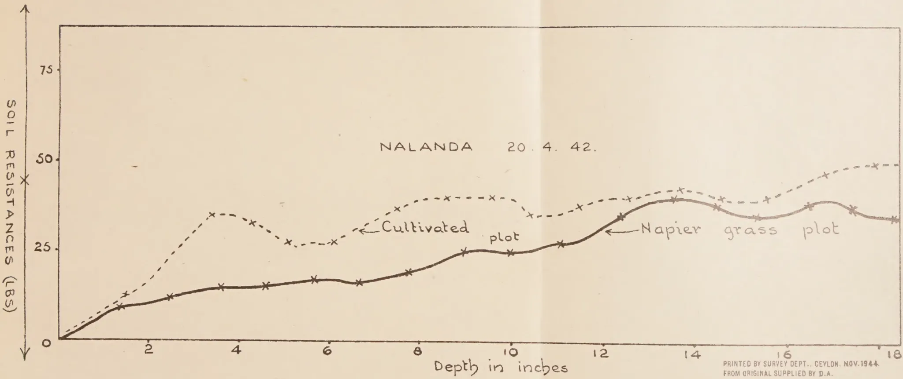
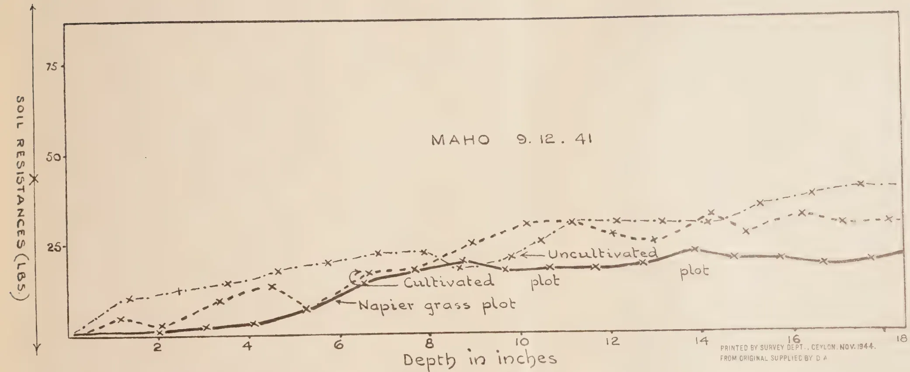
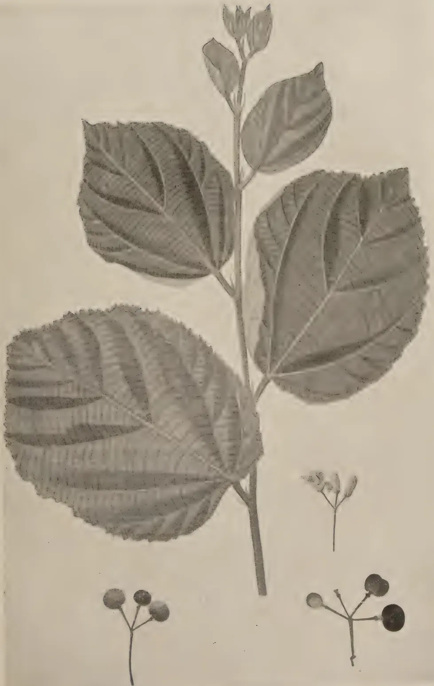

The  
**Tropical Agriculturist**

VOL. C.

PERADENIYA, APRIL-JUNE, 1944.

No. 2

<table style="width: 100%;"><thead><tr><th></th><th style="text-align: right;">Page</th></tr></thead><tbody><tr><td>Editorial .. .. .</td><td style="text-align: right;">73</td></tr></tbody></table>

**ORIGINAL ARTICLES**

<table style="width: 100%;"><tbody><tr><td>Soil Fertility Studies. 1. The effects of a Napier Grass Fallow on Soil Composition and Structure under Ceylon Conditions. By A. W. R. Joachim, Ph.D. (Lond.), Dip. Agr. (Cantab.) and S. Kandiah, Dip. Agr. (Poona) .. .. .</td><td style="text-align: right; vertical-align: bottom;">75</td></tr><tr><td>An Investigation of Cultural Factors affecting the Yield of Yams. By M. F. Chandraratna, Ph.D. (Lond.) and K. D. S. S. Nanayakkara .. .. .</td><td style="text-align: right; vertical-align: bottom;">82</td></tr><tr><td>Milk Defects. By H. E. A. Perera, G.B.V.C., Associate I.D.I. (Bangalore) .. .. .</td><td style="text-align: right; vertical-align: bottom;">88</td></tr></tbody></table>

**DEPARTMENTAL AND OTHER NOTES**

<table style="width: 100%;"><tbody><tr><td>Records of Interesting Exotic Trees in the Royal Botanic Gardens, Peradeniya .. .. .</td><td style="text-align: right; vertical-align: bottom;">92</td></tr><tr><td>The Arecanut in Ceylon .. .. .</td><td style="text-align: right; vertical-align: bottom;">102</td></tr><tr><td>Introduction of Phalsa Bush Fruit (<i>Grewia Asiatica</i>, Linn) in Ceylon .. .. .</td><td style="text-align: right; vertical-align: bottom;">106</td></tr></tbody></table>

**SELECTED ARTICLES**

<table style="width: 100%;"><tbody><tr><td>Pasture Management .. .. .</td><td style="text-align: right; vertical-align: bottom;">112</td></tr><tr><td>Prevention of Disease in Poultry .. .. .</td><td style="text-align: right; vertical-align: bottom;">115</td></tr><tr><td>Cultivation and the Soil Mulch .. .. .</td><td style="text-align: right; vertical-align: bottom;">118</td></tr></tbody></table>

**MEETINGS, CONFERENCES, &c.**

<table style="width: 100%;"><tbody><tr><td>Minutes of the Inaugural Meeting of the Paddy Advisory Board held at Peradeniya on December 3, 1943 .. .. .</td><td style="text-align: right; vertical-align: bottom;">121</td></tr><tr><td>Minutes of the 2nd Meeting of the Paddy Advisory Board held in the Chamber of Commerce Building, Colombo, on March 29, 1944 .. .. .</td><td style="text-align: right; vertical-align: bottom;">126</td></tr><tr><td>Minutes of the 67th Meeting of the Board of Management, Coconut Research Scheme, held on April 27, 1944 .. .. .</td><td style="text-align: right; vertical-align: bottom;">132</td></tr><tr><td>Minutes of a Meeting of the Board of the Tea Research Institute held on April 28, 1944 .. .. .</td><td style="text-align: right; vertical-align: bottom;">133</td></tr><tr><td>Minutes of the 70th Meeting of the Rubber Research Board held on June 5, 1944 .. .. .</td><td style="text-align: right; vertical-align: bottom;">139</td></tr></tbody></table>

**RETURNS**

<table style="width: 100%;"><tbody><tr><td>Animal Disease Return for the month ended June 30, 1944 .. .. .</td><td style="text-align: right; vertical-align: bottom;">141</td></tr><tr><td>Meteorological Reports for April to June, 1944 .. .. .</td><td style="text-align: right; vertical-align: bottom;">142-44</td></tr></tbody></table>

1—J. N. A 42005 (9/44)

1------------------------------------------------

<!-- stage4: FAINT old-images-only -->

[Faint page: no legible print of its own could be verified; text withheld (stage 4 review list)]

2------------------------------------------------

The  
**Tropical Agriculturist**  
APRIL TO JUNE, 1944

---

EDITORIAL

---

ALTERNATE HUSBANDRY

---

**T**HE soil fertility studies published in this journal are the local counterpart of experiments conducted in other parts of the world.

The superiority of the practice of ley farming so long employed in temperate regions as a method of maintaining soil fertility is now being found to be true even under tropical conditions. Already, it is reported, the Kurundankulam experiment in this country is beginning to show signs of a set back through the falling off of crop yields. A resting period for the lands under cultivation seems necessary and this will mean a very important change in the scheme of the enterprise. What form this resting should take has not yet been decided. The first course that suggests itself is, of course, a grass ley. The article now being examined points to possibilities in the use of a fodder grass. Uganda, it is stated, has adopted Napier grass as a means of restoring the condition of its soils. In Uganda, however, the grass would be flourishing in its natural habitat. What measure of success will attend the efforts to grow it on a field scale here remains to be seen. Clearly, it will need much help from man to fight its initial battles with the many hardy weeds that thrive in this country.

It is necessary, therefore, to examine the advantages that will follow the use of Napier grass in their relation to the practical difficulties. The superiority of grasses for the purposes of alternate husbandry is, of course, admitted. The problem of maintaining soil fertility is closely bound up with the problem of maintaining its stability. A pasture can, under careful management, be as effective as a forest in conserving the soil and maintaining its fertility. For improving soil structure, a grass has a considerable advantage over other forms of vegetation in the fineness of its root system and the frequency with which that root system gets renewed. Napier grass, however, leaves where it grows a thick mat of roots, making the land quite inhospitable for those tender vegetable crops favoured by local peasants. Removing this stubborn tangle of roots with the mamoty is certainly not a practice that will commend itself to them. Arable cultivation on the basis of grassland farming is a very exacting system and those who labour to establish it here will have indeed a weary furrow to plough.

It is significant that in the one area in this country where the original forest has been succeeded by a secondary growth of grass namely, the wet patanas, the soil has assumed a character which makes much preliminary labour essential before it is rendered suitable for annual crops. As regards a very substantial part of the country, the vegetation with which the soil and the climate have established a natural equilibrium is jungle, not grass. If,

3------------------------------------------------

74

therefore, one works on the analogy of Uganda and Napier grass, one has to look for a jungle cover for resting the land after intensive cultivation. Strangely enough, the peasants of this country have practised a system of cultivation based on a "jungle equilibrium", namely, the prevalent system of chena cultivation. Unfortunately, the system has been so thoroughly condemned out of hand as being hopelessly primitive and wasteful that no one has ventured to study its features in detail scientifically. Thus the system still awaits a trained observer who will demonstrate whether or not it is an economic practice, having regard to all the surrounding circumstances. No one, for instance, has tried the effect of reserving a tract of land exclusively for periodic chena cultivation at fixed intervals of, say, six years; of keeping that area soil-conserved; of selecting varieties of vegetation best suited for the rapid regeneration of the soil and for the use of implemental tillage; or of the controlled feeding in it while "lying fallow" of a suitable type of animal life say, the goat; or finally, of avoiding the burn, which plays such havoc with the structure of the soil.

Perhaps the universal acceptance of one type of shifting cultivation as a desirable farming practice might provoke a closer study of chena cultivation with a view to its improvement.

4------------------------------------------------

75

## SOIL FERTILITY STUDIES

### I. THE EFFECTS OF A NAPIER GRASS FALLOW ON SOIL COMPOSITION AND STRUCTURE UNDER CEYLON CONDITIONS

A. W. R. JOACHIM, Ph.D., (Lond.), Dip. Agr. (Cantab.)

CHEMIST

AND

S. KANDIAH, Dip. Agr. (Poona)

ASSISTANT IN AGRICULTURAL CHEMISTRY.

#### SUMMARY

**T**RIALS were carried out at a number of Departmental Stations to ascertain the effects on the soil of a crop of Napier grass (*Pennisetum purpureum*) grown for a period of three years. The examination of the soil at the start and conclusion of the trials showed that there were appreciable increases in organic matter and nitrogen and that the physical condition of the soil was improved as a result. Soil resistance tests on adjacent grass-fallowed, cultivated and uncultivated land afforded confirmation of the beneficial physical effects on the soil of the cultivation of Napier grass. The application of these findings to rotation agriculture in Ceylon is briefly discussed.

#### INTRODUCTION

It is well recognized that the organic matter status of a soil and its tilth are best maintained by a system of husbandry in which arable agriculture is combined with grassland farming. If this applies to temperate agricultural conditions, it would apply with even greater force in the tropics where climatic conditions are very favourable for the rapid breakdown of organic matter and the destruction of soil tilth. Bulky organic manures such as cattle or green manure are no doubt of benefit to the crops to which they are applied, but as restorers of soil humus and structure, they are much less effective than a temporary ley or grass fallow of at least 2 years' duration. These manures replace the losses of organic matter from, but do not increase its amount in the soil, unless climatic conditions are favourable and heavy dressings are regularly applied. Evidence and support for these views have been furnished by Pieters and Mc Kee (1), Bradford (2), Prince (3) and other workers in the U. S. A., by Theron (4) in S. Africa, Nye (5) in E. Africa, Robinson (6) in Great Britain, Visvanath (7) in India, &c. Experimental data obtained locally confirm some of these findings (8).

In Ceylon temporary leys have not yet found a place in our system of rotation agriculture, but opinion is growing as to the need for such, if soil fertility is to be maintained. One difficulty up to now has been the lack of suitable crops for the purpose. Nye (5) has demonstrated that Elephant

5------------------------------------------------

76

(Napier) grass (*Pennisetum purpureum*) has been largely responsible in E. Africa for maintaining the fertility of soils in that part of the country where this plant is dominant.

#### EXPERIMENTAL

As Napier grass grows well in many parts of Ceylon, it was decided to test out on a number of Departmental Experiment Stations the effects of a 3-year fallow of this crop on soil composition and structure. Accordingly, plots of Napier varying in size from  $\frac{1}{4}$  to  $\frac{1}{2}$  acre were planted between November 1938 and February 1939 at the following stations: Anuradhapura, Maho, Nalanda, Karadiyanaru, Middeniya, Horana and Wariapola. The plots were sited in a part of the station where the soil was known to be of poor fertility. The soils varied in texture from sand to loams and gravelly loams. At Maho, an additional plot under Napier grass was laid down to which an application of lime at the rate of 2 tons per acre was given prior to planting.

The growth in the plots at Horana and Wariapola was poor and the crop began to die off two years or so after planting. These centres were, therefore, eliminated from the trials. At the other centres, representative soil samples were taken immediately prior to planting the crop and at the end of each year from planting for three years successively. At the last sampling, soil samples from an area of cultivated land adjacent to or in the close vicinity of the grass plots were taken for comparison. The first and last sets of soil samples were examined for organic matter and nitrogen as well as for soil reaction, maximum water holding capacity, specific gravity, rate of percolation, porosity and moisture equivalent value. The dispersion ratios of a few samples were also determined (9). The methods of analysis adopted were as follows:—nitrogen by the Kjeldhal process, carbon by Walkley & Black's wet combustion method, soil reaction with the quinhydron electrode, maximum water holding capacity, porosity and specific gravity by Keen and Raczkowski's box method, moisture equivalent by Bouyoucos' procedure, and rate of percolation by Singh's modification of Bouyoucos' method (10).

In order to obtain some measure of the effect of the grass fallow on soil structure, tests were carried out with Culpin's apparatus, at the end of the 3-year period, of the soil resistance of plots under grass fallow and of adjacent cultivated and uncultivated land, at three centres—Maho, Anuradhapura and Nalanda. Unfortunately, as the soil of the Anuradhapura plots was of the gravelly type and the apparatus is not suited for soils of this type, the tests at this centre were vitiated and proved unsatisfactory. The results obtained at Maho and Nalanda are shown in figures I. and II.

#### DISCUSSION OF RESULTS

An examination of the data of tables I. and II. would show that the effect of the 3-year grass fallow has been (1) *to increase the organic matter and nitrogen contents of the soils*. These increases are definitely significant (see Table II.), and amount to about 17 per cent., on the average, in the case of soil carbon and 15 per cent. in that of nitrogen. On the basis that 1 per cent. carbon will represent about 35,000 lb. of organic matter in an acre of soil to a depth of 6 inches, the average increase in organic matter brought about by growing the Napier grass is approximately 4,700 lb. per acre. This is appreciably greater than what Pieters and Mc Kee (1) report as having been obtained at the New Jersey, Experiment Station, U. S. A. At this Station, a grass sod

6------------------------------------------------

NALANDA 20.4.42.

Cultivated plot

Napier grass plot

<table border="1">
<thead>
<tr>
<th>Depth in inches</th>
<th>Cultivated plot (LBS)</th>
<th>Napier grass plot (LBS)</th>
</tr>
</thead>
<tbody>
<tr><td>0</td><td>0</td><td>0</td></tr>
<tr><td>1</td><td>10</td><td>10</td></tr>
<tr><td>2</td><td>15</td><td>12</td></tr>
<tr><td>3</td><td>35</td><td>15</td></tr>
<tr><td>4</td><td>32</td><td>16</td></tr>
<tr><td>5</td><td>28</td><td>16</td></tr>
<tr><td>6</td><td>28</td><td>17</td></tr>
<tr><td>7</td><td>35</td><td>17</td></tr>
<tr><td>8</td><td>38</td><td>19</td></tr>
<tr><td>9</td><td>38</td><td>24</td></tr>
<tr><td>10</td><td>38</td><td>24</td></tr>
<tr><td>11</td><td>35</td><td>26</td></tr>
<tr><td>12</td><td>38</td><td>32</td></tr>
<tr><td>13</td><td>40</td><td>38</td></tr>
<tr><td>14</td><td>40</td><td>38</td></tr>
<tr><td>15</td><td>38</td><td>35</td></tr>
<tr><td>16</td><td>40</td><td>35</td></tr>
<tr><td>17</td><td>45</td><td>38</td></tr>
<tr><td>18</td><td>48</td><td>35</td></tr>
</tbody>
</table>

PRINTED BY SURVEY DEPT., CEYLON. NOV. 1944.  
FROM ORIGINAL SUPPLIED BY D.A.

7------------------------------------------------

This image shows a blank, aged, light brown page, likely an endpaper or flyleaf from an old book. The paper has a textured appearance with visible creases, particularly a horizontal one across the middle. There are several small, dark spots and fibers scattered across the surface, indicating age and wear. The overall color is a warm, yellowish-brown.

8------------------------------------------------

77.

of two years' duration increased the humus content by 1,340 lb. per acre. In regard to nitrogen, which in many soil types constitutes about one-tenth the carbon content or about one-seventeenth that of the humus, the average increase obtained in these trials is approximately 200 lb. per acre, which is equivalent to an application of about 1,000 lb. of sulphate of ammonia per acre.

Another point of importance which emerges from these trials is that while a fallow of Napier grass increases appreciably the organic matter and nitrogen contents of the soil during a 3-year period, the adoption of a system of rotational cropping has resulted merely in the maintenance of the organic matter and nitrogen status of these soils. These findings are in conformity with results obtained elsewhere (1, 11).

Additional data in respect of the beneficial effects of Napier grass on the organic matter and nitrogen contents of the soil are furnished below. They relate to a plot of Napier grass at the Maho Experiment Station which was under the crop for over two years prior to the start of the trials under review and to an adjacent uncultivated plot. It will be noted that the organic matter and nitrogen percentages are higher in the Napier plot in both soil and sub-soil down to a depth of 16 inches.

<table border="1">
<thead>
<tr>
<th rowspan="2"></th>
<th colspan="2">Napier grass plot</th>
<th colspan="2">Adjacent uncultivated plot</th>
</tr>
<tr>
<th>0-9 in. per cent.</th>
<th>9-16 in. per cent.</th>
<th>0-9 in. per cent.</th>
<th>9-16 in. per cent.</th>
</tr>
</thead>
<tbody>
<tr>
<td>Carbon ..</td>
<td>0.779 ..</td>
<td>0.624 ..</td>
<td>0.741 ..</td>
<td>0.431 ..</td>
</tr>
<tr>
<td>Organic matter ..</td>
<td>1.35 ..</td>
<td>1.08 ..</td>
<td>1.28 ..</td>
<td>0.75 ..</td>
</tr>
<tr>
<td>Nitrogen ..</td>
<td>0.104 ..</td>
<td>0.076 ..</td>
<td>0.089 ..</td>
<td>0.052 ..</td>
</tr>
</tbody>
</table>

Also of interest in this connexion are the results of the comparative examination of soil samples from a plot at Peradeniya which was under a cover of *Mimosa invisa* for a period of two years and an adjacent grass sod plot.

<table border="1">
<thead>
<tr>
<th></th>
<th>Mimosa plot per cent.</th>
<th>Adjacent grass sod plot per cent.</th>
</tr>
</thead>
<tbody>
<tr>
<td>Carbon ..</td>
<td>0.947 ..</td>
<td>1.12 ..</td>
</tr>
<tr>
<td>Organic matter ..</td>
<td>1.654 ..</td>
<td>1.94 ..</td>
</tr>
<tr>
<td>Nitrogen ..</td>
<td>0.128 ..</td>
<td>0.147 ..</td>
</tr>
<tr>
<td>Total exchangeable bases (mgm. equiv. %)</td>
<td>3.24 ..</td>
<td>3.65 ..</td>
</tr>
<tr>
<td>Reaction (pH) ..</td>
<td>5.73 ..</td>
<td>5.99 ..</td>
</tr>
</tbody>
</table>

These results indicate that from the standpoint of humus and nitrogen restoration in the soil, a grass sod may even be more advantageous than certain types of leguminous covers such as *Mimosa invisa*. Other factors besides this would, however, determine whether a leguminous cover or grass sod should be established under a particular set of agricultural conditions.

(2) *The water-holding capacity, porosity, moisture equivalent and rate of water percolation of the soils have, in general, been improved as a result of the grass fallow*, though the improvement in these directions is not marked in some cases. These results would naturally follow from the increased humus content of and the formation of a "crumb" or granular structure in the soil effected through the agency of the decayed grass roots. The mechanism of the latter process has been lucidly explained by Bradfield (2). Quantitative evidence

9------------------------------------------------

. 78

has recently been furnished by the Uganda Department of Agriculture in regard to the formation of crumb structure in red loamy soils which had rested under Napier grass, while identical soils treated with cattle manure showed no such effect (13).

(3) *The dispersion ratios of the Napier grass soils from two of the centres are somewhat lower than those of the original soils.* This would indicate the formation in the soils of water-stable aggregates which would be, even for a time, more resistant, to erosion than the original soil particles, when the areas revert to arable cultivation. The additional benefit of liming in this respect is seen in the case of the Maho soil.

(4) *The improvement in the physical condition of the soil which is effected by the Napier grass fallow is clearly seen from diagrams I. and II.* which show the comparative soil resistances, at different depths, in the Napier grass plots and in adjacent cultivated and uncultivated land. At Nalanda, the soil resistance is considerably less in the Napier grass plots than in the uncultivated plot at all depths below about 1 inch down to 18 inches. At Maho, while the differences are not so marked between the Napier grass and cultivated plots, they confirm that the beneficial effect of the grass in respect of soil consolidation is not merely superficial but extends down to as much as 18 inches. These tests also demonstrate that cultivation reduces appreciably the resistance of the Maho soil to a depth of about 8 inches. As a close correlation between soil resistance and crop growth has been established (12), the importance of any agricultural practice which reduces soil resistance will be realized.

(5) *There are no appreciable changes in soil reaction resulting from the growth of the Napier grass except in the case of the plot at Maho which was limed in addition, and which, in consequence, shows a higher pH value.*

In order to ascertain the bearing of these observations on the exchangeable base changes in the soils, determinations of total exchangeable bases were made on the original and final soil samples from Maho and Nalanda. The results are tabulated below:—

<table>
<thead>
<tr>
<th></th>
<th></th>
<th>Initial soil</th>
<th>Napier grass soil</th>
</tr>
<tr>
<th></th>
<th></th>
<th></th>
<th>Mgm. equivalent per cent.</th>
</tr>
</thead>
<tbody>
<tr>
<td>Maho</td>
<td>..</td>
<td>8.8</td>
<td>9.2</td>
</tr>
<tr>
<td>Nalanda</td>
<td>..</td>
<td>10.4</td>
<td>14.8</td>
</tr>
</tbody>
</table>

It will be seen that while the increase in base content was appreciable at Nalanda, it was only slight at Maho. The buffer capacity of the Nalanda soil is apparently higher than that of the Maho soil, to judge from the pH data.

#### PRACTICAL CONCLUSIONS

It is clear that a Napier grass fallow is of appreciable value in increasing the organic matter and nitrogen contents of soils and in improving soil tilth and structure. Under local conditions a 3-year period of fallow is suggested as a desideratum, which is also the recommendation of the Department of Agriculture, Uganda. Certain objections would, however, be urged against the adoption of the practice. These are: (1) that an appreciable part of the land in a holding will be non-productive, so far as economic crops are concerned, for a 3-year period. This is inevitable if it is conceded that soil fertility decline is rapid under tropical conditions, and that the best means of restoring this fertility is the introduction, as in temperate regions, of a temporary ley or grass fallow in the rotation. The proportion of arable to

10------------------------------------------------

MAHO 9.12.41

A line graph showing soil resistance in lbs. per square foot versus depth in inches. The y-axis is labeled 'SOIL RESISTANCES (LBS.)' and ranges from 0 to 75 with major ticks at 25, 50, and 75. The x-axis is labeled 'Depth in inches' and ranges from 0 to 18 with major ticks every 2 units. Three data series are plotted: 'Cultivated plot' (solid line), 'Uncultivated plot' (dashed line), and 'Napier grass plot' (dash-dot line). The 'Cultivated plot' starts at 0 resistance at 0 inches depth and increases steadily to about 25 lbs. at 18 inches. The 'Uncultivated plot' starts at 0 resistance at 0 inches depth, rises to a peak of about 35 lbs. at 11 inches, and then gradually declines to about 30 lbs. at 18 inches. The 'Napier grass plot' starts at 0 resistance at 0 inches depth, rises to about 15 lbs. at 6 inches, and then fluctuates between 20 and 25 lbs. for the remaining depth.

<table border="1"><thead><tr><th>Depth in inches</th><th>Cultivated plot (lbs.)</th><th>Uncultivated plot (lbs.)</th><th>Napier grass plot (lbs.)</th></tr></thead><tbody><tr><td>0</td><td>0</td><td>0</td><td>0</td></tr><tr><td>2</td><td>2</td><td>10</td><td>5</td></tr><tr><td>4</td><td>5</td><td>15</td><td>10</td></tr><tr><td>6</td><td>10</td><td>20</td><td>15</td></tr><tr><td>8</td><td>15</td><td>25</td><td>20</td></tr><tr><td>10</td><td>18</td><td>30</td><td>22</td></tr><tr><td>12</td><td>20</td><td>32</td><td>22</td></tr><tr><td>14</td><td>25</td><td>35</td><td>25</td></tr><tr><td>16</td><td>23</td><td>38</td><td>23</td></tr><tr><td>18</td><td>25</td><td>35</td><td>25</td></tr></tbody></table>

PRINTED BY SURVEY DEPT., CEYLON. NOV. 1944.  
FROM ORIGINAL SUPPLIED BY D A

11------------------------------------------------

This image is a scan of a blank page. The background is a uniform light beige or tan color. There are a few very small, dark specks scattered across the surface, which appear to be scanning artifacts or dust particles. No text, lines, or other graphical elements are present.

12------------------------------------------------

79

grass land or ley would depend on the local soil and climatic conditions and the rotation adopted. The ideal, however, would be a system of alternate cropping in a 3-year cycle, one half the rotation area being under arable crops and the other under grass or leguminous fallow. A modification of the system would be the cultivation of such an extent of fodder crops on the farm as would supply enough cattle manure to be applied in heavy dressings to the arable crops. This would necessitate the rearing of much larger numbers of cattle on the farm than is normally the case, and would probably be less satisfactory from the standpoint of soil fertility maintenance than a grass or leguminous fallow. The choice of crop is a matter for experiment. These trials indicate that Napier grass is very suitable for achieving the desired objective in respect of soil fertility. It has several advantages over pasture grasses and many leguminous covers—it is easily established in many parts of the Island on all but gravelly soils, has a relatively deep and extensive root system, is hardy and fairly long-lived, makes a dense growth which kills out most weeds, and supplies a large quantity of useful fodder per unit area. It is possible, however, that some other crop may be found which would prove even more satisfactory than Napier. But till such time, Napier grass can be recommended; (ii) that the labour involved in planting and clearing would not be available when it is required. This difficulty should not prove insuperable to a resourceful farmer. The clearing of the crop would be a real difficulty unless burning is adopted. This would entail loss of organic material which could well be utilized for composting. Even if burning were done, the removal of the grass stumps and mat of roots by hand would be a formidable task, but if tractor-drawn implements are used the difficulty would be solved; (iii) the difficulty of preventing the crop from being damaged by cattle. This can easily be surmounted by proper fencing.

#### ACKNOWLEDGEMENTS

The thanks of the authors are due to the several Divisional Agricultural and station officers for having made this investigation possible.

#### REFERENCES

1. 1. The Use of Cover and Green Manure Crops. A. J. Pieters and R. Mc Kee. *Soils and Men*, p. 433.
2. 2. Soil Conservation from the Viewpoint of Soil Physics. R. Bradfield. *Jour. Amer. Soc. Agron.*, Vol. 29, No. 2, 1937.
3. 3. The Chemical Composition of Soil from Cultivated Land and from Land Abandoned to Grass and Weeds. A. L. Prince, S. J. Toth and A. W. Blair. *Soil Sc.*, Vol. 46, No. 5, Nov., 1938.
4. 4. Green Manuring. J. T. Theron. *Univ. of Pretoria Publ.*, Series No. 1, 33, 1936.
5. 5. Preliminary Notes on the Use of Elephant Grass as a Fallow Crop in Buganda. G. W. Nye. *East Africa. Agr. Jour.*, Vol. 3, Nov., 1937.
6. 6. Mother Earth. G. W. Robinson. Chapters 4 and 13.
7. 7. Science and Practice of Agriculture in India. B. Visvanath. *Madras Agr. Jour.*, Vol. 25, No. 5, May 1937.
8. 8. The Relation of Green Manures to the Carbon and Nitrogen Contents and Reaction of Soils at Peradeniya. Joachim, A. W. R., and Panditsekere, D. G. *The Trop. Agst.*, Vol. 74, No. 1, 1930.
9. 9. Properties of Soils which Influence Soil Erosion. H. E. Middleton. *U. S. Dep. Agr. Tech. Bull.*, No. 178, March, 1930.
10. 10. Base Exchange Studies. I. D. Singh and S. D. Nijawan. *Ind. Jour. Agr. Sc.*, Vol. 6, 1936.
11. 11. Loss of Soil Organic Matter and its Restoration. W. A. Albrecht. *Soils and Men*.
12. 12. Studies on the Relation between Cultivation Implements, Soil Structure and the Crop. C. Culpin. *Jour. Agr. Sc.*, Vol. 26, Pt. 1, January, 1936.
13. 13. Soils and Fertilizers, Vol. 6, No. 4, 1943, p. 169.

13------------------------------------------------

80

TABLE I.

<table border="1">
<thead>
<tr>
<th rowspan="2"></th>
<th colspan="3">Maho</th>
<th colspan="3">Anuradhapura</th>
<th colspan="3">Middeniya</th>
<th colspan="3">Karadiyanaru</th>
<th colspan="3">Nalanda</th>
</tr>
<tr>
<th>Initial</th>
<th>Napier unlimed</th>
<th>Napier limed</th>
<th>Control (cultivated)</th>
<th>Initial</th>
<th>Napier</th>
<th>Control (cultivated)</th>
<th>Initial</th>
<th>Napier</th>
<th>Control (cultivated)</th>
<th>Initial</th>
<th>Napier</th>
<th>Control (cultivated)</th>
<th>Initial</th>
<th>Napier</th>
<th>Control (cultivated)</th>
</tr>
</thead>
<tbody>
<tr>
<td>Date of sampling</td>
<td>2.11.38</td>
<td>—</td>
<td>8.12.41</td>
<td>—</td>
<td>26.10.38</td>
<td>28.12.41</td>
<td>28.12.41</td>
<td>21.11.38</td>
<td>9.12.41</td>
<td>9.12.41</td>
<td>8.1.39</td>
<td>10.1.42</td>
<td>10.1.42</td>
<td>2.2.39</td>
<td>18.2.42</td>
<td>18.2.42</td>
</tr>
<tr>
<td>Depth of sampling (average)</td>
<td>1.5</td>
<td>0-8</td>
<td>5.0</td>
<td>2.4</td>
<td>20.7</td>
<td>0-6 in.</td>
<td>20.8</td>
<td>0.8</td>
<td>0-9 in.</td>
<td>0.6</td>
<td>1.2</td>
<td>1.4</td>
<td>1.4</td>
<td>—</td>
<td>—</td>
<td>—</td>
</tr>
<tr>
<td>Gravel and stones %</td>
<td>—</td>
<td>1.0</td>
<td>13.8</td>
<td>—</td>
<td>—</td>
<td>18.8</td>
<td>—</td>
<td>—</td>
<td>16.9</td>
<td>—</td>
<td>—</td>
<td>5.2</td>
<td>—</td>
<td>—</td>
<td>20.5</td>
<td>—</td>
</tr>
<tr>
<td>Texture index number</td>
<td>—</td>
<td>Sandy</td>
<td>loam</td>
<td>—</td>
<td>Gravelly loam</td>
<td>loam</td>
<td>—</td>
<td>—</td>
<td>Loam</td>
<td>—</td>
<td>—</td>
<td>Sand</td>
<td>—</td>
<td>—</td>
<td>Loam</td>
<td>—</td>
</tr>
<tr>
<td>Soil type</td>
<td></td>
<td></td>
<td></td>
<td></td>
<td></td>
<td></td>
<td></td>
<td></td>
<td></td>
<td></td>
<td></td>
<td></td>
<td></td>
<td></td>
<td></td>
<td></td>
</tr>
<tr>
<td>Apparent specific gravity</td>
<td>1.47</td>
<td>1.39</td>
<td>1.42</td>
<td>1.43</td>
<td>1.43</td>
<td>1.41</td>
<td>1.39</td>
<td>1.49</td>
<td>1.44</td>
<td>1.47</td>
<td>1.49</td>
<td>1.46</td>
<td>1.49</td>
<td>1.33</td>
<td>1.33</td>
<td>1.33</td>
</tr>
<tr>
<td>Real specific gravity</td>
<td>2.33</td>
<td>2.22</td>
<td>2.29</td>
<td>2.23</td>
<td>2.22</td>
<td>2.20</td>
<td>2.37</td>
<td>2.28</td>
<td>2.26</td>
<td>2.33</td>
<td>2.35</td>
<td>2.23</td>
<td>2.26</td>
<td>2.27</td>
<td>2.38</td>
<td>2.33</td>
</tr>
<tr>
<td>Porosity %</td>
<td>40.1</td>
<td>42.3</td>
<td>42.9</td>
<td>38.1</td>
<td>40.8</td>
<td>41.8</td>
<td>40.6</td>
<td>35.7</td>
<td>39.2</td>
<td>37.6</td>
<td>35.8</td>
<td>38.5</td>
<td>34.2</td>
<td>44.8</td>
<td>46.3</td>
<td>44.4</td>
</tr>
<tr>
<td>Maximum water holding capacity %</td>
<td>33.8</td>
<td>41.5</td>
<td>38.7</td>
<td>34.9</td>
<td>36.6</td>
<td>38.1</td>
<td>37.6</td>
<td>27.0</td>
<td>29.9</td>
<td>28.9</td>
<td>24.2</td>
<td>26.8</td>
<td>23.9</td>
<td>40.8</td>
<td>42.4</td>
<td>40.0</td>
</tr>
<tr>
<td>Moisture equivalent (Bouyecos) %</td>
<td>13.7</td>
<td>15.8</td>
<td>14.6</td>
<td>12.2</td>
<td>15.9</td>
<td>16.3</td>
<td>11.1</td>
<td>10.9</td>
<td>12.5</td>
<td>10.9</td>
<td>6.5</td>
<td>9.0</td>
<td>6.4</td>
<td>16.2</td>
<td>16.0</td>
<td>15.9</td>
</tr>
<tr>
<td>Rate of percolation (minutes)</td>
<td>24</td>
<td>24</td>
<td>21</td>
<td>23</td>
<td>27</td>
<td>19</td>
<td>46</td>
<td>—</td>
<td>16</td>
<td>26</td>
<td>7.0</td>
<td>4.5</td>
<td>4.5</td>
<td>24</td>
<td>22</td>
<td>23</td>
</tr>
<tr>
<td>Dispersion ratio</td>
<td>21.2</td>
<td>17.1</td>
<td>10.7</td>
<td>17.8</td>
<td>—</td>
<td>—</td>
<td>—</td>
<td>—</td>
<td>—</td>
<td>—</td>
<td>—</td>
<td>—</td>
<td>—</td>
<td>11.5</td>
<td>8.5</td>
<td>10.9</td>
</tr>
<tr>
<td>Moisture %</td>
<td>1.47</td>
<td>1.91</td>
<td>1.91</td>
<td>1.58</td>
<td>1.84</td>
<td>2.11</td>
<td>1.96</td>
<td>0.91</td>
<td>1.16</td>
<td>1.13</td>
<td>0.38</td>
<td>0.77</td>
<td>0.45</td>
<td>2.25</td>
<td>2.53</td>
<td>2.12</td>
</tr>
<tr>
<td>Loss on ignition %</td>
<td>3.22</td>
<td>3.91</td>
<td>3.66</td>
<td>3.17</td>
<td>4.09</td>
<td>4.21</td>
<td>4.11</td>
<td>3.34</td>
<td>3.95</td>
<td>3.61</td>
<td>1.51</td>
<td>2.04</td>
<td>1.75</td>
<td>3.48</td>
<td>3.72</td>
<td>3.46</td>
</tr>
<tr>
<td>Organic matter %</td>
<td>1.23</td>
<td>1.64</td>
<td>1.57</td>
<td>1.10</td>
<td>1.62</td>
<td>1.69</td>
<td>1.59</td>
<td>1.00</td>
<td>1.12</td>
<td>1.02</td>
<td>1.19</td>
<td>1.43</td>
<td>1.31</td>
<td>1.45</td>
<td>1.79</td>
<td>1.45</td>
</tr>
<tr>
<td>Carbon %</td>
<td>0.71</td>
<td>0.95</td>
<td>0.91</td>
<td>0.69</td>
<td>0.91</td>
<td>0.98</td>
<td>0.92</td>
<td>0.58</td>
<td>0.66</td>
<td>0.59</td>
<td>0.69</td>
<td>0.83</td>
<td>0.76</td>
<td>0.84</td>
<td>1.04</td>
<td>0.84</td>
</tr>
<tr>
<td>Nitrogen %</td>
<td>0.071</td>
<td>0.091</td>
<td>0.080</td>
<td>0.076</td>
<td>0.094</td>
<td>0.096</td>
<td>0.090</td>
<td>0.049</td>
<td>0.058</td>
<td>0.056</td>
<td>0.061</td>
<td>0.062</td>
<td>0.053</td>
<td>0.075</td>
<td>0.086</td>
<td>0.080</td>
</tr>
<tr>
<td>Carbon/nitrogen ratio</td>
<td>10.0</td>
<td>10.47</td>
<td>10.21</td>
<td>9.08</td>
<td>9.24</td>
<td>10.21</td>
<td>10.21</td>
<td>11.84</td>
<td>11.38</td>
<td>10.53</td>
<td>13.53</td>
<td>13.39</td>
<td>13.10</td>
<td>11.21</td>
<td>12.09</td>
<td>10.50</td>
</tr>
<tr>
<td>Reaction (pH)</td>
<td>6.5</td>
<td>6.6</td>
<td>7.1</td>
<td>6.5</td>
<td>5.6</td>
<td>5.6</td>
<td>5.7</td>
<td>6.0</td>
<td>6.0</td>
<td>6.0</td>
<td>5.5</td>
<td>5.6</td>
<td>5.4</td>
<td>6.5</td>
<td>6.6</td>
<td>6.4</td>
</tr>
</tbody>
</table>

14------------------------------------------------

81TABLE II.

<table border="1">
<thead>
<tr>
<th rowspan="2"></th>
<th colspan="3">Carbon</th>
<th colspan="3">Nitrogen</th>
</tr>
<tr>
<th>1 Initial Per Cent.</th>
<th>2 Napier Plot Per Cent.</th>
<th>3 Cultivated Plot Per Cent.</th>
<th>1 Initial Per Cent.</th>
<th>2 Napier Plot Per Cent.</th>
<th>3 Cultivated Plot Per Cent.</th>
</tr>
</thead>
<tbody>
<tr>
<td>1. Maho ..</td>
<td>0.71</td>
<td>0.93</td>
<td>0.69</td>
<td>0.071</td>
<td>0.090</td>
<td>0.076</td>
</tr>
<tr>
<td>2. Anuradhapura ..</td>
<td>0.94</td>
<td>0.98</td>
<td>0.92</td>
<td>0.094</td>
<td>0.096</td>
<td>0.090</td>
</tr>
<tr>
<td>3. Middeniya ..</td>
<td>0.58</td>
<td>0.66</td>
<td>0.59</td>
<td>0.049</td>
<td>0.058</td>
<td>0.056</td>
</tr>
<tr>
<td>4. Karadiyanaru ..</td>
<td>0.69</td>
<td>0.83</td>
<td>0.76</td>
<td>0.051</td>
<td>0.062</td>
<td>0.058</td>
</tr>
<tr>
<td>5. Nalanda ..</td>
<td>0.84</td>
<td>1.04</td>
<td>0.84</td>
<td>0.075</td>
<td>0.086</td>
<td>0.080</td>
</tr>
<tr>
<td>Means ..</td>
<td>0.752</td>
<td>0.888</td>
<td>0.76</td>
<td>0.068</td>
<td>0.078</td>
<td>0.072</td>
</tr>
<tr>
<td>Differences of means (<i>d</i>) ..</td>
<td>(2) — (1) 0.136</td>
<td>(2) — (3) 0.128</td>
<td>(3) — (1) 0.008</td>
<td>(2) — (1) 0.010</td>
<td>(2) — (3) 0.006</td>
<td>(3) — (1) 0.004</td>
</tr>
<tr>
<td>Standard error of mean difference (S.Ed) ..</td>
<td>0.034</td>
<td>0.038</td>
<td>0.017</td>
<td>0.027</td>
<td>0.002</td>
<td>0.002</td>
</tr>
<tr>
<td><math>t = \frac{d}{S. Ed}</math> ..</td>
<td>4.0</td>
<td>3.37</td>
<td>0.5</td>
<td>3.7</td>
<td>3.0</td>
<td>2.0</td>
</tr>
<tr>
<td>Odds for <math>n = 4</math> ..</td>
<td>Between 50 &amp; 100:1</td>
<td>About 50:1</td>
<td>&lt;2:1</td>
<td>50:1</td>
<td>Between 50 &amp; 20:1</td>
<td>&lt;10:1</td>
</tr>
</tbody>
</table>

15------------------------------------------------

82

# AN INVESTIGATION OF CULTURAL FACTORS AFFECTING THE YIELD OF YAMS

M. F. CHANDRARATNA, Ph.D., (Lond.), D.I.C.

ACTING BOTANIST

AND

K. D. S. S. NANAYAKKARA

ASSISTANT IN ECONOMIC BOTANY

## SUMMARY

**A**N experiment designed to test the effects of the number of setts per hill, spacing of hills, depth of planting-hole and staking on the yield of two varieties of yams, was set down at Peradeniya in *yala*, 1943. Significantly higher yields were obtained with two four-ounce setts per hill than with one.

A hill spacing of 3 ft. by 1½ ft. was significantly superior to one of 3 ft. by 3 ft.

Staked plants significantly outyielded unstaked plants.

The performance of the strain No. 288 (*Dioscorea esculenta* var. *spinosa*) was significantly and markedly superior to that of the strain Jamani (*D. alata*).

## INTRODUCTION

Cultural practices exhibit a greater degree of diversity in Ceylon than in countries with settled agricultural traditions, and local planting methods with yams (*Dioscorea* Spp.) lack the uniformity that one would expect of a crop which is native to the Eastern Tropics, and which has probably been in cultivation in this country for several hundred years. Yams, along with other root crops, have assumed tremendous importance in war time, and the need for exact information on the relative efficiency of various planting methods is urgent.

Most cultivated yams fall into the two species, *Dioscorea alata* Linn. (the Greater Yam) and *D. esculenta* Burkill (the Lesser Yam).

*D. alata* possesses ridged or winged stems which twine to the right. The tubers vary considerably in shape. The tuber flesh may possess a magenta sap which oxidizes, on exposure to air, to a rusty brown. This pigment may extend to subaerial tissues. The leaves are subsagittate or subhastately ovate. Some races produce bulbils in quantity, others sparingly.

*D. esculenta* is a thorny climber twining to the left. Numerous stalked tubers are produced in relatively superficial clusters. The stems are cylindrical, and the leaves cordate. Two varieties are recognized, viz., *spinosa* in which the tubers are protected by mats of spinous roots, and *fasciculata* which does not possess spinous roots.

Cultivated dioscoreas vary in the depth of tuber formation. The fact is of some interest as the depth of tuber formation will be reflected in

16------------------------------------------------

83

planting-hole requirements and in the ease with which the crop can be lifted. Tuber formation is, as a rule, shallower in *D. esculenta*.

Seed rate, spacing and staking are some of the other factors which contribute to planting costs and which have been investigated in the experiment reported herein.

#### TREATMENTS

There were 32 treatments consisting of the following in all combinations.

<table>
<tr>
<td>(N) Number of sets per hill ..</td>
<td>One sett per hill (<math>N_0</math>) or two sets per hill (<math>N_1</math>)</td>
</tr>
<tr>
<td>(S) Spacing of hills ..</td>
<td>3 ft. by 3 ft. (<math>S_0</math>) or 3 ft. by <math>1\frac{1}{2}</math> ft. (<math>S_1</math>)</td>
</tr>
<tr>
<td>(D) Depth of planting-hole ..</td>
<td>1 ft. (<math>D_0</math>) or 3 ft. (<math>D_1</math>)</td>
</tr>
<tr>
<td>(T) Staking ..</td>
<td>Unstaked (<math>T_0</math>) or staked (<math>T_1</math>)</td>
</tr>
<tr>
<td>(V) Variety ..</td>
<td>Jamani, a strain of <i>D. alata</i> (<math>V_0</math>) or No. 288, a strain of <i>D. esculenta</i> var. <i>spinosa</i> (<math>V_1</math>)</td>
</tr>
</table>

A single replication of 32 plots was distributed over four blocks of eight plots. Each plot had a nett harvested area of  $1/134$  acre (18 ft. by 18 ft.). Details of the design are given in Appendix 1.

#### MATERIAL AND METHODS.

In 1935, the Botanist imported five strains of *D. alata* from Fiji, viz., Jamani, Uvi-ni-vutuna, Taniela-vula-leka, Taniela-damu and Lantolu.

These strains were tested at Peradeniya in six seasons. Jamani proved to be the most delicately flavoured and was included in the present trial. The strain is white-fleshed. The external colour of the tuber is argus brown (Ridgway : III 13 m).

The Botanist's next importation of yams was in 1940, when the following five strains were obtained through the courtesy of the Adviser on Agriculture, S. S. and F. M. S., Kuala Lumpur.

<table>
<thead>
<tr>
<th>Number.</th>
<th>Species.</th>
<th>Country of Origin.</th>
</tr>
</thead>
<tbody>
<tr>
<td>10 ..</td>
<td><i>D. alata</i></td>
<td>Philippines</td>
</tr>
<tr>
<td>30 ..</td>
<td>"</td>
<td>"</td>
</tr>
<tr>
<td>48 ..</td>
<td>"</td>
<td>"</td>
</tr>
<tr>
<td>408 ..</td>
<td>"</td>
<td>French Indo-China</td>
</tr>
<tr>
<td>288 ..</td>
<td><i>D. esculenta</i> var <i>spinosa</i></td>
<td>"</td>
</tr>
</tbody>
</table>

The performance of No. 288 was the most satisfactory of these five strains in the tests carried out in four seasons at Peradeniya, and warranted its retention in the present trial. The strain is white-fleshed. The external colour of the tuber is ochraceous buff (Ridgway : XV 15/6). No. 288 closely resembles the local *Kukul-ala* types.

The cultural experiment presented herein was set down at Peradeniya in the *yala* season, 1943. The soil of the experimental area was a moderately heavy loam slightly acid in reaction (pH=5.5). The land had been under tea in the immediate past. The area was ploughed and disced after the removal of the tea, and a dressing of 5 tons cattle manure per acre was applied.

Holes were dug on June 19, 1943. Holes in  $D_0$  plots measured 1 ft. (deep) by  $1\frac{1}{2}$  ft. by  $1\frac{1}{2}$  ft., and those in  $D_1$  plots measured 3 ft. (deep) by  $1\frac{1}{2}$  ft. by  $1\frac{1}{2}$  ft. The holes were filled with prepared soil, and four-ounce sets were planted in them at a depth of six inches, on June 28.  $N_0$  and  $N_1$  plots received one and two sets per hill respectively.  $T_1$  plots were staked on August 2.

17------------------------------------------------

84

The following records of vine lengths were made in random samples in the various treatments on September 15 :—

<table border="1">
<thead>
<tr>
<th colspan="2">Treatment.</th>
<th colspan="2">Mean Length of Vine in ft.</th>
<th colspan="2">Standard Error.</th>
</tr>
</thead>
<tbody>
<tr>
<td>Jamani unstaked</td>
<td>(<math>V_0</math> <math>T_0</math>)</td>
<td>..</td>
<td>6.4</td>
<td>..</td>
<td><math>\pm 4.1</math></td>
</tr>
<tr>
<td>Jamani staked</td>
<td>(<math>V_0</math> <math>T_1</math>)</td>
<td>..</td>
<td>12.9</td>
<td>..</td>
<td><math>\pm 2.8</math></td>
</tr>
<tr>
<td>No. 288 unstaked</td>
<td>(<math>V_1</math> <math>T_0</math>)</td>
<td>..</td>
<td>5.2</td>
<td>..</td>
<td><math>\pm 2.0</math></td>
</tr>
<tr>
<td>No. 288 staked</td>
<td>(<math>V_1</math> <math>T_1</math>)</td>
<td>..</td>
<td>13.8</td>
<td>..</td>
<td><math>\pm 1.5</math></td>
</tr>
</tbody>
</table>

The difference between  $V_1T_0$  and  $V_1T_1$  is significant. In the instance of No. 288, unstaked plants exhibited, in addition to a significant shortening of the vines, a reduction in leaf size. No comparable difference in leaf dimensions between staked and unstaked plants was observed in Jamani.

On September 20, Jamani plants showed a severe spotting of leaves associated with the fungus, *Cercospora Dioscoreae* Ell. and Mart. The damage was particularly heavy on unstaked plants. No. 288 exhibited some degree of resistance.

The onset of senescence was earlier in unstaked plants. Jamani vines commenced dying on December 26, and those of No. 288 on January 15, 1944. The crop was lifted on January 26.

Records of monthly precipitation for the period of the experiment are given in Appendix 2.

#### RESULTS

The analysis of variance of weights of tubers produced in the various plots is given in Appendix 3. The superiority of No. 288 to Jamani is significant at the 0.1 per cent. point. The effects of spacing and staking are significant at the one per cent. point, and the effect of seed rate at the five per cent. point. The depth of planting-hole has had no significant effect. None of the first-order interactions attains significance.

The yield data are summarized in Table 1.

18------------------------------------------------

85Table 1. Yields of Tubers in Tons per Acre.

<table border="1">
<thead>
<tr>
<th rowspan="2"></th>
<th rowspan="2">Number of Setts.</th>
<th colspan="3">Spacing.</th>
<th colspan="2">Staking.</th>
<th colspan="2">Variety.</th>
<th rowspan="2">Mean Yield. (—0.229)</th>
</tr>
<tr>
<th>One per Hill.</th>
<th>Two per Hill.</th>
<th>3 ft. by 3 ft.</th>
<th>3 ft. by 1½ ft.</th>
<th>Unstaked</th>
<th>Staked</th>
<th>Jamani</th>
<th>No. 288</th>
</tr>
</thead>
<tbody>
<tr>
<td rowspan="2">Number of Setts</td>
<td>One per hill</td>
<td>—</td>
<td>—</td>
<td>1.93</td>
<td>2.54</td>
<td>1.67</td>
<td>2.80</td>
<td>1.32</td>
<td>3.14</td>
<td>2.23</td>
</tr>
<tr>
<td>Two per hill</td>
<td>—</td>
<td>—</td>
<td>2.21</td>
<td>3.93</td>
<td>2.59</td>
<td>3.55</td>
<td>2.11</td>
<td>4.03</td>
<td>3.07</td>
</tr>
<tr>
<td rowspan="2">Spacing</td>
<td>3 ft. by 3 ft.</td>
<td>1.93</td>
<td>2.21</td>
<td>—</td>
<td>—</td>
<td>1.64</td>
<td>2.49</td>
<td>1.14</td>
<td>2.99</td>
<td>2.07</td>
</tr>
<tr>
<td>3 ft. by 1½ ft.</td>
<td>2.54</td>
<td>3.93</td>
<td>—</td>
<td>—</td>
<td>2.61</td>
<td>3.86</td>
<td>2.29</td>
<td>4.18</td>
<td>3.24</td>
</tr>
<tr>
<td rowspan="2">Staking</td>
<td>Unstaked</td>
<td>1.67</td>
<td>2.59</td>
<td>1.64</td>
<td>2.61</td>
<td>—</td>
<td>—</td>
<td>1.10</td>
<td>3.15</td>
<td>2.13</td>
</tr>
<tr>
<td>Staked</td>
<td>2.80</td>
<td>3.55</td>
<td>2.49</td>
<td>3.86</td>
<td>—</td>
<td>—</td>
<td>2.33</td>
<td>4.02</td>
<td>3.18</td>
</tr>
<tr>
<td rowspan="2">Variety</td>
<td>Jamani</td>
<td>1.32</td>
<td>2.11</td>
<td>1.14</td>
<td>2.29</td>
<td>1.10</td>
<td>2.33</td>
<td>—</td>
<td>—</td>
<td>1.72</td>
</tr>
<tr>
<td>No. 288</td>
<td>3.14</td>
<td>4.03</td>
<td>2.99</td>
<td>4.18</td>
<td>3.15</td>
<td>4.02</td>
<td>—</td>
<td>—</td>
<td>3.59</td>
</tr>
</tbody>
</table>

19------------------------------------------------

86DISCUSSION

Probably the most striking feature of the results is the significant and overwhelming superiority of No. 288. The performance of No. 288 has always been consistently good. Average yields per plant in the years, 1940-42, are given below:

<table border="1">
<thead>
<tr>
<th rowspan="2">Year.</th>
<th colspan="2">Yield per plant in lb.</th>
</tr>
<tr>
<th>Jamani.</th>
<th>No. 288.</th>
</tr>
</thead>
<tbody>
<tr>
<td>1940</td>
<td>1.5</td>
<td>6.8</td>
</tr>
<tr>
<td>1941</td>
<td>4.0</td>
<td>4.3</td>
</tr>
<tr>
<td>1942</td>
<td>1.8</td>
<td>4.3</td>
</tr>
</tbody>
</table>

Jamani is the finer flavoured of the two strains. The considerably reduced yields are, however, too heavy a price to pay for flavour.

In the instance of the vegetatively less vigorous strain, Jamani, the yields are almost exactly doubled at the closer spacing, *i.e.*, the yields per plant are almost identical at the two spacings. No competition effects are evident even at 3 ft. by 1½ ft., and the desirability of narrowing the spacing further may be profitably explored. Even with No. 288, the 3ft. by 1½ ft. spacing gives much higher yields, and is the obvious recommendation for this variety as well. It is not difficult to reconcile these results with the observations of Wood (1933) in Trinidad that the optimum spacing is in the neighbourhood of 5 ft. by 1 ft. Wood worked with "Lisbon", a variety of *D. alata*.

In the instance of both Jamani and No. 288, heavier yields were obtained with the higher seed rate. Apart from heavier yields, the desirability of planting two setts per hill as a measure of insurance against vacant hills, is evident.

The use of deeper planting-holes has not resulted in higher yields. In view of the lower cost, shallow planting should be preferred.

The better performance of staked plants was anticipated, but the degree of this superiority was unexpectedly large. In the instance of the of the strain, Jamani, the average yield was more than doubled by staking. Higher yields in staked plants are usually attributed to the better orientation of the photosynthetic surface in relation to incident light. This cause does not appear to provide a complete explanation of the benefit of staking. In Jamani, leaves were distributed sparsely on the stem, and the degree of overcrowding and shading of leaves in plants that trailed on the ground, could not have been considerable. In the instance of Jamani, a factor that would have contributed to depressed yields in unstaked plants is the greater severity of *Cercospora* attack. It is perhaps unprofitable to speculate on the causes underlying the higher incidence of *Cercospora* on unstaked plants. Higher humidity and the greater availability of the spore inoculum may have been contributory factors.

REFERENCES

Brown, D. H., 1931 .. The Cultivation of Yams, *Tropical Agriculture* VIII. 201-206, 231-236

Prain, D., and Burkill, I. H., 1914.. A Synopsis of the Dioscoreas of the *Old World*. *Journ. As. Soc. Beng.* X.41

Wood, R. C., 1933 .. Experiments with Yams in Trinidad, 1931-33 *Empire J. Expt. Agric.* I. 316-324.

Yates, F. 1937 .. The Design and Analysis of Factorial Experiments. *Imp. Bur. Soil Sc., Tech. Comm.* No. 35.

20------------------------------------------------

87APPENDIX I.Design of the Experiment

A factorial design by Yates (1937) of the form  $2^5$  was adopted. The 32 treatments (five factors each at two levels) were arranged in the following manner:—

<table border="1">
<thead>
<tr>
<th>BLOCK 1</th>
<th>BLOCK 2</th>
<th>BLOCK 3</th>
<th>BLOCK 4</th>
</tr>
</thead>
<tbody>
<tr>
<td>1 1 1 1 1*</td>
<td>1 1 1 0 1</td>
<td>1 1 1 0 0</td>
<td>1 1 1 1 0</td>
</tr>
<tr>
<td>1 1 0 1 0</td>
<td>1 1 0 0 0</td>
<td>1 1 0 0 1</td>
<td>1 1 0 1 1</td>
</tr>
<tr>
<td>1 0 1 0 1</td>
<td>1 0 1 1 1</td>
<td>1 0 0 1 1</td>
<td>1 0 1 0 0</td>
</tr>
<tr>
<td>1 0 0 0 0</td>
<td>1 0 0 1 0</td>
<td>1 0 1 1 0</td>
<td>1 0 0 0 1</td>
</tr>
<tr>
<td>0 1 1 0 0</td>
<td>0 1 1 1 0</td>
<td>0 1 1 1 1</td>
<td>0 1 1 0 1</td>
</tr>
<tr>
<td>0 1 0 0 1</td>
<td>0 1 0 1 1</td>
<td>0 1 0 1 0</td>
<td>0 1 0 0 0</td>
</tr>
<tr>
<td>0 0 1 1 0</td>
<td>0 0 1 0 0</td>
<td>0 0 1 0 1</td>
<td>0 0 1 1 1</td>
</tr>
<tr>
<td>0 0 0 1 1</td>
<td>0 0 0 0 1</td>
<td>0 0 0 0 0</td>
<td>0 0 0 1 0</td>
</tr>
</tbody>
</table>

The three interactions N. S. T., N. D. V., and S. D. T. V. were confounded with the four blocks. For further details of the design, reference may be made to Yates (1937).

\* The levels of the five factors in each treatment combination are given in succession, *e. g.*, 11010 indicates.  $N_1 S_1 D_0 T_1 V_0$ .

APPENDIX II.Rainfall for period June, 1943–January, 1944.

<table border="1">
<thead>
<tr>
<th>Month.</th>
<th>Total precipitation in inches.</th>
<th>Number of Rainy Days.</th>
</tr>
</thead>
<tbody>
<tr>
<td>June, 1943</td>
<td>12.84</td>
<td>21</td>
</tr>
<tr>
<td>July</td>
<td>7.73</td>
<td>15</td>
</tr>
<tr>
<td>August</td>
<td>4.04</td>
<td>13</td>
</tr>
<tr>
<td>September</td>
<td>3.87</td>
<td>13</td>
</tr>
<tr>
<td>October</td>
<td>12.53</td>
<td>23</td>
</tr>
<tr>
<td>November</td>
<td>17.45</td>
<td>17</td>
</tr>
<tr>
<td>December</td>
<td>7.22</td>
<td>8</td>
</tr>
<tr>
<td>January, 1944</td>
<td>3.71</td>
<td>8</td>
</tr>
</tbody>
</table>

APPENDIX III.Analysis of Variance of Plot Yields.

<table border="1">
<thead>
<tr>
<th></th>
<th>DF.</th>
<th>SS.</th>
<th>MS.</th>
</tr>
</thead>
<tbody>
<tr>
<td>Blocks</td>
<td>3</td>
<td>2975.34</td>
<td>991.78</td>
</tr>
<tr>
<td>Main Effects and Two-Factor Interactions</td>
<td>15</td>
<td>15971.47</td>
<td>1064.76</td>
</tr>
<tr>
<td>Error</td>
<td>13</td>
<td>2781.41</td>
<td>213.95</td>
</tr>
<tr>
<td>Total</td>
<td>31</td>
<td>21728.22</td>
<td></td>
</tr>
</tbody>
</table>

21------------------------------------------------

88

## MILK DEFECTS

H. E. A. PERERA, G.B.V.C., Associate I.D.I. (Bangalore).

**M**ILK has been the food of man for thousands of years and pure milk is acknowledged to be the most perfect of all food-stuffs since it contains all the essential nutritive constituents for the support of life. Fresh, pure milk obtained under scrupulously clean and hygienic conditions from healthy and properly fed cows furnishes a food which is complete and thoroughly wholesome for both children and adults.

However valuable and rich in nutritive elements milk may be as a food in itself, yet, when it is carelessly produced, handled and distributed under uncleanly conditions, it may prove to be a source of serious danger to public health.

The purity of milk is unstable, for though it may be almost sterile when drawn from the udder, changes at once begin in it which are due to its own bacteria and to micro-organisms that gain entrance to it from many sources. These bacteria find in milk a suitable medium for their growth, especially, when the milk is warm or kept in warm atmosphere. The refrigeration of newly drawn milk inhibits bacterial development and lengthens the period during which the milk remains sweet and fit for use in a raw state. Bacterial growth practically ceases if the milk is cooled to near  $40^{\circ}\text{F}$ . But if the milk has been exposed to contamination for some time its period of sweetness can only be materially lengthened by artificially raising its temperature to  $140^{\circ}$ — $165^{\circ}\text{F}$  which kills the great majority of the bacteria. The milk so treated should at once be refrigerated.

The most important changes that take place in milk are due to microbes. The bacteria of exposed milk comprises many species, the most important being lactic bacteria, which are so common that they may be considered as normal constituents. These lactic bacteria preponderate over the putrefactive organisms and by changing the milk lactose into lactic and carbonic acids they produce a medium that is inimical to the growth of putrefactive organisms. Occasionally, however, the contamination of microbes of putrefaction is so gross that they gain supremacy to a greater or less degree, with the result that the milk acquires an odour and flavour that are objectionable and these defects are maintained through the process of manufacture into butter and cheese, rendering them inferior in quality.

In addition to the changes in milk caused by the common milk bacteria and those occurring in the course of diseases of the cow, there are certain alterations in consistency, odour, taste and colour which are known as milk defects. Some of these defects make the milk revolting and even nauseating, while a few render it harmful. They may be divided into two groups:—(i) Those which are present when the milk is drawn from the udder and (ii) Those which appear shortly afterwards.

22------------------------------------------------

89(1) DEFECTS WHICH ARE PRESENT IN THE MILK WHEN IT COMES FROM THE UDDER.

(a) *Cow-like or salty, cow-like taste.*—Milk having a cow-like taste or a cow-like, salty taste is of a grey colour and may have the appearance of soapy water. This may be due to various causes. Milk from cows in the last stage of lactation has a mild cow-like taste which is attributed to the relaxation of the gland tissue and filtration of blood serum between the epithelial cells of the alveoli. This cow-like taste also occurs when the cow has been incompletely milked at the previous milking. It is claimed that the first few streams of every milking has a similar taste. In these cases it is thought that the abnormal taste is due to the bacteria which enter the teat canal. Certain staphylococci and streptococci also give milk a cow-like, salty taste.

(b) *Rancid Milk.*—This taste in milk may be due to the same condition which gives milk a cow-like taste. A rancid odour and taste may appear a short time after milk is drawn from the udder as a result of the growth of butyric acid bacteria.

(c) *Clotting or Curdling Milk.*—This is one of the commonest defects and it may occur in connection with disturbances of digestion, udder diseases, advanced pregnancy, overexertion and feeding sour foodstuffs and by bad ventilation in the cow-shed resulting in production of milk peculiarly suitable to the growth of lactic ferments. Defects that are suspected in the food, ventilation or the dairy utensils should be removed at once. Disorders of the digestive organs or udder demand special treatment and with a view to producing an alkaline state of the milk, one ounce doses of bicarbonate of soda may be given to each cow twice daily two hours before the milking periods.

(d) *Gritty or Sandy Milk.*—Small granular particles of calcium and magnesium phosphate occur in milk when defects exist in the epithelium of the alveoli of the udder which permit the passage of salts of the blood and also when salts are present in the blood in excessive quantities as a result of feeding of substances containing a high percentage of mineral matter.

(e) *Fishy Milk.*—Milk from cows near the end of lactation may have a "fishy" taste. This defect is believed to result from feeding fish-meal and from grazing cows on marshes subject to overflow with salt-water. But cows have been fed on large quantities of fish-meal without affecting the taste of the milk or the butter. Milk may also acquire a fishy taste from milk vessels which are rusted and from those which have not been rinsed clean of the soap used in washing them.

(2) MILK DEFECTS WHICH APPEAR AFTER THE MILK IS DRAWN FROM THE UDDER.

(a) *Bitter Milk.*—Defective rations and irregularity of diet have been blamed for this condition but the existence of organisms has been proved in the bitter cream rendering milk bitter. If the milk is consumed within a few hours after it has been drawn from the cow, this anomaly escapes detection. The occurrence of bitter taste in milk is associated with feeding of certain substances, notably mouldy hay or decomposed fodder. The use of mouldy and decomposed straw as bedding is accompanied by the same effect. If

23------------------------------------------------

90

milk is stored in rusted vessels until a certain degree of acidity develops, it acquires a bitter astringent taste, due to formation of Iron lactate or acetate. Milk may also have a bitter taste just before parturition and near the end of lactation.

(b) *Viscid, Ropy or Stringy Milk*.—These terms are applied to milk that becomes thick, sticky and thready and the fault is seldom seen until after 24 hours. Viscosity depends upon the quantity and condition of the casein and fat. This is increased by standing and decreased by shaking or heating. Ropy or viscid milk curdles badly, it pours reluctantly from the jug containing it, the cream on top has a tough appearance and normal colour and the mucilaginous mass below is of a shiny-white colour and almost tasteless. This is a common defect in insanitary cow-sheds and various micro-organisms have been proved capable of producing this mucilaginous change in milk, such as the *Bacillus viscosus*. This fault is often produced in herds where mammitis prevails and is traceable to contamination of milk with diseased products of infected udders. Ropy or stringy milk is also due to bacteria frequently introduced into milk by water used to wash milk vessels and utensils. Water from streams and shallow wells receiving surface drainage, also springs receiving surface or sub-surface drainage is specially likely to contain this organism. The bacteria bringing about this condition are also to be found on vegetation growing in low damp places and in straw stored in damp condition.

(c) *Soapy Milk*.—Is the name given to milk that has a soapy taste and is caused by the *Bacillus saponaceus*. This organism is said to be present in the fodder and milk gets contaminated when hay or straw is disturbed during milking-time. This milk does not coagulate but becomes soapy in taste, has a slimy deposit and yields frothy cream from which butter is made with difficulty.

(d) *Red Milk*.—This defect appears after a period when the organisms giving rise to it have had time to multiply sufficiently. The organisms producing this red tint are the *Bacillus prodigiosus* and *Bacillus lactis erythrogenes*—the former colours the top layer of the milk whilst the latter tints the milk throughout. This fault readily yields to thorough methods of cleanliness in the cow-shed and the dairy.

(e) *Blue Milk*.—This defect is seldom seen before the 2nd or 3rd day. It is caused by *Bacillus pyocyanus*. The earliest signs of this defect consist of small patches of a bluish colour on the surface of the milk which gradually enlarges to produce a uniform blue tint that gradually permeates the entire mass. *Bacillus pyocyanus* produces a grey instead of a blue colour in sterile milk and to cause the blue colouration, the bacillus requires the association of the ordinary lactic ferments of milk to some extent. A temperature of 140°—150° F is sufficient to destroy the bacillus.

(f) *Yellow or Orange-coloured Milk*.—A natural yellow tint in ordinary milk is characteristic of certain breeds of cows *e.g.*, Jersey, but the diseased condition known as yellow milk is due to *Bacillus syxanthus*, which produces a lemon-yellow colouration of the milk, curdles it and after a few days liquifies it. It is held that boiled milk only is liable to this infection. Orange or yellow spots are also produced by *Sarcina lutea*, *Sarcina flava* and *Bacterium fulvum*.

24------------------------------------------------

91

(g) Greenish-yellow spots and diffuse discolouration may occur in sour milk as a result of the growth of *Bacillus fluorescens*. Violet coloured spots are produced by *Bacillus violaceus*, *Bacterium janthinum*, *Bacillus lividus* and *Bacterium amethystinus*.

In some cases though rarely, these pigment-forming bacteria are present in the udder. Usually they enter milk after it is drawn from the udder. They can gradually be excluded by sterilizing milk vessels and cleaning and disinfecting places where milk is stored, sunning it if possible. Sometimes it will be necessary to clean and disinfect the stable and to see that cows are thoroughly cleaned before Milking.

25------------------------------------------------

92

## DEPARTMENTAL AND OTHER NOTES

### RECORDS OF INTERESTING EXOTIC TREES IN THE ROYAL BOTANIC GARDENS, PERADENIYA

T. H. PARSONS, F.L.S., F.R.H.S.

CURATOR, ROYAL BOTANICAL GARDENS, PERADENIYA.

IT has often been remarked that the beauty of the Gardens at Peradeniya lies in its magnificent tree specimens. This is doubtless true since we have many such specimens, but other factors assist in this respect and chiefly in the ideal site with its many but mild undulations selected for the establishment of the Botanic Gardens by Alexander Moon in 1821, combined with the policy throughout the years of maintaining open spaces whereby such tree specimens can be set off to advantage.

This is however but one aspect of these Gardens. The more important as the designation implies, is in the botanic and economic nature of its contents whereby it has attained and maintains an historical interest in the tropical world. By means of much investigation, patience and diligence the early Directors of the Gardens acquired in the years a variety of plants, many subsequently of much fame, that might under our conditions assist in the improvement and expansion of the Island's agricultural and horticultural resources. To the services of the three Directors, Mr. George Gardner (1844 to 1849), Dr. G.H.K. Thwaites (1849 to 1880) and Dr. Henry Trimen (1880 to 1896) whose combined supervision of these Gardens extended over a period of 52 years, the Gardens and this Island is much indebted. It was from 1850 to 1890 that the introduction and acclimatisation sphere of garden work was carried on with its maximum vigour and with many successes. among other things then introduced may be mentioned rubber, cacao, cinchona, vanilla, a large number of plants of minor importance, new varieties of fruits, vegetable and flowers, many shade and timber trees, &c., while the spread of the cultivation of tea, cloves, nutmeg and many other things has also been largely helped by the introduction of good kinds through these Gardens.

Among the exotic trees at Peradeniya there are still a good many of interest and of which the original introductions still survive and it is the object of these notes to recall their introduction and record progress of those that have at date attained a life of 60 years, that is plants whose introduction date is 1884 and earlier.

The Gardens were established at Peradeniya in 1821, and it can be stated with a fair amount of confidence that our giant Mango on the River Drive in Arboretum with height of approximately 120 and girth of 18 feet was existent at the opening of the Gardens.

The oldest tree now in existence of which we have definite records of introduction is that of *Ficus elastica* the "Assam" or "Rambong Rubber"

26------------------------------------------------

93

introduced to Ceylon in 1835. An avenue of the trees was originally planted and formed a striking landmark on the left hand side of entrance to Gardens on the site now occupied with conifers, and two others were planted at top of the present Flower Garden. Their enormous buttressed roots spreading over the surface of the ground were for many years a source of interest to visitors. Owing to too close planting however those along frontage began to crumble away about 1905, and by 1914, all had been removed. One of the two trees planted at Flower Garden just failed to reach its centenary and collapsed and was removed in 1933. This tree had a circumference of 35 feet and the spread of surface roots was just over 100 feet. The remaining tree still survives having now lost all traces of its buttressed roots and greater part of its main stem. The latex of this tree was reputed as one of the early sources of a crude rubber but was superseded with the introduction of Para, Ceara and Panama rubbers.

On the left of the Main Drive stands a fine old specimen of *Hura crepitans* the "Sand box" tree and introduced from Tropical South America in 1848. It is an ornamental tree mainly, but is noted for its explosive capsules, the fruits when treated being used as paper weights and, when wired together were used as sand boxes before the era of blotting paper. A poisonous milky juice is also obtained from the bark. Little use has however been made locally of this introduction.

In section *G* on right of road to Botanist's Office is a huge specimen of *Durio zibethinus*, the "Durian", introduced here from the Malay Islands in 1850. This specimen must be fully 120 feet in height and has a circumference at base of over 15 feet. This and the large tree in section *P* are therefore the parents of the trees now seen about the country, the fruit of which is despised by some but by many others (and the Malayese in particular) is held in the highest relish if demands for the fruit in its season here is a criterion.

The double Coconut palm or "Coco-de-mer" of the Seychelles *Lodoicea callipyge* (*Sechellarum*) was first introduced into this Island in 1850, and a fine specimen of a male tree stands in section *P* but though approaching its centenary is not yet full grown. There is no female tree in the Gardens but there may be such among the younger palms planted in 1904, which have yet to fruit. In 1884 other plants were received from the Seychelles and planted at Heneratgoda, one of which is a female plant. This tree flowered first in 1911 and after fertilization with pollen from the male plant at Peradeniya (sent down by post) set fruits in the same year and has since borne fruit profusely.

A fruit tree introduced, though it has never come to the fore, is that of *Sandoricum indicum* the "Santol" of Malaya first received here in 1852, and the original of which still stands in the old fruit plot in section *L*. Though a fruit tree, it is, like the durian, obviously no orchard tree since it towers to roughly 100 feet and has a girth at base of over 12 feet. It is however a very ornamental and handsome tree and fruits freely. The tree produces large clusters of yellow globular fruits, suggesting small oranges. The soft white arils of the seed have, like the rambuttan, a sweetish acid taste and is reported excellent for jellies. It is seen in cultivation in the country but not extensively so.

27------------------------------------------------

94

Another introduction of the year 1852 is that of *Duabanga moluccana* obtained from the Moluccas. This tree attains huge dimensions and is very handsome with its loosely drooping branches. Its timber value when tested was poor, the wood being very brittle but the tree forms a striking feature on the Great Lawn, section *G* and in the Arboretum.

Many travellers in Ceylon must at times have appreciated the shelter of that fine roadside tree "Inga" or *Enterolobium Saman*. It was first introduced here in 1851 by seed from Tropical South America and the seedlings put out in their present site in sections *E* and *M* in 1853. The specimen in section *E* is a magnificent one over 100 feet in height with a fine canopy of branches and over 17 feet in stem diameter at base. The tree is called the "Rain tree", accountable probably to the fact that the small pinnate leaves which form a canopy of shade when fully extended on sunny days, practically close up on dull days, and fully so at night, enabling a green sward of grass to be maintained beneath the tree in times of drought whilst the surrounding ground is parched and brown. The seed pods contain a sugary pulp which cattle seem to relish. The timber is recognized elsewhere as good but little use has so far been made of it in Ceylon though it is distributed over a very wide area in this country and further East.

Next on the list is the Giant Bamboo (*Dendrocalamus giganteus*) and it needs no exhaustive description here as to its many merits. In the Gardens it is largely grown and utilized for pots, for plant barriers, for grass cutting swords and numerous other purposes. It was originally introduced here in 1856, by means of a vegetative shoot sent from the Royal Botanic Gardens, Calcutta. Our introduction has in its time been propagated vegetatively and distributed widely, and itself now constitutes a huge clump growing in the South Garden in vicinity of the Lake. When last measured in 1942, it had a girth measurement of 193 feet, and 406 stems, the largest of which was  $9\frac{1}{2}$  inches at its greatest diameter and well over 100 feet in height. The rate of growth of stem in the months of June-July exceed 12 inches per day. It seeds occasionally but only a small percentage of the seed (much like grains of wheat) is viable.

Another introduction of 1856 is a little known but ornamental tree *Lafoensia vandelliana* of Brazil. It is a medium sized tree with small evergreen leaves and branches so shaped to form a very handsome appearance. Its suitability as a roadside tree where roads are too narrow for the normal roadside tree and root restriction is imposed, has not been overlooked as it is so employed in Colombo and Kandy and in other parts. The parent tree is in section *G*, near Herbarium, but not enough has yet been made of this species.

Following the sequence of introductions come the "Doum" palm, *Hyphaene thebaica* from the Sudan and Upper Egypt in 1863. Palms generally have straight single stems but this fan palm is one of the very few with a branching habit and a rare occurrence. The specimen is a fine one though now old and reaches a height of 40 feet or so. It bears yellow orange coloured fruits which are reputed to be edible but as grown here are of poor flavour. Botanically this is an interesting specimen owing to the changes the plant has undergone on changed environment. Blatter in "Palms of British India" quotes Haechel in this respect as follows: "Adaptation to perfectly different conditions of existence have made the Doum palm of

28------------------------------------------------

95

Egypt quite another tree in Ceylon. The trunk is developed to at least double the thickness, much larger than in its native land ; the forked branches are more numerous but shorter and more closely grown ; the enormous fan-leaves are much larger, more abundant and more solid ; and even the flowers and fruit, so far as my memory served me, seemed to be finer and more abundant. At any rate, the whole habit of the tree had so greatly changed in the hothouse climate of Ceylon that the inherited physiognomy of the tree had lost many of its most characteristic features. And all this was the result of a change of external conditions and consequent adaptation, more particularly of the greater supply of moisture which had been brought to bear, from its earliest youth, on a plant accustomed to the dry desert climate of North Africa. These splendid trees at Peradeniya had been raised from Egyptian seed, and in twenty years had grown to a height of thirty feet." Haechel visited Peradeniya in 1888, and refers to the present specimens in the South Garden.

A stately, if sombre and giant tree of which the Gardens have several specimens is the "Kauri" pine of Queensland, *Agathis robusta*, introduced here in 1865. A second introduction was made somewhere about 1888 also. The earlier introductions are of vast size, the specimen in section *E* towering up with a very clean straight stem which measures over 16 feet at base and the tree is yet young as age goes for such conifers. Of the double stemmed specimens one exceeds 20 feet girth at base, and girth measurements taken annually show regular increases. In Australia the timber of this tree has many uses but no test has yet been made of Ceylon specimens principally because no specimen has yet reached maturity. Though the tree bears cones frequently it rarely sets fertile seeds so that its distribution in any quantity is yet a problem.

Another striking conifer introduction of 1865 is the "Cook's" pine "*Araucaria Cookii*" from New Caledonia, and named after the celebrated explorer, Captain Cook. It is a very tall tree, conical in shape with short horizontal branches and at Peradeniya is the tallest of any of its trees and probably of any in the Island. The specimen in Monument Drive had attained a height of 170 feet when measured a few years ago but in its nature habitat it is reported to attain 200 feet, the timber making very straight and imposing shafts. A tree felled some years ago was tested for timber value and found to be soft, fairly coarse and not unlike the English Deal and could doubtless be used for similar purposes. It rarely seeds, however, but the young seedlings make very ornamental pot plants not unlike the Norfolk Island pine so commonly grown for pot purposes in European countries.

Though the Tea plant proper, *Camellia sinensis*, was introduced in the Island as early as 1824 and 1839, and elsewhere than Peradeniya, the introduction by these Gardens in 1867 of the "Assam hybrid", considered to be a natural hybrid between the Assam and the China varieties, paved the way for its commercial cultivation in the Island. There still survives, in section *E* some original plants of this introduction but Hakgala Gardens possess the bulk of this introduction still represented by some very fine bushes. This subject needs no further details here since it is grown on such a scale and is one of the principal exports having risen from 73 lb. in 1873 to well over 200 million lb. at the present time.

29------------------------------------------------

96

In section *P*, just inside gate entrance on left stands the "Upas" tree, *Antiaris toxicaria* introduced from Java in 1869. It is a tree of many legends among the local population since there is a Ceylon species of similar characteristics. The "Upas" tree is the celebrated "Ordeal" tree of Java at one time supposed to give off poisonous fumes fatal to animal life. The sap (or latex) of the tree certainly contains a violent poison used effectively in old days for poisoning darts and arrows, its effects resembling that of strychnine. It has also been reported that the pollen which bursts freely in miniature explosions in the dry months, causes Asthma. The Ceylon form, the "Riti", has not these poisonous characteristics but the inner bark is particularly tough and stringy and which is beaten into shape and affords a sacking.

In 1871 three useful ornamental and timber trees were introduced and have developed into fine specimens. These are, *Pahudia javanica* of the Malay Isles and *Hardwickia pinnata* of South India, both still represented in the South Garden collection, and a very fine specimen off the Great Circle of *Casuarina rumphiana* from Amboyna. *Pahudia* and *Hardwickia* have a reputation of very good and sound timbers, whilst *Casuarina*, a relative of the Australian "Beefwood" or "She-oak", is not only a valuable timber but is also a very fine tree for landscape effect. The Garden specimen of this species is a large one well over 100 feet in height and with a girth of  $13\frac{1}{2}$  feet at base. No great use has however been made of any of these trees to date.

The year 1876 was notorious for its introduction of the parent trees of our present rubber industry. This was another of the industrial enterprises undertaken by the Royal Botanic Gardens, Kew, on behalf of Eastern countries, and the following extract from that year's report of Dr. Hooker, the Kew Director is interesting. He states: "On the 14th of June, 1875, Mr. H. A. Wickham, a resident in the Amazons, who had been commissioned by the India Office to collect seeds of the *Hevea brasiliensis*, arrived in England with 70,000, obtained on the River Tapajos. In consequence of their retaining vitality for but a very short period they were all sown the day after arrival and, though not contained in pans, covered a space of over 300 square feet, closely packed together. About  $3\frac{3}{4}$  per cent. germinated and upwards of 1,000 plants were transmitted on August 12, in 38 Wardian cases, made specially to accommodate the rapid growth of the seedlings, to Ceylon, under charge of a gardener. Of the whole consignment 90 per cent. of the plants reached Dr. Thwaites in excellent condition. From Ceylon the Para rubber plants were distributed to those parts of our Eastern possessions where they were likely to be successfully established. Both in Ceylon and elsewhere they have grown into large trees, and have produced seed abundantly." The trees of the original introduction survive and are looking well in the South Garden section but the bulk of the consignment received in 1876 were planted at Heneratgoda (now Gampaha) for which purpose these Gardens were in the same year acquired and opened. The famous No. 2 tree in the original plantation at Heneratgoda is still a very healthy tree and a source of attraction, and is the parent of much of the seedling rubber in the Island.

Near the Talipot avenue in South Garden is a clump of small trees of the "Kola-nut" (*Cola acuminata*) the seed of which was introduced here in 1879. The tree is native of West Tropical Africa, where it is reputed to rank next to the Oil palm in order of importance. It is naturalized and

30------------------------------------------------

97

cultivated in the West Indies also as a minor crop but in Ceylon its value has yet to be fully appreciated though it is grown and a small quantity occasionally exported. The nuts containing much caffeine, have stimulating and sustaining properties when chewed and are a staple diet of the West Africans. The nuts are skinned after keeping for a few days and packed between leaves to keep them damp if required for domestic use, but dried and put in strong bags when required for export. The trees seed fairly freely at Peradeniya.

In the moist deep and alluvial soil of the Gardens river bank below the ornamental nursery is a clump of the "Sago" palm (*Metoxylon Sagu*) introduced to the Gardens in 1880 from Malaya. By cultivation of its root suckers or shoots as the older stems die down, the original clump has been maintained. This palm is the source of commercial Sago. The palm stem is cut down when the flower spike appears, which occurs when the stem reaches from 15 to 20 years and about 25 to 30 feet in height. The rhizomes at base continue the life of the plant so that stems are available for use at regular intervals. The Sago is obtained from the pith of the mature stem by crushing and washing. It is one of the few plants that like wet feet, being found in nature usually in fresh water swamps. It rarely produces seed but is easily propagated by root division and the thornless variety is considered to be the most profitable in yield of Sago. Something might yet be made of this in low country inland swamp areas, and if given the necessary attention in the early days they cater for themselves from thence onwards.

The Gardens contain many trees yielding "Gutta percha" which at the present time is a very valuable product, and unfortunately the world supplies are obtained chiefly and in bulk from Malaya and Java. The "Gutta percha" proper, *Palaquium (Dichopsis) Gutta* was introduced here as early as 1869 and the "Gutta sundeh" *Payena Leerii* was introduced here in 1880; the "Gutta taban simpoo" *Palaquium (Dichopsis) Maingayi* in 1882, and the "Gutta taban putip" *Palaquium oxeleyanum (syn. Dichopsis pustulata)* in 1882, all from Malaya. The "Bully tree" or "Balata", *Mimusops globosa* another gutta yielding type of tree from Central America and the West Indies was introduced here in 1884. All are very slow growing trees, the best gutta being obtained from the *Palaquium* species. The latex can be obtained from incisions of the bark but the general means of obtaining the gutta is by extraction from the leaves and twigs by solvents. The gutta is mainly used for insulation of deep sea-cables, goloshes, soles of boots and shoes, golf balls and many other purposes. Most of our specimens are in the South Garden but a fine specimen of *Dichopsis Maingayi* can be seen at entrance to Economic nursery.

In 1880 was introduced also a very ornamental conifer, *Podocarpus cupressina* of Fiji, Burma and Java of which some fine specimens stand on the summit of South Garden hill. Like all conifers it is particularly ornamental and has reputed timber value and can be clipped to any desirable shape for garden ornamental purposes. Normally the tree is pyramid-shaped and in its natural habitat is a striking handsome tree.

The year 1881 saw a large number of useful acquisitions among which were many ornamentals. The "Cannon ball" tree (*Couroupita guianensis*) from Tropical America is typical and fine specimens are grown here both in South Garden and near Nursery. It has a very attractive flower, fleshy,

31------------------------------------------------

98

pink and white in colour, crowded along the stem of tree from the base upwards, and a very curious fruit from which it derives its name, the fruit being six to eight inches in diameter but with an offensive odour when ripe. Other introductions in the same year were the "Chaulmoogra oil" plant, *Gynocardia odorata* from Burma now superseded in oil value by the more recent introduction of Taraktogenus and Hydnocarpus. There is a large tree in the South Garden with others in their order in the Arboretum. The oil was in early days used in the treatment of leprosy.

Among useful timbers introduced in 1881 were the "Mora" tree of Guiana, *Dimorphandra Mora* a very large tree of the greenheart type affording a hard durable wood used for sleepers, paving and the like. The "Crabwood" of Guiana, *Carapa guianensis* another large tree giving excellent timber of mahogany grade used for buildings and for timber, *Canarium bengalense* from Silhet, a very large tree, our specimen measuring 14 feet 3 inches in circumference at base, which gives a light white wood used for packing chests, shingles, &c., and which is resinous. In this year also was introduced the fine flowering and timber tree *Buckinghamia celsissima* from Queensland, a mono-typic genus of which a fine specimen stands in the South Garden, together with a tree brought to public notice of late, the "Tonka bean" tree (*Dipteryx odorata*) of Brazil and Guiana. The seeds or beans of this tree are used for flavouring, a "tincture of Tonka" being occasionally employed as a substitute for Vanilla. Its chief use however is in perfumery, the seed having the odour of new mown hay due to the presence of Coumarin and is in good demand as a sachet powder and for scenting soaps, tobacco, snuff, &c. The seeds are subjected to a crystallisation process being soaked in alcohol for 24 hours and dried slowly. With the last crop from our tree the seed was thus treated and found a ready demand in the Colombo market at five cents per seed. The tree usually fruits once in every three years and gives a very high yield.

The notable introductions of 1882 were the very fine flowering tree *Lysidice rhodostegia* of Southern China and the "Lignum vitae" (*Guaracum officinale*) of West Indies and Venezuela. The former is only now coming to the fore among our many flowering trees and is well worthy of cultivation. The parent tree stands in the South Garden section near the lake and many of its progeny are in other parts of the Gardens. It likes the low-country wet zones best and each January and February produces masses of rose purple flowers with pale pink scale-like leaves or bracts. As these leaves or bracts remain on the tree for a considerable time the tree is a valuable asset among the flowering tree selection.

The "Lignum Vitae" is a valuable and rare tree, the original plant of which can be found near the South Garden Talipot avenue. The wood is one of the hardest and close grained wood on the market and thereby, as is the English Boxwood, used for particular purposes only, mainly propeller shaft linings, chisel handles and the like. It is also among the heaviest of woods, approximating 84 lb. to the cubic foot. Growth is remarkably slow for the plant which in 1914 was 8 feet in height is in 1944 only just over 20 feet in height, the circumference of the stem being under 24 inches at base. The tree in cubic capacity probably ranks as the most expensive on the market, and incidentally the tree yields a medicinal gum known as Guaiacum resin.

32------------------------------------------------

99

Another fine flowering tree, *Stenocarpus sinuatus* from Queensland and New South Wales was introduced here in 1883, the parent tree of which thrives at summit of the South Garden hill. It has a good range of elevation and thrives even at Hakgala Gardens. It bears very showy scarlet flowers whereby it is known in its habitat as the "Fire" tree or "Tulip" tree of Queensland, the flowers incidentally being of very curious construction typical of its natural order Proteaceae among which are the well known Grevilleas. As it fruits so sparsely and can be propagated only by shoots from the root its distribution is much retarded.

Among timber trees introduced in the same year was the little known but valuable "Iron wood" tree of Brazil (*Caesalpinia ferrea*) examples of originals of which can be seen in the South Garden and in the flower garden near Orchid House. Little seems to be known of this tree outside Brazil where it is appreciated for its very hard and valuable timber which is of similar quality to our local Iron wood (*Mesua ferrea*.)

Among minor fruits introduced at this time was the "Rambek" or "Rambai" of Malaya and Sumatra (*Baccaurea molleyana*) a good specimen of which can be seen near the garden stores and another in the Heneratgoda Gardens. The fruits are in clusters of large smooth yellow berries which have a very acid juicy flavour. It is cultivated to some extent in Malaya but is so far little known in Ceylon.

In the final year which this article proposes to cover, i.e., 1884 or sixty years ago, a wide range of introductions were experienced. There is the giant *Eucalyptus alba*, known as the Australian "White Gum" various specimens of which can be seen in the Gardens and elsewhere. It is a fine timber and the tree has a very smooth white bark. It is one of the few Eucalypti adapted to low elevations in the tropics as well as medium elevations and it thrives quite well in dry and semi-dry regions. The trees still growing in the old Botanic Gardens at Anuradhapura (now the compound of Grand Hotel, Anuradhapura) are fine specimens, thrive well and fruit very freely.

Although the flowering trees *Brownea coccinea* and *Brownea grandiceps* were introduced earlier, a very useful specimen in *Brownea ariza* was introduced in 1884 from Tropical America and the original specimen can be seen in section P. This specimen has dense round clusters of scarlet flowers and the foliage habit is more of a drooping nature than the others. It seeds freely and has been well distributed in recent years.

Among economics, the Indian "Butter tree" *Madhoca* (*Bassia butyracea*) was also introduced, there being several original trees still in the Gardens. It is common to Central India where it grows from 1,000 feet to 5,000 feet. A syrup is prepared from the flowers and can be made into a sugar. From the seed is extracted by expression a thick oil or fat often used in India for burning and for use externally for rheumatism. The tree thrives well at Peradeniya but does not seed at all freely.

In section A of Arboretum is a large spreading buttress-rooted tree, the original "Cigar box cedar" (*Cedrela odorata*) introduced in 1884 from West Indies. All the Cedrelas furnish useful cedar wood but the wood of this species is particularly fragrant when cut and is universally used for cigar box making. It is sometimes known as the "Jamaica" or "Honduras cedar" also.

33------------------------------------------------

100

A rare tree to be found in flower garden section and probably the only specimen in the East is the "Fustic" tree of West Indies and Tropical America (*Chlorophora tinctoria*). It is a large tree the heartwood of which yields a yellow to orange dye. This dye was much used in the last war for dying khaki cloth, the supplies coming mostly from Jamaica, and Trinidad. The fruit is much like a small mulberry but at Peradeniya no fertile seed has yet been found in the fruits and propagation is therefore difficult. It is incidentally a very ornamental foliage tree also.

Finally, there is the Chinese "Coffin tree" (*Persea nanmu*) a smallish tree of China, a specimen of which is growing on the South Garden hill. It is an ornamental tree conical in shape and evergreen. It is much planted around temples in China and the timber is noted for its durability and is used a good deal as its name implies, for coffins. Though not a scented wood it has much resemblance to the Camphor wood.

Introductions subsequent to 1884 are many but after 1900 the numbers begin to diminish, chiefly it can be presumed to the selection becoming to some extent exhausted. Those later introductions subsequent to 1884 contain many valuable trees which should be an interesting subject for future notes. They include a host of purely horticultural subjects and many useful economic plants of which the following are a few.

<table>
<tbody>
<tr>
<td><i>Aleurites montana</i>—Tung oil.</td>
<td><i>Holarrhena antidysenterica</i>—Coness bark.</td>
</tr>
<tr>
<td><i>Anona diversifolia</i>—Hama fruit.</td>
<td><i>Hydnocarpus anthelmintica</i>—Leprosy oil.</td>
</tr>
<tr>
<td><i>Bactris minor</i>—Peach palm.</td>
<td><i>Lecythis Zabucajo</i>—Sapucae nut.</td>
</tr>
<tr>
<td><i>Baikaea insignis</i>—Flowering tree.</td>
<td><i>Maesopsis Birchemoides</i>—Musisi timber of Uganda.</td>
</tr>
<tr>
<td><i>Brosimum Galactodendron</i>—Cow tree.</td>
<td><i>Mascarenhasia elastica</i>—Rubber.</td>
</tr>
<tr>
<td><i>Bursera delpechiana</i>—Linaloa scent.</td>
<td><i>Monodora tenuifolia</i>—Orchid flowering tree.</td>
</tr>
<tr>
<td><i>Butyrospermum Parkii</i>—Shea butter.</td>
<td><i>Ochroma Lagopus</i>—Balsa wood.</td>
</tr>
<tr>
<td><i>Byrsonima coriacea</i>—Nance fruit.</td>
<td><i>Pentadesma butyracea</i>—Butter tree.</td>
</tr>
<tr>
<td><i>Caryocar nuciferum</i>—Souari nut.</td>
<td><i>Sapium Aucuparium</i>—Rubber.</td>
</tr>
<tr>
<td><i>Caryocar butyrosom</i>—Butter nut.</td>
<td><i>Swietenia macrophylla</i>—Honduras mahogany.</td>
</tr>
<tr>
<td><i>Coffea stenophylla</i>—Seirra Leone coffee.</td>
<td><i>Tabebuia Guayacan</i>—Flowering tree.</td>
</tr>
<tr>
<td><i>Davidsonia pruriens</i>—Queensland plum.</td>
<td><i>Taraktogenus Kurzii</i>—Leprosy oil.</td>
</tr>
<tr>
<td><i>Diospyros mollis</i>—Dye.</td>
<td><i>Terminalia Kernbachii</i>—O'kari nut.</td>
</tr>
<tr>
<td><i>Erythrophleum guineense</i>—Red water tree.</td>
<td><i>Theobroma pentagona</i>—Alligator cacao.</td>
</tr>
<tr>
<td><i>Gustavia superba</i>—Flowering tree.</td>
<td></td>
</tr>
<tr>
<td><i>Hippomane Mancinella</i>—Manchineel.</td>
<td></td>
</tr>
</tbody>
</table>

This article it is noted refers to old and big trees which are exotic and of which we still have original specimens, but the Gardens contain many other fine specimens among the indigenous trees and of those exotic species which were introduced at a very early date, the original representations of which have ceased to exist and are now represented by their progeny. Among some of the largest is *Pterocarpus indicus* the "Padauk" of the Great Circle which has a fluted stem of 36 feet circumference, with *Ficus benghalensis* the

34------------------------------------------------

101

“Banyan” in section *B* of nearly the same size, many fine specimens of *Canarium commune*, the Java Almond, and on the triangular piece of land in front of main gate is a very fine specimen of *Swietenia Mahagoni* the West Indian “Mahogany” with a bole of over 17 feet in diameter at 3 feet from ground. The outstanding specimen is however a very fine tree of *Ficus Trimeni* in centre of Gardens off the road leading to the old Director’s bungalow and till recently occupied by the Botanist. This tree has a remarkable branch spread of over 200 feet.

Incidentally it is just 100 years ago, in May, 1844, that Dr. Gardner, a well known Brazilian traveller of that time was appointed as Director of the Royal Botanic Gardens, Peradeniya. Only about one quarter of the land was then in use as a Government Market garden. He proceeded to clear large areas and open new roads and began the introduction of many new plants some of which are mentioned in this article and trees of which the Gardens still possess. Again incidentally a new bungalow in centre of Gardens was erected in 1844 as a residence for the Director and this still stands on the mound above the present museum and herbarium. In addition to its use as a residence it has in its time been the head office of the Director of the Gardens, the head office of the new Department of Agriculture from 1912 to 1921, then that of the Superintendent of Botanic Gardens and finally the office of the Botanist.

35------------------------------------------------

102

## THE ARECANUT IN CEYLON

W. MOLEGODE.

AGRICULTURAL OFFICER, PROPAGANDA.

TWENTY years ago a study in the cultivation of arecanut in some of the village areas was made by the writer and observations were recorded in *The Tropical Agriculturist* of February, 1924. Between then and now, very little, if any, progress has been made with arecanut as a cultivated crop. On the other hand in the last few years, specially in the last two years, many thousands of arecanut trees have been felled. In certain areas the felling has been so extensive that it amounted to complete eradication of the palm. This felling has not been compensated by any replanting. Also the old form of coming into existence of groves of self-grown arecanuts (*puwak arambas*) has suffered due to the price of arecanut rising so high that at one period even stray nuts falling from the trees were collected and marketed. Felling is going on at such a rate that Ceylon export trade valued at about Rs. 3,000,000 before the war may suffer considerably in years ahead unless replanting is carried out. The arecanut will remain an indispensable commodity in Ceylon itself and, it cannot be doubted that as an article of trade its importance will rise. The opportunity should now be taken to replant in the areas where felling has gone on and also open up new plantations of arecanut. These notes are therefore contributed in the hope that they will be of some use to intending cultivators and will encourage readers to consider if growing of arecanuts will not be a paying proposition.

### VARIETIES

In Ceylon there are three well recognized varieties of arecanut viz :—

1. (i.) *Sinhalapuwak*, i.e., the country varieties which bear heavy bunches of small to medium size nuts sometimes containing as many as 1,000 nuts per bunch.
2. (ii.) *Ratapuwak*, an introduced variety yielding small bunches of a larger and somewhat oval shaped nuts.
3. (iii.) *Hambanpuwak*, is also an introduced variety producing small bunches of a more roundish nut.

For the production of *keli* or *peti puwak*, that is the sliced and dried immature nuts and also for the *karunka* or *kotta puwak*, the whole dried nuts, the Sinhalese or the country varieties are preferred as these types are more adapted for these purposes owing to their more astringent and closed grained nature.

The Ratapuwak or Hambanpuwak types are not generally dried for *karunka* nor are rarely sliced and dried as *keli* or *peti puwak*. Both these types are better appreciated than the country varieties in the raw state because they are less astringent and have a somewhat fragrant quality.

36------------------------------------------------

103

Their bearing capacities are poorer than the country varieties but come into bearing sooner—about a year earlier. The Sinhala puwak takes about 7 or 8 years to commence bearing. Ratapuwak and Hambanpuwak will begin to bear in the sixth year after planting. From the tenth year up to the twenty-fifth year regular and maximum crops may be expected. Thereafter the crops begin to be irregular and declining and poorer crops may be obtained for a further period of ten to twelve years.

#### HABITAT AND DISTRIBUTION

The arecanut is a common palm found in the mid and low moist parts of the Island. It is also grown under irrigated conditions in the drier parts. Greater portions of the districts of Kegalla, Ratnapura, Kandy, Colombo, Galle and Matara are well adapted to this crop. Arecanut can be successfully grown throughout the mid-country (below 3,000 ft.) and low country where the rainfall is not less than 75–80 inches and is well distributed.

The following figures show the approximate area under arecanut in each of the larger arecanut growing areas :

<table>
<thead>
<tr>
<th></th>
<th></th>
<th></th>
<th></th>
<th>Acres.</th>
</tr>
</thead>
<tbody>
<tr>
<td>Kegalla District</td>
<td>..</td>
<td>..</td>
<td>..</td>
<td>22,000</td>
</tr>
<tr>
<td>Ratnapura do.</td>
<td>..</td>
<td>..</td>
<td>..</td>
<td>9,000</td>
</tr>
<tr>
<td>Kandy do.</td>
<td>..</td>
<td>..</td>
<td>..</td>
<td>9,000</td>
</tr>
<tr>
<td>Colombo do.</td>
<td>..</td>
<td>..</td>
<td>..</td>
<td>6,000</td>
</tr>
<tr>
<td>Kurunegala do.</td>
<td>..</td>
<td>..</td>
<td>..</td>
<td>5,000</td>
</tr>
<tr>
<td>Matara do.</td>
<td>..</td>
<td>..</td>
<td>..</td>
<td>5,000</td>
</tr>
</tbody>
</table>

The total acreage under arecanut in Ceylon may be estimated at about 70,000 acres altogether.

#### PROPAGATION AND PLANTING

Arecanut is propagated by nuts which are either planted *in situ* or by seedlings raised in nurseries and transplanted. Only fully ripe nuts from strong well developed trees of vigorous growth of the age of at least of 15 years and known to bear regularly larger bunches than the average trees should be used as seed nuts. The common practice in the villages in the past was to plant any nut in holes made with one dig of the alavangoes or a mamoty or collect self-grown seedlings and plant them in the same way. If good strong plants are to be established planting should be in holes prepared for the purpose.

There is a greater difference of opinion among experienced cultivators regarding the planting of nuts *in situ*, i.e., straight out in the field and the planting of seedlings raised for the purpose. The majority opinion seems to be that very good results have been obtained by planting nuts that have germinated but not developed into plants. Some advocate the planting of seedlings of at least 6 months' growth, others still older seedlings. In India seedlings are allowed to remain in the nursery for about two to four years before they are planted out.

For the purpose of germinating the seed nuts or for raising plants prepare a nursery by digging up the soil, break it fine, add compost or well rotted farm yard manure and work the soil till the manure is well mixed. Level and form beds of any convenient size, bury the seed nuts in rows 6 inches

2—J. N. A 42005 (9/44)

37------------------------------------------------

104

apart and nine inches in the rows for raising plants, or place the nuts almost touching each other for germinated nuts; throw over loose soil or sand and spread straw or cover over with cadjans. Water during dry weather. Germination will take place in a month at most. Decide whether to plant germinated nuts or seedlings. If seedlings, throw over loose sand or loose earth and allow the seedlings to grow. The plants will be 6 to 8 inches high at the end of 6 months but in the next two or three months will shoot up rapidly.

The distance of planting arecanut as a pure crop is 8 ft. by 8 ft. Germinated nuts or the seedlings should be planted on well prepared holes  $1\frac{1}{2}$  ft. deep and  $1\frac{1}{2}$  ft. to 2 ft. diameter. The hole should be filled with a mixture of top soil and well rotted cattle manure or compost. If seedlings are planted they should be removed from the nursery with a ball of earth and placed in the holes about 6 inches deep, after which add loose soil to fill in. If germinated seeds are planted bury them deep enough just to cover the nut. Areca-nut is an excellent boundary tree. In mixed plantations such as exist in villages arecanut can be planted along paths or drains.

In its early stage the arecanut palm thrives under shade. It should be a great advantage to establish rows of plantain between the arecanut as a useful catch crop. Arecanut takes from 6 to 8 years to come into bearing during which period catch crops could be grown. If this is done weeds can be controlled. Clean weeding is not necessary but a circle round each plant must be kept free of weeds. A certain amount of drainage is necessary. Water logging is detrimental to arecanuts. Once the plants are established little further attention is necessary.

#### YIELDS AND PRICES

The Sinhalapuwak varieties are heavy yielders. Under favourable conditions the crop may be as much as one or two thousand nuts per year per tree. The average may be put down at 400—500 nuts from the three pickings of the year. The yield from Ratapuwak and Hambanpuwak may be put down as 250—300 nuts per tree although as many as 1,000 nuts per tree are known to have been picked.

At 8 by 8 ft. there would be 680 trees per acre. Taking 450 nuts as the average for Sinhalapuwak per tree, the yield of dry commodity will be  $1\frac{1}{2}$  tons of *karunka* or  $\frac{1}{2}$  ton of *kelipuwak*. (N.B. In ancient times the standard measure of *karunka* was the *amuna*: 24,000 nuts were recognized equivalent to an *amuna* which weighed between 280 to 290 lb.)

The prices of arecanuts between 1930-1940 fluctuated as under :—

<table>
<tbody>
<tr>
<td><i>Karunka</i></td>
<td>..</td>
<td>..</td>
<td>Rs. 15 to Rs. 20 per cwt.</td>
</tr>
<tr>
<td><i>Kelipuwak</i></td>
<td>..</td>
<td>..</td>
<td>Rs. 20 to Rs. 32.50 per cwt.</td>
</tr>
<tr>
<td>Raw ripe fruit</td>
<td>..</td>
<td>..</td>
<td>Rs. 1 to Rs. 2 per 1,000 Sinhalapuwak Rs. 1.50 to Rs. 4.50 per 1,000 Ratapuwak or Hambanpuwak</td>
</tr>
</tbody>
</table>

The prices then rose rapidly thereafter till control was established and fluctuated as follows :—

<table>
<tbody>
<tr>
<td><i>Karunka</i></td>
<td>..</td>
<td>..</td>
<td>Rs. 60 to Rs. 80 per cwt.</td>
</tr>
<tr>
<td><i>Kelipuwak</i></td>
<td>..</td>
<td>..</td>
<td>Rs. 70 to Rs. 90 per cwt.</td>
</tr>
<tr>
<td>Raw ripe fruit</td>
<td>..</td>
<td>..</td>
<td>Rs. 20 to Rs. 30 per 1,000 nuts</td>
</tr>
</tbody>
</table>

38------------------------------------------------

105

The control prices at the time of writing are :—

<table>
<tr>
<td><i>Karunka</i></td>
<td>..</td>
<td>..</td>
<td>Rs. 53 per cwt.</td>
</tr>
<tr>
<td><i>Kelipuwak</i></td>
<td>..</td>
<td>..</td>
<td>Rs. 43 per cwt.</td>
</tr>
<tr>
<td>Raw ripe fruit</td>
<td>..</td>
<td>..</td>
<td>Rs. 3.50 per 1,000 nuts</td>
</tr>
</table>

There is no reason to think that the prices as controlled will go down after the war. On the other hand it is likely that arecanuts will fetch better prices for it is an important commodity and will remain so for generations in Ceylon and in India and Burma. The local consumption of arecanuts has been computed to be over one thousand million nuts per year and the export trade has fluctuated between seven thousand five hundred tons of dried arecanut. In some years the exports amounted to over ten thousand tons.

#### USES

The chief use of arecanut or the "betel nut" as it is known in India is as a masticatory, being an important ingredient in the universal "chew of betel of the East". It is used for dyeing and is a basis of certain tooth-pastes. Arecanut has certain medicinal value and is employed as such.

The palm or tree is very extensively employed in the construction of semi-permanent buildings and various structures. The hard stem is easily the most handy form of wood for so many uses in our villages.

The leaf sheath is used for making buckets for drawing and carrying water. It is also a handy material for making bags for holding fruits, flowers, meat and sweet-meats. Indeed, it is the most popular "packing" in the villages.

The leaves are also employed as "wrappings" specially in the transport of vegetables and fruits. For the wrapping of whole plantain bunches, the arecanut leaf answers best.

The flower or inflorescence is a well-known offering at temples and altars and takes an important part in religious and customary ceremonies of the country.

More than any other tree the arecanut serves as stands for betel, pepper or yams.

January 10, 1944.

39------------------------------------------------

106

## INTRODUCTION OF PHALSA BUSH FRUIT (GREWIA ASIATICA, LINN) IN CEYLON

By

I. A. SAYED, B. Ag. (Bom.)

LECTURER IN HORTICULTURE, SCHOOL OF AGRICULTURE,  
PERADENIYA, CEYLON.

(Received for publication on April 15, 1944)

### INTRODUCTION

**G**REWIA *Asiatica* popularly known as phalsa is indigenous to and cultivated throughout the greater part of the Indian Peninsula for its edible berries which are produced in great profusion. The phalsa plant thrives under a wide range of soil types and also a variety of climatic conditions from a tropical region as along the west coast of India to a comparatively dry and hot region of high elevation where rainfall of variable intensity is a characteristic feature. It flowers after winter during February-March and fruits are gathered in April-May.

According to Stewart (2) this species is also cultivated in parts of Burma, Mauritius, Upper Guinea and the region south of Central Africa and East Tropical Africa. Trimen (3) has recorded the existence in wild state, of a number of related species including *Grewia Asiatica*, but with regard to the latter remarks that he does not know the species well enough and that it is probably cultivated. In his catalogue of Ceylon plants it is referred to as *Grewia orbiculata*, Rottle. (1) which is distinctly a different species having smaller leaves and slightly larger flowers than *G. Asiatica*.

The small dark purple berries of the phalsa plant which are pleasantly acid in taste are used in fresh condition but are mainly utilized in the preparation of an attractive light purple beverage which is greatly in demand as a summer drink. The plant derives its further economic importance from the fact that all plant parts, viz., roots, buds, leaves, bark and fruit are employed in indigenous medicine as possessing high medicinal value. Watt (4) referring to the several economic uses of the plant parts states that the bark yields a fibre which is employed in rope making, fruit is believed to possess astringent and cooling properties, leaf is used as an application to pustular eruptions and root bark is considered to be an efficacious remedy for rheumatism.

The phalsa plant is of easy culture and does not involve heavy capital out-lay in setting the orchard and its subsequent management, and at the same time gives better returns at an early age on account of its comparatively high market value. Apart from their intensive culture, the relatively small space required by the phalsa plants and their early fruiting habit adapt them to temporary intercropping with such permanent orchard crops as are spread 25 to 40 feet apart and require six to seven years to bear a full commercial crop.

40------------------------------------------------

107

## HISTORY OF INTRODUCTION OF PHALSA PLANT AND PERFORMANCE IN CEYLON

Since the phalsa plant adapts itself to a wide range of soil and climatic conditions in India, it was thought that an attempt could be made to introduce this plant in Ceylon mainly for its fruit. Accordingly, the author brought with him a good quantity of seed collected from May 1942 harvest when he came to Ceylon a month later to take up an appointment in the Department of Agriculture. The seeds were sown in the New Orchard of the Experiment Station, Peradeniya, on August 19, 1942. The seeds germinated in 22 days giving 80 per cent. germination. The seedlings were transplanted after four months growth in the nursery in December, 1942. In the first year of orchard life, the plants maintained a vigorous growth, but at one stage the young and mature leaves were damaged by leaf-eating caterpillars. The pest, however, was effectively controlled by spraying once with lead arsenate using one ounce of the powder in 3 gallons of water. After the dormant period during November and December when the majority of leaves dropped, the canes produced new shoots bearing a few clusters of flowers. With a view to showing the comparative value of pruning during dormancy, four rows of bushes were lightly pruned in the third week of December, and the bud-break in most bushes occurred in the first week of January, 1944. The unpruned bushes were conspicuous by sparse fruit bearing shoots. The flowers yielded a good set of fruit. As a result of cloudy weather and occasional light showers, the young fruits and leaves were seriously affected by a rust disease. The disease was controlled by spraying Buisol, a copper spray, four times at an interval of four to five days. The bulk of flowering occurred from the fourth week of January to the middle of February.

## BOTANICAL DESCRIPTION AND HABIT OF GROWTH

*Grewia Asiatica* is a perennial shrub of the family Tiliaceae. *Stem* cylindrical, brown with arching branches. *Leaves* alternate, 4 in. to 6 in. long and  $3\frac{1}{2}$  in. to 5 in. broad, ovate with a cordate base, 5 nerved, margin irregularly and coarsely toothed, apex acute; young leaves light copper coloured, upper and underside pubescent; petioles 0.3 in. to 0.5 in. long, thick at the top; stipules lanceolate, 0.3 in. to 0.4 in. long. *Flowers* axillary in umbellate cymes on slender peduncles 0.5 in. to 0.6 in. long; buds in groups of 2 to 3, 0.3 in. to 0.4 in. long; pedicels light brown, slender, 0.4 in. long. *Sepals* 0.4 in. long, linear, polysepalous, five, yellowish green and pubescent above, and yellow and glabrous beneath. *Petals* bright yellow turning crimson on opening, oblong, polypetalous five, both sides glabrous, basal circular point of attachment hairy. *Stamens* indefinite, filaments and anthers yellow, the former turning crimson on exposure. *Ovary* hairy, stigma green. *Thalamus*  $\frac{1}{8}$  in. with a ring at the top below the ovary. *Fruit* drupe, globose; young berries green to light brown, the colour intensifying with the development, and purple when ripe. *Fruit size and shape* variable, 0.3 in. to 0.6 in. in diameter. *Flesh* moderately juicy of acid taste.

The plant produces tap-root 11 in. to 15 in. long which bulges out prominently from the collar extending down several inches and finally tapers. Lateral roots which are sparse are thin and long. A number of shoots arise from the main stem, while suckers are freely produced on the

41------------------------------------------------

108

stem below soil level to an average length of 4 in. to 5 in. both growing into long canes 6 feet long and over. Suckers are capable of fruiting, but are not as productive as the shoots produced on framework branches after pruning.

### GENERAL CULTURAL REQUIREMENTS

#### *Climate and Soil.*

Phalsa can be grown with comparative ease in a wide range of climatic conditions from sea level to an elevation of 3,000 feet. The plant can thrive in warm moist situations as well as in areas where the climate is dry and hot. Experience, however, shows that to obtain commercial yields a definite dormant period during the colder months is essential, a condition prerequisite to a vigorous growth of fruit bearing shoots. The dormant period would vary according to the climatic conditions of a place but generally ranges from November-December to January-February. Prevalence of dry weather during the fruiting period is conducive to satisfactory development and ripening of berries. From the author's experience of trial culture of phalsa at the Experiment Station, Peradeniya, which is subject to the South-west and the North-east monsoons, the extension of phalsa cultivation appears to be possible in different climatic zones of Ceylon. The volume of crop and the quality of fruit would, however, depend upon the relative freedom from rain during the dormant and flowering periods. In a tropical country like Ceylon, the occurrence of incidental rains in certain zones during the critical period would be congenial to the incidence of disease like rust or anthracnose as reported above. These diseases can be readily and effectively controlled if timely measures are adopted.

Phalsa plant is very adaptable and establishes itself readily under cultivation in a very wide variety of soil types from sandy loam to a moderately heavy clay provided the drainage is good. Its chief requirements are sufficient moisture and humus, the former in the absence of rains may be provided by artificial irrigation. Phalsa plant will withstand a fair amount of drought, but prolonged drought period retards growth and affects productivity.

#### *Propagation.*

The Phalsa plant can be readily propagated by seed and cuttings. Cuttings are usually obtained in December when bushes are pruned. The cuttings are made 10" to 12" long and planted in raised beds spaced 6" apart in shallow furrows. It is commercially propagated by seed as the seedling plants grow fast enough to be able to produce the first crop after 13 to 15 months from transplanting. Seeds are obtained after the juice from berries has been extracted for preparing syrup. The pulp which separates easily from seed is removed by hand, seeds washed, dried and stored in air tight containers. The best germination is obtained if seeds are planted soon after extraction. Their viability decreases rapidly after one year.

Seeds are planted in well prepared raised seed beds  $\frac{3}{4}$ " deep and 1"-2" apart in shallow drills drawn 9" apart and firmly pressed. The seeds may be preferably sown in July after the heavy South-west monsoon showers subside. Seeds germinate in three weeks. The young seedlings are liable to be attacked by leaf-eating caterpillars which generally feed at night. These

42------------------------------------------------

A detailed botanical illustration of Phalsa (Grewia asiatica). The central figure is a vertical leafy shoot with a long stem. It features three large, ovate leaves with prominent pinnate venation and serrated margins. At the top of the shoot, there is a terminal cluster of small, developing flower buds. Below the main shoot, there are three separate illustrations: a small cluster of three flowers on a short stem, a single flower bud, and a cluster of four dark, round fruits on a short stem.

Flowers, fruits and a leafy shoot of Phalsa, (*Grewia asiatica*)

43------------------------------------------------

This image is a scan of a blank page. The paper has a light beige or cream-colored tint. There are a few very small, dark specks scattered across the surface, which appear to be scanning artifacts or dust particles. No text, lines, or other markings are present on the page.

44------------------------------------------------

109

may be picked and destroyed, but should the infestation be serious, seedlings should be sprayed with lead arsenate using 1 oz. of the powder in 3 gallons of water.

### *Soil Preparation and Planting.*

The area selected for planting is brought under proper tilth by repeated ploughing and discing. The roots and undesirable material buried in the soil should be cleaned and the area marked for planting. Planting holes of the dimensions of 2' by 2' by 2' should be spaced at 8 to 10 feet on the square which would respectively accommodate 680 to 435 plants to an acre. The holes are filled with 2-3 baskets of well decomposed farm yard manure mixed with good top soil. When transplanting seedlings to their permanent quarters, care should be taken to prevent root damage because phalsa seedlings produce a long tap root. Seedlings are immediately irrigated after transplanting if necessary. Regular watering would be necessary whenever spells of drought occur.

After the plants have grown for a period of two to three months large number of suckers arise from below soil level round the main plant of which 4-6 vigorous ones should be retained to build up the framework upon which the future crop is produced and the rest pruned. Small, unwanted suckers should also be pruned periodically as they arise specially when bushes are carrying fruits.

### *Pruning.*

The phalsa plant has a definite dormant period which generally occurs during the colder months, the actual period varying according to the climatic conditions of a locality. The fruits are borne on the current season's growth, and in order to induce abundant growth of new shoots, bushes are required to be pruned annually during the dormant period. If bushes are not pruned and the entire framework remains in tact, there is a tendency to produce profuse shoot growth but these remain weak and produce fruits sparingly. The general practice of pruning phalsa bushes adopted by growers in India is to cut down the plant practically to ground level without retaining a portion of the framework. This is obviously a severe pruning which encourages vegetative growth at the expense of fruit. It is possible to obtain profitable returns by inducing prolific growth of fruit bearing shoots which can be effected by adopting suitable pruning practice. This method consists of pruning bushes lightly annually which gives the most satisfactory results. To prune lightly, the bushes are headed back at a height of 3' to 3½' from ground level and thus provide greater framework to facilitate increased production of new shoots. Pruning can be done at any time from the third or fourth week of December to the end of January. But the best criterion to judge the appropriate time of pruning is when the sap rise which marks the close of the dormant period is noticed.

### *Tillage and Manuring.*

The intervening space between rows of bushes should be always kept clean and free from weeds. Shallow cultivation is necessary in order to avoid injury to the roots. The bushes are greatly benefited by the application of artificial mulch consisting of dry grass placed on a small area adjacent to the main stem, as it conserves moisture and also provides humus.

45------------------------------------------------

110

If no manure has been added to the planting holes at the time of filling, it should be applied as soon as the plants have established. In addition to the initial application of farmyard manure, manure should be applied in subsequent years after bushes are pruned at the rate of 2-3 baskets of farm yard manure per plant. Bonemeal at the rate of 2 lb. per fully bearing plant may also be added with advantage, the initial dose being 1 lb. of bone-meal per plant.

#### *Pest and Diseases.*

In India phalsa plant is practically free from insect pest and fungoid disease of any consequence. During the rains, however, a light nocturnal infestation of leaf-eating caterpillar may occur which can be easily controlled by spraying lead arsenate solution. In Ceylon, owing to more humid atmosphere, the plants appear to be highly susceptible to rust disease. This disease appears both on leaves and fruits but is more serious in the latter. The disease is identified by small brown pustules which increase in size and consequently berries do not develop and have shrunken and deformed appearance. In parts of the Island where the weather is relatively hot and dry specially during the flowering and fruiting period, the disease, if at all it appears, will assume mild proportion. Rust can be effectively controlled by spraying any copper fungicide, either Bordeaux mixture or a proprietary compound called Buisol. Buisol is readily available and can be used at the rate of 1 oz. in 2 gallons of water with an equal quantity of soft soap. Before spraying, all the affected berries should be collected and destroyed. The bushes should be sprayed soon after the fruit set and this may be repeated three or four times at an interval of four to five days until the disease is well under control.

#### *Flowering and Fruiting.*

Depending upon the time of pruning, flowers appear any time from the middle of January to the middle of February and may continue till the end of the month. The berries are ready for harvesting after  $1\frac{1}{2}$  to 2 months, i.e., in March-April. Harvesting is the only tedious operation as individual berries having light purple colour are required to be picked. Yield varies according to the pruning practice adopted, being high in lightly pruned bushes and low in unpruned bushes. In established bushes 5-6 years old, the yield varies from 5 to 10 lb. per bush and as much as 15 lb. per bush may be harvested at times.

#### **Phalsa Syrup**

The phalsa fruit juice has a natural attractive light purple colour, pleasing flavour and astringent and cooling properties, characteristics which lend themselves admirably in the manufacture of syrup. Phalsa syrup as a summer drink enjoys so much popularity and its demand is so great in India to-day that it competes favourably with other cooling beverages including citrus fruit juices. The suitability of phalsa fruit in the utilization of syrup can be judged from the following results of analysis of fresh phalsa fruit :

<table>
<tbody>
<tr>
<td>Juice content</td>
<td>..</td>
<td>..</td>
<td>55 per cent.</td>
</tr>
<tr>
<td>Acidity as citric</td>
<td>..</td>
<td>..</td>
<td>2.8 per cent.</td>
</tr>
<tr>
<td>Sugar content as sucrose</td>
<td>..</td>
<td>..</td>
<td>11.7 per cent.</td>
</tr>
<tr>
<td>Vitamin C</td>
<td>..</td>
<td>..</td>
<td>Traces</td>
</tr>
<tr>
<td>Pectin</td>
<td>..</td>
<td>..</td>
<td>Very poor</td>
</tr>
</tbody>
</table>

46------------------------------------------------

111

Several extraction tests show that the juice content ranges from 55 to 65 per cent. on account of considerable variability in the size of fruit. Its deficient pectin content makes it unsuitable for jam making. The acid content of phalsa juice is ideal as the requirement of a commercially successful fruit juice is that should be tart in flavour or contain a fairly large amount of natural fruit acid.

The general process of preparing phalsa syrup consists of extracting juice from fresh fruit under hygienic condition by hand and straining it through a thick cloth to get clear juice. To prevent loss of characteristic phalsa flavour, juice should be extracted without the application of heat although the latter method gives higher extraction percentage. In the preparation of syrup, a definite standard of acidity which should not be less than 2 per cent. is desirable to obtain palatable syrup. Similarly, the Balling degree (sugar concentration) in the final product which may range from 55 to 65 should also be determined. For preparing phalsa syrup, a concentration of 60 degrees Balling appears to be quite suitable. When working out the required quantity of sugar to obtain the desired sugar concentration, the natural content of the juice should be taken into consideration. Phalsa syrup containing 60 per cent. sugar is obtained by adding 2 lb. 6 oz. of sugar (cane sugar) to 2 lb. of filtered juice, the mixture being heated to 130°F to dissolve sugar. The syrup is preserved by the addition of sulphur dioxide in the form of potassium metabisulphite at the rate of 1 oz. in 100 lb. of syrup. The amount of potassium metabisulphite should be inversely proportional to the syrup strength. Sodium benzoate can also be used in the same proportion. The syrup is filled in sterilized bottles and sealed air tight using sterilized crown corks. The bottles are stored in a cool dry place.

#### ACKNOWLEDGEMENT

I am indebted to Mr. C. N. E. J. de Mel, Principal, School of Agriculture, Peradeniya, for providing all the facilities for conducting this trial at the Experiment Station. My thanks are also due to Dr. M. Fernando, Ag. Botanist for his willing co-operation to spare the services of his able draughtsman, Mr. George Alwis to make coloured drawings and to Mr. Charavanapavan, Research Assistant in Food Technology, for carrying out the chemical analysis.

#### LITERATURE CITED

1. 1. Cook, F.—Flora of Bombay, 1903.
2. 2. Stewart, J. L.—Forest Flora of North-West and Central India, 1874.
3. 3. Trimen, H.—A Hand Book of the Flora of Ceylon, 1893.
4. 4. Watt, G.—A Dictionary of the Economic Products of India, 1890.

47------------------------------------------------

112SELECTED ARTICLESPASTURE MANAGEMENT\*[Reprinted from, *Farming in South Africa.*]

IT is perhaps not generally realized what an important rôle roots of pasture crops and grasses play in the well-being of the pasture. Because we cannot see the roots, we easily forget their significance. If we do think of them at all, we usually consider that they are functioning well and that they do not need any attention or care.

Recent research has proved that the growth, health and vitality of the parts above the ground, are directly dependant on the growth and well-being of the roots.

PROPER BALANCE BETWEEN ROOTS AND TOPS

When a pasture is left ungrazed, both the tops and the roots are allowed to develop normally, and a proper balance is set up between the two. As soon as a pasture is grazed, however, this balance is upset. More leaves have to be produced to replace those lost by grazing and in this process there is a partial withdrawal of food reserves from the roots to the leaves. In order to explain what takes place then, it is perhaps necessary to describe the function of the roots and tops (leaves) of plants.

The roots take from the soil different mineral salts dissolved in water. This solution of chemicals is then conducted to the leaves and through certain processes that take place in the leaves in the presence of sunlight, these salts, together with certain gases inhaled from the air, are changed into readily assimilable plant foods. These manufactured plant foods are then conducted to the different parts of the plant where they are utilized in plant growth. In the case of grasses and other perennial plants, a reserve of plant foods is stored in the crown and the roots. This usually takes place in autumn.

The substances absorbed from the soil are, therefore, in the raw state and cannot be utilized by the roots until they have been processed by the leaves. Thus in any competition between the roots and leaves, the former will be the chief sufferers. If leaves are continually being removed, as in the case of heavy grazing, more and more of the final product is necessary to produce new leaves. The leaves utilize whatever plant foods are available, until in the long run the roots are starved, and diminish in size.

The weaker the roots become, the less raw plant foods are passed to the leaves, and the weaker the whole plant becomes. A vicious circle is set up, where both the roots and the leaves become weaker and weaker. If heavy grazing is continued too long, the rate of growth of the pasture will slow down until, finally, the desirable grasses die from starvation or are smothered out by more vigorous grasses or weeds.

Experiments conducted in New Zealand have proved that where Rye grass, grown under ideal conditions, is cut weekly, the weight of the roots was only half (in round figures) the weight of the roots of similar plants cut at fortnightly intervals and only one third of the weight of plants cut every three weeks. Although these may be extreme figures, the same trend will be found in ordinary pastures.

It will be readily understood why overgrazing of established pastures is so dangerous.

\* By J. E. Pons, Extension Officer, Ixopo, Natal, in "The Rhodesia Agricultural Journal", Vol. XLI., No. 2, March-April, 1944.

48------------------------------------------------

113*Critical Periods*

It is also important to know that grasses are more detrimentally affected by overgrazing during certain periods of the year than during others. The most critical periods are spring and autumn.

In autumn a grass plant endeavours to store a reserve of plant food in its roots and crown in order to carry it through the winter and to start a vigorous growth again in spring.

Experiments conducted at Cedara in connection with inoculation of clovers have revealed, for instance, that half of the plant foods and especially nitrogen and phosphoric oxide, assimilated by the clover plant, were retained in the roots. In these experiments it was also found that the roots of the clover plant weighed twice as much as the leaves—a further proof of the importance of the root system in pasture plants.

When a pasture is heavily grazed or frequently mown during autumn, it is prevented from building up this reserve of plant foods in its roots. If, in addition, a pasture is also heavily grazed in winter, the position is further aggravated.

The detrimental effect of autumn grazing was well illustrated in certain veld-hay making and grazing experiments conducted at the Estcourt Research station. Two paddocks of the same size were mown twice during the summer. Paddock A was grazed in the Autumn, while paddock B was grazed only after the frost when the grass was dormant. Paddock A produced 170 bales of hay the first season, and 200 bales the next year, which was a very good season. Paddock B produced 200 bales the first season and 317 the next. Thus, due to autumn grazing the increase was only 30 bales as compared with 117 in the camp which had been rested in the autumn.

If on the other hand a pasture is hard grazed in the early spring, the plant continually draws upon the food reserve in the roots and is prevented from manufacturing a new supply of plant foods for further growth. In consequence the vicious circle of weaker roots and less tops is started early in the season.

Another important factor in spring is the soil temperature. At the end of winter plant growth starts as soon as the soil has attained a certain temperature. Micro-organisms in the soil which decompose organic nitrogen and make it available for the plants, only start functioning at a higher temperature than is necessary for the growth of plants. In many years there will be a lapse of time between the time when plant growth starts and the time when plant foods will be available. Therefore, although there may be an increase in leaf growth in early spring, there is usually a decrease in food reserves in the roots and crown. Drought in early spring may further complicate matters.

### YOUNG PASTURES

Newly established pastures are more sensitive to overgrazing than older pastures and consequently require more careful management. They should be allowed to develop both roots and leaves in the early stages of growth. The most critical period is the first spring after an autumn sowing. If over grazed at this stage, the young roots are prevented from penetrating the deeper layers of soil and the plants may suffer from drought in the subsequent summer months.

It is not, however, contended that young pastures should not be grazed at all, but they should be grazed in such a manner that a certain amount of foliage is left when the animals are taken out again. The grass should be allowed to reach a height of about 4 to 5 inches before being grazed again. In this connection heavy grazing with a large number of cattle for short periods at a time is better than continual light grazing with a few animals.

Grazing should, however, be discontinued before autumn, to allow the young plants to build up a good food reserve. In this way a good foundation is laid for a successful pasture.

49------------------------------------------------

114

### MIXED PASTURES

Where the pasture is mixed the situation is complicated, because certain grasses will appear earlier in spring and grow quicker than others. The quicker growers are usually more palatable. If such mixed pastures are heavily grazed in spring the earlier grasses, *e.g.*, rye grasses, cocksfoot, &c., will be grazed each time to the ground, while the slower growers such as fescues, natural grasses and clovers, will be left practically untouched. Later in the season when the slower grasses have grown out, there is usually such an abundance of growth, that the grazing will then not have such a marked effect. It will be readily understood that, if a mixed pasture is grazed heavily each spring, the slower grower will ultimately predominate.

Heavy grazing of winter pastures in winter will aggravate the position. A common mistake, generally made, is to overgraze in spring, autumn and winter and to under-graze in summer.

Where wild white clover is included in the mixture, the establishment and vigorous growth of the best grasses in the mixture must be encouraged by moderate grazing in summer and resting during spring and autumn. The clover on the other hand can be encouraged by controlling the too vigorous growth of grass in midsummer.

If the clover appears to get the upper hand, the pasture should be allowed to grow out so that by shading and partially lifting the runners of the clover from the ground, the clover will be prevented from spreading further.

### CONCLUSIONS

Careful management of pastures is necessary to maintain a vigorous root system and the proper balance between roots and leaves.

Where possible, pastures should be lightly grazed or rested during autumn and spring. Where, however, a farmer has been forced, due to certain circumstances, to graze a pasture heavily in autumn, he should rest it in spring, and *vice versa*. Paddocks intended for early spring grazing should, in addition, receive an extra top-dressing of readily available nitrogen fertilizer to counteract the shortage of nitrogen at this time of the year.

As pastures are generally undergrazed in midsummer, better use of the grass should be made at this period of the year, either by grazing or mowing for hay or silage. The utilization of the grass for hay or silage also increases the total productivity of the pasture.

Rather overgraze an older pasture than a newly established pasture. Similarly, rather overgraze an annual pasture than a perennial pasture. Do not allow sheep too long in a young pasture for, due to their short grazing habits, they soon eat the heart out of any pasture.

Mixed pastures need careful management to maintain a proper balance between the different grasses and clovers.

Close grazing for short periods at a time, with a rest in between each grazing period, is better than continual lenient grazing.

A system of paddocks with rotational grazing is actually very necessary. Where such paddocks cannot be made owing to lack of funds or material, it is suggested that portions of a big paddock be mown and top-dressed in rotation. The animals will then be inclined to concentrate on the younger and more nutritious grass.

If a pasture tends to be a failure the farmer generally blames the seed, the soil, the climate or something else, but very rarely blames himself for having mismanaged it some time or other.

50------------------------------------------------

115

## PREVENTION OF DISEASE IN POULTRY\*

**T**HERE is a false notion among a large number of farmers, that poultry generally, and certain breeds in particular, are delicate and hence susceptible to some sort of disease. This is based ignorance, largely misled by the experience of others who keep poultry in "slum" conditions.

Incidence of disease is undoubtedly governed by climatic conditions and the nature of the soil—well-drained sandy areas being very favourable.

A sound vigorous constitution, which may be found innate and bred in the bird and which, if absent, may be bred into the stock and the proper management of poultry under hygienic feeding, housing &c., are the two prerequisites for the continued maintenance of good health in poultry. The poultryman may therefore be assured, that if his foundation stock has a high degree of constitutional vigour, his flock will not be troubled with disease.

A bird with a sound constitution should be in perfect health and display an independence of disposition, not necessarily aggressive, but able to fend for itself without being bullied by others, though possessing a peaceful disposition. The males should be masculine in appearance and behaviour and the females correspondingly feminine, though in good laying strains the males may show feminine characteristics. Other external visible evidences of sound constitutional vigour are, a thrifty appearance, a full bright eye and clean, tight, well-groomed plumage, though in the case of layers, the latter condition may be somewhat broken just before moulting.

Attention to the basic rules of hygiene and sanitation in the management of poultry comes second in importance only to high constitutional stamina and health.

### POULTRY HOUSES

In the construction of poultry houses, the five main factors that should be taken into consideration are:—(1) Fresh air; (2) Freedom from draughts; (3) Freedom from dampness; (4) Sunlight; (5) Cleanliness. The above conditions given, if the birds are not over-crowded and are properly fed and watered, the poultryman may be assured that his stock will be free from disease.

Adequate floor space is essential in poultry houses. A space of 3 sq. ft. per adult bird, where 100 or more birds form a unit is necessary. More floor space is essential for smaller flocks, twenty birds requiring six sq. ft. per head.

Where temperatures are high during the day, particularly where natural shade from trees is not available, it is necessary to provide a cool house.

Dampness is very detrimental and must be avoided at all costs. The poultry house should be erected well away from damp situations and raised above ground. Serious consequences from dampness caused by condensation of breath of the birds could be avoided by proper ventilation. Open fronted houses with rear ventilation provide for the circulation of fresh air at all times.

As birds have a high temperature and possess no sweat glands, the only way of keeping their systems cool is by ridding it of excess moisture through the breath. This feature demands large quantities of fresh air, which could only be had by the proper ventilation of brooders and

---

\* Summarized from article on "Prevention of Disease in Poultry", by G. H. Cooper, Assistant Poultry Officer, in the Rhodesia Agricultural Journal, Vol. XLI., No. 2, March-April, 1944.

51------------------------------------------------

116

all poultry houses. The open fronted house with rear ventilation beneath the eaves gives free air circulation without direct draughts and provides plenty of light.

Sunlight is of great sanitary value, as most disease germs are destroyed by prolonged exposure to direct sunlight. The maximum of sunlight could be obtained by facing the poultry house due North.

### CLEANLINESS

Poultry house cleanliness is of paramount importance. Apart from the daily ordinary cleaning, disinfection of all utensils and equipment to rid of pathogenic bacteria, should be carried out at least once a year and immediately before putting in new stock.

The annual cleaning should be thorough. Loose litter, dirt, &c., should be removed. Perches, floor and crevices should be scraped and swept clean, holes and crevices repaired, the whole house washed thoroughly with a disinfectant and the wood work painted with carbolineum.

### RUNS

The soil in small yards or runs, soon becomes contaminated with dung, which is one of the most dangerous sources of infection for disease germs and parasites. The runs should be swept daily so as to expose the bare soil to the sun and rain which will kill off most of the infection. In intensive farming, the provision of dual runs for permanent houses will allow a rest period for each.

### HYGIENIC FEEDING

1. *Purity*.—Never feed your stock with unclean or unwholesome food. Spoilt or stale food, should be scrupulously avoided. Utensils used for feeding and watering should be very clean.

2. *Feeding*.—High production involves balanced heavy feeding, but over-feeding must be avoided—it is both wasteful and dangerous, as it lowers the power of resistance to disease and taxes the liver so heavily that it may often break down.

3. *Green food*.—The daily inclusion of fresh greens in the feed is very essential as it supplies a definite need in metabolism and helps to ward off deficiency diseases.

4. *Drinking Water*.—Most infectious diseases in poultry could be traced to the common water vessel. Every precaution should be taken to prevent contamination from litter and droppings. The vessel should be covered and placed above floor level in the shade.

With the outbreak of any infectious disease all drinking water must be disinfected with an antiseptic as Condys crystals.

### EXERCISE

Exercise is essential to keep the birds in good condition. Both chicks and adults do this in the range. Sufficient exercise could be provided to chicks that are not let out of the brooder, by suspending the green feeds in bundles well above the floor, so that they have to jump up and snatch at the greens. In extensive management, the best method of providing exercise is by using clean litter as chopped dry maize stalks and make the birds scratch for the grain.

### DISINFECTANTS

The following materials will prove useful for spraying poultry houses :—

1. (1) A solution of 1 lb. of sodium carbonate (washing soda) crystals dissolved in 2 gallons of water.
2. (2) *Paraffin Emulsion*.—The stock solution which will keep indefinitely is prepared by boiling  $\frac{1}{2}$  lb. of hard soap shavings and stirring in 2 gallons of paraffin immediately on removal from the fire.

The mixture which should be applied as hot as possible is prepared by mixing one part of the stock solution to four parts of boiling water.

52------------------------------------------------

117

### EXTERNAL PARASITES

Birds should be periodically examined and got rid of lice, mites, fleas and ticks.

### OTHER PREVENTIVE MEASURES

Newly acquired birds should, before being introduced to the existing stock, be kept under segregation and observation for some time, but the new arrivals may carry infection to the healthy birds.

The poultry man should carefully look over his stock daily during the morning meal. A keen observer could easily spot out any disinclination to feed or anything unusual amongst the flock.

All sick birds should be isolated forthwith and dead birds disposed off immediately by deep burial or preferably incineration.

Blood tests should be taken occasionally to detect bacillary diseases and preventive vaccination adopted.

Breeding for disease immunity, resistance and bodily vigour is the best method of reducing the incidence of disease and mortality.

It must be remembered that living in "slum" conditions is detrimental to humans, animals and poultry, as disease will always be colossal, death-rate formidable and production below par.

53------------------------------------------------

118

## CULTIVATION AND THE SOIL MULCH\*

**T**HE conservation of soil moisture by the use of the soil mulch has received ready acceptance everywhere owing to its plausibility and the ease with which the method could be applied. Technical evidence based on laboratory studies of soil in an artificial state, fostered this conception and for a considerable time, the theory also held sway among scientific agriculturists.

However, the theory has been thrown into doubt time and again and in recent times has been subjected to critical investigation and discussion in the light of experience gained.

In several experiments that were conducted, the striking feature was the failure of crops to produce grain where weeds were left undisturbed, while the best method of cultivation gave high yields.

Cultivation to preserve a soil mulch had no advantage over that to control weeds as may be seen below :—

<table border="1">
<thead>
<tr>
<th rowspan="2">TREATMENT.</th>
<th colspan="4">Yield of Maize in bags per Morgen.</th>
</tr>
<tr>
<th>1934-35</th>
<th>1935-36</th>
<th>1936-37</th>
<th>Mean.</th>
</tr>
</thead>
<tbody>
<tr>
<td>1. No cultivation. Weeds scraped off ..</td>
<td>17.48</td>
<td>21.81</td>
<td>23.78</td>
<td>21.02</td>
</tr>
<tr>
<td>2. Flat cultivation as often as necessary to preserve soil mulch .. ..</td>
<td>16.16</td>
<td>22.12</td>
<td>24.64</td>
<td>20.97</td>
</tr>
<tr>
<td>3. Flat cultivation three times only. ..</td>
<td>16.56</td>
<td>22.34</td>
<td>24.72</td>
<td>21.27</td>
</tr>
<tr>
<td>4. Ridge cultivation three times only ..</td>
<td>16.58</td>
<td>22.17</td>
<td>24.76</td>
<td>21.17</td>
</tr>
<tr>
<td>Mean .. ..</td>
<td>16.67</td>
<td>22.11</td>
<td>24.48</td>
<td>21.09</td>
</tr>
<tr>
<td>Significant difference .. ..</td>
<td>2.22</td>
<td>1.51</td>
<td>1.74</td>
<td>1.01</td>
</tr>
</tbody>
</table>

The following conclusions were arrived at an extensive soil moisture investigation carried out under dry-land conditions on a light sandy soil under irrigation :—

1. (1) The rate at which moisture is lost from a bare soil is for all practical purposes the same, whether the soil is mulched or not.
2. (2) The rate of loss decreases with depth, more than half the total lost by the upper 3 feet of soil, coming from the top 6-12 inch layer.
3. (3) Evaporation is rapid during the first 10-14 days after irrigation. For the soil mulch to be effective, therefore, it would have to be formed while the soil is still too wet to be cultivated without seriously impairing its structure.

\* Summarized from article on "Cultivation and the Soil Mulch" by Dr. A. R. Saunders, Senior Research Officer, College of Agriculture, Potchefstroom, appearing in "Farming in South Africa", Vol. 19, No. 218, May, 1944.

54------------------------------------------------

119

Similarly working on a heavy clay soil, soil mulch showed no noticeable effect on the evaporation of moisture from the soil surface, but the results of those experiments bear striking testimony to the disastrous effect of uncontrolled weed growth on maize yields, as shown by the following figures :—

**Main Yield of Air-dry Material (in lb. per morgen).**

<table border="1">
<thead>
<tr>
<th rowspan="3">Weeds</th>
<th colspan="2">Weed infested plots.</th>
<th colspan="2">Clean plots.</th>
</tr>
<tr>
<th colspan="2">Maize.</th>
<th colspan="2">Maize</th>
</tr>
<tr>
<th>Stalks</th>
<th>Grain</th>
<th>Stalks</th>
<th>Grain</th>
</tr>
</thead>
<tbody>
<tr>
<td>8,852</td>
<td>3,015</td>
<td>160</td>
<td>5,777</td>
<td>1,718</td>
</tr>
</tbody>
</table>

The figures are self-explanatory in that it clearly proves that low yields are due to the competition the crop had to endure with weeds. This experiment also revealed, that the loss of water by run-off was appreciably less on cultivated than on uncultivated soil and that a soil cultivated to a rough broken surface, was not readily subject to erosion by wind.

### THE OLD THEORY

The creation of a soil mulch so as to stop loss of soil moisture was based on the conception of the theory of capillary movement of water in the soil and was readily acclaimed owing to its attractive simplicity. It was held that a system of continuous tubes were formed by the pore spaces between soil particles and that the finer the soil, the narrower the tubes and hence the greater the height to which water would rise by the action of surface tension.

Clayey soils would, therefore, be less prone to drought than coarse-grained sandy soils. The object of the mulch therefore was to create a "blanket" with large pore spaces by disrupting the capillary tubes in the upper few inches of soil, so that the water could not rise above this artificial strata and lose by evaporation. Hence it would follow that compressing the soil by rolling or beating would narrow the capillary tubes thus aiding evaporation by drawing up water from the lower regions.

### THE NEW THEORY

The capillary theory was found to be untenable, when it was noticed that water did not rise to the heights predicted. Later experiments conducted by several soil physicists at different centres challenged the many traditional ideas and this new theory postulates that the pore spaces in the soil are "essentially of a cellular nature, consisting of relatively large voids communicating with one another through relatively narrow necks. The moisture distributes itself in curved films within those cells and the necks in accordance with the physical principle that it tends to reduce its free surface and hence its surface energy to a minimum".

"The pressure under a curved water miniscus is less than outside and the greater the curvature, the greater is the pressure deficiency. The pressure deficiency therefore, is a suction force which controls the filling or emptying of the cells".

When evaporation is in progress, the water level in the narrow necks recede until it reaches the narrowest section, where the equilibrium becomes unstable, as the pressure deficiency in the wider cross section is smaller than the one in the narrow neck, creating a void in the cell into which air suddenly enters and a portion of the water is displaced to new positions. In the same way instability sets in when the moisture content increases from dryness to saturation. The opening and closing of a neck and the emptying and filling of a cell occur at different pressure deficiencies. With the increase or decrease of moisture in the soil, the water content tends to resist changes. So instead of the water in the soil being drawn up to the plant roots as taught

55------------------------------------------------

120

by the capillary theory, the roots of the plant really have to ramify extensively in search of moisture. The mechanical action of rolling or compacting the soil compresses the loose but moist soil round the roots so that they can more easily obtain the moisture.

The water in the soil really evaporates *in situ*, the dried-out surface layer deepening progressively. Most soils are "self-mulching" and the use of any mulching implement only helps to break the crust in its incipient stages, and so save the tender roots from damage and by destroying the seedling weeds, conserve the moisture which would have been used up by the weeds.

### CULTIVATION

The preliminary function of any form of cultivation is the destruction of weeds. Control and eradication of weeds should be aimed at during the preparatory tillage operations and during the early stages of the crop by surface cultivation, when the weeds themselves are small and most sensitive to injury. A couple of thorough cultivations during the first month after planting are worth more than many more afterwards.

The farmer can reduce his costs and at the same time conserve soil humus by reducing his ploughing operations to a bare minimum consistent with the proper working of the soil.

56------------------------------------------------

121

## MEETINGS, CONFERENCES, &c.

### MINUTES OF THE INAUGURAL MEETING OF THE PADDY ADVISORY BOARD

**T**HE inaugural meeting of the Paddy Advisory Board was held at Peradeniya in the Central Library of the Department of Agriculture, at 1 p.m. on Friday, December 3, 1943.

The Chairman, Mr. G. V. Wickramasekera, Paddy Officer, presided and the following members were present: Messrs. U. B. Alawwa, P. B. Bandaranayake, P. B. Bulankulame Dissawa, R. H. de Mel, A. M. Clement Dias, Mudaliyar M. S. Kariapper, Mr. A. V. Kulasingam and Mr. J. S. T. de Silva, Secretary.

The following visitors were also present: Mr. R. K. S. Murray (Deputy Director of Agriculture), Dr. A. W. R. Joachim (Chemist) and Dr. Richardson, recently Advisor on Agriculture and Soils to the National Agricultural Research Bureau of China.

The following members intimated their inability to attend the meeting: Rev. Fr. L. W. Wickremesinghe and Mudaliyar R. J. Wijetunga.

*The Chairman's Address.*—The Chairman, Mr. G. V. Wickramasekera, in extending a hearty welcome to the members and visitors, referred to the letter sent by the Director of Agriculture regretting his inability to be present owing to his being away from Peradeniya on circuit and intimating that the Deputy Director of Agriculture will attend the meeting as his representative. The Chairman requested the Deputy Director of Agriculture to address the Board.

*The Deputy Director of Agriculture.*—The Deputy Director in his address said: The Director of Agriculture has asked me to express his regrets that he is unavoidably prevented from attending this meeting. As his Deputy I have the obligation and privilege of representing him. I confess that it is with some diffidence that I address a body of experienced agriculturists on a subject to which I am comparatively new, but perhaps that very fact is an advantage in permitting a detached and impartial view of the problems facing those who work for the improvement of the paddy growing industry. Be that as it may, I am not deterred from expressing views on the manner in which this Board can best fulfil the purpose for which it has been brought into being. This is to advise Government on all matters concerned with paddy cultivation.

Let us at the outset review very briefly the status of the paddy industry in Ceylon. Broadly speaking, it is the occupation of the small man who grows paddy, not as a commercial enterprise to make money, but as a means of providing food for himself and his family. His needs are not very great and, as a result, his standard of cultivation, with somewhat rare exceptions, is not high. The average yields, in fact, are probably lower than in any other rice growing country in the world. The aim of all who are interested in the agricultural development and general welfare of the country is to remedy this state of affairs, and the first step must be to examine objectively the casual factors.

It is obviously impossible for me to review all these factors—some remediable and some possibly irremediable—in the course of this short address, but I suggest to you gentlemen, that such a review is an indispensable preliminary to your deliberations if your recommendations to Government are to be based on a solid foundation. I would suggest that in the first place you make a list of all the causes of crop failure or poor yields which operate in any district. These will cover a very wide field. They will range from systems of land tenure to supply of

57------------------------------------------------

122

water; from dearth of cattle to quality of planting material ; from the primitive nature of cultivation implements to salt in the soil. They will involve sociological as well as agricultural problems. Having made your list you can go through item by item and consider what steps, if any, can be taken to improve matters. In some cases you may find that it is necessary for further information to be sought or further research undertaken. For example you might recommend that breeding work should be undertaken to develop a pure-line strain with certain characters for a particular locality ; that research is needed on the reclamation of saline tracts ; or that certain statistical data are required. But in general I think your value to Government will mainly lie in the recommendations which you make for encouraging and making it possible for cultivators to adopt practices which are known to lead to improved yields. The Department of Agriculture may yet have a lot to learn about paddy cultivation, but the fact stands out that wherever paddy is grown on a departmental station the yields are greatly in excess of those obtained from the adjoining fields of private cultivators. If the yields on these private fields could be raised to the level of the Departmental Stations, a great advance would have been made.

I do not think that there can be any disagreement as to the object you all have in view ; where there may be difference of opinion is in the manner of achieving that object. The main point I want to make this afternoon is my conviction that you will be much more effective as a Board by concerted consideration of the various factors effecting the efficiency of paddy cultivation, taken one by one, than by the submission of individual memoranda and resolutions which reflect the views of particular members. I do not mean to question the value of such memoranda, but to suggest that they should be fitted into the general pre-determined programme rather than that the course of your discussions should be built round the memoranda. I am sure that if the Board functions as a co-operate body with its deliberations guided by a well-defined, objective programme its services will be of great value to the country. I wish you all success in your counsels ”.

Mr. de Mel said the views expressed by the Deputy Director of Agriculture were fundamental and that the sociological as well as the agricultural problems should receive the close consideration of the Board. He thought the Government methods of cultivation could not be adopted because the cultivators of the adjoining fields doubted their ability to adopt the methods practised on Departmental Stations and viewed with suspicion the results reported. He requested that Lord's article in the Tropical Agriculturist of the trials conducted in the Batticaloa District be reproduced as it contained valuable information on the costs of cultivation.

Mr. Kulasingam expressed his agreement with the views of the Deputy Director of Agriculture and said that some of the defects may be sociological but that the Board should restrict itself to agricultural aspects. He added that there is plenty of room for agricultural development in this country and that the production be increased to help the state to get over the present difficulty. He said that it appeared as if the overhead charges of Departmental Stations were not included in the cost account and if so it was a serious defect. He was convinced that the cost of production could be reduced by manuring with organic manure and that the cost of cultivation could be kept down by copying American and European methods and referred to the “ Villagers Calendar ” published by a Madras Company in which was explained how implements could be devised. He also referred to the description of manuring in Mr. S. G. Taylor's report on his Australian tour. He stated that in Jaffna very heavy manuring is done and that the manure issued by Government is very good. He suggested that existing systems be investigated and improved without effecting radical changes.

Mudaliyar Kariapper said that although Mr. Kulasingam stated that the Jaffna cultivator used manure in his homeland he found that the practice was ignored by these same cultivators when occupied in cultivation elsewhere. He stated that there was the difficulty about prices in the Eastern Province until Government raised the prices in this emergency and

58------------------------------------------------

123

expressed the hope that Government would always stabilise the price. He was of opinion that the cost of production for each station for each season should be published for the information of the adjoining land owners. This he thought would be a good method of propaganda.

Mr. Dias mentioned that on a visit to the Tissamaharama district he observed that the cattle owner is more benefitted than the land owner or the cultivator of paddy fields.

Mr. Bulankulame Dissawa mentioned that the green material for manure is removed from Anuradhapura to Jaffna.

The Chairman stated that overhead charges of Departmental Stations are included in the cost accounts. He explained the method of cost accounting adopted on stations and said that these statements are published in the Tropical Agriculturist. He agreed to request the Director of Agriculture to have cost accounts of stations posted up each season on the notice boards of Departmental Stations. He stated that one aspect for consideration is the tenancy system which is a sociological problem, and explained that in the past when the landed gentry were country residents the tenant cultivator was able to approach his landlord in times of need and was given a meal whenever he called, but with the landlords drifting to towns, the tenant cultivators were unable to approach them hence the original terms of tenancy were a bit exacting. Insecurity of tenure too militated against permanent improvements being effected. He expressed to the Deputy Director of Agriculture the appreciation of the Board for his instructive address.

*Consideration of Draft Rules.*—After discussion of the draft rules circulated with the agenda Mr. Bulankulame Dissawa proposed and Mr. Alawwa seconded the adoption of the under-mentioned rules which were unanimously passed.

*Rules :*

1. (1) The meetings of the Board shall be held four times in the year, and on any special occasion as may be desired by the Chairman or at the request of not less than 3 members.
2. (2) A member of the Board who absents himself from three consecutive meetings of the Board shall be considered to have vacated his seat unless he has been granted leave of absence from any of these meetings by the Chairman.
3. (3) At meetings of the Board three members shall form a quorum.
4. (4) At each meeting the Chairman will have an original vote, and in the case of an equality of voters, he shall have an additional casting vote.
5. (5) Thirty days at least before the date of a meeting of the Board, the Secretary shall post a notice of the meeting to each member of the Board. Notice of any subjects that a member may desire to have placed on the agenda of any meeting must reach the Secretary at least fourteen days before the date appointed for the meeting.
6. (6) The agenda of a meeting shall be posted by the Secretary to the members at least seven days before the date fixed for the meeting.
7. (7) It shall be the duty of the Secretary to keep a proper record of the minutes of each meeting of the Board.

*Some suggestions for increasing the production of paddy.*—Mr. Kulasingam said that he was expressing his views from several angles for the information of his colleagues. He had read Mr. Dias' memorandum which was circulated with the agenda and generally agreed with much that is stated therein. He said that application of manure was now difficult because of the restrictions imposed by the war and also due to the ignorance and unwillingness of others. In Jaffna heavy manuring is done but it is said that the cultivator drops this practice outside his homeland. In jungle districts there would be no difficulty in manuring. Raising green manure in the field is known to the Jaffna cultivator. He desired to know whether particular

59------------------------------------------------

124

varieties are to be preferred if not grown *in situ*. The need is to persuade others who require to manure their fields. If the distribution of manure now done by Government could be extended to all parts of the Island it would be beneficial. The necessity is to bring home to the cultivator the advantages of intensive cultivation. It is ridiculous to be contented with a yield of 10 to 12 bushels per acre. The land must be manured adequately. Propaganda is necessary and this could be done by strengthening the staff of the Paddy Department.

The selection, propagation and distribution of high-yielding seed paddy is important. *Vellai illankalayan* is a remarkably good paddy.

In the dry areas where the soil is not clayey, the Jaffna system of dry cultivation is best. This is not applicable to all parts indiscriminately. He does not mud his fields and the results of dry cultivation are very good.

Labour saving implements which are suited to the cultivators' methods such as the Kirolaskar Brothers disc-plough should be introduced. Give the cultivator implements which will save time and labour. The Department must get more staff to get at the paddy cultivator.

Extensive systems of cultivation are wasteful. Government must expedite the introduction of intensive methods of cultivation to existing schemes in order to add to the quantity of paddy produced. The initial defect which vitiated farming in Ceylon, is the consideration that paddy cultivation is the villagers' concern. American agriculture is the best in the world today because the best brains are in it.

Mudaliyar Kariapper said that there is a common belief among cultivators that fields once manured must always be manured and enquired whether this is so.

Mr. Dias desired to know whether compost or green manure is a better source of organic manure and whether a particular variety is to be preferred for green manuring.

Dr. Joachim on being requested by the Chairman replied that any variety of easily decomposable green manure is suitable and that it is a better source of nitrogen than compost. He said that it is important to give the green manure sufficient time to decompose and that green manure is not suitable for peaty soils.

Dr. Richardson on being asked for his views stated that the plant takes manure from the soil and when no manure is applied to the soil the plant would naturally fall back on the soil and yields would drop. They would not, however, fall below their original level before manuring was started. He said that in China intensive systems of manuring are practised and night-soil is used.

*Paddy Cultivation in China.*—The Deputy Director of Agriculture mentioned that Dr. Richardson was a visitor to the Island from China wherein he had much experience in the cultivation of paddy. As perhaps the Board would like to hear him he had requested Dr. Richardson to come over to the meeting. The members expressed their desire that Dr. Richardson be pleased to address them.

Dr. Richardson expressed his thanks to the Board for the kind invitation and stated that the average yield in China is about 67 bushels of paddy per acre in fields cultivated one season in the year. He described the method of rice cultivation in China and said that there is better cultivation and better control of water and intensive manuring. Water is stored in the field and intensive manuring is practised. The rice sowing season is cool and cloudy. Small foot pumps and large wheels worked by water power are used for pumping water and these are mostly constructed of bamboo. Earlier in the day he had sketched and explained to the Chairman the construction of these pumps which were capable of pumping 10,000 gallons per day. Compost was applied at the rate of  $1\frac{1}{2}$  tons per acre and ground-nut cake as a top dressing several weeks after transplanting. Night soil too is used expensively.

An interesting discussion followed.

Mudaliyar Kariapper requested that one of these water pumps be constructed and supplied to his area.

60------------------------------------------------

125

## INCREASING THE ISLAND'S PRODUCTION OF RICE.

*A Scheme for obtaining Quick Results.*—Mr. Dias said that his memorandum which had been circulated is self explanatory and that it has received the support of the Central Board of Agriculture and the Low-country Products Association when considered at those meetings. He commended the contents thereof to the Board as a quick and sure means of increasing production for adoption in the emergency and stressed the fact that to produce more paddy the introduction of pure-line or other selected paddy and modern methods of cultivation are necessary. To achieve this he suggested the creation of a Paddy Department.

The Deputy Director stated that there was already a Paddy Division within the Department of Agriculture consisting of the Paddy Officer and all instructors of the Paddy Station.

Mr. Bulankulame Dissawa was of opinion that now they had the Paddy Officer it was only a matter of providing him with the necessary staff.

Mr. de Mel agreeing with him said that the Paddy Officer had done much useful work in raising several strains and introducing cultural systems.

Mr. Dias formally moved the following resolution :—

“That the Paddy Division be strengthened”.

Mudaliyar Kariapper seconded and Mr. Kulasingam supported the adoption of the resolution which was unanimously passed by the meeting.

*Private Seed Farms.*—In leading the discussion on “What steps should be adopted to increase the number of Private Seed Farms” Mr. Dias mentioned certain instances when he had difficulty in getting seed paddy and suggested the organization of adequate supplies.

Mr. de Mel enquired whether the existing farms were functioning satisfactorily.

The Chairman explained the organization he had set up in producing about 72,000 bushels of pure-line seed. He said that these farms were to serve the dual purpose of being seed supply stations as well as demonstration centres of improved methods of cultivation. The Chairman undertook to table a statement of these farms.

*Price of Seed Paddy.*—Mr. Dias in introducing his resolution stated that if the production of good pure-line seed paddy is to be encouraged a premium should be placed on it. Recognized seedsmen all over the world charged a premium. He formally moved the following resolution :—

“That in view of the urgent necessity for increasing the quantity of pure-line seed paddy for distribution the Paddy Advisory Board recommends that the price of pure-line seed paddy certified by the Paddy Officer should be 50 per cent. over the ruling market rate of paddy.”

Mr. Bandaranayake seconded the resolution which was unanimously passed.

*Next Meeting.*—It was decided that the next meeting be held at Colombo in March, 1944.

*Vote of Thanks.*—At the request of Mr. Dias the other items in the agenda were postponed and the meeting terminated at 3.40 P.M. with a vote of thanks to the Chair.

December 28, 1943.

J. S. T. DE SILVA,  
Secretary, Paddy Advisory Board.

61------------------------------------------------

126

## MINUTES OF THE SECOND MEETING OF THE PADDY ADVISORY BOARD.

THE second meeting of the Paddy Advisory Board was held at Colombo in the Committee Room of the Chamber of Commerce building at 2.15 P.M. on Wednesday, March 29, 1944. The meeting was continued on Thursday.

The Chairman, Mr. G. V. Wickramasekera, Paddy Officer, presided and the following members were present :—Messrs. U. B. Alawwa, P. B. Bulankulame, Dissawa, R. H. De Mel, A. M. Clement Dias, A. V., Kulasingam, Rev. Fr. Wickremesinghe and Mr. J. S. T. de Silva, Secretary.

The following members intimated their inability to attend the meeting : Mr. P. B. Bandaranayake and Mudaliyar M. S. Kariapper.

*Confirmation of the Minutes.*—Mr. Dias proposed the addition of the following statement after para. 1 on page 5 of the item "Increasing the Islands' production of Rice" in the minutes of the inaugural meeting of the Board held on December 3, 1943, copies of which had been sent to all members. "The Deputy Director stated that there was already a Paddy Division within the Department of Agriculture consisting of the Paddy Officer and all Instructors in charge of the Paddy Stations". Mr. de Mel seconded and the minutes were confirmed.

*Action taken on the decisions of the previous meeting.*—The Chairman read a statement of action taken on motions proposed at the inaugural meeting. The following is a summary of the statement.

*Cost accounts.*—In view of the fact that the rates referred to in Lord's article vary considerably with the existing rates and also as cost accounts are being maintained (as per statements tabled at the last meeting), Mr. de Mel was written to enquiring if he was yet of the opinion that Lord's article be reproduced.

Mudaliyar Kariapper's suggestion to have cost accounts of stations posted up each season on the Notice Boards of Departmental Stations was forwarded to the Director of Agriculture enquiring if he would cause it to be done.

*Chinese Water pump.*—Mudaliyar Kariapper's request that a Chinese water pump be constructed is being given effect to.

*Strengthening the Paddy Division.*—Mr. Dias' resolution that the Paddy Division be strengthened was forwarded to the Director of Agriculture for consideration.

*Private Seed Farms.*—Arising out of the discussion on Private Seed Farms, the instances cited by Mr. Dias when he is said to have had difficulty in getting the seed directly from the Paddy Officer were looked into. His original request was complied with as he had asked for it earlier and was subsequently referred to the Government Agent, North Western Province, for an additional quantity of the same variety with the explanation that (a) all available seed of the limited quantities at Departmental Stations were already booked for sowing Private Seed Farms and that (b) the seed was available at two Private Seed Farms in the Government Agent's control.

His application for  $\frac{1}{2}$  bushel *Rupsal* was entertained and he was requested to remit the value thereof and a gunny bag to the Manager of the station at which the variety was grown as it is the normal procedure. He was also supplied on request small quantities at various times for trial purposes on his estates. This is not normally done as it encourages promiscuous

62------------------------------------------------

127

introduction of varieties, but the Paddy Officer obliged as he was personally aware of Mr. Dias' keenness. The only season the Paddy Officer was in control of the issue of seed, he supplied Mr. Dias 40 bushels *devaredderi* where Mr. Dias had failed to obtain it for 3 or 4 years. These facts were mentioned in detail in view of the complaints oft and on made by Mr. Dias which leaves a wrong impression.

A detailed statement of Private Seed Farms organised during the emergency by the Paddy Officer was tabled. The anticipated production therefrom for issue to cultivators as seed paddy is reproduced in summary form.

<table border="1">
<thead>
<tr>
<th rowspan="2">Province.</th>
<th colspan="4">Approximate yields in bushels from the harvests of</th>
</tr>
<tr>
<th>Maha. 1942-43</th>
<th>Yala. 1943.</th>
<th>Maha. 1943-44.</th>
<th>Total. Bushels.</th>
</tr>
</thead>
<tbody>
<tr>
<td>Western ..</td>
<td>.. 100 ..</td>
<td>.. 4,115 ..</td>
<td>.. 2,450 ..</td>
<td>.. 6,665 ..</td>
</tr>
<tr>
<td>Southern ..</td>
<td>.. 30 ..</td>
<td>.. 9,032 ..</td>
<td>.. 15,580 ..</td>
<td>.. 24,642 ..</td>
</tr>
<tr>
<td>Northern ..</td>
<td>.. 5,350 ..</td>
<td>.. 7,350 ..</td>
<td>.. 6,280 ..</td>
<td>.. 18,980 ..</td>
</tr>
<tr>
<td>Eastern ..</td>
<td>.. 16,520 ..</td>
<td>.. 10,432 ..</td>
<td>.. 2,500 ..</td>
<td>.. 29,452 ..</td>
</tr>
<tr>
<td>Central ..</td>
<td>.. 1,200 ..</td>
<td>.. 3,442 ..</td>
<td>.. 1,210 ..</td>
<td>.. 5,852 ..</td>
</tr>
<tr>
<td>Sabaragamuwa ..</td>
<td>.. 800 ..</td>
<td>.. 240 ..</td>
<td>.. 1,285 ..</td>
<td>.. 2,325 ..</td>
</tr>
<tr>
<td>North Western ..</td>
<td>.. 25 ..</td>
<td>.. 8,800 ..</td>
<td>.. 2,200 ..</td>
<td>.. 11,025 ..</td>
</tr>
<tr>
<td>North Central ..</td>
<td>.. — ..</td>
<td>.. 2,400 ..</td>
<td>.. — ..</td>
<td>.. 2,400 ..</td>
</tr>
<tr>
<td>Uva ..</td>
<td>.. — ..</td>
<td>.. 2,500 ..</td>
<td>.. — ..</td>
<td>.. 2,500 ..</td>
</tr>
<tr>
<td>Total</td>
<td>.. 24,025 ..</td>
<td>.. 48,311 ..</td>
<td>.. 31,505 ..</td>
<td>.. 103,841 ..</td>
</tr>
</tbody>
</table>

In the maha 1943-44 season the quantity issued is less than in the previous season as the stocks which were under the Paddy Officer's control last season were handed over to Agricultural Officers for sowing State Chenas.

*Price of seed paddy.*—Mr. Clement Dias' resolution to increase the price of seed paddy was forwarded to the Director of Agriculture.

*Pure-line paddy.*—Mr. Dias in introducing his resolution, which he urged should be adopted immediately stated that with a view to increasing the paddy yields the use of pure-line paddy in all paddy fields in Ceylon should be made compulsory, where pure-line paddy is available, and in other areas from 1946. He was convinced by the results of his own experiments that double or even treble the yields could be obtained by sowing selected paddy. From 3 measures of *podiwu* (a-8) he received from the Department of Agriculture, he obtained a yield of 486 measures in his Hawnilla fields. In some parts of Ratnapura district village cultivators do not get more than four-fold or 8 busehls per acre. He introduced modern cultivation methods and pure-line seed paddy and reaped 20-fold in that area. He exhibited samples of *vellai illankalayan* sown last *yala* and local *hondarawala* sown in the *maha* season. The yield from the former which he had sown thinly was 26 bushels and the latter a long-aged variety was 32 bushels. He assured confidently that the cultivation of pure-line paddy was the most important factor in increasing yields and the only way to achieve this was to make the use of pure-line seed paddy compulsory. The present scheme of raising pure-lines in Government Stations and multiplying it in private farms for issue to cultivators was a good organization. Pure-lines of *pihatuwi* and awned varieties should be made for areas in which bird damage was a limiting factor.

Mr. Kulasingam said that he felt Mr. Dias' resolution introduced the big problem of compulsion. In the *manawari* areas different varieties thought suitable by each cultivator, such opinion being based on long experience, are used. It has to be admitted that each such variety is a 75 per cent. mixture of other varieties. The trouble is if you go and uproot the

63------------------------------------------------

128

existing practices, for instance under the Karachchi Scheme, *rellai illankalayan* must and should be used because it is suitable, compulsion will create trouble if the crop failed. As a land owner he certainly would ask his cultivator to use pure-line. He rather thought that persuasion by means of propaganda and demonstration should be the medium which this Board should recommend.

Mr. de Mel said that he thought where a particular variety met with success in a particular tract like in the major areas no hardship will be inflicted. He mentioned that *rathkarayal* fetched  $\frac{2}{5}$  more per bushel than *suduheenati* (Hf-9) in the Hambantota district as the former was considered more palatable. The latter was found to shatter its grains.

Rev. Father Wickremesinghe suggested the payment of a premium for the cultivation of a particular variety which he said would encourage the cultivator rather than resort to legislation.

The Chairman said that a pure-line strain grown under poor conditions of cultivation or fertility cannot be expected to perform well. One of the advantages is that its potential yielding power is great, given good conditions of cultivation. But it is not elastic to meet many varying conditions. He has had experience of different pure-line strains of the same variety being suited to different conditions obtaining in the particular tract. This suggests the advisability of cultivating mixtures of pure-lines. A local variety known as *muppangan* cultivated in the Northern part of the Island consists of 3 main types each of which may succeed best under a particular set of conditions. Particularly in the wet zone, conditions were very variable and it was necessary to sow several varieties in a district. In the developed irrigable areas conditions are more or less uniform and may lend themselves to cultivating a single variety. But in the *manawari* areas varieties suited to particular conditions are sown. In areas where a milling industry has been established it is desirable to encourage the cultivation of a pure-line strain to ensure uniformity in size of grain. The payment of a small premium would have the desired effect. A scheme for intensifying the multiplication and distribution of selected paddies has been submitted. It will be seen that it would be neither advisable nor desirable to introduce compulsion and suggested that the motion be amended to express the necessity for encouraging the cultivation of pure-line seed paddy.

Mr. Dias formally moved the following amended resolution : " That in view of the urgent necessity of encouraging the growing of pure-line seed this Board recommends that Government should pay a small premium for all pure-line varieties tendered to Government Rice Mills ".

Mr. Alawwa seconded the resolution which was unanimously passed.

*Manuring.*—Mr. Dias in moving his resolution which he urged should be adopted immediately stated that manuring of all paddy fields in Ceylon with cattle manure, compost, green leaves or artificial manure should be made compulsory. He always adopted the practice of ploughing and cross-ploughing, harrowing and cross-harrowing and evenly levelling before manuring with compost and bone meal before sowing. The growing paddy was harrowed 3 to 4 weeks after sowing, manured with compost after harrowing the growing rice and manured a third time with cowdung two months before harvesting. This final manuring which was his own research improved growth as transplanting does. To maintain fertility and obtain constant high yields manuring has to be done and this could be done only by making such a practice compulsory and the Vel Vidanes could put this into effect.

Mr. de Mel pointed out that as bone meal and other fertilizers now issued free by government were not fully utilised he did not see how such a situation could be improved by compulsion. He visualised the possibility of manuring by establishing demonstration plots in villages.

Mr. Bulankulame Dissawa mentioned that Vel Vidanes are not in the paid service and are under the control of Revenue Officers. As such the Agricultural Department had no control over their activities.

64------------------------------------------------

129

Mr. Dias was of opinion that the Government manure was not sufficiently made use of as the availability of the manure and the conditions of supply had not been made clear to the villagers. He then formally moved : " The attention of Government be invited to the necessity of advertising the issue of manure to cultivators by Assistant Government Agents (Emergency) as with proper advertisement more cultivators would take to applying manures with consequent increase in yield".

Mr. Burlamkulane Dissawa seconded the resolution which was unanimously passed. The discussion was adjourned at 5 P.M.

The meeting was resumed at 10 A.M. on the 30th instant.

Mr. Dias continuing explained that there are about 400 Village Committees in Ceylon and about 10 to 20 Vel Vidanes in each Village Committee area. Each of them had a record of field owners, their acreage and yields. For the special work they may be called upon to do they should be paid a special remuneration. He was of opinion that it should be made compulsory for each Vel Vidane in the Island to have half an acre of paddy land in his area as a demonstration plot in which he (1) sows pure-line seed paddy suitable to that area and (2) uses as manure cattle manure, compost, green leaves for artificial manuring. This was an important Board and it should show tangible results.

Mr. Kulasingam while explaining the natural objection towards compulsion stated that he agreed with Mr. Dias that efforts be made to increase production. His fields were reaped in January or February and immediately sown with sunn hemp which was used as green manure for the *yala* crop resulting in increased yields. In addition to getting the Vel Vidanes to assist in demonstrations &c., he requested that Government should produce on their stations green manure for seeds purposes to enable distribution amongst farmers willing to grow. Sunn hemp is the most quick growing, but there were indigenous species of leguminosae like *kothava* which would be ready for ploughing in in a month. He enquired why the Vel Vidanes could not be attached to the Paddy Officer whom the Board could influence and that he should handle all aspects in relation to the crop. The Paddy Advisory Board is interested in the production of paddy and should be able to do that work unhindered. If not what are the functions of the Paddy Officer.

Mr. de Mel said that at the inaugural meeting of the Board, the Deputy Director of Agriculture in the course of his very valuable little address on the objects to be pursued stated that the value of the work of the Board to Government would be in the recommendations for encouraging cultivators to adopt practices which are known to increase yields. He added that if yields on private fields could be raised to the level of those of Government Stations, a great advance would have been made.

This is undeniable, and he would certainly urge the Board to devote its attention to the exclusion of all else at least temporarily, to the investigation of this problem. The investigation would naturally fall into two parts : (1) Why does the cultivator not follow Government practises and (2) How can he be induced to adopt them.

Cultivators of experience, such as members of this Board, would immediately reply in answer to the first query that the cultivator is not sure that it will pay him. Increased yields are certainly desirable but what a cultivator wants is increased profits. The two are not necessarily synonymous. A cultivator's only thought is " will it pay ", and though we are assured by Government that the methods are profitable, the cultivator needs further assurance.

The most satisfactory way of re-assuring him would be to let him see these Government methods applied by a man of his own type, on a farm of the same size as his own, using implements within his power to purchase, without any advantages imagined or real which might be available on a Government Farm, but not to a small cultivator.

If, Government would establish small " demonstration farms " of about 5 acres in extent run by one man, with his family, they would serve as object lessons to neighbouring cultivators

65------------------------------------------------

130

and encourage emulation in the surrounding areas. These farms would serve further invaluable purposes. They would show whether the methods now recommended are applicable to small holding and if so to what extent. If not fresh methods would have to be worked out on the Experimental Stations for the use of the small holder. The optimum extent of a small holding would emerge from experience of these farms, and possibly they might have to be developed into mixed farms as the small farmer in many parts of Ceylon is compelled to adopt faulty methods of cultivation through not having plough cattle under proper control. If the demonstration farmer grew fodder grass and kept stall fed cattle, collected the dung and applied the made compost to his fields, a considerable advance in Agricultural practice for small holders would have been made.

A further purpose of these farms would be to provide Government with accurate data of the economics of small scale paddy growing.

This would enable Government to guarantee a fair price to the cultivator, which would ensure a livelihood to an active and intelligent farmer, while the consumer could be shown that the price he was asked to pay for his rice was only fair. This last might prove to be more useful than anything else as the major reason for the failure of the paddy grown to increase his production in pre-war years was the low price, which certainly did not justify any increased activity. Even today, notwithstanding the present high price, the grower does not know what is in store for him once cheap imported rice is again available.

At its first meeting the Board unanimously recommended that the Paddy Division be strengthened, and he heard with pleasure of the appointment of a Botanist to the Division.

This was certainly a step in the right direction but the Board might, he suggested, go further and recommended the creation of this new type of unit "The Demonstration Farm". These should of course be in the vicinity of the stations in charge of the Paddy Officer, so that the methods developed for each area may be applied to the demonstration farm within the area and the work supervised generally from the stations. Indeed it was desirable that all paddy work on Government stations should be transferred to the Paddy Officer, so as to ensure the uniform development of cultural methods suitable for the main paddy growing areas and the rapid dissemination of the knowledge gained through the demonstration farms.

The cost of these farms would be very low as the staff would consist only of one reliable paid labourer and his family, who would receive some share of the crop as an incentive to good work. The rest of the produce would, of course, accrue to Government. He finds that an organization similar to that suggested exists in Nigeria, *vide* The Empire Journal of Experimental Agriculture No. 27, July, 1939, page 279.

He therefore moved as an amendment to Mr. Dias' motion, with which he did not entirely agree, as compulsion is hardly practicable, that the Board recommends to Government the organization of demonstration farms as these would tend to promote the practise of manuring among other desirable practices. In view of the urgency for the immediate action desired by Mr. Dias, he further suggested that pending the working out of a permanent organization that Government should endeavour as a temporary measure to instruct all Vel Vidanes to establish small demonstration plots within their areas.

Rev. Father Wickremesinghe seconded the amendment.

The Chairman remarked that the proposed chain of Private Seed Farms were to serve as demonstration centres as well.

Mr. Dias accepted the amendment, which was carried unanimously. Mr. de Mel was requested to prepare a Draft Resolution together with an explanatory note, which was to be circulated to all members present and if approved, submitted to Government with a request for early consideration. It was also suggested that the Board might meet the Director of Agriculture with a view to furthering the acceptance of the proposal.

66------------------------------------------------

131

*List of Pure-line Paddy.*—Mr. Dias moved : “ That the following information should be available to the Paddy Advisory Board. A list of all pure-line paddy used in Ceylon with the following details (1) Local name of paddy, (2) Agricultural Department’s number, (3) Age of paddy, (4) Correct time (*i.e.* month) of sowing to get best results, (5) yield per acre by sowing or transplanting when such variety of paddy was experimented and (6) District or Provinces such variety was experimented ”.

Speaking to his motion Mr. Dias stated that the members should have the information for their guidance. The public thought that by pure-line was meant a new variety. The age of the variety varied with the locality and unless people were made aware of such peculiarities they may sow in the wrong month.

Mr. de Mel said that this information was contained in the index of the Food Production Leaflet No. 20 and the yield figures were found published in the “ Tropical Agriculturist ”.

The Chairman explained that the necessary information was available in leaflet No. 20. This information was originally obtained by the Paddy Officer for the preparation of two paddy zone maps of the Island and was published for use in this emergency. The time of sowing in each tract and the yield were subject to variations and it was not possible to include all such information in a handbill which already had in it the essential information. He suggested that further information required could always be had on application from the Paddy Officer. As regards the Departmental Notation of varieties he invited the comments of members.

Mr. de Mel expressed the opinion that what Mr. Dias’ resolution implied was already being adopted. He thought pure-line varieties should be denoted by the Departmental number and name of variety, *e.g.* No. 9 *suduheenati*.

Mr. Kulasingam supported the views expressed by Mr. de Mel.

The Chairman with the approval of the Board, declared the motion withdrawn.

*Weeds and Stem-borer.*—The Chairman led the discussion on eradication of noxious weeds and explained the seriousness of permitting such weeds as *Hambu pan* (*Typha Javanica*), *Wel marukku* and *Kirindi* to establish themselves in paddy fields. Specimens of the weeds were shown and the technique for eradicating these discussed. The former he said was a declared weed. He also explained the life history of the paddy stem-borer and invited the comments of members on the proposal to declare it under the Plant Protection Ordinance No. 10 of 1924.

After some discussion the Board was of opinion that every encouragement should be given to get rid of the weeds which were a nuisance to the cultivation of paddy. They approved the stem-borer of paddy being proclaimed as a pest.

*Next Meeting.*—It was decided that the next meeting be held at Colombo on June 28 and 29, provided the Director of Agriculture found it possible to kindly accept the invitation of the Board to be present.

The other items in the Agenda were postponed for the next meeting as the proposers were not present.

Mr. Kulasingham on being requested kindly consented to read a paper on the results of his trials and experiences in paddy cultivation.

*Vote of thanks.*—A vote of thanks moved by Mr. Kulasingham to the Secretary, Ceylon Chamber of Commerce, for permitting the use of the Committee Room was unanimously carried. The meeting terminated at 12.45 P.M.

Paddy Office,  
Peradeniya May 2, 1944.

J. S. T. DE SILVA,  
Secretary,  
Paddy Advisory Board.

67------------------------------------------------

132

## COCONUT RESEARCH SCHEME—BOARD OF MANAGEMENT

MINUTES OF THE SIXTY-SEVENTH MEETING OF THE BOARD OF MANAGEMENT, COCONUT RESEARCH SCHEME, HELD IN ROOM NO. 202, NEW SECRETARIAT, COLOMBO, ON THURSDAY, APRIL 27, 1944, AT 10.30 A.M.

*Present.*—Mr. L. J. de S. Seneviratne, C.C.S., Acting Director of Agriculture (Chairman); Mr. C. E. Jones, C.C.S., Deputy Financial Secretary; Mr. S. Pararajasingham, Chairman, L. C. P. A.; Mr. S. Dharmaratnam, M.S.C.; Mr. C. A. M. de Silva; Mr. W. P. H. Dias, J.P.; Sir Wilfred de Soysa; Mr. Graham Pandittesekera, J.P., U.M.

Apologies for absence were received from Mr. Dudley Senanayake, M.S.C., Mr. O. B. M. Cheyne and Mr. D. D. Karunaratne.

Dr. R. Child, Director of Research, acted as Secretary.

### MINUTES.

The minutes of the previous meeting held on March 20, 1944, which had been circulated to members were confirmed.

### MEMBERSHIP OF BOARD.

The Chairman reported that Mr. S. Pararajasingham had, on March 30, 1944, been re-elected Chairman of the Low-Country Products Association, and so continued to be an *ex-officio* member of the Board.

### FINANCE.

The Statement of Receipts and payments for the Quarter ended March 31, 1944, was tabled and approved.

### PRICE PAID FOR SEED-NUTS.

After discussion it was decided that the price paid by the Scheme for the purchase of selected seed-nuts from co-operating estates should be Rs. 75 per thousand, from May 1, 1944.

### CHEKKU POONAC AND OIL.

Referring to the discussion at the previous meeting, the Director of Research said that he had analysed Mr. Cheyne's sample of chekku poonac and oil and that Mr. Cheyne had provided information on the cost of working; a note on these results would be circulated to the members of the Board.

### APPOINTMENT OF SECRETARY-ACCOUNTANT.

It was unanimously decided to offer the post to Mr. S. C. Kahawita on the terms advertised.

The meeting terminated at 12.40 P.M.

68------------------------------------------------

133

**MINUTES OF A MEETING OF THE BOARD OF THE TEA RESEARCH INSTITUTE  
OF CEYLON HELD AT THE CEYLON CHAMBER OF COMMERCE ROOMS,  
COLOMBO, ON FRIDAY, APRIL 28, 1944, AT 2.30 P.M.**

*Present.*—Mr. T. B. Panabokke, First Adigar (Chairman); Mr. C. E. Jones, representing the Hon. the Financial Secretary; the Chairman, Planters' Association of Ceylon (Mr. N. H. W. Dulling); the Chairman, Ceylon Estates Proprietary Association (Mr. R. Mann); the Director of Agriculture (Mr. L. J. de S. Seneviratne, C.C.S.); Major J. W. Oldfield, C.M.G., O.B.E., M.C.; Messrs. J. C. Kelly, W. H. Gourlay, G. K. Newton, W. P. H. Dias, H. St. J. Cole-Bowen and Dr. R. V. Norris (Director and Secretary).

A letter was tabled from Mr. R. G. Coombe expressing inability to be present.

(1) The notice convening the meeting was read.

(2) The Minutes of the Meeting of the Board held on December 27, 1943, were confirmed.

**(3) MEMBERSHIP OF THE BOARD AND COMMITTEES.**

(i.) The Chairman welcomed Mr. L. J. de S. Seneviratne, C.C.S., who joined the Board as an *ex officio* member on taking up the appointment of Director of Agriculture as from February 14, 1944. The Chairman also referred to the services rendered by Mr. E. Rodrigo, C.C.S., the former Director of Agriculture, and asked the Board to record their appreciation of these.

(ii.) The Chairman mentioned to the Board that Mr. A. W. L. Turner, Secretary of the Planters' Association of Ceylon, was shortly retiring and leaving the Island.

He reminded members that Mr. Turner was appointed Secretary to the Board at its second meeting held on March 13, 1926, and has served the Board in that capacity until March 31, 1936, when the new organization came into force.

The Chairman said the Institute was greatly indebted to Mr. Turner for the very valuable assistance he had given to the Institute, not only during his tenure of the Secretaryship but during the eight years which had elapsed since he vacated that office.

He felt sure the Board would wish to record their appreciation of these services and wish Mr. Turner all happiness in his retirement (Applause).

Major Oldfield, as the first Chairman of the Board, particularly wished to associate himself with the Chairman's remarks and to acknowledge the great help he had received from Mr. Turner in the early days of the Institute.

The Chairman's suggestion was carried with acclamation.

**(4) FINANCE.**

*(i.) Accounts to December 31, 1943.*

These had been issued for information, together with a note by the Director summarising the year's working. The Chairman explained that the Auditors' Report had not yet been received and this together with the certified accounts would come before the Board at the next meeting.

*(ii.) Accounts to February 29, 1944.*

These had also been issued to members and were recorded.

69------------------------------------------------

134

(iii.) *Funds with the Ceylon Association in London.*

The Board decided after discussion that the sum of £6,750 now held on behalf of the Institute by the Ceylon Association should be invested in a short term British Government Loan. The Director was instructed to ask the Ceylon Association to make the necessary arrangements.

(iv.) *Tea Research Institute Loan from Government.*

Reported that the Board of Ministers had declined to agree with the Board's proposal to increase the payments on the loan from Rs. 75,000 to Rs. 100,000 annually. It was decided no further steps could be taken on this matter.

(5) **ST. COOMBS ESTATE.**

(i.) *Visiting Agent's Report dated February 18, 1944.*

(a) The Board approved an extra vote of Rs. 1,000 for plain forking.

(b) Mr. Dulling called attention to the Visiting Agent's comment in regard to labour. He noted that, after allowing for labour lent to the Research side, the number of working labourers was equivalent to 1.29 per acre in full bearing or 1.14 on the full acreage in tea. He thought prominence should be given to the Visiting Agent's comment that "Labour is rather short due chiefly to the increased numbers required for weeding and to the tendency of labour generally to do rather less work". Mr. Dulling thought the figures quoted would be of interest to other estates and to the Planters' Association.

(c) In reply to Mr. Kelly the Director stated that owing to exceptionally favourable weather 1944 crop to-date was approximately 30,000 lb. ahead of the 1943 figure.

(d) Much interest was expressed in the respective yields obtained from the 1937 clearings, viz. :—

18-acre block, planted 4 ft. by 3 ft., ordinary planting. Yield 219 lb. per acre (pruned in August).

2-acre block, planted 5 ft. by 1½ ft., contour planting. Yield 678 lb. per acre (pruned in September).

(A note giving further details of this clearing is attached.)

(ii.) *Minutes of the Estate and Experimental Sub-Committee held on April 1, 1944.*

(a) The Director said a correction should be made in the Minutes under the heading "Manufacture". This should read "It was resolved to keep a record of the number of pounds of tea turned out per labourer in the factory, exclusive of red leaf pickers".

(b) It was noted, in future, crop figures and statistics of cost would be based on the full crop, i.e., on graded tea plus broken mixed as the latter was now included in tea taken over by the Tea Commissioner.

(c) *Oil Fuel Installation.*—The Board sanctioned expenditure of Rs. 3,500 for purchase and installation of a new oil burner as recommended by the Estate and Experimental Sub-Committee.

The Director suggested that the Institute should now install a direct-fired heater at St. Coombs. Figures already available indicated that a heater of this type possessed considerable advantages in regard to both working costs and cost of upkeep. If such a heater were installed accurate comparative figures could be obtained between this and a stove of the conventional type. In view of the acute position in regard to firewood up-country he thought such figures would be of considerable importance to the industry. Dr. Norris added that he thought the Shell Company would possibly co-operate in regard to the installation of such a heater.

70------------------------------------------------

135

Mr. Newton and Major Oldfield supported the suggestion. After discussion it was decided that the Director should approach the Shell Company and that specific proposals and estimates should be submitted to the Estate and Experimental Sub-Committee for approval.

(d) *Proposed Co-operative Society for St. Coombs Estate.*—The Director invited the attention of the Board to the recommendations of the Estate and Experimental Sub-Committee on this subject, viz. :—

- “(1) That to meet the needs of St. Coombs as a whole, the existing Society should be asked to extend its scope to all residents.
- (2) That the Board should buy on valuation the existing caddai which is on Institute land (the Committee was of opinion that the Board should be the owner as a matter of general policy) and that notice should be given to the present owners to vacate the site.
- (3) As the present accommodation for a Co-operative Society is inadequate the Board should rent the building to the Society at a suitable sum.
- (4) The Board should assist the Society financially within the scope of the Co-operative Society Rules.”

In this connection discussion arose concerning the St. Coombs caddai which also served Mattakelle and Waltrim Estates. It was felt there might be some repercussions on these estates if the caddai were closed. The Director was asked to discuss this aspect of the question with the Superintendents concerned and ascertain if these estates would join in the event of a co-operative store being established.

Mr. Cole-Bowen pointed out that labourers from these outside estates could be admitted as consumers to the St. Coombs Co-operative Society, the holding of shares being limited to St. Coombs residents. Such outside consumers would have to make cash purchases unless their accounts were guaranteed by the Superintendent of the estate concerned. He pointed out, however that in such a case there might be a difficulty about stocks as these could only be obtained from the Co-operative General Stores on the basis of actual members.

Mr. Cole-Bowen thought that capital of about Rs. 5,000 would be required for the Society.

The Board was unanimously in favour of the establishment of a Co-operative Society open to the estate labourers on St. Coombs and, after further discussion, it was proposed by Mr. Newton and seconded by Major Oldfield that the proposals of the Estate and Experimental Sub-Committee be accepted. This was carried unanimously.

Mr. Cole-Bowen kindly offered to supply details regarding the working of the Co-operative Stores on his estate and, if necessary, to allow a representative from St. Coombs to visit the estate and study this on the spot.

### (iii.) *Food Production, St. Coombs Patna Area.*

The Board considered a letter dated April 13, 1944, from the Superintendent, St. Coombs, in regard to the difficulties anticipated by him in carrying out the proposals made for development of a small block of the St. Coombs patna area. Mr. Rogers in particular stressed the great difficulty in obtaining foodstuffs, e.g., coconut poonac, for cattle already on St. Coombs and thought it inadvisable until this was solved, to contemplate the increase of stock by the purchase of pigs. The Director gave further details of the difficulty concerning coconut poonac and was instructed by the Board to take the matter up with the Civil Defence Commissioner.

Mr. Newton commented strongly on the present confusion in regard to the distribution of foodstuffs. Experience had shown clearly that in the wet up-country areas only root crops

3—J. N. A 42005 (9/44)

71------------------------------------------------

136

could be produced. On his estate sweet potatoes had been grown with success and he had had a considerable surplus over the amount required for his own labour force. Previously he had been able to dispose of his surplus through the Marketing Commissioner in Colombo at a reasonable figure, but he had later been informed that no more would be taken over. He had then seen the Manager, Vegetable Price Shed, Kandy, who had taken over one consignment, but here again he had since been informed that no further purchases would be made and he had now no means of disposing of any surplus.

Major Oldfield strongly supported Mr. Newton in regard to the lack of organization in distribution. The position was now that while, starvation conditions were reported in certain areas, there was an excess of food in other places which could not be disposed of and was wasted. He referred for example to the difficulty of obtaining in Colombo certain items of food such as sweet potatoes.

Mr. Dulling and Mr. Mann supported Mr. Newton and Major Oldfield, Mr. Dulling reporting that on his estate he had had to employ a contractor to remove sweet potatoes which were unsaleable.

In reply to Major Oldfield, the Director of Agriculture said confusion arose through considering food as one unit. It was correct there was an excess of root crops, especially manioc, while there was a serious deficit of other crops especially rice, chillies, &c. The situation would be improved if planters would not concentrate so exclusively on root crops.

In reply Major Oldfield pointed out that planters in many up-country areas had no option but to grow roots as rice, chillies, &c., could not be produced in their districts.

There was power under the Food Production Ordinance to regulate the crops that should be grown on estates. Nothing, however, had been done in this direction and the position was entirely unbalanced. Until distribution could be improved waste on a large scale would continue and he asked Mr. Seneviratne to take up the matter with the Marketing Commissioner. This Mr. Seneviratne agreed to do.

With regard to the proposed scheme of development of St. Coombs patna Major Oldfield thought the matter should be referred back to the estate and Experimental Sub-Committee. If the poonac position could not be cleared up alternative proposals should be made as it was most desirable something should be done, even if only on a small scale, to see how such land could be developed and ultimately made fit for food production.

The Board agreed to Major Oldfield's suggestion.

Major Oldfield left the meeting at this stage.

## (6) SENIOR STAFF.

*Acting Allowances.*—The Director tabled a statement showing the acting appointments held by different members of the staff since the beginning of the war due to other members of the staff being on service.

The Director mentioned that no acting allowances had been drawn by officers while so acting and, in view of the very different conditions now prevailing, as compared with the time (1939) when these arrangements were made, he thought the Board might wish to reconsider the position.

The Director referred especially to the position of Dr. Gadd who, in addition to his acting appointments in the Biological Divisions, had extra responsibilities in that he had to carry out certain of the routine duties of the Director when the latter was away from St. Coombs.

After discussion, it was decided that the Director should prepare a Memorandum on the subject for the consideration of the Board at its next Meeting.

72------------------------------------------------

137

## (7) JUNIOR STAFF.

(i.) *Mr. P. R. Perera, Assistant to Biochemist.*—The Board had been supplied with a medical report on the above officer who had been on sick leave for 16 months. This report indicated that Mr. Perera would not be fit to resume his work with the Institute. The Board decided with regret to terminate Mr. Perera's appointment with effect from August 31, 1944, the date when the maximum period of sick leave earned would expire.

(ii.) *Research Assistant to Agricultural Chemist.*—Reported that Mr. G. P. Enright who had been offered this appointment by the Board (*vide* Circular of February 18, 1944), had subsequently withdrawn his name. So far it had not been possible to find another suitable candidate and further inquiries were being made.

(iii.) *Letter from Junior Staff Association dated April 14, 1944, regarding Grant of Travelling Expenses on one occasion per annum when proceeding on leave.*—The Director was instructed to inform the Junior Staff Association that the Board were unable to agree to their request.

## (8) JOINT RESEARCH ON THE CHEMISTRY OF TEA.

Considered letter dated March 6, 1944, from the Secretary, Ceylon Association in London, intimating that, as Dr. Lampitt was now no longer able to supervise this work and it was impracticable at present to make other supervisory arrangements, Dr. Bradfield's work had had temporarily to be suspended. Arrangements had, however, been made whereby Dr. Bradfield would resume his investigations as soon as the Indian Tea Association considered conditions permitted.

The Director said Dr. Bradfield's work had reached a stage where it began to link up with work at St. Coombs. So far investigations had been chiefly confined to the chemistry of made tea, but it was now realised by the Scientific Advisory Committee that work on the raw material was required. St. Coombs and Tocklai had always considered that this aspect of the work was of primary importance.

Dr. Norris said it would be unfortunate if a hiatus should now occur and suggested inquiries should be made as to the practicability of Dr. Bradfield working for a time at St. Coombs until arrangements could be made for a resumption of the work in England. This would enable him to apply his methods to green leaf and gain an insight into manufacturing conditions and the changes taking place during manufacture.

After discussion the Director was instructed to approach the Ceylon Association and ascertain the views of the Advisory Committee on his suggestion and whether, in the event of Dr. Bradfield being willing to come temporarily to Ceylon, the other Associations concerned would agree to maintain their contributions towards the cost of the investigations.

Dr. Norris intimated that he would also write to Dr. Lampitt thanking him for his services.

Mr. C. E. Jones and Mr. Mann left the meeting at this stage.

## (9) CEYLON ESTATES EMPLOYERS' FEDERATION.

The Board decided that St. Coombs Estate should join the Federation and that the Director should be nominated as their representative, with power to give a proxy to the Superintendent to vote on his behalf at any particular meeting if considered desirable.

## (10) DRAFT REPORT OF THE BOARD FOR 1943.

The Draft Report of the Board was approved.

73------------------------------------------------

138(11) ANY OTHER BUSINESS.

(i.) *T. R. I. Car.*—The Director mentioned that the car had now done a very considerable mileage and cost of repairs and upkeep must be expected materially to increase. In this circumstance, if any favourable opportunity should occur, it would be advantageous to replace the car by a more recent model.

The Board agreed to this suggestion.

(ii.) The Board agreed to pay arrears of Provident Fund amounting to Rs. 484.50 to Mr. T. D. J. M. Siriwardhane, formerly part-time Dispenser on St. Coombs, who left the Institute's service on January 31, 1944.

The Meeting then concluded with a vote of thanks to the Chair.

Tea Research Institute of Ceylon,  
St. Coombs, Talawakele.

ROLAND V. NORRIS,  
Secretary.

*Note re 1937 Clearings*—(Cf *Minutes*, p. 57, item (5) (d).

The 1937 clearing consists of two blocks :—

(a) 2 acres.—Planted 5 ft. by  $1\frac{1}{2}$  ft. on the contour.

Approximate number of bushes per acre 5,800.

Trenches cut instead of normal holes.

(b) 18 acres.—Planted 4 ft. by 3 ft., ordinary planting.

Approximate number of bushes per acre 3,630.

*Manuring and Cultivation.*—Manuring in both sections has been at the rate of 1 oz. manure *per bush* per annum until 1943, the above manure being given in two applications. In consequence of the difference in number of bushes per acre, the actual amount of manure applied *per acre* since 1938 has been as follows :—

2-acre contour block 155 lb. nitrogen averaging 26 lb. N per acre per annum.

18-acre contour block 96 lb. nitrogen averaging 16 lb. N per acre per annum.

The 2-acre block had further the advantage of heavy thatching with maana grass in the first four years of growth, the thatching being forked in at approximately six month intervals and then renewed.

The 18-acre block on the other hand was not thatched owing to lack of material.

In regard to cultivation this has been done to both rows in the 2-acre blocks but in alternate rows in the 18-acre block.

Casualties after pruning in 1939 were higher in the 18-acre block than in the contour clearing.

May 10, 1944.

ROLAND V. NORRIS,  
Director.

74------------------------------------------------

139

## RUBBER RESEARCH SCHEME (CEYLON)

### MINUTES OF THE SEVENTIETH MEETING OF THE RUBBER RESEARCH BOARD HELD AT THE GALLE FACE SECRETARIAT, COLOMBO, AT 2.30 P.M. ON MONDAY, JUNE 5, 1944.

*Present.*—Mr. L. J. de S. Seneviratne, C.C.S. (in the Chair), Mr. C. E. Jones, C.C.S. (Deputy Financial Secretary); Mr. T. Amarasuriya, M.S.C.; Mr. W. H. Attfield; The Hon'ble Mr. G. E. de Silva, M.S.C.; Mr. W. P. H. Dias, J.P.; Mr. F. H. Griffith, M.S.C.; Mr. W. N. Gunawardena, J. P.; Mr. R. J. Hartley; Mr. R. C. L. Notley; Mr. F. A. Obeyesekera; Mr. S. F. H. Perera; Mr. J. L. D. Peiris; Mr. G. R. Whitby, M.S.C., and Mr. E. W. Whitelaw.

Mr. T. E. H. O'Brien, Director, was present by invitation.

An apology for absence was received from Mr. L. P. Gapp.

#### 1. MINUTES.

(a) *Confirmation.*—Draft minutes of the meeting held on March 6, 1944, which had been circulated to members, were confirmed and signed by the Chairman.

(b) *Matters arising from the minutes.*

1. (1) *Power supply at Nivitigalakele.*—Reported the arrangements made for the purchase of a 5 H. P. Ruston engine and pump.
2. (2) *Investments.*—Policy regarding investment of funds in long-term securities was amended in accordance with the advice of the Treasury representative.

#### 2. EXPERIMENTAL COMMITTEE.

(a) Recommendations made at meeting held on May 1, 1944 :—

1. (1) *Water supply at Dartonfield.*—Arrangements made for the purchase of a reciprocating pump and motor were approved.
2. (2) *Excesses and savings on estate votes.*—Votes totalling Rs. 8,956 were passed to cover over-expenditure in 1943 at Dartonfield, Nivitigalakele and Hedigalla.
3. (3) *Budwood nursery.*—The proposals approved by the Committee for clearing part of the budwood nursery in order to make room for multiplying the new PB. clones, and for disposal of the surplus budwood, were noted.
4. (4) *Dispenser.*—Agreed that a Dispenser-clerk be appointed to replace the present part-time Dispenser. Also that steps be taken to establish a school at Dartonfield with a schoolmaster who is able to teach both Sinhalese and Tamil.
5. (5) *Spraying and dusting equipment for Geneticist.*—Purchase of a power sprayer and a small power duster for use in connection with pollination work was approved.
6. (6) *Rubber testing equipment for Chemist.*—Purchase of equipment costing about £700 for work on selection for quality was approved.
7. (7) *Ladder tapping trial.*—Agreed that a trial be laid down to study the effect on yield of extra tapping cuts above the normal panel. The appointment of an additional K. P. to supervise the trial was approved.

The minutes were adopted subject to the above comments.

(b) *Fatal accident to an estate employee.*—Reported with regret that a factory labourer had been fatally injured in an accident while employed in stoking the boiler.

75------------------------------------------------

140

### 3. STAFF.

(a) *Mr. M. W. Philpott's service agreement.*—Agreed that Mr. Philpott's agreement be extended for a further two years on the terms previously approved.

(b) *Overseas leave for senior officers.*—In view of the fact that several officers were now due for overseas leave the question of the time at which they should take their leave was considered. It was agreed that it would be in keeping with the Board's wishes if officers would avail themselves of their leave when opportunity occurs. It was also agreed that the Chairman should have discretion to grant short leave in India to officers for health reasons.

(c) *Junior staff salaries.*—Applications from several junior officers for improvement of their salaries and war allowances were referred to the Experimental Committee for report.

(d) *Laboratory Assistant (Chemical Department).*—Reported the appointment of Mr. K. I. Diaz, with effect from March 15, 1944.

### 4. REPORTS.

Annual Report for 1943 and Director's report for the 1st quarter 1944 were approved.

### 5. ACCOUNTS.

(a) *Balance Sheet and Income and Expenditure Account for 1943.*—The Chairman reported that the Auditor-General's report had not yet been received. The accounts were approved subject to audit.

(b) *Over expenditure and savings on votes.*—A statement showing details of over-expenditure and savings on votes for 1943 was considered and supplementary votes of Rs. 11,339 on Revenue account and Rs. 1,632 on Capital account were passed to cover the over-expenditure.

(c) *Revotes of 1943 estimates.*—Unexpended balances of 1943 capital votes totalling Rs. 8,958 were re-voted and supplementary votes of Rs. 2,921 passed.

(d) Dartonfield, Nivitigalakele and Hedigalla accounts for December, 1943, were tabled.

(e) *Deposit in Ceylon Savings Bank.*—Reported that Rs. 3,000 had been deposited in the Ceylon Savings Bank.

(f) *Payment of overtime.*—Payment of overtime at the Director's discretion according to Government rates was approved.

### 6. LONDON ADVISORY COMMITTEE.

Minutes of special meetings of the Committee and Sub-Committee held on November 16 and December 16, 1943, and January 18, 1944, were adopted.

The meeting then terminated.

76------------------------------------------------

141

ANIMAL DISEASE RETURN FOR THE MONTH ENDED  
JUNE 30, 1944

<table border="1">
<thead>
<tr>
<th>Province, &amp;c.</th>
<th>Disease</th>
<th>No. of Cases up to date since Jan. 1, 1944</th>
<th>Fresh Cases</th>
<th>Death</th>
<th>Recoveries</th>
<th>Balance III</th>
<th>No. shot</th>
</tr>
</thead>
<tbody>
<tr>
<td>Western Province</td>
<td>Rinderpest Anthrax</td>
<td>300 1</td>
<td>10 1</td>
<td>215 1</td>
<td>55 —</td>
<td>17 —</td>
<td>13 —</td>
</tr>
<tr>
<td>Colombo Municipal Council</td>
<td>Rinderpest Rabies</td>
<td>232 19</td>
<td>— 3</td>
<td>158 19</td>
<td>64 —</td>
<td>— —</td>
<td>4 —</td>
</tr>
<tr>
<td>Colombo Municipal Quarantine Station</td>
<td>Rinderpest</td>
<td>74</td>
<td>—</td>
<td>74</td>
<td>—</td>
<td>—</td>
<td>—</td>
</tr>
<tr>
<td rowspan="5">Southern Province</td>
<td>Foot-and-mouth</td>
<td>524</td>
<td>488</td>
<td>11</td>
<td>366</td>
<td>147</td>
<td>—</td>
</tr>
<tr>
<td>Rabies</td>
<td>7</td>
<td>—</td>
<td>4</td>
<td>—</td>
<td>—</td>
<td>3</td>
</tr>
<tr>
<td>Haemorrhagic Septi- caemia</td>
<td>5</td>
<td>—</td>
<td>5</td>
<td>—</td>
<td>—</td>
<td>—</td>
</tr>
<tr>
<td>Surra</td>
<td>3</td>
<td>—</td>
<td>3</td>
<td>—</td>
<td>—</td>
<td>—</td>
</tr>
<tr>
<td>Manga</td>
<td>56</td>
<td>1</td>
<td>6</td>
<td>49</td>
<td>1</td>
<td>—</td>
</tr>
<tr>
<td>Northern Province</td>
<td>Rinderpest</td>
<td>338</td>
<td>137</td>
<td>130</td>
<td>51</td>
<td>3</td>
<td>154</td>
</tr>
<tr>
<td rowspan="2">Kayts Quarantine Station</td>
<td>Rinderpest</td>
<td>8</td>
<td>—</td>
<td>—</td>
<td>3</td>
<td>—</td>
<td>5</td>
</tr>
<tr>
<td>Pleuropneumonia of goats</td>
<td>12</td>
<td>12</td>
<td>1</td>
<td>—</td>
<td>—</td>
<td>11</td>
</tr>
<tr>
<td>Eastern Province</td>
<td>Rinderpest</td>
<td>283</td>
<td>—</td>
<td>149</td>
<td>58</td>
<td>—</td>
<td>78</td>
</tr>
<tr>
<td rowspan="3">North-Western Province</td>
<td>Rinderpest</td>
<td>230</td>
<td>16</td>
<td>138</td>
<td>90</td>
<td>—</td>
<td>2</td>
</tr>
<tr>
<td>Haemorrhagic Septi- caemia</td>
<td>5</td>
<td>—</td>
<td>5</td>
<td>—</td>
<td>—</td>
<td>—</td>
</tr>
<tr>
<td>Rabies</td>
<td>1</td>
<td>—</td>
<td>—</td>
<td>—</td>
<td>—</td>
<td>1</td>
</tr>
<tr>
<td rowspan="3">Central Province</td>
<td>Rinderpest</td>
<td>9</td>
<td>—</td>
<td>5</td>
<td>4</td>
<td>—</td>
<td>—</td>
</tr>
<tr>
<td>Foot-and-mouth</td>
<td>110</td>
<td>—</td>
<td>3</td>
<td>107</td>
<td>—</td>
<td>—</td>
</tr>
<tr>
<td>Piroplasmosis</td>
<td>4</td>
<td>—</td>
<td>—</td>
<td>4</td>
<td>—</td>
<td>—</td>
</tr>
<tr>
<td rowspan="2">Sabaragamuwa</td>
<td>Foot-and-mouth</td>
<td>16</td>
<td>—</td>
<td>—</td>
<td>16</td>
<td>—</td>
<td>—</td>
</tr>
<tr>
<td>Rabies</td>
<td>5</td>
<td>—</td>
<td>3</td>
<td>—</td>
<td>—</td>
<td>2</td>
</tr>
<tr>
<td>North-Central Province</td>
<td>Rinderpest</td>
<td>310</td>
<td>112</td>
<td>192</td>
<td>22</td>
<td>—</td>
<td>96</td>
</tr>
<tr>
<td>Uva</td>
<td>Rinderpest</td>
<td>185</td>
<td>—</td>
<td>149</td>
<td>36</td>
<td>—</td>
<td>—</td>
</tr>
</tbody>
</table>

Government Cattle Quarantine Station,  
Slave Island, August 19, 1944.

M. CRAWFORD,  
Deputy Director (Animal Husbandry),  
and Government Veterinary Surgeon.

77------------------------------------------------

142METEOROLOGICAL REPORT, APRIL, 1944

<table border="1">
<thead>
<tr>
<th rowspan="3">STATION</th>
<th colspan="4">TEMPERATURE</th>
<th colspan="2">HUMIDITY</th>
<th rowspan="3">Amount of Cloud</th>
<th colspan="3">RAINFALL</th>
</tr>
<tr>
<th>Mean Maximum</th>
<th>Difference from Average</th>
<th>Mean Minimum</th>
<th>Difference from Average</th>
<th>Day</th>
<th>Night [from Minimum]</th>
<th>Amount</th>
<th>No. of Rainy Days</th>
<th>Difference from Average</th>
</tr>
<tr>
<th>°</th>
<th>°</th>
<th>°</th>
<th>°</th>
<th>%</th>
<th>%</th>
<th>Ins.</th>
<th>Ins.</th>
<th>Ins.</th>
</tr>
</thead>
<tbody>
<tr>
<td>Agalawatta ..</td>
<td>89.5</td>
<td>+0.5</td>
<td>73.0</td>
<td>-0.6</td>
<td>82</td>
<td>98</td>
<td>6.8</td>
<td>13.14</td>
<td>19</td>
<td>—</td>
</tr>
<tr>
<td>Anuradhapura ..</td>
<td>82.2</td>
<td>+0.9</td>
<td>73.8</td>
<td>-0.8</td>
<td>73</td>
<td>95</td>
<td>4.2</td>
<td>2.26</td>
<td>6</td>
<td>— 3.60</td>
</tr>
<tr>
<td>Badulla ..</td>
<td>83.4</td>
<td>-0.7</td>
<td>66.1</td>
<td>-0.3</td>
<td>78</td>
<td>97</td>
<td>4.2</td>
<td>6.64</td>
<td>14</td>
<td>+ 0.22</td>
</tr>
<tr>
<td>Batticaloa ..</td>
<td>87.1</td>
<td>-0.7</td>
<td>77.1</td>
<td>+0.3</td>
<td>76</td>
<td>89</td>
<td>4.7</td>
<td>0.78</td>
<td>2</td>
<td>— 0.97</td>
</tr>
<tr>
<td>Colombo ..</td>
<td>88.3</td>
<td>+0.5</td>
<td>75.4</td>
<td>-0.5</td>
<td>77</td>
<td>91</td>
<td>5.6</td>
<td>6.05</td>
<td>15</td>
<td>— 2.83</td>
</tr>
<tr>
<td>Diyatalawa ..</td>
<td>77.5</td>
<td>-0.3</td>
<td>59.8</td>
<td>-0.7</td>
<td>79</td>
<td>94</td>
<td>5.7</td>
<td>5.60</td>
<td>19</td>
<td>+ 0.36</td>
</tr>
<tr>
<td>Galle ..</td>
<td>86.2</td>
<td>0</td>
<td>76.0</td>
<td>-0.8</td>
<td>82</td>
<td>91</td>
<td>7.0</td>
<td>6.53</td>
<td>11</td>
<td>— 2.25</td>
</tr>
<tr>
<td>Hakgala ..</td>
<td>73.0</td>
<td>-1.3</td>
<td>54.4</td>
<td>-0.7</td>
<td>81</td>
<td>94</td>
<td>7.5</td>
<td>11.12</td>
<td>15</td>
<td>+ 3.98</td>
</tr>
<tr>
<td>Hambantota ..</td>
<td>87.2</td>
<td>-0.4</td>
<td>75.5</td>
<td>-0.9</td>
<td>78</td>
<td>91</td>
<td>5.3</td>
<td>6.13</td>
<td>12</td>
<td>+ 2.82</td>
</tr>
<tr>
<td>Jaffna ..</td>
<td>89.8</td>
<td>+0.4</td>
<td>79.5</td>
<td>-0.6</td>
<td>66</td>
<td>74</td>
<td>2.8</td>
<td>0.92</td>
<td>3</td>
<td>— 0.57</td>
</tr>
<tr>
<td>Kandy ..</td>
<td>88.4</td>
<td>+0.3</td>
<td>69.5</td>
<td>-0.6</td>
<td>75</td>
<td>95</td>
<td>5.7</td>
<td>6.90</td>
<td>11</td>
<td>+ 0.67</td>
</tr>
<tr>
<td>Kurunegala ..</td>
<td>91.0</td>
<td>-0.1</td>
<td>74.5</td>
<td>-0.1</td>
<td>74</td>
<td>93</td>
<td>5.0</td>
<td>9.28</td>
<td>17</td>
<td>— 0.17</td>
</tr>
<tr>
<td>Lunuwila ..</td>
<td>88.7</td>
<td>-0.1</td>
<td>75.6</td>
<td>-0.1</td>
<td>80</td>
<td>95</td>
<td>5.5</td>
<td>9.14</td>
<td>11</td>
<td>—</td>
</tr>
<tr>
<td>Mannar ..</td>
<td>89.6</td>
<td>-0.9</td>
<td>77.0</td>
<td>-1.0</td>
<td>79</td>
<td>91</td>
<td>4.2</td>
<td>2.18</td>
<td>3</td>
<td>— 0.95</td>
</tr>
<tr>
<td>Nuwara Eliya ..</td>
<td>71.0</td>
<td>-0.4</td>
<td>48.8</td>
<td>-1.0</td>
<td>79</td>
<td>93</td>
<td>6.4</td>
<td>3.72</td>
<td>6</td>
<td>— 0.94</td>
</tr>
<tr>
<td>Puttalam ..</td>
<td>89.4</td>
<td>+0.1</td>
<td>76.0</td>
<td>0</td>
<td>75</td>
<td>91</td>
<td>4.8</td>
<td>3.99</td>
<td>6</td>
<td>— 0.90</td>
</tr>
<tr>
<td>Ratnapura ..</td>
<td>91.3</td>
<td>+0.3</td>
<td>73.8</td>
<td>-0.1</td>
<td>80</td>
<td>95</td>
<td>7.2</td>
<td>19.71</td>
<td>23</td>
<td>+ 8.47</td>
</tr>
<tr>
<td>Talawakele ..</td>
<td>78.0</td>
<td>+0.5</td>
<td>57.0</td>
<td>-0.9</td>
<td>76</td>
<td>91</td>
<td>5.6</td>
<td>4.09</td>
<td>14</td>
<td>— 2.21</td>
</tr>
<tr>
<td>Trincomalee ..</td>
<td>88.9</td>
<td>-0.1</td>
<td>77.2</td>
<td>-0.5</td>
<td>76</td>
<td>86</td>
<td>4.6</td>
<td>0.85</td>
<td>4</td>
<td>— 1.14</td>
</tr>
</tbody>
</table>

Rainfall in April was generally above normal in the southern parts of the Island and among and around the central hills, and below normal elsewhere. The largest excesses were 10.93 inches at Anningkande Estate and 10.47 inches at Hambegamuwa. The deficits were not large and the highest among them occurred inland in the south-western low-country where Hanwella Resthouse recorded 6.78 inches below average and Labugama 6.04 inches. Deficits over five inches were also reported from a small area round Hatton.

Highest monthly totals reported were 27.82 inches at Weweltalawa Estate, 23.15 inches at Anningkande Estate, 21.78 inches at Meeriabedde Estate and 21.52 inches at Koslanda. Rainfall was least in the Northern and Eastern Provinces where most stations recorded less than two inches for the month. There was no rain at all at Kanukkeni and Gomarankadawela while Mylambavelley Estate, Rotawewa, Kadukkamunai, Kadiraveli and Kumuna in Batticaloa District had monthly totals below quarter of an inch.

There were 16 daily falls over five inches, the highest being 6.93 inches at Ratnapura on the 16th, 6.23 inches at Weweltalawa Estate on the 24th and 6.15 inches at Yakunnawa on the 13th.

Thunderstorm activity was in evidence throughout the month interspersed by short dry spells. The resulting rain was fairly heavy at the beginning of the month, from the 13th to the 19th, and on the 22nd, being heaviest on the 16th. At other times it was light or moderate and scattered.

Temperatures were about average by day and a little below average by night. The highest recorded shade temperature was 95.6° at Trincomalee on the 25th, and the lowest 38.3° at Nuwafa Eliya on the 5th. Humidities were well above normal by day and a little above normal by night. Cloud amounts were generally below average. Wind strength was above average, the direction being variable.

A. P. KANDASAMY,  
for Superintendent, Observatory.

78------------------------------------------------

143METEOROLOGICAL REPORT, MAY, 1944.

<table border="1">
<thead>
<tr>
<th rowspan="3">STATION</th>
<th colspan="4">TEMPERATURE</th>
<th colspan="2">HUMIDITY</th>
<th rowspan="3">Amount of Cloud</th>
<th colspan="3">RAINFALL</th>
</tr>
<tr>
<th>Mean Maximum</th>
<th>Difference from Average</th>
<th>Mean Minimum</th>
<th>Difference from Average</th>
<th>Day</th>
<th>Night (from Minimum)</th>
<th>Amount</th>
<th>No. of Rainy Days</th>
<th>Difference from Average</th>
</tr>
<tr>
<th>°</th>
<th>°</th>
<th>°</th>
<th>°</th>
<th>%</th>
<th>%</th>
<th>Ins.</th>
<th></th>
<th>Ins.</th>
</tr>
</thead>
<tbody>
<tr>
<td>Agalawatta ..</td>
<td>85.6</td>
<td>-1.1</td>
<td>73.8</td>
<td>-0.8</td>
<td>90</td>
<td>98</td>
<td>8.6</td>
<td>49.39</td>
<td>31</td>
<td>—</td>
</tr>
<tr>
<td>Anuradhapura ..</td>
<td>91.3</td>
<td>-1.4</td>
<td>76.4</td>
<td>+0.4</td>
<td>76</td>
<td>93</td>
<td>6.2</td>
<td>1.87</td>
<td>7</td>
<td>-1.67</td>
</tr>
<tr>
<td>Badulla ..</td>
<td>84.4</td>
<td>-0.6</td>
<td>67.5</td>
<td>+1.0</td>
<td>80</td>
<td>97</td>
<td>6.0</td>
<td>5.42</td>
<td>13</td>
<td>+0.73</td>
</tr>
<tr>
<td>Batticaloa ..</td>
<td>89.6</td>
<td>-0.6</td>
<td>78.4</td>
<td>+0.7</td>
<td>73</td>
<td>86</td>
<td>6.4</td>
<td>0.72</td>
<td>6</td>
<td>-1.07</td>
</tr>
<tr>
<td>Colombo ..</td>
<td>86.8</td>
<td>+0.1</td>
<td>76.9</td>
<td>-0.5</td>
<td>82</td>
<td>91</td>
<td>8.3</td>
<td>9.50</td>
<td>27</td>
<td>-5.99</td>
</tr>
<tr>
<td>Diyatalawa ..</td>
<td>77.6</td>
<td>-0.9</td>
<td>62.9</td>
<td>+0.8</td>
<td>78</td>
<td>89</td>
<td>7.2</td>
<td>7.19</td>
<td>23</td>
<td>+1.13</td>
</tr>
<tr>
<td>Galle ..</td>
<td>84.2</td>
<td>-0.5</td>
<td>77.0</td>
<td>-0.8</td>
<td>88</td>
<td>88</td>
<td>7.9</td>
<td>20.21</td>
<td>25</td>
<td>+7.54</td>
</tr>
<tr>
<td>Hakgala ..</td>
<td>71.7</td>
<td>-1.1</td>
<td>58.6</td>
<td>+0.7</td>
<td>87</td>
<td>92</td>
<td>8.5</td>
<td>8.59</td>
<td>24</td>
<td>+0.14</td>
</tr>
<tr>
<td>Hambantota ..</td>
<td>85.0</td>
<td>-1.4</td>
<td>76.4</td>
<td>-0.9</td>
<td>87</td>
<td>91</td>
<td>6.7</td>
<td>3.32</td>
<td>15</td>
<td>-0.95</td>
</tr>
<tr>
<td>Jaffna ..</td>
<td>88.6</td>
<td>+0.7</td>
<td>81.7</td>
<td>+0.2</td>
<td>—</td>
<td>—</td>
<td>5.4</td>
<td>2.65</td>
<td>2</td>
<td>+0.65</td>
</tr>
<tr>
<td>Kandy ..</td>
<td>84.0</td>
<td>-2.3</td>
<td>71.1</td>
<td>0</td>
<td>80</td>
<td>92</td>
<td>7.1</td>
<td>4.67</td>
<td>21</td>
<td>-2.90</td>
</tr>
<tr>
<td>Kurunegala ..</td>
<td>88.4</td>
<td>-0.3</td>
<td>76.2</td>
<td>+0.4</td>
<td>78</td>
<td>88</td>
<td>7.0</td>
<td>5.46</td>
<td>22</td>
<td>-2.09</td>
</tr>
<tr>
<td>Lunuwila ..</td>
<td>87.3</td>
<td>-0.1</td>
<td>76.9</td>
<td>-0.1</td>
<td>83</td>
<td>93</td>
<td>8.6</td>
<td>4.72</td>
<td>25</td>
<td>-7.21</td>
</tr>
<tr>
<td>Mannar ..</td>
<td>89.2</td>
<td>-0.2</td>
<td>76.6</td>
<td>-0.9</td>
<td>82</td>
<td>89</td>
<td>6.8</td>
<td>0.97</td>
<td>3</td>
<td>-0.82</td>
</tr>
<tr>
<td>Nuwara Eliya ..</td>
<td>69.5</td>
<td>-0.7</td>
<td>54.9</td>
<td>+1.3</td>
<td>86</td>
<td>91</td>
<td>8.4</td>
<td>9.32</td>
<td>23</td>
<td>+0.85</td>
</tr>
<tr>
<td>Puttalam ..</td>
<td>88.3</td>
<td>+0.4</td>
<td>79.3</td>
<td>+0.7</td>
<td>78</td>
<td>87</td>
<td>8.6</td>
<td>1.34</td>
<td>6</td>
<td>-2.43</td>
</tr>
<tr>
<td>Ratnapura ..</td>
<td>86.6</td>
<td>-1.8</td>
<td>75.7</td>
<td>+0.8</td>
<td>89</td>
<td>93</td>
<td>8.2</td>
<td>38.82</td>
<td>29</td>
<td>+17.91</td>
</tr>
<tr>
<td>Talawakele ..</td>
<td>74.6</td>
<td>-0.3</td>
<td>60.2</td>
<td>+0.2</td>
<td>86</td>
<td>94</td>
<td>8.2</td>
<td>11.66</td>
<td>23</td>
<td>+2.25</td>
</tr>
<tr>
<td>Trincomalee ..</td>
<td>91.3</td>
<td>-0.1</td>
<td>79.0</td>
<td>+0.4</td>
<td>76</td>
<td>82</td>
<td>6.0</td>
<td>0.51</td>
<td>3</td>
<td>-2.72</td>
</tr>
</tbody>
</table>

Rainfall in May was above normal in the southern, south-western and northern parts of the Island and in Uva Province, and generally below normal elsewhere. Excesses were remarkably high in the southern and south-western mid-country, Gona Penigala Estate, Hiniduma and Morawaka getting 31.85, 26.60 and 26.19 inches above their respective averages, while several other stations in the neighbourhood had excesses over 20 inches. Deficits were generally small, the largest among them being found on the west coast. Angoda and Bandirippuwa Estate recorded 6.37 and 6.29 inches respectively below average, while deficits at Chilaw, Colombo Observatory and Karukkuwa Estate were also in the neighbourhood of six inches.

Rainfall was heaviest inland in the south-west quarter, the area comprised within Neboda, Hiniduma, Morawaka and Rakwana and a small area round Carney Estate getting over 40 inches for the month. Four stations received monthly totals over 50 inches: Gona Penigala Estate 57.48 inches, Gilimaleya Estate 51.13 inches, Carney Estate 51.06 inches and Hiniduma 50.18 inches. Rainfall was least in the north-western parts of the Island and along the eastern and south-eastern coasts, where the monthly totals were generally below two inches. No rain was reported from seven stations, the majority on the east coast.

On the 17th there was exceptionally heavy rain in the southern parts extending from Matara to Ratnapura, 35 stations recording falls over 5 inches. The centre of this heavy rain was roughly located in the neighbourhood of Morawaka-Akuressa, where about a dozen stations had falls over 10 inches. Outstanding figures were 15.08 inches at Gona Penigala Estate, 14.35 inches at Opata, 14.08 inches at Beralapanatara V. C. and 13.45 inches at Morawaka. The 23rd was also a day of heavy rain in the south-west quarter, 19 stations having falls over 5 inches. There were altogether 85 such falls for the month.

Evidence of the setting in of the south-west monsoon was seen on the 14th, when for the first time, coastal stations reported south-west winds. The pressure gradient rapidly developed during the next three days, and a steep south-westerly gradient was the result by the 17th. The winds showed corresponding increases.

Monsoon conditions were fairly well established by the 22nd. On that and the next few days there was heavy rain in the south-west quarter. Rainfall was generally less, and conditions were more settled during the last week. As a result of the heavy rains, extensive flooding occurred during the latter half of the month in the south and the south-west of the Island, particularly in the south.

Temperatures were below average by day and slightly above average by night. The highest recorded shade temperature was 95.6° at Batticaloa on the 21st, while the lowest air temperature was 51.3° at Nuwara Eliya on the 6th. Humidities were above normal, and cloud amounts in excess. Winds were above average strength except in the south, where it was below normal. The predominant direction of wind was south-westerly.

D. T. E. DASSANAYAKE,  
Superintendent, Observatory.

4—J. N. A 42005 (9/44)

79------------------------------------------------

144METEOROLOGICAL REPORT, JUNE, 1944.

<table border="1">
<thead>
<tr>
<th rowspan="3">STATION</th>
<th colspan="4">TEMPERATURE</th>
<th colspan="2">HUMIDITY</th>
<th rowspan="3">Amount of Cloud</th>
<th colspan="3">RAINFALL</th>
</tr>
<tr>
<th>Mean Maximum</th>
<th>Difference from Average</th>
<th>Mean Minimum</th>
<th>Difference from Average</th>
<th>Day</th>
<th>Night (from Minimum)</th>
<th>Amount</th>
<th>No. of Rainy Days</th>
<th>Difference from Average</th>
</tr>
<tr>
<th>°</th>
<th>°</th>
<th>°</th>
<th>°</th>
<th>%</th>
<th>%</th>
<th>Ins.</th>
<th></th>
<th>Ins.</th>
</tr>
</thead>
<tbody>
<tr>
<td>Agalawatta ..</td>
<td>85.9</td>
<td>+0.9</td>
<td>73.2</td>
<td>-1.1</td>
<td>88</td>
<td>95</td>
<td>7.6</td>
<td>15.60</td>
<td>26</td>
<td>—</td>
</tr>
<tr>
<td>Anuradhapura ..</td>
<td>90.5</td>
<td>+1.2</td>
<td>75.7</td>
<td>-0.6</td>
<td>70</td>
<td>91</td>
<td>6.7</td>
<td>1.55</td>
<td>6</td>
<td>+ 0.82</td>
</tr>
<tr>
<td>Badulla ..</td>
<td>85.8</td>
<td>+0.6</td>
<td>64.2</td>
<td>-1.2</td>
<td>69</td>
<td>94</td>
<td>4.2</td>
<td>0.40</td>
<td>3</td>
<td>- 1.14</td>
</tr>
<tr>
<td>Batticaloa ..</td>
<td>90.8</td>
<td>-1.4</td>
<td>77.6</td>
<td>+0.1</td>
<td>69</td>
<td>82</td>
<td>5.8</td>
<td>1.21</td>
<td>6</td>
<td>+ 0.32</td>
</tr>
<tr>
<td>Colombo ..</td>
<td>85.6</td>
<td>+0.4</td>
<td>77.0</td>
<td>-0.3</td>
<td>78</td>
<td>86</td>
<td>7.2</td>
<td>6.70</td>
<td>25</td>
<td>- 1.96</td>
</tr>
<tr>
<td>Diyatalawa ..</td>
<td>78.5</td>
<td>+0.9</td>
<td>61.8</td>
<td>-1.3</td>
<td>64</td>
<td>84</td>
<td>6.2</td>
<td>0.26</td>
<td>4</td>
<td>- 1.70</td>
</tr>
<tr>
<td>Galle ..</td>
<td>83.8</td>
<td>+0.4</td>
<td>78.2</td>
<td>+1.0</td>
<td>83</td>
<td>82</td>
<td>7.1</td>
<td>6.88</td>
<td>15</td>
<td>- 1.56</td>
</tr>
<tr>
<td>Hakgala ..</td>
<td>69.8</td>
<td>+1.2</td>
<td>58.4</td>
<td>+0.2</td>
<td>82</td>
<td>86</td>
<td>8.0</td>
<td>2.39</td>
<td>18</td>
<td>- 4.22</td>
</tr>
<tr>
<td>Hambantota ..</td>
<td>85.1</td>
<td>-1.3</td>
<td>76.3</td>
<td>-0.6</td>
<td>84</td>
<td>91</td>
<td>5.3</td>
<td>1.33</td>
<td>13</td>
<td>- 0.78</td>
</tr>
<tr>
<td>Jaffna ..</td>
<td>86.6</td>
<td>+0.2</td>
<td>80.7</td>
<td>-0.1</td>
<td>80</td>
<td>85</td>
<td>5.1</td>
<td>3.62</td>
<td>3</td>
<td>+ 3.23</td>
</tr>
<tr>
<td>Kandy ..</td>
<td>85.0</td>
<td>+2.0</td>
<td>70.6</td>
<td>-0.6</td>
<td>78</td>
<td>90</td>
<td>7.1</td>
<td>6.17</td>
<td>22</td>
<td>- 2.66</td>
</tr>
<tr>
<td>Kurunegala ..</td>
<td>86.8</td>
<td>+0.5</td>
<td>75.3</td>
<td>-0.2</td>
<td>75</td>
<td>88</td>
<td>6.5</td>
<td>4.13</td>
<td>23</td>
<td>- 2.66</td>
</tr>
<tr>
<td>Lunuwila ..</td>
<td>85.6</td>
<td>+0.1</td>
<td>76.7</td>
<td>-0.3</td>
<td>82</td>
<td>91</td>
<td>7.9</td>
<td>7.00</td>
<td>25</td>
<td>- 0.66</td>
</tr>
<tr>
<td>Mannar ..</td>
<td>88.1</td>
<td>0</td>
<td>80.1</td>
<td>-0.4</td>
<td>78</td>
<td>85</td>
<td>6.4</td>
<td>0.17</td>
<td>3</td>
<td>- 0.19</td>
</tr>
<tr>
<td>Nuwara Eliya ..</td>
<td>66.8</td>
<td>+1.1</td>
<td>55.3</td>
<td>-0.4</td>
<td>82</td>
<td>88</td>
<td>8.6</td>
<td>3.97</td>
<td>22</td>
<td>- 6.46</td>
</tr>
<tr>
<td>Puttalam ..</td>
<td>87.3</td>
<td>+1.2</td>
<td>79.4</td>
<td>+0.3</td>
<td>76</td>
<td>82</td>
<td>6.8</td>
<td>0.29</td>
<td>8</td>
<td>- 1.11</td>
</tr>
<tr>
<td>Ratnapura ..</td>
<td>87.3</td>
<td>+1.0</td>
<td>74.6</td>
<td>-0.1</td>
<td>80</td>
<td>93</td>
<td>7.3</td>
<td>14.53</td>
<td>25</td>
<td>- 4.02</td>
</tr>
<tr>
<td>Talawakele ..</td>
<td>72.0</td>
<td>+1.5</td>
<td>59.8</td>
<td>-0.7</td>
<td>84</td>
<td>94</td>
<td>7.8</td>
<td>6.66</td>
<td>24</td>
<td>- 6.62</td>
</tr>
<tr>
<td>Trincomalee ..</td>
<td>92.2</td>
<td>+0.4</td>
<td>78.2</td>
<td>-0.8</td>
<td>66</td>
<td>80</td>
<td>6.5</td>
<td>4.12</td>
<td>3</td>
<td>+ 3.19</td>
</tr>
</tbody>
</table>

Rainfall in June was below normal, except in the Jaffna Peninsula and neighbourhood and along the north-eastern coast, where it was slightly above normal. Deficits were largest among the central hills where June averages are high, and include Watawala 14.03 inches, Norton Bridge 12.83 inches and Hatton Police Station 12.21 inches. Kenilworth Estate, Abergeldie Group and Blair Athol Estate also had deficits over 10 inches. The greatest excess was 4.10 inches at Hunumulla. A few other stations in the neighbourhood of Jaffna and Trincomalee also had excesses over 3 inches.

Rainfall was heaviest on the south-western slopes of the hills where Weweltalawa Estate recorded a monthly total of 27.25 inches, Blackwater Estate 26.43 inches, Ingoya Estate 25.82 inches, Sena Wickrema Group 25.27 inches and Kenilworth Estate 25.08 inches.

Outside the south-west quarter there was very little rain, most stations recording less than two inches for the month. Of these about 35 received no rain at all.

There was only one daily fall over five inches, 5.62 inches at Weligama on the 19th.

Weather of the normal south-west monsoon type prevailed during the month, the resulting rainfall being mainly confined to the south-west quarter. The distribution was fairly even throughout the month, the only comparatively dry period being 14th to 17th. Occasional thunderstorm activity was in evidence.

Temperatures were above average by day, and below average by night. The highest recorded shade temperature was 96.6° at Batticaloa on the 27th, while the lowest air temperature was 46.8° at Nuwara Eliya on the 22nd. Humidities were generally above normal, and cloud amounts in deficit. Winds were above average strength except in the east and south-east, where it was below normal. The prevailing wind direction was south-westerly.

D. T. E. DASSANAYAKE,  
Superintendent, Observatory.