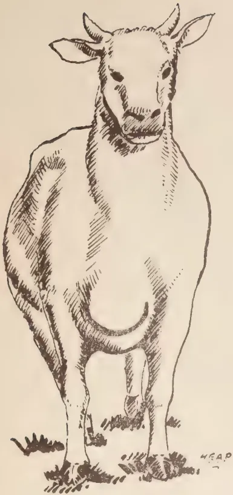
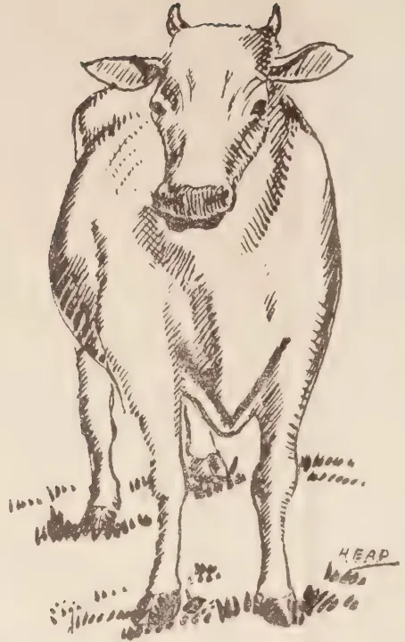
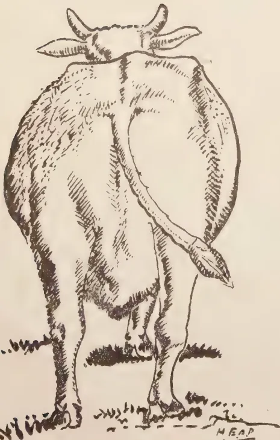
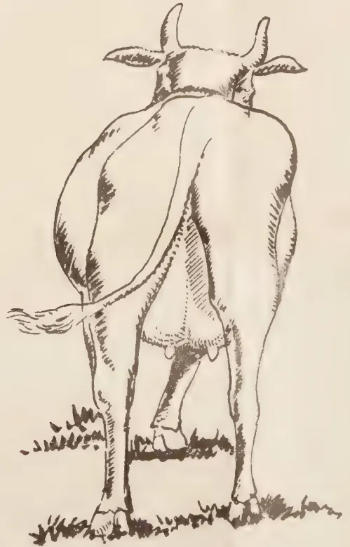
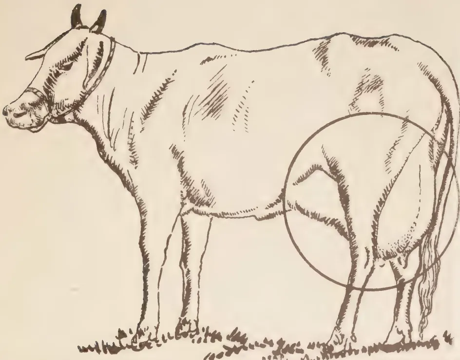

# The Tropical Agriculturist

VOL. C.

PERADENIYA, OCTOBER-DECEMBER, 1944

No 4

Page

## ERRATA

In article on "Investigations of the Hydrocyanic Acid Content of Manioc (Manihot Utilissima)"—Tropical Agriculturist, Vol. C. No. 3, page 150.

(1) In table I., column 1, under "24 hrs. Autolysis"  
substitute 2.3 for 22.3 & 20.2 for 40.2

(2) In table VIII., last column, block 1, under age in months,  
18, the figures should be in order :

56.6, 9.5, 66.1.

(3) In table IX., last row, column 18, substitute :

64.8 for 45.8.

J. N. 7645-900(5/45) GOVT. PRESS, COLOMBO.

<table><tr><td>THE CULTIVATION OF GARLIC (Allium Sativum L) in Udukinda Division—Uva Province ..</td><td>243</td></tr><tr><td>..</td><td>248</td></tr></table>

## SELECTED ARTICLES

<table><tr><td>Conservation of Soil Moisture under Dry Farming ..</td><td>252</td></tr></table>

## MEETINGS, CONFERENCES &c.

<table><tr><td>Report of the Proceedings of the Second Meeting of the Central Board of Agriculture ..</td><td>256</td></tr><tr><td>Report of the Proceedings of the Third Meeting of the Central Board of Agriculture ..</td><td>273</td></tr><tr><td>Minutes of the 72nd Meeting of the Rubber Research Board ..</td><td>285</td></tr><tr><td>Minutes of the 73rd Meeting of the Rubber Research Board ..</td><td>287</td></tr></table>

## RETURNS

<table><tr><td>Animal Disease Returns for October to December ..</td><td>289-291</td></tr><tr><td>Meteorological Reports for October to December ..</td><td>292-294</td></tr></table>

1—J. N. A 49899-509 (4/45)

1------------------------------------------------

2------------------------------------------------

# The Tropical Agriculturist

VOL. C.

PERADENIYA, OCTOBER-DECEMBER, 1944

No 4

<table><thead><tr><th></th><th style="text-align: right;">Page</th></tr></thead><tbody><tr><td>Editorial .. .. .</td><td style="text-align: right;">209</td></tr></tbody></table>

## ORIGINAL ARTICLES

<table><tbody><tr><td>Hill Paddy Cultivation in Ceylon. By Duncan J. de Soyza, Dip. Agric. (Poona), Assistant to the Paddy Officer .. .. .</td><td style="text-align: right;">211</td></tr><tr><td>Studies in Cassava. By M. F. Chandraratna, Ph.D. (Lond.), D.I.C., Acting Botanist and K. D. S. S. Nanayakkara, Assistant in Economic Botany .. .. .</td><td style="text-align: right;">219</td></tr><tr><td>Possibilities of Sericulture in Ceylon. By K. T. Achaya, Retired Sericultural Expert, Madras Government, and Sericultural Expert, Ceylon .. .. .</td><td style="text-align: right;">231</td></tr></tbody></table>

## DEPARTMENTAL AND OTHER NOTES

<table><tbody><tr><td>Cultivation of Bidi Tobacco in India .. .. .</td><td style="text-align: right;">236</td></tr><tr><td>Selection of the Dairy Cow .. .. .</td><td style="text-align: right;">240</td></tr><tr><td>Further Notes on Balsa .. .. .</td><td style="text-align: right;">243</td></tr><tr><td>The Cultivation of Garlic (<i>Allium Sativum</i> L) in Udukinda Division—Uva Province .. .. .</td><td style="text-align: right;">248</td></tr></tbody></table>

## SELECTED ARTICLES

<table><tbody><tr><td>Conservation of Soil Moisture under Dry Farming .. .. .</td><td style="text-align: right;">252</td></tr></tbody></table>

## MEETINGS, CONFERENCES &c.

<table><tbody><tr><td>Report of the Proceedings of the Second Meeting of the Central Board of Agriculture .. .. .</td><td style="text-align: right;">256</td></tr><tr><td>Report of the Proceedings of the Third Meeting of the Central Board of Agriculture .. .. .</td><td style="text-align: right;">273</td></tr><tr><td>Minutes of the 72nd Meeting of the Rubber Research Board .. .. .</td><td style="text-align: right;">285</td></tr><tr><td>Minutes of the 73rd Meeting of the Rubber Research Board .. .. .</td><td style="text-align: right;">287</td></tr></tbody></table>

## RETURNS

<table><tbody><tr><td>Animal Disease Returns for October to December .. .. .</td><td style="text-align: right;">289-291</td></tr><tr><td>Meteorological Reports for October to December .. .. .</td><td style="text-align: right;">292-294</td></tr></tbody></table>

1—J. N. A 49899-509 (4/45)

3------------------------------------------------

<!-- stage4: FAINT old-images-only -->

[Faint page: no legible print of its own could be verified; text withheld (stage 4 review list)]

4------------------------------------------------

The

# Tropical Agriculturist

OCTOBER TO DECEMBER, 1944.

---

## EDITORIAL

---

### HILL PADDY

---

**T**HE present emergency has shown, what our economic system helps us to forget, that it is less important to fill our purses than to fill our stomachs; and true to the fairy tale, the magic wand of necessity has transfigured even the humble pumpkin into a stately chariot gleaming in purple and gold. Many neglected minor crops have been wooed by ardent though inexperienced suitors for a sustenance that money could not buy. Hill Paddy is one of these crops. Time was, when our high lands, especially in the wet zone, carried to a substantial extent this very palatable and nutritious crop. Varieties like *pola-el*, *gonabaru* and *tavalu* used to be grown even between rows of coconuts. The *owita* lands in the Southern Province are still put to the same use. An article in this number gives interesting details about this commodity.

The cry is raised everywhere for self-sufficiency in our staple food; and if this cry is to avoid the fate of a similar agitation in 1917, there are very good reasons why every one of us should see that the present popularity enjoyed by this valuable crop is not a transient one.

The population of this Island is stated to be 6 millions at present. In order that this population should obtain a bare minimum of 3 measures of rice per person per week, the Island's production should be 60 million bushels of paddy per year. The aggregate of the area cultivated during the two seasons of the year is 1,100,000 acres and the average yield has been assessed at 20 bushels per acre. This places the total annual production of the Island at not more than 25 million bushels. Where, then, is the remaining 35 million bushels to come from? One method, of course, is to step up our yields to a figure that is comparable with that of other tropical countries. But this is a long term process and presupposes the successful education in modern practices of a body of very conservative cultivators. Further, a substantial part of the 1,100,000 acres represents fields that are cultivated two seasons every year—in itself, a not very desirable agricultural practice—and an aggregate yield of 40 bushels per year will probably admit of only marginal improvement. Considering that about 11 million acres that compose this Island are chena or jungle land, the quickest solution of the problem of self-sufficiency seems to be to bring as large an extent of this area under paddy, with the greatest possible dispatch.

Unfortunately, however, the calculations of the Department of Irrigation seem to show that not more than 2 million acres of these 11 millions are capable of being irrigated by surface tanks. These 2 million acres, even

5------------------------------------------------

210

if utilized completely for paddy cultivation, will have to serve an ultimate population of, say, 15 million souls. Our rate of colonization is not likely to exceed 10,000 acres per year under the best conditions and barely keeps pace with the rate of increase of the population. Hence, the problem of making this Island independent of outside sources for its rice will assume an increasingly difficult appearance with the passing of time and the temptation might prove to be great to abandon the project in despair. There is, however, a solution to the problem, at least in part, and this lies clearly in a greater use of our high land for paddy cultivation.

In the wet zone, our mud land paddies serve a very useful purpose by producing a valuable article of food in swamps that would not tolerate any other crop. But it is, we believe, not yet established that these paddies must be provided with water almost to the point of complete immersion in order that they may thrive and yield large crops. Rather is it likely that that is a part of the technique of cultivation, furnishing an easy way for the control of weeds. The possibilities of cultivating paddy in high lands would seem to be great for this reason.

One can envisage reasonably large plots of high land being sown in close-spaced drills with sufficient room between the rows to admit of inter-cultivation.

The chief alternative to hill paddy for high land would be the millets. But it would be easier to encourage our villagers to cultivate intensively the fine cereal to which they have been long accustomed than to induce them to grow a far less palatable commodity with which they are unfamiliar. Hill paddy is not as resistant to drought as the millets but the rains during Maha throughout the Island are sufficiently constant and intense to permit a 4 months' crop being successfully harvested. On the other hand, the existing system of bunding high land for soil conservation has the effect of causing water saturation, if not actual water stagnation. Our soils, based as they frequently are on a foundation of gneissic strata that lie too near the surface tend towards water-logging; and our rains are fitful and heavy. Actually, therefore, large tracts of our lands will be more suited to hill paddy than to millets.

In countries like China and Japan, the cultivation of suitable varieties of paddy on high land has an honoured place in their agriculture. Ceylon too should revive its previous practice in an improved form, however, in a scheme of arable farming. Research, both agronomical as well as genetical, is called for in order to contribute towards the achievement of this aim.

6------------------------------------------------

211

## HILL PADDY CULTIVATION IN CEYLON

---

DUNCAN J. de SOYZA, Dip. Agric. (Poona)  
*ASSISTANT TO THE PADDY OFFICER*

---

**T**HE resuscitation in the cultivation of certain food crops in several parts of the Island is very much evident, with the urgency for the production of more food of greater variety, during this national crisis of food depletion brought about by the present hostilities.

The non-availability of land suitable for particular types of crops, virtually led to the elimination of several very desirable food crops from the cultivation calendar in certain districts.

The growth of permanent plantations and the want of schemes for rotational cropping were also largely responsible for the lack of permanency of some of these valuable national food crops.

A food crop of great local importance, which had hitherto not received the attention it deserves and which could very largely supplement the production of wet land rice, which is the staple article of food in the national dietary, is the hill paddy.

That there is a hearty revival towards the greater production of hill paddy is evinced by the considerable demand from all over the Island for seed paddy and information regarding its cultivation.

### ECOLOGY OF THE PADDY PLANT

It is suggested that the original home of the paddy plant may be South-East Asia, India, China or Indo-China owing to the diversity of forms rich in varieties found in these countries.

In Ceylon alone, there are about 600 named varieties, though it is possible that the same variety may be variously named in different localities and different varieties given the same name in various places. In India the names of paddies run to several thousands.

There is a general belief that the paddy plant cannot exist without a free supply of water and invariably a paddy crop is associated as growing in vast sheets of water supplied by large irrigation schemes involving issue of water from tanks, streams, springs or from impounded rain water. This belief naturally leads one to the conclusion that the paddy plant is an aquatic or a hygrophyte.

The root system of the cultivated species of paddy does not manifest aquatic characteristics, although the plant can thrive without much oxygen.

7------------------------------------------------

212

The cultivated varieties of paddy both indigenous and exotic, and a few wild paddies as Uru-wi (S) and Pandi Nelligu (T) found in the Northern, Eastern and Southern Provinces belong to the species *Oryza sativa*.

Wild varieties of purely aquatic paddies as *O. Coaractata* are found in the Indus valley and in Burma. Wild hill paddy varieties as *O. granulata* and *O. latifolia* are found growing on dry soils and rocky hills up to an elevation of 3,000 ft. bordering on xerophytic conditions in the Uva, Kegalla and Tissamaharama districts in Ceylon and in parts of India and Burma.

The diversity of forms available makes it possible for the paddy plant to fit itself to a variety of soil conditions, ranging from stiff clays rich in organic matter to light open soils often found on hill slopes; from deep water and swamps to coarse dry soils and from moist tropical heat of the sea level to elevations up to 7,000 ft.

Though it is a tropical cereal found growing luxuriantly in its native haunts of high temperatures and atmospheric humidity, it had been found to grow with great success and in fact produce highest yields in temperate regions, where long hours of bright sunshine are experienced.

#### HILL PADDY VARIETIES

The term hill paddy is synonymous with the terms upland rice, dry land rice, high land rice, mountain rice and dry rice grown on dry land in foreign countries, entirely under rainfed conditions as any other land crop, as opposed to low land, mud land, wet, marsh and swamp paddies which are invariably grown in bunded fields with standing water.

Local hill paddy varieties are classed into :—(a) Elwi types—normally grown on new clearings in hilly country, (b) Godawi types—generally cultivated in low-lying areas as grass lands, unirrigable paddy fields, meadows, *owitas* &c.

There are about 60 local varieties of hill paddy which is roughly 1/10 the total varieties of mud land paddy grown in the Island. Hill paddy is found to thrive from sea level up to an elevation of 4,000 ft., and are largely grown in the Southern Province, particularly in the Morawak korale and Hinidun pattu; Kegalla and Ratnapura Districts in the Province of Sabaragamuwa; Badulla District in the Province of Uva; Uda Dumbara and Pata Dumbara in the Kandy District; Kalutara District and to a lesser extent in the Siyane korale, Alutkuru korale and Matale East.

#### HILL PADDY RICE

From a nutritive point of view hill paddy rice is superior to wet land rice. Analysis carried out in different countries reveal that while mountain rice contains 11.27 per cent. of protein and 1.8 per cent. of total nitrogen, marsh rice contains 9.84 per cent. and 1.8 per cent, respectively.

According to Professor O. Kellner, mountain rice is richer than marsh rice both in protein compounds and in starchy matter, but not in minerals. The moisture per cent. of marsh and mountain rice is 14.20 and 12.77 respectively.

8------------------------------------------------

213

Kellner's analysis of marsh and mountain rice (undressed) :

Percentage Composition of Dry Matter

<table border="1">
<thead>
<tr>
<th rowspan="2">Dry Matter</th>
<th colspan="3">Marsh Rice</th>
<th rowspan="2">Mountain Rice</th>
</tr>
<tr>
<th>Ordinary</th>
<th>Glutinous</th>
<th></th>
</tr>
</thead>
<tbody>
<tr>
<td>Protein .. ..</td>
<td>7.00</td>
<td>5.87</td>
<td>..</td>
<td>8.75</td>
</tr>
<tr>
<td>Fat .. ..</td>
<td>2.29</td>
<td>3.44</td>
<td>..</td>
<td>2.58</td>
</tr>
<tr>
<td>Cellulose .. ..</td>
<td>4.58</td>
<td>5.19</td>
<td>..</td>
<td>1.98</td>
</tr>
<tr>
<td>Starch and non-nitrogenous extract .. ..</td>
<td>84.76</td>
<td>83.89</td>
<td>..</td>
<td>85.53</td>
</tr>
<tr>
<td>Ash .. ..</td>
<td>1.37</td>
<td>1.61</td>
<td>..</td>
<td>1.18</td>
</tr>
<tr>
<td></td>
<td>100</td>
<td>100</td>
<td></td>
<td>100</td>
</tr>
</tbody>
</table>

Kellner's analysis of Mineral matter in Rice.

Ash Analysis of Rice

<table border="1">
<thead>
<tr>
<th>Mineral Matter</th>
<th>Marsh</th>
<th>Mountain</th>
</tr>
</thead>
<tbody>
<tr>
<td>Potash .. ..</td>
<td>22.94</td>
<td>21.73</td>
</tr>
<tr>
<td>Soda .. ..</td>
<td>4.94</td>
<td>1.59</td>
</tr>
<tr>
<td>Lime .. ..</td>
<td>3.24</td>
<td>2.12</td>
</tr>
<tr>
<td>Magnesia .. ..</td>
<td>10.54</td>
<td>6.61</td>
</tr>
<tr>
<td>Peroxide of Iron .. ..</td>
<td>1.03</td>
<td>1.66</td>
</tr>
<tr>
<td>Phosphoric Acid .. ..</td>
<td>51.37</td>
<td>51.99</td>
</tr>
<tr>
<td>Sulphuric Acid .. ..</td>
<td>1.85</td>
<td>2.08</td>
</tr>
<tr>
<td>Silica .. ..</td>
<td>3.14</td>
<td>9.63</td>
</tr>
<tr>
<td>Chlorine .. ..</td>
<td>1.05</td>
<td>4.49</td>
</tr>
<tr>
<td></td>
<td>100.10</td>
<td>101.90</td>
</tr>
<tr>
<td>Deduct Oxygen Equivalent to Chlorine ..</td>
<td>.24</td>
<td>1.01</td>
</tr>
<tr>
<td></td>
<td>96.86</td>
<td>100.89</td>
</tr>
</tbody>
</table>

Some hill paddy varieties have outstanding qualities. The cooked rice of the scented varieties has a very agreeable odour and is pleasing to the palate. In eating qualities it is superior to the wet rice and is invariably used sparingly as an article of diet. There are several varieties that are reputed for their medicinal value. Elwi rice is used in religious ceremonies and offerings and in the ceremonial feeding of small children.

Hill paddy is invariably husked raw, as par-boiling lessens the flavour of rice, though compensating with a greater out-turn of whole rice.

In size of grain and colour of testa, hill paddy displays a hulled rice varying from small samba types to medium coarse rices possessing a colour gradation ranging from white to red.

HILL PADDY STRAW

Hill paddy straw is relished by cattle but is inferior to wet paddy straw for thatching purposes, as it is normally shorter and more brittle than the latter.

9------------------------------------------------

214Analysis of Rice Straw (Kellner.)

<table border="1">
<thead>
<tr>
<th>Constituents.</th>
<th>Rice straw from Marsh Land</th>
<th>Co-efficient of digestibility</th>
<th>Rice straw from Dry Land</th>
<th>Co-efficient of digestibility</th>
</tr>
</thead>
<tbody>
<tr>
<td>Moisture ..</td>
<td></td>
<td>20.79</td>
<td></td>
<td>10.33</td>
</tr>
<tr>
<td>Dry substance ..</td>
<td></td>
<td>—</td>
<td></td>
<td>—</td>
</tr>
<tr>
<td>Albuminoids ..</td>
<td>6.80</td>
<td>.. 46.54</td>
<td>6.75</td>
<td>.. 43.84</td>
</tr>
<tr>
<td>Fat ..</td>
<td>2.17</td>
<td>.. 41.45</td>
<td>2.16</td>
<td>.. 51.90</td>
</tr>
<tr>
<td>Fibre ..</td>
<td>48.68</td>
<td>.. 58.10</td>
<td>40.35</td>
<td>.. 55.24</td>
</tr>
<tr>
<td>Non-nitrogenous extract ..</td>
<td>24.80</td>
<td>.. 35.41</td>
<td>42.14</td>
<td>.. 28.86</td>
</tr>
<tr>
<td>Ash ..</td>
<td>17.55</td>
<td>..</td>
<td>18.60</td>
<td>..</td>
</tr>
<tr>
<td></td>
<td>
100.00</td>
<td></td>
<td>
100.00</td>
<td></td>
</tr>
<tr>
<td>Dry matter ..</td>
<td></td>
<td>.. 43.86</td>
<td></td>
<td>.. 39.18</td>
</tr>
<tr>
<td>Organic matter ..</td>
<td></td>
<td>.. 49.88</td>
<td></td>
<td>.. 44.03</td>
</tr>
</tbody>
</table>

SEASON, CULTIVATION, MANURING, &c.

The local varieties vary in age from 3 to 6 months and hence croppings could be taken in both the *yala* and *maha* seasons. *Yala* sowing is done in March-April, while the *maha* season has a wide sowing range, of 4 months, beginning in July and terminating in October, depending on the district and the variety sown.

A well distributed rainfall of 40 to 60 inches is essential for the successful cultivation of hill paddy, though some of the more drought resistant types could stand up to erratic rainfall conditions and even yield favourably with a rainfall up to 30 inches.

Most varieties are fastidious as regards the type of soil and this is particularly so, with the *elwi* types that respond best, when sown in new clearings that are rich in humus and ash. Jungle over 4 years are found to be suitable for such varieties. The *godawi* types as *polayal* and *gonabaru* are best suited for sandy loams while *thavalu*, *pannithi* and *goda kuruwi* respond well on low-lying *owitas* and moist grass land. *Gonabaru* could be successfully grown as a catch crop in plantain gardens and coconut plantations where there is no excessive shade. Hill paddy thrives on soils rich in organic matter and the application of organics to soils that are repeatedly cropped hardly needs emphasis, as increase in the organic matter content in a soil enhances its water holding capacity.

Depleted soils could be brought up to a high fertility standard by the application of 2-3 tons of green material, compost or farm yard manure before the first ploughing or turning over the soil, or 2-3 cwt. of the fertilizer mixture of groundnut cake, bone meal and saphos at 2nd ploughing and the incorporation of 100-150 lb. of wood ashes with the soil just before sowing.

In newly opened jungle land implemental tillage is not necessary. After the burn off and removal of all unburnt branches the ungerminated or very slightly germinated seed is sown broadcast with the first showers of the monsoons at the rate of 1-1½ bushels per acre, the lesser seed rate being used with smaller grains and where the soil is more fertile. The seed is then

10------------------------------------------------

215

lightly buried either by shallow mammotying, light ploughing with a country plough or harrowing or by working in the seed with a soil stirrer improvised from brushwood.

Where possible, drilling the seed in rows, 9"-12" apart is recommended, particularly in lands where intensive cultivation is practised. This will facilitate weeding operations and permit the use of inter-cultural implements. In sloping lands rows sown on the contour will effectively stop soil erosion.

In hill country it is essential that all precautions be taken to arrest the downward movement of the soil, either by temporary measures as throwing logs and branches on the contour or by taking more permanent steps as contour drainage and terracing. Unless such steps are taken, seed is liable to be washed down leaving bare patches in the upper regions and over crowding of the crop in the lower areas.

Hill paddy *chenas* are normally sown with a mixture, the seed paddy being mixed with small quantities of millet, pulses, vegetables &c., as *meneri* (*Panicum miliaceum*), *tanahal* (*Setaria italica*), green gram, cowpea, mustard, chillies, *tampala* (*Amaranthus sp.*), and other greens interplanted with maize, particularly on ant-hill sites. Where *godawi* varieties are sown, the crop is either sown alone or with one to two items of the above mixture.

In the *chena* system a hill paddy crop is seldom or never repeated. Instead a crop of *kurakkan* (*Eleusine corocana*) or *gingelly* (*Sesamum indicum*) is taken in the following season followed up with a crop of *Amu* (*Paspalum scrobiculatum*) or *Kollu* (*Dolichos biflorus*), after which the soil is rested in order to recuperate.

#### WEEDING, THINNING, TRANSPLANTING, &c.

The low yields often obtained from hill paddy crops are largely due to the competition set up by weeds and the lack of proper weed control. Weed competition is severe in hill paddy *chenas* as the well distributed rainfall in the cultivated regions are very favourable to weed growth. In order to combat this difficulty there is a practice of using higher seed rates which also compensates for the loss of seed after sowing, owing to the ravages of birds and vermin, poor germination and thinness of the crop when the monsoons are not favourable.

Wherever labour is procurable hand weeding should be resorted to when the plants are about 6"-9" tall, *i.e.*, approximately when the crops 3-5 weeks old. A second weeding if necessary may be done with the long-aged varieties when the crop is 1½-2 months old. Drilled paddy should be thinned 4"-6" apart. During the weeding operations, the over crowded patches should be thinned to permit tillering of plants and the excess plants may be used as transplants for filling up vacancies. Seedlings stand transplanting well, provided there is rain at the time. Transplanting should be done only with the long-aged varieties as there is sufficient time for the seedlings to recover and throw out tillers. When transplanting the roots should be pruned back and the tops of leaves cut off, more so, if the seedlings are over grown. Root pruning expedites transplanting and encourages new root growth.

11------------------------------------------------

216

Harrowing the crop with a wooden-toothed harrow when the seeds have fully germinated and when the crop is 4-6 weeks old will not only check and reduce the weed population, but will thin out crowded areas and encourage tillering in the grown ups, as a result of soil aeration and root disturbance. This operation should only be carried out when rains are favourable.

#### CROP YIELDS

The success of a hill paddy crop largely depends on the timely break and the successful distribution of the monsoon rains. Yields of 15-30 bushels and even above 50 bushels per acre are not uncommon.

The harvested crop should be stacked for about 5 days before threshing as this facilitates shedding of grain.

The average yield of hill paddy straw is less than that of wet paddy.

#### PESTS AND DISEASES

The incidence of pests and diseases in hill paddy should normally be as great as in wet rices, but owing to the limited areas under cultivation and the amount of care and attention paid, the attack by pests or damage by disease is seldom reported or advice sought regarding their control or destruction.

Field mice do considerable damage by eating and hoarding, when the seed is just sown and when the crop is in ear. Seedling plants are sometimes attacked by swarming caterpillar and leaf hoppers while appreciable damage to seedlings by browsing is often done by hare and land tortoises. The greatest amount of loss is committed by the paddy bug and to a lesser extent by the stem borer, while large flights of paddy birds foraging on an intensive cultivation could reduce the crop to nought in a very limited time, unless the farmer keeps a watchful eye and scares the enemy away when the crop is ripening.

#### CONCLUSION

It is an indisputable fact that the cultivation of hill paddy was greatly in vogue in the past. The practice gradually died down to its present neglected state due to want of suitable land, systematic and scientific cultivation, uncertainty of success due to the vagaries of the weather and last but not the least, for the lack of scientific work directed towards the selection of suitable strains from the existing types and the production of suitable hybrids to cater to the demands of the cultivator and fit in to the various regions where soil conditions and climate vary.

There is a great future for the cultivation of hill paddy, in that, with field and laboratory research, using as material the 60 or more local varieties as a foundation for the selection of pure-line strains and building up of hybrids combining desirable characters as high yields, resistance to drought and size of grain, the country will be in a position at a very early date to place at the disposal of the cultivator high yielding strains for the wet and semi-wet zones and suitable drought resistant types that will ultimately replace the millets

12------------------------------------------------

217

in the dry zones and also fit into a system of rotation in these arid and semi-arid regions. Although typical mud land paddies do not thrive under dry land conditions, some hill paddies can accommodate themselves to mud land conditions. It will thus be possible to evolve a few varieties of semi-dry paddy that will lend themselves for cultivation in paddy fields under mud land conditions during failure of monsoons or where irrigation water is not available or slightly available. Success in this direction could certainly be visualized if well directed and whole hearted genetical research be taken in hand with suitable indigenous and exotic strains.

Preliminary trials in this direction are already being conducted at Peradeniya and several places in the dry zone and it is hoped that in the near future, the Island's rice production will be greatly augmented while largely supplanting the coarse, less palatable millets which constitute the luxury food of our less fortunate countrymen in the Wanni.

#### Some Local Hill Paddy Varieties

<table border="1">
<thead>
<tr>
<th>No.</th>
<th>Variety.</th>
<th>Age in Months</th>
<th>Season</th>
<th>Where grown</th>
</tr>
</thead>
<tbody>
<tr>
<td>1 ..</td>
<td>Boraluweli</td>
<td>.. 3½ ..</td>
<td>Maha</td>
<td>.. Ratnapura District</td>
</tr>
<tr>
<td>2 ..</td>
<td>Bibile elwi</td>
<td>.. 6 ..</td>
<td>do.</td>
<td>.. Kuruwita Palata</td>
</tr>
<tr>
<td>3 ..</td>
<td>Batudel</td>
<td>.. 3½-4 ..</td>
<td>do.</td>
<td>.. Uva</td>
</tr>
<tr>
<td>4 ..</td>
<td>Devaraja El</td>
<td>.. 4 ..</td>
<td>do.</td>
<td>.. Ratnapura District</td>
</tr>
<tr>
<td>5 ..</td>
<td>Elwi</td>
<td>.. 4, 6 ..</td>
<td>Yala and Maha</td>
<td>.. Kegalla District, Akuressa</td>
</tr>
<tr>
<td>6 ..</td>
<td>Gonabaru</td>
<td>.. 4, 5 ..</td>
<td>do.</td>
<td>.. Panadura Totamune, Southern Province</td>
</tr>
<tr>
<td>7 ..</td>
<td>Goda El</td>
<td>.. 4 ..</td>
<td>Maha</td>
<td>.. Galle District</td>
</tr>
<tr>
<td>8 ..</td>
<td>Ganathumba El</td>
<td>.. 5, 6 ..</td>
<td>Yala</td>
<td>.. Ratnapura District, Galle District</td>
</tr>
<tr>
<td>9 ..</td>
<td>Goda kuruwi</td>
<td>.. 4 ..</td>
<td>Maha</td>
<td>.. Southern Province</td>
</tr>
<tr>
<td>10 ..</td>
<td>Indipathel</td>
<td>.. 6 ..</td>
<td>do.</td>
<td>.. Raigam Korale</td>
</tr>
<tr>
<td>11 ..</td>
<td>Heenthavalu</td>
<td>.. 3½ ..</td>
<td>Yala and Maha</td>
<td>.. Southern Province</td>
</tr>
<tr>
<td>12 ..</td>
<td>Halhuduwee</td>
<td>.. 3½-4 ..</td>
<td>do.</td>
<td>.. do.</td>
</tr>
<tr>
<td>13 ..</td>
<td>Heenkiri El</td>
<td>.. 4½ ..</td>
<td>Maha</td>
<td>.. Ratnapura District</td>
</tr>
<tr>
<td>14 ..</td>
<td>Kuru El</td>
<td>.. 5 ..</td>
<td>Yala</td>
<td>..</td>
</tr>
<tr>
<td>15 ..</td>
<td>Koseta Elwi</td>
<td>.. 6 ..</td>
<td>Maha</td>
<td>.. Uva Province</td>
</tr>
<tr>
<td>16 ..</td>
<td>Kahatanayal</td>
<td>.. 7 ..</td>
<td>do.</td>
<td>.. Ratnapura District</td>
</tr>
<tr>
<td>17 ..</td>
<td>Karappa Elwi</td>
<td>.. 3-4 ..</td>
<td>do.</td>
<td>..</td>
</tr>
<tr>
<td>18 ..</td>
<td>Kalabala El</td>
<td>.. 3½-4 ..</td>
<td>do.</td>
<td>.. Ratnapura District</td>
</tr>
<tr>
<td>19 ..</td>
<td>Karaniel</td>
<td>.. 4 ..</td>
<td>do.</td>
<td>.. Pottuvil</td>
</tr>
<tr>
<td>20 ..</td>
<td>Maligatenna El</td>
<td>.. 3½ ..</td>
<td>do.</td>
<td>.. Bibile</td>
</tr>
<tr>
<td>21 ..</td>
<td>Monthakiriyal</td>
<td>.. 4 ..</td>
<td>do.</td>
<td>.. Trincomalee District</td>
</tr>
<tr>
<td>22 ..</td>
<td>Mudukiriel</td>
<td>.. 4-5 ..</td>
<td>Yala and Maha</td>
<td>.. Panadura Totamune, Weligam Korale</td>
</tr>
<tr>
<td>23 ..</td>
<td>Muttumanikkam El</td>
<td>.. 6 ..</td>
<td>Maha</td>
<td>.. Raigam Korale</td>
</tr>
<tr>
<td>24 ..</td>
<td>Meepathel</td>
<td>.. 6 ..</td>
<td>do.</td>
<td>.. Kegalla District</td>
</tr>
<tr>
<td>25 ..</td>
<td>Muppankan</td>
<td>.. 4 ..</td>
<td>do.</td>
<td>.. Badulla District</td>
</tr>
<tr>
<td>26 ..</td>
<td>Nuga Elwi</td>
<td>.. 3½ ..</td>
<td>do.</td>
<td>.. do.</td>
</tr>
<tr>
<td>27 ..</td>
<td>Nandu El</td>
<td>.. 4 ..</td>
<td>do.</td>
<td>.. do.</td>
</tr>
<tr>
<td>28 ..</td>
<td>Pannithi</td>
<td>.. 3½-4 ..</td>
<td>Yala and Maha</td>
<td>.. Southern Province</td>
</tr>
<tr>
<td>29 ..</td>
<td>Polayal</td>
<td>.. 3½-4 ..</td>
<td>do.</td>
<td>.. do.</td>
</tr>
<tr>
<td>30 ..</td>
<td>Puwakmal El</td>
<td>.. 5-6 ..</td>
<td>Yala</td>
<td>.. Galle District</td>
</tr>
<tr>
<td>31 ..</td>
<td>Pokuru Kiriyal</td>
<td>.. 4 ..</td>
<td>Maha</td>
<td>.. Ratnapura District</td>
</tr>
<tr>
<td>32 ..</td>
<td>Podi Rathel</td>
<td>.. 5-6 ..</td>
<td>Yala</td>
<td>.. Galle District</td>
</tr>
<tr>
<td>33 ..</td>
<td>Ranel ..</td>
<td>.. 3-3½ ..</td>
<td>Maha</td>
<td>.. Weligam Korale</td>
</tr>
<tr>
<td>34 ..</td>
<td>Rathdel</td>
<td>.. 5 ..</td>
<td>do.</td>
<td>.. do.</td>
</tr>
</tbody>
</table>

13------------------------------------------------

<!-- stage4: ACCEPT r2J/J_016:45 -->

218

<table border="1">
<thead>
<tr>
<th>No.</th>
<th>Variety.</th>
<th>Age in Months</th>
<th>Season</th>
<th>Where grown</th>
</tr>
</thead>
<tbody>
<tr>
<td>35 ..</td>
<td>Rathel</td>
<td>.. 4 ..</td>
<td>Yala and Maha ..</td>
<td>Uva District</td>
</tr>
<tr>
<td>36 ..</td>
<td>Rathumeepathel</td>
<td>.. 5-6 ..</td>
<td>Maha ..</td>
<td>Kuriwita Palata and Siyane Korale</td>
</tr>
<tr>
<td>37 ..</td>
<td>Suwandel Elwi</td>
<td>.. 4-6 ..</td>
<td>Yala and Maha ..</td>
<td>Badulla District</td>
</tr>
<tr>
<td>38 ..</td>
<td>Siwuru Elwi</td>
<td>.. 3½-4 ..</td>
<td>do. ..</td>
<td>Uva District</td>
</tr>
<tr>
<td>39 ..</td>
<td>Sudumeepathel</td>
<td>.. 5½-6 ..</td>
<td>Maha ..</td>
<td>Kuriwita Palata, Avissa- wella District and Siyane Korale</td>
</tr>
<tr>
<td>40 ..</td>
<td>Sudu El</td>
<td>.. 5 ..</td>
<td>do. ..</td>
<td>Ratnapura District</td>
</tr>
<tr>
<td>41 ..</td>
<td>Thavalu</td>
<td>.. 3½ ..</td>
<td>Yala and Maha ..</td>
<td>Galle District</td>
</tr>
<tr>
<td>42 ..</td>
<td>Weraniya El</td>
<td>.. 5-6 ..</td>
<td>Maha ..</td>
<td>Badulla District</td>
</tr>
</tbody>
</table>

14------------------------------------------------

219

## STUDIES IN CASSAVA

### I. A CLASSIFICATION OF RACES OCCURRING IN CEYLON

M. F. CHANDRARATNA, Ph.D. (Lond.), D.I.C.

ACTING BOTANIST

AND

K. D. S. S. NANAYAKKARA

ASSISTANT IN ECONOMIC BOTANY

#### SUMMARY

**R**ACES of cassava (*Manihot utilisima* Pohl) occurring in Ceylon are described and an artificial key to their identification is presented.

#### INTRODUCTION

Cassava has been under cultivation in Brazil, the country to which it is native, for many centuries. The Brazilians, according to Willem Piso in his *Historia Naturalis Brasiliae* (1648), recognized nine races of cassava which they put to a diversity of uses, including the manufacture of an alcoholic drink. At the time the Spaniards discovered America the cultivation of this plant had been pushed to almost the furthest possible limit on that continent; the crop occupied a belt covering 25 degrees on each side of the equator (Burkill, 1935). It is an interesting reflection that this plant, on which we rely so much in these lean years, was introduced into Ceylon as recently as 1786; planting material was obtained from Mauritius by the Dutch Governor Van der Graaf. The only subsequent recorded importations were made in 1821 and 1917, and these too were from Mauritius.

The dietetic defects of cassava are admittedly numerous. The tubers are poor in minerals and vitamins, and may, under certain circumstances, develop toxic concentrations of hydrocyanic acid. Nevertheless, the crop has assumed tremendous importance in this country as a famine crop. Its most striking virtue is that it can be left in the ground for protracted periods and lifted as required. It is, moreover, highly resistant to diseases and drought. The *goiya's* attachment to cassava is well known, and is understandable: it is one of the few dependable things in his precarious existence.

Although the importation of foreign material has been recent and infrequent, numerous local races have arisen possibly through natural crossing followed by the germination of self-sown seed, and have been perpetuated vegetatively. The collection and classification of the material available locally were felt to be an essential preliminary to a programme of cassava improvement. The key embodied herein is based on gross, qualitative criteria. An evaluation of the quantitative characters which determine the value of the material to the breeder, will be attempted in a later communication.

15------------------------------------------------

220TAXONOMY

Cassava belongs to the Euphorbiaceae, a large tropical family embracing 220 genera and nearly 4000 species. The family is characterized by the possession of unisexual flowers which may sometimes undergo abortion. Either the corolla or the whole perianth may be absent. The ovary is commonly trilocular, and matures into a capsule dehiscing into three cocci. The seeds possess a caruncle and a copious endosperm.

Cassava falls within the genus *Manihot*, several species of which are well-known sources of rubber; the Ceara rubber is *M. Glaziovii* Müll-Arg. The species limits of the cultivated varieties of cassava are controversial. Until a detailed revision of the group is undertaken, it is desirable to include all varieties of cassava within the species, *M. utilisissima* Pohl. The *Index Kewensis* lists the following synonyms:—

*Manihot utilisissima* Pohl Pl. Bras. Ic. i, 32 t. 24 (1827)

*Manihot esculenta* Crantz Inst. i, 167 (1766)

*Manihot edule* A. Rich. Fl. Cub. Fanerog. ii, 208 (1853)

*Manihot Manihot* (L.) Cockerell in Bull Torrey Bot. Club XIX 95 (1892)

*Manihot aipi* Rusby in Mem. Torrey Bot. Club vi, 120 (1896)

*Mandioca utilisissima* (Pohl) Pohl ex Link Handb. ii, 436 (1831)

*Mandioca dulcis* Parodi in Anal. Soc. Cient. Argent iv, 127 (1877)

*Jatropha Manihot* L. Sp. Pl. 1007 (1753)

*Jatropha stipulata* Vell. Fl. Flum. x, t. 82 (1827)

*Jatropha Manihot* (L.) H. B. K. Nov. Gen. et Sp. ii, 108 (1817)

Standley (1930) and Pulle (1932) evidently consider that the priority of *M. esculenta* Crantz establishes its legitimacy. The separation of cultivated varieties into two species, viz., "bitter" cassava, *M. utilisissima* Pohl, and "sweet" cassava, *M. Aipi* Pohl, appears to have little justification.

The following description of *M. utilisissima* Pohl is by Fawcett and Rendle (1920):

"Root tuberous, elongated, full of starch, with juice which is sometimes bitter and poisonous. *Shrubby*, sometimes arborescent 5—9 ft. high. *Leaves* deeply 3—7 parted, membranous, on upper surface glabrous, beneath glaucous and minutely puberulous or glabrous along the nerves; lobes 8—15 cm. long, lanceolate, entire; petiole generally longer than the leaf; stipules linear, acuminate, entire, 6—7 mm. long. *Inflorescence* branching from the base, primary branches 3—5 cm. long. *Flowers* glabrous except the apex of the connective which has a cluster of hairs. *Male flowers*: *Calyx* 5-cleft, glabrous outside, puberulous inside, 3—4 mm. long. *Female flowers*: *Calyx* 5-parted, 9—10 mm. long, glabrous. *Ovary*: 6-ribbed, glabrous. *Styles* broadening out from a narrow base, and cut along the upper edge into numerous lobes. *Capsule* about 1.5 cm. long, broadly ellipsoidal, rough, narrowly winged. *Seeds* about 12 mm. long, grey mottled with dark splashes."

THE MATERIAL INVESTIGATED

The assistance of the field officers of the Department was enlisted in the making of as complete a collection as possible of the races occurring in Ceylon. The material was received under a diversity of local names. Two common types were, however, recognized, viz., the *Sinyokka* type which was

16------------------------------------------------

221

characterized by the occurrence of red pigment in various parts of the plant and the possession of a zigzag, unbranched stem, and the *Manyokka* type which was unpigmented and possessed a straight, early-branching stem. Numerous intergrades occurred and it was convenient to postulate their origin by natural crossing between *Sinyokka* and *Manyokka* parents. This hypothesis is being tested in the field. The significance of the other local names is explained in the glossary given at the end of this paper.

A total of 143 accessions was made in 1939. On the basis of detailed studies of the morphology and the performance of these accessions, over a five-year period in Peradeniya, it was found possible to bulk them into 75 races.

#### CHARACTERS USED IN CLASSIFICATION

The intraspecific distinctions on which this classification is based must, of necessity, be subtle and ill-defined. The expression of most of the characters defining races is subject to environmental influences, and the determination of group limits is often difficult. The distribution of pigment is one of the least unstable and one of the most readily recognizable of race characters, and has, accordingly, been used freely in this classification.

*Petiole.*—Broad distinctions can be based on petiole colour. Three classes can be recognized as shown in Plate 1 : (a) petiole yellowish green with no trace of red pigment ; (b) petiole yellowish green with a rose ring at the proximal end, or roses shading at the distal end, or both ; and (c) petiole with carmine pigment distributed throughout its whole length. In the instance of (c), the colour is often deepest at the ends, and in certain races, may fade to a dull yellowish brown towards the middle of the petiole.

Petiole orientation and shape have been used to a limited extent in classification. The four types of petiole orientation recognized are illustrated in Figs. 1 and 2. The petioles in some races, generally incline up, the adaxial surface of the petiole making an acute angle with the stem (Fig. 1.a). In others, the majority of the petioles are orientated horizontally (Fig. 1.b). In still other races, there is a tendency to an alternation of horizontal petioles and petioles that incline up (Fig. 2.a) or to a mixture of horizontal petioles, petioles that incline up and petioles that decline (Fig. 2.b). In the instance of petioles that decline, the adaxial surface of the petiole makes an obtuse angle with the stem.

The range of petiole shape is illustrated in Fig. 3. Petioles may be (a) sigmoid, (b) straight, (c) curved at the distal end, or (d) irregularly shaped.

*Young leaf.*—As indicated in Plate 2, three classes can be set up on the basis of the colour of the young, unfolding leaf : (a) Young leaf completely devoid of purple pigment ; (b & b1) young leaf showing a blend of purple and green pigments ; and (c) young leaf with the purple pigmentation so heavy that the chlorophyll is almost completely obscured.

*Stem.*—The occurrence of red pigment in the young stem provides the basis for further subdivision. The young stem may be light yellowish green (Plate 3, a & b) or dark green (Plate 3, c & d) and each type may (Plate 3, b & d) or may not (Plate 3, a & c) possess five, longitudinal, red stripes. The red stripes may have a sharp or an ill-defined edge. The latter type of stripe is referred to as 'shaded' in the descriptions of races. Certain of the unstriped races exhibit a diffuse splash of red pigment on the young stem.

17------------------------------------------------

222

Three mature-stem colours are recognized and are illustrated in Plate 4: (a) silver grey, (b) wood brown, and (c) dark vinaceous-brown.

*Tuber*.—Tuber characters are not greatly affected by environmental influences, and are of value in diagnosis. The tuber is morphologically a root. The primary xylem in the tuber initial is tetrarch or pentarch. A fascicular cambium is differentiated early, and rapidly produces a considerable mass of secondary xylem which constitutes the 'flesh' of the tuber. The phellogen which is set down early in the pericycle, cuts off, on the outside, cells which are subsequently suberized and become recognizable as cork. The depth of the cork layer determines the appearance of the tuber surface. If the cork is many cells deep, it coheres into a *scaly* skin which peels off readily (Plate 5 a & b). A shallow layer of cork gives the tuber surface a relatively *smooth* appearance (Plate 5 e & f). An intermediate degree of suberisation is described as presenting a *rough* surface (Plate 5, c & d). Apart from these differences in texture, the tuber surface exhibits colour differences which are illustrated in Plate 5.

When the corky outer skin is peeled, it separates from the underlying tissue at the phellogen. The subjacent surface, which is morphologically the phelloderm, presents a range of colours which is used in classification. The phelloderm, as shown in Plate 6, may be (a) yellow, (b) white, or (c) pink.

The phelloderm and secondary phloem tissues (referred to by Greenstreet and Lambourne (1931) as the ('cortex')) constitute an inner skin which peels off readily at the fascicular cambium from the underlying 'flesh' (secondary xylem). The phelloderm-phloem skin is characterized by the possession of very high concentrations of the cyanogenetic glucoside, and is always removed before the flesh is prepared for consumption. The glucoside concentration drops very sharply when the fascicular cambium is crossed.

'Flesh' colour is a relatively constant character. Three classes are recognized as indicated in Plate 7, viz. (a) yellow, (b) white, and (c) yellowish white. The yellow colour (caused presumably by the presence of carotenoids) deepens on boiling, and distinctions based on the appearance of the boiled tissue appear more satisfactory (Plate 7, a1, b1 & c1).

#### KEY TO RACES OF CASSAVA

<table>
<tbody>
<tr>
<td>A</td>
<td>Petiole carmine</td>
<td></td>
<td></td>
<td></td>
<td></td>
</tr>
<tr>
<td>B</td>
<td>Young leaf purple</td>
<td></td>
<td></td>
<td></td>
<td></td>
</tr>
<tr>
<td>C</td>
<td>Flesh white</td>
<td></td>
<td></td>
<td></td>
<td></td>
</tr>
<tr>
<td>D</td>
<td>Tuber phelloderm white</td>
<td></td>
<td></td>
<td></td>
<td></td>
</tr>
<tr>
<td>E</td>
<td>Young stem yellowish green</td>
<td></td>
<td></td>
<td></td>
<td></td>
</tr>
<tr>
<td>F</td>
<td>Young stem straight</td>
<td>..</td>
<td>..</td>
<td>..</td>
<td>MU. 1</td>
</tr>
<tr>
<td>FF</td>
<td>Young stem zigzag</td>
<td>..</td>
<td>..</td>
<td>..</td>
<td>MU. 2</td>
</tr>
<tr>
<td>EE</td>
<td>Young stem dark green</td>
<td></td>
<td></td>
<td></td>
<td></td>
</tr>
<tr>
<td>F</td>
<td>Young stem unstriped</td>
<td>..</td>
<td>..</td>
<td>..</td>
<td>MU. 3</td>
</tr>
<tr>
<td>FF</td>
<td>Young stem with red stripes</td>
<td>..</td>
<td>..</td>
<td>..</td>
<td>MU. 4</td>
</tr>
<tr>
<td>DD</td>
<td>Tuber phelloderm pink</td>
<td></td>
<td></td>
<td></td>
<td></td>
</tr>
<tr>
<td>E</td>
<td>Young stem yellowish green</td>
<td></td>
<td></td>
<td></td>
<td></td>
</tr>
<tr>
<td>F</td>
<td>Young stem straight</td>
<td>..</td>
<td>..</td>
<td>..</td>
<td>MU. 5</td>
</tr>
<tr>
<td>FF</td>
<td>Young stem zigzag</td>
<td>..</td>
<td>..</td>
<td>..</td>
<td>MU. 6</td>
</tr>
<tr>
<td>EE</td>
<td>Young stem dark green</td>
<td>..</td>
<td>..</td>
<td>..</td>
<td>MU. 7</td>
</tr>
<tr>
<td>CC</td>
<td>Flesh yellowish white</td>
<td>..</td>
<td>..</td>
<td>..</td>
<td>MU. 8</td>
</tr>
<tr>
<td>BB</td>
<td>Young leaf purple green</td>
<td></td>
<td></td>
<td></td>
<td></td>
</tr>
<tr>
<td>C</td>
<td>Flesh white</td>
<td></td>
<td></td>
<td></td>
<td></td>
</tr>
<tr>
<td>D</td>
<td>Tuber phelloderm white</td>
<td></td>
<td></td>
<td></td>
<td></td>
</tr>
</tbody>
</table>

18------------------------------------------------

223

<table border="0">
<tbody>
<tr>
<td>E</td>
<td>Young stem yellowish green</td>
<td></td>
<td></td>
</tr>
<tr>
<td>F</td>
<td>Young stem straight</td>
<td></td>
<td></td>
</tr>
<tr>
<td>G</td>
<td>Tuber surface rough, light brown</td>
<td>..</td>
<td>MU. 9</td>
</tr>
<tr>
<td>GG</td>
<td>Tuber surface scaly, dark brown</td>
<td></td>
<td></td>
</tr>
<tr>
<td>H</td>
<td>Branching early, petiole base dark purple, young leaf midrib yellowish green</td>
<td></td>
<td>MU. 10</td>
</tr>
<tr>
<td>HH</td>
<td>Branching late, petiole base pomegranate purple, young leaf midrib yellowish green tinged with red</td>
<td>..</td>
<td>MU. 11</td>
</tr>
<tr>
<td>FF</td>
<td>Young stem zigzag</td>
<td>..</td>
<td>MU. 12</td>
</tr>
<tr>
<td>EE</td>
<td>Young stem dark green</td>
<td></td>
<td></td>
</tr>
<tr>
<td>F</td>
<td>Tuber surface smooth</td>
<td></td>
<td></td>
</tr>
<tr>
<td>G</td>
<td>Tuber surface light brown</td>
<td>..</td>
<td>MU. 13</td>
</tr>
<tr>
<td>GG</td>
<td>Tuber surface dark brown</td>
<td>..</td>
<td>MU. 14</td>
</tr>
<tr>
<td>FF</td>
<td>Tuber surface scaly</td>
<td>..</td>
<td>MU. 15</td>
</tr>
<tr>
<td>DD</td>
<td>Tuber phelloderm pink</td>
<td></td>
<td></td>
</tr>
<tr>
<td>E</td>
<td>Young stem yellowish green</td>
<td></td>
<td></td>
</tr>
<tr>
<td>F</td>
<td>Young stem unstriped</td>
<td></td>
<td></td>
</tr>
<tr>
<td>G</td>
<td>Tuber surface light salmon-brown</td>
<td>..</td>
<td>MU. 16</td>
</tr>
<tr>
<td>GG</td>
<td>Tuber surface dark brown</td>
<td>..</td>
<td>MU. 17</td>
</tr>
<tr>
<td>FF</td>
<td>Young stem with red stripes</td>
<td></td>
<td></td>
</tr>
<tr>
<td>G</td>
<td>Young stem straight</td>
<td></td>
<td></td>
</tr>
<tr>
<td>H</td>
<td>Tuber surface smooth, light salmon-brown</td>
<td></td>
<td></td>
</tr>
<tr>
<td>J</td>
<td>Branching late, young leaf midrib yellowish green</td>
<td>..</td>
<td>MU. 18</td>
</tr>
<tr>
<td>JJ</td>
<td>Branching irregular, young leaf midrib red</td>
<td>..</td>
<td>MU. 19</td>
</tr>
<tr>
<td>HH</td>
<td>Tuber surface rough, light salmon-brown</td>
<td>..</td>
<td>MU. 20</td>
</tr>
<tr>
<td>HHH</td>
<td>Tuber surface scaly</td>
<td></td>
<td></td>
</tr>
<tr>
<td>J</td>
<td>Tuber surface, light salmon-brown</td>
<td>..</td>
<td>MU. 21</td>
</tr>
<tr>
<td>JJ</td>
<td>Tuber surface, dark brown</td>
<td>..</td>
<td>MU. 22</td>
</tr>
<tr>
<td>GG</td>
<td>Young stem zigzag</td>
<td>..</td>
<td>MU. 23</td>
</tr>
<tr>
<td>EE</td>
<td>Young stem dark green</td>
<td></td>
<td></td>
</tr>
<tr>
<td>F</td>
<td>Tuber surface smooth</td>
<td>..</td>
<td>MU. 24</td>
</tr>
<tr>
<td>FF</td>
<td>Tuber surface rough</td>
<td></td>
<td></td>
</tr>
<tr>
<td>G</td>
<td>Tuber surface light salmon-brown, branching late</td>
<td>..</td>
<td>MU. 25</td>
</tr>
<tr>
<td>GG</td>
<td>Tuber surface light brown, branching irregular</td>
<td>..</td>
<td>MU. 26</td>
</tr>
<tr>
<td>FFF</td>
<td>Tuber surface scaly, dark brown</td>
<td>..</td>
<td>MU. 27</td>
</tr>
<tr>
<td>CC</td>
<td>Flesh yellowish white</td>
<td></td>
<td></td>
</tr>
<tr>
<td>D</td>
<td>Tuber phelloderm pink</td>
<td></td>
<td></td>
</tr>
<tr>
<td>E</td>
<td>Young stem yellowish green</td>
<td>..</td>
<td>MU. 28</td>
</tr>
<tr>
<td>EE</td>
<td>Young stem dark green</td>
<td>..</td>
<td>MU. 29</td>
</tr>
<tr>
<td>DD</td>
<td>Tuber phelloderm yellow</td>
<td></td>
<td></td>
</tr>
<tr>
<td>E</td>
<td>Young stem dark green, unstriped</td>
<td></td>
<td></td>
</tr>
<tr>
<td>F</td>
<td>Tuber surface dark brown, mature stem wood-brown, branching irregular</td>
<td>..</td>
<td>MU. 30</td>
</tr>
<tr>
<td>FF</td>
<td>Tuber surface light brown, mature stem silver-grey, branching late</td>
<td>..</td>
<td>MU. 31</td>
</tr>
<tr>
<td>EE</td>
<td>Young stem dark green, with red stripes</td>
<td></td>
<td></td>
</tr>
<tr>
<td>F</td>
<td>Tuber surface rough</td>
<td>..</td>
<td>MU. 32</td>
</tr>
<tr>
<td>FF</td>
<td>Tuber surface scaly</td>
<td></td>
<td></td>
</tr>
<tr>
<td>G</td>
<td>Mature stem dark vinaceous-brown, branching late</td>
<td>..</td>
<td>MU. 33</td>
</tr>
<tr>
<td>GG</td>
<td>Mature stem silver-grey, branching irregular</td>
<td>..</td>
<td>MU. 34</td>
</tr>
<tr>
<td>CCC</td>
<td>Flesh yellow</td>
<td></td>
<td></td>
</tr>
<tr>
<td>D</td>
<td>Tuber phelloderm white</td>
<td></td>
<td></td>
</tr>
<tr>
<td>E</td>
<td>Young stem yellowish green, zigzag</td>
<td>..</td>
<td>MU. 35</td>
</tr>
<tr>
<td>EE</td>
<td>Young stem dark green, straight</td>
<td></td>
<td></td>
</tr>
<tr>
<td>F</td>
<td>Tuber surface rough</td>
<td>..</td>
<td>MU. 36</td>
</tr>
<tr>
<td>FF</td>
<td>Tuber surface scaly</td>
<td>..</td>
<td>MU. 37</td>
</tr>
<tr>
<td>DD</td>
<td>Tuber phelloderm yellow</td>
<td></td>
<td></td>
</tr>
</tbody>
</table>

19------------------------------------------------

224

<table border="0">
<tbody>
<tr>
<td>E</td>
<td>Young stem yellowish green</td>
<td>..</td>
<td>..</td>
<td>MU. 38</td>
</tr>
<tr>
<td>EE</td>
<td>Young stem dark green</td>
<td>..</td>
<td>..</td>
<td></td>
</tr>
<tr>
<td>F</td>
<td>Young stem unstriped</td>
<td>..</td>
<td>..</td>
<td>MU. 39</td>
</tr>
<tr>
<td>FF</td>
<td>Young stem with red stripes</td>
<td>..</td>
<td>..</td>
<td>MU. 40</td>
</tr>
<tr>
<td>BBB</td>
<td>Young leaf green</td>
<td></td>
<td></td>
<td></td>
</tr>
<tr>
<td>C</td>
<td>Flesh white</td>
<td></td>
<td></td>
<td></td>
</tr>
<tr>
<td>D</td>
<td>Tuber phelloderm white</td>
<td></td>
<td></td>
<td></td>
</tr>
<tr>
<td>E</td>
<td>Tuber surface rough, light brown</td>
<td>..</td>
<td>..</td>
<td>MU. 41</td>
</tr>
<tr>
<td>EE</td>
<td>Tuber surface scaly, dark brown</td>
<td>..</td>
<td>..</td>
<td>MU. 42</td>
</tr>
<tr>
<td>DD</td>
<td>Tuber phelloderm pink</td>
<td></td>
<td></td>
<td></td>
</tr>
<tr>
<td>E</td>
<td>Young stem yellowish green</td>
<td>..</td>
<td>..</td>
<td>MU. 43</td>
</tr>
<tr>
<td>EE</td>
<td>Young stem dark green</td>
<td>..</td>
<td>..</td>
<td>MU. 44</td>
</tr>
<tr>
<td>CC</td>
<td>Flesh yellowish white</td>
<td></td>
<td></td>
<td></td>
</tr>
<tr>
<td>D</td>
<td>Tuber phelloderm white</td>
<td>..</td>
<td>..</td>
<td>MU. 45</td>
</tr>
<tr>
<td>DD</td>
<td>Tuber phelloderm pink</td>
<td>..</td>
<td>..</td>
<td>MU. 46</td>
</tr>
<tr>
<td>CCC</td>
<td>Flesh yellow</td>
<td>..</td>
<td>..</td>
<td>MU. 47</td>
</tr>
<tr>
<td>AA</td>
<td>Petiole yellowish green with a rose ring at proximal end, or rose shading at distal end, or both</td>
<td></td>
<td></td>
<td></td>
</tr>
<tr>
<td>B</td>
<td>Young leaf purple</td>
<td></td>
<td></td>
<td></td>
</tr>
<tr>
<td>C</td>
<td>Tuber surface light brown</td>
<td>..</td>
<td>..</td>
<td>MU. 48</td>
</tr>
<tr>
<td>CC</td>
<td>Tuber surface dark brown</td>
<td>..</td>
<td>..</td>
<td>MU. 49</td>
</tr>
<tr>
<td>BB</td>
<td>Young leaf purple-green</td>
<td></td>
<td></td>
<td></td>
</tr>
<tr>
<td>C</td>
<td>Flesh white</td>
<td></td>
<td></td>
<td></td>
</tr>
<tr>
<td>D</td>
<td>Tuber phelloderm white</td>
<td></td>
<td></td>
<td></td>
</tr>
<tr>
<td>E</td>
<td>Young stem yellowish green, unstriped</td>
<td></td>
<td></td>
<td></td>
</tr>
<tr>
<td>F</td>
<td>Tuber surface smooth</td>
<td>..</td>
<td>..</td>
<td>MU. 50</td>
</tr>
<tr>
<td>FF</td>
<td>Tuber surface scaly</td>
<td>..</td>
<td>..</td>
<td>MU. 51</td>
</tr>
<tr>
<td>EE</td>
<td>Young stem yellowish green with red stripes</td>
<td></td>
<td></td>
<td></td>
</tr>
<tr>
<td>F</td>
<td>Tuber surface smooth</td>
<td>..</td>
<td>..</td>
<td>MU. 52</td>
</tr>
<tr>
<td>FF</td>
<td>Tuber surface scaly</td>
<td>..</td>
<td>..</td>
<td>MU. 53</td>
</tr>
<tr>
<td>DD</td>
<td>Tuber phelloderm yellow</td>
<td>..</td>
<td>..</td>
<td>MU. 54</td>
</tr>
<tr>
<td>CC</td>
<td>Flesh yellowish white</td>
<td></td>
<td></td>
<td></td>
</tr>
<tr>
<td>D</td>
<td>Tuber phelloderm white</td>
<td>..</td>
<td>..</td>
<td>MU. 55</td>
</tr>
<tr>
<td>DD</td>
<td>Tuber phelloderm pink</td>
<td>..</td>
<td>..</td>
<td>MU. 56</td>
</tr>
<tr>
<td>DDD</td>
<td>Tuber phelloderm yellow</td>
<td></td>
<td></td>
<td></td>
</tr>
<tr>
<td>E</td>
<td>Young stem yellowish green</td>
<td>..</td>
<td>..</td>
<td>MU. 57</td>
</tr>
<tr>
<td>EE</td>
<td>Young stem dark green</td>
<td>..</td>
<td>..</td>
<td>MU. 58</td>
</tr>
<tr>
<td>CCC</td>
<td>Flesh yellow</td>
<td></td>
<td></td>
<td></td>
</tr>
<tr>
<td>D</td>
<td>Tuber phelloderm white</td>
<td>..</td>
<td>..</td>
<td>MU. 59</td>
</tr>
<tr>
<td>DD</td>
<td>Tuber phelloderm yellow</td>
<td></td>
<td></td>
<td></td>
</tr>
<tr>
<td>E</td>
<td>Young stem yellowish green</td>
<td>..</td>
<td>..</td>
<td>MU. 60</td>
</tr>
<tr>
<td>EE</td>
<td>Young stem dark green</td>
<td>..</td>
<td>..</td>
<td>MU. 61</td>
</tr>
<tr>
<td>BBB</td>
<td>Young leaf green</td>
<td></td>
<td></td>
<td></td>
</tr>
<tr>
<td>C</td>
<td>Flesh white</td>
<td>..</td>
<td>..</td>
<td>MU. 62</td>
</tr>
<tr>
<td>CC</td>
<td>Flesh yellowish white</td>
<td></td>
<td></td>
<td></td>
</tr>
<tr>
<td>D</td>
<td>Young stem straight, tuber surface light brown</td>
<td></td>
<td>..</td>
<td>MU. 63</td>
</tr>
<tr>
<td>DD</td>
<td>Young stem zigzag, tuber surface dark brown</td>
<td></td>
<td>..</td>
<td>MU. 64</td>
</tr>
<tr>
<td>CCC</td>
<td>Flesh yellow</td>
<td></td>
<td></td>
<td></td>
</tr>
<tr>
<td>D</td>
<td>Tuber phelloderm white</td>
<td>..</td>
<td>..</td>
<td>MU. 65</td>
</tr>
<tr>
<td>DD</td>
<td>Tuber phelloderm yellow</td>
<td>..</td>
<td>..</td>
<td>MU. 66</td>
</tr>
<tr>
<td>AAA</td>
<td>Petiole yellowish green</td>
<td></td>
<td></td>
<td></td>
</tr>
<tr>
<td>B</td>
<td>Young leaf purple-green</td>
<td></td>
<td></td>
<td></td>
</tr>
<tr>
<td>C</td>
<td>Flesh white</td>
<td></td>
<td></td>
<td></td>
</tr>
<tr>
<td>D</td>
<td>Tuber phelloderm white</td>
<td></td>
<td></td>
<td></td>
</tr>
<tr>
<td>E</td>
<td>Young stem yellowish green</td>
<td>..</td>
<td>..</td>
<td>MU. 67</td>
</tr>
<tr>
<td>EE</td>
<td>Young stem dark green</td>
<td>..</td>
<td>..</td>
<td>MU. 68</td>
</tr>
<tr>
<td>DD</td>
<td>Tuber phelloderm yellow</td>
<td>..</td>
<td>..</td>
<td>MU. 69</td>
</tr>
<tr>
<td>CC</td>
<td>Flesh yellowish-white</td>
<td>..</td>
<td>..</td>
<td>MU. 70</td>
</tr>
</tbody>
</table>

20------------------------------------------------

225

<table>
<tr>
<td>CCC</td>
<td>Flesh yellow</td>
<td>..</td>
<td>..</td>
<td>..</td>
<td>..</td>
<td>MU. 71</td>
</tr>
<tr>
<td>BB</td>
<td>Young leaf green</td>
<td></td>
<td></td>
<td></td>
<td></td>
<td></td>
</tr>
<tr>
<td>C</td>
<td>Flesh yellowish white</td>
<td>..</td>
<td>..</td>
<td>..</td>
<td>..</td>
<td>MU. 72</td>
</tr>
<tr>
<td>CC</td>
<td>Flesh yellow</td>
<td></td>
<td></td>
<td></td>
<td></td>
<td></td>
</tr>
<tr>
<td>D</td>
<td>Tuber phelloderm white</td>
<td>..</td>
<td>..</td>
<td>..</td>
<td>..</td>
<td>MU. 73</td>
</tr>
<tr>
<td>DD</td>
<td>Tuber phelloderm pink</td>
<td>..</td>
<td>..</td>
<td>..</td>
<td>..</td>
<td>MU. 74</td>
</tr>
<tr>
<td>DDD</td>
<td>Tuber phelloderm yellow</td>
<td>..</td>
<td>..</td>
<td>..</td>
<td>..</td>
<td>MU. 75</td>
</tr>
</table>

### DESCRIPTIONS OF RACES

#### MU. 1

(Sinyokka\*)

*Petiole* :  $33 \pm 0.7$  cm. long, carmine (colour deepest at the ends), commonly inclining† and horizontal; distal end slightly curved.

*Young leaf* : Purple; midrib red.

*Mature leaf* : Light green, of medium size, with usually 7 leaflets; leaflets divergent, bending down at the tips; 5 central leaflet  $20 \pm 0.5$  cm. long and  $5 \pm 0.1$  cm. wide.

*Petiole scar* : Bright purple.

*Stem* : Yellowish green when young, silver grey when mature.

*Flowers* : Males and females bloom at about the same time; calyx of male and female cream with alizarine pink lines; stigma white; ovary green with pink wings.

*Capsule* : Apple green to light green with pink wings; nectary carmine.

*Tuber* : Fat and short; surface smooth, tawny brown to warm buff; phelloderm white; flesh white.

*Habit* : Branching variable; foliage dense.

*Distribution* : Galle.

#### MU. 2

(Mandoran-Sinyokka)

*Petiole* :  $32 \pm 0.9$  cm. long, carmine, usually horizontal or declining, tending to be sigmoid.

*Young leaf* : Purple, midrib red.

*Mature leaf* : Dark green, large, with usually 7 leaflets; leaflets flat, broad, bending down at the tips; central leaflet  $20 \pm 0.5$  cm long, and  $5 \pm 0.1$  cm. wide.

*Petiole scar* : Dark purple.

*Stem* : Zigzag, yellowish green with five red stripes when young, silver grey when mature.

*Flowers* : Profuse; males and females bloom almost simultaneously; calyx of male cream with alizarine pink shading; calyx of female cream with alizarine pink lines; stigma white; ovary green with pink wings.

*Capsule* : Apple green to light green with pink-edged wings; nectary coral red.

*Tuber* : Fat and long; surface scaly, tawny brown to warm buff; phelloderm white; flesh white.

*Habit* : Branching high and infrequent; foliage moderately dense.

*Distribution* : Matara.

#### MU. 3

(Neti-ratu-Manyokka)

*Petiole* :  $30 \pm 0.8$  cm. long, bright carmine, usually horizontal, rarely declining sigmoid.

*Young leaf* : Purple; midrib red.

*Mature leaf* : Yellowish green; of medium size, with 7-9 (usually 9) leaflets; leaflets divergent bending down; central leaflet  $22 \pm 0.5$  cm. long and  $5 \pm 0.3$  cm. wide.

*Petiole Scar* : Pomegranate purple.

*Stem* : Dark green when young, wood brown when mature.

*Flowers* : Do not occur.

*Capsule* : —.

*Tuber* : Of medium thickness, long; surface smooth, warm buff to light buff; phelloderm white; flesh white.

*Habit* : Branching high and infrequent; foliage dense.

*Distribution* : Balangoda.

\* Local name.

† The word indicates an upward inclination, the adaxial surface of the petiole making an acute angle with the stem.

21------------------------------------------------

226MU. 4

(Seeni-miyore)

*Petiole* :  $23 \pm 1.1$  cm. long, carmine (colour deepest at the ends), straight, usually inclining, rarely horizontal.

*Young leaf* : Purple ; midrib red.

*Mature leaf* : Bright green of medium size, with usually 7 leaflets ; leaflets divergent, stiff and concave in cross section ; central leaflet  $17 \pm 0.8$  cm. long and  $4 \pm 0.2$  cm. wide.

*Petiole Scar* : Dark blackish purple.

*Stem* : Dark green with shaded\* red stripes when young, wood brown when mature.

*Flowers* : Appear in profusion, and at about the same time in both sexes ; calyx of males and females cream with alizarine pink shading ; stigma white ; ovary green.

*Capsule* : Apple green to light green with pink wings ; nectray coral red.

*Tuber* : Slim of medium length ; surface slightly scaly, russet to tawny brown ; phellocoderm white ; flesh white.

*Branching* : High and infrequent, occasionally with aberrant branches bearing trifid leaves and early fruits ; foliage of moderate density.

*Distribution* : Chenkalady.

MU. 5

(Sinyokka)

*Petiole* :  $28 \pm 0.9$  cm. long, bright carmine, sigmoid or irregularly shaped, usually horizontal, rarely inclining.

*Young leaf* : Bright purple ; midrib red.

*Mature leaf* : Yellowish green, of medium size, with usually 7 leaflets ; leaflets curved adaxially and with distal halves bending down ; central leaflet  $19 \pm 0.5$  cm. long and  $4 \pm 0.1$  cm. wide.

*Petiole Scar* : Pomegranate purple.

*Stem* : Yellowish green when young, silver grey when mature.

*Flowers* : Absent.

*Capsule* : —.

*Tuber* : Fat, of medium length ; surface smooth to slightly rough, apricot buff to salmon with occasional grey patches ; phellocoderm Venetian pink ; flesh white.

*Habit* : Branching high and infrequent ; foliage dense.

*Distribution* : Paranthan.

MU. 6

(Sinyokka, Kirinokku, sok-katti, eda-manyokka, Sudu-beli-manyokka)

*Petiole* :  $24 \pm 0.8$  cm. long, carmine (colour deepest at the ends), slightly sigmoid alternately inclining and horizontal.

*Young leaf* : Bright purple ; midrib red

*Mature leaf* : Dark green, of medium size, with usually 7 leaflets ; leaflets flat, widely divergent, and with distal halves bending down ; central leaflet  $16 \pm 0.5$  cm. long and  $4 \pm 0.1$  cm. wide.

*Petiole Scar* : Bright purple.

*Stem* : Zigzag, yellowish green with red stripes when young, silver grey when mature.

*Flowers* : Numerous, both sexes appearing almost simultaneously ; calyx of males cream alizarine pink shading ; calyx of female cream with alizarine pink lines ; stigma white ; ovary green with purple ridges.

*Capsule* : Apple green to light green with pink-edged wings ; nectary orange yellow.

*Tuber* : Of medium thickness and length ; surface rough, apricot buff to salmon ; phellocoderm Venetian pink ; flesh white.

*Habit* : Branching high and infrequent ; foliage sparse.

*Distribution* : Kegalla, Middeniya, Nalanda, Dambulla, Minneriya, Peradeniya, Matale, Katugastota, Matara, Trincomalee, Ambalantota, Kotugoda, Tissa, Bibile, Kahatagasdigiliya, Kekirawa, Matugama, Kumbaloluwa, and Talangama.

\* The word indicates that the red stripe has an ill-defined edge.

22------------------------------------------------

227MU. 7

(Sinyokka)

*Petiole* :  $38 \pm 0.7$  cm. long, carmine (colour deepest at the ends), usually inclining, occasionally horizontal ; distal end concave.

*Young leaf* : Purple ; midrib red.

*Mature leaf* : Dark green, of medium size, with 3-7 (usually 7) leaflets ; leaflets flat, widely divergent with occasional tendency to drooping of tips ; central leaflet  $21 \pm 0.6$  cm. long and  $5 \pm 0.1$  cm. wide.

*Petiole Scar* : Dark purple.

*Stem* : Zigzag, dark green with red stripes when young, silver grey when mature.

*Flowers* : Absent.

*Capsule* : —.

*Tuber* : Fat and long ; skin rough, salmon with occasional grey and pink patches ; cortex Venetian pink ; flesh white.

*Habit* : Height of branching variable ; foliage of moderate density.

*Distribution* : Ampitiya.

MU. 8

(Thunavarudu-manyokka)

*Petiole* :  $28 \pm 0.6$  cm. long, blackish red (colour deepest at the ends).

*Young leaf* : Bright purple ; midrib red.

*Mature leaf* : Dark green, of medium size, with commonly 7-9 leaflets ; leaflets flat, lying close together, bending down ; central leaflet  $18 \pm 0.5$  cm. long and  $4 \pm 0.1$  cm. wide.

*Petiole scar* : Dark purple.

*Stem* : Bright green with red shading when young, wood brown when mature.

*Flowers* : Blooming of males and females profuse and almost simultaneous ; calyx of males pale yellowish green with alizarine pink shading ; calyx of females pale green with alizarine pink lines ; stigma white ; ovary green with pink ridges.

*Capsule* : Apple green to light green with pink wings ; nectary coral red.

*Tuber* : Fat, of medium length ; surface scaly, Kaiser brown to Hay's russet ; phellocderm light yellow ; flesh yellowish white.

*Habit* : Branching low and frequent ; foliage sparse.

*Distribution* : Kumbaloluwa.

MU. 9

(Sinyokka)

*Petiole* :  $46 \pm 0.6$  cm. long, dark red at the ends, yellowish brown tinged with rose towards the centre, sigmoid, inclining.

*Young leaf* : Green, faintly tinged with purple ; midrib red.

*Mature leaf* : Dark green, large, with usually 9 leaflets ; leaflets almost contiguous, with distal halves bending down ; central leaflet  $24 \pm 0.3$  cm. long and  $6 \pm 0.09$  cm. wide.

*Petiole scar* : Pomegranate purple.

*Stem* : Yellowish green with shaded red stripes when young, silver grey when mature.

*Flowers* : Numerous males and females bloom at about the same time ; calyx of males and females cream with alizarine pink shading ; stigma light pink ; ovary purplish green.

*Capsule* : Apple green to light green with pink wings ; nectary carrot red.

*Tuber* : Fat of medium length ; surface rough, tawny brown ; phellocderm white ; flesh white.

*Habit* : Branching high and infrequent ; stems thick ; foliage dense.

*Distribution* : Badulla.

MU. 10

(Kolumbumarvalli)

*Petiole* :  $24 \pm 0.6$  cm. long, carmine at the ends and yellowish brown towards the centre, alternately horizontal and inclining ; distal end curved.

*Young leaf* : Light green, midrib yellowish green.

*Mature leaf* : Dark green, of medium size, wash usually 7 leaflets ; leaflets divergent, curled adaxially ; central leaflet  $6 \pm 0.5$  cm. long and  $4 \pm 0.1$  cm. wide.

23------------------------------------------------

228

*Petiole scar* : Bright purple.

*Stem* : Yellowish green with shaded red stripes when young, dark vinaceous-brown when mature.

*Flowers* : Males numerous and early ; females few and late ; calyx of males and females cream ; stigma white ; ovary light green.

*Capsule* : Apple green to light green with green wings ; nectary light orange.

*Tuber* : Of medium thickness, long ; surface scaly, liver brown to Kaiser brown ; phellocoderm white ; flesh white.

*Habit* : Branching low ; foliage dense.

*Distribution* : Jaffna.

#### MU. 11

##### (Mandoran-sinyokka)

*Petiole* :  $39 \pm 0.6$  cm. long, carmine at the ends and yellowish red towards the centre inclining, declining or horizontal ; distal end curved.

*Young leaf* : Light purplish green ; midrib green.

*Mature leaf* : Dark green, large, with usually 7 flat leaflets ; central leaflet  $21 \pm 0.2$  cm. long and  $5 \pm 0.07$  cm. wide.

*Petiole scar* : Pomegranate purple.

*Stem* : Yellowish green with shaded red stripes when young, dark vinaceous-brown when mature.

*Flowers* : Males few and abortive ; females more numerous ; calyx of females cream ; stigma white ; ovary light green.

*Capsule* : Apple green to light green with light green wings ; nectary coral red.

*Tuber* : Of medium thickness, long ; surface scaly, Kaiser brown to Hay's russet ; phellocoderm white ; flesh white.

*Habit* : Branching high and infrequent ; foliage dense.

*Distribution* : Tissamaharama.

#### MU. 12

##### (Sinyokka)

*Petiole* :  $23 \pm 0.6$  cm. long, carmine (colour deepest at the ends), usually horizontal, sometimes inclining.

*Young leaf* : Purplish green ; midrib red.

*Mature leaf* : Dark green, of medium size, with usually 7 leaflets ; leaflets curled adaxially, bending down ; central leaflet  $15 \pm 0.3$  cm. long and  $4 \pm 0.1$  cm. wide.

*Petiole scar* : Green tinged with purple.

*Stem* : Zigzag, yellowish green with red stripes when young, wood brown when mature.

*Flowers* : Absent.

*Capsule* : —.

*Tuber* : Of medium thickness, long ; surface rough, Kaiser to Hay's russet ; phellocoderm white ; flesh white.

*Habit* : Branching high and infrequent ; foliage moderately dense.

*Distribution* : Kahatagasdigiliya.

#### MU. 13

##### (Puttalam-sinyokka)

*Petiole* :  $36 \pm 0.6$  cm. long, blackish red (colour deepest at the ends), alternately inclining and horizontal ; distal end curved.

*Young leaf* : Purplish green ; midrib red.

*Mature leaf* : Varley's green, of medium size, with usually 7 leaflets ; leaflets bending down ; central leaflet  $18 \pm 0.3$  cm. long and  $4 \pm 0.3$  cm. wide.

*Petiole scar* : Hay's maroon.

*Stem* : Bright green with red stripes when young, silver grey when mature.

*Flowers* : Blooming of males and females simultaneous ; calyx of males cream with faint pink shading ; calyx of females cream ; stigma pale pinkish white ; ovary green with pink ridges.

*Capsule* : Apple green to light green with bright pink wings ; nectary geranium pink.

*Tuber* : Fat and long ; surface smooth, warm buff to light buff with occasional grey patches ; phellocoderm white, flesh white.

*Habit* : Branching low and frequent ; foliage of moderate density.

*Distribution* : Kegalla.

24------------------------------------------------

229MU. 14

(Rathu-endaru-manyokka)

*Petiole* :  $35 \pm 0.4$  cm. long, carmine (colour deepest at the ends), sigmoid, alternately inclining and horizontal.

*Young leaf* : Purplish green ; midrib greenish red.

*Mature leaf* : Light green, large, with usually 7 leaflets ; leaflets flat, lying close together, bending down ; central leaflet  $20 \pm 0.4$  cm. long and  $5 \pm 0.1$  cm. wide.

*Petiole scar* : Purplish green.

*Stem* : Dark green with red stripes when young, wood brown when mature.

*Flowers* : Males late and few ; females early and more numerous ; calyx of males pale green with alizarine pink leaves ; calyx of females neva green with alizarine pink lines ; stigma white ; ovary bright green.

*Capsule* : Antique green with pink wings ; nectary carmine.

*Tuber* : Of medium thickness and length ; surface smooth, tawny brown to warm buff with occasional grey and pink patches ; phelloderm white ; flesh white.

*Habit* : Branching high ; foliage dense.

*Distribution* : Ratnapura.

MU. 15

(Nattl-manyokka)

*Petiole* :  $32 \pm 0.9$  cm. long, deep rose at the ends, yellowish green, faintly tinged with rose towards the centre, sigmoid, alternately inclining and horizontal.

*Young leaf* : Light purplish green ; midrib red to yellowish green.

*Mature leaf* : Dark green, large, with usually 7 leaflets ; leaflets flat, divergent with drooping tips ; central leaflet  $21 \pm 0.5$  cm. long and  $5 \pm 0.1$  cm. wide.

*Petiole scar* : Dahlia purple.

*Stem* : Bright green with shaded red stripes when young, wood brown to silver grey when mature.

*Flowers* : Males few and abortive ; females more numerous ; calyx of females cream with alizarine pink shading ; stigma very light pink ; ovary light purplish green with pink ridges.

*Capsule* : Apple green to light green with wings edged with purple ; nectary coral red.

*Tuber* : Fat, of medium length ; surface scaly, Kaiser brown to hazel brown ; phelloderm white ; flesh white.

*Habit* : Branching fairly frequent ; foliage dense.

*Distribution* : Paranthan.

MU. 16

(Sinyokka)

*Petiole* :  $35 \pm 1.0$  cm long, deep red at the ends fading to yellowish brown near the centre, sigmoid, alternately inclining and horizontal.

*Young leaf* : Light green tinged with purple ; midrib red.

*Mature leaf* : Dark green, large, with usually 7 leaflets ; leaflets flat, widely divergent with distal halves bending down ; central leaflet  $24 \pm 0.8$  cm. long and  $5 \pm 0.1$  cm. wide.

*Petiole scar* : Yellowish brown tinged with purple.

*Stem* : Yellowish green when young, wood brown to silver grey when mature.

*Flowers* : Males few and abortive ; females more numerous ; calyx of females cream with alizarine pink shading ; stigma light pink ; ovary purplish green with purple-edged wings.

*Capsule* : Apple green to light green with purple-edged wings ; nectary light orange yellow.

*Tuber* : Of medium thickness and length ; surface smooth, apricot buff to salmon ; phelloderm alizarine pink ; flesh white.

*Habit* : Unbranched ; foliage moderately dense.

*Distribution* : Puttalam.

MU. 17

(Naddu-miyore)

*Petiole* :  $29 \pm 0.8$  cm. long, carmine, commonly horizontal and inclining.

*Young leaf* : Purplish green ; midrib red.

*Mature leaf* : Dark green, large, with usually 7 divergent, adaxially curved leaflets ; central leaflet  $22 \pm 0.5$  cm. long and  $5 \pm 0.1$  cm. wide.

25------------------------------------------------

230

*Petiole scar* : Pomegranate purple.

*Stem* : Yellowish green when young ; silver grey when mature.

*Flowers* : Do not occur.

*Capsule* : —

*Tuber* : Fat and short ; surface smooth ; phelloderm pink ; flesh white.

*Habit* : Branching high and infrequent ; foliage fairly dense.

*Distribution* : Kalavanchikudy.

#### MU. 18

(Manyokka)

*Petiole* :  $36 \pm 0.6$  cm. long, red at the ends fading to yellowish green near the centre, irregularly shaped, inclining, declining or horizontal.

*Young leaf* : Purplish green ; midrib yellowish green.

*Mature leaf* : Yellowish green, of medium size, with usually 7 divergent, adaxially curved leaflets ; central leaflet  $22 \pm 0.2$  cm. long and  $5 \pm 0.1$  cm. wide.

*Petiole scar* : Yellowish green with rose tinge on adaxial side.

*Stem* : Yellowish green with faint red shading when young, silver grey when mature.

*Flowers* : Abundant ; Both sexes bloom at about the same time ; calyx of males cream with alizarine pink shading ; calyx of females cream with alizarine pink lines ; stigma white ; ovary green with pink ridges.

*Capsule* : Apple green to light green with pink wings ; nectary coral red.

*Tuber* : Fat, of medium length ; surface smooth, salmon buff to salmon ; phelloderm sea-shell pink ; flesh white.

*Habit* : Branching high ; foliage moderately dense.

*Distribution* : Peradeniya.

#### MU. 19

(Manyokka)

*Petiole* :  $28 \pm 0.9$  cm. long, carmine (colour deepest at the ends), sigmoid, alternately inclining and horizontal.

*Young leaf* : Light green with faint purple tinge ; midrib red.

*Mature leaf* : Dark green, of medium size, with usually 7 leaflets ; leaflets flat, divergent bending down at the tips ; central leaflet  $19 \pm 0.7$  cm. long and  $4 \pm 0.2$  cm. wide.

*Petiole scar* : maroon.

*Stem* : Yellowish green with faint red stripes when young, silver grey when mature.

*Flowers* : Males few and abortive ; females more numerous ; calyx of females cream with alizarine pink shading ; stigma white ; ovary purplish green with purple-tipped ridges.

*Capsule* : Apple green to light green, with purple-edged wings ; nectary orange yellow.

*Tuber* : Fat, of medium length ; surface smooth, salmon buff to salmon, with occasional pink patches ; phelloderm sea-shell pink ; flesh white.

*Habit* : Branching variable ; foliage dense.

*Distribution* : Wariyapola.

#### MU. 20

(Eda-Manyokka)

*Petiole* :  $27 \pm 0.7$  cm. long, carmine (colour deepest at the ends), irregularly shaped, alternately inclining and horizontal.

*Young leaf* : Light purplish green ; midrib red.

*Mature leaf* : Light green, of medium size, with commonly 7 leaflets ; leaflets plane, not divergent, with distal halves bending down ; central leaflet  $20 \pm 0.5$  cm. long and  $5 \pm 0.1$  cm. wide.

*Petiole scar* : Bright purple.

*Stem* : Zigzag, yellowish green when young, wood brown to silver grey when mature.

*Flowers* : Both sexes abound and bloom almost simultaneously ; calyx of males and females cream with alizarine pink shading ; stigma white ; ovary green with pink ridges.

*Capsule* : Apple green to light green with pink wings.

*Tuber* : Fat and long ; surface rough, apricot buff to salmon ; phelloderm alizarine pink ; flesh white.

*Habit* : Branching high and infrequent ; foliage of moderate density.

*Distribution* : Balangoda and Bata-ata.

(To be continued.)

(The illustrations will appear in the second part of this paper.)

26------------------------------------------------

231

## THE POSSIBILITIES OF SERICULTURE IN CEYLON

K. T. ACHAYA,

*RETIRED SERICULTURAL EXPERT, MADRAS GOVERNMENT, AND  
SERICULTURAL EXPERT, CEYLON*

THE four main requirements for successfully establishing a silk industry in any country are—

- (a) Climatic conditions favourable for the rearing of silk worms.
- (b) An abundant supply of mulberry leaves.
- (c) A willing and enthusiastic agricultural population to co-operate with the activities of the organization concerned in the working of the industry.
- (d) Ability of the natural silk industry to withstand competition from artificial textile fibres akin to silk.

### (a) CLIMATIC CONDITIONS

The most suitable conditions for the rearing of silk worms are a temperature of 70° to 80° F combined with a humidity of 50 to 70 per cent., but it is found in actual practice that silk worms are successfully reared at a room temperature varying from 54° F (minimum) to 100° F (maximum). These figures have been confirmed by the results of silk worm rearing carried on in the hot climates of Madras and Mysore cities. No less important than temperature is humidity. Humidity influences the health of the worms as temperature influences their development.

Even in the optimum combination of temperature and humidity a certain amount of relative adjustment is possible, a slight variation in one factor can be corrected by controlling the other factor. Much also depends upon the race of silk worms being reared. It has been found by experience that cross-bred races which are hardier withstand the variations in climatic conditions better than the pure races.

According to the above requirements of temperature and humidity, silk worms of one variety or other can be successfully reared throughout Ceylon though it may be necessary to suspend operations in some districts at certain seasons when conditions are unfavourable. The rearing seasons in Japan, the premier Sericulture country in the world, are only three, Spring, Summer and Autumn. Leaves are used from the same plantation for Spring and Autumn crops but separate plantations are maintained for the Summer Crop. Though it is considered injurious to harvest even two crops of leaves from the same plantations, the industry is still highly remunerative.

The following district plan may be used as a guide for Ceylon :—

- (1) In the dry districts of Puttalam, Mannar and Hambantota, rearing of multivoltine worms from bush leaves will have to be suspended during the four months when it is hot and

27------------------------------------------------

232

dry. When tree mulberry is established, univoltine or bivoltine worms can be reared successfully, for which temperature and humidity are suitable in the colder months.

1. (2) In the Low-Country, multivoltine worms can be reared throughout the year and a bivoltine or univoltine crop can be added when tree mulberry comes up.
2. (3) In the hilly tracts of Matale, Kandy and Badulla where the altitude is up to 3,000 ft. the climatic conditions are suitable all the year round for rearing all varieties of worms.
3. (4) In areas where the altitude is above 3,000 ft. it is better to confine attention to the rearing of bivoltine and univoltine worms.
4. (5) In areas where the rainfall is more than 90 inches as in the Ratnapura District, it is better to suspend rearing operations during months when rains are heavy and the number of rainy days is proportionately high. It is difficult on such days to gather leaves and dry them for feeding.

#### (b) MULBERRY

There are many varieties of mulberry and in many cases these are known by the countries of their origin. Even in the same variety, there are early budding strains and late ones. The mulberry that is the food of the silk worm is the white mulberry *Morus alba*. Large number of planted mulberry trees are found all over the Island and all of them, I find, belong to *Morus alba*. Many of these trees have grown to a good size though no manuring and cultural operations have been done to accelerate their growth. Quite a large number of healthy mulberry plants are found in the Horticultural Gardens, Peradeniya. It can be safely concluded that mulberry can be successfully grown in Ceylon. I understand that it is the opinion of the Agricultural Department that it can be grown in any soil and at any altitude. There are two methods of cultivating mulberry—the bush and the tree.

The bush is raised from cuttings by putting them in the ground in a bunch of three to four, each one of the bunch  $1\frac{1}{2}$  to 2 ft. apart but the whole eventually forming a compact bush. The bushes grow to a height of 4 to 5 ft. The bush leaves are picked several times in a year and then cut down to the ground level when a fresh growth of shoots starts. In this way several crops can be got in an year. These bush plantations may be planted on lands not used for food crops during war time, such as borders of fields, road sides, waste lands and kitchen gardens; they can also be grown on coconut gardens which are not too shady.

*Trees.*—Seedlings and saplings should first be raised in nurseries from mulberry seed secured from mulberry fruits. These saplings are to be carefully handled from the start and then after the 2nd year transplanted permanently in lands set apart for raising tree plantations. These trees can be planted along boundaries, hillsides irrigation canal banks, water courses, railway embankments, road sides, Government waste lands, Forest lands and school gardens. I have not described the details of planting and care of trees as tree growing is well known in Ceylon.

It is very necessary that the mulberry gardens both bush and tree should be protected against the depredations of cattle and goats.

28------------------------------------------------

233(c) CO-OPERATION OF AGRICULTURISTS

Silk worm rearing is a purely cottage industry and well suited as a subsidiary occupation for the agricultural population. It is reported that in Ceylon most of the agriculturists possess small holdings and as such any subsidiary occupation that will occupy the time of the agriculturists which is left unfilled by the agricultural operations of the seasons should be welcome and also as it employs that part of the unused labour of the home provided by old people and children, who are not able to participate in the more strenuous work in the field. The extra income so derived will improve the economic condition of the agricultural population. The work involved in the rearing of silk worms is light and except for the picking of leaves in the open fields the main work of rearing silk worms is done indoors. On that account all agriculturists would surely welcome and readily take up the industry. A drawback is the objection to the taking of life. The silk moths have to be killed before their emergence from cocoons. This is necessary for preserving the continuity of the filament of the cocoon for reeling. I would be the last person to wound religious feelings, but there is in my opinion a way out. The Buddhist agriculturists can rear the worms till the cocoon stage and then sell these cocoons at remunerative prices, fixed by the Department. The non-Buddhists can attend to the silk reeling work. I would also submit for consideration that the general well-being of the people should be the primary factor in dealing with such matters. What of the thousands of rats killed to free us from Plague and number of guinea pigs and rabbits for preparing the virus for hydrophobia? Two of the most advanced Sericultural countries in the world—Japan and China—are Buddhist countries and the bulk of the silk worm rearers are Buddhist. Apart from all these considerations, it may not be known to many that the life of the moths that come out of the cocoons is extremely short. When they leave the safe keeping of the cultivator they are picked up and killed by birds, lizards and the like immediately. These moths eat nothing after emergence. Stifling them by steam in the cocoon stage is, in my opinion, more merciful than allowing them to be killed by birds, &c. Silk is a textile fibre badly needed for war purposes, for the manufacture of parachutes and also for wearing material. It is highly prized, and silk which is known as the Queen of Textile fibres has no substitute in the Textile world. Therefore no efforts should be spared in getting everybody's co-operation for establishing the industry.

(d) COMPETITION

There is a good deal of misconception about natural silk being ousted by artificial fibres such as nylon, rayon, &c., and the future of the natural silk industry being gloomy. When rayon, known as artificial silk, first came into the market some years ago, it affected the demand for natural silk to some extent. Before long, its wearing qualities were found to be unsatisfactory. The great disparity in price and also the too prominent glitter marked it out as an inferior article and made it unfashionable with the classes who were used to wearing silk. The fact that the production of silk in the world has increased three-fold after the large scale production of rayon in the eighties of last century affords convincing proof that artificial silk fibres can never oust the natural product, much less replace it at any time. It is also worth considering that Japan which is the premier sericultural country in the

29------------------------------------------------

234

world is also a great producer of rayon. If she had thought that rayon would gradually oust natural silk, she would never have embarked on a large scale production of rayon as she would hardly even indirectly encourage the ousting of natural silk industry which is the mainstay of her economic prosperity. It is also certain that there will always be with the spread of education and refinement an increasingly large number of consumers who when they ask for silk will see that they get it and will not be contented with any cheap substitute. The use of silk for parachute manufacture should also increase the demand for such silk even in peace time when civil aviation on a large scale is a certainty.

#### ECONOMICS OF THE INDUSTRY

The quantity of leaves that can be raised from an acre of mulberry has a direct bearing on the quantity of cocoons that can be harvested from it. So the good growth of mulberry is the most important factor in working out the income from an acre. Unless mulberry is a more paying crop than other local crops it would not attract any agriculturist to undertake the cultivation and it would also be foolish on the part of the State to encourage its cultivation. An acre of mulberry (a non-irrigated crop in Japan on account of well distributed rainfall) yields as much as 16,000 lbs. of leaves whereas in India it is only 4 to 6 thousand pounds, in non-irrigated lands and 9,000 lbs. in irrigated areas. Soil conditions in Ceylon are more or less similar to that of Japan and rainfall except in dry districts is also satisfactory. I feel confident that we can reach the Japanese standard of 16,000 lbs. of leaves per acre if we employ artificial manures and intensive cultural methods as in Japan. We have the example of tea plantations here where the production of a maximum quantity of leaves is aimed at. On an average 15 to 16 lbs. of leaves are necessary to produce a lb. of cocoon in all sericultural countries, so 1,000 lbs. of cocoons are the yield per acre in Japan. This yields about 80 lbs. of raw silk and 40 lbs. of silk waste as against 20 to 30 lbs. of raw silk and 15 lbs. of silk waste in India. The present price of inferior quality raw silk in India is Rs. 90 to 100 per lb. as against Rs. 9 in pre-war days. The silk industry today is passing through a period of unparalleled prosperity but when trade and commerce come back to normal conditions, and assuming that prices will come down to pre-war level, and if the assumptions about the yield of equal quantities of mulberry leaves in Ceylon and Japan are satisfied, the income per acre will be  $80 \times 9$  plus  $40 \times 2$  or Rs. 800. Against this there is an expenditure of Rs. 250 per artificial manures and working expenses on mulberry cultivation and Rs. 100 on seed and labour charges for rearing in Japan. There is no expense for rearing houses as it is carried on in the dwelling houses of rearers. The initial expenses for equipment such as trays, nets &c., will come to Rs. 50 per annum on an average. The net income will therefore be Rs. 800—Rs. 400 per acre. In India the income is less and rearers spend less on manure and labour wages, but since it is a more paying crop than other competing crops of the locality, sericulture is spreading.

#### STEPS TO BE TAKEN TO START AND DEVELOP THE INDUSTRY

Three experimental stations should be started for demonstrating the possibilities of growing mulberry and successful rearing of silk worms in the three different areas of the Island, dry, wet up-country and wet low-country. These stations will find out the best varieties of worms suited to each locality, early and late budding mulberry varieties as best suited to seasonal conditions

30------------------------------------------------

235

and raising of disease-free seed for distribution to intending rearers. Mulberry cuttings will be distributed from these centres at the time of pruning to all parties who indent for them. A nursery will have to be attached to the Farm for raising seedlings and saplings from mulberry seed for distribution. The main idea is to start the industry with bush mulberry to facilitate the starting of silk worm rearing in 5 months from the time of planting cuttings and continue rearing them until the trees grow to a good size. Attention can then be transferred from the bush to the tree having two or three bivoltine and univoltine rearings as in Japan. The advantages of utilizing bush mulberry at present is that the prices of raw silk are abnormally high and those who do so now can expect to make big profits until the war with Japan ends. This will also give the necessary experience in silk worm rearing &c. to people to whom this industry is quite new. When the war is over rearing can be done from the tree which will not occupy any land that can be set apart for food crops. This is a great advantage in Ceylon where lands suitable for food crops are not plentiful.

#### CO-OPERATION OF DEPARTMENTS

The Department of Agriculture is in a unique position to encourage the rearing of silk worms. Its officers are in intimate touch with village cultivators among whom a useful cottage industry can be developed. They can also help with their advice in controlling the diseases of the mulberry tree and in indicating the hygienic conditions so essential for rearing the silk worm. If the mulberry trees grow to a good size as in Kashmir and Punjab the mulberry timber can be utilized for the manufacture of sport materials such as cricket bats, hockey sticks, &c. The Education Department can help us in getting the village schools to plant trees in the school compounds. If an earnest effort is made to popularize mulberry tree planting on the lines indicated above, the future development of the silk industry in Ceylon is assured.

31------------------------------------------------

236

## CULTIVATION OF BIDI TOBACCO IN INDIA

By

A. B. ATTYGALLE, Assistant to the Tobacco Officer.

**B**IDI tobacco is chiefly grown in Gujerat and the Nipani areas in Bombay Presidency and to a small extent in Mysore. The cured tobacco leaf from Gujerat is greenish to yellow-brown in colour, thick in texture, of medium strength, about 12 to 15 inches long and 5 to 9 inches broad. The nicotine and ash contents are about 3 and 19 per cent. respectively. The principal varieties are Gandiu occupying about half the total area under tobacco in the Charratar (Gujerat) area and producing a broad, thick and rather strong and coarse leaf. Piliu yields a narrow and short leaf strong in aroma. Keliu gives a long and broad leaf, thick in texture and strong in flavour while the variety Shegiu is characterized by long leaves which are narrow and thick.

Bidi tobacco grown in the Nipani area is considered to be stronger than that of Gujerat. The colour of the cured tobacco leaf is from yellowish to dark-brown, sometimes with dark spots, thick in texture and the length and breadth vary between 12 to 18 inches and 6 to 9 inches respectively. The flavour is strong and the nicotine and ash contents are about 4 and 19 per cent. respectively. The chief outstanding varieties grown at Nipani Tobacco Research Station are Surati, an intermediate type, which is most popular, Bagalavi having a long and narrow leaf, and Bhapali which gives a rather long leaf.

### RAISING OF SEEDLINGS

Seedlings are raised in July and August on well prepared seed beds. The land selected for the seed beds is ploughed and cross ploughed several times and a liberal application of cattle manure is given about a month before the sowing. It is not the practice in India to shade seed beds. The seed beds are usually watered 4 to 6 times a day at the early stages and as the seedlings advance in age the watering is gradually reduced to twice or once a day. The seedlings are ready for transplanting out in the field when they are 45 days old. The seed rate in India is on the high side. The ryots in India use as much as one ounce of seed to a bed of about 50 feet by 5 feet.

### PREPARATION OF LAND, PLANTING ETC.

The alluvial soils in Nadiad (Gujerat area) are ploughed 3 to 7 times with the indigenous wooden plough, well harrowed and the land is marked out for planting with the aid of bullock-drawn marker. The heavy clay loams in Nipani area require about 10 ploughings and the land is marked out in the same manner. Both in Gujerat and Nipani areas a heavy application of well decayed cattle manure is made at the rate of 10 to 15 cart loads per acre and well ploughed in about 2 months before planting the tobacco. Forty-five-day

32------------------------------------------------

237

old good sturdy seedlings are planted at the intersections of the marker. No shading of seedlings is done after the planting. The usual spacings adopted for bidi tobacco are 2 feet by 2 feet or  $2\frac{1}{2}$  feet by  $2\frac{1}{2}$  feet.

In Gujerat area one to two hand weedings, 3 to 8 inter-cultivations and one priming of sand leaf are usually carried out. In Nipani area the bidi tobacco crops are inter-cultivated every week until the plants are fully developed. When the plants are fully developed all cultivations should cease. One priming of sand leaf is practised here also. In both areas the topping is done when 12 to 14 good leaves have developed on the plant *i.e.*, before the flower-heads set in. After this usually 3 to 4 suckerings are done. In bidi tobacco topping is done early to encourage the development of heavy textured leaves.

In the Gujerat area the annual rainfall is about 28 inches, about 70 per cent. of which falls in July and August and the bidi tobacco crops have to be well-irrigated. It is the usual practice to irrigate three times during the growth of the plants at intervals of 12 to 15 days, the method of irrigation employed being what is popularly called ridge-side irrigation. In Nipani area bidi tobacco is grown during the North-East monsoon and no irrigation is practised here. The average rainfall in this area is about 40 inches and the rains are well distributed during the growing period of the tobacco crop.

#### HARVESTING AND CURING

The bidi tobacco grown in Charrtar (Gujerat) and Nipani areas is sold in the form of powder. For the preparation of bidi tobacco powder the entire plant is harvested by cutting it 2 to 3 inches above the ground. The harvesting should commence as soon as the majority of the leaves on the plant show signs of maturity, which is indicated by the leaves turning yellow and the development of characteristic spots of a reddish-brown colour. The harvested plants are left in the field and exposed to the sun. These plants should be turned over once daily for 5 to 6 days till the leaves are well dried. After this period the leaves are separated from the mid-ribs and removed to the threshing shed where they are crushed into small pieces. The mid-ribs are left in the field to dry. When the mid-ribs are well dried they are also removed to the threshing shed and crushed into small pieces. After that the leaf powder and mid-rib powder are packed in gunny bags separately.

Lilvo bidi tobacco which is considered to be of a better quality is harvested and cured in the following way :—

The tobacco is harvested when the leaves are almost completely matured but just before the appearance of the characteristic reddish-brown spots on the leaf. In this method of harvesting too the entire tobacco plant is cut, and the tobacco is rack cured under the shade of big trees or in open sheds. The length of the period of curing in this case is longer usually extending from 10-15 days. When the tobacco is well dried the leaves are separated from mid-ribs and crushed into small pieces in the threshing shed. The mid-ribs are allowed to dry and treated in the same manner. Then the leaf powder and the mid-rib powder is packed in gunny bags separately. At this stage the tobacco is ready for sale.

33------------------------------------------------

238

The average yields from the two areas are :—

<table>
<tr>
<td>Gujerat</td>
<td>..</td>
<td>500 to 700 lb.</td>
<td>cured tobacco</td>
</tr>
<tr>
<td>Nipani</td>
<td>..</td>
<td>500 lb.</td>
<td>” ”</td>
</tr>
</table>

No grading of bidi tobacco is done in Gujerat and Nipani areas. The important factor determining the quality of bidi leaf is the strength. A good bidi tobacco should give a strong, but sweet and mellow smoke. The other important factors are colour and body. Orange to light greenish brown leaf with characteristic brown spots is preferred. The texture should be thick but not coarse so that the leaf may not break down to dust when being made into bidi powder.

The demand for bidi tobacco is highest during the months immediately after the harvest. In the Charrtar (Gujerat) area the demand on the part of the manufacturers, merchants and importers commences to rise by about the end of December when the earliest crop is offered for sale. By January the best qualities of the crop appear on the market and the best prices are paid during this period.

In the Nipani area also the demand is highest just after the harvest. It commences to rise in January when the first crop begins to arrive in the market and is at its highest during February and March. In the case of a few ryots the bidi tobacco after harvest is kept in storage and is sold to manufacturers for very high prices after maturing the tobacco.

The bidi is a poor man's cigarette. The *per capita* consumption of bidi in India works out at about 175 bidis. Sind comes first among the provinces as regards the annual consumption of bidis. Bombay ranks a good second and the importance of the province as a consumer of bidis is in keeping with the fact that it is the most important area for the cultivation of bidi tobacco. The following is the *per capita* consumption of bidi for the other important provinces :—

<table>
<tr>
<td>Madras</td>
<td>..</td>
<td>218</td>
</tr>
<tr>
<td>Central Provinces and Berar</td>
<td>..</td>
<td>179</td>
</tr>
<tr>
<td>Bengal</td>
<td>..</td>
<td>132</td>
</tr>
<tr>
<td>Orissa</td>
<td>..</td>
<td>126</td>
</tr>
</table>

In Punjab and Assam and the North-West Frontier Provinces the demand for bidis is very small. The demand for bidis in the Nizam's Dominion and Baroda and Mysore is also great.

In Ceylon too bidi is the popular smoke of the poor man especially among the labour class. The annual requirements of bidi tobacco for local consumption is approximately 360,000 lb. An area of 720 acres is required to produce the above requirement basing on an average yield of 500 lb. of cured tobacco per acre.

At present Ceylon produces only about 10,000 lb. of bidi tobacco. The cultivation of bidi tobacco is more or less confined to Kolammuna and Owlegama, Kurunegala District.

The present prices of bidi tobacco ranges from Rs. 1.25 to Rs. 2.50 per lb. ; and basing on an average yield of 500 lb. per acre at Rs. 1.25 per lb. the gross income from an acre would be Rs. 625. Allowing Rs. 325 for cost of production etc. one acre should give an approximate nett profit of Rs. 300.

34------------------------------------------------

239

With the present demand for bidi tobacco at the above-mentioned figures the possibilities of developing the cultivation of this type of tobacco for local consumption are worth considering.

It should however be borne in mind that the present profitable returns may not be maintained when conditions revert to normal after the war.

#### ACKNOWLEDGEMENTS

The writer is indebted to Mr. S. G. Bhalerao, the Tobacco Breeder Nadiad Tobacco Research Station and Mr. D. S. Sheth, Tobacco Breeder Nipani Tobacco Research Station, for great assistance given him to study the cultivation, curing etc. of bidi tobacco in India during his visits to these places.

#### REFERENCE

*Report on the marketing of tobacco in India and Burma.*

2—J. N. A 49899 (4/45)

35------------------------------------------------

240

## SELECTION OF THE DAIRY COW BY CONFORMATION.

By

**H. E. A. PERERA, G.B.V.C., Assoc. I.D.I.**

**T**HE typical dairy animal is widely different from the "beef animal", and an intelligent and careful selection is essential to successful dairy cattle and milk production.

A profitable cow is highly artificial in contrast to the natural and average one, and haphazard methods of selection do not accomplish successful results in her production. A rigorous selection is of prime importance.

Proficiency in selection of the cow by conformation is dependent on the powers of observation and judgment, and on one's familiarity with all the parts and characteristics of an ideal dairy cow. It is also further necessary that the co-relation between the parts of the body and the functions of the various body organs be understood.

The contrast between the typical dairy animal and the beef type is the most striking example of the differences in the parts which combine to give conformation to the two types, and the co-relation between conformation and function (*Vide* figs. 1 and 2). The distinction between these two types forms a good basis for the study of selection by conformation. The highly-fleshed beef animal with a natural tendency to become thickly fleshed in the region of the back, loin, thighs and with a similar thickness and fulness in the neck over the withers and shoulders and about the brisket, in contrast with the highly developed dairy animal with its angularity, leanness, and highly developed milk organs, signifies the fact that conformation is indicative of the beef qualities in the former and the dairy qualities in the latter.

One does not have to be confined to mature cows only in the selection of dairy cattle by conformation, since dairy conformation and the inherent milk production tendencies in distinct and improved dairy breeds of cattle have become so marked and definite to such an extent, they can even be observed and recognised to a greater or less degree in young calves and heifers.

A high regard for beauty in cattle and the desirability of suitable size, age, health, vigour and disposition, as well as undesirability of blemishes and abnormal characters, give further importance to a careful study of conformation in choosing cows for dairy purposes. The merits of the scale and the butter fat test too to indicate the milk production capacity should never be overlooked.

Animals of the typical dairy breed are quite similar to one another in conformation which is generally termed "Dairy Form" or "Dairy Type." The outstanding features of this type are—an angular form due to a comparatively thin development of flesh over all parts of the body, a more or less distended condition of the abdominal part of the body, commonly called the barrel, and a large development of the udder or milk organs.

36------------------------------------------------

241

The ideal dairy cow is described as wedge-shaped or triangular in form. This is quite characteristic and could be readily recognised in all good dairy cows. A view of the side presents one triangular outline of the body, which is formed by the top and bottom lines converging as they extend forward (fig. 2). The bottom line in this instance should extend from the bottom side of the udder to the throat and will not run parallel with all the underline of the body.

A line between the hip points, and lines from these points to the point of the withers or top of the shoulders, produces a triangle indicative of the form of this part of the body (fig. 3).

Lines extending down over the shoulders at each side of the body from the top of the withers to a line joining the points of the shoulder form a third triangle and indicate the wedge-shape of the body in the fore-quarters (fig. 3).

These three triangular outlines of the body of the dairy cow which one may see from the side, the rear and the top are a contrast to the rectangular outline that will be easily recognised in all well developed beef animals.

Dairy conformation is further characterised by additional features by a close scrutiny of the head and adjoining parts. The head of the dairy cow is comparatively lean and clear-cut in all parts and relatively longer than the head which characterises a good beef animal.

The forehead is dished, the eyes prominent and full of expression, the muzzle wide with strong lips and open nostrils and the jaws lean and sinewy. The neck of the dairy cow is comparatively thin and long, and neat at its juncture with the head, straight at the top and nicely blended with the shoulders which are comparatively lean, nicely laid up to the body, rather sharp and narrow at the withers (fig. 6). The under side of the neck should preferably be without too much dewlap and the brisket should be lean and sharp or V shaped rather than full and round, which ordinarily appears in a beef animal (fig. 8, 4 and 5). A straight broad back, a broad level loin, and hips and thurls that are wide apart and high characterise a very desirable cow. A long wide level rump and thighs that are wide apart, thin and incurving with an abundance of room for the udder are also desirable. The barrel or portion of the body between the fore and hind quarters should be long, deep and roomy. Ribs that are long, far apart and well sprung together with fore and rear flanks that are deep and comparatively full give depth, length and width to the body and a capacity for food consumption.

A large pliable udder, equally well developed in all the quarters and extending well forward on the body and high up behind and between the thigh is a prominent feature in dairy cows. The udder should be well provided with four teats placed well apart and of medium size. When the milk is drawn, the udder should be left soft and pliable. A thin covering of fine silky hair over the entire udder is desirable. The milk veins which extend from the udder and under the thorax should be large, tortuous and branching. The milk wells through which these veins enter the thorax should be large.

The best dairy cows possess besides the proper form, a typical disposition or "Dairy Temperament". This peculiar inherent characteristic enables her to convert feed into milk.

37------------------------------------------------

242

They should be quiet, docile, motherly cows that are able to produce large quantities of milk for their offspring and yet perfectly willing to give the milk to the milker instead of the calf.

Besides the above there should be every indication of a healthy, vigorous constitution which is the mainspring of all activity. This is important not only from the standpoint of large and profitable production, but from the standpoint of these products being suitable for human consumption.

*Index to Fig 7.*

<table>
<tbody>
<tr>
<td>1</td>
<td>..</td>
<td>Forehead</td>
<td>..</td>
<td>Broad and dished</td>
</tr>
<tr>
<td>2</td>
<td>..</td>
<td>Neck</td>
<td>..</td>
<td>Long and refined</td>
</tr>
<tr>
<td>3</td>
<td>..</td>
<td>Withers</td>
<td>..</td>
<td>Sharp and narrow</td>
</tr>
<tr>
<td>4</td>
<td>..</td>
<td>Shoulders</td>
<td>..</td>
<td>Smooth and sloping</td>
</tr>
<tr>
<td>5</td>
<td>..</td>
<td>Croup</td>
<td>..</td>
<td>Full and smooth</td>
</tr>
<tr>
<td>6</td>
<td>..</td>
<td>Ribs</td>
<td>..</td>
<td>Well-sprung, long and far apart</td>
</tr>
<tr>
<td>7</td>
<td>..</td>
<td>Back</td>
<td>..</td>
<td>Broad and straight</td>
</tr>
<tr>
<td>8</td>
<td>..</td>
<td>Loins</td>
<td>..</td>
<td>Level and broad</td>
</tr>
<tr>
<td>9</td>
<td>..</td>
<td>Barrel</td>
<td>..</td>
<td>Long, broad and roomy</td>
</tr>
<tr>
<td>10</td>
<td>..</td>
<td>Hips</td>
<td>..</td>
<td>Prominent and wide apart</td>
</tr>
<tr>
<td>11</td>
<td>..</td>
<td>Rump</td>
<td>..</td>
<td>Long, straight and level</td>
</tr>
<tr>
<td>12</td>
<td>..</td>
<td>Thurls</td>
<td>..</td>
<td>High and wide</td>
</tr>
<tr>
<td>12A</td>
<td>..</td>
<td>Pin-bones</td>
<td>..</td>
<td>Prominent and well apart</td>
</tr>
<tr>
<td>13</td>
<td>..</td>
<td>Tail</td>
<td>..</td>
<td>Long and tapering</td>
</tr>
<tr>
<td>14</td>
<td>..</td>
<td>Escutcheon</td>
<td>..</td>
<td>High and wide</td>
</tr>
<tr>
<td>15</td>
<td>..</td>
<td>Thighs</td>
<td>..</td>
<td>Thin and in-curving</td>
</tr>
<tr>
<td>16</td>
<td>..</td>
<td>Flanks</td>
<td>..</td>
<td>Deep and full</td>
</tr>
<tr>
<td>17</td>
<td>..</td>
<td>Rear-udder</td>
<td>..</td>
<td>Full and attached high and wide</td>
</tr>
<tr>
<td>18</td>
<td>..</td>
<td rowspan="2">Hind legs</td>
<td rowspan="2">..</td>
<td rowspan="2">Set well apart</td>
</tr>
<tr>
<td>19</td>
<td>..</td>
</tr>
<tr>
<td>20</td>
<td>..</td>
<td rowspan="2">Teats</td>
<td rowspan="2">..</td>
<td rowspan="2">Right size and well apart</td>
</tr>
<tr>
<td>21</td>
<td>..</td>
</tr>
<tr>
<td>22</td>
<td>..</td>
<td>Fore-udder</td>
<td>..</td>
<td>Large and well developed</td>
</tr>
<tr>
<td>23</td>
<td>..</td>
<td>Mammary veins</td>
<td>..</td>
<td>Long, tortuous and branching</td>
</tr>
<tr>
<td>24</td>
<td>..</td>
<td rowspan="2">Milk-wells</td>
<td rowspan="2">..</td>
<td rowspan="2">Large and numerous</td>
</tr>
<tr>
<td>25</td>
<td>..</td>
</tr>
<tr>
<td>26</td>
<td>..</td>
<td>Fore-legs</td>
<td>..</td>
<td>Straight and well set under</td>
</tr>
<tr>
<td>27</td>
<td>..</td>
<td>Heart-girth</td>
<td>..</td>
<td>Large</td>
</tr>
<tr>
<td>28</td>
<td>..</td>
<td>Chest</td>
<td>..</td>
<td>Broad and deep</td>
</tr>
<tr>
<td>29</td>
<td>..</td>
<td>Brisket</td>
<td>..</td>
<td>Lean and "V"-shaped</td>
</tr>
<tr>
<td>30</td>
<td>..</td>
<td>Throat</td>
<td>..</td>
<td>Clean</td>
</tr>
<tr>
<td>31</td>
<td>..</td>
<td>Jaw</td>
<td>..</td>
<td>Lean and sinewy</td>
</tr>
<tr>
<td>32</td>
<td>..</td>
<td>Nostrils</td>
<td>..</td>
<td>Large</td>
</tr>
<tr>
<td>33</td>
<td>..</td>
<td>Muzzle</td>
<td>..</td>
<td>Wide</td>
</tr>
<tr>
<td>34</td>
<td>..</td>
<td>Face</td>
<td>..</td>
<td>Long and clean-cut</td>
</tr>
<tr>
<td>35</td>
<td>..</td>
<td>Eyes</td>
<td>..</td>
<td>Large and bright</td>
</tr>
<tr>
<td>36</td>
<td>..</td>
<td>Ears</td>
<td>..</td>
<td>Of excellent texture</td>
</tr>
</tbody>
</table>

38------------------------------------------------

Fig 1. Beef type with no wedge.

Fig 2. Milch type with Side-Wedge.

Fig. 3 Milch type with hind-  
quarters & Fore-quarters Wedge

PRINTED BY SURVEY DEPT., CEYLON. JUNE 1945. No 54-7

FROM ORIGINAL SUPPLIED BY D.A.

39------------------------------------------------

This image is a scan of a blank page. The paper has a light beige or cream-colored tint. There are several small, dark specks scattered across the surface, which appear to be scanning artifacts or dust. A faint, thin horizontal line is visible near the bottom edge of the page. The overall texture is slightly grainy, typical of a scanned document.

40------------------------------------------------

Fig. 4. Beef type with "U" shaped Brisket  
thickly fleshed

Fig. 5. Milch type with long lean  
head & "V" shaped brisket.

Fig. 4a. Beef type with hind.  
Quarters thickly-fleshed.

Fig. 5a. Milch-type lean, angular  
& Marked Udder development.

PRINTED BY SURVEY DEPT., CEYLON. JUNE 1945. No 546

FROM ORIGINAL SUPPLIED BY D.A.

41------------------------------------------------

This image is a scan of a blank page. The paper has a light beige or cream-colored tint. There are several small, dark specks scattered across the surface, which appear to be scanning artifacts or dust. A faint, thin horizontal line is visible near the bottom edge of the page. The overall texture is slightly grainy, typical of a scanned document.

42------------------------------------------------

Fig.6. Good type of Udder balanced, well-proportioned & pliable.

Fig.7. Various points in a Dairy-Cow.  
(vide Index)

PRINTED BY SURVEY DEPT., CEYLON. JUNE 1945. No 545

FROM ORIGINAL SUPPLIED BY D.A.

43------------------------------------------------

<!-- stage4: FAINT old-images-only -->

[Faint page: no legible print of its own could be verified; text withheld (stage 4 review list)]

This image is a scan of a blank page. The paper has a light beige or cream-colored tint. There are several small, dark specks scattered across the surface, which appear to be scanning artifacts or dust. A faint, thin horizontal line is visible near the bottom edge of the page. The overall texture is slightly grainy, typical of a scanned document.

44------------------------------------------------

243

## FURTHER NOTES ON BALSA EXPERIMENTS AT THE ROYAL BOTANIC GARDENS, PERADENIYA

### TRIALS AND ERRORS

T. H. PARSONS, F.L.S., F.R.H.S.,  
CURATOR ROYAL BOTANIC GARDENS, PERADENIYA.

IN a previous note on balsa trials published in the *Tropical Agriculturist*, Vol. XCIX., No. 4, October-December, 1943, progress was reported up to October, 1943, the first plantation planted 10 feet by 10 feet being then two years of age and the second plantation planted 12 feet by 15 feet being one year of age. A third plantation was made in October, 1943.

The contentions and views there expressed have been substantiated to a large degree. The favourable aspects are that the demand for this wood continues to be urgent, the trees when given the desired conditions continue to grow and flourish exceedingly well, and the texture of the wood as grown under these conditions bids fair to be of a very high quality.

On the other hand, the doubts expressed that too close a plant distance was not wise is confirmed by the figures in the tables below. It can now be definitely stated that a planting distance as originally advocated of 10 feet by 10 feet is too close and that 12 feet by 15 feet is better and 15 feet by 15 feet is probably better still. Further, the pruning back of the lateral shoots to one leading branch or stem for obtaining as much straight wood as possible free from branch knots, has not proved successful and it now appears that the tree should be left to form its natural character of growth. It is observed that the normal character of the tree when not planted in isolation, is to form a straight clear stem of from 10 to 12 feet before branching into three stout laterals. The branching is semi-horizontal and in whorls of three and it was this habit of growth which indicated that a pruning back to one leader in the early stages would be an advantage. At three years of age, however, some untreated trees have themselves selected their leader, the two remaining branches being relegated to subsidiary side branches.

Much interest has been shown in the raising and cultivation of this new timber, considerable correspondence having originated since it was brought to the fore in 1941, and a large demand for both plants and seed is experienced.

That balsa growing in Ceylon is going to be a success is now very obvious. The tree when given its required soil and climatic conditions is one of the quickest and the most easy to grow. It has few enemies in pests and diseases as yet and once established it practically looks after itself.

45------------------------------------------------

244

Its requirements are worth mentioning again, however, and these are : (a) an elevation between sea level and 2,000 feet, (b) a light sandy soil in which the more humus the better, and (c) climatic conditions, approximately 100 inches of rain annually or in other words, in localities where the two monsoons are experienced. Along the banks of rivers and streams are generally favourable localities.

Our correspondence shows that of these three requirements, that of soil causes the grower much doubt. He knows his elevation and his rainfall accurately but is not so certain as to whether he has a suitable soil. A cabooky and heavy loamy soil will grow balsa, but not rapidly enough to ensure the light wood necessary for aeroplane work. A porous sandy soil or even a light loam will afford rapidity of growth. A garden test, and a very good one for a definition of such soil, is that a sharp pointed stick driven into the ground *by hand* should penetrate from 1 to  $1\frac{1}{2}$  feet. If this can be done little should be feared as to required lightness of soil.

So little has been published on the uses and values of balsa that many growers have enquired as to the possibilities of a market for their wood should this on maturity prove to be too heavy for aeroplane work. It is probable that supplies so far have been so meagre that any extended use for the wood has been handicapped, though experiments in the past have shown the wood to be of value for many purposes outside aeroplane construction. Its insulating properties and its lightness compared to other woods are the assets of balsa. In this respect the wood, as cut and air dried in our Ceylon climate, would at from seven to nine pounds per cubic foot be considered of the best and termed light or soft balsa, that of nine to eleven pounds as medium balsa and from eleven to fifteen pounds per cubic foot as hard or heavy balsa.

When the next lightest Ceylon wood is *Lunu-midella* at from 19 to 21 lb. per cubic foot the possibilities of even heavy balsa must not be overlooked. For aeroplane work the best wood is required and strictly demanded and this is used in service-aircraft for streamlining and fairing off of spars, girders &c. ; in civil aircraft for the same and, on a much larger scale, for panel work ; for the construction of model aircraft and in the construction work of sailplanes and gliders. The medium to heavy balsa should be suitable to many purposes for which it has already been experimented upon, as for instance, as support and insulation of heavy machinery to prevent vibration, and as already stated the heavier balsa is in demand for naval floats. It is also reported to be very suitable for wireless loud speakers as the wood has natural acoustic and tonal qualities. As supplies become available for a more ready sample and trial there will doubtless be many useful purposes for which this medium and heavy balsa can be utilized. Nevertheless, growers should strive for the better and lighter balsa and study the requirements of the plant to ensure this.

In the past year a repeated demand for this wood has been made, but unfortunately all available supplies have become exhausted and we must await the maturity of our present plantings. Since time flies and balsa grows quickly it is not too soon to consider now the commercial prospects of this enterprise. An Australian firm has expressed its desire to send a representative here to negotiate sales as and when the wood becomes available. Further and nearer home, the Aircraft Timber Adviser to the R.A.F. and Government of India called here in May prepared to take all

46------------------------------------------------

245

available supplies of balsa and to investigate and obtain regular sources of future supply. He was of course very disappointed that nothing was available at the moment, as this wood is in much demand in India also. Whilst in the Island he visited some of the localities where balsa is being grown and is in communication with the growers for purpose of disposal of their produce when mature. For this purpose a Ceylon firm has now been appointed the Agent for Ceylon balsa supplies when these become available.

As mentioned in previous notes in *The Tropical Agriculturist* on balsa, the trial plots in these gardens number *three*, the first planted on October 6th, 1941, the second on October 6th, 1942, and the third on October 6th, 1943. The last however, is not recorded as comparison would not be correct or of much use since considerable damage was caused to the new plantation owing to removal of sand from this area for purposes of large building operations whereby some plants were killed and many damaged by lorries.

Records taken on October 6, 1944 of plots I and II are now set out.

Plot I.—Planted on *October 6, 1941*, 100 plants, 10 feet by 10 feet, seedlings four months old and 6 inches in height.

<table>
<thead>
<tr>
<th></th>
<th></th>
<th>Height</th>
<th></th>
<th colspan="2">Girth at 3 ft. from ground</th>
</tr>
</thead>
<tbody>
<tr>
<td>Average on Oct. 6, 1942—one year of age</td>
<td>..</td>
<td>20' 4"</td>
<td>..</td>
<td>0'</td>
<td>11<math>\frac{1}{2}</math>"</td>
</tr>
<tr>
<td>Average on Oct. 6, 1943—two years of age</td>
<td>..</td>
<td>34' 4"</td>
<td>..</td>
<td>1'</td>
<td>5"</td>
</tr>
<tr>
<td>Average on Oct. 6, 1944—three years of age</td>
<td>..</td>
<td>47' 6"</td>
<td>..</td>
<td>2'</td>
<td>0"</td>
</tr>
</tbody>
</table>

The tallest individual tree in this plantation attained a height of 25 feet in the first year, 41 feet in the second and 57 feet at third year of age.

The largest in girth in this plantation was 1 foot 1 $\frac{1}{2}$  inches in the first year, 2 feet 1 $\frac{1}{2}$  inches in the second, and 3 feet  $\frac{1}{2}$  inch in the third year at three feet from the ground.

Plot II.—*Planted on October 6, 1942*, 30 plants, 12 feet by 15 feet, seedlings four months old and 6 inches high.

<table>
<thead>
<tr>
<th></th>
<th></th>
<th>Height</th>
<th></th>
<th colspan="2">Girth at 3 ft. from ground</th>
</tr>
</thead>
<tbody>
<tr>
<td>Average on Oct. 6, 1943—at one year of age</td>
<td>..</td>
<td>20' 10"</td>
<td>..</td>
<td>1'</td>
<td>2"</td>
</tr>
<tr>
<td>Average on Oct. 6, 1944—at two years of age</td>
<td>..</td>
<td>37' 0"</td>
<td>..</td>
<td>2'</td>
<td>0"</td>
</tr>
</tbody>
</table>

The tallest individual tree in this plantation attained a height of 26 feet in the first year and 42 feet at two years of age.

The largest in girth in this plantation was 1 foot 6 inches in the first year, and 2 feet 5 inches at two years of age at 3 feet from ground.

Examination of these records of growth is enlightening. Since soil and climatic conditions are the same for both plots and neither have been manured, the advantages of the wider spacing seems very marked. The wider spacing has also led to better uniformity of growth with a correspondingly better average.

The failure of the South-Western Monsoon, 1944, has affected both plots adversely. A rainfall of 100.22 inches was recorded in 1941-42, a fall of 103.15 inches in 1942-43, but only 88.20 inches in 1943-44. The

47------------------------------------------------

246

logbook records of the last South-West Monsoon period show a very perceptible decrease in average girth growth. Rainfall therefore is a very essential factor in growth.

Many visitors have now seen the trial plots and their comment is usually on the poor nature of the soil, expressing wonder that the trees grow at all on such a scoured and coarse sandy site of little, or no humus content.

In trials under Government auspices the grower invariably feels that he, as a normal grower, is at a disadvantage in that he cannot afford all the facilities of outlay, the care and attention (generally termed pandering) that a Government Institution can, if it likes, call upon. The object of these trials, however, was to see to what extent balsa will thrive under the poorest possible conditions and without attention other than that of the first month or so. Success under such conditions would convince even a confirmed pessimist. The fact that balsa grew remarkably well under normal light soil conditions needed no test as our last big balsa tree grown in the Gardens and felled and despatched to Australia last year had a base circumference of over 9 feet and yielded 155 cubic feet of timber. This tree with others had grown on a very fine silty sand site in the river bank but had received very little attention beyond clearing of *cheddy* around the tree at times. It netted a sum of £31 to revenue or Rs. 401.78, at 4 shillings per cubic foot.

The optimum spacing had also to be discovered and the figures of the garden trials are interesting in this respect also. The average girth of the 3 year old Plot I trees planted 10 feet by 10 feet was on October 6 last, just 2 feet at three feet from the ground, whilst the average girth of Plot II, at two years of age but planted 12 feet by 15 feet was also 2 feet at three feet from ground. As all other conditions are identical, it can only mean that the wider spacing is the source and reason for this more rapid growth, which was indicated in the figures for the first year's growth also. It is possible that a planting distance of 15 feet by 15 feet may be even better and should be tried. A planting at this distance has this year been made in the Gardens and should have some bearing on the matter in due course.

In view of the poor soil and self maintenance of the garden trial plots a reasonable summary is that Plot I owing to too close planting shows only fair results. That of Plot II with wider spacing shows good results. The requirement of a tree of sufficient maturity and size to produce 25 cubic feet at five years of age should be attained with the Plot II trees, but this is doubtful except for a tree here and there in Plot I.

These notes would not be complete without some reference to balsa grown in a good light soil and under favourable cultural conditions. There are such being grown on plantation lines, one of which is at Pallekelly Estate, Kandy (Superintendent, Mr. R. V. Routledge) and another at Goonambil Estate, Wattagama (Superintendent Mr. S. Bruce Gibbon) and these trees show amazing growth.

The trees at Pallekelly are interplanted with Cacao and planted at varying distances of from 15 to 20 feet apart. A batch of 24 plants in one section was planted at the same time as the Plot I Gardens trial, *i.e.*, October 1941, and very careful records have been kept. Two trees are small owing to being planted on a mound of sub-soil the residue of the nearby building

48------------------------------------------------

1 year old Balsa trees.

Balsa plantation 12' × 15'—1 year of age.

49------------------------------------------------

This image is a scan of a blank page. The paper has a light beige or cream-colored tint. There are a few very small, dark specks scattered across the surface, which appear to be scanning artifacts or dust particles. No text, lines, or other markings are present on the page.

50------------------------------------------------

247

site. Of the twenty two remaining trees growing under normal Pallekelly conditions the records on October 18 last, exactly 3 years of age from planting were as follows:—

<table border="1">
<thead>
<tr>
<th colspan="2"></th>
<th colspan="2">Girth at 3 ft.</th>
<th colspan="2"></th>
<th colspan="2">Girth at 3 ft.</th>
</tr>
</thead>
<tbody>
<tr>
<td>Tree No. 16 ..</td>
<td>..</td>
<td>3'</td>
<td>11"</td>
<td>Tree No. 1 ..</td>
<td>..</td>
<td>3'</td>
<td>1"</td>
</tr>
<tr>
<td>„ No. 22 ..</td>
<td>..</td>
<td>3'</td>
<td>6"</td>
<td>„ Nos. 2, 6, 14, and 23 ..</td>
<td>..</td>
<td>3'</td>
<td>0"</td>
</tr>
<tr>
<td>„ No. 18 ..</td>
<td>..</td>
<td>3'</td>
<td>5"</td>
<td>„ No. 7 ..</td>
<td>..</td>
<td>2'</td>
<td>10"</td>
</tr>
<tr>
<td>„ Nos. 3, 12, and 13 ..</td>
<td>..</td>
<td>3'</td>
<td>4"</td>
<td>„ Nos. 5, 8, and 19 ..</td>
<td>..</td>
<td>2'</td>
<td>8"</td>
</tr>
<tr>
<td>„ Nos. 11 and 12 ..</td>
<td>..</td>
<td>3'</td>
<td>3"</td>
<td>„ No. 20 ..</td>
<td>..</td>
<td>2'</td>
<td>7"</td>
</tr>
<tr>
<td>„ Nos. 10 and 4 ..</td>
<td>..</td>
<td>3'</td>
<td>2"</td>
<td></td>
<td></td>
<td></td>
<td></td>
</tr>
</tbody>
</table>

- (a) An average of over 3 feet in girth per tree.
- (b) No. 14 is a large double stemmed plant and not included.
- (c) Nos. 15 and 17 not included as conditions dissimilar.
- (d) All measurements in the trials are taken at 3 feet from ground to avoid root swell and buttresses.

Most of the trees have a clear straight stem of from 10 to 12 feet, one having as much as 18 feet of clear knotless wood. The trees are a remarkable illustration of balsa under the advantage of cultivated conditions and it is doubtful if the tree acquires such proportions, age for age in its natural habitat. The trees have obviously foraged for and obtained nutriment from the humus dressings given the Cacao but to date no adverse effect on the Cacao is observed.

This then illustrates very satisfactorily that balsa is much at home if given the right conditions and that though it takes care of itself very well under poor cultivation, it shows really remarkable results with cultivation. The illustration given above is not an isolated one as at Wattegama there is also balsa of exactly 3 years of age, the three largest trees here being 3 feet 7 inches, 3 feet 2 inches and three feet in girth at 3 feet from ground.

The conclusions to be derived are that balsa cultivation should be persevered with, for, rarely in these days will a new minor crop show such promise, based on facts and figures rather than optimism alone.

51------------------------------------------------

248

## THE CULTIVATION OF GARLIC (*ALLIUM SATIVUM* (L) IN UDUKINDA DIVISION—UVA PROVINCE

H. A. PIERIS,

*B.A. (Cantab.), A.I.C.T.A. (Trinidad), Divisional Agricultural Officer, Eastern Division.*

**G**ARLIC is a bulbous rooted herb belonging to the natural order of *Liliaceae*. It comes under the genus *Allium* which includes a number of plants whose tuberous roots and bulbs are of considerable economic importance, chief of them being onions, shallots and leeks. These crops are characteristic in flavour and are used for flavouring food. Garlic is classified as a spice. It has a strong and aromatic flavour. It is particularly noted for its medicinal properties. Its characteristic aroma is due to the presence of a volatile oil which is a valuable article of commerce. It has flat leaves and is distinct from the onion or shallot which has hollow leaves. The bulb consists of a number of wedged shaped bulbils called cloves enclosed in a sheath of white membranous scales. Garlic is said to be rich in vitamins B, C and D.

*Cultivation.*—The cultivation of garlic in Ceylon has not been undertaken on a big scale. Small areas are brought under cultivation mainly during the *yala* or short-aged season in Uva Province and Nuwara Eliya District, particularly in Welimada and Walapane areas respectively. Smaller areas are brought under cultivation in Pata and Uda Dumbara and Uda Hewaheta areas of Kandy District. It is possible that the cultivation of this crop could be extended to other areas in Ceylon. Considering that no less than 24,700 cwt. of garlic was imported into this Island in 1934 costing Rs. 177,000, the possibilities of extending the crop deserves consideration. The average yield of dry garlic per acre is approximately 20 cwt. On this basis it is possible to make the Island self-sufficient in this commodity, if an extra extent of about 1000 acres is brought under this crop over and above the area now cultivated.

*Climate and Elevation.*—The garlic crop requires a cool and dry climate with a copious supply of moisture during the growing period and a relatively dry maturing period. Elevation is important. It prefers a high elevation from 3000 feet to 4000 feet such as in Palugama area in Udukinda Division of Uva Province. Garlic may also be grown in the drier regions of Ceylon at high elevations under irrigation. Even in Palugama district where conditions are favourable for this crop an important requirement is irrigation. In this district, cultivation is undertaken only during *yala* season early in May towards the tail end of the monsoon at a period when the wind is severe. During this period the cultivation of exotic vegetables for which this district is noted, is not undertaken on a big scale chiefly owing to the strong wind.

52------------------------------------------------

249

Crops grown during this season are rootcrops chiefly carrot, beetroot, onions and garlic. These crops owing to the paucity of top leaf growth are able to resist the ill effects of wind, particularly shallot and garlic.

*Soil Conditions.*—Garlic could be cultivated on a wide range of soils. It prefers a medium loam. On this type of soil the crop matures uniformly and develops a smooth and well-developed bulb. A clay loam is not satisfactory as bulbs do not develop uniformly. Bulbs produced on this type of soil are coarse and irregular. Heavy soils are apt to cake during a spell of dry weather especially when irrigation facilities are inadequate resulting in bulbs being undeveloped. The crop is also liable to damage when harvesting. It is essential that bulbs should be harvested without injury to prevent loss in storage. Injured bulbs are liable to attack by moulds which cause rot and early deterioration. Light sandy soils are unsuitable as bulbs tend to elongate and are consequently under-developed. In this type of soil it is advisable to incorporate a heavy dressing of dry farmyard manure or compost to give body to the soil and to improve its water retaining capacity and fertility. Garlic is a crop which requires a rich and fertile soil. If the soil is deficient in organic manure it is necessary to incorporate a supply of rich dry farmyard manure at the rate of 10 to 15 tons per acre. The manure may be mixed with compost and wood ashes before application. Artificial fertilizers are not necessary. A dressing of lime at the rate of one to two tons per acre may be applied if the soil is acid. In normal soils no lime is necessary. The soil should be thoroughly well drained. The garlic crop will not tolerate undrained or water-logged conditions. On undulating lands such as is found in higher elevations it is advisable to open contour drains, both with a view to conservation of top soil and to promote proper drainage.

*Preservation of Soil and Method of Planting.*—It is of utmost importance to obtain a good fertile tilth by working the soil to a depth of about 8 inches. An even tilth should be obtained by pulverizing the surface clods. Garlic is a deep rooted crop and as such needs a deep soil. Beds should be prepared 3 feet broad and of any convenient length depending on the extent and lay of the land. The garlic crop does not usually produce viable seed and as such seed is not available for sowing. It is vegetatively propagated. The outer white membranes or sheath covering the cloves or bulbils should be carefully removed without injuring the cloves. Each clove should be separated. In Palugama district cultivators spread the bulbils on a mat and sprinkle water overnight before planting the next day. Cloves are sorted according to size. Big and small cloves are planted in beds separately so that bulbs may mature uniformly. Slender elongated bulbils in the middle of a bulb should not be used for planting. Spacing is done 6 to 9 inches apart and 3 to 5 inches in the row depending on the size of cloves. They should be planted in an upright position and lightly pressed into the soil with the apex flush with the soil surface. About 450 to 500 lb. are required per acre. After planting the soil is pressed down with a wooden board or a light wooden roller and beds watered. Thereafter beds should be systematically watered. Irrigation is resorted to when the leaves have emerged. On no condition should the leaves be allowed to dry for want of water. A copious supply of water is an essential requirement. With a view to promoting early growth

53------------------------------------------------

250

a top dressing of liquid manure or a small quantity of liquid Sulphate of Ammonia may be desirable.

*Harvesting and Curing.*—The crop takes 4 to 5 months to harvest. Harvesting is done by pulling out plants by hand when the soil is loose and friable. Where the soil is too dry the use of a digging fork may be necessary. The average yield of cured bulbs varies between 3 to 4 fold or 15 to 20 cwt. per acre. Bulbs should be placed on single layers in a dry place in strong sunlight until the leaves are well dried and the white membranes covering the bulbs become crisp and flaky. Soil should be removed from bulbs before curing. Two or three days of bright sunlight are sufficient to cure the bulbs after which the leaves and roots are neatly trimmed.

*Storage.*—If seed bulbs are stored for planting purposes, the leaves should not be trimmed. Bundles of about a hundred bulbs after curing should be tied together by the leaves and suspended over and close to a fireplace until required for planting. If stored for consumption the cured bulbs should be placed on racks in single layers in a dark cool and well-ventilated room. The bulbs should be periodically taken out and given a short period of sunning to prevent moulds. Any diseased or damaged bulbs should be then removed.

*Cultivation Scheme.*—During *yala* season this year a garlic cultivation scheme was launched in Palugama district of Udukinda Division with a view to trying out the possibilities of extending this crop in the villages. A supply of 13½ cwt. of two varieties of imported garlic was issued to thirty selected cultivators and cultivated under the best possible conditions. The land was carefully prepared and given a dressing of farmyard manure. Planting was done under close supervision of the range Agricultural Instructor. Two varieties were planted, one a large size variety with plump bulbils and the other a medium size variety. The growth of the former was good from the start and the results obtained were encouraging. The germination of the other variety was slow and the yield was poor. Unfortunately a spell of unseasonal rains was experienced during the maturing period of bulbs necessitating the early harvesting of the crop before bulbs were fully mature. Consequently it was not possible to assess the actual yields. However, from the harvest realised the possibilities of this crop as an economic undertaking was sufficiently demonstrated. The crop in a number of plots matured evenly and produced large bulbs of excellent quality. In some plots the quality of bulbs harvested surpassed the quality of the seed garlic planted out particularly in the case of the bigger variety.. Garlic is not a new crop in Palugama district. Its cultivation has been practised for long, but the methods of cultivation and the local seed material used are far from satisfactory. The crop is grown on a market garden scale mainly for medicinal purposes in Widurupola, Ambewela, Dehipola, Palugama, Tennekonewela, Tennekumbura and Kelangamuwa wasamas in Udapalata korale. Approximately an extent of 40 acres could be said to be under cultivation annually. Garlic is cultivated as an inter-crop in some areas with shallots. The latter crop is planted about a month after the garlic crop so that harvesting may be done at the same time.

*Field Trials.*—Two trial plots were laid down at Malpotha and Bandarawela. The results at Malpotha were not encouraging chiefly due to the

54------------------------------------------------

A black and white photograph showing a large pile of seed garlic bulbs in the foreground. Above the pile, a single bulb is suspended, showing its internal structure with many small cloves. The background is dark. In the bottom right corner, there is a small white label with black text that reads "BLOCK BY SURVEY DEPT Ceylon".

Fig. 1.—Representative sample of seed garlic (large variety)  
from trial plot—Bandarawela District.

A black and white photograph showing several large, flat piles of garlic bulbs of different sizes and shapes, arranged on a surface. The piles vary in height and density. In the bottom right corner, there is a small white label with black text that reads "Block by Survey Dept Ceylon".

Fig. 2.—Different grades of garlic produced in cultivator's plots—  
Palugama District.

55------------------------------------------------

This image is a scan of a blank page. The paper has a light beige or cream-colored tint. There are a few very small, dark specks scattered across the surface, which appear to be scanning artifacts or dust particles. No text, lines, or other markings are present on the page.

56------------------------------------------------

251

unsuitability of the soil. The results from the trial plot at Bandarawela, however, were convincing and demonstrated the possibilities of this crop as an economic undertaking. The bulbs produced were uniform large and of excellent quality.

*Competition.*—With a view to encouraging this crop in Udukinda, a competition was arranged this yala season. The following were adjudged winners :—

<table>
<thead>
<tr>
<th></th>
<th style="text-align: right;">Rs. c.</th>
</tr>
</thead>
<tbody>
<tr>
<td>1st Prize—L. B. J. Gavarammana, Gavarammana village, Palugama ..</td>
<td style="text-align: right;">50 0</td>
</tr>
<tr>
<td>2nd Prize—M. D. Gavarammana, Gavarammana village, Palugama ..</td>
<td style="text-align: right;">30 0</td>
</tr>
<tr>
<td>3rd Prize—B. M. P. Banda, Pahaliyakumbura ..</td>
<td style="text-align: right;">20 0</td>
</tr>
<tr>
<td>4th Prize—J. B. Gavarammana, Gavarammana village ..</td>
<td style="text-align: right;">10 0</td>
</tr>
<tr>
<td>5th Prize—K. B. Abilin, Kinigama, Bandarawela ..</td>
<td style="text-align: right;">7 50</td>
</tr>
<tr>
<td>6th Prize—B. M. Kiriwanthe, Ambewela village ..</td>
<td style="text-align: right;">7 50</td>
</tr>
</tbody>
</table>

*Purchase Scheme.*—A scheme for purchase of seed garlic was arranged with a view to purchasing surplus seed material for multiplication. Much of the garlic produced was unfit for planting as the harvest was undertaken prematurely. Cultivators were also not disposed to sell their crops even at an enhanced rate of 60 cts. per lb., which was the purchase price paid when the controlled rate was 36 cts. a lb. The local black market price fluctuated between Rs. 5 to Rs. 8 per lb. chiefly owing to the shortage of this commodity for medicinal purposes. Ayurvedic Practitioners offered extravagant prices. 326 lb. of selected seed bulbs were purchased, and 1240 lb. of unselected bulbs collected as returns of loan issues making a sum total of 1566 lb. Allowing for loss on dryage and chaff the balance on hand at the time of writing was 1492 lb. of unselected garlic. The garlic was selected into two grades namely : 807 lb. of seed garlic and 685 consumption garlic. The former lot has been stored for multiplication next season and the latter would be sold for consumption.

57------------------------------------------------

252

## SELECTED ARTICLES

### CONSERVATION OF SOIL MOISTURE UNDER DRY FARMING\*

UNDER dry farming conditions water is the limiting factor for crop production, and therefore the primary problem of dry farming is the most effective storage in the soil of the rainfall. Only the water safely stored in the soil and within easy reach of the roots of the crops is useful for raising crops. Crop failure or success depends largely on the methods used for the retention of rainwater in the soil. Therefore every attempt should be made to preserve every drop of rain. This problem has been studied at the Punjab Dry Farming Research Station, Rohtak, for the last seven years and the methods found successful are dealt with here.

#### ABSORPTION OF RAINWATER

The water falling on a field is absorbed by the soil, and then it slowly descends to the lower layers. The maximum amount of water which can be absorbed depends on the condition of the soil at the time of rainfall. In well-ploughed land with a loose spongy soil at the top, the rainwater is readily absorbed and thus most of it escapes the effect of sunshine and wind. In a cultivated or ploughed land there is about 2 to 4 per cent. more absorption of rainwater in a 6 ft. column of soil, depending on its texture. In uncultivated land water remains for a longer time on the soil surface and thus most of it is lost by evaporation. Evaporation from a free water surface is three to four times more than from moist soil and thus water held up in the soil is lost slowly. In order to effect maximum absorption of rainwater the land should be cultivated with a plough as soon as possible after harvesting a crop. For medium or light loams cultivation can be done with the country plough, but for a heavy soil it would be advantageous to use any of the inversion ploughs, Raja or Hindustan. Inversion ploughs may also be used if the field is full of weeds.

#### SOIL MULCH

A layer of loose dry soil on the soil surface formed by cultivation is known as soil mulch. There is a belief that by the formation of a loose dry mulch on the soil surface, it is possible to reduce greatly the loss of soil moisture by evaporation. Recently, however, there has been a great controversy about this among the scientists. Experiments conducted by some workers support the idea that mulch does conserve moisture; while others have shown that soil mulch does not help in the conservation of soil moisture. However, the work carried out at this station has shown that mulch does conserve moisture though it has a limited effect. A 3 in. to 4 in. thick layer of loose dry soil is most effective in minimizing the evaporation of soil moisture. By forming soil mulch it is possible to save 35 to 80 tons of water in a 3 ft. deep layer of an acre field. Though in a mulched plot there is more of moisture throughout the 3 ft. layer of soil, the differences are significantly greater in the upper 1 ft. The first 6 in. layer of a mulched field contains more moisture than that of an unmulched one. This increase in moisture is useful for sowing *rabi* crops. In the south-eastern Punjab rains generally stop by

\* By Sukh Dayal Nijhawan, B.Sc. (Hons.), M.Sc. Soil Physicist, Dry Farming Research Station, Rohtak, Punjab, in *Indian Farming*, Vol. V., No. 2, February, 1944.

58------------------------------------------------

253

the middle of September and in order to get good germination of the *rabi* crops, it is advisable to sow in the third week of October when the soil and atmospheric temperature, suitable for the germination of these crops, are prevailing. The effect of mulch is seen a fortnight after it has been formed and it remains for a period ranging 30 to 60 days depending on the type of soil and seasonal conditions. Mulching is more effective on a heavy soil than on a light one. Some loamy soils are selfmulching, *i.e.* under arid conditions the top soil dries up quickly and thus forms a natural soil mulch on the surface. For forming soil mulch it is necessary to cultivate the field after each heavy shower of rain. But it is not always necessary to cultivate the land with a plough; any of the hoes can be used. Lyallpur hoe has been found to be very suitable for the purpose. Mulched plots have always given more yields of gram and barley.

<table border="1">
<thead>
<tr>
<th colspan="2"></th>
<th colspan="4">Yield in lb. per acre.</th>
</tr>
<tr>
<th colspan="2"></th>
<th colspan="2">Gram.</th>
<th colspan="2">Barley.</th>
</tr>
<tr>
<th colspan="2"></th>
<th>Grain.</th>
<th>Straw.</th>
<th>Grain.</th>
<th>Straw.</th>
</tr>
</thead>
<tbody>
<tr>
<td>Mulched</td>
<td>..</td>
<td>.. 880</td>
<td>.. 1,046</td>
<td>.. 915</td>
<td>.. 839</td>
</tr>
<tr>
<td>Unmulched</td>
<td>..</td>
<td>.. 397</td>
<td>.. 496</td>
<td>.. 252</td>
<td>.. 264</td>
</tr>
</tbody>
</table>

#### ARTIFICIAL MULCHES

Besides soil mulch artificial mulches can be efficaciously used for the conservation of soil moisture. The land should be covered with any kind of vegetable, sand or paper debris. At this station experiments have been conducted with cotton stalks, *bajra* and *guara* straw and sand. About 3 in. thick layer of vegetable trash or 2 in. layer of sand has brought about the maximum conservation. Vegetable debris may be spread over the land before the break of the monsoon. As, in this season, the winds blow with great intensity it is feared that the vegetable debris may be blown away; in that case it can be spread immediately after the first shower of rain. There are heavy losses of soil moisture immediately after the soil is irrigated or becomes wet with rains and more than 60 per cent. of moisture is lost before the soil is fit for cultivation and soil mulch can be formed. Thus the artificial mulch conserves more water than the soil mulch as the former saves the water lost during the period the soil is wet and unsuitable for the formation of soil mulch. Sand conserves moisture better than even vegetable trash, and it is due to this that even with a small amount of rains a good crop is obtained in the soils covered with a layer of sand. Such soils are found in Hissar district where medium loam soils have been covered with sand by the storms which generally blow in this area. No experiments have been conducted with paper mulch but these have been used in America with some success. Like the soil mulch artificial mulch is more effective on a heavy soil than on a light one. Under a layer of artificial mulch there is more moisture and it remains for a longer period as compared to soil mulch.

#### ERADICATION OF WEEDS

Weeds which generally sprout up in the fields, cause heavy loss of moisture. Each plant acts as a pump and the deep-seated moisture which remains unaffected by the scorching heat of summer is pumped out into the surrounding atmosphere by these tiny plants and thus a very large amount of moisture is lost. Weeds greatly desiccate the soil of its moisture and though their growth above ground is very little their roots go

59------------------------------------------------

254

very deep into the soil. Observations show that in a weedy field no moisture is available even to a depth of 6 ft. and no crop can grow. The distribution of moisture in a plot with weeds and from which weeds were removed is given below :—

Moisture Per Cent. on Oven Dry Soil.

<table border="1">
<thead>
<tr>
<th></th>
<th>0-6 in.</th>
<th>6-12 in.</th>
<th>2 ft.</th>
<th>3 ft.</th>
<th>4 ft.</th>
<th>5 ft.</th>
<th>6 ft.</th>
</tr>
</thead>
<tbody>
<tr>
<td>Weeds removed ..</td>
<td>3.55</td>
<td>7.86</td>
<td>12.44</td>
<td>13.11</td>
<td>12.58</td>
<td>10.77</td>
<td>8.22</td>
</tr>
<tr>
<td>Weeds standing ..</td>
<td>1.54</td>
<td>4.71</td>
<td>6.49</td>
<td>7.71</td>
<td>7.64</td>
<td>5.15</td>
<td>3.50</td>
</tr>
</tbody>
</table>

The results of several trials conclusively show that it is possible to save 300 to 500 tons of water in an acre of soil to 6 ft. depth by keeping it free of weeds. This gain is equal to 3 to 5 in. of rain water and it is sufficient to produce about 500 to 1,000 lb. of crop. It is therefore necessary to keep the land free of weeds under dry farming conditions. No extra labour is involved in keeping the land free of weeds. Weed eradication is incidental to mulch formation, as the cultivation done to form soil mulch can also keep down the growth of weeds.

### FALLOWING

The rainwater moves in the soil to a considerable depth (10 ft.) and during a rainless period water evaporates from the first 2 ft. but even here 75 per cent. of the total water lost by evaporation comes from the surface foot layer of the soil. The moisture in the lower layers remains unaffected and can be carried from year to year if it is not consumed by weeds or the crops sown. If rains during a season are insufficient to mature a crop, it is still possible to raise it on the combined rains of two seasons, though in both the years the rainfall may be scanty. Under dry farming conditions crop growth depends entirely on rainwater, and as the rainfall is low and erratic in distribution in such areas, famine conditions are common features of the tract. Under such conditions, it is not judicious on the part of the cultivator, if he puts, as he does always, the whole of his holding under crop year after year. In a year of good rainfall, which is rare, he gets a moderate crop, in others he gets nothing. Instead of putting the whole of one's holding under a crop, a portion of it should be left fallow and in this portion one crop may be raised in two years or three crops in two years. By following this practice it has been possible at this research station to get some fodder and grain even during the years when the crop on cultivators' fields had failed totally.

Yields of *bajra* and *Guara* (*Cyamopsis psoralioedes*) from fallow plots during the years of scanty rainfall are given below :

<table border="1">
<thead>
<tr>
<th rowspan="3"></th>
<th colspan="4">Yield in lb. per acre.</th>
</tr>
<tr>
<th colspan="2">Bajra</th>
<th colspan="2">Guara.</th>
</tr>
<tr>
<th>Grain.</th>
<th>Straw.</th>
<th>Grain.</th>
<th></th>
</tr>
</thead>
<tbody>
<tr>
<td>Fallowing ..</td>
<td>923</td>
<td>4,480</td>
<td>214</td>
<td></td>
</tr>
<tr>
<td>No fallowing ..</td>
<td>358</td>
<td>2,959</td>
<td>26</td>
<td></td>
</tr>
</tbody>
</table>

### BUNDING

It is essential that rainwater is uniformly distributed over a field. By dividing the field into small compartments rainwater can be distributed. For this purpose an acre may be divided into five parts by means of small bunds, 6 to 8 in. high. It is advisable that the bunds should approximately run along the contour of the field. If the field is not divided into small compartments the water runs into depressions and a major area of the field does not get sufficient

60------------------------------------------------

255

moisture to support a normal crop. Besides, the water which flows into depressions also takes away with it a considerable amount of silt and clay and deposits it in the depressions, and thus, impoverishes a major portion of the field of its essential food material. The soil in the depressions becomes poor in structure, as due to the depositing of clay and silt on the surface it becomes impervious, and unfit to support a normal crop, especially legumes. Therefore, by proper bunding it is possible to increase the yields of gram and barley. The yields in lb. per acre of both the crops are given below :

<table>
<thead>
<tr>
<th></th>
<th></th>
<th></th>
<th>Gram.</th>
<th>Barley.</th>
</tr>
</thead>
<tbody>
<tr>
<td>Bunding</td>
<td>..</td>
<td>..</td>
<td>376</td>
<td>1,356</td>
</tr>
<tr>
<td>No Bunding</td>
<td>..</td>
<td>..</td>
<td>266</td>
<td>1,044</td>
</tr>
</tbody>
</table>

### APPLICATION OF ORGANIC MANURES

It is not advisable to put in heavy doses of organic manures under dry farming. But small doses of  $2\frac{1}{2}$  to 5 tons per acre which have been used here have not shown any effect on the conservation of moisture. Even the addition of a heavy dose of these manures may have no effect under high temperatures, for the added manure is oxidised very quickly. However the application of manure has got an indirect effect. It enables the crop to draw moisture from lower layers of the soil. The crop in the manured plots takes about 20 per cent. of its total water requirement from the third foot layer while the crop in the untreated plots does not take any moisture from the third foot layer. The application of manure should only be made to soils low in fertility. If manure is added to a soil of average fertility the crop sown on it puts on luxuriant vegetative growth at the expense of the moisture in the soil. If during the season the rains are scanty the crop in the manured plots is left with less water when compared to unmanured plots and the result is that the grain yield of the crop in the manured plots is lower than that from the unmanured one.

In 1936 when rainfall was above normal the manured plots gave higher yields of grain as well as straw, but in 1939 when rains were scanty the manured plots gave higher yields of straw but there was very little difference in the yield of grain.

<table>
<thead>
<tr>
<th rowspan="3"></th>
<th colspan="4">Yield of Bajra in lb. per acre.</th>
</tr>
<tr>
<th colspan="2">1936</th>
<th colspan="2">1939</th>
</tr>
<tr>
<th>Grain</th>
<th>Straw</th>
<th>Grain</th>
<th>Straw</th>
</tr>
</thead>
<tbody>
<tr>
<td>Manured ..</td>
<td>.. 1942</td>
<td>.. 4392</td>
<td>.. 413</td>
<td>.. 1238</td>
</tr>
<tr>
<td>Unmanured ..</td>
<td>.. 912</td>
<td>.. 4642</td>
<td>.. 397</td>
<td>.. 813</td>
</tr>
</tbody>
</table>

The success or failure of the crop under dry farming depends mainly on the soil moisture, and each pound of rain water conserved means an addition to the yield of the crop. The above operations should be carefully followed in order to bring about the maximum conservation of soil moisture, which is necessarily the accumulative effect of all the factors discussed above. When any one of the above operations is not carried out properly, it will result in lower yield in a season of normal rainfall and total failure of the crop when the rains are scanty.

### CONCLUSIONS

(1) After the rains the land should be opened with a plough as soon as possible to effect absorption of water. (2) An acre field may be divided into five compartments by means of small bunds. (3) After each shower of rain of half an inch or more, the land should be cultivated with a hoe to eradicate weeds and form soil mulch about 3 in. deep. (4) Application of farm-yard manure at the rate of  $2\frac{1}{2}$  tons may be made only to the fields low in fertility. (5) A part of the holding should be kept fallow for one rainy season.

61------------------------------------------------

256

## MEETINGS, CONFERENCES &c.

### REPORT OF THE PROCEEDINGS OF THE SECOND MEETING OF THE CENTRAL BOARD OF AGRICULTURE, HELD AT PERADENIYA IN THE BOARD ROOM OF THE DEPARTMENT OF AGRICULTURE, AT 10 A.M. ON FRIDAY, AUGUST 25, 1944

**M**R. L. J. Seneviratne, Acting Director of Agriculture, presided and the following members were present :—Messrs. A. R. Pandithesekera, G. de Soysa (Registrar of Co-operative Societies), T. A. Strong (Conservator of Forests), S. G. Taylor (Director of Irrigation), Sir James P. Obeyesekera, Gate Mudaliyar S. Muttutamby, Mr. A. E. Madawala Dissawe, Messrs. P. B. Bandaranayake, R. T. Chelliah, L. B. de Mel, U. B. Unamboowe, Mudaliyar H. E. S. Wickremaratne, Rev. Fr. L. W. Wickremesinghe, Mr. F. A. E. Price, Col. T. Y. Wright, Messrs. C. M. W. Davies, A. R. T. Gibbon, R. H. Bassett (Commissioner for Development of Agricultural Marketing), M. A. Atkinson, T. E. H. O'Brien (Director, Rubber Research Scheme), Wilmot A. Perera, M. Crawford (Deputy Director Animal Husbandry and Government Veterinary Surgeon), Dr. A. W. R. Joachim (Chemist), Dr. M. Fernando (Acting Botanist), Dr. W. R. C. Paul (Divisional Agricultural Officer, South-Western Division), Messrs. R. H. de Mel, R. K. S. Murray (Deputy Director of Agriculture), Gate Mudaliyar N. Wickramaratne, Messrs. Malcolm Park (Plant Pathologist), C. N. E. J. de Mel (Principal, School of Agriculture), Dr. B. A. Baptist (Entomologist), Mr. C. N. D. Jonklaas, Mr. James P. Fernando and P. Gnana Pragasam (Secretary).

The following visitors were also present : Messrs. S. K. Thuraisingham (Divisional Agricultural Officer, Central Division), H. A. Pieris (Divisional Agricultural Officer, Eastern Division), and Dr. D. E. V. Koch (Assistant Chemist).

The following members expressed their inability to attend the meeting : Mr. S. Pararajasingham (Chairman, Low-Country Products Association), Mudaliyar K. Chinnatamby, Sir Wilfred de Soysa, The Chairman, Planters' Association of Ceylon, Dr. R. V. Norris (Director, Tea Research Institute of Ceylon), Mr. Marcus S. Rockwood, Dr. R. Child (Director, Coconut Research Scheme), Mr. K. Kanakasabai, Mr. W. H. Attfield, Sir T. B. Panabokke, Messrs. H. E. Jansz (Land Commissioner), R. C. Kannangara, M.S.C., S. L. Bandara Dharmakirthi, T. B. Poholiadde, Dissawe, and Mr. A. G. Divitotawela.

#### CONFIRMATION OF MINUTES.

Minutes of the previous meeting of the Board were confirmed subject to an amendment by Sir James P. Obeyesekere.

The Chairman stated that as regards business arising out of the previous meeting members would doubtless recall that he made a promise to get the Paddy Officer's paper printed and circulated. The Government Printer is printing 300 copies in English. If the Board wished to have the paper translated into Sinhalese and Tamil, the Chairman stated that he would ask for Treasury sanction to get those done.

With regard to the acreage of land brought under cultivation in paddy after the emergency, the Chairman said that he had been in touch with the Additional Land Commissioner, who had informed him that he was getting the figures collected. In the meantime, the Director of Statistics had furnished certain figures which he proposed to make available to the members along with the figures collected by the Land Commissioner.

Mr. A. R. T. Gibbon inquired whether the figures would include estates as well as village lands.

62------------------------------------------------

257

The Chairman said that those figures would include all paddy opened up by village and estate enterprise. He hoped that they would be complete figures, but as he was not doing that work himself he would submit the figures to the Board.

Mr. A. R. T. Gibbon inquired why the figures were not being prepared by the Department of Agriculture.

The Chairman said that as a matter of fact the emergency work was being done by the Land Commissioner's Department now and the Land Commissioner would provide those figures.

Mr. A. R. T. Gibbon asked the Chairman whether he had a definite undertaking from the Land Commissioner that he would try to get those figures.

The Chairman said that he did not think that he had undertaken to do that. The question was with regard to new land brought under cultivation in paddy during the emergency.

Mr. A. R. T. Gibbon said that they would be most valuable figures if they could get them.

The Chairman said that he would keep on bothering the Land Commissioner for the figures.

Col. T. Y. Wright inquired from the Chairman if he got any figures which the Planters' Association asked for which were brought up at the Executive Committee meeting of the Central Board of Agriculture.

The Chairman said that they only discussed it a few days ago and he has not been able to get that yet.

In further reply to Mr. Gibbon, who said that he would like to see that all who opened up new paddy land should get a bonus, irrespective of whether they were villagers or Estate owners, the Chairman replied that Mr. Gibbon's resolution on this subject which had been adopted at the previous meeting, would be brought to the notice of the Minister for Agriculture.

Sir James P. Obeysekere inquired whether new paddy land meant abandoned paddy land.

The Chairman said that he would consider that any land brought freshly into cultivation after the emergency should be so treated.

Sir James P. Obeyesekere said that what he meant was with regard to paddy land not cultivated for 40 or 50 years.

The Chairman said that if it was 40 or 50 years he should certainly include that in his definition of paddy land, but if it was just a few years he should not.

Sir James P. Obeyesekere thought that should be considered.

The Chairman said that he would consider it in due course and make a report.

Item 2. Discussion on a note on "A Proposal for State Mechanised farms in Ceylon" by Mr. M. A. Atkinson.

Mr. M. A. Atkinson in opening the discussion on this subject said: As a new comer to the Central Board of Agriculture I appreciate the opportunity that has been given to me to discuss the proposal for the introduction of State owned Mechanised Farms. The notes I have prepared on this subject have been in your hands for some time and there is no need for me to elaborate on them here but if you approve of the principle of the plan I would ask that Government be requested to analyse it in all its aspects. May be we shall find these potential farm lands on the plains around Anuradhapura, or on the highlands of Uva or on the lower banks of the Mahaweli-ganga. We shall have to study the weekly rainfall figures over a period of years; we shall require the co-operation of the Agricultural Department, and the Health authorities and the Veterinary Department. You will note that I have not mentioned the word "irrigation". May be it is because I have not seen large areas of Government owned irrigable lands, or may be it is because I have assumed that all irrigable lands will be reserved exclusively for the cultivation of paddy. But since writing these notes I have read that remarkable document known as Sessional Paper VIII. of 1944, which deals with Mr. Taylor's tour of the Australian rice areas and if it is decided to grow rice on a rotational basis then I see no reason why the two schemes should not be worked together. Now as regards the vital question of costs; I am not going

63------------------------------------------------

258

to ask you to support a scheme which will commit the Government to an expenditure of possibly millions of rupees until we are sure of a reasonable economic return. I therefore, suggest that we start in a small way on a single unit of 1,000 acres and if the early results are promising then the plan can be accelerated as fast as may be deemed desirable. There is no doubt that in this country we are all very rice minded but rice is by no means the be all and end all of our food requirements. This plan is designed to make Ceylon entirely self-supporting in grade A milk, cream, butter, cheese, poultry, eggs and fat stock. As recently as 30 years ago a proposal of this nature would have been quite impracticable and out of the question. But today we have an astonishing variety of mechanised agricultural implements which, I feel sure, will meet all our requirements in Ceylon. This is not a plan for the immediate future, it is a long term plan. If it is put into operation I am not going to suggest that it will not produce its crop of difficulties and disappointment but if it is tackled as vigorously as agricultural expansion has been tackled in other lands I would express the hope that even in my time it will become an established reality.

Mr. A. R. T. Gibbon seconded.

Col. T. Y. Wright said he was glad that Mr. Atkinson in his memorandum stressed the reason of his statement that tea and rubber estates contributed nothing to the food stocks of the Island, viz., that rubber and tea lands being generally steep and rocky are unsuitable for the production of food crops on an economic basis. He recalled that about 1921 a draft Ordinance was brought up in the Legislative Council for the creation of paddy cultivation tenure of land. It was more or less similar to those suggested by Mr. Atkinson, with the exception that mechanised aid was not visualised. He could not understand why the matter had been dropped. He felt that Mr. Atkinson's proposal deserved the meeting's full support.

Mr. A. R. T. Gibbon inquired how far the Department has got on with the establishment of farms in that way.

The Chairman said that he would make a note of the question. But he desired that they should now discuss the resolution as it stood and added that if members would kindly make their comments then perhaps he could get the Deputy Director of Agriculture to speak on the subject.

Mr. F. A. E. Price observed that the use of bulldozers and other machinery in the opening of farms by the labour corps approximated to an acceptance of Mr. Atkinson's ideas.

Mr. A. R. T. Gibbon said that they were all in sympathy with that scheme and it is a question of implementing the proposals.

The Chairman said that he would like to suggest that according to the rules of procedure with regard to the moving of resolutions, members could speak only once and once only.

Mr. A. R. T. Gibbon said that he was going to ask how they might implement that suggestion. It seemed to him that while Mr. Price had already mentioned the labour corps that was opening up these new farms, would it be possible to carry out Mr. Atkinson's suggestion by increasing the kind of farms that the Department already had and working along those lines, he felt assured that they could similarly start the cultivation of rice on a bigger area.

Sir James P. Obeyesekere speaking in support of the motion recommended a study of literature on the use of machinery in land cultivation in America and particularly in the Tennessee Valley, where conditions were similar to those in Ceylon. The principal difficulty in the Island was, that of labour. "As a matter of fact," he said, "in Ceylon there is no labouring class as a class. We do get the labouring classes in the bigger towns, but in the villages, labour is only casual or part-time, and it is very difficult to get this labour to work and rely on it, and the only way of getting things done systematically and in an orderly manner is through machinery". Sir James Obeyesekere continuing emphasised that such development must necessarily be long term. He decried any idea of a five-year plan and quoted from a report by the Director of Medical and Sanitary Services commenting on the deterioration of the

64------------------------------------------------

259

health of the people by way of urging that they should be supplied with food from abroad at a reasonable figure. Referring to the milk supply, Sir James Obeyesekere thought it was a great mistake to import Australian cattle, which were susceptible to disease and which required to be heavily fed with imported food. He suggested instead that consideration should be given to getting Indian cattle and preferably buffaloes, such as now supplied half of Colombo with milk, and which thrive on the coarse grass commonly found in the Island.

Mr. Wilmot A. Perera said that the Soviets have shown the way of mechanized agriculture and on farms they are being tried today. Continuing Mr. Wilmot Perera asked the Chairman as to which Department of Government was responsible for running the farms that were being cultivated by machinery in the North-Central Province.

The Chairman said the responsibility lay partly with the Agricultural Department, partly the P. W. D. and whichever department we think we should consult. They were under the direct responsibility of the Agricultural Department.

Mr. S. G. Taylor, Director of Irrigation, congratulated Mr. Atkinson on having produced a very interesting and informative memorandum, of which he was entirely in favour. He had always advocated mechanised farming. He was convinced that absentee landlords would never be able to get labour on the same condition as they did before and he doubted very much if the present high rate of wages would ever go down again. Once the land was stumped, it was not going to be done within a reasonable time. It might be difficult for the individual to get the machinery, but Government might get it and hire it to cultivators, or, as was the practice in some countries, there might be firms who would be willing to do so; or again, the hiring of machinery might be done on co-operative lines. He felt that it was necessary that there should be irrigation even if paddy was not cultivated for the season that dairy cattle must have a supply of pasture, unless they were to be stall-fed. Generally, he felt such a venture would be more reliable if it were carried out on irrigable land.

Mr. James P. Fernando said that if big farms were to be established there should be adequate research facilities to lead the way to their optimum development.

Col. T. Y. Wright said that if the Land Army could be employed on the first thousand acres they would get an idea of what the cost would be.

Mr. R. K. S. Murray, the Deputy Director of Agriculture, said he could give the Board some information of what was being done at present in the way of mechanised farming. The Department possessed a certain number of tractors which were being used for the development and cultivation of large extents of land mostly in the Dry Zone. Unfortunately the heavy equipment necessary for the earlier operations of clearance, removal of stamps &c. was hard to get at the moment. The farms and stations belonging to the Department would fulfil the purposes of investigation and research in the method of farming in the dry zone and furnish planting material. It was not envisaged that the state should farm this land with the primary object of producing food. As regards colonization, all he could say was that he knew that the use of tractors and other implements was envisaged, with the help of the state or on the co-operative basis suggested by the Director of Irrigation.

Mr. M. Crawford, Deputy Director of Animal Husbandry and Government Veterinary Surgeon, said that tractor cultivation had a glamour about it that led people to think it would solve all sorts of problems. He warned them that there were some terrible examples of the misuse of tractor cultivation. In America, where cultivation was done by tractor entirely, with livestock playing no part in it at all, there had resulted the most terrific soil erosion and wastage of land that had ever occurred in the history of cultivation. In Ceylon they had still to learn the science of dry land farming, and in this respect he would invite their attention to the venture at Kurundankulama, where he felt there were more lessons to be learnt than in any other part of the Island. For one thing it was very obvious that the areas could not be long

65------------------------------------------------

260

cultivated unless they were supplied with farmyard manure. Artificial manure doubtless had a value but artificials alone would never maintain land under the conditions in which it should be maintained. Ceylon had the most difficult conditions to be found anywhere in the world, in that they were alternatively wet and dry. In Anuradhapura terrific rainfall was followed by severe drought. These conditions took their toll of the soil and if it was to be maintained in good condition it entailed a very high scale of rotational farming with the pastures for the rejuvenation of the soil and the use of organic manures. He emphasised the need for the development of a type of grass which would seed freely and be easily collected. He was convinced that livestock was essential to carry on dry land rotational farming. He said he had pointed out the difficulty of eliminating unfit stock in a Buddhist country. He had not seen fat stock in his 20 years in Ceylon and would not see it in another 20 years when the retail price of beef in war time was only thirty-five cents a pound. The whole project of farming as envisaged by the mover hinged on maintaining soil fertility and that could not be achieved with tractors and no farmyard manure.

Dr. A. W. R. Joachim, Chemist, agreed that if soil fertility which included structure of the soil, was to be maintained it was very essential that land should be rested for some time with a crop of grass. Investigations of suitable types of grass for various districts of the dry zone had first to be solved before intensive development of this type of cultivation.

Dr. W. R. C. Paul, Divisional Agricultural Officer, South-Western Division said that they were all agreed on the general principles that land in the dry zone could be continuously cultivated and it would not be wise at that stage to go into the exact details of the relations of the particular schemes. They have for some time been investigating that problem of pioneer cultivation of land. They realized that chena cultivation was an ancient system which under present conditions could not continue and it was with that object that they had started and formulated the rotation scheme for the present farmer. Experiments were carried out at Anuradhapura and Pelwehera for small cultivator and rotations were drawn up in which cereals, legumes and money crops played a very large part. They gave a very much better return than under chena conditions. The next stage was to find out whether it was economic. They realised that at present prices such a system would not be sufficiently remunerative to the peasant and they were now considering another aspect of dealing with it from the Co-operative point of view. They wanted to see whether they could merge those farms together and work them co-operatively on the same rotation. Their work had now shown that in the details of the rotations they were against the problem of soil fertility maintenance. Merely growing a grass crop and including it in the rotation materially tends to increase the fertility of the soil. As Dr. Joachim pointed out grass was going to play a very important part in rotations. They were up against the difficulty of how they could maintain the grass, what period of time the grass should be grown in the rotation, for how many years, and how they could take it out. They found that invariably grass definitely increased fertility and the structure of the soil, but they were however, up against the difficulty of its removal. They could not remove grass unless they adopted implemental tillage. Although they were forced to come to the conclusion that mechanised farming must play an important part in the development of the dry zone, peasant farming as such would not give them the results they desired because the yields were poor unless they included grass in the rotation. He felt that they should all accept Mr. Atkinson's views, but at that stage it was not advisable to go into the details of the rotation although the Department was alive to it. They could take the matter up and see how they could fit in their rotations to peasant farming.

Mr. M. Park, Plant Pathologist and Controller of State Chenas, said that they were all agreed with the principles of Mr. Atkinson's memorandum, but that there were one or two points about which it would be necessary to obtain further data. He had been concerned during the last year in opening up extensive chena lands, and there were certain points which

66------------------------------------------------

261

were obvious. The prime difficulty would be the opening up of land. The present system was to fell the jungle land, to burn it, then grow the chena crops, and to wait for some time before stumping the land, but in the scheme suggested by Mr. Atkinson which was a very sane one, the land must be cleared and stumped immediately to prepare the land for farming. He felt that unless one could get straight into the land and get the stumps out and then get one's tractors in, one would be faced with trouble from weeds. Stumping and soil conservation would be the limiting factor. At present there are in the Island a certain number of tractors and the layman was apt to assume that work could go ahead on the lines suggested by Mr. Atkinson but that was not so, as the stumping could not be done satisfactorily with the type of tractors now in the Island. He said that they must have very big tractors which at present were being mostly used on war work. Until big tractors were available he was afraid they could not progress very rapidly and must follow the old method of felling and burning and removing of stumps by manual labour, the rate of progress depending on the availability of labour.

Mr. T. E. H. O'Brien, Director, Rubber Research Scheme, said that there was one question which he would like to raise and that question was the relationship between keeping cattle on the farm and the production of crops for human consumption and whether it was economic to keep a number of cattle which were required to maintain the fertility of the soil. He said that was not a question which concerned Ceylon only, but was applicable all over the world. As to how far cattle manure or compost could be replaced by or supplemented with artificial farmyard manure was yet to be determined. They were all agreed to the need of organic manure for our soils.

Mr. M. Crawford said that he was afraid he could not answer the question raised. He said that what they were faced with in Ceylon was the rapidly growing population and they had to devise means by which that population could live. He expressed the view that what was needed in Ceylon was a thriving smallholder cultivation rather than large scale mechanised farming in the dry zone. The problem was to find employment and food for the people, not to reduce employment.

Mr. O'Brien wanted to know whether it was economic to keep a full number of cattle required to supply the manure to the small holder. First of all he must provide milk which his family required; that was essential to live. Further he must have the cows at least sufficient to meet his own needs.

At the close of the discussion Mr. Atkinson emphasised the need for looking to the future. Ceylon had a vast population which had to be fed and which would insist on being fed cheaply. He had in mind the vast populations of the towns. The scheme was a cheap method for producing the food the country needed. It would employ only forty men for every thousand acres whose standard of living would be very high. He suggested that a large board was scarcely the place for the discussion of details which could best be considered by a small body composed of men qualified to express opinions on the various aspects involved.

Mr. Atkinson's proposal was put to the house and carried.

Gate Mudaliyar N. Wickramaratne proposed the following resolutions :—

(a) "That this Board while appreciating the efforts of the Hon. the Minister for Agriculture and Lands for the promotion of food production in the North-Central Province requests him and his Ministry to give a more effective helping hand in the organization of a more systematic and speedier method of restoration of village tanks in that Province for the production of food".

Speaking to the resolution Gate Mudaliyar Wickramaratne said that a couple of months ago the Government Agent, North-Central Province wrote an article on the subject. The Government Agent knew his people and the people of the country and he made some criticisms

67------------------------------------------------

262

pointing out the desirability of the restoration of those tanks in the North-Central Province. He said the defective system at the present time for the lack and expansion of paddy cultivation was due to the want of restoration of old village tanks and further he thought why he should take up that question was because he had dealt with that some years ago. In 1919-20 when the food scarcity arose he said he spent weeks in some villages in the North-Central Province, and he read a paper before the Board in which he pointed out the method of restoration of village tanks in the North-Central Province at that meeting. Those conditions existed today. He said that if they referred to the Tropical Agriculturist they would find how he explained the situation then. There was no proper organization in any Chief Headmen's Division. There were 500-600 village tanks. There was a special officer who looked after one or two Chief Headman's Divisions. Under the regulations of 1867 or 1864 (he forgot the exact year) those village tanks must be restored by the labour of the village. They have to do a certain amount of earth work each year and that earth work must be done during the two rainy seasons and the amount of earth work they have to do must be inspected by the irrigation officer and they must be inspected before September 30 of each year. Each Sub-Divisional Officer has two to three divisions in their areas and there was a man who had to report what earth work had been done. Sometimes people could not do it. That officer had to report to the Sub-Divisional Officer and he reports to say whether the earth work was done or not. Sometimes the earth work is commuted by the payment of Rs. 2. Things like that had been going on and thousands and thousands of tanks are not restored with the result that villages were disappearing and sometimes other people come there and buy the whole village for a nominal figure. Now in the villages where people live and according to the availability of water in the tank they cultivate one portion in the year. Sowing lands asweddumized in the North-Central Province are never cultivated during the year. Therefore it was very important that those village tanks should be restored for the benefit of the villager and for the benefit of the country for the supply of food. In 1920 he said when he had visited them during their difficulties he found they had to pay a certain amount of money for each acre and there was nobody to look after it and collect that money. That money must be collected by the Vel Vidane; he might collect it but sometimes if he was not there that money was not handed over. If a man failed to pay his share, no water was given to him. Therefore that ordinance of 1860 or something like that must be scrapped and the Minister should take up the cause of the villager and restore those tanks. He said he read that paper of his just after Mr. H. R. Freeman retired from service. Once or twice he discussed that matter with him and he was surprised at the conditions prevailing at the time and he said he was powerless because it was governed by Ordinance and he was now even looking after the people of the province as their member in the State Council. He thought he should have brought up that question while he was in service and got the Ordinance repealed. He said that what Mr. Freeman wanted them to do was some permanent work so that his name might be perpetuated. The next question in the Government Agent's letter was that he paid a compliment to the Minister for restoring big tanks. He said that the maintenance of Irrigation Works was necessary. Minor irrigation has to be fed by Major irrigation. For example Kalawewa which is 54 miles away has all along to feed the smaller tanks. So that at the present time there was a tendency to utilize the reservoirs for immediate cultivation of the lands under the tanks. That was not a function of the major tank in the olden days. If you had to take away tanks with *elas* you would have found that they were running all the way to Elephant Pass if you took a survey of all the tanks in the North-Central Province. In conclusion he said that he did not know whether the Minister for Agriculture and Lands read the proceedings of the Board because the other day Mr. Kannangara who was a member of his Executive Committee had so expressed. He thought the Chairman of the Board would see that it was not so during his regime. The Minister was not aware of the function and the difficulties of the people and if they were pointed out to him that the village tanks were quite as important as the major

68------------------------------------------------

263

tanks he would take up that question, and commended, his resolution for acceptance by the Board and be forwarded to the Minister.

Mr. F. A. E. Price in seconding the resolution supported the mover in his contention that neglect of minor tanks was resulting in the desolation of villages.

Col. T. Y. Wright supported the resolution and said that that question had come up before the Board of Agriculture many times. He thought that they were all generally agreed that a good many minor village tanks in the North-Central Province and North-Western Province which were absolutely necessary should be repaired and more money spent on them. Mudaliyar H. E. S. Wickramaratne : May I move an amendment if the mover would not mind an amendment by the deletion of the North-Central Province, and the insertion of the words "restoration of village tanks all over the Island". Since the difficulties were not only applicable to the North-Central Province but there were village tanks all over.

Gate Mudaliyar N. Wickramaratne said that he had no objection. The Chairman said that the original resolution can stand with the deletion of North-Central Province, in the first portion of the resolution and of the words "in that Province" in the second portion of the resolution.

Mr. S. G. Taylor, the Director of Irrigation, said : I would like to say a word about the impracticability of this resolution. Gate Mudaliyar Wickramaratne went into the question in 1919. I think his remarks might have had some effect because we started village improvement and restoration in the North-Central Province just about 1922. I have been going into it now. For 15 years 50 per cent. of the staff and resources of the Irrigation Department have been engaged on village tank restoration and we have reached the limit in some areas because every tank restored takes part of the catchment run-off and working tanks are beginning to be deprived of water and if we went on in these areas it would merely mean robbing Peter to pay Paul, and an expenditure of  $\frac{1}{2}$  million a year with no increase in cultivated area. The Ministry and the Irrigation Department have been only too willing to give a helping hand to the villagers when they deserve to improve their tanks but the villagers have not shown the same willingness and eagerness to maintain and keep in good repair works given to them by Government. Experience is that in most cases the works are neglected by the villagers and soon go out of commission. What is more, I am by no means satisfied that the immense amount of work we have done in village works in the past 15 years has resulted in much more land being brought under cultivation. It may have had conservation value in that it has prevented land going out of cultivation, and from the sociological point of view, it may have been good policy, but I am convinced if the millions of money and the energies of the staff which we have spent on village works had been concentrated on major works we should be in a very much better position today as regards food. Quite apart from policy, practical considerations would negative the recommendation. In some cases we have got money, plans, designs and estimates all ready but we cannot get the labour and in some cases not even the villagers whose tank we want to repair, will help, or if they will, it is only at fantastic rates. A case in point I dealt with last week the villagers demanded Rs. 2.50 a day and I have just had to close down the work.

Mr. A. E. Madawela, Dissawe, said that last year he brought up a resolution before that Board for restoring the small village tanks in the N.-W. P. and that had been fully discussed. He said that his motion was that those tanks should be restored without approving them in the priority list. The Director of Irrigation pointed out the difficulty. He thought that it was decided that no village tank should be restored without its appearing in the priority list and the Director pointed out the difficulties and stated that the Irrigation Department could not take up any tank for restoration. The Director of Irrigation had now pointed out that by restoring some tanks other tanks suffer. Mr. Madawela said there were cases like that and there were cases where others had extra water in the tank which had gone waste and such tanks he was sure should be restored. Without the help of the Dept. of Irrigation it was impossible to restore

69------------------------------------------------

264

those tanks. If the spill was in good order there was no trouble but without technical advice and a survey it was not possible for them to restore all the abandoned tanks in the N.-C. P., N.-W. P., and in the other provinces. He said that in any case he pressed that somehow or other tanks which should be restored should be taken up as early as possible. He said that even at the present time under those abandoned tanks small extents were being cultivated by the villagers for the *Maha* season. But they have to wait for rain water. When the grain was ripening the plants died out for want of water. With regard to earth work it was being done twice a year. He said that he agreed with the Director of Irrigation that in some cases villagers were not there and had gone out for work. In the North-Central Province there were major tanks, but in the N.-W. P. there were only 3 or 4 major tanks. He said that he would press that Government be requested to look into that matter very carefully and restore all the village tanks which would be essential to the villagers.

Mr. Wilmot A. Perera : Under the Emergency Food Production Vote large sums of money were available to have these attended to. Mr. Madawela, Dissawe, said with the assistance of the Irrigation Department they were unable to employ people on those tanks because technical knowledge was necessary. Only in cases where earth work was necessary they got money from the Land Commissioner and they did something.

Mudaliyar H. E. S. Wickramaratne said the difficulty under the emergency vote, he was afraid, was want of staff. They were short of staff to prepare those estimates. That has been the difficulty with the emergency officers.

Mr. S. K. Thuraisingham, Divisional Agricultural Officer, Central Division, referred to the delay in restoration of tanks and said that the D. I. E., N. D. and D. I. E., N.-C. P. complained that the land under tanks which had been restored had not been cultivated. He gave figures of the acreage of the extents of land cleared under those tanks. All those tanks in the respective villages mentioned by him were restored, but they had not been able to get the people to cultivate the land.

Col. T. Y. Wright enquired whether that was not the reason why the villagers left their lands.

Mr. Wilmot A. Perera said that it was because they got more attractive employment.

Mr. L. B. de Mel stated that the Director of Irrigation had told them that the percentage of work to be done had been adequate. Mr. Thuraisingham had told them that tanks had been restored but not used. Evidently tanks that were restored were tanks that have not been wanted. There was that question of priority list. Priority cases had been taken up and very often those decisions about priority requirement clash with the interest of the people and with the area.

The Director of Irrigation replying to Mr. L. B. de Mel on the subject of priority lists said that the Department did not decide that. They were told by the representatives of the people about priority.

Mr. R. H. Bassett, the Commissioner for the Development of Agricultural Marketing said that with regard to the unwillingness of the villagers to do earth work he thought it depended on the circumstances of the cases in point. Mr. Unamboowe would support him because the former and he had done quite a lot of irrigation work in the Nuwara Eliya District when he was A. G. A. there, with the advice of the Irrigation Department. They had a very competent irrigation inspector and they were able to repair a number of minor irrigation works with village labour. Mr. Unamboowe got on the right side of them. Mr. Madawela, Dissawe, expressed the view that priority lists were prepared by the Divisional Agricultural Associations and preference was given to works which demanded a just and reasonable expenditure. The Irrigation Department assisted them in taking up only a limited number so that they could cut down the number. Col. T. Y. Wright said there was just one peculiar statement of the Director of Irrigation that some of the tanks prevent water going to the other tanks. Then there was the

70------------------------------------------------

265

question of not redeeming any tanks which had gone into disrepair under 8 or 10 years. He said he could not understand why they should not be redeemed by Government after that time.

Mudaliyar H. E. S. Wickramaratne felt that the organization required to meet that resolution was that more staff should be provided to the Department of Irrigation for the restoration of village tanks. The Minister said that he had no objection to the employment of retired officers to be employed as surveyors in that connexion, but the Treasury refused to pay those retired officers a reasonable rate of pay. He thought that if they were able to employ those retired officers on a reasonable rate of pay, they could get all that emergency work done more rapidly. Mr. S. G. Taylor, the Director of Irrigation, said that with regard to what Col. Wright had remarked he would like to state that there was a certain amount of run-off from a catchment area. That did not matter whether one got it in one big tank or 20 small tanks. What he had stated was that whether they got one big tank or 20 small tanks one could not get any more run-off. Gate Mudaliyar N. Wickramaratne said that after he had heard the remarks of Mr. Thuraisingham with regard to the case of the N.-C. P. he would like to ask him why he did not exert himself as an agricultural officer and get those lands cultivated by the villagers in the areas where the tanks were restored. As regards the Director of Irrigation's remarks about the restoration of village tanks in the N.-C. P. at a cost of nearly 500,000 rupees, he wished to know why the Department should spend such a large sum of money on that project and said that if the ordinance was repealed the Department of Irrigation would not be wasting all that sum of money for the restoration and maintenance of village tanks. He urged that the obsolete ordinance must be repealed and he asked why the villagers must pay for the maintenance of their tanks when colonists were brought in and settled and subsidized in their own areas. They must asweddumize their lands which they should keep and should be brought into cultivation.

The Chairman then put the resolution to the house and it was carried by 17 votes to 2.

Mr. Wilmot A. Perera said that before they opened discussion on that resolution he thought he was correct in saying that the late Mr. Arulambalam moved a resolution before that Board some time ago and as far as they were aware it was not implemented.

Gate Mudaliyar Wickramaratne said that Mr. Wilmot Perera could not see eye to eye with him in many matters. His resolution was "That this Board is of opinion that the proper disposal and distribution of village produce will enhance the production of agricultural produce in the village with greater benefits and urges the authorities to consider the formation of Producers' Co-operative Societies in rural areas". Continuing he said he must pay a compliment to the Registrar of Co-operative Societies who had of late been very much criticised. The Indian Ordinance was passed in 1907 and their's was passed in 1911. Members should not take it to mean that Producers' Co-operative Societies were unimportant to the co-operative societies. Those societies were made to meet the immediate needs of the co-operative societies some times. He felt that the need for the improvement of the Producers' Co-operative Societies should be considered important because there were village agriculturists whose interests should be looked into. Now they had tea, rubber and coconut and they were looked after by their associations. But their interest was for the village crops such as paddy, orange, other fruits and vegetables. That question came up at one of the Conferences of the Co-operative Societies. At that time there was no marketing officer for the development of marketing agricultural crops. At that meeting they discussed that the Registrar should take up the question of starting Produce Co-operative Societies as a result of that question. That Board pointed out that it was too much for the Registrar of Co-operative Societies and that some officer must be appointed for that purpose and he took it that that was how the Marketing Department came into existence. Gate Mudaliyar Wickremaratne then dealt with the very low rates paid to the villagers' or

71------------------------------------------------

266

producers' crops. He said that oranges were bought and sold at 25-40 cents each and he did not know how much the producer got for his crops. Sometimes unripe oranges were brought over and sold and money obtained for them. If there was a Co-operative Society of the Producers they would look after the produce and collect them and send through their Co-operative agencies getting better prices for the producers. The article therefore would cost much less for the country.

Mr. James P. Fernando in seconding the resolution said that the organization of Producers' Co-operative Societies would be doing an immense good to the villagers as their produce was chiefly agricultural and the establishment of such an institution would be absolutely necessary.

Mr. A. E. Madawela, Dissawe, supported the resolution and remarked that arrangements must be made for village producers to bring their produce to a central place and sell it there and they should be offered a reasonable price for their produce. Mr. A. R. T. Gibbon indicated to the house the nature of business done in the rural areas of the Uda Bulatgama Division of the Kandy District by the various Co-operative Stores established there. Where these Co-operative Societies were working English vegetables and other rural produce were brought in by the villagers and sold. He said that if Gate Mudaliyar Wickramaratne was referring to these types of Co-operative Societies he would suggest that Gate Mudaliyar Wickramaratne should get in touch with the leaders of the villagers in those areas and obtain a knowledge and insight of the working and organization of those societies and bring about the establishment of that type of Co-operative Societies in other areas.

In reply to Mr. Madawela, Dissawe, Mr. A. R. T. Gibbon said that those Co-operative Societies deal with only village produce which were collected and brought to them, for sale.

Mr. R. H. Bassett the Commissioner for the Development of Agricultural Marketing said that there was no lack of markets in Ceylon. The question was one of getting the produce to the markets. The Marketing Department could not possibly collect everybody's produce and take it to the market, nor could it buy everything that everybody produced. It was not the job of a Marketing Department, anywhere in the world, to do the actual purchasing and distribution of produce except in Ceylon. He thought that the best way of collecting produce and marketing it was through Co-operative Societies. He estimated that the amount of village produce handled by his Department to be in the neighbourhood of two hundred thousand pounds a year.

Mr. G. de Soysa, the Registrar of Co-operative Societies, prefaced his remarks by stating that they all knew that there was a formidable black market flourishing in the country, and consequently there was great difficulty for the people in obtaining their supplies and the people themselves wanted to organize Co-operative Stores to defeat black market activities and profiteering. Those Co-operative Stores have already been organized and were now functioning but already they are having their own difficulties, for lack of response from the people that were combed in to organize those Co-operative Stores. He felt that by that same deduction it was very difficult to organize Marketing and Producers' Co-operative Societies at the present time when prices were very favourable. The prices that the immediate producer received at the present time were in contrast to those he used to receive in the old days so favourable that it was very difficult to induce him to start Co-operative Marketing Societies. There was also the question of staff—a large staff and a trained staff would be required for that purpose. In the Co-operative Stores they have a large number of staff but they are mostly untrained. So far as staff was concerned the situation would be very much better from October. In the next year's estimates he said that he had provided for a record number of 45 inspectors. They have at the present time a staff of 55 accumulated for the last 20 years. They were also going to employ sub-inspectors. At the same time in each province there will be an Assistant Registrar. At such centres arrangements would be made to give a training not only in Co-operative Marketing but on all other forms of Co-operative activities in the country. He referred to the activities

72------------------------------------------------

267

of the Jaffna Malayalam Tobacco Society. Last year that society sold tobacco in Travancore to the value of over one million rupees. The price of tobacco in south Ceylon was so favourable in comparison with the prices obtaining in Travancore that it was with some difficulty that he had to persuade the members to quote for the Travancore market and then when the present prices came to be stabilized by Government they could not stand in the way of the development of those Marketing Societies. When the prices for tea and rubber have been stabilized and the scheme found that they were able to get good prices from the dealer it was difficult to get the producer to organize marketing societies. Even with regard to paddy as they all knew, the prices have been stabilized. In the case of paddy they had been able to get up good marketing societies in certain growing centres in Ceylon. There are several functioning at the present time on the stabilization of prices under the Internal Purchase Scheme dealing with the rural people and their future welfare. He said that if they were to organize Co-operative marketing societies successfully they must be organized gradually and a start was necessary from Government on their behalf. Unless an inducement was offered by Government to the people it would not be possible to make any great headway. Speaking from his experience of what was happening in India with regard to the marketing societies he said that there were many of those societies doing highly successful work. In many cases they are being supported by Government. Large orders were being placed with them by Government for the supply of war requirements. Almost all the blankets that are now being used by the army are being produced by the weavers' societies. Referring to the dairy societies in Madras he said they were doing quite well : they have a pasteurizing plant and the result was that they had been given the contract for the supply of milk to the army. He added that incidentally the army says they never drank such beautiful milk in their life before. In conclusion he said that so far as the future was concerned they should have to start an organized campaign, for refreshers in marketing factors, shows and societies and in that scheme they must wait for a programme for post war reproduction.

Sir James P. Obeyesekere said that Co-operative Societies must be of natural growth. He did not think that they could force it on those people because they did not produce enough.

Gate Mudaliyar N. Wickremaratne replying said that if they desired to organize the proper working of the producers' co-operative societies the co-operative organization should assist those societies. He felt that at the present time there appeared to be a clash of activities of the marketing and co-operative departments. The Marketing Department was going about the country in their lorries and buying their supplies of produce. He felt that by the formation of producers' Co-operative societies at suitable centres the producers could bring their produce to those centres and dispose of it and obtain reasonable prices for their produce. He said he appreciated the efforts of the Registrar of Co-operative Societies, for what he was doing with regard to the opening and running of the large number of co-operative stores societies in the country and various other activities carried out by that Department. The difficulty about the organization of producers' co-operative societies was felt because of the existence of such schemes as the Internal Purchase Scheme which profited at the expense of the paddy cultivators. With regard to the present practice obtaining in the Island for the collection of the country's paddy by the officers of that scheme the people are requested to bring their paddy to the Headmen at certain fixed places and the paddy bought at the controlled price.

Continuing Gate Mudaliyar Wickremaratne said that what he would advocate with regard to the collection and disposal of the paddy would be that during harvesting time the paddy should be collected and sold at the *kamathe* itself. The authorities should measure the paddy there and the producers' co-operative societies could buy the paddy from the cultivators or owners and at the same time they could keep a record of the names of the cultivators or owners, the area sown and any other useful information pertaining to the cultivation of paddy. By the adoption of that method the problem of buying up all the paddy would be solved. Any excess

73------------------------------------------------

268

paddy available in the country realized as a result of the practice in vogue, was sold into the black market. He felt that the formation of Producers' Co-operative Societies in rural areas would not give rise to any malpractices and the village cultivators and producers would be greatly assisted by those societies who would buy their produce and the villagers would make a reasonable profit on their produce. The resolution was then put to the meeting and carried.

Gate Mudaliyar N. Wickremaratne moved the following resolution :—

“ That this Board advise the Ministry of Agriculture and Lands to consider the formation of Food Production Groups in village centres where services of younger and older men and women will more readily be available for more effective production of food ”.

Speaking to his resolution Gate Mudaliyar Wickremaratne said that that was a matter catered for by the local assistance committees which the Minister had formed. He said he was not taking into account the men between 18–45 who had taken up duties with the military. He referred to the difficulties encountered in the villages in paddy cultivation owing to the lack of labour. Realizing such difficulties with regard to the employment he said that in certain areas associations were formed to give those labourers a morning meal with transport facilities to take them to work. He referred to the facilities given to the labourers of the Civil Defence Commissioner in the several places where they employ and the assistance given to those labourers by the Labour Organization of the Civil Defence Commissioner. He said he was speaking of those who lived in the villages and came to central places who should be given their morning meal and transport facilities to take them to their working place centres operating within a radius of 10 miles. In the Southern Province the villagers were given their noon meal irrespective of the amount they were paid daily to come to work. He said the idea was to get the labourers to central places and give them facilities for travelling and provide arrangements for either their morning or noon meals. He thought that if somebody formed an association to cater to the needs of the village labourers in connexion with work on food production schemes he thought that might solve the purpose of his resolution.

The Chairman said that in the absence of a seconder the resolution must be dropped.

Mr. R. H. de Mel said that he did not desire to take much of their time in bringing up that resolution before that Board. He said that the paddy stem borer pest was increasing and the paddy produced decreasing. He hoped that there would not be much difficulty with regard to the adoption of his resolution which he commended for their consideration and acceptance. He moved the following resolution : “ That in view of the marked reduction in yields of paddy in certain districts of the Island owing to the prevalence of the paddy stem-borer, *Schoenobius bipunctifer* Wlk. this Board recommend that it be declared a pest under the Plant Protection Ordinance, No. 10 of 1924 ”

Mudaliyar H. E. S. Wickramaratne seconded.

Gate Mudaliyar N. Wickramaratne said that it was a waste of time to declare it a pest and instanced the case of the Water Hyacinth. The work of dealing with that pest should be carried out by the Agricultural Department's officers. He added that simply because a pest occurred in a certain district it should not be declared a pest under the Ordinance. That sort of action would never help the cultivators.

Mr. James P. Fernando said that the principle of control and prevention of pests should be in the hands of the police.

Mr. R. H. de Mel said unless it was declared a pest no action could be taken.

Mr. R. K. S. Murray, Deputy Director of Agriculture, said that he did not think there was any necessity for bringing in the police because under the Plant Protection Ordinance

74------------------------------------------------

269

there were the officers of the Agricultural Department who function as inspectors and were authorized to take action.

Mr. C. N. E. J. de Mel, Principal, School of Agriculture, said the measures to be taken with regard to the pest were to bury the stubble immediately after the crop was harvested, or to plough in the stubble. He said that from his experience of the working of the Plant Protection Ordinance for several years in several provinces unless the pest was really serious to declare it would neither be effective nor meet with the approval of the people. He mentioned the black beetle and red weevil of coconut, where it had not been possible to put the ordinance into force effectively and in the circumstances he wondered whether it was worthwhile to proceed with regard to the present case.

Mr. L. B. de Mel said that there were many reasons for the declaration of that pest under the Plant Protection Ordinance and they should not interfere with the provisions of that Ordinance for any control measures to be taken against that pest. He felt that the declaration of the pest might interfere with the transport of seed paddy which he considered might impede the production of food. It would also involve increased staff both to the Agricultural Department and the Revenue Officers who had work in common for the production of paddy in the country. He thought that that question should be very carefully considered before they passed that resolution.

Dr. B. A. Baptist, the Entomologist, said the desirability of declaring that insect under the Plant Protection Ordinance had to be considered very carefully, in the case of a crop like paddy which at present was very important. Even a very small percentage of damage by the pest could make very great differences because at present the cultivation of paddy was done under conditions that make it rather favourable for the pest to flourish. It gave it a better chance of survival than normally existed mainly because there was greater continuity of paddy cultivation. Dr. Baptist said that the declaring of the insect under the Ordinance in the first place would involve no burden on the cultivator except that of reporting the pest if it did occur in his area. When it was found that the pest did occur to a serious extent in an area this area had to be first declared an infected area and only then could any special regulations as to its control be enforced. So that he did not think these factors would cause such unpopularity as seemed to be suggested by the previous speakers. Another point raised by Mr. de Mel was that it was hardly desirable to take action as suggested unless they were in a position to carry it out from the point of view of staff. Dr. Baptist thought that action could be taken because at present a great amount of attention was being given to paddy cultivation not only by the Agricultural Department but by the Revenue Officers as well so that with their co-operation he did not think there would be any difficulty in carrying out any action under the Ordinance on which they eventually decided. The main action that would be involved would be the proper disposal of the stubble after harvesting. He said that he might also mention that there seemed to be an idea that transport of straw or seed paddy had got something to do with the distribution of the pest. He made it clear that that was not so and straw could be safely transported because in cut straw the pest could not survive.

Mr. A. R. T. Gibbon : Could you tell us what incidence there is of this particular borer ?

Dr. Baptist : I have not made a special inspection in paddy areas to find out the prevalence of this particular pest, but judging from what one sees in this district the damage generally varies round about 5 per cent. though in certain seasons it gets higher. It becomes more serious when the paddy seasons run into one another. It would be therefore more prevalent in the area where there is a tendency to grow long aged paddy both for *Maha* and *Yala*. As far as I have been able to notice the pest is very bad in the Alawwa-Narammala district and also in the area

75------------------------------------------------

270

round Muthurajawela where the damage has gone up to even 50 per cent. The proclamation of the insect under the Ordinance will, if it does nothing else, draw attention to the fact that the insect is present and it has caused damage and by that means make the people notice it earlier than they normally would do, so that the chances of its control would be much better.

Mr. A. R. T. Gibbon : Could you tell us where to look for this pest?

Dr. Baptist : The insect is found in the stem of the plant. If the plant is 2-4 weeks old it would look sickly or wither as a result of the attack. In older plants the attack in the stem results in the failure of the grain to develop, resulting in empty ear-heads.

Col. T. Y. Wright : If it would not survive in the straw how could it survive in the stubble ?

Dr. Baptist : The straw is normally cut a few inches above the base and may contain the insect in its larval or feeding stage. After cutting, the straw quickly dries up as a result of which the larva dies. When the larva is full grown it descends to the base of the plant where it passes into the pupal or resting stage, so that the stubble can contain the insect in this stage. Subsequently if the stubble is not destroyed the adult insect emerges from the pupa in the stubbles.

Mr. A. R. Pandithesekera inquired whether there was no parasite to control that pest.

Dr. Baptist said there were parasites but none of them were sufficiently effective to bring about appreciable control.

Mr. A. R. T. Gibbon said that if they accepted that resolution they would note how much of this pest was distributed through the Island and for that reason he would heartily support that resolution.

Mr. Wilmot A. Perera said that there was no question about it. The pest was definitely on the increase.

Dr. M. Fernando, Acting Botanist stated that the pest could not be controlled by restricting the sowing period. If they stipulated that only one variety should be grown and that the sowing should be done during the restricted period, the pest would not be serious.

Mr. R. K. S. Murray said that he was not personally in favour of introducing that insect on the list of declared pests under the Plant Protection Ordinance. He thought that ordinance was there to advise and enable legislative measures to deal with pests that got out of hand. It was likely he thought on general grounds when times were more normal and cultivation seasons were better regulated, that that pest would truly recover to its state of relative insignificance. He said that from reports received from the Agricultural Department's officers and the Emergency Assistant Government Agents almost everyone on that list stated that the incidence of the pest was very small. He felt that they should hesitate before putting that insect on the list of pests under the Plant Protection Ordinance.

Dr. Baptist said that another point which he might mention with regard to the Plant Protection Ordinance was that one of the primary causes it served was the protection of the interests of cultivators against ignorance and neglect on the part of others. This particular pest could as a result of neglect or poor cultivation on the part of one particular cultivator or group of cultivators cause serious damage to all the neighbouring cultivation in the area. Hence it was necessary for Government to take action to prevent it spreading and this could only be done through the Ordinance. Further the control measures involved would only be enforced in areas declared infested and would not therefore cause any inconvenience to all paddy cultivators as seemed to be suggested.

Mr. Wilmot A. Perera : May I know from Dr. Paul whether on account of damage by this pest, some people were not reaping their harvests ?

76------------------------------------------------

271

Dr. W. R. C. Paul, Divisional Agricultural Officer, South Western Division, said that it had been very seasonal. In the last *yala* season there was a poor harvest. Fifty per cent. of the plants were attacked in the Muthurajawela area. This year it was 5 per cent. It would be very interesting to follow some of the work which Mr. R. H. Spencer Schrader had done that year. He had got 50 per cent. attacked and he had begun at the same time to capture moths with light traps. Dr. Paul added that Mr. Spencer Schrader was keeping a record of his experience with regard to the method he was adopting to trap the moths and was going to publish his result in the *Tropical Agriculturist*.

Mr. Wilmot A Perera said that on the whole the pest was very bad there and round about the Matugama area. He said that he had been told that in the Ratnapura district the people attributed it to the manure received from the Colombo District.

Mr. R. H. de Mel said that with regard to the pest itself which he had brought up that day in his resolution, if it was considered possible to have it declared under the Plant Protection Ordinance as advised by Dr. Baptist he was quite agreeable.

The Chairman said that the pros and cons on the subject had been fully discussed and inquired if it was the intention of the house to declare the pest under the Plant Protection Ordinance.

The resolution was then put to the house and carried.

Mr. R. T. Chelliah moved the following resolution :—“Agricultural Instructors will be of more use to the cultivators if their services are utilized to advise them on modern and scientific methods of cultivation. This will achieve better results than by utilizing their services for jungle felling work”. Speaking to his resolution he said : We have in Ceylon a very small number of agricultural instructors. I understand that several times members of this Board made numerous requests to increase the number of Agricultural Instructors and no attention was paid by the authorities. If there were a shortage of Instructors why is the Head of the Department of Agriculture not taking steps to take in more young men for training? The Madras Government has doubled the number of admissions to the Coimbatore Agricultural College to cope with the demand for trained officers in the Grow More Food Campaign. The rural cultivators need to be instructed in many things. Why not have these men on duty to watch cultivators while at work and correct their wrong method or do some other work of higher utility instead of allowing them to be in charge of jungle clearing which can be done by ordinary contractors? By reason of their education, training and experience they could be more useful as Agricultural Instructors. Many have very wrong impressions that the farmers knew their work so well that they hardly needed the advice of Agricultural Instructors. Have farmers taken to scientific agriculture so much that they have become experts and there was nothing more for them to learn? Or is it that Instructors turned out by the Department are incapable of teaching anything new to the cultivators and showing by demonstration the application of science, modern methods and modern implements which will enable him to achieve better results.

Mudaliyar Muttutamby in seconding the resolution remarked that the Mannar district was the worst district in that technical knowledge was not available to the cultivators because of the absence of a permanent agricultural instructor there. The last agricultural instructor who was stationed in that district when he had just started to do some work and while the grain was just being harvested, was removed and sent to another district for food production work. In his district there two major irrigation schemes directing about 25,000 acres in addition to village holdings of about 10 to 15 acres each. But his district seemed to suffer from a total inadequacy of trained agricultural staff.

Mr. A. R. Pandithesekere thought that the agricultural instructors should get more in touch with the villagers.

3—J. N. Δ 49899 (4/45)

77------------------------------------------------

272

Mr. Wilmot Perera said that when they asked for more agricultural instructors the Treasury refused to sanction further recruitment.

Mr. C. N. E. J. de Mel said that in the Agricultural School, Peradeniya, they generally took about 12 students a year, but in one year they had to double that number.

Mr. Wilmot Perera said that near where Dr. Paul has his main work, he knew of an agricultural instructor where the man has to look after a range of 150,000 acres.

After some further discussion, the chairman remarked that the second sentence in it should be deleted. The resolution so altered was put to the house and carried.

The Chairman after making inquiries from members as to a suitable date for the next meeting of the Board, fixed the date for the next meeting of the Board for November 24, 1944, at 10.30 A.M.

The meeting terminated at 1.30 P.M. with a vote of thanks to the chair.

Peradeniya, November 10, 1944.

P. GNANAPRAGASAM,  
Secretary, Central Board of Agriculture.

78------------------------------------------------

273

REPORT OF THE PROCEEDINGS OF THE THIRD MEETING OF THE CENTRAL BOARD  
OF AGRICULTURE, HELD AT PERADENIYA IN THE BOARD ROOM OF THE  
DEPARTMENT OF AGRICULTURE AT 10.30 A.M. ON FRIDAY,  
NOVEMBER 24, 1944

**M**R. L. J. SENEVIRATNE, C. C. S., Acting Director of Agriculture, presided and the following members were present :—Sir J. P. Obeyesekera, Messrs. K. Kanakasabai, A. G. Divitotawela, A. E. Madawala Dissawa, Bertram de Zylva, Wilmot A. Perera, C. N. D. Jonklaas, C. M. W. Davies, W. H. Attfield, A. R. T. Gibbon, J. J. Heider, S. Pararajasingham, Gate Mudaliyar N. Wickremaratne, Col. T. Y. Wright, Mr. M. Park, (Acting Deputy Director of Agriculture), R. H. Bassett (Commissioner for the Development of Agricultural Marketing), Rev. Fr. L. W. Wickramasinghe, Gate Mudaliyar M. S. Kariapper, Mr. G. de Soyza (Registrar of Co-operative Societies), Dr. M. F. Chandraratne (Acting Botanist and Paddy Officer), Dr. A. V. Norris (Director, Tea Research Institute), Gate Mudaliyar S. Muthutamby, Mr. A. P. Weir (Acting Director of Irrigation), Mr. C. C. T. Sharp (Botanist, Rubber Research Scheme), Dr. R. Child (Director, Coconut Research Scheme of Ceylon), Dr. W. R. C. Paul (Divisional Agricultural Officer, South-Western Division), Mr. M. Atkinson, Mr. S. F. Amerasinghe (Additional Land Commissioner (E) ), Mr. T. M. Z. Mahamooth (Acting Deputy Director, Animal Husbandry and Government Veterinary Surgeon), Mudaliyar K. Chinnatamby and Mr. R. T. Chelliah.

The following visitors were also present :—Dr. B. A. Baptist (Entomologist), Mr. A. V. Richards (Horticultural Officer), Dr. D. E. V. Koch (Assistant Chemist) and Mr. C. R. Karunaratne (Divisional Agricultural Officer, N.-W. D.).

The following members expressed their inability to attend the meeting :—Mr. R. C. Kannangara, M. S. C., Mr. L. B. de Mel, Mr. H. W. Amarasuriya, M. S. C., The Conservator of Forests, The Chairman, Planters' Association of Ceylon, Mr. A. R. Pandithesekera, Mudaliyar H. E. S. Wickramaratne, Mr. S. L. Bandara Dharmakirthi, Sir T. B. Panabokke, Mr. A. T. Sydney Smith, Mr. F. A. E. Price, Mr. R. H. Spencer-Schrader, Mr. S. Sivapalan, Mr. P. B. Bandaranaike, Mr. Marcus S. Rockwood, Mr. M. A. L. Kariapper, Mr. James P. Fernando, Mr. T. B. Poholiadde Dissawa and Mr. T. M. Sabarutnam.

#### CONFIRMATION OF MINUTES

The Minutes of the previous Meeting of the Board were confirmed subject to two minor amendments.

Mr. K. Kanagasabai inquired whether the post-war reconstruction plans of the Agricultural Department would be available for discussion by the Board.

The Chairman said that he could not place the post-war reconstruction plans of the Department before the Board until he obtained the sanction of the Minister.

Mr. A. R. T. Gibbon enquired whether the Minutes could be printed before circulation among members.

The Chairman said that he would make a note of that suggestion.

Mr. Wilmot A. Perera inquired whether any action had been taken in regard to resolutions passed at previous meetings.

The Chairman replied that there had been some delay with regard to that matter. He was preparing a rather comprehensive return on the proposal regarding paddy. He said that he intended to furnish all the information to the Board simultaneously when forwarding it to the Minister. That particular delay he added was his. With regard to the question of irrigation coming up that day which was more or less concerned with certain matters that they had

79------------------------------------------------

274

discussed before. If Mr. Kanakasabai was moving his resolution he would have to incorporate that too in his return.

Mr. Wilmot A. Perera said that what he was referring to was the resolution which was accepted just before the Chairman had come into the Department and that resolution was with regard to the Food Council.

The Chairman replied that he had no communication from the Minister on that.

Mr. R. T. Chelliah said that they were informed by the Land Commissioner at a previous meeting of the Board that Government was allowing Rs. 100 as bonus to paddy cultivators. He wished to know whether that Rs. 100 was to be given only to cultivators for the Gampola area. He was making that inquiry to find out whether anything had been granted in the shape of bonus to paddy cultivators.

The Chairman said that the Additional Land Commissioner was present and he would ask him to give the information desired.

Mr. S. F. Amerasinghe (Junior), Additional Land Commissioner, said that the position at present was that subsidies for asweddumizing new lands are being given in various parts of the Island and was not confined to any particular area. The amount was not fixed at Rs. 100 all over the Island : it varied according to the needs of the area.

Col. T. Y. Wright : How much for estates ?

Mr. S. F. Amarasinghe (Junior) : I don't think any particular grants have been made to estates yet. They have not asked for it.

Mr. A. R. T. Gibbon drew attention to a previous resolution of the Board on that point. The Chairman observed that the Land Commissioner at that meeting undertook to make good the omission but he was not aware of the extent to which it would be done. He wished Mr. Amarasinghe to look into the matter.

With regard to the acreage under paddy, the Chairman replied that he failed to obtain figures from the Land Commissioner.

Mr. S. F. Amarasinghe (Junior) replied that the figures for paddy were being revised in consultation with Mr. Mitchell, Assistant Director of Statistics, and would be made available as soon as possible.

Mr. Wilmot A. Perera : Surely under the Internal Purchase Scheme these figures should be available.

Mr. A. R. T. Gibbon : In addition to that Mr. O'Regan has brought out an interesting graph on the internal paddy scheme, but that refers only to bushels and not acreages. Whether it will be possible to work in a scheme of acreages in relation to bushels is a matter which must be borne in mind.

The Chairman : I think the 1943 figures are available. I remember I had a hand in these figures.

Mr. S. F. Amarasinghe (Junior) : As I explained we are only revising them to try to find out how accurate they are . . . Mr. Mitchell is helping us.

The Chairman : I hope members are satisfied.

#### A TALK ON SERICULTURE BY DR. B. A. BAPTIST, ENTOMOLOGIST

The Chairman : I have had numerous inquiries as to the possibility of introducing Sericulture in the Island, and I had the opportunity of discussing the matter with the Deputy Director of Commerce and Industries who had obtained the services of Mr. Achaya, an expert from Madras. I have therefore asked the Entomologist to give this Board an explanatory talk on the matter. The Chairman then invited Dr. B. A. Baptist, Entomologist, to give his talk, on Sericulture.

*Dr. B. A. Baptist gave the following talk on Sericulture and its possible importance to Ceylon.*

Sericulture is the production of silk from certain insects. These insects are known as Silk worms and are the larval caterpillar or worm stage of certain moths. All moths and most

80------------------------------------------------

275

insects in the course of their life pass through 4 distinct stages, namely, the *Egg* or embryonic stage, the *Larva* or growing stage, the *Pupa* or inactive stage and finally, the *Adult* or reproductive stage. In most insects the adult stage is very different in structure and appearance from the larval stage and hence an intervening, pupal or quiescent period is very necessary to effect the required metamorphosis. During this stage the insect is incapable of defending itself and, hence, as a protection the full-grown larva constructs a protective nest or cocoon of silken threads, made from the secretion of a pair of well developed glands in its body corresponding to the salivary glands. In the case of the real *silk worms* the material of these cocoons is of an extraordinary fine quality both in appearance and relative strength. These insects have consequently been selected and bred by man under very intensive conditions for the purpose of obtaining these cocoons, which eventually go to form the natural silken fabric of commerce.

The best known and the most useful silk worm is the mulberry silk worm, *Bombyx mori* L., which feeds on the leaves of the mulberry plant. It has been utilized by man as long ago as 3,000 years before the Christian era, in China. From China it has spread to Japan, India, Southern Europe and other countries.

The adult insect is a creamy-white moth  $\frac{3}{4}$  inch in length and about  $1\frac{1}{2}$  inches across the open wings. As an adult it takes no food, is quite sluggish and lives only for about 2 days. During this period it mates and lays 3-400 eggs. These hatch out as minute greyish-black caterpillars in about 10 days (or longer depending on the particular strain of silk worm). The worms or caterpillars are fed on the leaves of the mulberry plant, attaining their full growth of nearly 3 inches in about 4 weeks during which period they undergo 4 moults. In the later stages their colour is lighter, finally turning creamy-white. When full-grown the larva begins to construct a silken cocoon completing it in about 24 hours and within this it changes into an immobile pupa. Inside the pupal skin transformation from larva to adult takes place and about 10 days later the pupal skin is burst open and the adult moth emerges, biting its way out of the cocoon. Mating and egg-laying follow immediately.

The description given above applies to what is known as the *Multivoltine* strain, which has several generations in an year. Other well-known strains are the *Univoltine* and *Bivoltine*, which have one and two generations per year, respectively.

In the actual practice of raising these insects for silk production batches of eggs of several moths known as the seed, laid on the same day, are collected and placed in trays for hatching. Typical trays used for rearing worms are about 4 feet by 4 feet in size and are made of slit bamboo or other suitable materials. Each tray can hold about 3,000 full grown worms. On hatching the silk worms are kept and fed in these trays until they are full grown. Freshly collected and chopped-up mulberry leaves are supplied to them at frequent intervals, about once every three hours, for the whole of the larval period of about 4 weeks. Silk worms are subject to 4 serious diseases during the larval stage. These can, however, be eliminated by the use of carefully selected seed and the exercise of great care in the rearing of the silk worms. At the end of the period of growth the silk worms are placed in special trays for spinning their cocoons.

When the cocoons are completed they are removed and, unless required for breeding, stifled by heat so as to kill the enclosed pupae. If this is not done the moths will emerge about 10 days later biting their way out of the cocoons and will thus destroy the continuity of the thread from which the cocoon is constructed. To obtain the thread the cocoons are placed in boiling water so as to dissolve the cementing substance and the unravelled thread is then reeled off, the individual threads from about 4 to 5 cocoons being twisted together before reeling.

The length of thread obtained from a cocoon varies with the particular strain of silk-worm used. From the *multivoltine* strain about 500 yards of thread can be obtained from one cocoon, whereas from the *univoltine* variety up to 1,000 yards of thread can be obtained from each cocoon. One pound of raw silk can be obtained from about 7,500 *multivoltine* cocoons

81------------------------------------------------

276

or from 4,000 *univoltine* cocoons. The maximum yield of raw silk that can be obtained from 1 acre of mulberry cultivated under optimum conditions is about 80 lbs. in the case of *univoltine* worms and 60 lbs. in the case of the *multivoltine* worms. In Bengal, Mysore and Madras the yields obtained per acre from *multivoltine* worms vary from about 20 lbs. in rain-fed areas to about 40 lbs. in irrigated areas.

With regard to the considerations involved in the establishment of Sericulture in Ceylon, we have firstly to deal with the question of climatic suitability. Silk worms can be successfully reared within a range of temperature of 50°–100°F and a range of humidity of 60–90 per cent. It will be possible therefore to rear silk worms in Ceylon in most places and during most months. The optimum conditions are a temperature of 70°–75°F for the *univoltine* and 75°–80°F for the *multivoltine* worms and a humidity of 70–75 per cent. As far as temperature is concerned it will be possible in Ceylon to provide conditions very near optimum but with regard to humidity normal conditions would frequently be, especially during the nights near the upper limit. By actual experimentation, however, it would be possible to find the regions with optimum or very suitable combinations of temperature and humidity, and the strain most suited to the area in question.

The other feature to be considered in this connexion is the growing of the food plant, concerned. This, however, presents no difficulty as the mulberry plant can be grown very successfully in all the climatic zones of the Island. In Japan it is possible to obtain as much as 16,000 lbs. of leaves of mulberry per acre per year by very intensive cultivation. In India the yields are much lower, 6,000 lbs. in rain-fed areas and 9,000 lbs. in irrigated areas being about the maximum yields. Mulberry can be grown both as a tree or as a bush, the former being simple and more economical, lasting for 100 years, but taking about 4–5 years for establishment; while the latter is able to provide a crop 5 months from the time of planting and regularly afterwards for a period of 10–15 years. Planting is done in the case of trees from seedlings, grown in nurseries for two years and thereafter transplanted in the field. In the case of the bush form, planting is done from cuttings inserted in groups of 3 or 4.

### ECONOMIC SUITABILITY

One of the major considerations involved in the establishment of any industry in any country is the utilization of easily available but unexploited resources in relation to the possible resulting economic return. There are however two aspects from which this can be viewed namely, from the aspect of commercial investment whereby special land and special labour are employed for the industry, or, from the point of view of a minor cottage industry whereby only surplus or unused land and labour are utilized. In any case, however, it is necessary first, to carefully consider the nature of the factors involved in the establishment of the industry and their bearing on expenditure. These are briefly as follows:—

(1) The acquisition and cultivation of land which would involve its initial preparation and planting.

(2) The maintenance of plantations which would involve all the normal cultural operations connected with agriculture namely cultivating, manuring, weeding and possibly irrigating. The expenditure involved would probably be a little less than that required for a crop like coconut.

(3) The purchase of disease-free seed and apparatus required for rearing. This would amount to Rs. 30 per year, per acre of mulberry.

(4) The work or labour hours involved in feeding and caring for the silk worms from hatching to the disposal of the cocoons. According to a rough estimate this would amount to about 220 labour days per acre per year. It must be remembered that the work concerned is very light and can be carried out even by old men, women and children. Though physically light, however, the work requires very great care and needs attention every 3 or 4 hours.

82------------------------------------------------

277

## INCOME

With regard to income, taking pre-war figures of Rs. 9 per lb. of raw silk as the basis for calculation, it will be possible to obtain under the most intensive conditions of mulberry cultivation an income of about Rs. 700 per acre per year if *univoltine* worms are bred and Rs. 500 per acre per year if *multivoltine* worms are bred. In Ceylon, assuming that work has to be started from the beginning it is unlikely that it will be possible to obtain an average of more than 40 lbs. of raw silk per acre per year for the first 5 years of the undertaking. This would correspond to an income of about Rs. 300 per year. Allowing for expenditure involved in purchase of seed, apparatus and manure, an income of about Rs. 250 per year per acre may be expected. It must be mentioned that according to the present prevailing rates this income would be about ten times as much.

## CONCLUSIONS

If Sericulture in Ceylon is therefore considered from the point of view of an independent economic undertaking, the income obtainable during normal times would be inappreciable, when allowance is made for expenditure on account of labour or time involved in rearing and maintenance of plantations. From the point of view of a cottage industry designed to improve the lot of the peasant, however, labour charges for the care of worms can be eliminated and the expenditure on account of care and maintenance of mulberry trees greatly reduced. On a very liberal estimate it may be possible under these conditions to obtain an income reaching up to about Rs. 300 per acre per year. Considering the amount of attention required for rearing and the normal living conditions of the Ceylon peasant, it is unlikely that he and his family would be able to undertake the breeding of more than 50 layings (about 15,000 worms) at a time and more than about 6 rearings per year, and for which he would require to have about  $\frac{1}{2}$  acre of mulberry at his disposal. This would bring him an income of Rs. 25 per rearing or Rs. 150 per year for 6 rearings under normal conditions.

Against the inducement of this income there would be two important factors, the prejudice against rearing living creatures to be eventually destroyed caused by religious or other scruples, and the natural human factor of aversion to work or unwillingness to make special exertions or sacrifice leisure and idle time. It is rather difficult to state categorically exactly how these factors will interact in Ceylon purely on the Indian or Japanese analogy. Much will no doubt depend on the energy and enterprise on the part of the organising body concerned and the degree of help and encouragement given to breeders.

The past history of sericultural attempts in Ceylon appears to indicate that the most common factor inducing failure was the inability to maintain a lively and continuous interest in the face of the normal ups and downs of the industry. In order, therefore, to correctly judge as to whether it would be worth making an attempt to establish sericulture as a cottage industry in Ceylon, it would be advisable first, to attempt its development under the best and most representative conditions that can be found in the Island for this particular work, on a scale large enough to embrace all important factors involved and all facilities readily available.

## DISCUSSION ON SERICULTURE

Gate Mudaliyar M. S. Kariapper inquired if the Department would recommend Sericulture as a cottage industry.

Dr. B. A. Baptist, Entomologist, said that it had been proved a success in India as a cottage industry.

Gate Mudaliyar N. Wickremaratne wished to relate the efforts made by the Agricultural Society in 1904, when Mr. C. Driberg, Superintendent of School Gardens, tried to keep the industry alive. He introduced not only the mulberry silk worm but also the Castor from which the Eri silk was obtained. As a cottage industry it proved a great success. In 1906 at the first rubber exhibition held in the East at the Royal Botanic Gardens, Peradeniya, under

83------------------------------------------------

278

the patronage of Sir Henry Blake a piece of silk cloth woven in Dumbara was exhibited by a teacher from Dumbara who wished to present it to the Governor. The Governor, however, purchased the cloth and got a coat made. The land near the railway reservation at Peradeniya New was the headquarters of Sericulture. It was found at that time that there was sufficient cocoons in the Island to spin the cloth. About that time the Ceylon Agricultural Society was absorbed into the Department of Agriculture. The Ceylon Agricultural Society handed over to Salvation Army the headquarters of Dumbara for three years. At the end of that period they had to cease work and the result was that Sericulture disappeared from Ceylon. He said that the Castor plant was more useful than the Mulberry. Gate Mudaliyar Wickremaratne emphasized that it would be a success as a cottage industry.

Mr. A. V. Richards, Horticultural Officer, Department of Agriculture, said that several strains of the Indian Mulberry had been successfully raised in Ceylon and local strains probably introduced to Ceylon by the Ceylon Agricultural Society could be raised from cuttings. Philippine and Mysore strains had also been raised and also the Kashmir strain. The European mulberry was not suited for cultivation in Ceylon. He understood that the best strain for use in breeding the silkworm was the Indian strain. About 5,000 cuttings of mulberry had been supplied last year to textile centres of the Department of Commerce and Industries. From experiments at a textile centre close to Kandy he was informed that the local strain compares very favourably with the Mysore strain.

Mr. W. H. Attfield said that while it seemed there was very little difficulty in growing the mulberry plant the question was whether cottagers would give the silk worm the attention they needed for a return of Rs. 150 a year.

Mr. Wilmot A. Perera said that owing to religious susceptibilities Sericulture would never be a success as a cottage industry.

Dr. B. A. Baptist said that the destruction of the cocoon need not be done by the cottager himself : it would appear desirable to organize a body to undertake the reeling of the silk.

Mr. R. H. Bassett, Marketing Commissioner, remarked that he believed that Father Le Goc was raising some silk worms now.

Dr. B. A. Baptist said that in India it did not raise silk as an industry by itself, but in Ceylon it could be done more or less as a cottage industry.

Col. T. Y. Wright inquired how it would compete with artificial silk.

Dr. B. A. Baptist said that artificial silk would not appear to be a serious competitor as the mulberry silk worm was used for purposes for which artificial silk could not be used.

Mr. S. Pararajasingham said that the Mysore State Silk Factory produced silk for parachutes and the industry was a popular one and enjoyed an export trade.

The Chairman said that they were obliged to Dr. Baptist for his talk expressing the point of view of the Department of Agriculture.

As long as the Department of Commerce and Industries wanted the silk they must endeavour to assist them. He was sorry that neither Mr. Somasunderam or Mr. Achaya was present.

Gate Mudaliyar M. S. Kariapper moved the following resolution :—

“ That with a view to dispelling from the mind of the paddy farmers doubts in regard to their post-war prospects, born of previous disappointing experiences, this Board is of opinion that the Central Government should secure the full-hearted co-operation of the paddy growers in the solution of the present food crisis by making a statutory declaration forthwith, guaranteeing a minimum price of Rs. 6 per bushel during such period as Ceylon takes to attain self-sufficiency in food, regardless, in the meantime, of recapture of Burma and other rice producing countries or of falling levels of prices of other necessaries of life.”

84------------------------------------------------

279

Gate Mudaliyar M. S. Kariapper speaking to his resolution said that the reduced purchasing power of the rupee which was agreed on all hands to be no more than 25 cents, gave the paddy farmer actually less than he obtained for his grain five years previously, when the price was Rs. 2 per bushel. Was it surprising, therefore, that owners of paddy land in the Batticaloa area were selling their farms to townsfolk who, glutted with war profits, were prepared to pay fabulous sums for them. Unprofitable returns from paddy were driving the Batticaloa peasant, "Ceylon's hardest paddy farmer," away from the lands he traditionally cultivated, and Batticaloa was becoming a huge labour depot. Men who left their villages to find work elsewhere came back with a pot of gold three months later. Easy money, he said, created squandermania, which in turn gave rise to the black market. The unsettled conditions could only be remedied by guaranteeing the price of paddy. On this alone hung the fate of the industry and the hope of Government's success in the cultivation of food. The paddy cultivator had been charged with being too conservative, but no amount of propaganda would ever induce him to adopt intensive methods of cultivation in the absence of an assurance of adequate economic return. The history of wheat farming in Europe exemplified this. The farmers of Germany had to be protected against low prices. In England the British Government had to guarantee the price of wheat for ten years, and it was a matter of history that when that guarantee was repealed the acreage under wheat in England dwindled considerably. People in the know, attributed Hitler's declaration of war, involving Great Britain taking up arms against him, to his conviction that in the state to which her wheat cultivation was reduced, he could starve out England, France, Japan and Italy were instances of the failure of propaganda and demonstration, and only Government protection from uneconomical prices worked the miracle. "If the farmers of those advanced countries wanted something more than propaganda and demonstration to induce them to adopt intensive methods of cultivation", he said, "is it too much for the Ceylon farmer to ask for a guarantee against loss and low prices? The cry goes forth that we must be patriotic. Let us analyse that cry. To most people Christmas comes once a year. To the tea and rubber planter every day of the year is Christmas. To us, paddy farmers, Christmas has come after two or three generations, and at a time we should be making money we are stopped with a loaded pistol at our head in the form of a defence regulation promulgated for enforcing the Internal Purchase Scheme. Well, Sir, we are going to be patriotic: we will play the game but we must remember that two are playing the game—the producer and the consumer. We want a guarantee from the consumer that he will play the game, when the time comes, when the war is over and when rice from recaptured Burma, produced at below our costs of production, floods this country again". Twelve years previously, Gate Mudaliyar Kariapper said, he appealed to the Governor to impose a duty on imported rice or take some step to ensure that the price of paddy did not fall below an economic level. The Governor told him with some emphasis that a Council of whom 99 per cent. represented the consuming people could not be expected to commit such a gross indiscretion as to accede to such a request. His fear was that history might repeat itself. The Island could not attain self-sufficiency in a day and it was necessary to take a long view, without which there could be no inducement to continued production.

Mr. R. T. Chelliah seconded.

Mr. K. Kanakasabai said that since they were dependent for two-thirds of our needs of rice on imports, it would take fifty years for Ceylon to attain self-sufficiency. In these circumstances could the price of paddy be guaranteed as a post-war measure?

The only way of improving the paddy industry was by making available cheap land, cheap water and cheap machinery—cheaper production was what was needed. If the price of paddy was raised the farmer would not pay the same attention to his crops while it would tell on the consumer. If paddy was not an economic proposition it was because the quantity produced in relation to the method of production had not received attention.

85------------------------------------------------

280

Col. T. Y. Wright suggested the period of the guaranteed price be amended till the end of the war.

Mr. A. R. T. Gibbon pointed out that the July meeting of the Board resolved that the price should be guaranteed for five years.

Rev. Father L. W. Wickremesinghe said that fourteen years ago when the price of paddy was a rupee per bushel he proposed a motion requesting that the tax on imported rice be raised by a rupee, the benefit of which should be given to locally grown paddy with a fixed price of Rs. 2 per bushel. The Planters' Association and the L. C. P. A. voted against the motion. He suggested a compromise that after five years the price be reconsidered to suit conditions then.

Gate Mudaliyar Kariapper said that he would accept Father Wickremesinghe's amendment.

The Chairman said that Father Wickremesinghe's amendment was even wider than Gate Mudaliyar Kariapper's original resolution.

Gate Mudaliyar Kariapper said that if they had a guaranteed price it might last during their generation and the next generation until Ceylon had attained self-sufficiency which might be for the good of the country.

The Chairman said that according to Father Wickremesinghe's amendment the portion in the original resolution beginning with the words "during such period as Ceylon takes to attain self-sufficiency, &c., should be deleted, and that the following clause should be introduced : "during a period of five years after the termination of hostilities on the understanding that a further revision of the price be made after the period".

Rev. Father Wickremesinghe said he agreed to that form of amendment.

Gate Mudaliyar Kariapper too agreed.

Sir James P. Obeyesekere compared the price today, 37 cents a measure of rice, with less than 10 cents before the war. Food should be made as cheap as possible, he said, and as soon as the war was over as much rice as possible should be imported if the danger to national health feared by the Medical authorities was to be overcome. Ceylon could not afford to sacrifice the opportunities that the end of hostilities would afford of purchasing its food in the open market. "People can't be expected, like wild pigs, to live on yams all the time," he observed. Two cents should be added per seer to the imported price of rice which would bring in sufficient income to subsidize the needy farmers as well as pay for the agricultural ventures of the Department in paddy cultivation.

Mr. M. Atkinson said that he was in much sympathy with the mover of that resolution and he must say that he had a certain amount of admiration for the arguments put forward by the mover. In pre-war years Ceylon imported 530,000 tons of rice, in other words 20 million bushels at a price of Rs. 4 a bushel. It was now suggested that they should standardize the price of rice at Rs. 6 a bushel, in other words, a subsidy of Rs. 8 a bushel. On that basis the subsidy would amount to the staggering sum of Rs. 160 millions a year. How was the resolution to be implemented ? He thought the financial implications of the resolution should be closely studied before a decision was made.

Mr. A. E. Madawala Dissawa said that according to the proposed agreement that price would stand for the next five years. He sympathized with the mover very much. He himself was a cultivator and he helped the cultivators of the North-Western Province. He said that he did not think that the mover's resolution should be accepted at that stage. He suggested that the resolution be brought forward at the termination of the period of emergency during which period the price of paddy was guaranteed.

The Chairman : Are you, therefore, suggesting that the price was fixed for five years ?

Mr. A. E. Madawala : I think the Minister or some such authority said that this price will stand for 3 or 4 years.

86------------------------------------------------

281

Mr. K. Kanakasabai said that so long as the emergency lasts or the Internal Purchase Scheme existed the price would be guaranteed.

Mr. Amerasinghe (Additional Land Commissioner) said : I am speaking without book. My recollection is that the price has been guaranteed for the period of the emergency.

The Chairman : The emergency, I take it, would more or less coincide with the duration of the war ?

Mr. Amerasinghe (Additional Land Commissioner) : Not necessarily.

Dr. R. V. Norris, Director, Tea Research Institute of Ceylon, said that the snag of the resolution was the impossibility of laying down a specific figure for application five years hence when no one knew what conditions would rule. It was incomprehensible that for all time the price of food was going to be maintained at an artificially high figure. " We all sympathise with the difficulties of the cultivator ", he said, " but in agriculture, as well as in any other industry, you cannot go on indefinitely by means of a subsidy. Every industry will have to help itself if it is going to survive and it must interest itself in more efficient methods of cultivation and reduce the cost of production. It could not subsist in expectation of high prices ".

Mr. R. H. Bassett, Commissioner for the Development of Agricultural Marketing, said that the Agricultural Products Regulation Ordinance, in successful operation until the Japanese war, and suspended for the emergency was the bridge whereby the gap of the 160 millions of rupees would disappear into the imported rice trade. While the regulation was in existence there had never been a complaint about low prices for paddy.

Mr. S. Pararajasingham said he held the view that Government should make food available to the consumer at the cheapest price and they should compete in the open market on a basis of free trade.

Gate Mudaliyar N. Wickremaratne called attention to the change of attitude towards paddy cultivation, which from intense sympathy in the early days of the war and the food crisis, was returning to its former apathy now that conditions as regards the war were more favourable. He attacked the L. C. P. A. for its lack of sympathy with the industry. Though representing low-country products, its only interest was coconut for which it was now concerned with obtaining a higher price for coconut and even contemplated sending a deputation to England. Mr. Bassett's idea of a quota system, he said, would never work, and as an instance recalled how he had to transport the paddy from Anuradhapura to feed the mill he had established at Ambalantota despite advice to the contrary.

After some further discussion, the following resolution was adopted by 12 votes to 7 :—

" That with a view to dispelling from the mind of the paddy farmers doubts in regard to their post-war prospects born of previous disappointing experiences, the Board is of opinion that the Central Government should secure the full-hearted co-operation of the paddy growers in the solution of the present food crisis by making a statutory declaration forthwith guaranteeing a minimum price of Rs. 6 per bushel during a period of five years calculated from the date of termination of hostilities and thereafter for a similar period at a revised rate ".

Agenda item (iv) was not taken up owing to the absence of the mover of the resolution.

Mr. K. Kanakasabai moved the following resolution :—

" That the Central Board of Agriculture, urges for the favourable consideration of Government, the need for providing bunds for the restoration or repair of flood exclusion bunds with a view to improve the soil conditions of saline areas of paddy fields which are by the side of lagoons and to protect the crops therein from damage generally caused by the rise of water level in the lakes during the rainy season ".

87------------------------------------------------

282

Briefly speaking to the resolution he referred to the Mutturajawela tract in the Western Province and in Batticaloa he said an extent of 1,200 acres had dwindled to 300 due to salinity. He suggested that Government need not undertake the work itself but finance villagers and supervise their work.

Mr. Bertram de Zilva seconded. He said that if some money was spent on the repairs of those bunds to prevent salt water getting into the field enormous extents of fields could be brought into cultivation.

Mr. Wilmot A. Perera said that he would like to say something on that resolution because Government had already drawn attention to these salt water exclusion schemes. Most Irrigation Schemes in the western and southern range concern the salt water exclusion schemes. One or two experiments carried out by the Irrigation Department he thought had failed. The Minister had stated the trouble was that the sea-coast railway had been laid without any consideration (for outlet channels). If he could only shift the railway . . . . matters could be put right.

Mr. A. P. Weir, Acting Director of Irrigation, said that where flood bunds had been most successful was round the Batticaloa lagoon. Where they were able to put them up it was universally the case that there was not sufficient drainage, the land the bunds were designed to protect being nearly all at high water spring tide, two feet below mean sea-level. The only time the water could be drained was at low water during the spring tide, twice a month, at full and new moon, but it was only for a brief period at night. The solution was the erection of flood gates, which were not satisfactory. Where possible salt water exclusion schemes put up by district committees were fully investigated.

Mr. K. Kanakasabai said he was concerned about rain-fed fields, not irrigable land. The protection afforded by exclusion bunds was a sufficient remedy in this case.

The resolution was accepted by the Board.

Mr. Wilmot A. Perera moved the following resolution :—

“The Central Board of Agriculture while re-expressing the view accepted at its meeting held on May 9, 1935, that the Rural and Agricultural interests can best be served by scientifically planning their development by regional economic surveys with definite objects in view, consider that the immediate stepping-up of the production of paddy can be best secured by fixing progressively increasing seasonal production quotas for attainment by each area based on crop figures available under the present Internal Purchase Scheme, and is also of the opinion that this would be the surest test of the efficiency of the administrative machinery now employed for expending the monies voted by the State’s Legislature for this purpose”.

Continuing, Mr. Wilmot A. Perera said that his resolution was a reiteration of the unanimous view of the Board in 1935, viz., “that the rural and agricultural interests of the country can best be served by scientifically planning their development by regional economic surveys with definite objectives in view”. That was the unanimous expression of opinion held by the Board. But unfortunately it has not once again been implemented. At the same meeting he believed there was a resolution for the formation of a bureau of agricultural economics. Some of the older members might remember that he kept on pressing for this and the late Director of Agriculture had stated that provision had been made in his estimates for such a branch of the Department of Agriculture. The Internal Purchase Scheme had been working for three years and the figures available, though not absolutely accurate, could be the basis on which to fix the targets of each village for each subsequent season, the figures for the whole Island being determined by integrating the village figures to give those of Chief Headmen’s Divisions, and these in turn with the figures of the provinces, and thereby one would be able to get the figures of the

88------------------------------------------------

283

whole country. By that means the crop to be expected in any season and for a year would be known in relation to the expenditure and the taxpayer would be assured whether the results obtained were commensurate with the expenditure. Mr. Perera also complained of the unsatisfactory system adopted for the distribution of manure to cultivators and the lack of co-ordination on the part of Food Production Officers.

Mr. A. R. T. Gibbon desired to know as to who were the people who would implement the resolution and fix the targets and give the necessary information.

Mr. Wilmot A. Perera : The Emergency Assistant Government Agents are really the men who are in charge of those.

The Chairman : We have got the Additional Land Commissioner here who controls the vote. Perhaps he will like to speak.

Mr. Bertram de Zylwa seconded the resolution of Mr. Wilmot A. Perera.

Mr. S. F. Amerasinghe, Jnr., (Additional Land Commissioner) : An effort is being made to plan production in the way Mr. Wilmot Perera envisages in his motion and we hope to be able to give effect to it in the next cultivation season and we shall be able to do it all over the Island. We expect to take certain areas in each emergency area and try to achieve what Mr. Wilmot Perera suggests. The Emergency Assistant Government Agents, who are in charge of food production areas, will be made responsible for achieving the target fixed for any particular area. Commenting on the remarks about the distribution of manures, Mr. Amerasinghe said that bone meal was imported from India and distributed to the various cultivators. In some parts of the Island people preferred the dust. Others required a bigger grant of manure and they simply had to take it and give it to them and the reason was that in some ranges the cultivators had larger stocks on account of the fact that there were stocks in hand. With regard to the story that was going about the country that some of the bone meal found its way to coconut or rubber estates all that he could say was that he hoped Mr. Wilmot Perera would bring it to the notice of the Assistant Government Agent concerned.

Mr. Wilmot A. Perera : No investigation will be made.

Mr. S. F. Amerasinghe, Jnr., (Additional Land Commissioner) : We make use of the Chairman of the Local Assistance Committee for distribution. With regard to the mention of figures and statistics that are necessary for this programme, I admit, that we have some figures. What I gave you in my earlier remarks, we are trying to find out how accurate they are. I think it will be admitted that the figures obtained by the Internal Purchase Scheme are not necessarily accurate figures of production. Those figures are being verified for the purpose of preparing programmes of production.

The Chairman thanked the Additional Land Commissioner for his observations.

Gate Mudaliyar N. Wickremaratne said that he would like to say straightaway that that kind of resolution was a pious resolution and the present period of emergency was not a time to bring a resolution that was taken up in 1935. He thought that they should have to wait till the University was established at Peradeniya so that the scientists then available would take up that question. What they required was to get sound Agricultural Instructors for cultivation. The two things suggested by the mover cannot make up one thing. Scientific survey was one thing. Supervision of cultivation and taking statistics was a different thing. What they required was that paddy cultivation should be supervised by Agricultural Instructors and that could not be done because they have not got sufficient instructors. It was a very good suggestion but that was not a time to bring up a resolution like that.

Mr. Wilmot A. Perera rose to a point of order and said that the supervision and collection of statistics at the present time should be considered as of vital importance to the country.

Mr. A. E. Madawala Dissawa said that Food Production Officers, particularly in the North-Western Province, were of very great assistance.

89------------------------------------------------

284

Gate Mudaliyar S. Muttutamby : So far as the Mannar District is concerned a number of Agricultural Instructors appointed to it are leaving the area to other places and there are no Instructors. I say that because there was no Emergency Assistant Government Agent there. I am surprised to find that they are in other places. We have been agitating to have an Emergency Assistant Government Agent but we have not got one. Even if we get one I don't know if there would be an improvement because I see even where there are Emergency Assistant Government Agents something is happening.

The Chairman put the resolution to the house and it was carried.

Gate Mudaliyar N. Wickremaratne postponed his resolution coming under 7 (a) of the Agenda and withdrew his resolution 7 (b) with regard to the composition of the Executive Committee of the Central Board of Agriculture.

The other resolutions on the agenda were not taken up for want of time.

The Chairman after inquiring from the members as to a suitable date for the next meeting of the Central Board of Agriculture, fixed the 16th of February, 1945, at 10.30 A.M., which was agreed to by the members.

The meeting terminated at 2.15 P.M. with a vote of thanks to the Chair.

P. GNANAPRAGASAM,  
Secretary, Central Board of Agriculture.

90------------------------------------------------

285

## RUBBER RESEARCH SCHEME (CEYLON)

### MINUTES OF THE SEVENTY-SECOND MEETING OF THE RUBBER RESEARCH BOARD HELD AT THE SECRETARIAT, COLOMBO, AT 2.30 P.M. ON MONDAY, OCTOBER 23, 1944

*Present.*—Mr. L. J. de S. Seneviratne, C.C.S. (in the Chair), Mr. T. Amarasuriya, M.S.C., Mr. W. H. Attfield, The Hon. Mr. G. E. de Silva, M.S.C., Mr. W. P. H. Dias, J.P., Mr. L. P. Gapp, Mr. F. H. Griffith, M.S.C., Mr. W. N. Gunawardena, J.P., Mr. R. J. Hartley, Mr. R. C. Kannangara, M.S.C., Mr. R. C. L. Notley, Mr. F. A. Obeyesekera and Mr. J. L. D. Peiris.

Mr. T. E. H. O'Brien, Director, was present by invitation.

Apologies for absences were received from Messrs. C. E. Jones, C.C.S. (Deputy Financial Secretary), G. R. Whitby, M.S.C., and E. W. Whitelaw.

#### 1. MINUTES

Draft minutes of the meeting held on August 21, 1944, which had been circulated to members, were confirmed and signed by the Chairman.

#### 2. EXPERIMENTAL COMMITTEE

*Recommendations made at Meeting held on October 23, 1944 :*

The Chairman of the Committee reported that there had been no quorum for the meeting, but the members present had agreed to make the following recommendations :

- (a) *Well for junior staff.*—The recommendation that a supplementary vote of Rs. 800 be passed for the construction of a well for the junior staff was approved.
- (b) *Visiting Agent's report on Hedigalla.*—The recommendation that in the present state of development of Hedigalla it was unnecessary for the V.A. to pay more than 1 visit per year was approved.

#### 3. DIRECTOR'S REPORT FOR THE 2ND QUARTER, 1944—was adopted.

#### 4. ACCOUNTS

- (a) *Statement of Receipts and Payments for the 2nd quarter, 1944.*—was approved.
- (b) *Dartonfield, Nivitigalakele and Hedigalla accounts April to July, 1944.*—were tabled.
- (c) *Estimates of income and expenditure for 1945.*—Estimates of income and expenditure for 1945, were approved as follows :—

<table style="width: 100%; border-collapse: collapse;">
<thead>
<tr>
<th style="text-align: left;"></th>
<th style="text-align: right;">Rs.</th>
<th style="text-align: right;">Rs.</th>
</tr>
</thead>
<tbody>
<tr>
<td>Income .. .. .</td>
<td style="text-align: right;">..</td>
<td style="text-align: right;">364,203</td>
</tr>
<tr>
<td>Expenditure :</td>
<td></td>
<td></td>
</tr>
<tr>
<td>    Revenue .. .. .</td>
<td style="text-align: right;">..</td>
<td style="text-align: right;">340,967</td>
</tr>
<tr>
<td>    Capital .. .. .</td>
<td style="text-align: right;">..</td>
<td style="text-align: right;">71,264</td>
</tr>
<tr>
<td></td>
<td style="text-align: right; border-top: 1px solid black;"></td>
<td style="text-align: right; border-top: 1px solid black;">412,231</td>
</tr>
</tbody>
</table>

(d) *Investments.*—The Chairman reported the investment of Rs. 50,000 in Ceylon Government 2½ per cent. War Loan 1954, on September 7, 1944.

(e) *Inventory Report for 1943.*—was adopted.

91------------------------------------------------

286

## 5. STAFF

(a) *Mr. C. C. T. Sharp*.—The Chairman reported that Mr. C. C. T. Sharp, Botanist, had returned from leave on September 26.

(b) *Mr. M. W. Philpott*.—The Chairman reported that Mr. M. W. Philpott, Chemist, had left on four months leave, by air, on October 8.

(c) *Junior Staff*—

*Appointments*.—Reported that :

(a) Mr. S. Ramachandran had been appointed Analyst (Soils Department) with effect from September 14, 1944, at an initial salary of Rs. 75 on the approved scale.

(b) Mr. D. S. Muthukude had been appointed Laboratory Assistant (Chemical) with effect from September 1, 1944, on the approved scale.

## 6. BROWN BAST

Replying to questions asked by a member regarding the incidence and treatment of Brown Bast, the Director gave particulars of the work being carried out by the research staff. It was agreed that a short Advisory Circular should be prepared.

## 7. PUBLICATIONS

It was agreed that the memorandum entitled "The Technique of Sulphur Dusting" should be printed as a supplement to Advisory Circular No. 22 and issued to those on the publications register.

The meeting then terminated.

92------------------------------------------------

287

## RUBBER RESEARCH SCHEME (CEYLON)

### MINUTES OF THE SEVENTY-THIRD MEETING OF THE RUBBER RESEARCH BOARD HELD AT THE SECRETARIAT, COLOMBO, AT 2.30 P.M. ON MONDAY, DECEMBER 18, 1944

*Present.*—Mr. L. J. de S. Seneviratne, C.C.S. (in the Chair), Mr. C. E. Jones, C.C.S. (Deputy Financial Secretary), Mr. T. Amarasuriya, M.S.C., Mr. W. H. Attfield, Mr. W. P. H. Dias, J.P., Mr. L. P. Gapp, Mr. F. H. Griffith, M.S.C., Mr. W. N. Gunawardena, J.P., Mr. R. J. Hartley, Mr. R. C. Kannangara, M.S.C., Mr. R. C. L. Notley, Mr. F. A. Obeyesekere, Mr. J. L. D. Peiris, Mr. G. R. Whitby, M.S.C., and Mr. E. W. Whitelaw.

Mr. T. E. H. O'Brien, Director, was present by invitation.

An apology for absence was received from Mr. S. F. H. Perera.

#### 1. MINUTES

Draft minutes of the meeting held on October 23, 1944, which had been circulated to members, were confirmed and signed by the Chairman.

#### 2. BOARD

The Chairman reported that Mr. E. W. Whitelaw had been re-nominated to serve on the Board as a representative of the Rubber Growers Association for a period of three years from December 14, 1944.

#### 3. DIRECTOR'S REPORT FOR THE 3RD QUARTER, 1944—was adopted.

#### 4. REPORT OF THE DEVELOPMENT COMMITTEE

*Mycologist.*—Agreed that a Mycologist be appointed on the approved salary scale.

The Committee's report was considered and adopted subject to minor amendments. It was agreed that a memorandum embodying the proposals should be printed for issue as a special circular, and that the various associations representing planting interests should be asked to consider the proposals and express their views.

#### 5. EXPERIMENTAL COMMITTEE

(a) *Membership.*—Mr. S. F. H. Perera's resignation from the Committee was reported and Mr. R. C. L. Notley elected in his place.

(b) *Recommendations made at Meeting held on November 27, 1944 :*

(1) *Cattle grazing experiment.*—Agreed that an experiment, as outlined by the Soil Chemist, be undertaken to study the effects of cattle grazing under mature rubber.

(2) *Malaria Control Scheme.*—Agreed that the Research Scheme should subscribe to the scheme to appoint a supervisor of streams.

The minutes were adopted subject to the above comments.

#### 6. SMALLHOLDINGS COMMITTEE

Minutes of the meeting held on November 27, 1944, were adopted subject to certain comments.

4—J. N. A 49899 )4/45)

93------------------------------------------------

288

## 7. ACCOUNTS

(a) *Statement of Receipts and Payments of the Board for the 3rd quarter, 1944.*—was approved.

(b) *Dartonfield, Nivitigalakele and Hedigalla accounts for August and September, 1944.*—were tabled.

(c) *Fixed deposits and investments.*—Reported :—

1. (1) Transfer of a fixed deposit of Rs. 20,000 to current account.
2. (2) Renewal of a fixed deposit of Rs. 10,000.
3. (3) Investment of Rs. 15,000 in 3 per cent. Defence Loan.

Reported that three fixed deposits amounting to Rs. 115,000 were due to mature shortly. It was agreed that they should be recalled and invested on the advice of the Treasury representative.

## 8. STAFF

*Junior Staff.*—Reported the resignation of Mr. L. Weerasinha, Computer, on November 25, 1944.

## 9. LONDON ADVISORY COMMITTEE

(a) *Contributions 1943-45.*—Agreed to payment of increased contributions towards the expenditure of the Committee for the three years 1943-45 on the basis of a revised statement of expenditure for the three years.

(b) *Minutes of the Committee and the Technical Sub-Committees held on June 30, 1944.*—were adopted.

The meeting terminated with a vote of thanks to the Chair.

94------------------------------------------------

289

ANIMAL DISEASE RETURN FOR THE MONTH ENDED  
OCTOBER 31, 1944

<table border="1">
<thead>
<tr>
<th>Province, &amp;c.</th>
<th>Disease</th>
<th>No. of Cases up to date since Jan. 1, 1944</th>
<th>Fresh Cases</th>
<th>Deaths</th>
<th>Recoveries</th>
<th>Balance III</th>
<th>No. shot</th>
</tr>
</thead>
<tbody>
<tr>
<td rowspan="4">Western Province</td>
<td>Rinderpest</td>
<td>396</td>
<td>3</td>
<td>293</td>
<td>88</td>
<td>1</td>
<td>16</td>
</tr>
<tr>
<td>Foot-and-mouth</td>
<td>2</td>
<td>2</td>
<td>—</td>
<td>—</td>
<td>2</td>
<td>—</td>
</tr>
<tr>
<td>Anthrax</td>
<td>1</td>
<td>—</td>
<td>1</td>
<td>—</td>
<td>—</td>
<td>—</td>
</tr>
<tr>
<td>Black quarter</td>
<td>4</td>
<td>—</td>
<td>4</td>
<td>—</td>
<td>—</td>
<td>—</td>
</tr>
<tr>
<td rowspan="2">Colombo Municipal Council</td>
<td>Rinderpest</td>
<td>247</td>
<td>—</td>
<td>169</td>
<td>73</td>
<td>5</td>
<td>—</td>
</tr>
<tr>
<td>Rabies</td>
<td>35</td>
<td>6</td>
<td>35</td>
<td>—</td>
<td>—</td>
<td>—</td>
</tr>
<tr>
<td rowspan="2">Colombo Municipal Quarantine Station</td>
<td>Rinderpest</td>
<td>330</td>
<td>61</td>
<td>330</td>
<td>—</td>
<td>—</td>
<td>—</td>
</tr>
<tr>
<td>Anthrax</td>
<td>173</td>
<td>31</td>
<td>173</td>
<td>—</td>
<td>—</td>
<td>—</td>
</tr>
<tr>
<td rowspan="5">Southern Province</td>
<td>Foot-and-mouth</td>
<td>638</td>
<td>—</td>
<td>11</td>
<td>627</td>
<td>—</td>
<td>—</td>
</tr>
<tr>
<td>Rabies</td>
<td>7</td>
<td>—</td>
<td>4</td>
<td>—</td>
<td>—</td>
<td>3</td>
</tr>
<tr>
<td>Haemorrhagic Septicaemia</td>
<td>24</td>
<td>1</td>
<td>24</td>
<td>—</td>
<td>—</td>
<td>—</td>
</tr>
<tr>
<td>Surra</td>
<td>3</td>
<td>—</td>
<td>3</td>
<td>—</td>
<td>—</td>
<td>—</td>
</tr>
<tr>
<td>Mange</td>
<td>56</td>
<td>—</td>
<td>6</td>
<td>50</td>
<td>—</td>
<td>—</td>
</tr>
<tr>
<td>Northern Province</td>
<td>Rinderpest</td>
<td>836</td>
<td>38</td>
<td>500</td>
<td>100</td>
<td>—</td>
<td>236</td>
</tr>
<tr>
<td rowspan="2">Kayts Quarantine Station</td>
<td>Rinderpest</td>
<td>8</td>
<td>—</td>
<td>—</td>
<td>3</td>
<td>—</td>
<td>5</td>
</tr>
<tr>
<td>Pleuro pneumonia of goats</td>
<td>12</td>
<td>—</td>
<td>1</td>
<td>—</td>
<td>—</td>
<td>11</td>
</tr>
<tr>
<td>Eastern Province</td>
<td>Rinderpest</td>
<td>283</td>
<td>—</td>
<td>149</td>
<td>56</td>
<td>—</td>
<td>78</td>
</tr>
<tr>
<td rowspan="3">North-Western Province</td>
<td>Rinderpest</td>
<td>614</td>
<td>64</td>
<td>386</td>
<td>207</td>
<td>10</td>
<td>11</td>
</tr>
<tr>
<td>Haemorrhagic Septicaemia</td>
<td>13</td>
<td>—</td>
<td>13</td>
<td>—</td>
<td>—</td>
<td>—</td>
</tr>
<tr>
<td>Rabies</td>
<td>1</td>
<td>—</td>
<td>—</td>
<td>—</td>
<td>—</td>
<td>1</td>
</tr>
<tr>
<td rowspan="4">Central Province</td>
<td>Rinderpest</td>
<td>99</td>
<td>—</td>
<td>84</td>
<td>15</td>
<td>—</td>
<td>—</td>
</tr>
<tr>
<td>Foot-and-mouth</td>
<td>110</td>
<td>—</td>
<td>3</td>
<td>107</td>
<td>—</td>
<td>—</td>
</tr>
<tr>
<td>Piroplasmosis</td>
<td>26</td>
<td>4</td>
<td>4</td>
<td>20</td>
<td>1</td>
<td>1</td>
</tr>
<tr>
<td>Rabies</td>
<td>3</td>
<td>3</td>
<td>3</td>
<td>—</td>
<td>—</td>
<td>—</td>
</tr>
<tr>
<td rowspan="3">Sabaragamuwa</td>
<td>Foot-and-mouth</td>
<td>16</td>
<td>—</td>
<td>—</td>
<td>16</td>
<td>—</td>
<td>—</td>
</tr>
<tr>
<td>Rabies</td>
<td>6</td>
<td>1</td>
<td>3</td>
<td>—</td>
<td>—</td>
<td>3</td>
</tr>
<tr>
<td>Piroplasmosis</td>
<td>1</td>
<td>1</td>
<td>—</td>
<td>1</td>
<td>—</td>
<td>—</td>
</tr>
<tr>
<td>Uva</td>
<td>Rinderpest</td>
<td>185</td>
<td>—</td>
<td>149</td>
<td>36</td>
<td>—</td>
<td>—</td>
</tr>
<tr>
<td>North-Central Province</td>
<td>Rinderpest</td>
<td>1,164</td>
<td>—</td>
<td>965</td>
<td>73</td>
<td>—</td>
<td>126</td>
</tr>
</tbody>
</table>

T. M. Z. MAHAMOOTH.  
Deputy Director (Animal Husbandry), and  
Government Veterinary Surgeon.

Peradeniya, May 22, 1945.

95------------------------------------------------

290

ANIMAL DISEASE RETURN FOR THE MONTH ENDED  
NOVEMBER 30, 1944

<table border="1">
<thead>
<tr>
<th>Province, &amp;c.</th>
<th>Disease</th>
<th>No. of Cases up to date since Jan. 1, 1944</th>
<th>Fresh Cases</th>
<th>Deaths</th>
<th>Recoveries</th>
<th>Balance III</th>
<th>No. shot</th>
</tr>
</thead>
<tbody>
<tr>
<td rowspan="4">Western Province</td>
<td>Rinderpest</td>
<td>411</td>
<td>13</td>
<td>293</td>
<td>88</td>
<td>1</td>
<td>16</td>
</tr>
<tr>
<td>Foot-and-mouth</td>
<td>17</td>
<td>7</td>
<td>—</td>
<td>5</td>
<td>9</td>
<td>3</td>
</tr>
<tr>
<td>Anthrax</td>
<td>1</td>
<td>—</td>
<td>1</td>
<td>—</td>
<td>—</td>
<td>—</td>
</tr>
<tr>
<td>Blackquarter</td>
<td>4</td>
<td>—</td>
<td>4</td>
<td>—</td>
<td>—</td>
<td>—</td>
</tr>
<tr>
<td rowspan="3">Colombo Municipality</td>
<td>Rinderpest</td>
<td>248</td>
<td>1</td>
<td>169</td>
<td>73</td>
<td>1</td>
<td>16</td>
</tr>
<tr>
<td>Rabies</td>
<td>39</td>
<td>4</td>
<td>39</td>
<td>—</td>
<td>—</td>
<td>—</td>
</tr>
<tr>
<td>Foot-and-mouth</td>
<td>112</td>
<td>19</td>
<td>—</td>
<td>112</td>
<td>—</td>
<td>—</td>
</tr>
<tr>
<td rowspan="2">Colombo Municipal Quarantine Station</td>
<td>Rinderpest</td>
<td>388</td>
<td>56</td>
<td>388</td>
<td>—</td>
<td>—</td>
<td>—</td>
</tr>
<tr>
<td>Anthrax</td>
<td>184</td>
<td>11</td>
<td>184</td>
<td>—</td>
<td>—</td>
<td>—</td>
</tr>
<tr>
<td rowspan="5">Southern Province</td>
<td>Foot-and-mouth</td>
<td>686</td>
<td>48</td>
<td>11</td>
<td>627</td>
<td>—</td>
<td>—</td>
</tr>
<tr>
<td>Rabies</td>
<td>8</td>
<td>—</td>
<td>5</td>
<td>—</td>
<td>—</td>
<td>3</td>
</tr>
<tr>
<td>Hæmorrhagic Septicæmia</td>
<td>35</td>
<td>11</td>
<td>35</td>
<td>—</td>
<td>—</td>
<td>—</td>
</tr>
<tr>
<td>Surra</td>
<td>3</td>
<td>—</td>
<td>3</td>
<td>—</td>
<td>—</td>
<td>—</td>
</tr>
<tr>
<td>Mange</td>
<td>56</td>
<td>—</td>
<td>6</td>
<td>50</td>
<td>—</td>
<td>—</td>
</tr>
<tr>
<td>Northern Province</td>
<td>Rinderpest</td>
<td>931</td>
<td>95</td>
<td>713</td>
<td>104</td>
<td>7</td>
<td>12</td>
</tr>
<tr>
<td rowspan="2">Kayts Quarantine Station</td>
<td>Rinderpest</td>
<td>8</td>
<td>—</td>
<td>—</td>
<td>3</td>
<td>—</td>
<td>5</td>
</tr>
<tr>
<td>Pleuropneumonia of goats</td>
<td>12</td>
<td>—</td>
<td>1</td>
<td>—</td>
<td>—</td>
<td>11</td>
</tr>
<tr>
<td>Eastern Province</td>
<td>Rinderpest</td>
<td>283</td>
<td>—</td>
<td>149</td>
<td>36</td>
<td>—</td>
<td>78</td>
</tr>
<tr>
<td rowspan="3">North-Western Province</td>
<td>Rinderpest</td>
<td>656</td>
<td>42</td>
<td>388</td>
<td>207</td>
<td>10</td>
<td>11</td>
</tr>
<tr>
<td>Hæmorrhagic Septicæmia</td>
<td>13</td>
<td>—</td>
<td>13</td>
<td>—</td>
<td>—</td>
<td>—</td>
</tr>
<tr>
<td>Rabies</td>
<td>1</td>
<td>—</td>
<td>—</td>
<td>—</td>
<td>—</td>
<td>1</td>
</tr>
<tr>
<td rowspan="3">Central Province</td>
<td>Rinderpest</td>
<td>99</td>
<td>4</td>
<td>84</td>
<td>15</td>
<td>—</td>
<td>—</td>
</tr>
<tr>
<td>Foot-and-mouth</td>
<td>150</td>
<td>40</td>
<td>5</td>
<td>127</td>
<td>18</td>
<td>—</td>
</tr>
<tr>
<td>Piroplasmosis</td>
<td>29</td>
<td>3</td>
<td>3</td>
<td>26</td>
<td>—</td>
<td>—</td>
</tr>
<tr>
<td rowspan="3">Sabaragamuwa</td>
<td>Foot-and-mouth</td>
<td>16</td>
<td>—</td>
<td>—</td>
<td>16</td>
<td>—</td>
<td>—</td>
</tr>
<tr>
<td>Rabies</td>
<td>7</td>
<td>1</td>
<td>3</td>
<td>—</td>
<td>—</td>
<td>3</td>
</tr>
<tr>
<td>Piroplasmosis</td>
<td>1</td>
<td>1</td>
<td>—</td>
<td>1</td>
<td>—</td>
<td>—</td>
</tr>
<tr>
<td>Uva</td>
<td>Rinderpest</td>
<td>185</td>
<td>—</td>
<td>149</td>
<td>36</td>
<td>—</td>
<td>—</td>
</tr>
<tr>
<td>North-Central Province</td>
<td>Rinderpest</td>
<td>1,164</td>
<td>—</td>
<td>965</td>
<td>73</td>
<td>—</td>
<td>126</td>
</tr>
</tbody>
</table>

T. M. Z. MAHAMOOTH,  
Acting Deputy Director (Animal Husbandry) and  
Government Veterinary Surgeon.

Peradeniya, May 24, 1945.

96------------------------------------------------

291

ANIMAL DISEASE RETURN FOR THE MONTH ENDED  
DECEMBER 31, 1944

<table border="1">
<thead>
<tr>
<th>Province, &amp;c.</th>
<th>Disease</th>
<th>No. of Cases up to date since Jan. 1, 1944</th>
<th>Fresh Cases</th>
<th>Deaths</th>
<th>Recoveries</th>
<th>Bal- ance Ill</th>
<th>No. shot</th>
</tr>
</thead>
<tbody>
<tr>
<td rowspan="4">Western Province</td>
<td>Rinderpest</td>
<td>411</td>
<td>—</td>
<td>293</td>
<td>100</td>
<td>1</td>
<td>17</td>
</tr>
<tr>
<td>Anthrax</td>
<td>1</td>
<td>—</td>
<td>1</td>
<td>—</td>
<td>—</td>
<td>—</td>
</tr>
<tr>
<td>Foot-and-mouth</td>
<td>31</td>
<td>14</td>
<td>—</td>
<td>25</td>
<td>2</td>
<td>3</td>
</tr>
<tr>
<td>Blackquarter</td>
<td>4</td>
<td>—</td>
<td>4</td>
<td>—</td>
<td>—</td>
<td>—</td>
</tr>
<tr>
<td rowspan="3">Colombo Municipality</td>
<td>Rinderpest</td>
<td>256</td>
<td>8</td>
<td>169</td>
<td>73</td>
<td>1</td>
<td>13</td>
</tr>
<tr>
<td>Rabies</td>
<td>41</td>
<td>2</td>
<td>41</td>
<td>—</td>
<td>—</td>
<td>—</td>
</tr>
<tr>
<td>Foot-and-mouth</td>
<td>112</td>
<td>19</td>
<td>—</td>
<td>112</td>
<td>—</td>
<td>—</td>
</tr>
<tr>
<td rowspan="2">Colombo Municipal Quarantine Station</td>
<td>Rinderpest</td>
<td>640</td>
<td>252</td>
<td>640</td>
<td>—</td>
<td>—</td>
<td>—</td>
</tr>
<tr>
<td>Anthrax</td>
<td>202</td>
<td>18</td>
<td>202</td>
<td>—</td>
<td>—</td>
<td>—</td>
</tr>
<tr>
<td rowspan="5">Southern Province</td>
<td>Foot-and-mouth</td>
<td>687</td>
<td>1</td>
<td>13</td>
<td>674</td>
<td>—</td>
<td>—</td>
</tr>
<tr>
<td>Rabies</td>
<td>8</td>
<td>—</td>
<td>5</td>
<td>—</td>
<td>—</td>
<td>3</td>
</tr>
<tr>
<td>Hæmorrhagic Septi- caemia</td>
<td>35</td>
<td>—</td>
<td>35</td>
<td>—</td>
<td>—</td>
<td>—</td>
</tr>
<tr>
<td>Surra</td>
<td>3</td>
<td>—</td>
<td>3</td>
<td>—</td>
<td>—</td>
<td>—</td>
</tr>
<tr>
<td>Mange</td>
<td>56</td>
<td>—</td>
<td>6</td>
<td>50</td>
<td>—</td>
<td>—</td>
</tr>
<tr>
<td>Northern Province</td>
<td>Rinderpest</td>
<td>931</td>
<td>95</td>
<td>713</td>
<td>104</td>
<td>7</td>
<td>12</td>
</tr>
<tr>
<td rowspan="2">Kayts Quarantine Station</td>
<td>Rinderpest</td>
<td>8</td>
<td>—</td>
<td>—</td>
<td>3</td>
<td>—</td>
<td>5</td>
</tr>
<tr>
<td>Pleuropneumonia of goats</td>
<td>12</td>
<td>—</td>
<td>1</td>
<td>—</td>
<td>—</td>
<td>11</td>
</tr>
<tr>
<td>Eastern Province</td>
<td>Rinderpest</td>
<td>283</td>
<td>—</td>
<td>149</td>
<td>56</td>
<td>—</td>
<td>78</td>
</tr>
<tr>
<td rowspan="4">North-Western Province</td>
<td>Rinderpest</td>
<td>705</td>
<td>49</td>
<td>420</td>
<td>264</td>
<td>8</td>
<td>23</td>
</tr>
<tr>
<td>Foot-and-mouth</td>
<td>93</td>
<td>—</td>
<td>—</td>
<td>80</td>
<td>13</td>
<td>—</td>
</tr>
<tr>
<td>Hæmorrhagic Septi- caemia</td>
<td>13</td>
<td>—</td>
<td>13</td>
<td>—</td>
<td>—</td>
<td>—</td>
</tr>
<tr>
<td>Rabies</td>
<td>1</td>
<td>—</td>
<td>—</td>
<td>—</td>
<td>—</td>
<td>1</td>
</tr>
<tr>
<td rowspan="4">Central Province</td>
<td>Rinderpest</td>
<td>99</td>
<td>4</td>
<td>84</td>
<td>15</td>
<td>—</td>
<td>—</td>
</tr>
<tr>
<td>Foot-and-mouth</td>
<td>179</td>
<td>39</td>
<td>6</td>
<td>173</td>
<td>—</td>
<td>—</td>
</tr>
<tr>
<td>Piroplasmosis</td>
<td>40</td>
<td>13</td>
<td>3</td>
<td>37</td>
<td>—</td>
<td>—</td>
</tr>
<tr>
<td>Anthrax</td>
<td>8</td>
<td>8</td>
<td>8</td>
<td>—</td>
<td>—</td>
<td>—</td>
</tr>
<tr>
<td rowspan="3">Sabaragamuwa</td>
<td>Foot-and-mouth</td>
<td>16</td>
<td>—</td>
<td>—</td>
<td>16</td>
<td>—</td>
<td>—</td>
</tr>
<tr>
<td>Rabies</td>
<td>7</td>
<td>—</td>
<td>2</td>
<td>—</td>
<td>—</td>
<td>5</td>
</tr>
<tr>
<td>Piroplasmosis</td>
<td>1</td>
<td>—</td>
<td>—</td>
<td>1</td>
<td>—</td>
<td>—</td>
</tr>
<tr>
<td>Uva</td>
<td>Rinderpest</td>
<td>185</td>
<td>—</td>
<td>149</td>
<td>36</td>
<td>—</td>
<td>—</td>
</tr>
<tr>
<td>North-Central Province</td>
<td>Rinderpest</td>
<td>1,164</td>
<td>—</td>
<td>965</td>
<td>73</td>
<td>—</td>
<td>126</td>
</tr>
</tbody>
</table>

T. M. Z. MAHAMOOTH,  
Acting Deputy Director (Animal Husbandry) and  
Government Veterinary Surgeon.

Peradeniya, May 30, 1945.

97------------------------------------------------

292METEOROLOGICAL REPORT, OCTOBER, 1944

<table border="1">
<thead>
<tr>
<th rowspan="3">STATION</th>
<th colspan="4">TEMPERATURE</th>
<th colspan="2">HUMIDITY</th>
<th rowspan="3">Amount of Cloud</th>
<th colspan="3">RAINFALL</th>
</tr>
<tr>
<th>Mean Maximum</th>
<th>Difference from Average</th>
<th>Mean Minimum</th>
<th>Difference from Average</th>
<th>Day</th>
<th>Night (from Minimum)</th>
<th>Amount</th>
<th>No. of Rainy Days</th>
<th>Difference from Average</th>
</tr>
<tr>
<th>°</th>
<th>°</th>
<th>°</th>
<th>°</th>
<th>%</th>
<th>%</th>
<th>Ins.</th>
<th></th>
<th>Ins.</th>
</tr>
</thead>
<tbody>
<tr>
<td>Agalawatta ..</td>
<td>85.9</td>
<td>+0.3</td>
<td>72.5</td>
<td>0</td>
<td>87</td>
<td>98</td>
<td>8.0</td>
<td>21.59</td>
<td>27</td>
<td>—</td>
</tr>
<tr>
<td>Anuradhapura ..</td>
<td>89.3</td>
<td>+0.6</td>
<td>73.5</td>
<td>0</td>
<td>78</td>
<td>93</td>
<td>6.5</td>
<td>10.43</td>
<td>20</td>
<td>+ 0.71</td>
</tr>
<tr>
<td>Badulla ..</td>
<td>82.1</td>
<td>—0.9</td>
<td>65.4</td>
<td>—0.2</td>
<td>82</td>
<td>97</td>
<td>5.6</td>
<td>17.52</td>
<td>24</td>
<td>+ 8.63</td>
</tr>
<tr>
<td>Batticaloa ..</td>
<td>86.4</td>
<td>—0.7</td>
<td>75.2</td>
<td>—0.1</td>
<td>78</td>
<td>91</td>
<td>6.3</td>
<td>6.18</td>
<td>14</td>
<td>— 1.01</td>
</tr>
<tr>
<td>Colombo ..</td>
<td>85.8</td>
<td>+1.0</td>
<td>74.5</td>
<td>—0.4</td>
<td>82</td>
<td>93</td>
<td>7.5</td>
<td>14.90</td>
<td>23</td>
<td>+ 1.19</td>
</tr>
<tr>
<td>Diyatalawa ..</td>
<td>76.1</td>
<td>—0.3</td>
<td>60.6</td>
<td>—0.1</td>
<td>80</td>
<td>94</td>
<td>7.2</td>
<td>21.20</td>
<td>24</td>
<td>+12.02</td>
</tr>
<tr>
<td>Galle ..</td>
<td>83.6</td>
<td>+0.6</td>
<td>76.2</td>
<td>+0.7</td>
<td>84</td>
<td>88</td>
<td>7.4</td>
<td>20.27</td>
<td>20</td>
<td>+ 8.22</td>
</tr>
<tr>
<td>Hakgala ..</td>
<td>70.4</td>
<td>+0.3</td>
<td>56.6</td>
<td>+0.8</td>
<td>86</td>
<td>91</td>
<td>8.3</td>
<td>17.55</td>
<td>28</td>
<td>+ 6.27</td>
</tr>
<tr>
<td>Hambantota ..</td>
<td>85.7</td>
<td>—0.5</td>
<td>75.5</td>
<td>+0.2</td>
<td>83</td>
<td>91</td>
<td>6.6</td>
<td>5.19</td>
<td>14</td>
<td>+ 0.43</td>
</tr>
<tr>
<td>Jaffna ..</td>
<td>86.4</td>
<td>+0.9</td>
<td>78.5</td>
<td>+1.0</td>
<td>81</td>
<td>86</td>
<td>5.8</td>
<td>7.99</td>
<td>12</td>
<td>— 1.21</td>
</tr>
<tr>
<td>Kandy ..</td>
<td>86.3</td>
<td>+2.3</td>
<td>68.4</td>
<td>—0.3</td>
<td>77</td>
<td>95</td>
<td>6.5</td>
<td>10.84</td>
<td>25</td>
<td>+ 0.30</td>
</tr>
<tr>
<td>Kurunegala ..</td>
<td>87.7</td>
<td>+0.4</td>
<td>73.4</td>
<td>+0.2</td>
<td>78</td>
<td>93</td>
<td>6.3</td>
<td>18.99</td>
<td>25</td>
<td>+ 4.13</td>
</tr>
<tr>
<td>Lunuwila ..</td>
<td>86.1</td>
<td>+0.4</td>
<td>74.0</td>
<td>—0.3</td>
<td>84</td>
<td>98</td>
<td>7.8</td>
<td>10.06</td>
<td>21</td>
<td>— 0.83</td>
</tr>
<tr>
<td>Mannar ..</td>
<td>87.3</td>
<td>+0.4</td>
<td>76.9</td>
<td>—0.4</td>
<td>82</td>
<td>91</td>
<td>6.4</td>
<td>9.36</td>
<td>14</td>
<td>+ 2.78</td>
</tr>
<tr>
<td>Nuwara Eliya ..</td>
<td>68.3</td>
<td>+0.7</td>
<td>52.0</td>
<td>—0.1</td>
<td>87</td>
<td>94</td>
<td>8.2</td>
<td>11.34</td>
<td>19</td>
<td>+ 1.58</td>
</tr>
<tr>
<td>Puttalam ..</td>
<td>86.7</td>
<td>+0.5</td>
<td>75.8</td>
<td>+0.2</td>
<td>78</td>
<td>91</td>
<td>6.2</td>
<td>7.77</td>
<td>15</td>
<td>+ 0.34</td>
</tr>
<tr>
<td>Ratnapura ..</td>
<td>87.7</td>
<td>+0.7</td>
<td>73.0</td>
<td>+0.1</td>
<td>84</td>
<td>95</td>
<td>7.4</td>
<td>23.65</td>
<td>26</td>
<td>+ 5.64</td>
</tr>
<tr>
<td>Talawakele ..</td>
<td>74.8</td>
<td>+1.7</td>
<td>58.0</td>
<td>+0.1</td>
<td>82</td>
<td>94</td>
<td>7.3</td>
<td>16.44</td>
<td>22</td>
<td>+ 6.38</td>
</tr>
<tr>
<td>Trincomalee ..</td>
<td>87.5</td>
<td>—0.2</td>
<td>75.3</td>
<td>—0.3</td>
<td>78</td>
<td>88</td>
<td>6.4</td>
<td>9.52</td>
<td>18</td>
<td>— 0.03</td>
</tr>
</tbody>
</table>

Rainfall in October was above normal generally over the southern half of the Island. It was also above normal in the neighbourhood of Mannar, and in the Puttalam-Anuradhapura-Kurunegala area. Elsewhere rainfall was generally in deficit.

Largest excesses occurred in the Province of Uva, where Bibile recorded 15.05 inches above average, Narangalla estate 14.68 inches, Ledgerwatta estate 13.69 inches, Mousagalla estate 13.48 inches and Keenakelle estate 13.31 inches, the monthly totals at these stations exceeding double the respective averages.

Deficiency of rain occurred mostly in the Jaffna Peninsula and round Mullaitivu, where the monthly totals were less than half the average. The greatest deficits were 8.55 inches at Mullaitivu, 7.55 inches at Kanukkeni and 7.14 inches at Ramanathan College.

Rainfall was heaviest in the south-west quarter where more than 20 stations recorded totals over 25 inches, the highest being Weweltalawa estate 38.78 inches, Massena 33.18 inches, Kokkawita Group 32.75 inches, Kumbaduwa estate 32.68 inches, Kottawa 32.25 inches, Eheliyagoda Group 31.33 inches and Carney estate 30.42 inches.

Rainfall decreased towards the north and east. The lowest totals were Tiriyai 1.20 inches, Palatupana 1.39 inches, Kanukkeni 2.10 inches, Pottuvil estate 2.32 inches and Loxton and Palmlands estate 2.86 inches.

Fairly heavy rain was experienced in the south of the Island on the 14th, and in the central regions on the 21st. A number of stations reported falls of 5 inches and over on these days. There were altogether 56 such falls during the month, the highest being 7.16 inches at Wester Seaton Farm on the 30th.

The predominant feature of the weather during October was the weakness of the pressure gradient leading to frequent development of local thunderstorm activity. About the 12th, conditions became somewhat unsettled and resulted in appreciably increased rainfall up to the 17th. Increased rainfall also occurred on the 21st and 30th.

Temperatures were a little above average by day and generally about normal by night. The highest recorded shade temperature was 94.9° at Anuradhapura on the 8th, while the lowest air temperature was 46.8° at Nuwara Eliya on the 1st and 28th. Humidities were above average, and cloud amounts in excess. Winds were below average strength, the general direction being south-westerly.

D. T. E. DASSANAYAKE,  
Superintendent Observatory.

98------------------------------------------------

293METEOROLOGICAL REPORT, NOVEMBER, 1944

<table border="1">
<thead>
<tr>
<th rowspan="3">STATION</th>
<th colspan="4">TEMPERATURE</th>
<th colspan="2">HUMIDITY</th>
<th rowspan="3">Amount of Cloud</th>
<th colspan="3">RAINFALL</th>
</tr>
<tr>
<th>Mean Maximum</th>
<th>Difference from Average</th>
<th>Mean Minimum</th>
<th>Difference from Average</th>
<th>Day</th>
<th>Night (from Minimum)</th>
<th>Amount</th>
<th>No. of Rainy Days</th>
<th>Difference from Average</th>
</tr>
<tr>
<th>°</th>
<th>°</th>
<th>°</th>
<th>°</th>
<th>%</th>
<th>%</th>
<th>Ins.</th>
<th></th>
<th>Ins.</th>
</tr>
</thead>
<tbody>
<tr>
<td>Agalawatta ..</td>
<td>85.8</td>
<td>-0.4</td>
<td>71.7</td>
<td>0</td>
<td>88</td>
<td>98</td>
<td>7.7</td>
<td>19.64</td>
<td>25</td>
<td>—</td>
</tr>
<tr>
<td>Anuradhapura ..</td>
<td>85.4</td>
<td>-0.1</td>
<td>72.6</td>
<td>+1.0</td>
<td>86</td>
<td>98</td>
<td>8.4</td>
<td>17.18</td>
<td>27</td>
<td>+ 6.51</td>
</tr>
<tr>
<td>Badulla ..</td>
<td>79.2</td>
<td>0</td>
<td>66.1</td>
<td>+0.5</td>
<td>84</td>
<td>97</td>
<td>6.4</td>
<td>21.05</td>
<td>25</td>
<td>+ 10.80</td>
</tr>
<tr>
<td>Batticaloa ..</td>
<td>84.3</td>
<td>+0.2</td>
<td>73.5</td>
<td>-0.9</td>
<td>84</td>
<td>95</td>
<td>7.3</td>
<td>12.44</td>
<td>23</td>
<td>— 1.42</td>
</tr>
<tr>
<td>Colombo ..</td>
<td>85.0</td>
<td>0</td>
<td>73.1</td>
<td>-0.4</td>
<td>83</td>
<td>93</td>
<td>8.2</td>
<td>16.63</td>
<td>25</td>
<td>+ 3.54</td>
</tr>
<tr>
<td>Diyatalawa ..</td>
<td>74.4</td>
<td>+0.3</td>
<td>60.4</td>
<td>+0.2</td>
<td>86</td>
<td>97</td>
<td>8.2</td>
<td>21.54</td>
<td>28</td>
<td>+ 11.12</td>
</tr>
<tr>
<td>Galle ..</td>
<td>83.0</td>
<td>-0.3</td>
<td>74.6</td>
<td>+0.3</td>
<td>84</td>
<td>90</td>
<td>7.4</td>
<td>22.28</td>
<td>21</td>
<td>+ 10.27</td>
</tr>
<tr>
<td>Hakgala ..</td>
<td>68.7</td>
<td>-0.1</td>
<td>56.2</td>
<td>+1.5</td>
<td>92</td>
<td>97</td>
<td>8.7</td>
<td>15.13</td>
<td>26</td>
<td>+ 2.80</td>
</tr>
<tr>
<td>Hambantota ..</td>
<td>85.2</td>
<td>0</td>
<td>74.1</td>
<td>+0.1</td>
<td>82</td>
<td>90</td>
<td>7.0</td>
<td>11.60</td>
<td>18</td>
<td>+ 4.03</td>
</tr>
<tr>
<td>Jaffna ..</td>
<td>83.0</td>
<td>-0.8</td>
<td>75.1</td>
<td>+0.4</td>
<td>86</td>
<td>93</td>
<td>8.2</td>
<td>25.73</td>
<td>28</td>
<td>+ 8.46</td>
</tr>
<tr>
<td>Kandy ..</td>
<td>84.0</td>
<td>+0.3</td>
<td>68.3</td>
<td>+0.1</td>
<td>83</td>
<td>95</td>
<td>8.4</td>
<td>11.00</td>
<td>26</td>
<td>— 0.02</td>
</tr>
<tr>
<td>Kurunegala ..</td>
<td>86.8</td>
<td>0</td>
<td>72.6</td>
<td>+0.7</td>
<td>82</td>
<td>93</td>
<td>8.0</td>
<td>17.84</td>
<td>27</td>
<td>+ 5.45</td>
</tr>
<tr>
<td>Lunuwila ..</td>
<td>85.3</td>
<td>-0.6</td>
<td>73.0</td>
<td>+0.4</td>
<td>87</td>
<td>98</td>
<td>8.6</td>
<td>18.77</td>
<td>26</td>
<td>+ 5.01</td>
</tr>
<tr>
<td>Mannar ..</td>
<td>83.7</td>
<td>-0.8</td>
<td>75.3</td>
<td>-0.2</td>
<td>88</td>
<td>93</td>
<td>8.4</td>
<td>5.82</td>
<td>19</td>
<td>— 4.37</td>
</tr>
<tr>
<td>Nuwara Eliya ..</td>
<td>66.8</td>
<td>-0.9</td>
<td>52.6</td>
<td>+1.0</td>
<td>89</td>
<td>94</td>
<td>8.8</td>
<td>11.41</td>
<td>27</td>
<td>+ 2.22</td>
</tr>
<tr>
<td>Puttalam ..</td>
<td>84.9</td>
<td>-0.6</td>
<td>74.5</td>
<td>+1.2</td>
<td>85</td>
<td>93</td>
<td>7.9</td>
<td>14.75</td>
<td>21</td>
<td>+ 4.62</td>
</tr>
<tr>
<td>Ratnapura ..</td>
<td>87.0</td>
<td>-0.2</td>
<td>72.6</td>
<td>+0.2</td>
<td>86</td>
<td>95</td>
<td>8.1</td>
<td>21.53</td>
<td>26</td>
<td>+ 6.74</td>
</tr>
<tr>
<td>Talawakele ..</td>
<td>73.3</td>
<td>0</td>
<td>58.5</td>
<td>+1.0</td>
<td>84</td>
<td>94</td>
<td>7.5</td>
<td>10.15</td>
<td>28</td>
<td>+ 1.65</td>
</tr>
<tr>
<td>Trincomalee ..</td>
<td>83.9</td>
<td>+0.5</td>
<td>74.1</td>
<td>-0.7</td>
<td>86</td>
<td>93</td>
<td>8.0</td>
<td>17.89</td>
<td>22</td>
<td>+ 3.95</td>
</tr>
</tbody>
</table>

Rainfall in November was appreciably above normal, except in a few limited areas, round Batticaloa, near Puttalam, and in the central parts, where it was slightly in deficit. Excesses over five inches were common, the highest being 15.74 inches at Dambulla, 14.88 inches at Ruwanwella, 14.56 inches at Halwatura estate, 14.46 inches at Nedunkeni and 14.11 inches at Point Pedro. The largest deficits were 7.50 inches at Kadukkamunai, 6.72 inches at Gona Penigala estate and 6.18 inches at Heneratgoda.

Rain was fairly heavy over the Island, a large number of stations recording amounts over 15 inches for the month. Totals over 25 inches occurred in the Jaffna Peninsula, where the October deficiency was made up, in the Haputale Range and in the Ruwanwella-Kitulgala area, the highest being 33.14 inches at Halwatura estate, 33.12 inches at Wewetalawa estate, 31.57 inches at Bandara Eliya estate, 31.23 inches at Blackwood estate, and 30.56 inches at Udahena estate. The lowest totals for the month were 4.75 inches at Naula, and 4.82 inches at Kadukkamunai.

There were altogether 45 daily falls of five inches and over, a fair number of these occurring on the 4th in the south-western mid-country. The highest were 9.90 inches at Dambulla on the 20th and 8.33 inches at Franklands estate and 8.01 inches at Kanangama estate on the 4th.

As in the preceding month, the outstanding feature of the weather during November was the pronounced thunderstorm activity, resulting in heavy widespread rain. On the 26th, pressure showed signs of falling, and this tendency was further emphasised during the next three days. On the morning of the 29th, a depression was identified about 250 miles to the Northeast of the Island moving in a westerly direction. The depression, however, rapidly weakened, and by the next day was lying as an area of low pressure across the Island.

Temperatures were on the whole slightly below average by day, and mainly above average by night. The highest recorded shade temperature was 92.2° at Anuradhapura on the 2nd, while the lowest air temperature was 46.6° at Nuwara Eliya on the 28th. Humidities were above average, and cloud amounts in excess. Winds were generally below average strength, the directions being variable.

D. T. E. DASSANAYAKE,  
Superintendent Observatory.

99------------------------------------------------

294METEOROLOGICAL REPORT, DECEMBER, 1944

<table border="1">
<thead>
<tr>
<th rowspan="3">STATION</th>
<th colspan="4">TEMPERATURE</th>
<th colspan="2">HUMIDITY</th>
<th rowspan="3">Amount of Cloud</th>
<th colspan="3">RAINFALL</th>
</tr>
<tr>
<th>Mean Maximum</th>
<th>Difference from Average</th>
<th>Mean Minimum</th>
<th>Difference from Average</th>
<th>Day</th>
<th>Night [from Minimum]</th>
<th>Amount</th>
<th>No. of Rainy Days</th>
<th>Difference from Average</th>
</tr>
<tr>
<th>°</th>
<th>°</th>
<th>°</th>
<th>°</th>
<th>%</th>
<th>%</th>
<th>Ins.</th>
<th></th>
<th>Ins.</th>
</tr>
</thead>
<tbody>
<tr>
<td>Agalawatta ..</td>
<td>88.1</td>
<td>+0.7</td>
<td>70.5</td>
<td>-0.8</td>
<td>82</td>
<td>97</td>
<td>5.7</td>
<td>4.40</td>
<td>11</td>
<td>—</td>
</tr>
<tr>
<td>Anuradhapura ..</td>
<td>84.3</td>
<td>+1.3</td>
<td>71.0</td>
<td>+0.9</td>
<td>82</td>
<td>93</td>
<td>6.2</td>
<td>9.64</td>
<td>15</td>
<td>+ 2.12</td>
</tr>
<tr>
<td>Badulla ..</td>
<td>77.3</td>
<td>+0.5</td>
<td>64.6</td>
<td>0</td>
<td>84</td>
<td>97</td>
<td>5.9</td>
<td>6.73</td>
<td>17</td>
<td>- 4.50</td>
</tr>
<tr>
<td>Batticaloa ..</td>
<td>82.2</td>
<td>+0.3</td>
<td>72.9</td>
<td>-0.7</td>
<td>83</td>
<td>93</td>
<td>7.4</td>
<td>11.00</td>
<td>16</td>
<td>- 5.99</td>
</tr>
<tr>
<td>Colombo ..</td>
<td>86.3</td>
<td>+0.8</td>
<td>71.9</td>
<td>-0.5</td>
<td>77</td>
<td>90</td>
<td>5.2</td>
<td>1.81</td>
<td>8</td>
<td>- 3.80</td>
</tr>
<tr>
<td>Diyatalawa ..</td>
<td>73.9</td>
<td>+1.8</td>
<td>59.0</td>
<td>+0.5</td>
<td>85</td>
<td>94</td>
<td>7.2</td>
<td>8.42</td>
<td>19</td>
<td>+ 0.35</td>
</tr>
<tr>
<td>Galle ..</td>
<td>83.2</td>
<td>-0.4</td>
<td>74.0</td>
<td>+0.7</td>
<td>84</td>
<td>93</td>
<td>5.8</td>
<td>10.19</td>
<td>9</td>
<td>+ 2.37</td>
</tr>
<tr>
<td>Hakgala ..</td>
<td>68.5</td>
<td>+1.4</td>
<td>52.6</td>
<td>0</td>
<td>88</td>
<td>94</td>
<td>8.1</td>
<td>7.60</td>
<td>18</td>
<td>- 5.41</td>
</tr>
<tr>
<td>Hambantota ..</td>
<td>85.0</td>
<td>+0.5</td>
<td>72.9</td>
<td>-0.1</td>
<td>82</td>
<td>93</td>
<td>5.6</td>
<td>5.30</td>
<td>11</td>
<td>- 0.31</td>
</tr>
<tr>
<td>Jaffna ..</td>
<td>83.4</td>
<td>+0.9</td>
<td>73.2</td>
<td>+0.2</td>
<td>82</td>
<td>90</td>
<td>6.0</td>
<td>7.09</td>
<td>12</td>
<td>- 3.30</td>
</tr>
<tr>
<td>Kandy ..</td>
<td>84.4</td>
<td>+1.2</td>
<td>66.5</td>
<td>-0.9</td>
<td>82</td>
<td>95</td>
<td>6.7</td>
<td>12.25</td>
<td>17</td>
<td>+ 3.81</td>
</tr>
<tr>
<td>Kurunegala ..</td>
<td>86.7</td>
<td>+0.7</td>
<td>73.4</td>
<td>+2.8</td>
<td>75</td>
<td>93</td>
<td>5.8</td>
<td>11.40</td>
<td>15</td>
<td>+ 4.62</td>
</tr>
<tr>
<td>Lunuwila ..</td>
<td>87.1</td>
<td>+0.5</td>
<td>71.5</td>
<td>-0.4</td>
<td>82</td>
<td>98</td>
<td>6.2</td>
<td>10.33</td>
<td>9</td>
<td>+ 5.73</td>
</tr>
<tr>
<td>Mannar ..</td>
<td>82.8</td>
<td>-0.1</td>
<td>74.9</td>
<td>+0.1</td>
<td>81</td>
<td>88</td>
<td>6.1</td>
<td>4.08</td>
<td>10</td>
<td>- 3.71</td>
</tr>
<tr>
<td>Nuwara Eliya ..</td>
<td>68.7</td>
<td>+0.8</td>
<td>47.6</td>
<td>-1.0</td>
<td>86</td>
<td>93</td>
<td>6.9</td>
<td>6.32</td>
<td>15</td>
<td>- 1.49</td>
</tr>
<tr>
<td>Puttalam ..</td>
<td>85.2</td>
<td>+0.3</td>
<td>71.6</td>
<td>+0.4</td>
<td>80</td>
<td>95</td>
<td>6.0</td>
<td>3.53</td>
<td>8</td>
<td>- 2.02</td>
</tr>
<tr>
<td>Ratnapura ..</td>
<td>89.0</td>
<td>+1.1</td>
<td>71.8</td>
<td>0</td>
<td>78</td>
<td>95</td>
<td>7.4</td>
<td>7.27</td>
<td>12</td>
<td>- 1.85</td>
</tr>
<tr>
<td>Talawakele ..</td>
<td>74.1</td>
<td>+0.4</td>
<td>55.3</td>
<td>-0.9</td>
<td>78</td>
<td>88</td>
<td>5.5</td>
<td>4.33</td>
<td>12</td>
<td>- 0.85</td>
</tr>
<tr>
<td>Trincomalee ..</td>
<td>81.5</td>
<td>+0.4</td>
<td>74.3</td>
<td>-0.5</td>
<td>82</td>
<td>88</td>
<td>6.8</td>
<td>6.71</td>
<td>12</td>
<td>- 6.29</td>
</tr>
</tbody>
</table>

Rainfall in December was below normal over a large portion of the Island, excesses being found chiefly in the North-Western Province and neighbourhood, in the southern parts to south of Balangoda—Haputale, and round Watawala. Deficits were largest on the north-eastern slopes of the hills where the December averages are high, and include 16.50 inches at Lower St. Martin's Estate, 14.35 inches at Hendon Estate and 12.93 inches at Lugal-oya Estate.

Ledgerwatta Estate and Kadukkamunai also recorded deficits over 10 inches. Rainfall was below average by 5–10 inches over a large portion of the north-east quarter.

Largest excesses were 9.63 inches at Meegahajandura, 8.64 inches at Mahawalatenne and 7.71 inches at Pathregalla Estate, while several other stations had excesses over 5 inches.

Rainfall was heaviest on the north-eastern slopes of the hills where Iddumakelle Estate recorded 25.27 inches for the month. Other monthly totals over 20 inches were Hendon estate 23.19, Upper St. Martin's Estate 22.73, Bibile 21.71 and Lower St. Martin's Estate 20.27. Most of the Island received over 5 inches of rain for the month, Western Province being among the less fortunate regions. Colombo Observatory had the distinction of recording the lowest total for the month, viz., 1.81 inches, Alexandra Estate coming next with 2.04 inches.

There were 9 daily falls of five inches or over for the month, the highest being 8.05 inches at Narammala on the 4th.

Thunderstorm activity was more pronounced than is usual for this time of year, and a large part of the rain that was experienced during December was due to this cause. Except during the period 8th to 10th and the last week 24th to 31st when little or no rain fell, there was generally widespread rain, which was occasionally heavy in places.

Temperatures were above average by day, and generally about average by night. The highest recorded shade temperature was 92.1° at Ratnapura on the 16th, while the lowest air temperature was 33.0° at Nuwara Eliya on the 31st. Humidities were above average, and cloud amounts distributed irregularly on either side of normal. Winds were generally above average strength, the predominant direction being north-easterly.

D. T. E. DASSANAYAKE,  
Superintendent, Observatory.

100------------------------------------------------

This image shows a blank, aged, light beige page, likely an endpaper or flyleaf from an old book. The paper has a slightly textured appearance with some minor discoloration and faint smudges, characteristic of old paper. There is no text or other markings on the page.

101------------------------------------------------

This image shows a blank, aged page with a light beige or cream color. The surface has a subtle texture and contains several small, dark blemishes or spots, particularly near the top and bottom edges. There are also faint, horizontal lines or streaks visible across the page, which could be due to the paper's grain or scanning artifacts. The overall appearance is that of an old, unused sheet of paper.

102------------------------------------------------

A small, rectangular, light-colored label or sticker is positioned in the bottom left corner of the page. The label is mostly blank with some faint, illegible markings or a watermark in the center. It appears to be a library or archival label.

103------------------------------------------------

