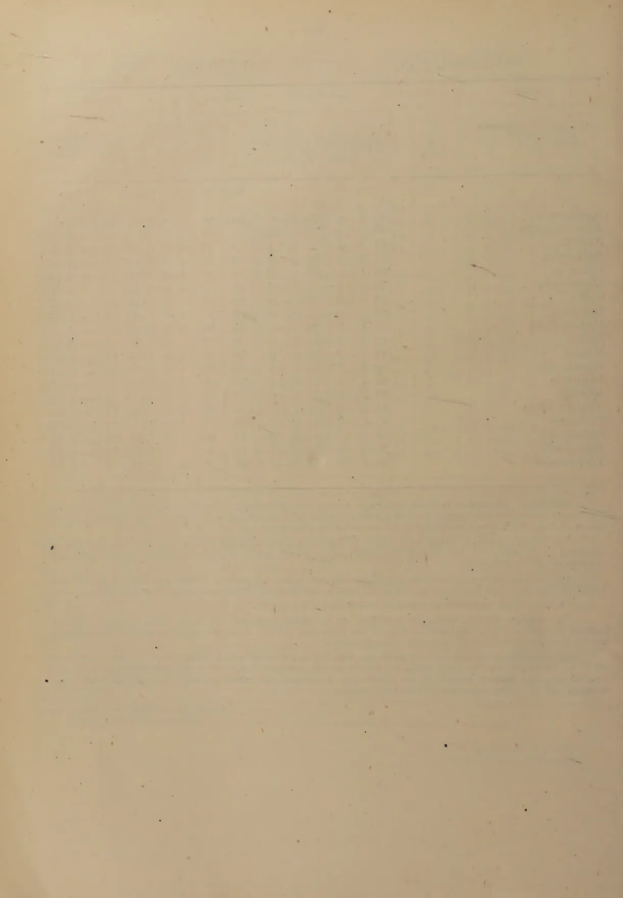

The  
**Tropical Agriculturist**

VOL. CI.

PERADENIYA, JULY-SEPTEMBER, 1945.

No. 3.

---

<table style="width: 100%;"><thead><tr><th></th><th style="text-align: right;">Page.</th></tr></thead><tbody><tr><td>Editorial .. .. .</td><td style="text-align: right;">119</td></tr></tbody></table>

---

**ORIGINAL ARTICLES**

<table style="width: 100%;"><tbody><tr><td>Balsa as a Commercial Crop by T. H. Parsons, O.B.E., F.L.S., F.R.H.S., Curator, Royal Botanic Gardens, Peradeniya .. .. .</td><td style="text-align: right;">120</td></tr><tr><td>On the Agronomy of Some Arable Crops by W. R. C. Paul, M.A., M.Sc., Ph.D., Agricultural Officer, South-Western Division .. .. .</td><td style="text-align: right;">127</td></tr><tr><td>Drug Plants (Indigenous and Exotic) That Can Be Grown in Ceylon—Part 1—by D. M. A. Jayaweera, B.Sc. (London), Assistant Curator, Royal Botanic Gardens, Peradeniya ..</td><td style="text-align: right;">130</td></tr><tr><td>The Natural Regeneration of Ceylon Forests (Continuation) by C. H. Holmes, B.Sc. (London), B.A. (Cantab.), B.Sc. (Sp. Hons. Lond.), Diplomas in Forestry (Cantab. and Oxon.), Divisional Forest Officer, Silviculture .. .. .</td><td style="text-align: right;">136</td></tr></tbody></table>

**DEPARTMENTAL AND OTHER NOTES**

<table style="width: 100%;"><tbody><tr><td>Notes on the Opening by Manual Labour of Land in the Dry Zone of Ceylon ..</td><td style="text-align: right;">148</td></tr><tr><td>Bee-Keeping .. .. .</td><td style="text-align: right;">153</td></tr><tr><td>Progress of Cultivation of Exotic Vegetables in Udukinda Division, Province of Uva ..</td><td style="text-align: right;">156</td></tr></tbody></table>

**SELECTED ARTICLES**

<table style="width: 100%;"><tbody><tr><td>Plant Viruses .. .. .</td><td style="text-align: right;">158</td></tr></tbody></table>

**MEETINGS, CONFERENCES, &c.**

<table style="width: 100%;"><tbody><tr><td>Proceedings of the 5th Meeting of the Central Board of Agriculture .. ..</td><td style="text-align: right;">163</td></tr><tr><td>Minutes of the 76th Meeting of the Rubber Research Board .. ..</td><td style="text-align: right;">181</td></tr><tr><td>Minutes of the 73rd Meeting of the Board of Management, Coconut Research Scheme ..</td><td style="text-align: right;">183</td></tr><tr><td>Draft Minutes of the 6th Meeting of the Paddy Advisory Board .. ..</td><td style="text-align: right;">185</td></tr><tr><td>Draft Minutes of the 7th Meeting of the Paddy Advisory Board .. ..</td><td style="text-align: right;">188</td></tr></tbody></table>

**RETURNS**

<table style="width: 100%;"><tbody><tr><td>Animal Disease Returns for the months July-September .. ..</td><td style="text-align: right;">196-198</td></tr><tr><td>Meteorological Reports for July-September .. ..</td><td style="text-align: right;">199-201</td></tr></tbody></table>

1—J. N. A 56745-1,005 (1/46)

1------------------------------------------------

<!-- stage4: FAINT old-images-only -->

[Faint page: no legible print of its own could be verified; text withheld (stage 4 review list)]

This image shows a blank, aged, cream-colored page. The paper has a slightly textured appearance with some minor blemishes and faint horizontal lines, possibly from the scanning process or the paper's grain. There is no text or other content on the page.

2------------------------------------------------

The  
Tropical Agriculturist  
JULY TO SEPTEMBER, 1945.

---

EDITORIAL

---

BALSA

---

“**B**ALSA”, in Spanish, means “raft” and recalls its original and almost exclusive use as a means of transporting indigenous products down the rivers of Ecuador. The need for a light but strong wood for bombers, combat boats and similar equipment put it, during the war, in the front rank of strategic war material. The supply was apparently quite insufficient to meet war time demands and frantic inquiries were made from all over the world for it. Ceylon too was ransacked for small quantities of the precious wood. The inquiries then set on foot and the good reports on the samples sent out have created in the Island a certain curiosity regarding its commercial possibilities. An article in this number gives an account of the information now available.

The article appears to be very cautious in its views regarding the peacetime demands for the material; it refers almost exclusively to its use in the aircraft industry. It is well known, however, that its other important qualities, besides its lightness, will extend its employment in several directions. Its insulating power will establish its use in refrigeration, air-conditioning &c.; its buoyancy, in floats and rafts and equipment for use on water; its comparative strength, as a packing material for fragile and delicate goods; its isolating power, for sound proofing.

The timber has hitherto been extracted from trees in natural growth. There does not appear to be any information on the systematic cultivation of Balsa. The particulars, given in the article of observations made on two trial plots will therefore prove to be of interest.

That there are areas in Ceylon where the soil and climatic conditions are well suited to the cultivation of Balsa may be regarded as established. It is important, however, to observe that the suitability of the wood for commercial purposes depends on certain special characteristics which are determined by environmental factors and the treatment it gets. Meticulous care is called for in selecting the lands in which it is to be grown. Our experience to date leads us to the belief that large areas suitable for growing Balsa are unlikely to be found in any one place in Ceylon. Narrow riparian strips appear to offer greatest promise.

3------------------------------------------------

120

## BALSA AS A COMMERCIAL CROP

T. H. PARSONS, O.B.E., F.L.S., F.R.H.S.,

Curator, Royal Botanic Gardens, Peradeniya

**H**ISTORY.—Since the Balsa tree (*Ochroma Lagopus*) has not been grown outside the Botanic Gardens in Ceylon, except for a tree or two here and there, there is little in the way of experimental experience to draw upon as to its future commercial value. It is an exotic tree, native of Tropical America and the West Indies and was introduced to the Royal Botanic Gardens, Peradeniya, first in 1884. The original tree died in 1925, at the age of 29 years and a seedling to replace it was planted out in 1926 which in its turn reached maturity and died in 1944, *i.e.*, at 18 years of age. The disparity in age of maturity is due to the fact that the original tree was planted near the central portion of Gardens where soil is heavy, loamy and cabooky and growth comparatively slow, whilst the 1925–26 seedling was planted in the river bank in a very light and sandy soil.

The extremely rapid growth of the 1925–26 tree which had by 1931 reached a height of between seventy and eighty feet and a girth approaching five feet at base called for remark as it was known to be a very useful wood if it could be grown to a specific gravity of roughly 0·15 or less, and this rapid growth would indicate such to be the case with our tree. In addition, it was learned that the rate of growth of the American trees which yield the commercial timber was not superior to our tree, age for age.

A stock of seedlings was raised, and the possibilities of this timber in Ceylon put before the general public in 1931 *via* the newspapers through Mr. A. T. Sydney Smith who had for his part been experimenting with the tree since 1920. Several dozen applications were received for seedlings and supplies made but nothing more was heard of balsa till 1941.

On the receipt of urgent requests from aircraft firms in Australia in 1941 the recipients of the 1931 seedlings were contacted but results were poor, many having not persevered, whilst others had grown the trees, then 10 years of age, under unsuitable conditions resulting in slow growth whereby timber became too heavy in weight for commercial purposes. Specimens of branch wood sent for investigation varied from 18 lb. to 28 lb. per cubic foot, whereas 14 to 15 lb. per cubic foot is the limit for commercial purposes.

A few trees in the Gardens however, grown in light sandy river bank soil, were of good size and structure varying from 6 ft. 6 in. to 9 ft. in girth at base. They were of course 10 years of age whereas trees grown for commercial produce reach the best felling stage at about 5 years of age—as did doubtless our own trees. Branch specimens of these 10-year old trees were however prepared and air-dried to a weight of 11½ lb. per cubic foot. The wood appeared to be of very fine structure and remarkably good colour,

4------------------------------------------------

121

superior in fact to a sample of the Ecuador wood sent by an Australian aircraft firm. Some hand specimens of our trees were therefore sent to Australia with explanation of age of tree to account for weight, and the scarcity of the product in Ceylon was mentioned.

The following is an extract from the report on the specimens :—

“ This is what we call medium Balsa and exceedingly good, one fault is in the cutting ; it was not cut along the grain as well as it might have been ; in a sample of course this was of no consequence at all. The weight of the sample is quite good and we are most anxious to get the rest of this tree to cut up and see how it goes with users here. The sample of the wood sent by you is a very good example of the type of log we want. If you are going to cut it in Ceylon the width and the thickness were just right, the length of course is immaterial within reasonable limits, say 22 feet or something like that.”

On these reports a garden tree was cut, the best parts selected and 48 cubic feet sent the aircraft company. Their report on this was as follows :—

“ The timber arrived alright. The wood looks very nice and indeed I had a bit cut to see what the grain was like so that I could tell you I think, it is excellent. The tree of course has been sent down to the big mill to be cut into the three inch-pieces and I have not seen this. I will tell you how it turns out later on ”. . . . . “ Just a line to let you know that the log has just been cut into flitches for final cutting. I have had a panel or two taken off so that I could have a look at it and let you know what we thought of it. This tree is really beautiful wood, pure white and although a little heavier than the usual run of South American Balsa is nevertheless excellent and very much nicer (in appearance) than the first tree you felled. The quality is also excellent of both lots ; there is little to choose between them on that point.”

“ In my letter of July 25, I mentioned that I had just seen a panel cut from the last log sent. I said that I thought it was a little heavier than the South American wood. I want to correct this statement. Our sawyer points out that he took the panels for me from the wood before it was properly dry. It had been lying in the rain after they cut it into flitches, now that it is dry it is a splendid weight and very much superior to what we have been getting from South America recently.”

This was followed by the despatch of a second tree, which was commented on as follows :—

“ Yesterday for the first time I saw the last shipment of wood. It had been cut into flitches and it really is beautiful ; it is the best wood we have seen for years. There may be a flitch or two a bit knotty, but nothing to speak of.”

A third and last tree the Gardens could spare was finally cut and forwarded, this being the largest tree of all which yielded 155 cubic feet and brought us in Rs. 407 nett. Their reaction to this third and final tree was as follows :—

“ We are just beginning to cut the last tree and my word it is beautiful wood, better even than the others.”

5------------------------------------------------

122

Meanwhile, in view of the possibilities of this product in Ceylon as a future enterprise, experiment plots of 100 seedlings in October 1941 and 30 in 1942 were made in the Gardens river bank and the Superintendent, Pallekelly Group, was asked to afford me facilities for measuring and recording growth &c., of a small plot of 26 trees among his plantings made in October 1941 also. Annexures A and B show the progress of these plots which to say the least give remarkable figures as to growth. A summary indicates that in the (a) poor river washed sand area at Peradeniya combined with close planting, 10 ft. by 10 ft. growth was good for the first and second years but tailed off in the third year but (b) with larger spacing of 12 ft. by 15 ft. and in spite of poor soil conditions the required growth of 1 foot in girth per annum is maintained. At Pallekelly with spacing of 20 feet apart and in a sandy soil of good humus content the required growth of 1 foot in girth per annum is exceeded. In June 1945, the largest tree at Pallekelly (3 years and 8 months of age) was in fact 4 ft. 8 in. in circumference at 3 feet from ground. At 5 feet circumference the trees are marketable.

To date therefore, in the quality of the wood that Ceylon can produce the Balsa tree so far put to the test (and over aged trees at that) has attained commercial requirements and the rate of growth as shown by the young plants in the new experiment areas shows this to have attained requirements of a commercial product also. What remains now is for the young trees now coming along to be put to commercial test for quality and texture and to ascertain the future consumption possibility of this wood.

There seems every reason to believe that any tree attaining the average of 1 foot in girth for each year of age will in 5 years (girth 5 feet) produce wood of the required specific gravity of  $7\frac{1}{2}$  to  $8\frac{1}{2}$  lb. per cubic foot, which is first grade in lightness. Incidentally the Imperial Institute authorities consider lightness of wood ( $7\frac{1}{2}$  lb.) the principal requirement whereas the aeroplane manufacturers whilst appreciating light wood give a preference to texture and working qualities of the wood and will use a heavier wood possessing such characteristics. As soon therefore as a few of the 1941 trees attain a five-feet girth, samples will be sent the Imperial Institute, to the aircraft manufacturers in Australia, and to the Timber Adviser to the R. A. F. and Government of India for report. I have a firm conviction that wood of this size and age grown in Ceylon will reach a quality equal if not superior to the product now exported as first grade wood from South America, but the opinion is entirely my own of course, supported however by periodical testing of trees cut, for thinning out purposes, of the 1941 trees planted 10 ft. by 10 ft. which, as it now appears was much too close in plant spacing.

What mostly concerns the potential grower is undoubtedly the consumption possibilities. This is hard to estimate as the various Government statisticians report that Balsa is not kept separate from other timber imports. As far as can be ascertained the demand for the wood in Australia was small before the war but was stimulated to great heights from 1941 onward. Whether this small consumption was due to a meagre demand or to paucity of supply is difficult to ascertain. It seems a general complaint of all workers on Balsa that it has always been most difficult to obtain quality material and the best has to be made of inferior wood of small diameter and short

6------------------------------------------------

123

ends. It was the ample size and good quality of the Ceylon wood, despite its weight from old tree material which can be remedied, that has given the Ceylon wood a very good start.

The general opinion among those who are conversant with Balsa and its uses, taking pre-war figures as a guide and ignoring the phenomenal war increases, is that—

- (a) The nature of the work for which Balsa is used is not conducive to consumption of the wood in great bulk. It is split into such thin flitches, often  $1/16$ th inch thickness, for fairing and lining that, compared with other timber and its uses, a given quantity goes much farther, but quite large quantities are used for model aeroplane making and it seems evident that new uses are being found for the wood and more so as the civil aircraft industry grows after the war.
- (b) That supplies have always been low, difficult to obtain and, when secured, generally of poor quality.
- (c) That if the quality and size of wood seen in Ceylon can be put on the market it would not only open up new uses but oust the Ecuador and Mexican product from the eastern market and even from the European market.
- (d) That wood should be procurable in Ceylon by the buyers at a rate of between 2*d.* to 3*d.* per sq. ft. (2 to 3*sh.* per cu. ft.) which was the pre-war rate of this wood for many years. It is the good quality of the Ceylon wood against the inferior consignments of American wood that would, if price is approximately equal, gain its place in all markets as there is much waste with inferior material.

It would seem therefore that there is already a market that might be acquired by reason of the good quality wood that we can produce and that with the increase after the war of commercial planes we may considerably extend that market.

It is however wise in introducing a new subject such as this not to overproduce in the early stages but to see how things progress when good wood from Ceylon becomes available for test and use, for up to now supplies from Ceylon have been non-existent and only small supplies from the Netherlands East Indies have been available to the market.

It is also well to realize that balsa could never become a commercial proposition such as rubber, tea or coconuts. Its soil requirements (of a light sandy river bank nature) restricts growth of first class wood to definite small areas. The strips of river and stream banks seem to be best, and if plantations are carried inland a heavier soil is met with, growth is slower and the wood, because of this slower growth, is harder and heavier.

The Gampola, Peradeniya, Kondesale, Pallekelly and Rajawella river strips by the Mahaweli-ganga are indicative of the type of soil and conditions required. Beyond a few acres at a stretch it is doubtful if suitable conditions are available. Suitable areas have to be looked for and are often scattered.

7------------------------------------------------

124

This in itself limits cultivation obviously and it is as well, for it will otherwise mean that every bit of spare or waste land would be planted up and high returns expected from it with disappointing results. This has in fact already occurred I am certain as one instance is known to me of 800 plants put in among Tea with very small planting holes and in quite a heavy soil. A timber tree will be produced doubtless, but not the light wood required.

So far about 20,000 plants have been distributed for planting together with a fair amount of seed, and to a wide range of applicants. Many of them have gone to areas considered by me as not suitable and it is I think probable that not more than 20 per cent. of the total plantings to date will be grown in the conditions to produce aeroplane wood.

Planting distances have varied from 10 ft. by 10 ft. to 20 ft. by 20 ft., *i.e.*, 435 to 108 to the acre but a good average might be put at about 220 to the acre, so that if 5,000 of the seedlings put out produce good wood there should be about 23 acres planted so far, spread over 3 years plantings.

Very well grown trees should produce 25 cubic feet of timber in 4 to 5 years, whilst moderately well grown trees should produce the same in 5 to 6 years. This indicates that 23 acres or 5,000 trees should provide approximately 125,000 cubic feet or about 40,000 cubic feet per year over 3 years.

Until some definite figures are available as to probable future consumption no accurate suggestion can be made as to what extent this wood should be planted. All Naval and Air personnel who have been consulted and those having some knowledge of the trade requirements or of the probable future uses of balsa are of opinion that the use of balsa after the war, as compared with pre-war consumption, will be very considerably increased but not to the excessive amounts of the present war years.

The pre-war annual consumption figures for some of the few Australian firms employed on the work in pre-war days is estimated by one to have been 50,000 to 80,000 super feet (4,120 to 6,600 cubic feet) and another of 60,000 super feet (5,000 cubic feet) whilst war consumption rates had reached 100,000 super feet (8,300 cubic feet) *per month*. These are Melbourne firms only.

The anticipated uses of balsa after the war, together with easier facilities for obtaining the wood is expected to increase the pre-war consumption many times in Australia alone. Air and Naval personnel engaged in this type of work are also of opinion that Great Britain would be the main market for our wood. India also has demands, the Director of Timber Supplies to the R.A.F. and the Government of India having already made personal enquiries into the Ceylon balsa supplies and appointed a local firm as agent for obtaining all balsa now being grown, on its reaching maturity.

To summarize therefore it has now been ascertained that Ceylon, if proper soil areas and climatic conditions are selected, can grow balsa quite easily, quickly, and of good quality at a very economic cost. The deciding factor as to how far plantings should go is that of consumption and till more definite information is acquired this item must be speculative. Personally I think Ceylon should plant and grow on at least 100 acres each year, planting 15 feet by 15 ft., as such spacing has proved to be the best. This spacing allows 193 trees to the acre of which 60 per cent. should

8------------------------------------------------

125

reach the high quality for aeroplane work at 5 years of age and the balance at 6 years of age. With 25 cubic feet per tree, this should produce roughly a quarter of a million cubic feet spread over 2 years, to be disposed of.

The following are the log book records of the balsa experiments conducted at Peradeniya on plantings made on October 6, 1941 and on October 6, 1942.

On October 6, 1941, a batch of 100 4-month-old seedlings was planted for trial purposes in the river bank of the Royal Botanic Gardens. The site is 20 feet above normal river level and consists of washed sand thrown up by the river at times of flood with a very small percentage of humus, since accumulated.

Holes 3 ft. by 3 ft. were excavated and in refilling three baskets of rotted cattle manure and two of normal garden soil were added. Growth was free and rapid from the start but caterpillar attacks being observed soon after planting out, weekly sprayings of Arsenate of Lead (one ounce in one gallon of water) were given each week for 4 weeks, after which the older and rougher leaves themselves resisted attack. The planting distance of this batch was 10 ft. by 10 ft.

On October 6, 1942, a second batch of 4-month-old seedlings, this time of 30 plants, was put out in an adjoining area of the same soil conditions and given the same preparations and other treatment as for the 1941 plantation. The planting distance of this second batch was however 12 ft. by 15 ft. as the purpose of this planting was particularly to compare advantage in height and girth, if any, due to the wider spacing. Atmospheric conditions during the first year's growth of each batch was remarkably alike, that of October 1941, to September 1942, recording 100.22 inches of rain on 204 days and from October 1942 to September 1943 recording 103.15 inches of rain on 205 days.

*Plot I.*—Planted on October 6, 1941—100 plants 10 ft. by 10 ft. seedlings 4 months old and 6 inches in height.

<table border="1">
<thead>
<tr>
<th rowspan="2"></th>
<th rowspan="2"></th>
<th rowspan="2"></th>
<th rowspan="2"></th>
<th colspan="2">Height</th>
<th colspan="2">Girth at Base</th>
<th colspan="2">Girth at 3 Feet</th>
</tr>
<tr>
<th>Ft.</th>
<th>In.</th>
<th>Ft.</th>
<th>In.</th>
<th>Ft.</th>
<th>In.</th>
</tr>
</thead>
<tbody>
<tr>
<td>Average on Oct.</td>
<td>6, 1942</td>
<td>(12 months)</td>
<td>..</td>
<td>20</td>
<td>4</td>
<td>..</td>
<td>1 3<math>\frac{1}{3}</math></td>
<td>..</td>
<td>0 11<math>\frac{1}{3}</math></td>
</tr>
<tr>
<td>"</td>
<td>"</td>
<td>Jan. 6, 1943</td>
<td>(15 " )</td>
<td>23</td>
<td>0</td>
<td>..</td>
<td>1 5<math>\frac{1}{2}</math></td>
<td>..</td>
<td>1 1<math>\frac{3}{4}</math></td>
</tr>
<tr>
<td>"</td>
<td>"</td>
<td>April 6, 1943</td>
<td>(18 " )</td>
<td>27</td>
<td>9</td>
<td>..</td>
<td>1 6<math>\frac{1}{2}</math></td>
<td>..</td>
<td>1 3</td>
</tr>
<tr>
<td>"</td>
<td>"</td>
<td>July 6, 1943</td>
<td>(21 " )</td>
<td>28</td>
<td>10</td>
<td>..</td>
<td>1 8<math>\frac{3}{4}</math></td>
<td>..</td>
<td>1 4<math>\frac{1}{2}</math></td>
</tr>
<tr>
<td>"</td>
<td>"</td>
<td>Oct. 6, 1943</td>
<td>(24 " )</td>
<td>34</td>
<td>4</td>
<td>..</td>
<td>1 9<math>\frac{3}{4}</math></td>
<td>..</td>
<td>1 5</td>
</tr>
</tbody>
</table>

The tallest individual trees in this plantation on October 6, 1942, *i.e.*, at one year of age, were Nos. 51 and 52 with a height of 25 feet and that of the largest girth being tree No. 45 with a circumference of 1 ft. 1 $\frac{1}{2}$  in. at 3 feet from ground.

On October 6, 1943, *i.e.*, at 2 years of age the tallest specimens in the plantation were Nos. 34 and 36 with a height of 41 feet and the tree of largest girth was No. 1 with a circumference of 2 ft. 1 $\frac{1}{2}$  in. at 3 feet from ground.

9------------------------------------------------

126

*Plot II.*—Planted on *October 6, 1942*—30 plants, 12 ft. by 15 ft., seedlings 4 months old and 6 inches in height.

<table border="1">
<thead>
<tr>
<th rowspan="2"></th>
<th rowspan="2"></th>
<th rowspan="2"></th>
<th colspan="2">Height.</th>
<th colspan="2">Girth at Base.</th>
<th colspan="2">Girth at 3 feet.</th>
</tr>
<tr>
<th>Ft.</th>
<th>In.</th>
<th>Ft.</th>
<th>In.</th>
<th>Ft.</th>
<th>In.</th>
</tr>
</thead>
<tbody>
<tr>
<td>Average on April</td>
<td>6, 1943 ( 6 months )</td>
<td>..</td>
<td>8</td>
<td>7½</td>
<td>..</td>
<td>0</td>
<td>8¾</td>
<td>.. 0 6</td>
</tr>
<tr>
<td>" "</td>
<td>July 6, 1943 ( 9 " )</td>
<td>..</td>
<td>14</td>
<td>10</td>
<td>..</td>
<td>1</td>
<td>1½</td>
<td>.. 0 10¼</td>
</tr>
<tr>
<td>" "</td>
<td>Oct. 6, 1943 ( 12 " )</td>
<td>..</td>
<td>20</td>
<td>10</td>
<td>..</td>
<td>1</td>
<td>5½</td>
<td>.. 1 2</td>
</tr>
</tbody>
</table>

The tallest individual tree in this plantation on October 6, 1943, *i.e.*, at 1 year of age was No. 18 with a height of 26 feet and the largest in girth was No. 25 with a circumference of 1 ft. 6 in. at 3 feet from ground.

As soil and climatic conditions are so similar for the two plots the advantage of wider spacing in plot II (12 ft. by 15 ft.) over plot I. (10 ft. by 10 ft.) at one year of age is plainly indicated. This advantage to the plot No. II will in all probability be enhanced in its second and subsequent years of growth.

Records taken on October 6, 1944, of plots I. and II. are now set out.

*Plot I.*—Planted on *October 6, 1941*—100 plants, 10 ft. by 10 ft., seedlings 4 months old and 6 inches in height :—

<table border="1">
<thead>
<tr>
<th rowspan="2"></th>
<th rowspan="2"></th>
<th rowspan="2"></th>
<th colspan="2">Height.</th>
<th colspan="2">Girth at 3 ft. from Ground.</th>
</tr>
<tr>
<th>Ft.</th>
<th>In.</th>
<th>Ft.</th>
<th>In.</th>
</tr>
</thead>
<tbody>
<tr>
<td>Average on Oct.</td>
<td>6, 1942—one year of age</td>
<td>..</td>
<td>20</td>
<td>4</td>
<td>..</td>
<td>0 11½</td>
</tr>
<tr>
<td>" "</td>
<td>Oct. 6, 1943—two years of age</td>
<td>..</td>
<td>34</td>
<td>4</td>
<td>..</td>
<td>1 5</td>
</tr>
<tr>
<td>" "</td>
<td>Oct. 6, 1944—three years of age</td>
<td>..</td>
<td>47</td>
<td>6</td>
<td>..</td>
<td>2 0</td>
</tr>
</tbody>
</table>

The tallest individual tree in this plantation attained a height of 25 ft. in the first year, 41 ft. in the second year, and 57 ft. at third year of age.

The largest in girth in this plantation was 1 ft. 1½ in. in the first year, 2 ft. 1½ in. in the second, and 3 ft. ½ in. in the third year at 3 feet from the ground.

*Plot II.*—Planted on *October 6, 1942*—30 plants, 12 ft. by 15 ft., seedlings 4 months old and 6 inches in height :—

<table border="1">
<thead>
<tr>
<th rowspan="2"></th>
<th rowspan="2"></th>
<th rowspan="2"></th>
<th colspan="2">Height.</th>
<th colspan="2">Girth at 3 ft. from Ground.</th>
</tr>
<tr>
<th>Ft.</th>
<th>In.</th>
<th>Ft.</th>
<th>In.</th>
</tr>
</thead>
<tbody>
<tr>
<td>Average on Oct.</td>
<td>6, 1943—one year of age</td>
<td>..</td>
<td>20</td>
<td>10</td>
<td>..</td>
<td>1 2</td>
</tr>
<tr>
<td>" "</td>
<td>Oct. 6, 1944—two years of age</td>
<td>..</td>
<td>37</td>
<td>0</td>
<td>..</td>
<td>2 0</td>
</tr>
</tbody>
</table>

The tallest individual tree in this plantation attained a height of 26 ft. in the first year and 42 ft. at 2 years of age.

The largest in girth in this plantation was 1 ft. 6 in. in the first year and 2 ft. 5 in. at 2 years of age at 3 feet from ground.

An analysis of these records of growth is enlightening. Since soil and climatic conditions are the same for both plots and neither have been manured or otherwise benefited one against the other, the advantages of the wider spacing seems very marked. The wider spacing has also led to better uniformity of growth with a correspondingly better average.

The failure of the S.W. Monsoon has doubtless affected both plots adversely. A rainfall of 100.22 inches was recorded in the 1941-42 year, a fall of 103.15 inches in the 1942-43 year, but only 86.2 inches in the 1943-44 year. The log book records of the last S.W. period show a very perceptible decrease in average girth against the previous S.W. periods. Rainfall therefore is a very essential factor in growth.

10------------------------------------------------

127ON THE AGRONOMY OF SOME ARABLE CROPS

BY

W. R. C. PAUL, M.A., M.Sc., Ph.D.

**T**HE cultivable cereal crops which occupy a definite place in the different systems of subsistence agriculture in Ceylon are paddy, maize, sorghum and the millets—*kambu* (*Pennisetum typhoideum*), *kurakkan* (*Eleusine coracana*), *meneri* (S) or *pani samai* (T) (*Panicum miliaceum*) and *P. miliare*), *thana* (S) or *tenai samai* (T) (*Setaria italica*) and *amu* (S) or *varagu* (T) (*Paspalum scorbiculatum*). As the required soil-climate factor does not obtain, wheat, barley, rye and oats stand little chance of succeeding. Adlay which was introduced some years ago grew well in the wet zone but its cultivation declined because of a major defect in the grain/husk ratio which is extremely low. It is also highly susceptible to bird attack and the loss of seed is heavier when the crop is grown on the small extents of the available land in the wet zone. The barnyard millets or *maruk* (S) (*Echinochloa frumentacea* and *E. crusgalli*) are escapes in paddy fields where they have become pernicious weeds. The cultivation of these inferior millets is not recommended.

Apart from paddy, the cultivable cereals are essentially dry zone crops because economic returns are only possible when they are grown on large extents in a scheme of mixed rotational cropping, and suitable land for this purpose is only available in the dry zone. Moreover, during maturation, dry weather is essential. Maize and *kurakkan* are the main *chena* crops though the former is seldom grown in pure stand in *chenas*. Sorghum and *kambu* are recent introductions which still largely remain rotation crops in experimental and state farms. *Meneri*, *thana* and *amu* are minor *chena* crops; but in the Jaffna peninsula with the exception of *kambu*, the millets are grown in rotational schemes.

The most serious problem with maize and sorghum is storage as they are highly susceptible to grain pests. *Meneri* and *amu* on the other hand are immune, probably due to their hard pericarps and the small size of the grain, while *kambu*, *kurakkan* and *thana* are attacked to some extent, the limiting factor probably being size of the grain.

From the point of view of drought resistance, *meneri*, *thana* and *amu* stand foremost. They are narrow leaved and though shallow rooted develop a profuse root system. The *kansa* (S) variety of *meneri* (*P. miliaceum*) which matures in 2 months gave a yield of 20 bushels per acre when grown in the *yala* season in the dry zone with a total rainfall of 6.97 in. of which 4.9 in. was received between sowing and flowering. It is therefore most suited to the *yala* season in the dry zone. *Kambu* is more drought resistant than *kurakkan*, sorghum and maize; if, however, unseasonal rains prevail during anthesis the percentage set of grain is poor.

11------------------------------------------------

128

*Kurakkan*, *thana* and *meneri*, respond to irrigation and in Jaffna peninsula under a well system of irrigation on lands which are rotationally cropped, these millets give good yields. *Kurakkan* is the only cereal besides paddy which can be economically transplanted, even though it has a maturation period of  $3\frac{1}{2}$  to 4 months. As a transplanted and irrigated crop, yields of about 40 bushels per acre are obtained as against 12 bushels under *chena* conditions.

As regards fertility requirements, maize, sorghum and *kurakkan* demand high nitrogen while the other cereals are capable of utilising soil nitrogen more efficiently. *Amu* has a wide C/N ratio and is, therefore, a useful pioneer crop in soils of poor fertility but unfortunately the viability of the seed is rapidly lost.

While all cereals are known to produce tillers or stools, the rate of tillering which depends on the number and also the rate of growth of the tillers is reflected in the number of harvests that are economically possible. In the case of maize, tiller formation is poor with the result that the cobs from the main stem are only picked. With sorghum, *kurakkan* and *kambu* the number of tillers are high but the rate of growth is slow necessitating 2 or 3 harvests. With the other millets, tiller formation is good and only one harvest is taken.

Maize and sorghum being comparatively large grained can be dibbled in rows 3 ft. by 2 ft. apart, respectively, and 1 to  $1\frac{1}{2}$  ft. apart within the row, whilst the millets being small grained are drilled in rows 1 to  $1\frac{1}{2}$  ft. apart and the seedlings are thinned out to about 6 in. apart within the row. Maize and sorghum seeds after sowing are liable to be attacked by rodents whilst the seeds of the millets, especially *kurakkan*, need to be protected against loss from ants in dry weather and erosion in wet weather. For these reasons, it is advisable to practise deeper sowing of the millets—about  $\frac{1}{2}$  in.—than is usual. Earthing up is an essential operation for the tall crops—maize, sorghum and *kambu* in order to provide better anchorage for their root systems against lodging.

The only indigenous pulses are green gram, black gram and horse gram, while *thoor* dhal (*Cajanus cajan*), the bush cowpea (*Vigna unguiculata*), black gram and the soya bean are introduced crops. The most popular pulses consumed in Ceylon are *thoor* dhal, lentils or *masur* dhal (*Lens esculenta*) and the Bengal gram (*Cicer arietinum*) but these are imported from India. With the exception of *thoor* dhal, there is little possibility of being able to establish these pulses owing to the soil climate factor. *Thoor* dhal has not given sufficiently good yields to be regarded as a successful introduction as a result possibly of a too heavy rainfall during the growing period in the *maha* season in the dry zone. Vegetative growth is excessive and flowering and seed formation restricted. It is possible that if the crop is sown for the *yala* season instead—early in April—better results may be obtained with two harvests during the dry periods of August–September and January–February. The relatively light *yala* rains may restrict vegetative growth. *Thoor* dhal is a very valuable crop in a rotation. It has a deep and penetrating root system and therefore subsoils the land well. It keeps down weed growth by its dense cover and leaf fall.

The pulses like the cultivable cereals are essentially dry zone crops. Green gram is the main *chena* pulse but it is also grown as a rotation crop

12------------------------------------------------

129

in the Jaffna peninsula. It has a narrow C/N ratio and its yields are about 6-8 bushels per acre. The bush cowpea on the other hand gives much higher yields (10-15 bushels per acre) but it matures in 3 months as compared with green gram varieties which take 2-2½ months. It is, however, not as palatable and should preferably be split into a dhal before being consumed. Black gram does not grow well except on heavy soils. Horse gram is similar to *amu* in its efficiency in utilising soil nitrogen and is, therefore, useful on soils of low fertility. It develops the twining habit when grown during seasons when the soil moisture is too high. Soybeans are now found to require no inoculation of the seed prior to sowing provided there is a sufficient supply of soil nitrogen. Large seed varieties such as 34S51 from South Africa have given good yields. This crop, however, suffers from the following defects:—(1) Viability of the seed is rapidly lost in storage (2) hares which attack the tender leaves are a major pest (3) the seed rate is high, viz., 80 lb. per acre as compared with other pulses (10 lb. per acre). The bush cowpea and soya-beans are susceptible to attacks by *agromyza* fly and for this reason earthing up is an essential operation.

Cereals and pulses under certain conditions are more advantageously grown in mixtures than in mono culture succession, on the principle of associated growth whereby the cereal benefits by the added nitrogen to the soil either excreted or released with the break down of the nodules of the legume. Experiments have shown that the total yield of grain from the mixtures of kurakkan and green gram have been greater than the sum of the individual yields from the two crops grown separately but on the same total unit of land. The problem here is to determine the correct spacings between the crops in each mixture so as to avoid the ill-effects of shading. Suitable combinations of different cereals and pulses taking into consideration the maturation periods of each have to be determined.

The main problem in the cultivation of arable crops is the maintenance of an optimal state of fertility in the soil and the role of grass in rotation with cereal-pulse mixtures and other arable crops in a scheme of alternate husbandry is of great importance in restoring fertility. Pastures in the dry zone are not easily established and fodder grasses with their tangled mat of roots present difficulties in their removal prior to cultivation for the subsequent crop. Nevertheless, the value of a temporary grass ley on soil structure and fertility is so great that work in this direction should be actively pursued. In Northern Nigeria, a local annual grass—*Pennisetum pedicellatum*—was discovered as a possible temporary grass ley which could be introduced in a system of alternate husbandry. This and other grasses should be tested. There is the likelihood that the Mysore variety of Napier grass introduced from India some years ago and which seeds freely may be suitable. Until such time that suitable temporary pastures which can be easily established from seed are found, the ordinary variety of Napier grass can be used in a 3-year grass ley and tractor machinery employed for its removal.

13------------------------------------------------

130

## DRUG PLANTS (INDIGENOUS AND EXOTIC) THAT CAN BE GROWN IN CEYLON—PART I

D. M. A. JAYAWEERA, B. Sc. (Lond.),  
ASSISTANT CURATOR, ROYAL BOTANIC GARDENS, PERADENIYA.

**D**URING the war, the supply of drugs from abroad has been restricted. It is therefore desirable to make use of such drug plants as there are in Ceylon for the manufacture of drugs which are otherwise in short supply. It is proposed in these notes to give brief descriptions of plants growing in Ceylon from which useful drugs can be obtained.

### ABSINTHIUM—Wormwood

This consists of dried leaves and flowering tops of *Artemisia Absinthium* Linn. (Fam. Compositeae), a perennial native of Northern Asia and Europe. A suitable substitute for this is found in *Artemisia vulgaris* Linn. (S. *Wakolondu*, T. *Machipattiri*, Skt. *Granthi-parni*) a perennial semi-shrubby plant with an erect stem and numerous, alteranate pinnatisect, sweetly aromatic leaves, glabrous above and white pubescent beneath. Flower heads are very small, arising in the axils of leaves forming a sort of a leafy inflorescence. The individual flowers are brownish yellow in colour. The plant occurs as a weed on the road-sides in Ceylon. It is also found in the Temperate regions of Asia and Europe and in Siam and Java.

*Composition.*—The oil from the herb *A. vulgaris* has a characteristic odour. According to certain observers it contains cineol.

*Uses.*—Absinthium is used for stimulation of cerebral hemispheres and is usually administered in the form of a tincture. Its use in wines is prohibited in most countries.

### ACACIA—SUBST. GUMMI INDICUM

This consists of the exudation from the stems of *Anogeissus latifolia* Wall. (S. *Dawa*, T. *Vakkali*, Skt. *Dhara*), a moderate sized tree with an erect stem and smooth whitish grey bark belonging to the family *Combretaceae*. Its leaves are pale green, oblong-oval, rounded at the base with a pink midrib prominent on the lower surface and short petioles. It bears pale greenish yellow flowers on small dense heads. It is indigenous to India and Ceylon. In Ceylon it occurs in Talawa lands in lower Uva confined to gravelly soils.

The gum occurs in rounded masses or in long pieces brownish in colour, brittle when dry and malleable when moist and resembles the gum of Acacia.

*Uses.*—This gum is used as an emulsifying agent and forms practically a colourless mucilage with water.

### ACALYPHA

This consists of the fresh or dried plant of *Acalypha indica* Linn. (S *Kuppameniya*, T. *Kuppameni*, *Punairananki*, Skt. *Arittamunjayrie*) an annual herb one to two feet in height belonging to the family *Euphorbiaceae*.

14------------------------------------------------

131

Its leaves are rhomboid-ovate, three-veined, ashy green in colour with a serrate margin. It bears green sessile flowers in numeous erect spikes, male flowers clustered at the apex and female flowers at the base, each with a large funnel shaped leafy bract. It is indigenous to India and Ceylon where it may be found growing as a weed. It is also found in Asia and Africa.

*History.*—Ainslie described the root and leaves having been in use by the Hindus for a long time and given to children in worm cases. Dr. Bidie of Madras recommended it as a popular emetic for children. Dr. A. E. Ross spoke of it highly as an expectorant and especially handy in cases of Bronchitis in children.

*Composition.*—Acalypha contains an alkaloid acalyphane, a resin, tannin and a volatile oil.

*Uses.*—Acalypha is used as a substitute for ipecacuanha as a Gastro intestinal irritant, expectorant and an emetic.

#### ADHATODA

This consists of the leaves of *Adhatoda vasica*, Nees. (S. *Agaladara*, *Wanapala*, T. *Adatodai*, *Pavetta*, Skt. *Vasaka*, *Atarusha*), a shrub 3 to 6 feet. in height with many ascending branches placed opposite to each other belonging to the family *Acanthaceae*. Its leaves are large, lanceolate, tapering towards the base, dark green and pale beneath. It possesses large white flowers in short dense axillary spikes. It is indigenous to Ceylon and India but also found in Malaya, wild or cultivated.

*Composition.*—The leaves contain vasicine (alkaloid), a volatile oil and probably a second alkaloid.

*Uses.*—It acts as an irritant to the alimentary canal and used as an expectorant. The leaves are dried and smoked for cases of asthma. Drs. Jackson and Dutt, the authors of the Pharmacopoeia of India employed it with considerable success in chronic bronchitis, asthma and other pulmonary and catarrhal afflictions.

#### AGAR

This is the solid residue obtained by concentrating a decoction prepared from *Gelidium corneum* (Huds) Lamouroux, *G. cartilagineum* Gaill (Fam. *Gelidiaceae*) and other algae belonging to the *Rhodophyceae*. These are collected off the coasts of Japan, bleached in the sun and boiled in acidulated water. This decoction is strained, subjected to a low temperature, so as to freeze off the water and the gelatinous layer thus produced is cut into thin strips and dried. Japan holds the monopoly for supplying the Empire with agar but it is possible to collect these weeds off the coasts of Ceylon and Malaya and supply the Empire's needs. In this country it needs a refrigerating plant as the material is purified by freezing. *Gracilaria lichenoides* Grev. popularly known as the 'Ceylon Moss' may be a suitable substitute.

*Composition.*—Agar contains an ethereal sulphate formed by the combination of the carbohydrate, gelose with calcium and sulphuric acid. It also contains traces of boron and arsenic.

*Uses.*—Owing to the fact that agar absorbs and retains moisture as the same time increasing in bulk, it is used in chronic constipation. It promotet

15------------------------------------------------

132

peristalsis in the intestines. Biscuits made from a mixture of agar and bran are given to diabetic patients. It is also employed widely for preparing culture media for use in bacteriology.

#### ALLIUM (GARLIC)

*Allium* is the fresh bulb of *Allium sativum* Linn. (S. *Sudu-lunu*, T. *Vellavengayam*, Skt. *Lasuna*), a herbaceous bulbous plant belonging to the lily family (*Liliaceae*). Its leaves are flat and slender, sheathing from the stem. Flowers occur in an umbel inflorescence surrounded by 1-3 membranous spathes. The plant is a native of Southern Europe but widely cultivated. Each bulb is made of eight to twenty smaller bulbs referred to as 'cloves' which are together enveloped in three to five in embranous scales. The 'cloves' are attached to a circular flattened disc which bears numerous thin roots on the under-side. Each clove is more or less three-sided and enveloped in two-papery scale leaves which in turn enclose two fleshy ones inside. In the centre of these fleshy scale leaves one or two yellowish green foliage leaves may be found.

*History*.—Garlic was known to the ancients. It has been found wild in Siberia. Herodotus spoke of Garlic being used in the diet of the ancient Egyptians. It was known in ancient Greece and Rome and was spoken of by Hippocrates and Dioscorides. In the Middle ages it was regarded as a cure for leprosy and an antidote against all poisons. Probably the Romans introduced it to Britain.

*Composition*.—The main constituent in garlic is the volatile oil which gives it the characteristic odour. In addition it contains inulin and starch. According to Semmler, the volatile oil contains diallyl disulphide, allyl prophylyl disulphide, diallyl trisulphide and another higher sulphide.

*Uses*.—Garlic is used extensively throughout Europe and India for flavouring dishes. It is known to contain vitamins B, C and D.

Medicinally it is employed as an antiseptic, diaphoretic, diuretic and an expectorant. Its juice is used in laryngeal tuberculosis and tuberculous lesions.

#### ALOE

This consists of the solid residue obtained by the rapid evaporation of the mucous fluid which drains out from the cut leaves of the various species of Aloe. (Fam. *Liliaceae*). The aloe plants are native to Eastern and Southern Africa, but they have been introduced into other tropical countries where they seem to flourish. They possess large fleshy leaves producing spikes of yellow or red flowers. In Ceylon *Aloe vera* var. *littoralis* (S. *Komarika*, T. *Kumari*, *Kattalai*, Skt. *Griha-kanya*) is found in abundance along the coast or in arid regions. It is about two to three feet in height and its leaves, each about twenty inches in length, tapering towards their apices are crowded together so as to form a sort of a crown. Flowers occur in dense racemes.

*History*.—Aloe was known to the Greeks as early as the fourth century B.C. as a produce from the island of Socotra according to the Arabian geographer Edrisi. Alexander the Great on the advice of Aristotle sought this island and conquered it. He removed the population of this island and substituted it with Ionians with strict instructions to preserve the plants which produced aloe, for without it certain sovereign remedies could not have

16------------------------------------------------

133

been prepared. Its use was known in Britain about the tenth century for it constituted one of the drugs recommended to Alfred the Great by the Patriarch of Jerusalem. A Boer named Peter de Wett was the first to prepare the drug in the Cape Colony of South Africa.

*Composition.*—The principal constituent of all varieties of aloe (excepting the Natal aloes) is the pale yellow crystalline glucoside barbaloin. Other constituents are resin and aloe-emodin in addition to water soluble substances of which nothing definite is known.

*Uses.*—Aloe is employed as a cathartic and is one of the most valuable purgatives for certain types of constipation.

#### ALSTONIA

This consists of the bark of *Alstonia scholaris* R. Br. (S. *Rukattana*, T. *Elilaippalai*, Skt. *Saptaparna*) a tall tree belonging to the family *Apocynaceae*. This tree bears a grey erect trunk with leaves in whorls of seven. Leaves are obovate-lanceolate tapering at the base. Flowers are small greenish white and occur in paniculate cymes. The tree is common in the wet low country up to an elevation of about 3,000 feet. It is indigenous to India and the Philippine Islands.

*History.*—Rheede (1678) and Rumphius (1741) mentioned that the bark of this tree was made use of by the native medical practitioners.

*Composition.*—The chief constituents are the alkaloids ditamine, echitamine and echitenine besides several others which may not be of therapeutic value.

*Uses.*—*Alstonia* is used in India for Malaria and as a remedy for chronic diarrhoea. It is inferior in value to cinchona bark but it may be a suitable substitute for it leaves no after-effects such as cinchonism.

#### AMYLUM—STARCH

This is obtained from the grains of *Zea mays* Linn. (S. *Iringu*, T. *Solon*,) a tall annual grass with broad flat leaves belonging to the family *Gramineae*. The male flowers occur in terminal racemed spikes, while the female ones are lower down in ensheathed, solitary, stout spikes. This is grown widely all over the world (and in the tropics) as a source of food.

Other sources of starch are grains of paddy, *Oryza sativa* Linn. tubers of potato, *Solanum tuberosum* Linn. and rhizomes of the arrowroot, *maranta arundinacea* Linn.

*History.*—Hughes in 1750 writing of Barbados described arrowroot as a very useful plant. The juice mixed with water and drunk, acted as a preservative against poison. Lunan in 1814 was very confident of the counter poison properties of the arrowroot.

*Composition.*—The constituents of starch are the polysaccharide amylose, amylo-pectin and amylo-hemicellulose.

*Uses.*—Starch is used either alone or mixed with zinc oxide, boric acid or other substances as a dusting powder. Boiled with sufficient water to form a stiff paste, it serves as an excellent poultice. Mucilage of starch is an antidote for poisoning by iodine.

17------------------------------------------------

134

### ANCHUSA—ALKANA

This consists of the dried roots of *Alkanna tinctoria* Tansch (Fam. *Boragineae*) which is a deciduous herbaceous plant but with a perennial root stock. It usually occurs in sandy soils in Southern Europe, Hungary and Turkey. A very suitable substitute may be found in the roots of *Lawsonia alba* Lam. (*S. Marithonti*, *T. Maritonti*, Skt. *Rakta-garbha*) a much branched shrub, belonging to the family *Lythraceae*. The lateral branches of this plant terminate in spikes. Its leaves are small oval or lanceolate placed opposite. Flowers are small, very sweet scented occurring in long terminal panicles. This plant is found along the sea coast of Ceylon, Western India, Kabul and Persia.

*Composition.*—Alkanna contains two red colouring substances, viz., Anchusic and Alkannic acids.

*Uses.*—Alkanna is used for colouring oils, ointments &c. In alcoholic solution the red colouring matter is made use of for microscopic detection of fats and oils.

### ARECA

This consists of the dried ripe seeds of *Areca catechu* Linn. (*S. Puwak*, *T. Kamukai*, Skt. *Guvaca*) a tall palm with a slender erect trunk belonging to the family *Palmae*. Its leaves are pinnatisect 4 to 6 feet in length. The leaf joins the trunk in a sheath which encloses the spathe containing the inflorescence. Male and female flowers occur in the same inflorescence. This palm is extensively cultivated in Ceylon, India, Philippines and East Indian Islands.

*History.*—The areca palm was known to the Chinese as *Pin-lang*, a name probably derived from Pinang by which it was known in the Malay Islands whence they derived their supply of seeds. Emperor Wu-ti after the conquest of Yunan in B.C. 111 where he observed these remarkable trees, got 100 *pin-lang* planted in his Imperial Gardens.

Areca though highly esteemed among the Asiatics as a masticatory was not recognized as possessing any medicinal properties by the West until recently.

*Composition.*—Areca contains the alkaloids guvacine arecaidine, arecolidine, guvacoline, arecoline and arecaine. In addition it contains tannin, fat, resin and mucilage.

*Uses.*—It is used as a mild astringent and a vermifuge for tapeworm in veterinary practice. In the tropics it is widely used as masticatory with Betel leaves and lime.

### ARISTOLOCHIA

This consists of the dried stems and roots of *Aristolochia indica* Linn. (*S. Sap-sanda*, *T. Perumaruntu*, Skt. *Arkamula*) a long slender slightly woody. twining plant belonging to the family *Aristolochiaceae*. Its leaves are about four inches in length, linear-lanceolate and its flowers occur in shortly stalked corymbs. The perianth is tubular inflated at base, bent at right angles and opens in a trumpet shaped mouth. The inside of the mouth is hairy and blackish purple in colour. It is common in Ceylon in the low country towards the Western coast to an elevation of about 3,000 feet and throughout India.

18------------------------------------------------

135

*History.*—In the Sanskrit works it was known as a valuable medicine in the bowel afflictions of children who are teething and it enjoyed a reputation as a remedy for snake-bites.

*Composition.*—It contains a bitter principle which may be any alkaloid and a volatile oil, probably containing borneol. It also contains aristin, aristinic acid, resin, tannin and starch.

*Uses.*—This is administered in the form of a tincture and its action resembles that of gentian and sepany. According to Dr. Dey, the seed crushed and macerated and mixed with other ingredients has been given with beneficial results in cases of cholera and leprosy.

[*To be continued.*]

#### REFERENCES

Fluckiger G. A. and Hanbury, D.—Pharmacographia. Macmillan & Co., London, 1874.  
 Gildemeister, E. and Fr. Hoffmann—The Volatile Oils translation by Edward Kremers and published by Pharmaceutical Review Publication Co., Milwaukee, 1900.  
 Henry, T. A.—The Plant Alkaloids—J. and A. Churchill, Great Marlborough street, London, 1924.  
 Greenish, H. G.—A Text Book of Pharmacognosy—J. and A. Churchill, Partman Square, London, 1933.  
 The British Pharmaceutical Codex, 1934—The Pharmaceutical Press, London, 1934.  
 Redgrove, H. S.—Spices and Condiments—Sir Isaac Pitman & Sons, Ltd., London, 1933.  
 Mac Nair, J. P.—Spices and Condiments Leaflet No. 15—Field Museum of Natural History, Department of Botany, Chicago, 1930.  
 Parsons, T. H.—A list of Medicinal Herbs, Indigenous and Exotic that can be cultivated in Ceylon—Bulletin No. 91, Department of Agriculture, Ceylon.  
 Trimen, H. A Hand-book of the Flora of Ceylon (6 Vols.), Dulau & Co., London, 1893-1931.  
 Chandrasena, J. P. C.—The Chemistry and Pharmacology of Ceylon and Indian Medicinal Plants.  
 Watt, G. Dictionary of Economic Products of India.  
 Dymock, W.—The Vegetable Materia Medica of Western India, Turner & Co., Ludgate Hill, London.

19------------------------------------------------

136THE NATURAL REGENERATION OF CEYLON FORESTS\*

(Continuation)

BY

C. H. HOLMES, B.Sc. (Lond.), B.A. (Cantab.), B.Sc. (Sp. Hons. Lond.),  
Diplomas in Forestry (Cantab. and Oxon.),

DIVISIONAL FOREST OFFICER, SILVICULTURE

THE first attempts at natural regeneration of Ceylon forests were confined to the Dry Mixed Evergreen Type for the reason apparently that it was these forests that yielded the best known indigenous hard woods which alone received much attention then. The earliest date back to about the beginning of this century. It has, for instance, been recorded that "Improvement Fellings" had been carried out before 1908 in a block of 63 acres of the Kilinochchi Reserve and that further opening up of the canopy was made in that year when what were called "impeditive trees" were removed at a cost of Rs. 9 per acre. Much valuable young growth was claimed to have resulted. The Vannivilankulam Reserve appears to have been a favoured centre for operations of this kind between the years 1922 and 1928, when rather intensive operations appear to have been carried out in different blocks varying from 160 to 360 acres and totalling to about a 1000 acres in all.

"Improvement Fellings" carried out in 1922 in the latter Reserve apparently amounted to the removal of large trees of inferior species interfering with the principal timber species. The results do not appear to have been quite such as they had been over-enthusiastically acclaimed in the local Divisional Forest Officer's Report for that year—for it had been necessary subsequently (1924) to attempt supplementing this natural regeneration artificially by broadcast sowings and planting basket and stumped plants of *Palu*, *Satin*, *Margosa*, *Ebony* (DIOSPYROS EBENUM), *Mahogany* (SWIETENIA MACROPHYLLA AND MAHOGANI) and *Halquilla* unfortunately without success. An enumeration in 1940 of 11.2 acres making strip counts at 1 chain intervals over a gross area of 560 acres of the section of this Reserve treated to so-called "Improvement Fellings" gave a total of only 152 to the acre of trees below 12" girth at breast height. Other test enumerations in treated and untreated forest areas showed there was no improvement gained. In 360 acres worked in 1928 for supply of firewood to the Railway through "Improvement Fellings" the exploitation contract required:—(i.) all trees and shrubs under 12" girth at breast height and all timber species be retained, (ii.) all trees above this dimension of non-timber species except those specially marked for retention be felled, (iii.) all branchwood and slash be distributed evenly throughout the area but cleared away from large timber trees in a radius of 10 ft.

Test enumerations carried out in 1940 showed a slight but no significant difference between the numbers of plants of preferred timber species below 18" girth at breast height taken from counts in treated and untreated sections, respectively.

\* The first instalment of this article appeared in the Second Quarter, 1945, of this journal.

20------------------------------------------------

137

Straightforward fuel exploitation restricted to non-timber species in a portion of the Kantalai Reserve in 1931-32 was followed by prolific and vigorous regeneration of *Halmilla*. This happened again in a later firewood exploitation block of 1940-41. In both cases the regeneration was subsequently overwhelmed and entirely suppressed by regrowth of shrubs of *Mallotus spp.* and *Mora* and *Dikwenna*.

Other forms of regeneration fellings had been tried experimentally in an area of just over 160 acres of DIPTEROCARPUS ZEYLANICUS-forest in the Kankaniyamulla Reserve in the years 1931 and 1932. These took the form of rather drastic fellings of non-timber species irrespective of size and were originally intended to be carried out in 3 annual operations. The first felling removed nearly 50 per cent. of the stand and the second, which was carried out only in the portion of the area first felled in 1931, nearly half again of what was left. These fellings proved altogether too much. They brought back the jungle in a veritable flood. Masses of *Lanka-palu* covered most of the area in a seething pall. A bumper seed year of *Hora* in 1935, assiduous creeper cutting aided by natural colonization by *Kande* retrieved the situation and brought it to a fairly satisfactory state of young *Hora* regeneration by 1937-38. Subsequent neglect under War-time conditions has resulted in some deterioration of the situation to the advantage of the *Lanka-palu*!

In a portion of the Pituwela Block of the Beraliya Forest Reserve of the Galle District the "Improvement Fellings" of 1927-28 took the form of a clearing of the undergrowth and all small trees and saplings up to 6" girth at breast height followed by the removal of scattered overmature *Tawenna* (PALAQUIUM RUBIGINOSUM) besides other large non-timber species. Examined in 1940 the felling gaps were found to be choked out by dense growths of *Kekiri-wara*. Regeneration of CALOPHYLLUM species was abundant but few of the *Palaquiums* which formed the predominant species in the area were to be found. All were well below expected growth for their age and no progress had been made for lack of subsequent attention.

The poor results from these earlier ventures have undoubtedly been due to lack of silvicultural knowledge of the species concerned, of the technique of the operations required and the failure to follow up initial treatments. Properly planned and better controlled experimental trials, after a period of preparatory investigations, commenced only a few years ago but these have already yielded interesting and valuable information.

There are two principal systems of canopy-manipulation in tropical forests through which the induction and establishment of natural regeneration may be brought about. One begins with the breaking up of the dominant overwood into evenly distributed gaps by removal of the branchiest and largest crowned trees of the fuel type. The preferred species are carefully retained except when in groups and they themselves must be felled to obtain an even breaking up of the canopy. This initial fellings or "Seeding Felling" as it is termed helps to bring light and warmth to the forest floor, expose and prepare the soil for seed germination, reduce root competition of the parent overwood and stimulate to a certain extent the greater production of seed by isolation of the crowns of the preferred tree species. If regeneration obtained is insufficient, it is followed by further fellings of a similar nature, enlarging the original gaps where they have been inadequate and breaking up

21------------------------------------------------

138

close sections as may have been left in the first felling. If resultant regeneration, however, has been satisfactory cleanings to release preferred species from shrubs, weeds and climbers and graduated final fellings to remove the overwood are undertaken.

The amount of opening up required varies according to the type of forest concerned. Relatively small gaps are required in the Wet Evergreen High Forests not only because of the greater hazard from rank weed growth but also on account of the more shade bearing nature of timber species in such forests and much less acute competition for soil moisture as compared with forests of the Dry Mixed Evergreen Type which require definitely heavier initial fellings.

Under the other system of regeneration fellings referred to, the order of canopy manipulation is reversed. It depends on the gradual raising and lightening of the canopy from below upwards commencing with the undergrowth and sub-canopy storeys and working up to the ultimate dominants—removing first the non-timber species and finally the timber dominants.

There is much to be said for and something against each of these systems. The latter system would appear silviculturally better suited to the more shade tolerant Wet Evergreen species and the former to the Dry Mixed Evergreen type which includes more light demanders. Recent experience has been that even in the Wet Evergreen High Forests considerable opening up of the canopy is required for establishment of fresh seedling regeneration. For instance preparation for routine experimental planting trials under shelter began with the removal of the undergrowth up to a height of 20' but this was found to be totally inadequate and canopy had to be raised almost immediately to 40'. In the years that followed this was then gradually further increased till we find now that to obtain the best results we have to remove all trees under the crown of any other for Wet Evergreen High Forest Type and also thin the ultimate dominants to about a canopy density of  $\frac{1}{2}$  in the Dry Mixed Evergreen Forests just to begin with.

A number of closely controlled experiments have been carried out in recent years following both these systems of natural regeneration and other variations of them. Some of these experiments dealing with particular species, *e.g.*, *Hedawaka* and *Horá* have been successfully concluded. A fair proportion of the other trials have also reached the final stages involving the removal of the forest overwood.

The success of a natural regeneration venture is judged by the number of plants of preferred or acceptable timber species raised per unit area, their distribution or frequency over the area as a whole and the mean height of such regeneration as compared with the acknowledged Establishment Height. All these factors are combined in the computation of the *Establishment Stocking Factor*—E.S.F. for short. For the purposes of this paper this has been worked out as simply the product of the ratio of stocked mliacre quadrats to the total number of quadrats and the ratio of the average height of the tallest plants of each preferred species or class of regeneration in each mliacre quadrat to establishment height multiplied by 100. The establishment height has been taken generally as 6' except in certain cases where 10' has been adopted as shown in the summary of results. In calculating average

22------------------------------------------------

139

height all heights above establishment height were taken as equal to it. The total number of plants unrelated to distribution by quadrats was not considered for the reason that all requirements of adequate stocking would be met if one established plant per miliacre resulted.

The Wet Evergreen High Forests nearly always carry a large number of seedlings of trees of timber value. On average about 6,000 seedlings to the acre mostly of the unestablished class—say 2 to 3' in height with E.S.F.F. working out round about 25 to 30. The principal species comprising this regeneration are :—*Hora*, *Hedawaka*, *Duns*, *Kinas*, (*CALOPHYLLUM BRACTEATUM*, *C. TOMENTOSUM*, *C. SOULATRI* and *C. PULCHERRIMUM*), *Kirihembliyas* (*PALAQIUM PETIOLARE*, and *p CANALICULATUM*), *Molpedda* (*ISONANDRA LANCEOLATA*) *Pelan*, *Welipenna*, *Milla*, *Del*, *Alubo*, *Dambus* (*Syzygium* spp.) &c. Under treatment the regeneration of preferred and other timber species have been raised to the order of 12 to 15,000 and even to 20,000 and more seedlings per acre giving E.S.F.F. of 90 to 100 or complete Regeneration in three years from initial treatment.

The canopy condition under Seeding Fellings best conducive to this type of forest appears to be when gaps about 1 to 1½ chains in diameter are evenly distributed and separated from one another by preferably no more than single rows of dominants. Under the procedure of raising the canopy gradually upwards an ultimate canopy density of ½ appears to be conducive to best results. Climber cutting is always an essential and necessary preliminary to any form of regeneration treatment. Cleanings carried out annually in anticipation of monsoonal growing periods have generally given better and quicker results than more restricted cleanings carried out periodically as and when considered desirable.

The sub-tropical Montane Forest type presents the most difficult task from the point of view of Natural Regeneration. Observations in a 100 miliacre quadrats located 50 in the gaps and 50 in the intervening closed sections, in a part of the Kandapola Forest Reserve felled selectively in 1941 for emergency war supplies gave a return of only 6 and 67 established plants of Timber species respectively in 1943 ! Most of these were obviously pre-treatment and had made no appreciable growth since. Even the *Kuretiya* shrubs (*Hedyotis* species) in the gaps had died back. Grasses, highland bata (*TEINOSTACHYUM ATTENUATUM*) and Stinkweed followed by various kinds of Ferns appear to have been the initial inhibitors. Examination in 1943 of other sections of the same forest felled about the same time revealed the larger felling gaps nearly free of any regeneration of Tree species excepting for a stray *Kududauwula* (*LITSEA FUSCATA*) and an occasional *Malweralu* (*ELAEOCARPUS SUBVILLOSUS*) from coppice and Root sucker regrowth respectively. The floor was found covered generally with a close mat of creeping grasses, Stinkweed, patches of the highland bata and clumps of *Anchusa* species and Ferns. The closed sections of Forest and smaller gaps carried unestablished plants of *Dambu* (*SYZYGIUM* species) *Kududauwula* (*LITSEA FUSCATA*), *Mihiriya* (*ADINANDRA LASIOPETALA* and *GORDONIA ZEYLANICA*) *Kina* (*CALOPHYLLUM WALKERI*) 'common' to occasional' in frequency beneath an undergrowth of *Bata* and *Kuretiya*. The slow tempo of the growth of the mountain Tree species more than special difficulties over any particular types of Weed species like *bata* and *nellu* (*STROBILANTHES* species) is our heaviest handicap.

23------------------------------------------------

140

In the Dry Mixed Evergreen High Forest *ad hoc* experimental investigations have been current only a few years but observations have been kept on other older large scale experiments following different variations of canopy manipulation. In certain of these owing to remoteness of the forests concerned, felling of anything but the most valuable Timber trees would not pay its cost and trees required to be removed for Regeneration purposes had to be got rid of by other means. Plain deep and Poison frill-girdling of such trees have been tried.

The efficiency of these methods of canopy manipulations depends on the efficacy of the girdlings and rates of mortality of the treated trees. The following results were obtained from 2 sets of large scale experiments conducted in the Omunugala and Kumbukkan Reserves of the Batticaloa District :—

<table border="1">
<thead>
<tr>
<th colspan="2"></th>
<th colspan="4">Percentages of Mortality in—</th>
</tr>
<tr>
<th colspan="2"></th>
<th>6 Months.</th>
<th>9 Months.</th>
<th>20 Months.</th>
<th>48 Months</th>
</tr>
</thead>
<tbody>
<tr>
<td colspan="6"><b>A. Omunugala Reserve—</b></td>
</tr>
<tr>
<td>I. Plain deep girdling</td>
<td>..</td>
<td>24%</td>
<td>30%</td>
<td>46%</td>
<td>94%</td>
</tr>
<tr>
<td>II. Poison Frill girdling (<math>\frac{1}{2}</math> lb. Sodium Arsenite per gallon)</td>
<td>..</td>
<td>35%</td>
<td>59%</td>
<td>75%</td>
<td>96%</td>
</tr>
<tr>
<td colspan="2"></td>
<td>2 Months.</td>
<td>17 Months.</td>
<td>25 Months.</td>
<td></td>
</tr>
<tr>
<td colspan="6"><b>B. Kumbukkan Reserve—</b></td>
</tr>
<tr>
<td>I. Plain deep girdling</td>
<td>..</td>
<td>8%</td>
<td>13%</td>
<td>67%</td>
<td></td>
</tr>
<tr>
<td>II. Poison frill girdling (<math>\frac{3}{4}</math> lb. of Sodium Arsenite per gallon)</td>
<td>..</td>
<td>37%</td>
<td>80%</td>
<td>93%</td>
<td></td>
</tr>
</tbody>
</table>

The much quicker results with poison frill-girdling in the latter case is probably due to the higher concentration of poison used and drier climatic conditions. The reactions to plain deep girdling are always variable, no matter how carefully the operation is carried out, and difficult to understand. Some interference may very likely be caused by root-grafts with ungirdled trees. The full effects of plain deep girdling appear to take about 4 years to show up as against a period of about 2 years in the case of poison frill girdling.

The regeneration of preferred Timber species—mostly of *Ranai Satin* and *Halmilla* is just beginning to show up in the good quality high Forest sections under poison frill girdling but remains poor in low jungle portions. It does not appear that regeneration under plain deep girdling will be only a question of the time taken for the girdling to have full effect. The final result of the more gradual opening up of the overwood may be quite different. In the Omunugala plot there are indications that the understorey and shrubs are stimulated to denser growth thereby reducing *not* increasing the chances of regeneration establishing itself whereas the more sudden opening up following poison frill-girdling tends initially to check rather stimulate the understorey trees and undergrowth.

The pretreatment incidence of natural regeneration of preferred timber species is much lower than in the Wet Evergreen Forest Type and very variable according to quality of the Forest concerned. The better quality High Forest generally carries about 1,000 to 2,000 unestablished seedlings of Timber species to the acre—mostly of *Satin*, *Ranai* and *Ebony*. The incidence of unestablished plants also varies enormously with the time of the year at which counts are taken owing to the annual die back of such seedlings.

24------------------------------------------------

141

referred to earlier. Including other Timber species like *Welang* and *Mora* pretreatment incidence of natural regeneration may be of the order of 5 to 6,000 seedlings per acre of the better quality forest.

Satisfactory regeneration has been obtained in two other areas of Dry Mixed Evergreen type—in the Kilinochchi Reserve. In the older of these all undergrowth and non-timber trees were cut between 1930 and 1934 leaving a few scattered standards of *Palu*, *Satin* and *Ranai*. By 1941 a low thorny scrub jungle mostly of *Phyllanthus* species, *MEMECYLON UMBELLATUM* *CARISSA SPINARUM* and *HEMICYCCLIA SEPIARIA* &c., had come up amongst which was to be found a large number of unestablished plants and established saplings of *Ebony*, *Satin*, *Ranai*, *Milla*, *Palu* and *Chaddafakku*—*Vide* analysis of enumeration given against Experiment No. H. 7 in the summary of enumeration given against Experiment No. H. 7 in the summary of experimental results.

The other area adjacent to the above was exploited for firewood in 1940 felling non-timber species to a girth minimum of 3' 6" and later to 2' 6" at breast height. Counts of 800 and 200 miliacre quadrats in March 1941 and 1944 respectively, taken distributed at  $\frac{1}{2}$  chain intervals on either side of a linear observation plot of 80 chains in length, gave the figures summarized against Experiment No. H. 10.

Thus it will be seen that though the regeneration of Timber species is by no means as prolific in the Dry Mixed Evergreen High Forest as in the Wet Evergreen High Forest, it can yet be satisfactorily induced. Though we may not for the present add "and entirely established" it is hoped we would be able to advance to that in due course.

Starting practically 'ab initio' experimental investigations carried out in the last 8 years have yielded a mass of information on the flowering and fruiting of our principal Timber species, their seed germination, seedling behaviour, characteristics and requirements. Experiments dealing with the induction and establishment of natural regeneration have been eminently successful in the Wet Evergreen High Forests of the Wet and Intermediate climatic zones of the Island. Little is yet known as to the possibilities of successful natural regeneration in the sub-tropical montane forest where besides special difficulties caused by weeds and shrubs like the highland *bata* and *nellu* we have to do with the tardy seed germination and slow growth of the seedlings of preferred tree species. In the Dry Mixed Evergreen High Forests regeneration of economically valuable Timber species is much less abundant and readily established than in the Wet Evergreen Forests but satisfactory progress has been made under more favourable conditions.

#### REFERENCE

1. 1. Flowering and Fruiting of Forest Trees of Ceylon by C. H. Holmes—(Indian Forester Vol. LXVIII., Parts 8, 9 and 11—1942.)

25------------------------------------------------

142

SUMMARY OF NATURAL REGENERATION EXPERIMENTAL RESULTS

<table border="1">
<thead>
<tr>
<th rowspan="3">Experiment Number and Locality.</th>
<th rowspan="3">Forest Type and Climatic Zone.</th>
<th rowspan="3">Treatment.</th>
<th rowspan="3">Species or Class of Regeneration.</th>
<th colspan="12">Analysis of Regeneration per Acre.</th>
<th rowspan="3">Remarks.</th>
</tr>
<tr>
<th colspan="6">Pretreatment.</th>
<th colspan="6">Post Treatment.</th>
</tr>
<tr>
<th>R</th>
<th>U</th>
<th>E</th>
<th>S</th>
<th>Avg.</th>
<th>Ht.</th>
<th>R</th>
<th>U</th>
<th>E</th>
<th>S</th>
<th>Avg.</th>
<th>Ht.</th>
</tr>
</thead>
<tbody>
<tr>
<td rowspan="2">B. 1 1933 Udugama</td>
<td rowspan="2">Wet Evergreen High Forest WET ZONE. (<i>Hedawaka</i> predominant)</td>
<td rowspan="2">1933 to 1937 undergrowth cleared annually preserving <i>Hedawaka</i>. 1937 C.D. reduced to <math>\frac{1}{3}</math> C.H. raised to 30' and gradually all understorey trees removed reducing C.D. to <math>\frac{1}{3}</math> by 1940</td>
<td rowspan="2">CHAETOCARPUS species mostly C. CASTANOCARPUS Est. Ht. 10 ft.</td>
<td colspan="6">September, 1937</td>
<td colspan="6">August, 1940</td>
<td></td>
</tr>
<tr>
<td>2730</td>
<td>680</td>
<td>260</td>
<td>10</td>
<td>4.2'</td>
<td>33.6'</td>
<td>6500</td>
<td>8460</td>
<td>1080</td>
<td>540</td>
<td>16.5'</td>
<td>81.3'</td>
<td></td>
</tr>
<tr>
<td rowspan="2">L.IA. Kekanadara</td>
<td rowspan="2">Do. (<i>Hora</i> predominant)</td>
<td rowspan="2">1931 All non-timber trees felled for firewood, shrubs and creepers cut in 1932, 1935 and 1939</td>
<td rowspan="2">DIPTEROCARPUS ZEYLANICUS Est. Ht. 10 ft.</td>
<td colspan="6">February, 1939</td>
<td colspan="6"></td>
<td></td>
</tr>
<tr>
<td>—</td>
<td>45900</td>
<td>1700</td>
<td>1300</td>
<td>18.9'</td>
<td>92.9'</td>
<td>48,900</td>
<td colspan="6"></td>
<td></td>
</tr>
<tr>
<td rowspan="2">L.IB. Kekanadara</td>
<td rowspan="2">Do. (<i>Hora</i> predominant)</td>
<td rowspan="2">1933 All non-timber species felled for firewood. Shrubs and creepers cut in 1935, 1937 and 1939</td>
<td rowspan="2">do.</td>
<td colspan="6">November, 1937</td>
<td colspan="6">April, 1940</td>
<td></td>
</tr>
<tr>
<td>1920</td>
<td>2500</td>
<td>40</td>
<td>—</td>
<td>1.2'</td>
<td>20.2'</td>
<td>490</td>
<td>2820</td>
<td>80</td>
<td>10</td>
<td>2.2'</td>
<td>25.0'</td>
<td></td>
</tr>
<tr>
<td rowspan="2">K.2.</td>
<td rowspan="2">do.</td>
<td rowspan="2">1934 All undergrowth removed leaving Overwood intact. Undergrowth reclassified in 1935 and 1936</td>
<td rowspan="2">CHAETOCARPUS SPECIES (CASTANOCARPUS CORIACEUS and PUBESCENS)</td>
<td colspan="6">4,460</td>
<td colspan="6">3,400</td>
<td></td>
</tr>
<tr>
<td colspan="6"></td>
<td colspan="6"></td>
<td></td>
</tr>
<tr>
<td rowspan="4"></td>
<td rowspan="4">do.</td>
<td rowspan="4">1941 Seeding felings I. 1944 Final felling I. (a) Rains weeded annually March/April</td>
<td rowspan="4">do. + preferred sps. CA. LOPHYLLUM sps. SCOLOPIA ACUMINATA + other Timber species other tree sps.</td>
<td colspan="6">April 1944</td>
<td colspan="6">April 1944</td>
<td></td>
</tr>
<tr>
<td>2890</td>
<td>1200</td>
<td>140</td>
<td>530</td>
<td>12.2'</td>
<td>4,760</td>
<td>4020</td>
<td>6080</td>
<td>260</td>
<td>550</td>
<td>6.2'</td>
<td>78.4'</td>
<td></td>
</tr>
<tr>
<td colspan="6"></td>
<td colspan="6"></td>
<td></td>
</tr>
<tr>
<td colspan="6"></td>
<td>10,910</td>
<td>8770</td>
<td>13461</td>
<td>520</td>
<td>710</td>
<td>6.6'</td>
<td colspan="3"></td>
</tr>
<tr>
<td colspan="4"></td>
<td colspan="6"></td>
<td>23,460</td>
<td>760</td>
<td>5060</td>
<td>240</td>
<td>140</td>
<td>—</td>
<td colspan="3"></td>
</tr>
</tbody>
</table>

Note:—C. D. = Canopy Density; C. H. = Canopy Height; Wtd. Avg. Ht. = Weighted Average Height.

26------------------------------------------------

143

<table border="1">
<thead>
<tr>
<th data-bbox="62 645 118 753">(b) Cleanings as required. April 1943</th>
<th data-bbox="62 515 228 640">Chaetocarpus species + Preferred other species. + Other Timber species mostly SCOLOPLA NATA and CALO-PHYLLUM species Other trees species.</th>
<th data-bbox="62 335 228 510"></th>
<th data-bbox="62 125 228 330"></th>
</tr>
</thead>
<tbody>
<tr>
<td data-bbox="312 770 328 815">do.</td>
<td data-bbox="312 645 450 753">1934 All undergrowth and some of the non-timber species of the overwood removed. Undergrowth re-cleared in 1935 and 1936.</td>
<td data-bbox="312 335 450 510">November, 1937</td>
<td data-bbox="312 125 450 330">April, 1940</td>
</tr>
<tr>
<td data-bbox="455 645 645 753">1941 As midstorey had already been removed dominants excepting <i>Hedawaka</i>, <i>Millia</i>, <i>Dawata</i>, <i>Kina</i> and <i>Etamba</i> were deep-girdled. (a) Rains weeded annually in March / April.</td>
<td data-bbox="455 515 645 640">CHAETOCARPUS species + Other preferred species. + Other Timber species. Other tree sps.</td>
<td data-bbox="455 335 645 510">6,130</td>
<td data-bbox="455 125 645 330">3,990</td>
</tr>
<tr>
<td data-bbox="650 645 850 753">(b) Cleanings as required. April 1943</td>
<td data-bbox="650 515 850 640">CHAETOCARPUS species + Other preferred species. + Other Timber species.</td>
<td data-bbox="650 335 850 510"></td>
<td data-bbox="650 125 850 330"></td>
</tr>
<tr>
<td></td>
<td></td>
<td></td>
<td>
<table border="1" data-bbox="650 125 850 330">
<tr>
<td>1480</td><td>880</td><td>220</td><td>220</td><td>9.8'</td>
</tr>
<tr>
<td colspan="5" style="text-align: center;">2,800</td>
</tr>
<tr>
<td>10800</td><td>10760</td><td>440</td><td>350</td><td>6.5'</td>
</tr>
<tr>
<td colspan="5" style="text-align: center;">22,350</td>
</tr>
<tr>
<td>13720</td><td>13670</td><td>770</td><td>460</td><td>6.5'</td>
</tr>
<tr>
<td colspan="5" style="text-align: center;">28,620</td>
</tr>
<tr>
<td>420</td><td>2730</td><td>280</td><td>120</td><td></td>
</tr>
<tr>
<td colspan="5" style="text-align: right;">76.9</td>
</tr>
</table>
</td>
</tr>
<tr>
<td></td>
<td></td>
<td></td>
<td>
<table border="1" data-bbox="650 125 850 330">
<tr>
<td>9390</td><td>1570</td><td>160</td><td>290</td><td>10.0'</td>
</tr>
<tr>
<td colspan="5" style="text-align: center;">11,410</td>
</tr>
<tr>
<td>12230</td><td>7350</td><td>440</td><td>600</td><td>6.4'</td>
</tr>
<tr>
<td colspan="5" style="text-align: center;">20,620</td>
</tr>
<tr>
<td>14710</td><td>15110</td><td>1310</td><td>1010</td><td>7.3'</td>
</tr>
<tr>
<td colspan="5" style="text-align: center;">32,140</td>
</tr>
<tr>
<td>560</td><td>2970</td><td>300</td><td>180</td><td></td>
</tr>
<tr>
<td colspan="5" style="text-align: right;">93.7</td>
</tr>
</table>
</td>
</tr>
<tr>
<td></td>
<td></td>
<td></td>
<td>
<table border="1" data-bbox="650 125 850 330">
<tr>
<td>740</td><td>200</td><td>10</td><td>40</td><td>3.0'</td>
</tr>
<tr>
<td colspan="5" style="text-align: center;">990</td>
</tr>
<tr>
<td>3140</td><td>5500</td><td>190</td><td>690</td><td>6.9'</td>
</tr>
<tr>
<td colspan="5" style="text-align: center;">9,520</td>
</tr>
<tr>
<td>5550</td><td>10000</td><td>390</td><td>1100</td><td>7.9'</td>
</tr>
<tr>
<td colspan="5" style="text-align: center;">17,040</td>
</tr>
<tr>
<td>520</td><td>2350</td><td>130</td><td>500</td><td></td>
</tr>
<tr>
<td colspan="5" style="text-align: right;">77.1</td>
</tr>
</table>
</td>
</tr>
</tbody>
</table>

K 3

27------------------------------------------------

144

SUMMARY OF NATURAL REGENERATION EXPERIMENTAL RESULTS (contd.)

<table border="1">
<thead>
<tr>
<th rowspan="3">Experiment Number and Locality.</th>
<th rowspan="3">Forest Type and Climatic Zone.</th>
<th rowspan="3">Treatment.</th>
<th rowspan="3">Species or Class of Regeneration.</th>
<th colspan="10">Analysis of Regeneration per Acre.</th>
<th rowspan="3">Remarks.</th>
</tr>
<tr>
<th colspan="5">Pretreatment.</th>
<th colspan="5">Post Treatment.</th>
</tr>
<tr>
<th>R</th>
<th>U</th>
<th>E</th>
<th>S</th>
<th>Wtd. Avg. Ht.</th>
<th>R</th>
<th>U</th>
<th>E</th>
<th>S</th>
<th>Wtd. Avg. Ht.</th>
</tr>
</thead>
<tbody>
<tr>
<td rowspan="10">A. 59 Indikade Reserve</td>
<td rowspan="10">Wet Evergreen High Forest <i>Wet Zone</i> (DOONA species predominant)</td>
<td rowspan="10">1941 Undergrowth left intact and Intermediate Storey below Dominants and Predominants removed. Climbers cut. Final Felling 1, 1944</td>
<td rowspan="10">Preferred sps. DOONA species. DIPTEROCARPUS ZEYLANICUS, CALOPHYLLUM sps. Artocarpus nobilis ANISOPHLOEA ZEYLANICA PALAQUTUM PETIOLARE KURRIMIA zeylanica. Other Timber + other Tree sps. (B. other Timber species alone)</td>
<td>800</td>
<td>2080</td>
<td>200</td>
<td>90</td>
<td>3.4</td>
<td>30.0</td>
<td>830</td>
<td>10070</td>
<td>270</td>
<td>90</td>
<td>2.5'</td>
<td rowspan="10">} 61.4</td>
</tr>
<tr>
<td>2450</td>
<td>11260</td>
</tr>
<tr>
<td>2010</td>
<td>5030</td>
<td>410</td>
<td>120</td>
<td>—</td>
<td>—</td>
<td>1040</td>
<td>11210</td>
<td>360</td>
<td>110</td>
<td>—</td>
</tr>
<tr>
<td>7,570</td>
<td>12720</td>
</tr>
<tr>
<td>1320</td>
<td>250</td>
<td>30</td>
<td>—</td>
<td>—</td>
<td>20</td>
<td>470</td>
<td>20</td>
<td>10</td>
<td>—</td>
</tr>
<tr>
<td>1942.</td>
<td>1943.</td>
</tr>
<tr>
<td>680</td>
<td>2610</td>
<td>1930</td>
<td>1000</td>
<td>7.5'</td>
<td>—</td>
<td>2500</td>
<td>1750</td>
<td>2640</td>
<td>680</td>
<td>8.7'</td>
</tr>
<tr>
<td>6220</td>
<td>7,570</td>
</tr>
<tr>
<td>1500</td>
<td>4070</td>
<td>3710</td>
<td>1110</td>
<td>8.0'</td>
<td>5180</td>
<td>4680</td>
<td>4570</td>
<td>820</td>
<td>8.4'</td>
</tr>
<tr>
<td>10390</td>
<td>15,250</td>
</tr>
<tr>
<td rowspan="10">K. 79A &amp; B. Yakkatuwa Reserve</td>
<td rowspan="10">do. (Subcoastal)</td>
<td rowspan="10">A. 1940 All tree above 9" girth felled but much damage was caused to smaller poles and undergrowth resulting virtually in clear felling.</td>
<td rowspan="10">Preferred and other Timber sps. ARTOCARPUS NOBILIS, ANISOPHLOEA ZEYLANICA : XYLOPIA PARVIFOLIA AFOROSA LATTIFOLIA CHAETOCARPUS sps. + Other Tree and small Trees sps.</td>
<td>—</td>
<td>3682</td>
<td>770</td>
<td>410</td>
<td>6.2'</td>
<td>1540</td>
<td>1770</td>
<td>1270</td>
<td>730</td>
<td>7.5'</td>
<td rowspan="10">} 41.8</td>
</tr>
<tr>
<td>4860</td>
<td>5310</td>
</tr>
<tr>
<td>360</td>
<td>8760</td>
<td>200</td>
<td>770</td>
<td>6.4'</td>
<td>5680</td>
<td>3910</td>
<td>2050</td>
<td>1140</td>
<td>7.7'</td>
</tr>
<tr>
<td>11890</td>
<td>12,780</td>
</tr>
<tr>
<td>April, 1941.</td>
<td>April, 1944.</td>
</tr>
<tr>
<td>60</td>
<td>1050</td>
<td>90</td>
<td>20</td>
<td>3.2'</td>
<td>24.4</td>
<td>50</td>
<td>1030</td>
<td>120</td>
<td>—</td>
<td>3.2'</td>
</tr>
<tr>
<td>1,220</td>
<td>1,200</td>
</tr>
<tr>
<td>150</td>
<td>5520</td>
<td>150</td>
<td>60</td>
<td>—</td>
<td>440</td>
<td>4610</td>
<td>249</td>
<td>—</td>
<td>—</td>
</tr>
<tr>
<td>5,880</td>
<td>5,290</td>
</tr>
<tr>
<td>1941 Seeding Fellings makings gaps approximately 1 chain in diameter separated from one another by single rows of Dominants</td>
<td>Preferred sps. DIPTEROCARPUS ZEYLANICUS; CALOPHYLLUM sps. ANISOPHLOEA ZEYLANICA; KURRIMIA ZEYLANICA. ARTOCARPUS nobilis. + Other Timber species.</td>
</tr>
<tr>
<td rowspan="2">A. 60. Indikade Reserve</td>
<td rowspan="2">do. (Milla predominant)</td>
<td rowspan="2">1941 Seeding Fellings makings gaps approximately 1 chain in diameter separated from one another by single rows of Dominants</td>
<td rowspan="2">Preferred sps. DIPTEROCARPUS ZEYLANICUS; CALOPHYLLUM sps. ANISOPHLOEA ZEYLANICA; KURRIMIA ZEYLANICA. ARTOCARPUS nobilis. + Other Timber species.</td>
<td>—</td>
<td>3682</td>
<td>770</td>
<td>410</td>
<td>6.2'</td>
<td>1540</td>
<td>1770</td>
<td>1270</td>
<td>730</td>
<td>7.5'</td>
<td rowspan="2">} 41.8</td>
</tr>
<tr>
<td>4860</td>
<td>5310</td>
</tr>
</tbody>
</table>

28------------------------------------------------

145

<table border="1">
<thead>
<tr>
<th rowspan="2">Q. 26A. Kankaniyamulla Reserve</th>
<th rowspan="2">Wet Evergreen High Forest <i>Intermediate</i> Zone.</th>
<th rowspan="2">1940 Climbers cut. Undergrowth cleared and substorey less than 40' in height cut.</th>
<th rowspan="2">Other tree species small tree species.</th>
<th colspan="2">August, 1941.</th>
<th colspan="2">September, 1941.</th>
</tr>
<tr>
<th>1620</th>
<th>8,320</th>
<th>2200</th>
<th>2,830</th>
</tr>
</thead>
<tbody>
<tr>
<td rowspan="4">B.</td>
<td rowspan="4"></td>
<td rowspan="4">1943 All trees under Crown of another poison frill-girdled. Rains weeded in March each year from 1941 to 1945</td>
<td rowspan="4">MYRISTICA LAURIFO- LIA: CANARIUM ZEY- LANICUM: VITEX PINNATA: MIMUSOPS ELENGI + Other Tree spe- cies</td>
<td>1620</td>
<td>8,320</td>
<td>2200</td>
<td>2,830</td>
</tr>
<tr>
<td>6450</td>
<td>180</td>
<td>70</td>
<td>4.6'</td>
<td>6050</td>
<td>800</td>
<td>110</td>
<td>8.6'</td>
</tr>
<tr>
<td>3990</td>
<td>11110</td>
<td>220</td>
<td>70</td>
<td>4.5'</td>
<td>3920</td>
<td>12860</td>
<td>890</td>
<td>120</td>
<td>8.5'</td>
</tr>
<tr>
<td>15,390</td>
<td></td>
<td></td>
<td></td>
<td></td>
<td></td>
<td></td>
<td></td>
<td>100.0</td>
</tr>
<tr>
<td rowspan="4">C.</td>
<td rowspan="4"></td>
<td rowspan="4">1940 Climbers cut and undergrowth cleared. No treat- ment thereafter</td>
<td rowspan="4">Preferred and other Timber sps. as above + Other Trees spe- cies.</td>
<td>5350</td>
<td>7000</td>
<td>120</td>
<td>50</td>
<td>4.4'</td>
<td>7900</td>
<td>10500</td>
<td>170</td>
<td>50</td>
<td>5.3'</td>
<td>79.7</td>
<td>No counts or measurements for 1944</td>
</tr>
<tr>
<td>12,520</td>
<td></td>
<td></td>
<td></td>
<td></td>
<td></td>
<td></td>
<td></td>
<td></td>
<td></td>
<td></td>
</tr>
<tr>
<td>18,650</td>
<td></td>
<td></td>
<td></td>
<td></td>
<td></td>
<td></td>
<td></td>
<td></td>
<td></td>
<td></td>
<td></td>
</tr>
<tr>
<td>5550</td>
<td>2180</td>
<td>140</td>
<td>40</td>
<td>4.7'</td>
<td>500</td>
<td>1230</td>
<td>290</td>
<td>160</td>
<td>8.5'</td>
<td>92.4</td>
</tr>
<tr>
<td rowspan="4">D.</td>
<td rowspan="4"></td>
<td rowspan="4">1940 Climbers and un- dergrowth cut. 1941 Seedling Fellings. 1942 Clearings. 1943 Final Fellings. 1944 Clearings.</td>
<td rowspan="4">Preferred and other Timber species as above + Other Tree spe- cies</td>
<td>7210</td>
<td>7300</td>
<td>170</td>
<td>50</td>
<td>5.1'</td>
<td>70.4</td>
<td>2730</td>
<td>8400</td>
<td>500</td>
<td>170</td>
<td>8.6'</td>
<td>92.4</td>
</tr>
<tr>
<td>14,730</td>
<td></td>
<td></td>
<td></td>
<td></td>
<td></td>
<td></td>
<td></td>
<td></td>
<td></td>
<td></td>
<td></td>
</tr>
<tr>
<td>1770</td>
<td>1790</td>
<td>20</td>
<td>10</td>
<td>4.0'</td>
<td>1190</td>
<td>1680</td>
<td>110</td>
<td>10</td>
<td>5.2'</td>
<td>69.9</td>
</tr>
<tr>
<td>3,590</td>
<td>10180</td>
<td>180</td>
<td>60</td>
<td>—</td>
<td>49.5</td>
<td>6500</td>
<td>11100</td>
<td>830</td>
<td>30</td>
<td>7.4'</td>
<td></td>
</tr>
<tr>
<td rowspan="4">Q. 25. Sundapola Reserve Iruk- goda</td>
<td rowspan="4">Wet Evergreen High Forest of poor quality heavily ex- ploited in the past. <i>Intermediate</i> Zone.</td>
<td rowspan="4">1940 Climbers cut 1941 Seedling Fel- lings, gaps of 1 to 1½ chains diameter at like intervals from centre to Centre 1943 cleaning</td>
<td rowspan="4">ARTOCARPUS INTEGRA NEPHELIUM longana Xylopia parvifolia VITEXPINNATE BER- RY CONDIFOLIA + Other timber species. Other Tree species</td>
<td>1690</td>
<td>2220</td>
<td>230</td>
<td>30</td>
<td>—</td>
<td>150</td>
<td>4350</td>
<td>400</td>
<td>50</td>
<td>6.8'</td>
<td>88.3</td>
</tr>
<tr>
<td>4170</td>
<td></td>
<td></td>
<td></td>
<td></td>
<td>4950</td>
<td></td>
<td></td>
<td></td>
<td></td>
<td></td>
</tr>
<tr>
<td>1880</td>
<td>2400</td>
<td>230</td>
<td>40</td>
<td>—</td>
<td>200</td>
<td>5360</td>
<td>400</td>
<td>50</td>
<td>6.2'</td>
<td>—</td>
</tr>
<tr>
<td>4300</td>
<td>2200</td>
<td>160</td>
<td>110</td>
<td>—</td>
<td>1790</td>
<td>6900</td>
<td>80</td>
<td>30</td>
<td>—</td>
<td>8800</td>
</tr>
</tbody>
</table>

29------------------------------------------------

146SUMMARY OF NATURAL REGENERATION EXPERIMENTAL RESULTS—(contd.)

<table border="1">
<thead>
<tr>
<th rowspan="2">Experiment Number and Locality.</th>
<th rowspan="2">Forest Type and Climatic Zone.</th>
<th rowspan="2">Treatment.</th>
<th rowspan="2">Species or Class of Regeneration.</th>
<th colspan="8">Analysis of Regeneration per acre.</th>
<th rowspan="2">Remarks.</th>
</tr>
<tr>
<th colspan="4">Pretreatment.</th>
<th colspan="4">Post Treatment.</th>
</tr>
<tr>
<th></th>
<th></th>
<th></th>
<th></th>
<th>R</th>
<th>U</th>
<th>E</th>
<th>S</th>
<th>Wtd. Avg.</th>
<th>R</th>
<th>U</th>
<th>E</th>
<th>S</th>
<th>Wtd. Avg.</th>
<th></th>
</tr>
<tr>
<th></th>
<th></th>
<th></th>
<th></th>
<th colspan="4">Ht.</th>
<th colspan="4">Ht.</th>
<th></th>
<th></th>
</tr>
</thead>
<tbody>
<tr>
<td rowspan="3">O.1.i Ommugala Reserve</td>
<td rowspan="3">A. Open High Forest</td>
<td rowspan="3">1940 Climbers cut and non-timber species of the overwood poison Frill-girdled</td>
<td rowspan="3">Preferred and other Timber sps. CHLOROXYLON SWITETENIA: ALSEODAPHNE SEMECARPIFOLIA: BERRYA CORIDIFOLIA VITEX PINNATA, PTEROSPERMUM CANESCENS, Diospyros oocarpa NEPHELIUM LONGANA do.</td>
<td colspan="4">March, 1942</td>
<td colspan="4">April, 1945</td>
<td rowspan="3">A. Originally open and fess-tooned with climbers which being cut, up opened canopy still more. C.D. † to ‡</td>
</tr>
<tr>
<td>—</td>
<td>3160</td>
<td>—</td>
<td>1.5'</td>
<td>15.8</td>
<td>—</td>
<td>2860</td>
<td>190</td>
<td>230</td>
<td>8.1'</td>
</tr>
<tr>
<td></td>
<td></td>
<td></td>
<td></td>
<td></td>
<td></td>
<td>3,280</td>
<td></td>
<td></td>
<td></td>
</tr>
<tr>
<td rowspan="3">O.1.ii Kumbukkan Reserve</td>
<td rowspan="3">B. Open Moderately High Forest</td>
<td rowspan="3">Cleanings in January, 1945</td>
<td rowspan="3">do.</td>
<td>—</td>
<td>2500</td>
<td>—</td>
<td>4.3'</td>
<td>19.4</td>
<td>—</td>
<td>750</td>
<td>800</td>
<td>350</td>
<td>19.9'</td>
<td rowspan="3">B. Moderately high Forest with <i>Halmilla-Ranai</i> poles. Heavily opened up by girdling of non-timber species. C.D. † to ‡</td>
</tr>
<tr>
<td></td>
<td></td>
<td></td>
<td></td>
<td></td>
<td></td>
<td>1,900</td>
<td></td>
<td></td>
<td></td>
</tr>
<tr>
<td></td>
<td></td>
<td></td>
<td></td>
<td></td>
<td></td>
<td></td>
<td></td>
<td></td>
<td></td>
</tr>
<tr>
<td rowspan="3">O.2.i Kumbukkan Reserve</td>
<td rowspan="3">C. Close High Forest</td>
<td rowspan="3">1940 Climbers cut and non-timber species Deep girdled (<i>Wira</i> virtually felled)</td>
<td rowspan="3">Preferred and Timber species nearly all ALSEODAPHNE SEMECARPIFOLIA</td>
<td>—</td>
<td>2700</td>
<td>—</td>
<td>0.7'</td>
<td>8.3</td>
<td>—</td>
<td>3340</td>
<td>180</td>
<td>200</td>
<td>8.3'</td>
<td rowspan="3">C. Close high Forest of good quality slightly opened up C.D. ‡ or †</td>
</tr>
<tr>
<td></td>
<td></td>
<td></td>
<td></td>
<td></td>
<td></td>
<td>3,720</td>
<td></td>
<td></td>
<td></td>
</tr>
<tr>
<td></td>
<td></td>
<td></td>
<td></td>
<td></td>
<td></td>
<td></td>
<td></td>
<td></td>
<td></td>
</tr>
<tr>
<td rowspan="3">O.2.i Kumbukkan Reserve</td>
<td rowspan="3">A. Dry Mixed Evergreen High Forest</td>
<td rowspan="3">1942 Climbers cut non-timber species poison frill girdled</td>
<td rowspan="3">Preferred sps. and other timber sps. mostly CHLOROXYLON SWITETENIA and some BERRYA CORIDIFOLIA</td>
<td colspan="4">April, 1942.</td>
<td colspan="4">July, 1944.</td>
<td rowspan="3">A. Secondary Close High of <i>Wira</i>. C.D. 1</td>
</tr>
<tr>
<td>—</td>
<td>1260</td>
<td>—</td>
<td>25</td>
<td>1.5'</td>
<td>8.5</td>
<td>20</td>
<td>740</td>
<td>—</td>
<td>40</td>
<td>4.3'</td>
</tr>
<tr>
<td></td>
<td></td>
<td></td>
<td></td>
<td></td>
<td></td>
<td></td>
<td>800</td>
<td></td>
<td></td>
<td></td>
</tr>
<tr>
<td rowspan="3">O.2.i Kumbukkan Reserve</td>
<td rowspan="3">A. Dry Mixed Evergreen High Forest</td>
<td rowspan="3">1942 Climbers cut non-timber species poison frill girdled</td>
<td rowspan="3">Preferred sps. and other timber sps. mostly CHLOROXYLON SWITETENIA and some BERRYA CORIDIFOLIA</td>
<td colspan="4">August, 1942.</td>
<td colspan="4">May, 1944.</td>
<td rowspan="3">A. Secondary Close High of <i>Wira</i>. C.D. 1</td>
</tr>
<tr>
<td>—</td>
<td>230</td>
<td>—</td>
<td>230</td>
<td>(2.0')</td>
<td>—</td>
<td>3500</td>
<td>1500</td>
<td>—</td>
<td>—</td>
</tr>
<tr>
<td></td>
<td></td>
<td></td>
<td></td>
<td></td>
<td></td>
<td>460</td>
<td>approx.)</td>
<td></td>
<td>5,000</td>
<td></td>
</tr>
</tbody>
</table>

30------------------------------------------------

147

B. Secondary High Forest heavily opened up C.D. 1/5 to 1/5 1942 measurements through an indicator line later found unrepresentative 1944 from a different indicator line at Right angles to it.

A. As above

B. As above

Heavily exploited in the past. Soil impoverished quartz gravel Parent seed trees deficient

<table border="1">
<thead>
<tr>
<th>J B</th>
<th>do.</th>
<th>do.</th>
<th>— 870 60 940 (2.0' " )</th>
<th>300 800 — —</th>
</tr>
</thead>
<tbody>
<tr>
<td>ii.</td>
<td>do.</td>
<td>do.</td>
<td>1,870</td>
<td>1,100</td>
</tr>
<tr>
<td>A.</td>
<td>1942 climbers cut and non-timber species deep-girdled</td>
<td>do.</td>
<td>120 400 — — (2') "</td>
<td>— 690 — —</td>
</tr>
<tr>
<td>B.</td>
<td>do.</td>
<td>do.</td>
<td>70 100 30 — — (2') "</td>
<td>— 300 120 10</td>
</tr>
<tr>
<td>P. 1. Kantalai Reserve</td>
<td>Dry Mixed Evergreen High Forest</td>
<td>1940 " Improvement Fellings" on non-timber sps. below 3'6" girth at B. Height. Later congested sections left thinned out as in Seeding Fellings. Non-timber poles interfering with Timber poles cut</td>
<td>

November, 1941.

200

480 20 — — .5'

500 20 — —

520

</td>
<td>

December, 1944.

430

30 300 20 — — .7'

30 400 20 — —

450

</td>
</tr>
<tr>
<td>H. 10. Kilinochchi Reserve</td>
<td>do.</td>
<td>1940 " Improvement Fellings" on non-timber species below 3'6" girth and later to 2'6" fellings uneven and irregular. Undergrowth cut about in process of extraction</td>
<td>

March, 1941.

50 5590 20 10 .8' (16.6)

5,670

</td>
<td>

March, 1944.

80 8700 60 70 1.3'

8,910

</td>
</tr>
<tr>
<td>H. 7. Kilinochchi Reserve</td>
<td>do.</td>
<td>1930-34. All non-timber species removed leaving few scattered standards of Preferred species</td>
<td>

November, 1941.

770 5570 120 60 2.3' 43.7

6,520

</td>
<td>

April, 1944.

30 7640 170 40 2.3'

7,880

</td>
</tr>
</tbody>
</table>

37.8

Mean height remains stagnant due to damage from falling dead branches of overwood browsing by Sambhur

31------------------------------------------------

148.

# NOTES ON THE OPENING BY MANUAL LABOUR OF LAND IN THE DRY ZONE OF CEYLON

BY

J. S. L. WHITE,  
AGRICULTURAL INSTRUCTOR

---

**A**T the present time much jungle land is being cleared in Ceylon for subsequent development under irrigation and colonization schemes and for emergency food production. Little literature is available on the subject and the writer, who has had four years' experience of this type of work in the dry zone, feels that notes based on his experience may be of use to others engaged on this work, possibly for the first time. The task of clearing jungle is a most interesting one and to see crops growing well on land that was but a short time ago wild jungle is indeed a source of pride and joy to the person responsible for the work.

It is important to state at the beginning of these notes that the jungle villager, who has practised *chena* cultivation for many years as his forefathers did before him, is an invaluable guide to the novice. The intelligent villager is a mine of most useful information on this subject and his methods are worthy of study by all who have jungle clearing to undertake.

The notes given below refer only to jungle clearing done by manual labour. Tractors have not been used extensively in Ceylon for jungle clearing work and it is not yet certain to what extent they can be used efficiently especially in the early operations. It is possible that under Ceylon conditions, it will be found most economical to fell and clear jungle by manual labour, utilizing tractor drawn machinery for stumping and developing land after it is cleared.

## TYPES OF JUNGLE

In general there are three types of jungle met with in the dry zone. First there is the old jungle which has probably never been felled before. Here large trees of about six feet average circumference with some trees up to fifteen feet circumference are found, with a fairly thick undergrowth. Secondly, there is the jungle which has been *Chenaed* about twenty to twenty-five years previously and in which is found trees of about four feet average circumference, with a fairly thick undergrowth. Lastly there is the scrub jungle which has been *Chenaed* about ten years previously and which in fact is a tangled mass of thick shrubby growth, often thorny.

## SEASONS FOR CLEARING

It is most important that the felling programme should be so arranged as to ensure a dry period after felling, during burning and for the after-burn cleaning. If this is not done work is disorganized and the cost will be unnecessarily high. In the dry zone which receives very little rain during the South-West Monsoon,

32------------------------------------------------

149

felling should be done during June, July depending on the size of the area and may be commenced in May, if the area to be tackled is very large or the amount of labour limited. Burning is done in late August or early September and clearing, preliminary soil conservation measures and fencing completed as far as possible before the middle of October when the rains set in and when sowing has to commence. If labour is not available fencing can be completed up to even a week or two after sowing. The clearing of jungle is sometimes undertaken by villagers in the dry zone for the *yala* season. In this case, owing to the very limited time available, only scrub jungle is chosen and that too only in small extents. Felling commences in January or early February and burning done in middle March, before rain commences at the end of March or middle April. It is therefore risky to undertake clearing large extents of even scrub jungle during this season unless sufficient labour is guaranteed, for a jungle cleared one season and left to be burnt during the next season cannot be burned as a whole unit as intervening rains would have caused all leaves to be shed and greenery to appear here and there. In consequence burning will have to be done in patches by lopping and stacking, and the cost will be exorbitant.

#### FELLING BURNING AND CLEARING

Felling of jungle needs skill and there is perhaps nobody so skilful in this art as the dry zone villager. The layman might imagine that it is just any labourer that is needed for jungle felling, but he will be surprised to watch a villager and so-called town labourer working side by side, with axe and catty and note the difference. There is a world of difference both in quality and quantity of work, between these two types of men. If unskilled labour is employed the expenses are almost doubled and accidents resulting from lack of experience are many and are a source of great worry to the farmer.

If the jungle selected is of the first two types noted above, clearing of the undergrowth will have to be done first. This includes all shrubs and trees upto a circumference of about one foot. These are cut by means of *catties* and bill hooks. The clearing of the undergrowth in the first instance facilitates the movement of labourers in the subsequent operation of felling the large trees, minimizes accidents and helps in "packing" of the jungle and getting a better burn.

Felling of large trees can start immediately after underbrushing or clearing the undergrowth. Before commencing the felling of the large trees it is helpful to note the general slant of the trees and try as far as possible to fell them in one direction. It will be noticed that most trees slant in the same direction. If trees are felled haphazardly, spaces are created here and there, and the subsequent burn will not be up to expectations. Where small trees occur within the area that is likely to be covered by the fall of large trees, it is best to cut the small trees only half-way through. When the large trees are subsequently felled they will bring down with them the partially severed smaller trees. This considerably reduces costs and is a technique in which the villager excels.

In order to reduce cost of stumping, the main lateral roots of the very large trees are cut, up to a short distance from their base and at the same time the main stem is also cut just sufficiently to cause very slight bending

2—J. N. A 56745 (11/45)

33------------------------------------------------

150

over of the trunk. This will tend to bring the whole tree down together with a large part of the tap root. It has been found that to remove a very large stump in a day, over ten men are required but by adopting the above method the cost can be reduced considerably.

An important operation during felling, in order to get a good burn, is to lop and lower all branches that stand up, after a tree is felled. Especially should this be done very carefully and thoroughly to a distance of about one chain on the side at which firing is to be commenced, in order that the fire can get a good start. It must be borne in mind that this operation of lowering and "packing" the jungle must be done while the twigs and branches are still green, for difficulty is experienced in lopping dry branches. Moreover for the burn to be highly successful, the dried leaves must be intact, whereas late lopping of branches causes dislodging of the leaves which are already dry by then. A heavy shower of rain when the leaves are well dried will also cause them to fall and the burn will undoubtedly be effected, even if there is a long spell of dry weather subsequently. If broad ravines or water courses intervene in the area felled, care must be taken to lop branches and to pack these, so as to enable the fire to travel continuously across, otherwise there is certain to be a break in the passage of the fire and the burn will be adversely affected.

Burning is done two to two and a half months after felling in the case of the very high jungle, one and a half to two months after felling in the case of the second type of lighter jungle, and one to one and a half months after felling in the case of the scrub jungle. These are the ideals to be aimed at, but owing to force of circumstances the period of drying is somewhat shortened at times.

Large torches made out of dried coconut leaves or any other suitable material are used for setting fire to the felled and dry material. The torch is applied to the material at intervals of every ten feet or so, all along the North-East boundary during *Maha* and along the South-West boundary during *Yala*. Firing is best done where there is a gentle wind as this helps the fire to move on slowly through the area. A strong wind will cause the fire to spread very quickly and the burn will not be satisfactory. Thus it is very important that firing should not be done on a day on which strong winds prevail. Theoretically speaking one might say that setting fire against the wind will give the best results as the fire has the chance of very gradually burning onwards, but in practice this has not been found to be so, as the fire does not get a good start and is extinguished rapidly.

After burning, smouldering fires continue for another two or three days during which no further work can be done. After this interval the unburnt branches are lopped, placed against the tree trunks and reburned. This lopping and reburning will be found to be necessary after preliminary burning, except perhaps in the case of the scrub jungle, where almost everything should be burnt away in the first instance. The number of labourers required for this operation will depend on how far the first burn has been successful, and varies from about five per acre if the burn has been good, to even fifty per acre if the burn has been a failure. It follows that it is well worth while paying much attention to felling, lowering of branches and packing and proper firing.

34------------------------------------------------

151

If for some reason or other, such as shortage of labour, large tree trunks are still left unburned on the field, it is desirable to leave these on the contour as a preliminary soil conservation measure, and to burn them during the next dry season or during stumping. Suitable posts and branches must be set aside without burning, if a stockade fence is to be erected. Useful timber logs may also be preserved for sawing, and used in subsequent building construction.

#### SOIL CONSERVATION

Measures for the conservation of the soil must be undertaken as early as possible and completed before the rains set in, in October, and in April if clearing is done for *Yala*. Otherwise valuable ash and top soil will be washed away. It is not proposed in this article to give in detail the soil conservation measures to be adopted but the following notes may be of interest. The land is pegged out on the contour and a thick quick growing hedge such as wild sunflower or napier grass planted closely with the first rains, three feet above the contour lines. If labour is scarce, it is wise to open shallow skeleton drains along the contour and deepen and widen them later according to prescribed dimensions. Natural drains and folds on the land must be allowed to remain as they are, to serve as leader drains. In cutting the skeleton drains stumps will invariably come in the way. These are best removed immediately or the drains diverted round the stump for the time being. As stated earlier tree trunks that are left unburnt should be placed on the contour to serve as an additional soil conservation measure. Skeleton drains, to be deepened later, are also constructed all round the area to control the flow of water from outside and also to control somewhat the exit of water.

#### FENCING

Fencing may be commenced simultaneously with soil conservation but may be delayed a little if there is shortage of labour. It must however be completed not later than a week or two after sowing. The villager adopts the stockade method of fencing and it is undoubtedly the best in the circumstances. This fence can keep back any animal except the elephant which easily breaks through even a barbed wire fence. The stockade fence will keep in good condition at least for two years, after which a barbed wire fence will have to take its place. To the capitalist, however, it is best to construct a barbed wire fence in the first instance if the material is readily available.

#### SOWING

The land is now ready for sowing what is called a *Chena* crop. This usually consists of broadcasting *kurakkan*, green gram and mustard mixed together for the *Maha*. Other suitable crops, especially maize, sorghum, pumpkin, vegetables and manioc may also be grown. For the *Yala* gingelly, Bombay cowpea, green gram, *kansa meneri* and manioc are suitable.

#### STUMPING

Stumping should be completed and the land brought under the plough before a year elapses after the harvesting of the first crop. If this is not done weeds are likely to become a serious problem. Stumping must necessarily be done when the soil is wet or else the cost will be high. The best months are

35------------------------------------------------

152

April, May and October to January. If labour is scarce a portion of the stumping can be done during the first season and the rest completed in the next season. Although stumping has to be done it is wise to sow the land with some suitable crop, as the soil will be kept covered and even a small income derived from the crop itself. Stumping consists in removing stumps together with lateral roots to a depth of at least one foot. The lateral roots must be very carefully removed or else there will be hindrance during ploughing and ploughs are also often damaged. Removal of stumps is usually done by hand by means of mammoties, axes, *alavangoes* and sledge hammers. Monkey winches and monkey jacks are sometimes used, but these cannot deal with the very small stumps and the very large ones. Often it is necessary to first dig round the stump, cut lateral roots and then put the winch or jack to extricate the stump. Once the stump is removed in this manner it will be necessary to search for and remove the lateral roots that are left behind. The winch or grubber is the more satisfactory implement and its use will reduce considerably the cost of stumping. Stumping is the biggest problem today in the opening up of land in the dry zone and it will be useful if some type of implement is imported for the purpose, if possible. After stumping, the stumps and roots are heaped and burnt. In the process of removing stumps hollows are formed, which are sometimes very large. These are refilled with soil and local levelling done. The land is now ready for the plough.

#### LABOUR REQUIREMENTS

The number of labourers required for the different operations are as indicated below :—

<table border="1">
<thead>
<tr>
<th rowspan="2">Operation.</th>
<th rowspan="2">Type of Jungle.</th>
<th colspan="3">No. of labourers per acre.</th>
<th rowspan="2">Remarks.</th>
</tr>
<tr>
<th>Village Labour.</th>
<th>Average Labour.</th>
<th>Novices.</th>
</tr>
</thead>
<tbody>
<tr>
<td rowspan="3">Cutting undergrowth</td>
<td>Very high jungle</td>
<td>4 ..</td>
<td>6 ..</td>
<td>8</td>
<td rowspan="3">*No large trees</td>
</tr>
<tr>
<td>Lighter jungle ..</td>
<td>3 ..</td>
<td>5 ..</td>
<td>6</td>
</tr>
<tr>
<td>Scrub jungle* ..</td>
<td>12 ..</td>
<td>18 ..</td>
<td>24 ..</td>
</tr>
<tr>
<td rowspan="2">Felling large trees ..</td>
<td>Very high jungle</td>
<td>15 ..</td>
<td>20 ..</td>
<td>28</td>
<td rowspan="2"></td>
</tr>
<tr>
<td>Lighter jungle ..</td>
<td>9 ..</td>
<td>14 ..</td>
<td>18</td>
</tr>
<tr>
<td rowspan="3">Lowering branches and packing</td>
<td>Very high jungle</td>
<td>4 ..</td>
<td>6 ..</td>
<td>8</td>
<td rowspan="3"></td>
</tr>
<tr>
<td>Lighter jungle ..</td>
<td>3 ..</td>
<td>4 ..</td>
<td>6</td>
</tr>
<tr>
<td>Scrub jungle ..</td>
<td>2 ..</td>
<td>3 ..</td>
<td>4</td>
</tr>
<tr>
<td rowspan="3">Lopping and reburning</td>
<td>Very high jungle</td>
<td>5 to 25 ..</td>
<td>6 to 30 ..</td>
<td>8 to 40 ..</td>
<td rowspan="3">Wide variation depending on the degree of success in the first burn</td>
</tr>
<tr>
<td>Lighter jungle ..</td>
<td>3 to 12 ..</td>
<td>4 to 15 ..</td>
<td>5 to 20</td>
</tr>
<tr>
<td>Scrub jungle ..</td>
<td>1 to 3 ..</td>
<td>1 to 3 ..</td>
<td>1 to 3</td>
</tr>
<tr>
<td>Stockade fencing ..</td>
<td>—</td>
<td>3 ..</td>
<td>5 ..</td>
<td>7</td>
<td></td>
</tr>
<tr>
<td>Barbed wire fencing..</td>
<td>—</td>
<td colspan="3">..average of 3 labourers per chain</td>
<td></td>
</tr>
<tr>
<td>Soil conservation ..</td>
<td colspan="5">Average of 3 labourers per chain for planting hedge and constructing skeleton drain and bund. Average of 3 labourers per chain required to complete the work.</td>
</tr>
<tr>
<td rowspan="3">Stumping (without winch or jack) including local levelling</td>
<td>Very high jungle</td>
<td colspan="3">Average of 150 to 200 ..</td>
<td rowspan="3">Wide variation depending on the size of trees and condition of soil during stumping</td>
</tr>
<tr>
<td>Lighter jungle ..</td>
<td colspan="3">Average of 100 to 125</td>
</tr>
<tr>
<td>Scrub jungle ..</td>
<td colspan="3">Average of 50 to 75</td>
</tr>
</tbody>
</table>

36------------------------------------------------

153BEE-KEEPING

B. A. BAPTIST, Ph.D. (Cantab.), B.Sc. (Lond.),  
ENTOMOLOGIST

**B**EEs are insects well known from their habits of visiting flowers for the purpose of gathering honey and pollen which they use as food. At the same time they effect pollination of the flowers which is essential for the formation of fruit and seed. The majority of bees are social in habit and live in colonies, amounting in some cases to several thousands. These colonies are highly specialized ones consisting of a single, egg-laying *queen*, a few male *drones* and several, sterile *workers*. The entire colony is the progeny of the queen whose only duty is to lay eggs. The drones are produced periodically and their only function is to fertilize a new queen when produced. The workers carry out all the functions concerned with the care and maintenance of the colony, namely that of comb-building, brood-rearing, and foraging for and building up of the food stores of pollen and honey. The common honey bees in Ceylon are *Apis indica* or the Indian honey bee (*Mimesa* S. Thaanee T.), *Apis dorsata*, the giant bee (*Bambara* S. Thaen kulavi T.), *Apis florea* (*Danduwelmessa* S. Siru Theanee T.) *Melipona iridepennis*, the Dammar bee (*Kaneya* S. Thaen kosu T.). Of these only *Apis indica* has been successfully domesticated by man.

*The Indian Honey-bee (Apis indica).*

This is the domesticated honey bee of the East. It is very similar in its appearance and habits to the European honey bee (*Apis mellifica*), but is slightly smaller both in individual size and in the size of its colony.

The colony consists, to begin with, of a single, fertilized queen and several workers. The latter construct comb from wax secreted from their bodies. The comb consists of hexagonal cells inside which eggs are laid by the queen, one in each cell, and food stored by the workers. The eggs hatch into grubs which are fed by the workers and eventually develop into workers in the course of about 3 weeks. The younger workers attend to duties inside the hive while the older ones forage for pollen and honey. As the colony increases in size more honey is collected than is absolutely necessary and this is stored separately as a reserve. During periods in which many flowers are available large quantities of surplus honey are collected and can be extracted without harming the bees in any way. When the colony becomes very large the queen may leave it with a number of workers and find a new home. This feature is known as *swarming*. Before she leaves the hive, however, provision is made for a new queen to take her place. The new queen is developed from one of the normal eggs, the cell being specially enlarged and the grub being fed on special food. The drone bees are developed from special or unfertilized eggs, which are produced in small numbers. The new queen, a few days after

37------------------------------------------------

154

emergence, leaves the hive accompanied by drones on a nuptial flight, during which she is fertilized by one of the drones. She then returns to the hive and settles down to the life of the colony.

### THE REARING OF BEES

*The Artificial Hive.*—The artificial bee-hive is a rectangular wooden structure in two or more separable sections and with detachable floor and roof. A horizontal opening  $\frac{1}{4}$ — $\frac{3}{4}$  inch in height is provided in front between the lowest section and the floor-board to serve as an entrance. Each section is provided with a series of removable frames which lie at right angles to the entrance. Well-seasoned timber of at least  $\frac{1}{2}$  inch thickness should be used in its construction. Its component parts are described in detail below, the dimensions given being those recommended for use under general conditions found in Ceylon.

*Floor-board.*—This is a flat board made of 1 inch thick timber, 16 inches long by 13 inches broad. The anterior  $2\frac{1}{2}$  inches is sloped gently downwards and serves as an alighting board. The rest of the board is provided on the upper surface of its posterior and lateral borders with a wooden strip  $\frac{1}{2}$  inch in breadth and  $\frac{1}{4}$ — $\frac{3}{4}$  inch in height for supporting the brood box which rests on it.

*Brood-box.*—This is the bottom section of the hive and in form is a rectangular box open above and below. In height it is  $6\frac{1}{4}$  inches. Its inside dimensions are  $12\frac{1}{2}$  inches long by 12 inches broad. It is best constructed of  $\frac{1}{2}$  inch timber for the right and left sides and  $\frac{3}{4}$  inch timber for the anterior and posterior sides. On the upper aspect of the anterior and posterior sides a ledge  $\frac{3}{4}$  inch deep and  $\frac{3}{8}$  inch in width is cut along the inner side for resting the ends of the frames.

*Brood-frames.*—These are rectangular wooden structures made of  $\frac{1}{2}$  inch thick wood and measuring internally 11 inches by 5 inches. The top bars are  $13\frac{1}{4}$  inches long,  $\frac{5}{8}$  inch broad and project  $\frac{5}{8}$  inch beyond the side bars on either side. The side bars are 6 inches long and  $1\frac{1}{8}$  inches broad at the upper and lower ends, the middle parts being  $\frac{5}{8}$  inch broad. The frame is best constructed so that the side bars receive the upper and lower bars in a slot arrangement. There are in all 10 frames and when placed in position there should be a space of  $1\frac{1}{8}$  inches between the middle of one frame and that of the one next to it, and a bee space of  $\frac{1}{4}$  inch between the sides of the frames and the inner surfaces of the anterior and posterior walls of the hive. In addition to these frames there is a division board made of  $\frac{1}{2}$  inch timber and  $12\frac{1}{2}$  inches long by  $6\frac{1}{4}$  inches— $6\frac{3}{4}$  inches (depending on the height of the entrance) high. The remaining  $\frac{1}{4}$  inch space still left in the brood box is an allowance for any small irregularities in the width of the frames. Each frame may be provided with fine copper wire passing along it lengthwise to give additional support to the comb which will be constructed within it.

*Super.*—This is exactly similar to that of the brood box but may be made to differ from it in height, being generally  $1\frac{1}{2}$  inches shorter than the brood box. The super frames are made of the appropriate size.

*Roof.*—This is a flat board made of  $\frac{1}{2}$ —1 inch timber. In length it is 18 inches, having a projection of 4 inches in front and 1 inch behind. In

38------------------------------------------------

155

breadth it is 14 inches,  $\frac{1}{2}$  inch on either side being taken up by a batten for holding it secure when in position. Transverse bars may also be attached to it or its upper aspect to prevent warping owing to exposure to weather.

Apart from the hive type whose dimensions are given above, another type known as the South Indian or Newton type, which is made to fit brood frames of internal dimensions  $8\frac{1}{4} \times 5\frac{3}{4}$  and super frames of  $8\frac{1}{4} \times 2\frac{1}{2}$  inches, is commonly used in Ceylon.

*Care of Colony.*—An initial colony can be obtained from the jungle complete with brood and honey combs or by hiving a newly-emerged swarm. In the latter case a few combs with brood and honey from an established colony should be supplied. The combs obtained should be attached to the frames in the brood box and the entrance to the hive closed for a few days by a Queen excluder through which only the worker bees can pass. The hive should be located preferably facing south-east, well shaded from intense sunlight, and mounted on a stand about 3 ft. from the ground. Common pests of bees are: *wasps* which pounce on and carry away worker bees: *wax moths* which lay eggs in crevices of the hive from which hatch caterpillars which feed on the wax and food stores, eventually fouling the combs; and *cockroaches*, *ants* and *lizards* which feed on the honey stores. These pests must be guarded against by watching and occasional examination and cleaning of hive. In a normal, strong and healthy colony the bees are generally able to protect themselves efficiently from these pests.

*Honey Extraction.*—During periods in which many flowers are available such as March-April and July-August, the bees collect and store large quantities of surplus honey in the upper section or super. These combs, which contain only honey, can be removed during such times and the honey extracted. If this is done by means of a centrifugal honey-extractor the empty comb can be replaced, thus saving the bees the time and trouble of building new comb and enabling them to continue collecting more honey immediately. Honey stored in the brood box should not be removed as this is required by the bees for food during slack periods when flowers are not available.

39------------------------------------------------

156

## PROGRESS OF CULTIVATION OF EXOTIC VEGETABLES IN UDUKINDA DIVISION, PROVINCE OF UVA

BY

**H. A. PIERIS, B.A. (Cantab), A.I.C.T.A. (Trinidad),**  
*DIVISIONAL AGRICULTURAL OFFICER, E.D.*

**T**HE cultivation of exotic vegetables has been undertaken extensively in Udukinda Division notably at the following centres : Bandarawela, Ettampitiya, Welimada, Gurutalawa, Palugama and Ambewela. Cultivation is done mostly as a market garden undertaking. The produce, before the emergency conditions, found a haphazard sale at different centres namely, Bandarawela, Diyatalawa, Welimada, Colombo and Nuwara Eliya markets. Transport and distribution were not well organized. Cultivators were content with receiving what they could realize at the hands of middlemen and other regular suppliers to markets. The question of transport even before emergency conditions was difficult. Big loads were not accepted on buses which was the most expeditious and convenient method of transport. In the circumstances transport had to be done by cart or on head over long distances. This was a slow and laborious process which did not suit a perishable product. Prices too were uneconomic. There was no organized system of marketing. All these factors were not conducive to the proper development of an important agricultural industry.

With the organization of a Co-operative Sales Society in Palugama which may be termed the chief producing centre, an organized system of marketing came into being. From the outset the difficulties of cultivators who joined the scheme were alleviated. Today a large number of cultivators have joined the society and are being considerably assisted in regard to disposal of their produce at attractive prices. The existing emergency conditions so far as production of exotic vegetables is concerned has been an unmixed blessing, particularly to those who have joined the Sales Society. The demand for exotic vegetables has increased beyond exceptions in all the big centres mentioned above. The demand is well above production. Consequently prices have soared. Cultivators who sometime back were earning a meagre income are now earning big profits. A lorry has been placed at the disposal of the Sales Society by the C.D.C. for transport of vegetables. During the main cultivation season two lorries had been requisitioned for this purpose, one carrying a full load daily to Colombo. With the formation of the Sales Society and with its attendant advantages in respect of creating an organized industry, quick transport &c., cultivators have been benefited.

With a view to encouraging the production of better varieties and also in order to increase production and to instruct growers in improved methods of cultivation, a scheme was launched in 1941 to supply members of Co-operative Societies with free issues of imported vegetable seed. Since

40------------------------------------------------

157

the inauguration of this scheme the following issues have been made. In 1941 the issues were as follows :—

<table>
<tr>
<td>Beetroot</td>
<td>..</td>
<td>118 lb.</td>
<td>Knol Khol</td>
<td>..</td>
<td>14 lb.</td>
</tr>
<tr>
<td>Carrots</td>
<td>..</td>
<td>60 lb.</td>
<td>Tomato</td>
<td>..</td>
<td>16 lb.</td>
</tr>
<tr>
<td>Radish</td>
<td>..</td>
<td>50 lb.</td>
<td>Lettuce</td>
<td>..</td>
<td>6 lb.</td>
</tr>
<tr>
<td>Cabbage</td>
<td>..</td>
<td>40 lb.</td>
<td></td>
<td></td>
<td></td>
</tr>
</table>

3,248 packets of seed imported from India were distributed among 619 growers of 28 Co-operative Societies. The results of the scheme on the whole were satisfactory and growers greatly encouraged. The Palugama Sales Society functioned effectively with increasing confidence on the part of the producers. It installed a provision store for the benefit of its members. In 1942 the cultivation scheme was pursued during the *Maha* season for the second year. Seed was imported from South Africa and India. The area for free distribution of seed was extended. Packets of seed varying from  $\frac{1}{4}$  to 3 oz. were distributed among 1,337 members of 64 Co-operative Societies. The increase of recipients of seed in the second year of the scheme was 718 cultivators over and above the first year and 36 more societies were served. The issues made in *Maha* 1942–43 season were as follows :—

<table>
<tr>
<td>Carrots</td>
<td>..</td>
<td>210 lb.</td>
<td>Radish</td>
<td>..</td>
<td>50 lb.</td>
</tr>
<tr>
<td>Celery</td>
<td>..</td>
<td>15 lb.</td>
<td>Beetroot</td>
<td>..</td>
<td>10 lb.</td>
</tr>
<tr>
<td>Tomato</td>
<td>..</td>
<td>50 lb.</td>
<td>Cabbage</td>
<td>..</td>
<td>10 lb.</td>
</tr>
<tr>
<td>Cauliflower</td>
<td>..</td>
<td>50 lb.</td>
<td>Lettuce</td>
<td>..</td>
<td>10 lb.</td>
</tr>
</table>

Altogether 405 lb.

In the year 1943 a supply of seed was obtained from India as it was not possible to obtain seed from South Africa. In this year 1,337 members of 60 Co-operative Societies were supplied seed for the *Maha* cultivation season. Issues were made in two instalments as follows :—

<table>
<thead>
<tr>
<th colspan="2">Variety of Seed</th>
<th colspan="2"><i>Maha</i>, 1943</th>
<th colspan="2"><i>Yala</i>, 1944.</th>
</tr>
</thead>
<tbody>
<tr>
<td>Beetroot</td>
<td>..</td>
<td>..</td>
<td>122 lb.</td>
<td>..</td>
<td>27 lb.</td>
</tr>
<tr>
<td>Cabbage</td>
<td>..</td>
<td>..</td>
<td>63 lb.</td>
<td>..</td>
<td>17 lb.</td>
</tr>
<tr>
<td>Knol Khol</td>
<td>..</td>
<td>..</td>
<td>43 lb.</td>
<td>..</td>
<td>71 lb.</td>
</tr>
<tr>
<td>Leeks</td>
<td>..</td>
<td>..</td>
<td>8 lb.</td>
<td>..</td>
<td>1 lb.</td>
</tr>
<tr>
<td>Lettuce</td>
<td>..</td>
<td>..</td>
<td>8 lb.</td>
<td>..</td>
<td>1 lb.</td>
</tr>
<tr>
<td>Celery</td>
<td>..</td>
<td>..</td>
<td>9 lb.</td>
<td>..</td>
<td>—</td>
</tr>
</tbody>
</table>

During 1944 cultivation season free issues of seed were not made. Instead, cultivators were requested to purchase their requirements at controlled rates from registered dealers who were supplied seed by Government.

With a view to encouraging the cultivation of exotic vegetables on improved methods, a competition was held in 1943. This evinced considerable interest amongst the growers. The main object in view was to induce growers to prepare compost and to utilize it in their plots, a practice which is not sufficiently undertaken in the district.

Cultivators were also encouraged to produce their own requirements of seed of varieties that were found to seed readily under local conditions, namely, radish, lettuce, tomato, celery and carrot. A seed purchase scheme was also introduced and a supply of the following seed produced locally was purchased from cultivators :—15 lb. tomato ; 5 lb. radish and 5 lb. lettuce.

41------------------------------------------------

158

## PLANT VIRUSES\*

**V**IRUSES occupy a position intermediate between the living organism and the non-living chemical. They are extremely small, some of them being of scarcely more than molecular dimensions. No virus has hitherto been cultivated in a cell-free medium. These are some of the striking facts mentioned by Dr. Smith, who describes and illustrates the effects of certain disease-producing viruses upon tomato, tobacco and other cultivated plants.

### INTRODUCTORY

The word "virus", which is derived from the Latin and means a poison, has come to be associated exclusively with a particular type of disease agent. Viruses are put in a class by themselves, and the characters which chiefly distinguish them from visible pathogenic micro-organisms are as follows: first, their extremely small size, ranging from just below the limit of vision down to molecular sizes; second, their close association with the living cell—no virus has ever been cultivated in a cell-free medium; and third, their interesting relationship with insects, upon which many viruses are dependent for their transportation to new hosts.

The economic significance of viruses is very great. No form of living organism seems to be immune from their attack, and the sum total of disease, loss and suffering due to their activities is almost equal to that caused by the pathogenic bacteria. In addition, viruses are of very great scientific interest, and recent discoveries on their nature have attracted workers from many different fields. The physicist, the physical chemist the biochemist and the serologist have all made their contributions to recent advances in our knowledge of viruses, and much of this knowledge has been derived from studies on the viruses affecting plants. Viruses have also a considerable philosophical interest, occupying as they do a borderland position between the "living" organism and the "non-living" chemical. They possess, on the one hand, such indubitable properties of life as the power to multiply and mutate, while, on the other hand, they show many properties, such as the power to crystallize, which are more properly associated with a chemical substance [7].

### SOME SYMPTOMS OF PLANT VIRUS DISEASES

Until the more recent advances in knowledge opened up new methods of approach to the problem, almost the only criterion of the existence of a virus was the response of the infected organism. In plants the reactions are extremely varied, and some of the more striking symptoms are described and figured here. We can group together in a rough classification the types of response made by plants to virus infection; though it must be borne in mind that such a classification bears little relation to the viruses themselves, since one virus can cause many different types of disease according to the species of host plant affected.

One of the more common types of plant virus disease is known as "mosaic," and there is a very large group of mosaic-forming viruses. The name was originally given about 1885 by Mayer to a disease caused in tobacco by the first virus to be discovered, because of the fancied resemblance of the symptoms to a mosaic pattern. This tobacco mosaic disease is shown in figure 1, and consists of a mottling of the leaf with patches of light or dark green and yellow. Some mosaic diseases are very striking and may resemble a natural variegation, with their bright greens and yellows. Some of these bright yellow mosaic mottlings are fatal to the plant owing to the lack of chlorophyll.

---

\* By Kenneth M. Smith in "The Endeavour", Vol. IV., Number 13, January, 1945.

42------------------------------------------------

159

Another type of symptom is the formation on the leaves of numbers of rings, which may be either concentric or single. These rings usually have a central spot, and viruses causing this type of symptom are known as "ringspot" viruses (see figures 10 and 11). In extreme cases there may be as many as seven or eight concentric rings. Though various reasons have been suggested to account for this Liesegang phenomenon, the true explanation is probably not yet known.

As a rule, plant virus diseases are not fatal; there are, however, some viruses which do kill certain host plants. In these cases large lesions often develop in the leaves and stems, cutting off the supply of food and water, so that the plant wilts and dies. Another group of viruses produces malformations and distortions and sometimes outgrowths on the under surface of the leaves. These outgrowths are called "enations" and are really abnormal leaflets growing on the under surface of the normal leaf (see figure 5).

Some viruses stimulate or depress growth in plants. There is one which checks longitudinal growth and stimulates transverse growth, while another strain of the same virus acts in a precisely opposite manner. In this virus disease, giant flowers are sometimes formed in which the petals are green and borne at the end of a thick stalk about 1 in. long [3]. Occasionally viruses induce in ornamental plants the appearance of symptoms which improve their appearance. The attractive variegation in *Abutilon* sp., which at one time was largely grown, is due to a graft-transmissible virus. The change in colour of tulip flowers, known as "breaking", is caused by an aphid-transmitted virus. Such infected tulips which normally have self-coloured flowers give rise to flowers very delicately pencilled or flecked with white or yellow.

### IMMUNITY AND VIRUS STRAINS

Since there is apparently no antibody formation in plants, there is no acquired immunity to viruses such as exists in the animal kingdom. There does exist against viruses in plants, however, an acquired immunity of a very limited type. This immunity depends upon the presence in the plant of a virus which is related in some way to the infecting virus. In other words, the cells of the plant must be already occupied by one virus which "holds the fort", so to speak, against the entry of the second virus; but this, in order to be excluded, must be similar in nature to the first. The presence of one virus in a plant is no protection against the entrance of other unrelated viruses to which the plant may be susceptible.

It will be necessary to explain here what is meant by "related viruses". Some viruses exist in a number of closely similar strains, a phenomenon which is not confined to plant viruses. It is met with in the foot-and-mouth and influenza viruses, for example. It is particularly true of the tobacco mosaic virus (figure 1), which frequently "mutates" and gives rise to strains having an entirely different symptom picture while retaining physical properties similar to those of the type virus. Some of these strains or mutations are illustrated in this article. Figure 1 shows the type or parent virus which produces a green mosaic mottling on the leaves of the affected plant. From this can be derived strains which, as the illustrations show, produce very different disease symptoms. Some have a very bright green and yellow mottle (figure 2); another is entirely yellow, and this disease is rapidly fatal to the plant, which dies through deficiency of chlorophyll (figure 4). A third develops outgrowths or enations on the leaves (figure 5). In parenthesis it may be mentioned that this enation strain of tobacco mosaic virus was isolated from a cigarette. Yet another mutation produces little or no mottling on the plant, but is rapidly fatal because of the destruction it causes to the cells.

Between all the viruses causing these varied symptoms there exists the acquired immunity briefly referred to in a preceding paragraph. Each of these virus-diseased plants is protected

---

\*The figures referred to are not reproduced here.

43------------------------------------------------

160

from infection by any of the other viruses because all the strains are related, having arisen from the parent virus illustrated in figure 1. It should be understood, however, that if a healthy plant is inoculated with two or more of these related viruses *at the same time*, then all will enter the plant and the symptom expression will show a combination of the characteristics of each virus. The immunity is conferred only by a virus which is systematically spread throughout the plant.

Figure 9 shows a yellow mosaic which appears very similar to the other yellow mosaic diseases illustrated, but is in fact caused by a virus which differs profoundly in all its properties from tobacco mosaic virus. This disease is caused by a yellow mutant or strain of cucumber mosaic virus; it shows how deceptive from the point of view of diagnosis the symptom picture may be. Such a plant is susceptible to infection by all the strains of tobacco mosaic virus shown, and all plants infected with them are in turn susceptible to infection by this virus. The yellow cucumber mosaic virus, however, protects the plant from infection by a green strain of cucumber mosaic virus, and *vice versa*. In one way, this kind of acquired immunity is a useful tool and can be employed to investigate a suspected relationship between two viruses giving similar but not identical symptoms.

It has been mentioned earlier in this article that one type of symptom caused by plant viruses is the formation of ringspots on the leaves. In all, about seven or eight of the ringspot-forming viruses have been described, and while some of these are apparently related, others are not, in spite of the similarity of their symptoms.

The result of a cross-immunity test is shown in figure 11. A tobacco plant fully infected with a virus forming large rings was inoculated with a second ringspot virus which gives rise to smaller rings. A leaf which showed numbers of the large rings was rubbed gently with sap containing the second virus. After the lapse of about a week, the smaller rings began to develop on the leaf, on and around the rings already there. In figure 11 can be seen both types of rings on the same leaf. The result of this test indicates that the two ringspot viruses are not related strains.

### TRANSMISSION OF VIRUSES

Viruses differ from the majority of disease agents by their dependence, in a number of cases, upon insects to transport them to new hosts in the field. This is not peculiar to the plant viruses, and everyone is familiar with the part played by mosquitoes in the spread of yellow fever.

The relationship of viruses with insects is often very specific, and only certain types of insects—sometimes only one particular species—can transmit a particular virus. The insect carriers or “vectors” of plant viruses are almost entirely confined to one Order, the Hemiptera, and are insects like aphides or leaf-hoppers which imbibe the plant sap by means of their suctorial mouth parts. This relationship between plant viruses and insect vectors is not a simple one and not very much is known about it. For example, opinion is divided as to whether plant viruses actually multiply inside the insects which transmit them, although there is good evidence that certain animal viruses, like that of yellow fever and a virus affecting horses, do increase inside their mosquito vectors. It has been shown [8] that in the main the plant viruses which are insect-borne fall into two groups: the “non-persistent” type where the virus is quickly lost by the insect, and the “persistent” type where the insect retains infectivity for long periods without access to a fresh source of virus. Most of the viruses belonging to the latter type can be spread only by insects and not by the mechanical inoculation of the sap. In the British Isles only two types of insect vectors are known, the aphides or plant lice and the thrips. The latter, which are among the few insect vectors not belonging to the Hemiptera, transmit the virus of tomato spotted wilt, familiar enough to growers of tomatoes and ornamental plants under glass.

44------------------------------------------------

161

### SOME UNUSUAL PLANT VIRUSES

Among the 150 or so plant viruses which have been described up to the present are a few which are unusual and exhibit some interesting characteristics. One of these, known as tobacco necrosis virus, occurs frequently in the roots of apparently healthy plants, particularly the tobacco plant. Except for the occasional formation of a few lesions on the first leaves of very young tobacco plants, especially if the leaves are in contact with the soil, this virus does not cause a disease at all, but remains confined to the roots. If, however, a few of the roots are ground up in a mortar and the resulting fluid is gently rubbed on to the leaves of tobacco or of any of the many other susceptible plants, then large numbers of lesions develop. It is thus possible to induce a severe disease in a plant by inoculating it from its own roots. This virus is not transmitted by insects but is carried in the water, or in the air, in particles of dead infected plant tissue. By these means it enters the soil and thence appears to gain access to the roots through some minute wound. It is necessary for entrance that there be a wound, however slight, and this is demonstrated by the following experiment. If a susceptible plant is grown in a water culture containing the virus, the roots do not become infected provided they were not previously wounded or damaged. If, however, the plant is grown in soil or sand containing the virus, then infection results, because the movement of the roots through the soil ruptures the root hairs, and this minute wound allows access to the virus. It is interesting that the virus has never been recorded outside glass-houses, although it has been found in the roots of plants in glass-houses in many parts of the world.

In 1935 a new virus suddenly appeared in a few tomato plants in the Bristol area and in one or two other places in England, and then disappeared again completely. It was, however, preserved at various research stations and during the past nine years has been subjected to intensive study. Perhaps more is known about tomato bushy stunt virus, as it is called, than about any other virus; but its natural method of spread has never been discovered, nor has any insect vector for it been found. It is interesting, therefore, to record that after nine years the virus suddenly appeared again, having been found in the summer of 1944 in tomatoes in the Worcester (England) area. Unfortunately it has not been possible to obtain any further information on this latest outbreak, nor could the origin of the infection be traced.

It might be said about the third unusual plant virus, in contradistinction to that of tomato bushy stunt, that less is known about it than about any other. Indeed, but for the fact that under certain artificial conditions it gives rise to symptoms, no one would be aware of its existence. This virus, to which the name "paracrinkle" was given, was discovered by chance when scions of apparently healthy potato plants of the King Edward variety were grafted on to certain other varieties [5].

The main facts about this virus may be stated briefly as follows. It is present without symptoms in all potatoes of the King Edward variety, including the mutant Red King; it does not spread in the field to any other variety or plant; and no natural method of transmission is known. In the laboratory it can be transmitted only by means of grafts, and when spread by this method to certain potato varieties such as Arran Victory, a severe virus disease is produced. This disease can be transmitted indefinitely in series; in some potato varieties, such as President, the virus is carried without symptoms in the same manner as in the King Edward itself.

The existence of such a virus gives rise to a question to which it is difficult to find an adequate answer: How did the original King Edward seedling get infected with the virus? There is apparently no natural means by which the virus can spread and it has never been recorded occurring naturally on any other potato variety or other host plant. If the original King Edward seedling had come from abroad, one might suggest that the virus had some specific insect vector not found in Britain, but there is no evidence that this was the case. It was apparently first raised by a gardener in Northumberland, who called his seedling Fellside Hero; this name was later changed to King Edward. The parentage of the seedling is unknown [6].

45------------------------------------------------

162

The suggestion has often been made that the paracrinkle virus is part of the normal protein of the King Edward potato and that it behaves like a virus when introduced into other potato varieties [2]. While this is a tempting speculation, the available evidence does not bear it out, since, if the virus is normal protein, it should be transmitted through the true seed of the potato, and this does not occur [1].

#### SIZE AND SHAPE OF VIRUS PARTICLES

Although the majority of animal viruses, and probably all the plant viruses, are well below the limit of resolution of visible light, the application within the last few years of the exact methods of the physicist to the study of viruses has resulted in a great increase in knowledge concerning the virus particle itself. By means of X-ray diffraction, by ultrafiltration, and by means of the ultracentrifuge and the electron microscope, the size and shape of several viruses are now known with some degree of accuracy [4]. At present these methods can be applied only to the more stable plant viruses occurring in high concentration in their host plants. Very many plants viruses are very unstable, occur in low concentration, or are not sap-transmissible, and no information is available about the particle size of this type of virus. The particles of tobacco mosaic virus are rod-shaped; those of tomato bushy stunt virus are spheres (about  $27 \times 10^{-7}$  cm. in diameter.)

#### REFERENCES

- [1] CARSON, G. P.; HOWARD, H. W.; MARKHAM, R.; and SMITH, KENNETH M. Paracrinkle Virus and Inheritance. *Nature*, 1944, 154, 334.
- [2] DARLINGTON, C. D. 'Heredity, Development, and Infection,' *Nature*, 1944, 154, 164.
- [3] KUNKEL, L. O. 'Viruses in relation to the growth of plants' *Torreya*, 1943, 43, 87-95.
- [4] MARKHAM, R.; SMITH, KENNETH M.; and LEA, D. 'The Sizes of Viruses and the Methods employed in their Estimation,' *Parasitology*, 1942, 34, 315-352.
- [5] SALAMAN, R. N., and LE PELLE, R. N., 'Para-crinkle: a potato disease of the virus group', *Proc. roy. Soc. [B]*, 1929, 106, 140-175.
- [6] SALAMAN, R. N. *Potato Varieties*, 1926, 275, Cambridge University Press.
- [7] SMITH, KENNETH M. *Beyond the Microscope*, 1943, Penguin Books Limited.
- [8] WATSON, M. A., and ROBERTS, F. M. *Proc. roy. Soc. [B]*, 1939, 127, 544.

46------------------------------------------------

163

## MEETINGS, CONFERENCES, &c.

### PROCEEDINGS OF THE FIFTH MEETING OF THE CENTRAL BOARD OF AGRICULTURE HELD IN THE BOARD ROOM OF THE DEPARTMENT OF AGRICULTURE, PERADENIYA, ON MONDAY, 21st MAY, 1945 AT 10.30 A.M.

Mr. L. J. SENEVIRATNE, Acting Director of Agriculture, presided and the following were present:—Mr. A. G. Divitotawela, Mr. Marcus S. Rockwood, Mr. T. M. Z. Mahamooth, (Acting D. D. V.), Mr. E. H. R. Tenison (Acting C. D. A. M.), Mr. U. B. Unamboowe, Mr. S. F. H. Perera, Sir Wilfred de Soysa, Mr. R. C. Kannangara, M.S.C., Mr. S. F. Amarasinghe (Addl. L. C. [E]) Mr. S. G. Taylor (D. I.), Mr. T. M. Sabaratnam, Mudaliyar K. Chinnatamby, Mr. T. B. Poholiyadde Dissawe, Mr. A. E. Madawela Dissawe, Mr. S. Sivapalan, Gate Mudaliyar N. Wickremaratne, Mr. K. Kanakasabai, Mr. R. T. Chelliah, Sir J. P. Obeyesekera, Mr. R. H. Spencer Schrader, Mr. J. J. Heider, Mr. F. A. E. Price, Col. T. Y. Wright, Mr. A. T. Sydney Smith, Mr. R. Bois, Mr. A. R. T. Gibbon, Mr. C. C. Sharp (Botanist R. R. S.), Mr. M. Park (Acting D. D. A.), Dr. J. C. Haigh (Botanist), Mr. C. N. D. Jonklaas, Dr. A. W. R. Joachim (Chemist), and Dr. M. F. Chandraratne (Asst. Botanist).

The following visitors were present:—Mr. C. R. Turbet (Specialist in Animal Husbandry), Dr. D. E. V. Koch (Asst. Chemist), Mr. G. V. Wickremasekera (P. O.), and Mr. S. K. Thuraisingham (D. A. O., C. D.).

Letters and telegrams regretting inability to attend the meeting were received from Acting C. of F., L. C., Mr. S. L. B. Dharmakirthi, D. T. R. I., Mr. James P. Fernando, Fr. L. W. Wickremasinghe, R. C. S., Dr. W. R. C. Paul (D. A. O., S. W. D.) Chairman of P. A. of Ceylon. Mr. H. W. Amarasuriya, M. S. C., Gate Mudaliyar S. Muthutamby, Mr. Wilmot A. Perera, Mr. A. R. Pandittesekera, Mr. R. H. de Mel, Mr. B. de Zilva and Mudaliyar M. S. Kariapper.

#### CONFIRMATION OF THE MINUTES OF THE LAST MEETING

The Chairman said that the minutes of the last meeting had been circulated to all members and there were a few amendments which had to be inserted. After the Secretary had read out the amendments the minutes were duly confirmed as amended.

Mr. A. R. T. Gibbon remarked that they very much appreciated the better form in which the proceedings of the Board had been made.

The Chairman replying to Mr. Sydney Smith's inquiry as to what action had been taken on the resolution about aerial surveys passed at last meeting said that the Executive Committee of the Board had communicated with the Surveyor-General as to whether an aerial survey as envisaged in the resolution of the Board was feasible, and if so, whether it would be helpful in ascertaining seasonal crops, for instance paddy, and the acreage under various crops. The matter would be placed before the Board when they had heard further from the Surveyor-General.

Mr. K. Kanakasabai inquired whether any information was available concerning the post-war reconstruction proposals of the Department of Agriculture to which the Chairman replied that he had no communication from the Minister.

#### CHANGES IN THE PERSONNEL OF THE BOARD

The Chairman announced the following changes in the personnel of the Board:—

1. (1) Mr. S. F. H. Perera, the new Chairman of the Low Country Products Association, took the place of Mr. S. Pararajasingham on the Board.

47------------------------------------------------

164

(2) Mr. W. H. Attfield having resigned from the Board as a member representing the Ceylon Estates Proprietary Association, Mr. R. Bois had been elected in his place.

The Chairman welcomed them as new members of the Board.

#### **APPOINTMENT OF A SUB-COMMITTEE TO FORMULATE A SCHEME FOR PROVIDING COMMUNAL GRAZING LANDS IN THE RURAL AREAS OF THE COUNTRY**

The Chairman said he wished to revive the resolution of the Board of July 26, 1943, under which a sub-committee was appointed to formulate a scheme for providing communal grazing in the rural areas of the country. The committee had ceased to exist with the constitution of the new Board and one of its members had died. He suggested that a new member or a fresh sub-committee be elected.

Gate Mudaliyar N. Wickremaratne said that what happened was that the Chairman of the Sub-Committee, Sir Wilfred de Soysa, had been ill for a long time, but had collected a large volume of material on the matter.

On the proposal of Col. T. Y. Wright, Mr. R. H. Spencer Schrader was elected in place of the late Mr. C. Arulambalam.

The rest of the members Sir Wilfred de Soysa (Chairman), Gate Mudaliyar N. Wickremaratne, the Rev. Father L. W. Wickremasinghe were re-elected with Mr. S. Sivapalan added to the sub-committee.

The Board requested that the sub-committee should present its report within six months of its formation.

#### **TABLING OF REPLIES FROM MEMBERS OF THE CENTRAL BOARD OF AGRICULTURE IN REGARD TO THE FINANCING OF THE DEPARTMENT OF AGRICULTURE EXHIBITION HELD IN MARCH, 1945 AND THE APPOINTMENT OF A STANDING COMMITTEE OF THE CENTRAL BOARD OF AGRICULTURE FOR HOLDING ANNUAL AGRICULTURAL SHOWS**

The Chairman said that all members were in sympathy with the exhibition. When Mr. R. C. Kannangara desired to know whether the majority view expressed an unqualified approval in favour of the exhibition the Chairman replied that the majority view was in favour of the exhibition and the suggestion of the appointment of a standing committee of the Board for holding annual Agricultural shows, and added that suggestion to utilize the money lying in the bank came not from the members but from the Treasury. They were told that that money was lying idle and suggested that it should be used with the consent of the Central Board of Agriculture. On the understanding that members will be consulted, the Treasury advanced the money. He did not know when the next All-Ceylon Exhibition on the lines of the 1912 exhibition would be held. The Chairman at Mr. R. T. Chelliah's request said that at the next meeting he could show a detailed account of expenditure and income of the March Exhibition for the members if they wished to see it.

#### **READING OF PAPER BY THE ECONOMIC BOTANIST OF THE DEPARTMENT OF AGRICULTURE ON COTTON CULTIVATION AND ITS POSSIBILITIES IN CEYLON**

The Chairman said that the permanent Economic Botanist had returned to the Department, but since Dr. Chandraratne had been acting in that post and had worked for a long time on the question of cotton he had asked Dr. Chandraratne to read a paper dealing with that question. Dr. M. F. Chandratane, Acting Economic Botanist, read his paper :—

#### **COTTON IN CEYLON**

Several species of *Gossypium* contribute to the cotton of commerce. A discussion of the complex botany of the genus is not attempted here. All that is necessary for most

48------------------------------------------------

165

commercial purposes is the recognition of classes based on the length of staple. Three classes are commonly recognized by the trade, viz., (a) *Fine Staple Cottons*: These have staple lengths exceeding  $1\frac{1}{8}$  inch. The Egyptian cottons with staples ranging from  $1\frac{1}{4}$  to  $1\frac{5}{8}$  inch are the best known types. Sea Islands possess the finest staple known; the staple length of certain strains exceeds 2 inches. They, however, tend to be fastidious in their climatic demands—at present they are grown almost exclusively in the West Indies—and their yields are low. American long staple and some Uganda cottons with a staple of  $1\frac{1}{4}$  inch also came into this class; (b) *Medium-staple Cottons*: Staple lengths range from  $\frac{7}{8}$  to  $1\frac{1}{8}$  inch in this class which contributes over 50 per cent. of the World's production. American upland varieties represent the bulk of this class which also includes Indian Long Staple; (c) *Short-Staple Cottons*: This class embraces varieties with staples under  $\frac{7}{8}$  inch. Most Indian cottons fall into this category.

### Early Experiments with Cotton

Formal experiments with cotton may be said to date with establishment, in 1903, of the Experiment Station, Maha Illuppallama. At the time of the restoration of the tanks in the North of the Island, it was felt that cotton was likely to be a more profitable crop to grow on irrigable land than rice. Irrigation facilities were, however, not available in the earlier Maha Illupalama experiments; and cotton was raised as a purely rain-fed crop. In *maha* 1904-05, 52 acres on the station were planted in cotton. The yields of all the varieties tested were satisfactory, and the performance of two fine staples was unexpectedly good:

<table border="1">
<thead>
<tr>
<th rowspan="2">Variety</th>
<th rowspan="2">Acreage</th>
<th colspan="3">Yield per Acre</th>
</tr>
<tr>
<th>Seed Cotton</th>
<th>Lint</th>
<th>Seed</th>
</tr>
</thead>
<tbody>
<tr>
<td>1. Egyptian ..</td>
<td>31</td>
<td>417 lb.</td>
<td>119<math>\frac{1}{2}</math></td>
<td>297</td>
</tr>
<tr>
<td>2. Sea Island ..</td>
<td>17<math>\frac{1}{2}</math></td>
<td>403 lb.</td>
<td>116</td>
<td>286</td>
</tr>
<tr>
<td>3. Upland ..</td>
<td>3<math>\frac{1}{2}</math></td>
<td>539 lb.</td>
<td>180</td>
<td>359</td>
</tr>
</tbody>
</table>

The quality of the lint of all the varieties was reported on favourably by the British Cotton Growing Association brokers. These results inspired so much optimism, that Mee & Willis (1906) suggested that cotton might be grown profitably “anywhere north of a line extending from Negombo to Trincomalee, or south of one extending from Matara to Batticaloa.”

In 1909, Mr. J. S. J. McCall, Director of Nyasaland, visited Ceylon and reported on the extension of cotton growing in the Island. He considered Egyptian cotton ideal for growing under irrigation in the North-Central Province, but rather surprisingly pronounced the soils of this Province unsuitable for Sea Islands. Mr. R. H. Lock, Acting Director, Royal Botanic Gardens, on the other hand, interpreted the Maha Illupalama data as indicating that Sea Island cotton was indubitably the type best suited to Ceylon.

In 1910, Prof. W. R. Dunstan of the Imperial Institute, London, visited Ceylon on behalf of the British Cotton Growing Association. He argued that little reliance could be placed on the much-discussed Maha Illupalama experiments of Mee & Willis as these had been ill-conceived and ill-conducted, and had been set down with unacclimatized seed. Pending the availability of reliable data, he suggested that improved upland strains may be profitably tried under unirrigated conditions.

Prof. Dunstan's recommendations regarding systematic and properly conducted experiments were never implemented, and Departmental interest in cotton and in Maha Illupalama died down. The years 1921-23 saw a recrudescence of interest in cotton, but the scene had changed to the Hambantota District. This interest had been provoked by

49------------------------------------------------

166

the encouraging results obtained with Cambodia seed supplied by the Ceylon Agricultural Society to growers in the Hambantota District, particularly by the Mudaliyar of Magampattu. The Departmental experiments at Ambalantota and Kiula showed even less evidence of planning and design than the Maha Illupalama ones. The results as will be seen below, were nevertheless extremely promising.

<table border="1">
<thead>
<tr>
<th rowspan="2">Variety</th>
<th rowspan="2"></th>
<th colspan="2">Yield of Seed Cotton per Acre</th>
</tr>
<tr>
<th>1921-22</th>
<th>1922-23</th>
</tr>
</thead>
<tbody>
<tr>
<td>CAMBODIA</td>
<td>..</td>
<td>622 lb.</td>
<td>379</td>
</tr>
<tr>
<td rowspan="2">AMERICAN UPLAND</td>
<td>DURANGO</td>
<td>690 ,,</td>
<td>1037</td>
</tr>
<tr>
<td>SOUTH AFRICAN</td>
<td>—</td>
<td>985</td>
</tr>
<tr>
<td>KARAGANNY</td>
<td>..</td>
<td>453 ,,</td>
<td>—</td>
</tr>
<tr>
<td>SEA ISLAND</td>
<td>..</td>
<td>593 ,,</td>
<td>522</td>
</tr>
<tr>
<td rowspan="3">EGYPTIAN</td>
<td>SAKELLARIDES</td>
<td>312 ,,</td>
<td>559</td>
</tr>
<tr>
<td>ASSILI</td>
<td>444 ,,</td>
<td>—</td>
</tr>
<tr>
<td>ASHMOUNI</td>
<td>288 ,,</td>
<td>—</td>
</tr>
</tbody>
</table>

Durango gave in the year 1922-23, the spectacular yield of 9 cwt. per acre. The yield of the Sea Islands averaged 5 cwt. per acre.

In 1925, G. R. Hilson, Cotton Specialist to the Government of Madras, was invited to report on the possibilities of cotton growing in Ceylon. He considered the tract in which Hambantota, Ambalantota and Lyangahatota lay, the most hopeful. He recommended the growing of Cambodia and Durango types. He believed that by growing an early type of cotton like Durango, it should be possible to avoid the boll shedding caused by unseasonal rains in January. The establishment of a small ginnery in the Hambantota District was recommended.

Passing these early investigations in review, one is impressed by a certain unanimity of opinion among both visiting experts and resident observers that Ceylon can produce satisfactory yields of good quality cotton. Considerable divergence of opinion, however, exists regarding the choice of variety.

### The Cotton Purchase Scheme

In 1923, a considered attempt was made by the Department of Agriculture at promoting cotton growing in the Hambantota District. *Chena* permits for growing cotton were issued and a Purchase Scheme was started by agreement with the Wellawatta Spinning and Weaving Mills. Under this agreement the Mills bought all locally produced seed cotton at a price fixed for each season by arrangement between the Department and the Mills, distribution of planting material, collection and transport of seed cotton to the Mills being organized by the Department. In the years following 1927, world prices slumped, and the price paid to the grower under the Purchase Scheme fell from Rs. 20.50 in 1927 to Rs. 10 in 1931.

The imposition in 1932, of a 5 per cent. *ad valorem* import duty on raw cotton seriously damaged the business of the Mills which two years later went into liquidation. In 1936 Government entered into a contract with the Provident Investment Company, which acquired the Mills, whereby the Company in return for the privilege of importing its requirements of raw cotton duty free, undertook to buy at a price fixed for a three-year period, locally produced seed cotton up to a maximum of 10,000 cwt. The price was fixed at Rs. 12 per cwt.

50------------------------------------------------

167

The arrangement was due to terminate at the end of 1938, but was renewable at the option of the Company for a further three-year period. The quantities of seed cotton marketed under the scheme, and the prices paid are tabulated below :—

<table border="1">
<thead>
<tr>
<th>Year</th>
<th>Quantity of Seed Cotton</th>
<th>Price per cwt.</th>
</tr>
</thead>
<tbody>
<tr>
<td>1936-37</td>
<td>4,031 cwt.</td>
<td>Rs. 12/-</td>
</tr>
<tr>
<td>1937-38</td>
<td>4,228 ,,</td>
<td>,, 12/-</td>
</tr>
<tr>
<td>1938-39</td>
<td>2,328 ,,</td>
<td>,, 12/-</td>
</tr>
<tr>
<td>1939-40</td>
<td>3,069 ,,</td>
<td>,, 12/-</td>
</tr>
<tr>
<td>1940-41</td>
<td>2,315 ,,</td>
<td>,, 12/50</td>
</tr>
<tr>
<td>1941-42</td>
<td>4,299 ,,</td>
<td>,, 12/50</td>
</tr>
<tr>
<td>1942-43</td>
<td>551 ,,</td>
<td>,, 14/-</td>
</tr>
<tr>
<td>1943-44</td>
<td>16 ,,</td>
<td>,, 22/-</td>
</tr>
<tr>
<td>1944-45</td>
<td>—</td>
<td>,, 25/-</td>
</tr>
</tbody>
</table>

The provision of an assured market and of a guaranteed price undoubtedly contributed to the expansion in the acreage under cotton.

### The Botanist's Recent Work on Cotton Selection

Mr. Hilson had recommended the continuance of the issue of Cambodia seed. The material available at the time consisted of seed derived from introductions by the Agricultural Society. In 1929, a fresh supply of Cambodia seed was imported by the Department from India, but no attempt was made at maintaining its purity. Since 1937, the Mills have complained with increasing frequency and vehemence, of the decline in quality of the Cambodia cotton supplied under the Scheme. Samples of local Cambodia were accordingly sent by the Botanist to the Technological Laboratory of the Indian Central Cotton Committee, Matunga, for report. The report on samples from 1938-39 and 1939-40 seasons are given below :—

<table border="1">
<thead>
<tr>
<th rowspan="2">1. Mean Fibre Length (inch)</th>
<th colspan="2">Season</th>
</tr>
<tr>
<th>1938-39</th>
<th>1939-40</th>
</tr>
</thead>
<tbody>
<tr>
<td>(a) By Balls Sorter</td>
<td>.. 0.90</td>
<td>0.85</td>
</tr>
<tr>
<td>(b) By Baer Sorter</td>
<td>.. 0.88</td>
<td>0.86</td>
</tr>
</tbody>
</table>

According to the Secretary, Indian Central Cotton Committee, who was consulted in this connexion in 1937 "Cambodia has a staple length of 0.8-0.9 inch as per Balls Sorter." The Matunga estimates of 0.85-0.90 inch provide little evidence of the decline complained of by the Mills.

Despite the encouraging reports from Matunga, on local Cambodia, it was felt that the Department should attempt the continued maintenance of the purity of strains issued to growers. The Botanist was instructed to undertake the acclimatization of imported cottons with a view to subsequent selection and breeding of superior strains. In connexion with this programme, 19 strains—5 fine and 14 medium staples—were introduced by the Botanist from India and Africa during the period 1937-41.

Seed of each strain was sown at the Cotton Breeding Station, Tissamaharama, in extents varying with the availability of planting material. At flowering time in each season, plants selected for trueness to type and for desired characters were bagged. Selfed seed obtained in this way was used for sowing the next season's crop. In the first few seasons following the introduction of a foreign cotton, yields fluctuate wildly. With its eventual acclimatization, a

51------------------------------------------------

168

more uniform performance is obtained. The minimum period necessary for acclimatization is three years. The yields in the 1943-44 season of some of the better performers are given below :—

<table border="1">
<thead>
<tr>
<th rowspan="2">Strain</th>
<th rowspan="2">Season</th>
<th>Yield of Seed</th>
<th rowspan="2">Staple Length in inches</th>
</tr>
<tr>
<th>Cotton per Acre. in lb.</th>
</tr>
</thead>
<tbody>
<tr>
<td>1. Cambodia-Co. 2</td>
<td>Seventh</td>
<td>967</td>
<td>0.92</td>
</tr>
<tr>
<td>2. U-4/4</td>
<td>„</td>
<td>693</td>
<td>1.01</td>
</tr>
<tr>
<td>3. SG. 29</td>
<td>„</td>
<td>806</td>
<td>1.09</td>
</tr>
<tr>
<td>4. BP. 52</td>
<td>Fourth</td>
<td>693</td>
<td>1.05</td>
</tr>
<tr>
<td>5. BP. 79</td>
<td>„</td>
<td>833</td>
<td>1.22</td>
</tr>
<tr>
<td>6. (5143 × Cambodia) 5143</td>
<td>„</td>
<td>725</td>
<td>1.20</td>
</tr>
</tbody>
</table>

The yields were gratifying ; five of the strains gave yields of over 7 cwt. seed cotton per acre. The estimated staple length of all the medium staple cottons was over 0.9 inch. BP. 52, BP. 79, (5143 × Cambodia) 5143, U-4/4 and SG. 29 were estimated to possess a staple length of over 1.0 inch.

BP. 79 was pre-eminent in the matter of both yield and staple length, and is obviously the cotton to grow in this country.

Samples of lint of BP. 79 were sent to the Technological Laboratory of the Indian Central Cotton Committee for spinning tests. These tests indicate that this cotton is suitable for spinning up to 41s. When it is remembered that the Wellawatta Mills complain that the Cambodia cotton supplied them under the Purchase Scheme does not spin a 30s. count, the progress achieved in the instance of BP. 79 will be appreciated.

The large scale issue of seed of BP. 79 to growers will be undertaken early. A 450-acre seed farm has been opened at Wirawila. In this farm cotton will be grown in a rotation of the following type :—

<table border="0">
<tbody>
<tr>
<td>Maha</td>
<td>..</td>
<td>Cotton</td>
</tr>
<tr>
<td>Yala</td>
<td>..</td>
<td>Gingelly</td>
</tr>
<tr>
<td>Maha</td>
<td>..</td>
<td>Chillies</td>
</tr>
<tr>
<td>Yala</td>
<td>..</td>
<td>Greengram</td>
</tr>
<tr>
<td>Maha</td>
<td>..</td>
<td>Kurakkan</td>
</tr>
<tr>
<td>Yala</td>
<td>..</td>
<td>Meneri</td>
</tr>
<tr>
<td>Back to Maha</td>
<td>..</td>
<td>Cotton</td>
</tr>
</tbody>
</table>

Any part of the rotation area will carry cotton once in three years, and in any one year, an extent of 100 acres will be planted in cotton. It is envisaged that this extent will provide the whole Island's requirements in pedigree seed.

#### Choice of Variety

The poor yield of the strains of fine staples in the Botanist's trials do not completely rule out the possibility of successful cultivation of these types. With Sea Islands, however, even after cultural and breeding questions are solved, the marketing of the crop may present difficulty. Sea Island cotton possesses the finest staple known, and is used, on that account, for the manufacture of lace and superfine fabrics. On account of its very specialized use, it has often been difficult to maintain a steady demand for Sea Island cotton. Apart from their limited use, Sea Islands are shy yielders ; West Indian yields average one cwt. of lint per acre.

52------------------------------------------------

169

Successful crops of Egyptians may be possible under irrigation, but until the Department decides on rotating paddy with cotton, the question of growing irrigated Egyptians need not be further explored. Future policy should aim at exploiting the medium staple strains which the Botanist's selection work has placed at the disposal of the grower.

#### Climatic and Soil Requirements

Medium-staple cotton is a  $5\frac{1}{2}$ –6 months' crop. The seed germinates within a week of sowing. The interval between germination and the appearance of the first flowers is roughly two months. The first pick becomes available two months after flowering, and subsequent picks may be spread out over a period of  $1\frac{1}{2}$  months. The crop can mature with 25 inches of rain, but can tolerate 40 inches if the distribution is satisfactory. The seed should be sown with the earliest *maha* rains, *i.e.*, towards the end of September; the plants will then be sufficiently large to stand up to the heavy rains later in the season. If the rain in October and November are excessive, the plants may run to leaf. The precipitation during the period October–December should preferably not exceed 25 inches. January should not be too wet as heavy rains in this month may cause soil saturation and consequent shedding of bolls. Picking begins in February and continues into March; these months should accordingly be dry. The areas selected for cotton should preferably have no definite South-West Monsoon, as the early *yala* rains will spoil the tail-end cotton. Areas with the type of precipitation stipulated above occur in the South-East and North-West corners of the Island.

It will be found of course, that the soils of some of the areas with a suitable rainfall are not ideal for cotton. Certain soils on the coastal belt for instance, are too light for cotton. Cotton prefers loams of considerable depth; the plant has a deep root system. Very fertile soils should be avoided as vegetative growth may tend to be excessive and the yield may be low. Moreover, on such soils, plants produce fibre of low tensile strength. Cotton is sensitive to wet feet, and cotton soils should be well drained.

#### The Size of the Cotton Holding

If cotton growing in this country is to extend and prove profitable, it is necessary that the crop should become the component of a rotation in a settled system of arable farming. The reason for this insistence is *the low profit margin per acre which necessitates an increase in the size of the cultivated unit if the cotton crop is to be profitable*. The size of the holding that a farmer could work will ultimately be a function of the efficiency of his implements. If the unit is to be enlarged, the mamoty must be replaced by the tractor or, at least, by bullock drawn implements. Tillage with heavy implements is possible only on stumped land. With bullock-drawn implements, a single family, assisted at picking time by hired labour, should find it possible to work a 10-acre field of cotton. If the land is tractor-farmed, a larger unit is possible.

Other reasons for the insistence on a system of rotational farming include :—

- (a) The marked depressant effect of weeds on the cotton crop. (Satisfactory weed control is not possible in *chenas*).
- (b) The more efficient exploitation of cotton lands that this system of farming permits.

The Chairman invited comments from members on the paper.

#### Discussion.

Mr. S. F. H. Perera suggested that cotton holdings might be protected from the depredations of wild animals by electrified wire fences in the Hambantota area.

53------------------------------------------------

170

Mr. K. Kanakasabai said that cotton could be successfully grown under irrigation, for which ample facilities were available in the Island. It was however necessary to classify the irrigable land and lay the condition down that cotton be grown after the *Maha* crop. He added that growing cotton in rotation was a lucrative undertaking and would lead to the country being self-sufficient in the matter of raiment as it was aimed to be in food.

Mr. R. C. Kannangara, M.S.C., thanked Dr. Chandraratne for the very interesting information disclosed in the paper and added that the remarks that struck him most was the agreement between Government and a certain firm to buy up to ten thousand cwt. of cotton. In the first year the Department supplied 6,000 cwt. less than the firm was prepared to buy, and in the last year it could only supply 16 cwt. He thought the Agricultural Department ought to be ashamed of the results of their efforts to grow cotton.

The Chairman explained that the Agricultural Department had no reason to be ashamed in the drop of yield because the last figure mentioned by Dr. Chandraratne represented the crop raised in 1943-44. Lands that had been issued by Government for the purpose of cotton cultivation was now used for Food Production and for that reason the Assistant Government Agent had to rightly refuse to issue permits to grow cotton.

Gate Mudaliyar N. Wickremaratne said that he would like to commend the creditable work done by Dr. Chandraratne. The interest in cotton cultivation begun by the Ceylon Agricultural Society and also the interest taken by Sir Frank Stockdale, was mentioned by Mudaliyar Wickremaratne. During Sir Frank Stockdale's time he took a great deal of interest in cotton cultivation. He said that in Dr. Chandraratne's paper those facts should have been mentioned. Regarding the cultivation of cotton in the Southern Province mentioned by Dr. Chandraratne, Mudaliyar Wickremaratne said that in 1910 he had planted the first cotton plantation at Tissa which gave the best results in the Island. In 1912 the Ceylon Agricultural Society had selected a site for cotton cultivation in Ambalantota and later the Department of Agriculture continued to take an interest and extended the scope of cotton growing. Mudaliyar Wickremaratne attributed the decline in cotton production to the fact that *Chena* land which was given to the villager on condition that a quarter of the area was cultivated in cotton had to be cultivated entirely in food crops when the production of food became urgent. The cultivation of cotton as a separate crop and not as a *chena* crop should have been encouraged. The time for it was ripe now that better varieties had been evolved by the Department of Agriculture. He felt that Government had made a grievous mistake in entering into its contract with the Wellawatta Spinning and Weaving Mills who were concerned only with their own profits. He concluded by saying that a Society formed recently was prepared to cultivate 200 acres in cotton for the next season if the Officer of the Agricultural Department supplied the seed.

Colonel T. Y. Wright : Were the yields mentioned clean cotton or in bulk ?

Dr. Chandraratne : They were yields of seed cotton of which one-third will be lint.

Colonel T. Y. Wright : Was much damage done by the boll worm to the crop ?

Dr. Chandraratne : None of the pests of cotton are very serious in Ceylon probably because cotton cultivation is not undertaken seriously.

Mr. A. T. Sydney Smith commented on the absence of information on the economics of the crop, such as the cost of production, the number of labourers per acre although the yield figures were very good and showed that extensive investigation had been made into this aspect of the crop. He calculated, that the profit per acre was very small, which perhaps was the main reason why the industry had not developed. Even if the whole return was regarded as profit, compared with other crops grown in Ceylon, the profit would be too small to be attractive. At the moment it was cheaper to import cotton than to produce it.

Mr. T. B. Peholiyadde stated that when greater attention was paid to food production in the province the interest in cotton cultivation naturally dwindled down. He, however, felt that throughout the North-Central Province cotton could be grown to a very large extent.

54------------------------------------------------

171

Dr. J. C. Haigh, Botanist, endorsed the remarks of Mr. Sydney Smith that the limiting factor of cotton cultivation was the Economic factor. There was no doubt, that cotton cultivation in Ceylon was an old industry. Of large scale cultivation of cotton under irrigation in this country, he proposed to say nothing, since they had no experience of it. But it was possible that it might make all the difference between success and failure. It was fairly well established, however, that a large income could not be expected from cotton as a rain-fed crop in *chenas*. The figure of Rs. 12 per cwt. paid to growers under the cotton purchase scheme represented only a small income. Nevertheless, it must be remembered that Rs. 12 was, in fact, a subsidy. It was in excess of the world market price of cotton at the time the scheme was in operation. Moreover, the cotton purchase scheme collected cotton from the grower at local centres, and conveyed it to Colombo to the mills free of charge to the grower. It was therefore correct to state that there was an appreciable subsidy by Government to cotton cultivation. Notwithstanding his remarks, he maintained that cotton was a valuable unit in a scheme of rotation. It was a product required by the poorest families and although it might not bring a large income, it could be grown at a profit. He said that the departmental experience indicated that a figure something in the neighbourhood of Rs. 25 on an acre could be made out of cotton cultivation, and that cotton cultivation should be encouraged and promised that his division would do all in its power to encourage the industry.

Mr. S. F. H. Perera said that in spite of the arguments adduced as regards the financial aspects of cotton cultivation, he felt that they should persevere in its cultivation. If Ceylon was to get self-government, the present economic life of the country might be changed. The present economic life of Ceylon was based on the plantation industries of tea and rubber, but under self-government he felt that they ought to start to think less in terms of tea and rubber and more in terms of food and cotton. Food and cotton could not be grown in this country without subsidization, and it was the duty of Government to subsidize food and cotton as far as possible.

Mr. R. C. Kannangara said that the Department of Agriculture did not do any propaganda work in the very early stages of the development of the cotton industry until the Assistant Government Agents came on the scene. He said he was very pleased to see two great minds, the mind of Mr. Sydney Smith and that of Dr. Haigh in agreement as regards the economic aspects of cotton growing and added that if cotton cultivation could not be taken up by big capitalists, let that cultivation be taken up by the peasant. He thought most of the cotton was grown by the peasants of the Hambantota area. He did not know whether the Rs. 12 paid to the grower was a great subsidy. The subsidy came from the Mills and whatever subsidy the grower was given was only on the transport of his cotton.

Mr. A. T. Sydney Smith said that he would like to correct any misapprehension that Mr. Kannangara and others might have entertained that he was in any way unsympathetic to cotton cultivation in the Island, but he felt that before anything was recommended to the people of the country they must be fairly certain about what they were going to get out of it. Dr. M. F. Chandraratne replying, said that it was almost presumed that *chena* cotton was uneconomic and they were all agreed that with a profit margin of Rs. 10 on an acre one could not get rich on a two-acre *chena* of cotton. He had emphasised that increase in the cultivated unit was necessary if the profit margin per acre was to be improved. The point to be remembered was that in this country cotton gave as high yields and of as good quality as any country in any part of the world. The only reason why it was not an economic crop was that the grower on the average had only a quarter acre under crop, while in India the average was ten acres and went up to twenty-five acres and in America hundred acres. The simple solution to the economics of cotton growing was that a larger holding should be cultivated.

55------------------------------------------------

172

The Chairman in winding up the discussion said that he ought to mention that a good deal of information on the subject of cotton was given in the "Tropical Agriculturist" for October, 1941, which gave the economics of cotton experiments conducted by the Department of Agriculture. From those experiments they were in a position to say that growing cotton on *chenas* was unsatisfactory, that growing it under irrigation gave very good results, and that whoever made it a rotational crop would make good money. Although they had started in a small way, they were now able to place before the public cotton of a staple length of  $1\frac{1}{2}$ th inch and yielding seven hundred weight per acre. That was a fairly good achievement and the research officers concerned in the production of these results should receive some kind of recognition. The Chairman thanked Dr. Chandraratne for his interesting paper.

Mr. Kanakasabai moved that following resolution :—

*"That whereas the scarcity of food and labour has caused considerable hardship on indigent farmers under very many of the village tanks and consequently, they are being unable to carry on the annual earthwork maintenance of tanks and repairs to masonry structures and flood damages without the necessary assistance of Government, this Board urges the need for appointing experienced and Senior Village Tank Inspectors in important tank districts such as those in the Northern, North-Western, North-Central, Southern and Eastern Provinces, with a view to promote the advancement of paddy cultivation during the emergency food production period."*

In support of which he had sent the following argument :—

The Inspector-in-Charge of village tanks will have full time under the Government Agent or Assistant Government Agent. He would particularly devote his attention to the necessary developments, restoration and repairs of tanks. He has also to obtain an accurate and up-to-date record of village tanks and the respective acreages benefited with a classification under the following categories :—

- (a) Scientifically improved village tanks,
- (b) Restored village tanks with natural spills and sluices,
- (c) Partially restored—abandoned tanks, and
- (d) Abandoned tanks that can be restored.

The Village Cultivation Officers could then have better training in field work when they work in co-operation with the Village Tank Inspector and can devote much of their time to the following works :—

- (a) Normal maintenance of village tanks,
- (b) Convene meetings in each Village Headman's division to organize demonstration plots, contour ridges, introducing iron ploughs, compost manure, Burmese harrowing for the improved method of cultivation,
- (c) Attend to disputes and petitions arising from cultivation matters in addition to the work on the Internal Purchase Scheme, they are now engaged.

Under the present arrangement whenever a tank is breached the Village Cultivation Officer takes measurement and submits to the Assistant Government Agent who in turn forwards papers to Irrigation Sub-Divisional Officers for verification. This process takes a long time and cultivations under the breached tank generally suffer damage before the breach is filled up. If an Officer is put in direct charge the difficulty can be easily overcome.

Mr. A. E. Madawela Dissawe seconded the resolution. He said that field assistants were attached to the Government Agents and Assistant Government Agents only till about 1934 or 1935. During that time all the maintenance works were looked after by the field

56------------------------------------------------

173

assistants who were then called Irrigation Sub-Inspectors. At present small sums of money for the improvement of tanks was given to the Revenue Officers by the Land Commissioner. Without any technical knowledge nothing could be done for the maintenance and proper supervision of these village tanks. He said that he could assure the house that if these technical field assistants were attached to the Government Agents and Assistant Government Agents the work would be done sooner and more efficiently.

Mr. T. B. Poholiyadde Dissawe stated that in his district there were no fewer than 425 tanks, of which only 25 were regularly inspected. He feared that continuance of neglect would result in villages being wiped off the map. He advocated an emphasis on the maintenance of irrigation facilities in settled villages, rather than the multiplication of technical officers in government food production schemes, where no work was being done because there was no labour, and no food was being produced. He said that what they were asking was only for the revival of the procedure that existed in the country up to 1940.

Mr. Marcus Rockwood said that he would like to point out the great necessity of having inspectors particularly in the North-Western Province where there were many village tanks buried and lying idle for want of repair and maintenance. If they are repaired and brought into good condition they would be able to utilize them for the cultivation of paddy in areas where there is lack of water. It had been the policy of the Irrigation Department to carry out certain improvements in village tanks in the North-Western Province. Unfortunately the areas selected had been areas where Government Food Production Schemes were going on and he believed the tanks had been restored and the water made available, but the men were not there to cultivate the land, because the men who were cultivating those fields had gone for better pay elsewhere. He thought there should be some definite scheme in repairing tanks in areas where villagers were settled down and where large Government food production schemes were not being taken up.

The Director of Irrigation said the object of the resolution was to get more senior and experienced inspectors. It took at least six years to produce senior and experienced inspectors and to train them for their work. The prime requirement was that the villagers themselves must take an interest in their channels and tanks and do the necessary earthwork; there were, besides, some eight or nine thousand village tanks in the Island, and no matter how efficient and conscientious the inspectors, it was impossible for them to visit all the tanks very frequently. The Director of Irrigation also mentioned the difficulty of obtaining labour. This problem was so acute in the Northern Province that big earth-moving machinery had to be transported from a long way and uneconomically to supplement manual labour. At present 50 per cent. of his staff were engaged in village works. He was quite prepared, if the Minister so directed him, to increase that number to 75 per cent. It was his conviction, nevertheless, that the major tanks were more useful to food production.

After Mr. Kanakasabai replied the resolution was put to the house by the Chairman and was carried.

Mr. R. H. Spencer Schrader proposed the following resolution :—

*“That the Central Board of Agriculture recommends to Government that the veterinary service of the country be greatly enlarged by the addition of a number of qualified Assistant Veterinary Surgeons.”*

The following argument had been sent up in advance in support of the motion :—

The Veterinary Department of Government has always been small. A few years ago, during the slump, one of the Departments which suffered in the retrenchment scheme was the Veterinary. Later, after the Veterinary Department had been amalgamated with the Department of Agriculture, a number of Farms and Animal Breeding Stations were established, and some of these were placed in the charge of Assistant Veterinary Surgeons.

57------------------------------------------------

174

The staff available for actual veterinary work, always small, has been so reduced in recent times that there is a grave risk that the efficiency of the Department as a whole will suffer.

After the outbreak of the war the position as regards animal foodstuffs, by which I mean animal products used for human consumption, deteriorated, and matters became considerably worse when rinderpest appeared in Ceylon. The Veterinary Department which had become seriously understaffed, became, in addition, seriously over-worked, and the epizootic continued to spread and take toll of the country's cattle population. I would make a few remarks on quality too for quantity alone will not help where efficiency is concerned.

While it is essential that the quality of the additional staff should be of the highest standard, it would be impossible to attract suitable men unless the salaries offered are adequate. Veterinary Surgery is a profession and requires that men attain a high standard of proficiency before they qualify. In view of the importance of animals in human economy, it is no exaggeration to say that a qualified veterinary surgeon is of the same standing as a qualified medical practitioner. To treat the former as being of a lower order and to offer him a salary that is not comparable with the salary offered to the latter can have one result and one result only—failure to attract good men.

In considering the enlargement of the Veterinary Department, an adequate scale of salaries must also be considered, because if we are convinced, as I feel sure we are, that livestock are necessary for the welfare of the people, it must follow that the Department most intimately connected with the welfare of the livestock must be adequately staffed with good men.

Continuing he said that while the Veterinary Department had always been small, it had suffered under the retrenchment scheme. With the expansion of animal husbandry schemes, the staff available for actual veterinary work was inadequate and threatened to lower the efficiency of the Department. He also emphasised the need for improving the terms and conditions of qualified veterinary officers. The salary of Rs. 125 was less than that of a clerk and the veterinary surgeon spent a long time in qualifying himself. In the matter of transport facilities too, he found that veterinary officers were badly treated and yet they were expected to travel all over the country in stamping out rinderpest.

Mr. Marcus S. Rockwood seconded the resolution and put forward a plea for attention to the draught cattle of the Island which he said, was responsible for 90 per cent. of transport in Colombo and many other places. It was a wonderful type of animal of which the country ought to be proud and whose well being should be regarded in proportion to their usefulness.

Sir Wilfred de Soysa said he understood there were only some forty-four veterinary officers in the Island, whereas there was work and responsibility for ten times that number.

Sir James P. Obeyesekera inquired whether the veterinary officers of the Department were allowed private practice. The Chairman replied that they were allowed private practice.

Madawela Dissawe supported the resolution and said that from what he knew of veterinary surgeons in his district they were all employed now in inspecting rinderpest areas and could not cope with the work because it covered the whole of the Puttalam and Kurunegala districts. At first rinderpest was detected in Anamaduwa but it had now come into other areas too. He thought that the reason for that was that animals infected with the disease were stolen from infected areas and put into lorries and taken to Colombo and other places.

Mr. R. C. Kannangara said that as a member of the Executive Committee of Agriculture and Lands he particularly welcomed the resolution because he was very appreciative of the fact that important departments were under-staffed. He noted with interest that the motion had the support of representatives of the capitalist class in Sir Wilfred de Soysa, Mr. Schrader and, he supposed all the other capitalists present. When the Veterinary staff was increased, he felt that they could approach the Treasury with proposals for similar increase in the staffs of the Departments of Agriculture and Irrigation. "These are all necessary" he declared, "and I hope when the Budget comes before the country again members of the Income Tax

58------------------------------------------------

175

Association and various associations who have to pay the piper will not blame us. I heartily support this resolution."

Mr. T. M. Z. Mahamooth, Acting Director of Animal Husbandry and Government Veterinary Surgeon, stressed the inadequacy of staff in relation to the vast veterinary problem of the country. Sir Wilfred de Soysa had stated that there were 45 officers. Out of this number there were only 21 Assistant Veterinary Surgeons doing work for the Department of Agriculture. Of that number six veterinary surgeons and three stock inspectors have full time work in connexion with cattle stations and farms, with the result that there was a handful of men for emergency work, such as the rinderpest epidemic. Rinderpest had been prevalent for the last 2½ years. Unlike previous epidemics there were several foci of infection. It was proved that infected cattle from India were responsible for the re-introduction of disease into the Island. In consequence of the military camps situated all over the Island there had been several independent outbreaks. The disease in the Northern Province was caused by the deliberate movement of infected cattle. In addition to veterinary work, the officers had also to exercise police duties in order to prevent the movement of diseased animals. Mr. Mahamooth mentioned the extraordinary instance of a Royal Naval lorry which, while carrying buffaloes and proceeding in the direction of Colombo from a certain area, turned turtle, and pending the arrival of the police, the "stolen" buffaloes changed hands. Some of them died and started a new focus of infection in an area which had hitherto been immune from disease. In the North-Western Province the outbreak was due to the surreptitious movement of diseased cattle. With regard to the preventive measures adopted to stamp out rinderpest, he said that the use of goat virus was being extended. The virus was considered to be very fragile and if it was not handled carefully when it was injected poor results might follow. In places where they had used that virus as fresh as possible they have had 100 per cent. success. He said that they were doing all they could in the circumstances. In addition to that goat virus they were making here they were also obtaining virus from Kenya.

The Chairman inquired from Mr. Mahamooth if there were any sub-stations for obtaining the virus.

Mr. Mahamooth replied that he had overcome the difficulty of virus having to travel long distances by starting a couple of sub-stations. At the moment at Pooneryn they had established a small sub-station so that virus could be made fresh.

Mr. J. J. Heider said that he really thought that they should support that resolution with regard to the giving of a better salary to the veterinary surgeons. He said that he happened to visit the Ambepussa Animal Husbandry Farm quite recently and he was surprised to see what amount of work was being done there. It was a first class institution and he felt that with such a large number of bright lads in the country they should be able to provide a good future for them by fixing a better scale of salary which would encourage them to take to animal husbandry and Agriculture as pointed out by Mr. Spencer Schrader.

The Chairman said that steps had already been taken with regard to the implementing of certain ideas of his which were comparable with that resolution and it was a matter of gratification to know that one member of the Executive Committee of Agriculture and Lands did view that resolution with much favour. He said that the Minister himself was most anxious that there should be an extension of the veterinary services and he had not the slightest doubt about that question receiving his very sympathetic consideration.

The resolution was put to the house and adopted unanimously.

Mr. R. H. Spencer Schrader then proposed the second resolution in his name :—

*"That the Central Board of Agriculture recommends to Government that steps be taken at an early date to establish an Institute of Animal Husbandry, such Institute to be placed under a Governing Body."*

59------------------------------------------------

176

**Argument**—The importance of animals in the economy of human beings has been amply demonstrated in Ceylon within the last few years when the importation of animal food-stuffs (by which I mean the products of animals intended for human consumption) has been seriously curtailed.

There are many problems associated with the husbandry of animals about which we in Ceylon know nothing, or very little. For example, we have several types of climate and soil, but we have absolutely no knowledge of the types of cattle suited for either the varying types of soil or climate. We do know that cattle that thrive in the cool temperatures of the hills do not thrive in the high temperatures of the Low Country, but that knowledge is insufficient for there are gradations of temperature between, say Nuwara Eliya or Bopatalawa on the one hand, and Colombo or Galle on the other. We know that there are areas where the rainfall is high, such as Watawala in the hills and Ratnapura in the Low Country, and that there are areas where the rainfall is small, such as Uva in the hills and Hambantota, Mannar and Jaffna in the Low Country. We have no knowledge of the type of cattle best suited for each area.

Similarly with soils, the various types of which are reflected in the various types of herbage and grasses. In his "History of Irrigation and Agricultural Colonization in Ceylon—the Tamankaduwa District" (p. 22) Brohier writes: "The depth and composition of the soil was accepted as a controlling factor in classifying *damana* land as good or poor. These two categories were also broadly defined by the grass *Dactyl octenium aegyptiacum* which grew on the better *damana* land, while the poorer type was exclusively occupied by the variety of grass *Crysapogon aciculatus*." So far as I know, no attempts have been made to develop *Dactyloctonium aegyptiacum* or any other good grass found growing naturally in the country, and we have no knowledge of the types of animals suited to each type of soil or herbage. It may well be that there are cattle that can thrive on the poorer *crysapogon aciculatus*, just as, in England, the Hereford will thrive where other breeds will fail. But knowledge is lacking.

The effect on the soil of keeping cattle is an important point that demands investigation. The effect on the nutritional quality of crops grown on soil where cattle are kept is, perhaps, a more important point. These effects may be known in other lands, but in Ceylon we have no such knowledge.

The diseases of animals (particularly those that are communicable to mankind) and their proper control are questions that should receive attention.

There are a group of deficiency diseases, caused by a lack of minerals in our soils, that affect stock and, through the animals, human beings, that require study. But, once again, we lack knowledge.

It would be possible to continue and give numerous subjects connected with livestock about which knowledge is essential but about which we know nothing, but I think I have said enough for my purpose.

The three major agricultural industries, viz., Tea, Rubber and Coconuts, each has a Research Institute dealing with the various problems connected with it. But these industries, important as they are, are related more to the wealth of the country than to the health of the people. The part of agriculture which we call Animal Husbandry, while it can be developed to produce wealth, is of the greatest importance because it is so intimately connected with the health of the people. It is vitally necessary, therefore, that it has a Research Institute of its own.

That such an Institute should not be purely a Government Department would be an advantage. There are many persons in the country who are interested in and keep animals. Just as the bodies that govern the other three agricultural institutes are representative of both Government and private interests, so should the body that governs the Animal Husbandry Institute be constituted.

60------------------------------------------------

177

In conclusion, I would repeat that a Research Institute is a vital necessity if any progress is to be achieved in the husbandry of livestock in this country, and such progress is essential not only from the point of view of the animals themselves, but also from the point of view of the health of the people.

Mr. R. H. Spencer Schrader said: I think that one of the things we should consider is the real reason for which any Government establishes State Farms and Animal Breeding Centres. The chief idea underlying their establishment should be the improvement of the cattle in the country as a whole. If this is so, the question that arises is whether Ceylon, as a whole, can derive any benefit from the many Farms and Breeding Centres that have been established here. It must be remembered that the largest owners of cattle in Ceylon are the villagers, and I am sure it will be agreed that they can derive no benefit from any of Ceylon's State Farms or Breeding Centres. They cannot hope to follow the examples set before them; all they are capable of doing is to gaze in wonder on, and admire greatly, what Government with its apparently unlimited resources can accomplish. The Government knowing as it does the poverty of the villager, and the difficulties with which he has to contend, cannot possibly intend to point to its farms with their wonderful buildings, and stocked with imported cattle, and say to the villager; "Go thou and do likewise." But this is just what Government must be in a position to say if its Farms and Breeding Centres are to have any real value, or to be of any real benefit to the country. He said that we know next door to nothing about our own cattle, their capabilities, or the causes of their degeneracy. Unless we learn something about their capabilities and are able to remove the causes of degeneracy, no improvement can be effected. The establishment of a Research Institute for the sole purpose of acquiring some knowledge would be more than amply justified. But such an Institute will find within the scope of its activities many other subjects closely allied to the chief one. He added: "Shortly before he left Ceylon, Dr. Nicholls who has been acknowledged to be an authority on the subject of nutrition, did me the honour to consult me on the subject of cattle, which of course, play a vital part in human nutrition. It was as a result of correspondence that passed between us that I brought this motion before this Board, and I cannot do better than quote from a letter which Dr. Nicholls wrote me on 6th February on the value of a Research Institute: "I think one of the lines to urge is that Animal Husbandry is a far more difficult matter in the lowlands of the tropics (and also to some extent in the highlands) than in temperate climates. Yet while many research institutes have been founded for Animal Husbandry in the countries of the temperate climates, there has not been established a single such institute for the advancement of animal husbandry in the tropical lowlands; even in India the main Institute is at Muktesar in the highlands, 7,000 feet above sea level, I believe." "The subject is enormous, but it can be roughly divided into two great categories—parasitology and nutrition; the former comprises many subjects ranging from viral diseases to helminths, ticks and insects. The latter (nutrition), from the research aspect, has been completely neglected in Ceylon. Indeed, the first balance experiment on cattle has yet to be done."

"It is in the hope that Ceylon will, by establishing the first Research Institute for Animal Husbandry in the tropical lowlands, lead the way, that I move the resolution standing in my name."

Mr. F. A. E. Price seconded the resolution and remarked that an Institute of the nature envisaged by Mr. Spencer Schrader was long overdue.

Sir Wilfred de Soysa in supporting the resolution mentioned that when the Livestock Committee elected by the Board, visited the Ambepussa Farm, he thought it was the intention of the previous Director of Agriculture to establish an Animal Husbandry Institute there. That Committee had come to the conclusion, that the establishment of an animal husbandry institute at Ambepussa was quite essential and that was one of the recommendations of that committee.

61------------------------------------------------

178

Gate Mudaliyar Wickremaratne said that he would like to bring an amendment to that resolution. He said that before they go in for research work they required more veterinary surgeons. The Amendment which he would propose was : "*That a college of veterinary science and animal husbandry with a research institute attached to it be established.*" Continuing he said that he was pleased that Mr. Spencer Schrader had at last changed his views about cattle in this country. At this Board Mr. Schrader, some years ago, said that Ceylon cattle was only good for slaughter and the bones of them to be used for manure. Mudaliyar Wickremaratne said that great damage has been done to the indigenous cattle of this country and thanked Mr. Schrader for his change of views which he appreciated. With regard to sending their young men to India for training he felt that there were difficulties. He felt that there were a number of young men now in Ceylon who could start a school until they got better men from outside.

Mr. S. Sivapalan seconded the amendment.

Mr. R. C. Kannangara said that he could not understand Gate Mudaliyar Wickremaratne's amendment to the resolution.

Gate Mudaliyar Wickremaratne said that a laboratory could be attached to the College. He said that he also objected to the institute being placed under a governing body. He said that he did not see why Government should spend for establishing an Institute to be given over to others. Their Government must start and administer a college of veterinary science and animal husbandry.

Sir James P. Obeyesekera : Is not a college going to be established in connexion with the University ?

Mr. R. C. Kannangara said that he would like to know from the mover what was the method he was going to adopt when he referred to the tea, rubber and coconut research schemes in connection with his motion. He wished to know from the mover whether he was going to work his scheme on the subscriptions contributed by the producers. He wondered whether Mr. Spencer Schrader envisaged a similar scheme.

Mr. Spencer Schrader : That is so. I envisage such a scheme. In other words to levy 25 cents or 10 cents on each owner of cattle.

Mr. R. C. Kannangara said that if that was the view he would like to support the scheme. Unlike tea and rubber, he wondered whether all the owners of cattle would go into that scheme with subscription, unless Government legislated that owners of cattle would contribute to such a scheme because as he visualized the large cattle population was in the hands of the villager and he wondered whether the villager would enter a scheme without knowing what the authorities were going to do for him. He left that that aspect of the matter should be looked into by the committee. If all the cattle owners were prepared to contribute to that excellent scheme and if the institute was going to be established by Government out of Government funds he did not think a governing body would have a say in the work of that institute. It should be only an advisory body. With regard to Mudaliyar Wickremaratne's point he said that he opposed his amendment for the reason that animal husbandry was being taught at the Agricultural Farm School until the new University took up the question of training of officers for animal husbandry. He felt that in view of that he hoped Mudaliyar Wickremaratne would withdraw his amendment.

Gate Mudaliyar Wickremaratne said that the Farm School was not sufficient to adequately impart a scientific bias as Mr. Schrader had indicated in his resolution. What the country required at the moment was more Veterinary Officers and a place to train them. He thought that the majority of the members who know the needs of the country would favour more a college of veterinary science and animal husbandry where they could do more research work than establish an Institute of Animal Husbandry.

62------------------------------------------------

179

Mr. A. T. Sydney Smith said that he rose to oppose the amendment of Mudaliyar Wickremaratne because not only did he feel that Mudaliya Wickremaratne did not realize that an Animal Husbandry Institute was more important from the point of view of gaining more knowledge on the subject but also from other factors dealing with the various problems concerning animal husbandry. He felt that Mudaliyar Wickremaratne was putting the cart before the horse by bringing forward his amendment. Mr. A. T. Sydney Smith added that Mr. Schrader's exact comments dealt with a view to investigating all the requirements for gaining more knowledge on the subject. They had just passed a resolution of Mr. Schrader for an enlarged Veterinary service which would naturally provide more instructors for a veterinary school. Therefore he felt that they should accept Mr. Schrader's resolution.

Col. T. Y. Wright said there might be difficulty in getting money for the scheme. Unlike tea and rubber he thought it would be much harder to get the money out of the owners of cattle in Ceylon. He could not see why Government should not be prepared to send that money. It only meant a quarter of a million or half a million. "Government wastes a great deal more on many other things than this scheme of Mr. Schrader's," Col. Wright remarked.

Mr. A. R. T. Gibbon said it was rather difficult for them to vote on that resolution—some of them would like to think more about it—they had heard the views of many members, the views of Mr. Schrader, and the Gate Mudaliyar and Mr. Kannangara, a member of the Executive Committee of Agriculture and Lands. He therefore felt that they could perhaps defer consideration of that resolution by putting it to a special committee of the Board to investigate all aspects of the problems involved in it. Mr. Spencer Schrader could be one of the Committee, and the Mudaliyar would also co-operate. Perhaps Mr. Kannangara with his inside knowledge of the Executive Committee might also help and if they could consider the matter and of all the implications connected therewith further, he felt that the Board would have a full and considered report on the subject.

Mr. S. F. H. Perera said that the proposal which supported the tea, rubber and coconut institutes was by a cess collected by Government. Perhaps a similar proposal could be evolved in the case of Animal Husbandry Institute too and that aspect should also be considered by the special committee as suggested by Mr. Gibbon with whom he fully agreed.

Mr. Spencer Schrader said with his seconder's permission he would accept the suggestion put forward by Mr. Gibbon.

Mr. F. A. E. Price also agreed.

The Chairman said that as far as he could judge the trend of the discussion on the subject and in view of the consideration of Mr. Schrader's resolution being deferred he thought that it would be the feeling of the house if an amendment on the following lines would meet the wishes of the house. "*That a special committee of the Board be appointed to consider the feasibility of establishing an Institute of Animal Husbandry together with such details as may be necessary to enable Government to give effect to the recommendation.*" The Chairman then put to the vote Gate Mudaliyar Wickremaratne's amendment which was as follows: "*That a College of Veterinary science and animal husbandry with a research institute attached to it be established.*"

The amendment was declared lost.

After some further discussion the following amendment proposed by Mr. Gibbon was put to the house: "*That a special committee of this Board be appointed to consider the question of the establishment of an institute of animal husbandry with such details as it may consider necessary to assist Government to implement this recommendation.*"

The amendment was carried.

At this stage the Chairman adjourned the proceedings of the meeting for a while to enable the Paddy Officer of the Department to give a demonstration to the Board of a paddy threshing machine. After the demonstration the Chairman said if any members desired to place

63------------------------------------------------

180

any orders for the type of threshing machine, the Paddy Officer would be pleased to execute such orders. A number of orders were received from members for the machine which the Paddy Officer undertook to supply.

On resumption of the proceedings of the Board the following were appointed to serve on the special committee :—

Mr. R. H. Spencer Schrader  
 Sir James P. Obeyesekera  
 Sir Wilfred de Soysa  
 Gate Mudaliyar N. Wickremaratne  
 T. B. Poholiyadde Dissawa  
 Mr. U. B. Unamboowe  
 Mr. R. T. Chelliah  
 Mr. C. R. Turbet, and  
 Mr. T. M. Z. Mahamooth.

A discussion ensued as to whether the rest of the agenda of the day should be conducted after lunch at 2.30 P.M.

Mr. R. C. Kannangara moved that the Board should continue its session at 2.30 P.M.

After more discussion it was decided to have an afternoon session too from the next meeting onwards.

The Chairman then fixed the date for the next meeting of the Board on August 27, 1945.

The meeting terminated at 2 P.M. with a vote of thanks to the chair.

M. J. PERERA,

Secretary, Central Board of Agriculture.

Peradeniya, June, 1945.

64------------------------------------------------

181

## RUBBER RESEARCH SCHEME (CEYLON)

### MINUTES OF THE SEVENTY-SIXTH MEETING OF THE RUBBER RESEARCH BOARD HELD AT THE SECRETARIAT, COLOMBO, AT 2.30 P.M. ON MONDAY, SEPTEMBER 10, 1945.

*Present.*—Mr. L. J. de S. Seneviratne, C.C.S. (in the Chair); Mr. G. W. Aldridge; Mr. T. Amarasuriya, M.S.C.; Mr. W. Neal de Alwis; Mr. W. P. H. Dias, J.P.; Mr. A. M. Clement Dias; Mr. F. J. C. de Mel; Mr. R. P. Gaddum; Mr. L. P. Gapp; Col. K. D. H. Gwynn; Mr. R. J. Hartley; Mr. R. C. Kannangara, M.S.C.; Mr. F. A. Obeyesekere; and Mr. G. R. Whitby, M.S.C. Mr. M. W. Philpott, Acting Director, was present by invitation.

An apology for absence was received from Col. C. J. D. Lanktree, C.C.S. (Deputy Financial Secretary).

#### 1. MINUTES.

(a) *Confirmation.*—Draft minutes of the meeting held on June 11, 1945, which had been circulated to members, were confirmed and signed by the Chairman.

(b) *Matters arising from the Minutes: Appointment of Research Assistants.*—Salaries and terms of service of Research Assistants were agreed on.

#### 2. BOARD.

(a) The Chairman welcomed Col. K. D. H. Gwynn who had been nominated by the Rubber Growers' Association to act for Mr. E. W. Whitelaw during the latter's absence from the Island, with effect from July 13, 1945.

(b) Reported that Mr. F. H. Griffith, M.S.C. had left the Island on six weeks' leave on August 26, 1945.

#### 3. EXPERIMENTAL COMMITTEE.

Recommendations made at meeting held on July 30, 1945 :—

- (a) *School and Crèche.*—Noted that the Committee had approved the estimates for construction of a school and crèche and schoolmaster's quarters. A vote was passed to cover their cost.
- (b) *Tapping Commercial Areas at Dartonfield and Nivitigalakele.*—Agreed that tapping on the double-three system be continued until the next wintering period and that the opinion of the Visiting Agent be obtained as to the system to be adopted thereafter.
- (c) *Building Programme.*—Agreed that provision be made in the estimates for 1946 for the construction of one senior staff bungalow, two junior staff bungalows, and three quadruple cottages for labourers.
- (d) *Purchase of spare motors.*—In view of the difficulty and delay experienced in repairing motors it was agreed, as recommended by the Committee, that six spare motors of various sizes be purchased in order that experimental work may not be interrupted when a motor breaks down.
- (e) *Watcher for Experimental Areas.*—The recommendation that a field watcher be employed at Dartonfield was approved.

The minutes were adopted subject to the above comments.

3—J. N. A 56745 (11/45)

65------------------------------------------------

182

#### 4. SMALLHOLDINGS COMMITTEE.

Minutes of the Meeting held on August 3, 1945, were adopted.

Reported that the Acting Director, the Smallholdings Propaganda Officer, and a member of the Smallholdings Committee had interviewed the Land Commissioner and his Visiting Agents on August 31, and had discussed a number of points regarding the division of responsibility for advising smallholders &c.

#### 5. REPORTS.

(a) *Acting Director's Report for the 2nd quarter, 1945*—was adopted.

(b) *Mr. M. W. Philpott's Report on visit to U. K.*—was tabled.

#### 6. ACCOUNTS.

(a) *Statement of Receipts and Payments for the 1st quarter, 1945*—was approved.

(b) *Dartonfield, Nivitigalakele and Hedigalla Accounts January to May, 1945*—were tabled.

(c) *Auditor-General's Report*—was adopted.

#### 7. STAFF.

(a) *Director*.—Noted that Mr. T. E. H. O'Brien, Director, was expected to return from leave at the end of the year.

(b) *Geneticist*.—Reported that Dr. C. E. Ford, Geneticist, had left the Island on leave on July 20.

(c) *Botanist*.—Reported that Mr. C. C. T. Sharp, Botanist, was due to return to Malaya shortly. Agreed that the post be advertised.

(d) *Junior Staff: Dispenser Clerk*.—Reported the appointment of Mr. L. M. Dias as Dispenser-Clerk with effect from August 1.

#### 8. RUBBER CONFERENCE.

Agreed that a Rubber Conference be held in 1946.

#### 9. PROPOSALS FOR FUTURE DEVELOPMENT.

Comments received from rubber producers' organisations on the Board's proposals for future development were considered and it was agreed that the proposals be submitted to the Minister for Agriculture and Lands with a request that the research cess be increased to 25 cents per 100 lbs. (exclusive of the cess of  $5\frac{1}{2}$  cents per 100 lbs. for research on new uses).

The meeting then terminated.

66------------------------------------------------

183

## COCONUT RESEARCH SCHEME BOARD OF MANAGEMENT

---

MINUTES OF THE SEVENTY-THIRD MEETING OF THE BOARD OF MANAGEMENT, COCONUT RESEARCH SCHEME, HELD AT 2.30 P.M. ON MONDAY, APRIL 30, 1945, IN ROOM No. 202, NEW SECRETARIAT, COLOMBO.

---

*Present.*—Mr. L. J. de Seneviratne, C.C.S., Acting Director of Agriculture (Chairman); Col. C. J. Dane Lanktree, C.B.E., E.D., C.C.S., (Deputy Financial Secretary); Mr. S. F. H. Perera (Chairman, Low-Country Products Association); Mr. O. B. M. Cheyne; Mr. W. P. H. Dias, J.P.; Mr. C. A. M. de Silva; Mr. Stanley Dias; Sir Wilfred de Soysa; Mr. Dudley Senanayake, M.S.C.; Mr. S. Dharmaretnam, M.S.C.; Mr. G. Panditsekera, J.P. U.M.; Dr. R. Child, Director of Research; Mr. W. V. D. Pieris, Geneticist, by invitation; after item 2 *Staff (a)* of Agenda; Mr. S. C. Kahawita, Secretary.

### 1. MINUTES.

The minutes of the previous meeting held on March 23, 1945, which had been circulated to members (C.P. 548), were confirmed.

The Chairman congratulated Mr. S. F. H. Perera on his election as Chairman of the Low-Country Products Association and welcomed him as *ex-officio* member of the Board.

### 2. STAFF.

(a) *Director of Research's leave.*—It was resolved that Mr. W. V. D. Pieris, Geneticist, should act as Director of Research during the absence of Dr. R. Child on long leave out of the Island.

(b) *Field Assistant to the Soil Chemist.*—The Director of Research's selection of Mr. A. B. A. Jayamaha as third Field Assistant to the Soil Chemist was approved.

### 3. ESTATES.

*Progress Reports.*—The progress reports of Bandirippuwa and Ratmalgara Estates for the first quarter, 1945, were approved, but it was decided, on the suggestion of Mr. S. F. H. Perera, that future progress reports should contain under each head of expenditure, the estimated and actual costs of production per 1,000 nuts.

### 4. FINANCE.

(a) The Statement of Receipts and Payments for the 1st quarter 1945, (C.P. No. 547) was approved.

### 5. OTHER BUSINESS.

*Coconut Fibre for Brush Manufacture.*—The Director of Research referred to an enquiry he had received from an association of brush-manufacturers in England, who were interested in coconut fibre as a substitute for hog-bristle and desirous of making contacts in Ceylon for purposes of post-war trade in the article. He suggested that it might be useful to meet the enquirers in England while he was on leave. This was approved.

67------------------------------------------------

184

*Memorandum on the Future of the Coconut Research Scheme.*—It was decided that Messrs. H. W. Cave & Co., should be requested to supply 200 more copies of the Memorandum if the type had not yet been taken down.

It was decided that the Memorandum should be released to District Planters' Associations only through the Planters' Association, Kandy, and that the following should be added to the approved mailing list :—

Chamber of Commerce,  
Ceylon Merchants' Chamber,  
Sinhalese Merchants' Chamber,  
Indian Merchants' Chamber.

By order,

Bandirippuwa Estate, Lunuwila.

W. V. D. PIERIS,  
Acting Director of Research, Coconut Research  
Scheme.

68------------------------------------------------

185

## DRAFT MINUTES OF THE 6TH MEETING OF THE PADDY ADVISORY BOARD

THE sixth meeting of the Paddy Advisory Board was held at the Chamber of Commerce Building, Colombo, on Thursday, June 27, 1945, at 10 A.M.

The Chairman, Mr. G. V. Wickramasekera, Paddy Officer, presided and the following members were present :—Messrs. A. M. Clement Dias, P. B. Bandaranayake, V. Subasinghe, Rev. Fr. L. W. Wickramasinghe, Dissawe Bulankulame and Mr. Tennekoon, Acting Secretary.

Gate Mudaliyar Kariappar and Mr. U. B. Alawwa had intimated their inability to attend the meeting.

### CONFIRMATION OF MINUTES

The minutes of the fifth meeting of the Paddy Advisory Board held on April 26 and 27, 1945 were confirmed.

### ACTION TAKEN ON RESOLUTIONS PASSED AT THE PREVIOUS MEETINGS

A statement of action taken on the proceedings of the previous meetings was read.

The following is a summary of the statement :—

#### PREMIUM FOR PURE-LINE SEED

Mr. Clements Dias' resolution, "that in view of the urgent necessity of encouraging the growing of pure-line seed, this Board recommends that Government should pay a small premium for all pure-line varieties tendered to Government Rice Mills," was forwarded to the Honourable the Minister of Agriculture and lands who had enquired how the resolution should be put into effect. The reply sent to the Honourable the Minister was tabled.

#### ESSENTIAL REQUIREMENTS OF PADDY GROWERS

Mr. R. H. de Mel's resolution, "that in return for the surrender of paddy at a fixed price Government should make available to the paddy growers, both cultivators and labourers at fixed prices, sufficient quantities of their requirements of textiles, subsidiary food-stuffs, Kerosene oil and other essentials on a graduated scale proportional to the production per acre and the percentage of this surrendered, was forwarded to the C. D. C., who replied that it is not possible to add more to the quantity of fully or partially rationed supplies which paddy growers and labourers may draw like other citizens in the normal course. Every attempt is however made to foster cultivation by giving benefits to paddy producers, for instance, the supply of free manure, the issue of implements when available to the poorer cultivators, the granting of subsidies for transplanting and the organisation of competitions.

#### MAXIMUM QUANTITY OF PADDY ALLOWED FOR A CULTIVATOR

Mr. R. H. de Mel's resolution, "that where it is customary for fields to be cultivated with a long-termed only once a year the growers should be allowed to retain sufficient paddy for their consumption for twelve months, provided this quantity does not exceed 100 bushels," was forwarded to the C. D. C., who has replied that it is not in the public interest to relax the I. P. S., regulations and therefore to alter the rule that no more than 50 bushels of paddy can be retained by a producer from any one season. Revenue Officers and A. G. AA., may use their discretion in *bona fide* cases.

69------------------------------------------------

186

## WET PADDY AT AMBALANTOTA

Rev. Fr. Wickramasinghe's resolution, "that in order to avoid wastage of paddy and to prevent considerable loss to paddy growers, Government should forthwith instruct the I. P. S. Authorities at Hambantota to par boil all paddy that has been harvested in a wet condition prior to Milling at the Ambalantota Rice Mill, so as to secure a normal outturn of rice and to permit of payment in full at Rs. 6 per bushel to growers. That similar instructions be issued to all Government Rice Mills," was forwarded to the Marketing Commissioner who has replied that his Rice Milling Engineer reports that it is not possible to do so as the value of wet paddy must be regarded as of much lower than good dry paddy, but suggests that the wet paddy might be distributed to the cultivators as an allocation against each one's share of grain in the I. P. S., as the amount involved would not be very much. Rev. Fr. Wickramasinghe then remarked that when paddy was par boiled before milling the percentage of broken grain would be very considerably reduced and the cultivators need not be penalized for something over which they had no control and as the farmer would not himself wish to wet the paddy. The Board suggested that the A. G. A., Hambantota, the Marketing Commissioner and the Rice Milling Engineer be invited to attend the next meeting of the Board at Hambantota in order to discuss this question further.

## STABILIZING THE PRICE OF PADDY AFTER THE WAR

Mr. R. H. de Mel's resolution, "that enquiries be made from the Director of Agriculture whether Government considers it possible to stabilize the price of paddy after the war," was forwarded to the Honourable the Minister for Agriculture and Lands who has replied that the purpose of the Board is to advise the Government on all matters concerning paddy cultivation, and informs that there is a possibility of stabilizing the price of paddy after the war.

Rev. Fr. Wickramasinghe commented on the resolution passed at a meeting of the Central Board regarding increasing the price of paddy and said that the Planter's Association voted for it, but that the Low-Country Products Association voted against it. He suggested reconsidering the price of paddy at the end of five years. This was seconded by Dissawe Bulankulame and was unanimously adopted.

Dissawe Bulankulame enquired whether statistics of imports could be made available to the Board to enable them to advise Government. The Chairman replied that it may not be possible to furnish the information just now for security reasons.

## TRACTOR CULTIVATION IN BATTICALOA

Gate Mudaliyar Kariappar's resolution, "that in view of the fact that yields of the tractor cultivated area in the Kalmunai District have been calculated on yields of small plots selected at random, the Board would wish to know the actual yield obtained from the total area worked by tractors and the total cost of production," was forwarded to the Director of Agriculture who replied that enquiries be made from the A. G. A. (E), Kalmunai, though he doubted how far the I. P. S. figures would be correct. The A. G. A. (E), Kalmunai, was then addressed and his report was tabled.

## HARROWING THE GROWING RICE CROP

Mr. R. H. de Mel's resolution, "that in view of the obvious benefits obtained from harrowing the growing rice crop at Paranthan Paddy Station, this Board strongly recommends that Government should direct all Officers in charge of Government Paddy Stations to make harrowing the growing rice crop a standard practice," was forwarded to the Director of Agriculture who had replied that the Honourable the Minister for Agriculture and Lands be addressed in connection with matters connected with the Paddy Advisory Board.

70------------------------------------------------

187

## KOPAKULAMA AND TOLAWA TRIALS

As requested by the members at the last meeting the Director of Irrigation and the Government Agent, North-Central Province, were addressed on the Tolawa and Kopakulama Trials and their reports tabled.

## CO-OPERATIVE FARMER'S SOCIETY

With the permission of the Board, the Chairman took up Item 5 of the Agenda and suggested that if the Board was of opinion that Co-operative Paddy Cultivator's Societies should be formed, a resolution to that effect may be passed for consideration of the Honourable the Minister who would then obtain the views of the Departments concerned.

Mr. V. Subasinghe then remarked that such Societies have been a great success in Burma.

Dissawe Bulankulame then moved the following amended resolution which was accepted and seconded by Mr. V. Subasinghe and passed unanimously :—

“ That with a view to improve the standard of paddy cultivation and thereby increase local production, that Government be requested to encourage the formation of Paddy Cultivator's Co-operative Societies throughout the Island in order to relieve the cultivators of debt, and to assist them with seed paddy, buffaloes &c., and make available scientific advice and guidance by the appointment of experienced officers of the Co-operative and Agriculture Departments ”.

## MEMORANDA

The Board then discussed a Draft Scheme for the Development of the Paddy Industry and suggested that it be circulated to members for confirmation before submitting to the Honourable the Minister for Agriculture and Lands.

## ANY OTHER BUSINESS

Mr. A. M. Clement Dias then proposed that this Board is of opinion that there will be a serious shortage of seed paddy in 1946 owing to the drought experienced in 1945 and would advise Government to reserve as much seed paddy as possible from the *Yala* 1945 and *Maha* 1945/46. This was seconded by Rev. Fr. Wickramasinghe and was unanimously passed.

## TIME AND PLACE OF NEXT MEETING

The date of the next meeting was tentatively fixed for August 21, 22 and 23, 1945, at the Hambantota Rest-house.

A vote of thanks proposed by Rev. Fr. L. W. Wickramasinghe and seconded by Dissawe Bulankulame for permitting the use of the Chamber of Commerce Building for holding the meeting was unanimously carried.

The meeting then terminated at 4.20 P.M. with a vote of thanks to the Chair.

Peradeniya, July 11, 1945.

T. M. P. TENNAKOON,  
Acting Hon. Secretary, Paddy Advisory Board.

71------------------------------------------------

188

## DRAFT MINUTES OF THE 7TH MEETING OF THE PADDY ADVISORY BOARD

**T**HE 7th meeting of the Paddy Advisory Board was held at the Ceylon Chamber of Commerce Building, Colombo, at 2.15 P.M., on Wednesday, September 19, 1945. The meeting was continued on Thursday, September 20, 1945.

The Chairman (Mr. G. V. Wickramasekera, Paddy Officer), presided and the following members were present.

Rev. Fr. L. W. Wickremesinghe ; Messrs. R. H. de Mel ; P. B. Bandaranayake ; A. M. Clement Dias ; and T. M. P. Tennekoon, Acting Secretary.

Gate Mudaliyar M. S. Kariappar and Mr. V. Subasinghe intimated their inability to attend the meeting.

### CONFIRMATION OF MINUTES

The minutes of the 6th meeting of the Paddy Advisory Board held on June 27, 1945, copies of which had been circulated to all members, were confirmed.

### ACTION TAKEN ON RESOLUTIONS PASSED AT THE PREVIOUS MEETINGS

A statement of action taken on the proceedings of the previous meetings was read. The following is a summary of the statement.

### PADDY CULTIVATORS' CO-OPERATIVE SOCIETIES

Dissawa P. B. Bulankulame's resolution, "that with a view to improve the standard of paddy cultivation and thereby increase local production, that Government be requested to encourage the formation of Paddy Cultivators' Co-operative Societies throughout the Island, in order to relieve the cultivator of debt, and to assist him with seed paddy, buffaloes &c., and to make available scientific advice and guidance by the appointment of experienced officers of the Co-operative and Agricultural Departments," was forwarded to the Hon. the Minister for Agriculture and Lands.

### SHORTAGE OF SEED PADDY IN 1946

Mr. A. M. Clement Dias' resolution, "that this Board is of opinion that there will be a serious shortage of seed paddy in 1946, owing to the drought experienced in 1945 and would advise Government to reserve as much seed paddy as possible from *Yala* 1945, and the *Maha* 1945-46 harvests," was forwarded to the Hon. the Minister for Agriculture and Lands. The Chairman stated that action appears to have been taken as he had been consulted recently on the varieties of locally-grown paddies which should be recommended for certain areas in the Island where shortages of seed paddy have occurred.

In regard to replies from the Hon. the Minister on resolutions submitted by this Board, the Chairman stated that although members would naturally wish to know whether

72------------------------------------------------

189

the resolutions passed by the Board have met with acceptance or not, yet that we must remember that we are purely an advisory body and that the Hon. the Minister would have to communicate with the Departments concerned, consider their views and then issue necessary instructions. All this would take time.

Before taking up the next item on the Agenda, Rev. Fr. Wickremesinghe stated for the information of the other members of the Board that the tractor cultivation work carried on in the Hambantota area would ease the labour problem, but that the officers-in-charge of the work should take greater care in handling the implements so as to avoid damage to tackle as is frequently the case. The Chairman enquired whether weed growth could be effectively controlled by dry cultivation under conditions obtaining in the Hambantota District. Fr. Wickremesinghe said that after ploughing the weeds were submerged and left to rot. Mr. de Mel stated that in European countries tractor cultivation was carried out both during day and night, with the result that the tractor is at work for more than twenty hours out of the twenty-four hours. The farmer, his wife and sons all drive the tractor. The head lights fixed to the tractors were the explanation for their necessity, and said that it would be much easier to work at night and in the moonlight. He said that in Ceylon too tractor work should be done in shifts.

Rev. Fr. Wickremesinghe commented next on the heavy subsidies paid by Government to cultivators. The Chairman agreed that subsidies paid in some areas appear to be too high and stated that they do not appear to serve the purpose of being of sufficient educative value as the operations intended to be encouraged are generally not performed in a manner which would carry conviction.

Rev. Fr. Wickremesinghe enquired what the best time for manuring paddy was. The Chairman referred to the advice given in the paper he read before the Central Board of Agriculture in June, 1944.

Mr. Bandaranayake read a letter received by him from the Assistant Government Agent, Kegalla, on a suggestion made by him at the District Agricultural Committee *re* "shortage of seed paddy." The Chairman explained that the supply of seed paddy to distressed cultivators is normally part of the duties of the Revenue Officers and that the Department of Agriculture dealt with improved seed only. Under existing emergency conditions the Department could do very little and suggested that Mr. Bandaranayake might take up the matter with the Land Commissioner and the Controller, Internal Purchase Scheme.

Rev. Fr. Wickremesinghe enquired whether B—11 was a success at Kilinochchi and in the Jaffna area. The Chairman replied that it was. Fr. Wickremesinghe wished to know whether 10,000 bushels could be spared for Tissa cultivation and mentioned that it is hoped to introduce a six-month variety like B—11 to the Walawe tract too.

The Chairman then took up the next item on the Agenda—consideration of the memorandum on "A Draft Scheme for the Development of the Paddy Industry".

The meeting was adjourned at 4.45 P.M.

The meeting was resumed at 10.15 A.M., on September 20, 1945.

The following were present: The Chairman (Mr. G. V. Wickramasekera, Paddy Officer), Messrs. U. B. Alawwa, P. B. Bandaranayake, R. H. de Mel, A. M. Clement Dias, Rev. Fr. Wickremesinghe, and Mr. T. M. P. Tennekoon, Acting Secretary.

The consideration of the memorandum was continued.

The discussion was suspended at 10.30 A.M., when the Marketing Commissioner and the Rice Milling Engineer attended the meeting by invitation in order to discuss the feasibility of par-boiling "wet" paddy at Ambalantota. The Chairman in introducing the visitors to the Board stated that the Marketing Commissioner was present to assist the Board in arriving at a solution to the vexed problem of payment of a lower price for wet paddy as the present rate penalized cultivators in the Hambantota district for adverse weather conditions over which they have no

73------------------------------------------------

190

control. He then called upon Rev. Fr. Wickremesinghe to lead the discussion as he was a member of the Local Arbitration Board. After a lengthy discussion on all aspects of the question it was agreed that :

1. (1) "Wet" paddy is defined as paddy which has been wet and has deteriorated but is now completely dry.
2. (2) If paddy of this kind is brought to the mill still damp it will be rejected.
3. (3) If paddy of this kind is brought to the mill dried the Manager will reject it as not fair milling quality, *i.e.*, over 12 per cent. bad grain.
4. (4) He will take it over as "wet" paddy.
5. (5) The milling hire for processing "wet" paddy will be 40 cents per bushel of paddy into the mill, instead of the usual hire of 75 cents per bushel of rice produced. This is because the amount of milling involved is the same, whereas the output of rice will be a good deal less.
6. (6) Provided that the weather is fine the Mill Manager will immediately par-boil "wet" paddy, dry and mill it.
7. (7) It is clearly understood that if the weather is bad when the "wet" paddy is brought the mill will not be held responsible if the "wet" paddy deteriorates further before the weather clears up sufficiently for par-boiling operations.

The Chairman then thanked the Marketing Commissioner and his Rice Milling Engineer for helping the Board with their views and arriving at an agreement. The two visitors departed at 11.15 A.M.

The Chairman then continued the consideration of the Memorandum.

The Memorandum was carefully gone into and the final draft was drawn up.

It was agreed that the next meeting of the Board be held at Anuradhapura on January 29, 30, and 31, 1946.

The members stated that it would be a great help if the Chairman took steps to provide them with Petrol Coupons for their travelling from the residences to the place of meeting as is being done in the Central Board of Agriculture. The Chairman promised to write in to the Petrol Controller.

There being no further business a vote of thanks to the Secretary, Ceylon Chamber of Commerce, for allowing the use of the Committee Room to the Members of the Board even at such short notice was proposed by Mr. R. H. de Mel and seconded by Rev. Fr. L. W. Wickremesinghe and unanimously carried.

The meeting then terminated with a vote of thanks to the Chair at 12.05 P.M.

T. M. P. TENNEKOON,  
Acting Secretary, Paddy Advisory Board.

Peradeniya, October 15, 1945.

74------------------------------------------------

191

## A DRAFT SCHEME FOR THE DEVELOPMENT OF THE PADDY INDUSTRY IN CEYLON

---

RICE is the staple food of the people of this country yet only  $\frac{1}{3}$  the annual requirements are produced locally. The balance  $\frac{2}{3}$  was imported prior to this emergency at an annual cost ranging from Rs. 50 to Rs. 100 millions, depending on the market price. The increase in production from the increased acreage brought under cultivation under the irrigation schemes in recent years may be reckoned as having kept pace with the increase in population. Hence the relative position may be said to remain the same.

Local yields are admittedly poor; but judging from the results obtained in various parts of the Island on Departmental Stations and on some privately-owned lands such as those which are entered into competitions organised now and then with the hope of improving the standard of cultivation, it is evident that yields could be increased appreciably.

In view of the experience in the past and in the present emergency it is hardly necessary to emphasize the inadvisability of depending on foreign markets for the supply of our staple food. One cannot exclude the possibilities of future wars. It is, therefore, a matter of paramount importance that every effort should be made to place the local paddy industry on a sound and economic footing as early as possible with the object of making this country as nearly self-supporting as possible and providing work for a large percentage of the indigenous population while retaining in the country the enormous sums of money which are drained away annually by rice imports.

During the emergency when imports ceased producers were persuaded to intensify production by subsidizing the Industry by the payment of a guaranteed price for paddy, the whole of which was not charged to the consumer, and by the payment of subsidies for the adoption of improved methods of production. In any consideration of paddy cultivation in Ceylon a fundamental fact to be borne in mind is that paddy will always be grown in the Island because of the traditional dignity attached to this occupation. But as the cost of production is higher than the price at which imported rice is available, paddy growers generally produce sufficient to meet the needs only of themselves and of the owners of land. Under the circumstances in order to induce cultivators to maintain the higher rate of production the continuance of a guaranteed price for paddy as a subsidy for a period of five years with an added promise to review the position at the end of that period is recommended.

It is hardly necessary to emphasize the serious problems of unemployment which are bound to arise with the demobilization of local military units and emergency organizations and the closure of military works consequent on the cessation of military activities. The development of the Paddy Industry would minimize migration of the rural population to urban areas and contribute immeasurably to the building up of a contended rural population. It is a matter of great regret that the Paddy Industry which is of such national importance, has not received adequate attention in the past and is conspicuous for the absence of planned organization and sustained effort to ameliorate the conditions of the cultivators by the provision of adequate necessary facilities in even a single tract in the Island. The provision of irrigation facilities by effecting repairs to some of the existing irrigation works, the inauguration of new irrigation works and the establishment of a few Rice Mills have been a great source of encouragement to the cultivators in the particular area concerned. These as well as some of the other services being rendered by Government are greatly appreciated, but adequate

75------------------------------------------------

192

provision and systematic work are necessary and several important problems exist which need solution. Development work should be concentrated at important centres.

It is customary to ascribe the decline of the Paddy Industry to the indolence of the cultivator but several factors over which the cultivator has little or no control are greatly responsible for the present state of the Industry. This Industry has languished owing to such factors as (a) the cost of production being invariably in excess of the fluctuating low market price of paddy, (b) the sacrecity of both human and animal labour in the larger paddy-growing districts, (c) fragmentation of holdings, (d) insecurity of tenure—the lack of encouragement to tenant-cultivators for effecting improvements to fields and increases in yield, and (e) the non-availability of cheap credit facilities.

The re-organization of the machinery set up for assisting the Paddy Industry should be on the following lines :—

The services of the *vel muladeniyas*, (Irrigation headmen) who are at present under the control of the Revenue Officers, should be better utilized and the work of these officers and that of the Field Staff of the Agricultural, Irrigation, Co-operative and Marketing Departments should be co-ordinated.

The manner in which demonstrations of improved implements and improved methods of cultivation are conducted should be so organized as to carry conviction.

Competitions and Agricultural Shows should be conducted at regular intervals at a centre until the desired object is achieved.

It is imperative that a sub-department of the Department of Agriculture entirely devoted to paddy work should be established without delay and that the activities of the Officers of the Department of Agriculture and that of other Departments assisting paddy cultivation should be co-ordinated by what may be called the Paddy Section of the Department of Agriculture. We even considered the feasibility of establishing a separate Paddy Department, but prefer it to be a part of the Department of Agriculture.

The re-organization recommended is in brief the appointment of *vel muladeniyas* locally once in three years trained and remunerated on a monthly-pay basis. In addition to their duties they will work their holdings on approved lines as Demonstration Centres to serve the *yaya* (tract). The work of the *vel muladeniyas* will be supervised by the trained Village Cultivation Officers who will organize adequate Seed Supply Centres and Demonstration Centres, attend to irrigation, assist in advisory and propaganda work. Their work in turn will be supervised by the Sub-Divisional Agricultural Officers for Paddy. These Sub-Divisional Agricultural Officers will submit each season, through the Divisional Agricultural Officers Crop-Forecast Reports and Progress Reports to the Deputy Director of Agriculture for Paddy. The duties of the Deputy Director of Agriculture, Paddy, will be of a highly specialized nature. He should possess an intimate knowledge of the crop in general, of local varieties, and of the special problems of paddy in relation to the diverse environmental conditions obtaining in the zones of development. He should scrutinize Crop-Forecast Reports and be responsible for arrangements for adequate supplies of seed paddy of the varieties suited to particular centres whenever shortages are anticipated and thereby prevent, as is often the case, considerable extents of paddy lands either going out of cultivation during a season or being sown with unsuitable varieties or varieties which may overlap the following season's cultivation. He should map out progress, maintain records of trials and co-ordinate the work of Research Officers in Paddy and of Agricultural Officers in development work in order to avoid overlapping and to ensure concerted action. He should make a botanical classification and maintain a live collection of the main locally grown mud-land and dry-land paddies for future use as the introduction and spread of pedigree selections and exotic varieties may result in the replacement and loss of these varieties for ever. Changing conditions may often necessitate the introduction of selections of new varieties or the synthesis of new strains to suit the requirements of the particular

76------------------------------------------------

193

set of conditions. He should be one with vision, possess an intimate knowledge of the subject in all its aspects, and the capacity for imparting the necessary enthusiasm and drive in effecting desirable improvements and in maintaining a standard of efficiency.

#### DETAILS OF THE PROPOSED SCHEME.

##### I. General improvements necessary—

1. (1) The amendment of existing laws of inheritance with a view to preventing the division of paddy holdings to uneconomic units or infinitesimal shares.
2. (2) The acquisition by Government of uneconomic units of *purana* paddy lands and other uneconomic units of paddy land and alienation under the Land Development Ordinance in economic units to those co-owners who desire to acquire them subject to the proviso that these economic units cannot be sub-divided or jointly owned.

Such units as are not purchased by co-owners be sold or leased out for cultivation by Government.

1. (3) Improvement of the terms of tenancy in fairness both to the tenant-cultivator and the land-lord in view of the conditions of present day relationship between tenant-cultivator and land-lord and the higher value of land and cost of production so as to ensure (a) security of tenure for a sufficiently long period to permit an economic return for the permanent improvements effected, (b) payment of proportionate compensation for cultural and manurial improvements effected.
2. (4) The undertaking by Government of the necessary services or in the case of minor schemes the provision of funds for (a) augmentation of irrigation water supplies, (b) minimization of damage by floods—by provision for the rapid drainage of accumulations of flood waters in the maritime areas and straightening out and clearing supply and drainage channels periodically, particularly in the wet zones, (c) prevention of influx of salt water, (d) establishment of communal pasture reserves, (e) protection of crops from cattle trespass and damage by wild animals by organization of campaigns for establishing live fences where possible and wire fences where necessary.
3. (5) Provision of increased facilities for the improvement of existing fields by the construction of contour bunds and by levelling, with the aid of mechanized implements on payment of working costs which may be recovered in instalments in cash or kind or may be waived in deserving cases.
4. (6) The establishment of an adequate number of Government Paddy Stations at suitable centres for conducting investigations and for the production of improved strains of paddy and supplies of seed paddies to meet the requirements of Private Seed Farms.
5. (7) The establishment of Private Seed Farms to ensure an adequate supply of seed paddy for each area.
6. (8) The establishment of demonstration farms in each *yaya*.
7. (9) Provision for the payment of adequate temporary subsidies until desired improvements are effected.
8. (10) The formation of Paddy Cultivators' Co-operative Societies for the supply of—  
   (i.) machinery, improved implements and facilities for effecting necessary repairs locally, (ii.) manures, (iii.) improved seed paddy, (iv.) adequate animal labour, (v.) management of communal pasture areas, and (vi.) cheap credit.

77------------------------------------------------

194

- (11) The provision of a crop Insurance Scheme.
- (12) The provision of marketing facilities and small milling centres and of large Power Milling Centres in the commercial paddy producing areas.
- (13) Provision for the organization of Propaganda Shows and Demonstrations to be held at regular intervals until desired objects are achieved.
- (14) The applications of the provisions of the Agricultural Products Regulation Ordinance as early as possible in respect of country rice.

## II. Organization necessary—

- (1) The appointment of *vel muladeniyas* (Irrigation Headmen) selected locally once in three years and remunerated on a monthly pay basis. In addition to his own duties each *vel muladeniya* will work his holding as a Demonstration Centre for the *yaya* and be paid the subsidies granted in the area.

The *huwandiram* tax will be collected regularly by the *vel muladeniyas* on behalf of Government.

- (2) The appointment of an adequate staff of trained Village Cultivation Officers\* whose duties would be to :—

- (a) Supervise the work of the *vel muladeniyas* ;
- (b) Organize Private Seed Farms to ensure regular adequate supplies and attend to seed distribution ;
- (c) Conduct propaganda and do advisory work on cultural and manurial improvements, advantages of utilizing improved seed, cultivation of fodder grass and care in feeding, handling livestock and attending to minor ailments ;
- (d) Attend to distribution of irrigation water and maintenance of supply and drainage channels.

- (3) The appointment of Sub-Divisional Agricultural Officers for paddy whose duties would be :—

- (a) Supervise the work of the Village Cultivation Officers ;
- (b) Organize Paddy Cultivators' Associations, Competitions, Demonstration and Propaganda Shows ;
- (c) Be responsible for securing adequate supplies of seed paddy, manures, implements &c.
- (d) Furnish Crop-Forecast Reports and Progress Reports each season.

- (4) Appointment of six Research Officers whose duties would be to—(a) Establish Government Paddy Stations and conduct investigations on cultural and manurial problems, work out rotation schemes, establish improved strains of paddy, maintain their intrinsic purity and multiply seed paddy to meet the requirements of Private Seed Farms.

- (5) The appointment of a whole-time Deputy Director of Agriculture for Paddy whose duties would be to :—

- (a) Maintain records of results of investigations and co-ordinate the work of Research Officers to avoid overlapping ;

---

\* Three batches of Village Cultivation Officer Learners have already undergone a three-months' course of training in the Irrigation Department and a one-year's course of training under the Paddy Officer and are now in the field. The present staff is inadequate.

78------------------------------------------------

195

- (b) Classify and preserve in two central stations—one in the wet zone and the other in the dry-zone—a live collection of the mainly locally grown mud-land and dry-land paddies for future use ;
- (c) Import promising exotic paddies and multiply these for distribution for trial by Research Officers ;
- (d) Maintain statistics of the Paddy Industry ;
- (e) Maintain statistics of seed paddies available each season ;
- (f) Scrutinize Crop-Forecast Reports of the Sub-Divisional Agricultural Officers and arrange for adequate supplies of seed paddy of varieties suited to particular centres where shortages are anticipated and thereby avoid considerable extents of paddy lands from going out of cultivation in particular seasons or being sown with unsuitable varieties, or varieties which may overlap the following season's cultivation ;
- (g) Scrutinize Progress Reports and map out progress ;
- (h) Co-ordinate development work ;
- (i) Organize and direct special paddy development drives in particular areas ;
- (j) Draft terms of tenancy and Cultivation Rules suited to conditions obtaining in the particular areas.

79------------------------------------------------

196

ANIMAL DISEASE RETURN FOR THE MONTH ENDED  
JULY 31, 1945

<table border="1">
<thead>
<tr>
<th>Province &amp;c.</th>
<th>Disease</th>
<th>No. of Cases up to date since Jan. 1, 1945</th>
<th>Fresh Cases</th>
<th>Deaths</th>
<th>Recoveries</th>
<th>Balance III</th>
<th>No. shot</th>
</tr>
</thead>
<tbody>
<tr>
<td rowspan="2">Western Province</td>
<td>Rinderpest</td>
<td>242</td>
<td>—</td>
<td>128</td>
<td>86</td>
<td>27</td>
<td>I</td>
</tr>
<tr>
<td>Foot-and-mouth</td>
<td>10</td>
<td>—</td>
<td>—</td>
<td>10</td>
<td>—</td>
<td>—</td>
</tr>
<tr>
<td rowspan="2">Colombo Municipality</td>
<td>Rinderpest</td>
<td>237</td>
<td>40</td>
<td>148</td>
<td>89</td>
<td>—</td>
<td>—</td>
</tr>
<tr>
<td>Rabies</td>
<td>28</td>
<td>6</td>
<td>28</td>
<td>—</td>
<td>—</td>
<td>—</td>
</tr>
<tr>
<td rowspan="2">Colombo Quarantine Station</td>
<td>Rinderpest</td>
<td>774</td>
<td>—</td>
<td>774</td>
<td>—</td>
<td>—</td>
<td>—</td>
</tr>
<tr>
<td>Anthrax</td>
<td>99</td>
<td>—</td>
<td>99</td>
<td>—</td>
<td>—</td>
<td>—</td>
</tr>
<tr>
<td>Northern Province</td>
<td>Rinderpest</td>
<td>1080</td>
<td>219</td>
<td>445</td>
<td>475</td>
<td>134</td>
<td>26</td>
</tr>
<tr>
<td rowspan="2">Southern Province</td>
<td>Haemorrhagic Septicaemia</td>
<td>41</td>
<td>—</td>
<td>14</td>
<td>27</td>
<td>—</td>
<td>—</td>
</tr>
<tr>
<td>Rabies</td>
<td>1</td>
<td>—</td>
<td>1</td>
<td>—</td>
<td>—</td>
<td>—</td>
</tr>
<tr>
<td>North-Western Province</td>
<td>Rinderpest</td>
<td>716</td>
<td>28</td>
<td>371</td>
<td>270</td>
<td>49</td>
<td>26</td>
</tr>
<tr>
<td rowspan="2">Central Province</td>
<td>Foot-and-mouth</td>
<td>47</td>
<td>—</td>
<td>2</td>
<td>44</td>
<td>1</td>
<td>—</td>
</tr>
<tr>
<td>Rabies</td>
<td>1</td>
<td>—</td>
<td>1</td>
<td>—</td>
<td>—</td>
<td>—</td>
</tr>
</tbody>
</table>

T. M. Z. MAHAMOOTH,  
Deputy Director (Animal Husbandry), and  
Government Veterinary Surgeon.

Peradeniya, November 1, 1945.

80------------------------------------------------

197

ANIMAL DISEASE RETURN FOR THE MONTH ENDED  
AUGUST 31, 1945

<table border="1">
<thead>
<tr>
<th>Province &amp;c.</th>
<th>Disease</th>
<th>No. of Cases up to date since Jan. 1, 1945</th>
<th>Fresh Cases</th>
<th>Deaths</th>
<th>Recoveries</th>
<th>Balance III</th>
<th>No. shot</th>
</tr>
</thead>
<tbody>
<tr>
<td rowspan="2">Western Province</td>
<td>Rinderpest</td>
<td>248</td>
<td>6</td>
<td>89</td>
<td>108</td>
<td>43</td>
<td>8</td>
</tr>
<tr>
<td>Foot-and-mouth</td>
<td>11</td>
<td>1</td>
<td>—</td>
<td>10</td>
<td>1</td>
<td>—</td>
</tr>
<tr>
<td rowspan="2">Colombo Municipality</td>
<td>Rinderpest</td>
<td>237</td>
<td>—</td>
<td>148</td>
<td>89</td>
<td>—</td>
<td>—</td>
</tr>
<tr>
<td>Rabies</td>
<td>36</td>
<td>8</td>
<td>36</td>
<td>—</td>
<td>—</td>
<td>—</td>
</tr>
<tr>
<td rowspan="2">Colombo Quarantine Station</td>
<td>Rinderpest</td>
<td>889</td>
<td>115</td>
<td>889</td>
<td>—</td>
<td>—</td>
<td>—</td>
</tr>
<tr>
<td>Anthrax</td>
<td>102</td>
<td>3</td>
<td>102</td>
<td>—</td>
<td>—</td>
<td>—</td>
</tr>
<tr>
<td>Northern Province</td>
<td>Rinderpest</td>
<td>1125</td>
<td>45</td>
<td>465</td>
<td>485</td>
<td>144</td>
<td>31</td>
</tr>
<tr>
<td>North-Western Province</td>
<td>Rinderpest</td>
<td>724</td>
<td>8</td>
<td>379</td>
<td>270</td>
<td>49</td>
<td>26</td>
</tr>
<tr>
<td rowspan="3">Central Province</td>
<td>Foot-and-mouth</td>
<td>47</td>
<td>—</td>
<td>1</td>
<td>45</td>
<td>1</td>
<td>—</td>
</tr>
<tr>
<td>Hæmorrhagic Septi- caemic</td>
<td>1</td>
<td>—</td>
<td>1</td>
<td>—</td>
<td>—</td>
<td>—</td>
</tr>
<tr>
<td>C. Mange</td>
<td>9</td>
<td>—</td>
<td>1</td>
<td>—</td>
<td>8</td>
<td>—</td>
</tr>
</tbody>
</table>

T. M. Z. MAHAMOOTH,  
Deputy Director (Animal Husbandry) and  
Government Veterinary Surgeon.

Peradeniya, December 5, 1945.

4—J. N. 56745 (11/45)

81------------------------------------------------

198

ANIMAL DISEASE RETURN FOR THE MONTH ENDED  
SEPTEMBER 30, 1945

<table border="1">
<thead>
<tr>
<th>Province &amp;c.</th>
<th>Disease</th>
<th>No. of Cases up to date since Jan. 1, 1945</th>
<th>Fresh Cases</th>
<th>Deaths</th>
<th>Recoveries</th>
<th>Balance III</th>
<th>No. shot</th>
</tr>
</thead>
<tbody>
<tr>
<td rowspan="2">Western Province</td>
<td>Rinderpest</td>
<td>252</td>
<td>4</td>
<td>89</td>
<td>108</td>
<td>47</td>
<td>8</td>
</tr>
<tr>
<td>Foot-and-mouth</td>
<td>11</td>
<td>—</td>
<td>10</td>
<td>1</td>
<td>—</td>
<td>—</td>
</tr>
<tr>
<td rowspan="2">Colombo Municipality</td>
<td>Rinderpest</td>
<td>237</td>
<td>—</td>
<td>148</td>
<td>89</td>
<td>—</td>
<td>—</td>
</tr>
<tr>
<td>Rabies</td>
<td>48</td>
<td>12</td>
<td>48</td>
<td>—</td>
<td>—</td>
<td>—</td>
</tr>
<tr>
<td>Colombo Quarantine Station</td>
<td>Rinderpest</td>
<td>889</td>
<td>—</td>
<td>889</td>
<td>—</td>
<td>—</td>
<td>—</td>
</tr>
<tr>
<td>Northern Province</td>
<td>Rinderpest</td>
<td>1125</td>
<td>—</td>
<td>465</td>
<td>485</td>
<td>144</td>
<td>31</td>
</tr>
<tr>
<td>North-Western Province</td>
<td>Rinderpest</td>
<td>726</td>
<td>2</td>
<td>379</td>
<td>272</td>
<td>49</td>
<td>26</td>
</tr>
<tr>
<td rowspan="6">Central Province</td>
<td>Foot-and-Mouth</td>
<td>47</td>
<td>—</td>
<td>1</td>
<td>45</td>
<td>—</td>
<td>1</td>
</tr>
<tr>
<td>Rabies</td>
<td>1</td>
<td>—</td>
<td>1</td>
<td>—</td>
<td>—</td>
<td>—</td>
</tr>
<tr>
<td>Hemorrhagic Septicaemia</td>
<td>1</td>
<td>—</td>
<td>1</td>
<td>—</td>
<td>—</td>
<td>—</td>
</tr>
<tr>
<td>Piro</td>
<td>1</td>
<td>—</td>
<td>1</td>
<td>—</td>
<td>—</td>
<td>—</td>
</tr>
<tr>
<td>C. Mange</td>
<td>9</td>
<td>—</td>
<td>—</td>
<td>7</td>
<td>2</td>
<td>—</td>
</tr>
</tbody>
</table>

Peradeniya, December 5, 1945.

T. M. Z. MAHAMOOTH,  
Deputy Director (Animal Husbandry) and  
Government Veterinary Surgeon.

82------------------------------------------------

199METEOROLOGICAL REPORT, JULY, 1945.

<table border="1">
<thead>
<tr>
<th rowspan="3">STATION</th>
<th colspan="4">TEMPERATURE</th>
<th colspan="2">HUMIDITY</th>
<th rowspan="3">Amount of Cloud</th>
<th colspan="3">RAINFALL</th>
</tr>
<tr>
<th>Mean Maximum</th>
<th>Difference from Average</th>
<th>Mean Minimum</th>
<th>Difference from Average</th>
<th>Day</th>
<th>Night (from Minimum)</th>
<th>Amount</th>
<th>No. of Rainy Days</th>
<th>Difference from Average</th>
</tr>
<tr>
<th>°</th>
<th>°</th>
<th>°</th>
<th>°</th>
<th>%</th>
<th>%</th>
<th>Ins.</th>
<th></th>
<th>Ins.</th>
</tr>
</thead>
<tbody>
<tr>
<td>Agalawatta ..</td>
<td>85.7</td>
<td>+0.7</td>
<td>73.2</td>
<td>-0.6</td>
<td>83</td>
<td>93</td>
<td>7.9</td>
<td>6.66</td>
<td>23</td>
<td>—</td>
</tr>
<tr>
<td>Anuradhapura ..</td>
<td>91.6</td>
<td>+0.8</td>
<td>75.3</td>
<td>-0.6</td>
<td>64</td>
<td>84</td>
<td>7.5</td>
<td>1.41</td>
<td>5</td>
<td>+ 0.09</td>
</tr>
<tr>
<td>Badulla ..</td>
<td>86.9</td>
<td>+0.6</td>
<td>64.4</td>
<td>+0.4</td>
<td>70</td>
<td>94</td>
<td>5.0</td>
<td>3.45</td>
<td>7</td>
<td>+ 1.28</td>
</tr>
<tr>
<td>Batticaloa ..</td>
<td>92.3</td>
<td>-0.1</td>
<td>77.5</td>
<td>+0.5</td>
<td>66</td>
<td>78</td>
<td>6.8</td>
<td>1.02</td>
<td>5</td>
<td>- 0.02</td>
</tr>
<tr>
<td>Colombo ..</td>
<td>85.2</td>
<td>+0.5</td>
<td>77.2</td>
<td>+0.2</td>
<td>78</td>
<td>84</td>
<td>7.4</td>
<td>6.24</td>
<td>11</td>
<td>+ 0.75</td>
</tr>
<tr>
<td>Diyatalawa ..</td>
<td>77.9</td>
<td>-0.3</td>
<td>62.9</td>
<td>+0.4</td>
<td>64</td>
<td>81</td>
<td>7.4</td>
<td>1.40</td>
<td>9</td>
<td>- 0.56</td>
</tr>
<tr>
<td>Galle ..</td>
<td>83.2</td>
<td>+0.6</td>
<td>76.4</td>
<td>+0.4</td>
<td>85</td>
<td>91</td>
<td>5.6</td>
<td>6.23</td>
<td>16</td>
<td>- 0.11</td>
</tr>
<tr>
<td>Hakgala ..</td>
<td>68.8</td>
<td>+0.8</td>
<td>58.1</td>
<td>+1.5</td>
<td>82</td>
<td>86</td>
<td>7.0</td>
<td>2.92</td>
<td>14</td>
<td>- 3.72</td>
</tr>
<tr>
<td>Hambantota ..</td>
<td>86.3</td>
<td>-1.5</td>
<td>76.2</td>
<td>-0.2</td>
<td>81</td>
<td>88</td>
<td>7.7</td>
<td>1.15</td>
<td>11</td>
<td>- 0.86</td>
</tr>
<tr>
<td>Jaffna ..</td>
<td>86.7</td>
<td>+0.7</td>
<td>80.2</td>
<td>+0.5</td>
<td>78</td>
<td>82</td>
<td>6.0</td>
<td>0.02</td>
<td>2</td>
<td>- 0.53</td>
</tr>
<tr>
<td>Kandy ..</td>
<td>85.1</td>
<td>+2.6</td>
<td>71.5</td>
<td>+0.9</td>
<td>75</td>
<td>83</td>
<td>8.3</td>
<td>2.16</td>
<td>19</td>
<td>- 5.16</td>
</tr>
<tr>
<td>Kurunegala ..</td>
<td>87.8</td>
<td>+1.5</td>
<td>75.8</td>
<td>+0.6</td>
<td>73</td>
<td>86</td>
<td>7.1</td>
<td>2.83</td>
<td>19</td>
<td>- 1.05</td>
</tr>
<tr>
<td>Lunuwila ..</td>
<td>85.3</td>
<td>+0.1</td>
<td>76.7</td>
<td>-0.2</td>
<td>82</td>
<td>88</td>
<td>8.1</td>
<td>3.94</td>
<td>11</td>
<td>- 0.08</td>
</tr>
<tr>
<td>Mannar ..</td>
<td>87.8</td>
<td>+0.3</td>
<td>78.6</td>
<td>-0.5</td>
<td>78</td>
<td>84</td>
<td>7.0</td>
<td>0</td>
<td>0</td>
<td>- 0.35</td>
</tr>
<tr>
<td>Nuwara Eliya ..</td>
<td>65.8</td>
<td>+0.6</td>
<td>55.2</td>
<td>+0.5</td>
<td>82</td>
<td>85</td>
<td>8.6</td>
<td>3.48</td>
<td>20</td>
<td>- 7.54</td>
</tr>
<tr>
<td>Puttalam ..</td>
<td>86.0</td>
<td>+0.2</td>
<td>77.9</td>
<td>+1.6</td>
<td>78</td>
<td>84</td>
<td>6.7</td>
<td>2.88</td>
<td>7</td>
<td>+ 1.89</td>
</tr>
<tr>
<td>Ratnapura ..</td>
<td>87.3</td>
<td>+0.8</td>
<td>74.7</td>
<td>+0.2</td>
<td>79</td>
<td>93</td>
<td>8.4</td>
<td>7.16</td>
<td>20</td>
<td>- 5.61</td>
</tr>
<tr>
<td>Talawakele ..</td>
<td>70.3</td>
<td>+0.5</td>
<td>59.6</td>
<td>+0.1</td>
<td>88</td>
<td>91</td>
<td>8.4</td>
<td>8.02</td>
<td>27</td>
<td>- 5.28</td>
</tr>
<tr>
<td>Trincomalee ..</td>
<td>93.4</td>
<td>+1.1</td>
<td>78.0</td>
<td>-0.1</td>
<td>63</td>
<td>78</td>
<td>6.4</td>
<td>2.58</td>
<td>5</td>
<td>+ 0.85</td>
</tr>
</tbody>
</table>

For the seventh successive month, the rainfall for July was below normal over the south-western slopes of the hills, deficits during the three months, May to July, being exceptionally high. This region normally gets 70 to 90 inches during the three months, but less than half the average was received this year. Totals for Watawala and Sena Wickrema Group were below normal by more than 50 inches, amounts received being 42.95 and 33.14 inches against averages of 93.79 and 84.12 inches respectively for the three months, while the total of 43.12 inches at Norton Bridge was as much as 49.25 inches below normal.

In July rainfall was below normal throughout the south-west quarter and in the western parts of the Northern Province. Elsewhere slight excesses prevailed. Largest deficits include 16.27 inches at Kenilworth estate, 15.38 inches at Oonoagal-oya estate and 15.29 at Sena Wickrema Group. The only excess over 5 inches was 5.11 inches at Medagama.

Rainfall was heaviest on the south-western slopes of the hills where Havilland estate recorded a total of 21.00 inches for the month. Other totals over 15 inches were 16.99 inches at Kellie estate, 16.61 inches at Norton Bridge, 15.08 inches at Arslena estate, and 15.04 inches at Padupola. Rainfall gradually decreased towards the north and the east where the monthly totals were generally of the order of 2 inches or less. No rain was recorded along the west coast of Northern Province.

There were only 4 daily falls of over 5 inches for the month, the highest being 6.70 inches at Kellie estate on the 30th, on which day the majority of these falls occurred.

The weather during the month was mainly of the south-west monsoon type, with rain generally confined to the south-west quarter. Occasional thunderstorm activity was in evidence during periods of weak pressure gradients.

Temperatures were slightly above average. The highest recorded shade temperature for the month was 98.0° at Batticaloa on the 4th, a near second being 97.8° at Anuradhapura on the 25th. The lowest air temperature was 49.0° at Nuwara Eliya on the 29th. Humidities were generally above average by day, and mainly below average by night. Winds were south-westerly.

D. T. E. DASSANAYAKE,  
Superintendent Observatory.

5—J. N. A 56745 (11/45)

83------------------------------------------------

200METEOROLOGICAL REPORT, AUGUST, 1945.

<table border="1">
<thead>
<tr>
<th rowspan="3">STATION</th>
<th colspan="4">TEMPERATURE</th>
<th colspan="2">HUMIDITY</th>
<th rowspan="3">Amount of Cloud</th>
<th colspan="3">RAINFALL</th>
</tr>
<tr>
<th>Mean Maximum</th>
<th>Difference from Average</th>
<th>Mean Minimum</th>
<th>Difference from Average</th>
<th>Day</th>
<th>Night (from Minimum)</th>
<th>Amount</th>
<th>No. of Rainy Days</th>
<th>Difference from Average</th>
</tr>
<tr>
<th>°</th>
<th>°</th>
<th>°</th>
<th>°</th>
<th>%</th>
<th>%</th>
<th>Ins.</th>
<th></th>
<th>Ins.</th>
</tr>
</thead>
<tbody>
<tr>
<td>Agalawatta ..</td>
<td>85.4</td>
<td>+0.4</td>
<td>73.5</td>
<td>-0.1</td>
<td>86</td>
<td>98</td>
<td>7.8</td>
<td>5.01</td>
<td>23</td>
<td>—</td>
</tr>
<tr>
<td>Anuradhapura ..</td>
<td>91.7</td>
<td>+0.3</td>
<td>75.1</td>
<td>-0.3</td>
<td>61</td>
<td>86</td>
<td>7.3</td>
<td>3.21</td>
<td>3</td>
<td>+ 1.59</td>
</tr>
<tr>
<td>Badulla ..</td>
<td>85.6</td>
<td>-0.7</td>
<td>65.0</td>
<td>+0.7</td>
<td>68</td>
<td>84</td>
<td>4.8</td>
<td>1.66</td>
<td>4</td>
<td>- 1.54</td>
</tr>
<tr>
<td>Batticaloa ..</td>
<td>90.5</td>
<td>0</td>
<td>77.0</td>
<td>+0.5</td>
<td>68</td>
<td>82</td>
<td>6.8</td>
<td>2.35</td>
<td>9</td>
<td>+ 0.40</td>
</tr>
<tr>
<td>Colombo ..</td>
<td>85.4</td>
<td>+0.7</td>
<td>77.6</td>
<td>+0.8</td>
<td>77</td>
<td>84</td>
<td>7.6</td>
<td>1.25</td>
<td>9</td>
<td>- 2.78</td>
</tr>
<tr>
<td>Diyatalawa ..</td>
<td>77.9</td>
<td>-0.2</td>
<td>62.7</td>
<td>+1.2</td>
<td>63</td>
<td>78</td>
<td>7.8</td>
<td>0.78</td>
<td>8</td>
<td>- 2.34</td>
</tr>
<tr>
<td>Galle ..</td>
<td>83.3</td>
<td>+0.8</td>
<td>77.3</td>
<td>+0.7</td>
<td>84</td>
<td>86</td>
<td>6.4</td>
<td>0.98</td>
<td>2</td>
<td>- 5.16</td>
</tr>
<tr>
<td>Hakgala ..</td>
<td>68.1</td>
<td>+1.5</td>
<td>57.9</td>
<td>+0.8</td>
<td>82</td>
<td>86</td>
<td>6.5</td>
<td>5.63</td>
<td>18</td>
<td>+ 0.48</td>
</tr>
<tr>
<td>Hambantota ..</td>
<td>87.8</td>
<td>+1.1</td>
<td>76.5</td>
<td>+0.5</td>
<td>78</td>
<td>86</td>
<td>7.2</td>
<td>0.29</td>
<td>4</td>
<td>- 1.15</td>
</tr>
<tr>
<td>Jaffna ..</td>
<td>86.5</td>
<td>+0.7</td>
<td>79.2</td>
<td>+0.1</td>
<td>78</td>
<td>85</td>
<td>6.4</td>
<td>0.71</td>
<td>4</td>
<td>- 0.40</td>
</tr>
<tr>
<td>Kandy ..</td>
<td>84.4</td>
<td>+1.3</td>
<td>70.8</td>
<td>+0.9</td>
<td>77</td>
<td>85</td>
<td>7.7</td>
<td>3.88</td>
<td>20</td>
<td>- 1.85</td>
</tr>
<tr>
<td>Kurunegala ..</td>
<td>89.4</td>
<td>+2.5</td>
<td>75.8</td>
<td>+1.1</td>
<td>69</td>
<td>86</td>
<td>7.6</td>
<td>1.39</td>
<td>15</td>
<td>- 2.23</td>
</tr>
<tr>
<td>Lunuwila ..</td>
<td>85.8</td>
<td>+0.7</td>
<td>77.5</td>
<td>+0.9</td>
<td>78</td>
<td>86</td>
<td>8.4</td>
<td>0.57</td>
<td>8</td>
<td>- 2.62</td>
</tr>
<tr>
<td>Mannar ..</td>
<td>86.8</td>
<td>-0.6</td>
<td>78.0</td>
<td>-0.5</td>
<td>80</td>
<td>86</td>
<td>7.2</td>
<td>1.35</td>
<td>2</td>
<td>+ 0.69</td>
</tr>
<tr>
<td>Nuwara Eliya ..</td>
<td>64.9</td>
<td>-1.4</td>
<td>55.1</td>
<td>+1.1</td>
<td>82</td>
<td>85</td>
<td>8.8</td>
<td>5.01</td>
<td>21</td>
<td>- 2.50</td>
</tr>
<tr>
<td>Puttalam ..</td>
<td>86.5</td>
<td>+0.2</td>
<td>78.2</td>
<td>+0.4</td>
<td>76</td>
<td>84</td>
<td>6.6</td>
<td>0</td>
<td>0</td>
<td>- 0.65</td>
</tr>
<tr>
<td>Ratnapura ..</td>
<td>87.2</td>
<td>+0.5</td>
<td>74.4</td>
<td>+0.2</td>
<td>78</td>
<td>93</td>
<td>7.8</td>
<td>9.24</td>
<td>20</td>
<td>- 2.15</td>
</tr>
<tr>
<td>Talawakele ..</td>
<td>70.9</td>
<td>-0.1</td>
<td>59.1</td>
<td>0</td>
<td>86</td>
<td>94</td>
<td>8.4</td>
<td>9.91</td>
<td>24</td>
<td>- 0.17</td>
</tr>
<tr>
<td>Trincomalee ..</td>
<td>93.3</td>
<td>+1.3</td>
<td>77.2</td>
<td>0</td>
<td>64</td>
<td>80</td>
<td>7.2</td>
<td>4.29</td>
<td>10</td>
<td>+ 0.68</td>
</tr>
</tbody>
</table>

In August again the rainfall was below normal over a large portion of the south-western parts, but the region that normally gets most rain during the month, i.e., the south-western slopes of the hills, received more than its normal share, the rainfall there being a little above normal. Highest excesses for the month include 7.70 inches at Weweltalawa estate, 5.22 inches at Dabar estate, 5.19 inches at Padupola and 5.18 inches at Blackwater estate. Rainfall was slightly in excess on the east side, too. Largest deficits were found in the south and include 6.72 inches at Labuduwa, 6.17 inches at Hiniduma and 6.08 inches at Hiya re.

As is usual during the monsoon, the heaviest rainfall occurred on the south-western slopes of the hills, Blackwater estate recording a total of 28.50 inches and Padupola 27.14 inches. Other stations with totals of over 25 inches include Norton Bridge, Arslena estate and Weweltalawa estate. Outside this area there was a marked decrease in rainfall, even the south-western low-country receiving generally less than five inches during the month. In the north and east of the Island, the rainfall amounted to two to three inches or less. About 20 stations reported no rain at all.

There are only two daily falls over 5 inches 6.73 inches at Weweltalawa estate and 5.92 inches at Dabar estate, both on the 25th.

The weather during August was of the south-west monsoon type, with south-westerly pressure gradients and winds, although the resulting rainfall was generally disappointing. Outside the south-west quarter, occasional local thunderstorms occurred. Very little rain fell during the period 12th to 17th.

Temperatures were above average. The highest recorded shade temperature for the month was 97.9° at Trincomalee on the 22nd, while the lowest air temperature was 49.6° at Nuwara Eliya on the 25th. Humidities were on the whole above average by day and slightly below average by night. Cloud amounts were in excess. Winds were predominantly south-westerly.

A heavy fall of large hail was reported from Bandarawela on the afternoon of the 3rd.

D. T. E. DASSANAYAKE,  
Superintendent, Observatory.

84------------------------------------------------

201METEOROLOGICAL REPORT, SEPTEMBER, 1945

<table border="1">
<thead>
<tr>
<th rowspan="3">STATION</th>
<th colspan="4">TEMPERATURE</th>
<th colspan="2">HUMIDITY</th>
<th rowspan="3">Amount of Cloud</th>
<th colspan="3">RAINFALL</th>
</tr>
<tr>
<th rowspan="2">Mean Maximum</th>
<th rowspan="2">Difference from Average</th>
<th rowspan="2">Mean Minimum</th>
<th rowspan="2">Difference from Average</th>
<th rowspan="2">Day</th>
<th rowspan="2">Night (from Minimum)</th>
<th rowspan="2">Amount</th>
<th rowspan="2">No. of Rainy Days</th>
<th rowspan="2">Difference from Average</th>
</tr>
<tr>
<th>Ins.</th>
<th>Ins.</th>
</tr>
<tr>
<th></th>
<th>°</th>
<th>°</th>
<th>°</th>
<th>°</th>
<th>%</th>
<th>%</th>
<th></th>
<th></th>
<th></th>
</tr>
</thead>
<tbody>
<tr>
<td>Agalawatta ..</td>
<td>85.8</td>
<td>+0.3</td>
<td>72.6</td>
<td>-0.7</td>
<td>84</td>
<td>98</td>
<td>7.8</td>
<td>9.07</td>
<td>23</td>
<td>—</td>
</tr>
<tr>
<td>Anuradhapura ..</td>
<td>93.7</td>
<td>+2.3</td>
<td>75.8</td>
<td>+0.9</td>
<td>60</td>
<td>84</td>
<td>4.6</td>
<td>0</td>
<td>0</td>
<td>— 3.76</td>
</tr>
<tr>
<td>Badulla ..</td>
<td>87.5</td>
<td>+1.9</td>
<td>62.7</td>
<td>+1.6</td>
<td>64</td>
<td>94</td>
<td>4.5</td>
<td>0.39</td>
<td>4</td>
<td>— 4.10</td>
</tr>
<tr>
<td>Batticaloa ..</td>
<td>91.0</td>
<td>+1.3</td>
<td>76.5</td>
<td>+0.4</td>
<td>72</td>
<td>84</td>
<td>6.5</td>
<td>0.14</td>
<td>2</td>
<td>— 2.25</td>
</tr>
<tr>
<td>Colombo ..</td>
<td>86.4</td>
<td>+1.1</td>
<td>77.1</td>
<td>+0.5</td>
<td>76</td>
<td>86</td>
<td>6.9</td>
<td>2.06</td>
<td>13</td>
<td>— 4.78</td>
</tr>
<tr>
<td>Diyatalawa ..</td>
<td>79.1</td>
<td>+1.2</td>
<td>60.6</td>
<td>+0.2</td>
<td>60</td>
<td>83</td>
<td>6.0</td>
<td>0.41</td>
<td>4</td>
<td>— 4.00</td>
</tr>
<tr>
<td>Galle ..</td>
<td>83.0</td>
<td>+0.2</td>
<td>76.2</td>
<td>-0.7</td>
<td>84</td>
<td>88</td>
<td>6.3</td>
<td>5.44</td>
<td>18</td>
<td>— 3.37</td>
</tr>
<tr>
<td>Hakgala ..</td>
<td>69.6</td>
<td>-0.6</td>
<td>57.4</td>
<td>+0.8</td>
<td>80</td>
<td>83</td>
<td>7.9</td>
<td>1.29</td>
<td>8</td>
<td>— 5.37</td>
</tr>
<tr>
<td>Hambantota ..</td>
<td>86.1</td>
<td>+0.5</td>
<td>76.2</td>
<td>-0.1</td>
<td>84</td>
<td>91</td>
<td>6.2</td>
<td>0.61</td>
<td>6</td>
<td>— 2.15</td>
</tr>
<tr>
<td>Jaffna ..</td>
<td>86.4</td>
<td>+0.2</td>
<td>79.7</td>
<td>+0.6</td>
<td>79</td>
<td>85</td>
<td>5.8</td>
<td>0.30</td>
<td>3</td>
<td>— 2.23</td>
</tr>
<tr>
<td>Kandy ..</td>
<td>86.4</td>
<td>+2.2</td>
<td>69.3</td>
<td>0</td>
<td>70</td>
<td>90</td>
<td>7.0</td>
<td>2.00</td>
<td>11</td>
<td>— 4.44</td>
</tr>
<tr>
<td>Kurunegala ..</td>
<td>90.6</td>
<td>+3.1</td>
<td>75.4</td>
<td>+1.2</td>
<td>66</td>
<td>86</td>
<td>7.0</td>
<td>1.70</td>
<td>10</td>
<td>— 3.85</td>
</tr>
<tr>
<td>Lunuwila ..</td>
<td>87.1</td>
<td>+1.1</td>
<td>77.3</td>
<td>+1.1</td>
<td>75</td>
<td>89</td>
<td>7.4</td>
<td>1.00</td>
<td>8</td>
<td>— 4.30</td>
</tr>
<tr>
<td>Mannar ..</td>
<td>87.1</td>
<td>-0.7</td>
<td>78.9</td>
<td>+0.2</td>
<td>77</td>
<td>84</td>
<td>6.2</td>
<td>0</td>
<td>0</td>
<td>— 1.24</td>
</tr>
<tr>
<td>Nuwara Eliya ..</td>
<td>66.6</td>
<td>-0.4</td>
<td>53.2</td>
<td>+0.1</td>
<td>80</td>
<td>88</td>
<td>8.6</td>
<td>.43</td>
<td>11</td>
<td>— 5.81</td>
</tr>
<tr>
<td>Puttalam ..</td>
<td>86.9</td>
<td>+0.2</td>
<td>78.9</td>
<td>+1.1</td>
<td>74</td>
<td>82</td>
<td>5.6</td>
<td>0</td>
<td>0</td>
<td>— 1.58</td>
</tr>
<tr>
<td>Ratnapura ..</td>
<td>88.1</td>
<td>+1.1</td>
<td>73.8</td>
<td>+0.2</td>
<td>77</td>
<td>95</td>
<td>7.6</td>
<td>7.64</td>
<td>24</td>
<td>— 6.88</td>
</tr>
<tr>
<td>Talawakele ..</td>
<td>72.5</td>
<td>+0.3</td>
<td>58.0</td>
<td>-0.4</td>
<td>85</td>
<td>94</td>
<td>7.9</td>
<td>3.87</td>
<td>17</td>
<td>— 5.88</td>
</tr>
<tr>
<td>Trincomalee ..</td>
<td>95.1</td>
<td>+3.4</td>
<td>78.1</td>
<td>+1.2</td>
<td>60</td>
<td>76</td>
<td>6.4</td>
<td>1.21</td>
<td>3</td>
<td>— 2.22</td>
</tr>
</tbody>
</table>

Rainfall in September was below average throughout the Island, not one station recording an excess. The larger deficits, of the order of 5 to 10 inches, occurred in the south-western parts, the highest being 11.64 inches at Sena Wickrema Group and 11.36 inches at Hapugastenna estate.

The highest monthly totals were found in the south-western slopes of the hills where Carney estate recorded 17.39 inches for the month, Havilland estate 16.56 inches, Blackwater estate 16.12 inches and Arslena estate 15.45 inches.

Outside the south-west quarter monthly totals were below two inches. There was no rain at all in the North-Central Province and in parts of North-Western and Northern Provinces and of Province of Uva.

There were no daily falls of over five inches during the month.

The weather during September continued to be of the south-west monsoon type, but the resulting rainfall was even more disappointing than in the preceding month. For the closing stages of the monsoon season thunderstorm activity was conspicuously absent.

Temperatures were again above average. The highest recorded shade temperature for the month was 98.3° at Batticaloa on the 17th, while the lowest air temperature was 45.9° at Nuwara Eliya on the 13th. Humidities were divided irregularly on either side of average, and cloud amounts were in the main near normal. Winds were predominantly south-westerly.

D. T. E. DASSANAYAKE,  
Superintendent. Observatory.

85------------------------------------------------

<!-- stage4: FAINT old-images-only -->

[Faint page: no legible print of its own could be verified; text withheld (stage 4 review list)]

This image shows a blank, aged, cream-colored page, likely from an old book or document. The paper has a slightly textured appearance with some minor blemishes and faint horizontal lines, possibly from the binding or scanning process. There is no text or other content on the page.
