The

# Tropical Agriculturist

---

---

VOL. CI

PERADENIYA, OCTOBER—DECEMBER, 1945.

No. 4

---

---

<table><thead><tr><th></th><th style="text-align: right;">Page</th></tr></thead><tbody><tr><td>Editorial .. .. .</td><td style="text-align: right;">203</td></tr></tbody></table>

## ORIGINAL ARTICLES

<table><tbody><tr><td>The Montane Grasslands (Patnas) of Ceylon—An Ecological Study with reference to Afforestation—I by R. A. de Rosayro, B.A., B.Sc. (Oxon.), B.Sc. (Lond.), Assistant Conservator of Forests .. .. .</td><td style="text-align: right;">206</td></tr><tr><td>Studies in Cassava—A Classification of the Races occurring in Ceylon (Continued) by M. F. Chandraratna, Ph.D. (Lond.), D.I.C., Acting Botanist, and K. D. S. S. Nanayakkara, Assistant in Economic Botany .. .. .</td><td style="text-align: right;">214</td></tr></tbody></table>

## DEPARTMENTAL AND OTHER NOTES

<table><tbody><tr><td>Diseases of Cattle Transmitted by Ticks .. .. .</td><td style="text-align: right;">223</td></tr><tr><td>The Cultivation of the Mango in the Dry Zone of Ceylon .. .. .</td><td style="text-align: right;">227</td></tr><tr><td>A Brief History of the Chemical Division and its Work .. .. .</td><td style="text-align: right;">232</td></tr></tbody></table>

## MEETINGS, CONFERENCES, &c.

<table><tbody><tr><td>Report of the Proceedings of the 6th Meeting of the Central Board of Agriculture .. ..</td><td style="text-align: right;">235</td></tr><tr><td>Minutes of a Meeting of the Board of the Tea Research Institute .. .. .</td><td style="text-align: right;">260</td></tr><tr><td>Minutes of a Meeting of the Board of the Tea Research Institute .. .. .</td><td style="text-align: right;">265</td></tr><tr><td>Minutes of a Meeting of the Board of the Tea Research Institute .. .. .</td><td style="text-align: right;">268</td></tr><tr><td>Minutes of the 77th Meeting of the Rubber Research Board .. .. .</td><td style="text-align: right;">272</td></tr></tbody></table>

## RETURNS

<table><tbody><tr><td>Animals Disease Returns for October—December .. .. .</td><td style="text-align: right;">274—276</td></tr><tr><td>Meteorological Reports for October—December .. .. .</td><td style="text-align: right;">277—279</td></tr></tbody></table>

1—J. N. A 58129 (1/46)

1------------------------------------------------

<!-- stage4: FAINT old-images-only -->

[Faint page: no legible print of its own could be verified; text withheld (stage 4 review list)]

2------------------------------------------------

The

# Tropical Agriculturist

OCTOBER TO DECEMBER, 1945.

---

## EDITORIAL

---

### NATURAL REGENERATION OF FOREST LAND

---

**W**E have had the opportunity of publishing, in the last two numbers, an article by the Silvicultural Research Officer of the Forest Department, on the above subject. We are very glad indeed to throw open our pages to the members of a sister department, devoted to the study of a science so closely allied to our own and we trust that this journal will, in the future, too, be enriched by similar contributions.

To the forester, of course, natural regeneration does not signify merely the study of the succession of plant life according to variations in the surrounding natural conditions, but particularly the manner in which a stand of useful timber trees may be secured economically by the manipulation of those conditions.

The article itself tells us the progress made in a planned effort to find a solution for what, so far, has been a baffling problem. It seems necessary, however, to look at it historically, so to say, in order truly to value the difficulties involved. To those outside the department, this information is available only in the annual administration reports of the Conservator of Forests. It is a most interesting study to follow in those pages also the inevitable ups and downs of investigational work; the crests of optimism and the troughs of depression; the periods of exuberant enthusiasm when one is following a promising trail, followed by dull disappointment, when checked. Even the cold pages of Government administration reports acquire richness and warmth when studied in this way. In this instance, the reports of the Forest Department tell an absorbing story.

Apparently, it was the sessional paper on Ceylon forests by Mr. P. M. Lushington in 1921 that focussed the attention of the department on the possibilities of natural regeneration. "The subject of seed crops and regeneration had not been sufficiently closely studied." Till then, "no serious effort had been made to secure natural regeneration." So says the Administration Report of 1921. The new idea had apparently fired the imagination of the department and hopes were seemingly high that one had but to touch the problem in order to find the answer. "The initial efforts at regeneration are described as eminently successful . . . the forest floor is now carpeted with vigorous seedlings growing in dense profusion."

3------------------------------------------------

204

1922 reveals the same strain of optimism. The earlier method of forest exploitation is described as involving the "future extinction of the valuable hardwoods of the country;" and among the aims of the department was the "abandonment of exotics and the encouragement of native species in their own habitat."

In 1923, however, the barest suggestion of a doubt tinges the still dominant optimism. "Reclearing of the under-growth" has become necessary in the wet zone, although the "resulting natural regeneration is most profuse, more particularly in the re-cleared area . . . . It will be necessary to clear areas of under-growth annually until the new crop becomes firmly established and is able to suppress the *bata* and other growth which otherwise quickly invades such areas." In the dry zone, grasses begin to give trouble. Grass that had established itself under the partial canopy artificially made had to be removed; but, again, "in a short period, the forest had responded to the treatment to a remarkable extent."

In 1924, we are again at the top of a crest and a rosy picture is given of the progress made. "The work of *hora* regeneration has passed beyond the experimental stage." In the dry zone the Divisional Forest Officer of the Northern Division reports that the "first year's area opened in 1922 may for practical purposes be considered fully stocked and will require very little further attention."

In 1925, the imp of uncertainty is again at work. Other factors limiting the success of the plan begin to appear. "Unfortunately, all our valuable species are not capable of this treatment for a variety of reasons, such as, scarcity of seed-bearers; inability of certain seed-bearers to be distributed over a large area; fruits being eaten by animals and birds; extreme light requirements of certain species in the seedling stage."

1926 gives the first indication of possible disappointment. "In well-stocked *hora* areas, no difficulty is experienced in obtaining natural reproduction; but in areas where endeavour has been made to secure regeneration merely by opening the cover, the Divisional Forest Officer, Northern Division, reports that, although natural reproduction is plentiful, it is doubtful whether more than 2 per cent. survives the ensuing drought."

In 1927, the problem of natural regeneration in the dry zone assumes a slightly different form. "The main problem is not perhaps so much the question of securing natural regeneration as that of saving and raising it when secured." But, "every confidence is felt that given time and treatment, the regeneration of selected forests in the dry zone is not the practical impossibility which it has usually been held to be." Along with this cry of hope, however, comes the muffled cry of despair. "Here is a vast field for the Silviculturist, if there were one!" The close attention demanded by the problem is recognised. "Silvicultural research in the past has been largely left to the whims and fancies of the officer who happened to be in charge of the division." The problem was too difficult for the spare-time worker. Hence, the cry for reinforcements. But the prayer remained unanswered till 1936.

1928 sets down pointedly the difficulties in the way of evolving a proper technique for natural regeneration and finally, in 1929, defeat is acknowledged. "It is becoming increasingly evident that, except in the case of a few species, mostly inferior, which have been under careful observation, the formation of commercial stands of timber cannot depend on natural

4------------------------------------------------

205

regeneration, prolific as it is in the case of species, mostly inferior, in the wet zone, where future work will be mainly concentrated . . . . . *The silvicultural treatment of the dry zone is thus a sealed book.*" The first attempt to tame our forests to our greater service thus ended in defeat.

Even in the matter of *hora* regeneration in the wet zone, the high hopes so confidently proclaimed in 1924 were not achieved without a struggle. New enemies began to rear their heads. In 1933, it is stated that MIKANIA SCANDENS and other noxious weeds "began to choke the regeneration" and it was found that in order to meet this new menace "the early canopy was undesirable."

And so it has gone on ; a new difficulty crops up periodically and a new remedy has to be found. The natural successions of biological life insist on being recognised as a potent factor determining silvicultural work.

But this by no means represents the end of the story. The previous phase was the end of a battle, not the end of a war. In 1936, at long last, a Silvicultural Research Officer was appointed ; in 1941, he began work as a whole-time officer. A renewed attack has been launched on the old problems. Again, in 1940, we read that the control of MIKANIA and *bata* in the wet zone is being achieved and another attempt is being made to prise open the sealed book of silvicultural treatment in the dry zone. The approach this time is a more systematic and a more fundamental one than on the first occasion. The first attempt indicated what the forest could do. The present objective is first to find out why the forest reacted in that way. With a more accurate knowledge of the factors responsible for the disappointing results of previous years, the possibilities of finding a solution should be greater. Already, the early results of investigations in the dry zone are described as showing "some promise." The cautious tone of this forecast is natural ; disappointment teaches restraint.

There is no doubt that on the success of the research now being done rests the question, whether our hardwood trees will survive the present exploitation and will continue to adorn our dry zone forests. Inability to regenerate them naturally and economically will mean their gradual extinction. The present stock of hardwood in the dry zone is about one tree of exploitable size per acre with about 20 to 30 plants in the earlier stages of growth. If these can be brought to maturity by proper cultural methods, a part of the battle may be regarded as won. The issue therefore is a momentous one and the whole country will be happy when it hears within the next two decades that this important line of research has ended in success.

5------------------------------------------------

206

# THE MONTANE GRASSLANDS (*PATANAS*) OF CEYLON

## AN ECOLOGICAL STUDY WITH REFERENCE TO AFFORESTATION—I

R. A. DE ROSAYRO, B.A., B.Sc. (Oxon.), B.Sc. (Lond.),

ASSISTANT CONSERVATOR OF FORESTS

### ABSTRACT

THE occurrence of large tracts of montane grassland (*patana*) in Ceylon, a country where the vegetation is predominantly forest, presents a curious phenomenon, which, apart from Pearson's paper on "The Botany of the Ceylon Patanas", published in 1899, has not since seriously engaged the attention of scientists. The Grass-Fire theory which provides a popularly accepted explanation for similar grasslands in other countries, has been put forward and developed by Pearson who attributes the existence of the patanas to periodic grass fires transforming a then supposedly "existent savannah-forest into barren grassy plains". This explanation has hitherto been generally accepted in this country.

The writer has examined the problem from the ecological standpoint. Two extensive types of *patana*, "wet" and "dry" are recognized. The range of the wet *patana* is generally between 5,000–8,000 feet elevation mainly in the third peneplain of the island where the climate is predominantly a south-west monsoonal type with a well-distributed rainfall; the range of the dry *patana* is between elevations of approximately 2,000–4,500 feet in which the climate is predominantly north-east monsoonal with a prolonged period of drought accompanied by severe drying winds. The main development of the dry *patana* type is in the Uva Basin, a geographic region of undulating country lying between the second and third peneplains. An "intermediate" *patana* zone between the wet and dry is also recognized.

The topographic features, climate, geology, soils and vegetation of the *patana* types are described and lists of the principal species of the *patana* flora of the wet and dry types are provided. The question of grassland succession is examined and the problem of the origin of the patanas is reviewed in the light of the new evidence provided by ecology and prehistory. The writer holds that although the Grass-Fire theory could certainly account for the existence of grasslands of purely sporadic or local occurrence, its application (a) to the very extensive and uninterrupted tract of dry *patana* which forms the predominant vegetation of the Uva Basin, and (b) to the large relatively marshy high-plateaux which form most of the wet *patana*, is not ecologically or historically acceptable. These may better be regarded as natural grassland climaxes and preclimaxes respectively, localized by the peculiar topographic formation, geological origin and the prevailing unique climatic conditions.

6------------------------------------------------

207

The work of the Forest Department in afforestation of the patanas is described and silvicultural research connected with the technique of planting, control of erosion, and the planting, natural colonization and succession of indigenous tree species examined. The success so far achieved in the afforestation of dry and intermediate patanas, offers a practical solution towards the economic development of patana in conjunction with the requirements of the surrounding population.

### INTRODUCTION

With the exception of Pearson's comprehensive work on "The Botany of the Ceylon Patanas" published in 1899 (1), literature on the subject of the montane grasslands or *patanas*, has been until recently, comparatively negligible. Joachim in his "Studies on Ceylon Soils" has dealt specifically with the physical and chemical properties of patana soils (2), culminating with a paper published in 1942 (3), in which he discusses the theories to account for the occurrence of the patanas side by side with forest. Senaratne, in a paper also published in 1942 (4), discusses the effect of burning on the patanas in relation to succession and grazing.

Apart from large extents of what appear to have been originally patana, chiefly in the Province of Uva, presently cultivated in tea, the economic use of patana has been from time immemorial almost limited to pasturage, and the development and the utilization of patana for other purposes, such as cultivation of food-crops and large-scale farming, has been only of recent initiation stimulated by the recent war conditions. Afforestation of the patanas on a small scale was commenced between 1890 and 1900 but the possibilities of large-scale utilization of otherwise worthless grassland was realized by the Forest Department and the afforestation of comparatively large extents of patana especially in the Province of Uva, dates from about 1916.

From 1939, on the instructions of the Hon. the Minister for Agriculture and Lands, patana afforestation in Uva has been designed to serve the purpose of wind-belts for the protection of areas under peasant or middle-class colonization (5), or under farming and cultivation.

Afforestation of patana is now a recognized form of "land-planning", but, for the selection of areas for afforestation and the cumulative application of the land so "reclaimed" to other forms of economic use, a proper understanding of the ecology of the patanas, will be of paramount importance. This paper, therefore, deals with the ecology and associated question of the origin of the patanas, and the work of the Forest Department in patana afforestation.

The writer is indebted to the Botanist, Department of Agriculture, Peradeniya, for the identification of approximately 100 specimens of the patana flora.

### SITUATION, CLIMATE, GEOLOGY AND SOILS.

#### SITUATION

The montane grasslands and patanas are mainly confined to altitudes above 2,000 feet and are concentrated mainly in and around the central mountain mass of the island, occurring specifically in the undulating hilly

7------------------------------------------------

208

country lying between the second peneplain (1,600–1,900 feet) and third peneplain, and within the third peneplain proper (6,000–8,000 feet) (6). The greatest development of the patana is, however, to the east of the central massif mainly in the Province of Uva in the region known as the Uva Basin (7). The Map on Plate 1. shows the approximate location and spread of the patanas. Plate 4 which shows a section (line of section shown in the Map, Plate 1) across a part of the patana country also illustrates the typical topography of the patanas.

The patanas occupy approximately 250 square miles of country, of which roughly 225 fall in the Province of Uva. There exists easily recognizable differences between the two main types of patana, for which, the terms "dry patana" and "wet patana" have been applied and are significant. The distinction between these two types is mainly based on climate, in particular, distribution of rainfall. This will be considered in detail, later. The wet patanas are confined to the central massif proper and its western slopes, which is the region where the south-west monsoon exerts a controlling influence on the rainfall. The dry patanas which are far more widespread in distribution lie on the eastern slopes of the central massif between the approximate altitudinal limits of 2,000 to 4,500 feet; here the south-west monsoon has little or no effect on the rainfall, so that during the period the south-west monsoon is in force, the climate of the dry patana is dry with negligible rainfall. This difference in climate is naturally correlated with differences in the soil and floristic composition.

In the Map on Plate 2, the approximate divide between the wet and dry patanas has been indicated; this actually corresponds to the divide between the climatic zones; in general, the divide between the zones above and below 20 inches rainfall during the period of the south-west monsoon (May to September) marks the limit of the wet and dry patanas respectively. An intermediate type (or ecotone) between the wet and dry patanas proper, occurs roughly between the altitudinal limits of 4,500 to 6,000 feet where the climatic zone of the controlling influence of the south-west monsoon merges into the climatic zone where the south-west monsoon ceases to have a controlling influence.

#### CLIMATE

Corresponding to the distinction between wet and dry types of patana, there is a pronounced difference in climate, the main controlling factors of which are altitudinal variation and proximity to the direction of the main monsoonal currents.

*Rainfall.*—The distribution of rainfall is typically monsoonal; both the south-west and north-east monsoons are of importance, and, generally speaking, there is less variation in the total annual rainfall over the patanas than may be expected from the pronounced differences between the two types of the wet and the dry patanas. The total annual rainfall is generally above 60 inches per annum. The accompanying diagram on Plate 2 shows the distribution of annual rainfall in the tract. It will be observed that the heaviest rainfall, 125 to 200 inches, is concentrated mainly in the wet evergreen forest zone of the Adam's Peak range where patanas are only of sporadic and infrequent occurrence. The variation in the average annual rainfall in the two

8------------------------------------------------

209

patana zones is comparatively little, and except for a small zone of 50–75 inches in the south-east of the tract (around Bandarawela and Diyatalawa), the average annual rainfall lies between 75 and 125 inches.

The pronounced distinction between the wet and dry patana types does not lie in the difference in the total rainfall but in the *distribution* of rainfall over the year. Three fairly distinct types of distribution may be recognized, which may, conveniently, be classified as “Wet”, “Dry” and “Intermediate” patana zones.

*The Wet Patana Zone.*—The wet patana type corresponds to the zone where the south-west monsoon exerts a controlling influence and in general, an average rainfall of over 40 inches is experienced during the period of the south-west monsoon, *i.e.*, from May to September. The influence of the south-west monsoon is determined by two factors (*a*) proximity to the line of the south-west monsoonal current, (*b*) topography. The heaviest rainfall in the island is experienced in the south-west portion of the central massif which is formed by the Adam's Peak range of mountains (*vide* Plate 1). Here the mountain barrier effectively checks the progress of the south-west monsoonal current and causes the heaviest precipitation, 80 to over 100 inches, during the period of the monsoon, June being generally the month of heaviest rainfall. The south-west monsoonal winds still ascend and pass over the main portion of the central massif formed by the mountains constituting the Pedro Range in the Nuwara Eliya District (*vide* Plate 1); here the precipitation though less (40 to 60 inches), still forms the greater part of the total rainfall. July is usually the month of the heaviest rainfall. Plate 3, Fig. 1 which shows curves of the average monthly rainfall at five typical stations (8), illustrates well the dominant influence of the south-west monsoon. Another important feature is that the annual rainfall is fairly well distributed over the year, and, except for the month of February, no real drought is experienced. The rainfall considered by itself is the type which is generally characteristic of the wet evergreen forests, which at altitudes approximately above 2,000 feet merge into the sub-tropical or temperate wet evergreen forests. The wet patanas are therefore subordinate to the main forest type, and, except at altitudes above 5,000 feet are only of sporadic occurrence and are usually in valley sites. Wet patanas proper occur at altitudes approximately above 5,000 feet and are fairly extensive, especially on semi-high plateaux such as the Horton Plains (above 7,000 feet) and Elk Plains (above 6,000 feet), *vide* Plate 1; they correspond to the *hochmoor* marsh formations of temperate climates.

*The Dry Patana Zone.*—The dry patana type corresponds roughly to a zone where the total rainfall during the south-west monsoonal period (May to September), is less than 20 inches. As the total average annual rainfall within the Zone is comparatively high, *i.e.*, from 60 to 90 inches, the rainfall during the period of the south-west monsoon is thus, comparatively little. Curves of the monthly rainfall for six typical stations (8) are shown in Plate 3, Fig. 3. The highest precipitation for all stations is during the months of November, December and January, *i.e.*, during the phase of the north-east monsoon. The influence of the south-west monsoon is weak; the months of June and July especially, in which the rainfall is highest on the wet patanas, shows a comparative period of drought, with the rainfall generally less than

9------------------------------------------------

210

2 inches monthly. During this period and commencing early in May and terminating in August, the south-west monsoonal winds which have been deprived of their moisture, pass through the undulating hilly country of the Uva Basin as strong, drying winds which deposit negligible rain. There is, therefore, a well marked period of drought in this zone which, in conjunction with the drying winds, is mainly responsible for the corresponding physical and floristic differences in the patana type.

*The Intermediate Patana Zone.*—The eastern escarpment slopes of the third peneplain, generally between elevations of 4,500 to 6,000 feet, form an intermediate zone or ecotone between the wet and dry patana zones, or more properly between the dry patana and upper montane evergreen forest. On account of the abrupt fall from the third to the second peneplain (1,600–1,900 feet), this intermediate zone forms a narrow belt between the wet and dry patana zones and corresponds roughly to the zone where the rainfall during the south-west monsoonal period is from 20 to 40 inches. The curves of six typical stations in this zone, Plate 3, Fig. 2, illustrates the intermediate character of the rainfall between the wet and dry patana types. The south-west monsoon is secondary in importance in the rainfall distribution, the bulk of the rainfall falling in the north-east monsoon, but the period of drought during the months of June, July and August is less pronounced. The decrease in the rainfall during the south-west monsoon is gradual, this decrease following the steep drop in altitude from the third peneplain to the low undulating country of the region lying between the third and second peneplains, *i.e.*, the Uva Basin.

The diagram on Plate 4—a topographic section across a portion of central Ceylon—illustrates the distribution of the vegetational types in relation to altitude and rainfall. Within the dry patanas, there occurs a small isolated zone where the distribution of the rainfall approaches the intermediate type—*vide* curve 3 of Fig. 2, Plate 3. This corresponds to the isolated Namunukula range, with Namunukuli, 6,671 feet, as its highest peak. The effect of altitude here on the passing south-west winds produces higher rainfall than in the surrounding country. This range is forest-clad and its lower slopes have all been cultivated in tea, so that the natural ecotone between the forest and dry patana is obscured.

#### TEMPERATURE, RELATIVE HUMIDITY AND FROST

*Temperature.*—The temperature is controlled mainly by the topography of the land and seasonal variation in temperature is slight. Temperature records are available for four fairly typical stations, Nuwara Eliya, which is a representative of the wet patana, Hakgala of the intermediate patana but approaching closely to wet patana, Diyatalawa and Badulla of the dry patana type. These records are tabulated below :—

#### Monthly Means (M.M) and Daily Temperature Range (D.T.R.)

<table border="1">
<thead>
<tr>
<th>Station.</th>
<th>Altitude in feet.</th>
<th>Jan.</th>
<th>Feb.</th>
<th>Mar.</th>
<th>Apr.</th>
<th>May</th>
<th>June</th>
<th>July</th>
<th>Aug.</th>
<th>Sept.</th>
<th>Oct.</th>
<th>Nov.</th>
<th>Dec.</th>
<th>Year.</th>
</tr>
</thead>
<tbody>
<tr>
<td>N'Eliya M.M.</td>
<td>6170</td>
<td>..57.3</td>
<td>..57.2</td>
<td>..58.5</td>
<td>..60.3</td>
<td>..61.5</td>
<td>..60.8</td>
<td>..60.2</td>
<td>..60.4</td>
<td>..60.0</td>
<td>..59.6</td>
<td>..59.6</td>
<td>..50.6</td>
<td>..59.5</td>
</tr>
<tr>
<td>D.T.R.</td>
<td></td>
<td>..20.2</td>
<td>..25.3</td>
<td>..23.8</td>
<td>..22.2</td>
<td>..17.2</td>
<td>..10.7</td>
<td>..10.9</td>
<td>..12.8</td>
<td>..13.9</td>
<td>..16.3</td>
<td>..17.5</td>
<td>..19.5</td>
<td>..17.5</td>
</tr>
<tr>
<td>Hakgala M.M.</td>
<td>5581</td>
<td>..60.1</td>
<td>..60.4</td>
<td>..62.2</td>
<td>..64.4</td>
<td>..65.4</td>
<td>..63.7</td>
<td>..62.8</td>
<td>..63.8</td>
<td>..63.4</td>
<td>..62.8</td>
<td>..61.4</td>
<td>..59.6</td>
<td>..62.4</td>
</tr>
<tr>
<td>D.T.R.</td>
<td></td>
<td>..13.6</td>
<td>..18.9</td>
<td>..19.9</td>
<td>..19.3</td>
<td>..15.3</td>
<td>..11.0</td>
<td>..10.8</td>
<td>..12.7</td>
<td>..13.4</td>
<td>..14.3</td>
<td>..14.3</td>
<td>..14.1</td>
<td>..14.8</td>
</tr>
<tr>
<td>D'talawa M.M.</td>
<td>4125</td>
<td>..64.6</td>
<td>..65.7</td>
<td>..67.4</td>
<td>..69.0</td>
<td>..70.2</td>
<td>..70.3</td>
<td>..70.4</td>
<td>..69.9</td>
<td>..69.3</td>
<td>..68.4</td>
<td>..67.5</td>
<td>..65.2</td>
<td>..68.6</td>
</tr>
<tr>
<td>D.T.R.</td>
<td></td>
<td>..13.9</td>
<td>..18.2</td>
<td>..18.6</td>
<td>..17.8</td>
<td>..16.7</td>
<td>..15.2</td>
<td>..15.7</td>
<td>..16.6</td>
<td>..17.0</td>
<td>..15.9</td>
<td>..14.0</td>
<td>..13.7</td>
<td>..16.0</td>
</tr>
<tr>
<td>Badulla M.M.</td>
<td>2225</td>
<td>..70.0</td>
<td>..71.2</td>
<td>..73.2</td>
<td>..75.1</td>
<td>..75.8</td>
<td>..75.3</td>
<td>..75.2</td>
<td>..75.3</td>
<td>..74.8</td>
<td>..74.2</td>
<td>..72.3</td>
<td>..70.8</td>
<td>..73.6</td>
</tr>
<tr>
<td>D.T.R.</td>
<td></td>
<td>..12.3</td>
<td>..13.8</td>
<td>..17.5</td>
<td>..18.0</td>
<td>..18.7</td>
<td>..20.2</td>
<td>..22.3</td>
<td>..22.0</td>
<td>..21.4</td>
<td>..17.6</td>
<td>..13.6</td>
<td>..12.3</td>
<td>..17.6</td>
</tr>
</tbody>
</table>

10------------------------------------------------

211

Although the monthly variations in temperature are insignificant, the daily temperature range is considerable. Cloudlessness is the major cause of the great variation in the daily temperature; in the dry patanas, during the long period of drought corresponding to the south-west monsoonal season, from May to September, the daily temperature range is therefore greatest. This is clearly seen in the recorded variation for Badulla which is over 20° during the months of June, July, August and September. In the wet and intermediate patana types, the variation during the south-west monsoonal rains is comparatively much less, as exemplified by the records of Nuwara Eliya and Hakgala. Instead, a pronounced variation in the daily temperature is experienced during the months of February, March and April when a comparatively dry period is experienced. During the north-east monsoonal period, *i.e.*, from November to January, the dry patanas, as exemplified by Badulla and Diyatalawa (the latter approaches the intermediate type), show comparatively little variation in the daily temperature.

*Relative Humidity.*—The relative humidity records of the same stations bring out better the reason for these variations in the daily temperature. These records are tabulated below:—

Monthly Means of Relative Humidity (8).

<table border="1">
<thead>
<tr>
<th rowspan="2">Station.</th>
<th>Altitude</th>
<th rowspan="2">Jan.</th>
<th rowspan="2">Feb.</th>
<th rowspan="2">Mar.</th>
<th rowspan="2">Apr.</th>
<th rowspan="2">May</th>
<th rowspan="2">June</th>
<th rowspan="2">July</th>
<th rowspan="2">Aug.</th>
<th rowspan="2">Sept.</th>
<th rowspan="2">Oct.</th>
<th rowspan="2">Nov.</th>
<th rowspan="2">Dec.</th>
<th rowspan="2">Year.</th>
</tr>
<tr>
<th>in feet</th>
</tr>
</thead>
<tbody>
<tr>
<td>N'Eliya</td>
<td>..6170..</td>
<td>70..</td>
<td>58..</td>
<td>62..</td>
<td>67..</td>
<td>76..</td>
<td>84..</td>
<td>80..</td>
<td>82..</td>
<td>81..</td>
<td>79..</td>
<td>79..</td>
<td>76..</td>
<td>75</td>
</tr>
<tr>
<td>Hakgala</td>
<td>..5581..</td>
<td>85..</td>
<td>74..</td>
<td>74..</td>
<td>76..</td>
<td>80..</td>
<td>82..</td>
<td>79..</td>
<td>80..</td>
<td>76..</td>
<td>81..</td>
<td>85..</td>
<td>85..</td>
<td>80</td>
</tr>
<tr>
<td>Diyatalawa</td>
<td>..4125..</td>
<td>77..</td>
<td>63..</td>
<td>62..</td>
<td>67..</td>
<td>66..</td>
<td>60..</td>
<td>60..</td>
<td>58..</td>
<td>62..</td>
<td>70..</td>
<td>76..</td>
<td>80..</td>
<td>67</td>
</tr>
<tr>
<td>Badulla</td>
<td>..2225..</td>
<td>80..</td>
<td>72..</td>
<td>70..</td>
<td>70..</td>
<td>69..</td>
<td>64..</td>
<td>61..</td>
<td>60..</td>
<td>63..</td>
<td>70..</td>
<td>78..</td>
<td>82..</td>
<td>70</td>
</tr>
</tbody>
</table>

In the dry patana stations, Badulla and Diyatalawa, the relative humidity is lowest in the months of May to September, the months of the south-west monsoonal rains, when the temperature range is greatest; and highest during the north-east monsoon during the months of November, December and January, when the temperature range is lowest. In the wet patana zone, the same relationship between the temperature range and relative humidity is observed, the relative humidity is lowest during the relatively dry months of February, March and April when the daily temperature range is greatest. For Nuwara Eliya, during the period of the south-west monsoon, relative humidity is highest. For the intermediate patana station, Hakgala, which receives both the south-west and north-east rains, relative humidity is high during both periods, but higher during the months of November, December and January when heavier rains are experienced.

*Frost.*—The incidence of frost is confined to the wet patana type only, where it occurs mostly commonly during the months of December, January, February and rarely, March. A high daily temperature variation prevails during these months especially in the month of February when the ground temperature during the night occasionally drops below zero and frost is experienced. The incidence of frost rarely exceeds a few days, normally about five for the whole year.

#### GEOLOGY

*Origin and Structure.*—The present topography of the Island is the result of a series of tectonic movements resulting in the formation of the three characteristic peneplains merged in the *Pre-Cambrian* or *Archaean* Rock

11------------------------------------------------

212

Formation composed of extremely ancient crystalline and metamorphic rocks (6). The following quotation taken from Wadia's "The Making of Ceylon" (9), describes well the main features in the geology of the Island.

"It must be apparent that in the making of Ceylon, the geological processes that have been most operative through a vast section of geological time, are not the building processes but the destructive agencies of nature. The tale of waste of land mass is writ large in the geology of Ceylon. Since the commencement of the Palaeozoic, but few or no rock deposits have been formed and added to the primitive ground complex of Archaean age, but a ceaseless process of sub-aerial decay and erosion through atmospheric agencies has taken place, which, has, on a conservative estimate, removed from the original surface of the country over 10,000 feet depth of rock. The beautiful terraced structure of the island in three well-marked tiers or terraces superposed on a wide submarine plain, so clearly visible from the Haputale-Haldamulla road, is the central fact in the physiography of Ceylon. It shows how the Island has been a "positive" element of the earth's crust and has received a persistent uplift from the ocean-bed *pari passu* with the lowering of its surface by denudation. This uplift has not been a continuous one but has taken place in three intermittent stages, separated by vast time-intervals and it is the periodic uplift that has been instrumental in arresting the erosive forces from the complete planation of the country down to the base level. The peneplains are at their southern margin fronted by steep escarpments, hundreds if not thousands of feet high. The differential erosion of these escarpments is a measure of the duration of the interval during the successive uplifts . . . ."

The Archaean rock formation is composed mainly of the Charnockite-Khondalite Series of Gneisses consisting of Charnockite rock developed as sills and intercalated in the older rock of the Khondalite Series. The mountain chains are the strike ridges of these Archaean rock formations.

*Rock.*—The Charnockite Series vary from highly acid hypersthene granites to norites and basic hornblende hypersthenites. The colour of the rock varies from dark grey in the more acid series to dark greyish black in the basic series. The rock displays well-marked foliation or banded structure. The series associated with the patana soils appears for the most part to be the acid series (10).

#### SOILS

The soils of the wet and dry patanas have been described in considerable detail by Joachim (2 & 3) who may be consulted. The writer has also examined several soil pits in the wet patanas and adjoining wet evergreen forest, in the dry patanas both in virgin patana and patana afforested with exotic species, chiefly *Eucalyptus robusta* and *Callitris* spp. Descriptions of typical soil profiles in (a) wet patana and adjoining forest, and (b) dry patana and patana afforested with i. *Eucalyptus robusta* ii. *Callitris* spp., are incorporated in the soil profile diagrams appearing on Plates, 5, 6 and 7.

The typical wet patana profile contains an A.1 horizon composed of black, highly acid, peaty loam of varying depth, generally from 9 inches to one foot; this layer is deeper, more raw humic in type, and more acid in the

12------------------------------------------------

# THE MONTANE GRASSLANDS (PATANAS) OF CEYLON.

## PLATE 1 - MAP SHOWING DISTRIBUTION OF THE PATANAS.

Scale: 1 inch = 8 miles.

### LEGEND.

= Patana.

#### Altitude.

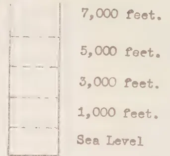

7,000 feet.  
5,000 feet.  
3,000 feet.  
1,000 feet.  
Sea Level

B = Line of Topographic Section.

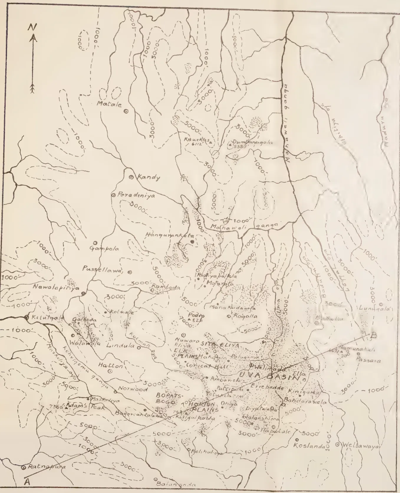

This topographic map of Ceylon illustrates the distribution of Patanas in the mountainous regions. The map features contour lines at 1,000-foot intervals, with labels such as 1000', 3000', 5000', and 7000'. Major rivers shown include the Mahaweli Ganga, Nuwara Ganga, and Maduru Ganga. Numerous towns and villages are marked with dots, including Matale, Kandy, Peradeniya, Gampola, Pussellawa, Nawalapitiya, Kelutgala, Galkoda, Walawala, Lindula, Hatton, Norwood, Maskeliya, Adam's Peak (7360'), Ratnapura, Balangoda, Kandy, Knuckles (6112'), Dumbanagala (5385'), Mahaweli Ganga, Hanguranketa, Padiyapahala, Malurata, Maha Kudagala, Ragalla, Pedro (825'), Nuwara Eliya, Palugama, Welimada, Ella, Ambaweka, Pallicpolu, Errebedde, Kinigama, Bandidarawela, Diyatala, Halaashima, Haputale, Koslanda, Welbawaya, Bopats-Bogo, Horton Plains, and Kuriqipotha. A line labeled 'B' indicates a topographic section across the map. The map also shows the 'UVA BASIN' and 'ELK PLAIN'.

PRINTED BY SURVEY DEPT., CEYLON, MAR. 1946.

FROM ORIGINAL SUPPLIED BY D.A.

13------------------------------------------------

<!-- stage4: FAINT old-images-only -->

[Faint page: no legible print of its own could be verified; text withheld (stage 4 review list)]

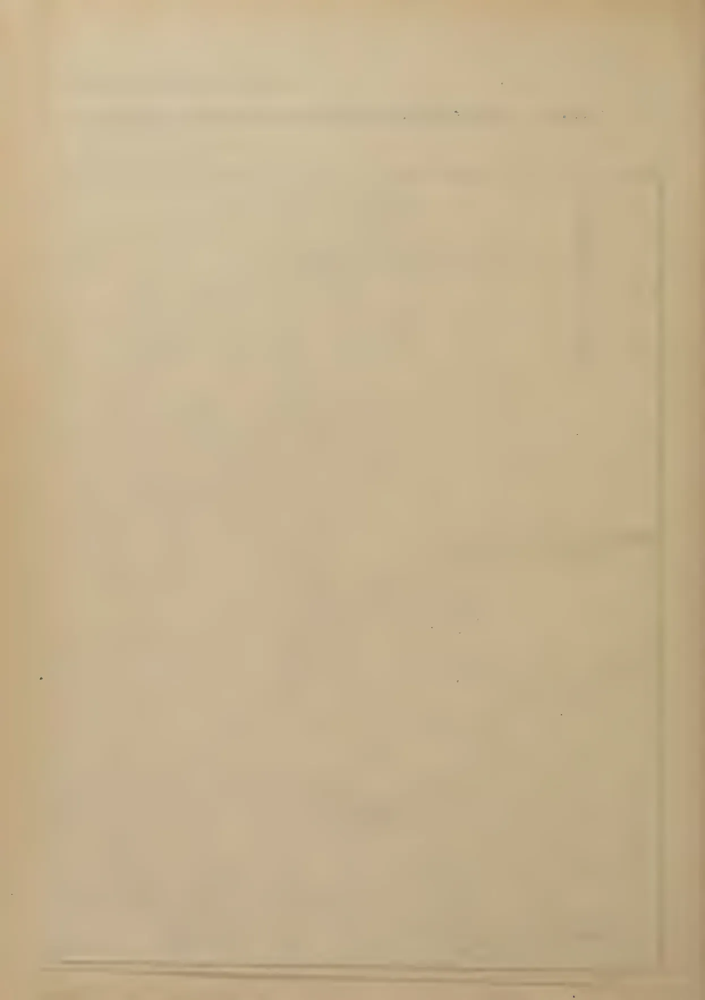This image shows a blank page with a light beige or cream-colored background. There are several small, dark specks scattered across the surface, which appear to be scanning artifacts or dust. A faint, thin rectangular outline is visible on the right side of the page, possibly indicating a margin or a placeholder for a figure. The overall texture is slightly grainy, typical of a scanned document.

14------------------------------------------------

THE MONTANE GRASSLANDS (PATANAS) OF CEYLON.

PLATE 2 - MAP SHOWING DISTRIBUTION OF ANNUAL AVERAGE RAINFALL & AVERAGE S.W. MONSOON RAINFALL (MAY - SEPT.).

Scale: 1 inch = 8 miles.

![Map of Ceylon showing annual average rainfall and average S.W. monsoon rainfall distribution. The map includes contour lines for annual average rainfall (solid lines) and average S.W. monsoon rainfall (dotted lines). Various locations are marked, including Agurata, Mahakudagala, Laburake, Walagoda, Conical Hill, Hakigala, Ambawela, Holmwood, Ohiya, Gurulalawa, Diyatalawa, Bandarawela, Haputale, Welimada, Dyraba, Namunakula, and Badulla. Rainfall ranges are indicated by shaded regions and labels such as 50-75, 75-100, 100-125, 125-150, and >150 inches. Some areas are also labeled with monsoon rainfall ranges in brackets, such as (0-10), (10-20), (20-40), and (>40).](413dfe75355eebc44ced6d8c14d2fd06_4_img.webp)

Legend.

Annual Average Rainfall shown in solid lines.

<table border="1">
<tr>
<td>[Shaded Box]</td>
<td>50 - 75 inches.</td>
</tr>
<tr>
<td>[Shaded Box]</td>
<td>75 - 100 inches.</td>
</tr>
<tr>
<td>[Shaded Box]</td>
<td>100 - 120 inches.</td>
</tr>
<tr>
<td>[Shaded Box]</td>
<td>120 - 150 inches.</td>
</tr>
<tr>
<td>[Shaded Box]</td>
<td>&gt; 150 inches.</td>
</tr>
</table>

Average S. W. Monsoon Rainfall (May - Sept) shown in dotted lines.

Rainfall indicated within brackets thus:-

- ( 0 - 10" )
- ( 10" - 20" )
- ( 20" - 40" )
- ( > 40" )

PRINTED BY SURVEY DEPT., CEYLON, MAR. 1946.

FROM ORIGINAL SUPPLIED BY D.A.

15------------------------------------------------

<!-- stage4: FAINT old-images-only -->

[Faint page: no legible print of its own could be verified; text withheld (stage 4 review list)]

This image is a scan of a blank page. The background is a uniform light beige or off-white color. There are several small, dark specks scattered across the page, which appear to be scanning artifacts or dust. Near the bottom of the page, there are faint, horizontal, slightly darker lines that could be interpreted as the edge of a binding or a separator line. The overall texture is slightly grainy, typical of a scanned document.

16------------------------------------------------

THE MONTANE GRASSLANDS (PATANAS) OF CEYLON.

PLATE 3 - CURVES OF AVERAGE MONTHLY RAINFALL DISTRIBUTION FOR 17 TYPICAL STATIONS.  
 (Location of Stations is shown on Plate 2.)

Fig. 1 - The Wet Patana Zone.

- 1. Ambawela.
- 2. Conical Hill.
- 3. Holmwood (Bopats.)
- 4. Labukelle.
- 5. Watagoda.

Fig. 2 - The Intermediate Patana Zone.

- 1. Ohiya Estate.
- 2. Heputale.
- 3. Hakgala.
- 4. Namunukula.
- 5. Maturata.
- 6. Mahakudagala.

Fig. 3 - The Dry Patana Zone.

- 1. Welimada.
- 2. Dyraaba Estate.
- 3. Bandarawela.
- 4. Diyatalawa.
- 5. Badulla.
- 6. Gurutalawa.

PRINTED BY SURVEY DEPT., CEYLON, MAR. 1946.

FROM ORIGINAL SUPPLIED BY D.A.

17------------------------------------------------

<!-- stage4: FAINT old-images-only -->

[Faint page: no legible print of its own could be verified; text withheld (stage 4 review list)]

This image is a scan of a blank page. The background is a uniform light beige or tan color. There are several small, dark specks scattered across the surface, which appear to be scanning artifacts or dust. A faint, thin horizontal line is visible near the bottom edge of the page, possibly indicating a fold or a scanning artifact. The overall texture is slightly grainy, typical of a scanned document.

18------------------------------------------------

THE MONTANE GRASSLANDS (PATANAS) OF CEYLON.

PLATE 4 - TOPOGRAPHIC SECTION ACROSS CENTRAL CEYLON (A to B in Plate 1).

(Showing also Zones of Annual Average S.W. Monsoonal (May - Sept.) Rainfall in relation to Vegetational Types.)

<table border="1">
<thead>
<tr>
<th rowspan="2">ANNUAL AVERAGE S.W. MONSOON RAINFALL</th>
<th colspan="3">60 - 80 ins.</th>
<th>40-60 ins.</th>
<th colspan="2">20 - 40 ins.</th>
<th colspan="3">10 - 20 ins.</th>
<th>20-40 ins.</th>
<th colspan="2">10 - 20 ins</th>
</tr>
<tr>
<th>Wet Evergreen Forest</th>
<th>Rubber &amp; Tea</th>
<th>Wet Evergreen and Montane Forests</th>
<th>Montane Forest</th>
<th>Tea</th>
<th>Montane Forest</th>
<th>Wet Patana &amp; Forest</th>
<th>Ohiya P.R. Forest</th>
<th>Int. Patana &amp; Forest</th>
<th>UVA BASIN - DAY PATANA ZONE</th>
<th>Tea</th>
<th>Forest &amp; Tea</th>
<th>Dry Patana &amp; Savannah</th>
</tr>
</thead>
<tbody>
<tr>
<td>Wet Evergreen Forest</td>
<td>Rubber &amp; Tea</td>
<td>Wet Evergreen and Montane Forests</td>
<td>Montane Forest</td>
<td>Tea</td>
<td>Montane Forest</td>
<td>Wet Patana &amp; Forest</td>
<td>Ohiya P.R. Forest</td>
<td>Int. Patana &amp; Forest</td>
<td>UVA BASIN - DAY PATANA ZONE</td>
<td>Tea</td>
<td>Forest &amp; Tea</td>
<td>Dry Patana &amp; Savannah</td>
<td>Scrub, Dry Evergreen Forest &amp; Savannah</td>
</tr>
</tbody>
</table>

Profile labels (from A to B):

- Denawak ganga
- Denawak ganga
- 2ND PENEPLAIN
- Dehenakanda 2272'
- head waters of Walawe ganga
- Adam's Peak Range
- 3RD PENEPLAIN
- Kirigalpatha 7857'
- Horton Plains
- Dambakethya 6486'
- Keula 4243'
- Mahacottilla oya
- Kontahella 4285'
- Old Trig 4286'
- Meeriagas Ulpata Kanda 4560'
- Badulla oya
- Namunakuli 6671'
- Atubenda hulaha 4187'
- Laggal oya
- Mill oya
- head waters of Kumbukkan oya
- Kiritwe oya
- 2ND PENEPLAIN

PRINTED BY SURVEY DEPT, CEYLON MAR. 1946

FROM ORIGINALS SUPPLIED BY DA.

19------------------------------------------------

<!-- stage4: FAINT old-images-only -->

[Faint page: no legible print of its own could be verified; text withheld (stage 4 review list)]

This image is a scan of a blank page. The paper has a light beige or cream-colored tint. There are a few very small, faint dark spots scattered across the surface, which appear to be scanning artifacts or minor imperfections in the paper. No text, lines, or other markings are present.

20------------------------------------------------

# THE MONTANE GRASSLANDS (PATANAS) OF CEYLON.

## PLATE 5 - SOIL PROFILE DIAGRAMS.

### Legend.

#### Horizon Boundaries:-

- ———— Boundary distinct.
- - - - - - Boundary merging.
- ~~~~~ Boundary undulating.

#### Roots and Humus:-

Root matting.

Humus or decaying vegetable matter.

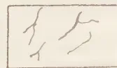

Roots (small).

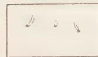

Large roots cut through.

#### Mineral Skeleton:-

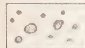

Ferruginous concretions (some cut through) drawn roughly to scale.

Quartz concretions drawn roughly to scale.

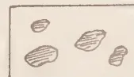

Stones or undecomposed boulders drawn roughly to scale.

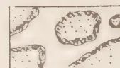

Decomposing rock or boulders.

Texture:- Texture of horizon written opposite appropriate horizon.

Colour:- Colour of horizon written opposite appropriate horizon.

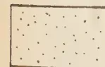

Coarse sand.

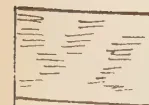

Veins or pockets of clay.

PRINTED BY SURVEY DEPT., CEYLON, MAR. 1946.

FROM ORIGINAL SUPPLIED BY D.A.

21------------------------------------------------

<!-- stage4: FAINT old-images-only -->

[Faint page: no legible print of its own could be verified; text withheld (stage 4 review list)]

This image is a scan of a blank page. The paper has a light beige or cream-colored tint. There are some very faint, blurry marks and artifacts scattered across the surface, which appear to be scanning noise or imperfections in the paper itself. No text, lines, or other graphical elements are present.

22------------------------------------------------

THE MONTANE GRASSLANDS (PATANAS) OF CEYLON.

PLATE 6 - PROFILE DIAGRAMS OF WET PATANAS AND MONTANE FOREST.

<table border="0">
<tr>
<td data-bbox="12 161 235 754">

Bopatalawa Patana 5,100'

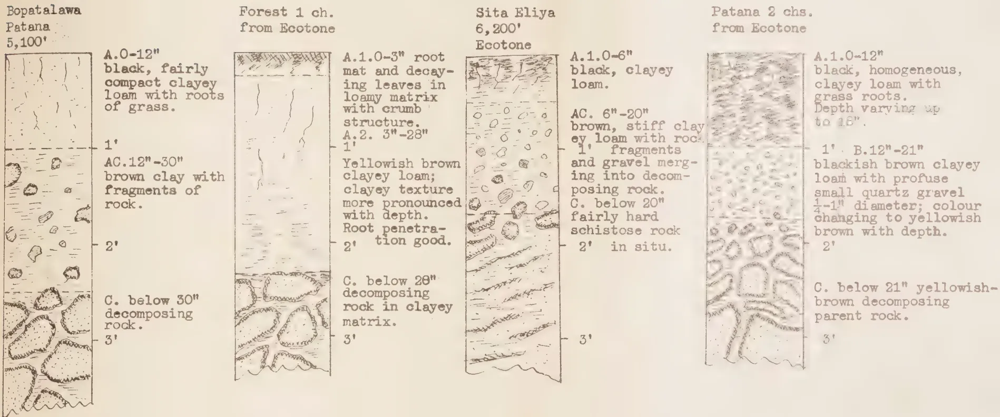

A.0-12" black, fairly compact clayey loam with roots of grass.

1' AC.12"-30" brown clay with fragments of rock.

2' C. below 30" decomposing rock.

</td>
<td data-bbox="240 161 465 754">

Forest 1 ch. from Ecotone

A.1.0-3" root mat and decay- ing leaves in loamy matrix with crumb structure. A.2. 3"-28" 1' Yellowish brown clayey loam; clayey texture more pronounced with depth. Root penetra- tion good.

2' C. below 28" decomposing rock in clayey matrix.

3'

</td>
<td data-bbox="470 161 695 754">

Sita Eliya 6,200' Ecotone

A.1.0-6" black, clayey loam.

1' AC. 6"-20" brown, stiff clay ey loam with rock fragments and gravel merg- ing into decom- posing rock. C. below 20" fairly hard schistose rock in situ.

2'

3'

</td>
<td data-bbox="700 161 987 754">

Patana 2 chs. from Ecotone

A.1.0-12" black, homogeneous, clayey loam with grass roots. Depth varying up to 18".

1'. B.12"-21" blackish brown clayey loam with profuse small quartz gravel 1/4-1" diameter; colour changing to yellowish brown with depth.

2' C. below 21" yellowish- brown decomposing parent rock.

3'

</td>
</tr>
</table>

Fig. 1.

Fig. 2.

Fig. 3.

Fig. 4.

PRINTED BY SURVEY DEPT., CEYLON, MAR. 1946.

FROM ORIGINAL SUPPLIED BY D.A.

23------------------------------------------------

<!-- stage4: FAINT old-images-only -->

[Faint page: no legible print of its own could be verified; text withheld (stage 4 review list)]

This image is a scan of a blank page. The paper has a light beige or cream-colored tint. There are some very faint, blurry artifacts scattered across the surface, which appear to be dust or imperfections in the paper or the scanning process. No text, lines, or other markings are present.

24------------------------------------------------

THE MONTANE GRASSLANDS (PATANAS) OF CEYLON.

PLATE 7 - PROFILE DIAGRAMS OF DRY PATANAS.

Errebedde,  
4,500'  
virgin  
patana

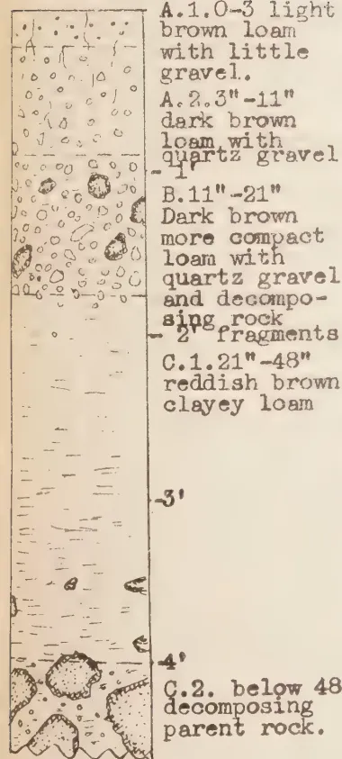

A. 1.0-3 light brown loam with little gravel.  
A. 2.3"-11" dark brown loam with quartz gravel  
B. 11"-21" Dark brown more compact loam with quartz gravel and decomposing rock  
C. 1.21"-48" reddish brown clayey loam  
- 2' fragments  
- 3'  
- 4' C.2. below 48" decomposing parent rock.

Fig. 5.

Errebedde,  
4,460'  
planted  
patana

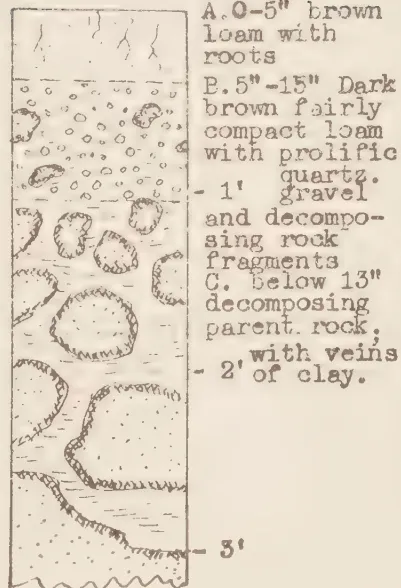

A. 0-5" brown loam with roots  
B. 5"-15" Dark brown fairly compact loam with prolific quartz gravel  
- 1' gravel and decomposing rock fragments  
C. Below 13" decomposing parent rock;  
- 2' of clay.  
- 3'

Fig. 6.

Errebedde,  
4,300'  
virgin  
patana

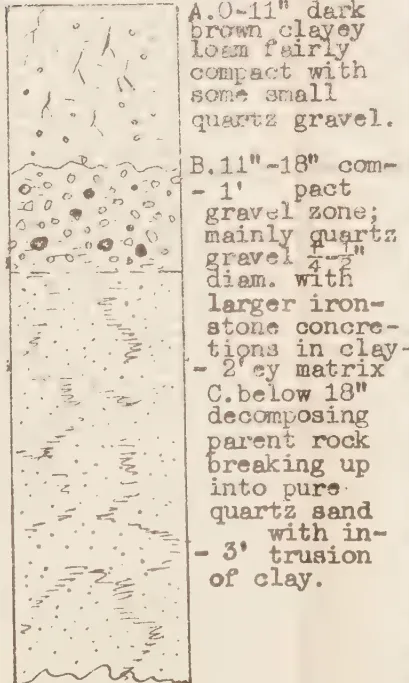

A. 0-11" dark brown clayey loam fairly compact with some small quartz gravel.  
B. 11"-18" compact gravel zone; mainly quartz gravel 1/4"-2" diam. with larger iron-stone concretions in clayey matrix  
C. below 18" decomposing parent rock breaking up into pure quartz sand with intrusion of clay.  
- 3'

Fig. 7.

Errebedde,  
4,300'  
planted  
patana

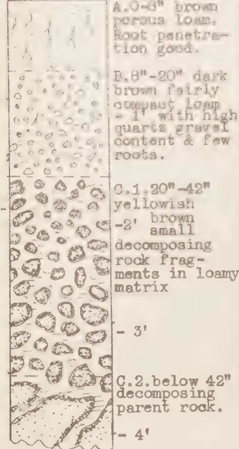

A. 0-3" brown porous loam. Root penetration good.  
B. 3"-20" dark brown fairly compact loam - 1' with high quartz gravel content & few roots.  
C. 1.20"-42" yellowish - 2' brown small decomposing fragments in loamy matrix  
- 3'  
C.2. below 42" decomposing parent rock.  
- 4'

Fig. 8.

Kinigama,  
3,900'  
planted  
patana

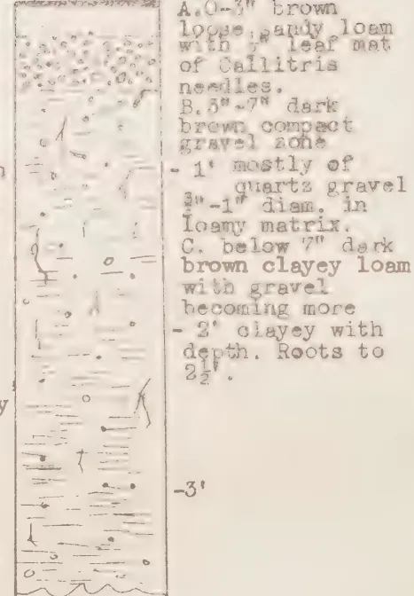

A. 0-3" brown loose, sandy loam with leaf mat of Callitris needles.  
B. 3"-7" dark brown compact gravel zone  
- 1' mostly of quartz gravel 3"-1" diam. in loamy matrix.  
C. below 7" dark brown clayey loam with gravel becoming more  
- 2' clayey with depth. Roots to 2 1/2'.  
- 3'

Fig. 9.

PRINTED BY SURVEY DEPT., CEYLON, MAR. 1946. FROM ORIGINAL SUPPLIED BY D.A.

25------------------------------------------------

<!-- stage4: FAINT old-images-only -->

[Faint page: no legible print of its own could be verified; text withheld (stage 4 review list)]

This image is a scan of a blank page. The paper has a light beige or cream-colored tint. There are a few very small, dark specks scattered across the surface, which appear to be scanning artifacts or dust particles. No text, lines, or other markings are present on the page.

26------------------------------------------------

213

wet patanas which receive a high rainfall, for example in Conical Hill and Ambawela, and in badly drained and waterlogged sites lying generally in the valley bottoms. A B horizon is sometimes present which forms a sort of pan and may contain a high proportion of quartz and ironstone concretions. The B horizon is more characteristic of soils on the hill slopes. When the B horizon is absent, an intermediate type of horizon is generally found (AC) composed of a compact clayey loam with decomposing rock inclusions or ironstone concretions. The parent C horizon is of decomposing rock in varying stages of disintegration usually in a matrix of clay or clayey loam.

The corresponding *forest soil profile* has the same general textural composition especially in the sub-soil AC and C horizons. The surface A 1 horizon is more humified, a lighter loam and generally has a good crumb structure. The AC horizon is less clayey and generally contains fewer ironstone concretions. It is usually of fairly good depth. The ecotone between forest and wet patana is merely a matter of a narrow strip or belt seldom exceeding two chains in width. The soils of the ecotone as would be expected are intermediate between the forest and patana type (*vide* Plate 6, Fig. 3).

Chemically, the wet patana soils are characterized by (a) a high organic and nitrogen content in the A horizon. This is common also to the forest soils, but in the latter, the organic matter is more humified; (b) a very acid reaction in the A horizon and (c) a very low replaceable base content in the A horizon as compared with the corresponding forest soil horizon.

The *typical dry patana profile* has a comparatively shallow A horizon rarely exceeding 9 inches in depth and usually much less, consisting of a gravelly loam with little organic matter content. A truncated A horizon is characteristic of hill tops and ridges which have been subjected to more severe erosion. Dry patanas afforested chiefly with *Callitris* spp. in Kinigama and intensively weeded over a period of years also show a similar truncated A horizon (*vide* Plate 7, Fig. 9). Dry patanas afforested with *Eucalyptus* spp. chiefly *E. robusta* for a considerable period show a greater depth of A horizon and higher humus content (*vide* Plate 7, Fig. 8).

A B horizon is almost always present and is easily distinguished in the field by a very high gravel content giving it the appearance of a hard pan. In mechanical analysis, it has been found to be composed of as much as 90 per cent. of stone and gravel. In the profiles examined, quartz gravel has been predominant. Its thickness is usually considerable, generally more than 6 inches and up to 12 inches. Root penetration through the B horizon would appear to be difficult. The parent C horizon is usually of decomposing rock in the form of brash with veins of clay or clayey loam. In some instances, the parent horizon has been found to consist of decomposing rock breaking up into almost pure micaceous sand (*vide* Plate 7, Fig. 7).

Chemically, the A horizon is acid but less than in wet patana soils. The organic content is comparatively little. The base exchange contents are low.

The soils of the intermediate patana type, as would be expected, show a profile intermediate in type between the wet and dry patanas. A B horizon is almost always present.

27------------------------------------------------

214

## STUDIES IN CASSAVA

### I. A CLASSIFICATION OF RACES OCCURRING IN CEYLON (continued)

M. F. CHANDRARATNA, Ph.D. (Lond.), D.I.C.,  
ACTING BOTANIST

AND

K. D. S. S. NANAYAKKARA,  
ASSISTANT IN ECONOMIC BOTANY

#### MU. 51

(Kos-manyokka)

*Petiole* :  $37 \pm 0.5$  cm. long, yellowish green, shaded rose at the ends, straight, usually inclining, occasionally horizontal.

*Young leaf* : Light purple tinged with green ; midrib yellow to red.

*Mature leaf* : Light green, of medium size, with usually 7 leaflets ; leaflets divergent, slightly curved adaxially ; central leaflet  $18 \pm 0.3$  cm. long and  $6 \pm 0.1$  cm. wide.

*Petiole scar* : Dark purple.

*Stem* : Yellowish green when young, silver grey when mature.

*Flowers* : Calyx cream ; sepals of males with pink shading ; sepals of females with pink stripes ; stigma pale pinkish white ; ovary light green with pink ridges.

*Capsule* : Apple to light green with pink wings ; nectary light coral red.

*Tuber* : Fat and short ; surface scaly, liver brown to hazel brown ; phelloderm white ; flesh white.

*Habit* : Branching low and frequent ; foliage moderately dense ; occasionally aberrant branches with trifid leaves and early fruits appear.

*Distribution* : Kegalle.

#### MU. 52

(Mendora-manyokka)

*Petiole* :  $23 \pm 0.6$  cm. long, yellowish green with rose shading at curved distal end, inclining and horizontal.

*Young leaf* : Purplish green ; midrib yellow.

*Mature leaf* : Dark green, of medium size, with usually 7 leaflets ; leaflets slightly curved adaxially, with distal halves bending down ; central leaflet  $16 \pm 0.2$  cm. long and  $4 \pm 0.1$  cm. wide.

*Petiole scar* : Yellowish green.

*Stem* : Yellowish green with red stripes when young, silver grey to wood brown when mature.

*Flowers* : Blooming of males and females profuse and almost simultaneous ; calyx of males yellowish green with alizarine pink shading ; calyx of females pale green with alizarine pink lines ; stigma white ; ovary green with pink ridges.

*Capsule* : Antique green to bright green with pink wings ; nectary carmine.

*Tuber* : Fat, of medium length ; surface slightly scaly, warm buff to light buff ; phelloderm white ; flesh white.

*Habit* : Branching variable ; foliage of moderate density.

*Distribution* : Batapola.

28------------------------------------------------

215MU. 53

(Sivappu-maravalli)

*Petiole* :  $30 \pm 0.9$  cm. long, yellowish green with rose ring at proximal end and rose shading at distal end, horizontal, inclining and declining ; distal end curved.

*Young leaf* : Light green tinged with purple ; midrib yellowish green.

*Mature leaf* : Dark green, large, with commonly 5-7 leaflets, leaflets plane, broad, bending down at the tips ; central leaflet  $20 \pm 0.5$  cm. long and  $5 \pm 0.1$  cm. wide.

*Petiole scar* : Bright green.

*Stem* : Bright yellowish green when young, wood brown when mature.

*Flowers* : Females more numerous and earlier ; calyx of females pale yellowish green ; stigma white ; ovary bright green.

*Capsule* : Pale greenish white ; nectary carmine.

*Tuber* : Fat, of medium length ; surface scaly, kaiser brown to Hay's russet ; phelloderm white ; flesh white.

*Habit* : Branching high and infrequent ; foliage of moderate density.

*Distribution* : Trincomalee.

MU. 54

(Manyokka)

*Petiole* :  $33 \pm 1.0$  cm. long, yellowish green with rose ring at proximal end and rose shading at curved distal end, alternately inclining and horizontal.

*Young leaf* : Purplish green ; midrib faint red to yellowish green.

*Mature leaf* : Dark green, large, with commonly 7 leaflets ; leaflets plane, broad, somewhat divergent, bending down at the tips ; central leaflet  $20 \pm 0.6$  cm. long and  $5 \pm 0.1$  cm. wide.

*Petiole scar* : Yellowish green.

*Stem* : Bright green when young, silver grey to wood brown when mature.

*Flowers* : Blooming of males and females profuse and almost simultaneous ; calyx of males whitish with alizarine pink shading ; calyx of females whitish with faint alizarine pink lines ; stigma white ; ovary light green with pink ridges.

*Capsule* : Pale greenish white with pink wings ; nectary carmine.

*Tuber* : Of medium thickness, long ; surface smooth, warm buff to light buff with occasional pink and grey patches ; phelloderm light yellow ; flesh yellow.

*Habit* : Branching low and frequent ; foliage dense.

*Distribution* : Horana.

MU. 55

(Manyokka)

*Petiole* :  $24 \pm 0.5$  cm. long, yellowish green with rose ring at proximal end, and rose shading at curved distal end, horizontal and inclining.

*Young leaf* : Bright purplish green ; midrib yellowish green to red.

*Mature leaf* : Dark green, large, with commonly 7 leaflets ; leaflets narrow, somewhat divergent, slightly curved adaxially, bending down at the tips ; central leaflet  $16 \pm 0.3$  cm. long and  $4 \pm 0.1$  cm. wide.

*Petiole scar* : Dark green.

*Stem* : Bright green when young, wood brown to silver grey when mature.

*Flowers* : Do not occur.

*Capsule* : —.

*Tuber* : Of medium thickness and length ; surface scaly, liver brown to hazel brown ; phelloderm white ; flesh yellowish white.

*Habit* : Branching variable ; foliage somewhat sparse.

*Distribution* : Muttur.

MU. 56

(Sivappu-maravalli)

*Petiole* :  $28 \pm 0.7$  cm. long, yellowish green with rose ring at proximal end and rose shading at distal end, sigmoid, horizontal, inclining and declining.

*Young leaf* : Purplish green ; midrib yellow.

*Mature leaf* : Dark green, large, with commonly 5-7 leaflets somewhat divergent, slightly curved adaxially, stiff ; central leaflet  $17 \pm 0.3$  cm. long and  $5 \pm 0.1$  cm. wide.

29------------------------------------------------

216

*Petiole scar* : Bright green.

*Stem* : Yellowish green when young ; silver grey when mature.

*Flowers* : Males and females abound and bloom almost simultaneously ; calyx of males pale yellowish green with alizarine pink shading ; calyx of females pale yellowish green with alizarine pink lines ; stigma white ; ovary purplish green with pink ridges.

*Capsule* : Antique green to light green with purple-edged wings ; nectary pale orange yellow.

*Tuber* : Of medium thickness and length ; surface scaly, kaiser brown to Hay's russet ; phelloderm faint pinkish white ; flesh yellowish white.

*Habit* : Branching high and infrequent ; foliage moderately dense.

*Distribution* : Vavuniya.

#### MU. 57

##### (Manyokka)

*Petiole* :  $30 \pm 0.5$  cm. long, light green with rose ring at proximal end and rose shading at distal end, slightly sigmoid, alternately inclining and horizontal.

*Young leaf* : Pale purplish green ; midrib yellowish green.

*Mature leaf* : Light green, of medium size, with commonly 7 leaflets ; leaflets plane, divergent, bending down at the tips ; central leaflet  $19 \pm 0.3$  cm. long and  $5 \pm 0.1$  cm. wide.

*Petiole scar* : Yellowish green.

*Stem* : Yellowish green when young, wood brown when mature.

*Flowers* : Males more numerous and earlier ; calyx of females shaded alizarine pink all over, stigma pale pink ; ovary green with pink ridges.

*Capsule* : Apple green to light green with pink wings ; nectary coral red.

*Tuber* : Fat and short ; surface somewhat scaly, apricot buff to warm buff ; phelloderm light yellow ; flesh yellowish white.

*Habit* : Branching variable ; foliage dense.

*Distribution* : Udispattu.

#### MU. 58

##### (Vellai-maravalli)

*Petiole* :  $30 \pm 0.7$  cm. long, yellowish green with faint rose ring at proximal end and rose shading at distal end, horizontal, inclining and declining.

*Young leaf* : Purplish green ; midrib yellowish green.

*Mature leaf* : Dark green, of medium size, with commonly 7 leaflets ; leaflets adaxially concave in cross section, with distal halves bending down ; central leaflet  $19 \pm 0.3$  cm. long and  $5 \pm 0.1$  cm. wide.

*Petiole scar* : Maroon.

*Stem* : Bright green when young, silver grey when mature.

*Flowers* : Females more numerous, calyx of males pale yellowish green with alizarine pink shading ; calyx of females pale yellowish green with alizarine pink lines, stigma white ; ovary green with pink ridges.

*Capsule* : Apple green to light green with purple-edged wings ; nectary pale orange yellow.

*Tuber* : Fat, of medium thickness ; surface rough to smooth, tawny brown to warm buff ; phelloderm light yellow ; flesh yellowish white.

*Habit* : Branching high ; foliage moderately dense.

*Distribution* : Trincomalee.

#### MU. 59

##### (Manyokka)

*Petiole* :  $39 \pm 0.5$  cm. long, pale green with faint rose ring at proximal end and rose shading at curved distal end, alternately inclining and horizontal.

*Young leaf* : Purplish green ; midrib light green.

*Mature leaf* : Light green, of medium size, with commonly 7 leaflets ; leaflets lying close together ; adaxially concave in cross section ; with distal halves bending down ; central leaflet  $21 \pm 0.4$  cm. long and  $6 \pm 0.1$  cm. wide.

*Petiole scar* : Dark green.

*Stem* : Bright green when young, wood brown to silver grey when mature.

30------------------------------------------------

217

*Flowers* : Both sexes bloom almost simultaneously ; calyx cream ; male sepals with faint alizarine pink shading ; female sepals with alizarine pink lines ; stigma pale pinkish white ; ovary green with pink ridges.

*Capsule* : Apple green to light green with bright pink wings ; nectary coral red.

*Tuber* : Of medium thickness and length ; surface smooth, warm buff to light buff with occasional grey patches ; phelloderm white ; flesh yellowish white.

*Habit* : Plants thick-stemmed ; branching high and infrequent ; foliage dense.

*Distribution* : Paranthan.

#### MU. 60

##### (Rata-manyokka)

*Petiole* :  $27 \pm 0.6$  cm. long, yellowish green with rose ring at proximal end and rose shading at distal end, alternately inclining and horizontal.

*Young leaf* : Purplish green ; midrib yellowish green.

*Mature leaf* : Dark green, of medium size, with commonly 7 plane, drooping, divergent leaflets ; central leaflet  $17 \pm 0.3$  cm. long and  $4 \pm 0.1$  cm. wide.

*Petiole scar* : Yellowish green.

*Stem* : Yellowish green when green, silver grey when mature.

*Flowers* : Males more numerous an earlier ; calyx of both sexes yellowish green ; male sepals with faint rose shading ; female sepals with pale pink lines ; stigma pale purplish white ; ovary green with purple ridges.

*Capsule* : Apple green to light green with purplish wings ; nectary coral red.

*Tuber* : Fat and short ; surface slightly scaly, tawny brown to light buff with occasional grey patches ; phelloderm light yellow ; flesh yellow.

*Habit* : Branching high and infrequent ; foliage somewhat sparse.

*Distribution* : Nawalapitiya.

#### MU. 61

##### (Kaha-manyokka)

*Petiole* :  $31 \pm 0.6$  cm. long, yellowish green with faint rose ring at proximal end and rose shading at curved distal end, inclining, horizontal and declining.

*Young leaf* : Purplish green ; midrib yellowish green.

*Mature leaf* : Light green, medium-sized, with commonly 5-7 leaflets ; leaflets stiff, adaxially concave in cross section ; central leaflet  $18 \pm 0.3$  cm. long and  $5 \pm 0.8$  cm. wide.

*Petiole scar* : Bright green.

*Stem* : Dark green when young, silver grey when mature.

*Flowers* : Males few and abortive ; calyx of females light green with light purplish brown lines ; stigma white ; ovary light green with pink ridges.

*Capsule* : Antique green with pink wings ; nectary coral red.

*Tuber* : Fat and long ; surface rough to smooth, tawny brown to warm buff ; phelloderm light yellow ; flesh yellow.

*Habit* : Branching high and infrequent ; foliage sparse.

*Distribution* :—

#### MU. 62

##### (Manyokka)

*Petiole* :  $30 \pm 0.9$  cm. long, yellowish green with rose ring at proximal end and rose shading at distal end, inclining, horizontal and declining.

*Young leaf* : Light green faintly tinged with purple ; midrib green.

*Mature leaf* : Dark green, large, with commonly 7 drooping leaflets ; central leaflet  $19 \pm 0.5$  cm. long and  $6 \pm 0.1$  cm. wide.

*Petiole scar* : Pomegranate purple.

*Stem* : Bright green when young, wood brown when mature.

*Flowers* : Do not occur.

*Capsule* :—

*Tuber* : Medium-sized ; surface scaly, kaiser brown to Hay's russet ; phelloderm white ; flesh white.

*Habit* : Foliage moderately dense.

*Distribution* : Kekirawa.

31------------------------------------------------

218MU. 63(Kiribadu-manyokka)

*Petiole* :  $26 \pm 0.4$  cm. long, yellowish green with rose ring at proximal end and rose shading at curved distal end, horizontal inclining and declining.

*Young leaf* : Purplish green ; midrib yellow.

*Mature leaf* : Dark green, medium-sized, with commonly 7 leaflets ; leaflets divergent, adaxially curved, bending down at the tips ; central leaflet  $17 \pm 0.3$  cm. long and  $4 \pm 0.2$  cm. wide.

*Petiole scar* : Pomegranate purple.

*Stem* : Bright green when young, silver grey when mature.

*Flowers* : Both sexes abound and bloom almost simultaneously ; calyx of males pale yellowish green with pale alizarine pink shading ; calyx of females pale green with pale alizarine pink lines ; stigma white ; ovary pale yellowish green with pink ridges.

*Capsule* : Antique green to light green with pink-edged wings ; nectary pale orange-yellow.

*Tuber* : Medium-sized ; surface rough, apricot to warm buff ; phelloderm light yellow ; flesh yellowish white.

*Habit* : Branching moderately low ; foliage sparse.

*Distribution* : Batapola.

MU. 64(Manyokka)

*Petiole* :  $33 \pm 1.0$  cm. long, bright green with reddish ring at proximal end and reddish shading at distal end, somewhat irregularly shaped, alternately inclining and horizontal.

*Young leaf* : Light green ; midrib faint red to green.

*Mature leaf* : Light green, medium-sized, with commonly 7 plane, drooping, somewhat divergent leaflets ; central leaflet  $20 \pm 0.6$  cm. long and  $5 \pm 0.1$  cm. wide.

*Petiole scar* : Bright green.

*Stem* : Yellowish green when young, wood brown to silver grey when mature.

*Flowers* : Both sexes bloom profusely and almost together ; calyx of males cream to pale green ; calyx of females neva green ; stigma white ; ovary bright green.

*Capsule* : Apple green to light green ; nectary carmine.

*Tuber* : Fat and short ; surface rough, kaiser brown to hazel brown ; phelloderm light yellow ; flesh yellowish white.

*Habit* : Branching high and infrequent ; foliage dense.

*Distribution* : Middeniya.

MU. 65(Manyokka)

*Petiole* :  $32 \pm 0.5$  cm. long, yellowish green with rose ring at proximal end and rose shading at curved distal end, alternately inclining and horizontal.

*Young leaf* : Light green ; midrib faint red.

*Mature leaf* : Dark green, large, with commonly 9 plane, drooping leaflets ; central leaflet  $22 \pm 0.3$  cm. long and  $6 \pm 0.1$  cm. wide.

*Petiole scar* : Yellowish green.

*Stem* : Bright green when young, silver grey when mature.

*Flowers* : Females more numerous and earlier ; calyx of males off-white with vandyke red shading ; calyx of females cream with vandyke red shading ; stigma pale pinkish white ; ovary green with pink ridges.

*Capsule* : Apple green to light green with light pink wings ; nectary coral red.

*Tuber* : Fat and short ; surface smooth, light buff to dirty white with occasional grey patches ; phelloderm white ; flesh light yellow.

*Habit* : Branching high and infrequent ; foliage sparse.

*Distribution* : Kegalle.

MU. 66(Alu-manyokka)

*Petiole* :  $29 \pm 0.7$  cm. long, light green faintly tinged with rose at curved distal end, inclining.

*Young leaf* : Light green ; midrib yellowish green.

32------------------------------------------------

219

*Mature leaf* : Light green, medium-sized, with commonly 7 leaflets ; leaflets somewhat divergent ; slightly curved adaxially, bending down at the tips ; central leaflet  $18 \pm 0.4$  cm. long and  $5 \pm 0.2$  cm. wide.

*Petiole Scar* : Dark green.

*Stem* : Bright green when young, silver grey when mature.

*Flowers* : Females more numerous and earlier ; calyx neva green with alizarine pink lines ; stigma white ; ovary light green.

*Capsule* : Antique green with pink wings ; nectary carmine.

*Tuber* : Fat and short ; surface scaly, tawny brown to apricot buff ; phelloderm yellow ; flesh yellow.

*Habit* : Branching variable ; foliage moderately dense.

*Distribution* : Ratnapura.

#### MU. 67

##### (Hondere-manyokka)

*Petiole* :  $30 \pm 0.7$  cm. long, yellowish green, tinged faint rose at the ends, variously shaped, horizontal, inclining and declining.

*Young leaf* : Purplish green ; midrib yellowish green.

*Mature leaf* : Dark green, large, with commonly 7-9 leaflets ; leaflets plane, drooping, lying close together ; central leaflet  $21 \pm 0.5$  cm. long and  $5 \pm 0.1$  cm. wide.

*Petiole scar* : Yellowish green.

*Stem* : Yellowish green when young, silver grey when mature.

*Flowers* : Both sexes abound and bloom together ; calyx of males cream with alizarine pink shading ; calyx of females pale yellowish green with alizarine pink shading ; stigma white ; ovary green with pink ridges.

*Capsule* : Bright green to antique green ; nectary pale orange yellow.

*Tuber* : Fat, of medium length ; surface smooth, warm buff to light buff, with occasional grey and pink patches, phelloderm white ; flesh white.

*Habit* : Branching high and infrequent ; foliage moderately dense.

*Distribution* : Eheliyagoda.

#### MU. 68

##### (Mendora-manyokka)

*Petiole* :  $34 \pm 0.9$  cm. long, yellowish green with rose ring at proximal end and rose shading at curved distal end, alternately inclining and horizontal.

*Young leaf* : Dark purplish green ; midrib yellowish green.

*Mature leaf* : Light green, medium-sized, with commonly 7 plane, stiff, somewhat divergent leaflets ; central leaflet  $20 \pm 0.5$  cm. long and  $5 \pm 0.1$  cm. wide.

*Petiole scar* : Yellowish green.

*Stem* : Yellowish green when young, silver grey when mature.

*Flowers* : Both sexes abound and bloom almost simultaneously ; calyx of males cream with pale pink shading ; calyx of females white with alizarine pink lines and shading ; stigma white ; ovary green with pale pink ridges.

*Capsule* : Pale greenish white with pink wings ; nectary light orange-yellow.

*Tuber* : Fat and short ; surface smooth, warm buff to light buff with occasional grey patches ; phelloderm white ; flesh white.

*Habit* : Branching low and frequent ; foliage sparse.

*Distribution* : Ambalantota.

#### MU. 69

##### (Kalu-manyokka)

*Petiole* :  $24 \pm 0.7$  cm. long, yellowish green, alternately inclining and horizontal with curved distal end.

*Young leaf* : Purplish green ; midrib yellowish green.

*Mature leaf* : Yellowish green, medium-sized, with commonly 7 leaflets ; leaflets plane, divergent with distal halves bending down ; central leaflet  $14 \pm 0.5$  cm. long and  $4 \pm 0.1$  cm. wide.

*Petiole scar* : Dark green.

*Stem* : Bright green when young ; silver grey when mature.

33------------------------------------------------

220

*Flowers* : Both sexes bloom profusely and almost simultaneously ; calyx of males pale green with alizarine pink shading ; calyx of females neva green with alizarine pink lines ; stigma white ; ovary green with pink ridges.

*Capsule* : Antique green to light green with pink wings ; nectary pale orange-yellow.

*Tuber* : Fat, of medium thickness ; surface rough to smooth, tawny brown to warm buff with occasional pink and grey patches ; phelloderm light yellow ; flesh yellowish white.

*Habit* : Branching variable ; foliage moderately dense.

*Distribution* : Puttalam.

#### MU. 70

(Nika-manyokka)

*Petiole* :  $38 \pm 0.5$  cm. long, yellowish green tinged faint rose at the ends, horizontal and inclining, curved at the distal end.

*Young leaf* : Purplish green ; midrib yellowish green.

*Mature leaf* : Dark green, large, with commonly 7 broad, plane, slightly drooping leaflets ; central leaflet  $22 \pm 0.3$  cm. long and  $5 \pm 0.1$  cm. wide.

*Petiole scar* : Bright green.

*Stem* : Bright green when young, wood brown to silver grey when mature.

*Flowers* : Both sexes abound and bloom almost simultaneously ; calyx pale green ; males with light brownish-purple shading on sepals ; females with light brownish-purple lines on sepals ; stigma white ; ovary purplish green.

*Capsule* : Apple green to light green with purple-edged wings ; nectary pale orange-yellow.

*Tuber* : Medium-sized ; surface scaly, tawny brown to warm buff ; phelloderm light yellow ; flesh yellowish white.

*Habit* : Branching high and infrequent ; foliage sparse.

*Distribution* : Kegalle.

#### MU. 71

(Kiri-manyokka)

*Petiole* :  $32 \pm 0.6$  cm. long, yellowish green with faint rose shading at distal end, slightly sigmoid, inclining, horizontal and declining.

*Young leaf* : Purplish green ; midrib yellow.

*Mature leaf* : Dark green, medium-sized, with commonly 7 leaflets ; leaflets divergent, slightly curved adaxially, bending down at the tips ; central leaflet  $19 \pm 0.2$  cm. long and  $5 \pm 0.1$  cm. wide.

*Petiole scar* : Dark green.

*Stem* : Bright green when young ; silver grey when mature.

*Flowers* : Do not occur.

*Capsule* : —.

*Tuber* : Of medium thickness, short ; surface slightly scaly, apricot buff to warm buff ; phelloderm light yellow ; flesh yellow.

*Habit* : Branching high and infrequent ; foliage moderately dense.

*Distribution* : Ratnapura.

#### MU. 72

(Kaha-manyokka)

*Petiole* :  $25 \pm 0.9$  cm. long, yellowish green, horizontal and inclining, with curved distal end.

*Young leaf* : Light green ; midrib yellowish green.

*Mature leaf* : Dark green, large, with commonly 7 leaflets ; leaflets slightly curved adaxially, somewhat divergent, bending down at the tips ; central leaflet  $16 \pm 0.4$  cm. long and  $4 \pm 0.2$  cm. wide.

*Petiole scar* : Bright green.

*Stem* : Bright green when young, wood brown when mature.

*Flowers* : Do not occur.

*Capsule* : —.

*Tuber* : Medium-sized ; surface scaly, liver brown to hazel brown ; phelloderm yellow ; flesh yellowish white.

*Habit* : Branching high and infrequent ; foliage sparse.

*Distribution* : Minneriya.

34------------------------------------------------

221MU. 73(Kaha-manyokka)

*Petiole* :  $39 \pm 0.7$  cm. long, yellowish green, alternately inclining and horizontal.

*Young leaf* : Light green ; midrib yellowish green.

*Mature leaf* : Light green, large, with commonly 7 leaflets ; leaflets plane, divergent, with distal halves bending down ; central leaflet  $19 \pm 0.4$  cm. long and  $5 \pm 0.1$  cm. wide.

*Petiole scar* : Dark green.

*Stem* : Bright green when young, wood brown when mature.

*Flowers* : Males more numerous ; calyx of males cream to pale yellowish green, calyx of females pale yellowish green ; stigma cream, ovary bright green.

*Capsule* : Antique green with pale greenish white wings ; nectary coral red.

*Tuber* : Fat and short ; surface scaly, liver brown to kaiser brown ; phelloderm white ; flesh yellow.

*Habit* : Branching low and frequent ; foliage dense.

*Distribution* : Horana.

MU. 74(Hingurala-manyokka)

*Petiole* :  $21 \pm 1.0$  cm. long, yellowish green, horizontal, declining and inclining, with curved distal end.

*Young leaf* : Light green ; midrib yellowish green.

*Mature leaf* : Dark green, large, with commonly 9 leaflets ; leaflets lying close together, with distal halves bending down ; central leaflet  $15 \pm 0.5$  cm. long and  $4 \pm 0.1$  cm. wide.

*Petiole scar* : Bright green.

*Stem* : Green when young, wood brown when mature.

*Flowers* : Males and females bloom almost simultaneously and in profusion ; calyx of males cream ; calyx of females pale yellowish green ; stigma white ; ovary green.

*Capsule* : Bright green with green wings ; nectary carmine.

*Tuber* : Slim and long ; surface scaly, kaiser brown to Hay's russet ; phelloderm light yellow ; flesh yellow.

*Habit* : Branching moderately low ; foliage sparse.

*Distribution* : Matara.

MU. 75(Kahanokku)

*Petiole* :  $34 \pm 0.7$  cm. long, yellowish green with occasional trace of red pigment, inclining, curved at the distal end.

*Young leaf* : Bright green ; midrib yellowish green.

*Mature leaf* : Dark green, of medium size, with usually 7 leaflets ; leaflets slightly curved adaxially, with distal halves bending down ; central leaflet  $20 \pm 0.4$  cm. long and  $5 \pm 0.1$  cm. wide.

*Petiole scar* : Dark green.

*Stem* : Bright green when young, wood brown when mature.

*Flowers* : Numerous ; calyx of males cream ; calyx of females yellowish green ; stigma white ; ovary green.

*Capsule* : Antique green with pale, greenish white wings ; nectary coral red.

*Tuber* : Of medium thickness, short ; surface scaly, kaiser brown to Hay's russet ; phelloderm light yellow ; flesh yellow.

*Habit* : Branching relatively low ; foliage dense.

*Distribution* : Tissamaharama.

REFERENCES.

1. Burkill, I. H., 1935 .. A Dictionary of the Economic Products of the Malay Peninsula. London : Crown Agents for the Colonies
2. Fawcett, W. and Rendle, A. B., 1920 Flora of Jamaica. Vol. IV. London : British Museum (Natural History)
3. Greenstreet, V. R. and Lambourne, Tapioa in Malaya. Department of Agric., S.S. and J., 1933 F. M. S.

35------------------------------------------------

222

4. Pulle, A., 1932 .. .. Flora of Suriname. Vol. II. *Kon Ver. Koloniaal Institute to Amsterdam, Mededeeling No. XXX., Afd. Handelsmuseum No. 11.*

5. Ridgway, R., 1912.. .. Color Standards and Color Nomenclature

6. Standley, P. C., 1930 .. .. Flora of Yucatan. *Field Museum of Natural History, Publication 279. Botanical Series Vol. III. No. 3.*

---

### APPENDIX.

#### Glossary of Sinhalese and Tamil Terms \*

<table>
<tbody>
<tr>
<td><i>Ala</i> ..</td>
<td>.. Tuber</td>
</tr>
<tr>
<td><i>Ahu</i> ..</td>
<td>.. Ash. The term indicates the presence of a bloom on the stem</td>
</tr>
<tr>
<td><i>Beli</i> ..</td>
<td>.. Bael (<i>Aegle Marmelos</i> Corr.). Resemblance in flavour is suggested</td>
</tr>
<tr>
<td><i>Debal</i> ..</td>
<td>.. Forked; refers to the branching of the stem</td>
</tr>
<tr>
<td><i>Demas</i> ..</td>
<td>.. Two months. The reference is to the preposterous claim that the plants are ready for lifting at this age</td>
</tr>
<tr>
<td><i>Eda</i> ..</td>
<td>.. Zigzag; refers to the stem.</td>
</tr>
<tr>
<td><i>Endaru</i> ..</td>
<td>.. Castor (<i>Ricinus communis</i> L.). Morphological resemblance is suggested</td>
</tr>
<tr>
<td><i>Hingurala</i> ..</td>
<td>.. A form of <i>Dioscorea esculenta</i> var. <i>spinosa</i>. Resemblance in flavour is suggested</td>
</tr>
<tr>
<td><i>Hondere</i> ..</td>
<td>.. Hundredweight; an exaggerated estimate of yield of tubers per plant</td>
</tr>
<tr>
<td><i>Kaha</i> ..</td>
<td>.. Yellow; refers to the flesh of the tuber</td>
</tr>
<tr>
<td><i>Kalu</i> ..</td>
<td>.. Black</td>
</tr>
<tr>
<td><i>Kiri</i> ..</td>
<td>.. Milk; may refer to the exudation of latex from cut surfaces, or to flavour</td>
</tr>
<tr>
<td><i>Kiribadu</i> ..</td>
<td>.. <i>Ipomaea digitata</i> L. Resemblances in leaf and tuber form are probably alluded to</td>
</tr>
<tr>
<td><i>Kos</i> ..</td>
<td>.. Jak (<i>Artocarpus integrifolia</i> L.). Resemblance in flavour is suggested</td>
</tr>
<tr>
<td><i>Manyokka</i> ..</td>
<td>.. Cassava</td>
</tr>
<tr>
<td><i>Maravalli</i> ..</td>
<td>.. Tamil for Cassava</td>
</tr>
<tr>
<td><i>Mendora</i> ..</td>
<td>.. <i>Vatica Roxburghiana</i> Bl.</td>
</tr>
<tr>
<td><i>Miyore</i> ..</td>
<td>.. Cassava</td>
</tr>
<tr>
<td><i>Rata</i> ..</td>
<td>.. Foreign</td>
</tr>
<tr>
<td><i>Rathu</i> ..</td>
<td>.. Red; refers to the petiole</td>
</tr>
<tr>
<td><i>Seeni</i> ..</td>
<td>.. Sweet; refers to the flesh of the tuber</td>
</tr>
<tr>
<td><i>Sinyokka</i> ..</td>
<td>.. Cassava</td>
</tr>
<tr>
<td><i>Sivappu</i> ..</td>
<td>.. Tamil for red; refers to the petiole</td>
</tr>
<tr>
<td><i>Sudu</i> ..</td>
<td>.. White; refers to the flesh of the tuber</td>
</tr>
<tr>
<td><i>Naddu</i> ..</td>
<td>.. Tamil for indigenous</td>
</tr>
<tr>
<td><i>Neti</i> ..</td>
<td>.. Petioles or stalks</td>
</tr>
<tr>
<td><i>Nika</i> ..</td>
<td>.. <i>Vitex Negundo</i> L. Resemblance in leaf form is suggested</td>
</tr>
<tr>
<td><i>Nokku</i> ..</td>
<td>.. The suffix is an abbreviation of <i>manyokka</i></td>
</tr>
<tr>
<td><i>Nuga</i> ..</td>
<td>.. <i>Ficus altissima</i> Bl.</td>
</tr>
<tr>
<td><i>Thunavurudu</i> ..</td>
<td>.. Three years. It is claimed that the variety can remain undamaged in the ground for this period</td>
</tr>
<tr>
<td><i>Thunmas or Thummas</i> ..</td>
<td>.. Three months. The reference is to the age at which the plants are claimed to be ready for lifting. No cassava variety can, however, be profitably lifted in three months</td>
</tr>
<tr>
<td><i>Vellai</i> ..</td>
<td>.. Tamil for white; refers to the flesh of the tuber</td>
</tr>
</tbody>
</table>

---

\* All terms not specifically stated to be Tamil are Sinhalese. The term is not included in the glossary are Ceylon place names.

36------------------------------------------------

223

## DISEASES OF CATTLE TRANSMITTED BY TICKS

BY

T. M. Z. MAHAMOOTH, G.B.V.C., M.R.C.V.S.,  
 ACTING DEPUTY DIRECTOR (ANIMAL HUSBANDRY),  
 GOVERNMENT VETERINARY SURGEON.

ONE of the main problems which confronts the cattle breeder in Ceylon is the Cattle Tick, and the diseases which it is responsible for transmitting.

Of these diseases, at least three occur in Ceylon, and they are of considerable economic importance. The causes of all three diseases are protozoan organisms, which invade the bloodstreams and destroy the red blood cells, resulting in high fever, anaemia and loss of condition. Although the above features are common to all three conditions, yet they differ very widely from each other in the pathological reactions induced by them in infected cattle. Certain individual features will be dealt with in detail later.

These diseases are widely distributed in Ceylon. A feature of them is that calves and young cattle do not develop such serious symptoms as adult stock.

When calves and young cattle are allowed to graze, they become infected at an early age, and do not exhibit any very severe symptoms. The fact that they are infected will generally escape the owner's notice. While they do not seem to be seriously ill, yet infection with these parasites has the effect of retarding their rate of growth and preventing them developing as they should. Cattle infected at an early age grow up with a very considerable resistance to these diseases.

This is particularly true of cattle of the Ceylon and Indian breeds. If the cattle escape infection in the early stages, they grow up without having acquired resistance, and if they become infected later, when they are adult, they develop the disease in a more severe form. This is why severe cases are often seen in cattle which have been reared in sheds up-country and are taken to the low-country when they are adult. Because they have been reared in sheds and not allowed out for grazing many of them escape infection, and only contract it when brought down to the low-country where they are not confined to the shed.

In parts where these diseases are enzootic, cattle of the indigenous breed rarely or seldom show symptoms enough to attract the owner's attention, but if cattle from an area where these diseases do not occur, are introduced into an enzootic area and exposed to attacks of infected ticks, very severe symptoms may be produced.

It is well known to cattle breeders in the low-country who use cattle of the local and Indian breeds, that these diseases are of comparatively little importance and rarely assume serious proportions. But once they make up

37------------------------------------------------

224

their mind to improve their cattle by introducing cattle of European or Australian breeds, they become of very great importance. In fact these diseases are the chief obstacle to the use of imported stock for breeding purposes.

The severity of the disease will depend on several factors such as the degree of resistance of the individual animal concerned, the kind of parasite with which they become infected, and the extent of infection. A brief description of the three common parasites found in Ceylon with their characteristics and the disease they produce will be useful.

(a) The most important is *B. bigemina* which is found in the red blood corpuscles. It is usually found in a characteristic double pear shaped form, consisting of two large parasites with their pointed ends opposed to each other or in contact at an acute angle. The condition it causes is commonly known as "Red Water" on account of the red colouration of the urine which occurs in many cases. The period of incubation varies from eight to ten days, but sometimes may be up to a month. In the early stages there are no striking symptoms. The appetite may not be so good and there may be a slight reduction in the milk yield. If the temperature is not taken the rise of temperature may be overlooked. The urine may or may not be red in colour. Respiration and pulse may be accelerated. In mild cases improvement is indicated by the gradual falling off of the temperature and the restoration of the appetite, but on account of the great loss of red corpuscles several weeks or months elapse before recovery takes place.

In severe cases the early symptoms are followed by serious illness. Breathing becomes accelerated and laboured. After three or four days the animals become so weak that they continually lie on the ground. The appetite is completely lost, severe constipation sets in, and the urine is blackish red, or almost black in colour. Eventually death takes place.

(b) The second parasite is *Anaplasma marginale* or *centrale*. It is a small rounded body usually occurring singly, but sometimes in pairs, situated at the border of the red corpuscle or at its centre. The period of incubation varies from 13 to 14 days. In typical cases of anaplasmosis there is rise of temperature with prostration, laboured respiration, constipation or diarrhoea. In many cases the affected animal shows a great desire to eat sand or earth. Red colouration of urine is not produced by this parasite. At a later stage anaemia and jaundice develop, and then the animal becomes rapidly emaciated. This condition is not so common as Redwater, but it is one more likely to end fatally.

(c) The third parasite is known as *Theileria mutans*. A small red oval or round shaped parasite of the red blood cells. This is a very common parasite in Ceylon, and nearly all cattle are affected with it. Generally it appears to produce very little effect, although it is capable of setting up symptoms comparable to a mild form of Red Water. It does not cause red colouration of the urine. When it gives rise to clinical symptoms, these appear after an incubation period of 20 to 45 days, and they consist in moderate variations in temperature and slight anaemia. Recovery is usual and fatal cases seldom occur. Although a comparatively harmless parasite, imported animals may be infected with fatal results.

38------------------------------------------------

225

*Control.*—The most effective method of preventing and eradicating tick fever and the allied conditions, consists in the extermination of the transmitting agent, and lasting results can only be achieved in this way. In order to catch the tick on its hosts, tick destroying measures should be applied at short intervals. The dipping preparation used for destruction of ticks is an arsenical solution, the most effective being a solution of sodium arsenite. This is a constituent of the preparation known as Cooper's cattle dip.

*Washing and spraying.*—The dip fluid can be applied to the body by spraying. This can be done by means of a hand pump provided with a tube and a spraying nozzle. Great care must be exercised to prepare the dipping fluid to the correct strength lest fatal poisoning result.

*Dipping.*—This constitutes the most effective and rapid method of treating large numbers of cattle. The advantage of dipping tanks consist in the uniform manner in which all parts of the body are exposed to the fluid. Dipping either kills the ticks attached to the skin or incapacitates them from producing living progeny.

*Treatment.*—Cows brought from up-country to a low-country dairy by train, or purebred animals newly imported from abroad should be examined thoroughly for young ticks. If found they should be sprayed with Cooper's Cattle Dip. Their temperature should be taken morning and evening and any rise of temperature regarded with suspicion. When there is a rise of temperature blood films should be made and sent to the Veterinary Laboratory, Peradeniya, for microscopic examination, and if possible a veterinary surgeon should be consulted.

The animal should be made comfortable with a good bedding of straw. Half a pound of Epsom salts or common salts should be given as a drench if the bowels are inclined to be a bit costive. Further treatment will depend on the kind of parasite found in the blood. If the blood films show *B. bigemina* the treatment consists in the administration of certain preparations.

Formerly Trypan Blue was administered in doses of 40 to 50 c.c. of a 2 per cent. solution by the intravenous route. Intravenous injections must be performed carefully, as any trypan blue escaping into the subcutaneous tissues may cause swelling, suppuration and even necrosis. This method has the disadvantage of colouring the tissues and secretions bluish green, and this may last for several weeks making the flesh objectionable for human consumption.

The above treatment has been largely replaced by the administration of Trypaflavin (Acriflavin). It is very effective against *B. bigemina*. It is administered intravenously in 2 per cent. solution an adult animal getting about 40–50 c.c. In this case, as with trypan blue, escape of the fluid into the subcutaneous tissues causes complications. It produces only a temporary staining of tissues and is rapidly excreted in the urine.

Recently acaprin (Urea compound produced by Bayers) has been largely used against Tick fever and is considered to be equal to Trypaflavin. As it is a colourless compound it causes no staining of tissues. The treatment is harmless, although within a few minutes of its injection it causes restlessness,

39------------------------------------------------

226

muscular tremors and salivation. These symptoms may cause anxiety to the owner, but usually pass off in a few hours. A small dose of Adrenalin or Rephrin may be given after Acaprin to counteract any undesirable effects.

Acaprin is given subcutaneously or intramuscularly and not intravenously. The dose being 2 c.c. of a 5 per cent. solution for every 2 cwt. body weight.

If the blood examination shows anaplasmosis the prognosis is not so good as in *B. bigemina*. Many preparations which are effective in Piroplasmosis such as trypan blue, Acaprin and Trypaflavin have been tried with unsatisfactory results. So far the best curative measures consists in giving N.A.B. by the intravenous route. This should be done as soon as possible, after a definite diagnosis is made. In case of weakness and collapse, stimulants consisting of arrack and ginger juice may be administered.

Infection with *T. mutans* usually occur with no outward signs of the disease. When it gives rise to clinical symptoms, recovery is usual and fatal cases rarely occur. There is no specific drug, but N.A.B. may be given with advantage.

In all these diseases there is considerable destruction of the red blood cells of the blood resulting in anaemia and jaundice. Thus tonics are of great value when the acute stages have passed. A good tonic powder consists of powdered sulphate of iron, nux vomica and powdered gentian, a drachm of each, once a day, given in food or administered as a drench. Good feeding and careful nursing are important.

---

40------------------------------------------------

227

## THE CULTIVATION OF THE MANGO IN THE DRY ZONE OF CEYLON

S. C. Gunaratnam, B.A. (Madras),  
MANAGER, FARM SCHOOL AND EXPERIMENT STATION, JAFFNA.

### INTRODUCTION.

THE mango has been grown in Ceylon since ancient times, and it is a highly popular fruit. It is usually grown in dwelling compounds and seldom on an orchard scale. The tree has the greatest possibilities of development in the dry zone where it can be grown with little or no irrigation. Dry climate is most suited to the mango especially during the time of flowering when rains affect the setting of fruits. At present, great interest is being taken in the cultivation of the mango, and an increasing number of mango grafts of good variety are planted yearly.

### ALTITUDE AND RAINFALL.

The dry zone areas in Ceylon never rise above 1,000 feet and comprise mostly lands below 300 feet. The mango is a tree of the plains. According to Macmillan (6), the tree thrives from sea level to about 3,000 feet or higher. Woodrow (12) writes "Grand specimens of the tree occur on the hill ranges of India about 1,000 to 3,000 feet altitude". De (1) considers that "above the altitude of 4,000 feet the mango can seldom grow or thrive under ordinary conditions".

The average rainfall in the dry zone areas ranges from 25 to 75 inches. During the south-west monsoon, (from May to September) the average rainfall is between 10 to 20 inches. The dry zone areas receive most of the annual rainfall, during the months, October to December. An annual rainfall from 25 to 75 inches falling in the months, September to December, when the mango is not in bearing would be most suitable. In Ceylon, the main bearing season of most of the better class mango varieties is in the first half of the year.

The mango flowers during the months, January to March, and the fruits mature during May to July. The pollen grains in the single stamen of the flower are easily washed away by rain. One striking instance was noticed at the Farm School, Jaffna, in the year 1938. The Dilpassand tree No. 2 began to flower profusely during the last week of January, 1938. It was expected that there would be a large number of fruits set on the tree; but as the flowers opened in the first week of February rain fell and washed off most of the pollen, with the result that only a few fruits were produced on the tree. Popenoe (11) writes: "It is believed throughout India that damp weather at the time of flowering is one of the commonest causes of crop failure. The mango flower possesses one pollen-bearing stamen and the structure of the former is such that this, as well as the stigma, which must receive the pollen, are exposed to the weather and the slightest dampness in the air above the

41------------------------------------------------

228

degree of humidity washes away the pollen and prevents fertilization. This seems to be one of the principal reasons why the mango fails to bear heavily in excessively moist climates". Rain is injurious not only during the time of flowering but also when the tender fruits develop. Rain makes the fruits watery and insipid. The absence of rain during the bearing season would be an ideal condition.

In the dry zones, there are many regions where there is only a small amount of rainfall distributed throughout the bearing season. The regions possessing the ideal conditions for the cultivation of mango are given below in their order of merit:—

1. (1) Jaffna Peninsula.
2. (2) Rest of the Northern Province.
3. (3) A portion of North-Western Province (see table below).
4. (4) A portion of Southern Province (see table below).
5. (5) North-Central Province.
6. (6) Eastern Province.

Given below is a table showing the total rainfall and the amount of rain which falls during the mango bearing season at a few places in the regions enumerated above:—

1.—*Jaffna Peninsula.*

<table border="1">
<thead>
<tr>
<th></th>
<th>Name of Place.</th>
<th>Total rainfall.</th>
<th>Amount during bearing season.</th>
<th>Suitability.</th>
</tr>
</thead>
<tbody>
<tr>
<td>1.</td>
<td>Jaffna Town ..</td>
<td>49</td>
<td>10.45</td>
<td>Excellent</td>
</tr>
<tr>
<td>2.</td>
<td>Point Pedro ..</td>
<td>45</td>
<td>8.97</td>
<td>"</td>
</tr>
<tr>
<td>3.</td>
<td>Kankesanturai ..</td>
<td>46</td>
<td>8.33</td>
<td>"</td>
</tr>
<tr>
<td>4.</td>
<td>Vaddukoddai ..</td>
<td>51</td>
<td>9.44</td>
<td>"</td>
</tr>
<tr>
<td>5.</td>
<td>Kayts ..</td>
<td>46</td>
<td>8.47</td>
<td>"</td>
</tr>
<tr>
<td>6.</td>
<td>Chavakachcheri ..</td>
<td>56</td>
<td>10.37</td>
<td>"</td>
</tr>
<tr>
<td>7.</td>
<td>Pallai ..</td>
<td>52</td>
<td>9.94</td>
<td>"</td>
</tr>
<tr>
<td>8.</td>
<td>Elephant Pass ..</td>
<td>48</td>
<td>10.14</td>
<td>"</td>
</tr>
<tr>
<td>9.</td>
<td>Delft ..</td>
<td>42</td>
<td>9.25</td>
<td>"</td>
</tr>
<tr>
<td>10.</td>
<td>Tinnevely ..</td>
<td>63</td>
<td>22.10</td>
<td>Very fair</td>
</tr>
</tbody>
</table>

2.—*Rest of the Northern Province.*

<table border="1">
<tbody>
<tr>
<td>1.</td>
<td>Paranthan ..</td>
<td>52</td>
<td>12.37</td>
<td>Excellent</td>
</tr>
<tr>
<td>2.</td>
<td>Mankulam ..</td>
<td>58</td>
<td>16.62</td>
<td>Good</td>
</tr>
<tr>
<td>3.</td>
<td>Vavuniya ..</td>
<td>58</td>
<td>22.56</td>
<td>Very fair</td>
</tr>
<tr>
<td>4.</td>
<td>Mullaitivu ..</td>
<td>53</td>
<td>13.54</td>
<td>Excellent</td>
</tr>
<tr>
<td>5.</td>
<td>Mannar ..</td>
<td>39</td>
<td>12.41</td>
<td>"</td>
</tr>
<tr>
<td>6.</td>
<td>Mantota ..</td>
<td>40</td>
<td>13.96</td>
<td>"</td>
</tr>
<tr>
<td>7.</td>
<td>Murunkan ..</td>
<td>42</td>
<td>14.03</td>
<td>"</td>
</tr>
<tr>
<td>8.</td>
<td>Nochchikadai ..</td>
<td>35</td>
<td>12.12</td>
<td>"</td>
</tr>
</tbody>
</table>

3.—*A portion of North-Western Province.*

<table border="1">
<tbody>
<tr>
<td>1.</td>
<td>Penparippu ..</td>
<td>37</td>
<td>13.24</td>
<td>Excellent</td>
</tr>
<tr>
<td>2.</td>
<td>Kalpitiya ..</td>
<td>40</td>
<td>13.64</td>
<td>"</td>
</tr>
<tr>
<td>3.</td>
<td>Tabbowa ..</td>
<td>61</td>
<td>20.14</td>
<td>Very fair</td>
</tr>
<tr>
<td>4.</td>
<td>Puttalam ..</td>
<td>45</td>
<td>16.71</td>
<td>Good</td>
</tr>
<tr>
<td>5.</td>
<td>Madurankuli ..</td>
<td>49</td>
<td>18.10</td>
<td>"</td>
</tr>
<tr>
<td>6.</td>
<td>Chilaw ..</td>
<td>54</td>
<td>22.51</td>
<td>Very fair</td>
</tr>
<tr>
<td>7.</td>
<td>Battulu-oya ..</td>
<td>54</td>
<td>19.20</td>
<td>Good</td>
</tr>
<tr>
<td>8.</td>
<td>Horakele ..</td>
<td>57</td>
<td>23.12</td>
<td>Very fair</td>
</tr>
</tbody>
</table>

42------------------------------------------------

2294.—*A portion of Southern Province.*

<table border="1">
<thead>
<tr>
<th></th>
<th>Name of Place.</th>
<th>Total rainfall.</th>
<th>Amount during bearing season.</th>
<th>Suitability.</th>
</tr>
</thead>
<tbody>
<tr>
<td>1.</td>
<td>Tangalla ..</td>
<td>53</td>
<td>18.45</td>
<td>Good</td>
</tr>
<tr>
<td>2.</td>
<td>Tissamaharama ..</td>
<td>40</td>
<td>15.99</td>
<td>..</td>
</tr>
<tr>
<td>3.</td>
<td>Udajiriwila ..</td>
<td>65</td>
<td>22.19</td>
<td>Very fair</td>
</tr>
<tr>
<td>4.</td>
<td>Liyangahatota ..</td>
<td>49</td>
<td>20.00</td>
<td>Good</td>
</tr>
<tr>
<td>5.</td>
<td>Mamadola ..</td>
<td>46</td>
<td>16.78</td>
<td>..</td>
</tr>
<tr>
<td>6.</td>
<td>Arachchiamma ..</td>
<td>69</td>
<td>25.56</td>
<td>Fair</td>
</tr>
<tr>
<td>7.</td>
<td>Matara ..</td>
<td>73</td>
<td>23.72</td>
<td>Very fair</td>
</tr>
<tr>
<td>8.</td>
<td>Hambantota ..</td>
<td>38</td>
<td>13.95</td>
<td>Excellent</td>
</tr>
<tr>
<td>9.</td>
<td>Yala ..</td>
<td>44</td>
<td>15.10</td>
<td>..</td>
</tr>
</tbody>
</table>

5.—*North-Central Province.*

<table border="1">
<tbody>
<tr>
<td>1.</td>
<td>Madawachchi ..</td>
<td>53</td>
<td>13.41</td>
<td>Excellent</td>
</tr>
<tr>
<td>2.</td>
<td>Anuradhapura ..</td>
<td>55</td>
<td>19.81</td>
<td>Good</td>
</tr>
<tr>
<td>3.</td>
<td>Mihintale ..</td>
<td>59</td>
<td>18.15</td>
<td>..</td>
</tr>
<tr>
<td>4.</td>
<td>Nachchaduwa ..</td>
<td>57</td>
<td>21.43</td>
<td>Very fair</td>
</tr>
<tr>
<td>5.</td>
<td>Minneriya ..</td>
<td>75</td>
<td>30.16</td>
<td>Fair</td>
</tr>
<tr>
<td>6.</td>
<td>Horowapatana ..</td>
<td>62</td>
<td>21.90</td>
<td>Very fair</td>
</tr>
<tr>
<td>7.</td>
<td>Topawa ..</td>
<td>65</td>
<td>29.11</td>
<td>Fair</td>
</tr>
</tbody>
</table>

6.—*Eastern Province.*

<table border="1">
<tbody>
<tr>
<td>1.</td>
<td>Andankulam ..</td>
<td>59</td>
<td>20.21</td>
<td>Very fair</td>
</tr>
<tr>
<td>2.</td>
<td>Trincomalee ..</td>
<td>63</td>
<td>18.58</td>
<td>Good</td>
</tr>
<tr>
<td>3.</td>
<td>Vakeneri ..</td>
<td>72</td>
<td>25.33</td>
<td>Fair</td>
</tr>
<tr>
<td>4.</td>
<td>Batticaloa ..</td>
<td>62</td>
<td>23.45</td>
<td>Very fair</td>
</tr>
<tr>
<td>5.</td>
<td>Rukam ..</td>
<td>75</td>
<td>29.06</td>
<td>Fair</td>
</tr>
<tr>
<td>6.</td>
<td>Kalmunai ..</td>
<td>61</td>
<td>25.42</td>
<td>..</td>
</tr>
<tr>
<td>7.</td>
<td>Tirukovil ..</td>
<td>58</td>
<td>25.40</td>
<td>..</td>
</tr>
<tr>
<td>8.</td>
<td>Sakuman ..</td>
<td>59</td>
<td>25.55</td>
<td>..</td>
</tr>
</tbody>
</table>

Site and Soil.

The selection of site becomes important when the mango is to be planted in an orchard scale. It is desirable that the site selected should be situated on level ground, near a railway station connected by a good road. The site selected should also be away from jungles where monkeys abound. Water should be easily available in the selected site for irrigation of young trees. Care should be taken that in the site selected the sub-soil does not contain rocky layers.

The mango is an accommodating tree. Any well-drained, sufficiently deep soil would grow healthy trees. In the Jaffna Peninsula mango trees situated on red limestone soils do best. Joachim and Kandiah (4) say of Jaffna red loams, "the soils are devoid of free Calcium Carbonate but contain fairly high exchangeable base contents. Calcium constitutes 80 per cent. of the bases. In reaction they are alkaline. Total lime, phosphoric acid and potash contents are very low. The iron content is fairly high when compared with those of the grey and brown soils". Of the red heavy loams they say, "the soil is particularly rich in lime but its phosphoric acid and potash contents are also quite high. The clay analysis reveals an alumina content of 35 per cent., an iron oxide content of 17.7 per cent. (the deeper red colour of this soil being apparently due to this fact)". One of the good varieties of mango in the North, the 'Chembattan' derives its name from the type of soil on which it thrives. (Chembattan in Tamil means one who hails from red soils.) The presence of lime in the soil appears to produce in the fruit a better

43------------------------------------------------

230

flavour and sweetness. The red soils of Ceylon associated with limestone are well suited to the mango cultivation. The fruits produced on sandy soils are usually of poor quality. Woodrow (12) writes, "fruit of the highest quality may be produced on a loamy soil 3 feet in depth containing 5 to 10 per cent. of lime and peroxide, enough peroxide of iron to give the soil a reddish tinge, in addition to the usual ingredients of a fertile soil". Burns and Prayag (1) state, 'From our observations it appears that the red soils of Dharwar derived primarily from haematitic quartzite and containing very few pieces of rock, and the red laterite soils of Belgaum, Ratnagiri, and Goa are pre-eminently suited to the mango. The mango does not thrive on soils with much hard rock, shale, or pure sand'. Kinman (5) writes, "Mango trees are often found on very light infertile sand which may be a few feet in depth and still produce flourishing growths if the sub-soil is suitable".

#### PREPARATION OF LAND AND PLANTING.

If the mango is to be planted on an orchard scale, it becomes necessary to prepare the land for planting. If the orchard is to be located in virgin jungle, the jungle trees must be cut and burnt and the stumps removed if possible. The orchard should be protected from stray cattle, other animals and intruders by good barbed wire fences. The pits should be marked and dug at the desired spacing. As mango trees are irrigated during the first two or three years of planting, attention should be paid to the irrigation of the orchard. The efficiency of irrigation depends on the proper grading and levelling of the channels. The fall or the slope of the land can be easily ascertained by a trial irrigation before planting the trees. It is economical to grade the slope before planting. Ordinarily the distance of planting should be about 35 feet apart, but if the trees are of a larger variety the distance between the trees should be increased to 40 to 45 feet. Wester (1) gives 10 metres (about 33 feet) as the minimum distance at which a tree should be planted. Burns and Prayag (1) write, "As a generally suitable distance we therefore recommend 30 feet apart each way". If the trees are planted very much closer the side branches are apt to interlace with each other. Planting 35 feet apart facilitates ploughing and other intercultivation operations. For laying out an orchard the square system is to be recommended. The square system leaves ample space in the middle for cultural operations between the rows of trees. Ploughing can be carried out in all four directions.

Pits can be marked by coir strings. Knots are made in the strings to indicate the distances which separate the trees. Two inch diameter iron rings might be attached at the knots for pegging. Knots may be pulled out of positions for digging the holes and brought back after digging precisely to the same spot. Pits four feet square and four feet deep should be dug, and the earth thrown round the pit and broken to reduce it to fine soil. The pits should be preferably left open for about three months before the rainy season for aeration and exposure to the action of the sun. If the soil is sandy the pits may be widened to include more organic manure into each pit. If the plants are to be planted immediately, only the top soil should be used filling the pit. Before filling the pit the soil should be mixed with a basketful of charcoal, a sufficient quantity of leaf-mould or dry leaves and sweepings to fill about two thirds of the pit, broken pieces of bones if available or a basketful of bone dust and a basketful of lime. The pit is then filled with the mixed

44------------------------------------------------

231

soil. Before planting it would be advisable to turn the mixture in the pit once or twice. In planting care should be taken to see that the graft union is not buried in the soil. Usually with the coming of rain, the soil in the pit sinks down owing to the looseness of soil and rotting of organic matter. It is therefore advisable to have a mound sufficiently high to allow for shrinkage of the soil on the top of the pit. A small hole should be made at the centre, on top of the bed, to receive the graft. Before planting, the pot in which the mango graft is potted should be removed gently without disturbing the roots. The grafts should be placed exactly at the spots where the knots in the coir string are found. With regard to the filling of the pit Woodrow writes, "Pits for planting may be dug 3 feet in each dimensions, the upper portion of the soil being kept apart from the remainder, and about 20 pounds weight of bones as fresh as are procurable may be placed at the bottom of each pit and the soil on the margin to a depth of 9 inches may be drawn inward burying all grass and weeds. The surface soil mixed with manure may then be placed in the pit sufficient to bear the upper roots about an inch lower than the margin of the pit". Burns and Prayag (1) state, "We recommend mixing one hundred weight of well rotted farm yard manure with the earth to be placed in the pit plus 5 pounds of bone meal and 10 pounds wood ashes. No raw manure should be in contact with the roots."

After planting the soil round the plant should be gently pressed down as the plant is held erect. It is advisable to commence planting after the rains. The plant should be tied to a stake driven near it, so that it may not be blown about by the wind. Then the plant should be watered copiously to allow the soil in the pit to settle down.

45------------------------------------------------

232

## A BRIEF HISTORY OF THE CHEMICAL DIVISION AND ITS WORK

A. W. R. JOACHIM, Ph.D., B.Sc. (Lond.), F.I.C., Dip. Agric. (Cantab.),  
*CHEMIST, DEPARTMENT OF AGRICULTURE*

**T**HE establishment of the Chemical Division of the Department of Agriculture may be said to date back to 1900 with the appointment of Mr. M. Kelway Bamber, of the firm of Messrs. Bamber & Bruce, as Consulting Agricultural Chemist to Government. Mr. Bamber acted in this capacity until 1924 and was ably assisted during the greater part of his career by Mr. A. Bruce of the same firm. All the analytical work of the Department during this period was carried out in the firm's private laboratory in Colombo, but the field investigations were undertaken on the experiment stations of the Department. Although Mr. Bamber's main contribution to Ceylon agriculture was in respect of the tea industry, particularly his work on manuring and cultivation—he introduced the system of green manuring in tea—his investigations on the other major tropical crops, viz., rubber, coconut and paddy, were of no less value and importance to the development of these crops in the Island. Mr. Bruce's publications on the forest and paddy soils of Ceylon furnished useful data on these soils, but the advances of soil science since this work was carried out have necessitated their re-investigation in the light of such advances.

The Division, as an integral part of the Department, was only inaugurated in April 1925, when the Chemical Laboratory at Peradeniya was declared opened by H. E. Sir William Manning. It began its activities with the present Chemist in charge and Mr. S. Kandiah as his assistant. A year later a second assistant, Mr. D. G. Panditsekera, was appointed and until 1935 no further additions were made to the staff.

During the first decade of its new history a comprehensive series of investigations on green manures and green manuring under both high-land and wet-land conditions, and on the absorption of fertilizers by Ceylon soils was undertaken and completed, and results of much practical value to local agriculturists obtained. The latter part of the period also saw the initiation of a series of co-operative laboratory and field studies with the Botanist on the science of paddy cultivation, investigations on the nutritive values of Ceylon foods and their utilization, and of fundamental studies, on modern lines, of Ceylon soils and their manurial requirements for local crops.

In 1935 Dr. D. E. V. Koch (then Mr.) was appointed Research Probationer in Agricultural Chemistry. After a period of two years training in this laboratory, Dr. Koch left for England for further training, and in 1942 sometime after his return to Ceylon, during which he acted as Administrative Secretary, was appointed Assistant Chemist. The next addition

46------------------------------------------------

233

to the staff was in 1941, when Mr. Charavanapavan was appointed Research Assistant in Food Technology to undertake research on the methods of converting local food materials into manufactured products.

During the second decade (1935–1945) of the Division's existence at Peradeniya, the new land policy of Government was introduced and numerous land colonization schemes were proposed for various parts of the Island. It was decided as a matter of policy that before any such scheme be initiated, a soil survey should be carried out of the area in question. Soil survey work thus became an important feature of the Division's activities. No fewer than 96 soil reconnaissance surveys have been carried out since 1935 by officers of the Division. But in view of the desirability for more detailed information on the nature and distribution of the soil types in a number of these colonization areas, a special officer to assist the Chemist in this work was appointed in 1945. Among other major items of research undertaken during the period were the following :—further manurial trials in co-operation with field officers ; a systematic genetic study of the major soil types of the Island ; investigations from the chemical standpoint of economic products, *e.g.*, cinchona, pyrethrum, papain, citronella oil, jaggery, sugar-cane &c. ; and a more comprehensive study of the nutritive values of local vegetable foods and their conversion into edible products, *e.g.*, jams, jellies, fruit juices, breakfast foods, dried products &c. It is interesting to record that the Division has completed the analysis of no fewer than 265 samples of vegetable foods of the Island comprising grains, pulses, roots, vegetables, fruits &c. The study of soil has advanced to the stage when a monograph on the subject can be published, and valuable data has been obtained on the manuring of local crops. Considerable progress has been made in our knowledge of local economic products. The scope of the work on food utilization is shortly to be extended with the establishment of a semi-commercial food products processing laboratory.

The most recent development of the Division's activities is the Model Kitchen. This was started in June 1943, with the object of training village girls particularly, in domestic methods of food preservation. A Lady Demonstrator (the last holder of the post was the late Mrs. J. E. Senaratne) was appointed for the purpose and several courses have been given to groups of girls and women of varying social grades for varying periods. The products of the Kitchen are sold to the public at popular rates and have found a ready sale. The average sales for the past year amount to about Rs. 1,000 per mensem.

During the twenty years of its existence at Peradeniya, the Division has endeavoured, to the fullest degree possible, to contribute its share of knowledge and research towards the progressive advancement of the agriculture of the Island. Apart from its research activities, the Division has always placed at the disposal of agriculturists, when asked for, the knowledge and information it possessed on any subject coming within its sphere of work. Whenever necessary, inspections were made for the purpose of tendering the best advice possible. Information of general value to the agricultural community arising from its research investigations has been communicated

2—J. N. A\*58129 (1/46)

47------------------------------------------------

234

through the usual Departmental channels of publication. The Division has to its credit no fewer than 120 articles in the *Tropical Agriculturist* since 1925. Its officers also take their share in educating the agricultural youth of the Island centered at the School of Agriculture, Peradeniya, in the field of agricultural and food chemistry. Demonstrations on particular aspects of our work, *e.g.*, food preservation, have been given to members of the public whenever demanded. While the Division can lay claim to a record of achievement of which it may justly be proud, it realizes only too well that a good deal more remains to be done. What it has achieved, however, is mainly due to the authorities on the one hand for the facilities afforded and the encouragement given, and to the loyalty, devotion to duty and co-operation of the staff on the other.

---

48------------------------------------------------

235

REPORT OF THE PROCEEDINGS OF THE SIXTH MEETING OF THE  
CENTRAL BOARD OF AGRICULTURE HELD AT PERADENIYA  
IN THE BOARD ROOM OF THE DEPARTMENT OF  
AGRICULTURE AT 10 A.M. ON MONDAY,  
27TH AUGUST, 1945

**M**R. L. J. Seneviratne, Acting Director of Agriculture, presided and the following were present :—Mr. A. G. Divitotawela, Mr. James P. Fernando, Mr. R. H. de Mel, Sir Wilfred de Soysa, Hon. Mr. George E. de Silva, Minister of Health, Mr. H. W. Amarasuriya, M.S.C., Mr. Wilmot A. Perera, Mr. S. F. H. Perera, Chairman, L.C.P.A., Dissawe A. E. Madawela, Mr. P. B. Bandaranayake, Mr. N. M. Abulcassim Marikar, Mr. S. Sivapalan, Mr. K. Kanagasabai, Gate Mudaliyar N. Wickremaratne, Mr. R. T. Chelliah, Mr. L. B. de Mel, Rev. Fr. L. W. Wickramasinghe, Mr. R. H. Spencer-Schrader, Gate Mudaliyar M. S. Kariappar, Mr. S. L. Bandara-Dharmakirthi, Mr. M. Atkinson, Mr. U. B. Unamboowe, Mr. A. R. T. Gibbon, Mr. Bruce Gibbon, Col. T. Y. Wright, Mr. A. R. Pandithesekera, Mr. T. M. Z. Mahamooth, Deputy Director (Animal Husbandry) and Government Veterinary Surgeon, Mr. E. J. Cooray, C.C.S., Registrar, Co-operative Societies, Dr. M. F. Chandraratne, Acting Botanist, Dr. W. R. C. Paul, Div. Agric. Officer, S.-W. D., Mr. Cecil N. E. J. de Mel, Principal, School of Agriculture, Dr. A. W. R. Joachim, Chemist, Mr. M. W. Philpott, Acting Director, Rubber Research Scheme, Mr. S. G. Taylor, Director of Irrigation, Mr. H. E. Jansz, C.C.S., Acting Land Commissioner, Mr. Malcolm Park, Deputy Director of Agriculture, and Mr. M. J. Perera, C.C.S., Secretary.

The following visitors were also present :—Mr. W. Molegoda, Agricultural Officer, Propaganda, Mr. Wace de Niese, Mr. T. V. Saravanamuttu, Acting Excise Commissioner, Dissawe H. B. Rambukwella, Dr. T. Eden, Director, Tea Research Scheme, Mr. S. K. Thuraisingham, Agricultural Officer, C.D., Mr. E. S. Jayasundera, Mr. C. R. Karunaratne, Div. Agricultural Officer, N.-W. D., Mr. C. Charavanapavan, Research Assistant in Food Technology, Dr. B. A. Baptist, Entomologist, and Dr. D. E. V. Koch, Assistant Chemist.

Letters and telegrams regretting inability to attend the meeting were received from the following members :—Conservator of Forests, Mr. F. A. E. Price, Mr. C. N. D. Jonklaas, Mr. R. Bois, Mr. Sidney Smith, Mr. R. C. Kannangara, M.S.C., Mr. Marcus S. Rockwood, Mudaliyar K. Chinnatamby, Marketing Commissioner, Director, Coconut Research Scheme, Mr. Bertram de Zylva, Chairman, Planters' Association of Ceylon, and Gate Mudaliyar S. Muttuthamby.

#### I.—CONFIRMATION OF THE MINUTES OF THE LAST MEETING.

The minutes of the last meeting held on May 21, 1945, which had been circulated among the members, were confirmed subject to a few minor amendments which the Secretary read out.

#### II.—CHANGES IN THE PERSONNEL OF THE BOARD.

1. A letter received from the Secretary, Planters' Association of Ceylon, intimating that Mr. R. Singleton-Salmon is acting as Chairman, Planters' Association of Ceylon, in place of Mr. G. K. Newton, who is away on furlough, was tabled ; Mr. Singleton-Salmon will represent Mr. G. K. Newton on the Board till the latter's return to the Island.

The other changes in the personnel of the Board were as follows :—

1. 2. Mr. N. M. Abulcassim Marikar of Mannar, *vice* Sir T. B. Panabokke, resigned.
2. 3. Mr. S. Bruce Gibbon of Wattagama, *vice* Mr. C. M. W. Davies, resigned.

The Chairman welcomed them as new members of the Board.

49------------------------------------------------

236

### III.—QUESTIONS.

Mr. Wilmot A. Perera inquired why it was not possible for the Deputy Director (Animal Husbandry) to read a paper on steps taken or proposed to be taken for an increased supply of milk in the Island.

The Chairman said that the authority of the Minister for Agriculture and Lands was obtained only a few days ago, and hoped that the paper will be ready at the next meeting of the Board.

The Chairman asked the Land Commissioner whether he could make available to the Board the information on the following questions received from Mr. A. R. T. Gibbon, on August 11, 1945, and communicated to the Land Commissioner :—

- (a) What are the total funds at the disposal of the Land Commissioner for the Financial Year 1944–45 inclusive of supplementary votes he has applied for in the current year with a brief description of the work in hand ?
- (b) Allocation of these funds among the different R. OO. and A. G. AA. (E).
- (c) The Food Production activities under his direct control.
- (d) What results have been achieved with regard to (b) and (c) ?

The Land Commissioner Mr. H. E. Jansz, said that he had already posted his reply.

The Chairman said that it was unfortunate that the letter had not reached him up to the time of holding the meeting and asked the Land Commissioner if he would answer the questions orally.

The Land Commissioner said that he had, in his letter, raised a point of order as to the propriety of such questions from members of the Board and that he felt he was not bound to answer such questions, and would like the Chairman's ruling on the point.

The functions of the Central Board of Agriculture were then read out by the Chairman who considered that it would be in order if the questions came from him in his capacity as Chairman of the Board.

The Land Commissioner said that he noted the Chairman's ruling.

Mudaliyar N. Wickremaratne : The information on the points raised will be very useful to members of the Board. If any information received by the Chairman could be circulated among the members, it would help to decide the course of action they should take with regard to future food production of the Island.

The Chairman inquired from Mr. Gibbon whether he would like to have the answer to this question (e) viz., "Will the Director of Agriculture kindly state what assistance his Department has given to the Land Commissioner in his Food Production Drive ?", now, or after the Land Commissioner had sent in his answers to the other questions.

Mr. A. R. T. Gibbon agreed that the Land Commissioner's and the Director of Agriculture's replies may be circulated together among the members of the Board before the next session in order that they could discuss the matter further.

The Chairman undertook to do so.

### IV.—PAPER ON THE KITUL TREE AND ITS USES: *(Reproduced at end.)*

**By Mr. W. Molegoda, Agricultural Officer, Propaganda.**

In introducing the subject of the kitul tree and its uses, Mr. W. Molegoda said that the paper he was to read at the meeting had already reached the hands of the members and that, therefore, the necessity of reading it again did not arise. Urging the development of the Kitul Industry, he elaborated the various uses of the kitul palm from its leaf and wood to toddy, jaggery, treacle and arrack which were on display at the Exhibition that morning. He remarked that he had not met a toddy addict who suffered from Malaria, and that kitul toddy was pronounced by certain eminent doctors to be a good specific for Malaria.

50------------------------------------------------

237

Mr. Wilmot A. Perera : " Why should not the people be allowed to drink toddy if it was an antidote for Malaria ? "

Hon. Mr. George E. de Silva, Minister of Health, speaking on the Kitul Industry, said that the industry had fallen into neglect during the last 25 years. It had not received the encouragement and help it rightly deserved and he asked why the Department of Agriculture should not take a lively interest in the cultivation of the kitul palm. He attributed the present degenerate condition of the industry to the attitude taken by the Excise Department in enforcing very stringent measures against the tapping of kitul trees for toddy. As a member of the State Council he recounted his agitation in favour of tapping kitul trees for sweet toddy but admitted that the people, instead—perhaps not finding a ready market for their produce—invariably tapped the palm for fermented toddy. But, he said, it should present no serious difficulty to stop people tapping kitul trees for fermented toddy by enforcing legal measures. What the villagers needed was encouragement and help to market their products profitably. He suggested that co-operative marketing of the products should be arranged to improve the industry. In view of the commercial possibility of the Kitul Industry, he asked the Department of Agriculture to take an active interest to improve the industry. " I have no doubt that Ceylon will have a good future if the industry is developed ", said Mr. de Silva. " Enormous sums of money yearly go out of the Island for sugar. We have not organized ourselves and given the people the proper assistance and encouragement to get the full value of the industry ".

Gate Mudaliyar N. Wickremaratne said that there is an old Sinhalese saying that if one had a kitul palm and she buffaloes one could give enough as a daughter's dowry. He agreed with the Hon. The Minister of Health that the Excise Department was mainly responsible for killing the industry ; a contributory factor, he said, was the advent of rubber to make room for which an innumerable number of kitul palms were cut down with the result that this valuable palm has virtually disappeared in the Kandyan as well as Low-country. The tapping of kitul trees has consequently become a forgotten art.

Mr. K. Kanagasabai suggested that the possibility of growing kitul trees in the dry zone be investigated.

Mr. Molegoda said that it is needless to go to the dry zone when there is plenty of scope in the wet zone. He also remarked that King Parakrama Bahu is said to have grown kitul trees in Polonnaruwa on a big scale, and that there are a few trees still growing in Polonnaruwa.

Speaking on the difficulties experienced by the villagers, Mr. Unamboowe said that one great handicap in the manufacture of jaggery is that it requires a large amount of firewood which the villager nowadays finds difficult to procure. Another drawback is its poor keeping qualities. He recalled his efforts to develop a jaggery industry in the Nuwara Eliya District ; several samples of jaggery sent to England and Australia were reported upon favourably. He expressed the hope that jaggery produced on a large scale is sure to have a ready market.

Mr. Spencer-Schrader said that he knew of another variety of kitul palm thriving in the Kurunegala District, which is different from those varieties mentioned by Mr. Molegoda in his paper and asked the Chairman to depute an officer to investigate and report on that variety.

Chairman : I will send an officer to investigate into it.

Sir Wilfred de Soysa said that the Agricultural Department should direct investigation towards finding out the actual distance between the trees and the manure suitable to its growth. He also asked the Department to undertake the cultivation of the kitul trees in the different farms of the Department so that further information could be gathered which would be useful for those who intend growing kitul.

51------------------------------------------------

238

Mr. T. V. Saravanamuttu, Acting Excise Commissioner, thanked the Chairman and members of the Board for inviting him to attend the meeting and complimented Mr. W. Molegoda and the Officers of the Chemical Division of the Agricultural Department on the successful job they had made of the Exhibition. He said that the Excise Department had been severely criticized in all quarters whenever a question of this nature cropped up. But the truth was that certain economic factors like the importation of the Java Sugar which sold at 10 cents a pound the very low demand for fermented toddy by the wholesale closing of toddy taverns in wide areas and in certain cases in whole Revenue Districts, had together contributed to the killing of the Kitul Industry.

Continuing, Mr. Saravanamuttu said that the Excise Department had not as much information about the kitul trees as it had about coconut and palmyrah. Kitul trees were never systematically grown and the trees occurred in inaccessible areas and were scattered. On account of this fact the collection of toddy was difficult and laborious. He said that on the whole the kitul tree was a prolific yielder; trees growing in the wet areas produce more toddy than those growing in the dry zone areas.

Continuing he said that on the motion of the present Minister of Health, licences to tap kitul toddy was abolished in 1940. In 1939, the last year of licences, the total number of trees tapped was, according to returns furnished by Revenue Officers, 57,000, which should have produced 40 million gallons of sweet toddy, or on the basis of 1 gallon of sweet toddy to make  $1\frac{1}{2}$  pounds of jaggery, it should have produced 27,000 tons of jaggery. "Was that quantity ever produced? Was it the Excise Department that had killed the Industry?" asked Mr. Saravanamuttu. He also drew attention to the handicaps in the production of jaggery: a large quantity of firewood is required for the boiling of sweet toddy to make jaggery and the relatively greater amount of labour involved. Notwithstanding these handicaps, once jaggery is produced, the villager found he could not market his produce profitably. The pre-war price of a pound of jaggery was 25 cents; imported Java Sugar was selling at the rate of 10 cents per pound. He said that in spite of the competition by Java Sugar all endeavours should be made to produce more jaggery, particularly the Kandyan jaggery for which there is a very large demand. Jaggery has many uses, for instance in the preparation of sweet meats &c., which cannot be substituted by sugar.

Mr. Saravanamuttu commented on the samples of spirits and arrack made by Dr. Koch from kitul toddy. He expressed great doubts about arrack being produced economically on a commercial scale in view of its higher cost of production than coconut arrack.

Mr. S. L. Bandara Dharmakirti observed that a kitul tree produced far more toddy than a coconut tree and inquired if the Excise Commissioner had taken that fact into consideration in saying that the cost of production of arrack from kitul toddy was higher than from coconut toddy.

Hon'ble Mr. George E. de Silva asked whether kitul trees grown together with coconut trees cannot be tapped economically.

Mr. T. V. Saravanamuttu replied that the kitul tree takes a longer time to grow into maturity than the coconut and is difficult to establish. Moreover, coconut trees can be coupled together and one man can handle about 100 trees for one day whereas in the case of the kitul tree not more than 20-30 trees can be tapped by one man in a day, and therefore, the cost of collection of toddy would be considerably greater than was the case with coconut toddy.

Dr. D. E. V. Koch, Assistant Chemist of the Department of Agriculture, said that the alcohol content of kitul toddy is low when compared with that of coconut toddy—4 per cent. against 6-8 per cent.—and added that kitul arrack being a superior arrack people might prefer it in spite of its higher cost.

52------------------------------------------------

239

The Chairman thanked Mr. Molegoda for his efforts in making the Kitul Exhibition a successful one.

V.—THE ACCOUNTS OF THE MARCH, 1945, EXHIBITION WERE TABLED.

VI.—TRACTOR DEMONSTRATION AT MAHA ILUPPALLAMA.

The Chairman announced that arrangements were made for a full-scale demonstration of Agricultural Machinery employed at Maha Iluppallama on September 22, 1945, and said that he was almost certain that he could get the necessary petrol coupons for the trip. He requested those members who intend to see the demonstration to write to him in time if they require petrol coupons.

At the request of the Chairman, Mr. M. Park gave a description of the various kinds of tractor machinery employed at Maha Iluppallama.

VII.—CONSIDERATION OF RESOLUTIONS NOS. 4 TO 9 HELD OVER FROM THE MEETING OF MAY 21, 1945.

Resolution No. 4.—

Gate Mudaliyar N. Wickremaratne withdrew the motion standing in his name as he thought that Gate Mudaliyar M. S. Kariappar's resolution which was scheduled as Item VIII. (1) of the Agenda covered the points raised in his resolution.

The motion which was withdrawn read as follows :—

“That it is the opinion of this Board that the time has come to make the paddy cultivators to adopt intensive methods of cultivation under the close supervision and direction of competent Agricultural Officers of the Department of Agriculture in order to get the best and the highest possible yields out of the labour and expense now given to the cultivation of paddy in the Island.”

Resolution No. 5—

Gate Mudaliyar N. Wickremaratne moved the following resolution :—

“It is the opinion of this Board that the Department of Agriculture depute a competent official of the Department for the investigation and carrying out of trials for the proper utilization of refuse from towns under the Municipal Councils and Urban Councils as fertilizers for food crops and advise such councils as to their proper use.”

In support of this resolution the mover had sent the following arguments :—

In many countries refuse from the towns are utilized as fertilizers. In recent times people in urban areas found it difficult to obtain manure and other fertilizers for growing food crops and in connexion with their food growing campaigns while all the refuse in the localities are thrown away as waste matters. A few who made attempts to convert them into some sort of manure partially succeeded in obtaining good results. In the urban towns and municipalities refuse is destroyed either by burning or by filling up depressions and boggy land. I think the Agricultural Department should advise the urban and municipal authorities how to make use of this refuse as fertilizers. If some systematic methods are to be adopted in one or two places and someone can be trained to visit these places and attend to the work it will not only be a source of income to the authorities concerned, but also help the production of food. The question is who should take the initiative in this matter. It is the opinion of this Board that the Department of Agriculture should take the initiative and arrange with the local authorities to start a campaign.

53------------------------------------------------

240

Speaking further on the resolution Mudaliyar N. Wickremaratne said that the Colombo Municipality had intended to get down an expert from India in connexion with the subject; this, he read from an article published in the Ceylon Daily News and asked why it should not be made the concern of the Department of Agriculture.

Mr. K. Kanagasabai seconded the motion.

Mr. R. H. Spencer-Schrader said that he had come to understand that the Kurunegala Urban Council had difficulty in disposing of the compost manufactured by that body.

Mr. Bruce Gibbon said that in spite of Mr. Molegoda's efforts to persuade the villagers to use compost for their fields, they were not taking to it freely. A good lot of manure was made at Wattegama Urban Council some of which Mr. Gibbon said he tried on his own estate. Unfortunately the weed growth was heavy and it brought on couch grass.

Mr. Wilmot A. Perera: I had a similar experience with compost I got from Horana. Possibly the material had not been properly broken down.

Mr. U. B. Unamboowe said that many up-country estates are using compost made of town refuse. He said that apart from the weed growth the compost encourages, there is a great danger in that it is liable to introduce infectious diseases.

Mr. S. G. Taylor, Director of Irrigation, said that at Poona the municipalities liquid sewage combined with irrigation water is used for sugar cane cultivation and very good crops result.

Dr. A. W. R. Joachim, Chemist of the Department of Agriculture, said that the Agricultural Department carried out several trials in 1934 in co-operation with the Medical Department in converting town refuse and night soil in a number of Sanitary Board and Urban Council areas. Samples examined were not satisfactory. It needed close supervision and care in applying the process. He said that there is a standard procedure in India in dealing with the waste in large municipalities. Dr. Archarya of the Indian Institute of Science in one of his latest publications has worked out an improved method in making compost out of waste matter.

Referring to the occurrence of weed he said that if necessary precautions were taken in the preparation of compost this could be avoided, but, he said, the danger in the spread of infectious diseases exists and it was not advisable to put the scheme into effect in villages except under the supervision of a Medical Officer.

Dr. W. R. C. Paul, Divisional Agricultural Officer, S.-W.D., said that the compost made in the Departmental Farms was absolutely free from any kind of weed seeds and he thought that that was due to the proper care taken over its manufacture by periodical turning over.

Mr. U. B. Unamboowe said that he agreed with the opinion expressed by Dr. Joachim that unless the manufacture of compost were supervised by a Medical Officer there was the danger of weeds and infectious diseases spreading.

The resolution was accepted by the Board unanimously.

#### Resolution No. 6.—

Gate Mudaliyar N. Wickremaratne moved the following resolution :—

**“That this Board considers the revival of lac cultivation in the Island a profitable industry to the villager and an economic asset to the country and requests the Minister of Agriculture and Lands to direct responsible officers to make the cultivation a successful one.”**

In support of his resolution Mudaliyar N. Wickremaratne had sent in the following arguments :—

“Lac works or lacque work as it is popularly known is carried on in a few villages in the Matale District and in the Tangalla District. The lacquered articles turned out by the

54------------------------------------------------

241

villagers are of superior quality and are more lasting than many of such articles found in the market. These workers have been carrying on this work from very ancient times. How they obtained their supply of lac for their work in those days is not definitely known. But it was known in recent times that lac workers obtained their lac from the jungles in their neighbourhood. The source of supply became meagre and the lac industry could not develop. Sometime back the Ceylon Agricultural Society, interested in the question of lac with the advice of the Imperial Institute of England, took steps to encourage the cultivation of lac. An officer of the Society was sent to the Imperial Agricultural Institute, Boosa, India, for training in lac culture, and in 1912 the Indian lac insect was introduced to Ceylon and the lac cultivation was introduced fully. Resulting lac samples were sent to the Imperial Institute, London, for report and was also used by the local lac workers including the Kadyan Association. Ceylon grew lac and articles made of lac were kept at the Peradeniya Museums for Exhibition. Lac workers found the new lac was superior to the lac they gathered from the jungles. The then Entomologist of the Department of Agriculture, Mr. Green, was pleased with the cultivation of lac and said that he tried to introduce Indian insects to Ceylon during a period of nine years and failed. Since the cessation of the Ceylon Agricultural Society, the Department of Agriculture interested itself in the cultivation of lac and carried on the cultivation for some years. But for some reason or other the cultivation of lac has now disappeared. Lac workers find it difficult to obtain the necessary lac for their work and it is very necessary that the lac cultivation should be encouraged not only to help the villagers to obtain their supply for an important cottage industry but also to develop the lac cultivation in order to supply lac for other important industries such as polish and varnish-making in the Island."

Mr. A. G. Divitotawela seconded the motion.

Dr. B. A. Baptist, Entomologist of the Department of Agriculture, gave the following talk on lac cultivation in Ceylon :—

"The lac insect is a small reddish scale-like bug, which produces during its life of about 5 months a thick reddish incrustation on the surface of its body. This substance when melted down and purified goes to form the shellac of commerce. There are a number of species of lac insects. In Ceylon, there are 2 indigenous species found in the jungles of Dambulla and Beliatta Districts. They occur, however, only in very small numbers and produce a lac of inferior quality. The only lac insect of economic importance is the Indian lac insect. The common host plants of this insect are the Kon and Masan. The shellac trade is virtually an Indian monopoly, and lac cultivation is confined chiefly to Bihar and Orissa. At present, however, there is severe competition from synthetic substitutes and this is likely to be intensified in post-war years.

According to available records, there have been 4 series of attempts to ascertain the possibility of establishing lac cultivation in Ceylon. The original attempts in this connexion were made by Mr. E. E. Green during 1901-1911. These were unsuccessful.

The 2nd series of attempts were made on the initiative of the Agricultural Society by Mudaliyar Wickremaratne after a short course of special training in India. The trials were carried out in the Kandy and Hambantota Districts. Crops were obtained by Mudaliyar Wickremaratne for 4 seasons following the importation though in what proportion to actual inoculation is not known. The work was then continued by Messrs. Molegoda and Nugawela but no further information about the trials is on record. Mr. Molegoda reported to the Entomologist in 1931, that failures were due to damage by parasites and climatic changes, but the trials were actually abandoned because there was lack of interest.

55------------------------------------------------

242

In 1932, a 3rd series of trials were undertaken by Dr. Hutson. Two attempts were made with lac from Bangalore in 1932 and 1933 respectively. These failed after one season partly owing to unfavourable weather conditions. In 1934, a 3rd attempt was made with a large consignment (211 lb.) imported from N. India (Ranchi). This was successfully established and yielded crops for 3 successive seasons but eventually died out in the 4th generation at the end of 1935. The failure was due to adverse weather conditions as well as attacks by parasites and predators. In 1936, a 4th attempt was made with a consignment of 152 lb. from Ranchi. This failed after 2 crops had been obtained and was finally abandoned in December, 1937.

The 4th series of trials were undertaken in 1938 by Mr. M. P. D. Pinto who had been sent for a short period of special training to the Indian Lac Research Institute in June-August, 1937. A consignment of 208 lb. of brood lac was inoculated at Dambulla and Nikaweratiya in June. Fair crops were obtained in the 2 seasons following but were appreciably reduced in the 3rd season at the original centres. Good crops were obtained, however, in new areas in which brood material was inoculated. This was in October, 1939. The work was discontinued in 1940.

From these trials certain features stand out distinctly. Foremost is the fact that the climatic conditions experienced in Ceylon, though not unsuitable for the development of the lac insect, are of such a nature as to cause irregularities in the swarming season and hence introduce difficulties in cultivation of a nature as would always require expert handling and control. Also, the climatic conditions are such that the parasites and predators become a very serious factor, in that they can multiply to such an extent as to completely wipe out the insects in any particular locality in the course of a few seasons.

With reference to the economic aspect of lac cultivation, the income that can be obtained under present conditions is negligible. In ascertaining this a number of features have to be considered. These are the price of shellac, the reduction in the uses of the natural product owing to the availability of shellac-like synthetic substitutes: the time, labour and skill involved in preparing trees for inoculation, ascertaining the swarming period, harvesting and inoculating the crop.

In view of the three important factors, namely, (1) the difficulties caused by irregularity in climatic conditions which may normally be expected in Ceylon, (2) the constant dependence on an outside technical institution for the examination of the crop and the supply of brood material, (3) the low economic return, it does not seem feasible to make any further attempts to introduce the cultivation of lac into Ceylon."

Dr. Baptist expressed the opinion that lac cultivation was not a practicable proposition for the average agriculturist in Ceylon. He said that cultivated Ceylon lac was poor in comparison with Indian lac.

Sir Wilfred de Soysa : What lac do our villagers use ?

Dr. Baptist : Formerly they used locally grown lac, but at present imported Indian lac is used.

Mudaliyar N. Wickremaratne said that Keppetiya lac was also used by the villagers. He said that the Department of Agriculture had not carried out any systematic cultivation of lac and asked that an officer be detailed to resume trials.

The Board adopted the resolution.

#### Resolution No. 7.—

The following motion standing in his name was withdrawn by Gate Mudaliyar N. Wickremaratne as the question was being dealt with by the Pasture (Cattle Grazing) Sub-Committee :—

"That this Board is of opinion that in order to ensure a sufficient supply of plough cattle to the cultivators a scheme of co-operative insurance should be introduced in the Island".

56------------------------------------------------

243Resolution No. 8.—

Mr. K. Kanagasabai moved the following resolution :—

- “ That this Board advise the Ministry of Agriculture and Lands to make certain enactments in the proposed new Irrigation Ordinance for the implementations of the Scheme decided upon to prepare definite classification of all tracts under major irrigation works with a view to conserve the water supply from waste and thereby further the scope, both, for future development and for increasing the extent of paddy cultivation.”

In support of his resolution Mr. Kanagasabai had sent in the following arguments :—

The Central Board of Agriculture had recommended in the year 1941 that a definite classification of all paddy lands under Major Irrigation Schemes, should be made, as early as possible. But owing to certain legal difficulties, the proposal has not been put through.

The essential principles of the Irrigation system of Ceylon remain undisturbed in the present Ordinance ; but in certain respects they have to be developed and adopted to the growth of circumstances.

Enlargements of irrigation works and conservation of water supply are of the greatest importance to make Ceylon self-sufficient in the matter of food supply, and if we are to organize cultivation in such a way as to bring the maximum extent under paddy, concrete proposals for classification of lands, and for the decision of proprietors to pay variable rates according to the quantity of water allowed for use, have to be enforced by legislative sanction. The rules on the foregoing subjects are not naturally within the competence of the paddy farmers who are concerned more particularly with their own interests.

Gate Mudaliyar N. Wickremaratne seconded the motion, in order to have a discussion.

Mr. S. G. Taylor, Director of Irrigation, said that personally he heartily concurred in the resolution because nothing gave him greater pleasure than to see water more economically used. He was sure the Minister for Agriculture and Lands would not object to making the necessary provision in the Ordinance, but he wondered whether it will have the wholehearted support of the cultivators.

In opposing the motion Gate Mudaliyar Kariappar said that the people in Ceylon are striving hard to attain complete swaraj. “ To adopt the resolution will mean the grabbing of the little amount of freedom the farmers now enjoyed. Farmers should not be bound up by rules.” “ Speaking as a farmer ”, he said, “ I will not be willing to give up the little amount of freedom and discretion I enjoy in the matter of paddy cultivation.”

Mr. R. T. Chelliah opposed the motion. He said that there was a great amount of legal implications involved and that he did not think that the farmers would be agreeable to the inclusion of such a provision in the proposed Irrigation Ordinance which would tend to “ reduce their enthusiasm in the cultivation of their fields. Before such an Ordinance is enforced the cultivators must be consulted first.”

Mr. H. W. Amarasuriya said that the matter should not be put to the House as there seemed to be a wide conflict of opinion among the members. The short notice given of the motion did not allow sufficient time for members to go into the full legal implications involved in the resolution. He, therefore, suggested that discussion on the resolution be deferred for the next meeting.

The mover agreed.

57------------------------------------------------

244

**Resolution No. 9.—**

Mr. A. R. T. Gibbon moved the following resolution :—

“It is the opinion of the Board that, for the general improvement of agricultural work in the Island there should be close co-operation between Instructors and other Junior Officers of the Department of Agriculture and the District Revenue Officers and Minor Headmen. The Board requests the Minister to take steps to effect such liaison.”

In support of his resolution Mr. A. R. T. Gibbon had sent in the following arguments :—

The Agricultural Instructors would be encouraged in their efforts to improve methods of cultivation and in carrying out propaganda work undertaken by the Department, if they could have the support and backing of Revenue Officers and other Headmen holding responsible positions. Where Instructors have worked in co-operation with the local Revenue Officers results have been successful.

There is a world wide shortage of food. 1945-46 will be critical years. Further effort is necessary to impose upon all land owners big and small, the urgent need for Ceylon to grow more food and become less dependent upon other countries for supplies. Revenue Officers can, by their influence, do much to help the Agricultural Officers in their work in the villages.

Speaking further in support of his resolution, Mr. Gibbon said that from general Observation it seemed to him that there was no sufficient link between the officers of the Agricultural Department and Revenue Officers and minor Headmen. “The Officers of the Agricultural Department have no executive powers and that makes it still more necessary that there should be implicit understanding between the two Departments if the food production work throughout the Island is to be carried out successfully.”

Mr. Spencer-Schrader seconded the motion.

Dissawe A. E. Madawela said that co-operation between the two services was there, but the number of Agricultural Instructors available was not adequate. There should be at least one Agricultural Instructor posted to each Chief Headman's/District Revenue Officer's Division. He said that there is a world-wide shortage of food and it was, therefore, very necessary to impress upon all liaison officers big and small, the necessity of working in close co-operation to enhance food production.

Mudaliyar N. Wickremaratne said that the absence of co-operation between the officers of the Agricultural Department was due to the reason of their forgetting that the Revenue Officers are executive Officers and therefore have greater control over the people than the former and unless the Departmental Officers enlist the co-operation of the Revenue Officers it would not be possible to make Ceylon self-supporting in the matter of food.

Mr. Abulcassim Marikar pointed out that the Revenue Officers are always at the services of the Divisional Agricultural Officers and as far as he was aware, there was ample co-operation between the two Departments. What was wanted was more Agricultural Instructors. In the District of Mannar with a population of 32,000 people there was only one Agricultural Instructor which is hardly sufficient. He asked the Chairman to employ more Agricultural Instructors.

Dr. W. R. C. Paul, Divisional Agricultural Officer, S.-W.D., said that co-operation between the higher officers of the Department and the Revenue Officers have increased during the emergency period and to his knowledge there has not been a single instance where lack of co-operation existed.

Mr. C. R. Karunaratne, Divisional Agricultural Officer, N.-W.D., said that cordial understanding between the Agricultural Instructors and Government Agents prevailed at present.

58------------------------------------------------

245

The G. A. or A. G. A. gave all co-operation in their food production drive. The crux of the matter was the relation between the Agricultural Instructors and Cultivation Officers, Vel Vidanes &c. The Divisional Agricultural Officers had no control over them. He said that if Food Production in any part of the Island failed or poor yield obtained that was due to the misunderstanding between the minor officers.

The Chairman said that there is liaison at the top. He agreed that there is a dearth of Agricultural Instructors, and that he had obtained the authority from the Minister to expand the staff but he said it would have to be done gradually. The condition of service and the salaries of the Instructors have also been improved. The delay was to have them trained in the School of Agriculture.

The motion was put to the House and was unanimously carried.

#### VIII.—Resolution 1.—

Gate Mudaliyar M. S. Kariappar moved the following resolution :—

**“This Board is of opinion that the post of the Paddy Officer be abolished and in its stead the post of Deputy Director of Agriculture (Paddy) be constituted for the improvement and development of the cultivation, production and marketing of paddy and paddy products.”**

In support of the resolution the mover had sent in the following arguments :—

#### Before the World War No. I.—

Paddy production was no respectable body's job. It was the humble calling of the goiya and was carried on as such, until the goiya's son acquired a bit of English education which enabled him to kick the dust of the paddy land off his feet and betake himself to the town in search of a pen-pushing job or something similar.

#### During the World War No. I. and immediately afterwards—

The Government ran into hysterics over the need to produce paddy, more paddy and better paddy. It placed its ablest Civil Servant, Sir E. B. Denham at the head of this job. He was known as the Director of Food Production. But no sooner was the food crisis past than the lesson was lost on us.

#### Throughout the whole inter-war period—

Paddy industry languished. It was throttled by competition with milled rice imported from India and Burma. Production and marketing of Ceylon paddy became the unaided business of the helpless goiya who rightly felt that he was again let down.

#### During World War No. II.—

The Powers-that-be in Ceylon got busy again to step up food production. National Food Production Campaign began. Slogans were invented. Banners flew at important road junctions throughout the Island. Walls of buildings were inscribed with food production slogans. Tons of food production literature, inspite of paper famine, were distributed. A Food Purchase Department was established in India, where millions of rupees were spent. And on top of all these, the C. D. C. flew to Australia, India, England and other places in search of food for us. And the paddy production job to-day has become everybody's job, not only the humble goiya's. The Director of Irrigation is often running to Australia to buy Agricultural machinery. His department is doing paddy cultivation. The Agricultural Department is doing paddy cultivation. The A. G. AA. (E), all over the Island are at the same job, in spite of their State Farms being “expensive toys”. The Land

59------------------------------------------------

246

Commissioner is the presiding deity of this campaign. This wilderness of paddy production activities, must be naturally driving the Paddy Officer, who bears at least the legitimate label for the job, into bewilderment. He works in one direction and all the other officers referred to work in another. Even the Divisional Agricultural Officers of the Agricultural Department work in isolated directions of their own choice. The question is : who is to co-ordinate the results of their activities ? Once the War is over, these Emergency guardians will disappear, and the paddy industry will become once again an " orphan ", same as it was before World War No. 1, same as it was during the inter-war period. The answer to the question is the appointment of a *Deputy Director of Agriculture (Paddy)*. His work, amongst other duties, will consist of—

(1) *Paddy Research work and co-ordination of the research done by others—*

- (a) In order to produce more paddy on least land, or in other words, to increase the off take per acre. This is possible because our yields of paddy are low compared with yields in many other countries, and this is absolutely necessary in view of the increasing pressure of our population and the limited extent of our arable land.
- (b) In order to evolve better yielding varieties and to improve methods of cultivation and to work out manurial and cultural schedules for the cultivator, because the requirements differ so much between one district and another in this Island.
- (c) In order to carry out research work into such matters as (1) inheritance of certain agricultural and botanical characters, (2) the factors which induce drought-resistance, flood resistance, soil resistance and disease-resistance, (3) the changes which take place during storage, (4) other fields of research such as the nutritional properties of the grain in relation to the removal of various seed coats, polishing &c.

(2) *Adoption of the following steps to induce the cultivator to take to the discoveries of the laboratories—*

- (a) Undertaking, assisting or encouraging agricultural, industrial, technological and economic research, (d) supplying technical advice to growers and owners of Mills, (c) encouraging the adoption of improved methods of cultivation and storage, (d) producing, testing and distributing improved varieties of seed or assisting such work, (e) aiding the control and destruction of insect and other pests and diseases of paddy and rice, both in the field and in storage, (f) promoting the improvement of the marketing of paddy, rice and rice products, including the setting up and adoption of grade standards for paddy and rice, (g) collecting statistics from growers, dealers and millers on all relevant matters and promoting improvement in the forecasting of crops and the preparation of all relevant statistics relating to paddy, rice and rice products, (h) maintaining and assisting the maintenance of such institutes, farms and stations as may be considered necessary, and (i) advising and providing assistance on all matters which require attention for the improvement of the cultivation of paddy and in the rice industry generally.

In seconding the motion Mr. R. T. Chelliah said that the present Paddy Officer's powers were limited. If the proposal envisaged in the resolution was put into effect it would go a long way to improve the paddy industry in Ceylon.

60------------------------------------------------

247

Gate Mudaliyar N. Wickremaratne said that since the abolishing of the Paddy Tax there has been a considerable amount of negligence on the part of the Minor Headmen. He wished that after the emergency is over the Director of Irrigation will continue in directing the progress of his scheme, that the Land Commissioner will look after the lands, grant of permits &c. and that the Agricultural Department will take sole charge of the Food Production work. For this reason, he said, the appointment of a Deputy Director of Agriculture (Paddy) is essential. One Paddy Officer is not enough. He added the Veil Vidanes should be placed directly under the Agricultural Instructors.

Mr. H. W. Amarasuriya said that the present post of the Paddy Officer should not be abolished. He said that whereas the present Paddy Officer is a research officer, the Deputy Director (Paddy) would be an administrative officer and that would be giving the Paddy Officer more work than he could possibly be expected to handle. "I don't think that the Board will resolve that the Paddy Officer's post should be abolished", said Mr. Amarasuriya. He felt that there should be more than one Paddy Officer. He therefore proposed an amendment to the resolution by the deletion of the words "the post of Paddy Officer be abolished" in the resolution.

Dissawe A. E. Madawela seconded the amendment.

Gate Mudaliyar Kariappar said that he had no objection to the amendment to the wording of the resolution. When he proposed the resolution he had no intention of sacrificing the present Paddy Officer. He said he would rather promote him.

Mr. Wilmot A. Perera asked why the Paddy Officer was not a member of the Board.

The Chairman said that when the Board is next reconstituted he would find the Paddy Officer a place in the Board. He agreed that the Paddy Officer was purely a Research Officer though he was asked to do other work too.

Rev. Fr. Wickremasinghe said that we have not yet come to the state of self-sufficiency in the matter of food. The idea contained in the resolution was to appoint a Paddy Officer whose sole job would be to increase paddy cultivation throughout the Island. "What we want", he said, "is a special person who will see that paddy cultivation is carried on efficiently to make the Island self-supporting."

At this stage the House adjourned for lunch (1 P.M.).

Proceedings resumed at 3 P.M.

Mr. K. Kanagasabai in opposing the motion said that he really could not understand what was meant by Deputy Director of Agriculture (Paddy). He said that not only the Paddy Officer, but the whole Agricultural Department from the Director to the Instructor should be engaged in paddy cultivation. Supervising and carrying out the cultivation of paddy efficiently should not be made the sole job of one single officer. If only the Divisional Agricultural Officers work in close co-operation with the Revenue Officers there would be no need of creating a special officer called the Deputy Director (Paddy).

The motion was put to the House and carried.

#### VIII.—Resolution 2.—

Gate Mudaliyar N. Wickremaratne moved the following resolution:—

**"That it is of extreme importance that steps should be taken to investigate the possibility of maintaining reservoirs of water for the feeding of the major tanks which have been restored and are now being restored in the dry zone by damming the great rivers higher up and nearer their sources of origin."**

61------------------------------------------------

248

In support of his resolution Gate Mudaliyar N. Wickremaratne had sent in the following arguments :—

The Mahaveliganga, Ambanganga, Pattipola-aru or Galoya, Menikganga, Kirindi-oya, Walaweganga, Deduruoya, Mirisgoni-oya &c., are some of the rivers which feed these tanks and irrigation works in the dry zone. The recent dry weathers have shown that these rivers go almost dry and sufficient water does not flow down to give an adequate supply of water to the tank. At least it is feared that the ordinary flow of water during the year is yearly decreasing in volume in ordinary times and the rapidity of water during the monsoons is increasing in volumes causing floods owing to the clearance of forests and lands higher up the country. The clearing of lands near the sources of origin of the rivers causing the drying up of springs and the power of retaining of water on the lands is disappearing. It is therefore a matter of very great importance to find out whether the rivers can be dammed and reservoirs built in their respective sources, so that at least a part of the volume of water that goes to waste during the monsoons can be thus reserved.

Speaking further in support of his resolution Gate Mudaliyar N. Wickremaratne drew the attention of the House to the views of Mr. L. M. Wilkins published in a letter to the Ceylon Daily News of August 26, 1945, which he read out to the House. He said that due to the clearing of vast acreages of high land for opening up Tea and Rubber plantations there was less rain and the springs were running dry. To a large extent Ceylon depended on its rivers for its water supply. The only solution to this problem is reafforestation but that could not be done in Tea and Rubber lands. Enormous tracts of jungle have been cleared with no water to irrigate them. The remedy, therefore, appeared to be to dam the river water to form reservoirs which would not only assure the cultivators of a permanent supply of water to irrigate their fields and thus help food production, but also be sources of power.

Gate Mudaliyar M. S. Kariappar seconding the motion said that the Tea and Rubber planters had brought superficial prosperity and Ceylon is much indebted to them, but they had destroyed the wealth that lay in the sources of the rivers in the hills. He said that the flow in the rivers was dwindling steadily and it is likely that in the course of a few centuries these rivers would cease to flow. The kings of old conserved the food supply of the country by keeping intact the hills which were the main sources of water. Therefore he hoped that in the interest of the future generation of the Island this resolution will be passed.

Mr. Bruce Gibbon said that he had nothing to say against the resolution. In his estate, Goonambil, Wattegama, where they had rainfall records from 1888, the rainfall during the last 10 years had been higher than during the previous years.

Mr. James P. Fernando said that the damming of the rivers should also be done in the lower reaches of the rivers. There were more than one reason why one should support the resolution. Apart from the manifold advantages that may accrue if this proposal is put into effect, a supply of fish can be obtained, and moreover, the rivers could be made navigable for short distances.

Mr. S. G. Taylor, Director of Irrigation, said that he agreed with the resolution and that some of the proposals mentioned by the mover had already been investigated, but the Mirisgoni-oya was unknown to him. He said new tanks had been built such as Iranamadu, on which he had been engaged when he first came to the Island. Others will be done but they could not be too near the sources of origin, because the capacity of a reservoir for any given height of bund decreases rapidly as soon as the slope of the river increases, that is, as soon as one goes above the low country. He said the Mahaweli-ganga carried enough water to irrigate more land than

62------------------------------------------------

249

bordered it without any tank at all. The Menik-ganga is not promising. Kirindi-oya and Walawe-ganga are also being investigated. The Amban-ganga has been tapped for 2 anicut schemes, and when more water is required an excellent site for a reservoir has been found. Continuing, he said building a bund across a river is little or no solution to the problem of floods and as regards the seconder's remark about diminishing rainfalls, some of the Irrigation Department records show increasing rainfalls in the past few years. If you put a bund across a river, in time the resulting reservoir will fill up with sand. The root cause of the trouble is the enormous amount of silt coming down the rivers every year. Whatever the cause might be, whether it be clean weeding or the result of opening large areas for food production during the emergency, silt coming down in the past few years has increased and the beds of several rivers are rising yearly, and in time they might rise to the level of the river banks. The remedy for this and the colossal floods experienced in the past few years is not the construction of tanks but soil conservation. \*

Mr. S. Sivapalan supporting the motion said that paddy cultivation is solely dependent on water. Preservation of water should, therefore, receive the first consideration. He said 15,000 acres of paddy land had been abandoned for lack of water. "To find our Island self-supporting in the matter of paddy, the water available should not be waste."

Mudaliyar N. Wickremaratne asked the Chairman to bring this to the notice of the Minister for Agriculture and Lands if the resolution was passed.

Mr. H. W. Amarasuriya said that the dams should be built higher up the river. If they are built in the lower reaches it would become necessary to move the whole population. The Hunnasgiriya Scheme had to be stopped owing to the opposition of the farmers.

The resolution was adopted.

### VIII.—Resolution 3.—

Gate Mudaliyar N. Wickremaratne proposed the following motion :—

**"That the Ministry of Agriculture should use its resources as a first priority to increase the productivity of food in the village by the village cultivator and from such increase to rehabilitate village amenities such as housing, sanitation &c., and with this in view the Department of Agriculture should select a suitable village each in N.-C. P., E. P., and in the Hambantota District in the S. P. and get the work done and collect statistics under the supervision of competent agricultural officers for a period of at least three years."**

In support of his arguments, Mudaliyar N. Wickremaratne had sent in the following arguments :—

Peasantry is the back-bone of the country. Recently a good deal of things have been done in the name of the villager and to improve his economic condition. Large sums of money are being spent for village improvement but so far the results have not shown any concrete plan to develop the villager. Similarly there has been a series of festivals in connexion with the economic improvements of a village in the Hatara Korale where conditions of living are not so exacting as in the Provinces mentioned in this resolution. If the Departmental efforts to improve the living conditions of a village in this area have been successful, it is highly desirable that the Department should take up such work in other areas, where it is really necessary. Therefore I commend this resolution for adoption and forwarding to the Hon'ble the Minister for Agriculture and Lands for favourable consideration.

63------------------------------------------------

250

Gate Mudaliyar M. S. Kariappar seconded the motion.

Mr. H. W. Amarasuriya pointed out that the motion could be amended suitably to make it acceptable; after further discussion the Chairman suggested that it be first considered by the Executive Committee of the Central Board of Agriculture.

#### IX.—ANY OTHER BUSINESS.

1. The Chairman tabled the replies he had received from the Minister for Agriculture and Lands on resolutions passed at the meeting of the Board held on August 25, 1944.

##### Resolutions—

- (a) That this Board, while appreciating the efforts of the Hon. the Minister for Agriculture and Lands for the promotion of Food Production requests him and his Ministry to give a more effective helping hand in the organization of a more systematic and speedier method of restoration of village tanks for the production of food.
- (b) That this Board is of opinion that the proper disposal and distribution of village produce will enhance the production of agricultural produce in the villages with greater benefit and urge the authorities to consider the formation of Producers' Co-operative Societies in rural areas.
- (c) That in view of the marked reduction in yields of paddy in certain districts of the Island, owing to the prevalence of the Paddy Stem Borer, *Schoenobius bifunctifer* WIK., this Board recommends that it be declared a pest under the Plant Protection Ordinance, No. 10 of 1924.
- (d) Agricultural Instructors will be of more use to the cultivators if their services are utilized to advise them on modern and scientific methods of cultivation.

Hon. Minister's reply (*vide* letter No. AG. 22/34 of August 1, 1945) :—

- (a) The Minister and the Executive Committee realize the need and are anxious to restore Village Tanks. They are taking all steps to do so with the staff available. Attempts are being made to increase the staff.
- (b) I welcome the suggestion. The Co-operative and Marketing Departments will give all possible assistance, and would be very glad if members of the Board and other influential members of the public would take an active part in organizing and working Producers' Co-operative Societies.
- (c) Executive Committee to be consulted.
- (d) Centres of agricultural activities in any area must be the farm and the Farm School. So the establishment of such stations must receive prior attention of the Department.

2. It was agreed that the next meeting of the Central Board of Agriculture should take place on November 26, 1945.

The meeting terminated at 4.15 P.M. with a vote of thanks to the Chair.

Peradeniya, September 19, 1945.

M. J. PERERA,  
Secretary, Central Board of Agriculture.

64------------------------------------------------

251

Paper referred to in section IV.

## THE KITUL PALM.

### INTRODUCTORY.

The Kitul (*Caryota urens*) is mentioned by many writers from about 116 B.C. and referred to in historical and sacred records of Ceylon. Parakrama Bahu the Great is stated to have grown the palm in the parks of his capital city.

Palms in general were held in high regard in ancient times, the leaves being worn as a token of victory. Of the palms, the kitul is of the most handsome and useful. It is widely distributed throughout tropical Asia and Malaya, in a wild state. It is also known as the "Toddy Palm", the "Sago Palm" and by various other names in the different regions where it is found. It may be of interest to note that the "Katu kitul", *Oncosperma fasciculata*, indigenous to the steep, moist forests of Ceylon, is botanically separate from the kitul proper. In Ceylon, the kitul palm is met with almost everywhere, but is rarely systematically cultivated.

At the time of writing, this beautiful and very useful palm is being indiscriminately and wantonly cut down for feeding domesticated elephants. Unless steps are taken to prevent this, or at least control the destruction of these palms, or to compensate for this destruction by adequate replanting, the future generations will know the kitul only as a graceful ornamental plant in parks and botanic gardens. In this connection, it is however pleasing to record that during the last few months, in connection with the tree planting campaign, over two-hundred and fifty thousand kitul plants have been planted throughout the mid and wet low-country. Its more extensive and systematic cultivation as a commercial product is worthy of investigation.

### DESCRIPTION.

The kitul is familiar to everyone as a perennial palm with an unbranched trunk 40 to 60 feet or more in height. The trunk or stem is cylindrical, hard and very durable, and terminates in a crown of large, gracefully drooping, bipinnate leaves, each 18 to 20 feet long, the primary divisions being five to six feet, and the leaflets four to eight inches in length.

The popular belief is that among kitul palms there are male and female trees. The former is recognized as being taller and thinner at the base and the top than the female tree, and flowering with frequent periodicity, and the latter as being usually uniformly thick from top to bottom and flowering in rapid succession. The inflorescence or "flower" consists of a large number of long spikes hanging in a cluster from a common stalk, and appearing in the angle between the live leaf and the stem. A peculiarity of the kitul palm is that these inflorescences appear in descending order, the first produced at the top of the tree, the next a leaf or two below, and so on. Male and female flowers are separate, reddish in colour, and arranged in groups of three on the hanging spikes of the inflorescence.

The female flowers develop into fruits, which hang down in beautiful clusters of strings each four to five feet long. The fruits vary from half to one inch in diameter, and change from green, through yellow and brown, to red and black as they ripen. The pulp of the fruit is remarkable for its acridity, and produces a burning sensation if applied to the skin, which fact may have given rise to the specific name, "urens", of the kitul. The outer coat of the fruit also contains a sugary matter much relished by pole-cats and bats. They frequently visit the trees that are in fruit, swallow the seed voraciously, and thus help in the dispersal of the palm.

The "flowers", *kitul-mal* or inflorescences commence to appear when the palm is 8 to 15 years of age, and about four to seven years more are spent in producing flowers. As noted before, these appear in descending order and after the axil of the lowest leaf is reached, when the palm is 14 to 22 years of age, it gradually dies.

### CULTIVATION.

Hitherto the kitul palm was rarely cultivated systematically. It has been mostly propagated spontaneously by seeds dropped by animals or fallen from trees. In recent years the cultivation of kitul had received the attention of a few enterprising people, but there is very little information as to the best methods for its cultivation.

The kitul palm is not exacting in its climatic requirements, and appears to thrive at elevations from sea-level to about 4,000 feet. It grows at higher elevations, but does not thrive. The moist low and mid-country up to 3,000 feet appears to suit it best. Kitul is rare

65------------------------------------------------

252

in the dry zone, but there is no reason to doubt that it will grow there if sufficient water is provided it. As regards its soil requirements, the palm seems to grow on most types of soils, but prefers a well drained soil. It is interesting to note in this connection that sweet tooddy or "thelijje" from trees growing on dry land is sweeter than that from trees on wet land, which is watery or to use the Sinhalese term "Odiya thelijje".

There is little doubt that if seedlings are raised in nurseries and young palms later transplanted, the resulting trees will be better developed in size and give higher yields of its various products. There is a general feeling among villagers that good trees result by planting seeds *in situ*. But this is contradicted by two of the pioneer and largest cultivators of kitul both of whom state that a year old plants transplanted in large holes  $2\frac{1}{2} \times 2\frac{1}{2}$  gave good results and begin to flower earlier. It might be mentioned that two of the obvious advantages of nursery growth would be that the young plants could be given a better start in life, and that only healthy, well grown young palms will be transplanted to permanent sites. Mature seeds from the first flower or "mudun-mala," which is rarely tapped should be used for propagation. A gradual improvement may even be effected by a process of selection, reserving seed for the next generation from palms proved to be better in every respect. There is a belief that the seed should be placed in hot water and allowed to soak in it for 24 hours before planting. The common practice is to put the seed in a bag, allow to soak in water during the night, drain off water and dry the following day, again soak in water and dry as before and repeat the process for a third time. In this way the germination is hastened. No information is available as regards nursery technique, but little difficulty should arise in adapting operations to suit the prevailing conditions.

Planting out should take place in showery weather at an age when the plants can withstand transplanting. A rigorous weeding out of all unhealthy or underdeveloped plants should take place at this stage. The optimum planting distance is about 20 to 25 feet. As far as can be seen, kitul will never be planted as a sole crop on a plantation scale, as is the case with coconut. On the other hand, the profits from the products of the kitul will form a valuable side-line to augment the main income from other sources, and as such it would appear profitable to plant kitul along the boundaries of a land, or interspersed here and there among other crops or in certain areas specially suited for its cultivation. Whatever system of planting is adopted, one point to be kept in mind in planting out the young palms in their permanent sites is that the palm does better in an open or semi-shaded situation. In such places, the palm is believed to commence flowering earlier and produce healthy and vigorous "flowers".

The manner of soil conservation measures which should be undertaken on the land will depend on whether the palm is grown as a sole crop, like the coconut on a coconut estate, or whether it forms a secondary crop. In either case, soil conservation works of some sort are necessary. No information is available as to the effect of cover crops or ground cover on the growth and bearing of the palm. Whether the area round the palm should be kept clean-weeded or whether the cover should be allowed to grow up to the palm is not known. Neither is there much information about the manuring of the palms, the kind of manure required and the quantities. There is no doubt, however, that the kitul will benefit largely by manuring, especially as it is a surface feeder. In the absence of any precise knowledge, it might be assumed that the best procedure would be to adopt the common form of manuring with bulky organic manure and wood ashes.

#### USES.

All parts of the kitul palm are put to many and varied uses. The exhibits that are on show to-day, though far from complete, will give some idea of the many local uses of the kitul and its produce.

#### THE TRUNK.

As regards the trunk or stem of the tree, one of the most valuable products is *kitul flour* "Piti" or *Sago* (1). This is not the sago of commerce which is obtained from two species of *Meteroxylon* from Malaya and Java and from Cassava. The kitul flour or sago is reported by many observers to be equal to the best sago of commerce. The flour or "Piti" is extracted from the pith of the kitul palm, the trees being cut down for the purpose at certain times of the year. The best times are when the trees are not in active growth during the rainy season. Further, pith is more abundant in trees that have not been tapped for toddy, and since there are many such trees which for some reason or other cannot be tapped, these can be utilized for extracting flour, and perhaps a substantial trade established. Kitulpiti is much sought after for its cooling properties. The pith is cut into small pieces and pounded. This is mixed with water and

66------------------------------------------------

253

strained through a cloth into a pot which is also filled with water. The filtrate settles down in the pot in the form of a gelatinous mass, which when dried forms flour. From a palm two to three hundred-weight of piti can be extracted. In the villages when a kitul is felled for its flour, villagers gather and each takes his share of the pith and extract the flour and often make a daily meal of its preparation.

There are various preparations from the flour, the commonest of which is a fine thick gruel called "talapa" (2) prepared by diluting the flour with water, heating over a fire, and stirring continuously during the process. Talapa is eaten with jaggery or treacle and coconut milk, and may also be seasoned with salt. Talapa is palatable and nutritious, cooling and refreshing, and is ascribed medicinal properties. The flour can also be used for the preparation of cakes and in various other ways.

The *timber* is strong and durable and finds many uses in our homes in building, furnishing, and for agricultural purposes. For example, pestles (3), coconut huskers (4), water conduits (5), reeppers (6), rafters (7), window posts (8), door bars (9), plough nails (10), shafts (11), mamoty, axe and adze handles (12), railings (13), walking sticks (14), rulers (15) &c., are some of the common uses to which the timber is put. In village houses the palm split into two is used as gutters (16) in place of galvanized zinc. For purposes of timber, the trees should be utilized after the last flowering. By this time the tree is well matured, and the timber of the best quality. Another valuable property of kitul timber is its alleged resistance to termite attack. The trunk is also used in our villages for making drums (17) of various kinds.

The "*cabbage*" ("*bade*") or (18) terminal bud of the palm is edible, and is eaten raw with jaggery, is cooked as a vegetable and is also pickled (19). It is stated to be one of the most anti-bilious vegetable materials taken either raw or cooked. The wooly layer of the leaf stalk "*sumbula*" (20) is used medicinally for application to cuts and bruises. In the days of the flint-locks it performed an important part serving as the fuse. Stone masons had an ingenious contrivance for obtaining fire to start their coals for heating and tempering their tools. They filled a scooped out *Sillu* (fruit of the puswel) with wicks made of this wool with a coat of sulphur (21). According to Watt, this substance is also used in Burma for caulking boats.

#### ROOTS.

The roots (22) of the kitul palm are also used medicinally. A decoction of kitul roots as a mouth wash hardens soft gums. The coals obtained from the burnt roots are deemed to be especially good for use by silversmiths and goldsmiths.

#### LEAVES.

A most important product of the palm is kitul fibre (23). The fibre, consists of the fibrous vascular bundles found at the base of the leaf sheath, and even within the petioles, flowering stalks and stems. The fibre is used for the manufacture of ropes (24), brushes (25), brooms (26) &c., and also for fishing lines and specially strong hawsers (27) for noosing and capturing wild elephants. Since 1860, kitul fibre has been exported from Ceylon and in 1939, 2,191 cwt. were exported, of which 1,326 cwt. went to Britain and the rest to Belgium, France Germany and Holland. The total value of exports was Rs. 78,507. In 1944 the exports fell to 520 cwt. valued at Rs. 25,404; 20 cwt. went to South Africa and 500 cwt. to the United Kingdom. In Ceylon a considerable industry has recently sprung up in the manufacture of brooms and brushes.

The leaf sheath (28) is used widely in our villages for removal of earth &c., from cuttings. The *leaf stalk* itself is also used as fishing rods (29), and the raised *midrib* of the leaf stalk (30) finds wide application in ploughing for tying the yoke to the plough. The leaves and stem, in fact the whole palm, is the most relished and favourite food of elephants. This is the commonest purpose for which the palms are utilized at the present time and it is earnestly suggested that it might be of advantage to persuade owners of elephants to use some other substitute for this such as the larger and woodier varieties of fodder grasses, and spare kitul palms for more useful purposes. The leaves (31) are also used for shading young plants.

#### THE INFLORESCENCE.

Now we come to the most valued part of the kitul palm—its "flowers" (32). By training ("*Mal-hedena*") and tapping ("*Mal-kepena*") the spathes, the juice or sap—"thelije"—is extracted. Kitul is grown to-day, if at all, or cared and tendered if self-grown in a village garden mainly for its "flowers". From a single tree where the flow of sap has been good, owner-tappers have realized Rs. 1,000 or more. Careful inquiries made have revealed

67------------------------------------------------

254

the fact that instances are very common in the Kandy district where the income from a kitul tree has exceeded Rs. 750 per year for four or five years. A recent well authenticated case is that of a kitul tree in the garden of a Government Officer in Kandy itself, where from a single flower "thelijje" at the rate of 50 to 52 bottles per day were drawn for a period of three months continuously. There are well authenticated cases which can be quoted from personal knowledge where the flow of toddy has been from six to eight gallons per day for three to four months from one flower. Sweet toddy at the moment of writing is selling at 25 cents per bottle and fermented toddy at 40 to 60 cents according to supply and demand. According to Sawyer quoted by Watt "at the end of the first five days of tapping the yield is about four quarts per day increasing by degrees to six, eight and twelve quarts. In strong healthy individuals even 18 to 20 quarts may be obtained. In a very prolific tree three or four spathe may be tapped at the same time, while the very best trees may give as much as 100 pints in 24 hours".

As mentioned earlier trees commence to flower 8 to 12 years after they have been planted and an average of ten tappable flowers appear in a tree. Tapping is continued for a period of four to five years, each flower being tapped for four to six months. The practice known as "gas-medima" in the low-country and "mal-kepima" in the up-country, even to-day so largely, the prerogative of certain classes, is an art that has to be studied to practise successfully. Operations begin on the spathe before it opens. The first inflorescence, called the "mudumala" or literally topmost flower, is not tapped, being, according to custom, left to run to seed. The second inflorescence, the "pitore", may or may not be tapped, but the third, the "benamala", is always so utilized. The terms "akmala" and "kanumala" are also used for inflorescences in the early and late stages of cutting. Two kinds of inflorescences may also be distinguished, according to the ease and ingredients used for working, "alamal" and "kohumala".

The equipment needed for the operation consists of a knife (33), a chisel (34), and a vessel (34). The area around the inflorescence to be tapped is cleared by removal of all rubbish, and any leaves that shade the inflorescence are cut down to allow sunlight to play full on it. A cavity called the "chuwala", its size depending on the size of the inflorescence, is made close to the axil of the inflorescence, great care being taken not to cut too deep into the flower. The "beheta", consisting of various ingredients mixed in the correct proportion, is deposited in the prepared cavity and the opening well sealed. This operation is usually done in the hot weather. Ashes may be spread over the incision and the spathe washed with lemon juice. Leaves of the "keppitiya" (*Croton luciferum*) and also different jungle vines such as "pus-wel" and "titta-wel" (*Anamirta cocculus*) are coiled round the spathe to prevent it opening. In addition the spathe is trained to incline downwards for easy collection of the sap, by hanging a stone from it and tying it to another leaf to prevent it from breaking. After exposure of the spathe to the sun for a day or two, fermentation, which causes the sap to flow, sets in. If it does not, the inflorescence is fumigated. The inflorescence after the third are known as "medigeta" and are too small to be trained in the usual way. No cavity is made for the introduction of a "beheta" but they are well rubbed over with certain ingredients, chiefly ashes, and well bruised by repeated beating. It need hardly be mentioned that there are numerous variations in the operation of training the spathe.

Finally, a thin slice is trimmed off the apex of the spathe for the first time, with a knife as sharp as razor, and an earthen vessel or one made from the sheath of the arecanut palm (35) is suspended at the end of the spathe below the cut. The sap drips from the cut surface and collects in the vessel. Morning and evening the cut surface is trimmed further and the vessel changed. If the vessel is not changed, and the sap allowed to collect for a couple of days, a white sediment containing yeast accumulates at the bottom of the vessel.

The freshly drawn sap is sweet in taste and is the "elthelijje" (36), *sweet toddy*. It is an excellent beverage and is reputed to have medicinal properties. The *yeasty sediment* (37) is used for raising bread. The sweet toddy, if allowed to ferment with the yeasty sediment produces *fermented toddy*—"Ra" (38). The better practice is to allow the toddy to ferment on the tree, the morning's toddy being removed in the evening, and the evening's toddy the next morning. But in certain cases the yeast is added to the sweet toddy and kept in vessels indoors. The toddy prepared by the latter method, however, is not so palatable. Toddy has been a favourite drink of the people of this country from the earliest times. Judicious use of toddy is recommended by *Vedaralas* and at least one of Ceylon's eminent doctors recommended it to keep away malaria.

Analyses of kitul toddy by Joachim and Kandiah show that unfermented toddy direct from the spathe contains 13.6 gm. of cane sugar per 100 cc., and a trace of reducing sugar,

68------------------------------------------------

255

while highly fermented toddy contains 3-4.5 gm. alcohol, no cane sugar and about 1 gm. reducing sugar per 100 cc. They also show that liming the collecting pots is an efficient method of preserving toddy sweet, as lime inhibits enzymes and destroys yeast organisms responsible for fermentation. The nutritive value of toddy, apart from its sugar content, is shown to lie in the yeast it contains, which is a good source of the vitamin B complex. Lack of this vitamin, especially B2, leads to a loss of appetite, gastro-intestinal disturbances and other nervous disorders, and hence the medicinal value of toddy. It has also been shown that yeast exerts an inhibiting influence or neutralizing effect upon toxins produced by various pathogenic organisms, such as cholera, typhus and diphtheria bacilli. It has also been found to have a curative effect in the treatment of skin diseases, and to be a valuable remedy against beri-beri and kindred diseases. Hence fermented toddy is valuable for its medicinal properties, as well as being a refreshing, effervescent beverage containing a certain amount of alcohol, and like beer capable of being taken in large quantities. Leaves, roots and barks of certain plants are some times put into toddy to make it highly intoxicating. For example, the bark of the "eraminiya" (*Zizyphus sp.*), the roots of the "sevendara" (*Andropogon zeylanicus*), the coconut (*Cocos nucifera*) &c., and certain yams are employed in this way.

A good vinegar (39) can be made from the toddy of the kitul palm, and also arrack (40) by its distillation. Notes on vinegar and arrack are appended to this paper. The extensive cultivation of kitul will lead to a better and more plentiful supply of arrack and good vinegar both now in short supply in the Island.

By boiling down the sweet toddy it can be concentrated to various degrees. For example, treacle (41) or syrup—"kitul peni". About four to six bottles of sweet toddy go into the making of a bottle of treacle. This treacle is stated to be superior to maple syrup &c., for confectionery, and it is of interest to note that treacle, in addition to its medicinal properties, has been used as a good preservative and varnish. The question of an export trade of kitul treacle as a new Ceylon product is worth considering and if supplies were available this much relished syrup will be used in all our homes more generally.

The exposure of the treacle to the action of smoke over a fire causes it to crystallize into a sort of candy, known as "veli hakuru" (42). In the Southern Province specially "veli hakuru" is popular and is generally used with pressed rice "Habalapethi". Veli hakuru is also used in place of jam with bread, pittu and hoppers. If the operation of concentration is continued further, the well-known jaggery or "Hakuru" is the result. There are many forms of Hakuru (43). The "Sudu Hakuru" (44) is almost white and delightful to eat. Its preparation is almost a secret confined to certain villages. Kings of Kandy had bestowed a village Suduhakurugama—to the people who supplied the Palace with white jaggery. In Harispattu, Dumbara and Yatinuwara there are families who still make Suduhakuru of various forms. The exhibits displayed to-day are worth inspection. They represent village products and those made at the Chemical Laboratory.

For purpose of making jaggery, the sweet toddy is collected in clean pots to which leaves of the "ankenda" (*Cymnosma pendunculata*) or the bark of the "hal" (*Vateria acuminata*) has been added, to prevent fermentation. The toddy is strained into pots and boiled over a slow fire, stirring continuously and removing froth pen as it is formed. This is continued till graining occurs, when the syrup is poured into moulds to set. A gallon of sweet toddy gives about 1½ lb. of jaggery.

Kitul jaggery, analysed by Joachim and Kandiah, was shown to contain 76.6-83.5% sucrose, 0.96-0.76% reducing sugars, 1.98-1.65% ash, 1.79-1.27% proteins, and 8.34-6.6% of pectins, gums &c. The calorific value per 100 gm. was found to be 324-328. Thus kitul jaggery is essentially a sugar food and is in universal use in Ceylon as such. In addition, jaggery has been exported to a certain extent, and in this connection, investigations have been carried out by Joachim and Kandiah "to determine the factors that govern the keeping quality of kitul jaggery and the modifications necessary in the present methods of collecting toddy and jaggery manufacture to ensure a product of good storage capacity". It may be of interest to recount here the conclusions they have arrived at:—

1. (1) Morning toddy is superior to evening toddy for jaggery manufacture.
2. (2) Fresh unfermented toddy gives jaggery of the best keeping quality. The longer the toddy is kept before boiling, the greater is the degree of fermentation and the poorer the storage capacity of the jaggery. Toddy fermented beyond a certain degree is only suitable for treacle manufacture.

69------------------------------------------------

256

1. (3) " Ankenda " leaf does not prevent fermentation but clears the juice.
2. (4) By adequately liming the pots the fermentation of toddy is prevented and jaggery prepared from such toddy is of good keeping quality. Insufficiently limed toddy gives jaggery which keeps poorly.
3. (5) The dark colour of jaggery from unlimed toddy is due to prolonged and discontinuous boiling or over-heating. By adding alum to limed toddy, a light coloured jaggery is obtained.
4. (6) Deliming agents are not essential, provided the sediment is removed from the limed toddy after a good preliminary boiling. Of the deliming agents, alum gives best results but has certain disadvantages.
5. (7) Kitul toddy collected in well limed pots keep perfectly well for periods of at least eight hours. Fermentation occurs when the toddy is retained for a longer period.
6. (8) Boiling temperature of jaggery is 240°F.
7. (9) Pressed jaggery is of very good keeping quality but lacks flavour.
8. (10) Jaggery for export is best packed in ordinary air-tight tins. Good quality jaggery so treated has kept in good condition for over three months.
9. (11) Treacle is best preserved by sterilization methods.

Refined sugar has been manufactured from palmyrah toddy. A similar industry can be developed from the sweet toddy of the kitul palm. Sample of kitul sugar prepared at the Chemical Laboratory is exhibited.

The internal trade both in kitul jaggery and kitul-peni is very considerable. In many village houses, at least, in the Kandyan country, sugar rarely finds a place. Kitul treacle and kitul jaggery are the sweetening agents. The demand for both are ever increasing. Already a very lucrative trade is in the hands of a few collectors of jaggery. There are in Harispattu among others two agencies who handle between 5,000 to 6,000 bundles of jaggery a week and export them to other districts. With the rationing of sugar the demand for kitul jaggery has increased to such an extent that prices of jaggery have risen by 250 to 300 % and that of treacle ten times. In addition to the internal trade there is every possibility of starting a very lucrative export trade.

The spathe (45) of the inflorescence is of service in the extraction of oils such as " kekuna " (*Aleurites moluccana* = *A. triloba*), and is also used for lining the corners of baskets &c., made of the softer " pan " to strengthen them.

#### FRUITS.

The fruits (46) or more correctly the nuts, are used for making buttons, beads &c., by carving, painting and polishing. The long string on which the fruits appear " rane " (47) is used as a string in fencing and a binder in wattle and daub constructions. For the latter purpose where this is available it is preferred to coir strings.

#### PESTS AND DISEASES.

The Pathologist and the Entomologist report that no diseases have been recorded as occurring on the kitul palm, and as far as is known, there are no serious diseases.

As regards insect pests, there are a few which attack various parts of the palm, but none of a very serious nature. The leaf worm, *Psyche albipes*, commonly called the " bag worm " is a mild pest on young palms. The red weevil of coconuts, *Rhynchophorus ferrugineus*, is also known to attack the kitul palm. There is also another stem borer, *Plocaederus obesus*. A scale insect *Eucalyminatus dessalatus* is also known to occur. Finally, a beetle, *Coccotrypes dactyliperda*, attacks and bores into the seeds of the kitul palm, which have fallen on to the ground. None of these pests call for serious preventive or curative measures, except possibly the red weevil.

#### CONCLUSION.

In 1919 an article was contributed by the writer to the *Tropical Agriculturist* pleading for the cultivation of kitul. The plea did not fall altogether on deaf ears. H. B. Rambukwelle Dissawa and Mr. U. B. Unamboowe, among a few others, took to kitul growing. I believe Mr. Unamboowe has the credit of having planted over 2,000 kitul palms himself and encouraged kitul growing in Kotmale.

70------------------------------------------------

257

This paper has been compiled at the special request of Sir Wilfred de Soysa who reading a recent contribution by me to the Press pleading again for the more extensive cultivation of kitul, suggested that the subject be brought up at a meeting of the Central Board of Agriculture. Sir Wilfred furnished very valuable information and I am very grateful to him. The officers of the Department specially of the Chemical Division have given valuable assistance. With the kind permission of Mr. T. V. Saravananmuttu, Excise Commissioner, Dr. D. E. V. Koch, Assistant Chemist, and Mr. C. Charavanapavan, Research Assistant in Food Technology, prepared the kitul arrack and kitul vinegar exhibited to-day. Notes on these and various other products prepared at the Chemical Laboratory are attached to this paper and will no doubt be studied with interest. To Dr. A. W. R. Joachim, Dr. M. F. Chandraratna and to Mr. M. L. C. Ilangkoon I am very grateful for the assistance given in the compilation of the paper.

May it be hoped that as a result of to-day's propaganda interest in the cultivation of kitul as a commercial product will be created.

Peradeniya, August 27, 1945.

W. MOLEGODA,  
Agricultural Officer, Propaganda.

## APPENDIX I. KITUL ARRACK.

By Dr. D. E. V. KOCH, *Asst. Chemist*.

Special permission from the Excise Commissioner was granted for carrying out investigation on this subject.

The first essential for the preparation of a high grade arrack from kitul toddy is that it should have an acidity of not more than 0.1% (expressed as acetic acid) and a Brix reading of not less than nine degrees. These minimum standards are very easily satisfied by all samples of genuine *unfermented* toddy, and also by those wherein the fermentation has been temporarily arrested.

Morning toddy is to be preferred for the manufacture of arrack as it is richer in fermentable materials than toddies collected in the evening. Toddy obtained during a period of dry weather tends to have a high Brix reading (*i.e.*, high in sugars &c.) and therefore is particularly recommended for this purpose.

(a) *Fermentation*.—The process must be carried out as quickly as possible under controlled anaerobic conditions—air being excluded as far as possible. For these reasons it is necessary to add a quick-acting yeast in sufficient quantity and the operation should be carried out in non-porous containers fitted with an air excluding water-valve. The fermentation should be completed in 24 hours. With sufficient care, a “wort” of not less than 3% by weight of alcohol and containing only negligible amounts of light fractions could easily be obtained, thus eliminating the collection of “head products” separately from the main product.

(b) *Distillation*.—The first few drops of the distillate are discarded. Thereafter 5% of the volume of the distilling liquid is collected. This normally has an alcohol content of over 32 U.P. and from it by dilution a 32 U.P. grade of arrack could be prepared. The distillation is continued and the next 10%—the second fraction—collected and redistilled to give a further amount of arrack similar in alcohol content to that of the first fraction.

(c) *Costs*.—Since 11 bottles of kitul toddy costing Rs. 2.75 are required to produce one bottle of arrack, it should be possible to turn out this liquor for about Rs. 4 per bottle at the present time. In peace time, the cost would be about Re. 1.50. With an all glass equipment (approx. cost Rs. 50) it is possible to produce about a gallon of kitul arrack per day.

(d) *Special Merit*.—Kitul arrack is said to be a “cooling” drink.

(e) *Special Equipment*.—Distillation heads will have to be fitted to stills in order to cut off froth (produced at the commencement of the distillation) and to repress undue acidity in the second fraction.

### SAMPLES OF KITUL-ARRACK.

Four samples of kitul-arrack are exhibited. None of them has been matured in any sense of the word, but they have been fairly, completely freed from “raw” principles and off-odours by scientific fermentation and careful fractionation. The samples are labelled (1) Double Distilled KITUL-Arrack (a) untreated and (b) coloured and (2) Normal KITUL-Arrack, (a) untreated and (b) coloured. They all go well with a four-in-one essence blended by the writer.

71------------------------------------------------

258APPENDIX II.MOLASSES-ALCOHOLIC-LIQUORS.By DR. D. E. V. KOCH, *Asst. Chemist*.

Three different alcoholic liquors were prepared from molasses for the main purpose of comparing their merits with those of kitul-arrack &c.

I am indebted to the Botanist for the supply of the molasses used.

The following products were turned out :—

(1) *Rum*.—This sample is of average strength, i.e., 35 O. P. equivalent to 70 % w/v alcohol. It goes particularly well with essence of orange—preparation submitted.

(2) *Molasses—Special*.—This is of the same strength as that of brandy, viz., 5 U. P. or 46.5% w/v alcohol. It resembles brandy somewhat closely in flavour. The preparation has been suitably coloured.

(3) *Molasses—Ordinary*.—This drink which is of the same strength (32 U.P.) as ordinary Ceylon arrack falls below the lowest limit—25 U. P. or 36% w/v alcohol fixed for rum by the Food and Drugs Act. As it is meant for comparison with arrack it has been coloured with the same ingredients used for colouring arrack. This brand of drink is most easily produced and should not cost much above Re. 1 per bottle even at the present time.

Finally I have to state that none of the molasses-preparations has been matured in any way, but owing to special technique that has been adopted, undesirable characteristics have to a great extent been suppressed during fermentation, or otherwise eliminated.

An all glass distillation equipment is available for inspection.

APPENDIX III.SWEET TODDY PRODUCTS OF THE KITUL PALM.By C. CHARAVANAPAVAM, *Research Assistant*.

Mention has been made in the paper by Mr. Molegode regarding the preservation of kitul jaggery and treacle. The following methods of preparing and preserving sweet toddy, jaggery, treacle, vinegar, and yeast are indicated as a result of further work carried out in the Chemical Division of the Department of Agriculture. Samples of these products are available for inspection.

CHEMICALLY PRESERVED SWEET TODDY.

The sweet toddy is collected in clean, smoked, dry pots treated with the powdered bark of the "Hal" tree (*Vateria acuminata*). The latter appears to be superior to the leaves of the "Ankenda" tree (*Cymnosma pedunculala*), with regard to retardation of incipient fermentative changes. After the sweet toddy has been collected, it should be without delay, strained through muslin cloth and boiled for 15 minutes with sodium benzoate at the rate of 1/10th of an ounce (A.V) per gallon, to destroy yeasts and bacteria. This is poured boiling hot into warmed clean bottles and closed with bark corks or crown corks sterilized by boiling in water. If bark corks are used, they should be sealed with sealing wax. This product if properly prepared under aseptic conditions, should keep satisfactorily. If a slightly fermented drink is desired, the bottle is opened and the contents are exposed to the atmosphere for a few hours till fermentation sets in.

HIGH QUALITY JAGGERY.

The sweet toddy is collected in clean, smoked, dry pots treated with lime or the powdered bark of the "Hal" tree. Although the latter appears to be superior to "Ankenda" leaves, it does not completely arrest fermentative changes. Hence lime is recommended as a satisfactory agent for arresting fermentative changes to such an extent as to give a high quality jaggery which sets hard and does not deliquesce easily on exposure to the atmosphere. The objection to the use of lime in the villages appears to have some reasonable foundation. The popular belief is that the lime is liable to be splashed up on to the sensitive parts of the inflorescence and thereby destroy its tender tissue and hence seriously impair the yield of sweet toddy. This difficulty could probably be overcome by tying the pot as further away as possible from the inflorescence. The sweet toddy is converted into jaggery in the usual manner as is practised in the villages.

72------------------------------------------------

259

### CHEMICALLY PRESERVED TREACLE.

If sweet toddy has undergone slight fermentative changes causing an acidity of above 0.01 per cent. as acetic acid, then it is not suitable for jaggery making. In these circumstances it should be boiled down to a thick syrup and preserved with sodium benzoate in exactly the same manner as chemically preserved sweet toddy.

### HIGH QUALITY VINEGAR.

Sweet toddy is allowed to ferment and the yeast is made to sediment for about a week. The clear supernatant liquid is decanted off and is allowed to undergo acetic fermentation for about six months. If a quick method of acetication is desired, the liquor is allowed to percolate through a generator containing suitably spaced ventilating holes and packed with clean wood shavings or even better, a system of tiers. It is advisable to use "Halmilla" casks as suitable vessels for storing. By the quick process mentioned above, raw vinegar could be produced in about two to three weeks. Raw vinegar should be strained through a barrel containing clean wood shaving at the bottom, straw above it and clean coarse sand on top. The clear raw vinegar is allowed to mature for about six months to one year in "Halmilla" casks. It should contain about three to four per cent. of acetic acid.

### FOOD YEAST.

The yeast obtained as a sediment in the preparation of vinegar is washed in three changes of salt water containing  $\frac{1}{4}$  lb. of salt per gallon. The yeast is allowed to sediment before the salt water is decanted off, each time. The product is then washed in three changes of clean water by decantation, as above, and dried in the sun. This product is rich in proteins and "B" vitamins and hence could be used as an ingredient in soups &c.

73------------------------------------------------

260

**MINUTES OF A MEETING OF THE BOARD OF THE TEA RESEARCH INSTITUTE OF CEYLON HELD AT THE BOARD ROOM OF THE CEYLON TEA PROPAGANDA BOARD, COLOMBO, ON FRIDAY, THE 25TH MAY, 1945, AT 2.30 P.M.**

*Present.*—The Chairman, T. R. I. (Mr. R. C. Scott); The Honourable the Financial Secretary (Sir Oliver Goonetilleke, K.B.E., C.M.G.); The Director of Agriculture (Mr. L. J. de S. Seneviratne, C.C.S.); The Chairman, Planters' Association of Ceylon (Mr. G. K. Newton); The Acting Chairman, Ceylon Estates Proprietary Association (Mr. E. E. Spencer); Major J. W. Oldfield, C.M.G., O.B.E., M.C.; Messrs. J. C. Kelly, W. H. Gourlay, F. Amarasuriya, R. C. Kannangara, M.S.C., and Dr. R. V. Norris (Director and Secretary). Mr. J. Lamb (Biochemist) was present by invitation.

Letters regretting inability to be present were tabled from Messrs. R. G. Coombe and R. Singleton Salmon.

(1) The Notice convening the Meeting was read.

(2) The Minutes of the Meeting of the Board held on December 22, 1944, were confirmed and signed.

**(3) MEMBERSHIP OF THE BOARD AND COMMITTEES.**

(a) The Chairman welcomed to the Board Mr. R. C. Kannangara, M.S.C., who had been nominated with effect from April 8, 1945, by H. E. the Governor to represent the Small Holders in Tea, *vice* Adigar Sir T. B. Panabokke resigned.

(b) The Chairman also extended a welcome to Sir Oliver Goonetilleke on his becoming an *ex-officio* member of the Board on his appointment as Financial Secretary in place of Mr. H. J. Huxham resigned. Mr. Scott referred to the great services Sir Oliver had rendered to the Island in his former appointment of Civil Defence Commissioner.

Major Oldfield said the resignation of Mr. Huxham would be received with great regret, particularly as this was due to ill-health. Mr. Huxham had first come out to Ceylon to take up the unpopular task of imposing income tax in the Island. In this capacity, and later as Financial Secretary, he had done an immense amount of work for Ceylon and he moved that the Board should record their appreciation of the services he had rendered to the Institute during the eleven years he had been a member of the Board.

The Board cordially approved this suggestion and the Director was instructed to convey the Board's appreciation to Mr. Huxham.

**(4) FINANCE.**

*(a) Accounts of the Institute for 1944.*

These had been circulated to members and the Chairman said the Auditors' Reports on these had been considered by the Finance Sub-Committee. The latter body had expressed their satisfaction with the accounts which they recommended for the acceptance of the Board. The Finance Sub-Committee had also recorded their appreciation of the manner in which the accounts had been kept by the Director and his staff.

The Chairman gave details of the comparative results for 1944 and 1943 (cf. Statement attached to the accounts) and invited comments. He called attention to the fact that the Depreciation Reserve of Rs. 556,144 was now covered by cash and liquid assets amounting to Rs. 543,241.

On the motion of Sir Oliver Goonetilleke, seconded by Mr. G. K. Newton, the accounts of the Institute, the Junior Staff Provident Fund and the Medical Fund for 1944, with the Auditors' Reports thereon, were approved and accepted unanimously.

*(b) Accounts of the Institute to March 31, 1945.*

These had been circulated to members.

74------------------------------------------------

261

The Chairman referred to the cash balance on current account and said that by April 30, 1945, this had been reduced to Rs. 31,000. This was of course chiefly due to the small crop obtained in the first three months of the year. In these circumstances no further investment of the Institute's funds could be made at present.

In reply to the Financial Secretary, the Chairman gave details of the Fixed Deposits amounting to Rs. 114,119. It was agreed these should not be disturbed.

In reply to Major Oldfield, the Director stated that the receipts from the cess to March 31, 1945, were approximately Rs. 17,000 below the figure for 1944.

In reply to the Director of Agriculture, the Director explained the item "Funds over-spent".

The accounts to March 31, 1945, were approved and recorded.

(c) *Additional Votes.*

The Board sanctioned the following additional votes which had been recommended by the Finance Sub-Committee.

- (i.) *Research, Vote 57, Water Supply.*—Rs. 700 for renewal of part of the pipe line.
- (ii.) *Estate, Capital. Vote 85, Other Buildings.*—Rs. 670 for construction of a permanent roof to the Manure Shed in Field No. 3.
- (iii.) *Estate Working Account. Vote 17 Insurance.* Rs. 3,000. The Chairman explained that the rate of premium on the factory and machinery had been increased by 66 per cent. as from May 1, 1945, and that it was also necessary to increase the cover on the factory building to 250 per cent. above pre-war valuation and of machinery to 125 per cent. above that figure.

The Chairman said the premium on the factory would be reduced by 66 per cent. when the Sprinkler System was installed. It was hoped this would not be unduly delayed.

(5) **ST. COOMBS ESTATE.**

(a) *Visiting Agent's Report dated February 19, 1945.*

This was accepted and recorded.

Reported that Mr. Tonks was shortly proceeding on leave, and it would be necessary to appoint an acting Visiting Agent.

The Board authorised the Chairman, the Visiting Agent and the Director to make necessary arrangements.

(b) *St. Coombs Caddai.*

The Chairman explained that difficulty was being experienced in regard to the vacating of the Caddai buildings by the caddai owner. The latter had been given notice in August, 1944, to vacate the buildings on March 31, 1945, but had not done so and ignored all correspondence.

The Director said the papers had been referred to Messrs. Julius & Creasy who were going into the matter.

(c) *St. Coombs Results to March 31, 1945.*

The Chairman reported that, in the first three months of 1945, St. Coombs had experienced the worst drought in its history. As a result, crop figures were naturally most disappointing; the yield to March 31 being only 30,850 lb. as against 61,879 lb. for the same period in 1944. In April 15,752 pounds had been obtained compared with 19,056 lb. in 1944. Rain had been recorded in April and crop was coming in well in May. He said the future crop position was, however, very uncertain as only 1.35 inches of rain had been recorded in May up to the 24th.

75------------------------------------------------

262*(d) Acting Superintendent, St. Coombs.*

The Board authorised the chairman, Visiting Agent and the Director to make necessary arrangements for an acting appointment on St. Coombs for the period of Mr. Rogers' furlough.

**(6) MINUTES OF THE MEETING OF THE ESTATE AND EXPERIMENTAL SUB-COMMITTEE HELD ON THE 27TH APRIL, 1945.**

The Chairman called special attention to that part of the Minutes dealing with the manufacture of tea from unwithered leaf and said this process, though still in the development stage, seemed likely to be of the greatest importance to the Industry. He asked Mr. Lamb to give further details of the process.

Mr. Lamb briefly outlined the process of manufacture and exhibited samples of tea made from unwithered leaf. He stressed the considerable saving in cost of manufacture which would result from this or a similar process, and the advantage of being able to dispense with withering lofts which were the chief fire risk in factories.

In reply to Mr. Amarasuriya, Mr. Lamb said the process had not yet been tried on low country leaf but it was hoped to make arrangements for this to be done at an early date.

Mr. Lamb stated in reply to Mr. Gourlay that there was no reason to think tea so made would be inferior in keeping quality; on the contrary, it was likely it would be better than normal tea in this respect.

The Chairman said the Board would appreciate the great potentialities of this interesting process for which Mr. Lamb deserved the highest praise. The Experimental Sub-Committee had strongly recommended that the process should be protected from exploitation by outside bodies against the general interests of the Industry. Messrs. Julius & Creasy had been consulted and were definitely of opinion that a provisional patent should be applied for immediately in the name of Mr. Lamb and the Board of the Institute.

The Director made it clear that there was no intention of utilising this patent, if obtained, for the purpose of obtaining fees. Estates would be empowered to make use of this process once this had become commercially practical.

The Board unanimously authorised the Director to apply for a patent on the lines indicated above.

**(7) REPORT OF THE SUB-COMMITTEE OF THE BOARD APPOINTED TO CONSIDER THE GENERAL CONDITIONS OF SERVICE OF THE INSTITUTE'S JUNIOR AND SUBORDINATE STAFF.**

The report of the Sub-Committee dated April 17, 1945, had been issued to Members together with a Memorandum of the Director dated March 29, 1945.

The Chairman said the Committee were unanimously of opinion that improvements in the salary scales of most grades of the Junior and Subordinate Staff were urgently necessary, as in many cases these were not in accord with modern conditions.

In addition to changes in the scales, the Committee agreed with the Director, *vide* paragraphs 3 and 4 of the Director's Memorandum of March 29, that certain adjustments in the grading of individual employees should be made at the discretion of the Director.

The total cost in the present year of the proposals made by the Committee inclusive of the above changes in grading, would amount to approximately Rs. 7,500 on a present salary vote of Rs. 72,790, an increase of approximately 10 per cent. in salary costs. In addition, there would be an increase under Provident Fund Contributions of Rs. 748.

The Chairman said the salary scales given referred to basic salaries only, exclusive of dearness allowance. In addition, he reminded the Board that the St. Coombs Estate Staff, apart from dearness allowances, received none of the usual estate allowances such as a labour allowance, free firewood or tea.

76------------------------------------------------

263

Mr. Scott said the Committee proposed that any changes approved by the Board should have effect as from January 1, 1945.

The Board then considered the report section by section, the following comments being made.

#### ESTATE STAFF.

*Tea Maker.*—The Chairman said that it was suggested the allowance payable by the Research side should be Rs. 25 per mensem. The Financial Secretary favoured payment of an annual bonus instead of an allowance but, after hearing further details of the responsibilities of the Tea Maker in regard to experimental work, withdrew his objection. The new salary scales for the estate staff were then approved.

#### RESEARCH STAFF.

*Laboratory Assistants.*—It was agreed that the new scales were suitable. The Financial Secretary, however, urged that any regrading of the staff should receive the prior approval of the Board. After discussion, it was agreed that the Director should submit his detailed proposals to the next meeting of the Board.

*Small Holdings Officers.*—The Board were of opinion that the present rate of mileage allowance, 25 cents per mile, payable to the Small Holdings Officers was inadequate and authorised the raising of this allowance to 35 cents per mile. The Board decided to make no change in the rates of house allowances payable to these officers.

#### SUBORDINATE STAFF.

Considerable discussion took place on the necessity for any efficiency bars in the salary scales proposed for the Laboratory Attendants, Office Peon and Water Mechanic. Eventually, Mr. Newton dissenting, it was agreed these should be removed, one continuous scale being adopted in each case.

On the motion of the Financial Secretary, seconded by Mr. Gourlay, the Board then unanimously approved the report of the Sub-Committee as amended by the decisions above recorded, all changes to have effect as from January 1, 1945.

The Director was asked to place details of his regrading proposals before the next meeting of the Board for consideration and confirmation.

Arising from the discussion on the Small Holdings Officers, Mr. Kannangara urged that arrangements should be made for Mr. Tillekeratne to work in the Morawak Korale. The Director said he would examine the question.

(Major Oldfield left the Meeting at this stage).

(b) *Laboratory Assistant Biochemical Department.*

The Director was authorised to fill the vacancy caused by the retirement of Mr. P. R. Perera.

#### (8) SENIOR SCIENTIFIC STAFF.

(a) The Board approved the new draft of Clause 4 of Senior Officers' Agreements as prepared by Messrs. Julius & Creasy.

The Board authorised the signing and sealing of Mr. Lamb's agreement which had been held up pending a decision regarding the above clause.

(b) *Leave Arrangements.*

(i.) Reported that Dr. Eden's return from Australia would be delayed owing to difficulties in obtaining a passage.

The Director referred to correspondence with Dr. Eden on the question of this extended leave, and the Board confirmed the Director's ruling that the extra term must count against Dr. Eden's ordinary leave quota and could not be counted as study leave.

77------------------------------------------------

264

(ii.) The Board approved the grant of nine months' leave in Europe due to Dr. T. E. T. Bond, Assistant Mycologist, under the terms of his agreement, such leave to be taken in July or when a passage becomes available.

(iii.) *Military Service*—Mr. J. Lamb.—Reported that, in view of the fact that Mr. Lamb had been released from military service at the request of the Board, no military leave had been granted to Mr. Lamb.

After discussion, the Board decided on the motion of the Financial Secretary, seconded by Mr. Kannangara, that, in the above circumstances, Mr. Lamb's period of military service, 1 year and 10 months, should count as service earning Institute leave.

#### (9) ANNUAL REPORT OF THE BOARD FOR 1944.

The Board approved the Draft Report of the Board for 1944.

#### (10) ANY OTHER BUSINESS.

##### (i.) *Tea Seed Bearers.*

Considered letter from the Superintendent, Katugastota estate, pointing out that this estate was being taken over by Government for the purpose of a Village Expansion Scheme, and suggesting that the Institute should apply to the Land Commissioner for the Nakkhattiya Tea Seed Bearers on the Estate to be handed over to the Institute and maintained by the latter.

After a short discussion it was decided this proposal was impracticable and the Director was directed to reply accordingly.

##### (ii.) *Meetings of the Board*

The Chairman referred to the fact that it had not been possible to hold the meeting of the Board to be held at St. Coombs on April 27 as most of the Colombo members had found themselves unable to get away. He stressed the importance of holding at least one meeting annually at St. Coombs to promote contact between the Board and the Scientific Staff.

The Board agreed this was desirable and the Financial Secretary suggested the December meeting might be held at St. Coombs. The Chairman agreed to consider this.

##### (iii.) *Travelling Allowances of the Board.*

Mr. Kannangara considered the mileage rate of 35 cents per mile payable to Board Members when travelling on Institute business was inadequate in present circumstances and proposed this be increased to 45 cents.

After a short discussion, it was decided the Director should ascertain what rates are being paid by other Institutes and Boards and that the matter should be further discussed at the next meeting.

The meeting then concluded with a vote of thanks to the Chair.

Tea Research Institute of Ceylon,  
St. Coombs,  
Talawakelle, June 8, 1945.

ROLAND V. NORRIS,  
Secretary.

78------------------------------------------------

265

**MINUTES OF A MEETING OF THE BOARD OF THE TEA RESEARCH  
INSTITUTE HELD AT THE TEA PROPAGANDA BOARD'S OFFICE,  
COLOMBO, ON FRIDAY, AUGUST 17, 1945, AT 2.30 P.M.**

*Present*.—Mr. R. C. Scott, C.B.E. (Chairman); the Hon. the Financial Secretary (Sir Oliver E. Goonetilleke, K.B.E., C.M.G.); the Director of Agriculture (Mr. L. J. de S. Seneviratne, C.C.S.); the Acting Chairman, Planters' Association of Ceylon (Mr. R. Singleton Salmon); the Chairman, Ceylon Estates Proprietary Association (Mr. E. E. Spencer); Major J. W. Oldfield, C.M.G., O.B.E., M.C.; Messrs. F. Amarasuriya; R. C. Kannangara, M.S.C.; H. S. Hurst and Dr. R. V. Norris (Director and Secretary).

(1) The Notice convening the Meeting was read.

(2) The Minutes of the Meeting of the Board held on May 25, 1945, were confirmed.

Before proceeding with the business on the Agenda, Major J. W. Oldfield on behalf of the Board referred to the Commandership of the Order of the British Empire which had been conferred on Mr. R. C. Scott. Major Oldfield said this well merited honour had given much pleasure both to the Board and to the public generally.

Mr. Scott suitably replied.

The Chairman apologised to the Board for the fact that the meeting had to be held on V-J Day. In view of the fact that the date of the meeting had already been postponed once, he had felt it could not be further delayed.

**(3) MEMBERSHIP OF THE BOARD AND COMMITTEES**

*Board.*

(a) Reported that Mr. E. E. Spencer had become an ex officio member of the Board as from July 1, on taking over the Chairmanship of the Ceylon Estates Proprietary Association.

(b) Reported that Mr. G. K. Newton, Chairman of the Planters' Association of Ceylon, had proceeded on home leave as from July 1 and Mr. R. Singleton Salmon, previously a nominated member, was now acting as Chairman and so became an ex officio member.

(c) Reported that to fill the acting vacancy thus created, the Planters' Association of Ceylon had nominated Mr. H. S. Hurst.

(d) The Chairman then announced that a letter had been received from Mr. R. G. Coombe submitting with great regret his resignation from the Board, due to ill-health and the consequent difficulty in attending meetings in Colombo. Mr. Scott said all members of the Board would be extremely sorry to hear this news. Mr. Coombe had been most intimately concerned with the setting up of the Tea Research Institute and had been continuously on the Board since this was formed. Early in 1927 he became the second Chairman in succession to Major Oldfield and he had held that office for seven years. Every one who had served on the Board realized the ungrudging time and interest Mr. Coombe had always given to the affairs of the Institute. He felt sure the Board would wish to record a resolution expressing their great regret at Mr. Coombe's resignation and their very deep appreciation of his valuable service to the Institute. Mr. Scott's remarks were received with applause and the Director was instructed to send a copy of these to Mr. Coombe.

*Estate and Experimental Sub-Committee.*

The Chairman announced that Mr. Coombe would continue to serve as a member of the Estate and Experimental Sub-Committee.

The Board confirmed the nomination to the above Committee of Mr. H. S. Hurst to act for Mr. G. K. Newton during the latter's absence on leave.

**(4) FINANCE.**

The accounts of the Institute to June 30 had been issued to Members, and the Chairman briefly summarised the position.

3—J. N. A 58120 (1/46)

79------------------------------------------------

266**(5) SENIOR SCIENTIFIC STAFF**

(a) Reported that Dr. T. Eden, Agricultural Chemist, had returned from leave on July 31.  
 (b) Reported that Dr. T. E. T. Bond, Assistant Mycologist, had proceeded on home leave on July 31.

(c) The Chairman said the Director had received a letter from Major Redman King, the Institute's Entomologist, who was now on service. In this Major King said that, owing to the specialized nature of his duties, he was not likely to be released in the near future and, in view of his age and the strain of his war service, he did not feel he would be able to carry on after the war.

**(6) JUNIOR SCIENTIFIC STAFF**

Arising from the report of the Sub-Committee appointed to consider the conditions of service of the Research and Estate Junior and Subordinate Staff, the Board considered the Director's proposals in regard to the grading and actual salaries to be allowed to these employees as from January 1, 1945, as indicated in the Director's Memo. dated August 11, 1945, which had been issued to all members of the Board.

After hearing further details from the Director in regard to certain officers, the Board unanimously approved the Director's proposals in regard to the following classes of employees: Assistant Entomologist, Research Assistants, Small Holdings Officers, Laboratory Assistants, Clerical Staff and Estate Staff.

With regard to the Research Subordinate Staff, the Financial Secretary suggested the increases might be made on the general basis of two increments, subject to such modification as seemed reasonable in the case of two employees regarding whom the Director had made special comment. It was unanimously decided this should be done, the above adjustments to be left to the Director in consultation with the Chairman.

**(7) ST. COOMBS ESTATE**

(a) The Board approved the following acting arrangements during Mr. Rogers's absence on leave:—Dr. T. Eden to be in charge of the Estate, in addition to his own duties, with Mr. F. P. Jayawardene as Field Assistant.

(b) *Visiting Agent*.—The Board approved the appointment of Mr. A. H. Hall of Dammeria Estate, Passara, as Visiting Agent, *vice* Mr. H. Tonks resigned, the appointment to be on the same terms as those previously in force.

The Board recorded a very cordial vote of thanks to Mr. Tonks for his valuable service as Visiting Agent and Member of the Estate and Experimental Sub-Committee. The Chairman said all would regret the severance of Mr. Tonks's connection with the Institute and on behalf of the Board he wished Mr. and Mrs. Tonks a very happy retirement.

(c) *Visiting Agent's Report dated June 18, 1945*.—This had been circulated to Members. In reply to Major Oldfield, the Chairman said the question of the improvement of existing lines would have consideration as also the total accommodation required.

**(8) MINUTES OF THE MEETING OF THE ESTATE AND EXPERIMENTAL SUB-COMMITTEE HELD ON JULY 27, 1945.**

(a) *Tea Manufacture*.—The Director reported that triplicate sets of samples of the tea made by the new process had been sent to the Ceylon Association in London for report and comment by the various interests concerned including the International Tea Market Expansion Board. It was also reported that a provisional application for a patent in the name of the Board had also been filed.

A few examples of teas made by the new process were shown to the Board.

(b) *Factory Fires*.—In reference to the suggestions made by the Experimental Committee on this subject, Mr. Hurst and others inquired as to the feasibility of using  $\frac{1}{2}$ " wire mesh instead of hessian. Mr. Hurst said there seemed to be a prejudice in Ceylon against wire mesh on the

80------------------------------------------------

267

grounds that the leaf was damaged during removal. The Director said it would be of little importance if the leaf were damaged at that stage, immediately prior to rolling. Damage in spreading would be more serious but he did not see why it should occur. Mr. Morford, who was present at the meeting of the Experimental Committee, had had considerable experience with wire mesh tats and had not experienced any difficulty in their use. Wire mesh withering tats were very common in Java. It was important however that the galvanizing of the mesh should be of good quality. The Chairman said it was intended to instal one bank of wire mesh tats at St. Coombs for trial.

#### (9) TRAVELLING ALLOWANCES TO MEMBERS OF THE BOARD

The Board decided that the mileage rates paid to members of the Board should be increased to 45 cents per mile.

#### (10) ANY OTHER BUSINESS

(a) In reply to Mr. R. C. Kannangara, the Director said he was considering how assistance could be afforded to small holders in the Morawak Korale area and he had already discussed this with the Small Holdings Officer, Baddegama. Dr. Norris said he would be attending the next meeting of the Morawak Korale District Planters' Association when he would go further into the matter.

(b) *V-J Day*.—The Board approved the recommendation that all estate labourers at St. Coombs should be granted a full holiday on Saturday, August 25, in celebration of V-J Day, receiving pay however for the day at the rates of Rs. 2, Re. 1.50 and Re. 1 for men, women and working children respectively.

The meeting then concluded with a vote of thanks to the Chair,

Tea Research Institute of Ceylon,  
St. Coombs,  
Talawakele, September 3, 1945.

ROLAND V. NORRIS,  
Secretary.

81------------------------------------------------

268

MINUTES OF A MEETING OF THE BOARD OF THE TEA RESEARCH  
INSTITUTE OF CEYLON HELD AT THE CEYLON TEA PROPAGANDA  
BOARD OFFICES, PRINCE ST., COLOMBO, ON THURSDAY,  
NOVEMBER 22, 1945, AT 2.30 P.M.

*Present.*—The Chairman, T.R.I. (Mr. R. C. Scott, C.B.E.); the Deputy Financial Secretary (Mr. C. J. D. Lanktree, C.B.E., E.D., C.C.S.) representing the Financial Secretary; the Director of Agriculture (Mr. L. J. de S. Seneviratne, C.C.S.); the Chairman, Planters' Association of Ceylon (Mr. R. Singleton Salmon); Major J. W. Oldfield, C.M.G., O.B.E., M.C.; Messrs. J. C. Kelly, W. H. Gourlay, F. Amarasuriya and Dr. R. V. Norris (Director and Secretary).

Apologies for absence were received from the Chairman, C.E.P.A., Mr. H. S. Hurst and Mr. Gorton Coombe.

(1) The Notice convening the Meeting was read.

(2) The Minutes of the Meeting of the Board held on August 17, 1945, were confirmed and signed by the Chairman.

**(3) MEMBERSHIP OF THE BOARD AND COMMITTEES**

*Board.*—Reported that Mr. Gorton Coombe had been nominated by the Planters' Association of Ceylon as one of their representatives with effect from November 16, 1945, to fill the vacancy created by the resignation of Mr. R. G. Coombe.

*Finance Committee.*—On the motion of Mr. Gourlay, who was seconded by Mr. Kelly, Mr. H. S. Hurst was unanimously elected to the Finance Committee to fill the existing vacancy.

**(4) FINANCE**

(i.) *Institute's Accounts to September 30, 1945.*—The Chairman pointed out that, since the accounts were made out, a sum of Rs. 50,000 had been placed on Fixed Deposit against Loan Payments due in 1946. With regard to the Estate Working Account, Mr. Scott said it was anticipated the final profit on the Estate for 1945 would be about Rs. 37,500. The accounts were accepted.

(ii.) *Revised Forecast of Receipts and Expenditure for 1945.*—This was accepted; it being noted that it was estimated there would be a surplus on Revenue Account of about Rs. 52,300.

(iii.) *Estimate of Receipts and Expenditure for 1946.*—This was accepted subject to a small correction in the figure shown under Estate Capital Expenditure.

(iv.) *Research and Estate Estimates for 1946.*—The Chairman said these estimates had been scrutinised by the Finance Committee, which recommended their acceptance subject to an increase in the Estate Estimates of Rs. 900 under "Insurances" to provide for additional cover under the Loss of Profits Policy.

The Chairman explained that the estimates must be regarded as somewhat provisional, particularly in regard to capital expenditure, and called attention to the explanatory Memorandum by the Director on this subject.

He also asked the Board to note the Director's recommendation that no immediate steps should be taken to recruit a Senior Staff Officer in place of Mr. King. The Director's proposal was that Dr. Gadd should be transferred and appointed Entomologist; Dr. Bond, Assistant Mycologist, becoming Mycologist. No additional expenditure was involved by these changes. It would also be noted that provision had been made in the Research Estimates for an additional Small Holdings Officer.

82------------------------------------------------

269

In the discussion which followed, the Director in reply to the Director of Agriculture, gave details of work on soil erosion on St. Coombs. With regard to the estate estimates, Mr. Kelly suggested that it was possible the proposed cover under the Loss of Profits Policy was too great, and he undertook to look into the matter. Meantime it was agreed the increase of Rs. 900 in the estimates should stand.

On the proposal of Mr. Gourlay, seconded by the Director of Agriculture, the Research and Estate Estimates as amended by the Finance Committee were approved unanimously.

#### (5) POLICY IN REGARD TO FUTURE DEVELOPMENT

A Memorandum by the Director on this subject was before the Board. In this Dr. Norris asks the Board to appoint a Sub-Committee to consider :—

- (i.) Probable lines of development in the Institute's future work and the staff and equipment required for this, and ;
- (ii.) Future requirements in regard to buildings and capital expenditure generally; and to assess the priority which should be given to different items.

In regard to (i.), Dr. Norris referred to the demand for a Sub-Station in the low-country.

The Chairman said the Finance Committee had suggested that the Estate and Experimental Sub-Committee would be the appropriate body to consider these questions and make recommendations.

The Director of Agriculture said that it was necessary that a clear direction should be given to the Sub-Committee to draft the proposals, having some regard to what was happening outside. As instances of the absence of that familiarity with outside affairs he called attention to the facts that no steps had been taken to provide facilities for Research Students and that a request for the preparation of a handbook on tea production had not been given effect to, although the suggestions originated from the Honourable the Minister.

The Chairman, in reply, asked Mr. Seneviratne, and any other members of the Board who wished to do so, to send in suggestions in regard to the future development of the Institute to the Director. Such suggestions would then be considered by the Committee appointed.

After further discussion it was decided unanimously on the motion of Major Oldfield, seconded by Mr. Gourlay, that the Estate and Experimental Sub-Committee should be asked to report on these questions, the Committee being given full power to co-opt other persons to assist them.

*Passara Sub-Station.*—The Director reported that, under the terms of the agreement with Messrs. George Stewart & Co., and Gonakelle Estate, the buildings of the Passara Sub-Station would become the property of Gonakelle Estate at the end of 1945. The Institute, however, had the option of occupying and using these buildings for so long as they might wish to do so on payment to Gonakelle Estate of a nominal rent of Re. 1 per annum.

The Director said these buildings had been fully depreciated and would be written off in the 1945 accounts.

The Board authorised the Director to inform Messrs. George Stewart & Co. that the Institute wished to take up the above option.

#### (6) MINUTES OF THE MEETING OF THE ESTATE AND EXPERIMENTAL SUB-COMMITTEE HELD ON NOVEMBER 10, 1945.

(a) *St. Coombs Estate.*—The report of the Visiting Agent dated October 22, 1945, was accepted and recorded.

(b) *Experimental Tea Manufacture.*

(i.) *New Process of Tea Manufacture.*—The Director said the reports on the samples sent to London were disappointing. It was unfortunate that attention seemed chiefly to be focussed

83------------------------------------------------

270

on the question of compressing the tea in tablet form. From the Producers' point of view the most interesting point in the process was the elimination of withering and the shortening of the time required to manufacture. •

In reply to Major Oldfield, the Director said he had been disappointed by the attitude taken up by the International Tea Market Expansion Board. In particular, he thought Mr. Huxley's observations were somewhat unfair to the Institute in view of the fact that these were apparently made before Mr. Huxley had seen the notes on the new process, which had been sent to the Ceylon Association for issue to those to be consulted.

Dr. Norris went on to say the Institute fully realised that blending was essential to the Industry, and, further, that it was desirable to aim at types of tea generally similar to those now accepted by the Industry. Work was proceeding on these lines and appreciable progress had already been made in improving the appearance of the experimental teas and reducing the "brassy" character which had been complained of.

The Chairman confirmed the Directors' remarks, and said the progress recently made was distinctly encouraging.

The Director said it had been proposed to issue details of the new process in an article in the "Tea Quarterly" which was already in proof. In view of the feeling in London in regard to publicity and the fact that considerable modifications would be required in the process, he thought it would be wiser to withdraw this number. The Board agreed this should be done.

(ii.) *Cone Rolling*.—The Experimental Sub-Committee had recommended that cone rolling should be adopted in St. Coombs commercial manufacture.

In reply to questions by Major Oldfield and Mr. Kelly, the Director said that, in the opinion of the Institute, cone rolling was a definite advance in technique. The actual design of the cones for any particular type of roller was, however, a matter which required technical advice as small variations had a most marked effect on dhool production. Commercial firms should now be in a position to give such advice.

Mr. Scott said he was most strongly in favour of cone rolling which had, in his experience, given most excellent results, leading to improved teas with no increase in power consumption.

The Board approved of cone rolling being adopted in St. Coombs factory.

#### (7) SENIOR SCIENTIFIC STAFF

(a) *Lt.-Col. F. R. Tubbs (Plant Physiologist)*.—Reported that Lt.-Col. Tubbs, Plant Physiologist, was now on leave pending demobilization and was expected back in Ceylon during December.

The Board authorised the fixing of the Institute's seal to this Officer's new agreement.

(b) *Mr. J. Lamb (Biochemist)*.—The Board sanctioned nine months' home leave to Mr. J. Lamb, Biochemist, with effect from February or date of sailing.

It was decided that the Director should take over general charge of the Biochemical Department during Mr. Lamb's absence, with Mr. S. Sreerangachar, Research Assistant, in immediate charge of the laboratory side of the work, an allowance of Rs. 75 per mensem being granted to Mr. Sreerangachar.

Reported that, as sanctioned by the Board, the Institute's seal had been affixed to Mr. Lamb's new agreement on November 10, 1945, in the presence of two members of the Board and the Director.

#### (8) JUNIOR SCIENTIFIC STAFF

(i.) The Board approved the appointment of Mr. S. M. Guneratnam as Assistant in the Biochemical Department on a starting salary of Rs. 120 in the normal scale of such appointments, to fill the existing vacancy in the staff of the Department.

84------------------------------------------------

271

(ii.) Reported that Mr. R. L. Illankoon, Small Holdings Officer, was likely to be released from military service during December. In these circumstances provisional notice had been given to Mr. Boange who had been acting for Mr. Illankoon. As work on small holdings was to be expanded, probably it would be possible to retain Mr. Boange.

(iii) *Mr. P. R. Perera.*—Reported that a letter had been received from the mother of Mr. P. R. Perera, former Assistant in the Biochemical Department, asking the Board for some compassionate grant to her son who had been invalidated out of the Institute's service in 1944.

The Director was asked to obtain details of the procedure adopted in Government service in similar cases, and to bring up the matter again at the next meeting of the Board.

#### (9) ANY OTHER BUSINESS

(i.) *Next Board Meeting.*—In view of the difficulty in obtaining a quorum for a meeting to be held at St. Coombs, it was decided that the next meeting of the Board should be held in Colombo on Thursday, December 20, at 2.30 P.M.

(ii.) A vote of thanks was recorded to the Ceylon Tea Propaganda Board for the use of their Board Room for T. R. I. meetings and for the tea kindly provided on such occasions.

The Meeting concluded with a vote of thanks to the Chair.

Tea Research Institute of Ceylon,  
St. Coombs,  
Tala wakele, December 13, 1945.

ROLAND V. NORRIS,  
Secretary.

85------------------------------------------------

272

## RUBBER RESEARCH SCHEME (Ceylon)

### MINUTES OF THE SEVENTY-SEVENTH MEETING OF THE RUBBER RESEARCH BOARD HELD AT THE SECRETARIAT, COLOMBO, AT 2.30 P.M. ON MONDAY, 29TH OCTOBER, 1945.

*Present*.—Mr. L. J. de S. Seveviratne, C.C.S. (in the Chair), Col. C. J. D. Lanktree, C.C.S. (Deputy Financial Secretary), Mr. T. Amarasuriya, M.S.C., Mr. W. Neal de Alwis, The Hon. Mr. G. E. de Silva, M.S.C.; Mr. W. P. H. Dias, J.P.; Mr. A. M. Clement Dias, Mr. F. J. C. de Mel, Mr. R. P. Gaddum, Mr. L. P. Gapp, Col. K. D. H. Gwynn, Mr. R. J. Hartley, Mr. R. C. Kannangara, M.S.C., Mr. R. C. L. Notley, and Mr. F. A. Obeyesekere.

Mr. M. W. Philpott, Acting Director was present by invitation.

Apologies for absence were received from Mr. G. R. Whitby, M.S.C., and Mr. F. H. Griffith, M.S.C.

#### 1. MINUTES—

Draft minutes of the meeting held on September 10, 1945, which had been circulated to members, were confirmed and signed by the Chairman.

#### 2. BOARD—

*Mr. R. C. L. Notley*.—The Chairman reported that Mr. R. C. L. Notley had returned to the Island and resumed his seat with effect from October 22, 1945, relieving Mr. G. W. Aldridge.

#### 3. ACTING DIRECTOR'S REPORT FOR THE 2ND QUARTER, 1945—WAS APPROVED.

#### 4. RESEARCH PROGRAMMES FOR 1946—WERE APPROVED.

#### 5. ACCOUNTS—

(a) *Statement of Receipts and Payments for the 2nd quarter, 1945*—was approved.

(b) *Dartonfield, Nivitigalakele and Hedigalla Accounts for June and July 1945*—were tabled.

Mr. F. A. Obeyesekere came into the meeting.

(c) *Estimates of Income and Expenditure for 1946*.—Draft estimates providing for an excess of expenditure over income for the year of Rs. 188,235 were considered and approved subject to the amendment that provision be made for the appointment of three additional Rubber Instructors.

The Hon. Mr. G. E. de Silva left the meeting.

(d) *Rates of subsistence and lodging allowances*.—Revised rates of subsistence and lodging allowances payable to staff officers and Board members were approved.

#### 6. EXPERIMENTAL COMMITTEE—

(a) *Dates of meetings*.—Agreed that the dates of Board and Experimental Committee meetings should be fixed in consultation with members at the end of each meeting.

(b) *Recommendations made at meeting held on October 16, 1945* :—

(1) *Repairs to estate roads*.—The recommendation that the necessary repairs to the roads at Dartonfield and Nivitigalakele be undertaken was approved.

(2) *Repairs to Gardner engine*.—Messrs. Walker & Grieg's estimate for supplying and fitting a new piston and liner to the Gardner engine was approved.

86------------------------------------------------

273(c) *Recommendations made at meeting held on October 29, 1945* :—

- (1) *Extension to Secretary-accountant's bungalow*.—The recommendation that a new bungalow be built for the Secretary-Accountant was approved.
- (2) *Bonus to Estate Staff*.—Agreed that no VJ day bonus be paid to the estate staff.

7. **STAFF**—(a) *Botanist*—

- (1) *Resignation of Mr. C. C. T. Sharp*.—The Chairman reported that there had been no objections to the acceptance of Mr. Sharp's resignation from the post of temporary Botanist. The resignation was therefore accepted and it was agreed that Mr. Sharp be allowed to leave before November 30, if necessary.

It was agreed to place on record the Board's appreciation of Mr. Sharp's services.

- (2) *Advertising posts of Botanist and Mycologist*.—It was agreed that the post of Mycologist be readvertised, and the draft advertisement for the posts of Botanist and Mycologist was approved subject to a few minor amendments.
- (b) *Director*.—Reported that Mr. T. E. H. O'Brien, Director, who was due to return from leave on November 15, 1945, had sent a medical certificate stating that he would not be fit to return for a further 3 months. The extra leave was approved.

8. **LONDON ADVISORY COMMITTEE**—

*Minutes of meetings of the Committee and the Technical Sub-Committee held on April 27, 1945*—were tabled.

9. **PUBLICATIONS**—

The Combined 1st and 2nd Quarterly Circular for 1945 was tabled.

The meeting then terminated.

87------------------------------------------------

274
 ANIMAL DISEASE RETURN FOR THE MONTH ENDED  
 OCTOBER 31, 1945

<table border="1">
<thead>
<tr>
<th>Province</th>
<th>Disease</th>
<th>Cases up to date since Jan. 1, 1945</th>
<th>Fresh Cases during the month</th>
<th>Deaths</th>
<th>Recoveries</th>
<th>Balance Ill</th>
<th>No. shot or destroyed</th>
</tr>
</thead>
<tbody>
<tr>
<td rowspan="2">Western Province</td>
<td>Rinderpest</td>
<td>252</td>
<td>—</td>
<td>153</td>
<td>98</td>
<td>—</td>
<td>1</td>
</tr>
<tr>
<td>Foot-and-mouth</td>
<td>22</td>
<td>11</td>
<td>1</td>
<td>19</td>
<td>2</td>
<td>—</td>
</tr>
<tr>
<td rowspan="2">Colombo Municipality</td>
<td>Rinderpest</td>
<td>237</td>
<td>—</td>
<td>148</td>
<td>89</td>
<td>—</td>
<td>—</td>
</tr>
<tr>
<td>Rabies</td>
<td>53</td>
<td>5</td>
<td>53</td>
<td>—</td>
<td>—</td>
<td>—</td>
</tr>
<tr>
<td rowspan="2">Colombo Cattle Quarantine Station</td>
<td>Rinderpest</td>
<td>1024</td>
<td>135</td>
<td>1024</td>
<td>—</td>
<td>—</td>
<td>—</td>
</tr>
<tr>
<td>Anthrax</td>
<td>111</td>
<td>—</td>
<td>111</td>
<td>—</td>
<td>—</td>
<td>—</td>
</tr>
<tr>
<td>Northern Province</td>
<td>Rinderpest</td>
<td>1175</td>
<td>50</td>
<td>546</td>
<td>425</td>
<td>169</td>
<td>35</td>
</tr>
<tr>
<td rowspan="2">North-Western Province</td>
<td>Rinderpest</td>
<td>795</td>
<td>69</td>
<td>386</td>
<td>409</td>
<td>—</td>
<td>—</td>
</tr>
<tr>
<td>Black Quarter</td>
<td>8</td>
<td>8</td>
<td>8</td>
<td>—</td>
<td>—</td>
<td>—</td>
</tr>
<tr>
<td rowspan="6">Central Province</td>
<td>Foot-and-mouth</td>
<td>47</td>
<td>—</td>
<td>1</td>
<td>46</td>
<td>—</td>
<td>—</td>
</tr>
<tr>
<td>Haemorrhagic</td>
<td>1</td>
<td>—</td>
<td>1</td>
<td>—</td>
<td>—</td>
<td>—</td>
</tr>
<tr>
<td>Septicaemia</td>
<td>1</td>
<td>—</td>
<td>—</td>
<td>—</td>
<td>—</td>
<td>—</td>
</tr>
<tr>
<td>Rabies (dog)</td>
<td>1</td>
<td>—</td>
<td>—</td>
<td>—</td>
<td>—</td>
<td>1</td>
</tr>
<tr>
<td>Cattle Mange</td>
<td>14</td>
<td>5</td>
<td>1</td>
<td>8</td>
<td>5</td>
<td>—</td>
</tr>
<tr>
<td>Anthrax</td>
<td>1</td>
<td>—</td>
<td>1</td>
<td>—</td>
<td>—</td>
<td>—</td>
</tr>
<tr>
<td></td>
<td>Piroplasmosis</td>
<td>1</td>
<td>—</td>
<td>—</td>
<td>1</td>
<td>—</td>
<td>—</td>
</tr>
<tr>
<td>Southern Province</td>
<td>—</td>
<td>—</td>
<td>—</td>
<td>—</td>
<td>—</td>
<td>—</td>
<td>—</td>
</tr>
<tr>
<td>Sabaragamuwa</td>
<td>Foot-and-mouth</td>
<td>28</td>
<td>6</td>
<td>1</td>
<td>25</td>
<td>2</td>
<td>—</td>
</tr>
</tbody>
</table>

Peradeniya, February 25, 1946.

T. M. Z. MAHAMOOTH,  
 Deputy Director (Animal Husbandry), and  
 Government Veterinary Surgeon.

88------------------------------------------------

275

ANIMAL DISEASE RETURN FOR THE MONTH ENDED  
NOVEMBER 30, 1945

<table border="1">
<thead>
<tr>
<th>Province</th>
<th>Disease</th>
<th>Cases up to date since Jan. 1, 1945</th>
<th>Fresh Cases during the month</th>
<th>Deaths</th>
<th>Recov- eries</th>
<th>Bal- ance</th>
<th>No. shot or dis- troyed</th>
</tr>
</thead>
<tbody>
<tr>
<td rowspan="2">Western Province</td>
<td>Rinderpest</td>
<td>252</td>
<td>—</td>
<td>153</td>
<td>98</td>
<td>—</td>
<td>1</td>
</tr>
<tr>
<td>Foot-and-mouth</td>
<td>53</td>
<td>31</td>
<td>1</td>
<td>44</td>
<td>8</td>
<td>—</td>
</tr>
<tr>
<td rowspan="3">Colombo Municipality</td>
<td>Rinderpest</td>
<td>237</td>
<td>—</td>
<td>148</td>
<td>89</td>
<td>—</td>
<td>—</td>
</tr>
<tr>
<td>Foot-and-mouth</td>
<td>26</td>
<td>26</td>
<td>—</td>
<td>11</td>
<td>15</td>
<td>—</td>
</tr>
<tr>
<td>Rabies</td>
<td>56</td>
<td>3</td>
<td>56</td>
<td>—</td>
<td>—</td>
<td>—</td>
</tr>
<tr>
<td rowspan="2">Colombo Cattle Quarantine Station</td>
<td>Rinderpest (Sheep and Goats)</td>
<td>1147</td>
<td>123</td>
<td>1147</td>
<td>—</td>
<td>—</td>
<td>—</td>
</tr>
<tr>
<td>Anthrax</td>
<td>114</td>
<td>3</td>
<td>114</td>
<td>—</td>
<td>—</td>
<td>—</td>
</tr>
<tr>
<td>Northern Province</td>
<td>Rinderpest</td>
<td>1476</td>
<td>301</td>
<td>760</td>
<td>502</td>
<td>169</td>
<td>45</td>
</tr>
<tr>
<td rowspan="2">North-Western Province</td>
<td>Rinderpest</td>
<td>1161</td>
<td>366</td>
<td>641</td>
<td>496</td>
<td>18</td>
<td>6</td>
</tr>
<tr>
<td>Black Quarter</td>
<td>8</td>
<td>—</td>
<td>8</td>
<td>—</td>
<td>—</td>
<td>—</td>
</tr>
<tr>
<td rowspan="6">Central Province</td>
<td>Foot-and-mouth</td>
<td>47</td>
<td>—</td>
<td>1</td>
<td>46</td>
<td>—</td>
<td>—</td>
</tr>
<tr>
<td>Haemorrhagic</td>
<td>1</td>
<td>—</td>
<td>1</td>
<td>—</td>
<td>—</td>
<td>—</td>
</tr>
<tr>
<td>Septicaemia</td>
<td>1</td>
<td>—</td>
<td>—</td>
<td>—</td>
<td>—</td>
<td>—</td>
</tr>
<tr>
<td>Rabies (dog)</td>
<td>1</td>
<td>—</td>
<td>—</td>
<td>—</td>
<td>—</td>
<td>1</td>
</tr>
<tr>
<td>Cattle Mange</td>
<td>14</td>
<td>—</td>
<td>1</td>
<td>13</td>
<td>—</td>
<td>—</td>
</tr>
<tr>
<td>Anthrax</td>
<td>1</td>
<td>—</td>
<td>1</td>
<td>—</td>
<td>—</td>
<td>—</td>
</tr>
<tr>
<td rowspan="4">Southern Province</td>
<td>Piroplasmosis</td>
<td>1</td>
<td>—</td>
<td>—</td>
<td>1</td>
<td>—</td>
<td>—</td>
</tr>
<tr>
<td>Haemorrhagic</td>
<td>41</td>
<td>41</td>
<td>14</td>
<td>27</td>
<td>—</td>
<td>—</td>
</tr>
<tr>
<td>Septicaemia</td>
<td>1</td>
<td>1</td>
<td>1</td>
<td>—</td>
<td>—</td>
<td>—</td>
</tr>
<tr>
<td>Rabies</td>
<td>330</td>
<td>330</td>
<td>—</td>
<td>324</td>
<td>6</td>
<td>—</td>
</tr>
<tr>
<td>Sabaragamuwa</td>
<td>Foot-and-mouth</td>
<td>34</td>
<td>7</td>
<td>1</td>
<td>33</td>
<td>—</td>
<td>—</td>
</tr>
</tbody>
</table>

T. M. Z. MAHAMOOTH,  
Deputy Director (Animal Husbandry), and  
Government Veterinary Surgeon.

Peradeniya, February 25, 1946.

89------------------------------------------------

276

ANIMAL DISEASE RETURN FOR THE MONTH ENDED  
DECEMBER 31, 1945

<table border="1">
<thead>
<tr>
<th>Province</th>
<th>Disease</th>
<th>Cases up to date since Jan. 1, 1945</th>
<th>Fresh Cases during the month</th>
<th>Deaths</th>
<th>Recov- eries</th>
<th>Bal- ance Ill</th>
<th>No. shot or dis- troyed</th>
</tr>
</thead>
<tbody>
<tr>
<td rowspan="2">Western Province</td>
<td>Rinderpest</td>
<td>252</td>
<td>—</td>
<td>153</td>
<td>98</td>
<td>—</td>
<td>1</td>
</tr>
<tr>
<td>Foot-and-mouth</td>
<td>123</td>
<td>70</td>
<td>1</td>
<td>111</td>
<td>11</td>
<td>—</td>
</tr>
<tr>
<td rowspan="3">Colombo Municipality</td>
<td>Rinderpest</td>
<td>238</td>
<td>1</td>
<td>148</td>
<td>90</td>
<td>—</td>
<td>—</td>
</tr>
<tr>
<td>Foot-and-mouth</td>
<td>75</td>
<td>49</td>
<td>—</td>
<td>63</td>
<td>12</td>
<td>—</td>
</tr>
<tr>
<td>Rabies</td>
<td>59</td>
<td>3</td>
<td>59</td>
<td>—</td>
<td>—</td>
<td>—</td>
</tr>
<tr>
<td rowspan="2">Colombo Cattle Quarantine Station</td>
<td>Rinderpest (Sheep and Goats)</td>
<td>1234</td>
<td>87</td>
<td>1234</td>
<td>—</td>
<td>—</td>
<td>—</td>
</tr>
<tr>
<td>Anthrax (Sheep and Goats)</td>
<td>123</td>
<td>9</td>
<td>123</td>
<td>—</td>
<td>—</td>
<td>—</td>
</tr>
<tr>
<td>Northern Province</td>
<td>Rinderpest</td>
<td>1480</td>
<td>4</td>
<td>760</td>
<td>506</td>
<td>169</td>
<td>45</td>
</tr>
<tr>
<td rowspan="2">North-Western Province</td>
<td>Rinderpest</td>
<td>1614</td>
<td>453</td>
<td>841</td>
<td>728</td>
<td>39</td>
<td>6</td>
</tr>
<tr>
<td>Black Quarter</td>
<td>8</td>
<td>—</td>
<td>8</td>
<td>—</td>
<td>—</td>
<td>—</td>
</tr>
<tr>
<td rowspan="7">Central Province</td>
<td>Foot-and-mouth</td>
<td>47</td>
<td>—</td>
<td>1</td>
<td>46</td>
<td>—</td>
<td>—</td>
</tr>
<tr>
<td>Haemorrhagic</td>
<td>1</td>
<td>—</td>
<td>1</td>
<td>—</td>
<td>—</td>
<td>—</td>
</tr>
<tr>
<td>Septicaemia</td>
<td>1</td>
<td>—</td>
<td>1</td>
<td>—</td>
<td>—</td>
<td>—</td>
</tr>
<tr>
<td>Rabies (dog)</td>
<td>14</td>
<td>—</td>
<td>1</td>
<td>13</td>
<td>—</td>
<td>—</td>
</tr>
<tr>
<td>Cattle Mange</td>
<td>1</td>
<td>—</td>
<td>1</td>
<td>—</td>
<td>—</td>
<td>—</td>
</tr>
<tr>
<td>Anthrax</td>
<td>1</td>
<td>—</td>
<td>1</td>
<td>—</td>
<td>—</td>
<td>—</td>
</tr>
<tr>
<td>Piroplasmosis</td>
<td>1</td>
<td>—</td>
<td>—</td>
<td>1</td>
<td>—</td>
<td>—</td>
</tr>
<tr>
<td>Sabaragamuwa</td>
<td>Foot-and-mouth</td>
<td>41</td>
<td>—</td>
<td>1</td>
<td>40</td>
<td>—</td>
<td>—</td>
</tr>
<tr>
<td rowspan="4">Southern Province</td>
<td>Haemorrhagic</td>
<td>41</td>
<td>—</td>
<td>14</td>
<td>27</td>
<td>—</td>
<td>—</td>
</tr>
<tr>
<td>Septicaemia</td>
<td>1</td>
<td>—</td>
<td>1</td>
<td>—</td>
<td>—</td>
<td>—</td>
</tr>
<tr>
<td>Rabies</td>
<td>1</td>
<td>—</td>
<td>1</td>
<td>—</td>
<td>—</td>
<td>—</td>
</tr>
<tr>
<td>Foot-and-mouth</td>
<td>330</td>
<td>—</td>
<td>—</td>
<td>330</td>
<td>—</td>
<td>—</td>
</tr>
</tbody>
</table>

Peradeniya, February 25, 1946.

T. M. Z. MAHAMOOTH,  
Deputy Director (Animal Husbandry), and  
Government Veterinary Surgeon.

90------------------------------------------------

277METEOROLOGICAL REPORT, OCTOBER, 1945.

<table border="1">
<thead>
<tr>
<th rowspan="3">STATION</th>
<th colspan="4">TEMPERATURE</th>
<th colspan="2">HUMIDITY</th>
<th rowspan="3">Amount of Cloud</th>
<th colspan="3">RAINFALL</th>
</tr>
<tr>
<th>Mean Maximum</th>
<th>Difference from Average</th>
<th>Mean Minimum</th>
<th>Difference from Average</th>
<th>Day</th>
<th>Night (from Minimum)</th>
<th>Amount</th>
<th>No. of Rainy Days</th>
<th>Difference from Average</th>
</tr>
<tr>
<th>°</th>
<th>°</th>
<th>°</th>
<th>°</th>
<th>%</th>
<th>%</th>
<th>Ins.</th>
<th></th>
<th>Ins.</th>
</tr>
</thead>
<tbody>
<tr>
<td>Agalawatta ..</td>
<td>85.8</td>
<td>+0.2</td>
<td>71.5</td>
<td>-1.0</td>
<td>83</td>
<td>98</td>
<td>7.2</td>
<td>29.10</td>
<td>21</td>
<td>—</td>
</tr>
<tr>
<td>Anuradhapura ..</td>
<td>89.9</td>
<td>+1.2</td>
<td>73.3</td>
<td>-0.2</td>
<td>72</td>
<td>90</td>
<td>5.0</td>
<td>11.79</td>
<td>16</td>
<td>+ 2.07</td>
</tr>
<tr>
<td>Badulla ..</td>
<td>82.5</td>
<td>-0.4</td>
<td>65.4</td>
<td>-0.1</td>
<td>80</td>
<td>95</td>
<td>5.5</td>
<td>13.11</td>
<td>21</td>
<td>+ 4.22</td>
</tr>
<tr>
<td>Batticaloa ..</td>
<td>86.6</td>
<td>-0.5</td>
<td>74.9</td>
<td>-0.4</td>
<td>77</td>
<td>88</td>
<td>6.2</td>
<td>8.21</td>
<td>12</td>
<td>+ 1.02</td>
</tr>
<tr>
<td>Colombo ..</td>
<td>85.0</td>
<td>+0.1</td>
<td>74.2</td>
<td>-0.7</td>
<td>79</td>
<td>90</td>
<td>6.8</td>
<td>23.79</td>
<td>18</td>
<td>+10.08</td>
</tr>
<tr>
<td>Diyatalawa ..</td>
<td>74.8</td>
<td>-1.6</td>
<td>60.6</td>
<td>-0.1</td>
<td>77</td>
<td>91</td>
<td>7.2</td>
<td>19.40</td>
<td>20</td>
<td>+10.22</td>
</tr>
<tr>
<td>Galle ..</td>
<td>82.7</td>
<td>-0.3</td>
<td>74.6</td>
<td>-1.0</td>
<td>86</td>
<td>93</td>
<td>6.0</td>
<td>18.52</td>
<td>18</td>
<td>+ 6.47</td>
</tr>
<tr>
<td>Hakgala ..</td>
<td>69.8</td>
<td>-0.3</td>
<td>56.8</td>
<td>+1.0</td>
<td>84</td>
<td>85</td>
<td>7.6</td>
<td>12.42</td>
<td>21</td>
<td>+ 1.14</td>
</tr>
<tr>
<td>Hambantota ..</td>
<td>86.5</td>
<td>+0.3</td>
<td>74.9</td>
<td>-0.4</td>
<td>82</td>
<td>93</td>
<td>6.1</td>
<td>6.20</td>
<td>11</td>
<td>+ 1.44</td>
</tr>
<tr>
<td>Jaffna ..</td>
<td>87.1</td>
<td>+1.5</td>
<td>77.7</td>
<td>+0.2</td>
<td>80</td>
<td>84</td>
<td>5.4</td>
<td>6.87</td>
<td>8</td>
<td>— 2.33</td>
</tr>
<tr>
<td>Kandy ..</td>
<td>84.9</td>
<td>+1.7</td>
<td>67.6</td>
<td>-2.4</td>
<td>75</td>
<td>92</td>
<td>6.5</td>
<td>14.57</td>
<td>19</td>
<td>+ 4.03</td>
</tr>
<tr>
<td>Kurunegala ..</td>
<td>88.1</td>
<td>+0.8</td>
<td>72.8</td>
<td>-0.4</td>
<td>80</td>
<td>93</td>
<td>6.4</td>
<td>14.56</td>
<td>19</td>
<td>— 0.30</td>
</tr>
<tr>
<td>Lunuwila ..</td>
<td>86.0</td>
<td>+0.3</td>
<td>73.6</td>
<td>-0.7</td>
<td>78</td>
<td>93</td>
<td>6.6</td>
<td>26.83</td>
<td>16</td>
<td>+15.94</td>
</tr>
<tr>
<td>Mannar ..</td>
<td>86.6</td>
<td>-0.4</td>
<td>76.8</td>
<td>-0.5</td>
<td>78</td>
<td>86</td>
<td>5.7</td>
<td>5.55</td>
<td>14</td>
<td>— 1.03</td>
</tr>
<tr>
<td>Nuwara Eliya ..</td>
<td>67.3</td>
<td>-0.4</td>
<td>51.4</td>
<td>-0.7</td>
<td>80</td>
<td>91</td>
<td>7.6</td>
<td>13.23</td>
<td>22</td>
<td>+ 3.47</td>
</tr>
<tr>
<td>Puttalam ..</td>
<td>85.7</td>
<td>-0.6</td>
<td>74.7</td>
<td>-0.9</td>
<td>78</td>
<td>90</td>
<td>6.0</td>
<td>14.95</td>
<td>16</td>
<td>+ 7.52</td>
</tr>
<tr>
<td>Ratnapura ..</td>
<td>87.0</td>
<td>0</td>
<td>72.1</td>
<td>-0.8</td>
<td>79</td>
<td>98</td>
<td>6.4</td>
<td>25.90</td>
<td>19</td>
<td>+ 7.89</td>
</tr>
<tr>
<td>Talawakele ..</td>
<td>74.0</td>
<td>+0.8</td>
<td>57.2</td>
<td>-0.7</td>
<td>81</td>
<td>91</td>
<td>6.8</td>
<td>10.28</td>
<td>17</td>
<td>+ 9.22</td>
</tr>
<tr>
<td>Trincomalee ..</td>
<td>88.9</td>
<td>+1.2</td>
<td>75.1</td>
<td>-0.5</td>
<td>78</td>
<td>86</td>
<td>5.6</td>
<td>9.79</td>
<td>13</td>
<td>+ 0.24</td>
</tr>
</tbody>
</table>

Rain in October was in appreciable excess over the greater part of the Island, a distinctly welcome change from the experience for several months past, when deficits were the rule. The only noteworthy shortfalls in October were more or less confined to the north of the Island.

The heaviest rainfall occurred in the western low-country and neighbourhood where many stations received totals of over 25 inches for the month. Outstanding figures were 45.00 inches at Weweltalawa Estate 41.23 inches at Carney Estate, 35.96 inches at Kanangama Estate and 35.07 inches at Dabar Estate. Excesses in these areas amounted to 10 inches or more. Such large excesses also occurred in places in the lee of the hills. The highest excesses for the month were reported from Weweltalawa Estate (19.49 inches), Dooromadella Estate (18.02 inches), and Karukkuwa Estate (17.33 inches).

Rainfall decreased gradually towards the North and East, the lowest totals being recorded in the Northern Province, where there was a considerable deficiency, and along the south-east coast. The largest deficits included 9.31 inches at Mullaitivu, 8.41 inches at Ramanathan College, 8.40 inches at Iranaimadu and 7.46 inches at Point Pedro.

There were as many as 93 daily falls of five inches or over for the month, a large number of these occurring on the 28th. The highest were 9.94 inches at Labugama and 9.35 inches at Pelenda, on this day.

The predominant feature of the weather during the first half of the month was the frequent development of thunderstorm activity resulting in appreciable rainfall. Conditions became unsettled about the 14th, and favoured the formation of a depression, which by the afternoon of the 16th intensified into a cyclonic storm, approximately 400 miles NE of Ceylon. The storm followed the usual north-westerly track, and crossed the Indian Coast near Cocanada on the 18th. Heavy widespread rain fell over Ceylon on the 14th and 15th. The period 19th to 25th was practically dry, but thunderstorm activity was again largely responsible for increased rainfall during the last week, a very wet day being the 28th.

Temperatures were on the whole slightly above average by day, and below average by night. The highest recorded shade temperature for the month was 98.1° at Trincomalee on the 3rd, while the lowest air temperature was 42.9° at Nuwara Eliya on the 21st. Humidities were generally above average. Winds were variable.

D. T. E. DASSANAYAKE,  
Superintendent, Observatory.

91------------------------------------------------

278METEOROLOGICAL REPORT, NOVEMBER, 1945.

<table border="1">
<thead>
<tr>
<th rowspan="3">STATION</th>
<th colspan="4">TEMPERATURE</th>
<th colspan="2">HUMIDITY</th>
<th rowspan="3">Amount of Cloud</th>
<th colspan="3">RAINFALL</th>
</tr>
<tr>
<th>Mean Maximum</th>
<th>Difference from Average</th>
<th>Mean Minimum</th>
<th>Difference from Average</th>
<th>Day</th>
<th>Night (from Minimum)</th>
<th>Amount</th>
<th>No. of Rainy Days</th>
<th>Difference from Average</th>
</tr>
<tr>
<th>°</th>
<th>°</th>
<th>°</th>
<th>°</th>
<th>%</th>
<th>%</th>
<th>Ins.</th>
<th></th>
<th>Ins.</th>
</tr>
</thead>
<tbody>
<tr>
<td>Agalawatta ..</td>
<td>87.0</td>
<td>+0.8</td>
<td>71.5</td>
<td>-0.2</td>
<td>85</td>
<td>95</td>
<td>7.0</td>
<td>15.56</td>
<td>21</td>
<td>—</td>
</tr>
<tr>
<td>Anuradhapura ..</td>
<td>84.4</td>
<td>-1.1</td>
<td>71.9</td>
<td>+0.2</td>
<td>84</td>
<td>93</td>
<td>5.4</td>
<td>16.20</td>
<td>23</td>
<td>+ 5.53</td>
</tr>
<tr>
<td>Badulla ..</td>
<td>78.5</td>
<td>-0.7</td>
<td>65.5</td>
<td>-0.2</td>
<td>84</td>
<td>97</td>
<td>6.4</td>
<td>18.66</td>
<td>22</td>
<td>+ 8.41</td>
</tr>
<tr>
<td>Batticaloa ..</td>
<td>83.2</td>
<td>-0.9</td>
<td>74.0</td>
<td>-0.3</td>
<td>83</td>
<td>93</td>
<td>6.8</td>
<td>13.82</td>
<td>18</td>
<td>- 0.04</td>
</tr>
<tr>
<td>Colombo ..</td>
<td>85.4</td>
<td>+0.4</td>
<td>73.9</td>
<td>+0.4</td>
<td>80</td>
<td>90</td>
<td>7.4</td>
<td>7.37</td>
<td>16</td>
<td>- 5.72</td>
</tr>
<tr>
<td>Diyatalawa ..</td>
<td>73.1</td>
<td>-1.0</td>
<td>60.2</td>
<td>0</td>
<td>90</td>
<td>97</td>
<td>7.7</td>
<td>17.94</td>
<td>24</td>
<td>+ 7.52</td>
</tr>
<tr>
<td>Galle ..</td>
<td>83.2</td>
<td>-0.1</td>
<td>74.1</td>
<td>-0.2</td>
<td>85</td>
<td>93</td>
<td>5.8</td>
<td>10.81</td>
<td>17</td>
<td>- 1.20</td>
</tr>
<tr>
<td>Hakgala ..</td>
<td>68.0</td>
<td>-0.8</td>
<td>55.1</td>
<td>+0.3</td>
<td>90</td>
<td>94</td>
<td>7.0</td>
<td>16.84</td>
<td>27</td>
<td>+ 4.51</td>
</tr>
<tr>
<td>Hambantota ..</td>
<td>84.9</td>
<td>-0.3</td>
<td>73.6</td>
<td>-0.4</td>
<td>84</td>
<td>93</td>
<td>6.1</td>
<td>12.63</td>
<td>16</td>
<td>+ 5.06</td>
</tr>
<tr>
<td>Jaffna ..</td>
<td>82.9</td>
<td>-0.8</td>
<td>74.0</td>
<td>-0.7</td>
<td>82</td>
<td>93</td>
<td>7.7</td>
<td>13.90</td>
<td>21</td>
<td>- 3.37</td>
</tr>
<tr>
<td>Kandy ..</td>
<td>84.3</td>
<td>+0.6</td>
<td>68.6</td>
<td>+0.4</td>
<td>83</td>
<td>95</td>
<td>7.8</td>
<td>10.43</td>
<td>22</td>
<td>- 0.59</td>
</tr>
<tr>
<td>Kurunegala ..</td>
<td>86.6</td>
<td>-0.2</td>
<td>72.6</td>
<td>+0.6</td>
<td>74</td>
<td>83</td>
<td>7.2</td>
<td>12.76</td>
<td>23</td>
<td>+ 0.37</td>
</tr>
<tr>
<td>Lunuwila ..</td>
<td>86.0</td>
<td>+0.2</td>
<td>73.4</td>
<td>+0.7</td>
<td>80</td>
<td>93</td>
<td>6.9</td>
<td>11.48</td>
<td>18</td>
<td>- 2.28</td>
</tr>
<tr>
<td>Mannar ..</td>
<td>83.1</td>
<td>-1.4</td>
<td>75.6</td>
<td>+0.1</td>
<td>82</td>
<td>88</td>
<td>8.0</td>
<td>15.85</td>
<td>20</td>
<td>+ 5.66</td>
</tr>
<tr>
<td>Nuwara Eliya ..</td>
<td>68.2</td>
<td>+0.6</td>
<td>51.0</td>
<td>-0.7</td>
<td>82</td>
<td>94</td>
<td>8.2</td>
<td>10.30</td>
<td>25</td>
<td>+ 1.11</td>
</tr>
<tr>
<td>Puttalam ..</td>
<td>84.4</td>
<td>-1.1</td>
<td>73.0</td>
<td>-0.3</td>
<td>84</td>
<td>93</td>
<td>7.0</td>
<td>10.42</td>
<td>21</td>
<td>+ 0.29</td>
</tr>
<tr>
<td>Ratnapura ..</td>
<td>87.5</td>
<td>+0.3</td>
<td>72.8</td>
<td>+0.4</td>
<td>77</td>
<td>95</td>
<td>8.2</td>
<td>13.43</td>
<td>24</td>
<td>- 1.36</td>
</tr>
<tr>
<td>Talawakele ..</td>
<td>74.2</td>
<td>+0.9</td>
<td>57.2</td>
<td>-0.4</td>
<td>80</td>
<td>88</td>
<td>6.4</td>
<td>10.28</td>
<td>23</td>
<td>+ 1.78</td>
</tr>
<tr>
<td>Trincomalee ..</td>
<td>82.1</td>
<td>-1.4</td>
<td>74.3</td>
<td>-0.5</td>
<td>83</td>
<td>88</td>
<td>7.2</td>
<td>21.09</td>
<td>20</td>
<td>+ 7.15</td>
</tr>
</tbody>
</table>

In November, too, rainfall was above normal over a major part of the Island, the larger excesses, of the order of 15 to 20 inches, occurring in places to the east and south of the central hills. The highest positive departures were 21.24 inches at Udahena Estate, 20.69 inches at Ledgerwatta Estate and 20.09 inches at Panilkanda Estate. Rainfall was below normal in the western low and mid-country and in Jaffna Peninsula, the largest deficits being 11.10 inches at Hunumulla, 10.98 inches at Mayfair Estate and 9.66 inches at Dunedin Estate.

Heaviest rain for the month occurred in places among and around the central hills, and in a small area round Mullaitivu. Totals here ranged from 25 to 40 inches, the highest being 41.95 inches at Udahena Estate, 38.04 inches at Keenakelle Estate, 37.95 inches at Ledgerwatta Estate and 37.54 inches at Upper St. Martin's Estate. Rainfall was least in the adjacent parts of Western Province and North-Western Province where the monthly totals were below 10 inches. The lowest total was 2.84 inches at Hunumulla.

There were 43 daily falls of 5 inches or over for the month, the highest being 8.75 inches at Gomaran-kadawela on the 25th.

As in the previous month, the outstanding feature of the weather during November was the development of thunderstorms to which cause the greater part of the rain is attributable. During the last third of the month, north-east monsoon conditions were in evidence and accounted for a fair amount of rain in the north and east of the Island. There was little depressional activity during November.

Temperature departures from average were generally small. The highest recorded shade temperature for the month was only 91.7° at Ratnapura on the 15th, while the lowest air temperature was 44.0° at Nuwara Eliya on the 1st. Humidities were above average, and cloud amounts in excess. Winds were variable.

D. T. E. DASSANAYAKE,  
Superintendent, Observatory.

92------------------------------------------------

279METEOROLOGICAL REPORT, DECEMBER, 1945.

<table border="1">
<thead>
<tr>
<th rowspan="3">STATION</th>
<th colspan="4">TEMPERATURE</th>
<th colspan="2">HUMIDITY</th>
<th rowspan="3">Amount of Cloud</th>
<th colspan="3">RAINFALL</th>
</tr>
<tr>
<th>Mean Maximum</th>
<th>Difference from Average</th>
<th>Mean Minimum</th>
<th>Difference from Average</th>
<th>Day</th>
<th>Night (from Minimum)</th>
<th>Amount</th>
<th>No. of Rainy Days</th>
<th>Difference from Average</th>
</tr>
<tr>
<th>°</th>
<th>°</th>
<th>°</th>
<th>°</th>
<th>%</th>
<th>%</th>
<th>Ins.</th>
<th></th>
<th>Ins.</th>
</tr>
</thead>
<tbody>
<tr>
<td>Agalawatta ..</td>
<td>87.0</td>
<td>-0.4</td>
<td>69.3</td>
<td>-1.9</td>
<td>80</td>
<td>97</td>
<td>5.1</td>
<td>6.93</td>
<td>7</td>
<td>—</td>
</tr>
<tr>
<td>Anuradhapura ..</td>
<td>83.0</td>
<td>-0.1</td>
<td>69.6</td>
<td>-0.6</td>
<td>79</td>
<td>93</td>
<td>5.5</td>
<td>7.39</td>
<td>11</td>
<td>-0.13</td>
</tr>
<tr>
<td>Badulla ..</td>
<td>77.4</td>
<td>+0.6</td>
<td>62.3</td>
<td>-2.3</td>
<td>80</td>
<td>94</td>
<td>4.7</td>
<td>5.00</td>
<td>10</td>
<td>-6.23</td>
</tr>
<tr>
<td>Batticaloa ..</td>
<td>82.3</td>
<td>+0.4</td>
<td>72.7</td>
<td>-0.9</td>
<td>81</td>
<td>90</td>
<td>6.1</td>
<td>7.63</td>
<td>8</td>
<td>-9.36</td>
</tr>
<tr>
<td>Colombo ..</td>
<td>84.9</td>
<td>-0.7</td>
<td>71.4</td>
<td>-1.0</td>
<td>74</td>
<td>90</td>
<td>5.0</td>
<td>4.11</td>
<td>9</td>
<td>-1.50</td>
</tr>
<tr>
<td>Diyatalawa ..</td>
<td>73.0</td>
<td>+0.8</td>
<td>57.0</td>
<td>-1.5</td>
<td>81</td>
<td>94</td>
<td>6.6</td>
<td>4.66</td>
<td>9</td>
<td>-3.41</td>
</tr>
<tr>
<td>Galle ..</td>
<td>83.9</td>
<td>+0.4</td>
<td>72.6</td>
<td>-0.8</td>
<td>82</td>
<td>90</td>
<td>4.6</td>
<td>2.53</td>
<td>7</td>
<td>-5.29</td>
</tr>
<tr>
<td>Hakgala ..</td>
<td>68.8</td>
<td>+1.6</td>
<td>51.4</td>
<td>-1.1</td>
<td>76</td>
<td>88</td>
<td>6.5</td>
<td>3.99</td>
<td>9</td>
<td>-9.02</td>
</tr>
<tr>
<td>Hambantota ..</td>
<td>84.9</td>
<td>+0.4</td>
<td>72.0</td>
<td>-1.0</td>
<td>80</td>
<td>90</td>
<td>4.6</td>
<td>0.75</td>
<td>4</td>
<td>-4.86</td>
</tr>
<tr>
<td>Jaffna ..</td>
<td>80.9</td>
<td>+1.6</td>
<td>71.6</td>
<td>-1.4</td>
<td>79</td>
<td>88</td>
<td>5.7</td>
<td>18.16</td>
<td>13</td>
<td>-7.77</td>
</tr>
<tr>
<td>Kandy ..</td>
<td>83.4</td>
<td>+0.1</td>
<td>65.3</td>
<td>-2.1</td>
<td>78</td>
<td>92</td>
<td>5.5</td>
<td>13.16</td>
<td>12</td>
<td>+4.72</td>
</tr>
<tr>
<td>Kurunegala ..</td>
<td>85.9</td>
<td>-0.2</td>
<td>69.6</td>
<td>-1.0</td>
<td>74</td>
<td>93</td>
<td>5.2</td>
<td>9.96</td>
<td>9</td>
<td>+3.18</td>
</tr>
<tr>
<td>Lunuwila ..</td>
<td>85.4</td>
<td>-1.2</td>
<td>70.8</td>
<td>-1.0</td>
<td>75</td>
<td>93</td>
<td>4.4</td>
<td>5.88</td>
<td>9</td>
<td>+1.28</td>
</tr>
<tr>
<td>Mannar ..</td>
<td>80.6</td>
<td>-2.3</td>
<td>73.4</td>
<td>-1.4</td>
<td>80</td>
<td>86</td>
<td>6.0</td>
<td>11.52</td>
<td>16</td>
<td>+3.73</td>
</tr>
<tr>
<td>Nuwara Eliya ..</td>
<td>68.4</td>
<td>+0.5</td>
<td>46.9</td>
<td>-1.6</td>
<td>72</td>
<td>86</td>
<td>6.2</td>
<td>4.74</td>
<td>9</td>
<td>-3.07</td>
</tr>
<tr>
<td>Puttalam ..</td>
<td>83.5</td>
<td>-1.4</td>
<td>69.9</td>
<td>-1.4</td>
<td>78</td>
<td>93</td>
<td>5.2</td>
<td>5.70</td>
<td>7</td>
<td>+0.15</td>
</tr>
<tr>
<td>Ratnapura ..</td>
<td>88.4</td>
<td>+0.4</td>
<td>70.2</td>
<td>-1.6</td>
<td>75</td>
<td>97</td>
<td>7.0</td>
<td>2.45</td>
<td>9</td>
<td>-6.67</td>
</tr>
<tr>
<td>Talawakele ..</td>
<td>74.6</td>
<td>+0.9</td>
<td>53.6</td>
<td>-2.5</td>
<td>70</td>
<td>87</td>
<td>4.2</td>
<td>3.29</td>
<td>8</td>
<td>-1.89</td>
</tr>
<tr>
<td>Trincomalee ..</td>
<td>80.5</td>
<td>-0.6</td>
<td>73.2</td>
<td>-1.6</td>
<td>80</td>
<td>86</td>
<td>6.2</td>
<td>9.30</td>
<td>9</td>
<td>-3.70</td>
</tr>
</tbody>
</table>

Although there was a considerable excess of rain in the Northern Province, rainfall over the Island in December was generally below normal. The region that was most affected by the absence of rain was the north-eastern slopes of the hills where the deficits ranged from 10 to 20 inches, the largest being 22.75 inches at Upper St. Martin's Estate and 21.45 inches at Uva Estate. The largest excesses were 16.55 inches at Chavakachcheri and 16.24 inches at Mankulam. There was also an appreciable excess of rain in the Kurunegala District and neighbourhood.

Rainfall was heaviest in the Northern Province where Mankulam recorded 28.55 inches for the month and Nedunkeni 28.35 inches. Other totals over 25 inches were 27.74 inches at Chavakachcheri and 27.03 inches at Paranathan Tobacco Station. Elsewhere the monthly totals ranged generally from 5 to 10 inches. Rainfall was least in the extreme south of the Island where the monthly totals were below two inches.

The fifth was a day of exceptionally heavy rain for the Northern Province where almost all the stations recorded over 5 inches for the day, the highest being 12.52 inches at Paranathan Tobacco Farm and 12.33 inches at Iranaimadu Forest gauge. There were altogether 54 such falls for the month.

The weather became unsettled under the influence of a depression which was identified on the morning of the 5th about 300 miles to the east of Ceylon. The depression failed to intensify, and remained more or less stationary until it showed signs of filling up about the 8th. Heavy widespread rain was experienced during 4th to 8th. For the rest of the month, fairly dry north-east monsoon weather was in control.

Temperatures have on the whole been about normal by day, and appreciably below normal by night. Two stations, Agalawatta and Ratnapura, recorded on the 30th the highest shade temperature of 91.7° for the month. The lowest air temperature was 30.7° at Nuwara Eliya on the 28th. Cloud amounts were in deficit. Winds were above average strength, the predominant direction being north-easterly.

D. T. E. DASSANAYAKE,  
Superintendent, Observatory.

93------------------------------------------------

94------------------------------------------------

This image is a scan of a blank page. The background is a uniform light beige or tan color. There are several small, dark specks scattered across the surface, which appear to be dust or scanning artifacts. No text, lines, or other graphical elements are present.

95------------------------------------------------

This image shows a blank, aged, light beige page, likely an endpaper or flyleaf from an old book. The paper has a slightly textured appearance with some minor discoloration and faint smudges, characteristic of old paper. There is no text or other markings on the page.

96------------------------------------------------

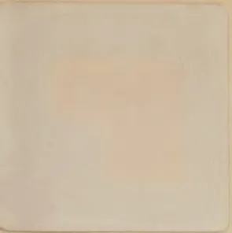A small, light-colored rectangular label or sticker is positioned in the top left corner of the page. The label has a slightly textured appearance and contains some faint, illegible markings or a very faded image. The rest of the page is a plain, light beige or cream-colored surface with a subtle texture.

97------------------------------------------------

